# SHIP: SRAM-BASED HUGE INFERENCE PIPELINES FOR FAST LLM SERVING

Andrew Bitar 1 Aravind Vellora Vayalapra 1 Baorui Zhou 1 Matt Boyd 1 Charlie Wang 1 Sahil Parmar 1 Eugene Sha 1 Gautam Rayaprolu 1 Peter Hicks 1 Alex Bowe 1 Roberto DiCecco 1 Santosh Raghavan 1   
Evan Patrick 1 Josip Smolcic 1 David Han 1 Kris Kang 1 Andy Rock 1 Josh Hay 1 Mohamed Eldafrawy 1 Mikhail Kandel 1 Daulet Zhanguzin 1 Omar Kilani 1 Liming Gong 1 Andrew Paprotskyi 1 Arash Taheri-Dezfouli 1 Josh Fender 1 Andrew Ling 1

## ABSTRACT

The proliferation of large language models (LLMs) demands inference systems with both low latency and high efficiency at scale. GPU-based serving relies on HBM for model weights and KV caches, creating a memory bandwidth bottleneck during decode. To break through this bottleneck, we present the first large-scale, SRAMbased LLM inference deployment—Groq’s public cloud—serving hundreds of billions of tokens daily. This paper reviews Groq’s first-generation SRAM-based Huge Inference Pipelines (SHIP), highlighting: (1) a synchronous, low-diameter interconnect enabling low-latency scaling across thousands of chips; (2) optimizations for LLM serving under limited memory capacity; and (3) a large pipeline design that sustains efficiency and latency under varying prefill-to-decode ratios and context lengths. Together, these yield state-of-the-art latency while maintaining efficiency across diverse traffic scenarios—key to real-world LLM serving.

## 1 INTRODUCTION

The rapid adoption of Large Language Models (LLMs) has placed unprecedented demands on compute infrastructure, both in terms of latency and throughput. Today, NVIDIA GPUs are the primary platform for LLM serving, supported by a mature software ecosystem and access to the latest generations of high-bandwidth memory (HBM). Competing accelerators—AMD’s Instinct GPU (Smith & Alla, 2025), Google’s TPU (Jouppi & Lakshmanamurthy, 2025), Meta’s MTIA (Coburn et al., 2025) and Amazon’s Trainium (Fu et al., 2024) and Inferentia (Amazon Web Services, 2025)— likewise rely on off-chip DRAM to store model weights and key-value (KV) cache during inference. This reliance on external memory is unsurprising: LLMs are indeed very “large”—growing to trillions of parameters—making dense off-chip memory a natural choice.

Yet the challenge of efficient serving extends beyond memory density. LLM inference workloads divide into two distinct regimes: prefill and decode. Prefill—the processing of a user’s prompt—is compute-bound and in principle hardware-efficient. However, minimizing time-to-firsttoken (TTFT) can conflict with other serving objectives, including decode latency (time-per-output-token, TPOT) and system throughput. The compute-bound nature of prefill offers opportunities to reduce TTFT if the system can effectively scale the amount of compute allocated to a request across many chips—important for long context prompts.

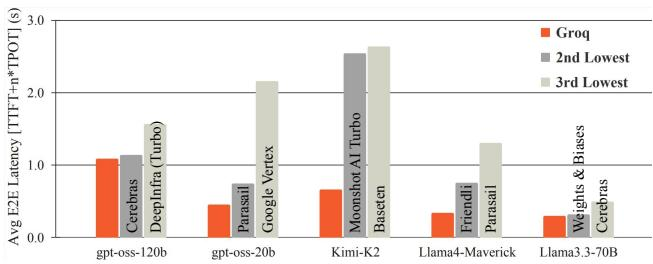  
Figure 1. Average end-to-end request latency over a one-month period (Sep 26–Oct 26, 2025) on Groq versus the next two fastest providers for each model. Data from (OpenRouter, 2025).

Decode—the generation of one token per forward pass—is dominated by memory traffic: autoregressive generation’s low operational intensity stresses weight and KV cache access. Batching can boost utilization on memory-bound systems at the cost of TPOT. Effective batching, however, is challenged by dynamic traffic, with context lengths and prefill-to-decode token ratios in constant flux. Mixture-of-Experts (MoE) architectures further stress memory bandwidth: because expert selection is data-dependent, batched tokens no longer map cleanly across all compute resources, reducing the efficiency benefit of batching.

This tension is acute in practice. The latest LLM “killer apps,” such as coding assistants and multi-step task agents, demand both fast prefill and fast decode. Reasoning models push 10! longer generations (Artificial Analysis, 2025), further magnifying the importance of decode speed and cost. The lag while a model “thinks” risks alienating users— Google measured drops in searches per user for page load time slowdowns as short as 100 ms (Brutlag, 2009).

On-chip SRAM has long been the fastest memory technology, offering significantly higher bandwidth than HBM— albeit at much lower density. Making SRAM-based inference viable requires a rethinking of both architecture and software. Throughput is achieved not by increasing batch, but by minimizing latency. That is precisely the design point of Groq’s Language Processing Unit (LPU).

At the time of publication, the next-gen LPU—fabricated on Samsung’s 4 nm process—is in full production. In the spirit of prior retrospectives, such as Google’s TPU papers (Jouppi et al., 2017; 2023), this work looks back on LPUv1, built on GlobalFoundries 14 nm. Deploying LPUv1 (hereafter “LPU”) to build SRAM-based Huge Inference Pipelines (SHIP) yields state-of-the-art end-to-end LLM serving latencies (Fig. 1). The success of SRAM serving rests on three key pillars:

1. Low-Batch: High memory-to-compute bandwidth enables efficient inference at small batch sizes, making latency optimization critical.

2. Scale: Model partitioning across thousands of LPUs to overcome limited on-chip memory capacity.

3. Memory Capacity Efficiency: Software techniques that maximize utilization of the available capacity.

The LPU chip and system architecture scale to very large systems via a synchronous, low-latency chip-to-chip protocol and a low-diameter topology. Thousands of LPUs operate in lock-step to serve each token. Groq’s software ecosystem—compiler and runtime—are co-designed for systems where memory bandwidth is plentiful but capacity is precious. Groq’s public LLM cloud was the first production deployment of SRAM-based LLM inference, providing a superior user experience by minimizing both TTFT and TPOT (Fig. 1). These SHIP systems have grown rapidly in demand, serving hundreds of billions of tokens per day globally.

While extensive prior art exists for serving LLMs on DRAMbased architectures, little has been published on the challenges and solutions for SRAM-based LLM serving. This work provides a comprehensive look at techniques and innovations deployed in Groq’s production systems, including: (1) a synchronous, low-latency interconnect for smalltensor collectives with fault-tolerant scaling (§4); (2) memory management techniques on systems of thousands of LPUs, including paged attention, prefix caching and speculative decoding (§5); (3) design and scheduling of large pipeline-parallel inference to maintain throughput and meet service-level objectives (SLOs) under dynamic traffic (§6); and (4) a discussion on power, cost and synchronization differences compared to GPU systems (§7).

## 2 BACKGROUND

## 2.1 LPU Architecture

At its core, the LPU is a tensor streaming processor architecture (Abts et al., 2020; 2022). Tensors—physically represented as collections of vectors—stream across functional units (FUs) laid out horizontally across the chip. Each FU type provides a distinct set of instructions while adhering to a shared structural template: a SIMD unit operating on 320-element vectors, controlled by its own instruction dispatch unit (Bitar, 2022). FU types include the MXM for high-throughput matrix multiplications (MatMul), VXM units for non-MatMul operations, and MEM units for highbandwidth SRAM. Each FU is issued one instruction per cycle, enabling pipelined, stall-free, deterministic execution.

The LPU compiler statically schedules all instruction dispatch across all FUs. It is empowered to do so by the deterministic and predictable nature of the architecture— specifically: (i) all instruction latencies are statically known, (ii) on-chip SRAM accesses are deterministic and require no temperature-dependent refresh cycles, and (iii) the interconnect consists of directional, arbitration-free buses that move data eastward and westward. These properties give the compiler a complete, cycle-accurate view of data movement throughout the program, offering optimization opportunities for both latency and power. In order to communicate with non-deterministic external components, such as accessing host memory via PCIe, the LPU’s ISA provides a lightweight synchronization instruction to re-align functional units to a common time domain.

Determinism in the LPU extends beyond a single chip to encompass multi-chip systems, scaling from a single device to thousands cooperating on the same workload. Natural clock drift across LPUs is deterministically accounted for by the LPU’s chip-to-chip (C2C) protocol using a combination of shallow FIFOs and statically scheduled “deskew” instructions, yielding a synchronous chip-to-chip communication model visible to the compiler (Abts et al., 2022). No dedicated router chips are used for inter-LPU communication— the LPUs themselves act as both processor and router, allowing the compiler to schedule both compute and network traffic. This enables the compiler to globally optimize network routing, achieving efficient collective communication pipelined behind compute (§4.2).

Eight LPUs are packaged within a node, along with a dualsocket host system connecting to each LPU via PCIe. The host system provides 1 TB of DDR4 DRAM per node. Further system hardware details are described in §7.1.1.

## 2.2 LLM Serving

The Transformer architecture (Vaswani et al., 2017) underlies nearly all production LLMs. During inference, these models operate in two distinct modes: prefill and decode.

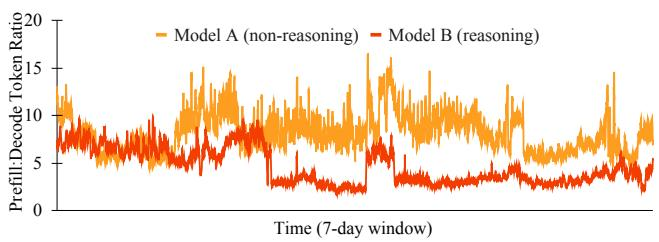  
Figure 2. 7-day sample from Groq Cloud of 10-minute moving average of ratio of prefill-to-decode tokens served.

Prefill processes the user’s prompt—an array of input tokens—to generate the first response token and produce the cached key–value (KV) entries used during decode. Because all prompt tokens can be processed in parallel, prefill is primarily compute-bound. A user’s input token throughput (it/s/u) scales with compute allocated to the prompt. An architecture’s ability to dynamically allocate more compute to long prompts is key to minimizing TTFT—a key SLO.

Decode, in contrast, is memory-bound. Each output token depends on previously generated tokens, making decode inherently sequential and sensitive to memory bandwidth. Per-user output token throughput (ot/s/u)—the inverse of time-per-output-token (TPOT)—is limited by how quickly weights and KV cache can be fetched. Batching multiple users can improve FLOP utilization, but increases TPOT due to the scaling latencies of self-attention, collective communication, and normalization.

Managing compute allocation across the dynamic mix of prefill and decode is a challenge in LLM serving. Modern serving libraries like SGLang (Zheng et al., 2024), vLLM (Kwon et al., 2023) and TensorRT-LLM (NVIDIA, 2026) use techniques such as continuous batching (Yu et al., 2022) and chunked prefill (Agrawal et al., 2023). While an improvement over request-level scheduling, these approaches still suffer from sub-optimal utilization with fluctuating context lengths and prefill-to-decode token ratios (Agrawal et al., 2023). Moreover, selecting a prefill chunk size forces serving platforms to tradeoff TTFT, TPOT and throughput, making it challenging to meet SLOs across diverse traffic shapes. Prefill-decode disaggregation (Zhong et al., 2024) addresses some of these conflicting SLOs but introduces other challenges that we discuss in §7.3.

Reasoning models (Snell et al., 2025) introduce a new twist to LLM serving SLOs: TTFT depends on both it/s/u and ot/s/u, as a user must wait for a model to finish “thinking” before receiving the response. This amplifies the importance of decode latency, and hence memory bandwidth of the serving hardware. Further stressing inference providers are the longer contexts used by reasoning models, which generate 2–10→ more tokens for the same prompt compared to non-reasoning models (Artificial Analysis, 2025).

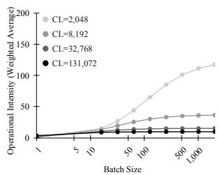  
(a) Qwen3-32B

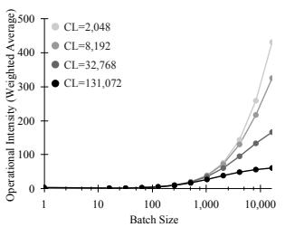  
(b) gpt-oss-120B  
Figure 3. Average operational intensity per forward pass across batch sizes and context lengths (CL). Assumes uniform distribution of tokens to experts in gpt-oss-120B.

Ultimately, inference providers must adapt to varying model characteristics and dynamic traffic patterns. Prefill:decode (P:D) token ratios (Fig. 2) and context lengths (CL) fluctuate constantly, making system adaptability critical to maintain efficiency.

## 3 MOTIVATION: LLMS IN SRAM

## 3.1 Latency

Whether to address the “thinking” lag in reasoning models or the responsiveness of task agents, a key challenge in LLM serving remains how to overcome the memorybandwidth bottleneck of HBM. Reducing decode latencies can also improve model intelligence by scaling “test-time compute” (Snell et al., 2025) per unit time. While the potential latency benefits of serving LLMs using higherbandwidth SRAM are clear, it is not immediately evident if it can be done with sufficient efficiency to be economical.

## 3.2 Efficiency

The FLOP/s efficiency of a compute platform is fundamentally bounded by its compute-to-memory bandwidth ratio and by the operational (or arithmetic) intensity of the workload being served, as captured by the roofline model (Williams et al., 2009). An analysis of memory technology for LLM inference therefore requires understanding not only the capacity needed to store model weights and KV caches, but also the operational intensity (OI)—measured as the number of compute operations (commonly floating point operations, or FLOPs) per byte loaded from memory.

In Transformer inference, the self-attention matrix multiplications (QK→ and PV) exhibit batch-invariant OI during decoding and increasingly dominate total compute as batch size and context length grow (see Appendix A). Figure 3a highlights how self-attention constrains decode OI in dense models like Qwen3-32B, forming a ceiling on achievable efficiency. MoE models face an additional constraint on OI: tokens within a batch can route to different experts, thus requiring very large batch sizes to see significant improvements to OI. In the case of gpt-oss-120B (Fig. 3b), the sliding-window-attention (SWA) layers help alleviate the impact of self-attention on OI, but this is offset by the reduced impact of batching in the routed expert MatMuls.

HBM-based accelerators can require OIs in the hundreds to approach compute saturation. As seen in Figure 3, this is difficult to achieve due to the scaling behavior of self-attention and sparse MoEs. SRAM-based hardware overcomes this bandwidth limitation by operating at low batch sizes, with the LPU delivering over 10→ greater memory-to-compute bandwidth compared to GPUs. As a result, the limiting factor shifts from bandwidth to capacity.

While compute-to-memory bandwidth ratio is fixed by the chip architecture, total memory capacity increases with scale. Spreading an inference workload across many chips does not improve the roofline performance set by the OI, but can improve efficiency when the performance limiter is storage capacity. Motivated by this insight, Groq has deployed a cloud of SHIPs—huge inference pipelines of hundreds to thousands of LPUs storing weights and KV cache in SRAM. SHIP combines tensor parallel and pipeline parallel techniques to scale compute to such large systems:

Tensor Parallelism. Tensor parallel (TP) partitioning strategies—used here to encompass head parallel, context parallel, expert parallel, and self-attention data parallel— distribute each decoder layer across multiple chips to reduce compute latency and increase available memory capacity for both weights and KV caches. Crucially, TP incurs overhead from collective communication operations. Given the low batch sizes used in SRAM-based inference, there is limited opportunity to mask sequential dependencies, such as collectives, behind independent compute for different batch items. As a result, these exposed latencies are a larger fraction of the total execution (Davies et al., 2025). This increased latency-sensitivity necessitates innovation in both the scaleout topology (§4.1) and the scheduling of collectives (§4.2) in SHIP systems. Moreover, reaching large TP sizes requires partitioning the model across multiple dimensions, which in turn introduces new communication collectives that must be carefully optimized.

Pipeline Parallelism. When the limits of efficient TP scaling are reached, pipeline parallel (PP) partitioning enables further expansion. PP provides access to additional memory for weights with less communication overhead than TP, but offers limited improvement in KV cache storage: each added pipeline stage requires additional KV cache allocation for another in-flight micro-batch to prevent pipeline bubbles during decode (partially mitigated by speculative decoding; see §5.3). Prefill, on the other hand, does not require multiple KV caches to saturate the pipeline, offering the option to allocate the entire SHIP to a single prefill job.

A critical factor in PP scaling is maintaining pipeline balance. Large variations in pipeline stage latencies—whether from non-deterministic hardware performance, unbalanced workload partitioning, or dynamic request traffic—can introduce pipeline bubbles that degrade throughput. The LPU’s determinism (§2.1) allows the compiler to balance pipeline latencies at compile-time. Heterogeneous LLM architectures—such as combinations of SWA and standard attention, dense and sparse MoE—are balanced by allocating compute resources proportionally to each stage based on its compute and storage needs. Section 4.1 covers the LPU topology design to efficiently support such heterogeneous pipelines. The dynamic nature of requests must still be managed at runtime, with SHIP maintaining pipeline efficiency and avoiding bubbles as described in Section 6.

## 4 VERY LARGE SCALING

## 4.1 Network Topology

Thousands of LPUs are interconnected through Groq’s C2C topology, forming a low-latency, high-bandwidth fabric designed for pipelined, synchronous compute. The network is organized as a linear sequence of LPU nodes, with each node containing eight fully-connected LPUs, forming an intra-node K8 clique for single-hop, high-bandwidth local communication. Each node then connects four links to its four nearest node neighbors forward and backward in the sequence (Fig. 4). This topology, named QuadFour, provides properties that make it highly suitable for SHIP:

Designed for both TP and PP. As detailed in Section 3, scaling to large system sizes necessary for SRAM-based inference requires a combination of both TP and PP. A given model is broken up into a set of partitions, with each partition scaled across multiple adjacent LPU nodes using TP. The groups of nodes forming each partition are then laid out in a pipeline across the network, as shown in Figure 5. Intraand inter-node links within the partition provide high aggregate C2C bandwidth (853 GB/s bisection bandwidth) for the collectives required by TP scaling, while inter-partition links are sufficiently provisioned for pipeline transfers. The topology can also form pipelines of varying partition sizes to balance pipeline stage latencies in heterogeneous model architectures. To prevent pipeline bubbles, the deterministic LPU architecture (§2.1) allows the compiler to balance pipeline stage latencies ahead of time by selecting TP strategies that match each partition’s compute needs.

Low network diameter. The small batch sizes used in SRAM-based LLM inference are highly latency-sensitive, rendering large-diameter topologies, such as a mesh or torus (Jouppi et al., 2023), unsuitable. The QuadFour topology uses 32 external links per node to reach many LPUs within a small hop count, enabling low-diameter TP scaling. A 72-LPU TP partition with 16.56 GB of high-bandwidth

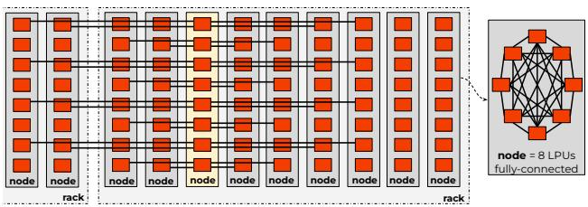

Figure 4. QuadFour Topology. Inter-node links are shown only for highlighted node; all other nodes have identical relative connections: 32 C2C links distributed evenly to four forward and four backward nodes.  
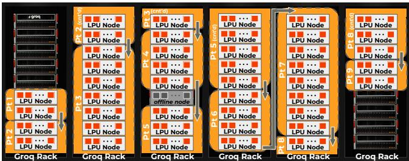  
Figure 5. Mapping heterogeneous partitions to QuadFour on racks in Groq’s data centers. Arrows show direction of pipe transfers. The node experiencing failures is skipped while being serviced.

SRAM memory can be formed with a diameter of three hops, with each hop taking only 300 ns thanks to the LPU’s synchronous C2C protocol (§2.1). For example, such capacity allocated to a single-layer pipelined partition of Qwen3- 235B-A22B could store the weights and KV caches for decode of 1,380 concurrent users, each using 4,096 tokens of context. Scaling to a larger 136-LPU TP partition with 31.28 GB of SRAM yields a diameter of five hops.

Scalable to thousands of LPUs. The sequential symmetry of the topology allows logical partitions to move fluidly across the physical topology, independent of rack boundaries. Laying out a model across thousands of LPUs can be done without needing to be aware of the 72-LPU rack package—a 72-LPU partition can be placed either within a single rack or straddle two racks (Fig. 5).

The deterministic architecture enables synchronous inter-LPU communication across the entire model instance without interaction with any host or router (§2.1). Maintaining network synchronization across such a large system requires a distributed clock recovery scheme to account for clock drift. This is achieved in the QuadFour topology using propagated synchronization, where a wave of synchronization flows through the pipeline, during which: (1) a partition of LPUs synchronizes and performs compute; (2) the next partition joins the synchronous domain, and receives intermediate tensors through the inter-partition C2C links; then (3) the first partition leaves the synchronous domain and begins computing the subsequent inference while the next partition continues the current inference. This mechanism avoids pipeline bubbles and eliminates host overhead within the pipeline.

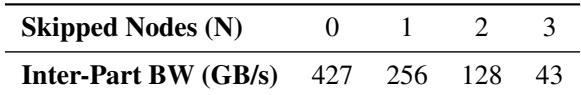  
Table 1. Inter-partition bandwidth for two four-node partitions communicating across N consecutive skipped nodes.

Resilient. While LPU systems do not include HBM (the component with one of the highest rates of failure in GPU systems (Grattafiori et al., 2024)), the sheer size of SHIPs necessitates an effective failure-handling mechanism to handle a failure to any of the components used in the system. QuadFour’s inherent symmetry allows the system to shuffle partitions around failed nodes (Fig. 5). Any given partition has a reach of up to four nodes, allowing it to skip up to three adjacent “down” nodes while they are being serviced for failures. Inter-partition bandwidth scales down with skip-distance, making it important to repair offline nodes and return them to production when ready (Table 1).

Transient node errors are handled by replaying the affected tokens. If the error persists, the node is taken offline and partitions are rotated around it, leveraging the topology’s sequential symmetry. Fast rotation is enabled by caching the weights of multiple partitions in each node’s host-attached DRAM. Once the node is repaired, partitions are rotated back to eliminate node skipping and restore the lost bandwidth. This design is motivated by empirical evidence that node failures are not a purely memoryless process; rather, once a node begins exhibiting errors, its near-term failure risk increases significantly. Thus, rapid node rotation and repair was preferred over prolonged in-band error recovery.

## 4.2 Efficient Collectives

Network communication introduced when scaling must be low-latency to maintain efficiency in latency-sensitive SHIP systems (§3.2), requiring tight co-design of the scale-out hardware and compiler. The low-diameter topology described in §4.1, together with the LPU’s synchronous C2C fabric, achieves efficient communication collectives at small, low-batch tensor sizes. The LPU compiler’s static scheduling of network communication provides three distinct advantages: (1) minimal transfer overhead; (2) tight scheduling of pipelined operations; and (3) communication routes selected to minimize hop count per transfer.

Low-latency transfers. The deterministic instruction schedule of LPUs enables lock-free chip-to-chip transfers, eliminating cycles spent on memory acquire–release operations or cache management. As a result, the LPU’s C2C protocol incurs minimal overhead for small data transfers, achieving sub-µs hop latency: 300 ns per LPU-to-LPU hop, compared to the 1–10 µs typically observed in GPU collectives such as NCCL, NCCLX, and UCCL (Hu et al., 2025; Si et al., 2025; Zhou et al., 2025). Figure 6a shows collective performance on an 8- and 64-LPU system generated with the

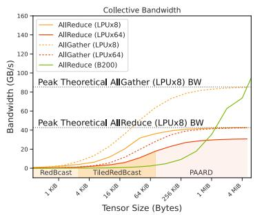  
(a) Collectives Bandwidth

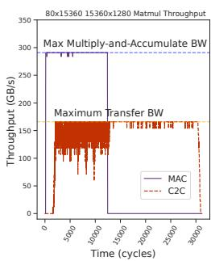  
(b) MatMul+AllReduce  
Figure 6. Performance of collective operations on LPU systems, as generated by the compiler. For an AllReduce collective, LPU systems achieve 50% bandwidth saturation at a tensor size of 32KiB, and 90% saturation at a tensor size of 80KiB.

LPU compiler, compared with an 8xB200 system using NCCL collectives. While the LPU’s I/O bandwidth is considerably lower (LPUv1 C2C: 235 GB/s; B200 NVLink: 1,800 GB/s), the reduced latency overhead in the LPU’s networking architecture allows it to achieve greater collectives performance at small tensor sizes. Given that collective tensor sizes during LLM inference on SHIPs typically range from 32-256 KiB, the LPU architecture and software are well-suited for SRAM-based inference.

The specific collective algorithm chosen varies based on tensor size, as the compiler shifts between algorithms that minimize hop-count or maximize bandwidth utilization. For AllReduce operations, RedBcast, TiledRedBcast or PAARD (Ma et al., 2021) are chosen. Figure 6a shows the algorithms selected for a 64-chip AllReduce across tensor sizes. Full descriptions of each algorithm are in Appendix B.

Compute-aware pipelining. Overlapping compute with tensor transfers recoups some efficiency otherwise lost to collective latency. On GPUs, various methods attempt this, including device initiation of communication using NVSH-MEM, kernel fusion and careful partitioning of communication and compute (NVIDIA, 2025; Chang et al., 2024; Wang et al., 2022), offering substantive improvements. However, such approaches can have varied success: dynamic kernel execution and transfer times lead to imperfect overlap of compute and collective (Chang et al., 2024). Some of this latency overhead is amortized at high batch sizes seen in GPUs, but can be catastrophic in low-batch SHIPs.

Pipelined overlap of small-tensor operations requires tight scheduling, leaving no room for kernel-launch overhead, host intervention, or non-deterministic operation execution. In a statically scheduled environment, the compiler can opportunistically pipeline on a cycle-by-cycle basis to maximize overlap. The LPU compiler interleaves data transfer with compute; as the first chunks of tensor data are computed, transfer instructions are issued at the earliest possible cycle. Figure 6b shows the execution profile of a MatMul split on its inner dimension across 8 chips, followed by an AllReduce collective. Transfer operations for the AllReduce (“C2C”) are overlapped with nearly the entire duration of the compute (“MAC”). However, due to the inherent bandwidth mismatch between compute FLOPs and C2C, there still remain exposed C2C cycles. The compiler can mitigate this by overlapping with other operations in the program. Still, this bandwidth mismatch is a key challenge to scaling regardless of batch size, and is a key focus of improvement for next-generation LPUs.

## 5 MEMORY CAPACITY MANAGEMENT

While the massive scale of SHIP provides access to significant amounts of fast SRAM memory, capacity still remains constrained relative to a DRAM-based solution. Here we discuss the essential software strategies needed to manage these capacity-constrained systems in production.

## 5.1 Paged Attention

We implement an in-house PagedAttention (Kwon et al., 2023) mechanism where the KV cache of the entire context length is dynamically allocated to optimize SRAM utilization. A model’s context is generally underutilized for most prompts, as observed from production samples from Groq Cloud: 92% and 97% of requests from a reasoning and non-reasoning model, respectively, use fewer than 8Ki total tokens (Appendix D.1). To leverage this fact, pages of SRAM are allocated on an as-needed basis as the prompt size increases and additional tokens are generated.

Page allocation is managed by the runtime system per request. With every pipeline stage in SHIP having symmetric memory allocation, the only interaction to control the allocation is from the host CPU attached to the front of the pipeline, which sends in a mask encoding—a vector of integers compactly representing the “active” KV cache pages for the current set of requests (Appendix C). The mask encoding is then forwarded from each stage to the next. The size of the mask encoding scales with the number of pages, increasing the transfer cost for finer-grained pages. Larger page sizes reduce mask encoding size but increase memory fragmentation. Common page sizes used are 128–512 tokens.

## 5.2 Prefix Caching on Large Systems

While scaling systems large enough to fit weights and KV caches entirely in SRAM unlocks low-latency inference, access to significantly more memory capacity provides a key advantage: prefix caching. Prefix caching is an inference optimization that stores prefixes of KV cache states from previously completed inferences to avoid redundant computation. Implemented in most modern LLM serving systems, including SGLang (Zheng et al., 2024), vLLM (Kwon et al., 2023) and TensorRT-LLM (NVIDIA, 2026), prefix caching can substantially improve efficiency and reduce TTFT. These gains are especially pronounced in multi-turn tool-use agents and coding assistants, where cache hit rates exceeding 90% have been reported. The performance benefits of prefix caching, however, are closely tied to the available memory capacity and bandwidth for storing and retrieving cached prefixes.

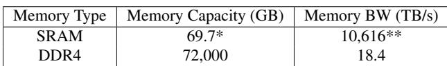  
Table 2. Prefix cache memory options in a typical LPU SHIP instance of gpt-oss-120B. \*: memory capacity for weights removed from total. \*\*: memory bandwidth shared with weights.

SHIP’s distributed LLM serving architecture provides ample capacity and bandwidth, making it particularly well-suited to exploit prefix caching at scale. A single model instance is partitioned across multiple LPU nodes (§4), each of which provides 1 TB of DDR4 DRAM that is accessible to all eight LPUs via the host system over PCIe (§7.1.1). SHIP’s scaleout design thus enables access to a large pool of distributed memory, providing both high aggregate bandwidth and total capacity. Two levels of distributed memory are leveraged for prefix caching: on-chip SRAM and host-attached DRAM.

In a typical deployment of gpt-oss-120B (Agarwal et al., 2025) in Groq’s cloud, the model is partitioned across 72 LPU nodes, yielding substantial SRAM and DRAM capacity for KV caches (Table 2). The abundant DRAM capacity, in particular, allows the system to achieve cache time-tolive (TTL) durations on the order of hours. Figure 7 shows SRAM and DRAM cache hit rates for two model instances in Groq’s cloud. The observed 50–75% DRAM cache hit rate highlights the benefit of large-scale distributed memory capacity for prefix reuse within a single instance.

The runtime employs a space-efficient BlockTrie to track the prefix tree of the token space using rolling hashes of fixed size token chunks. The block size in the BlockTrie matches the page size used by our “PagedAttention” mechanism, naturally compressing the representation compared to a traditional trie. Prefix matches in SRAM are instantly prefillcomplete—if the matched prefix spans the full prompt, decode begins with a near-zero TTFT. For matches in DRAM, the runtime schedules corresponding pages to be loaded into on-chip SRAM before completing prefill on any unmatched prompt tokens and then commencing decode. Pages in SRAM and DRAM are retained until capacity is reached, then evicted using a LRU scheme.

To guarantee user privacy, Groq’s cloud enforces strict isolation of prefix caches between organizations, preventing cross-organization cache hits. Despite this restriction, we still observe high cache hit rates in the public cloud environment, as illustrated in Figure 7. A HBM-based, non-SHIP system could leverage data parallelism to scale to larger DRAM capacities and therefore higher TTLs. However, such an approach requires careful coordination of prefix placement and routing to maintain load balance (Cao et al., 2025), since the caches are distributed across many smaller instances rather than a few large SHIP instances.

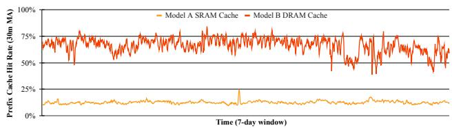  
Figure 7. 7-day window of SRAM and DRAM prefix cache hit rate on two different model instances in Groq’s public cloud.

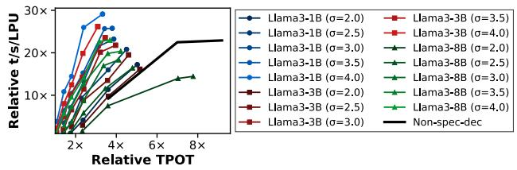  
Figure 8. Using SD with various draft models on SHIP vs. not using SD. Target model: Llama3.3-70B. ω: number of accepted tokens. Speculation length = 6, CL = 4096, P:D = 4.

## 5.3 Speculative Decoding for Reduced KV Cache Size

Speculative decoding (SD) (Leviathan et al., 2023; Xia et al., 2023; Chen et al., 2023) has been adopted in LLM serving platforms to reduce TPOT—a key SLO (§2.2). In SD, a smaller draft model predicts multiple candidate tokens that are then verified by a larger target model, enabling parallel output token generation and thus lower decode latency. Prior work (Liu et al., 2024b; Su et al., 2023) has shown that for GPU-based systems with high batch and short contexts, SD can hurt efficiency due to its additional overhead and the already high operational intensity of non-SD. Longcontext scenarios, however, do see efficiency gains in some cases (Sadhukhan et al., 2025), as the memory-bound selfattention mechanism dominates runtime (§3.2).

Memory capacity-constrained systems stand to gain further from SD. By generating multiple tokens per KV cache stored, the total memory for KV caches to sustain a given FLOP/s efficiency is reduced. In a SHIP system, the draft is inserted as an additional pipeline stage, which must be adequately provisioned to avoid becoming a pipeline bottleneck. SD thus introduces overhead from the extra draft LPUs, the additional latency of the draft itself, and from mispredicted tokens that must be verified and discarded.

A sufficiently high token acceptance rate is therefore essential for SD to provide a net efficiency gain. The threshold at which SD outperforms a non-SD setup for a given acceptance rate depends on the draft model’s size and architecture. As shown in Figure 8, for Llama3.3-70B on SHIP, using Llama3.1-1B or Llama3.1-3B as drafts can yield substantial speedups, whereas a Llama3.3-8B draft struggles to match non-SD efficiency even with high acceptance lengths (ω). Careful tuning of the draft-target pairing is thus required for optimal efficiency. Techniques like knowledge distillation (Zhou et al., 2024) and EAGLE (Li et al., 2025) show promise for constructing well-aligned drafts.

## 6 DYNAMIC AND BALANCED PIPELINE

Two main factors determine the processing complexity of a given token: (1) whether it is a prefill or decode token, and (2) its context position. Unlike decode tokens, prefill tokens from a common prompt can share KV cache memory access, reducing their compute time during self-attention. Variations in prompt sizes can introduce compute imbalance that is typically mitigated through chunked prefill (Agrawal et al., 2023), which partitions prompts into fixed-size chunks. This strategy is then paired with decode piggybacking, wherein remaining compute capacity is utilized for decode tokens. Although this improves over simpler allocation methods, it still faces inefficiencies. The chunk size that best balances system throughput, TPOT, and TTFT depends on context length and the prefill-to-decode token ratio, both of which vary continuously with traffic conditions (§2.2).

Moreover, token complexity increases with context position, as each token attends to all preceding tokens. Concurrently processing decode tokens at markedly varied context positions can thus underutilize compute resources. Continuous batching (Yu et al., 2022) mitigates this by iteratively reconstructing a batch to prevent short-context tokens from being blocked by long-context tokens. However, this does not avoid pipeline stalls in PP systems when a short-context token trails a slower long-context token. In highly pipelineparallel SHIPs, these token-level imbalances create pipeline bubbles that reduce efficiency. We thus employ the following techniques to maximize pipeline efficiency while minimizing latencies:

Dynamic Chunked Prefill. SHIP employs dynamic chunked prefill, supporting high compute efficiency at chunk sizes as small as one token, while dynamically scaling up to larger chunks for improved TTFT. Due to the LPU’s fast SRAM, prefill chunks of 1–2 tokens are sufficient to saturate self-attention compute, as the OI in self-attention can approach or exceed the LPU’s compute-to-memory bandwidth ratio.1 Such fine-grained chunking enables the runtime scheduler to flexibly allocate compute between prefill and decode tokens. When needed, the scheduler can form larger prefill chunks to reduce TTFT (Fig. 9). The pipeline accepts “task IDs” from the runtime—tokens of the same task are fused into a larger prefill chunk, with attention masks generated on-the-fly to ensure correct causality.

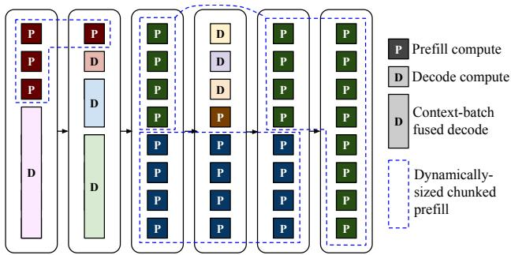  
Figure 9. Six pipeline stages in a SHIP. Boxes filled with the same color belong to the same request.

Dynamic chunked prefill thus allows chunk sizes to adapt at every pipeline step based on the observed prefill-todecode ratio and prompt size distribution. The scheduler has the flexibility to span prefill chunks across multiple nonadjacent pipeline stages, with the maximum possible chunk size able to consume the full pipeline’s compute capacity.

Fused Context-Batch. To eliminate pipeline bubbles caused by variations in token context position, SHIP enforces uniform pipeline stage latencies using a fused contextbatch technique. This follows from two observations. First, as context and batch grow, self-attention increasingly dominates compute time. Since self-attention efficiency is batchinvariant during decode, the benefits of batching at long context are reduced. Second, large context requests can run out of memory capacity to fit KV caches for increased batch sizes, especially in SHIP systems where capacity is limited and KV caches can instead be used for more pipeline parallel decode tokens.

Given these observations, fused context-batch proceeds:

1. Given a TP PP system, select a batch size (B) for the model’s maximum context length (C). This selection is governed by the available memory capacity2 and the target TPOT.

2. Fuse B and C dimensions and partition into N chunks, where N is the maximum batch for any context length.

3. The pipeline receives an N N mask from the runtime scheduler that specifies which context-batch chunks to fuse into a unified context.

This mechanism maintains uniform pipeline latencies— guaranteed by the determinism of the hardware—while dynamically adjusting batch and context length in tandem based on the context positions of every token processed (Fig. 9). From another perspective, fused context-batch removes long-context-induced pipeline bubbles by filling idle time for short-context tokens with additional batching.

Capacity-Filling Prefill. By default, the runtime scheduler prioritizes decode over prefill. This design choice stems from the KV-cache capacity constraint on decode: unused compute slots due to insufficient memory can be filled with prefill tokens that can share KV-cache, thereby improving utilization. A prefill-prioritized policy would not only risk starving compute under decode-heavy traffic, it also leads to unstable TPOT, as seen in §6.1. While decode prioritization comes at some TTFT cost, SHIP’s immense scale enables large prefill chunks to still be formed.

Expert Imbalance. MoE models introduce inherent imbalance in pipeline-parallel inference, as different token batches may activate varying numbers of distinct experts at each decoder layer. Such imbalance also arises in expert parallelism (EP) (Shazeer et al., 2017), with dynamic reallocation of compute-to-experts necessary for maintaining efficient execution (Liu et al., 2024a). At very large batch sizes, this effect is dampened if a roughly uniform distribution of expert usage is observed. At smaller batch sizes, however, executing each token’s experts independently can better maintain pipeline balance in a SHIP system. This comes at the cost of low expert weight reuse, with the expert MatMuls operating with an OI of 1. The high bandwidth provided by SRAM substantially improves utilization under this scheme compared to HBM-based architectures. With the first-generation LPU, we observe that the improved pipeline balance from per-token expert execution outweighs the loss in expert compute efficiency. In future generations, however, larger batch sizes enabled by higher capacity require a different strategy for managing pipeline imbalance.

## 6.1 Results

To demonstrate the advantages of SHIP’s dynamic and balanced pipeline, we evaluate performance characteristics of a real system for different prefill-to-decode token ratios (P:D) and context lengths (CL). To capture the system behavior across a range of request profiles, we measure system throughput (t/s) and per-user input and output throughput (it/s/u, ot/s/u) under different P:D and CL. We complement these controlled experiments with two production traffic samples from Groq Cloud: one from a reasoning model and another from a non-reasoning model. As expected, the reasoning model exhibits a higher average and wider distribution of context lengths (0.07K–100K), coupled with a lower average P:D ratio. Full methodology and sampled distribution details are in Appendix D.

For comparison, we evaluate “SGB200”: a non-SHIP B200 DGX system controlled by SGLang—a leading open-source LLM serving library (Zheng et al., 2024). Qwen3-235B-A22B (Yang et al., 2025) is selected as a representative model, as it is a large, frontier MoE with mature support in both the LPU and SGLang’s software ecosystem. The SHIP system is configured to be large (TP=16, PP=95, max concurrency=380) to highlight its ability to maintain SLOs across a large distributed deployment. SGB200 is configured with TP=8 and, with mixed chunking enabled, is evaluated under two mixed-batch token budget (MBTB) settings that cap the total number of tokens admitted to each GPU iteration. MBTB=16Ki, the default SGLang setting for B200s, is used as the high-throughput configuration, while MBTB=2Ki is used as the lower-latency configuration. For completeness, we show additional results in Appendix D.2 for limiting client-side offered concurrency, as well as results using vLLM (Kwon et al., 2023).

System Throughput. Figures 10a and 10d capture system throughput trends as P:D and CL vary. At MBTB=16Ki, SGB200 is able to achieve very high efficiency at high P:D. At lower P:D ratios, throughput declines because fewer prefill chunks are available relative to decode demand, reducing decode piggybacking opportunities (Agrawal et al., 2023) and leaving execution increasingly dominated by memorybound decode attention. Throughput also decreases as CL grows, since longer contexts increase KV-cache size, placing greater pressure on memory bandwidth. At sufficiently large context lengths, HBM capacity further constrains the maximum achievable batch size. As in SHIP, increasing TP can mitigate this capacity bottleneck when scaling remains efficient. NVIDIA’s NVL72 architecture extends NVLink across larger TP domains (Tirumala & Wong, 2024), increasing effective HBM capacity for large-CL workloads.

In contrast, SHIP maintains system throughput at moderateto-high P:D (>8), with low P:D values also achieving good throughput at smaller CL (<4Ki). Dynamic chunked prefill—with efficient chunk-size=1 enabled by SRAM— continuously adjusts prefill and decode balance based on observed P:D, sustaining stable utilization. Memory capacity constraints in SHIP reduce system throughput with growing CL, but capacity-filling prefill mitigates this at higher P:D. Future generations of LPUs will significantly improve the low P:D, high CL regions by expanding on-chip SRAM capacity and increasing TP sizes with greater C2C bandwidth and radix. Performance evaluations of next-gen LPUs are left for future retrospectives.

Under production traffic evaluations, both systems experience lower throughput due to the presence of large-CL requests. Because a request’s total compute and memory capacity demand grows quadratically with CL, even a few long-context requests disproportionately reduce throughput. This effect is particularly visible in capacity-bound systems. Nevertheless, SHIP exhibits a smaller system throughput drop relative to its peak compared to SGB200, while achieving higher absolute throughput in production traffic samples.

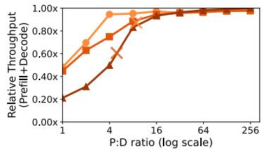  
(a) LPU SHIP system throughput

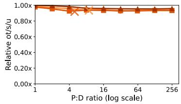  
(b) LPU SHIP decode ot/s/u

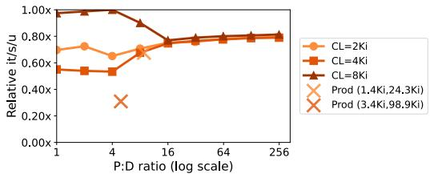  
(c) LPU SHIP prefill it/s/u

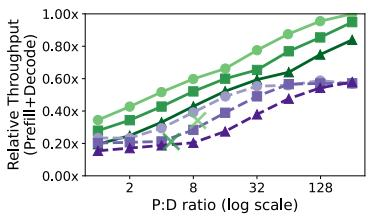  
(d) B200 DGX system throughput

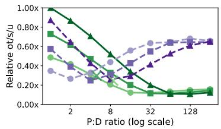  
(e) B200 DGX decode ot/s/u

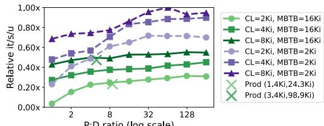  
(f) B200 DGX prefill it/s/u  
Figure 10. Measured throughput and latency of serving Qwen3-235B-A22B at varying prefill:decode token ratios (P:D) and context lengths (CL). B200 results measured using SGLang v0.5.8 at different mixed-batch token budgets (MBTB). Relative results normalized to the peak measured on each respective system. → points mark performance on sampled request size distributions (avg ctx, max ctx) from Groq Cloud’s production traffic. Non-reasoning model sample is (1.4Ki, 24.3Ki) and reasoning model sample is (3.4Ki, 98.9Ki).

TPOT. The stability of TPOT (inverse of ot/s/u) contrasts sharply between SHIP and SGB200 (Fig. 10b, 10e). SGLang’s scheduler prioritizes prefill tokens to maximize overall GPU efficiency—reflecting the performance gap between prefill and decode phases—and to maintain a stable TTFT. This comes at the cost of decode latency. Optimal MBTB size for TPOT is further complicated by differing trends across low and high P:D. At low P:D, a higher fraction of GPU iterations contain only decode tokens, which use decode-only kernels that run faster than mixed-batch kernels.3 In this regime, a larger MBTB drains prefill work more quickly and thus yields more decode-only forwardpass iterations, lowering TPOT. At high P:D, most decode tokens are served in mixed batches, so reducing MBTB results in lower TPOT by shortening mixed-batch iterations. Disaggregating prefill and decode can help mitigate these tradeoffs by eliminating prefill-decode interference (§7.3).

In contrast, SHIP’s decode-prioritized scheduling with capacity-filling prefill sustains consistently high ot/s/u without sacrificing system throughput. Decode latency is further maintained across varying CL with fused context-batch. As shown in production experiments, SHIP maintains stable ot/s/u under real dynamic traffic scenarios, while achieving significantly higher absolute ot/s/u compared to SGB200. This stability is essential for meeting stringent TPOT SLOs and reducing TTFT for reasoning models (§2.2).

TTFT. SGB200 achieves greater it/s/u stability compared to ot/s/u (Fig. 10f) thanks to its prefill-prioritized scheduling. Reducing MBTB from 16Ki to 2Ki significantly improves it/s/u in these experiments because the request prefill lengths (< 8Ki) do not require a 16Ki budget; instead, MBTB=16Ki mainly batches additional prefills from other requests, increasing iteration latency. This demonstrates that even under SGLang’s prefill-prioritized scheduling, a clear prefill-latency versus throughput tradeoff remains.

Despite prioritizing decode tasks, SHIP maintains stable it/s/u under fixed traffic (Fig. 10c). High P:D traffic sees consistently strong it/s/u, while the highest it/s/u occurs at low P:D and high context (8Ki). This reflects SHIP’s scheduler leveraging capacity-filling prefill: when large-CL decode tasks leave pipeline “holes” due to KV-cache limits, the scheduler opportunistically forms larger prefill chunks.

In production traffic, non-reasoning samples maintain stable it/s/u, whereas reasoning model samples show a pronounced drop in SHIP. We again see the quadratic cost of CL: while long-context requests leave “holes” for prefill, they also rapidly consume compute capacity, limiting SHIP’s ability to form larger prefill chunks. Future systems should consider adaptive scheduling heuristics to better balance decode and prefill under such mixed workloads. Despite its drop in it/s/u, SHIP still achieves lower mean TTFT than SGB200 across all experiments, including the reasoning sample.

## 7 DISCUSSION

## 7.1 Power and Cost

In §6, we demonstrated how SHIP can maintain TTFT and TPOT SLOs when faced with a wide range of traffic profiles. This robustness comes from leaning into SRAM’s high bandwidth, which makes low-batch decode efficient and reduces the tradeoffs that typically come from co-processing prefill and decode.

SHIP’s absolute peak efficiency, however, is ultimately bounded by memory capacity and scalability. In SRAMbased inference, the limiting factor shifts from bandwidth to capacity needed to store weights and KV cache, which typically requires partitioning across hundreds to thousands of chips. When chip-to-chip bandwidth, radix, or hop latency are insufficient, communication operations introduced from scaling become exposed on the critical path, reducing achievable utilization (Fig. 6b).

LPUv1 (GlobalFoundries 14 nm) integrates 230 MB of SRAM and provides 235 GB/s of aggregate chip-to-chip I/O bandwidth across 11 logical ports. This bandwidth and radix provisioning constrained the peak efficiency of SHIP deployments built from LPUv1, as it resulted in exposed communication costs that hurt FLOPs utilization. Next-gen LPUs scale these key architecture properties significantly.

While peak FLOP/s efficiency of SHIP systems does not match NVIDIA GPU systems, other factors help reduce the gap in performance per watt and per total cost of ownership.

## 7.1.1 System BOM and Power Overheads

As described in §2.1 and §4, the system hardware architecture must facilitate the direct, point-to-point interconnection of a large number of LPUs. A single LPU node comprises eight dual-width, full-height, three-quarter-length PCIe Gen4 x16 accelerator cards housed within a standard 4U server chassis. Each accelerator card integrates the packaged LPU chip, 12V-to-1V voltage regulator modules, four QSFP cages for inter-node and inter-rack optical links, and seven intra-node passive copper connectors. Within a node, the eight LPU cards are interconnected in an all-to-all topology via passive twin-axial copper cables. Each LPU rack contains nine such nodes. Inter-node LPU connectivity employs commercial off-the-shelf quad-25G NRZ CDR QSFP modules to realize the QuadFour topology (Fig. 4).

The chassis features a standard motherboard equipped with a dual-socket AMD CPU host and peripherals: 1 TB DDR4 DRAM, a 100GbE network interface card (NIC), 1 TB SSD for persistent storage, and a Baseboard Management Controller (BMC) for telemetry and administration. Unlike conventional host-driven GPU systems, where the CPU typically orchestrates kernel launches, SHIP systems use a host only for the initial pipeline invocation and final output collection. Middle decoder partitions are invoked by the LPUs themselves (§4.1), reducing host power overhead.

The SRAM-centric design of the LPU eliminates the dependency on expensive, supply-constrained HBM devices and CoWoS interposers, which constitute a major portion of both the bill of materials (BOM) cost and the power consumption in GPU-based architectures. Additionally, the direct point-to-point networking of LPUs circumvents the need for any intermediate switches in the scale-up network. In contrast, GPU systems require a substantial number of scale-up switches within the node or rack (typically one switch per two or four GPUs), adding cost and power overheads at the system level. For the scale-out network, each GPU has a dedicated NIC, yielding a 1:1 GPU-to-NIC ratio.

Overall, the LPU system achieves lower provisioned power per accelerator because it reduces memory, scale-up, and scale-out overheads, amortizing fixed host-system components (CPU, memory, and NICs) across eight LPUs per node. As a result, the provisioned power of the LPUv1 system is 388 W per LPU, compared with 1,788 W per GPU for a B200 DGX. Thus, minimizing system overheads helps mitigate some of the efficiency lost in LPU systems.

## 7.1.2 Power-Aware Scheduling

Further power efficiency is achieved through power-aware scheduling. To enable this, an instruction-level power model was derived from RTL simulations and calibrated against silicon measurements. Given LPU program execution is deterministic, instruction traces can therefore be statically converted to cycle-accurate power profiles using this model. The model further accounts for statically inferrable sparsity and reduces activity estimates for zero-skipped operations.

During scheduling, the compiler can predict the power profile of candidate schedules and select ones that maximize compute and I/O utilization while staying within a target power budget. It can also smooth current transients and reduce voltage droop by reordering independent instructions or inserting short NOP gaps when needed. Together, the improved utilization and tighter guard bands enabled by this static, compile-time approach improve power efficiency.

## 7.2 Benefits and Challenges of Synchronous Execution

A key property of the LPU architecture is its determinism: a compiler-visible, synchronous execution model that spans the entire scale-up network of LPUs (§2.1). In building a high-performance LLM serving system on top of this architecture, we leveraged that property in several ways, while also encountering challenges that required careful handling. One important benefit was the elimination of data synchronization latencies across static dependencies, avoiding latency overheads often seen in asynchronous communication, which are especially costly in low-batch inference. Static scheduling also enabled fine-grained overlap of compute and communication (§4.2), further reducing latency.

Handling dynamic workload structures, however, came with some overheads. Common dynamic structures in LLMs, specifically variable context length and expert execution, were mapped to static shapes with runtime-provided masks (§5.1, §6) and dynamic data-access via the LPU’s memory gather/scatter instructions. Additional non-determinism arose during prefix caching (§5.2), when cached KV pages were transferred to/from host-attached DRAM over PCIe. These transfers had to be carefully managed such that the resulting re-synchronization overhead could be overlapped with independent compute when possible.

Execution determinism also made deterministic floatingpoint accumulation straightforward and, in our implementation, incurred no additional performance penalty. This was particularly useful for debugging accuracy issues when deploying new models. By contrast, GPU reduction libraries often pay a latency penalty to ensure floating-point reproducibility (Al Awar & Singanaboina, 2026).

Deterministic, statically scheduled execution further enabled power-aware scheduling (§7.1.2), improving system power efficiency. In practice, however, accounting for dynamic effects on power—such as chip-to-chip variation and live temperature—required extensive calibration and conservative margining against silicon measurements to cover worst-case behavior. This created some deployment headaches as the power model matured. Different compiletime power-threshold settings needed to be evaluated to identify the configuration that achieved the best power efficiency without violating provisioned power limits.

## 7.3 Disaggregated Serving

Disaggregated serving (Patel et al., 2024; Zhong et al., 2024) is a popular mechanism for addressing the challenges of concurrently processing prefill and decode by separating them onto different systems—allowing each system to be configured optimally while avoiding the TTFT and TPOT latency tradeoffs from aggregated serving. This approach comes with new challenges: (1) transfer of KV cache between prefill and decode systems increases scale-out network demand, and (2) prefill and decode systems must be throughput matched based on P:D ratio—a traffic characteristic that is in constant flux (Fig. 2). NVIDIA’s Dynamo (Mitra et al., 2026) addresses these challenges by orchestrating requests across specialized prefill and decode workers and coordinating KV-cache transfer between them, such that the handoff overhead is reduced. It also uses load signals of the prefill and decode workers to detect saturation and independently scale prefill/decode pools as traffic P:D token ratio shifts.

Disaggregating prefill and decode offers a further opportunity to use specialized hardware for the two systems. Leveraging GPUs for compute-bound prefill and LPUs for memory-bound decode is a natural fit.

Attention-FFN disaggregation has been further leveraged to improve decode efficiency in large MoE models (Zhu et al., 2025; StepFun Team, 2025). By separating attention and FFN execution, the serving system can provision hardware independently for the two dominant components of decode, each of which has distinct compute and memory requirements. This design can enhance SHIP systems, as was recently announced at NVIDIA’s GTC conference (Aubrey & Ghodsian, 2026). In SHIP, a key bottleneck during decode is limited KV-cache capacity, which increasingly constrains throughput as context length grows (Fig. 10a). Disaggregating attention from FFNs allows high-capacity GPUs to store KV-cache while leveraging LPUs for memory-bound MoE-FFNs. The high SRAM bandwidth available to LPUs reduces the batch size required to reach high utilization. As a result, less KV state must be fetched from GPU HBM per unit of useful compute, mitigating the cost of fetching KV cache from HBM instead of SRAM. The net result is a system with both high ot/s/u and high t/s/W. Full evaluation of these systems is left for future retrospectives.

## 8 RELATED WORK

While Groq’s LPU-based SHIP was the first production deployment of LLMs with weights and KV cache stored in SRAM, other work has also proposed leveraging SRAM’s greater memory bandwidth for inference. (Peng et al., 2023) proposed a large system of chiplets performing SRAMbased LLM inference. In terms of production deployments, Cerebras has also employed SRAM-based LLM serving on their WSE-3, which employs a mesh network-on-wafer to connect 900K small cores each containing 48 KiB of SRAM memory, while using RDMA over Ethernet to scale to systems of wafers (Lie, 2024). While some of the principles described in this work are applicable to such a system, the networking approach stands out as a key difference. Prior work has also shown success in SRAM-only inference for other machine learning workloads (Fowers et al., 2018; Abts et al., 2020; Ahmed et al., 2022; Coburn et al., 2025).

## 9 CONCLUSION

By rethinking both architecture and software around the properties of SRAM, we demonstrate that SRAM-based Huge Inference Pipelines (SHIPs) can deliver state-of-theart LLM user experience at scale—simultaneously optimizing for TTFT and TPOT. The LPU’s synchronous, lowlatency interconnect and compiler-driven execution model enable efficient scaling at low batch sizes—a key property of fast-memory systems. Common LLM serving techniques, including paged attention, prefix caching and speculative decoding, yield even greater benefits in SHIP systems when co-designed appropriately. The greater memory-to-compute bandwidth in SHIP further enables large, balanced pipelines that adapt to dynamic workload conditions. Together, these techniques deliver more stable latency and throughput across varying traffic dynamics compared to DRAM-based LLM serving solutions.

## REFERENCES

Abts, D., Ross, J., Sparling, J., Wong-VanHaren, M., Baker, M., Hawkins, T., Bell, A., Thompson, J., Kahsai, T., Kimmell, G., Hwang, J., Leslie-Hurd, R., Bye, M., Creswick, E., Boyd, M., Venigalla, M., Laforge, E., Purdy, J., Kamath, P., Maheshwari, D., Beidler, M., Rosseel, G., Ahmad, O., Gagarin, G., Czekalski, R., Rane, A., Parmar, S., Werner, J., Sproch, J., Macias, A., and Kurtz, B. Think fast: A tensor streaming processor (tsp) for accelerating deep learning workloads. In 2020 ACM/IEEE 47th Annual International Symposium on Computer Architecture (ISCA), pp. 145–158. IEEE, 2020.

Abts, D., Kimmell, G., Ling, A., Kim, J., Boyd, M., Bitar, A., Parmar, S., Ahmed, I., DiCecco, R., Han, D., Thompson, J., Bye, M., Hwang, J., Fowers, J., Lillian, P., Murthy, A., Mehtabuddin, E., Tekur, C., Sohmers, T., Kang, K., Maresh, S., and Ross, J. A software-defined tensor streaming multiprocessor for largescale machine learning. In Proceedings of the 49th Annual International Symposium on Computer Architecture, pp. 567– 580, 2022.

Agarwal, S., Ahmad, L., Ai, J., Altman, S., Applebaum, A., Arbus, E., Arora, R. K., Bai, Y., Baker, B., Bao, H., Barak, B., Bennett, A., Bertao, T., Brett, N., Brevdo, E., Brockman, G., Bubeck, S., Chang, C., Chen, K., Chen, M., Cheung, E., Clark, A., Cook, D., Dukhan, M., Dvorak, C., Fives, K., Fomenko, V., Garipov, T., Georgiev, K., Glaese, M., Gogineni, T., Goucher, A., Gross, L., Gil Guzman, K., Hallman, J., Hehir, J., Heidecke, J., Helyar, A., Hu, H., Huet, R., Huh, J., Jain, S., Johnson, Z., Koch, C., Kofman, I., Kundel, D., Kwon, J., Kyrylov, V., Le, E. Y., Leclerc, G., Park Lennon, J., Lessans, S., Lezcano-Casado, M., Li, Y., Li, Z., Lin, J., Liss, J., Liu, L. X., Liu, J., Lu, K., Lu, C., Martinovic, Z., McCallum, L., McGrath, J., McKinney, S., McLaughlin, A., Mei, S., Mostovoy, S., Mu, T., Myles, G., Neitz, A., Nichol, A., Pachocki, J., Paino, A., Palmie, D., Pantuliano, A., Parascandolo, G., Park, J., Pathak, L., Paz, C., Peran, L., Pimenov, D., Pokrass, M., Proehl, E., Qiu, H., Raila, G., Raso, F., Ren, H., Richardson, K., Robinson, D., Rotsted, B., Salman, H., Sanjeev, S., Schwarzer, M., Sculley, D., Sikchi, H., Simon, K., Singhal, K., Song, Y., Stuckey, D., Sun, Z., Tillet, P., Toizer, S., Tsimpourlas, F., Vyas, N., Wallace, E., Wang, X., Wang, M., Watkins, O., Weil, K., Wendling, A., Whinnery, K., Whitney, C., Wong, H., Yang, L., Yang, Y., Yasunaga, M., Ying, K., Zaremba, W., Zhan, W., Zhang, C., Zhang, B., Zhang, E., and Zhao, S. gpt-oss-120b & gpt-oss-20b model card. arXiv preprint arXiv:2508.10925, 2025. doi: 10.48550/arXiv.2508.10925.

Agrawal, A., Panwar, A., Mohan, J., Kwatra, N., Gulavani, B. S., and Ramjee, R. Sarathi: Efficient llm inference by piggybacking decodes with chunked prefills. arXiv preprint arXiv:2308.16369, 2023.

Ahmed, I., Parmar, S., Boyd, M., Beidler, M., Kang, K., Liu, B., Roach, K., Kim, J., and Abts, D. Answer fast: Accelerating bert on the tensor streaming processor. In 2022 IEEE 33rd International Conference on Application-specific Systems, Architectures and Processors (ASAP), pp. 80–87. IEEE, 2022.

Ainslie, J., Lee-Thorp, J., De Jong, M., Zemlyanskiy, Y., Lebron, ´ F., and Sanghai, S. Gqa: Training generalized multi-query transformer models from multi-head checkpoints. In Proceedings of the 2023 Conference on Empirical Methods in Natural Language Processing, pp. 4895–4901, 2023.

Al Awar, N. and Singanaboina, S. Y. Controlling floating-point determinism in NVIDIA CCCL. NVIDIA Technical Blog, March 2026. URL https://developer.nvidia.com/blog/ controlling-floating-point-determinismin-nvidia-cccl/. Accessed: 2026-03-26.

Amazon Web Services. Inferentia2 architecture. https://awsdocs-neuron.readthedocs-hosted. com/en/latest/about-neuron/arch/neuronhardware/inferentia2.html, 2025. Accessed: 2025-10-26.

Artificial Analysis. Models — intelligence / output tokens used to run artificial analysis intelligence index. https://artificialanalysis.ai/models? intelligence-tab=reasoning&output-tokenstab=tokensBar#output-tokens-used-to-runartificial-analysis-intelligence-index, 2025. Accessed: 2025-10-07.

Aubrey, K. and Ghodsian, F. Inside nvidia groq 3 lpx: The lowlatency inference accelerator for the nvidia vera rubin platform. https://developer.nvidia.com/blog/insidenvidia-groq-3-lpx-the-low-latencyinference-accelerator-for-the-nvidiavera-rubin-platform/, March 2026. NVIDIA Technical Blog, accessed March 18, 2026.

Bitar, A. Groq’s software-defined hardware for dataflow compute. https://youtu.be/nP\_9lkDsD-E, 2022. Invited presentation at the Crossroads 3D-FPGA Academic Research Center.

Brutlag, J. Speed matters for google web search. Technical report, Google, Inc., June 2009. URL https://services.google.com/fh/files/ blogs/google\_delayexp.pdf.

Cao, S., Wang, Y., Mao, Z., Hsu, P.-L., Yin, L., Xia, T., Li, D., Liu, S., Zhang, Y., Zhou, Y., Sheng, Y., Gonzalez, J., and Stoica, I. Locality-aware fair scheduling in llm serving. arXiv preprint arXiv:2501.14312, 2025.

Chang, L.-W., Bao, W., Hou, Q., Jiang, C., Zheng, N., Zhong, Y., Zhang, X., Song, Z., Jiang, Z., Yao, C., Lin, H., Jin, X., and Liu, X. Flux: Fast software-based communication overlap on gpus through kernel fusion. arXiv preprint arXiv:2406.06858, 2024.

Chen, C., Borgeaud, S., Irving, G., Lespiau, J.-B., Sifre, L., and Jumper, J. Accelerating large language model decoding with speculative sampling. arXiv preprint arXiv:2302.01318, 2023.

Coburn, J., Tang, C., Abu Asal, S., Agrawal, N., Chinta, R., Dixit, H., Dodds, B., Dwarakapuram, S., Firoozshahian, A., Gao, C., Gondkar, K., Graf, T., Hu, J., Huang, J., Hughes, S., Hutchin, A., Jakka, B., Chen, G. J., Kalyanaraman, I., Kamath, A., Kansal, P., Kazi, E., Levenstein, R., Maddury, M., Mastro, A., Medaiyese, S., Modi, P., Montgomery, J., Satish, N., Nagpal, A., Narasimha, A., Naumov, M., Ozer, E., Park, J., Ramani, P., Reddy, H., Reiss, D., Roy, D., Sekar, S., Sharma, A., Shetty, P., Sukumaran-Rajam, A., Tal, E., Tsai, M., Varshini, S., Wareing, R., Wu, O., Xie, X., Yang, J., Yu, H., Zargar, T., Zeng, Z., Zhang, F., Mathews, A., Jiao, X., Zhang, J., Menage, E., Stokke, T. E., and Sourouri, M. Meta’s second generation ai chip: Model-chip co-design and productionization experiences. In Proceedings of the 52nd Annual International Symposium on Computer Architecture, pp. 1689–1702, 2025.

Davies, M., Crago, N., Sankaralingam, K., and Kozyrakis, C. Efficient llm inference: Bandwidth, compute, synchronization, and capacity are all you need. arXiv preprint arXiv:2507.14397, 2025.

Fowers, J., Ovtcharov, K., Papamichael, M., Massengill, T., Liu, M., Lo, D., Alkalay, S., Haselman, M., Adams, L., Ghandi, M., Heil, S., Patel, P., Sapek, A., Weisz, G., Woods, L., Lanka, S., Reinhardt, S., Caulfield, A., Chung, E., and Burger, D. A configurable cloud-scale dnn processor for real-time ai. In Proceedings of the 45th International Symposium on Computer Architecture, 2018. ACM, June 2018.

Fu, X., Zhang, Z., Fan, H., Huang, G., El-Shabani, M., Huang, R., Solanki, R., Wu, F., Diamant, R., and Wang, Y. Distributed training of large language models on aws trainium. In Proceedings of the 2024 ACM Symposium on Cloud Computing, pp. 961–976, 2024.

Grattafiori, A., Dubey, A., Jauhri, A., Pandey, A., Kadian, A., Al-Dahle, A., Letman, A., Mathur, A., Schelten, A., Vaughan, A., Yang, A., Fan, A., Goyal, A., Hartshorn, A., Yang, A., Mitra, A., Sravankumar, A., Korenev, A., Hinsvark, A., Rao, A., Zhang, A., Rodriguez, A., Gregerson, A., Spataru, A., Roziere, B., Biron, B., Tang, B., Chern, B., Caucheteux, C., Nayak, C., Bi, C., Marra, C., McConnell, C., Keller, C., Touret, C., Wu, C., Wong, C., Ferrer, C. C., Nikolaidis, C., Allonsius, D., Song, D., Pintz, D., Livshits, D., Wyatt, D., Esiobu, D., Choudhary, D., Mahajan, D., Garcia-Olano, D., Perino, D., Hupkes, D., Lakomkin, E., Al-Badawy, E., Lobanova, E., Dinan, E., Smith, E. M., Radenovic, F., Guzman, F., Zhang, F., Synnaeve, G., Lee, G., Anderson, ´ G. L., Thattai, G., Nail, G., Mialon, G., Pang, G., Cucurell, G., Nguyen, H., Korevaar, H., Xu, H., Touvron, H., Zarov, I., Ibarra, I. A., Kloumann, I., Misra, I., Evtimov, I., Zhang, J., Copet, J., Lee, J., Geffert, J., Vranes, J., Park, J., Mahadeokar, J., Shah, J., van der Linde, J., Billock, J., Hong, J., Lee, J., Fu, J., Chi, J., Huang, J., Liu, J., Wang, J., Yu, J., Bitton, J., Spisak, J., Park, J., Rocca, J., Johnstun, J., Saxe, J., Jia, J., Alwala, K. V., Prasad, K., Upasani, K., Plawiak, K., Li, K., Heafield, K., Stone, K., El-Arini, K., Iyer, K., Malik, K., Chiu, K., Bhalla, K., Lakhotia, K., Rantala-Yeary, L., van der Maaten, L., Chen, L., Tan, L., Jenkins, L., Martin, L., Madaan, L., Malo, L., Blecher, L., Landzaat, L., de Oliveira, L., Muzzi, M., Pasupuleti, M., Singh, M., Paluri, M., Kardas, M., Tsimpoukelli, M., Oldham, M., Rita, M., Pavlova, M., Kambadur, M., Lewis, M., Si, M., Singh, M. K., Hassan, M., Goyal, N., Torabi, N., Bashlykov, N., Bogoychev, N., Chatterji, N., Zhang, N., Duchenne, O., C¸ elebi, O., Alrassy, P., Zhang, P., Li, P., Vasic, P., Weng, P., Bhargava, P., Dubal, P., Krishnan, P., Koura, P. S., Xu, P., He, Q., Dong, Q., Srinivasan, R., Ganapathy, R., Calderer, R., Cabral, R. S., Stojnic, R., Raileanu, R., Maheswari, R., Girdhar, R., Patel, R., Sauvestre, R., Polidoro, R., Sumbaly, R., Taylor, R., Silva, R., Hou, R., Wang, R., Hosseini, S., Chennabasappa, S., Singh, S., Bell, S., Kim, S. S., Edunov, S., Nie, S., Narang, S., Raparthy, S., Shen, S., Wan, S., Bhosale, S., Zhang, S., Vandenhende, S., Batra, S., Whitman, S., Sootla, S., Collot, S., Gururangan, S., Borodinsky, S., Herman, T., Fowler, T., Sheasha, T., Georgiou, T., Scialom, T., Speckbacher, T., Mihaylov, T., Xiao, T., Karn, U., Goswami, V., Gupta, V., Ramanathan, V., Kerkez, V., Gonguet, V., Do, V., Vogeti, V., Albiero, V., Petrovic, V., Chu, W., Xiong, W., Fu, W., Meers, W., Martinet, X., Wang, X., Wang, X., Tan, X. E., Xia, X., Xie, X., Jia, X., Wang, X., Goldschlag, Y., Gaur, Y., Babaei, Y., Wen, Y., Song, Y., Zhang, Y., Li, Y., Mao, Y., Coudert, Z. D., Yan, Z., Chen, Z., Papakipos, Z., Singh, A., Srivastava, A., Jain, A., Kelsey, A., Shajnfeld, A.,

Gangidi, A., Victoria, A., Goldstand, A., Menon, A., Sharma, A., Boesenberg, A., Baevski, A., Feinstein, A., Kallet, A., Sangani, A., Teo, A., Yunus, A., Lupu, A., Alvarado, A., Caples, A., Gu, A., Ho, A., Poulton, A., Ryan, A., Ramchandani, A., Dong, A., Franco, A., Goyal, A., Saraf, A., Chowdhury, A., Gabriel, A., Bharambe, A., Eisenman, A., Yazdan, A., James, B., Maurer, B., Leonhardi, B., Huang, B., Loyd, B., Paola, B. D., Paranjape, B., Liu, B., Wu, B., Ni, B., Hancock, B., Wasti, B., Spence, B., Stojkovic, B., Gamido, B., Montalvo, B., Parker, C., Burton, C., Mejia, C., Liu, C., Wang, C., Kim, C., Zhou, C., Hu, C., Chu, C.-H., Cai, C., Tindal, C., Feichtenhofer, C., Gao, C., Civin, D., Beaty, D., Kreymer, D., Li, D., Adkins, D., Xu, D., Testuggine, D., David, D., Parikh, D., Liskovich, D., Foss, D., Wang, D., Le, D., Holland, D., Dowling, E., Jamil, E., Montgomery, E., Presani, E., Hahn, E., Wood, E., Le, E.-T., Brinkman, E., Arcaute, E., Dunbar, E., Smothers, E., Sun, F., Kreuk, F., Tian, F., Kokkinos, F., Ozgenel, F., Caggioni, F., Kanayet, F., Seide, F., Florez, G. M., Schwarz, G., Badeer, G., Swee, G., Halpern, G., Herman, G., Sizov, G., Zhang, G. J., Lakshminarayanan, G., Inan, H., Shojanazeri, H., Zou, H., Wang, H., Zha, H., Habeeb, H., Rudolph, H., Suk, H., Aspegren, H., Goldman, H., Zhan, H., Damlaj, I., Molybog, I., Tufanov, I., Leontiadis, I., Veliche, I.-E., Gat, I., Weissman, J., Geboski, J., Kohli, J., Lam, J., Asher, J., Gaya, J.-B., Marcus, J., Tang, J., Chan, J., Zhen, J., Reizenstein, J., Teboul, J., Zhong, J., Jin, J., Yang, J., Cummings, J., Carvill, J., Shepard, J., McPhie, J., Torres, J., Ginsburg, J., Wang, J., Wu, K., U, K. H., Saxena, K., Khandelwal, K., Zand, K., Matosich, K., Veeraraghavan, K., Michelena, K., Li, K., Jagadeesh, K., Huang, K., Chawla, K., Huang, K., Chen, L., Garg, L., A, L., Silva, L., Bell, L., Zhang, L., Guo, L., Yu, L., Moshkovich, L., Wehrstedt, L., Khabsa, M., Avalani, M., Bhatt, M., Mankus, M., Hasson, M., Lennie, M., Reso, M., Groshev, M., Naumov, M., Lathi, M., Keneally, M., Liu, M., Seltzer, M. L., Valko, M., Restrepo, M., Patel, M., Vyatskov, M., Samvelyan, M., Clark, M., Macey, M., Wang, M., Hermoso, M. J., Metanat, M., Rastegari, M., Bansal, M., Santhanam, N., Parks, N., White, N., Bawa, N., Singhal, N., Egebo, N., Usunier, N., Mehta, N., Laptev, N. P., Dong, N., Cheng, N., Chernoguz, O., Hart, O., Salpekar, O., Kalinli, O., Kent, P., Parekh, P., Saab, P., Balaji, P., Rittner, P., Bontrager, P., Roux, P., Dollar, P., Zvyagina, P., Ratanchandani, P., Yuvraj, P., Liang, Q., Alao, R., Rodriguez, R., Ayub, R., Murthy, R., Nayani, R., Mitra, R., Parthasarathy, R., Li, R., Hogan, R., Battey, R., Wang, R., Howes, R., Rinott, R., Mehta, S., Siby, S., Bondu, S. J., Datta, S., Chugh, S., Hunt, S., Dhillon, S., Sidorov, S., Pan, S., Mahajan, S., Verma, S., Yamamoto, S., Ramaswamy, S., Lindsay, S., Lindsay, S., Feng, S., Lin, S., Zha, S. C., Patil, S., Shankar, S., Zhang, S., Zhang, S., Wang, S., Agarwal, S., Sajuyigbe, S., Chintala, S., Max, S., Chen, S., Kehoe, S., Satterfield, S., Govindaprasad, S., Gupta, S., Deng, S., Cho, S., Virk, S., Subramanian, S., Choudhury, S., Goldman, S., Remez, T., Glaser, T., Best, T., Koehler, T., Robinson, T., Li, T., Zhang, T., Matthews, T., Chou, T., Shaked, T., Vontimitta, V., Ajayi, V., Montanez, V., Mohan, V., Kumar, V. S., Mangla, V., Ionescu, V., Poenaru, V., Mihailescu, V. T., Ivanov, V., Li, W., Wang, W., Jiang, W., Bouaziz, W., Constable, W., Tang, X., Wu, X., Wang, X., Wu, X., Gao, X., Kleinman, Y., Chen, Y., Hu, Y., Jia, Y., Qi, Y., Li, Y., Zhang, Y., Zhang, Y., Adi, Y., Nam, Y., Wang, Y., Zhao, Y., Hao, Y., Qian, Y., Li, Y., He, Y., Rait, Z., DeVito, Z., Rosnbrick, Z., Wen, Z., Yang, Z., Zhao, Z., and Ma, Z. The llama 3 herd of models. arXiv preprint arXiv:2407.21783, 2024. Hu, Z., Shen, S., Bonato, T., Jeaugey, S., Alexander, C., Spada, E., Dinan, J., Hammond, J. R., and Hoefler, T. Demystifying nccl: An in-depth analysis of gpu communication protocols and

algorithms. In 2025 IEEE Symposium on High-Performance Interconnects (HOTI), pp. 48–59, San Jose, CA, USA, 2025. IEEE.

Jouppi, N. P. and Lakshmanamurthy, S. Ironwood: Delivering best in class perf, perf/tco and perf/watt for reasoning model training and serving. In 2025 IEEE Hot Chips 37 Symposium (HCS), pp. 1–26. IEEE Computer Society, 2025.

Jouppi, N. P., Young, C., Patil, N., Patterson, D., Agrawal, G., Bajwa, R., Bates, S., Bhatia, S., Boden, N., Borchers, A., Boyle, R., Cantin, P.-L., Chao, C., Clark, C., Coriell, J., Daley, M., Dau, M., Dean, J., Gelb, B., Ghaemmaghami, T. V., Gottipati, R., Gulland, W., Hagmann, R., Ho, C. R., Hogberg, D., Hu, J., Hundt, R., Hurt, D., Ibarz, J., Jaffey, A., Jaworski, A., Kaplan, A., Khaitan, H., Koch, A., Kumar, N., Lacy, S., Laudon, J., Law, J., Le, D., Leary, C., Liu, Z., Lucke, K., Lundin, A., MacKean, G., Maggiore, A., Mahony, M., Miller, K., Nagarajan, R., Narayanaswami, R., Ni, R., Nix, K., Norrie, T., Omernick, M., Penukonda, N., Phelps, A., Ross, J., Ross, M., Salek, A., Samadiani, E., Severn, C., Sizikov, G., Snelham, M., Souter, J., Steinberg, D., Swing, A., Tan, M., Thorson, G., Tian, B., Toma, H., Tuttle, E., Vasudevan, V., Walter, R., Wang, W., Wilcox, E., and Yoon, D. H. In-datacenter performance analysis of a tensor processing unit. In Proceedings of the 44th Annual International Symposium on Computer Architecture, pp. 1–12, 2017.

Jouppi, N. P., Kurian, G., Li, S., Ma, P. C., Nagarajan, R., Nai, L., Patil, N., Subramanian, S., Swing, A., Towles, B., Young, C., Zhou, X., Zhou, Z., and Patterson, D. A. Tpu v4: An optically reconfigurable supercomputer for machine learning with hardware support for embeddings. In Proceedings of the 50th Annual International Symposium on Computer Architecture, pp. 1–14, 2023.

Kamath, A. K., Prabhu, R., Mohan, J., Peter, S., Ramjee, R., and Panwar, A. Pod-attention: Unlocking full prefill-decode overlap for faster llm inference. In Proceedings of the 30th ACM International Conference on Architectural Support for Programming Languages and Operating Systems, Volume 2, pp. 897–912, 2025.

Kwon, W., Li, Z., Zhuang, S., Sheng, Y., Zheng, L., Yu, C. H., Gonzalez, J. E., Zhang, H., and Stoica, I. Efficient memory management for large language model serving with pagedattention. In Proceedings of the ACM SIGOPS 29th Symposium on Operating Systems Principles, 2023.

Leviathan, Y., Kalman, M., and Matias, Y. Fast inference from transformers via speculative decoding. In International Conference on Machine Learning, pp. 19274–19286. PMLR, 2023.

Li, Y., Wei, F., Zhang, C., and Zhang, H. Eagle-3: Scaling up inference acceleration of large language models via training-time test. In Advances in Neural Information Processing Systems, 2025.

Lie, S. Wafer-scale ai: Gpu impossible performance. In 2024 IEEE Hot Chips 36 Symposium (HCS), pp. 1–71. IEEE Computer Society, 2024.

Liu, A., Xue, B., Wang, B., Wu, B., Lu, C., Zhao, C., Deng, C., Zhang, C., Ruan, C., Dai, D., Guo, D., Yang, D., Chen, D., Li, E., Lin, F., Dai, F., Luo, F., Hao, G., Chen, G., Li, G., Zhang, H., Bao, H., Xu, H., Wang, H., Zhang, H., Ding, H., Xin, H., Gao, H., Qu, H., Guo, J., Li, J., Wang, J., Chen, J., Yuan, J., Qiu, J.,

Li, J., Song, J., Dong, K., Hu, K., Gao, K., Guan, K., Huang, K., Yu, K., Wang, L., Zhang, L., Zhao, L., Wang, L., Zhang, L., Zhang, M., Zhang, M., Tang, M., Huang, P., Wang, P., Wang, Q., Zhu, Q., Chen, Q., Du, Q., Ge, R., Zhang, R., Pan, R., Wang, R., Xu, R., Zhang, R., Lu, S., Zhou, S., Chen, S., Ye, S., Ma, S., Wang, S., Yu, S., Zhou, S., Pan, S., Yun, T., Pei, T., Zeng, W., Zhao, W., Liu, W., Liang, W., Gao, W., Yu, W., Zhang, W., Bi, X., Liu, X., Wang, X., Chen, X., Zhang, X., Nie, X., Cheng, X., Liu, X., Xie, X., Liu, X., Yu, X., Yang, X., Li, X., Su, X., Lin, X., Li, Y., Wang, Y., Wei, Y., Zhang, Y., Xu, Y., Li, Y., Zhao, Y., Sun, Y., Wang, Y., Yu, Y., Zhang, Y., Shi, Y., Xiong, Y., He, Y., Piao, Y., Wang, Y., Tan, Y., Ma, Y., Liu, Y., Guo, Y., Wu, Y., Ou, Y., Wang, Y., Gong, Y., Zou, Y., He, Y., Xiong, Y., Luo, Y., You, Y., Liu, Y., Zhou, Y., Wu, Z., Ren, Z., Ren, Z., Sha, Z., Fu, Z., Xu, Z., Xie, Z., Zhang, Z., Hao, Z., Gou, Z., Ma, Z., Yan, Z., Shao, Z., Wu, Z., Li, Z., Gu, Z., Zhu, Z., Liu, Z., Li, Z., Xie, Z., Song, Z., Gao, Z., Pan, Z., Feng, B., Li, H., Cai, J., Ni, J., Xu, L., Li, M., Tian, N., Chen, R., Jin, R., Chen, R., Li, S., Zhou, S., Sun, T., Li, X., Jin, X., Shen, X., Chen, X., Sun, X., Wang, X., Song, X., Zhou, X., Zhu, Y., Huang, Y., Li, Y., Zheng, Y., Zhu, Y., Ma, Y., Huang, Z., Xu, Z., Zhang, Z., Ji, D., Liang, J., Chen, J., Xia, L., Wang, M., Li, M., Zhang, P., Wu, S., Wang, T., Xiao, W., An, W., Wang, X., Shan, X., Tang, Y., Zha, Y., Yan, Y., and Zhang, Z. Deepseek-v3 technical report. arXiv preprint arXiv:2412.19437, 2024a.

Liu, X., Daniel, C., Hu, L., Kwon, W., Li, Z., Mo, X., Cheung, A., Deng, Z., Stoica, I., and Zhang, H. Optimizing speculative decoding for serving large language models using goodput. arXiv preprint arXiv:2406.14066, 2024b.

Ma, J., Dong, D., Li, C., Wu, K., and Xiao, L. Paard: Proximityaware all-reduce communication for dragonfly networks. In 2021 IEEE Intl Conf on Parallel & Distributed Processing with Applications, Big Data & Cloud Computing, Sustainable Computing & Communications, Social Computing & Networking (ISPA/BDCloud/SocialCom/SustainCom), pp. 255–262. IEEE, 2021.

Mitra, T., Borkar, R., Bhatia, N., Raj, S., Zhou, H., Pei, Y. R., Venkatesan, V., Kranen, K., Matas, R., Mudigere, D., Zhao, R., Golub, M., Dutta, A., Nambi, S., Madduri, S., Jani, D., Pharris, B., Neeman, I., and Darvish Rouhani, B. Beyond the buzz: A pragmatic take on inference disaggregation. Proceedings of Machine Learning and Systems, 2026.

NVIDIA. Nvshmem. https://developer.nvidia.com/ nvshmem, 2025. Accessed: 2025-10-27.

NVIDIA. TensorRT-LLM, 2026. URL https://github. com/NVIDIA/TensorRT-LLM/releases/tag/v1.2. 0. GitHub repository, version v1.2.0.

OpenRouter. Openrouter: The unified interface for llms. https: //openrouter.ai/, 2025. Accessed: 2025-10-26.

Patel, P., Choukse, E., Zhang, C., Shah, A., Goiri, ´I., Maleki, S., and Bianchini, R. Splitwise: Efficient generative llm inference using phase splitting. In 2024 ACM/IEEE 51st Annual International Symposium on Computer Architecture (ISCA), pp. 118–132. IEEE, 2024.

Peng, H., Davidson, S., Shi, R., Song, S. L., and Taylor, M. Chiplet cloud: Building ai supercomputers for serving large generative language models. arXiv preprint arXiv:2307.02666, 2023.

Sadhukhan, R., Chen, J., Chen, Z., Tiwari, V., Lai, R., Shi, J., Yen, I., May, A., Chen, T., and Chen, B. Magicdec: Breaking the latency-throughput tradeoff for long context generation with speculative decoding. In International Conference on Learning Representations (ICLR), 2025.

SGLang Documentation. Server arguments. https: //docs.sglang.ai/advanced\_features/ server\_arguments.html, 2025. Accessed: 2025- 10-29.

Shazeer, N., Mirhoseini, A., Maziarz, K., Davis, A., Le, Q., Hinton, G., and Dean, J. Outrageously large neural networks: The sparsely-gated mixture-of-experts layer. In International Conference on Learning Representations (ICLR), 2017.

Si, M., Balaji, P., Chen, Y., Chu, C.-H., Gangidi, A., Hasan, S., Iyengar, S., Johnson, D., Liu, B., Ren, R., Shah, D., Shetty, A. J., Steinbrecher, G., Wang, Y., Wu, B., Xie, X., Yang, J., Yang, M., Yu, K., Yu, M., Zhao, C., Bland, W., Boyda, D., Gumudavelli, S., Kannan, P., Lumezanu, C., Miao, R., Qu, Z., Ramesh, V., Samoylov, M., Seidel, J., Sundaresan, S., Tian, F., Tan, Q., Zhang, S., Zhao, Y., Zheng, S., Zhu, A., and Zeng, J. H. Collective communication for 100k+ gpus. arXiv preprint arXiv:2510.20171, 2025.

Smith, A. and Alla, V. K. Amd instinct™ mi300x: A generative ai accelerator and platform architecture. IEEE Micro, 2025.

Snell, C., Lee, J., Xu, K., and Kumar, A. Scaling llm test-time compute optimally can be more effective than scaling parameters for reasoning. In International Conference on Learning Representations (ICLR), 2025.

StepFun Team. Step-3 is large yet affordable: Modelsystem co-design for cost-effective decoding. arXiv preprint arXiv:2507.19427, 2025.

Su, Q., Giannoula, C., and Pekhimenko, G. The synergy of speculative decoding and batching in serving large language models. arXiv preprint arXiv:2310.18813, 2023.

Tirumala, A. and Wong, R. Nvidia blackwell platform: Advancing generative ai and accelerated computing. In 2024 IEEE Hot Chips 36 Symposium (HCS), pp. 1–33. IEEE Computer Society, 2024.

Vaswani, A., Shazeer, N., Parmar, N., Uszkoreit, J., Jones, L., Gomez, A. N., Kaiser, "., and Polosukhin, I. Attention is all you need. Advances in neural information processing systems, 30, 2017.

vllm project. vllm: A high-throughput and memory-efficient inference engine. https://github.com/vllm-project/ vllm, 2025.

Wang, S., Wei, J., Sabne, A., Davis, A., Ilbeyi, B., Hechtman, B., Chen, D., Murthy, K. S., Maggioni, M., Zhang, Q., Kumar, S., Guo, T., Xu, Y., and Zhou, Z. Overlap communication with dependent computation via decomposition in large deep learning models. In Proceedings of the 28th ACM International Conference on Architectural Support for Programming Languages and Operating Systems, Volume 1, pp. 93–106, 2022.

Williams, S., Waterman, A., and Patterson, D. Roofline: an insightful visual performance model for multicore architectures. Communications of the ACM, 52(4):65–76, 2009.

Xia, H., Ge, T., Wang, P., Chen, S.-Q., Wei, F., and Sui, Z. Speculative decoding: Exploiting speculative execution for accelerating seq2seq generation. In Findings of the Association for Computational Linguistics: EMNLP 2023, pp. 3909–3925, Singapore, December 2023. Association for Computational Linguistics. doi: 10.18653/v1/2023.findings-emnlp.257. URL https:// aclanthology.org/2023.findings-emnlp.257/.

Yang, A., Li, A., Yang, B., Zhang, B., Hui, B., Zheng, B., Yu, B., Gao, C., Huang, C., Lv, C., Zheng, C., Liu, D., Zhou, F., Huang, F., Hu, F., Ge, H., Wei, H., Lin, H., Tang, J., Yang, J., Tu, J., Zhang, J., Yang, J., Yang, J., Zhou, J., Zhou, J., Lin, J., Dang, K., Bao, K., Yang, K., Yu, L., Deng, L., Li, M., Xue, M., Li, M., Zhang, P., Wang, P., Zhu, Q., Men, R., Gao, R., Liu, S., Luo, S., Li, T., Tang, T., Yin, W., Ren, X., Wang, X., Zhang, X., Ren, X., Fan, Y., Su, Y., Zhang, Y., Zhang, Y., Wan, Y., Liu, Y., Wang, Z., Cui, Z., Zhang, Z., Zhou, Z., and Qiu, Z. Qwen3 technical report. arXiv preprint arXiv:2505.09388, 2025. doi: 10.48550/arXiv.2505.09388.

Yu, G.-I., Jeong, J. S., Kim, G.-W., Kim, S., and Chun, B.-G. Orca: A distributed serving system for {Transformer-Based} generative models. In 16th USENIX Symposium on Operating Systems Design and Implementation (OSDI 22), pp. 521–538, 2022.

Zheng, L., Yin, L., Xie, Z., Sun, C., Huang, J., Yu, C. H., Cao, S., Kozyrakis, C., Stoica, I., Gonzalez, J. E., Barrett, C., and Sheng, Y. Efficiently programming large language models using sglang. In Advances in Neural Information Processing Systems, volume 37, pp. 62557–62583, 2024.

Zhong, Y., Liu, S., Chen, J., Hu, J., Zhu, Y., Liu, X., Jin, X., and Zhang, H. {DistServe}: Disaggregating prefill and decoding for goodput-optimized large language model serving. In 18th USENIX Symposium on Operating Systems Design and Implementation (OSDI 24), pp. 193–210, 2024.

Zhou, Y., Lyu, K., Rawat, A. S., Menon, A. K., Rostamizadeh, A., Kumar, S., Kagy, J.-F., and Agarwal, R. Distillspec: Improving speculative decoding via knowledge distillation. In International Conference on Learning Representations (ICLR), 2024.

Zhou, Y., Chen, Z., Mao, Z., Lao, C., Yang, S., Kannan, P. G., Gao, J., Zhao, Y., Wu, Y., You, K., Ren, F., Xu, Z., Raiciu, C., and Stoica, I. An extensible software transport layer for gpu networking. arXiv preprint arXiv:2504.17307, 2025.

Zhu, R., Jiang, Z., Jin, C., Wu, P., Stuardo, C. A., Wang, D., Zhang, X., Zhou, H., Wei, H., Cheng, Y., Xiao, J., Zhang, X., Liu, L., Lin, H., Chang, L.-W., Ye, J., Yu, X., Liu, X., Jin, X., and Liu, X. Megascale-infer: Efficient mixture-of-experts model serving with disaggregated expert parallelism. In Proceedings of the ACM SIGCOMM 2025 Conference, pp. 592–608, 2025.