# FLEXICACHE: LEVERAGING TEMPORAL STABILITY OF ATTENTION HEADS FOR EFFICIENT KV CACHE MANAGEMENT

Nazmul Takbir 1 Hamidreza Alikhani 1 Nikil Dutt 1 Sangeetha Abdu Jyothi 1

## ABSTRACT

Large Language Model (LLM) serving is increasingly constrained by the growing size of the key-value (KV) cache, which scales with both context length and generation length. Prior work shows that attention is dominated by a small subset of critical tokens, yet existing systems struggle to exploit this efficiently without degrading accuracy, especially in long generation. We make a key observation: the temporal stability of these critical tokens varies significantly across KV heads: some heads consistently focus on the same tokens, while others shift frequently. Building on this insight, we introduce FlexiCache, a hierarchical KV-cache management system that leverages the temporal stability of KV heads to reduce GPU memory usage and computation overhead, while preserving model accuracy. FlexiCache classifies KV heads as stable or unstable: it retains all KV-cache pages from unstable heads in GPU memory, whereas for stable heads, it keeps only the top-K pages on the GPU and offloads the rest to host memory. By exploiting temporal stability, FlexiCache performs periodic reranking for stable heads to fetch newly promoted top pages. Implemented atop vLLM, FlexiCache reduces GPU memory footprint for long-context requests by up to 70%, improves offline serving throughput by 1.38–1.55×, and lowers online token latency by 1.6–2.1×, all while maintaining accuracy in long-context, long-generation scenarios.

## 1 INTRODUCTION

The rapid adoption of Large Language Models (LLMs) has created an urgent need for efficient and scalable serving systems. As use cases grow in complexity, LLMs continue to improve at processing longer contexts and generating longer outputs. Context lengths of 32k–128k tokens are standard in open-source models (Dubey et al., 2024; Yang et al., 2025a; Jiang et al., 2024a), with the latest state-of-theart systems exceeding million tokens (Comanici et al., 2025; Yang et al., 2025b). Meanwhile, tasks such as large-scale code synthesis and long-form research writing have pushed generation lengths into the range of several thousand tokens, with recent benchmarks evaluating LLMs on outputs as long as 32k tokens (Wu et al., 2025; Bai et al., 2025).

Serving requests with long contexts introduces significant systems challenges, primarily due to the large size of the key–value (KV) cache. These challenges are further exacerbated when long contexts are combined with long generations: not only is each request’s KV cache large, but it must also remain resident in GPU memory for extended periods and be repeatedly accessed at every decoding step. Since the decode phase is memory-bound, a common strategy to improve GPU utilization is to increase batch size (Kwon et al.,

2023). However, large KV caches quickly exhaust GPU memory, limiting the achievable batch size and reducing overall throughput.

Prior work has observed that, at each decoding step, a small subset of tokens dominates the attention output. StreamingLLM (Xiao et al., 2023) retains a sliding window of recent tokens and the first few tokens, but this static, request-independent strategy degrades accuracy on longcontext tasks. SnapKV (Li et al., 2024) and MorphKV (Ghadia et al., 2025) improve on this by using attention scores to identify and discard the KV cache of less important tokens in a request-dependent manner. While effective for long contexts, they underperform in long generations because discarded KV cannot be reused even if it later becomes important. Quest (Tang et al., 2024) mitigates this by re-selecting top-K KV pages at each step through queryaware scoring, reducing attention computation and I/O but not GPU memory use. Finally, LServe (Yang et al., 2025c) leverages DuoAttention (Xiao et al., 2025) to convert some heads into streaming heads whose attention is mostly local or Λ-shaped, discarding their KV pages while keeping full KV for others. This achieves a better balance between efficiency and accuracy, but permanently discarding large portions of the KV cache for half of the heads can degrade accuracy on long-context, long-generation workloads.

We make a key observation: KV heads exhibit varying temporal stability in their set of top-K KV pages across decode steps. We analyze the overlap of top-K KV page sets between consecutive decode steps for each head independently and observe a distinct pattern: some heads (stable heads) exhibit high overlap that decays slowly, while others (unstable heads) show consistently low overlap. Importantly, these stability patterns are model-intrinsic: a head that is stable in one task remains stable across other tasks.

Leveraging the temporal stability of KV heads, we present FlexiCache, a hierarchical KV-cache management system for efficient LLM serving. FlexiCache applies sparse attention over the top-K KV pages across all heads to reduce the computational cost of attention during decoding. To minimize GPU memory usage, FlexiCache first performs a one-time offline classification of KV heads as stable or unstable. During serving, it retains only the top-K pages from stable heads in GPU memory and offloads the rest to host memory. FlexiCache periodically re-ranks the KV pages of stable heads, fetching only newly promoted top-K pages from host memory, thereby reducing I/O overhead. For unstable heads, whose top-K sets change frequently, all KV pages remain in GPU memory to avoid repeated host–GPU transfers. By combining sparse attention with head-level temporal stability, FlexiCache effectively reduces computation, GPU memory footprint, and host–GPU data movement while maintaining high language performance.

We implement FlexiCache atop vLLM and evaluate it across a broad suite of long-context, long-generation language modeling tasks. We also assess system performance under diverse scenarios, including offline serving, online serving, and microbenchmarks targeting key optimizations. Flexi-Cache achieves 99% of the baseline model’s accuracy across tasks while reducing the GPU memory footprint by up to 70% for long-context requests and accelerating the decode kernel by up to 4× in large batched decode settings. These improvements translate into 1.38–1.55× higher end-to-end throughput in offline serving and 1.6–2.1× lower token latency in online serving.

In summary, we make the following contributions:

• We identify that KV heads exhibit model-intrinsic temporal stability in selecting their top KV pages for attention computation.

• We develop FlexiCache, an LLM serving system with hierarchical KV-cache management that leverages the temporal stability of KV heads.

• We show that FlexiCache, built atop vLLM, reduces GPU memory usage by up to 70%, increases offline serving throughput by up to 1.55×, reduces token latency in online serving by up to 2.1×, and preserves model accuracy in long-context, long-generation settings.

• We will open-source FlexiCache soon.

## 2 BACKGROUND & MOTIVATION

LLMs based on the transformer architecture (Vaswani et al., 2017) perform inference in two stages: prefill and decode. In the prefill stage, all input tokens are processed in parallel, and the model produces query (Q), key (K), and value (V) vectors for each token. The K and V vectors are stored in the KV cache for later use. In the decode stage, the model generates one token at a time, appending a new K/V pair at each step. The decode stage is memory-bound, and a common strategy to increase decode throughput is to use a higher batch size. However, batch size is ultimately constrained by the GPU memory available to hold all active requests’ KV caches. Moreover, GPU memory fragmentation further limits the effective batch size. PagedAttention (Kwon et al., 2023) addresses this by storing KV in fixed-size pages dereferenced via a block table, which minimizes fragmentation and enables larger batch sizes.

Since the KV cache grows linearly with context length, a large context length not only limits batch size but also increases the compute and I/O overhead of self-attention, as each decode step fetches the entire KV cache. Prior work has shown that, at each decoding step, a small subset of KV cache pages dominates attention. Quest (Tang et al., 2024) introduced a method to identify these subsets independently for each attention head at each decoding step. While selecting new top-K pages at every step preserves language-modeling accuracy, it incurs substantial computational overhead and requires the full KV cache to remain resident on the GPU. To alleviate this cost, LServe(Yang et al., 2025c) reranked only half of the heads, updating them periodically (every four decoding steps). However, this partial reranking strategy can lead to accuracy degradation, particularly in long-generation scenarios, since heads that are not reranked may permanently discard KV entries that later become relevant.

## 2.1 Temporal Stability in Top-K Selection

We make the key observation that many KV heads exhibit temporal stability in their top-K page selections: the same pages tend to remain among the most attended across consecutive decoding steps. Moreover, within a given model, the degree of stability varies systematically across heads—some remain highly stable, whereas others are persistently unstable. In the following analysis, we (i) formalize a quantitative measure of this temporal stability, (ii) identify the least stable heads for each model and demonstrate that their instability pattern is model-intrinsic and consistent across tasks, and (iii) leverage these insights to design an efficient KV-cache management mechanism.

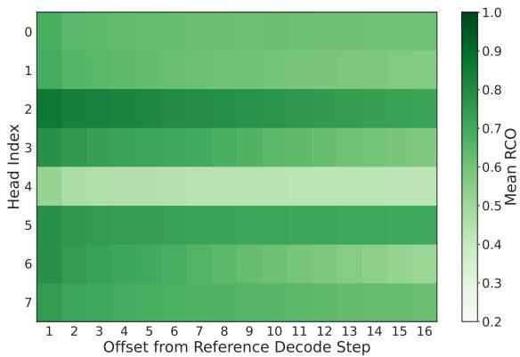  
Figure 1. Temporal stability patterns of KV heads. For Llama-3.1-8B-Instruct layer 4. Some heads maintain high RCO across offsets, while others show persistently low values.

## 2.2 Quantifying Temporal Stability of KV Heads

We begin by collecting the set of top-K page indices at each decode step for samples from several long-context, long-generation tasks in LongBench (Bai et al., 2024) and L-Eval (An et al., 2024). Concretely, for a given sample, we store the data in a tensor of shape [D, L, H, K], where D denotes the number of decoding steps, L the layer index, H the KV-head index within the layer, and K the number of selected top-K pages. In other words, for each sample and each layer–head pair, we record the indices of the top-K pages attended to at every decoding step.

For head h and decoding step s, let $S _ { h } ^ { ( s ) }$ denote the set of top-K page indices for a particular sample. We compute the degree of overlap between $S _ { h } ^ { ( s ) }$ and the subsequent top-K selections of the same head within a fixed window of W steps. To isolate genuine temporal persistence from overlap due to random chance, we compute the random-corrected overlap (RCO) between the page selections at step s and step $t = s + \Delta \left( 1 \le \Delta < W \right)$ as:

$$
\mathrm { R C O } _ { h } ( s , t ) = \operatorname* { m a x } \left( 0 , \frac { | S _ { h } ^ { ( s ) } \cap S _ { h } ^ { ( t ) } | / K - K / N _ { t } } { 1 - K / N _ { t } } \right) ,
$$

where $N _ { t }$ is the number of candidate pages available at step t. This formulation subtracts the expected overlap under a hypergeometric random-draw model $( K / N _ { t } )$ and normalizes by the maximum value $1 - K / N _ { t }$ , which represents the gap between random-chance overlap and perfect overlap. Intuitively, the RCO quantifies how much better the observed overlap is than random chance. An RCO of 0 indicates random-level overlap, and 1 indicates perfect overlap.

We aggregate RCO values across all pairs in a window and define a temporal stability score for each KV head as:

$$
T S _ { h } ( s ) = \frac { 1 } { W - 1 } \sum _ { t = s + 1 } ^ { s + W - 1 } \mathrm { R C O } _ { h } ( s , t ) .
$$

Table 1. Cross-task overlap of unstable heads. For Llama-3.1- 8B-Instruct. Values are the intersection size normalized by the unstable-head set size $( | A _ { i } \cap A _ { j } | / 6 4 )$ . GovReport is from Long-Bench (Bai et al., 2024); the rest from L-Eval (An et al., 2024).
<table><tr><td>Dataset</td><td>Open- review</td><td>Big- Patent</td><td>Multi- News</td><td>QM- Sum</td><td>Gov- Report</td><td>SP- ACE</td><td>CU- AD</td><td>Summ- Screen</td></tr><tr><td>Openreview</td><td>1.00</td><td>0.81</td><td>0.78</td><td>0.89</td><td>0.92</td><td>0.83</td><td>0.73</td><td>0.81</td></tr><tr><td>BigPatent</td><td>0.81</td><td>1.00</td><td>0.72</td><td>0.86</td><td>0.83</td><td>0.75</td><td>0.77</td><td>0.77</td></tr><tr><td>Multi-News</td><td>0.78</td><td>0.72</td><td>1.00</td><td>0.80</td><td>0.80</td><td>0.77</td><td>0.78</td><td>0.80</td></tr><tr><td>QMSum</td><td>0.89</td><td>0.86</td><td>0.80</td><td>1.00</td><td>0.92</td><td>0.84</td><td>0.75</td><td>0.86</td></tr><tr><td>GovReport</td><td>0.92</td><td>0.83</td><td>0.80</td><td>0.92</td><td>1.00</td><td>0.84</td><td>0.80</td><td>0.83</td></tr><tr><td>SPACE</td><td>0.83</td><td>0.75</td><td>0.77</td><td>0.84</td><td>0.84</td><td>1.00</td><td>0.70</td><td>0.91</td></tr><tr><td>CUAD</td><td>0.73</td><td>0.77</td><td>0.78</td><td>0.75</td><td>0.80</td><td>0.70</td><td>1.00</td><td>0.67</td></tr><tr><td>SummScreen</td><td>0.81</td><td>0.77</td><td>0.80</td><td>0.86</td><td>0.83</td><td>0.91</td><td>0.67</td><td>1.00</td></tr></table>

Lower stability values indicate greater variation in a head’s attention focus across decoding steps within the window. Figure 1 illustrates this behavior for the eight KV heads of layer 4 in Llama-3.1-8B-Instruct on the SPACE (hotel review summarization) task from L-Eval. For each offset from the reference decoding step, we plot the mean RCO averaged across all windows and samples. Some heads consistently exhibit low RCO (unstable), while others maintain high RCO that gradually decays with offset (stable).

## 2.3 Identifying Model-Intrinsic Stability Patterns

Given the per-window temporal stability scores for every KV head, we classify the heads into two categories—stable and unstable—by selecting the least stable 25% of heads as unstable and the remaining 75% as stable. Concretely, across all decoding windows within and across all samples, we sort the KV heads by their stability scores and designate the most frequent heads in the bottom quartile as unstable, while the remainder are considered stable.

We perform the procedure independently on each evaluation task, resulting in one unstable head set per task for a given model. Each of these sets has the same cardinality (25% of the total heads), enabling direct comparison across tasks. To assess whether head instability is an intrinsic property of the model, we measure pairwise overlap between the unstable head sets across different tasks for the same model. The resulting cross-task overlap matrix for Llama-3.1-8B-Instruct is presented in Table 1. The overlaps are consistently high, with a mean overlap of 0.83 across tasks and several pairs reaching close to 0.90, demonstrating that the identity of unstable heads is largely preserved across tasks. Thus, head instability is a model-intrinsic characteristic: certain heads inherently exhibit volatile KV-page selection behavior across decoding steps. Furthermore, because unstable heads are consistent across tasks, a single offline profiling run per model suffices to identify them for subsequent online serving. We observe similarly high cross-task overlaps for other models (Mistral-7B, Mistral-Small-24B, and Qwen2.5-32B); detailed in Appendix A.1.

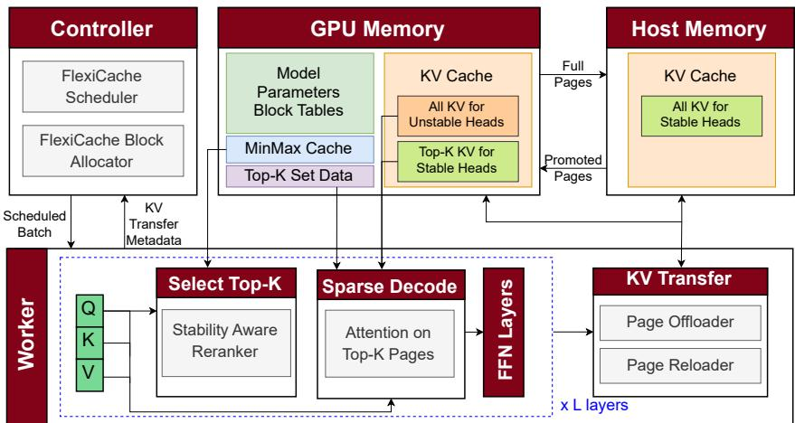  
Figure 2. FlexiCache system architecture. At the worker, the top-K selector identifies the most relevant KV pages for each head, updating them at different frequencies based on head stability. The sparse decode kernel attends only to these selected pages. GPU memory stores the full KV cache of unstable heads and only the top-K pages of stable heads, with the rest in host memory. The block allocator manages this hierarchical KV layout, while the KV transfer module and scheduler pipeline host–GPU KV transfers with computation.

## 3 FLEXICACHE

We present FlexiCache, an LLM-serving system that leverages the inherent sparsity and temporal stability of KV heads to manage KV cache efficiently. The key goals of Flexi-Cache are (i) G1: reduce attention computation overhead, (ii) G2: optimize GPU memory usage, (iii) G3: minimize I/O transfers, and (iv) G4: maintain high language modelling quality. FlexiCache achieves these goals simultaneously, even under long context and long generation scenarios, by prioritizing and retaining only the most critical KV cache pages in GPU memory.

## 3.1 FlexiCache System Overview

FlexiCache employs a multi-pronged design to meet its objectives. Leveraging the temporal stability of critical KV-page selection, it first classifies the heads as stable or unstable. To reduce computational load (G1), FlexiCache employs sparse attention, using only the top-K KV pages for attention computation across all heads during the decode phase. To improve GPU memory efficiency (G2), it keeps only the top-K KV pages from stable heads in GPU memory, while retaining all KV pages from unstable heads on the GPU. The remaining KV pages of stable heads are stored in host memory. To minimize host–GPU data transfer (G3), FlexiCache controls the frequency of re-ranking: unstable heads are re-ranked at every step, but since all their KV pages reside on the GPU, no transfers are needed; stable heads are re-ranked only periodically, and after each reranking, only the newly promoted top-K pages are fetched from host memory. Finally, by jointly exploiting KV-head stability and attention sparsity, FlexiCache ensures that the top-K page selection operates over the entire KV cache (since no pages are permanently discarded), thereby sustaining high language modeling performance (G4).

FlexiCache is implemented on top of vLLM, and its main components are illustrated in Figure 2. The stability-aware re-ranker identifies the top-K KV pages for each head independently and at different frequencies based on their stability. The sparse decode module performs attention computation using only the top-K KV pages for each head. The KV transfer module manages data movement between GPU and host memory: it offloads all KV pages of stable heads to host memory and periodically reloads only the newly promoted top-K pages after each re-ranking.

The FlexiCache controller orchestrates request execution at the workers and includes two key components. The Flexi-Cache Scheduler efficiently pipelines computation and KV reloads across batched requests to maximize GPU utilization. The FlexiCache Block Allocator extends vLLM’s allocator with hierarchical memory awareness, allocating just enough GPU KV blocks for the top-K KV pages of stable heads and for the entire KV cache of unstable heads, while assigning host KV blocks to store the full KV cache of stable heads.

## 3.2 KV-Page Scoring Mechanism

FlexiCache uses a page importance scoring mechanism similar to that in Quest (Tang et al., 2024) and LServe (Yang et al., 2025c). For each KV page, we maintain two vectors—the per-dimension minimum and maximum key values within that page. Given the current query vector q, the importance of a page p is estimated as the maximum possible dot product between q and any key in that page:

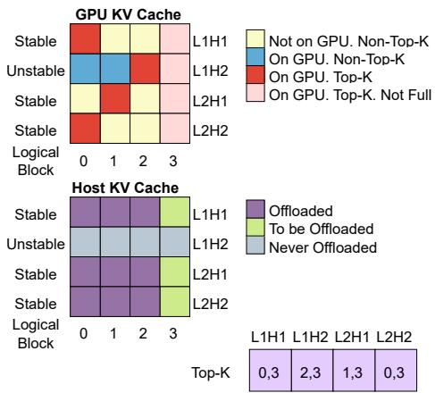  
Figure 3. Hierarchical KV-cache placement. For a request with four logical KV pages running on a two-layer, two-head model.

$$
s _ { p } = \sum _ { i } \operatorname* { m a x } ( q _ { i } \cdot k _ { p , i } ^ { \operatorname* { m i n } } , \ q _ { i } \cdot k _ { p , i } ^ { \operatorname* { m a x } } )
$$

However, FlexiCache differs in two key ways. First, page scoring operates at different frequencies for stable and unstable heads: unstable heads are scored at every step, whereas stable heads are scored periodically (every 16 steps) owing to their temporal stability. If a layer consists solely of stable heads, scoring for that layer can often be skipped entirely. Second, FlexiCache decouples the min–max vectors from the KV cache pages by storing them in a dedicated MinMax cache that remains on the GPU even when the corresponding KV pages are offloaded to host memory. This enables the system to evaluate the importance of an offloaded page and reload it to GPU memory when necessary. The MinMax cache maintains its own block manager and allocates large blocks, each containing min–max vectors for up to 128 KV cache blocks, to minimize allocation overhead. Together, these optimizations substantially reduce the overhead of page scoring and ranking.

## 3.3 Hierarchical KV Cache Management

The hierarchical management of the KV cache builds on the temporal stability of KV heads (§ 2.2) in selecting their top-K KV pages. We classify the least stable 25% of heads as unstable and the remaining heads as stable. For stable heads, FlexiCache keeps only the top-K most important KV pages in GPU memory, while offloading the rest to host memory. In contrast, for unstable heads, it retains the entire KV cache on the GPU.

Figure 3 illustrates this hierarchical placement using a toy example of a model with two layers and two KV heads per layer. The request contains four logical pages, three of which are full, with a top-K size of two. For stable heads, only the two top-K pages reside in GPU memory, while the host memory stores all three full KV pages. The last partially filled page, which is always in the top-K since it is being appended to, will be offloaded to host memory once it becomes full. For the unstable head, all four KV pages remain in GPU memory and are never offloaded.

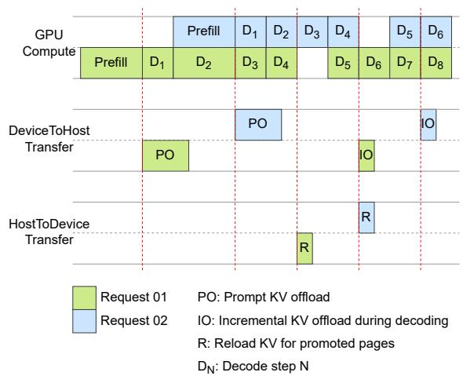  
Figure 4. FlexiCache Pipeline. KV offloading is overlapped with computation of the same request, while KV reloading is overlapped with computation of other requests in the batch.

To make hierarchical KV-cache management practical, FlexiCache minimizes the overhead of moving KV pages between host and GPU memory in the following ways:

Minimizing Transfer Size. In the host-to-GPU direction, we transfer only the newly promoted pages—those that were not in the previous top-K set but appear in the current one—after the periodic reranking of top-K pages for stable heads. This reduces the frequency and size of transfers, as the top-K set itself represents only a fraction of the total KV cache, while temporal stability further reduces the difference between top-K sets. To minimize GPU-to-host transfers, each KV page of a stable head is offloaded exactly once. A large offload occurs after the prefill phase, followed by small incremental offloads as newly filled pages are completed during decoding. Consequently, host memory always holds the full KV cache for stable heads, while the GPU retains only the top-K pages.

Overlapping Transfer with Compute. To prevent KV cache movement from stalling the compute pipeline, transfers between GPU and host memory are carefully overlapped with computation, as shown in Figure 4. After the prefill phase, the initial GPU→host offload begins asynchronously on a low-priority background stream while the main stream continues decoding. Once complete, the block manager releases GPU blocks for pages no longer in the top-K. This significantly reduces per-request GPU memory usage and enables larger batch sizes, as more requests can now fit in GPU memory. Subsequent incremental offloads, triggered as pages become full, are similarly overlapped.

Overlapping host→GPU transfers are more challenging since promoted KV pages modify the GPU-resident cache. Concurrent decoding of the same request could cause inconsistent reads, particularly when physical block recycling (Section 3.4) is enabled. To prevent this, the FlexiCache scheduler temporarily pauses only the request being reloaded while other requests continue decoding. The performance impact is minimal: reload sizes are small (Section 3.3) and typically complete within one decode step. Since different requests pause at different times, only a small fraction of the batch (about 1/16 for a rerank frequency of 16) is idle at any point, keeping overall throughput high.

Reducing Fragmentation Overhead. Paged attention scatters the KV cache of each request across the memory pool. A naive GPU↔host transfer (e.g., using PyTorch advanced indexing) would first gather the scattered chunks at the source, copy a contiguous buffer, and then scatter them again at the destination. The CPU-side gather/scatter dominates latency in this process.

To eliminate this overhead, we implement a custom CUDA kernel that directly reads from or writes to the pinned host KV cache via Unified Virtual Addressing (UVA), avoiding CPU-side gather/scatter entirely. However, host-mapped reads and writes are limited by PCIe bandwidth, so they occupy GPU Streaming Multiprocessors (SMs) while stalling on I/O. To reduce contention with main compute kernels, we employ three techniques: (1) launching transfers on a lowpriority background stream; (2) capping grid size to keep SM occupancy low; and (3) splitting large transfers into multiple smaller chunks, launching a sequence of short kernels. These strategies reduce per-launch stall time and give the CUDA scheduler opportunities to interleave high-priority compute kernels between low-priority transfer kernels.

## 3.4 Efficient Block Table Management

Paged attention maintains a block table that maps each request’s logical indices to physical blocks in GPU memory. In standard dense attention, the KV cache across all heads and layers grows uniformly, allowing a single shared block table for the entire model. FlexiCache breaks this assumption because each head–layer pair independently promotes and evicts KV pages based on its own top-K selection. Hence, their memory layouts diverge, and a single shared block table cannot accurately represent them. FlexiCache therefore performs independent block allocation, deallocation, and mapping for each head–layer pair. To keep this design efficient, we introduce three key optimizations:

Dirty Tracking. Adopting a per-head–layer block mapping scheme expands the block table tensor from (B, N) to (B, L, H, N ), where B, L, H, and N denote the batch size, number of layers, number of heads, and maximum number of blocks per sequence, respectively. Typically, this block table is constructed and updated in host memory and then copied to GPU memory at each decoding step. The resulting L × H increase in table size makes this frequent PCIe transfer a significant performance bottleneck. To mitigate this overhead, FlexiCache tracks which regions of the CPU-side block table have been modified since the last GPU synchronization and transfers only these “dirty” segments. Because the dirty regions are often fragmented, we employ a custom CUDA kernel, similar to the approach in Section 3.3, to efficiently transfer the updated segments while avoiding host-side gather overhead.

Physical Block Reuse During Reranking. During periodic top-K reranking for stable heads, naively deallocating physical blocks of evicted pages and allocating new ones for promoted pages leads to excessive block churn. Frequent calls to the CPU-based block allocator make this process prohibitively expensive. To eliminate this overhead, FlexiCache instead recycles physical blocks. Concretely, we implement a fused CUDA kernel that (i) identifies the sets of evicted and promoted logical blocks, (ii) reassigns physical blocks from the evicted set to the promoted set while updating the GPU-side block table in place, and (iii) generates a mapping from host KV blocks to GPU KV blocks for the subsequent host-to-GPU KV-cache transfer.

Uniformity Through Null Block. Evicting non-critical blocks from GPU memory can create a jagged block table structure, which degrades performance by making simple operations, such as appending new blocks, difficult to vectorize. Moreover, locating a slot in the table by layer, head, and logical index becomes more complex when the layout is irregular. To address this, we enforce a uniform, dense logical structure in the block table using a special null block. When a logical block is deallocated, its physical block is returned to the pool, but its table entry is preserved and redirected to the null block. Because these entries are excluded from attention computation, they are never dereferenced, making the scheme both safe and efficient.

## 4 EVALUATION

## 4.1 Setup

Implementation. We implement FlexiCache atop vLLM (Kwon et al., 2023). We modify vLLM’s Triton-based Flash-Decoding (Dao et al., 2023) kernel to perform decode attention only on the top-K pages per head. We implement the specialized KV-transfer kernels in CUDA and compile them as PyTorch extensions for seamless integration with vLLM.

Testbed. All experiments are conducted on an NVIDIA H100 GPU with 94 GB of HBM memory. The host system is equipped with 2 AMD EPYC 9554 64-core processors and 1.1 TB of DDR5 system memory. Unless otherwise stated, we allocate 180 GB of host memory for the KV cache. The

GPU is connected via PCIe 5.0 with a peak bidirectional bandwidth of 64 GB/s. Our software environment consists of PyTorch 2.7.0 with CUDA 12.8 and cuDNN 9.5

Models. We evaluate FlexiCache on models from two families: Llama-3.1-8B-Instruct (Grattafiori et al., 2024) and Mistral-7B-Instruct-v0.2 (Jiang et al., 2023).

Metrics. For model accuracy, we report the ratio between the benchmark score with FlexiCache and that with dense attention for the same model, providing a uniform measure of performance retention across benchmarks and models despite sparse attention. For system performance, we use total token throughput for offline inference and time per output token (TPOT) for online serving. Although FlexiCache primarily optimizes the decode stage, we also analyze its impact on time to first token (TTFT) in online settings.

Baselines. We compare FlexiCache with LServe (Yang et al., 2025c) on performance retention under sparse attention, since LServe is the most conceptually related system. Both frameworks support paged attention and reduce the effective token budget for attention computation as well as the number of tokens whose KV caches reside in GPU memory. The key distinction is that LServe permanently discards KV caches of less important tokens, whereas FlexiCache offloads them to host memory for potential reuse. For system performance, we use vLLM’s Triton-based Flash-Decoding backend as our baseline, the same runtime on which Flexi-Cache is implemented, to ensure a fair comparison by isolating the effect of FlexiCache’s cache management.

## 4.2 Accuracy

Long Context. We evaluate the accuracy retention of FlexiCache relative to the dense attention baseline across 16 diverse tasks from LongBench (Bai et al., 2024), as shown in Table 2. The average ratio of FlexiCache to dense attention scores indicates that FlexiCache effectively preserves model performance across both architectures. In this experiment, the top-K page budget is 64 pages (equivalent to 1,024 tokens with a page size of 16), the 64 least stable heads are classified as unstable, and the reranking frequency for stable heads is set to 16. To prevent task-specific leakage, we use the GovReport’s KV-head stability profile for all other LongBench tasks, and for GovReport itself, we substitute a profile derived from an L-Eval task (An et al., 2024). The strong performance retention further highlights the cross-task stability profile consistency, enabling a single offline profiling step that can be reused at inference time.

Long Context & Long Generation. While LongBench covers a diverse range of tasks, it has a key limitation in evaluating sparse attention: most tasks generate short outputs. Except for a few tasks such as GovReport and MultiNews, the average generation length is below 50 tokens, with some tasks averaging fewer than 10. As a result, sparse decoding methods that permanently discard the KV cache of less important tokens can still perform well on LongBench because those tokens are rarely needed later in the generation. To address this limitation, we further evaluate FlexiCache on L-Eval (An et al., 2024), which includes several tasks with long prompts and long generations (as summarized in Table 7 in Appendix). Unlike permanent-eviction-based sparse decoding, FlexiCache never discards tokens: it retains the full KV cache in host memory and dynamically promotes the newly important pages to GPU memory, preserving model performance during long generation.

Table 2. Accuracy retention on LongBench (Bai et al., 2024)
<table><tr><td colspan="2"></td><td rowspan="2">Llama-3.1-8B</td><td colspan="2">Mistral-7B-v0.2</td></tr><tr><td>Task</td><td>Dense FlexiCache</td><td>Dense</td><td>FlexiCache</td></tr><tr><td>NarrativeQA</td><td>29.88</td><td>29.62</td><td>20.97</td><td>20.33</td></tr><tr><td>Qasper</td><td>45.41</td><td>45.73</td><td>29.41</td><td>29.49</td></tr><tr><td>MultiField-en</td><td>54.81</td><td>55.20</td><td>47.16</td><td>46.91</td></tr><tr><td>HotpotQA</td><td>55.97</td><td>55.06</td><td>36.99</td><td>35.39</td></tr><tr><td>2WikiMQA</td><td>45.46</td><td>45.71</td><td>21.82</td><td>22.24</td></tr><tr><td>Musique</td><td>30.18</td><td>31.22</td><td>19.29</td><td>18.56</td></tr><tr><td>GovReport</td><td>34.78</td><td>34.28</td><td>33.17</td><td>31.94</td></tr><tr><td>QMSum</td><td>25.27</td><td>25.01</td><td>24.10</td><td>22.94</td></tr><tr><td>MultiNews</td><td>27.35</td><td>27.09</td><td>27.03</td><td>26.99</td></tr><tr><td>TREC</td><td>72.50</td><td>72.50</td><td>71.00</td><td>71.50</td></tr><tr><td>TriviaQA</td><td>91.65</td><td>91.49</td><td>85.98</td><td>86.16</td></tr><tr><td>SAMSum</td><td>43.99</td><td>42.94</td><td>43.25</td><td>43.20</td></tr><tr><td>PCount</td><td>7.10</td><td>6.92</td><td>3.21</td><td>3.24</td></tr><tr><td>PRe</td><td>99.50</td><td>99.50</td><td>89.33</td><td>86.04</td></tr><tr><td>Lcc</td><td>54.50</td><td>54.48</td><td>49.24</td><td>49.32</td></tr><tr><td>RB-P</td><td>51.65</td><td>51.88</td><td>48.61</td><td>48.90</td></tr><tr><td>Avg. Ratio</td><td>1</td><td>1.00</td><td>1</td><td>0.99</td></tr></table>

Table 3 compares FlexiCache and LServe (Yang et al., 2025c) across L-Eval tasks. For FlexiCache, we progressively introduce reranking, stability-aware reranking, and larger token budgets. The final configuration (token budget of 2048, rerank frequency of 16, 64 unstable heads) achieves strong retention of dense-attention accuracy across both models. Two additional models (Mistral-Small-24B-Instruct-2501 and Qwen2.5-32B-Instruct in Appendix A.3) show the same trend. For LServe, we follow the default configuration with a token budget of 384 for streaming heads and 4096 for retrieval heads. As LServe is built on top of QServe (Lin\* et al., 2024) and employs a quantized KV cache by design, it cannot be directly compared to a nonquantized dense baseline. To isolate the effect of sparsity, we therefore compare LServe’s quantized-sparse configuration against its quantized-only baseline and report the relative drop resulting from adding sparsity.

## 4.3 End-to-end Efficiency

We evaluate FlexiCache under long-context and longgeneration scenarios in both offline and online serving settings. For the workload, we randomly sample prompts from the L-Eval benchmark rather than using synthetic tokens, since the size of the promoted KV cache during reranking depends on workload characteristics. Using real prompts ensures realistic promoted-cache behavior. For Llama-3.1- 8B-Instruct with 192 stable heads, fp16 KV cache, and a 2048-token budget, the top-K KV cache for stable heads is 192 MB. The size of the promoted KV varies between 44–67 MB (23–35%) across tasks (shown in Table 7 in Appendix). This suggests that temporal stability keeps the promoted set relatively small yet not negligible, underscoring the need for reranking as token importance evolves. All experiments use 64 unstable heads, a stable head rerank frequency of 16, and a token budget of 1024 or 2048.

Table 3. Accuracy retention on L-Eval (An et al., 2024)
<table><tr><td>Task</td><td>LongFQA</td><td>GovReport</td><td>CUAD</td><td>QMSum</td><td>Multi-News</td><td>Openreview</td><td>BigPatent</td><td>SPACE</td><td>SummScreen</td><td>Avg.Ratio</td></tr><tr><td colspan="9">Llama-3.1-8B-Instruct</td><td></td></tr><tr><td>Dense</td><td>49.61</td><td>27.19</td><td>37.20</td><td>17.95</td><td>17.45</td><td>21.18</td><td>33.61</td><td>16.76</td><td>15.46</td><td></td></tr><tr><td>FlexiCache W/O Reranking</td><td>43.28</td><td>26.74</td><td>22.63</td><td>16.85</td><td>17.27</td><td>19.22</td><td>23.12</td><td>16.40</td><td>15.58</td><td>0.89</td></tr><tr><td>FlexiCache W/O Unstable Heads</td><td>49.05</td><td>26.18</td><td>29.38</td><td>17.72</td><td>17.14</td><td>20.40</td><td>30.92</td><td>16.71</td><td>16.52</td><td>0.96</td></tr><tr><td>FlexiCache 1024</td><td>51.90</td><td>28.89</td><td>37.74</td><td>17.53</td><td>17.69</td><td>20.97</td><td>31.69</td><td>16.75</td><td>13.79</td><td>0.99</td></tr><tr><td>FlexiCache 2048</td><td>50.78</td><td>26.24</td><td>38.07</td><td>17.38</td><td>17.95</td><td>20.78</td><td>33.04</td><td>16.48</td><td>14.50</td><td>0.99</td></tr><tr><td colspan="9">Mistral-7B-Instruct-v0.2</td><td></td></tr><tr><td>Dense</td><td>48.48</td><td>27.46</td><td>35.31</td><td>14.79</td><td>15.44</td><td>21.13</td><td>31.70</td><td>15.73</td><td>15.22</td><td></td></tr><tr><td>FlexiCache W/O Reranking</td><td>41.13</td><td>24.72</td><td>28.34</td><td>14.27</td><td>15.89</td><td>18.20</td><td>22.77</td><td>14.72</td><td>13.40</td><td>0.88</td></tr><tr><td>FlexiCache W/O Unstable Heads</td><td>45.96</td><td>27.69</td><td>29.18</td><td>13.63</td><td>16.43</td><td>19.78</td><td>29.06</td><td>15.84</td><td>13.48</td><td>0.95</td></tr><tr><td>FlexiCache 1024</td><td>47.45</td><td>28.32</td><td>31.78</td><td>14.27</td><td>17.14</td><td>20.65</td><td>27.43</td><td>15.70</td><td>13.47</td><td>0.97</td></tr><tr><td>FlexiCache 2048</td><td>46.58</td><td>28.23</td><td>34.39</td><td>14.42</td><td>16.77</td><td>20.45</td><td>30.33</td><td>16.00</td><td>13.72</td><td>0.99</td></tr><tr><td colspan="9">Llama-3-8B-Instruct</td><td></td></tr><tr><td>Dense</td><td>45.45</td><td>34.52</td><td>33.55</td><td>15.54</td><td>16.53</td><td>18.92</td><td>31.69</td><td>15.84</td><td>14.92</td><td></td></tr><tr><td>LServe</td><td>45.39</td><td>32.38</td><td>28.09</td><td>14.46</td><td>16.76</td><td>18.75</td><td>29.72</td><td>16.53</td><td>11.51</td><td>0.94</td></tr></table>

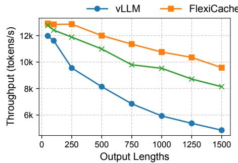  
(a) Token Throughput for Llama-3.1-8B

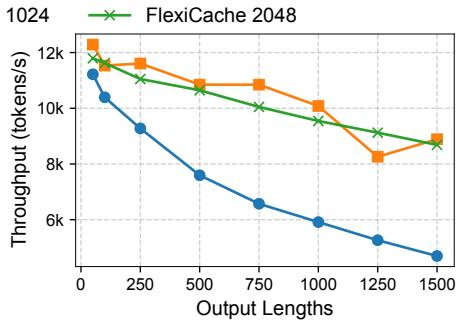  
(b) Token Throughput for Mistral-7B

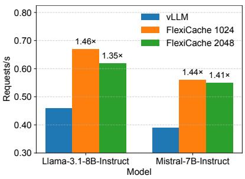  
(c) Request Throughput  
Figure 5. End-to-end throughput. FlexiCache consistently outperforms vLLM on both Llama-3.1-8B and Mistral-7B in token throughput, with gains increasing as output length grows. Similar improvements are observed for request throughput with an output length of 500.

Offline Throughput. Figure 5 shows the end-to-end throughput of FlexiCache compared to the vLLM baseline. For both Llama-3.1-8B and Mistral-7B, FlexiCache consistently achieves higher total token throughput (prompt + output tokens per second). Since FlexiCache primarily optimizes the decode phase, the improvement becomes more pronounced as output length increases and decoding dominates the overall latency. The workload comprises 500 randomly sampled requests from L-Eval, with input lengths between 10k–30k and output lengths ranging from 50–1500. The 1024-token budget generally attains higher throughput, with minor fluctuations caused by the randomness of request preemptions. On average across different output lengths, FlexiCache improves token throughput by 1.38–1.55× for Llama and 1.44–1.46× for Mistral. On the other hand, as shown in Figure 5(c), FlexiCache also achieves up to 1.46× (1024) and 1.41× (2048) end-to-end request throughput speedups over vLLM for output length of 500. Results also hold for Mistral-24B and Qwen-32B (in Appendix A.4).

Online Serving. Figure 6 compares the end-to-end online serving performance of FlexiCache and the vLLM baseline in terms of mean time per output token (TPOT) and time to first token (TTFT). The workload consists of 500 randomly sampled L-Eval requests with input lengths between 10k–30k and output lengths between 20–2000, arriving according to a Poisson process at varying request rates.

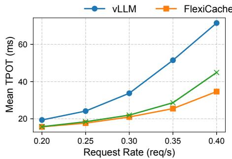  
(a) Mean Time Per Output Token

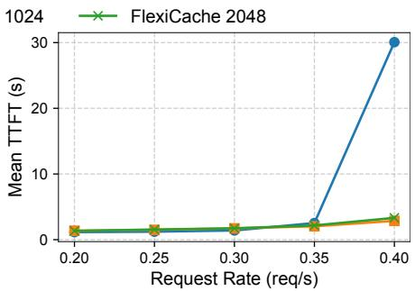  
(b) Mean Time to First Token

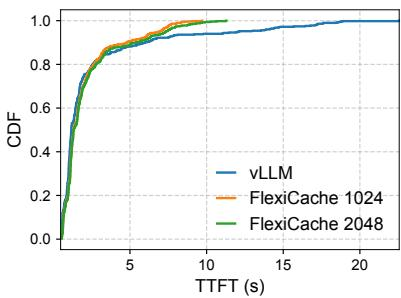  
(c) CDF of Time to First Token

Figure 6. Online serving. FlexiCache reduces mean TPOT across all arrival rates. By lowering per-request GPU memory usage, it delays TTFT degradation caused by queue buildup at high load, enabling higher sustained request rates while keeping tail TTFT lower.  
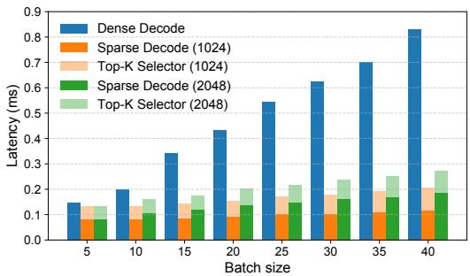  
Figure 7. Decode Speed vs. Batch Size. Each input has 10k tokens. FlexiCache achieves greater speedups as batch size increases.

As shown in Figure 6(a), FlexiCache consistently outperforms the baseline in mean TPOT, with performance gains becoming more pronounced at higher request rates. At 0.4 req/s, FlexiCache-1024 achieves a mean TPOT of 34.6 compared to 71.5 for the baseline—a 2.1× improvement— while FlexiCache-2048 reaches 44.9, representing a 1.6× improvement. Figure 6(b) shows that TTFT remains similar across systems up to 0.35 req/s, but the baseline collapses beyond this point as GPU memory becomes fully occupied, forcing new requests to wait in queue and causing TTFT to spike sharply. FlexiCache, by contrast, reduces per-request GPU memory usage during decoding, preventing memory saturation and queue buildup, and thereby maintaining stable TTFT even under higher load. As shown in Figure 6(c), even at moderate load (0.35 req/s), FlexiCache exhibits a shorter tail in TTFT, reflecting fewer queued requests. Overall, FlexiCache sustains higher request rates than the baseline and delivers lower TPOT at any given request rate.

## 4.4 Microbenchmarks

We conduct microbenchmark experiments using the Llama-3.1-8B-Instruct model and FlexiCache configured with a rerank frequency of 16, unless otherwise specified.

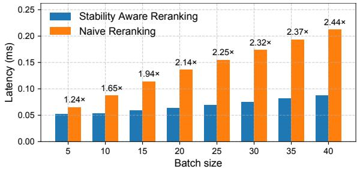  
Figure 8. Benefit of Stability-Aware Reranking. Each input has 10k tokens; performance gains increase with larger batch sizes.

Decode Only Speedup. Figure 7 compares the layer-wise decode latency for dense decode and FlexiCache’s sparse decode with token budgets of 1024 and 2048, at different batch sizes with 10k prompt tokens per input. For dense decode, latency reflects the decode kernel execution time, while for FlexiCache, it includes both the top-K selection and sparse decode kernels. As batch size increases, Flexi-Cache achieves greater speedups (up to 4× at batch size 40 for FlexiCache-1024). At smaller batch sizes, kernel launch overhead dominates, whereas at larger ones, the growing total KV-cache size amplifies the benefit of sparse decoding.

Impact of Stability Aware Reranking. Figure 8 shows that stability-aware reranking is 2.44× faster than naive reranking at a batch size of 40, with each input containing 10k tokens. In naive reranking, all heads are reranked at every step. In contrast, stability-aware reranking updates only the 25% unstable heads at each step and periodically re-ranks the stable ones, keeping the average MinMax cache smaller and reducing latency.

GPU Memory Savings. On the GPU, FlexiCache stores the full KV cache for only 25% of heads and the top-K KV cache for the rest. Figure 9 shows the relative GPU memory savings for a single request across sequence lengths with token budgets of 1024 and 2048. As sequence length grows, memory savings asymptotically approach 75%, reaching about 70% at 20k tokens and beyond.

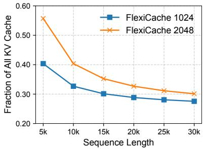  
Figure 9. GPU Memory Savings. Over 70% memory savings is achieved at sequence lengths >20k with a token budget of 1024.

## 5 DISCUSSION AND FUTURE WORK

Integration with Other Serving Optimizations. Flexi-Cache optimizes the decode phase, with up to 4× speedup when focusing on the decode kernel (Figure 7). We expect larger end-to-end gains when FlexiCache is combined with complementary techniques that optimize other parts of the workflow, such as disaggregating prefill and decode (Zhong et al., 2024), kernel fusion, and speculative decoding (Leviathan et al., 2023).

Beyond GPU–CPU hierarchy. FlexiCache currently assumes a two-level GPU–CPU memory hierarchy. This design can be extended to multi-tier hierarchies involving NVMe or distributed memory pools. Efficient KV cache transfer in multi-node environments remains an open challenge, and page-criticality and head-stability–aware KV cache management has the potential to improve existing solutions further (Liu et al., 2024; Cheng et al., 2025).

Joint Memory Management and Cluster Scheduling. In large-scale production serving systems, efficient scheduling and load balancing across GPU clusters remain active challenges. The large KV cache size makes rapid load balancing and task migration difficult (Sun et al., 2024). Temporal stability of heads opens the door for jointly optimizing request batching, KV placement, and prefetch timing using head-level stability signals.

## 6 RELATED WORK

Sparse Attention. Prior work shows that a small subset of critical tokens dominates the attention output at each decode step. Different heuristics are used to identify this subset. These methods fall into two main categories. One class permanently discards less important tokens’ KV entries, such as StreamingLLM (Xiao et al., 2023) and SnapKV (Li et al., 2024). These methods reduce GPU memory, compute, and I/O but risk accuracy loss in long generations since dropped tokens may later become important. The second class retains the full KV cache but attends only to the most relevant tokens at each step. Quest (Tang et al., 2024) exemplifies this approach by augmenting each KV cache page with per-channel min–max metadata and scoring them against the current query, fetching only the Top-K pages. This reduces compute and I/O while mostly preserving accuracy, though memory use remains unchanged. A hybrid approach, LServe (Yang et al., 2025c), converts about half of the heads to streaming masks (dropping long-range KV for those heads) and applies dynamic, query-aware selection for the rest. This balances efficiency and accuracy better than pure eviction but still risks accuracy loss in long generations due to permanent KV eviction for half the heads.

Hierarchical KV Cache Management. When the KV cache for a batch of requests exceeds GPU memory, a common solution is to offload part of it to host memory or even disk and reload it later. Systems such as FlexGen (Sheng et al., 2023) and MoE-Lightning (Cao et al., 2025) adopt this strategy by carefully pipelining data transfers with computation—for example, prefetching the KV cache or weights for the next batch or layer while the current one executes. However, unlike FlexiCache, these designs treat the KV cache within the same layer as uniform; no part is considered more critical for decoding than another. Some of their optimizations, such as layer-wise loading, are orthogonal to FlexiCache and can be used to further augment it. LMCache (Cheng et al., 2025) offloads KV cache across the memory hierarchy to reuse common prefix KV across requests and to support prefill–decode disaggregation. This reduces redundant prefill overhead and lowers TTFT, but it does not target offloading the KV cache of requests that are already in the decode phase. NEO (Jiang et al., 2024b) uses CPU offloading of KV cache for online serving in order to improve performance over GPU-only systems. However, its offload granularity is sub-batch rather than head-level.

## 7 CONCLUSION

We observe that KV heads in LLMs exhibit varying degrees of temporal stability in their selection of critical KV pages across decoding steps. Building on this insight, we classify heads into two categories—stable and unstable—and propose FlexiCache, a stability-aware hierarchical KV cache management strategy. FlexiCache dynamically places KV pages across GPU and host memory based on their criticality, with periodic query-aware promotion of previously non-critical pages. This design reduces the GPU’s KV footprint without permanently discarding potentially important tokens—an essential property for long-context, longgeneration workloads.

## REFERENCES

An, C., Gong, S., Zhong, M., Zhao, X., Li, M., Zhang, J., Kong, L., and Qiu, X. L-eval: Instituting standardized evaluation for long context language models. In Ku, L.-W., Martins, A., and Srikumar, V. (eds.), Proceedings of the 62nd Annual Meeting of the Association for Computational Linguistics (Volume 1: Long Papers), pp. 14388–14411, Bangkok, Thailand, August 2024. Association for Computational Linguistics. doi: 10.18653/v1/2024.acl-long.776. URL https: //aclanthology.org/2024.acl-long.776/.

Bai, Y., Lv, X., Zhang, J., Lyu, H., Tang, J., Huang, Z., Du, Z., Liu, X., Zeng, A., Hou, L., Dong, Y., Tang, J., and Li, J. LongBench: A bilingual, multitask benchmark for long context understanding. In Ku, L.-W., Martins, A., and Srikumar, V. (eds.), Proceedings of the 62nd Annual Meeting of the Association for Computational Linguistics (Volume 1: Long Papers), pp. 3119–3137, Bangkok, Thailand, August 2024. Association for Computational Linguistics. doi: 10.18653/v1/2024.acl-long.172. URL https: //aclanthology.org/2024.acl-long.172/.

Bai, Y., Zhang, J., Lv, X., Zheng, L., Zhu, S., Hou, L., Dong, Y., Tang, J., and Li, J. Longwriter: Unleashing 10,000+ word generation from long context LLMs. In The Thirteenth International Conference on Learning Representations, 2025. URL https://openreview. net/forum?id=kQ5s9Yh0WI.

Cao, S., Liu, S., Griggs, T., Schafhalter, P., Liu, X., Sheng, Y., Gonzalez, J. E., Zaharia, M., and Stoica, I. Moe-lightning: High-throughput moe inference on memory-constrained gpus. In Proceedings of the 30th ACM International Conference on Architectural Support for Programming Languages and Operating Systems, Volume 1, ASPLOS ’25, pp. 715–730, New York, NY, USA, 2025. Association for Computing Machinery. ISBN 9798400706981. doi: 10.1145/ 3669940.3707267. URL https://doi.org/10. 1145/3669940.3707267.

Cheng, Y., Liu, Y., Yao, J., An, Y., Chen, X., Feng, S., Huang, Y., Shen, S., Du, K., and Jiang, J. Lmcache: An efficient KV cache layer for enterprise-scale LLM inference. https://lmcache.ai/tech\_report. pdf, 2025. White paper.

Comanici, G., Bieber, E., Schaekermann, M., Pasupat, I., Sachdeva, N., Dhillon, I., Blistein, M., Ram, O., Zhang, D., Rosen, E., et al. Gemini 2.5: Pushing the frontier with advanced reasoning, multimodality, long context, and next generation agentic capabilities. arXiv preprint arXiv:2507.06261, 2025.

Dao, T., Haziza, D., Massa, F., and Sizov, G. Flash-decoding for long-context inference. https://pytorch.org/ blog/flash-decoding/, October 2023. Accessed: 2025-10-27.

Dubey, A., Jauhri, A., Pandey, A., Kadian, A., Al-Dahle, A., Letman, A., Mathur, A., Schelten, A., Yang, A., Fan, A., et al. The llama 3 herd of models. arXiv e-prints, pp. arXiv–2407, 2024.

Ghadia, R., Kumar, A., Jain, G., Nair, P. J., and Das, P. Dialogue without limits: Constant-sized KV caches for extended response in LLMs. In Forty-second International Conference on Machine Learning, 2025. URL https: //openreview.net/forum?id=SuYO70ZxZX.

Grattafiori, A., Dubey, A., Jauhri, A., Pandey, A., Kadian, A., Al-Dahle, A., Letman, A., Mathur, A., Schelten, A., Vaughan, A., et al. The llama 3 herd of models. arXiv preprint arXiv:2407.21783, 2024.

Jiang, A. Q., Sablayrolles, A., Roux, A., Mensch, A., Savary, B., Bamford, C., Chaplot, D. S., Casas, D. d. l., Hanna, E. B., Bressand, F., et al. Mixtral of experts. arXiv preprint arXiv:2401.04088, 2024a.

Jiang, D., Liu, Y., Liu, S., Zhao, J., Zhang, H., Gao, Z., Zhang, X., Li, J., and Xiong, H. From clip to dino: Visual encoders shout in multi-modal large language models. arXiv preprint arXiv:2310.08825, 2023.

Jiang, X., Zhou, Y., Cao, S., Stoica, I., and Yu, M. Neo: Saving gpu memory crisis with cpu offloading for online llm inference. arXiv preprint arXiv:2411.01142, 2024b.

Kwon, W., Li, Z., Zhuang, S., Sheng, Y., Zheng, L., Yu, C. H., Gonzalez, J., Zhang, H., and Stoica, I. Efficient memory management for large language model serving with pagedattention. In Proceedings of the 29th symposium on operating systems principles, pp. 611–626, 2023.

Leviathan, Y., Kalman, M., and Matias, Y. Fast inference from transformers via speculative decoding. In International Conference on Machine Learning, pp. 19274– 19286. PMLR, 2023.

Li, Y., Huang, Y., Yang, B., Venkitesh, B., Locatelli, A., Ye, H., Cai, T., Lewis, P., and Chen, D. Snapkv: Llm knows what you are looking for before generation. Advances in Neural Information Processing Systems, 37:22947– 22970, 2024.

Lin\*, Y., Tang\*, H., Yang\*, S., Zhang, Z., Xiao, G., Gan, C., and Han, S. Qserve: W4a8kv4 quantization and system co-design for efficient llm serving. arXiv preprint arXiv:2405.04532, 2024.

Liu, Y., Li, H., Cheng, Y., Ray, S., Huang, Y., Zhang, Q., Du, K., Yao, J., Lu, S., Ananthanarayanan, G., Maire, M., Hoffmann, H., Holtzman, A., and Jiang, J. Cachegen: Kv cache compression and streaming for fast large language model serving. In Proceedings of the ACM SIGCOMM 2024 Conference, ACM SIGCOMM ’24, pp. 38–56, New York, NY, USA, 2024. Association for Computing Machinery. ISBN 9798400706141. doi: 10.1145/3651890.3672274. URL https://doi. org/10.1145/3651890.3672274.

Sheng, Y., Zheng, L., Yuan, B., Li, Z., Ryabinin, M., Chen, B., Liang, P., Re, C., Stoica, I., and Zhang, C. Flexgen: ´ high-throughput generative inference of large language models with a single gpu. In Proceedings of the 40th International Conference on Machine Learning, ICML’23. JMLR.org, 2023.

Sun, B., Huang, Z., Zhao, H., Xiao, W., Zhang, X., Li, Y., and Lin, W. Llumnix: Dynamic scheduling for large language model serving. In 18th USENIX symposium on operating systems design and implementation (OSDI 24), pp. 173–191, 2024.

Tang, J., Zhao, Y., Zhu, K., Xiao, G., Kasikci, B., and Han, S. Quest: query-aware sparsity for efficient long-context llm inference. In Proceedings of the 41st International Conference on Machine Learning, ICML’24. JMLR.org, 2024.

Vaswani, A., Shazeer, N., Parmar, N., Uszkoreit, J., Jones, L., Gomez, A. N., Kaiser, Ł., and Polosukhin, I. Attention is all you need. Advances in neural information processing systems, 30, 2017.

Wu, Y., Hee, M. S., Hu, Z., and Lee, R. K.-W. Longgenbench: Benchmarking long-form generation in long context LLMs. In The Thirteenth International Conference on Learning Representations, 2025. URL https: //openreview.net/forum?id=3A71qNKWAS.

Xiao, G., Tian, Y., Chen, B., Han, S., and Lewis, M. Efficient streaming language models with attention sinks. arXiv preprint arXiv:2309.17453, 2023.

Xiao, G., Tang, J., Zuo, J., junxian guo, Yang, S., Tang, H., Fu, Y., and Han, S. Duoattention: Efficient long-context LLM inference with retrieval and streaming heads. In The Thirteenth International Conference on Learning Representations, 2025. URL https://openreview. net/forum?id=cFu7ze7xUm.

Yang, A., Li, A., Yang, B., Zhang, B., Hui, B., Zheng, B., Yu, B., Gao, C., Huang, C., Lv, C., et al. Qwen3 technical report. arXiv preprint arXiv:2505.09388, 2025a.

Yang, A., Yu, B., Li, C., Liu, D., Huang, F., Huang, H., Jiang, J., Tu, J., Zhang, J., Zhou, J., et al. Qwen2. 5- 1m technical report. arXiv preprint arXiv:2501.15383, 2025b.

Yang, S., Guo, J., Tang, H., Hu, Q., Xiao, G., Tang, J., Lin, Y., Liu, Z., Lu, Y., and Han, S. LServe: Efficient longsequence LLM serving with unified sparse attention. In Eighth Conference on Machine Learning and Systems, 2025c. URL https://openreview.net/forum? id=KQ4pJFFqT1.

Zhong, Y., Liu, S., Chen, J., Hu, J., Zhu, Y., Liu, X., Jin, X., and Zhang, H. {DistServe}: Disaggregating prefill and decoding for goodput-optimized large language model serving. In 18th USENIX Symposium on Operating Systems Design and Implementation (OSDI 24), pp. 193–210, 2024.

## A APPENDIX

## A.1 Cross-task overlap of unstable heads

Tables 4, 5, and 6 report the pairwise cross-task overlap of unstable heads for three models—Mistral-7B-Instructv0.2, Mistral-Small-24B-Instruct-2501, and Qwen2.5-32B-Instruct—with mean overlaps of 0.83, 0.76, and 0.81, respectively. These results show that the task-unaware instability of certain KV heads in selecting top-KV pages across decode steps generalizes well across models from different families and sizes, consistent with the observations reported in the main paper for Llama. For each model, we classify 25% of the heads as unstable, corresponding to 64, 80, and 128 heads for Mistral-7B-Instruct-v0.2, Mistral-Small-24B-Instruct-2501, and Qwen2.5-32B-Instruct, respectively.

Table 4. Cross-task overlap of unstable heads. For Mistral-7B-Instruct-v0.2. Values are the intersection size normalized by the unstable-head set size $( | A _ { i } \cap A _ { j } | / 6 4 )$ . GovReport is from Long-Bench (Bai et al., 2024); the rest from L-Eval (An et al., 2024).
<table><tr><td>Dataset</td><td>Open- review</td><td>Big- Patent</td><td>Multi- News</td><td>QM- Sum</td><td>Gov- Report</td><td>SP- ACE</td><td>CU- AD</td><td>Summ- Screen</td></tr><tr><td>Openreview</td><td>1.00</td><td>0.89</td><td>0.81</td><td>0.88</td><td>0.84</td><td>0.77</td><td>0.83</td><td>0.81</td></tr><tr><td>BigPatent</td><td>0.89</td><td>1.00</td><td>0.78</td><td>0.86</td><td>0.81</td><td>0.78</td><td>0.77</td><td>0.86</td></tr><tr><td>Multi-News</td><td>0.81</td><td>0.78</td><td>1.00</td><td>0.86</td><td>0.84</td><td>0.75</td><td>0.78</td><td>0.75</td></tr><tr><td>QMSum</td><td>0.88</td><td>0.86</td><td>0.86</td><td>1.00</td><td>0.89</td><td>0.80</td><td>0.84</td><td>0.83</td></tr><tr><td>GovReport</td><td>0.84</td><td>0.81</td><td>0.84</td><td>0.89</td><td>1.00</td><td>0.77</td><td>0.80</td><td>0.80</td></tr><tr><td>SPACE</td><td>0.77</td><td>0.78</td><td>0.75</td><td>0.80</td><td>0.77</td><td>1.00</td><td>0.73</td><td>0.86</td></tr><tr><td>CUAD</td><td>0.83</td><td>0.77</td><td>0.78</td><td>0.84</td><td>0.80</td><td>0.73</td><td>1.00</td><td>0.70</td></tr><tr><td>SummScreen</td><td>0.81</td><td>0.86</td><td>0.75</td><td>0.83</td><td>0.80</td><td>0.86</td><td>0.70</td><td>1.00</td></tr></table>

Table 5. Cross-task overlap of unstable heads. For Mistral-Small-24B-Instruct-2501. Values are the intersection size normalized by the unstable-head set size $( | A _ { i } \cap A _ { j } | / 8 0 )$ . GovReport is from LongBench (Bai et al., 2024); the rest from L-Eval (An et al., 2024).
<table><tr><td>Dataset</td><td>Open- review</td><td>Big- Patent</td><td>Multi- News</td><td>QM- Sum</td><td>Gov- Report</td><td>SP- ACE</td><td>CU- AD</td><td>Summ- Screen</td></tr><tr><td>Openreview</td><td>1.00</td><td>0.78</td><td>0.78</td><td>0.86</td><td>0.89</td><td>0.69</td><td>0.72</td><td>0.75</td></tr><tr><td>BigPatent</td><td>0.78</td><td>1.00</td><td>0.72</td><td>0.80</td><td>0.76</td><td>0.60</td><td>0.56</td><td>0.75</td></tr><tr><td>Multi-News</td><td>0.78</td><td>0.72</td><td>1.00</td><td>0.78</td><td>0.80</td><td>0.70</td><td>0.66</td><td>0.75</td></tr><tr><td>QMSum</td><td>0.86</td><td>0.80</td><td>0.78</td><td>1.00</td><td>0.86</td><td>0.71</td><td>0.66</td><td>0.79</td></tr><tr><td>GovReport</td><td>0.89</td><td>0.76</td><td>0.80</td><td>0.86</td><td>1.00</td><td>0.69</td><td>0.68</td><td>0.79</td></tr><tr><td>SPACE</td><td>0.69</td><td>0.60</td><td>0.70</td><td>0.71</td><td>0.69</td><td>1.00</td><td>0.68</td><td>0.66</td></tr><tr><td>CUAD</td><td>0.72</td><td>0.56</td><td>0.66</td><td>0.66</td><td>0.68</td><td>0.68</td><td>1.00</td><td>0.61</td></tr><tr><td>SummScreen</td><td>0.75</td><td>0.75</td><td>0.75</td><td>0.79</td><td>0.79</td><td>0.66</td><td>0.61</td><td>1.00</td></tr></table>

## A.2 L-Eval Statistics

Table 7 shows the mean prompt lengths (in tokens) and mean generation lengths for the different tasks in L-Eval. It also reports the average promoted KV cache size per request (in megabytes) during the periodic reranking of stable heads. In this experiment, we used a top-K size of 2048 and the Llama-3.1-8B-Instruct model with 192 stable heads. The total size of the top-K KV cache for the stable heads is 192 MB, and the observed transfer sizes range from 23% to 35%.

Table 6. Cross-task overlap of unstable heads. For Qwen2.5- 32B-Instruct. Values are the intersection size normalized by the unstable-head set size $( | A _ { i } \cap A _ { j } | / 1 2 8 )$ . GovReport is from Long-Bench (Bai et al., 2024); the rest from L-Eval (An et al., 2024).
<table><tr><td>Dataset</td><td>Open- review</td><td>Big- Patent</td><td>Multi- News</td><td>QM- Sum</td><td>Gov- Report</td><td>SP- ACE</td><td>CU- AD</td><td>Summ- Screen</td></tr><tr><td>Openreview</td><td>1.00</td><td>0.78</td><td>0.82</td><td>0.81</td><td>0.88</td><td>0.79</td><td>0.83</td><td>0.77</td></tr><tr><td>BigPatent</td><td>0.78</td><td>1.00</td><td>0.77</td><td>0.78</td><td>0.77</td><td>0.76</td><td>0.77</td><td>0.77</td></tr><tr><td>Multi-News</td><td>0.82</td><td>0.77</td><td>1.00</td><td>0.77</td><td>0.83</td><td>0.73</td><td>0.78</td><td>0.73</td></tr><tr><td>QMSum</td><td>0.81</td><td>0.78</td><td>0.77</td><td>1.00</td><td>0.81</td><td>0.80</td><td>0.79</td><td>0.82</td></tr><tr><td>GovReport</td><td>0.88</td><td>0.77</td><td>0.83</td><td>0.81</td><td>1.00</td><td>0.80</td><td>0.79</td><td>0.77</td></tr><tr><td>SPACE</td><td>0.79</td><td>0.76</td><td>0.73</td><td>0.80</td><td>0.80</td><td>1.00</td><td>0.74</td><td>0.80</td></tr><tr><td>CUAD</td><td>0.83</td><td>0.77</td><td>0.78</td><td>0.79</td><td>0.79</td><td>0.74</td><td>1.00</td><td>0.70</td></tr><tr><td>SummScreen</td><td>0.77</td><td>0.77</td><td>0.73</td><td>0.82</td><td>0.77</td><td>0.80</td><td>0.70</td><td>1.00</td></tr></table>

This range, while relatively small due to temporal stability, is still non-negligible—indicating that offloaded KV caches can become important again in later decode steps. There is a positive correlation between both the average prompt length and the promoted KV cache size, and between the average generation length and the promoted KV cache size: when both the prompt and generation lengths are large, KV caches initially considered less critical are more likely to become important later. This further underscores the need for a system like FlexiCache, which enables sparse attention while reducing GPU memory usage without ever permanently discarding any part of the KV cache.

Table 7. L-Eval task statistics: average prompt and generation lengths, and promoted KV size (Llama-3.1-8B, token budget of 2048, 192 stable heads)
<table><tr><td>Task</td><td>Prompt # Tokens</td><td>Generation # Tokens</td><td>TopK-Delta MB</td></tr><tr><td>LongFQA</td><td>5257</td><td>81</td><td>46.7</td></tr><tr><td>GovReport</td><td>6125</td><td>377</td><td>45.0</td></tr><tr><td>CUAD</td><td>24906</td><td>195</td><td>66.7</td></tr><tr><td>QMSum</td><td>15103</td><td>132</td><td>66.3</td></tr><tr><td>Multi-News</td><td>6002</td><td>367</td><td>43.6</td></tr><tr><td>Openreview</td><td>10084</td><td>390</td><td>55.2</td></tr><tr><td>BigPatent</td><td>6363</td><td>159</td><td>49.5</td></tr><tr><td>SPACE</td><td>17933</td><td>136</td><td>67.1</td></tr><tr><td>SummScreen</td><td>8882</td><td>128</td><td>59.2</td></tr></table>

## A.3 Accuracy Retention

Table 8 reports the accuracy retention achieved by Flexi-Cache across different L-Eval tasks for Mistral-Small-24B-Instruct-2501 and Qwen2.5-32B-Instruct. The results follow similar trends to those reported in the main paper for other models: accuracy retention improves with the introduction of periodic reranking, the inclusion of unstable heads, and larger token budgets. The final configuration—with 64 unstable heads, reranking of stable heads every 16 steps, and a token budget of 2048—shows near-lossless performance.

Table 8. L-Eval Results
<table><tr><td>Task</td><td> $\cos ^ { \otimes \otimes ^ { \infty } } { { \mathrm { c o } } ^ { \otimes ^ { \infty } } } _ { \mathrm { C ^ { \otimes } } } \otimes ^ { \otimes ^ { \infty } } { { \mathrm { c } } ^ { \otimes ^ { \infty } } } _ { \mathrm { C ^ { \otimes } } } \otimes ^ { \otimes ^ { \infty } } { { \mathrm { c o } } ^ { \otimes ^ { \infty } } } _ { \mathrm { N o } ^ { \infty } } { { \mathrm { c o } } ^ { \otimes ^ { \infty } } } _ { \mathrm { O } ^ { \otimes ^ { \infty } } } ^ { \otimes ^ { \infty } } { { \mathrm { c o } } ^ { \mathrm { i } ^ { \otimes ^ { \infty } } } } _ { \mathrm { \otimes ^ { \infty } } } \otimes ^ { \mathrm { a } } { { \mathrm { c o } } ^ { \mathrm { a } } } _ { \mathrm { S } ^ { \otimes ^ { \infty } } } ^ { \mathrm { S } } \otimes ^ { \mathrm { c o } ^ { \mathrm { a } } } _ { \mathrm { S } ^ { \otimes ^ { \infty } } } ^ { \mathrm { S } }$ </td><td></td><td></td><td></td><td></td><td></td><td></td><td></td><td></td><td></td></tr><tr><td colspan="9">Mistral-Small-24B-Instruct-2501</td><td></td></tr><tr><td>Dense</td><td>48.4</td><td>24.7</td><td>33.8</td><td>16.1</td><td>16.5</td><td>21.5</td><td>28.0</td><td>15.4</td><td>14.9</td><td></td></tr><tr><td>FlexiCache W/O Reranking</td><td>46.7</td><td>25.5</td><td>25.9</td><td>15.5</td><td>15.9</td><td>20.5</td><td>25.9</td><td>15.2</td><td>14.2</td><td>0.944</td></tr><tr><td>FlexiCache W/O Unstable Heads</td><td>47.4</td><td>24.2</td><td>31.0</td><td>15.8</td><td>17.3</td><td>21.4</td><td>26.2</td><td>15.1</td><td>14.8</td><td>0.978</td></tr><tr><td>FlexiCache 1024</td><td>48.6</td><td>25.9</td><td>29.3</td><td>16.3</td><td>16.3</td><td>21.7</td><td>26.6</td><td>15.1</td><td>14.5</td><td>0.981</td></tr><tr><td>FlexiCache 2048</td><td>48.1</td><td>26.1</td><td>33.1</td><td>16.7</td><td>16.1</td><td>21.9</td><td>27.7</td><td>15.5</td><td>14.3</td><td>1.001</td></tr><tr><td colspan="9">Qwen2.5-32B-Instruct</td><td></td></tr><tr><td>Dense</td><td>51.8</td><td>25.2</td><td>37.8</td><td>16.1</td><td>16.3</td><td>22.0</td><td>28.1</td><td>14.6</td><td>15.8</td><td></td></tr><tr><td>FlexiCache W/O Reranking</td><td>49.3</td><td>23.4</td><td>28.9</td><td>15.6</td><td>15.6</td><td>21.3</td><td>25.3</td><td>13.9</td><td>16.0</td><td>0.934</td></tr><tr><td>FlexiCache W/O Unstable Heads</td><td>52.1</td><td>23.0</td><td>33.6</td><td>16.2</td><td>15.4</td><td>21.6</td><td>26.0</td><td>14.5</td><td>16.6</td><td>0.967</td></tr><tr><td>FlexiCache 1024</td><td>50.0</td><td>24.2</td><td>36.9</td><td>16.0</td><td>15.5</td><td>21.9</td><td>26.8</td><td>14.3</td><td>15.9</td><td>0.976</td></tr><tr><td>FlexiCache 2048</td><td>50.9</td><td>24.7</td><td>37.7</td><td>16.0</td><td>16.2</td><td>22.0</td><td>27.9</td><td>14.4</td><td>16.6</td><td>0.998</td></tr></table>

## A.4 End to End Throughput

Figure 10 shows the end-to-end throughput gain for Mistral-Small-24B-Instruct-2501 and Qwen2.5-32B-Instruct when executed on FlexiCache compared to the vLLM baseline. The workload consists of 100 random inputs from L-Eval, each with input lengths ranging from 10k to 30k tokens and an output length of 500. FlexiCache achieves a 1.37× improvement, indicating that performance gains extend to larger models as well.

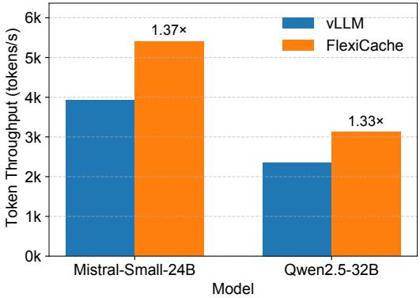  
Figure 10. Decode Speed vs. Batch Size. Each input has 10k tokens. FlexiCache achieves greater speedups as batch size increases.