# HETRL: EFFICIENT REINFORCEMENT LEARNING FOR LLMS IN HETEROGENEOUS ENVIRONMENTS

Yongjun He \* ⋄ 1 Shuai Zhang \* 2 Jiading Gai 2 Xiyuan Zhang 2 Boran Han 2 Bernie Wang 2 Huzefa Rangwala 2 George Karypis 2

## ABSTRACT

As large language models (LLMs) continue to scale and new GPUs are released even more frequently, there is an increasing demand for LLM post-training in heterogeneous environments to fully leverage underutilized mid-range or previous-generation GPUs across regions and alleviate the shortage of homogeneous high-end GPUs within a single region. However, achieving high-performance reinforcement learning (RL) training for LLMs on such computing resources remains challenging because the workflow involves multiple models and tasks with complex computation and data dependencies. In this paper, we present HetRL, a distributed system for efficient RL training in infrastructures with heterogeneous GPUs and networks. HetRL formulates the scheduling of RL training in heterogeneous environments as a constrained joint optimization problem and introduces a novel scheduling algorithm that (1) decomposes the complex search space with a multi-level search framework; and (2) allocates the search budget via successive halving. Our extensive evaluation, consuming 20,000 GPU-hours, shows that HetRL delivers up to 9.17× the throughput of state-of-the-art systems, and 3.17× on average, under various workloads and settings.

## 1 INTRODUCTION

Reinforcement learning (RL) has become the predominant technique for improving the reasoning ability of large language models (LLMs) and aligning LLMs with human values (Lambert et al., 2024; Kaufmann et al., 2025; Ahmadian et al., 2024; Casper et al., 2023). Despite the leading performance brought by RL to LLMs, however, comes an explosive growth in computational demand (Qwen Team, 2025; DeepSeek-AI, 2024; Llama Team, 2024; Wu et al., 2025a). In practice, current deployments of RL training relies on individual clusters with a large number of homogeneous GPUs and high-bandwidth networks to meet the computational requirements, as state-of-the-art (SoTA) RL training systems (e.g., verl (Sheng et al., 2025) and OpenRLHF (Hu et al., 2024)) are tailored for homogeneous computing resources. On the other hand, as vendors have released an array of new GPU models in recent years, there are a substantial number of mid-range or previous-generation GPUs remaining underutilized across data centers around the world (Strati et al., 2024; Jiang et al., 2024; Mei et al., 2025; Wu et al., 2025b; Gao et al., 2024). These geo-distributed heterogeneous GPUs collectively provide substantially more memory and compute resources than individual clusters of homogeneous GPUs. This motivates us to explore an alternative solution by deploying RL training across a set of heterogeneous GPUs connected via heterogeneous networks.

Recent studies (Yuan et al., 2022; Mei et al., 2025; Wu et al., 2025b; Jiang et al., 2025b; Um et al., 2024; Jiang et al., 2025a; Strati et al., 2025; 2024) have investigated the deployment of LLM training and serving in heterogeneous environments to improve the utilization of mid-range or previous-generation GPUs, all centered around the problem of allocating GPU resources to a single model or a single task. However, the complexity of the RL workflow presents unique obstacles to high-performance deployment in heterogeneous environments, which cannot be addressed by existing methods. Unlike LLM training and serving, which only involves one model, typical RL workflow (Schulman et al., 2017; Shao et al., 2024; Rafailov et al., 2023; Dai et al., 2024) consists of multiple models and tasks with complex dependencies. For instance, the most widely used RL algorithm, Proximal Policy Optimization (PPO) (Schulman et al., 2017) (Figure 1(b)), incorporates four LLMs: an actor model, a critic model, a reward model and a reference model; and six tasks: actor generation, reference inference, critic inference, reward inference, actor training, and critic training. Given the heterogeneity of GPU models and interconnects, the dependencies between different models and tasks, and their different computational characteristics, the desired scheduling algorithm required for efficient RL training needs to jointly optimize (1) the colocation of models and parallelism between tasks (Figure 1(c)); (2) the parallelization of computations within each model and each task (Figure 1(d)); and (3) the fine-grained assignment of tasklets to the heterogeneous devices (Figure 1(e)).

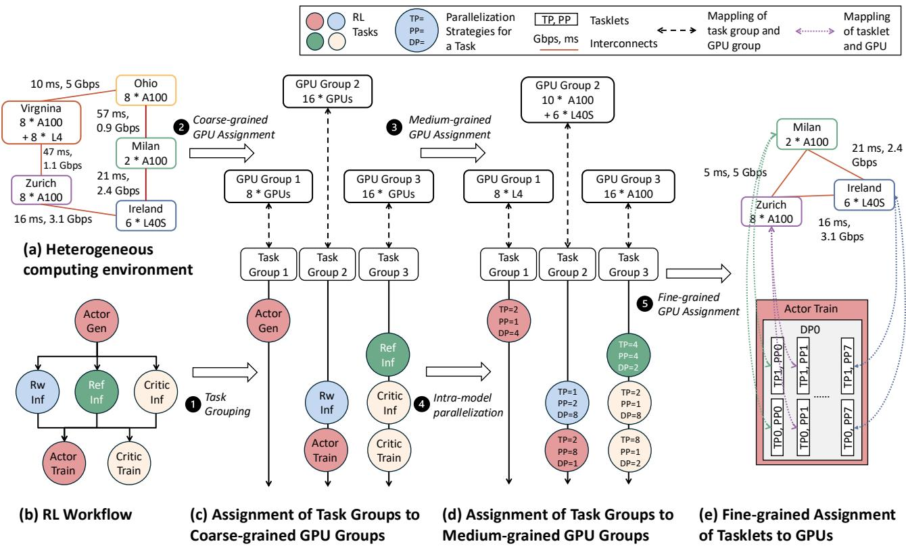  
Figure 1. An overview of how HetRL generates candidate scheduling plans for RL training in heterogeneous environments.

Another category of recent studies has investigated efficient deployment of RL training, but their designs are only tailored to clusters with homogeneous GPUs and highbandwidth networks (Sheng et al., 2025; Zhong et al., 2025b; Fu et al., 2025; Wu et al., 2025a; Han et al., 2025; Hu et al., 2024; Yao et al., 2023; Shen et al., 2024). Since existing RL training systems do not fully consider the heterogeneity of the computing environment in their search space, they cannot achieve efficient RL training in heterogeneous environments. An out-of-the-box solution for scheduling RL training in heterogeneous environments is to apply prior heterogeneity-aware scheduling algorithms for LLM training and serving to existing RL training systems. However, these methods (Yuan et al., 2022; Mei et al., 2025; Jiang et al., 2025b;a; Um et al., 2024) focus on the scheduling of a single model/task and require hundreds to thousands of seconds to search for the locally near-optimal execution plan for a single model/task (rather than the entire workflow).

Considering that RL workflows involve multiple models and tasks with complex data and computational dependencies, directly applying prior methods to existing RL training systems is neither practical nor scalable.

To cope with the challenges described above, we propose HetRL, a distributed system for efficient RL training over a set of GPUs with heterogeneity in compute and memory resources as well as network interconnects. Our contributions are summarized as follows:

• We formulate RL training scheduling in heterogeneous environments as a constrained joint optimization problem and propose a novel scheduling algorithm for efficient deployment of RL training in heterogeneous environments. Our proposed algorithm decomposes the complex search space with a multi-level search framework and allocates the search budget via successive halving.

• We implemented our proposed scheduling algorithm and built HetRL around it on top of verl (Sheng et al., 2025) with 3k lines of code, including a scheduler, a profiler, and an execution engine with extended support for finegrained resource assignment and load balancing.

• We conduct a comprehensive evaluation to compare the performance of HetRL and SoTA systems across various workloads and heterogeneous environments. The results show that HetRL attains throughput up to 9.17× that of SoTA systems, and 3.17× on average.

## 2 BACKGROUND AND MOTIVATION

## 2.1 Reinforcement Learning for LLMs

Typical RL workflows (Schulman et al., 2017; Shao et al., 2024; Rafailov et al., 2023; Dai et al., 2024) involve multiple models and tasks with complex computational and data dependencies. Next, we detail the workflow using PPO (Schulman et al., 2017) (Figure 1(b)) as an example.

RL Models. The actor model is the main model to be trained with RL, initialized from pre-trained LLMs. The reference model is a frozen copy of the initial actor model. It’s used to compute the Kullback-Leibler (KL) penalty that ensures the new actor model close to the style and knowledge of the pre-trained model. The reward model is a separate model trained from human preference data. It guides the actor model to generate responses that align with human values and is also frozen during RL training. The critic model evaluates the advantage values of the actions taken by the actor model. Its parameters are also updated during RL training. Another recently proposed representative RL algorithm, GRPO (Shao et al., 2024), accelerates RL training by eliminating the need for a separate critic model. The architectures and parameters of the reward and critic models can differ from those of the actor and reference models.

RL Tasks. At the beginning of the RL workflow, actor generation uses the prompts of the training dataset as input and generates responses using the actor model. Next, reference inference uses the prompts and generated responses as input and calculate the reference log probability of each token using the reference model. Using the same set of prompts and generated responses as input, reward inference calculate per-sample scores using the reward model, and critic inference calculates per-sample values using the critic model. Finally, actor training and critic training use the results from the three inference tasks as input to perform forward and backward passes to update the parameters of the actor model and the critic model, respectively.

Recent studies have also investigated asynchronous RLHF (Noukhovitch et al., 2025; Fu et al., 2025; Han et al., 2025; Zhong et al., 2025a) to improve GPU utilization for RL training. Asynchronous RL training overlaps the timeconsuming actor generation of the next few iterations with ongoing training to accelerate fine-tuning. However, it leads to decreased accuracy due to data staleness, and increases memory consumption due to the need to maintain two separate copies of the actor model for generation and training.

## 2.2 Parallelization in Distributed Deep Learning.

To distribute deep learning (DL) workloads over computing devices, three primary parallelization strategies have been proposed. Correctly combining and tuning them (Figure 1(e) bottom) can significantly improve LLM training and serving performance (Zheng et al., 2022; Li et al., 2023).

Data parallelism (DP) (Rajbhandari et al., 2020). Each DP group has a full copy of the model weights and processes a subset of the input dataset, and all DP groups periodically synchronize their model weights using averaged gradients.

Pipeline parallelism (PP) (Huang et al., 2019). The layers of a model are partitioned across PP groups. By splitting the training batch into multiple micro-batches, the forward and backward passes of different micro-batches can be pipelined across all PP group.

Tensor parallelism (TP) (Shoeybi et al., 2019). The weight matrices of each layer are partitioned across TP groups along the row or column dimension, and all TP groups perform allreduce to aggregate the output of each partitioned GEMM.

## 2.3 Motivation

The heterogeneous characteristics of today’s computing environments and RL workflows reveal opportunities to improve GPU utilization by deploying RL training in heterogeneous environments. Nevertheless, existing systems exhibit limitations that prevent them from realizing the full potential of such deployments.

## 2.3.1 Opportunities

Heterogeneity in computing environments. Recent studies (Strati et al., 2024; Jiang et al., 2024; Mei et al., 2025; Wu et al., 2025b; Gao et al., 2024) investigates the availabilities of GPU resources, showing that there are severe shortages of homogeneous high-end GPUs within a single region, while substantial heterogeneous GPUs are available across geographical locations. Therefore, training (Yuan et al., 2022; Wu et al., 2025b; Strati et al., 2025) and serving (Mei et al., 2025; Jiang et al., 2025a;b) LLMs in heterogeneous environments have attracted research interests as it allows resource-intensive LLM jobs to leverage all available GPU resources for acceleration.

Heterogeneity in RL workflows. In RL workflows, the actor, critic, reference, and reward models may use LLMs with different model sizes and perform generation, inference, or training during different tasks. Therefore, the RL workflows have different computation, memory, and communication capacity requirements for different tasks. For example, the actor generation is memory bound (Zhang, 2024) and needs to maintain key-value cache (KV cache) (Kwon et al., 2023); and the actor/critic training are computation bound (Verhelst et al., 2025) and needs to maintain activations, gradients and optimizer states (Rajbhandari et al., 2020). In comparison with LLM training and serving which involves only single model or single task, the heterogeneous characteristics of the RLHF workflow make it a workload with new potential for utilizing otherwise idle heterogeneous GPU resources.

## 2.3.2 Limitations

Limited search space in existing RL training systems. To accelerate RL workflows with heterogeneous characteristics, and complex computations and data dependencies, a flurry of RL training systems (Sheng et al., 2025; Hu et al., 2024; Yao et al., 2023; Shen et al., 2024; Zhong et al., 2025b; Wu et al., 2025a; Fu et al., 2025; Han et al., 2025) have been proposed. However, they are all tailored for homogeneous GPUs with high-bandwidth networks, and almost none of them considers the heterogeneity of hardware in the search space of scheduling algorithms. StreamRL (Zhong et al., 2025a) is perhaps the most relevant effort to ours, organizing heterogeneous GPUs into two groups: one group for actor generation and a separate group for the remaining tasks. However, it requires that all GPUs within the same group are homogeneous and located in the same data center.

## Time-consuming heterogeneity-aware search algorithms.

A natural approach to enhance RL training systems is to apply the heterogeneity-aware scheduling algorithms originally designed for LLM training and serving to the scheduling of each model and each task in the RL workflow. As reported by verl (Sheng et al., 2025) and RLHFuse (Zhong et al., 2025b), searching for efficient deployment plans for RL training on homogeneous GPUs connected over a homogeneous network requires examining over millions to billions of plans, which takes hundreds to thousands of seconds. Meanwhile, the heterogeneity-aware algorithms originally designed for LLM training (Yuan et al., 2022; Um et al., 2024) and serving (Mei et al., 2025; Jiang et al., 2025a;b) require 1, 000∼10, 000× more search time to search for the locally near-optimal plan for a single model/task (rather than the entire workflow), so this naive combination is neither practical nor scalable for real-world deployment.

## 3 SCHEDULING IN HETRL

We begin by formulating RL training scheduling in heterogeneous environments as a constrained joint optimization of partitioning strategies and assignment strategies. We then present our proposed multi-level search framework for search space decomposition and the cost model used to quickly estimate the execution time. Finally, we introduce our scheduling algorithm built on successive halving, genetic algorithm and the multi-level search framework.

## 3.1 Problem Formulation

Notations. Let Gt = (V t, Et) denote the computational graph of the t-th task in an RL workflow, where t ∈ {1, . . . , T }, V t denotes the set of computational operators, and Et denotes the set of tensors shared between operators. The overall computational graph of the RL workflow is then defined as G = (STt=1 V t, STt=1 Et ∪ Einter), where Einter denotes the set of edges between tasks.

Let GD = (VD, ED) denote the device topology graph for a heterogeneous environment, where VD = {d1, . . . , dN } are a set of N devices and ED ⊆ VD × VD are communication channels between devices. Each device d is labeled with computation capability, memory capacity, and HBM bandwidth. Each edge between d and d′ is labeled with the latency and bandwidth.

A partitioning strategy ρ transforms the given G into a new tasklet graph GL = (VL, EL) by first partitioning the operators with intra-model parallelization and then merging them into tasklets. Each new node lti,j,k ∈ VL is a tasklet, EL denotes the set of tensors transferred between tasklets, and t, i, j, k represent the indices of a tasklet in RL tasks, data parallelism, pipeline parallelism, and tensor parallelism, respectively. An assignment strategy σ : VL → VD assigns, for each tasklet l ∈ VL, a device d ∈ VD. Let C(·) denote a cost model that estimates cost (i.e., execution time per iteration) of a given workflow, conditioned on the given resource, partitioning strategy, and assignment strategy.

We defer the notation of device and network attributes to Appendix B, where they are used for detailed cost modeling. We also defer the notation only used in the searching algorithm to Algorithm 1.

Definition 1 (Heterogeneity-Aware RL Training Scheduling Problem). Given a computational graph G for an RL workflow and a device topology graph GD for a heterogeneous environment, the heterogeneity-aware RL training scheduling problem is to determine an optimal scheduling strategy, which consists of a partitioning strategy ρ and an assignment strategy σ, such that the execution time of the RL workflow is minimized and resource constraints are satisfied:

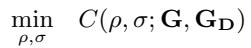

$$
\tag{C1}
$$

$$
\tag{C2}
$$

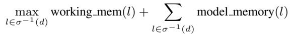

$$
\tag{C3}
$$

Proposition 1. The heterogeneity-aware RL training scheduling problem is NP-hard.

The proof is deferred to Appendix A.

## 3.2 Multi-Level Search Framework

Given that the heterogeneity-aware RL training scheduling problem is NP-hard, we propose a multi-level search framework to decompose it. As shown in Figure 1, the framework consists of five levels:

• Level 1 (Task grouping): Given an RL workflow, we first partition the tasks into disjoint task groups. All tasks in the same group are executed on a common set of GPUs, and all models associated with these tasks are co-located.

• Level 2 (Coarse-grained GPU assignment): Given the number of task groups, we divide the GPUs into disjoint GPU groups and assign each task group to a GPU group. Note that in this step, we only determine the number of GPUs in each GPU group, not the specific GPUs.

• Level 3 (Medium-grained GPU assignment): In this step, we generate some candidate assignments that assign task groups to specific GPUs.

• Level 4 (Intra-model parallelization): Since we now have a number of candidate medium-grained GPU assignments, we can determine feasible parallelization strategies for individual tasks within each assignment. By applying the parallelization strategies, the tasks are furthered decomposed into tasklets.

• Level 5 (Fine-grained GPU assignment): Finally, we generate some candidate assignments that assign tasklets to specific GPUs to obtain the complete scheduling plans.

Interpretation. Our framework can be viewed as a coarseto-fine constructive approach that operationalizes the joint optimization over (ρ, σ) defined in Section 3.1. Concretely, Levels 1 and 4 instantiate the partitioning strategy ρ (task grouping and intra-model parallelization that produce the tasklet graph GL), while Levels 2, 3, and 5 instantiate the assignment strategy σ (coarse-to-fine GPU assignments). Accordingly, the procedure constitutes a coarse-to-fine algorithmic instantiation of the RL training scheduling problem.

## 3.3 Cost Model

Because the search space is large and running RL training in practice can take tens of minutes per step, we develop a cost model within our framework based on previous work (Sheng et al., 2025; Yuan et al., 2022; Jiang et al., 2025a) to quickly estimate execution time.We adopt a compact convention: expressions with parentheses denote cost models (functions), and the same symbols without parentheses denote their evaluated costs at the current inputs. Cost models differ across RL algorithms and between synchronous and asynchronous modes; below we present the one for synchronous PPO:

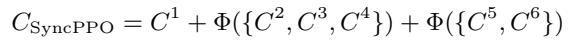

where C1:6(·) denote the cost model of actor generation, reward inference, reference inference, critic inference, critic training, and actor training, respectively. Φ(·) aggregates

the costs of tasks without dependencies and is defined as:

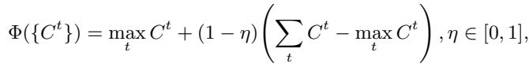

where the coefficient η parameterizes the level of task parallelism (0: sequential; 1: fully parallel; else: partial). The cost model of the t-th task is given by:

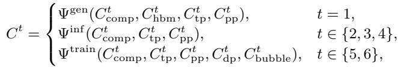

where Ctcomp(·) estimates a set of per-tasklet or persubgraph computation costs, Cthbm(·) estimates a set of per-tasklet or per-subgraph HBM costs (i.e., loading LLMs from HBM to SRAM during decoding), Ctbubble(·) estimate a set of per-tasklet or per-subgraph pipeline-bubble costs, and Cttp(·), Ctpp(·), Ctdp(·) estimates a set of pertasklet or per-subgraph TP, PP, and DP computation costs. Ψgen, Ψinf , Ψtrain estimate task-level costs based on the given sets of tasklet- or subgraph-level costs. For brevity, we have omitted some inputs to the above equations, including device and network attributes, and we have also omitted the resharding cost in the end-to-end cost. Details of cost modeling can be found in Appendix B.

## 3.4 Searching via SHA and GA

The multi-level search framework allows us to allocate the search budget and generate the candidate execution plans in a more flexible way. To speed up the search process, we apply nested successive halving at Level 1 and 2 and apply genetic algorithm at Levels 3 to 5.

Nested successive halving. Successive Halving Algorithm (SHA) (Jamieson & Talwalkar, 2016) is an algorithm for solving the non-stochastic best arm identification problem within a fixed budget. The pseudocode in Algorithm 1 shows how HetRL extends SHA to a nested form and applies it to our problem. HetRL treats task groupings as arms at Level 1 and GPU groupings as arms at Level 2 in the multi-armed bandits problem; the execution time estimated by the cost model serves as each arm’s loss. Concretely, the inputs are the user-defined budget B, workflow information and device information. At Level 1 (lines 15-17 and 30-33), it first assigns a starting budget bm to each task grouping, which is shared by all the GPU groupings corresponding to this task grouping. At Level 2 (lines 18-21 and 25-29), it also first assigns a starting budget bm,n to each pair of tasking grouping and GPU grouping. It then uses genetic algorithms and cost model from lower Levels to generate and evaluate bm,n candidate plans (lines 22-24). Finally, it discards the worst half GPU groupings and continues the procedure with the better half with a doubled budget until the assigned budget bm is exhausted. This procedure is also repeated in Level 1 by discarding the worse half tasking groupings and doubling the budget for the next round until the global budget B is exhausted. At each new Level 1 round, we neither carry forward only the single best GPU grouping identified by Level 2 in the last round nor carry forward all GPU groupings for each task grouping; instead, we retain the best half GPU groupings for each task grouping. With the nested SHA, we are able to assign more search budget to more promising set of candidates and discard less promising solutions early. SHA enjoys theoretical guarantees on the probability of selecting an optimal (or near-optimal) configuration within a given computational budget. The detailed proof and analysis can be found in (Jamieson & Talwalkar, 2016; Li et al., 2017).

Algorithm 1 HetRL Search Algorithm   
Input: search budget B, a computational graph for an RL workflow G, a device   
topology graph GD, number of GPUs N   
Output: Execution plan with the lowest estimated cost   
1: let T G = {tgξi } be the set of all feasible task groupings for a given RL   
workflow, where tgξ denotes a feasible grouping of RL tasks   
2: let GG = {tgξi 7→ GGξi } be the set of all feasible GPU groupings and   
GGξi = {ggξi,j } be the set of all feasible GPU groupings for a given tgξi   
3: let C = {tgξi , ggξi,j 7→ {cξi,j,k }} be the cost of candidate plans, where   
cξi,j,k denote the k-th cost of candidate plans with task grouping tgξi and   
GPU grouping ggξi,j   
4: initialize T G ← ∅, GG ← ∅, C ← ∅   
5: T G ← task grouping(G)   
6: for all tgξi ∈ T G do   
7: GGξi ← gpu grouping(N, |tgξi |)   
8: GG ← GG ∪ {tgξi 7→ GGξi }   
9: for all ggξi,j ∈ GGξi do   
10: C ← C ∪ {tgξi , ggξi,j 7→ {∞}}   
11: end for   
12: end for   
13: T G0 ← T G   
14: GG0 ← GG   
15: for m = 0, 1, . . . , ⌈log2(|T G|)⌉ − 1 do   
16: for all tgξi ∈ T Gm do   
17: let bm = ⌊ B|T Gm|⌈log2(|T G|)⌉ ⌋ be search budget for task group tgξi   
18: GGξi,0 ← GGm(tgξi )   
19: for n = 0, 1, . . . , ⌈log2(|GGm(tgξ )|)⌉ − 1 do   
20: for all ggξi,j ∈ GGξi,n do   
21: let bm,n = ⌊ bm|GGξi,n|⌈log2(|GGm(tgξi )|)⌉ ⌋ be search budget   
for task group tgξi and GPU group ggξi,j   
22: for k = 0, 1, . . . , bm,n − 1 do   
23: let pk ← genetic algorithm(tgξi , ggξi,j , GD, . . .) be a plan   
generated from lower levels   
24: cξi,j,k = cost model(pk, GD, . . .)   
25: C(tgξi , ggξi,j ) ← C(tgξi , ggξi,j ) ∪ cξi,j,k   
26: end for   
27: end for   
28: GGξi,n+1 ← best half(GGξi,n, C)   
29: end for   
30: GGm+1(tgξi ) ← best half(GGm(tgξi ), C)   
31: 32: end for   
T Gm+1 ← best half(T Gm, C)   
33: end for

Genetic algorithm with two-level swaps. Given the task grouping obtained from Level 1 and the coarse-grained GPU assignment obtained from Level 2, we generate fine-grained GPU assignments through Level 3 to 5. By treating the devices assigned to tasklets within the same pipeline stage as a graph partition, and those assigned to the same task group as a coarsened graph partition, the procedure can be viewed as a graph partitioning problem with a complex objective on the device topology graph. Following the line of research that uses Genetic Algorithm (GA) (Bui & Moon, 1996; Soper et al., 2004; Yuan et al., 2022) for graph partitioning, we develop a GA with two-level swaps for our problem.

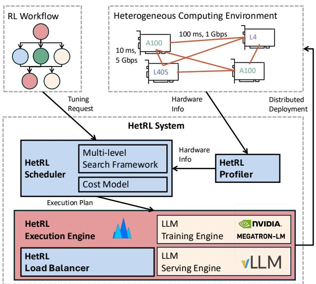  
Figure 2. HetRL system overview.

Concretely, we randomly initialize medium-grained GPU assignments at Level 3, enumerate all feasible intra-model parallelization strategies at Level 4, and then randomly initialize fine-grained GPU assignments at Level 5, where the input to each level is the output of the previous one. These fine-grained GPU assignments serve as the initial population of the GA, which produces the next generation as follows. It first generates a new “offspring” o via mutation from the population. Given this offspring o, we conduct swapping at o to find a new partitioning strategy that leads to better cost. We then add o to the population and remove the worst partition candidate in the population if o has a better cost. Swaps are applied at both Level 3 and 5: at Level 3 we swap GPUs across task groups, whereas at Level 5 we swap GPUs across tasklet groups. With two-level swaps, candidates belong to less promising medium-grained GPU assignments are removed from the population by swaps at Level 3 and the rest candidates with less promising fine-grained GPU assignments are removed by swaps at Level 5.

## 4 THE HETRL SYSTEM

Centering on our proposed scheduling algorithm, we built HetRL, a distributed system for efficient RL training in heterogeneous environments. Figure 2 illustrates the system overview of HetRL, which comprises four key components: a scheduler, a profiler, a load balancer, and a distributed execution engine. Next, we detail the end-to-end workflow and the role of each component in it.

## 4.1 Workflow

An RL training job submitted to HetRL contains an RL algorithm, a dataset, models for different tasks, an optimizer, numerical precision, global batch size, sequence lengths of prompts and responses, and other optional configurations. After receiving a job request, the HetRL profiler first collects hardware information about the computing environment, including the computation power (TFLOPs), memory capacity (GBs), and HBM bandwidth (GB/s) of available GPUs, intra-machine bandwidth (GB/s), and network delay (ms) and bandwidth (Gbps) between them. Then the HetRL scheduler searches for a near-optimal execution plan according to the workflow information and hardware information. As described in Section 3, the scheduler leverages the multilevel search framework and our proposed search algorithms for generation and selection of candidate plans, and uses its cost model to evaluate various candidate plans in terms of training throughput and memory footprint. Finally, the HetRL execution engine deploys the RL training job in the heterogeneous environment according to the selected execution plan. The HetRL execution engine is implemented on top of verl (Sheng et al., 2025) with extended support for fine-grained resource assignment and load balancing, and it uses Megatron-LM (Shoeybi et al., 2019) and vLLM (Kwon et al., 2023) as training and serving engines.

## 4.2 Load Balancing

The HetRL load balancer incorporates several load balancing strategies to better accommodate RL workflows to heterogeneous computing environments. Load balancing can be roughly divided into two categories: data-level and layerlevel. To achieve data-level load balancing, it adjusts the local batch sizes across GPUs within a DP group during the actor rollout task based on estimates from the cost model. For the other tasks, where sequence lengths are known beforehand, it assign samples with longer sequence length to more powerful GPUs. To achieve layer-level load balancing, it adjusts the layer distribution across pipeline stages based on estimates from the cost model. These three load balancing strategies enlarge the search space of our algorithms and can be implemented without invasive modifications to mainstream frameworks (e.g., verl, Megatron-LM and vLLM). We leave the integration of more advanced load balancing strategies (Um et al., 2024) as future work.

Table 1. GPU specifications.  
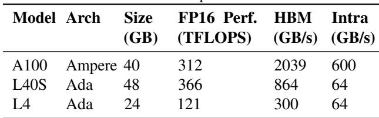

## 5 EVALUATION

We first compare the end-to-end performance of HetRL against SoTA RL training systems under various workloads and computing environments. Subsequently, we evaluate the search efficiency and the effectiveness of load balancing.

## 5.1 Experimental Setup

Hardware. We conduct experiments on a testbed with a total of 64 GPUs, of which 24 are A100s, 24 are L40Ss, and 16 are L4s. The detail GPU specifications are listed in Table 1. To simulate the heterogeneous network environments, we measure the latencies and bandwidths between 10 different regions (Virginia, Ohio, Paris, Stockholm, London, Ireland, Spain, Zurich, Frankfurt, and Milan) and apply them to our testbed, as shown in Figure 3 (a) and (b). Our evaluation covers four different network environments:

• Scenario 1 (Single-Region). This is a standard setting provided by cloud service providers. We do not enforce latency or bandwidth controls here.

• Scenario 2 (Multi-Region-Hybrid). We consider individual GPUs across Ohio and Virginia, but subset of Virginia GPUs are at the edge and only have direct connections to GPUs within Virginia. The inter-region connections between Ohio and Virginia have 10 ms of delay and 5 Gbps of bandwidth, while connections involving edge GPUs have a bandwidth of 1 Gbps.

• Scenario 3 (Multi-Country). We consider individual GPUs cross eight different regions in Europe. For interregion connections, the delay is 5∼30 ms and the bandwidth is 1.9∼5.0 Gbps.

• Scenario 3 (Multi-Continent). We consider individual GPUs cross eight different regions acroos Europe and US. For inter-region connections, the delay is 5∼60 ms and the bandwidth is 0.9∼5.0 Gbps.

Models and RLHF algorithms. We choose representative open-source LLMs, the Qwen series, and consider three different sizes of Qwen models, 4B, 8B, and 14B. For the RLHF algorithm, we evaluate two popular methods, PPO (Schulman et al., 2017) and GRPO (Shao et al., 2024), considering both their synchronous and asynchronous versions. In the evaluation, we use the same size of LLM for all models and tasks within each RL workflow. However,

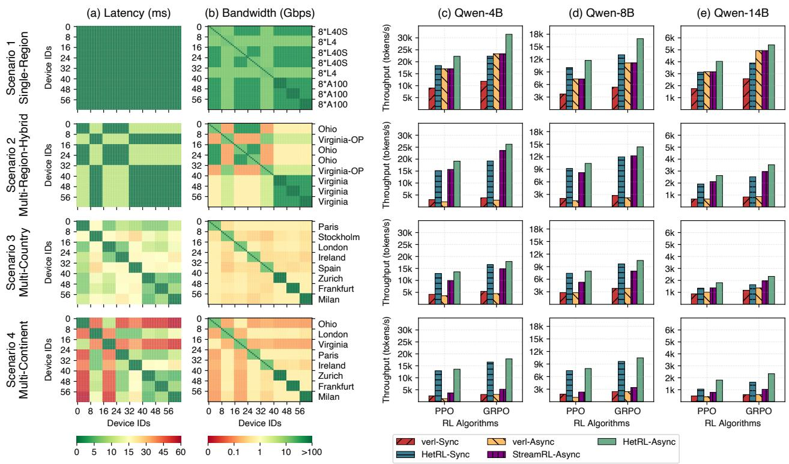  
Figure 3. End to end compassion of HetRL with verl and StreamRL in four different scenarios. Column (a) and (b) visualize the delay and bandwidth of four scenario respectively; Column (c), (d), and (e) illustrate the PPO and GRPO throughput comparison respectively.

HetRL can flexibly accommodate RL workflows that use models of different sizes to perform different tasks.

Datasets and hyperparameters. We conduct experiments on GSM8k dataset from OpenAI, an open-source, goldstandard benchmark for mathematical reasoning. We set the maximum length of both input prompts and output responses to 1024, the global batch size to 1024, and the number of responses generated per prompt to 8. In the RL workflow, training uses mixed precision with the Adam optimizer, and inference and generation use BF16 precision. The above settings are consistent with previous studies on RL training systems (Sheng et al., 2025).

Baselines. We compare HetRL against two baselines:

• verl (Sheng et al., 2025) is a widely-used, open-source, SoTA RL training system in homogeneous setting. It proposes a hierarchical hybrid programming model to flexibly support various RL workflows and configurations.

• StreamRL (Zhong et al., 2025a) is the SoTA RL training system in heterogeneous and asynchronous setting. It supports the deployment of actor generation and the rest tasks in two separate data centers.

Since StreamRL is not open-source, we implemented its asynchronous version on top of verl. In addition, we chose vLLM as the inference engine and Megatron-LM as the training engine for all variants to ensure a fair comparison. We recognize other well-known RL training systems; however, we do not include them in the evaluation since their features and functionalities largely overlap with the baselines or they focus on RL algorithmic innovations.

## 5.2 End-to-End Comparison

Our first experiment compares end to end performance of HetRL against verl and StreamRL in four different scenarios, corresponding to four rows of Figure 3. Figure 3(c - e) show the throughput of fine-tuning Qwen-4B, 8B, and 14B with PPO and GRPO, respectively. In Single-Region scenario, HetRL outperforms verl by 1.51∼2.05× in synchronous RL training and outperforms StreamRL and verl by 1.1∼1.31× in asynchronous RL training. In Multi-Region-Hybrid scenario, HetRL outperforms verl by 3.01∼4.99× in synchronous RL training and outperforms StreamRL and verl by 1.11∼1.27× and 4.07∼9.17× in asynchronous RL training. In Multi-Country scenario, HetRL outperforms verl by 1.4∼3.07× in synchronous RL training and outperforms StreamRL and verl by 1.19∼1.5× and 1.71∼4.0× in asynchronous RL training. In Multi-Continent scenario, HetRL outperforms verl by 2.24∼5.46× in synchronous RL training and outperforms StreamRL and verl by 2.25∼3.72× and 4.38∼10.76× in asynchronous RL training.

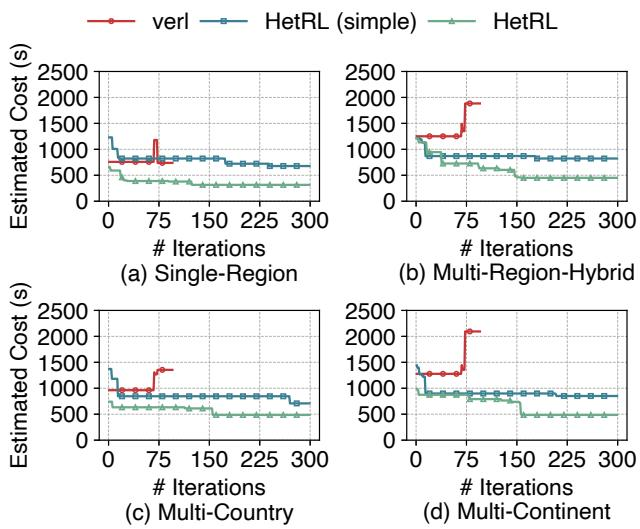  
Figure 4. Convergence comparison of different search strategies for training Qwen-8B with synchronous PPO in four scenarios.

HetRL achieves higher training throughputs than baselines in all scenarios by fully considering the characteristics of heterogeneous GPUs and networks in its scheduling algorithm. The performance gaps in the scenarios 2-4 are larger due to the larger differences in network latencies and bandwidths between devices. While HetRL-Async is always faster than HetRL-Sync, we observe that verl-Async is sometimes slower than verl-Sync due to its unoptimized scheduling in heterogeneous environments. Except for the first scenario, StreamRL-Async achieves higher training throughput than verl-Async because its scheduling algorithm allows dividing GPU resources across data centers into two groups and assigning them to actor generation and the other tasks accordingly. The performance gaps between HetRL and the baselines for PPO and GRPO are different, mainly because GRPO does not have a critic model and critic inference and training tasks.

## 5.3 Effectiveness of the Scheduling Algorithm

To evaluate the effectiveness of our proposed scheduling algorithm, we compare its convergence behavior with verl’s scheduling algorithm. We also use a simple version of our proposed scheduling algorithm by disabling SHA and using the same genetic algorithm as previous work (Yuan et al., 2022) where swapping only occurs within a model, rather than across models and tasks (i.e., HetRL (simple)). HetRL (simple) can also be regarded as a simple combination of pervious scheduling algorithms. Figure 4 shows that our proposed scheduling algorithms significantly outperforms verl’s scheduling algorithm and the HetRL (simple). When HetRL and HetRL (simple) are given more search budget, both of them outperform verl due to their heterogeneityaware cost models. However, when the search budget is the same, the plan searched by HetRL (simple) is worse than the plan generated by verl in scenario 1. In comparison, HetRL obtains better plans than other variants under different search budgets, demonstrating the effectiveness of our adopted improvements.

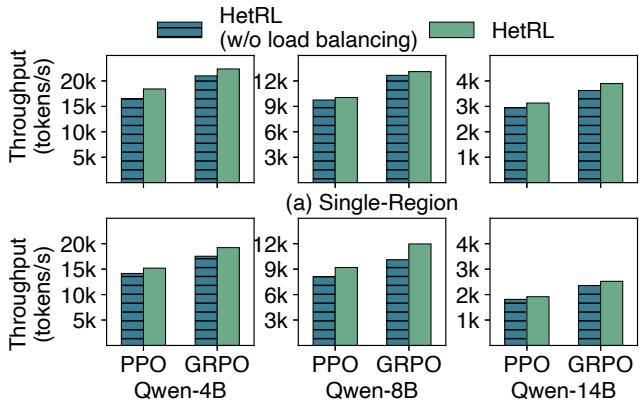  
(b) Multi-Region-Hybrid  
Figure 5. Effects of load balancing on synchronous RL training across model sizes under Single- and Multi-Region scenarios.

## 5.4 Effects of Load Balancing

This section conducts an ablation study on the effect of load balancing. We evaluate the synchronous RL training of Qwen 4B, 8B, and 14B using PPO and GRPO. As illustrated in Figure 5, load balancing improves training throughput by up to 12% in the Single-Region scenario and up to 18% in the Cross-Region scenario, which confirms the effectiveness of our load balancing strategies. Our performance gains from load balancing is slightly smaller than related work such as Metis (Um et al., 2024), which is 19∼22%. The gap can be minimized by integrating more proposed load balancing strategies into HetRL. In asynchronous RL training, further improvements are not significant because the resource scheduling between generation and training determines the performance.

## 5.5 Impact of GPU Combinations

Our last experiments tests how different systems perform under varying combinations of heterogeneous GPUs. As shown in Figure 6, HetRL outperforms verl by 1.72∼4.33×/1.77∼3.42×/1.57∼3.33×/1.57∼3.03× under PPO-Sync/GRPO-Sync/PPO-Async/GRPO-Async. When leveraging the larger memory capacity and more compute resources of heterogeneous GPUs (Figure 6(ALL GPUs)), HetRL outperforms its deployments on limited homogeneous GPUs (Figure 6(24\*A100)) by 1.57∼2.0×. Due to resource constraints, this set of experiments is limited to the Single-Region scenario. However, the analysis results obtained from our scheduling algorithm suggest that the observed improvements can be extended to the rest three scenarios.

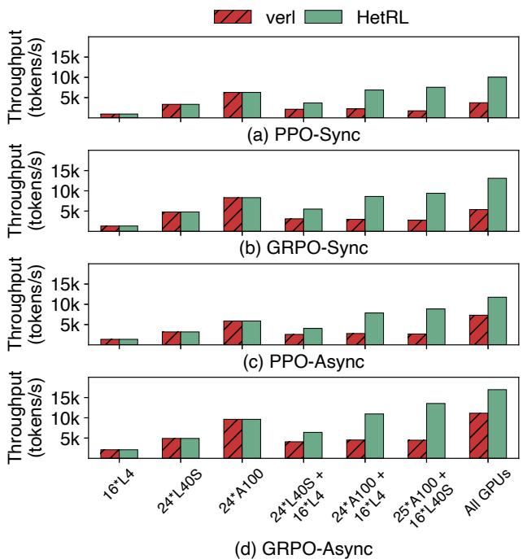  
Figure 6. Throughput comparison of HetRL and verl for training Qwen-8B using multiple RL algorithms under varying combinations of GPUs.

Figures 3(bottom three rows) and 6(24×A100) show that, by leveraging heterogeneous compute resources across regions, HetRL achieves 1.09∼1.77× the throughput of using only the limited homogeneous GPUs in a single region. These results show that (1) HetRL effectively harnesses heterogeneous compute resources to accelerate RL training; and (2) when available homogeneous GPUs are limited, using heterogeneous resources from the same region or even across regions is a viable alternative.

## 6 LIMITATIONS AND DISCUSSION

Heterogeneous GPUs. Our evaluation only uses three different NVIDIA GPUs (Table 1) and uses AWS OFI NCCL (aws, 2025b) and AWS EFA (aws, 2025a) for internode communication. In HetRL, we have not yet tested or added support for other NVIDIA GPU generations, GPUs from other vendors, or other networking stacks. We adopt mainstream RLHF algorithms unchanged and focus our evaluation on throughput. We do not investigate whether convergence is affected by potential precision issues that may arise when exchanging data across heterogeneous GPUs.

Cost-efficiency. This work studies accelerating RL training with heterogeneous GPUs and network. GPU resource pricing varies by vendor, region, and purchasing plan, and is subject to adjustment and fluctuation over time. Therefore, this paper does not include a cost-efficiency comparison.

## 7 RELATED WORK

Systems for RL training. A series of recent work has focused on optimizing RL training. (Hu et al., 2024; Yao et al., 2023; Shen et al., 2024; Sheng et al., 2025) are pioneering and popular RL training systems that focused on the design of flexible and efficient programming models to support diverse RL workflows when they were proposed, but have continuously adopted system optimizations proposed by subsequent research. RLHFuse (Zhong et al., 2025b) introduces stage fusion strategies to improve GPU utilization for synchronous RL training. (Noukhovitch et al., 2025) explores trade-offs between training speed and quality in one-step off-policy, asynchronous RL training and AReaL (Fu et al., 2025) proposes staleness-aware asynchronous RL training. (Wu et al., 2025a; Han et al., 2025; Zhong et al., 2025a) provides optimized system support for asynchronous RL training by minimizing bubbles caused by task dependencies. StreamRL (Zhong et al., 2025a) confirms the benefits of RL training on cross-data heterogeneous GPUs, but has strict limitations on the heterogeneity of computing resources. Distinct from existing systems, HetRL is the first system tailored for RL training in heterogeneous environments.

Heterogeneity-aware LLM training and serving. There are plenty of recent efforts have investigated on the deployment of LLM serving and training on heterogeneous GPUs and networks. ThunderServe (Jiang et al., 2025a) formulates heterogeneity-aware LLM serving as job shop scheduling problem and adopts tabu search to identify highly optimized deployment plan. HexGen-2 (Jiang et al., 2025b) and Helix (Mei et al., 2025) formulates the problem as a maxflow problem and adopts genetic algorithm and mixed integer linear programming algorithm, respectively. For heterogeneityaware LLM training, DTFM (Yuan et al., 2022) formulates it as graph partition problem and also adopt genetic algorithm. Metis (Um et al., 2024) considers the deployment on heterogeneous GPUs and homogeneous networks and also adopts depth-first search. Sailor (Strati et al., 2025) and ThunderServe (Jiang et al., 2025a) further study fault tolerance and elasticity issues in geo-distributed LLM training and serving and propose heuristic lightweight re-scheduling algorithms. These systems are targeted for single-model or single-task deployments, but their scheduling optimizations can be integrated as subcomponents into our scheduling algorithm based on the multi-level search framework and successive halving. Our work shares a similar vision in improving the utilization of geo-distributed heterogeneous GPU resources, but this is the first attempt to tailor a system for RL workflows involving multiple models and tasks with complex computational and data dependencies.

## 8 CONCLUSION

In this paper, we explore the opportunity to deploy the RL training in infrastructures with heterogeneous GPU models and network characteristics. Toward this end, we present HetRL, a distributed system tailored for such deployments, equipped with an efficient and effective scheduling algorithm that partitions RL workflows into tasklets and assigns them to heterogeneous computing resources. Our empirical studies suggest that HetRL achieves up to 9.17× higher throughput than SoTA RL training systems under various workloads and settings, demonstrating the effectiveness of our scheduling algorithm and system optimizations.

## REFERENCES

Aws elastic fabric adapter. https://aws.amazon. com/hpc/efa/, 2025a.

Aws ofi nccl. https://github.com/aws/ aws-ofi-nccl, 2025b.

Ahmadian, A., Cremer, C., Galle, M., Fadaee, M., Kreutzer, ´ J., Pietquin, O., Ust ¨ un, A., and Hooker, S. Back to ba- ¨ sics: Revisiting reinforce-style optimization for learning from human feedback in llms. In Ku, L., Martins, A., and Srikumar, V. (eds.), Proceedings of the 62nd Annual Meeting of the Association for Computational Linguistics (Volume 1: Long Papers), ACL 2024, Bangkok, Thailand, August 11-16, 2024, pp. 12248–12267. Association for Computational Linguistics, 2024. doi: 10.18653/ V1/2024.ACL-LONG.662. URL https://doi.org/ 10.18653/v1/2024.acl-long.662.

Bui, T. N. and Moon, B. R. Genetic algorithm and graph partitioning. IEEE Trans. Computers, 45(7):841–855, 1996. doi: 10.1109/12.508322. URL https://doi. org/10.1109/12.508322.

Casper, S., Davies, X., Shi, C., Gilbert, T. K., Scheurer, J., Rando, J., Freedman, R., Korbak, T., Lindner, D., Freire, P., Wang, T. T., Marks, S., Segerie, C., Car- ´ roll, M., Peng, A., Christoffersen, P. J. K., Damani, M., Slocum, S., Anwar, U., Siththaranjan, A., Nadeau, M., Michaud, E. J., Pfau, J., Krasheninnikov, D., Chen, X., Langosco, L., Hase, P., Biyik, E., Dragan, A. D., Krueger, D., Sadigh, D., and Hadfield-Menell, D. Open problems and fundamental limitations of reinforcement learning

from human feedback. Trans. Mach. Learn. Res., 2023, 2023. URL https://openreview.net/forum? id=bx24KpJ4Eb.

Dai, J., Pan, X., Sun, R., Ji, J., Xu, X., Liu, M., Wang, Y., and Yang, Y. Safe RLHF: safe reinforcement learning from human feedback. In The Twelfth International Conference on Learning Representations, ICLR 2024, Vienna, Austria, May 7-11, 2024. OpenReview.net, 2024. URL https://openreview.net/forum? id=TyFrPOKYXw.

DeepSeek-AI. Deepseek-v3 technical report. CoRR, abs/2412.19437, 2024. doi: 10.48550/ARXIV.2412. 19437. URL https://doi.org/10.48550/ arXiv.2412.19437.

Fu, W., Gao, J., Shen, X., Zhu, C., Mei, Z., He, C., Xu, S., Wei, G., Mei, J., Wang, J., Yang, T., Yuan, B., and Wu, Y. Areal: A large-scale asynchronous reinforcement learning system for language reasoning. CoRR, abs/2505.24298, 2025. doi: 10.48550/ARXIV.2505.24298. URL https: //doi.org/10.48550/arXiv.2505.24298.

Gao, Y., He, Y., Li, X., Zhao, B., Lin, H., Liang, Y., Zhong, J., Zhang, H., Wang, J., Zeng, Y., Gui, K., Tong, J., and Yang, M. An empirical study on low GPU utilization of deep learning jobs. In Proceedings of the 46th IEEE/ACM International Conference on Software Engineering, ICSE 2024, Lisbon, Portugal, April 14-20, 2024, pp. 96:1–96:13. ACM, 2024. doi: 10.1145/3597503.3639232. URL https://doi. org/10.1145/3597503.3639232.

Garey, M. R. and Johnson, D. S. Computers and Intractability: A Guide to the Theory of NP-Completeness. W. H. Freeman, 1979. ISBN 0-7167-1044-7.

Han, Z., You, A., Wang, H., Luo, K., Yang, G., Shi, W., Chen, M., Zhang, S., Lan, Z., Deng, C., Ji, H., Liu, W., Huang, Y., Zhang, Y., Pan, C., Wang, J., Huang, X., Li, C., and Wu, J. Asyncflow: An asynchronous streaming RL framework for efficient LLM post-training. CoRR, abs/2507.01663, 2025. doi: 10.48550/ARXIV. 2507.01663. URL https://doi.org/10.48550/ arXiv.2507.01663.

Hu, J., Wu, X., Wang, W., Xianyu, Zhang, D., and Cao, Y. Openrlhf: An easy-to-use, scalable and high-performance RLHF framework. CoRR, abs/2405.11143, 2024. doi: 10.48550/ARXIV.2405.11143. URL https://doi. org/10.48550/arXiv.2405.11143.

Huang, Y., Cheng, Y., Bapna, A., Firat, O., Chen, D., Chen, M. X., Lee, H., Ngiam, J., Le, Q. V., Wu, Y., and Chen, Z. Gpipe: Efficient training of giant neural networks using pipeline parallelism. In Wallach, H. M., Larochelle,

H., Beygelzimer, A., d’Alche-Buc, F., Fox, E. B., and´ Garnett, R. (eds.), Advances in Neural Information Processing Systems 32: Annual Conference on Neural Information Processing Systems 2019, NeurIPS 2019, December 8-14, 2019, Vancouver, BC, Canada, pp. 103–112, 2019. URL https://proceedings. neurips.cc/paper/2019/hash/ 093f65e080a295f8076b1c5722a46aa2-Abstr html.

Jamieson, K. G. and Talwalkar, A. Non-stochastic best arm identification and hyperparameter optimization. In Gretton, A. and Robert, C. C. (eds.), Proceedings of the 19th International Conference on Artificial Intelligence and Statistics, AISTATS 2016, Cadiz, Spain, May 9-11, 2016, volume 51 of JMLR Workshop and Conference Proceedings, pp. 240–248. JMLR.org, 2016. URL http://proceedings.mlr.press/ v51/jamieson16.html.

Jia, Z., Zaharia, M., and Aiken, A. Beyond data and model parallelism for deep neural networks. In Talwalkar, A., Smith, V., and Zaharia, M. (eds.), Proceedings of the Second Conference on Machine Learning and Systems, SysML 2019, Stanford, CA, USA, March 31 - April 2, 2019. mlsys.org, 2019. URL https://proceedings.mlsys. org/paper\_files/paper/2019/hash/ b422680f3db0986ddd7f8f126baaf0fa-Abstr html.

Jiang, Y., Fu, F., Yao, X., He, G., Miao, X., Klimovic, A., Cui, B., Yuan, B., and Yoneki, E. Demystifying cost-efficiency in llm serving over heterogeneous gpus. In Forty-second International Conference on Machine Learning, ICML 2025, Vancouver, Canada, July 13-19, 2025. OpenReview.net, 2024.

Jiang, Y., Fu, F., Yao, X., Wang, T., Cui, B., Klimovic, A., and Yoneki, E. Thunderserve: High-performance and cost-efficient LLM serving in cloud environments. CoRR, abs/2502.09334, 2025a. doi: 10.48550/ARXIV. 2502.09334. URL https://doi.org/10.48550/ arXiv.2502.09334.

Jiang, Y., Yan, R., and Yuan, B. Hexgen-2: Disaggregated generative inference of llms in heterogeneous environment. In The Thirteenth International Conference on Learning Representations, ICLR 2025, Singapore, April 24-28, 2025. OpenReview.net, 2025b. URL https: //openreview.net/forum?id=Cs6MrbFuMq.

Karp, R. M. Reducibility among combinatorial problems. In Miller, R. E. and Thatcher, J. W. (eds.), Proceedings of a symposium on the Complexity of Computer Computations, held March 20-22, 1972, at the IBM

Thomas J. Watson Research Center, Yorktown Heights, New York, USA, The IBM Research Symposia Series, pp. 85–103. Plenum Press, New York, 1972. doi: 10.1007/978-1-4684-2001-2\ 9. URL https://doi. org/10.1007/978-1-4684-2001-2\_9.

Kaufmann, T., Weng, P., Bengs, V., and Hullermeier, E. A ¨ t.survey of reinforcement learning from human feedback. Trans. Mach. Learn. Res., 2025, 2025. URL https: //openreview.net/forum?id=f7OkIurx4b.

Kwon, W., Li, Z., Zhuang, S., Sheng, Y., Zheng, L., Yu, C. H., Gonzalez, J., Zhang, H., and Stoica, I. Efficient memory management for large language model serving with pagedattention. In Flinn, J., Seltzer, M. I., Druschel, P., Kaufmann, A., and Mace, J. (eds.), Proceedings of the 29th Symposium on Operating Systems Principles, SOSP 2023, Koblenz, Germany, October 23-26, 2023, pp. 611–626. ACM, 2023. doi: 10. 1145/3600006.3613165. URL https://doi.org/ 10.1145/3600006.3613165.

Lam, S. and Sethi, R. Worst case analysis of two scheduling algorithms. SIAM J. Comput., 6(3):518–536, 1977. doi: 10.1137/0206037. URL https://doi.org/10. 1137/0206037.

Lambert, N., Morrison, J., Pyatkin, V., Huang, S., Ivison, ct.H., Brahman, F., Miranda, L. J. V., Liu, A., Dziri, N., Lyu, S., Gu, Y., Malik, S., Graf, V., Hwang, J. D., Yang, J., Bras, R. L., Tafjord, O., Wilhelm, C., Soldaini, L., Smith, N. A., Wang, Y., Dasigi, P., and Hajishirzi, H. Tulu 3: ¨ Pushing frontiers in open language model post-training. CoRR, abs/2411.15124, 2024. doi: 10.48550/ARXIV. 2411.15124. URL https://doi.org/10.48550/ arXiv.2411.15124.

Li, L., Jamieson, K. G., DeSalvo, G., Rostamizadeh, A., and Talwalkar, A. Hyperband: Bandit-based configuration evaluation for hyperparameter optimization. In 5th International Conference on Learning Representations, ICLR 2017, Toulon, France, April 24-26, 2017, Conference Track Proceedings. OpenReview.net, 2017. URL https: //openreview.net/forum?id=ry18Ww5ee.

Li, Z., Zheng, L., Zhong, Y., Liu, V., Sheng, Y., Jin, X., Huang, Y., Chen, Z., Zhang, H., Gonzalez, J. E., and Stoica, I. Alpaserve: Statistical multiplexing with model parallelism for deep learning serving. In Geambasu, R. and Nightingale, E. (eds.), 17th USENIX Symposium on Operating Systems Design and Implementation, OSDI 2023, Boston, MA, USA, July 10- 12, 2023, pp. 663–679. USENIX Association, 2023. URL https://www.usenix.org/conference/ osdi23/presentation/li-zhouhan.

Llama Team. The llama 3 herd of models. CoRR, abs/2407.21783, 2024. doi: 10.48550/ARXIV.2407. 21783. URL https://doi.org/10.48550/ arXiv.2407.21783.

Mei, Y., Zhuang, Y., Miao, X., Yang, J., Jia, Z., and Vinayak, R. Helix: Serving large language models over heterogeneous gpus and network via max-flow. In Eeckhout, L., Smaragdakis, G., Liang, K., Sampson, A., Kim, M. A., and Rossbach, C. J. (eds.), Proceedings of the 30th ACM International Conference on Architectural Support for Programming Languages and Operating Systems, Volume 1, ASPLOS 2025, Rotterdam, The Netherlands, 30 March 2025 - 3 April 2025, pp. 586–602. ACM, 2025. doi: 10.1145/3669940.3707215. URL https: //doi.org/10.1145/3669940.3707215.

Noukhovitch, M., Huang, S., Xhonneux, S., Hosseini, A., Agarwal, R., and Courville, A. C. Asynchronous RLHF: faster and more efficient off-policy RL for language models. In The Thirteenth International Conference on Learning Representations, ICLR 2025, Singapore, April 24-28, 2025. OpenReview.net, 2025. URL https: //openreview.net/forum?id=FhTAG591Ve.

Qwen Team. Qwen3 technical report. CoRR, abs/2505.09388, 2025. doi: 10.48550/ARXIV.2505. 09388. URL https://doi.org/10.48550/ arXiv.2505.09388.

Rafailov, R., Sharma, A., Mitchell, E., Manning, C. D., Ermon, S., and Finn, C. Direct preference optimization: Your language model is secretly a reward model. In Oh, A., Naumann, T., Globerson, A., Saenko, K., Hardt, M., and Levine, S. (eds.), Advances in Neural Information Processing Systems 36: Annual Conference on Neural Information Processing Systems 2023, NeurIPS 2023, New Orleans, LA, USA, December 10 - 16, 2023, 2023. URL http://papers. nips.cc/paper\_files/paper/2023/hash/ a85b405ed65c6477a4fe8302b5e06ce7-Abstr html.

Rajbhandari, S., Rasley, J., Ruwase, O., and He, Y. Zero: memory optimizations toward training trillion parameter models. In Cuicchi, C., Qualters, I., and Kramer, W. T. (eds.), Proceedings of the International Conference for High Performance Computing, Networking, Storage and Analysis, SC 2020, Virtual Event / Atlanta, Georgia, USA, November 9-19, 2020, pp. 20. IEEE/ACM, 2020. doi: 10.1109/SC41405.2020.00024. URL https://doi. org/10.1109/SC41405.2020.00024.

Schulman, J., Wolski, F., Dhariwal, P., Radford, A., and Klimov, O. Proximal policy optimization algorithms. CoRR, abs/1707.06347, 2017. URL http://arxiv. org/abs/1707.06347.

Shao, Z., Wang, P., Zhu, Q., Xu, R., Song, J., Zhang, M., Li, Y. K., Wu, Y., and Guo, D. Deepseekmath: Pushing the limits of mathematical reasoning in open language models. CoRR, abs/2402.03300, 2024. doi: 10.48550/ ARXIV.2402.03300. URL https://doi.org/10. 48550/arXiv.2402.03300.

Shen, G., Wang, Z., Delalleau, O., Zeng, J., Dong, Y., Egert, D., Sun, S., Zhang, J. J., Jain, S., Taghibakhshi, A., Ausin, M. S., Aithal, A., and Kuchaiev, O. Nemoaligner: Scalable toolkit for efficient model alignment. CoRR, abs/2405.01481, 2024. doi: 10.48550/ARXIV. 2405.01481. URL https://doi.org/10.48550/ arXiv.2405.01481.

Sheng, G., Zhang, C., Ye, Z., Wu, X., Zhang, W., Zhang, R., Peng, Y., Lin, H., and Wu, C. Hybridflow: A flexible and efficient RLHF framework. In Proceedings of the Twentieth European Conference on Computer Systems, EuroSys 2025, Rotterdam, The Netherlands, 30 March 2025 - 3 April 2025, pp. 1279–1297. ACM, 2025. doi: 10. 1145/3689031.3696075. URL https://doi.org/ 10.1145/3689031.3696075.

Shoeybi, M., Patwary, M., Puri, R., LeGresley, P., Casper, J., and Catanzaro, B. Megatron-lm: Training multibillion parameter language models using model parallelism. CoRR, abs/1909.08053, 2019. URL http: //arxiv.org/abs/1909.08053.

Soper, A. J., Walshaw, C., and Cross, M. A combined evolutionary search and multilevel optimisation approach to graph-partitioning. J. Glob. Optim., 29(2): 225–241, 2004. doi: 10.1023/B:JOGO.0000042115. 44455.F3. URL https://doi.org/10.1023/B: JOGO.0000042115.44455.f3.

Strati, F., Elvinger, P., Kerimoglu, T., and Klimovic, A. ML training with cloud GPU shortages: Is cross-region ct-Conference.the answer? In Proceedings of the 4th Workshop on Machine Learning and Systems, EuroMLSys 2024, Athens, Greece, 22 April 2024, pp. 107–116. ACM, 2024. doi: 10. 1145/3642970.3655843. URL https://doi.org/ 10.1145/3642970.3655843.

Strati, F., Zhang, Z., Manos, G., Periz, I. S., Hu, Q., Chen, ´ T., Buzcu, B., Han, S., Delgado, P., and Klimovic, A. Sailor: Automating distributed training over dynamic, heterogeneous, and geo-distributed clusters. In Won, Y., Kwon, Y., Yuan, D., and Isaacs, R. (eds.), Proceedings of the ACM SIGOPS 31st Symposium on Operating Systems Principles, SOSP 2025, Lotte Hotel World, Seoul, Republic of Korea, October 13-16, 2025, pp. 204–220. ACM, 2025. doi: 10.1145/3731569.3764839. URL https: //doi.org/10.1145/3731569.3764839.

Tarnawski, J., Narayanan, D., and Phanishayee, A. Piper: Multidimensional planner for DNN parallelization. In Advances in Neural Information Processing Systems 34: Annual Conference on Neural Information Processing Systems 2021, NeurIPS 2021, December 6-14, 2021, virtual, pp. 24829– 24840, 2021. URL https://proceedings. neurips.cc/paper/2021/hash/ d01eeca8b24321cd2fe89dd85b9beb51-Abstra html.

Um, T., Oh, B., Kang, M., Lee, W., Kim, G., Kim, D., Kim, Y., Muzzammil, M., and Jeon, M. Metis: Fast automatic distributed training on heterogeneous gpus. In Bagchi, S. and Zhang, Y. (eds.), Proceedings of the 2024 USENIX Annual Technical Conference, USENIX ATC 2024, Santa Clara, CA, USA, July 10-12, 2024, pp. 563–578. USENIX Association, 2024. URL https://www.usenix. org/conference/atc24/presentation/um.

Verhelst, M., Benini, L., and Verma, N. How to keep pushing ML accelerator performance? know your rooflines! IEEE J. Solid State Circuits, 60(6):1888–1905, 2025. doi: 10.1109/JSSC.2025.3553765. URL https:// doi.org/10.1109/JSSC.2025.3553765.

Wu, B., Wang, S., Tang, Y., Ding, J., Helenowski, E., Tan, L., Xu, T., Gowda, T., Chen, Z., Zhu, C., Tang, X., Qian, Y., Zhu, B., and Hou, R. Llamarl: A distributed asynchronous reinforcement learning framework for efficient large-scale LLM training. CoRR, abs/2505.24034, 2025a. doi: 10.48550/ARXIV.2505.24034. URL https: //doi.org/10.48550/arXiv.2505.24034.

Wu, Y., Liu, X., Jin, S., Xu, C., Qian, F., Mao, Z. M., Lentz, M., Zhuo, D., and Stoica, I. Hetermoe: Efficient training of mixture-of-experts models on heterogeneous gpus. CoRR, abs/2504.03871, 2025b. doi: 10.48550/ ARXIV.2504.03871. URL https://doi.org/10. 48550/arXiv.2504.03871.

Yao, Z., Aminabadi, R. Y., Ruwase, O., Rajbhandari, S., Wu, X., Awan, A. A., Rasley, J., Zhang, M., Li, C., Holmes, C., Zhou, Z., Wyatt, M., Smith, M., Kurilenko, L., Qin, H., Tanaka, M., Che, S., Song, S. L., and He, Y. Deepspeedchat: Easy, fast and affordable RLHF training of chatgptlike models at all scales. CoRR, abs/2308.01320, 2023. doi: 10.48550/ARXIV.2308.01320. URL https:// doi.org/10.48550/arXiv.2308.01320.

Yuan, B., He, Y., Davis, J., Zhang, T., Dao, T., Chen, B., Liang, P., Re, C., and Zhang, C. Decentralized´ training of foundation models in heterogeneous environments. In Advances in Neural Information Processing Systems 35: Annual Conference on Neural Information Processing Systems 2022, NeurIPS

2022, New Orleans, LA, USA, November 28 - December 9, 2022, 2022. URL http://papers. nips.cc/paper\_files/paper/2022/hash/ a37d615b61f999a5fa276adb14643476-Abstract-Confere html.

Zhang, Z. Understanding gpu architecture implications on llm serving workloads. Master’s thesis, ETH Zurich, 2024.

Zheng, L., Li, Z., Zhang, H., Zhuang, Y., Chen, Z., Huang, Y., Wang, Y., Xu, Y., Zhuo, D., Xing, E. P., Gonzalez, J. E., and Stoica, I. Alpa: Automating inter- and intra-operator parallelism for distributed deep learning. In Aguilera, M. K. and Weatherspoon, H. (eds.), 16th USENIX Symposium on Operating Systems Design and Implementation, OSDI 2022, Carlsbad, CA, USA, July 11-13, 2022, pp. 559–578. USENIX Association, 2022. URL https://www.usenix.org/conference/ osdi22/presentation/zheng-lianmin.

Zhong, Y., Zhang, Z., Song, X., Hu, H., Jin, C., Wu, B., Chen, N., Chen, Y., Zhou, Y., Wan, C., Zhou, H., Jiang, Y., Zhu, Y., and Jiang, D. Streamrl: Scalable, heterogeneous, and elastic RL for llms with disaggregated stream generation. CoRR, abs/2504.15930, 2025a. doi: 10.48550/ARXIV.2504.15930. URL https: //doi.org/10.48550/arXiv.2504.15930.

Zhong, Y., Zhang, Z., Wu, B., Liu, S., Chen, Y., Wan, C., Hu, H., Xia, L., Ming, R., Zhu, Y., and Jin, X. Optimizing RLHF training for large language models with stage fusion. In Benson, T. A. and Mysore, R. N. (eds.), 22nd USENIX Symposium on Networked Systems Design and Implementation, NSDI 2025, Philadelphia, PA, USA, April 28-30, 2025, pp. 489–503. USENIX Association, 2025b. URL https://www.usenix.org/ conference/nsdi25/presentation/zhong.

## A PROOF OF PROPOSITION 1

We use the same notations as in Section 3.

Proof. Assume, for contradiction, that the heterogeneityaware RL training scheduling problem admits a polynomialtime algorithm. We show that this would imply a polynomial-time algorithm for an NP-hard problem. Consider two cases: (1) The framework (e.g., Megatron-LM (Shoeybi et al., 2019) and DeepSpeed (Rajbhandari et al., 2020)) enforces uniform data and tensor parallelism degrees for all pipeline stages within the same task. Although the set of feasible partitioning strategies is polynomial in size for any fixed ρ = ρ0, even if the assignments for any T − 1 tasks in the RL workload G are fixed, optimizing over σ for the remaining task is NP-hard by a polynomial-time reduction from the balanced graph partitioning problem (Karp, 1972; Garey & Johnson, 1979), as in (Yuan et al., 2022); (2) The framework (e.g., Alpa (Zheng et al., 2022), Metis (Um et al., 2024), and FlexFlow (Jia et al., 2019)) allows each computational operator in G to have independent data and tensor parallelism degrees. Even assuming partial or complete homogeneity in the device topology graph GD, such that σ is solvable in polynomial time for any fixed ρ = ρ0, optimizing over ρ is NP-hard by a polynomial-time reduction from the knapsack problem (Karp, 1972; Garey & Johnson, 1979) as in (Tarnawski et al., 2021) or the minimum makespan problem (Lam & Sethi, 1977), as in (Jia et al., 2019). These two cases are mutually exclusive and exhaustive over the configuration space, and both are NP-hard, yielding a contradiction.

## B COST MODELING

In this section, we first model computational and communication costs of the main components involved in training and serving transformer models. Then we model the cost of the main tasks involved in RL training. Finally, we model the end-to-end cost for different RL training algorithms.

Since the modeling of memory cost is independent of device and network attributes, we simply follow prior work (Sheng et al., 2025; Zheng et al., 2022) and ensure that the tasklets’ memory footprint fits on every assigned device.

## B.1 Notations

We extend the notations in Section 3 for device topology graph. Let GD = (VD, ED, comp, mem, hbm, A, B) denote the device topology graph of heterogeneous environments, where VD = {d1, . . . , dN } are a set of N devices and ED = VD × VD are communication channels between devices. For each device d, the computation capability, memory capacity, and HBM bandwidth are compd, memd, hbmd ∈ R+. Collect them into vectors comp, mem, hbm ∈ RN+ . Each edge ed,d′ is labeled with latency αd,d′ and bandwidth βd,d′ , where αd,d′ , βd,d′ ∈ +.Let A, B ∈ RN×N+ be the corresponding matrices.

We extend the notations in Section 3 for tasklet graph. Let GL i,j t = (VLti,j , ELti,j ) denote the subgraph constructed by the set of tasklets of the j-th pipeline stage of the i-th replica in the t-th task. Let GDti,j = (VD ti,j , ED ti,j ) be the subgraph constructed by the set of devices assigned to these tasklets and we have σ(VLti,j ) = VDti,j . Similarly, let GLtj,k = (VLtj,k, ELtj,k) denote the subgraph constructed by the set of tasklets of the k-th tensor shards of the j-th pipeline stage in the t-th task and GDtj,k = (VDtj,k, EDtj,k) denote the assigned devices.

Now we introduce other required notations. Let ht1, ht2, nlt be the hidden size, the intermediate size, and number of layers of the LLM of the t-th task. Let nltj , TPtj be number of layers and TP degree in j-th pipeline stage of the t-th task. Let nltj be number of layers in j-th pipeline stage of the t-th task. Let seqin and seqout denote the maximum sequence lengths of the input prompts and output responses. Let mbs, nm denote micro-batch size and number of microbatches. Please note that we have preprocessed nm based on the number of responses generated per prompt, the data parallelism degree. Let BBF16, BFP32 be the data sizes of the BF16 and FP32 data types. Let ring(·) denote a function that returns the set of all feasible ring graphs of given devices. For brevity, we have omitted the vocabulary and token embeddings in the computation, but they are included in our actual implementation.

## B.2 Modeling component-level computation and communication costs.

Tensor parallelism communication. The communication volume transferred between a pair of neighboring GPUs in GDti,j per all-reduce during TP can be estimated by:

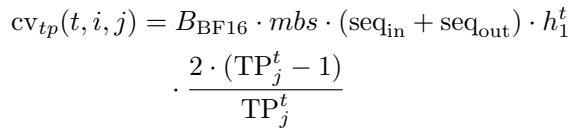

The TP communication cost of forward passes for GLti,j can be estimated by:

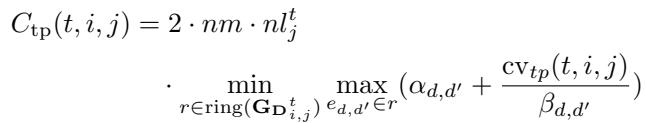

If recomputation is enabled, the TP communication cost of both forward and backward passes for GLti,j can be

estimated by:

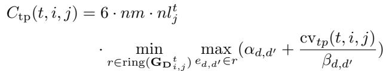

The overall TP communication cost can be estimated by:

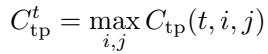

Pipeline parallelism communication. The communication volume transferred between the j-th and j + 1-th pipeline stages per micro-batch during PP can be estimated by:

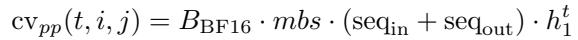

The PP communication cost of forward passes between GL i, t j and GLti,j+1 t can be by:

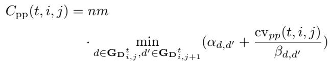

The PP communication cost of both forward and backward passes between GLti,j t and GLti,j+1 t can be estimated by:

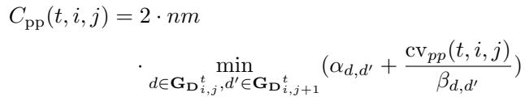

The overall PP communication cost can be estimated by:

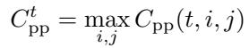

Data parallelism communication. The communication volume transferred between a pair of neighboring GPUs in GDtj,k per all-reduce during DP can be estimated by:

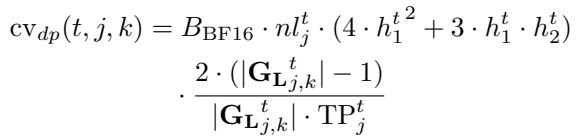

The DP communication cost for GDtj,k per iteration can be estimated by:

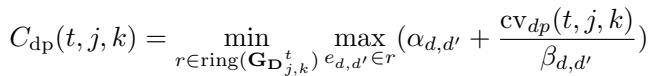

The overall DP communication cost can be estimated by:

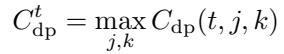

Computation. The computational cost of a transformer layer per forward pass per sample can be estimated by:

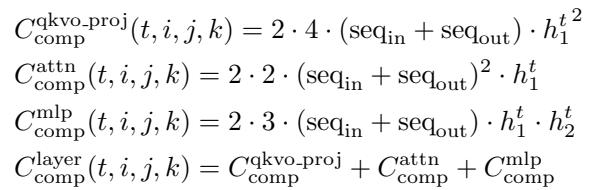

The computation cost of forward passes for lti,j,k on device d = σ(lti,j,k) can be estimated by:

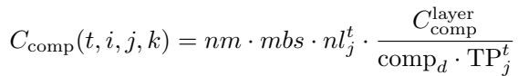

The computation cost of both forward and backward passes for lti,j,k on device d = σ(lti,j,k) can be estimated by:

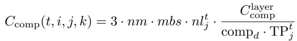

The computation cost for GLti,j can be estimated by:

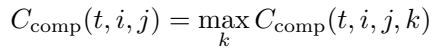

The overall computation cost can be estimated by:

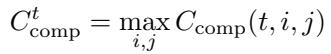

Please note that here we set seqout to 0 in the estimation for the actor generation task.

Pipeline bubbles. The cost of pipeline bubbles for the i-th replica can be estimated by:

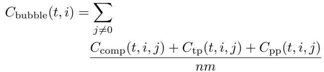

The overall cost of pipeline bubbles can be estimated by:

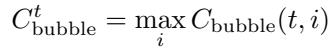

Decoding (HBM-bandwidth bound). The hbm cost for lti,j,k on device d = σ(lti,j,k) can be estimated by:

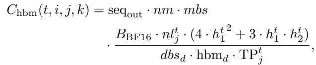

where dbsd is the decoding batch size of the LLM serving engine deployed on device d. The hbm cost for the i-th replica can be estimated by:

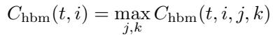

The overall hbm cost can be estimated by:

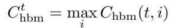

## B.3 Modeling task-level costs.

One can simply add up the overall costs provided by the above equations for estimation. However, for more finegrained estimates, the cost models are as follows:

Generation. The cost of generation task can be estimated by:

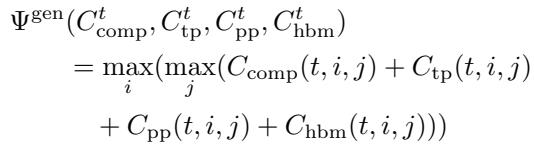

Inference. The cost of inference tasks can be estimated by:

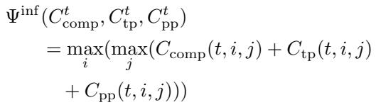

Training. The cost of training tasks can be estimated by:

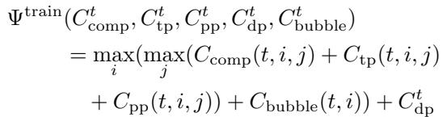

For load balancing strategies, one can tune seqin, mb, nltj during cost modeling.

## B.4 Modeling end-to-end costs.

Let C1:6(·) denote the cost models of actor generation, reward inference, reference inference, critic inference, critic training, and actor training, respectively, and Φ(·) denotes the cost of the tasks without dependencies which can be defined as

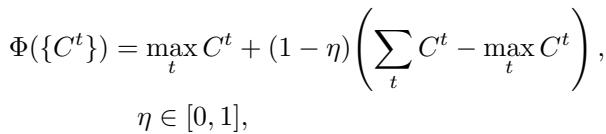

where the coefficient η parameterizes the level of task parallelism (0: sequential; 1: fully parallel; else: partial).

The cost mode of t-th task is given by:

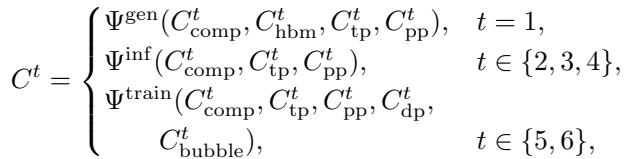

Finally, the cost of different RL training algorithms can be estimated as below:

Synchronous PPO.

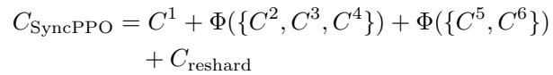

Asynchronous PPO.

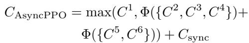

Synchronous GRPO.

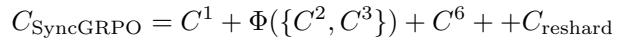

Asynchronous GRPO.

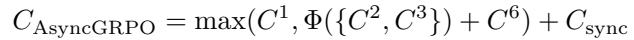

where Creshard are resharding cost required for synchronous RL training and Csync weight synchronization cost required for asynchronous RL training.