# AIRS: SCALING LIVE INFERENCE IN RESOURCE CONSTRAINED ENVIRONMENTS

Nilesh Jagnik 1 Xiaohao Yang 1 Chelsea Chen 1 Tuan Do 1 GM Harshvardhan 1

## ABSTRACT

Advancements in large language models (LLMs) have made them increasingly useful for complex reasoning tasks which previously required domain experts. One such task is quality evaluation of query responses produced by a search engine. Evaluation generates metrics necessary to study the quality, impact, and usefulness of product changes and features. Typically, to compute evaluation metrics, human experts are asked to rate various attributes of search responses. This process is generally quite expensive and requires several days to complete. As an alternative, LLMs are now being used to perform rating tasks with lower costs and latency. In addition, many new metrics are being developed to evaluate Google’s new AI-based offerings, which require ratings too. As a result, there is much higher demand for LLM rating prediction tasks in comparison with the allocated TPU (Tensor Processing Unit) budget. A larger portion of the company’s TPU resources are reserved for serving live user traffic. In this paper, we present the AI Rater Service (AIRS), an inference pipeline that employs several software engineering techniques to generate AI ratings with high reliability and low latency. AIRS maximizes LLM inference throughput by optimizing TPU resource utilization across various evaluation workflows, while minimizing latency for higher priority tasks.

## 1 INTRODUCTION

Evaluation is a critical software development practice that can help product owners understand the impact of product changes (Google, d). To help measure the qualitative impact of these changes on core user journeys, several metrics are formulated (Papaoikonomou & Veasey, 2024; Zheng et al., 2024; Gezici et al., 2021; Jiang & Allan, 2016). For Google Search, the evaluation process focuses on assessing the efficacy of the results page displayed to the user as a response to the typed query (Jagnik, 2025). The results page contains several visual and textual elements which are each individually rated on various attributes before being aggregated into page-level metrics (Sullivan, 2020). Rating these result elements requires creating work orders and assigning them to third party human experts. Survey forms are created to collect ratings from experts containing rating questions that cover several aspects of the results on a provided scale. An example of this is the Page Quality (PQ) metric, which rates a result higher if the landing page contains high quality content (Kumar, 2018; Dawson, 2024). Ratings collection from human experts is monetarily expensive. It also takes experts a few days to provide ratings, making the process

quite slow.

Even though ratings for previously encountered results are archived, the ever-changing nature of the Internet leads to fresh results which must be rated. In addition, to accommodate for updated content, previously seen results require fresh ratings on a regular basis. This makes the overall process of evaluation significantly expensive and time consuming. To add to the problem, market research often reveals new metrics that work well for capturing previously missed aspects of evaluation, incurring additional rating cost. New products and features also incur significant rating cost.

Due to their reasoning capabilities, LLMs present a viable alternative to help reduce rating cost. LLMs can be finetuned using expert rating data to improve their accuracy (Wu et al., 2025). Rating prediction using LLMs is also instant, which dramatically reduces the latency of computing metrics. Today, many new metrics are being developed at Google due to the availability and versatility of LLMs. In addition, the launch of new AI-based products, like AI Mode and AI Overviews, has further increased the need for evaluation (Reid, 2024; Stein, 2025). Both the rating competency of LLMs, and the rising demand for ratings, have contributed to more ratings being generated than ever before.

Since a major chunk of Google’s TPU resources are reserved for live user traffic, the quota allocated for rating prediction often falls short of the demand. When demand is high, evaluation metrics fail to compute, causing disruptions in product development cycles and launches. To address this problem, we developed the AI Rater Service (AIRS). The goal of AIRS is to compute evaluation metrics with high reliability and low latency using LLM raters. AIRS achieves this by optimizing TPU utilization of hosted models, and prioritizing traffic from latency sensitive evaluation workflows. AIRS also employs techniques like caching and batching to reduce traffic load to the model.

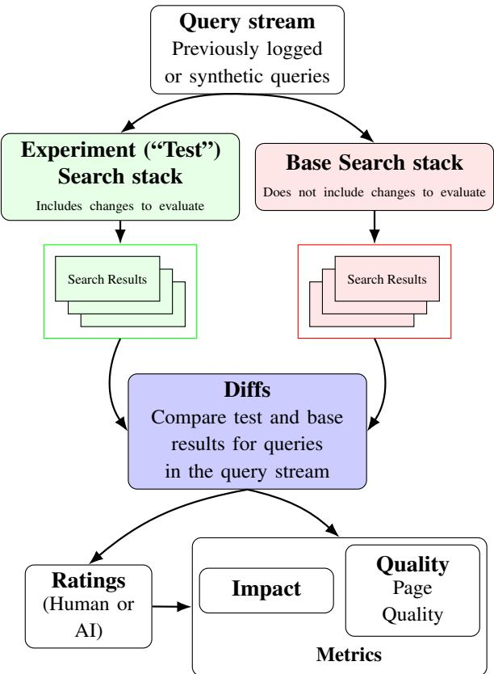  
Figure 1. Google Search Quality Evaluation pipeline.

## 2 BACKGROUND

The continuous evolution and optimization of Google Search Result Pages (SRPs) are guided by the Google Search Evaluation system, which is built upon 2 pillars: Live traffic evaluation and Quality Evaluation (Google, c). Live traffic experiments observe how real people interact with a feature by analyzing metrics like clicks and abandoned queries to measure engagement, whereas Quality Evaluation experiments employ external raters to manually assess the quality of results based on criteria such as expertise, authoritativeness, and trustworthiness(Google, b).

The Quality Evaluation pipeline (Figure 1), starts with queries sampled either from real traffic or synthesized for a particular purpose (Jagnik, 2025). These queries are sent to two Search stacks, with the Test stack including new changes, and the Base stack being the current state. Search results are fetched and scraped into structured data, where differences are automatically detected. Evaluation metrics are computed on top of these differences, measuring the qualitative and quantitative impact of the changes, i.e., the extent to which search features and results, both individually and collectively, meet the searcher’s needs.

Most importantly, these metrics guide the iterative development cycles of Google engineers, helping them answer multiple questions: How much will this change impact Search results? Is this change improving quality? Is this change working as expected? Are there unexpected issues or problems to fix? Is this change worth launching? They are the compass for decision making, and ensuring their highest quality is mission-critical for a robust Quality Evaluation pipeline.

There are hundreds of metrics serving different evaluation needs, but for demonstrative purposes, we look at a topline metric, called Page Quality (Google, a). Consider a metric value PQr assigned to each individual web result. We aggregate the result-level values to a per-query metric, Per-query PQ as shown in eq. 1, based on result importance weights wr (the closer to the top a result is, the higher the weight). Finally, we average the deltas between test and base over the sample queries Q, with an adjustment wq toward the original query population based on the sampling algorithm as shown in eq. 2 and eq. 3.

$$
\tag{1}
$$

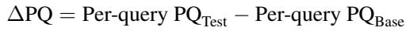

$$
\tag{2}
$$

(3)

The per-result PQr is calibrated using ratings collected by Search Quality human raters, based on comprehensive General Guidelines (Google, b). Normally ratings from multiple raters are averaged to increase the consistency. Search Quality human raters undergo rigorous training before qualification. To qualify, they are required to demonstrate expertise of the Google Search rating guidelines (an extensive 180+ page document). This allows them, given a query and the corresponding top N results, to conduct exhaustive, multi-step investigation for every result, checking its landing page’s quality by researching the websites’ external reputation and verifying the creators’ E-E-A-T (Experience, Expertise, Authoritativeness, and Trust) (Google, b). This type of assessment is inherently difficult and costly.

The prevalence of Artificial Intelligence Generated Content (AIGC) surged after entering its rapid development phase starting around 2010, amplified by the widespread adoption of LLM-based products like ChatGPT beginning in 2022 (Wu et al., 2023; OpenAI, 2022). AIGC’s efficiency and scalability allow AI systems to produce a massive volume of content. This increased volume necessitated Quality Evaluation to incorporate new dimensions, such as assessing the accuracy and factuality of content, especially since LLMs may generate inaccurate and biased answers (McKenna et al., 2023). Today, adding to the complexity, Quality Evaluation must also incorporate results by Google’s own LLM products such as AI Overviews (Reid, 2024) and AI Mode (Reid, 2025). Consequently, the reliance of Quality Evaluation on human raters has become a significant bottleneck.

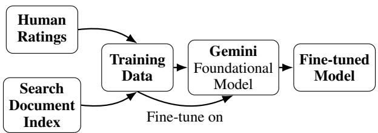  
Figure 2. Page Quality autorater training pipeline.

Fortunately, the challenge posed by LLMs could be solved by LLMs themselves. Starting 2023, multiple LLM-based autoraters were built at Google. For many rating tasks, especially those that required references to the world knowledge (such as the factuality and groundedness of page content), LLM-based encoder-only models gradually surpassed previous state-of-the-art Bidirectional Encoder Representations from Transformers (BERT)-based (Devlin et al., 2019) models for imitating human raters.

As the technology became more readily available, we started experimenting with using LLM to generate Page Quality ratings, using human ratings as training data. While the focus of this paper is on the serving infrastructure, here is a brief description of our training pipeline for Page Quality ratings. As illustrated in Figure 2, we started with human ratings, which we augmented with data and features indexed by the Google Search Document Index(Developers, 2025). Then we leveraged a foundational model, e.g., Gemini (Team et al., 2023), and fine-tuned it, employing the approach described in (Suganthan et al., 2025), in which the output is a lightweight encoder-only model. For details, please refer to Appendix A for objectives we used in training, and Appendix B for how we extracted features and generated prompts.

While the PQ autorater performs on par with an average pool of human raters, it has not yet matched the proficiency of our most skilled experts. This quality gap makes the development of superior, cross-validated human rating sets a considerable challenge, and it highlights the critical need for continuous rating quality monitoring to track the accuracy and reliability of our AI judges over time. To address this, we built a validation pipeline that bridges automated and human evaluation. For details, please refer to Appendix C.

The top-line PQ autorater is used by approximately a few hundred large experiments daily, each encompassing up to few hundred thousand queries. Given that each query yields a few dozen results for evaluation - depending on the desired number of results for metric calculation - this system generates over a 100 million PQ rating requests daily. In addition to the top-line PQ autorater, hundreds of autoraters are developed and maintained by cross-functional teams. Although these models are relatively small (typically fewer than 10 billion parameters), integrating them into the Quality Evaluation pipeline poses a significant serving challenge. At the beginning, when the models were newly developed, we added support for rating generation through an offline pipeline using an internal implementation of Map-Reduce. However, this pipeline was not very reliable, and the output artifacts were not well integrated with the rest of the Evaluation pipeline.

The AI Rater Service (AIRS) was therefore created to address this need, unifying all models within the Quality Evaluation infrastructure. The following section details the objectives of AIRS across several key dimensions.

## 3 OBJECTIVES

The core purpose of AIRS is to ensure that evaluation metrics computed using AI-generated ratings can be made available to the users of Quality Evaluation with high reliability and low latency. We translate this high-level goal into several concrete objectives. Even though the goal of AIRS is to maximize rating throughput in the evaluation domain, the same set of objectives hold true for most live inference systems in a resource constrained environment. The objectives stated here translate into design principles which we highlight in bold in the following sub-sections.

## 3.1 Maximize TPU Utilization

Maximizing prediction throughput implies the need to maximize TPU utilization. The measure we use for this objective is average TPU duty cycle, denoted as D. The duty cycle D is the fraction of time that a TPU is kept busy. We define Tbusy as the time a TPU is busy and Tidle as the time it is idle. D can then be formulated as shown in eq. 4.

$$
\tag{4}
$$

A TPU is considered “busy” if any of its cores are active. When a model uses multiple TPUs, the reported D is the average across all TPUs. Therefore, to improve throughput, the objective is to maximize D over a large time window.

This requires building traffic control mechanisms that can transform spiky Queries Per Second (QPS) patterns into sustained QPS. When serving models are under load, a back-pressure mechanism is required to slow down incoming requests.

## 3.2 Avoid Duplicate Predictions

Evaluation workflows are standardized for various targeted use cases. Curated query sets are used for evaluating specific features and products. Many platform users run similar evaluation workflows. Due to this, many independent workflows produce the same search results, and consequently request duplicate ratings.

Archival of previously generated ratings can significantly reduce rating costs. The storage layer design must support efficient lookup of ratings when duplicate requests are detected, effectively acting as a cache. However, caching of ratings in this way also presents other challenges: the cached entries should not be used if the model was updated after the cached rating was generated, or if there was a change in the world state that the model refers to.

## 3.3 Lifecycle Management

Evaluation workflows are the source of the rating requests. However, once ratings have been generated, there are other execution steps which must be performed as part of the end-to-end workflow, such as the computation of evaluation metrics using the generated ratings. To accomplish this, the AIRS system should not only track the lifecycle of individual rating requests, but also monitor the combined status of all requests originating from a single evaluation workflow source.

Once all rating requests originating from an evaluation workflow have been generated, AIRS must send a completion notification to the evaluation workflow, prompting it to move on the subsequent steps, finally resulting in evaluation metrics being made available to the platform user. In addition, AIRS must time out requests that fail to generate ratings after the configured duration.

## 3.4 Prioritization

Evaluations are generally triggered by users, but they can be automated too. Automated evaluations are generally used for regression tests, dashboards, continuous evaluations (evaluations that track a metric value over time), etc. In contrast to human-triggered, automated evaluations are generally assigned lower priority. In addition, if a human triggered evaluation contains too many queries, it may also be assigned a lower priority. Similarly, distinctions exist between metrics. Certain metrics are business-critical and rating requests generated for these metrics should be assigned higher priority.

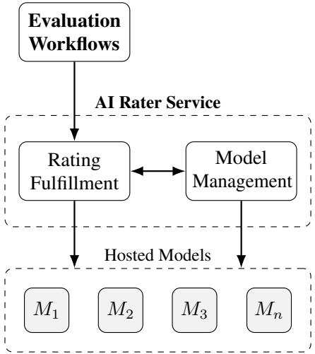  
Figure 3. Key components of the AI Rater Service. The rating fulfillment and model management layers work hand in hand to optimize overall throughput.

Since the rating budget (TPU allocation) is shared between rating requests from varying origins, the AIRS system should smartly assign priority and fulfill rating requests in order of priority.

## 3.5 Maintain Shared TPU Pools

Some autoraters generate a relatively small number of requests. For these autoraters, it is not always feasible to procure a dedicated TPU pool. To enable efficient use of TPUs, AIRS should maintain a shared TPU pool hosting multiple models serving various rating prediction tasks. Shared TPU pool size is typically static, and the TPUs are dynamically re-distributed to other models based on the TPU utilization. Evaluations typically request ratings from multiple autoraters, querying different model servers that potentially share the same TPU pools. AIRS should balance the TPU usage between all model servers in shared pools, so that all model servers can serve rating prediction requests efficiently.

## 4 DESIGN OVERVIEW

In this section, we provide an overview of the design of AIRS. The high-level design of AIRS is presented in Figure 3 which shows two key components of AIRS: (a) Rating Fulfillment, and (b) Model Management. The Rating Fulfillment pipeline receives rating prediction tasks from the evaluation workflows. It is responsible for managing the overall fulfillment of rating prediction tasks. On the other hand, the Model Management component provides hosting assistance, tracks TPU resource utilization, and scales resources allocated to hosted models.

## 4.1 API for Autoraters

AIRS performs rating fulfillment for many different types of LLM-based autoraters. These AI raters use distinct prompt generation logic. Some autoraters may call external data sources if the data in the input is insufficient. For this reason, all AI raters implement a common interface provided by the AIRS platform.

The input to the autorater is data collected during the result scraping phase, i.e., visual elements and text displayed on the Google Search results page. The output is a userdefined protocol buffer (Kaur & Fuad, 2010). Autorater implementations must also have a unique identifier called rater ID, which we denote as RID. The Rating Fulfillment pipeline controls traffic for each autorater separately using its RID. The Model Management component maintains a map between RID and the model URL to keep accounting of available TPU quota per hosted model.

## 4.2 Model Management

Autorater models are typically hosted as long-lived servers running on TPUs. To ensure AIRS can serve rating requests at scale, the model servers need to be stable and cost-efficient. AIRS provides a solution that allows users to not only spin up their models, but also perform management tasks including auto-restarting failed model servers, auto-adjusting TPUs used in serving, etc. AIRS also allows users to use existing company-wide shared model servers, thus not using the model management component.

Autoraters require a lot of TPU resources, which quickly becomes a limiting factor at high QPS. By implementing a back-pressure mechanism, AIRS controls the traffic to model servers by considering various factors, including the priority of the evaluation, model server loads. The goal is to prioritize the rating requests from business-critical evaluations, while maintaining a relatively high TPU utilization.

## 4.3 Rating Fulfillment

The Rating Fulfillment pipeline is responsible for ensuring that rating prediction tasks are performed in a reliable and efficient manner. It receives rating prediction tasks from the evaluation workflows. To ensure reliability, it comprises an internal queue where prediction tasks are buffered before they can be executed on a free executor. After being scheduled for execution, if a prediction fails due to lack of TPU resources, the task is put back in the queue. This task is then retried with a pre-configured back-off strategy. The Rating Fulfillment pipeline also keeps the latest state of the prediction tasks as well as an aggregated state of all tasks originating from a single evaluation workflow. Once all rating prediction tasks originating from an evaluation workflow are complete, the evaluation workflow is notified of completion, so that subsequent processes, such as metric computation that consume these ratings, can be started.

In addition to traffic shaping and state management, the Rating Fulfillment pipeline also implements several optimizations and auxiliary functions that improve the throughput and the general usability of AIRS. This includes functionalities like caching, batching, artifact storage, etc.

## 4.4 Integrated vs Isolated Modes

The feature set provided by the Rating Fulfillment and Model Management components are mutually exclusive. The Rating Fulfillment component hosts the rating generation (prompt creation) logic, whereas, the Model Management component hosts and manages the LLM. Thus, it is possible for clients to use one of these components without the other. An AIRS component used individually is referred to as running in isolated mode. The isolated mode is chosen for some clients that do not require the full feature set. However, using both in tandem unlocks the integrated mode where the two components interact with each other to efficiently maximize prediction throughput.

When rating task execution fails due to lack of TPU resources, in the isolated mode, a pre-configured back-off strategy is used to retry inference after some time. In the integrated mode, the Rating Fulfillment pipeline can peek into the quota allocation and current utilization tracked by the Model Management component to determine whether a task should be allowed to execute. This check is performed before task execution. A quota check failure triggers a much smaller back-off. If the task is allowed to execute, but still results in failure, the same retry with back-off strategy is used as in the case of the isolated mode.

The retry and back-off mechanism allows the system to shape traffic flow according to resource availability. The difference between the integrated and isolated modes for traffic shaping is that in the integrated mode, AIRS is able to react quicker to resource availability, which consequently increases the overall throughput.

## 5 MODEL MANAGEMENT

## 5.1 Model Hosting

Rating prediction requires hosting LLM servers. For hosting their models, users can choose their own tech-stack, or use model hosting services provided by AIRS. To register a model for hosting, AIRS provides a UI that allows users to specify how their model should be served. This includes the serving configurations, checkpoints, TPU resources, etc. Once registered, the AIRS hosting service starts the model servers based on user configuration, and provides the model URLs that their autoraters can use.

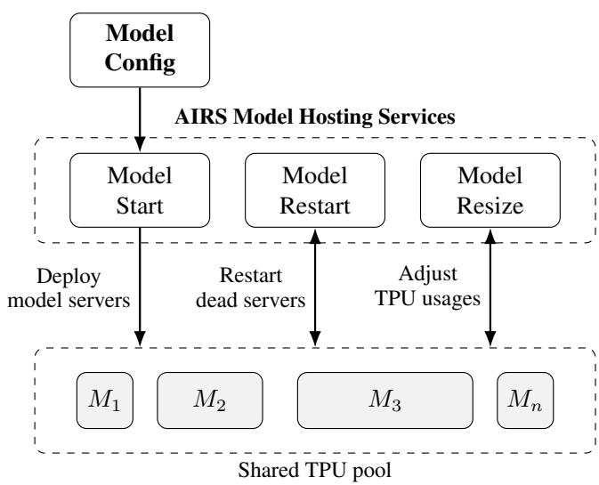  
Figure 4. Model hosting and Resource management in AIRS.

The hosting service is also responsible for monitoring the servers and performing maintenance, if necessary. For example, if a model server is partially or completely down, the hosting service will reboot the server to keep the model alive. The model addresses are checked periodically to ensure autoraters can connect to the latest live models.

## 5.2 Resource Pooling and Model Scaling

LLM rating prediction requires TPUs which are expensive and in limited supply. AIRS keeps model servers running at all times to serve rating prediction requests without waiting for servers to boot up.

TPUs are occupied with a low duty cycle even when server load is low, i.e., when fewer rating requests are received from evaluation workflows, which can potentially waste TPU resources. To address this problem, AIRS provides model hosting services (Figure 4) that dynamically adjust the fleet of model servers, increasing the utilization of the TPU resources. Typically, one model server starts multiple replicas to serve rating traffic. AIRS monitors the TPU loads and adjusts the number of replicas periodically to maximize duty cycle of in-use TPUs.

In some cases, multiple model servers use TPUs in a shared TPU pool. When the monitoring service adjusts the number of replicas, in addition to the TPU utilization of the model, it also considers the utilization of other models in the same TPU pool to balance the utilization across different servers.

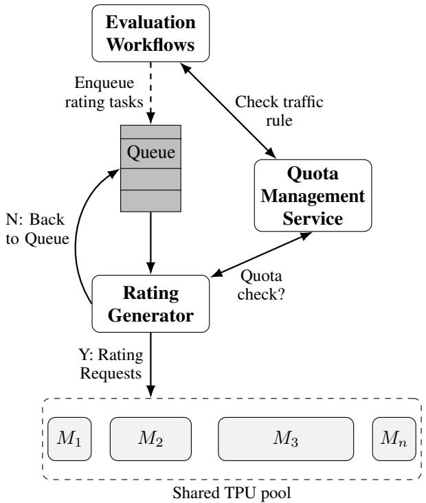  
Figure 5. Quota Management Service in AIRS.

## 5.3 Quota Accounting and Management

AIRS processes rating requests from various evaluation workflows. Requests originating from these workflows should be assigned different priorities based on latency expectations. The following are some scenarios that highlight the importance of quota management:

1. Users and automated processes compete for the same TPU resources - user triggered evaluations require lower latency, whereas, automated evaluations (used for detecting regressions) do not. Certain evaluations for critical business decisions may require even lower latency.

2. One evaluation submits a large amount of requests to AIRS - without quota management, AIRS could execute the requests from this evaluation first, potentially blocking all other evaluations.

3. One users runs tens of evaluations - this creates an overwhelming number of rating requests, quickly consuming all available TPU resources, and blocking rating requests from other users.

Without proper quota management, requests would be fulfilled in random orders, sub-optimally delaying progress of higher priority evaluations. Therefore we implement a Quota Management service, which allows AIRS to control the model QPS allocation per their originated evaluation. An overview of the functionality of the Quota Management service (Figure 5) is as follows:

1. Each rating prediction request contains the ID of the originating evaluation.

2. AIRS periodically calls the Quota Management service with the evaluation ID, and maintains a map between ID and traffic rules. Traffic rules (discussed below) quantify what model QPS autorater requests can have, given the context of the originating evaluation.

3. When AIRS processes the rating requests, before sending out the requests to LLM model servers, the Rating Generator (discussed in Section 6.3) asks Quota Management Service if it can send rating requests to the model server. If the traffic rule allows sending new requests to the model server, we execute it. If the traffic rule disallows sending new requests (if current QPS exceeds allocation), then we put the rating request back in the queue and retry later.

The Quota Management service keeps records of all running evaluations like priority, running user, Rater ID (RID), etc., to determine the traffic rule for a particular evaluation. For example,

• High priority evaluations should allow more requests.

• If a model server is overloaded, reduce the traffic for that AI rater.

• If a user starts too many evaluations, reduce the traffic for the evaluation started by that user.

## 6 RATING FULFILLMENT

The Rating Fulfillment pipeline, shown in Figure 6, has several components and is responsible for maintaining low latency and high throughput of rating prediction for evaluation metrics.

## 6.1 Rating Fulfillment Server

The Rating Fulfillment Server is the front-end server that receives rating prediction requests from Evaluation workflows (Step ❶). When a prediction request is received, it checks whether a valid rating is already present in the archive (Step ❷). If no valid is rating found, a rating task is created and added to the Queue (Step ❸). Transactionally, a PENDING entry is created in the State table for bookkeeping. If a valid rating is already present, no new tasks are added to the Queue. In this case, we skip the fulfillment process by creating a COMPLETED entry in the State table.

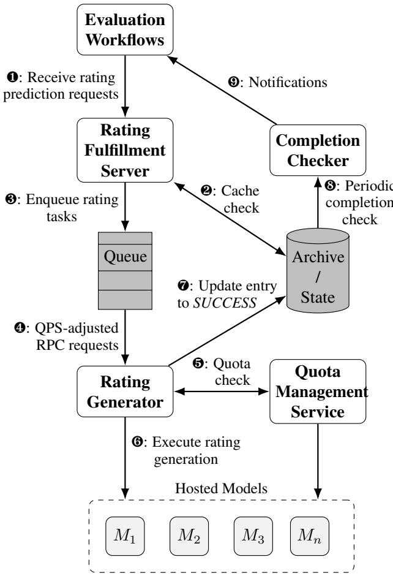  
Figure 6. Pipeline for rating fulfillment. Shaded nodes denote components that comprise data.

## 6.2 Queue

Unfulfilled rating prediction tasks are kept in the Queue. The Queue forwards prediction tasks to the Rating Generator(s) for fulfillment using Remote Procedural Calls (RPCs) (Step ❹). Based on the response received from Rating Generator, the Queue adjusts the outgoing QPS (rate) of task delivery. If the RPC calls fail due to TPU resource exhaustion of hosted models (or compute resource exhaustion of Rating Generator), then rate of delivery is adjusted to match the rate of RPC success. The Queue has functionality to control QPS per autorater (identified using its RID).

In addition to limiting the outgoing QPS of queued tasks, failed tasks are re-queued and retried with exponential backoff (upper limited by 30 minutes). Exponential back-off helps mitigate failures originating from dependencies other than the hosted models. There is no limit on the number of tasks that can be queued.

## 6.3 Rating Generator

The prediction task is executed on a fleet of executors called the Rating Generator(s). The Queue sends rating prediction tasks to Rating Generator instances when they have free compute resources. The task metadata contains all the information required to create the prompt for the LLMs.

The logic used for creating the LLM prompt, and the prompt itself, is unique to each autorater. To help with this, AIRS provides an API that allows AI rater developers to plug-in custom rating generation logic. Implementations of this API fetch additional data if needed, create the LLM prompt, and send RPCs to model servers. Rating prediction tasks received by the Rating Generator contain RID in metadata which allows mapping them to the appropriate rater implementation.

After this, the rating generation logic is executed (Step ❻). If the logic is executed successfully, a COMPLETED entry is added to the State table (Step ❼). If unsuccessful, the task is added back to the Queue, and set to retry. When a task fails after multiple retries it is marked as FAILED.

Traffic control is implemented using the following mechanisms:

1. Back-pressure. To help control traffic to each model separately, the Queue utilizes a scheduling service that automatically restricts QPS to Rating Generator (Step ❹) per RID, when its rating prediction is failing frequently.

2. Retry with back-off. When rating generation logic fails due to outgoing RPC errors (Step ❻), the requests are retried using a pre-configured back-off strategy.

3. Quota check in integrated mode. This mechanism is only available when using integrated mode (see subsection 4.4) which allows the Rating Fulfillment pipeline to interact with the Model Management component. Before executing the rating generation logic, Rating Generator checks with the Traffic Control Service (see subsection 5.3) to determine whether enough TPU budget is available on the hosted model for rating prediction (Step ❺). If model servers are at capacity, the prediction task is aborted and added back to the Queue and retried with a smaller back-off period. This check is skipped when in isolated mode.

By its implementation, we can remark that the traffic control implementation in the integrated mode is more active in nature. This is because we explicitly record and monitor incoming QPS to the model server. In the isolated mode, we rely on generic mechanisms, i.e., back-pressure and retries with back-off for QPS control. Without explicitly knowing the peak QPS that the model server can sustain, AIRS sends requests to the model server aggressively until RPC errors are encountered. At this point, back-pressure and retries with back-offs are used to lower QPS until a higher success rate is achieved.

## 6.4 Completion Checker

In order to know when the evaluation workflow can move on to the next phase pending on the rating prediction phase, a Completion Checker periodically checks the State table for completion of rating tasks originated from a single evaluation workflow (Step ❽). It then notifies the evaluation workflow, triggering other tasks such as metric computation (Step ❾).

The completion checker does not indefinitely iterate on incomplete workflows. Workflows can either have a customized max duration, or rely on the Rating Fulfillment Server’s default configuration, for considering all rating tasks complete regardless of their individual completion status. This is to prevent a situation where a majority of the tasks are complete, but the workflow cannot transition to the next phase due to a few incomplete tasks that are pending, either due to non-retryable issues or system reliability issues that result in these tasks not timing out properly.

## 6.5 Prioritization

When an evaluation workflow is executed, a priority score is assigned using heuristic rules considering various factors, e.g., whether the workflow is used in releasing new model checkpoints, whether the requester of the workflow has permission to use more resources than normal users, etc. The priority score is used by Quota Management Service to determine available TPU quota (Step ❺), i.e., requests from high priority workflows are fast tracked.

The priority information is also encoded into the request context and sent to the hosted models along with the rating requests. The hosted models use this context to manage the execution of the rating requests. When TPU resources are constrained, the hosted models prioritize the execution of high priority requests, and reject low priority requests, which are retried by AIRS at a later time when resource availability may have improved.

## 6.6 Client Side Caching

As mentioned before, many independent workflows produce the same search results. Within a time window, the previously generated ratings for these results are still fresh enough that they are considered valid, and thus, reusable. For Page Quality and Needs Met ratings, the freshness window is 90 days. AIRS re-uses ratings generated within the freshness window, if they exist, instead of invoking the autoraters for new predictions. This is a strategy to trade cheaper and abundant resources, i.e., storage and CPU cycles for cache lookups, for scarcer and higher-cost resources such as TPUs. There is no limit on the number of ratings that can be cached in the freshness window.

Note that while fine-grained model server side caching exists, AIRS has no control over it. Client-side caching is still very useful, especially when determinism and rating consistency are desired. Therefore, it is important that AIRS can infer a uniquely identifying fingerprint from each request.

The fingerprint is also useful for looking up cached ratings efficiently, because the full rating request can be verbose. It contains various metadata and contexts about a query like query text, location, etc., as well as similar details in the results for that query. Combined, the size of the request can become large.

Therefore, AIRS employs a hashing scheme to generate a unique key for each rating request and create an index on the key to enable efficient lookups. For example, consider the following query and result:

```proto
message Query {
string query_text = 1;
repeated ContextParam context_param = 2;
}
message Result {
string url = 1;
repeated ContextParam context_param = 2;
string html = 3;
}
message ContextParam {
string key = 1;
string value = 2;
}
```

For every query and result pair, we stringify the essential fields of the two protocol buffers and concatenate them into a long string, before hashing the string to generate the hashed lookup key.

In addition, AIRS allows rating lookup keys to be flexible. One example of a lookup pattern is for query-level ratings, where we do not consider result details. An even more flexible use case is where ratings are identified by a long string of model prompt, in which query and result details are all included in addition to some prompting texts.

As discussed earlier, model freshness is directly relevant to the validity of ratings, and is therefore also captured in the lookup keys. AIRS does this by incorporating model identifiers into the rating lookup key, such that only ratings produced by a model specified in the request are valid for lookups. This is also a mechanism for invalidating ratings by an older model. Whenever there is a newer model that replaces the older model, the system would consider all existing ratings produced by the older model invalid. On top of rating invalidation by model identifiers, ratings are also only retained for a reasonable duration beyond 90 days, i.e. how long the system considers them fresh for. After the TTL of 90 days plus a buffer time, ratings are automatically wiped out by the storage system.

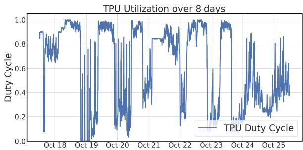  
Figure 7. Mean TPU Duty Cycle

## 6.7 Batching

The Rating Fulfillment Server allows workflows to specify a batch size in order to aggregate multiple rating tasks into one unit of work, to be delivered at the Rating Generator for processing. This is desired for optimal TPU utilization at model servers, where a batch of predictions per call is a better use of TPUs than a single prediction per call. By default, batch size is set to 12. Clients can tune this batch size to achieve the optimal outcome.

## 7 RESULTS

In this section, we discuss the impact of various optimizations built into AIRS. We present the observed TPU utilization, QPS and latency numbers for one of the top-line autoraters, AR1, and its corresponding model hosted using AIRS. This autorater is deployed in the integrated mode where AIRS is responsible for both rating fulfillment and model management.

## 7.1 TPU Duty Cycle

We present the mean TPU duty cycle for the model corresponding to AR1 observed over 8 days in Figure 7. In general, mean TPU duty cycle stays close to 1, especially during peak hours. The TPU duty cycle can temporarily drop when AIRS scales up model resources by allocating additional TPUs to it. As expected, lower TPU utilization is observed on weekends. Maximizing TPU duty cycle translates to maximized inference throughput.

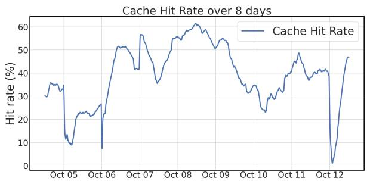  
Figure 8. AR1 cache hit rate over 8 days.

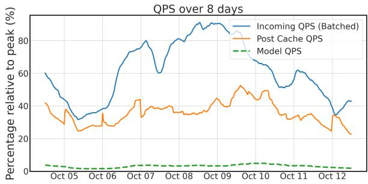  
Figure 9. AR1 observed QPS over 8 days.

## 7.2 Cache Hit Rate

Figure 8 shows the reported cache hit rate for AR1, over 8 days (aggregated over a 1 day period) in October 2025. On average, we observe that 40% of the time AIRS looks up ratings instead of creating new requests to the LLM raters, resulting in a 40% cache hit rate on average.

## 7.3 Observed QPS

Figure 9 shows the QPS observed during various stages of fulfillment in AIRS, for AR1, over 8 days in October 2025. Due to confidentiality restrictions, we present relative QPS numbers instead of raw numbers. The QPS numbers are presented as a percentage relative to the peak QPS encountered during the observed time period. To emphasize the role of caching and traffic control, we consider QPS post batching. Even though batching is applied later in the pipeline, we divide the raw incoming QPS numbers with the configured batch size to exclude the impact of batching in this graph. In addition, the numbers are aggregated over a 1-day time window to remove noise due to traffic spikes.

The incoming batched QPS to AIRS varies a lot and fluctuates between 30% and 100% of the peak QPS. The caching functionality does a good job of cutting the QPS by 40% on average as discussed above. The post cache QPS stays relatively stable around 20% and 40% of peak.

The actual QPS to the model is relatively low at only 1-4% of peak. Note that the QPS to the model is much lower than the post cache QPS because of the quota check functionality, which succeeds only when the model can fulfill additional inference requests. A lot of retries are incurred internally within AIRS which raises the post cache traffic numbers.

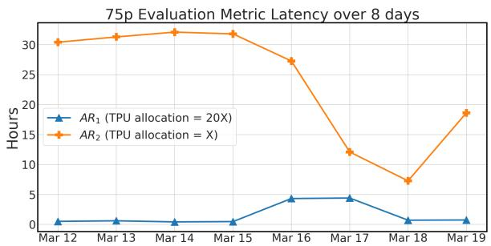  
Figure 10. 75th percentile Autorater metric latency over 8 days.

## 7.4 Reliability

To measure reliability we look at the rating generation failure rate for autorater AR1, in the month of October 2025. For this autorater, rating requests are marked as failures after a 2-hour deadline is reached. The median failure rate of rating generation was 0.8%. The 80th percentile failure rate in the same period was 2.7%, while the 90th percentile failure rate was relatively high at 23%, attributed to several large evaluations being run requesting higher than usual number of ratings. The 80th percentile success rate of 97.8% demonstrates the high reliability of AIRS.

## 7.5 Latency

Figure 10 shows the 75p latency of evaluation metrics computed using ratings from AR1 and AR2 (another autorater on AIRS) over 8 days in March 2026. For this comparison, we chose evaluation workflows with similar number of queries. The default TPUs allocation for the corresponding autorater models differ by a factor of 20. As expected, the latency of autorater metric AR1 with higher TPU allocation is an order of magnitude lower in comparison with AR2. The metric corresponding to AR1 often generates within 30 minutes. Whereas, the 75p latency for AR2 can spike up to 33 hours during busy days. The latency increase is not perfectly linear with TPU allocation. This is because the models utilized by these autoraters are hosted using shared TPU pool (discussed in subsection 3.5). The TPU allocation for AR2 is often scaled down to allow the higher visibility autorater, AR1, to compute faster.

During off-peak hours, the latency of AR2 decreases and AR1 increases. This is because AIRS detects lower incoming traffic to AR1 and scales TPU allocation for AR2 up.

## 7.6 Prioritization

Within the AR1 queryset, high-priority use cases accounted for approximately 80%–90% of all incoming requests. These prioritized requests were executed immediately upon receipt by the AIRS. In contrast, low-priority traffic experienced significant latency, performing 5 - 10x slower; these requests typically required several retry attempts before successful execution.

## 7.7 Relation between Cache Hit Rate, QPS and Latency

As evident from the behavior on October 12 in Figures 8 and 9, on days when low cache hit is observed, the post cache QPS for AR1 spikes up. Higher post cache QPS generally leads to higher metric latency. During off-peak hours, as is the case on October 12, there are fewer overall prediction requests handled by the shared TPU pool. This allows models with traffic to scale up TPU resources, offsetting the latency increases expected.

## 8 CONCLUSION

In this paper, we presented AIRS - a live inference system that generates LLM rating predictions in a resource constrained environment. AIRS achieves high rating prediction throughput and reliability, while minimizing latency, by using techniques such as caching, queuing, batching, quota accounting, back-pressure and prioritization. As a result, AIRS can generate top-line ratings for Search Engine evaluations within a couple of hours. In addition, AIRS model hosting and management services provide clients with ease of use. We hope that our work can inspire future advancements in ML inference systems in resource constrained environments.

## REFERENCES

Dawson, E. Google Core Ranking Factors: Relevance and Page Quality, 2024. URL https://keywordspeop leuse.com/seo/guides/google-core-ran king-factors.

Developers, G. Overview of crawling and indexing topics, 2025. URL https://developers.google.co m/search/docs/crawling-indexing.

Devlin, J., Chang, M.-W., Lee, K., and Toutanova, K. BERT: Pre-training of deep bidirectional transformers for language understanding. In Proceedings of the 2019 Conference of the North American Chapter of the Association for Computational Linguistics: Human Language Technologies, Volume 1 (Long and Short Papers), Minneapolis, Minnesota, 2019. Association for Computational Linguistics. doi: 10.18653/v1/N19-1423.

Gezici, G., Lipani, A., Saygin, Y., and Yilmaz, E. Evaluation metrics for measuring bias in search engine results. Information Retrieval Journal, 24(2):85–113, January 2021. ISSN 1573-7659. doi: 10.1007/s10791-020-09386-w. URL http://dx.doi.org/10.1007/s1079 1-020-09386-w.

Google. Understanding page experience in Google Search results. https://developers.google.com/se arch/docs/appearance/page-experience, a. Accessed: 2025-10-20.

Google. Search Quality Evaluator Guidelines. https:// static.googleusercontent.com/media/g uidelines.raterhub.com/en//searchqua lityevaluatorguidelines.pdf, b. Accessed: 2025-10-20.

Google. Improving Search with rigorous testing. https: //www.google.com/intl/en\_us/search/h owsearchworks/how-search-works/rigor ous-testing, c. Accessed: 2025-10-20.

Google. Evaluate search quality. https://cloud.go ogle.com/generative-ai-app-builder/d ocs/evaluate-search-quality, d. Accessed: 2025-10-22.

Jagnik, N. Continuous Evaluation: Using CI Techniques for Experimentation at Scale. In 2025 IEEE International Conference on Software Testing, Verification and Validation Workshops (ICSTW), pp. 157–157, 2025. doi: 10.1109/ICSTW64639.2025.10962460.

Jiang, J. and Allan, J. Adaptive effort for search evaluation metrics. In Ferro, N., Crestani, F., Moens, M.-F., Mothe, J., Silvestri, F., Di Nunzio, G. M., Hauff, C., and Silvello, G. (eds.), Advances in Information Retrieval, pp. 187–199, Cham, 2016. Springer International Publishing. ISBN 978-3-319-30671-1.

Kaur, G. and Fuad, M. M. An evaluation of protocol buffer. In Proceedings of the IEEE SoutheastCon 2010 (SoutheastCon), pp. 459–462, 2010. doi: 10.1109/SECON.20 10.5453828.

Kumar, R. Web Page Quality Metrics, pp. 4634–4637. Springer New York, New York, NY, 2018. ISBN 978- 1-4614-8265-9. doi: 10.1007/978-1-4614-8265-9 460. URL https://doi.org/10.1007/978-1-461 4-8265-9\_460.

McKenna, N., Li, Y., Cheng, L., Hosseini, M. J., Johnson, M., and Steedman, M. Sources of hallucination by large language models on inference tasks. In Proceedings of the 2023 Conference on Empirical Methods in Natural Language Processing: Findings, 2023.

OpenAI. Introducing ChatGPT, 2022. URL https://op enai.com/index/chatgpt.

Papaoikonomou, T. and Veasey, T. Evaluating search relevance part 1 - The BEIR benchmark, 2024. URL https: //www.elastic.co/search-labs/blog/eva luating-search-relevance-part-1.

Reid, E. Generative AI in Search: Let Google do the searching for you, 2024. URL https://blog.google/ products/search/generative-ai-googl e-search-may-2024/.

Reid, E. AI in Search: Going beyond information to intelligence, 2025. URL https://blog.google/prod ucts/search/google-search-ai-mode-upd ate/.

Stein, R. Expanding AI Overviews and introducing AI Mode, 2025. URL https://blog.google/prod ucts/search/ai-mode-search/.

Suganthan, P., Moiseev, F., Yan, L., Wu, J., Ni, J., Han, J., Zitouni, I., Alfonseca, E., Wang, X., and Dong, Z. Adapting decoder-based language models for diverse encoder downstream tasks. arXiv preprint arXiv:2503.02656, 2025.

Sullivan, D. How insights from people around the world make Google Search better, 2020. URL https://bl og.google/products/search/raters-exp eriments-improve-google-search/.

Team, G., Anil, R., Borgeaud, S., Alayrac, J.-B., Yu, J., Soricut, R., Schalkwyk, J., Dai, A. M., Hauth, A., Millican, K., et al. Gemini: a family of highly capable multimodal models. arXiv preprint arXiv:2312.11805, 2023. URL https://arxiv.org/abs/2312.11805.

Wu, J., Gan, W., Chen, Z., Wan, S., and Lin, H. Aigenerated content (aigc): A survey. arXiv preprint arXiv:2304.06632, 2023.

Wu, X.-K., Chen, M., Li, W., Wang, R., Lu, L., Liu, J., Hwang, K., Hao, Y., Pan, Y., Meng, Q., Huang, K., Hu, L., Guizani, M., Chao, N., Fortino, G., Lin, F., Tian, Y., Niyato, D., and Wang, F.-Y. Llm fine-tuning: Concepts, opportunities, and challenges. Big Data and Cognitive Computing, 9(4), 2025. ISSN 2504-2289. doi: 10.3390/ bdcc9040087. URL https://www.mdpi.com/250 4-2289/9/4/87.

Zheng, C., Wang, J., Zhang, S. A., Kishore, A., and Singh, S. Semantic search evaluation. arXiv preprint arXiv:2410.21549, 2024.

## A TRAINING OBJECTIVES

The training process was set up with a few different training objectives: Ordered-Pair Accuracy (OPA), Pairwise Mean Square Error (MSE), and Endpoint Calibration. OPA is an objective that is specific for the result ranking space, in which we look at all pairs of results on a single SRP, and compute the fraction of the number of times the order of predictions s matched the order of labels y, shown in eq. 5. The Pairwise MSE computes the average of the squared differences between each individual true label and its corresponding predicted score. The Endpoint Calibration objective measures the fraction of times the prediction matches the label at the endpoints of the value range; for PQ ratings, the rating ranges from -1 (Very Bad) to 3 (Very Good). In practice, a weighted sum of Endpoint Calibration and Pairwise MSE provides a good combined training objective, addressing the issue that models trained with just Pairwise MSE fail to make good predictions at the end of the range - it is of great importance to distinguish very good results (+3) from mediocre results, and irrelevant results from very offensive results (-1).

$$
\tag{5}
$$

## B FEATURE EXTRACTION, AUGMENTATION AND PROMPT CREATION

The most important features we used for training are content that users can see on the Search results pages (SRP) - what we usually call on-SRP content. These include the query text and the UI elements that are visible on a search result. However, these features are not enough to help the model to judge the quality of a result. Similar to how a human rater needs to click through a result URL and read the content of the landing page when rating a Search result, we need to provide additional contextual signals to the model.

Therefore, we employ a variety of strategies to enrich the input provided to our models. We fetch web document content from our internal Document Index, extracting both primary text and semantic annotations. Primary text is the primary content sections of a webpage, distinguishing from boilerplate like ads and navigation bars. Semantic annotations provide linguistic information, such as tokenization, part-of-speech tags, and dependency parses, which help in understanding the structure and meaning of the text.

For YouTube URLs, we retrieve video descriptions via an internal Video API. Image search results are enhanced by fetching landing page titles from the same Document Index. We also render raw HTML content using a Web Rendering Service (WRS) to extract textual features. Furthermore, for local results, we supplement features with business details such as address, ratings, and user distance by querying an dedicated location table. These augmentation steps ensure our models have access to rich, multi-faceted content derived from various authoritative sources, ultimately improving rating quality.

The prompt is crafted simply by concatenating different semantic features of a (query, result) tuple, adding different delimiters for each semantic type. For example, the prompt ”Q google Q L en L C US C U http://www.google.com U T Google T Z serp visible content Z B landing content B” concatenates the query text, the locale of the query, the URL of the result, the domain of the result, the visible content, and the content of the landing page. Note that this is a fine-tuned model, so we do not require a prompt template.

## C RATING MONITORING PIPELINE

To address the need for continuous rating quality monitoring to track the accuracy and reliability of our AI judges over time, we also built a rating monitoring pipeline that is tailored for each AI rater. There are two types of monitoring and validation supported.

The first type is called Continuous monitoring, in which a canonical Evaluation setup (with predefined set of queries) generates AI ratings and human ratings of the same type over an extended period of time, allowing detection of queries or slice of queries that the rating diverge. This allows engineers to react to any regression, e.g., updating missing features of a result type. Tracking the same set of queries allows a fair comparison of rating quality over time. However, it does not help with detecting issues with new slices of queries (which is an extremely common phenomenon in Search).

The second type of validation is created to address the weakness of the Continuous monitoring. We sample queries from real user evaluation experiments, which usually have most up-to-date query sets. By default, all experiments are evaluated by the AI raters. We then systematically sample queries using the distribution of AI ratings, then route them to human experts for gold-standard validation, ensuring that our AI ratings remain firmly aligned with human expectations.