# BLUEPRINT, BOOTSTRAP, AND BRIDGE:A SECURITY LOOK AT NVIDIA GPU CONFIDENTIAL COMPUTING

Zhongshu Gu 1 Enriquillo Valdez 1 Salman Ahmed 1 Julian James Stephen 1 Michael V. Le 1 Hani Jamjoom 1 Shixuan Zhao 2 Zhiqiang Lin 2

## ABSTRACT

NVIDIA GPU Confidential Computing (GPU-CC) aims to provide secure execution for AI workloads. For end users, enabling GPU-CC is seamless and requires no modifications to existing applications. However, this ease of adoption relies on a proprietary and highly complex system that is difficult to inspect, creating challenges for researchers seeking to understand its architecture and security landscape. In this work, we provide a security look at GPU-CC by reconstructing a coherent view of the system. We first examine the system’s blueprint, focusing on the specialized architectural engines that support its security mechanisms. We then analyze the bootstrap process, which coordinates hardware and software components to establish these protections. Finally, we conduct targeted experiments to assess whether, under the GPU-CC threat model, data transfers along different paths remain protected across the bridge between trusted CPU and GPU domains. We responsibly disclosed all security findings presented in this paper to the NVIDIA Product Security Incident Response Team (PSIRT).

## 1 INTRODUCTION

Confidential computing enables secure outsourcing of sensitive computations to Trusted Execution Environments (TEEs) on public clouds, protecting the confidentiality and integrity of data while in use. Early efforts focused on CPU Confidential Computing (CPU-CC), which secures computations within the CPU package and encrypts system memory. As modern workloads increasingly rely on GPUs, driven by the growth of large language and vision models, NVIDIA introduced GPU Confidential Computing (GPU-CC) (Dhanuskodi et al., 2023) starting with the Hopper architecture, integrating support into CUDA and GPU kernel drivers. GPU-CC extends the trust boundary from CPUs to GPUs, creating a unified protected domain for AI pipelines. This advancement expands support for secure GPU-accelerated applications and enables collaborative learning scenarios (Mo et al., 2022; Guo et al., 2024a; Quoc & Fetzer, 2021; Eichner et al., 2024; Gu et al., 2019; Cheng et al., 2024a) where mutually distrusting parties can jointly execute AI workloads without exposing private data.

GPU-CC enables users to deploy AI workloads with no modifications to application-level programs or data. Despite this seamless user experience, GPU-CC introduces extensive changes across the system software, firmware, and hardware stacks to secure communication between the CPU and GPU. For researchers in the machine learning system community, a comprehensive understanding of GPU-CC’s architecture and security landscape is essential. This knowledge allows researchers to critically assess whether the environment satisfies specific security requirements under the stated threat model. However, achieving this depth of insight remains challenging due to three primary obstacles:

1. Lack of Public Specifications. NVIDIA provides highlevel overviews (Dhanuskodi et al., 2023; NVIDIA, 2025b) of GPU-CC for end users, but leaves many technical details undefined. For example, GPU-CC-related engines, such as the Foundation Security Processor (FSP), GPU System Processor (GSP), and Secure Processor (SEC2), only appear in diagrams, but their precise functions, interactions, and roles are largely undocumented. While NVIDIA’s patents (Rogers et al., 2023a;b; 2025) provide more technical details than white papers, their claims are written in legalistic, abstract terms to maximize protection and cover a broad range of possible implementations, making them difficult to interpret.

2. Proprietary Ecosystem. While NVIDIA has opensourced certain components, such as open GPU kernel modules (NVIDIA, 2025e) and nvTrust (NVIDIA, 2025c), most elements related to GPU-CC remain closed, either embedded within GPUs or distributed only as binary executables.

3. System Complexity. GPU-CC introduces substantial modifications across system stacks. To preserve compatibility with existing implementations, GPU-CC layers new data protection mechanisms over heterogeneous and legacy components. For example, CPU-GPU data transfers traverse multiple distinct data paths, each with its own transmission mechanisms, data formats, and granularities. This compatibility-driven design significantly increases implementation complexity and broadens the attack surface, making it harder to reason about the system’s security guarantees.

In this paper, we aim to reconstruct a coherent view of the GPU-CC system and conduct security analysis structured around three stages: Blueprint, Bootstrap, and Bridge.

Blueprint (§6). We begin by instrumenting and intercepting inter-component interactions within the GPU-CC system. By correlating these experimental observations with fragmented information synthesized from public sources (Dhanuskodi et al., 2023; NVIDIA, 2025b; Rogers et al., 2023a;b; 2025), we uncover a static blueprint of the system, identifying the architectural engines that form the foundation of GPU-CC’s security design.

Bootstrap (§7). Next, we analyze the bootstrap process, including secure boot, key generation, firewall establishment, and device attestation, which bring GPU-CC to a trustworthy state. We examine the dependencies between hardware and software components and study how security mechanisms are orchestrated and enforced during this transition.

Bridge (§8). Finally, we evaluate the security of runtime data transfers across the bridge between the trusted CPU and GPU domains. These transfers traverse the untrusted PCIe interface, making them vulnerable to observation or manipulation by adversaries controlling the host system. For each data path, we investigate the protection mechanisms in place, analyze potential attack surfaces, assess their security implications, and propose possible mitigations. All security findings presented in this paper have been responsibly disclosed to NVIDIA’s Product Security Incident Response Team (PSIRT).

## 2 BACKGROUND

In this section, we provide a brief overview of the evolution of confidential computing from CPU to GPU, summarize earlier research efforts on enabling confidential computing on GPUs, and discuss the current status of NVIDIA’s GPU-CC technology.

CPU-CC Technologies. NVIDIA GPU-CC cannot operate independently. It must work in conjunction with virtual machine (VM)-based CPU-CC, such as Intel Trust Domain Extensions (TDX) (Intel, 2023b; Cheng et al., 2024b) and AMD Secure Encrypted Virtualization (SEV) (Kaplan et al.,

2016; Kaplan, 2017; AMD, 2020). CPU-CC protects the confidentiality and integrity of computations and data within confidential virtual machines (CVMs) by enforcing cryptographic isolation from the host environment, including the hypervisor, system administrators, and I/O devices, which are considered untrusted or potentially compromised. This protection relies on security features such as trusted VM management and runtime memory encryption. Each CVM is assigned a unique ephemeral key that is used to encrypt the memory. The Advanced Encryption Standard (AES) engine in the on-die memory controller handles the encryption and decryption of data transferred between the CPU and the CVM’s private memory. CPU-CC also supports remote attestation to verify the authenticity and integrity of the trusted platform.

I/O Protection in CPU-CC. The trust boundary of CPU-CC is limited to the CPU and its designated private memory regions. When data leaves this boundary, e.g., during I/O operations, it must pass through untrusted components such as the hypervisor and I/O devices. I/O devices commonly use Direct Memory Access (DMA) to read and write memory without CPU involvement. Since these devices are untrusted, they are not permitted direct access to the CVM’s private memory, which is encrypted with the CVM’s key. The general practice is to employ softwarebased encryption mechanisms, e.g., Transport Layer Security (TLS) is used for network traffic and Linux Unified Key Setup (LUKS) is used for disk encryption. In this model, I/O-bound data is first encrypted within the CVM’s private memory, then transferred to a staging buffer. This buffer, which is outside the CVM’s encrypted memory, is accessible via DMA by I/O devices. Therefore, the encrypted I/O data can be securely transmitted to the devices.

Unlike network interface cards or storage disks, GPUs are not I/O devices solely responsible for data delivery. Instead, they have evolved into general-purpose compute devices composed of numerous Streaming Multiprocessors (SMs) and equipped with on-package High-Bandwidth Memory (HBM). For the GPU to process offloaded code and data, these assets must ultimately be in plaintext within the GPU’s device memory at runtime. Meanwhile, the PCIe interconnect between the CPU and GPU is generally considered untrusted and is vulnerable to snooping and tampering attacks. Therefore, extending the trust boundary of confidential computing from CPUs to GPUs requires establishing end-to-end secure channels that protect code and data as they traverse the untrusted interconnects.

Prior Research on GPU-CC. Research efforts to support GPU-CC began with systems like Graviton (Volos et al., 2018) and HIX (Jang et al., 2019). Graviton proposed modifications to the GPU’s command processor, while HIX introduced changes to the I/O interconnect. However, due to the proprietary nature of NVIDIA GPUs, Graviton’s approach could only be evaluated via emulation, and HIX lacks protection against hardware-based attacks on PCIe and GPU memory. To avoid hardware modifications, researchers have also explored software-based GPU-CC approaches. For instance, SAGE (Ivanov et al., 2023) used Intel Software Guard Extensions (SGX) as a local verifier to establish a dynamic root of trust on the GPU, while Honeycomb (Mai et al., 2023) performed static analysis to validate GPU applications at load time. Confidential computing has also been explored for other accelerators such as IPUs (Vaswani et al., 2023) and NPUs (Lee et al., 2022), where there is generally more flexibility in customizing the hardware. In addition to x86 systems, GPU-CC has also been studied in the context of Arm systems (Wang et al., 2024a; Jiang et al., 2022; Deng et al., 2022). More broadly, Wang and Oswald (Wang & Oswald, 2026) provide a comprehensive survey of recent advances in confidential computing for CPU-GPU systems.

One of the greatest challenges in designing GPU-CC stems from the immutability of commodity GPUs. While modifying hardware and firmware is the most direct path to enabling secure execution on GPUs, it is often impractical. However, GPU vendors like NVIDIA possess the flexibility to add confidential computing functionality directly into their hardware/firmware. NVIDIA introduced the first commercial GPU-CC solution (Dhanuskodi et al., 2023) as part of its Hopper architecture. Recent research has started to focus on improving the performance of NVIDIA GPU-CC (Mohan et al., 2024; Tan et al., 2025; Tan & Mi, 2024; Zhao et al., 2025; Lee et al., 2025; Wang et al., 2024b). However, a significant gap remains between using the GPU-CC system and understanding its inner workings, largely due to the closed nature of NVIDIA’s ecosystem. This lack of transparency makes it difficult to evaluate whether NVIDIA GPU-CC meets the security requirements of confidential computing or if its implementation can withstand various attack vectors.

Our study focuses on GPU-CC in NVIDIA H100 GPUs. Certain new GPU-CC features, such as Multi-GPU support and Trusted I/O, are disabled or unavailable on our test platform. We discuss these features conceptually in Appendix §B.

## 3 THREAT MODEL

NVIDIA’s GPU-CC threat model inherits and extends the threat assumptions of VM-based CPU-CC technologies such as Intel TDX and AMD SEV.

Adversarial Capabilities under CPU-CC. Adversaries are assumed to have physical or remote access to the host machine, potentially controlling the boot firmware, System Management Mode (SMM), host operating system, hypervisor, and peripheral devices. They may also access host system memory.

Extended Adversarial Capabilities under GPU-CC. Adversaries may monitor and manipulate the traffic on the CPU-GPU interconnects. They can interact with GPU configurations via in-band tools (e.g., nvTrust (NVIDIA, 2025c)) or out-of-band interfaces like the Baseboard Management Controller (BMC). They may flash the GPU’s VBIOS or update its firmware, reassign GPUs between CVMs, detach and reattach GPUs, or physically remove them from PCIe buses.

Out of Scope. CPU-CC and GPU-CC provide confidentiality and integrity guarantees for data in use, but do not address system availability. Adversaries with control over the host can launch denial of service attacks at will. Additionally, sophisticated physical attacks, such as decapsulation to probe internal interconnects or on-package HBM, are also out of scope. Modern GPUs use advanced multi-layer packaging with dense interconnects and protective layers, making such attacks technically challenging and risky, with a high chance of permanently damaging the silicon.

Attack Surface. As CPU-CC and GPU-CC are integrated into a unified security domain, the attack surface expands, allowing adversaries to launch targeted strikes from three primary perspectives:

1. Attacks on the VM-based CPU-CC. In a typical deployment, a physical GPU is passed through to a CVM, which hosts all sensitive code and data prior to GPU offloading. The CVM also holds the full privileges required to configure the GPU, making it a critical component of the Trusted Computing Base (TCB) within the unified security domain. Consequently, any compromise of the CVM effectively undermines the integrity of the GPU-CC. Recent research on VM-based CPU-CC has uncovered a number of security flaws in both AMD SEV-SNP (Cohen et al., 2022; Schluter et al. ¨ , 2024a;b; Zhang et al., 2024a; Schluter et al. ¨ , 2025; Gast et al., 2025; Schluter & Shinde ¨ , 2025; De Meulemeester et al., 2025) and Intel TDX (Aktas et al., 2023; Wilke et al., 2024; Rauscher et al., 2025; 2026). These vulnerabilities span a wide range of attack vectors and require timely firmware and microcode updates to mitigate them within the CPU-CC.

2. Attacks on the CPU-GPU Interconnects. This scenario focuses on the confidentiality and integrity of data in transit between the CVM and the GPU. In the threat model, interconnects such as PCIe are treated as untrusted, leaving them susceptible to traffic interception. Specifically, data paths involving Remote Procedure Call (RPC), memory transfers, Unified Virtual Memory (UVM) operations, memory scrubbing, fault delivery, and CUDA operations are at risk. While prior work demonstrated the feasibility of reconstructing deep learning models by snooping the memory and PCIe buses (Hu et al., 2020; Zhu et al., 2021), the advent of CPU-CC and GPU-CC, which encrypt traffic across the memory and PCIe buses respectively, makes such side-channel analysis more challenging.

3. Attacks on the GPU Hardware. Beyond the interconnects, the GPU itself presents a significant attack surface. This survey (Naghibijouybari et al., 2022) provided a comprehensive overview of how vulnerabilities manifest for systems integrating hardware accelerators prior to 2022. Recent studies have explored NVIDIA GPU-specific security flaws, including electromagnetic side channels (Zhan et al., 2022), isolation issues in Multi-Instance GPU (MIG) (Zhang et al., 2023), cache-based side channels (Zhang et al., 2024b), and code injection attacks (Guo et al., 2024b). These exploits typically assume the adversary and victim share an execution domain with direct GPU access. Consequently, these attacks become particularly critical if an adversary can successfully breach the CVM, as described in the first scenario.

## 4 METHODOLOGY

We analyze NVIDIA GPU-CC through three stages, Blueprint (§6), Bootstrap (§7), and Bridge (§8), organized according to their chronological order and corresponding security properties. Each stage requires different methodologies for security analysis.

The Blueprint stage corresponds to the static state of GPU-CC, focusing on the functionalities and roles of the architectural engines. Since these engines operate behind the GPU boundary and their firmware is closed-source, their behavior cannot be directly monitored. NVIDIA patents (Rogers et al., 2023a;b; 2025) provide more technical details than the white paper (Dhanuskodi et al., 2023), but the broad, generalized patent claims make them difficult to interpret. To narrow the scope, we infer engine functionalities by intercepting communications between NVIDIA software stacks and the hardware engines. For the NVIDIA kernel-mode and UVM drivers, which are open-source, we instrument the code to track control flows to specific engines. For closed-source components, such as the CUDA runtime and user-mode driver, we preload modified libraries to indirectly observe execution events. We then cross-validate our findings against patent descriptions to refine the mapping of engine roles.

The Bootstrap stage corresponds to the initialization of GPU-CC, during which the system establishes a trustworthy state. We intercept the launch sequence managed by the NVIDIA kernel-mode driver to monitor how architectural engines are brought up. We also quantitatively measure the enforcement of security mechanisms (e.g., firewall) by evaluating the proportion of control registers that are blocked versus those still exposed. For device attestation, we extract attestation reports and certificate chains by intercepting related functions in nvTrust and NVIDIA kernel-mode driver. The certificate hierarchy also helps validate the secure boot sequence.

The Bridge stage corresponds to the runtime execution of GPU-CC, focusing on the security of data transfers between trusted CPU and GPU domains. Because data flows traverse multiple distinct data paths with different implementations, we discuss the specific methodology case by case in §8.

## 5 PLATFORM CONFIGURATION

Our host system is equipped with dual-socket AMD EPYC 9634 84-core processors, with SEV-SNP enabled, and an eight-GPU NVIDIA H100 SXM5 setup. Each GPU has 80 GB of GPU memory, and the VBIOS version is 96.00.61.00.01. The host operating system is Ubuntu 22.04.5 LTS running the Linux 5.19.0 kernel.

At the time of writing, GPU-CC on our host does not support the Multi-GPU configuration. Therefore, we passed through a single GPU to a guest CVM for testing. We evaluated two CVMs. One guest runs Red Hat Enterprise Linux 9.4 with the Linux 6.1.91 kernel, using NVIDIA driver version 550.54.15 and CUDA 12.4. The other guest runs Ubuntu 22.04 with Linux kernel 6.8.0, NVIDIA driver version 570.86.15, and CUDA 12.8. Each CVM is provisioned with 64 GB of system memory.

## 6 BLUEPRINT: ARCHITECTURAL ENGINES

Multiple architectural engines have been designed or repurposed to support GPU Confidential Computing (GPU-CC). As shown in Figure 1, these engines interact directly with NVIDIA software stacks, such as the NVIDIA kernel-mode driver, Unified Virtual Memory (UVM) driver, and CUDA user-mode driver. We outline the key functionalities of each engine and their roles in GPU-CC.

Foundation Security Processor (FSP). FSP is characterized as a RISC-V microcontroller that undergoes a secure boot early in the hardware chain of trust. On the NVIDIA Hopper architecture, once the FSP is securely initialized, the NVIDIA kernel-mode driver transmits several binary images, specifically the GSP First Mutable Code (GSP-FMC) and the GSP Resource Manager (GSP-RM), across a dedicated communication channel. These images are digitally signed by NVIDIA to ensure integrity and authenticity. The FSP validates the signatures before initializing and launching GSP-RM on the GPU System Processor (GSP).

In addition, in the GTC talk (Delignat-Lavaud & Rogers, 2023), FSP was described as responsible for setting up GPU-CC mode and performing attestation. However, NVIDIA patents (Rogers et al., 2023a;b; 2025) attribute these same operations to the Secure Processor (SEC2) engine. Because the GPU-side implementation remains proprietary, the exact technical details are unclear. Nevertheless, since both the FSP and SEC2 reside within the trusted boundary, from a security standpoint, it makes no difference which engine performs these tasks. The shift likely reflects a migration of functionality during NVIDIA’s architectural evolution.

GPU System Processor (GSP). The GSP serves as the GPU’s control plane, handling initialization and resource management tasks. The GSP engine is a RISC-V microcontroller equipped with Advanced Encryption Standard (AES) hardware for encryption and decryption. It communicates exclusively with the NVIDIA kernel-mode driver. In the context of GPU-CC, the GSP serves two main roles:

1. Key Negotiation. When GPU-CC is enabled, a Security Protocol and Data Model (SPDM) session is established before launching the GSP-RM. The GSP hosts an SPDM Responder, and during the handshake process, the NVIDIA kernel-mode driver negotiates a shared master secret with the SPDM Responder. This secret serves as the foundation for deriving all session keys that protect the data transmitted between the confidential virtual machine (CVM) and GPU.

2. Resource Manager API (RMAPI) Remote Procedure Call (RPC). Once the GSP-RM is launched, it communicates with the NVIDIA kernel-mode driver via the RMAPI RPC channel and transfers memory through the CPU-GSP Direct Memory Access (DMA) channel. Separate session keys, derived from the master secret, protect data transmitted through the bi-directional RPC and DMA channels. Additionally, firmware running within the GSP may sanitize all inputs and outputs to prevent unauthorized access or tampering by the host.

Secure Processor (SEC2). SEC2 is a RISC-V microcontroller specifically designed for GPU-CC. SEC2 can decrypt and verify data, but it cannot encrypt data. Unlike GSP, SEC2 is accessible to both kernel-mode clients (e.g., NVIDIA kernel-mode driver and UVM driver) and usermode clients (e.g., CUDA user-mode driver). Based on the function descriptions in NVIDIA patents (Rogers et al., 2023a;b; 2025), SEC2 provides multiple security functionalities:

1. Setup of Compute Protected Region (CPR) and GPU-CC Mode. Evidence indicates that SEC2 is responsible for creating the CPR and transitioning the GPU into GPU-CC mode. The GPU-CC mode setting can be stored in an EEPROM attached to the GPU but takes effect only after the next GPU reset.

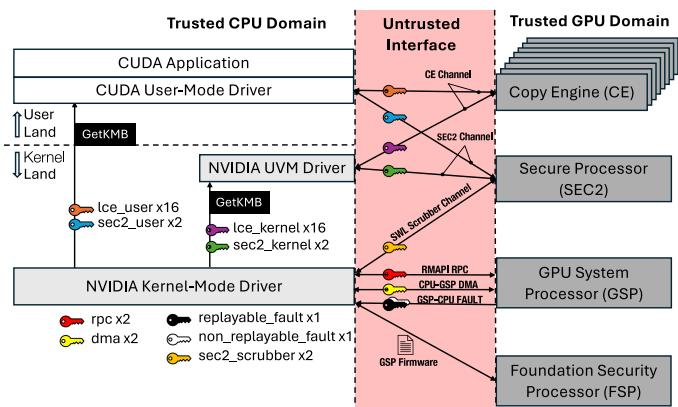  
Figure 1: The software/hardware components in GPU-CC

2. Device Attestation. Evidence indicates that SEC2 is responsible for generating an attestation report to prove the authenticity and trustworthiness of the GPU. The Device Identity Key (DIK) is burned into the key fuse during silicon manufacturing, which is unique and immutable. The DIK is exclusively accessible by SEC2, preventing access from any other entities. The attestation report is signed using an Attestation Key (AK) derived from a hierarchy of cryptographic identities embedded in the silicon.

3. Secure Data Transmission. SEC2 engine has session keys with the CVM to protect the data in transit. The CVM may either sign or encrypt the data using the session keys before placing it in an unprotected staging buffer. The SEC2 engine then retrieves the data: If it is signed, SEC2 verifies the integrity to detect any tampering during transit. If it is encrypted, SEC2 decrypts the data and stores it in the GPU’s CPR.

4. Memory Scrubbing. Sensitive data within the GPU’s CPR must be erased when no longer needed. The NVIDIA kernelmode driver can establish a scrubber channel associated with the SEC2 engine. When physical memory pages are freed and require scrubbing, commands submitted to the scrubber channel are signed to prevent tampering. SEC2 can trigger a soft reset of the GPU, ensuring that before the GPU memory becomes visible on the system bus, all session keys are deleted, and memory is wiped.

5. Secure Workload Submission. SEC2 can be used for bootstrapping secure workload submission. The CUDA user-mode driver and UVM driver can allocate secure channels bound to the SEC2 engine, ensuring command integrity. Commands in this channel can be signed using an HMAC session key. SEC2 verifies the integrity of these commands before execution.

Copy Engine (CE). CEs manage memory transfers for GPUs and include AES hardware for encryption and decryption. A GPU has one or more logical CEs and physical CEs. Physical CEs handle data movement, while logical CEs manage the control logic for physical CEs. Logical CEs are accessible to both kernel-mode clients (e.g., NVIDIA kernel-mode driver and UVM driver) and user-mode clients (e.g., CUDA user-mode driver). Clients can allocate secure channels to schedule work with logical CEs, with encryption keys obtained from the NVIDIA kernel-mode driver. Each logical CE negotiates four keys with the kernel-mode driver in CVM: two keys are for user mode and two for kernel mode. For each mode, one key protects host-to-device (h2d) data transfers, while the other protects device-to-host (d2h) transfers. All channels bound to the same logical CE share the same key. Here are the security functionalities of CEs:

1. Data Movement Protection. CE ensures that data copied from CPR to non-CPR memory is encrypted, while data transferred from non-CPR to CPR is decrypted and integritychecked. For example, it can retrieve encrypted GPU pushbuffers or CUDA kernels from unprotected memory, decrypting them into CPR before executing them. Conversely, CEs can encrypt and sign data in CPR before moving them to unprotected memory, such as when the GPU sends encrypted and signed synchronization signals (e.g., tracking semaphores) to notify command completion. Clients can then decrypt and verify these signals to proceed. Additionally, they may also support plaintext transfers of CPR-to-CPR or non-CPR-to-non-CPR memory.

2. Memory Access Control. CEs, in conjunction with the GPU’s Memory Management Unit, enforce access control by restricting compute engines to CPR memory. Once a compute engine accesses CPR, it is prevented from accessing any other unprotected memory regions. Any attempt to access memory outside CPR is blocked, triggering a memory fault.

3. Replay Attack Prevention. AES’s Initialization Vectors (IVs) are used to prevent replay attacks. While channels on the same CE share the same h2d and d2h keys, each channel independently maintains its own pair of IVs for h2d and d2h and increments them after each encryption or decryption. As a result, attempts to replay the old ciphertext would fail due to authentication tag mismatches.

## 7 BOOTSTRAP: SECURITY INITIALIZATION

This section explains the GPU-CC initialization process, covering: (1) secure boot of architectural engines required for GPU-CC, (2) key negotiation and derivation, (3) firewall establishment to block regular access to GPU registers and

CPR via the Base Address Register (BAR), and (4) device attestation to establish the trustworthiness of GPU-CC.

## 7.1 Secure Boot of Architectural Engines

To protect against malicious firmware updates or VBIOS flashing, GPU-CC enforces a secure boot process for architectural engines. All firmware components must be authenticated and cryptographically signed by a trusted authority.

According to the information shared by an NVIDIA engineer on the developer forum (NVIDIA, 2024), the chainof-trust follows this sequence: CEC EROT (if present) → FSP → GSP → SEC2. Here, CEC EROT refers to Microchip’s CEC1736 (MICROCHIP, 2025), a real-time controller, where EROT stands for “External Root of Trust.” The CEC1736 plays a critical role as a hardware Root of Trust, anchoring the secure boot process and establishing the system’s chain-of-trust. Both CEC EROT and FSP’s Boot ROM (BROM) authenticate FSP firmware. This duallayer verification ensures both external and internal integrity checks before FSP is fully booted.

GSP Initialization. The initialization of the GSP is a multistep, cryptographically secured sequence. This process is orchestrated by the NVIDIA kernel-mode driver and anchored from the FSP. Once the FSP has completed its own secure boot, the driver issues a command to FSP to trigger the GSP boot process. The chronological flow is as follows:

1. Image Extraction and Memory Allocation. The kernelmode driver extracts the GSP-FMC and GSP-RM binary images from their respective archives. The driver then allocates unprotected system memory to load these images. These firmware components are typically bundled with NVIDIA kernel-mode driver releases, facilitating flexible runtime updates to the GSP firmware. During this phase, the driver also calculates the total secure internal memory required by the GSP firmware and populates a metadata structure to define the necessary memory region sizes.

2. Chain of Trust (CoT) Payload Construction. The driver builds a CoT message payload containing the system memory address of the GSP-FMC image along with its authentication fields (cryptographic hashes, public keys, and signatures). This payload is transmitted to the FSP via Management Component Transport Protocol (MCTP).

3. FSP Authentication and Initialization. The FSP processes the CoT payload, copies the GSP-FMC image, and verifies its digital signature. Upon successful verification, the GSP-FMC can begin to execute.

4. GSP-RM Loading. The GSP-FMC reads the sizing metadata (generated in step 1) to allocate the necessary device memory in the GPU. It then copies the GSP-RM image into the allocated memory region and cryptographically validates its authenticity and integrity.

Table 1: The complete list of derived keys in GPU-CC  
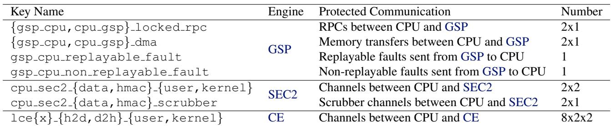

5. GSP Engine Launch. The GSP-FMC points the hardware instruction pointer to the verified GSP-RM’s entry point, effectively booting the GSP engine. Once active, the GSP initiates the key negotiation for GPU-CC and establishes the protected RPC channel for CPU-GSP communication.

The Relationship between GSP and SEC2. Although NVIDIA’s forum (NVIDIA, 2024) indicates that the GSP is responsible for starting the SEC2 engine, the precise boot sequence for these components remains opaque, as the internal handoff is concealed within the GPU hardware. However, analysis of the NVIDIA kernel-mode driver suggests that, starting with the Blackwell architecture, the GSP can also be initialized via the SEC2 engine using a process analogous to the FSP-driven method. This shift likely represents a migration of security functionality, consolidating early-stage trust management within the SEC2 engine as part of NVIDIA’s ongoing architectural iteration.

## 7.2 Key Negotiation and Derivation

The Security Protocol and Data Model (SPDM) Requester within the NVIDIA kernel-mode driver initializes an SPDM session with the SPDM Responder in the GSP. This session establishes a shared master secret, from which all cryptographic keys used in GPU-CC are derived to protect encrypted communications across the untrusted interface.

Table 1 lists all the derived keys used in GPU-CC, categorized by the engines they are associated with. For each key, we indicate the protected communication channel and the number of keys involved. The key names are designed to be self-explanatory, incorporating the engine name, direction, and key type.

For GSP, the following six keys are derived: the gsp cpu locked rpc and cpu gsp locked rpc keys are used to protect RMAPI RPC communication. The gsp cpu dma and cpu gsp dma keys are used to protect memory transfers between CPU and GSP. Two additional keys, i.e., gsp cpu replayable fault and gsp cpu non replayable fault, protect the transmission of replayable and non-replayable fault packets from GSP to CPU.

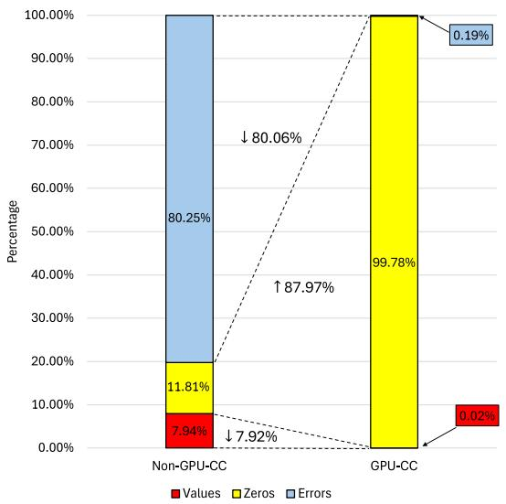  
Figure 2: Classification of register reads via GPU’s BAR0

For SEC2, six keys are derived to protect secure workload launch channels and scrubber channels. Data keys are used to encrypt data sent from the CPU to SEC2. HMAC keys are used to sign data for integrity verification. Each key is used in either user mode (e.g., by the CUDA user-mode driver) or kernel mode (e.g., by the UVM driver). The cpu sec2 data scrubber and cpu sec2 hmac scrubber keys are used by the scrubber channel.

On an H100 GPU, secure data transfers are supported with eight logical CEs. Each engine utilizes distinct cryptographic keys to secure host-to-device and device-to-host transfers across both user and kernel modes. This architecture results in a total of 32 derived keys.

## 7.3 Firewall Establishment

In non-GPU-CC mode, system administrators on the host can freely access and modify the GPU’s control and status registers, as well as its device memory, through BARs. These registers configure various GPU settings, while the device memory may contain sensitive user data provisioned within the CVM. Since the host, along with its administrators and software stacks, is no longer considered trusted in the threat model, BAR-based PCIe access substantially enlarges the attack surface.

To mitigate this, NVIDIA’s paper (Dhanuskodi et al., 2023) states that enabling GPU-CC mode activates a PCIe firewall mechanism called BAR0 Decoupler, which blocks unauthorized accesses to the majority of registers through BAR0. However, a limited subset of registers remains accessible to support essential GPU management operations.

A critical concern is determining which registers remain accessible after GPU-CC is enabled and whether their exposure poses any potential security risks. Unfortunately, the specifications for NVIDIA GPU control registers are proprietary, and no public documentation is available detailing the functionality of each register. Only a limited number of register fields have been referenced through the open GPU kernel modules and nvTrust.

Although the precise semantics of individual registers remain unclear, we quantitatively assess the difference in register accessibility before and after enabling the GPU-CC mode. To this end, we developed a scanning program that simulates an adversary probing the entire BAR0 space on a H100 GPU under two modes, i.e., the non-GPU-CC mode and the GPU-CC mode. The program reads from BAR0 starting at offset 0x0 and advances in 4-byte strides. Given that BAR0 spans 16 MB on a H100 GPU, this results in a total of 0x400000 read operations.

We categorize the returned values into three types: (1) Values: non-zero numerical returns, (2) Zeros: reads that return 0x0, and (3) Errors: reads returning error codes in the form of 0xbadxxxxx. As shown in Figure 2, in non-GPU-CC mode, 7.94% of the fields return values and 80.25% return errors. In contrast, in GPU-CC mode, 99.78% of the fields return zero, with only 0.02% (1,042 fields) returning nonzero values and 0.19% returning errors. This significant zeroing effect is attributed to the activation of the BAR0 Decoupler, which hides most control registers.

From an adversarial perspective, the decoupler obfuscates register visibility by returning zeros, making it difficult to determine whether a field is simply unmapped or protected. However, the small fraction (0.02%) of accessible fields still raises security concerns. We advocate for transparency from NVIDIA regarding the functionality of these exposed registers and their necessity for GPU management.

Beyond register access, the PCIe firewall also blocks host access to the Compute Protected Region (CPR) of GPU memory. This restriction leads to a rerouting of runtime data transmission between CVMs and GPUs, as discussed in detail in §8.

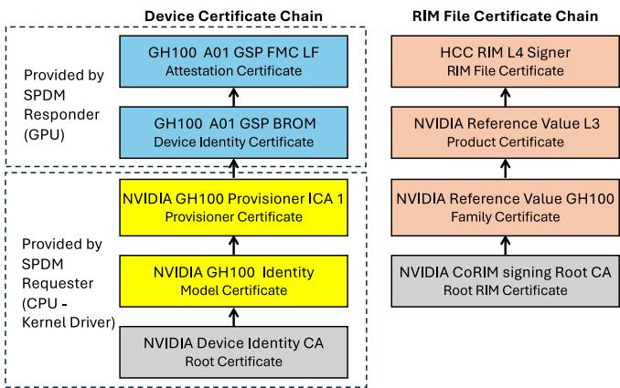  
Figure 3: GPU’s device and RIM file certificate chains

## 7.4 Device Attestation

The purpose of device attestation is to establish cryptographic proof that a CVM is communicating with a genuine, uncompromised GPU.

Device Certificate Chain. The process begins with each NVIDIA GPU being provisioned with a unique cryptographic identity: a hardware-fused Device Identity Key (DIK) and a corresponding Device Identity Certificate. This certificate, anchored to NVIDIA’s Root Certificate Authority (CA), forms the basis of a certificate chain used to establish trust.

When a verifier running inside a CVM initiates attestation, it first retrieves the device certificate chain. As illustrated in the left part of Figure 3, the chain comprises five certificates: the Attestation Certificate and Device Identity Certificate are retrieved from the GPU, while the remaining Provisioner Certificate, Model Certificate, and Root Certificate are obtained from the NVIDIA kernel-mode driver. The Device Identity Certificate corresponds to the immutable GSP BootROM (GSP-BROM) and is signed by the NVIDIA Provisioner CA. The Device Identity Certificate uniquely identifies the device as an authentic NVIDIA GPU. The immutable GSP-BROM starts execution and ensures that the system begins in a secure state. The GSP-FMC is loaded and authenticated. The GPU mathematically mixes its fused secret with specific firmware measurements to derive the Attestation Key (AK) pair. The private AK is used to sign attestation reports. The Attestation Certificate is signed by the private DIK, establishing a chain-of-trust. It contains the public AK required to verify the attestation report. The root of the certificate chain is the Root Certificate, a self-signed certificate that serves as the trust anchor.

The verifier replaces the Root Certificate with a local one to prevent a compromised driver from undermining the certificate chain. It then verifies the chain in reverse order, starting with the Device Identity Certificate and proceeding up to the Root Certificate. During this process, the verifier sends multiple requests to the NVIDIA Online Certificate Status Protocol (OCSP) service (NVIDIA, 2025d) to check the revocation status of each certificate. If the chain passes both the signature and revocation checks, the verifier proceeds to request the attestation report.

Attestation Report. Once the certificate chain is validated, the verifier retrieves the attestation report directly from the GPU. This report is cryptographically signed by the private AK. The verifier validates the attestation report’s signature using the Attestation Certificate. An attestation report contains measurement data and an opaque metadata block that identifies the GPU’s firmware and driver. The measurement data consists of 64 structured records, each containing a measurement specification, a size field, and a cryptographic hash of a measured component (e.g., firmware, configuration). The opaque data block provides information to identify the GPU driver and firmware version.

Measurements. The verifier extracts the driver and VBIOS IDs from the opaque block and retrieves the corresponding Reference Integrity Manifest (RIM) files from the NVIDIA RIM service (NVIDIA, 2025f). The verifier checks the status of the RIM files by validating their schemas and endorsements. Each RIM file includes a certificate chain. The verifier appends a local Root RIM Certificate to complete the chain (the right part of Figure 3) and verify it. Once the chain is validated, the leaf certificate, i.e., RIM File Certificate, is used to verify the signature on the RIM file. To validate the measurements, the verifier compiles a list of golden measurements from the RIM files. It compares each measurement in the attestation report with the allowed values from the golden list. If a mismatch is found, the verifier concludes that the GPU is not in the expected state. If all checks succeed, the verifier reports the attestation result and the user can choose to transition the GPU-CC into the READY state.

## 8 BRIDGE: SECURITY ANALYSIS OF DATA TRANSMISSION UNDER GPU-CC

At runtime, data must be transmitted between the CVM’s private memory and the GPU’s CPR over an untrusted PCIe interface, which can be intercepted or manipulated by adversaries on the host. This raises a key security question:

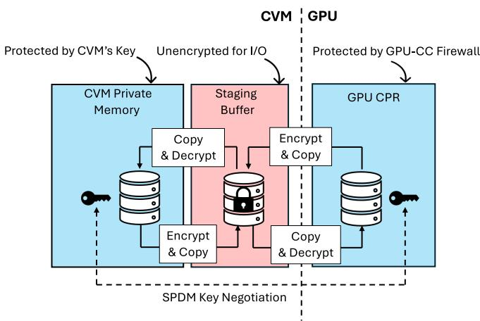  
Figure 4: Data transmission between CVM and GPU

Data protection relies on the keys negotiated via SPDM between the NVIDIA kernel-mode driver and the GPU. Different data paths employ different keys, with the full set of derived keys listed in §7.2. As shown in Figure 4, staging buffers serve as intermediaries for these transfers. The staging buffer is a shared, unencrypted memory region accessible by both the CVM and the GPU. Any data moving between protected regions, such as the CVM’s private memory and the GPU’s CPR, must first be signed and/or encrypted using the negotiated key before being placed in the staging buffer. Upon retrieval, the data is verified and/or decrypted using the corresponding key.

By combining code analysis of NVIDIA kernel drivers with runtime monitoring of data transmission, we identified six types of data paths used to transfer data between the CVM and the GPU. Table 2 presents these data paths along with their associated hardware engines. We further evaluated the security of each path in terms of confidentiality (C) and integrity (I). In the table, • indicates a confirmed leakage or integrity violation, ◦ denotes that no issues were observed, represents a potential vulnerability with low risk, and ? signifies an unknown status due to proprietary components.

For each data path type, our security analysis is structured into three parts: (1) Methodology, describing our experiments used to uncover the protection mechanism; (2) Observation, explaining how the mechanism operates; and (3) Security Insight, highlighting the security implications and mitigations. Due to space constraints, the full analysis is provided in Appendix §A. Below, we briefly summarize the key security findings for each data path.

1. CPU-GSP Remote Procedure Call (RPC). The NVIDIA kernel-mode driver communicates with the GSP-RM through a physical RMAPI RPC interface. Because this communication occurs via shared system memory, which is visible and malleable to a compromised host, the commands and responses must be encrypted. To assess the security of this channel, we intercepted all RMAPI RPC transactions, decoded 1,588 command types using encodings extracted from the NVIDIA Software Development Kit (SDK), and examined the shared staging buffer by dumping its physical memory. Our analysis reveals that only the command and status payloads are encrypted, while most RPC metadata items in the staging buffers remain in plaintext and are exposed to potential attackers. This metadata leakage enables attackers to track RMAPI invocation status, violating confidentiality guarantees. Although payload encryption with a session key protects RPC command integrity, attackers can still modify metadata fields such as readPtr and writePtr, altering the order, repetition, or omission of RPC calls and thus may partially undermine execution integrity. We recommend encrypting both RPC payloads and metadata of command and status queues to provide stronger protection.

Table 2: Classification of security implications by data paths  
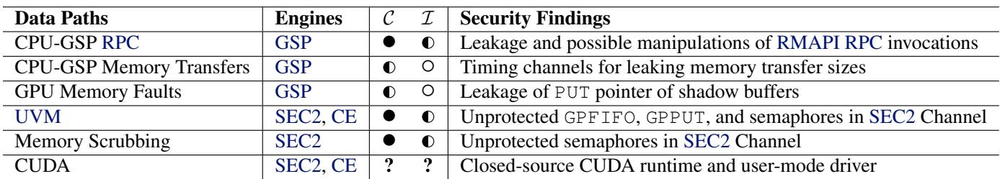

2. CPU-GSP Memory Transfers. In the GPU-CC mode, BAR2 access to the GPU’s CPR is blocked, so the NVIDIA kernel-mode driver uses CPU-GSP DMA to transfer memory. Because DMA cannot access CVM’s private memory directly, transfers must pass through an unprotected staging buffer in the shared memory. Memory read operations are initiated when the driver issues a MEMMGR MEMORY TRANSFER WITH GSP RPC request, which prompts the GSP to encrypt source data using the gsp cpu dma key. Following encryption, the data is transferred via DMA into a staging buffer for driver-side retrieval and decryption. Conversely, for write operations, the driver first encrypts the data using the cpu gsp dma key and places it in the staging buffer. The driver then invokes the same RPC to signal the GSP, which performs a DMA copy and decrypts the data into the CPR. In our analysis, we intercepted all CPU-GSP transfers across a CVM lifecycle (4,394 transfers in total: 453 reads and 3,941 writes), logged execution times for transfer sizes from 8 to 4,096 bytes, and correlated latency with size to search for timing channels. The timing distribution is bimodal: for small transfers (8 to 256 bytes), RPC overhead dominates and size has little effect. By contrast, for large transfers (4,096 bytes), execution times increase substantially, producing a size-dependent timing signal observable via the RPC channel. This creates a potential timing side channel that could leak information about transfer size or activity. We recommend implementing constant-time RPC handling or adding statistical noise for CPU-GSP memory transfers to obfuscate these timing patterns.

3. GPU Memory Faults. Memory faults occur when a program accesses out-of-bound memory, dereferences null pointers, or writes to freed memory. In GPU-CC mode, the hardware buffer for logging these faults resides inside the GPU’s CPR, making it inaccessible to the CPU. To examine the fault-handling path under GPU-CC, we intentionally triggered faults in a customized CUDA program and instrumented both the NVIDIA kernel-mode and UVM drivers to observe how fault packets are transferred and protected. We found that the UVM driver allocates two shadow buffers in unprotected memory: one for replayable faults and one for non-replayable faults. The GSP encrypts fault packets using gsp cpu replayable fault or gsp cpu non replayable fault keys and copies them into the appropriate shadow buffer, then signals the CPU via an RPC event so the UVM driver can verify and decrypt the packet. Unlike non-GPU-CC mode, both fault types now follow a unified workflow since the GSP controls the hardware buffers. The only observed leakage is that the shadow buffer’s PUT pointer is exposed to the CPU via BAR0 and is updated whenever a new fault is logged. However, since faults are infrequent, the risk of information leakage remains low.

4. Unified Virtual Memory (UVM). UVM provides a unified CPU-GPU address space. But in GPU-CC mode, where the GPU cannot access CVM’s private memory and BAR2 access to the CPR is blocked, UVM must adopt a new secure design. GPU-CC introduces a two-phase, multi-channel workflow involving SEC2 Channel, Work Launch Channel (WLC), and Launch Confirmation Indicator Channel (LCIC). Pushbuffers and command queue structures are now relocated into the CPR. To examine this new pipeline, we instrumented the NVIDIA kernel-mode and UVM drivers and reconstructed the control flow. We observed that the SEC2 Channel initializes 16 WLC/LCIC pairs by verifying the signed static methods, with their schedules configured through SEC2 pushes. UVM CE pushes are then launched indirectly via WLCs: their decrypt-then-run workflow transfers encrypted pushbuffers into the CPR and decrypts them for execution, while encrypted tracking semaphores in staging memory allow the driver to monitor progress. Our security analysis shows that SEC2’s command queue structures, specifically GPPUT, GPFIFO, and tracking semaphores, remain unprotected in shared memory, which could potentially allow attackers to redirect execution toward malicious pushbuffers. However, the SEC2’s method-signing mechanism may still prevent modified GPU methods from being executed. Meanwhile, all critical WLC/LCIC/CE data structures, including their mutable pushbuffers, command queues, and tracking semaphores, remain encrypted in staging buffers or confined to the CPR.

5. Memory Scrubbing. Memory scrubbing ensures sensitive data in GPU memory is securely erased before GPU reuse. In GPU-CC mode, a dedicated scrubber channel associated with the SEC2 engine is introduced to prevent tampering with scrub operations. To study this workflow, we intercepted SEC2 signing functions and backtracked scrub triggers within the memory manager. We found that when memory pages are freed, the driver creates a pushbuffer with a series of memset commands, signs them using the cpu sec2 hmac scrubber key, appends authentication tags, and dispatches the signed pushbuffer to SEC2 engine via the scrubber channel. The SEC2 engine validates the signature before executing the scrub task. Our security analysis reveals two limitations: (1) scrub pushbuffers are signed but not encrypted, exposing their GPU methods to attackers on the host and (2) the tracking semaphores used by the SEC2 engine to signal task completion remain unprotected. These gaps allow attackers to observe scrub activity or tamper with completion signals, suggesting the need for stronger protection in the scrubber channel.

6. CUDA. CUDA is NVIDIA’s proprietary parallel computing platform, designed to offload compute-intensive portions of an application from the sequential CPU to parallel GPU cores. GPU-CC must protect five categories of data involved in CUDA operations: (1) User data (e.g., datasets and model weights), (2) CUDA kernel code, (3) CUDA kernel arguments, (4) Queue Metadata (QMD) launch configuration structure, and (5) command queue structures used to transfer data and orchestrate kernel execution. To understand how GPU-CC secures CUDA’s data transfers, we instrumented the NVIDIA kernel-mode driver, the UVM driver, and the OpenSSL library to capture their interactions with CUDA programs. Our experiments reveal that the CUDA usermode driver retrieves two sets of keys via the GetKMB API: cpu sec2 {data,hmac} user keys, which are bound to the SEC2 engine, and lce{x} {h2d,d2h} user keys, associated with CEs. Analysis indicates that critical tasks, such as kernel execution and data movement, are primarily managed within the CUDA runtime and user-mode driver, with no visibility from the kernel space. Given that both the CUDA runtime and user-mode driver are closed-source, we make the following reasoned speculation based on the data that require special protection under GPU-CC:

With GPU-CC enabled, all CUDA-related data transmission must be protected when passing over the untrusted PCIe interface. (1) Large data transmission, such as user data and CUDA kernel code, must be encrypted with CE’s session keys, staged in shared buffers, and transferred via the CE into the GPU’s CPR for decryption. Reverse transfers from GPU’s CPR to system memory should be similarly protected. (2) Smaller but sensitive structures, including CUDA kernel arguments and QMD launch configuration, can no longer be written in plaintext over PCIe. Instead, they should be encrypted by the CUDA user-mode driver and securely pulled by a GPU security engine (e.g., SEC2), which verifies integrity and decrypts them within the CPR prior to execution. (3) Command queue structures (e.g., GPFIFO, GPPUT, pushbuffers, and tracking semaphores) must either reside in the CPR or remain encrypted in staging buffers, with secure work submission enabled through authenticated and encrypted channels managed by SEC2.

Key Takeaway. GPU-CC introduces stricter security requirements to protect data transmission. Yet much of the existing GPU software stack consists of legacy implementations that do not meet these expectations and must be updated individually. While recent changes secure most bulk command and data transfers, some sensitive metadata, timing behavior, and coordination signals remain exposed in the unprotected shared memory. These residual leaks can enable inference of computational behavior and in some cases even manipulation of operations, creating a partial loss of integrity. Extending protection to metadata and reducing observable timing differences would better strengthen the end-to-end pipeline security.

## 9 CONCLUSION

The NVIDIA GPU-CC system aims to provide a secure execution environment for privacy-critical parallel computing workloads. However, its proprietary ecosystem, lack of public specifications, and design complexity hinder comprehensive security verification. This paper demystifies its inner workings to establish a foundation for future security research. We detail the underlying architectural mechanisms and present a series of in-depth experiments to assess security risks and identify potential attack surfaces.

## ACKNOWLEDGMENTS

We are grateful to the anonymous reviewers for their feedback and suggestions. The authors at The Ohio State University were partially supported by NSF awards 2112471, 2207202, and 2348754.

## REFERENCES

Aktas, E., Cohen, C., Eads, J., Forshaw, J., and Wilhelm, F. Intel Trust Domain Extensions (TDX) Security Review. Google security review, 2023.

AMD. AMD SEV-SNP: Strengthening VM Isolation with Integrity Protection and More. AMD, 2020.

AMD. AMD SEV-TIO: Trusted I/O for Secure Encrypted Virtualization. AMD, 2023.

Cheng, P.-C., Eykholt, K., Gu, Z., Jamjoom, H., Jayaram, K., Valdez, E., and Verma, A. DeTA: Minimizing Data Leaks in Federated Learning via Decentralized and Trustworthy Aggregation. In Proceedings of the Nineteenth European Conference on Computer Systems, pp. 219–235, 2024a.

Cheng, P.-C., Ozga, W., Valdez, E., Ahmed, S., Gu, Z., Jamjoom, H., Franke, H., and Bottomley, J. Intel TDX Demystified: A Top-Down Approach. ACM Computing Surveys, 56(9):1–33, 2024b.

Cohen, C., Forshaw, J., Horn, J., and Brand, M. AMD Secure Processor for Confidential Computing Security Review. Technical report, Google Project Zero and Google Cloud Security, 2022.

De Meulemeester, J., Wilke, L., Oswald, D., Eisenbarth, T., Verbauwhede, I., and Van Bulck, J. BadRAM: Practical memory aliasing attacks on trusted execution environments. In 2025 IEEE Symposium on Security and Privacy (SP), pp. 4117–4135. IEEE, 2025.

Delignat-Lavaud, A. and Rogers, P. Hopper Confidential Computing: How it Works under the Hood. https://www.nvidia.com/en-us/ondemand/session/gtcspring23-s51709/, 2023.

Deng, Y., Wang, C., Yu, S., Liu, S., Ning, Z., Leach, K., Li, J., Yan, S., He, Z., Cao, J., et al. StrongBox: A GPU TEE on Arm Endpoints. In Proceedings of the 2022 ACM SIGSAC Conference on Computer and Communications Security, pp. 769–783, 2022.

Dhanuskodi, G., Guha, S., Krishnan, V., Manjunatha, A., Nertney, R., O’Connor, M., and Rogers, P. Creating the First Confidential GPUs. Communications of the ACM, 67(1):60–67, 2023.

Eichner, H., Ramage, D., Bonawitz, K., Huba, D., Santoro, T., McLarnon, B., Van Overveldt, T., Fallen, N., Kairouz, P., Cheu, A., et al. Confidential Federated Computations. arXiv preprint arXiv:2404.10764, 2024.

Gast, S., Weissteiner, H., Schroder, R. L., and Gruss, D.¨ CounterSEVeillance: Performance-counter attacks on AMD SEV-SNP. In Network and Distributed System Security (NDSS) Symposium 2025, 2025.

Gu, Z., Jamjoom, H., Su, D., Huang, H., Zhang, J., Ma, T., Pendarakis, D., and Molloy, I. Reaching Data Confidentiality and Model Accountability on the CalTrain. In 2019 49th Annual IEEE/IFIP International Conference on Dependable Systems and Networks (DSN), pp. 336–348. IEEE, 2019.

Guo, J., Pietzuch, P., Paverd, A., and Vaswani, K. Trustworthy AI using Confidential Federated Learning: Federated learning and confidential computing are not competing technologies. Queue, 22(2):87–107, 2024a.

Guo, Y., Zhang, Z., and Yang, J. GPU Memory Exploitation for Fun and Profit. In 33rd USENIX Security Symposium (USENIX Security 24), pp. 4033–4050, 2024b.

Hu, X., Liang, L., Li, S., Deng, L., Zuo, P., Ji, Y., Xie, X., Ding, Y., Liu, C., Sherwood, T., et al. DeepSniffer: A DNN Model Extraction Framework Based on Learning Architectural Hints. In Proceedings of the Twenty-Fifth International Conference on Architectural Support for Programming Languages and Operating Systems, pp. 385–399, 2020.

Intel. Intel TDX Connect Architecture Specification. https://cdrdv2.intel.com/v1/dl/ getContent/773614, 2023a.

Intel. Intel Trust Domain Extensions. https: //cdrdv2.intel.com/v1/dl/getContent/ 690419, 2023b.

Ivanov, A., Rothenberger, B., Dethise, A., Canini, M., Hoefler, T., and Perrig, A. SAGE: Software-based Attestation for GPU Execution. In 2023 USENIX Annual Technical Conference (USENIX ATC 23), pp. 485–499, 2023.

Jang, I., Tang, A., Kim, T., Sethumadhavan, S., and Huh, J. Heterogeneous Isolated Execution for Commodity GPUs. In Proceedings of the Twenty-Fourth International Conference on Architectural Support for Programming Languages and Operating Systems, pp. 455–468, 2019.

Jiang, J., Qi, J., Shen, T., Chen, X., Zhao, S., Wang, S., Chen, L., Zhang, G., Luo, X., and Cui, H. CRONUS: Fault-isolated, Secure and High-performance Heterogeneous Computing for Trusted Execution Environment. In 2022 55th IEEE/ACM International Symposium on Microarchitecture (MICRO), pp. 124–143. IEEE, 2022.

Kaplan, D. Protecting VM Register State with SEV-ES. AMD, 2017.

Kaplan, D., Powell, J., and Woller, T. AMD Memory Encryption. AMD, 2016.

Lee, J., Wang, Y., Rajat, R., and Annavaram, M. Characterization of GPU TEE Overheads in Distributed Data Parallel ML Training. arXiv preprint arXiv:2501.11771, 2025.

Lee, S., Kim, J., Na, S., Park, J., and Huh, J. TNPU: Supporting Trusted Execution with Tree-less Integrity Protection for Neural Processing Unit. In 2022 IEEE International Symposium on High-Performance Computer Architecture (HPCA), pp. 229–243. IEEE, 2022.

Mai, H., Zhao, J., Zheng, H., Zhao, Y., Liu, Z., Gao, M., Wang, C., Cui, H., Feng, X., and Kozyrakis, C. Honeycomb: Secure and Efficient GPU Executions via Static Validation. In 17th USENIX Symposium on Operating Systems Design and Implementation (OSDI 23), pp. 155– 172, 2023.

MICROCHIP. CEC1736 Real-Time Platform Root of Trust Controller. https://www.microchip.com/ en-us/product/cec1736, 2025.

Mo, F., Haddadi, H., Katevas, K., Marin, E., Perino, D., and Kourtellis, N. PPFL: Enhancing Privacy in Federated Learning with Confidential Computing. GetMobile: Mobile Computing and Communications, 25(4):35–38, 2022.

Mohan, A., Ye, M., Franke, H., Srivatsa, M., Liu, Z., and Gonzalez, N. M. Securing AI Inference in the Cloud: Is CPU-GPU Confidential Computing Ready? In 2024 IEEE 17th International Conference on Cloud Computing (CLOUD), pp. 164–175. IEEE, 2024.

Naghibijouybari, H., Koruyeh, E. M., and Abu-Ghazaleh, N. Microarchitectural Attacks in Heterogeneous Systems: A Survey. ACM Computing Surveys, 55(7):1–40, 2022.

Nertney, R. Remote Attestation for NVIDIA Hopper and Blackwell GPUs, CPUs, and Beyond. https: //www.youtube.com/watch?v=2dZgwowP2\_M, 2025.

NVIDIA. Are the On-Die Root of Trust and SEC2 security microcontroller physically the same thing? https://forums.developer.nvidia.com/ t/are-the-on-die-root-of-trustand-sec2-security-microcontrollerphysically-the-same-thing/307330, 2024.

NVIDIA. open-gpu-kernel-modules. https://github.com/NVIDIA/open-gpu-kernel-

modules/blob/main/kernel-open/ nvidia-uvm/uvm\_gpu\_non\_replayable\_ faults.c#L38, 2025a.

NVIDIA. Deployment Guide for SecureAI. https://docs.nvidia.com/cc-deploymentguide-tdx.pdf, 2025b.

NVIDIA. nvTrust: Ancillary Software for NVIDIA Trusted Computing Solutions. https://github.com/ NVIDIA/nvtrust, 2025c.

NVIDIA. OCSP Service API Documentation. https://docs.attestation.nvidia.com/ OCSP/ocsp\_api.html, 2025d.

NVIDIA. NVIDIA Linux open GPU kernel module source. https://github.com/NVIDIA/opengpu-kernel-modules, 2025e.

NVIDIA. RIM Service API Documentation. https://docs.nvidia.com/attestation/ api-docs-rim/latest/index.html, 2025f.

Quoc, D. L. and Fetzer, C. SecFL: Confidential Federated Learning using TEEs. arXiv preprint arXiv:2110.00981, 2021.

Rauscher, F., Wilke, L., Weissteiner, H., Eisenbarth, T., and Gruss, D. TDXploit: Novel Techniques for Single-Stepping and Cache Attacks on Intel TDX. In 34th USENIX Security Symposium (USENIX Security 25), pp. 1207–1222, 2025.

Rauscher, F., Weissteiner, H., and Gruss, D. TELESCOPE: TDX Exploit Leaking Encrypted Data using Sibling Core Performance Counters. In ACM ASIA Conference on Computer and Communications Security 2026, 2026.

Rogers, P., Overby, M., Venkataraman, V., Cherukuri, N., Deming, J. L., Dhanuskodi, G., Swoboda, D., Dunning, L., Manjunatha, A., Jiricek, A., et al. Confidential computing using multi-instancing of parallel processors, September 21 2023a. US Patent App. 18/123,222.

Rogers, P., Overby, M., Venkataraman, V., Cherukuri, N., Deming, J. L., Dhanuskodi, G., Swoboda, D., Dunning, L., Manjunatha, A., Jiricek, A., et al. Confidential computing using parallel processors with code and data protection, September 21 2023b. US Patent App. 18/185,654.

Rogers, P. J., Overby, M., Woodmansee, M. A., Venkataraman, V., Cherukuri, N., Dhanuskodi, G., Swoboda, D. F., Dunning, L. B., Hairgrove, M., Guha, S., et al. Implementing trusted executing environments across multiple processor devices, February 4 2025. US Patent 12,219,057.

Schluter, B. and Shinde, S. RMPocalypse: How a Catch-22 ¨ Breaks AMD SEV-SNP. In Proceedings of the 2025 ACM SIGSAC Conference on Computer and Communications Security, pp. 3840–3854, 2025.

Schluter, B., Sridhara, S., Bertschi, A., and Shinde, S. We-¨ See: Using Malicious #VC Interrupts to Break AMD SEV-SNP. In 2024 IEEE Symposium on Security and Privacy (SP), pp. 4220–4238. IEEE, 2024a.

Schluter, B., Sridhara, S., Kuhne, M., Bertschi, A., and ¨ Shinde, S. HECKLER: Breaking Confidential VMs with Malicious Interrupts. In 33rd USENIX Security Symposium (USENIX Security 24), pp. 3459–3476, 2024b.

Schluter, B., Wech, C., and Shinde, S. Heracles: Chosen ¨ Plaintext Attack on AMD SEV-SNP. In Proceedings of the 2025 ACM SIGSAC Conference on Computer and Communications Security, pp. 3810–3824, 2025.

Tan, Y. and Mi, Z. Performance Analysis and Optimization of Nvidia H100 Confidential Computing for AI Workloads. In 2024 IEEE International Symposium on Parallel and Distributed Processing with Applications (ISPA), pp. 1426–1432. IEEE, 2024.

Tan, Y., Tan, C., Mi, Z., and Chen, H. PipeLLM: Fast and Confidential Large Language Model Services with Speculative Pipelined Encryption. In Proceedings of the 30th ACM International Conference on Architectural Support for Programming Languages and Operating Systems, Volume 1, pp. 843–857, 2025.

Vaswani, K., Volos, S., Fournet, C., Diaz, A. N., Gordon, K., Vembu, B., Webster, S., Chisnall, D., Kulkarni, S., Cunningham, G., et al. Confidential Computing within an AI Accelerator. In 2023 USENIX Annual Technical Conference (USENIX ATC 23), pp. 501–518, 2023.

Volos, S., Vaswani, K., and Bruno, R. Graviton: Trusted Execution Environments on GPUs. In 13th USENIX Symposium on Operating Systems Design and Implementation (OSDI 18), pp. 681–696, 2018.

Wang, C., Zhang, F., Deng, Y., Leach, K., Cao, J., Ning, Z., Yan, S., and He, Z. CAGE: Complementing Arm CCA with GPU Extensions. In Network and Distributed System Security (NDSS) Symposium, volume 2024, 2024a.

Wang, Q. and Oswald, D. Confidential Computing on Heterogeneous CPU-GPU Systems: Survey and Future Directions. ACM Computing Surveys, 2026.

Wang, Y., Rajat, R., Lee, J., Tang, T., and Annavaram, M. Fastrack: Fast IO for Secure ML using GPU TEEs. arXiv preprint arXiv:2410.15240, 2024b.

Wilke, L., Sieck, F., and Eisenbarth, T. TDXdown: Single-Stepping and Instruction Counting Attacks against Intel TDX. In Proceedings of the 2024 on ACM SIGSAC Conference on Computer and Communications Security, pp. 79–93, 2024.

Zhan, Z., Zhang, Z., Liang, S., Yao, F., and Koutsoukos, X. Graphics Peeping Unit: Exploiting EM Side-Channel Information of GPUs to Eavesdrop on Your Neighbors. In 2022 IEEE Symposium on Security and Privacy (SP), pp. 1440–1457. IEEE, 2022.

Zhang, R., Gerlach, L., Weber, D., Hetterich, L., Lu, Y., ¨ Kogler, A., and Schwarz, M. CacheWarp: Softwarebased Fault Injection using Selective State Reset. In 33rd USENIX Security Symposium (USENIX Security 24), pp. 1135–1151, 2024a.

Zhang, Z., Allen, T., Yao, F., Gao, X., and Ge, R. TunneLs for Bootlegging: Fully Reverse-Engineering GPU TLBs for Challenging Isolation Guarantees of NVIDIA MIG. In Proceedings of the 2023 ACM SIGSAC Conference on Computer and Communications Security, pp. 960–974, 2023.

Zhang, Z., Cai, K., Guo, Y., Yao, F., and Gao, X. Invalidate+Compare: A Timer-Free GPU Cache Attack Primitive. In 33rd USENIX Security Symposium (USENIX Security 24), pp. 2101–2118, 2024b.

Zhao, S., Gu, Z., Ahmed, S., Valdez, E., Jamjoom, H., and Lin, Z. GPU Travelling: Efficient Confidential Collaborative Training with TEE-Enabled GPUs. In Proceedings of the 2025 on ACM SIGSAC Conference on Computer and Communications Security, 2025.

Zhu, Y., Cheng, Y., Zhou, H., and Lu, Y. Hermes Attack: Steal DNN Models with Lossless Inference Accuracy. In 30th USENIX Security Symposium (USENIX Security 21), 2021.

## A SECURITY ANALYSIS OF DATA PATHS

## A.1 CPU-GSP RPC

Methodology. The NVIDIA kernel-mode driver communicates with the GSP Resource Manager (GSP-RM) via the physical Resource Manager API (RMAPI) Remote Procedure Call (RPC) interface over a bi-directional channel. The driver sends commands to the GPU System Processor (GSP) for offloading specific tasks, while the GSP responds with execution status and GPU events to notify the driver. Since the RPC occurs over an untrusted medium that attackers on the host can examine and interpose, all data transmitted through the RPC channels must be encrypted.

We intercepted all physical RMAPI invocations from the NVIDIA kernel-mode driver and captured their corresponding responses from the GSP. Each command type follows a specific encoding, automatically generated by NVIDIA’s FINN tool. To better understand the semantics of each RPC invocation, we extracted the encodings of 1,588 RMAPI commands from NVIDIA’s Software Development Kit (SDK) and replaced them in our captured log.

Observation. The RPC infrastructure is initialized during the GSP engine construction phase. A shared memory region is allocated in unprotected system memory for communication, consisting of a physical address table, a command queue, and a status queue. The physical address table, which holds the physical addresses of all pages in the shared region, informs the GPU of the physical memory layout. The command queue stores commands and their parameters sent from the driver to the GSP, while the status queue contains status information returned from the GSP to the driver. The locations of these structures are communicated to the GSP during initialization.

To send a command, the driver first sets up the command header with a sequence number and element count. The header also includes an Additional Authenticated Data (AAD) buffer, an authentication tag, and a checksum, but it remains in plaintext. The driver then encrypts the command payload in private memory using the cpu gsp locked rpc key and computes a checksum over both the header and the encrypted payload, recording the value in the header. The header and encrypted payload are then copied into the command queue in the staging buffer. The GSP retrieves the command, verifies the checksum and the integrity of the encrypted payload, decrypts it using the same key, and executes the command.

To send a status update or notify the driver of an event, the GSP encrypts the status using the gsp cpu locked rpc key and copies the status header along with the encrypted payload into the status queue in the staging buffer. The driver retrieves the data from the status queue, copies it to private memory, and verifies the checksum and the integrity of the encrypted payload. Then it decrypts the status payload and processes it accordingly.

Security Insight. It is important to note that only the command and status RPC payloads are encrypted in the unprotected staging buffers, while the physical address table, queue headers, and queue element headers remain in plaintext and are exposed to potential attackers on the host. Figure 5 illustrates these data structures by dumping memory from their corresponding physical addresses in the Kernelbased Virtual Machine (KVM) hypervisor.

The physical address table consists of 129 entries (Figure 5 shows the first four). The first entry stores the table’s own physical address, followed by one entry for the command queue’s header, 63 entries for command queue elements, one entry for the status queue’s header, and 63 entries for status queue elements. If adversaries gain access to the physical address table, they can easily locate all elements in the command/status queues. For example, the second entry (0x000000016921f000) points to the command/status queue’s header, where the readPtr and writePtr fields indicate the next elements to read and write. These fields can then be used as indices in the address table to locate active elements in queues.

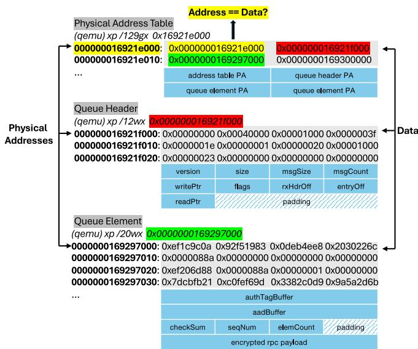  
Figure 5: Information leaks in RMAPI RPC: By traversing the memory addresses within the physical address table, which is allocated in unprotected system memory, adversaries can identify the plaintext metadata of queue and element headers.

For instance, the third entry (0x0000000169297000) points to a specific queue element. Each element contains a header with fields such as authTagBuffer, aadBuffer, checkSum, seqNum, and elemCount, followed by the encrypted RPC payload. The plaintext header can also reveal significant information about the currently active element. For example, if the elemCount has a value greater than one, it can be used to infer the RPC type with high accuracy.

A key challenge is how to locate the physical address table within the large physical memory space of a confidential virtual machine (CVM). The vulnerability arises because the first entry in the address table stores its own physical address (e.g., 0x000000016921e000 in Figure 5). Given that the address table is page-aligned, adversaries can perform a memory scan in 4096-byte strides (the typical page size) across the entire physical memory. If a 64-bit physical address found during the scan equals the value stored at that location, the attacker can uniquely identify the starting address of the physical address table, potentially exposing critical memory mappings.

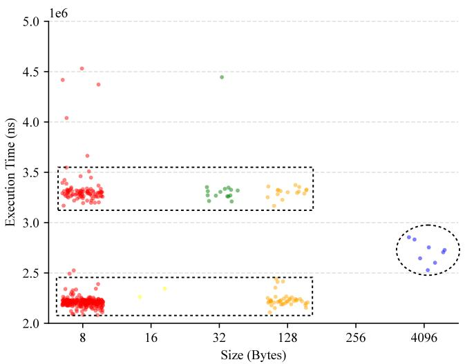

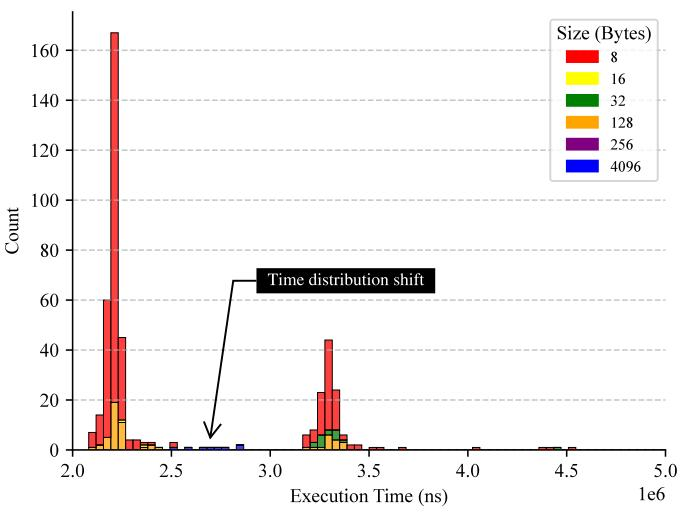

(a) Read data from GSP  
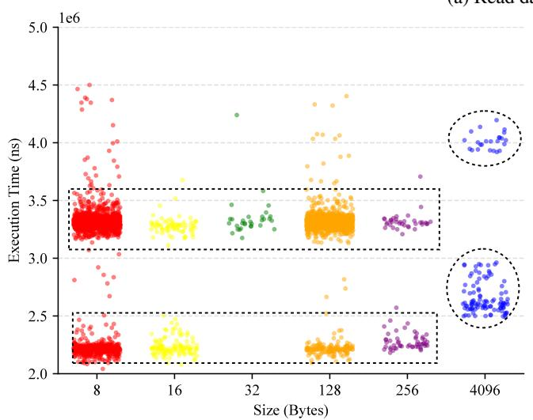

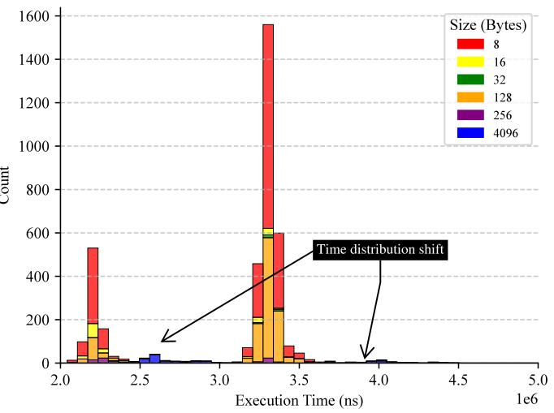  
(b) Write data to GSP  
Figure 6: Timing channels in CPU-GSP memory transfers

Leakage of RPC metadata enables adversaries to monitor RMAPI invocation status, thereby may weaken confidentiality guarantees. While the RPC payload is protected by the session key, which prevents direct compromise of its integrity, attackers can still manipulate the readPtr and writePtr fields in the metadata to alter the active elements. This can change the order, repetition, or omission of RPC calls, thus may partially undermine execution integrity. To mitigate both leakage and manipulation, we recommend encrypting not only the RPC payload but also the metadata of the command and status queues.

## A.2 CPU-GSP Memory Transfers

Methodology. Once we enable the GPU Confidential Computing (GPU-CC) mode, the BAR2 access to the GPU memory is blocked. Reads and writes to data within the Compute Protected Region (CPR) should use alternative routes. For the memory transfers between CVM and GSP, the driver uses the CPU-GSP Direct Memory Access (DMA). As DMA cannot access the private memory in the CVM directly, the driver needs to allocate and map a staging buffer in the unprotected memory, which is not protected by the CVM’s key.

In our experiment, we intercepted all memory transfers between the CVM and GSP and recorded their execution time throughout the lifecycle of a CVM. Our goal is to investigate how the source or destination aperture and the size of memory transfers impact execution time and whether the potential presence of timing channels can be exploited.

Observation. To read data from the GPU’s CPR, the driver sends a MEMMGR MEMORY TRANSFER WITH GSP RPC request with parameters specifying the memory size, the source in the GPU’s CPR, and the destination in a staging buffer located in unprotected system memory. The protection for transmitting this RPC request itself has been discussed in §A.1. Upon receiving the request, the GSP encrypts the source data in the CPR using the gsp cpu dma key and copies it via DMA into the unprotected staging buffer. The driver then transfers the data to private memory and decrypts it using the same key.

To write data to the GPU’s CPR, the driver first encrypts the data in the CVM’s private memory using the cpu gsp dma key and copies it to the unprotected staging buffer. The driver then sends the memory transfer request via the same RPC, specifying the memory size, the source in the staging buffer, and the destination in the CPR. Upon receiving the command, the GSP copies the data via DMA from the unprotected staging buffer, decrypts it using the same key, and writes it to the target address in the CPR.

Security Insight. We recorded the execution time for 4,394 memory transfers between the CPU and GSP throughout an entire CVM lifecycle, consisting of 453 read operations and 3,941 write operations. Our goal is to analyze whether the transfer size impacts execution time.

In Figure 6, we first illustrate the relationship between memory transfer sizes and execution time for both read and write operations in the two plots on the left. We can observe that large memory transfers, specifically those of 4,096 bytes, demonstrate a distinct shift in execution time compared to smaller transfers ranging from 8 to 256 bytes.

To visualize this statistical shift more effectively, we represent the data as histograms in the right-side plots of Figure 6. In these histograms, the horizontal axis denotes execution time while the vertical axis indicates the count of memory transfers within specific intervals. Distinct colors are used to identify the varying transfer sizes. The histograms reveal that both read and write operations exhibit a bimodal distribution of execution times. For small transfer sizes (8 to 256 bytes), the execution time is largely dominated by the inherent cost of the RPC itself, making the effect of memory size relatively insignificant. However, for larger transfers (4,096 bytes, represented by blue bars), a noticeable shift occurs, with execution times increasing significantly compared to smaller transfers.

To mitigate potential timing side-channel attacks, where adversaries monitoring the RPC channel in untrusted memory could infer sensitive information from execution time variations, we recommend implementing constant-time execution for RPC invocations or introducing statistical noise to obfuscate timing patterns.

## A.3 GPU Memory Faults

Methodology. In GPU-CC mode, handling GPU memory faults presents unique challenges due to the stricter memory access control. Typically, memory faults occur when a program attempts to access out-of-bound memory, dereference null pointers, or write to freed memory. In the non-GPU-CC mode, both the CPU-side drivers and GPU have access to a shared hardware buffer, allowing the GPU to log fault packets directly into the buffer, which the driver can then retrieve and handle. However, in GPU-CC mode, this hardware buffer is placed within the GPU’s CPR, rendering it inaccessible to the CPU. As a result, a new mechanism is required to securely transfer fault packets through an untrusted interface.

To analyze this memory fault workflow in GPU-CC mode, we developed a CUDA program designed to deliberately trigger memory faults. By instrumenting the NVIDIA kernel-mode driver and Unified Virtual Memory (UVM) driver, we intercepted RPC invocations used for setting up the staging buffers to deliver the fault packets and monitored the use of cryptographic keys related to memory faults.

Observation. To meet the memory access control requirements in GPU-CC, the UVM driver requests the NVIDIA kernel-mode driver to allocate two shadow buffers, one for replayable memory faults and another for non-replayable memory faults. These shadow buffers reside in unprotected staging buffers, enabling the GSP to write directly to them. The NVIDIA kernel-mode driver registers these shadow buffers with the GSP through the RMAPI RPC, informing the GSP of their structures. The GSP then encrypts the fault packets using the gsp cpu replayable fault or gsp cpu non replayable fault key before copying them into the shadow buffers. Once the fault packets are stored, the GSP sends a MMU FAULT QUEUED event via the RPC return path, notifying the driver. The UVM driver monitors this event and schedules an interrupt service routine to retrieve the encrypted fault packets from the shadow buffers. Each fault packet includes an authentication tag and a valid field (used as AAD). The UVM driver uses the corresponding key to verify and decrypt incoming packets, then parses them to handle memory faults effectively while preserving data confidentiality and integrity.

Security Insight. According to the comment (NVIDIA, 2025a) in the UVM driver’s source code, replayable faults originate from the Streaming Multiprocessors (SMs), while non-replayable faults come from other engines, e.g., Copy Engines (CEs). In non-GPU-CC mode, these two types of faults follow different handling paths. The UVM driver exclusively manages replayable faults and owns the hardware buffer that stores them. In contrast, handling nonreplayable faults requires interaction with the NVIDIA kernel-mode driver via a specific shadow buffer since only the kernel-mode driver can access the hardware buffer for non-replayable faults.

However, in GPU-CC mode, where the GSP owns the hardware buffer and the CPU lacks direct access, both replayable and non-replayable faults rely on shadow buffers to store encrypted fault packets. Therefore, their handling paths become similar in GPU-CC mode. Additionally, the GSP-RM needs to update the shadow buffer’s PUT pointer whenever a new fault packet is placed. NVIDIA repurposes the access counter registers mapped in BAR0 to expose this pointer to the CPU. This means that adversaries can also observe this value on the host. Given that memory faults occur infrequently, the risk of exposing the PUT pointer remains low.

## A.4 Unified Virtual Memory (UVM)

Methodology. NVIDIA’s UVM system provides a unified address space across system memory and GPU memory, enabling seamless memory access by managing memory migrations, page faults, and coherence automatically.

In the non-GPU-CC mode, the UVM driver communicates with CEs through UVM channels to conduct memory operations such as page copies or Translation Lookaside Buffer (TLB) invalidations. Each UVM channel owns specific regions of memory called pushbuffers, which are allocated in system memory and mapped for both CPU and GPU access. The driver writes sequences of GPU methods into these pushbuffers to prepare workloads for execution. A GPFIFO operates as a circular ring buffer that contains pointers to these pushbuffers. When the UVM driver submits work, it populates a pushbuffer with methods and adds a pointer to the GPFIFO. The driver then increments the GPPUT pointer and triggers the doorbell to notify the CE of the pending task. Subsequently, the CE fetches and executes the methods from the GPFIFO before updating the GPGET pointer to reflect the current status. To synchronize these asynchronous operations, each UVM channel has a tracking semaphore. The last method in every pushbuffer is a command to increment this semaphore, which the UVM driver polls to confirm the successful completion of all GPU methods.

In the GPU-CC mode, the GPU cannot access the private memory of the CVM and BAR2 access to the GPU’s CPR is also disabled. Consequently, key components essential for UVM operations, such as the pushbuffers, GPFIFO ring buffers, GPPUT pointers, and tracking semaphores, can no longer be directly accessed or modified by either the CPU or GPU, as shared memory is untrusted. To mitigate the risk of compromise or leakage, these components require additional security measures while residing in unprotected staging buffer.

The implementation of UVM in GPU-CC is significantly more complex, involving multiple phases and recursive interactions. To better understand its execution, we instrumented both the NVIDIA kernel-mode driver and the UVM driver, restructuring the control flow into a clear temporal sequence. Our primary focus is analyzing the interactions between different engines, such as SEC2 and CEs, and examining how their derived keys protect specific target components within this new memory management model.

Observation. Three specialized channels have been introduced in UVM for GPU-CC: the SEC2 Channel, the Work Launch Channel (WLC), and the Launch Confirmation Indicator Channel (LCIC).

1. SEC2 Channel: The SEC2 Channel is the first to be created, serving as the foundation for bootstrapping secure workload submission. Its primary role is to verify and set up the WLC and LCIC. There is only one SEC2 Channel, which is associated with the SEC2 engine and uses two cryptographic keys: cpu sec2 hmac kernel and cpu sec2 data kernel, which are used for signing methods and encrypting payloads respectively.

2. Work Launch Channel (WLC): WLCs are responsible for indirectly launching UVM workloads. They process encrypted UVM CE pushes submitted by the UVM driver, verify their integrity, and dispatch them to selected CEs for execution. The SEC2 Channel initializes 16 WLCs, corresponding to the maximum number of concurrent pushes. Each WLC is associated with a logical CE with two keys: lce{x} h2d kernel for host-to-device encryption and lce{x} d2h kernel for device-to-host encryption, where {x} denotes the index of the associated logical CE.

3. Launch Confirmation Indicator Channel (LCIC): Similar to WLCs, LCICs are also initialized by the SEC2 Channel. Each LCIC is paired with a corresponding WLC, sharing the same logical CE association, resulting in a total of 16 LCICs. The LCIC is designed to track the execution progress of its paired WLC.

The workflow can be divided into two phases:

Phase I: Setup of WLC/LCIC via SEC2 Channel. The SEC2 Channel acts as the trust anchor for bootstrapping WLCs and LCICs. SEC2’s GPPUT pointer, GPFIFO ring buffer, and pushbuffers are allocated in an unprotected staging buffer and remain unencrypted. However, the methods in the SEC2 pushbuffers are signed with the cpu sec2 hmac kernel key. Thus, the SEC2 engine can verify the integrity of the methods to detect any tampering.

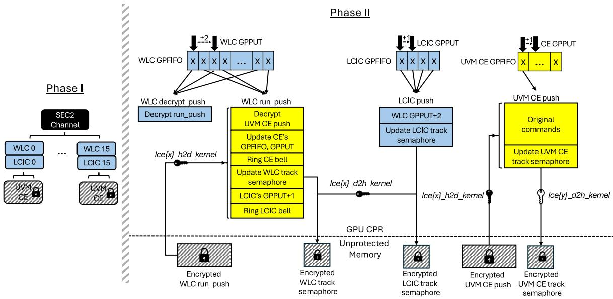  
Figure 7: The interactions among Secure Processor (SEC2) Channel, Work Launch Channel (WLC), and Launch Confirmation Indicator Channel (LCIC)

With GPU-CC enabled, the GPPUT, GPFIFO, and pushbuffers of WLCs/LCICs must be placed in GPU’s CPR to protect them from unauthorized access. The UVM driver populates an SEC2 push to set up these data structures for WLCs/LCICs. This process repeats for all 16 WLCs and LCICs. At this stage, the WLCs/LCICs are launched but not yet operational. The next step is to set up their schedules.

The WLC’s schedule consists of two alternating pushes: (1) decrypt push, responsible for decrypting the next run push and placing it into CPR. The decrypt push is static and remains unchanged. (2) run push, executing GPU methods to launch a UVM CE pushbuffer that contains the payloads for the UVM operations, and advances the LCIC’s GPPUT by one step for synchronization. The run push is mutable, as its parameters must be dynamically updated to accommodate different UVM CE pushes.

The LCIC schedule is entirely static and simply advances the WLC’s GPPUT by two steps ahead, ensuring that the WLC always starts from the decrypt push in the next cycle.

Finally, the static parts (marked blue in Figure 7) of the WLC/LCIC schedules are uploaded and their GPFIFO entries are updated by the SEC2 push. Once this is complete, the WLCs/LCICs are fully operational and ready for accepting UVM CE pushes.

Phase II: Indirect Launch of UVM CE Pushes via WLC. Once the WLCs/LCICs are fully initialized, they can be selected at runtime to indirectly launch a UVM CE push. A UVM CE push’s pushbuffer contains methods for executing a specific UVM task, e.g., writing page table entries for an address range.

To execute a UVM CE push, the UVM driver selects a WLC and encrypts the scheduled UVM CE push’s pushbuffer using the lce{x} h2d kernel key of that WLC. The encrypted pushbuffer is placed in the unprotected staging buffer. A corresponding run push for the WLC is generated based on the parameters of the UVM CE push, encrypted, and also stored in the staging buffer. The decrypt push, pre-loaded during Phase I, executes first to decrypt the run push into CPR. Once decrypted, the run push begins execution by decrypting the UVM CE push’s pushbuffer, setting up the GPFIFO and GPPUT within CPR, and triggering it to run on another logical CE. The UVM CE push uses the lce{y} h2d kernel and lce{y} d2h kernel keys tied to the newly attached logical CE, where {y} denotes the engine index. Finally, the run push signals the LCIC to advance the WLC’s GPPUT, preparing it for the next execution cycle.

Throughout this process, WLC, LCIC, and UVM CE update their respective tracking semaphores, which are then encrypted and stored in the unprotected staging buffer. The UVM driver continuously monitors these encrypted semaphores to track execution progress. The decryption of tracking semaphores is handled by different keys: lce{x} d2h kernel for the WLC/LCIC pushes and lce{y} d2h kernel for the UVM CE push.

Security Insight. The UVM system relies on the signed push of the SEC2 Channel to bootstrap WLCs/LCICs. The SEC2 push is not encrypted since it only consists of predefined methods without embedded secrets. However, the GPFIFO, GPPUT, and tracking semaphores of the SEC2 Channel reside in an unprotected staging buffer and are neither signed nor encrypted. Adversaries might exploit this by manipulating the GPFIFO and GPPUT to redirect the execution to a crafted pushbuffer. However, since the methods themselves are signed, the SEC2 engine can still detect and prevent tampered methods from being executed. Therefore, we consider such an attack to compromise confidentiality by exposing the fields in the SEC2 Channel and to partially undermine execution integrity. To mitigate this risk, we recommend encrypting these fields in SEC2 Channel as well.

The critical data structures for WLC, LCIC, and CE command queues, such as GPFIFO and GPPUT, are securely placed in CPR. The pushbuffers, including WLC’s run push and UVM CE pushes, are encrypted while in the unprotected staging buffer before being transferred into CPR. Unlike the SEC2 push, these buffers are mutable and contain sensitive information, including memory addresses and UVM operations. Therefore, they require encryption when transmitted through an untrusted interface. Additionally, the semaphores used for signaling the UVM driver are also encrypted while in unprotected memory before being passed to CVM’s private memory, ensuring confidentiality and integrity for retrieving the execution status of command queues.

## A.5 Memory Scrubbing

Methodology. Memory scrubbing is used for deliberate overwriting of memory contents to clear out sensitive information. This prevents the recovery of confidential data, which is particularly important in secure environments where old data could otherwise be exploited by unauthorized users. Typically, the NVIDIA kernel-mode driver establishes a scrubber channel with the CE, where it submits GPU methods for memory scrubbing, allowing the CE to execute the task. However, when GPU-CC is enabled, a dedicated and secure channel is required to submit memory scrubbing methods to prevent tampering through the untrusted interface. Instead of using CE, SEC2 is used for memory scrubbing when GPU-CC is enabled, as it supports signed push.

In our experiment, we intercepted the signing function invocations in the SEC2 utility responsible for signing methods in the scrubber channel. We then backtracked the call trace to identify the origin of memory scrubbing requests within the GPU’s memory manager. This approach provided a deeper understanding into the mechanism underlying GPU’s memory scrubbing.

Observation. The NVIDIA kernel-mode driver establishes a scrubber channel linked to the SEC2 engine to handle memory scrubbing tasks securely. When the GPU’s memory manager needs to free certain memory pages, it populates a pushbuffer with a sequence of methods for a secure memset operation using SEC2. These methods are then submitted to the scrubber channel.

To securely free large GPU memory allocations, the memory manager chops the massive request into smaller chunks, generating cryptographically signed methods for each. To ensure integrity, the methods in the pushbuffers are signed using the cpu sec2 hmac scrubber key, and their HMAC digests are stored in the authentication tag buffers. The SEC2 engine verifies the signature and zeros out the physical memory, firing an internal semaphore after every single chunk to notify the driver that it can safely recycle that specific authentication tag’s memory slot for the next command. On the very last chunk of the loop, a completion semaphore is appended, forcing the hardware to flush all physical caches and notify that the entire block has been destroyed.

Security Insight. The earlier design of the NVIDIA kernelmode driver reused the cpu sec2 hmac kernel key for signing methods during memory scrubbing operations. While in the latest driver versions, NVIDIA introduced two dedicated scrubber keys, i.e., cpu sec2 {hmac,data} scrubber, for handling memory scrubbing tasks. It is worth noting that the cpu sec2 hmac scrubber key is now used for signing methods, while the cpu sec2 data scrubber key exists but remains unused. We make the following reasoned speculation about the key usage:

Given that the pushbuffers and the authentication tag buffers in the scrubber channel are currently allocated in the staging buffers, which are not encrypted, the cpu sec2 data scrubber key may eventually be used to protect these data structures in the future.

Additionally, the SEC2 engine only supports decryption and does not provide encryption capabilities. Notably, while there are cpu sec2 \* keys for securing data sent to SEC2, there are no corresponding sec2 cpu \* keys for protecting data from SEC2 back to the driver. This means that the semaphores used to notify the driver remain unprotected. The rationale behind SEC2’s lack of encryption support is unclear and needs further clarification from NVIDIA. This could present a security risk, as attackers on the host could observe the unencrypted pushbuffers and authentication tag buffers (though they cannot tamper with commands due to integrity verification) and manipulate the unprotected semaphores.

## A.6 CUDA

Methodology. Since the CUDA user-mode driver is not open-source, its execution flow in GPU-CC remains opaque. To analyze its behavior, we intercepted its interactions with external components that we could instrument. Our approach involved developing a sample CUDA application that performed operations such as GPU memory allocation, hostto-device data transfers, and CUDA kernel launches. However, instead of using the CUDA runtime APIs, we directly invoked the low-level CUDA user-mode driver APIs to gain finer control over execution. For instance, we compiled the CUDA kernels into Parallel Thread Execution (PTX) code and launched them via cuLaunchKernel.

To further dissect communication flows, we instrumented the NVIDIA kernel-mode driver and UVM driver, capturing their interactions with the CUDA user-mode driver. Additionally, drawing insights from PipeLLM (Tan et al., 2025), which identified OpenSSL APIs as being used for encryption, decryption, and MAC verification by CUDA, we also instrumented relevant OpenSSL functions. By preloading a customized version of the OpenSSL library, we intercepted all cryptographic events invoked by the CUDA user-mode driver, allowing us to observe how security mechanisms are enforced.

Observation. By intercepting the corresponding OpenSSL functions, we are able to observe the key strings used by the CUDA user-mode driver and map them to the keys derived from the master secret negotiated during the Security Protocol and Data Model (SPDM) session. Our analysis reveals that the CUDA user-mode driver retrieves two categories of keys from the NVIDIA kernel-mode driver through the GetKMB API: (1) cpu sec2 {data,hmac} user keys, associated with the SEC2 engine and likely used for encrypted data transfer and integrity verification. (2) lce{x} {h2d,d2h} user keys, tied to specific logical CEs and facilitate encrypted data transfers between CPU and GPU’s CEs. It is worth noting that, since CUDA operates in user space, all these keys are post-fixed with user, indicating their privilege level.

Based on our understanding of CUDA’s execution lifecycle and CPU-GPU data movement patterns, we consider that the following five categories of data require specialized handling under GPU-CC:

(1) User Data. This refers to the actual data, e.g., training datasets and model weights, on which the CUDA kernel operates. The cudaMemcpy\* runtime APIs manage data movement by invoking the GPU’s CE to transfer data over the PCIe bus using DMA.

(2) CUDA Kernel Code. This consists of the compiled Streaming Assembler (SASS) instructions executed by the GPU’s SMs. During CUDA context initialization, the CUDA user-mode driver uses the CE to copy the CUDA kernel code into GPU’s device memory. At kernel launch, the memory address of the kernel code is embedded in the Queue Metadata (QMD), enabling the hardware to locate and fetch the instructions.

(3) CUDA Kernel Arguments. Kernel arguments are the parameters passed from the CPU to a CUDA kernel function. They include scalar values, dynamic dimensions, and pointers to user data. At launch time, these arguments are packed and copied into shared memory accessible by both the CPU and GPU. They are then transferred to Constant Bank 0, which is backed by a dedicated constant cache in the SM.

(4) Queue Metadata (QMD). The QMD is a bit-packed launch configuration structure that encodes grid and block dimensions, register and memory requirements, pointers to kernel code and arguments, and hardware state controls. It is copied into shared memory and read by the GPU’s command processor to configure the SMs for kernel launching.

(5) Command Queue Structures. The CUDA user-mode driver prepares GPU methods in pushbuffers and links them into corresponding GPFIFO command queues. These include queues targeting the CEs for transferring user data and kernel code, as well as queues targeting GPU’s command processor to initiate kernel execution.

Security Insight. The CUDA user-mode driver has limited interactions with the NVIDIA kernel-mode driver, primarily occurring during: CUDA API/context initialization, kernel channel creation and key retrieval, and memory cleanup. However, the most critical operations related to data transmission and CUDA kernel launch remain self-contained within the proprietary CUDA runtime and user-mode driver, making them less observable. Given the limited information available, we make the following reasoned speculation regarding the types of data that should be protected during CUDA execution:

User Data and CUDA Kernel Code. User data and CUDA kernel code are typically transferred via the GPU’s CE using DMA due to their large size. With GPU-CC enabled, however, the CE cannot directly access private memory within a CVM. Instead, both user data and kernel code must first be encrypted using a session key (e.g., the lce{x} h2d user key) and placed in a staging buffer. The CE may then transfer the encrypted data via DMA into the GPU’s CPR, where it is decrypted. Conversely, data transferred from the CPR back to system memory must be encrypted with the session key (e.g., lce{x} d2h user key) before being written to the staging buffer.

CUDA Kernel Arguments and QMD. Under GPU-CC, the conventional approach, where the CPU directly writes plaintext kernel arguments and QMD to the GPU via PCIe Base Address Register (BAR), is disallowed to defend against an untrusted hypervisor and PCIe bus. Instead, a pull-based model can be adopted in which the GPU retrieves cryptographically protected data. Specifically, the CUDA user-mode driver may encrypt the kernel arguments and QMD using a pre-established session key (derived from SPDM key negotiation) and place the ciphertext in the staging buffer. A GPU security engine (e.g., SEC2) may initiate a memory transfer to fetch the encrypted data over PCIe, verify its integrity, and decrypt it securely within the GPU’s CPR just prior to kernel execution.

Command Queue Structures. Command queue components, including GPFIFO, GPPUT, pushbuffers, and tracking semaphores, must either reside within the GPU’s CPR or remain encrypted when stored in staging buffers. A secure work submission mechanism, similar to that provided by SEC2 in the UVM driver, may be employed. For instance, the cpu sec2 hmac user key may be used to authenticate SEC2 push’s methods, while the cpu sec2 data user key may encrypt data sent to the SEC2 engine. Work submission may then proceed indirectly through SEC2 or other secure channels, such as WLC, which itself is securely bootstrapped by SEC2.

## B FUTURE DIRECTIONS

Here, we discuss the security features expected in upcoming GPU-CC releases, along with the architectural and software changes required to support them.

## B.1 Multi-GPU Support

As AI models continue to grow in size, a single GPU’s memory often cannot accommodate the full model or dataset, necessitating Multi-GPU support for both inference and training tasks. On our NVIDIA H100 SXM5 platform, each H100 GPU is connected to all four NVSwitches via 4th-generation NVLinks, enabling high-bandwidth communication between GPUs.

In GPU-CC’s threat model, adversaries capable of intercepting traffic at the NVSwitches or along the NVLinks between GPUs and NVSwitches may be able to observe or tamper with inter-GPU data transfers. While NVIDIA’s paper (Dhanuskodi et al., 2023) discusses Multi-GPU support, the initial software releases only allowed a confidential GPU to be passed through to a single CVM. Recent software releases have added support for Multi-GPU passthrough under the Protected PCIe mode, which requires updates to the VBIOS, NVIDIA GPU driver, and CUDA1. According to NVIDIA’s OC3 presentation (Nertney, 2025), Protected PCIe mode only supports encrypted data transfers over the PCIe interface. Inter-GPU data transfers over NVLinks and NVSwitches are not encrypted due to performance considerations. NVLink encryption is expected to be introduced in the Blackwell architecture.

Supporting GPU-CC in a Multi-GPU setting introduces new requirements for securely transferring data across GPUs. Specifically, peer-to-peer keys must be established to protect memory transfers between each pair of GPUs. A GPU cannot directly access another GPU’s CPR, as the interface between them is considered untrusted. Although CPR occupies the majority of GPU memory, a small unprotected portion remains available and can serve as a staging buffer, which is accessible to other GPUs. To transfer data securely, the sending GPU must first encrypt the data and write it to the staging buffer. The receiving GPU can then copy the encrypted data from the buffer and decrypt it into its own CPR.

## B.2 Trusted I/O Support

One limitation of the current GPU-CC architecture is that the GPU cannot directly access the private memory of a CVM. Instead, data must be transferred through a staging buffer, introducing additional software-based encryption and decryption overhead. This not only complicates software development, particularly when determining which data objects to protect, but also increases the risk of leaving some data unprotected during transmission.

A promising direction to address this limitation is the development of Trusted I/O for confidential computing. Trusted I/O requires architectural support from both CPUs and GPUs. On the CPU side, technologies like Intel TDX Connect (Intel, 2023a) and AMD SEV-TIO (AMD, 2023) aim to enable this capability. On the GPU side, NVIDIA’s Blackwell architecture is expected to introduce Trusted I/O support as well2.

Intel and AMD’s Trusted I/O technologies rely on a combination of standardized protocols and trusted components to ensure secure device integration and communication within confidential computing environments. Protocols such as TEE Device Interface Security Protocol (TDISP), Security Protocol and Data Model (SPDM), and Integrity and Data Encryption (IDE) are central to this infrastructure. TDISP governs the device interface lifecycle, while SPDM is used for device authentication and establishing secure communication channels. IDE provides encryption for PCIe traffic, securing both control and data paths.

Trusted components include the TEE Security Manager (TSM) and the Device Security Manager (DSM). The TSM is responsible for defining and enforcing security policies and managing secure communication with devices. The DSM, a trusted logical component within the device, works in conjunction with the TSM to establish secure channels.

Device attestation is supported through SPDM and the Reference Integrity Manifest (RIM), which validate device identity and firmware integrity. When a device is assigned to a CVM, the host initiates attestation by communicating with the device’s DSM using SPDM. The TSM verifies the identity and measurements of the device, checks them against security policies, and passes the evidence to the CVM for final evaluation. If the device is verified, it is admitted into the trusted environment.

Once a device is trusted, it can perform DMA to private guest memory. In Intel TDX Connect, this access requires the device to be included in the CVM’s Trusted Computing Base (TCB). The TDX module manages translation of device transactions to private memory, with the IOMMU enforcing these mappings and ensuring access is restricted to assigned devices. Secure PCIe transactions use IDE Transaction Layer Packets (TLPs) marked with a T-bit to signal trusted communication. In AMD SEV-TIO, DMA access is permitted after the guest establishes trust in the device. The IOMMU maintains a Secure Device Table (SDT) that tracks the security attributes of devices and enforces access control accordingly.

Overall, both platforms ensure a secure and authenticated path for data and control between hosts, devices, and guest CVMs, building trust through layered verification and secure protocol enforcement.

## C LIST OF ACRONYMS

GPU-CC uses a large number of acronyms. For clarity, we include a glossary of acronyms with cross-references to assist readers in navigating the paper.

AAD Additional Authenticated Data AES Advanced Encryption Standard

AK Attestation Key   
BAR Base Address Register   
BMC Baseboard Management Controller   
BROM Boot ROM   
CA Certificate Authority   
CE Copy Engine   
CPU-CC CPU Confidential Computing   
CoT Chain of Trust   
CPR Compute Protected Region   
CVM confidential virtual machine   
DIK Device Identity Key   
DMA Direct Memory Access   
DSM Device Security Manager   
FSP Foundation Security Processor   
GPU-CC GPU Confidential Computing   
GSP GPU System Processor   
GSP-BROM GSP BootROM   
GSP-FMC GSP First Mutable Code   
GSP-RM GSP Resource Manager   
HBM High-Bandwidth Memory   
IDE Integrity and Data Encryption   
IV Initialization Vector   
KVM Kernel-based Virtual Machine   
LCIC Launch Confirmation Indicator Channel   
LUKS Linux Unified Key Setup   
MCTP Management Component Transport Protocol   
MIG Multi-Instance GPU   
OCSP Online Certificate Status Protocol   
PSIRT Product Security Incident Response Team   
PTX Parallel Thread Execution   
QMD Queue Metadata   
RIM Reference Integrity Manifest   
RMAPI Resource Manager API   
RPC Remote Procedure Call   
SASS Streaming Assembler   
SDK Software Development Kit   
SDT Secure Device Table   
SEC2 Secure Processor   
SEV Secure Encrypted Virtualization   
SGX Software Guard Extensions   
SM Streaming Multiprocessor   
SMM System Management Mode   
SPDM Security Protocol and Data Model   
TCB Trusted Computing Base   
TDISP TEE Device Interface Security Protocol   
TDX Trust Domain Extensions   
TEE Trusted Execution Environment   
TLB Translation Lookaside Buffer   
TLP Transaction Layer Packet   
TLS Transport Layer Security   
TSM TEE Security Manager   
UVM Unified Virtual Memory   
VM virtual machine   
WLC Work Launch Channel