# MEETING SLOS, SLASHING HOURS: AUTOMATED ENTERPRISE LLMOPTIMIZATION WITH OPTIKIT

Nicholas Santavas 1 2 Kareem Eissa 1 Patrycja Cieplicka 1 Piotr Florek 1 Matteo Nulli 1 Stefan Vasilev 1 Seyyed Hadi Hashemi 1 Antonios Gasteratos 2 Shahram Khadivi 1

## ABSTRACT

Enterprise LLM deployment faces a critical scalability challenge: organizations must optimize models systematically to scale AI initiatives within constrained compute budgets, yet the specialized expertise required for manual optimization remains a niche and scarce skillset. This challenge is particularly evident in managing GPU utilization across heterogeneous infrastructure while enabling teams with diverse workloads and limited LLM optimization experience to deploy models efficiently. We present OPTIKIT, a distributed LLM optimization framework that democratizes model compression and tuning by automating complex optimization workflows for non-expert teams. OPTIKIT provides dynamic resource allocation, staged pipeline execution with automatic cleanup, and seamless enterprise integration. In production, it delivers more than 2× GPU throughput improvement while empowering application teams to achieve consistent performance improvements without deep LLM optimization expertise. We share both the platform design and key engineering insights into resource allocation algorithms, pipeline orchestration, and integration patterns that enable large-scale, production-grade democratization of model optimization. Finally, we open-source the system to enable external contributions and broader reproducibility.

## 1 INTRODUCTION

The proliferation of Large Language Models (LLMs) (Brown et al., 2020; Aaron Grattafiori, 2024; An Yang, 2025) across enterprises has created a major computational challenge (Chavan et al., 2024). As organizations adopt generative AI, they face a fundamental tension between the exponential growth in demand for AI-driven features and the finite and expensive supply of specialized GPU infrastructure. This scalability issue, if unaddressed, threatens to stifle innovation and render the widespread deployment of powerful LLMs economically untenable. At global technology companies, like eBay, this is not a distant prospect but an immediate operational reality. The ambition to enhance user experience with a new generation of LLM-powered applications is constrained by hardware capacity and operational efficiency. Deploying models from 8B to over 70B parameters creates a significant strain on computational resources. Manual optimization (Zhu et al., 2024), a specialized craft practiced by few experts, does not scale, while existing tools often lack the robustness and seamless integration required for production systems (Park et al., 2025). This gap forces a trade-off between feature velocity and performance, creating

Setup / Optimization Hours  
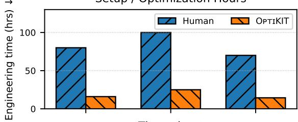

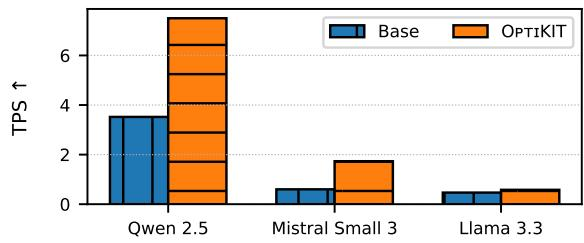  
Figure 1. OPTIKIT time and throughput gains. The top figure shows the engineering time saved in model optimization through OPTIKIT vs human hours. In the bottom figure the optimal TPS (Transactions Per Second i.e., Throughput) after the OPTIKIT cycle has terminated vs the baseline TPS. We report results on three model families. Human hours are estimated on internal data.

dependencies on a small pool of experts.

In this paper, we introduce OPTIKIT, an automated LLM optimization framework designed to address these challenges. Developed and deployed at eBay, OPTIKIT embodies three core principles: automation, standardization, and deep enterprise integration. It provides a comprehensive, end-to-end solution that automates the optimization life-cycle, from model analysis and resource allocation to performance benchmarking and deployment. By standardizing this process, OPTIKIT democratizes access to advanced optimization techniques, enabling any engineering team to achieve expert-level performance without requiring specialized knowledge.

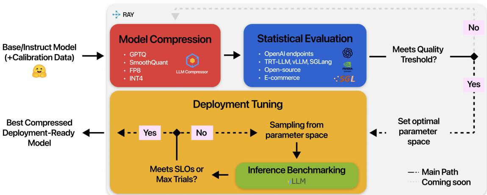  
Figure 2. OPTIKIT full pipeline. The figure shows the full OPTIKIT flow. We begin by fetching any base/instruct model along with calibration data if needed, and apply model compression through the user selected technique. We then proceed to perform a statistical evaluation of the optimized model to ensure the validity of our compression strategy. If the performance is up to standards, we determine the set of parameter space for deployment tuning. Subsequently, we sample from this space and perform Inference Benchmarking to determine the optimal sub-set of parameters for deployment. If the SLOs (Service Level Objectives) is not met we iteratively repeat the above, sampling a new set of parameters. When a parameter configuration meets the SLOs, we return the model configuration along with its weights, ready for deployment. The small logos represent part of the back-ends supported.

Initial results at eBay demonstrate that OPTIKIT can achieve significant throughput gains and latency reductions, enabling the deployment of more powerful models within existing resource envelopes (Figure 1). This, suggests that a systematic, automated approach to LLM optimization is a technically feasible and critical component for enabling scalable, cost-effective AI in the enterprise (Zhen et al., 2025).

Our contributions can be summarized as follows:

• We present OPTIKIT, a fully automated end-to-end, distributed, resource-aware LLM optimization pipeline with modular orchestration, dynamic GPU allocation; completely integrated into enterprise infrastructure.

• We introduce algorithmic novelties across the pipeline: a backend-agnostic, recipe-based compression engine with adaptive calibration; an SLO-driven benchmarking algorithm with regression-based stability detection; and a Bayesian runtime tuner that automatically maximizes per-GPU throughput under SLO constraints.

• We conduct an extensive empirical study across largescale production workloads and model families. OptiKIT achieves throughput gains of up to 2.8× with robust, reproducible optimization across heterogeneous infrastructure.

## 2 THE LLM OPTIMIZATION CHALLENGE AT SCALE

The deployment of Large Language Models in production environments presents a unique set of challenges that differ substantially from academic research settings (Chavan et al., 2024). Enterprise deployments must contend with hard constraints on GPU availability, heterogeneous hardware infrastructure, and the need for consistent performance across diverse workloads. At eBay, these challenges manifest in several key areas. First, the finite nature of GPU resources creates a zero-sum constraint where every inefficiency in one application directly impacts the capacity available for others. Hence, resource utilization efficiency is paramount. Second, the diversity of model architectures and use cases—ranging from 8B to over 70B parameters—demands flexible optimization approaches. Manual LLM optimization (Zhu et al., 2024) represents a significant organizational bottleneck. The process requires deep expertise in model compression, hardware-specific optimizations, and inference runtime tuning (Zhou et al., 2024) —knowledge that is concentrated among a small number of specialists. This expertise gap creates several problems: optimization work becomes a dependency that slows feature development; inconsistent approaches lead to suboptimal resource utilization; and the manual nature of the process introduces variability in outcomes.

Table 1. OPTIKIT vs similar techniques. We breakdown the comparison between our OPTIKIT and similar LLM Optimization Techniques. The ✓and × indicate if that specific component is present or not in the technique.  
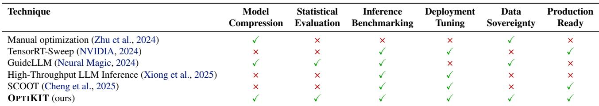

Existing tools for LLM optimization, while powerful, often fall short in enterprise settings; see Table 1. Academic tools may lack the robustness and integration capabilities required for production systems. Cloud-based services, like TensorRT-Sweep (NVIDIA, 2024), can introduce data sovereignty concerns and may not integrate well with existing infrastructure. Commercial tools (Neural Magic, 2024), while more enterprise-ready, may lack the flexibility for organization-specific requirements. More fundamentally, these solutions tend to focus on individual optimization techniques (Cheng et al., 2025; Xiong et al., 2025) rather than providing comprehensive, end-to-end optimization pipelines (Tan et al., 2025). This piecemeal approach places the burden of orchestration, resource management, and quality assurance back on the user.

These challenges underscore the need for a unified, production-grade optimization framework — a role OP-TIKIT aims to fulfill.

## 3 SYSTEM DESIGN AND ARCHITECTURE

## 3.1 Design Philosophy

Motivation OPTIKIT follows three principles addressing the core challenges of large-scale LLM optimization.

Automation: End-to-end workflows for compression, calibration, and tuning are automated through declarative task definitions, ensuring reproducibility and consistency.

Resource Awareness: Heterogeneous resources are orchestrated according to each stage’s compute and data characteristics, maximizing utilization and minimizing overhead.

Interoperability: Standardized interfaces connect to existing registries, data sources, and experiment tracking systems, enabling seamless integration into enterprise infrastructure.

Abstractions OPTIKIT represents each optimization operation as a single process (Figure 2), consisting of ordered stages that collectively form a streamlined flow:

1. Fetch: Retrieve the target model and, if provided, calibration data from remote storage to local workspace.

2. Model Compression: Parallelize quantization trials to capture variance in calibration data sampling.

3. Statistical Evaluation: Evaluate quantized models to measure accuracy and potential quality degradation.

4. Inference Benchmarking: Measure serving performance of the evaluated models under controlled load.

5. Deployment Tuning: Optimize runtime parameters such as parallelism, batch size, and context window.

6. Upload: Store the optimized model, associated metrics, and metadata to centralized tracking repositories.

Flows are defined declaratively, with OPTIKIT automatically mapping stages to actor pools and resource allocations at runtime to ensure reproducible, auditable execution.

## 3.2 Architecture Components

OPTIKIT is structured as a distributed Python SDK built on Ray (Moritz et al., 2018), organized into three fundamental architectural layers that provide clear separation of concerns and enable flexible, scalable optimization workflows.

Actor-Based Execution Layer The foundation layer consists of specialized Ray actors that handle specific optimization tasks. Each actor type encapsulates the logic for a particular operation and manages its own computational resources. Actors can be dynamically created with appropriate GPU/CPU allocations, scaled horizontally across the cluster, and terminated to free resources. This design enables fault isolation where individual actor failures don’t compromise entire jobs, and efficient resource utilization through fine-grained allocation per computational profile.

Flow Composition Layer Flows implement the BaseFlow contract and compose low-level actors into executable pipelines. A flow is responsible for: instantiating and sizing actor pools for each stage, mapping declarative resource hints to concrete GPU/CPU allocations, queuing trial work and load-balancing it across available actors, and coordinating deterministic teardown to reclaim resources between stages. Failure handling is explicit: transient actor errors trigger bounded retries, while persistent trial failures are recorded and excluded from further stages. Each flow is bound to a versioned Docker image that encapsulates its runtime environment and dependencies, ensuring reproducibility and isolation across releases. Flows are registered via a Flow Registry, enabling teams to add new workflows without touching core runtime code. Each flow emits an archive of trial metadata, metrics, and artifacts to support reproducibility and post-hoc analysis.

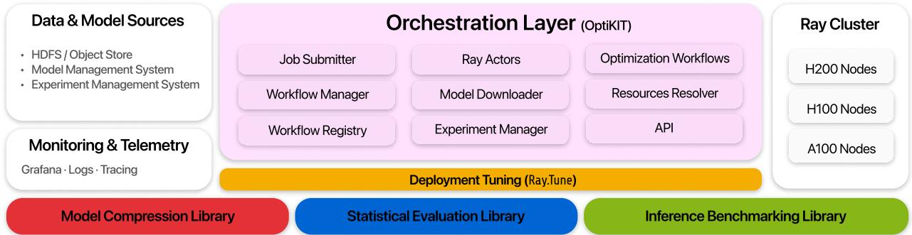  
Figure 3. OPTIKIT system architecture. The figure illustrates the modular orchestration of distributed LLM optimization workflows. The central orchestration layer manages workflow submission, resource allocation, and experiment tracking via Ray Actors, integrating with external data and model sources (HDFS, MMS, EMS) and underlying heterogeneous Ray clusters (H200, H100, A100 nodes). Supporting libraries for compression, benchmarking, and statistical evaluation provide extensible optimization capabilities, while monitoring and telemetry ensure observability through Grafana, logs, and tracing.

Submission Engine Layer The submission engine manages job validation, packaging, and distributed execution. It converts high-level job specifications into executable configurations, validates them against Pydantic schemas, and bundles required artifacts—including the full OPTIKIT runtime—into a self-contained package for deployment. The engine coordinates authentication, resource allocation, and container orchestration through existing enterprise schedulers, providing a uniform interface for both local and remote execution.

## 4 CORE SUBSYSTEMS

OPTIKIT integrates several specialized subsystems that provide distinct optimization capabilities while maintaining seamless interoperability through standardized interfaces.

## 4.1 Optimizer: Universal Compression Framework

The Optimizer subsystem (Figures 2, 3) serves as OP-TIKIT’s universal engine for model compression (Zhu et al., 2024; Wang et al., 2024a; Zhou et al., 2024), providing a consistent interface for applying diverse optimization techniques across heterogeneous inference backends. Its backend-agnostic design abstracts away engine-specific APIs, enabling portable and reproducible compression workflows independent of the serving framework.

Backend-Agnostic Architecture The Optimizer defines a standardized Optimization-Backend interface that encapsulates the complexities of diverse inference engines and optimization libraries. Each serving framework implements a corresponding backend—for example, the LLMCompressorBackend (AI & vLLM Project, 2024) integrates vLLMspecific compression routines (Kwon et al., 2023)—while future extensions may target backends such as TensorRT-LLM (NVIDIA Corporation, 2023). This design ensures users interact through a unified, stable API, allowing seamless migration between backends without modification to existing workflows.

Recipe-Based Configuration System The Optimizer introduces a recipe-based configuration paradigm that transforms model compression from ad-hoc tuning into a structured, declarative workflow. A recipe encodes a complete compression strategy—quantization scheme, calibration requirements, and layer-selection policy—into a reusable specification that captures domain heuristics such as layer exclusions and dataset size. Current recipes include:

• int w8a8 and int w4a16 — integer quantization recipes based on GPTQ (Frantar et al., 2023) and SmoothQuant (Xiao et al., 2023), representing robust post-training quantization and activation balancing.

• fp8 dynamic — a mixed-precision recipe derived from RTN (Micikevicius et al., 2022), suitable for layers sensitive to integer quantization.

This abstraction standardizes compression workflows across models and tasks while remaining easily extensible. New recipes can be registered to integrate emerging quantization methods or custom heuristics without modifying core optimization logic.

Calibration Data Sampling To support data-aware quantization (Xiao et al., 2023; Frantar et al., 2023), the Optimizer includes a modular sampling pipeline for calibration dataset preparation. As corroborated by literature (Williams & Aletras, 2023; Zhang et al., 2025), selecting the correct calibration data affects the performance of the quantized model. Accordingly, the developed module supports multiple data calibration pipelines. These range from uniform random sampling to more advanced strategies such as lengthweighted and token-statistics–stratified sampling. The goal is to account for variations in data distribution, dataset composition, and token-level characteristics. The module also provides hooks for easy extension with new strategies. Its flexible design further enables future adaptive calibration, where sampling dynamically adjusts to quantization performance.

Automated Optimization Workflow The Optimizer automates the full compression lifecycle, including model loading, calibration preprocessing, quantization, and model serialization. Calibration sample counts are derived directly from recipe specifications, and the pipeline orchestrates execution end-to-end, enabling fully automated, reproducible compression across backends.

## 4.2 StatEval: LLM Statistical Evaluation library

The StatEval package (Figures 2, 3) package is a core component of the optimization framework, handling statistical evaluation of model performance across multiple inference backends.

Design and Integration StatEval is built with a modular architecture that cleanly separates model handling from evaluation logic. The package is designed for seamless integration with internal eBay infrastructure while remaining easily adaptable to open-source and external environments. It supports two primary backends: vLLM for offline evaluation and OpenAI for online inference—both compatible with any OpenAI-style endpoint, including locally hosted vLLM, SGLang (Zheng et al., 2024), TensorRT-LLM or commercial models. Its modular design enables straightforward integration of new backends or third-party libraries.

Supported Benchmarks StatEval is an internal package tailored for e-commerce–specific model evaluation. The package includes open-source benchmarks to enable standardized and comparable assessment: GSM8K (Cobbe et al., 2021), IFEval (Zhou et al., 2023), Do-Not-Answer (Wang et al., 2024b). The selected benchmarks cover three core LLM capabilities—reasoning, instruction-following, and safety—essential for both general use-cases and ecommerce applications. Additionally, we develop in-house benchmarks that are a core component of the system. They act as critical proxies of e-commerce production metrics for rapid experimentation cycles. These benchmarks are proprietary and excluded from this study.

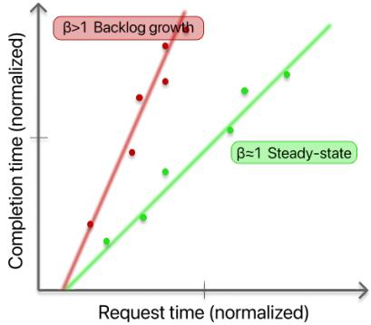  
Figure 4. Regression diagnostics for a Benchmarker trial. A fitted slope β ≈ 1 (green) indicates steady-state operation queuing while β > 1 (red) denotes an overload regime.

## 4.3 Benchmarker: Performance Testing Tool

The Benchmarker library (Figures 2, 3) quantifies the performance capabilities of an optimized model while ensuring compliance with predefined Service Level Objectives (SLOs) such as end-to-end latency and time per output token. Its purpose is to determine the maximum sustainable request rate that maintains target SLOs under certain load conditions. The Benchmarker executes controlled load experiments on the optimized model within the Ray cluster, monitoring fine-grained telemetry via integrated tracing and metrics pipelines. These metrics serve as a critical interface between optimization workflows and deployment configurations i.e., guaranteeing the required performance envelope for production rollout. Moreover, by standardizing the SLO-driven benchmarking process, we ensure comparability across experiments, hardware classes, and compression strategies. The full procedure is summarized in Algorithm 1, which outlines the iterative search and decision logic governing the sweep. Below, we dive into core algorithmic components.

Steady State Regression Assessing whether the system has reached steady state, involves modeling the relationship between request arrivals and completions as a linear process. Specifically, we fit a regression of the form

$$
\tag{1}
$$

where α is a constant fixed overhead, ri and ci denote the arrival and completion timestamps (normalized relative to the start timestamp) of request i, respectively, and εi captures residual noise. The estimated slope β acts as a compact indicator of system equilibrium:

• β ≈ 1: Steady-state — completions keep pace with

A trial is considered stable if |β − 1| ≤ τβ , where τβ is a small tolerance (typically 0.02–0.05 depending on noise and sampling granularity). In addition to the slope, the regression intercept and correlation coefficient are logged as part of the diagnostic record, providing visibility into drift patterns and fit quality. Figure 4 illustrates a typical diagnostic plot. A fitted slope near 1 indicates arrivals and completions are matched. Deviations from 1 reveal rate imbalance and queue growth, enabling the Benchmarker to find the highest sustainable load before instability.

Exponential Search Benchmarker explores the feasible operating region through an adaptive sweep over candidate request rates. Each trial is executed at a fixed request rate and evaluated against both the SLO criteria and the steadystate condition described above. Rates that satisfy all constraints are marked as passing, while those that violate any constraint are marked as failing. After each evaluation, the next test rate is selected using a bounded search heuristic that incrementally narrows the feasible region. If this baseline already violates the specified SLOs, the configuration is deemed infeasible and the sweep terminates early. The final output comprises the highest passing rate—the system’s sustainable throughput under SLO compliance—together with a complete archive of all tested rates, stability diagnostics, and latency statistics. This archive supports reproducibility, post-hoc analysis, and cross-hardware comparability across optimization trials.

## 4.4 Tuner: Automated Hyperparameter Optimization

The tuning stage (Figures 2, 3) optimizes the runtime configuration of the quantized model to maximize inference throughput while maintaining compliance with SLOs. Rather than modifying model weights, it searches over inference engine runtime parameters that control parallelism, batching, and context allocation. The TunerActor integrates with the BenchmarkerActor subsystem to evaluate each candidate configuration under realistic serving workloads. Every Ray Tune trial executes a complete benchmark evaluation, measuring throughput, latency, and SLO compliance.

Optimization Objective The optimization objective combines these metrics into a single scalar fitness function, defined as:

$$
\tag{2}
$$

Algorithm 1 Benchmarker Sweep   
Require: Load Pattern Π = ⟨input, output, ...⟩   
(Optional) SLOs S = {}, Error margins E = {}   
(Defaults) initial rate r0, budget N , threshold T   
1: best ← none   
2: if SLOs provided then   
3: Run a synchronous closed-loop trial under Π   
4: if ∃s ∈ S ∼ E violated then   
5: return ⟨status : INFEASIBLE, rate : 0.0⟩   
6: else   
7: LB ← E[latency−1] (lower bound rate)   
8: end if   
9: end if   
10: r ← r0   
11: while not converged and no. trials <= N do   
12: Run an asynchronous open-loop trial at r under Π   
13: if ∀s ∈ S ∼ E passed and queuing steady-state then   
14: best ← r   
15: r ← r ∗ 2 (exponential doubling)   
16: else   
17: r ← (LB+r) (midpoint halving)   
2   
18: end if   
19: if |best − r| ≤ T then   
20: set converged   
21: end if   
22: end while   
23: return ⟨status : FEASIBLE, rate : best⟩

where c denotes a candidate configuration. Throughput is normalized per GPU to ensure fair comparison across different parallelization strategies, and λ applies a large negative penalty for SLO violations (typically λ = −1000). This formulation guides the search toward configurations that sustain high per-GPU throughput while satisfying latency and stability requirements.

Tuning Orchestration The tuning process is orchestrated by a single TunerActor, which builds its parameter search space using the same input and output configuration applied during benchmarking of the quantized model. This ensures that the tuning trials explore serving parameters under identical workload conditions, preserving consistency in sequence lengths, token limits, and request patterns. Each tuning trial spawns a temporary BenchmarkerActor, which launches a vLLM server, generates synthetic request batches, and runs steady-state load tests to measure request rate and SLO pass ratio.

The search explores key inference engine parameters that influence runtime efficiency:

• Memory Allocation: The maximum context size parameter is calculated from user-specified input and output length requirements as (input len + output len) × 1.15, providing a buffer for variablelength sequences based on expected usage patterns.

• Parallelism Strategies: The search space for tensor and data parallelism explores configurations such as {1, 2, 4, 8} bounded by cluster resource availability and user-defined limits.

• Batch Processing: Other parameters such as maximum concurrency and maximum token batch size are tuned within user-configurable ranges or system defaults.

Ray Tune employs the Optuna (Akiba et al., 2019) search algorithm, which implements Tree-structured Parzen Estimators (TPE) (Watanabe, 2023) for Bayesian optimization. This strategy models the objective landscape probabilistically and selects configurations that balance exploration of new regions with exploitation of known high-performing areas, improving sample efficiency compared to random or grid search. Each configuration is benchmarked using the same load generation and measurement logic as the performance stage, and metrics are reported back to Ray Tune. The best-performing configuration, its associated metrics, and the full archive of evaluated trials are stored with the quantization artifacts and uploaded at the final pipeline stage.

## 4.5 Final Algorithm

Given our thorough explanation of core sub-systems and architecture, we finally report the full OPTIKIT Quantization with Tuning Flow Algorithm 2, which describes in more detail the overall Flow of Figure 2.

The Algorithm 2 integrates model quantization and runtime tuning into a unified, resource-aware pipeline. Its goal is to identify a compressed model that maintains task accuracy and determine the most efficient configuration for inference deployment on the available hardware. The flow executes as a sequence of distributed stages, each operating on welldefined inputs and outputs. Stages that are computationally independent—such as quantization and benchmarking—are parallelized across actor pools sized according to the available GPU and CPU resources. Each actor processes one trial at a time, and all results are synchronized before proceeding to the next stage. Each stage operates in isolation: actor pools are explicitly destroyed between stages to free GPU memory and reset distributed state before subsequent execution. The full control logic for the Quantization with Tuning Flow (2) mirrors the implementation’s staged actor-pool life-cycle (fetch, per-trial quantization, evaluation, benchmark, tuning, and upload), ensuring deterministic resource reclamation and reproducible runs.

Algorithm 2 Quantization with Tuning Flow (trial-parallel,   
actor-pool based)   
Require: Model M, dataset D (optional), number of trials   
Ntrials, resource budget R   
1: Fetch M and D from remote storage; store locally   
2: Sample Ntrials distinct calibration subsets {Ci}Ntrialsi=1   
3: results ← ∅   
4: create quantization actor pool sized to R   
5: for all i ∈ {1, . . . , Ntrials} in parallel do   
6: Apply quantization recipe to M with calibration Ci;   
produce compressed model qi   
7: Attach metadata (seed, recipe, path) and append   
⟨Ci, qi⟩ to results   
8: end for   
9: destroy quantization actor pool {free GPUs and reset   
distributed state}   
10: create evaluation actor pool sized to R   
11: for all each compressed model q in results in parallel   
do   
12: Run statistical evaluation on q; attach quality metrics   
to its record   
13: end for   
14: destroy evaluation actor pool   
15: Let S be successful candidates   
16: if S = ∅ then   
17: return failure status and archive   
18: end if   
19: Select representative quantized model q∗ ∈ S   
20: create benchmarking actor pool sized to R   
21: Benchmark q∗ (and optionally full-precision baseline)   
to collect runtime + stability metrics   
22: destroy benchmarking actor pool   
23: Create single CPU tuning orchestrator   
24: Build tuning search space (tensor parallel sizes,   
max num seqs, max num batched tokens, . . . )   
25: for all configuration c proposed by tuner (Ray Tune /   
Optuna) in parallel or sequential as resources permit   
do   
26: Instantiate benchmark job for (q∗, c)   
27: Measure metrics (throughput, normalized request   
rate, pass slo, etc.)   
28: Report metrics back to tuner   
29: end for   
30: Destroy tuning orchestrator   
31: Persist: quantized model q∗, best tuning configuration   
c∗, metrics, and trial archive to EMS / model registry   
32: return {q∗, c∗, trial archive}

## 5 EXPERIMENTS

## 5.1 Experimental Setup

For our experiments, we used NVIDIA H100 GPUs for both quantization and inference tuning tasks. Each experiment was executed within the same environment to ensure consistency and comparability across models and configurations. Through this setup, we evaluated both the statistical performance recovery of quantized models and the inference performance gains achieved through runtime tuning. The end-to-end optimization runtimes for each evaluated model are summarized in Figure 5.

Table 2. Example Inference Use-cases. Representative eBayderived inference use cases, with model scale, input/output token ratios, and corresponding latency SLOs.  
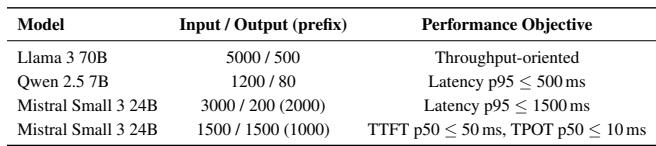

## 5.2 Evaluated Models and Configurations

We tested three open-source LLMs representative of different operational scales and latency requirements: Qwen 2.5 7B Instruct (Qwen et al., 2025), Mistral Small 3 24B Instruct (Mistral AI Team, 2025), and Meta Llama 3.3 70B Instruct (Aaron Grattafiori, 2024).

For each model, we applied three quantization recipes available in OPTIKIT: Dynamic FP8, INT W8A8 (static-weight / dynamic-activation), and INT W4A16 (static weight / highprecision activation). For the INT-based configurations, we used the default calibration dataset from (Magic, 2024), performing five independent trials with 256 random calibration samples for W8A8 and 512 for W4A16 per trial. The FP8 configuration required no calibration data and therefore exhibits no trial variance.

This setup enabled a direct comparison between quantization precision, calibration strategy, and runtime optimization under realistic production-style workloads.

## 5.3 Statistical Performance

We used OPTIKIT to measure the impact of different quantization recipes on each model’s statistical performance. Table 3 reports the best-performing trial result, the corresponding recovery ratio relative to the full-precision baseline, mean, standard deviation (STD) and relative standard deviation (RSD) across five trials. For GSM8K, we report 8-shot exact match in the Chain-of-Thought setting; for Do-Not-Answer, the harmless responses proportion; and for IFEval, the mean of prompt- and instruction-level accuracy, following Meta’s aggregation method (Aaron Grattafiori, 2024).

Across all evaluated tasks, both FP8 Dynamic and INT W8A8 quantization achieved near full-precision performance, with average recovery rates exceeding 99%.

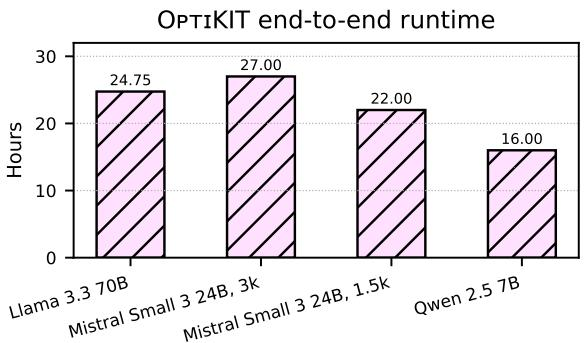  
Figure 5. Total OPTIKIT Runtime per Model. We show for each model family the total optimization flow time. Mistral Small 3 24B has two usage scenarios, respectively with 3k/0.2k and 1.5k/1.5k input/output sizes.

For Qwen 2.5 7B, performance degradation was minimal—typically below 0.5% and in some cases, quantized models slightly surpassed full-precision baselines, indicating robustness to reduced precision. Similarly, Mistral Small 3 24B retained strong accuracy, with FP8 and INT8 models maintaining within 1% of the original results on average. However, INT8 showed higher variability across tasks (RSD up to 1.4%), reflecting task-dependent sensitivity. Mistral exhibited the greatest degradation on the IFEval task (93.5% recovery), showing reduced ability to follow multiple instructions simultaneously compared to the full-precision counterpart. as well as the full-precision counterpart. For Llama 3.3 70B, quantization maintained near-identical performance to full precision on GSM8K and IFEval (usually with recovery greater than 100%), while Do-Not-Answer exhibited a modest reduction to around 95% recovery.

Overall, FP8 and INT8 quantization effectively preserved model performance with minimal loss, whereas INT4, while viable in some cases, exhibited inconsistent behavior and greater sensitivity to task characteristics.

Reproducibility of Evaluations In contrast to researchoriented evaluation, production evaluation introduces additional challenges, particularly regarding reproducibility. Achieving reproducibility is difficult due to model and CUDA non-determinism. Table 4 presents results from 100 runs, illustrating variability under default vLLM settings versus deterministic mode (Kwon et al., 2023). Although disabling multiprocessing yields nearly deterministic results, it prevents deloading VRAM in one Python interpreter session and is only applicable for offline inference, thus imposing practical limitations. When full determinism cannot be achieved, it is crucial to assess whether observed differences are statistically significant—especially when evaluation results guide automatic model selection, where random variation can be misled. Addressing this requires controlled evaluation protocols and statistically grounded comparison methods to ensure robust, reliable assessment, which will be a focus of future development.

Table 3. Statistical performance across models. We report the statistical performance recovery and trial variance after applying different quantization recipes. We show results for different models and benchmarks.  
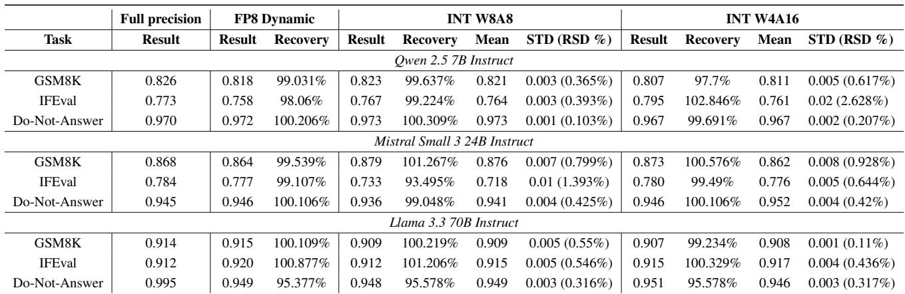

Table 4. Qwen 2.5 7B Instruct without vs. with determinism. We report results for Qwen 2.5 7B Instruct (100 runs per task) without vs. with vLLM deterministic setting. The deterministic configuration yields nearly identical results across trials.  
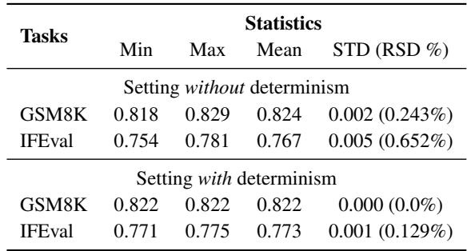

## 5.4 Inference Performance

We next examined the impact of quantization and runtime tuning on inference efficiency. Each workload configuration in Table 2 represents a characteristic operational regime—varying in input–output token ratios, SLOs, and model scale—to reflect eBay’s production inference patterns.

For each workload, we performed a controlled benchmarking study to disentangle the contributions of quantization and runtime tuning. The baseline used the FP16 model with default vLLM parameters. The quantization-only setup applied model compression while keeping vLLM defaults, isolating quantization effects. The tuning-only setup optimized the FP16 runtime configuration using OP-TIKIT’s deployment tuner. Finally, the end-to-end configuration combined both quantization and tuned vLLM parameters to assess their joint impact. Each tuning study employed TPE optimization over 30 trials, jointly searching max num seqs, max num batched tokens, and tensor parallel size.

The values in Table 5 represent normalized per-GPU throughput for configurations that meet their respective SLOs. This normalization enables direct comparison across tensor-parallel regimes and highlights the most costeffective configuration—i.e., the setup yielding the highest SLO-compliant throughput per GPU. Notably, for Qwen, SLOs were not met without either quantization or tuning at TP=1, while for Mistral, SLOs were not satisfied under TP=1 or TP=2 in the absence of these optimizations.

## 6 DISCUSSION & INSIGHTS

Generalization of Quantization Quality Our results indicate that automated quantization with a generic calibration dataset (Magic, 2024) achieves stable and robust, production-ready quality without expert supervision (Table 3). This successful generalization, however, raises new questions about its boundaries. It is unclear if this robustness would hold after domain-specific fine-tuning (e.g., LoRA), or if domain-aligned calibration data would become necessary. Furthermore, the impact of short-context calibration on long-context task fidelity, which was not evaluated, remains an open research question (Paglieri et al., 2024)

Tuning shines when SLOs are tight With strict SLOs (latency p95 and TTFT/TPOT), tuning-only improves FP16 by 1.33–1.55×. In multiple cases SLOs were unmet without optimization at lower TP, but became feasible after tuning and/or quantization (Tables 5, 7). When workloads operate near stability boundaries, the Benchmarker+Tuner (exponential search + TPE) finds SLO-compliant regions with higher sustainable rates, so relative tuning gains are largest in the most latency-critical production cases. In throughputfocused regimes, we observed diminishing returns which warrants further investigation.

Table 5. Normalized per-GPU throughput and improvement vs. FP16 baseline. We report values representing normalized throughput per GPU (SLO-compliant); improvements shown as multiplicative factors vs. baseline. SLOs not met without optimization are marked (∗).  
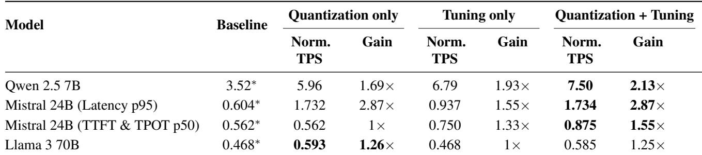  
∗SLOs not met without either quantization or tuning at the indicated tensor-parallel levels (TP=1, 2).

ROI of automation: Amortizing Siloed Efforts We quantify in Figure 1 the engineering cost of manual optimization, estimating it at 80-100 hours of specialized effort, compared to 15-25 hours for an automated OPTIKIT run. For an industry setting, the primary contribution of this work is not just the throughput gain but the drastic reduction in specialized, manual engineering cost. Manual optimization is a hidden complexity that creates knowledge silos, is prone to non-reproducible artifacts, and results in wasted, duplicated efforts across different teams. By standardizing the optimization process into a reproducible, endto-end pipeline, OptiKIT democratizes performance tuning, enabling any application team to achieve expert-level optimization without specialized expertise. This standardization directly addresses the organizational bottleneck of a niche team of ML systems experts.

## 7 CONCLUSION & FUTURE WORK

## 7.1 Conclusion

We present OPTIKIT, an end-to-end, production-grade framework for automated LLM optimization with distributed and dynamic resource management. To the best of our knowledge, existing toolchains address isolated aspects of the optimization process. OPTIKIT provides a fully integrated system that automates every stage–from model fetching and compression to statistical evaluation, inference benchmarking, and deployment tuning. Starting from a raw model, enterprise teams can obtain a production-ready optimized model with minimal manual intervention.

Empirical evaluations across diverse model families and real-life production configurations demonstrate that OP-TIKIT achieves more than 2× throughput improvements per GPU while maintaining near full-precision accuracy across reasoning, instruction-following, and safety benchmarks. Through our empirical studies, we validate OPTIKIT as an effective and reproducible solution for large-scale, production-grade LLM optimization.

## 7.2 Future Work

Advanced Compression Strategies While our work focuses on quantization, the frontier of advanced compression also includes pruning, a complementary technique for improving LLM efficiency by removing redundant weights (LeCun et al., 1989; Han et al., 2015). Modern sparsity methods, ranging from iterative sparsification (Zhang et al., 2023; Sun et al., 2024) to sparse-quantized representations (Dettmers et al., 2023), demonstrate a natural composition with quantization and are a key area for future work. Integrating techniques like structured pruning (Ma et al., 2023) and hardware-aligned sparsity (Mishra et al., 2021) are promising next steps. A more advanced workflow could combine distillation with pruning and quantization. This multi-technique approach, however, would exponentially grow the optimization search space, demanding more sophisticated co-optimization strategies than the sequential pipeline used in this work.

Global task scheduling As described in Section 4.5 we are currently putting a synchronization barrier between different stages in the OPTIKIT framework. This means we cannot have asynchronous task and actor spawning scheduling. The current architecture raises issues of sub-optimal GPU utilization, especially in cases where the number of trials parameter value is not wholly divisible by the number of GPUs available, because of this synchronization architecture. This implementation is an important change for the next iteration of OPTIKIT.

## 8 DISCLAIMER

This research was conducted at eBay Inc. All intellectual property arising from this work is the sole property of eBay Inc. The external collaborator’s involvement was limited to academic discussion and manuscript preparation and does not confer any ownership or intellectual property rights. All software, data, and methodologies described in this work were created under eBay’s direction and within its research environment.

## REFERENCES

Aaron Grattafiori, e. a. The llama 3 herd of models, 2024. URL https://arxiv.org/abs/2407.21783.

AI, R. H. and vLLM Project. LLM Compressor, 8 2024. URL https://github.com/ vllm-project/llm-compressor.

Akiba, T., Sano, S., Yanase, T., Ohta, T., and Koyama, M. Optuna: A next-generation hyperparameter optimization framework. In Proceedings of the 25th ACM SIGKDD international conference on knowledge discovery & data mining, pp. 2623–2631, 2019.

An Yang, e. a. Qwen3 technical report, 2025. URL https: //arxiv.org/abs/2505.09388.

Brown, T. B., Mann, B., Ryder, N., Subbiah, M., Kaplan, J., Dhariwal, P., Neelakantan, A., Shyam, P., Sastry, G., Askell, A., Agarwal, S., Herbert-Voss, A., Krueger, G., Henighan, T., Child, R., Ramesh, A., Ziegler, D. M., Wu, J., Winter, C., Hesse, C., Chen, M., Sigler, E., Litwin, M., Gray, S., Chess, B., Clark, J., Berner, C., McCandlish, S., Radford, A., Sutskever, I., and Amodei, D. Language models are few-shot learners, 2020. URL https:// arxiv.org/abs/2005.14165.

Chavan, A., Magazine, R., Kushwaha, S., Debbah, M., and Gupta, D. Faster and lighter llms: A survey on current challenges and way forward. arXiv preprint arXiv:2402.01799, 2024.

Cheng, K., Wang, Z., Hu, W., Yang, T., Li, J., and Zhang, S. Scoot: Slo-oriented performance tuning for llm inference engines, 2025. URL https://arxiv.org/ abs/2408.04323.

Cobbe, K., Kosaraju, V., Bavarian, M., Chen, M., Jun, H., Kaiser, L., Plappert, M., Tworek, J., Hilton, J., Nakano, R., Hesse, C., and Schulman, J. Training Verifiers to Solve Math Word Problems, 2021.

Dettmers, T., Svirschevski, R., Egiazarian, V., Kuznedelev, D., Frantar, E., Ashkboos, S., Borzunov, A., Hoefler, T., and Alistarh, D. Spqr: A sparse-quantized representation for near-lossless llm weight compression. arXiv preprint arXiv:2306.03078, 2023.

Frantar, E., Ashkboos, S., Hoefler, T., and Alistarh, D. Gptq: Accurate post-training quantization for generative pre-

trained transformers. arXiv preprint arXiv:2210.17323, 2023.

Han, S., Mao, H., and Dally, W. J. Deep compression: Compressing deep neural networks with pruning, trained quantization and huffman coding. arXiv preprint arXiv:1510.00149, 2015.

Kwon, W., Li, Z., Zhuang, S., Sheng, Y., Zheng, L., Yu, C. H., Gonzalez, J., Zhang, H., and Stoica, I. Efficient memory management for large language model serving with pagedattention. In Proceedings of the 29th symposium on operating systems principles, pp. 611–626, 2023.

LeCun, Y., Denker, J., and Solla, S. Optimal brain damage. Advances in neural information processing systems, 2, 1989.

Ma, X., Fang, G., and Wang, X. Llm-pruner: On the structural pruning of large language models. Advances in neural information processing systems, 36:21702–21720, 2023.

Magic, N. Llm compression calibration, 2024. URL https://huggingface. co/datasets/neuralmagic/ LLM-compression-calibration.

Micikevicius, P., Narang, S., Alben, J., Diamos, G., Elsen, E., Garc´ıa, J., Micikevicius, V., Mirza, M., Subramanian, S., and Zhu, H. Fp8 formats for deep learning. arXiv preprint arXiv:2209.05433, 2022.

Mishra, A., Latorre, J. A., Pool, J., Stosic, D., Stosic, D., Venkatesh, G., Yu, C., and Micikevicius, P. Accelerating sparse deep neural networks, 2021. URL https:// arxiv.org/abs/2104.08378.

Mistral AI Team. Mistral Small 3, 2025. URL https: //mistral.ai/news/mistral-small-3.

Moritz, P., Nishihara, R., Wang, S., Tumanov, A., Liaw, R., Liang, E., Elibol, M., Yang, Z., Paul, W., Jordan, M. I., et al. Ray: A distributed framework for emerging ai applications. Proceedings of the 13th USENIX Symposium on Operating Systems Design and Implementation, pp. 561–577, 2018.

Neural Magic, I. Guidellm: Scalable inference and optimization for large language models. https://github. com/vllm-project/guidellm, 2024.

NVIDIA. Tensorrt engine sweeping guide. https://docs.nvidia.com/ deeplearning/tensorrt-cloud/latest/ sweeping-engines.html, 2024. Accessed: 2024-04-15.

NVIDIA Corporation. Tensorrt-llm: High-performance inference for large language models. https: //developer.nvidia.com/tensorrt-llm, 2023.

Paglieri, D., Dash, S., Rocktaschel, T., and Parker-Holder, ¨ J. Outliers and calibration sets have diminishing effect on quantization of modern llms. arXiv preprint arXiv:2405.20835, 2024.

Park, S., Jeon, S., Lee, C., Jeon, S., Kim, B.-S., and Lee, J. A survey on inference engines for large language models: Perspectives on optimization and efficiency. arXiv preprint arXiv:2505.01658, 2025.

Qwen, :, Yang, A., Yang, B., Zhang, B., Hui, B., Zheng, B., Yu, B., Li, C., Liu, D., Huang, F., Wei, H., Lin, H., Yang, J., Tu, J., Zhang, J., Yang, J., Yang, J., Zhou, J., Lin, J., Dang, K., Lu, K., Bao, K., Yang, K., Yu, L., Li, M., Xue, M., Zhang, P., Zhu, Q., Men, R., Lin, R., Li, T., Tang, T., Xia, T., Ren, X., Ren, X., Fan, Y., Su, Y., Zhang, Y., Wan, Y., Liu, Y., Cui, Z., Zhang, Z., and Qiu, Z. Qwen2.5 technical report, 2025. URL https: //arxiv.org/abs/2412.15115.

Sun, M., Liu, Z., Bair, A., and Kolter, J. Z. A simple and effective pruning approach for large language models. In The Twelfth International Conference on Learning Representations, 2024. URL https://openreview. net/forum?id=PxoFut3dWW.

Tan, X., Jiang, Y., Yang, Y., and Xu, H. Towards end-toend optimization of llm-based applications with ayo. In Proceedings of the 30th ACM International Conference on Architectural Support for Programming Languages and Operating Systems, Volume 2, pp. 1302–1316, 2025.

Wang, W., Chen, W., Luo, Y., Long, Y., Lin, Z., Zhang, L., Lin, B., Cai, D., and He, X. Model compression and efficient inference for large language models: A survey. arXiv preprint arXiv:2402.09748, 2024a.

Wang, Y., Li, H., Han, X., Nakov, P., and Baldwin, T. ”donot-answer: Evaluating safeguards in LLMs”, March 2024b.

Watanabe, S. Tree-structured parzen estimator: Understanding its algorithm components and their roles for better empirical performance. arXiv preprint arXiv:2304.11127, 2023.

Williams, M. and Aletras, N. On the impact of calibration data in post-training quantization and pruning. arXiv preprint arXiv:2311.09755, 2023.

Xiao, G., Lin, J., Seznec, M., Wu, H., Demouth, J., and Han, S. Smoothquant: Accurate and efficient post-training

quantization for large language models. In International conference on machine learning, pp. 38087–38099. PMLR, 2023.

Xiong, Y., Huang, J., Huang, W., Yu, X., Li, E., Ning, Z., Zhou, J., Zeng, L., and Chen, X. High-throughput llm inference on heterogeneous clusters, 2025. URL https://arxiv.org/abs/2504.15303.

Zhang, Y., Zhao, L., Lin, M., Sun, Y., Yao, Y., Han, X., Tanner, J., Liu, S., and Ji, R. Dynamic sparse no training: Training-free fine-tuning for sparse llms. arXiv preprint arXiv:2310.08915, 2023.

Zhang, Z., Gao, Y., Fan, J., Zhao, Z., Yang, Y., and Yan, S. Selectq: Calibration data selection for post-training quantization. Machine Intelligence Research, pp. 1–12, 2025.

Zhen, R., Li, J., Ji, Y., Yang, Z., Liu, T., Xia, Q., Duan, X., Wang, Z., Huai, B., and Zhang, M. Taming the titans: A survey of efficient llm inference serving. arXiv preprint arXiv:2504.19720, 2025.

Zheng, L., Yin, L., Xie, Z., Sun, C., Huang, J., Yu, C. H., Cao, S., Kozyrakis, C., Stoica, I., Gonzalez, J. E., Barrett, C., and Sheng, Y. Sglang: Efficient execution of structured language model programs, 2024. URL https://arxiv.org/abs/2312.07104.

Zhou, J., Lu, T., Mishra, S., Brahma, S., Basu, S., Luan, Y., Zhou, D., and Hou, L. Instruction-Following Evaluation for Large Language Models, 2023.

Zhou, Z., Ning, X., Hong, K., Fu, T., Xu, J., Li, S., Lou, Y., Wang, L., Yuan, Z., Li, X., et al. A survey on efficient inference for large language models. arXiv preprint arXiv:2404.14294, 2024.

Zhu, X., Li, J., Liu, Y., Ma, C., and Wang, W. A survey on model compression for large language models. Transactions of the Association for Computational Linguistics, 12:1556–1577, 2024.

## A SYSTEM DESIGN AND ARCHITECTURE

## A.1 Architecture Components

This appendix provides an illustrative view of the core OptiKIT runtime components. Each snippet corresponds to a minimal, self-contained example that demonstrates how optimization flows are constructed, submitted, and executed within the distributed optimization framework.

## A.2 Code walkthrough and explanations

Optimizer & Recipe definition. The first example shows the high-level optimizer interface. The user selects a backend implementation (here the vLLM compressor) and instantiates a quantization recipe. Recipes encapsulate all quantization hyperparameters and produce a concrete execution strategy through the create() call. The pipeline then runs end-to-end—from model retrieval to compression and artifact generation—under a unified interface independent of backend details.

# Universal interface works across all   
backends   
optimizer =   
Optimizer(LLMCompressorBackend())   
# vLLM backend   
# Recipe bundles all optimization   
specifications   
recipe = get\_recipe("int\_w8a8")   
# W8A8 quantization recipe   
strategy = recipe.create()   
# Complete configuration generated   
# Automated optimization pipeline   
optimizer.run\_pipeline(   
model\_path="llama-70b/v1.0",   
output\_path="./optimized\_model",   
strategy=strategy   
)

Flow definition. The next listing defines a registered flow responsible for orchestrating quantization trials. A flow coordinates distributed actors in Ray, creates resource-scaled pools for quantization and evaluation, and manages trial queues as resources become available. Each flow explicitly declares its required parameters, enabling validation and reproducibility at submission time.

```python
@FlowRegistry.register("quantization")
class QuantizationFlow(BaseFlow):
def run(self, job: OptimizationJob)
-> Dict[str, Any]:
# Create ActorPools with dynamic
resource allocation
quant_pool =
self._create_quantization_actors(
```

```python
context
)
eval_pool =
self._create_evaluation_actors(
context
)
# ActorPools queue trials and
consume them as actors become
available
self._run_quantization_stage(
trials, quant_pool
)
self._run_evaluation_stage(
trials, eval_pool
)
results = self._build_results(
trials
)
return results
@property
def required_params(self) ->
List[str]:
return [
"quantization_recipe",
"num_trials"
```

Quantization Actor Each quantization actor performs one independent compression trial. It loads the model, applies the specified quantization recipe, and emits the path of the resulting optimized model. Actors are GPU-bound and execute in isolation, ensuring deterministic per-trial behavior and clean teardown between experiments.

@ray.remote   
class QuantizationActor(BaseActor):   
def run(self, trial\_id: str, config:   
QuantizationConfig):   
result = self.\_compress(   
config.model\_path,   
config.quantization\_recipe   
return {"quantized\_model\_path":   
result}

Submission example. This submission example shows how an optimization job is described and dispatched. A job specification includes model metadata (from MMS), calibration dataset location, flow parameters such as the quantization recipe and number of trials, and hardware requirements. The submitter component serializes the configuration and triggers execution on the Ray cluster, returning structured results with metrics and artifact locations.

job = OptimizationJob(

SLOs are marked as ∗∗.

```python
name="llama_70b-compression-job",
flow="quantization",
model=MMSModelConfig(
repo="models",
name="llama-70b",
version="v1.0"
),
dataset=HadoopDatasetConfig(
hdfs_path="/data/calibration"
),
flow_params={
"quantization_recipe": "int_W8A8
(Dynamic)",
"num_trials": 5
},
compute_config=[
ComputeConfig(sku=ResourceSKU.H100_8)
]
)
submitter = Submitter()
result = submitter.submit(job)
```

## B EXPERIMENTAL RESULTS

All throughput measurements were collected using a steadystate inference benchmark based on the vLLM serving stack. Each configuration was tested under fixed input/output sequence lengths and latency SLOs as shown in the table headers. Reported values correspond to the normalized per-GPU TPS achieved while meeting the latency target. Runs lasted 900 s of requests submission per sweep to ensure stable utilization. Configurations that did not satisfy latency

Table 6. Normalized per-GPU throughput for FP16 tuning across tensor parallelism levels. Values are normalized per-GPU RPS (SLOcompliant). Gains are shown vs. FP16 baseline. Missing baselines (∗∗) indicate configurations not measured or not SLO-compliant.  
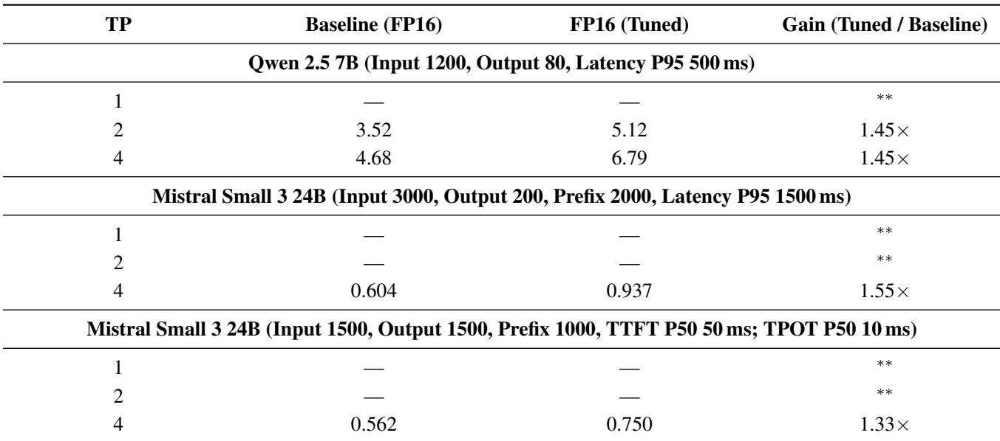  
∗∗SLOs not met or FP16 baseline unavailable for the given TP.

Table 7. Normalized per-GPU throughput and improvement vs. FP16 baseline across models, tensor parallelism, and bitwidths. Values are normalized per-GPU RPS (SLO-compliant). Missing baselines (∗∗) indicate configurations not measured or not SLO-compliant.  
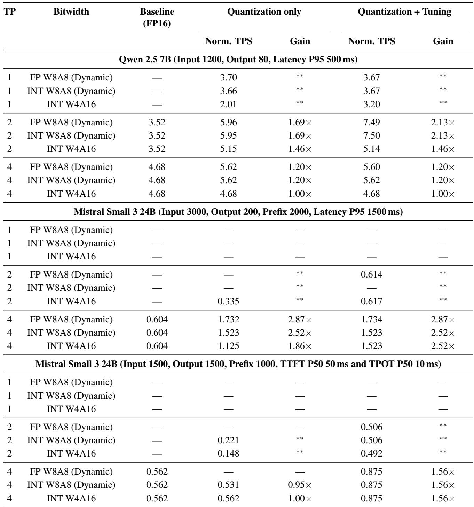  
∗∗SLOs not met or FP16 baseline unavailable for given TP.