# SKIPKV: SELECTIVE SKIPPING OF KV GENERATION AND STORAGE FOR EFFICIENT INFERENCE WITH LARGE REASONING MODELS

Jiayi Tian\* 1 Seyedarmin Azizi 2 Yequan Zhao 1 Erfan Baghaei Potraghloo 2 Sean McPherson 3   
Sharath Nittur Sridhar 3 Zhengyang Wang 1 Zheng Zhang 1 Massoud Pedram 2 Souvik Kundu 3

\*Work done during Jiayi’s internship at Intel.

## ABSTRACT

Large reasoning models (LRMs) often cost significant key-value (KV) cache overhead, due to their linear growth with the verbose chain-of-thought (CoT) reasoning process. This costs both memory and throughput bottleneck limiting their efficient deployment. Towards reducing KV cache size during inference, we first investigate the effectiveness of existing KV cache eviction methods for CoT reasoning. Interestingly, we find that due to unstable token-wise scoring and the reduced effective KV budget caused by padding tokens, state-of-the-art (SoTA) eviction methods fail to maintain accuracy in the multi-batch setting. Additionally, these methods often generate longer sequences than the original model, as semantic-unaware token-wise eviction leads to repeated revalidation during reasoning. To address these issues, we present SkipKV, a training-free KV compression method for selective eviction and generation operating at a coarse-grained sentence-level sequence removal for efficient CoT reasoning. In specific, it introduces a sentence-scoring metric to identify and remove highly similar sentences while maintaining semantic coherence. To suppress redundant generation, SkipKV dynamically adjusts a steering vector to update the hidden activation states during inference enforcing the LRM to generate concise response. Extensive evaluations on multiple reasoning benchmarks demonstrate the effectiveness of SkipKV in maintaining up to 26.7% improved accuracy compared to the alternatives, at a similar compression budget. Additionally, compared to SoTA, SkipKV yields up to 1.6× fewer generation length while improving throughput up to 1.7×.

## 1 INTRODUCTION

Large language models (LLMs) have demonstrated remarkable capabilities in complex reasoning with advancements enabling them to perform multi-step mathematical derivations (Trinh et al., 2024; Luo et al.; Ahn et al., 2024) and code generation (Wang & Chen, 2023; Zhong & Wang, 2024; Zhong et al., 2024). However, reasoning-oriented models (e.g., DeepSeek-R1 (Guo et al., 2025)) face a critical deployment bottleneck: their tendency to generate lengthy and often redundant reasoning traces that lead to unsustainable memory demands (Chen et al., 2024). In particular, the large token count linearly increases the the key-value (KV) cache memory of the autoregressive large reasoning models (LRMs), often making them dominant component for large reasoning depth. For instance, a DeepSeek-R1-Distill-Llama-8B model may generate over 32K tokens when solving a single complex math problem; for a batch-size of 10, it needs ∼2.5× larger KV cache memory compared to the model weights. In addition to the significant memory overhead, the growing KV cache impacts the throughput of the memory bound decoding stage of LRMs. This makes the need for reasoning KV cache compression an important research paradigm for long chain-of-thought (CoT) reasoning.

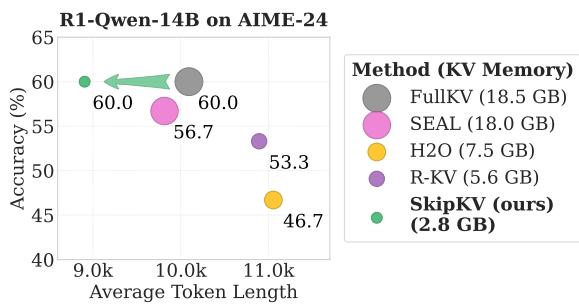  
Figure 1. Comparison of KV cache eviction methods for a reasoning model. Marker size denotes KV memory usage. SkipKV yields shorter generation length while maintaining high accuracy under a smaller KV budget.

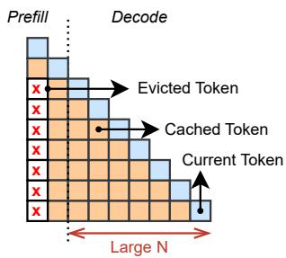  
(a) SnapKV

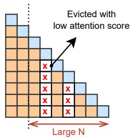  
(b) H2O

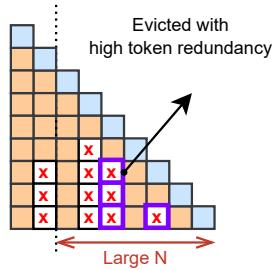  
(c) R-KV

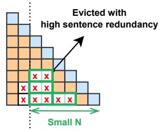  
(d) SkipKV (ours)  
Figure 2. Comparison of KV cache eviction methods during token generation. Cached tokens marked with × indicate evicted positions. (a) SnapKV performs one-time eviction after prefill; (b) H2O evicts tokens with low cumulative attention scores; (c) R-KV prunes redundant tokens based on token-level similarity (purple); (d) SkipKV (ours) groups tokens within sentences (green) to evict high sentence-redundancy regions, achieving high accuracy and shorter generation length (N).

2024; Tang et al.) target the KV compression of longcontext prefill and lose their efficacy in long CoT tasks for LRMs. For example, H2O (Zhang et al., 2023) improves decoding efficiency by retaining a compact subset of KV pairs based on cumulative historical attention scores. Yet, its reliance solely on attention magnitude and overlooks semantic coherence across multi-step reasoning spans. SnapKV (Li et al., 2024) leverages attention-based importance estimation to compress the KV cache during the prefill phase, achieving strong performance in long-context scenarios but shows significant accuracy drop for CoT reasoning tasks. Only recently R-KV (Cai et al., 2025) highlighted a potential limitation of these works, paying attention to repetitive and redundant CoT tokens. It then proposed a redundancyaware metric to effectively remove repetitive tokens along the reasoning path, achieving over 80% KV-cache compression while maintaining strong accuracy. However, despite good accuracy on single-batch, R-KV often suffers from significant accuracy drop for multi-batch settings, limiting its scalable deployment. Moreover, its token-level eviction granularity disregards higher-level semantic structure, often resulting in unnecessarily prolonged reasoning paths. Fig. 2 compares representative KV-cache eviction strategies. Here, we focus on permanent eviction methods, in which evicted tokens are no longer accessible in subsequent decoding steps, thereby yielding genuine memory savings.

Our Contributions. To address these limitations, we first investigate the limitations of existing token eviction methods. Our analysis reveals that incoherent token eviction can result in unstable reasoning with reduced accuracy and prolonged generation. In specific, we find that the fragmented token histories often induce overthinking and forces the CoT to generate more tokens for a fixed KV budget. Based on these insights we then propose SkipKV, a sentence-aware selective KV eviction and generation framework designed for efficient CoT reasoning. SkipKV not only preserves reasoning coherence but also achieves a better trade-off between the accuracy and generation length for a fixed of KV cache memory budget (Fig. 1). At its core, SkipKV has two key methods, namely the sentence-primary scoring method and the adaptive steering method to efficiently skip token storage and generation, respectively. In specific, it relies on a sentence-primary scoring metric that allows it to selectively skip KV storage while preserving the semantic coherence of the reasoning process. The adaptive steering mechanism suppresses uninformative or redundant sentences during the generation. Additionally, SkipKV adapts a batch grouping policy that reduces the number of padding tokens, thereby freeing KV-cache space for valid tokens and improving stability and consistency in multi-batch reasoning with KV eviction.

To demonstrate the effectiveness of SkipKV, we conduct comprehensive evaluations on DeepSeek-R1-Qwen-7B, R1- Qwen-14B, and R1-Llama-8B LRMs across four reasoning benchmarks: AIME-24, LiveCodeBench, MATH-500, and GSM8K. As shown in Fig. 1, SkipKV outperforms state-ofthe-art (SoTA) methods, achieving 6.7% higher accuracy and 22% shorter generation lengths, with 2× KV memory compression on R1-Qwen-14B evaluated on AIME-24.

## 2 RELATED WORKS

KV Cache Compression Methods. To mitigate the growing KV cache memory footprint, existing research on inference-time KV cache compression can be broadly classified into two categories, namely KV cache eviction (Zhang et al., 2023; Li et al., 2024; Behnam et al., 2025; Tang et al.) and quantization (Liu et al., 2024; Kang et al., 2024; Ramachandran et al., 2025). The KV eviction methods that permanently removes the redundant tokens, including H2O (Zhang et al., 2023) and SnapKV (Li et al., 2024) primarily rely on the token importance ranked based on their attention score, to remove the low-scoring KV tokens and meet a fixed KV budget, reducing the total memory demand. While other eviction methods like Quest (Tang et al.), keep the FullKV at global memory, and bring a fractional chunk to the local memory that remains relevant to the query. These works, while performing well on non-reasoning benchmarks with large prefill length, fail to demonstrate good accuracy for CoT compression. Only recently a contemporary work,

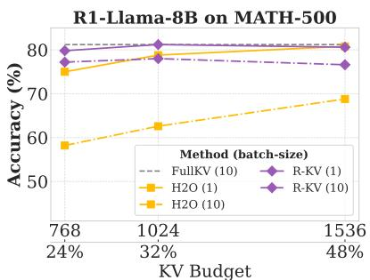

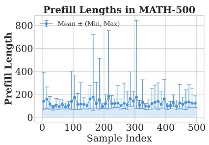

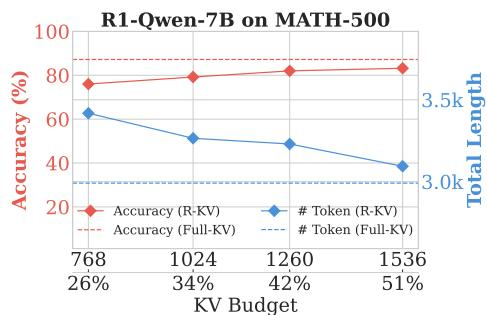  
Figure 3. Left: Accuracy comparison for single- and multi-batch decoding of H2O (Zhang et al., 2023) and R-KV (Cai et al., 2025). Center: Visualization of the prefill token length distribution of MATH-500, and the min-max range of each batch (batch-size, bs = 10). Right: Accuracy and generated token length versus KV budget with R-KV eviction on MATH-500 (bs = 10).

R-KV (Cai et al., 2025) identifies a key limitation of these methods: not adhering to the redundancy in the token importance scoring. R-KV proposed a redundancy aware token scoring to yield SoTA compression-accuracy trade-off for CoT reasoning. However, R-KV still suffers from larger generation length and reduced accuracy at multi-batch decoding. In quantization, instead of their removal, the KV tokens are stored at a lower precision to reduce their memory footprint. However, for LRMs quantization may often hurt the CoT process (Liu et al., 2025). Nevertheless, in this work, we focus on improving the eviction, and thus quantization of KV remains an orthogonal direction.

Other KV Cache Reduction Methods. Apart from compression, earlier works have explored approaches to reduce the KV memory footprint via different methods including KV sharing, early exiting, and steering. Sharing method like KVsharer (Yang et al., 2024) relies on tensor similarity between KV caches of different layers of a model, to allow them to be shared over ≥ 1 layer. However, this sharing costs significant accuracy drop on CoT reasoning tasks. DEER (Yang et al., 2025) monitors transition tokens during the reasoning process and estimates the confidence of early termination by inducing trial answer tokens, thereby reducing reasoning length through adaptive early exits. KV steering (Chen et al., 2025; Azizi et al., 2025) on the other hand, introduces a latent-space calibration mechanism that identifies and manipulates non-important thoughts in CoT to reduce the final reasoning sequence length. While these methods can reduce the generation token count to improve per-sample memory, however, cannot meet a fixed KV budget and their batch-level scalability remains open problem.

## 3 MOTIVATIONAL CASE STUDIES

In this section, we analyze the key limitations of the representative SoTA CoT token eviction methods.

Observation 1: With KV eviction, reasoning accuracy drops in multi-batch decoding compared to that with single-batch.

Description. The benefit of KV cache eviction methods lies in their ability to reduce KV memory usage, thereby enabling larger batch size with improved generation throughput. To analyze the accuracy robustness of the existing SoTA KV eviction methods (Cai et al., 2025; Zhang et al., 2023) on CoT reasoning task, we evaluated the accuracy for a batch size of 1 and 10, respectively. In specific, we measured the accuracy on the MATH-500 with the R1-Llama-8B at different KV budget (fraction of the KV memory in % with baseline FullKV as 100%). As depicted in Fig. 3 (left), the multi-batch decoding costs substantial accuracy degradation, for both R-KV and H2O, particularly at lower KV budget. This limitation may be attributed to the effective KV budget reduction for multi-batch scenario due to the padding tokens. These tokens are added to align with variable-length prefill sequences of different candidates in a batch. Upon entablement of fixed memory budget via KV eviction, the padding tokens consume memory space resulting in reduction in effective KV budget, and thus potentially costs accuracy. In addition, these tokens can also distort attention distributions, leading to unstable token-level importance estimation that can further contribute to reasoning consistency degradation. As depicted in Fig. 3 (center), the prefill token length in MATH-500 varies widely over samples, with some variations exceeding 400 tokens in a batch. This variation leads to excessive padding when sequences are batched together, increasing KV cache waste and exacerbating the performance drop in multi-batch decoding with eviction.

## Observation 2: At reduced KV budget the total generation length often increases compared to that without any KV compression.

Description. Fig. 3 (right) shows the accuracy and average token length (continuous lines) with Deepseek-R1-Qwen 7B for a batch size of 10, evaluated on MATH-500. Apart from compromising the accuracy, models with R-KV compression consistently generate longer sequences across all KV budgets compared to that without compression. This observation indicates that token eviction can cause the model to extend its reasoning chain and generate longer outputs. This may be attributed to the loss of contextual information in the

<|User|>Answer the following questions. You should think step-by-step   
and put your final answer within \boxed{}.   
Question: Evaluate \$(1+2i)6-3i\$.<|Assistant|>   
[Re-validate for 8 times and generate 1517 tokens in total]   
.. So, the result should be 6 + 9i.   
Wait, let me double-check... 6 + 9i . That seems correct.   
Alternatively,... Let me write it out again:   
Then, subtracting 3i: 6 + 12i - 3i = 6 + (12i - 3i) = 6 + 9i.   
Just to be thorough, maybe I can represent this in another way. ...   
Alternatively, I can think of it as 6\*(1 + 2i) - 3i.   
Another way to approach this is ..   
So, 6 + 12i - 3i = 6 + (12 - 3)i = 6 + 9i . Yep, that's consistent.   
I think I'm confident that the result is 6 + 9i. Let me. 6 + 9i . That   
seems reasonable.   
Alternatively, ... (6, 9). So, that's another way to see it.   
Just to recap:   
6 + 12i - 3i = 6 + (12i - 3i) = 6 + 9i   
Just to make sure, let me compute it again step by step:   
6 + 12i 3i = 6 + (12i - 3i) = 6 + 9i.   
Yep, same result. I think that's solid.   
I guess another way ...   
So, after all that, I'm pretty confident that the answer is 6 + 9i.   
\*\*Final Answer\*\*   
The result of evaluating \$(1+2i)6 - 3i\$ is \boxed{6 + 9i}.  
Figure 4. SoTA token-based eviction (Cai et al., 2025) often selects fragmented tokens from final answer (6 + 9i) (orange boxed), causing repeated self-validation and redundant non-execution thoughts (highlighted in yellow). Blue tokens are retained, while Gray ones are evicted.

KV cache: when portions of the valid context are removed, the model may compensate by regenerating reasoning steps or add redundant segments to recover missing information. The longer generations results in increased computational cost due to increased forward passes, thereby offsetting the efficiency gains achieved through cache size constraints.

## Observation 3: Token-level eviction often causes fragmented removal of words, leading the LRM to overthink.

Description. To further investigate the cause of increased generation length, we visualize the tokens retained after R-KV eviction in Fig. 4. We select a sample from MATH-500 and show model outputs where the retained tokens are highlighted in Blue and the evicted ones in Gray.

The limitations here can be summarized in two aspects. Firstly, eviction purely based on token-level redundancy scores (Cai et al., 2025) often removes numbers from crucial mathematical computation steps, thereby disrupting the reasoning flow. Secondly, token level eviction may often retain fragmented tokens from the correct answer, misleading the LRM to re-validate partial results and generate unnecessarily long or uncertain reasoning chains. For instance, in Fig. 4, the tokens retained by R-KV frequently include disjoint numerical entities from intermediate reasoning steps (e.g., 6 + 12i − 3i → +2i) or from the final answer (e.g., (6, 9) → (, 9)). Such fragmented retention causes the model to repeatedly re-derive or re-check parts of the answer, resulting in longer yet redundant reasoning trajectories.

These findings highlight the need for a coherent eviction policy that operates on higher-level semantic units (e.g., sentences or reasoning segments) to achieve a better tradeoff between accuracy and generation length.

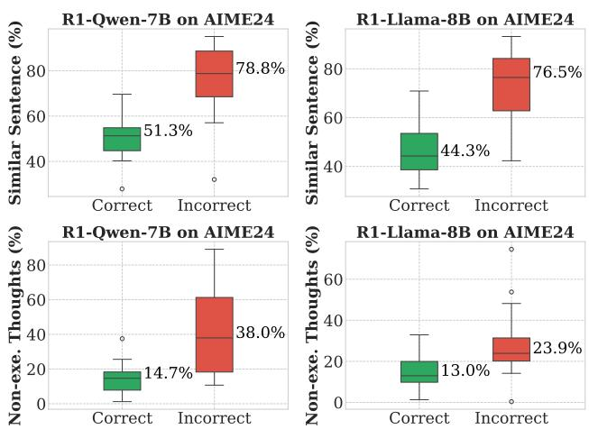  
Figure 5. Statistics on the ratio of high-similarity sentences (top) and non-execution thoughts (bottom) generated for samples that the models answered correctly and incorrectly.

## 4 SKIPKV: METHODOLOGY

In this sections, we first analyze the sentence-level properties of reasoning traces motivating the design of SkipKV (illustrated in Fig. 6). We then present the two core components of SkipKV: (1) sentence-level skipping of the KV cache storage guided by semantic redundancy scoring; and (2) adaptive KV steering for controlled generation to suppress unnecessary thought expansion. Finally we present a simple yet effective batch grouping driven eviction strategy to enhance the accuracy robustness in multi-batch decoding. Definition: Pairwise Sentence Similarity (PSS) between two sentences is defined as the measured cosine similarity between the vector embedding of the two. Let the vector embedding of two sentences as vi, vj ∈ Rd, respectively. The PSS score is computed as,

$$
\tag{1}
$$

To understand the differences between successful and failed reasoning trajectories from the semantic perspective, we perform a fine-grained analysis of sentence- (thought-) level properties in the model generated output with FullKV. We focus on two aspects: (i) the semantic similarity among generated sentences, and (ii) the ratio of non-execution (less important) thoughts. Notably following the definition of (Chen et al., 2025), here we classify the generated tokens as execution (important tokens relevant to the actual answer) and non-execution (less important tokens generated to verify response via reflection or transition) thoughts.

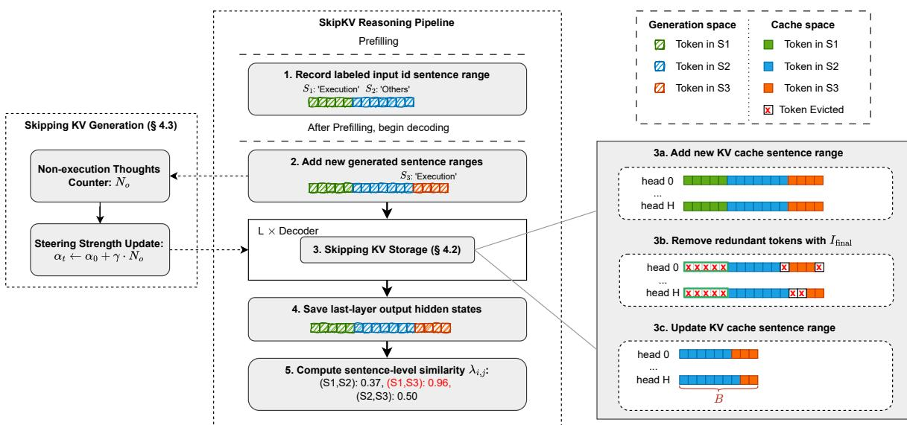  
Figure 6. Overview of SkipKV framework. It selectively skips KV-cache storage and generation by leveraging sentence-level redundancy detection. The central reasoning pipeline illustrates the end-to-end process from prefill to decoding, where input sentence ranges and types are recorded, sentences are scored, and the KV cache is compressed. The left panel depicts the adaptive steering mechanism used to skip KV generation (§ 4.2), while the right panel illustrates sentence-level KV storage skipping (§ 4.1), including the KV-range monitoring logic (3a, 3c) and the sentence-oriented eviction strategy (3b).

## Observation 4: Both correct and incorrect reasoning responses generate highly similar sentences with the later scenario usually generating higher % of similar sentences.

Description. We perform an experiment with R1-Qwen-7B and R1-Llama-8B on AIME24 to compute the PSS. In specific, we first collect model output texts and segment it into individual sentences separated by newline and punctuationbased patterns (e.g., ‘\n’, ‘.\n’, ). Each sentence is then encoded into a semantically meaningful embedding vector using a BERT-based sentence transformer (Reimers & Gurevych, 2019). We then compute the PSS for all the sentence embedding pairs and mark pairs with PSS score ≥ 0.95 as highly similar, yielding a measure of semantic redundancy. Interestingly, as shown in Fig.5 (top), incorrect responses consistently exhibit up to 1.7× higher similar sentences as compared to that for the correct ones.

## Observation 5: Incorrect response generate significantly higher % of non-execution thoughts compared to the correct ones.

Description. As shown in Fig.5 (bottom), incorrect generations consistently exhibit higher ratios of non-execution thoughts compared to that with the correct ones. In particular, when evaluating on AIME24 with R1-Qwen- 7B and R1-Llama-8B , respectively, we observe around 2.6× and 1.8× higher non-execution thoughts in incorrect outputs compared to that with the correct ones. These patterns indicates that when models fail, they tend to produce repetitive or stagnant reasoning steps revisiting semantically similar content or generating meta-level commentary rather than performing concrete problem-solving actions.

## 4.1 Skipping KV Storage with Sentence-level Scoring

Here, we first introduce the sentence-level similarity scoring and then present the cumulative scoring mechanism to decide the eviction sentences and tokens.

Sentence Similarity Score. We use this score to compute the sentence level redundancy. However, using a sentence transformer to generate the latent vector representation of the sentences is impractical as it costs significant compute overhead during decoding. Instead, we leverage the lastlayer hidden state, denoted as H ∈ Rbs×N×d, as latent contextual representations of the sentence segments. In specific, for each sample in a batch we identify the start and end indices of each sentence segment by partitioning the total sequence (N) into small chunks that are separated by punctuation-based delimiters (Step 1–2 in Fig. 6). For a sentence i at batch id k we then compute its vector embedding vi ∈ R1×1×d as the mean of vectors in that sentence,

$$
\tag{2}
$$

Here, bi and ei are the beginning and end indices of sentence i. We then compute the PSS following Eq. 1. We then define the redundant sentence set as

$$
\tag{3}
$$

Meaning if a pair (i, j) exceeds a pre-defined threshold τ (e.g., 0.95), the earlier sentence i is flagged as redundant, while the later one j is retained.

Token Importance Score. Let Q ∈ Rbs×Hq×α×d denote the observation window of recent α query tokens (Li et al., 2024), and K, V ∈ Rbs×Hk×N′×d denote the current key and value cache, respectively. Here, Hq and Hk represent the number of query and key-value heads.Most LRMs use group-query attention, where for each query head i ∈ {1, . . . , Hq}, its associated key-value head is denoted by g(i) ∈ {1, . . . , Hk}, where g(i) = ⌊ i ⌋. n is an integer defining the number of query heads over which each K/V is shared. The attention importance for each query head i in a batch denoted as Ai ∈ Rbs×1×α×N′, where

$$
\tag{4}
$$

Here, M denotes the attention mask used for multi-batch decoding. We then compute the attention importance for a key head hk as Ihk = softmax(maxpool(Ahk·n: Ahk·n+(n−1))). We normalize the attention importance matrix over the observation window of α, for each head, to yield the token importance matrix Ihk ∈ Rbs×N′ .

Token Redundancy Score. Inspired by R-KV we now summarize the token redundancy removal method. For each key-value head hk, we define the key state as Khk ∈ Rbs×1×N′×d, and the token redundancy Rhk ∈ Rbs×N′ is calculated as

$$
\tag{5}
$$

Here, we also consider the attention mask M to reduce the influence of the padding tokens on redundancy score.

Sentence Redundancy Driven Cumulative Score. We then formulate the overall eviction score for KV compression (Steps 3b in Fig. 6) by combining the token importance score Ihkα , token redundancy score Rhk , and sentence similarity score λi,j :

$$
\tag{6}
$$

σ controls the trade-off between token importance and redundancy. As described earlier, λi,j is the sentence redundancy score associated with sentence pair (i, j), shared over all tokens of the ith sentence. To meet a specific token budget, we evict tokens in increasing order of final score Ifinal. Importantly, since similarity scores for redundant sentences (≥ 0.95) are typically an order of magnitude higher than token-level scores ∼ 0.1, Eq. 6 ensures that highly redundant sentences are removed before token level eviction.

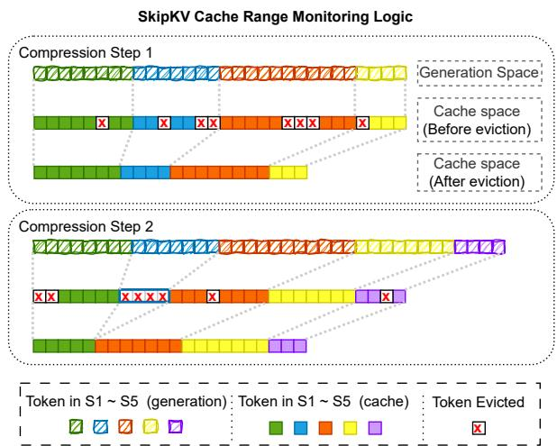  
Figure 7. Illustration of the cache range monitoring process over two consecutive compression steps. Colored blocks represent distinct sentence spans in the generation space and their corresponding regions in the KV cache. Gray dashed lines indicate the mapping of sentence range.

KV Cache Sentence Range Monitoring Logic. To ensure that sentences in the redundancy set P are evicted consistently from the cache space, we introduce a KV-cache range monitoring mechanism (Steps 3a and 3c in Fig. 6). This mechanism is defined by a mapping function Φ, that converts the ith sentence span in the original generation (b(cs)i , space (gs) to that in the cache space (cs), Φ(b(gsi , e(cs)i ). To correctly associate sentence-level scores i ) , e (g s )i ) → , for each sentence in P, we record the token span ids (b(gs)i , e(gs)i ) and the corresponding PSS in a lookup table T as ei

$$
\tag{7}
$$

By applying the mapping function Φ, we obtain the cachealigned lookup table as

$$
\tag{8}
$$

The cache-aligned lookup table Φ(T ) is then used in Eq. (6) to determine whether i ∈ P during eviction.

As illustrated in Fig. 7, the sentence range monitoring logic needs to track the mapping between the generation and cache space, throughout the compression process. The tokens remaining after compression step 1 starts as the initial tokens of cs for compression step 2 with the mapping taking care of the gs to cs indices.

Updating Cache Ranges Before Eviction. As we perform each eviction after a certain number of decoding iterations, during an eviction step we may see newly generated tokens—often completing or initiating sentences—are appended to the gs tokens. Accordingly, their sentence spans must be added to the KV cache, following two cases: (1) initialization of sentence ranges during the first step (Fig. 7, top), and (2) appending new ranges in subsequent steps (Fig. 7, bottom). In case (1), the cache ranges are simply initialized as those in the generation space:

$$
\tag{9}
$$

At compression step t, we denote the generation and cache sequence length before eviction as l(gs) and l(cs) , while the post-eviction cache length is constrained by the budget B. In case (2), for each new sentence added during the current compression step, we sequentially update the sentence range in increasing order of sentence index. For the ith one it is,

$$
\tag{10}
$$

The end position e(cs)i is determined by subtracting the offset ∆ from the current cache length l(cs)t . Here ∆ represents the length of residual tokens in gs starting from (i + 1)th sentence. This offset is equivalent to the length of the newly appended tokens and can be computed as the total generation length minus the end position of the ith sentence in the generation space.

Updating Cache Ranges After Eviction. As shown in Fig.7, sentence spans must be remapped into the new cache coordinate space according to the surviving token indices in each compression step. Let the set of surviving token indices be P = {p1, p2, . . . , pB } with 0 ≤ p1 < p2 < · · · < pB < l(cs)t , with pk denoting the k-th surviving token index. The t corresponding cache ranges are then updated as

$$
\tag{11}
$$

Here, b(cs)i is reassigned to the earliest surviving index not earlier than the original start, and e(cs)i to the latest surviving index not later than the original end. If no tokens in the compressed cache space survive, the corresponding sentence range is discarded from the post-eviction cache space.

## 4.2 Skipping KV Generation with Adaptive Steering

In addition to removing redundant thoughts after their generation, we further propose to skip unnecessary thoughts before generation through an adaptive steering mechanism. For this we add a steering vector to the hidden state of certain LRM layer(s) enforcing the model to be precise. However, unlike earlier works on steering (Chen et al., 2025) that uses fixed strength (α0) to the steering vector throughout the generation, we propose a strength adaptation based on the count of non-execution thoughts. The details of adaptive steering is presented below.

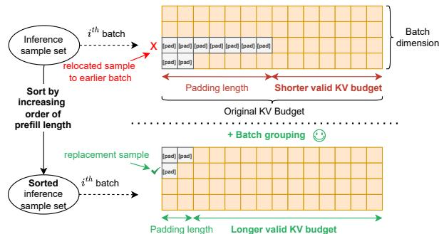  
Figure 8. Batch grouping increases valid KV budget for highperformance multi-batch decoding. Yellow blocks: valid tokens in the KV cache, Gray blocks: padding tokens.

Inspired by SEAL (Chen et al., 2025) we first construct the steering vector using 500 samples from the MATH training set, aiming to shift the latent representations toward execution-style reasoning. The steering vector is computed as the mean latent representation difference between execution and non-execution thoughts: V = HE − HO, where HE and HO denote the average hidden states of execution and non-execution thoughts, respectively. During a reasoning step t, the steering vector is injected into the hidden representations of the selected layer k as Hk ← Hk+αt·V, where αt denotes the steering strength controlling the degree of latent adjustment toward execution-oriented directions.

We perform the dynamic adjustment of αt based on the model’s observed reasoning behavior. In specific, as illustrated in Fig. 6 (left), we keep a running counter of the nonexecution thoughts No and update αt as αt ← α0 + γ · No, where α0 and γ are initial steering strength and a predefined increment factor, respectively, controlling the steering aggression. In this way, the steering strength for each sample is adaptively adjusted throughout the reasoning process, enabling the model to shorten generation length by selectively suppressing unnecessary thoughts.

## 4.3 Batch Grouping for Multi-batch Decoding

For each sample in a batch the valid KV budget is given by, B′ = B − ∆pad, with ∆pad being the sample’s padding token count. For any sample, ∆pad is given by,

$$
\tag{12}
$$

where Np and Nmaxp represent the prefill sample size of current sample and that with maximum prefill length in a batch. Clearly, ∆pad can be a high for a batch with high prefill length variability. Thus to reduce wasteful padding count we propose the batch grouping strategy. In specific, we rearrange all the samples by first sorting in increasing order of thir prefill length. We then use this sorted sample space to group them into batches of size bs. As shown in Eq. 12, due to reduced difference between Nmaxp and Np, the padding token count reduces yielding increased B′. Fig. 8 illustrates a sample rearrangement example in batch grouping. In experimental Section 5.3 we empirically validate the effectiveness of increased B′ in improving LRM’s accuracy for multi-batch decoding.

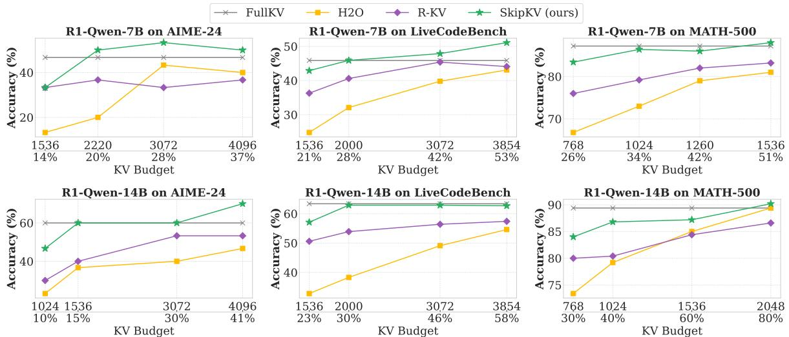  
Figure 9. Accuracy comparison under different KV-cache budgets for SkipKV, H2O, R-KV, and FullKV across three reasoning benchmarks and R1-Qwen-7B and 14B models. SkipKV consistently achieves higher accuracy under tighter KV budgets, maintaining full accuracy even at only 15 % KV budget on AIME-24. Results are reported as pass@1.

## 5 EXPERIMENTS

In this section, we first compare the accuracy and generation length of SkipKV on complex reasoning tasks against recent token-eviction methods across multiple reasoning models and KV-budget ratios. We then compare SkipKV with other efficient reasoning baselines, followed by an evaluation of reasoning throughput and ablation studies on each component of SkipKV, including its impact on the effective KV budget under batch grouping. Additional experimental details and evaluation results are provided in the Appendix.

## 5.1 Experimental Setup.

Models and Datasets. We conduct evaluations on DeepSeek-R1-Distill-Qwen-7B, DeepSeek-R1-Distill-Qwen-14B, and DeepSeek-R1-Distill-Llama-8B (Guo et al., 2025). Our experiments cover both mathematical reasoning benchmarks—MATH-500 (Lightman et al., 2023), AIME (Mathematical Association of America, 2024), and GSM8K (Cobbe et al., 2021)—and code generation using LiveCodeBench (Jain et al., 2024). We constrain the maximum generation length to 8,192 tokens for GSM8K and MATH-500, 10,000 tokens for LiveCodeBench, and 16,384 tokens for AIME-24. Following SEAL (Chen et al., 2025), we derive the steering vector using 500 samples from the training set of the Math dataset (Hendrycks et al.). Unless otherwise stated, the evaluation batch size is set to 10 for R1-Qwen-7B and R1-Llama-8B, while for R1-Qwen-14B, it is set to the maximum that can fit into GPU memory. All experiments are conducted on a single

NVIDIA A100 (40GB) GPU.

## 5.2 Main Results

Comparison of Accuracy with Eviction Methods. We compare the reasoning accuracy of SkipKV with prior KV cache eviction methods, including H2O, R-KV, and the FullKV baseline across multiple reasoning datasets and model scales, as shown in Fig. 9 and Fig. 13 in Appendix A.3. Following R-KV, we define the KV cache budget ratio as the ratio of the allocated KV cache budget to the average generation token length under FullKV for each model–dataset pair. Different from prior token-level KV eviction methods, which suffer from severe accuracy degradation during multi-batch decoding, our SkipKV approach consistently maintains high accuracy with significantly lower KV memory across all reasoning tasks and models. On challenging reasoning tasks such as AIME-24, SkipKV matches the FullKV accuracy using 6.7× lower KV cache memory on R1-Qwen-14B, while maintaining more than 4× lower KV memory usage across all models. In addition, SkipKV could achieve better performance compared with FullKV on a limited KV budget. For example, SkipKV improves accuracy by 5.2% on LiveCodeBench with 2× less KV memory evaluated on R1-Qwen-7B, and by 10% on AIME-24 while using 2.5× lower KV memory evaluated on R1-Qwen-14B.

Comparison of Token Length with Eviction Methods. Besides achieving higher reasoning accuracy, SkipKV also provides substantial generation efficiency gains by producing fewer tokens. As shown in Fig.10, prior token-level eviction methods consistently generate more tokens than FullKV across all models and tasks, whereas SkipKV reduces the total token length by up to 28% compared with FullKV. Compared with R-KV, SkipKV generates up to

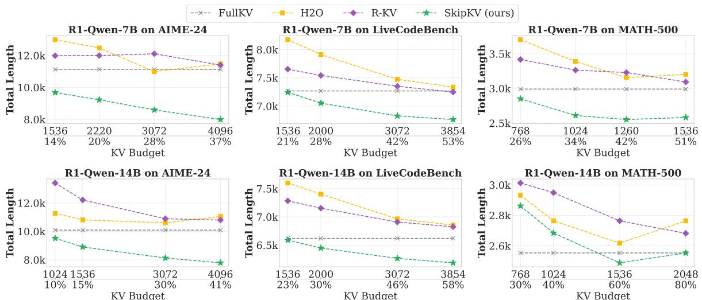  
Figure 10. Total generation tokens on SkipKV under different KV budget with H2O, R-KV, and FullKV across three datasets and two models. SkipKV consistently generates fewer tokens and could achieve up to 30% fewer generation length compared with FullKV.

32%, 39%, and 48% fewer tokens on R1-Qwen-7B, R1- Qwen-14B, and R1-Llama-8B, respectively—translating to a 1.5 − 2× reduction in generation latency. Additionally, on the MATH-500 dataset, SkipKV produces approximately 15% fewer tokens while using 3× less KV memory than FullKV on R1-Qwen-7B resulting in 3.5× overall memorylatency benefits. Similarly, on LiveCodeBench, SkipKV consistently achieves around 10% shorter generation lengths across all KV budget settings while maintaining comparable accuracy to that with FullKV.

## Comparison with Other Efficient Reasoning Methods. 0

We further compare SkipKV with SEAL that focus on reducing generation length. Fig. 11 presents the comparison of KV-cache memory consumption and reasoning accuracy among SkipKV, SEAL, and FullKV on the AIME-24 dataset and across three reasoning models. We set the steering factor of SEAL to 1, following its original configuration. Because SEAL does not explicitly compress the KV cache, its KV memory footprint is approximated using the average number of active tokens per sequence, which is proportional to the mean generation length. While SEAL successfully shortens reasoning traces and maintains accuracy, its modest reduction in output token length (about 10%) translates to only limited KV memory savings. In contrast, SkipKV jointly skips KV generation and storage, achieving up to 13.3% accuracy improvement and 6.6× KV memory reduction when compared with SEAL. These results highlight that SkipKV effectively balances memory compression and reasoning fidelity across different reasoning models.

Throughput Analysis. We evaluate the end-to-end throughput of different methods on the GSM8K dataset using R1-Qwen-7B with a maximum generation length of 8,192 tokens on a single A100-40GB GPU. The KV-cache budget is set to 512, under which both SkipKV and R-KV achieve comparable accuracy to FullKV. We measure the total latency and throughput (samples processed per minute) across various batch sizes, with FlashAttention-2 enabled for all methods. As shown in Table 1, we define the transition point as the batch size at which each method achieves its peak throughput—beyond which performance becomes memory-bounded. We observe that FullKV and SEAL support significantly smaller batch sizes than the eviction-based methods, resulting in earlier transition points and limited throughput scalability. In contrast, R-KV and SkipKV effectively alleviate memory pressure via their fixed-size KV caches, enabling up to 2.8× larger batch sizes and substantially higher throughput. Overall, R-KV achieves up to a 7.6× speedup over FullKV, while SkipKV further accelerates generation by 9.6× compared with FullKV. Additionally, at the same batch size, SkipKV outperforms R-KV by up to 1.7×, benefiting from its shorter generation length.

Table 1. Comparison of total latency and throughput under different batch sizes on GSM8K. Evaluated on one A100-40GB.  
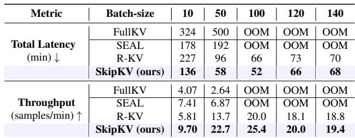

## 5.3 Ablation Studies

SkipKV Components. From Table 2, we observe that progressively integrating the three SkipKV components—Sentence Scoring (§ 4.1), Adaptive Steering (§ 4.2), and Batch Grouping (§ 4.3)—yields consistent improvements in both reasoning efficiency and accuracy on the AIME24 benchmark. Sentence Scoring provides moderate gains by removing redundant sentences, slightly improving accuracy and shortening the generated sequence length. Including Adaptive Steering further enhances efficiency by dynamically skipping non-execution thoughts, leading to a substantial reduction in total token length without sacrificing accuracy. Finally, combining Batch Grouping with the previous components forms the complete SkipKV configuration, which achieves the strongest overall results, improving accuracy by up to +20 % and reducing total token length by as much as 30 % across different KV budgets compared with the R-KV baseline. These results demonstrate that SkipKV’s hierarchical design—progressing from local semantic filtering to global decoding coordination—effectively balances reasoning quality and efficiency in large-scale mathematical reasoning tasks.

Table 2. Ablation of SkipKV evaluated on AIME24 using R1-Qwen-7B. Progressive inclusion of Sentence Scoring, Adaptive Steering, and Batch Grouping improves accuracy and reduces total token length compared with the R-KV baseline.  
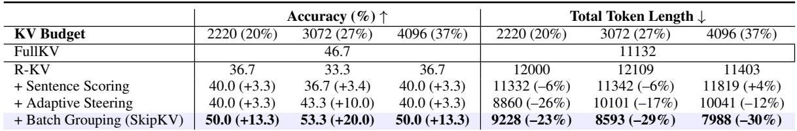

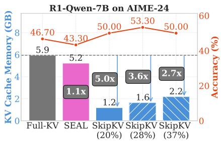

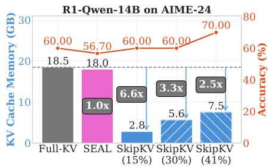

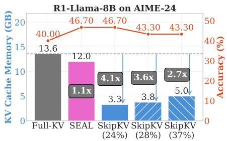  
Figure 11. KV-cache memory consumption and reasoning accuracy of SkipKV under different KV budgets, compared with SEAL and Full-KV baselines on AIME-24 across multiple reasoning models. Left: R1-Qwen-7B; Center: R1-Qwen-14B; Right: R1-Llama-8B.

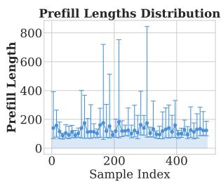

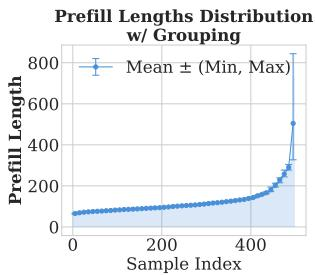  
Figure 12. Visualization of the prefill token length distribution of MATH-500 and the min-max range of each 10 samples before (left) and after (right) using batch grouping.

Impact of Batch Grouping on Valid KV Budget. To evaluate the effectiveness of our batch grouping technique in multi-batch decoding, we visualize the prefill token length distribution of the MATH-500 dataset before and after applying batch grouping, and analyze its impact on the valid

Table 3. Effect of Batch Grouping evaluated on MATH-500 using R1-Qwen-7B with SkipKV.  
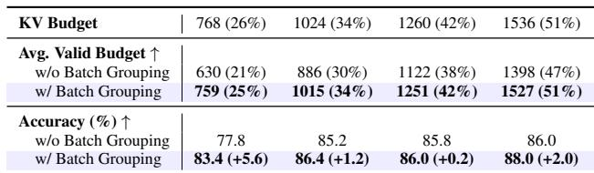

KV budget and overall accuracy. As shown in Fig. 12, the prefill token lengths vary significantly across the dataset, resulting in large intra-batch variation. However, after sorting and grouping, the prefill lengths increase smoothly from the first to the last sample, substantially reducing the variation within each batch. This reduction in variation decreases the amount of padding required, allowing the average valid KV budget to approach the nominal KV budget and thereby reducing the memory overhead caused by padding tokens. As summarized in Table 3, batch grouping allocates nearly the entire KV budget to valid tokens, effectively preserving accuracy under lower KV budgets.

## 6 CONCLUSIONS

We introduced SkipKV, a sentence-oriented KV compression framework designed to enhance reasoning efficiency while maintaining accuracy. It selectively skips KV generation and storage to yield lower memory footprint. Motivated by empirical observations on sentence-level structures in LRM outputs, SkipKV introduces a sentence-primary KV eviction policy and a sentence-type adaptive steering vector for more coherent and efficient generation. To further yield robust accuracy at multi-batch decoding with SkipKV, we presented a batch grouping strategy to improve the effective KV budget allocation. Compared to the SoTA alternative of R-KV, SkipKV yields up to 26.7% accuracy improvement at similar compression budget while generating up to 1.6× fewer tokens. Additionally, in multi-batch settings SkipKV yields a throughput improvement of up to 9.6× compared to the baseline FullKV LRM, at similar accuracy.

## REFERENCES

Ahn, J., Verma, R., Lou, R., Liu, D., Zhang, R., and Yin, W. Large language models for mathematical reasoning: Progresses and challenges. In The 18th Conference of the European Chapter of the Association for Computational Linguistics, pp. 225, 2024.

Azizi, S., Potraghloo, E. B., and Pedram, M. Activation steering for chain-of-thought compression. arXiv preprint arXiv:2507.04742, 2025.

Behnam, P., Fu, Y., Zhao, R., Tsai, P.-A., Yu, Z., and Tumanov, A. Rocketkv: Accelerating long-context llm inference via two-stage kv cache compression. 2025.

Cai, Z., Xiao, W., Sun, H., Luo, C., Zhang, Y., Wan, K., Li, Y., Zhou, Y., Chang, L.-W., Gu, J., et al. R-kv: Redundancy-aware kv cache compression for trainingfree reasoning models acceleration. arXiv preprint arXiv:2505.24133, 2025.

Chen, R., Zhang, Z., Hong, J., Kundu, S., and Wang, Z. Seal: Steerable reasoning calibration of large language models for free. arXiv preprint arXiv:2504.07986, 2025.

Chen, X., Xu, J., Liang, T., He, Z., Pang, J., Yu, D., Song, L., Liu, Q., Zhou, M., Zhang, Z., et al. Do not think that much for 2+ 3=? on the overthinking of o1-like llms. arXiv preprint arXiv:2412.21187, 2024.

Cobbe, K., Kosaraju, V., Bavarian, M., Chen, M., Jun, H., Kaiser, L., Plappert, M., Tworek, J., Hilton, J., Nakano, R., et al. Training verifiers to solve math word problems. arXiv preprint arXiv:2110.14168, 2021.

Guo, D., Yang, D., Zhang, H., Song, J., Zhang, R., Xu, R., Zhu, Q., Ma, S., Wang, P., Bi, X., et al. Deepseek-r1: Incentivizing reasoning capability in llms via reinforcement learning. arXiv preprint arXiv:2501.12948, 2025.

Hendrycks, D., Burns, C., Kadavath, S., Arora, A., Basart, S., Tang, E., Song, D., and Steinhardt, J. Measuring mathematical problem solving with the math dataset. In Thirty-fifth Conference on Neural Information Processing Systems Datasets and Benchmarks Track (Round 2).

Jain, N., Han, K., Gu, A., Li, W.-D., Yan, F., Zhang, T., Wang, S., Solar-Lezama, A., Sen, K., and Stoica, I.

Livecodebench: Holistic and contamination free evaluation of large language models for code. arXiv preprint arXiv:2403.07974, 2024.

Kang, H., Zhang, Q., Kundu, S., Jeong, G., Liu, Z., Krishna, T., and Zhao, T. Gear: An efficient kv cache compression recipe for near-lossless generative inference of llm. NeurIPS ENLSP Workshop, 2024.

Li, Y., Huang, Y., Yang, B., Venkitesh, B., Locatelli, A., Ye, H., Cai, T., Lewis, P., and Chen, D. Snapkv: Llm knows what you are looking for before generation. Advances in Neural Information Processing Systems, 37:22947– 22970, 2024.

Lightman, H., Kosaraju, V., Burda, Y., Edwards, H., Baker, B., Lee, T., Leike, J., Schulman, J., Sutskever, I., and Cobbe, K. Let’s verify step by step. In The Twelfth International Conference on Learning Representations, 2023.

Liu, R., Sun, Y., Zhang, M., Bai, H., Yu, X., Yu, T., Yuan, C., and Hou, L. Quantization hurts reasoning? an empirical study on quantized reasoning models. arXiv preprint arXiv:2504.04823, 2025.

Liu, Z., Yuan, J., Jin, H., Zhong, S., Xu, Z., Braverman, V., Chen, B., and Hu, X. Kivi: A tuning-free asymmetric 2bit quantization for kv cache. arXiv preprint arXiv:2402.02750, 2024.

Luo, H., Sun, Q., Xu, C., Zhao, P., Lou, J.-G., Tao, C., Geng, X., Lin, Q., Chen, S., Tang, Y., et al. Wizardmath: Empowering mathematical reasoning for large language models via reinforced evol-instruct. In The Thirteenth International Conference on Learning Representations.

Mathematical Association of America. AIME 2024 Problems. https://artofproblemsolving.com/ wiki/index.php/2024\_AIME\_I\_Problems, 2024. Accessed: 2025-08-30.

Ramachandran, A., Neseem, M., Sakr, C., Venkatesan, R., Khailany, B., and Krishna, T. Thinkv: Thought-adaptive kv cache compression for efficient reasoning models. arXiv preprint arXiv:2510.01290, 2025.

Reimers, N. and Gurevych, I. Sentence-bert: Sentence embeddings using siamese bert-networks. In Proceedings of the 2019 Conference on Empirical Methods in Natural Language Processing and the 9th International Joint Conference on Natural Language Processing (EMNLP-IJCNLP), pp. 3982–3992, 2019.

Tang, J., Zhao, Y., Zhu, K., Xiao, G., Kasikci, B., and Han, S. Quest: Query-aware sparsity for efficient long-context llm inference. In Forty-first International Conference on Machine Learning.

Trinh, T. H., Wu, Y., Le, Q. V., He, H., and Luong, T. Solving olympiad geometry without human demonstrations. Nature, 625(7995):476–482, 2024.

Wang, J. and Chen, Y. A review on code generation with llms: Application and evaluation. In 2023 IEEE International Conference on Medical Artificial Intelligence (MedAI), pp. 284–289. IEEE, 2023.

Xiao, G., Tian, Y., Chen, B., Han, S., and Lewis, M. Efficient streaming language models with attention sinks. In The Twelfth International Conference on Learning Representations.

Yang, C., Si, Q., Duan, Y., Zhu, Z., Zhu, C., Li, Q., Lin, Z., Cao, L., and Wang, W. Dynamic early exit in reasoning models. arXiv preprint arXiv:2504.15895, 2025.

Yang, Y., Cao, Z., Chen, Q., Qin, L., Yang, D., Zhao, H., and Chen, Z. Kvsharer: Efficient inference via layer-wise dissimilar kv cache sharing. arXiv preprint arXiv:2410.18517, 2024.

Zhang, Z., Sheng, Y., Zhou, T., Chen, T., Zheng, L., Cai, R., Song, Z., Tian, Y., Re, C., Barrett, C., et al. H2o: ´ Heavy-hitter oracle for efficient generative inference of large language models. Advances in Neural Information Processing Systems, 36:34661–34710, 2023.

Zhong, L. and Wang, Z. Can llm replace stack overflow? a study on robustness and reliability of large language model code generation. In Proceedings of the AAAI conference on artificial intelligence, volume 38, pp. 21841– 21849, 2024.

Zhong, L., Wang, Z., and Shang, J. Debug like a human: A large language model debugger via verifying runtime execution step by step. In Findings of the Association for Computational Linguistics ACL 2024, pp. 851–870, 2024.

Algorithm 1 Skipping KV Cache Storage   
Require: KV cache length before eviction l(cs), KV cache   
budget B, number of sentences n, sentence ranges in   
generation and cache spaces M(gs), M(cs), token span-  
PSS score lookup table T .   
Ensure: Compressed cache Kcache, Vcache, updated cache   
ranges M(cs).   
1:   
2: # Pre-eviction update   
3: # Case (1): Initialize empty cache ranges.   
4: if M(cs) is empty then   
5: for each sentence range M(gs)i where e(gs)i ≤ l(cs)t   
do   
6: Initialize M(cs)i using Eq. (9).   
7: end for   
8: # Case (2): Append new sentence ranges.   
9: else   
10: for each sentence range M(gs) where i ≥ n do   
11: Update M(cs)i using Eq. (10).   
12: M(cs) ← M(cs) ∪ {M(cs)i } if e(cs)i ≤ l(cs)t .   
13: end for   
14: end if   
15:   
16: # KV eviction   
17: Map redundancy scores to cache ranges Φ(T )   
via Eq. (8); evict redundant tokens and update   
Kcache, Vcache with fixed budget B via Eq. (6).   
18:   
19: # Post-eviction update   
20: Update M(cs) using Eq. (11) for M(cs) ∈ M(cs).   
21: Update the sentence count n ← len(M(gs)).

## A APPENDIX

## A.1 SkipKV: Algorithm

We provide the pseudo-code of the SkipKV storage-skipping mechanism in Algorithm 1. Suppose there are totally n sentences, we define the sets of sentence spans in the generation space and their corresponding ranges in the KV cache as

$$
\tag{13)where each (b(gs)i , e(gs)i ) denotes the token span of the i-th}
$$

sentence in the generation space, and (b(cs)i , e(cs)i ) represents its corresponding range in the cache. We obtain the compressed Kcache, Vcache, and the updated sentence ranges in cache space M(cs) with Algorithm 1.

The complete SkipKV procedure is detailed in Algorithm 2 For clarity, we define the auxiliary token sets used by

```csv
Algorithm 2 SkipKV Algorithm
Require: Large Reasoning Model f(θ, ·), input content
X, KV cache budget B, compression step interval ∆t,
newline delimiter set D, non-executable keyword set N ,
steering layer index Ls, steering increment factor γ, ini
tial steering strength α0, steering vector V, maximum
generation length N
Ensure: Generated text Y.
1: while t < N do
2: # 1-2. Record labeled generated sentence ranges
3: b(gs)0 ← 0
4: 5: for xi in X doM(gs)i ← (b(gs)i , xi) if xi ∈ D
6: if (∀t ∈ [b(gs)i , xi]) ∈ N then
7: Label M(gs)i with ’Others’
8: end if
9: b(gs)i+1 ← xi + 1
10: end for
11:
12: # 3. Skip KV Storage
13: Kcache, Vcache, y ← f (θ, X )
14: for k in decoder layers L do
15: if t mod ∆t == 0 then
16: Update Kcache, Vcache, and M(cs) using Alg. 1
17: end if
18: # Skip KV Generation
19: Hk ← Hk + αt · V if k == Ls
20: end for
21:
22: # 4-5. Compute PSS
23: Compute redundancy scores for sentences in M(gs)
and record redundant set T using Eq. (7).
24:
25: # Update Steering Strength
26: No ← count(M(gs)i .key() == ’Others’, ∀i)
27: αt ← α0 + No · γ
28:
29: # Auto-regressive update
30: y → Y ; y → X; t ← t + 1
31: end while
```

SkipKV as follows. The newline delimiter set is defined as

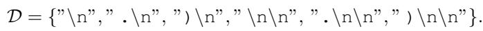

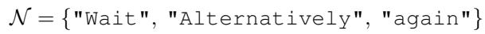

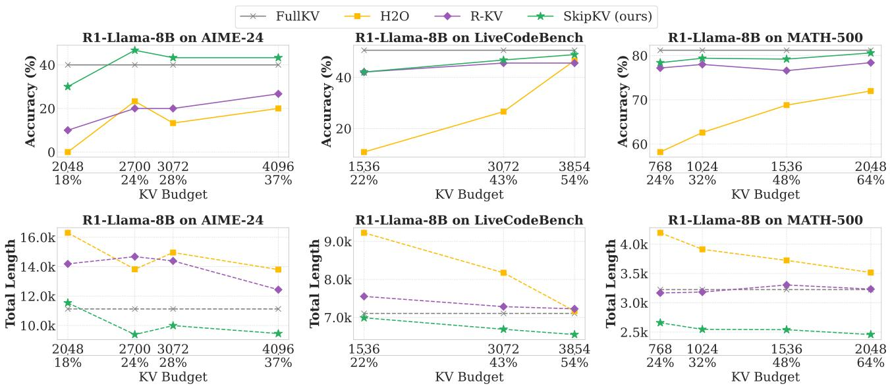  
Figure 13. Comparison of accuracy and total generation token length on SkipKV under different KV budget with H2O, R-KV, and FullKV across three datasets and R1-Llama-8B model.

## A.2 Experimental Setup

Hyper-parameters. Following R-KV, we compress and update KV cache every 128 decoding steps and set the attention-redundancy score trade-off factor to σ = 0.1. The similarity threshold τ in the sentence-scoring metric is selected within the range of 0.95 to 0.99. The steering strength α is initialized as 1 or 1.25, and the steering strength increment factor γ is set to 0.02. We insert the steering vector in the 20-th layer of R1-Qwen-7B and R1-Llama-8B, and in the 35-th layer of R1-Qwen-14B.

Baselines. We compare our method against eviction-based KV compression methods H2O (Zhang et al., 2023), R-KV (Cai et al., 2025), and the steering-based efficient reasoning method SEAL (Chen et al., 2025). FullKV is included as a reference method that keeps the full KV cache, providing the gold standard for decoding accuracy.

## A.3 Additional Experimental Results

Fig.13 shows the accuracy and total token length on R1- Llama-8B for MATH-500, AIME-24 and LiveCodeBench datasets comparing SkipKV with prior eviction strategies including H2O and R-KV and the FullKV baseline.

## A.4 Analysis of Sentence-level Properties after Eviction

Fig.14 compares the reasoning behavior of different KV eviction strategies on AIME-24, LiveCodeBench, and MATH-500 using R1-Qwen-7B. We set the KV budget to

2220 (20%), 2000 (28%), 1024 (30%)for both R-KV and SkipKV on each dataset, under which SkipKV attains the same accuracy as FullKV. The top row of the figure illustrates the fraction of non-execution thoughts, reflecting the frequency of unnecessary re-validation steps, while the bottom row reports the proportion of high-similarity sentences, which indicate repetitive reasoning patterns.

As discussed in Observations 4 and 5 in §4, the contrast between correct and incorrect samples reveals that nonexecutable and redundant reasoning tends to accumulate more heavily in incorrect generations. Across both panels, SkipKV effectively narrows this gap between correct and incorrect samples, reducing the generation of unnecessary or repetitive thoughts in both cases. Quantitatively, SkipKV generates approximately 4× and 8× fewer non-execution thoughts in correct and incorrect generations compared to FullKV, and further surpasses SEAL by 1.8× and 1.3×, respectively. In addition, SkipKV lowers the variance of the non-execution-thought ratio across samples, benefiting from its sample-wise adaptive steering mechanism. Although R-KV aims to remove redundant tokens, it only reduces similar sentences in incorrect answers by up to 11 %, whereas SkipKV—explicitly designed to target redundant sentences—consistently achieves over 2× greater reduction. Overall, SkipKV demonstrates a clear advantage in maintaining concise, execution-oriented reasoning under constrained KV budgets.

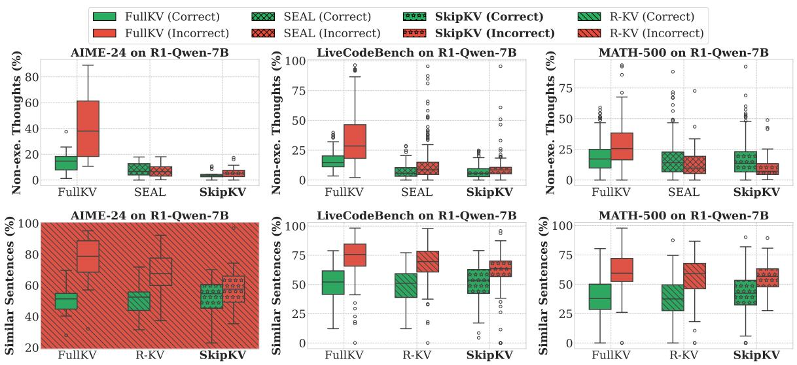  
Figure 14. Comparison of the ratio of non-execution thoughts (top) and high-similarity sentences (bottom) generated by different methods on AIME-24, LiveCodeBench, and MATH-500 using R1-Qwen-7B. The boxplots show distributions for samples that were answered correctly (green) and incorrectly (red) of each method.

## A.5 Empirical Study of Generated Outputs

In this section, we present qualitative examples from the MATH-500 dataset to compare the generation behaviors of R-KV and SkipKV (Figures 15 and 16). We visualize the generated outputs of the R1-Qwen-7B reasoning model under a KV-cache budget of 1024. In the selected example, both methods produce the correct final answer; however, SkipKV generates approximately 20% fewer tokens than R-KV. In both figures, non-execution thoughts are highlighted in yellow and final-answer segments are highlighted in a blue box. The darkness of the red text indicates the number of attention heads selecting each token. From the visualization of eviction patterns, SkipKV primarily removes complete sentences from the KV cache, whereas R-KV tends to evict fragmented tokens. The redundancy-based scoring of R-KV often leads it to remove numerical tokens that lie along crucial mathematical reasoning paths, disrupting logical consistency and resulting in longer generations. Notably, R-KV also evicts tokens from the final-answer region, which confuses the model and triggers unnecessary re-validation steps. In contrast, SkipKV preserves the key reasoning and answer segments, demonstrating more coherent and efficient generation behavior.

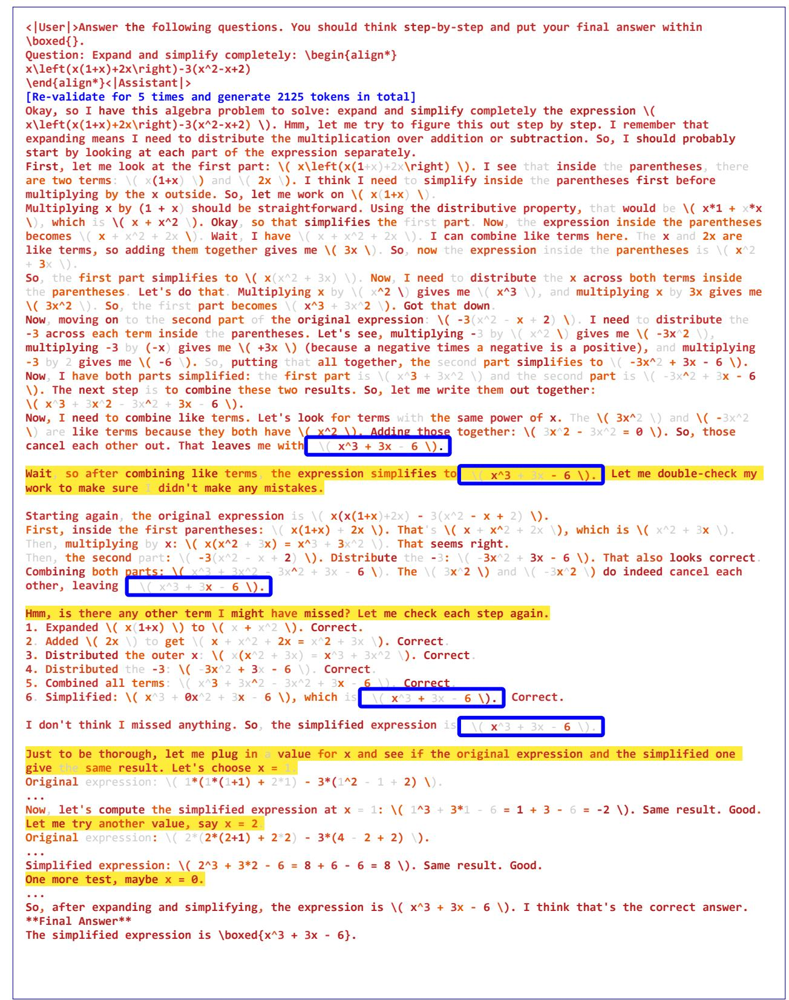  
Figure 15. Qualitative example of R-KV responses on the MATH-500 dataset. The darkness of red denotes how many heads select the token. Non-execution sentences starting re-validation are highlighted in yellow , where each is followed by few execution thoughts, and the answers are highlighted in a blue box. R-KV frequently selects fragmented tokens within execution reasoning and always includes parts of the answer itself.

```latex
<|User|>Answer the following questions. You should think step-by-step and put your final answer within
\boxed{}.
Question: Expand and simplify completely: \begin{align*}
x\left(x(1+x)+2x\right)-3(x^2-x+2)
\end{align*}<|Assistant|>
[Re-validate for 3 times and generate 1742 tokens in total]
Okay, so I have this algebra problem to solve: expand and simplify completely the expression \(
x\left(x(1+x)+2x\right)-3(x^2-x+2) \). Hmm, let me try to figure this out step by step. I remember that
expanding means I need to distribute the multiplication over addition or subtraction. So, I should probably
start by looking at each part of the expression separately.
First, let me look at the first part: \( x\left(x(1+x)+2x\right) \). I see that inside the parentheses, there
are two terms: \( x(1+x) \) and \( 2x \). I think I need to simplify inside the parentheses first before I
multiply by the x outside. So, let me work on \( x(1+x) \).
Multiplying x by (1 + x) should be straightforward. Using the distributive property, that would be \( x*1 + x*x
\), which is \( x + x^2 \). So, replacing that back into the expression, the first part becomes \( x\left(x +
x^2 + 2x\right) \). Wait, hold on, I have \( x(1+x) \) which is \( x + x^2 \), and then I add \( 2x \) to that.
So, combining like terms inside the parentheses: \( x + 2x \) is \( 3x \). So, the expression inside the
parentheses simplifies to \( x^2 + 3x \).
Now, the first part is \( x(x^2 + 3x) \). I need to distribute the x across both terms inside the parentheses.
So, \( x*x^2 \) is \( x^3 \), and \( x*3x \) is \( 3x^2 \). So, after distributing, the first part becomes \(
x^3 + 3x^2 \). Okay, that's the first part done.
Now, moving on to the second part of the original expression: \( -3(x^2 - x + 2) \). I need to distribute the
-3 across each term inside the parentheses. Let's do that term by term.
First, \( -3*x^2 \) is \( -3x^2 \). Then, \( -3*(-x) \) is \( +3x \). Finally, \( -3*2 \) is \( -6 \). So,
putting it all together, the second part simplifies to \( -3x^2 + 3x - 6 \).
Now, combining both parts of the original expression: the first part was \( x^3 + 3x^2 \) and the second part
is \( -3x^2 + 3x - 6 \). So, putting them together, the entire expression becomes \( x^3 + 3x^2 - 3x^2 + 3x - 6
\).
Now, I need to combine like terms. Let's see: the \( x^3 \) term is alone, so that stays as is. Then, \( 3x^2 -
3x^2 \) cancels out, right? Because 3x^2 minus 3x^2 is zero. So, those terms disappear. Then, we have the \( 3x
\) term and the constant term \( -6 \).
So, after combining like terms, the expression simplifies to \( x^3 + 3x - 6 \). Hmm, let me double-check to
make sure I didn't make any mistakes.
Starting again, the original expression: \( x(x(1+x)+2x) -3(x^2 -x +2) \).
First, inside the first parentheses: \( x(1+x) + 2x \). That's \( x + x^2 + 2x \), which is \( x^2 + 3x \).
Then, multiplying by x: \( x^3 + 3x^2 \).
Second part: \( -3(x^2 -x +2) \) is \( -3x^2 + 3x -6 \).
Adding both parts: \( x^3 + 3x^2 -3x^2 + 3x -6 \).
Simplify: \( x^3 + (3x^2 -3x^2) + 3x -6 \) which is \( x^3 + 0 + 3x -6 \), so \( x^3 + 3x -6 \).
Looks like I did it right. So, the simplified expression is \( x^3 + 3x -6 \).
I don't think there are any more like terms to combine, so that should be the final simplified form.
Just to make sure, let me plug in a value for x and see if both the original expression and the simplified one
give the same result. Let's choose x = 1.
Original expression: (1+1 + 2*1) -3*(1^2 -1 +2) \).
Compute step by step:
First, inside the first parentheses: \( 1*(1+1) = 1*2 = 2 \). Then, add 2*1 = 2. So, 2 + 2 = 4.
Multiply by 1: 1*4 = 4.
Now, the second part: \( -3*(1 -1 +2) = -3*(2) = -6 \).
So, total expression: 4 -6 = -2.
Simplified expression: \( 1^3 + 3*1 -6 = 1 + 3 -6 = -2 \).
Same result. Let me try another value, say x = 2.
Original expression: (2+1) + 2*2) -3*(4 -2 +2) \).
Compute step by step:
First, inside the first parentheses: \( 2*(3) = 6 \). Then, add 2*2 = 4. So, 6 + 4 = 10.
Multiply by 2: 2*10 = 20.
Second part: \( -3*(4 -2 +2) = -3*(4) = -12 \).
Total expression: 20 -12 = 8.
Simplified expression: \( 2^3 + 3*2 -6 = 8 +6 -6 = 8 \).
Same result again. Okay, so that seems to confirm that my simplification is correct.
So, after expanding and simplifying, the expression becomes \( x^3 + 3x -6 \).
**Final Answer**
The simplified expression is \boxed{x^3 + 3x - 6}.
```  
Figure 16. Qualitative example of SkipKV responses on the MATH-500 dataset. SkipKV primarily evicts entire sentences instead of fragmented tokens, avoiding interrupting the reasoning path.