# UNIFIED LLM MODEL FOR POWER, PERFORMANCE, AND AREA PREDICTION FROM HARDWARE CODE

Armin Abdollahi 1 Mehdi Kamal 1 Massoud Pedram 1

## ABSTRACT

We present RocketPPA, a unified LLM-based model that predicts power, performance, and area for Verilog designs across technology nodes and optimization styles. The approach combines a large language model backbone with mixture-of-experts regression and low-rank adaptation for parameter efficiency. To improve generalization, we introduce a contrastive learning framework that encourages semantically similar designs to cluster in embedding space, providing an inductive bias that reflects the structure of the hardware design space. Trained on 15 nm and 45 nm nodes with area- and delay-optimized flows, the model achieves 9.4 percentage point improvement in pass rate at ten percent tolerance over prior methods, with approximately 20× higher throughput (0.12 seconds per design). Ablations show contrastive learning contributes 2.5 points to accuracy, while leave-one-regime-out experiments demonstrate robust cross-regime generalization with minimal degradation. These results validate that combining supervised and contrastive objectives enables rapid, accurate PPA prediction across nodes and optimization styles.

## 1 INTRODUCTION

Power, performance, and area (PPA) estimators are at the heart of modern VLSI design, as they critically influence the functionality and efficiency of hardware implementations (Micheli, 1994). In conventional electronic design automation (EDA), high-level approaches to PPA estimation typically involve abstract modeling techniques, simulationbased analyses, and synthesis optimizations that produce approximate metrics (Chinnery & Keutzer, 2002). Although these traditional methods provide a helpful baseline, they often fail to capture nuanced interactions in increasingly complex circuits (Weste & Harris, 2015). Their limitations include significant computational overhead, the reliance on manual calibration, and a lack of granularity that can impede the ability to fine-tune designs for optimal power, delay, and area performance (Amrutur & Horowitz, 2000). These inherent limitations in traditional PPA estimation methods have started the exploration of alternative approaches that promise to capture the complexities of modern VLSI design more effectively.

Verilog is a register-transfer level (RTL) language for describing digital hardware before it is physically implemented. Logic synthesis translates RTL into a gate-level circuit by mapping the design to a target standard-cell library while optimizing under specified constraints. The resulting circuit is evaluated using power, performance, and area, which are the key metrics that determine energy efficiency, timing quality, and implementation cost. Importantly, PPA is not a property of RTL alone: it depends jointly on the design code and the synthesis regime. The technology node specifies the fabrication/library setting used during synthesis, while the optimization objective determines whether the tool emphasizes area minimization or delay reduction. Consequently, the same Verilog module can yield different PPA values under different node-objective pairs, motivating the need for condition-aware prediction rather than a single fixed-regime estimator.

In this context, large language models (LLMs) have recently demonstrated considerable potential in automating hardware design workflows, particularly for Verilog code generation and analysis. Starting with solutions such as BetterV (Zehua et al., 2024) and ChipNeMo (Liu et al., 2023a), researchers have shown that domain-specific finetuning can allow LLMs to generate high-quality Verilog modules that meet syntactic and even partial functional requirements. Building on these early results, multi-expert modeling paradigms like (Nadimi & Zheng, 2024) and hierarchical or specialized data-curation pipelines like (Liu et al., 2024; Cui et al., 2024) have significantly expanded LLM performance, making it possible to target more complex scenarios in electronic design automation. Meanwhile, others have broadened the scope to include Verilog understanding (Liu et al., 2025), hallucination mitigation (Yang et al., 2025), hierarchical frameworks (Tang et al., 2024), and open-source linting (Fang et al., 2025b). These advancements underscore the dramatic shift in chip design and verification by LLMs, creating a new research trajectory where code generation, debugging, and performance tuning converge.

PPA estimators are central to modern VLSI flows because they guide early design choices and strongly affect downstream cost and quality. Traditional approaches rely on abstract modeling, simulation, or partial synthesis. These methods remain useful but often miss interactions that emerge in large and heterogeneous designs, and they require nontrivial computation and manual calibration. As circuit complexity grows, designers need estimators that are fast, accurate near operational targets, and flexible across technology nodes and flow goals.

Large language models have recently shown promise for hardware workflows that involve code generation and code understanding. Domain adapted models for hardware code demonstrate improved syntactic and functional handling, and multi component pipelines extend these gains with retrieval, analysis, and linting. At the same time, most prior estimators focus on regressing numeric values for timing, area, or power under a fixed setup, which limits their ability to serve decision time needs across multiple nodes and optimization goals.

This work presents a single condition aware model that predicts power, performance, and area directly from hardware code such as Verilog. The model encodes the input code with an LLM backbone and augments the representation with a lightweight mixture of experts head and parameter efficient adaptation. The predictor is conditioned on the technology node and the intended flow objective so one model can serve multiple regimes. We evaluate using pass at fixed relative error tolerances as the primary metric and we report end to end latency to reflect deployment constraints.

## Our contributions are summarized as below:

• A unified condition-aware LLM-based estimator that consumes raw hardware code and outputs simultaneous predictions for power, performance, and area while conditioning on technology node and optimization objective, eliminating the need for intermediate feature engineering or synthesis-derived features.

• A contrastive learning framework tailored to hardware PPA estimation that exploits design similarity through three complementary strategies: cross-condition consistency (same design under different synthesis settings), PPA-based similarity (designs with comparable metrics), and structural complexity alignment (designs from the same architectural category). This selfsupervised objective improves representation quality and generalization without adding inference overhead.

• An architecture combining an LLM backbone with lightweight mixture-of-experts regression heads and low-rank adaptation, yielding parameter efficiency with competitive accuracy and sub-second inference latency. The mixture-of-experts design enables specialization across diverse circuit archetypes while maintaining computational efficiency.

• A cleaned and synthesized training corpus produced by an LLM-driven repair pipeline covering more than 20k hardware modules, improving robustness across design families and enabling large-scale supervised and contrastive learning.

• Comprehensive experimental validation showing that at a ten percent relative error threshold, the model improves pass rate by up to 13.6 percent for area, 9.4 percent for delay, and 14.7 percent for power over strong baselines, with ablations demonstrating that contrastive learning contributes 1.8 to 2.5 percentage points across metrics. At a twenty percent threshold, improvements reach up to 9.6 percent for area, 10.8 percent for delay, and 18.5 percent for power.

• Deployment-ready efficiency with full test suite evaluation on a single GPU, achieving median latency of 0.12 seconds per design and approximately 20× throughput improvement over prior systems while maintaining or exceeding their prediction accuracy.

## 2 RELATED WORK

Early efforts to leverage large language models for hardware code centered on generating syntactically valid and partially functional Verilog. BetterV (Zehua et al., 2024) used discriminative guidance, and ChipNeMo (Liu et al., 2023a) explored domain-adaptive tokenization and pre-training. Subsequent work investigated multi-expert architectures (Nadimi & Zheng, 2024), hallucination mitigation (Yang et al., 2025), hierarchical decomposition (Tang et al., 2024), prompting frameworks (Mi et al., 2024), and multi-agent pipelines (Zhao et al., 2024). Data quality has been a recurring theme: CRAFTRTL (Liu et al., 2024) introduced correct-by-construction non-textual artifacts for training, and OriGen (Cui et al., 2024) proposed code-to-code augmentation with self-reflection to improve the robustness of learned models.

Beyond generation, several studies target Verilog understanding and defect detection. DeepRTL (Liu et al., 2025) proposes a representation that supports both generation and comprehension, and LintLLM (Fang et al., 2025b) automates lint-style checks for common issues. Benchmarks such as RTLLM (Lu et al., 2024) and VerilogEval (Liu et al.,

2023b) provide tasks for assessing functional correctness and code understanding under controlled conditions.

A separate line of work estimates downstream implementation metrics from code. MasterRTL and its variants build graph-based feature representations to regress timing, area, and power; CircuitFusion combines code, graph summaries, and retrieval to improve value prediction under limited labels; MetRex (Abdelatty et al., 2024) curates large synthesized corpora and evaluates accuracy within error margins for area, delay, and static power. These methods predominantly optimize value regression under fixed technology and flow assumptions, and typically report correlation or absolute error rather than decision-oriented criteria.

Recent frameworks also discuss security, watermarking, and IP protection for code artifacts (Wang et al., 2025; 2024), while alternative compilation paths like OPL4GPT (Tasnia & Rahman, 2024) explore high-level language to hardware workflows. Collectively, this literature has progressed from code generation and curation toward metric-aware modeling, yet most approaches remain specialized to a single node or optimization style and emphasize value error as the primary objective.

In contrast, our work trains a single condition-aware model that takes hardware code as input and predicts power, performance, and area while conditioning on the technology node and the optimization objective. We evaluate with pass at fixed relative-error tolerances and report end-to-end latency, aligning the objective with decision-time use rather than pure value regression. This setting complements prior graph-feature and multimodal approaches and provides a unified treatment across multiple nodes and flow objectives.

## 3 PROPOSED LLM-BASED PPA-ESTIMATOR METHOD

## 3.1 Model Architecture

Figure 1 shows the general architecture in which the proposed neural architecture consists of three main components: (1) a foundational LLM for the extraction of features, (2) an MoE regression neural model for the prediction of the final metric, and (3) a LoRA-based parameter-efficient finetuning scheme that adjusts the parameters of the foundation model.

We employ a base model as our backbone to encode Verilog code inputs into high-dimensional representations. For long RTL designs, we partition the input into fixedlength fragments prior to encoding. To condition RocketPPA on the synthesis regime, we prepend structured tokens (e.g., [NODE=15nm] [OBJ=area-opt]) specifying the technology node and optimization objective to each input fragment before LLM encoding. Unlike the causal language model heads commonly used for text generation, we adopt a regression-friendly interface. For each conditioned fragment, the model produces a stack of hidden states {h1, h2, . . . , hL} during the forward pass. We take the lastlayer hidden states hL and apply average pooling over the token dimension, as defined in Equation 1, where n denotes the number of tokens in the conditioned fragment. This yields a fixed-dimensional fragment representation (e.g., 4096 dimensions for CodeLlama-7B). For designs spanning multiple fragments, we then mean-pool the fragment-level representations to obtain a single condition-aware embedding for the full design, which is passed to the Mixture of Experts regressor.

$$
\tag{1}
$$

To capture the diversity of hardware modules and thereby avoid biasing a single dense network toward any single design regime, we incorporate a MoE technique. We define N distinct expert subnetworks, each comprising multiple fully connected layers with activations and dropout. Each expert is precisely implemented as an MLP that produces an individual scalar prediction yk for the target performance metric. A small linear layer maps the pooled output from LLM to a distribution over the N experts. Formally, given the pooled output, the gating network computes the gating weights by:

$$
\tag{2}
$$

where α ∈ RN and each element αk represents the initial weight assigned to the kth expert. To focus the model’s capacity on the most relevant experts, we employ a top-k gating mechanism. Let K be the set of indices corresponding to the top-k experts with the highest values in α. We then renormalize the gating weights for these experts by:

$$
\tag{3}
$$

This normalization ensures that the weights of the selected experts sum up to 1, effectively concentrating the predictive capacity of the model on the most pertinent outputs of the experts. Finally, the overall prediction yˆ is calculated as a weighted sum of the outputs of only the top-k experts:

$$
\tag{4}
$$

Thus, the gating network first projects the ( 4096- dimensional) pooled representation of the model into an N-dimensional space, yielding a probability distribution over the experts via a softmax operation. The top-k experts are then selected, and their weights are renormalized to form a focused aggregation of expert predictions. This design allows the model to take advantage of the specialized knowledge of a subset of experts most familiar with a given input, thus improving the performance of regression for predicting hardware metrics such as power, delay, and area. In other words, during training, all N experts remain active, and each gradually narrows its focus to one or two of five structural archetypes—Tiny combinational, Structured-combinational, Elemental-sequential, Counter & shift, and FSM & composite. For example, in the power head one expert comes to specialize on Tiny- and Structured-combinational modules, while another handles mostly Elemental-sequential and FSM/composite designs. The same pattern appears in the area and delay heads, showing that the MoE layer learns complementary views of circuit space rather than redundant predictors. At inference, we score all N experts but invoke only the top three, preserving full-ensemble accuracy with sub-second runtimes per design.

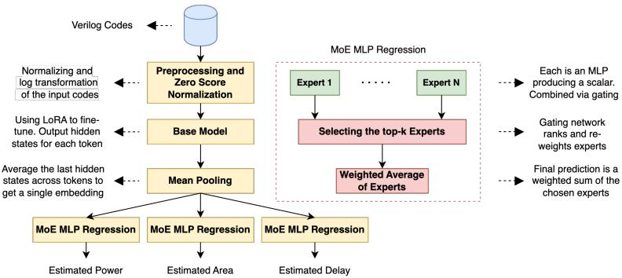  
Figure 1. The model architecture of the proposed PPA estimator.

## 3.2 Contrastive Learning for Structured Representations

While supervised learning from labeled (code, PPA) pairs provides direct optimization of prediction accuracy, it treats each training sample independently and fails to leverage the inherent structure of the hardware design space. We observe that certain designs exhibit semantic similarity despite syntactic differences or varying synthesis conditions. For instance, the same RTL module synthesized under different technology nodes should produce embeddings that capture the underlying circuit structure, while designs from fundamentally different categories (e.g., combinational datapaths versus sequential state machines) should be distinguished in the representation space.

To exploit this structure, we augment our supervised objective with a contrastive learning framework that encourages the encoder to place semantically similar designs proximate in the embedding space while separating dissimilar designs. This self-supervised signal acts as an implicit regularizer, forcing the model to learn representations that reflect meaningful design similarity beyond the immediate prediction task.

## 3.2.1 Positive Pair Construction

We define three complementary strategies for constructing positive pairs, each capturing a different notion of design similarity:

Cross-condition consistency. For any design d in our corpus, we construct positive pairs by pairing the same Verilog module under different synthesis conditions. Formally, let C = {(t, s)} denote the set of conditions where t ∈ {15nm, 45nm} is the technology node and s ∈ {area-opt, delay-opt} is the optimization style. For each design d and any two conditions ci, cj ∈ C, we form the positive pair {(d, ci), (d, cj)}. This encourages the encoder to learn condition-invariant features that capture the intrinsic circuit structure.

PPA-based similarity. Designs with comparable postsynthesis metrics often share similar structural characteristics. We construct positive pairs by identifying designs whose PPA values lie within a relative tolerance τ . Specifically, for designs di and dj with PPA tuples (ai, pi, di) and (aj , pj , dj ) representing area, power, and delay respectively, we form a positive pair if:

$$
\tag{5}
$$

where we set τ = 0.15 in our experiments. This criterion ensures that designs are paired only when all three metrics are proportionally similar.

Structural complexity alignment. We categorize designs into discrete complexity classes based on synthesized gate count g and sequential element count f (flip-flops). Designs within the same category form positive pairs. Our taxonomy includes: tiny combinational (g < 50, f = 0), structured combinational (50 ≤ g < 500, f = 0), elemental sequential (f < 20), complex sequential (20 ≤ f < 100), and largescale designs (g ≥ 500 or f ≥ 100). This categorization captures architectural similarity at a coarse granularity.

## 3.2.2 Contrastive Objective

Given a positive pair {xi, xj} where each element consists of Verilog code and synthesis conditions, we first obtain their pooled representations O(i) pooled and O(j) poole d from Equation 1. To facilitate contrastive learning, we introduce a lightweight projection head ϕ : Rdmodel → Rdproj implemented as a two-layer MLP:

$$
\tag{6}
$$

where W1 ∈ R2048×dmodel and W2 ∈ R128×2048 are learnable parameters. The projection to a lower-dimensional space (128 dimensions in our case) has been shown to improve contrastive learning performance by preventing dimensional collapse.

We adopt the normalized temperature-scaled cross entropy loss commonly used in self-supervised learning. For a batch containing B positive pairs, let zi and zj denote the projections of a positive pair. The contrastive loss for this pair is:

$$
\tag{7}
$$

where sim(u, v) = uT v/(∥u∥∥v∥) denotes cosine similarity, τtemp is a temperature parameter controlling the concentration of the distribution (set to 0.07), and 1k̸=i is an indicator function excluding the sample itself. The denominator sums over all 2B samples in the batch (including both elements of each pair), treating all other samples as negatives. The symmetric loss for the pair is ℓcontrast(i, j)+ℓcontrast(j, i).

## 3.2.3 Joint Training Objective

Our complete training objective combines the supervised Huber loss for PPA prediction with the contrastive loss:

$$
\tag{8}
$$

where Lsupervised is computed as described previously and λ is a weighting hyperparameter that balances the two objectives. During training, each mini-batch is constructed to include positive pairs sampled from the three strategies described above, with equal representation from each category. We find that λ = 0.5 provides an effective balance, allowing the contrastive objective to regularize the learned representations without overwhelming the primary prediction task.

Importantly, the projection head ϕ is used only during training to compute the contrastive loss. At inference time, we discard ϕ and route the pooled representation Opooled directly to the MoE prediction heads. The contrastive learning framework thus provides a form of auxiliary supervision that improves the quality of the shared representation without adding computational overhead at deployment.

The intuition behind this approach is that by explicitly modeling design similarity, we inject an inductive bias that reflects the structure of the hardware design space. Designs that share fundamental characteristics should be recognized as similar by the encoder, even when their synthesis conditions or specific PPA values differ. This structural awareness enables better generalization to unseen designs and synthesis conditions, as the model learns to disentangle intrinsic circuit properties from extrinsic synthesis parameters.

We adopt a parameter-efficient fine-tuning approach using LoRA, which significantly reduces computational overhead by focusing on a subset of parameters rather than fine-tuning all LLM components. This strategy maintains the expressiveness of the model while limiting the number of trainable parameters. In contrast, the MoE regressor is kept fully trainable, allowing its gating network and expert components to effectively adapt to the diverse range of Verilog designs and PPA values in the dataset.

Figure 2 illustrates the token-size distribution of the Verilog files in our dataset, which spans a wide range of lengths and includes a long tail of substantially larger designs. Although LLaMA-3.1-8B provides a large nominal context window, we intentionally partition long Verilog files into fixed-size 512-token fragments to maintain a predictable memory and compute footprint during training. This design choice is particularly important because our contrastive learning objective relies on in-batch negatives and benefits from larger, more diverse batches containing multiple synthesis conditions and positive-pair constructions per step. Feeding full-length sequences would force substantially smaller batch sizes for long-tail designs due to attention and memory scaling, reducing batch diversity and weakening the contrastive signal. Instead, each fragment is encoded independently, pooled into a fragment-level embedding, and the fragment embeddings are aggregated by mean pooling to form a single representation for the full design. This strategy avoids truncation and ensures full token coverage across the input design while enabling efficient batching and stable contrastive training across highly variable input lengths.

## 3.3 Data Pre-processing and Training flow

Since raw performance metrics can span several orders of magnitude (see Figure 9 in Appendix C), the log transformation is applied to compress the range and stabilize the numerical values. All designs in our dataset have valid PPA labels, non-null PPA reports; any design that fails synthesis or produces incomplete output is filtered out prior to training. For each performance metric xi, we compute log(xi + ϵ), where ϵ is a small positive constant included solely as a numerical safeguard (some purely combinational designs may have near-zero static power, and without ϵ the log transform could produce unstable gradients). To ensure stable training, we normalize the logarithmic transformation of the performance metric values by computing the mean µ and the standard deviation σ over the training set and, subsequently, applying a z-score normalization, which maps the logarithmically transformed values to a standard normal distribution with zero mean and unit variance. Hence, the normalized input performance metric (xˆi) is obtained by:

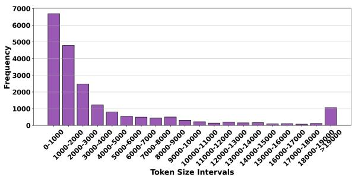  
Figure 2. Token size distribution of the Verilog files in the studied dataset.

$$
\tag{9}
$$

For training loss, we use the smooth ℓ1 (Huber) loss, which offers a balance between mean square error (MSE) and mean absolute error (MAE). We use the Huber loss because RTL-to-PPA residuals are heavy-tailed. Most designs yield moderate errors, but a small fraction produce large residuals when synthesis applies aggressive optimizations such as restructuring or gate sharing. Under MSE, these outliers can dominate training, whereas Huber behaves like MSE for small residuals and reduces the influence of extreme errors, resulting in more stable optimization. The smooth ℓ1 loss behaves quadratically when the prediction error is small, ensuring fine-grained adjustments. However, it transitions to linear behavior when the error is large, thereby reducing the influence of outliers. Hence, we suggest the loss defined by Equation (10). This piecewise formulation ensures that the loss function remains robust to outliers while providing smooth gradients when errors are small, which is essential for stable convergence.

$$
\tag{10}
$$

In this equation, yˆi represents the predicted output of the model for the ith Verilog code metric, while zi denotes its corresponding actual value. Log transformation, z-score normalization, and smooth ℓ1 loss work together to handle the wide range of performance metric values. This normalization scheme standardizes the data, ensuring that the regression model learns effectively, while the Smooth ℓ1 loss balances sensitivity and robustness during training.

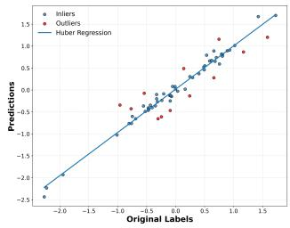  
Figure 3. Huber loss demonstration on a single batch of data during training

Figure 3 illustrates predictions versus ground-truth labels at a mid-epoch stage of training under the Huber loss. The blue points (inliers) lie within the Huber threshold, where the loss behaves quadratically, much like MSE, so these points strongly influence the regression fit. However, red points (outliers) trigger the Huber loss linear regime, which means that large residuals have a reduced impact on parameter updates. The blue line represents the Huber regression fit that balances these two behaviors: It remains sensitive to most inliers while preventing extreme outliers from dominating the model.

## 4 RESULTS AND DISCUSSION

## 4.1 Experimental Setup

For the evaluation study, the dataset was generated by aggregating Verilog modules from three primary sources to ensure a broad coverage of the design lengths and complexities. Public Verilog corpora are not readily standalonesynthesizable. Modules are often extracted from larger projects and depend on missing includes, macros, or external dependencies, and may contain simulator-only constructs or vendor-specific pragmas that prevent direct synthesis. Rather than restricting our training corpus to the small number of already-clean designs available, we aggregate three diverse public sources and apply an automated LLM-driven repair and validation pipeline to curate a synthesizable dataset at scale. Only designs that pass both syntax validation and synthesis checks are retained; all others are discarded. This pipeline is described in detail in Appendix B.

Specifically, the generated dataset has 9,239 modules from the MG-Verilog repository, 7,791 modules from a curated GitHub collection (verilog github), and 3,923 modules from the VeriGen dataset. These modules span a broad spectrum, from simple combinational circuits to complex finite-state machines. The details of the generated dataset are provided in Table 1. We split our purified data into 80-20 training versus validation splits. Splitting is performed after the LLM-based repair pipeline, on the final set of designs that pass both syntax validation and synthesis verification. Since we retain only the single final validated version of each design and discard all intermediate repair attempts, an original design cannot produce multiple repaired variants that appear across different splits. Furthermore, splitting is performed at the design-identity level before expanding across synthesis conditions, ensuring that all condition-specific instances of the same design remain within the same split and preventing any cross-split leakage. Each sample consists of a Verilog code snippet and the log-transformed variant of the corresponding performance metric.

Ground-truth PPA labels are generated by synthesizing each repaired Verilog design under every combination of technology node and optimization objective using Synopsys Design Compiler, yielding up to four labeled instances per module. For each synthesis run, area, power, and delay are extracted directly from the resulting tool reports. The technology node determines the target device and library characteristics, while the optimization objective specifies the synthesis cost function. Area-optimized runs instruct the tool to minimize cell area, whereas delay-optimized runs target timing closure along the critical path. Designs that fail synthesis or produce incomplete reports under any condition are discarded prior to training. Since ground-truth labels are derived from an industry-standard commercial synthesis flow, RocketPPA’s predictions are directly applicable to real-world design workflows.

For comparative studies, we used sample codes (138 HDL codes) from the VerilogEval benchmark (Liu et al., 2023b). The dataset is divided into three levels. Specifically, we also performed a set of studies on the codes in Level 3. These HDL codes represent the most complex part of the VerilogEval dataset. This level comprises 72 modules (over 50% of the total of 138) and includes designs such as finitestate machines, complex combinational logic, and advanced sequential circuits. These modules span a wide gate count range, up to 607 gates, and pose a significant challenge for PPA prediction models due to their structural depth and behavioral intricacies. Note that this dataset has been used only for evaluation, not training.

The two considered technology nodes (45nm and 15nm) used in our main evaluation span qualitatively different device regimes. Specifically, 45nm corresponds to a planar bulk CMOS setting, whereas 15nm corresponds to a FinFET-based setting with substantially different leakage, drive strength, and parasitic characteristics. To further evaluate generalization to advanced nodes, we conduct an additional experiment on 7nm FinFET designs synthesized using the ASAP7 (Clark et al., 2016) library.

The test set remains fixed across all experiments. Results are reported separately for the four conditions defined by technology node and optimization style, and as a macro average across the four conditions; metrics are pass@{5%, 10%, 20%} for delay, area, and power together with end to end latency per design.

Our training workflow completes in around 11 hours on a single NVIDIA RTX A6000 GPU with 48GB of VRAM for a full 24-epoch schedule. Despite the large parameter count of employed foundation models, our LoRA-based parameter-efficient fine-tuning keeps GPU memory usage at roughly 41GB, comfortably fitting on one GPU card without requiring model parallelism or multi-GPU setups.

The model was trained 10 times, with different initial random seeds. Hence, each experiment was performed ten times, and the observed standard deviation was below 1%. This small variability arises primarily from inherent stochastic processes during training (e.g., the randomness introduced by dropout and weight initialization). This indicates that our results are stable under modest changes in initialization and data shuffling.

Table 1. Dataset Composition  
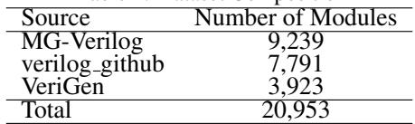

To assess the efficacy of the proposed estimator, we compare its efficiency with those of MetRex (Abdelatty et al., 2024) (with the Llama3-8B model as the LLM employed), CircuitFusion (Fang et al., 2025a) and MasterRTL (Fang et al., 2023). Note that in terms of power, MetRex can only estimate static power, in contrast to RocketPPA, CircuitFusion, and MasterRTL, which can evaluate the overall power consumption in addition to the static power. MasterRTL (Fang et al., 2023) tackles the PPA estimation task via a pre-synthesis route by converting RTL into a bit-level Simple Operator Graph (SOG) that aligns one-to-one with the synthesized netlist. Separate tree-based models then predict timing, power, and area from SOG features, offering strong cross-design generalization but at the cost of a CPU-intensive graph-construction pipeline.

All baselines are retrained end-to-end on our dataset using identical data splits to ensure fair comparison. Conditioning information (technology node and optimization objective) is provided to each method through its native architectural interface. LLM-based baselines (MetRex) receive conditions as prompt tokens prepended to the input sequence, while feature-based baselines (MasterRTL, CircuitFusion) receive conditions as one-hot indicators concatenated with their input feature representations. Although conditioning integration differs across architectures, all methods receive the same semantic information under the same data split.

Table 2. Comparison of the average pass rate metric across the considered methods for Area, Delay, Static Power, and Power, evaluated under threshold values θ of 10% and 20% on VerilogEval benchmark averaged on different nodes and optimization conditions.  
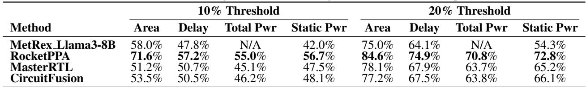

Their numeric outputs are mapped to decisions using the same rule as in our evaluation, where a prediction is counted as correct when it falls within a specified relative tolerance of the target under the same condition. This yields a directly comparable pass@τ on the fixed test set under all four conditions.

The Pass Rate metric (introduced in (Abdelatty et al., 2024)) has been used to evaluate the methods. This metric represents the percentage of HDL code input instances for which the estimator predicts a design metric (area, delay, and power) with an error below a predefined threshold (i.e., θ). In this context, the error refers to the relative error (RE). Equation (11) defines the Pass Rate at threshold θ, computed on M samples. Specifically, for each sample i, we check whether its relative error REi is below or equal to tθ%. The indicator function 1 returns 1 if the condition holds and 0 otherwise, and the pass rate is simply the average of these indicator values in all M samples.

$$
\tag{11}
$$

Finally, for the comparative studies in this paper, we employed the LLaMA-3.1-8B-Instruct model (Grattafiori et al., 2024) as the LLM engine of RocketPPA. We also used CodeLlama-7B (Roziere et al., 2023) and LLaMA-3-8B (Grattafiori et al., 2024) for ablation studies. For every design metric (i.e., area, delay, and power dissipation) we considered an MoE head with N = 6 experts; during inference, the top-k gating network kept only the k = 3 highest-scoring experts for the weighted sum. Each expert was a three-layer MLP, hence the MoE block adds 4.7M parameters. Low-Rank Adaptation at rank r = 16 was applied to each transformer block’s weight matrices, adding approximately 8.4M trainable parameters (about 0.11%, in the case of LLaMA-3.1-8B-Instruct model).

## 4.2 Results

## 4.2.1 Comparison Study

Table 2 reports average pass-rate results for area, delay, total power (static + dynamic), and static power at thresholds θ, 10% and 20% on the full VerilogEval HDL corpus. At θ of 10% our MoE model reaches 71.6% for area—13.6% above Llama3-MetRex-8B (58.0%), 20.4% above Master-RTL (51.2%), and 18.1% above CircuitFusion (53.5%). For delay it delivers 57.2%, topping Llama3-MetRex-8B (47.8%) by 9.4%, MasterRTL (50.7%) by 6.5%, and Circuit-Fusion (50.5%) by 6.7%. Total-power pass rate is 55.0%, a gain of 9.9% over MasterRTL (45.1%) and 8.8% over CircuitFusion (46.2%). Static-power reaches 56.7%, outperforming Llama3-MetRex-8B (42.0%) by 14.7%, MasterRTL (47.5%) by 9.2%, and CircuitFusion (48.1%) by 8.6%. At the 20% tolerance, our LLM + MoE regressor records passrates of 84.6% for area, 74.9% for delay, 72.8% for static power, and 70.8% for total power. These figures represent gains of 9.6, 10.8, and 18.5 percentage over the LLM baseline for the first three metrics; improvements of 3.1, 7.0, 7.6, and 7.1 percentage over MasterRTL; and advantages of 7.4, 7.4, 6.7, and 7.0 percentage over CircuitFusion. Together, these margins confirm the proposed model’s consistent superiority across all PPA metrics.

The proposed RocketPPA, which is fully executable on GPU, processed the entire 138 design test set in just 16s (0.12s per design) on an NVIDIA A6000 GPU. For fair comparison, we also executed CircuitFusion and MetRex CoT approach on the same GPU, which took 300s, while MasterRTL’s CPU preprocessing plus regression required 514s, and a full Yosys+OpenSTA flow took 680s. Thus, the proposed LLM-based PPA estimator could provide more than 20× speedup over CircuitFusion and MetRex and 30× over MasterRTL, confirming that a direct LLM-based Verilog to PPA regressor can surpass prior accuracy while entirely avoiding the overhead of manual feature engineering. Although RocketPPA produces aggregate predictions from pooled design representations, module-level PPA attribution can be achieved in practice by parsing the design hierarchy and running RocketPPA independently on each submodule. Given our inference speed, a hierarchical design with 10–20 submodules can be fully profiled in 1–2 seconds, providing designers with per-module PPA breakdowns to identify optimization targets without any architectural changes.

We conducted another comparison study by focusing on the HDL codes at Level 3 of VerilogEval, the results of which are illustrated in Figure 4. As the results show, previous methods such as MasterRTL (Fang et al., 2023), CircuitFusion (Fang et al., 2025a) and Llama3-MetRex-8B (Abdelatty et al., 2024) struggle at level-3 of the VerilogEval dataset, especially under stricter thresholds for area and static power. In contrast, our model demonstrates a clear advantage in achieving the highest pass rates across all thresholds. As an example, in the case of static power estimation, at the 10% (20%) threshold and MasterRTL’s pass rate decreased by 18% (26%), MetRex’s pass rate decreased by 16% (22%), and CircuitFusion pass rate dropped by 14%(20%). In contrast, RocketPPA’s pass rate reduced by only 7% (11%). Note that MetRex, CircuitFusion and MasterRTL do not report their delay estimation efficiency for the HDL codes at Level 3 of VerilogEval.

Table 3. Per-condition pass rates at θ ∈ {10%, 20%} for Area, Delay, Total Power, and Static Power. Each block corresponds to one condition; MetRex reports Static Power only.  
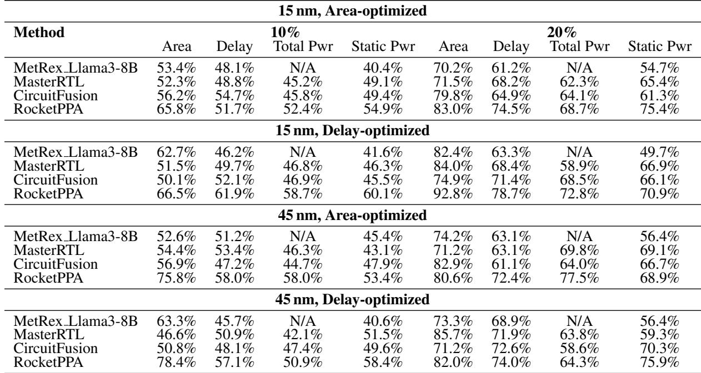

To complement the macro averages in Table 2, we report percondition results in Table 3 for the four regimes that combine technology node and optimization style. All methods are evaluated on the same fixed test set, and each baseline receives the same condition tokens or one-hot indicators, as described in Section 4.1.

We conduct an additional experiment on 7nm FinFET designs synthesized using the ASAP7 (Clark et al., 2016) library under the same area-opt and delay-opt conditions. The results show that RocketPPA achieves mean pass@10% rates of 70.1% for area, 55.4% for delay, 56.1% for static power, and 53.6% for total power on 7nm test samples over two conditions, showing that the proposed condition-aware framework extends naturally to advanced nodes when representative training data are included.

## 4.2.2 Cross-Regime and Cross-Node Transferability

Cross-regime transfer refers to the setting in which RocketPPA is trained on all technology nodes but only under a subset of optimization objectives. At evaluation time, the model is tested on a node–objective combination where the node was seen during training, but the corresponding optimization objective for that node was not observed. For this evaluation, we trained the RocketPPA on three regimes and tested on a held-out regime. Each regime is defined by the target technology node (45 nm vs. 15 nm) and the synthesis tool’s optimization objective (delay vs. area). Table 4 reports pass@10% for area, delay, and static power, showing the value with all four conditions (Actual) alongside the leave-one-regime-out result (LORO). Drops are modest for every metric and regime.

However, in the case of cross-node transferability (e.g., train on 45nm only and test on 15nm), RocketPPA conditions on technology node through discrete tokens (i.e., through input prompt), so this setting constitutes zero-shot transfer to an unseen token category. Under this formulation, the model receives no supervision for the 15nm condition during training, and strong zero-shot transfer is therefore not expected. To evaluate practical cross-node adaptation instead, we conduct few-shot experiments by training on 45nm together with small calibration subsets of 15nm data (5% and 10%), and then testing on the 15nm test designs. The mean pass@10% degradation is 4.2% with 5% calibration data and 2.7% with 10% calibration data, compared to

Table 4. Leave-one-regime-out pass@10% (train on three, test on held-out). “Actual” trains on all four conditions (RocketPPA percondition in Table 3); “LORO” trains on the other three only.  
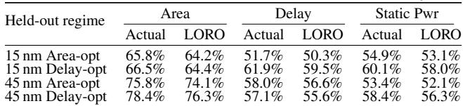

1.8% degradation in the full leave-one-regime-out setting of Table 4. These results show that RocketPPA can adapt to a new node with limited target-node examples.

Our training corpus contains 20,953 designs drawn from three heterogeneous public sources and spans five structural complexity classes, exposing the model to a broad range of RTL patterns. However, it is possible that the given codebases (e.g., industrial codebases) exhibit additional styles and constructs beyond this distribution. For such out-ofdistribution cases, few-shot adaptation provides a practical mitigation strategy. As shown in our cross-node experiments, RocketPPA adapts to distribution shifts with only 5%–10% calibration data, incurring pass@10% degradation of just 4.2% and 2.7%, respectively. We expect the same calibration strategy to extend to novel RTL coding styles in practice, allowing organizations to adapt the predictor using a small sample of in-house designs.

## 4.2.3 Ablation Study

Table 5 presents a detailed comparison of the performance of our model at 10% and 20% thresholds across three design metrics (i.e., area, delay, and total power) for three foundational LLMs, each evaluated with and without the Mixture-of-Experts extension (large MLP is replaced when Mixture-of-Experts is not used). For a fair comparison, the dense MLP baseline is sized to match the active capacity of the MoE head. In the LLaMA-3.1-8B-Instruct setting, the MoE regressor contains 4.7M parameters in total across six experts, but top-k gating with k = 3 activates only about 2.35M expert parameters per inference; accordingly, the dense baseline uses a 2.35M-parameter MLP, yielding matched active regression-head compute (approximately 4.7M FLOPs per inference) while keeping the LLM backbone fixed. Inclusion of the MoE architecture consistently improves accuracy in all settings. In particular, LLama-3.1-8B-Instruct with MoE achieves the highest overall performance, reaching pass rates of 71.6%, 57.2%, and 55.0% at the threshold 10%, and pass rates of 84.6%, 74.9%, and 70.8% at the threshold 20% for area, delay, and static power, respectively. The higher efficiency of the Llama-3.1-8B-Instruct variant could be because it has undergone supervised instruction tuning on a wide range of tasks, aligning its hidden-state embeddings more closely with user-specified objectives. In practice, this means that when we extract the final hidden layer to feed into our PPA regressor, Llama-3.1-8B-Instruct produces features that are both more semantically meaningful and more robust for downstream regression, which explains why it outperforms the Llama3.0 base model and the older CodeLlama-7B.

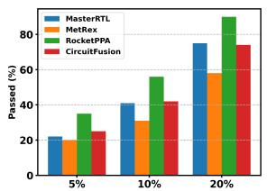

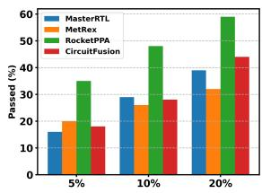  
Figure 4. Comparison of average pass rates for MasterRTL, CircuitFusion, Llama3-MetRex-8B, and RocketPPA at level-3 of the VerilogEval benchmark, with area and static power results under 5%, 10%, and 20% thresholds on different nodes and optimization conditions.

Furthermore, the performance gains observed when comparing the MoE variants with their respective non-MoE baselines confirm the benefit of expert specialization in enhancing prediction robustness, particularly as model size and architectural complexity increase. We should emphasize that the cost of MoE was about 4.7M additional parameters in the case of employing LLama-3.1-8B-Instruct as the LLM engine in RocketPPA.

Figure 5 shows the impact of the number of experts (parameter N ) and the number of best selected experts (parameter k) used to generate the estimated value. This figure compares the pass rates at the 10% and 20% thresholds, respectively, when using LLama-3.1-8B-Instruc as the base model. Note that when N was four (six), we considered k as two (three).

As shown, increasing the number of experts from four to six consistently increases the pass rate across all metrics (up to 3%); adopting top-k gating further refines the gating network’s ability to select the most relevant expert(s), yielding improved pass rates over both our single-expert baseline and previous SOTA results. Note that our studies showed that increasing N from six to a higher value leads to almost similar results, but increases the number of parameters. Therefore, six is selected as the best model. Interestingly, the largest gains emerge in power, likely due to the higher variance in power signatures across complex modules. Moving from the 10% threshold to the more lenient 20% threshold raises overall pass rates by roughly 10–15%. Still, the ranking among methods remains consistent, underscoring the general robustness of top-k gating when combined with additional experts.

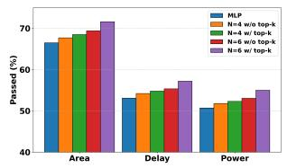

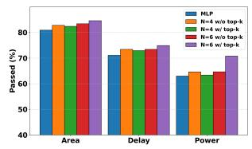  
Figure 5. Average Pass rates across different mixture-of-experts (MoE) configurations. Each bar group shows the fraction of modules with relative errors below a specified threshold for the indicated metric. These are averaged over all nodes and optimization conditions.

Table 5. Ablation study on the impact of mixture-of-expert MLP across multiple base models: Average Pass rates at 10% and 20% thresholds for Area, Delay, and total Power for different nodes and optimization conditions.  
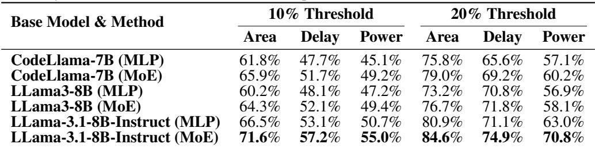

Table 6. Distribution of top-3 expert selections (%) across structural complexity classes on 4,190 validation designs. For each design class, the counts of experts selected by the top-3 router are aggregated over all designs in that class and normalized to sum to 100%.  
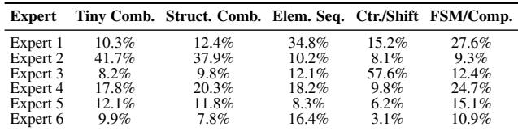

To examine whether the gating network learns differentiated expert usage, we analyze the distribution of top-3 expert selections across 4,190 validation designs grouped by structural complexity. The expert-selection patterns are clearly non-uniform across classes. In particular, Expert 2 receives the largest share of selections for tiny and structured combinational designs (41.7% and 37.9%), Expert 1 is most prominent for elemental sequential and FSM/composite designs (34.8% and 27.6%), and Expert 3 is strongly associated with counter/shift modules (57.6%). The remaining experts exhibit broader cross-class usage, suggesting that the MoE learns a combination of specialized and more generalpurpose experts rather than assigning all inputs uniformly across experts.

Figure 6 illustrates the efficiency of the RocketPPA under different token sizes (i.e., input HDL size). The pass rates for area, delay, and total power at (a) 10% and (b) 20% thresholds on our generated validation set (stratified into small, medium, and large modules by token size) are reported in this figure.

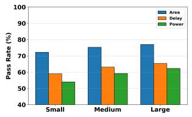

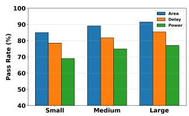  
Figure 6. Average Pass Rates at 10% and 20% MRE Thresholds, Stratified by Token Size for LLama-3.1-8B-Instruct (MoE). These are averaged over all nodes and optimization conditions.

As shown, a general trend indicates that the pass rate increases with larger token sizes. For example, the pass rate of the RocketPPA for the area is increased by 5.47% (6.52%) for the large Verilog files compared to that of the small Verilog files under the 10% (20%) threshold. The model attains higher accuracy for larger modules, even though one might assume that more complex code would be harder to predict. A likely explanation is that lengthier Verilog files provide the model with richer contextual information (e.g., additional signals, state machines, or instantiations), enabling it to better learn and generalize power, delay, and area relationships. Meanwhile, although simpler, small modules do not offer as much structural variety, limiting the model’s ability to infer PPA outcomes.

Table 7 shows an ablation study on the impact of contrastive learning weight λ. All models use LLaMA-3.1-8B-Instruct + LoRA + MoE (N=6, k=3). Results are averaged across all four conditions (15nm/45nm × area-opt/delay-opt). The optimal weight λ = 0.5 improves pass rates by 2.5, 1.9, and 1.8 percentage points for area, delay, and power respectively over supervised-only training (λ = 0), demonstrating that contrastive learning provides consistent gains without adding inference overhead.

Table 8 presents an ablation of positive pair construction strategies. All models use λ = 0.5 and LLaMA-3.1-8B-Instruct + MoE. Results are averaged across all four conditions. PPA-based similarity shows the strongest individual contribution, while combining all three strategies yields the best performance, confirming that each captures a complementary facet of design similarity.

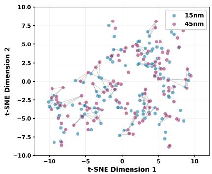  
(a) Technology node.

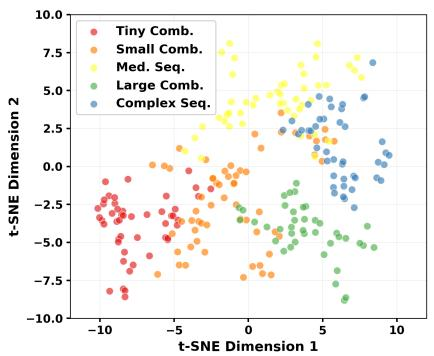  
(b) Structural complexity class.

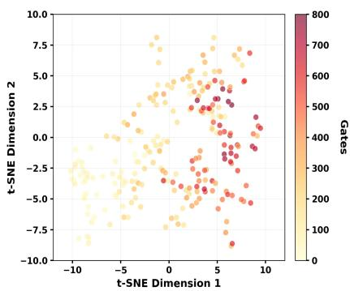  
(c) gate count.  
Figure 7. t-SNE of learned embeddings for 500 validation designs. Colors denote (a) technology node, (b) structural class, and (c) gate count. With contrastive learning, same-design instances cluster across synthesis settings (short connecting lines), classes separate, and area varies smoothly within clusters—evidence of a similarity-aware representation.

Table 7. Impact of contrastive learning weight λ on pass rates. All models use the same architecture and differ only in the contrastive loss weight.  
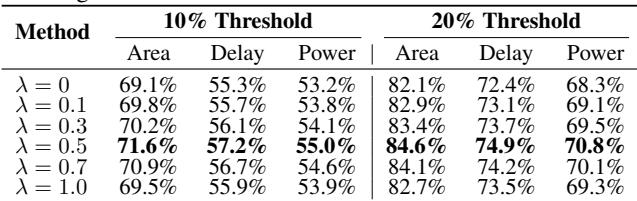

Table 8. Impact of different positive pair construction strategies on pass rates at 10% threshold.  
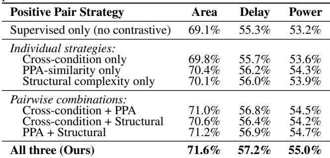

Figure 7 plots of 128-D projection-head embeddings for 500 validation designs show that contrastive learning yields a structured space. Same designs across nodes and optimizations lie close together with short connecting lines; structural complexity classes form distinct regions without labels; gate count varies smoothly within clusters, indicating PPA awareness. The shared layout across panels shows one embedding captures condition invariance, architectural differences, and PPA similarity, supporting our positive-pair design and improved generalization.

## 5 CONCLUSION

We presented RocketPPA, an ultra-fast, code-level estimator of power, delay, and area that combines a large language model fine-tuned with LoRA and a mixture-of-experts MLP regressor. Trained directly on HDL, RocketPPA surpasses state-of-the-art methods, raising 10%-error pass rates by up to 13.6% for area, 9.4% for delay, and 14.7% for static power; at 20% error the gains remain between 7.0% and 18.5% across metrics. The model is trained and evaluated under four conditions that combine technology node and optimization style, and it maintains its advantage both in macro averages and in per-condition results. On the demanding Level-3 VerilogEval set, it preserves these advantages while running more than 20× faster than MetRex and Circuit-Fusion and about 30× faster than MasterRTL, eliminating costly feature engineering. By providing rapid and accurate estimates across the four conditions, RocketPPA enables earlier and more reliable design-space exploration and supports next-generation EDA workflows that bridge high-level code and physical implementation metrics.

## ACKNOWLEDGMENT

This work was partly supported by a grant from the U.S.   
National Science Foundation.

## REFERENCES

Abdelatty, M., Ma, J., and Reda, S. Metrex: A benchmark for verilog code metric reasoning using llms. arXiv preprint arXiv:2411.03471, 2024.

Amrutur, B. S. and Horowitz, M. A. Speed and power scaling of sram’s. IEEE journal of solid-state circuits, 35 (2):175–185, 2000.

Chinnery, D. and Keutzer, K. W. Closing the gap be-

tween ASIC & custom: tools and techniques for highperformance ASIC design. Springer Science & Business Media, 2002.

Clark, L. T., Vashishtha, V., Shifren, L., Gujja, A., Sinha, S., Cline, B., Ramamurthy, C., and Yeric, G. Asap7: A 7- nm finfet predictive process design kit. Microelectronics Journal, 53:105–115, 2016.

Cui, F., Yin, C., Zhou, K., Xiao, Y., Sun, G., Xu, Q., Guo, Q., Song, D., Lin, D., Zhang, X., et al. Origen: Enhancing rtl code generation with code-to-code augmentation and self-reflection. arXiv preprint arXiv:2407.16237, 2024.

Fang, W., Lu, Y., Liu, S., Zhang, Q., Xu, C., Wills, L. W., Zhang, H., and Xie, Z. Masterrtl: A pre-synthesis ppa estimation framework for any rtl design. In 2023 IEEE/ACM International Conference on Computer Aided Design (IC-CAD), pp. 1–9. IEEE, 2023.

Fang, W., Liu, S., Wang, J., and Xie, Z. Circuitfusion: multimodal circuit representation learning for agile chip design. arXiv preprint arXiv:2505.02168, 2025a.

Fang, Z., Chen, R., Yang, Z., Guo, Y., Dai, H., and Wang, L. Lintllm: An open-source verilog linting framework based on large language models. arXiv preprint arXiv:2502.10815, 2025b.

Grattafiori, A., Dubey, A., Jauhri, A., Pandey, A., Kadian, A., Al-Dahle, A., Letman, A., Mathur, A., Schelten, A., Vaughan, A., et al. The llama 3 herd of models. arXiv preprint arXiv:2407.21783, 2024.

Liu, M., Ene, T.-D., Kirby, R., Cheng, C., Pinckney, N., Liang, R., Alben, J., Anand, H., Banerjee, S., Bayraktaroglu, I., et al. Chipnemo: Domain-adapted llms for chip design. arXiv preprint arXiv:2311.00176, 2023a.

Liu, M., Pinckney, N., Khailany, B., and Ren, H. Verilogeval: Evaluating large language models for verilog code generation. In 2023 IEEE/ACM International Conference on Computer Aided Design (ICCAD), pp. 1–8. IEEE, 2023b.

Liu, M., Tsai, Y.-D., Zhou, W., and Ren, H. Craftrtl: High-quality synthetic data generation for verilog code models with correct-by-construction non-textual representations and targeted code repair. arXiv preprint arXiv:2409.12993, 2024.

Liu, Y., Changran, X., Zhou, Y., Li, Z., and Xu, Q. Deeprtl: Bridging verilog understanding and generation with a unified representation model. In The Thirteenth International Conference on Learning Representations, 2025.

Lu, Y., Liu, S., Zhang, Q., and Xie, Z. Rtllm: An opensource benchmark for design rtl generation with large

language model. In 2024 29th Asia and South Pacific Design Automation Conference (ASP-DAC), pp. 722–727. IEEE, 2024.

Mi, Z., Zheng, R., Zhong, H., Sun, Y., and Huang, S. Promptv: Leveraging llm-powered multi-agent prompting for high-quality verilog generation. arXiv preprint arXiv:2412.11014, 2024.

Micheli, G. D. Synthesis and optimization of digital circuits. McGraw-Hill Higher Education, 1994.

Nadimi, B. and Zheng, H. A multi-expert large language model architecture for verilog code generation. In 2024 IEEE LLM Aided Design Workshop (LAD), pp. 1–5. IEEE, 2024.

Roziere, B., Gehring, J., Gloeckle, F., Sootla, S., Gat, I., Tan, X. E., Adi, Y., Liu, J., Sauvestre, R., Remez, T., et al. Code llama: Open foundation models for code. arXiv preprint arXiv:2308.12950, 2023.

Tang, J., Qin, J., Thorat, K., Zhu-Tian, C., Cao, Y., Ding, C., et al. Hivegen–hierarchical llm-based verilog generation for scalable chip design. arXiv preprint arXiv:2412.05393, 2024.

Tasnia, K. and Rahman, S. Opl4gpt: An application space exploration of optimal programming language for hardware design by llm. Cryptology ePrint Archive, 2024.

Wang, K., Chang, K., Wang, M., Zou, X., Xu, H., Han, Y., and Wang, Y. Rtlmarker: Protecting llm-generated rtl copyright via a hardware watermarking framework. arXiv preprint arXiv:2501.02446, 2025.

Wang, Z., Alrahis, L., Mankali, L., Knechtel, J., and Sinanoglu, O. Llms and the future of chip design: Unveiling security risks and building trust. In 2024 IEEE Computer Society Annual Symposium on VLSI (ISVLSI), pp. 385–390. IEEE, 2024.

Weste, N. H. and Harris, D. CMOS VLSI design: a circuits and systems perspective. Pearson Education India, 2015.

Yang, Y., Teng, F., Liu, P., Qi, M., Lv, C., Li, J., Zhang, X., and He, Z. Haven: Hallucination-mitigated llm for verilog code generation aligned with hdl engineers. arXiv preprint arXiv:2501.04908, 2025.

Zehua, P., Zhen, H., Yuan, M., Huang, Y., and Yu, B. Betterv: Controlled verilog generation with discriminative guidance. In Forty-first International Conference on Machine Learning, 2024.

Zhao, Y., Zhang, H., Huang, H., Yu, Z., and Zhao, J. Mage: A multi-agent engine for automated rtl code generation. arXiv preprint arXiv:2412.07822, 2024.