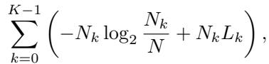
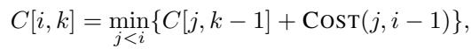
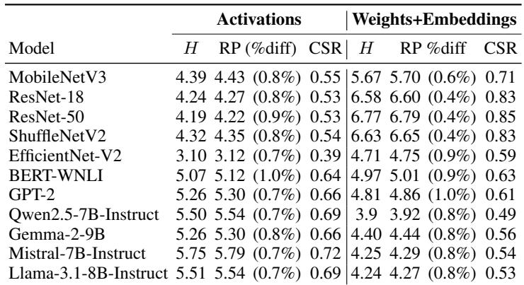
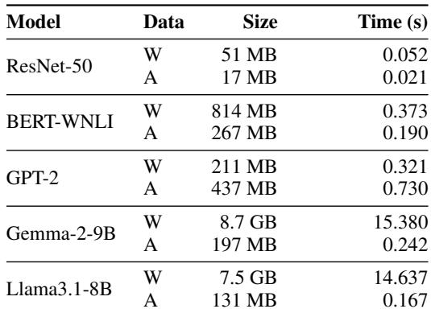
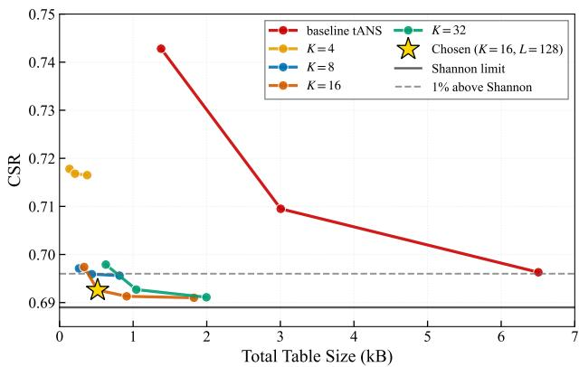
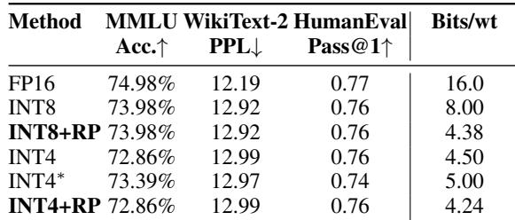
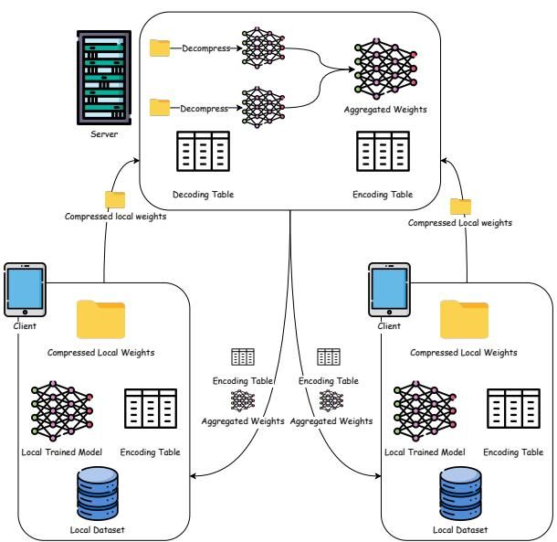
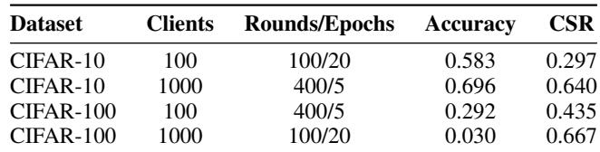
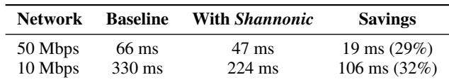
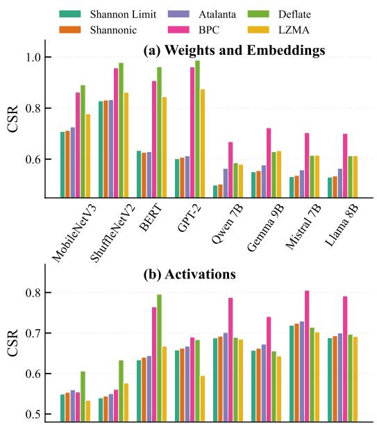

# SHANNONIC: EFFICIENT ENTROPY-OPTIMAL COMPRESSION FOR ML WORKLOADS

Kareem Ibrahim 1 Mohammadjavad Maheronnaghsh 1 Andreas Moshovos 1 2

## ABSTRACT

We present Shannonic, a lossless compression method for machine learning tensors that achieves near-entropyoptimal compression, minimal state footprint, and high throughput. Shannonic uses an off-line pre-processing step to partition the tensor value space into optimally selected subranges and generates encoding/decoding tables that encode each value as a (range index, offset) pair where the range is entropy encoded using the asymmetric numeral systems (ANS) method. We formally prove and empirically show that Shannonic achieves higher compression efficiency than standard ANS. For a variety of 8b-quantized models, Shannonic’s codec uses just 530B of state and achieves coding efficiency within 1% of the Shannon limit. Shannonic enables 1.3-3.1→ faster federated learning over bandwidth-constrained networks and 29-32% latency reduction in edge-cloud LLM inference.

## 1 INTRODUCTION

Machine learning deployment has moved beyond traditional single-node or edge–cloud setups toward distributed execution across multiple cooperating devices for inference, continual learning, and federated learning. Even on a single node, modern models often exceed the capacity of individual compute or memory components. To support larger and more responsive models, systems increasingly rely on heterogeneous resources—GPU and CPU memory, SSDs, and remote memory tiers—that differ in bandwidth, latency, cost, and capacity. These components must coordinate to meet performance and capacity demands, making data communication the dominant bottleneck in modern ML workloads.

The following three use cases are indicative of the growing importance of reducing data movement across heterogeneous components and systems: First, in cross-device federated learning, frequent model update exchange across bandwidth-constrained links significantly impacts training latency and energy (Bonawitz et al., 2019). Second, in collaborative large language model (LLM) execution, models are partitioned across edge and cloud devices, continuously transferring activations over bandwidth-limited networks, making communication the primary latency contributor (Zhang et al., 2025). Third, in multi-tier memory-split virtualization systems such as FlexGen, model weights and activations are dynamically streamed across memory tiers e.g., GPU, CPU, and SSD, and the cost of moving data across them dominates execution time (Sheng et al., 2023).

Quantization addresses this bottleneck by reducing data volume by lowering numerical precision and is increasingly supported by modern hardware through datatypes such as BF16 (Kalamkar et al., 2019), FP8 (Micikevicius et al., 2022), NVFP4 (Song et al., 2024), and microscaling formats (Rouhani et al., 2023). As a lossy compression method, quantization inherently trades off data size against model quality. This loss can be mitigated to some degree via calibration or adaptation, but such tuning is typically timeconsuming and offline (Xiao et al., 2023; Shao et al., 2024; Tseng et al., 2024). Further, using mixed precision across tensors and stages can help (Section 2). Quantization is best suited for inference, where parameters can be pre-tuned, but is less suitable for dynamic or training-centric scenarios such as federated learning or on-device continual adaptation, which require online precision decisions. When applicable, quantization remains preferred for reducing data movement; however, even after aggressive quantization, discrete tensors can retain non-uniform symbol statistics, leaving residual redundancy that could still be removed.

Beyond quantization, online lossless compression can further reduce data size without affecting accuracy. The most effective general-purpose methods use large lookup tables (tens of kilobytes to megabytes) and multi-step algorithms (Collet & Kucherawy, 2021), often coupled with substantial history state (e.g., sliding windows or large dictionaries) (Deutsch, 1996; Pavlov, 2023), making them too costly for ML deployments. Ideally, compression methods for ML would meet the following goals: 1) Achieve high encoding efficiency (ideally approaching entropy) to meaningfully reduce memory and communication bandwidth. 2) Match the high throughput of inference and training, without adding latency on the critical path. These goals are typically in tension: higher compression requires more internal state and computation, which increases latency and resource usage. 3) Use only a few hundreds of bytes of internal state and require very few operations per value. Methods that violate these constraints may suffer by being either too expensive to replicate in hardware or software, too slow to operate in real time, or by failing to deliver enough bandwidth savings to justify their use.

We introduce Shannonic, a lossless compression method that meets the above requirements and applies to all major ML tensors, including weights, activations, and embeddings. Shannonic builds upon Asymmetric Numeral Systems compression (ANS) and achieves compression within 1% of Shannon entropy while using 8–16 less state than standard ANS. Shannonic’s implementation requires just 530 B of state for a combined encoder/decoder and performs only a few simple per-symbol operations: shift, mask, and lookup.

Shannonic achieves near-optimal compression rates at a much lower cost compared to ANS by using an approximate entropy encoding scheme: Per tensor, Shannonic partitions the value space into a small number of contiguous ranges e.g., 16 ranges for 8-bit tensors. The ranges are not uniform in size but are tailored to the expected distribution of each tensor through a preprocessing step that occurs offline, using either a single static tensor e.g., weights or embeddings or a few per-tensor samples for dynamic tensors e.g., activations. Shannonic represents each value as a pair (range base, o!set) encoding the range base using ANS, and storing the o!set as-is. Shannonic assigns small ranges to highly frequent values, requiring few or no offset bits, whereas it groups infrequent values into larger ranges, which require more offset bits.

We formally prove and empirically show that Shannonic achieves higher compression efficiency than standard ANS. Intuitively, Shannonic can outperform ANS for machine learning tensors for the following two reasons: 1. The distributions within each range prove to be nearly uniform, making fixed-width offsets nearly as efficient as encoding each value individually with ANS. 2. Consolidating symbols into ranges allows more ANS states to be allocated to those ranges, improving compression for the most frequent values. As a result, Shannonic enables a significantly lower-cost implementation in both software and hardware.

We make three contributions: 1. A lightweight entropy coding algorithm with formal conditions (Theorem 1) characterizing when our range partitioning outperforms direct encoding; 2. Validation on diverse neural models ranging from IoT-scale networks to LLMs; and 3. Efficient implementations in software and hardware.

We validate Shannonic across two real-world deployment scenarios.1 In federated learning, Shannonic achieves 1.3– 3.1 faster training of ResNet-18 over WiFi and LTE links. In collaborative inference with Llama2-7B, it reduces endto-end latency by 29%–32%.

## 2 BACKGROUND

Accessing off-chip memory is up to two orders of magnitude slower and more energy-intensive than on-chip arithmetic (Horowitz, 2014). Peak compute performance has been increasing by approximately 3→ every two years, while DRAM and interconnect bandwidth are behind at only 1.6 and 1.4 , respectively (Gholami et al., 2024). Meanwhile, there has been exponential growth in model size and compute demand. Wang et al. demonstrate that many ML workloads are predominantly constrained by memory bandwidth and communication overhead rather than compute capacity across diverse platforms (Wang et al., 2020). Their results show that this bottleneck persists across platforms, highlighting that data movement challenges arise across a variety of models, not just LLMs (Brown et al., 2020).

Quantization as lossy compression. Quantization is the process of mapping high-precision numerical values in a machine learning model to a lower-precision representation to reduce memory and compute costs while aiming to preserve accuracy. Early quantization methods reduced model size by applying linear mappings from a wide numerical range, e.g., FP32 or FP16 to a narrower one, such as INT8 (Jacob et al., 2018), with quantization parameters selected either statically per tensor (as commonly done for weights) or dynamically at runtime (Zhang et al., 2018). As transformer models became dominant, handling activation outliers emerged as a critical challenge (Dettmers et al., 2022; Zadeh et al., 2022), motivating per-group scaling techniques such as SmoothQuant (Xiao et al., 2023) and AWQ (Lin et al., 2024), which improve accuracy by tailoring scales to localized value distributions at the cost of additional scaling operations during computation. This trend has driven the introduction of new datatypes, such as microscaling formats (Rouhani et al., 2023), that provide native hardware support for groupwise quantization. Across these methods, quantization fundamentally entails a tradeoff between model size reduction and accuracy. Some of this loss can be recovered by adjusting quantized values, and techniques for doing so have advanced significantly. A prominent approach is to optimize quantized values to minimize quality degradation directly (Nikolic et al. ´ , 2024)

or through proxy reconstruction metrics that measure the error between the quantized and original tensors, as used in GPTQ (Frantar et al., 2023), OmniQuant (Shao et al., 2024), QUIP# (Tseng et al., 2024), and SpinQuant (Liu et al., 2025). Importantly, low-bit deployments are often mixed precision in practice: weights may be pushed to 4- bit while activations and scaling metadata remain higher precision for quality (Frantar et al., 2023; Song et al., 2024).

Quantization reduces model size and computation, but it is not universally applicable. Achieving acceptable accuracy often requires careful tuning or calibration, which is timeconsuming and impractical in dynamic settings such as federated learning or on-device adaptation. Moreover, reducing precision uniformly across all tensors is not always feasible without accuracy loss; many practical pipelines therefore retain higher precision for sensitive components or layers. Also, precision cannot be reduced arbitrarily, e.g., quantizing all layers of modern LLMs below 8 bits often causes substantial accuracy loss on complex tasks (Section 5.3). These limitations motivate complementary methods to further reduce data movement without sacrificing accuracy or requiring costly runtime reconfiguration.

## 3 ENTROPY CODING FUNDAMENTALS

Compression methods can be categorized by how they model the input distribution. This work focuses on entropy coding methods that assume a known or predictable distribution, enabling lightweight, low-state implementations suitable for bandwidth- and latency-sensitive ML systems. In contrast, adaptive methods continually update probability models during execution (Marpe et al., 2003). Although they can achieve higher compression in general-purpose settings, their additional state and computational overhead are challenges for the low-latency, high-throughput demands of modern ML workloads (Wiedemann et al., 2020).

The theoretical limit of lossless entropy coding is the Shannon entropy of the data distribution. For a discrete random variable X with alphabet A and probability mass function p(x), the entropy is defined as H(X) = ↑ ! x p(x) log2 p(x), measured in bits per symbol. This quantity represents the average information content of each symbol: intuitively, frequent symbols (high p(x)) should be encoded with fewer bits, while rare symbols require more. No lossless scheme operating on symbol-level statistics alone can achieve an average code length below H(X). Here, A is the tensor value range e.g., 0-255 for 8-bit integers, p(x) is the expected distribution for the tensor e.g., a histogram of values, and X is a tensor instance. For statically known values such as weights or embeddings, p(x) can be calculated as a pre-processing step. For runtime computed values such as activations, we estimate p(x) from a small calibration set and generate the tables as a preprocessing step. Distribution shift during training can affect compression rates; when it occurs, tables may be refreshed with modest overhead (Table 2), and this refresh cost is included in end-to-end measurements where applicable (e.g., federated learning, Section 6.1). However, as explained later on, the use of ranges makes Shannonic inherently resistant to all but significant changes in the distribution.

Entropy coders make different trade-offs between compression efficiency and computational complexity. Huffman coding (Huffman, 1952) constructs prefix-free codes by building a binary tree from symbol frequencies, achieving optimal compression when symbol probabilities are powers of two, i.e., p(x) = 2↑k for integer k. However, Huffman coding introduces inefficiency for quantized neural network tensors because it assigns an integer number of bits to each symbol, preventing it from approaching the fractional bit lengths implied by H(X). Arithmetic coding (AC) (Witten et al., 1987) overcomes this limitation by representing an entire message as a single fractional number in [0, 1), achieving compression arbitrarily close to the entropy limit. The encoder maintains a probability interval that narrows with each symbol, while the decoder reconstructs symbols by subdividing the same interval. However, arithmetic coding requires sequential multiply-and-renormalize operations for each symbol, limiting throughput and complicating software and hardware implementations. Arithmetic and Huffman coding both use lookup tables with as many entries as the number of values, e.g., 256 for 8-bit values.

Asymmetric Numeral Systems (ANS). ANS (Duda, 2013) achieves near-optimal compression efficiency comparable to arithmetic coding while avoiding its computational overhead. The key insight is that the iterative probability updates performed by arithmetic coding can be precomputed and encoded into a finite-state machine (FSM) (Collet, 2013). Instead of maintaining a fractional interval, ANS operates on an integer state t that transitions between states according to symbol probabilities. For an alphabet with K symbols and frequencies {fs} summing to L FSM states, symbol s is allocated fs states. When encoding symbol s with probability ps = fs/L, the encoder consumes roughly ↑ log2 ps bits on average, matching the entropy contribution of that symbol. This probabilistic state allocation enables ANS to approach Shannon entropy while performing only table lookups and integer arithmetic.

The encoder keeps the state t normalized within the range [L, 2L). To encode a symbol s, it first outputs enough loworder bits from t to guarantee that the updated state will remain normalized. It then applies a precomputed state transition. The decoder performs the inverse operation: from the current state t, it determines the symbol s and how many bits to read from the bitstream, then reconstructs the next state (Algorithm 1).

Algorithm 1 Conceptual ANS Encode/Decode   
1: Encode(t, s):   
2: nbBits ↓ bits needed to keep t ↔ [L, 2L) after tran  
sition   
3: emit lower nbBits bits of t; t↓ t nbBits   
4: t next state for symbol s and reduced state t↓   
5: Decode(t):   
6: retrieve symbol s, bit count nbBits, and base state for   
current t   
7: read nbBits from bitstream into b   
8: t ↓ base state +b; return s

ANS can be implemented with different memory usage and computational cost trade-offs. Tabled ANS (tANS) precomputes all state transitions and stores them in lookup tables, turning the operations above into direct table accesses. This enables branch-free decoding using only lookups and bit refills, with no divisions or multiplications in the critical path. Production codecs such as Zstandard’s FSE (Collet & Kucherawy, 2021) and JPEG XL (Alakuijala et al., 2021) use tANS because it supports efficient software vectorization and is well-suited for hardware implementation. A complementary variant is range ANS (rANS), which computes state updates arithmetically from cumulative frequencies instead of storing full state-transition tables. This reduces table state but introduces per-symbol integer arithmetic (e.g., multiply/divide and renormalization) on the critical path (Duda, 2013; Giesen, 2014).

tANS’s performance comes at a memory cost. The codec requires precomputed state transition tables whose size scales with both the number of states L, which determines compression efficiency, and the alphabet size N. For near-optimal compression of an N-symbol alphabet, L must be significantly larger than N , typically L  4N to keep quantization loss below 1% (Duda, 2013). For 8-bit symbols (N = 256), this necessitates L ↘ 1024 states, yielding tables of 4–16 kB depending on implementation choices.

This memory cost creates deployment challenges: First, large tables consume scarce on-chip SRAM and often force external memory accesses, increasing latency and energy in both hardware and software codecs. Second, supporting different parallel streams requires table replication, further raising cost and resource usage. Third, on resource-constrained edge devices, multi-kilobyte tables compete with application data for limited on-chip storage and bandwidth in the memory hierarchy. In software, tables of this size may not stay in L1 cache. As a result, cache misses can dominate the per-symbol loop execution time, especially when decoding is interleaved with other hot data or many streams.

Our work addresses these limitations by reducing the ANS table size by an order of magnitude, from 4–16 kB to under

530 B, while maintaining compression within 1% of the Shannon entropy limit. Concretely, Shannonic uses range partitioning to shrink the effective alphabet, so the tabledriven (tANS) path collapses to a 530 B codec working set (8–30 less state), small enough to remain L1-resident; at this point, rANS provides little additional memory advantage while still paying the arithmetic overhead.

Range Partitioning: Quantized neural tensors exhibit structured, skewed distributions where most probability mass concentrates on a small subset of values while there are few, yet important outliers (Xiao et al., 2023). Consider a typical 8-bit quantized weight tensor: while the alphabet contains N = 256 possible values, the distribution is typically highly non-uniform and only a small subset have significant probability. Standard tANS must allocate states proportional to all N symbols with a minimum of one state per symbol. Loosely speaking, the number of states used effectively quantizes the probability of appearance per symbol. The more the states, the closer the table would be to representing the true probability per symbol.

We propose a two-level encoding scheme that exploits this structure: partition the alphabet into K contiguous ranges, e.g., K = 16, and encode each symbol as a range identifier compressed via tANS with far fewer states plus a fixedwidth offset within that range transmitted uncompressed. This scheme provides partial immunity to distribution shift: Changes within a range do not affect the offset cost, and only shifts in probability mass across ranges affect the overall compression rate. As a result, fixed tables remain effective unless cross-range shifts become substantial (Table 2).

This approach introduces a fundamental trade-off. By encoding range identifiers rather than individual symbols, we reduce the effective alphabet from N symbols to K ranges, lowering the probability quantization loss caused by tANS’s finite state space. However, using fixed-width offsets is less efficient than entropy-optimal coding of symbols within each range. Next, we analyze when this method achieves higher overall encoding efficiency than tANS.

Theorem 1: Let {pi}Ni=1 denote the probability distribution over N possible symbols. For the original tANS with L states, each symbol i receives fi states where !Ni=1 fi = L and fi ↘ 1. The achievable average code length is:

$$
\tag{1}
$$

where H(p) = ↑ ! i pi log2 pi is the Shannon entropy and DKL(p ≃ qtANS) = ! i pi log2(pi/qi) quantifies the quantization loss from using discrete state allocations qi = fi/L instead of exact probabilities pi.

For Shannonic, we partition the alphabet into K ranges {Rk}K↑1k=0 with range probabilities Pk = ! i→Rk pi. Each symbol requires wk = ⇐log2 |Rk|⇒ offset bits, where |Rk| is the number of symbols in range k. The average code length becomes:

$$
\tag{2}
$$

where Qk = Fk/L are the quantized range probabilities from tANS state allocations {Fk}.

Shannonic achieves lower rate than tANS when:

$$
\tag{3}
$$

where H(p|P ) = !k PkH(p|range = k) is the conditional entropy of symbols within their assigned ranges. Partitioning wins when CLShannonic < CLtANS. By the chain rule of entropy, H(p) = H(P ) + H(p P ). Substituting into the rate expressions and rearranging yields the stated condition.

Interpretation: The left-hand side (LHS) represents the quantization loss improvement from allocating states to K ranges instead of N individual symbols: with fewer symbols to encode, each receives a more accurate state allocation, reducing DKL. The right-hand side (RHS) represents the offset overhead: fixed-width offsets require !k Pkwk bits per symbol, whereas optimal entropy coding within ranges would require only H(p|P ) bits. Partitioning is beneficial when the quantization gain exceeds the offset penalty.

Empirical Validation: For quantized neural network tensors, partitioning savings consistently outweigh uncompressed offset loss, achieving compression closer to the entropy limit. As one example, consider Llama-3.1- 8B’s layers.16.self attn.k proj.weight tensor containing 4.2M INT8 weights with entropy H(p) = 5.307 bits/symbol (methodology in Section 5). tANS (L = 1024 states) achieves 5.592 bits/symbol, while partitioned tANS (K = 16 ranges, L = 128 states) achieves 5.336 bits/symbol, a 4.6% improvement with 8 fewer states. Partitioning reduces quantization loss from 0.285 to 0.013 bits, a 0.272-bit gain, at the cost of only 0.017 bits of offset overhead, satisfying Condition 3.

Section 4 details the partitioning algorithm; Section 5 demonstrates that this behavior generalizes to both quantized weights and activations across diverse architectures.

## 4 Shannonic

This section describes the complete Shannonic method comprising the preprocessing algorithm that computes optimal ranges per tensor (Section 4.1) and the runtime encoding and decoding procedures (Section 4.2).

For clarity, we refer to a configuration processing 8 b symbols (256 possible values) partitioned into K = 16 contiguous ranges with L = 128 tANS states. This configuration achieves compression within 1% of Shannon entropy (Section 5) while requiring less than one kilobyte of codec state.

## 4.1 Pre-processing: Range Selection

Given an input tensor, e.g., a layer’s quantized weights or activations, we compute the value histogram and apply dynamic programming to determine how to partition the 256- symbol alphabet into 16 ranges. This partitioning is tensorspecific and minimizes the combined cost of encoding range identifiers and intra-range offsets.

Objective. Let h[x] be the histogram of values in the input tensor of N = !255x=0 h[x] elements. We seek to partition the alphabet [0, 255] into K = 16 contiguous ranges that minimize total encoded bits. For a candidate range [s, e], define Ns,e = !ex=s h[x] as the number of symbols (values) in that range, and Ls,e = ⇐log2(e ↑ s + 1)⇒ as the number of bits required to represent any offset within the range. The coding cost of a K-way partition is

where the first term represents the entropy cost of encoding which range each symbol belongs to via tANS on range indices, and the second term represents the cost of encoding the symbol’s offset within its range.

The optimal partition is found by the recurrence:

starting with C[i, 1] = COST(0, i↑1), where COST(s, e) = Ns,eLs,e ↑ Ns,e log2 N yields the sixteen optimal range boundaries {rmink , rmaxk }. Ns,e . Backtracking from C[256, 16] For each range k, we precompute and store: base[k] = rmink , the minimum value in range k; nb[k] = ⇐log2(rmaxk ↑rmin + 1)⇒, the number of offset bits; start[k], the starting index of range k in encTable; and bias[k], used for state normalization. We also build a lookup table rangeId[256] that maps each value to its range index, and construct the 128-entry tANS table from the range probabilities pk = Nk/N . Appendix A details the footprint of these tables. The computational cost of histogram computation, dynamic programming, and table generation is amortized across the entire tensor and is negligible compared to encoding/decoding time in practice (Section 5).

## 4.2 Runtime Encoding and Decoding

At run time, each value x ↔ [0, 255] is processed in constant time through table lookups and integer operations. The encoder maintains an 8-bit state register X whose value is always in the interval [128, 255] which is the normalized domain of a 128-state tANS machine.

Algorithm 2 Shannonic Encode/Decode (L = 128)   
1: Encode(x, X):   
2: s → rangeId[x]; o → x ↑ base[s], o ↓ [0, 2nb[s] ↑ 1]   
3: emit o using nb[s] bits   
4: nbBits → (X+bias[s]) ↔ 8 {bits to keep X ↓ [L, 2L)}   
5: emit lower nbBits bits of X; X  X  nbBits   
6: X → encTable[start[s] + X]   
7: Decode(X):   
8: s, nbBits, newX  decTable[X]   
9: b  read nbBits bits; X  newX + b   
10: o → read nb[s] bits   
11: x  base[s] + o; return x

The encoder maps each symbol to its range identifier and offset, emits offset bits, normalizes the state to maintain the [L, 2L) invariant, and transitions via table lookup. The decoder retrieves metadata, reconstructs the state and offset, then recovers the symbol. Both paths use only table lookups, shifts, and addition.

We implement Shannonic in software and evaluate performance on two platforms: a Raspberry Pi 5 (ARM Cortex-A76, 2.4 GHz) and an Intel i9-10920X (3.50 GHz). The Raspberry Pi 5 achieves 168 MB/s encoding and 286 MB/s decoding in single-stream mode, scaling to 669 MB/s encoding and 1.14 GB/s decoding at 4 threads. On the i9-10920X, single-stream performance reaches 300 MB/s encoding and 640 MB/s decoding, scaling to 1.08 GB/s encoding and 2.30 GB/s decoding at 4 threads, and 4.74 GB/s encoding and 9.76 GB/s decoding at 24 threads. Appendix B details the implementation and performance evaluation.

We synthesize Shannonic encoder and decoder for the 7nm ASAP7 PDK (Clark et al., 2016). The encoder occupies 279 µm2 and consumes 0.79 mW, achieving a throughput of 1.97 GB/s. The decoder occupies 267 µm2 and consumes 1.08 mW, achieving 1.55 GB/s throughput. The compact area and low power consumption enable deployment of multiple parallel instances for high-throughput applications. Hardware implementation details and synthesis results are provided in Appendix C.

## 5 EVALUATION

Before evaluating software and hardware implementations of Shannonic and several use cases, we study the compression rates it achieves for a variety of models. We measure compression using CSR (compressed size ratio), defined as CSR = sizecompressed/sizeoriginal where lower values indicate better compression. Across all model tensors, Shannonic reaches within 1% of the Shannon limit using much less state storage than tANS. For online/on-path deployment, meeting CSR constraints alone is insufficient: the codec must also match the compute engine’s consumption rate. We therefore treat CSR together with encode/decode throughput (equivalently, encode/decode latency per byte) as the primary codec metrics, since they determine the bytes moved and time added on the critical path.

We study models spanning vision, object detection, and NLP: MobileNetV3 (Howard et al., 2019), ResNet-18/50 (He et al., 2016), ShuffleNetV2 (Ma et al., 2018), EfficientNet-V2 (Tan & Le, 2021), BERT-WNLI (Devlin et al., 2019), GPT-2 (Radford et al., 2019), Qwen2.5-7B-Instruct (Qwen Team et al., 2024), Gemma-2-9B (Gemma Team et al., 2024), Mistral-7B-Instruct (Jiang et al., 2023), and Llama-3.1-8B-Instruct (Grattafiori et al., 2024). For vision and BERT models, weights are taken directly from public checkpoints in INT8 format. For large language models (Qwen, Gemma, Mistral, Llama), we apply SmoothQuant (Xiao et al., 2023) to obtain 8-bit weights and activations using their recommended W8A8 settings. Activations are recorded per layer via PyTorch hooks on ten sample inputs; ONNX models from SPARSEZOO (Magic, 2021) run under ONNX Runtime. Each tensor receives its own encoding/decoding table with 16 ranges and 128 states. For activations, the table is computed once from 10 sample runs and then used to compress all activations for that layer (i.e., activation tables are kept fixed at runtime). This approach is valid because quantized activation distributions remain stable across inputs: the quantization process itself (clipping and rounding to discrete values) regularizes the value distribution.

Table 1 reports Shannon entropy H and the average number of bits used with Shannonic (RP), where ideally RP = H. All models achieve compression within 1% of the Shannon limit, showing that fixed activation tables remain effective across the evaluated workloads. CSR values range from 0.39 (61% size reduction) to 0.85 (15% reduction), with activations compressing to 39–72% and weights to 49–85% vs. the original 8-bits. For sparse models, (ShuffleNetV2 and EfficientNetV2 from SparseZoo) Shannonic naturally benefits from sparsity: increased zero frequency concentrates probability mass and reduces coded rate (see compression results in Table 1).

## 5.1 Preprocessing Overhead

We implement the preprocessing algorithm in C++ and report the time needed to generate the decoding tables used by Shannonic. Measurements were collected on an Intel i9-10920X (16GB) system. For each tensor, preprocessing includes histogram computation, 16-way range selection, and state table construction. Times are averaged across 10 runs, all using 4 threads; these times also represent the overhead of refreshing tables when distributions drift. Table 2 reports preprocessing time for selected models spanning 51 MB to 8.7 GB. For the largest workload (Gemma-2- 9B), preprocessing for weights completes in 15.4 seconds, whereas for ResNet-50 weights it takes 0.05 seconds. The algorithm scales well to more threads; for example, preprocessing for Llama-3.1-8B weights speeds up 4.71→ at 8 threads and 5.67 at 16 threads.

Table 1: Shannon limit vs. Shannonic (K = 16, L = 128), one table per tensor. % diff = (RP ↑ H)/H → 100%; CSR = RP/8.  
  
H and RP values are in bits·symbol→1

For inference, preprocessing is a one-time cost amortized over deployment lifetime. For training, tables should be regenerated periodically to track evolving distributions. Section 6.1 shows that for federated learning, this overhead is negligible even if done every round.

## 5.2 Codec State-Compression Trade-off Analysis

We analyze the trade-off between codec state footprint and compression efficiency across different Shannonic configurations. We show the results for Llama-3.1-8B activations as representative of the trends across all models. We evaluate baseline tANS (no partitioning) at L ↔ {512, 1024, 2048} states, and Shannonic with K  4, 8, 16, 32 partitions and L ranging from 32 to 512 states. All measurements include encoding tables, decoding tables, and partition metadata; CSRs include table overhead.

Figure 1 plots total codec state footprint against CSR. The Shannon entropy limit for this distribution is 0.689; the dashed line at 0.696 marks 1% above this limit. Baseline tANS achieves CSR of 0.696–0.743 but requires 1.4–6.7 kB of state. Aggressive partitioning with K = 4 reduces memory to 0.14–0.39 kB but degrades compression to 0.717. Our chosen configuration (K = 16, L = 128), noted with a star, requires only 0.53 kB while achieving 0.693 CSR (within 0.6% of the entropy limit). Compared to baseline tANS at L = 2048 with comparable compression (0.696), our configuration uses 12.6→ less state (0.53 vs 6.7 kB). Throughput improvements stem largely from this reduced working set: the 0.53 kB combined codec tables remain L1- resident, so each symbol is processed by a couple of table lookups and integer shifts rather than cache-miss-inducing accesses or per-symbol multiplications.

Table 2: Shannonic preprocessing time for table generation.  
  
W = weights; A = activations. i9-10920X / 4 threads

  
Figure 1: Memory footprint vs CSR for Shannonic configurations on Llama-3.1-8B activations. Horizontal lines show Shannon entropy limit 0.689, solid and 1% threshold 0.696, dashed. Star marks our chosen configuration K=16, L=128: 0.53 kB, CSR=0.693.

## 5.3 Interaction with Quantization

We further analyze how Shannonic interacts with quantization and show that: 1. Compressing 8-bit quantized models with Shannonic yields significantly higher accuracy than directly quantizing to 4 bits for a comparable model size; 2. Shannonic further reduces footprint on top of 4-bit quantized models.

We evaluate Qwen3-8B (Yang et al., 2025) on MMLU (general knowledge), WikiText-2 (Merity et al., 2017) (language perplexity), and HumanEval (Chen et al., 2021)

Table 3: Quantization and compression on Qwen3-8B.  
  
RP=Shannonic; INT4 uses g = 64; INT4→ uses g = 32; INT8 is global.

(pass@1), comparing: INT8: 8-bit quantization with pertensor (global) scaling, and INT4: 4-bit quantization with group-wise min-max scaling. All grouped methods store pergroup scale and zero-point (4 bytes per g elements), a metadata overhead of 0.5 bits/weight (g = 64) or 1 bit/weight (g = 32). Smaller groups improve quality at higher overhead. We evaluate primarily at g = 64, with one g = 32 experiment. For 4-bit + Shannonic, we use K = 8 partitions, L = 64 states.

Table 3 shows that 4-bit quantization degrades accuracy moderately: INT4 (g = 64) increases perplexity by 6% and reduces MMLU accuracy from 74.98% to 72.86%. Using smaller groups (g = 32) partially recovers MMLU accuracy to 73.39% but increases storage overhead. Global INT8 maintains near-FP16 quality with minimal degradation across all benchmarks. Shannonic over INT8 achieves 4.38 bits/weight, effectively outperforming INT4 groupwise quantization (4.50 or 5.00 bits) in footprint and accuracy. Compressing INT4 weights further with Shannonic yields 4.24 bits/weight, an additional 6% improvement in footprint while remaining near the entropy limit.

These results position lossless compression as complementary to quantization. For accuracy-critical scenarios, INT8 coupled with Shannonic provides 4.38 bits/weight while preserving INT8 accuracy. Relative to the FP16 baseline, its degradation remains smaller than that of the INT4 variants, despite their higher 4.5 or 5.0 bits/weight footprints. This approach has an additional advantage over group-level INT4 quantization: tensor-scale INT8 enables computation directly on the INT8 values, deferring scaling until after the full output is computed (group-level quantization instead typically requires scaling all input values prior to computation). Finally, when accuracy loss is acceptable, Shannonic improves footprint (albeit to a lesser degree) even over aggressive 4-bit quantization.

## 6 TWO REPRESENTATIVE USE CASES

We demonstrate Shannonic’s utility in the following scenarios: 1 Cross-device federated learning, 2 Distributed, collaborative inference of a split LLM.

Before examining each case, we establish the general conditions under which compression improves performance in data-movement-bound systems. These conditions are agnostic to whether the bottleneck is wireless communication or on-node data movement. We focus on codec-level quantities that apply across scenarios: CSR, which measures the reduction in data movement, and encode/decode throughput, which determines the overhead introduced by compression.

## When Does Compression Pay Off?

Compression presents a fundamental trade-off: it reduces data volume but adds codec overhead. Its benefit depends on whether communication is slower or more energy-intensive than computation. When data movement dominates, reduced transfer cost outweighs codec overhead.

We formalize this intuition using a simple system model. Consider a pipeline where a sender encodes S bytes into CSR · S compressed bytes, where CSR is compressed size ratio, moves them over a link with bandwidth Rlink, and the receiver decodes them.

Let encoding and decoding throughputs be Renc and Rdec in MB/s, respectively, PShannonic be the power consumed by Shannonic during encoding/decoding, and Ptx the power consumed by the data-movement link per unit time.

Latency analysis. The total end-to-end time to send one byte with compression is:

$$
\tag{4}
$$

Without compression, the time is simply the transmission time: tuncompressed = Rlink 1 Compression reduces latency when tcompressed < tuncompressed, which simplifies to:

$$
\tag{5}
$$

Thus compression is beneficial when the link bandwidth Rlink is small relative to the computational throughput, independent of link type. Indicatively, Shannonic’s software implementation on Intel i9-10920X (Appendix B) achieves 300 MB/s encoding and 640 MB/s decoding on a single core.

Energy analysis. For battery-constrained edge devices, energy consumption is equally critical. The sender consumes energy during encoding, Eenc = PShannonic · tenc, and during transmission Etx = Ptx · ttx. The total energy to send one byte with compression is:

$$
\tag{6}
$$

Without compression, energy is: Euncompressed = Ptx . Com-Rlink pression saves energy when Ecompressed < Euncompressed:

$$
\tag{7}
$$

For mobile devices, wireless transmission power Ptx typically ranges from hundreds of milliwatts to several watts depending on signal strength and protocol (Carroll & Heiser, 2010; Gati et al., 2017), while active CPU cores consume lower power at similar or higher throughput.

## 6.1 Use Case 1: Federated Learning

Background and Motivation. Federated learning (FL) trains models on thousands of distributed devices without centralizing data (McMahan et al., 2017). In each round, selected clients perform local training and send model updates to a central server for aggregation. FL enables privacypreserving applications such as next-word prediction on mobile devices (Hard et al., 2018), health monitoring from wearables (Rieke et al., 2020), and personalized recommendations (Yang et al., 2019). However, communication is a major bottleneck: mobile uplink speeds of only tens of Mbps make multi-megabyte model uploads the dominant time and energy cost (Bonawitz et al., 2019). Although computation reduction and workload skipping methods (Ibrahim et al., 2025) offer complementary acceleration, communication remains the dominant bottleneck in bandwidth-constrained scenarios. Aggressive quantization to low bitwidth reduces communication volume, but data heterogeneity across FL clients amplifies the quantization effect on convergence time compared to centralized training (Haddadpour et al., 2021). Shannonic addresses this bottleneck losslessly, preserving model convergence time. Although the distribution of transmitted updates changes across training rounds, we show that Shannonic adapts effectively, maintaining compression efficiency and delivering latency and energy benefits.

Figure 2 shows how information flows during FL and how Shannonic is integrated into this flow. Each round: 1) the server generates encoding tables from the previous round’s aggregated model histogram and broadcasts them with the new global model, 2) clients perform local training then compress their 8-bit weight updates using these tables, 3) clients upload their compressed weight updates, 4) the server decompresses and aggregates. We compress only uplink traffic (the bottleneck); downlink uses standard transmission. Regenerating tables each round adapts them to the evolving weight distribution during training, maintaining near-optimal compression, and we include this refresh cost in our end-to-end results.

Experimental setup. We integrate software Shannonic codecs into the FedML (He et al., 2020) framework and study ResNet-18 (11M parameters) using 8-bit quantization.

  
Figure 2: FL communication with Shannonic. Server distributes encoding tables each round; clients compress updates before upload.

Table 4: Sample FL compressed size ratio (CSR) for ResNet-18. Quality metrics identical to standard FedAvg.  

Following standard FL methodology, we evaluate on CIFAR-10 and CIFAR-100 with non-IID data distribution Dirichlet ω = 0.5, using 100 and 1000 clients with 10% participation per round across 100-400 training rounds (McMahan et al., 2017; Hsu et al., 2019). The server regenerates encoding tables from aggregated model histograms each round, requiring only 0.052 s (Table 2) which is negligible relative to total round time.

Compression results. Table 4 shows compressed size ratios averaged across training. Since Shannonic is lossless, model quality is identical to uncompressed FedAvg—Shannonic reduces bandwidth without impacting the optimization trajectory or final model accuracy. The 100-client scenarios for ResNet-18 achieve CSR=0.30-0.44, corresponding to 2.3-3.3x bandwidth reduction beyond 8-bit quantization; this reduces upload size from 11 MB (8-bit quantized) to 3.3-4.8 MB compressed. The 1000-client scenarios show worse ratios CSR=0.64-0.67 due to greater data heterogeneity across the larger population—individual client updates deviate more from the global model statistics used to generate encoding tables—yet still provide 1.5-1.6x bandwidth savings. All compression rates remain within 1% of the

Shannon entropy limit.

Deployment analysis on wireless edge devices. We analyze real-world viability across two representative mobile scenarios: WiFi 802.11ac and LTE cellular networks. For edge-device throughput, we use the Raspberry Pi 5 (ARM Cortex-A76, 2.4 GHz) as representative of mobile SoCs, which achieves 168 MB/s encoding and 286 MB/s decoding (Appendix B). Server-side decoding achieves 640 MB/s. Edge-device power is approximately 0.75 W per active core (3 W for quad-core) (Woisetschlager et al. ¨ , 2024). For the 11 MB ResNet-18 model, the measured compression rates range from CSR = 0.297 to CSR = 0.667 (Table 4).

Generic thresholds. Applying Equations 5 and 7, compression provides latency benefits for network bandwidths up to 59–133 MB/s depending on compression rate, and energy benefits up to 45–67 MB/s depending on transmission power. These ranges are well above typical mobile uplink speeds of 10–100 Mbps.

WiFi scenario (802.11ac). At 100 Mbps uplink (12.5 MB/s), WiFi power is typically 1 W (Aggarwal et al., 2021). The calculated thresholds are CSR < 0.91 (time) and CSR < 0.94 (energy), Ptx = 1 W, well above our CSR range. An 11 MB update requires 0.88 s uncompressed. With compression, total time is 0.34 s at CSR=0.297 (2.6 speedup) or 0.67 s at CSR=0.667 (1.3→ speedup), comprising 0.07 s encoding, transmission, and 0.01 s decoding. Energy benefits stem primarily from reduced transmission time; WiFi power of 1 W and encoding power of 0.75 W are comparable.

LTE scenario. At 22.5 Mbps uplink (2.8 MB/s) and Ptx = 0.15 W (Woisetschlager et al. ¨ , 2024), typical for moderate signal (Woisetschlager et al. ¨ , 2024), thresholds are CSR < 0.98 (time) and CSR < 0.92 (energy). An 11 MB update requires 3.9 s uncompressed versus 1.24 s at CSR=0.297 (3.1→ speedup) or 2.69 s at CSR=0.667 (1.5→ speedup) compressed. For battery-constrained devices, compression at CSR=0.297 saves (3.9 1.16) 0.15 = 0.41 J transmission energy per round, with only 0.07 → 0.75 = 0.05 J encoding overhead.

In summary, Shannonic reduces FL communication latency by 1.3–3.1→ and provides energy savings without affecting model convergence, enabling practical FL deployment on battery-powered mobile devices.

## 6.2 Use Case 2: Edge-Cloud Inference

Background and Motivation. Deploying large language models on resource-constrained edge devices often requires offloading computation to the cloud, making communication the critical bottleneck. Recent partitioned inference systems (Zhang et al., 2025; Yang et al., 2024; Parthasarathy & Krishnamachari, 2023) address this by splitting models across edge-cloud boundaries. For example, EdgeShard partitions Llama2-7B between a 32 GB Jetson AGX Orin and an RTX 3090, reducing end-to-end latency by up to 50% compared to full cloud execution (Zhang et al., 2025). However, due to the autoregressive nature of LLMs, activations must be transferred across the network for every generated token. At typical edge bandwidths of 10–50 Mbps (Zhang et al., 2025), each 4 KB transfer adds 0.65–3.3 ms of pertoken latency, resulting in hundreds of milliseconds over multi-token responses.

We incorporate Shannonic into EdgeShard by offloading activation encoding to the Jetson AGX Orin’s ARM CPU before transmitting to the server. For throughput estimates, we use measurements from the Raspberry Pi 5’s ARM Cortex-A76 cores Appendix B as a proxy for the Orin’s Cortex-A78AE: 168 MB/s encoding single-threaded, with cloud-side decoding at 640 MB/s. EdgeShard’s Llama2-7B configuration (Zhang et al., 2025) uses 8-bit quantization, producing 4 KB activation tensors per token (Touvron et al., 2023) that compress to CSR ⇑ 0.69 (2.8 KB per token, Table 1). We evaluate 100-token generations under Edge-Shard’s two network conditions: 50 Mbps good connectivity and 10 Mbps congested environments.

Latency analysis. Table 5 shows transfer latency breakdown for 100-token generation. Shannonic reduces communication time by 29% at 50 Mbps and 32% at 10 Mbps, adding only 3 ms total codec overhead (0.024 ms encoding + 0.006 ms decoding per token). This yields 19 ms and 106 ms total savings for the 100-token generation. Both scenarios satisfy the latency threshold from Equation 5.

Table 5: Transfer latency for 100-token edge-cloud activation transfer.  

For 8-bit quantized edge-cloud LLM inference, Shannonic reduces per-token communication latency by up to 32% with negligible codec overhead. Future work can study Shannonic in other partitioned inference systems (Borzunov et al., 2023; Huang et al., 2019) where activation transfers dominate communication cost.

## 7 RELATED WORK

For brevity, we restrict our discussion to closely related work with the strongest overlap with Shannonic, comparing representative lossless methods. When discussing baseline practicality, we focus on structural costs that dominate onpath behavior: state footprint and critical-path per-value work. Micro-optimizations can shift constants but do not change these underlying trade-offs.

  
Figure 3: Compression comparison across methods and Shannon Limit. (a) Weights/Embeddings and (b) Activations. Values show compressed size ratio to uncompressed 8-bit tensors (lower is better).

Metz et al. combine entropy-reduction training with mixedprecision quantization and a flat 256-state tANS, showing gains on CNNs (Metz et al., 2024). This approach is lossy; Shannonic is lossless, needs no entropy-reduction training, and uses fewer states.

Prior tANS hardware implementations demonstrate varying throughput-memory trade-offs. Najmabadi et al. (Najmabadi et al., 2015) report 146-290 Msymbols/s on FPGA, while LOCO-ANS (Alonso-Pugliese et al., 2021) achieves 124 MPixels/s per lane on Xilinx UltraScale+. Standard tANS designs require several kilobytes per codec for persymbol probability tables. While multiple codecs processing identical distributions could share tables, on-chip RAM port limitations force practical implementations to replicate tables or sacrifice parallelism. Shannonic’s minimal state drastically reduces these costs.

Atalanta also encodes values as (range, offset) but uses arithmetic coding for range indices, yielding a very different storage–compute trade-off and proving less effective in our experiments (Delmas Lascorz et al., 2024). It uses only 50 B of state but requires, per value, 16 16-bit multiplications and 16 20-bit comparisons, plus additional shifts/bitwise ops and under/overflow handling. By contrast, Shannonic achieves better compression with slightly more state yet performs only a few simple operations per value, making it easier to implement in software and, in hardware, trading modest extra storage for much simpler logic.

BPC (Kim et al., 2016) applies delta–bitplane–XOR transforms followed by run-length encoding and was designed for general-purpose many-core systems. EBPC adapts this approach to tensors (Cavigelli et al., 2019). While EBPC is effective given its simplicity, Shannonic achieves higher compression with similarly simple operations.

Figure 3 reports the footprint reduction with Shannonic, EBPC, Atalanta, Deflate (Deutsch, 1996) and LZMA (Pavlov, 2023). The latter two are widely used and effective general-purpose compression methods, but they are optimized for offline storage/transfer and rely on substantial history and state (e.g., 32 kB+ sliding windows for Deflate and large dictionaries for LZMA). We include them to contextualize compression ratios against strong generalpurpose codecs. The measurements show that Shannonic outperforms Atalanta and EBPC. LZMA and Deflate are rarely much better than ML-tailored methods.

## 8 CONCLUSION

Data movement, not computation, has become the dominant bottleneck across modern ML deployments spanning federated learning, collaborative edge-cloud inference, and multi-tier memory systems. We introduced Shannonic, a lightweight lossless codec that approaches entropy with 530 B of state and a few simple operations per value, complementing but not replacing quantization. Our study demonstrates that carefully engineered lossless compression has the potential to unlock substantial performance and energy benefits across heterogeneous ML stacks.

Appendix A provides a detailed breakdown of the codec state storage and how Shannonic shrinks ANS tables; Appendix B describes the software kernel structure and reports single- and multi-stream throughput scaling; Appendix C presents the RTL microarchitecture along with area, power, and energy estimates; and Appendix D demonstrates a multitier memory inference case study.

## REFERENCES

Aggarwal, S., Ghoshal, M., Banerjee, P., Koutsonikolas, D., and Widmer, J. 802.11 ad in smartphones: Energy efficiency, spatial reuse, and impact on applications. In IEEE INFOCOM 2021-IEEE Conference on Computer Communications, pp. 1–10. IEEE, 2021.

Alakuijala, J. et al. Jpeg xl image coding system: Tools and performance. In Proc. IEEE Int. Conf. Image Processing (ICIP), pp. 2144–2148, 2021.

Alonso-Pugliese, T., Sutter, G., and Lopez de Vergara, J. E. ´ An FPGA-based LOCO-ANS implementation for lossless

and near-lossless image compression using high-level synthesis. Electronics, 10(23):2934, 2021. doi: 10.3390/ electronics10232934.

Bonawitz, K., Eichner, H., Grieskamp, W., Huba, D., Ingerman, A., Ivanov, V., Kiddon, C., Konecnˇ y, J., Mazzocchi, \` S., McMahan, B., et al. Towards federated learning at scale: System design. Proceedings of Machine Learning and Systems (MLSys), 1:374–388, 2019.

Borzunov, A., Ryabinin, M., Chumachenko, A., Baranchuk, D., Dettmers, T., Belkada, Y., Samygin, P., and Raffel, C. Distributed inference and fine-tuning of large language models over the internet. In Advances in Neural Information Processing Systems, volume 36, 2023.

Brown, T., Mann, B., Ryder, N., Subbiah, M., Kaplan, J. D., Dhariwal, P., Neelakantan, A., Shyam, P., Sastry, G., Askell, A., et al. Language models are few-shot learners. In Advances in Neural Information Processing Systems, volume 33, pp. 1877–1901, 2020.

Carroll, A. and Heiser, G. Measuring mobile phone energy consumption for 802.11 wireless networking. In Proceedings of the 2010 Conference on Power Aware Computing and Systems, pp. 11, 2010.

Cavigelli, L., Rutishauser, G., and Benini, L. EBPC: Extended bit-plane compression for deep neural network inference and training accelerators. arXiv, 2019.

Chen, M., Tworek, J., Jun, H., Yuan, Q., Pinto, H. P. d. O., Kaplan, J., Edwards, H., Burda, Y., Joseph, N., Brockman, G., et al. Evaluating large language models trained on code. arXiv, 2021.

Choi, M. Paradigm shift in LPDDR: LPDDR6 and beyond. JEDEC Mobile/Client/AI Computing Forum, 2024. SK hynix presentation showing normalized energy per bit across LPDDR generations.

Clark, L. T., Vashishtha, V., Shifren, L., Gujja, A., Sinha, S., Cline, B., Ramamurthy, C., and Yeric, G. ASAP7: A 7-nm FinFET predictive process design kit. In 2016 IEEE International Electron Devices Meeting (IEDM), pp. 29.5.1–29.5.4. IEEE, 2016.

Collet, Y. Finite state entropy: A new breed of entropy coder. https://github.com/Cyan4973/ FiniteStateEntropy, 2013. Open source implementation.

Collet, Y. and Kucherawy, M. Zstandard compression and the “application/zstd” media type. RFC 8878, Informational RFC 8878, Internet Engineering Task Force (IETF), February 2021.

Delmas Lascorz, A., Mahmoud, M., Zadeh, A. H., Nikolic,´ M., Ibrahim, K., Giannoula, C., Abdelhadi, A., and Moshovos, A. Atalanta: A bit is worth a thousand tensor values. In Proceedings of the 29th ACM International Conference on Architectural Support for Programming Languages and Operating Systems, pp. 577–594, 2024.

Dettmers, T., Lewis, M., Belkada, Y., and Zettlemoyer, L. LLM.int8(): 8-bit matrix multiplication for transformers at scale. In Proceedings of the 36th International Conference on Neural Information Processing Systems, NIPS ’22, Red Hook, NY, USA, 2022. Curran Associates Inc. ISBN 9781713871088.

Deutsch, P. DEFLATE compressed data format specification version 1.3. RFC 1951, IETF, 1996.

Devlin, J., Chang, M.-W., Lee, K., and Toutanova, K. BERT: Pre-training of deep bidirectional transformers for language understanding. In Proceedings of the 2019 Conference of the North American Chapter of the Association for Computational Linguistics: Human Language Technologies (NAACL-HLT), pp. 4171–4186. Association for Computational Linguistics, 2019. doi: 10.18653/v1/N19-1423.

Duda, J. Asymmetric numeral systems as close to capacity low state entropy coders. In Proc. Data Compression Conf. (DCC), 2013. arXiv:1311.2540.

Frantar, E., Ashkboos, S., Hoefler, T., and Alistarh, D. GPTQ: Accurate quantization for generative pre-trained transformers. In The Eleventh International Conference on Learning Representations, 2023.

Gati, A. et al. Output power levels of 4g user equipment and implications on realistic rf emf exposure assessments. IEEE Access, 5:4545–4554, 2017.

Gemma Team, Riviere, M., Pathak, S., Sessa, P. G., Hardin, C., Bhupatiraju, S., Hussenot, L., Mesnard, T., Shahriari, B., Rame, A., et al. Gemma 2: Improving open language ´ models at a practical size. arXiv, 2024.

Gholami, A., Yao, Z., Kim, S., Hooper, C., Mahoney, M. W., and Keutzer, K. AI and memory wall. IEEE Micro, 44 (3):33–39, 2024. doi: 10.1109/MM.2024.3373763.

Giesen, F. Interleaved entropy coders. arXiv preprint arXiv:1402.3392, 2014. doi: 10.48550/arXiv.1402.3392.

Grattafiori, A., Dubey, A., Jauhri, A., Pandey, A., Kadian, A., Al-Dahle, A., Letman, A., Mathur, A., Schelten, A., Vaughan, A., et al. The Llama 3 herd of models. arXiv, 2024.

Haddadpour, F., Kamani, M. M., Mokhtari, A., and Mahdavi, M. Federated learning with compression: Unified

analysis and sharp guarantees. In Proceedings of the 24th International Conference on Artificial Intelligence and Statistics (AISTATS), volume 130, pp. 2350–2358. PMLR, 2021.

Hard, A., Rao, K., Mathews, R., Ramaswamy, S., Beaufays, F., Augenstein, S., Eichner, H., Kiddon, C., and Ramage, D. Federated learning for mobile keyboard prediction. arXiv preprint arXiv:1811.03604, 2018.

He, C., Li, S., So, J., Zeng, X., Zhang, M., Wang, H., Wang, X., Vepakomma, P., Singh, A., Qiu, H., et al. Fedml: A research library and benchmark for federated machine learning. arXiv, 2020.

He, K., Zhang, X., Ren, S., and Sun, J. Deep residual learning for image recognition. In Proceedings of the IEEE Conference on Computer Vision and Pattern Recognition (CVPR), pp. 770–778, 2016. doi: 10.1109/CVPR.2016.90.

Horowitz, M. Computing’s energy problem (and what we can do about it). In 2014 IEEE International Solid-State Circuits Conference Digest of Technical Papers (ISSCC), pp. 10–14. IEEE, 2014. doi: 10.1109/ISSCC. 2014.6757323.

Howard, A., Sandler, M., Chu, G., Chen, L.-C., Chen, B., Tan, M., Wang, W., Zhu, Y., Pang, R., Vasudevan, V., Le, Q. V., and Adam, H. Searching for MobileNetV3. In Proceedings of the IEEE/CVF International Conference on Computer Vision (ICCV), pp. 1314–1324, 2019. doi: 10.1109/ICCV.2019.00140.

Hsu, T.-M. H., Qi, H., and Brown, M. Measuring the effects of non-identical data distribution for federated visual classification. arXiv, 2019.

Huang, Y., Li, Y., Zhang, Z., and Wang, F. Deepar: A hybrid device-edge-cloud execution framework for mobile deep learning applications. In Proceedings of the IEEE INFOCOM Workshop on Computer and Networking Experimental Research using Testbeds, 2019.

Huffman, D. A. A method for the construction of minimumredundancy codes. Proc. IRE, 40(9):1098–1101, 1952.

Ibrahim, K., Nikolic, M., Giamblanco, N., Zadeh, A. H., Sanchez, E. T., and Moshovos, A. Evaluating training acceleration through selective workload skipping: Methods and benchmarks. In Proceedings of the International Conference on Human Interaction and Emerging Technologies: Artificial Intelligence and Future Applications (IHIET-AI), 2025. doi: 10.54941/ahfe1005898.

Jacob, B., Kligys, S., Chen, B., Zhu, M., Tang, M., Howard, A., Adam, H., and Kalenichenko, D. Quantization

and training of neural networks for efficient integerarithmetic-only inference. In Proceedings of the IEEE Conference on Computer Vision and Pattern Recognition (CVPR), pp. 2704–2713, 2018.

JEDEC Solid State Technology Association. JESD209-4- 1: Low power double data rate 4x (lpddr4x). Technical report, JEDEC, 2019.

Jiang, A. Q., Sablayrolles, A., Mensch, A., Bamford, C., Chaplot, D. S., de las Casas, D., Bressand, F., Lengyel, G., Lample, G., Saulnier, L., et al. Mistral 7B. arXiv, 2023.

Kalamkar, D., Mudigere, D., Mellempudi, N., Das, D., Banerjee, K., Avancha, S., Vooturi, D. T., Jammalamadaka, N., Huang, J., Yuen, H., Yang, J., Park, J., Heinecke, A., Georganas, E., Srinivasan, S., Kundu, A., Smelyanskiy, M., Kaul, B., and Dubey, P. A study of BFLOAT16 for deep learning training. arXiv preprint arXiv:1905.12322, 2019.

Kim, J., Sullivan, M., Choukse, E., and Erez, M. Bit-plane compression: transforming data for better compression in many-core architectures. In Proceedings of the 43rd International Symposium on Computer Architecture (ISCA), pp. 329–340, 2016. doi: 10.1109/ISCA.2016.37.

Lin, J., Tang, J., Tang, H., Yang, S., Chen, W.-M., Wang, W.-C., Xiao, G., Dang, X., Gan, C., and Han, S. AWQ: Activation-aware weight quantization for on-device llm compression and acceleration. In Gibbons, P., Pekhimenko, G., and Sa, C. D. (eds.), Proceedings of Machine Learning and Systems, volume 6, pp. 87–100, 2024.

Liu, Z., Zhao, C., Fedorov, I., Soran, B., Choudhary, D., Krishnamoorthi, R., Chandra, V., Tian, Y., and Blankevoort, T. SpinQuant: Llm quantization with learned rotations. In International Conference on Learning Representations (ICLR), 2025. URL https://openreview.net/ forum?id=ogO6DGE6FZ.

Ma, N., Zhang, X., Zheng, H.-T., and Sun, J. Shufflenet v2: Practical guidelines for efficient CNN architecture design. In Proceedings of the European Conference on Computer Vision (ECCV), pp. 122–138, 2018. doi: 10. 1007/978-3-030-01264-9\ 8.

Magic, N. Sparsezoo: Neural network model repository for highly sparse and sparse-quantized models with matching sparsification recipes, 2021.

Marpe, D., Schwarz, H., and Wiegand, T. Context-based adaptive binary arithmetic coding in the h.264/avc video compression standard. IEEE Transactions on Circuits and Systems for Video Technology, 13(7):620–636, 2003. doi: 10.1109/TCSVT.2003.815173.

McMahan, B., Moore, E., Ramage, D., Hampson, S., and y Arcas, B. A. Communication-efficient learning of deep networks from decentralized data. In Proceedings of the International Conference on Artificial Intelligence and Statistics (AISTATS), pp. 1273–1282, 2017.

Merity, S., Xiong, C., Bradbury, J., and Socher, R. Pointer sentinel mixture models. In International Conference on Learning Representations (ICLR), 2017.

Metz, C., Bichler, O., and Dupret, A. Efficient neural compression with inference-time decoding. In 2024 IEEE International Symposium On Circuits and Systems (IS-CAS), 2024. arXiv:2406.06237.

Micikevicius, P., Stosic, D., Burgess, N., Cornea, M., Dubey, P., Grisenthwaite, R., Ha, S., Heinecke, A., Judd, P., Kamalu, J., Mellempudi, N., Oberman, S., Shoeybi, M., Siu, M., and Wu, H. FP8 formats for deep learning. arXiv preprint arXiv:2209.05433, 2022.

Najmabadi, S. M., Wang, Z., and Simon, S. High throughput hardware architectures for asymmetric numeral systems entropy coding. In 2015 IEEE Workshop on Signal Processing Systems (SiPS), pp. 1–6. IEEE, 2015. doi: 10.1109/SiPS.2015.7345006.

Nikolic, M., Sanchez, E. T., Wang, J., Zadeh, A. H., Mah- ´ moud, M., Abdelhadi, A., Ibrahim, K., and Moshovos, A. Schrodinger's fp training neural networks with dynamic floating-point containers. In Gibbons, P., Pekhimenko, G., and Sa, C. D. (eds.), Proceedings of Machine Learning and Systems, volume 6, pp. 60–73, 2024.

Parthasarathy, A. and Krishnamachari, B. Partitioning and deployment of deep neural networks on edge clusters. arXiv, 2023.

Pavlov, I. LZMA SDK (software development kit). https: //www.7-zip.org/sdk.html, 2023. Public domain software.

Qwen Team, Yang, A., Yang, B., Zhang, B., Hui, B., Zheng, B., Yu, B., Li, C., Liu, D., Huang, F., Wei, H., et al. Qwen2.5 technical report. arXiv, 2024.

Radford, A., Wu, J., Child, R., Luan, D., Amodei, D., and Sutskever, I. Language models are unsupervised multitask learners. Technical report, OpenAI, 2019.

Raha, A., Sutar, S., Jayakumar, H., and Raghunathan, V. FN-CACTI: Advanced CACTI for FinFET and NC-FinFET technologies. IEEE Transactions on Very Large Scale Integration (VLSI) Systems, 30(2):148–161, 2022.

Rieke, N., Hancox, J., Li, W., Milletari, F., Roth, H. R., Albarqouni, S., Bakas, S., Galtier, M. N., Landman, B. A., Maier-Hein, K., et al. The future of digital health with federated learning. NPJ Digital Medicine, 3(1):119, 2020.

Rouhani, B. D., Zhao, R., More, A., Hall, M., Khodamoradi, A., Deng, S., Choudhary, D., Cornea, M., Dacity, E., Dubey, P., Ehsan, E., Finocchiaro, M., Gudaparthi, N., Hung, E., Jain, J., Jhaveri, G., Johnson, S., Jooya, I., Kumar, N., Lee, M., Luo, G., Matveev, Y., Mishra, S., Patwary, M., Rabbat, M., Rao, H., Rashid, M., Rasley, J., Rodriguez, A., Saab, R., Savell, T., Smelyanskiy, M., Tang, P. T., Wang, M., Wu, C.-J., Wu, H., Xie, C., Zhang, J., and Zhou, Y. Microscaling data formats for deep learning. arXiv preprint arXiv:2310.10537, 2023.

Shao, W., Chen, M., Zhang, Z., Xu, P., Zhao, L., Li, Z., Zhang, K., Gao, P., Qiao, Y., and Luo, P. Omniquant: Omnidirectionally calibrated quantization for large language models. In The Twelfth International Conference on Learning Representations, 2024.

Sheng, Y., Zheng, L., Yuan, B., Li, Z., Ryabinin, M., Chen, B., Liang, P., Re, C., Stoica, I., and Zhang, C. Flexgen: High-throughput generative inference of large language models with a single gpu. In International Conference on Machine Learning, pp. 23909–23991. PMLR, 2023.

Song, W., Chen, D., Narayanamoorthy, S., Paul, A., Choudhury, S., Demmel, J., Keutzer, K., and Zhu, Y. Introducing NVFP4: 4-bit floating point precision for integer matrix multiply hardware. arXiv preprint arXiv:2410.02262, 2024.

Tan, M. and Le, Q. V. Efficientnetv2: Smaller models and faster training. In Proceedings of the 38th International Conference on Machine Learning (ICML), volume 139 of Proceedings of Machine Learning Research, pp. 10096– 10106. PMLR, 2021.

Touvron, H., Martin, L., Stone, K., Albert, P., Almahairi, A., Babaei, Y., Bashlykov, N., Batra, S., Bhargava, P., Bhosale, S., et al. Llama 2: Open foundation and finetuned chat models. arXiv, 2023.

Tseng, A., Chee, J., Sun, Q., Kuleshov, V., and De Sa, C. Quip#: even better llm quantization with hadamard incoherence and lattice codebooks. In Proceedings of the 41st International Conference on Machine Learning, ICML’24. JMLR.org, 2024.

Wang, Y., Wei, G.-Y., and Brooks, D. A systematic methodology for analysis of deep learning hardware and software platforms. In Dhillon, I., Papailiopoulos, D., and Sze, V. (eds.), Proceedings of Machine Learning and Systems, volume 2, pp. 30–43, 2020.

Wiedemann, S., Kirchhoffer, H., Matlage, S., Haase, P., Marban, A., Marinc, T., Neumann, D., Nguyen, T., ˇ Schwarz, H., Wiegand, T., Marpe, D., and Samek, W. DeepCABAC: A universal compression algorithm for

deep neural networks. IEEE Journal of Selected Topics in Signal Processing, 14(4):700–714, 2020. doi: 10.1109/JSTSP.2020.2969554.

Witten, I. H., Neal, R. M., and Cleary, J. G. Arithmetic coding for data compression. Communications of the ACM, 30(6):520–540, 1987.

Woisetschlager, H., Erben, A., Mayer, R., Wang, S., and Ja- ¨ cobsen, H.-A. Fledge: Benchmarking federated learning applications in edge computing systems. In Proceedings of the 25th International Middleware Conference, pp. 88–102, 2024.

Xiao, G., Lin, J., Seznec, M., Wu, H., Demouth, J., and Han, S. SmoothQuant: Accurate and efficient post-training quantization for large language models. In Proceedings of the International Conference on Machine Learning (ICML), volume 202 of Proceedings of Machine Learning Research, pp. 38087–38099. PMLR, 2023.

Yang, A., Li, A., Yang, B., Zhang, B., Hui, B., Zheng, B., Yu, B., Gao, C., Huang, C., Lv, C., Zheng, C., Liu, D., Zhou, F., Huang, F., Hu, F., Ge, H., Wei, H., Lin, H., Tang, J., Yang, J., Tu, J., Zhang, J., Yang, J., Yang, J., Zhou, J., Zhou, J., Lin, J., Dang, K., Bao, K., Yang, K., Yu, L., Deng, L., Li, M., Xue, M., Li, M., Zhang, P., Wang, P., Zhu, Q., Men, R., Gao, R., Liu, S., Luo, S., Li, T., Tang, T., Yin, W., Ren, X., Wang, X., Zhang, X., Ren, X., Fan, Y., Su, Y., Zhang, Y., Zhang, Y., Wan, Y., Liu, Y., Wang, Z., Cui, Z., Zhang, Z., Zhou, Z., and Qiu, Z. Qwen3 technical report. arXiv preprint arXiv:2505.09388, 2025. URL https://arxiv.org/abs/2505.09388.

Yang, Q., Liu, Y., Chen, T., and Tong, Y. Federated machine learning: Concept and applications. ACM Transactions on Intelligent Systems and Technology, 10(2):1–19, 2019. doi: 10.1145/3298981.

Yang, Z., Yang, Y., Zhao, C., Guo, Q., He, W., and Ji, W. Perllm: Personalized inference scheduling with edgecloud collaboration for diverse llm services. arXiv, 2024.

Zadeh, A. H., Mahmoud, M., Abdelhadi, A., and Moshovos, A. Mokey: enabling narrow fixed-point inference for outof-the-box floating-point transformer models. In Proceedings of the 49th Annual International Symposium on Computer Architecture, ISCA ’22, pp. 888–901, New York, NY, USA, 2022. Association for Computing Machinery. ISBN 9781450386104. doi: 10.1145/3470496.3527438.

Zero ASIC Corporation. SiliconCompiler: An open source compiler framework for chip design, 2024.

Zhang, D., Yang, J., Ye, D., and Hua, G. LQ-Nets: Learned quantization for highly accurate and compact deep neural networks. In Computer Vision – ECCV 2018: 15th

European Conference, Munich, Germany, September 8- 14, 2018, Proceedings, Part VIII, pp. 373–390, Berlin, Heidelberg, 2018. Springer-Verlag. ISBN 978-3-030- 01236-6. doi: 10.1007/978-3-030-01237-3\ 23.

Zhang, M., Cao, J., Shen, X., and Cui, Z. EdgeShard: Efficient LLM inference via collaborative edge computing. IEEE Transactions on Mobile Computing, 2025. arXiv:2405.14371; IEEE Xplore doc. 10818760.