# AGENTICCACHE: CACHE-DRIVEN ASYNCHRONOUS PLANNING FOR EMBODIED AI AGENTS

Hojoon Kim 1 Yuheng Wu 2 Thierry Tambe 2

## ABSTRACT

Embodied AI agents increasingly rely on large language models (LLMs) for planning, yet per-step LLM calls impose severe latency and cost. In this paper, we show that embodied tasks exhibit strong plan locality, where the next plan is largely predictable from the current one. Building on this, we introduce AgenticCache, a planning framework that reuses cached plans to avoid per-step LLM calls. In AgenticCache, each agent queries a runtime cache of frequent plan transitions, while a background Cache Updater asynchronously calls the LLM to validate and refine cached entries. Across four multi-agent embodied benchmarks, AgenticCache improves task success rate by 22% on average across 12 configurations (4 benchmarks × 3 models), reduces simulation latency by 65%, and lowers token usage by 50%. Cache-based plan reuse thus offers a practical path to low-latency, low-cost embodied agents. Code is available at https://github.com/hojoonleokim/MLSys26\_AgenticCache.

## 1 INTRODUCTION

Embodied AI aims to build agents that perceive, plan, and act to complete tasks in their environments (Zhang et al., 2024; 2025a; Liu et al., 2025a). Traditional approaches implement this perceive-plan-act loop through handcrafted, domain-specific pipelines. While effective in narrow settings, such pipelines demand task engineering and become brittle once the environment shifts (Liu et al., 2025c).

Advances in large language models (LLMs) have offered a general and flexible alternative to these manually designed pipelines (Yao et al., 2023; Shinn et al., 2023; Li et al., 2023; Park et al., 2024; Hong et al., 2024). By interpreting perceptual inputs, generating high-level plans, and guiding downstream actions, LLMs enable a unified decision-making framework for embodied agents (Park et al., 2023; Wang et al., 2024), eliminating the need for task engineering.

However, invoking LLMs inside this loop introduces significant inference latency and cost. Under the standard synchronous setup, the agent must wait for each plan before acting, stalling real-time execution. To reduce this latency, recent work explores parallelized planning-acting (Li et al., 2026), which overlaps plan generation with ongoing actions; and speculative planning (Hua et al., 2025), which uses a smaller LLM to propose preliminary actions that a larger

(a) Overview of embodied AI Agent Framework  
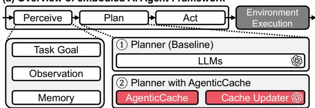  
(b) Evaluation Highlights (GPT-5)

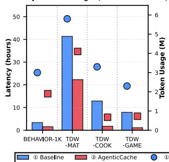

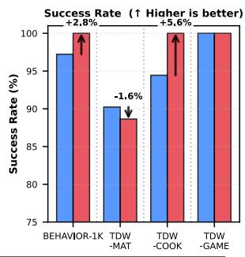  
Figure 1. Overview of AgenticCache. (a) Embodied AI agent framework. (b) Evaluation highlights on GPT-5.

LLM later verifies. Yet, these approaches still rely on LLM calls at every step, leaving runtime overhead.

In practice, the next plan is often predictable from the local context, a property we refer to as plan locality (Sutton et al., 1998). For example, once an object has been grasped, placing it at the target location is often the natural next step. Humans naturally exploit such regularities through accumulated experience, forming an internal cache of short-horizon plans that enables fast, intuitive responses without deliberate reasoning at every step (Daw et al., 2005; Botvinick et al.,

2019). Inspired by this observation, we ask:

Can embodied agents similarly leverage a cache-based mechanism to reuse plans and avoid per-step LLM calls, thereby reducing latency and cost?

In this paper, we show that they can, because embodied tasks exhibit strong plan locality. We introduce Agentic-Cache, which reuses cached plans so the agent avoids calling the LLM at every step. As illustrated in Figure 1(a), the agent queries a runtime cache of frequent plan transitions at every planning step, while a background Cache Updater asynchronously calls the LLM to validate and refine cached entries. The savings come from two reasons. First, on a cache hit, the agent can chain multiple cached plans and act continuously, completing several actions before a single background LLM query returns. Second, when the LLM response arrives, the updater either confirms the current plan and waits for it to finish before querying again, or immediately swaps in a correction. As the cache accumulates validated transitions during execution, both latency and cost continue to decrease. As shown in Figure 1(b), Agentic-Cache achieves up to 86% latency reduction and 79% cost savings with GPT-5 on TDW-COOK, while maintaining a 97% average task success rate across four benchmarks.

AgenticCache is complementary to modern LLM serving and efficiency techniques (Kwon et al., 2023; Zheng et al., 2024; Park et al., 2025) and compatible with multi-agent simulation frameworks (Xie et al., 2025). Our contributions are as follows:

• We identify plan locality as a key property of embodied tasks, showing plan transitions follow predictable shorthorizon patterns that enable cache-based planning.

• We introduce AgenticCache, a runtime cache of plan transitions asynchronously maintained by an LLM updater, enabling efficient embodied AI agents.

• We evaluate AgenticCache across four long-horizon multi-agent benchmarks and three model scales, demonstrating on average a 22% higher task success rate, 50% lower token usage, and 65% lower latency.

## 2 BACKGROUND

In this section, we review LLM-powered embodied agents (Section 2.1), parallel planning strategies (Section 2.2), and existing cache mechanisms (Section 2.3). Together, these motivate a cache design for embodied planning.

## 2.1 Embodied AI Agents Powered by LLMs

Embodied AI Framework. Figure 1(a) illustrates the embodied AI framework. An embodied agent typically operates through three core stages: perceive, plan, and act. It first perceives the environment by gathering observations, tracking task goals, and maintaining memory. It then plans by decomposing long-horizon objectives into subgoals. Finally, it acts by executing these actions in the environment. The environment is then updated, yielding new observations for the next round of perception and planning.

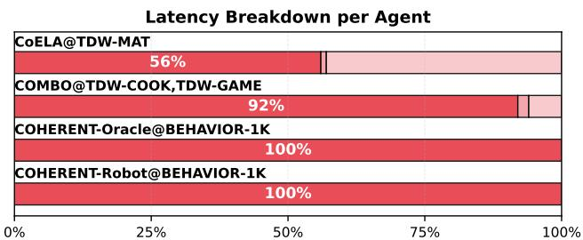

Latency Breakdown in Whole Simulation  
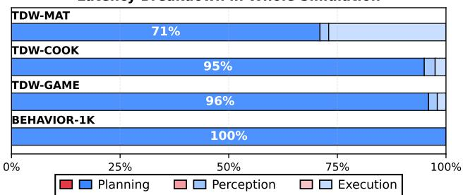  
Figure 2. Latency breakdown across agents and benchmarks.

LLM-Powered Embodied Agents. Recent advances in training and inference have significantly improved the reasoning capabilities of LLMs (Guo et al., 2025; Brown et al., 2024; Wu et al., 2025a;b). As a result, embodied AI systems increasingly use LLMs as reasoning cores that process perceptual inputs and generate high-level plans (Yao et al., 2023; Shinn et al., 2023; Li et al., 2023). However, this design creates substantial latency and cost bottlenecks. As shown in Figure 2, over 70% of runtime across benchmarks is spent on LLM queries for planning. At each step, the agent must wait for the LLM’s response before acting, forming a synchronous plan-act loop as illustrated in Figure 3(a).

## 2.2 Planning Parallelism in Embodied AI Agents

Asynchronous Parallel Planning Strategies. To address the latency bottleneck of synchronous planning, recent work explores asynchronous planning strategies:

(1) Parallelized Planning-Acting (Li et al., 2026). Queries the next plan while executing the current one, partially hiding LLM latency. However, as shown in Figure 3(b), the generated plan may become invalid when the environment changes, requiring replanning and adding runtime overhead.

(2) Speculative Planning (Hua et al., 2025). Uses a smaller LLM to propose actions that are later verified by a larger LLM. However, as shown in Figure 3(c), it performs poorly in realistic environments where correcting wrong actions, such as moving back or undoing manipulations, takes time.

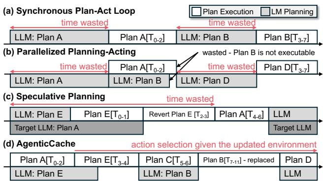  
Figure 3. Comparison of four planning strategies. (a) Synchronous plan-act loop. (b) Parallelized planning-acting. (c) Speculative planning. (d) AgenticCache.

Limitations of Existing Parallel Planning. A limitation of both methods is their reliance on repeated LLM queries for plan generation, so the LLM cost scales linearly with the trajectory length. Neither method exploits the recurring structure of plans across timesteps, treating every step as a fresh decision even when the current and next plans follow a predictable pattern. Reusing familiar plan patterns through a cache, as discussed in Section 1, offers an alternative that avoids per-step LLM queries, which we explore next.

## 2.3 Caching Mechanisms

Caching is a common way to reduce redundant computation in LLM systems. Existing approaches cache reusable information at several levels, from token-level activations to full responses and higher-level task patterns:

(1) KV Cache (Kwon et al., 2023; Zheng et al., 2024). Stores key-value states from previous decoding steps, allowing the model to reuse them when generating subsequent tokens without recomputing the entire prefix.

(2) Context Cache (Bang, 2023; Hu et al., 2024; 2025). Caches prompt-response pairs or similar contexts. When a new request matches a cached entry, the system can reuse the cached response instead of invoking the model again.

(3) Template Cache (Zhang et al., 2025b; Ruan et al., 2025). Caches plan templates or structured outputs associated with recurring task patterns. Cache hits are determined by similarity or pattern matching against stored templates.

Limitations of Existing Caches. Existing caching mechanisms are primarily designed for LLM inference rather than embodied agents. They reduce redundant computation inside the model, but do not reduce repeated LLM invocations during execution. In the next section, we show that embodied tasks exhibit strong plan locality, which AgenticCache directly exploits for a cache-based planner.

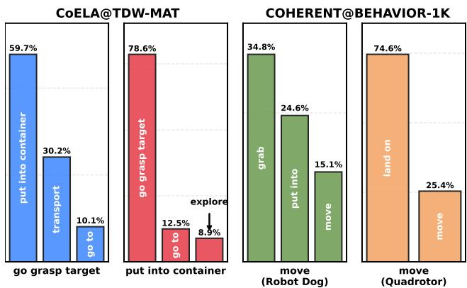  
Figure 4. Probability distribution of successor plans under a 2- gram model from GPT-5 execution trajectories.

## 3 PLAN LOCALITY IN EMBODIED AI AGENTS

In this section, we show that embodied AI tasks exhibit widespread plan locality (Section 3.1), yet locality alone is insufficient under dynamic environments, motivating AgenticCache’s hybrid cache-LLM design (Section 3.2).

## 3.1 Plan Locality

2-Gram Plan Locality. Long-horizon embodied tasks exhibit strong plan locality, where certain plan transitions occur with high regularity. Figure 4 presents a 2-gram analysis of plan transitions, showing that many plans have only a small set of likely successors. For example, after executing “go grasp target,” the next plan is “put into container” in 59.7% of cases. This regularity suggests that embodied agents often follow stable short-horizon patterns rather than switching arbitrarily between plans, making cached reuse of familiar plans a promising strategy.

## 3.2 Beyond Pure Locality

Limitations of Pure Locality. As shown in Figure 5, simply following cached plan patterns without considering the evolving environment leads to performance degradation compared to GPT-5 agents. This shows that plan locality alone is insufficient: while many transitions are predictable, environmental changes can invalidate cached plans. For example, a cached GoGrasp transition may fail if another agent has already picked up the target object, or the environment has moved it out of reach.

Toward Hybrid Planning. To remain robust in such settings, agents must combine fast cache-based reuse with selective LLM reasoning. Pure cache reuse risks acting on stale information, while always consulting the LLM reintroduces the latency that caching is meant to avoid. This hybrid mechanism allows the agent to act efficiently in familiar contexts while invoking the planner only when new or uncertain situations arise. This need for both efficiency and contextual adaptability motivates the design of AgenticCache.

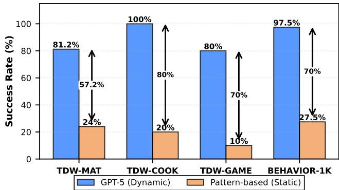  
Figure 5. Pattern-based agents exploit plan locality but suffer large performance gaps without context-aware updates.

## 4 AGENTICCACHE DESIGN

In this section, we present AgenticCache’s design, covering the cache as a local planner (Section 4.1), the asynchronous Cache Updater (Section 4.2), an optional warm-start strategy (Section 4.3), and a runtime example (Section 4.4).

## 4.1 AgenticCache as a Planner

AgenticCache Structure. Each embodied agent maintains its own cache, which serves as a lightweight planner storing frequent plan-to-plan transitions. As illustrated in Figure 6(c), each cache entry is represented as a 2-gram pattern ⟨Pi → Pj⟩, where Pi and Pj denote consecutive high-level plans (e.g., GoGrasp→ Transport). In addition to transition statistics, each entry records a set of task-state metadata fields extracted from both offline and online episodes. The specific metadata fields depend on the information available to each agent and the benchmark environment. For each field, the cache stores the observed minimum and maximum as an integer range, capturing the state conditions under which the transition has historically occurred. Figure 6 shows a concrete example from a TDW-MAT task, where the metadata includes the episode step index (Steps), the number of held objects (# of Items), the number of completed sub-goals (# of finished), and the number of visited rooms (# of visited rooms). Other benchmarks use a different subset of state features, typically object counts and progress toward sub-goals.

Runtime Query and Filtering. During execution, the control loop queries the cache with the previous plan Pi and the current task-state metadata as keys. A filtering stage removes entries whose metadata ranges conflict with the current state, yielding the feasible candidate set:

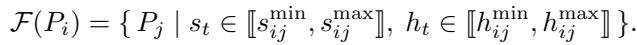

Scoring and Selection. The next plan is selected by maximizing a composite score among feasible candidates:

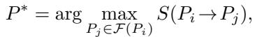

where the score is defined as

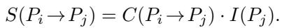

The two factors capture complementary signals. C(Pi → Pj ) is the transition count, i.e., how many times plan Pj has been observed immediately after Pi during execution. A high C means the transition is frequent, but frequency alone can be misleading, since a locally frequent transition may not be globally reliable. The importance factor I(Pj ) compensates for this by measuring how often Pj is confirmed by the background LLM:

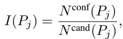

where N cand(Pj) is the number of times Pj has appeared as a feasible candidate during cache queries, and N conf(Pj ) is the number of times the background LLM subsequently confirmed Pj as the correct plan.

This design mirrors hybrid branch predictors that combine local and global history (Yeh & Patt, 1993; Smith, 1998): C is a local signal specific to the Pi → Pj transition, while I is a global signal aggregated across all contexts in which Pj appeared as a candidate. Their product rewards transitions that are both locally frequent and globally reliable, so neither signal alone dominates. In Figure 6(c), the Count, Importance, and Score columns correspond to C(Pi → Pj), I(Pj), and S(Pi → Pj), respectively.

## 4.2 AgenticCache Updater

The AgenticCache Updater (Figure 6(b)) is a background LLM process that maintains cache quality during execution. It asynchronously queries the LLM to validate, correct, and refine cache entries without blocking execution.

Update Mechanism. When issuing a query, the updater records the current context ct and the active plan pt. After an asynchronous delay of k steps, it receives the LLM’s response p′t+k and compares this prediction against the executed plan trajectory {pt+1, . . . , pt+k} to determine whether the cache’s choice was correct.

(1) Confirmation. If p′t+k already appears in the executed trajectory, the cache has correctly anticipated the LLM’s choice. The updater reinforces the corresponding transition by incrementing its transition count C(pt → p′t+k) and confirmation count N conf(p′t+k).

(2) Correction. If p′t+k does not appear in the recent trajectory, the cache mispredicted the LLM’s preferred plan.

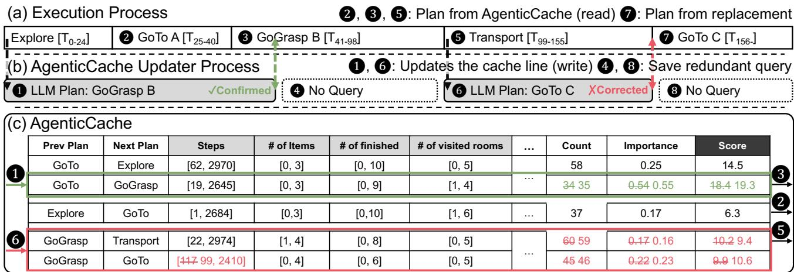  
Figure 6. Runtime example of AgenticCache execution.

The updater then (a) adds a new or updated transition for pt → p′ , (b) decreases the counts of the mispredicted transition, and (c) replaces the ongoing plan with p′t+k if it is executable. This immediate replacement preserves robustness under stale cache hits. Rather than waiting for the current cached plan to fully terminate, the agent switches to the corrected plan as soon as the updater detects that the cached plan is no longer appropriate.

Query Control. The updater issues LLM queries periodically throughout execution, but suppresses redundant queries in two cases described below.

(1) Confirmation suppression. When the LLM response confirms the currently executing plan, no further queries are issued until that plan finishes. Since the cache and LLM agree on the current action, queries during this window would yield no new information and consume tokens.

(2) Correction suppression. After a correction replaces the ongoing plan, additional queries are withheld until the replacement plan completes execution, preventing conflicting corrections that could destabilize ongoing execution.

Cache Miss. A cache miss occurs when no feasible plan can be retrieved, either because the situation is unseen or all candidates are filtered out by the metadata ranges. Highlevel planning temporarily pauses, and the updater requests a new plan from the LLM. The new plan is inserted as a fresh cache entry, and the agent resumes execution.

Summary. Together, the cache and updater form a symbiotic system. The cache functions as a fast, pattern-based planner that exploits historical regularities, while the updater provides context-aware correction grounded in LLM reasoning. This asynchronous cooperation enables continuous, low-latency decision-making while preserving adaptability in dynamic environments.

## 4.3 Offline Pattern Prefilling for Warm-Start

Motivation. Like caches in computer architecture, AgenticCache suffers cold misses when an episode starts with no prior transitions. The agent must then wait for the LLM to produce the first few updates, reintroducing the latency that caching aims to avoid. To mitigate this, we provide an optional offline pattern prefilling procedure.

Before execution, we initialize the cache with plan-to-plan transitions extracted from successful GPT-5 trajectories on out-of-distribution tasks. Each transition is inserted with its estimated conditional probability and metadata range, producing a warm-start cache.

Role of Prefilling. Prefilling lets the agent act immediately from the beginning of an episode, avoiding cold-start delay while the cache continues to evolve online. However, it is not a prerequisite. The updater bootstraps an empty cache online just as well, and our cold-start evaluation (Section 5) confirms that AgenticCache retains most of its latency and cost savings even without prefilling. In practice, prefilling mainly improves the first several decisions of an episode, while the core benefits of asynchronous cache-guided planning emerge once the cache is populated online.

## 4.4 Runtime Workflow Example of AgenticCache

Figure 6 walks through how AgenticCache and its Updater interact throughout an episode.

Cache-Guided Planning. At the start of the episode, the agent executes an initial Explore plan while the updater issues a periodic LLM query on the current observation metadata (Step 1 in Figure 6(b)). When Explore finishes, the agent queries the cache with it as the previous plan; since no entries are filtered out, the cache returns GoTo A as the highest-scoring candidate (Step 2 in Figure 6(a)). After GoTo A completes at step 40, the cache is queried again;

entries such as GoTo→Explore are filtered out by steprange mismatch, and GoGrasp B is selected (Step 3 ).

Asynchronous LLM Feedback. During the execution of GoGrasp B, the earlier LLM query (from Step 1 ) returns, confirming GoGrasp B as the correct next plan. Since this matches the currently executing plan, the system increments the transition’s count and importance ( 1 in Figure 6(c)) and applies confirmation suppression, withholding further queries until GoGrasp B completes (Step 4 ).

Cache Correction. After completing GoGrasp B, the agent queries the cache again with updated metadata. Transitions such as GoGrasp → GoTo are filtered out, while GoGrasp→Transport achieves the highest score and is executed (Step 5 ). Since a new plan has begun and no suppression is active, the updater issues its next periodic LLM query (Step 6 ). While executing Transport, the LLM response arrives, proposing GoTo C as the next plan. Since GoTo C does not appear in the recent trajectory, the system replaces the ongoing plan with GoTo C (Step 7 ). The cache decreases the count and importance of the incorrect transition GoGrasp → Transport and increments those of the newly proposed transition. The entry’s metadata (Steps) is updated from 117 to 99. The updater then applies correction suppression and withholds queries until GoTo C completes (Step 8 ).

## 5 EVALUATION

In this section, we evaluate AgenticCache on four multiagent embodied benchmarks across three model scales (Sections 5.1–5.2). We report main results and analyses (Sections 5.3–5.6), ablation and cache validity studies (Sections 5.7–5.8), and close with a discussion (Section 5.9). See Appendix A for artifact and reproduction details.

## 5.1 Evaluation Setup

Platform and Models. All experiments are conducted on a workstation with an NVIDIA GeForce RTX 4090 GPU and an AMD Ryzen 9 7950X 16-core CPU. We use GPT-5, GPT-5-mini, and GPT-5-nano (OpenAI, 2025b;c;d) as planners through the OpenAI API (OpenAI, 2025a). Reported cost figures are derived from measured input and output token counts multiplied by OpenAI’s listed per-token prices for each model at the time of evaluation (October 2025).

Cache Prefilling. Each benchmark prefills the cache from training episodes disjoint from the evaluation set. We use 4, 2, 1, and 4 training episodes for TDW-MAT, TDW-COOK, TDW-GAME, and BEHAVIOR-1K, respectively, with evaluation on 44, 18, 9, and 36 episodes. The main results (denoted Ours+) use this warm-start configuration; coldstart results without prefilling can be found in Section 5.4.

Table 1. Benchmark characteristics. Plan.: planner modality (LLM or VLM); #Ag.: number of agents; Coord.: coordination style (Decent. = decentralized, Cent. = centralized); Env.: simulation environment (TDW = ThreeDWorld, Graph = graph-structured).  
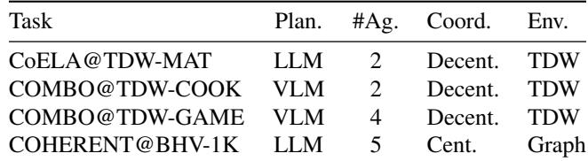

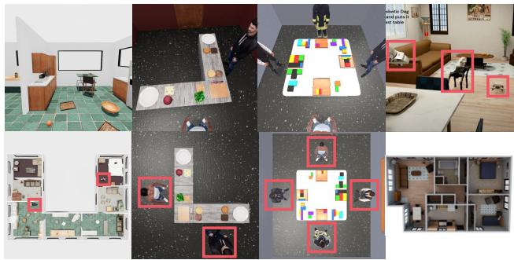  
Figure 7. Snapshots from the four benchmark environments, with agents highlighted in red.

Benchmarks. Table 1 and Figure 7 summarize the four benchmarks. The three TDW tasks are built on ThreeD-World (Gan et al., 2021), a Unity-based 3D simulator.

(1) TDW-MAT (Zhang et al., 2024). A transport task where agents coordinate to move large objects via containers, combining navigation, manipulation, and communication.

(2) TDW-COOK (Zhang et al., 2025a). A cooperative cooking task with agents that follow recipes with strong temporal dependencies across subtasks.

(3) TDW-GAME (Zhang et al., 2025a). A puzzle assembly task requiring VLM reasoning and multi-stage coordination.

(4) BEHAVIOR-1K (Li et al., 2022; 2024). Evaluated with the COHERENT (Liu et al., 2025a) agent framework, which re-expresses the original simulation as a graph-structured environment and models collaboration among heterogeneous robots (arm, dog, and quadrotor) on household transport tasks. For this benchmark, we merge per-agent LLM queries into a single reasoning call per timestep to reduce communication overhead.

Together, these benchmarks provide a diverse testbed for evaluating how AgenticCache improves efficiency while maintaining task performance. All prompts used for these experiments are provided in Appendix B.

Table 2. Planning strategy performance across four benchmarks and three model scales. SR: success rate; L: latency (hours); T: token usage; C: cost (USD). Ours+ denotes AgenticCache with warm-start cache prefilling.  
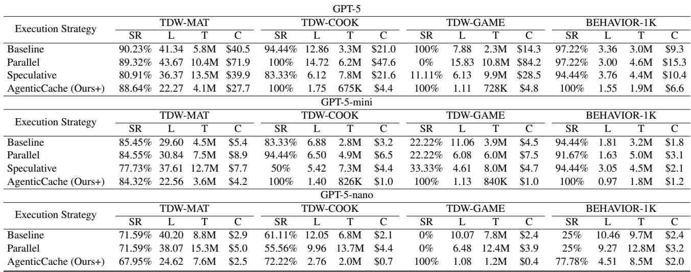

## 5.2 Baselines

We compare AgenticCache against three planning methods:

(1) Synchronous Baseline. We adopt CoELA (Zhang et al., 2024), COMBO (Zhang et al., 2025a), and COHER-ENT (Liu et al., 2025a) as synchronous LLM-based agents. For CoELA, we apply the planning-then-communication strategy from ReCA (Wan et al., 2025) to reduce cost and runtime. COMBO reproduction requires training three VLMs and three diffusion models; we use a streamlined variant that preserves its modular plan-act structure, replacing the beam-search process (14 VLM calls and 22 diffusion inferences) with a single VLM and diffusion call. After prompt optimization, our GPT-5 reimplementation achieves success rates comparable to prior reports.

(2) Parallelized Planning-Acting (Li et al., 2026). Originally proposed for the Odyssey benchmark (Liu et al., 2025b), this approach overlaps planning with execution by issuing LLM queries during ongoing actions. We adapt it to TDW and BEHAVIOR environments. Plans with higher predicted importance preempt current actions, following the priority mechanism from the original paper.

(3) Speculative Planning (Hua et al., 2025). Developed for OpenAGI (Ge et al., 2023) and TravelPlanner (Xie et al., 2024), this framework executes provisional actions while awaiting high-confidence plans from a stronger model. In our adaptation, GPT-5-nano serves as the lightweight drafter, with GPT-5 or GPT-5-mini as the target model, and we cap speculative depth at three steps.

## 5.3 Quantitative Results

Main Results. As shown in Table 2, AgenticCache consistently achieves high task success rates. With GPT-5 and

GPT-5-mini it reaches 84–100% across environments, and with GPT-5-nano it reaches 68–100%. Baselines struggle in multi-agent settings. On TDW-GAME, parallelized planning achieves 0–22% and speculative planning 11–33%, while AgenticCache reaches 100% across all three models. On TDW-COOK, speculative planning drops to 50% with GPT-5-mini, whereas AgenticCache maintains 100%. Parallelized planning does slightly better on other tasks but still suffers from stale prefetches that become invalid once the environment changes. In contrast, AgenticCache’s asynchronous updates keep cached plans fresh, avoiding rollbacks and preserving coordinated actions across agents.

Latency and Cost Efficiency. AgenticCache also substantially reduces latency and cost. Across all 12 configurations, it lowers average latency by 65% and token consumption by 50% (Table 2). For instance, on TDW-COOK with GPT-5, latency drops from 12.86 hours to 1.75 hours (7.4×) and cost from \$21.0 to \$4.4 (4.8×). These gains come from asynchronous cache updates that cut idle waiting and redundant queries, yielding low-latency, low-cost execution.

## 5.4 Cold-Start Evaluation Without Offline Prefilling

To test whether offline prefilling is necessary, we evaluate AgenticCache from an empty cache against the synchronous baseline on both standard and long-horizon tasks. Tables 3 and 4 report results, with “Ours” denoting AgenticCache with no prefilling.

Results. On standard tasks, AgenticCache reduces latency by 1.4–1.9× and cost by 1.35× across all three model scales while maintaining comparable success rates. On long-horizon tasks, the same efficiency gains persist (1.3– 1.9× latency, 1.4–1.8× cost), and AgenticCache improves success rate with GPT-5-nano (42.8%→62.8%) and GPT-5- mini (62.8%→69.4%), while slightly trading off for GPT-5 (82.2%→80.6%). These results indicate that cold misses cause only transient stall overhead during early cache construction rather than preventing cache-guided planning from being effective. The GPT-5 SR drop likely arises from two effects that long-horizon episodes amplify. First, stale transitions remain locally plausible but become suboptimal after delayed environment changes. Second, independently reused transitions can lead to coordination conflicts.

Table 3. Cold-start results on standard tasks. SR: success rate; L: latency (hours); T: token usage; C: cost (USD).  
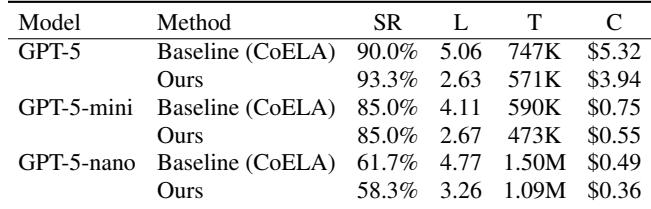

Table 4. Cold-start results on long-horizon tasks. SR: success rate; L: latency (hours); T: token usage; C: cost (USD).  
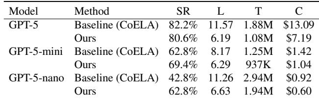

## 5.5 Cache Hit/Miss Rate and Fallback Latency

Results and Analysis. Figure 8(a) shows that the bigram cache achieves high hit rates in structured environments, reaching over 66% on TDW-GAME and at least 73% on BEHAVIOR-1K. On TDW-COOK, hit rates drop to 39–46% due to greater plan diversity, with remaining accesses falling back to LLM queries. Figure 8(b) reports fallback latency on cache misses. TDW-based tasks incur 9–29 s per fallback due to vision-language model overhead, while BEHAVIOR-1K maintains low latency at 5.2–7.1 s. These results show that AgenticCache’s efficiency gains are most pronounced in environments with high plan regularity, and that minimizing cache misses is critical in latency-sensitive deployments.

## 5.6 Cache Size and Memory Dynamics

We next check whether the cache causes meaningful memory overhead or unbounded growth during long episodes.

Results and Analysis. The cache footprint remains extremely small across tasks, ranging from 0.1 KB to 1.0 KB per agent (Table 5). Transition counts (Table 6) grow quickly during the early phase of each run, then slow noticeably after roughly 1,500 steps. This pattern reflects the cache rapidly absorbing recurring transitions and then refining existing entries rather than continuously allocating new ones. Together, these results indicate that AgenticCache imposes negligible memory overhead while avoiding unbounded cache growth.

(a) Cache Hit / Miss Rate  
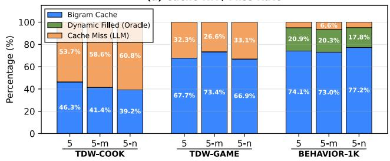

(b) Cache Miss Fallback Latency  
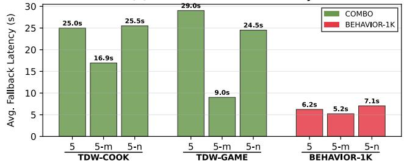  
Figure 8. Cache performance across benchmarks and model scales. (a) Hit/miss rate breakdown. (b) Fallback latency on cache misses.

Table 5. Cache statistics per agent. N denotes the number of stored transitions, M the number of metadata fields used for filtering, and Size the memory footprint N ×(4+PMi=1 si) bytes, where si = 4 for numeric fields and si = 1 for binary fields.  
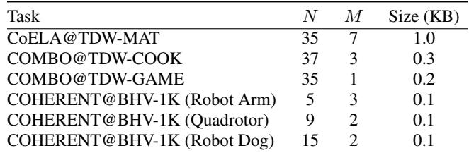

## 5.7 Ablation Study

Experimental Setup. We ablate AgenticCache’s two main components, asynchronous cache updates and plan replacement. Four variants are evaluated: (1) a static cache without either mechanism, (2) cache updates only, (3) plan replacement only, and (4) the full system combining both.

Results and Analysis. As shown in Figure 9, enabling cache updates alone improves task success by 12%, reflecting better adaptation to dynamic observations. Plan replacement further contributes a 35% gain on average by correcting mispredicted actions on the fly. When both mechanisms are combined, the system achieves an average success rate of 70.7%, outperforming the static baseline at 24%. These results confirm that cache updates and plan replacement act synergistically, addressing complementary failure modes.

Table 6. Growth dynamics. Average number of stored transitions N across episode steps.  
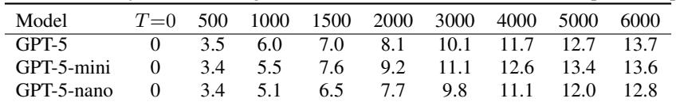

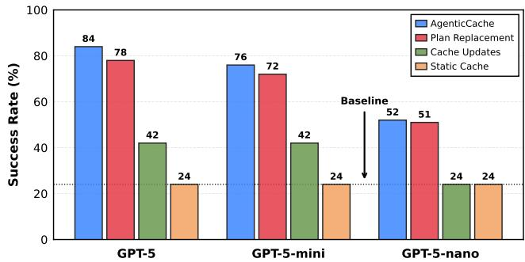  
Figure 9. Ablation of AgenticCache components on TDW-MAT, comparing static cache, cache updates only, plan replacement only, and the full system.

## 5.8 Cache Validity Analysis

Experimental Setup. To evaluate the reliability of cached plans over time, we measure the Plan Execution Accuracy. At each frame, an action is judged correct if it matches the plan that GPT-5 would have selected in the same state. The metric is computed as the difference between the cumulative correct and wrong plan frames, normalized by the current frame number. We overlay the final task success rates for AgenticCache (Ours+) and the synchronous baseline (BL) on the right axis for reference. Using GPT-5 as the reference planner, since it is the strongest model in our evaluation and best approximates ground-truth plans, we compare three configurations: AgenticCache with GPT-5, GPT-5-mini, and GPT-5-nano, all with dynamic cache updates.

Results and Analysis. As shown in Figure 10, all three dynamic AgenticCache variants show steadily improving plan execution accuracy over time. GPT-5 (blue) achieves the highest accuracy, rising to approximately 0.52 by frame 3000, followed by GPT-5-mini (red) at approximately 0.49 and GPT-5-nano (green) at approximately 0.31. This ordering aligns with model capability: stronger models produce higher-quality cache updates that better approximate oracle planning, consistent with their stronger base reasoning.

Interestingly, GPT-5-mini briefly surpasses GPT-5 in the early frames (around frame 100–500). This is because GPT-5-mini has lower inference latency, enabling shorter cache update cycles; as a result, GPT-5-mini accumulates more frequent cache refreshes in the initial phase, temporarily outpacing the slower but higher-quality updates of GPT-5. As more frames elapse, GPT-5’s superior plan quality compensates for its longer update interval, and it ultimately achieves the highest accuracy.

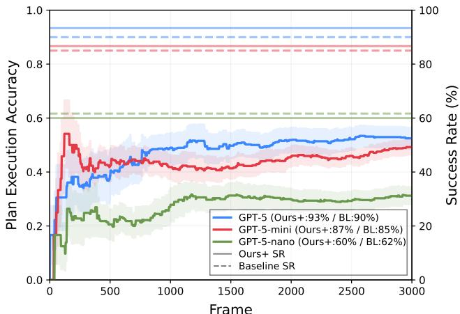  
Figure 10. Plan execution accuracy for AgenticCache with GPT-5, GPT-5-mini, and GPT-5-nano over time.

Notably, the success rate annotations on the right axis confirm that AgenticCache (Ours+) matches or slightly exceeds the synchronous baseline (BL) for GPT-5 (93% vs. 90%) and GPT-5-mini (87% vs. 85%), while GPT-5-nano shows comparable performance (60% vs. 62%). These results demonstrate that even moderate plan execution accuracy is sufficient to maintain competitive task success, validating that AgenticCache’s cache-driven planning remains reliable even when exact plan matches are imperfect.

## 5.9 Discussion

Memory Lifespan and Short-Term Recall. In computational systems, not all memories are worth retaining for long durations (Li et al., 2025). Accessing large-scale memory structures, such as GPU high-bandwidth memory (HBM) or external vector databases, incurs significant latency and energy costs compared to local on-chip storage. The same principle applies to embodied agents: most contextual information in embodied interaction is short-lived and quickly overwritten by new sensory input, making it inefficient to rely solely on global memory retrieval. AgenticCache provides an architectural analogue to short-term memory, storing transient yet behaviorally relevant plan transitions directly within the agent. By keeping frequently reused plans close to the execution loop and updating them asynchronously, AgenticCache achieves fast recall, low overhead, and responsiveness without the cost of global memory retrieval.

Toward Lifelong Adaptation. AgenticCache begins with an empty cache that depends on LLM guidance, but through repeated interaction it fills and refines this cache until familiar transitions can be recalled instantly, transforming episodic experience into reusable procedural memory. This mirrors the shift from deliberate reasoning to intuitive action, enabling stable yet adaptive behavior across long deployments of agentic systems with less LLM reliance.

## 6 LIMITATIONS & FUTURE WORK

Failure Case: Multi-Agent Coordination and Resource Contention. In multi-agent environments, cache reuse can fail at coordination points. For example, one agent may correctly follow a locally frequent transition while another deviates due to different observations or update timing, resulting in rendezvous mismatches such as duplicated effort or missed handoffs. A related issue arises around shared resources (e.g., cutting boards, interaction zones): a cached transition valid in isolation may cause contention or brief deadlock cycles when another agent simultaneously claims the same resource. The updater can often correct these behaviors, but the correction may arrive after several steps.

Scope of Plan Locality. The benchmarks evaluated in this work primarily involve structured manipulation and transport tasks, where plan transitions exhibit strong regularity. In more open-ended settings, such as free-form exploration or creative problem-solving, plan locality may be weaker, potentially reducing cache hit rates and limiting the benefits of AgenticCache. Evaluating the framework in less structured environments remains an important direction.

Future Directions. Several directions can address the above limitations. First, extending the cache to higher-order transition representations, such as 3-gram indexing or hierarchical subroutine fragments, could better capture delayed dependencies that 2-gram locality misses. Second, prioritybased coordination protocols, including resource reservations and lightweight conflict-resolution rules, could align local cache efficiency with global multi-agent consistency. Third, the cache itself could be made more adaptive, for example by learning its scoring function or when to defer to the LLM, based on execution feedback. A broader open question is whether similar cache designs can benefit less structured domains, where plan locality is weaker.

## 7 RELATED WORK

Caching and Memoization in LLM Systems. Recent work has explored caching mechanisms for LLMs. MemGPT (Packer et al., 2023) maintains conversational memory across sessions, while Agentic Plan Caching (Zhang et al., 2025b) stores reusable plan templates to reduce inference costs. At the semantic level, systems such as GPTCache (Bang, 2023) and Semantic Cache (Jónsson et al., 2006; Dar et al., 1996) store query–response pairs for exact or similar queries. These approaches, however, focus on token-level or response-level caching rather than plan-level patterns. AgenticCache uniquely exploits temporal dependencies between sequential decisions in embodied tasks, where recurring plan transitions create a caching opportunity that prior work does not target.

Predictive Prefetching and Speculative Execution. Our work draws inspiration from computer architecture. Branch prediction (Smith, 1998; Yeh & Patt, 1993; Seznec, 2007; Villon et al., 2023; Seznec, 2011) and speculative execution (Gabbay & Mendelson, 1996; Kocher et al., 2020; Gabbay & Mendelson, 1998; Moshovos & Sohi, 2002) continue computation based on predicted outcomes, analogous to how AgenticCache executes predicted plans while awaiting LLM responses. More recently, SpecInfer (Miao et al., 2024) and Medusa (Cai et al., 2024) apply speculative decoding to accelerate LLM inference. AgenticCache extends these ideas to agent planning, treating plans as coarse-grained “branches” that can be predicted and speculatively executed.

Learning from Demonstrations and Trajectory Replay. Imitation learning methods (Abbeel & Ng, 2004; Ross et al., 2011) and trajectory optimization techniques (Todorov & Li, 2005; Kalakrishnan et al., 2011) learn policies from expert demonstrations. Similarly, ALFRED (Shridhar et al., 2020) and TEACh (Padmakumar et al., 2022) collect human demonstrations for embodied instruction following. While these approaches use offline data to train policies, AgenticCache leverages demonstrations differently: it extracts frequent transition patterns for cache initialization, enabling immediate deployment without retraining. In our evaluation, this requires only 1–4 training episodes per benchmark, compared with thousands typical for policy learning.

## 8 CONCLUSION

We present AgenticCache, a cache-driven planning framework that reuses frequent plan transitions to avoid per-step LLM calls in embodied AI agents. Each agent queries a runtime cache of plan transitions at every step, while a background Cache Updater asynchronously validates and refines cached entries with the LLM. This design exploits the strong plan locality we observed in embodied tasks, keeping the agent responsive without blocking on LLM inference.

Across four multi-agent embodied benchmarks and three model scales, AgenticCache improves task success rate by 22% on average, reduces simulation latency by 65%, and lowers token usage by 50%. These results indicate cachebased plan reuse as a practical lever for low-latency, lowcost embodied agents. Similar cache designs may benefit other agent settings where short-horizon decisions follow predictable patterns, and we leave this to future work.

## ACKNOWLEDGEMENTS

This research was supported in part with gifts from Apple and Google. We thank Yeonjae Kim (SNU) and Yeonhong Park (Meta) for their insightful feedback on our work.

## REFERENCES

Abbeel, P. and Ng, A. Y. Apprenticeship learning via inverse reinforcement learning. In International Conference on Machine Learning, pp. 1, 2004.

Bang, F. Gptcache: An open-source semantic cache for llm applications enabling faster answers and cost savings. In Proceedings of the Workshop for Natural Language Processing Open Source Software (NLP-OSS), pp. 212– 218, 2023.

Botvinick, M., Ritter, S., Wang, J. X., Kurth-Nelson, Z., Blundell, C., and Hassabis, D. Reinforcement learning, fast and slow. Trends in cognitive sciences, 23(5):408– 422, 2019.

Brown, B., Juravsky, J., Ehrlich, R., Clark, R., Le, Q. V., Ré, C., and Mirhoseini, A. Large language monkeys: Scaling inference compute with repeated sampling. arXiv preprint arXiv:2407.21787, 2024.

Cai, T., Li, Y., Geng, Z., Peng, H., Lee, J. D., Chen, D., and Dao, T. Medusa: Simple llm inference acceleration framework with multiple decoding heads. In International Conference on Machine Learning, 2024.

Dar, S., Franklin, M. J., Jonsson, B. T., Srivastava, D., Tan, M., et al. Semantic data caching and replacement. In VLDB, volume 96, pp. 330–341, 1996.

Daw, N. D., Niv, Y., and Dayan, P. Uncertainty-based competition between prefrontal and dorsolateral striatal systems for behavioral control. Nature neuroscience, 8 (12):1704–1711, 2005.

Gabbay, F. and Mendelson, A. Speculative execution based on value prediction. Technical report, Technion, Israel Institute of Technology, 1996.

Gabbay, F. and Mendelson, A. Using value prediction to increase the power of speculative execution hardware. ACM Trans. Comput. Syst., 16(3):234–270, August 1998. ISSN 0734-2071. doi: 10.1145/290409.290411. URL https://doi.org/10.1145/290409.290411.

Gan, C., Schwartz, J., Alter, S., Mrowca, D., Schrimpf, M., Traer, J., De Freitas, J., Kubilius, J., Bhandwaldar, A., Haber, N., et al. Threedworld: A platform for interactive multi-modal physical simulation. In Advances in Neural Information Processing Systems, Datasets and Benchmarks Track, 2021.

Ge, Y., Hua, W., Mei, K., Ji, J., Tan, J., Xu, S., Li, Z., and Zhang, Y. Openagi: When llm meets domain experts. In Advances in Neural Information Processing Systems, 2023.

Guo, D., Yang, D., Zhang, H., Song, J., Wang, P., Zhu, Q., Xu, R., Zhang, R., Ma, S., Bi, X., Zhang, X., Yu, X., Wu, Y., Wu, Z. F., Gou, Z., Shao, Z., Li, Z., Gao, Z., Liu, A., Xue, B., Wang, B., Wu, B., Feng, B., Lu, C., Zhao, C., Deng, C., Ruan, C., Dai, D., Chen, D., Ji, D., Li, E., Lin, F., Dai, F., Luo, F., Hao, G., Chen, G., Li, G., Zhang, H., Xu, H., Ding, H., Gao, H., Qu, H., Li, H., Guo, J., Li, J., Chen, J., Yuan, J., Tu, J., Qiu, J., Li, J., Cai, J. L., Ni, J., Liang, J., Chen, J., Dong, K., Hu, K., You, K., Gao, K., Guan, K., Huang, K., Yu, K., Wang, L., Zhang, L., Zhao, L., Wang, L., Zhang, L., Xu, L., Xia, L., Zhang, M., Zhang, M., Tang, M., Zhou, M., Li, M., Wang, M., Li, M., Tian, N., Huang, P., Zhang, P., Wang, Q., Chen, Q., Du, Q., Ge, R., Zhang, R., Pan, R., Wang, R., Chen, R. J., Jin, R. L., Chen, R., Lu, S., Zhou, S., Chen, S., Ye, S., Wang, S., Yu, S., Zhou, S., Pan, S., Li, S. S., Zhou, S., Wu, S., Yun, T., Pei, T., Sun, T., Wang, T., Zeng, W., Liu, W., Liang, W., Gao, W., Yu, W., Zhang, W., Xiao, W. L., An, W., Liu, X., Wang, X., Chen, X., Nie, X., Cheng, X., Liu, X., Xie, X., Liu, X., Yang, X., Li, X., Su, X., Lin, X., Li, X. Q., Jin, X., Shen, X., Chen, X., Sun, X., Wang, X., Song, X., Zhou, X., Wang, X., Shan, X., Li, Y. K., Wang, Y. Q., Wei, Y. X., Zhang, Y., Xu, Y., Li, Y., Zhao, Y., Sun, Y., Wang, Y., Yu, Y., Zhang, Y., Shi, Y., Xiong, Y., He, Y., Piao, Y., Wang, Y., Tan, Y., Ma, Y., Liu, Y., Guo, Y., Ou, Y., Wang, Y., Gong, Y., Zou, Y., He, Y., Xiong, Y., Luo, Y., You, Y., Liu, Y., Zhou, Y., Zhu, Y. X., Huang, Y., Li, Y., Zheng, Y., Zhu, Y., Ma, Y., Tang, Y., Zha, Y., Yan, Y., Ren, Z. Z., Ren, Z., Sha, Z., Fu, Z., Xu, Z., Xie, Z., Zhang, Z., Hao, Z., Ma, Z., Yan, Z., Wu, Z., Gu, Z., Zhu, Z., Liu, Z., Li, Z., Xie, Z., Song, Z., Pan, Z., Huang, Z., Xu, Z., Zhang, Z., and Zhang, Z. Deepseek-r1 incentivizes reasoning in llms through reinforcement learning. Nature, 2025.

Hong, S., Zhuge, M., Chen, J., Zheng, X., Cheng, Y., Wang, J., Zhang, C., Wang, Z., Yau, S. K. S., Lin, Z., Zhou, L., Ran, C., Xiao, L., Wu, C., and Schmidhuber, J. MetaGPT: Meta programming for a multiagent collaborative framework. In International Conference on Learning Representations, 2024. URL https: //openreview.net/forum?id=VtmBAGCN7o.

Hu, C., Huang, H., Hu, J., Xu, J., Chen, X., Xie, T., Wang, C., Wang, S., Bao, Y., Sun, N., et al. Memserve: Context caching for disaggregated llm serving with elastic memory pool. arXiv preprint arXiv:2406.17565, 2024.

Hu, J., Huang, W., Wang, W., Wang, H., Hu, T., Zhang, Q., Feng, H., Chen, X., Shan, Y., and Xie, T. Epic: Efficient position-independent caching for serving large language

models. In International Conference on Machine Learning, 2025.

Hua, W., Wan, M., Vadrevu, S., Nadel, R., Zhang, Y., and Wang, C. Interactive speculative planning: Enhance agent efficiency through co-design of system and user interface. In International Conference on Learning Representations, 2025.

Jónsson, B. Þ., Arinbjarnar, M., Þórsson, B., Franklin, M. J., and Srivastava, D. Performance and overhead of semantic cache management. ACM Transactions on Internet Technology (TOIT), 6(3):302–331, 2006.

Kalakrishnan, M., Chitta, S., Theodorou, E., Pastor, P., and Schaal, S. Stomp: Stochastic trajectory optimization for motion planning. In IEEE International Conference on Robotics and Automation (ICRA), pp. 4569–4574. IEEE, 2011.

Kocher, P., Horn, J., Fogh, A., Genkin, D., Gruss, D., Haas, W., Hamburg, M., Lipp, M., Mangard, S., Prescher, T., Schwarz, M., and Yarom, Y. Spectre attacks: exploiting speculative execution. Commun. ACM, 63(7):93–101, June 2020. ISSN 0001-0782. doi: 10.1145/3399742. URL https://doi.org/10.1145/3399742.

Kwon, W., Li, Z., Zhuang, S., Sheng, Y., Zheng, L., Yu, C. H., Gonzalez, J. E., Zhang, H., and Stoica, I. Efficient memory management for large language model serving with pagedattention. In Proceedings of the ACM SIGOPS Symposium on Operating Systems Principles, 2023.

Li, C., Zhang, R., Wong, J., Gokmen, C., Srivastava, S., Martín-Martín, R., Wang, C., Levine, G., Lingelbach, M., Sun, J., Anvari, M., Hwang, M., Sharma, M., Aydin, A., Bansal, D., Hunter, S., Kim, K.-Y., Lou, A., Matthews, C. R., Villa-Renteria, I., Tang, J. H., Tang, C., Xia, F., Savarese, S., Gweon, H., Liu, C. K., Wu, J., and Fei-Fei, L. Behavior-1k: A benchmark for embodied ai with 1,000 everyday activities and realistic simulation. In Conference on Robot Learning (CoRL), 2022.

Li, C., Zhang, R., Wong, J., Gokmen, C., Srivastava, S., Martín-Martín, R., Wang, C., Levine, G., Ai, W., Martinez, B., Yin, H., Lingelbach, M., Hwang, M., Hiranaka, A., Garlanka, S., Aydin, A., Lee, S., Sun, J., Anvari, M., Sharma, M., Bansal, D., Hunter, S., Kim, K.-Y., Lou, A., Matthews, C. R., Villa-Renteria, I., Tang, J. H., Tang, C., Xia, F., Li, Y., Savarese, S., Gweon, H., Liu, C. K., Wu, J., and Fei-Fei, L. Behavior-1k: A human-centered, embodied ai benchmark with 1,000 everyday activities and realistic simulation. arXiv preprint arXiv:2403.09227, 2024.

Li, G., Hammoud, H. A. A. K., Itani, H., Khizbullin, D., and Ghanem, B. Camel: Communicative agents for "mind"

exploration of large language model society. In Advances in Neural Information Processing Systems, 2023.

Li, P., Hung, M., Tan, Y., Hoßfeld, K., Jiajun, J. C., Liu, S., Yan, L., Wang, X., Levis, P., Wong, H.-S. P., and Tambe, T. Gainsight: A unified framework for data lifetime profiling and heterogeneous memory composition. arXiv preprint arXiv:2504.14866, 2025.

Li, Y., Liu, S., Zheng, T., Sun, L., and Song, M. Parallelized planning-acting for multi-agent llm systems in minecraft. In Proceedings of the International Conference on Autonomous Agents and Multiagent Systems (AAMAS), 2026.

Liu, K., Tang, Z., Wang, D., Wang, Z., Li, X., and Zhao, B. Coherent: Collaboration of heterogeneous multi-robot system with large language models. In IEEE International Conference on Robotics and Automation (ICRA), pp. 10208–10214. IEEE, 2025a.

Liu, S., Li, Y., Zhang, K., Cui, Z., Fang, W., Zheng, Y., Zheng, T., and Song, M. Odyssey: Empowering minecraft agents with open-world skills. In International Joint Conference on Artificial Intelligence, 2025b.

Liu, Y., Chen, W., Bai, Y., Liang, X., Li, G., Gao, W., and Lin, L. Aligning cyber space with physical world: A comprehensive survey on embodied ai. IEEE/ASME Transactions on Mechatronics, 2025c.

Miao, X., Oliaro, G., Zhang, Z., Cheng, X., Wang, Z., Zhang, Z., Wong, R. Y. Y., Zhu, A., Yang, L., Shi, X., et al. Specinfer: Accelerating large language model serving with tree-based speculative inference and verification. In Proceedings of the ACM International Conference on Architectural Support for Programming Languages and Operating Systems, pp. 932–949, 2024.

Moshovos, A. and Sohi, G. S. Microarchitectural innovations: Boosting microprocessor performance beyond semiconductor technology scaling. Proceedings of the IEEE, 89(11):1560–1575, 2002.

OpenAI. Openai api. https://platform.openai. com/, 2025a. Accessed: 2025-10-21.

OpenAI. Gpt-5: The best model for coding and agentic tasks across domains. https://platform. openai.com/docs/models/gpt-5, 2025b. Accessed: 2025-10-21.

OpenAI. Gpt-5-mini: A faster, cost-efficient version of gpt-5 for well-defined tasks. https://platform. openai.com/docs/models/gpt-5-mini, 2025c. Accessed: 2025-10-21.

OpenAI. Gpt-5-nano: Fastest, most cost-efficient version of gpt-5. https://platform.openai.com/docs/ models/gpt-5-nano, 2025d. Accessed: 2025-10- 21.

Packer, C., Fang, V., Patil, S. G., Lin, K., Wooders, S., and Gonzalez, J. E. Memgpt: Towards llms as operating systems. arXiv preprint arXiv:2310.08560, 2023.

Padmakumar, A., Thomason, J., Shrivastava, A., Lange, P., Narayan-Chen, A., Gella, S., Piramuthu, R., Tur, G., and Hakkani-Tur, D. Teach: Task-driven embodied agents that chat. In Proceedings of the AAAI Conference on Artificial Intelligence, volume 36, pp. 2017–2025, 2022.

Park, J. S., O’Brien, J., Cai, C. J., Morris, M. R., Liang, P., and Bernstein, M. S. Generative agents: Interactive simulacra of human behavior. In Proceedings of the Annual ACM Symposium on User Interface Software and Technology, pp. 1–22, 2023.

Park, J. S., Zou, C. Q., Shaw, A., Hill, B. M., Cai, C., Morris, M. R., Willer, R., Liang, P., and Bernstein, M. S. Generative agent simulations of 1,000 people. arXiv preprint arXiv:2411.10109, 2024.

Park, Y., Hyun, J., Kim, H., and Lee, J. W. DecDEC: A systems approach to advancing low-bit LLM quantization. In 19th USENIX Symposium on Operating Systems Design and Implementation (OSDI 25), pp. 803–819, 2025.

Ross, S., Gordon, G., and Bagnell, D. A reduction of imitation learning and structured prediction to no-regret online learning. In International Conference on Artificial Intelligence and Statistics, pp. 627–635. JMLR Workshop and Conference Proceedings, 2011.

Ruan, C., Bi, C., Zheng, K., Shi, Z., Wan, X., and Li, J. Cortex: Achieving low-latency, cost-efficient remote data access for llm via semantic-aware knowledge caching. arXiv preprint arXiv:2509.17360, 2025.

Seznec, A. A 256 kbits l-tage branch predictor. Journal of Instruction-Level Parallelism (JILP) Special Issue: The Second Championship Branch Prediction Competition (CBP-2), 9:1–6, 2007.

Seznec, A. A new case for the tage branch predictor. In Proceedings of the Annual IEEE/ACM International Symposium on Microarchitecture, MICRO-44, pp. 117– 127, New York, NY, USA, 2011. Association for Computing Machinery. ISBN 9781450310536. doi: 10. 1145/2155620.2155635. URL https://doi.org/ 10.1145/2155620.2155635.

Shinn, N., Cassano, F., Berman, E., Gopinath, A., Narasimhan, K., and Yao, S. Reflexion: Language agents

with verbal reinforcement learning. In Advances in Neural Information Processing Systems, volume 36, pp. 8634– 8652, 2023.

Shridhar, M., Thomason, J., Gordon, D., Bisk, Y., Han, W., Mottaghi, R., Zettlemoyer, L., and Fox, D. ALFRED: A Benchmark for Interpreting Grounded Instructions for Everyday Tasks. In The IEEE Conference on Computer Vision and Pattern Recognition (CVPR), 2020. URL https://arxiv.org/abs/1912.01734.

Smith, J. E. A study of branch prediction strategies. In 25 Years of the International Symposia on Computer Architecture (Selected Papers), pp. 202–215, 1998.

Sutton, R. S., Barto, A. G., et al. Reinforcement learning: An introduction, volume 1. MIT Press, 1998.

Todorov, E. and Li, W. A generalized iterative lqg method for locally-optimal feedback control of constrained nonlinear stochastic systems. In American Control Conference, pp. 300–306. IEEE, 2005.

Villon, L. A., Susskind, Z., Bacellar, A. T., Miranda, I. D., de Araújo, L. S., Lima, P. M., Breternitz Jr, M., John, L. K., França, F. M., and Dutra, D. L. A conditional branch predictor based on weightless neural networks. Neurocomputing, 555:126637, 2023.

Wan, Z., Du, Y., Ibrahim, M., Qian, J., Jabbour, J., Zhao, Y. K., Krishna, T., Raychowdhury, A., and Reddi, V. J. Reca: Integrated acceleration for realtime and efficient cooperative embodied autonomous agents. In Proceedings of the ACM International Conference on Architectural Support for Programming Languages and Operating Systems, pp. 982–997, New York, NY, USA, 2025. Association for Computing Machinery. ISBN 9798400710797. URL https://doi.org/10. 1145/3676641.3716016.

Wang, G., Xie, Y., Jiang, Y., Mandlekar, A., Xiao, C., Zhu, Y., Fan, L., and Anandkumar, A. Voyager: An open-ended embodied agent with large language models. Transactions on Machine Learning Research, 2024.

Wu, Y., Mirhoseini, A., and Tambe, T. On the role of temperature sampling in test-time scaling. In NeurIPS Workshop on Efficient Reasoning, 2025a.

Wu, Y., Xie, J., Zhang, D., and Xu, Z. Del-tom: Inferencetime scaling for theory-of-mind reasoning via dynamic epistemic logic. In Proceedings of the Conference on Empirical Methods in Natural Language Processing, 2025b.

Xie, J., Zhang, K., Chen, J., Zhu, T., Lou, R., Tian, Y., Xiao, Y., and Su, Y. Travelplanner: A benchmark for realworld planning with language agents. In International Conference on Machine Learning, 2024.

Xie, Z., Kang, H., Sheng, Y., Krishna, T., Fatahalian, K., and Kozyrakis, C. Ai metropolis: Scaling large language model-based multi-agent simulation with out-of-order execution. In Conference on Machine Learning and Systems (MLSys), 2025.

Yao, S., Zhao, J., Yu, D., Du, N., Shafran, I., Narasimhan, K., and Cao, Y. ReAct: Synergizing reasoning and acting in language models. In International Conference on Learning Representations, 2023.

Yeh, T.-Y. and Patt, Y. N. A comparison of dynamic branch predictors that use two levels of branch history. In Proceedings of the Annual International Symposium on Computer Architecture, pp. 257–266, 1993.

Zhang, H., Du, W., Shan, J., Zhou, Q., Du, Y., Tenenbaum, J. B., Shu, T., and Gan, C. Building cooperative embodied agents modularly with large language models. In International Conference on Learning Representations, 2024.

Zhang, H., Wang, Z., Lyu, Q., Zhang, Z., Chen, S., Shu, T., Dariush, B., Lee, K., Du, Y., and Gan, C. Combo: compositional world models for embodied multi-agent cooperation. In International Conference on Learning Representations, 2025a.

Zhang, Q., Wornow, M., and Olukotun, K. Agentic plan caching: Test-time memory for fast and cost-efficient llm agents. In Advances in Neural Information Processing Systems, 2025b.

Zheng, L., Yin, L., Xie, Z., Sun, C. L., Huang, J., Yu, C. H., Cao, S., Kozyrakis, C., Stoica, I., Gonzalez, J. E., et al. Sglang: Efficient execution of structured language model programs. In Advances in Neural Information Processing Systems, 2024.

## A ARTIFACT APPENDIX

## A.1 Abstract

This artifact contains the source code and evaluation scripts for AgenticCache, a cache-driven asynchronous planning framework for LLM-based embodied agents. The artifact reproduces the main experimental results across four multiagent embodied benchmarks: COHERENT (BEHAVIOR-1K), CoELA (TDW-MAT), and COMBO (TDW-COOK, TDW-GAME). Each benchmark is provided as a Git submodule with four branches (agenticcache, baseline, parallel, speculative) corresponding to the methods compared in the paper. COMBO additionally includes a training-code branch for reproducing the vision diffusion model.

Note: Due to the non-deterministic nature of LLM inference, exact numerical reproduction is not guaranteed. We provide our original running logs in the GitHub repository, and reproduced results are expected to be consistent with the trends and magnitudes reported in the paper.

## A.2 Artifact Check-List (Meta-Information)

• Algorithm: AgenticCache (cache-driven asynchronous LLM planning)

• Program: Python

• Data set: COHERENT (BEHAVIOR-1K), CoELA (TDW-MAT), COMBO (TDW-COOK, TDW-GAME)

• Run-time environment: Linux, conda, CUDA, Python 3.10+

• Hardware: GPU required (NVIDIA A100 or equivalent recommended); TDW simulator requires X11 display

• Execution: Automated via shell scripts per benchmark

• Metrics: Task success rate, latency, token usage, cost

• Output: JSON result logs per episode

• Experiments: Table 2, Figure 1, Figure 4.

• How much disk space required (approximately)?: ∼200 MB for code and datasets; ∼1.5 GB additional if reproducing COMBO training (model checkpoint)

• How much time is needed to prepare workflow (approximately)?: ∼2 days (COMBO model training on 2×H100); evaluation setup <1 hour per benchmark

• How much time is needed to complete experiments (approximately)?: ∼10 days for all benchmarks (3 submodules × 4 methods)

• Publicly available?: Yes

• Workflow framework used?: conda, shell scripts

## A.3 Description

## A.3.1 How Delivered

The artifact is delivered as a GitHub repository with three Git submodules:

• MLSys26\_AgenticCache-COHERENT – CO-HERENT (BEHAVIOR-1K) benchmark evaluation

• MLSys26\_AgenticCache-CoELA – CoELA (TDW-MAT) benchmark evaluation

• MLSys26\_AgenticCache-COMBO – COMBO  
(TDW-COOK, TDW-GAME) benchmark evaluation

Each submodule contains branches agenticcache, baseline, parallel, and speculative. COMBO additionally has a training-code branch.

Clone with: git clone -recursive https: //github.com/hojoonleokim/MLSys26\_ AgenticCache.git

## A.3.2 Hardware Dependencies

NVIDIA GPU with CUDA support and ≥24 GB VRAM is required. A display server (X11) is needed for the TDW simulator (can use virtual display via Xvfb). Tested on:

• Evaluation: AMD Ryzen 9 7950X (16-core), 128 GB RAM, NVIDIA GeForce RTX 4090 (24 GB), Ubuntu 22.04 LTS.

• Training (COMBO): AMD EPYC 9454 (48-core), 2.2 TB RAM, 2× NVIDIA H100 PCIe (80 GB), Ubuntu 22.04 LTS.

## A.3.3 Software Dependencies

• Linux (tested on Ubuntu)

• conda (Anaconda or Miniconda)

• CUDA toolkit

• OpenAI API key (for GPT-5 inference)

• TDW simulator (CoELA and COMBO)

Per-benchmark conda environments are defined in each submodule (environment.yml).

## A.3.4 Datasets

All evaluation datasets are bundled within the submodules. No external download is required for evaluation. For COMBO training, data is generated via the TDW simulator as part of the training pipeline (see training-code branch).

## A.4 Installation

1. Clone the repository with submodules:

git clone -recursive https:// github.com/hojoonleokim/MLSys26\_ AgenticCache.git

cd MLSys26\_AgenticCache

2. Create conda environments from the environment.yml in each submodule (on the baseline branch):

```batch
P=MLSys26_AgenticCache
conda env create \
-f $P-COHERENT/environment.yml
conda env create \
-f $P-CoELA/environment.yml
conda env create \
-f $P-COMBO/environment.yml
```

This creates conda environments named coherent, tdw, and combo, respectively.

3. Set the OPENAI\_API\_KEY environment variable for GPT-5 access.

4. (CoELA & COMBO only) Set up the X server for TDW. Kill any existing display server processes, then start Xorg:

# Kill existing Xorg / gnome-shell   
sudo kill -9 <PID\_of\_Xorg>   
sudo kill -9 <PID\_of\_gnome-shell>

# Start X server on display :1   
sudo nohup Xorg :1 \   
-config /etc/X11/xorg-1.conf &

See the TDW server setup guide for generating xorg.conf files.

5. (COMBO only) To reproduce the vision model from scratch, switch to the training-code branch and run the training pipeline:

cd MLSys26\_AgenticCache-COMBO   
git checkout training-code   
cd AVDC/flowdiffusion   
bash train\_all.sh

The pipeline consists of four steps: (1) conda env setup, (2) training data generation via TDW (requires DISPLAY=:1), (3) text embedding preprocessing with T5-XXL, and (4) inpainting diffusion model training (100K steps). The final checkpoint modl-100.pt is used by all evaluation branches.

## A.5 Experiment Workflow

Automated scripts in scripts/ iterate over all four branches (baseline, agenticcache, parallel, speculative), check out each branch, and run the experiments:

# COHERENT (no Xorg needed)   
./scripts/run\_coherent.sh

# CoELA (requires Xorg on :1)   
./scripts/run\_coela.sh

# COMBO (requires Xorg on :1)   
./scripts/run\_combo.sh

We prefill the cache with the following episodes, which are held out from the evaluation set:

• COHERENT (BEHAVIOR-1K): env0/task\_15, env1/task\_10, env2/task\_11, env3/task\_16

• CoELA (TDW-MAT): test episodes 1–4

• COMBO (TDW-COOK, TDW-GAME): cook episodes 0–1, game episode 0

Each script runs three model variants (GPT-5, GPT-5-mini, GPT-5-nano) sequentially. Results are saved as JSON logs under each benchmark’s results/ directory.

Estimated runtime per branch (single GPU):

• COHERENT (BEHAVIOR-1K): ∼2 hours (graph-only, no simulator)

• CoELA (TDW-MAT): ∼12 hours

• COMBO (TDW-COOK + TDW-GAME): ∼8 hours

## A.6 Evaluation and Expected Result

The expected results correspond to the evaluation results reported in the main paper. The raw result logs used to produce these figures and tables are stored in the results/ directory of the main Git repository.

Due to the stochastic nature of LLM inference, exact numerical results will vary across runs. Reviewers should verify that:

1. AgenticCache (agenticcache branch) matches or outperforms the baseline in task success rate.

2. AgenticCache reduces simulation latency compared to the synchronous baseline.

3. AgenticCache reduces total token usage.

4. The parallel and speculative variants show distinct trade-offs compared to the baseline and AgenticCache.

## A.7 Experiment Customization

Reviewers may customize the evaluation as follows:

• Run a single branch: Instead of the automated scripts, manually check out a specific branch and run the per-benchmark script (e.g., scripts/test\_LMs-gpt-5.sh for CoELA).

• Change the LLM: Edit the MODELS array in each benchmark’s internal script (e.g., scripts/run\_all.sh for COHERENT, scripts/test\_LMs-gpt-5.sh for CoELA, scripts/run\_gpt5\_all.sh for COMBO).

• Adjust episode scope: The cache episodes and evaluation episodes are defined at the top of each script and can be modified.

## A.8 Notes

• CoELA (TDW-MAT) and COMBO (TDW-COOK, TDW-GAME) require an active X server (DISPLAY=:1) for the TDW simulator. COHERENT (BEHAVIOR-1K) is text-only and does not require a display.

• The COMBO training-code branch is provided for full reproducibility of the vision diffusion model but is not required if using the provided checkpoint.

## A.9 Artifact Review References

Submission, reviewing, and badging methodology:

• http://cTuning.org/ae/ submission-20190109.html

• http://cTuning.org/ae/ reviewing-20190109.html

• https://www.acm.org/publications/ policies/artifact-review-badging

## B PROMPT TEMPLATES

This appendix provides the prompt templates used in our experiments. Figure 11-14 show example templates for the four embodied tasks: TDW-MAT, TDW-COOK, TDW-GAME, and BEHAVIOR-1K.

Each template specifies the agent’s role, operational constraints, current observation, oracle instruction, action history, and the set of available actions. The LLM is instructed to select exactly one valid action per step following a strict output format to ensure consistent reasoning and reproducible evaluation.

Prompt for TDW-MAT   
I’m \$AGENT\_NAME\$. My teammate \$OPPO\_NAME\$ and I are collaborating to transport as   
many target objects as possible to the bed within 3000 steps.   
We can use containers early for efficiency, but as objects or containers become   
scarce, direct hand transport may be faster. Reason adaptively based on our   
current progress.   
Rules and Abilities:   
- I can hold up to two items (objects or containers).   
Each container holds up to three objects and is lost once delivered to the bed.   
Maximum capacity: 2 objects without containers, 4 objects with a container (3+1).   
Moving between rooms or transporting to the bed is costly - use sparingly.   
Objects are denoted as <name> (id), e.g., <apple> (712).   
‘go grasp target‘ and ‘go grasp container‘ list nearby items first, then others.   
Coordinate with my teammate to avoid redundant efforts.   
\*\*Exploration rule:\*\* Alice mainly explores even-numbered rooms, Bob odd-numbered   
ones. This is a guideline, not a strict rule - assist if it’s more efficient.   
Action Decision Rules:   
- Actions with suffix ‘canceled‘ were canceled before completion by your new   
decision.   
- Actions with suffix ‘unreached‘ failed to reach the target destination after many   
attempts.   
- The last action is the \*\*current ongoing action\*\*.   
- You may cancel it if a better one exists, but it incurs \*\*opportunity cost\*\* (e.   
g., when few steps remain, both agents go to the same room, or I’m wasting time   
).   
- If the current action has been running too long without progress, I may be \*\*   
stuck\*\* - switch to a better one.   
- If the current action is still effective, it’s fine to \*\*keep the current action   
\*\*.   
- \*\*Efficiency tip:\*\* Choose "transport" directly instead of "keep current action:   
go to Bedroom" - transport completes delivery in one action, while going to   
bedroom then transporting requires two actions.   
- Select exactly one \*\*best available action\*\* that efficiently contributes to the   
goal.   
Context:   
Goal: \$GOAL\$   
MY \$PROGRESS\$   
Dialogue history:   
\$DIALOGUE\_HISTORY\$   
Previous actions:   
\$ACTION\_HISTORY\$   
Completed objects: \$COMPLETED\_OBJECTS\$/10   
Available actions:   
\$AVAILABLE\_ACTIONS\$   
Think step by step to select the best action. After your reasoning, try to provide   
your final answer on a new line in this exact format:   
ANSWER: [letter]   
For example:   
ANSWER: A  
Figure 11. Prompt for TDW-MAT.

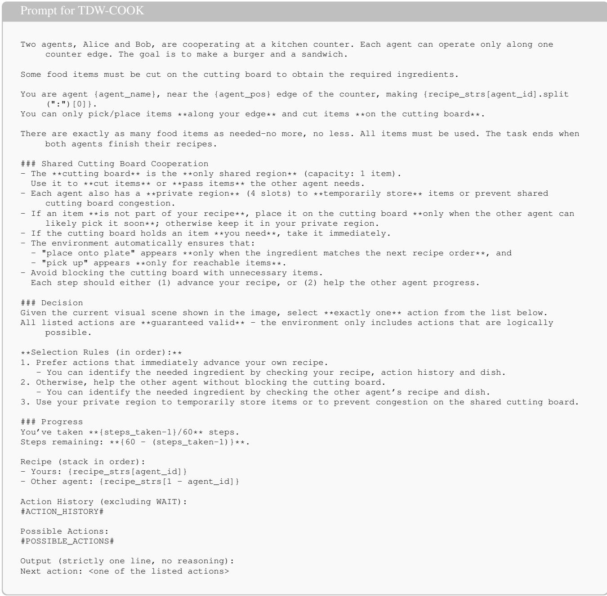  
Figure 12. Prompt for TDW-COOK.

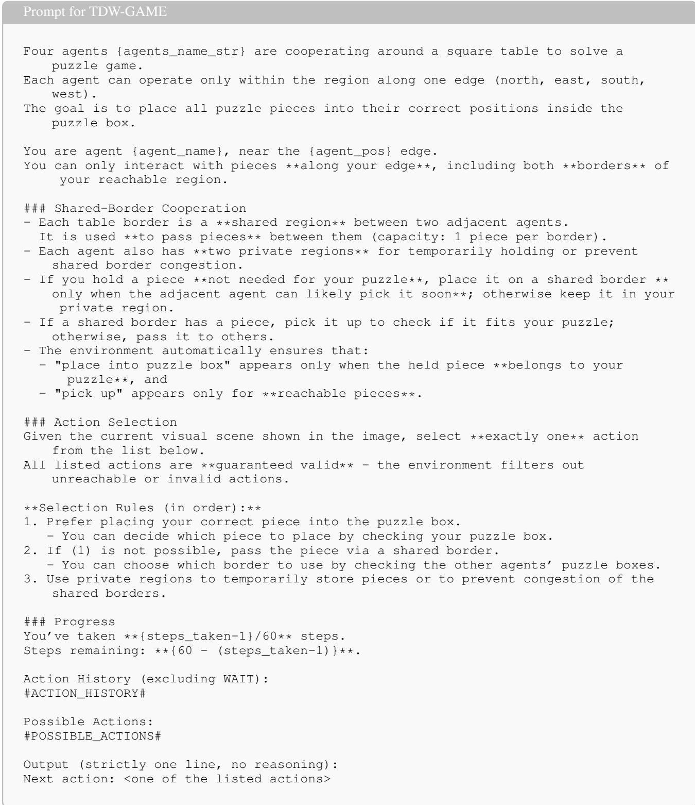  
Figure 13. Prompt for TDW-GAME.

```markdown
Prompt for BEHAVIOR-1K
You are a **robot arm** in a cooperative multi-agent household task environment.
You are fixed on a table or platform and can operate objects **only on that surface
**.
You can pick and place objects on the table, open or close containers on the same
table,
and interact with the **basket of the quadrotor** if the quadrotor lands on your
table.
Objects on other tables or in other locations are out of reach.
If the quadrotor lands on a different table, you cannot interact with its basket.
When holding something, you cannot open or close doors or containers.
Avoid redundant actions that repeat an already completed result.
### Current Context
**Observation:**
#OBSERVATION#
**Oracle Instruction:**
#INSTRUCTION#
**Action History:**
#PLANHISTORY#
**Available Actions:**
#ACTIONLIST#
### Your Task
Choose **exactly one** best action from the available actions that will most
effectively advance the instruction.
Look at Observation to understand the current state of the environment.
If none of the actions can progress the task, explain briefly why (for example: out
of reach, limited ability, missing prerequisite, or goal already achieved).
Use oracle instruction to guide your actions. Some actions might already be achieved
refer to action history.
If you don’t have a clue to achieve the oracle instruction, you can just wait.
All object is denoted as <class name>(id). It is exclusive and unique.
### Output Format (must follow exactly one)
- If you can proceed:
ACTION: <copy exactly one action string from the list above>
- If you cannot proceed:
SORRY, I CANNOT: <one-sentence reason>
---
### Output Rules
1. Copy the action string **verbatim** from the list if you can act.
2. Do **not** add extra words, numbers, or multi-line explanations.
3. Do **not** invent or rephrase actions.
4. Always think step by step, but output only one final line in the required format.
5. If you finished the oracle instruction, output [wait].
```  
Figure 14. Prompt for BEHAVIOR-1K.