# HexiScale: Accommodating Large Language Model Training over Heterogeneous Environment

Ran Yan∗ The Hong Kong University of Science and Technology Hong Kong, China ryanaf@connect.ust.hk

Fangcheng Fu Peking University Beijing, China ccchengff@pku.edu.cn

Youhe Jiang∗ The Hong Kong University of Science and Technology Hong Kong, China youhejiang@gmail.com

Bin Cui   
Peking University   
Beijing, China   
bin.cui@pku.edu.cn   
Xiaonan Nie   
Peking University   
Beijing, China   
xiaonan.nie@pku.edu.cn   
Binhang Yuan   
The Hong Kong University of Science   
and Technology   
Hong Kong, China   
biyuan@ust.hk

## Abstract

Training large language model (LLM) is a computationally intensive task, which is typically conducted in data centers with homogeneous high-performance GPUs. We explore an alternative approach by deploying training computations across heterogeneous GPUs to enable better flexibility and efficiency for heterogeneous resource utilization. To achieve this goal, we propose a novel system, HexiScale, that can flexibly support asymmetric partition of training computations in the scope of data-, pipeline-, and tensor model parallelism. We further formalize the allocation of asymmetric partitioned training computations over a set of heterogeneous GPUs as a constrained optimization problem and propose an efficient hierarchical graph partitioning algorithm. Our approach effectively allocates training computations across GPUs, fully leveraging the available computational power. We conduct empirical studies to evaluate the performance of HexiScale with state-of-the-art homogeneous and heterogeneous training systems. When training LLMs at different scales (from 7B to 30B), HexiScale achieves comparable MFU when running over heterogeneous GPUs compared to state-of-the-art training systems running over homogeneous high-performance GPUs with the same total peak FLOPS. The percentage gaps in MFU between HexiScale and comparable homogeneous settings are as low as 0.3%, with an average of 3.5%.

## 1 Introduction

Over the past few years, large language models (LLM) have demonstrated impressive performance and sparked a new wave of exciting AI applications [4]. However, training these LLMs, such as GPT [39], Claude [3], Gemini [44], Llama [8, 47], Mixtral [15], Yi [56], Falcon [11] etc., can be extremely computation-intensive, often involving thousands of GPUs running continuously for months. The high cost of deploying such training tasks in a cluster with homogeneous GPUs has become an obvious obstacle limiting the evolution of LLMs. We explore an alternative approach by distributing the parallel training computations across heterogeneous GPUs, enabling greater flexibility in resource utilization and further democratizing LLM training services.

Distributing parallel training computations across heterogeneous GPUs is a natural option to democratize LLM training. In the current exciting era of generative AI, chip vendors typically release new generations of AI chips every 24 months. For instance, Nvidia introduced the Turing architecture in 2018 [35], Ampere in 2020 [36], Hopper in 2022 [37], and Blackwell is scheduled for Q4, 2024 [38]. On the other hand, one particular version of an AI chip often remains in use by cloud service platforms, technology companies, or research institutions for a much longer period. For example, K80 GPUs with Tesla architecture, released in 2006 [34], are still available on AWS as p2 instances [2]. This observation highlights the important opportunity to explore effective ways to maximize the efficiency of such widely available yet heterogeneous hardware to facilitate more cost-effective and accessible LLM training services.

On the other hand, deploying the large-scale training computation for LLM over a set of heterogeneous GPUs with different technique specs would be a challenging task regarding training system design and implementation. To effectively distribute the training computation over thousands of GPUs, the state-of-the-art training systems, like Megatron [33] and DeepSpeed [42] usually supports: (i) tensor model parallelism [30, 33]; (ii) pipeline parallelism [10, 31, 32, 54]; and (iii) data parallelism (with potentially sharded implementations of parameters, gradients, and optimizer states across multiple devices, also known as fully sharded data parallelism) [16, 42, 43, 45]. However, these systems typically only support homogeneous configurations, which require the entire training cluster to operate under a fully symmetric setup – This means that all tensor model parallel groups must have the same degree of parallelism, and the same applies to pipeline parallel groups as well as data or optimizer parallel groups. Such implementation assumes all the GPUs take the same amount of computation load, which significantly limits the system efficiency when deploying the training computation over GPUs with different computation capability (measured by the peak FLOPS), different device memory (i.e., HBM) capacity, and different network bandwidth for each pair of GPUs (inter- and intra-node).

Concretely, there are two fundamental challenges stemming from the heterogeneity:

• Different GPU computation capability and memory capacity. In heterogeneous environments, GPUs can vary significantly in terms of computation capability (i.e., FLOPS) and memory capacity. This disparity poses a challenge in distributing the computation across all available resources. If not properly managed, the most capable GPUs can be underutilized, while less powerful GPUs can become bottlenecks, leading to inefficiencies and increased training time. Partitioning the computation to match the capabilities of each GPU is essential to fully utilize the available hardware.

• Different GPU-GPU network bandwidth. The heterogeneous nature of connections between GPUs, ranging from high-speed NVLink and PCIe to standard Ethernet, adds another layer of complexity. These varying connection speeds can result in uneven communication times. Effective management of communication overhead is essential to prevent faster connections from stalling while waiting for slower ones. This requires sophisticated optimization algorithms to align communication patterns with the underlying hardware capabilities, ensuring smooth data flow across the GPUs.

Existing systems, such as Megatron [33], use a fully symmetric partitioning strategy, which often leads to underutilization of GPUs due to the inherently asymmetric nature of heterogeneous environments. To overcome these challenges, we propose a novel framework, HexiScale, that coordinates distributed LLM training over a set of GPUs with different computation capabilities and connections. Our contributions are summarized as:

Contribution 1. We implement HexiScale, a heterogeneous LLM training system, which supports asymmetric partition for the training computation within the scope of data, pipeline, and tensor model parallelism to flexibly accommodate the heterogeneity of various GPUs and diversified network connections. Such designs enable partitioning the original training computation to the appropriate granularity to unleash the full potential of heterogeneous computation power.

Contribution 2. We formulate the scheduling problem of allocating the LLM training computation over a set of heterogeneous GPU devices as a constrained optimization problem. To solve this problem efficiently, we propose a two-phase optimization approach that employs a graph partitioning algorithm to effectively coordinate parallel strategies for the given set of devices. In the first phase, the algorithm splits the available GPUs into multiple groups, each of which forms a pipeline in the second phase. We then iteratively apply the two-phase algorithm to determine the optimal parallel strategies for the set of heterogeneous GPUs.

Contribution 3. We evaluate HexiScale through experiments. We compare the system efficiency between heterogeneous settings (enabled by HexiScale) and standard homogeneous settings within a centralized data center (enabled by Megatron, Galvatron, and FSDP). We conduct these comparisons on training the popular LLM models with different model sizes, including Llama-2 (7B), Llama-2 (13B), and Llama (30B). Our results demonstrate that, given the same FLOPS, HexiScale not only operates efficiently in heterogeneous environments, but also achieves performance comparable to the state-of-the-art LLM training frameworks running in a homogeneous data center. These experiments indicate that our proposed system and algorithm offer an efficient solution that lowers the barriers to LLM training. HexiScale also outperforms state-of-the-art heterogeneous training systems (e.g. Metis [48]). The results show that HexiScale achieves up to 1.9× MFU than Metis.

The rest of the paper is organized as follows. §2 provides a brief review of optimization techniques for parallelizing LLM training and summarizes related work on heterogeneityaware training scheduling. In §3, we present a case study and introduce the design of HexiScale, which utilizes fully asymmetric parallelism to optimize training in heterogeneous environments. In §4, we formalize the allocation of asymmetric partitioned training computations over a set of heterogeneous GPUs as a constrained optimization problem and propose an efficient solution based on a hierarchical graph partitioning algorithm. We evaluate the effectiveness of HexiScale and the scheduling algorithm in §5.

## 2 Preliminary and Related Work

We first briefly review parallel LLM training and optimization in §2.1 and then summarize the current relevant efforts about heterogeneity-aware training scheduling from the machine learning community in §2.2.

## 2.1 Parallelize LLM Training

Parallel training strategies. To distribute LLM training computation over thousands of devices (usually GPUs), three main categories of parallel strategies have been proposed.

Data parallelism [24] distributes computation by dividing training batch across devices, where each GPU hosts a model replica for forward and backward propagation, and the gradients are synchronized by AllReduce operations. To optimize memory usage, gradients, optimizer states, and parameters can be further sharded across multiple devices and gathered through additional communication when necessary. Such optimizations are implemented in Zero Redundancy Optimizer (ZeRO) [42] and Fully Sharded Data Parallel (FSDP) [59].

Pipeline parallelism [10, 31] partitions the model’s computation across multiple layers into a series of stages, where each GPU handles one stage. During the forward propagation, the GPU serving stage-(??) sends the activations to the GPU serving stage-(??+1); during the backward pass, communication reverses direction to transfer the gradients.

Tensor model parallelism [33] further partitions each transformer layer over multiple GPUs, where weight matrices are distributed row- or column-wisely. Two AllReduce operations are required to aggregate the layer output activations in forward pass and corresponding gradients in backward pass, respectively. Tensor model parallelism is communication intensive, but can effectively parallelize the computation when the connection between GPUs is fast (e.g., through NVLink). System optimization for LLM training. Various system optimizations [1, 5, 13, 14, 25, 40] have been proposed to improve the training throughput (tokens per second) of the distributed LLM training, where another widely used measurement is model FLOPS utilization (MFU), measuring the ratio of the observed throughput to the theoretical maximum throughput of a system harnessing 100% of peak FLOPs.

Significant efforts have been made to optimize parallel LLM training. Zero bubble parallelism enhances computational efficiency by reducing bubble overhead [41]; A cross-mesh resharding mechanism has been introduced to minimize communication overhead in tensor parallelism [61]; Additionally, system optimizations such as gradient bucketing, gradient accumulation, and computation-communication overlap have been integrated into data parallel implementations [24].

To improve the training throughput, optimizations for memory footprint are also necessary. For example, activation recomputing significantly reduces the memory footprint by recomputing the desired activation during backward propagation instead of storing it after the forward computation [6]. On the other hand, offloading activations to CPU RAM or SSD can also effectively reduce GPU memory usage without impacting performance by adaptively overlapping data transfers with computation [53].

## 2.2 Heterogeneity-aware LLM Training

Significant efforts have been made to build training systems tailored for heterogeneous computational resources [29, 49, 50, 60]. For example, some system work tries to democratize and deploy large language model training in heterogeneous and decentralized environments [27, 55, 57, 58]: SD-Pipe [28] implements flexible data parallelism synchronization schemes to address slow data parallel communication issues in (semi)-heterogeneous environments; Whale [12] proposes a hardware-aware load-balancing algorithm to accelerate training on heterogeneous GPUs. Very recently, Metis [48] introduced a novel approach that automatically identifies efficient parallelism plans for distributed training on heterogeneous GPUs. Perhaps these systems are the most relevant effort; however, current systems (including Metis [48]) fail to fully exploit the potential capabilities of heterogeneous computational power because of the limitations on system support of partitioning the original training computations to appropriate granularity (see §5.4), which also leads to the lack of efficient searching algorithm to fully explore the effective scheduling spaces. On the other hand, HexiScale is capable of fully supporting the asymmetric partition of the parallel training computations (see §3, §5) and has a more efficient and effective scheduling algorithm to find the near-optimal parallel strategy (see §4).

## 3 System Design and Implementation

In this section, we start with a case study on heterogeneous training with the state-of-the-art training system, i.e. Megatron, then introduce the system design of HexiScale and discuss how HexiScale improves the training efficiency.

## 3.1 Case Study: Parallelism over Heterogeneity

Consider training a Llama-2 (13B) model in a heterogeneous environment with the following configuration: machine A is equipped with 3×A800-80G GPUs connected via NVLINK, which offers a intra-machine bandwidth of 200 GB/s; machine B has 3×4090-24G GPUs connected via PCIe with a bandwidth of 32 GB/s; and machine C is equipped with 2×3090-24G GPUs, connected via PCIe with a 16 GB/s bandwidth. The machines are interconnected using a 1 GB/s Ethernet link. To motivate our system design compared with Megatron, we simulate the performance considering a training task with a global batch size as 24, and micro-batch size as 1. Activation recomputation is applied for both systems. Training with Megatron. Megatron only supports a fully symmetric partition of the training computation. Denote $D _ { d p } , D _ { t p } , D _ { p p }$ as the respective parallel degrees for data-, tensor model-, and pipeline- parallelism. The considered parallel strategies on these 8 GPUs include: (i) plan 1: $( D _ { d p } =$ 1 $, D _ { t p } = 1 , D _ { p p } = 8 )$ ; (ii) plan 2: $( D _ { d p } = 1 , D _ { t p } = 2 , D _ { p p } = 4 )$ (iii) plan 3: $( D _ { d p } = 2 , D _ { t p } = 1 , D _ { p p } = 4 )$

Plan 1 creates a pipeline with eight pipeline stages, which is inefficient due to high bubble cost and imbalanced computation. Even if micro-batch size is set as 1 (which potentially reduces GPU kernel efficiency), bubble time is still over 22% of the pipeline execution time. Furthermore, system performance is compromised by the bottleneck machine B, which computes 3.9× and 2.1× slower than machines A and C.

Plan 2 has to use inter-machine tensor model parallelism. Performance is significantly compromised by the introduction of an estimated per-layer communication cost of 1.88s, given 1 GB/s bandwidth and batch size as 24. This is a huge overhead, compared with the 0.01s communication cost when NVLINK is available.

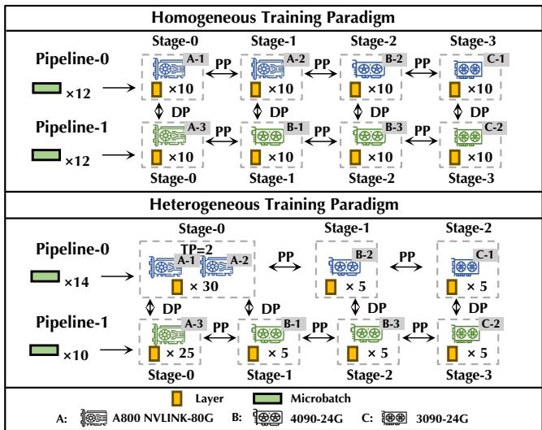  
Figure 1. Case study on comparing the state-of-the-art training system Megatron and HexiScale. Both systems run their optimal parallel strategies on the given three machines.

Plan 3 is a potential good configuration. We fine-tune this plan by maximizing the number of transformer layers that use high intra-machine bandwidth for data parallel communication. As visualized in Figure 1-(Top). This strategy creates four pipeline stages, each with 10 layers. However, even in this setting, Megatron has at least two deficiencies. First, two GPUs in machine A run pipeline parallelism on pipeline-1, which wastes the high NVLINK intra-machine bandwidth and introduces higher pipeline bubble overhead. Second, the GPUs in machine A handle too few layers, leading to underutilization of computational power.

When the underlying heterogeneous environment mismatches with the fully symmetric strategy of Megatron, the system has to treat GPUs with strong computation capability as weak GPUs and parallel strategies are constrained by the network connections, leading to the under utilization of computation resources. In this case, the state-of-the-art training system Megatron can not perform well, the estimated end-to-end training iteration time for Megatron is 41.52s.

## 3.2 Asymmetric Parallel Support in HexiScale

To train efficiently under heterogeneous settings, we implement HexiScale with fully asymmetric parallel support and system optimizations, with the essential change as:

Asymmetric partition of the computation load. For each pipeline which can be assigned with a different batch size, pipeline parallel communication groups are initialized with a different tensor model parallel degree and a corresponding, potentially different number of allocated transformer layers. Each pipeline stage selects a fixed leader GPU, which minimizes communication latency to GPUs in nearby stages and initializes a tensor model parallel group. During forward pass, the leader GPU in each stage sends the activation to the leader GPU in the next stage. Once the leader GPU in the next stage receives the activation, it broadcasts this activation among its tensor parallel group to perform computations. During backward pass, the same logic applies for communicating the gradients w.r.t activations.

Asymmetric gradient synchronization. Model parameters (and their corresponding gradients) of transformer layers across different pipelines may be chunked into different sizes due to differently assigned tensor model parallel degrees. In this case, vanilla data parallelism struggles to synchronize gradients. To address this challenge, we identify the smallest gradient size and further partition the larger gradients into multiple chunks, each matching the size of the smallest identified gradient. Data parallel communication is then performed by synchronizing each gradient chunk among different subsets of GPUs within the data parallel group, without increasing communication overhead.

Regarding system implementation, we optimize our system in three ways. First, we support gradient accumulation and activation recompute to lower the data parallel communication cost and memory footprint. Second, we leverage APIs in FlashAttention-2 [7] to create transformer layers that support both tensor model parallelism and flash attention. We then implement our asymmetric pipeline parallelism with these transformer layers.1 Third, we support the asymmetric gradient synchronization logic by registering custom FSDP [59] communication hooks.

## 3.3 Case Study: Boost with HexiScale

We introduce how HexiScale improves the training efficiency in the former heterogeneous setting. Due to the flexible design, HexiScale can construct the two pipelines more efficiently as shown in Figure 1-(Bottom). The improvements are as follows:

Computation load is fully partitioned. For each pipeline, the computation load is fully partitioned as follows.

• From the perspective of parallel strategy, we fully utilize the strong computation power and high intra-machine bandwidth in machine A by applying tensor parallelism and assigning more transformer layers. Machine B still applies pipeline parallelism as the intra-connection is not high enough for tensor model parallelism.

• From the perspective of layer partition, machine B and machine C undertake fewer transformer layers, which addresses the computation imbalance issue among pipeline stages. The number of layers that run inter-machine data parallelism is minimized. Megatron and HexiScale are both bounded by the slow data parallel communication on machine B. Megatron communicates for 10 transformer layers on machine B, which can be estimated at 9.90s. HexiScale only needs to communicate for 5 transformer layers in 5.07s, which is 1.9× faster than Megatron.

• From the perspective of pipeline efficiency, batch sizes are assigned differently to balance the computation speeds among pipelines. Otherwise, there will be no end-to-end improvement, as HexiScale will remain bounded by the slower pipeline-2. The faster pipeline-1 has to wait for pipeline-2 to run data parallel communication. To unleash the efficiency of pipeline-1, we assign larger batch sizes on pipeline-1. In this way, we balance the running time of each pipeline and improve the end-to-end performance. In our case study, two pipelines process batch sizes with a 40% difference but exhibit a 7% difference in running time.

Run asymmetric data parallelism. For the two GPUs in machine A on stage-0 of pipeline-1, and GPUs on stage-0 and stage-1 of pipeline-1, although tensor model parallelism partitions the parameters to different sizes, running data parallel communication among these stages is supported as discussed in §3.2. This flexible design enhanced the performance of pipeline-1 from two aspects. (i) Decreasing the number of pipeline stages can reduce pipeline communication and bubble costs. (ii) Adopting tensor model parallelism on machine A can enhance the performance of pipeline-1.

In summary, the end-to-end training iteration time of HexiScale for the parallel strategy shown in Figure 1-(Bottom) is estimated to be 25.55s, making it 1.6× faster than Megatron in this hypothetical heterogeneous setting.

## 4 Scheduling with Heterogeneity

In this section, we introduce our scheduling algorithm. (The notations are summarized in Table 1.)

## 4.1 Formalization of the Scheduling Problem

Given a set of heterogeneous GPUs, we aim to identify the optimal heterogeneous parallel execution strategy that minimizes the training iteration time. We formalize the scheduling problem as below. Let $\mathbf { D } = \{ d _ { 1 } \ldots d _ { N } \}$ be a set of ?? GPU devices, and the GPU device memory limit notated as $m _ { d } .$ Given a particular GPU set, the scheduling problem can be defined as identifying the optimal parallel execution plan $\sigma ^ { * }$ that minimizes the training iteration execution time under the constraint of memory consumption:

$$
\begin{array} { r l } { \sigma ^ { * } = \arg \underset { \sigma } { \mathrm { m i n } } } & { \mathbb { C } \mathrm { o } \mathrm { M } \mathrm { M } \mathrm { - } \mathrm { C o } \mathrm { s } \mathrm { T } \left( \sigma \right) + \mathbb { C } \mathrm { o } \mathrm { M } \mathrm { P } \mathrm { - } \mathrm { C o } \mathrm { s } \mathrm { T } \left( \sigma \right) } \\ { s . t . } & { \mathrm { M } \mathrm { E } \mathrm { M } \mathrm { - } \mathrm { C } \mathrm { U } \mathrm { M } \mathrm { S } \mathrm { U } \mathrm { M } \left( d \right) \le m _ { d } \quad \forall d \in \mathbf { D } } \end{array}\tag{1}
$$

where Comm-Cost (??) and Comp-Cost (??) represent communication and computation time costs2 of one iteration given a parallel execution plan ??. Mem-Cumsum (??) represents the memory consumption of device ??.

One parallel execution plan ?? can involve an arbitrary number of pipelines, each with varying global batch sizes, micro-batch sizes, and parallel strategies. Furthermore, a particular parallel strategy can have different configurations for data, pipeline, and tensor model parallel degrees. Each pipeline stage can contain a flexible number of transformer layers. Finding the exact optimal parallel strategy—considering the computation costs, communication costs, and memory consumption of all potential configurations—is NP-hard due to the exponential scale of candidate allocations.

Table 1. Summarization of notations.

<table><tr><td>Symbol</td><td>Description</td></tr><tr><td> $d$ </td><td>GPU device.</td></tr><tr><td> $m _ { d }$ </td><td>GPU memory of device d.</td></tr><tr><td> $c _ { d }$ </td><td>Tensor core computation power of device d.</td></tr><tr><td> $\alpha _ { d , d ^ { \prime } }$ </td><td>Latency between devices d and  $d ^ { \prime } .$ </td></tr><tr><td> $\beta _ { d , d ^ { \prime } }$ </td><td>Bandwidth betweendevices d and  $d ^ { \prime } .$ </td></tr><tr><td> $\sigma$ </td><td>Parallel execution plan of devices in D.</td></tr><tr><td> $D _ { d p }$ </td><td>Number of pipelines.</td></tr><tr><td> $\mathbf { D }$   $\mathbf { E }$ </td><td>Set of N GPU devices  $d _ { 1 } , d _ { 2 } , . . . , d _ { N } .$ </td></tr><tr><td> $G = \left( \mathbf { D } , \mathbf { E } \right)$ </td><td>Edge set of global graph.</td></tr><tr><td> $\mathbf { P }$ </td><td>Global graph for GPU set D.</td></tr><tr><td> $k _ { i }$ </td><td>Global partition containing GPU set  $\mathbf { D } _ { 1 } , \mathbf { D } _ { 2 } , . . . , \mathbf { D } _ { D _ { d p } } .$ </td></tr><tr><td> $\mathbf { D } _ { i }$ </td><td>Number of GPU groups generated in i-th pipeline.</td></tr><tr><td> $\mathbf { E } _ { i }$ </td><td>GPU set of the i-th pipeline.</td></tr><tr><td> $G _ { i } = ( \mathbf { D } _ { i } , \mathbf { E } _ { i } )$ </td><td>Edge set of the i-th pipeline.</td></tr><tr><td> $\mathbf { P } _ { i }$ </td><td>Secondary graph ofGPU set  $\mathbf { D } _ { i } .$ </td></tr><tr><td></td><td>Secondary partition containing GPU set  $\mathbf { D } _ { i , 1 } , . . . , \mathbf { D } _ { i , k _ { i } }$ </td></tr><tr><td> $\mathbf { D } _ { i , j }$ </td><td>GPU set of the i-th pipeline,j-th GPU group.</td></tr><tr><td> $\tau$ </td><td>Parameter for searching pipeline stage order.</td></tr></table>

Therefore, in a heterogeneous cluster with varying GPU capacities and network connectivity, it is often only possible to identify a near-optimal parallel execution plan using heuristics-based scheduling algorithms. The state-of-the-art scheduling algorithms often fall short in identifying highperformance parallel strategies because they assume symmetric partitioning of the training computation. For example, the algorithm proposed in Alpa [60], which makes multiple symmetric assumptions about network connections and workload partitioning, cannot be trivially adapted to our context. Their search space is limited, and workload balance across heterogeneous GPUs is not well considered. To address the challenge in efficiently identifying a near-optimal parallel execution plan in heterogeneous clusters, we design a two-phase scheduling algorithm to find a parallel execution plan ?? and iteratively optimize to a near-optimal solution $\sigma ^ { * }$ . To be more concrete:

• We introduce the first phase algorithm in §4.2 that partitions the device set D into multiple GPU groups, each of which will be used to create one pipeline;

• We enumerate the second phase algorithm in §4.3 that identifies parallel execution plan ?? for each pipeline;

• We iteratively repeat two-phase algorithm and optimize the parallel execution plan to $\sigma ^ { * }$ , illustrated in $\ S 4 . 4$

## 4.2 First Phase of Scheduling Algorithm

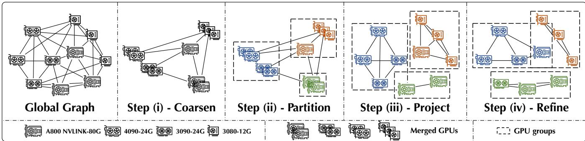  
Figure 2. First phase: the global graph is partitioned into three groups of GPUs by four steps: (i)-coarsen, (ii)-partition, (iii)-project, and (iv)-refine. GPUs in the global graph are divided into three groups which will be constructed as three pipelines.

The key insight of the first phase algorithm is to partition the GPUs into multiple groups, with each group forming a separate pipeline. Data parallel communication is then performed among these pipelines to synchronize gradients.

Assume we divide the devices set D into $D _ { d p }$ groups of GPUs in the current iteration, and minimize the bandwidth for data parallel communication (we further discuss parameter $D _ { d p }$ and network bandwidth allocation in §4.4). We first organize all GPUs from devices set D as a global graph $G = \left( \mathbf { D } , \mathbf { E } \right)$ , where each GPU $d \in \bf { D }$ is a vertex, and computation power $c _ { d }$ is the vertex weight; $\forall d _ { 1 } , d _ { 2 } \ \in \ \mathbf { D } ,$ , the communication bandwidth $\beta _ { d _ { 1 } , d _ { 2 } }$ represent an edge between these two GPUs in set E. Then we partition the global graph ?? into global partition $\mathbf { P } = \{ \mathbf { D } _ { 1 } , \mathbf { D } _ { 2 } , . . . , \mathbf { D } _ { D _ { d p } } \}$ , where each set $\mathbf { D } _ { i } \in \mathbf { \partial } \mathbf { P }$ contains GPUs with high bandwidth that are used in the ??-th pipeline , and $\mathbf { D } _ { i } \cap \mathbf { D } _ { j } = \emptyset , \forall i , j$ . We adopt a partitioning method based on a $D _ { d p }$ -way multi-level graph partition algorithm [9] that consists of three steps:

Step (i) - Coarsen. The global graph is coarsened into smaller graphs to simplify the graph partition. Directly partitioning a large global graph (i.e., including many vertices) into $D _ { d p }$ parts is usually inefficient. In contrast, partitioning a smaller coarsened graph is more efficient. We adopt the heavy edge matching (HEM) algorithm [21]. To allocate low bandwidth for data parallelism, this coarsen operation indicates merging GPUs with high bandwidth connections. As illustrated in Figure 2, step (i), the coarsened graph contains only half as many vertices as the global graph.

Step (ii) - Partition. In this step, the coarsened graph is further partitioned into $D _ { d p }$ GPU groups, ensuring the network bandwidth among GPU groups is minimized. With a recursive bisection method [22], we recursively bisect the coarsened graph until $D _ { d p }$ parts partition is obtained. The graph partition in this step solves a constrained partition problem that minimizes Cut objective function [52] under the constraints of maintaining strict balance and partitioning to exactly $D _ { d p }$ parts. The Cut objective function is defined by two levels: At level-(i), the Cut function between any two sets ${ \bf D } _ { i } , { \bf D } _ { j } \in { \bf P } , \forall i , j$ is defined as the sum of edge weights (i.e. bandwidths), that connect them. At level-(ii), Cut objective function for the global partition P is defined as the summation of all cuts between any two sets ${ \bf D } _ { i } , { \bf D } _ { j } \in { \bf P } , \forall i , j$ Formally, the two-level Cut function can be defined as:

$$
\begin{array} { r l } & { { \displaystyle \mathrm { C u r } ( { \bf D } _ { i } , { \bf D } _ { j } ) = \sum _ { d _ { i } \in { \bf D } _ { i } } \sum _ { d _ { j } \in { \bf D } _ { j } } \beta _ { d _ { i } , d _ { j } } , \quad \forall { \bf D } _ { i } , { \bf D } _ { j } \in { \bf P } } } \\ & { { \displaystyle \mathrm { C u r } ( { \bf P } ) = \sum _ { { \bf D } _ { i } , { \bf D } _ { j } \in { \bf P } } \mathrm { C u r } ( { \bf D } _ { i } , { \bf D } _ { j } ) } } \end{array}\tag{2}
$$

The constraint that measures the balance of the global partition $\mathbf { P } = \{ \mathbf { D } _ { 1 } , \mathbf { D } _ { 2 } , . . . , \mathbf { D } _ { D _ { d p } } \}$ is defined as the maximum sum of vertex weights maxD?? ∈P $\textstyle \sum _ { d \in { \bf D } _ { i } } c _ { d } .$ , over the average sum of vertex weights $\frac { \sum _ { d \in \mathbf { D } } c _ { d } } { D _ { d p } }$ . This balance factor is always greater than or equal to 1. A value closer to 1 indicates more evenly distributed total vertex weights among the GPU sets $\mathbf { D } _ { i } \in \mathbf { P } .$ The maximum balance factor is treated as a hyperparameter. Step (iii) - Project & Step (iv) - Refine. Partitioning the coarsened graph is not the ultimate goal — as illustrated in Figure 2, step (iii), to find the partition of the global graph ??, we must project the results back, i.e., apply the reverse operation of step (i) to recover the $D _ { d p }$ -parts of the partition in the global graph ??. To effectively consider the information within the coarsened nodes, a refinement algorithm is necessary to enhance partition quality and maintain balance; for this purpose, we employ the Kernighan-Lin algorithm [23] in step (iv) to adjust the partition results.

## 4.3 Second Phase of Scheduling Algorithm

The key insight of this phase is to efficiently generate the pipeline layout based on the graph partition results from the first phase. Thanks to the flexible asymmetric data parallelism design, we can independently determine the parallel strategy for each pipeline. However, the search space remains large, as we must determine the pipeline and tensor model parallelism strategy, as well as the execution order of the pipeline stages. In a fully heterogeneous environment, carefully permuting pipeline stages is necessary due to the heterogeneity of network connections. Formally, given the $D _ { d p }$ groups of GPUs, we use GPUs in each GPU set $\mathbf { D } _ { i } \in \mathbf { P }$ to find the parallel execution plan $\sigma _ { i }$ for each pipeline. Finding the near-optimal layout for the assigned GPUs involves three key steps:(i) grouping GPUs for pipeline stages based on graph partition; (ii) constructing pipeline stages within each GPU group; and (iii) determining the order of pipeline stages under heterogeneous network connections.

Step (i) - Group GPUs for pipeline stages. To group GPUs with high bandwidth connections and introduce algorithmic convenience to determine the stage order of the ??-th pipeline (introduced shortly), we group GPUs with high bandwidth connections by further splitting GPUs in set $\mathbf { D } _ { i } \in \mathbf { P }$ into multiple groups. Concretely, we first organize each set $\mathbf { D } _ { i } \in \mathbf { P }$ into a secondary graph $G _ { i } = ( \mathbf { D } _ { i } , \mathbf { E } _ { i } ) , i = 1 , . . . , D _ { d p }$ , where the edge set $\mathbf { E } _ { i }$ contains communication bandwidths connecting GPUs in set D??. Next, we partition each secondary graph $G _ { i }$ into secondary partition ${ \bf P } _ { i } = \{ { \bf D } _ { i , 1 } , . . . , { \bf D } _ { i , k _ { i } } \}$ , where each parameter $k _ { i }$ controls the number of parts that $G _ { i }$ is partitioned into. Set $\mathbf { D } _ { i , k } \in \mathbf { P } _ { i }$ , contains GPUs to construct pipeline stages, and $\mathbf { D } _ { i , k _ { 1 } } \cap \mathbf { D } _ { i , k _ { 2 } } = \emptyset , \forall k _ { 1 } , k _ { 2 } .$ . The secondary graphs are partitioned using the same multi-level graph partition method as discussed in §4.2. As an illustrative example shown in Figure 3-(Top), GPUs in a secondary graph are first partitioned into three groups after this step. Note that GPUs within the same GPU sets $\mathbf { D } _ { i , k } \in \mathbf { P } _ { i }$ have high bandwidth connections. Finding stage order among these stages only brings minor effects since pipeline communication costs are not the bottleneck. In contrast, when pipeline stages are generated by different GPU sets $\mathbf { D } _ { i , k } \in \mathbf { P } _ { i }$ , permuting these stages can significantly reduce the pipeline communication overhead by effectively utilizing the assigned low communication bandwidth.

In the following two steps, we first construct pipeline stages within each GPU set $\mathbf { D } _ { i , k }$ without considering pipeline stage order. Then, we search the pipeline stage order among pipeline stages created by different GPU sets.

Step (ii) - Construct pipeline stages. Given the secondary graph partition results of each secondary graph $G _ { i } ,$ we find a pipeline layout for the ??-th pipeline as follows. Each GPU set $\mathbf { D } _ { i , k } \ \in \ \mathbf { P } _ { i }$ separately searches its intra-group strategy within each machine, which is done by simulating different parallelism strategies with cost models defined in the Appendix A and selecting the locally optimal parallel strategy. As shown in Figure 3-(Middle), the first GPU group constructs three pipeline stages while other GPU groups construct one pipeline stage in each.

Step (iii) - Find pipeline stage order by greedy search. We consider each intra-group strategy as a single vertex, and construct a new graph $G _ { i } ^ { \prime }$ for ??-th pipeline. The stage order for the ??-th pipeline is thereby searched by a top-?? greedy algorithm. The algorithm runs in two nested loops. First, it selects each GPU group as the starting group. Second, for each neighboring GPU groups with ??-highest inter-group bandwidth, the algorithm recursively explores their neighboring GPU groups with ??-highest inter-group bandwidth until a pipeline path is generated. As shown in Figure 3- (Bottom), stage order within each intra-group strategy is not changed (as we do not permute them), while three pipeline stages in the first intra-group strategy are placed after the one pipeline stage in the second intra-group strategy, and before the one pipeline stage in the last intra-group strategy.

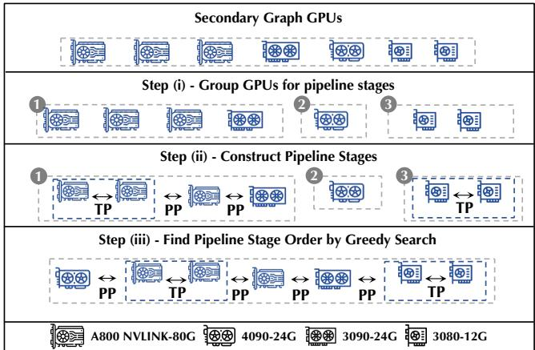  
Figure 3. Second phase: each pipeline is created in three steps. (i) GPUs with high bandwidth connections are grouped by graph partition. (ii) intra-group strategy is searched separately for each machine, i.e. GPUs in the same machine. (iii) Pipeline stage order is determined by permuting all intragroup strategies by a top-?? greedy search algorithm.

## 4.4 Iterative Optimization

Lastly, we introduce the iterative optimization procedure — The parallel execution plan ?? is iteratively optimized to the final near-optima $\sigma ^ { * }$ from two aspects:

Optimize from first phase algorithm: The first phase algorithm can be optimized from two aspects.

First, the algorithm partitions the global graph into different numbers of pipelines by enumerating the parameter $D _ { d p }$ across iterations to optimize the numbers of pipelines.

Second, the algorithm carefully allocates network bandwidth for data and pipeline parallelism communication. One of our key observations is that both data parallel communication and pipeline execution time can be the bottleneck in heterogeneous environments. When pipelines have many pipeline stages and handle a large batch size, pipeline execution time accounts for most of the training iteration time. In this case, minimizing bandwidth for data parallelism, and maximizing bandwidth for pipeline execution can effectively improve the system performance. The system performance benefits from the reduced communication overhead of pipeline execution. On the other hand, when pipelines have few pipeline stages and handle a small batch size, system performance benefits from maximizing bandwidth for data parallelism, and minimizing bandwidth for pipeline execution. The system performance is boosted by the reduced data parallel communication overhead. Based on this observation, we implement two partition options: either (i) maximize or (ii) minimize the inter-group (i.e., GPU groups for each pipeline) edge weights (i.e., bandwidth). Maximizing the inter-group edge weights corresponds to maximizing the Cut objective function in Equation 2, which in turn results in allocating high communication bandwidth for data parallelism; conversely, minimizing the edge weights results in allocating low communication bandwidth for data parallelism. At each iteration, we adaptively select the potential optimal partition option based on the historical moving average of costs to ensure efficient system performance. Specifically, we simulate data parallel communication and pipeline execution costs at the end of each iteration and update the historical average costs. In the next iteration, the partition decision is made using this historical information. With this design, our first-phase algorithm effectively allocates network bandwidth, enhancing system performance.

Optimize from second phase algorithm: Given the global graph partition obtained in the first phase, varying the parameters $k _ { i }$ across iterations results in distinct constructions for each intra-group strategy, which, in turn, determines the configuration of pipeline stages and their order. By fine-tuning $k _ { i } ,$ we can construct pipelines that achieve high efficiency.

We evaluate the performance of a parallel execution by simulation: at the end of each iteration, we simulate the execution costs for the generated parallel execution plan by our cost model. When the plan encounters out-of-memory issues, the execution cost is evaluated as infinity. To enhance accuracy, we further incorporate network latency $( \alpha _ { d , d ^ { \prime } } )$ into simulation. As the number of collective communication operations increases, system performance degrades due to significant linking costs. Network latency is particularly critical in heterogeneous environments, where a large number of microbatches leads to an increased number of NCCL operations. §5.3 evaluates the accuracy of the simulator and shows that the simulation deviations are less than 2% for all cases.

## 5 Evaluation

To evaluate HexiScale, we conduct experiments to answer the following questions:

• When running LLM of different scales, what is the gap between the end-to-end performance of HexiScale in a heterogeneous setting and the state-of-the-art training systems in a homogeneous setting? (§5.1)

• How effective is each part of HexiScale, and what is the latency breakdown performance of HexiScale? (§5.2)

• How effective and efficient is our scheduling algorithm in terms of optimizing the system performance? (§5.3)

• How does HexiScale outperform state-of-the-art heterogeneous training systems? (§5.4)

• How does HexiScale scale in large clusters? (§5.4)

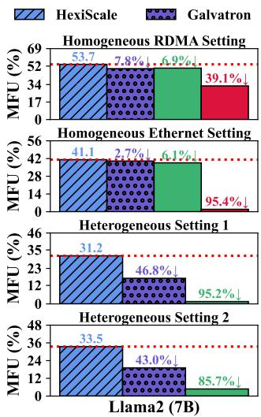

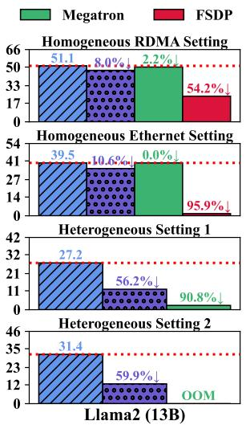

Figure 4. End-to-end experiments of HexiScale compared with other systems under various experimental settings with Llama-2 (7B) and Llama-2 (13B) models.  
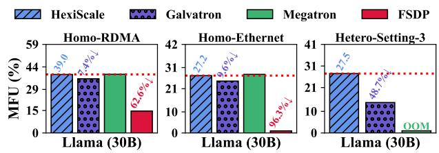  
Figure 5. End-to-end experiments of HexiScale compared with other systems under various experimental settings with Llama (30B) model.

## 5.1 End-to-end Performance

Experimental setup. LLM usually differ on model scales, instead of model structure, to thoroughly compare the endto-end performance of HexiScale and state-of-the-art frameworks, we include Megatron, Galvatron, FSDP as baseline frameworks, and Llama models in different scales as representative models. We evaluate HexiScale based on the following experiment settings:

Homogeneous settings. Our baseline includes Megatron, Galvatron, and FSDP. We rent two 8×A800 PCIe-80G with or without RDMA, to test the maximum MFU on Llama-2 (7B), Llama-2 (13B), and four 8×A800 PCIe-80G to test the maximum MFU on Llama (30B).

Heterogeneous settings. We rent GPUs from Ucloud, which provides various types of GPUs. To evaluate the system efficiency in various heterogeneous environments, we test and compare the performance of Megatron, Galvatron, and HexiScale under three different settings as follows (intermachine connection is about 0.7 GB/s):

• Heterogeneous setting 1: we rent one 8×3080Ti, one 8×3090, and three 8×4090. With 1.36% higher total FLOPS, we compare the maximum MFU gap with two 8×A800 PCIe-80G in training Llama-2 (7B) and Llama-2 (13B). The total memory of each GPU is significantly smaller than the baseline. 3080Ti has 12 GB of memory, while 3090 and 4090 each have 24 GB memory. Intra-machine connections of 3080Ti and 3090 are about 24 GB/s.

• Heterogeneous setting 2: we rent one 8×3080Ti, one 8×3090, one 8×4090, and one 8×A800 NVLINK-80G. With 1.59% less total FLOPS, we still compare the maximum MFU gap with two 8×A800 PCIe-80G in training Llama-2 (7B) and Llama-2 (13B). Intra-machine NVLINK on 8×A800 NVLINK-80G is 200 GB/s.

• Heterogeneous setting 3: we rent one 8×3090, two 4×3090, four 8×4090, and one 8×A800 NVLINK-80G. With 4.67% less total FLOPS, we compare maximum MFU gap with four 8×A800 PCIe-80G in training Llama (30B).

Results and discussions. First, HexiScale exhibits performance comparable to other high-performance systems in homogeneous settings. As shown in Figure 4 and Figure 5, the baseline frameworks Megatron and Galvatron are efficient in homogeneous settings. HexiScale achieves comparable performance under both RDMA or Ethernet inter-machine connections. In contrast, FSDP, which represents 1D parallelism, is unsuitable for clusters with low-speed inter-machine connections; even with RDMA bandwidths of 10 GB/s, using FSDP alone exhibits poor performance.

Second, comparisons across frameworks in heterogeneous settings highlight the strong adaptability of HexiScale. While Megatron and Galvatron perform well in homogeneous environments, they cannot be easily adapted to heterogeneous settings. As shown in Figure 5, Megatron can not run in heterogeneous setting 3 when training Llama (30B). Despite tuning various parallel strategies, out-of-memory issues persist. Megatron enforces a fully symmetric parallel strategy, leading to significant imbalance issues. Different types of GPUs cannot fully utilize their computational capabilities and intra-machine communication bandwidth when restricted to a uniform parallel strategy. For example, GPUs with high intra-machine bandwidth must adopt a low tensor model parallel degree to accommodate GPUs with lower bandwidth, resulting in underutilized resources. Galvatron offers greater flexibility than Megatron by allowing flexible transformer layer assignment. However, even with this flexibility, the parallel strategies remain suboptimal for heterogeneous clusters, leading to performance degradation. Compared to Galvatron, HexiScale achieves up to a 2.5× higher maximum MFU and, on average, a 2.1× improvement.

Finally, comparisons between homogeneous settings and heterogeneous settings demonstrate the strong competitiveness of HexiScale. In homogeneous settings with RDMA, the achieved maximum MFU of Megatron and Galvatron is significantly higher than when training with HexiScale in heterogeneous environments. However, when HexiScale operates in the same homogeneous setting, it performs comparably to Megatron and Galvatron, as shown in Figure 4 and Figure 5. This performance gap arises from inter-machine connections: Megatron and Galvatron utilize high-performance RDMA, whereas HexiScale runs over slower Ethernet-based intermachine communication. The performance of HexiScale can be further improved by replacing Ethernet with RDMA connections. To fairly evaluate heterogeneous training performance, we conduct baseline experiments using Megatron, Galvatron, and FSDP in homogeneous settings with Ethernet inter-machine connections. Despite the challenges posed by imbalanced GPU memory capacities and more frequent inter-machine communication in heterogeneous clusters, HexiScale achieves a minimum MFU percentage gap of 0.3% and an average gap of 3.5% compared to homogeneous scenarios. These results highlight the adaptability of HexiScale. By asymmetric system design and effective scheduling, HexiScale better utilizes fragmented GPU resources and exhibits strong potential in diverse heterogeneous settings.

## 5.2 Ablation Studies

System design breakdown. HexiScale is implemented with asymmetric pipeline parallelism, under the support of asymmetric data parallelism, and other system optimizations including gradient accumulation (GA). We evaluate the effectiveness of each design separately, the results are shown in Figure 6. We analyze the ablation results as follows:

Consider disabling our asymmetric parallel support, system performance at most degrades 23% (in training Llama (30B)), and 15% on average. Without our asymmetric parallel support, all pipeline stages must have the same tensor model parallelism degrees, which is often suboptimal due to the limited utilization of distinct hardware features. For example, in heterogeneous setting 3, a higher tensor model parallelism degree on 8×A800 is beneficial. Conversely, GPUs with lower intra-machine bandwidths should be assigned lower tensor model parallelism degrees (see more details in §5.3).

Consider disabling gradient accumulation, system performance at most degrades 15% (in training Llama (30B)), and 12% on average. Due to limited memory on heterogeneous GPUs, batch size for each iteration can not be sufficiently large. Without gradient accumulation, pipeline execution time is typically short, resulting in frequent data parallel communication, which degrades the system performance.

Training iteration latency breakdown. We present the breakdown of the training iteration latency of HexiScale and Galvatron under different heterogeneous experimental settings in Figure 7. HexiScale outperforms Galvatron by significantly reducing communication overhead and pipeline bubble inefficiencies. With a symmetric pipeline configuration, Galvatron runs a high degree of pipeline parallelism, which increases both communication overhead and pipeline bubbles. Furthermore, Galvatron experiences additional bubbles due to imbalanced computation across pipeline stages, leading to performance degradation caused by the straggler stage. With asymmetric parallel support, HexiScale addresses these challenges by reducing the number of pipeline stages and carefully balancing the computation.

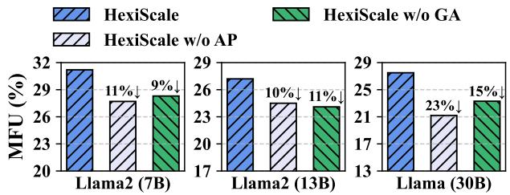  
Figure 6. Breakdown experiments of HexiScale with Llama2 (7B), Llama2 (13B), and Llama (30B) models under heterogeneous setting 1 and 3.

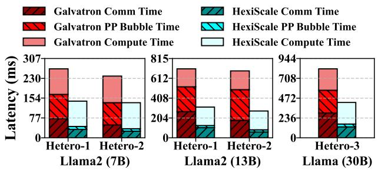  
Figure 7. Breakdown of end-to-end time across different heterogeneous experimental settings and models. We benchmark the per-batch communication time, computation time, and pipeline bubble time for HexiScale and Galvatron.

## 5.3 Scheduling Algorithm Evaluation

Another major concern is the performance of our algorithm, including the scheduling results, simulation accuracy, effectiveness of graph partitioning, and running efficiency.

Case study of scheduling results. Table 2 illustrates the parallelism strategy discovered by our scheduling algorithm. Within each pipeline, distinct hardware characteristics are effectively considered by applying locally high-performance parallel strategies and strategically assigning transformer layers to balance computation across pipeline stages. The number of pipelines is fine-tuned to four, leveraging the benefits of data parallelism while avoiding out-of-memory issues and too much communication overhead. Since the pipeline execution time is much longer than data parallel communication time, the overhead of data parallel communication remains manageable. These results confirm that HexiScale effectively accounts for hardware heterogeneity, generating parallel execution plans that maximize system performance. Evaluate the simulation accuracy. We evaluate the accuracy of our simulation in Table 3. The simulation results closely match the actual outcomes across various GPU settings. Our algorithm can thereby accurately search for an effective parallel execution plan.

Table 2. Parallelism strategy discovered by HexiScale when training Llama (30B) in heterogeneous setting 3. There are four pipelines (DP=4) with various pipeline layouts.
<table><tr><td rowspan=1 colspan=1>PipelineIndex</td><td rowspan=1 colspan=1>StageIndex</td><td rowspan=1 colspan=1>GPUAllocation</td><td rowspan=1 colspan=1>LayerCount</td><td rowspan=1 colspan=1>TPDegree</td></tr><tr><td rowspan=1 colspan=1>0</td><td rowspan=1 colspan=1>{0}</td><td rowspan=1 colspan=1>8×A800</td><td rowspan=1 colspan=1>60</td><td rowspan=1 colspan=1>8</td></tr><tr><td rowspan=2 colspan=1>1</td><td rowspan=1 colspan=1>{0,1,2}</td><td rowspan=1 colspan=1>4×4090</td><td rowspan=1 colspan=1>18</td><td rowspan=1 colspan=1>4</td></tr><tr><td rowspan=1 colspan=1>{3}</td><td rowspan=1 colspan=1>2×3090</td><td rowspan=1 colspan=1>6</td><td rowspan=1 colspan=1>2</td></tr><tr><td rowspan=2 colspan=1>2</td><td rowspan=1 colspan=1>{0,1,2}</td><td rowspan=1 colspan=1>4×4090</td><td rowspan=1 colspan=1>18</td><td rowspan=1 colspan=1>4</td></tr><tr><td rowspan=1 colspan=1>{3}</td><td rowspan=1 colspan=1>2×3090</td><td rowspan=1 colspan=1>6</td><td rowspan=1 colspan=1>2</td></tr><tr><td rowspan=2 colspan=1>3</td><td rowspan=1 colspan=1>{0,1}</td><td rowspan=1 colspan=1>4X4090</td><td rowspan=1 colspan=1>18</td><td rowspan=1 colspan=1>4</td></tr><tr><td rowspan=1 colspan=1>{2,3,4,5,6,7}</td><td rowspan=1 colspan=1>2×3090</td><td rowspan=1 colspan=1>4</td><td rowspan=1 colspan=1>2</td></tr></table>

Table 3. Comparison of real and simulated MFU across different experimental settings.
<table><tr><td rowspan=1 colspan=1>Model</td><td rowspan=1 colspan=1>Setting</td><td rowspan=1 colspan=1>Real (%) Simulation (%)</td></tr><tr><td rowspan=1 colspan=1>LLAMA-2 (7B)</td><td rowspan=1 colspan=1>Homo-EthernetHomo-RDMAHetero-Setting-1Hetero-Setting-2</td><td rowspan=1 colspan=1>41.1         42.253.7         54.031.2         32.333.5         33.8</td></tr><tr><td rowspan=2 colspan=1>LLAMA-2 (13B)</td><td rowspan=2 colspan=1>Homo-EthernetHomo-RDMAHetero-Setting-1Hetero-Setting-2</td><td rowspan=1 colspan=1>39.5         41.051.1         52.227.2         28.6</td></tr><tr><td rowspan=1 colspan=1>31.4         31.8</td></tr><tr><td rowspan=3 colspan=1>LLAMA (30B)</td><td rowspan=3 colspan=1>Homo-EthernetHomo-RDMAHetero-Setting-3</td><td rowspan=1 colspan=1>27.8         28.6</td></tr><tr><td rowspan=1 colspan=1>39.0         40.4</td></tr><tr><td rowspan=1 colspan=1>27.5         28.0</td></tr></table>

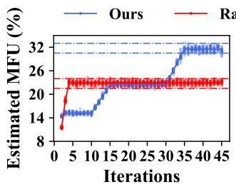

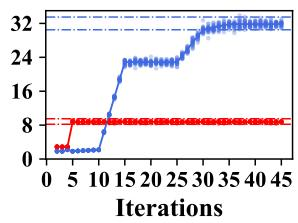  
Figure 8. Convergence comparison of the proposed search strategy and random graph partition with Llama-2 (7B) (left) and (30B) (right) models, where both run 20 times.

Evaluate the effectiveness of graph partition. We evaluate our graph partition algorithm by comparing the algorithm convergence gap when running the carefully designed graph partition algorithm and a random graph partition in multiple rounds. As shown in Figure 8, our algorithm outperforms random graph partition when searching the parallel execution plan for Llama-2 (7B) model in heterogeneous setting 1, and Llama (30B) model in heterogeneous setting 3. Despite fluctuations across different rounds, our algorithm generally converges to a higher estimated MFU, with gaps of approximately 8% and 23% for Llama-2 (7B) and Llama (30B). Furthermore, our algorithm continues to improve over iterations, whereas the random graph partitioning method typically converges early without significant improvement. The performance advantage of our algorithm becomes more pronounced as the cluster complexity increases and the model size grows. One contributing factor is that random graph partitioning is more likely to result in out-of-memory errors. Evaluate the algorithm scalability. Our algorithm is efficient enough to handle large-scale clusters. To evaluate the speed of our algorithm, we run 50 iterations (where our algorithm generally converges) by 12-core CPUs to search the optimal parallel execution plan of different numbers of GPUs ranging from 64 to 320. As shown in Figure 9, our algorithm scales well with an increasing number of GPUs, maintaining a runtime of less than two minutes. The scheduling overhead remains manageable, especially when compared to the months-long training time required for large language models. Additionally, the runtime is independent of model size, as the computational costs are simulated using analytical formulas. Furthermore, the simulated MFU demonstrates that our algorithm performs stably on large clusters.

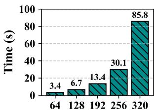  
The Number of GPUs

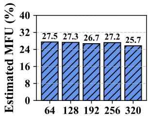  
The Number of GPUs

Figure 9. Algorithm running time and estimated MFU for different GPU cluster sizes.  
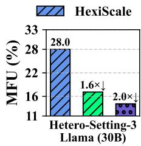

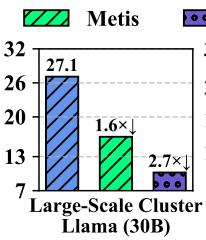

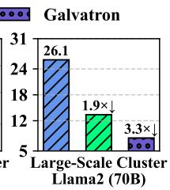  
Figure 10. HexiScale vs. Metis and Galvatron.

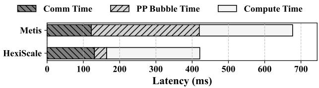  
Figure 11. Latency breakdown of HexiScale and Metis in heterogeneous setting 3 with Llama (30B) model.

## 5.4 Case Studies

Compare with Metis. In heterogeneous setting 3, we also compare HexiScale with Metis, one of the state-of-the-art heterogeneous training systems [48] to demonstrate the superior performance of HexiScale. Metis partitions computations into a single pipeline with a varying number of stages and a varying product of data and tensor model parallel degrees in each stage. Since Metis does not open-source its training system, we run its open-source scheduling algorithm and simulate its performance. The searched parallelism strategy for Metis (obtained through its search algorithm) is listed in Appendix C. Experimental results in Figure 10 (left) demonstrate that Metis achieves an MFU of 17.1%, which is 1.6× lower than that of HexiScale. This provides strong evidence supporting the design of HexiScale: Metis’s scheduling algorithm prioritizes a high degree of data parallelism on each pipeline stage to enhance the system’s parallel processing capability; however, this approach reduces the maximum allowable micro-batches in pipeline parallelism and significantly increases the pipeline bubble overhead compared with a system like HexiScale that more effectively manages different forms of parallelism.

Latency breakdown comparison. We present a detailed breakdown of the training iteration latency in Figure 11. Compared to Metis, HexiScale incurs slightly higher communication overhead, primarily due to its increased demand for tensor model and data parallel communication. However, HexiScale significantly reduces pipeline bubble time. This advantage arises because Metis’s design necessitates a high degree of pipeline parallelism and large micro-batch sizes, inevitably increasing bubble time. In contrast, HexiScale efficiently mitigates this problem by reducing the number of pipeline stages, and increasing the number of micro-batches, thus achieving superior performance than Metis.

Large-scale simulation. To further evaluate HexiScale on larger models and cluster configurations, we simulate the performance of HexiScale, Metis, and Galvatron on a large-scale cluster consisting of 240 heterogeneous GPUs with Llama (30B) and Llama-2 (70B) models. Detailed cluster information is provided in Appendix B. As illustrated in Figure 10 (middle and right), HexiScale exhibits superior performance on the large-scale cluster with different model sizes, achieving performance improvements of 1.6× and 1.9× relative to Metis, and 2.7× and 3.3× relative to Galvatron. Additionally, the search algorithms of Metis and Galvatron fail to efficiently identify high-performance parallelism strategies in large-scale clusters, requiring hours to complete.

More experimental results. We present additional comparisons between our scheduling algorithm and an MILP-based scheduling approach in Appendix D. Experimental results show that our algorithm achieves comparable performance to the MILP-based approach while being significantly more efficient. Additionally, we evaluate the responsiveness of our scheduling algorithm to network variations in Appendix E. Simulation results show that HexiScale effectively accommodates diverse network conditions through the proposed scheduling algorithm with different parallel strategies.

## 6 Conclusion

We introduce HexiScale, a novel system that enhances LLM training flexibility and efficiency using heterogeneous GPUs. By supporting asymmetric partitioning across data, pipeline, and tensor model parallelism, HexiScale effectively leverages diverse GPU capabilities. We optimize these asymmetric computations with a hierarchical graph partitioning algorithm. Empirical studies show that HexiScale achieves comparable throughput to state-of-the-art systems with homogeneous high-performance GPUs on models ranging from 7B to 30B parameters. HexiScale also outperforms state-of-theart heterogeneous training systems. These results highlight HexiScale ’s potential to make LLM training more accessible and cost-effective by harnessing heterogeneous GPUs.

## References

[1] Xin Ai, Qiange Wang, Chunyu Cao, Yanfeng Zhang, Chaoyi Chen, Hao Yuan, Yu Gu, and Ge Yu. 2024. NeutronOrch: Rethinking Sample-Based GNN Training under CPU-GPU Heterogeneous Environments. Proceedings of the VLDB Endowment 17, 8 (2024), 1995–2008.

[2] Amazon. 2024. Amazon EC2 Instance types. https://aws.amazon.com/ ec2/instance-types/

[3] Anthropic. 2024. The Claude 3 Model Family: Opus, Sonnet, Haiku. https://www-cdn.anthropic.com/ de8ba9b01c9ab7cbabf5c33b80b7bbc618857627/Model\_Card\_ Claude\_3.pdf

[4] Rishi Bommasani, Drew A Hudson, Ehsan Adeli, Russ Altman, Simran Arora, Sydney von Arx, Michael S Bernstein, Jeannette Bohg, Antoine Bosselut, Emma Brunskill, et al. 2021. On the opportunities and risks of foundation models. arXiv preprint arXiv:2108.07258 (2021).

[5] Zhenkun Cai, Xiao Yan, Kaihao Ma, Yidi Wu, Yuzhen Huang, James Cheng, Teng Su, and Fan Yu. 2021. Tensoropt: Exploring the tradeoffs in distributed dnn training with auto-parallelism. IEEE Transactions on Parallel and Distributed Systems 33, 8 (2021), 1967–1981.

[6] Ping Chen, Wenjie Zhang, Shuibing He, Yingjie Gu, Zhuwei Peng, Kexin Huang, Xuan Zhan, Weijian Chen, Yi Zheng, Zhefeng Wang, et al. 2024. Optimizing Large Model Training through Overlapped Activation Recomputation. arXiv preprint arXiv:2406.08756 (2024).

[7] Tri Dao. 2024. FlashAttention-2: Faster Attention with Better Parallelism and Work Partitioning. In The Twelfth International Conference on Learning Representations.

[8] Abhimanyu Dubey, Abhinav Jauhri, Abhinav Pandey, Abhishek Kadian, Ahmad Al-Dahle, Aiesha Letman, Akhil Mathur, Alan Schelten,

Amy Yang, Angela Fan, et al. 2024. The llama 3 herd of models. arXiv preprint arXiv:2407.21783 (2024).

[9] Bruce Hendrickson, Robert W Leland, et al. 1995. A Multi-Level Algorithm For Partitioning Graphs. SC 95, 28 (1995), 1–14.

[10] Yanping Huang, Youlong Cheng, Ankur Bapna, Orhan Firat, Dehao Chen, Mia Chen, HyoukJoong Lee, Jiquan Ngiam, Quoc V Le, Yonghui Wu, et al. 2019. Gpipe: Efficient training of giant neural networks using pipeline parallelism. Advances in neural information processing systems 32 (2019).

[11] Technology Innovation Institute. 2023. Falcon 180B. https://falconllm. tii.ae/falcon-180b.html

[12] Xianyan Jia, Le Jiang, Ang Wang, Wencong Xiao, Ziji Shi, Jie Zhang, Xinyuan Li, Langshi Chen, Yong Li, Zhen Zheng, et al. 2022. Whale: Efficient giant model training over heterogeneous {GPUs}. In 2022 USENIX Annual Technical Conference (USENIX ATC 22). 673–688.

[13] Zhihao Jia, Sina Lin, Charles R Qi, and Alex Aiken. 2018. Exploring Hidden Dimensions in Parallelizing Convolutional Neural Networks.. In ICML, Vol. 2279. 2288.

[14] Zhihao Jia, Matei Zaharia, and Alex Aiken. 2019. Beyond data and model parallelism for deep neural networks. Proceedings of Machine Learning and Systems 1 (2019), 1–13.

[15] Albert Q Jiang, Alexandre Sablayrolles, Antoine Roux, Arthur Mensch, Blanche Savary, Chris Bamford, Devendra Singh Chaplot, Diego de las Casas, Emma Bou Hanna, Florian Bressand, et al. 2024. Mixtral of experts. arXiv preprint arXiv:2401.04088 (2024).

[16] Youhe Jiang, Fangcheng Fu, Xupeng Miao, Xiaonan Nie, and Bin Cui. 2023. OSDP: Optimal sharded data parallel for distributed deep learning. In Proceedings of the Thirty-Second International Joint Conference on Artificial Intelligence. 2142–2150.

[17] Youhe Jiang, Fangcheng Fu, Xiaozhe Yao, Guoliang He, Xupeng Miao, Ana Klimovic, Bin Cui, Binhang Yuan, and Eiko Yoneki. 2025. Demystifying Cost-Efficiency in LLM Serving over Heterogeneous GPUs. arXiv preprint arXiv:2502.00722 (2025).

[18] Youhe Jiang, Fangcheng Fu, Xiaozhe Yao, Taiyi Wang, Bin Cui, Ana Klimovic, and Eiko Yoneki. 2025. ThunderServe: High-performance and Cost-efficient LLM Serving in Cloud Environments. arXiv preprint arXiv:2502.09334 (2025).

[19] Youhe Jiang, Ran Yan, Xiaozhe Yao, Yang Zhou, Beidi Chen, and Binhang Yuan. 2024. HexGen: Generative Inference of Large Language Model over Heterogeneous Environment. In Forty-first International Conference on Machine Learning.

[20] Youhe Jiang, Ran Yan, and Binhang Yuan. 2025. HexGen-2: Disaggregated Generative Inference of LLMs in Heterogeneous Environment. arXiv preprint arXiv:2502.07903 (2025).

[21] George Karypis and Vipin Kumar. 1998. A fast and high quality multilevel scheme for partitioning irregular graphs. SIAM Journal on scientific Computing 20, 1 (1998), 359–392.

[22] George Karypis and Vipin Kumar. 1998. Multilevel algorithms for multi-constraint graph partitioning. In SC’98: Proceedings of the 1998 ACM/IEEE Conference on Supercomputing. IEEE, 28–28.

[23] Brian W Kernighan and Shen Lin. 1970. An efficient heuristic procedure for partitioning graphs. The Bell system technical journal 49, 2 (1970), 291–307.

[24] Shen Li, Yanli Zhao, Rohan Varma, Omkar Salpekar, Pieter Noordhuis, Teng Li, Adam Paszke, Jeff Smith, Brian Vaughan, Pritam Damania, et al. 2020. PyTorch distributed: experiences on accelerating data parallel training. Proceedings of the VLDB Endowment 13, 12 (2020), 3005–3018.

[25] Zhiyuan Li, Xun Jian, Yue Wang, Yingxia Shao, and Lei Chen. 2024. DAHA: Accelerating GNN Training with Data and Hardware Aware Execution Planning. Proceedings of the VLDB Endowment 17, 6 (2024), 1364–1376.

[26] Yixuan Mei, Yonghao Zhuang, Xupeng Miao, Juncheng Yang, Zhihao Jia, and Rashmi Vinayak. 2024. Helix: Distributed Serving of Large Language Models via Max-Flow on Heterogeneous GPUs. arXiv preprint arXiv:2406.01566 (2024).

[27] Xupeng Miao, Xiaonan Nie, Yingxia Shao, Zhi Yang, Jiawei Jiang, Lingxiao Ma, and Bin Cui. 2021. Heterogeneity-aware distributed machine learning training via partial reduce. In Proceedings of the 2021 International Conference on Management of Data. 2262–2270.

[28] Xupeng Miao, Yining Shi, Zhi Yang, Bin Cui, and Zhihao Jia. 2023. Sdpipe: A semi-decentralized framework for heterogeneity-aware pipeline-parallel training. Proceedings of the VLDB Endowment 16, 9 (2023), 2354–2363.

[29] Xupeng Miao, Yujie Wang, Youhe Jiang, Chunan Shi, Xiaonan Nie, Hailin Zhang, and Bin Cui. 2022. Galvatron: Efficient Transformer Training over Multiple GPUs Using Automatic Parallelism. Proceedings of the VLDB Endowment 16, 3 (2022), 470–479.

[30] Kabir Nagrecha. 2021. Model-parallel model selection for deep learning systems. In Proceedings of the 2021 international conference on management of data. 2929–2931.

[31] Deepak Narayanan, Aaron Harlap, Amar Phanishayee, Vivek Seshadri, Nikhil R Devanur, Gregory R Ganger, Phillip B Gibbons, and Matei Zaharia. 2019. PipeDream: generalized pipeline parallelism for DNN training. In Proceedings of the 27th ACM Symposium on Operating Systems Principles. 1–15.

[32] Deepak Narayanan, Amar Phanishayee, Kaiyu Shi, Xie Chen, and Matei Zaharia. 2021. Memory-efficient pipeline-parallel dnn training. In International Conference on Machine Learning. PMLR, 7937–7947.

[33] Deepak Narayanan, Mohammad Shoeybi, Jared Casper, Patrick LeGresley, Mostofa Patwary, Vijay Korthikanti, Dmitri Vainbrand, Prethvi Kashinkunti, Julie Bernauer, Bryan Catanzaro, et al. 2021. Efficient large-scale language model training on gpu clusters using megatronlm. In Proceedings of the International Conference for High Performance Computing, Networking, Storage and Analysis. 1–15.

[34] Nvidia. 2006. GPU Computing Solutions for HPC. https://www.nvidia. com/docs/IO/43395/tesla\_product\_overview\_dec.pdf

[35] Nvidia. 2018. NVIDIA Reinvents Computer Graphics with Turing Architecture. https://nvidianews.nvidia.com/news/nvidia-reinventscomputer-graphics-with-turing-architecture

[36] Nvidia. 2020. NVIDIA’s New Ampere Data Center GPU in Full Production. https://nvidianews.nvidia.com/news/nvidias-new-amperedata-center-gpu-in-full-production

[37] Nvidia. 2022. NVIDIA Announces Hopper Architecture, the Next Generation of Accelerated Computing. https://nvidianews.nvidia.com/news/nvidia-announces-hopperarchitecture-the-next-generation-of-accelerated-computing

[38] Nvidia. 2024. NVIDIA Blackwell Platform Arrives to Power a New Era of Computing. https://nvidianews.nvidia.com/news/nvidia-blackwellplatform-arrives-to-power-a-new-era-of-computing

[39] OpenAI. 2024. OpenAI GPT-4o. https://platform.openai.com/docs/ models/gpt-4o

[40] Jeongmin Brian Park, Vikram Sharma Mailthody, Zaid Qureshi, and Wen-mei Hwu. 2024. Accelerating Sampling and Aggregation Operations in GNN Frameworks with GPU Initiated Direct Storage Accesses. Proceedings of the VLDB Endowment 17, 6 (2024), 1227–1240.

[41] Penghui Qi, Xinyi Wan, Guangxing Huang, and Min Lin. 2024. Zero Bubble (Almost) Pipeline Parallelism. In The Twelfth International Conference on Learning Representations.

[42] Samyam Rajbhandari, Jeff Rasley, Olatunji Ruwase, and Yuxiong He. 2020. Zero: Memory optimizations toward training trillion parameter models. In SC20: International Conference for High Performance Computing, Networking, Storage and Analysis. IEEE, 1–16.

[43] Samyam Rajbhandari, Olatunji Ruwase, Jeff Rasley, Shaden Smith, and Yuxiong He. 2021. Zero-infinity: Breaking the gpu memory wall for extreme scale deep learning. In Proceedings of the international

conference for high performance computing, networking, storage and analysis. 1–14.

[44] Machel Reid, Nikolay Savinov, Denis Teplyashin, Dmitry Lepikhin, Timothy Lillicrap, Jean-baptiste Alayrac, Radu Soricut, Angeliki Lazaridou, Orhan Firat, Julian Schrittwieser, et al. 2024. Gemini 1.5: Unlocking multimodal understanding across millions of tokens of context. arXiv preprint arXiv:2403.05530 (2024).

[45] Jie Ren, Samyam Rajbhandari, Reza Yazdani Aminabadi, Olatunji Ruwase, Shuangyan Yang, Minjia Zhang, Dong Li, and Yuxiong He. 2021. {Zero-offload}: Democratizing {billion-scale} model training. In 2021 USENIX Annual Technical Conference (USENIX ATC 21). 551–564.

[46] Jay Shah, Ganesh Bikshandi, Ying Zhang, Vijay Thakkar, Pradeep Ramani, and Tri Dao. 2024. Flashattention-3: Fast and accurate attention with asynchrony and low-precision. arXiv preprint arXiv:2407.08608 (2024).

[47] Hugo Touvron, Thibaut Lavril, Gautier Izacard, Xavier Martinet, Marie-Anne Lachaux, Timothée Lacroix, Baptiste Rozière, Naman Goyal, Eric Hambro, Faisal Azhar, et al. 2023. Llama: Open and efficient foundation language models. arXiv preprint arXiv:2302.13971 (2023).

[48] Taegeon Um, Byungsoo Oh, Minyoung Kang, Woo-Yeon Lee, Goeun Kim, Dongseob Kim, Youngtaek Kim, Mohd Muzzammil, and Myeongjae Jeon. 2024. Metis: Fast Automatic Distributed Training on Heterogeneous {GPUs}. In 2024 USENIX Annual Technical Conference (USENIX ATC 24). 563–578.

[49] Colin Unger, Zhihao Jia, Wei Wu, Sina Lin, Mandeep Baines, Carlos Efrain Quintero Narvaez, Vinay Ramakrishnaiah, Nirmal Prajapati, Pat McCormick, Jamaludin Mohd-Yusof, et al. 2022. Unity: Accelerating {DNN} training through joint optimization of algebraic transformations and parallelization. In 16th USENIX Symposium on Operating Systems Design and Implementation (OSDI 22). 267–284.

[50] Yujie Wang, Youhe Jiang, Xupeng Miao, Fangcheng Fu, Shenhan Zhu, Xiaonan Nie, Yaofeng Tu, and Bin Cui. 2024. Improving Automatic Parallel Training via Balanced Memory Workload Optimization. IEEE Transactions on Knowledge and Data Engineering (2024).

[51] Yujie Wang, Shiju Wang, Shenhan Zhu, Fangcheng Fu, Xinyi Liu, Xuefeng Xiao, Huixia Li, Jiashi Li, Faming Wu, and Bin Cui. 2024. Data-Centric and Heterogeneity-Adaptive Sequence Parallelism for Efficient LLM Training. arXiv preprint arXiv:2412.01523 (2024).

[52] Yen-Chuen Wei and Chung-Kuan Cheng. 1989. Towards efficient hierarchical designs by ratio cut partitioning. In 1989 IEEE International Conference on Computer-Aided Design. Digest of Technical Papers. IEEE, 298–301.

[53] Kun Wu, Jeongmin Brian Park, Xiaofan Zhang, Mert Hidayetoğlu, Vikram Sharma Mailthody, Sitao Huang, Steven Sam Lumetta, and Wen-mei Hwu. 2024. TBA: Faster Large Language Model Training Using SSD-Based Activation Offloading. arXiv preprint arXiv:2408.10013 (2024).

[54] Bowen Yang, Jian Zhang, Jonathan Li, Christopher Ré, Christopher Aberger, and Christopher De Sa. 2021. Pipemare: Asynchronous pipeline parallel dnn training. Proceedings of Machine Learning and Systems 3 (2021), 269–296.

[55] Xiaodong Yi, Shiwei Zhang, Ziyue Luo, Guoping Long, Lansong Diao, Chuan Wu, Zhen Zheng, Jun Yang, and Wei Lin. 2020. Optimizing distributed training deployment in heterogeneous GPU clusters. In Proceedings of the 16th International Conference on emerging Networking EXperiments and Technologies. 93–107.

[56] Alex Young, Bei Chen, Chao Li, Chengen Huang, Ge Zhang, Guanwei Zhang, Heng Li, Jiangcheng Zhu, Jianqun Chen, Jing Chang, et al. 2024. Yi: Open foundation models by 01. ai. arXiv preprint arXiv:2403.04652 (2024).

[57] Binhang Yuan, Yongjun He, Jared Davis, Tianyi Zhang, Tri Dao, Beidi Chen, Percy S Liang, Christopher Re, and Ce Zhang. 2022. Decentralized training of foundation models in heterogeneous environments.

Advances in Neural Information Processing Systems 35 (2022), 25464– 25477.

[58] Zhen Zhang, Shuai Zheng, Yida Wang, Justin Chiu, George Karypis, Trishul Chilimbi, Mu Li, and Xin Jin. 2022. MiCS: near-linear scaling for training gigantic model on public cloud. Proceedings of the VLDB Endowment 16, 1 (2022), 37–50.

[59] Yanli Zhao, Andrew Gu, Rohan Varma, Liang Luo, Chien-Chin Huang, Min Xu, Less Wright, Hamid Shojanazeri, Myle Ott, Sam Shleifer, et al. 2023. PyTorch FSDP: Experiences on Scaling Fully Sharded Data Parallel. Proceedings of the VLDB Endowment 16, 12 (2023), 3848–3860.

[60] Lianmin Zheng, Zhuohan Li, Hao Zhang, Yonghao Zhuang, Zhifeng Chen, Yanping Huang, Yida Wang, Yuanzhong Xu, Danyang Zhuo, Eric P Xing, et al. 2022. Alpa: Automating inter-and {Intra-Operator} parallelism for distributed deep learning. In 16th USENIX Symposium on Operating Systems Design and Implementation (OSDI 22). 559–578.

[61] Yonghao Zhuang, Lianmin Zheng, Zhuohan Li, Eric Xing, Qirong Ho, Joseph Gonzalez, Ion Stoica, Hao Zhang, and Hexu Zhao. 2023. On optimizing the communication of model parallelism. Proceedings of Machine Learning and Systems 5 (2023).

## A Cost Modeling

In this section, we model the Comm-Cost, Comp-Cost, and Mem-Cumsum step by step. First we model cost for each transformer layer, and then model the end-to-end cost for the model as follows:

Modeling Cost Layer-wisely

• Tensor model parallel communication cost. Suppose activation recompute is enabled. A transformer layer is running over a set of GPU $\mathbf { d } _ { i , j } .$ , the tensor model parallel communication cost for a micro-batch can be estimated by:

Comm-TP-Layer $\left( \mathbf { d } _ { i , j } \right) =$

$$
1 2 \cdot \operatorname* { m a x } _ { d \in { \bf d } _ { i , j } } \sum _ { d ^ { \prime } \in { \bf d } _ { \mathrm { i , j } } - \{ d \} } \left( \alpha _ { d , d ^ { \prime } } + \frac { B _ { m b } S H B _ { \mathrm { t y p e } } } { \left| { \bf d } _ { i , j } \right| \beta _ { d , d ^ { \prime } } } \right)\tag{3}
$$

• Data parallel communication cost. The data parallel communication cost for a transformer layer can be estimated by:

Comm-DP-Layer $\left( \mathbf { D } _ { \mathrm { d p } } ^ { k } \right) =$

$$
2 \cdot \operatorname* { m a x } _ { d \in \mathbf { D } _ { \mathrm { d p } } ^ { k } } \sum _ { d ^ { \prime } \in \mathbf { D } _ { \mathrm { d p } } ^ { k } - \{ d \} } \left( \alpha _ { d , d ^ { \prime } } + \frac { 1 2 H ^ { 2 } B _ { \mathrm { t y p e } } } { \left| \mathbf { D } _ { \mathrm { d p } } ^ { k } \right| \beta _ { d , d ^ { \prime } } } \right)\tag{4}
$$

• Pipeline parallel communication cost. Notice that pipeline parallel communication only happens when two layers are on different stages, e.g., the ??-th stage and ??+1-th stage in the ??-th pipeline. It can be treated as two steps: the ?? - th stage send to the ?? + 1-th stage in the forward pass and the ?? + 1-th stage broadcast the information to every GPU in this stage (Or in the backward pass, the ??-th stage recv from the ?? + 1-th stage and then broadcast). Define Comm-PP-Hop $\left( \mathbf { d } _ { i , D _ { p p } ^ { i } } , \mathbf { d } _ { i , D _ { p p } ^ { i } + 1 } \right) = 0$ for convenience. The communication cost for a micro-batch can be estimated by:

$$
\begin{array} { r l } & { \mathrm { C o w M - P P - H o r } \left( \mathbf { d } _ { i , j } , \mathbf { d } _ { i , j + 1 } \right) = } \\ & { \qquad 2 \cdot \underset { d \in \mathbf { d } _ { i , j } , d ^ { \prime } \in \mathbf { d } _ { i , j + 1 } } { \operatorname* { m i n } } \left( \left( \alpha _ { d , d ^ { \prime } } + \frac { B _ { m b } S H B _ { \mathrm { t y p e } } } { \beta _ { d , d ^ { \prime } } } \right) \right. } \\ & { \qquad \quad + \left. \sum _ { d ^ { \prime \prime } \in \mathbf { d } _ { i , j + 1 } - d ^ { \prime } } \left( \alpha _ { d ^ { \prime } , d ^ { \prime \prime } } + \frac { B _ { m b } S H B _ { \mathrm { t y p e } } } { \left| \mathbf { d } _ { i , j + 1 } \right| \beta _ { d ^ { \prime } , d ^ { \prime \prime } } } \right) \right) } \end{array}\tag{5}
$$

• Computation cost for a micro-batch. Assume tensor model parallelism is always running over the same type of device ?? for any layer, and activation recomputation is enabled. The computation cost can be estimated by:

$$
\mathrm { C o M P - T P - L A Y E R } \left( \mathbf { d } _ { i , j } \right) = \frac { 9 6 B _ { m b } \cdot S H ^ { 2 } \left( 1 + \frac { S } { 6 H } \right) } { c _ { d } | \mathbf { d } _ { i , j } | }\tag{6}
$$

Modeling Cost for Each Parallel Strategy

• Data parallelism cost. Different pipeline stages synchronize gradient simultaneously. The Data parallelism cost is bounded by the slowest pipeline stage, which can be

estimated as:

$$
\mathrm { C O M M - D P } = \operatorname* { m a x } _ { i , j } \left[ \sum _ { k = s _ { i , j } } ^ { l _ { i , j } } \mathrm { C o M M - D P \mathrm { - } L A Y E R } \left( \mathbf { D } _ { \mathrm { d p } } ^ { k } \right) \right]\tag{7}
$$

• Pipeline and tensor model parallelism cost. For ??-th pipeline to execute, the cost consists of the computation and communication cost for each stage (indexed by ??):

$$
\begin{array} { l } { \displaystyle \mathsf { S T A G E } \left( \mathbf { d } _ { i , j } \right) = } \\ { \displaystyle l _ { i , j } } \\ { \displaystyle \sum _ { k = 1 } \left[ \mathrm { C o M P - T P - L A Y E R } \left( \mathbf { d } _ { i , j } \right) + \mathrm { C o M M - T P - L A Y E R } \left( \mathbf { d } _ { i , j } \right) \right] } \end{array}\tag{8}
$$

Notice that the slowest stage bounds the pipeline parallel stage. Thus, we formulate the pipeline and tensor model parallelism cost as below:

Pipeline-Time (??) =

$$
\begin{array} { l } { { \displaystyle \sum _ { j = 1 } ^ { D _ { p p } ^ { i } } \left( \mathrm { S T A G E } \left( \mathbf { d } _ { i , j } \right) + \mathrm { C O M M - P P - H o p } \left( \mathbf { d } _ { i , j } , \mathbf { d } _ { i , j + 1 } \right) \right) } } \\ { { \displaystyle + \left( n _ { m b } - 1 \right) \cdot \operatorname* { m a x } _ { j = 2 , \dots , D _ { p p } ^ { i } } \left( \mathrm { S T A G E } \left( \mathbf { d } _ { i , j } \right) \right. } } \\ { { \displaystyle \left. + \mathrm { C O M M - P P - H o p } \left( \mathbf { d } _ { i , j } , \mathbf { d } _ { i , j + 1 } \right) \right) } } \end{array}\tag{9}
$$

Modeling End-to-end time: One iteration time is determined by the slowest pipeline and the data parallel cost, which can be estimated as follows:

$$
\begin{array} { r l } & { \mathrm { C o M M - C o s r } \left( \boldsymbol { \sigma } \right) + \mathrm { C o M P - C o s r } \left( \boldsymbol { \sigma } \right) } \\ & { \quad \quad \quad = \underset { i = 1 , \ldots , D _ { d p } } { \operatorname* { m a x } } \mathrm { P I P E L I N E - T I M E } \left( i \right) + \mathrm { C o M M - D P } } \end{array}\tag{10}
$$

Modeling Memory Cost: Suppose full activation recompute and naive data parallelism are applied. The memory cost of parameters and activations can be estimated as below:

$$
 \mathrm { M E M - C U M S U M } \left( \sigma \right) = \frac { 4 8 H ^ { 2 } B _ { t y p e } } { \left. \mathbf { d } _ { i , j } \right. } + B _ { m b } S H B _ { t y p e }\tag{11}
$$

## B Details of Experiment Setups

We simulate the performance of HexiScale, Metis, and Galvatron on a large-scale cluster consisting of 240 heterogeneous GPUs as follows:

Table 4. GPU compositions in the simulated large-scale cluster.
<table><tr><td>GPU Type</td><td>Num Instances</td><td>Bandwidth (GB/s)</td></tr><tr><td>8×3090</td><td>5</td><td>24</td></tr><tr><td>4×3090</td><td>6</td><td>24</td></tr><tr><td>8×4090</td><td>20</td><td>32</td></tr><tr><td>8×A800</td><td>2</td><td>200</td></tr></table>

## C Details of Parallel Strategies

The parallel strategies for heterogeneous setting 3 for Metis and Galvatron are as follows:

## C.1 Strategy of Metis

Metis prefers using intra-machine data parallelism, thereby constructing one pipeline with 8 stages as follows:

Table 5. Parallel Strategy of Metis under Heterogeneous Setting 3.
<table><tr><td rowspan=1 colspan=1>StageIndex</td><td rowspan=1 colspan=1>GPUAllocation</td><td rowspan=1 colspan=1>LayerCount</td><td rowspan=1 colspan=1>(DP, TP)Degree</td></tr><tr><td rowspan=1 colspan=1>0</td><td rowspan=1 colspan=1>8xA800</td><td rowspan=1 colspan=1>20</td><td rowspan=1 colspan=1>(8,1)</td></tr><tr><td rowspan=1 colspan=1>1,2,3,4</td><td rowspan=1 colspan=1>8x4090</td><td rowspan=1 colspan=1>8</td><td rowspan=1 colspan=1>(8,1)</td></tr><tr><td rowspan=1 colspan=1>5</td><td rowspan=1 colspan=1>8x3090</td><td rowspan=1 colspan=1>4</td><td rowspan=1 colspan=1>(8,1)</td></tr><tr><td rowspan=1 colspan=1>6</td><td rowspan=1 colspan=1>4x3090</td><td rowspan=1 colspan=1>2</td><td rowspan=1 colspan=1>(4,1)</td></tr><tr><td rowspan=1 colspan=1>7</td><td rowspan=1 colspan=1>4x3090</td><td rowspan=1 colspan=1>2</td><td rowspan=1 colspan=1>(4,1)</td></tr></table>

## C.2 Strategy of Galvatron

The strategy for Galvatron is fine-tuned as $( D _ { d p } , D _ { t p } , D _ { p p } ) =$ (4, 2, 7). With a higher data parallel degree, out-of-memory issue persists. With lower data parallel degree, the system performance is compromised by either significant pipeline bubble or communication overhead. Tensor model parallel degree is fine-tuned to 2, otherwise, for higher tensor model parallel degrees, 3090 incurrs significant communication overhead, and compromises the overall system performance.

## D Algorithm Optimality

Due to the NP-hard nature of this complex problem, determining an upper bound is particularly challenging, as it requires either a provably optimal solution or a heuristic guarantee under specific constraints. To evaluate the optimality of our scheduling algorithm, we compare it against the MILP (Mixed-Integer Linear Programming) approach, a widely adopted method in resource allocation problems. ILP/MILP-based solvers have been integrated into prominent systems such as Alpa [60], FlexSP [51], and Helix [26], demonstrating their reliability and effectiveness in resource allocation and parallel strategy determination for LLM training and inference.

We run both a MILP algorithm and our algorithm, and compare the performance gap. The MILP algorithm guarantees optimal results, except its running time grows exponentially.

In Table 6, we simulate the system performance for heterogeneous settings that appear in §5.1. As shown in the table, the scheduling algorithm of HexiScale achieves performance comparable to MILP, with a performance gap of less than 2% in MFU. Additionally, the graph partitioning-based scheduling algorithm used by HexiScale excels in scalability for complex and large environments, significantly outperforming MILP in terms of search time (HexiScale completes the search within minutes, whereas MILP requires hours). In summary, our algorithm delivers performance close to the optimal solution while demonstrating exceptional efficiency.

Table 6. MFU comparison of MILP and HexiScale across different models and heterogeneous settings.
<table><tr><td>Model</td><td>Setting</td><td>Method</td><td>MFU</td></tr><tr><td>Llama-2 (7B)</td><td>Hetero-Setting 1</td><td>MILP HEXISCALE</td><td>32.3% 32.3%</td></tr><tr><td>Llama-2 (13B)</td><td>Hetero-Setting 1</td><td>MILP HEXIScALE</td><td>29.1% 28.6%</td></tr><tr><td>Llama-2 (7B)</td><td>Hetero-Setting 2</td><td>MILP HExISCALE</td><td>34.6% 33.8%</td></tr><tr><td>Llama-2 (13B)</td><td>Hetero-Setting 2</td><td>MILP HExISCALE</td><td>33.2% 31.8%</td></tr><tr><td>Llama (30B)</td><td>Hetero-Setting 3</td><td>MILP HEXISCALE</td><td>29.7% 28.0%</td></tr></table>

## E Effect of Network Variation

HexiScale is designed to accommodate varied network conditions (along with heterogeneous compute power) by the proposed scheduling algorithm.

When network variates, HexiScale will flexibly configure the parallel strategy. Intuitively, high bandwidth is expected to be assigned for communication-intensive parallel strategies, while low bandwidth should be avoided or allocated to parallel strategies with smaller communication volumes.

To provide a concrete example, we simulate the system performance by varying the inter-machine bandwidths for the Llama-2 (7B) model in heterogeneous setting 1 (40 heterogeneous GPUs), as presented in §5.1 of our paper, the simulation results show that HexiScale achieves 30.1% MFU with 0.5 GB/s inter-machine bandwidth, 32.3% MFU with 0.7 GB/s inter-machine bandwidth, 36.4% MFU with 5 GB/s inter-machine bandwidth.

When inter-machine bandwidth decreases from 1 GB/s to 0.5 GB/s, the parallel strategy and network allocation remain unchanged. Pipeline parallelism still uses the slower inter-machine bandwidth for communication, while data parallelism is assigned to the higher intra-machine bandwidth. Since the pipeline communication volume is relatively small, the reduced network bandwidth introduces only a small additional overhead reflected by the MFU.

When inter-machine bandwidth increases from 1 GB/s to 5 GB/s, the scheduling algorithm will reallocate the intermachine bandwidth to data parallelism, which has a significantly higher communication volume. This adjustment leads to a notable boost in system performance by reducing the communication overhead associated with data parallelism.

In summary, our algorithm accommodates the network variation by adjusting parallel strategies and allocating the appropriate network links to each strategy based on the communication volume to optimize computation utilization.