# Practical Adversarial Multi-Armed Bandits with Sublinear Runtime

Kasper Overgaard Mortensen 1 Ama Bembua Bainson 1 Mathias Ravn Tversted 1 Kristoffer Strube Græm 1 Andrea Paudice 1 Renata Borovica-Gajic 2 Davide Mottin 1 Panagiotis Karras 1 3

## Abstract

We study the Multi-Armed Bandit problem in nonstationary adversarial environments, where the identity of the optimal arm can change over time due to shifts in the loss sequence. Motivated by applications such as physical design tuning in database systems, we focus on settings with a very large number of arms k and seek practical algorithms with sublinear runtime in k. Our main contribution is a novel algorithm, Queuing Behind the Leader (QBL), which achieves a per-iteration complexity of O(m log k), where m is the number of arms selected in each step. QBL combines limited update operations via a priority queue, a constant sampling overhead, and a balanced exploration strategy. We evaluate QBL extensively on state-of-the-art benchmarks and demonstrate that it consistently outperforms existing methods in both time and quality.

## 1 Introduction

The Multi-Armed Bandit (MAB) (Slivkins, 2019; Lattimore & Szepesvari, 2020) problem is a fundamental model in ´ machine learning for sequential decision-making under uncertainty. At each time step, a learner selects one or more actions (arms) among k options, and observes stochastic or adversarial feedback based on the chosen actions. The goal is to design algorithms that balance exploration and exploitation in order to maximize reward over time. Due to its conceptual simplicity and practical relevance, the MAB framework finds applications in areas such as online recommendation, A/B testing, dynamic pricing, adaptive routing, and physical design tuning (Perera et al., 2022; 2023).

In this work, we consider a general and challenging variant of the bandit problem: the combinatorial adversarial MAB in non-stationary environments. In this setting, the learner selects a subset of m arms from a ground set of k arms at each round (Chen et al., 2013), and the reward associated with each arm may change arbitrarily over time (Karnin & Anava, 2016; Zhang et al., 2018). This model is motivated by applications such as graph summarization (Safavi et al., 2019) and automated physical design tuning (Perera et al., 2021; 2022; 2023; Oetomo et al., 2021), where (i) the decisions are inherently combinatorial, (ii) no reliable statistical model of the environment can be assumed, and (iii) the environment evolves over time due to changing data distributions or design constraints. These features make the adversarial and non-stationary formulation both natural and necessary for modeling such settings. Figure 1 show how existing MAB methods for automatic index tuning struggle under nonstationary workloads.

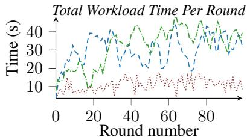  
Figure 1: Time vs. rounds for executing a nonstationary workload on a 10GB TPC-H dataset. Automatic index tuning methods fail to adapt to this setting.

The literature on adversarial MAB has extensively studied performance guarantees in terms of regret bounds, comparing the learner’s cumulative reward to that of the best fixed strategy in hindsight. Optimal regret rates are known for many variants of the problem, including single-arm selection (Auer et al., 2003; Stoltz, 2005; Kocak et al., 2014; Neu, ´ 2015; Besson & Kaufmann, 2018; Auer & Chiang, 2016; Zimmert & Seldin, 2021; Kalai & Vempala, 2005), combinatorial settings (Uchiya et al., 2010; Combes et al., 2015), and extensions to nonstationary environments (where one compares against a sequence of actions) (e.g., (Jacobsen & Cutkosky, 2024; Lu & Hazan, 2023)). However, these theoretical guarantees often come at a significant computational cost: essentially all existing algorithms achieving optimal regret require O(k) time per decision round, which becomes prohibitive in large-scale applications where k may be in the order of thousands or more, as is common in the application domains we target. This computational concern worsens in non-stationary environments, where existing methods incur an additional dependence on O(log T ) (Jacobsen & Cutkosky, 2024; Jacobsen, 2024), where T is the timehorizon. Notice that, even if recent works (Lu & Hazan, 2023), mitigate the dependence on T to O(log log T ) the resulting solution are still unpractical.

Contributions. Motivated by real-world systems, employed for automated physical design tuning, where fast decision-making over large action spaces is critical, we propose a novel algorithm, Queuing Behind the Leader (QBL), for the adversarial combinatorial MAB problem. QBL achieves a per-iteration runtime of O(m log k), making it suitable for large-scale settings where traditional algorithms with linear dependence on k are impractical. The algorithm is also simple to use in practice, requiring only a single user-defined parameter. Moreover, QBL is agnostic to the environment dynamics, making it useful in a wide range of cases including stationary and non-stationary environments. Although QBL currently lacks theoretical regret guarantees, we show strong experimental performance against state-of-the-art methods in terms of empirical regret and computational efficiency. We believe this contribution will stimulate further research into efficient algorithms for adversarial multi-armed bandits and inspire new approaches to bridging the gap between theory and practice in largescale bandit problems.

## 2 Problem Setting and Related Work

We begin by formalizing the combinatorial multi-armed bandit (MAB) problem in non-stationary environments, which capture the whole spectrum of MAB problems considered in this paper. Let k, m ∈ N denote the number of available arms and the number of arms selected at each round, respectively. Let T ∈ N be the time horizon. At each round t ∈ [T ], the interaction between the learner and the environment proceeds as follows:

1. The learner selects a subset of arms St ⊆ [k], such that |St| = m.

2. The adversary select a reward vector rt ∈ [0, 1]k.

3. The learner observes the rewards {rt(i)}i∈St for the selected arms.

The performance of a learning algorithm A is evaluated using the dynamic regret:

$$
\tag{1}
$$

where, for each t, the comparator S∗t ⊆ [k] is a subset maximizing the instantaneous rewards over all size-m subsets:

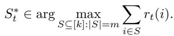

Note that when m = 1, the problem reduces to the classical non-stationary adversarial MAB. Moreover, if the comparator is chosen as a fixed set S∗ ∈ arg maxS⊆[k]:|S|=m PTt=1 Pi∈S rt(i), then the regret in (1) corresponds to the static regret. Yet, the current theoretical backbone only ensures regret sublinear in the number of rounds T with time linear in the number of arms k. Here we consider practical scenarios occurring in real-world systems in which k is large and use dynamic regret as an empirical performance measure.

## 2.1 Automated physical Design Tuning (DT)

Automated physical design tools constitute an integral part of commercial DBMSs (Agrawal et al., 2004; Zilio et al., 2004; Dageville et al., 2004). Such tools reduce the manual input required for tuning database systems hence reducing operational costs (Zilio et al., 2001). To render automatic database decision-making more robust, recent works have resorted to machine learning-based solutions. Reinforcement learning (RL) has been leveraged in query optimization (Marcus & Papaemmanouil, 2019; Marcus et al., 2019), join sequence ordering (Kaftan et al., 2018; Trummer et al., 2019; Kipf et al., 2019; Marcus et al., 2021; Ghadakchi et al., 2020), index selection (Sharma et al., 2018; Wu et al., 2022), database partitioning (Hilprecht et al., 2020), and configuration tuning (Pavlo et al., 2017; Zhang et al., 2019; 2022; Li et al., 2019). MAB formulation enjoy advantages of faster convergence, simpler implementation, and theoretical guarantees (Perera et al., 2021), have been applied to online index tuning (Perera et al., 2021; 2022; Oetomo et al., 2021; Perera et al., 2023). DBAbandit (Perera et al., 2021), an instance of such an application, aims to select a sequence of index configurations from a set of feasible candidates, subject to a memory budget, in order to minimize the total execution time of a workload. HMAB (Perera et al., 2022) builds on DBAbandit to integrate the online tuning of indices and materialized views using a bandit hierarchy. Still, all aforementioned techniques assume a stationary setting, and are therefore susceptible to shifts in user interest. By contrast, we provide solutions for nonstationary settings.

Under the MAB framework, automatic index tuning is defined as follows.

MAB formulation. Given a set of k indexes I, corresponding to a subset of a table’s attributes in a relational database, index tuning seeks a subset St ⊆ I of m < k indexes to materialize, aiming to reduce the computation time of a set of user queries. Each index is treated as an arm. At each round i, a new query arrives, the system obtains a reward

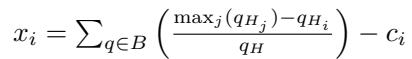

where qHi is the execution-time of query q spent using index i, maxj qHj is the maximum execution-time q has historically spent on any scan of H, qH is q’s total number of accesses to H, and ci is the creation cost of i, ci = 0 if i is already created.

## 3 Enhancing Exp3’s Efficiency

To facilitate a comparison of QBL against with the best-ofbreed adversarial MAB policies on a level playing field, we re-examine the popular family of Exp3 policies (Auer et al., 2003; Uchiya et al., 2010; Kocak et al., 2014; Stoltz, 2005) ´ with two goals of practical consideration: numeric stability of weights and sublinear runtime in the number of arms.

While numeric stability is achievable by utilizing the Log-Sum-Exp trick (Blanchard et al., 2020; Nowozin, 2016; Gao & Pavel, 2017; Boyd & Vandenberghe, 2004), the objective of sublinear runtime has been sidelined, while a side-note in Tim Vieira’s blog (Vieira, 2016) mentions it is achievable. Nevertheless, that note does not substantiate the end-to-end adaptation required to make a sublinear per-step runtime in Exp3 practically feasible for large T . We fill this gap by explicitly showing how to combine Vieira’s sum-heap observation for Exp3 with a stable log-weight scheme and sublinear per-step runtime O(log k).

We show that this approach can be expanded to the combinatorial setting and used to change the total time complexity of Exp3.M (Uchiya et al., 2010) from O(k log(m)) to O(m log(k)) giving a sublinear per-choice overhead, which proves to be beneficial when m ≪ k.

## 3.1 Adapting streaming LogSumExp

Due to exponential weight updates in Exp3, weight values may overflow their assigned data type range, causing problematic behavior in the context of the DT problem instances, which require long and stable system deployment. Weight normalization may prevent such overflows, but requires a linear pass over weights per round, which becomes impracticable as the time horizon T and choices k grow. Likewise, the LogSumExp (LSE) trick (Blanchard et al., 2020; Nowozin, 2016; Gao & Pavel, 2017; Boyd & Vandenberghe, 2004), which exploits the fact that, as the exponential function grows quickly, a sum is dominated by its largest term, is used to provide numerically stable values.

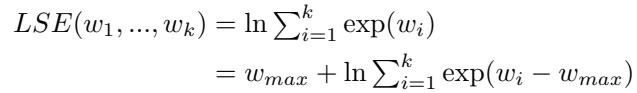

where wmax = maxi wi. Still, this definition requires two scans of weights in each round, one to find the maximum and another to compute the sum, which may be real-time infeasible in the highly dynamic environments we target. To avoid this overhead, we use a streaming version (Nowozin, 2016), which we further modify to create an updatable Sum-Exp for a fixed set of weights, as Algorithm 1 presents.

Algorithm 1: UpdateSumExp   
Input : SE, wmax, wold, wnew   
1 SE ← SE − exp(wold − wmax) // Delete old contribution   
2 if wnew > wmax then   
/\* New weight is bigger than max \*/   
3 SE ← SE · exp(wmax − wnew) // Adjust terms to new max   
4 SE ← SE + 1 // Add contribution of (new) max   
5 wmax = wnew // Update max weight   
6 else   
7 SE ← SE + exp(wnew − wmax) // Add new contribution   
8 return SE, wmax

At each weight update, we remove the old value wold from the sum (Line 1). Then, if the updated weight wnew is larger than the running maximum wmax, we introduce the new maximum wnew into the sum of weights (Line 3), based on the equality:

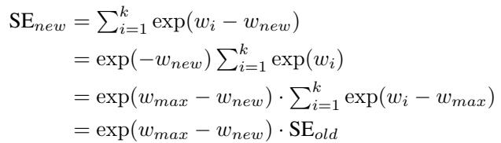

The new maximum weight contributes exp(wnew wnew) = 1, added in Line 4, and wmax is updated to wnew in Line 5. Alternatively, if wnew is no larger than wmax, we adjust wnew by wmax (Line 7). This update scheme exploits the fact that weights can only increase in two consecutive iterations.

To prevent overflows, we maintain weights in log scale:

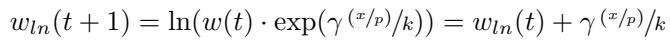

Accordingly, we calculate probabilities as weight ratios using log weights with a constant time overhead per timestep:

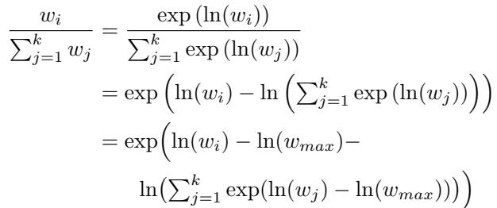

where wmax = maxj wj and ∀wj, wj ∈ R+. We thus perform all weight updates in Exp3 in logarithmic space with numerical stability and constant computational overhead per round, while maintaining the Pkj=1 exp(ln(wj ) − ln(wmax)) term by UpdateSumExp. We thus avoid accessing non-logarithmic weights and allow the direct incremental calculation of LSE. We also apply this trick to implicit exploration variations of Exp3 that utilize a negative scaled loss L, handling the loss as the logarithm of an exponential. Next, we show how to tackle the remaining linear-sampling overhead by maintaining the LSE directly and incrementally by incorporating UpdateSumExp routine into a sumheap.

## 3.2 Utilizing sumheap sampling

Exp3 samples a choice in O(k) time, as it has to convert weights to a probability distribution. Critically, linear-time bandits risk being too slow to bear practical impact in fastpaced multiple-option environments. For instance, in each iteration, a MAB-driven DT system already spends considerable time constructing the index, making any additional overhead from the MAB impractical. To address this need, we eliminate the linear sampling cost using intermediary weight sums that allow on-demand probability computations. We utilize a sumheap (partial sum tree) (Vieira, 2016; Olken, 1993; Wong & Easton, 1980), a binary heap that stores weights in its leaves, sums of children in internal nodes, and hence the overall sum in the root node. We can thus update a weight and associated sums in O(log k). This operation adds on overhead to standard UpdateSumExp, yet, by making progressive intermediaries of the cumulative sum available, it materializes a cumulative distribution function (CDF) for a discrete probability density function (PDF) over leaves. Treating the sumheap as an unnormalized CDF, we sample directly from it by the inversion method (Devroye, 2006) which scales a uniform random probe by the weight sum rather than normalizing the CDF.

While Tim Vieira (Vieira, 2016) noted the application of sumheap as a fast sampling method for Exp3, it is at times disregarded as inefficient (Olken, 1993), because updates are expensive if done often on many weights. However, as Exp3 only needs to update the heap once after each sampling, we can sample over weights by sumheap and also expand its use to sampling without replacement by temporarily replacing the sampled weight with a sentinel value and re-sampling. This trick makes sumheap sampling applicable to the combinatorial setting as well. Yet, a na¨ıve implementation of sumheap might suffer from numerical instability, as exponential weights can grow beyond the representable range of the number format. To avoid this predicament, we combine UpdateSumExp with sumheap calculating weight probabilities on demand using logarithmic representations. Next, we combine these expedients in a numerically stable implementation of Exp3.M for both single and combinatorial settings with a time complexity of O(m log k) per round.

## 3.3 Putting it all together

As discussed, our final goal is to deploy our Exp3 variants to the long time horizons and large action spaces of DT, ensuring fast action sampling and numerical stability. Hence, we integrate Algorithm 1 into sumheap sampling.

Algorithm 2: HeapUpdate   
Input : SumHeap S, weight index a, log weight value wa   
1 i ← |S|2 + a // Heap index of wa   
2 S[i] ← wa // Set new weight value   
3 while i > 0 do   
4 i ← i/2 // Integer division. Move to parent node   
5 if S[2i] = \$ then // Left child is sentinel value   
6 S[i] ← S[2i + 1]   
7 else if S[2i + 1] = \$ then // Right child is sentinel   
8 S[i] ← S[2i]   
9 else if S[2i] > S[2i + 1] then   
// Log sum where left child is bigger   
10 S[i] ← S[2i] + ln(exp(S[2i + 1] − S[2i]) + 1)   
11 else   
// Log sum where right child is bigger   
12 S[i] ← S[2i + 1] + ln(exp(S[2i] − S[2i + 1]) + 1)

Algorithm 3: HeapSample   
Input : SumHeap S   
1 d ← |S|2 // Number of internal nodes in heap   
2 p ← Uniform(0, 1) // Uniform random probe   
3 i ← 1 // Initialize active index to heapsum   
4 while i < d do   
/\* Loop while i is an internal heap node \*/   
5 i ← i · 2 // Set active index to left child of previous   
6 if S[i] = \$ then   
7 i ← i + 1 // Set active index to right child   
8 continue   
9 if p > exp(S[i] − S[1])] then   
/\* If probe is higher than the left node value \*/   
10 p ← p − exp(S[i] − S[1]) // Set probe to child tree   
11 i ← i + 1 // Move from left child to right child   
12 return i − d // Convert i from heap index to weight index

Algorithm 2 shows the sumheap update with exponential weighting. The method resembles Algorithm 1 in its replacement of weights in a sum, yet does not require wmax (Lines 1 & 7, Algorithm 1) to prevent floating-point overflows; instead, it uses sumheap intermediate sums to maintain a logarithmic sum of weights, LSE(ln(w1), . . . , ln(wk))= ln(w1+ . . . +wk). To introduce a new weight in the sumheap, the algorithm updates the affected leaf (Line 2), recalculates the logarithmic sums along its ancestors while avoiding exponentiation of the largest child weight (Lines 10 & 12) while excluding temporarily removed weights from the sums to support sampling without replacement (Lines 5 & 7).

Algorithm 3 presents our inverse-sampling mechanism, adapted from (Vieira, 2016), which finds the leaf at which the sum of visited values exceeds a random value p. Starting from the root, it traverses the heap choosing leftward branches until the ratio between the root value and the node exceeds p (Line 5), whereupon it subtracts from p the sum of values seen so far (Line 10) and reverts to the right branch (Line 11). To support sampling without replacement, Lines 6–8 revert to the right if the leftward value is a sentinel. The algorithm terminates upon reaching a leaf.

Algorithm 4 illustrates our heap-enhanced combinatorial Exp3.M that utilizes Algorithm 2 and Algorithm 3. After initializing the sumheap in Line 1 by setting wi = 1 ∀i, it samples an action from the weights using the sumheap, either by exploration, randomly selecting an action with uniform probability (Line 6), or by sampling from the weights (Line 9). After receiving rewards (Line 16), it updates weights (Line 18) and the heap (Line 19) accordingly.

Algorithm 4: Exp3.M Heap   
Input : timesteps T , number of choices k, number of selected choices m,   
exploration factor γ   
1 S ← Heap(2k) // Init heap of size 2k   
2 for i = 0 to k − 1 do   
3 HeapUpdate(S, k + i, 1) // Init log weights in heap   
4 for t = 1 to T do   
/\* Sample \*/   
5 for i = 0 to m − 1 do   
6 if Uniform(0, 1) < γ then   
7 a ← HeapRandom(S) // Pick a random choice   
8 else   
9 a ← HeapSample(S) // Sample from heap   
10 prev[i] ← S[k + a] // Save sampled values   
11 A[i] ← a // Save sampled indexes   
/\* Calculate probability for sampled choice \*/   
12 pa ← (1 − γ) exp(S[k + a] − S[1]) + γk   
13 HeapUpdate(S, S[k + a], \$) // Set sampled to sentinel   
14 for i = 0 to m − 1 do   
15 HeapUpdate(S, S[k + prev[i]], A[i]) // Restore heap   
/\* Update \*/   
16 Receive rewards xa for all choices a ∈ A   
17 for a in A do   
18 19 wa ← S[k + a] + γ xa/pa HeapUpdate(S, S[k + a], wa) k // Calculate new log weight // Update heap

Complexity. Each round in Exp3.M Heap takes O(m log k) to scan the heap m times, one extra update to support sampling without replacement, and one update of the heap to adjust the weights. As such, Exp3.M Heap’s complexity is lower than that of Exp3.M in the usual case in which m ≪ k. Alternatively, one may use Exp3.M with UpdateSumExp to avoid the two-pass calculation of LSE.

## 3.3.1 The single-choice case.

Exp3.M Heap leads to a fast heap variant of Exp3 for singlechoice sampling, Exp3 Fast (Algorithm 6 in the supplementary material), by removing the sampling without replacement and setting m = 1. It simplifies sampling (Lines 4–9) as it does not need to save heap values as Exp3.M Heap does, and calculates a probability only for the sampled choice (Line 9). Implicit-exploration variations of Exp3, such as Exp3Light and Exp3-IX, are also amenable to this formulation. In particular, we propose Exp3Light Fast, a heapbased reformulation of Exp3Light, which conducts implicit exploration as in Exp3Light (Stoltz, 2005) by updating its weights via the formula w ← S[k + a] +  η 1−x p , instead of explicit exploration during sampling.

Complexity. Exp3 Fast and Exp3Light Fast need O(log k) time to sample the heap once. As we always have to update or sample an entire leaf-to-root path of intermediary sums in the heap, the complexity bound is tight for all Exp3 variants.

## 4 Queuing Behind the Leader

In this section, we present our method and discuss the main ideas behind its design, which is guided by intuitive principles, and compare it to theoretically grounded, albeit slower, MAB approaches. The empirical benefits reported in Section 5 suggest that these principles could inform other efficient and robust MAB algorithms too.

Overview. Exp3, and similar algorithms, indicate that a single-weight update scheme is advantageous in terms of time efficiency. However, they also reveal that sampling from a dynamically updated probability distribution incurs significant overhead. By contrast, the follow-theleader (FTL) algorithm (Kalai & Vempala, 2005) employs a multi-weight update scheme that randomly perturbs all weights but achieves constant-time sampling by always selecting the arm with the highest weight. Our approach aims to combine the best of both worlds: at each round, it updates only the weights of arms that are actually chosen as the apparent best options. QBL achieves this through two key features: it evaluates rewards while treating apparently good choices with conservatism, and it maintains a dynamic priority queue that orders choices independently of their rewards. Beyond runtime efficiency, QBL is designed to prevent policy overcommitment in adversarial and non-stationary settings, where arms with high past rewards accumulate excessive weight and introduce future selection bias (Bubeck & Cesa-Bianchi, 2012; Besbes et al., 2014). QBL addresses overcommitment through an exploitation strategy in which an arm selection is retained only while its reward improves steadily in comparison to other arms. When sustained progress stalls, QBL reinstates exploration of other arms. By selectively reducing priorities instead of replacing all weights, QBL skips multiple weight updates per round, improving both efficiency and solution quality.

Exploitation strategy. The core idea of QBL is to test whether the running best choice, or leader, is over- or under-performing compared to previous ones, rather than measuring the non-stationary character of the environment. To perform this test, it compares a global weighted measure over all k arms to a local unweighted measure for each choice. In all cases, it eventually demotes a leader by reducing its weight, called priority, and picking a new one.

QBL maintains a selection counter c[a]t, which stores the number of times an arm a has been selected, and an accumulated reward r[a]t for each choice a at round t. It computes a local mean Lt[a] := r[a]t/c[a]t and compares it to a global weighted average Gt := Rt/Ct, where Rt = Pki=1 r[i]t and Ct = Pki=1 c[i]t. Notice that Gt = (c[a]t/Ct)Lt[a] + Pi∈[k]/a r[i]t/Ct. If Lt[a] > Gt, then arm a is considered to be performing well enough, and the algorithm continues selecting it without exploring other options. Eventually, Lt[a] will either drop below Gt, or, as c[a]t increases, and the difference ∆(t) := |Lt[a] − Gt| will fall below a small threshold ε. At that point, Lt[a] has remained the leader for too long, and it may be appropriate to start exploring other options. Therefore, the current leader a is demoted.

Note that as c[a]t grows, |∆(t) − ∆(t + 1)| gradually decreases, since incoming rewards r[a]t have diminishing impact on Lt[a]. To limit the duration during which a suboptimal arm can remain the leader, it is beneficial to ensure that c[a]t is small when a leader begins its term. To enforce this, we normalize the accumulated reward as r[a]t := r[a]t/c[a]t and reset the counter with c[a]t := 1 at the start of a leader’s term. This operation preserves Lt but significantly reduces c[a]t. The global average Gt is updated accordingly to reflect this change. Interpreting Lt[a] as a reward estimator, this adjustment increases the estimator’s variance while preserving its mean. Moreover, it can be viewed as introducing an implicit discount factor, reducing the weight of historical rewards.

However, this deterministic adjustment is prone to adversarial manipulations aimed at prolonging the leadership of a suboptimal arm. To this end, we introduce randomization, modifying the demotion mechanism to penalize a leader if

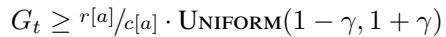

for the current leader a, where γ ∈ (0, 1]. In this way, QBL effectively obfuscate how long a seemingly well-performing leader will be allowed to remain, while giving initially unlucky new leaders the potential to extend their leadership.

Summarizing this scheme, a leader is demoted if it performs poorly in comparison to the recent performance of previous leaders, and if it performs too well relative to the global average. To avoid demotion and circumvent QBL, an adversary must steadily increase the selected arm’s reward, forcing its estimate toward the unknown optimum and limiting sustained regret. Next, we discuss how to maintain the selection of the next leader in a way that ensures sufficient exploration while avoiding unnecessary penalization of well-performing arms during demotion.

Plutocracy as a queue. Upon reducing a leader’s priority, QBL picks a new leader, possibly the same, as the one of highest priority, using a priority queue. This queue only allows integer priorities p ∈ [p[Top(Q)] − k, p[Top(Q)]], where p[Top(Q)] is the priority of the current leader, thereby bounding priority differences by k. Algorithm 5 presents the pseudo-code for QBL.M (in this paragraph, for simplicity, we omit referring to subscript t, as the current round is already clear from the pseudo-code). Initially, we set the priority of each option to be a unique value in a range of k (Line 2) and further shuffle them to introduce a random initialization. We initialize trackers of rewards, counts, and leaders (Lines 3–5) and a priority queue supporting Pop, Push, Top, and Update operations (Line 6).

Algorithm 5: QBL.M   
Input : k, m, γ   
1 for i = 0 to k − 1 do   
2 p[i] ← i // Initialize priority   
3 r[i] ← 1; c[i] ← 1 // Term reward and length   
4 B[i] ← false // No initial leaders. Boolean indicator   
5 R ← k; C ← k // Total term reward and length   
6 Q ← PriorityQueue(p) // Element i’s priority is p[i]   
7 for t = 1 to T do   
/\* Sample \*/   
8 for i = 0 to m − 1 do   
9 A[i] ← Pop(Q) // Get and remove leader   
10 for i = 0 to m − 1 do   
11 Push(Q, A[i], p[A[i]]) // Reinstate leader to queue   
/\* Update \*/   
12 Receive reward xa for each choice a ∈ A   
13 for a in A do   
14 if B[a] = false then   
/\* Reset contributions of new leader \*/   
15 R ← R − r[a] + r[a] c[a] ; ; C ← C − c[a] + 1   
16 r[a] ← r[a]c[a] ; c[a] ← 1; B[a] ← true   
17 R ← R + xa; C ← C + 1 // Global score   
18 r[a] ← r[a] + xa; c[a] ← c[a] + 1 // Local score   
19 if RC ≥ r[a]c[a] Uniform(1 − γ, 1 + γ) then   
/\* Reduce priority of a \*/   
20 p[a] ← min{p[a]−1, p[Top(Q)]−1 + c[a]−k}   
21 Update(Q, a, p[a]) // Update queue   
22 B[a] ← false // Remove a as active leader

Thereafter, for each step in the time horizon T , QBL.M chooses m elements from the priority queue (Lines 7–11) and then updates the queue (Lines 11–22) based on those choices. To choose elements, Line 9 pops the m elements of highest priority and saves them for later use in a list A, while Line 11 reinstates them in the queue.

After receiving rewards for all elements in A (Line 12), we check, for each a ∈ A, whether it was a leader in the last round (Line 14); if not, we grant it an initial advantage by setting its reward tracker r[a] to the average reward it received in its last term and its length tracker c[a] to 1, mark it as an active leader (Line 16), and update the total reward and count sums accordingly (Line 15). Regardless whether a has been a leader in the last round, we update local and global reward and count trackers to account for the received reward xa (Lines 17–18). Thereafter, we check whether the priority of leader a should be reduced (Line 19). To do so, we compare two measures, a global and a local score as described in the exploitation strategy. Line 20 reduces the priority of a leader deemed reducible, offering a bonus of c[a] − k, where c[a] is the length of its previous term. Thereby, we let leaders that had a long term be repicked earlier. As such, we reduce a leader’s priority by at least one position, to p[a]−1, and at most to p[Top(Q)] − k; the latter happens if its previous term had length only c[a] = 1, thus each leader is guaranteed to be replaced within at most k demotions, letting other options be explored. After determining a leader’s reduced priority, we update its position in the queue (Line 21) and flag it as an inactive leader (Line 22). If it remains in the top-m queue elements, it becomes active again in the next round.

Complexity. The time complexity of a round in QBL.M is O(m log k), as maintenance of sampling and updates of the priority queue cost O(log k) due to the queue being implemented as a heap. Maintaining the sampling is the expected bottleneck of QBL.M, as it occurs every round. In contrast, queue updates only occur in case of demotion. Sampling complexity can be reduced to O(m log m) by introducing an auxiliary heap that tracks candidate elements of the main heap, yet this approach can be slower in practice than single-heap removal and reinsertion. For fixed size m, the per-round sample complexity can be reduced to O(m) by maintaining a min-heap of the top-m arms and a maxheap of the rest. An update triggers a swap between the heaps as needed, and sampling selects the entire min-heap instead of extracting individual values. We note that, in the case m = 1, we can reduce the per-round total time complexity to O(log k). Sampling can be replaced with peeking at the top element of the queue in O(1), and only one leader may need to be updated instead of m. If the leader is not demoted, the entire step takes O(1). Please refer to the appendix for the full pseudo-code of QBL in the m = 1 setting.

Future directions. QBL is a preliminary step towards bandit algorithms that scale sublinearly with the number of arms, a setting overlooked in prior work. The updateon-demotion mechanism (Algorithm 5, Lines 19–22) is a pragmatic choice that achieves scalability by replacing randomized arm selection with randomized demotion while guaranteeing eventual reconsideration of all arms. Yet, this mechanism does not comply with existing analytical frameworks for regret analysis. As a result, standard techniques used to derive regret bounds for algorithms such as Exp3 are not directly applicable. In QBL, one can still devise an adversarial strategy that aligns switches to the best arm with the expected demotion time-steps. This does not imply linear regret on every sequence of switches, but rules out sublinear sampling for arms in expectation-based regret analysis. An open question is whether demotion intervals can be meaningfully bounded with high probability and used in a regret analysis. Recent works on non-stationary bandits (Auer et al., 2019; Suk & Kpotufe, 2022; Abbasi-Yadkori et al., 2023) introduce an approach that splits arms into sets of measured good and bad arms. Such a distinction shares similarities with the conceptual idea of QBL’s demotion scheme, yet this approach introduces a runtime dependency on log T and remains linear in k even when applying the optimization in Remark 3 of (Auer et al., 2019). Yet, the adaptation of the analysis in (Auer et al., 2019; Suk & Kpotufe, 2022; Abbasi-Yadkori et al., 2023) to QBL remains an open area of investigation.

## 5 Experimental evaluation

Here, we evaluate the performance of QBL1 in terms of effectiveness and scalability vs. enhanced Exp3 methods in both real-world and simulated nonstationary environments. Index tuning experiments runs on Ubuntu 24.04.1 (Xeon Silver 4316, 2.3 GHz, 1TB RAM); other experiments use Ubuntu 20.04.4 (Core i7-10610U, 1.8GHz, 48GB RAM).

Methods. In Section 5.1, we compare QBL.M to DBAbandit (Perera et al., 2021) and HMAB (Perera et al., 2022) on database index tuning (Section 2.1). The comparison is conducted in the solution’s provided framework, implemented in Python. In Sections 5.2 and 5.3, we compare, across multiple simulated environments, QBL (Section 4) to the following single policy adversarial MAB algorithms:

• Exp3 (Auer et al., 2003): the first adversarial MAB algorithm based on exponential weights.

• FPL (Kalai & Vempala, 2005): deterministic weights with noisy updates.

• Exp3Light (Stoltz, 2005): Exp3 with implicit exploration.

• Exp3-IX (Neu, 2015): an Exp3 variant with implicit exploration and high-probability bounds.

• Exp3 Fast, Exp3Light Fast: fast heap-optimized variants of Exp3 and Exp3Light, derived from Section 3.

We also compare our combinatorial policies QBL.M (Algorithm 5) and Exp3.M Heap (Algorithm 4) to FPL.M, an extension of FPL that picks the top m choices in each round. We compare all methods using dynamic regret and benchmark them against a uniform selection policy. For QBL.M we present runtime measurements for the most general O(m log k) implementation of the sampling mechanism supporting dynamic number of choices m.

Simulated environments. In Sections 5.2 and 5.3, we use three adversarial environment generatorsin which the adversary becomes more stable, i.e., changes behavior less, over time. This regime mimics the experiments in (Zimmert & Seldin, 2021), notwithstanding that the reward shifts at a progressively slower pace after 3, 32, 33, . . . rounds to observe how the algorithms adapt to stationary streaks. The three tested simulated environments are the following:

• Mod2. An environment with binary reward. A shift in reward swaps the reward between even and odd arms. This environment tests how quickly an algorithm adapts to significant reward changes.

• Stochastic constrained. A non-stationary stochastic environment that assigns high reward to k10 from a Beta(5, 1) distribution and low reward from Beta(4, 20). When the reward shifts k10 new arms are assigned high reward while the rest of the arms get low reward. This environment evaluates the sensitivity of the policy under subtle reward changes.

• Tent map. An environment with binary rewards (Weisstein, 2022), which simulates both stable and chaotic behaviours. In each round, a single arm yields reward. With probability 0.1 an arm flips its reward from 1 to 0, and vice versa. This environment tests the flexibility of the algorithms sudden reward flips.

Earlier experimental evaluations. Whereas previous work has focused on improving regret bounds, runtime is critical in real-world applications, e.g., ZOZOTOWN ecommerce platforms that employ MABs (Saito et al., 2021). A few works present experimental evaluations of runtime, yet with only k = 20 (Neu, 2015; Kanade et al., 2009; Saha et al., 2021) or k = 128 (Zimmert & Seldin, 2021; Wei & Luo, 2018) arms. With so few arms, it is easy to show a sublinear regret growth. As we show, with k in the order of 104, regret appears linear until the number of rounds grows larger than 103. A similar phenomenon occurs with combinatorial policies when m > 5 as in previous experimental setups (Louedec et al., 2015). Besides, out of prior ¨ works only (Louedec et al., 2015; Auer et al., 2019) mention ¨ implementation details.

## 5.1 Deployment to database index tuning

Here, we deploy our solution to real-world database index tuning, where actions tune a selected set of indexes and the reward is the execution time for queries in a workload.

Previous work. DBAbandit (Perera et al., 2021) and HMAB (Perera et al., 2022) are recent contextual stochastic MAB policies for database tuning, where choices are index configurations. HMAB adapts DBAbandit to a hierarchical configuration while inheriting its core characteristics, which we describe in detail in Section C of the appendix.

Policy comparability. Notably, QBL.M, presented in Section 4, is oblivious to its task, while DBAbandit and HMAB are specialized MAB approaches for index tuning that exploit knowledge of the setting. For fair comparability, we adapt QBL.M to the index selection setting, by allowing the set of arms to be dynamic in size subject to a fixed memory budget. DBAbandit chooses a dynamic number of indexes, while QBL.M chooses a fixed number m. We modify QBL.M to simulate DBAbandit by selecting arms within a given memory budget. It uses DBAbandit’s memory estimator, choosing arms until at least 95% of the budget is utilized without exceeding it. Consequently, the sampling time increases to O(k log(k)) when all arms must be inspected—typically occurring only in early rounds due to large index selection. As QBL.M learns to optimize space with smaller indexes, this overhead diminishes in later rounds. DBAbandit dynamically refines the set of k arms per round to include only eligible indexes, i.e., those on columns queried in previous rounds, whereas QBL.M remains oblivious of this strategy. To ensure fairness, we grant QBL.M access to DBAbandit’s arm selection strategy. However, pruning irrelevant indexes each round is costly for QBL.M, which relies on a priority queue. Instead, we start with an empty queue and append newly identified arms following DBAbandit ’s strategy. As a result, QBL.M selects indexes from all eligible indexes so far, whereas DBAbandit restricts selection to those eligible in the current round. Lastly, DBAbandit tracks the change in incoming queries to detect environmental shifts. QBL.M, by virtue of its oblivious design, does not exploit such domain knowledge and tracks no other information than received rewards. We choose not to extend this advantage to QBL.M, maintaining its domain-agnostic behavior.

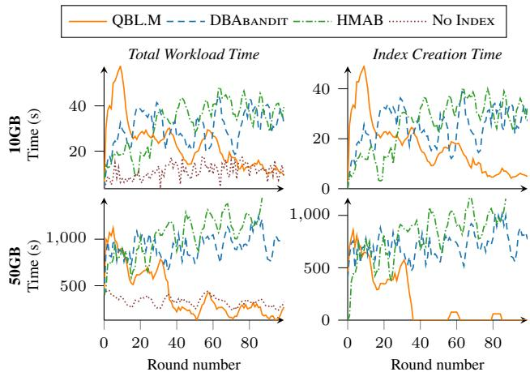  
Figure 2: Total workload time and index creation time.

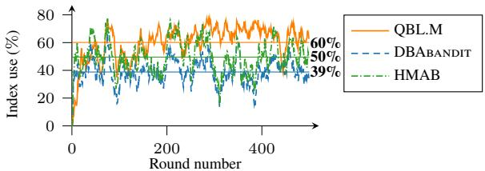  
Figure 3: Platform-independent study: index utilization vs. round number; 10GB dataset; averages as straight lines.

Figure 2 presents the time incurred in running the query and materializing the index on adversarial workloads. DBAbandit and HMAB struggle in adversarial environments because they continuously reset to address non-stationary shifts in the workload. As a result, they repeatedly select new indexes in response to these shifts, rather than converging to a fixed set of indexes. In this case, running the query without an index is significantly more efficient. However, even while queries are selected randomly, some indexes are more beneficial overall. QBL.M detects such indexes promptly and avoids time-consuming index creation, quickly closing the gap with no index and gaining a competitive edge. This result outlines the way forward for the development of suitable policies in nonstationary workloads. On the larger 50GB dataset, QBL.M demonstrates a clearer advantage after just 40 rounds by avoiding unnecessary index creation.

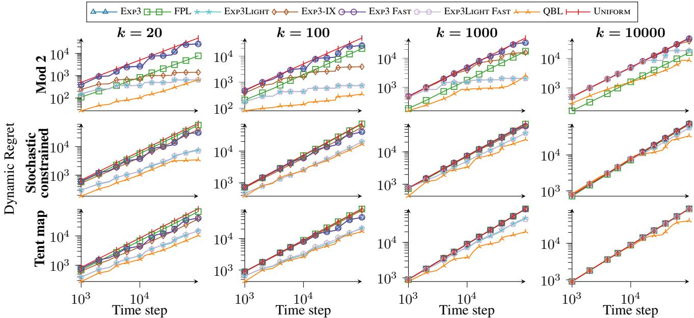  
Figure 4: Accumulated dynamic regret of single-choice policies with time horizon T = 105 and varying options k.

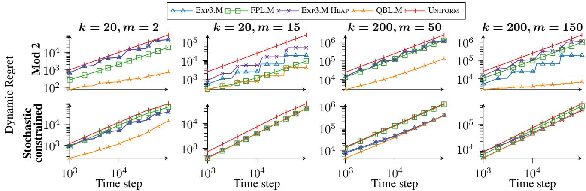  
Figure 5: Cumulative dynamic regret of multi-choice policies, time horizon T =105, varying options k and choices m.

Figure 3 complements the analysis reporting on the index utilization, a measure that quantifies policy performance irrespective of the platform. The index utilization measure, expresses the percentage of reads in indexes instead of direct table access; as the results indicate, QBL.M makes judicious index selections over time, leading to a gradual increase in row reads. This feat results in a consistent difference of about 10% from DBAbandit and HMAB. We note that improved index utilization does not always translate to enhanced query execution time, as this also depends on factors such as I/O performance and machine load. We also tried Exp3.M, yet it took much longer to adapt to change, thus we omit it from results. Exp3.M is unsuitable for this setting, given that shifts are costly for its explicit exploration, as we demonstrate in the following section.

## 5.2 Dynamic regret in simulated environments

We investigate adversarial policies, measuring cumulative dynamic regret over 10 instances of any environment.

Single-choice policy. Figure 4 shows how single policies perform under dynamic regret. Fast variants of Exp3 and Exp3Light perform indistinguishably from the originals. Exp3 adapts more slowly when a shift happens than its implicit exploration variants, Exp3Light and Exp3-IX, which adapt more quickly as their weight updates are not proportional to k, while Exp3 relies on the random chance of explicit exploration to overcome over-tuned weights. FPL performs mostly unremarkably, yet it beats competitors in the early stages of Mod2 with k = 10 000. As FPL relies on noisy updates for exploration, it overcomes the Mod2 environmental shift quicker than Exp3 variants with such extreme k, as it is likely to choose one of the k/2 new good options. Exp3’s reliance on probability estimation scales poorly with k, as it takes longer to deviate from almost uniform appearing estimations. Therefore, in all experiments, Exp3 variants get noticeably closer to random choice as k grows. QBL performs well across the board. As demoted leaders that perform well in one term get a second chance as they may skip ahead in the queue, leaders demoted for being suspiciously good get an opportunity to show they are still good. If they do not perform well the second time, they are fully demoted, while, if performing well again, the process repeats. As a demoted leader’s priority is reduced by at least 1, alternatives are explored over time.

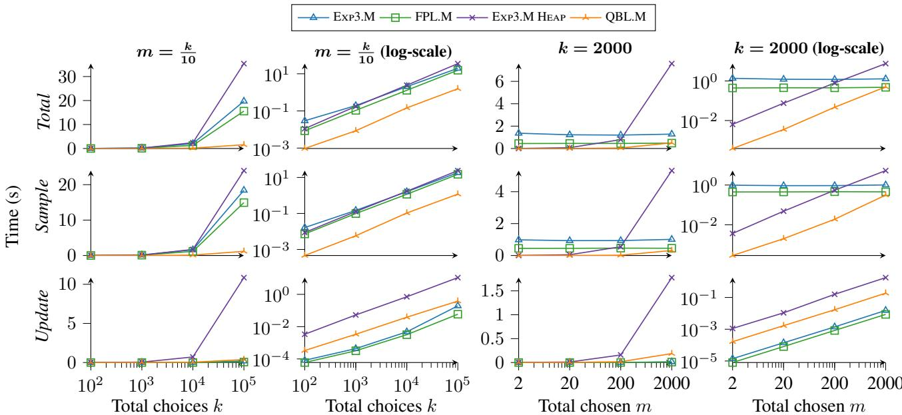  
Figure 6: Runtime of sampling and weight updates of combinatorial policies given dummy rewards over T = 1000 rounds, scaling either the number of choices k with the number of chosen options m = k/10, or scaling m up to m = k with k = 2000.

At high k, QBL’s good performance clearly contrasts other policies as their fixed exploration factor gets too high. Still, we cannot lower the exploration factor, as that would make them unable to detect environmental shifts. Using policy variations that have knowledge about shifts would avoid this issue, yet we are interested in testing oblivious policies outside their comfort zones. It is noteworthy that, in a completely stationary environment, QBL looses its advantage. Unlike QBL, Exp3 variants overcome their adaptation period and remain stable for that shift. This difference is clear with Mod2, k = 1000, where QBL’s cynicism to good leaders hurts its performance, as it ends up demoting good or unlucky leaders to enforce more exploration, while Exp3 only becomes more determined in its choices. QBL’s behavior is so by design, as it expects shifts to happen. Yet, with Mod2, k = 10 000 QBL eventually performs the best, as the high k is too much for Exp3 variants to overcome. QBL performs well in the Tent Map experiment as it overcomes the noisy environment at all sizes of k. Helpfully, QBL initializes a leader’s score with its average performance in the last term, to grant previously good leaders a boost at the cost of a potentially slower shift adaption in noiseless environments. If the leader underperforms, the unweighted local score will quickly drop below the weighted global score in QBL’s performance evaluation anyway, hence QBL strikes a balance between exploration and shift adaption across both noisy (Tent Map, Stochastic constrained) and noiseless environments (Mod2). Exp3 variants overcome the noise, given long stationary periods, yet struggle to match QBL as k grows and when shifts occur often.

Combinatorial policy. Figure 5 illustrates performance under combinatorial policy variations in the Stochastic Constrained and Mod2 environments. We note a difference in behavior during shift adaptation between Exp3.M and Exp3.M Heap, accentuated with high m. The use of thresholded weights for sampling in Exp3.M allows it to overcome environmental shifts, as the thresholding behaves effectively as implicit exploration by containing the growth of the highest weights. As Exp3.M is also faster with high m too, Exp3.M Heap is redundant in this case. We note that combinatorial policies do not handle the Tent Map environment well. As there is always only one good arm to pick, the remaining m − 1 options are consigned to uninteresting arms. Without noise, these allocations would not incur any regret, as there would be nothing better to pick anyway; however, with noise it becomes likely that some unpicked arm provides a good reward in some round. Hence, the best tactic is to pick at random. Overall, our comparison suggests that QBL and QBL.M are well suited for multipleoption environments, where some choices distinctively and intermittently outperform others.

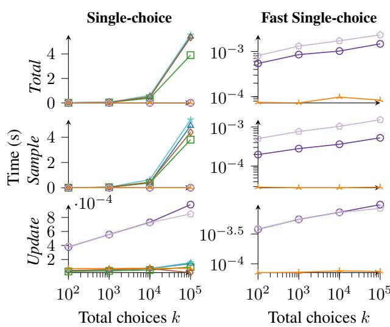  
Figure 7: Runtime of single-choice policies with dummy rewards over T = 1000 rounds vs k.

## 5.3 Runtime in simulated environments

Single choice policy. Figure 7 presents our runtime evaluation of single-choice policies. As expected, the heap-based variant outpaces the originals. The difference becomes remarkable as k grows. Compared to fast Exp3 variants, QBL is noticeably faster across the range of k, by virtue of its ability to skip updates in multiple rounds, as the update time plot suggests, and its constant-time sampling.

Combinatorial policy. Figure 6 extends our runtime evaluation to combinatorial policies. The sumheap loses its benefit at high m/k ratios. As seen in log-scale with fixed k, Exp3.M Heap becomes slower than Exp3 with growing m, as both samplings and updates grow O(m log k) with m. Increasing m as m=k/10 reveals where the boundary lies in this case. QBL.M has a complexity of O(m log k), however, while Exp3.M Heap always updates its sumheap, QBL.M only updates its priority queue when demoting a leader, therefore is much faster. Even when m=k, it remains fast.

## 6 Conclusion

We addressed adversarial multi-armed bandits from a computational perspective, aiming for sublinear runtime in the number of arms. We introduced QBL, a single-parameter algorithm that uses selective weight updates with a constant sampling overhead to achieve O(m log k) time and works in both stationary and nonstationary settings. While regret guarantees remain open, our extensive experiments show that QBL has practical value and makes a step toward scalable MAB algorithms with controlled regret.

## Acknowledgements

Renata Borovica-Gajic is partially supported by the Australian Research Council (ARC) via Discovery Early Career Researcher Award DE230100366, and Google Foundational Science 2025 Award. Kasper Overgaard Mortensen is funded by Danish Council for Independent Research (grant DFF-1051-00062B). We also thank Simon Dohn for discussions on this topic.

## References

Abbasi-Yadkori, Y., Gyorgy, A., and Lazi ¨ c, N. A new look ´ at dynamic regret for non-stationary stochastic bandits. JMLR, 24(288):1–37, 2023.

Agrawal, S., Chaudhuri, S., Kollar, L., Marathe, A. P., ´ Narasayya, V. R., and Syamala, M. Database tuning advisor for Microsoft SQL Server 2005. In VLDB, 2004.

Auer, P. and Chiang, C.-K. An algorithm with nearly optimal pseudo-regret for both stochastic and adversarial bandits. In COLT, pp. 116–120. PMLR, 2016.

Auer, P., Cesa-Bianchi, N., Freund, Y., and Schapire, R. E. The nonstochastic multiarmed bandit problem. SIAM J. Comput., 32(1):48–77, jan 2003.

Auer, P., Gajane, P., and Ortner, R. Adaptively tracking the best bandit arm with an unknown number of distribution changes. In COLT, pp. 138–158, 2019.

Besbes, O., Gur, Y., and Zeevi, A. Stochastic multi-armed bandit problem with non-stationary rewards. In Advances in Neural Information Processing Systems, volume 27 of NeurIPS, pp. 199–207, Cambridge, MA, USA, 2014. MIT Press.

Besson, L. and Kaufmann, E. What doubling tricks can and can’t do for multi-armed bandits. arXiv preprint arXiv:1803.06971, 2018.

Blanchard, P., Higham, D. J., and Higham, N. J. Accurately computing the log-sum-exp and softmax functions. IMA Journal of Numerical Analysis, 41(4):2311–2330, 08 2020. ISSN 0272-4979.

Boyd, S. P. and Vandenberghe, L. Convex optimization. Cambridge university press, 2004.

Bubeck, S. and Cesa-Bianchi, N. Regret analysis of stochastic and nonstochastic multi-armed bandit problems. Machine Learning, 5(1):1–122, 2012.

Chen, W., Wang, Y., and Yuan, Y. Combinatorial multiarmed bandit: General framework and applications. In Dasgupta, S. and McAllester, D. (eds.), ICML, volume 28 of PMLR, pp. 151–159. PMLR, 17–19 Jun

2013. URL https://proceedings.mlr.press/v28/ chen13a.html.

Combes, R., Talebi, M. S., Proutiere, A., and Lelarge, M. Combinatorial bandits revisited. In NeurIPS, pp. 2116–2124, Cambridge, MA, USA, 2015. MIT Press.

Dageville, B., Das, D., Dias, K., Yagoub, K., Za¨ıt, M., and Ziauddin, M. Automatic SQL tuning in oracle 10g. In VLDB, 2004.

Devroye, L. Nonuniform random variate generation. Handbooks in operations research and management science, 13:83–121, 2006.

Gao, B. and Pavel, L. On the properties of the softmax function with application in game theory and reinforcement learning. CoRR, abs/1704.00805, 2017. URL http://arxiv.org/abs/1704.00805.

Ghadakchi, V., Xie, M., and Termehchy, A. Bandit join: preliminary results. In aiDM-SIGMOD 20, pp. 1–4, 2020.

Hilprecht, B., Binnig, C., and Rohm, U. Learning a par- ¨ titioning advisor for cloud databases. In SIGMOD, pp. 143–157, 2020.

Jacobsen, A. Adapting to Non-stationarity in Online Learning. PhD thesis, University of Alberta, 2024.

Jacobsen, A. and Cutkosky, A. Online linear regression in dynamic environments via discounting. In ICML, 2024.

Kaftan, T., Balazinska, M., Cheung, A., and Gehrke, J. Cuttlefish: A lightweight primitive for adaptive query processing. unpublished, 2018.

Kalai, A. and Vempala, S. Efficient algorithms for online decision problems. JCSS, 71(3):291–307, 2005. Learning Theory 2003.

Kanade, V., McMahan, H. B., and Bryan, B. Sleeping experts and bandits with stochastic action availability and adversarial rewards. volume 5 of PMLR, pp. 272–279. PMLR, 16–18 Apr 2009.

Karnin, Z. S. and Anava, O. Multi-armed bandits: Competing with optimal sequences. In Lee, D., Sugiyama, M., Luxburg, U., Guyon, I., and Garnett, R. (eds.), NeurIPS, volume 29. Curran Associates, Inc., 2016.

Kipf, A., Kipf, T., Radke, B., Leis, V., Boncz, P. A., and Kemper, A. Learned cardinalities: Estimating correlated joins with deep learning. In CIDR, 2019.

Kocak, T., Neu, G., Valko, M., and Munos, R. Efficient ´ learning by implicit exploration in bandit problems with side observations. In NeurIPS, volume 27, 2014.

Lattimore, T. and Szepesvari, C. ´ Bandit algorithms. Cambridge University Press, 2020.

Li, G., Zhou, X., Li, S., and Gao, B. Qtune: A queryaware database tuning system with deep reinforcement learning. Proc. VLDB Endow., 12(12):2118–2130, 2019.

Li, L., Chu, W., Langford, J., and Schapire, R. E. A contextual-bandit approach to personalized news article recommendation. In TheWebConf, WWW ’10, pp. 661–670. ACM, 2010.

Louedec, J., Chevalier, M., Mothe, J., Garivier, A., and ¨ Gerchinovitz, S. A Multiple-play Bandit Algorithm Applies to Recommender Systems. FLAIRS, May 2015.

Lu, Z. and Hazan, E. On the computational efficiency of adaptive and dynamic regret minimization, 2023. URL https://arxiv.org/abs/2207.00646.

Marcus, R. and Papaemmanouil, O. Towards a hands-free query optimizer through deep learning. In CIDR, 2019.

Marcus, R., Negi, P., Mao, H., Zhang, C., Alizadeh, M., Kraska, T., Papaemmanouil, O., and Tatbul, N. Neo: A learned query optimizer. PVLDB, 12(11):1705–1718, 2019.

Marcus, R., Negi, P., Mao, H., Tatbul, N., Alizadeh, M., and Kraska, T. Bao: Making learned query optimization practical. In SIGMOD, pp. 1275–1288, 2021.

Neu, G. Explore no more: Improved high-probability regret bounds for non-stochastic bandits. NeurIPS, 28, 2015.

Nowozin, S. Streaming Log-sum-exp Computation. https://www.nowozin.net/sebastian/blog/ streaming-log-sum-exp-computation.html, 2016.

Oetomo, B., Perera, R. M., Borovica-Gajic, R., and Rubinstein, B. I. P. Cutting to the chase with warm-start contextual bandits. In ICDM, pp. 459–468. IEEE, 2021.

Olken, F. Random Sampling from Databases. PhD thesis, University of California at Berkeley, 1993.

Pavlo, A., Angulo, G., Arulraj, J., Lin, H., Lin, J., Ma, L., Menon, P., Mowry, T. C., Perron, M., Quah, I., et al. Self-driving database management systems. In CIDR, 2017.

Perera, R. M., Oetomo, B., Rubinstein, B. I., and Borovica-Gajic, R. Dba bandits: Self-driving index tuning under ad-hoc, analytical workloads with safety guarantees. In ICDE, pp. 600–611, 2021.

Perera, R. M., Oetomo, B., Rubinstein, B. I. P., and Borovica-Gajic, R. HMAB: self-driving hierarchy of bandits for integrated physical database design tuning. PVLDB, 16(2):216–229, 2022.

Perera, R. M., Oetomo, B., Rubinstein, B. I. P., and Borovica-Gajic, R. No DBA? no regret! multi-armed bandits for index tuning of analytical and HTAP workloads with provable guarantees. TKDE, 2023. Accepted.

Qin, L., Chen, S., and Zhu, X. Contextual combinatorial bandit and its application on diversified online recommendation. In SDM, pp. 461–469. SIAM, 2014.

Safavi, T., Belth, C., Faber, L., Mottin, D., M ¨uller, E., and Koutra, D. Personalized knowledge graph summarization: From the cloud to your pocket. In ICDM, pp. 528–537. IEEE, 2019.

Saha, A., Koren, T., and Mansour, Y. Adversarial dueling bandits. In ICML, pp. 9235–9244, 2021.

Saito, Y., Aihara, S., Matsutani, M., and Narita, Y. Open bandit dataset and pipeline: Towards realistic and reproducible off-policy evaluation. In NeurIPS, 2021.

Sharma, A., Schuhknecht, F. M., and Dittrich, J. The case for automatic database administration using deep reinforcement learning. unpublished, 2018.

Slivkins, A. Introduction to multi-armed bandits. Foundations and Trends® in Machine Learning, 12(1-2):1–286, 2019.

Stoltz, G. Incomplete information and internal regret in prediction of individual sequences. PhD thesis, Universite´ Paris Sud-Paris XI, 2005.

Suk, J. and Kpotufe, S. Tracking most significant arm switches in bandits. In COLT, pp. 2160–2182, 2022.

TPC. Tpc-h. https://www.tpc.org/tpch, 1999.

Trummer, I., Wang, J., Maram, D., Moseley, S., Jo, S., and Antonakakis, J. SkinnerDB: Regret-bounded query evaluation via reinforcement learning. pp. 1153–1170, 2019.

Uchiya, T., Nakamura, A., and Kudo, M. Algorithms for adversarial bandit problems with multiple plays. In ALT, pp. 375–389, 2010.

Vieira, T. Heaps for incremental computation. https: //timvieira.github.io/blog/post/2016/11/ 21/heaps-for-incremental-computation/, 2016.

Wei, C.-Y. and Luo, H. More adaptive algorithms for adversarial bandits. In COLT, pp. 1263–1291, 2018.

Weisstein, E. W. Tent map. from mathworld–a wolfram web resource. https://mathworld.wolfram.com/TentMap.html, 2022.

Wong, C.-K. and Easton, M. C. An efficient method for weighted sampling without replacement. SIAM Journal on Computing, 9(1):111–113, 1980.

Wu, W., Wang, C., Siddiqui, T., Wang, J., Narasayya, V., Chaudhuri, S., and Bernstein, P. A. Budget-aware index tuning with reinforcement learning. In SIGMOD, pp. 1528–1541, 2022.

Zhang, J., Liu, Y., Zhou, K., Li, G., Xiao, Z., Cheng, B., Xing, J., Wang, Y., Cheng, T., Liu, L., Ran, M., and Li, Z. An end-to-end automatic cloud database tuning system using deep reinforcement learning. In SIGMOD, SIGMOD ’19, pp. 415–432, 2019.

Zhang, L., Yang, T., Rong, J., and Zhou, Z.-H. Dynamic regret of strongly adaptive methods. In Dy, J. and Krause, A. (eds.), ICML, volume 80 of PMLR, pp. 5882–5891, 10–15 Jul 2018. URL https://proceedings.mlr. press/v80/zhang18o.html.

Zhang, X., Wu, H., Li, Y., Tan, J., Li, F., and Cui, B. Towards dynamic and safe configuration tuning for cloud databases. In SIGMOD, SIGMOD ’22, pp. 631–645, 2022.

Zilio, D., Lightstone, S., Lyons, K., and Lohman, G. Selfmanaging technology in IBM DB2 universal database. In ACM CIKM, 2001.

Zilio, D. C., Rao, J., Lightstone, S., Lohman, G. M., Storm, A. J., Garcia-Arellano, C., and Fadden, S. DB2 design advisor: Integrated automatic physical database design. In VLDB, 2004.

Zimmert, J. and Seldin, Y. Tsallis-inf: An optimal algorithm for stochastic and adversarial bandits. JMLR, 22, 2021. ISSN 1533-7928.

## A Exp3 Fast and QBL

Algorithm 6: Exp3 Fast   
Input : timesteps T , k, γ   
1 S ← Heap(2k) // Init heap of size 2k   
2 for i = 0 to k − 1 do   
3 HeapUpdate(S, k + i, 1) // Init log weights in heap   
4 for t = 1 to T do   
/\* Sample \*/   
5 if Uniform(0, 1) < γ then   
6 a ← Random(k) // Pick a random choice   
7 else   
8 a ← HeapSample(S) // Sample from heap   
/\* Calculate probability only for sampled choice \*/   
9 p ← (1 − γ) exp(S[k + a] − S[1]) + γk   
/\* Update \*/   
10 Receive reward x for choice a   
11 12 w ← S[k + a] + γ kHeapUpdate(S, S[k + a], w) // Calculate new log weight// Update heap   
Algorithm 7: QBL   
input : k, γ   
1 for i = 0 to k − 1 do   
2 p[i] ← i // Initialize priority   
3 r[i] ← 1; c[i] ← 1 // Term reward and length   
4 L ← \$ // No initial leaders   
5 R ← k; C ← k // Total term reward and length   
6 Q ← PriorityQueue(p) // Element i’s priority is p[i]   
7 for t = 1 to T do   
8 a ← Top(Q) // Get leader   
9 Receive reward x for choice a   
10 if not L = a then   
/\* Reset contributions of new leader \*/   
11 R ← R − r[a] + r[a]c[a] ; C ← C − c[a] + 1   
12 r[a] ← r[a]c[a] ; c[a] ← 1; L ← a   
13 R ← R + xa; C ← C + 1 // Global score   
14 r[a] ← r[a] + xa; c[a] ← c[a] + 1 // Local score   
15 if RC ≥ r[a]c[a] ·Uniform(1 − γ, 1 + γ) then   
/\* Reduce priority of a \*/   
16 p[a] ← min{p[a]−1, p[a]−1 + c[a]−k}   
17 Update(Q, a, p[a]) // Update queue   
18 L ← \$ // Remove a as active leader

## B Experimental setup

Implementation details. We compiled all bandit policy and simulation codes in C++ with flag -O3. All implementations utilize logarithmic scaled weights to avoid overflowing values introduced by the repeated weight updates with long time-horizons. The implementation and dataset used in the experiments are available at https://github.com/AU-DIS/QBL.

Algorithm parameters. Each algorithm requires tuning an exploration parameter that determines its propensity to adapt to environmental changes. A natural choice is to use the value that achieves the respective regret guarantee. Yet, these guarantees hold only under weak regret. In an adversarial setting using dynamic regret, we can neither set the exploration parameter dynamically, nor by observing historical data. We thus tested each algorithm at various regimes to tune parameters. For Exp3 variants, we set γ = 0.1 and, for FPL, η = 10 to enforce exploration and capture reward shifts. For QBL, we set γ = 0.1 to ensure exploration and eventual demotion. We arrived at these decisions after tuning experiments, which we do not report due to space constraints.

## C DBAbandit and HMAB Setup

Here we detail the experimental setup used in Section 5.1 for the baseline approaches DBAbandit (Perera et al., 2021) and HMAB (Perera et al., 2022).

To pick out of all available indexes in a database with many table columns, DBAbandit limits its selection space to indexes from permutations of the first 6 columns in each table of the given database. In each round, it further limits its selection to indexes over columns that have been touched in the past. Thereby, it sets k individually per round, reducing the set of eligible indexes, subject to the given memory threshold. DBAbandit maintains an upperconfidence-bound (UCB) (Li et al., 2010) for each individual ever picked index via a C2UCB bandit policy (Qin et al., 2014) subroutine. In each round it greedily selects a set of arms that achieve a high sum of UCB estimators within the memory threshold by iteratively selecting the highest-UCB available arm that fits in memory. The received reward xi for each selected arm i for an index belonging to table H is calculated over the current query batch B as ri = Pq∈B  maxj (qHj )−qHiqH − ci where qH is the execution-time of query q spent using index i, maxj qHj is the maximum execution-time q has historically spent on any scan of H, qH is q’s total number of accesses to H, and ci is the creation cost of i, ci = 0 if i is already created. The above definition of reward seeks to minimize the end-toend workload time by rewarding an index that is faster than historically used indexes for the same query, while punishing the choice if it increases the accesses to the belonging table. Further, if the index was created in the current round, its creation cost is subtracted from the reward, punishing expensive-to-create indexes.

To support shifting workloads, the policy forgets acquired knowledge proportionally to the number of new queries Qnew in the incoming query batch compared to the past seen queries Qpast in the batch. To do so DBAbandit computes a forget factor F = 1 − 2·Qnew which Qpast in each round is multiplied to the sum of rewards used for the UCB evaluation. This adjustment lowers all arms evaluation, lowering the overall confidence, when a change is observed. If Qnew/Qpast > 0.5, the evaluations are fully reset. While this policy works well for gradual changes over time, it may cause the policy to forget everything in constantly changing environments. In each out of 100 rounds, the environment selects a batch of 5 random queries from a set of 22 query templates for TPC-H size 10GB and 50GB databases (TPC, 1999), a decision support benchmark comprising business-oriented ad-hoc queries. The bandit policies compete in minimizing the runtime of each batch by selecting a set of indexes.