# EARTHSIGHT: A Distributed Framework for Low-Latency Satellite Intelligence

Ansel Kaplan Erol Georgia Institute of Technology aerol3@gatech.edu

Seungjun Lee\* KAIST nihilnomen@kaist.ac.kr

Divya Mahajan Georgia Institute of Technology divya.mahajan@gatech.edu

## Abstract

Low-latency delivery of satellite imagery is essential for timecritical applications such as disaster response, intelligence, and infrastructure monitoring. However, traditional pipelines rely on downlinking all captured images before analysis, introducing delays of hours to days due to restricted communication bandwidth. To address these bottlenecks, emerging systems perform onboard machine learning to prioritize which images to transmit. However, these solutions typically treat each satellite as an isolated compute node, limiting scalability and efficiency. Redundant inference across satellites and tasks further strains onboard power and compute costs, constraining mission scope and responsiveness. We present EARTHSIGHT, a distributed runtime framework that redefines satellite image intelligence as a distributed decision problem between orbit and ground. EARTHSIGHT introduces three core innovations: (1) multi-task inference on satellites using shared backbones to amortize computation across multiple vision tasks; (2) a ground-station query scheduler that aggregates user requests, predicts priorities, and assigns compute budgets to incoming imagery; and (3) dynamic filter ordering, which integrates model selectivity, accuracy, and execution cost to reject low-value images early and conserve resources. EARTHSIGHT leverages global context from ground stations and resource-aware adaptive decisions in orbit to enable constellations to perform scalable, low-latency image analysis within strict downlink bandwidth and onboard power budgets. Evaluations using a prior established satellite simulator show that EARTHSIGHT reduces average compute time per image by 1.9× and lowers 90th percentile end-to-end latency from first contact to delivery from 51 to 21 minutes compared to the state-of-the-art baseline.

## 1 Introduction

Nanosatellites in Low Earth Orbit (LEO) have transformed our ability to monitor Earth [1, 2]. Commercial constellations such as Planet’s Dove and Spire Global’s LEMUR now deliver high-resolution, near-daily imagery of the planet’s surface [3, 4]. This data enables a wide array of applications, from environmental monitoring and disaster response to agriculture, urban planning, and intelligence [5–9]. The primary bottleneck in the current Earth observation systems has shifted from data acquisition to analysis covering 200 million km2 per day [10]. Thus, to extract timely insights, the community has turned to machine learning [11–14].

However, existing pipelines, wherein all captured imagery is downlinked to ground stations before analysis, introduce substantial delays, often stretching from several hours to multiple days [15, 16]. Such delays are detrimental for timesensitive queries: each lost minute can hinder search efforts during natural disasters, obscure evolving damage and environmental conditions, or exacerbate operational uncertainty in conflict zones. Delays arise from the short, intermittent transmission windows available for downlink, typically 10–15 minutes to offload tens of gigabytes of imagery [16]. When satellites cannot assess the analytical value of captured data, images are transmitted in a first-in, first-out manner, potentially causing critical content to wait behind less relevant data. Planet Labs’ Analytics product shows that while users can run predefined object detection algorithms, the results often arrive days later, making same-day analysis infeasible [17].

Recent efforts have proposed performing inference on the satellites to reduce latency and conserve bandwidth [15, 18– 20]. By analyzing images in orbit between capture and downlink, satellites can prioritize, compress, or discard data before transmission (Figure 1). However, these approaches treat each satellite as an isolated node, ignoring the broader constellation context that governs downlink contention and bandwidth. Without incorporating global coordination, such designs cannot optimally allocate limited communication opportunities across multiple satellites.

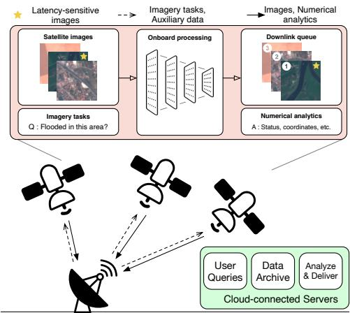  
Figure 1: LEO Earth observation systems perform on-board inference for image analysis. Ground stations send tasks generated from user queries to satellites. The satellites prioritize transmission of images identified as latency-sensitive via ML inference.

Moreover, existing systems only support single-task operation. In practice, an image may support multiple concurrent applications, such as ship detection, wake analysis, and illegal fishing identification at sea. Executing independent inference pipelines for each task is expensive in both computation and energy, leading to redundancy that is unacceptable in resourceconstrained environments. The multi-task nature of satellite workloads and single-purpose isolated design of prior systems limits their scalability and responsiveness.

EARTHSIGHT redefines image analysis as a distributed decision problem spanning both ground and orbit. Rather than viewing satellites as passive data forwarders or independent inference engines, we offer a joint scheduling framework that leverages global context from the ground station with local resource-aware adaption on orbit.

Enabling EARTHSIGHT requires overcoming a variety of challenges. Nano-satellites operate under tight power budgets, harvested via small solar panels and used for imaging, communication, and control systems. As a result, only a fraction of power is available for compute, forcing the use of low-power, radiation-hardened processors that lag far behind terrestrial accelerators in capability. Consequently, onboard image processing often cannot complete before the next downlink window, limiting responsiveness for time-sensitive missions. To address these challenges, we employ an integrated approach that combines multi-task learning with globally informed preprocessing at the ground station. This allows the satellite constellation to collaboratively manage diverse, time-critical workloads within limited compute and bandwidth envelopes. To facilitate the distributed decision, EARTHSIGHT proposes three coordinated components: (1) multi-task onboard inference for priority annotation, (2) query schedule construction at ground stations, and (3) adaptive filter ordering on satellites.

EARTHSIGHT employs a multi-task model consisting of shared feature backbones and task-specific heads, amortizing inference costs across multiple filters. While this design improves efficiency, it introduces a dependency: task heads can only execute after the backbone’s latent features are computed. EARTHSIGHT’s scheduler resolves these dependencies by adjusting filter orderings at runtime, jointly optimizing for precision, latency, and available power.

At the ground station, EARTHSIGHT analyzes historical image distributions to synthesize a preliminary schedule. For each expected capture, it aggregates filters from active user queries, e.g., cloud-free and has fire or flooding near a populated area, into compact logical formulas. It then simulates future transmission windows to forecast the minimum image priority likely to be transmitted and the expected compute budget per image. These parameters are integrated into the computation schedule to supply the global context that guides approximate, truncated inference onboard the satellite.

At runtime, satellites execute ML filters to prioritize images. To manage power constraints, they employ a model-ordering strategy that stops as soon as an adaptively-set confidence threshold is met. The sequence of filters is critical; if two ML-based filters have comparable runtimes, the one more likely to influence the prioritization outcome should execute first. Finding an optimal sequence of filter operations for each image is crucial for efficiency, however is NP-hard and thus computationally intractable. EARTHSIGHT addresses this with a heuristic approach that defines each filter’s utility as a function of four factors: (i) the filter’s accuracy (ii) the filter’s execution time (cost), (iii) the probability of a negative result, based on prior information from the ground station, and (iv) the influence of the filter’s outcome on the overall query formula. This cost–benefit formulation enables the scheduler to repeatedly select the next filter most likely to yield a rapid decision on the image.

In summary, EARTHSIGHT contributes:

1. A distributed decision framework that redefines onboard image analysis as a joint process between ground and orbit, merging global context from ground stations with local, resource-aware adaptation in satellites.

2. Multi-task onboard inference that amortizes computation across multiple application-specific tasks through a shared backbone, enabling efficient, scalable analysis under tight power budgets.

3. Adaptive filter scheduling based on a utility-driven ordering that integrates selectivity, execution time, accuracy, and logical impact to maximize early rejection of low-priority images.

Through hardware-enhanced simulation studies on three multi-purpose scenarios, we demonstrate that EARTH-SIGHT alleviates the computational bottleneck, resulting in a decrease in the 90th percentile tail latency from first contact to image delivery from 51 to 21 minutes relative to the state of the art baseline, SERVAL [15].

## 2 Background

Satellites in Low Earth Orbit (LEO) offer frequent, highresolution, multi-spectral imaging of Earth’s surface, typically completing a full orbit every 90 minutes at a few hundred kilometers altitude. While early Earth observation (EO) relied on large, monolithic platforms [21, 22], the past decade has seen a shift towards deploying nanosatellites, compact spacecraft ranging from 1000 to 8000 cubic centimeters [10, 23]. These satellites, equipped with commercial off-the-shelf (COTS) components such as the NVIDIA Jetson, form a globally distributed computing platform capable of onboard inference.

Orbital Edge Computing. The concept of processing data directly on satellite, i.e., Orbital Edge Computing (OEC), conserves downlink bandwidth by filtering out unusable data, such as cloudy images, prior to transmission [20]. The idea now supports commercial approaches, like those pursued by Spire Global under contracts with NASA and the Canadian Space Agency, to develop onboard wildfire detection using Convolutional Neural Networks [24].

Leveraging Onboard Processing for Image Prioritization. The push toward onboard processing is driven in part by the constraints of satellite systems compared to ground-based infrastructure drawing on datacenters and cloud resources. In orbit, compute capability is fixed at launch, power-limited, and must support all imaging, communication, and control operations within a 1 to 5 watts per unit budget [25]. These constraints prevent continuous, high-throughput processing and limit how many models can run per image. To mitigate this, recent hybrid systems [15, 18, 19] split computation between satellites and ground stations, estimating image utility and dynamically compressing and reordering transmissions based value or urgency.

At the same time, satellites face brief downlink windows and constrained communication bandwidth [26]. Thus, these aforementioned onboard ML-based pipelines prioritize highutility images, those showing disasters, flooding, or anomalous land use—while deprioritizing or discarding less informative data. Each image is typically processed by multiple models targeting distinct attributes to build a comprehensive understanding of the scene. Because satellite images are large and high-resolution, they are tiled before inference to avoid downsampling artifacts [20]. Modern systems further leverage contextual cues such as power availability, cloud cover, and location metadata to decide when to run full inference, skip processing, or use lightweight approximations (e.g., downsampled inputs) [15, 18].

Multi-Task Models for Onboard Inference. Most existing OEC systems perform single-task inference per image which simplifies deployment but underutilizes the rich information in satellite imagery. In reality, each image can serve multiple downstream tasks, and joint processing can improve both efficiency and utility. Multi-task learning addresses this by sharing feature extraction across tasks, reducing memory overhead, and supporting multiple mission goals without deploying multiple large models [27]. These models use a shared backbone to extract latent features, followed by lightweight task-specific heads [28, 29].

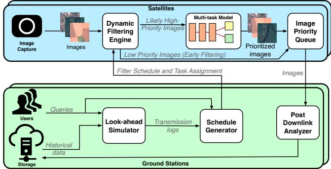  
Figure 2: Overview of the EARTHSIGHT system. EARTH-SIGHT integrates onboard multi-task models with predictive scheduling to enable query-driven, low-latency analysis of satellite images.

Multi-task neural nets typically adopt either hard parameter sharing, with a single backbone and multiple heads, or soft parameter sharing, where separate models are trained with coupling constraints [30]. As the former offers greater computational efficiency [31], EARTHSIGHT employs hard parameter sharing to minimize inference costs for diverse applications.

Building on these foundations, EARTHSIGHT defines onboard image analysis as a distributed decision framework that unifies global scheduling at the ground station with local, power-aware adaptation in orbit, enabling scalable, multitask image analysis under tight compute, bandwidth, and latency constraints.

## 3 EARTHSIGHT System

EARTHSIGHT frames onboard image analysis as a distributed decision problem spanning ground and orbit, coordinating global context from ground stations with local, resourceaware adaptation on satellites. Unlike prior systems that treat satellites as isolated inference nodes, EARTHSIGHT dynamically selects and schedules tasks based on available power, predicted image utility, and mission context. The pipeline, shown in Figure 2, integrates three key components: (1) Multitask models that perform multiple vision tasks per image to reduce redundant computation; (2) Ground-station scheduling that uses auxiliary metadata, such as location, orbit timing, and power forecasts, to generate predictive computation plans for satellites; and (3) An on-orbit runtime that dynamically orders and executes filters to minimize expected compute time while prioritizing images for downlink. Like prior work [15], EARTHSIGHT does not discard any images and only optimizes the transmission order to maximize responsiveness. Together, these components form a flexible, resource-aware system that adapts to changing mission conditions while maximizing the value of each downlinked image.

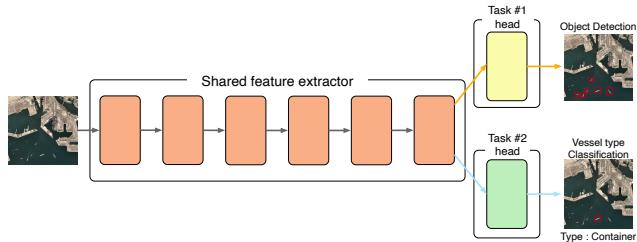  
Figure 3: EARTHSIGHT’s multi-task model architecture. A shared backbone processes the input image to produce a latent representation, which is used by lightweight, task-specific heads to perform heterogeneous tasks such as classification.

## 3.1 Multi-Task Neural Architecture

EARTHSIGHT is designed to support a range of multi-task models that follow the standard paradigm of a shared backbone and task-specific heads (Figure 3). A backbone maps an input image x to multiple outputs $\{ y _ { t } | t \in T \}$ , where T denotes the tasks that the backbone supports. This multi-task inference process is divided into two stages: the shared backbone encodes the input via $f _ { \mathrm { b a c k b o n e } } ( x ) = z ,$ a latent representation, and the task-specific heads then compute $f _ { \mathrm { h e a d } } ^ { ( t ) } ( z ) = y _ { t }$ , where t denotes each task. This lightweight design allows multiple tasks to share core feature computations while preserving task-level specialization, striking a balance between memory efficiency, task performance, and energy resources.

For practical deployment on power- and memoryconstrained nanosatellites, we implement EfficientNet backbones coupled with lightweight multi-layer perceptrons as prediction heads. Tasks are grouped by domain, with each group sharing a backbone. The architecture reflects real-world satellite needs as the relevant features to analyze at maritime versus in desert terrain exhibit strong intra-group similarity but have little interaction between groups. This clustering allows the backbone to capture generalizable features within a domain, while keeping model sizes small enough to fit edge AI accelerators. Attempting to merge these heterogeneous domains into a single monolithic model would underutilize shared representations and exceed satellite memory limits [32].

EARTHSIGHT is designed for scenarios in which multiple tasks are performed on each input image. By overlapping backbone computations across tasks, multi-task architecture maximizes inference throughput relative to single-task deployments. Furthermore, the modular design enables lightweight uplinks of new task heads without transmitting full backbone parameters, reducing bandwidth overhead for model updates and simplifying task expansion in orbit. Single-task models are naturally supported as a special case of the multitask framework, showcasing the flexibility and scalability of EARTHSIGHT for diverse satellite missions.

## 3.2 Scheduler at the Ground Station

The EARTHSIGHT scheduler, resident on the ground station, orchestrates all information required for the satellite runtime to dynamically route inference tasks and prioritize imagery. This includes auxiliary metadata such as updated model weights, task-specific success probabilities, and the precomputed task schedule. Offloading this decision logic on the ground allows EARTHSIGHT to leverage abundant compute and memory resources, which are infeasible on powerand compute-constrained nanosatellite.

Query-driven framework. EARTHSIGHT adopts a querycentric design where downstream applications define task requirements in terms of latency sensitivity and image selection criteria. Some high-priority queries (e.g., Planet’s Tasking Product [33]) demand immediate downlink of specific regions, bypassing onboard inference. Others, such as segmentation or classification tasks, require onboard processing to reduce bandwidth usage while still enabling timely decisionmaking. For latency-sensitive inference tasks, the scheduler is designed to minimize total computation while prioritizing correctness: it is preferable to occasionally transmit unimportant images (false positives) than to delay or omit critical data (false negatives). To formalize this, EARTHSIGHT uses a filtering interface [15] representing selection criteria as logical expressions over image attributes (e.g., “cloud-free AND ship present AND ship is military”). Each query also specifies an Area of Interest (AOI) and a priority level $p \in \{ 1 , 2 , 3 , 4 , 5 \}$ ， allowing the ground station to compile an execution schedule that encodes task selection, model updates, and expected filter success probabilities.

Look-ahead simulation. Given the temporal variability of downlink windows and bandwidth distribution across satellites, EARTHSIGHT integrates a look-ahead simulator at the ground station. This simulator predicts satellite behavior, anticipated data volume, and the prioritization of bytes transmitted per downlink window. Priority-weighted byte counts account for the probabilistic nature of image importance; for instance, a 50KB image with a 10% chance of being each priority contributes 10KB to each priority bin. To address potential misclassifications by onboard filters, an intermediate priority level $p _ { c o m p u t e }$ is introduced between priorities $p = 1$ and $p = 2$ . Images processed onboard but rejected are transmitted within this level, ensuring they are delivered before guaranteed low-priority content.

The simulator also computes two key quantities for each satellite: the lowest priority threshold $p ^ { * }$ for which all images above it can be transmitted in the next downlink window, and the rejection rate $\begin{array} { r } { r _ { \mathrm { r e j e c t } } = \frac { | \mathrm { i n f e r e n c e } | - | \mathrm { d o w n l i n k } | } { | \mathrm { i n f e r e n c e } | } } \end{array}$ , which quantifies the proportion of computed images deprioritized to guarantee timely delivery of higher-priority content. Because satellites may have hours between contacts, this look-ahead analysis is crucial to guarantee responsiveness for time-sensitive tasks. When ground-truth information becomes available, the simulation is adjusted accordingly, and the resulting changes are propagated through the system. Although this update process is computationally expensive, our Python implementation is optimized to perform simulations spanning several hours in O(minutes).

Algorithm 1 Ground Station Schedule Generation   
Require: P – satellite path, Q – query set, $p ^ { * } -$ priority   
threshold   
Ensure: S – task schedule, for upcoming satellite pass   
1: Initialize schedule $S \gets [ ]$   
2: for each planned capture location loc $\in \mathcal P$ do   
3: Initialize applicable query set: $Q _ { \mathrm { { o c } } }  \emptyset$   
4: for each query $q \in Q$ do   
5: if loc $\in \operatorname { A O I } ( q )$ then   
6: $Q _ { \mathrm { l o c } }  Q _ { \mathrm { l o c } } \cup \{ q \}$   
7: end if   
8: end for   
9: if $Q _ { \mathrm { l o c } } \neq \emptyset$ then   
10: Compute DNF condition $\Phi _ { \mathrm { l o c } }$ over filters from   
$\scriptstyle Q _ { \mathrm { o c } }$ that yield priority $\geq p ^ { * }$   
11: $\mathbf { i f } \ S \neq [ ]$ and last entry in S has formula $\Phi _ { \mathrm { l o c } }$ then   
12: Merge loc into the last schedule entry   
13: else   
14: Append $\left( \mathrm { l o c } , \Phi _ { \mathrm { l o c } } \right)$ to S   
15: end if   
16: end if   
17: end for   
18: return S

Schedule generation. When satellites establish contact, they request an updated task schedule. The ground station maps the satellite’s planned capture locations to the set of queries whose AOIs intersect each image. For each image, it constructs a Disjunctive Normal Form (DNF) formula encoding the conditions under which the image exceeds the computed threshold $p ^ { * }$ . Performing this computation on the ground is feasible due to access to large memory and spatial indexing structures, such as R-trees, which allow rapid evaluation across massive image sets. Algorithm 1 describes the schedule generation process.

In addition, the ground station maintains up-to-date filter success probabilities and lightweight model weight updates, derived from historical datasets (e.g., weather, incident reports) or prior inference results. This provides partial, probabilistic hints about the contents of each image to the satellite runtime, in the form of task schedules, filter success probabilities, and lightweight model updates. This enables the onboard runtime to make dynamic, context-aware decisions, performing inference only when necessary to prioritize images efficiently within the satellite’s tight compute and power constraints. This coordination between ground and orbit showcases EARTHSIGHT’s distributed decision framework, allowing near-optimal image prioritization under tight compute, power, and bandwidth constraints.

```latex
Algorithm 2 Satellite Scheduling Runtime
Require: F – Filter set; φ – DNF Boolean formula, over $F ;$
β – Lower confidence threshold; α – Upper confidence
threshold
1: Initialize dictionary ${ \mathcal { E } } \gets \{ \}$
2: Initialize confidence $ C _ { \phi } ( \mathcal { E } )$
3: while $\beta \leq$ confidence $\leq$ α do
4: $f ^ { * } \gets \mathrm { a r g }$ max $U _ { \Phi } ( f _ { i } , { \mathcal { E } } )$
$f _ { i } \in F \setminus \overline { { \mathscr { E } } }$
5: Execute $f ^ { * }$ and let $\nu ^ { * }$ be its Boolean outcome
6: Update execution state: ${ \mathcal { E } } \gets { \mathcal { E } } \cup \{ ( f ^ { * } , \nu ^ { * } ) \}$
7: confidence $ C _ { \Phi } ( { \mathcal { E } } )$
8: end while
9: return confidence
```

## 3.3 On-Orbit Satellite Runtime

The satellite runtime (Algorithm 2) is responsible for executing prioritization tasks efficiently while maintaining high decision quality. Once an image is captured that requires inference according to the ground-generated inference schedule (Section 3.2), the on-orbit runtime iteratively evaluates filters until the image is prioritized. Within EARTHSIGHT’s distributed framework, this runtime forms the onboard inference layer, complementing ground-side scheduling. The ground scheduler provides a predictive execution plan that balances utility and resource constraints across satellites, while the onboard runtime refines these decisions dynamically using real-time power and inference outcomes. This co-design ensures that satellite-side decisions have hints from ground stations thus can remain locally optimal yet globally consistent, connecting onboard adaptivity to the distributed scheduling policy.

Adaptive Prioritization Policy. To manage limited onboard resources, the runtime employs adaptive upper (α) and fixed lower (β) confidence thresholds that guide priority decisions based on current power and target rejection rates. Filter execution order is dynamic based on a utility function (Equation 4), balancing speed, informativeness, and correctness. Progress toward a prioritization decision is tracked using a confidence score (Equation 5), estimating the probability that the image satisfies the prioritization criteria given the filters executed so far.

Images are assigned priority $p _ { c o m p u t e }$ if the likelihood of satisfying their formula is below $\beta ,$ and the maximum priority of a remaining term if that likelihood exceeds α. Because the cost of incorrectly rejecting a valuable image is high, β is fixed to a small value, while α is dynamically adjusted at runtime. Specifically, α evolves according to:

$$
\mathfrak { a } _ { t } = \mathrm { m i n } ( 1 , \mathfrak { a } _ { t - 1 } + \lambda _ { 1 } ( r _ { \mathrm { p o w e r } , t } - 1 ) + \lambda _ { 2 } ( r _ { \mathrm { d e p } , t } - r _ { \mathrm { r e j e c t } } ) )\tag{1}
$$

where $\alpha _ { t }$ is the threshold at time $t ; \lambda _ { 1 } , \lambda _ { 2 }$ are tuning parameters; $r _ { \mathrm { p o w e r } , t }$ is the ratio of current to target power level (set to 70% of maximum charge); $r _ { \mathrm { d e p } , t }$ is the fraction of computed images identified as low-priority); $r _ { \mathrm { r e j e c t } }$ is the target rejection rate from Section 3.2, and min(1, ·) caps α at 1. This adaptive threshold allows the satellite to relax its selectivity when power is scarce or bandwidth is limited, ensuring robust operation across varying conditions.

Utility-Driven Filter Ordering for Early Rejection.

$$
t _ { \mathrm { e f f } } ( f _ { i } , \mathcal { Z } ) = \left\{ \begin{array} { l l } { t ( f _ { i } ) , } & { \mathrm { i f ~ } b _ { i } \in \mathcal { Z } \mathrm { ~ o r ~ } b _ { i } = 0 } \\ { t ( f _ { i } ) + t ( B ( f _ { i } ) ) , } & { \mathrm { o t h e r w i s e } } \end{array} \right.\tag{2}
$$

where E denotes the current execution state.

The overall goal is to find an execution policy $\pi ^ { * }$ that determines the sequence of filters to evaluate for each image to minimize the expected total execution cost required to reach a decision boundary. The objective is to find the policy $\pi ^ { * }$ that minimizes:

$$
\mathbb { E } [ C ( \pi ) ] = \mathbb { E } \left[ \sum _ { j = 1 } ^ { K } t _ { \mathrm { e f f } } ( f _ { ( j ) } , \mathcal { Z } _ { j - 1 } ) \right]\tag{3}
$$

where K is the number of filters evaluated before the confidence exits [β, α].

Finding the optimal policy $\pi ^ { * }$ is an instance of the Stochastic Boolean Function Evaluation (SBFE) problem, which is known to be NP-hard (see Section 5). Exact methods are thus computationally intractable for real-time satellite operations due to the large number of filters. Consequently, we employ a greedy strategy that, at each step, selects the filter maximizing the immediate information gain per unit of execution time to approximate the solution to Equation 3.

Utility Function. The utility of a filter $f _ { i }$ given a partial execution state E is:

$$
U _ { \Phi } ( f _ { i } , { \mathcal { Z } } ) = { \frac { ( 1 - p _ { i } ) \cdot \operatorname { t p r } _ { i } \cdot n _ { i } } { t _ { \mathrm { e f f } } ( f _ { i } , { \mathcal { Z } } ) } }\tag{4}
$$

where $p _ { i }$ is the pass probability, tpri is the true positive rate, and $n _ { i }$ is the number of DNF terms containing $f _ { i } .$ Filters with higher $U _ { \Phi }$ are executed earlier, improving early rejection efficiency while maintaining correctness.

Confidence and DNF Completion. Given execution state ${ \mathcal { E } } ,$ , the probability that an image satisfies its prioritization formula is:

$$
C _ { \Phi } ( \mathcal { Z } ) = 1 - \prod _ { T \in \Phi } \left( 1 - P ( T , \mathcal { Z } ) \right) ,\tag{5}
$$

where each term T contributes

$$
P ( T , { \mathcal { Z } } ) = { \left\{ \begin{array} { l l } { 0 , } & { { \exists } f \in T { \mathrm { ~ s . t . ~ } } { \mathcal { Z } } [ f ] = { \mathrm { F a l } } { \mathrm { s } } { \mathrm { e } } , } \\ { \prod _ { f \in T _ { u } } p _ { f } , } & { { \mathrm { o t h e r w i s e } } } \end{array} \right. }\tag{6}
$$

and $T _ { u } = T \setminus \mathcal { E }$ is the set of unevaluated filters. The confidence accounts for both known failures and statistical predictions about unevaluated filters. If any term is fully satisfied, the image is accepted early. Otherwise, processing continues until the image is prioritized.

Execution Strategy. At each iteration, the filter with the greatest utility $U _ { \Phi } ( f _ { i } , { \mathcal { E } } )$ is executed, and the execution state E is updated. If for each term, at least one filter returns False, the image is immediately marked with priority $p _ { c o m p u t e }$ (see Section 3.2), and no further filters are processed. If all filters in a term of φ return True, the image is annotated with the highest priority of a satisfied term.

Finally, the onboard runtime periodically reports summarized statistics, such as effective rejection ratios, average $\alpha _ { t }$ adjustments, and compute utilization, back to the ground scheduler at downlink. These aggregated metrics allow the ground station to recalibrate model success probabilities and update the look-ahead simulator, thereby refining the next round of scheduling decisions. This feedback loop completes EARTH-SIGHT’s distributed decision framework: the ground optimizes long-horizon coarse policy, while offering hints to the satellites to enact and locally adapt those policies in real time in a fine grained manner per satellite, jointly achieving efficient, responsive, and globally consistent image prioritization across the constellation.

## 3.4 Mitigating the Overhead of EARTHSIGHT

While EARTHSIGHT’s runtime introduces adaptability and responsiveness, it also incurs computational and communication overhead relative to prior proposed static pipelines [15,20]. To maintain efficiency, we employ two optimizations: compact schedule representation and pipelined CPU–xPU execution.

Schedule Compression. Each image corresponds to a DNF formula φ, but storing all formulas individually is impractical, e.g., 45 images per minute for 6 hours yields over 16,000 formulas. In practice, the number of unique formulas for one satellite over six hours is small (typically < 256). Leveraging this insight, we compress the schedule by first identifying the unique set of filters, $\Phi _ { u n i q u e }$ . We then construct a lookup table that indexes these formulas from 1 to $\left| \Phi _ { u n i q u e } \right|$ , using a single byte per entry. The complete schedule $S = \Phi _ { 1 } , \Phi _ { 2 } , . .$ . is thus encoded as a lookup table followed by the sequence of 1-byte indices, yielding an average compression of ∼ 25×.

Pipelined Runtime and Filter Execution. EARTH-SIGHT runs models on a satellite xPU (e.g., GPU or TPU) while coordinating decision logic on the CPU. To minimize latency, we pipeline CPU-side preparation with xPU-side execution: while the accelerator evaluates the current filter $F _ { k } .$ , the CPU prepares the next likely filter $F _ { k + 1 }$ . When $F _ { k }$ is long-running, the CPU speculatively prefetches alternate filters $( F _ { k + 1 } ^ { \mathrm { p r o b } } , F _ { k + 1 } ^ { \mathrm { a l t } } )$ , hiding decision latency even under mispredictions (Figure 4). This overlap ensures continuous hardware utilization and reduces idle time.

Collectively, schedule compression and pipelined execution enable the EARTHSIGHT to meet throughput and latency goals at scale, allowing each satellite to adaptively prioritize images in concert with the global inference schedule.

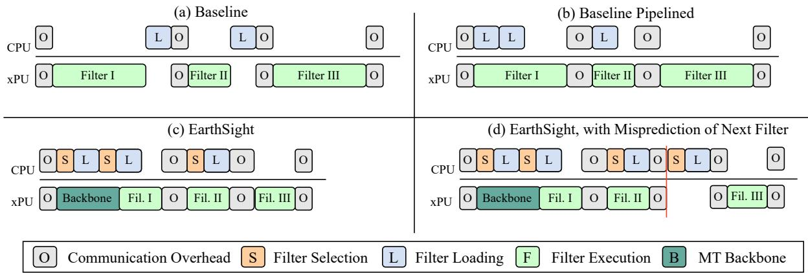  
Figure 4: Timing diagrams illustrating filter execution strategies on a CPU-xPU system: (a) Serval’s (baseline) sequential execution [15], (b) Pipelined baseline with overlapped loading, (c) EARTHSIGHT with predictive filter selection and loading, and (d) EARTHSIGHT with a filter misprediction. The phases represent Filter Selection (runtime scheduling), Filter Loading (CPU model preparation), Filter Execution (xPU inference), and Communication Overhead (CPU-xPU coordination).

## 4 Evaluation and Results

EARTHSIGHT’s performance as a distributed decision framework for scalable, low-latency satellite intelligence is evaluated using a combination of real hardware measurements and trace-driven constellation-scale simulations, consistent with prior work [15, 18]. Specifically, we deploy the on-orbit runtime on off-the-shelf accelerators, Coral Edge TPU [34] and Jetson AGX Orin GPU [35], to obtain empirical inference times and power profiles. These metrics are then integrated into our simulation framework to model end-to-end latency across an entire satellite constellation.

## 4.1 Real-world Scenarios and Multi-task Datasets

Scenarios Evaluated. To analyze the performance of our system, we use three real-world application scenarios as benchmarks. See Appendix A for detailed descriptions, prioritization, and image samples. Natural Disaster Monitoring concerns early warning and impact assessments for floods, wildfires, and earthquakes. The Intelligence scenario constitutes strategic awareness of maritime and aerial activities in geopolitically significant regions, including vessel classification and disambiguating military and commercial traffic. The Urban Earth Observation scenario is a comprehensive monitoring framework for major global cities, integrating disaster (e.g., urban flooding, building integrity, environmental change) and security elements tailored to city-specific risks.

Multi-task Models. As part of these scenario evaluations, we assess EARTHSIGHT’s ability to support multi-task inference, analyzing trade-offs between memory footprint and prediction accuracy across configurations. The evaluated models are trained on representative datasets spanning our three application scenarios using three classification and three segmentation datasets, including EuroSAT, ADVANCE, and PatternNet [36–38]. Dataset details and grouping logic are summarized in Table 1.

Table 1: Datasets Used for Model Evaluation
<table><tr><td>Task</td><td>Dataset</td><td>Resolution</td><td># Classes</td><td>Collection Source</td></tr><tr><td rowspan="3">Image Classification</td><td>EuroSAT</td><td>~10m</td><td>10</td><td>Sentinel-2 satellite</td></tr><tr><td>ADVANCE</td><td>0.5m</td><td>13</td><td>Google Earth Engine</td></tr><tr><td>PatternNet</td><td>Varies</td><td>38</td><td>Google Earth Engine</td></tr><tr><td rowspan="3">Semantic Segmentation</td><td>LandCover.ai</td><td>25-50cm</td><td>3</td><td>Aerial Photography (Poland)</td></tr><tr><td>LoveDA</td><td>0.3m</td><td>7</td><td>Google Earth Engine</td></tr><tr><td>DeepGlobe LC</td><td>50cm</td><td>7</td><td>DigitalGlobe Nanosatellites</td></tr></table>

Table 2: Edge AI Coprocessor Specifications
<table><tr><td>Specification</td><td>Google TPU</td><td>NVIDIAGPU</td></tr><tr><td>FLOPs</td><td>4 TOPS (INT8)</td><td>40 TOPS (INT8)</td></tr><tr><td>Processor</td><td>Coral Edge TPU</td><td>Jetson AGX Orin Nano</td></tr><tr><td>CPU</td><td>Quad-core Arm A53</td><td>6-core Arm A78AE</td></tr><tr><td>Memory</td><td>1 GB LPDDR4</td><td>8 GBLPDDR5</td></tr><tr><td>Power</td><td>2W (peak)</td><td>7W-15W</td></tr></table>

## 4.2 Evaluation Setup

Hardware Platforms. We evaluate our system using two distinct edge AI coprocessors: the Google Coral Edge TPU and the NVIDIA Jetson AGX Orin Nano GPU (Table 2). The Coral delivers a consistent 4 TOPS while consuming only ∼2W [34]. It functions as a simple, near-instant-on peripheral, making it ideal for low-power, intermittent tasks. The Jetson AGX Orin Nano is a full-featured System-on-Module with Ampere architecture, offering up to 40 TOPS with a configurable power budget starting at 7W [35].

Simulating the Satellite Constellation. We verify our results at scale using a Python-based simulator that extends the open-source framework from prior work [15]. To model EARTHSIGHT’s distributed execution, we add modules for look-ahead simulation, scheduling, schedule execution, query processing, and uplink-based schedule transfer. This simulation framework incorporates our empirically measured inference times and power profiles to provide accurate scale projections. For the constellation configuration, we model the PlanetScope Dove network comprising 153 satellites and 14 ground stations, whose publicly available orbital and geographic locations are used for realistic communication and scheduling patterns. The simulation is run over a continuous 48-hour window to evaluate system behavior and stability across varying workloads.

Satellite trajectory and transmission. Orbits are computed using Two-line-Element descriptors for satellites and propagated using the SGP4 algorithm. Satellites generate power with their solar panels, and power is consumed by the ADACS (control system), camera, receiver, and transmitter. Bandwidth is allocated using the maximum weight independent set algorithm [39], though we found that the choice of routing algorithm negligibly affects latency, provided it is fair. Scheduling and schedule execution take place as described in Sections 3.2 and 3.3. We use seeded random number generation as needed for reproducibility.

Baseline. We use SERVAL as the baseline [15], referred so in the entire evaluation. We apply the pipeline from Figure 4(b) where (1) ground stations communicate the queries, but not a computational schedule like EARTHSIGHT, (2) when an image is collected in a region relevant to the queries, the satellite executes the models relevant to those queries. If a query is true, the image is marked as high priority without further inference. If one filter in a term fails, that term’s remaining filters are skipped. Unlike our dynamic approach, the baseline (SERVAL) processes filters statically in order of execution time.

## 4.3 Multi-Task Model Evaluation

EARTHSIGHT’s multi-task models dramatically reduce the memory and compute footprint for tasks groups while preserving classification performance, showing that parameter sharing is an effective strategy to reduce computational load on edge devices without degrading accuracy.

Figure 5(a) presents the trade-off between the memory footprint and performance metrics when comparing multiple single-task models with their multi-task counterpart. For classification, the pareto-optimal multi-task configuration cuts memory use by 55.7% with under 0.5% accuracy drop, indicating that merging related single-task models into a unified multi-task model preserves model performance. As the backbone grows larger relative to the prediction head, the savings in compute and memory increase, but prediction accuracy suffers as the head has lesser depth to adapt the shared features

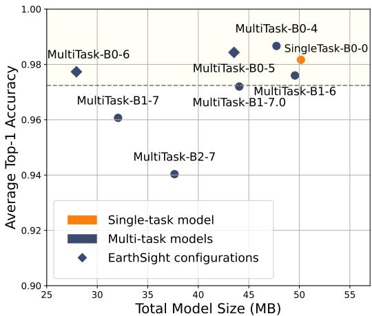  
(a) Classification: Model size vs. Top-1 accuracy.

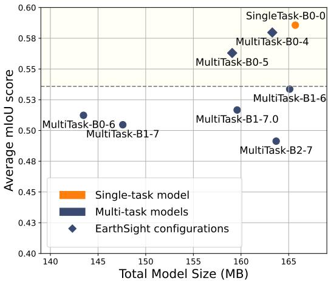  
(b) Segmentation: Model size vs. mIoU.  
Figure 5: Comparison of model size and performance across single-task and multi-task configurations.

into the task-specific output.

Although the EARTHSIGHT pipeline is primarily designed for classification tasks that are utilized to evaluate formulas, we also performed analysis for semantic segmentation tasks. Our experimental analysis showed that for dense prediction tasks such as semantic segmentation (Figure 5(b)), it is also viable to reduce the overall model size while maintaining comparable task prediction performance by leveraging a multi-task model paradigm. Since dense prediction requires extracting richer information from input images, employing deeper backbones than EfficientNet-B0, such as ResNet50, or utilizing vision transformer-based feature extractors may lead to more promising results.

## 4.4 End-to-End Results

We show EARTHSIGHT’s globally-aware scheduling with local adaption alleviates the computational bottleneck for prioritizing images, and reduces high-priority image latency

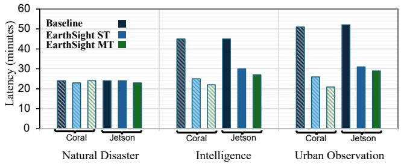  
Figure 6: 90th percentile tail latency, measured from first ground contact, for high-priority images (p > 2) across different scenarios.

across our three different scenarios.

## 4.4.1 End-to-End Latency

The ultimate goal of EARTHSIGHT’s optimized orchestration is to improve the timely delivery of valuable images. Figure 6 shows the 90th percentile tail latency for high-priority images, measured from the first ground contact made by a satellite after capturing the image, to when the image is downlinked. We compare the baseline, SERVAL, with EARTHSIGHT using single-task (ST) and multi-task (MT) models with both Coral and Jetson as accelerators.

Performance under High Compute Load (Intelligence Monitoring, Urban Monitoring). In scenarios characterized by extensive land coverage, a greater number of queries per image, and thus high computational demand, EARTH-SIGHT demonstrates significant advantages. As shown in Figure 6, all EARTHSIGHT variants substantially reduce tail latency for high-priority images compared to the baseline. For instance, EARTHSIGHT MT using Coral shows a reduction in P90 from 47 to 21 minutes relative to baseline, and 51 to 21 minutes for the Urban Monitoring scenario. This improvement stems from EARTHSIGHT’s ability to quickly prioritize images and manage the compute queue effectively. The baseline struggles particularly in the Urban scenario when numerous compute-intensive images are captured near ground stations; these images get placed at the rear of the processing queue and miss the downlink window despite their potential value. EARTHSIGHT mitigates this through intelligent processing that nearly eliminates fall-back on first-in first-out image downlink for high-priority images.

Performance under Lower Compute Load (Natural Disaster Scenario). In the Natural Disaster scenario (See Figure 6), the inference workload is lower due to the relative rarity of natural disasters and ease of identification, i.e., smaller models are sufficient for high precision and recall. Thus, despite the large surface area to scan for natural disasters, even the baseline processes most frames successfully, limiting EARTH-SIGHT’s latency improvement. However, as encountering natural disaster images is very rare, the dynamic threshold α is low as only a small percentage of the available bandwidth is used for high-priority images. Because of this, EARTH-SIGHT provides computational and power savings, as shown in Table 3. Smarter computation limits energy consumption, which facilitates preparedness in case of sudden increases in load and reduces the battery depth of discharge, a critical component of satellite longevity [40].

Table 3: Mean Percentage of Generated Power Consumed by Compute during first 6 Hours of Operation.
<table><tr><td>Approach</td><td>TPU (%)</td><td>GPU (%)</td></tr><tr><td>Baseline</td><td>27.95</td><td>171.96</td></tr><tr><td>EARTHSIGHT ST</td><td>11.11</td><td>69.46</td></tr><tr><td>EARTHSIGHT MT</td><td>8.91</td><td>61.49</td></tr></table>

Another way to represent the visualizations in Figure 6 is with a cumulative density function over the images, representing what fraction of the high-priority (p > 2) images are downlinked by time t. See 7. The baseline (orange) appears below both EARTHSIGHT ST and MT, meaning that at any given time, a greater percentage of high-value images would be downlinked by EARTHSIGHT than the baseline approach.

## 4.4.2 EARTHSIGHT’s Image Prioritization

EARTHSIGHT accelerates priority assignment to reduce computational load. We measure the time taken from image capture to priority scoring, for images relevant to active queries, measuring the efficiency of EARTHSIGHT’s filter ordering and pipelining mechanisms.

Table 4: Mean and Standard Deviation of Image Prioritization Time (seconds). This benchmarks the filter ordering and pipelining efficiency. Lower is better.
<table><tr><td>Platform</td><td>Approach</td><td>Mean (s)</td><td>Speedup</td><td>σ(s)</td></tr><tr><td rowspan="3">Jetson</td><td>Baseline</td><td>2.46</td><td>1×</td><td>0.95</td></tr><tr><td>EARTHSIGHT ST</td><td>1.86</td><td>1.32×</td><td>0.93</td></tr><tr><td>EARTHSIGHT MT</td><td>1.33</td><td>1.85×</td><td>0.58</td></tr><tr><td rowspan="3">Coral</td><td>Baseline</td><td>7.82</td><td>1×</td><td>3.00</td></tr><tr><td>EARTHSIGHT ST</td><td>5.86</td><td>1.33×</td><td>2.93</td></tr><tr><td>EARTHSIGHT MT</td><td>4.15</td><td>1.88×</td><td>1.84</td></tr></table>

Table 4 presents the average time per image required for prioritization by Single-Task (ST) and Multi-Task (MT) versions of EARTHSIGHT compared to the baseline. EARTHSIGHT significantly reduces the mean processing time per image, with the multi-task variant achieving the highest speedup, a reduction in average prioritization time by approximately 1.85× on Jetson and 1.9× on Coral compared to the baseline. This shows optimized evaluation order and avoidance of redundant inference reduce the computational demands of onboard prioritization. Lower standard deviation for EARTHSIGHT MT also suggests more consistent performance.

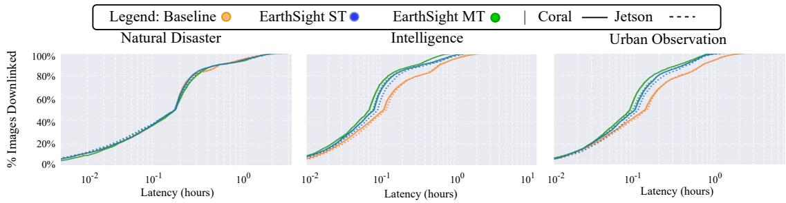  
Figure 7: Distribution of avoidable image latencies for high priority $( p > 2 )$ images across all scenarios, measured in hours. EARTHSIGHT shows comparable or improved performance across all scenarios.

Comparison with Exact Method. Our scheduling policy provides a greedy, approximate solution to minimizing Equation 3. To assess this approximation, we compare it against the exact (exponential-time) optimal solution and an oracle, which has access to the hypothetical results of evaluating every filter on an image, i.e., knows the ground truth. The oracle picks filters minimizing the time (actual, not expected time) to evaluate the formula.

While exact solutions are tractable up to ∼15 filters, scaling to 60 requires roughly a day of compute per formula, despite needing to take milliseconds for effective edge deployment.Thus, we construct a synthetic suite of 2,473 formulas by truncating queries from our three scenarios to contain at most 15 filters. On this benchmark, EARTHSIGHT achieves a relative error of only 7.5% in mean prioritization time compared to the exact method (Table 5). The median times for both approaches are identical, indicating our greedy heuristic aligns with the optimal choice in most cases.

## 4.4.3 Ablation Studies

We conduct ablation studies on the Urban Monitoring scenario to isolate the contribution of key components.

System Components. Figure 8 compares the full EARTH-SIGHT system against baseline and reduced variants where individual components, optimized filter ordering, ground scheduler integration, and dynamic thresholding, are removed. Each component contributes to lowering the latency for highpriority data, with the full EARTHSIGHT configuration achieving the lowest latency across all tasks.

Table 5: Average evaluation time per image, with Coral coprocessor, on a synthetic suite of 2473 formulas. Lower is better.
<table><tr><td>Method</td><td>Mean Time (s)</td><td>Median Time (s)</td></tr><tr><td>EARTHSIGHT MT</td><td>2.13</td><td>1.95</td></tr><tr><td>Exact Solution</td><td>1.98</td><td>1.95</td></tr><tr><td>Oracle</td><td>1.15</td><td>1.02</td></tr></table>

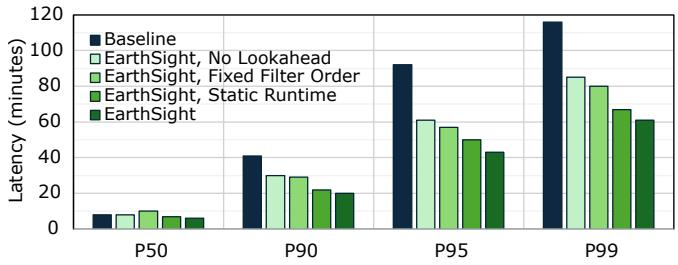  
Figure 8: Ablation study results show the impact of individual EARTHSIGHT components on high-priority $( p > 2 )$ image latency. The combined system performs best.

Table 6: Comparison of Mean and $P _ { 9 0 }$ Latency for static and dynamic priority thresholds.
<table><tr><td>Threshold</td><td>Dynamic</td><td>0.2</td><td>0.3</td><td>0.4</td><td>0.5</td></tr><tr><td>Mean Latency (s)</td><td>7.0</td><td>11.9</td><td>7.6</td><td>8.5</td><td>10.3</td></tr><tr><td>P90 Latency (s)</td><td>20.0</td><td>44.7</td><td>21.1</td><td>28.4</td><td>41.2</td></tr></table>

Dynamic Scheduling. To show the power of the on-orbit runtime’s local adaptation, we evaluate the effectiveness of the dynamic priority threshold α compared to static thresholds. Table 6 reveals EARTHSIGHT consistently outperforms all fixed thresholds in mean and P90 latency. The operational context of the satellite is constantly changing. Static thresholds are highly sensitive to operational context: if α is set too low, too many low-value images are flagged as high priority, overloading the downlink; if too high, excessive onboard computation delays genuine high-priority data. By contrast, the dynamic threshold adjusts continuously based on power availability and rejection ratio, maintaining a better balance and yielding lower latency for critical data.

Model Precision and Recall. We assess how model accuracy affects latency by varying precision/recall while keeping inference time fixed. Table 7 shows that as model accuracy falls, both the overall prioritization quality and the percentage of high-priority images sent in the first available downlink slot decline, with modest increases in P90 and P95 tail latencies. Median latency (P50) remains stable as most high-priority images are still correctly prioritized. More severe degradation of tail latency is prevented by the separate priority tier pcompute which expedites potentially misclassified images over guaranteed negatives, highlighting system resilience to imperfect model performance.

Table 7: System metrics when varying model accuracy while holding inference time constant.
<table><tr><td rowspan="2">Model Acc.</td><td rowspan="2">Priority Acc.</td><td rowspan="2">% High-Pri Sent First</td><td colspan="3">Latency (mins)</td></tr><tr><td>P50</td><td>P90</td><td>P95</td></tr><tr><td>1.00</td><td>1.00</td><td>98%</td><td>7</td><td>19</td><td>34</td></tr><tr><td>0.95</td><td>0.97</td><td>95%</td><td>7</td><td>21</td><td>61</td></tr><tr><td>0.90</td><td>0.93</td><td>88%</td><td>8</td><td>24</td><td>66</td></tr><tr><td>0.80</td><td>0.83</td><td>83%</td><td>8</td><td>28</td><td>76</td></tr><tr><td>0.60</td><td>0.70</td><td>73%</td><td>10</td><td>36</td><td>90</td></tr></table>

## 5 Related Work

Efficient Machine Learning on the Edge. Prior research provides methods to create efficient models suitable for edge constraints. Knowledge distillation [41] transfers knowledge from large teacher models to small student models. Model pruning removes unnecessary model components to reduce model size [42, 43]. Quantization reduces the numerical precision of model weights, decreasing memory and compute requirements. Weight sharing compresses models by reusing parameters [44]. These techniques are explored for model compression on edge devices in real-time settings such as video analysis [45] and fire detection [46].

Dynamic Scheduling for Satellites. OEC was introduced in [20] to discard cloudy images identified through onboard compute. KODAN [18] incorporates power availability and geographic location to dynamically trade off execution time for cloud discard and maximize data value density. PHOENIX [47] schedules inference on sunlit satellites, using inter-satellite links to optimize battery usage across the entire constellation. FEDSPACE [26] schedules federated aggregation based on satellite availability to minimize gradient staleness. These approaches address single-task models and do not consider multi-purpose constellations.

Distributing Computation across Ground and Space. Hybrid ground-space architectures exploit inexpensive ground computation. ADAEO [19] and SERVAL [15] bifurcate queries between the ground stations and satellites, combining prior information with onboard machine learning to determine image utility. This utility informs dynamic image compression and image downlink ordering. Serval is the most similar prior work, and we improve on with global context at the ground with local adaptation at the satellite, enabling EARTH-SIGHT to scale to multi-purpose, global scenarios.

Stochastic Boolean Function Evaluation. The problem our satellite runtime addresses is a well-studied optimization problem known as Stochastic Boolean Function Evaluation (SBFE) [48]. The objective in SBFE is to find an evaluation policy that minimizes the expected cost required to determine the truth value of a Boolean function. The outcome of each test (filter) is not known until the cost of running it has been paid. SFBE is NP-hard [48]. Exact methods based on dynamic programming or value iteration exist but have runtime exponential in the number of tests, rendering them intractable. Therefore, we use an approximate solution with a greedy costbenefit heuristic, a common approach that iteratively selects the next test that maximizes the ratio of expected information gain per unit of cost [48]. While greedy strategies do not guarantee optimality, they have been shown to provide robust empirical performance for SFBE.

## 6 Conclusion

In this work, we show that low-latency, scalable orbital analytics is a distributing scheduling problem that requires codesign of globally-aware on-ground planning with adaptive on-orbit execution to conserve limited onboard energy and bandwidth and support diverse real-time scenarios.

Our results reveal EARTHSIGHT’s distributed decision framework can yield substantial improvements to per-image processing time, power utilization, and end-to-end latency for critical images. EARTHSIGHT easily generalizes to different scenarios and can incorporate auxiliary information from different sources to inform scheduling decisions.

Future work in satellite edge computing may explore mixed-precision frameworks for neural analysis of images or analytics with different stopping points that intelligent runtimes can use to further scale analytical abilities.

## Availability

We open-source EARTHSIGHT and release it anonymously. Our results are reproducible with reasonable computational requirements. See github.com/earthsight-contributors/earthsight.

## Acknowledgements

This research was supported in part through cyberinfrastructure resources and services provided by the Partnership for an Advanced Computing Environment (PACE) at the Georgia Institute of Technology. Special thanks to Irene Wang for her guidance and mentorship during the very early stages of this project. This project was in part supported by gifts from AMD, Google, and the Georgia Tech Presidential Undergraduate Research Award.

## References

[1] Jonathan C. McDowell. The Low Earth Orbit Satellite Population and Impacts of the SpaceX Starlink Constel-

lation. The Astrophysical Journal Letters, 892(2):L36, 2020. https://dx.doi.org/10.3847/2041-8213/ ab8016.

[2] CBO. Large Constellations of Low-Altitude Satellites: A Primer, 2023. https://www.cbo.gov/ publication/59175.

[3] Planet Labs. Our constellations. https://planet. com/our-constellations.

[4] Spire Global Inc. LEMUR space platform. https://spire.com/space-services/ lemur-space-platform/.

[5] Kathiravan Thangavel, Dario Spiller, Roberto Sabatini, Stefania Amici, Sarathchandrakumar Thottuchirayil Sasidharan, Haytham Fayek, and Pier Marzocca. Autonomous Satellite Wildfire Detection Using Hyperspectral Imagery and Neural Networks: A Case Study on Australian Wildfire. Remote Sensing, 15(3):720, 2023. https://www.mdpi.com/2072-4292/15/3/720.

[6] Arsalan Tahir, Hafiz Suliman Munawar, Junaid Akram, Muhammad Adil, Shehryar Ali, Abbas Z. Kouzani, and M. A. Parvez Mahmud. Automatic Target Detection from Satellite Imagery Using Machine Learning. Sensors, 22(3):1147, 2022. https://www.mdpi.com/ 1424-8220/22/3/1147.

[7] Harika Bandarupally, Harshitha Reddy Talusani, and T Sridevi. Detection of Military Targets from Satellite Images using Deep Convolutional Neural Networks. In 2020 IEEE 5th International Conference on Computing Communication and Automation (ICCCA), pages 531–535, 2020. https://ieeexplore.ieee.org/ abstract/document/9250864.

[8] Thanh Tam Nguyen, Thanh Dat Hoang, Minh Tam Pham, Tuyet Trinh Vu, Thanh Hung Nguyen, Quyet-Thang Huynh, and Jun Jo. Monitoring agriculture areas with satellite images and deep learning. Applied Soft Computing, 95:106565, 2020. https://www.sciencedirect.com/science/ article/pii/S1568494620305032.

[9] Hafsa Ouchra, Abdessamad Belangour, and Allae Erraissi. Satellite data analysis and geographic information system for urban planning: A systematic review. In 2022 International Conference on Data Analytics for Business and Industry (ICDABI), pages 558–564, 2022. https://ieeexplore.ieee.org/abstract/ document/10041487.

[10] Planet Labs Inc. Our constellations: Dove, rapideye, and skysat fleets, 2025. Accessed: 2025-04-13.

[11] Ketan Bhardwaj, Vaibhav Bhosale, and Ada Gavrilovska. Ushering in the low earth orbit compute cloud era. Computer, 58(10):78–86, 2025.

[12] Panagiotis Barmpoutis, Periklis Papaioannou, Kosmas Dimitropoulos, and Nikos Grammalidis. A Review on Early Forest Fire Detection Systems Using Optical Remote Sensing. Sensors, 20(22):6442, 2020. https: //www.mdpi.com/1424-8220/20/22/6442.

[13] Devis Tuia, Konrad Schindler, Begüm Demir, Xiao Xiang Zhu, Mrinalini Kochupillai, Sašo Džeroski, Jan N. van Rijn, Holger H. Hoos, Fabio Del Frate, Mihai Datcu, Volker Markl, Bertrand Le Saux, Rochelle Schneider, and Gustau Camps-Valls. Artificial Intelligence to Advance Earth Observation: A review of models, recent trends, and pathways forward. IEEE Geoscience and Remote Sensing Magazine, pages 2–25, 2024. https://ieeexplore.ieee.org/abstract/ document/10669817.

[14] Bo Wang, Yuhang Fang, Dongyan Huang, Zelin Lu, and Jiaqi Lv. A Lightweight and Adaptive Image Inference Strategy for Earth Observation on LEO Satellites. Remote Sensing, 17(7):1175, 2025. https://www.mdpi. com/2072-4292/17/7/1175.

[15] Bill Tao, Om Chabra, Ishani Janveja, Indranil Gupta, and Deepak Vasisht. Known Knowns and Unknowns: Nearrealtime Earth Observation Via Query Bifurcation in Serval. In 21st USENIX Symposium on Networked Systems Design and Implementation (NSDI 24), pages 809– 824, 2024. https://www.usenix.org/conference/ nsdi24/presentation/tao.

[16] Deepak Vasisht, Jayanth Shenoy, and Ranveer Chandra. L2D2: Low latency distributed downlink for LEO satellites. In Proceedings of the 2021 ACM SIGCOMM 2021 Conference, pages 151–164, 2021. https://dl.acm. org/doi/10.1145/3452296.3472932.

[17] Planet Labs Inc. Planet analytic feeds: Performance metrics, April 2021. Accessed: 2025-04-13.

[18] Bradley Denby, Krishna Chintalapudi, Ranveer Chandra, Brandon Lucia, and Shadi Noghabi. Kodan: Addressing the computational bottleneck in space. In Proceedings of the 28th ACM International Conference on Architectural Support for Programming Languages and Operating Systems, Volume 3, ASPLOS 2023, page 392–403, New York, NY, USA, 2023. Association for Computing Machinery.

[19] Chen Yang, Qibo Sun, Qiyang Zhang, Hao Lu, Claudio A. Ardagna, Shangguang Wang, and Mengwei Xu. Toward efficient satellite computing through adaptive compression. IEEE Transactions on Services Computing, 17(6):4411–4422, 2024.

[20] Bradley Denby and Brandon Lucia. Orbital edge computing: Nanosatellite constellations as a new class of computer system. In Proceedings of the Twenty-Fifth International Conference on Architectural Support for Programming Languages and Operating Systems, AS-PLOS ’20, page 939–954, New York, NY, USA, 2020. Association for Computing Machinery.

[21] European Space Agency. Sentinel Satellite Data, 2025.

[22] NASA Atmospheric Science Data Center. CER SSF Aqua-FM3-MODIS Edition4A, 2025.

[23] Spire Global Inc. Spirepedia: Spire’s satellite constellation, 2025. Accessed: 2025-04-13.

[24] Spire Global Inc. Canadian space agency assigns can\$72 million contract to spire global canada to design wildfiresat mission, February 2025. Accessed: 2025-04-13.

[25] Ignacio F. Acero, Jonathan Diaz, Ronald Hurtado-Velasco, Sergio Ramiro Gonzalez Bautista, Sonia Rincón, Francisco L. Hernández, Julian Rodriguez-Ferreira, and Jesus Gonzalez-Llorente. A method for validating cubesat satellite eps through power budget analysis aligned with mission requirements. IEEE Access, 11:43316–43332, 2023.

[26] Jinhyun So, Kevin Hsieh, Behnaz Arzani, Shadi Noghabi, Salman Avestimehr, and Ranveer Chandra. Fedspace: An efficient federated learning framework at satellites and ground stations. arXiv preprint arXiv:2202.01267, 2022.

[27] Rich Caruana. Multitask Learning. Machine Learning, 28(1):41–75, 1997. https://doi.org/10.1023/A: 1007379606734.

[28] Jun Yu, Yutong Dai, Xiaokang Liu, Jin Huang, Yishan Shen, Ke Zhang, Rong Zhou, Eashan Adhikarla, Wenxuan Ye, Yixin Liu, Zhaoming Kong, Kai Zhang, Yilong Yin, Vinod Namboodiri, Brian D. Davison, Jason H. Moore, and Yong Chen. Unleashing the Power of Multi-Task Learning: A Comprehensive Survey Spanning Traditional, Deep, and Pretrained Foundation Model Eras, 2024. http://arxiv.org/abs/2404.18961.

[29] Rangel Daroya, Luisa Vieira Lucchese, Travis Simmons, Punwath Prum, Tamlin Pavelsky, John Gardner, Colin J. Gleason, and Subhransu Maji. Improving Satellite Imagery Masking using Multi-task and Transfer Learning, 2024. http://arxiv.org/abs/2412.08545.

[30] Sebastian Ruder. An Overview of Multi-Task Learning in Deep Neural Networks, 2017. http://arxiv.org/ abs/1706.05098.

[31] Ishan Misra, Abhinav Shrivastava, Abhinav Gupta, and Martial Hebert. Cross-stitch Networks for Multitask Learning, 2016. http://arxiv.org/abs/1604. 03539.

[32] Xingcheng Zhang, Lei Yang, Junjie Yan, and Dahua Lin. Accelerated Training for Massive Classification via Dynamic Class Selection, 2018. http://arxiv.org/ abs/1801.01687.

[33] Planet Labs Inc. Planet Tasking Product, 2025.

[34] Google Coral. USB Accelerator datasheet, 2019. https: //coral.ai/docs/accelerator/datasheet/.

[35] Leela S Karumbunathan. Nvidia jetson agx orin series. 2022. https://www.nvidia.com/content/ dam/en-zz/Solutions/gtcf21/jetson-orin/ nvidia-jetson-agx-orin-technical-brief.pdf.

[36] Adrian Boguszewski, Dominik Batorski, Natalia Ziemba-Jankowska, Tomasz Dziedzic, and Anna Zambrzycka. LandCover.ai: Dataset for Automatic Mapping of Buildings, Woodlands, Water and Roads from Aerial Imagery, 2022. http://arxiv.org/abs/2005.02264.

[37] Patrick Helber, Benjamin Bischke, Andreas Dengel, and Damian Borth. EuroSAT: A Novel Dataset and Deep Learning Benchmark for Land Use and Land Cover Classification. IEEE Journal of Selected Topics in Applied Earth Observations and Remote Sensing, 12(7):2217–2226, 2019. https://ieeexplore.ieee. org/document/8736785.

[38] Weixun Zhou, Shawn Newsam, Congmin Li, and Zhenfeng Shao. PatternNet: A benchmark dataset for performance evaluation of remote sensing image retrieval. ISPRS Journal of Photogrammetry and Remote Sensing, 145:197–209, 2018. https://www.sciencedirect. com/science/article/pii/S0924271618300042.

[39] Xiaoyu Zhao, Zhaohui Wang, Jimin Lv, and Yingwu Chen. Efficient methods for agile earth observation satellite scheduling. In 2019 IEEE Symposium Series on Computational Intelligence (SSCI), pages 3158–3164, 2019.

[40] Renata do N. Mota Macambira, Celso Barbosa Carvalho, and José Ferreira de Rezende. Energy-efficient routing in LEO satellite networks for extending satellites lifetime. Computer Communications, 195:463–475, 2022. https://www.sciencedirect.com/science/ article/pii/S0140366422003486.

[41] Jianping Gou, B. Yu, Stephen J. Maybank, and Dacheng Tao. Knowledge distillation: A survey. International Journal of Computer Vision, 129:1789 – 1819, 2020.

[42] Yihua Zhang, Yuguang Yao, Parikshit Ram, Pu Zhao, Tianlong Chen, Min-Fong Hong, Yanzhi Wang, and Sijia Liu. Advancing model pruning via bi-level optimization. ArXiv, abs/2210.04092, 2022.

[43] Irene Wang, Prashant J. Nair, and Divya Mahajan. Fluid: Mitigating stragglers in federated learning using invariant dropout, 2023.

[44] Han Cai, Chuang Gan, Tianzhe Wang, Zhekai Zhang, and Song Han. Once-for-all: Train one network and specialize it for efficient deployment, 2020.

[45] Natnael Alemayehu Tamire and Hae-Dong Kim. Effective video scene analysis for a nanosatellite based on an onboard deep learning method. Remote Sensing, 15(8), 2023.

[46] Sabina Jangirova, Branislava Jankovic, Waseem Ullah, Latif U Khan, and Mohsen Guizani. Real-time aerial fire detection on resource-constrained devices using knowledge distillation. arXiv preprint arXiv:2502.20979, 2025.

[47] Weisen Liu, Zeqi Lai, Qian Wu, Hewu Li, Qi Zhang, Zonglun Li, Yuanjie Li, and Jun Liu. In-orbit processing or not? sunlight-aware task scheduling for energyefficient space edge computing networks, 2024.

[48] Amol Deshpande, Lisa Hellerstein, and Devorah Kletenik, “Approximation algorithms for stochastic boolean function evaluation and stochastic submodular set cover,” in Proceedings of the Twenty-Fifth Annual ACM-SIAM Symposium on Discrete Algorithms (SODA), 2014, pp. 1453–1472.

## APPENDIX

## A Evaluation Scenarios Details

In greater detail, the three scenarios we use for evaluation are below, with supporting sample images from PlanetScope. All images were retrieved from the PlanetScope image gallery: https://www.planet.com/ latest-satellite-imagery-gallery/.

## Natural Disaster Monitoring

This scenario provides early warning and impact assessment for events like floods, wildfires, earthquakes, volcanic eruptions, and oil spills. It monitors river water extent, fire thermal anomalies, ground deformation, ash plumes, and the spread of slicks at sea. Prioritization reflects threat urgency, with events like rapidly spreading wildfires or new volcanic eruptions demanding the most immediate attention.

A high-priority task would be triggered by an image showing a rapidly expanding wildfire front, identified by new thermal hotspots adjacent to previously unburned areas, especially when downwind of an urban center. Similarly, an image capturing a new, dense ash plume from a volcano would be flagged for immediate analysis to warn aviation and nearby populations. In contrast, a low-priority task would involve monitoring a known, contained wildfire with a stable perimeter, a steady lava flow far from infrastructure, or observing a river that is swollen but remains within its banks. This tiered approach enables efficient resource allocation that dynamically adapts to threat development.

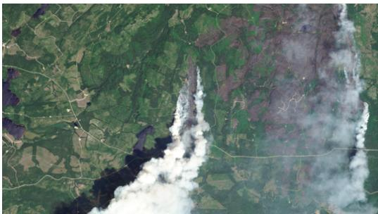  
Figure 9: A high-priority image from PlanetScope of a wildfire in California. Onboard analysis can flag new hotspots that signal the fire’s imminent spread toward vulnerable areas.

## Intelligence Scenario

This scenario delivers strategic and tactical awareness of military and logistical activities in geopolitically significant regions. It monitors key waterways, airbases, and land corridors, detecting anomalous concentrations of hardware and disruptions to critical infrastructure. Continuous operation uses tiered, risk-based priorities to provide timely intelligence on notable patterns for security and diplomatic awareness.

For instance, a high-priority event would be the detection of a significant military armament buildup, such as the one observed in Yelnya, Russia, which deviates from baseline activity (Fig. 10(a)). Another critical high-priority task is near-real-time damage assessment of key infrastructure, like a destroyed border crossing bridge, indicating conflict escalation or disrupted supply lines (Fig. 10(b)). Conversely, an image of a single container ship on a standard shipping route or typical vehicle traffic on an open highway would be a lowpriority observation, logged but not prioritized for immediate downlink.

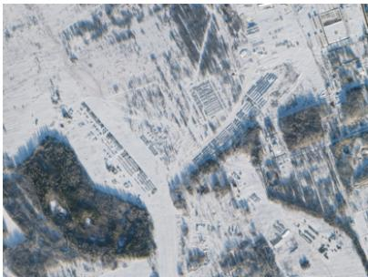  
(a) Armament buildup in Yelnya, RU.

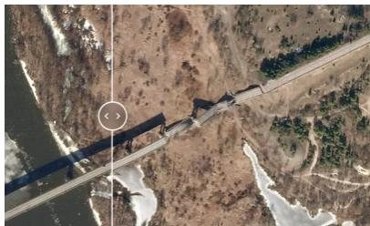  
(b) Destroyed road at Kamaryn-Slavutych.  
Figure 10: High-priority intelligence images. (a) shows a strategic buildup of military hardware, while (b) shows tactical damage to critical infrastructure.

## Combined Global Cities Scenario

This scenario creates a comprehensive monitoring framework for major global cities, integrating disaster, security, and humanitarian elements tailored to city-specific risks. Monitoring adapts to geographic vulnerabilities and population density, addressing complex urban challenges by identifying anomalous patterns in infrastructure and population movement.

A high-priority event in this scenario could be the detection of significant urban flooding in a low-lying coastal city. Another could be the sudden, anomalous massing of vehicles at a key transportation hub, like the Gongabu Bus Terminal in Nepal. Such an event is ambiguous and requires immediate prioritization, as it could signal the start of a mass evacuation (a humanitarian crisis), civil unrest (a security issue), or a major transit failure. Low-priority data would include routine monitoring of city parks for seasonal changes or normal traffic levels at international airports. By fusing these diverse data streams, this scenario provides holistic awareness for densely populated urban centers.

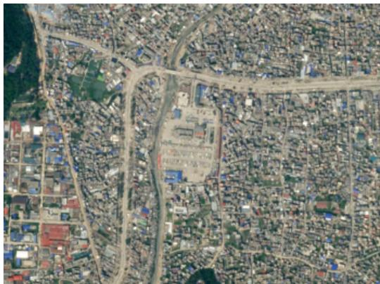  
Figure 11: A high-priority image showing an anomalous vehicle buildup at Gongabu Bus Terminal, Nepal. Such an event requires urgent analysis to determine its cause and potential humanitarian or security implications.