# EARTHSIGHT: A DISTRIBUTED FRAMEWORK FOR LOW-LATENCY SATELLITE INTELLIGENCE

Ansel Erol 1 Seungjun Lee 1 2 Divya Mahajan 1

## ABSTRACT

Low-latency delivery of satellite imagery is essential for time-critical applications such as disaster response, intelligence, and infrastructure monitoring. However, traditional pipelines rely on downlinking all captured images before analysis, introducing delays of hours to days due to restricted communication bandwidth. To address these bottlenecks, emerging systems perform onboard machine learning to prioritize which images to transmit. However, these solutions typically treat each satellite as an isolated compute node, limiting scalability and efficiency. Redundant inference across satellites and tasks further strains onboard power and compute costs, constraining mission scope and responsiveness. We present EARTHSIGHT, a distributed runtime framework that redefines satellite image intelligence as a distributed decision problem between orbit and ground. EARTHSIGHT introduces three core innovations: (1) multi-task inference on satellites using shared backbones to amortize computation across multiple vision tasks; (2) a ground-station query scheduler that aggregates user requests, predicts priorities, and assigns compute budgets to incoming imagery; and (3) dynamic filter ordering, which integrates model selectivity, accuracy, and execution cost to reject low-value images early and conserve resources. EARTHSIGHT leverages global context from ground stations and resource-aware adaptive decisions in orbit to enable constellations to perform scalable, low-latency image analysis within strict downlink bandwidth and onboard power budgets. Evaluations using a prior established satellite simulator show that EARTHSIGHT reduces average compute time per image by 1.9× and lowers 90th percentile end-to-end latency from first contact to delivery from 51 to 21 minutes compared to the state-of-the-art baseline.

## 1 INTRODUCTION

Nanosatellites in Low Earth Orbit (LEO) have transformed our ability to monitor Earth (McDowell, 2020; CBO, 2023). Commercial constellations such as Planet’s Dove and Spire Global’s LEMUR now deliver high-resolution, near-daily imagery of the planet’s surface (Planet Labs; Spire Global Inc.). This data enables a wide array of applications, from environmental monitoring and disaster response to agriculture, urban planning, and intelligence (Thangavel et al., 2023; Tahir et al., 2022; Bandarupally et al., 2020; Nguyen et al., 2020; Ouchra et al., 2022). The primary bottleneck in the current Earth observation systems has shifted from data acquisition to analysis covering 200 million km2 per day (Planet Labs Inc., 2025a). Thus, to extract timely insights, the community has turned to machine learning (Bhardwaj et al., 2025; Barmpoutis et al., 2020; Tuia et al., 2024; Wang et al., 2025).

However, existing pipelines, wherein all captured imagery is downlinked to ground stations before analysis, introduce substantial delays, often stretching from several hours to multiple days (Tao et al., 2024; Vasisht et al., 2021). Such delays are detrimental for time-sensitive queries: each lost minute can hinder search efforts during natural disasters, obscure evolving damage and environmental conditions, or exacerbate operational uncertainty in conflict zones. Delays arise from the short, intermittent transmission windows available for downlink, typically 10–15 minutes to offload tens of gigabytes of imagery (Vasisht et al., 2021). When satellites cannot assess the analytical value of captured data, images are transmitted in a first-in, first-out manner, potentially causing critical content to wait behind less relevant data. Planet Labs’ Analytics product shows that while users can run predefined object detection algorithms, the results often arrive days later, making same-day analysis infeasible (Planet Labs Inc., 2021).

Recent efforts have proposed performing inference on the satellites to reduce latency and conserve bandwidth (Denby et al., 2023; Tao et al., 2024; Yang et al., 2024; Denby & Lucia, 2020). By analyzing images in orbit between capture and downlink, satellites can prioritize, compress, or discard data before transmission (Figure 1). However, these approaches treat each satellite as an isolated node, ignoring the broader constellation context that governs downlink contention and bandwidth. Without incorporating global coordination, such designs cannot optimally allocate limited communication opportunities across multiple satellites.

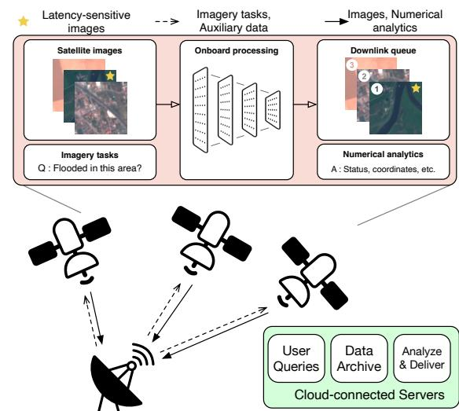  
Figure 1. LEO Earth observation systems perform on-board inference for image analysis. Ground stations send tasks generated from user queries to satellites. The satellites prioritize transmission of images identified as latency-sensitive via ML inference.

Moreover, existing systems only support single-task operation. In practice, an image may support multiple concurrent applications, such as ship detection, wake analysis, and illegal fishing identification at sea. Executing independent inference pipelines for each task is expensive in both computation and energy, leading to redundancy that is unacceptable in resource-constrained environments. The multi-task nature of satellite workloads and single-purpose isolated design of prior systems limits their scalability and responsiveness.

EARTHSIGHT redefines image analysis as a distributed decision problem spanning both ground and orbit. Rather than viewing satellites as passive data forwarders or independent inference engines, we offer a joint scheduling framework that leverages global context from the ground station with local resource-aware adaption in-orbit.

Enabling EARTHSIGHT requires overcoming a variety of challenges. Nano-satellites operate under tight power budgets, harvested via small solar panels and used for imaging, communication, and control systems. As a result, only a fraction of power is available for compute, forcing the use of low-power, radiation-hardened processors that lag far behind terrestrial accelerators in capability. Consequently, onboard image processing often cannot complete before the next downlink window, limiting responsiveness for timesensitive missions. To address these challenges, we employ an integrated approach that combines multi-task learning with globally informed pre-processing at the ground station. This allows the satellite constellation to collaboratively manage diverse, time-critical workloads within limited compute and bandwidth envelopes. To facilitate the distributed decision, EARTHSIGHT proposes three coordinated components: (1) multi-task onboard inference for priority annotation, (2) query schedule construction at ground stations, and (3) adaptive filter ordering on satellites. EARTHSIGHT employs a

multi-task model consisting of shared feature backbones and task-specific heads, amortizing inference costs across multiple filters without compromising on model size or capacity. While this design improves efficiency, it introduces a dependency: task heads can only execute after the backbone’s latent features are computed. EARTHSIGHT’s scheduler resolves these dependencies by adjusting filter orderings at runtime, jointly optimizing for precision, latency, and available power.

At the ground station, EARTHSIGHT analyzes historical image distributions and mission policies to synthesize a preliminary schedule. For each expected capture, it aggregates filters from all active user queries, e.g., cloud-free and has fire or flooding near a populated area, into compact logical formulas. It then simulates future transmission windows to forecast two key parameters: the minimum image priority likely to be transmitted and the expected compute budget per image. These parameters are integrated into the computation schedule to supply the global context that guides approximate, truncated inference onboard the satellite.

At runtime, satellites execute ML filters to prioritize images. To manage power constraints, they employ a model-ordering strategy that stops as soon as an adaptively-set confidence threshold is met. The sequence of filters is critical; if two ML-based filters have comparable runtimes, the one more likely to influence the prioritization outcome should execute first. Finding an optimal sequence of filter operations for each image is crucial for efficiency, however is NP-hard and thus computationally intractable. EARTHSIGHT addresses this with a heuristic approach that defines each filter’s utility as a function of four factors: (i) the filter’s accuracy (ii) the filter’s execution time (cost), (iii) the probability of a negative result, based on prior information from the ground station, and (iv) the influence of the filter’s outcome on the overall query formula. This cost–benefit formulation enables the scheduler to repeatedly select the next filter most likely to yield a rapid decision on the image.

## In summary, EARTHSIGHT contributes:

1. A distributed decision framework that redefines onboard image analysis as a joint process between ground and orbit, merging global context from ground stations with local, resource-aware adaptation in satellites.

2. Multi-task onboard inference that amortizes computation across multiple application-specific tasks through a shared backbone, enabling efficient, scalable analysis under tight power budgets.

3. Adaptive filter scheduling based on a utility-driven ordering that integrates selectivity, execution time, accuracy, and logical impact to maximize early rejection of low-priority images.

Through hardware-enhanced simulation studies on three multi-purpose scenarios, we demonstrate that EARTH-SIGHT alleviates the computational bottleneck, resulting in a decrease in the 90th percentile tail latency from first contact to image delivery from 51 to 21 minutes relative to the state of the art baseline, SERVAL (Tao et al., 2024).

## 2 BACKGROUND

Satellites in Low Earth Orbit (LEO) offer frequent, highresolution, multi-spectral imaging of Earth’s surface, typically completing a full orbit every 90 minutes at a few hundred kilometers altitude. While early Earth observation (EO) relied on large, monolithic platforms (European Space Agency, 2025; NASA Atmospheric Science Data Center, 2025), the past decade has seen a shift towards deploying nanosatellites, compact spacecraft ranging from 1000 to 8000 cubic centimeters (Spire Global Inc., 2025a; Planet Labs Inc., 2025a). These satellites, equipped with commercial off-the-shelf (COTS) components such as the NVIDIA Jetson series, form a globally distributed computing platform capable of onboard inference.

Orbital Edge Computing. The concept of processing data directly on satellite, i.e., Orbital Edge Computing (OEC), conserves downlink bandwidth by filtering out unusable data, such as cloudy images, prior to transmission (Denby & Lucia, 2020). The idea now supports commercial approaches, like those pursued by Spire Global under contracts with NASA and the Canadian Space Agency, to develop onboard wildfire detection using Convolutional Neural Networks (Spire Global Inc., 2025b).

Recent initiatives have explored more powerful compute substrates for space-based inference: Google’s Project Suncatcher investigates deploying TPUs in orbit to enable largescale ML workloads (Aguera y Arcas et al. ¨ , 2025), while platforms like Pelican have demonstrated Jetson-based deployments for real-time onboard processing (Jewett, 2024). These developments underscore the growing feasibility of sophisticated edge inference in LEO environments.

Leveraging Onboard Processing for Image Prioritization. The push toward onboard processing is driven in part by the constraints of satellite systems compared to ground-based infrastructure drawing on data centers and cloud resources. In orbit, compute capability is fixed at launch, power-limited, and must support all imaging, communication, and control operations within a 1 to 5 watts per unit budget (Acero et al., 2023). These constraints prevent continuous, high-throughput processing and limit how many models can run per image. To mitigate this, recent hybrid systems (Tao et al., 2024; Denby et al., 2023; Yang et al., 2024) split computation between satellites and ground stations, estimating image utility and dynamically compressing and reordering transmissions based value or urgency.

At the same time, satellites face brief downlink windows and constrained communication bandwidth (So et al., 2022). Thus, these aforementioned onboard ML-based pipelines prioritize high-utility images, those showing disasters, flooding, or anomalous land use—while deprioritizing or discarding less informative data. Each image is typically processed by multiple models targeting distinct attributes to build a comprehensive understanding of the scene. Because satellite images are large and high-resolution, they are tiled before inference to avoid downsampling artifacts (Denby & Lucia, 2020). Modern systems further leverage contextual cues such as power availability, cloud cover, and location metadata to decide when to run full inference, skip processing, or use lightweight approximations (e.g., downsampled inputs) (Denby et al., 2023; Tao et al., 2024).

Multi-Task Models for Onboard Inference. Most existing OEC systems perform single-task inference per image, running isolated pipelines to identify a specific feature such as cloud cover or vessels (Denby & Lucia, 2020; Tao et al., 2024; Denby et al., 2023). While this simplifies deployment, it underutilizes the rich information in satellite imagery. In reality, each image can serve multiple downstream tasks, and joint processing can improve both efficiency and utility. Multi-task learning addresses this by sharing feature extraction across tasks, reducing memory overhead, and supporting multiple mission goals without deploying multiple large models (Caruana, 1997). These models use a shared backbone to extract latent features, followed by lightweight task-specific heads that leverage general-purpose representations (Yu et al., 2024). For example, Daroya et al. (2024) successfully demonstrated this in remote sensing by replacing five separate single-task models with a unified multi-task network to simultaneously generate masks for water, clouds, and shadows, significantly reducing computation time.

Multi-task neural nets typically adopt either hard parameter sharing, with a single backbone and multiple heads, or soft parameter sharing, where separate models are trained with coupling constraints (Ruder, 2017). As the former offers greater computational efficiency (Misra et al., 2016), EARTHSIGHT employs hard parameter sharing to minimize inference costs for diverse applications.

Building on these foundations, EARTHSIGHT defines onboard image analysis as a distributed decision framework that unifies global scheduling at the ground station with local, power-aware adaptation in orbit, enabling scalable, multi-task image analysis under tight compute, bandwidth, and latency constraints.

## 3 EARTHSIGHT SYSTEM

EARTHSIGHT frames onboard image analysis as a distributed decision problem spanning ground and orbit, coordinating global context from ground stations with local, resource-aware adaptation on satellites. Unlike prior systems that treat satellites as isolated inference nodes, EARTH-SIGHT dynamically selects and schedules tasks based on available power, predicted image utility, and mission context. The pipeline, shown in Figure 2, integrates three key components: (1) Multi-task models that perform multiple vision tasks per image to reduce redundant computation; (2) Ground-station scheduling that uses auxiliary metadata, such as location, orbit timing, and power forecasts, to generate predictive computation plans for satellites; and (3) An in-orbit runtime that dynamically orders and executes filters to minimize expected compute time while prioritizing images for downlink. Like prior work (Tao et al., 2024), EARTHSIGHT does not discard or drop any images and only optimizes the transmission order to maximize responsiveness. Together, these components form a flexible, resourceaware system that adapts to changing mission conditions while maximizing the value of each downlinked image.

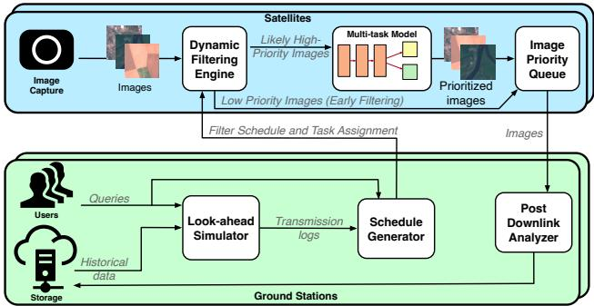  
Figure 2. Overview of the EARTHSIGHT system. EARTHSIGHT integrates onboard multi-task models with predictive scheduling to enable query-driven, low-latency analysis of satellite images.

## 3.1 Multi-Task Neural Architecture

EARTHSIGHT employs multi-task learning to balance two fundamental and conflicting requirements: the need for depth to accurately detect anomalies and events, and the need for efficiency on power-limited edge hardware. By sharing computation through common backbones and attaching task-specific heads, EARTHSIGHT minimizes total evaluation cost without sacrificing representational capacity. This approach amortizes backbone costs while maintaining features present only in deeper layers, yielding deterministic latency and a small footprint, key properties for Orbital Edge Computing tasks.

EARTHSIGHT supports multi-task models that follow the standard paradigm of a shared backbone and task-specific heads (Figure 3). A model maps input image x to multiple outputs {yt|t ∈ T }, where T denotes the tasks that the model supports. However, EARTHSIGHT introduces two distinct architectural modifications compared to conventional Earth observation multi-task networks (e.g., Daroya et al. (2024)).

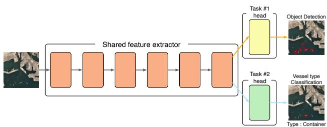  
Figure 3. EARTHSIGHT’s multi-task model architecture. A shared backbone processes the input image to produce a latent representation, which is used by lightweight, task-specific heads to perform heterogeneous tasks such as classification.

First, while standard multi-task models execute a single monolithic forward pass to evaluate all heads simultaneously, EARTHSIGHT architecturally decouples head execution. The computational graph is structured so the runtime can extract the latent representation z via fbackbone(x) = z, and then conditionally and sparsely evaluate only the required task heads f thead(z) = yt based on the dynamic schedule. This lightweight design allows multiple tasks to share core feature computations while preserving task-level specialization, striking a balance between memory efficiency, task-specific performance, and limited satellite resources.

Second, rather than forcing all tasks onto a single backbone, EARTHSIGHT partitions tasks into domain-specific clusters, assigning a dedicated EfficientNet backbone to each group, coupled with lightweight multi-layer perceptrons as prediction heads. The architecture reflects real-world satellite needs as the relevant features to analyze at maritime versus in desert terrain exhibit strong intra-group similarity but have little interaction between groups. This clustering allows the backbone to capture generalizable features within a domain, while keeping model sizes small enough to fit edge AI accelerators. Attempting to merge these heterogeneous domains into a single monolithic model would either underutilize shared representations or exceed satellite memory limits (Zhang et al., 2018).

In designing this architecture, we also considered several alternatives but found them less suitable for Earth-observation workloads. Early-exit mechanisms (Teerapittayanon et al., 2017) incur the memory overhead of loading the full backbone, while at the same time miss deeper, fine-grained features and exhibiting highly variable latency. Similarly, Mixture-of-Depths models (Raposo et al., 2024) introduce storage and runtime decision overheads without overlapping compute. Among the available model frameworks, we found multi-task learning to be the most effective at achieving model depth in an efficient way. Section 5 discusses further alternatives for model-level optimization.

EARTHSIGHT is designed for scenarios in which multiple tasks are performed on each input image. By overlapping backbone computations across tasks, the multi-task architecture maximizes inference throughput relative to single-task deployments. Single-task models are naturally supported as a special case of the multi-task framework, showcasing the flexibility and scalability of EARTHSIGHT. Furthermore, the modular design simplifies how EARTHSIGHT handles new tasks, presenting operators with four options: (1) reusing an existing, compatible backbone, (2) adding the task standalone, (3) fine-tuning backbones and heads offline without re-clustering, or (4) re-clustering and training new backbones. Options 1 and 2 allow for immediate deployment, while 3 and 4 can be prepared in the background for optimized performance. EARTHSIGHT’s modularity enables lightweight uplinks of new task heads without transmitting full backbone parameters, addressing bandwidth limitations.

## 3.2 Scheduler at the Ground Station

The EARTHSIGHT scheduler, resident on the ground station, orchestrates all information required for the satellite runtime to dynamically route inference tasks and prioritize imagery. This includes auxiliary metadata such as updated model weights, task-specific success probabilities, and the precomputed task schedule. Offloading this decision logic on the ground allows EARTHSIGHT to leverage abundant compute and memory resources, which are infeasible on power- and compute-constrained nanosatellite.

Query-driven framework. EARTHSIGHT adopts a querycentric design where downstream applications define task requirements in terms of latency sensitivity and image selection criteria. Some high-priority queries (e.g., Planet’s Tasking Product (Planet Labs Inc., 2025b)) demand immediate downlink of specific regions, bypassing onboard inference. Others, such as segmentation or classification tasks, require onboard processing to reduce bandwidth usage while still enabling timely decision-making. For latency-sensitive inference tasks, the scheduler is designed to minimize total computation while prioritizing correctness: it is preferable to occasionally transmit unimportant images (false positives) than to delay or omit critical data (false negatives).

To formalize this, EARTHSIGHT adapts the boolean query syntax introduced by Tao et al. (2024). While Serval formulates user queries as logical expressions over visual attributes (e.g., “cloud-free AND ship present AND ship is military”) within an Area of Interest (AOI) primarily to bifurcate static and dynamic filtering tasks, EARTHSIGHT retains this foundational logical structure but significantly extends the interface to support distributed, multi-task orchestration. Specifically, we augment each query with a priority level p ∈ {1, 2, 3, 4, 5}. This adaptation allows the ground station to aggregate overlapping logical conditions from multiple downstream applications and compile them into a unified execution schedule that encodes task selection, dynamic priority thresholds, model updates, and expected filter odds.

Look-ahead simulation. Given the temporal variability of downlink windows and bandwidth distribution across satellites, EARTHSIGHT integrates a look-ahead simulator at the ground station. This simulator predicts satellite behavior, anticipated data volume, and the prioritization of bytes transmitted per downlink window. Priority-weighted byte counts account for the probabilistic nature of image importance; for instance, a 50KB image with a 10% chance of being each priority contributes 10KB to each priority bin. To address potential misclassifications by onboard filters, an intermediate priority level pcompute is introduced between priorities p = 1 and p = 2. Images processed onboard but rejected are transmitted within this level, ensuring they are delivered before guaranteed low-priority content.

The simulator also computes two key quantities for each satellite: the lowest priority threshold p∗ for which all images above it can be transmitted in the next downlink window, and the rejection rate rreject = |inference|−|downlink| |inference| which quantifies the proportion of computed images deprioritized to guarantee timely delivery of higher-priority content. Because satellites may have hours between contacts, this look-ahead analysis is crucial to guarantee responsiveness for time-sensitive tasks. When ground-truth information becomes available, the simulation is adjusted accordingly, and the resulting changes are propagated through the system. Although this update process is computationally expensive, our Python implementation is optimized to perform simulations spanning several hours in O(minutes).

Schedule generation. Upon contact, satellites request an updated task schedule. The ground station maps the satellite’s planned capture locations to the set of queries whose AOIs intersect each image using an off-the-shelf R-tree index, which bounds AOIs in rectangular extents for efficient spatial search. For each image, it joins the filtering criteria of retrieved queries to constructs a Disjunctive Normal Form (DNF) formula encoding the conditions under which the image exceeds the computed threshold p∗.

In addition, the ground station maintains up-to-date filter success probabilities and lightweight model weight updates, derived from historical datasets (e.g., weather, incident reports) or prior inference results. This provides partial, probabilistic hints about the contents of each image to the satellite runtime, in the form of task schedules, filter success probabilities, and lightweight model updates. This enables the onboard runtime to make dynamic, context-aware decisions, performing inference only when necessary to prioritize images efficiently within the satellite’s tight compute and power constraints. This coordination between ground and orbit showcases EARTHSIGHT’s distributed decision framework, allowing near-optimal image prioritization under tight compute, power, and bandwidth constraints.

## 3.3 In-Orbit Satellite Runtime

The satellite runtime is responsible for executing prioritization tasks efficiently while maintaining high decision quality. Once an image is captured that requires inference according to the ground-generated inference schedule (Section 3.2), the in-orbit runtime iteratively evaluates filters until the image is prioritized. Within EARTHSIGHT’s distributed framework, this runtime forms the onboard inference layer, complementing ground-side scheduling. The ground scheduler provides a predictive execution plan that balances utility and resource constraints across satellites, while the onboard runtime refines these decisions dynamically using real-time power and inference outcomes. This co-design ensures that satellite-side decisions have hints from ground stations thus can remain locally optimal yet globally consistent, connecting onboard adaptivity to the distributed scheduling policy.

Adaptive Prioritization Policy. To manage limited onboard resources, the runtime employs adaptive upper (α) and fixed lower (β) confidence thresholds that guide priority decisions based on current power and target rejection rates. Filter execution order is dynamic based on a utility function (Equation 4), balancing speed, informativeness, and correctness. Progress toward a prioritization decision is tracked using a confidence score (Equation 5), estimating the probability that the image satisfies the prioritization criteria given the filters executed so far.

Images are assigned priority pcompute if the likelihood of satisfying their formula is below β, and the maximum priority of a remaining term if that likelihood exceeds α. Because the cost of incorrectly rejecting a valuable image is high, β is fixed to a small value, while α is dynamically adjusted at runtime. Specifically, α evolves according to:

$$
\tag{1}
$$

where αt is the threshold at time t; λ1, λ2 are tuning parameters; rpower,t is the ratio of current to target power level (set to 70% of maximum charge); rdep,t is the fraction of computed images identified as low-priority); rreject is the target rejection rate from Section 3.2, and min(1, ·) caps α at 1. This adaptive threshold allows the satellite to relax its selectivity when power is scarce or bandwidth is limited, ensuring robust operation across varying conditions.

Utility-Driven Filter Ordering for Early Rejection. To reduce onboard computation, the runtime aims to reject unpromising images early by dynamically ordering filters according to their expected utility. Each filter fi has an associated time cost t(fi) and likelihood of evaluating true pi. To incorporate multi-task models, we define bi as the shared computational backbone (e.g., a neural network feature extractor) required by fi. Let t(bi) be the cost of executing this backbone. The effective execution time is:

$$
\tag{2}
$$

where E denotes the current execution state.

The overall goal is to find an execution policy π∗ that determines the sequence of filters to evaluate for each image to minimize the expected total execution cost required to reach a decision boundary. The objective is to find the policy π∗ that minimizes:

$$
\tag{3}
$$

where K is the number of filters evaluated before the confidence exits [β, α].

Finding the optimal policy π∗ is an instance of the Stochastic Boolean Function Evaluation (SBFE) problem, which is NP-hard (see Section 5). Exact methods would take years per image and are thus computationally intractable for realtime operations. We overcome this via a greedy strategy that, at each step, selects the filter maximizing the immediate information gain per unit of execution time to approximate Equation 3, as is typical for submodular optimization problems such as SFBE (Golovin & Krause, 2011).

Utility Function. The utility of a filter fi given a partial execution state E is:

$$
\tag{4}
$$

where pi is the pass probability, tpri is the true positive rate, and ni is the number of DNF terms containing fi. Filters with higher Uϕ are executed earlier, improving early rejection efficiency while maintaining correctness. Our utility function offers a middle ground between static or naive ordering strategies, which miss opportunities for improving efficiency, and more complex methods like meta-heuristic search that introduce substantial computational overhead.

Confidence and DNF Completion. Given execution state E , the probability that an image satisfies its prioritization formula is:

$$
\tag{5}
$$

where each term T contributes

$$
\tag{6}
$$

and Tu = T \ E is the set of unevaluated filters. The confidence accounts for both known failures and statistical predictions about unevaluated filters. If any term is fully satisfied, the image is accepted early. Otherwise, processing continues until the image is prioritized.

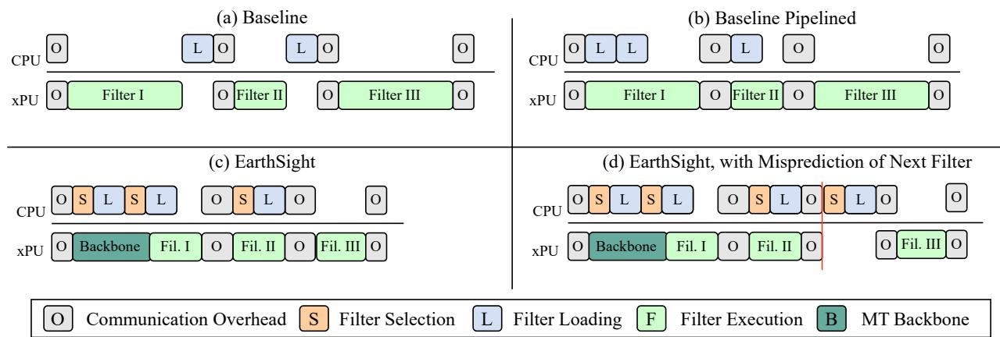  
Figure 4. Timing diagrams illustrating filter execution strategies on a CPU-xPU system: (a) Serval’s (baseline) sequential execution (Tao et al., 2024), (b) Pipelined baseline with overlapped loading, (c) EARTHSIGHT with predictive filter selection and loading, and (d) EARTHSIGHT with a filter misprediction. The phases represent Filter Selection (runtime scheduling), Filter Loading (CPU model preparation), Filter Execution (xPU inference), and Communication Overhead (CPU-xPU coordination).

Execution Strategy. At each iteration, the filter with the greatest utility Uϕ(fi, E) is executed, and the execution state E is updated. If for each term, at least one filter returns False, the image is immediately marked with priority pcompute (see Section 3.2), and no further filters are processed. If all filters in a term of ϕ return True, the image is annotated with the highest priority of a satisfied term.

EARTHSIGHT decouples correctness from efficiency. While the utility heuristic relies on probabilistic priors (pi), EARTHSIGHT is structurally insulated from estimation errors. Because the lower confidence threshold (β) is fixed, the runtime never rejects an image probabilistically; demotion to the pcompute tier strictly requires the DNF formula to evaluate to False. Conversely, inaccurate priors can only inflate confidence past the dynamic upper threshold (α), causing a false positive. Thus, probability drift gracefully degrades execution latency and bandwidth efficiency rather than causing critical data loss, preserving strict logical correctness for negative evaluations.

Finally, the onboard runtime periodically reports telemetry statistics, such as effective rejection ratios, average αt adjustments, and compute utilization, back to the ground scheduler at downlink. These aggregated metrics allow the ground station to recalibrate model success probabilities and update the look-ahead simulator, thereby refining the next round of scheduling decisions. This feedback loop completes EARTHSIGHT’s distributed decision framework: the ground optimizes long-horizon coarse policy, while offering hints to the satellites to enact and locally adapt those policies in real time in a fine grained manner per satellite, jointly achieving efficient, responsive, and globally consistent image prioritization across the constellation.

## 3.4 Mitigating the Overhead of EARTHSIGHT

While EARTHSIGHT’s runtime introduces adaptability and responsiveness, it also incurs computational and communication overhead relative to prior proposed static pipelines (Tao et al., 2024; Denby & Lucia, 2020). To maintain efficiency, we employ two optimizations: compact schedule representation and pipelined CPU–xPU execution.

Schedule Compression. Each image corresponds to a DNF formula ϕ, but storing all formulas individually is impractical, e.g., 45 images per minute for 6 hours yields over 16,000 formulas. In practice, the number of unique formulas for one satellite over six hours is small (typically < 256). Leveraging this insight, we compress the schedule by first identifying the unique set of filters, Φunique. We then construct a lookup table that indexes these formulas from 1 to |Φunique|, using a single byte per entry. The complete schedule S = ϕ1, ϕ2, . . . is thus encoded as a lookup table followed by the sequence of 1-byte indices, yielding an average compression of ∼ 25×. As a result of these optimizations, the network overhead for distributed coordination is less than 0.1%, when compared with the > 200GB of daily image downlink volume.

Pipelined Runtime and Filter Execution. EARTH-SIGHT runs models on a satellite xPU (e.g., GPU or TPU) while coordinating decision logic on the CPU. To minimize latency, we pipeline CPU-side preparation with xPU-side execution: while the accelerator evaluates the current filter Fk, the CPU prepares the next likely filter Fk+1. When Fk is long-running, the CPU speculatively prefetches alternate filters (F probk+1, F altk+1), hiding decision latency even under mispredictions (Figure 4). This overlap ensures continuous hardware utilization and reduces idle time.

Collectively, schedule compression and pipelined execution enable the EARTHSIGHT to meet throughput and latency goals at scale, allowing each satellite to adaptively prioritize images in concert with the global inference schedule.

Table 1. Datasets Used for Model Evaluation  
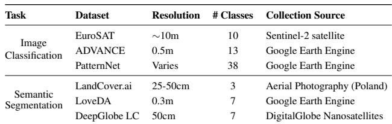

## 4 EVALUATION AND RESULTS

EARTHSIGHT’s performance as a distributed decision framework for scalable, low-latency satellite intelligence is evaluated using real hardware measurements and trace-driven constellation-scale simulations, consistent with all related prior work (Tao et al., 2024; Denby et al., 2023; Vasisht et al., 2021; Yang et al., 2024). Specifically, we deploy the in-orbit runtime on off-the-shelf accelerators, Coral Edge TPU (Coral, 2019) and Jetson AGX Orin GPU (Karumbunathan, 2022), to obtain empirical inference times and power profiles. These metrics are then integrated into our simulation framework to model end-to-end latency across an entire satellite constellation.

## 4.1 Real-world Scenarios and Multi-task Datasets

Scenarios Evaluated. To analyze the performance of our system, we use three real-world application scenarios as benchmarks. See Appendix B for detailed descriptions, prioritization, and image samples. Natural Disaster Monitoring concerns early warning and impact assessments for floods, wildfires, and earthquakes. The Intelligence scenario constitutes strategic awareness of maritime and aerial activities in geopolitically significant regions, including vessel classification and disambiguating military and commercial traffic. The Urban Earth Observation scenario is a comprehensive monitoring framework for major global cities, integrating disaster (e.g., urban flooding, building integrity, environmental change) and security elements tailored to city-specific risks.

Multi-task Models. As part of these scenario evaluations, we assess EARTHSIGHT’s ability to support multi-task inference, analyzing trade-offs between memory footprint and prediction accuracy across configurations. The evaluated models are trained on representative datasets spanning our three application scenarios using three classification and three segmentation datasets, including EuroSAT, AD-VANCE, and PatternNet (Boguszewski et al., 2022; Helber et al., 2019; Zhou et al., 2018). Dataset details are summarized in Table 1.

Table 2. Edge AI Coprocessor Specifications  
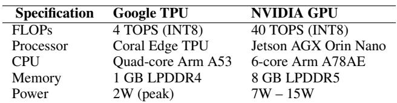

## 4.2 Evaluation Setup

Hardware Platforms. We evaluate our system using two distinct edge AI coprocessors: the Google Coral Edge TPU and the NVIDIA Jetson AGX Orin Nano GPU (Table 2). The Coral delivers a consistent 4 TOPS while consuming only ∼2W (Coral, 2019). It functions as a simple, nearinstant-on peripheral, making it ideal for low-power, intermittent tasks. The Jetson AGX Orin Nano is a full-featured System-on-Module with Ampere architecture, offering up to 40 TOPS with a configurable power budget starting at 7W (Karumbunathan, 2022). These coprocessors are widely used OEC accelerators across industry, government, and academia, including NASA, Spire, Planet, Lockheed Martin, Sidus Space, and others (Goodwill et al., 2021; Alarcon, 2020; Jewett, 2024; Aguera y Arcas et al. ¨ , 2025; Lorenzo Diana, 2024).

Simulating the Satellite Constellation. We verify our results at scale using a Python-based simulator that extends the validated open-source framework from prior work (Tao et al., 2024). To model EARTHSIGHT’s distributed execution, we add modules for look-ahead simulation, scheduling, schedule execution, query processing. Our modifications are limited to the control logic governing inference behavior and do not alter underlying mechanics, ensuring the fidelity of our results.

To evaluate constellation-wide performance, our simulation framework bridges empirical hardware profiling with orbital modeling. Specifically, we execute the filter models on physical Edge TPU and GPU hardware to measure the exact inference latencies and active power draw. We then inject these hardware profiles into the constellation simulator. The simulator tracks the total energy consumed by multiplying the empirically measured hardware power by the simulated workload. Concurrently, the simulator models the satellite’s power generation based on solar panel exposure during orbit using SGP4 propagation. By reconciling the physical consumption metrics with the simulated power generation, we can accurately derive systemic metrics such as the percentage of total generated power consumed by the compute payload (Table 3) and image delivery latency.

Although our trace-driven simulation methodology cannot model all potential effects of the space environment, such as thermal properties or radiation effects, we note that it is the predominant methodology in all OEC literature (Vasisht et al., 2021; Denby & Lucia, 2020; Denby et al., 2023;

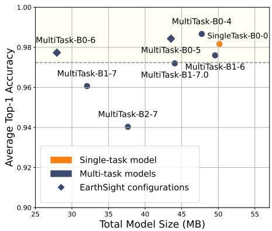  
Figure 5. Classification: Model size vs. Top-1 accuracy, across single-task and multi-task configurations. The model names follow the pattern {model type}-{EfficientNet variant}-{N}, where layers 1:N comprise the backbone.

Tao et al., 2024; Yang et al., 2024), due to the difficulty of deploying a constellation of satellites.

Satellite trajectory and transmission. Orbits are computed using Two-line-Element descriptors for satellites and propagated using the SGP4 algorithm. Satellites generate power with their solar panels, and power is consumed by the ADACS (control system), camera, receiver, and transmitter. Bandwidth is allocated using the maximum weight independent set algorithm (Zhao et al., 2019), though we found that the choice of routing algorithm negligibly affects latency, provided it is fair. Scheduling and schedule execution take place as described in Sections 3.2 and 3.3.

Baseline. We use SERVAL as the baseline (Tao et al., 2024), referred so in the entire evaluation. We apply the pipeline from Figure 4(b) where (1) ground stations communicate the queries, but not a computational schedule like EARTHSIGHT, (2) when an image is collected in a region relevant to the queries, the satellite executes the models relevant to those queries. If a query is true, the image is marked as high priority without further inference. If one filter in a term fails, that term’s remaining filters are skipped. Unlike our dynamic approach, the baseline (SERVAL) processes filters statically in order of execution time.

## 4.3 Multi-Task Model Evaluation

EARTHSIGHT’s multi-task models dramatically reduce the memory and compute footprint for tasks groups while preserving classification performance, showing that parameter sharing is an effective strategy to reduce computational load on edge devices without degrading accuracy.

Figure 5 presents the trade-off between the memory footprint and performance metrics when comparing multiple single-task models with their multi-task counterpart. For classification, the pareto-optimal multi-task configuration cuts memory use by 55.7% with under 0.5% accuracy drop, indicating that merging related single-task models into a unified multi-task model preserves model performance. As the backbone grows larger relative to the prediction head, the savings in compute and memory increase, but prediction accuracy suffers as the head has lesser depth to adapt the shared features into the task-specific output. The results for segmentation tasks are similar (Appendix D); however, their dense nature demands deeper heads than classification.

  
Figure 6. 90th percentile tail latency, measured from first ground contact, for high-priority images (p > 2) across different scenarios.

## 4.4 End-to-End Results

We show EARTHSIGHT’s globally-aware scheduling with local adaption alleviates the computational bottleneck for prioritizing images, and reduces high-priority image latency across our three different scenarios.

## 4.4.1 End-to-End Latency

The ultimate goal of EARTHSIGHT’s optimized orchestration is to improve the timely delivery of valuable images. Figure 6 shows the 90th percentile tail latency for highpriority images, measured from the first ground contact made by a satellite after capturing the image, to when the image is downlinked. We compare the baseline, SERVAL, with EARTHSIGHT using single-task (ST) and multi-task (MT) models with both Coral and Jetson as accelerators.

Performance under High Compute Load (Intelligence Monitoring, Urban Monitoring). In scenarios characterized by extensive land coverage, a greater number of queries per image, and thus high computational demand, EARTH-SIGHT demonstrates significant advantages. As shown in Figure 6, all EARTHSIGHT variants substantially reduce tail latency for high-priority images compared to the baseline. For instance, EARTHSIGHT MT using Coral shows a reduction in P90 from 47 to 21 minutes relative to baseline, and 51 to 21 minutes for the Urban Monitoring scenario. This improvement stems from EARTHSIGHT’s ability to quickly prioritize images and manage the compute queue effectively. The baseline struggles particularly in the Urban scenario when numerous compute-intensive images are captured near ground stations; these images get placed at the rear of the processing queue and miss the downlink window despite their potential value. EARTHSIGHT mitigates this through intelligent processing that nearly eliminates fall-back on first-in first-out image downlink for high-priority images.

Table 3. Mean Percentage of Generated Power Consumed by Compute during first 6 Hours of Operation.  
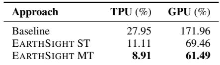

Table 4. Mean and Standard Deviation of Image Prioritization Time (seconds). This benchmarks the filter ordering and pipelining efficiency. Lower is better.  
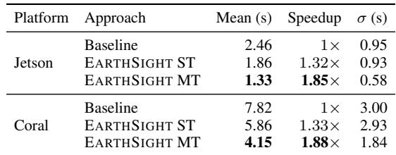

Performance under Lower Compute Load (Natural Disaster Scenario). In the Natural Disaster scenario (See Figure 6), the inference workload is lower due to the relative rarity of natural disasters and ease of identification, i.e., smaller models are sufficient for high precision and recall. Thus, despite the large surface area to scan for natural disasters, even the baseline processes most frames successfully, limiting EARTHSIGHT’s latency improvement. However, as encountering natural disaster images is very rare, the dynamic threshold α is low as only a small percentage of the available bandwidth is used for high-priority images. Because of this, EARTHSIGHT provides computational and power savings, as shown in Table 3. Smarter computation limits energy consumption, which facilitates preparedness in case of sudden increases in load and reduces the battery depth of discharge, a critical component of satellite longevity (Macambira et al., 2022).

## 4.4.2 EARTHSIGHT’s Image Prioritization

EARTHSIGHT accelerates priority assignment to reduce computational load. We measure the time taken from image capture to priority scoring, for images relevant to active queries, measuring the efficiency of EARTHSIGHT’s filter ordering and pipelining mechanisms. Further analysis of the scheduler’s behavior and theoretical properties is presented in Appendix E.

Table 4 presents the average time per image required for prioritization by Single-Task (ST) and Multi-Task (MT) versions of EARTHSIGHT compared to the baseline. EARTH-SIGHT significantly reduces the mean processing time per image, with the multi-task variant achieving the highest speedup, a reduction in average prioritization time by approximately 1.85× on Jetson and 1.9× on Coral compared to the baseline. This shows optimized evaluation order and avoidance of redundant inference reduce the computational demands of onboard prioritization. The lower standard deviation observed for EARTHSIGHT MT also suggests more consistent processing performance.

Table 5. Average evaluation time per image, with Coral coprocessor, on a synthetic suite of 2473 formulas. Lower is better.  
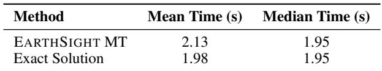

Comparison with Exact Method. Our scheduling policy provides a greedy, approximate solution to minimizing Equation 3. To assess this approximation, we compare it against the exact (exponential-time) optimal solution.

While exact solutions are tractable up to ∼15 filters, scaling to 60 requires roughly a day of compute per formula, despite needing to take milliseconds for effective edge deployment. Thus, we construct a synthetic suite of 2,473 formulas by truncating queries from our three scenarios to contain at most 15 filters. On this benchmark, EARTHSIGHT achieves a relative error of only 7.5% in mean prioritization time compared to the exact method (Table 5). The median times for both approaches are identical, indicating our greedy heuristic aligns with the optimal choice in most cases.

Although verifying the performance of our filter ordering algorithm relative to the exact solution is not possible beyond 15 filters due to computational intractability, we expect our approximation quality to remain in dense quality workloads. From a theoretical perspective, Appendix E demonstrates our utility heuristic is monotone and adaptively submodular, and achieves an expected coverage of at least (1 − 1 ) the optimal policy within the same onboard budget. It is also typical for approximation quality to improve as the search space grows due to an the increase in near-optimal solutions (Golovin & Krause, 2011). Empirically, we saw no performance degradation when scaling from N = 5 to N = 15 queries. Irrespective of approximation closeness, EARTHSIGHT still delivers significant improvements over baseline in dense settings (Table 4).

## 4.4.3 Ablation Studies

We conduct ablation studies on the Urban Monitoring scenario to isolate the contribution of key components.

System Components. Figure 7 compares the full EARTH-SIGHT system against baseline and reduced variants where individual components, optimized filter ordering, ground scheduler integration, and dynamic thresholding, are removed. Each component contributes to lowering the latency for high-priority data, with the full EARTHSIGHT configuration achieving the lowest latency across all tasks.

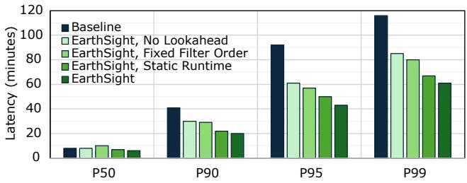  
Figure 7. Ablation study results show the impact of individual EARTHSIGHT components on high-priority (p > 2) image latency. The combined system performs best.

Table 6. Comparison of Mean and P90 Latency for static and dynamic priority thresholds.  
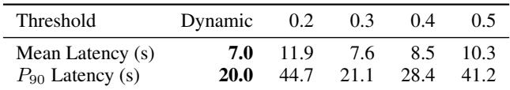

Dynamic Scheduling. To show the power of the in-orbit runtime’s local adaptation, we evaluate the effectiveness of the dynamic priority threshold α compared to static thresholds. Table 6 reveals EARTHSIGHT consistently outperforms all fixed thresholds in mean and P90 latency. The operational context of the satellite is constantly changing. Static thresholds are highly sensitive to operational context: if α is set too low, too many low-value images are flagged as high priority, overloading the downlink; if too high, excessive onboard computation delays genuine high-priority data. By contrast, the dynamic threshold adjusts continuously based on power availability and rejection ratio, maintaining a better balance and yielding lower latency for critical data.

Model Precision and Recall. We assess how model accuracy affects latency by varying precision/recall while keeping inference time fixed. Table 7 shows that as model accuracy falls, both the overall prioritization quality and the percentage of high-priority images sent in the first available downlink slot decline, with modest increases in P90 and P95 tail latencies. Median latency (P50) remains stable as most high-priority images are still correctly prioritized. More severe degradation of tail latency is prevented by the separate priority tier pcompute which expedites potentially misclassified images over guaranteed negatives, highlighting system resilience to imperfect model performance.

Robustness under Filter Probability Drift. EarthSight is explicitly designed for anomaly discovery, making it resilient to uncertain events. We validated EARTHSIGHT’s resilience through perturbing filter pass-probability priors with varying strengths of Gaussian noise (σ). Results on EARTH-SIGHT Multi-Task (Jetson) indicate that even with significant noise, performance degradation is mild. As shown in Table 8, latency never exceeds the EARTHSIGHTsingle-task no-noise baseline (1.9s) or the standard baseline (2.6s), as the utility function continues to select accurate, fast models

Table 7. System metrics when varying model accuracy while holding inference time constant.  
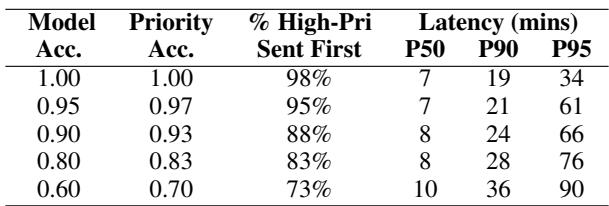  
on average. Estimation errors result only in suboptimal execution order rather than system failure and dropped images.

Table 8. Prioritization latency statistics (in seconds) under varying Gaussian noise levels (σ).  
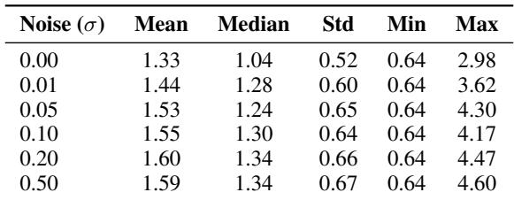

## 5 RELATED WORK

Efficient Machine Learning on the Edge. Prior research addresses edge constraints through model compression techniques such as knowledge distillation (Gou et al., 2020), model pruning (Zhang et al., 2022; Wang et al., 2023), and weight sharing (Cai et al., 2020). While these are shown effective in real-time settings such as video analysis and fire detection (Tamire & Kim, 2023; Jangirova et al., 2025), dynamic execution strategies often prove less effective for complex anomaly detection. Early-exit mechanisms (Teerapittayanon et al., 2017) incur the memory overhead of loading the full backbone, miss deeper, fine-grained features, and have variable latency. Similarly, Mixture-of-Depths models (Raposo et al., 2024) introduce storage and runtime decision overheads without overlapping compute. For EARTHSIGHT, these overheads outweigh the marginal accuracy gains (0.5–1.0%) found in Figure 5.

Dynamic Scheduling for Satellites. OEC was introduced in (Denby & Lucia, 2020) to discard cloudy images identified through onboard compute. KODAN (Denby et al., 2023) incorporates power availability and geographic location to dynamically trade off execution time for cloud discard and maximize data value density. PHOENIX (Liu et al., 2024) schedules inference on sunlit satellites, using inter-satellite links to optimize battery usage across the entire constellation. FEDSPACE (So et al., 2022) schedules federated aggregation based on satellite availability to minimize gradient staleness. ORBITCHAIN (Li et al., 2025) distributes compute across multiple satellites on the same orbital track, relying on a theoretical shared-track topology and lacking scale analysis for complex scenarios. These approaches generally address single-task models and do not consider large, multi-purpose constellations.

Distributing Computation across Ground and Space. Hybrid ground-space architectures exploit inexpensive ground computation. ADAEO (Yang et al., 2024) and SERVAL (Tao et al., 2024) bifurcate queries between the ground stations and satellites, combining prior information with onboard machine learning to determine image utility. This utility informs dynamic image compression and image downlink ordering. We improve on SERVAL with global context at the ground with local adaptation at the satellite, enabling EARTHSIGHT to scale to multi-purpose, global scenarios.

Stochastic Boolean Function Evaluation. The problem our satellite runtime addresses is an NP-hard optimization problem known as Stochastic Boolean Function Evaluation (SBFE) (Deshpande et al., 2016). The objective is to find an evaluation policy that minimizes the expected cost required to determine the truth value of a Boolean function. The outcome of each test (filter) is not known until the cost of running it has been paid. Exact methods based on dynamic programming or value iteration exist but have exponential runtime in the number of tests, rendering them intractable. Therefore, we use an approximate solution with a submodular cost-benefit heuristic, a common approach that iteratively selects the next test that maximizes objective progress per unit of cost (Golovin & Krause, 2011). While greedy strategies do not guarantee optimality, they have been shown to provide robust empirical performance.

## 6 CONCLUSION

In this work, we show that low-latency, scalable orbital analytics is a distributing scheduling problem that requires co-design of globally-aware on-ground planning with adaptive in-orbit execution to conserve limited onboard energy and bandwidth and support diverse real-time scenarios.

Our results reveal EARTHSIGHT’s distributed decision framework can yield substantial improvements to per-image processing time, power utilization, and end-to-end latency for critical images. EARTHSIGHT easily generalizes to different scenarios and can incorporate auxiliary information from different sources to inform scheduling decisions.

Future work in satellite edge computing may explore mixedprecision frameworks for neural analysis of images or analytics with different stopping points that intelligent runtimes can use to further scale analytical abilities.

## Availability

We open-source EARTHSIGHT. Our results are reproducible with reasonable computational requirements. Please refer to Appendix A.

## Acknowledgements

Special thanks to Irene Wang for her guidance and mentorship during the early stages of this project, Anand Iyer for his oversight as a member of Ansel’s undergraduate thesis reading committee, and to our MLSys shepherd Mark Zhao for helping us refine our paper before camera ready. This research was supported in part through cyber-infrastructure resources and services provided by the Partnership for an Advanced Computing Environment (PACE) at the Georgia Techn and gifts from AMD and Google.

## REFERENCES

Acero, I. F., Diaz, J., Hurtado-Velasco, R., Bautista, S. R. G., Rincon, S., Hern ´ andez, F. L., Rodriguez-Ferreira, J., and ´ Gonzalez-Llorente, J. A method for validating cubesat satellite eps through power budget analysis aligned with mission requirements. IEEE Access, 11:43316–43332, 2023. doi: 10.1109/ACCESS.2023.3271596.

Aguera y Arcas, B., Beals, T., Biggs, M., et al. Towards a ¨ future space-based, highly scalable AI infrastructure system design. Technical report, Google Research, November 2025. URL https://arxiv.org/abs/2511. 19468. Project Suncatcher preprint.

Alarcon, N. Lockheed martin and usc to launch jetson-based nanosatellite for scientific research, 2020. URL https://developer.nvidia. com/blog/lockheed-martin-usc-jetson-\ nanosatellite/. Details on SmartSat and La Jument missions.

Bandarupally, H., Talusani, H. R., and Sridevi, T. Detection of Military Targets from Satellite Images using Deep Convolutional Neural Networks. In 2020 IEEE 5th International Conference on Computing Communication and Automation (ICCCA), pp. 531– 535, 2020. https://ieeexplore.ieee.org/ abstract/document/9250864.

Barmpoutis, P., Papaioannou, P., Dimitropoulos, K., and Grammalidis, N. A Review on Early Forest Fire Detection Systems Using Optical Remote Sensing. Sensors, 20(22):6442, 2020. https://www.mdpi.com/ 1424-8220/20/22/6442.

Bhardwaj, K., Bhosale, V., and Gavrilovska, A. Ushering in the low earth orbit compute cloud era. Computer, 58(10): 78–86, 2025. doi: 10.1109/MC.2025.3589214.

Boguszewski, A., Batorski, D., Ziemba-Jankowska, N., Dziedzic, T., and Zambrzycka, A. LandCover.ai: Dataset for Automatic Mapping of Buildings, Woodlands, Water and Roads from Aerial Imagery, 2022. http:// arxiv.org/abs/2005.02264.

Cai, H., Gan, C., Wang, T., Zhang, Z., and Han, S. Oncefor-all: Train one network and specialize it for efficient deployment, 2020.

Caruana, R. Multitask Learning. Machine Learning, 28 (1):41–75, 1997. https://doi.org/10.1023/A: 1007379606734.

CBO. Large Constellations of Low-Altitude Satellites: A Primer, 2023. https://www.cbo.gov/ publication/59175.

Coral, G. USB Accelerator datasheet, 2019. https:// coral.ai/docs/accelerator/datasheet/.

Daroya, R., Lucchese, L. V., Simmons, T., Prum, P., Pavelsky, T., Gardner, J., Gleason, C. J., and Maji, S. Improving Satellite Imagery Masking using Multi-task and Transfer Learning, 2024. http://arxiv.org/abs/ 2412.08545.

Denby, B. and Lucia, B. Orbital edge computing: Nanosatellite constellations as a new class of computer system. In Proceedings of the Twenty-Fifth International Conference on Architectural Support for Programming Languages and Operating Systems, ASPLOS ’20, pp. 939–954, New York, NY, USA, 2020. Association for Computing Machinery. ISBN 9781450371025. doi: 10.1145/ 3373376.3378473. URL https://doi.org/10. 1145/3373376.3378473.

Denby, B., Chintalapudi, K., Chandra, R., Lucia, B., and Noghabi, S. Kodan: Addressing the computational bottleneck in space. In Proceedings of the 28th ACM International Conference on Architectural Support for Programming Languages and Operating Systems, Volume 3, ASPLOS 2023, pp. 392–403, New York, NY, USA, 2023. Association for Computing Machinery. ISBN 9781450399180. doi: 10.1145/ 3582016.3582043. URL https://doi.org/10. 1145/3582016.3582043.

Deshpande, A., Hellerstein, L., and Kletenik, D. Approximation algorithms for stochastic boolean function evaluation and stochastic submodular set cover. ACM Transactions on Algorithms (TALG), 12(3):1–28, 2016.

European Space Agency. Sentinel Satellite Data, 2025. URL https://sentinel.esa.int/web/ sentinel/user-guides.

Golovin, D. and Krause, A. Adaptive submodularity: Theory and applications in active learning and stochastic optimization. Journal of Artificial Intelligence Research, 42:427–486, 2011.

Goodwill, J. S. et al. Nasa spacecube edge tpu smallsat card for autonomous operations and onboard sciencedata analysis. In 35th Annual Small Satellite Con-

ference, 2021. URL https://ntrs.nasa.gov/ citations/20210019764.

Gou, J., Yu, B., Maybank, S. J., and Tao, D. Knowledge distillation: A survey. International Journal of Computer Vision, 129:1789 – 1819, 2020. URL https://api.semanticscholar. org/CorpusID:219559263.

Helber, P., Bischke, B., Dengel, A., and Borth, D. EuroSAT: A Novel Dataset and Deep Learning Benchmark for Land Use and Land Cover Classification. IEEE Journal of Selected Topics in Applied Earth Observations and Remote Sensing, 12(7):2217–2226, 2019. https:// ieeexplore.ieee.org/document/8736785.

Jangirova, S., Jankovic, B., Ullah, W., Khan, L. U., and Guizani, M. Real-time aerial fire detection on resourceconstrained devices using knowledge distillation. arXiv preprint arXiv:2502.20979, 2025.

Jewett, R. Planet to use Nvidia AI processor onboard pelican satellite. Via Satellite, June 2024. URL https://www.satellitetoday.com/ innovation/2024/06/10/planet-to-use-\ nvidia-ai-processor-onboard-pelican-\ satellite/.

Karumbunathan, L. S. Nvidia jetson agx orin series. 2022. https://www.nvidia.com/content/dam/ en-zz/Solutions/gtcf21/jetson-orin/ nvidia-jetson-agx-orin-technical-brief. pdf.

Li, Z., Yang, Z., Gu, H., Wang, X., Liu, Y., and Yu, R. Orbitchain: Orchestrating in-orbit real-time analytics of earth observation data, 2025. URL https://arxiv. org/abs/2508.13374.

Liu, W., Lai, Z., Wu, Q., Li, H., Zhang, Q., Li, Z., Li, Y., and Liu, J. In-orbit processing or not? sunlight-aware task scheduling for energy-efficient space edge computing networks, 2024. URL https://arxiv.org/abs/ 2407.07337.

Lorenzo Diana, P. D. Review on hardware devices and software techniques enabling neural network inference onboard satellites. Remote Sensing, 16(21):3957, 2024. URL https://www.mdpi.com/2072-4292/16/ 21/3957. Comprehensive review covering Spire, Sidus Space, and OEC hardware trends.

Macambira, R. d. N. M., Carvalho, C. B., and de Rezende, J. F. Energy-efficient routing in LEO satellite networks for extending satellites lifetime. Computer Communications, 195:463–475, 2022. https://www.sciencedirect.com/ science/article/pii/S0140366422003486.

McDowell, J. C. The Low Earth Orbit Satellite Population and Impacts of the SpaceX Starlink Constellation. The Astrophysical Journal Letters, 892(2):L36, 2020. https: //dx.doi.org/10.3847/2041-8213/ab8016.

Misra, I., Shrivastava, A., Gupta, A., and Hebert, M. Crossstitch Networks for Multi-task Learning, 2016. http: //arxiv.org/abs/1604.03539.

NASA Atmospheric Science Data Center. CER SSF Aqua-FM3-MODIS Edition4A, 2025. URL https: //asdc.larc.nasa.gov/project/CERES/ CER\_SSF\_Aqua-FM3-MODIS\_Edition4A.

Nguyen, T. T., Hoang, T. D., Pham, M. T., Vu, T. T., Nguyen, T. H., Huynh, Q.-T., and Jo, J. Monitoring agriculture areas with satellite images and deep learning. Applied Soft Computing, 95:106565, 2020. https://www.sciencedirect.com/ science/article/pii/S1568494620305032.

Ouchra, H., Belangour, A., and Erraissi, A. Satellite data analysis and geographic information system for urban planning: A systematic review. In 2022 International Conference on Data Analytics for Business and Industry (ICDABI), pp. 558– 564, 2022. https://ieeexplore.ieee.org/ abstract/document/10041487.

Planet Labs. Our constellations. https://planet. com/our-constellations.

Planet Labs Inc. Planet analytic feeds: Performance metrics, April 2021. URL https: //assets.planet.com/docs/Analytics\_ Performance\_Factsheet.pdf. Accessed: 2025-04-13.

Planet Labs Inc. Our constellations: Dove, rapideye, and skysat fleets, 2025a. URL https://www.planet. com/our-constellations/. Accessed: 2025-04- 13.

Planet Labs Inc. Planet Tasking Product, 2025b. URL https://developers.planet.com/docs/ tasking/.

Raposo, D., Ritter, S., Richards, B., Lillicrap, T., Humphreys, P. C., and Santoro, A. Mixture-of-depths: Dynamically allocating compute in transformer-based language models, 2024. URL https://arxiv.org/ abs/2404.02258.

Ruder, S. An Overview of Multi-Task Learning in Deep Neural Networks, 2017. http://arxiv.org/abs/ 1706.05098.

So, J., Hsieh, K., Arzani, B., Noghabi, S., Avestimehr, S., and Chandra, R. Fedspace: An efficient federated learning framework at satellites and ground stations. arXiv preprint arXiv:2202.01267, 2022.

Spire Global Inc. LEMUR space platform. https://spire.com/space-services/ lemur-space-platform/.

Spire Global Inc. Spirepedia: Spire’s satellite constellation, 2025a. URL https://spire.com/spirepedia/ constellation/. Accessed: 2025-04-13.

Spire Global Inc. Canadian space agency assigns can\$72 million contract to spire global canada to design wildfiresat mission, February 2025b. URL https://ir.spire.com/ news-events/press-releases/detail/ 242/canadian-space-agency-assigns/ -can72-million-contract-to. Accessed: 2025-04-13.

Tahir, A., Munawar, H. S., Akram, J., Adil, M., Ali, S., Kouzani, A. Z., and Mahmud, M. A. P. Automatic Target Detection from Satellite Imagery Using Machine Learning. Sensors, 22(3):1147, 2022. https://www.mdpi. com/1424-8220/22/3/1147.

Tamire, N. A. and Kim, H.-D. Effective video scene analysis for a nanosatellite based on an onboard deep learning method. Remote Sensing, 15(8), 2023. ISSN 2072-4292. doi: 10.3390/rs15082143. URL https://www.mdpi. com/2072-4292/15/8/2143.

Tao, B., Chabra, O., Janveja, I., Gupta, I., and Vasisht, D. Known Knowns and Unknowns: Near-realtime Earth Observation Via Query Bifurcation in Serval. In 21st USENIX Symposium on Networked Systems Design and Implementation (NSDI 24), pp. 809–824, 2024. ISBN 978-1-939133-39-7. https://www.usenix.org/ conference/nsdi24/presentation/tao.

Teerapittayanon, S., McDanel, B., and Kung, H. T. Branchynet: Fast inference via early exiting from deep neural networks. CoRR, abs/1709.01686, 2017. URL http://arxiv.org/abs/1709.01686.

Thangavel, K., Spiller, D., Sabatini, R., Amici, S., Sasidharan, S. T., Fayek, H., and Marzocca, P. Autonomous Satellite Wildfire Detection Using Hyperspectral Imagery and Neural Networks: A Case Study on Australian Wildfire. Remote Sensing, 15(3):720, 2023. https: //www.mdpi.com/2072-4292/15/3/720.

Tuia, D., Schindler, K., Demir, B., Zhu, X. X., Kochupillai, M., Dzeroski, S., van Rijn, J. N., Hoos, H. H., Del Frate, ˇ F., Datcu, M., Markl, V., Le Saux, B., Schneider, R., and Camps-Valls, G. Artificial Intelligence to Advance Earth Observation: A review of models, recent trends, and pathways forward. IEEE Geoscience and Remote Sensing Magazine, pp. 2–25, 2024. https://ieeexplore. ieee.org/abstract/document/10669817.

Vasisht, D., Shenoy, J., and Chandra, R. L2D2: Low latency distributed downlink for LEO satellites. In Proceedings of the 2021 ACM SIGCOMM 2021 Conference, pp. 151– 164, 2021. ISBN 978-1-4503-8383-7. https://dl. acm.org/doi/10.1145/3452296.3472932.

Wang, B., Fang, Y., Huang, D., Lu, Z., and Lv, J. A Lightweight and Adaptive Image Inference Strategy for Earth Observation on LEO Satellites. Remote Sensing, 17(7):1175, 2025. https://www.mdpi.com/ 2072-4292/17/7/1175.

Wang, I., Nair, P. J., and Mahajan, D. Fluid: mitigating stragglers in federated learning using invariant dropout. In Proceedings of the 37th International Conference on Neural Information Processing Systems, NIPS ’23, Red Hook, NY, USA, 2023. Curran Associates Inc.

Yang, C., Sun, Q., Zhang, Q., Lu, H., Ardagna, C. A., Wang, S., and Xu, M. Toward efficient satellite computing through adaptive compression. IEEE Transactions on Services Computing, 17(6):4411–4422, 2024. doi: 10. 1109/TSC.2024.3470341.

Yu, J., Dai, Y., Liu, X., Huang, J., Shen, Y., Zhang, K., Zhou, R., Adhikarla, E., Ye, W., Liu, Y., Kong, Z., Zhang, K., Yin, Y., Namboodiri, V., Davison, B. D., Moore, J. H., and Chen, Y. Unleashing the Power of Multi-Task Learning: A Comprehensive Survey Spanning Traditional, Deep, and Pretrained Foundation Model Eras, 2024. http: //arxiv.org/abs/2404.18961.

Zhang, X., Yang, L., Yan, J., and Lin, D. Accelerated Training for Massive Classification via Dynamic Class Selection, 2018. http://arxiv.org/abs/1801. 01687.

Zhang, Y., Yao, Y., Ram, P., Zhao, P., Chen, T., Hong, M.-F., Wang, Y., and Liu, S. Advancing model pruning via bi-level optimization. ArXiv, abs/2210.04092, 2022. URL https://api.semanticscholar. org/CorpusID:252780187.

Zhao, X., Wang, Z., Lv, J., and Chen, Y. Efficient methods for agile earth observation satellite scheduling. In 2019 IEEE Symposium Series on Computational Intelligence (SSCI), pp. 3158–3164, 2019. doi: 10.1109/SSCI44817. 2019.9003056.

Zhou, W., Newsam, S., Li, C., and Shao, Z. Pattern-Net: A benchmark dataset for performance evaluation of remote sensing image retrieval. ISPRS Journal of Photogrammetry and Remote Sensing, 145:197– 209, 2018. https://www.sciencedirect.com/ science/article/pii/S0924271618300042.