# DreamDDP: Accelerating Data Parallel Distributed LLM Training with Layer-wise Scheduled Partial Synchronization

Zhenheng Tang†1, Zichen Tang†2, Junlin Huang2, Xinglin Pan2, Rudan Yan2, Yuxin Wang3, Amelie Chi Zhou3, Shaohuai Shi4, Xiaowen Chu∗2,1, and Bo Li∗1

1The Hong Kong University of Science and Technology 2The Hong Kong University of Science and Technology (Guangzhou) 3Hong Kong Baptist University 4Harbin Institute of Technology, Shenzhen

## Abstract

The growth of large language models (LLMs) increases challenges of accelerating distributed training across multiple GPUs in different data centers. Moreover, concerns about data privacy and data exhaustion have heightened interest in geodistributed data centers. Communication in geo-distributed data parallel training (DDP) with stochastic gradient descent (S-SGD) is the main bottleneck in low-bandwidth environments. Local SGD mitigates communication overhead by reducing synchronization frequency, and recent studies have successfully applied it to geo-distributedly pre-train LLMs. However, we identify that its model synchronization mechanism prevents overlapping communication and computation, which makes the system lose opportunities to overlap communication and computation.

To overcome this limitation, we expand the design space of local SGD by layer-wisely decoupling model synchronization. In each iteration, only some layers are synchronized instead of the entire model after a specific number of iterations. Leveraging this methodology, we introduce DreamDDP, a training framework to accelerate low-bandwidth distributed training with three key innovations: (1) partial local SGD with theoretical assurances of convergence rates comparable to S-SGD; (2) overlapping parameter synchronization with computation without extra GPU memory occupation; (3) identifying and exploiting three properties to schedule the communication and computation to reduce the training time based on fine-grained profiling of layer-wise communication and computation time. Empirical evaluations conducted on 32 GPUs using prominent deep learning models, including ResNet-18, ResNet-50, GPT-2, and Llama-2, demonstrate that DreamDDP enhances the convergence properties of Local SGD (and Adam) and achieves speedups ranging from 1.49× to 3.91× over leading baseline methods.

## 1 Introduction

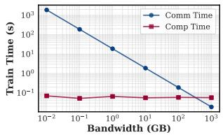  
(a) Llama-2

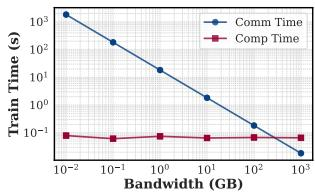  
(b) GPT-2  
Figure 1: Comparison of communication and computation times under varying bandwidths for GPT-2 and Llama-2.

Modern deep learning (DL) models often feature extremely large sizes and immense training datasets. Examples of these large language models (LLMs) include GPT-2 [36], GPT-3 [30, 35], Gemini [39], LLaMA [59], and Mixtral [19]. Training these models incurs very high computational costs. Recent proposals suggest training LLMs across several geographically distributed data centers for scaling purposes [13, 18, 29, 41, 42, 51, 54, 63, 71].

Moreover, the data exhaustion problem has been a critical issue in the training of large models [31]. The academia and industry predict that high-quality public data will be exhausted before 2026 [60]. Collecting high-quality private data has the privacy concerns (e.g., medical [57] and financial [66] data). To address this issue, federated learning (FL) has emerged as a promising solution [21, 55, 68]. FL allows multiple parties to collaboratively train a large model without sharing their private data, which is crucial for protecting data privacy and ensuring data security.

However, as shown in Figure 1, the low communication bandwidth of 10 Mbps ∼ 1 Gbps between different data centers and multiple parties makes the communication time as the main system bottleneck [9, 41, 42, 51, 63, 71]. For the synchronous stochastic gradient descent (S-SGD) [5] widely used in distributed training, in each training iteration the gradients are required to be synchronized between different workers, of which the communication significantly time costs. To this end, existing works that accelerate Geo-distributed training mainly focus on scheduling different data centers to conduct Data Parallel (DP) or Pipeline Parallel (PP) [41, 71], or compressing gradients to reduce the communication overheads [51, 54, 63, 64]. However, the large compression ratio significantly influences the convergence rate, and the effect of communication reduction in the scheduling is limited.

To further reduce the communication overhead, local SGD (LSGD) [13, 48, 65] skips some communications by conducting local updates for H times and synchronizing model parameters or pseudo gradients. Consequently, LSGD reduces communication costs by H× compared to S-SGD. In geodistributed training, LSGD has been proven to be a practical optimization method to train the LLMs [18]. INTELLECT-1 is the first 10B parameter LLM trained in a decentralized manner with the LSGD [17]. And it has been shown that LSGD achieves a similar scaling law of model parameters compared to traditional optimizers [16]. Thus, LSGD has gradually become a new paradigm of the geo-distributed training [7, 10, 17, 18, 23, 34, 44, 49, 50, 67, 68, 74].

However, current LSGD requires full synchronization, which means to synchronize the entire model parameters after H iterations, losing opportunities to overlap communication and computation tasks during backpropagation (BP) that is commonly used to accelerate the training process [33, 45, 73]. For example, WFBP [73] communicates the gradient of each layer instantly after its BP, and overlapped with BP of subsequent layers, thus saving total training time. ASC-WFBP [45] further improves overlapping by simultaneous communications and scheduling. Thus, to further improve the throughputs of geo-distributed training with LSGD, the first challenge is how to design a new optimizer to avoid the limitations of the full synchronization, thus unleashing the optimization opportunities of overlapping communication and computation in LSGD like [45,73]. The second challenge is how to schedule the communication and computation to reduce time costs while guaranteeing convergence. Thirdly, considering LLMs have enormous parameters and meet the memory wall in existing GPUs [38, 40], the new method should not increase the GPU memory costs.

In this work, we design a novel training framework named DreamDDP to significantly accelerate DDP with improved LSGD. Firstly, we proposed partial synchronization, which synchronizes different parts of the model in each iteration, instead of the entire model after H iterations like the loose synchronization in large-scale network systems [2]. Thus, it offers opportunities to overlap the communication and computation of LSGD. We theoretically prove that the convergence property of partial synchronization-based local SGD (PLSGD) can be guaranteed as same as LSGD. Secondly, DreamDDP divides the neural networks into different fine-grained L layers and implements in-place partial parameter synchronization by launching layer synchronization after its BP, thus introducing no extra GPU memory occupation. Thirdly, we introduce the communication and computation profiler to profile the communication and computation time of each layer. Then, we build an overall time cost model of the FP, BP, and communication process with respect to L layers and H iterations of the partial synchronization and formulate it as an optimization problem. We identify three properties including optimal hiding, delayed CO assignment, at-least-one assignment that can be leveraged to design a depth-first search (DFS) with significantly pruned search space to solve this optimization problem. Lastly, DreamDDP inserts more communication messages (model parameters) to fill the bubble time as long as the extra communication can be hidden by the computation, thus accelerating the training convergence.

Our contributions are summarized as follows.

• We propose partial synchronization based local SGD (PLSGD) that relaxes the strong synchronization by layer-wisely decoupling model parameters, which enables the opportunity of overlapping communication and computation in LSGD to improve the training efficiency.

• DreamDDP profiles the real-time communication and computation time of fine-grained model layers. Then, we identify three properties leveraged by DreamDDP to design a DFS algorithm with pruned search space to optimize the throughputs of PLSGD.

• We theoretically prove that the DreamDDP has the same convergence rate with S-SGD, and empirically show that they have similar convergence speeds with training GPT-2, Llama-2, ResNet-18, and ResNet-50.

• We implement DreamDDP atop the commonly used distributed deep learning framework PyTorch Distributed [3, 24] and conduct real-world experiments on two different GPU clusters with 32 GPUs. Experimental results show DreamDDP achieves 1.49 − 3.91× on iteration time improvement over the SOTA algorithms including LSGD and ASC-WFBP.

## 2 Data-Parallel Distributed Training

In this section, we present the preliminaries of the mini-batch SGD, S-SGD and LSGD with full synchronization. Then, we investigate the benefits of LSGD and its limitations on the system design, which severely limits the systematic optimization space of LSGD.

## 2.1 Mini-batch SGD

Given a DL model parameterized with w ∈ Rd, where d is the model size. Training with a single worker is to minimize the objective function F(w) ≜ Ex∼D f (w; x), with sampling data x from the dataset D. We consider that the objective function is β-smooth and µ-strongly convex in this work following [5]. In each r-th iteration, the worker computes the gradient of a minibatch samples ∇ f (wr; ξr), in which ξr represents the sampling noise with respect to the data indexes of the current iteration r. The model is then updated as wr+1 = wr − ηr∇ f (wr; ξr) [5], where ηr is the learning rate.

## 2.2 Distributed Synchronous SGD

We consider K different workers that conduct distributed training with S-SGD [5, 45]. In each iteration, the workers sample different data samples from the original dataset D. Then, the workers conduct feedforward (FP) and backpropagation (BP) to calculate the gradients ∇ f (wkr ; ξkr ). Next, workers communicate and average these gradients to obtain 1K ∑Kk=1 ∇ f (wkr ; ξkr ). The model is updated as

$$
\tag{1}
$$

Communicating and averaging gradients ∇ f (wkr ; ξkr ) requires extra time, which limits the scalability of distributed training, especially for the low-bandwidth environments [8, 63, 69, 69, 70, 70, 71]. The S-SGD with momentum and distributed Adam also follow these process but with some extra variables to maintain. For momentum SGD [25] and Adam [22], the momentum term [25] and the preconditioner [22] are updated with the averaged gradients on workers.

## 2.3 Local SGD

In LSGD, each k-th worker calculates the local gradient ∇ f (wkr ; ξkr ) and directly uses it to update the local model. After H training iterations, workers communicate and average their model parameters as 1K ∑Kk=1 wkr . This process can be formulated as follows.

$$
\tag{2}
$$

Different from S-SGD, workers with LSGD have different model parameters during local training, but synchronize them after H iterations.

Communication Overheads in Distributed Training. Fig. 1 shows that the communication may occupy a large amount of time compared with the computation in the DL model training and the LLM training. When bandwidth is low, training normal DL models requires larger communication time than computation [13, 41, 42, 54, 63, 71]. For LLMs of enormous parameters, even in a high communication bandwidth environment, the communication occupies a large ratio [4, 36, 41].

Time Complexity. We formulate and compare the time complexity of S-SGD and LSGD. Considering the forward and backward time is tFP and tBP, and the communication time of the whole model is tCOMM, the S-SGD and LSGD

require whole training time:

$$
\tag{3}
$$

$$
\tag{4}
$$

The ratio of saved time by LSGD can be calculated as (TSSGD − TLSGD)/TSSGD = (1 − 1/H) × tCOMM/(tFP + tBP + tCOMM). The larger H means more time reduction. However, large H may cause slow convergence and worse final model performance. And the speedup of LSGD is mainly depended on the ratio of (tFP + tBP)/tCOMM.

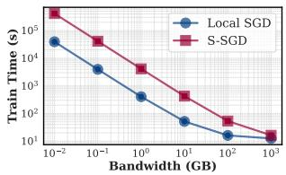

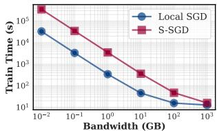  
(a) Llama-2  
(b) GPT-2  
Figure 2: Dissecting training time of GPT-2 and LLaMA-2 with Local SGD and S-SGD under different bandwidth.

Benefits of LSGD. The communication cost of LSGD is O(KRS(w)/H), where the S(w) represents the model size, R the total training iterations. Compared with normal S-SGD with O(KRS(w)) communication cost, LSGD reduces it less than H×. And this reduction is not influenced by the number of workers [47]. Unlike gradient compression, LSGD does not require extra computation time for compression [1]. Furthermore, considering the distributed training heterogeneous GPU [14, 20], LSGD is very suitable for implementing load balance by assigning different workers with different local training iterations, i.e. different Hk. Figure 2 shows the reduced communication time of LSGD than S-SGD. By setting the local training iterations as H = 5, the communication time is saved by 5×. Because when the communication bandwidth is low, the communication time dominates the whole iteration time. Thus, the total training time is also almost reduced for 5× by LSGD.

## 2.4 Challenges of Improving LSGD

Challenges 1: How to remove the hard synchronization point? As shown in Fig. 3(c), the current design of LSGD schedules BP and communication in different nonoverlapping phases, of which the update operation is a hard synchronization point. Specifically, the update must be conducted after the gradient is obtained by BP, while the communication must be conducted after updating. Thus, the BP cannot be overlapped with the communication process, and the GPU or the communication link will stay completely idle at any given time stamp. This loses a substantial performance optimization opportunity [24, 61] and becomes a severe intrinsic limitation of LSGD.

In LSGD, the model divergence generated by the local training influences the convergence [26, 28, 48, 61]. Formally, according to Eq. 2, the model divergence is defined as Γr = 1K ∑Kk=1 ||w¯ r − wkr ||2, where w¯ r = 1K ∑Kk=1 wkr is the average of the model parameters. In S-SGD, the model of each worker wk is w¯r due to the strong synchronization of gradients. Thus, we can say that Γr represents the approximation error of LSGD to S-SGD. Too large w¯r influences the gradient estimation. Thus, previous observations propose that the LSGD should guarantee that workers start at a synchronization point to avoid too much model divergence [11, 26, 48]. And more frequent model synchronization (less H) makes the LSGD more close to S-SGD, thus having better convergence speed [48, 61, 65].

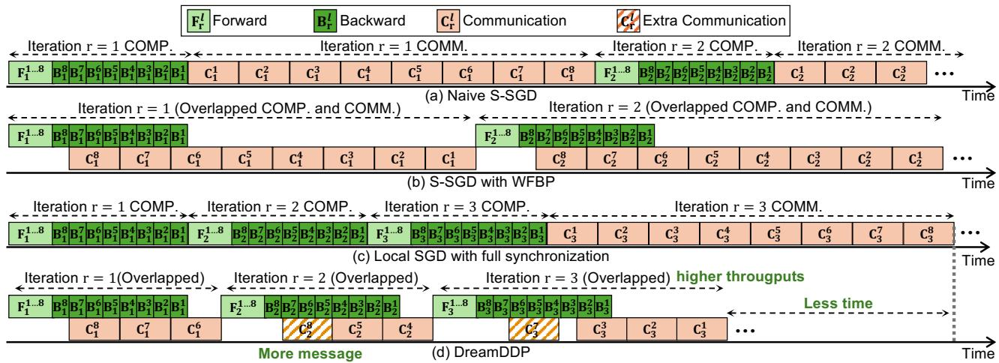  
Figure 3: Timelines of different distributed training algorithms.

Challenges 2: How to overlapping parameter synchronization and computation without extra GPU memory and not influencing convergence? To overlap communication and computation, we need to consider when and what to communicate. Different from the overlapping in S-SGD like WFBP [45, 73] where workers synchronize gradients, in LSGD, workers synchronize model parameters. Considering LLMs have enormous parameters and meet the memory wall in existing GPUs [38,40], the new method should not increase the GPU memory costs. Thus, model parameters are better to be synchronized in-place. However, communicating model parameters and averaging them in place will directly modify the model parameters. The FP and BP processes are dependent on the model parameters. Thus, in-place synchronization might influence the FP and BP, leading to incorrect feature and gradient computation.

Challenges 3: How to schedule communication and computation? The scheduling of overlapping in S-SGD like WFBP [45, 73] is direct. All gradients in S-SGD are required to be synchronized in each training iteration. Thus, the gradient communication of each layer can be launched instantly after BP (when not considering merging small tensors [46]). However, in LSGD, model parameters are synchronized after H iterations. For its overlapping, given L layers, we need to assign communicating different layers in different iterations.

The search space of this problem is extremely large as HL. Such a large search space makes it difficult to find an optimal solution.

## 3 DreamDDP Design

DreamDDP is designed to address the above challenges to improve the training efficiency of LSGD. The overall design of DreamDDP is shown in Fig. 4.

Firstly, we propose partial synchronization based LSGD to conduct DDP training, which synchronizes different parts of the model in different iterations, offering more opportunities to overlap the communication and computation of LSGD (Section 3.1).

Secondly, DreamDDP divides the neural networks into different fine-grained L layers. Built upon the partial synchronization, we analyze the dependency of the BP, FP and communication of LSGD and how to implement the overlapping with in-place partial parameter synchronization. We find that the parameter synchronization must be launched after the BP of its corresponding layer, otherwise the in-place synchronization will influence the computation of FP and BP. Thus, DreamDDP mainly overlaps the communication of one layer with the BP of its subsequent layers (Section 3.2).

Thirdly, DreamDDP integrates the profiler to profile the communication and computation time of each layer according to the given modules and GPU and bandwidth configuration. Then, we build an overall time cost model of the FP, BP and communication process with respect to L layers and H iterations of the partial synchronization and formulate it as an optimization problem. We identify three properties including optimal hiding, delayed CO assignment, at-least-one assignment that can be leveraged to design a DFS algorithm with significantly pruned search space to solve this optimization problem (Section 3.3).

After the scheduling, we find that there may exist some idle bubbles of the communication bandwidth. Thus, we exploit them to insert more communication messages (model parameters) to fill the bubble time as long as the extra communication can be completely hidden by the computation. Thus, the synchronization frequency of these layers that fill the bubble time is higher, which accelerates the training convergence (Section 3.4).

Algorithm 1 LSGD with partial synchronization   
Input: Initialized model w0, dataset D, workers {1, ..., K}, total   
iteration R, learning rate η, synchronization frequency H.   
Output: Final trained model wR.   
1: for r = 1, ..., R do   
2: for worker k ∈ {1, ..., K} in parallel do   
3: ∇ f (wkr ; ξkr ) ← FP and BP; ▷ Obtain gradients   
4: wkr+1/2 = wk,lr − ηr ∇l f (wkr ; ξkr ); ▷ Update model   
5: for layer l ∈ L do   
6: if r + 1%H = Hl then ▷ Partial synchronization   
7: wr+1 k,l = 1K ∑k ∈ M w kr +1 / 2 ;   
8: else   
9: wr+ k,l 1 = wkr+ 1/2 ;   
10: Return wR;

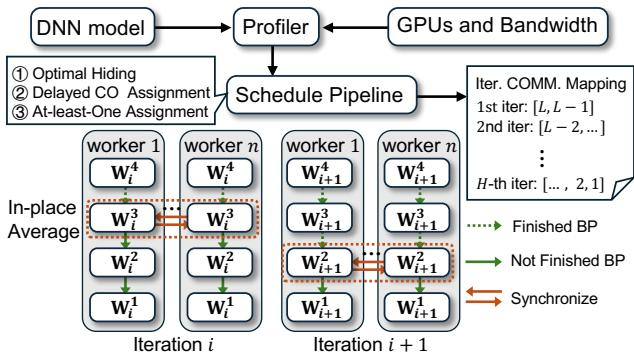  
Figure 4: An overview of how DreamDDP schedules and launches the overlapping of backward propagation and parameter synchronization. In different iterations, DreamDDP synchronizes model parameters according to the scheduled iteration-layer mappings.

## 3.1 Partial Synchronization: Soft Model Synchronization Point

We call the model averaging in the original LSGD with all parameters as the full synchronization as shown in Fig. 3(a). The strict synchronization of LSGD makes the training time of H iterations cannot be utilized to overlap the communication like WFBP does (Fig. 3(b)).

To hide more communication of LSGD within computation, we propose partial synchronization. Specifically, we split the whole model into different segments wl according to the set of layer indexes L and uniformly assign them to different local training iterations for communicating as shown in Fig. 3(d). Now, compared with Fig. 3(c), partial synchronization provides more opportunity to overlap communicating different layers within the computation.

Now, separated layers can be synchronized within the computation time. By synchronizing layers after their backward propagation, the overlapping is implemented with guaranteeing parameter consistency. Besides, there is no extra GPU memory occupation. Formally, we give the process of LSGD with partial synchronization in Algorithm 1 and the following definition.

Definition 1. (Partial Synchronization.) Assuming that the layer indexes L = {1,..., L} of the model are sequentially split to H disjoint subsets L1:H = {L1, ..., LH }. Given the synchronization period H, the updating form of LSGD with partial synchronization is

$$
\tag{5}
$$

in which l ∈ L, and Hl = I (l) is the index function that indicates which subset of L1:H the l-th layer belongs to. Note that the gradient is calculated with respect to the whole model wkr . We use ∇l f (wkr ; ξkr ) to represent the gradient of the l-th layer.

Example 1. (Equal-Number Partition.) Given H = 2/L, we have a partition as of L as L1 = {1, 2}, L2 = {3, 4}, ..., LH = {L − 1, L}, which equally assigns L layers to H sets. We write L1:H = {L1, L2, ..., LH } for simplicity. The Definition 1 and Algorithm 1 show that the averaging periods of layer sets are different. Similar to full synchronization, within H iterations, model parameters are all synchronized once. In other words, the accumulated divergence Γr in full synchronization is cleared after H iterations, while the layer-wise Γlr is cleared after H iterations in partial synchronization.

Note that the whole model divergence Γr always exists during the entire training process. This is somehow contrary to full synchronization [11, 48] that requires to completely clear the model divergence. However, we empirically show that LSGD with partial synchronization has less model divergence Γr, which benefits convergence. Fig. 5 shows using LSGD with partial and full synchronization to train ResNet-18 with 32 workers. Fig. 5(a) shows that the convergence speed of full synchronization is clearly slower than partial synchronization. And the model divergence of full synchronization is periodically accumulated and cleared, while the partial synchronization maintains the divergence at a lower degree.

Reduced Divergence Amplification. Intuitively, we show that the larger degree of model divergence in full synchronization comes from the layer-wise divergence amplification. Considering that intermediate features zk,l (x) = f k,l (wk,1:l , x)

on client k, where f k,l represents the mapping x → z through the former 1, ..., l layers, the larger divergence between wk,1:l introduces larger divergence between zk,l. And the subsequent layer features are dependent on the former intermediate features, which implies that the divergence will be amplified layer by layer. Thus, during the late stage of one period in full synchronization, the total divergence is amplified to a large degree, as shown in Fig. 5(b). However, the partial synchronization frequently eliminates the divergence of some layers, which alleviates the layer-wise divergence amplification effect.

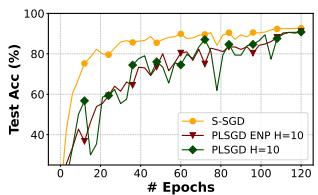  
(a) Test accuracy

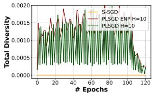  
(b) Model divergence  
Figure 5: Training ResNet-18 on 32 workers.

Now, we theoretically prove that the LSGD with partial synchronization has the same convergence rate as the S-SGD [5].

Theorem 1. Let f be β-smooth and µ-strongly convex, E k ||∇ f (wkr ; ξkr ) − ∇ f (wkr )||2 ≤ σ2, E k ||∇ f (wkr ; ξkr )||2 ≤ G2, for r = 0, 1, ..., R−1, where {wkr }Rr=0 for k ∈ [K] are generated according to (5) with Hl ≤ H, l = 1, 2, ..., L and for stepsizes ηr = 4µ(a+r) with shift parameter a > max{16κ, H}, for κ = Lµ . Then

$$
\tag{6}
$$

where wˆR = 1KS ∑Kk=1 ∑R−1r=0 prwkr , for pr = (a + r)2 and SR = 1 ∑R−1r=0 pr ≥ 13 R3 .

Proof Sketch. We follow [5] to assume the gradient sampling variance is bounded as E k ||∇ f (wkr ; ξkr ) − ∇ f (wkr )||2 ≤ σ2 for any worker k ∈ [K] and iteration r ∈ [R], which is a general assumption in analysis of convergence. Thus, the distributed training with multiple workers helps reduce the gradient variance as E||gr − g¯r||2 ≤ σ2 . And the gradient magnitude is upper bounded as E||∇ f (wkr ; ξkr )||2 ≤ G2. Then, we define a virtual state sequence w¯r = 1K ∑Kk=1 wkr and gradient sequences gr = 1K ∑Kk=1 ∇ f (wkr ; ξkr ), g¯r = 1K ∑Kk=1 ∇ f (wkr ). The detailed proof is provided in Appendix 7.

Corollary 2. Let wˆR be defined as in Theorem 1, for parameter a = max{16κ,H}. Then

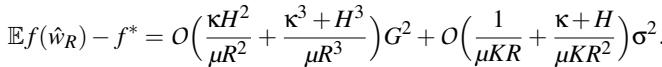

Remark. Theorem 1 and Corollary 2 show that the LSGD with partial synchronization has the same convergence rate as S-SGD [5, 65] as O(1/R). Small H can help accelerate the convergence of other terms containing O(1/R2) or O(1/R3), which are not dominant in the convergence bound with respect to the training iterations R.

Wall-clock Time Complexity Analysis. Following definitions in Section 2, we analyze and compare the time complexity of one-iteration overlapped LSGD and partial synchronization. With Definition 1, the new training time of LSGD with partial synchronization is

$$
\tag{7}
$$

in which, h0 represents the first layer in set Lh, tL1:BP h−1 = ∑i=1 ∑h−1i=1 (∑l∈Li tlBP) is the backward time of layers in L1, ..., Lh, tLh:HBP = ∑Hi=h(∑l∈Li tlBP) is the backward time of layersin Lh+1, ..., LH , tLiCOMM = τh|Li|−1COMM + th|Li|−1COMM − τh0COMM is the −hi|−1 h|i1−11 + tcOMM communication time of layers in Li, where τhjCOMM = max(th0: jBP , τh j−1COMM + th j−1COMM) defines the timestamp for the hj−1 communication time of layer h j. The expression t BP h0: j indicates the completion timestamp for the backward time of layer hj, and τCOMM h j−1 + tCOMM marks the completion timestamp for the h j−1 communication time of layer hi−1. The term tLh:HBP −th0BP comes h0 from that the communication of the first layer in the set Lh must wait for the backward to avoid simultaneous parameter accessing.

## 3.2 Overlapping Communication and Computation

With the partial synchronization, Theorem 1 shows that the convergence rate of partial synchronization-based LSGD (PLSGD) has the same convergence rate as LSGD. However, the analysis and Theorem 1 in Section 3.1 do not provide the details of how to overlap communication and computation. In this section, we disect the dependency between communication and computation of LSGD. With the principle of introducing no extra GPU memory occupation, we propose to overlap the communication of layers with the BP of its corresponding layer.

Figure 6 (d) shows the FP, BP and the parameter synchronization of LSGD. In LSGD, workers synchronize and average the model parameters W instead of the gradients on the parameters gW in S-SGD. The FP and BP computation of each layer is dependent on the layer parameters Wl and gWl . Thus, in-place overlapping communication of layers with the FP computation is not feasible because this will lead to incorrect FP and BP computation. Thus, while overlapping communication with the FP computation helps to hide more communication time as shown in Figure 6 (a), it is not feasible considering that we need in-place averaging of parameters W to avoid extra memory occupation. Besides, considering that the FP normally occupies less time that BP, the communication time is not dominated by the FP time.

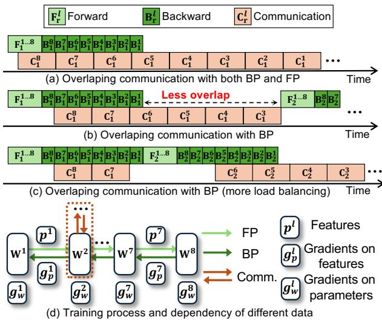  
Figure 6: The disection of the dependency and overlap opportunity between communication and computation of LSGD.

Given L layers that are required to be allocated to H iterations for synchronization, we need to consider how to schedule the overlapping to maximally reduce the time cost. Figure 6 (b) (c) shows that directly communicating all layers in the first local iteration may not be optimal. When the communication time is much larger than the BP time, a more load balancing overlaping strategy like shown in Figure 6 (c) is better. In the next section, we formally define the overall training time of PLSGD within one communication period as the optimization goal, and identify three properties that can be used to reduce the search space of the solution.

## 3.3 Scheduling and Optimization

With partial synchronization, the intuitive way to reduce the training time is minimizing the training time TP−LSGD by adjusting the partition of layer index sets L1:H . According to the time cost of TP−LSGD (Eq. 7), the time tFP, tBP and tCOMM are fixed, and different partitions of layer indexes in to L1:H will influence ∑Hh=1 max(tLh:HBP − th0BP, tLhCOMM). If we can tLh adjust the L1:H well, tLhCOMM might be fully overlapped. The scheduling problem is highly complex. To address this, we treat each layer partition as an interval, which allows us to approximate a solution. Note that the communication of the last layer cannot be overlapped, because the communication must wait for the backward. Then, we propose the following objective function PLH as the goal of DreamDDP.

$$
\tag{8}
$$

which is a combinatorial optimization problem, and LL:11:H   
represents the possible partitions L1:H of layers {L, ..., 1}. The   
brute force solution of this problem requires time complexity   
of O(CLH+L) = (H+L)! L!H!

Searching Process and Sub-structure Problem. To efficiently solve this problem, we identify the optimal substructure of problem 8. Now, we solve this problem with an efficient searching algorithm with reduced complexity as O(2min(L−H,H)). The search space is significantly reduced by the optimal substructure of this problem. The searching process is to iteratively decide whether to assign l-th layer to the h-th set Lh. From this perspective, given assigned layers {L, ..., l + 1} in disjoint sets {L1, ..., Lh−1, Lh}, we define the sub-problem as follows,

$$
\tag{9}
$$

in which the i iterates from h to H, H and L are fixed in Slh, optimizing on L lh:H means to split layers {1, ..., l} to sets {Lh, Lh+1, ..., LH }. Note that l follows descending order as the backward process is from output to input, and h follows the ascending order as the local training follows time order in a synchronization period r + 1, ...,t + H. When, h = 1 and l = L in Slh, SL1 becomes the original problem 8, i.e. PLH = SL1 .

Definition 2. (Assignment Al.) We call assigning a layer l into Lh as replacing the set Lh by Lh ∪ {l} in original sets L1:H and we have Al = h.

Optimizing P H can be seen as an iterative searching processfrom optimizing SL1 to S1H . In each iteration of optimizing Slh, we have {L, ..., l + 1} that have been assigned in disjoint sets {L1, ..., Lh−1, Lh}. Then, based on whether to assign the layer l to set Lh, each Sl has the substructure as:

$$
\tag{10}
$$

in which, for simplicity, we do not expand terms tLh:HBP −th0BP = ∑Hi=h(∑l∈Li tlBP) − th0BP and tLhCOMM = ∑l∈Lh tlCOMM that h0 tBP follows definition in. The first term means that we assign l to Lh, thus the total time cost Sl−1 re-estimates the time cost of the set Lh for the h-th training round. Note that the tBP Lh:H = ∑Hi=h(∑l∈Li tlBP) actually is fixed when scheduling Slh no matter whether l ∈ Lh, because all left layers {Lh, ..., LH } will conduct BP operations at h-th iteration, which is fixed for Slh. We write the optimal solution of minLl:1 Slh as Slh,⋆.

The optimal solution of problem 8 PLH and SL1 should minimize the communication time as much as possible, because the total BP time is fixed as tLBP for each iteration h from 1 to H. The minimum of PLH should contain the minimal value of communication. Now, we give following definition and properties which are used to analyze and reduce the search space.

Definition 3. (Communication-Hide Assignment.) Given assigned layers {L, ..., l + 1} in disjoint sets {L1, ..., Lh}, and the optimization goal Sl , we call the assignment (Definition 2) Al = h is Communication-Hide (CH) if it satisfies

$$
\tag{11}
$$

Otherwise, we call the assignment Al = h is communicationoverflowed (CO).

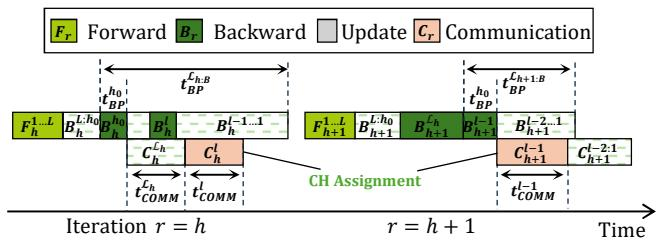  
(a) At iteration r, Sl → Sl−1 (Al = h).?? = ℎ ?? = ℎ + 1

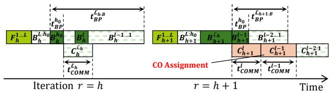  
(b) At iteration r, Slh → Slh+1(Al ̸= h).  
Figure 7: Comparing whether assigning Al = h when Al is CH at iteration r. The time of F 1...Lh , BL...lh , Bl−1...1h are shrunk in Figure for clear illustration.

Property 1. (Optimal Hiding.) Considering the case that Al = h is CH for Slh, then max(tLh:HBP h0 Lh∪{l} t BP, tCOMM ) = max(tLh:HBP − t 0BP, tLhCOMM ) = tLh:HBP − t 0BP, we have Sl−1h,⋆ ≤Slh+1,⋆ + tLBP. The intuitive interpretation is shown in Fig. 7. by the computation, it is easier for unscheduled H − h iterations {h + 1,..., H} to hide the communication of other l − 1 layers {l − 1,..., 1} than l layers. Delaying the communication of l-th layer might lead to failed overlap of subsequent communications.

Thus, based on the optimal hiding (property 1), DreamDDP assigns Al = h if it is fully hidden by computation (line 20 in Algorithm 2). This semi-greedy scheduling significantly reduces the search space.

Algorithm 2 Assigning Communication of DreamDDP   
Input: Layer set L, synchronization frequency H, backward times   
{tlBP|l ∈ L }, communication times {tlCOMM |l ∈ L }, initial assign  
ment set Ψ = {Lh = 0/ |h ∈ {1, ..., H}}, solutions set Ω.   
Output: Final trained model wR.   
1: SOLVESUBPROBLEM(Ψ, L, L, 1, H) ▷ Scheduling   
2: Ψ⋆ = argminΨ∈Ω PLH ; pL . ▷ Find one optimal solution   
3: for Lh ∈ Ψ⋆ do   
4: l−h = minl t L...lCOMM s.t . l ∈/ Lh and Eq. 12.   
5: Lh = Lh ∪ {L, ..., l} ▷ Add more communication   
6: Return Ψ⋆.   
7:   
8: procedure SOLVESUBPROBLEM(Ψ, l, L, h, H)   
9: if l == 0 then   
10: Add Ψ in Ω. ▷ Get one solution   
11: Return   
12: if h == H then   
13: for i = l, ..., 1 do   
14: Replace Lh ∈ Ψ as Lh = Lh ∪ {i}   
15: Add Ψ in Ω. ▷ Get one solution   
16: Return   
17: if Lh is 0/ then ▷ At-least-one Assignment   
18: Replace Lh ∈ Ψ as Lh = Lh ∪ {l}   
19: SOLVESUBPROBLEM(Ψ, l − 1, L, h, H)   
20: else if tLh:H BP − th0BP ≥ tLh∪{l}COMM then ▷ Optimal Hiding   
21: Replace Lh ∈ Ψ as Lh = Lh ∪ {l}   
22: SOLVESUBPROBLEM(Ψ, l − 1, L, h, H)   
23: else if tLh:HBP − th0BP < tLhCOMM then ▷ Delayed COA   
24: SOLVESUBPROBLEM(Ψ, l, L, h + 1, H)   
25: else ▷ Search   
26: Ψ− = DeepCopy(Ψ)   
27: Replace Lh ∈ Ψ− as Lh = Lh ∪ {l} ▷ Assign Al = h   
28: SOLVESUBPROBLEM(Ψ+, l − 1, L, h, H)   
29: Ψ+ = DeepCopy(Ψ)   
30: SOLVESUBPROBLEM(Ψ+, l, L, h − 1, H)

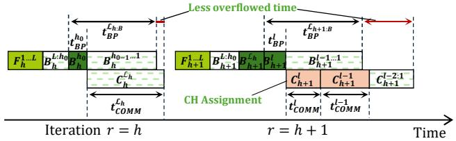  
(a) At iteration r, Slh → Slh+1(Al ̸= h).

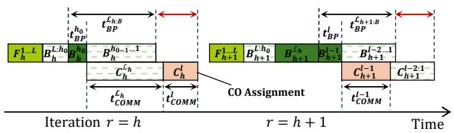  
(b) At iteration r, Slh → Sl−1h (Al = h).  
Figure 8: Comparing whether assigning Al = h when the tlCOMM is completely not hided at iteration r.

Property 2. (Delayed CO Assignment.) Considering the case that communication of set Lh cannot be hided by the BP computation, i.e. tLh:HBP t BP ≤ t COMM . In this situation, the h0 Lh assignment Al = h is also CO, because tLh:HBP − th0BP Lh t C OM M ≤ tLh∪{l}COMM and Definition 3. Now, Al = h will lead to extra communication time as tlCOMM, which is completely not hided and increases the total training time as shown in Fig. 8(a). However, if we delay communicating layer l at iteration h + 1, the communication cost might be fully or partly hidden by the computation as shown in Fig. 8(b).

Note that the delayed CO assignment (Property 2) may not be optimal. However, this heuristic insight can help us significantly reduce the search space. For each h, if tLh:HBP − th0BP ≤tLhCOMM, the l-th layer will be delayed for future assignment (Line 23 in Algorithm 2).

Property 3. (At-Least-One Assignment (ALO).) If Lh is 0/ when scheduling l-th layer at iteration h, assigning Al = h is optimal. The first case is that tlCOMM ≤ tLh:HBP t BP, which h0 satisfies property 1. In the other case t lCOM M / tLh:HBP t h0BP , assigning Al = h helps overlap tlCOMM with part of computation. Otherwise, delaying Al = h + 1 still causes the same overflowed communication time and narrowes the overlap opportunity of communicating subsequent layers.

In light of the ALO (property 3), when deciding l-th layer and h-th iteration, if Lh is 0/ , DreamDDP instantly assigns Al = h (Line 17 in Algorithm 2).

In cases that all properties 1, 2 and 3 cannot be utilized to reduce search space, the algorithm must conduct depth-first search (DFS) to collect the solutions

Complexity Analysis of Algorithm 2. We consider the worst case for the algorithm complexity, where the DFS search (Line 25 in Algorithm 2) frequently happens during the scheduling. Each DFS search leads to two branches that need to be saved into the solution set. When Lh is 0/ , the l-th layer will be added into Lh without searching, which does not generate more solutions. Thus, the size of |Ω| is less than 2L−H . Considering the branch Al = h (Line 28 in Algorithm 2), the next layer l − 1 must be delayed to assign to iteration h + 1 because tLh:HBP th0BP < tLh∪{l}COMM . Thus, the |Ω| is less than 2H . In summary, the size of the solution set Ω is upper bounded as O(2min(L−H,H)).

## 3.4 Filling the Bubble Time

As illustated in Section 3.1 and Theorem 1, the model divergence Γr = 1K ∑Kk=1 ||w¯ r − wkr ||2 is a main influence factor of the convergence rate. Higher communication frequency (lower H) leads to less model divergence Γr during training, thus accelerating convergence [11, 48]. Orthogonal to increasing synchronization frequency H, which means to synchronize the whole model more frequently, another way to reduce the model divergence is to assign different layers with different communication frequencies.

After scheduling the overlapping communication, we find that there may exist some idle communication time of the late layers during the late local training stages (larger local r of in one synchronization period) as shown in Figure 9. This implies that it is possible to synchronize these layers more frequently to reduce the model divergence, while not increasing the communication time.

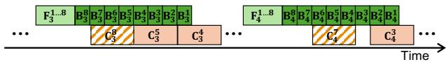  
Figure 9: The idle communication time of during the late local training stages that can be used to synchronize the late layers more frequently.

It is known that the early layers of deep learning models converge faster than the late layers [6, 37] including the transformer [15]. This is because the early layers should be stablized during the late training stage, thus the late layers can be trained based on more stable intermediate features [6, 37]. Fortunately, the idle communication time in the PLSGD aligns with the late layers as shown in Figure 9. Thus, using the idle communication time to synchronize the late layers more frequently is exactly beneficial to reduce the model divergence than synchronizing more the early layers.

Formally, DreamDDP considers communicating more layers L − = {L, ..., l} for communication iteration h (Line 5 in Algorithm 2) to accelerate convergence, while ensuring the communication time is not increased as following equation.

$$
\tag{12}
$$

in which {L, ..., l} disjoints with Lh.

## 4 Experimental Studies

## 4.1 Experimental Settings

Models and datasets. We conduct distributed training on deep models including ResNet-18, ResNet-50, GPT-2 small [36] and a small Llama-2 [58] of 175M parameters. ResNet-18 is trained on CIFAR-10 and ResNet-50 is trained on CIFAR-100 with SGD momentum. Both GPT-2 and Llama-2 are trained on WikiText-2 [27] with Adam [22].

Simulating Geo-distributed Training Clusters. To simulate geo-distributed training, we vary the inter-machine bandwidths from 10MB/s to 1000GB/s to represent diverse network conditions across different geographic locations. ResNet-18 and ResNet-50 are trained on one cluster with 8 machines, each of which has 4 NVIDIA 2080Ti (totally 32 GPUs) and connected with 1GB/s Ethernet. LLMs are trained on the second cluster with 4 machines, each of which has 8 NVIDIA A6000 (totally 32 GPUs) and connected with 20GB/s Ethernet.

Baselines. We compare our algorithms with the naive S-SGD, ASC-WFBP [45] which is the state-of-the-art SGD overlapping algorithm as an improvement of WFBP based S-SGD [73], and LSGD with full synchronization (FLSGD) [32, 72]. As the ablation study, we also conduct experiments of the basic versions of DreamDDP, including LSGD with partial synchronization (PLSGD-ENP) of Equal-Number Partition (Example 1). Note that the optimizer for LLMs is Adam, which is generally used in the LLM training [36, 58]. The computation and communication dependency of stochastic Adam and SGD are same, as well as the local Adam and LSGD. Thus, we also call the stochastic Adam and local Adam as S-SGD and LSGD for simplicity. Here the S-SGD, LSGD and our algorithm mainly highlight the different modes of parallelization instead of the specific optimizers.

## 4.2 Wall-clock Iteration Time

Table 1 presents the wall-clock iteration time for each algorithm across different models and worker counts. DreamDDP consistently achieves the lowest iteration times across all models and worker configurations, demonstrating its superior efficiency in eliminating additional communication cost. Specifically, compared to the advanced DDP training method ASC-WFBP, DreamDDP achieves a speedup of 1.73 ∼ 5.22×. Similarly, compared to FLSGD, DreamDDP achieves a speedup of 1.16 ∼ 1.5×. This performance improvement can be even more pronounced in low-bandwidth environments, which are commonly encountered in geo-distributed scenarios.

Table 1: Average iteration wall-clock time (in seconds) of 1000 running iterations. S1 and S2 represent the speedup of DreamDDP over ASC-WFBP and FLSGD.  
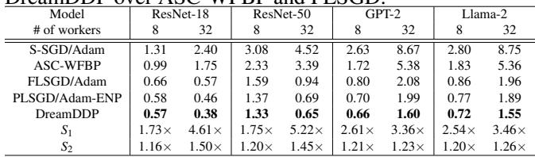

## 4.3 Convergence w.r.t. Epoch

With respect to the iteration time, the FLSGD is also faster than ASC-WFBP. However, such acceleration introduces worse convergence due to its less H× communication size. We compare different synchronization frequency H in ig. 10 and Fig. 11. Results show that the larger H makes convergence w.r.t. epochs slower for both FLSGD and DreamDDP. Nevertheless, the supplement of the communication in DreamDDP helps accelerate the convergence. And the Fig. 11 shows that the increased number of workers does not influence the performance improvement of DreamDDP, demonstrating the good

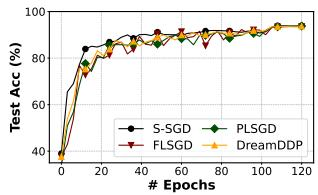  
(a) ResNet-18.

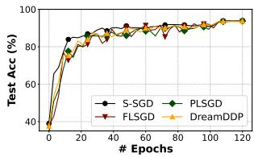  
(b) ResNet-50.

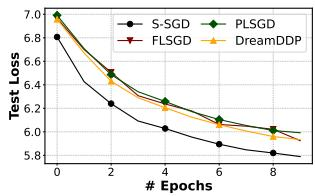  
(c) GPT-2.

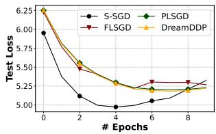  
(d) Llama-2.

Figure 10: Convergence w.r.t. epochs on 8 workers.  
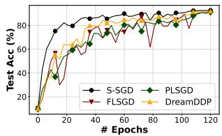  
(a) ResNet-18.

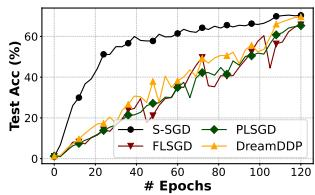

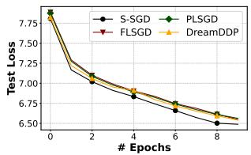  
(b) ResNet-50.

(c) GPT-2.  
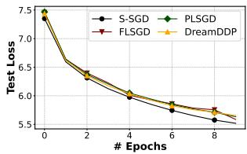  
(d) Llama-2.  
Figure 11: Convergence w.r.t. epochs on 32 workers.

scalability of it.

## 4.4 Wall-clock Convergence

Fig. 12 illustrates the convergence of different algorithms w.r.t. wall-clock time and Table 2 presents wall-clock time to reach target performance. Both visualizations show that the wallclock convergence of all LSGD methods is significantly faster than that of SGD. The periodic model synchronization scheme effectively reduces the high communication cost associated with the frequent synchronization in S-SGD and ASC-WFBP. Specifically, DreamDDP achieves a maximum speedup of 3.91× over ASC-WFBP.

Additionally, DreamDDP achieves a maximum speedup of 1.56× over FLSGD, due to the advanced scheduling algorithm that eliminates the extra communication overhead. Furthermore, when compared to PLSGD with a similar communication-computation overlap strategy, DreamDDP demonstrates improved convergence speed, as displayed in Fig. 12 and Table 2. This improvement shows the effectiveness of DreamDDP’s supplementary communication mechanism that maximally exploits overlapping opportunities without incurring extra training time.

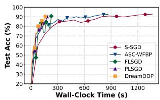  
(a) ResNet-18.

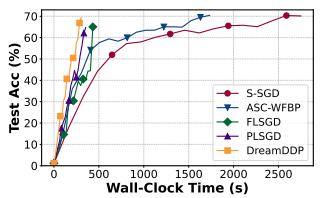  
(b) ResNet-50.

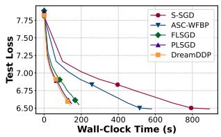  
(c) GPT-2.

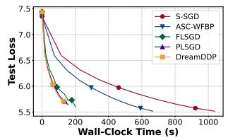  
(d) Llama-2.  
Figure 12: Convergence w.r.t. wall-clock time of training with different algorithms on 32 workers.

Different Synchronization Frequency. We compare different DreamDDP synchronization frequencies H with FLSGD with H = 10 and S-SGD in Fig. 13 and Fig. 14. The results on both 8 and 32 workers show that the larger H makes convergence w.r.t. epochs slower for DreamDDP, which aligns with the intuition. Nevertheless, the supplement of the communication in DreamDDP helps accelerate the convergence, achieving comparable convergence speed with FLSGD with higher frequency. And the Fig. 14 shows that the increased number of workers does not influence the performance improvement of DreamDDP, demonstrating the good scalability of it.

Table 2: Wall-clock time to target model performance of different training methods. Different training methods require different wall-clock time to achieve the target performance. For DL models, test accuracy is used. While for LLMs, training loss is used. S1 and S2 represent the speedup of DreamDDP over ASC-WFBP and FLSGD. We use the bold font to indicate the best results.  
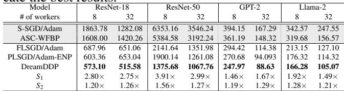

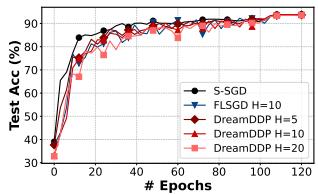  
(a) ResNet-18.

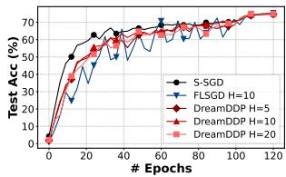  
(b) ResNet-50.

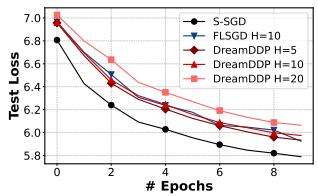  
(c) GPT-2.

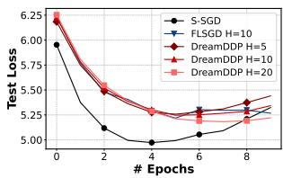  
(d) Llama-2.

Figure 13: Scheduling performance with different frequency H on 8 workers.  
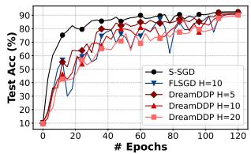  
(a) ResNet-18.

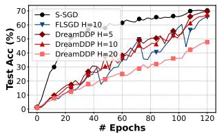

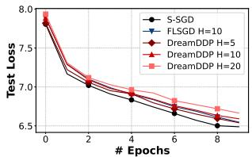  
(b) ResNet-50.

(c) GPT-2.  
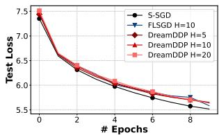  
(d) Llama-2.  
Figure 14: Scheduling performance with different frequency H on 32 workers.

## 4.5 Scheduling Performance

Different number of layers. To explore whether DreamDDP can schedule to overlap the communication time to a maximum degree, we compare the non-overlapped time of it with the brute force search. As the time complexity of the brute force is too large ( (H+L)!L!H! ), we show the results of scheduling with up to 30 layers with H = 5. Fig. 15 presents a comparison of the extra communication time not overlapped with computation after scheduling with DreamDDP and the brute force. Fig. 15(a) shows that with varying number of layers, during a single training cycle (5 iterations), DreamDDP performs equivalently to the brute force optimal solution in most cases, with only slightly longer extra communication times in a few scenarios.

Different bandwidth. Fig. 15(b) shows varying bandwidth,

DreamDDP also has different performance with the optimal results searched by the brute force. These results demonstrate that DreamDDP effectively identifies near-optimal scheduling strategies while significantly reducing search complexity.

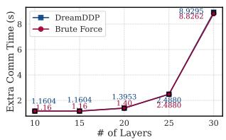  
(a) different # of layers

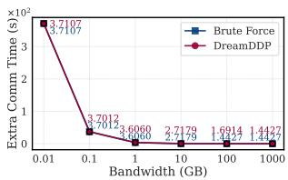  
(b) different bandwidths  
Figure 15: Comparison of extra communication time not overlapped with computation between.

## 4.6 Profiling and Searching Overhead

We compare the theoretical and realistic profiled running time of the scheduling algorithms, including DreamDDP and brute force searching on scheduling different models. Figure 16(a) shows the theoretical time complexity of scheduling four models with H = 5. As these models have too many layers, the time complexity of scheduling them with the brute force is infeasible. Thus, we only choose 30 layers for these four models to compare the realistic running time of them. Figure 16(b) shows that DreamDDP’s scheduling method significantly reduces the searching complexity by several orders of magnitude, compared with brute force method. DreamDDP reduces the search space, effectively eliminating the need to explore all possible layer partitions.

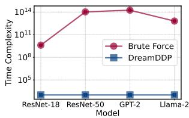  
(a) Theoretical Time Complexity

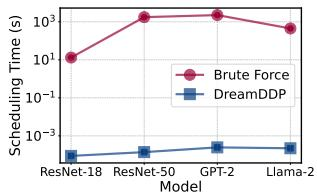  
(b) Real Scheduling Time  
Figure 16: Time complexity and running time of scheduling algorithms.

## 5 Related Works

Overlapping Communication and Computation. In distributed training with S-SGD, the gradient of each layer can be communicated instantly after its BP and overlapped with BP of subsequent layers, thus saving total training time [73]. Overlapping communication with feed-forward computing [33] helps further reduce total training time. Some observe that merging small tensors for communication [46] can help improve communication efficiency. ASC-WFBP [45] further improves overlapping by simultaneous communications and scheduling. Different from them, we consider overlapping communication and computation in LSGD.

LSGD. LSGD [43, 48, 65, 72] reduces the communication time by periodically averaging model weights instead of gradients. The synchronization frequency strongly influences the convergence and communication time. Thus, some works vary synchronization periods to tradeoff convergence and communication [48, 61, 72]. The strong synchronization severely restricts the potential improvements of LSGD, preventing it from communication overlapping. To this end, we propose partial synchronization to decouple the whole model and synchronize layers at different training iterations.

The data distribution in different workers also influences the convergence rate of LSGD [65]. In this work, we consider the IID data in centralized distributed training rather than federated Learning. Nevertheless, our method and the convergence analysis can be easily extended to the federated learning scenarios [11, 56].

Reducing Communication Costs. To reduce the communication time, some works propose compressing the communicated gradients [12, 52] in S-SGD or model parameters [13, 53, 62] in LSGD. However, the compression may require large potential computation time and slow convergence, which prevents it from deployment [1]. [13, 62] proposed compressing local results of Federated Learning [53, 56], in which LSGD is used. Orthogonal to this direction, our method aims to modify LSGD to improve system efficiency.

## 6 Limitations

Heterogeneous Environments. The real-world geodistributed settings may involve heterogeneous hardware configurations and bandwidth, leading to various computing and communication time between different clusters. Thus, we may need to consider how to design suitable algorithms and scheduling to address this problem.

Dynamic Layer Partitioning. Our method relies on profiled computation and communication times to optimize scheduling. However, in geo-distributed training scenarios where bandwidth can change frequently, the static profiled times may no longer accurately reflect the current network conditions, potentially reducing the effectiveness of the scheduling strategy.

## 7 Conclusion

In geo-distributed training, traditional S-SGD suffers from the communication costs of aggregating gradients, especially in low-bandwidth environments and LLMs. LSGD reduces the communication cost, but it requires strict synchronization and suffers from slow convergence speed. In this work, we first propose partial synchronization to relax the strict synchronization of LSGD. Then we design DreamDDP to schedule the communication overlapped with backpropagation computation to reduce the communication overhead of LSGD. DreamDDP also supplements communication with maximally exploiting overlapping without extra training time. The experimental results show that DreamDDP accelerates both wall-clock iteration time and the convergence speed than ASC-WFBP and LSGD (and Adam) on four popular types of DL models including ResNets, GPT, and Llama-2.

## References

[1] S. Agarwal, H. Wang, S. Venkataraman, and D. Papailiopoulos. On the utility of gradient compression in distributed training systems. Proceedings of Machine Learning and Systems, 4:652–672, 2022.

[2] J. Albrecht and C. Tuttle. Loose synchronization for Large-Scale networked systems. In 2006 USENIX Annual Technical Conference (USENIX ATC 06), 2006.

[3] J. e. a. Ansel. Pytorch 2: Faster machine learning through dynamic python bytecode transformation and graph compilation. In ASPLOS, pages 929–947, 2024.

[4] M. Artetxe, S. Bhosale, N. Goyal, T. Mihaylov, M. Ott, S. Shleifer, X. V. Lin, J. Du, S. Iyer, R. Pasunuru, G. Anantharaman, X. Li, S. Chen, H. Akin, M. Baines, L. Martin, X. Zhou, P. S. Koura, B. O’Horo, J. Wang, L. Zettlemoyer, M. T. Diab, Z. Kozareva, and V. Stoyanov. Efficient large scale language modeling with mixtures of experts. CoRR, abs/2112.10684, 2021.

[5] L. Bottou, F. E. Curtis, and J. Nocedal. Optimization methods for large-scale machine learning. SIAM Review, 60:223–311, 2016.

[6] Y. Chen, A. Yuille, and Z. Zhou. Which layer is learning faster? a systematic exploration of layer-wise convergence rate for deep neural networks. In ICLR, 2023.

[7] J. Cheng, N. Gao, Y. Yue, Z. Ye, J. Jiang, and J. Sha. Edit: A local-sgd-based efficient distributed training method for large language models. arXiv preprint arXiv:2412.07210, 2024.

[8] Clear.ml. Consumer gpus vs datacenter gpus for cv. [Online]. https://clear.ml/blog/consumer-gpus-vsdatacenter-gpus-for-cv-the-surprising-cost-effectivewinner.

[9] M. Diskin, A. Bukhtiyarov, M. Ryabinin, L. Saulnier, A. Sinitsin, D. Popov, D. V. Pyrkin, M. Kashirin, A. Borzunov, A. Villanova del Moral, et al. Distributed deep learning in open collaborations. In NeurIPS, 2021.

[10] A. Douillard, Q. Feng, A. A. Rusu, R. Chhaparia, Y. Donchev, A. Kuncoro, M. Ranzato, A. Szlam, and J. Shen. Diloco: Distributed low-communication training of language models, 2024.

[11] P. K. et al. Advances and open problems in federated learning, 2021.

[12] J. Fei, C.-Y. Ho, A. N. Sahu, M. Canini, and A. Sapio. Efficient sparse collective communication and its application to accelerate distributed deep learning. In ACM SIGCOMM, SIGCOMM ’21, page 676–691, 2021.

[13] Y. Guan, X. Liu, T. Ren, and J. Niu. Enabling communication-efficient federated learning via distributed compressed sensing. In INFOCOM, pages 1–10, 2023.

[14] Y. Guo, Y. Sun, R. Hu, and Y. Gong. Hybrid local sgd for federated learning with heterogeneous communications. In ICLR, 2022.

[15] C. He, S. Li, M. Soltanolkotabi, and S. Avestimehr. Pipetransformer: Automated elastic pipelining for distributed training of large-scale models. In ICML, 2021.

[16] Q. He, X. Zhuang, and Z. Wu. Exploring scaling laws for local sgd in large language model training. arXiv preprint arXiv:2409.13198, 2024.

[17] S. Jaghouar, J. M. Ong, M. Basra, F. Obeid, J. Straube, M. Keiblinger, E. Bakouch, L. Atkins, M. Panahi, C. Goddard, M. Ryabinin, and J. Hagemann. Intellect-1 technical report, 2024.

[18] S. Jaghouar, J. M. Ong, and J. Hagemann. Opendiloco: An open-source framework for globally distributed lowcommunication training, 2024.

[19] A. Q. Jiang, A. Sablayrolles, A. Roux, A. Mensch, B. Savary, C. Bamford, D. S. Chaplot, D. d. l. Casas, E. B. Hanna, F. Bressand, et al. Mixtral of experts. arXiv preprint arXiv:2401.04088, 2024.

[20] Y. Jiang, Y. Zhu, C. Lan, B. Yi, Y. Cui, and C. Guo. A unified architecture for accelerating distributed {DNN} training in heterogeneous {GPU/CPU} clusters. In OSDI, pages 463–479, 2020.

[21] P. Kairouz, H. B. McMahan, B. Avent, A. Bellet, M. Bennis, A. N. Bhagoji, K. Bonawitz, Z. Charles, G. Cormode, R. Cummings, et al. Advances and open problems in federated learning. arXiv preprint arXiv:1912.04977, 2019.

[22] D. Kingma and J. Ba. Adam: A method for stochastic optimization. In ICLR, 2015.

[23] W. Kuang, B. Qian, Z. Li, D. Chen, D. Gao, X. Pan, Y. Xie, Y. Li, B. Ding, and J. Zhou. Federatedscopellm: A comprehensive package for fine-tuning large language models in federated learning. In Proceedings of the 30th ACM SIGKDD Conference on Knowledge Discovery and Data Mining, KDD ’24, page 5260–5271,

New York, NY, USA, 2024. Association for Computing Machinery.

[24] S. Li, Y. Zhao, R. Varma, O. Salpekar, P. Noordhuis, T. Li, A. Paszke, J. Smith, B. Vaughan, P. Damania, and S. Chintala. Pytorch distributed: experiences on accelerating data parallel training. Proc. VLDB Endow., 13(12):3005–3018, aug 2020.

[25] Y. Liu, Y. Gao, and W. Yin. An improved analysis of stochastic gradient descent with momentum. NeurIPS, 33:18261–18271, 2020.

[26] B. McMahan, E. Moore, D. Ramage, S. Hampson, and B. A. y Arcas. Communication-efficient learning of deep networks from decentralized data. In Artificial Intelligence and Statistics, pages 1273–1282, 2017.

[27] S. Merity, C. Xiong, J. Bradbury, and R. Socher. Pointer sentinel mixture models. In ICLR, 2017.

[28] K. Mishchenko, G. Malinovsky, S. Stich, and P. Richtárik. Proxskip: Yes! local gradient steps provably lead to communication acceleration! finally! In ICML, pages 15750–15769, 2022.

[29] D. Narayanan, M. Shoeybi, J. Casper, P. LeGresley, M. Patwary, V. Korthikanti, D. Vainbrand, P. Kashinkunti, J. Bernauer, B. Catanzaro, et al. Efficient large-scale language model training on gpu clusters using megatron-lm. In SC, 2021.

[30] OpenAI. Introducing chatgpt. https://openai.com/ blog/chatgpt, 2022.

[31] M. Parekh. Ai: Our data exhaust. https://medium.com/@mparekh/ ai-our-data-exhaust-e08ba5885af8.

[32] K. K. Patel, M. Glasgow, A. Zindari, L. Wang, S. U. Stich, Z. Cheng, N. Joshi, and N. Srebro. The limits and potentials of local sgd for distributed heterogeneous learning with intermittent communication. In COLT, volume 247, pages 4115–4157, 2024.

[33] Y. Peng, Y. Zhu, Y. Chen, Y. Bao, B. Yi, C. Lan, C. Wu, and C. Guo. A generic communication scheduler for distributed dnn training acceleration. In SOSP, page 16–29, 2019.

[34] Z. Qin, D. Chen, B. Qian, B. Ding, Y. Li, and S. Deng. Federated full-parameter tuning of billion-sized language models with communication cost under 18 kilobytes. In Forty-first International Conference on Machine Learning, 2024.

[35] A. Radford, K. Narasimhan, T. Salimans, and I. Sutskever. Improving language understanding by

generative pre-training. URL https://s3-us-west-2. amazonaws. com/openai-assets/research-covers/languageunsupervised/language\_understanding\_paper. pdf, 2018.

[36] A. Radford, J. Wu, R. Child, D. Luan, D. Amodei, I. Sutskever, et al. Language models are unsupervised multitask learners. OpenAI blog, 1(8):9, 2019.

[37] M. Raghu, J. Gilmer, J. Yosinski, and J. Sohl-Dickstein. Svcca: singular vector canonical correlation analysis for deep learning dynamics and interpretability. In NeurIPS, 2017.

[38] S. Rajbhandari, J. Rasley, O. Ruwase, and Y. He. Zero: Memory optimizations toward training trillion parameter models. SC20: International Conference for High Performance Computing, Networking, Storage and Analysis, pages 1–16, 2019.

[39] M. e. a. Reid. Gemini 1.5: Unlocking multimodal understanding across millions of tokens of context. arXiv preprint arXiv:2403.05530, 2024.

[40] J. Ren, S. Rajbhandari, R. Y. Aminabadi, O. Ruwase, S. Yang, M. Zhang, D. Li, and Y. He. {Zero-offload}: Democratizing {billion-scale} model training. In 2021 USENIX Annual Technical Conference (USENIX ATC 21), pages 551–564, 2021.

[41] M. Ryabinin, T. Dettmers, M. Diskin, and A. Borzunov. Swarm parallelism: training large models can be surprisingly communication-efficient. In ICML, 2023.

[42] M. Ryabinin and A. Gusev. Towards crowdsourced training of large neural networks using decentralized mixtureof-experts. In H. Larochelle, M. Ranzato, R. Hadsell, M. Balcan, and H. Lin, editors, NeurIPS, volume 33, pages 3659–3672. Curran Associates, Inc., 2020.

[43] A. Sadiev, D. Kovalev, and P. Richtárik. Communication acceleration of local gradient methods via an accelerated primal-dual algorithm with an inexact prox. NeurIPS, 35:21777–21791, 2022.

[44] L. Sani, A. Iacob, Z. Cao, R. Lee, B. Marino, Y. Gao, D. Cai, Z. Li, W. Zhao, X. Qiu, et al. Photon: Federated llm pre-training. arXiv preprint arXiv:2411.02908, 2024.

[45] S. Shi, X. Chu, and B. Li. Exploiting simultaneous communications to accelerate data parallel distributed deep learning. In IEEE INFOCOM, pages 1–10, 2021.

[46] S. Shi, Q. Wang, X. Chu, B. Li, Y. Qin, R. Liu, and X. Zhao. Communication-efficient distributed deep learning with merged gradient sparsification on gpus. In IEEE INFOCOM, 2020.

[47] S. Shi, Q. Wang, K. Zhao, Z. Tang, Y. Wang, X. Huang, and X. Chu. A distributed synchronous sgd algorithm with global top-k sparsification for low bandwidth networks. In 2019 IEEE 39th International Conference on Distributed Computing Systems (ICDCS), pages 2238– 2247. IEEE, 2019.

[48] S. U. Stich. Local SGD converges fast and communicates little. In ICLR, 2019.

[49] N. Su, C. Hu, B. Li, and B. Li. Titanic: Towards production federated learning with large language models. In IEEE INFOCOM, 2024.

[50] W. Sun, Z. Qin, W. Sun, S. Li, D. Li, X. Shen, Y. Qiao, and Y. Zhong. Co2: Efficient distributed training with full communication-computation overlap, 2024.

[51] Z. Tang, X. Kang, Y. Yin, X. Pan, Y. Wang, X. He, Q. Wang, R. Zeng, K. Zhao, S. Shi, A. C. Zhou, B. Li, B. He, and X. Chu. Fusionllm: A decentralized llm training system on geo-distributed gpus with adaptive compression, 2024.

[52] Z. Tang, S. Shi, X. Chu, W. Wang, and B. Li. Communication-efficient distributed deep learning: A comprehensive survey. arXiv preprint arXiv:2003.06307, 2020.

[53] Z. Tang, S. Shi, B. Li, and X. Chu. Gossipfl: A decentralized federated learning framework with sparsified and adaptive communication. IEEE Transactions on Parallel and Distributed Systems, pages 1–13, 2022.

[54] Z. Tang, Y. Wang, X. He, L. Zhang, X. Pan, Q. Wang, R. Zeng, K. Zhao, S. Shi, B. He, et al. Fusionai: Decentralized training and deploying llms with massive consumer-level gpus. In IJCAI Symposium on LLMs, 2023.

[55] Z. Tang, Y. Zhang, P. Dong, Y. ming Cheung, A. C. Zhou, B. Han, and X. Chu. Fusefl: One-shot federated learning through the lens of causality with progressive model fusion. In The Thirty-eighth Annual Conference on Neural Information Processing Systems, 2024.

[56] Z. Tang, Y. Zhang, S. Shi, X. He, B. Han, and X. Chu. Virtual homogeneity learning: Defending against data heterogeneity in federated learning. In ICML, volume 162, pages 21111–21132, 2022.

[57] A. J. Thirunavukarasu, D. S. J. Ting, K. Elangovan, L. Gutierrez, T. F. Tan, and D. S. W. Ting. Large language models in medicine. Nature medicine, 29(8):1930–1940, 2023.

[58] H. Touvron et al. Llama 2: Open foundation and finetuned chat models. arXiv preprint arXiv:2307.09288, 2023.

[59] H. Touvron, T. Lavril, G. Izacard, X. Martinet, M.-A. Lachaux, T. Lacroix, B. Rozière, N. Goyal, E. Hambro, F. Azhar, A. Rodriguez, A. Joulin, E. Grave, and G. Lample. Llama: Open and efficient foundation language models. ArXiv, 2023.

[60] P. Villalobos, J. Sevilla, L. Heim, T. Besiroglu, M. Hobbhahn, and A. Ho. Will we run out of data? an analysis of the limits of scaling datasets in machine learning. arXiv e-prints, pages arXiv–2211, 2022.

[61] J. Wang and G. Joshi. Adaptive communication strategies to achieve the best error-runtime trade-off in localupdate sgd. In MLsys, 2019.

[62] J. Wang, B. Liang, M. Dong, G. Boudreau, and A. Afana. Online distributed optimization with efficient communication via temporal similarity. In INFOCOM, pages 1–10, 2023.

[63] J. Wang, Y. Lu, B. Yuan, B. Chen, P. Liang, C. De Sa, C. Re, and C. Zhang. CocktailSGD: Fine-tuning foundation models over 500Mbps networks. In ICML. PMLR, 2023.

[64] J. Wang, B. Yuan, L. Rimanic, Y. He, T. Dao, B. Chen, C. Ré, and C. Zhang. Fine-tuning language models over slow networks using activation quantization with guarantees. In NeurIPS, 2022.

[65] B. E. Woodworth, K. K. Patel, and N. Srebro. Minibatch vs local sgd for heterogeneous distributed learning. NeurIPS, 33:6281–6292, 2020.

[66] S. Wu, O. Irsoy, S. Lu, V. Dabravolski, M. Dredze, S. Gehrmann, P. Kambadur, D. Rosenberg, and G. Mann. Bloomberggpt: A large language model for finance. arXiv preprint arXiv:2303.17564, 2023.

[67] M. Xu, D. Cai, Y. Wu, X. Li, and S. Wang. FwdLLM: Efficient federated finetuning of large language models with perturbed inferences. In 2024 USENIX Annual Technical Conference (USENIX ATC 24), pages 579– 596, 2024.

[68] R. Ye, W. Wang, J. Chai, D. Li, Z. Li, Y. Xu, Y. Du, Y. Wang, and S. Chen. Openfedllm: Training large language models on decentralized private data via federated learning. In Proceedings of the 30th ACM SIGKDD Conference on Knowledge Discovery and Data Mining, KDD ’24, page 6137–6147, 2024.

[69] S. Ye, J. Du, L. Zeng, W. Ou, X. Chu, Y. Lu, and X. Chen. Galaxy: A resource-efficient collaborative edge ai system for in-situ transformer inference. In INFOCOM, 2024.

[70] S. Ye, L. Zeng, X. Chu, G. Xing, and X. Chen. Asteroid: Resource-efficient hybrid pipeline parallelism for collaborative dnn training on heterogeneous edge devices. In ACM MobiCom, page 312–326, 2024.

[71] B. Yuan, Y. He, J. Davis, T. Zhang, T. Dao, B. Chen, P. S. Liang, C. Re, and C. Zhang. Decentralized training of foundation models in heterogeneous environments. Advances in Neural Information Processing Systems, 35:25464–25477, 2022.

[72] H. Zhang, T. Wu, S. Cheng, and J. Liu. Aperiodic local sgd: Beyond local sgd. In ICPP, 2023.

[73] H. Zhang, Z. Zheng, S. Xu, W. Dai, Q. Ho, X. Liang, Z. Hu, J. Wei, P. Xie, and E. P. Xing. Poseidon: An efficient communication architecture for distributed deep learning on GPU clusters. In USENIX ATC, pages 181– 193, Santa Clara, CA, July 2017.

[74] W. Zhuang, C. Chen, and L. Lyu. When foundation model meets federated learning: Motivations, challenges, and future directions. arXiv preprint arXiv:2306.15546, 2023.

## Appendix

In this appendix, we present the detailed proof of Theorem 1.

Lemma 3. Convergence of averaged weights. Let {wr}r≥0 and {w¯r}r≥0 for k ∈ [K] be defined as in Equation (5), and let f be β-smooth and µ-strongly convex and ηr ≤ 14β . Then

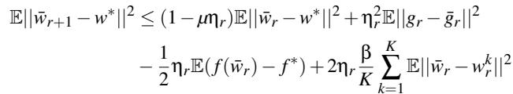

Proof of Lemma 3. Using the update Eq. 5, we have

$$
\tag{13}
$$

By L-smoothness and µ-strong convexity of f , we can derive the upper bound of the first term as

$$
\tag{14}
$$

Taking (14) back into (13), by taking expectation we have

$$
\tag{15}
$$

Lemma 4. Bounded model divergence. Given the bounded synchronization frequency Hl ≤ H for l ∈ [L] and sequence of decreasing positive learning rates {ηr}r≥0 satisfying ηr ≤ 2ηr+H for all r ≥ 0, then we have

$$
\tag{16}
$$

Proof of Lemma 4. As wk is the concatenation of wk,lr with respect to l, we have ||w¯ r − wkr ||2 = ∑Ll=1 ||w¯ lr − wk,lr ||2, ∑Ll=1 ||∇l f (wkh; ξkh)||2 = ||∇ f (wkh; ξkh)||2. Using E||X − EX ||2 = E||X ||2 − ||EX ||2 and || ∑Hli=1 ai||2 ≤ Hl ∑Hli=1 ||ai||2, we have

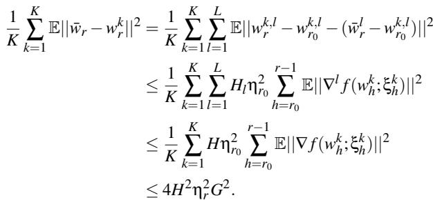

Lemma 5. Martingale convergence. Let {ar}r≥0,ar ≥ 0, {er}r≥0, er ≥ 0 be sequences satisfying

$$
\tag{17}
$$

for ηr = 4µ(a+r) and constants A > 0, B,C ≥ 0, µ > 0, a > 1. Then

$$
\tag{18}
$$

for pr = (a + r)2 and SR ≜ ∑R−1r=0 pr = R6 (2R2 + 6aR − 3R + 6a2 − 6a + 1) ≥ 1 R3 .

Proof of Theorem 1. Based on Lemma 3 and Lemma 4 we get

$$
\tag{19}
$$

By Lemma 5, taking ar = E||w¯ r − w∗||2, er = E( f (w¯ r) − f ∗ ), A = 12 , B = σ2K , C = 8G2 H 2 β, we have

$$
\tag{20}
$$

By the convexity of f , we have

$$
\tag{21}
$$

By Eq. 20, 21 we get the result

$$
\tag{22}
$$

which completes the proof of Theorem 1.