# SONAR: BENCHMARKING TOPOLOGY AND COLLABORATION IN DECENTRALIZED LEARNING

Abhishek Singh \* 1 Joyce Yuan \* 1 Yichuan Shi \* 1 Rishi Sharma 2 Ramesh Raskar 1 Jonas Blanc 2 Martin Jaggi 2

## ABSTRACT

Decentralized machine learning relies on peer-to-peer communication, yet the role of network topology in shaping learning dynamics remains poorly understood due to the lack of controlled, reproducible evaluation frameworks. We present SONAR, a modular framework for topology-aware decentralized learning that unifies communication, topology management, and fine-grained telemetry, enabling end-to-end measurement of performance, communication, robustness, and privacy under consistent conditions. Using SONAR, we show that topology is a first-class systems variable whose impact amplifies with scale and data heterogeneity. We find that sparse, structured topologies (e.g., rings and tori) can achieve comparable or superior accuracy to dense graphs at substantially lower communication cost under circumstances, revealing a clear efficiency frontier. We further identify and provide insights on collaborator collapse, a systematic failure mode in adaptive collaboration, where similarity-based neighbor selection reduces diversity and degrades generalization. By exposing topology as a controllable and measurable dimension, SONAR enables systematic, reproducible evaluation of decentralized learning and provides practical guidance for designing efficient and robust collaborative systems.

## 1 INTRODUCTION

Decentralized machine learning replaces centralized coordination with peer-to-peer communication, making the network itself a core component of the learning system. In contrast to federated learning’s fixed star topology, decentralized training depends on the communication graph—which nodes exchange updates, and how information propagates through the network. This choice directly impacts convergence, communication cost, robustness, and privacy, elevating topology to a first-class systems variable.

Despite its importance, topology is rarely treated as a controllable experimental dimension. Existing frameworks such as FEDML (He et al., 2020), FEDSCALE (Lai et al., 2022), FLOWER (Beutel et al., 2020), and DECENTRAL-IZEPY (Dhasade et al., 2023) focus on accuracy and convergence but provide limited control or visibility into communication structure, efficiency, and robustness. As a result, the role of topology in decentralized learning remains poorly understood.

Our experiments show that topology is a dominant factor shaping decentralized learning behavior. Its impact amplifies with system scale and data heterogeneity, and becomes especially pronounced under practical constraints such as limited communication rounds or bandwidth budgets. Moreover, topology defines a clear efficiency frontier: structured sparse graphs can achieve comparable performance to dense networks at substantially lower communication cost.

Adaptive collaboration introduces additional complexity: similarity-based peer selection can concentrate communication among a small subset of nodes, reducing diversity and degrading performance. Understanding such dynamics requires system-level visibility into how topology evolves during training.

This motivates a central systems question: How do communication topology, coordination mechanisms, and system limits jointly determine the efficiency, robustness, and privacy of decentralized learning?

To answer this question, we present SONAR (Self-Organized Network of Aggregated Representations), a modular framework for reproducible, topology-aware decentralized learning. SONAR unifies communication, topology, and telemetry in a layered architecture, supporting multiple backends (GRPC, MPI, WEBRTC), static and adaptive graphs, and fine-grained per-node logging of bandwidth, latency, and collaboration dynamics. It enables controlled, reproducible experiments and systematic analysis of topology in decentralized learning systems. Our main contributions are as follows:

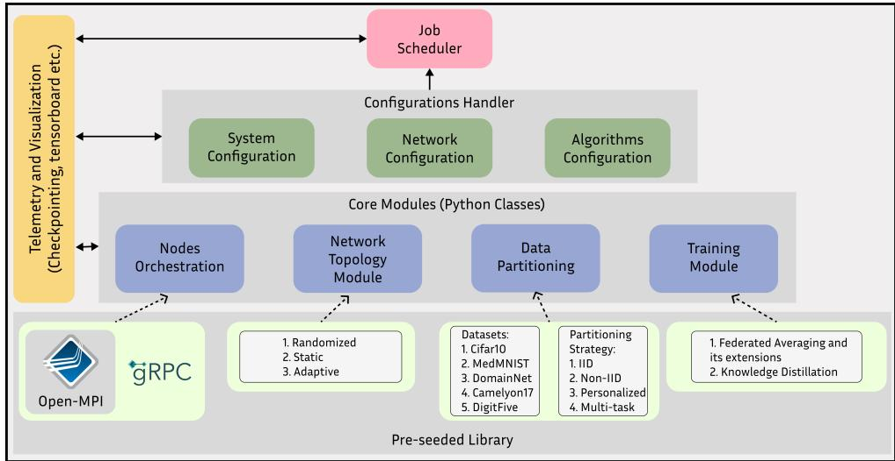  
Figure 1. SONAR architecture overview. The framework integrates orchestration, topology, communication, and telemetry layers to enable reproducible, topology-aware decentralized learning experiments.

(1) We design and implement SONAR, a modular and reproducible framework that unifies communication, topology, and telemetry, enabling controlled experimentation with topology as a first-class variable in decentralized peer-topeer learning.

(2) We introduce a unified benchmarking methodology that jointly measures performance, communication efficiency, robustness, and privacy under controlled topology variation.

(3) We empirically characterize topology-aware learning, showing that: (i) topology effects amplify with system scale and data heterogeneity, (ii) structured sparse graphs achieve comparable or better performance than dense graphs at substantially lower communication cost, and (iii) adaptive collaboration can induce collaborator collapse, where similarity-based peer selection reduces diversity and degrades generalization.

SONAR bridges the gap between machine learning frameworks and distributed systems infrastructure, providing a unified, extensible platform to systematically evaluate and reproduce topology-aware decentralized learning at scale. We release SONAR as an open-source framework at https://github.com/ aidecentralized/sonar.

## 2 WHY TOPOLOGY VIA COLLABORATION PATTERNS MATTERS

In decentralized collaborative learning, nodes make a strategic decision each training round: which peers should I collaborate with? Unlike centralized FL where the server dictates information flow, DCL nodes autonomously select collaboration partners. This collaboration pattern —the policy governing who works with whom and thereby defining the network topology—is one of the few design choices available to individual nodes. We motivate the need for systematic evaluation of collaboration patterns through three observations, drawn from our experiments in Section 5, Supp. Section 6.

## 2.1 Collaboration Patterns Have Non-Obvious Performance Implications

Should nodes collaborate randomly or select participants with similar data? Intuitively, random collaboration should expose nodes to more diverse data and improve generalization. In practice (Figure 5), structured collaboration achieves 14% higher AUC (68.1 vs. 59.8) on domainshifted datasets. Random collaboration forces premature consensus across heterogeneous regions, slowing convergence and degrading per-region accuracy. This performance gap has a theoretical basis: Koloskova et al. (Koloskova et al., 2020) show that convergence rates under decentralized SGD are modulated by a data heterogeneity penalty that grows with cross-node distributional divergence, and Vogels et al. (Vogels et al., 2022) demonstrate that local neighborhood structure—not just spectral connectivity—governs how effectively a topology mitigates that penalty in practice. The optimal pattern depends on deployment context. Scale matters: the performance gap widens with more participants (Figure 4). Heterogeneity matters: more regions amplify the benefit of within-region collaboration (Figure 5). Communication budget matters: with 1000 rounds, random collaboration can eventually catch up; with only 200 rounds, it cannot (Supp. Fig. 8).

## 2.2 Collaboration Patterns Create Fundamental Tradeoffs

How many collaboration partners should each node maintain? Consider 36 nodes training on CIFAR-10 with 4 malicious nodes (11%) injecting corrupted updates. Nodes can adopt: Sparse patterns (ring topology, 2 partners), Dense patterns (random-kk k, 6–8 partners), or Complete patterns (all 35 connections). Intuitively, more partners should improve performance through increased information sharing. In practice (Figure 7, sparse patterns maintain 60% accuracy under attack while dense patterns collapse to near-zero. The collaboration pattern impacts: (1) Robustness: sparse topologies limit malicious update spread, (2) Communication cost: ring requires 2 connections vs. 35 for complete, (3) Convergence speed: dense networks propagate faster but cost more, and (4) Privacy: fewer connections reduce gradient inversion attack surface.

## 2.3 Observation 3: Adaptive Collaboration Can Become Unstable

Should nodes collaborate with similar peers to accelerate convergence? We evaluate 39 nodes across 3 domains, each selecting its Top-K most similar neighbors based on gradient alignment. Intuitively, similarity-based collaboration should share relevant knowledge and speed convergence. In practice (Figure 6), it can destabilize learning: for small K (1–2), nodes form isolated cliques and underperform random pairing; for large K (> 15), they overmix across domains and drift from domain optima. This instability—Collaborator Collapse—emerges from a feedback loop where similar nodes repeatedly reinforce one another, reducing diversity and generalization. Detecting it (Supp C.0.1) requires long-horizon runs (200+ rounds), finegrained telemetry, and heterogeneous domains—conditions seldom captured in prior frameworks.

## 3 BACKGROUND

## 3.1 Federated Learning Frameworks

Federated Learning (FL) has become the dominant paradigm in collaborative learning, utilizing centralized servers to coordinate model updates from distributed clients (McMahan et al., 2017). Several frameworks have been proposed to evaluate and deploy FL solutions, such as TensorFlow Federated (Google), FedML (He et al., 2020), and PFLlib (Zhang et al., 2023). These platforms enable scalable FL deployments but maintain a reliance on central coordination. SONAR departs from these centralized architectures by focusing on fully decentralized approaches, which enhance resilience in networked environments and eliminate dependency on a central server. We show a more exhaustive comparison with other frameworks in Table 1.

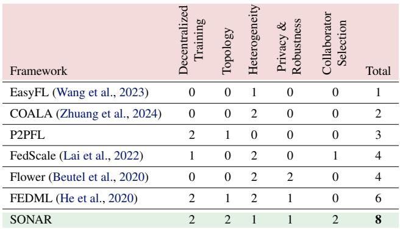  
Table 1. Feature Comparison of SONAR with existing frameworks: Comparing the capabilities of existing FL frameworks with SONAR based on the features relevant to decentralized settings. The score ranges from 0 to 2, where 0 indicates no support, 1 indicates partial support, and 2 indicates full support for the feature.

## 3.2 Peer-to-Peer Learning Approaches

P2P learning has gained attention as a scalable and resilient alternative to traditional FL. Early work in this area focused on static topologies with fixed collaboration patterns (Lalitha et al., 2019; Qu et al., 2021), or random peer selection (Roy et al., 2019; Li et al., 2021a). These early studies demonstrated the feasibility of P2P learning but are quite limited in convergence and robustness when applied to heterogeneous data environments. More recent P2P research has developed adaptive network topologies that adjust dynamically based on training progress and peer compatibility. For instance, Li et al. (Li et al., 2022b) developed techniques for learning optimal collaboration weights and (Li et al., 2022a) perform SGD on the communication graph. PAMN (Li et al., 2022b) utilizes Monte Carlo methods and EM-GMM clustering to build optimal cohorts collaboration.

The empirical patterns observed in our benchmark are grounded in a growing body of theoretical work on topology in decentralized optimization. (Koloskova et al., 2020) establish a unified convergence framework for decentralized SGD that encompasses gossip updates, local SGD, and time-varying topologies. Their analysis shows that convergence is governed jointly by stochastic gradient noise and a data heterogeneity term ¯ω2 capturing divergence between local and global objectives—providing a formal basis for why topology choice carries non-trivial performance consequences under non-IID data distributions, as systematically observed in our benchmark. (Vogels et al., 2022) further show that the spectral gap of a communication graph is not reliably predictive of empirical performance in deep learning; the local neighborhood structure and its capacity to mix heterogeneous gradients is the operative factor. This directly supports our finding that structured topologies outperform random ones on domain-shifted data: random collaboration induces high-variance gradient neighborhoods, degrading convergence in precisely the regime Vogels et al. characterize. (De Vos et al., 2023) complement this picture by showing that randomized, per-round topology changes yield superior convergence bounds— (n3/s2) transient iterations versus (n3) for static graphs—when nodes share a similar data distribution. Our benchmarking results extend and qualify this insight to heterogeneous real-world settings: the theoretical gains of randomized communication are contingent on distributional alignment across nodes, and structured topologies recover the advantage precisely when cross-node heterogeneity is high.

## 3.3 Robustness and Privacy in Decentralized Learning

Robustness to malicious behavior is a first-class requirement in decentralized systems, where the absence of centralized control amplifies vulnerability to adversarial updates. Because participants exchange models directly, any compromised node can inject corrupted gradients or parameters, propagating errors through the network. SONAR provides a unified interface for evaluating such failures, integrating common data and model poisoning attacks as well as aggregation defenses (e.g., median, trimmed mean) to quantify resilience under varying topologies and communication densities.

Privacy leakage presents a complementary systems challenge. Gradient inversion attacks (GIA) can reconstruct private data from shared updates, while membership inference exposes training participation. SONAR implements these analyses as modular components, enabling controlled measurement of how network structure affects both attack success and defense effectiveness. Our experiments show that denser topologies increase exposure to gradient reconstruction, whereas sparse or structured graphs confine leakage to immediate neighbors (Section 6.3).

Full mathematical formulations of the attacks and reconstruction techniques, along with parameter choices and additional results, are provided in Supp. D.

## 3.4 Benchmarking Platforms

Benchmarking plays an essential role in validating decentralized learning systems. Existing platforms such as LEAF (Caldas et al., 2019), FedScale (Lai et al., 2022), COALA (Zhuang et al., 2024), and FedML’s evaluation suite (He et al., 2020) provide valuable evaluation tools for FL, but their focus remains squarely within the centralized server-client paradigm—leaving the role of network topology, a factor unique to decentralized learning, largely unaddressed.

Our goal with SONAR is complementary to frameworks such as COALA and FedScale. COALA targets task-, data-, and model-level diversity within centralized FL, benchmarking across 15 computer vision tasks with varying supervision and data heterogeneity regimes. FedScale focuses on co-optimizing model quality and system throughput at scale, providing realistic datasets and a runtime that captures hardware heterogeneity, client availability, and wall-clock efficiency. By contrast, SONAR treats network topology as a first-class experimental variable in a fully decentralized peer-to-peer setting, enabling controlled measurement of how graph structure, communication budget, and node heterogeneity jointly shape learning dynamics. Because the design goals differ substantially, Table 2 presents a featurelevel comparison of SONAR against COALA and FedScale rather than performance metrics.

The work most similar to ours is DecentralizePy (Dhasade et al., 2023), a platform that facilitates network emulation for decentralized environments. However, DecentralizePy focuses on configuration and deployment rather than benchmarking and topology design.

Table 2. Feature comparison of SONAR, COALA (Zhuang et al., 2024), and FedScale (?). ↭ = supported; ! = not supported; → = partial support.  
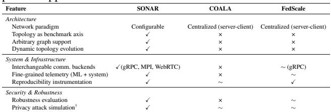  
† FedScale supports evaluation of robustness defenses (e.g., Byzantine aggregation); neither COALA nor FedScale provide first-class tooling for simulating adversarial privacy attacks such as gradient inversion or membership inference.

## 4 DESIGN OF SONAR

SONAR is a modular systems framework for reproducible, topology-aware decentralized learning. It unifies communication, topology management, and telemetry within a single runtime, enabling controlled measurement of how systemlevel factors—such as network structure, communication budget, and heterogeneity—shape learning dynamics. The framework supports multiple collaborative paradigms, including federated averaging (McMahan et al., 2016), knowledge distillation (Afonin & Karimireddy, 2022) or Split Learning (Gupta & Raskar, 2018), providing a unified substrate for experimentation across algorithms and architectures. SONAR is organized into four primary layers (Figure 1): (1) an orchestration layer for experiment setup and node lifecycle management; (2) a topology engine that defines and evolves collaboration graphs; (3) a communication layer supporting interchangeable backends (gRPC, MPI, WebRTC); and (4) a telemetry stack that records fine-grained ML, system, and collaboration metrics for analysis and reproducibility. Higher-level modules extend these layers to support robustness evaluation, privacy attack simulation, and cross-platform observability, enabling SONAR to serve as a comprehensive testbed for topology in the setting of decentralized learning systems.

## 4.1 Design Goals

The design of SONAR reflects the practical need for a decentralized learning framework that runs reliably across diverse hardware and runtimes. Rather than optimizing for a single algorithm or deployment, SONAR serves as a flexible experimental backbone that others can extend, instrument, and reproduce. Its guiding goals are:

Modularity. Communication, topology, and telemetry components are independently replaceable, enabling controlled experimentation with minimal code changes.

Universality. A unified API and configuration interface let the same experiment run across Python, browser, and mobile clients, abstracting away backend differences (gRPC, MPI, WebRTC).

Reproducibility. Deterministic configurations with pernode telemetry and dataset versioning ensure experiments can be repeated and verified.

Scalability. The orchestration layer scales from small tests to 1000-node deployments with minimal coordination overhead.

Observability. Fine-grained logging of learning, communication, and topology metrics (i.e. latency, bandwidth, and neighbor entropy) offers visibility into evolving system dynamics.

## 4.2 Node Orchestration Layer

The orchestration layer coordinates experiment setup, configuration, and lifecycle management for all participating nodes. It serves as the entry point to SONAR, defining how experiments are initialized, synchronized, and scaled across clients. Importantly, the orchestrator operates outside the critical training loop; nodes execute training and communication in a fully decentralized, peer-to-peer manner. Logging and telemetry are collected locally at each node and aggregated asynchronously for post-hoc analysis, ensuring that orchestration does not introduce bottlenecks. At its core, this layer exposes a universal configurable API that decouples experiment semantics from client implementations. Users define experiments through a standardized configuration object specifying global parameters such as session ID, topology, dataset, communication backend, and number of collaborators. A typical configuration is shown in Listing 1.

Listing 1. Sample SONAR configuration   
sample\_config: ConfigType = {   
"exp\_id": "test\_experiment",   
"num\_users": 10,   
"session\_id": 1111,   
"num\_collaborators": ALL,   
"comm": {"type": "gRPC"},   
"dset": CIFAR10\_DSET,   
"train\_label\_distribution": "iid",   
"topo": "ring",

This configuration interface supports both homogeneous and heterogeneous experiments, allowing per-node variations in datasets, architectures, and hyperparameters. During execution, the orchestration layer manages synchronization and progress across training rounds, handling peer registration, startup, and fault recovery. Once initialized, each node runs its local training loop and exchanges updates through the communication layer (Section 4.4). Lightweight state tracking enables dynamic participation and resumption, allowing experiments to scale from small debugging runs to deployments of 45–1000 nodes. This design isolates orchestration overhead from learning performance, ensuring consistent and reproducible coordination across environments.

## 4.3 Topology Engine

The topology engine defines and manages the communication graph that determines how nodes exchange updates during decentralized training. Each node maintains a local view of its neighbors, updating it each round according to a chosen policy. SONAR supports three topology classes: randomized, static, and adaptive (a list is available in Supp B.1).

Randomized. Graphs are sampled from probabilistic adjacency matrices, such as Erdos–R ˝ enyi or Watts–Strogatz ´ models (Gkantsidis et al., 2004; Li et al., 2021a), providing controllable diversity in connectivity and degree distribution.

Static. Fixed graphs—including ring, grid, torus, and tree structures (Shaker & Reeves, 2005; Yu-hang et al., 2012)—remain constant throughout training. SONAR also supports data-based static graphs where edges reflect similarity in local data distributions, approximating domainaligned communication.

Adaptive. Connectivity evolves dynamically as training progresses: nodes evaluate weight or embedding similarity to select peers that maximize collaboration benefit or maintain domain diversity (Li et al., 2022b; Sui et al., 2022).

This enables systematic study of how evolving graphs affect convergence and generalization.

The topology manager tracks graph evolution and logs per-round collaboration matrices for post-hoc analysis. Built on NetworkX (Hagberg et al., 2008), it exposes two lightweight APIs—generate graph for graph creation and sample neighbours for neighbor selection—allowing researchers to swap or modify topologies without altering learning code. By decoupling communication structure from algorithmic logic, SONAR isolates topology effects on accuracy, convergence, and bandwidth cost.

## 4.4 Communication Layer

The communication layer provides a unified interface for message exchange between nodes across diverse network environments. It abstracts multiple backends—gRPC for distributed clusters, MPI for high-throughput simulation, and WebRTC for cross-platform or browser-based clients—through a shared serialization format based on Protocol Buffers. This design enables consistent behavior across runtimes while allowing developers to substitute backends or inject custom communication primitives for controlled experiments.

SONAR exposes a minimal API for decentralized training:

Listing 2. Universal communication API send\_update() # transmit local weights or statistics receive\_updates() # collect neighbor updates aggregate() # combine and apply received updates

The layer supports both synchronous and asynchronous communication modes, accommodating algorithms such as Federated Averaging, D-PSGD, epidemic (de Vos et al., 2023), and Gossip Learning(Koloskova et al., 2020; Even et al., 2021). Peer discovery is handled via a lightweight super-peer registration protocol: nodes briefly register with a directory to obtain neighbor lists, then continue peer-topeer communication without central coordination. Basic fault tolerance mechanisms allow controlled failure simulation and automatic retries on dropped connections. From a systems perspective, this abstraction enables reproducible measurement of bandwidth cost, latency variance, and communication efficiency across topologies and network conditions.

## 4.5 Telemetry and Monitoring Stack

The telemetry stack collects and aggregates fine-grained statistics from all nodes, and records metrics in a unified schema to enable post-hoc analysis and reproducibility studies. These include:

ML metrics. Training and validation loss, accuracy, and the area under the accuracy–communication curve (AUC). System metrics. Communication latency, per-round bandwidth usage, and local computation time. Collaboration metrics. Per-node participation rates and collaboration graph entropy to capture diversity of peer interaction.

A centralized telemetry orchestrator aggregates logs after each round for visualization and analysis, supporting both online dashboards and offline summaries. Data is timestamped and versioned, allowing for scalability and reproducibility.

## 4.6 Security Module: Robustness and Privacy

SONAR integrates robustness and privacy evaluation into a unified Security Module that enables controlled study of adversarial behavior in decentralized learning. Built directly atop the communication and telemetry layers, this module exposes standardized APIs for injecting, combining, and benchmarking attacks and defenses without modifying the core runtime.

Robustness. The module includes three main adversarial classes: (1) Data poisoning (label flipping, random label assignment, and input corruptions (Hendrycks & Dietterich, 2019)); (2) Model poisoning (gradient perturbation and backdoor injection); and (3) Weight manipulation (sign-flip and free-rider attacks targeting aggregation). Defenses such as median and trimmed-mean aggregation can be toggled or extended to evaluate robustness trade-offs across topologies and communication regimes.

Privacy. SONAR also implements privacy attacks to quantify information leakage. The framework supports gradient inversion—including cosine-similarity optimization (Geiping et al., 2020), trap-weight and trap-layer variants (Fowl et al., 2022; Boenisch et al., 2023), and decentralized multihop inversion (Mrini et al., 2024)—as well as membership inference (Hu et al., 2022). These analyses reveal how topology modulates privacy risk: denser graphs amplify gradient reconstruction, while sparse or structured topologies confine exposure to nearby nodes.

This unified security layer links algorithmic resilience and privacy leakage directly to system-level design choices, enabling reproducible, topology-aware evaluation of decentralized learning under adversarial conditions. Full mathematical formulations and experimental details are provided in Supp E.

SONAR unifies orchestration, topology, communication, and telemetry within a modular, reproducible, and observable framework. Its extensible design supports robustness and privacy analysis, fulfilling the core goals of universality and scalability that guide SONAR’s system architecture.

## 5 BENCHMARK: FRAMEWORK AND TESTBED OVERVIEW

## 5.1 Experimental Setup

Datasets and Model Architecture We evaluate our framework on four image classification benchmarks using ResNet-10 architecture across all experiments. ResNet-10 consists of 4 residual blocks containing 2 consecutive convolutions, batch norm, and ReLU sub-blocks with residual connections, displaying similar behavior to ResNet-18 (He et al., 2016) while enabling more efficient resource utilization. Our datasets include:

Datasets. We evaluate SONAR on four standard benchmarks spanning increasing domain heterogeneity: CIFAR-10 (Krizhevsky et al., 2009) 60,000 32!32 color images across ten classes; DomainNet (Peng et al., 2019) contains objects drawn from multiple visual domains (e.g., real, sketch, clipart; Camelyon17 (Bandi et al., 2018) includes histopathology slides from multiple hospitals; Digit-Five (Li et al., 2021b) aggregates five digit-recognition datasets. Additional dataset splits, class lists, and preprocessing details are provided in Supp A.

Training Configuration Our modular framework operates without code modifications, using SGD optimization with learning rate 0.1, batch size 256, and 5 local training epochs per round on 32!32 RGB images with standard transformations. Experiments are conducted on up to 10 physical machines, each equipped with 251 GB DRAM and 32-core CPUs, connected via PCIe to 1–8 NVIDIA GTX 1080 Ti GPUs. Each federated node is mapped to a single GPU instance, with node-to-node communication implemented over gRPC/protobuf to reflect realistic network overhead. Critically, SONAR performs system emulation rather than pure simulation—real communication costs and runtime constraints are enforced throughout live training, providing a faithful measure of end-to-end performance. We explore two scenarios: (1) global model training primarily on CI-FAR10 with label skew modeled via Dirichlet distribution (parameter ε), and (2) personalized multi-task training with domain-specific IID data distribution—32 training samples per user for DomainNet and Camelyon17, 256 for Digit-Five.

Communication Topologies and Collaboration We evaluate multiple communication topologies including random, ring, torus, Epidemic Learning (De Vos et al., 2024), L2C (Li et al., 2022a), Base Graph (Takezawa et al., 2023), Onepeer exponential graph (Ying et al., 2021), complete graph, and Dynamic (parameter-similarity based) (Maheri et al., 2024; Ye et al., 2023; Liu et al., 2024). Additionally, we include a “semi-oracle” topology for domain shift settings that enables intra-domain collaboration based on ground truth domain assignments. Users collaborate asymmetrically via directed graphs using a “pull” communication model, where users retrieve model updates from neighbors rather than pushing updates.

Evaluation Metrics We employ standard ML metrics (accuracy, loss, convergence) alongside communication efficiency measurements. Primary evaluation uses area under the curve (AUC) of accuracy vs. communication rounds, implicitly capturing both performance and efficiency without arbitrary threshold requirements. System-level metrics are detailed in Section 4.

## 5.2 Scalability and System Efficiency

Before analyzing how topology affects learning, we first validate that SONAR functions as a scalable and efficient systems substrate. A framework intended for decentralized learning research must reliably execute large multi-client experiments, measure system-level metrics such as communication volume, and preserve reproducibility across heterogeneous topologies. This subsection establishes SONAR’s engineering soundness and highlights early scaling trends that motivate the subsequent analyses.

Scaling across users and topologies. Figure 2 reports test AUC as the number of clients increases from 12 to 45 for representative topologies (random, within-domain, ring, and torus). SONAR maintains stable throughput and convergence behavior as the system scales, while accuracy remains topology-dependent. Structured or domain-aware graphs consistently achieve higher performance than random or fully-connected graphs, confirming that SONAR exposes meaningful systematic variation even at larger scales. This result demonstrates that SONAR can support controlled scaling studies in which statistical convergence and systems effects emerge jointly.

Communication efficiency frontier To evaluate efficiency, we measure average test AUC vs mean bytes transmitted per node per round. Figure 3 shows that dense graphs (e.g., fully connected) consume substantially more bandwidth without proportionate accuracy gains. In contrast, structured topologies such as rings and tori achieve comparable or superior accuracy at a fraction of the communication cost. SONAR’s runtime auto records these statistics, making it possible to quantify end-to-end efficiency and cost–performance frontiers across algorithms and topologies.

These results verify that SONAR operates efficiently at scale and provides consistent, topology-aware measurements of both statistical and system performance. Establishing this foundation is essential: the following sections leverage SONAR’s instrumentation to analyze how communication structure shapes learning dynamics, robustness, and privacy across a broad range of decentralized settings.

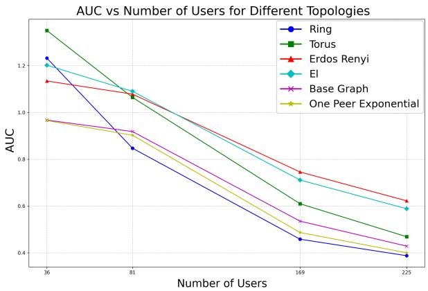

Figure 2. Framework scalability and topology sensitivity. SONAR maintains stable scaling as client count increases while preserving topology-dependent accuracy trends, enabling reproducible large-scale decentralized learning experiments.  
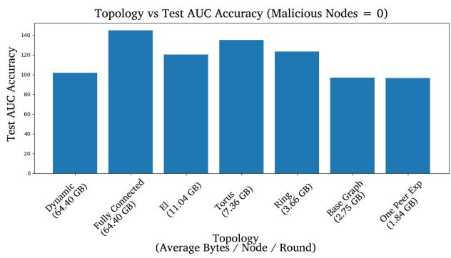  
Figure 3. Communication cost vs. accuracy frontier. Structured topologies (ring, torus) reach comparable AUC to dense graphs with substantially lower communication volume per round, illustrating SONAR’s ability to expose system-level efficiency tradeoffs.

## 6 RESULTS & ANALYSIS: IMPACT OF COMMUNICATION TOPOLOGY

We now use the framework to analyze how communication topology affects decentralized learning. This section characterizes how topology influences performance, collaboration behavior, and key system trade-offs.

Why topology. The communication graph determines who exchanges updates and how information propagates through the network. It directly impacts convergence speed, fault resilience, bandwidth cost, and privacy exposure. Prior FL frameworks evaluate accuracy but provide limited visibility into these topology-dependent effects. SONAR closes this gap by integrating network control and telemetry to measure accuracy, communication, and robustness under identical conditions.

We use SONAR to answer these key questions:

(1) How does topology affect performance and convergence? We compare random, in-domain, and structured graphs to quantify accuracy and scaling trends.

(2) What emergent behaviors arise in adaptive collaboration? We analyze similarity-based peer selection and the resulting collaborator collapse.

(3) What systems trade-offs emerge across topologies? How does topology shape convergence efficiency, robustness to faults and attacks, and privacy leakage?

Each experiment reuses identical models and datasets across topologies, with metrics collected automatically through SONAR’s telemetry. Together, these results position SONAR as a framework for systematic, reproducible analysis of topology-aware decentralized learning.

## 6.1 Performance Across Topologies

Setup. We compare random versus within-domain and other structured collaboration graphs under identical model, data, and optimization conditions. SONAR’s telemetry records per-round metrics, reporting test AUC and !AUC gaps as the number of users and domains are varied to isolate effects of scale and heterogeneity.

Scaling with users. Figure 4 (top) compares 12- and 45- user federations, while the bottom panels plot !AUC versus user count. Within-domain collaboration achieves higher accuracy on both DomainNet and Digit-Five, with the gap widening at scale (positive slopes). As the system grows, information propagation in random graphs slows due to longer diffusion paths, while domain-aligned graphs exploit locality to accelerate convergence. Camelyon17, which is already near-saturated in AUC, shows minimal dependence on topology once accuracy plateaus. These findings demonstrate that topology drives performance through the rate of knowledge dissemination rather than the attainable ceiling. Table 5 quantifies the scale-dependent gap.

Scaling with heterogeneity. Figure 5 varies number of domains while holding number of users fixed. The dashed trend lines increase monotonically: the more heterogeneous the federation, the larger the benefit of respecting data structure (within-domain). This supports the design principle that collaboration graphs should align with underlying data clusters.

Stability over long horizons. Long-horizon runs to 1000 rounds (39 users) confirm the gap is not transient; the advantage of within-domain persists and sometimes widens over time (Supp. Fig. 8).

Breadth of topologies. While we foreground random vs.

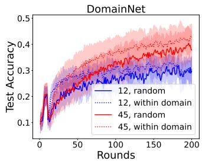

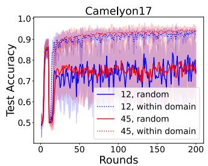

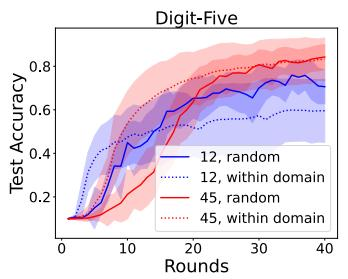

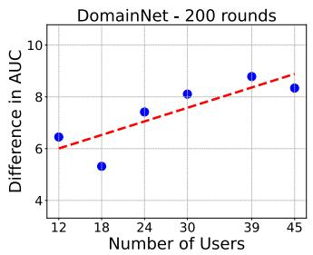

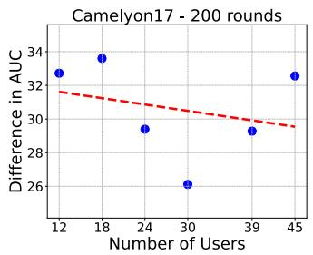

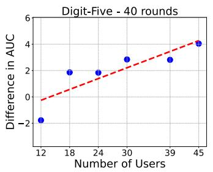  
Figure 4. Accuracy comparison as the System Scales. (Top:) Comparison of test accuracy between within-domain collaboration and random collaboration with varying numbers of clients. (Bottom:) Illustration of the trend: within-domain consistently outperforms random on DomainNet and Digit-Five with gains that grow at scale

within-domain to isolate the data-alignment effect, SONAR supports a wider set (ring, grid/torus, epidemic, L2C, onepeer exponential, complete, etc.). Rankings vary by dataset and regime, reinforcing that topology choice is contextdependent (Supp. Table4 provides full AUC statistics for all topologies and collaborator counts). Structured and domainaligned graphs consistently outperform random and dense topologies, validating the robustness of the observed trends in Figures 4 and 5.

Implications. (1) Topology effects intensify with scale and heterogeneity: coordination policies become a first-order design variable for large systems. (2) The benefit arises from matching communication structure to data structure—local consistency accelerates convergence and reduces wasted bandwidth. (3) In high-signal or homogeneous regimes (e.g., Camelyon17), topologies converge to similar accuracy, suggesting lighter graphs can achieve comparable performance with lower cost. (4) There is no universal best topology; performance, robustness, and privacy objectives often conflict. SONAR’s unified benchmarking design enables controlled, apples-to-apples comparison to inform topology selection for each deployment scenario.

## 6.2 Emergent Dynamics: Collaborator Collapse

Emergence of Collaborator Collapse: When collaborators are selected purely based on similarity metrics, a feedback loop emerges where the same collaborators are repeatedly selected, causing users to collapse into small groups and miss domain-relevant knowledge (Fig. 6). This collapse occurs both within and across domains: within-domain collapse leads to overfitting on combined local data and poor generalization, while cross-domain collapse is even worse as users overfit on data unrepresentative of their respective domains. Any similarity metric comparing two users shrinks after collaboration, amplifying repeated selection and systematic collapse—a phenomenon noted by (Gupta, 2024) and (Shi, 2025) that we characterize in detail within a topology-aware decentralized setting.

To validate this dynamic, we introduce Top K, a greedy selection scheme that regulates diversity through parameter K by sampling from the top-K most similar users (see supplementary for details). Supp.Fig. 9 reveals that performance is highly sensitive to K: values too small cause collaborator collapse with performance below random collaboration, while values too large enable harmful inter-domain collaboration. Counterintuitively, the optimal K differs from the true domain size due to noise in the similarity metric—as the metric becomes more robust, optimal K increases from 3 to 12 (matching the actual domain size). This noise stems from representations, models, and similarity computations, with noisier metrics requiring smaller K values since inherent noise already provides diversity. Similarity averaging over the last R rounds improves robustness, but the fundamental challenge remains: imperfect similarity metrics, when used for selection and weight aggregation, amplify errors and cause systematic performance degradation.

While evaluated at moderate scale, our experiments suggest collaborator collapse is expected to intensify as the number of users grows: limited Top-K neighborhoods reduce exploration and increase early lock-in to local cliques, analogous to slower mixing in sparse graphs. Increasing K improves connectivity but reintroduces harmful cross-domain mixing, exposing a trade-off between collapse and over-mixing. Large scale validation remains an important direction for future work.

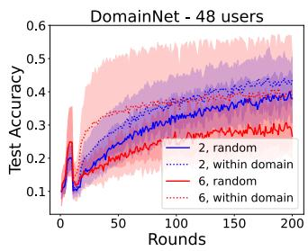

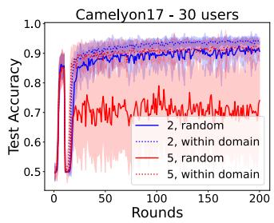

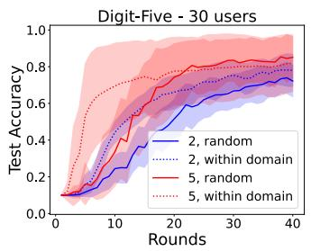

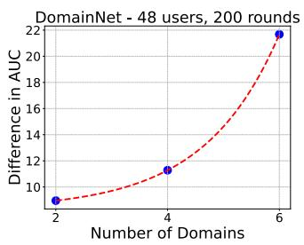

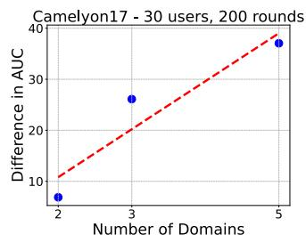

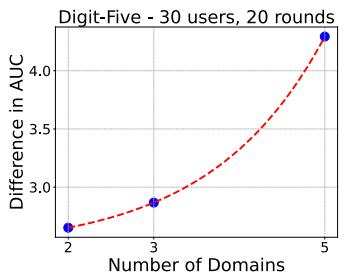  
Figure 5. Enhanced Accuracy with Within-Domain Collaboration as Data Heterogeneity Grows. (Top:) Comparison of test accuracy between within-domain collaboration and random collaboration for varying numbers of domains (2 and 6 here). (Bottom:) Illustration of the trend in widening of AUC gap between the two strategies, showing the benefits of within-domain collaboration over random.

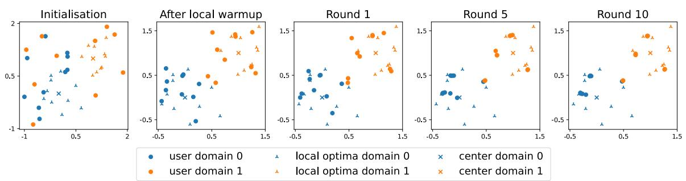  
Figure 6. Greedy collaboration induces collaborator collapse in a 2D toy simulation. Users start from random model initializations. Local training pulls models toward their domain-specific optima, while collaboration pulls them toward their chosen peers (nearest in model space). Repeated greedy selection causes users to converge into small clusters, losing domain diversity and generalization.

Implications for adaptive topology design. Adaptive collaboration requires balancing diversity and similarity reliability. When similarity metrics are noisy, smaller K mitigates collapse by injecting diversity, while more reliable metrics support larger K closer to true domain structure. The optimal K also depends on the training horizon: smaller values favor faster early convergence but risk long-term collapse, whereas larger values improve stability at the cost of slower mixing. Overall, K acts as a system-level control parameter that trades off over-specialization against over-mixing, and should be tuned jointly with similarity estimation quality and training duration.

## 6.3 Tradeoffs Across System Dimensions

## Communication cost & convergence speed

We quantify the efficient convergence by plotting test AUC against mean bytes transmitted per node per round. As shown earlier in Fig. 3, several topologies reach similar final AUC with different bandwidth costs. Dense graphs (e.g., fully connected) are high-cost end and do not always deliver better accuracy; structured graphs (ring, torus) often achieve comparable AUC for far less communication. In short: (1) topology choice meaningfully shifts the AUC/byte trade-off; (2) more edges doesn’t equate to efficient convergence and (3) depending on topology, structured sparsity may be an efficient choice.

With a single malicious node, the ordering and gaps persist (Supp.Fig. 12b), suggesting the cost–performance relationship is a property of the graph family rather than a peculiarity of clean runs. Practically, if the deployment’s primary constraint is bandwidth, start with low-degree structured graphs and only increase density when accuracy plateaus.

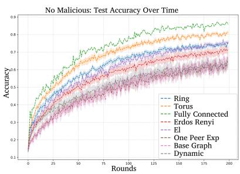  
Test accuracy without any malicious attacker for reference

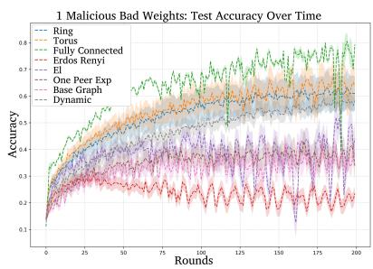  
Test accuracy under bad weights attack with 1 malicious node

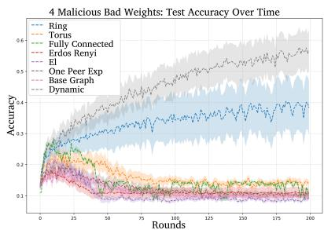  
Test accuracy under bad weights attack with 4 malicious nodes  
Figure 7. How accuracy changes with growing number of attackers in the network. Note how when the number of collaboration rounds are capped, a difference of around 20% exists in test accuracy between the best and worst topologies. Note also how ring and dynamic are most resilient when there are four attackers in the network.

## Robustness and fault tolerance

We evaluate two common failure modes: bad-weights (Byzantine parameter corruption) and noisy labels. Figure 7 summarizes the time-series response under 1 and 4 adversaries; dense/random graphs exhibit sharp drops and slower recovery, while sparser structured graphs (ring/torus) degrade more gracefully and rebound once harmful updates are diluted. The effect is consistent across attack types.

The aggregate picture mirrors the traces. In Supp. Fig. 12, with 4 attackers, dense graphs incur the largest accuracy loss for both attack families, while moderate structure (ring/- torus) limits worst-case degradation. Notably, robustness is non-monotonic in density: beyond a modest degree, additional edges mainly increase exposure paths without proportional gains in stability.

Supp. Fig. 12 varies the number of malicious nodes. Accuracy degrades most quickly in dense/random graphs; rings and tori show flatter curves, indicating fault containment.

Privacy–Topology Trade-offs Supp. Fig. 20 presents membership inference attack (MIA) performance across training rounds under different configurations. The top panel compares various topologies with fixed distribution similarities, while the bottom panel examines the impact of distribution similarity for a fixed topology. Our results reveal that data distribution heterogeneity has a more pronounced effect on MIA success than network topology, though fully-connected architectures consistently exhibit the highest vulnerability to membership inference. Notably, as participant data distributions become increasingly non-IID, attack accuracy degrades across all topologies.

Supp. Figures 17, 19, 16 illustrate gradient inversion attack (GIA) results, employing the method of (Geiping et al., 2020) as the base attack and the decentralized reconstruction technique from (Mrini et al., 2024) to invert gradients from nodes multiple hops away. In contrast to MIA, network connectivity emerges as the dominant factor for GIA success rather than topology structure. Reconstruction quality deteriorates significantly with increasing hop distance, with immediately connected neighbors representing the most vulnerable targets for gradient inversion attacks.

## 7 CONCLUSION

We presented SONAR, a modular benchmarking framework for decentralized collaborative learning that unifies communication, topology, and telemetry to enable systematic evaluation of network structure in learning systems. Using SONAR, we show that topology is a first-class systems variable: it influences performance, robustness, and privacy, but its impact also depends on factors such as participant scale, data heterogeneity, and communication budget. We find that structured, sparse topologies can achieve comparable or better performance than dense graphs at substantially lower communication cost, and we identify collaborator collapse, a systematic failure mode in adaptive collaboration where similarity-based peer selection reduces diversity and degrades generalization.

These results highlight that decentralized learning must be understood as a coupled system of optimization and communication. Effective system design requires jointly reasoning about topology, data distribution, and resource constraints, rather than treating communication structure as a fixed or secondary choice.

While our experiments focus on vision tasks, SONAR is broadly applicable to decentralized learning settings where gradients are exchanged, including language, tabular, and multimodal models. Extending topology-aware analysis to these domains, and understanding how model and gradient characteristics interact with network structure, remains an important direction for future work.

## REFERENCES

Afonin, A. and Karimireddy, S. P. Towards model agnostic federated learning using knowledge distillation. In International Conference on Learning Representations, 2022. 4

Amit, D. J., Gutfreund, H., and Sompolinsky, H. Spin-glass models of neural networks. Physical Review A, 32(2): 1007, 1985. 16

Bandi, P., Geessink, O., Manson, Q., Van Dijk, M., Balkenhol, M., Hermsen, M., Bejnordi, B. E., Lee, B., Paeng, K., Zhong, A., et al. From detection of individual metastases to classification of lymph node status at the patient level: the camelyon17 challenge. IEEE Transactions on Medical Imaging, 2018. 7, 16

Beutel, D. J., Topal, T., Mathur, A., Qiu, X., Fernandez-Marques, J., Gao, Y., Sani, L., Kwing, H. L., Parcollet, T., Gusmao, P. P. d., and Lane, N. D. Flower: A friendly ˜ federated learning research framework. arXiv preprint arXiv:2007.14390, 2020. 1, 3

Boenisch, F., Dziedzic, A., Schuster, R., Shamsabadi, A. S., Shumailov, I., and Papernot, N. When the curious abandon honesty: Federated learning is not private. IEEE, 2023. 6, 19

Caldas, S., Duddu, S. M. K., Wu, P., Li, T., Konecnˇ y, J., ´ McMahan, H. B., Smith, V., and Talwalkar, A. Leaf: A benchmark for federated settings, 2019. 4

Chen, C. and Campbell, N. D. F. Understanding trainingdata leakage from gradients in neural networks for image classification, 2021. URL https://arxiv.org/ abs/2111.10178. 19

De Vos, M., Farhadkhani, S., Guerraoui, R., Kermarrec, A.-M., Pires, R., and Sharma, R. Epidemic learning: Boosting decentralized learning with randomized communication. Advances in Neural Information Processing Systems, 36:36132–36164, 2023. 4

de Vos, M., Farhadkhani, S., Guerraoui, R., Kermarrec, A.- M., Pires, R., and Sharma, R. Epidemic learning: Boosting decentralized learning with randomized communication. In 37th Annual Conference on Neural Information Processing Systems (NeurIPS ’23), 2023. 6

De Vos, M., Farhadkhani, S., Guerraoui, R., Kermarrec, A.-M., Pires, R., and Sharma, R. Epidemic learning: Boosting decentralized learning with randomized communication. Advances in Neural Information Processing Systems, 36, 2024. 7

Dhasade, A., Kermarrec, A.-M., Pires, R., Sharma, R., and Vujasinovic, M. Decentralized learning made easy with

decentralizepy. In Proceedings of the 3rd Workshop on Machine Learning and Systems, pp. 34–41, 2023. 1, 4

Duan, M., Liu, D., Ji, X., Liu, R., Liang, L., Chen, X., and Tan, Y. Fedgroup: Efficient federated learning via decomposed similarity-based clustering. In 2021 IEEE Intl Conf on Parallel & Distributed Processing with Applications, Big Data & Cloud Computing, Sustainable Computing & Communications, Social Computing & Networking (ISPA/BDCloud/SocialCom/SustainCom), pp. 228–237. IEEE, 2021. 16

Even, M., Berthier, R., Bach, F., Flammarion, N., Hendrikx, H., Gaillard, P., Massoulie, L., and Taylor, A. Con-´ tinuized accelerations of deterministic and stochastic gradient descents, and of gossip algorithms. In Beygelzimer, A., Dauphin, Y., Liang, P., and Vaughan, J. W. (eds.), Advances in Neural Information Processing Systems, 2021. URL https://openreview.net/forum? id=bGfDnD7xo-v. 6

Fan, D., Mendler-Dunner, C., and Jaggi, M. Collaborative ¨ learning via prediction consensus, 2023. 16, 18

Fowl, L., Geiping, J., Reich, S., Wen, Y., Czaja, W., Goldblum, M., and Goldstein, T. Decepticons: Corrupted transformers breach privacy in federated learning for language models. arXiv preprint arXiv:2201.12675, 2022. 6, 19

Ganin, Y. and Lempitsky, V. Unsupervised domain adaptation by backpropagation. In International conference on machine learning, pp. 1180–1189. PMLR, 2015. 16

Geiping, J., Bauermeister, H., Droge, H., and Moeller, M. ¨ Inverting gradients - how easy is it to break privacy in federated learning? In Advances in Neural Information Processing Systems (NeurIPS ’20), volume 33, pp. 16937–16947, 2020. URL https://proceedings. neurips.cc/paper/2020/file/ c4ede56bbd98819ae6112b20ac6bf145-Paper. pdf. 6, 11, 19

Gkantsidis, C., Mihail, M., and Saberi, A. Random walks in peer-to-peer networks. In IEEE INFOCOM 2004, volume 1. IEEE, 2004. 5

Google. Tensorflow federated. URL https://www. tensorflow.org/federated/get\_started. 3

Gupta, G. Unlocking collective intelligence in decentralized AI. Master’s thesis, Massachusetts Institute of Technology, 2024. Available at: https://dspace.mit. edu/handle/1721.1/156977. 9

Gupta, O. and Raskar, R. Distributed learning of deep neural network over multiple agents. Journal of Network and Computer Applications, 116:1–8, 2018. 4

Hagberg, A., Swart, P. J., and Schult, D. A. Exploring network structure, dynamics, and function using networkx. Technical report, Los Alamos National Laboratory (LANL), Los Alamos, NM (United States), 2008. 6

He, C., Li, S., So, J., Zeng, X., Zhang, M., Wang, H., Wang, X., Vepakomma, P., Singh, A., Qiu, H., et al. Fedml: A research library and benchmark for federated machine learning. arXiv preprint arXiv:2007.13518, 2020. 1, 3, 4

He, K., Zhang, X., Ren, S., and Sun, J. Deep residual learning for image recognition. In Proceedings of the IEEE conference on computer vision and pattern recognition, pp. 770–778, 2016. 7, 16

Hendrycks, D. and Dietterich, T. Benchmarking neural network robustness to common corruptions and perturbations. Proceedings of the International Conference on Learning Representations, 2019. 6, 19

Hu, H., Salcic, Z., Sun, L., Dobbie, G., Yu, P. S., and Zhang, X. Membership inference attacks on machine learning: A survey. ACM Computing Surveys (CSUR), 54(11s):1–37, 2022. 6, 19

Huang, L., Shea, A. L., Qian, H., Masurkar, A., Deng, H., and Liu, D. Patient clustering improves efficiency of federated machine learning to predict mortality and hospital stay time using distributed electronic medical records. Journal of biomedical informatics, 99:103291, 2019. 16

Hull, J. J. A database for handwritten text recognition research. IEEE Transactions on pattern analysis and machine intelligence, 16(5):550–554, 1994. 16

Keeling, M. J. and Eames, K. T. Networks and epidemic models. Journal of the royal society interface, 2(4):295– 307, 2005. 16

Koloskova, A., Loizou, N., Boreiri, S., Jaggi, M., and Stich, S. A unified theory of decentralized SGD with changing topology and local updates. In III, H. D. and Singh, A. (eds.), Proceedings of the 37th International Conference on Machine Learning, volume 119 of Proceedings of Machine Learning Research, pp. 5381–5393. PMLR, 13– 18 Jul 2020. URL https://proceedings.mlr. press/v119/koloskova20a.html. 2, 3, 6

Krizhevsky, A., Hinton, G., et al. Learning multiple layers of features from tiny images. 2009. 7, 16

Lai, F., Dai, Y., Singapuram, S. S., Liu, J., Zhu, X., Madhyastha, H. V., and Chowdhury, M. FedScale: Benchmarking model and system performance of federated learning at scale. In International Conference on Machine Learning (ICML), 2022. 1, 3, 4

Lalitha, A., Kilinc, O. C., Javidi, T., and Koushanfar, F. Peer-to-peer federated learning on graphs. arXiv preprint arXiv:1901.11173, 2019. 3

LeCun, Y., Bottou, L., Bengio, Y., and Haffner, P. Gradientbased learning applied to document recognition. Proceedings of the IEEE, 86(11):2278–2324, 1998. 16

Li, C., Li, G., and Varshney, P. K. Decentralized federated learning via mutual knowledge transfer. IEEE Internet of Things Journal, 9(2):1136–1147, 2021a. 3, 5

Li, S., Zhou, T., Tian, X., and Tao, D. Learning to collaborate in decentralized learning of personalized models. In 2022 IEEE/CVF Conference on Computer Vision and Pattern Recognition (CVPR), pp. 9756–9765, 2022a. doi: 10.1109/CVPR52688.2022.00954. 3, 7

Li, X., Jiang, M., Zhang, X., Kamp, M., and Dou, Q. Fedbn: Federated learning on non-iid features via local batch normalization. arXiv preprint arXiv:2102.07623, 2021b. 7, 16

Li, Z., Lu, J., Luo, S., Zhu, D., Shao, Y., Li, Y., Zhang, Z., Wang, Y., and Wu, C. Towards effective clustered federated learning: A peer-to-peer framework with adaptive neighbor matching. IEEE Transactions on Big Data, 2022b. 3, 5, 16

Liu, Y., Shi, Y., Li, Q., Wu, B., Wang, X., and Shen, L. Decentralized directed collaboration for personalized federated learning. In Proceedings of the IEEE/CVF Conference on Computer Vision and Pattern Recognition, pp. 23168–23178, 2024. 7

Maheri, M. M., Siby, S., Abdollahi, S., Borovykh, A., and Haddadi, H. P4: Towards private, personalized, and peerto-peer learning. arXiv preprint arXiv:2405.17697, 2024. 7

McMahan, B., Moore, E., Ramage, D., Hampson, S., and y Arcas, B. A. Communication-efficient learning of deep networks from decentralized data. In Artificial intelligence and statistics, pp. 1273–1282. PMLR, 2017. 3

McMahan, H. B., Moore, E., Ramage, D., and y Arcas, B. A. Federated learning of deep networks using model averaging. arXiv preprint arXiv:1602.05629, 2:2, 2016. 4

Mrini, A. E., Cyffers, E., and Bellet, A. Privacy attacks in decentralized learning. arXiv preprint arXiv:2402.10001, 2024. 6, 11, 19, 21

Netzer, Y., Wang, T., Coates, A., Bissacco, A., Wu, B., and Ng, A. Y. Reading digits in natural images with unsupervised feature learning. 2011. 16

Nguyen, T. D., Nguyen, T., Nguyen, P. L., Pham, H. H., Doan, K., and Wong, K.-S. Backdoor attacks and defenses in federated learning: Survey, challenges and future research directions, 2023. URL https://arxiv. org/abs/2303.02213. 19

Onoszko, N., Karlsson, G., Mogren, O., and Zec, E. L. Decentralized federated learning of deep neural networks on non-iid data. arXiv preprint arXiv:2107.08517, 2021. 16

Peng, X., Bai, Q., Xia, X., Huang, Z., Saenko, K., and Wang, B. Moment matching for multi-source domain adaptation. In Proceedings of the IEEE/CVF international conference on computer vision, pp. 1406–1415, 2019. 7, 16

Peralta, A. F., Kertesz, J., and I ´ niguez, G. Opinion dynamics ˜ in social networks: From models to data. arXiv preprint arXiv:2201.01322, 2022. 16

Qu, Y., Dai, H., Zhuang, Y., Chen, J., Dong, C., Wu, F., and Guo, S. Decentralized federated learning for uav networks: Architecture, challenges, and opportunities. IEEE Network, 35(6):156–162, 2021. 3

Roy, A. G., Siddiqui, S., Polsterl, S., Navab, N., and ¨ Wachinger, C. Braintorrent: A peer-to-peer environment for decentralized federated learning. arXiv preprint arXiv:1905.06731, 2019. 3

Sattler, F., Muller, K.-R., and Samek, W. Clustered federated ¨ learning: Model-agnostic distributed multitask optimization under privacy constraints. IEEE transactions on neural networks and learning systems, 32(8):3710–3722, 2020. 16

Shaker, A. and Reeves, D. S. Self-stabilizing structured ring topology p2p systems. In Fifth IEEE International Conference on Peer-to-Peer Computing (P2P’05), pp. 39– 46. IEEE, 2005. 5

Sharma, A. and Marchang, N. A review on client-server attacks and defenses in federated learning. Comput. Secur., 140(C), July 2024. ISSN 0167-4048. doi: 10.1016/j.cose. 2024.103801. URL https://doi.org/10.1016/ j.cose.2024.103801. 19

Shi, Y. Towards understanding privacy leakage in decentralized and collaborative learning. Master’s thesis, Massachusetts Institute of Technology, 2025. Available at: https://dspace.mit.edu/handle/1721. 1/162909. 9

Sinha, D. A., Liu, Y., Du, R., Markopoulou, A., and Shen, Y. Gradient inversion attack on graph neural networks. Transactions on Machine Learning Research, 2025. ISSN 2835-8856. URL https:// openreview.net/forum?id=a0mLrqkWyx. 19

Sui, Y., Wen, J., Lau, Y., Ross, B. L., and Cresswell, J. C. Find your friends: Personalized federated learning with the right collaborators. arXiv preprint arXiv:2210.06597, 2022. 5, 16

Takezawa, Y., Sato, R., Bao, H., Niwa, K., and Yamada, M. Beyond exponential graph: Communication-efficient topologies for decentralized learning via finite-time convergence. Advances in Neural Information Processing Systems, 36:76692–76717, 2023. 7

Thurner, S., Hanel, R., and Klimek, P. Introduction to the Theory of Complex Systems. Oxford University Press, 2019. 16

Vogels, T., Hendrikx, H., and Jaggi, M. Beyond spectral gap: the role of the topology in decentralized learning. In Proceedings of the 36th International Conference on Neural Information Processing Systems, NIPS ’22, Red Hook, NY, USA, 2022. Curran Associates Inc. ISBN 9781713871088. 2, 4

Wang, Z., Fan, X., Peng, Z., Li, X., Yang, Z., Feng, M., Yang, Z., Liu, X., and Wang, C. Flgo: A fully customizable federated learning platform, 2023. 3

Ye, R., Ni, Z., Wu, F., Chen, S., and Wang, Y. Personalized federated learning with inferred collaboration graphs. In International Conference on Machine Learning, pp. 39801–39817. PMLR, 2023. 7

Ying, B., Yuan, K., Chen, Y., Hu, H., Pan, P., and Yin, W. Exponential graph is provably efficient for decentralized deep training. Advances in Neural Information Processing Systems, 34:13975–13987, 2021. 7

Yu-hang, L., Ming-fa, Z., Jue, W., Li-min, X., and Tao, G. Xtorus: An extended torus topology for on-chip massive data communication. In 2012 IEEE 26th International Parallel and Distributed Processing Symposium Workshops & PhD Forum, pp. 2061–2068. IEEE, 2012. 5

Zhang, J., Liu, Y., Hua, Y., Wang, H., Song, T., Xue, Z., Ma, R., and Cao, J. Pfllib: Personalized federated learning algorithm library. arXiv preprint arXiv:2312.04992, 2023. 3

Zhao, B., Mopuri, K. R., and Bilen, H. idlg: Improved deep leakage from gradients, 2020. URL https://arxiv. org/abs/2001.02610. 19

Zhu, J. and Blaschko, M. B. R- gap : Recursive gradient attack on privacy. In International Conference on Learning Representations, 2021. URL https://openreview. net/forum?id=RSU17UoKfJF. 19

Zhu, L., Liu, Z., and Han, S. Deep leakage from gradients. Advances in neural information processing systems

(NeurIPS ’19), 32, 2019. URL https://papers. nips.cc/paper\_files/paper/2019/file/ 60a6c4002cc7b29142def8871531281a-Paper. pdf. 19

Zhuang, W., Xu, J., Chen, C., Li, J., and Lyu, L. Coala: A practical and vision-centric federated learning platform. In Forty-first International Conference on Machine Learning, 2024. 3, 4