# DISAGG: DISTRIBUTED AGGREGATORS FOR EFFICIENT SECURE AGGREGATION IN FEDERATED LEARNING

Haaris Mehmood 1 Giorgos Tatsis 2 Dimitrios Alexopoulos 2 Karthikeyan Saravanan 1 Jie Xu 1 Anastasios Drosou 2 Mete Ozay 1

## ABSTRACT

Federated learning enables collaborative model training across distributed clients, yet vanilla FL exposes client updates to the central server. Secure-aggregation schemes protect privacy against an honest-but-curious server, but existing approaches often suffer from many communication rounds, heavy public-key operations, or difficulty handling client dropouts. Recent methods like One-Shot Private Aggregation (OPA) cut rounds to a single server interaction per FL iteration, yet they impose substantial cryptographic and computational overhead on both server and clients. We propose a new protocol called DISAGG that leverages a small committee of clients called Aggregators to perform the aggregation itself: each client secret-shares its update vector to Aggregators, which locally compute partial sums and return only aggregated shares for server-side reconstruction. This design eliminates local masking and expensive homomorphic encryption, reducing endpoint computation while preserving privacy against a curious server and a limited fraction of colluding clients. By leveraging optimal trade-offs between communication and computation costs, DISAGG processes 100k-dimensional update vectors from 100k 5G clients with a 4.6x speedup compared to OPA, the previous best protocol.

## 1 INTRODUCTION

Federated Learning (FL) allows many clients to collaboratively train a global model while keeping raw data local (McMahan et al., 2017; Wang et al., 2021). However, client updates can still leak sensitive information through gradient and model inversion attacks (Geiping et al., 2020b; Wang et al., 2019; Zhu & Han, 2020). To mitigate this leakage, several privacy-preserving approaches have been proposed, including differential privacy (Abadi et al., 2016; Wei et al., 2019; Kasiviswanathan et al., 2011; Geyer et al., 2018) and homomorphic encryption (Phong et al., 2018). Among these, Secure Aggregation (SA) is widely adopted for FL, providing strong privacy for individual updates while preserving model utility and maintaining efficiency (Kairouz et al., 2019).

In production, federated learning systems must satisfy stringent constraints: intermittent connectivity, client dropouts, adversarial clients, large heterogeneous populations, and tight per-round latency budgets. These requirements translate into concrete design goals for SA: low round complexity to mitigate synchronization barriers and straggler effects; robustness to dropouts, corruption, and dynamic participation; minimal per-client computation and memory for mobile/edge devices; and limited server-side bottlenecks to sustain high throughput (Kairouz et al., 2019; Ma et al., 2023; Ngong et al., 2023).

Secure Aggregation (SECAGG) (Bonawitz et al., 2017) protects individual contributions by having clients generate pairwise cryptographic keys and add complementary random masks to their model updates; the masks cancel when summed, revealing only the total update while preventing an honest-but-curious server from recovering any single client’s data. To tolerate dropouts, missing masks are reconstructed via secret-sharing seeds from surviving participants1. However, these designs require multi-round exchanges and heavy per-client cryptographic work—each of the N clients performs O(N ) key exchanges, so the server must route and validate O(N 2) messages (Bonawitz et al., 2017). Subsequent variants such as SECAGG+, FASTSECAGG, LIGHTSECAGG, FLAMINGO, and TURBO-AGGREGATE (Bell et al., 2020; Kadhe et al., 2020; So et al., 2022; Ma et al., 2023; So et al., 2021) mitigate some of this cost but the need for multiple rounds and recovery steps remains a scalability bottleneck for dynamic, large-scale deployments (Kairouz et al., 2019; Ma et al., 2023). One-shot protocols, such as OPA (Karthikeyan & Polychroniadou, 2024; Bell-Clark et al., 2024), address this by allowing each client to upload a single message per FL iteration, proceeding once a sufficient threshold of client and committee messages is collected; this eliminates multi-phase handshakes, reduces synchronization barriers, and improves straggler resilience, at the expense of higher per-round cryptographic overhead that scales with model dimension and committee size.

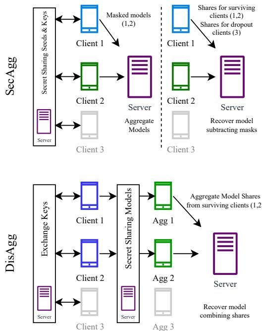  
Figure 1. Overview of the SECAGG protocol compared with the proposed DISAGG. SECAGG uses masks for the models to hide individual inputs and the server aggregates the masked models, whereas DISAGG secret-shares part of the model parameters to the Aggregators for them to perform the partial aggregation instead of the server.

We aim to preserve the reduced synchronization advantages of recent protocols while improving computational efficiency at both the client and the server. To this end, we present DISAGG, a novel SA protocol that distributes aggregation across a small committee of clients (the “Aggregators”). Figure 1 contrasts SECAGG and DISAGG at a high level. Building on prior committee-based and distributed-summation ideas (Kadhe et al., 2020; So et al., 2022), DISAGG has clients secret-share their model updates directly to the Aggregator committee. The Aggregators compute partial sums locally and return only aggregated shares for server-side reconstruction. This approach eliminates local masking, reduces regular client computation, and lowers server reconstruction cost, while keeping per-round interaction low. Like OPA, DISAGG supports asynchronous participation: clients send a single upload per FL iteration, Aggregators accumulate shares as they arrive, and the server reconstructs once enough aggregated shares are available, avoiding barrier synchronization. The added Aggregator-side communication and computation is mitigated by selecting a small committee, as analyzed in Section 4.2.

## Our contributions are as follows:

• We introduce a novel secure-aggregation protocol that achieves the same security guarantees as prior methods, yet eliminates the heavy overhead of cryptographic masking and dropout-recovery mechanisms.

• We extend prior theoretical analyses for secret-share threshold selection to include realistic constraints: considering both dropped out and corrupt clients as random variables and incorporating Byzantine faulttolerance limits, offering new insights for threshold selection.

• We develop a timing analysis framework incorporating both computation and communication complexities to extensively compare against the state-of-the-art protocol OPA without requiring actual simulations. Under realistic deployment settings and practical configurations of M = 1M and N = 1M, our protocol is expected to achieve an 25-fold speedup over the stateof-the-art OPA scheme.

In summary, DISAGG retains the asynchrony and low round complexity desirable for cross-device FL while improving computational efficiency at both endpoints. In the following sections, we formalize the protocol and security properties, analyze its complexity, and validate its performance against state-of-the-art protocols, including SECAGG, SECAGG+, LIGHTSECAGG, and OPA (Bonawitz et al., 2017; Bell et al., 2020; So et al., 2022; Karthikeyan & Polychroniadou, 2024).

## 2 BACKGROUND AND RELATED WORK

## 2.1 Federated Learning

We consider a cross-device federated learning (FL) setting based on the FedAvg algorithm (McMahan et al., 2017), executed over T synchronous communication rounds (Wang et al., 2021). At iteration t ∈ {1, . . . , T }, the central server broadcasts the current global model wt ∈ RM to a randomly sampled subset of clients U (t) ⊆ C, where C denotes the full population of registered devices. Each selected client i ∈ U (t) performs E local stochastic gradient descent (SGD) steps on its private data Di, thereby minimizing its local objective Fi(wt), i.e., the expected loss on Di, and obtaining an updated local model wit,E. The client then computes the model delta xi = wit,E − wt ∈ RM and sends it back to the server. The server aggregates the received deltas and forms the next global model as wt+1 = wt + Pi∈U(t) xi. Various FL variants modify this aggregation step in different ways (Li et al., 2020a; Reddi et al., 2021).

## 2.2 Motivation for Secure Aggregation

In vanilla FL, the client updates xi are transmitted in clear text. Even when the server follows the FL protocol faithfully (i.e., is honest-but-curious), it can inspect each xi and potentially infer sensitive information about the underlying private datasets (Zhu et al., 2019; Geiping et al., 2020a). Consequently, protecting individual contributions while still enabling the server to compute the global sum has become a central design requirement for practical FL systems.

Secure aggregation addresses this privacy concern by ensuring that the server learns only the aggregate of all client updates and nothing about any single xi (Bonawitz et al., 2017). In a typical construction, each client first uses a deterministic rounding scheme to quantize its floating-point update xi ∈ RM to xˆi ∈ ZMp , a vector belonging to a finite field of prime order p. The quantized vectors are then masked using cryptographic primitives such as pairwise masks to produce x˜i (Bonawitz et al., 2017).

Based on the agreed-upon protocol, the server can eliminate the masks by aggregating the masked client updates, St = Pi∈U(t) x˜i mod p ∈ Zp. The server then de-quantizes St back to RM and combines it with the current global model to produce the next iterate wt+1. Empirically, we observe that the quantization/de-quantization step incurs negligible degradation in model performance provided the field size is sufficiently large (e.g., p ≥ 232), which is a standard choice in secure-aggregation implementations.

When combined with distributed differential privacy (Kairouz et al., 2021), secure aggregation provides a strong, provable guarantee that individual user data cannot be reconstructed from the communicated messages.

## 2.3 Canonical Protocols

SecAgg (Bonawitz et al., 2017): SECAGG is the first practical secure-aggregation protocol. Each client i establishes a pairwise symmetric key kij with every other client j via an authenticated key-exchange. From kij, a short seed is derived and expanded with a pseudorandom generator into a high-dimensional pairwise mask mij ∈ ZMp . Client i adds the sum of its incoming masks (mij) and subtracts the sum of its outgoing masks (mji), yielding a masked vector x˜i = ˆxi + Pj<i mij − Pj>i mji. Because each mask appears with opposite sign in two clients, all masks cancel in the server’s sum, exposing only Pi xˆi.

The major drawback of SECAGG is the complete pairwise graph, which, during the reconstruction phase, requires the server to request shares of dropped-out clients from all remaining clients. This leads to significant communication and verification overhead for large N (Bonawitz et al., 2017; Kairouz et al., 2019).

SecAgg+ (Bell et al., 2020): SECAGG+ improves scalability by replacing the complete pairwise graph with a sparse random graph G of a bounded degree. Clients exchange keys and share seeds only with their neighbors in G, reducing the number of masks and secret-sharing operations per client. Consequently, total server communication and verification costs drop from O(N 2) to O(N logN ).

## 2.4 Subsequent Protocols

Subsequent works improve over several facets of computation and communication complexity in SA (So et al., 2022; Kadhe et al., 2020; Ma et al., 2023). More recently, works pursue a one-shot approach for secure aggregation, designing protocols in which each client sends a single message per federated-learning iteration2, thereby eliminating the multi-phase handshakes and synchronization barriers of earlier schemes. We introduce the reader to OPA (Karthikeyan & Polychroniadou, 2024), a strong baseline for one-shot aggregation. Additional extensions of secure aggregation are mentioned in the appendix.

OPA (Karthikeyan & Polychroniadou, 2024): One-shot Private Aggregation (OPA) tackles round complexity by allowing each client to upload a single, one-shot message per FL iteration. This design eliminates multi-round communication and enables asynchronous participation: the server recovers a sum as soon as the minimum threshold of client and committee messages are received, avoiding barrier synchronization and reducing sensitivity to stragglers. The scheme relies on a random subset of helper clients as ‘committee’ and cryptographic primitives that support additive homomorphism over masked updates. Clients send masked model updates to the server and share corresponding key shares with the committee, enabling the server to remove the aggregate mask using the combined keys received from the committee. However, the shift towards heavier cryptography– LWR-based masking and packed Shamir-style encoding– causes client and server costs to scale with model dimension and committee size.

## 2.5 Limitations of Existing Protocols

Across all lines of work, two patterns emerge. First, canceling-mask designs with multi-phase recovery (e.g., SECAGG/SECAGG+) introduce synchronization barriers and per-party workload that grow with cohort size due to pairwise exchanges, recovery, and checks (Bonawitz et al., 2017; Bell et al., 2020). Second, minimizing round interaction (e.g., OPA) alleviates synchronization and straggler sensitivity but shifts cost to heavier cryptography and sum recovery that scale with model and committee parameters (Karthikeyan & Polychroniadou, 2024).

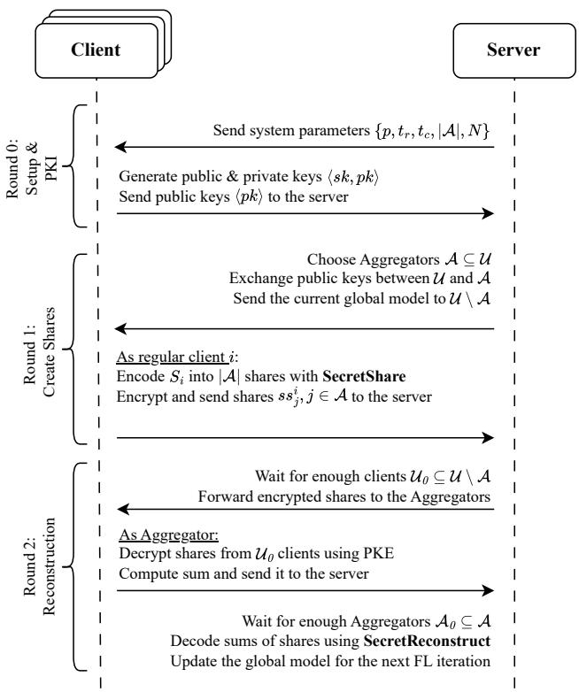  
Figure 2. High-level overview of the proposed secure aggregation protocol DISAGG. U & A denote the set of the clients and Aggregators respectively, xˆi denotes the secret (model update) for the ith client. PKE stands for the public-key-encryption protocol.

To overcome such limitations, we introduce a protocol that retain the low-interaction, one-shot paradigm of recent works while off-loading the summation to a small Aggregator committee that operate directly on secret-shared model updates. To maintain efficiency, our construction leverages standard secret-sharing primitives and builds on prior distributed-summation techniques (Kadhe et al., 2020; So et al., 2022; Ma et al., 2023). In the following section, we present our protocol DISAGG along with additional notation used throughout the rest of this paper.

## 3 DISAGG

## 3.1 Threat Model

Following previous works (Bonawitz et al., 2017; So et al., 2022), we adopt an honest-but-curious server threat model that handles up to a fraction γ of selected clients colluding at each iteration; additionally our protocol allows for a fraction δ of selected clients to drop out. Privacy is formally captured as T -privacy: any coalition of at most T parties, which includes the server as well as colluding clients, learns no information about honest clients’ updates beyond their sum. Leveraging the cryptographic primitives employed in our protocol, information-theoretic security is guaranteed (Shamir, 1979; Yu et al., 2019).

## 3.2 Protocol Overview

The server orchestrates the protocol in three communication rounds per training iteration. A round is a complete exchange that starts with a server instruction and ends with the clients’ replies. Figure 2 illustrates an overview of our protocol. The field prime p, reconstruction threshold tr, corruption threshold tc, and the Aggregator group size A are system parameters set by the server.

Unlike canonical schemes (Bonawitz et al., 2017; Bell et al., 2020), DISAGG delegates the summation to a small subset of clients, called Aggregators. This design is inspired by recent state-of-the-art secure-aggregation protocols that achieve asynchronous participation with the help of committees (Ma et al., 2023; Karthikeyan & Polychroniadou, 2024; Bell-Clark et al., 2024). Section 3.5 expands on the role of Aggregators. For the encryption–decryption messages exchanged between regular clients and Aggregators, we employ a public-key encryption protocol (Diffie–Hellman) following the approach described in (Bonawitz et al., 2017).

Round 0: As in most secure-aggregation schemes (Bell et al., 2020; Karthikeyan & Polychroniadou, 2024), the server initially queries clients at random from the entire population, providing them with the system parameters for a given FL iteration. The round ends once at least N clients have responded with their public keys pk, thereby forming the set of participants for the current iteration, U .

Round 1: The server starts this round by randomly selecting A clients from U to act as Aggregators, denoted A. It then broadcasts the public keys of the regular clients U \ A to the Aggregators, and vice versa. Concurrently, the server transmits the current global model to all regular clients. Each ith regular client trains the global model on its private data to produce a local model Si, which is then split into secret shares. The jth share, ssij, is encrypted with the jth Aggregator’s public key and sent to the server.

Round 2: The server waits until enough regular clients U0 ⊆ U have returned their secret shares, then forwards these shares to the Aggregators. The required size |U0| is determined by the maximum dropout tolerance δ, i.e. |U0| ≥ δN. Each Aggregator receives the partial updates from all surviving clients in U0, decrypts them, and locally aggregates the shares. The resulting partial sums are forwarded to the server. Finally, the server reconstructs the aggregated model by combining the partial sums from at least |A0| Aggregators. The choice of δ and the minimum value of |A0| affect the protocol’s security and correctness. This is discussed further in Sections 3.5–3.7.

## 3.3 Comparison to Existing Protocols

DISAGG is the first protocol that applies a committee-based distributed summation directly to model aggregation. Similar to FASTSECAGG (Kadhe et al., 2020), DISAGG secret-shares the raw model parameters while leveraging the dropout-resilient, Lagrange-coding technique introduced by LIGHTSECAGG (So et al., 2022; Yu et al., 2019). However, unlike LIGHTSECAGG, we do not broadcast secret shares to every client in the round; only the Aggregators receive them. Consequently, the computational load on ordinary clients and on the server is substantially reduced.

Algorithm 1 Secret Sharing of DISAGG   
{ss} = SecretShare(Si, A, tc, tr, p)   
Input: Si: secret vector of length M (client i’s update vec  
tor), A: number of shares required, tc: corruption threshold,   
tr: reconstruction threshold, p: field prime   
Output: List of A shares   
1: Reshape the secret vector Si into a matrix with L rows,   
each of size ρ = tr − tc. Let L = ⌈M/ρ⌉. Add random   
padding if necessary.   
2: The result is a list of column vectors {si} ∈ ZLp   
3: Append tc additional random vectors zi ∈ ZLp   
4: Form the final list {yik}k∈[t ] = {si, zi}   
5: Construct a polynomial f(x) ∈ ZLp via Lagrange inter  
polation: tr−1   
f (x) = X yik · Lk(x), (1)   
k=0   
tr−1   
where Lk(x) = Y x − am (2)   
m=0 ak − am   
m̸=k   
6: Let a be the evaluation points for the secrets   
7: Evaluate f (x) at positions {βj} to get shares {ssij} ∈   
Z Lp : ssij = f (βj ), j = 0, 1, . . . , A − 1 (3)   
8: Let β be the evaluation points for the shares   
9: Return list of shares with corresponding positions:   
{(βj , ssij ) : ∀j ∈ [A]}

Although our protocol introduces additional communication for Aggregators compared to LIGHTSECAGG and OPA, we provide both theoretical analyses and empirical evaluations demonstrating superior performance to existing protocols in terms of overall runtime. Moreover, we explore practical techniques such as increasing the number of Aggregators and packing plain-text updates to mitigate this overhead while preserving the performance gains.

## 3.4 Secret Sharing

A desirable property for the secret sharing primitive is the support for additive homomorphism between shares and secrets: the sum of the shares should reconstruct the sum of the underlying secrets (Kadhe et al., 2020; So et al., 2022; Karthikeyan & Polychroniadou, 2024). To this end, we employ Lagrange Coded Computing (LCC) (Yu et al.,

Algorithm 2 Secret Reconstruction of DISAGG   
S = SecretReconstruct({(βj, ssj : ∀j ∈ [A1])}, tc, tr, p)   
Input: Shares of the sum of secrets, corruption threshold tc,   
reconstruction threshold tr, field prime p   
Output: Reconstructed sum S   
1: if fewer than tr shares are provided then   
2: Return Error   
3: end if   
4: Keep only the first tr shares   
5: Construct a polynomial f(x) ∈ ZLp using Lagrange   
interpolation:   
tr−1   
f (x) = X ssk · Lk(x), (4)   
k=0   
where Lk(x) = tYr 1 x − βmβk − βm (5)   
m̸=k   
6: Let β be the evaluation points for the shares   
7: Evaluate f (x) at the positions for the secrets:   
yj = f (aj ), j = 0, 1, . . . , tr − 1 (6)   
8: Let a be the evaluation points for the secrets   
9: Recover the list of vectors {yik}k∈[tr] and keep only the   
first tr − tc of them   
10: Reshape the vectors and remove any padding to recover   
the expected sum vector S   
11: Return S

2019), which provides this property efficiently. Similarly, OPA (Karthikeyan & Polychroniadou, 2024) uses packed Shamir Secret Sharing for sharing secret keys (Franklin & Yung, 1992). While theoretically both methods have similar security guarantees and time complexities, an indepth comparison between the two is left as future work.

Algorithm 1 describes the secret sharing process where each client i encodes its update vector xˆi = Si ∈ ZMp and produces {ssij : ∀j ∈ [A]} using Langrange interpolation. Next, each Aggregator j receives secrets {ssij : ∀i ∈ [U1]} from surviving clients to produce a share of the ‘sum of C t secrets’ ssj = P i=0 ssij . Algorithm 2 describes the corresponding reconstruction process on the server side. Here, the server concatenates shares of ‘sum of secrets’ {ssj : ∀j ∈ [|A1|]} from the surviving Aggregators A1 ⊆ A and decodes it to produce the sum of updates S.

## 3.5 Aggregators

Our protocol designates a subset of clients, the Aggregators, to compute the sum of clients’ secret shares. Their correctness and security, which will be formally defined in Sections 3.6 and 3.7, depend on suitably chosen parameters as in SECAGG+ (Bell et al., 2020): γ (tolerated fraction of malicious clients), δ (tolerated fraction of dropped out clients), Pc (probability of security breach) and Ps (probability of reconstruction failure) in each FL iteration. These parameters define the number of Aggregators A (equivalently SECAGG+’s neighbourhood size), the threshold shares tr < A required by the server to reconstruct the aggregate secret successfully, the corruption threshold tc of tolerated malicious clients, and the number of secrets ρ = tr − tc that can be packed into a single share.

In every FL iteration, the server, assumed to be honest, selects Aggregators at random from the set of the Ct selected clients. An Aggregator is otherwise a regular client who contributes its own model updates, but if chosen as an Aggregator, it instead sums model shares coming from the rest of the clients.

For enhanced security against a potentially malicious server, we require a trusted source of randomness, such as a random beacon (Ma et al., 2023). This means that all parties (clients and the server), once at the beginning of the protocol, obtain a globally shared random seed that will be used for the selection of the Aggregators.

To determine the parameters A, tr, tc, and ρ, three conditions must be satisfied: (1) the probability that the number of corrupted clients exceeds the corruption threshold tc must be sufficiently low; (2) the probability that the number of surviving Aggregators falls below the reconstruction threshold tr must also be sufficiently low; and (3) at least one secret must be embedded in each share. The distribution of corrupted or surviving clients in a sample drawn from a population without replacement follows, by definition, a hypergeometric distribution (Kemp & Kemp, 2018). We bound the proportion of corrupted and surviving Aggregators with probabilities Pc and Ps, respectively, where Pc = 2−κc and Ps = 2−κs , with κc, κs as the security parameters.

Let Xc ∼ Hypergeometric(N, γN, A) and Xs ∼ Hypergeometric(N, (1 − δ)N, A) be the random variables for corrupted and surviving Aggregators, respectively. As a worst-case scenario, we assume that only honest Aggregators drop out. Then, the following constraints arise from the three conditions that must be satisfied:

$$
\tag{7}
$$

$$
\tag{8}
$$

$$
\tag{9}
$$

where cdf denotes the cumulative distribution function of the random variables, and can be expressed as cdfX(t) = P r(X ≤ t). Using an iterative search algorithm, we can fix the desired number of packed secrets ρ ≥ 1 and determine the values of A, tc, and tr (with 0 < tc < tr < A) that satisfy the above constraints. In the special case of a single secret (ρ = 1), we can compute the minimum required number of Aggregators A that ensures both correctness and security.

In order to support Byzantine fault tolerance, there is another constraint, that is, γa + δa < 1/3 (Karthikeyan & Polychroniadou, 2024; Ma et al., 2023), where γa, δa are the fraction of the corrupt Aggregators and the dropout Aggregators respectively. Both of these random variables follow Hypergeometric distribution. To compute the probability distribution of the sum of these two random variables, we use the direct convolution technique (Johannssen et al., 2021). Let X = Xc + Xd, where Xc the random variable for corrupt Aggregators defined above, and Xd ∼ Hypergeometric(N, δN, A) the random variable for dropout Aggregators. The probability mass function for X is defined as, pmfX = pmfX ∗ pmfX , where ∗ denotes convolution. The threshold for X is A/3, therefore, we must satisfy the condition,

$$
\tag{10}
$$

We use the same security parameter κc that defines the threshold probability Pc, as in Equation 7. The Aggregators size A, can be found again by an iterative search algorithm using the above condition. Once we obtain a value for A, we use it as a minimum value for Equations 7, 8 to compute the thresholds tc and tr.

Finally, we must account for the fact that the size of the Aggregator group directly impacts their communication overhead. The data size of all of the model shares that each Aggregator receives from N clients is approximately O(QM ), where Q = N/ρ. A higher packing factor ρ implies more Aggregators A (Equations 7–9), reducing per-Aggregator communication at the cost of increased total communication and computation across the Aggregator group. In practice, ρ can be tuned to balance these effects, while A is obtained via the aforementioned search algorithm, with a reasonable compromise value for Q typically on the order of 10.

Under LCC-based secret sharing, each share sent to an Aggregator has size approximately M/ρ, implying a total download of NM across all Aggregators. For instance, with 128-bit field elements, N = 50k, ρ = 1k, and M = 10k, each Aggregator downloads N M/ρ · 128 bits or about 8 MB. Section 4.5 further quantifies the trade-off between Aggregator download cost and speedup and its implications for mobile deployability.

## 3.6 Correctness

Next, we analyze the correctness, that is, the resilience of the protocol to client dropouts.

Theorem 1 (Correctness): Given a fraction δ ∈ (0, 1) of client dropouts and a random selection of the set A for the Aggregators, the SecretShare algorithm generates A = |A| shares from the secrets xˆi, and the server can successfully reconstruct the sum of the secrets using SecretReconstruct, with probability 1 − 2−κd .

Table 1. A comparison of computational and communication time complexity across different protocols. N is the number of selected clients for training, A is the size of the Aggregators group, M is the model size. SECAGG is reported from (Bonawitz et al., 2017), SECAGG+/LIGHTSECAGG from (So et al., 2022) and OPA from (Karthikeyan & Polychroniadou, 2024).  
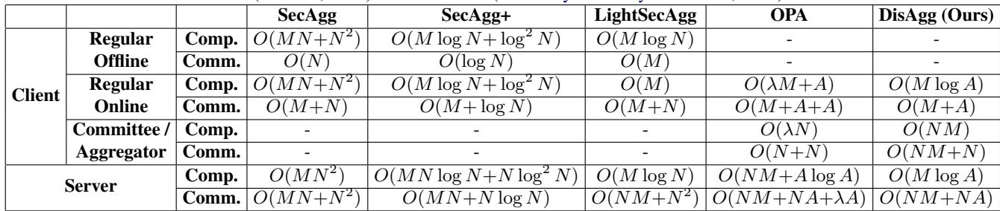

Proof: The correctness follows from the key idea of encoding each client’s input using the Lagrange polynomial interpolation (Yu et al., 2019). It suffices to show that as long as the the server gathers at least tr shares, it can successfully reconstruct S. Since each Aggregator presents a single share of the sum of secrets ssj, We require the active Aggregator set A0 ⊆ A to satisfy |A0| ≥ tr. The probability of this event is 1 − 2−κd .

## 3.7 Security

Following the privacy definition from (Yu et al., 2019), our secret sharing scheme is information-theoretically secure and ensures that up to T colluding parties gain no information about the input. T is the privacy parameter of the system. Formally, for every subset T ⊆ [N ] of at most T colluding parties, the mutual information XT between the encoded data available to the colluding parties and X, which is seen as chosen uniformly at random, must satisfy:

$$
\tag{11}
$$

In other words, for any pair of secrets s, s′ and every group of clients of size at most T , the shares of s and s′ restricted to this group are identically distributed (Kadhe et al., 2020).

Algorithm 1 achieves this guarantee by construction. In particular, the shares are generated using Lagrange interpolation over a finite field Zp with the addition of tc uniformly random vectors acting as masking noise. These random vectors ensure that even if up to tc shares (i.e., those corresponding to colluding Aggregators) are observed, the original secret remains perfectly hidden.

To see this more concretely, we consider the masking process in our scheme. Let T ⊆ [A] be a set of up to tc colluding Aggregators who obtain a subset of the shares {XT }. Each share is of the form:

$$
\tag{12}
$$

where S is the reshaped secret matrix, Z is the matrix of random padding vectors, and U (T )top , U (T )bottom are the rows of the interpolation matrix corresponding to the data and noise components, respectively.

By construction, Ubottom (T ) is a submatrix of a Vandermonde matrix and forms a Maximum Distance Separable (MDS) matrix (Yu et al., 2019). Therefore, any tc × tc submatrix of U (T ) is invertible, implying that the random padding Z remains uniformly distributed and independent of S, which completely masks the coded data SU(T )top This completes the argument for T -privacy (Yu et al., 2019).

In practice, our implementation ensures this privacy guarantee with overwhelming probability 1 − 2−κc, where κc is a statistical security parameter dependent on the field size p and the randomness used during masking. This ensures that no information about the secret is leaked with all but negligible probability, even under tc-collusion.

## 4 TIME COMPLEXITY ANALYSIS

## 4.1 Theoretical Comparison

Table 1 reports the offline (setup) and online (per-iteration) costs for three parties—regular client, Aggregator, and server—across SECAGG, SECAGG+, LIGHTSECAGG, OPA, and our DISAGG. Costs are broken down into computation (comp) and communication (comm) for each role. The ‘Committee/Aggregator’ column denotes the OPA committee or DISAGG Aggregators (absent in the other schemes).

Detailed derivations of the complexities follow the original works (Bonawitz et al., 2017; Bell et al., 2020; So et al., 2022; Karthikeyan & Polychroniadou, 2024) and apppendix for the case of DISAGG. Compared with OPA, DISAGG removes server and client overhead, shifting the load to Aggregators, while both remain one-shot protocols without offline phases.

## 4.2 Refining Complexities

We now refine the asymptotic costs of DISAGG and OPA by inserting the concrete constants that dominate practical performance. For OPA we expose the packing factor ρ and the security parameter λ: share generation and reconstruction incur an extra O λ A log A term (packed Shamir secret sharing), while computing Lagrange coefficients adds O(A2) work at both client and server. The resulting share size is O(λ/ρ) bits, and all λ-bit values are transmitted among clients, committee members, and the server.

For DISAGG the dominant overheads are analogous. Encoding and decoding under Lagrange-coded computing contribute O(A2) computation at each endpoint, and each model is split into A shares of size O(M/ρ), where M is the model dimension. Thus the total communication scales with M rather than λ.

These refinements reveal complementary trade-offs. Increasing the packing factor ρ, increases the Aggregator set size A as per Section 3.5 and thus reduces the per-Aggregator communication in DISAGG but raises the client-side secret-sharing and server-side reconstruction costs; similarly, a larger ρ shrinks OPA’s communication but amplifies the O(λ/ρ A log A) term. Consequently, an optimal A (or ρ) can be chosen given M, N, γ, and δ to minimize overall cost. A full tabular comparison with all constants is provided in the appendix.

## 4.3 Timing Framework

We evaluate our protocols under a realistic timing model derived from the theoretical complexities. Let k denote the total fraction of corrupt and dropped clients, so that γ = 1/3 · k and δ = 2/3 · k; we fix k = 0.3, a common upper bound in secure-aggregation literature (Karthikeyan & Polychroniadou, 2024; Kadhe et al., 2020; Ma et al., 2023) and within our Byzantine fault-tolerance limits. Network parameters are set to the documented Google Cloud egress bandwidth of 25 GBps for the server (Google Cloud, 2025), and 2 MBps (upload) / 20 MBps (download) for clients, reflecting typical 5G links (Ookla, 2023). The server can serve clients in parallel up to its bandwidth capacity, transmitting model updates in chunks.

Computationally we introduce a constant kcomp that scales the server’s compute cost relative to a client; we use kcomp = 0.66 for a single CPU core comparison based on standard benchmark ratios (CPU-Monkey, 2025). Benchmarks for alternate network settings (4G/3G) are reported in the appendix (Section C.3).

For each (N, M) pair we independently select the number of Aggregators A that minimizes the sum of communication and computation costs for DISAGG and OPA. The resulting optimal A values are visualized in Figure 3, with the right panel showing the corresponding speed-up of DISAGG over OPA. A constrained minimum-Aggregator scenario, mirroring the OPA setup, is examined in Appendix C.5.

## 4.4 Dropout and Collusion Effects

We analyze sensitivity to combined client instability and adversarial collusion through the aggregate parameter k = γ + δ, where γ = 1/3 · k is the collusion fraction and δ = 2/3 · k the dropout fraction. Because both reduce the effective set of honest, active contributors, their impact is largely symmetric in the complexity model (Section 4.2). We therefore report relative speedup of DISAGG over OPA across (M, N) configurations while varying k. Figure 4 shows that even for a practical upper bound of k = 0.3, DISAGG sustains more than 4× improvement. This indicates resilience of the performance gap under realistic joint instability and collusion assumptions.

## 4.5 Deployability on Mobile Devices

Following the analysis in Section 3.5, we examine DIS-AGG’s deployability at mobile endpoints, with the primary focus on Aggregator downstream load. Each Aggregator receives shares corresponding to approximately QM field elements per round, where Q= N/ρ. M is the model size, N the number of clients per iteration, and ρ the secret packing factor.

In our implementation, each share component is encoded as a single field element over a 128-bit prime, consistent with the security requirements of Shamir secret sharing. Assuming 128-bit field elements, the per-Aggregator downstream volume is approximately Q M · 128 bits.

In the most demanding configuration we evaluate, for M = 106 and N = 106 (5G setting as in Section 4.3) with the committee size chosen to minimize total computation and communication time (yielding A = 1607 and ρ = 1331), this evaluates to over 12 GB per Aggregator per iteration. In contrast, OPA’s comparable committee download scales as Q λ · 128 bits, which in the same setting (with λ = 2048 and ρ = 1017) yields ∼32.2 MB.

There is a tunable trade-off: increasing ρ and thus A decreases Q and hence the Aggregator download, but it can also reduce DISAGG’s speedup over OPA. Figure 5 illustrates this trade-off by enforcing a minimum target speedup equal to the lowest speedup from the 5G analysis (3× over OPA’s optimal setting) and using a genetic algorithm (Storn & Price, 1997) to find the ρ (and corresponding A) that balances speedup and minimizes Aggregator download size. The genetic algorithm minimizes a cost function that penalizes configurations falling below the target speedup and, secondarily, larger download sizes.

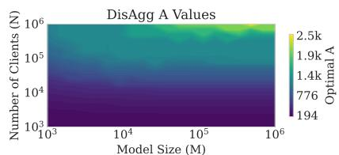

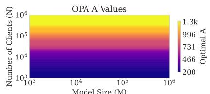

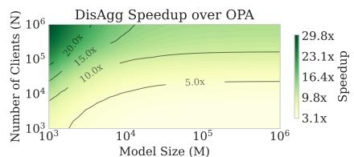  
Figure 3. Contour plot showing the optimal number of Aggregators A for DISAGG and OPA as well as the expected speedup over OPA across different (M, N) settings under a 5G client connectivity assumption (2 MBps upload / 20 MBps download), with k = 0.3 and kcomp = 0.66. Theoretically, DISAGG is faster than OPA for practical cross-device and cross-silo setups: for up to 106 clients per round and models with 106 trainable parameters, DISAGG achieves an estimated speedup of 3.1x – 29.8x.

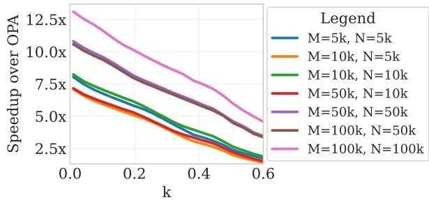  
Figure 4. Speedup of DISAGG over OPA as a function of the combined dropout and corruption factor k = γ + δ. Results are shown for different (M, N ) pairs. The plot demonstrates that DISAGG consistently outperforms OPA, achieving over 4× improvement for practical levels of k up to 0.3.

Specifically, the combined cost is:

$$
\tag{13}
$$

where Sactual 一 TOPA is the achieved speedup, Starget is TDisAgg the enforced minimum speedup threshold, and MN/ρMN is the normalized Aggregator download size. In the extreme case M = N = 106, the required download can be reduced to ∼269 MB while maintaining at least a 3× speedup.

## 5 EXPERIMENTS

We evaluate DISAGG through four complementary studies: (i) multi-protocol end-to-end timing across established secure aggregation schemes (Bell et al., 2020; So et al., 2022; Karthikeyan & Polychroniadou, 2024), (ii) a focused largescale comparison against the one-shot OPA protocol, (iii) sensitivity to combined dropout and corruption, and (iv) impact on multi-round federated model training.

Hardware: All experiments were conducted using servergrade CPUs and a single machine with the same number of parallel processes for all protocols. For training results we make use NVIDIA gpus. The CPU is an Intel(R) Xeon(R) Gold 5220 @ 2.20GHz, with 128GB of RAM, and the GPU is NVIDIA GeForce RTX 2080 Ti, with 12GB VRAM.

Simulation Details: We measure one-iteration timings for finite-field vectors of size M ∈ {1k, 10k, 50k, 100k} and client cohort sizes N ∈ {1k, 3k, 5k, 10k, 50k, 100k}. Reported client and committee values are per-party averages under parallel execution. We developed an in-house simulation framework, incorporating open-source code where available (So et al., 2022; Bonawitz et al., 2017). To obtain practical timings, clients are processed in parallel using 16 processes for N < 50k and 30 otherwise. The procedure is divided into discrete computation and communication phases, measured separately: execution time is recorded via a timer for computation, while communication is estimated by translating transferred data (server–client) into time units based on per-client/committee and server bandwidth constraints.

Hyperparameter Choices: To ensure a fair comparison with OPA, all client updates are quantized to p − ⌈log2 N⌉ bits, where p = 53 is the field size used in OPA after rounding. OPA combines this with ciphertext modulus q = 128 bits to achieve 129-bit security under the Learning With Errors (LWE) hardness estimator (Albrecht et al., 2015). Due to rounding errors from LWR-based masking, it reduces plaintext precision by ⌈log2 N⌉ bits to ensure correct decryption. We use identical quantization across all protocols to avoid timing or accuracy differences.

Unlike OPA, which relies on the LWR security parameter λ for computational masking, DISAGG achieves informationtheoretic security through Lagrange Coded Computing (LCC) secret sharing over a subset of Aggregators. The number of Aggregators A is selected using privacy and correctness thresholds σ = 40 and η = 40, providing the same failure and dropout probabilities as prior methods (Bell et al., 2020; Ma et al., 2023). Unless otherwise stated, we use γ = δ = 0.1 and conduct FL training with 1k clients over 30 iterations.

## 5.1 Multi-Protocol Total Time Comparison

We compare DISAGG against SECAGG+, LIGHTSECAGG, and OPA, each representing a distinct optimization axis: pairwise masking with recovery (SECAGG / SECAGG+), sparse interaction graphs (LIGHTSECAGG), and one-shot participation (OPA). We report both computational and communication contributions for the primary system roles (clients, committee / Aggregators when applicable, and server), and include the setup phase cost (e.g., key exchange, structural graph or matrix initialization) even when it can be cached for persistent clients.

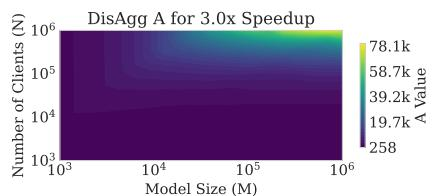

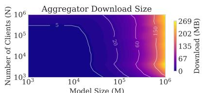

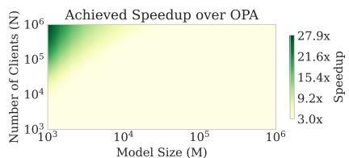  
Figure 5. Aggregator downstream volume (per iteration) versus committee size, with a target 3× speedup over OPA under the 5G setting of main paper. Increasing A reduces Q = N/A and thus Aggregator download, trading off against speedup.

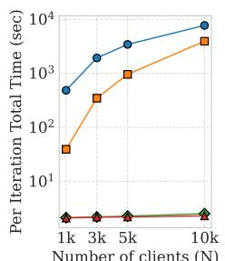

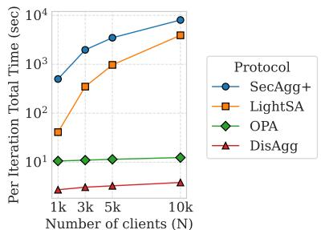  
Figure 6. Overall combined computation and communication timings per FL iteration for SECAGG+, LIGHTSECAGG (LIGHTSA), OPA and DISAGG. DISAGG is 10% faster for M = 1k (left), and 3.2x faster for M = 10k (right) over OPA.

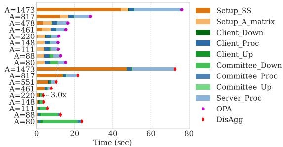

In Figure 6 we see that our protocol achieves state-of-art performance compared to all existing protocols. The first ever protocol, SECAGG, was not tested due to its well documented inefficiency (So et al., 2022). As the number of clients increase, the increase in per iteration total time is the least for our protocol and closely follows OPA. Thus DIS-AGG is highly suited for practical scenarios of aggregating updates from a large selection of clients.

## 5.2 DisAgg vs OPA

We extend our experiments to realistic cross-device scales (M, N > 103), evaluating M = 104 and N = 5 · 104. In OPA the dominant early-iteration cost is the initialization of the A matrix over a 128-bit field with the standard security parameter λ = 2048, incurring an O(λM) overhead that dwarfs all other setup work (sub-second). Client-side computation in OPA is likewise dominated by LWR matrix–vector products, which scale as O(λM). By contrast, DISAGG requires each client only to perform Lagrange-Coded Computing encoding (matrix construction plus polynomial evaluation), costing O(M log A) (or O(MA) in a straightforward implementation)—orders of magnitude smaller than O(λM).

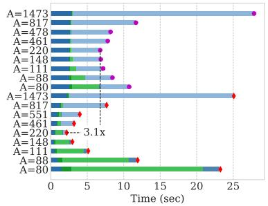  
Figure 7. Speedup of DISAGG over OPA for one FL iteration with M = 10k, N = 10k, γ = 0.1, δ = 0.2, and varying committee size A. DISAGG achieves 3× speedup including the setup phase (top) and 3.1× without it (bottom).

The server must decode and aggregate the masked encodings for OPA, whereas DISAGG merely reconstructs the global model from a compact set of aggregated shares, yielding additional efficiency. OPA is only comparatively lighter for committee computation: OPA’s committee operations involve key combination with O(λN ) complexity, while DIS-AGG Aggregators process with complexity O((NM)/A).

Consequently, despite OPA’s lighter committee work, its slower setup, client, and server phases lead to a substantially higher overall runtime. Table 2 reports detailed timings for M = 100k, N = 100k. The trade-off between DISAGG’s higher communication cost and lower computational burden is governed by the Aggregator count A. As described in Section 3.5, the packing factor ρ can be tuned to adjust A for the same security parameters (γ, δ, N ) and thus an optimal point in the communication-computation trade-off space can be found. This can be leveraged within a simulation environment to further minimize the total execution time.

For this experiment we sweep the values of the packing factor ρ ∈ {25, 50, 100, 250, 500, 1000} for both OPA and DISAGG in order to pick the best performing configuration for both. For OPA the best value was with A = 461 whereas for DISAGG A = 830, for which Table 2 reports the timings. The other values are presented in Figure 17 in the appendix.

Table 2. A comparison of per stage timings for one FL iteration in seconds rounded to 2 decimal places for N = 100k (clients) and M = 100k (parameters). Timings for committee and clients are an average across all committee and client members respectively. DISAGG achieves an overall speedup of 4.56x over OPA.  
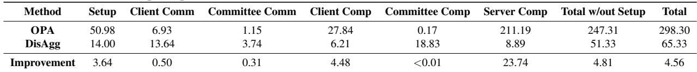

## 5.3 Dropout Analyses

We conduct a dropout/collusion sensitivity study with combined instability factor k = γ + δ at values k ∈ {0.01, 0.05, 0.10, 0.15} using a model of size M = 10k parameters and N = 10k participating clients, comparing OPA and DISAGG. Figure 8 summarizes the results: for each protocol and pair of γ, δ values, the result with the fastest timing is shown after a grid search on ρ ∈ [25, 50, 100, 250, 500]. DISAGG is robust to client dropout and and collusion with at least 3x speedup over OPA for the same (γ, δ) pair. As expected, for both protocols, the timings are proportional to k, as a bigger committee size is required to ensure correctness and security.

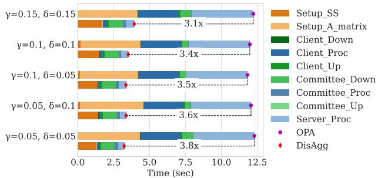  
Figure 8. Speedup of DISAGG over OPA for one FL iteration with k = γ + δ given γ, δ ∈ {0.01, 0.05, 0.10, 0.15}, M = 10k, N = 10k. Top graph depicts timings including setup, whereas bottom graph is without setup phase.

## 5.4 Aggregator Download Reduction

As an extension of the discussion in Section 4.5 on the speedup versus Aggregator download trade-off, we evaluate this trade-off in an experimental setting using the results derived from the variable-A analysis. From Figure 7, we use the corresponding values of N, M, and ρ to compute the resulting speedup over OPA and the Aggregator download, following the same calculations described above.

For the setting N = M = 10k, Table 3 showcases the effect on speedup when increasing A: the resulting Aggregator

download size in DISAGG can be reduced by more than 2× while still achieving a considerable speedup over OPA.  
Table 3. Speedup and Aggregator download for N = M = 10k.  
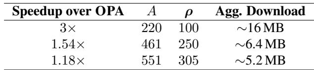

## 5.5 Plaintext Recovery

To evaluate DISAGG’s suitability for plaintext recovery, we perform end-to-end multi-iteration FL using the FedAvg algorithm (McMahan et al., 2017), comparing simple, insecure aggregation (PLAINTEXT) against secure aggregation via DISAGG or OPA. We used a diverse selection of datasets and model architectures (see Table 4). Figure 9 shows the validation accuracy results after 30 iterations of FL. For consistency, all settings use the same overall quantization levels. Per iteration wall clock timings are also measured and depicted on the secondary Y-axis on the right. As expected, the use of security protocols do not affect accuracy, since they have a lossless recovery of the sum.

It is clear that DISAGG performs better in the cases of real-world FL scenarios, and with relatively small overhead compared to PLAINTEXT. Note that training with OPA with M = 1.1M had a very high memory requirement and thus is excluded from the graphs.

Table 4. Number of trainable parameters for different models evaluated under plain-text recovery.  
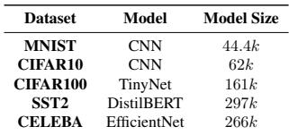

## 5.6 Effect of Stragglers

In this section we present analysis on the presence of stragglers. A straggler is a client of the secure-aggregation system that has an unusually long response time. If the response time exceeds the timeout, the server may ultimately treat a straggler as a dropout. A dropout is any client that, for unknown reasons, delays or even disconnects from the server. As explained in previous sections, DISAGG has a tunable tolerance to dropouts via the δ parameter. The protocol can handle up to a certain fraction of dropped clients. If a client takes a long period of time to upload or download data, the delay may be due to a slow connection. Accordingly, we categorize clients into three different network speeds based on typical mobile networks: 5G, 4G, and 3G. Since 5G is the prevailing option today, we evaluate 4G and 3G clients as potential stragglers.

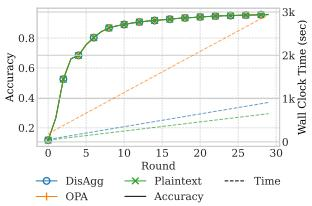  
(a) MNIST

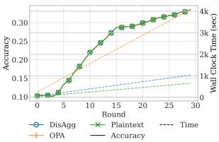  
(b) CIFAR10

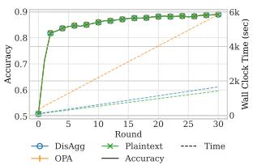  
(c) SST2 (297k)

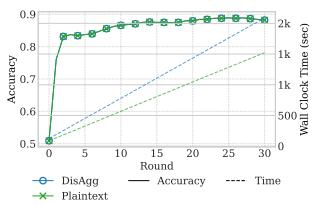  
(d) SST2 (1.1M)

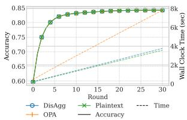  
(e) CELEBA

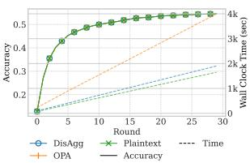  
(f) CIFAR100  
Figure 9. Empirical verification for convergence analyses of DIS-AGG compared to plain-text under FL

We show that, in real-world applications, DISAGG can handle these stragglers by treating 3G clients as dropouts. This is supported by the rapid decline of 3G usage, now around 10% (ITU, 2025), and the shutdown of 2G/3G networks in many countries (Amos, 2025). Therefore, a relatively small percentage of these stragglers can be rejected and handled as dropouts. This allows the server to keep a lower timeout based on 4G clients while at the same time increasing the dropout tolerance. The protocol must also continue with fewer FL clients, which can affect accuracy.

To investigate these scenarios, we adjust our experimental setup to a realistic distribution of network capabilities. Given that 93% of the global population now has access to at least 4G connectivity, with 54% having 5G coverage (Amos, 2025), we assume a distribution among clients’ speeds of 10% 3G, 40% 4G, and 50% 5G. Since the 3G clients will be the slowest, the network will have 10% clients stragglers.

The server must decide between two choices for stragglers:

(a) wait for the stragglers to respond back and incur delay in completing the FL iteration; (b) increase δ to 0.2, accommodating for extra dropouts and drop the stragglers.

Three distinct scenarios can then be evaluated empirically:

1. OPA and DISAGG with option (a).

2. OPA with option (a) and DISAGG with option (b).

3. Both OPA and DISAGG with option (b).

For this experiment we train a CNN vision model on the CIFAR-10 dataset for 30 iterations with 100 clients. Figure 10 presents the results for the three cases. In Case 1, where both protocols accept 3G clients, DISAGG is slower than OPA because of the additional overhead introduced by the aggregators. In contrast, in Cases 2 and 3, DISAGG outperforms OPA. These three cases reveal a trade-off between accuracy and runtime that offers a practical solution to the straggler problem. By excluding the 10% slowest clients, DISAGG markedly speeds up training while incurring only a modest loss in accuracy (about 1.5% after 30 iterations). In contrast, OPA does not achieve a comparable accuracy-runtime trade-off: the modest speedup it provides does not compensate for the accompanying loss in accuracy.

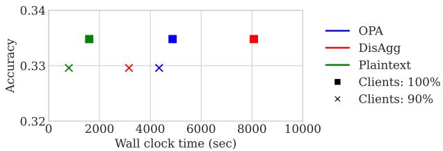  
Figure 10. Comparing OPA and DISAGG along with plaintext FL under heterogeneous clients and dropout scenarios. The accuracy depicted is after 30 iterations of training on CIFAR10.

## 6 CONCLUSION

We present DISAGG, a novel secure aggregation protocol for federated learning that addresses the computational and communication challenges of existing approaches through distributed aggregation. By delegating aggregation to a small subset of clients using LCC secret sharing, DISAGG eliminates the need for local cryptographic masking while achieving information-theoretic security. Our approach trades increased burden on Aggregators for significant reductions in computational overhead for regular clients and the server. Experiments with realistic cross-device settings of 10k+ dimensional model updates and 10k+ clients with 5G speeds demonstrate DISAGG achieving a minimum 3x speedup compared to the previous best protocol, OPA. Particularly, DISAGG has notable improvements in setup, client computation, and server computation, confirming that distributed aggregation can effectively balance strong security guarantees with practical efficiency for large-scale federated learning deployments.

## REFERENCES

Abadi, M., Chu, A., Goodfellow, I., McMahan, H. B., et al. Deep learning with differential privacy. CCS ’16, pp. 308–318, October 2016. URL https://doi.org/ 10.1145/2976749.2978318.

Albrecht, M. R., Player, R., and Scott, S. On the concrete hardness of learning with errors. Journal of Mathematical Cryptology, 9(3):169–203, 10 2015. ISSN 1862-2976, 1862-2984. URL https://doi.org/10. 1515/jmc-2015-0016.

Amos, K. 4G network reaches 7.6b people as 5G penetration hits 54%, September 2025. URL https://guardian.ng/technology/4gnetwork-reaches-7-6b-people-as-5gpenetration-hits-54/.

Bell, J., Bonawitz, K. A., Gascon, A., Lepoint, T., and ´ Raykova, M. Secure single-server aggregation with (poly)logarithmic overhead. Cryptology ePrint Archive, 2020. URL https://eprint.iacr.org/2020/ 704. Paper 2020/704.

Bell-Clark, J., Gascon, A., Li, B., Raykova, M., and Schopp-´ mann, P. Willow: Secure aggregation with one-shot clients. Cryptology ePrint Archive, Paper 2024/936, 2024. URL https://eprint.iacr.org/2024/936.

Bonawitz, K., Ivanov, V., Kreuter, B., Marcedone, A., et al. Practical secure aggregation for privacy-preserving machine learning. ACM CCS 2017, pp. 1175–1191, October / November 2017. URL https://dl.acm.org/ doi/10.1145/3133956.3133982.

Cooley, J. W. and Tukey, J. W. An algorithm for the machine calculation of complex fourier series. Mathematics of Computation, 19(90):297–301, 1965. URL https:// doi.org/10.2307/2003354.

CPU-Monkey. Cpu comparison: Samsung exynos 1280 vs intel xeon gold 5220r. https://www.cpumonkey.com/en/compare\_cpu-samsung exynos\_1280-vs-intel\_xeon\_gold\_5220r, 2025.

Franklin, M. and Yung, M. Communication complexity of secure computation (extended abstract). STOC ’92, pp. 699–710, July 1992. URL https://dl.acm. org/doi/10.1145/129712.129780. ISBN 978- 0-89791-511-3.

Geiping, J., Bauermeister, H., Droge, H., and Moeller, M.¨ Inverting gradients-how easy is it to break privacy in federated learning? Advances in neural information processing systems, 33:16937–16947, 2020a.

Geiping, J., Bauermeister, H., Droge, H., and Moeller, ¨ M. Inverting gradients - how easy is it to break privacy in federated learning? Advances in Neural Information Processing Systems, 33:16937– 16947, 2020b. URL https://proceedings. neurips.cc/paper/2020/file/ c4ede56bbd98819ae6112b20ac6bf145- Paper.pdf.

Geyer, R. C., Klein, T., and Nabi, M. Differentially private federated learning: A client level perspective. arXiv preprint, 2018. URL https://arxiv.org/abs/ 1712.07557.

Google Cloud. Network bandwidth — compute engine. https://cloud.google.com/compute/ docs/network-bandwidth#egressbandwidth-limits, 2025. Accessed: 2025-10-03.

ITU. Mobile network coverage, 2025. URL https://www.itu.int/itu-d/reports/ statistics/2025/10/15/ff25-mobilenetwork-coverage.

Johannssen, A., Chukhrova, N., and Castagliola, P. Efficient algorithms for calculating the probability distribution of the sum of hypergeometricdistributed random variables. MethodsX, 8:101507, 2021. URL https://www.sciencedirect.com/ science/article/pii/S2215016121003009.

Kadhe, S., Rajaraman, N., Koyluoglu, O. O., and Ramchandran, K. Fastsecagg: Scalable secure aggregation for privacy-preserving federated learning. arXiv preprint, 2020. URL https://arxiv.org/abs/ 2009.11248.

Kairouz, P., McMahan, H. B., Avent, B., Bellet, A., et al. Advances and open problems in federated learning. CoRR, abs/1912.04977, 2019. URL http://arxiv.org/ abs/1912.04977.

Kairouz, P., Liu, Z., and Steinke, T. The distributed discrete gaussian mechanism for federated learning with secure aggregation. In International Conference on Machine Learning, pp. 5201–5212. PMLR, 2021.

Karthikeyan, H. and Polychroniadou, A. OPA: One-shot private aggregation with single client interaction and its applications to federated learning. Cryptology ePrint Archive, 2024. URL https://eprint.iacr.org/ 2024/723. Paper 2024/723.

Kasiviswanathan, S. P., Lee, H. K., Nissim, K., Raskhodnikova, S., and Smith, A. What can we learn privately? SIAM Journal on Computing, 40(3):793–826, 2011.

Kemp, C. D. and Kemp, A. W. Generalized hypergeometric distributions. Journal of the Royal Statistical Society: Series B (Methodological), 18(2):202–211, 12 2018. ISSN 0035-9246. URL https://doi.org/10.1111/j. 2517-6161.1956.tb00224.x.

Li, T., Sahu, A. K., Zaheer, M., Sanjabi, M., Talwalkar, A., and Smith, V. Federated optimization in heterogeneous networks. Proceedings of Machine learning and systems, 2:429–450, 2020a.

Li, X., Huang, K., Yang, W., Wang, S., and Zhang, Z. On the convergence of fedavg on non-iid data. arXiv preprint, 2020b. URL https://arxiv.org/abs/ 1907.02189.

Ma, Y., Woods, J., Angel, S., Polychroniadou, A., and Rabin, T. Flamingo: Multi-round single-server secure aggregation with applications to private federated learning. Cryptology ePrint Archive, 2023. URL https: //eprint.iacr.org/2023/486. Paper 2023/486.

McMahan, B., Moore, E., Ramage, D., Hampson, S., and y Arcas, B. A. Communication-efficient learning of deep networks from decentralized data. Proceedings of the 20th International Conference on Artificial Intelligence and Statistics (AISTATS), 54:1273–1282, 2017. URL http://proceedings.mlr.press/ v54/mcmahan17a.html.

Mugunthan, V., de Carli Silva, B., and et al., P. Tacita: Secure aggregation for asynchronous federated learning with malicious servers. In Proceedings of the 2025 IEEE International Conference on Blockchain and Cryptocurrency (ICBC). IEEE, 2025. URL https:// ieeexplore.ieee.org/document/10710841.

Ngong, I. C., Gibson, N., and Near, J. P. OLYMPIA: A simulation framework for evaluating the concrete scalability of secure aggregation protocols. arXiv preprint, 2023. URL https://arxiv.org/abs/2302.10084.

Ookla. Worldwide connectivity: Mobile & fixed networks digital divide 2023. https: //www.ookla.com/articles/worldwideconnectivity-mobile-fixed-networksdigital-divide-2023, 2023.

Phong, L. T., Aono, Y., Hayashi, T., Wang, L., and Moriai, S. Privacy-preserving deep learning via additively homomorphic encryption. IEEE Transactions on Information Forensics and Security, 13(5):1333–1345, 2018. doi: 10.1109/TIFS.2017.2787987.

Reddi, S. J., Charles, Z., Zaheer, M., Garrett, Z., Rush, K., Konecnˇ y, J., Kumar, S., and McMahan, H. B. Adaptive ´ federated optimization. In International Conference on Learning Representations, 2021.

Shamir, A. How to share a secret. Communications of the ACM, 22(11):612–613, 1979. New York, NY, USA.

So, J., Guler, B., and Avestimehr, A. S. Turbo-Aggregate: Breaking the quadratic aggregation barrier in secure federated learning. IEEE Journal on Selected Areas in Information Theory, 2(1):1–1, March 2021. URL https://arxiv.org/abs/2002.04156.

So, J., He, C., Yang, C.-S., Li, S., et al. Lightsecagg: a lightweight and versatile design for secure aggregation in federated learning. arXiv preprint, 2022. URL https: //arxiv.org/abs/2109.14236.

Storn, R. and Price, K. Differential evolution – A simple and efficient heuristic for global optimization over continuous spaces. Journal of Global Optimization, 11(4):341–359, 1997. doi: 10.1023/A:1008202821328.

Wang, J., Charles, Z., Xu, Z., Joshi, G., et al. A field guide to federated optimization. arXiv preprint, 2021. URL https://arxiv.org/abs/2107.06917.

Wang, Z., Song, M., Zhang, Z., Song, Y., Wang, Q., and Qi, H. Beyond inferring class representatives: User-level privacy leakage from federated learning. IEEE INFOCOM 2019, pp. 2512–2520, 2019.

Wei, K., Li, J., Ding, M., Ma, C., et al. Federated learning with differential privacy: Algorithms and performance analysis. arXiv preprint, 2019. URL https://arxiv. org/abs/1911.00222.

Yu, H., Yang, S., and Zhu, S. Parallel restarted sgd with faster convergence and less communication: Demystifying why model averaging works for deep learning. arXiv preprint, 2018. URL https://arxiv.org/abs/ 1807.06629.

Yu, Q., Li, S., Raviv, N., et al. Lagrange coded computing: Optimal design for resiliency, security, and privacy. AISTATS 2019, pp. 1215–1225, 2019.

Zhang, X., Li, Z., Wan, K., Sun, H., Ji, M., and Caire, G. Fundamental limits of hierarchical secure aggregation with cyclic user association. arXiv preprint, 2025. URL https://arxiv.org/abs/2503.04564.

Zhu, L. and Han, S. Deep leakage from gradients. Federated Learning, pp. 17–31, 2020.

Zhu, L., Liu, Z., and Han, S. Deep leakage from gradients. Advances in neural information processing systems, 32, 2019.

## APPENDIX

## A RELATED WORKS

FastSecAgg (Kadhe et al., 2020) replaces the quadratic-cost Shamir secret sharing of SECAGG with an FFT-based multi-secret scheme, lowering per-client complexity to O(N log N) at the expense of reduced dropout tolerance and weaker privacy guarantees.

LightSecAgg (So et al., 2022) cuts overhead by directly reconstructing the aggregate mask of the surviving clients via Lagrange Coded Computing (Yu et al., 2019), preserving the privacy and dropout-resilience of earlier schemes while still incurring multi-phase interaction costs.

Flamingo (Ma et al., 2023) amortizes the setup across training iterations and introduces a small decryptor committee to help the server strip aggregated masks, thereby reducing repeated communication in long-lived deployments. Collectively, these variants mitigate—but do not fully eliminate—the synchronization and recovery burdens that arise in large, dynamic client populations.

Willow (Bell-Clark et al., 2024), a type of one-shot protocol, adopts a static, stateful committee that must execute two setup rounds followed by two decryption rounds (threshold decryption and key-share recovery for dropped members). It also introduces auxiliary verifier parties to audit server behavior. As a result, Willow’s approach incurs additional communication phases and a separate verifier committee.

TACITA (Mugunthan et al., 2025) moves away from committee-centric cryptography and incorporates a single-server asynchronous SA protocol that performs the entire summation over encrypted client updates. Privacy and correctness against a malicious server are enforced with threshold homomorphic encryption, zero-knowledge proofs, and verifiable computation. This introduces substantial overhead due to ciphertext expansion, intensive key management, and costly proof generation.

HierarchicalSA (Zhang et al., 2025) employs a three-layer topology (clients → relays → server), where clients mask their updates with correlated random keys (without secret sharing) and relays aggregate their assigned subsets before forwarding partial sums. The server then applies a linear decoding transform to recover the global sum. Although the construction achieves information-theoretic privacy, it does not specify dropout handling or adversarial robustness and thus is not a practically deployable SA protocol.

## B THEORETICAL ANALYSIS

In this section, we provide the theoretical guarantees of the DISAGG protocol, starting with privacy and cryptographic preliminaries followed by analyzing convergence in FL.

## B.1 Differential Privacy

A randomized mechanism M : X n → Y is (ε, δ)- differentially private if for all adjacent datasets D, D′ ∈ X n differing in one record and all measurable S ⊆ Y,

$$
\tag{14}
$$

In Central DP (CDP), the server aggregates raw client updates and outputs a perturbed sum St + Z, where St = Pi∈C xi is the iteration-t sum over participating clients Ct and Z is noise calibrated to the sensitivity (e.g., Gaussian) (Abadi et al., 2016). In Local DP (LDP), each client privatizes xi with its own (ε, δ) mechanism before transmission, typically requiring more noise and reducing utility (Wei et al., 2019). Distributed DP (DDP) combines secure aggregation with distributed noise addition: each client adds an independent noise share to its update so that, when summed via SA, the aggregate attains the target CDP noise level (e.g., by splitting the Gaussian noise across clients), thereby removing the need for a trusted server to add noise centrally (Kasiviswanathan et al., 2011; Geyer et al., 2018).

## B.2 Secret Sharing

We introduce threshold secret sharing because DISAGG splits each client’s update across A Aggregators so that (i) up to tc colluding Aggregators learn nothing about any individual update, and (ii) any tr Aggregators can enable reconstruction of the needed sum. Over a prime field Fp, we use the (tc, tr, A) Shamir scheme (Shamir, 1979):

• SHARE(s; tc, tr, A): sample a random polynomial f (X) ∈ Fp[X] of degree tr−1 with f (0) = s, and output the shares {s(j) := f (j)}j∈[A].

• COEFF(S): for S = {i1, . . . , it , . . . } ⊆ [A] with |S| ≥ tr, compute Lagrange coefficients λij = Qζ∈[tr]\{j} iζ−ij iζ for j = 1, . . . , tr .

• RECONSTRUCT({s(j)}j∈S): if |S| ≥ tr, return Pj∈{i1,...,it } λij · s(ij ), yielding the encoded secret s.

This ensures correct reconstruction and informationtheoretic privacy against any coalition of at most tc malicious parties.

## B.3 Convergence Analysis

To analyze convergence, we adopt the standard framework used in FedAvg for non-independent and identically distributed (non-IID) data (Li et al., 2020b; Yu et al., 2018). We outline four commonly used assumptions, followed by a fifth that models partial client participation, where N out of NT total devices are selected uniformly at random without replacement in each iteration. Since our approach preserves the original FedAvg update rule, the theoretical analysis applies directly to our setting. From now on T denotes the total number of local stochastic gradient updates.

Assumption 1 (Smoothness): Each local objective Fk is L-smooth, i.e., for all vectors v, w ∈ Rd, and for all k ∈ {1, . . . , NT }:

$$
\tag{15}
$$

Assumption 2 (Strong Convexity): Each Fk is µ-strongly convex, meaning that for all v, w ∈ Rd:

$$
\tag{16}
$$

Assumption 3 (Bounded Gradient Variance): Let ξkt be a stochastic sample drawn uniformly at random from the local dataset of client k. Then the variance of the stochastic gradients is bounded:

$$
\tag{17}
$$

Assumption 4 (Bounded Gradient Norm): The expected squared norm of the stochastic gradients is uniformly bounded:

$$
\tag{18}
$$

for all k = 1, . . . , NT and t = 1, . . . , T − 1.

Assumption 5 (Partial Client Participation): At each iteration t, a subset St ⊆ [NT ] of N clients is selected uniformly at random without replacement. The data distribution is assumed to be balanced, i.e., pk = 1 for all k. NT The server aggregates client models using:

$$
\tag{19}
$$

Quantifying Non-IIDness: To capture the degree of data heterogeneity across clients, let F ∗ denote the global minimum of F , and F ∗k the minimum of each local objective Fk. We define the heterogeneity gap as:

$$
\tag{20}
$$

When data are IID, Γ → 0 as the number of samples increases. In contrast, a nonzero Γ indicates Non-IIDness, with its magnitude reflecting the extent of distributional divergence across clients.

Under these assumptions, convergence guarantee can be established for the FedAvg algorithm as follows.

Theorem 2: Let Assumptions 1 to 4 hold, with constants L, µ, σk, and G defined therein. Define the condition number κ µ L ξ = max{8κ, E}, and set the learning rate to ηt = 2µ(ξ+t) . Assume Assumption 5 holds, and let C = 2 NT −NN −1 · 4E2G2N . Then:

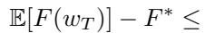

$$
\tag{21}
$$

where

$$
\tag{22}
$$

Here, E is the number of local iterations per one training iteration.

Remark 1 (General Convex and Non-Convex Objectives): While Theorem 1 addresses the strongly convex case, analogous convergence results can be established for general convex and non-convex objectives by leveraging the analysis framework from previous work.

Remark 2 (Client-Specific Dropout Behavior): In realistic scenarios, clients may have varying dropout probabilities, which violates the assumption of uniformly random client selection and complicates the theoretical guarantees. Nonetheless, empirical evidence suggests that FedAvg continues to converge even under such heterogeneous participation patterns.

Remark 3 (Choice of E): As shown in (Li et al., 2020b), the total communication rounds T /E is a non-monotonic function of E, initially decreasing and then increasing. This suggests that overly small or large values of E may incur high communication costs, and that an optimal choice of E exists.

Remark 4 (Choice of N): The convergence rate exhibits only weak dependence on the number of active clients N. This implies that the participation ratio N/NT can be kept small to mitigate straggler effects, without significantly impacting convergence.

Remark 5 (Error Rate): The convergence rate is O(1/T ), meaning that the expected gap to the optimum satisfies:

$$
\tag{23}
$$

Hence, increasing the total number of steps T leads to a linear decrease in worst-case error.

Next we point out the analysis of (Li et al., 2020b) that diminishing learning rates are crucial for the convergence of FedAvg in the Non-IID setting.

Table 5. Extended computational and communication complexity for OPA and DISAGG. N is the number of selected clients, A is the Aggregator group size, M is the model size, ρ is the packing factor of OPA, and λ is the key size.  
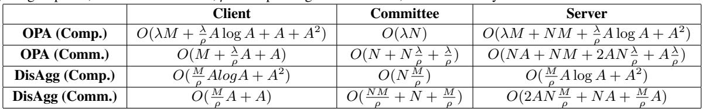

Table 6. Altered complexity table for OPA and DISAGG, using O(A2) instead of O(A log A) for the secret sharing and reconstruction operations. This setting corresponds to the implementation complexity used in our simulations.  
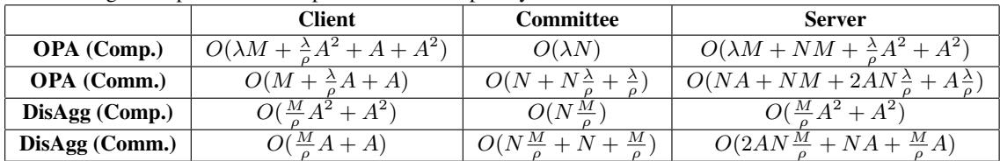

Theorem 3 (Effect of Learning Rate Decay): FedAvg does not necessarily converge to the optimal solution under fixed learning rates when E > 1. Let w˜∗ denote the solution obtained by FedAvg with constant step size η, and let w∗ be the optimal point. Then,

$$
\tag{24}
$$

up to constant factors. This construction highlights the necessity of diminishing step sizes in the Non-IID setting.

Remark 6 (Learning Rate Schedule): When using a decaying learning rate and E > 1, FedAvg converges to the optimum. In contrast, with a fixed learning rate and E > 1, the algorithm does not converge to the optimum.

## C COMPLEXITY ANALYSIS

## C.1 Breakdown of Theoretical Complexities

Regular client: A client has a pair of private-public keys for communication with all Aggregators, and exchanges public keys with the Aggregators via the server. It sends its own with O(1) time complexity and receives the public key of all Aggregators with O(A) complexity, where A < N is the size of the Aggregator group. Each client generates the shares of their model with complexity O(M log A), where M is the model size (i.e., the number of model parameters). This complexity arises from the use of Fast Fourier Transform (FFT) (Cooley & Tukey, 1965) which can be used in theory for the polynomial evaluation. The total communication cost is O(M + A).

Aggregator: An Aggregator, similarly to the other clients, participates in the one-time key exchange: it broadcasts a single public key and (via the server) receives N client public keys to set up encrypted channels, yielding the N term. It then receives one secret share of size ≈ M/A from each of the N clients, so the total payload per Aggregator is N · (M/A) field elements, giving communication O((M/A + N ). To compute its partial sum, the Aggregator adds these N shares entrywise (each of length M/A), which costs O(N · M/A) arithmetic.

Server: The server transfers all public keys between N clients and A Aggregators with cost O(NA), the N models each of size M with O(NM), and the aggregated parts from the Aggregators with O(M). The total communication cost is O(N M + N A). For the reconstruction of the aggregated model, the computation complexity is the same as the client’s sharing cost, in order to combine the shares: O(M log A).

## C.2 Refining Complexities

In this section, we provide the detailed comparison table of the extended complexities for DISAGG and OPA, as discussed in main paper (Table 5). We also provide in Table 6 a slightly modified version, where the complexity of secret sharing and reconstruction for both schemes is set to O(A2) instead of O(A log A). This alteration reflects the complexity used in our simulations for implementation simplicity. Since this change affects both protocols symmetrically, it does not influence the conclusions of the comparison.

## C.3 Alternative Network Speeds

We complement the main 5G-oriented evaluation with experiments under reduced client bandwidth representative of 4G and 3G connectivity. Since DISAGG incurs additional Aggregator-facing communication, lower uplink capacity disproportionately affects its relative performance. Nevertheless, DISAGG continues to achieve a (reduced) speedup over OPA in both alternative settings.

Figures 13 and 14 report (for each network profile) (i) the optimal number of Aggregators A selected independently for OPA and DISAGG across (M, N ) pairs under the same optimization criterion as in the main text, and (ii) the corresponding relative speedup of DISAGG over OPA. The 4G configuration uses 200 kBps upload and 2 MBps download per client; the 3G configuration uses 50 kBps upload and 500 kBps download per client. The server bandwidth is held fixed at the 5G setting. As expected, reduced client bandwidth narrows the performance gap, yet DISAGG still exhibits a positive speedup in these regimes.

## C.4 Aggregator Stragglers

Assuming that server bandwidth is not a bottleneck (as multiple servers can be deployed in parallel), the per-round latency is determined by the slowest surviving Aggregator. This effect can be equivalently modeled by treating Aggregators as clients with heterogeneous network speeds (e.g., 3G/4G/5G). We evaluate the expected speedups under such heterogeneous settings in Figures 13 and 14 as discussed above, and further extend our experimental evaluation on heterogeneous clients in Figure 18. Even when 40% of Aggregators use 4G connections instead of 5G, DISAGG continues to achieve a speedup over OPA. Moreover, due to its high dropout tolerance (see Section 5.3), DISAGG can accommodate a finite round timeout to handle extreme stragglers, and is therefore not significantly impacted by Aggregator stragglers or client heterogeneity.

## C.5 Minimum Aggregators Analysis

In this section, we present contour plots that illustrate the minimum number of Aggregators A (calculated for minimum packing factor ρ = 1) across (M, N ) pairs for both DISAGG and OPA under the 5G setting. The improvement of DISAGG over OPA is shown on the right of Figure 11, where performance gains range from 0.03× to 2.15×. To align with the configuration used in the OPA paper (Karthikeyan & Polychroniadou, 2024), we additionally report results for ρ = 16, corresponding to OPA’s packing choice. Figure 12 presents this comparison under identical packing assumptions, with speedup factor from 0.5× to 3.9×.

## C.6 Packing Optimization

A potential optimization, left as future work, is to pack multiple 32-bit secrets into a single 128-bit field element. Since summing N client inputs requires an additional ⌈log2 N⌉ bits of headroom to prevent overflow, one could encode two 32-bit model parameters (plus the required padding) within each 128-bit field element, effectively halving the Aggregator download burden, while maintaining correctness and security.

## C.7 Byzantine Fault Tolerance

We present theoretical complexity plots under the Byzantine fault-tolerance (BFT) constraint, where the minimum committee size is chosen to satisfy γ + δ ≤ 1/3 (as discussed in main paper). For illustration, we instantiate γ = δ = 0.1. Figure 15 reports the optimal number of Aggregators A for DISAGG and OPA across (M, N ), together with the speedup of DISAGG over OPA, under the BFT constraint. As expected, enforcing BFT increases the required committee size and leads to an overall reduction in the relative performance of DISAGG compared to the non-BFT case.

## D ADDITIONAL EXPERIMENTS

## D.1 Training and Quantization

We conducted experiments to test the effect of quantization in our secure aggregation protocol. Figure 16 shows the training results for the models and datasets that are used in the section 5.4. In this setup we train using only plaintext FL but with two options. The first is to keep the quantization as in the secure aggregation protocols, and the second is to do the training directly with the model parameters as floats, as the nornal FL does, without security. The first is denoted with the letter ’Q’ for quantization depicted on the dataset names and the latter with ’F’ for floats. The plaintext field we used for quantization was 53 bits and as we can see in this Figure 16 the effect in the final accuracy for every round is negligible, with an exception for CIFAR100 dataset with TinyNet model. In this case the difference in the final accuracy is ≈ 4%. The main cause for this deviation is the clipping of the model parameters prior to translating floats to integers. The clipping range is set to [-2.0, 2.0] for all models.

## D.2 Training Timings

We measured the timings for every phase during one round of FL for the secure aggregation protocols DISAGG and OPA along with simple aggregation PLAINTEXT. The results are presented in Tables 7 and 8, reporting the timings for training a DistilBERT model with the SST2 dataset, and EfficientNet model with the CelebA dataset respectively. DISAGG only adds up to 20% overhead while OPA can add up to 190% overhead compared to PLAINTEXT.

## D.3 Grid Search for Large-scale Experiments

We present a grid search over the parameter ρ for both OPA and DISAGG to produce the results reported in Table 2. The grid search highlights the importance of tuning the ρ for each method. In contrast, ρ was kept fixed in (Karthikeyan & Polychroniadou, 2024).

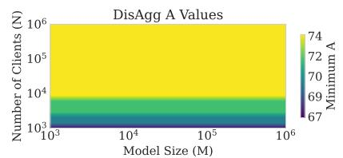

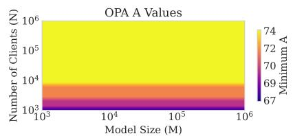

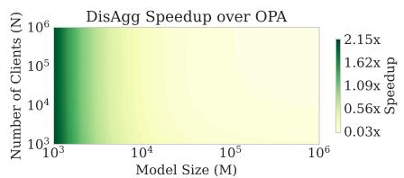  
Figure 11. Contour plot showing the minimum number of Aggregators A (calculated for minimum packing factor ρ = 1) for DISAGG and OPA and the resulting speedup of DISAGG over OPA across (M, N ) under a 5G client connectivity assumption (2 MBps upload / 20 MBps download), with k = 0.3 and kcomp = 0.66.

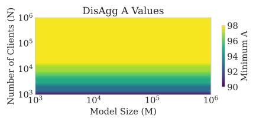

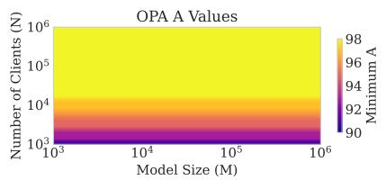

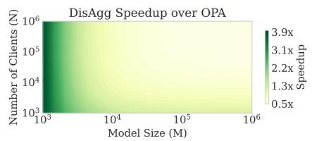  
Figure 12. Contour plot showing the minimum number of Aggregators A for DISAGG and OPA and the resulting speedup of DISAGG over OPA across (M, N) under a 5G client connectivity assumption (2 MBps upload / 20 MBps download), with k = 0.3 and kcomp = 0.66. The number of Aggregators are computed for packing factor ρ = 16, matching OPA’s configuration.

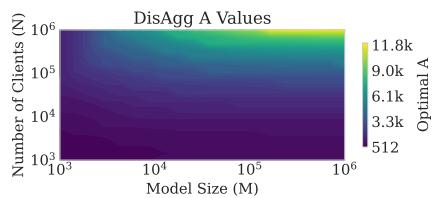

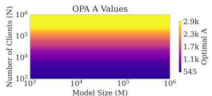

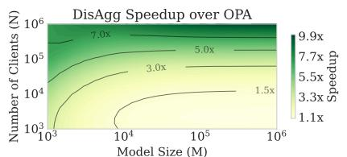  
Figure 13. Contour plot showing the optimal number of Aggregators A for DISAGG and OPA and the resulting speedup of DISAGG over OPA across (M, N) under a 4G client connectivity assumption (200 kBps upload / 2 MBps download), with k = 0.3 and kcomp = 0.66.

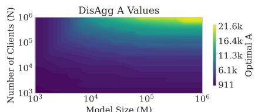

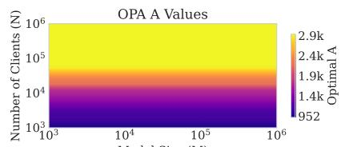

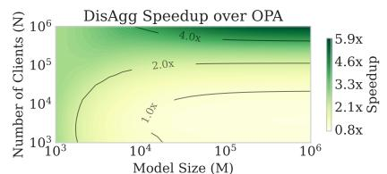  
Figure 14. Contour plot showing the optimal number of Aggregators A for DISAGG and OPA and the resulting speedup of DISAGG over OPA across (M, N) under a 3G client connectivity assumption (50 kBps upload / 500 kBps download), with k = 0.3 and kcomp = 0.66.

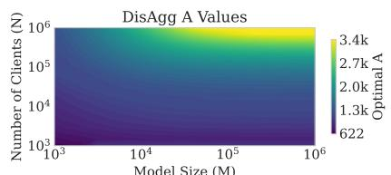

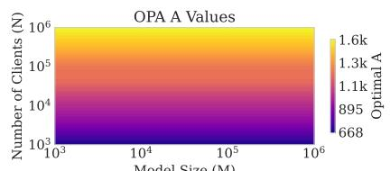

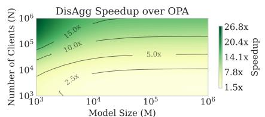  
Figure 15. Contour plot showing the optimal number of Aggregators A for DISAGG and OPA and the speedup of DISAGG over OPA across (M, N) under the BFT constraint (γ + δ ≤ 1/3) and a 5G client connectivity assumption, with γ = δ = 0.1 and kcomp = 0.66.

Table 7. Per stage timings in seconds for DISAGG, OPA and PLAINTEXT (simple aggregation) during one FL iteration. A DistilBERT model with 297k trainable parameters is trained on the SST2 dataset. DISAGG has a marginal overhead of 3.1% over PLAINTEXT.  
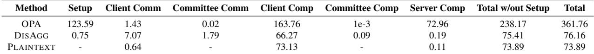

Table 8. Per stage timings in seconds for DISAGG, OPA and PLAINTEXT (simple aggregation) during one FL iteration. An EfficientNet model with 266k parameters is trained on the CelebA dataset. DISAGG has a marginal overhead of 20% over PLAINTEXT.  
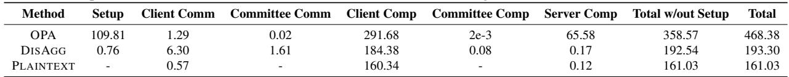

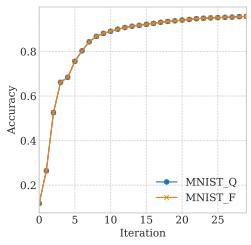  
(a) MNIST

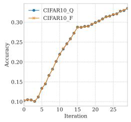  
(b) CIFAR10

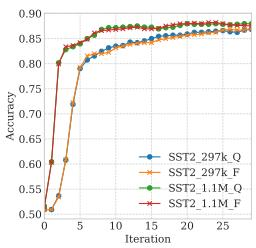  
(c) SST2

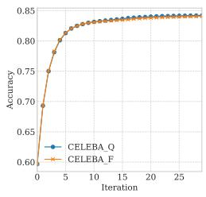  
(d) CELEBA

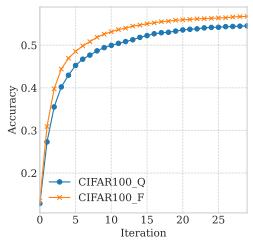  
(e) CIFAR100

Figure 16. Training accuracy with different datasets and model using plaintext FL. Q denotes the use of quantization required for cryptographic primitives in secure aggregation. F denotes floating point precision as used in standard FL.  


Figure 17. Speedup of DISAGG over OPA for one FL iteration with M = N = 100k using a grid search of ρ as described in Section 5.2. Equations 7–9 are used to calculate A for a given ρ.  


## D.4 Effect of Heterogeneity

Section 5.6 discusses the effects of stragglers on DISAGG’s performance. In this section, we compare the effect of network heterogeneity on both DISAGG and OPA, by analyzing the effects of clients having a distribution of network speeds. Figure 18 presents cases with (60% 5G, 40% 4G) and (60% 5G, 40% 3G) client speed distributions. In the first case, DISAGG is still faster than OPA by 10-30%, whereas in the second case of having 40% clients with 3G connectivity, delays on the Aggregators’ download of secret shares in DISAGG lead to a 20-30% slowdown compared to OPA. Given that 93% of the global population has access to at least 4G connectivity today (Amos, 2025), the second scenario represents an extremely unlikely case. In practical scenarios, the chances of encountering 3G clients may be no more than 10%; the server could either never

Figure 18. Time comparison for one FL iteration of DISAGG and OPA with (60% 5G, 40% 4G) clients on the left, (60% 5G, 40% 3G) on the right and a shared y-axis for each row. The top row includes the setup times while the bottom row excludes it. DisAgg is within ±30% of OPA timings under such conditions.

select such clients initially or regard them as dropouts later. As shown in Section 5.6, in such cases, DisAgg achieves a 1.37× speedup over OPA after 30 iterations of FL training.

## D.5 SecAgg+/LightSecAgg Offline Processing

LIGHTSECAGG (So et al., 2022) introduces offline computation phases for clients – allowing clients to compute mask shares in parallel to the FL training iteration. This effectively absorbs mask computation time into the total time spent for other phases. Figure 19 simulates the effects of using offline phases for SECAGG+ and LIGHTSECAGG by including or excluding mask computation time from the per iteration total time. As seen, parallelizing mask creation has a negligible impact on the total time as bottlenecks lie in other phases, which can be resolved by using DISAGG.

  
Figure 19. Combined computation and communication time per FL iteration for SECAGG+ and LIGHTSECAGG (LIGHTSA) for M=1k (left) and M=10k (right). Solid lines include mask computation time for SECAGG+ and LIGHTSECAGG while dashed lines exclude it. The difference in per iteration total time is negligible.

## E ARTIFACT APPENDIX

## E.1 Abstract

This artifact provides the code and accompanying instructions required to reproduce the experimental results presented in the paper. The code includes Python implementations of the baseline methods compared with DisAgg and scripts to run experiments on the various datasets and models evaluated. A README.md file describes how to install the required dependencies, prepare the datasets, and execute the experiments. The instructions allow users to replicate the evaluation procedure and regenerate the performance metrics reported in the paper, including accuracy and execution time, subject to variations due to hardware differences.

## E.2 Artifact check-list (meta-information)

• Algorithm: DisAgg

• Program: Python 3.10 and various packages.

• Model: CNN, TinyNet, EfficientNet, DistilBERT+LoRA

• Data set: MNIST, CIFAR10, CIFAR100, CelebA, and SST2

• Run-time environment: Linux 64-bit with Nvidia drivers, Python 3.10 and Pip installed.

• Hardware: CPU with 10+ cores, GPU with at least 10 GB VRAM, at least 128 GB RAM, and 0.5 TB disk space

• Metrics: Accuracy, Time, Communication Size

• Experiments: see README.md

• How much disk space required (approximately): 0.5 TB

• How much time is needed to prepare workflow (approximately): 20mins

• How much time is needed to complete experiments (approximately): Few minutes up to many hours, depending on hardware and experiment.

• Publicly available: Yes

• Code licenses: CC-BY-NC 4.0

• Data licenses: See individual dataset URLs in README.md.

• Workflow framework used: None

• Archived: DOI on Zenodo

## E.3 Description

## E.3.1 How delivered

All instructions and code can be found using this publicly available URL: https://github.com/ SamsungLabs/mlsys26\_disagg. README.md inside the root directory contains instructions on how to install the required packages, prepare data and run experiments.

## E.3.2 Data sets

The following datasets are used: MNIST, CIFAR-10, CIFAR-100, CelebA & SST-2. Instructions on how to download them can be found in the repo’s README.md.

## E.4 Installation

README.md contains instructions on how to install the required packages.

## E.5 Experiment workflow

All experiments are configured in src/constants.py. To run a protocol with experiment index <i>:

```batch
python -m disagg_test --exp_index=<ix>
python -m opa_test --exp_index=<i>
python -m light_secagg_test --exp_index=<i>
python -m secagg_plus_test --exp_index=<i>
```

Each experiment index <i> corresponds to a specific result in a paper. All results are written to outputs/. Additional details on the experimental configuration and mapping between experiment indices and paper results can be found in the README.md.

## E.6 Experiment customization

Experiments can be customized by modifying the configuration parameters in the source code. Additional details on how to change parameters and define new experimental settings are provided in the README.md.

## E.7 Evaluation and expected result

README.md contains details on what experiments to run to replicate paper results. Note that timings would naturally vary based on hardware. However, we envision the comparative conclusions will be the same.

## E.8 Methodology

Submission, reviewing and badging methodology:

• http://cTuning.org/ae/submission-20190109.html

• http://cTuning.org/ae/reviewing-20190109.html

• https://www.acm.org/publications/ policies/artifact-review-badging