# TELERAG: EFFICIENT RETRIEVAL-AUGMENTED GENERATION INFERENCE WITH LOOKAHEAD RETRIEVAL

Chien-Yu Lin \* 1 Keisuke Kamahori \* 1 Yiyu Liu \* † 2 Xiaoxiang Shi † 3 Madhav Kashyap 1 Yile Gu 1 Rulin Shao 1 Zihao Ye 1 Kan Zhu 1 Rohan Kadekodi 1 Stephanie Wang 1 Arvind Krishnamurthy 1 Luis Ceze 1 Baris Kasikci 1

## ABSTRACT

Retrieval-augmented generation (RAG) extends large language models (LLMs) with external data sources to enhance factual correctness and domain coverage. Modern RAG pipelines rely on large datastores, creating a significant system challenge: achieving high throughput and low latency is difficult, especially when GPU memory is limited. To address these challenges, we propose TELERAG, an efficient inference system that reduces latency and improves throughput with minimal GPU memory requirements. The core innovation of TELERAG is lookahead retrieval, a prefetching mechanism that predicts required data and transfers them from CPU to GPU in parallel with LLM generation. In addition, TELERAG adopts a prefetching scheduler and a cache-aware scheduler to support efficient multi-GPU inference with minimal overhead. Evaluations show TELERAG achieves up to a 1.98× average end-to-end latency reduction (single-query) and 1.83× higher average throughput (batched), as well as good scalability in throughput. This confirms the practical utility of TELERAG for faster and more memory-efficient deployments of RAG applications.

## 1 INTRODUCTION

Retrieval-augmented generation (RAG) has emerged as a powerful technique to enhance large language models (LLMs) by integrating them with external databases (Gao et al., 2023b; Asai et al., 2024c; Lewis et al., 2020). During inference, RAG retrieves relevant content from external data sources, usually indexed as vector datastores, to mitigate issues such as hallucinations (Mallen et al., 2023; Ram et al., 2023; Khandelwal et al., 2019) and incorporate up-to-date or private information (Izacard et al., 2023; Min et al., 2023).

To provide accurate responses, modern RAG applications employ multiple rounds of LLM calls and retrievals for a single query (Gao et al., 2023b; Fan et al., 2024; Ilin, 2023; Gao, 2024; Databricks, 2024; Wei, 2024). As shown in Figure 1, RAG pipelines typically consist of four stages: (1) pre-retrieval generation: refines the initial user query to improve retrieval effectiveness. (2) retrieval: finds the relevant documents from the datastore; (3) post-retrieval generation: generates a response based on the user’s query and retrieved documents; (4) judgment: evaluates the output to determine the execution flow.

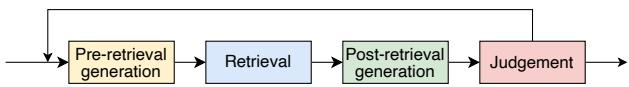  
Figure 1. Typical pipeline stages of a RAG application.

RAG datastores are typically large, as datastore size is strongly correlated with model accuracy (Min et al., 2023; Khandelwal et al., 2019; Borgeaud et al., 2022; Hardt & Sun, 2023; Shao et al., 2024). However, a brute-force search on such a large datastore is prohibitively slow and inefficient, as most data is irrelevant to the query. This drives the adoption of solutions like the Inverted File Index (IVF) (Sivic & Zisserman, 2003), which partitions the data into clusters and restricts the search to only the most relevant ones.

While this partitioning effectively reduces the computational burden of the search, it does not solve the memory capacity challenge. To accelerate the IVF retrieval process with the GPU, one straightforward approach is to keep the entire datastore in the GPU memory (case A in Figure 2). As the size of a datastore is large (tens to thousands of GB) (Quinn et al., 2025), such a setting is expensive and often commercially impractical for local and custom RAG deployments handling private or sensitive data. Even in large data centers, where user requests are often batched, this approach challenges service level objectives (SLOs) because allocating GPU memory to the datastore reduces the LLM’s key-value cache (KV cache), limiting effective batch sizes (Kwon et al., 2023). An alternative approach is to load the relevant data clusters from CPU to GPU at runtime. However, because bandwidth between the CPU and GPU is typically limited, this approach suffers from high transfer latency.

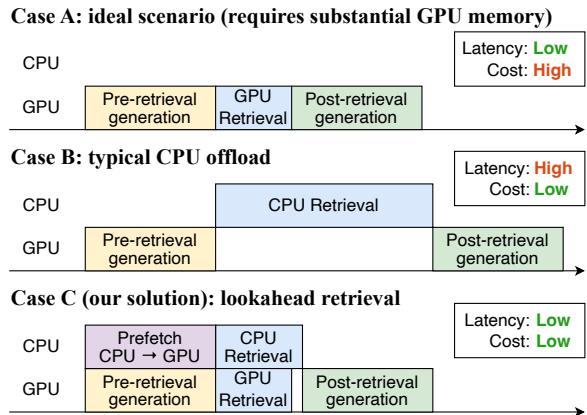  
Figure 2. Illustration of TELERAG’s lookahead retrieval mechanism and comparison to different RAG systems. TELERAG prefetches relevant retrieval data from CPU to GPU, overlaps data transfer with the pre-retrieval stage, and accelerates retrieval with GPU–CPU cooperation.

As a result, modern RAG systems (Jiang et al., 2025; Shen et al., 2025) process retrieval on CPUs as they typically offer large and relatively cheap memory. However, CPUs are not as efficient as GPUs for highly parallelizable operations such as vector similarity search, and therefore using CPUs for search (case B in Figure 2) increases RAG system latency. For latency-sensitive applications such as customer chatbots (Chemmagate, 2024; Akkiraju et al., 2024; Tung, 2024), financial analysis (Malec, 2024; MyScale, 2024), and emergency medical diagnosis (Klang et al., 2024; GM & Dhar, 2024), high latency can lead to poor user experience and even critical failures. To make matters worse, any latency increase of RAG systems has compounding effects due to multiple rounds of LLM generation and retrieval.

Our proposal. In this work, we observe that there is a substantial semantic overlap between a user’s initial query and the query refined by an LLM during the pre-retrieval stage (see Figure 1). Since both queries represent the same core information need, their relevant IVF clusters are also likely to overlap significantly (see §3.3 for detailed analysis).

Using this insight, we propose TELERAG (§4), an efficient inference system that optimizes RAG performance by leveraging GPU retrieval acceleration while minimizing GPU memory consumption. TELERAG employs lookahead retrieval to proactively load relevant IVF clusters onto the GPU, hiding the CPU–GPU data transfer overhead during concurrent LLM generation. As illustrated in Figure 2, our approach aims to significantly reduce retrieval latency without exceeding GPU memory constraints. To guarantee retrieval accuracy, TELERAG complements this prefetching with a hybrid search: any clusters missed by the lookahead are simultaneously searched on the CPU, and the results are merged. In addition to prefetching, TELERAG also utilizes on-GPU caching to further reduce redundant data transfers for frequently accessed clusters.

TELERAG also optimizes for batch and multi-GPU inference (§4.2). To mitigate increased data transfer in batched scenarios, TELERAG uses a prefetching scheduler to group similar queries, maximizing the overlap of their prefetched clusters. In multi-GPU settings, TELERAG employs a cache-aware query scheduler that routes queries to the appropriate GPU to maximize the utility of its cached clusters.

Results summary. We evaluated TELERAG using six RAG pipelines with Llama 3B/8B models (AI@Meta, 2024) on a Wikipedia datastore (Karpukhin et al., 2020). TELERAG demonstrates significant efficiency, enabling a datastore (61 GB) and a Llama-3-8B (16 GB) LLM to run on a single RTX4090 GPU (24 GB), with performance far exceeding the CPU baseline. For single-query inference on an RTX4090, TELERAG achieves an average 1.53× end-to-end latency speedup. Throughput gains increase with batching, reaching 1.98× on average (batch size 8, H100). In multi-GPU settings, its prefetching and cache-aware scheduling deliver strong scaling (e.g., on H200, 3.8× speedup on 4 GPUs, compared to the performance on 1 GPU). These results confirm that TELERAG enables scalable RAG serving under tight GPU memory constraints. Our code is publicly available at https://github.com/uw-syfi/TeleRAG.

In summary, we make the following key contributions:

• Analysis of the correlation of queries between the preretrieval generation and retrieval stages, revealing significant overlap in their corresponding IVF clusters.

• Lookahead retrieval, which prefetches likely IVF clusters to the GPU, and hides CPU–GPU data transfer time during pre-retrieval generation.

• TELERAG, an efficient RAG inference system that integrates lookahead retrieval and supports high-performance multi-GPU inference through prefetching and cacheaware scheduling, resulting in significant acceleration of RAG with minimal GPU memory usage.

## 2 BACKGROUND

## 2.1 Retrieval-Augmented Generation (RAG)

RAG is a technique that enhances the capabilities of LLMs by integrating them with information retrieval to generate more accurate and relevant text (Gao et al., 2023b; Asai et al., 2024c; Lewis et al., 2020). The core idea behind RAG is to augment the LLM with relevant information retrieved from a large corpus of documents, improving the LLM’s ability to answer questions without hallucinations (Mallen et al., 2023; Ram et al., 2023; Khandelwal et al., 2019) and generate content based on up-to-date or private information (Izacard et al., 2023; Min et al., 2023).

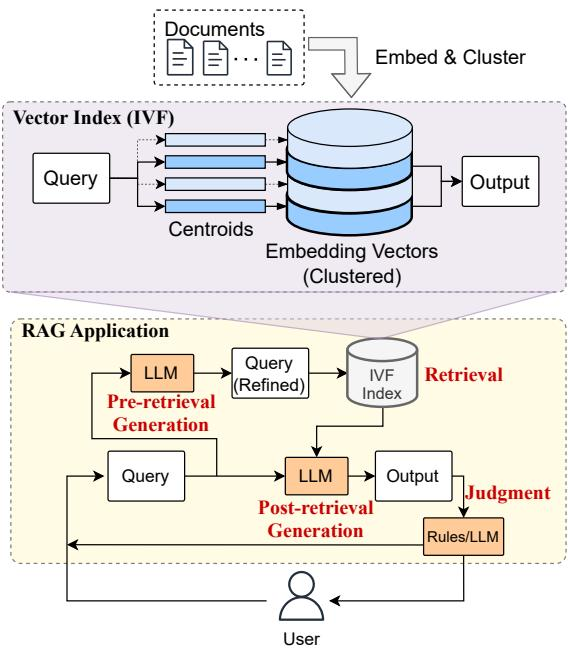  
Figure 3. Overview of RAG.

Modern RAG pipelines. In order to deliver precise and contextually appropriate responses, modern RAG models adopt a modular approach that employs multiple rounds of LLM calls and retrievals for a single query (Gao et al., 2023b; Fan et al., 2024; Ilin, 2023; Gao, 2024; Databricks, 2024; Wei, 2024). Typically, they have the following types of steps (shown in Figure 3): (1) Pre-retrieval generation decides whether retrieval is needed or polishes queries before retrieval; for example, query transformation (Ma et al., 2023; Jagerman et al., 2023; Gao et al., 2023a; Zhou et al., 2022; Ye et al., 2023; Press et al., 2023; Peng et al., 2024; Zheng et al., 2023; Liu, 2022a) reformulates the original query to make it clearer and more suitable for retrieval. (2) Retrieval then identifies relevant documents for the query, taking the output of pre-retrieval generation and producing the evidence for the next stage. (3) Post-retrieval generation uses the user’s query and the retrieved documents to produce the final response; it can also include processes like summarization (Jiang et al., 2023a; Kim et al., 2023) or reranking (Zhuang et al., 2023; Stewart & Linsdell, 2024). (4) Judgment dynamically determines the execution flow (e.g., deciding whether further iteration is needed to enhance the response) using heuristics or LLMs.

## 2.2 Datastore, Inverted File Index (IVF), and Retrieval

Datastore. The datastore is processed by cleaning, chunking, and indexing to enable efficient retrieval. The raw data, in various formats, is first cleaned, converted to plain text, and divided into chunks. The chunks are then converted into vector embeddings using an embedding model such as Contriever (Izacard et al., 2021). The document chunks, along with vector embeddings, are stored in a vector database, which enables efficient retrieval by searching for chunks based on vector similarities between the query and the chunk embeddings.

IVF-based retrieval. Many RAG deployments use the Inverted File Index (IVF) algorithm (Sivic & Zisserman, 2003) for efficient vector search. IVF partitions the vectors into clusters based on similarity, each represented by a centroid. The search is then restricted to only the few clusters most relevant to the query, avoiding searching the entire datastore.

With clustering, an IVF search is a two-step process: (1) Cluster probing: The query is compared only to the cluster centroids to quickly identify the few most relevant clusters. (2) Searching: The system then performs a detailed search only within that small set of selected clusters and returns the final top-k best-matching items.

A parameter called nprobe (Douze et al., 2024) controls the number of clusters to check in the first step. A larger nprobe increases accuracy at the cost of higher latency, as more data must be searched. Appendix B provides a formal description of IVF.

Latency of retrieval. Since the search process is highly parallelizable across clusters and vectors, this search algorithm can be highly accelerated by GPUs. Furthermore, opensource libraries offer efficient GPU implementations (Johnson et al., 2019; Rapidsai, 2022). However, the vector database in modern RAG deployments can reach tens to thousands of GB (Quinn et al., 2025; Sella, 2024) as a result of the positive correlation of datastore size with accuracy (Min et al., 2023; Khandelwal et al., 2019; Borgeaud et al., 2022; Hardt & Sun, 2023; Shao et al., 2024). The large vector databases increase the latency of RAG pipelines significantly in both local setups and data centers.

Local setups typically consist of personal workstations or laptops with a single consumer-grade GPU (e.g., RTX4090 has 24 GB of memory), where latency is critical. Data center environments, on the other hand, care about both latency and throughput since they handle numerous simultaneous user queries. In both scenarios, GPU memory capacity becomes a performance limitation when working with vector databases. Consumer GPUs in personal setups lack sufficient memory to accommodate large vector databases, whereas data-center GPUs must sacrifice KV cache space (reducing throughput) to accommodate them (Kwon et al.,

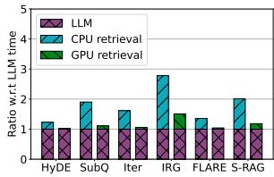  
(a) Batch = 1.

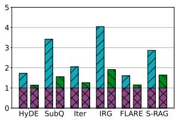  
(b) Batch = 4.  
Figure 4. Latency breakdown of six RAG pipelines on NQ dataset (Kwiatkowski et al., 2019) with one H100 GPU.

2023). Consequently, vector databases are commonly stored in the CPU memory instead. Unfortunately, this approach increases retrieval latency whether IVF search operations are performed on the CPU or data is transferred between CPU and GPU (as explored in §3).

## 3 ANALYZING RAG LATENCY

In this section, we analyze the system challenges in state-ofthe-art RAG applications. We constructed a 61 GB vector index with the Faiss library (Douze et al., 2024), and set the IVF clusters to 4096 following common practice (Asai et al., 2023). Our analysis is conducted on an RTX4090 (24 GB) and H100 (80 GB) using Llama-3-8B (AI@Meta, 2024). Further setup details are in §5.2.

## 3.1 End-to-end Latency of RAG Pipelines

We first analyze the end-to-end latency of six RAG pipelines (§5.1) by comparing two scenarios: (1) LLM on GPU with retrieval on CPU (low GPU memory), and (2) both LLM and the vector index on GPU (low latency).

We set the nprobe to 256, a commonly used setting under this index’s configuration (see §5.1 and §5.2 for details). As shown in Figure 4 (using randomly sampled 1024 NQ queries (Kwiatkowski et al., 2019)), the CPU-based retrieval phase is a major bottleneck, consuming 41.1% and 60.5% of total latency for batch sizes 1 and 4, respectively. In contrast, GPU-accelerated retrieval accounts for only 10.5% and 28.3% of the latency, respectively. On average, GPU retrieval is 5.96× (batch size 1) and 3.87× (batch size 4) faster than its CPU counterpart, reducing overall end-to-end latency by 1.5× and 1.8×. Thus, accelerating GPU-based retrieval is crucial for reducing end-to-end latency.

However, GPU acceleration has a significant memory cost. For instance, in our setting, with a 61 GB index and a 16 GB Llama-3-8B model, GPU retrieval requires 77 GB of GPU memory, far exceeding the 24 GB of a common RTX4090. This makes GPU-accelerated retrieval often unfeasible on lower-end GPUs or with large datastores.

Even on large GPUs (e.g., H100), storing the full index in memory limits serving throughput. High-throughput batched inference is bottlenecked by the LLM’s KV cache capacity (Kwon et al., 2023). The index’s large memory footprint reduces the available memory for this KV cache, thereby limiting the effective batch size. This memory contention is exacerbated by RAG’s typically long contexts (Jin et al., 2024a; Lu et al., 2024; Yao et al., 2024) and the growing size of models and indexes (Min et al., 2023; Khandelwal et al., 2019; Borgeaud et al., 2022; Hardt & Sun, 2023; Quinn et al., 2025), necessitating offloading.

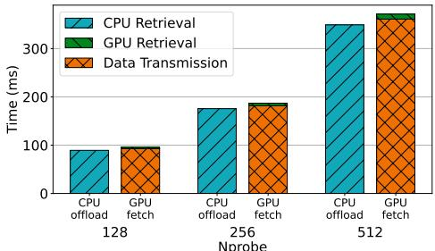  
Figure 5. Latency breakdown of CPU-offload and runtime-fetch GPU retrieval, averaged over 512 random NQ queries.

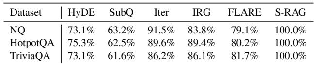  
Table 1. IVF cluster overlapping rate between the input and output of the pre-retrieval generation, i.e., the average percentage of correctly predicted clusters among the clusters actually used. Since Self-RAG does not incorporate query transform, its coverage is always 100%.

Therefore, in the rest of this section, we try to answer the following question: Is it possible to achieve the latency of GPU-based retrieval while using much less GPU memory?

## 3.2 GPU-accelerated Retrieval with Runtime Transfer

A straightforward approach to enable GPU retrieval with limited GPU memory is to fetch the necessary data from CPU to GPU on demand at runtime, leveraging the IVF index to narrow the search space. While this enables fast GPU search, the data transfer itself becomes the new bottleneck.

Figure 5 compares the latency of the runtime fetching system against CPU retrieval on an RTX4090 GPU with three different nprobe values that determine the amount of data fetched. Overall, fetch time dominates latency due to the limited CPU–GPU PCIe bandwidth (32 GB/s). Although the GPU search is substantially faster, the fetch overhead results in a higher end-to-end latency (∼3% slower on average). Thus, to achieve a meaningful speedup with this approach, the data-fetching latency must be effectively hidden.

To hide data-fetch costs, CPU-to-GPU transfers must occur before the retrieval stage, which requires predicting which data will be accessed. Fortunately, modern RAG pipelines offer a valuable hint: the query from the previous step.

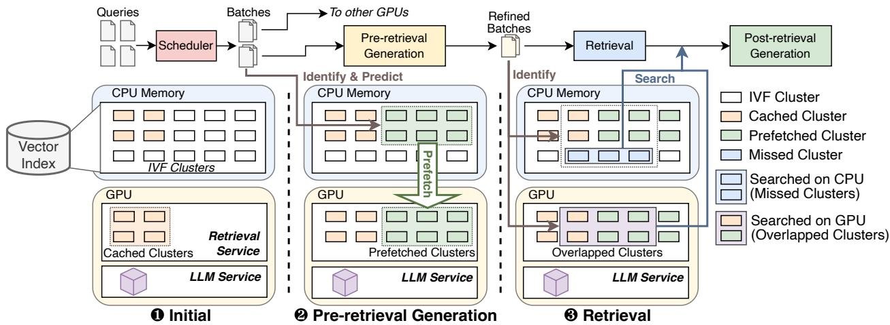  
Figure 6. The overview of TELERAG system. When queries arrive, some clusters are already cached on the GPU from previous requests. These queries are grouped into micro-batches based on semantic similarity. For each micro-batch, TELERAG prefetches the required clusters using lookahead retrieval in parallel with the pre-retrieval generation. During retrieval, TELERAG performs a hybrid search: the GPU processes cache hits directly from GPU memory, while the CPU handles cache misses. The retrieved documents are then passed to the post-retrieval generation stage.

## 3.3 Overlapping of IVF Clusters

While the exact data to be retrieved is only known after the pre-retrieval generation is done, we observe high similarity in the IVF cluster assignments between queries at different stages.

Similarity of queries at different stages. During RAG pre-retrieval stages (e.g., query transformation (Gao et al., 2023a; Zheng et al., 2023; Peng et al., 2024; Asai et al., 2024a)), an LLM refines an initial user query qin into a transformed query qout for the actual retrieval. While this process often rewrites or simplifies the query, it intuitively preserves its core semantic content. Consequently, the embedding vectors of qin and qout are likely to be similar, suggesting their target IVF clusters will significantly overlap. Therefore, qin can serve as a valuable hint for predicting qout.

Prediction coverage. To verify this hypothesis, we evaluated the average cluster coverage (predicted vs. actual) in three popular QA datasets (NQ (Kwiatkowski et al., 2019), HotpotQA (Yang et al., 2018), and TriviaQA (Joshi et al., 2017)) and six RAG pipelines. As Table 1 shows, when prefetching 256 clusters, the overlap is consistently high. For instance, even the lowest reported coverage (for SubQ) remains above 61.6%.

Opportunity. This data shows an opportunity to predict required clusters, hiding data transfer overhead during LLM generation. In this paper, we aim to leverage this observation to accelerate the inference latency for RAG.

## 4 DESIGN OF TELERAG

Driven by the need for high-performance but memoryefficient RAG inference, we propose TELERAG, an end-toend system that accelerates retrieval through its core lookahead retrieval mechanism, which accelerates the retrieval process with a GPU but only requires a small fraction of the datastore on the GPU memory. Alongside this technique, TELERAG further designs optimizations on prefetching amount, caching, and scheduling algorithms for batching and multi-GPU, forming a complete system for both local and cloud use cases.

This section details the lookahead retrieval mechanism (§4.1), and then describes how TELERAG extends it with batching and multi-GPU support (§4.2), followed by other system-level optimizations (§4.3). Appendix D provides implementation details.

## 4.1 Lookahead Retrieval Mechanism

fiThe core mechanism of TELERAG, lookahead retrieval, is inspired by the observation in §3.3 that queries across different RAG stages are highly correlated and therefore select overlapping IVF clusters. Building on this insight, lookahead retrieval predicts and prefetches likely-needed IVF clusters to the GPU during LLM generation, overlapping data transfer with computation. During retrieval, TEL-ERAG leverages lookahead retrieval to coordinate the CPU and GPU so that prefetched data are processed on the GPU, while the CPU concurrently handles any missed clusters. This cooperative execution forms the foundation of TEL-ERAG’s low-latency, memory-efficient design.

Figure 6 shows the overview of TELERAG with lookahead retrieval. Let qin denote the query input to the pre-retrieval stage and qout denote the output passed to the retrieval stage. The IVF clusters selected by qin and qout are highlighted with a green background (Cin) and a purple background (Cout), respectively. Due to the semantic similarity between qin and qout, there is substantial overlap between Cin and Cout.

Guided by this correlation, lookahead retrieval operates in the following steps:

1. Predict & prefetch: During LLM generation, prefetch IVF clusters likely to be used in retrieval to GPU memory, identified by their distance to qin. This transfer is performed asynchronously via GPU DMA, overlapping with ongoing LLM computation.

2. GPU similarity search: Once qout is available, the GPU efficiently searches the predicted clusters (Coverlap) already resident in GPU memory.

3. CPU similarity search: Concurrently, the CPU performs similarity search over the remaining clusters (Cmiss) that were not prefetched.

4. Merge: The search results from GPU and CPU are merged on GPU. The retrieval documents are fed to LLM for post-retrieval generation on GPU.

In summary, lookahead retrieval enables TELERAG to accelerate retrieval by overlapping data prefetching with LLM generation and distributing the similarity search between GPU and CPU. This design significantly reduces CPU computation and data transfer latency, forming the backbone of TELERAG’s efficiency.

Prefetching amount. Prefetching more clusters improves hit rate and retrieval speed, but also increases CPU–GPU transfer time. If this transfer exceeds the pre-retrieval generation window, the overlap advantage is lost and may add latency, though slight overruns are acceptable if retrieval savings are substantial. Through analytical modeling and empirical profiling on modern hardware, we found prefetching up to the pre-retrieval LLM generation time (tLLM) achieves the optimal balance between latency reduction and transfer overhead. A detailed derivation of this result is provided in Appendix C. Since tLLM varies per query, for a given pipeline and hardware bandwidth Blink, we estimate its average (tLLM) on a calibration set and set the prefetching amount to Blink × tLLM.

## 4.2 Batching and Multi-GPU System

While §4.1 describes lookahead retrieval on a single-query and single-GPU basis, we now demonstrate how TELERAG extends this mechanism to support batches and multi-GPU inference. The system’s multi-GPU architecture is illustrated in Figure 7.

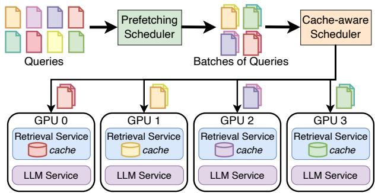  
Figure 7. Overview of TELERAG’s multi-GPU system design. The prefetching scheduler clusters semantically similar queries into micro-batches, while the cache-aware scheduler assigns these batches to GPUs based on cache locality.

Batching design. For batched scenarios, a challenge for lookahead retrieval is that each query requires a different set of IVF clusters. In our design, we apply the fixed total prefetching budget as described in §4.1, and distribute it equally among all queries in the batch. Although the perquery hit rate drops as the batch size grows, this strategy provides balanced retrieval acceleration for each query.

Multi-GPU support. In multi-GPU scenarios that serve a large number of RAG queries, TELERAG divides a global batch of queries into micro-batches and assigns them to each available GPU. Each GPU then independently processes the full RAG pipeline for its assigned micro-batches.

Scheduling optimization for prefetching. To compensate for the reduced hit rate in larger batches, we introduce a prefetching scheduler (see Figure 7). It operates by performing a greedy search on the global batch, grouping queries by the lowest L2 distance. While this scheduling adds latency, the greedy search is highly efficient on GPUs, incurring negligible overhead. Our profiling shows that for batch sizes up to 256, the search latency is less than 0.1 s, which is minimal compared to the end-to-end batch latency.

Cache design. To improve performance, TELERAG implements a dynamic caching strategy for data clusters. Instead of discarding all clusters after a request is served, it retains the most frequently accessed ones in GPU memory. This allows subsequent requests to reuse these cached clusters, boosting the cache hit rate and prefetching efficiency.

Cache-aware scheduling. To further exploit the benefits of caching, we design a cache-aware scheduler (Figure 7) that assigns micro-batches to GPUs based on cache locality. The scheduler employs a greedy strategy: it first selects the micro-batch with the greatest overlap across all GPU caches and assigns it to the best-matching GPU. It then iteratively schedules the remaining micro-batches in descending order of overlap with each GPU’s cached clusters. Although this scheduling introduces minor overhead, the performance gains from improved cache locality outweigh the cost (§5.4).

## 4.3 System Optimizations

GPU sorting. TELERAG accelerates the final sorting stage of IVF search by leveraging the GPU. To achieve this, TEL-ERAG transfers the scalar distance values of Cmiss from the CPU to the GPU. Unlike transferring full vector data, this operation is lightweight and incurs negligible overhead. The GPU then performs a global sort over the combined distances of Cmiss and Coverlap.

Prefetching target. TELERAG prefetches a fixed byte budget (bp), rather than a cluster count, to ensure predictable transfer times given highly uneven cluster sizes. The system fills this budget by adding whole clusters sequentially based on query proximity. If the next closest cluster exceeds the remaining budget, it is skipped entirely, ensuring a clean GPU/CPU processing split.

Prefetching for multi-round. For multi-round RAG involving the same input query, the system performs a full prefetch (up to the budget) only in the first round, leveraging high cluster similarity across rounds. In subsequent rounds, it incrementally fetches only the additional required clusters that were not loaded previously, optimizing data transfer while respecting the memory budget.

## 5 EVALUATION

We conducted extensive experiments to evaluate the effectiveness of TELERAG. In this section, we describe the necessary details on evaluation setups, present experimental results, and provide in-depth analysis and discussions.

## 5.1 Evaluation Datasets and RAG Models

Datastore. We built a datastore based on the wiki dpr dataset (Karpukhin et al., 2020), a popular dataset that contains 2.1 billion tokens from Wikipedia. Following previous works (Asai et al., 2023; Karpukhin et al., 2020; Min et al., 2023), we chunked the passages by every 100 tokens, and used Contriever (Izacard et al., 2021) to generate an embedding for each chunk. The embeddings have a hidden dimension of 768. The index size is 61 GB and we clustered the embeddings into 4096 IVF clusters. See Appendix E for detailed configurations of the index.

LLMs. We evaluated TELERAG on Llama-3.2-3B, Llama-3-8B and Mistral-Small-22B to represent different use cases.

RAG pipelines. We evaluated TELERAG with six popular RAG pipelines, as depicted in Figure 8. Note that even in pipelines lacking a pre-retrieval stage, the post-retrieval generation serves a similar function for the next retrieval iteration. Below are brief descriptions of these pipelines.

1. HyDE (Gao et al., 2023a) prompts LLM to generate a hypothetical paragraph and perform retrieval based on the embedding of the generated paragraph.

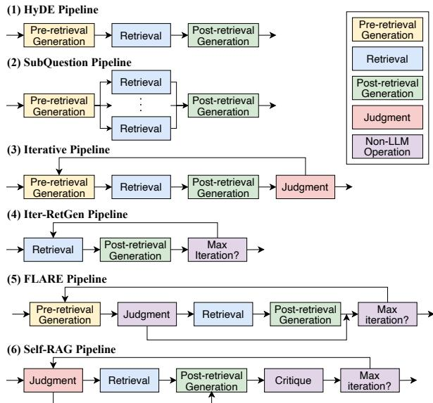  
Figure 8. Overview of six RAG pipelines that we evaluate.

2. SubQuestion (SubQ) (Liu, 2022c) prompts LLM to generate multiple sub-questions and performs retrievals for each generated sub-question.

3. Iterative (Iter) (Liu, 2022b) prompts LLM to generate narrower questions first and iteratively refine them based on previous answers. At the end of each iteration, it prompts LLM to judge if the answer is good enough.

4. Iter-RetGen (IRG) (Shao et al., 2023) iteratively does retrieval and LLM generation for 3 iterations.

5. FLARE (Jiang et al., 2023c) iteratively issues retrievals based on the confidence (probability score) of predicted tokens for the upcoming sentence.

6. Self-RAG (S-RAG) (Asai et al., 2023) uses the LLM to judge for retrieval, generate responses, and self-critique on the responses. We use the fine-tuned model based on Llama-2-7B from their official repository (Asai et al., 2024b) for trace generation.

Evaluation datasets. We use three commonly used question-answering datasets, NQ (Kwiatkowski et al., 2019), HotpotQA (Yang et al., 2018), and TriviaQA (Joshi et al., 2017). For each dataset, we randomly sampled 1024 queries and reported the average. When cache is enabled, to ensure stable results and avoid an initial low hit rate from a cold start, we use 512 queries for warming up the cache and another different 512 queries for evaluation.

## 5.2 Experiment Setups

Hardware setups. We evaluated TELERAG on three hardware environments, Desktop, Server1 and Server2, which are equipped to represent the settings for the desktop and data center use cases. The Desktop has the RTX4090, and we test with 3B and 8B models. Server1 and Server2 are equipped with H100 and H200 GPUs, and we evaluate with 8B and 22B models. We use Server1 for single GPU evaluation and Server2 (8 GPUs) for multi-GPU evaluation. Table 2 summarizes the hardware configurations.

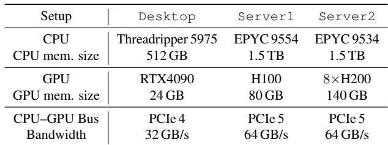  
Table 2. Hardware specifications for our setups.

Nprobe and top-k. A common heuristic for the IVF index is to set nprobe to 4 Nc (Zilliz, 2020). Given our index size of Nc = 4096, we use nprobe = 256 (= 4 4096) by default, unless otherwise specified. For retrieval, we use top-k = 3 for the number of documents to return, unless otherwise specified.

RAG pipeline implementation. We implemented the RAG pipelines with the FlashRAG framework (Jin et al., 2024b). For IRG, FLARE, and S-RAG, we used the framework’s default implementations. For the other pipelines, we reimplemented them using FlashRAG’s APIs.

Benchmark methodology. We follow the benchmarking methodology of SGLang (Zheng et al., 2024). Specifically, we use GPT-3.5-Turbo (OpenAI, 2023) to execute each pipeline once and record the input and output text for every step.

During latency evaluation, we run real LLM inference with full KV cache allocated and perform actual autoregressive decoding, but stop generation once the number of output tokens matches the recorded trace. This lets us measure real inference performance while keeping the decoding workload fixed, ensuring a fair latency comparison across different LLM models.

Baseline systems. To evaluate the latency of each pipeline, we constructed a clean execution flow in Python that only contains LLM generation, datastore retrieval, and other necessary logical operations to fulfill each pipeline. For LLM generation, we used SGLang (Zheng et al., 2024), which is a state-of-the-art LLM inference engine. For retrieval, we used the industry standard retrieval library, Faiss (Douze et al., 2024), as the CPU-offloaded baseline.

Prefetching budget setups. Based on the methodology we described in §4.1, we profiled each RAG pipeline with 64 random samples from NQ (Kwiatkowski et al., 2019) and derived the prefetching budget of each pipeline. Since H100 and H200 have the same CPU–GPU bandwidth, we set the same prefetch budget for Server1 and Server2.

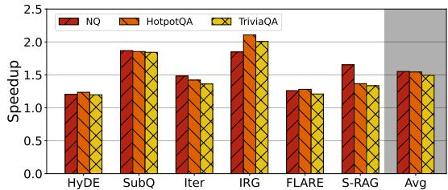  
(a) End-to-end latency speedup with Llama-3.2-3B.

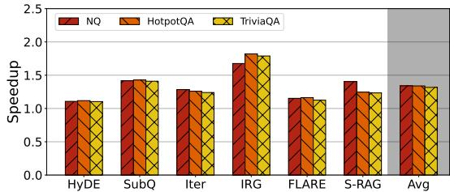  
(b) End-to-end latency speedup with Llama-3-8B.  
Figure 9. End-to-end latency speedup of TELERAG and baseline on six RAG pipelines and three datasets, with an RTX4090 GPU.

Max GPU memory for retrieval. We set a maximum GPU memory limit for prefetching in each configuration. For Server1 and Server2, we allocated 12 GB and 24 GB, respectively. For Desktop, we allocated up to 10 GB and 3.75 GB for the 3B and 8B models, respectively.

Cache Setup. The memory allocated for retrieval is shared between prefetching and caching. In our evaluation, we set the cache proportion to 50% (i.e., the cache can use at most half of this memory). Since the benefit of caching is negligible on a single GPU (demonstrated in the ablation study), we enabled it only for the multi-GPU experiments on Server2.

## 5.3 Evaluation Results

Single-query latency on RTX4090. We evaluated the endto-end RAG latency for a single query on Desktop with an RTX4090 GPU, representing the typical local usage. Figure 9 shows the latency reduction of TELERAG across three datasets and two LLMs (Llama-3.2-3B and Llama-3-8B). As Figure 9 shows, TELERAG consistently outperforms the CPU-offload baseline across all evaluated configurations. With Llama-3.2-3B, TELERAG achieves average speedups of 1.55×, 1.54×, and 1.49× on NQ, HotpotQA, and TriviaQA, respectively.

Among the test pipelines, the best speedup of 2.11× is achieved in the Iter-RetGen pipeline on HotpotQA. It’s because Iter-RetGen involves frequent retrieval operations and has generally short LLM outputs, which enhances the relative impact of retrieval acceleration. Another notable improvement is in the SubQuestion pipeline, where TELERAG achieves approximately 1.85× speedup across all datasets. This pipeline uses LLM-generated sub-questions and performs batched retrievals of 3 to 4 queries in its retrieval stage. CPU-based retrieval suffers from limited parallelism in such scenarios, but TELERAG efficiently utilizes GPU parallelism, significantly enhancing performance.

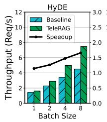

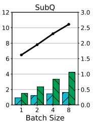

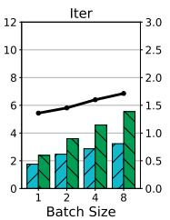

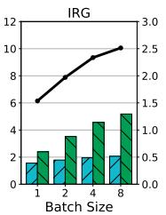

(a) End-to-end throughput on Llama-3-8B.  
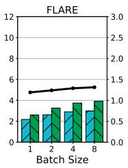

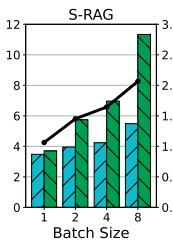

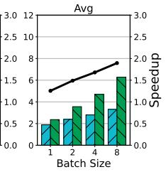

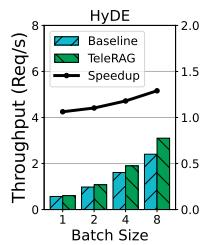

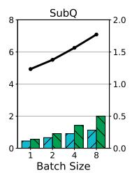

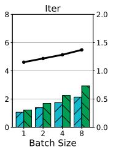

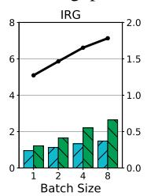  
(b) End-to-end throughput on Mistral-Small-22B.

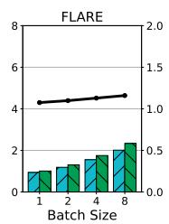

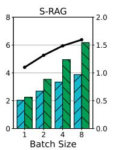

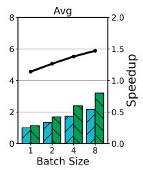

Figure 10. End-to-end throughput of TELERAG and the CPU-offload baseline across six RAG pipelines on the NQ dataset, evaluated at different batch sizes on an H100 GPU.  
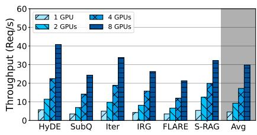  
(a) End-to-end throughput on NQ.

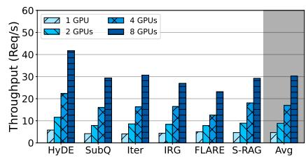  
(b) End-to-end throughput on HotpotQA.

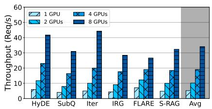  
(c) End-to-end throughput on TriviaQA.  
Figure 11. Throughput scaling of TELERAG across multiple H200 GPUs. Global batch fixed at 128; micro-batch fixed at 4.

When deploying Llama-3-8B, the speedups from TELERAG are slightly smaller than with Llama-3.2-3B, mainly because the larger LLM incurs higher inference latency and leaves less GPU memory available for prefetching. Nevertheless, TELERAG still delivers an average speedup of about 1.3× across datasets, with a peak improvement of 1.82× for Iter-RetGen on HotpotQA. Notably, these gains are achieved with only 3.75 GB of remaining GPU memory after accounting for Llama-3-8B (16 GB), the embedding model (1 GB), the KV cache, and other miscellaneous tensors. This result highlights TELERAG’s strong ability to accelerate RAG inference even under tight GPU memory constraints.

Multi-query throughput on H100. To examine TEL-ERAG’s performance on batched inference, we evaluated the end-to-end throughput on Server1 (H100) using batch sizes 1, 2, 4, and 8. The results of six RAG pipelines with Llama-3-8B and Mistral-Small-22B are presented in Figure 10.

As shown in Figure 10, TELERAG consistently outperforms the Faiss baseline across all pipelines and batch sizes. At batch size 1 (equivalent to the single-query setting), TEL-ERAG delivers an average throughput increase of 1.32× and 1.15× for Llama-3-8B and Mistral-Small-22B over the Faiss baseline. As the batch size increases, TELERAG’s performance gains continue to grow. For batch sizes 2, 4, and 8, TELERAG delivers average throughput increases of 1.55×, 1.78× and 1.98× for Llama-3-8B, and 1.26×, 1.38× and 1.49× for Mistral-Small-22B over Faiss. These results show that TELERAG effectively utilizes the parallel compute of the GPU without overwhelming its memory, while the CPU alternative fails to scale with a larger batch size.

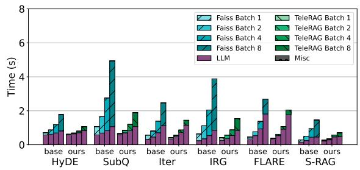  
Figure 12. Latency breakdown for Llama-3-8B on NQ with an H100 GPU at different batch sizes. nprobe is 256.

Multi-GPU throughput. We evaluate TELERAG’s scalability on Server2 (H200), a multi-GPU system. Figure 11 reports throughput for a global batch size of 128 with a micro-batch size of 4 across 1–8 GPUs, with both the prefetching and cache schedulers enabled. TELERAG scales well with the number of GPUs: on NQ, compared to the single-GPU case, the average speedups are 2.0×, 3.8×, and 6.5× on 2, 4, and 8 GPUs, respectively. The mild sub-linear scaling at higher GPU counts is attributed to execution time variance across micro-batches—specifically, a long tail of higher-latency batches that create load imbalance. These results still demonstrate that the lookahead retrieval technique in TELERAG can scale effectively.

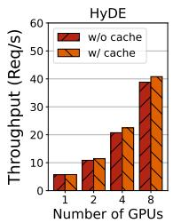

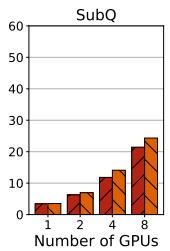

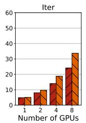

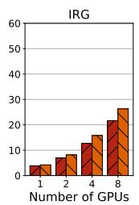

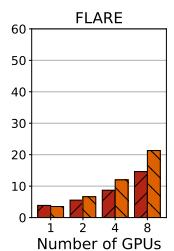

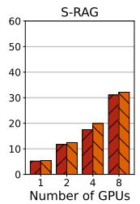

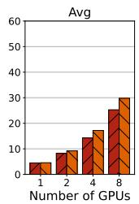  
Figure 13. Throughput of TELERAG on the NQ dataset with different numbers of H200 GPUs (with and without cache).

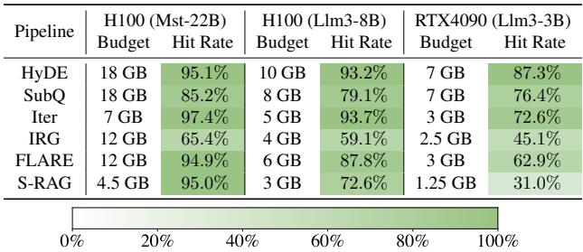  
Table 3. The prefetch budget and corresponding averaged cluster hit rate for each pipeline and hardware setup on NQ dataset. The target retrieval nprobe is 256.

## 5.4 Analysis and Sensitivity Study

Latency breakdown. We further show the latency breakdown of running RAG pipelines with Llama-3-8B on a single H100 GPU at different batch sizes in Figure 12. From Figure 12, we can observe that LLM latency grows sublinearly with larger batch sizes. However, the latency for Faiss retrieval on CPU grows linearly with the batch size, dominating the overall latency when the batch size is large. These results echo our findings in Figure 10, and show the limited scalability of CPU retrieval in serving scenarios. In contrast, TELERAG significantly accelerates across all batch sizes and achieves a higher speedup from 1.3× to 2.0× when the batch size increases from 1 to 8. The slight difference in the LLM latency between Faiss and TELERAG is because the PyTorch copy operation we use for prefetching uses some of the GPU’s stream multiprocessors.

Prefetch budgets, cluster hit rates and failure cases. Table 3 shows the prefetch budgets we set with the profileguided approach on RTX4090 and H100 for NQ. It also presents the average cluster hit rate achieved with this prefetch budget. From the table, we can see that TELERAG generally achieves a high cluster hit rate (>50%) when it has a large prefetching budget. For cases where the budget is less than 2 GB, we observe a relatively low hit rate (<50%), limiting the benefits of reducing the CPU’s search workloads. However, as observed from Figure 9, TELERAG achieves from 1.2× to 1.6× end-to-end speedups for these pipelines, thanks to the combined benefit of reducing CPU workload and utilizing the GPU to perform sorting on similarity distances.

We also conducted analysis on failure cases. Although failure cases can occur (e.g., when the rewrite substantially shifts embedding vectors), it is relatively rare. Even with the lowest prefetch budget (3.75 GB for RTX4090 with Llama-3-8B) in our evaluation, the prefetching failures (<5% hit rate) occurred only on the FLARE pipeline with a small number of instances (3, 14, and 9 out of 1024 samples for NQ, HotpotQA, and TriviaQA, respectively).

Ablation on cache. Figure 13 illustrates the throughput improvements enabled by caching on the NQ dataset. On average, caching boosts throughput by 2%, 12%, 21%, and 18% with 1, 2, 4, and 8 GPUs, respectively. The benefit on a single GPU is marginal because only a small cache space is used, and the limited cache capacity struggles to accommodate diverse requests. However, as the number of GPUs and overall cache space increases, the cache-aware scheduler effectively assigns micro-batches to the appropriate GPUs to maximize cache overlap, thereby improving prefetching hit rates and yielding significant throughput gains.

Analysis on scheduling overhead. Figure 14 analyzes the benefits and overheads of the prefetching and cacheaware schedulers. It reports the end-to-end latency for a global batch of 128 queries with a micro-batch size of 4 on 4 H200 GPUs, comparing configurations that enable both schedulers, only the prefetching scheduler, or neither. As shown in Figure 14, the prefetching scheduler incurs only a minimal overhead of approximately 37 ms (thus almost invisible in the figure), while the cache-aware scheduler adds a modest overhead of about 180 ms. Overall, both schedulers effectively reduce end-to-end latency in most cases, with minimal additional cost.

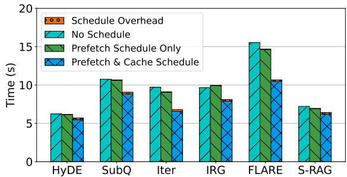  
Figure 14. Comparison of end-to-end latency for prefetching and cache-aware schedulers on 4 H200 GPUs. The overhead bars of prefetch schedule only are too short to be visible.

## 6 RELATED WORK

Efficient RAG methods. Prior works have accelerated RAG by caching the LLM’s KV cache from retrieved documents (Jin et al., 2024a; Lu et al., 2024; Yao et al., 2024). However, these approaches primarily reduce prefill latency, failing to address the retrieval and decode latencies which often dominate. Other techniques, like speculative retrieval (Zhang et al., 2024b) or fine-grained pipelining (Jiang et al., 2024), target per-token retrieval, which is a different RAG paradigm and does not apply to the modular pipelines discussed in §2.1. Unlike these approaches, TELERAG tackles the fundamental system challenges of long retrieval latency and large memory requirements for modular RAG.

System optimizations for modular RAG. There are several concurrent works to TELERAG that optimize system efficiency for modular RAG. For increasing throughput, HedraRAG (Hu et al., 2025) leverages intra-request similarity and inter-query skew to accelerate retrieval with compute graph transformation, query reordering and dynamic placement between CPU and GPU; RAGO (Jiang et al., 2025) designs a schema for modular RAG and enables automatic performance analysis and optimizations on top of the schema; Hermes (Shen et al., 2025) distributes the datastore across multiple CPU nodes and proposes efficient search algorithms to accelerate retrieval across nodes.

For reducing memory, EdgeRAG (Seemakhupt et al., 2024) proposes to generate embeddings on-the-fly and offload embeddings to disk for the IVF index; LEANN (Wang et al., 2025) designs efficient embedding recomputation for the HNSW (Malkov & Yashunin, 2020) index. In contrast to these works, TELERAG achieves both acceleration and GPU memory saving for retrieval with the IVF index.

Systems for compound LLM applications. Apart from RAG, there is a growing interest in compound or agentic LLM applications, where multiple LLM calls and other applications are combined to serve complex functionalities (Zaharia et al., 2024; Berger & Zorn, 2024; Wang et al., 2024). AI Metropolis (Xie et al., 2024) accelerates LLMbased multi-agent simulations with out-of-order execution.

RAG is a specific type of application in this broader direction, and we propose systems techniques to optimize its execution latency, focusing on the characteristics of retrieval workload.

Vector index. A separate line of work focuses on optimizing the vector index itself. This includes hardware-specific acceleration (GPU (Johnson et al., 2019), FPGA (Jiang et al., 2023b)) and hybrid memory-disk systems to scale beyond RAM (DiskANN (Jayaram Subramanya et al., 2019), SPANN (Chen et al., 2021)). More recent systems scale graph-based indexes beyond GPU memory (Karthik et al., 2025; Zhang et al., 2024a). These methods often require significant algorithm modifications or remain bottlenecked by CPU–GPU bandwidth. TELERAG is complementary, optimizing at the system-level by hiding transfer latency within the RAG application’s context, without altering the underlying IVF algorithm.

## 7 DISCUSSION

Applicability beyond IVF indices. TELERAG is designed for IVF-style retrieval indices, which are widely used in production vector search systems (Douze et al., 2024; Milvus team, 2025; Pgvector team, 2025). Here, we briefly discuss how its design extends to two other popular index families: Locality-Sensitive Hashing (LSH) (Indyk & Motwani, 1998; Gionis et al., 1999; Datar et al., 2004) and Hierarchical Navigable Small World (HNSW) (Malkov & Yashunin, 2020).

LSH partitions vectors into hash buckets and probes a small number of buckets at query time. Since this access pattern resembles IVF list probing, TELERAG can be extended naturally by treating hash buckets as the prefetch unit.

HNSW, by contrast, relies on graph traversal and does not naturally expose explicit prefetchable units, making it less naturally compatible with TELERAG. Nevertheless, the core ideas of TELERAG still apply to hybrid index structures such as IVF-HNSW in FAISS (FAISS team, 2025). In these indices, HNSW is used for coarse-grained routing to identify relevant inverted lists. Because semantically similar queries often traverse similar graph paths or reach the same centroids, TELERAG can use the HNSW traversal of a preretrieval query to anticipate and prefetch the corresponding inverted lists before the retrieval query is issued. This preserves the efficiency of graph-based routing while retaining the prefetchability of the inverted-list structure.

Applicability of emerging hardware. TELERAG targets the traditional GPU computing platform, where CPU and GPU have separate memory space and are connected through PCIe. On newer high-bandwidth systems such as NVIDIA Grace (NVIDIA Corporation, 2024), our design can leverage the increased bandwidth to prefetch more clusters, thereby improving hit rates. For emerging unified memory platforms such as Apple M-series or NVIDIA Grace-Hopper, TELERAG is less useful as we can do GPUonly retrieval on those. However, these systems currently still suffer from limited memory capacity (e.g., Apple Mseries) or are not as available as the traditional commodity DDR + discrete HBM servers.

Memory allocation tradeoff. TELERAG is designed so that retrieval does not compete with the LLM for KV-cache capacity. We reserve GPU memory for the LLM first and use only the remaining memory for retrieval data. Accordingly, we enforce a hard cap on retrieval memory, as described in §5.2.

In our evaluated workloads, this policy leaves sufficient KV-cache headroom and does not reduce LLM batch size or degrade LLM performance. In practice, the retrieval memory cap should be chosen only after reserving enough memory for the target model’s KV cache at the desired batch size and sequence length; retrieval should use only the remaining GPU memory.

Multi-GPU and multi-node parallelism. In TELERAG, data parallelism is the default strategy to extend to multi-GPU and multi-node deployments, as it preserves the overlap between LLM generation and retrieval as in the single-GPU design. Here, we discuss other potential parallelism patterns.

Another option to parallelize retrieval is to shard the datastore across GPUs for distributed GPU-resident retrieval. This is most effective when the vector index fits in aggregate GPU memory without materially reducing the memory available to the LLM, especially the KV cache. When this condition does not hold, TELERAG is useful to reduce the retrieval memory usage to a smaller predicted set.

Furthermore, TELERAG’s retrieval and generation can be pipelined across nodes. A retrieval tier can start prefetching as soon as it receives the pre-retrieval query or predicted clusters, overlapping transfer with the pre-retrieval generation on another tier. While pipeline bubbles may arise if the stages are imbalanced, lookahead retrieval still improves efficiency by shortening the retrieval critical path and reducing GPU memory requirements for retrieval. We leave the exploration of different parallelisms for future work.

## 8 CONCLUSION

In this paper, we introduced TELERAG, an inference system that improves RAG pipeline latency and throughput while imposing minimal GPU memory requirements. TELERAG achieves significant acceleration by employing lookahead retrieval, which hides CPU–GPU data transfer latency by overlapping it with pre-retrieval generation, and by supporting efficient multi-GPU inference through specialized scheduling. Our evaluation shows that TELERAG significantly improves performance compared to existing stateof-the-art solutions and scales effectively with increased hardware resources.

## ACKNOWLEDGMENTS

We thank the reviewers and our shepherd for their helpful comments and suggestions. This work is supported in part by PRISM, one of the seven centers in JUMP 2.0, a Semiconductor Research Corporation (SRC) program sponsored by DARPA, as well as generous donations from NVIDIA, AMD, Intel, and Arm.

## REFERENCES

AI@Meta. Llama 3 model card. https: //github.com/meta-llama/llama3/blob/ main/MODEL\_CARD.md, 2024. Accessed: 2026-04- 19.

Akkiraju, R., Xu, A., Bora, D., Yu, T., An, L., Seth, V., Shukla, A., Gundecha, P., Mehta, H., Jha, A., et al. Facts about building retrieval augmented generation-based chatbots. arXiv preprint arXiv:2407.07858, 2024.

Asai, A., Wu, Z., Wang, Y., Sil, A., and Hajishirzi, H. Selfrag: Learning to retrieve, generate, and critique through self-reflection. In The Twelfth International Conference on Learning Representations, 2023.

Asai, A., He, J., Shao, R., Shi, W., Singh, A., Chang, J. C., Lo, K., Soldaini, L., Feldman, S., D’arcy, M., et al. Openscholar: Synthesizing scientific literature with retrievalaugmented lms. arXiv preprint arXiv:2411.14199, 2024a.

Asai, A., Wu, Z., Wang, Y., Sil, A., and Hajishirzi, H. Original implementation of self-rag: Learning to retrieve, generate and critique through self-reflection. https: //github.com/AkariAsai/self-rag, 2024b.

Asai, A., Zhong, Z., Chen, D., Koh, P. W., Zettlemoyer, L., Hajishirzi, H., and Yih, W.-t. Reliable, adaptable, and attributable language models with retrieval. arXiv preprint arXiv:2403.03187, 2024c.

Berger, E. and Zorn, B. Ai software should be more like plain old software. https: //www.sigarch.org/ai-software-shouldbe-more-like-plain-old-software/, 2024. Accessed: 2026-04-19.

Borgeaud, S., Mensch, A., Hoffmann, J., Cai, T., Rutherford, E., Millican, K., Van Den Driessche, G. B., Lespiau, J.-B., Damoc, B., Clark, A., et al. Improving language models by retrieving from trillions of tokens. In International

conference on machine learning, pp. 2206–2240. PMLR, 2022.

Chemmagate, B. Reducing rag pipeline latency for real-time voice conversations. https://developer. vonage.com/en/blog/reducing-ragpipeline-latency-for-real-time-voiceconversations, 2024. Accessed: 2026-04-19.

Chen, Q., Zhao, B., Wang, H., Li, M., Liu, C., Li, Z., Yang, M., and Wang, J. Spann: Highly-efficient billion-scale approximate nearest neighbor search. arXiv preprint arXiv:2111.08566, 2021.

Databricks. Rag (retrieval augmented generation) on databricks. https://docs.databricks.com/ en/generative-ai/retrieval-augmentedgeneration.html, 2024. Accessed: 2026-04-19.

Datar, M., Immorlica, N., Indyk, P., and Mirrokni, V. S. Locality-sensitive hashing scheme based on p-stable distributions. In Proceedings of the twentieth annual symposium on Computational geometry, pp. 253–262, 2004.

Douze, M., Guzhva, A., Deng, C., Johnson, J., Szilvasy, G., Mazare, P.-E., Lomeli, M., Hosseini, L., and J ´ egou, H.´ The faiss library. arXiv preprint arXiv:2401.08281, 2024.

FAISS team. FAISS index factory - Non-exhaustive search components. https://github.com/ facebookresearch/faiss/wiki/Theindex-factory#non-exhaustive-searchcomponents, 2025. Accessed: 2026-04-19.

Fan, W., Ding, Y., bo Ning, L., Wang, S., Li, H., Yin, D., Chua, T.-S., and Li, Q. A survey on rag meeting llms: Towards retrieval-augmented large language models. In Knowledge Discovery and Data Mining, 2024. URL https://api.semanticscholar. org/CorpusID:269740933.

Gao, L., Ma, X., Lin, J., and Callan, J. Precise zero-shot dense retrieval without relevance labels. In Proceedings of the 61st Annual Meeting of the Association for Computational Linguistics (Volume 1: Long Papers), pp. 1762–1777, 2023a.

Gao, Y. Modular rag and rag flow: Part ii. https: //medium.com/@yufan1602/modular-ragand-rag-flow-part-ii-77b62bf8a5d3, 2024. Accessed: 2026-04-19.

Gao, Y., Xiong, Y., Gao, X., Jia, K., Pan, J., Bi, Y., Dai, Y., Sun, J., and Wang, H. Retrieval-augmented generation for large language models: A survey. arXiv preprint arXiv:2312.10997, 2023b.

Gionis, A., Indyk, P., Motwani, R., et al. Similarity search in high dimensions via hashing. In Vldb, volume 99, pp. 518–529, 1999.

GM, A. and Dhar, G. How apollo 24—7 leverages medlm with rag to revolutionize healthcare. https://cloud.google.com/blog/ products/ai-machine-learning/howapollo-247-leverages-medlm-with-ragto-revolutionize-healthcare, 2024. Accessed: 2026-04-19.

Hardt, M. and Sun, Y. Test-time training on nearest neighbors for large language models. arXiv preprint arXiv:2305.18466, 2023.

Hu, Z., Murthy, V., Pan, Z., Li, W., Fang, X., Ding, Y., and Wang, Y. Hedrarag: Co-optimizing generation and retrieval for heterogeneous rag workflows. In Proceedings of the ACM SIGOPS 31st symposium on operating systems principles, pp. 623–638, 2025.

Ilin, I. Advanced rag techniques: an illustrated overview. https://pub.towardsai.net/advancedrag-techniques-an-illustratedoverview-04d193d8fec6, 2023. Accessed: 2026-04-19.

Indyk, P. and Motwani, R. Approximate nearest neighbors: towards removing the curse of dimensionality. In Proceedings of the thirtieth annual ACM symposium on Theory of computing, pp. 604–613, 1998.

Izacard, G., Caron, M., Hosseini, L., Riedel, S., Bojanowski, P., Joulin, A., and Grave, E. Unsupervised dense information retrieval with contrastive learning. arXiv preprint arXiv:2112.09118, 2021.

Izacard, G., Lewis, P., Lomeli, M., Hosseini, L., Petroni, F., Schick, T., Dwivedi-Yu, J., Joulin, A., Riedel, S., and Grave, E. Atlas: Few-shot learning with retrieval augmented language models. Journal of Machine Learning Research, 24(251):1–43, 2023.

Jagerman, R., Zhuang, H., Qin, Z., Wang, X., and Bendersky, M. Query expansion by prompting large language models. arXiv preprint arXiv:2305.03653, 2023.

Jayaram Subramanya, S., Devvrit, F., Simhadri, H. V., Krishnawamy, R., and Kadekodi, R. Diskann: Fast accurate billion-point nearest neighbor search on a single node. Advances in Neural Information Processing Systems, 32, 2019.

Jiang, H., Wu, Q., Luo, X., Li, D., Lin, C.-Y., Yang, Y., and Qiu, L. Longllmlingua: Accelerating and enhancing llms in long context scenarios via prompt compression. arXiv preprint arXiv:2310.06839, 2023a.

Jiang, W., Li, S., Zhu, Y., de Fine Licht, J., He, Z., Shi, R., Renggli, C., Zhang, S., Rekatsinas, T., Hoefler, T., et al. Co-design hardware and algorithm for vector search. In Proceedings of the International Conference for High Performance Computing, Networking, Storage and Analysis, pp. 1–15, 2023b.

Jiang, W., Zhang, S., Han, B., Wang, J., Wang, B., and Kraska, T. Piperag: Fast retrieval-augmented generation via algorithm-system co-design. arXiv preprint arXiv:2403.05676, 2024.

Jiang, W., Subramanian, S., Graves, C., Alonso, G., Yazdanbakhsh, A., and Dadu, V. Rago: Systematic performance optimization for retrieval-augmented generation serving. In Proceedings of the 52nd Annual International Symposium on Computer Architecture, pp. 974–989, 2025.

Jiang, Z., Xu, F. F., Gao, L., Sun, Z., Liu, Q., Dwivedi-Yu, J., Yang, Y., Callan, J., and Neubig, G. Active retrieval augmented generation. 2023c.

Jin, C., Zhang, Z., Jiang, X., Liu, F., Liu, X., Liu, X., and Jin, X. Ragcache: Efficient knowledge caching for retrievalaugmented generation. arXiv preprint arXiv:2404.12457, 2024a.

Jin, J., Zhu, Y., Yang, X., Zhang, C., and Dou, Z. Flashrag: A modular toolkit for efficient retrieval-augmented generation research. arXiv preprint arXiv:2405.13576, 2024b.

Johnson, J., Douze, M., and Jegou, H. Billion-scale similar- ´ ity search with GPUs. IEEE Transactions on Big Data, 7 (3):535–547, 2019.

Joshi, M., Choi, E., Weld, D. S., and Zettlemoyer, L. Triviaqa: A large scale distantly supervised challenge dataset for reading comprehension. In Proceedings of the 55th Annual Meeting of the Association for Computational Linguistics (Volume 1: Long Papers), pp. 1601–1611, 2017.

Karpukhin, V., Oguz, B., Min, S., Lewis, P., Wu, L., Edunov, S., Chen, D., and Yih, W.-t. Dense passage retrieval for open-domain question answering. In Proceedings of the 2020 Conference on Empirical Methods in Natural Language Processing (EMNLP), 2020.

Karthik, V., Khan, S., Singh, S., Simhadri, H. V., and Vedurada, J. Bang: Billion-scale approximate nearest neighbour search using a single gpu. IEEE Transactions on Big Data, 2025.

Khandelwal, U., Levy, O., Jurafsky, D., Zettlemoyer, L., and Lewis, M. Generalization through memorization: Nearest neighbor language models. In International Conference on Learning Representations, 2019.

Kim, J., Nam, J., Mo, S., Park, J., Lee, S.-W., Seo, M., Ha, J.-W., and Shin, J. Sure: Improving open-domain question answering of llms via summarized retrieval. In The Twelfth International Conference on Learning Representations, 2023.

Klang, E., Tessler, I., Apakama, D. U., Abbott, E., Glicksberg, B. S., Arnold, M., Moses, A., Sakhuja, A., Soroush, A., Charney, A. W., et al. Assessing retrieval-augmented large language model performance in emergency department icd-10-cm coding compared to human coders. medRxiv, 2024.

Kwiatkowski, T., Palomaki, J., Redfield, O., Collins, M., Parikh, A., Alberti, C., Epstein, D., Polosukhin, I., Devlin, J., Lee, K., et al. Natural questions: A benchmark for question answering research. Transactions of the Association for Computational Linguistics, 7:452–466, 2019.

Kwon, W., Li, Z., Zhuang, S., Sheng, Y., Zheng, L., Yu, C. H., Gonzalez, J. E., Zhang, H., and Stoica, I. Efficient memory management for large language model serving with pagedattention. In Proceedings of the ACM SIGOPS 29th Symposium on Operating Systems Principles, 2023.

Lewis, P., Perez, E., Piktus, A., Petroni, F., Karpukhin, V., Goyal, N., Kuttler, H., Lewis, M., Yih, W.-t., Rockt ¨ aschel, ¨ T., et al. Retrieval-augmented generation for knowledgeintensive nlp tasks. Advances in Neural Information Processing Systems, 33:9459–9474, 2020.

Liu, J. LlamaIndex. https://github.com/ jerryjliu/llama\_index, 11 2022a.

Liu, J. MultiStep Query Engine LlamaIndex. https://developers.llamaindex.ai/ python/examples/workflow/multi\_step\_ query\_engine/, 11 2022b.

Liu, J. Sub Question Query Engine LlamaIndex. https://developers.llamaindex.ai/ python/examples/query\_engine/sub\_ question\_query\_engine/, 11 2022c.

Lu, S., Wang, H., Rong, Y., Chen, Z., and Tang, Y. Turborag: Accelerating retrieval-augmented generation with precomputed kv caches for chunked text. arXiv preprint arXiv:2410.07590, 2024.

Ma, X., Gong, Y., He, P., Duan, N., et al. Query rewriting in retrieval-augmented large language models. In The 2023 Conference on Empirical Methods in Natural Language Processing, 2023.

Malec, M. Rag in financial services: Use-cases, impact, & solutions. https://hatchworks.com/blog/ gen-ai/rag-for-financial-services/, 2024. Accessed: 2026-04-19.

Malkov, Y. A. and Yashunin, D. A. Efficient and robust approximate nearest neighbor search using hierarchical navigable small world graphs. IEEE Trans. Pattern Anal. Mach. Intell., 42(4), 2020. ISSN 0162- 8828. URL https://doi.org/10.1109/TPAMI. 2018.2889473.

Mallen, A. T., Asai, A., Zhong, V., Das, R., Khashabi, D., and Hajishirzi, H. When not to trust language models: Investigating effectiveness of parametric and nonparametric memories. In The 61st Annual Meeting Of The Association For Computational Linguistics, 2023.

Milvus team. Milvus - The High-Performance Vector Database Built for Scale. https://milvus.io/, 2025.

Min, S., Gururangan, S., Wallace, E., Shi, W., Hajishirzi, H., Smith, N. A., and Zettlemoyer, L. Silo language models: Isolating legal risk in a nonparametric datastore. In The Twelfth International Conference on Learning Representations, 2023.

MyScale. 4 key benefits of rag algorithmic trading in financial markets. https://myscale.com/blog/ benefits-rag-algorithmic-tradingfinancial-markets/, 2024. Accessed: 2026-04- 19.

NVIDIA Corporation. NVIDIA Grace CPU Superchip. https://www.nvidia.com/en-us/datacenter/grace-cpu-superchip/, 2024. Accessed: 2026-04-19.

OpenAI. Gpt-3.5 turbo. https://platform.openai. com/docs/models/gpt-3-5-turbo, 2023. Accessed: 2026-04-19.

Peng, W., Li, G., Jiang, Y., Wang, Z., Ou, D., Zeng, X., Xu, D., Xu, T., and Chen, E. Large language model based long-tail query rewriting in taobao search. In Companion Proceedings of the ACM on Web Conference 2024, 2024.

Pgvector team. Pgvector - Open-source vector similarity search for Postgres. https://github.com/ pgvector/pgvector, 2025.

Press, O., Zhang, M., Min, S., Schmidt, L., Smith, N. A., and Lewis, M. Measuring and narrowing the compositionality gap in language models. In Findings of the Association for Computational Linguistics: EMNLP 2023, pp. 5687–5711, 2023.

Quinn, D., Nouri, M., Patel, N., Salihu, J., Salemi, A., Lee, S., Zamani, H., and Alian, M. Accelerating retrieval-augmented generation. In Proceedings

of the 30th ACM International Conference on Architectural Support for Programming Languages and Operating Systems, Volume 1, ASPLOS ’25, pp. 15–32, New York, NY, USA, 2025. Association for Computing Machinery. ISBN 9798400706981. doi: 10.1145/ 3669940.3707264. URL https://doi.org/10. 1145/3669940.3707264.

Ram, O., Levine, Y., Dalmedigos, I., Muhlgay, D., Shashua, A., Leyton-Brown, K., and Shoham, Y. In-context retrieval-augmented language models. Transactions of the Association for Computational Linguistics, 11:1316– 1331, 2023.

Rapidsai. Rapidsai/raft: Raft contains fundamental widelyused algorithms and primitives for data science, graph and machine learning. https://github.com/ rapidsai/raft, 2022.

Seemakhupt, K., Liu, S., and Khan, S. Edgerag: Onlineindexed rag for edge devices, 2024. URL https:// arxiv.org/abs/2412.21023.

Sella, A. Flash is driving scale in rag-based llms. In Proceedings of the Flash Memory Summit (FMS), August 2024. URL https://files.futurememorystorage. com/proceedings/2024/20240807\_AIML-203-1\_Sella.pdf. Session AIML-203-1.

Shao, R., He, J., Asai, A., Shi, W., Dettmers, T., Min, S., Zettlemoyer, L., and Koh, P. W. Scaling retrieval-based language models with a trillion-token datastore. Advances in Neural Information Processing Systems, 37:91260– 91299, 2024.

Shao, Z., Gong, Y., Shen, Y., Huang, M., Duan, N., and Chen, W. Enhancing retrieval-augmented large language models with iterative retrieval-generation synergy. In Findings of the Association for Computational Linguistics: EMNLP 2023, pp. 9248–9274, 2023.

Shen, M., Umar, M., Maeng, K., Suh, G. E., and Gupta, U. Hermes: Algorithm-system co-design for efficient retrieval-augmented generation at-scale. In Proceedings of the 52nd Annual International Symposium on Computer Architecture, pp. 958–973, 2025.

Sivic, J. and Zisserman, A. Video google: A text retrieval approach to object matching in videos. In ICCV, pp. 1470–1477. IEEE Computer Society, 2003.

Stewart, D. and Linsdell, J. Say hello to precision: How rerankers and embeddings boost search. https://cohere.com/blog/sayhello-to-precision-how-rerankers-andembeddings-boost-search, 2024. Accessed: 2026-04-19.

Tung, K. Enhancing user experience by overcoming latency in the ion iq chatbot. https: //www.ontinue.com/resource/enhancinguser-experience-by-overcominglatency-in-the-ion-iq-chatbot/, 2024. Accessed: 2026-04-19.

Wang, L., Ma, C., Feng, X., Zhang, Z., Yang, H., Zhang, J., Chen, Z., Tang, J., Chen, X., Lin, Y., et al. A survey on large language model based autonomous agents. Frontiers of Computer Science, 18(6):186345, 2024.

Wang, Y., Liu, S., Li, Z., Wu, Y., Mao, Z., Zhao, Y., Yan, X., Xu, Z., Zhou, Y., Stoica, I., Min, S., Zaharia, M., and Gonzalez, J. E. Leann: A low-storage vector index, 2025. URL https://arxiv.org/abs/2506.08276.

Wei, K. Advanced rag with azure ai search and llamaindex. https://techcommunity.microsoft. com/t5/ai-azure-ai-services-blog/ advanced-rag-with-azure-ai-searchand-llamaindex/ba-p/4115007, 2024. Accessed: 2026-04-19.

Xie, Z., Kang, H., Sheng, Y., Krishna, T., Fatahalian, K., and Kozyrakis, C. Ai metropolis: Scaling large language model-based multi-agent simulation with out-of-order execution. arXiv preprint arXiv:2411.03519, 2024.

Yang, Z., Qi, P., Zhang, S., Bengio, Y., Cohen, W. W., Salakhutdinov, R., and Manning, C. D. HotpotQA: A dataset for diverse, explainable multi-hop question answering. In Conference on Empirical Methods in Natural Language Processing (EMNLP), 2018.

Yao, J., Li, H., Liu, Y., Ray, S., Cheng, Y., Zhang, Q., Du, K., Lu, S., and Jiang, J. Cacheblend: Fast large language model serving for rag with cached knowledge fusion, 2024. URL https://arxiv.org/abs/2405. 16444.

Ye, F., Fang, M., Li, S., and Yilmaz, E. Enhancing conversational search: Large language model-aided informative query rewriting. In The 2023 Conference on Empirical Methods in Natural Language Processing, 2023.

Zaharia, M., Khattab, O., Chen, L., Davis, J. Q., Miller, H., Potts, C., Zou, J., Carbin, M., Frankle, J., Rao, N., and Ghodsi, A. The shift from models to compound ai systems. https://bair.berkeley.edu/blog/ 2024/02/18/compound-ai-systems/, 2024. Accessed: 2026-04-19.

Zhang, Z., Liu, F., Huang, G., Liu, X., and Jin, X. Fast vector query processing for large datasets beyond GPU memory with reordered pipelining. In 21st USENIX Symposium on Networked Systems Design and Implementation (NSDI 24), pp. 23–40, 2024a.

Zhang, Z., Zhu, A., Yang, L., Xu, Y., Li, L., Phothilimthana, P. M., and Jia, Z. Accelerating retrieval-augmented language model serving with speculation. arXiv preprint arXiv:2401.14021, 2024b.

Zheng, H. S., Mishra, S., Chen, X., Cheng, H.-T., Chi, E. H., Le, Q. V., and Zhou, D. Take a step back: Evoking reasoning via abstraction in large language models. arXiv preprint arXiv:2310.06117, 2023.

Zheng, L., Yin, L., Xie, Z., Sun, C., Huang, J., Yu, C. H., Cao, S., Kozyrakis, C., Stoica, I., Gonzalez, J. E., Barrett, C., and Sheng, Y. Sglang: Efficient execution of structured language model programs, 2024. URL https://arxiv.org/abs/2312.07104.

Zhou, D., Scharli, N., Hou, L., Wei, J., Scales, N., Wang, X., ¨ Schuurmans, D., Cui, C., Bousquet, O., Le, Q. V., et al. Least-to-most prompting enables complex reasoning in large language models. In The Eleventh International Conference on Learning Representations, 2022.

Zhuang, S., Liu, B., Koopman, B., and Zuccon, G. Opensource large language models are strong zero-shot query likelihood models for document ranking. In Findings of the Association for Computational Linguistics: EMNLP 2023, pp. 8807–8817, 2023.

Zilliz. How to select index parameters for ivf index. https://zilliz.com/blog/selectindex-parameters-ivf-index, 2020. Accessed: 2026-04-19.