# AUTOMATED ALGORITHM DESIGN FOR AUTO-TUNING OPTIMIZERS

Floris-Jan Willemsen 1 Niki van Stein 1 Ben van Werkhoven 1

## ABSTRACT

Automatic performance tuning (auto-tuning) is essential for optimizing high-performance applications, where vast and irregular search spaces make manual exploration infeasible. While auto-tuners traditionally rely on classical approaches such as evolutionary, annealing, or surrogate-based optimizers, designing algorithms that efficiently find near-optimal configurations robustly across diverse tasks is challenging. We propose a new paradigm: using large language models (LLMs) to automatically generate optimization algorithms tailored to auto-tuning problems. We introduce a framework that prompts LLMs with problem descriptions and search space characteristics to synthesize, test, and iteratively refine specialized optimizers. These generated algorithms are evaluated on four real-world auto-tuning applications across six hardware platforms and compared against the state-of-the-art in two contemporary auto-tuning frameworks. The evaluation demonstrates that providing additional applicationand search space-specific information in the generation stage results in an average performance improvement of 30.7% and 14.6%, respectively. In addition, our results show that LLM-generated optimizers can rival, and in various cases outperform, existing human-designed algorithms, with our best-performing generated optimization algorithms achieving an average 72.4% improvement over state-of-the-art optimizers for auto-tuning.

## 1 INTRODUCTION

Automatic performance tuning, or auto-tuning, is an essential technique in high-performance computing (HPC) workloads such as scientific simulations and AI, enabling applications to deliver better performance and energy efficiency across diverse hardware architectures and input sizes (Balaprakash et al., 2018; van Werkhoven et al., 2020; Hijma et al., 2023). By systematically exploring a vast design space of functionally-equivalent program variants spanning thread layouts, data layouts, loop transformations, and a variety of other parameters, auto-tuners optimize the performance of software towards a specific hardware architecture (Nugteren & Codreanu, 2015; Filipovic et al. ˇ , 2017; Ansel et al., 2014). A central challenge in auto-tuning lies in efficiently navigating these large, noisy, irregular search spaces (Willemsen et al., 2025a) as exhaustive exploration is infeasible (Ryoo et al., 2008; Sclocco et al., 2014). Hence, the effectiveness of an auto-tuner critically depends on its optimization algorithms. Classical approaches, including Simulated Annealing, Genetic Algorithms, and Particle Swarm Optimization, have been typically used in this domain, but require careful hyperparameter tuning (Willemsen et al., 2025b) and are not designed with the search space characteristics of auto-tuning in mind (Willemsen et al., 2021). Meanwhile, recent advances in large language models (LLMs) have demonstrated remarkable capabilities in code generation, algorithm synthesis, and problem-solving across a wide range of domains (Chen et al., 2021; Li et al., 2022). These capabilities raise the question: Can LLMs be leveraged to automatically generate effective optimization algorithms for auto-tuning, benefitting from problem-specifics? Such an approach could enable the rapid design of problem-specific optimizers without the need for expert-crafted heuristics, unlocking new efficiency levels in auto-tuning.

In this paper, we explore this novel direction by investigating the use of LLMs to generate optimization algorithms for auto-tuning. We integrate the auto-tuning framework Kernel Tuner (van Werkhoven, 2019) and the LLaMEA framework, which combines LLMs with an evolutionary algorithm to automatically generate metaheuristics (van Stein & Back¨ , 2025). We emphasize that only the optimization algorithm is generated, not the underlying applications to be auto-tuned, nor program variants. If a generated algorithm does not run or optimize correctly, it will not survive the selection phase of the evolutionary algorithm, ensuring only high-quality algorithms are produced. Our contribution therefore lies in improving search efficiency and robustness within a fixed, user-defined search space, rather than redefining kernel design or expanding the search space itself. Specifically, we evaluate whether LLM-generated algorithms can match or exceed the performance of human-designed optimization methods across a diverse benchmark suite, and whether such algorithms benefit from problem-specific information. Our work is, to the best of our knowledge, the first to systematically study the application of automated algorithm design in the context of auto-tuning. We make the following

contributions:

• We introduce the first closed-loop framework that evolves LLM-generated optimizers under formal autotuning evaluation metrics.

• We evaluate LLM-generated optimizers against widely used classical algorithms across a representative set of real-world applications and architectures on both quality and efficiency.

• We find that LLM-driven optimizer synthesis can outperform human-engineered search strategies even when decoupled from the tuning target.

• The best-performing generated algorithms are incorporated into the Kernel Tuner framework, benefiting users.

• All code and data are available in a GitHub repository1. The remainder of this paper is structured as follows. Section 2 reviews related research on optimization methods and recent advances in LLM-based algorithm synthesis. Section 3 details our approach for generating and evaluating optimization algorithms with LLMs. Section 4 presents a comprehensive evaluation. Finally, Section 5 concludes.

## 2 RELATED WORK

Auto-tuning is established as a key technique for optimizing performance-critical applications on modern heterogeneous systems (Balaprakash et al., 2018). ATLAS (Whaley et al., 2001) pioneered empirical auto-tuning by generating and benchmarking parameterized versions of dense linear algebra kernels, achieving performance portability across architectures. FFTW (Frigo & Johnson, 1998) introduced an adaptive planner that automatically searches among composition strategies for fast Fourier transforms. A number of frameworks have been developed over the years to generalize these application-specific approaches to arbitrary applications. For example, Active Harmony (Tapus et al., 2002) and Orio (Hartono et al., 2009) extended auto-tuning to runtime adaptation and annotation-based empirical tuning, respectively. Open Tuner (Ansel et al., 2014) is an extensible framework for application-level auto-tuning. CLTune (Nugteren & Codreanu, 2015) is a generic autotuner for OpenCL kernels. Traditionally, numerical optimization methods and metaheuristics have been widely used in these approaches, including Nelder-Mead, Genetic Algorithms (GA), Simulated Annealing (SA), Particle Swarm Optimization (PSO) (Tapus et al., 2002; Hartono et al., 2009; van Werkhoven, 2019; Schoonhoven et al., 2022; Ansel et al., 2014; Nugteren & Codreanu, 2015). Although effective in many settings, these algorithms generally require many empirical evaluations and careful hyperparameter choices to achieve good performance across diverse auto-tuning tasks (Willemsen et al., 2025b).

## 2.1 Machine Learning and Hybrid approaches

Beyond traditional optimization algorithms, several autotuning approaches have explored alternative strategies. Multi-armed bandits and ensemble methods, as used in OpenTuner (Ansel et al., 2014) and ATF (Rasch et al., 2017)/PyATF (Schulze et al., 2025), dynamically allocate budget across different optimizers, leveraging their strengths on different problem classes. Machine learning techniques have also been applied: predictive modeling approaches such as GPTune (Liu et al., 2021), ytopt (Wu et al., 2024), and AUMA (Falch & Elster, 2015) use regression models or Gaussian processes to guide the search towards promising configurations. KTT uses a machine-learning-based optimization method that incorporates performance counter data collected by a profiler (Filipovic et al. ˇ , 2022). Bayesian optimization frameworks specialized for high-performance computing, such as HyperMapper (Nardi et al., 2019), further demonstrated the potential of learning-based auto-tuning. These methods show that performance can be improved not only by choosing better traditional optimizers, but also through hybrid, model-based, or domain-specific techniques (Czarnul & Rosciszewski ´ , 2019; Willemsen et al., 2021; Wu et al., 2020).

## 2.2 Meta-optimization techniques

Recent work has begun to focus on meta-optimization, i.e., improving the auto-tuning process itself. Willemsen et al. (2025a) studied how constraints shape the construction of search spaces in auto-tuning, while Willemsen et al. (2025b) introduced hyperparameter optimization for tuning algorithms within auto-tuners, demonstrating substantial performance gains. Constraint-aware optimization (Willemsen et al., 2026) further improves efficiency by preventing wasted evaluations on invalid configurations. Similarly, BaCO (Hellsten et al., 2024) automatically learns so-called hidden constraints to exclude configurations that turn out to be infeasible during compilation or at run time. These contributions highlight the importance of adapting optimization algorithms to the unique challenges of auto-tuning.

## 2.3 Automated Algorithm Design

In parallel, the rise of large language models (LLMs) has inspired their application in code generation, software engineering, and algorithm design. This opened up a new line of research, where LLMs are employed as generative engines for algorithms themselves. FunSearch (Romera-Paredes et al., 2024) demonstrated that LLMs can discover competitive search procedures for combinatorial problems by generating functional code that is iteratively refined. Similarly, the Evolution of Heuristics (EoH) framework (Liu et al., 2024) and ReEvo (Ye et al., 2024) explore the automated design of heuristics and metaheuristics through evolutionary search guided by LLMs. Furthermore, LLaMEA (Large Language Model Evolutionary Algorithm, van Stein & Back ¨ (2025)) automatically evolves complete metaheuristic algorithms, showing that LLMs can propose novel optimization algorithms that are subsequently evaluated and selected in an evolutionary loop. Taken together, these works suggest a paradigm shift where optimizers are no longer hand-crafted but instead automatically generated, adapted, and evolved. An approach particularly promising for the domain-specific, large, noisy, irregular search spaces in auto-tuning.

While LLMs have been shown to be capable of generating competitive algorithms for classical continuous and combinatorial black-box optimization problems (van Stein & Back¨ , 2025; van Stein et al., 2025b), their use in the domain of auto-tuning remains unexplored. Our work is the first to investigate LLMs as generative components for optimization algorithms within auto-tuning frameworks. Unlike most prior work, we do not rely on human-designed algorithm templates or hyperparameter tuning alone, but instead allow LLMs to propose entirely new optimization strategies, which are then evaluated under the rigorous autotuning methodology (Willemsen et al., 2024).

## 3 DESIGN AND IMPLEMENTATION

This section describes the design and implementation of our approach. Figure 1 shows an overview of the design of our system to automatically generate optimization algorithms for auto-tuning. The LLaMEA search process is guided by an evolutionary algorithm (EA) that acts as a meta-strategy:

1. A population of optimization algorithms is initialized with candidates generated by the LLM. In our case, LLaMEA starts with 4 parent solutions.

2. Each candidate algorithm is evaluated within Kernel Tuner using the autotuning methodology performance score P on the training set.

3. Algorithms with higher scores are selected for reproduction, while poorly performing ones are discarded.

4. A variety of LLM-driven mutation operators generate new candidate algorithms (in this case 12), including diversity-focused mutation operators.

Steps 2-4 are repeated for a fixed number of generations or until the evaluation budget is exhausted.

This design ensures that the LLM plays a creative but noncritical role: it proposes optimization algorithms, while the EA-based selection mechanism ensures only highperforming candidates survive. Because evaluation is entirely based on measured performance in Kernel Tuner, the process is robust to errors or inefficiencies in LLMgenerated code. In addition, LLaMEA handles time-outs and errors in generated code by feeding back the stacktraces as additional context for the LLM, which allows for selfdebugging when needed.

The rest of this section explains the individual components and details how these are integrated to work in concert. We first introduce Kernel Tuner as the target auto-tuning framework in Section 3.1, followed by Section 3.2 with an overview of how we have used the LLaMEA system for LLM-assisted automated algorithm design. Finally, we explain how these components are integrated in Section 3.3: LLaMEA generates Kernel Tuner-compatible optimization algorithms that are evaluated with a performance score, while an evolutionary algorithm guides the evolutionary search over candidate algorithms.

## 3.1 Kernel Tuner

Kernel Tuner is a Python-based, open-source auto-tuning framework designed for optimizing computational kernels (van Werkhoven, 2019). It supports multiple programming backends, including CUDA, HIP, OpenCL, and OpenACC, C++ and Fortran, and is widely adopted for tuning applications across different architectures and objectives, such as execution time and energy efficiency.

Fig. 2 shows the overview of the software architecture of Kernel Tuner. Users provide Kernel Tuner with a kernel implementation and a Python script that specifies the input data, a description of the tunable parameters, and possibly any constraints. At the start of the tuning process, Kernel Tuner constructs a search space X consisting of all valid configurations. The optimization algorithm, called an optimization strategy in Kernel Tuner, iteratively selects candidate solutions $x \in \mathcal { X }$ to be compiled, executed, and measured. The evaluation metric, typically kernel runtime, determines the quality of the configuration. Kernel Tuner internally abstracts the different backends into a unified interface, allowing most of the tool to operate independently of the programming language and target hardware platform. More formally, auto-tuning involves optimizing an application or kernel $K _ { i }$ on a target system $G _ { j }$ for input data $I _ { k }$ to maximize performance $f _ { G _ { j } , I _ { k } } ( K _ { i } )$ . The auto-tuner constructs a search space X by considering all tunable parameters and their valid values, subject to user-defined constraints (Willemsen et al., 2025a). The objective is to determine the optimal configuration, or more formally (assuming minimization), as follows:

$$
\boldsymbol { x } ^ { \star } = \underset { \boldsymbol { x } \in \mathcal { X } } { \arg \operatorname* { m i n } } \ f _ { G _ { j } , I _ { k } } ( K _ { i , x } ) .\tag{1}
$$

The evaluation of each configuration takes time, as it needs to be compiled and executed on the target system. Search spaces in auto-tuning are often large, discontinuous, nonconvex, and irregular. These characteristics make them infeasible to search by hand and demand carefully chosen optimization algorithms. If the algorithm is not well adapted to the search space, the number of evaluations taken to find a near-optimal configuration becomes excessive, limiting the practical usability of the auto-tuner. We have extended Kernel Tuner with the capability to use any externally-defined optimization algorithm, not only those already included in the Kernel Tuner source code. To this end, we have implemented an OptAlg wrapper class that can be used to wrap optimization algorithms in a format that Kernel Tuner supports.

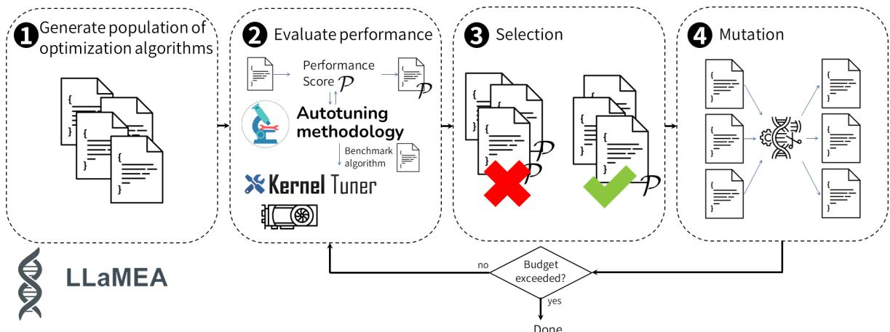  
Figure 1: Overview of our designed system, showing how LLaMEA generates optimization algorithms, which are evaluated using the autotuning methodology, which tests the performance of the optimization algorithm in Kernel Tuner.

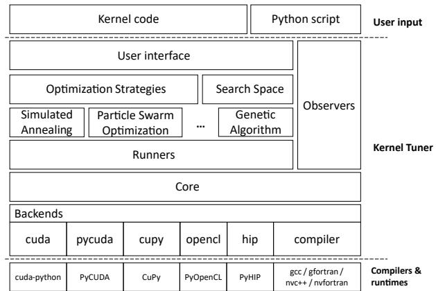  
Figure 2: Overview of the software architecture of Kernel Tuner.

## 3.2 LLaMEA

The Large Language Model Evolutionary Algorithm (van Stein & Back ¨ , 2025), LLaMEA for short, is a system designed to leverage the generative capabilities of large language models for the synthesis of optimization algorithms. In our setting, the scope of the LLM is strictly limited to generating the optimization algorithm logic during an algorithm design stage that is separate from the auto-tuning stage. This ensures that the LLM does not affect application kernels, data, execution, or numerical accuracy. Consequently, the correctness and reproducibility of results remain intact, as the kernel execution pipeline remains unchanged. The LLM generates code snippets that define candidate optimization algorithms. The optimization algorithms specify how new configurations are sampled, selected, and evaluated within Kernel Tuner. If a generated algorithm is incorrect or contains implementation errors, it simply yields poor performance when evaluated, resulting in a low performance score (fitness). These weak algorithms are discarded during the evolutionary search process. The initial population of candidate optimization algorithms is generated using the prompt template shown in Fig. 3. The code format specification briefly explains how to use Kernel Tuner’s OptAlg base class as well as the interface of the SearchSpace object in Kernel Tuner (see Fig. 2). Optionally, we can insert information about the specific tuning problem at hand to allow the LLM to incorporate information on the tunable parameters, their possible values, and constraints. The minimum working code example includes an example implementation of an empty optimization algorithm template, illustrating how to use the SearchSpace object to: 1) generate an initial population, 2) retrieve neighbors of a particular configuration, and 3) repair any invalid configuration that violates constraints. Finally, the output format specification instructs the LLM to first print a one-line description followed by the code. Complete prompts can be found in the provided repository. LLaMEA employs an iterative evolutionary loop in which LLMs generate candidate metaheuristic algorithms in executable code, which are then autonomously evaluated to provide performance feedback. The framework supports mutation and selection strategies common in evolutionary computing algorithms with different solution population sizes. Code evolution is implemented via different natural language-based mutation prompts (See Fig. 4). These prompts are selected to give both exploration and exploitation behaviour in code space. LLaMEA for Kernel Tuner uses an elitism strategy with 4 parent solutions and 12 offspring solutions per iteration. Beyond automated algorithm discovery, LLaMEA offers capabilities such as in-the-loop hyperparameter tuning (van Stein et al., 2025b), where numerical tuning is delegated to hyperparameter optimization tools, allowing the LLM to focus on structural innovation.

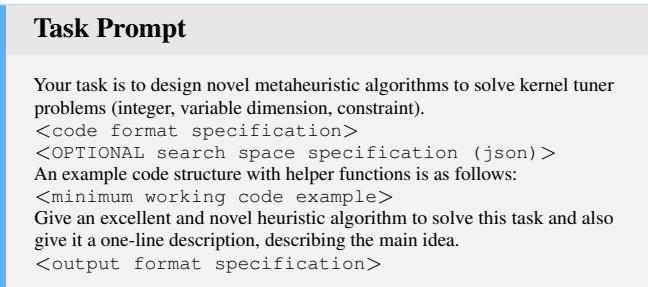  
Figure 3: Prompt template used to generate initial candidate optimization algorithms.

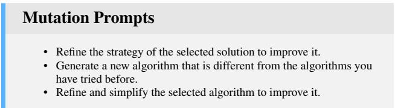  
Figure 4: Mutation prompts used by LLaMEA for Kernel Tuner.

## 3.3 Rating Automatically Generated Algorithms

Kernel Tuner includes more than 20 optimization algorithms (Schoonhoven et al., 2022), ranging from local search to population-based methods. However, large and irregular search spaces present in auto-tuning make algorithm design challenging. Ineffective optimizers waste evaluations on poor configurations, reducing tuning efficiency. Our approach addresses this challenge by automatically generating novel optimization algorithms tailored for auto-tuning and using Kernel Tuner-specific operations. Nevertheless, evaluating whether an optimization algorithm is actually well-suited for auto-tuning is challenging; as the large, irregular search spaces encountered in auto-tuning can be difficult to optimize, an optimizer that performs well on one search space may perform poorly on another. A robust, systematic approach to evaluation is thus needed to automatically generate suitable algorithms.

In earlier work, we presented a community-driven methodology for evaluating optimization algorithms in autotuning (Willemsen et al., 2024), which can be used to evaluate LLaMEA algorithms with Kernel Tuner. This methodology provides a systematic approach to comparing optimization algorithms across auto-tuning search spaces. It defines a performance score $\mathcal { P }$ that quantifies an optimization algorithm’s performance over the passed time relative to a calculated baseline, typically random search, to have consistent, objective-independent, transparent, and comparable behavior across search spaces.

On an individual search space, this approach first defines a budget and performance baseline adapted to the search space characteristics. The optimization algorithms to be compared are then executed multiple times to account for noise, after which the difference between the baseline and the average best performance of each optimization algorithm is compared at fixed, equidistant time intervals relative to the budget. The result is a smooth performance curve over time, instead of relying solely on final performance. By adapting the budget and baseline to reliable search space characteristics, we can compare and aggregate these performance curves across search spaces. We will thus use the mean of these aggregated performance curves as a performance score $\mathcal { P }$ of an optimization algorithm, where a higher score is better overall performance.

More formally, for a given time sampling point t the performance $\mathcal { P } _ { t }$ of an optimization algorithm $\mathcal { F }$ can be computed:

$$
\mathcal { P } ( \mathcal { F } , G _ { j } , K _ { i } , I _ { k } ) _ { t } = \frac { S _ { \mathrm { b a s e l i n e } } ( t ) - \mathcal { F } ( G _ { j } , K _ { i } , I _ { k } ) _ { t } } { S _ { \mathrm { b a s e l i n e } } ( t ) - S _ { \mathrm { o p t } } }\tag{2}
$$

where ${ \cal { S } } ( G _ { j } , K _ { i } , I _ { k } )$ are the search space characteristics given a target system $G _ { j }$ , kernel $K _ { i } ,$ and input data $I _ { k }$ Here, $\mathcal { F } _ { t }$ is the best objective value found so far by the optimization algorithm, $S _ { \mathrm { b a s e l i n e } } ( t )$ is the performance of the baseline method, and $S _ { \mathrm { o p t } }$ is the known optimal value in the search space. This yields $\mathcal { P } _ { t } = 0$ when performance equals the baseline and $\mathcal { P } _ { t } = 1$ when the optimum has been found. To avoid distorting the metric with large variations in search space difficulty, evaluations are limited to the time at which the baseline reaches a set cutoff percentile between the median and the optimum, typically somewhere around 95%, referred to as the budget. With this method, the performance curves are relative to the same baseline and optimum, the cutoff provides a consistent reference point, and the sampling points are equidistant. The performance curves can thus be meaningfully aggregated from different search spaces by taking the mean score of all curves at each t, resulting in the aggregate performance curve over all search spaces for the optimization algorithm. The aggregate performance score is then obtained by averaging over the set of discrete time sampling points $\tau ,$ or more formally:

$$
\mathcal { P } ( \mathcal { F } , K , G , I ) = \frac { 1 } { | \mathcal { T } | } \sum _ { t \in \mathcal { T } } \frac { \displaystyle \sum _ { K _ { i } \in K } \sum _ { G _ { j } \in G } \sum _ { I _ { k } \in I } \mathcal { P } ( \mathcal { F } , G _ { j } , K _ { i } , I _ { k } ) _ { t } } { | K | | G | | I | }\tag{3}
$$

The kernels K, target systems $G ,$ , and inputs I are the collections of $K _ { i } , G _ { j }$ , and $I _ { k }$ of Eq. (1) on which the LLaMEA algorithms are evaluated, hence referred to as the training set. This aggregate score enables robust comparison of optimization algorithms by capturing both the quality of the configurations found as well as the time taken to do so. As such, a difference when comparing two performance scores can indicate a difference in the quality of configurations found, the time taken to do so, or a combination of both.

## 4 EVALUATION

In this section, we evaluate the effectiveness of large language model (LLM)-generated optimization algorithms as introduced in Section 3. Section 4.1 describes the experimental setup. We then address our two main research questions: whether our LLM-generated algorithms benefit from incorporating additional problem-specific information (Section 4.2), and whether our generated algorithms can match or exceed the performance of established optimization methods for auto-tuning (Section 4.4). In between, Section 4.3 discusses the details of the two best generated algorithms.

Table 1: Overview of the basic characteristics of the real-world applications.
<table><tr><td>Name</td><td>Cartesian size</td><td>Constrained size</td><td>Dimensions</td></tr><tr><td>Dedispersion</td><td>22272</td><td>11130</td><td>8</td></tr><tr><td>2D Convolution</td><td>10240</td><td>4362</td><td>10</td></tr><tr><td>Hotspot</td><td>22200000</td><td>349853</td><td>11</td></tr><tr><td>GEMM</td><td>663552</td><td>116928</td><td>17</td></tr></table>

## 4.1 Experimental Setup

The experimental setup consists of five sections: Section 4.1.1 detailing the benchmarks evaluated on, Section 4.1.2 describing the hardware and execution, an account of the software and models in Section 4.1.3, an analysis of the costs in Section 4.1.4, and an outline of the metrics used in Section 4.1.5.

## 4.1.1 Benchmarks

We will evaluate our approach using the BAT benchmark suite (Tørring et al., 2023) of auto-tunable GPU kernels. Specifically, we use the dedispersion, convolution, hotspot, and GEMM kernels. These benchmark kernels are examples of widely used real-world applications in astronomy, image processing, materials science, and linear algebra, respectively. The characteristics of these applications are shown in Table 1. The Cartesian size is the size of the complete combinatorial space. The constrained size is the number of feasible solutions that remain after applying constraints. The number of dimensions equals the number of tunable parameters in the source code. We use these four applications as a benchmark throughout this evaluation. Besides diverse origins, they also bring diversity in their performance characteristics; e.g., dedispersion and hotspot are generally bandwidth-bound, while convolution and GEMM are generally compute-bound; we will explore these applications in more detail.

The Dedispersion kernel in BAT originates from the AM-BER pipeline for the detection of single-pulse astronomical transients (Sclocco et al., 2020). Dedispersion is a signal processing operation that compensates for the frequencydependent time delay experienced by radio waves as they propagate through space. This delay, caused by dispersion in the interstellar medium, results in lower-frequency components of the signal arriving later than higher-frequency components that were emitted simultaneously. For a signal with the highest frequency $f _ { h }$ received at time $t _ { x } ,$ the delay k for a lower frequency $f _ { i }$ can be approximated by:

$$
k \approx 4 1 5 0 \times D M \times \left( \frac { 1 } { f _ { i } ^ { 2 } } - \frac { 1 } { f _ { h } ^ { 2 } } \right) ,
$$

where DM is the dispersion measure, characterizing the integrated column density of free electrons between the source and the observer. The kernel takes as input time-domain samples across many frequency channels and outputs dedispersed samples for a range of DM values. It is parallelized such that each thread can process multiple time samples and dispersion measures in parallel, iterating over the frequency bands. For this study, we use parameters based on the ARTS survey on the Apertif telescope (van Cappellen et al., 2022), which employs a sampling rate of 24.4 kHz, 2048 dispersion measures, and 1536 frequency channels. Several tunable parameters influence the performance of this kernel on GPUs. These include the dimensions of the thread blocks, the amount of work assigned per thread in both the time and dispersion measure dimensions, and the strategy used to stride through the input samples. The kernel also allows partial loop unrolling over the frequency channels, where a factor of zero delegates this decision to the CUDA compiler. Additionally, the number of thread blocks per streaming multiprocessor can be controlled to optimize resource utilization.

The Convolution kernel, developed by van Werkhoven et al. (2014) as an optimized and highly tunable GPU-accelerated library for 2D convolution operations, has become a widely used benchmark in autotuning research (Nugteren & Codreanu, 2015; Petrovic et al.ˇ , 2020; van Werkhoven, 2019; Schoonhoven et al., 2022). A two-dimensional convolution is a fundamental operation in image processing and computer vision, where a filter mask is applied across an input image to compute a weighted sum of neighboring pixel values for each output element. Given an input image I of size $( w \times h )$ and a convolution filter F of size $\left( F _ { w } \times F _ { h } \right)$ , the output image O of size $( ( w - F _ { w } ) \times ( h - F _ { h } ) )$ is computed:

$$
O ( x , y ) = \sum _ { j = 0 } ^ { F _ { h } } \sum _ { i = 0 } ^ { F _ { w } } I ( x + i , y + j ) \times F ( i , j )
$$

The implementation in BAT exposes several tunable parameters that strongly influence GPU performance. The thread block dimensions in the x and y directions determine the granularity of parallelism and the number of threads per block. Each thread may compute multiple output elements along the x and y axes, depending on the selected tile sizes. A shared memory padding scheme can be enabled to mitigate bank conflicts when block sizes are not multiples of the number of memory banks, as described by van Werkhoven et al. (2014). Additionally, the kernel can optionally use the read-only cache to reduce global memory traffic when loading input elements.

The Hotspot kernel, included in BAT and originating from the Rodinia Benchmark suite (Che et al., 2009), is part of a thermal simulation application that estimates the temperature distribution of a processor. The simulation considers the processor’s architectural floor plan, thermal resistance, ambient temperature, and simulated power currents. Through an iterative process, the kernel solves a set of differential equations to model heat dissipation over time. The inputs to the kernel are the power consumption and initial temperature values, and the output is a two-dimensional grid of average temperature values across the chip. The performance of the Hotspot kernel is highly dependent on a number of tunable parameters that influence how work is distributed across GPU threads and how data is managed in memory. The thread block dimensions in the x and y directions define the number of threads per block, with between 32 and 1024 threads typically used. Each thread may compute one or more output elements in each dimension. The temporal tiling factor controls whether multiple iterations of the stencil operation are to be performed within a single kernel launch, improving data locality. Finally, shared memory usage for caching power input data can be enabled, and another parameter controls the number of thread blocks per SM to influence occupancy and register usage.

Generalized dense matrix-matrix multiplication (GEMM) is a fundamental operation defined in the BLAS linear algebra specification and is extensively used across scientific computing, machine learning, and high-performance computing applications. It is also a common benchmark for GPU code optimization studies (Nugteren & Codreanu, 2015; Li et al., 2009; Ryoo et al., 2008) due to its computational intensity and sensitivity to hardware-specific optimizations. In this evaluation, we use the GEMM kernel from CLBlast (Nugteren, 2018), a tunable OpenCL BLAS library. The GEMM operation performs the multiplication of two matrices, A and B, and optionally adds a scaled version of an existing output matrix: $C = \alpha A \cdot B + \beta C$ where α and β are scalar coefficients. The CLBlast GEMM kernel exposes a range of tunable parameters that affect its performance on different GPU architectures. The tunable parameters control the workload assigned to each thread block in two dimensions, while another two parameters control the dimensions of the thread block itself. Loading matrix tiles into shared memory can be enabled or disabled for both matrix A and B individually. When enabled, two more parameters control shared memory level tile sizes. Finally, two more parameters define the vector widths used for global memory transactions, enabling efficient vectorized loads and stores.

These benchmark applications and their described parameters each form a flexible search space for performance tuning across different GPU architectures.

## 4.1.2 Hardware and Execution

To obtain a diverse set of real-world auto-tuning cases for evaluation, we use the four auto-tuning applications described in Section 4.1.1 on a diverse set of six GPUs from the DAS-6 (Bal et al., 2016) and LUMI (Koski et al., 2023) supercomputers, resulting in 24 unique auto-tuning search spaces. The generation phase aims to discover robust heuristic strategies for a class of auto-tuning problems using a representative benchmark set, consistent with standard practice in optimizer design. For fair evaluation, the LLaMEA optimization algorithm feedback loop uses a training set of twelve search spaces resulting from the four applications on the AMD MI250X, Nvidia A100, and Nvidia A4000, and the test set consists of twelve search spaces from the four applications on the AMD W6600, AMD W7800, and Nvidia A6000. Even when evaluating the same kernels across GPUs, the resulting search spaces differ substantially due to hardware-specifics (Lurati et al., 2024), ensuring that performance reflects robustness across diverse tuning landscapes rather than memoization of specific configurations. As a result, the generation cost is incurred only once, after which the cost is quickly amortized across many runs, as described in (Willemsen et al., 2025b). Optimizer evaluation is accelerated by leveraging these pre-exhaustively explored search spaces, allowing simulation rather than recurring recompilation and kernel execution. This reduces evaluation time for a candidate optimizer to seconds or minutes rather than hours or days. The evaluation of this work is conducted on the A4000 nodes of DAS6. The nodes in DAS-6 have a 24-core AMD EPYC-2 7402P CPU and 128 GB of RAM.

## 4.1.3 Software and Models

The OS used is Rocky Linux 8 with Linux kernel version 4.18, the Python version 3.11.7, as well as Kernel Tuner 1.3.0, and PyATF 0.0.9. The version of LLaMEA used is 1.0.6, and GPT o4-mini with the default hyperparameters is used as the LLM. We initially experimented with gemini-2.0-flash and o4-mini models due to their cost-effectiveness, and although gemini-2.0-flash produced valid algorithms, their performance was generally inferior to those generated by o4-mini. There is a wide variety of other, more powerful models that are likely to outperform the models mentioned, yet with which it would not have been feasible to conduct these experiments due to cost. Our goal is to assess whether LLM-driven optimizer synthesis for auto-tuning is practically viable, rather than to maximize absolute performance using the largest available models. The fact that strong and competitive optimizers emerge even with relatively lightweight models demonstrates both the robustness of the approach and its accessibility to a broad set of users.

## 4.1.4 Cost of Optimizer Generation

We report the cost and practical limitations of the LLMbased optimizer generation process to provide a realistic view of its feasibility. Across all experiments, optimizer generation required 100 LLM calls per run, with 5 independent runs per kernel and method to obtain statistically meaningful results, resulting in a total of 4000 LLM calls. Out of the 5 independent run, the best-performing optimization algorithm was selected. The overview of the total token count for each generated optimizer is shown in Fig. 5.

During generation, each candidate optimizer is evaluated with a maximum wall-clock time of 5 minutes; candidates exceeding this limit are discarded. In practice, most evaluations complete well within this bound due to the use of pre-exhaustively explored search spaces, which avoid expensive compilation and execution.

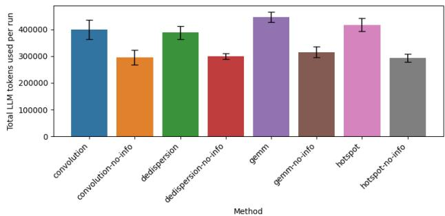  
Figure 5: The total number of LLM tokens per generated optimizer, averaged over five runs. Error bars denote the standard deviation over the five runs.

We observe an approximate 25% failure rate among generated optimizers, including invalid code, runtime errors, or exceeding the time limit. Failed candidates are simply discarded from the population. Given the evolutionary setup with 4 parents and 12 offspring candidates per generation, it is unlikely that all candidates fail simultaneously. In the rare case that this occurs, the LLM is provided with the corresponding stack traces and prompted to repair the implementation in the next iteration, which we find to be consistently effective in practice.

## 4.1.5 Metrics

For performance comparison, we follow the auto-tuning methodology community standard (Willemsen et al., 2024) as detailed in Section 3.3. To provide an intuition of this metric, it measures the area under the performance-versustime curve, normalized to a baseline, and is intended to capture both (i) how quickly an optimizer approaches highquality configurations and (ii) the final quality achieved within a fixed tuning budget. This reflects a core practical constraint in auto-tuning, where users care about reaching good objective values within a limited amount of time. More specifically, each optimization algorithm is evaluated using a performance score P that measures the quality of configurations found over time relative to a statistically estimated random search baseline. This aggregate metric captures both search efficiency and solution quality across different search spaces. A score of 0.0 indicates parity with the baseline, while a score of 1.0 corresponds to consistently finding the global optimum immediately. The optimization budget per run is defined as the time required by the baseline to reach 95% of the distance between the search space median and optimum. Each algorithm variant is executed 100 times per search space to mitigate stochasticity.

## 4.2 Impact of Target Application and Additional Information

For each application, we generated two algorithms using the LLaMEA-Kernel Tuner loop of Section 3 as per Fig. 3:

1. Without search space information: provided solely with an auto-tuning task description.

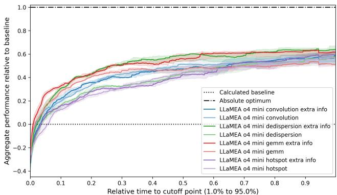  
Figure 6: The aggregate performance over time over all search spaces of the application-specific optimization algorithms, each with and without additional search space knowledge. Mean of 100 runs each, the shaded area marks the 95% confidence interval.

Table 2: Overall performance scores and standard deviations of both algorithm versions for each target application.
<table><tr><td>Target application</td><td>Without extra info</td><td>With extra info</td><td>Difference</td></tr><tr><td>Convolution</td><td>0.429 0.152</td><td>0.426 0.157</td><td>-0.003</td></tr><tr><td>Dedispersion</td><td>0.383 0.162</td><td>0.515 0.164</td><td>+0.132</td></tr><tr><td>GEMM</td><td>0.432 0.119</td><td>0.516 0.136</td><td>+0.084</td></tr><tr><td>Hotspot</td><td>0.373 0.177</td><td>0.388 0.172</td><td>+0.015</td></tr><tr><td>Mean</td><td>0.404</td><td>0.463</td><td>+0.057</td></tr></table>

## 2. With search space information: provided with infor-

mation on possible parameter values and constraints. Starting with the overall performance of both versions generated for each application across all search spaces in Fig. 6, it is remarkable that all final versions of the generated optimization algorithms perform well in general. In these aggregate plots, each line denotes the mean performance over time of the 100 runs, and the shaded area its 95% confidence interval. The performance scores are the means of this performance over time. As seen in Table 2, the additional information on the search space provided in the prompt appears to have an overall positive influence, substantially so for the algorithms generated with target applications dedispersion and GEMM. On average, providing the additional information increased the performance score by 14.6%.

To further investigate these findings, we can compare the performance score per search space between the algorithms that did and did not receive additional search space information, shown in Fig. 7. This performance score is the mean of the performance over time on each individual search space, as explained in Section 3.3. This shows that while there is some correlation between the target application and performance, in general, the algorithms appear to generalize well, both outside their target application and outside the set of GPUs trained on. On a per-application level, we can distinguish between cases where an algorithm was targeted towards an application and where it was not. This is shown in Table 3, where the non-target mean score denotes the average performance score for that application of the algorithms not targeted towards it, which is compared to the two algorithms that were targeted for each application. While the two hotspot-targeted algorithms and the convolution-targeted algorithm with extra information perform worse than their non-targeted counterparts, the other five algorithms appear to have benefited substantially from the application-targeted approach, with an average improvement of 30.7%.

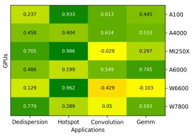  
(a) Convolution

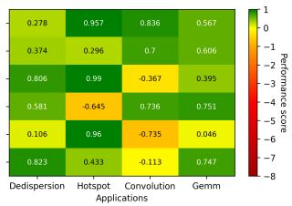

0.953 +A100   
-A4000   
0.801 0.991 MI250X   
-0.649 0.692 A6000   
0.969 0.049 -W6600   
0.811 0.404 0.716 W7800   
Dedispersion Hotspot Convolution Gemm   
Applications  
(b) Convolution with extra info

(c) Dedispersion  
A100   
-A4000   
0.839 0.947 0.165 0.492 MI250X   
0.464 0.743 0.811 A6000   
0.004 -0.264 -W6600   
0.782 W7800   
Dedispersion Hotspot Convolution Gemm   
Applications  
(e) GEMM

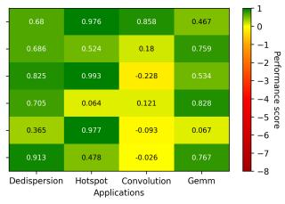

0.962 A100   
A4000   
0.983 -0.184 MI250X   
0.478 -0.356 0.195 0.759 A6000   
0.344 0.877 0.24 -0.419 -W6600   
0.744 -0.254 -W7800   
Dedispersion Hotspot Convolution Gemm   
Applications  
(d) Dedispersion with extra info

(g) Hotspot  
1  
0.244 0.807 0.725 0.714  
0  
0.256 0.784  
0.737 0.994 0.733  
-0.009 0.853 4  
−5  
0.079 0.912 -0.126 −6  
0.806 0.243 0.016  
−8  
Dedispersion Hotspot Convolution Gemm  
Applications

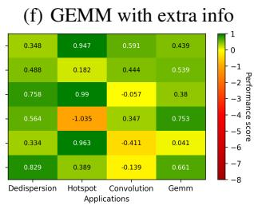  
(h) Hotspot with extra info  
Figure 7: Optimization algorithm performance per search space.

## 4.3 Algorithmic Details of the Two Best Generated Optimizers

As reported in Section 4.2, enriching the prompt with searchspace information particularly benefited the algorithms targeted at dedispersion and GEMM. To better understand the generated algorithms, we look at the algorithmic details and their approach to auto-tuning problems.

## 4.3.1 HybridVNDX (target Dedispersion, extra info)

The first algorithm, HybridVNDX, combines Variable Neighborhood Descent (VND) (Duarte et al., 2018) with (i) dynamic neighborhood weighting, (ii) a light k-NN surrogate for pre-screening, (iii) elite recombination, and (iv) tabu search (Gendreau & Potvin, 2013) and simulated-annealing (Van Laarhoven & Aarts, 1987). The design aims to quickly filter promising neighbours per iteration while maintaining diversification and robust escape from local minima. The default hyperparameters as used in this paper are: k=5, pool size = 8, restart after 100 non-improving steps, tabu size = 300, elite size = 5, T0=1.0, cooling = 0.995.

Table 3: Overall performance scores of non-target against target algorithms on the applications.
<table><tr><td>Target application</td><td>Non- target mean score</td><td>Target score</td><td>Difference</td></tr><tr><td>Convolution without extra info Convolution with extra info Dedispersion without extra info Dedispersion with extra info GEMM without extra info GEMMwith extra info</td><td>0.195 0.195 0.476 0.476 0.468 0.468 0.538</td><td>0.219 0.176 0.526 0.695 0.564 0.719 0.493</td><td>+0.024 -0.019 +0.050 +0.219 +0.096 +0.251</td></tr><tr><td>Hotspot without extra info Hotspot with extra info Mean</td><td>0.538 0.419</td><td>0.404 0.475</td><td>-0.045 -0.134 +0.055</td></tr></table>

Algorithm 1 HybridVNDX high-level pseudocode   
Input :Objective f, search space X with neighbourhoods; bud  
get via f.budget spent fraction   
Output :Best configuration $x ^ { \star }$   
1 Initialize x ← random valid(), $f _ { x } \gets f ( x ) ;$ maintain history   
${ \mathcal { H } } ,$ elite heap $\varepsilon ,$ tabu deque T ; Initialize neighbourhood weights   
$w [ \cdot ]  1 ;$ temperature $\hat { T }  T _ { 0 }$   
2 while f.budget spent fracti $. o n < 1$ do   
3 Sample neighbourhood N by roulette over w   
4 Build candidate pool: subset of $N ( x )$ , 1 elite-crossover child,   
fill with random valid samples; repair infeasible   
5 Score each candidate c by k-NN prediction on H (Hamming),   
add tabu penalty; pick $\dot { \tilde { c } } =$ arg min score   
6 Evaluate $\bar { f _ { \tilde { c } } } \gets \bar { f } ( \tilde { c } ) ;$ push $( \tilde { c } , f _ { \tilde { c } } )$ to H and $\varepsilon ;$   
7 $\mathbf { i f } \ f _ { \tilde { c } } \ \leq \ \bar { f } _ { x }$ or rand $( ) <$ exp $- ( f _ { \tilde { c } } - f _ { x } ) / T )$ then $x \gets \tilde { c } ;$   
$f _ { x } \gets f _ { \tilde { c } } ;$ push x to $\mathcal { T } ; w [ N ]  1 . 1 w [ N ]$   
8 else $w [ \dot { N } ] \dot {  } 0 . 9 w [ N ]$   
9 $T \gets \dot { \alpha } T$ (cooling); if stagnation > threshold then   
10 restart from new random valid x and reset $T$   
11 Return the best-so-far in H

## 4.3.2 AdaptiveTabuGreyWolf (target GEMM, extra info) C

The second algorithm, AdaptiveTabuGreyWolf, keeps a small population of valid configurations and, at each step, proposes new candidates for every non-leader by mixing each parameter independently from the three current best solutions or the individual itself. A light “shaking” step then perturbs the proposal either by a random coordinate jump from a fresh valid sample or by a one-step move in a discrete neighborhood (using coarser adjacent moves early and stricter ones later) to balance exploration and exploitation. Infeasible proposals are repaired; recently evaluated points are blocked by a tabu list to avoid repeats. Candidates are accepted with simulated-annealing criteria under a temperature that decays with budget (with mild reheating on stagnation), and if progress stalls, a fraction of the worst population members is randomly reinitialized. The run stops when the evaluation budget is exhausted and the best-so-far configuration is returned. While this algorithm is named differently, after close inspection, various elements are similar to the first (e.g., the tabu list and simulated annealing approach). The default hyperparameters as used in this paper are: Population size $p { = } 8 ,$ , tabu length $L { = } 3 p .$ shake rate $s { = } 0 . 2$ , jump rate $q { = } 0 . 1 5 ,$ , stagnation limit τ =80, restart ratio $\rho { = } 0 . 3 , T _ { 0 } { = } 1 . 0 , \lambda { = } 5 . 0 , T _ { \mathrm { m i n } } { = } 1 0 ^ { - 4 }$

Algorithm 2 AdaptiveTabuGreyWolf   
Input : f , X with v(·) and $N _ { m } ( \cdot ) $ , budget B, hyperparameters   
$( p , L , s , q , \tau , \rho , T _ { 0 } , \lambda ,$ Tmin)   
Output $: x ^ { \star }$   
12 $P  p$ random valid configs; evaluate; T ← recent list of size $L ;$   
$x ^ { \star } \gets$ arg min $_ { x \in P } f ( x ) ; b \gets 0$ while $b < \mathbf { \bar { \theta } }$ 1 do   
13 sort P by $f ;$ set leaders $( \alpha , \beta , \delta )$ to the best three; foreach   
$x \in P \setminus \{ \alpha , \beta , \delta \}$ do   
// Leader-mixed proposal   
14 yj ← Uniform $\{ \alpha _ { j } , \bar { \beta } _ { j } , \delta _ { j } , x _ { j } \}$ for each $j ;$   
$/ / \mathrm { \Delta \ s h a k i n g }$   
15 with prob. s: if rand() < q then random-dim jump from   
random valid sample   
16 else y ← one-step move in $N _ { m ( b ) } ( y )$   
17 // Repair, tabu   
18 i $\operatorname { i } \lnot v ( y )$ then   
19 attempt repair via neighbors; else resample random   
valid   
20 if $y \in \mathcal T$ then   
21 resample (small Hamming change or fresh sample)   
22 $\bigstar / \bigstar$ Evaluate and accept   
23 Evaluate $f ( y ) ; \quad \Delta \quad \gets \quad \hat { f } ( y ) \ - \ f ( x ) ; \quad T \quad \gets$   
max(Tmin, $T _ { 0 } e ^ { - \lambda b } )$ if $\Delta \ \leq \ 0$ or rand() $) < e ^ { - \Delta / T }$   
then   
24 $x \gets y ;$ push x to $\tau$   
25   
26 update $x ^ { \star }$ and stagnation counter; if stagnation $\geq \tau$ then   
27 reinit worst ρp individuals   
28 update budget fraction $b ;$   
29 return $x ^ { \star }$

These two variants provided the best aggregate performance across the 24 search spaces. To better understand what optimization algorithms perform well on auto-tuning problems, we conclude that they share two important characteristics: 1) Both methods treat evaluation time as dominant; their additional control logic is lightweight. 2) The neighbour APIs allow architecture-agnostic moves while honouring constraints, which is crucial for large irregular search spaces.

## 4.4 Comparison to Human-designed Auto-Tuning Algorithms

Having evaluated the quality and details of generated optimization algorithms in Sections 4.2 and 4.3, we now evaluate how they hold up against human-designed auto-tuning optimization algorithms. We compare the best two of our generated algorithms, those targeted towards dedispersion and GEMM with extra information, against the two best human-designed auto-tuning methods in Kernel Tuner evaluated in Willemsen et al. (2025b). These are Genetic Algorithm (GA), a population-based evolutionary method, and Simulated Annealing (SA), a local search technique with probabilistic acceptance. Both algorithms have undergone extensive hyperparameter tuning for 7 days on the same search spaces as used during the generation stage in this work, under the same conditions, further specified in Willemsen et al. (2025b). To further expand the context of this evaluation, we also compare against the best-performing optimization algorithm from another auto-tuning framework, pyATF (Schulze et al., 2025), which uses a Differential Evolution (DE) implementation. Hyperparameter tuning of py-ATF optimizers is not possible without changing the source code. The pyATF version used is 0.0.9.

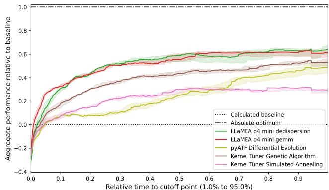  
Figure 8: The aggregate performance over time over all search spaces of our generated algorithms against three human-designed optimization algorithms. Mean of 100 runs each, the shaded area marks the 95% confidence interval.

We have chosen these methods as our comparison baselines due to their prevalence in Kernel Tuner and similar frameworks, representing a dominant class of human-designed optimizers. While other ML-based auto-tuners, such as GP-Tune and HyperMapper, are potentially relevant baselines, they are not directly comparable in this evaluation due to differing device targets and underlying assumptions regarding continuous spaces and compiler-internal cost models.

Figure 8 shows the aggregate performance of the two LLMgenerated algorithms and the three human-designed optimization algorithms across all 24 search spaces. The results indicate that our LLM-generated algorithms achieve more than competitive performance as they outperform the humandesigned optimization algorithms by a substantial margin, improving the performance score by 0.126 and 0.282 over Kernel Tuner’s GA and SA, respectively. Over pyATF’s DE, the performance score is improved by 0.274. On average, our LLM-generated algorithms perform 72.4% better than the human-designed algorithms compared to across the board. Performance stability across search spaces is also notable, as seen in Fig. 9. Comparing the performance of our generated algorithms against the best human-designed algorithm in the evaluation, GA, it is notable that the latter performs better on the hotspot application, but is otherwise

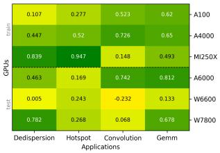  
(a) Dedispersion with extra info

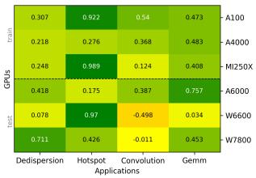

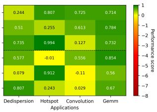  
(b) GEMM with extra info

(c) Kernel Tuner GA  
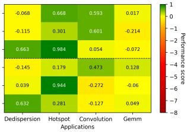

(d) Kernel Tuner SA  
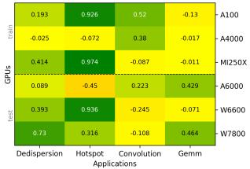  
(e) pyATF DE  
Figure 9: Optimization algorithm performance per search space.

outperformed in general.

Overall, these results demonstrate that while LLMs can already synthesize competitive optimization algorithms in a general setting, providing additional problem-specific information further boosts their performance, enabling them to surpass human-designed optimization methods.

## 5 CONCLUSION

As modern architectures continue to grow in complexity, auto-tuning remains indispensable for achieving high performance. At the heart of auto-tuning lies the choice of optimization algorithm, which governs how efficiently the vast, irregular search spaces can be explored. In this work, we investigated a novel approach: leveraging large language models (LLMs) to automatically generate optimization algorithms tailored to auto-tuning problems. While components of our framework existed independently, their integration into a closed-loop meta-optimization system produces emergent behavior: the discovery of novel optimization algorithms not present in either component.

Our results show that LLM-generated optimization algorithms can achieve performance competitive with, and in various cases superior to, established human-designed algorithms. We observed that these auto-generated methods adapt well to diverse tuning spaces, demonstrating both strong search efficiency over time and the ability to discover high-performing configurations with limited evaluations. Our results show that providing application- and search-space-specific information leads to substantial improvements, highlighting the value of specialization. At the same time, many auto-tuning problems share common structural characteristics, allowing some optimizers generated for one problem to transfer effectively to other search spaces. The strong performance observed across diverse tasks therefore does not contradict specialization; rather, it indicates that our automated design approach can uncover principled optimization strategies that exploit shared structure, while still benefiting from additional problem-specific information when available. This approach opens new avenues for rapid design and exploration of optimization strategies without requiring extensive manual algorithm engineering.

Building on these promising results, we identify several directions for future work. First, the generated algorithms and their performance depend on the choice of the underlying LLM. We experimented with various models, including o4-mini and gemini-2.0-flash. Although gemini-2.0-flash produced valid algorithms, their performance was generally inferior to those generated by o4-mini. We selected o4-mini for the presented experiments because it offered a favorable balance between performance and computational cost. In addition, while we demonstrate that LLM-generated algorithms can generalize to a diverse set of unseen search spaces, our study relies on a fixed set of applications and GPUs to evaluate generated algorithms. Broader validation across additional architectures and domains can provide further details on their robustness. Finally, this work is a first step into a new realm, where optimizer generation could become a foundational capability within large-scale auto-tuning infrastructures, compilers, and ML deployment systems. By automatically producing specialized optimizers, such systems could achieve unprecedented levels of portability and self-adaptation across diverse hardware and workloads.

In conclusion, our study demonstrates the potential of LLMs to reshape the landscape of auto-tuning by automating the design of optimization algorithms themselves. This paradigm shift not only reduces the human effort required to craft effective search strategies but also paves the way toward more flexible, efficient, and accessible auto-tuning for the next generation of high-performance computing systems. The best-performing optimization algorithms in this work are available in Kernel Tuner, which can be installed with pip install kernel-tuner. LLaMEA can be installed with pip install llamea. The complete experiment is implemented using the BLADE (van Stein et al., 2025a) benchmarking suite, and can be found in our Github repository2. For more information, please visit the Kernel Tuner3 and LLaMEA4 repositories.

## REFERENCES

Ansel, J., Kamil, S., Veeramachaneni, K., Ragan-Kelley, J., Bosboom, J., O’Reilly, U.-M., and Amarasinghe, S. Opentuner: An extensible framework for program autotuning. In Proceedings of the 23rd international conference on Parallel architectures and compilation (PACT), pp. 303–315, 2014. doi: 10.1145/2628071.2628092. URL http: //groups.csail.mit.edu/commit/papers/ 2014/ansel-pact14-opentuner.pdf.

Bal, H., Epema, D., de Laat, C., van Nieuwpoort, R., Romein, J., Seinstra, F., Snoek, C., and Wijshoff, H. A medium-scale distributed system for computer science research: Infrastructure for the long term. Computer, 49(05):54–63, May 2016. ISSN 1558-0814. doi: 10.1109/MC.2016.127. Place: Los Alamitos, CA, USA.

Balaprakash, P., Dongarra, J., Gamblin, T., Hall, M., Hollingsworth, J. K., Norris, B., and Vuduc, R. Autotuning in High-Performance Computing Applications. Proceedings of the IEEE, 106(11):2068–2083, November 2018. ISSN 0018-9219, 1558-2256. doi: 10.1109/ JPROC.2018.2841200. URL https://ieeexplore. ieee.org/document/8423171/.

Che, S., Boyer, M., Meng, J., Tarjan, D., Sheaffer, J. W., Lee, S.-H., and Skadron, K. Rodinia: A benchmark suite for heterogeneous computing. In 2009 IEEE International Symposium on Workload Characterization (IISWC), pp. 44–54, October 2009. doi: 10.1109/IISWC. 2009.5306797.

Chen, M., Tworek, J., Jun, H., Yuan, Q., de Oliveira Pinto, H. P., Kaplan, J., Edwards, H., Burda, Y., Joseph, N., Brockman, G., Ray, A., Puri, R., Krueger, G., Petrov, M., Khlaaf, H., Sastry, G., Mishkin, P., Chan, B., Gray, S., Ryder, N., Pavlov, M., Power, A., Kaiser, L., Bavarian, M., Winter, C., Tillet, P., Such, F. P., Cummings, D., Plappert, M., Chantzis, F., Barnes, E., Herbert-Voss, A., Guss, W. H., Nichol, A., Paino, A., Tezak, N., Tang, J., Babuschkin, I., Balaji, S., Jain, S., Saunders, W., Hesse, C., Carr, A. N., Leike, J., Achiam, J., Misra, V., Morikawa, E., Radford, A., Knight, M., Brundage, M., Murati, M., Mayer, K., Welinder, P., Mc-Grew, B., Amodei, D., McCandlish, S., Sutskever, I., and Zaremba, W. Evaluating large language models trained on code, 2021. URL https://arxiv.org/abs/ 2107.03374. arXiv: 2107.03374 [cs.LG].

Czarnul, P. and Rosciszewski, P. Auto-tuning methodology ´ for configuration and application parameters of hybrid CPU + GPU parallel systems based on expert knowledge. In 2019 International Conference on High Performance Computing & Simulation (HPCS), pp. 551–558, July 2019. doi: 10.1109/HPCS48598.2019.9188060.

Duarte, A., Sanchez-Oro, J., Mladenovi ´ c, N., and Todosi-´ jevic, R. Variable neighborhood descent. In Mart´ ´ı, R., Pardalos, P. M., and Resende, M. G. C. (eds.), Handbook of heuristics, pp. 341–367. Springer International Publishing, Cham, 2018. ISBN 978-3-319-07124-4. doi: 10.1007/978-3-319-07124-4 9. URL https://doi. org/10.1007/978-3-319-07124-4\_9.

Falch, T. L. and Elster, A. C. Machine learning based autotuning for enhanced OpenCL performance portability. In 2015 IEEE international parallel and distributed processing symposium workshop, pp. 1231–1240, Hyderabad, India, May 2015. IEEE. doi: 10.1109/IPDPSW.2015.85.

Filipovic, J., Petrovi ˇ c, F., and Benkner, S. Autotun- ˇ ing of OpenCL kernels with global optimizations. In Proceedings of the 1st workshop on Autotuning and adaptivity Approaches for energy efficient HPC systems, Andare ’17, New York, NY, USA, 2017. Association for Computing Machinery. ISBN 978-1-4503- 5363-2. doi: 10.1145/3152821.3152877. URL https: //doi.org/10.1145/3152821.3152877. Number of pages: 6 Place: Portland, OR, USA tex.articleno: 2.

Filipovic, J., Hozzov ˇ a, J., Nezarat, A., Ol’ha, J., and ´ Petrovic, F. Using hardware performance counters to ˇ speed up autotuning convergence on GPUs. Journal of Parallel and Distributed Computing, 160:16–35, February 2022. ISSN 07437315. doi: 10.1016/j.jpdc.2021. 10.003. URL https://linkinghub.elsevier. com/retrieve/pii/S0743731521001945.

Frigo, M. and Johnson, S. G. FFTW: An adaptive software architecture for the FFT. In Acoustics, speech and signal processing, 1998. Proceedings of the 1998 IEEE international conference on, volume 3, pp. 1381–1384. IEEE, 1998.

Gendreau, M. and Potvin, J.-Y. Tabu search. In Search methodologies: introductory tutorials in optimization and decision support techniques, pp. 243–263. Springer, 2013.

Hartono, A., Norris, B., and Sadayappan, P. Annotationbased empirical performance tuning using Orio. In 2009 IEEE international symposium on parallel distributed processing, pp. 1–11, Rome, Italy,, 2009. IEEE. doi: 10.1109/IPDPS.2009.5161004.

Hellsten, E. O., Souza, A., Lenfers, J., Lacouture, R., Hsu, O., Ejjeh, A., Kjolstad, F., Steuwer, M., Olukotun, K., and Nardi, L. BaCO: a fast and portable bayesian compiler optimization framework. In Proceedings of the 28th ACM international conference on architectural support for programming languages and operating systems, volume 4, Asplos ’23, pp. 19–42, New

York, NY, USA, February 2024. Association for Computing Machinery. ISBN 979-8-4007-0394-2. doi: 10. 1145/3623278.3624770. URL https://doi.org/ 10.1145/3623278.3624770. Number of pages: 24 Place: Vancouver, BC, Canada.

Hijma, P., Heldens, S., Sclocco, A., Van Werkhoven, B., and Bal, H. E. Optimization Techniques for GPU Programming. ACM Computing Surveys, 55(11):1–81, November 2023. ISSN 0360-0300, 1557-7341. doi: 10.1145/ 3570638. URL https://dl.acm.org/doi/10. 1145/3570638.

Koski, K., Manninen, P., and Nyronen, T. Fifty years of high-¨ performance computing in finland. In Neittaanmaki, P. ¨ and Rantalainen, M.-L. (eds.), Impact of scientific computing on science and society, pp. 347–355. Springer International Publishing, Cham, 2023. ISBN 978-3-031-29082-4. doi: 10.1007/978-3-031-29082-4 20. URL https:// doi.org/10.1007/978-3-031-29082-4\_20.

Li, Y., Dongarra, J., and Tomov, S. A note on auto-tuning GEMM for GPUs. In Computational science–ICCS 2009: 9th international conference baton rouge, la, USA, may 25-27, 2009 proceedings, part I 9, pp. 884–892. Springer, 2009.

Li, Y., Choi, D., Chung, J., Kushman, N., Schrittwieser, J., Leblond, R., Eccles, T., Keeling, J., Gimeno, F., Dal Lago, A., Hubert, T., Choy, P., de Masson d’Autume, C., Babuschkin, I., Chen, X., Huang, P.-S., Welbl, J., Gowal, S., Cherepanov, A., Molloy, J., Mankowitz, D. J., Sutherland Robson, E., Kohli, P., de Freitas, N., Kavukcuoglu, K., and Vinyals, O. Competitionlevel code generation with AlphaCode. Science, 378 (6624):1092–1097, December 2022. ISSN 1095-9203. doi: 10.1126/science.abq1158. URL http://dx.doi. org/10.1126/science.abq1158.

Liu, M., Yuan, Xialiang, and Tong Fei. Evolution of heuristics: Towards efficient automatic algorithm design using large language model. In International conference on machine learning (ICML), 2024. URL https: //arxiv.org/abs/2401.02051.

Liu, Y., Sid-Lakhdar, W. M., Marques, O., Zhu, X., Meng, C., Demmel, J. W., and Li, X. S. GPTune: Multitask Learning for Autotuning Exascale Applications. In Proceedings of the 26th ACM SIGPLAN Symposium on Principles and Practice of Parallel Programming, PPoPP ’21, pp. 234–246, New York, NY, USA, 2021. Association for Computing Machinery. ISBN 978-1-4503- 8294-6. doi: 10.1145/3437801.3441621. URL https: //doi.org/10.1145/3437801.3441621.

Lurati, M., Heldens, S., Sclocco, A., and Van Werkhoven, B. Bringing Auto-Tuning to HIP: Analysis of Tun-

ing Impact and Difficulty on AMD and Nvidia GPUs. In Carretero, J., Shende, S., Garcia-Blas, J., Brandic, I., Olcoz, K., and Schreiber, M. (eds.), Euro-Par 2024: Parallel Processing, volume 14801, pp. 91–106, Cham, 2024. Springer Nature Switzerland. ISBN 978- 3-031-69576-6. doi: 10.1007/978-3-031-69577-3 7. URL https://link.springer.com/10.1007/ 978-3-031-69577-3\_7. Series Title: Lecture Notes in Computer Science.

Nardi, L., Souza, A., Koeplinger, D., and Olukotun, K. HyperMapper: a Practical Design Space Exploration Framework. In 2019 IEEE 27th International Symposium on Modeling, Analysis, and Simulation of Computer and Telecommunication Systems (MASCOTS), pp. 425–426. IEEE, October 2019. doi: 10.1109/MASCOTS.2019. 00053. URL https://ieeexplore.ieee.org/ document/9124618.

Nugteren, C. CLBlast. In Proceedings of the International Workshop on OpenCL. ACM, May 2018. ISBN 978-1-4503-6439-3. doi: 10.1145/3204919.3204924. URL http://dx.doi.org/10.1145/3204919. 3204924.

Nugteren, C. and Codreanu, V. CLTune: A generic autotuner for OpenCL kernels. 9th International Symposium on Embedded Multicore/Many-core Systems-on-Chip, 2015. URL https://ieeexplore.ieee. org/abstract/document/7328205/.

Petrovic, F., St ˇ ˇrelak, D., Hozzov ´ a, J., Ol’ha, J., Trembeck ´ y,´ R., Benkner, S., and Filipovic, J. A benchmark set ˇ of highly-efficient CUDA and OpenCL kernels and its dynamic autotuning with Kernel Tuning Toolkit. Future Generation Computer Systems, 108:161–177, July 2020. ISSN 0167-739X. doi: 10.1016/j.future.2020.02. 069. URL https://www.sciencedirect.com/ science/article/pii/S0167739X19327360.

Rasch, A., Haidl, M., and Gorlatch, S. ATF: A Generic Auto-Tuning Framework. In Proceedings of the 19th International Conference on High Performance Computing and Communications, pp. 64–71, December 2017. doi: 10.1109/HPCC-SmartCity-DSS.2017.9.

Romera-Paredes, B., Barekatain, M., Novikov, A., Balog, M., Kumar, M. P., Dupont, E., Ruiz, F. J., Ellenberg, J. S., Wang, P., Fawzi, O., and others. Mathematical discoveries from program search with large language models. Nature, 625(7995):468–475, 2024.

Ryoo, S., Rodrigues, C. I., Stone, S. S., Baghsorkhi, S. S., Ueng, S.-Z., Stratton, J. A., and Hwu, W.-m. W. Program optimization space pruning for a multithreaded gpu. In Proceedings of the 6th annual IEEE/ACM international symposium on code generation and optimization, Cgo

’08, pp. 195–204, New York, NY, USA, 2008. Association for Computing Machinery. ISBN 978-1-59593- 978-4. doi: 10.1145/1356058.1356084. URL https: //doi.org/10.1145/1356058.1356084. Number of pages: 10 Place: Boston, MA, USA.

Schoonhoven, R., van Werkhoven, B., and Batenburg, K. J. Benchmarking optimization algorithms for autotuning GPU kernels. IEEE Transactions on Evolutionary Computation, pp. 1–1, 2022. ISSN 1089-778X, 1089-778X, 1941-0026. doi: 10.1109/TEVC.2022. 3210654. URL http://arxiv.org/abs/2210. 01465. arXiv:2210.01465 [cs].

Schulze, R., Gorlatch, S., and Rasch, A. pyATF: Constraintbased auto-tuning in python. In Proceedings of the 34th ACM SIGPLAN international conference on compiler construction, Cc ’25, pp. 35–47, Las Vegas, NV, USA and New York, NY, USA, 2025. Association for Computing Machinery. ISBN 979-8-4007-1407-8. doi: 10. 1145/3708493.3712682. URL https://doi.org/ 10.1145/3708493.3712682. Number of pages: 13.

Sclocco, A., Bal, H. E., Hessels, J., Leeuwen, J. v., and Nieuwpoort, R. V. v. Auto-Tuning Dedispersion for Many-Core Accelerators. In 2014 IEEE 28th International Parallel and Distributed Processing Symposium, pp. 952–961, Phoenix, AZ, USA, May 2014. IEEE. ISBN 978-1-4799-3800-1. doi: 10.1109/IPDPS.2014. 101. URL https://ieeexplore.ieee.org/ document/6877325.

Sclocco, A., Heldens, S., and van Werkhoven, B. AM-BER: a real-time pipeline for the detection of single pulse astronomical transients. SoftwareX, 12:100549, 2020.

Tapus, C., Chung, I.-H., and Hollingsworth, J. Active harmony: Towards automated performance tuning. In Proceedings from the conference on high performance networking and computing, Proceedings from the Conference on High Performance Networking and Computing, pp. 44 – 44, December 2002. ISBN 0-7695-1524-X. doi: 10.1109/SC.2002.10062.

Tørring, J. O., van Werkhoven, B., Petrovc, F., Willemsen, ˇ F.-J., Filipovic, J., and Elster, A. C. Towards a benchmark- ˇ ing suite for kernel tuners. In 2023 IEEE international parallel and distributed processing symposium workshops (IPDPSW), pp. 724–733. IEEE, 2023.

van Cappellen, W., Oosterloo, T., Verheijen, M., Adams, E., Adebahr, B., Braun, R., Hess, K., Holties, H., van der Hulst, J., Hut, B., and others. Apertif: Phased array feeds for the westerbork synthesis radio telescope-system overview and performance characteristics. Astronomy & Astrophysics, 658:A146, 2022.

Van Laarhoven, P. J. and Aarts, E. H. Simulated annealing. In Simulated annealing: Theory and applications, pp. 7–15. Springer, 1987.

van Stein, N. and Back, T. LLaMEA: a large language model ¨ evolutionary algorithm for automatically generating metaheuristics, 2025. URL https://arxiv.org/abs/ 2405.20132. arXiv: 2405.20132 [cs.NE].

van Stein, N., Kononova, A. V., Yin, H., and Back, T.¨ BLADE: Benchmark suite for LLM-driven automated design and evolution of iterative optimisation heuristics. In GECCO ’25 companion, Proceedings of the genetic and evolutionary computation conference companion. Association for Computing Machinery, 2025a. doi: 10.1145/3712255.3734347. URL https://doi. org/10.1145/3712255.3734347.

van Stein, N., Vermetten, D., and Back, T. In-the-loop ¨ hyper-parameter optimization for LLM-based automated design of heuristics. ACM Trans. Evol. Learn. Optim., April 2025b. doi: 10.1145/3731567. URL https: //doi.org/10.1145/3731567. Place: New York, NY, USA.

van Werkhoven, B. Kernel Tuner: A searchoptimizing GPU code auto-tuner. Future Generation Computer Systems, 90:347–358, January 2019. ISSN 0167-739X. doi: 10.1016/j.future.2018.08. 004. URL https://www.sciencedirect.com/ science/article/pii/S0167739X18313359.

van Werkhoven, B., Maassen, J., Bal, H. E., and Seinstra, F. J. Optimizing convolution operations on GPUs using adaptive tiling. Future Generation Computer Systems, 30: 14–26, January 2014. doi: 10.1016/j.future.2013.09.003. URL https://www-sciencedirect-com. vu-nl.idm.oclc.org/science/article/ pii/S0167739X13001829.

van Werkhoven, B., Palenstijn, W. J., and Sclocco, A. Lessons learned in a decade of research software engineering gpu applications. In International conference on computational science, pp. 399–412. Springer, 2020.

Whaley, R. C., Petitet, A., and Dongarra, J. J. Automated empirical optimizations of software and the AT-LAS project. Parallel Computing, 27(1-2):3–35, 2001.

Willemsen, F.-J., van Nieuwpoort, R., and van Werkhoven, B. Bayesian Optimization for auto-tuning GPU kernels. In 2021 International Workshop on Performance Modeling, Benchmarking and Simulation of High Performance Computer Systems (PMBS), pp. 106–117, November 2021. doi: 10.1109/PMBS54543.2021.00017.

Willemsen, F.-J., Schoonhoven, R., Filipovic, J., Tørring, ˇ J. O., van Nieuwpoort, R., and van Werkhoven, B. A methodology for comparing optimization algorithms for auto-tuning. Future Generation Computer Systems, 159:489–504, 2024. ISSN 0167- 739X. doi: https://doi.org/10.1016/j.future.2024.05. 021. URL https://www.sciencedirect.com/ science/article/pii/S0167739X24002498.

Willemsen, F.-J., van Nieuwpoort, R. V., and van Werkhoven, B. Efficient construction of large search spaces for auto-tuning. In Proceedings of the 54th international conference on parallel processing (ICPP ’25), San Diego, CA, USA and New York, NY, USA, September 2025a. Association for Computing Machinery. doi: 10.1145/3754598.3754601. URL https: //doi.org/10.1145/3754598.3754601.

Willemsen, F.-J., van Nieuwpoort, R. V., and van Werkhoven, B. Tuning the Tuner: Introducing Hyperparameter Optimization for Auto-Tuning. In Proceedings of the 2025 IEEE eScience conference, Chicago, USA, September 2025b.

Willemsen, F.-J., Heldens, S., van Nieuwpoort, R. V., and van Werkhoven, B. Constraint-aware Optimization in Auto-Tuning. In 2026 IEEE International Parallel and Distributed Processing Symposium Workshops (IPDPSW), 2026.

Wu, X., Kruse, M., Balaprakash, P., Finkel, H., Hovland, P., Taylor, V., and Hall, M. Autotuning PolyBench Benchmarks with LLVM Clang/Polly Loop Optimization Pragmas Using Bayesian Optimization. In 2020 IEEE/ACM Performance Modeling, Benchmarking and Simulation of High Performance Computer Systems (PMBS), pp. 61–70, November 2020. doi: 10.1109/PMBS51919.2020.00012.

Wu, X., Balaprakash, P., Kruse, M., Koo, J., Videau, B., Hovland, P., Taylor, V., Geltz, B., Jana, S., and Hall, M. ytopt: Autotuning Scientific Applications for Energy Efficiency at Large Scales. Concurrency and Computation: Practice and Experience, pp. e8322, October 2024. ISSN 1532-0626, 1532-0634. doi: 10.1002/cpe.8322. URL https://onlinelibrary. wiley.com/doi/10.1002/cpe.8322.

Ye, H., Wang, J., Cao, Z., Berto, F., Hua, C., Kim, H., Park, J., and Song, G. Reevo: Large language models as hyperheuristics with reflective evolution. Advances in neural information processing systems, 37:43571–43608, 2024.