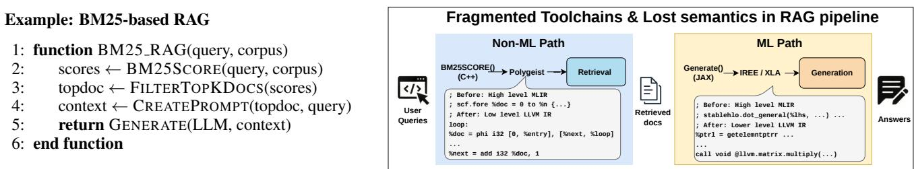
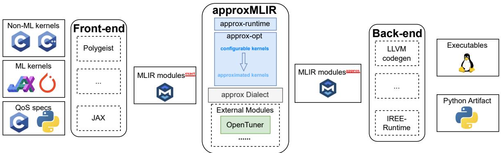
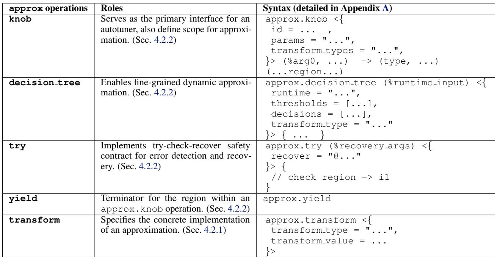
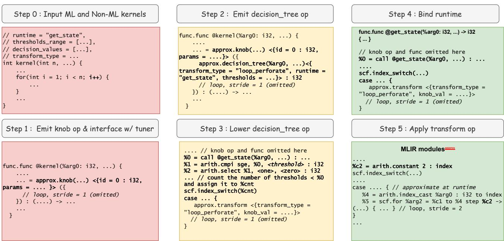
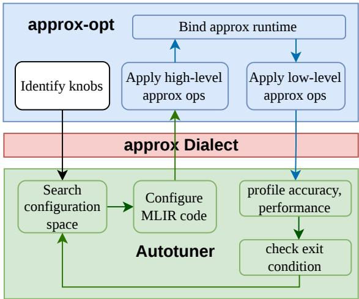
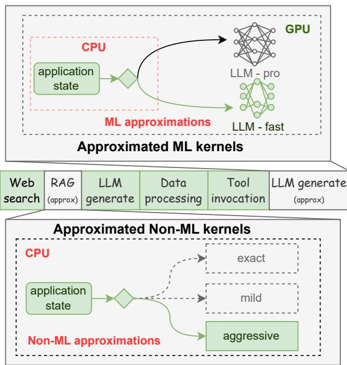
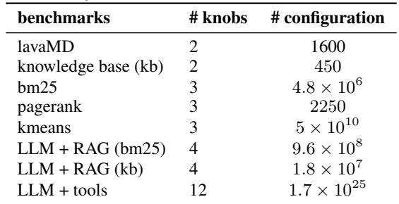
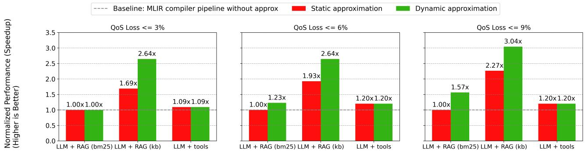
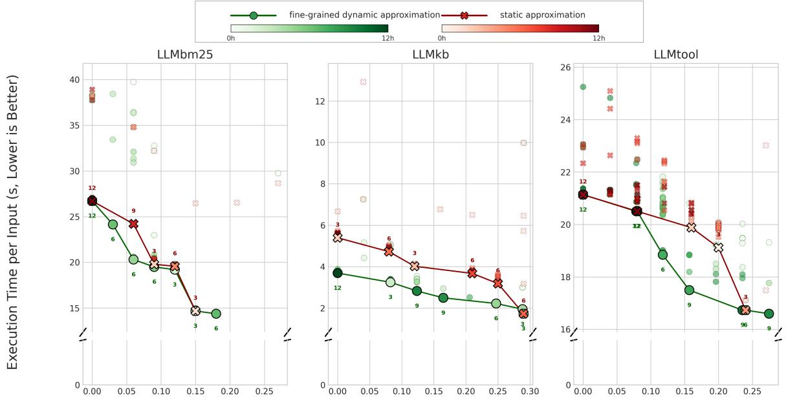
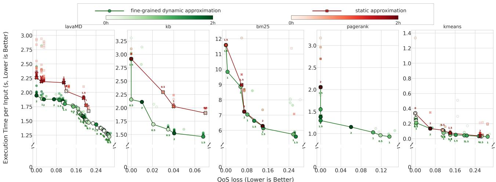

# APPROXMLIR: AN ACCURACY-AWARE COMPILER FOR COMPOUND ML SYSTEMS

Hao Ren 1 Yi Mu 1 Sasa Misailovic 1

## ABSTRACT

Many compound AI systems are inherently approximate because the ML components (e.g., a large language model) are probabilistic models and the non-ML components (e.g., retrieval-augmented generation) are heuristic. Such systems benefit from trading off result quality for improved performance. While extensive work exists on approximating ML and non-ML components individually, the wide deployment of LLMs in compound systems presents significant opportunities for end-to-end, accuracy-aware compilation. However, tailoring approximations across these different components is challenging to implement. This difficulty comes from their reliance on different software stacks for compilation and execution, as well as deployment on different hardware.

To address these issues, we present ApproxMLIR, a reusable accuracy-aware compilation toolchain. ApproxMLIR introduces the approx MLIR dialect that serves as a unified and centralized interface for defining approximations and approx-opt, a reusable MLIR-based optimizer, which applies approximate transformations on ML and non-ML components. We evaluated ApproxMLIR on three compound AI systems, which combine LLMs with information retrieval tasks and tool calling. The evaluation shows that ApproxMLIR can effectively represent many common approximation choices, discover profitable points in the accuracy-performance tradeoff space and consistently achieve higher speedups compared to static approximation strategies.

## 1 INTRODUCTION

The modern trend of AI is shifting from stand-alone models to complex, multi-component applications, which comprise Large Language Models (LLMs) with non-ML components such as vector databases, search engines, and other traditional code (Zaharia et al., 2024). The components of compound AI systems are often probabilistic and/or heuristic by nature, which creates a natural tolerance for error. To reduce latency, energy consumption or monetary cost, many existing applications have used algorithmic approximations for LLM components (e.g., by substituting LLMs with smaller ones, or doing aggressive quantization) and non-LLM code (e.g., setting the parameters of algorithmic approximations or using system-level approximation techniques (Stanley-Marbell et al., 2020)).

However, realizing such opportunity and controlling approximation across a compound AI system is still very difficult. The biggest challenge is the fragmented compiler ecosystem, which forces approximation techniques to be implemented in ad-hoc, completely independent frameworks. The ML components (e.g., written in JAX or PyTorch) and non-ML components (e.g., written in C/C++) are written in, optimized, and deployed by entirely separate toolchains. Because these systems are so different (compilers, intermediate representations, runtime systems), there is no centralized location in the compilation process to perform accuracy-aware compilation across an end-to-end system.

The unification between various compilation flows, including ML and non-ML code, has been one of the major motivations for the MLIR (Multi-Level Intermediate Representation) compiler framework (Lattner et al., 2021). While MLIR provides the infrastructure for a unified IR, it does not directly address a fundamental approximation management issue: we lack a unified specification for defining approximations that can operate across all levels of this new hierarchy. For example, annotations in a specific IR are coupled to a single level of abstraction. Annotating at a low level (e.g. LLVM IR as existing tools do (Sampson et al., 2015)) means high-level semantics (e.g. loops, structured control flow) are already lost, while specifying approximation in a high-level Python library prevents fine-grained, low-level optimization opportunities. Also, even within MLIR, a naive in-place approach, such as binding approximation information as attributes to existing ops, has key issues: it would be invasive, i.e., require handling in many existing dialects, and insufficiently expressive, because attributes cannot define an approximation scope over an arbitrary region of code or represent dynamic logic like runtime bindings.

MLIR’s generality provides an exciting opportunity to extend it with accuracy-aware compilation, which discovers substantial gains in performance and resource efficiency by trading small sacrifices in quality and manages approximation choices across multiple components at runtime. The core task of an accuracy-aware compiler is to find the optimal combination of approximation knobs, which are discrete parameters that control the accuracy-performance trade-off for different parts of the code (Misailovic, 2022). Given a high-level, end-to-end quality-of-service (QoS) specification from the user, the compiler autotunes the application by exploring the configuration space to find settings that maximize performance while satisfying the QoS constraints. The configuration search space is often large. The final output of this process is a Pareto frontier, also known as a tradeoff curve, which represents a set of optimal configurations in the quality-performance tradeoff space. It gives a user the freedom of choosing acceptable accuracy-performance tradeoffs dynamically, on demand.

Our Work: ApproxMLIR We present ApproxMLIR, a MLIR-based compiler toolchain for unified accuracy management across ML and non-ML components. ApproxM-LIR comprises the approx dialect, a modular and noninvasive specification for accuracy-aware compilation, and compiler passes and runtime system designed to find the optimal accuracy-performance trade-off for a compound AI system, given a user’s Quality of Service (QoS) requirement. ApproxMLIR achieves this goal by (1) searching a large space of configurations—sets of parameters that define an end-to-end approximation strategy, (2) approximating the system via approx-opt, and (3) emitting fine-grained dynamic approximation semantics through our runtime system, approx-runtime.

The core of our system is the approx MLIR dialect, which serves as the single, centralized interface for approximation management across computations. This dialect provides the specification for approximation, while an external autotuner provides the strategy for searching the accuracyperformance tradeoff space. We use MLIR based on two considerations. First, the autotuner only needs to understand the approx dialect. It does not need to know how to transform any concrete MLIR operations, which is especially important because MLIR operation interfaces evolve rapidly. Second, it enables ApproxMLIR to approximate IRs of different levels simultaneously.

We evaluate our system on three compound AI systems and five non-ML kernels, which serve as tools in these compound AI systems. Our ApproxMLIR implementation supports JAX frontend for the ML components and C++ frontend via Polygeist (Moses et al., 2021) for non-ML components. We use Gemma 3 variants as the LLM in our evaluation. ApproxMLIR finds profitable tradeoff points and consistently achieves better speedups compared to static approximation methods. For instance, the LLM + RAG (kb) benchmark demonstrated speedups of 2.64x at a 6% QoS loss and 3.04x at a 9% QoS loss. Also, it yields superior accuracy-performance trade-off curves (Pareto frontiers) than static methods, giving users greater control over the quality-performance tradeoff.

## Contributions. The paper makes several contributions:

• We introduce the approx dialect, a MLIR dialect that serves as a unified and centralized interface for defining approximations. It enables intuitive specification of approximation scopes and parameters across multiple levels of abstraction, and across ML and non-ML components in a compound AI system. We also provide frontends for expressing knobs for modern MLIR toolchains including C/C++ comments and Python APIs.

• We develop a reusable MLIR-based optimizer, named approx-opt, which implements the compiler passes necessary to lower the approx dialect and apply approximate transformations on ML and non-ML components.

• We build an accuracy-aware compilation tool-chain that integrates approx-opt with an external search framework (OpenTuner) and our runtime system, approx-runtime. This toolchain holistically optimizes end-to-end compound AI systems by co-tuning both ML and non-ML components through the common approx dialect interface.

• We evaluate our system on three compound AI systems, which combine LLMs with information retrieval tasks and tool calling. ApproxMLIR consistently achieves better speedups compared to non-approximated MLIR and static approximation strategies. We open-source the compiler, which is available at https://github.com/ uiuc-arc/approxMLIR.

## 2 EXAMPLE: BM25 RAG

Retrieval-Augmented Generation (RAG) framework aims to improve the trustworthiness of generated text and prevent LLM hallucinations by connecting a Large Language Model (LLM) to an external data source. BM25 is a popular keyword-based retrieval algorithm. It ranks documents in the database based on how often the words from the user query (especially rare ones) appear in the document, relative to the document size. It is one of the most common retrieval algorithms used by modern RAG workflows.

Figure 1 (left) presents the basic RAG workflow. It first calls a ranking function that scores documents using BM25 algorithm and retrieves the top ranked ones, then constructs the prompt. Those functions are implemented as C++ code. Finally, the program calls the (Generate(LLM, context)) function, which invokes the LLM inference to produce the final result. BM25 document scoring and retrieval compiles via Polygeist to LLVM. The LLM generation compiles via JAX to StableHLO.

  
Figure 1. A pseudocode of example compound AI application (left) and the illustration of a challenge in approximating compound AI systems (right): Non-ML and ML components are compiled with fragmented toolchains and some relevant semantic information is lost after lowering from high to low level IRs.

Approximation Opportunities. There are several opportunities for approximation in both the non-ML and ML components of the program:

• Corpus Subsetting Knob This approximation applies during the initial preprocessing stage. It uses function substitution. The system may use a version that probabilistically skips documents, reducing the total number of documents that are considered for the search.

• Term Scoring Knob This approximation applies during the main scoring loop, which is executed for each unique term in the query. It uses function substitution to replace the exact scoring function. Based on a runtime state, the system may skip the scoring calculation for a document with a 10% or 20% probability.

• Context Selection Knob This approximation applies during the prompt assembling stage, which truncates the prompt based on runtime state such as similarity of the retrieved results.

• LLM approximation This approximation applies during generation stage, which is executed per retrieval. We factor out the ML kernels to be substituted by their approximated variants.

Quality Metric. The inherently approximate nature of this computation requires a user to specify the QoS metric. For compound AI systems where the LLM returns the answers to user’s questions, a common metric is accuracy, the fraction of correct answers relative to the total number of queries.

## 2.1 Challenges

1. Fragmented toolchains. Each tool chain (e.g. Polygeist, JAX) compiles separately and requires the implementation of separate optimization passes. Figure 1 (right) outlines the separate compilation of components in BM25 RAG. There is no convenient way to jointly tune or coordinate these approximations (either off-line or at runtime).

2. Prior unification was not convenient. Tools like ApproxHPVM (Sharif et al., 2019) and ApproxTuner (Sharif et al., 2021) unify heterogeneous approximate computation at the level of LLVM IR instructions and CUDA kernels. That approach is overly low-level for advanced optimization, as it is difficult to maintain the high-level program construct (e.g., tensor operations become pointer arithmetic, kernels like matrix multiplications become just loop nests).

3. Static approximation can be inflexible. Performing approximation at runtime (e.g., to adjust to input characteristics or system’s energy requirements) can lead to better accuracy-performance trade-offs. While there is a long line of works that propose dynamic approximation in classical approximate programs (Baek & Chilimbi, 2010; Hoffmann et al., 2011; Hoffmann, 2015; Mitra et al., 2017; Xu et al., 2018; Pei et al., 2019), it is not natively supported in the MLIR toolchain.

4. MLIR’s gap. Current MLIR dialects provide multi-level infrastructure but lack approximation support. Attaching approximation as attributes to existing ops would be invasive because it requires modifying every dialect’s transformation passes to preserve metadata. For example, consider attaching an approx.transform = "skip" attribute to an scf.for loop. When a standard tiling pass (e.g., in the linalg or affine dialect) rewrites this loop into outer and inner loops, the attribute is silently dropped by the transformation, losing the approximation metadata entirely. A separate dialect can avoid this by centralizing approximation management into first-class operations that are explicitly handled during lowering.

## 2.2 ApproxMLIR Solution for BM25 RAG

The approx dialect unifies approximate transformations and the management of accuracy knobs within the single MLIR compiler tool chain.

Concretely, ApproxMLIR addresses the challenges above as follows. First, both the non-ML path (BM25 scoring, compiled via Polygeist to scf/arith dialects) and the ML path (LLM generation, compiled via JAX to stablehlo)

  
Figure 2. ApproxMLIR High-Level Compilation Workflow

are represented in MLIR, and each is wrapped with the common approx dialect, eliminating the fragmentation across toolchains (Challenge 1) while preserving high-level structure (Challenge 2). Second, the approx.knob operation provides a unified abstraction that connects each approximation site to the runtime system. For example, the BM25 corpus subsetting knob is expressed as:

%r = approx.knob(%n, ...) <{id = 1,   
params = "...",   
transform\_types = "..."}> ({   
approx.decision\_tree(%state) <{   
runtime = "get\_retrieval\_state",   
thresholds = [...],   
decisions = [...],   
transform\_type = "func\_substitute"}>   
// ... scoring loop ...   
approx.yield %scores   
}) -> ...

The decision tree operation enables approximation parameters to change dynamically based on runtime state (addressing Challenge 3). Third, because approximation is encoded as first-class approx operations rather than fragile attributes, standard MLIR lowering passes (tiling, bufferization, etc.) do not discard approximation metadata, the approx ops persist until they are explicitly lowered by approx-opt (resolving Challenge 4). Our evaluation in Section 7 confirms that this dynamic, end-to-end approach consistently yields better accuracy–performance trade-offs than static approximation strategies.

## 3 BACKGROUND

Knobs and Configurations. An approximation knob is a discrete-valued parameter of an approximation method (represented using integers in ApproxMLIR) that can be modified to control the quality, energy, and running time. A configuration assigns an approximation knob value to every operation in the program.

Application-level QoS is an application-specific metric defined by a real-valued function for a specified configuration (the “QoS Evaluator”), along with a lower-bound value for the desired application quality (the “QoS Target”). This function should quantify how well the application delivers on its desired goals. For example, for a RAG pipeline, the QoS can be defined by the ratio of correctly answered questions in an evaluation dataset. We follow the practice from approximate computing where QoS is characterizing the quality of the output, with the execution time not included.

Tradeoff Curves. A tradeoff point is a triple, (QoS, ExecTime, config), which specifies the quality-ofservice and the performance of the configuration on representative inputs. A tradeoff curve (Pareto frontier) is a set of non-dominated points in the tradeoff space (i.e., those that do not have both lower quality and performance).

Approximate Transformations. One set of transformations reduces the overall computation. Instead of executing all code, some parts are selectively skipped. They can be fine-grained, like loop perforation (Misailovic et al., 2010; Sidiroglou-Douskos et al., 2011), which modifies a loop’s stride to execute only a subset of its iterations or memoization, which reuses previously computed results (Chaudhuri et al., 2011; Samadi et al., 2014). They can also be coarsegrained, like task skipping (Rinard, 2006; Meng et al., 2009), where entire function calls or regions of code are bypassed to save time. Another common approximation method is function substitution (Zhu et al., 2012; Ansel et al., 2011), which replaces a call to a precise but computationally intensive function with a faster, user-provided approximate version. A complementary set of techniques focuses on data formats, to reduce the computation and size of models. For example, using 16-bit half-precision floats (FP16) instead of 32-bit floats, or quantization, which converts floating-point numbers into low-bit integers (e.g., INT8) (Frantar et al., 2023; Lin et al., 2024; Cheng et al., 2025; Yang et al., 2025). Machine learning models can also be made smaller and faster through pruning (Ma et al., 2023; Sun et al., 2024; Wei et al.,

2025; Liu et al., 2025), a process that removes unimportant weights or even entire channels from the network.

However, while all these strategies are powerful, their implementations today are deeply fragmented. This implementation gap highlights the need for a unified compiler infrastructure that can manage all these different types of approximations holistically.

## 4 APPROXMLIR DIALECT

## 4.1 Overview

Figure 2 shows the high-level compilation workflow of ApproxMLIR, with three main stages. The front-end takes in ML and non-ML kernels that compose the compound AI system and the QoS specification of user. The ML kernels are written in JAX and non-ML kernels are written in C/C++, with QoS specs and other user interface detailed in Section 5.1. MLIR-compatible frontends like Polygeist (for C/C++) and the JAX toolchain lower this source code into standard MLIR modules.

These modules are then processed by the core ApproxM-LIR toolchain. At its center is the approx dialect, which serves as the unified interface for defining approximation knobs across all components, detailed in Section 4.2. The framework uses External Modules like OpenTuner to autotune the system, searching a large configuration space to find the optimal accuracy-performance trade-off. The chosen configuration is applied by approx-opt, containing a set of MLIR compiler passes detailed in Section 5. The approx-runtime enables dynamic approximation, allowing ApproxMLIR to select configurations at runtime.

Finally, the optimized and approximated MLIR modules are passed to the Back-end for code generation. We use standard MLIR-compatible backends: LLVM codegen to produce executables for the non-ML parts and the IREE to create Python Artifacts for the ML components.

Why do we need a separate dialect? Designing a separate MLIR dialect, instead of using a simpler approach like attaching attributes to existing MLIR operations, is motivated by two key traits: centralization of accuracy management and runtime awareness.

Binding approximation attributes to each enclosed operation would be invasive because it would require modifying all enclosed operations. The solution is centralizing approximation management and implementation into one dialect, such that the dialect has great extensibility when adding either a capability related to approximate computing or an approximation strategy implementation, as discussed in Section 4.2.1 and Section 4.2.2. A centralized dialect also provides a unified interface for autotuner. An autotuner does not need to understand the semantics of concrete

MLIR operations such as scf.for, stablehlo.dot, or any other dialect. It only needs to find all approx.knob operations in the code and interface via their attributes. This design effectively decouples the search problem from the compilation problem.

A separate dialect can define its own operations to handle complex and dynamic systems. Compound AI systems are often stateful, meaning a static approximation is not always optimal and potentially unsafe, because errors can be amplified or suppressed based on the program’s running state. To handle such issues, the approx dialect offers operations that enable fine-grained dynamic approximation, such as approx.decision tree, listed in Table 1.

## 4.2 The approx Dialect

The dialect provides a wide range of capabilities: approximation interface by approx.knob operation, dynamic approximation by approx.decision tree operation, and approximation strategy by approx.transform, with a concise yet powerful interface described in Table 1.

## 4.2.1 Specification of approximate transformations

The operation approx.transform specifies the concrete description of an approximation. It has two attributes: transform type to define approximation strategy (e.g., a loop perforation), and transform value to define approximation intensity mapped to an integer (e.g. 0 for exact, 1 for mild, 2 for aggressive). The transform operation only specifies implementation, the actual approximation is performed by a MLIR pass detailed in section 5.5.

To add a new implementation, we can simply add a new rewrite rule to the corresponding MLIR pass with no new MLIR operations needed. This design makes the superposition of approximation strategies easy, because we can compose an arbitrary number of transform operations within a region. Also, developers can easily add support for new approximations or new target dialects by simply adding more rewrite rules, detailed in Appendix D. Thus, testing and developing a new pass can be done with MLIR infrastructure.

## 4.2.2 Specification of approximation management

Unlike the transform op, which describes the implementation details of an approximation strategy, the approximation management operations, including the approx.decision tree and approx.knob operations, support higher-level capabilities, such as enabling fine-grained dynamic approximation, representing the scope of approximation, etc.

Adding management operation is also different from adding an approximation implementation because it must be lowered before the concrete approximation implementation.

Table 1. Concise Specification of the ApproxMLIR approx Dialect Operations. The full specification is in Appendix A.  


For example, to add the dynamic approximation, we need to define the approx.decision tree operation which has 4 attributes: runtime specifies which function in the runtime library we use, transform type specifies which strategy each branch applies, thresholds and decisions specifies the condition and decision of each branch. Also we need to define its lowering pass, detailed in section 5.3. Similarly, for a knob operation to define an interface with external modules such as an autotuner, we define approx.knob operation which has 3 attributes: id for tracking the knob, transform types for specifying acceptable approximation strategy, params for encoding information that is used to guide autotuning and apply approximation, which will be explained further in Section 5.2. The knob operation has a terminator approx.yield.

Approximate computations can produce invalid results that propagate errors across components. To guard against this, the approx dialect provides the approx.try operation, which implements a try-check-recover pattern introduced by previous works (De Kruijf et al., 2010; Achour & Rinard, 2015; Joshi et al., 2020). It takes a user-defined check region that validates the approximate result (yielding an i1), and a recover attribute naming a fallback function (which a developer writes to, e.g., re-execute the code or do some other corrective action). Like approx.decision tree, safety contracts are a management operation, orthogonal to the concrete approximation strategy and lowered independently before approx.transform is applied.

We want to make this separation between management and implementation clear because management is decoupled from implementation. For example, an operation approx.decision tree manages the ”when” approximation happens. It is independent of ”how” approximation happens (i.e. the approximation implementation). The idea also decouples the lowering of approximation management and the lowering of approximation implementation into separate passes. Specifically, for all the concrete transform types (e.g. loop perforation), we only need to implement the decision tree lowering once.

## 4.3 Source Code Annotations

Annotation for non-ML kernel. ApproxMLIR supports two annotation formats for C/C++ kernels, both generate intermediate MLIR annotation operations. The first format uses structured C++ comments above the target function:

```scss
// @approx:decision_tree {
// state_function: get_state
// thresholds_lower: [0]
// thresholds_upper: [100]
// decision_values: [0, 1]
// transform_type: func_substitute
// }
```

The second format uses #pragma directives, which support backslash line continuations for readability:

```python
#pragma approx decision_tree \
state_function=get_state \
thresholds_lower=[0] \
thresholds_upper=[100] \
decision_values=[0, 1] \
transform_type=func_substitute
```

  
Figure 3. Example: Loop perforation by ApproxMLIR.

Both formats are semantically equivalent and can be mixed within the same source file.

Annotation for ML kernel Similar to non-ML kernel annotation, for ML kernels, we have similar Python API, whose internal implementation will be detailed in section 5.4.

```python
approx.Knob(kernel = kernel_exact,
decision_tree=approx.DecisionTree(
runtime_function=get_state,
thresholds_range=[(0, 100)],
decisions_values=[0, 1],
transform_type = "loop_perforate"
))
```

Both annotations share four fields. The field runtime specifies the name of a user-provided function for dynamic approximation detailed in the section 5.4; threshold range and decision values specify the decision tree, detailed in the section 4.2.2; and transform type specifies the actual approximation strategy to be applied, including loop perforate, function substitute and task skipping.

## 5 APPROXMLIR COMPILATION TOOLCHAIN

This section describes the ApproxMLIR compiler passes and the passes that lower the ApproxMLIR code into ordinary MLIR code. We also describe the backends and the autotuner. Figure 4 presents the overview of the compilation system, as the ApproxMLIR dialect, the compiler and the autotuner interact. Figure 3 gives the description of the compilation steps on a running example.

  
Figure 4. ApproxMLIR Toolchain Overall Architecture

## 5.1 Translate Source Annotations to ApproxMLIR

An error knob is implemented by the approx.knob operation, which is emitted by identifying a target region of code in the input ML or non-ML kernel using annotations, as shown in Figure 3, step 0. The knob operation encloses the region of code to approximate so that it can enable future approximation pass to transform it. The enclosed region (e.g., the for loop in our example) is then hoisted into the body of the knob operation. During this process, attributes for the knob, such as its id, parameters, are attached to the operation.

## 5.2 Generate Autotuning Code

ApproxMLIR compiler next generates code that interfaces with standard autotuning libraries. Auto-tuning starts by parsing all approx.knob ops within the MLIR representation of the system. The tunable parameters whose ranges are specified in params from these knobs are composed into a configuration array and passed to the OpenTuner interface. OpenTuner’s built-in search algorithms then select a new configuration to evaluate. This new configuration is encoded and written back into the MLIR code by setting the params attribute of the corresponding approx.knob operation, shown in step 1, Figure 3. params contains all the encoded information (e.g., decision thresholds, selected transformations) of the enclosed operations. We implement the auto-tuning workflow using a standard autotuner framework, which takes as input the list of configurations from the knob specifications. We use OpenTuner (Ansel et al., 2014) as a prototypical case of autotuner designed to search large configuration spaces.

## 5.3 Emit and Lower Approximation Management Operations for Non-ML and ML Operations

After autotuner configures the params of the knob op, we emit the rest of the management operations (i.e. decision tree op in figure 3) by decoding the params field. The transform type, thresholds, and decision values will be determined by the decoding phase, meaning both the management of approximation and the implementation of approximation are tunable.

These management operations are lowered by a MLIR pass to standard MLIR. As shown in Figure 3 step 3, the decision tree operation is lowered into standard MLIR controlflow operations. The branch to take is determined by comparing the runtime return value against a set of thresholds. For example, if return value is larger or equal to zero and less than the first threshold, it goes to the first branch.

Each branch will first copy the exact operations enclosed in the knob. For a non-ML operation, it will emit an extra transform operations in its branches, whose knob value is set by the decision of the branch. For a ML kernel, it will emit a return statement, this will be explained in the section 5.4.

## 5.4 Runtime System (approx-runtime)

The runtime system is the most critical component in the ApproxMLIR toolchain. The goal is to (1) support management operations. (2) support systematic auto-tuning.

Dynamic approximation. ApproxMLIR binds the userdefined runtime functions that enable the dynamic approximation, which depends on concrete logic provided by the runtime library in the form of custom runtime functions. For instance, a user might write a function to check a system’s execution state or analyze input data characteristics to guide the approximation on a knob. The binding process searches the user-provided runtime library and links the previously emitted call instruction to the corresponding user-written function, according to the runtime attribute in the decision tree function. To add a user-defined library, the user can simply define the function in the runtime directory and indicate the function name in the annotation.

Autotuning. ApproxMLIR enables autotuning by having a library for parsing and modifying MLIR code, including matching the knobs and handling encoding and decoding of the params field. The user will inherit from a welldefined openTuner driver class, which contains calls to the runtime functions by default. User only needs to define run application functions which calls the user workload and returns the corresponding accuracy and performance for auto-tuner profiling. Since the parsing and modification of internal MLIR files are completed by the default driver, the user does not need to know any specific approx operations.

## 5.5 Apply the Transform Operation

With the management approximation operations lowered and runtimes bound, the final step is applying the concrete approximation implementation. These transformations are described by approx.transform operations, which were originally nested within the bodies of the approximation management operations. In Figure 3, after step 3, they now reside inside the regions of the resulting standard control-flow structures (the case blocks of an scf.index switch).

Each approx.transform operation specifies a static approximation strategy through its attributes. Lowering it will apply the concrete approximation to its parent region by a MLIR pass. Our implementation includes three classical approximate transformations as rewrite rules: loop perforation, which modifies the stride of a loop to skip iterations; function substitution, which replaces a call to an exact function with a call to a user-provided approximate version; and task skipping, which rewires control flow to skip branches.

Transform operation lowering is implemented by a MLIR rewrite rule (i.e. RewritePattern), which invokes MLIR driver API to greedily apply each applicable rule. For example, loop perforate rewrite rule will match any existing transform operation and compare the transform type attribute with ”loop perforate”. If it’s matched, it will rewrite the first loop within the parent region of the transform op.

Although these transformations are static and rigid on their own, they are powerful when embedded in the dynamic constructs. For example, aggressively perforating a loop is often unsafe, but doing so conditionally based on runtime data via a decision tree can yield significant performance gains while maintaining the required quality of service.

The MLIR modules from Figure 3, step 5, are in the standard dialects which are legal input to MLIR-compatible backend, including LLVM backend and IREE compiler backend. For non-ML kernel, all the operations will be lowered with their lowering pass well-defined in MLIR infrastructure, into a LLVM file, which is then compiled into a target platform executable. For the ML kernel, the dynamic selection logic (i.e. the control flow in Figure 5), detailed in section 5.4, is compiled into an executable targeting CPU. The ML kernel is compiled into differently approximated artifacts by IREE compiler backend (e.g. LLM-pro and LLM-fast in Figure 5) and approx-runtime will then select different artifacts, offloading them to GPU during run time.

  
Figure 5. Approximated artifact produced by ApproxMLIR. The compiler applies approximations in ML or non-ML component. All the inserted knobs are uniformly orchestrated by approx-runtime, yielding the tradeoff curve.

## 6 EXPERIMENTAL METHODOLOGY

ApproxMLIR uses a systematic and centralized approach to enable approximation on compound AI systems. The same approximation implementation and management can be adapted to various use cases. We evaluate ApproxMLIR on various workloads, including 5 kernel benchmarks and 3 compound AI system benchmarks.

Benchmarks. We apply approxMLIR on two categories of benchmarks, kernels and compound AI systems. A compound AI system consists of an LLM, kernel(s) and orchestration logic. The kernel benchmarks include:

• kmeans: a data clustering tool (Hartigan & Wong, 1979),

• lavaMD: a particle simulation algorithm (Fink et al., 2023),

• pagerank: an algorithm for ranking documents for search (Brin & Page, 1998)

• bm25: a ranking algorithm (Robertson & Zaragoza, 2009)

• knowledge base (kb): ranking algorithm implemented by ranking vectorized text; it compares distance from question embedding and the text embedding in the knowledge base (Cakaloglu et al., 2019).

The compound AI system benchmarks represent popular examples of compound AI systems:

• LLM + RAG (bm25). It uses bm25 to retrieve relevant data from data pool. The retrieved data will be used to generate an answer for a question.

• LLM + RAG (kb). It uses knowledge base to retrieve data using vectorized data pool. The retrieved data will be used to generate an answer for a question.

• LLM + tool invocations. It comprises a triage LLM which selects the tool for answer generation. The tool can be one of the kernels (i.e., bm25, lavaMD, pagerank and kb).

Appendix B presents more details of benchmarks implementation. Table 2 shows the number of possible configurations of each benchmark.

Large Language Model. The core of a compound AI system is LLM inference. We select Gemma 3 (Gemma Team, 2025) as LLM because they are open-source, JAXsupported, IREE-compatible and has numerous released variants (e.g. different model sizes). We use 1b and 4b Gemma for demonstration.

Datasets. The input to the non-ML kernels (e.g. kmeans) are randomly generated. We use NQ dataset for LLM + RAG (bm25) benchmark and LLM + RAG (kb) benchmark (Kwiatkowski et al., 2019). The corpus consists of 90011 documents. We use the augmented-NQ dataset for LLM + tool invocation benchmark, where the augmentation is customized for the tool invocation, including the questions that involve our tools (e.g. clustering related questions for kmeans).

The dataset is separated into tuning data and evaluation data, which are both randomly sampled. We made sure there is no overlap between tuning data and evaluation data, showing the generality of our tuning. The size of the evaluation dataset is 5x the size of the tuning dataset.

Quality of Service Definition. The tuning process of the ApproxMLIR requires the user to dictate how the QoS is calculated. In our experiment, for compound AI system (comprising the LLM and the tool) the accuracy is:

Table 2. Comparison of benchmarks with the number of error knobs and configuration.  


$$
\tag{1}
$$

The NQ dataset provides one or more short answers. A question is considered correctly answered, receiving a score of 1, if the short answer is in model’s generated answer. Otherwise, the question receives a score of 0.

For non-ML kernels, the accuracy is defined to be L2 norm error for kmeans and lavaMD:

$$
\tag{2}
$$

where the yexact is defined to be the output by the exact program and the yapprox is defined to be the output by the approximated program compiled by approxMLIR.

For pagerank, RAG (bm25) and RAG (embedding), accuracy is calculated using the Rank-Biased Overlap (RBO). The RBO similarity is calculated using the persistence parameter p = 0.95, which is chosen to give a more systemcentric ranking measurement (Webber et al., 2010).

Given S and T as the two ranked lists (exact and approximate), and Ad = |Sd ∩ Td|/d. Here, Sd and Td are the top d of elements in lists S and T .

The accuracy is defined as:

$$
\tag{3}
$$

where D = min(1000, max(|S|, |T |)) is the depth of comparison. The denominator is the maximum possible RBO score for a list of depth D, where 1000 is selected to truncate the ranking time.

## 7 EVALUATION

## 7.1 ApproxMLIR Compared to Non-Approximate MLIR and Static Approximations

Figure 6 presents the comparison with 3 compound AI system benchmarks at 3 levels of QoS loss tolerance (3%, 6% and 9%). The y-axis represents the speedup of the approximate versions relative to the exact version of each compound system (dashed line). The results show the fine-grained dynamic auto-tuning, enabled by approx dialect design and our toolchain implementation, yields better performance than the statically approximated system. The reason is that a static approximation cannot exploit the state of the application or the input characteristics, whereas a fine-grained dynamic approximation can exploit them via user-defined runtime functions through approx-runtime. For some benchmarks under certain QoS tolerance, there is no improvement over the static approximation. It happens because the configuration space for the fine-grained dynamic approximation is much larger than the static approximation, so the most optimal configuration might not be exploited by the autotuner in our time budget (12 hours).

Despite this, the end-to-end approximation exhibits better performance than the per-kernel ones. For instance, the LLM + RAG (kb) benchmark, ApproxMLIR (orange bar) achieves speedups of 2.64x, 2.64x, and 3.04x at the 3%, 6%, and 9% QoS loss levels, respectively. The speedups in the experiments differ by up to 18.6%, 19.5%, and 3.7% between the tuning set and the evaluation set for the LLM + bm25, LLM + kb, and LLM + tool benchmarks, respectively. Also, we can see that most of the approximations by ApproxMLIR give substantial speedup, when sacrificing acceptable QoS.

## 7.2 Comparing ApproxMLIR’s Fine-grained Dynamic Approximation Tuning to Static Approximations Tuning

We measure how tuning is improved by comparing the Pareto set generated by fine-grained dynamic approximation against the Pareto set generated by static approximation.

Figure 7 and Figure 8 present the Pareto frontiers of the three compound AI applications and five kernels. In each plot, the x-axis represents the QoS loss of the computation (lower is better) and the y axis presents the execution time (in seconds per input in the tuning dataset; lower is better). The small numbers on the plots are tuning time where configuration is explored in hour. Each point represents one approximate configuration explored by approx-opt autotuner. The blue line represents the Pareto frontier of the dynamic approximation. The red line represents the Pareto frontier of the static approximation.

For the three compound AI systems, the results show that dynamic approximation (blue line) yields better tradeoffs than the static approximation, without a decision tree (red line). They overlap at some QoS loss, for the similar reason as in the previous section. Also, the dynamic approximation gives more trade-off points in the Pareto set, which allows user to have more control over the performance/accuracy trade-off. We observe that such improvement is consistent over benchmarks of different granularity: both compound AI system and individual kernel benefit from fine-grained dynamic approximations.

  
Figure 6. Difference of performance on evaluation set, given QoS loss 3%, 6% and 9%

  
QoS loss (Lower is Better)  
Figure 7. Tuning trace on compound AI systems shows approx dialect’s design improves the tuning across components and systems

## 7.3 Compiler Statistics

The ApproxMLIR takes on average 120 seconds to compile ML kernels as parameterized ML kernels are memory-heavy and takes on average 5 seconds to compile non-ML kernels. The autotuning, which is set to be 12 hours for compound AI system benchmarks and 2 hours for kernel benchmarks in Figure 7, shows that such compilation overhead is acceptable to yield good tuning curves. The configuration used for evaluation set is selected from the Pareto frontier of the tuning set. By comparing Figure 6 and Figure 7, we can see the QoS-performance trade-off of tuning set can generalize to the evaluation set. It also shows the tuned system can have significant improvement on end-to-end performance while sacrificing acceptable QoS.

## 8 RELATED WORK

Accuracy/performance trade-offs in compound AI systems The evolution from simple generation (Radford & Narasimhan, 2018; Devlin et al., 2019; Touvron et al., 2023) to multi-component compound AI systems (Lee et al., 2025), such as Retrieval-Augmented Generation (RAG) (Lewis et al., 2021), has introduced new optimization challenges. Traditional compilation techniques for ML and non-ML code are conservative, as they are required to maintain the the semantic equivalence of the compiled program across the compilation process (Lattner & Adve, 2004; Kotsifakou et al., 2018). However, the components of compound AI systems, particularly the ML models, are often best-effort and heuristic in nature. Such inherent imprecision means the end-to-end system has a natural tolerance for some degree of error, creating an opportunity to strategically sacrifice a small amount of accuracy for significant performance gains.

  
Figure 8. Tuning trace on non-ML kernels shows approx dialect’s design improves the trade-off tuning across components and systems

Accuracy-aware compilation The idea of trading accuracy for performance is not new. A number of approximate compilation frameworks (Li et al., 2018; Zhao et al., 2023) have been developed to explore this trade-off. These frameworks share a common set of concepts. They take a Quality of Service (QoS) specification, which defines the tolerance on the end-to-end accuracy, and approximate the programs such that it achieves the best performance while satisfying the QoS specification. An end-to-end approximation strategy is defined by a configuration, which is a set of parameters that describe how approximation should be applied to each of the knobs. While the knob abstraction and source code annotations have been introduced by early accuracy-aware compilers in the early 2010s, these abstractions still have not been introduced in the MLIR framework, nor unified across ML and non-ML frameworks until ApproxMLIR.

There have been many analyses to establish safety and accuracy of approximate computations (Misailovic et al., 2011; Sampson et al., 2011; Carbin et al., 2013; Misailovic et al., 2014; Fernando et al., 2019; Dal Lago & Gavazzo, 2022). Related techniques in formal methods focus on verifying approximated DNNs (Ugare et al., 2022; 2023; Singh et al., 2025) With explicitly exposed approximation primitives in the intermediate representation, ApproxMLIR enables a clear interface for introducing the implementations of such analyses in the MLIR framework.

Compiler infrastructure for machine learning The modern compiler infrastructure for machine learning is a complex and fragmented ecosystem. It includes various front-ends for ingesting code from languages like Py-Torch (Paszke et al., 2019), JAX (Bradbury et al., 2018), as well as non-ML frontends like Polygeist for C/C++ and Mojo compiler for Python (Modular, 2025). The middleend, where optimization occurs, has historically been fragmented with a variety of tools like TVM (Chen et al., 2018), IREE (The IREE Authors, 2019), and Triton (Tillet et al., 2019). These tools set the engineering foundation for performing unified analysis and optimization across compound AI systems. We build our system on top of the MLIR infrastructure, which provides a unified and extensible infrastructure that can represent and optimize code at multiple levels of abstraction, making it well-suited for the challenges of compiling compound AI systems.

## 9 CONCLUSION

Many compound AI systems benefit from trading off result quality for improved performance, but existing compilation stacks do not allow for unified and centralized approximation management. To address these issues, we presented ApproxMLIR, which offers a unified approximation interface in MLIR. Our evaluation shows that ApproxMLIR can effectively represent many common approximation choices, discover profitable points in the accuracy-performance space, and consistently achieves higher speedups compared to static approximation strategies. ApproxMLIR gives a small common set of approximation primitives that can be used in various practical applications.

## ACKNOWLEDGMENTS

We thank anonymous reviewers and our shepherd for their feedback. This research was supported in part by the National Science Foundation (Grants No. CCF-2217144 and CCF-2313028). This research used DeltaAI advanced computing and data resource, supported by the National Science Foundation (award OAC 2320345) and the State of Illinois.

## REFERENCES

Achour, S. and Rinard, M. C. Approximate computation with outlier detection in topaz. Acm Sigplan Notices, 50 (10):711–730, 2015.

Ansel, J., Wong, Y. L., Chan, C., Olszewski, M., Edelman, A., and Amarasinghe, S. Language and compiler support for auto-tuning variable-accuracy algorithms. In International Symposium on Code Generation and Optimization (CGO 2011), pp. 85–96, 2011. doi: 10.1109/CGO.2011.5764677.

Ansel, J., Kamil, S., Veeramachaneni, K., Ragan-Kelley, J., Bosboom, J., O’Reilly, U.-M., and Amarasinghe, S. Opentuner: an extensible framework for program autotuning. In Proceedings of the 23rd International Conference on Parallel Architectures and Compilation, PACT ’14, pp. 303–316, New York, NY, USA, 2014. ISBN 9781450328098. doi: 10.1145/ 2628071.2628092. URL https://doi.org/10. 1145/2628071.2628092.

Baek, W. and Chilimbi, T. M. Green: a framework for supporting energy-conscious programming using controlled approximation. In Proceedings of the 31st ACM SIGPLAN Conference on Programming Language Design and Implementation, PLDI ’10, pp. 198–209, 2010. ISBN 9781450300193. doi: 10. 1145/1806596.1806620. URL https://doi.org/ 10.1145/1806596.1806620.

Bradbury, J., Frostig, R., Hawkins, P., Johnson, M. J., Leary, C., Maclaurin, D., Necula, G., Paszke, A., VanderPlas, J., Wanderman-Milne, S., and Zhang, Q. JAX: composable transformations of Python+NumPy programs, 2018. URL http://github.com/jax-ml/jax.

Brin, S. and Page, L. The anatomy of a large-scale hypertextual web search engine. Computer Networks and ISDN Systems, 30(1):107–117, 1998. ISSN 0169-7552. doi: https://doi.org/10.1016/S0169-7552(98)00110-X. URL https://www.sciencedirect.com/ science/article/pii/S016975529800110X. Proceedings of the Seventh International World Wide Web Conference.

Cakaloglu, T., Szegedy, C., and Xu, X. Text embeddings for retrieval from a large knowledge base, 2019. URL https://arxiv.org/abs/1810.10176.

Carbin, M., Kim, D., Misailovic, S., and Rinard, M. C. Verified integrity properties for safe approximate program transformations. In Proceedings of the 2013 ACM SIGPLAN Workshop on Partial Evaluation and Program Manipulation, PEPM ’13, pp. 161–170, 2013. doi: 10.1145/2426890.2426919.

Chaudhuri, S., Gulwani, S., Lublinerman, R., and Navidpour, S. Proving programs robust. In Proceedings of the 19th ACM SIGSOFT symposium and the 13th European conference on Foundations of software engineering, pp. 102–112, 2011.

Chen, T., Moreau, T., Jiang, Z., Zheng, L., Yan, E., Cowan, M., Shen, H., Wang, L., Hu, Y., Ceze, L., Guestrin, C., and Krishnamurthy, A. Tvm: an automated end-to-end optimizing compiler for deep learning. In Proceedings of the 13th USENIX Conference on Operating Systems Design and Implementation, OSDI’18, pp. 579–594, USA, 2018. ISBN 9781931971478.

Cheng, F., Guo, C., Wei, C., Zhang, J., Zhou, C., Hanson, E., Zhang, J., Liu, X., Li, H. H., and Chen, Y. Ecco: Improving memory bandwidth and capacity for llms via entropy-aware cache compression, 2025. URL https: //arxiv.org/abs/2505.06901.

Dal Lago, U. and Gavazzo, F. Effectful program distancing. Proceedings of the ACM on Programming Languages, 6 (POPL), jan 2022. doi: 10.1145/3498708.

De Kruijf, M., Nomura, S., and Sankaralingam, K. Relax: An architectural framework for software recovery of hardware faults. ACM SIGARCH Computer Architecture News, 38(3):497–508, 2010.

Devlin, J., Chang, M.-W., Lee, K., and Toutanova, K. Bert: Pre-training of deep bidirectional transformers for language understanding, 2019. URL https://arxiv. org/abs/1810.04805.

Fernando, V., Joshi, K., and Misailovic, S. Verifying safety and accuracy of approximate parallel programs via canonical sequentialization. Proceedings of the ACM on Programming Languages, 3(OOPSLA), oct 2019. doi: 10.1145/3360545.

Fink, Z., Parasyris, K., Georgakoudis, G., and Menon, H. Hpac-offload: Accelerating hpc applications with portable approximate computing on the gpu, 2023. URL https://arxiv.org/abs/2308.16877.

Frantar, E., Ashkboos, S., Hoefler, T., and Alistarh, D. Gptq: Accurate post-training quantization for generative pretrained transformers, 2023. URL https://arxiv. org/abs/2210.17323.

Gemma Team. Gemma 3 technical report, 2025. URL https://arxiv.org/abs/2503.19786.

Hartigan, J. A. and Wong, M. A. Algorithm as 136: A k-means clustering algorithm. Journal of the Royal Statistical Society. Series C (Applied Statistics), 28(1): 100–108, 1979. ISSN 00359254, 14679876. URL http://www.jstor.org/stable/2346830.

Hoffmann, H. Jouleguard: Energy guarantees for approximate applications. In Proceedings of the 25th Symposium on Operating Systems Principles, pp. 198–214, 2015.

Hoffmann, H., Sidiroglou, S., Carbin, M., Misailovic, S., Agarwal, A., and Rinard, M. Dynamic knobs for responsive power-aware computing. ACM SIGARCH computer architecture news, 39(1):199–212, 2011.

Joshi, K., Fernando, V., and Misailovic, S. Aloe: verifying reliability of approximate programs in the presence of recovery mechanisms. In Proceedings of the 18th ACM/IEEE International Symposium on Code Generation and Optimization, pp. 56–67, 2020.

Kotsifakou, M., Srivastava, P., Sinclair, M. D., Komuravelli, R., Adve, V., and Adve, S. Hpvm: heterogeneous parallel virtual machine. SIGPLAN Not., 53 (1):68–80, February 2018. ISSN 0362-1340. doi: 10. 1145/3200691.3178493. URL https://doi.org/ 10.1145/3200691.3178493.

Kwiatkowski, T., Palomaki, J., Redfield, O., Collins, M., Parikh, A., Alberti, C., Epstein, D., Polosukhin, I., Devlin, J., Lee, K., Toutanova, K., Jones, L., Kelcey, M., Chang, M.-W., Dai, A. M., Uszkoreit, J., Le, Q., and Petrov, S. Natural questions: A benchmark for question answering research. Transactions of the Association for Computational Linguistics, 7:452–466, 2019. doi: 10. 1162/tacl a 00276. URL https://aclanthology. org/Q19-1026/.

Lattner, C. and Adve, V. Llvm: A compilation framework for lifelong program analysis & transformation. In Proceedings of the International Symposium on Code Generation and Optimization: Feedback-Directed and Runtime Optimization, CGO ’04, pp. 75, USA, 2004. ISBN 0769521029.

Lattner, C., Amini, M., Bondhugula, U., Cohen, A., Davis, A., Pienaar, J., Riddle, R., Shpeisman, T., Vasilache, N., and Zinenko, O. MLIR: Scaling compiler infrastructure for domain specific computation. In 2021 IEEE/ACM International Symposium on Code Generation and Optimization (CGO), pp. 2–14, 2021. doi: 10.1109/CGO51591.2021.9370308.

Lee, Y.-A., Yi, G.-T., Liu, M.-Y., Lu, J.-C., Yang, G.-B., and Chen, Y.-N. Compound ai systems optimization: A survey of methods, challenges, and future directions, 2025. URL https://arxiv.org/abs/2506.08234.

Lewis, P., Perez, E., Piktus, A., Petroni, F., Karpukhin, V., Goyal, N., Kuttler, H., Lewis, M., tau Yih, W.,¨ Rocktaschel, T., Riedel, S., and Kiela, D. Retrieval-¨ augmented generation for knowledge-intensive nlp tasks, 2021. URL https://arxiv.org/abs/2005. 11401.

Li, S., Park, S., and Mahlke, S. Sculptor: Flexible approximation with selective dynamic loop perforation. In Proceedings of the 2018 International Conference on Supercomputing, ICS ’18, pp. 164–175, 2018. doi: 10.1145/3205289.3205315.

Lin, J., Tang, J., Tang, H., Yang, S., Chen, W.-M., Wang, W.-C., Xiao, G., Dang, X., Gan, C., and Han, S. Awq: Activation-aware weight quantization for llm compression and acceleration, 2024. URL https://arxiv. org/abs/2306.00978.

Liu, L., Zhao, X., Li, G., Li, D., Wang, M., Han, Y., Li, X., and ying wang. BaWA: Automatic optimizing pruning metric for large language models with balanced weight and activation. In Forty-second International Conference on Machine Learning, 2025. URL https: //openreview.net/forum?id=YrCvW1Hx7g.

Ma, X., Fang, G., and Wang, X. Llm-pruner: On the structural pruning of large language models, 2023. URL https://arxiv.org/abs/2305.11627.

Meng, J., Chakradhar, S., and Raghunathan, A. Best-effort parallel execution framework for recognition and mining applications. In 2009 IEEE International Symposium on Parallel & Distributed Processing, pp. 1–12, 2009. doi: 10.1109/IPDPS.2009.5160991.

Misailovic, S. Accuracy-Aware Compilers, pp. 177–214. Germany, January 2022. ISBN 9783030947040. doi: 10.1007/978-3-030-94705-7\ 7.

Misailovic, S., Sidiroglou, S., Hoffmann, H., and Rinard, M. Quality of service profiling. In Proceedings of the 32nd ACM/IEEE International Conference on Software Engineering - Volume 1, ICSE ’10, pp. 25–34, New York, NY, USA, 2010. ISBN 9781605587196. doi: 10.1145/1806799.1806808. URL https://doi. org/10.1145/1806799.1806808.

Misailovic, S., Roy, D. M., and Rinard, M. C. Probabilistically accurate program transformations. In Static Analysis: 18th International Symposium, SAS 2011, volume 6887 of Lecture Notes in Computer Science, pp. 316–333, 2011. doi: 10.1007/978-3-642-23702-7 25.

Misailovic, S., Carbin, M., Achour, S., Qi, Z., and Rinard, M. C. Chisel: Reliability- and accuracy-aware optimization of approximate computational kernels. In Proceedings of the 2014 ACM SIGPLAN International Conference on Object-Oriented Programming, Systems, Languages, and Applications, OOPSLA ’14, pp. 309–328, 2014. doi: 10.1145/2660193.2660231.

Mitra, S., Gupta, M. K., Misailovic, S., and Bagchi, S. Phase-aware optimization in approximate computing. In

2017 IEEE/ACM International Symposium on Code Generation and Optimization (CGO), pp. 185–196. IEEE, 2017.

Modular. modular / modular, 2025. URL https:// github.com/modular/modular. GitHub repository.

Moses, W. S., Chelini, L., Zhao, R., and Zinenko, O. Polygeist: Raising c to polyhedral mlir. In Proceedings of the ACM International Conference on Parallel Architectures and Compilation Techniques, PACT ’21, New York, NY, USA, 2021.

Paszke, A., Gross, S., Massa, F., Lerer, A., Bradbury, J., Chanan, G., Killeen, T., Lin, Z., Gimelshein, N., Antiga, L., Desmaison, A., Kopf, A., Yang, E., DeVito, Z., Rai- ¨ son, M., Tejani, A., Chilamkurthy, S., Steiner, B., Fang, L., Bai, J., and Chintala, S. Pytorch: An imperative style, high-performance deep learning library, 2019. URL https://arxiv.org/abs/1912.01703.

Pei, Y., Biswas, S., Fussell, D. S., and Pingali, K. Slambooster: An application-aware online controller for approximation in dense slam. In 2019 28th International Conference on Parallel Architectures and Compilation Techniques (PACT), pp. 296–310. IEEE, 2019.

Radford, A. and Narasimhan, K. Improving language understanding by generative pre-training. 2018. URL https://api.semanticscholar.org/ CorpusID:49313245.

Rinard, M. Probabilistic accuracy bounds for faulttolerant computations that discard tasks. In Proceedings of the 20th Annual International Conference on Supercomputing, ICS ’06, pp. 324–334, New York, NY, USA, 2006. ISBN 1595932828. doi: 10.1145/ 1183401.1183447. URL https://doi.org/10. 1145/1183401.1183447.

Robertson, S. and Zaragoza, H. The probabilistic relevance framework: Bm25 and beyond. Found. Trends Inf. Retr., 3 (4):333–389, April 2009. ISSN 1554-0669. doi: 10.1561/ 1500000019. URL https://doi.org/10.1561/ 1500000019.

Samadi, M., Jamshidi, D. A., Lee, J., and Mahlke, S. Paraprox: pattern-based approximation for data parallel applications. SIGPLAN Not., 49(4):35–50, February 2014. ISSN 0362-1340. doi: 10.1145/ 2644865.2541948. URL https://doi.org/10. 1145/2644865.2541948.

Sampson, A., Dietl, W., Fortuna, E., Gnanapragasam, D., Ceze, L., and Grossman, D. Enerj: approximate

data types for safe and general low-power computation. In Proceedings of the 32nd ACM SIGPLAN Conference on Programming Language Design and Implementation, PLDI ’11, pp. 164–174, New York, NY, USA, 2011. ISBN 9781450306638. doi: 10.1145/ 1993498.1993518. URL https://doi.org/10. 1145/1993498.1993518.

Sampson, A., Baixo, A., Ransford, B., Moreau, T., Yip, J., Ceze, L., and Oskin, M. Accept: A programmer-guided compiler framework for practical approximate computing. University of Washington Technical Report UW-CSE-15- 01, 1(2):1–14, 2015.

Sharif, H., Srivastava, P., Huzaifa, M., Kotsifakou, M., Joshi, K., Sarita, Y., Zhao, N., Adve, V. S., Misailovic, S., and Adve, S. Approxhpvm: a portable compiler ir for accuracy-aware optimizations. Proc. ACM Program. Lang., 3(OOPSLA), October 2019. doi: 10.1145/3360612. URL https://doi.org/10. 1145/3360612.

Sharif, H., Zhao, Y., Kotsifakou, M., Kothari, A., Schreiber, B., Wang, E., Sarita, Y., Zhao, N., Joshi, K., Adve, V. S., Misailovic, S., and Adve, S. Approxtuner: a compiler and runtime system for adaptive approximations. In Proceedings of the 26th ACM SIGPLAN Symposium on Principles and Practice of Parallel Programming, PPoPP ’21, pp. 262–277, New York, NY, USA, 2021. ISBN 9781450382946. doi: 10.1145/ 3437801.3446108. URL https://doi.org/10. 1145/3437801.3446108.

Sidiroglou-Douskos, S., Misailovic, S., Hoffmann, H., and Rinard, M. Managing performance vs. accuracy trade-offs with loop perforation. In Proceedings of the 19th ACM SIGSOFT Symposium and the 13th European Conference on Foundations of Software Engineering, ESEC/FSE ’11, pp. 124–134, New York, NY, USA, 2011. ISBN 9781450304436. doi: 10.1145/ 2025113.2025133. URL https://doi.org/10. 1145/2025113.2025133.

Singh, G., Laurel, J., Misailovic, S., Banerjee, D., Singh, A., Xu, C., Ugare, S., and Zhang, H. Safety and trust in artificial intelligence with abstract interpretation. Foundations and Trends® in Programming Languages, 8(3-4): 250–408, 2025. doi: 10.1561/2500000062.

Stanley-Marbell, P., Alaghi, A., Carbin, M., Darulova, E., Dolecek, L., Gerstlauer, A., Gillani, G., Jevdjic, D., Moreau, T., Cacciotti, M., et al. Exploiting errors for efficiency: A survey from circuits to applications. ACM Computing Surveys (CSUR), 53(3):1–39, 2020.

Sun, M., Liu, Z., Bair, A., and Kolter, J. Z. A simple and effective pruning approach for large language models, 2024. URL https://arxiv.org/abs/2306.11695.

The IREE Authors. IREE, September 2019. URL https: //github.com/iree-org/iree.

Tillet, P., Kung, H. T., and Cox, D. Triton: an intermediate language and compiler for tiled neural network computations. In Proceedings of the 3rd ACM SIG-PLAN International Workshop on Machine Learning and Programming Languages, MAPL 2019, pp. 10–19, New York, NY, USA, 2019. ISBN 9781450367196. doi: 10.1145/3315508.3329973. URL https://doi. org/10.1145/3315508.3329973.

Touvron, H., Lavril, T., Izacard, G., Martinet, X., Lachaux, M.-A., Lacroix, T., Roziere, B., Goyal, N., Hambro, \` E., Azhar, F., Rodriguez, A., Joulin, A., Grave, E., and Lample, G. Llama: Open and efficient foundation language models, 2023. URL https://arxiv.org/ abs/2302.13971.

Ugare, S., Singh, G., and Misailovic, S. Proof transfer for fast certification of multiple approximate neural networks. Proceedings of the ACM on Programming Languages, 6 (OOPSLA1):1–29, 2022.

Ugare, S., Banerjee, D., Misailovic, S., and Singh, G. Incremental verification of neural networks. Proceedings of the ACM on Programming Languages, 7(PLDI):1920–1945, 2023.

Webber, W., Moffat, A., and Zobel, J. A similarity measure for indefinite rankings. ACM Trans. Inf. Syst., 28(4), November 2010. ISSN 1046-8188. doi: 10. 1145/1852102.1852106. URL https://doi.org/ 10.1145/1852102.1852106.

Wei, C., Guo, C., Zhang, J., Shan, H., Xu, Y., Zhang, Z., Liu, Y., Wang, Q., Zhou, C., Li, H. H., and Chen, Y. Focus: A streaming concentration architecture for efficient visionlanguage models, 2025. URL https://arxiv.org/ abs/2512.14661.

Xu, R., Koo, J., Kumar, R., Bai, P., Mitra, S., Misailovic, S., and Bagchi, S. {VideoChef}: Efficient approximation for streaming video processing pipelines. In 2018 USENIX Annual Technical Conference (USENIX ATC 18), pp. 43– 56, 2018.

Yang, Y., Ugare, S., Zhao, Y., Singh, G., and Misailovic, S. Arq: A mixed-precision quantization framework for accurate and certifiably robust dnns, 2025. URL https: //arxiv.org/abs/2410.24214.

Zaharia, M., Khattab, O., Chen, L., Davis, J. Q., Miller, H., Potts, C., Zou, J., Carbin, M., Frankle, J., Rao, N., and Ghodsi, A. The shift from models to compound ai systems. https://bair.berkeley.edu/blog/ 2024/02/18/compound-ai-systems/, 2024.

Zhao, Y., Sharif, H., Pao-Huang, P., Shah, V., Sivakumar, A. N., Valverde Gasparino, M., Mahmoud, A., Zhao, N., Adve, S., Chowdhary, G., Misailovic, S., and Adve, V. Approxcaliper: A programmable framework for application-aware neural network optimization. In Song, D., Carbin, M., and Chen, T. (eds.), Proceedings of Machine Learning and Systems, volume 5, pp. 400–413, 2023.

Zhu, Z. A., Misailovic, S., Kelner, J. A., and Rinard, M. Randomized accuracy-aware program transformations for efficient approximate computations. SIGPLAN Not., 47(1):441–454, January 2012. ISSN 0362-1340. doi: 10. 1145/2103621.2103710. URL https://doi.org/ 10.1145/2103621.2103710.