# EXECUTORCH - A UNIFIED PYTORCH SOLUTION TO RUN AI MODELS ON-DEVICE

Mergen Nachin \* 1 Digant Desai \* 1 Sicheng Stephen Jia \* 1 Chen Lai \* 2 Mengwei Liu \* 1 Jacob Szwejbka \* 1   
Raziel Alvarez 2 RJ Ascani 1 Dave Bort 1 Manuel Candales 1 Andrew Caples 1 Yanan Cao 1 Zhengxu Chen 1 Soumith Chintala 2 Gregory Comer 1 Tanvir Islam 2 Songhao Jia 1 Tarun Karuturi 1 Jack Khuu 1   
Abhinay Kukkadapu 1 Tugsbayasgalan Manlaibaatar 1 Andrew Or 1 Kimish Patel 1 Siddartha Pothapragada 1 Lucy Qiu 1 Supriya Rao 1 Orion Reblitz-Richardson 2 Max Ren 2 Scott Roy 1 Anthony Shoumikhin 1 Scott Wolchok 2 Guang Yang 1 Angela Yi 1 Martin Yuan 1 Hansong Zhang 1 Jack Zhang 1 Jerry Zhang 1 Shunting Zhang 1 C. Cagatay Bilgin 1

## ABSTRACT

Local execution of AI on edge devices is important for low latency and offline operation. However, deploying models on diverse hardware remains fragmented, often requiring model conversion or complete reimplementation outside the PyTorch ecosystem where the model was originally authored. We introduce ExecuTorch, a unified PyTorch-native deployment framework for edge AI. ExecuTorch enables seamless deployment of machine learning models across heterogeneous compute environments. It scales from embedded microcontrollers to complex system-on-chips (SoCs) with dedicated accelerators, powering devices ranging from wearables and smartphones to large compute clusters. ExecuTorch preserves PyTorch semantics while allowing customization, support for optimizations like quantization, and pluggable execution “backends”. These features together enable fast experimentation, allowing researchers to validate deployment behavior entirely within PyTorch, bridging the gap between research and production.

## 1 INTRODUCTION

Local execution of AI on edge devices is critical for countless important applications that demand low latency or offline operation, from live translation to autonomous vehicles and patient monitoring (Wang & Jia, 2025; Wang et al., 2025; Ng et al., 2025; Kuo et al., 2020; Xu et al., 2021; Sperling & Ernst, 2024; Nigade et al., 2024; Kang et al., 2024; Pons et al., 2023). Continued advances in model architectures (Lin et al., 2024; Vasu et al., 2023; 2024) and specialized accelerators such as NPUs (Ahsan et al., 2025) have made on-device inference increasingly practical. However, moving from research to production remains fragmented (Wang & Jia, 2025; Wang et al., 2025): although PyTorch powers over 70% (Foundation, 2024) of AI research, ML developers must either leave the PyTorch environment for platform-specific tools or accept performance and portability trade-offs.

Deploying AI models on edge devices has spawned numerous solutions, yet existing frameworks suffer from key limitations:

• Model conversion between disconnected authoring environments with different semantics (e.g., ONNX (Microsoft, 2018), TensorFlow Lite (David et al., 2021))

• Forced reimplementation in framework-specific formats (e.g., llama.cpp (Gerganov, 2023))

• Tight coupling to specific hardware vendors (e.g., Qualcomm SNPE (Qualcomm Technologies, Inc., 2016), Apple CoreML (Apple Inc., 2017))

• Prohibitive runtime overhead (PyTorch Mobile)

These factors create friction in the experimentationdeployment loop. A unified workflow is needed that preserves PyTorch semantics from training to production across all devices without sacrificing performance for portability.

ExecuTorch addresses this challenge by providing a PyTorch-native development environment as shown in Figure 1. It leverages PyTorch’s core technology underlying torch.compile and torch.export to construct a portable representation of the original PyTorch model, which can be deployed as a binary across diverse hardware and exploit device-specific kernel optimizations. To do so, ExecuTorch implements infrastructure for backend delegation, allowing different parts of the model to run on the most suitable hardware for a given device. ExecuTorch performs ahead-of-time (AOT) graph-level compilation, which greatly reduces interpreter overhead and runtime dependencies compared to previous approaches such as TorchScript (PyTorch Team, 2019). As a result, researchers can validate quantization, profile performance, and debug models within PyTorch before deployment.

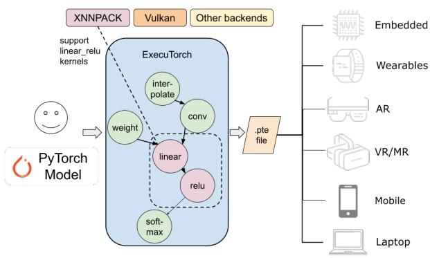  
Figure 1. Users can bring PyTorch models into ExecuTorch for compilation and optimization (both backend-agnostic and backendspecific) to generate a PTE file that runs on platforms from 0.01 to 800 watts.

One advantage of ExecuTorch is experimentation velocity: researchers can validate runtime behavior entirely within PyTorch. Other frameworks’ pipelines require model conversion and separate validation, often leading to numerical mismatches and resource-intensive debug cycles. Execu-Torch eliminates this gap by using torch.export to generate execution graphs that can run directly in PyTorch eager mode while capturing a faithful representation that can be executed on-device. For example, a quantized LLM (Large Language Model) can be tested and debugged in PyTorch, then deployed to a phone’s NPU, with confidence that its behavior will match almost exactly.

This parity is achieved through several technologies working in tandem. First, torch.export converts models into hardware-agnostic AOT graphs built from a small set of < 300 Core ATen primitives, reducing the burden for edge environments. These graphs remove Python dependencies but retain debug symbols, and—unlike ONNX—remain executable in PyTorch for pre-deployment validation. Second, ExecuTorch supports selective backend delegation, allowing parts of a model to run on specialized accelerators like Qualcomm Hexagon or Apple Neural Engine, with CPU fallback as needed. Both AOT and just-in-time compilation modes are supported, and hardware vendors can integrate via a clean API without modifying the core runtime. Third, quantization-aware export makes post-training quantization and quantization-aware training first-class steps. Backends declare their capabilities, and ExecuTorch applies quantization accordingly, ensuring that quantization validated in PyTorch matches on-device execution.

ExecuTorch also addresses memory constraints of on-device LLM deployment through techniques such as KV-cache quantization, sliding-window attention, and 4-bit groupwise weight quantization, which reduces model size by 50% (Meta AI, 2024). These techniques operate on the model graph produced by torch.export, which allows for evaluation of accuracy and memory trade-offs prior to deployment on a mobile device.

We provide a comprehensive evaluation of ExecuTorch’s latency and throughput across large language models (LLMs) and traditional computer vision models on mobile phones, spanning CPUs, GPUs, and NPUs, and compare it against widely used alternatives such as ONNX Runtime, llama.cpp, and LiteRT. Across devices and workloads, we find that ExecuTorch delivers competitive or state-of-the-art performance across heterogeneous backends: it is consistently strong on CPU (via XNNPACK), achieves high tokengeneration throughput on mobile GPUs (via Vulkan), and unlocks substantial prefill speedups on NPUs (via QNN) when models are well-delegated, while matching native performance on iOS through CoreML when full-graph delegation is available.

Beyond performance, ExecuTorch provides productioncritical customization at two levels: runtime extensions allow developers to implement custom kernels for specialized operations, selectively build operators to reduce binary size, and create custom data loaders for embedded systems; AOT extensions support memory planning and target-specific compiler passes, enabling further optimization for hardware constraints.

This paper makes three principal contributions. First, we present ExecuTorch, the first PyTorch framework to achieve experimentation parity through locally executable export graphs, enabling unified deployment from microcontrollers to smartphones without model conversion or reimplementation. Second, we introduce experimentation parity as a design principle: through torch.export and capabilitydriven backend integration, researchers validate deployment behavior—quantization, hardware delegation, performance—within PyTorch before committing to production. Third, we demonstrate production viability at scale: Execu-Torch powers billions of daily inferences across Meta’s family of apps (Meta, 2025a) and Reality Labs (e.g., Ray-Ban smart glasses)(Meta, 2025b). It supports execution of vision, audio, and large language models on 12 hardware backends, enabling efficient inference on mobile, embedded, and desktop devices. ExecuTorch demonstrates that researchers need not choose between PyTorch’s development velocity and edge deployment requirements—a unified workflow can deliver both.

## 2 RELATED WORK

Edge AI deployment frameworks make different trade-offs between development velocity, performance, and portability. We evaluate existing approaches through the lens of experimentation parity, i.e., the ability to validate deployment behavior within the model development and training environment.

Conversion-based frameworks such as ONNX Runtime (Microsoft, 2018) and TensorFlow Lite (David et al., 2021) decouple training and deployment through intermediate representations, but the conversion step introduces semantic gaps that surface only after deployment. For example, QAT in PyTorch may not translate faithfully to ONNX’s quantization semantics. Early frameworks such as Caffe (Jia et al., 2014) enabled C++-based on-device deployment but required complete model authoring within their ecosystem.

Compiler-based approaches such as TVM (Chen et al., 2018) and MNN (Jiang et al., 2020) generate optimized kernels through domain-specific compilation but require learning separate toolchains, tuning procedures, and debugging workflows distinct from PyTorch.

Vendor-specific runtimes like Apple’s CoreML (Apple Inc., 2017), Qualcomm’s SNPE (Qualcomm Technologies, Inc., 2016), and Apple’s MLX (Hannun et al., 2023) deliver excellent platform-specific performance but fragment the deployment landscape, requiring parallel implementations for multi-platform support.

PyTorch Mobile (PyTorch Team, 2019) and TorchScript (PyTorch Foundation, 2021) attempted PyTorch-native deployment but were limited by high memory footprint and narrow hardware integration.

Model-specific runtimes such as llama.cpp (Gerganov, 2023) and vLLM (Kwon et al., 2023) achieve strong performance through architecture-specific optimization but require complete reimplementation outside the training framework, breaking iteration velocity. vLLM also requires a Python runtime, which is not feasible in embedded systems.

## 3 ARCHITECTURE

ExecuTorch’s export APIs and lean runtime allow for seamless deployment of PyTorch models on any target device, as shown in Figure 1. The key design goals are to offer:

• Unified and Portable Runtime – A lightweight runtime with minimal dependencies and execution overhead, ensuring maximum portability and consistent behavior across deployment environments.

• Composable and Extensible Architecture – Modular interfaces for backends, graph transform passes, and quantizers allow hardware vendors and developers to plug in custom components without modifying the core runtime.

• Efficient Model Execution – Leverage device capabilities and access to accelerators (CPU, GPU, DSP/NPU), as well as architectural optimizations such as quantization and memory planning, to minimize memory footprint and latency.

The two main components of ExecuTorch are the AOT export stack and the Runtime stack (Figure 2).

On the AOT side, ExecuTorch integrates tightly with Py-Torch. It uses torch.export to capture computation graphs from torch.nn.Module and the torch.fx graph pass infrastructure to implement graph-level optimizations such as operator fusion. Graph transforms such as quantization, subgraph delegation, and memory planning are performed ahead of time, allowing the runtime to stay lean and focus on executing the pre-optimized model graph.

On the runtime side, ExecuTorch provides a compact and customizable execution environment. Users can link targetspecific kernels and backend libraries to tailor deployments for specific hardware. The core runtime library is small and efficient to ensure compatibility with resource-constrained platforms.

## 4 MODEL PREPARATION

At a high level, the model preparation workflow follows the steps illustrated by the diagram in Figure 2.

## 4.1 torch.export and IRs

torch.export is an execution graph capture mechanism provided by PyTorch. It uses tracing technologies introduced in PyTorch 2.0 (Ansel et al., 2024) to convert a model defined in PyTorch Python code into a static graph data structure, which we call Export IR.

Export IR (PyTorch Developers, 2022b) is a Torch FX graph (Reed et al., 2021) with strong guarantees: (1) Shape soundness: shapes in the captured graph satisfy the shape rules defined by each operator’s semantics; (2) Graph normalization: the graph contains no Python semantics, and nodes are restricted to a defined operator set; (3) Tensor metadata availability: shape metadata is available on inputs, intermediate values, and outputs; (4) Program metadata availability: provenance information records the original program’s torch.nn.Module hierarchy and Python call stack.

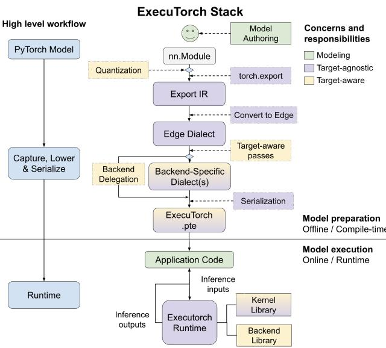  
Figure 2. High-level architecture of ExecuTorch, showing two stages: model preparation and model execution. The preparation flow exports a PyTorch model using torch.export, converts it to the ExecuTorch edge dialect, optionally applies backend delegation and graph optimizations, and eventually serializes the result into the PTE format for deployment.

Export IR supports progressive lowering into dialects. Subsequent dialects may enforce custom graph properties and constraints. Complex operators may be decomposed to enforce a limited operator set; operators may be converted to functional forms to eliminate mutations and aliasing.

Edge Dialect - ExecuTorch defines a more restrictive Edge Dialect on top of Export IR with three additional properties: (1) fully functional graphs with no mutations or aliasing; (2) restriction to < 300 “Core ATen” operators (PyTorch Developers, 2022a), minimizing the implementation burden for custom kernel libraries and delegates; and (3) explicit dtype and memory format specialization, including a dim order concept that describes the memory layout of tensors.

Edge Dialect is the IR provided to custom graph passes and delegate lowering logic. In the final lowering stages, the constraints preventing mutation and aliasing will be relaxed in very specific scenarios to allow for optimizations such as KV-cache writeback that require in-place updates. Only noncomputational state updates (i.e., direct data copies without modification) are allowed. Delegates are also allowed to diverge from the constraints of Edge Dialect during lowering to optimize performance, but they must ensure that graph transformations produce computations equivalent to the original Edge Dialect graph.

## 4.2 Memory Planning

Memory planning is performed before serialization as the final preprocessing step. ExecuTorch analyzes the size and lifespan of each tensor to allocate space within fixed-size memory arenas, with mutable state tensors given infinite lifespan to prevent overwriting. The default greedy bestfit algorithm reuses the smallest non-overlapping buffer when available, but otherwise allocates linearly to minimize fragmentation. Custom memory planning algorithms are also supported.

## 4.3 Quantization

Quantization is an essential technique for deploying models on device. It significantly reduces model size and inference latency at some cost to accuracy. ExecuTorch builds on TorchAO (torchao, 2024) to support a variety of backendspecific and generalized quantization algorithms, such as SpinQuant (Liu et al., 2025b). Two quantization workflows are available: PyTorch 2 Export for static quantization, and Eager mode for dynamic or weight-only quantization.

PyTorch 2 Export Quantization (Jerry Zhang, 2025; Andrew Or, 2025) transforms a model in Export IR for both post-training quantization (PTQ) and quantizationaware training (QAT). The graph is first captured with torch.export, and each backend uses its own Quantizer class with annotation APIs to specify quantization intent for operators and patterns, as shown in Figure 3.

Eager Mode Quantization operates directly on nn.Module instances by converting the weight tensor of target submodules (e.g., linear or embedding) into a quantized tensor subclass (PyTorch, 2025) or replacing the submodule with a quantized variant. Each type of quantization (dtype, packing format) has its own Tensor subclass.

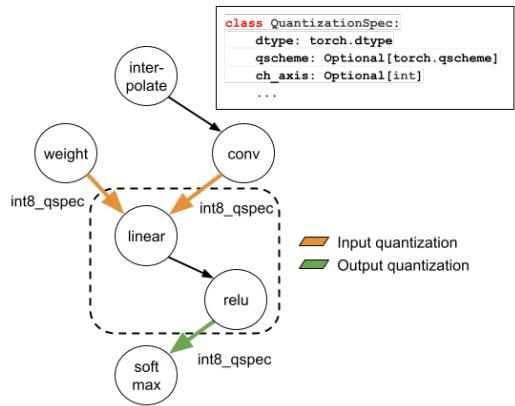  
Figure 3. The quantizer annotates input/output tensors of an operator (or pattern) with quantization info such as dtype, bitwidth, range, and observer.

## 4.4 Backend Delegate Interface

ExecuTorch’s backend delegate abstraction enables executing model subgraphs on specialized processors (Figure 4). Each delegate provides (1) an AOT compiler that lowers compatible Edge Dialect subgraphs into a backend-specific representation (a “delegate blob”), and (2) a runtime library that can deserialize and execute the delegate blob on the target processor. The delegate specifies which operators it can accelerate; the partitioner identifies matching subgraphs composed of supported operators and routes them to the delegate compiler. This way, backends will not receive subgraphs that they cannot execute.

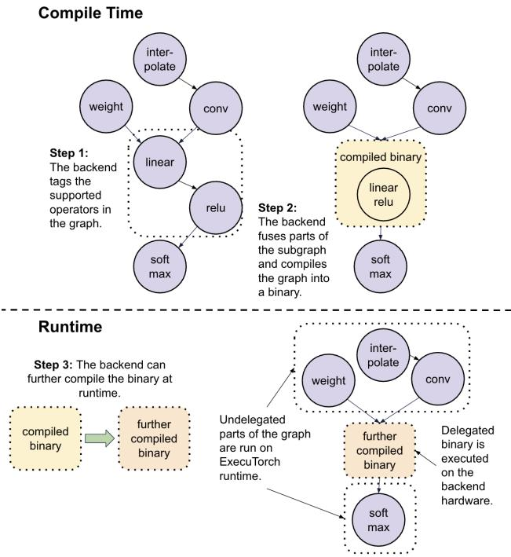  
Figure 4. An example showing how the backend receives the graph, compiles it, and executes it.

## 4.5 Model Serialization

ExecuTorch introduces the PyTorch Edge file format, with the .pte file extension, designed for minimal runtime overhead and file size (Figure 5).

The program component contains execution plans for each model method (e.g., forward, encode) represented as a list of instructions. KernelCall invokes an operator, and DelegateCall invokes execution of a delegated subgraph. Arguments are represented as indices into a shared list of EValues, each of which corresponds to a tensor or scalar. Linear execution (plus the Jump instruction for control flow) reduces computational overhead compared to executing a graph representation.

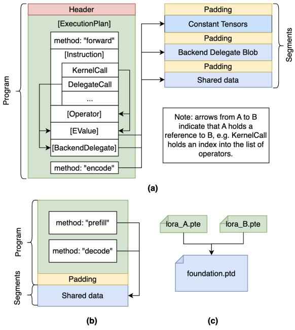  
Figure 5. Overview of the PTE file (a) and weight sharing mechanisms; multi-method (b) and program data separation (c).

The segments component contains discrete, aligned memory blocks that can be independently loaded and freed. Segments holding small program data persist for the lifetime of the model. Segments representing large delegate blobs can be freed after model initialization to reduce peak memory. Page-aligned segments also support direct mmap access without additional copying.

ExecuTorch also defines the PTD format, with the .ptd file extension, for storing named tensor and delegate data, enabling weight sharing between PTE files, checkpointing for on-device training, and independent deployment of program and data.

## 4.6 Weight Sharing

ExecuTorch supports weight sharing via two mechanisms (Figure 5 b, c): (1) multi-method PTE files, where different model methods (e.g., LLM prefill and decode) share data segments within a single file; and (2) program-data separation, where a PTE program references external PTD weight files that can be shared across models (e.g., LoRA adapters sharing foundation weights). Both strategies reduce binary size and enable buffer reuse at runtime.

## 4.7 On-Device Fine-Tuning

ExecuTorch supports on-device training by lowering both forward and backward execution graphs. Updated weights are written as new PTD checkpoints. We validated finetuning a classification model (lowered to the XNNPACK backend) using the CIFAR-10 dataset on an Android device.

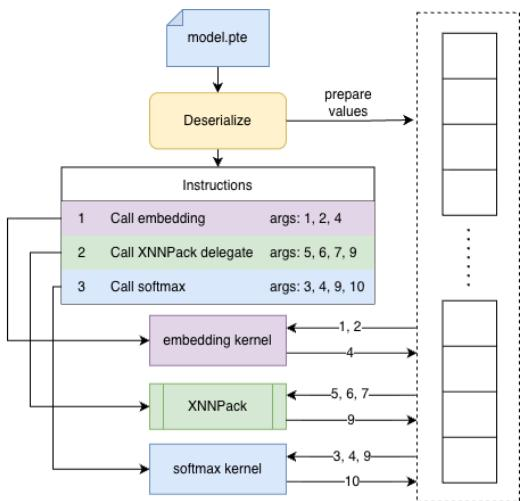  
Figure 6. ExecuTorch Runtime

## 5 MODEL EXECUTION

ExecuTorch provides a lightweight and modular runtime with tight memory and compute budgets (Figure 6). The runtime executes the instruction lists encoded in the program component of the PTE file (Section 4.5), where each instruction maps to a statically registered kernel or delegate call. At build time, the selective build API allows developers to link only the required kernel and delegate libraries. Static registration removes dynamic operator resolution overhead and minimizes per-instruction latency.

## 5.1 Core Runtime Portability

The core runtime targets C++17 and does not depend on dynamic memory allocation, synchronization primitives, or exceptions in order to maximize portability across hardware platforms (servers, mobile phones, and bare-metal embedded systems) and software environments (POSIX, Windows, bare-metal environments). Note that these restrictions do not apply to extensions and backends, which may be intended for use only on specific platforms.

The core runtime does not create or manage heap-allocated memory or use C++ STL types which allocate or manage their own memory. All memory must be user provided via the MemoryManager abstraction which, in addition to ensuring portability, enables placement of tensor data in specialized memory regions such as SRAM or DRAM. The FreeableBuffer abstraction enables lifetime management by wrapping a buffer pointer and a user-defined free function.

The Platform Abstraction Layer (PAL) allows overriding system operations such as logging, querying the time, or panicking the process/system. The DataLoader interface supports custom PTE loading strategies (e.g., file I/O or mmap).

## 5.2 Runtime API Language Bindings

ExecuTorch ships optional extensions that present a PyTorch-like fac¸ade over the core runtime, including a C++ Module API mirroring eager-mode usage and TensorPtr for safe, zero-copy tensor passing. Native bindings for iOS (Objective-C/Swift) and Android (Java/Kotlin) allow apps to call into ExecuTorch without touching C++ directly.

## 5.3 Runtime Overhead

To quantify reduction in framework overhead, we compare inference of a minimal model (mul + add) between ExecuTorch and the TorchScript-based PyTorch Mobile Interpreter (PyTorch Foundation, 2021). FlatBuffer-based deserialization yields a 5.3× speedup, runtime initialization is 37.4× faster by eliminating dynamic operator resolution, and simplified instruction-to-kernel routing reduces per-operator overhead. Deterministic memory behavior follows from ahead-of-time memory planning.

Table 1. Runtime overhead comparison between ExecuTorch and the PyTorch Mobile Interpreter on a minimal model. All values in CPU cycles.  
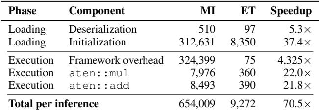

## 6 KERNELS

ExecuTorch kernels are stateless functions that implement tensor operations characterized by a fixed name, an operator schema, and clear input and output semantics (i.e., expected data types, aliasing, etc.). Built-in kernel libraries (i.e., a collection of kernels that is linked during build and invoked during execution) implement the Core ATen operator set used in Edge Dialect. Operator semantics are identical to the corresponding implementations in PyTorch’s ATen library, except that tensor memory must be densely packed. As in PyTorch, custom operators may be defined using PyTorch’s custom operator API.

## 6.1 Kernel Libraries

ExecuTorch ships with two CPU kernel libraries. The Portable Kernel Library is a reference implementation of Core ATen operators with no external dependencies. It provides functional and correct implementations that are always available. The Optimized Kernel Library accelerates selected operators using SIMD intrinsics and optimized math libraries (e.g., SLEEF, OpenBLAS), trading portability for performance. Users may map operators to either library.

## 6.2 Kernel Registration APIs

Selective Build: The full portable library is ∼2.3 MiB, which is too large for many resource-constrained applications. ExecuTorch’s selective build feature allows users to specify a subset of kernels to include when building, which can reduce binary size from MiB to KiB. To further reduce binary size, dtype selective build preserves only kernel code paths for data types that will actually be exercised during inference, discarding the rest.

Runtime Registration API: In PyTorch, operator schemas are resolved by parsing a string DSL at static initialization time, incurring significant startup latency. ExecuTorch avoids this by capturing and storing argument sequence and type information based on the exported graph. To account for the possibility of PyTorch operator schema/functionality being updated, Edge Dialect operators have strong backward compatibility guarantees.

## 7 BACKENDS

ExecuTorch currently includes a diverse selection of production-ready backends, which together enable efficient execution across a wide range of processors. Additionally, several more backends are under active development: MediaTek, OpenVINO, Samsung Exynos, NXP eIQ Neutron, CUDA, and Metal.

## 7.1 XNNPACK CPU Backend

The XNNPACK backend is a high-performance CPU backend built on Google’s XNNPACK library (Google, 2019). Active collaboration between the ExecuTorch and Google teams ensures tight integration and alignment between the two projects. Complementary libraries such as Arm’s KleidiAI (Arm Ltd., 2024b) are also used to extend hardware coverage. The quantizer exposes support for static and dynamic quantization for int8 inference, as well as per-channel and group-wise int4 weights for LLM workloads.

At runtime, the delegate achieves high performance using an extensive library of SIMD-optimized, multithreadingcompatible kernels tuned across a wide range of CPU architectures and input shapes. A weight caching mechanism enables efficient model reloading and LoRA weight sharing.

## 7.2 Vulkan Backend

The Vulkan (Khronos Group, 2023) backend is designed for inference on mobile GPUs. Model inference is powered by a growing library of GLSL compute shaders that currently implement 76 ATen operators. One operator may map to multiple compute shaders, which are selected at runtime based on tensor storage type, memory layout, supported Vulkan extensions, input shapes, and GPU architecture. Similar to XNNPACK, the backend also includes int8 variants of several operators (convolution, matmul, linear) to support int8 inference via static or dynamic quantization. Integer inference leverages hardware-accelerated integer dot product instructions when available. Inference with group-wise quantized int4 weights is also supported for LLM workloads.

## 7.3 Arm Ethos-U NPU Backend

The Arm backend targets Ethos-U NPUs (Arm Ltd., 2024a), including the latest Ethos-U85, for efficient inference on embedded platforms. The delegate converts Edge Dialect subgraphs to TOSA (Tensor Operator Set Architecture) (Consortium, 2023) IR, which is then compiled by the Vela compiler (Regor backend) into optimized binaries for Ethos-U NPUs. The backend’s quantizer features symmetric int8 and mixed-precision quantization to support a wide range of models.

## 7.4 Qualcomm QNN Backend

The QNN backend, built on Qualcomm AI Engine Direct (Qualcomm Technologies, 2024), targets inference on the Hexagon DSP using the A8W8 and A16W4 quantization formats. While static shapes offer optimal performance, limited dynamic shape support is also available. The backend is compatible with many quantization algorithms and features in TorchAO, including SpinQuant, Range-Setting, and a shared SeqMSE observer. It supports multi-method execution, spill-fill buffers, runtime-adjustable power modes, profiling, and both offline and online compilation.

## 7.5 CoreML Backend

The CoreML backend (Apple Inc., 2023) targets inference on Apple platforms. It is able to perform model inference on CPU, GPU, and Neural Engine (ANE) processors. It exposes most capabilities available when using CoreML directly, such as 8-bit static quantization and weight-only quantization; selection of compute units and compute precision; support for static, enumerated, and dynamic shapes; and execution of stateful models.

## 8 DEVTOOLS

ExecuTorch provides a suite of developer tools for profiling and debugging on-device deployments. These tools assist developers in linking the eager-mode behavior of a model in PyTorch to the on-device behavior when executing with ExecuTorch. The workflow centers on two artifacts:

ETRecord, produced during export, captures the Edge Dialect graph and contains debug metadata linking runtime events to the Python source code from the original model; and ETDump, produced during execution, captures operator latencies, memory lifetimes, delegate and kernel call events, and optionally intermediate tensor values.

The Inspector API then provides tools to view and analyze the data contained in these artifacts. Developers can use latency data to identify slow operators and bottlenecks within delegates. When a model is producing incorrect outputs, intermediate tensor values can be inspected and compared to a reference model to identify the source of the error. Tensor lifetimes and allocator behavior can also be analyzed to reduce memory footprint.

## 9 ENABLING USE CASES

## 9.1 Large Language Models

LLMs can be exported to ExecuTorch using either Execu-Torch’s modular transformer-decoder definition, which supports popular LLMs like Llama 3.2 and Qwen3 (Yang et al., 2025), or Hugging Face’s Transformers library (Wolf et al., 2020) using Optimum ExecuTorch (PyTorch Developers, 2025). Over 80% of models on Hugging Face’s text generation leaderboard can be exported through Optimum Execu-Torch.

To represent a LLM’s prefill and decode steps with a single graph, torch.export marks the sequence length dimension as dynamic. For backends that require static shapes (e.g., QNN), two separate models are exported: one for prefill, padded to the maximum context length, and one for single-token decode. ExecuTorch provides a C++ tokenizer that can be deployed to native platforms with minimal dependencies.

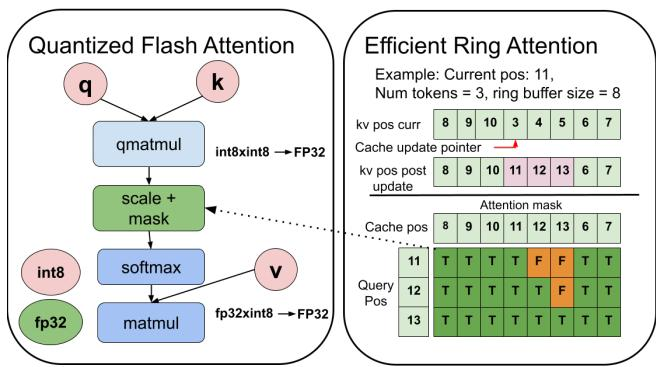  
Figure 7. (a) Quantized Flash Attention and (b) Efficient sliding window attention

Key optimizations accelerate LLM inference on CPU (Figure 7):

Flash attention: Avoids the cost of materializing intermediate attention tensors, which is particularly useful for reducing memory footprint and inference latency for long contexts.

Quantized KV cache and attention: A per-channel quantized KV cache with quantized attention reduces memory for long contexts (Figure 7 (a)).

Efficient sliding window attention: For models with localglobal attention (Shao, 2024) (e.g., Gemma 3), cache positions are tracked in a separate array to generate causal masks without shifting the KV cache (Figure 7 (b)), avoiding costly memory movement.

The QNN and CoreML backends also support speculative decoding as an optimization for token generation throughput.

## 9.2 Multi-modality

ExecuTorch supports multi-modal transformers by splitting models at export time into text embedding, text decoder, and multi-modal encoder components. They are then efficiently stitched together in the C++ model runner. This targets Early Fusion models (Gadzicki et al., 2020) (e.g., Voxtral (Liu et al., 2025a), Gemma 3 4B (Team et al., 2025)); crossattention models are supported via an attention interface for external KV cache management.

## 9.3 MCU Deployment

ExecuTorch’s portable runtime and selective build system enable deployment on microcontroller-class targets. We demonstrate this with an MNIST digit classifier on the Raspberry Pi Pico 2 (Arm Cortex-M33, 520 KiB SRAM, 4 MiB Flash), comparing two configurations: FP32 inference using the Portable Kernel Library, and int8 inference using Arm’s CMSIS-NN (Arm Limited) library via the Arm Ethos-U backend.

Selective build reduces runtime code size by linking only the kernels required by the model. For the FP32 Portable configuration, selective build shrinks total code size from 1,322 KiB to 253 KiB (5.2×); for int8 CMSIS-NN, from 1,248 KiB to 203 KiB (6.2×).

Table 2 provides a detailed Flash breakdown with selective build enabled. The ExecuTorch runtime itself occupies only 13–26 KiB; the majority of Flash is consumed by the model artifact, kernel libraries, and system code (Pico SDK + libc).

Table 3 reports measured RAM usage. Ahead-of-time memory planning determines the arena size at export time, eliminating runtime allocation. Int8 quantization and operator fusion reduce the memory-planned arena from 101.2 KiB to 3.8 KiB, bringing total RAM to approximately 11 KiB— well within the Pico 2’s 520 KiB SRAM budget.

Table 2. Flash breakdown with selective build (KiB).  
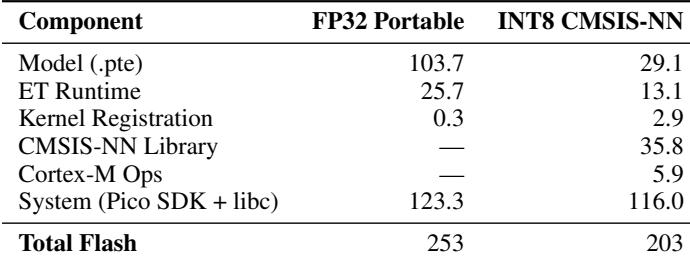

Table 3. RAM breakdown, measured on device (KiB).  
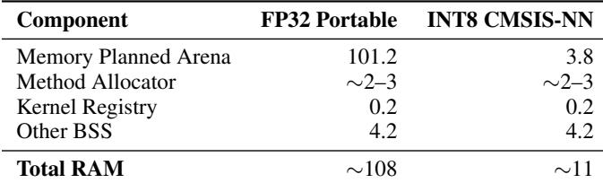

Int8 quantization with CMSIS-NN delivers a 16.46× inference speedup (3.5 ms vs 57.6 ms) while reducing model size by 3.6× and RAM by 10× compared to the FP32 configuration. These results demonstrate that ExecuTorch can deploy real models on sub-dollar MCUs.

## 10 PLATFORM AND HARDWARE SUPPORT

ExecuTorch supports diverse platforms via source-level portability and multiple hardware backends. The core runtime builds on Windows and Unix using Clang or GCC. Embedded targets use standard C++ with minimal toolchain assumptions and macro-based abstractions for compiler extensions. Platform bindings for Android and iOS offer outof-the-box usability, while backends may relax portability to leverage hardware-specific optimizations.

Table 4. Platform compatibility.  
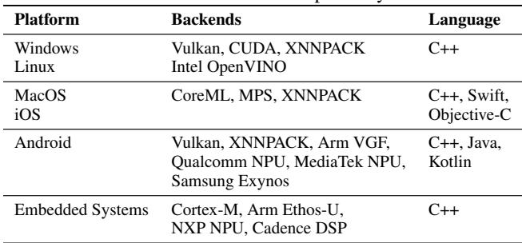

Table 4 summarizes platform and backend coverage. For platforms without an accelerated backend, the portable kernel library serves as a fallback.

## 11 PERFORMANCE EVALUATIONS

We evaluate ExecuTorch’s performance on a representative set of large language models and image classification models. We compare against other widely adopted on-device ML frameworks: llama.cpp, ONNX Runtime, LiteRT, and CoreML. The most recent framework versions as of March 31, 2026, are used. Experiments were conducted on a Samsung Galaxy S25 Ultra (Snapdragon 8 Elite SoC; 16 GiB RAM, 2× Cortex-X925 + 6× Cortex-A725 CPUs, Adreno 830 GPU, Hexagon NPU), a Google Pixel 9 Pro XL (Tensor G4 SoC; 16 GiB RAM, 1× Cortex-X4 + 3× Cortex-A720 + 4× Cortex-A520 CPUs, Mali-G715 GPU, Edge TPU), and an Apple iPhone 15 Pro. Missing entries (“–”) indicate configurations for which data could not be collected due to issues during model export or inference.

Dense LLM Performance - We benchmarked Qwen3 0.6B, Llama 3.2 1B, and Phi4 Mini to showcase inference performance across a range of model sizes. Quantization configurations were standardized as much as possible across frameworks to ensure comparable model quality. For GPU and CPU inference on ExecuTorch, ONNX, and LiteRT, model weights are group-wise quantized to 4-bit precision and activations are dynamically quantized to 8-bit precision using runtime-computed quantization parameters. Results for 32 and 128 quantization group sizes are shown. For llama.cpp, the Q4 0 quantization format is used; most weights are quantized to 4-bit with a quantization group size of 32. However, unlike the other frameworks, the LM-head weights are quantized to 6 bits, and dynamic quantization of activations may or may not be performed depending on the backend. For inference on Qualcomm NPU, QNN/Qualcomm AI Runtime (QAIRT) requires that models be statically quantized, with 4-bit weights and 16-bit activations. ExecuTorch’s QNN delegate uses group-wise quantized weights with a group size of 32, while QAIRT uses channel-wise quantized weights. For NPU inference via llama.cpp, Q4 0 quantization is used.

All models were benchmarked with 256 prompt tokens and 256 generated tokens; 3 runs were performed for each model, and the minimum/maximum throughput values observed are recorded in Table 5. Models were configured to use a maximum context length of 2048; for ExecuTorch, the maximum context length is configured at export time, and for production settings higher values can be used if needed. To mitigate the impact of thermal throttling, the device undergoes a 60-second cooldown period between runs. For CPU inference, the number of threads is set to the number of performance cores on the device: 8 for the Samsung Galaxy S25 Ultra and 4 for the Google Pixel 9 Pro XL. A warmup run is performed before measurement to mitigate “cold-start” effects.

The model size reported for each framework is the size of the model artifacts produced by each framework for a given model. ExecuTorch, LiteRT, and llama.cpp all produce self-contained files (.pte, .litertlm, and .gguf respectively) which contain the constant and weight tensor data (i.e., quantized weights, quantization parameters, etc.) as well as serialized model representations required for the framework to execute the model. ONNX uses a .onnx file to store the model representation, and a separate .onnx.data file to store constant and weight tensor data; the model artifact size for ONNX is the sum of the sizes of these two files.

Table 5. ExecuTorch (ET) prefill and decode throughput range in tokens/sec, and model size (i.e., the “Size” column) in MiB for Qwen3 0.6B, Llama 3.2 1B, and Phi4 Mini compared against other frameworks. The “GS” column indicates the quantization group size.  
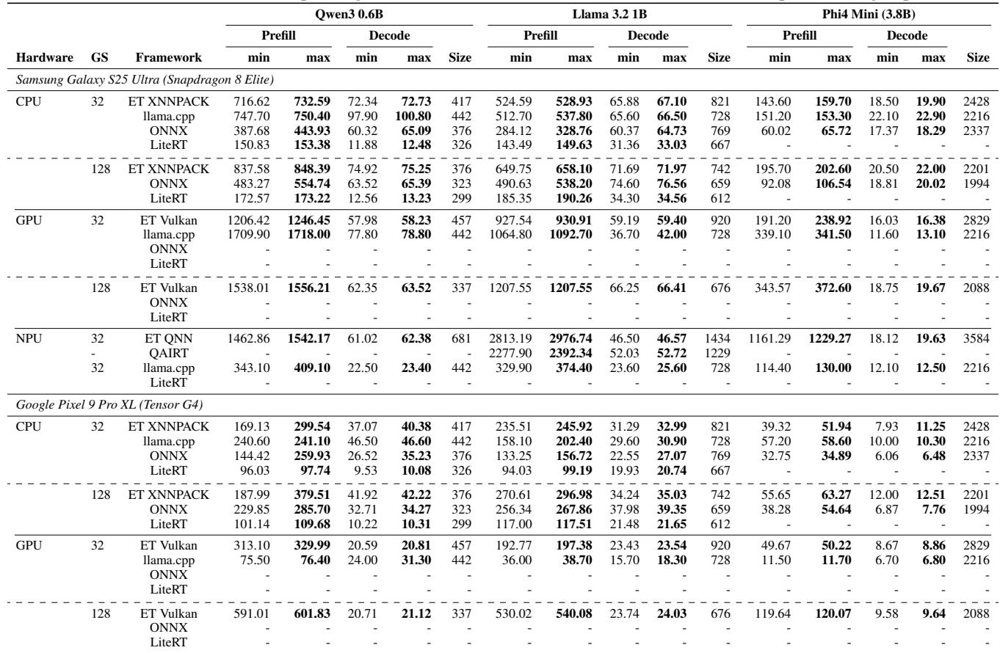

ExecuTorch’s model artifacts tend to be larger compared to other frameworks. For XNNPACK, this is because the delegate does not yet support tied embeddings (a technique which shares the weight tensor between the embedding layer and the LM-head linear layer), which results in a duplicated embedding table. For Vulkan, although tied embeddings are supported, the delegate pre-computes per-group integer weight sums (required for quantized accumulation) during export and stores them in the model artifact. The overhead of these pre-computed sums increases with smaller group sizes, which explains the difference in model size between 32 and 128 group sizes. For both QNN and QAIRT, models use 16-bit embeddings and 8-bit LM-head, which prevents the use of tied embeddings. QNN also contains higher quantization parameter overhead compared to QAIRT due to the use of group-wise quantization.

ExecuTorch’s XNNPACK delegate delivers strong performance compared to ONNX and LiteRT across both devices. On the Samsung Galaxy S25, llama.cpp demonstrates higher decode throughput for Qwen3 and Phi4 Mini (although prefill throughput is comparable) because its attention implementation is more efficient for single-token decode than ExecuTorch’s.

ExecuTorch’s Vulkan delegate is able to execute all models with full graph delegation; no operators fall back to CPU. It underperforms llama.cpp in prefill throughput on the Samsung Galaxy S25 Ultra, but tends to deliver better token generation throughput. On the Pixel 9 Pro XL, the Vulkan delegate greatly outperforms llama.cpp in prefill throughput, but this is because llama.cpp currently only contains optimized compute shaders for Adreno GPUs. Although group size has a large impact on prefill throughput for both devices, for the Pixel 9 Pro XL, prefill throughput drops sharply at group size 32 compared to 128. This suggests a threshold at which the number of unique quantization parameters fetched during the requantization step of quantized linear layers increases memory traffic enough to cause GPU cache thrashing. For LiteRT, we observed a segmentation fault when attempting to benchmark exported models with GPU acceleration; for ONNX, we could not find a way to execute LLMs with GPU acceleration.

Table 6. ExecuTorch (ET) inference time in milliseconds (avg, p5, p95) for MV3, ResNet50, ViT, and Swin-T compared against other frameworks for different backends. The “dtype” column indicates the inference precision.  
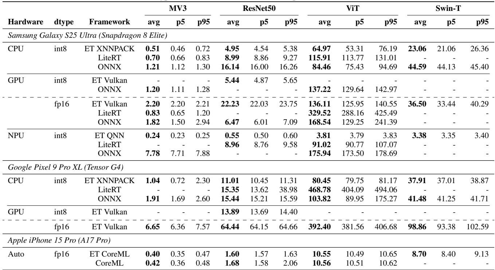

For a detailed operator-level performance comparison of ExecuTorch and llama.cpp across all 3 models on the Samsung Galaxy S25 Ultra, see Appendix A. Note that the analysis only covers CPU and GPU inference.

ExecuTorch’s QNN delegate demonstrates stronger prefill throughput compared to executing via QAIRT for Llama 3.2 1B. QAIRT achieves higher decode throughput, which may be due to its use of per-channel quantization rather than the per-group quantization used by ExecuTorch’s QNN delegate. We could not generate QAIRT binaries for Qwen3 0.6B and Phi4 Mini due to errors during the model export process. llama.cpp’s Hexagon backend (currently marked experimental) targets NPU inference using custom DSP kernels, and some ops may be falling back to the CPU, which would explain the much lower throughput compared to QNN. In contrast, the QNN delegate executes the model with full graph delegation with no operators falling back to CPU.

Vision Model Performance - Performance results for

MV3, ResNet50, ViT, and Swin-T are reported in Table 6. These models are selected as a representative sample of convolution-based and transformer-based image processing workloads. Each model was benchmarked with 10 warmup iterations and 200 inference iterations, and the average, p5, and p95 inference latencies in milliseconds are reported. For CPU inference, the number of threads is set to the number of performance cores on the device; 8 for the Samsung Galaxy S25 Ultra and 4 for the Google Pixel 9 Pro XL.

We encountered errors when exporting the Swin-T model with LiteRT, so no measurements are reported for Swin-T on LiteRT. We were also unable to collect GPU inference measurements for many LiteRT models due to a segmentation fault that occurred after loading the GPU acceleration library. For ONNX, GPU/NPU inference was tested via the QNN execution provider, which is not available for the Pixel 9 Pro XL. A runtime exception was encountered when executing Swin-T with the QNN execution provider, and therefore no data was collected for that model on GPU/NPU with ONNX.

For CPU inference, ExecuTorch’s XNNPACK delegate delivers extremely strong performance relative to LiteRT and ONNX.

For GPU inference, ExecuTorch’s Vulkan delegate executes MobileNet V3 and ResNet50 (both quantized and fp16 variants) with full graph delegation. For ViT-B/16, 4 unsupported operator types (72 instances total) in the attention masking pipeline—mul.Scalar, logical not, eq.Scalar, and any.dim—cause the model to be split into 25 Vulkan partitions. For Swin-T, 7 unsupported operator types (∼160 instances)—primarily slice scatter, fmod.Scalar, index.Tensor with 2D sources— produce 12 partitions. Although CPU fallback operators account for ∼29% of ViT execution latency and ∼22% of Swin-T execution latency, the overhead introduced by graph breaks (i.e., copying tensors between CPU and GPU) accounts for only 5%–6% of execution latency.

Generally, the delegate delivers comparable performance to other frameworks on the Samsung Galaxy S25. A notable exception is ResNet50, where ONNX achieves much faster inference. Likewise, LiteRT achieves much faster inference on MobileNet V3 compared to both ExecuTorch and ONNX. These gaps do not appear to be consistent across models. Since neither QNN nor LiteRT’s GPU acceleration library is open source, it is difficult to diagnose the source of the performance gap. For int8 inference on the GPU, support for static int8 quantization in the Vulkan delegate is an ongoing effort, and so far only ResNet50 is supported among the models tested.

For NPU inference, ExecuTorch’s QNN delegate delivers extremely strong performance relative to LiteRT and ONNX. We found that for LiteRT and ONNX, the NPU execution provider / accelerator was only claiming a limited number of nodes in the model graph, resulting in a majority of model inference being executed on the CPU.

On the iPhone 15 Pro, ExecuTorch’s CoreML delegate matches or slightly outperforms native CoreML across all four models, and is the only configuration that produces results for Swin-T. These results confirm that ExecuTorch’s delegation overhead is negligible compared to directly running CoreML.

## 12 LIMITATIONS AND FUTURE WORK

Model exportability: ExecuTorch relies on torch.export for graph capture. Unfortunately, there are several classes of models that pose challenges for export.

• Data-dependent control flow: models that contain operations where control flow depends on runtime tensor values, e.g., models with dynamic padding, data-dependent slicing, or models that branch on datadependent values (e.g., beam search).

• Dynamic Shapes: models with input-dependent tensor dimensions such as dynamic LSTMs or Mask R-CNN architectures produce graphs whose structure changes at runtime. These often require splitting the model into separately exported subgraphs or rewriting the model

to be export-friendly.

• Custom operators: Models that rely on custom C++ or CUDA kernels (e.g., FlashAttention) require those kernels to be registered with a fake-tensor implementation that describes output shapes symbolically. A corresponding kernel must also be registered in the ExecuTorch runtime, and each target delegate must implement support for it, in order for ExecuTorch to handle the custom operator.

Models containing any of the above elements may require changes such as:

• Rewriting control flow with higher-order operators such as torch.cond (if/else), torch.scan or torch.while loop (loops), and torch.where (element-wise selection) (Wu et al., 2025).

• Wrapping untraceable ops in a custom op.

• Adding assertions (torch. check), which serve as compiler hints for constraining dynamic shapes.

Hardware retargetability: AOT compilation optimizes models for specific hardware, but hardware diversity in the Android ecosystem (e.g., Qualcomm, MediaTek, Samsung NPUs) may require developers to query device capabilities and select a hardware-appropriate model file when downloading models from a delivery service, or bundle multiple hardware-specific model files in one APK (perhaps with a common shared weight file). This increases engineering complexity compared to runtime-retargetable solutions (like ONNX or LiteRT), which are more flexible but forgo AOT optimizations.

Desktop/Laptop Support: ExecuTorch accelerates inference on consumer desktops and laptops using backends like XNNPACK, OpenVINO, and QNN. With rising demand for local inference (exemplified by llama.cpp, MLX), Execu-Torch is now experimenting with CUDA and Metal backend support, leveraging PyTorch’s AOTInductor technology.

Sparsity: ExecuTorch’s IR can represent sparse weights using dense values and mask tensors, but hardware-accelerated sparse kernels (e.g., 2:4 structured sparsity) are not yet widely available on edge targets. Sparsity support remains a future direction as backend capabilities mature.

## ACKNOWLEDGEMENTS

The completion of this project would not have been possible without the support, input, and contributions of numerous individuals and institutions. We wish to express our sincere gratitude to all those who offered their expertise, resources, and guidance throughout this project. For a full list, please see Appendix B.

## REFERENCES

Ahsan, S. M. M., Hoque, T., Hasan, M. S., Chowdhury, M., and Dhungel, A. Hardware accelerators for artificial intelligence. In Iranmanesh, A. and Sayadi, H. (eds.), AI-Enabled Electronic Circuit and System Design, pp. 497–535. Springer, Cham, 2025. ISBN 978-3-031-71436- 8. doi: 10.1007/978-3-031-71436-8 14.

Andrew Or. Pytorch 2 export quantization-aware training (qat), 2025. URL https://docs.pytorch. org/ao/stable/tutorials\_source/pt2e\_ quant\_qat.html.

Ansel, J., Yang, E., He, H., Gimelshein, N., Jain, A., Voznesensky, M., Bao, B., Bell, P., Berard, D., Burovski, E., Chauhan, G., Chourdia, A., Constable, W., Desmaison, A., DeVito, Z., Ellison, E., Feng, W., Gong, J., Gschwind, M., Hirsh, B., Huang, S., Kalambarkar, K., Kirsch, L., Lazos, M., Lezcano, M., Liang, Y., Liang, J., Lu, Y., Luk, C. K., Maher, B., Pan, Y., Puhrsch, C., Reso, M., Saroufim, M., Siraichi, M. Y., Suk, H., Zhang, S., Suo, M., Tillet, P., Zhao, X., Wang, E., Zhou, K., Zou, R., Wang, X., Mathews, A., Wen, W., Chanan, G., Wu, P., and Chintala, S. Pytorch 2: Faster machine learning through dynamic python bytecode transformation and graph compilation. In Proceedings of the 29th ACM International Conference on Architectural Support for Programming Languages and Operating Systems, Volume 2, ASPLOS ’24, pp. 929–947, New York, NY, USA, 2024. Association for Computing Machinery. ISBN 9798400703850. doi: 10.1145/3620665.3640366. URL https://doi. org/10.1145/3620665.3640366.

Apple Inc. Core ML. Apple Inc., Cupertino, CA, 2017. URL https://developer.apple.com/ documentation/coreml. Machine learning framework for iOS, macOS, watchOS, and tvOS. Introduced at WWDC 2017.

Apple Inc. Core ml: Machine learning framework for apple platforms. https://developer.apple.com/ documentation/coreml, 2023. Accessed: 2025- 10-28.

Arm Limited. Cmsis-nn: Efficient neural network kernels for arm cortex-m cpus. URL https://github.com.

Arm Ltd. Arm ethos-u ecosystem: Micronpus and software for efficient edge ai. https://developer.arm. com/Processors/Ethos-U, 2024a. Accessed: 2025-10-28.

Arm Ltd. Kleidiai: Open-source micro-kernel library for ai workloads on arm cpus. https://gitlab. arm.com/kleidi/kleidiai (mirror: https: //github.com/ARM-software/kleidiai), 2024b. Accessed: 2025-10-28.

Chen, T., Moreau, T., Jiang, Z., Zheng, L., Yan, E., Shen, H., Cowan, M., Wang, L., Hu, Y., Ceze, L., Guestrin, C., and Krishnamurthy, A. TVM: An automated endto-end optimizing compiler for deep learning. In 13th USENIX Symposium on Operating Systems Design and Implementation (OSDI 18), pp. 578–594, Carlsbad, CA, USA, October 2018. USENIX Association. ISBN 978- 1-939133-08-3. URL https://www.usenix.org/ conference/osdi18/presentation/chen.

Consortium, M. P. Tensor operator set architecture (tosa) specification v1.0.1. https://www.mlplatform. org/tosa/tosa\_spec.html, 2023. Accessed: 2025-10-28.

David, R., Duke, J., Jain, A., Reddi, V. J., Jeffries, N., Li, J., Kreeger, N., Nappier, I., Natraj, M., Regev, S., Rhodes, R., Wang, T., and Warden, P. TensorFlow Lite Micro: Embedded Machine Learning on TinyML Systems. In Smola, A., Dimakis, A., and Stoica, I. (eds.), Proceedings of Machine Learning and Systems, volume 3, pp. 800–811, San Jose, CA, USA, April 2021. URL https://proceedings.mlsys. org/paper\_files/paper/2021/file/ 6c44dc73014d66ba49b28d483a8f8b0d-Paper.pdf. Now known as LiteRT.

Foundation, T. L. Annual report 2024: Accelerating industry innovation. Technical report, The Linux Foundation, 2024. URL https://www.linuxfoundation. org/resources/publications/linuxfoundation-annual-report-2024. Accessed: 2025-10-30.

Gadzicki, K., Khamsehashari, R., and Zetzsche, C. Early vs late fusion in multimodal convolutional neural networks. In 2020 IEEE 23rd International Conference on Information Fusion (FUSION), pp. 1–6, 2020. doi: 10.23919/FUSION45008.2020.9190246.

Gerganov, G. llama.cpp: LLM inference in C/C++. https: //github.com/ggerganov/llama.cpp, March 2023. URL https://github.com/ggerganov/ llama.cpp. MIT License.

Google. Xnnpack: High-efficiency floating-point neural network inference operators for mobile and server platforms. https://github.com/google/XNNPACK, 2019. Accessed: 2025-10-28.

Hannun, A., Digani, J., Katharopoulos, A., and Collobert, R. MLX: Efficient and flexible machine learning on apple silicon, 2023. URL https://github.com/ ml-explore.

Jerry Zhang. Pytorch 2 export post training quantization, 2025. URL https://docs.pytorch.org/ao/

stable/tutorials\_source/pt2e\_quant\_ ptq.html.

Jia, Y., Shelhamer, E., Donahue, J., Karayev, S., Long, J., Girshick, R., Guadarrama, S., and Darrell, T. Caffe: Convolutional architecture for fast feature embedding, 2014. URL https://arxiv.org/abs/1408.5093.

Jiang, X., Wang, H., Chen, Y., Wu, Z., Wang, L., Zou, B., Yang, Y., Cui, Z., Cai, Y., Yu, T., Lv, C., and Wu, Z. MNN: A universal and efficient inference engine. In Proceedings of Machine Learning and Systems, volume 2, pp. 1–13, 2020. URL https://proceedings.mlsys. org/paper\_files/paper/2020/hash/ bc19061f88f16e9ed4a18f0bbd47048a-Abstract.html. Alibaba Inc. Available at https://github.com/alibaba/MNN.

Kang, W., Lee, J., Lee, Y., Oh, S., Lee, K., and Chwa, H. S. RT-Swap: Addressing GPU memory bottlenecks for realtime multi-DNN inference. In 2024 IEEE 30th Real-Time and Embedded Technology and Applications Symposium (RTAS), pp. 373–385, Hong Kong, China, May 2024. doi: 10.1109/RTAS61025.2024.00037.

Khronos Group. Vulkan api specification, version 1.3. Technical report, The Khronos Group Inc., 2023. URL https://registry.khronos.org/ vulkan/specs/1.3/html/vkspec.html. Accessed: 2025-10-28.

Kuo, T.-T., Kim, J., and Gabriel, R. A. Privacy-preserving model learning on a blockchain network-of-networks. Journal of the American Medical Informatics Association, 27(3):343–354, March 2020. doi: 10.1093/jamia/ocz214.

Kwon, W., Li, Z., Zhuang, S., Sheng, Y., Zheng, L., Yu, C. H., Gonzalez, J. E., Zhang, H., and Stoica, I. Efficient memory management for large language model serving with pagedattention, 2023. URL https:// arxiv.org/abs/2309.06180.

Langley, P. Crafting papers on machine learning. In Langley, P. (ed.), Proceedings of the 17th International Conference on Machine Learning (ICML 2000), pp. 1207–1216, Stanford, CA, 2000. Morgan Kaufmann.

Lin, J., Tang, J., Tang, H., Yang, S., Chen, W.-M., Wang, W.-C., Xiao, G., Dang, X., Gan, C., and Han, S. Awq: Activation-aware weight quantization for llm compression and acceleration, 2024. URL https://arxiv. org/abs/2306.00978.

Liu, A. H., Ehrenberg, A., Lo, A., Denoix, C., Barreau, C., Lample, G., Delignon, J.-M., Chandu, K. R., von Platen, P., Muddireddy, P. R., Gandhi, S., Ghosh, S., Mishra, S., Foubert, T., Rastogi, A., Yang, A., Jiang,

A. Q., Sablayrolles, A., Heliou, A., Martin, A., Agarwal, ´ A., Roux, A., Darcet, A., Mensch, A., Bout, B., Roziere, \` B., Monicault, B. D., Bamford, C., Wallenwein, C., Renaudin, C., Lanfranchi, C., Dabert, D., Chaplot, D. S., Mizelle, D., de las Casas, D., Chane-Sane, E., Fugier, E., Hanna, E. B., Berrada, G., Delerce, G., Guinet, G., Novikov, G., Martin, G., Jaju, H., Ludziejewski, J., Rute, J., Chabran, J.-H., Chudnovsky, J., Studnia, J., Barmentlo, J., Amar, J., Roberts, J. S., Denize, J., Saxena, K., Yadav, K., Khandelwal, K., Jain, K., Lavaud, L. R., Blier, L., Zhao, L., Martin, L., Saulnier, L., Gao, L., Pellat, M., Guillaumin, M., Felardos, M., Dinot, M., Darrin, M., Augustin, M., Seznec, M., Gupta, N., Raghuraman, N., Duchenne, O., Wang, P., Saffer, P., Jacob, P., Wambergue, P., Kurylowicz, P., Chagniot, P., Stock, P., Agrawal, P., Delacourt, R., Sauvestre, R., Soletskyi, R., Vaze, S., Subramanian, S., Garg, S., Dalal, S., Gandhi, S., Aithal, S., Antoniak, S., Scao, T. L., Schueller, T., Lavril, T., Robert, T., Wang, T., Lacroix, T., Bewley, T., Nemychnikova, V., Paltz, V., Richard, V., Li, W.-D., Marshall, W., Zhang, X., Wan, Y., and Tang, Y. Voxtral, 2025a. URL https://arxiv.org/abs/2507.13264.

Liu, Z., Zhao, C., Fedorov, I., Soran, B., Choudhary, D., Krishnamoorthi, R., Chandra, V., Tian, Y., and Blankevoort, T. Spinquant: Llm quantization with learned rotations, 2025b. URL https://arxiv.org/abs/ 2405.16406.

Meta. Accelerating On-Device ML on Meta’s Family of Apps with ExecuTorch. https://engineering. fb.com/2025/07/28/android/executorchon-device-ml-meta-family-of-apps/, 2025a. Accessed: 2025-12-09.

Meta. ExecuTorch Reality Labs On-Device AI. https://ai.meta.com/blog/executorchreality-labs-on-device-ai/, 2025b. Accessed: 2025-12-09.

Meta AI. Introducing quantized Llama models with increased speed and a reduced memory footprint. https://ai.meta.com/blog/meta-llamaquantized-lightweight-models/, October 2024. Accessed: 2025-10-29.

Microsoft. ONNX Runtime: Cross-platform, high performance ml inferencing and training accelerator. https: //github.com/microsoft/onnxruntime, December 2018. URL https://onnxruntime.ai/. Open source inference engine.

Ng, M. Y., Helzer, J., Pfeffer, M. A., Seto, T., and Hernandez-Boussard, T. Development of secure infrastructure for advancing generative artificial intelligence research in healthcare at an academic medical center.

Journal of the American Medical Informatics Association, 32(3):586–588, March 2025. ISSN 1527-974X. doi: 10.1093/jamia/ocaf005.

Nigade, V., Bauszat, P., Bal, H. E., and Wang, L. Inference serving with end-to-end latency SLOs over dynamic edge networks. Real-Time Systems, 60:239–290, 2024. doi: 10.1007/s11241-024-09418-4.

Pons, M., Valenzuela, E., Rodr ’iguez, B., Nolazco-Flores, J. A., and Del-Valle-Soto, C. Utilization of 5G technologies in IoT applications: Current limitations by interference and network optimization difficulties—A review. Sensors, 23(8):3876, April 2023. ISSN 1424-8220. doi: 10.3390/s23083876.

PyTorch. Subclassing torch.tensor, 2025. URL https://docs.pytorch.org/docs/stable/ notes/extending.html#subclassingtorch-tensor.

PyTorch Developers. Irs, 2022a. URL https: //docs.pytorch.org/docs/2.9/torch. compiler\_ir.html.

PyTorch Developers. torch.export, 2022b. URL https:// docs.pytorch.org/docs/2.9/export.html.

PyTorch Developers. Optimum ExecuTorch — optimize and deploy hugging face models with executorch. https://github.com/huggingface/ optimum-executorch, 2025. Accessed: 2025-10- 28.

PyTorch Foundation. Pytorch 1.9 release, including torch.linalg and mobile interpreter, 2021. URL https://pytorch.org/blog/pytorch-1-9- released/.

PyTorch Team. PyTorch Mobile: End-to-end workflow for mobile deployment, October 2019. URL https: //pytorch.org/mobile/. Introduced in PyTorch 1.3. Now superseded by ExecuTorch.

Qualcomm Technologies, I. Qualcomm ai engine direct sdk. https://www.qualcomm.com/developer/ software/qualcomm-ai-engine-directsdk, 2024. Accessed: 2025-10-28.

Qualcomm Technologies, Inc. Snapdragon Neural Processing Engine SDK. Qualcomm Technologies, Inc., 2016. URL https://developer.qualcomm.com/ software/qualcomm-neural-processingsdk. Now branded as Qualcomm Neural Processing SDK for AI.

Reed, J. K., DeVito, Z., He, H., Ussery, A., and Ansel, J. torch.fx: Practical program capture and transformation

for deep learning in python. CoRR, abs/2112.08429, 2021. URL https://arxiv.org/abs/2112.08429.

Shao, Y. Local-global attention: An adaptive mechanism for multi-scale feature integration, 2024. URL https: //arxiv.org/abs/2411.09604.

Sperling, N. and Ernst, R. Reducing communication cost and latency in autonomous vehicles with subscribercentric selective data distribution. In 2024 IEEE 99th Vehicular Technology Conference (VTC Spring), Singapore, June 2024. Document ID: 10683426.

Team, G., Kamath, A., Ferret, J., Pathak, S., Vieillard, N., Merhej, R., Perrin, S., Matejovicova, T., Rame, A., ´ Riviere, M., Rouillard, L., Mesnard, T., Cideron, G., \` bastien Grill, J., Ramos, S., Yvinec, E., Casbon, M., Pot, E., Penchev, I., Liu, G., Visin, F., Kenealy, K., Beyer, L., Zhai, X., Tsitsulin, A., Busa-Fekete, R., Feng, A., Sachdeva, N., Coleman, B., Gao, Y., Mustafa, B., Barr, I., Parisotto, E., Tian, D., Eyal, M., Cherry, C., Peter, J.-T., Sinopalnikov, D., Bhupatiraju, S., Agarwal, R., Kazemi, M., Malkin, D., Kumar, R., Vilar, D., Brusilovsky, I., Luo, J., Steiner, A., Friesen, A., Sharma, A., Sharma, A., Gilady, A. M., Goedeckemeyer, A., Saade, A., Feng, A., Kolesnikov, A., Bendebury, A., Abdagic, A., Vadi, A., Gyorgy, A., Pinto, A. S., Das, A., Bapna, A., Miech, ¨ A., Yang, A., Paterson, A., Shenoy, A., Chakrabarti, A., Piot, B., Wu, B., Shahriari, B., Petrini, B., Chen, C., Lan, C. L., Choquette-Choo, C. A., Carey, C., Brick, C., Deutsch, D., Eisenbud, D., Cattle, D., Cheng, D., Paparas, D., Sreepathihalli, D. S., Reid, D., Tran, D., Zelle, D., Noland, E., Huizenga, E., Kharitonov, E., Liu, F., Amirkhanyan, G., Cameron, G., Hashemi, H., Klimczak-Plucinska, H., Singh, H., Mehta, H., Lehri, ´ H. T., Hazimeh, H., Ballantyne, I., Szpektor, I., Nardini, I., Pouget-Abadie, J., Chan, J., Stanton, J., Wieting, J., Lai, J., Orbay, J., Fernandez, J., Newlan, J., yeong Ji, J., Singh, J., Black, K., Yu, K., Hui, K., Vodrahalli, K., Greff, K., Qiu, L., Valentine, M., Coelho, M., Ritter, M., Hoffman, M., Watson, M., Chaturvedi, M., Moynihan, M., Ma, M., Babar, N., Noy, N., Byrd, N., Roy, N., Momchev, N., Chauhan, N., Sachdeva, N., Bunyan, O., Botarda, P., Caron, P., Rubenstein, P. K., Culliton, P., Schmid, P., Sessa, P. G., Xu, P., Stanczyk, P., Tafti, P., Shivanna, R., Wu, R., Pan, R., Rokni, R., Willoughby, R., Vallu, R., Mullins, R., Jerome, S., Smoot, S., Girgin, S., Iqbal, S., Reddy, S., Sheth, S., Poder, S., Bhat- ˜ nagar, S., Panyam, S. R., Eiger, S., Zhang, S., Liu, T., Yacovone, T., Liechty, T., Kalra, U., Evci, U., Misra, V., Roseberry, V., Feinberg, V., Kolesnikov, V., Han, W., Kwon, W., Chen, X., Chow, Y., Zhu, Y., Wei, Z., Egyed, Z., Cotruta, V., Giang, M., Kirk, P., Rao, A., Black, K., Babar, N., Lo, J., Moreira, E., Martins, L. G., Sanseviero, O., Gonzalez, L., Gleicher, Z., Warkentin, T.,

Mirrokni, V., Senter, E., Collins, E., Barral, J., Ghahramani, Z., Hadsell, R., Matias, Y., Sculley, D., Petrov, S., Fiedel, N., Shazeer, N., Vinyals, O., Dean, J., Hassabis, D., Kavukcuoglu, K., Farabet, C., Buchatskaya, E., Alayrac, J.-B., Anil, R., Dmitry, Lepikhin, Borgeaud, S., Bachem, O., Joulin, A., Andreev, A., Hardin, C., Dadashi, R., and Hussenot, L. Gemma 3 technical report, 2025. URL https://arxiv.org/abs/2503.19786.

torchao. Torchao: Pytorch-native training-to-serving model optimization, oct 2024. URL https://github. com/pytorch/ao.

Vasu, P. K. A., Gabriel, J., Zhu, J., Tuzel, O., and Ranjan, A. FastViT: A fast hybrid vision transformer using structural reparameterization. In Proceedings of the IEEE/CVF International Conference on Computer Vision (ICCV), pp. 5785–5795, October 2023.

Vasu, P. K. A., Pouransari, H., Faghri, F., Vemulapalli, R., and Tuzel, O. Mobileclip: Fast image-text models through multi-modal reinforced training. In Proceedings of the IEEE/CVF Conference on Computer Vision and Pattern Recognition (CVPR), pp. 15963–15974, June 2024.

Wang, T., Guo, J., Zhang, B., Yang, G., and Li, D. Deploying AI on edge: Advancement and challenges in edge intelligence. Mathematics, 13(11):1878, 2025. ISSN 2227-7390. doi: 10.3390/math13111878.

Wang, X. and Jia, W. Optimizing edge AI: A comprehensive survey on data, model, and system strategies, 2025. URL https://arxiv.org/abs/2501.03265.

Wolf, T., Debut, L., Sanh, V., Chaumond, J., Delangue, C., Moi, A., Cistac, P., Rault, T., Louf, R., Funtowicz, M., Davison, J., Shleifer, S., von Platen, P., Ma, C., Jernite, Y., Plu, J., Xu, C., Scao, T. L., Gugger, S., Drame, M., Lhoest, Q., and Rush, A. M. Transformers: Stateof-the-art natural language processing. In Proceedings of the 2020 Conference on Empirical Methods in Natural Language Processing: System Demonstrations, pp. 38–45, Online, October 2020. Association for Computational Linguistics. URL https://www.aclweb. org/anthology/2020.emnlp-demos.6.

Wu, Y., Ortner, T., Zou, R., Yang, E. Z., Akhundov, A., He, H., and Cao, Y. Control flow operators in pytorch. In Championing Open-source Development in ML Workshop @ ICML25, 2025. URL https://openreview. net/forum?id=GMFG27v26J.

Xu, J., Glicksberg, B. S., Su, C., Walker, P., Bian, J., and Wang, F. Federated learning for healthcare informatics. Journal of Healthcare Informatics Research, 5(1):1–19, March 2021. doi: 10.1007/s41666-020-00082-4.

Yang, A., Li, A., Yang, B., Zhang, B., Hui, B., Zheng, B., Yu, B., Gao, C., Huang, C., Lv, C., Zheng, C., Liu, D., Zhou, F., Huang, F., Hu, F., Ge, H., Wei, H., Lin, H., Tang, J., Yang, J., Tu, J., Zhang, J., Yang, J., Yang, J., Zhou, J., Zhou, J., Lin, J., Dang, K., Bao, K., Yang, K., Yu, L., Deng, L., Li, M., Xue, M., Li, M., Zhang, P., Wang, P., Zhu, Q., Men, R., Gao, R., Liu, S., Luo, S., Li, T., Tang, T., Yin, W., Ren, X., Wang, X., Zhang, X., Ren, X., Fan, Y., Su, Y., Zhang, Y., Zhang, Y., Wan, Y., Liu, Y., Wang, Z., Cui, Z., Zhang, Z., Zhou, Z., and Qiu, Z. Qwen3 technical report, 2025. URL https: //arxiv.org/abs/2505.09388.

Table 7. CPU decode latency breakdown (ms/token) for 256 generated tokens.  
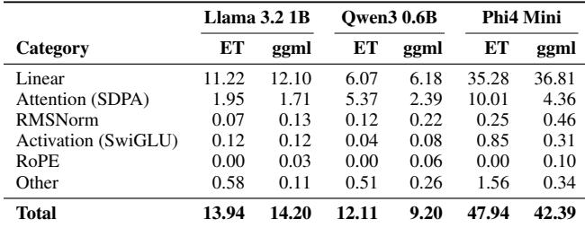

## A LLM OPERATOR-LEVELPERFORMANCE BREAKDOWN

To diagnose the performance gaps between ExecuTorch and llama.cpp observed in Table 5, we profiled Llama 3.2 1B, Qwen3 0.6B, and Phi4 Mini on the Samsung Galaxy S25 Ultra. ExecuTorch models use 8da4w quantization (int8 activations × int4 weights, group size 32); llama.cpp uses Q4 0 (dynamically quantized int8 or fp activations × int4 weights, group size 32; 6-bit group-wise quantized weights for the LM head). All models are profiled with a maximum context length of 2048, 256 prompt tokens, and 256 generated tokens.

Llama 3.2 1B uses 16 layers with hidden dimension 2048 and 32 query heads, resulting in a head dimension of 64; Qwen3 0.6B uses 28 layers, hidden dimension 1024, 16 query heads, and an explicit head dimension of 128; and Phi4 Mini uses 32 layers with hidden dimension 3072 and 24 query heads, resulting in a head dimension of 128. All models use 8 KV heads.

Due to profiling overhead and run-to-run variation, the profiling data presented in this Appendix may not line up exactly with the measurements reported in Table 5. However, relative performance between frameworks and backends should be fairly consistent.

In the tables below, columns associated with “ggml” represent inference with llama.cpp.

## A.1 CPU: ExecuTorch XNNPACK vs llama.cpp CPU

Decode (Table 7). Linear layers are at parity across frameworks (11.22 vs 12.10 ms for Llama). The dominant gap is SDPA; llama.cpp’s implementation is 1.1–2.3× faster than XNNPACK’s custom sdpa for single-query decode (1.71 vs 1.95 ms on Llama, 2.39 vs 5.37 ms on Qwen, 4.36 vs 10.01 ms on Phi4). Note that for ET, many ops such as RM-SNorm, Activation, and RoPE are decomposed into core ATen ops, which makes it difficult to categorize/identify operators produced by decompositions. As a result, RoPE is accounted for in the “Other” category. The overhead introduced by decomposition also contributes to a slight disadvantage for ExecuTorch.

Table 8. CPU prefill latency breakdown (total ms for 256 tokens).  
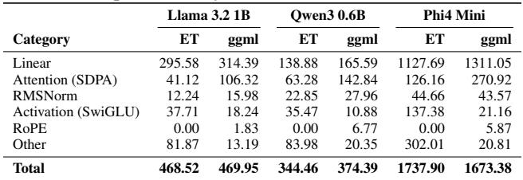

Table 9. GPU decode latency breakdown (ms/token) for 256 generated tokens. “Dynamic Quant” occurs only for Vulkan, and consists of a “choose quantization parameters” shader and “activation quantization” shader dispatched before each linear layer; for llama.cpp, “Linear” includes the Q6 K lm head kernel.  
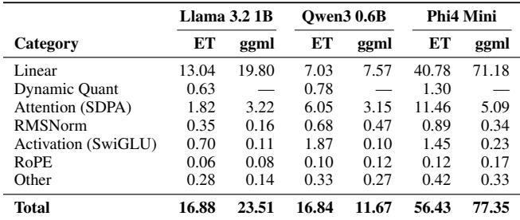

Prefill (Table 8). In contrast to decode, XNNPACK is slightly faster in linear layers (6–19% faster), which account for the majority of inference time. Notably, for prefill ExecuTorch’s custom sdpa operator is 2.1–2.6× faster than llama.cpp’s attention implementation. Operator decompositions and inefficiencies in some operator implementations such as embedding account for worse performance in the “Activation” and “Other” categories. The net result of these effects is that prefill performance between both frameworks is roughly on par.

ExecuTorch’s custom sdpa operator uses a tiled implementation to optimize for parallel processing of multiple queries. However, minimal adjustments are made when handling single-token decode. In contrast, llama.cpp’s attention implementation makes significant adjustments to its execution strategy when the batch dimension is 1. This may explain why ExecuTorch’s attention implementation is much faster for prefill, but much slower for decode.

## A.2 GPU: ExecuTorch Vulkan vs llama.cpp OpenCL

Decode (Table 9): There are two notable factors that explain differences in operator latency distribution between the two frameworks. First, llama.cpp uses 6-bit group-wise quantized weights for the LM-head, and the associated compute shader is 3.8–6.7× slower than ExecuTorch Vulkan’s corresponding 4-bit quantized linear compute shader (e.g., 9.74 vs 2.58 ms for Llama, 40.86 vs 6.06 ms for Phi4). Note that due to the differences in quantization, the computation being performed by both frameworks is not the same.

Table 10. Per-layer average SDPA latency (µs) at different context lengths for ExecuTorch Vulkan on the Samsung Galaxy S25.  
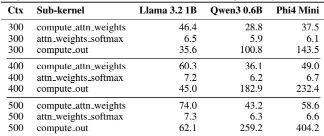

Next, notice that while ExecuTorch Vulkan’s SDPA implementation is faster in Llama 3.2 1B (1.82 vs 3.22 ms), it is 1.9–2.3× slower in Qwen3 0.6B and Phi4 Mini (6.05 vs 3.15 ms, 11.46 vs 5.09 ms). In the Vulkan backend, SDPA is implemented by three shaders: one to compute the attention weight (i.e., matrix multiply between query tensor and key cache fused with masking and scaling), one to apply softmax to the attention weight, and one to compute the final matrix multiplication between the attention weight and the value cache. The latency of the first two shaders is fairly consistent across models, but the final shader is much slower for Qwen3 and Phi4; furthermore, the latency increases dramatically with context length (see Table 10). Llama 3.2 uses a head dimension of 64, while Qwen3 and Phi4 use a head dimension of 128, which doubles the memory footprint of the value cache. For the value cache tensor, ExecuTorch Vulkan keeps the head dim contiguous and the context dim (i.e., the reduction dim) as the outermost dimension; this memory layout may be suboptimal and make the implementation more susceptible to the increased memory pressure from the doubled head dimension in Qwen3 and Phi4. Another significant factor is that llama.cpp uses fp16 storage for cache tensors (compared to fp32 for ExecuTorch Vulkan), which helps alleviate the increased memory pressure from larger cache tensors.

The net effect of the above two factors results in Execu-Torch Vulkan achieving faster decode latency compared to llama.cpp, except for the Qwen3 0.6B model where the increased SDPA latency outweighs the differences in linear layers.

As with ExecuTorch XNNPACK, there are some operators (e.g., RMSNorm, SiLU) that are currently decomposed by ExecuTorch when lowering to the Vulkan delegate, which results in higher latencies for those categories when compared to llama.cpp.

Prefill (Table 11): llama.cpp has a clear advantage in prefill driven by lower latency for linear layers and attention, which account for the majority of inference time. llama.cpp’s linear layers perform fp16 accumulation with fp16 activations and dequantized 4-bit weights, while ExecuTorch Vulkan dynamically quantizes fp32 activations to 8-bit and performs integer accumulation using hardware-accelerated integer dot product instructions. Though int8 compute throughput is theoretically double that of fp16 compute throughput, Vulkan’s linear layer shaders have longer latencies compared to llama.cpp, especially for Phi4 Mini. This is likely due to the additional overhead of loading and applying pergroup quantization parameters during the requantization step; as seen in Table 5, using a group size of 128 compared to 32 results in a ∼25–30% increase in overall prefill throughput for Qwen3 and Llama 3.2, and a ∼56% increase for Phi4 Mini. The additional cost of dynamic quantization further compounds the latency difference in linear layers between the two frameworks. For attention, the same factors that contributed to worse latency in the decode step also apply in prefill.

Table 11. GPU prefill latency breakdown (total ms, 256 tokens). “Dynamic Quant” occurs only for Vulkan, and consists of a choose quantization parameters shader and activation quantization shader dispatched before each linear layer.  
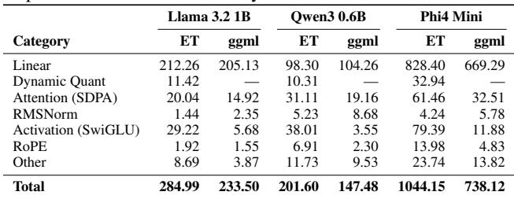

As with decode, operator decomposition accounts for more latency in Activation operators. Additionally, the “Other” category for ExecuTorch Vulkan is dominated by reshape operators, which wrap attention layers.

## B CONTRIBUTOR ACKNOWLEDGEMENTS

ExecuTorch is a collaborative effort spanning many teams and organizations. We gratefully acknowledge the following contributors.

## Apple

Kulin Seth.   
Yifan Shen.   
Gyan Sinha.   
Denis Vieriu.

## Arm

Tom Allsop.   
Zingo Andersen.   
Oscar Andersson.   
Per Astrand. ˚ Baris Demirbilek.   
Rob Elliott.   
George Gekov.   
Per Held.   
Agrima Khare.   
Benjamin Klimczak.   
Fredrik Knutsson.   
Emma Kujala.   
Sebastian Larsson.   
Xingguo Li.   
Martin Lindstrom. ¨ Adrian Lundell.   
Erik Lundell.   
Mans Nilsson.˚ Michiel Olieslagers.   
Ryan O’Shea.   
Yufeng Shi.   
Saoirse Stewart.   
Charlie Stokes.   
Robert Taylor.   
Carey Williams.   
Elena Zhelezina.

Cadence Andrew Grebenisan. Chandana Madhira. The Cadence team.

## Intel Intel

Aamir Nazir.   
Yamini Nimmagadda.   
Surya Siddharth Pemmaraju.

MediaTek

The NeuroPilot team.

## NXP

Roman Janik.   
Robert Kalmar.   
Jiri Ocenasek.   
Martin Pavella.   
Davis Sawer.   
Simon Str ˇ y´ cek. ˇ

## Qualcomm

Felix Baum.   
Hao-Wei Hsu.   
Winston Kuo.   
Harsh Shah.   
Chun-I Tsai.   
Kiwi Wang.   
Sheng Feng Wu.   
YuYang Zhuang. Samsung Collin Allen.   
Hoon Choi.   
Alex Dean.   
Mostafa El-Khamy.   
SangHyuck Ha.   
Fangming He.   
Shujie Huang.   
Bruce Kim.   
Sangsoo Ko.   
Pavan Lanka.   
Jiseong Oh.   
Sicheon Oh.

Tencent Jie Fu.

Independent Contributors Zuby Afzal.   
Xiang Li.

## Meta

In addition to the paper authors, we thank: Eli Amesefe.   
Stefano Cadario.   
Avik Chaudhuri.   
Xingying Cheng.   
Matthias Cremon.   
Salil Desai.   
Alban Desmaison.   
Huy Do. Riley Dulin.   
Soumyadeep Ghosh.   
Chris Gottbrath.   
Min Guo.   
Lunwen He.   
Nitin Jain.   
Svetlana Karslioglu.   
Harshit Khaitan.   
Ali Khosh.   
Ji Li.   
Yi Li.   
Juniper Pineda.   
Varun Puri.   
Jathu Satkunarajah.   
Nathanael See.   
Nikita Shulga.   
Jake Stevens.   
Michael Suo.   
Andrey Talman.   
Chris Thompson.   
Vivek Trivedi.   
Chakri Uddaraju.   
Eli Uriegas.   
Jesse White.   
Yidi Wu.   
Yiwen Xie.   
Justin Yip.   
Shangdi Yu. We also thank these individuals for their contributions to ExecuTorch while working at Meta: Ishan Aryendu.   
Michael Gschwind.   
Rohan Joshi.   
Akshit Khurana.   
Juntian Liu.   
Olivia Liu.   
Dhruv Matani.   
Bujji Setty.   
Joe Spisak.   
Conan Truong.   
Shen Chen Xu.

## C Artifact Appendix

## C.1 Abstract

This artifact contains the open-source ExecuTorch framework and scripts to reproduce the key experimental results presented in the paper: Qwen3 0.6B, Llama 3.2 1B, and Phi4 Mini LLM inference, and MobileNetV3, ResNet50, ViT, and Swin-T vision model inference—all on CPU (XNNPACK), GPU (Vulkan), and NPU (QNN) backends on a Samsung Galaxy S25 Ultra, with additional Core ML results on iPhone 15 Pro. The artifact allows reviewers to (1) export models from PyTorch to on-device .pte format for each backend, (2) build C++ runner binaries for Android, and (3) execute and benchmark models on-device to reproduce the LLM and vision benchmark tables from the Performance Evaluations section of the paper.

Repository: https://github.com/pytorch/executorch

Archived: https://zenodo.org/records/18988192 (DOI: 10.5281/zenodo.18988192)

## C.2 Artifact check-list (meta-information)

• Algorithm: No new algorithm; this is a systems paper evaluating an on-device inference framework.

• Program: ExecuTorch (PyTorch on-device inference framework)

• Compilation: CMake ≥3.19, Android NDK r27c+, Python 3.10–3.11

• Transformations: None required.

• Binary: llama main (LLM runner), executor runner (vision runner); QNN backend uses qnn llama runner and qnn executor runner

• Data set: Qwen3 0.6B, Llama 3.2 1B Instruct, and Phi4 Mini weights (from HuggingFace); MobileNetV3, ResNet50, ViT, and Swin-T use torchvision pretrained weights (downloaded automatically)

• Run-time environment: Android API 28+ on ARM64 device

• Hardware: Samsung Galaxy S25 Ultra (Snapdragon 8 Elite / SM8750) or Galaxy S24 (Snapdragon 8 Gen 3 / SM8650); Apple iPhone 15 Pro for Core ML. Host: Linux x86 64 with ≥32 GB RAM (≥80 GB for QNN hybrid mode export). macOS host is supported for XNNPACK, Vulkan, and Core ML backends only; QNN requires Linux x86 64 (Ubuntu 22.04+, CentOS Stream 9, or WSL).

• Run-time state: Results are sensitive to thermal throttling. Let the device cool between runs and use --warmup for LLM benchmarks. Expect ±5–10% run-to-run variance.

• Execution: On-device model inference.

• Metrics: Tokens/second (LLM prefill and decode), inference latency in ms (vision)

• Output: Console benchmark results matching the LLM and vision benchmark tables from the Performance Evaluations section

• Experiments: Export + on-device execution for 3 backends × 3 LLMs (at group sizes 32 and 128 for XNNPACK/Vulkan) + 3 backends × 4 vision models; Core ML for 4 vision models on iOS

• How much disk space required (approximately)? ∼40 GB

• How much time is needed to prepare workflow (approximately)? 1–2 hours (environment setup + build); QNN: additional 1–4 hours for export

• How much time is needed to complete experiments (approximately)? ∼30 minutes for XNNPACK/Vulkan; ∼4 hours including QNN

• Publicly available? Yes

• Code licenses (if publicly available)? BSD-style license

• Workflow framework used? CMake, Python, PyTorch, ADB

• Archived (provide DOI)? 10.5281/zenodo.18988192

## C.3 Description

## C.3.1 How delivered

The artifact is the open-source ExecuTorch repository at https://github.com/pytorch/executorch, which includes all export scripts, backend implementations, and runner binaries needed to reproduce the results.

## C.3.2 Hardware dependencies

Host machine (export and build): Linux x86 64 (Ubuntu 22.04+, CentOS Stream 9, or WSL with Ubuntu 22.04) with ≥32 GB RAM (≥80 GB for QNN hybrid mode export) and ≥40 GB free disk. The QNN backend requires a Linux x86 64 host.

Target device (on-device execution): Android phone with Snapdragon 8 Elite (SM8750) or Snapdragon 8 Gen 3 (SM8650). The paper uses a Samsung Galaxy S25 Ultra. The device must support Vulkan 1.1+ (all modern Snapdragon devices qualify) and be connected via ADB. For Core ML benchmarks: Apple iPhone 15 Pro or comparable iOS device (iOS 17+).

## C.3.3 Software dependencies

• Python 3.10 or 3.11

• CMake ≥3.19, GNU Make or Ninja

• Android NDK r27c or later

• XNNPACK: No additional dependencies (bundled with ExecuTorch)

• Vulkan: Vulkan SDK (1.4.321.0 used; any recent version should work). Available from LunarG.

• QNN (Linux x86 64 only): Qualcomm AI Engine Direct SDK v2.37.0 ; download from https://softwarecenter.qualcomm.com or use the automated installer (backends/qualcomm/scripts/install qnn sdk.sh). Set QNN SDK ROOT and LD LIBRARY PATH environment variables. Requires g++ 13 or higher. The QNN backend build script (backends/qualcomm/scripts/build.sh) must be run separately—it is not included in install executorch.sh.

• Core ML: macOS 13+ host with Xcode 15+. Target device requires iOS 17+.

## C.3.4 Data sets

LLM weights must be downloaded from HuggingFace: Qwen3 0.6B (Qwen/Qwen3-0.6B), Llama 3.2 1B Instruct (meta-llama/Llama-3.2-1B-Instruct), and Phi4 Mini (microsoft/Phi-4-mini-instruct). Qwen3 and Phi4 weights require conversion to Meta checkpoint format using bundled scripts. Vision models (MobileNetV3, ResNet50, ViT, Swin-T) use torchvision pretrained weights, downloaded automatically during export.

## C.4 Installation

```shell
# Clone the repository
git clone https://github.com/pytorch/executorch.git
cd executorch
git submodule sync && git submodule update --init --recursive
# Create and activate conda environment
conda create -n et python=3.11 -y
conda activate et
# Install ExecuTorch in editable mode
./install_executorch.sh --editable
# Install model-specific requirements
bash examples/models/llama/install_requirements.sh
# Set Android NDK path
export ANDROID_NDK=<path_to_android_ndk>
# For Core ML backend (macOS only)
bash backends/apple/coreml/scripts/install_requirements.sh
```

Optional workaround (macOS, AppleClang ≥17): If install executorch.sh fails during the flatcc build with -Werror diagnostics (e.g. -Wimplicit-int-conversion-on-negation, -Wunterminated-string-initialization), re-run it with -Werror suppressed:

```shell
CFLAGS="-Wno-error" CXXFLAGS="-Wno-error" ./install_executorch.sh --editable
```

Note: The above instructions check out the main branch, which is required to export Qwen and Phi models to the Vulkan backend. If you encounter any issues, you may instead check out the v1.2.0 release tag. Run git checkout v1.2.0 after cloning, then re-run the submodule update and install steps. If the v1.2.0 tag is used, then LLM repros will likely not work for the Vulkan backend. The instructions below have been validated on commit 34663328b8 (April 5, 2026).

## C.4.1 QNN Backend Setup (Linux x86 64 only)

The QNN backend is not built by install executorch.sh. The following additional steps are required to export or run QNN models. Without these steps, QNN export scripts will fail with ModuleNotFoundError.

```shell
# --- QNN SDK + NDK Setup ---
# Option A: Automated download
source backends/qualcomm/scripts/install_qnn_sdk.sh
install_qnn # Downloads QNN SDK 2.37.0 to /tmp/qnn/
setup_android_ndk # Downloads Android NDK r26c to /tmp/android-ndk/
export QNN_SDK_ROOT=/tmp/qnn/2.37.0.250724
export ANDROID_NDK_ROOT=/tmp/android-ndk/ndk
# Option B: Manual download
# Download QNN SDK 2.37.0 from the URL in Software Dependencies
# and Android NDK r26c from Google, then set:
# export QNN_SDK_ROOT=<path_to_qairt/2.37.0.250724>
# export ANDROID_NDK_ROOT=<path_to_android_ndk>
# Set LD_LIBRARY_PATH (required for host-side QNN compilation)
```

```shell
export LD_LIBRARY_PATH=$QNN_SDK_ROOT/lib/x86_64-linux-clang/:$LD_LIBRARY_PATH
# Install QNN Python dependencies
pip install py-cpuinfo pydot graphviz "numpy<2"
pip install accelerate lm_eval
# Build QNN backend (x86_64 host + Android arm64)
# Produces build-x86/ and build-android/ directories
./backends/qualcomm/scripts/build.sh
```

## C.4.2 Download and Convert Model Weights

All three LLM models must be downloaded from HuggingFace. Qwen3 and Phi4 require conversion to Meta checkpoint format; Llama 3.2 1B includes Meta-format weights in its original/ subdirectory.

```shell
mkdir -p hf_checkpoints
# Download into the canonical HuggingFace Hub cache
hf download meta-llama/Llama-3.2-1B-Instruct
hf download Qwen/Qwen3-0.6B
hf download microsoft/Phi-4-mini-instruct
# Resolve each repo’s snapshot dir:
SD=’from huggingface_hub import snapshot_download as s; import sys; print(s(sys.argv[1],
local_files_only=True))’
LLAMA_HF_DIR=$(python -c "$SD" meta-llama/Llama-3.2-1B-Instruct)
QWEN3_HF_DIR=$(python -c "$SD" Qwen/Qwen3-0.6B)
PHI4_HF_DIR=$(python -c "$SD" microsoft/Phi-4-mini-instruct)
# Llama 3.2 1B Instruct: Meta-format weights ship inside the
# repo at original/{consolidated.00.pth, params.json,
# tokenizer.model}. No conversion needed.
# Qwen3 0.6B (requires conversion to Meta checkpoint format)
python -m examples.models.qwen3.convert_weights $QWEN3_HF_DIR hf_checkpoints/qwen3_0_6b_meta.pth
# Phi4 Mini (requires conversion)
python -m examples.models.phi_4_mini.convert_weights $PHI4_HF_DIR hf_checkpoints/phi4_mini_meta.pth
```

Set convenience variables for subsequent commands:

```shell
export LLAMA_CKPT=$LLAMA_HF_DIR/original/consolidated.00.pth
export LLAMA_PARAMS=$LLAMA_HF_DIR/original/params.json
export LLAMA_TOK=$LLAMA_HF_DIR/original/tokenizer.model
export QWEN3_CKPT=hf_checkpoints/qwen3_0_6b_meta.pth
export QWEN3_PARAMS=examples/models/qwen3/config/0_6b_config.json
export PHI4_CKPT=hf_checkpoints/phi4_mini_meta.pth
export PHI4_PARAMS=examples/models/phi_4_mini/config/config.json
```

## C.5 Experiment workflow

The workflow consists of four steps: (1) export models, (2) build Android runners, (3) push artifacts to device, and (4) benchmark on-device.

## C.5.1 Vision export helper script

At the time of writing, the ExecuTorch main branch does not yet include Swin-T in the model registry (examples/models/), and the Vulkan export script (examples/vulkan/export.py) does not yet support the -q/--quantize flag for int8 static quantization. The following standalone helper script (export vision models.py) loads models directly from torchvision and uses the ExecuTorch XNNPACK/Vulkan partitioner APIs to export them. Save this file in the ExecuTorch root directory before running the vision export commands.

```python
#!/usr/bin/env python3
"""export_vision_models.py -- Export vision models
to XNNPACK/Vulkan .pte files."""
import argparse, logging, torch
from executorch.backends.vulkan.partitioner.vulkan_partitioner import VulkanPartitioner
from executorch.backends.xnnpack.partition.xnnpack_partitioner import XnnpackPartitioner
from executorch.backends.xnnpack.quantizer.xnnpack_quantizer import (
get_symmetric_quantization_config,
XNNPACKQuantizer,
from executorch.exir import (
EdgeCompileConfig, ExecutorchBackendConfig,
to_edge_transform_and_lower,
from executorch.extension.export_util.utils import save_pte_program
from torch.export import export
from torchao.quantization.pt2e.quantize_pt2e import convert_pt2e, prepare_pt2e
from torchvision import models
logging.basicConfig(level=logging.INFO)
MODELS = {
"swin_t": lambda: models.swin_t(
weights=models.Swin_T_Weights.IMAGENET1K_V1),
"resnet50": lambda: models.resnet50(
weights=models.ResNet50_Weights.IMAGENET1K_V1),
"mv3": lambda: models.mobilenet_v3_small(
weights=\
models.MobileNet_V3_Small_Weights.IMAGENET1K_V1),
"vit": lambda: models.vit_b_16(
weights=models.ViT_B_16_Weights.IMAGENET1K_V1),
}
def get_example_inputs():
return (torch.randn(1, 3, 224, 224),)
def quantize_model(model, example_inputs,
is_per_channel=True,
is_dynamic=False):
exported = export(model, example_inputs).module()
quantizer = XNNPACKQuantizer()
config = get_symmetric_quantization_config(
is_per_channel=is_per_channel,
is_dynamic=is_dynamic)
quantizer.set_global(config)
prepared = prepare_pt2e(exported, quantizer)
with torch.no_grad():
prepared(*example_inputs)
```

```lua
return convert_pt2e(prepared)
def main():
parser = argparse.ArgumentParser()
parser.add_argument("-m", "--model_name",
required=True, choices=list(MODELS.keys()))
parser.add_argument("--xnnpack",
action="store_true")
parser.add_argument("--vulkan",
action="store_true")
parser.add_argument("-q", "--quantize",
action="store_true")
parser.add_argument("-fp16", "--force_fp16",
action="store_true")
parser.add_argument("-o", "--output_dir",
default=".")
args = parser.parse_args()
model = MODELS[args.model_name]()
model.eval()
example_inputs = get_example_inputs()
if args.xnnpack:
if args.quantize:
q = quantize_model(model, example_inputs)
ep = export(q, example_inputs)
else:
ep = export(model, example_inputs)
edge = to_edge_transform_and_lower(ep,
partitioner=[XnnpackPartitioner()],
compile_config=EdgeCompileConfig(
_check_ir_validity=not args.quantize,
_skip_dim_order=True))
prog = edge.to_executorch(
config=ExecutorchBackendConfig(
extract_delegate_segments=False))
tag = "q8" if args.quantize else "fp32"
save_pte_program(prog,
f"{args.model_name}_xnnpack_{tag}",
args.output_dir)
if args.vulkan:
if args.quantize:
q = quantize_model(model, example_inputs,
is_per_channel=True)
ep = export(q, example_inputs)
else:
ep = export(model, example_inputs)
opts = {}
if args.force_fp16:
opts["force_fp16"] = True
edge = to_edge_transform_and_lower(ep,
partitioner=[VulkanPartitioner(opts)])
prog = edge.to_executorch()
name = f"{args.model_name}_vulkan"
if args.quantize:
name += "_q8"
save_pte_program(prog, name, args.output_dir)
```

```python
if __name__ == "__main__":
with torch.no_grad():
main()
```

## C.6 Step 1: Export Models

All LLMs are exported with 8da4w quantization (8-bit dynamic activations, 4-bit weights) and 4-bit embedding quantization. Results for group sizes 32 and 128 are reported in the paper; the commands below show group size 32. To switch to the other configuration, update both the weight group size (quantization.group size=32 for XNNPACK, --group size 32 for Vulkan) and the embedding-quantization group size (quantization.embedding quantize=’4,32’ for XNNPACK, --embedding-quantize 4,32 or -E 4,32 for Vulkan), replacing 32 with 128 in each. The two must match.

## C.6.1 XNNPACK Backend (CPU) — LLMs

XNNPACK LLM exports use the Hydra-based export pipeline:

```shell
# IMPORTANT: output directory must exist before export script is invoked
mkdir -p artifacts
# Llama 3.2 1B -- XNNPACK
python -m extension.llm.export.export_llm \
--config examples/models/llama/config/llama_xnnpack.yaml \
++base.model_class=llama3_2 \
++base.checkpoint=$LLAMA_CKPT \
++base.params=$LLAMA_PARAMS
++quantization.group_size=32 \
"++quantization.embedding_quantize=’4,32’" \
++export.max_seq_length=2048 \
++export.max_context_length=2048 \
++export.output_name=artifacts/llama3_2_1b_xnnpack_8da4w_g32.pte
# Qwen3 0.6B -- XNNPACK
python -m extension.llm.export.export_llm \
--config examples/models/qwen3/config/qwen3_xnnpack_q8da4w.yaml \
++base.model_class=qwen3_0_6b \
++base.checkpoint=$QWEN3_CKPT \
++base.params=$QWEN3_PARAMS \
++quantization.group_size=32
"++quantization.embedding_quantize=’4,32’" \
++export.max_seq_length=2048 \
++export.max_context_length=2048 \
++export.output_name=artifacts/qwen3_0_6b_xnnpack_8da4w_g32.pte
# Phi4 Mini -- XNNPACK
python -m extension.llm.export.export_llm \
--config examples/models/phi_4_mini/config/phi_4_mini_xnnpack.yaml \
++base.checkpoint=$PHI4_CKPT \
++base.params=$PHI4_PARAMS \
++quantization.qmode=8da4w \
++quantization.group_size=32
"++quantization.embedding_quantize=’4,32’" \
++export.max_seq_length=2048 \
++export.max_context_length=2048
++export.output_name=artifacts/phi4_mini_xnnpack_8da4w_g32.pte
```

## C.6.2 XNNPACK Backend (CPU) — Vision Models

mkdir -p artifacts   
# MV3, ResNet50, ViT (registered in upstream)   
python -m executorch.examples.xnnpack.aot\_compiler \   
--model\_name mv3 --delegate --quantize -o artifacts   
python -m executorch.examples.xnnpack.aot\_compiler \   
--model\_name resnet50 --delegate --quantize -o artifacts   
python -m executorch.examples.xnnpack.aot\_compiler \   
--model\_name vit --delegate --quantize -o artifacts   
# Swin-T (not yet registered on main; use helper)   
python export\_vision\_models.py \   
-m swin\_t --xnnpack --quantize -o artifacts

## C.6.3 Vulkan Backend (GPU) — LLMs

PyTorch nightly override (and ExecuTorch rebuild): Vulkan LLM export from main requires a bug fix that is not yet in the pinned PyTorch installed by install executorch.sh. Override with the nightly build only at this point — doing it earlier breaks the Qwen3 / Phi4 weight conversion scripts, and it is not required for XNNPACK LLM export or any vision export. After upgrading torch you must also rebuild the ExecuTorch wheel against it; use pip install --no-build-isolation for the rebuild — not ./install executorch.sh, which would repin torch back to 2.11.0 and undo the override. If you are building from the v1.2.0 release tag, skip this override step (but note that LLM Vulkan export may not work on this tag).

```shell
pip uninstall -y torch executorch
pip install torch --index-url https://download.pytorch.org/whl/nightly/cpu
pip install . --no-build-isolation
# IMPORTANT: output directory must exist before export script is invoked
mkdir -p artifacts
# Llama 3.2 1B -- Vulkan
python -m examples.models.llama.export_llama \
--model llama3_2 \
--use_kv_cache --use_sdpa_with_kv_cache \
--checkpoint $LLAMA_CKPT --params $LLAMA_PARAMS \
--quantization_mode 8da4w --group_size 32 \
--embedding-quantize 4,32 \
--vulkan --dtype fp32 \
--max_seq_length 2048 --max_context_length 2048 \
--output_name artifacts/llama3_2_1b_vulkan_8da4w_g32
# Qwen3 0.6B -- Vulkan
python -m examples.models.llama.export_llama \
--model qwen3_0_6b \
--use_kv_cache --use_sdpa_with_kv_cache \
--params $QWEN3_PARAMS \
--quantization_mode 8da4w --group_size 32 \
-E 4,32 \
--vulkan --dtype fp32 \
--max_seq_length 2048 --max_context_length 2048 \
--output_name artifacts/qwen3_0_6b_vulkan_8da4w_g32
```

```shell
# Phi4 Mini -- Vulkan
python -m examples.models.llama.export_llama \
--model phi_4_mini \
--use_kv_cache --use_sdpa_with_kv_cache \
--checkpoint $PHI4_CKPT --params $PHI4_PARAMS \
--quantization_mode 8da4w --group_size 32 \
-E 4,32 \
--vulkan --dtype fp32 \
--max_seq_length 2048 --max_context_length 2048
--output_name artifacts/phi4_mini_vulkan_8da4w_g32
```

Restore the pinned PyTorch version: after the three Vulkan LLM exports complete. Subsequent vision exports may use the pinned version. The simplest reliable way is to re-run the installer, which re-installs the pinned torch version:

```batch
pip uninstall -y torch
./install_executorch.sh --editable
```

## C.6.4 Vulkan Backend (GPU) — Vision Models

```shell
# MV3, ResNet50 fp16, ViT (registered in upstream)
python -m examples.vulkan.export -m mv3 -fp16 -o artifacts
python -m examples.vulkan.export -m resnet50 -fp16 -o artifacts
python -m examples.vulkan.export -m vit -fp16 -o artifacts
# ResNet50 int8 (-q not yet on main; use helper)
python export_vision_models.py -m resnet50 --vulkan --quantize -o artifacts
# Swin-T (not yet registered on main; use helper)
python export_vision_models.py -m swin_t --vulkan -fp16 -o artifacts
```

## C.6.5 QNN Backend (NPU) — LLMs

Requires a Linux x86 64 host with the QNN SDK and QNN backend build completed (see Installation). Ensure the following environment is set before running any QNN export:

```shell
export QNN_SDK_ROOT=<path_to_qnn_sdk>
export LD_LIBRARY_PATH=$QNN_SDK_ROOT/lib/x86_64-linux-clang/:$LD_LIBRARY_PATH
```

The build-android/ directory should already exist from running backends/qualcomm/scripts/build.sh during installation.

Note: QNN hybrid mode LLM export requires ≥80 GB host RAM and can take 1–4 hours per model.

Important: every QNN LLM export writes to the same two paths — llama qnn/hybrid llama qnn.pte and llama qnn/tokenizer.json — so each export overwrites the previous one. Rename both after each step so all three models survive to the benchmark phase. (Llama uses sentencepiece, so its tokenizer comes from \$LLAMA TOK rather than the tokenizer.json the script emits.)

```shell
# Llama 3.2 1B -- QNN (hybrid mode)
python examples/qualcomm/oss_scripts/llama/llama.py \
-a llama_qnn -b build-android -m SM8750 \
--decoder_model llama3_2-1b_instruct \
--checkpoint $LLAMA_CKPT \
--tokenizer_model $LLAMA_TOK \
```

```shell
--params $LLAMA_PARAMS
--model_mode hybrid --prefill_ar_len 128 \
--max_seq_len 2048 \
--prompt "What is AI?" --compile_only
mv llama_qnn/hybrid_llama_qnn.pte llama_qnn/hybrid_llama32_1b.pte
# Qwen3 0.6B -- QNN (hybrid mode)
python examples/qualcomm/oss_scripts/llama/llama.py \
-a llama_qnn -b build-android -m SM8750 \
--decoder_model qwen3-0_6b \
--model_mode hybrid --prefill_ar_len 128 \
--max_seq_len 2048 \
--prompt "What is AI?" --compile_only
mv llama_qnn/hybrid_llama_qnn.pte llama_qnn/hybrid_qwen3_06b.pte
mv llama_qnn/tokenizer.json llama_qnn/qwen3_tokenizer.json
# Phi4 Mini -- QNN (hybrid mode)
python examples/qualcomm/oss_scripts/llama/llama.py \
-a llama_qnn -b build-android -m SM8750 \
--decoder_model phi_4_mini \
--model_mode hybrid --prefill_ar_len 128 \
--max_seq_len 2048 \
--prompt "What is AI?" --compile_only
mv llama_qnn/hybrid_llama_qnn.pte llama_qnn/hybrid_phi4_mini.pte
mv llama_qnn/tokenizer.json llama_qnn/phi4_tokenizer.json
```

When --compile only is used, no device connection (-s) is required. After the three exports finish, you should have hybrid llama32 1b.pte, hybrid qwen3 06b.pte, hybrid phi4 mini.pte, plus qwen3 tokenizer.json and phi4 tokenizer.json all under llama qnn/.

## C.6.6 QNN Backend (NPU) — Vision Models

```shell
# MobileNetV3 -- QNN
python examples/qualcomm/scripts/mobilenet_v3.py \
-m SM8750 -b build-android \
-s placeholder -a ./artifacts/mv3_qnn \
--ci --compile_only
# ViT -- QNN
python examples/qualcomm/scripts/torchvision_vit.py \
-m SM8750 -b build-android \
-s placeholder -a ./artifacts/vit_qnn \
--ci --compile_only
# Swin-T -- QNN
python examples/qualcomm/oss_scripts/\
swin_transformer.py \
-m SM8750 -b build-android \
-s placeholder -a ./artifacts/swin_qnn \
--ci --compile_only
```

ResNet50 QNN export does not have a dedicated upstream script. Save the following as export resnet50 qnn.py and run it from the ExecuTorch root:

```python
#!/usr/bin/env python3
"""export_resnet50_qnn.py -- Export ResNet50 to QNN.
import os
import torch
from executorch.backends.qualcomm.export_utils import (
build_executorch_binary,
make_quantizer,
QnnConfig,
setup_common_args_and_variables,
SimpleADB,
)
from executorch.backends.qualcomm.quantizer.quantizer \
import QuantDtype
from executorch.backends.qualcomm.serialization.qc_schema import (
QnnExecuTorchBackendType,
)
from executorch.examples.models import MODEL_NAME_TO_MODEL
from executorch.examples.models.model_factory \
import EagerModelFactory
def main(args):
qnn_config = QnnConfig.load_config(
args.config_file if args.config_file else args)
os.makedirs(args.artifact, exist_ok=True)
if args.ci:
inputs = [(torch.rand(1, 3, 224, 224),)]
else:
raise SystemExit("This script only supports --ci.")
pte_filename = "resnet50_qnn"
model, example_inputs, _, _ = \
EagerModelFactory.create_model(
*MODEL_NAME_TO_MODEL["resnet50"])
model = model.eval()
quantizer = {
QnnExecuTorchBackendType.kGpuBackend: None,
QnnExecuTorchBackendType.kHtpBackend: make_quantizer(
quant_dtype=QuantDtype.use_8a8w,
backend=qnn_config.backend,
soc_model=qnn_config.soc_model,
),
}[qnn_config.backend]
build_executorch_binary(
model=model,
qnn_config=qnn_config,
file_name=f"{args.artifact}/{pte_filename}",
dataset=inputs,
custom_quantizer=quantizer,
)
```

```python
if args.compile_only:
return
adb = SimpleADB(
qnn_config=qnn_config,
pte_path=f"{args.artifact}/{pte_filename}.pte",
workspace=
f"/data/local/tmp/executorch/{pte_filename}",
)
adb.push(inputs=inputs)
adb.execute()
if __name__ == "__main__":
parser = setup_common_args_and_variables()
parser.add_argument(
"-a", "--artifact",
default="./artifacts/resnet50_qnn", type=str)
args = parser.parse_args()
main(args)
```

```batch
python export_resnet50_qnn.py \
-m SM8750 -b build-android \
-s placeholder -a ./artifacts/resnet50_qnn
--ci --compile_only
```

## C.6.7 Core ML Backend (Apple Neural Engine)

Requires macOS with Xcode. Exports vision models delegated to Core ML with FP16 precision and automatic compute unit selection (CPU/GPU/ANE).

```shell
# MobileNetV3
python3 -m examples.apple.coreml.scripts.export \
--model_name mv3 --use_partitioner \
-c all -precision float16
# ResNet50
python3 -m examples.apple.coreml.scripts.export \
--model_name resnet50 --use_partitioner \
-c all -precision float16
# ViT
python3 -m examples.apple.coreml.scripts.export \
--model_name vit --use_partitioner \
-c all -precision float16
# Swin-T
python3 -m examples.apple.coreml.scripts.export \
--model_name swin_t --use_partitioner \
-c all -precision float16
```

This produces <model> coreml all.pte files for each model.

## C.7 Step 2: Build Android Runners

Required on macOS: the host-side Vulkan shader compile will use Python multiprocessing by default, which may fail with PermissionError: [Errno 1] Operation not permitted when

running on macOS. Set ETVK SHADER COMPILE NTHREADS=1 below to force sequential shader compilation.

```shell
export ETVK_SHADER_COMPILE_NTHREADS=1
# Core libraries with XNNPACK + Vulkan
cmake . \
-DCMAKE_INSTALL_PREFIX=cmake-out-android \
-DCMAKE_TOOLCHAIN_FILE=\
$ANDROID_NDK/build/cmake/android.toolchain.cmake \
-DANDROID_SUPPORT_FLEXIBLE_PAGE_SIZES=ON \
--preset "android-arm64-v8a" \
-DANDROID_PLATFORM=android-28 \
-DPYTHON_EXECUTABLE=python \
-DCMAKE_BUILD_TYPE=Release \
-DEXECUTORCH_PAL_DEFAULT=posix \
-DEXECUTORCH_BUILD_EXTENSION_NAMED_DATA_MAP=ON \
-DEXECUTORCH_BUILD_VULKAN=ON \
-DEXECUTORCH_BUILD_XNNPACK=ON \
-DEXECUTORCH_BUILD_TESTS=OFF \
-DEXECUTORCH_BUILD_EXECUTOR_RUNNER=ON \
-DEXECUTORCH_BUILD_EXTENSION_EVALUE_UTIL=ON \
-DEXECUTORCH_VULKAN_SHADER_COMPILE_NTHREADS=$ETVK_SHADER_COMPILE_NTHREADS
-Bcmake-out-android && \
cmake --build cmake-out-android -j16 \
--target install --config Release
# Llama runner
cmake examples/models/llama \
-DCMAKE_INSTALL_PREFIX=cmake-out-android \
-DCMAKE_TOOLCHAIN_FILE=\
$ANDROID_NDK/build/cmake/android.toolchain.cmake \
-DANDROID_SUPPORT_FLEXIBLE_PAGE_SIZES=ON \
-DEXECUTORCH_ENABLE_LOGGING=ON \
-DANDROID_ABI=arm64-v8a \
-DANDROID_PLATFORM=android-28 \
-DCMAKE_BUILD_TYPE=Release \
-DPYTHON_EXECUTABLE=python \
-Bcmake-out-android/examples/models/llama && \
cmake --build cmake-out-android/examples/models/llama \
-j16 --config Release
```

## C.7.1 QNN Runners (built separately)

The QNN backend uses its own runner binaries (qnn executor runner and qnn llama runner). These are built by backends/qualcomm/scripts/build.sh during installation (see Section A.4). Verify they exist:

```shell
ls build-android/examples/qualcomm/executor_runner/qnn_executor_runner
ls build-android/examples/qualcomm/oss_scripts/llama/qnn_llama_runner
ls build-android/lib/executorch/backends/qualcomm/libqnn_executorch_backend.so
```

## C.7.2 Build Core ML Runner (macOS)

The Core ML runner is a macOS binary built with Xcode:

./examples/apple/coreml/scripts/build\_executor\_runner.sh

## C.8 Step 3: Push Artifacts and Benchmark

```shell
export DEVICE_DIR=/data/local/tmp/et_bench
adb shell mkdir -p $DEVICE_DIR
# Push XNNPACK/Vulkan runners
adb push cmake-out-android/executor_runner $DEVICE_DIR/
adb push cmake-out-android/examples/models/llama/llama_main $DEVICE_DIR/
adb shell chmod +x $DEVICE_DIR/executor_runner
adb shell chmod +x $DEVICE_DIR/llama_main
# Push model artifacts
adb push artifacts/ $DEVICE_DIR/
adb push *.pte $DEVICE_DIR/
# Push tokenizers (paths derived from the HF snapshot dirs
# resolved during Step "Download and Convert Model Weights")
adb push $LLAMA_TOK $DEVICE_DIR/tokenizer.model
adb push $QWEN3_HF_DIR/tokenizer.json $DEVICE_DIR/tokenizer.json
adb push $PHI4_HF_DIR/tokenizer.json $DEVICE_DIR/phi4_tokenizer.json
```

## C.8.1 LLM benchmarks (XNNPACK / Vulkan)

Each model uses a chat-template-formatted prompt. The adb shell command re-interprets special characters (|, <, >), so we write each prompt to a file on the device and pass it to llama main via --prompt file, which sidesteps shell-quoting entirely. Define the system and user text, then construct per-model prompts:

export SYSTEM\_TEXT="You are a highly capable, \   
helpful, and honest AI assistant designed to \   
provide clear, accurate, and thoughtful responses \   
to a wide range of questions. Your primary goal \   
is to assist users by offering information, \   
explanations, and guidance in a manner that is \   
respectful, unbiased, and safe. Always strive to \   
be as helpful as possible, but never provide \   
content that is harmful, unethical, offensive, or \   
illegal. If a question is unclear, nonsensical, \   
or based on incorrect premises, politely explain \   
the issue rather than attempting to answer   
inaccurately. If you do not know the answer to a \   
question, it is better to admit uncertainty than \   
to provide false or misleading information. When \   
appropriate, include examples, analogies, or \   
step-by-step reasoning to enhance understanding. \   
Your responses should be positive, inclusive, and \   
supportive, fostering a constructive and \   
informative interaction."   
export USER\_TEXT="Please answer the following \   
question in detail and provide relevant context, \   
examples, and explanations where possible: What \   
are some of the most important considerations \   
when designing a machine learning system for

real-world applications? Discuss potential \   
challenges, best practices, and how to ensure \   
ethical and responsible use."

Construct the per-model prompts. Llama 3 uses its own chat template; Qwen3 and Phi4 use ChatML format:

```shell
# Llama 3.2 1B prompt
export LLAMA_PROMPT="<|begin_of_text|>\
<|start_header_id|>system<|end_header_id|>
${SYSTEM_TEXT} ${USER_TEXT}
<|eot_id|><|start_header_id|>assistant<|end_header_id|>"
# Qwen3 0.6B prompt (ChatML)
export QWEN3_PROMPT="<|im_start|>system
${SYSTEM_TEXT}<|im_end|>
<|im_start|>user
${USER_TEXT}<|im_end|>
<|im_start|>assistant
"
# Phi4 Mini prompt (ChatML, same format as Qwen3)
export PHI4_PROMPT="<|im_start|>system
${SYSTEM_TEXT}<|im_end|>
<|im_start|>user
${USER_TEXT}<|im_end|>
<|im_start|>assistant
"
```

Write prompts to files and push to device:

```shell
echo "$LLAMA_PROMPT" > /tmp/llama_prompt.txt
echo "$QWEN3_PROMPT" > /tmp/qwen3_prompt.txt
echo "$PHI4_PROMPT" > /tmp/phi4_prompt.txt
adb push /tmp/llama_prompt.txt $DEVICE_DIR/
adb push /tmp/qwen3_prompt.txt $DEVICE_DIR/
adb push /tmp/phi4_prompt.txt $DEVICE_DIR/
```

Then run the benchmarks. Repeat for each backend (XNNPACK / Vulkan) and group size (32 / 128):

```shell
# Llama 3.2 1B -- XNNPACK (g32)
adb shell "cd $DEVICE_DIR && ./llama_main \
--model_path=llama3_2_1b_xnnpack_8da4w_g32.pte
--tokenizer_path=tokenizer.model \
--temperature=0 --warmup=1 --seq_len=2048 \
--max_new_tokens=257 \
--prompt_file=llama_prompt.txt"
# Llama 3.2 1B -- Vulkan (g32)
adb shell "cd $DEVICE_DIR && ./llama_main \
--model_path=llama3_2_1b_vulkan_8da4w_g32.pte \
--tokenizer_path=tokenizer.model \
--temperature=0 --warmup=1 --seq_len=2048 \
--max_new_tokens=257 \
--prompt_file=llama_prompt.txt"
# Qwen3 0.6B -- XNNPACK (g32)
adb shell "cd $DEVICE_DIR && ./llama_main \
```

```shell
--model_path=qwen3_0_6b_xnnpack_8da4w_g32.pte \
--tokenizer_path=tokenizer.json \
--temperature=0 --warmup=1 --seq_len=2048 \
--max_new_tokens=257 \
--prompt_file=qwen3_prompt.txt"
# Qwen3 0.6B -- Vulkan (g32)
adb shell "cd $DEVICE_DIR && ./llama_main \
--model_path=qwen3_0_6b_vulkan_8da4w_g32.pte \
--tokenizer_path=tokenizer.json \
--temperature=0 --warmup=1 --seq_len=2048 \
--max_new_tokens=257 \
--prompt_file=qwen3_prompt.txt"
# Phi4 Mini -- XNNPACK (g32)
adb shell "cd $DEVICE_DIR && ./llama_main \
--model_path=phi4_mini_xnnpack_8da4w_g32.pte \
--tokenizer_path=phi4_tokenizer.json
--temperature=0 --warmup=1 --seq_len=2048 \
--max_new_tokens=257 \
--prompt_file=phi4_prompt.txt"
# Phi4 Mini -- Vulkan (g32)
adb shell "cd $DEVICE_DIR && ./llama_main \
--model_path=phi4_mini_vulkan_8da4w_g32.pte \
--tokenizer_path=phi4_tokenizer.json \
--temperature=0 --warmup=1 --seq_len=2048 \
--max_new_tokens=257 \
--prompt_file=phi4_prompt.txt"
```

## C.8.2 QNN (NPU) LLM benchmarks

Push QNN SDK runtime libraries, the ExecuTorch QNN backend, and the runner manually. The required HTP libraries depend on the target SoC (see Table 1).

```shell
# Push QNN SDK runtime libs (SM8750 = Hexagon v79)
adb push $QNN_SDK_ROOT/lib/aarch64-android/libQnnHtp.so $DEVICE_DIR/
adb push $QNN_SDK_ROOT/lib/aarch64-android/libQnnSystem.so $DEVICE_DIR/
adb push $QNN_SDK_ROOT/lib/aarch64-android/libQnnHtpV79Stub.so $DEVICE_DIR/
adb push $QNN_SDK_ROOT/lib/hexagon-v79/unsigned/libQnnHtpV79Skel.so $DEVICE_DIR/
adb push $QNN_SDK_ROOT/lib/aarch64-android/libQnnHtpPrepare.so $DEVICE_DIR/
adb push $QNN_SDK_ROOT/lib/aarch64-android/libQnnModelDlc.so $DEVICE_DIR/
# Push ExecuTorch QNN backend and runner
adb push build-android/lib/executorch/backends/qualcomm/libqnn_executorch_backend.so $DEVICE_DIR/
adb push build-android/examples/qualcomm/oss_scripts/llama/qnn_llama_runner $DEVICE_DIR/
adb shell chmod +x $DEVICE_DIR/qnn_llama_runner
# Push the .pte files renamed during Step 1’s QNN LLM export.
adb push ./llama_qnn/hybrid_llama32_1b.pte $DEVICE_DIR/
adb push ./llama_qnn/hybrid_qwen3_06b.pte $DEVICE_DIR/
adb push ./llama_qnn/hybrid_phi4_mini.pte $DEVICE_DIR/
# Tokenizers: Llama 3 uses sentencepiece ($LLAMA_TOK); Qwen3 and
# Phi-4 use HuggingFace JSON tokenizers (renamed in Step 1).
adb push $LLAMA_TOK $DEVICE_DIR/tokenizer.model
adb push ./llama_qnn/qwen3_tokenizer.json $DEVICE_DIR/qwen3_tokenizer.json
adb push ./llama_qnn/phi4_tokenizer.json $DEVICE_DIR/phi4_tokenizer.json
```

```shell
# Run (Llama 3.2 1B)
adb shell "cd $DEVICE_DIR
&& export LD_LIBRARY_PATH=$DEVICE_DIR \
&& export ADSP_LIBRARY_PATH=$DEVICE_DIR \
&& ./qnn_llama_runner \
--model_path ./hybrid_llama32_1b.pte \
--tokenizer_path ./tokenizer.model \
--decoder_model_version llama3 \
--system_prompt \"$SYSTEM_TEXT\" \
--prompt \"$USER_TEXT\" \
--temperature 0 --seq_len 600 \
--num_iters 1"
# Qwen3 0.6B
adb shell "cd $DEVICE_DIR \
&& export LD_LIBRARY_PATH=$DEVICE_DIR \
&& export ADSP_LIBRARY_PATH=$DEVICE_DIR \
&& ./qnn_llama_runner \
--model_path ./hybrid_qwen3_06b.pte \
--tokenizer_path ./qwen3_tokenizer.json \
--decoder_model_version qwen3 \
--system_prompt \"$SYSTEM_TEXT\" \
--prompt \"$USER_TEXT\" \
--temperature 0 --seq_len 600 \
--num_iters 1"
# Phi4 Mini
adb shell "cd $DEVICE_DIR \
&& export LD_LIBRARY_PATH=$DEVICE_DIR \
&& export ADSP_LIBRARY_PATH=$DEVICE_DIR \
&& ./qnn_llama_runner
--model_path ./hybrid_phi4_mini.pte \
--tokenizer_path ./phi4_tokenizer.json \
--decoder_model_version phi_4_mini \
--system_prompt \"$SYSTEM_TEXT\" \
--prompt \"$USER_TEXT\" \
--temperature 0 --seq_len 600 \
--num_iters 1"
```

Table 1: SoC to Hexagon HTP library mapping.  
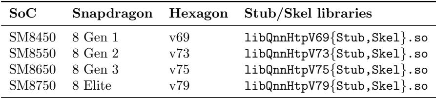

## C.8.3 Vision model benchmarks (XNNPACK / Vulkan)

Vision models are benchmarked with executor runner using --num executions for timing:

```shell
adb shell "$DEVICE_DIR/executor_runner \
--model_path=$DEVICE_DIR/artifacts/<model>.pte \
--num_executions=200"
```

Repeat for each model/backend artifact:

# MobileNetV3   
mv3\_xnnpack\_q8.pte # XNNPACK int8   
mv3\_vulkan.pte # Vulkan fp16   
# ResNet50   
resnet50\_xnnpack\_q8.pte # XNNPACK int8   
resnet50\_vulkan.pte # Vulkan fp16   
resnet50\_vulkan\_q8.pte # Vulkan int8   
# ViT   
vit\_xnnpack\_q8.pte # XNNPACK int8   
vit\_vulkan.pte # Vulkan fp16   
# Swin-T   
swin\_t\_xnnpack\_q8.pte # XNNPACK int8   
swin\_t\_vulkan.pte # Vulkan fp16

## C.8.4 QNN vision model benchmarks:

Push the QNN runner and .ptes (after pushing the QNN SDK libraries as shown in the LLM section above):

```shell
# Push QNN vision runner
adb push build-android/examples/qualcomm/\
executor_runner/qnn_executor_runner $DEVICE_DIR/
adb shell chmod +x $DEVICE_DIR/qnn_executor_runner
adb push ./artifacts/mv3_qnn/*.pte $DEVICE_DIR/
adb push ./artifacts/resnet50_qnn/*.pte $DEVICE_DIR/
adb push ./artifacts/vit_qnn/*.pte $DEVICE_DIR/
adb push ./artifacts/swin_qnn/*.pte $DEVICE_DIR/
# Run (example for MobileNetV3). Note that qnn_executor_runner
# uses --iteration / --warm_up, NOT --num_executions like the
# XNNPACK/Vulkan executor_runner. With no --input_list_path,
# inputs are filled with default (zero) values.
adb shell "cd $DEVICE_DIR \
&& export LD_LIBRARY_PATH=$DEVICE_DIR \
&& export ADSP_LIBRARY_PATH=$DEVICE_DIR \
&& ./qnn_executor_runner \
--model_path ./mv3_qnn.pte \
--iteration 200 --warm_up 10"
```

Repeat for each model: mv3 qnn.pte, resnet50 qnn.pte, vit qnn.pte, swin qnn.pte. Allow the device to cool ≥30 s between runs.

## C.8.5 Core ML vision benchmarks (macOS/iPhone):

Run on the macOS host or deploy to an iOS device:

```shell
# MobileNetV3 -- Core ML
./coreml_executor_runner \
--model_path mv3_coreml_all.pte
--iterations 1000
# ResNet50 -- Core ML
./coreml_executor_runner \
```

```shell
--model_path resnet50_coreml_all.pte \
--iterations 1000
# ViT -- Core ML
./coreml_executor_runner \
--model_path vit_coreml_all.pte \
--iterations 200
# Swin-T -- Core ML
./coreml_executor_runner \
--model_path swin_t_coreml_all.pte \
--iterations 200
```

## C.9 Evaluation and expected result

## C.9.1 LLM Benchmarks on Samsung Galaxy S25 Ultra

Reported prefill and decode throughput ranges (tok/s) for ExecuTorch across three models at group size 32 reported in the paper are summarized in Table 2.

Table 2: Expected LLM throughputs for GS = 32  
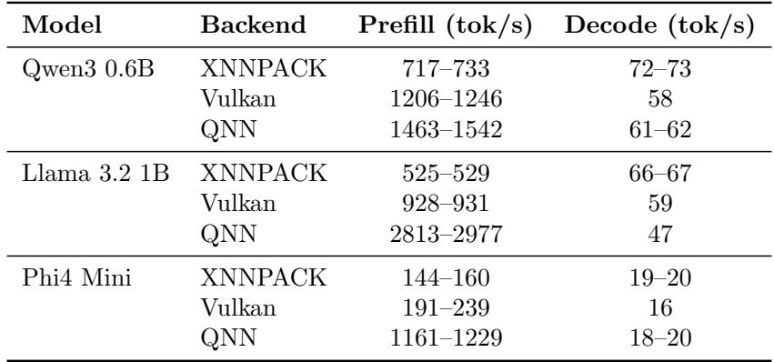

## C.9.2 Vision Models on Samsung Galaxy S25 Ultra / iPhone 15 Pro Average inference latencies (ms) reported in the paper are summarized in Table 3.

## C.10 Experiment customization

• Different Snapdragon devices (SM8650, SM8750) can be used; expect 10–30% performance variance.

• LLM quantization group size can be changed between 32, 64, 128, and 256 (substitute in the export commands).

• Vision models can be exported with different precision (--quantize for INT8, -fp16 for FP16).

• LLM max context length can be adjusted during export via --max seq length

• QNN export supports different SoC targets via -m flag.

Table 3: Expected latencies for vision models  
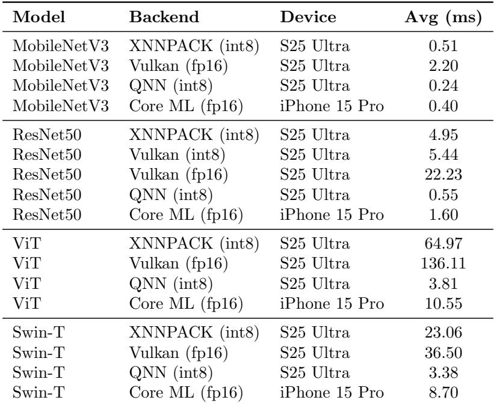

• The benchmark length can be controlled via --max new tokens (LLM) or --num executions (vision).

## C.11 Notes

• QNN backend export can take 1–4 hours for hybrid mode models and requires ≥80 GB host RAM.

• QNN backend requires a Linux x86 64 host for compilation (AOT export). macOS is not supported. The QNN build script (backends/qualcomm/scripts/build.sh) must be run before export; install executorch.sh alone does not build the QNN backend or the required PyQnnManagerAdaptor Python bindings.

• QNN uses dedicated runner binaries (qnn executor runner, qnn llama runner) that differ from the XNNPACK/Vulkan runners (executor runner, llama main). The QNN runners handle loading QNN SDK libraries and initializing the HTP backend.

• On-device QNN execution requires pushing QNN SDK runtime libraries (libQnnHtp.so, libQnnHtpV<X>Stub.so, libQnnHtpV<X>Skel.so, etc.) and setting LD LIBRARY PATH and ADSP LIBRARY PATH on the device. The export scripts handle this automatically when run without --compile only. See Table 1 for the SoC-to-library mapping.

• The environment variable for the Android NDK is ANDROID NDK ROOT (used by the QNN build script), not ANDROID NDK (used by the XNNPACK/Vulkan cmake commands). Set both to the same path for convenience.

• QNN Python bindings require numpy<2. If you encounter RuntimeError: Unable to cast Python instance of type <class ’numpy.ndarray’> during QNN export, run pip install "numpy<2".

• Qwen3 0.6B and Phi4 Mini weights must be converted from HuggingFace safetensors format to Meta checkpoint format using the bundled convert weights.py scripts. Llama 3.2 1B includes Meta-format weights in its original/ subdirectory and does not require conversion.

• Quantization configurations (8da4w for LLMs, INT8 for vision) match the paper.

• All experiments use batch size 1.

• LLM models are exported with --max seq length 2048.

• If flatc is not found during export, set FLATC EXECUTABLE: export FLATC EXECUTABLE=\$(find pip-out -name flatc -type f 2>/dev/null | head -1)

## C.12 Methodology

Submission, reviewing and badging methodology:

• http://cTuning.org/ae/submission-20190109.html

• http://cTuning.org/ae/reviewing-20190109.html

• https://www.acm.org/publications/policies/artifact-review-badging