# SPARING STRATEGIES TO MINIMIZE RELIABILITY IMPACT ON LARGE TRAINING JOBS

Kevin J. Quirk 1 Matthew Lennie 1 Ehsan K. Ardestani 1 Satyajeet Singh Ahuja 1 Matthew R. Bergeron 1 Andrew Grier 1 Zhaodong Wang 1 Mustafa Ozdal 1 Xu Zhang 1 Abhinav Triguna 1 Ying Zhang 1 Mathew Oldham 1 Chunqiang Tang 1

## ABSTRACT

Training large language models (LLMs) on Meta’s AI clusters requires running long, distributed jobs that are vulnerable to hardware failures. To maintain high availability and efficiency, production systems use sparing, i.e., pre-allocating spare compute resources that can replace failed components. However, choosing the optimal sparing strategy-including compute block size, number of spare blocks, and spare GPU trays—is complex and directly impacts cluster performance. We present an analytical framework with closed-form expressions to guide sparing strategy decisions, making practical, first-order recommendations for production environments. We also develop a simulation component to cross-validate the analytical model. Applied in Meta’s hyperscale infrastructure, this model helps engineers optimize fault tolerance, minimize downtime, and maximize goodput during LLM training. Our real-world use case demonstrates how the framework informs robust, cost-effective design choices critical to Meta’s AI operations.

## 1 INTRODUCTION

Hyperscalers are racing to build artificial general intelligence (AGI) that is open, responsible, and transformative. Achieving this vision requires continuous advancements in the scale and reliability of AI computing infrastructure. At Meta, we have invested heavily in training large language models (LLMs), with each new generation demanding greater computational resources. For example, while Meta’s Llama 3 flagship model utilized 16K H100 GPUs to train on over 15 trillion tokens (Lla, 2024), the Behemoth model was pre-trained on 30T tokens using 32K H100 GPUs (Lla, 2025). This rapid growth in scale underscores the critical need for robust, efficient, and faulttolerant cluster management to support the next wave of AI breakthroughs.

## 1.1 Motivation

As the size of models grows, the compute capacity required for each new version increases dramatically. Hence, building and operation of these AI clusters is becoming exponentially more resource-intensive. This challenge is further compounded by the impact of downtime and inefficient resource utilization, which can significantly hinder training performance. For example, during the pre-training of Llama 3, hardware failures—including GPU and host component issues, as well as unexpected maintenance events—were responsible for over 70% of job interruptions(Grattafiori et al., 2024). As cluster sizes expand, the complexity and frequency of potential failure scenarios also rise. LLM training jobs are also predominantly synchronous, meaning that a single failure can disrupt the entire process. Such large scale and synchronicity leads to reduced overall fault tolerance. Given these realities, developing effective strategies to maximize GPU availability is essential for both reliability and efficiency. Robust fault tolerance mechanisms are critical to ensuring that large-scale training jobs can proceed with minimal interruption

In the early stages of designing AI training clusters, engineers often need to make rapid, directional architecture decisions with limited data and workload details. For these firstorder or order-of-magnitude choices, an analytical framework built on simple closed-form expressions and explicit assumptions is highly effective. As requirements evolve and more detailed analysis is needed, we complement this approach with simulations, which are initially validated against the analytical models to ensure accuracy.

To address these needs, we developed an analytical framework for assessing how device failures and repairs affect training cluster goodput. Unlike traditional linear rate-based models, our framework leverages probability theory and Markov chain analysis to capture the stochastic nature of failure events, fault recovery, and sparing strategies. This enables actionable insights for cluster design and operational decision-making in production environments.

## 1.2 Background

Redundancy is a common strategy for improving the reliability of training clusters, particularly when training large models sensitive to single-point failures. For example, when training Bloom (Le Scao et al., 2023), engineers employed backup GPUs to replace faulty ones. Sanjith et al. introduced Varuna (Athlur et al., 2022), a strategy that employs checkpoints to reconfigure GPUs for ongoing jobs, and Wang et al. proposed in-memory checkpoint (Wang et al., 2023). John et al. proposed Bamboo (Thorpe et al., 2023), a strategy that leverages redundant computation instead of checkpoints. Additionally, Jang et al. proposed Oobleck (Jang et al., 2023), a strategy that exploits redundant training parallelism (e.g., data parallelism) pipelines to recover parameters from faulty GPUs within disrupted pipelines.

Given a fault tolerance strategy, a gap remains: the lack of a method to evaluate the strategy across different environments and configurations, hindering the ability to holistically optimize for Goodput. Given the complex set of hardware constraints (e.g., failure rate and network topology) and software constraints (e.g., an LLM model and parallelism strategy), it is difficult to properly navigate the solution space.

## 1.3 Contribution

This paper aims to turn the above mentioned complexity into a closed-form set of equations so that we can easily reason about a set of parameters to optimize Goodput for any given large training cluster and training use case. The resulting models are used by production teams to narrow the parameter space for tuning performance and by system teams to navigate design trade-offs such as which sparing strategies to support.

Mathematical Formulation and Analytical Model: We formulate the sparing problem as a mathematical optimization challenge. Building on this, we develop an analytical framework that uses probability theory and Markov chain to model the stochastic nature of device failures, repairs, and cluster goodput. This model enables first-order, orderof-magnitude decision-making using simple closed-form expressions and explicit assumptions, making it practical for early-stage architectural choices.

Production Use Cases and Empirical Results: We share a range of real-world use cases and empirical results from Meta’s production environment. These examples demonstrate how the framework is applied to guide critical decisions—such as selecting sparing strategies and designing repair plans—and highlight the tangible benefits in terms of reliability, efficiency, and resource utilization.

Simulation System for Validation and Dynamic Scenarios: To complement the analytical model, we develop a simulation system capable of capturing more complex and dynamic scenarios that arise in production. This simulation is validated against the analytical framework and extends its applicability, allowing teams to explore finer-grained behaviors and interactions that are difficult to capture analytically.

Overall by providing a mathematical formulation, sharing production use cases and results, and developing a robust simulation system, our work empowers both researchers and practitioners to co-optimize the reliability and efficiency of large-scale AI training clusters.

## 2 SPARING PROBLEM IN AI TRAINING CLUSTERS

Training an LLM on an AI cluster requires running a large distributed job over long periods of time. Sparing is used to increase the availability of compute resources by preallocating a fraction of the resources to be used in the event of failures; this trades off time a job spends being blocked with the cost of the spare idle resources. How much to allocate to spares and at what granularity (e.g., compute tray, rack, etc.) is the sparing strategy which can be managed to minimize the training time and thereby maximize the utility of the cluster.

## 2.1 Sparing Problem Definition

In order to get the most utility out of an AI cluster training a LLM we want to maximize the “work done by the cluster” which is often referred to in the literature as the ’goodput’ (al., 2024) (Singh, 2024). In our case, we quantify the goodput in terms of:

• The percentage of time a GPU is doing productive work (i.e., making forward progress). We call this Cluster Effective Training Time or CETT.

• A GPU resource scaling factor (TPS Scale(Hardware)) to account for performance differences across GPU generations and different power limits resulting from spring decisions.

• A GPU resource scaling factor (TPS Scale(LLM)) to account for the efficiency at which the large language model (LLM) uses the cluster architecture (i.e., parallelism dimensioning, network bandwidths, etc.).

Writing the goodput of the cluster in terms of these, we have

$$
\tag{1}
$$

where the performance scaling factors are relative to a baseline tokens-per-second (TPS).

The CETT is impacted by device failures and repairs, which are quantified in terms of two related but distinct concepts:

• Availability - a measure of the fraction of a resource that is ready to enter a working state;

• Reliability - a measure of how long that resource can do work (i.e. until an error/fault) after entering a working state.

We address these through sparing and fault recovery systems, respectively:

• Sparing is used to increase the availability of a resource by pre-allocating a fraction of the resources to be used in the event of failures; this trades off time a job spends being blocked with the burden of idle resources.

• Checkpoint Fault Recovery is used to mitigate the impact of failures which cause a job to stop by allowing the job to revert to a previous state; this trades off time spent periodically saving the state (i.e., checkpointing) and the work wasted from the last checkpoint in the event of a failure with that of the work wasted since the start of the job without checkpoints.

Sparing and checkpoint fault recovery impact the effective training time (i.e. the ratio of useful work to total work) through the following:

• The unused time on spare GPUs (i.e., idle resources);

• The time working GPUs spend blocked when all spares have been exhausted;

• The time spent saving job state for checkpointing;

• The time wasted in the event of a failure

– the time between the last checkpoint and when the fault occurred;

– the time between when a fault occurs and when it is detected;

– the time spent acquiring resources, retrieving the state, and restarting the job.

Writing the cluster effective training time as the total number of GPU hours in the cluster discounted by the above,

$$
\tag{2}
$$

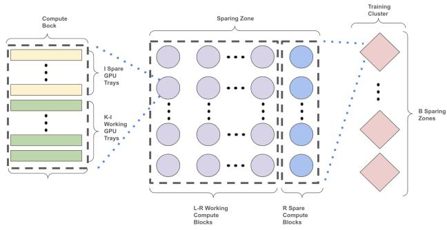  
Figure 1. System Diagram

To find the sparing strategy that maximizes the goodput for a given cluster, we evaluate (1), using (2), for a given model type and fault recovery scheme for a set of sparing strategies selecting the optimal one.

## 2.2 System Model

## Cluster Architecture

As shown in Figure 1, we define a compute block as a set of K GPU trays that share a common scale-up network (e.g., NVLink) for communication within the block and a scaleout network used for all communication between blocks. Note that there may be several independent compute blocks within the scale-up domain (i.e., partitioned) but they use the scale-out network to communicate with each other; this ensures compute blocks are fungible across racks.

Spares have identical performance to the devices they are replacing. This restricts them to be within the same scaleout network layer to avoid any network oversubscription. We will designate all devices within this network layer as being within the same sparing zone. Consider a cluster of B sparing zones, each with L compute blocks. Each compute block has K GPU compute trays. Of the L compute blocks in a sparing zone, R are idle spares to be swapped with failed compute blocks. In addition, within a compute block, I of the K trays can also be designated as idle intra-block spares to be swapped with failed trays within that compute block.

## Device Fault

Faults are characterized in terms of the device mean-timebetween-failure (MTBF) that represents a composite reliability metric, synthesized from the individual MTBF values of constituent system components reconciled to tray or rack level failure domains. This encompasses both hardware and software failure modes, with parameter estimates derived empirically from production telemetry and operational incident data.

To accurately capture the spatial and functional correlations among failure events, the reliability model incorporates a hierarchical representation of failure domains—commonly referred to as blast radii or fault isolation zones. Specifically, the model distinguishes between:

• Tray-level MTBF: Characterizing failures confined to individual compute trays, which typically affect a localized subset of processing resources and their directly attached network interfaces including the firsthop scale-out network interconnect associated with the failed unit.

• Rack-level MTBF: Characterizing failures that propagate across or affect multiple trays within a single rack enclosure, often attributable to shared infrastructure components such as power distribution units, top-ofrack switches, or cooling subsystems.

This hierarchical decomposition enables more precise estimation of correlated failure probabilities and facilitates the analysis of fault-tolerant scheduling strategies that account for the spatial locality of potential failure events.

## 2.3 Problem Statement

For a GPU cluster with B sparing zone, each with L compute blocks, find the sparing strategy:

• compute block size, K;

• number of spare compute blocks, R;

• number of spare trays, I

that maximizes the goodput (1) in the cluster for a given set of device fault rates, fault hierarchy, and fault recovery scheme (e.g., synchronous, semi-synchronous, ...).

## 3 METHODOLOGY

To select the sparing strategy, we need to quantify the CETT and performance scalars. To evaluate the CETT, the impact of the spare compute blocks, the spare compute trays, and the fault recovery scheme needs to be modeled. In addition, the TPS scaling factors for hardware and LLM gains are also needed. We describe each modeling method below.

## 3.1 Spare Compute Trays

We incorporate the impact of spare GPU trays within a compute block by calculating the resulting mean-time-betweenfailure (MTBF) of the compute block. Consider the case a compute block has K GPU compute trays where J trays are kept idle in reserve to maintain K − J active devices in the presence of up to J failures; the compute block is only removed from production if more than J GPU trays fail. In addition, we will assume that repairs to GPUs trays can be undertaken while the compute block is running in production without shutting down the other trays in that

compute block.

We model the number of available trays in a compute block accounting for failure and repair events as a continuoustime Markov process (see Appendix A), the MTBF of the compute block is given by

$$
\tag{, (3}
$$

where {}ji,k is the kth element of the ith unique combination of j elements from the set, M T BFT represent failures that can be isolated to a tray, M T BFR represents failures that can be isolated to a rack and fail all compute blocks within that rack, M T T R is the composite mean-time-to-repair; the composite repair time incorporates auto-remediated failure that return to production quickly and those that generate a repair ticket requiring a longer interval for investigation and a potential hardware swap.

## 3.2 Spare Compute Blocks

We incorporate the impact of spare GPU blocks by calculating the probability of job blocking due to a lack of available spares. Consider a scenario in which a sparing zone contains a total of L compute blocks, R of which are designated as spares and may be either idle or under repair. When a compute block fails, a spare block is allocated to the job; when a block is repaired, it is returned to the pool of available blocks. If a block fails and no spare blocks are available, the training job is blocked. We model the failure and repair cycles as a continuous-time Markov chain. By solving for the steady-state probability of exhausting all spares (see Appendix B), the probability of blocking within a sparing zone is given by

$$
\tag{4}
$$

where the compute block MTBF is given in (3).

## 3.3 Fault Recovery

Checkpoint fault recovery is used to mitigate the impact of failures which cause a job to stop by allowing the job to revert to a previous state. This works by periodically saving the job state at times called checkpoints. When a fault on any of the devices involved in the job processing occurs the job is stopped, new resources are obtained, the state at the last checkpoint is restored and the job is restarted. This avoids losing all the progress on the job but does incur penalties:

• the time between the last checkpoint and when the fault occurred;

• the time between when a fault occurs and when it is detected;

• the time spent acquiring resources, retrieving the state, and restarting the job.

The percentage of time a running job spends not doing productive work is the ratio of these penalties to the total GPU time spent.

A simple linear expression for the fraction of wasted time would suffice if the probability of failure from the compute blocks in a job was well approximated by the failure rate. Given the large number of compute blocks in a job, this is not the case and we use a discrete time Markov Chain to model how long, on average, it takes to complete a checkpoint period (See Appendix C). The exact formulation depends on the specifics of the fault recovery method, here we considered a fully synchronous scheme.

For a job of size (L − R) · B compute blocks, assuming any fault results in an interruption and restart of the entire job, the fraction of wasted time is

$$
\tag{5}
$$

where

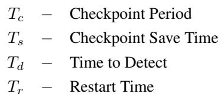

and only the K-J working trays in a compute block, along with any rack level failures, interrupt the job

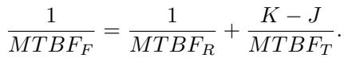

Note, the fault tolerance does not benefit from the extended MTFB from sparing (3) as any fault still results in an interruption even if the compute block remains available.

## 3.4 Job Placement

When we parallelize our model, there are collectives that benefit from being closer together on the network. These collectives are latency sensitive or use large amounts of bandwidth. For example, tensor parallel should only be done within a single network hop, without any over subscription. When we schedule a training job, we can add constraints to try and keep these collectives close together on the network. For each of the parallelizations (e.g., tensor, expert, context, data, ...), we might constrain them to a particular network distance to ensure that we minimize the GPU blocking due to communications (i.e., exposed communications). This is not free however because we have now made it harder to find a placement solution for the job.

There are many possible combinations of placement constraints. For example, we can restrict the tensor parallel to be within a compute block to take advantage of the scale-up network. We previously discussed the scale-out network as having a layer where devices communicate without any oversubscription which serves as a sparing zone. Restricting a data parallel group or a collection of these groups (e.g., HSDP) to a sparing zone may be necessary to avoid high latency or oversubscription (i.e., reduced bandwidth) when crossing a sparing zone boundary.

Restricting a group of P compute blocks to be co-located in the same sparing zone requires the number of working compute blocks, L-R, in a sparing zone to be an integer multiple of P

$$
\tag{6}
$$

Note, this restriction may result in more non-working compute blocks than are needed to act as spares. The difference between the number of non-working compute blocks in a sparing zone and the number of spares needed to optimize the CETT without any placement constraints (i.e. P=1) is referred to as the number of stranded compute blocks which are considered waste for the purposes of this analysis even though they could be opportunistically repurposed for other tasks.

## 3.5 CETT Model

Using the above expressions for the impact of spare compute trays (3), the spare compute blocks (4), the synchronous fault recovery schemes (5), and placement constraints (6), we can write the cluster effective training time for a synchronous fault recovery method.

For a cluster with B sparing zones each with L compute blocks of K compute trays. The CETT for a single synchronous job, assuming J spare idle trays in each compute block and R spare idle compute blocks for each sparing

zone is given by

$$
\tag{7}
$$

where, using (4),

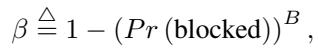

γ is given in (5), and, from (6), L − R = k · P with k ∈ Z+.

## 3.6 Hardware TPS scale

For the compute blocks with spare trays, the power savings from the idle spare trays are localized to a rack. Assuming we are rack power limited and are downgrading the GPU power to meet the limit, the power limit per GPU in working trays can be increased commensurate with the power savings on the spare idle trays, providing a performance gain for strategies incorporating spare compute trays.

An accurate performance gain is obtained through measurement or simulation; however, in lieu of these we can use a first order approximation:

TPS Scale(Hardware) ≈

$$
\tag{8}
$$

where PowerLimR is the per GPU power limit necessary to meet the rack power limit when all the trays in the rack are operational and PowerLimS is the higher power limit per GPU obtained when the power saving from idle spare compute trays is applied to the remaining working GPU trays in that rack, and ECC is the fraction of time during which the network communication is exposed.

## 3.7 LLM TPS scale

The different compute block sizes result in different model parallelism dimensioning and use of the scale-up network giving different performance gains. In general, the larger the compute block size the larger the performance gain; however the amount is dependent on the model architecture (e.g., coarse or fine grain experts) and model and job parameters (e.g., batch size).

An accurate performance gain is obtained through measurement or simulation of a specific model and infrastructure configuration. For the illustrative purpose of demonstrating the sparing strategy framework, we will consider only an idealized gain that comes from increasing the amount of tensor parallelism with larger compute block sizes.

Amdahl’s law (Amdahl, 2007) gives the system performance gain from speeding up the computation of an operation, for example through parallelization or increased network bandwidth. Considering only tensor parallelism and assuming the operations are perfectly parallelizable but with a communication overhead from a ring collective that increases with the amount of parallelism, the performance gain can be written as

$$
\tag{9}
$$

where TP is the number of GPUs over which the tensor operations are parallelized and α is the limit of the exposed communication time (ECC) as the parallelism grows without bound.

The model performance scaling factor, for this illustrative example, where we have only considered scaling the amount of tensor parallelism and made no considerations for other parallelism dimensioning, compute/communication overlap, or other overheads is given by

$$
\tag{10}
$$

where TPbl and TP are the degree of tensor parallelism for the baseline and target compute block sizes respectively.

## 4 RESULTS

In this section, we apply the methodology to a production use case to select a sparing strategy to maximize goodput.

## 4.1 Configuration based on Production Data

Below we set the parameters of our model based on our production architecture and fault performance.

Compute block configurations: Consider a cluster of B = 4 sparing zones each with L = 256 server racks where each rack has 72 GPUs with 2 GPUs per GPU tray and a scale-up network domain spanning the rack (e.g., Meta’s Catalina rack with GB200 (cat)). We consider sparing strategies with compute block sizes of 72, 36, and 18 GPUs where there are no spare trays within a compute block and ones where we also have spare trays within the compute block giving 64, 32, and 16 GPUs working GPUS.

Hardware performance: For the compute blocks with spares (e.g., 64, 32, 16 working GPUs), the power savings from the idle spare trays are localized to a rack allowing us to increase per GPU power limit on the working GPUs by 9%. Using (8), this provides a 1.034 performance gain to these strategies.

Failure and repair rates: A rack of 72 GPUs with 36 GPU trays of 2 GPUs is assumed to have a tray MTBF of 20K hours and rack level failure events MTBF of 10K hours. This includes all failure events that lead to a job interruption (both auto-remediated and those that result in a repair ticket). The mean time to repair is assumed to be 24 hours and is a composite of both the time for auto-remediated repairs and those that resulted in a repair ticket. Note, these assumptions on MTBF and MTTR are for the purpose of demonstrating the sparing strategy selection methodology and do not reflect actual hardware or operational systems.

Fault recovery and placement: For fault recovery, we assume a fully synchronous scheme with a checkpoint period of 250 seconds, a checkpoint save time of 50 msec, a fault detection time of 60 seconds, and a restart time of 6 minutes. For placement, the job is divided into groups of 2304 GPUs that must be placed within the same sparing zone; 2.25K was chosen as it is divisible by all the compute block sizes (i.e., fair comparison). Note, these are assumed values for the purpose of demonstrating the sparing strategy selection methodology and do not reflect actual hardware or operational systems.

LLM performance: For illustrative purposes we consider only an idealized gain, (10), that comes from increasing the amount of tensor parallelism with larger compute block sizes and made no considerations for other parallelism dimensioning, compute/communication overlap, or other overheads.

## 4.2 Use Case: Sparing Strategy Evaluation

The goodput, (1), of a cluster is the product of the number of GPUs in the cluster with the CETT and the performance gains from hardware and the model. Maximizing this reduces training time and is the criterion for selecting sparing strategies. Table 1 shows the goodput for the different sparing strategies. The takeaways are:

• A sparing strategy with a compute block size of 72 GPUs with 8 spare intra-block GPUs maximizes the work of the cluster. This is 1.024x more work than the second best ( a compute block size of 72 with no intra-block spares ).

• Halving the compute block size roughly halves the necessary percentage of Inter-Block spares (see Appendix B). For example, going from a compute block size of 72 down to 36 reduces the Inter-Block spares from 8.6% to 4.7%.

• Intra-Block spares have localized power savings that can be used to increase the power limit per GPU of the working GPU trays, providing a performance gain for the working GPUs. For example, splitting the idle trays equally between the compute blocks in a rack provides 11.1% of sparing and a 1.034x performance increase for compute block sizes with intra-block spares (i.e., 64, 32, and 16 working GPUs) relative to compute block sizes that use all the trays (i.e., 72, 32, and 18 working GPUs).

• The gains from the reduced sparing requirement of smaller compute block size may be offset by stranding due to placement constraints. For example, the CETT between a compute block size of 72 and 36 GPUs is nearly identical despite a reduction in the necessary sparing of 3.9% as the amount of stranding correspondingly increased by 3.9%.

• Intra-block sparing granularity may offset gains from the reduced sparing requirements of smaller compute block size. For example, when reducing the compute block size from 72 to 36 with intra-block spares (i.e., 64 to 32 working GPUs) the amount of intra-block sparing remains at 11.1% which is almost double the amount of sparing required (e.g., 36 requires 4.7%) thereby negating the gain of reducing the compute block size.

• The gains from reducing the compute block size may be offset by the performance gains of a larger scale-up domain. For example, reducing the compute block size from 72 to 36 GPUs can save 3.9% in spares, however we give up double that with the reduced gain of the smaller scale-up network (1.18x down to 1.12x).

• There is no fixed availability target as it is dependent on the number of sparing zones and the fault recovery method. For example, some fault recovery methods do not block the entire job until the loss limit is exceeded which results in a different trade-off between the time a job spends being blocked and the burden of idle resources than fully synchronous.

## 4.3 Use Case: Reliability and Repair Sensitivity

The optimal sparing strategy is determined by the LLM, the cluster architecture (e.g., scale-up versus scale-out network topologies and power constraints), and device reliability and repair characteristics. While the space of possible model and architecture combinations is vast, device reliability and availability can be succinctly characterized by two parameters: the mean time between failures (MTBF) and the mean time to repair (MTTR).

The repair time is within our control (e.g. round-the-clock repair coverage). The failure rates are primarily function of software/firmware/hardware state and maturity. We examine the sensitivity of the optimal sparing strategy to device failures and repair times as we add model, hardware, and placement constraints.

Table 1. Sparing Strategies Goodput  
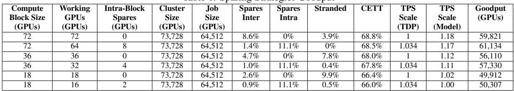

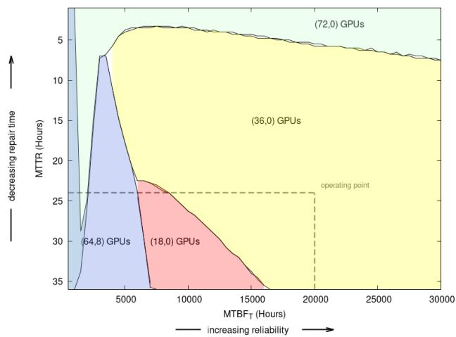  
Figure 2. No model or hardware gains and no placement constraints (i.e., CETT only).

Figure 2 presents the decision boundaries in MTBF–MTTR space delineating the regions in which each sparing strategy is optimal, for the case in which neither model nor hardware gain nor placement constraints apply (i.e., the comparison is based solely on CETT). The sparing strategy employing a compute block size of 36 GPUs with no intra-block spares and 18 GPUs with no intra-block spares dominate the majority of the operating region. The exception occurs at very short repair times, where a compute block size of 72 GPUs becomes optimal, and at very low MTBF values, where a compute block size of 72 GPUs—comprising 64 working GPUs and 8 intra-block spares—proves superior. This behavior is consistent with the observation that, in the absence of a model gain favoring larger block sizes, smaller block sizes require proportionally fewer spares (see Appendix B). Furthermore, for smaller block sizes, intra-block sparing exceeds the necessary level of redundancy except under extreme failure rates. Note at extremely low MTFB the performance is so poor that 72 GPUs with and without 8 intra-block spares have equally bad performance (i.e. overlapping regions).

When model gain is incorporated, as shown in Figure 3, the largest compute block size of 72 GPUs dominates across the operating region. The region is partitioned between configurations with no intra-block spares—favored under higher reliability and shorter repair times—and configurations with 8 intra-block spares—favored under lower reliability and longer repair times. A notable exception arises in a narrow region characterized by very low MTBF and short repair times, where the configuration without intra-block spares outperforms that with intra-block spares. This is primarily attributable to the finer granularity afforded by inter-blockonly sparing in setting the total number of spare devices.

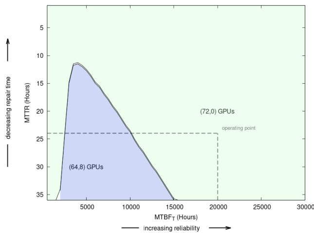  
Figure 3. No hardware gains and no placement constraints

Under rack-power-limited conditions, the presence of intrablock spares allows the power limits of GPUs in non-spare trays to be increased, yielding a hardware performance gain. Incorporating this gain, as shown in Figure 4, expands the operating region in which intra-block sparing is advantageous.

Finally, incorporating the placement constraint, as shown in Figure 5, has a substantial impact on sparing strategy selection: the configuration with 8 intra-block spare GPUs dominates the entire operating region. This result is driven by the degree of resource stranding that arises from the interplay among the sparing zone size, the number of working trays per compute block, and the placement constraint size. Specifically, as fewer placement blocks fit within a sparing zone, the likelihood of stranding increases and the sparing strategy becomes more sensitive to the particulars of each

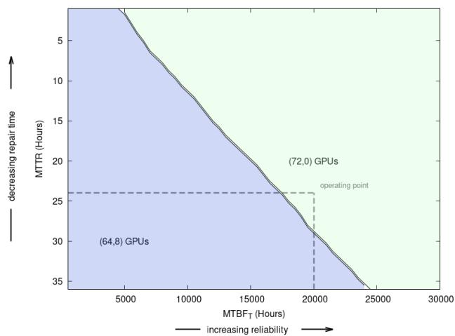  
Figure 4. No placement constraints

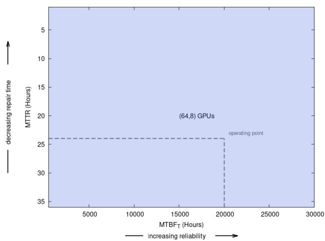  
Figure 5. Includes model and hardware gains and placement constraints

configuration.

## 4.4 Simulations

When more complex interactions must be modeled (e.g., job queue scheduling and fault recovery), we evaluate CETT using an end-to-end AI system performance simulator (arc, 2024). The simulator has been validated by first verifying that its outputs match those of the analytical model under identical assumptions and parameters, before proceeding to more complex scenarios. We further employ the simulator to assess the applicability of the analytical results when certain simplifying assumptions are relaxed.

Consider the case where we have two types of failure events, those that generate a repair ticket (i.e., require investigation and may result in hardware being replaced) and those that are auto-remediated and can be brought back to production with a restart or reconfiguration. To simplify the analysis in this case, given that both event types result in an immediate use of a spare and differ only in their repair times, we incorporate the two repair times into a single exponentially distributed repair time (see Appendix A). The true composite repair process does not have an exponentially distributed repair time as modeled (it rather requires a convolution of the two exponential distributions). Equation below shows the simplified model:

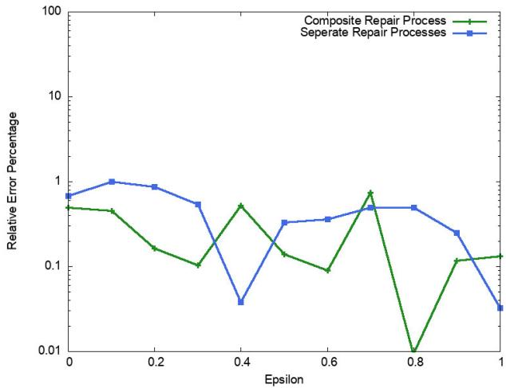  
Figure 6. Monte-Carlo simulation to validate the composite repair process assumption. A compute block size of K = 72 with no intra-block spares I = 0 for a cluster in a single building, B = 1, with L = 1024 compute blocks.

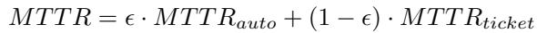

We use the simulator to validate such modeling assumptions. Figure 6 shows the relative error in the CETT between the simplified analytical model and simulation for two cases: (1) a single composite repair process similar to the analytical model; (2) a separate repair processes for failure events that can be auto-remediated or result in a repair ticket each with an independent exponential distribution modeling the repair times. The example scenario was used with a compute block of 72 GPUs and 8 intra-block spares.

The simulator closely matches the analytical results under the same assumptions (i.e., composite process) with less than 1% relative error, validating the simulator. Comparing the simulation with two repair processes to the analytical results, we note alignment is not sensitive to the proportional mix between the two fault times (i.e., ϵ) and closely matches the error from the composite repair process, validating the efficacy of using the composite repair assumption.

## 5 CONCLUSION

In this work, we presented an analytical framework for guiding architectural decisions in AI training clusters, specifically targeting the optimization of goodput for LLM jobs. The framework leverages simple closed-form analytical expressions and explicit, practical assumptions, making it highly effective for first-order, order-of-magnitude (directional) decisions in early design and operational phases. By applying this framework to the selection of sparing strategies, we demonstrated that maximizing cluster goodput is a multifaceted challenge. It depends not only on device failure rates and repair times, but also on the fault recovery scheme, job placement constraints, LLM performance under different parallelism configurations, and the ability to redistribute power budgets (such as adjusting TDP settings). Overall, the analytical framework has become a cornerstone of Meta’s approach to designing and operating large-scale AI training clusters. It empowers teams to make data-driven decisions that balance reliability, efficiency, and cost—ensuring that infrastructure investments deliver maximum value.

## REFERENCES

The open compute project accelerating deployment of next gen ai clusters. URL https://www.opencomput e.org/blog/the-open-compute-project-a ccelerating-deployment-of-next-gen-a i-clusters.

Introducing meta llama 3: The most capable openly available llm to date, April 2024. URL https://ai.met a.com/blog/meta-llama-3/.

Arcadia: An end-to-end ai system performance simulator, April 2024. URL https://engineering.fb.c om/2023/09/07/data-infrastructure/ar cadia-end-to-end-ai-system-performan ce-simulator/.

The llama 4 herd: The beginning of a new era of natively multimodal ai innovation, April 2025. URL https: //ai.meta.com/blog/llama-4-multimoda l-intelligence/.

al., G. T. E. Gemini: A family of highly capable multimodal models, 2024. URL https://arxiv.org/abs/23 12.11805.

Amdahl, G. M. Validity of the single processor approach to achieving large scale computing capabilities, reprinted from the afips conference proceedings, vol. 30 (atlantic city, n.j., apr. 18–20), afips press, reston, va., 1967, pp. 483–485. IEEE Solid-State Circuits Society Newsletter, 12(3):19–20, 2007.

Athlur, S., Saran, N., Sivathanu, M., Ramjee, R., and Kwatra, N. Varuna: scalable, low-cost training of massive deep learning models. In Proc. of the 17th European Conference on Computer Systems, pp. 472–487, 2022.

Grattafiori, A., Dubey, A., Jauhri, A., Pandey, A., Kadian, A., Al-Dahle, A., Letman, A., Mathur, A., Schelten, A., , et al. The llama 3 herd of models. arXiv preprint arXiv:2407.21783, 2024.

Jang, I., Yang, Z., Zhang, Z., Jin, X., and Chowdhury, M. Oobleck: Resilient distributed training of large models using pipeline templates. In Proceedings of the 29th Symposium on Operating Systems Principles, pp. 382– 395, 2023.

Le Scao, T., Fan, A., Akiki, C., Pavlick, E., Ilic, S., Hess-´ low, D., Castagne, R., Luccioni, A. S., Yvon, F., et al. ´ Bloom: A 176b-parameter open-access multilingual language model. 2023.

Papoulis, A. Probability,random variables, and stochastic processes /. McGraw-hill,, New York :, 3rd edition edition, c1991.

Singh, V. Introducing ml productivity goodput: a metric to measure ai system efficiency, Apr 2024. URL https: //cloud.google.com/blog/products/ai-m achine-learning/goodput-metric-as-mea sure-of-ml-productivity.

Thorpe, J., Zhao, P., Eyolfson, J., Qiao, Y., Jia, Z., Zhang, M., Netravali, R., and Xu, G. H. Bamboo: Making preemptible instances resilient for affordable training of large {DNNs}. In 20th USENIX Symposium on Networked Systems Design and Implementation (NSDI 23), pp. 497–513, 2023.

Wang, Z., Jia, Z., Zheng, S., Zhang, Z., Fu, X., Ng, T. S. E., and Wang, Y. Gemini: Fast failure recovery in distributed training with in-memory checkpoints. In Proceedings of the 29th Symposium on Operating Systems Principles, SOSP ’23, pp. 364–381, New York, NY, USA, 2023. Association for Computing Machinery. ISBN 9798400702297. doi: 10.1145/3600006.3613145. URL https://doi.org/10.1145/3600006.3613 145.

## APPENDIX A

Assuming a constant failure rate, λ, for a GPU tray device given that a device has survived to time t, it is as likely to fail at that instant as any other instant. The lifetime of a device can be modeled as an exponential random variable t with

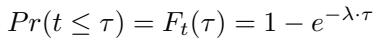

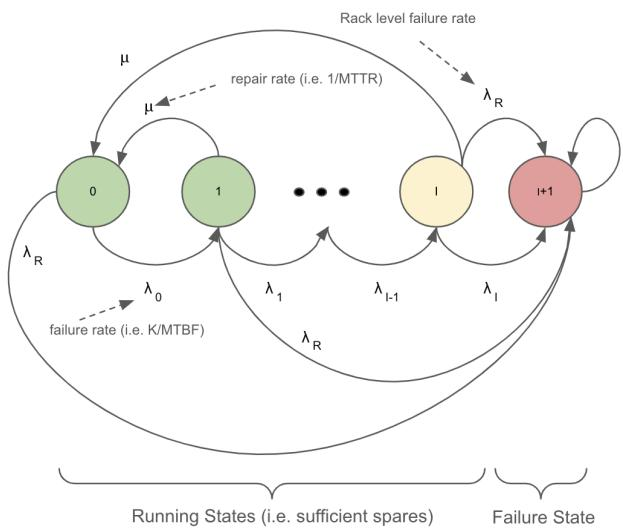  
Figure 7. Intra-Block Spares

where the expected lifetime of the device is

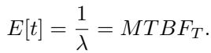

Consider the case where we have K of these devices in a compute block but I are kept in reserve to maintain K-I active devices in the presence of up to I failures; the compute block is only removed from production if more than I GPU trays fail. In addition, we will assume that repairs to GPUs trays can be undertaken while the compute block is running in production without shutting down the other trays in the rack.

To determine the MTBF for this collection of GPU trays, we can model the failure and repair cycles as a continuous time Markov chain shown in Figure 7.

The failure rates, {λ0, λ1, · · · , λI }, are given by the compound failure rate of the number of operational trays in that state:

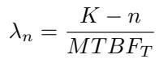

The repair rate is constant for each state and is the inverse of the mean-time-to-repair (MTTR)

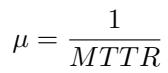

To incorporate failure events that require the hardware to be replaced and those that can brought back to production with a restart or reconfiguration, we note that operationally both types of failure events result in the immediate use of a spare and differ only in their repair times. We therefore use a composite repair time from the population of these events under the assumption that the repair time remains exponentially distributed. This assumption is clearly invalid;

however, we have verified with Monte-Carlo simulations that for our operating regions such impact is negligible.

The memoryless property of both the fault and repair processes means that the amount of time spent in state n is exponentially distributed with a rate λn + µ and that the probability of advancing to state n+1 is

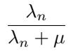

and returning to the initial state is

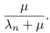

From these we can write the generator and transition matrices, respectively, as

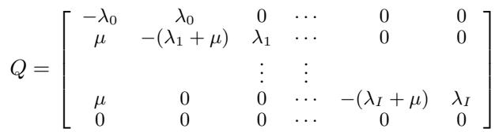

and

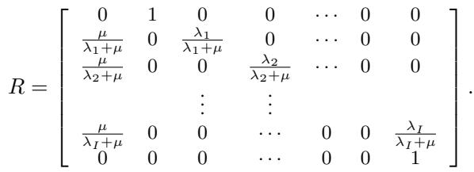

Using the generator and transition matrices we can write the expected time to transition from state 0 to state I+1 in terms of a set of simultaneous equations:

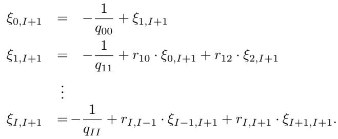

Noting that expected time to be in state I+1 and advance to state I+1 is zero (i.e. ξI+1,I+1 = 0), we have an equal number of equations and unknowns and can therefore solve for the average time to go from state 0 to state I+1 (Papoulis, c1991.). Starting with the base cases of I=1,I=2, and I=3, by expanding the terms and identifying common divisors a pattern emerges that can be generalized:

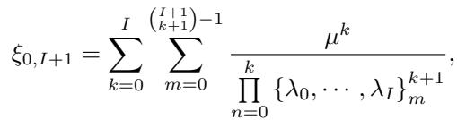

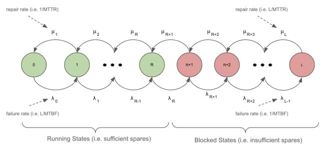  
Figure 8. Inter-Block Spares

where {}ji,k is the k-th element of the i-th unique combination of j elements from the set.

Substituting in for the failure and repair rates and accounting for the rack failure rate which brings down the entire compute block, the mean time between failure for compute block with K trays, I of which are idle spares given by:

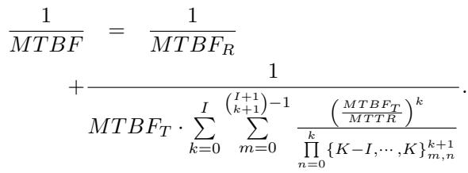

## APPENDIX B

Consider a sparing zone with L compute blocks where we reserve R as spares to be used in the event any of the L-R operational compute blocks is taken out of production due to failures. To determine the amount of time on average that there are more compute block failures than can be supported by the R spares, we can model the failure and repair cycles as a continuous time Markov chain shown in Figure 8.

Note, this assumes that the errors between compute blocks are independent which is not strictly true as compute blocks can be within the same rack; however, is it reasonable as the failure rate for a rack-level events is much less than tray-level failure events.

The failure rates, {λ0, λ1, · · · , λL−1}, are given by the compound failure rate of the number of operational pods in that state. Assuming we have powered-on spares this is

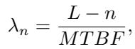

where the MTBF of a compute block was given in Appendix A. The repair rate increases with the number of devices in repair for each state and is the inverse of the MTTR

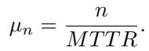

The memoryless property of both the fault and repair processes means that the amount of time spent in state n is exponentially distributed with a rate λn + µn and that the probability of advancing to state n+1 is

$$
\tag{B.1}
$$

and retreating to state n-1 is

$$
\tag{B.2}
$$

From these we can write the generator matrix, as

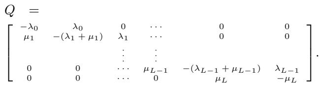

To find the steady state probabilities of being in any of the L states, we solve

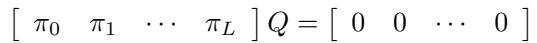

and

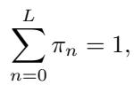

where πn is the probability of being in the nth state(Papoulis, c1991.). A little bit of algebra gives

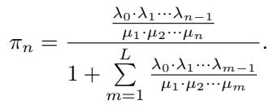

The probability of being blocked (states R+1 through L) is

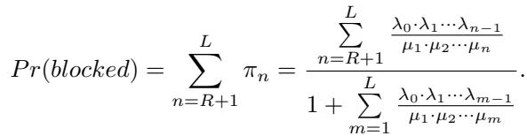

Substituting in for the failure and repair rates, (B.1) and (B.2), and using the binomial theorem, we have

$$
\tag{B.3}
$$

Note, this can alternatively be written in terms of a binomial distribution in terms of the compute block availability, MT BF/(MT BF + MT T R).

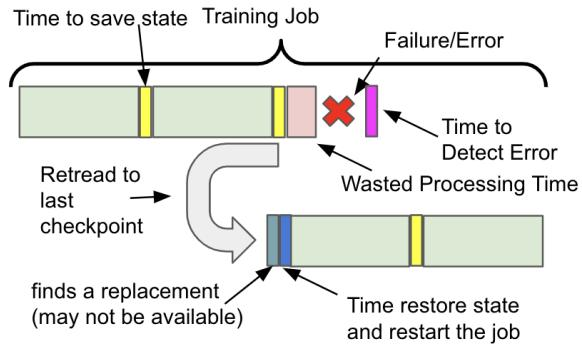  
Figure 9. Checkpoint Fault Recovery

In order to demonstrate the impact of decreasing the compute block size, assume all compute blocks can cause failures (even those in repair) and the R << L (a typical operating condition) then (B.3) can be written as a Poisson

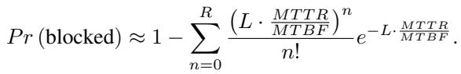

From this we can see that halving the compute block size both doubles L and the MTBF which cancel; generalizing this, we see that reducing the compute block size by a factor H reduces the percentage of spare compute blocks to meet the same blocking probability by a factor of H.

## APPENDIX C

For checkpoint fault recovery, the state of a running job is periodically saved at times called checkpoints. For example, as shown in Figure 9, consider a job that has passed through two checkpoints, saving its state at each. While processing the job after the second checkpoint assume a fault occurs and the job is stopped, meaning that resources spent after the second checkpoint are wasted including the time it took from the fault event until that event was detected. The job is then reset to the last checkpoint which includes finding a replacement and then restoring the state from the last checkpoint from which the job continues, reverting the work that had previously been done.

To determine the efficiency of this, consider a simplified model where at each checkpoint we can assume there are enough available compute blocks to execute the job. If any of those compute blocks have a fault prior to reaching the next checkpoint, the entire workload is reset to the previous checkpoint and a new compute block is brought in to replace the failing one. This sequence of events can be described in terms of a discrete-time Markov chain. Assuming a workload extends across a large number of checkpoint periods we can use a single period of the chain as representative with a terminating absorbing state where we have assumed

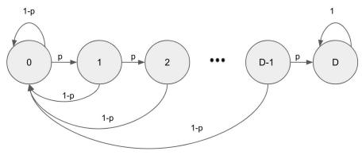  
Figure 10. Checkpoint Model

D time units between each checkpoint as shown in Figure 10.

The probability transition matrix is given by the D+1 by D+1 matrix:

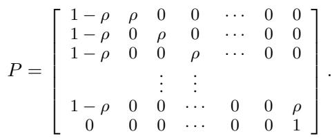

We want to know the average number of steps from state 0 to state D (the absorbing sate). This can be found by writing the probability matrix in terms of matrices that describe the transitions between transient states (0,...,D-1), denoted as Q and one describing the transition from a transient state to the absorbing state, D. The D by D matrix describing the transient states are given by

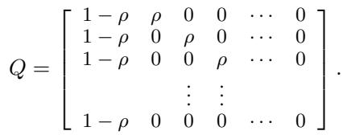

As with any probability transition matrix, the probability of transitioning from a transient state i to j in k steps is the (i, j)th element of Qk. Summing this over all k from zero to infinity gives the fundamental matrix F each element (i, j) of which is the expected number of times one is in state j given they started in state i(Papoulis, c1991.). The fundamental matrix can be found from Q using

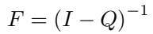

with the average number of steps, S, from state 0 to the absorbing state D given by the sum of the state transition probabilities of the first row in F:

$$
\tag{C.1}
$$

To see the dependence on the checkpoint time and reliability we need to write the transition probability, ρ, in terms of the probability that there was no failure in the job’s compute blocks during the Tc/D time interval where Tc is the checkpoint period. Assuming the constant failure rate, the probability of moving ahead one state is the probability that there is no failure in any of the W compute blocks assigned to the job during the interval [0, Tc/D), is given by

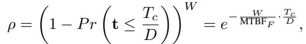

where only the K-I working trays in a compute block along with any rack-level failures interrupt the job

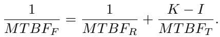

Substituting this into (C.1) and writing the number of steps in terms of all the time including retraces back to the last checkpoint, we have the total processing time as

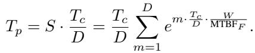

Taking the limit as D goes to infinity we have

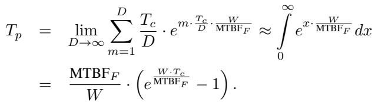

Checkpointing is not a free operation as time is required to save the state and also to detect the fault and restart the job. The time for saving the state, Ts, occurs once every checkpoint and the time to detect the fault, Td and to restart, Tr, occurs every time there is fault. The number of faults follows a Poisson distribution, with the average being the fault rate, W/MTBFF , times the interval which in this case is Tp. This additional time is added, giving a total time of:

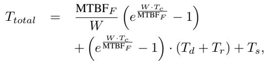

where the restart and detection times are scaled by the average number of faults.

The efficiency (i.e. percentage of time the job is doing productive work) given the limited reliability is given by the ratio of the checkpoint interval and the total time used to reach the checkpoint

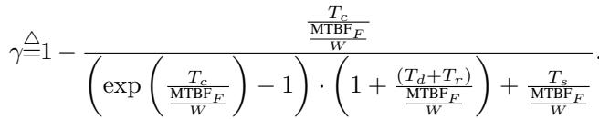