# SPIRA: EXPLOITING VOXEL DATA STRUCTURAL PROPERTIES FOR EFFICIENT SPARSE CONVOLUTION IN POINT CLOUD NETWORKS

Dionysios Adamopoulos 1 2 Anastasia Poulopoulou 2 Georgios Goumas 2 Christina Giannoula 1

## ABSTRACT

Sparse Convolution (SpC) powers 3D point cloud networks widely used in autonomous driving and augmented/virtual reality. SpC builds a kernel map that stores mappings between input voxel coordinates, output coordinates, and weight offsets, then uses this map to compute feature vectors for output coordinates. Our work identifies three key properties of voxel coordinates: they are integer-valued, bounded within a limited spatial range, and geometrically continuous, i.e., neighboring voxels on the same object surface are highly likely to exist at small spatial offsets from each other. Prior SpC engines do not fully exploit these properties and suffer from high pre-processing and post-processing overheads during kernel map construction. To this end, we design Spira, the first voxel-property-aware SpC engine for GPUs. Spira proposes (i) a high-performance one-shot search algorithm that builds the kernel map with no pre-processing and high data locality, (ii) an effective packed-native processing scheme that accesses packed voxel coordinates at low cost, (iii) a flexible dual-dataflow execution mechanism that efficiently computes output feature vectors by adapting to layer characteristics, and (iv) a network-wide parallelization strategy that builds kernel maps for all SpC layers concurrently at network start. Our evaluation shows that Spira significantly outperforms prior state-of-the-art SpC engines by 1.68× on average and up to 3.04× for end-to-end inference, and by 2.11× on average and up to 3.44× for layer-wise execution across diverse layer configurations. The source code of Spira is freely available at https://github.com/SPIN-Research-Group/Spira.

## 1 INTRODUCTION

Point cloud data has become increasingly used in various important applications, including autonomous driving (Zermas et al., 2017), robotics (Kim et al., 2018), augmented/virtual reality (Wirth et al., 2019), and drones (Zheng et al., 2020). Light detection and ranging (LiDAR) sensors on autonomous vehicles, drones, and mobile devices generate point cloud data that is processed by point cloud networks. Voxel-based point cloud networks achieve state-of-the-art accuracy (Hong et al., 2023) in vision tasks such as object detection (Yin et al., 2021) and segmentation (Zhu et al., 2021) by processing voxelized point clouds (referred to as voxel data)—raw point cloud data have been quantized into a discrete 3D grid of small cubes (voxels).

Unlike 2D images, 3D point cloud data is extremely sparse, typically occupying less than 1% of its bounding volume (Hong et al., 2023). Sparse Convolution (SpC) is therefore the dominant computational kernel in voxel-based point cloud networks, consisting of two steps. 1) The voxel indexing step generates the output voxel coordinates, and the mappings between the input coordinates, output coordinates and the weight offsets. Voxel indexing finds and stores these mappings in a table called kernel map, performing lookup operations (searches) on a query data structure containing the voxel coordinates. To accomplish this, SpC engines include a pre-processing phase that organizes coordinates in a query data structure, and may include a post-processing phase that rearranges and filters the kernel map for the subsequent feature computation step. 2) The feature computation step produces the feature vectors (actual convolution output) for the output coordinates based on the kernel map mappings. This step is parallelized across thread blocks using one of two dataflow approaches: output-stationary or weight-stationary, explained in §2.2. Prior work (Tang et al., 2023) shows that both dataflows are necessary, since each performs best under different layer characteristics.

In this work, we extensively characterize voxel data processed in SpC and analyze prior state-of-the-art SpC engines. We identify two key limitations (§3): prior works (Tang et al., 2022; 2023; Yang et al., 2024; Yan, 2022; Hong et al., 2023; Choy et al., 2019) incur non-negligible performance overheads in the pre-processing and post-processing phases of voxel indexing, and lack efficient support for both outputand weight-stationary dataflows required for feature computation. We also discover three key properties of voxel data. First, voxel coordinates are integer-valued, as each voxel point is a triplet of values representing a discrete voxel (cube) in a 3D grid. Second, they are spatially bounded within a limited value range, since they represent a finite 3D grid, the exact size of which depends on the captured environment of each application (§4). Third, they are geometrically continuous, as they represent continuous object surfaces: neighboring voxel coordinates on the same object are highly likely to exist at small offset displacements from each other. Prior SpC engines do not exploit these properties. We demonstrate that by leveraging these properties we can significantly reduce computation and data access costs in SpC, leading to substantial performance improvements.

To this end, we design Spira, the first SpC engine that comprehensively exploits structural properties of the voxel data to accelerate performance. Spira relies on four key ideas. First, we design a one-shot search algorithm that completely eliminates the pre-processing phase in voxel indexing, and performs fast localized searches by exploiting the integer-valued property, thereby reducing expensive irregular lookup operations. Second, we pack each voxel point triplet into a single integer value by exploiting the spatially bounded property of voxel data, and design packed-native kernels that directly perform voxel indexing on packed data, eliminating unpacking/repacking overheads and reducing compute and data access costs. Third, we propose an adaptive hybrid dataflow scheme for feature computation that selects output-stationary, weight-stationary dataflow or hybrid combinations of both dataflows based on kernel map density patterns identified using the geometric continuity property of voxel data. This approach improves feature computation performance by adapting execution dataflow to both layer characteristics and kernel map densities. Fourth, we identify that voxel indexing steps across SpC layers have no dependencies between them or with other operators throughout the network, and we execute all voxel indexing steps concurrently at the network start across multiple GPU SMs, thus improving resource utilization and execution parallelism.

We extensively evaluate Spira using a wide variety of 3D point cloud networks, real-world datasets from indoor and outdoor scenes, and six GPU systems, spanning from highend to edge GPU architectures. We demonstrate that Spira significantly outperforms prior SpC engines. In end-toend point cloud inference, Spira improves performance by 1.68× on average (up to 3.04×). At the SpC layer, Spira achieves 2.11× speedup on average and up to 3.44× speedup over prior work across various layer configurations.

We make the following contributions in this work:

• We identify important structural properties of voxel data and propose Spira, the first voxel-property-aware SpC engine for GPU systems.

• We propose a one-shot search algorithm that performs localized searches and eliminates pre-processing, and design a packed-native voxel indexing scheme that exploits voxel properties to reduce compute and data access costs. We propose network-wide voxel indexing execution that executes all layers’ voxel indexing steps concurrently, and design an adaptive hybrid dataflow scheme that adapts feature computation dataflow to layer characteristics and kernel map densities.

• We evaluate Spira across diverse real-world datasets, point cloud networks and six GPU systems (ranging from highend to edge GPUs), demonstrating significant performance improvements over state-of-the-art SpC engines.

• We open-source Spira in our GitHub repository: https://github.com/SPIN-Research-Group/Spira.

## 2 BACKGROUND

## 2.1 Sparse Convolution (SpC) Definition

A point cloud is an unordered set of 3D points, representing locations on the surface of an object or within a scene. Unlike images, point clouds are irregularly distributed and spatially sparse, making standard convolutional neural networks inefficient (Wu et al., 2019). To enable convolutional processing, point clouds are often voxelized by discretizing the 3D space into a regular grid of small cubes (voxels). A voxelized point cloud (henceforth referred as voxel data) can be represented as a set of tuples $\left\{ ( \mathbf { v } _ { i } , \mathbf { f } _ { i } ) \right\}$ , where $\mathbf { v } _ { i } \in \mathbb { Z } ^ { 3 }$ denotes the quantized coordinate of the i-th voxel in the 3D-grid space, and $\mathbf { f } _ { i } ~ \in ~ \mathbb { R } ^ { C }$ is its corresponding feature vector. The quantization from continuous to discrete space is performed as $\mathbf { v } _ { i } = \lfloor \mathbf { p } _ { i } ^ { ( \mathrm { r a w } ) } / \mathbf { g } \rfloor$ , where $\mathbf { p } _ { i } ^ { ( \mathrm { r a w } ) } \in \mathbb { R } ^ { 3 }$ are the original continuous coordinates of the i-th point and $\mathbf { g } \in \mathbb { R } ^ { \bar { 3 } }$ the grid size vector that determines the spatial resolution, both typically measured in meters.

Sparse Convolution (SpC) is the dominant operation in voxel-based point cloud networks. It takes as input voxel data p with coordinates $\mathbf { V } _ { p }$ and its output q is also a voxel data with coordinates $\mathbf { V } _ { q } ,$ , controlled by a stride parameter (Choy et al., 2019). Given input stride $s _ { p }$ and layer stride $s _ { l } ,$ the output stride is $s _ { q } = s _ { p } \times s _ { l }$ . When $s _ { l } = 1$ , the output coordinates coincide with the input, $\mathbf { V } _ { q } = \mathbf { V } _ { p }$ (submanifold convolution), which comprises the majority of layers in point cloud networks. When $s _ { l } > 1$ , downsampling is applied for the output coordinates as $\begin{array} { r } { { \bf V } _ { q } = \lfloor \frac { { \bf V } _ { p } } { s _ { a } } \rfloor \times s _ { q } ( 1 ) } \end{array}$ keeping only the unique values. Downsampling typically uses $s _ { l } = 2 ,$ , so after m downsamplings, the output stride becomes $s _ { q } = 2 ^ { m }$ (Lin et al., 2021).

For the input features $F _ { p } \in \mathbb { R } ^ { | \mathbf { V } _ { p } | \times \mathbf { C _ { i n } } }$ and the output features $F _ { q } \ \overset { \cdot } { \in } \ \mathbb { R } ^ { | \mathbf { V } _ { q } | \times \mathbf { C _ { o u t } } }$ ， $\mathbf { C _ { i n } }$ and $\mathbf { C _ { o u t } }$ are the input and output channel sizes, respectively. The output feature vector $\mathbf { f } _ { i } ^ { q }$ of the i-th output coordinate $\mathbf { q } _ { i }$ is computed over all weight offsets $\delta _ { k }$ and input coordinates $\mathbf { p } _ { j }$ that satisfy the condition $\mathbf { p } _ { j } = \mathbf { q } _ { i } + \pmb { \delta } _ { k }$ , as follows:

$$
\mathbf { f } _ { i } ^ { q } = \sum _ { \delta _ { k } \in \Delta ( K , s _ { p } ) } \sum _ { \mathbf { p } _ { j } \in \mathbf { V } _ { p } } \mathbf { 1 } _ { \mathbf { p } _ { j } = \mathbf { q } _ { i } + \delta _ { k } } \mathbf { f } _ { j } ^ { p } \mathbf { W } _ { \delta _ { k } } , \quad ( \mathbf { q } _ { i } \in \mathbf { V } _ { q } ) ( 2 )
$$

where $\Delta ( K , s _ { p } )$ is the set of $K ^ { 3 }$ weight offsets of kernel size K and input stride $s _ { p } ( \mathbf { e . g . , } \Delta ( 5 , 2 ) = \{ - 4 , - 2 , 0 , 2 , 4 \} ^ { 3 } )$ $\delta _ { k }$ is the k-th weight offset, $\mathbf { f } _ { j } ^ { p }$ is the feature vector of the input coordinate $\mathbf { p } _ { j } , \mathbf { W } _ { \delta _ { k } } \in \mathbb { R } ^ { \mathbf { C _ { i n } } \times \mathbf { C _ { o u t } } }$ is the weight corresponding to offset $\delta _ { k }$ , and $\mathbf { 1 } _ { \mathbf { p } _ { j } = \mathbf { q } _ { i } + \delta _ { j } }$ is the indicator function for the condition $\mathbf { p } _ { j } = \mathbf { q } _ { i } + \pmb { \delta } _ { k }$

## 2.2 The Execution Steps of SpC

The execution of a SpC layer can be split into two steps: 1) Voxel Indexing Step. It consists of the downsampling and mapping parts. Downsampling is performed in $\mathrm { { \cal S p C } }$ layers with $s _ { l } > 1$ , and generates output voxel coordinates according to Equation (1) through element-wise rounding and duplicate removal. State-of-the-art downsampling schemes sort coordinates to identify and remove duplicates. The mapping part builds a $| \mathbf { V } _ { q } | \times K ^ { 3 }$ matrix $M .$ , called kernel map, which stores the mappings between the input coordinates, the output coordinates and the weight offsets. These mappings guide the feature vector computation for output coordinates according to Equation (2), as described in the feature computation step. SpC engines build the kernel map in three phases: (i) organize coordinates in a query data structure (pre-processing phase), (ii) perform lookup operations (search phase) of the queries $\mathbf { q } _ { \mathbf { i } } + \delta _ { \mathbf { k } }$ for each output coordinate $\mathbf { q _ { i } }$ and each weight offset $\delta _ { \mathbf { k } } \mathbf { : }$ if the query $\mathbf { q _ { i } } + \delta _ { \mathbf { k } }$ matches an input coordinate $\mathbf { p _ { j } }$ in the query data structure, then $M [ i , k ] = j$ , otherwise $M [ i , k ] = - 1$ (invalid entry), (iii) filter invalid entries (-1) and rearrange the kernel map (post-processing phase), if needed. Thus, the mapping part has pre-processing kernels that build the query data structure, search operations and potentially postprocessing kernels that rearrange and filter the kernel map for the feature computation step.

2) Feature Computation Step. It computes the feature vectors of output coordinates according to Equation (2). There are two types of dataflow, shown in Figure 1. I) The output-stationary dataflow (Figure 1 top) distributes the output coordinates $\mathbf { q } _ { \mathrm { i } }$ across thread blocks: each thread block computes feature vectors associated with all weight offsets $\delta _ { \mathbf { k } }$ for a chunk of the output coordinates. Although thread blocks directly produce the final output feature vectors $\mathbf { f } _ { i } ^ { q } .$ , they perform unnecessary zero-valued multiplications, since the kernel map is not filtered to remove invalid entries. II) The weight-stationary dataflow (Figure 1 bottom) requires the kernel map to be transposed relative to output-stationary format to enable coalesced memory writes among threads within a thread block, and filtered from invalid entries. It distributes the weight offsets across thread blocks: each thread block is assigned a weight offset $\delta _ { \mathbf { k } }$ and computes partial sums for the output feature vectors $\mathbf { f } _ { i } ^ { q }$ over a chunk of valid input–output coordinate pairs. Although this dataflow eliminates unnecessary computations, thread blocks produce partial results for same output feature vectors, which are merged using expensive atomic instructions (e.g., atomicAdd) to obtain the final output vectors. Prior work (Tang et al., 2023) shows that both dataflows are needed to achieve optimal performance across varying layer configurations and kernel map densities.

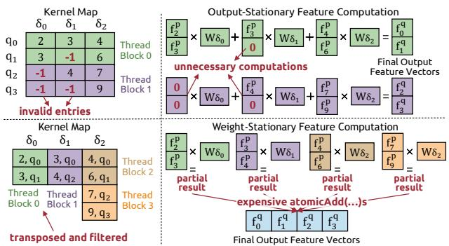  
Figure 1. The two dataflows of the feature computation step.

## 3 EXISTING SPC ENGINES

A few prior works improve SpC performance on GPUs. MinkowskiEngine (Choy et al., 2019) is the first opensource library providing a generalized sparse convolution for point clouds. SpConv2 (Yan, 2022) library introduced the output-stationary dataflow. TorchSparse (Tang et al., 2022) optimized the weight-stationary dataflow, while PCEngine (Hong et al., 2023) further improved it by dynamically adapting between two weight-stationary variants. TorchSparse++ (Tang et al., 2023) supports both dataflows, and its latest public source code (GitHub, 2025) integrates optimizations from both SpConv2 and PCEngine, achieving significant performance improvements over these prior works. Minuet (Yang et al., 2024) proposes a binary-searchbased algorithm for kernel map construction, but only supports weight-stationary dataflow. While Minuet outperforms MinkowskiEngine and TorchSparse, it does not compare with TorchSparse++. TorchSparse++ (latest public code) and Minuet are the two best-performing engines; thus, we focus our evaluation against these state-of-the-art baselines.

Figure 2 shows the performance breakdown in two submanifold layers of TorchSparse++ output- and weight-stationary dataflows, Minuet and Spira with both dataflows and its own hybrid dataflow. Numbers above each bar show the speedup of each engine over TorchSparse++ output-stationary. We make two observations. First, although Minuet achieves 4.31× faster search time than TorchSparse++, it incurs noticeable pre-processing overhead, e.g., in the first layer (left), pre-processing time is nearly equal to search time. Instead, Spira completely eliminates pre-processing, and achieves

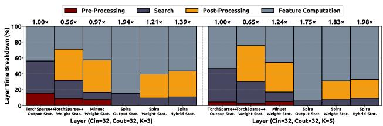  
Figure 2. Layer time breakdown using various SpC engines. Numbers on bars are speedup over TorchSparse++ output-stationary.

7.83× and $1 . 8 2 \times$ faster search time than TorchSparse++ and Minuet, respectively. Second, TorchSparse++ and Minuet have limited dataflow support. Minuet supports only weight-stationary, while TorchSparse++ incurs significant post-processing costs in weight-stationary by transposing the entire kernel map to exploit coalesced memory writes. Spira efficiently supports both dataflows: e.g., Spira outputstationary performs best in the first layer (left), while Spira weight-stationary significantly outperforms prior engines in the second layer (right), having 5.42× lower post-processing overhead than TorchSparse++. Additionally, Spira enables hybrid dual-dataflow execution that exploits voxel data properties to further accelerate feature computation. In the second layer (right), Spira with hybrid dataflow is 1.98× and 1.60× faster than TorchSparse++ and Minuet, respectively.

## 4 IDENTIFIED VOXEL DATA PROPERTIES

We comprehensively analyze the voxel coordinate data in SpC layers, and we identify three key structural properties.

(1) Integer Property: Voxel coordinates are integer-valued. Raw point cloud coordinates are quantized to a discrete 3D grid with grid size vector $g \left( \ S 2 . 1 \right)$ , resulting in integer coordinates $( v _ { x } , v _ { y } , v _ { z } )$ along each axis $( x , y , z )$ Moreover, Equation (1) explains that when voxel coordinates are downsampled with stride s>1, they are rounded to integer multiples of s.

(2) Bounded Property: Voxel coordinates are bounded within a limited value range. Point cloud data, indoor and outdoor scenes, is spatially constrained by the capture environment and sensor capabilities, having a range of $( R _ { x } , R _ { y } , R _ { z } )$ (e.g., expanding through $R _ { x }$ meters in the x-axis). In indoor scenes, the x and y axes represent the horizontal room dimensions, thus being inherently bounded, while the z axis represents the vertical room height, inherently bounded by the floor-to-ceiling distance. In outdoor scenarios (e.g., autonomous driving), the x and y axes correspond to the forward and lateral directions, bounded by the sensor’s capture range (horizontal field of view). For example, in Waymo dataset (Sun et al., 2020), the horizontal LiDAR radius is ∼75 meters, yielding $R _ { x } , R _ { y } \le 1 5 0$ meters. The vertical z axis range $R _ { z }$ is typically cropped to a few meters (Yin et al., 2021) to focus on the height of relevant nearby objects. Since raw point cloud coordinates are bounded by a spatial range, the corresponding quantized integer voxel coordinates are also bounded by spatial range $\left( \left\lfloor { \frac { \bar { R _ { x } } } { g _ { x } } } \right\rfloor , \left\lfloor { \frac { R _ { y } } { g _ { y } } } \right\rfloor , \left\lfloor { \frac { R _ { z } } { g _ { z } } } \right\rfloor \right)$ , where $\boldsymbol { g } = ( g _ { x } , g _ { y } , g _ { z } )$ is the grid size vector, resulting in a finite, well-defined 3D grid whose exact extent depends on the application.

(3) Neighboring Property: Voxel coordinates belonging to the same object or surface are likely to differ by only small offsets across each spatial dimension. Voxel points capture continuous object surfaces rather than randomly scattered points. When a voxel is occupied (i.e., non-zero) at position $( v _ { x } , v _ { y } , v _ { z } )$ on a voxelized object surface, nearby voxels at small displacements, measured by the L1-norm1, are highly likely to also be occupied (i.e., be non-zero) and belong to the same surface. In contrast, voxels at large L1- norm displacements, where coordinates shift across multiple axes simultaneously (e.g., along x, y, and z) by larger displacements, are likely to fall in empty space. For example, Figure 3a shows a voxelized wall with a green voxel (cube) annotated. The blue voxel that has been shifted by (0,1,1) (small L1-norm of 2) from the green voxel, belongs to the same wall surface, while the red voxel, shifted by (2,2,2) (larger L1-norm of 6), corresponds to empty space (air).

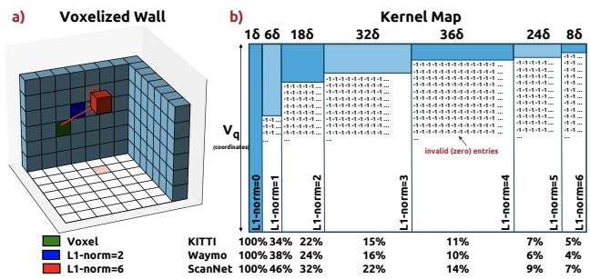  
Figure 3. a) A voxelized wall surface. b) In a submanifold layer with K=5, the average density of kernel map columns for weight offsets grouped by their L1-norm for three different datasets.

This geometric property has the following important implication for submanifold layers, which constitute over 70% of layers in state-of-the-art point cloud networks, where output coordinates are identical to input coordinates. In submanifold convolution, kernel map columns for weight offsets with smaller L1 norms consistently exhibit higher density than those with larger L1 norms, reflecting the geometric continuity of object surfaces captured by voxel data.

We comprehensively examine hundreds of voxel point clouds from publicly available indoor and outdoor datasets and observe that in submanifold layers, kernel map columns for weight offsets with small L1-norms consistently exhibit higher density than columns for larger L1-norms. This occurs because the weight offsets are associated with coordinate displacements, and voxel coordinates belonging to the same object surface tend to differ by small L1-norm displacements, while coordinates differing by larger L1-norms typically correspond to empty space. In a SpC layer with input stride $s _ { p } ,$ , the L1-norm of weight offsets takes values from 0 up to $\begin{array} { r } { \mathrm { L 1 N o r m } \mathrm { { M a x } } = \frac { 3 ( K - 1 ) } { 2 } \times s _ { p } . } \end{array}$ , in steps of $s _ { p } .$ Figure 3b shows the average density of kernel map columns for weight offsets grouped by L1 norm (0 to 6) across three datasets in a layer with kernel size K=5 (125 total weight offsets) and $s _ { p } { = } 1$ . The column for weight offset (0,0,0) exhibits 100% density, because by definition of submanifold convolution, each output voxel coordinate maps to itself as an input coordinate. Columns for weight offsets with L1-norm of 1 average 39.4% density across datasets, while those with L1-norm of 6 average only 5.4% density.

## 5 SPIRA DESIGN

## 5.1 Overview

Spira is the first voxel-property-aware SpC engine that integrates fast mapping search, reduces coordinate access costs, improves parallelism in voxel indexing, and supports flexible hybrid dataflow processing.

Spira consists of the following four key ideas:

1. One-Shot Z-Delta Search Mapping. We design an oneshot search algorithm that builds the kernel map with no pre-processing phase. By intelligently partitioning weight offsets into $K ^ { \bar { 2 } }$ groups of K offsets each, we perform only one binary search per group to resolve the first query, then we use fast localized search to resolve the remaining $K - 1$ queries of that group. This approach significantly reduces memory accesses and computational cost.

2. Packed-Native Voxel Indexing. Leveraging the bounded property, we pack three coordinate values into a single (32- bit or 64-bit) integer, and propose packed-native voxel indexing that directly processes packed data, completely eliminating unpacking/repacking and reducing data access costs.

3. Adaptive Hybrid-Dataflow Feature Computation. We exploit the neighboring property in feature computation and propose a flexible hybrid dataflow scheme where different weight offsets in kernel map can be processed with either output- or weight-stationary way. This approach spans the full dataflow range, from single-dataflow executions to flexible hybrid combinations. In this way, we find the optimal trade-off between unnecessary computations and expensive atomic operations for each layer’s specific configuration.

4. Network-Wide Voxel Indexing. Via detailed network analysis, we find voxel indexing kernels have no dependencies, thus we execute them concurrently at the network start across multiple GPU SMs to improve execution parallelism.

## 5.2 One-Shot Z-Delta Search Mapping

The goal of our mapping search scheme is to achieve (i) minimal pre-processing overhead and (ii) fast search lookup operations for the queries $\mathbf { q _ { i } } + \delta _ { \mathbf { k } }$ (qi output coordinate and $\delta _ { \mathbf { k } }$ weight offset). Spira’s algorithm completely eliminates pre-processing leveraging the following key observation.

Key Observation: When input voxel coordinates of the first SpC layer of a network are lexicographically sorted, all SpC layers maintain sorted coordinates throughout the network. In submanifold layers $( s _ { l } = 1 )$ , output coordinates are identical to input coordinates, directly preserving the sorted order. In downsampling layers $( s _ { l } > 1 )$ , the fastest downsampling schemes of state-of-the-art SpC engines extract unique output coordinates by rounding input coordinates, and sorting the rounded results to remove duplicates, i.e., a process that inherently produces sorted output coordinates $V _ { q } .$ Since each layer’s output become the next layer’s input, sorting propagates naturally through the network. Thus, sorting coordinates once at the first layer guarantees sorted coordinates throughout all layers.

Our one-shot search algorithm eliminates the preprocessing by operating directly on the default coordinate arrangement: input and output coordinates of all network layers stored in separate sorted arrays, requiring only a single sort in the first layer’s input coordinates. To search for queries $\mathbf { q } _ { \mathbf { i } } + \delta _ { \mathbf { k } }$ in each layer’s input coordinate array, we generate these queries on-the-fly by adding the current weight offset $\delta _ { \mathbf { k } }$ to each sorted output coordinate qi.

A simple binary search algorithm can exploit this sorted arrangement without pre-processing: parallel threads generate queries $\mathbf { q _ { i } } + \delta _ { \mathbf { k } }$ on-the-fly and perform binary search on the input coordinate array to find mappings between input coordinates, output coordinates and weight offsets. This simple algorithm performs $| V _ { q } | \times K ^ { 3 }$ independent binary searches—one per generated query. However, despite exhibiting high temporal data locality when searching sorted queries (Yang et al., 2024), performing one full binary search per query in the entire input coordinate array in global memory remains expensive due to the large number of memory accesses and high computational cost.

Spira leverages the Integer Property of voxel data to reduce the computational cost, while maintaining a one-shot design without pre-processing. Figure 4 presents our proposed zdelta search algorithm in a layer with kernel size K=3 and input stride $s _ { p } { = } 1$ . We group the $K ^ { 3 }$ weight offsets δ in $K ^ { 2 }$ groups of K offsets each, where offsets within a group have identical x and y values and consecutive z values, e.g., the offsets $( - 1 , - 1 , - 1 ) , ( - 1 , - 1 , 0 ) , ( - 1 , - 1 , 1 )$ form group 0. We distribute the sorted output coordinates and weight offset groups among parallel threads: each thread processes all the K queries from ${ \bf q } _ { \mathrm { i } } + \delta _ { \mathrm { j } }$ to $\bf q _ { i } + \delta _ { j + K - 1 }$ for a single coordinate $\mathbf { q } _ { \mathrm { i } }$ and weight offset group. This grouping ensures the K query coordinates range from $( x , y , z )$ to $( x , y , z + ( K { - } 1 ) \times s _ { p } ) .$ —sharing identical x and y values and having consecutive z values increasing by $s _ { p }$ . For instance, for output coordinate (50,4,5), thread 0 processes weight offset group 0 and generates K=3 queries (49,3,4), (49,3,5) and (49,3,6) with identical x and y values and z values increasing by $s _ { p } { = } 1$ ·

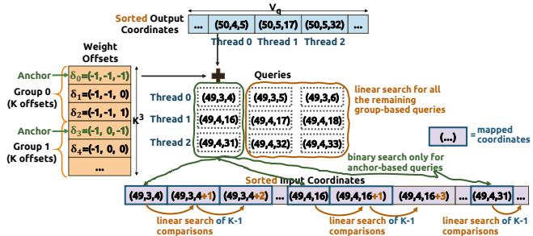  
Figure 4. Spira’s one-shot z-delta search algorithm.

Key Observation: For a thread processing the K queries from $( x , y , z )$ to $( x , y , z + ( K { - } 1 ) \times s _ { p } )$ for the same weight offset group, the sorted and integer-based nature of the input coordinate array ensures that consecutive queries $( x , y , z )$ and $( x , y , z + s _ { p } )$ , if they exist, must occupy consecutive positions in the sorted input array. There cannot be three coordinates $( x , y , z ) , ( x , y , z ^ { \prime } ) , ( x , y , z + s _ { p } )$ where $z < z ^ { \prime } < z + s _ { p } ,$ , in the input coordinate array. This follows directly from the Integer Property and SpC definition: since input coordinates are integer and multiples of stride $s _ { p }$ and are lexicographically sorted in input array, no coordinate can exist between $( x , y , z )$ and $( x , y , z + s _ { p } )$ , with the identical x and y values (input coordinates must differ by some multiples of $s _ { p } )$

Our z-delta search algorithm (Figure 4) exploits this key observation to reduce the computational cost, and improve data locality. For $| V _ { q } |$ output coordinates and $K ^ { 3 }$ weight offsets, z-delta search performs only $| V _ { q } | \times K ^ { 2 }$ binary searches (instead of $| V _ { q } | \times K ^ { 3 } )$ . For each weight offset group, the offset with the smallest z-value serves as the anchor $( \mathrm { e . g . }$ $\delta _ { 0 } = ( - 1 , - 1 , - 1 )$ is the anchor in group 0). For the K queries generated from the same weight offset group, we perform binary search in the input coordinate array only for the anchor-based query (e.g., (49,3,4) query for group 0). The binary search returns the position the matched input coordinate—or, if no match exists, the next larger coordinate. We resolve the remaining $K - 1$ queries $( \mathrm { e . g . , } ( 4 9 , 3 , 5 )$ and (49,3,6) queries for group 0) via a quick localized linear search starting from this position: the local linear search checks at most $K - 1$ consecutive positions in the input array to look for potential matchings for the remaining $K - 1$ queries. Since these positions are contiguous in memory, the localized linear search achieves optimal cache efficiency with minimal data access latency. Overall, our z-delta search algorithm enables one-shot kernel map construction with low computational cost and high data locality, significantly reducing expensive global memory accesses.

## 5.3 Packed-Native Voxel Indexing

Prior SpC engines use 32 bits for each of the three voxel coordinates of a triplet. Instead, Spira leverages the Bounded

Property to represent each integer coordinate with fewer bits and pack all three coordinates into a single integer value.

For many real-world applications (e.g., robotics, automotive), packing all three coordinates into a single 32-bit value is sufficient. For example, in outdoor scenes captured by LiDAR sensors with horizontal ranges $R _ { x }$ and $R _ { y }$ of up to 400 meters and a vertical range $R _ { z }$ of up to 20 meters, when quantizing the coordinates with a grid size of 0.1 meters, coordinates can be represented using 12, 12, and 8 bits for $v _ { x } , v _ { y } ,$ and $v _ { z } ,$ , respectively. For highly demanding applications, Spira can pack voxel coordinates into a single 64-bit value (See Figure 8). Note that 64-bit packing for the voxel coordinate triplet is sufficient for all current real-world SpC applications: 64-bit packing can represent scenes with ranges $R _ { x } , R _ { y } , R _ { z }$ up to several kilometers and satisfying spatial resolutions of the grid size vector g up to millimeters, which provides the maximum accuracy that today’s 3D sensors can support to capture raw point cloud data. Spira packs the triplet $( v _ { x } , v _ { y } , v _ { z } )$ as one single value: each $v _ { i }$ integer value is within an integer range of $\Big \lfloor \frac { \mathbf { \bar { { R } } } _ { i } } { g _ { i } } \Big \rfloor$ , thus the necessary bits to express it are at most $\begin{array} { r } { b _ { i } = \log ( \lfloor \frac { R _ { i } } { q _ { i } } \rfloor ) } \end{array}$ The first $b _ { x }$ most significant bits is for $x ,$ the next $b _ { y } ^ { \phantom { \dagger } }$ bits for y and the remaining $b _ { z }$ bits for z. In §6, we use 12, 12, and 8 bits for $v _ { x } , v _ { y }$ and $v _ { z } ,$ respectively. However, the bit allocation is flexible and can be easily configured.

The key challenge with packed coordinates is how to avoid unpacking and repacking operations in the SpC voxel indexing kernels (feature computation does not use voxel coordinates). Spira enables packed-native voxel indexing in both downsampling and mapping kernels, completely eliminating any unpacking/repacking, thus the only packing required for voxel data is performed once in the initial coordinates.

In downsampling, rounding each packed input coordinate with the output stride $s _ { q } = 2 ^ { m }$ can be efficiently performed by bitwise adding two 32-bit values: the packed coordinate $p a c k e d ( p _ { j } )$ and the mask = $\underbrace { 1 1 \cdot \cdot \cdot 1 } _ { \begin{array} { l } { \longrightarrow } \end{array} } \underbrace { 0 0 \cdot \cdot \cdot 0 } _ { \begin{array} { l } { \longrightarrow } \end{array} } \underbrace { 1 1 \cdot \cdot \cdot 1 } _ { \begin{array} { l } { \longrightarrow } \end{array} } \underbrace { 0 0 \cdot \cdot \cdot 0 } _ { \begin{array} { l } { \longrightarrow } \end{array} } \underbrace { 1 1 \cdot \cdot \cdot 1 } _ { \begin{array} { l } { \longrightarrow } \end{array} } \underbrace { 0 0 \cdot \cdot \cdot 0 } _ { \begin{array} { l } { \longrightarrow } \end{array} }$ . Down-$m _ { } { \mathrm { ~ { ~ \small ~ \alpha ~ } ~ } } \qquad m _ { } { \mathrm { ~ { ~ \small ~ \alpha ~ } ~ } } \qquad b _ { { \mathrm { ~ { ~ \small ~ \alpha ~ } ~ } } } { \mathrm { ~ { ~ \small ~ \alpha ~ } ~ } } \qquad m _ { } { \mathrm { ~ { ~ \small ~ \alpha ~ } ~ } } \qquad b _ { z } - m _ { } { \mathrm { ~ { ~ \small ~ \alpha ~ } ~ } } \qquad m _ { } { \mathrm { ~ { ~ \small ~ \alpha ~ } ~ } } \qquad m _ { } { }$ sampling also requires sorting packed coordinates to remove duplicates. Notably, sorting directly in packed format inherently preserves lexicographic order: $p _ { i } > p _ { j } \Leftrightarrow$ $p a c k e d ( p _ { i } ) > p a c k e d ( p _ { j } )$ . Therefore, we can directly sort the packed coordinates without unpacking.

In mapping, we apply to the output coordinates $q _ { i }$ and weight offsets $\delta _ { k }$ exactly the same packing format as used in input coordinates, representing each as a single packed value. We leverage the property that packe $\begin{array} { r l } { { d ( q _ { i } ) + p a c k e d ( \delta _ { k } ) = } } & { { } } \end{array}$ packed $\left( q _ { i } + \delta _ { k } \right)$ , which allows us to directly generate queries $q _ { i } + \delta _ { k }$ as $p a c k e d ( q _ { i } ) + p a c k e d ( \delta _ { k } )$ represented in the same packed format. This eliminates the need to unpack the $p a c k e d ( q _ { i } )$ , add weight offset to generate $q _ { i } + \delta _ { k }$ and repack the result. The lookup searches of mapping can be also directly performed using packed queries, as a packed format preserves lexicographic order: $( q _ { i } + \delta _ { k } ) > p _ { j } \Leftrightarrow$ $p a c k e d ( q _ { i } ) + p a c k e d ( \delta _ { k } ) > p a c k e d ( p _ { j } )$

Spira’s packed-native voxel indexing provides four performance benefits over prior works: (i) the memory footprint for voxel coordinates is lower (e.g., 3× lower for 32-bit packing), (ii) memory reads and writes for voxel coordinates are faster thanks to fewer global memory accesses, (iii) lexicographic sorting during downsampling is faster when sorting a single (32-bit or 64-bit) value compared to sorting three separate (32-bit) values, and (iv) lexicographic comparisons for lookup operations during mapping are faster—a single comparison of a packed coordinate value is faster than three separate comparisons of individual coordinates.

## 5.4 Adaptive Hybrid-Dataflow Feature Computation

Output-stationary and weight-stationary dataflows each perform best under different kernel map densities and SpC layer characteristics. When the kernel map is relatively dense (fewer invalid entries), output-stationary dataflow performs better by avoiding kernel map filtering and eliminating expensive atomic operations during feature computation. Instead, when the kernel map is relatively sparse (large number of invalid entries), weight-stationary dataflow is more efficient by skipping numerous zero-valued multiplications.

In submanifold layers, which typically constitute ∼70% of SpC layers in state-of-the-art point cloud networks, the Neighboring Property states that kernel map columns corresponding to weight offsets with smaller L1 norms consistently exhibit higher density than those with larger L1 norms. For example, in SpC layers with $K \geq 5 ,$ , most weight offset columns are up to 10× sparser than a small subset of significantly denser columns. This property implies that using a single dataflow (either output-stationary or weight-stationary) for feature computation is suboptimal.

To address this, Spira’s feature computation scheme (i) supports the full dataflow spectrum, including single-dataflow execution (all weight offsets processed using one dataflow) and hybrid dual-dataflow execution (different weight offset subsets processed using different dataflows), and (ii) minimizes post-processing costs for kernel map rearrangement required by each dataflow. Figure 5 provides an overview of Spira’s adaptive hybrid dataflow for feature computation.

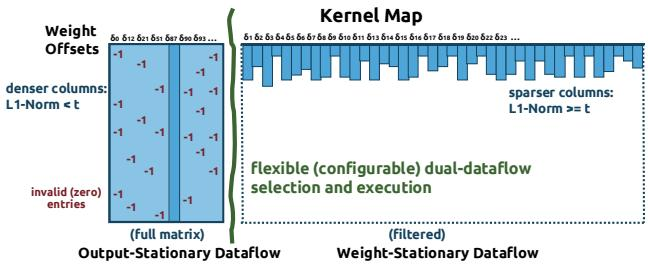  
Figure 5. Spira’s adaptive hybrid-dataflow feature computation.

We track the density of all kernel map weight offsets, and select the appropriate dataflow for each weight offset by classifying them as dense or sparse using a configurable threshold t: weight offsets with L1-norm < t are are classified as dense, and processed with output-stationary dataflow, and weight offsets with $\operatorname { L 1 - n o r m } \geq t$ are classified as sparse, and processed with weight-stationary dataflow. When t=L1NormMax+1, all columns are considered dense, degenerating to full output-stationary execution. When $\scriptstyle t = 0 .$ , all columns are considered sparse, degenerating to full weight-stationary execution.

Spira tunes the threshold value t for each SpC layer using the same general tuning approach as prior state-of-the-art works (Tang et al., 2023; Yang et al., 2024), that also have tunable feature computation schemes. We sample a few point clouds from the dataset and measure kernel map build time and feature computation latency for different (integer) t values, then select the t value that minimizes total latency. In §6, we show that our tuning scheme can yield threshold selections for the layers of our evaluated networks that can provide high performance in inference across datasets of different patterns. Note that this is a one-time tuning step performed only once before inference having negligible overhead. For example, using 5 samples, Spira’s tuning time for ResN network that has 21 SpC layers (See §6.1) is less than 3 seconds. Prior state-of-the-art works (Tang et al., 2023; Yang et al., 2024) exhibit for their respective tuning steps a comparable time of 2-5 seconds. Hence, if re-tuning is required, to accommodate a scenario where the density of the scenes may substantially change over time (e.g., transitioning from sparse highway scenes to highdensity urban environments), re-tuning can be effectively performed without significant latency costs.

The key challenge in feature computation step is how to fully support adaptive hybrid dataflow executions with low post-processing overheads in voxel indexing. Outputstationary dataflow requires the kernel map to be in $| V _ { q } | \times$ $K ^ { 3 }$ layout, while weight-stationary requires it transposed (§2.2) to $K ^ { 3 } \times | V _ { q } |$ layout (also filtered from invalid indices). These layouts enable memory coalescing in kernel map construction: adjacent threads within a thread block write to adjacent memory locations, maximizing memory bandwidth utilization. Similarly, hybrid dual-dataflow with $K _ { d e n s e }$ dense weight offsets and $K _ { s p a r s e }$ sparse weight offsets, where $K _ { d e n s e } { + } K _ { s p a r s e } { = } K ^ { 3 }$ , requires two kernel map submatrices: one of $| \bar { V } _ { q } | \times K _ { d e n s e }$ layout for outputstationary and another of $K _ { s p a r s e } \times | V _ { q } |$ layout (also filtered) for weight-stationary, both enabling memory coalescing. These different layout requirements could incur high postprocessing overheads in voxel indexing, as the entire kernel map must be rearranged into the appropriate layout for each dataflow, thus potentially negating the performance benefits of hybrid dual-dataflow execution.

Spira achieves low post-processing time across all three dataflow scenarios (Figure 6) by optimizing how queries are distributed across parallel threads within a thread block. I) Full output-stationary t=L1NormMax+1 (Figure 6a): Spira has no post-processing (zero). Our z-delta search distributes different weight offsets $\delta _ { \mathrm { j } }$ for the same output coordinate $\mathbf { q } _ { \mathrm { i } }$ across multiple threads within a thread block, enabling coalesced memory writes that directly produce the required $| V _ { q } | \times K ^ { 3 }$ layout. II) Full weight-stationary t=0 (Figure 6b): Spira has post-processing only for filtering invalid entries (no transposition is needed). Our z-delta search distributes different output coordinates $\mathbf { q _ { i } }$ for the same weight offset $\delta _ { \mathrm { j } }$ across threads within a thread block, enabling coalesced memory writes that directly produce the required $K ^ { 3 } \times | V _ { q } |$ layout. III) Hybrid dual-dataflow $0 < t \le \mathrm { L }$ 1NormMax, where t is multiple of $s _ { p } ( \mathrm { F i g u r e } 6 \mathrm { c } )$ : Our z-delta follows the weight-stationary parallelism scheme (distributing different output coordinates ${ \bf q _ { i } }$ for the same weight offset $\delta _ { \mathrm { j } }$ across threads within a block). We employ an auxiliary buffer of size $K ^ { 3 }$ to help us classify weight offsets as dense and sparse and partition the kernel map into two submatrices: one with $K _ { d e n s e } \times | V _ { q } |$ layout storing all dense weight offset rows contiguously, and another with $K _ { s p a r s e } \times | V _ { q } |$ layout storing all sparse weight offset rows contiguously. Post-processing then transposes only the dense submatrix to produce the required $| V _ { q } | \times K _ { d e n s e }$ layout, and filters only the sparse submatrix to remove invalid entries. The post-processing time in hybrid dual-dataflow is minimal and comparable to that of the full weight-stationary dataflow.

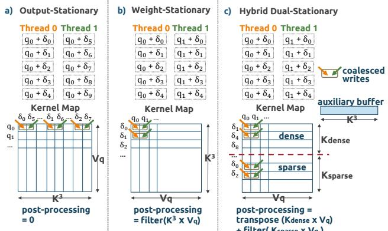  
Figure 6. Spira’s post-processing in three dataflow scenarios.

In submanifold layers, Spira further reduces post-processing time for weight-stationary dataflow and weight-stationary submatrix in hybrid dual-dataflow by exploiting a symmetry property from prior work (Tang et al., 2022): weight offsets $\delta _ { l } = ( b , c , d )$ and $\delta _ { n } = ( - b , - c , - d )$ are symmetric, i.e., if $M [ i , l ] = j > 0$ in the kernel map, then $M [ j , n ] = i > 0$ Weight-stationary feature computation, where each thread block operates on a fixed weight offset, compute outputs features for symmetric weight offset pairs by reading only the first half of the kernel map. Thus, only half of kernel map is stored and filtered, reducing post-processing time.

## 5.5 Network-Wide Voxel Indexing

We carefully examine point cloud network operators and make the following Key Observation: The voxel indexing step of a SpC layer has no true data dependencies with voxel indexing or feature computation steps of other layers. Our profiling also shows that voxel indexing incurs low GPU SM utilization, as it performs only lightweight comparisons.

Voxel indexing step includes downsampling to generate output coordinates, and mapping, that uses them to construct the kernel map needed in feature computation step. Typical downsampling for layer i is performed recursively as $V _ { i }$ $= \lfloor { \frac { V _ { i - 1 } } { 2 ^ { i } } } \rfloor \times 2 ^ { \overline { { i } } }$ using the voxel coordinates $V _ { i - 1 }$ from the previous downsampling layer. However, we find that this recursive formula can be transformed into a closed-form expression using only the initial input coordinates $V _ { 0 } { : }$

$$
{ \begin{array} { r } { V _ { i } = \left\lfloor { \frac { V _ { i - 1 } } { 2 ^ { i } } } \right\rfloor 2 ^ { i } = \left\lfloor { \frac { \left\lfloor { \frac { V _ { i - 2 } } { 2 ^ { i - 1 } } } \right\rfloor 2 ^ { i - 1 } } { 2 ^ { i } } } \right\rfloor 2 ^ { i } } \\ { = \left\lfloor { \frac { V _ { i - 2 } } { 2 ^ { i } } } \right\rfloor 2 ^ { i } = \cdots = \left\lfloor { \frac { V _ { 0 } } { 2 ^ { i } } } \right\rfloor 2 ^ { i } } \end{array} }
$$

Thus, downsampling kernels of different layers have no true dependencies with each other: voxel coordinates of layer i can be directly extracted from the initial coordinates $V _ { 0 }$ . Moreover, mapping kernels are also mutually independent, since each mapping kernel only requires its associated layer’s downsampled coordinates to build the kernel map consumed by subsequent feature computation.

Spira enables network-wide voxel indexing by executing voxel indexing steps for all layers in parallel at the network start via a two-phase process. First, all downsampling kernels across all layers are executed concurrently using CUDA streams distributed across multiple GPU SMs, generating coordinate sets for their corresponding mapping kernels. Second, all mapping kernels are executed concurrently, again using streams across multiple SMs to produce kernel maps for all layers. These kernel maps are stored in global memory and consumed by their corresponding feature computation steps as inference progresses.

In a typical network, each SpC layer does not require a unique kernel map, instead multiple SpC layers with same key characteristics $( \mathrm { i . e . }$ , layers with same input stride, layer stride and kernel size) have identical kernel maps. Consequently, some kernel maps can be shared and re-used across multiple SpC layers. For instance, consecutive submanifold layers with the same kernel size share the same kernel map. In Figure 7, the kernel map of SpC layer 2 is re-used in SpC layer 3. As a result, existing SpC engines (Choy et al., 2019; Tang et al., 2023; Yang et al., 2024) maintain the kernel maps in memory during inference and reuse them in multiple layers. The key difference of Spira versus prior existing SpC engines is when kernel maps are computed, depicted in Figure 7. Prior engines compute and store kernel maps progressively, as layers are executed during inference, while Spira computes all kernel maps upfront (at the start of inference). Therefore, both approaches converge to have similar memory footprints for the kernel maps, as well as for all other inference data, including features and weights which are the same across engines. The memory footprint of the kernel maps is on average ∼40MB stored in global memory—affordable even for edge GPUs.

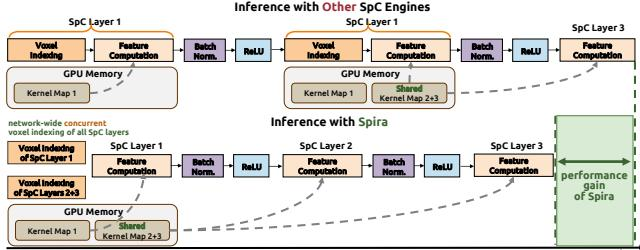  
Figure 7. Inference of existing SpC engines versus network-wide voxel indexing inference of Spira.

In submanifold layers with weight-stationary dataflow, we only store half the kernel map thanks to exploiting the symmetry property explained in §5.4, thus further reducing the memory footprint. Spira’s network-wide voxel indexing improves execution parallelism and GPU utilization.

## 6 EVALUATION

## 6.1 Evaluation Methodology

Hardware Systems / GPUs. We evaluate Spira on six NVIDIA GPUs spanning consumer, workstation, datacenter, and edge categories: the consumer GPUs RTX 3090 (24GB) and GTX 1060 (6GB); the workstation GPU Quadro RTX 5000 (16GB); the datacenter GPUs Tesla A100 (80GB) and H100 (80GB); and an edge GPU platform widely used in robotics and edge applications, the Jetson Orin AGX (64GB shared), operated under a 50W power budget. Unless otherwise stated, all detailed evaluation results are reported on the RTX 3090 GPU.

Neural Networks. We evaluate three point cloud networks: SparseResNet (21 layers) (ResN), MinkUNet (42 layers) (UNet) (Choy et al., 2019), and Centerpoint Large (20 layers) (ResNL) (Chen et al., 2023), which uses SpC layers with K=5 (instead of 3) in all stages of ResNet backbone.

Datasets. We evaluate three large-scale point cloud datasets: SemanticKITTI (KITTI) (Behley et al., 2019), which includes outdoor LiDAR scans for self-driving scenarios (average scene density: 0.11%), ScanNet (Dai et al., 2017), which contains RGB-D scans of indoor environments (average scene density: 1.57%), and Waymo (Sun et al., 2020), which provides large-scale outdoor scenes for automotive object detection (average scene density: 0.16%).

Comparison Points. We compare Spira with two state-ofthe-art SpC engines: (i) Minuet and (ii) TorchSparse++. In Spira, we account for both sorting and packing the initial input coordinates. We do not include tuning time for any engine as tuning happens only once and is before inference. Unless otherwise stated, we use 16-bit float precision in our experiments and a batch size of 1, because inference workloads for point cloud networks are typically latencyoriented rather than throughput-oriented.

## 6.2 End-to-End Inference Performance

Figure 8 and Figure 9 show end-to-end inference performance of all engines on RTX 3090 and A100, respectively, across different networks and datasets. See also Appendix §A.1 for detailed results on the remaining GPUs. Spira uses 32-bit or 64-bit packed-native voxel indexing.

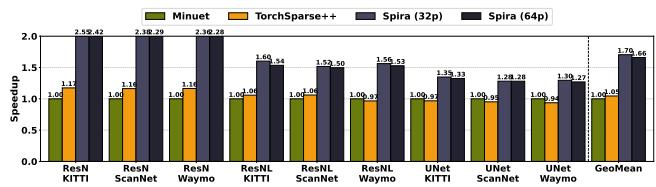  
Figure 8. End-to-end inference performance of all SpC engines using various point cloud networks and datasets on RTX 3090.

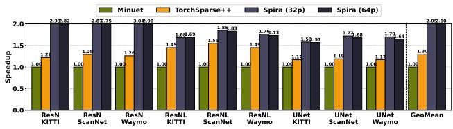  
Figure 9. End-to-end inference performance of all SpC engines using various point cloud networks and datasets on A100.

We make three key observations. First, TorchSparse++ outperforms Minuet on A100, but achieves comparable performance on RTX 3090. This is because on the A100 GPU, the output-stationary dataflow performs better than the weightstationary in the vast majority of layers across all networks, and Minuet does not support output-stationary. This trend is attributed to the A100’s higher compute throughput and memory bandwidth, which mitigate the cost of redundant computations. In contrast, on the RTX 3090, the weightstationary dataflow outperforms the output-stationary in approximately half of the layers within the UNet and ResNL networks. Second, across all evaluated networks and datasets, Spira consistently delivers the best performance over prior SpC engines on both RTX 3090 and A100, achieving average speedups of 1.70× and 2.05× over Minuet, and of 1.62× and 1.58× over TorchSparse++, on RTX 3090 and A100, respectively. Third, Spira with 64-bit coordinate packing versus 32-bit of has negligible performance impact, demonstrating that Spira can provide significant performance benefits even in highly demanding point cloud applications. The one-time coordinate packing and sorting costs on the initial input coordinates account only for 1.3% and 1.6% of the total inference time on average for the 32-bit and 64-bit Spira versions, respectively, as we use RadixSort (Adinets & Merrill, 2022) for sorting, which has linear complexity. In larger scenes, this percentage drops to less than 0.3%. Across different datasets and networks, Spira selects different dataflows with minimal post-processing overheads. In Appendix §A.1, we evaluate four additional GPUs, and show that Spira maintains high performance across all GPU architectures, having 1.68× average speedup.

Table 1, Table 2, and Table 3 report the number of layers for which Spira’s tuning selects different threshold t configurations for the feature computation step in all datasets and networks. We find that in ScanNet dataset, whose scenes are ∼10× denser on average than those of the other two datasets, more layers with higher threshold values are selected across all networks, which translates to more weight offsets are classified as dense across the layers of the networks.

<table><tr><td rowspan=1 colspan=1>Number of Layers</td><td rowspan=1 colspan=1>KITTI</td><td rowspan=1 colspan=1>ScanNet</td><td rowspan=1 colspan=1>Waymo</td></tr><tr><td rowspan=1 colspan=1>Weight-Stationary (t=0)</td><td rowspan=1 colspan=1>5</td><td rowspan=1 colspan=1>0</td><td rowspan=1 colspan=1>4</td></tr><tr><td rowspan=1 colspan=1>Hybrid-Stationary (t=1)</td><td rowspan=1 colspan=1>0</td><td rowspan=1 colspan=1>0</td><td rowspan=1 colspan=1>0</td></tr><tr><td rowspan=1 colspan=1>Hybrid-Stationary (t=2)</td><td rowspan=1 colspan=1>0</td><td rowspan=1 colspan=1>4</td><td rowspan=1 colspan=1>0</td></tr><tr><td rowspan=1 colspan=1>Hybrid-Stationary (t=3)</td><td rowspan=1 colspan=1>0</td><td rowspan=1 colspan=1>0</td><td rowspan=1 colspan=1>0</td></tr><tr><td rowspan=1 colspan=1>Output-Stationary (t=L1NormMax+1)</td><td rowspan=1 colspan=1>16</td><td rowspan=1 colspan=1>17</td><td rowspan=1 colspan=1>17</td></tr></table>

Table 1. Number of layers selected per threshold configuration for the ResN network using the three evaluated datasets.
<table><tr><td rowspan=1 colspan=1>Number of Layers</td><td rowspan=1 colspan=1>KITTI</td><td rowspan=1 colspan=1>ScanNet</td><td rowspan=1 colspan=1>Waymo</td></tr><tr><td rowspan=1 colspan=1>Weight-Stationary (t=0)</td><td rowspan=1 colspan=1>5</td><td rowspan=1 colspan=1>1</td><td rowspan=1 colspan=1>1</td></tr><tr><td rowspan=1 colspan=1>Hybrid-Stationary (t=1)</td><td rowspan=1 colspan=1>4</td><td rowspan=1 colspan=1>0</td><td rowspan=1 colspan=1>0</td></tr><tr><td rowspan=1 colspan=1>Hybrid-Stationary (t=2)</td><td rowspan=1 colspan=1>0</td><td rowspan=1 colspan=1>4</td><td rowspan=1 colspan=1>8</td></tr><tr><td rowspan=1 colspan=1>Hybrid-Stationary (t=3)</td><td rowspan=1 colspan=1>9</td><td rowspan=1 colspan=1>9</td><td rowspan=1 colspan=1>9</td></tr><tr><td rowspan=1 colspan=1>Output-Stationary (t=L1NormMax+1)</td><td rowspan=1 colspan=1>2</td><td rowspan=1 colspan=1>6</td><td rowspan=1 colspan=1>2</td></tr></table>

Table 2. Number of layers selected per threshold configuration for the ResNL network using the three evaluated datasets.
<table><tr><td rowspan=1 colspan=1>Numberof Layers</td><td rowspan=1 colspan=1>KITTI</td><td rowspan=1 colspan=1>ScanNet</td><td rowspan=1 colspan=1>Waymo</td></tr><tr><td rowspan=1 colspan=1>Weight-Stationary (t=0)</td><td rowspan=1 colspan=1>28</td><td rowspan=1 colspan=1>22</td><td rowspan=1 colspan=1>25</td></tr><tr><td rowspan=1 colspan=1>Hybrid-Stationary (t=1)</td><td rowspan=1 colspan=1>0</td><td rowspan=1 colspan=1>0</td><td rowspan=1 colspan=1>0</td></tr><tr><td rowspan=1 colspan=1>Hybrid-Stationary (t=2)</td><td rowspan=1 colspan=1>0</td><td rowspan=1 colspan=1>0</td><td rowspan=1 colspan=1>0</td></tr><tr><td rowspan=1 colspan=1>Hybrid-Stationary (t=3)</td><td rowspan=1 colspan=1>0</td><td rowspan=1 colspan=1>0</td><td rowspan=1 colspan=1>0</td></tr><tr><td rowspan=1 colspan=1>Output-Stationary (t=L1NormMax+1)</td><td rowspan=1 colspan=1>14</td><td rowspan=1 colspan=1>20</td><td rowspan=1 colspan=1>17</td></tr></table>

Table 3. Number of layers selected per threshold configuration for the UNet network using the three evaluated datasets.

Overall, Spira significantly outperforms prior state-of-theart engines, demonstrating robust efficiency across diverse point cloud networks, datasets, and GPU architectures.

## 6.3 Layerwise Performance

Since 64-bit and 32-bit packing perform comparably, our subsequent evaluations enable Spira with 32-bit packing. We assess various layers configurations (input channels $C _ { i n }$ output channels $C _ { o u t }$ kernel size K). For fair comparison with prior work, we do measure the voxel indexing runtime in Spira for each evaluated layer. Figure 10 shows layerwise performance of all engines for various layer configurations commonly found in state-of-the-art point cloud networks. For each layer, we report the geometric mean across all datasets. TorchSparse++ and Spira select the best-performing dataflow.

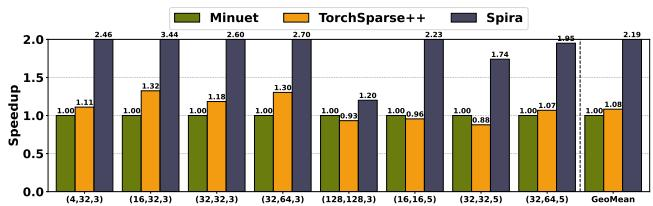  
Figure 10. Layerwise speedup of all SpC engines averaged across all datasets, for various SpC layers of $( C _ { i n } , C _ { o u t } , K )$

We draw two findings. First, TorchSparse++ outperforms Minuet in layers with relatively small channels and kernel sizes (e.g., (16, 32, 3)) because, as we also explain in Figure 11, output-stationary dataflow—which Minuet does not support—performs significantly better in such layers. However, in layers with larger channels and kernel sizes, TorchSparse++ achieves comparable performance to Minuet and even surpasses it in some cases. Second, Spira consistently outperforms Minuet and TorchSparse++ across all layers, delivering average speedup of 2.19× and 2.03× (up to 3.44× and 2.60×), respectively. Spira uses t=3 in hybrid dual-dataflow for layers (16, 16, 5) and (32, 32, 5): although hybrid dual-dataflow still incurs post-processing costs, postprocessing time is 5.41× and 2.51× lower on average than TorchSparse++ weight-stationary and Minuet, respectively.

Figure 11 presents the Spira layerwise performance using output-, weight-stationary or hybrid dual-dataflow varying the threshold t in submanifold layer configurations with $s _ { p } { = } 1$ , where each triplet of a layer configuration shows the input channels, output channels and kernel size. For K=3 and $K { = } 5 .$ , t can get 3 and 6 values, respectively.

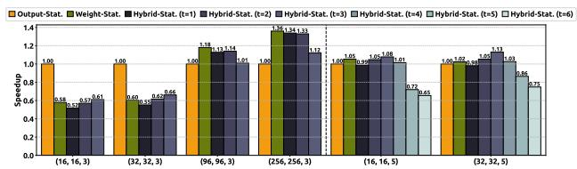  
Figure 11. Layerwise speedup of Spira with various threshold configurations for the dataflow of the feature computation step.

We draw two findings. First, output-stationary dataflow dominates in layers with smaller channels and kernel sizes. In such layers, weight-stationary incurs high post-processing overhead relative to its feature computation time (actual convolution computation is relatively small). Conversely, weight-stationary surpasses output-stationary in layers with larger channels and kernel sizes. For example, in layers with $K { = } 5 .$ , many weight offsets in kernel map are highly sparse, causing output-stationary to perform numerous unnecessary zero-valued multiplications. Second, hybrid dual-dataflow performs best in large layers with $K { = } 5$ , with speedups up to 1.13× and 1.11× over full output-stationary and full weightstationary, respectively, by combining the strengths of both dataflows. In layers with $K { = } 5$ (125 weight offsets), thresholds $t \geq 5$ classify many weight offsets as dense (at least 93), causing high transposition overheads for the dense submatrix. Instead, threshold t=3 provides the best performance: it selects 25 weight offsets as dense (average density 32%) for output-stationary and 100 as sparse (average density 10%) for weight-stationary. This split effectively balances compute load across both dataflow executions, justifying the overheads of two separate GPU kernel launches.

## 6.4 Performance of Mapping in Voxel Indexing

Figure 12 presents mapping performance (pre-processing and search phases of voxel indexing) for all SpC engines using real scenes from the evaluated datasets with varying input coordinate counts and layer kernel sizes. We add an additional baseline: lookup operations for kernel map construction are performed via simple binary search (Simple BSearch), which requires no pre-processing. Simple BSearch also includes the 32-bit coordinate packing, as described in §5.3.

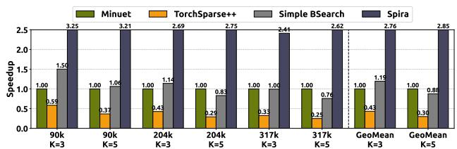  
Figure 12. Mapping performance in voxel indexing for all engines across varying input coordinate counts and layer kernel sizes.

We make three key observations. First, Minuet clearly outperforms TorchSparse++ in all cases by 2.83× on average, as TorchSparse++ causes irregular memory accesses during lookups, while Minuet effectively exploits GPU on-chip caches. Second, Simple BSearch outperforms Minuet in smaller scenes (e.g., 90k voxels), but it scales poorly as the coordinate count and kernel size increase due to poor cache utilization. Third, Spira’s z-delta search delivers outstanding performance over all comparison points across all scenes, with speedup up to 2.85×, 9.49× and 3.45× over Minuet, TorchSparse++ and Simple BSearch, respectively. Minuet and TorchSparse++ exhibit notable pre-processing overhead of 8–36.5% and 18.3–55.5% of total mapping time, respectively. Instead, Spira completely eliminates pre-processing and significantly outperforms even packed-native Simple BSearch, which also has no pre-processing. Spira’s z-delta search algorithm exploits the integer-valued property to perform intelligent localized searches: for many queries, it requires only a single comparison and a single cache-friendly memory access, while competing approaches perform multiple comparisons per query and may incur irregular memory accesses. This significantly reduces computational cost and memory access latency, enabling robust performance even as coordinate counts and kernel sizes increase.

## 6.5 Performance Breakdown of Spira’s Key Ideas

Figure 13 shows the end-to-end inference performance benefits by incrementally enabling Spira’s four key ideas. We present the detailed breakdown on the UNet network.

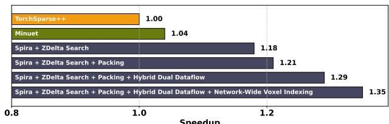  
Figure 13. End-to-end inference performance breakdown of the key ideas of Spira.

We find that all Spira’s ideas contribute to overall performance, with the largest gains coming from z-delta-search and hybrid dual-dataflow. Specifically, the z-delta-search enables Spira to achieve a 1.18× speedup over TorchSparse++, and the hybrid dual-dataflow scheme delivers an additional 1.07× performance improvement. Spira’s coordinate packing contributes to a 1.02× (1.06× on average across all networks) speedup. Spira’s network-wide streamed voxel indexing execution further improves end-to-end inference by 1.05× and up to 1.12× across all networks over sequential execution followed by prior works.

Figure 14 shows the layerwise performance improvements by incrementally adding Spira’s optimizations: (1) 32- bit packed-native voxel indexing on Simple BSearch with output-stationary dataflow, (2) replacing Simple BSearch with Spira’s z-delta search, and (3) replacing outputstationary with Spira’s adaptive hybrid dual-dataflow. We evaluate a common layer of $( C _ { i n } , C _ { o u t } , K ) { = } ( 3 2 , 3 2 , 5 )$ which appears in 4 of 20 layers in ResNL, and include the voxel indexing runtime.

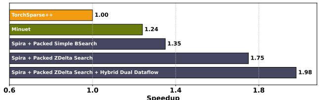  
Figure 14. Layerwise performance breakdown of Spira key ideas.

The most substantial speedup comes from replacing Simple BSearch with our z-delta search algorithm (resulting 1.75× speedup over TorchSparse++), demonstrating the effectiveness of our one-shot design (no pre-processing) and highly localized search scheme that is both compute- and memory-efficient.

Figure 15 shows the performance benefits of Spira’s network-wide voxel indexing optimization. We measure total voxel indexing time to create kernel maps for all layers of each of the three networks, and evaluate either sequential execution (i.e., the approach followed by prior works (Choy et al., 2019; Tang et al., 2023; Yang et al., 2024)) or Spira’s streamed (concurrent) execution. Spira ’s network-wide streamed execution improves total voxel indexing latency by up to 1.72× over sequential execution.

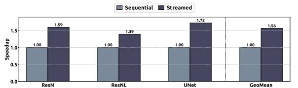  
Figure 15. Spira with sequential versus streamed voxel indexing execution.

## 6.6 Ablation Studies

We generate synthetic scenes with randomly distributed nonzero voxels inside a [200, 200, 200] volume to evaluate the SpC engines on voxel data that do not necessarily follow the neighboring property of real-world point clouds. Figure 16 shows the average end-to-end inference performance of all engines across all networks on synthetic scenes whose density ranges from 0.12% to 12.50%. Even on synthetic scenes that may not follow the neighboring property of real-world point clouds, Spira outperforms Minuet and TorchSparse++ by on average 1.80× and 1.59×, respectively.

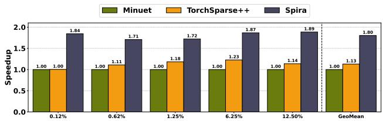  
Figure 16. End-to-end inference performance of all SpC engines averaged across all networks for scenes of different densities that may not follow the neighboring property existing in real datasets.

To evaluate how the SpC engines scale when increasing the input coordinate count, we generate synthetic scenes with a fixed density of ∼1.25%, by increasing both the number of non-zero voxels and the 3D space volume. Specifically, we select a volume of size [n, n, 200], and increase the value n of the dimensions x and y, then we randomly generate nonzero voxels inside, such that the scene matches the target density. Figure 17 shows the average end-to-end inference performance of all engines on ResN network, when varying the number of non-zero voxels from 104 to $5 \times 1 0 ^ { 6 }$ while keeping scene density fixed (scene volume increases).

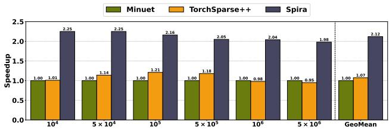  
Figure 17. End-to-end inference performance of all SpC engines on ResN network for synthetic scenes of fixed density and different number of non-zero voxels.

Spira effectively scales on larger scenes with large number of non-zero voxels $( \geq 1 0 ^ { 6 } )$ , outperforming existing SpC engines by on average 2.05× (up to 2.25×).

In Appendix §A.2, we also evaluate the peak memory footprint and performance of all SpC engines during end-to-end inference, while varying the kernel size and batch size. Our results demonstrate that Spira has similar memory footprint to prior engines, while achieving large performance gains even for larger batch sizes and kernel sizes.

## 7 OTHER RELATED WORK

Point Cloud Accelerators. Prior works (Feng et al., 2020; Han et al., 2024; Zhang & Zhang, 2021; Feng et al., 2022; Lin et al., 2021; Lin et al., 2024; Lyu et al., 2023) propose application-specific accelerators for point cloud networks. However, only a few accelerators (Lin et al., 2021; Lin et al., 2024; Lyu et al., 2023) support the 3D SpC. These works have custom microarchitecture designs and rely on simulators for evaluation, which limits their immediate practical deployment. Instead, Spira is a software runtime engine that directly runs on commodity high-end and edge GPUs, provides comprehensive evaluations on real systems, and enables immediate deployment in real SpC applications.

Deep Learning Compilers. Deep Learning (DL) compilers optimize dense tensor algebra (Feng et al., 2023; Chen et al., 2018; Ding et al., 2023; Xing et al., 2022) and sparse tensor algebra kernels (Gupta et al., 2025; Liu et al., 2025; Ahrens et al., 2025; Du et al., 2025; Won et al., 2023; Ye et al., 2023; Kjolstad et al., 2017). Although some sparse DL compilers could be used to optimize SpC, these compilers do not integrate the optimizations proposed in Spira. Spira’s ideas can work synergistically with existing sparse DL compilers to significantly improve performance in SpC executions.

## 8 CONCLUSION

We introduce Spira, the first voxel-property-aware SpC engine for GPUs. Spira proposes the one-shot z-delta search algorithm that has low computational cost and high data locality, integrates packed-native voxel indexing that significantly reduces data accesses, employs network-wide parallelization in voxel indexing kernels of all network’s SpC layers to increase execution parallelism, and provides flexible hybrid dual-dataflow feature computation that adapts to layer characteristics. Spira significantly outperforms prior state-of-the-art SpC engines by 1.68× on average and up to 3.04× in end-to-end inference across various point cloud networks, real-world datasets, and GPUs. We hope our work encourages further research studies on sparse operators of emerging ML models and structural properties of 3D data.

## 9 ACKNOWLEDGEMENTS

We thank the MLSys 2026 reviewers for their valuable feedback and the members of the SPIN research group and the CSLab research group for the stimulating and inclusive research environments they provide. We thank the IT staff at the Max Planck Institute for Software Systems for technical support. We thank the Visual Computing and Artificial Intelligence department at the Max Planck Institute for Informatics for lending us the Jetson Orin AGX platform.

## REFERENCES

Adinets, A. and Merrill, D. Onesweep: A Faster Least Significant Digit Radix Sort for GPUs. In arXiv, 2022.

Ahrens, W., Collin, T. F., Patel, R., Deeds, K., Hong, C., and Amarasinghe, S. Finch: Sparse and Structured Tensor Programming with Control Flow. In OOPSLA, 2025.

Behley, J., Garbade, M., Milioto, A., Quenzel, J., Behnke, S., Stachniss, C., and Gall, J. SemanticKITTI: A Dataset for Semantic Scene Understanding of LiDAR Sequences. In ICCV, 2019.

Chen, T., Moreau, T., Jiang, Z., Zheng, L., Yan, E., Shen, H., Cowan, M., Wang, L., Hu, Y., Ceze, L., Guestrin, C., and Krishnamurthy, A. TVM: An Automated End-to-End Optimizing Compiler for Deep Learning. In OSDI, 2018.

Chen, Y., Liu, J., Zhang, X., Qi, X., and Jia, J. Voxel-NeXt: Fully Sparse VoxelNet for 3D Object Detection and Tracking. In CVPR, 2023.

Choy, C., Gwak, J., and Savarese, S. 4D Spatio-Temporal ConvNets: Minkowski Convolutional Neural Networks. In CVPR, 2019.

Dai, A., Chang, A. X., Savva, M., Halber, M., Funkhouser, T., and Nießner, M. ScanNet: Richly-annotated 3D Reconstructions of Indoor Scenes. In CVPR, 2017.

Ding, Y., Yu, C. H., Zheng, B., Liu, Y., Wang, Y., and Pekhimenko, G. Hidet: Task-Mapping Programming Paradigm for Deep Learning Tensor Programs. In ASPLOS, 2023.

Du, Z., Liu, Y., Sun, N., Cui, H., Feng, X., and Li, J. SRSparse: Generating Codes for High-Performance Sparse Matrix-Vector Semiring Computations. In TACO, 2025.

Feng, S., Hou, B., Jin, H., Lin, W., Shao, J., Lai, R., Ye, Z., Zheng, L., Yu, C. H., Yu, Y., et al. TensorIR: An Abstraction for Automatic Tensorized Program Optimization. In ASPLOS, 2023.

Feng, Y., Tian, B., Xu, T., Whatmough, P., and Zhu, Y. Mesorasi: Architecture Support for Point Cloud Analytics via Delayed-Aggregation. In MICRO, 2020.

Feng, Y., Hammonds, G., Gan, Y., and Zhu, Y. Crescent: Taming Memory Irregularities for Accelerating Deep Point Cloud Analytics. In ISCA, 2022.

GitHub. TorchSparse++ GitHub. https://github. com/mit-han-lab/torchsparse, 2025.

Gupta, A., Yuan, Y., Jain, D., Ge, Y., Aponte, D., Zhou, Y., and Mendis, C. SPLAT: A Framework for Optimised GPU Code-Generation for SParse reguLar ATtention. In OOPSLA, 2025.

Han, M., Wang, L., Xiao, L., Zhang, H., Cai, T., Xu, J., Wu, Y., Zhang, C., and Xu, X. BitNN: A Bit-Serial Accelerator for K-Nearest Neighbor Search in Point Clouds. In ISCA, 2024.

Hong, K., Yu, Z., Dai, G., Yang, X., Lian, Y., Xu, N., and Wang, Y. Exploiting Hardware Utilization and Adaptive Dataflow for Efficient Sparse Convolution in 3D Point Clouds. In MLSys, 2023.

Kim, P., Chen, J., and Cho, Y. K. SLAM-driven Robotic Mapping and Registration of 3D Point Clouds. In Automation in Construction, 2018.

Kjolstad, F., Kamil, S., Chou, S., Lugato, D., and Amarasinghe, S. The Tensor Algebra Compiler. In OOPSLA, 2017.

Lin, X., Huang, S., and Jiang, H. Voxel-CIM: An Efficient Compute-in-Memory Accelerator for Voxel-based Point Cloud Neural Networks. In DAC, 2024.

Lin, Y., Zhang, Z., Tang, H., Wang, H., and Han, S. PointAcc: Efficient Point Cloud Accelerator. In MICRO, 2021.

Liu, F., Huang, S., Yang, N., Wang, Z., Li, H., and Jiang, L. CROSS: Compiler-Driven Optimization of Sparse DNNs Using Sparse/Dense Computation Kernels. In HPCA, 2025.

Lyu, D., Li, Z., Chen, Y., Zhang, J., Xu, N., and He, G. SpOctA: A 3D Sparse Convolution Accelerator with Octree-Encoding-Based Map Search and Inherent Sparsity-Aware Processing. In ICCAD, 2023.

Sun, P., Kretzschmar, H., Dotiwalla, X., Chouard, A., Patnaik, V., Tsui, P., Guo, J., Zhou, Y., Chai, Y., Caine, B., Vasudevan, V., Han, W., Ngiam, J., Zhao, H., Timofeev, A., Ettinger, S., Krivokon, M., Gao, A., Joshi, A., Zhang, Y., Shlens, J., Chen, Z., and Anguelov, D. Scalability in Perception for Autonomous Driving: Waymo Open Dataset. In CVPR, 2020.

Tang, H., Liu, Z., Li, X., Lin, Y., and Han, S. Torchsparse: Efficient Point Cloud Inference Engine. In MLSys, 2022.

Tang, H., Yang, S., Liu, Z., Hong, K., Yu, Z., Li, X., Dai, G., Wang, Y., and Han, S. TorchSparse++: Efficient Training and Inference Framework for Sparse Convolution on GPUs. In MICRO, 2023.

Wirth, F., Quehl, J., Ota, J., and Stiller, C. Pointatme: Efficient 3D Point Cloud Labeling in Virtual Reality. In IV, 2019.

Won, J., Hong, C., Mendis, C., Emer, J., and Amarasinghe, S. Unified Convolution Framework: A Compiler-Based

Approach to Support Sparse Convolutions. In MLSys, 2023.

Wu, W., Qi, Z., and Fuxin, L. PointConv: Deep Convolutional Networks on 3D Point Clouds. In CVPR, 2019.

Xing, J., Wang, L., Zhang, S., Chen, J., Chen, A., and Zhu, Y. Bolt: Bridging the Gap Between Auto-Tuners and Hardware-Native Performance. In MLSys, 2022.

Yan, Y. Spconv: Spatially Sparse Convolution Library. https://github.com/traveller59/ spconv, 2022.

Yang, J., Giannoula, C., Wu, J., Elhoushi, M., Gleeson, J., and Pekhimenko, G. Minuet: Accelerating 3D Sparse Convolutions on GPUs. In EuroSys, 2024.

Ye, Z., Lai, R., Shao, J., Chen, T., and Ceze, L. SparseTIR: Composable Abstractions for Sparse Compilation in Deep Learning. In ASPLOS, 2023.

Yin, T., Zhou, X., and Krahenbuhl, P. Center-Based 3D Object Detection and Tracking. In CVPR, 2021.

Zermas, D., Izzat, I., and Papanikolopoulos, N. Fast Segmentation of 3D Point Clouds: A Paradigm on LiDAR Data for Autonomous Vehicle Applications. In ICRA, 2017.

Zhang, J.-F. and Zhang, Z. Point-X: A Spatial-Locality-Aware Architecture for Energy-Efficient Graph-Based Point-Cloud Deep Learning. In MICRO, 2021.

Zheng, Z., Bewley, T. R., and Kuester, F. Point Cloud-Based Target-Oriented 3D Path Planning for UAVs. In ICUAS, 2020.

Zhu, X., Zhou, H., Wang, T., Hong, F., Ma, Y., Li, W., Li, H., and Lin, D. Cylindrical and Asymmetrical 3D Convolution Networks for Lidar Segmentation. In CVPR, 2021.

## A ADDITIONAL EVALUATION RESULTS

## A.1 End-To-End Inference on More GPUs

Figure 18, Figure 19, Figure 20, and Figure 21 show the end-to-end inference performance of all SpC engines across different networks and datasets, measured on GTX 1060, Quadro RTX 5000, H100, and Jetson Orin AGX GPUs, respectively. For these benchmarks, all evaluations on the GTX 1060 are performed in 32-bit float precision, since 16-bit float precision in this architecture is inefficiently supported, i.e., it achieves 64× lower compute throughput than that of 32-bit float.

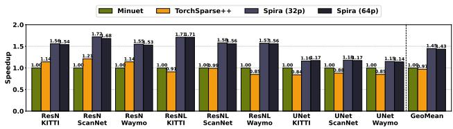  
Figure 18. End-to-end inference performance of all SpC engines using various point cloud networks and datasets on GTX 1060 GPU.

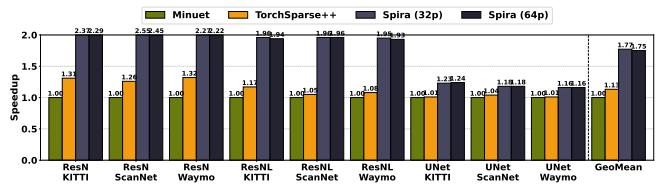  
Figure 19. End-to-end inference performance of all SpC engines using various point cloud networks and datasets on Quadro RTX 5000 GPU.

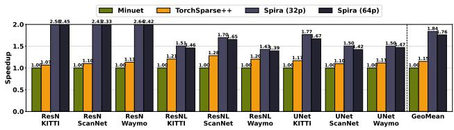  
Figure 20. End-to-end inference performance of all SpC engines using various point cloud networks and datasets on H100 GPU.

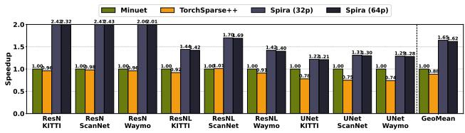  
Figure 21. End-to-end inference performance of all SpC engines using various point cloud networks and datasets on Jetson Orin AGX platform.

Spira significantly outperforms Minuet and TorchSparse++ across all GPUs, with 32-bit packing delivering consistent average speedups of 1.47×, 1.67×, 1.71×, and 1.75× on GTX 1060, Quadro RTX 5000, H100, and Jetson Orin AGX, respectively. These results demonstrate Spira’s ability to provide robust performance gains regardless of the underly-

ing GPU architecture.

## A.2 Memory Footprint Evaluation

Table 4 presents the peak memory footprint (including the memory footprint of kernel maps, weights, and features) and performance of all SpC engines measured during endto-end inference on the Waymo Dataset. We evaluate UNet (42 layers) with large kernel size (K) up to 13 and batch size (B) up to 4 using the RTX 3090 GPU (24GB).

<table><tr><td rowspan=1 colspan=1>Configuration</td><td rowspan=1 colspan=1>TorchSparse++</td><td rowspan=1 colspan=1>Minuet</td><td rowspan=1 colspan=1>Spira</td></tr><tr><td rowspan=1 colspan=1>K=3； B=1</td><td rowspan=1 colspan=1>353MB/1.00</td><td rowspan=1 colspan=1>405MB/1.06×</td><td rowspan=1 colspan=1>360MB/1.33×</td></tr><tr><td rowspan=1 colspan=1>K=7； B=1</td><td rowspan=1 colspan=1>1.6GB/1.00</td><td rowspan=1 colspan=1>1.7GB/1.30×</td><td rowspan=1 colspan=1>1.4GB/2.14×</td></tr><tr><td rowspan=1 colspan=1>K=13;B=1</td><td rowspan=1 colspan=1>9.2GB/1.00</td><td rowspan=1 colspan=1>9.6GB/1.15×</td><td rowspan=1 colspan=1>9GB/2.20×</td></tr><tr><td rowspan=1 colspan=1>K=3； B=4</td><td rowspan=1 colspan=1>1.1GB/1.00</td><td rowspan=1 colspan=1>1.3GB/1.05×</td><td rowspan=1 colspan=1>1.1GB/1.28×</td></tr><tr><td rowspan=1 colspan=1>K=7； B=4</td><td rowspan=1 colspan=1>3GB/1.00</td><td rowspan=1 colspan=1>3.5GB/1.28×</td><td rowspan=1 colspan=1>2.7GB/1.75x</td></tr><tr><td rowspan=1 colspan=1>K=13;B=4</td><td rowspan=1 colspan=1>17GB/1.00</td><td rowspan=1 colspan=1>0OM/-</td><td rowspan=1 colspan=1>16GB/1.81×</td></tr></table>

Table 4. Peak memory footprint and performance of all SpC engines in end-to-end inference for different kernel size (K) and batch size (B) configurations.

Our results show that the peak memory footprint of all SpC engines is similar. While Spira pre-computes all kernel maps upfront at the network start, TorchSparse++ and Minuet generate them progressively, as layers are executed, and retain them in memory to reuse them across SpC layers that share the same kernel maps (See §5.5). Hence, all SpC engines converge to have similar memory footprints for kernel maps, as well as all other inference data including features and weights, which remain identical across the engines. Additionally, Spira outperforms Minuet and TorchSparse++ by up to 1.30× and 2.20×, respectively. In these experiments, the minimum and maximum kernel map memory footprint of Spira is 19MB (K=3 & B=1) and 6.4GB (K=13 & B=4), respectively.

## B ARTIFACT APPENDIX

## B.1 Abstract

The Artifact Appendix describes how to reproduce the main results of this paper. It includes the source code of Spira, benchmark scripts, and step-by-step instructions for the key evaluation results. The experiments require an NVIDIA GPU with an up-to-date NVIDIA driver installed. We provide a README.md file that describes the required hardware and software dependencies and provides step-by-step instructions. Note that the datasets used in our evaluations are licensed. This artifact is used to support our major claims (See §B.6), demonstrating Spira’s performance benefits in Figure 8, Figure 9, Figure 10, Figure 12, and Figure 16. We expect the full evaluation pipeline, including setup to take approximately 2–3 hours. We also provide a Dockerfile to automatically set up the runtime environment for running the artifact. We recommend using the docker environment for running the experiments.

## B.2 Artifact check-list (meta-information)

• Program: Spira Artifact: In this artifact, we compile and evaluate three comparison points Minuet, TorchSparse++ and Spira.

• Compilation: CMake build system; GNU compilers (gcc/g++); NVIDIA CUDA compiler (nvcc); PyTorch. The artifact is compiled as a Docker image for ease of deployment and reproducibility.

• Data set: SemanticKITTI (KITTI), ScanNet and Waymo. All datasets are licensed.

• Run-time environment: Linux Ubuntu 22.04 with Python 3.10, requiring CUDA 12.4.1 and PyTorch 2.5.0, all provided via a Docker image.

• Hardware: A system with an NVIDIA GPU device with a minimum compute capability of 7.5 and at least 16GB GPU memory should be used to validate the results.

• Metrics: Execution time in milliseconds normalized as relative performance speedup.

• Output: Output files containing raw results. Figures similar to Figure 8, Figure 9, Figure 10, Figure 12, and Figure 16 of the main paper.

• Experiments: End-to-end inference performance, layerwise performance, mapping performance, scene density ablation study, correctness check.

• How much disk space required (approximately)?: 256 GB.

• How much time is needed to prepare workflow (approximately)?: 60 minutes (build the code and download datasets).

• How much time is needed to complete experiments (approximately)?: 90 minutes.

• Publicly available?: Yes.

• Code licenses (if publicly available)?: Apache 2.0.

• Data licenses (if publicly available)?: ScanNet: Scan-Net Terms of Use; Waymo Open Dataset: Waymo Open Dataset License; SemanticKITTI: CC BY-NC-SA 4.0.

• Archived (provide DOI)?: 10.5281/zenodo.18879475.

## B.3 Description

## B.3.1 How to Access

Download the compressed file Spira Artifact.zip from the Zenodo archive https://doi.org/10.5281/zenodo.18879475 or our GitHub repository at https://github.com/SPIN-Research-Group/Spira.

## B.3.2 Hardware Dependencies

The artifact should be tested on a host machine with:

• x86-64 CPU with at least 64GB main memory and 256GB disk storage.

• NVIDIA GPU device with a compute capability (SM) of 7.5–9.0 and at least 16GB GPU memory.

## B.3.3 Software Dependencies

The artifact requires the following software for installation:

• Ubuntu 22.04 (or newer)

• Python 3.10

• GNU compilers (gcc/g++) 11.4.0 (strict requirement)

• CUDA 12.4.1 (or newer)

• PyTorch 2.5.0 (or newer)

• CMake 3.27.0 (strict requirement)

• Pybind 2.11 (strict requirement)

• libsparsehash-dev 2.0.3 (or newer)

• libopenblas-dev 0.3.20 (or newer)

To simplify setup and ensure reproducibility, we recommend building the artifact as a Docker image. The Dockerfile installs all necessary software dependencies, including additional Python packages for dataset preparation and figure generation. To build and run the artifact as a Docker image, users should have a Linux-based operating system with an up-to-date NVIDIA driver (supporting at least CUDA 12.4), Docker Engine and NVIDIA Container Toolkit installed. For reference, our environment uses:

• Debian GNU/Linux 12

• NVIDIA driver 550.54.14

• Docker Engine 29.2

• NVIDIA Container Toolkit 1.13.5

## B.3.4 Data Sets

For our evaluation, we use scenes from 3 licensed real-world datasets. We provide detailed instructions for getting access, downloading and preparing the datasets in the README.md file of the artifact. The real-world datasets are the following:

• SemanticKITTI (KITTI)

• ScanNet

• Waymo

## B.4 Installation

Download the zip file containing the artifact source code in §B.3.1. We provide detailed instructions in the README.md file under the root of source code directory to build and install Spira and baselines.

We provide a Dockerfile to setup the runtime environment for all the experiments.

1. Install Docker Engine following the instructions provided in https://docs.docker.com/engine/install/ubuntu/.

2. Install NVIDIA Container Toolkit following the instructions provided in https://docs.nvidia.com/datacenter/cloudnative/container-toolkit/latest/install-guide.html.

3. Download the source code of Spira Artifact.

4. Export the variable CUDA ARCHS with the targeted GPU architecture for evaluation and build the Docker image by executing the following command at the root directory

of the source code:

\$ docker build --build-arg   
CUDA ARCHS=\$CUDA ARCHS -t spira .

## B.5 Experiment workflow

The artifact contains 5 experiments to evaluate the performance and correctness of the SpC engines, with each experiment executed by a script located in the automate/ directory. Each script runs the experiment, parses the raw results, and generates a corresponding figure. The first four experiments 1-4 measure execution time and save the raw results under the results/ directory, and generate figures under the figures/ directory. Next, we describe in detail how to run each experiment.

1. End-to-End Inference Performance: The following script evaluates the end-to-end inference performance of all SpC engines across different datasets and networks (Figure 8 and Figure 9):

```shell
$ bash automate/end to end.sh
```

2. Layerwise Performance: The following script evaluates the layerwise performance of all SpC engines averaged across all datasets for different SpC layer configurations (Figure 10):

\$ bash automate/layerwise.sh

3. Mapping Performance: The following script evaluates the mapping performance in voxel indexing step of all SpC engines for various input coordinate counts and layer kernel sizes (Figure 12):

```shell
$ bash automate/mapping.sh
```

4. Scene Density Ablation Study: The following script evaluates end-to-end inference performance averaged across all networks for synthetic scenes of varying sparsity (Figure 16):

```shell
$ bash automate/ablation.sh
```

5. Correctness: The following command verifies the correctness of all SpC engine outputs (coordinates and features), including all threshold selections for Spira:

\$ bash automate/correctness.sh

All: The following command will execute all experiments and generate all figures:

```shell
$ bash automate/run all.sh
```

## B.6 Evaluation and expected result

Major Claims. For each of the first four experiments 1- 4, we expect the reproduced results to be similar to those reported in the paper, given the same input configuration. We next clarify our major claims:

1. Spira achieves significant end-to-end point cloud inference speedup over prior state-of-the-art SpC engines on modern GPUs. As indicative results, we report speedups in the range of 1.5×–2.1× on the RTX 3090 and A100 GPUs.

2. Spira achieves significant layerwise speedup over prior state-of-the-art SpC engines on modern GPUs. As indicative results, we report speedups in the range of 1.9×– 2.6× on the RTX 3090 and A100 GPUs across diverse SpC layer configurations.

3. Spira’s z-delta search delivers significant mapping part acceleration over Minuet, TorchSparse++, and Simple BSearch on modern GPUs. As indicative results, we report speedups in the range of 2.7×–7.8× on the RTX 3090 and A100 GPUs for the mapping part of voxel indexing step.

4. When evaluated on randomly generated scenes with densities ranging from 0.12% to 12.50%, Spira achieves significant end-to-end point cloud inference speedup over prior state-of-the-art SpC engines on modern GPUs. As indicative results, we report speedups in the range of 1.5×–3.1× on the RTX 3090 and A100 GPUs.

## B.7 Experiment customization

Each bash script can be configured to modify the input arguments (e.g., dataset, network, scenes) of the corresponding experiment. The input arguments are defined at the beginning of each script and can be modified to test different input configurations. For example, in the end-to-end inference performance script, lines 3–5 can be modified to test different datasets, models (i.e., different networks) and/or SpC libraries (i.e., different engines):

DATASETS=(...)   
MODELS=(...)   
LIBS=(...)