# BatchLLM: Optimizing Large Batched LLM Inference with Global Prefix Sharing and Throughput-oriented Token Batching

Zhen Zheng∗ Microsoft zhengzhen@microsof t.com

Fanghao Zhou Microsoft fanghaozhou@microsof t.com

Xin Ji   
Microsoft   
xinji1@microsoft.com

Chuanjie Liu Microsoft chuanjieliu@microsof t.com

Taosong Fang†   
Chinese Information Processing   
Laboratory, ISCAS   
UCAS   
fangtaosong2022@iscas.ac.cn

Gang Peng Microsoft penggang@microsoft.com

## ABSTRACT

Large language models (LLMs) increasingly play an important role in a wide range of information processing and management tasks. Many of these tasks are performed in large batches or even offline, and the performance indictor for which is throughput. These tasks usually show the characteristic of prefix sharing, where different prompt input can partially show the common prefix. However, the existing LLM inference engines tend to optimize the streaming requests and show limitations of supporting the large batched tasks with the prefix sharing characteristic. The existing solutions use the LRU-based cache to reuse the KV context of common prefix between requests. The KV context that are about to be reused may prematurely evicted with the implicit cache management. Besides, the streaming oriented systems do not leverage the request-batch information and can not mix the decoding tokens with the prefill chunks to the best for the batched scenarios, and thus fails to saturate the GPU. We propose BatchLLM to address the above problems. BatchLLM explicitly identifies the common prefixes globally. The requests sharing the same prefix will be scheduled together to reuse the KV context the best. BatchLLM reorders the requests and schedules the requests with larger ratio of decoding first to better mix the decoding tokens with the latter prefill chunks, and applies memory-centric token batching to enlarge the token-batch sizes, which helps to increase the GPU utilization. Finally, BatchLLM optimizes the prefix-shared Attention kernel with horizontal fusion to reduce tail effect and kernel launch overhead. Extensive evaluation shows that BatchLLM outperforms vLLM and SGLang by 1.3× to 10.8× on a set of microbenchmarks and a typical industry workload under different hardware environments.

## 1 INTRODUCTION

The modern information processing and management tasks are starting to leverage large language models (LLMs) to achieve better results, such as the search engine [35, 38], advertisement [21], and recommender systems [17, 43]. Due to the huge amount of data to be processed, many of these LLM tasks are performed in large batches or even offline (e.g., offline ranking), for which the most important performance indicator is throughput. Besides, different input (prompts) of these tasks can partially share the same prefix (e.g., the same web document in the search engine tasks). Given the high cost of LLM inference, how to serve these tasks efficiently is a critical problem for the information processing systems.

The recent LLM inference engines [18, 32] can flexibly support the execution of LLM inference tasks, especially with blocked KV memory management [18] and per-iteration token batching [42]. However, the design of existing inference engines tend to optimize streaming online services and show limitations in throughputoriented large-batch processing. 1) Lack of global prefix sharing. The state-of-the-art (SOTA) LLM inference engine [18] supports to cache the KV context with LRU policy to enable prefix sharing between prompts. However, from a global perspective of large batches, an LRU-based cache may prematurely evict KV contexts that are about to be reused and retain unused KV contexts for a long time, causing unnecessary recalculation. 2) Suboptimal token batching for throughput-oriented and prefix-shared tasks. The current LLM inference engines schedule different requests independently and do not cluster the requests with common prefix together to schedule. It can extend the lifetime of the common prefix and thus increase the memory usage, and may prematurely evict KV contexts that are about to be reused as discussed above. Besides, they usually schedule the requests in the first-come-first-serve or similar order to guarantee the fairness and latency of the streaming requests. The requests with larger ratio of decoding steps may be scheduled too late to be able to mix with the prefill chunks to increase the hardware utilization. They apply the mix of prefill and decoding tokens together according to the threshold of token number and request number. This limits the number of decoding tokens that can be batched and keeps the GPU1 from saturating for the iterations dominated by decoding tokens. 3) Room for improvement in Attention. The SOTA prefix-shared Attention optimization can be further optimized with horizontal kernel fusion of the computation on different KV chunks, which is effective to reduce the tail effect and kernel launch overhead.

In this work, we introduce BatchLLM, the holistic optimization for the throughput-oriented large-batch LLM inference with global prefix preprocessing, prefix-aware and throughput-oriented token batching and Attention kernel optimization. The basic insight is based on the fact that, the prompt characteristics are known ahead before processing the large batch. Compared to the implicit LRU cache that cannot retain the KV context for reuse accurately, the common prefixes between prompts can be identified explicitly and can be reused explicitly. Besides, the length distribution of the prompts is known ahead and the main performance target is throughput, which allows the inference engine to reorder the requests and form larger token-batches2.

Building upon these insights, this paper proposes a set of optimizations. It builds the global prefix tree on the large batch aheadof-time to enable the explicit prefix sharing and avoid the problem of premature eviction of KV contexts. To simplify the design and reduce the overhead of token batching and Attention kernel on multi-level prefix, it simplifies the multi-level prefix into a single level one while retaining the similar KV reusing ratio with Dynamic Programming algorithm on the tree. It schedules the requests sharing the common prefix together to enable them reusing the KV context. To form large token-batches at each iteration to increase GPU utilization, it reorders the requests ahead-of-time according to the length of prompt and the decoding (estimated). The request with larger ratio of decoding length to prompt length will be scheduled first so that the decoding tokens will be processed earlier and can be mixed with the latter longer prefill chunks. It also batches the tokens according to the KV memory usage rather than only depending on request number threshold, to form large batches for decoding tokens. Finally, it applies horizontal fusion of Attention calculation on different KV chunks to reduce the overhead of tail effect and kernel launch of the basic prefix-shared Attention implementation.

We have implemented BatchLLM on top of vLLM [18] and conducted extensive evaluations using a set of microbenchmarks of different datasets and models and an industry workload on NVIDIA and AMD GPUs. BatchLLM achieves end-to-end performance improvement of 1.3× to 10.8× than vLLM and SGLang for the microbenchmarks and an industry workload under different hardware environments. The performance gain comes from BatchLLM’s ability to reuse the common prefix explicit in the global view, form the token-batches with higher compute-intensity, and the more efficient prefix-shared Attention.

In summary, this paper makes the following contributions:

▶ It pioneers the LLM inference optimization for the throughput oriented large batched prefix-shared scenarios with the insight of using global information of the batch, for the increasingly important LLM-based information processing and management.

▶ It designs the ahead-of-time prefix identification and enlargement method to achieve effective prefix reusing in global view, proposes the requests reordering and memory-centric token batching method to increase the per-iteration GPU utilization, and implements the horizontal fused kernel of prefix-shared Attention.

▶ It presents BatchLLM implementation building upon vLLM. Extensive evaluation demonstrates the efficacy of BatchLLM.

## 2 LLM INFERENCE BACKGROUND

## 2.1 Performance Factors of LLM Inference

The auto-regressive LLM inference usually consists of two phases: the prefill phase to process the input prompt, and the decoding phase to generate the output. The prefill phase is usually computeintensive and bounded by the massive computation. This is because the input tokens are all known ahead, and the computation of these tokens can be performed in parallel. In the decoding phase, the output tokens are generated one by one and cannot be performed in parallel . As a result, the decoding phase can be easily bounded by the memory access of the weight due to the memory wall problem [36, 37]. Enlarging the batch size can help to push the decoding computation to compute-bound, but the batch size may be limited by the GPU memory capacity. In real practice, the batching of the decoding can be suboptimal due to either the lack of memory space or the inefficient token batching, leading to low hardware utilization. Attention can be an important performance factor when the sequence is long. According to its algorithm pattern, the basic Attention computation in decoding phase is the matrix-vector multiplication between the (batched) vector ?? and matrix ???? containing all history context, as tokens from different requests have different KV context. Due to this characteristic, enlarging the batch size usually can not increase the compute utilization of the GPU as it does not increase the compute-intensity.

## 2.2 KV Cache and Prefix Sharing

Based on the nature of Attention calculation [34], the processing of each token (in both prefill and decoding phase) will generate the corresponding KV context. The computation of latter tokens consume the KV context of earlier tokens to perform Attention calculation. During the processing of a request (i.e., a prompt), the KV context is usually cached in memory for each of the processed token (called KV cache) so that the latter tokens can reuse the history KV context in memory for Attention calculation. The KV cache can consume a large amount of GPU memory, which can limit the batch size of LLM inference and thus hurt the GPU hardware utilization of the linear layers consist of matrix multiplication (MatMul) calculation. The KV cache is usually managed in blocked memory to reduce fragmentation and enable KV sharing [18], the logical continuous KV tensors are mapped to the physical discrete memory blocks with the block table.

When different prompts share the same prefix, the common KV context $( K _ { p r e f i x } , V _ { p r e f i x } )$ can be computed once and reused by these prompts. The Attention computation between ?? and ??/?? can be performed through the partial Attention on the prefix and the distinct prompt respectively, followed by the Online Softmax [22] to reduce the partial results:

$$
\begin{array} { r l } & { \mathrm { \it ~ O } _ { p r e f i x } = p a r t i a l \_ a t t e n t i o n ( Q , K _ { p r e f i x } , V _ { p r e f i x } ) } \\ & { \mathrm { \it ~ O } _ { d i s t i n c t } = p a r t i a l \_ a t t e n t i o n ( Q , K _ { d i s t i n c t } , V _ { d i s t i n c t } ) } \\ & { \mathrm { \it ~ O } = o n l i n e \_ s o f t m a x ( O _ { p r e f i x } , O _ { d i s t i n c t } ) } \end{array}\tag{1}
$$

The existing LLM inference engines make use of compact prefix tree (i.e., Radix tree) and blocked KV memory to enable KV sharing of the common prefix between different prompts [18, 44]. Due to that different prompts can partially share the same KV context of the prefix, the partial Attention calculation on the prefix $( K _ { p r e f i x } ,$ $V _ { p r e f i x } )$ can be transformed from the matrix-vector mulplication into MatMul to increase the compute intensity [16, 39, 41, 45]. The existing works perform the calculations in Eq.1 in three separated GPU kernels. If there are multiple levels of prefix, each of the extra prefix will introduce two more kernels for the partial Attention and reduction respectively [41].

Besides the saved computation of the common prefix, by storing the KV context of the common prefix with a single copy, it can help to decrease the memory pressure caused by KV memory and potentially increase the allowed batch size.

## 2.3 Per-iteration Token Batching

Due to the dynamic output length of LLM execution, batching the tasks at the granularity of request results in a waste of the GPU resource, as some requests may finish earlier. Instead, the current LLM inference engines batch the tasks at the granularity of tokens. Specifically, it forms the token-batch at each iteration and allows to add new tokens into the batch dynamically [42], which is also called continuous batching. During the execution, the linear operators of different tokens will be concatenated together into a larger linear operator for execution at each iteration.

Recent works [1, 12] split the long prefill into chunks and mix the prefill chunks with decoding tokens into the same token-batch to conquer the memory-wall problem of pure decoding batches, called SplitFuse or chunked-prefill. By inserting the prefill chunks into the decoding batches, the token number of the batch is enlarged effectively without introducing a lot of memory consumption. As a result, the compute-intensity of the token-batches are increased and the hardware utilization becomes better. Mixing the decoding tokens with prefill chunks is an effective way to increase the throughput, but can potentially increase the latency of the decoding tasks, thus preventing existing LLM inference engines from enabling chunked-prefill by default.

## 3 OPPORTUNITIES AND INSIGHT

## 3.1 Emerging Industry Scenarios

LLM has been increasingly used in a broad range of industry tasks with its in-context learning and reasoning ability [4, 6, 17, 21, 35, 38, 43]. Due to the large traffic of these tasks and the high cost of LLM inference, many of these tasks are processed in very large batch (or even offline) whose performance metric is mainly the throughput rather than latency. Take the snippet generation task [35, 38] in search engine as an example, which is to generate the snippet of the web document (web content) in the search result page according to both document and user query. An example prompt in a previous work [35] is: generate a short snippet based on the given Document to answer the given Query. Document: $< . . . >$ Query: $< . . . > .$ Due to that it is hard to meet the SLO when performing the massive LLM inferences online, a common practice is to run the snippet generation task offline for the high-frequency web documents and queries, and retrieve the offline results during online serving when the corresponding document-query pair occurs.

Many of the LLM-based information processing and management tasks show the characteristic of the shared prefix between the prompts of different requests, which comes from the nature that different tasks can perform on the same content (e.g., web document). Take the search engine task as an example, it may extract different information from the same web document so that the document can be a shared prefix in the prompt. Specifically, as for the snippet generation task, given that it is to extract the snippet of the document-query pair, a document can be the common prefix for different queries.

The shared prefix can be managed in multiple levels. For example, the first level prefix can be the global system information and instructions, and the second level can be the web document. However, with the development of LLM and the using of task-specific model fine-tuning, the prefix of system information and instructions becomes shorter and shorter, and the length of the prefix will finally be dominated by the web document itself. On the one hand, the LLM models are incorporating more and more reasoning abilities into themselves (like OpenAI o1 [23]) and will not rely on complex prompts. On the other hand, the task-specific fine-tuning can help to incorporate the complex prompts into the model weight. As a result, the prefix sharing of the long context rather than the instructions can be the most important for many industry tasks. This motivates the first-level prefix enlargement in Sec.4.2.

## 3.2 The New Optimization Demands

As discussed in Sec.2, the existing works have proposed solutions to support prefix sharing and per-iteration token batching to support LLM inference. However, the state-of-the-art solutions still lack specialized optimization for the increasingly import large batched scenarios described in Sec.3.1, showing three main limitations:

1. The implicit prefix caching cannot lead to the optimal KV reuse for the large batched inference. The existing LLM serving systems [18, 44] use the prefix tree to maintain the KV blocks. The same prefix (identified by runtime hashing) can be mapped to the same KV blocks to avoid repeated computation. It uses the LRU policy to evict the blocks from the block table. As for a large batch of inputs to be processed, it does not keep the prefix in memory in the global view in the large batch, but only according to the history input. As a result, the shareable KV blocks can be easily evicted prematurely. We have evaluated vLLM’s prefix sharing with a typical industry workload. The optimal token saving ratio by prefix reusing is 58.1% by analyzing the input dataset. Note that the saving ratio is calculated by:

$$
R _ { s a v i n g } = ( 1 - \frac { N _ { \substack { \displaystyle p r o c e s s e d \_ p r e f i l l \_ t o k e n s } } } { N _ { l o g i c a l \_ p r e f i l l \_ t o k e n s } } ) \times 1 0 0 \tag{2}
$$

????????????????????\_?????? ?? ??????\_???????????? is the number of prefill tokens processed after prefix sharing, and $N _ { l o g i c a l }$ $_ { f r e f i l l }$ \_???????????? is the original prefill token number of all the requests. The vLLM’s implicit prefix caching only achieves 35.8% (refer to Sec.6.3.1). There is a demand to enable better prefix sharing for the large batched tasks, especially considering that all the prefill characteristics in the batch are known ahead.

2. The online serving oriented scheduling and token batching can be suboptimal for the prefix-shared and throughput oriented tasks. The current LLM inference systems schedule the tasks at the granularity of request. They do not analyze the prefix sharing characteristics of the whole large batch nor schedule the requests sharing common prefix together. This not only can evict the shareable KV context prematurely as discussed above, but also extends the lifetime of the shareable KV memory, exacerbating the problem of large KV memory consumption. Besides, these systems design tends to support online services. They form the token-batches at each iteration with the constraint of requests’ arriving order, which can result in suboptimal token-batches. Take the example in Fig.1, the naive scheduling in the order of request’s coming cannot mix the decoding of request 3 with the prefill chunks of other requests (chunked-prefill background in Sec.2.3). Instead, by scheduling request 3 earlier, its decoding can be mixed with the prefill chunks of other requests. Another problem is that, the current systems use the token and request number in the token-batch as the threshold to limit the batching, which limits to batch more tokens together in the decoding dominated token-batches and prevents better utilizing the GPU even when the memory is enough. Fig.2 shows the number of tokens at each iteration for a typical industry task (Sec.6.2.2) performing with vLLM’s best configuration. It shows that there are "valleys"4 at many iterations where the number of tokens are not large enough to saturate the GPU. There is a demand to reschedule the tasks to make the requests sharing common prefix closer, and enable better mix of decoding tokens with prefill chunks. There is also a room to enlarge the size of token-batches dominated by the decoding tokens.

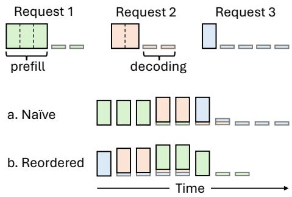  
Figure 1: The effect of processing order of requests with chunked-prefill enabled. Given the three requests with different prefill/decoding length characteristics, the naive token batching in the coming order of the requests has worse token mixing of decoding and prefill chunks.

3. There is still room for Attention optimization of prefix sharing. As described in Sec.2.2, the existing works [16, 39, 41, 45] support prefix-shared Attention by computing the Attention on different chunks of KV, performing MatMul on the common prefix and the basic matrix-vector multiplication on the non-shared chunk. But the computation on different chunks are in different kernels. On the one hand, the separated kernels increase the tail effect of GPU kernel. On the other hand, the multiple kernels introduce extra launching overhead.

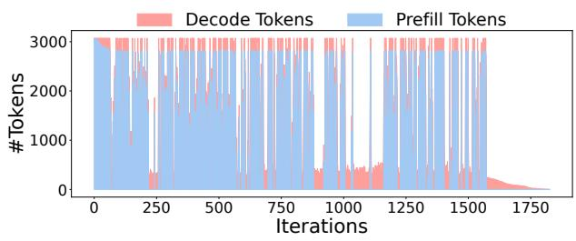  
Figure 2: The token number in the batch processed at each iteration for an industry task with vLLM’s chunked-prefill. It has "valleys" for many iterations.

## 3.3 Insight

BatchLLM has the following insights to address the limitations described in Sec.3.2.

1. Explicit prefix identification and sharing. Instead of hashing and matching the common prefix at runtime and manage the prefix with LRU cache, BatchLLM explicitly identifies the common prefix globally within the large batch ahead-of-time, which will not miss the opportunity of prefix sharing caused by the implicit cache. Besides, BatchLLM refactors the prefix tree with a Dynamic Programming algorithm to enlarge the first-level prefix to avoid the system complexity and kernel overhead of the multi-level prefix.

2. Grouped scheduling, request reordering and memorycentric token batching. BatchLLM schedules the requests at the granularity of a group of requests sharing the common prefix, which makes the prefix sharing convenient and shrinks the lifetime of the prefix’s KV memory. BatchLLM reorders the requests according to the length of the prompt and the estimated decoding length. As indicated in Fig.1, BatchLLM will schedule the requests with larger ratio of decoding length to prompt length with higher priority. In this way, the longer prompts will be scheduled later and can be better mixed with the earlier decoding tokens. It also forms the token-batches with the consideration of the KV memory usage, allowing to batch more tokens together to increase the size of token-batches and reduce the "valleys" in Fig.2.

3. Attention kernel optimization with horizontal fusion. BatchLLM horizontally fuses the computation on different KV chunks into the same kernel to reduce the tail effect and kernel launch overhead.

## 4 DESIGN METHODOLOGY

## 4.1 Overview

Fig.3 shows the overview of BatchLLM optimizations. First, it analyzes the large batch of input prompts and identifies the common prefix explicitly. This is done before the scheduling of the requests. It simplifies the multi-level prefix into a single level prefix with the insight that the prefixes of the industry tasks are usually dominated by a long context (e.g., web document), as discussed in Sec.3.1. The explicit prefix processing is illustrated in Sec.4.2. The requests will be organized into groups where each group corresponds to the queries sharing the same prefix. The group will be the basic unit of task scheduling. Before scheduling the groups, BatchLLM will also reorder the groups according to the ratio of prefill length and postpone the groups with longer prefill. It then forms the tokenbatches with the consideration of the KV memory usage. This aims to better mix the decoding steps with the prefill chunks to increase the overall token-batch size. The throughput-oriented scheduling and token-batching optimization is described in Sec.4.3. BatchLLM also implements the horizontal fused Attention kernel to reduce the tail effect and kernel launch overhead, described in Sec.5.

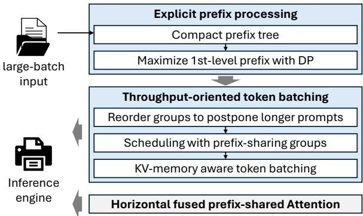  
Figure 3: BatchLLM overview.

## 4.2 Explicit Global KV Reuse Identification

As discussed in Sec.3.1, different prompts may have multiple levels of prefixes. The multi-level prefixes can lead to system challenges and overhead of token batching and fused Attention kernel. For the token batching, it requires to manage the dependencies of the different levels of prefixes. For the Attention kernel, it will introduce more GPU kernels of the multi-level reuse. Instead, BatchLLM compresses the multi-level prefixes into a single level prefix to avoid the above challenges. This is based on the insight that the length of the prefixes are usually dominated by a single level due to the stronger reasoning ability of the newer LLMs and the task-specific fine-tuning (e.g., the prefix corresponding to the web document body can be much longer than other levels of the prefix, as discussed in Sec.3.1).

As discussed in Sec.3.3, BatchLLM explicitly identifies the common prefix among the prompts within the large batch. It makes use of the compact prefix tree5 to identify and represent the common prefix between prompts. However, directly using the first level prefix of the basic prefix tree as the common prefix can lead to suboptimal prefix reusing. Take the pesudo prompts in Fig.4d as an example. The 6 prompts are organized with the compact prefix tree in Fig.4a, where each node represents several consecutive tokens of the prompt and the tokens in a node is shared by its children. The right child of the root node (i.e., token ’b’) is shared by 5 prompts in total (prompt 2 to 6) according to Fig.4a, thus reusing the first level prefix can save 4 tokens’ KV computation. However, it is easy to infer that sharing the first 8 tokens between prompt 4 and 5 can save 8 tokens’ KV computation. Thus it requires to refactor the naive prefix tree to maximize the achieved first-level token reusing.

Algorithm 1 Dynamic Programming on the prefix tree to maximize   
the first-level token reusing of node ??.   
1: ⊲ The 1st-level prefixes of a node are its children’s tokens   
2: function MaximizeReuse(D)   
3: if D has no children then   
4: return   
5: for ??ℎ?????? ∈ ??.??ℎ???????????? do   
6: MaximizeReuse(??ℎ??????) ⊲ Solve sub-problems   
7: for ????ℎ?????? ∈ ??ℎ??????.??ℎ???????????? do   
8: ???????? ← (leaves(????ℎ??????) - 1) × tokens(????ℎ??????)   
9: ?????????????? ← tokens(??ℎ??????)   
10: if ???????? > ?????????????? then   
11: Fork ??ℎ?????? and merge with ????ℎ??????

We design a Dynamic Programming algorithm on the compact prefix tree to maximize first-level token reusing, shown in Algo.1. The basic insight is that, given a node ?? to maximize its first-level token reusing, it first solves the sub-problems of all ??’s children to maximize each child’s first-level token reusing (line 6 in Algo.1), it then try to merge ??’s first-level prefix with its children’s to see if it can enlarge ??’s token reusing (line 7-11 in Algo.1). It recursive performs the above procedure until reaching the root note, by calling MaximizeReuse(root). Fig.4b and Fig.4c shows an example of this procedure. In Fig.4b, the left node in level 3 of the tree is forked and merged with it’s right child, which enlarges the 1st-level prefix reusing of the right node in level 2. Similarly, the right node in level 2 is forked and merged with its second child to enlarge the 1st-level prefix reusing of the root node. After maximizing the first-level prefix, the other levels of prefixes will be expanded during the token batching and will not be regarded as the shared context.

We have compared the token saving ratio between the original multi-level prefix and the enlarged single prefix. The saving ratio is calculated according to Eq.2. For a dataset of the snippet generation task, the saving ratio of the original multi-level prefixes is about 56%, and the ratio is about 55% for the first-level prefix after enlarging (Sec.6.2.2). It means the enlarged first-level prefix only has 1% loss of the token reuse compared to the multi-level prefix for this typical workload, with the advantage of reducing the complexity and the overhead of the token batching and Attention kernel optimization. Besides, the DP algorithm only introduces less than 0.01% overhead in our evaluation (Sec.6.3.4).

## 4.3 Throughput-oriented Token Batching

4.3.1 Prefix-sharing Group Based Scheduling. As described in Sec.4.2, BatchLLM identifies the common prefix explicitly ahead-of-time. To simplify the KV reuse and reduce the lifetime of the common prefix in the memory, BatchLLM schedules the requests sharing the same prefix all together. Specifically, the procedure described in Sec.4.2 will generate the prefix-sharing groups and BatchLLM will schedule the requests at the granularity of prefix-sharing group rather than each single request. A prefix-sharing group corresponds to the collection of requests sharing the same prefix. In this way, the requests sharing the same prefix can start at the same time and the memory of the common prefix can be released as soon as the group is completed. This differs from the LRU cache based prefix management [18, 44] and can make sure all the common prefix can be reused the best and the memory will not be retained unnecessarily.

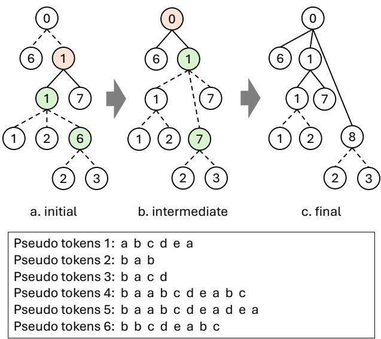  
d. the pseudo tokens of 6 prompts  
Figure 4: The preprocessing to maximize the first level prefix reusing. It converts from the initial prefix tree (a) to the final prefix tree (c). Each cycle represents a node containing a number of tokens. The number in the cycle is the token number of the node. It iterates bottom-up to maximize the first level reusing recursively until reaching the root node.

To realize the prefix-sharing group based scheduling, BatchLLM maintains three queues of the to-be-batched tokens: common prefix queue, distinct prompt queue, and decoding queue. This method differs from the existing methods that use the same queue for all prefill tokens. At each iteration, BatchLLM will form the tokenbatch by fetching the tokens from the three queues in the order of decoding queue, distinct prompt queue, and common prefix queue (one constraint is that the a common prefix should be fetched and processed before its corresponding distinct prompts). On the one hand, fetching the decoding tokens before prefills can help to better mix the two types of tokens together in the token-batch [12]. On the other hand, fetching the decoding and distinct prompt tokens before the prefix tokens can make sure the active requests (i.e., the request that has been partially processed, either partial prefill chunks has been processed or already in decoding phase) can be scheduled before the inactive requests, which helps to finish the active requests earlier and thus release their memory earlier.

4.3.2 Request Groups Reordering. As discussed in Sec.3.3, Batch-LLM reorders the input requests to schedule the requests according to the ratio of prompt length to decoding length (??). We define the ratio ?? as:

$$
R = \frac { L _ { d e c o d e } } { L _ { p r e f i l l } }\tag{3}
$$

In Eq.3, $L _ { p r e f i l l }$ is the number of prefill tokens and $L _ { d e c o d e }$ is the length of the output tokens. The requests with larger ?? will be scheduled earlier. This helps to issue the requests with long decoding steps earlier and make the latter prompts’ length larger and thus can be better mixed with the previous decoding tokens to enlarge the token-batch size (example in Fig.1). The challenge is that the exact number of output tokens is not known before finishing the execution. We profiled the dataset of several typical information processing tasks (snippet generation, offline ranking, ads, etc.) and observed that the distribution of output length is relatively concentrated for a task. We thus assume the output length is constant and normalize $L _ { p r e f i l l }$ into 1 in Eq.3 for all requests uniformly. As we schedule the requests in the unit of prefix-sharing group, the ratio of the group (after normalizing the length of output) becomes:

$$
R _ { g r o u p } = \frac { 1 } { L _ { f p r e f i x } + \sum L _ { d i s t i n c t } }\tag{4}
$$

According to Eq.4, the request groups with larger $R _ { g r o u p }$ will be scheduled with higher priority.

4.3.3 Memory-centric Token Batching to Saturate GPU. The request group reordering described above helps to reduce the "valleys" in the timeline of the token numbers ("valley" example in Fig.2) by providing more chances for the decoding tokens to be able to find the prefill chunks to mix together. Another limiter of the size of token-batches is that, the existing works [18] use a fixed request number to limit the token batching, i.e., the request number cannot exceed a fixed threshold within a token-batch. For a token-batch dominated by the decoding tokens, it is easy to reach the upper bound of the request number while still have not achieved a large number of the total tokens. For example, vLLM sets the threshold of request number as 256 by default, if a token-batch already has 256 decoding tokens, it will have no chance to add more prefill chunks into this token-batch even if there is still enough memory to hold the KV memory of the prefill chunks. Note that purely increasing this threshold does not solve the problem in practice, as noted by the vLLM community6. This is because directly excessively enlarging batch size may cause the engine to have more frequent memory swaps and recomputation due to the GPU memory can be not enough to hold the new coming KV tensor.

The target of the token-batching is to enlarge the number of tokens in the batch under the constraint of GPU memory size. Thus there are two main factors that matters for the token-batching procedure: whether the number of tokens is large enough in the batch to saturate the GPU, indicating the current status of the token-batch; and whether the remaining memory is enough to accommodate more prefill chunks, indicating if the status can be improved. With this insight, BatchLLM uses the KV memory itself and the predetermined chunk size $S _ { c h u n k }$ as the limiter rather than using the indirect limiter of the request number.

Specifically, BatchLLM predefines a size as the upperbound of the KV memory size $( M _ { t h r e s h o l d } )$ . When deciding the token-batching at each iteration, it will only check whether adding a prefill chunk will exceed $M _ { t h r e s h o l d }$ or not, without considering the number of requests. The prefill chunk will be added into the token-batch if the remaining GPU memory capacity allows it. Note that we also use a fixed number to limit the per-batch token number for tokenbatching decision (noted as the chunk size $S _ { c h u n k } )$ , which aligns with that in vLLM and helps to distribute the token numbers in different iterations more even.

## 5 IMPLEMENTATION

Horizontal Fusion of Prefix-shared Attention. As described in Sec.3.2, the existing works use separate kernels to compute the partial Attention on the prefix and the distinct KV context. This will lead to the tail effect of each kernel and the launch overhead of these kernels. BatchLLM horizontally fuses the two partial Attention calculation into one kernel. Different parts of the computation are performed in different thread blocks. Note that the problem shape of the two parts are different. BatchLLM applies different tiling configuration for the two parts to achieve the best performance. It uses the common auto-tuning method to find the best configuration. We implement the Attention in BatchLLM through OpenAI Triton language [33]. The limitation of the Triton based implementation is that, the performance of Triton version of FlashAttention is still worse than that of CUDA version (Sec.6.3.3). However, the advantage is that Triton supports multiple platforms (both NVIDIA and AMD GPUs) so that BatchLLM implementation can run on both NVIDIA and AMD GPUs. We use the builtin autotuner of Triton to tune the tiling size of the Attention implementation in BatchLLM. Besides that, some ahead-of-time compilation methods are applied to reduce the launching overhead, including warm-up process on NVIDIA GPUs, and AOTriton on AMD GPUs.

We implement the prefix identification (Sec.4.2) in Python as a standalone preprocessing script. It accepts a list of inputs and generate a list of prefix-sharing groups. The inputs can be the nested input ids (e.g., [<list of input 0 tokens>, <list of input 1 tokens>, ...]), and each prefix-sharing group is represented as a tuple of the prefix and the corresponding distinct prompts (e.g., tuple(<list of prefix tokens>, [<list of distinct 0 tokens>, <list of distinct 1 tokens>, ...])).

We integrate the token batching optimization (Sec.4.3) in vLLM [18]. Specifically, we customize the vLLM to accept the list of prefixsharing group tuples generated by the preprocessing script, and implement the group-wised scheduling and token batching logic upon the vLLM token batching function.

## 6 EVALUATION

## 6.1 Setup

Baseline Specification. We compare BatchLLM with vLLM and SGLang, two state-of-the-art LLM inference engines with prefix sharing, for the end-to-end comparison to demonstrate the efficacy (Sec.6.2). We integrate all our design in vLLM v0.6.4 and the baseline for comparison is also vLLM v0.6.4 (except as noted). We use FlashAttention [5] as the Attention backend8 of the vLLM baseline in NVIDIA GPU environments. The version of SGLang is v0.4.1.

We enable the prefix-caching and chunked-prefill in vLLM baseline for the end-to-end comparison in Sec.6.2. The prefix-caching uses the implicit LRU-based caching policy. We use 2048 as the token-batch size when enabling the chunked-prefill of vLLM baseline to maximize its throughput.

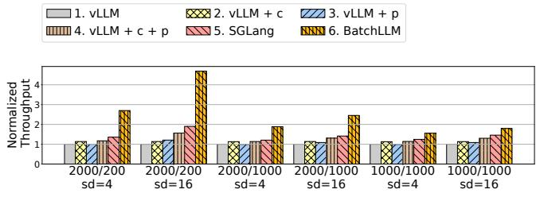  
(a) Llama 3.1 8B throughput on A100, request-count = 6400

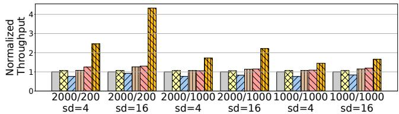  
(b) Qwen 2.5 14B throughput on A100, request-count = 6400

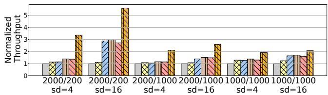  
(c) Llama 3.1 70B throughput, on A100, request-count = 800

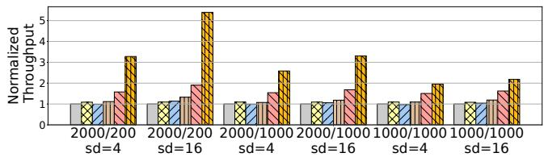  
(d) Llama 3.1 8B throughput, on MI200, request-count = 6400

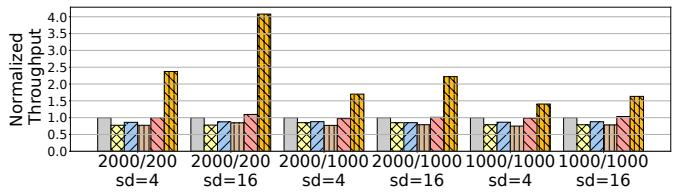  
(e) Qwen 2.5 14B throughput, on MI200, request-count = 6400  
Figure 5: Microbenchmark evaluation. The setting m/n (like 2000/200) indicates the length of shared prefix/non-shared context, sd means sharing degree. The vLLM setting with ’+ p’ (’+ c’) means prefix-caching (chunked-prefill) enabled.

For the kernel comparison in Sec.6.3.3, we compare BatchLLM with Cascade-Inference [41], which is the SOTA implementation of the prefix-shared Attention on NVIDIA platform. It is worth noting that Cascade-Inference is similar to our design on kernellevels. One difference between Cascade-Inference and BatchLLM is that BatchLLM applies horizontal fused kernel. Besides, Cascade-Inference cannot be applied on the non-NVIDIA backend as it is developed with CUDA, while BatchLLM is based on OpenAI Triton and can support both NVIDIA and AMD GPUs. All the other packages like PyTorch and Huggingface transformers are dependent to the docker file of vLLM v0.6.4.

Hardware and System Specification. We conduct our experiments on both NVIDIA A100 80GB GPU and AMD MI200 GPU. The CUDA version on the NVIDIA platform is 12.1. The ROCm version on the AMD platform is 6.1. The CPU is AMD EPYC 7V12 CPU @2.45GHz. The operation system is Ubuntu 20.04.

Models and Dataset. We evaluate BatchLLM and the baselines with Llama-3.1-8B [2], Qwen-2.5-14B [28] and Llama-3.1-70B (4-bit GPTQ), with a set of microbenchmarks with different data distributions and Qwen-2.5-7B for a typical industry task. As for the microbenchmarks evaluation, we use three different settings of the length of common prefix and distinct prompt. The length of prefix/distinct are 2000/200, 2000/1000 and 1000/1000 respectively, while the length of generated tokens is 100. We evaluate the three microbenchmarks under different share-degrees. The share-degree means the number of distinct prompts sharing the same prefix. Note that all requests are randomly shuffled. Specifically, we conduct the evaluation of the three microbenchmarks with sharing degree 4 and 16, respectively. The microbenchmark evaluation is in Sec.6.2.1. As for the industry tasks, we conduct the evaluation on a typical scenario in web search engines, which is the snippet generation task that generates the snippet of a document for the user query.

We conduct the breakdown experiments in Sec.6.3 to demonstrate the efficacy of each techniques in this paper.

## 6.2 End to End Comparison

6.2.1 Microbenchmark Evaluation. Fig.5 shows the end-to-end throughput comparison between BatchLLM and the baselines with different shared-prefix/non-shared context settings. In these benchmark experiments, we compare BatchLLM with vLLM and SGLang of different configurations, and with or without prefix-caching and chunked-prefill enabled.

The results show that BatchLLM outperforms the vLLM and SGLang baseline under different configurations, for different models on different GPU platforms with different input data distributions. Specifically, when comparing with vLLM + prefix-caching + chunkedprefill, which performs the best across all vLLM’s configurations, BatchLLM can get 1.4-3× speedup on A100 and 1.8-4.1× speedup on MI200. BatchLLM also achieves better performance than SGLang, with 1.2-2.5× speedup on A100 and 1.3-2.8× speedup on MI200. The acceleration is stable from 7B to 70B models.

The impact of sharing-degree and shared prefix. To show the benefit of BatchLLM, we also compare the throughput of different settings after changing the sharing-degree and the length of shared prefix. Fig.6 shows that the speedup becomes more significant when more requests share the same prefix and the portion of the common prefix becomes larger, which contributes to a bigger reuse ratio, and BatchLLM can save more computation and memory for this case. With lower sharing-degree and shorter common prefix (like sd is 2 and the length of prefix is 2000), the acceleration of BatchLLM is 1.7×/1.5×, comparing with the best setting of vLLM and SGLang. When the length of shared prefix is 16000, and the share degree is 16, the best performance of vLLM and SGLang are 0.49 and 0.56, while BatchLLM could achieve 10.8×/9.5× acceleration.

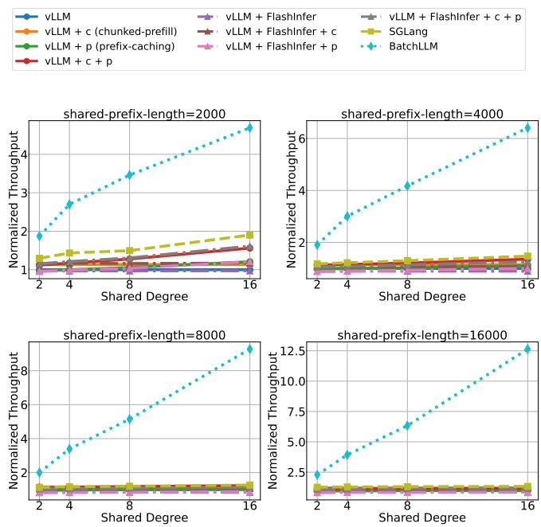  
Figure 6: Microbenchmark evaluation of different sharingdegrees and different shared-prefix lengths on A100. Given 6400 requests. This evaluation is based on Llama-3.1-8B-Instruct, while the length of non-shared context is 200, and the generated length is 100.

Comparison between vLLM + request sorting and Batch-LLM. We perform a preprocess for the setting of vLLM + chunkedprefill + prefix-cahcing: use python.sorted() to gather all requests with the same prefix together9. This can help vLLM to cache the tokens better. After this preprocess, vLLM’s throughput is boosted from 6 to 13.02, while the throughput of BatchLLM is 18. One reason is that vLLM cannot simplify the attention calculation when there are more than 1 common prefix in the batch every step of its inference, while BatchLLM could handle it. Besides, BatchLLM has a better token-batching strategy than vLLM.

Overall, the performance improvement of BatchLLM comes from the better KV reuse with the explicit prefix identification, the tokenbatching to better mix the decoding with prefill chunks together, and the better Attention kernels, which we will analyze through the breakdown in Sec.6.3.

6.2.2 Industry Workload Evaluation. This industry workload is similar to the snippet generation task described in the recent work [35], which is also described in Sec.3.1. The original input has two levels of prefixes: the global shared instruction to extract the information from the document-query pair, and the shared document between different groups of queries. The first-level prefix is very short. With the optimization described in Sec.4.2, the first-level prefixes are enlarged (i.e., some of the second-level prefix of the document is merged into the first-level prefix). We have analyzed the token saving ratio according to Eq.2. It shows that the saving ratio are nearly the same between the multi-level and the enlarged single level prefixes, 56% for the former and 55% for the latter.

Table 1: Industry workload evaluation.
<table><tr><td>Settings</td><td>Throughtput, A100</td><td>Throughput, MI200</td></tr><tr><td>vLLM</td><td>5.45</td><td>2.75</td></tr><tr><td>+ c (chunked-prefill)</td><td>5.48</td><td>2.84</td></tr><tr><td>+ p (prefix-caching)</td><td>6.2</td><td>3.27</td></tr><tr><td>+c+p</td><td>6.71</td><td>3.36</td></tr><tr><td>BatchLLM</td><td>8.67(1.30x)</td><td>4.24(1.26x)</td></tr></table>

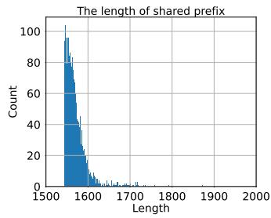

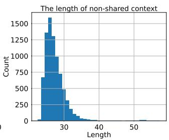  
Figure 7: The length distribution of shared prefix/non-shared context in the dataset of the industry workload.

We synthesize the dataset for the evaluation according to the data distribution of the industry workload (Fig.7), where the average share-degree (i.e., the number of the distinct prompt that share the same prefix) is about 3, the average common prefix length is about 1570 tokens, and the average distinct prompt length is about 30 tokens. We sample 8000 queries for this case study.

We conduct this experiment on the NVIDIA A100 GPU and AMD MI200 GPU, using Qwen-2.5-7B model. Table.1 shows the effectiveness of BatchLLM of this workload (and another industry workload that will describe later), with about 1.3×/1.26× speedup over the best configuration of vLLM. BatchLLM better reuses the KV context than the vLLM baseline with the optimization in Sec.4.2, for which we have the breakdown analysis in Sec.6.3.1. BatchLLM also better mixes the decoding tokens with prefill tokens to increase the size of token-batches with the optimization in Sec.4.3, for which we have the breakdown analyze in Sec.6.3.2. It also benefits from the optimized Attention kernel described in this paper.

## 6.3 Breakdown Analysis

6.3.1 Reusing Effect Comparison. To show that BatchLLM optimizes the KV reuse, we evaluate the throughput and the token saving ratio in both microbenchmarks and the industry task.

As shown in Fig.8, we can see the token saving ratio is improved in BatchLLM across different settings. And it becomes higher when the sharing-degree of requests is larger. Specifically, in the microbenchmark setting where length of shared prefix is 2000 and the sharing-degree is 16, BatchLLM achieves 85.2% token saving ratio, the upper bound in this scenario, comparing to the 40.1% token saving ratio in vLLM + chunked-prefill + prefix-caching. For the industry workload, BatchLLM also makes a token saving ratio of 58.1%, while the number of vLLM + chunked-prefill + prefix-caching is 35.8%. It is worth mentioning that BatchLLM can achieve the best token reusing since it performs explicit common prefix management. With the increase of the requests number and the length of prefix, it can be expected that the implicit LRU cache policy of vLLM’s prefix-caching can suffer more from the eviction of the reusable KV context, while the inference could benefit more from BatchLLM. For example, when the length of shared prefix is 16000, and the share degree is 16, the token reusing ratio of vLLM and SGLang are 6.3% and 5.2%, while the reusing ratio of BatchLLM is 92.6 %, much better than the other two baselines.

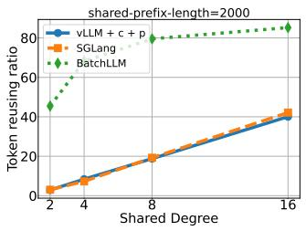

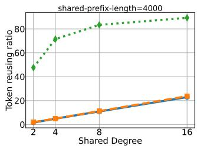

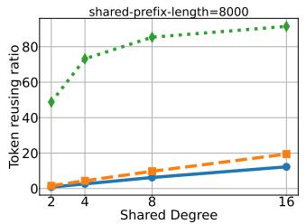

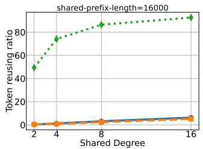  
Figure 8: The token saving (or reusing) ratio of different sharing-degrees and different shared-prefix lengths on A100, based on the microbenchmark. This evaluation is based on Llama-3.1-8B-Instruct, while the length of non-shared context is 200, and the generated length is 100.

Table 2: Token-Batching Breakdown.
<table><tr><td>Settings</td><td>Disable token-batching</td><td>Enable token-batching</td></tr><tr><td>vLLM + c</td><td>5.79</td><td>5.94</td></tr><tr><td>BatchLLM</td><td>8.16</td><td>8.47</td></tr></table>

6.3.2 Token-batching Analysis. Fig.9 shows the per-iteration token number, using the same workload with Fig.2. It clearly shows that the token-batching optimization in BatchLLM successfully reduces the "valleys" of the iterations, thus can increase the overall GPU utilization.

We evaluated our token-batching optimization through ablation studies on throughput-oriented token-batching. Testing on Qwen-2.5-7B with 3000 industry workload query (Fig.2) shows effective performance improvement. Results demonstrate effectiveness both with and without prefix-sharing, with combined optimizations working particularly well in prefix-sharing scenarios.

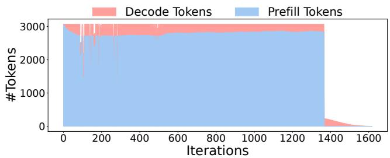  
Figure 9: Token number per iteration with token-batching optimization (Sec.4.3), showing significant valley reduction compared to Fig.2’s baseline. Prefix-sharing disabled to demonstrate general batched/offline inference efficacy.

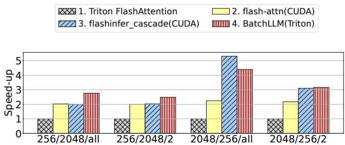  
(a) Kernel performance under decoding scenarios, #request = 32.

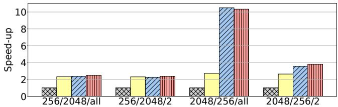  
(b) Kernel performance under decoding scenarios, #request = 256.

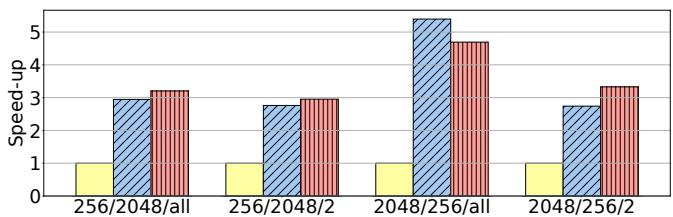  
(c) Kernel performance under chunked-prefill scenarios, with #prefill-request = 7, and #decoding-request = 256.

Figure 10: The performance comparison between the baseline, CascadeInfer and BatchLLM. The setting i/j/k (like 256/2048/all) means the length of global shared prefix, the length of distinct parts for each request, and how many requests with one single shared prefix in one single prefixsharing group.

6.3.3 Kernel Performance Comparison. We compare BatchLLM’s prefix-shared Attention implementation with several baselines on both NVIDIA A100 GPU and AMD MI200 GPU. Fig.10 shows the performance comparison of different implementations, including Triton official FlashAttention implementation10, official FlashAttention11, FlashinferCascade12 [41], and BatchLLM’s kernels. We compare the performance among different kernels under two scenarios: the pure decoding scenario (request count 256) and the chunkedprefill scenario where a token-batch includes both prefill chunks and decoding tokens (7 prefill requests and 256 decoding requests). Besides that, how many requests one single prefix-group have, and various length setting of both shared prefix and non-shared tokens, are non-trivial. Our experiments are conducted based on these insights.

According to the results, we can see that the Triton-based FlashAttention still has a performance gap to the CUDA-based FlashAttention, although we have already tuned the hyparameters using Triton’s autotuner. (Note we omit the performance under chunkedprefill setting because it’s even worse.) This indicates the high-level Triton compiler still have a room to achieve the performance of low-level CUDA compiler for complex computations (for example, we observe more shared memory bank conflict of the Triton FlashAttention than the CUDA version).

However, based on the insufficient performance of Triton, our kernel still shows good performance compared to the Cascade-Inference kernel. BatchLLM’s kernel can still achieve similar or better performance comparing with all these CUDA implementations, showing the potential of the kernel optimization in BatchLLM.

Generally, our kernel performs competitively, while some bad cases cannot be ignored. Take the scenaro where there are multiple requests with the same sharing prefix, and the common part is much longer than the distinct part, as an example. For these longkey-value cases, split-k could be a solution through which the calculation units on GPUs could be fully utilized. We’ll still focus on how to make optimization in the future.

6.3.4 Global Prefix Identification Overhead. We have measured the time of the global prefix identification described in Sec.4.2. The time range of the overhead starts before adding the token ids of each prompt to form the basic prefix tree and ends after generating the final list of prefix-sharing groups. As for the industry workload in Sec.6.2.2, the total overhead of the 8000 requests is 1.51 seconds. While the time to process the 8000 requests with the input of prefix-sharing groups format is 919.54 seconds. The global prefix identification procedure nearly has no overhead compared with the end-to-end execution time.

## 7 RELATED WORK

Prefix sharing systems. The vLLM [18] proposes the PagedAttention to manage the KV memory in blocks, which enables to reuse the KV context both intra and inter requests in memory block level. Prompt Cache [11] and SGLang [44] propose the domain specific language (DSL) to define the shared prefix of prompt. Besides, SGLang proposes the radix tree based KV cache management with LRU policy for KV memory eviction. RAGCache [14] studies the common KV caching for RAG optimization. Some recent works [9, 13, 15, 24, 27] study the distributed request scheduling with the consideration of prompt prefix reuse. None of these works identify the common prefix ahead-of-time for the large batch and enable the explicit reusing. Instead, BatchLLM manages the prefix reusing explicitly and can reuse the KV context the best for the large batched scenario.

Token batching and serving optimization. Orca [42] proposes the continuous batching method for transformer models with the per-iteration token batching of auto-regressive models [10]. FastGen [12] and SARATHI [1] study the mix of of prefill chunks and decoding tokens into the same token-batch to increase the compute intensity of the batch. FlexGen [31] proposes the swizzled token computation and offloading to support the LLM inference with limited GPU memory. Some works [8, 30] study the request scheduling to achieve better SLO for online LLM serving. BatchLLM differs from these works as it targets the large batched inference, leveraging the static information to reorder the requests and using the memory-aware scheduling to enlarge the size of token-batch. The vLLM [18] uses the multi-step scheduling method to reduce the token-batch scheduling overhead, which is orthogonal to Batch-LLM. Another orthogonal dimension to improve the token-batch performance is the pruning and quantization [7, 20, 36], which can be applied concurrently with the optimizations in this paper.

Attention kernel optimization. Memory-efficient Attention [29] and FlashAttention [5] fuse the Attention operators into a single kernel to boost the performance, with Online Softmax [22] to tile the Attention computation. The recent prefix-shared Attention optimization (ChunkAttention [39], RelayAttention [45], Hydragen [16], and Cascade Inference [41]) compute the attention on the prefix and other part separately in different kernels, for which the former is transformed from matrix-vector multiplication between Q and K/V into MatMul, and reduce the results of different parts according to the Online Softmax algorithm. Different from these works, BatchLLM fuses the Attention computation of different parts into the same kernel to reduce tail latency and kernel launch overhead. The horizontal fusion has been proposed and used in the existing machine learning optimizers [19, 25, 26]. BatchLLM borrows this idea and applies it in the prefix-shared Attention.

## 8 CONCLUSION

This paper presents BatchLLM, the holistic optimization techniques for large batched LLM-based information processing and management tasks. It identifies the limitations of existing methods, and optimizes the tasks with the global information of the large batch. It explicitly extracts the common prefix globally to avoid prefix’s early eviction problem, and simplifies the prefix pattern by enlarging the first-level prefix with a DP algorithm on the tree to reduce the overhead of scheduling and Attention computation. It schedules the requests at the granularity of prefix-sharing groups, which enables the global prefix sharing the best and shrinks the lifetime of prefix’s KV memory. It proposes the request reordering and memory-centric token batching method to better mix the prefill chunks into the decoding token-batches and thus better saturates the GPU. Finally, it presents the horizontal fused prefix-shared Attention kernel to reduce the tail effect and kernel launch overhead. Extensive evaluation shows that BatchLLM outperforms vLLM and

SGLang by 1.3× to 10.8× on a set of microbenchmarks and a typical industry workload under different hardware environments.

## REFERENCES

[1] Amey Agrawal, Ashish Panwar, Jayashree Mohan, Nipun Kwatra, Bhargav S. Gulavani, and Ramachandran Ramjee. 2023. SARATHI: Efficient LLM Inference by Piggybacking Decodes with Chunked Prefills. CoRR abs/2308.16369 (2023).

[2] AI@Meta. 2024. Llama 3 Model Card. (2024). https://github.com/metallama/llama3/blob/main/MODEL\_CARD.md

[3] Tianle Cai, Yuhong Li, Zhengyang Geng, Hongwu Peng, Jason D. Lee, Deming Chen, and Tri Dao. 2024. Medusa: Simple LLM Inference Acceleration Framework with Multiple Decoding Heads. In Forty-first International Conference on Machine Learning, ICML 2024, Vienna, Austria, July 21-27, 2024. OpenReview.net. https: //openreview.net/forum?id=PEpbUobf Jv

[4] Zui Chen, Lei Cao, and Sam Madden. 2023. Lingua Manga: A Generic Large Language Model Centric System for Data Curation. Proc. VLDB Endow. 16, 12 (Aug. 2023), 4074–4077. https://doi.org/10.14778/3611540.3611624

[5] Tri Dao, Daniel Y. Fu, Stefano Ermon, Atri Rudra, and Christopher Ré. 2022. FlashAttention: Fast and Memory-Efficient Exact Attention with IO-Awareness. In Advances in Neural Information Processing Systems 35: Annual Conference on Neural Information Processing Systems 2022, NeurIPS 2022, New Orleans, LA, USA, November 28 - December 9, 2022.

[6] Raul Castro Fernandez, Aaron J. Elmore, Michael J. Franklin, Sanjay Krishnan, and Chenhao Tan. 2023. How Large Language Models Will Disrupt Data Management. Proc. VLDB Endow. 16, 11 (July 2023), 3302–3309. https://doi.org/10.14778/36114 79.3611527

[7] Elias Frantar, Saleh Ashkboos, Torsten Hoefler, and Dan Alistarh. 2022. GPTQ: Accurate Post-Training Quantization for Generative Pre-trained Transformers. CoRR abs/2210.17323 (2022).

[8] Yichao Fu, Siqi Zhu, Runlong Su, Aurick Qiao, Ion Stoica, and Hao Zhang. 2024. Efficient LLM Scheduling by Learning to Rank. CoRR abs/2408.15792 (2024).

[9] Bin Gao, Zhuomin He, Puru Sharma, Qingxuan Kang, Djordje Jevdjic, Junbo Deng, Xingkun Yang, Zhou Yu, and Pengfei Zuo. 2024. Cost-Efficient Large Language Model Serving for Multi-turn Conversations with CachedAttention. In Proceedings of the 2024 USENIX Annual Technical Conference, USENIX ATC 2024, Santa Clara, CA, USA, July 10-12, 2024. USENIX Association, 111–126.

[10] Pin Gao, Lingfan Yu, Yongwei Wu, and Jinyang Li. 2018. Low latency RNN inference with cellular batching. In Proceedings of the Thirteenth EuroSys Conference. Association for Computing Machinery, Article 31, 15 pages. https: //doi.org/10.1145/3190508.3190541

[11] In Gim, Guojun Chen, Seung-Seob Lee, Nikhil Sarda, Anurag Khandelwal, and Lin Zhong. 2024. Prompt Cache: Modular Attention Reuse for Low-Latency Inference. In Proceedings of the Seventh Annual Conference on Machine Learning and Systems, MLSys 2024, Santa Clara, CA, USA, May 13-16, 2024. mlsys.org. https://proceedings.mlsys.org/paper\_files/paper/2024/hash/a66caa1703fe34705 a4368c3014c1966-Abstract-Conference.html

[12] Connor Holmes, Masahiro Tanaka, Michael Wyatt, Ammar Ahmad Awan, Jeff Rasley, Samyam Rajbhandari, Reza Yazdani Aminabadi, Heyang Qin, Arash Bakhtiari, Lev Kurilenko, and Yuxiong He. 2024. DeepSpeed-FastGen: Highthroughput Text Generation for LLMs via MII and DeepSpeed-Inference. CoRR abs/2401.08671 (2024).

[13] Cunchen Hu, Heyang Huang, Junhao Hu, Jiang Xu, Xusheng Chen, Tao Xie, Chenxi Wang, Sa Wang, Yungang Bao, Ninghui Sun, and Yizhou Shan. 2024. Mem-Serve: Context Caching for Disaggregated LLM Serving with Elastic Memory Pool. CoRR abs/2406.17565 (2024).

[14] Chao Jin, Zili Zhang, Xuanlin Jiang, Fangyue Liu, Xin Liu, Xuanzhe Liu, and Xin Jin. 2024. RAGCache: Efficient Knowledge Caching for Retrieval-Augmented Generation. CoRR abs/2404.12457 (2024).

[15] Yibo Jin, Tao Wang, Huimin Lin, Mingyang Song, Peiyang Li, Yipeng Ma, Yicheng Shan, Zhengfan Yuan, Cailong Li, Yajing Sun, Tiandeng Wu, Xing Chu, Ruizhi Huan, Li Ma, Xiao You, Wenting Zhou, Yunpeng Ye, Wen Liu, Xiangkun Xu, Yongsheng Zhang, Tiantian Dong, Jiawei Zhu, Zhe Wang, Xijian Ju, Jianxun Song, Haoliang Cheng, Xiaojing Li, Jiandong Ding, Hefei Guo, and Zhengyong Zhang. 2024. P/D-Serve: Serving Disaggregated Large Language Model at Scale. CoRR abs/2408.08147 (2024).

[16] Jordan Juravsky, Bradley Brown, Ryan Ehrlich, Daniel Y. Fu, Christopher Ré, and Azalia Mirhoseini. 2024. Hydragen: High-Throughput LLM Inference with Shared Prefixes. arXiv:2402.05099 [cs.LG]

[17] Sein Kim, Hongseok Kang, Seungyoon Choi, Donghyun Kim, Minchul Yang, and Chanyoung Park. 2024. Large Language Models meet Collaborative Filtering: An Efficient All-round LLM-based Recommender System. In Proceedings of the 30th ACM SIGKDD Conference on Knowledge Discovery and Data Mining (KDD ’24). Association for Computing Machinery, 1395–1406. https://doi.org/10.1145/ 3637528.3671931

[18] Woosuk Kwon, Zhuohan Li, Siyuan Zhuang, Ying Sheng, Lianmin Zheng, Cody Hao Yu, Joseph Gonzalez, Hao Zhang, and Ion Stoica. 2023. Efficient

Memory Management for Large Language Model Serving with PagedAttention. In Proceedings of the 29th Symposium on Operating Systems Principles, SOSP 2023, Koblenz, Germany, October 23-26, 2023. ACM, 611–626.

[19] Ao Li, Bojian Zheng, Gennady Pekhimenko, and Fan Long. 2022. Automatic Horizontal Fusion for GPU Kernels. In IEEE/ACM International Symposium on Code Generation and Optimization, CGO 2022, Seoul, Korea, Republic of, April 2-6, 2022. IEEE, 14–27.

[20] Ji Lin, Jiaming Tang, Haotian Tang, Shang Yang, Wei-Ming Chen, Wei-Chen Wang, Guangxuan Xiao, Xingyu Dang, Chuang Gan, and Song Han. 2024. AWQ: Activation-aware Weight Quantization for On-Device LLM Compression and Acceleration. In Proceedings of the Seventh Annual Conference on Machine Learning and Systems, MLSys 2024, Santa Clara, CA, USA, May 13-16, 2024, Phillip B. Gibbons, Gennady Pekhimenko, and Christopher De Sa (Eds.). mlsys.org.

[21] Elyas Meguellati, Lei Han, Abraham Bernstein, Shazia Sadiq, and Gianluca Demartini. 2024. How Good are LLMs in Generating Personalized Advertisements?. In Companion Proceedings of the ACM Web Conference 2024 (WWW ’24). Association for Computing Machinery, 826–829. https://doi.org/10.1145/3589335.3651520

[22] Maxim Milakov and Natalia Gimelshein. 2018. Online normalizer calculation for softmax. CoRR abs/1805.02867 (2018). arXiv:1805.02867 http://arxiv.org/abs/18 05.02867

[23] OpenAI. Cited 2024. Introducing OpenAI o1-preview. https://openai.com/index /introducing-openai-o1-preview/.

[24] OpenAI. Cited 2024. OpenAI Prompt Caching. https://platform.openai.com/docs /guides/prompt-caching.

[25] Zaifeng Pan, Zhen Zheng, Feng Zhang, Ruofan Wu, Hao Liang, Dalin Wang, Xiafei Qiu, Junjie Bai, Wei Lin, and Xiaoyong Du. 2023. RECom: A Compiler Approach to Accelerating Recommendation Model Inference with Massive Embedding Columns. In Proceedings of the 28th ACM International Conference on Architectural Support for Programming Languages and Operating Systems, Volume 4, ASPLOS 2023, Vancouver, BC, Canada, March 25-29, 2023. ACM, 268–286.

[26] Zaifeng Pan, Zhen Zheng, Feng Zhang, Bing Xie, Ruofan Wu, Shaden Smith, Chuanjie Liu, Olatunji Ruwase, Xiaoyong Du, and Yufei Ding. 2024. RecFlex: Enabling Feature Heterogeneity-Aware Optimization for Deep Recommendation Models with Flexible Schedules. In Proceedings of the International Conference for High Performance Computing, Networking, Storage, and Analysis, SC 2024, Atlanta, GA, USA, November 17-22, 2024. IEEE, 41.

[27] Ruoyu Qin, Zheming Li, Weiran He, Mingxing Zhang, Yongwei Wu, Weimin Zheng, and Xinran Xu. 2024. Mooncake: A KVCache-centric Disaggregated Architecture for LLM Serving. CoRR abs/2407.00079 (2024).

[28] Qwen, :, An Yang, Baosong Yang, Beichen Zhang, Binyuan Hui, Bo Zheng, Bowen Yu, Chengyuan Li, Dayiheng Liu, Fei Huang, Haoran Wei, Huan Lin, Jian Yang, Jianhong Tu, Jianwei Zhang, Jianxin Yang, Jiaxi Yang, Jingren Zhou, Junyang Lin, Kai Dang, Keming Lu, Keqin Bao, Kexin Yang, Le Yu, Mei Li, Mingfeng Xue, Pei Zhang, Qin Zhu, Rui Men, Runji Lin, Tianhao Li, Tianyi Tang, Tingyu Xia, Xingzhang Ren, Xuancheng Ren, Yang Fan, Yang Su, Yichang Zhang, Yu Wan, Yuqiong Liu, Zeyu Cui, Zhenru Zhang, and Zihan Qiu. 2025. Qwen2.5 Technical Report. arXiv:2412.15115 [cs.CL] https://arxiv.org/abs/2412.15115

[29] Markus N. Rabe and Charles Staats. 2021. Self-attention Does Not Need O(n2) Memory. CoRR abs/2112.05682 (2021). arXiv:2112.05682 https://arxiv.org/abs/21 12.05682

[30] Ying Sheng, Shiyi Cao, Dacheng Li, Banghua Zhu, Zhuohan Li, Danyang Zhuo, Joseph E. Gonzalez, and Ion Stoica. 2024. Fairness in Serving Large Language Models. In 18th USENIX Symposium on Operating Systems Design and Implementation, OSDI 2024, Santa Clara, CA, USA, July 10-12, 2024. USENIX Association, 965–988.

[31] Ying Sheng, Lianmin Zheng, Binhang Yuan, Zhuohan Li, Max Ryabinin, Beidi Chen, Percy Liang, Christopher Ré, Ion Stoica, and Ce Zhang. 2023. FlexGen: High-Throughput Generative Inference of Large Language Models with a Single GPU. In International Conference on Machine Learning, ICML 2023, 23-29 July 2023, Honolulu, Hawaii, USA (Proceedings of Machine Learning Research), Andreas Krause, Emma Brunskill, Kyunghyun Cho, Barbara Engelhardt, Sivan Sabato, and Jonathan Scarlett (Eds.), Vol. 202. PMLR, 31094–31116.

[32] TensorRT-LLM team. Cited 2024. TensorRT-LLM. https://github.com/NVIDIA/ TensorRT-LLM.

[33] Philippe Tillet, H. T. Kung, and David Cox. 2019. Triton: an intermediate language and compiler for tiled neural network computations. In Proceedings of the 3rd ACM SIGPLAN International Workshop on Machine Learning and Programming Languages (MAPL 2019). Association for Computing Machinery, 10–19.

[34] Ashish Vaswani, Noam Shazeer, Niki Parmar, Jakob Uszkoreit, Llion Jones, Aidan N. Gomez, Lukasz Kaiser, and Illia Polosukhin. 2017. Attention is All you Need. In Advances in Neural Information Processing Systems 30: Annual Conference on Neural Information Processing Systems 2017, December 4-9, 2017, Long Beach, CA, USA, Isabelle Guyon, Ulrike von Luxburg, Samy Bengio, Hanna M. Wallach, Rob Fergus, S. V. N. Vishwanathan, and Roman Garnett (Eds.). 5998– 6008.

[35] Liang Wang, Nan Yang, Xiaolong Huang, Linjun Yang, Rangan Majumder, and Furu Wei. 2023. Large Search Model: Redefining Search Stack in the Era of LLMs.

SIGIR Forum 57, 2 (2023), 23:1–23:16.

[36] Haojun Xia, Zhen Zheng, Yuchao Li, Donglin Zhuang, Zhongzhu Zhou, Xiafei Qiu, Yong Li, Wei Lin, and Shuaiwen Leon Song. 2023. Flash-LLM: Enabling Low-Cost and Highly-Efficient Large Generative Model Inference With Unstructured Sparsity. Proc. VLDB Endow. 17, 2 (2023), 211–224.

[37] Haojun Xia, Zhen Zheng, Xiaoxia Wu, Shiyang Chen, Zhewei Yao, Stephen Youn, Arash Bakhtiari, Michael Wyatt, Donglin Zhuang, Zhongzhu Zhou, Olatunji Ruwase, Yuxiong He, and Shuaiwen Leon Song. 2024. Quant-LLM: Accelerating the Serving of Large Language Models via FP6-Centric Algorithm-System Co-Design on Modern GPUs. In Proceedings of the 2024 USENIX Annual Technical Conference, USENIX ATC 2024, Santa Clara, CA, USA, July 10-12, 2024. USENIX Association, 699–713.

[38] Haoyi Xiong, Jiang Bian, Yuchen Li, Xuhong Li, Mengnan Du, Shuaiqiang Wang, Dawei Yin, and Sumi Helal. 2024. When Search Engine Services meet Large Language Models: Visions and Challenges. CoRR abs/2407.00128 (2024).

[39] Lu Ye, Ze Tao, Yong Huang, and Yang Li. 2024. ChunkAttention: Efficient Self-Attention with Prefix-Aware KV Cache and Two-Phase Partition. In Proceedings of the 62nd Annual Meeting of the Association for Computational Linguistics (Volume 1: Long Papers), ACL 2024, Bangkok, Thailand, August 11-16, 2024. Association for Computational Linguistics, 11608–11620.

[40] Zihao Ye, Lequn Chen, Ruihang Lai, Wuwei Lin, Yineng Zhang, Stephanie Wang, Tianqi Chen, Baris Kasikci, Vinod Grover, Arvind Krishnamurthy, and Luis Ceze. 2025. FlashInfer: Efficient and Customizable Attention Engine for LLM Inference Serving. arXiv:2501.01005 [cs.DC] https://arxiv.org/abs/2501.01005

[41] Zihao Ye, Ruihang Lai, Bo-Ru Lu, Chien-Yu Lin, Size Zheng, Lequn Chen, Tianqi Chen, and Luis Ceze. 2024. Cascade Inference: Memory Bandwidth Efficient Shared Prefix Batch Decoding. https://flashinfer.ai/2024/02/02/cascadeinference.html

[42] Gyeong-In Yu, Joo Seong Jeong, Geon-Woo Kim, Soojeong Kim, and Byung-Gon Chun. 2022. Orca: A Distributed Serving System for Transformer-Based Generative Models. In 16th USENIX Symposium on Operating Systems Design and Implementation, OSDI 2022, Carlsbad, CA, USA, July 11-13, 2022. USENIX Association, 521–538.

[43] Zihuai Zhao, Wenqi Fan, Jiatong Li, Yunqing Liu, Xiaowei Mei, Yiqi Wang, Zhen Wen, Fei Wang, Xiangyu Zhao, Jiliang Tang, and Qing Li. 2024. Recommender Systems in the Era of Large Language Models (LLMs). IEEE Transactions on Knowledge and Data Engineering 36, 11 (2024), 6889–6907. https://doi.org/10.1 109/TKDE.2024.3392335

[44] Lianmin Zheng, Liangsheng Yin, Zhiqiang Xie, Chuyue Sun, Jeff Huang, Cody Hao Yu, Shiyi Cao, Christos Kozyrakis, Ion Stoica, Joseph E. Gonzalez, Clark Barrett, and Ying Sheng. 2023. Efficiently Programming Large Language Models using SGLang. (2023).

[45] Lei Zhu, Xinjiang Wang, Wayne Zhang, and Rynson W. H. Lau. 2024. RelayAttention for Efficient Large Language Model Serving with Long System Prompts. In Proceedings of the 62nd Annual Meeting of the Association for Computational Linguistics (Volume 1: Long Papers), ACL 2024, Bangkok, Thailand, August 11-16, 2024. Association for Computational Linguistics, 4945–4957.