# RETHINKING DVFS FOR MOBILE LLMS: UNIFIED ENERGY-AWARE SCHEDULING WITH CORE

Zongpu Zhang \* † 1 2 Pranab Dash \* 2 Qiang Xu 2 Y. Charlie Hu 2 Jian Li 1 Haibing Guan 1

## ABSTRACT

Despite the rapid adoption of large language models (LLMs) in mobile applications, deploying them efficiently on resource-constrained devices remains challenging due to limited compute, memory, and energy constraints. In this paper, we first evaluate the energy efficiency of state-of-the-art mobile LLM frameworks across multiple models and uncover a key inefficiency: the default governors make independent decisions which can result in 23.0–40.4% longer latency or 5.0–16.6% higher energy use compared to optimal frequency combinations. We then conduct an in-depth analysis to reveal the root cause–the lack of cross-resource coordination of these governors during prefilling and decoding. Building on these findings, we present CORE, a unified, energy-aware governor that jointly coordinates CPU, GPU, and memory frequencies for mobile LLM inference. Experiments across diverse LLMs show that CORE reduces time-to-first-token by 8.5-17.7% and time-per-token by 27.8-39.6% on average, without increasing energy per token.

## 1 INTRODUCTION

Large language models (LLMs) have become the foundation of modern generative AI, powering applications from personalized assistants to real-time translation on billions of mobile devices. This growing integration is transforming how users interact with technology, bringing advanced AI capabilities to everyday contexts. Yet deploying LLMs on mobile platforms remains difficult due to stringent limits on compute, memory, and energy. Mobile hardware offers limited processing power, memory bandwidth, and battery capacity, while LLM inference involves compute-intensive matrix operations and frequent access to large key–value caches. These demands strain CPU, GPU, and memory subsystems, leading to high power draw and rapid battery depletion. Addressing these constraints is crucial to making LLMs practical and widely accessible on mobile devices.

Several recent works, e.g., (Liu et al., 2024; Yuan et al., 2024b; Yao et al., 2024; Tan et al., 2024; Xu et al., 2024; Xue et al., 2024; Xu et al., 2023; Yi et al., 2023; Guo et al., 2023), have studied minimizing inference latency without considering energy constraints. Yet, on-device LLMs remain highly power-hungry, limiting regular use by everyday users. For instance, a recent study (Laskaridis et al., 2024) reveals that running a 4-bit quantized LLM (with 3B parameters) optimized for mobile on an iPhone 14 Pro can drain the battery in as few as 490–590 prompts.

In this paper, we make two key observations about LLM inference on mobile devices. First, current mobile LLM frameworks, such as llama.cpp (Gerganov, 2024), rely on three power-intensive components—CPU, GPU, and memory—even for primarily GPU-based inference. While GPUbased inference naturally stresses the GPU and memory, the CPU also remains heavily engaged, as it is required to support OpenCL, the GPU programming framework commonly used in state-of-the-art mobile LLM frameworks.

Second, modern mobile operating systems (OSes) feature optimized governors for CPU, GPU, and memory to improve the energy efficiency of each component (kernel.org, 2015; AOSP, 2022b; ARM, 2015). However, these governors operate independently, without cross-component coordination, leading to sub-optimal system-level energy efficiency. For instance, during GPU-based LLM inference, the CPU may lower its frequency to save power without recognizing that the GPU depends on the CPU to quickly feed the next operators, thereby elongating end-to-end latency and increasing energy per inference.

Motivated by these observations, we conduct, to our knowledge, the first in-depth study of the interplay among mobile CPU, GPU, and memory governors during LLM inference. Our study addresses three key questions.

(1) How well do modern mobile governors handle LLM workloads? We develop a benchmarking testbed that can either fix CPU/GPU/memory frequencies or run under default Android governors, while automating large numbers of inference runs and collecting detailed measurements of prefill/decoding latency and power draw. Using this testbed, we identify optimal frequency settings that minimize latency without exceeding the energy used by default governors. Results show that default governors are often far from optimal—tuned frequencies can reduce latency by up to 40.4% or cut energy use by 16.6%.

(2) Why do individually optimized governors collectively yield poor efficiency? Through controlled experiments that isolate and then jointly enable CPU and GPU governors, we find that each governor independently selects low frequencies to meet its own energy efficiency target, leading to long inference latency. For instance, under default GPU or CPU governors (while fixing the other two frequencies), decode time-per-output-token (TPOT) can be reduced by 34.6–41.0% and 13.2–13.4%, respectively, if higher frequencies were chosen without increasing energy use. When the governors operate together, they trigger an antagonistic downward spiral – each lowering its frequency in response to the other – resulting in cascading performance degradation. We identify the root cause of this behavior as the absence of cross-component coordination in existing mobile DVFS control.

(3) How can we design a unified, energy-aware governor that optimizes the efficiency of all three power-hungry components during LLM inference? Avoiding the antagonistic behavior revealed above requires a holistic approach that coordinates CPU, GPU, and memory scaling. To this end, we propose CORE (Coordinated Optimization of Resource Energy), a unified governor for mobile LLM inference. CORE operates in two stages. In the offline stage, it performs a lightweight, profiling-based search to determine the frequency combinations for minimizing latency under a given energy budget, or minimizing energy under a latency target (TTFT for prefill and TPOT for decode). In the runtime stage, CORE selects and applies the pre-computed frequency combination for each inference request. We prototype CORE on Pixel 7 and Pixel 7 Pro devices and evaluate it using the ShareGPT dataset. CORE reduces TTFT by 8.5-17.7% and TPOT by 27.8-39.6% on average across diverse mobile LLMs, without increasing energy per token. We have released CORE as an extension to the llama.cpp framework to facilitate further research on energy-efficient LLM inference.

## 2 BACKGROUND AND MOTIVATION

## 2.1 LLM Inference Workload on Mobile

Unlike LLM serving on servers, LLM inference on mobile devices typically operates with a batch size of one, as it serves requests from a single device user. Each inference proceeds in two distinct stages. In the prefill stage, the input prompt is processed in a batch to produce the first output token—an operation that is highly compute- and memory-intensive. In the decode stage, subsequent tokens are generated sequentially until an end-of-sequence token is reached. With the widely used KV-cache optimization, only the most recent token is processed at each step, effectively yielding batch-1 inference that is less compute-intensive but repeated many times. These contrasting characteristics between prefill and decode lead to different performance and energy behaviors (Patel et al., 2024; Zhong et al., 2024) which motivate the need for different governor-level optimizations.

## 2.2 LLM Inferencing Uses Multiple Hardware Components

Current LLM frameworks for mobile (Gerganov, 2024; team, 2023; Jiang et al., 2020; Xu et al., 2024), for example, llama.cpp (Gerganov, 2024), use all three powerhungry components, CPU, GPU, and memory, and this is true even when running primarily GPU-based LLM models. LLM models are generally more efficient running on mobile GPUs than on mobile CPUs (Laskaridis et al., 2024). Such GPU-based LLM models commonly use OpenCL, the dominant programming framework for mobile GPUs. OpenCL exposes an asynchronous execution model in which kernels are enqueued into a command queue. However, unlike desktop GPUs, mobile GPUs offer limited hardware support for queue management. For example, ARM Mali GPUs support only shallow queues with at most 2 outstanding entries (Park & Lin, 2022). Consequently, the OpenCL runtime (executing on the CPU) must maintain a deeper software queue and continuously dispatch new kernels to the GPU as previous ones complete. As a result, the CPU remains actively involved throughout the entire inference process, even when the workload is ostensibly GPU-dominated.

## 2.3 Mobile DVFS Governors

Mobile operating systems such as Android employ DVFS governors which perform Dynamic Voltage and Frequency Scaling (DVFS) to optimize the energy efficiency of powerhungry hardware components such as the CPU, GPU, and memory. Intuitively, the energy efficiency of a component is a function of its power draw and runtime in completing a given workload, e = energy/load = power ∗ runtime/load. Since in general increasing operating frequency reduces runtime but increases power, and vice versa, the governor aims to choose a target frequency that balances the two to achieve high energy efficiency. In practice, since neither power nor runtime can be easily measured, a practical governor design is to adjust the frequency based on observed systems statistics such as utilization of the component, i.e., trying to keep the component running around a target utilization, by increasing (decreasing) the operating frequency (following a pre-defined utilization-to-frequency lookup table) if the hardware utilization exceeds (drops below) some threshold.

CPU governor. Android’s Energy-Aware Scheduling (EAS) (kernel.org, 2015) estimates the computational load of each task and selects the lowest CPU frequency that can satisfy it. To make utilization estimates frequency-invariant, EAS scales observed CPU utilization by frequencydependent factors. When tasks frequently wait for I/O or GPU results—as in GPU-heavy LLM inference—EAS perceives low CPU load and consequently down-scales the CPU frequency.

GPU governor. The Quickstep governor (AOSP, 2022b) controls GPU clocks using vendor-defined utilization thresholds. If measured GPU utilization exceeds the upper threshold, the governor raises the frequency; if it falls below the lower threshold, the frequency is reduced. These thresholds are tuned for general graphics workloads, not long-running LLM inference.

Memory governor. The interactive governor manages the MIF frequency connecting the CPU/GPU to DRAM (ARM, 2012; 2015; Conway, 2013). It raises the memory clock in response to high bus utilization and gradually lowers it during idle periods to save energy. Adjustments are applied periodically (tens of milliseconds) according to manufacturerprovided utilization-to-frequency mappings.

More detailed description of the three governors can be found in Appendix A.

## 2.4 Research Questions

The above discussion highlights two observations: (1) Current LLM frameworks for mobile use three power-hungry components—CPU, GPU, and Memory—even when running primarily-GPU-based LLM inference; (2) DVFS governors employed in mobile OSes such as Android are designed to optimize the energy efficiency for individual components (CPU, GPU, and memory). As such, they are oblivious to each other’s dynamic adjustments. Such lack of coordination of different governors can potentially lead to suboptimal energy efficiency across the system, and motivates the following research questions:

• How well do the governors on modern mobile devices work for LLM inference workload? (§4)

• How does the interaction (or lack thereof) among these governors cause energy inefficiency in LLM inference? (§5) • How can we design a unified, energy-aware governor that jointly optimizes the energy efficiency of CPU, GPU, and memory during LLM inference? (§6)

To answer these questions, we start with an in-depth measurement study to compare the energy drain and performance of LLM inference under the default DVFS governors and under controlled operating frequencies of all three components (CPU, GPU, and memory).

## 3 METHODOLOGY

To study the effectiveness of default mobile governors during on-device LLM inference, we design a benchmarking testbed that enables fine-grained measurement of performance and power.

Platform and power measurement. Experiments are conducted on Google Pixel 7 and Pixel 7 Pro smartphones featuring the Tensor G2 SoC (CPU) and Mali-G710 MP7 GPU, running stock Android 13. The devices are rooted, opened, and powered directly through Monsoon power monitors (msoon.com, 2015), which provide sub-millisecond power traces (0.2 ms resolution). Batteries are bypassed, and screens are disabled to eliminate display power. Because adb (developer.android.com, 2015) is unavailable during profiling, a lightweight on-device daemon automatically launches benchmarks and collects traces.

Governors and frequency control. Pixel devices employ the sched-pixel EAS governor for CPU, Quickstep for GPU, and interactive for memory interface (MIF). To compare default operation with fixed-frequency configurations, we pin component frequencies by setting each governor’s minimum and maximum frequencies to the same value (scaling min freq = scaling max freq = target freq). This configuration, denoted Pin, allows controlled evaluation of specific CPU/GPU/memory frequency combinations.

LLM framework and models. We use the llama.cpp (Gerganov, 2024) framework with GPU inference enabled through the OpenCL CLBlast backend (Nugteren, 2018). Our evaluation covers representative models spanning a range of sizes and compute demands: i.e., TinyLlama 1.1B (Zhang et al., 2024a), StableLM-Zephyr 3B, and Llama-2 7B (Touvron et al., 2023). Due to memory requirements, Llama-2 experiments run on the Pixel 7 Pro (12 GB RAM), while the smaller models run on the Pixel 7 (8 GB RAM). Following prior work (Laskaridis et al., 2024), we focus on GPU-based inference for improved energy efficiency. The model execution threads are pinned to the performance core (Cortex-X1).

Metrics. We quantify performance using time-to-firsttoken (TTFT) for the prefill stage and time-per-output-token (TPOT) for decode, excluding user queuing delays. In selected experiments, we also report end-to-end (E2E) latency. Energy efficiency is measured as energy-per-token, calculated as E = P ∗ T T F T /Np and P ∗ T P OT for prefill and decode stages, respectively, where P is the average power during prefill or decode, Np the prefill token count.

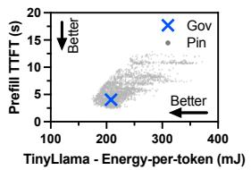

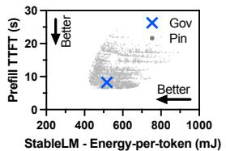

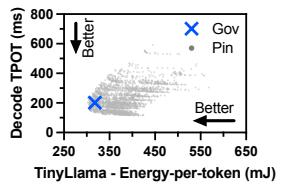

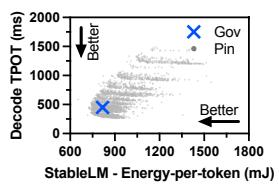  
Figure 1: Comparison of inference latency and energy drain under default governors (Gov) and under different frequency combinations (Pin).

## 4 OPTIMALITY OF MOBILE DVFS GOVERNORS

We begin our study by measuring the latency and energyefficiency of LLM inference under the default mobile DVFS governors (denoted as Gov), and under all CPU, GPU, and memory frequency combinations (denoted as Pin). Fig. 1 shows the latency and energy consumption of every frequency combination (grey dots) along with default governors (”×” markers) for LLM inference with 32 prefill tokens and 32 decode tokens using two different models. There are 18 ∗ 12 ∗ 13 = 2808 frequency combinations in total, as listed in Table 1 in Appendix A. We found that among all Pin frequency combinations, many are able to achieve better inference latency and lower energy consumption at the same time (the lower left region of each figure) compared to the governors. With the same energy consumption as Gov, prefill TTFT and decode TPOT can be reduced by up to 40.4% and 31.8% for TinyLlama, and up to 23.0% and 37.1% for StableLM, respectively. On the other hand, with the same TTFT or TPOT as Gov, energy-per-token can be reduced by up to 14.9% and 5.0% in prefill and decode for TinyLlama, and up to 16.6% and 12.3% for StableLM.

To see the trend with different sequence lengths, we conduct additional experiments with prefill and decode lengths being 32, 64, 128, or 256 tokens (in total 16 combinations). Fig. 2 compares the end-to-end inference latency under Gov against the fastest Pin latency combination with the same energy consumption for the TinyLlama model, denoted as Pin-Opt. We see Pin-Opt consistently achieves shorter end-to-end latency. For instance, with 128 prefill tokens and 256 decode tokens, it reduces end-to-end latency from 115.2 seconds to 42.5 seconds (63% reduction). On average, end-to-end latency under Pin-Opt is 54.9% lower than under Gov across the 16 combinations.

In summary, the above results show that the energy efficiency and inference latency under the default governors are

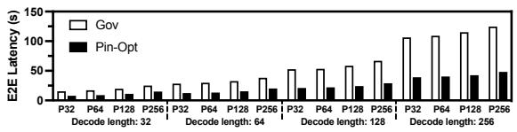  
Figure 2: End-to-end inference latency of TinyLlama on mobile with default governors (Gov) compared with running at the optimal frequency combination (Pin-Opt) that consumes the same amount of energy as with default governors. P32, P64, P128, P256 refer to prefill length of 32, 64, 128, 256 tokens.

far from optimal.

## 5 UNDERSTANDING IMPACT OF DVFS GOVERNORS

To understand the interplay (or lack thereof) among DVFS governors during LLM inference and its impact on inference performance and energy efficiency, we design controlled experiments to first isolate the behavior of individual governors and then examine their cascading effect on one another.

## 5.1 GPU Governor is only GPU-Energy Aware

To isolate the impact of GPU governor on LLM inference from other governors, we pin CPU and memory frequencies and compare LLM inference under the default GPU governor vs. when the GPU frequency is pinned to each available frequency using Pin. Due to page limit, we show results for prefill and decode lengths fixed to 32 tokens; the results for other prefill/decode length combinations are similar.

Since the actual GPU frequency under the default GPU governor can vary during an LLM inference, for intuitive comparison of results under the governor vs. under individual pinned GPU frequencies, we report a single, effective frequency, calculated as the weighted average of each observed frequency during inference, for each inference run under the governor; the weight for each frequency is the percentage of time the governor stays at that frequency.

Decode. In the first set of experiments, we pin the CPU and memory frequencies to fixed values. Fig. 3(a) upper half shows the decode TPOT vs. energy consumption per token under the GPU governor compared with when the GPU is pinned at each available frequency for various models. Overall, the GPU governor fails to achieve either latency or energy optimality. For instance, it achieves 215.1 ms TPOT at 402.7 mJ per token for TinyLlama, while pinning the GPU at 848 MHz achieves 41.0% lower latency (126.9 ms) with similar energy drain (396.5 mJ). For StableLM, it achieves 495.0 ms TPOT at 937.5 mJ per token, while pinning the GPU at 762 MHz achieves 34.6% lower latency (323.6 ms) with similar energy drain (907.2 mJ). Alternatively, pinning the GPU at 471 MHz for TinyLlama achieves 7.0% lower energy drain (374.6 mJ) with similar latency (204.1 ms). For StableLM, pinning the GPU at 701 MHz achieves 7.6% lower energy (866.4 mJ) with similar latency (331.1 ms).

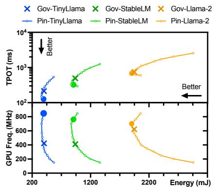  
(a) Various Models

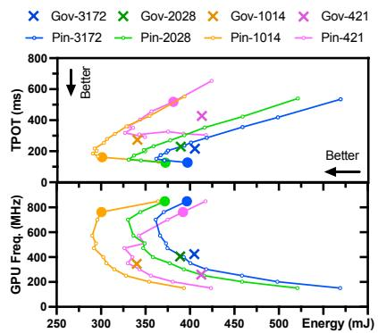  
(b) Varying pinned fMEM

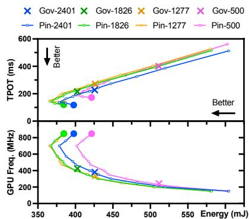  
(c) Varying pinned fCP U  
Figure 3: Decode latency and energy-per-token of the GPU governor (Gov, marked with ×) compared with pinning GPU at each available frequency (Pin). We set fCP U =1826 MHz in (a) and (b), and fMEM =3172 MHz in (a) and (c). Plots in (b) and (c) are for TinyLlama. The lowest-latency frequency combinations with the same energy drain as the GPU governor, Pin-Opt, is marked with .

To understand why the GPU governor cannot achieve the lowest TPOT, we plot the corresponding GPU frequencies for all the inference runs in Fig. 3(a) lower half. We see that the GPU governor runs at overly low frequencies for TinyLlama and StableLM; the effective GPU frequencies for the two models are 424.4 MHz and 411.0 MHz, respectively.

The TPOT under the GPU governor for larger models is closer to the optimal. This is because the decoding cost of the MLP layers scales as O(D2), while the attention cost scales as O(T D), where D denotes the hidden dimension and T denotes the context length. Because larger LLMs generally use larger hidden dimensions, the MLP cost increases faster than the attention cost, so decoding larger models becomes more computationally intensive. This higher workload tends to drive up GPU utilization, enabling the governor to boost the GPU frequency to a sufficiently high level.

In the second set of experiments, we focus on the TinyLlama model and repeat the above experiments while varying the set of frequencies that the memory is pinned to. Fig. 3(b) shows the results. We see when varying the pinned memory frequency, the GPU governor consistently chooses overly low frequencies which result in high TPOT and energyper-token. For instance, when the memory is pinned to a medium frequency of 1014 MHz, the effective GPU frequency under the GPU governor is 346.5 MHz, which achieves 273.9 ms TPOT and 340.0 mJ energy-per-token, while pinning the GPU at 762 MHz results in 41.0% lower TPOT (161.6 ms) and a similar energy consumption (300.4 mJ). Further, lower memory frequencies appear to lead the GPU governor to reduce GPU frequency to maintain sufficient GPU utilization, e.g., the effective GPU frequencies under the GPU governor are 424.4, 406.0, 346.5, and 259.7 MHz when the memory frequencies are pinned at 3172, 2028,

In the third set of experiments, we fix memory frequency and repeat the above experiments under varying pinned CPU frequency. As shown in Fig. 3(c), medium to high CPU frequencies have limited impact on the GPU governor. Overly low CPU frequency, such as 500 MHz, causes the GPU governor to frequently choose lower GPU frequencies which results in high TPOT and energy-per-token compared to the optimal configuration (high GPU frequency).

The reason that the GPU governor tends to choose lower frequencies is that the decode stage exhibits low GPU utilization, prompting the governor to reduce the GPU frequency in trying to bring the utilization to the target range (§2.3). Fig. 4 (upper plot) illustrates the GPU utilization (with GPU frequency pinned) when the CPU is pinned at each available frequency for TinyLlama. For decode, even when the CPU is pinned to the highest frequency of 2850 MHz, the average GPU utilization remains at 70.9%, which is below the target range (according to Fig. 12 in Appendix A). As a result, if the GPU frequency is unpinned, the GPU governor would lower the GPU frequency.

Prefill. We repeat the above three sets of experiments for the prefill stage of LLM inference. Due to page limit, the results are shown in Fig. 13 in Appendix C. We observe that unlike decode, the GPU governor achieves close to optimal TTFT and energy-per-token, by selecting high frequencies, in reaction to the elevated GPU utilization in the prefill stage. As shown in Fig. 4 (upper plot), when the CPU is pinned to a medium frequency of 2188 MHz, the average GPU utilization (with GPU frequency pinned at 701 MHz) reaches 82.8%, which results in the GPU governor staying at high GPU frequencies.

Takeaways: The GPU governor which strives to meet a utilization target range tends to operate the GPU at overly low frequencies in the decode stage which results in long latency and low energy efficiency. In prefill, the GPU utilization is high, and the GPU governor can operate the GPU at sufficiently high frequencies to achieve near optimal TTFT

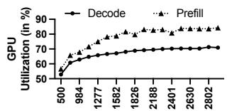

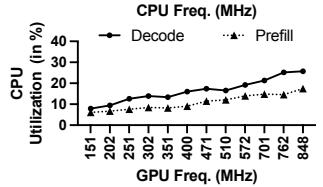  
Figure 4: GPU utilization with pinning CPU at each available frequency and pinned fGP U =701 MHz (upper), and CPU utilization with pinning the GPU at each available frequency and pinned fCP U =2188 MHz (lower). Plots are for TinyLlama and pinned fMEM =3172 MHz.

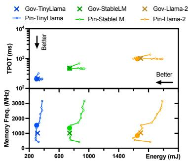  
Figure 5: Decode latency and energy drain of the memory governor (Gov, marked with ×) compared with pinning memory at each available frequency (Pin) for various models. We set fGP U =471 MHz and fCP U =1826 MHz. The lowest-latency frequency combinations with the same energy drain as the memory governor, Pin-Opt, is marked with .

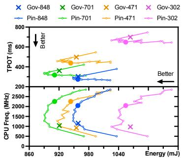  
Figure 6: Decode latency and energy drain of EAS (Gov, marked with ×) compared with pinning CPU at each available frequency (Pin) for StableLM with various pinned GPU frequency. We set fMEM =3172 MHz. The lowest-latency frequency combinations with the same energy drain as EAS, Pin-Opt, is marked with .

and energy efficiency.

## 5.2 Memory Governor

Next, we isolate the impact of the memory governor on LLM inference from other governors, by pinning CPU and GPU frequencies and compare LLM inference under the default memory governor vs. when pinning the memory to each available frequency using Pin. Fig. 5 shows the results for various models with pinned GPU and CPU frequencies at 471 MHz and 1826 MHz. We see the memory governor achieves near optimal inference latency and energy consumption per token. For example, for TinyLlama, it achieves 313.5 mJ energy-per-token and 152.4 ms TPOT, with an effective frequency of 1019.8 MHz. Only one pinned memory frequency, at 1539 MHz, slightly outperforms the memory governor under the same energy budget; it achieves 309.9 mJ energy per token and 145.1 ms TPOT (4.8% lower than the memory governor). Similar trends can be observed when we focus on TinyLlama and vary the pinned GPU frequency (Fig. 14(a) in Appendix D) or pinned CPU frequency (Fig. 14(b) in Appendix D). Similar trends are observed in prefill, and results are omitted due to page limit.

Takeaways: When fixing the CPU/GPU frequencies, the default memory governor can achieve near optimal inference latency and energy consumption per token.

## 5.3 EAS is only CPU-Energy Aware

Although the mobile LLM framework offloads most computations to the GPU, as explained in §2.2, the CPU still plays a key role during inference and thus its frequency can directly impact inference performance and energy efficiency. We analyze EAS’s impact by pinning GPU and memory frequencies in the following experiments.

Decode. Fig. 6 compares inference performance in the decode stage under EAS with pinning the CPU at each available frequency. We observe that EAS consistently achieves higher TPOT and energy consumption compared to optimal pinned CPU frequency, regardless of model sizes (Fig. 15(a) in Appendix E), pinned GPU frequencies (Fig. 6), or pinned memory frequencies (Fig. 15(b) in Appendix E). For instance, for StableLLM, when the GPU is pinned at a medium frequency of 471 MHz as shown in Fig. 6, EAS achieves 955.1 mJ energy per token and 497.5 ms TPOT, while pinning the CPU at 2252 MHz results in 11.8% lower TPOT (438.6 ms) with a similar energy consumption (943.5 mJ). Even pinning the CPU at 1426 MHz results in 6.5% lower TPOT with lower energy-per-token (930.2 mJ).

The longer TPOT under EAS can be explained by how it chooses the CPU frequency. The lower half of Fig. 6 shows that EAS consistently chooses lower CPU frequencies than the optimal pinned CPU frequency that achieves the same energy as EAS. For instance, the effective CPU frequency for StableLM when GPU frequency is pinned at 701 MHz is 1038.8 MHz, lower than the optimal pinned CPU frequency of 2252 MHz. We also observe that CPU frequencies chosen by EAS follow a bimodal distribution pattern; EAS frequently switches between two values for roughly equal amount of time during inference: one medium (e.g., 1426 MHz) and one low frequency (e.g., 851 or 500 MHz).

Prefill. For the prefill stage, similar to the decode stage, EAS consistently achieves higher TTFT (for the same energy budget) or higher energy consumption (for the same TTFT), regardless of model size, pinned GPU frequency, or pinned memory frequency, again due to consistently choosing low frequencies in all settings. Due to page limit, detailed results of prefill latency and energy drain under EAS compared with pinning the CPU at each available frequency are shown in Fig. 16 in Appendix E.

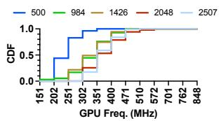

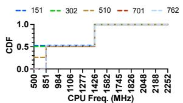  
(a) Varying pinned CPU fre- (b) Varying pinned GPU frequency affects GPU governor quency affects EAS

Figure 7: CDF of the amount of time that GPU (a) or CPU (b) runs at a certain frequency under GPU governor or EAS, respectively. Results are collected in the decode phase with TinyLlama served by llama.cpp. We set fMEM =3172 MHz.  
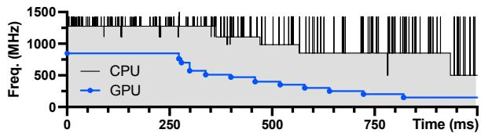  
Figure 8: Runtime trace of CPU and GPU frequencies showing the antagonistic effect.

The reason that EAS governor chooses overly low frequencies is the low CPU utilization in either the prefill or decode stage. As shown in Fig. 4 (lower plot), even when the GPU is pinned to the highest frequency of 848 MHz, the average CPU utilizations for the prefill and decode stages under a pinned CPU frequency of 2188 MHz are 17.5% and 25.7%, causing the EAS governor to lower the CPU frequency.

Takeaways: EAS operates the CPU at overly low frequencies in both decode and prefill stages of LLM inference which degrades inference latency and energy efficiency.

## 5.4 Antagonistic EAS and GPU Governors

From §5.1 and §5.3, we learned that both the GPU governor and EAS, when acting alone, tend to choose overly low frequencies, which result in higher inference latency (for the same energy budget) than the optimal pinned frequencies. These findings in turn raise an important question: when both governors operate concurrently, do they antagonistically affect each other, i.e., cascadingly driving both GPU and CPU frequencies lower in a downward spiral. Such behavior could severely degrade inference performance and energy efficiency. We design controlled experiments to answer this question.

Lower CPU frequency leads to lower GPU frequency. We first pin the CPU frequency at different values and observe the trend of GPU frequencies chosen by the GPU governor during decode of TinyLlama. Fig. 7(a) shows the distribution of time the GPU is at different frequencies during inference for each pinned CPU frequency. We see that as we lower the pinned CPU frequency from 2507 MHz to 500 MHz, the CDF curve of GPU frequencies clearly shifts towards left, meaning that the GPU governor spends longer time at lower frequencies. For instance, while decoding TinyLlama, the most frequently chosen frequency by the

GPU governor is 351 MHz (41% of the time) when the CPU is pinned at 2507 MHz, but is lowered to 202 MHz (44% of the time) when the CPU is pinned at 500 MHz. The trend is consistent across different models, as shown in Fig. 17(a) in Appendix F.

Lower GPU frequency leads to lower CPU frequency. Conversely, Fig. 7(b) shows that lowering the pinned GPU frequency leads to EAS lowering the CPU frequencies chosen. As mentioned in §5.3, the CPU frequency controlled by EAS usually fluctuates between two frequencies for roughly equal amount of time, resulting in two vertical jumps in the CDF curves in the figures. For example, with TinyLlama, EAS mostly chose 851 MHz CPU frequency (52.2% of the time) when the GPU is pinned to 762 MHz, but 500 MHz (52.9% of the time) when the GPU is pinned at 151 MHz. Further, this relationship is consistent across different models (Fig. 17(b) in Appendix F).

The antagonistic effect. We further capture the antagonistic effect between EAS and GPU governors during LLM inference in real time and visualize it in Fig. 8. The GPU is pinned to the highest frequency of 848 MHz at the beginning, then unpinned after 250 ms (i.e., let the default GPU governor control GPU frequency). We let the default EAS governor control CPU frequencies throughout the experiment. As illustrated in Fig. 8, immediately after the GPU is unpinned, the GPU governor drops its frequency from 848 to 510 MHz in 4 steps between 250 and 338 ms. During this period, the CPU frequency is stabilized at 1277 MHz. At 363 ms, the CPU frequency drops from 1277 to 1106 MHz, which in turn drives the GPU governor to lower the GPU frequency from 510 to 471 MHz at 399 ms. The antagonistic effect continues, ultimately driving the GPU governor to lower the GPU frequency to its minimum of 151 MHz at 821 ms, and the CPU governor to lower its frequency to its minimum of 500 MHz at 935 ms. Due to page limit, the illustration of the antagonistic effect where the default GPU governor control the GPU frequency while the CPU frequency is initially pinned and then unpinned is shown in Fig. 18 in Appendix F. In summary, the brief initial frequency pinning in Fig. 8 and Fig. 18 highlights the microscopic dynamics that trigger the antagonistic effect, whereas unpinned governors quickly converge to low frequencies.

The root cause. The root cause of the antagonistic effect lies in the independent frequency scaling of each governor, as they attempt to meet their respective utilization targets. For instance, the GPU governor dynamically adjusts the GPU frequency to align GPU utilization with the vendordefined target range (Fig. 12 in Appendix A). The antagonistic effect begins with low utilization of either component while running the inference engine. Suppose the CPU utilization is low, in response, the CPU governor lowers the

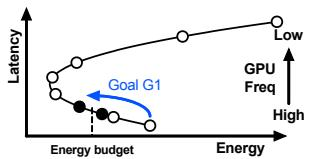  
(a) Goal G1

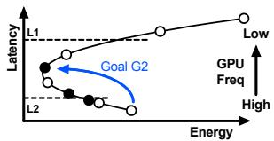  
(b) Goal G2  
Figure 9: Selected GPU frequencies ( solid points) in Step 1.

CPU frequency to increase CPU utilization. However, the lower CPU frequency slows down the OpenCL runtime running on the CPU (§2.2), delaying issuing GPU tasks and hence reducing the GPU utilization (see next paragraph). To compensate, the GPU governor lowers the GPU frequency, further extending the waiting time between GPU task executions. This prolonged delay reduces CPU utilization, prompting the CPU governor to lower the CPU frequency even further, perpetuating the cycle.

To illustrate that lowering the frequency of one component lowers the utilization of the other component, recall that Fig. 4 shows the average GPU utilization (with pinned GPU frequency) when the CPU frequency is pinned at different levels, and CPU utilization (with pinned CPU frequency) when the GPU frequency is pinned at different levels. We see that in the decode stage, as pinned CPU frequency decreases from 2850 MHz to 500 MHz, the average GPU utilization drops from 70.9% to 52.9%. Similarly, as pinned GPU frequency decreases from 848 MHz to 151 MHz, the average CPU utilization drops from 25.7% to 7.9%.

Takeaways: EAS and the GPU governors can trigger a “downward spiral” by cascadingly driving each other to choose lower CPU/GPU frequencies. Avoiding such antagonistic effect between independently acting governors requires a holistic energy-efficient governor for managing both the GPU and CPU.

## 6 CORE: A UNIFIED ENERGY-AWARE GOVERNOR

Motivated by the limitations of independent governors shown in §5, we design CORE, a unified energy-aware governor for optimizing the energy-efficiency of LLM inference on mobile devices. Given an LLM model, the goal of CORE is to find and configure CPU/GPU/memory to run at the frequency combination that (G1) minimizes the inference latency given an energy budget2, or (G2) minimizes the energy consumption given an inference latency target, i.e., TTFT for prefill and TPOT for decode.

Design overview. We observe that in LLM-powered personal services on mobile devices, the same LLM model (e.g., embedded in an app or the OS (Yuan et al., 2024a)) is typically used over an extended period of time. This motivates a simple, offline-profiling-based approach. Specifically, application developers conduct profiling once for each device–model pair and distribute the resulting frequency configurations with the application, so end users incur no profiling overhead. Since the resulting configuration can be reused by all users with the same phone type running the same model, this cost is naturally amortized across users. At runtime, these configurations are applied to every model inference, triggered by notifications from the inference framework indicating the start and end of these phases.

For efficient frequency search, we observe that the target frequency configuration for a given LLM model is inputcontent-agnostic and primarily affected by the prefill length. Based on this, CORE categorizes prefill lengths into five distinct ranges, and performs frequency searches for one sampled decoding length and five representative prefill lengths– one from each range. Below we detail the frequency search process for one setting.

## 6.1 Efficient Frequency Search

The design of CORE’s frequency search is motivated by the findings in §5 that (1) the default CPU/GPU governors tend to cascadingly drive each other’s frequency down, (2) among GPU/CPU/memory frequencies, GPU frequency is the dominant factor affecting inference latency and energy efficiency for primarily GPU-based LLM inference. These observations motivate a two-step search process for target frequency combinations: (1) CORE mitigates the antagonistic effect by first searching for candidate target GPU frequencies, by pinning the GPU at candidate frequencies; (2) It fine-tunes the CPU frequency by exploring CPU frequencies while pinning the GPU at the selected GPU frequencies (at most two) from step 1. We leave the memory governor to its default settings as our findings in §5.2 indicate that it can achieve near-optimal inference latency and energy efficiency.

Step 1: GPU frequency search. To minimize inference latency given an energy budget (i.e., goal G1), since fixing CPU/memory frequencies, changing the GPU frequency results in a U-shape energy-per-token curve (as shown in Fig. 3), our search begins from the highest GPU frequency and decrements it one step at a time. The search stops at the first GPU frequency that achieves a lower energy-per-token than the energy budget, as the following even lower GPU frequencies will lead to higher inference latency even if they can meet the energy budget, as shown in Fig. 9a.

For a given GPU frequency, Fig. 6 and Fig. 16 in Appendix E showed that changing the CPU frequency results in a U-shape energy-per-token curve. Thus for G1, in step 1 CORE takes both the first GPU frequency F whose energy is within the energy budget and the previous GPU frequency F ′ whose energy is above the energy budget, as there may exist CPU frequencies for F ′ that achieve a total energy within the energy budget.

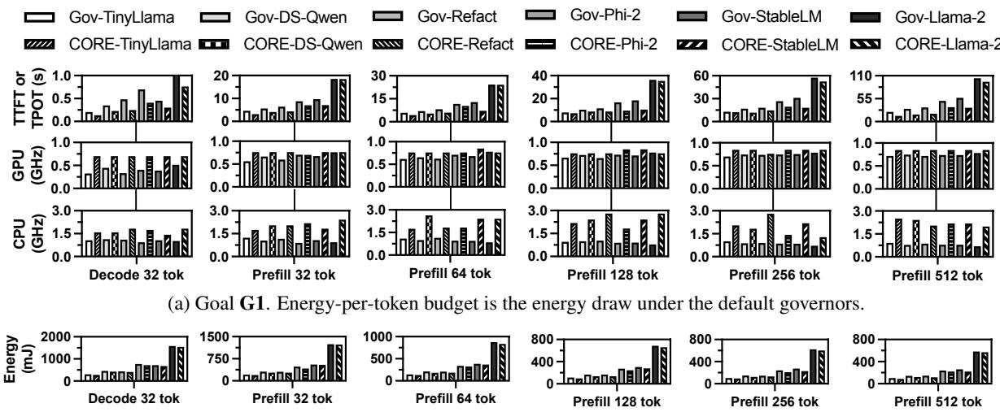  
(b) Goal G2. Latency target is the TTFT or TPOT under the default governors.  
0En ( 0 0Figure 10: Performance comparison of CORE with Gov (the default governors) for goal G1 (a), and energy-per-token comparison of Prefill 128 tokCORE with Gov for goal G2 (b).

To minimize energy consumption given an inference latency target (i.e., goal G2), the search first finds the minimumenergy frequency, defined as the GPU frequency with the lowest energy draw with no latency constraint. The search starts from the highest GPU frequency and stops at the GPU frequency that draws more energy than the previous frequency, i.e., the minimum-energy frequency, as shown in Fig. 9b. Next, if the latency target is higher than the latency at the minimum-energy frequency, e.g., L1 in Fig. 9b, CORE chooses the minimum-energy frequency; otherwise, it chooses two consecutive GPU frequencies whose latencies are higher and lower than the latency target, e.g., L2 in Fig. 9b.

Step 2: CPU frequency search. Since the default CPU governor tends to run at overly-low frequencies (§5.3), for G1, in the second step, CORE searches for the target CPU frequency while pinning the GPU at each (at most two) candidate GPU frequency chosen in Step 1. The search starts from the highest CPU frequency and stops at the first CPU frequency that achieves a lower energy-per-token than the energy budget. It then outputs the CPU/GPU frequency combination that achieves the lowest inference latency. Similarly, for G2, the search starts from the highest CPU frequency and stops at the first CPU frequency that achieves a higher latency than the latency target, and outputs the CPU/GPU frequency combination that achieves the lowest energy-per-token.

## 6.2 Evaluation Methodology

We prototyped CORE on Android to support the llama.cpp (Gerganov, 2024) framework (version: tag b2202) in 2K lines of Python code. The same platform described in §3 is used to evaluate the performance of CORE. We use the energy drain and inference latency under the default governors as the energy budget and latency target. We evaluate CORE with a set of popular LLM models in 4-bit quantization as listed in Table 2 in Appendix B. The performance of CORE is compared with that of the default governors, denoted as Gov. Note that CORE targets the common operating regime where the phone is in normal mode, i.e., not in a system-enforced low-power state.

Dataset. We randomly sample 200 requests from the ShareGPT dataset with prefill length no larger than 512 tokens and decode length no larger than 384 tokens (to fit the memory size of the test devices). These prefill and decode lengths are sampled from ShareGPT due to its broad adoption and coverage of real-world prompts. The average prompt length and decode length of our sampled dataset are 236.1 and 139.0 tokens, respectively.

## 6.3 Evaluation Results

Effectiveness of frequency search. We first evaluate the effectiveness of frequency search for the six settings (i.e., decode with 32 tokens and prefill with {32, 64, 128, 256, 512} tokens). Fig. 10a compares CORE’s inference latency against that of Gov for goal G1; the first column shows decoding TPOT, and the remaining columns show TTFT. We see that while inferencing with the same energy-pertoken as Gov, CORE reduces TPOT and TTFT by 41.0% and 24.8% averaged across all models by running the CPU and GPU at the target frequency combination. For instance, while decoding DeepSeek-R1-Distill-Qwen (shortened as DS-Qwen) with the same energy-per-token (460.5 mJ with CORE and 459.0 mJ with Gov), CORE reduces TPOT by 33.8% (from 346.8 ms to 229.6 ms) by setting the GPU frequency at 701 MHz (compared to 448.5 MHz with Gov) and the CPU frequency at 1582 MHz (compared to 1134.5 MHz with Gov). Fig. 10b compares CORE’s inference energy-per-token against that of Gov for goal G2. We observe that while prefilling with the same TTFT as Gov or decoding with TPOT no higher than that of Gov, CORE reduces energy-per-token by 6.9% and 10.3% averaged across all models in the prefill and decode stage, respectively. The CPU/GPU frequencies found by CORE for goal G2 are shown in Fig. 19 in Appendix D.

Performance on real trace. For goal G1, Fig. 11 top row compares CORE’s energy consumption and latency normalized against that of Gov in serving the 200 sampled inference requests from ShareGPT. For TinyLlama, while consuming the same amount of total energy (865.5 mAh with Gov and 859.4 mAh with CORE), CORE reduces average TTFT, TPOT, and E2E latency by 14.6% (from 10.8 to 9.2 s), 27.8% (from 212.1 to 153.1 ms), and 23.2% (from 31.0 to 23.8 s), respectively. Similarly, for DeepSeek-R1-Distill-Qwen, while consuming the same amount of total energy (1288.3 mAh with Gov and 1225.2 mAh with CORE), CORE reduces TTFT, TPOT and E2E latency by 17.7%, 39.6%, and 28.8%, respectively. For the larger 2.7B StableLM model, while consuming the same amount of total energy, CORE reduces TTFT, TPOT and E2E latency by 8.5% (from 25.1 to 23.0 s), 38.3% (from 490.0 to 302.3 ms) and 27.9% (from 69.2 to 49.9 s), respectively.

For goal G2, for TinyLlama, while inferencing at the same target average TTFT (10.8 s with Gov and 10.3 s with CORE), CORE reduces the total energy draw by 7.5% (from 865.5 to 800.6 mAh). Note that CORE’s TPOT and E2E latency results are both lower than Gov, by 17.8% and 18.3% respectively. For DS-Qwen and StableLM models, while inferencing at the same average TTFT with lower TPOT and E2E latency, CORE reduces the energy draw by 15.8% (from 1288.3 to 1084.7 mAh) and 6.3% (from 2185.6 to 2047.9 mAh), respectively.

Search cost. For each model, CORE performs profilingbased frequency search for each of the six settings for either goal G1 or G2. For goal G1, it only performs on average 2.4 and 5.1 inferences per setting (i.e., 14.5 and 30.8 inferences in total per model) across the 6 models in Step 1 and Step 2, respectively—a reduction of 374x from the 2808 total CPU/GPU/memory frequency combinations. Multiplied by per-inference time, which differs across the models and settings, ranging from 23.4 to 104.0 seconds, frequency search finishes in 17.7, 43.1, and 78.5 minutes for all settings for TinyLlama, StableLM, and Llama-2 models, respectively.

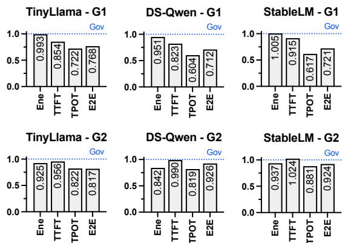  
Figure 11: CORE’s energy consumption and latencies normalized to default governors for goals G1 (minimize latency) and G2 (minimize energy) on the ShareGPT trace.

For goal G2, CORE takes on average 3.6 and 4.8 inferences per setting (i.e., 21.8 and 28.8 inferences in total per model) in Step 1 and Step 2, averaged across the 6 models. It spends more steps in Step 1 than G1, in finding the minimumenergy GPU frequency. Multiplied by per-inference time, frequency search finishes in 19.7, 48.1, and 87.7 minutes for all settings for the three models, respectively.

## 7 RELATED WORK

Mobile LLM profiling and benchmarking. Laskaridis et al. (Laskaridis et al., 2024) performed the first systematic on-device LLM performance and energy efficiency profiling. Li et al. (Li et al., 2024) focused on profiling the accuracy, latency, and memory footprint of mobile LLM inferencing without power measurement. The benchmark from Xiao et al. (Xiao et al., 2024) covers many mobile devices and perspectives, including the impact of CPU scheduling on LLM inference performance. However, none of these works analyzed the impact of DVFS governors on LLM performance and energy efficiency.

Mobile LLM performance optimization. A growing body of work improves the efficiency of LLM inference on mobile devices. One line of work reduces model resource requirements through mobile-oriented model designs (Liu et al., 2024; Yao et al., 2024), quantization (Tan et al., 2024), and cross-task model reuse (Yuan et al., 2024b). Another line of work addresses the memory bottleneck by loading model weights on demand during inference (Xue et al., 2024; Xu et al., 2023; Yi et al., 2023; Guo et al., 2023). In addition, recent efforts exploit specialized mobile accelerators such as NPUs to further improve inference efficiency (Xu et al., 2024). While these works reduce latency, memory usage, or hardware cost, they do not study how system-level DVFS policies shape the energy efficiency of mobile LLM inference.

Mobile DVFS optimizations. Several prior works optimized DVFS for different scenarios, e.g., avoiding thermal throttling (Kim et al., 2021; Sahin et al., 2019; Liu et al., 2022), adapting to concurrent tasks (Lin et al., 2023), and edge computing (Panda et al., 2023). On the other hand, DVFS optimizations have been proposed for specific applications, e.g., mobile gaming (Park et al., 2015; 2017; Hsieh et al., 2015) and DNN inference (Zhang et al., 2024b; Karzhaubayeva et al., 2023), where optimal frequency combinations are searched. However, none of the previous work and the Android Dynamic Performance Framework (ADPF) (Burke, 2024)) have examined the intricate interplay among DVFS governors in mobile OSes and its impact on LLM inference performance and energy efficiency.

DVFS in datacenters. Prior work has also explored DVFS for improving serving or training energy efficiency in datacenter settings. For inference serving, DynamoLLM (Stojkovic et al., 2024) and TAPAS (Stojkovic et al., 2025) combine GPU frequency control with system-level reconfiguration to reduce energy while meeting latency, power, and thermal constraints. For training, EnvPipe (Choi et al., 2023) and Perseus (Chung et al., 2024) use fine-grained GPU frequency control to cut energy with little or no throughput loss, whereas Zeus (You et al., 2023) instead focuses on batch size and GPU power limits. MLPerf Power (Tschand et al., 2025) and the ML.ENERGY Benchmark (Chung et al., 2025) complement these systems by standardizing energy measurement and evaluation. In contrast to these datacenteroriented systems, our work focuses on mobile SoCs, where multiple independently managed DVFS governors interact under tight resource and energy constraints.

## 8 CONCLUSIONS

We presented, to our knowledge, the first in-depth study of how mobile CPU, GPU, and memory governors interact during LLM inference. Our analysis shows that the default triplet of governors in Android can cause 23.0-40.4% longer latency or 5.0-16.6% higher energy use compared to optimal frequency combinations. Controlled experiments reveal two root causes: (1) acting independently, each governor selects overly low frequencies; (2) acting together, they trigger a downward spiral that further degrades performance. To address this, we introduced CORE, a unified, energy-aware governor that jointly coordinates CPU and GPU scaling. CORE improves TTFT and TPOT by 8.5-17.7% and 27.8- 39.6%, respectively, across mobile LLMs without increasing energy per token. As future work, CORE could choose among similarly energy-efficient frequency configurations the one that minimizes heat generation. We envision as foundation models become integrated into mobile OSes, unified energy-aware governors like CORE —currently prototyped in user space—will be supported in the OS to natively optimize multi-component LLM workloads.

## ACKNOWLEDGEMENTS

We thank the anonymous reviewers for their helpful comments. This work is supported in part by NSF grant 2415216.

## REFERENCES

AOSP. Aosp kernel governor simpleinteractive.c. https: //android.googlesource.com/kernel/ gs/+/refs/heads/android-gs-pantah-5.10-android13-qpr3/drivers/devfreq/ google/governor simpleinteractive.c, 2022a. Last accessed 18 Oct 2024.

AOSP. Aosp kernel gs201-gpu.dtsi. https: //android.googlesource.com/kernel/gs/ +/refs/heads/android-gs-pantah-5.10- android13-qpr3/arch/arm64/boot/dts/ google/gs201-gpu.dtsi, 2022b. Last accessed 18 Oct 2024.

ARM. Amba® axi and ace protocol specification, 2012. URL https://developer.arm.com/-/media/ Arm%20Developer%20Community/PDF/ IHI0022H amba axi protocol spec.pdf?revision= 71bd7c57-2ed7-487b-bc3e-68c4ab56fa5f&la=en&hash= 6325311012DDADF238C35A6C0FD734E520754F82. Last accessed 5 Oct 2024.

ARM. Memory interface, 2015. URL https: //developer.arm.com/documentation/ 100095/0003/Functional-Description/ Interfaces/Memory-interface?lang=en. Last accessed 5 Oct 2024.

Banerjee, S. Characterization of smartphone governor strategies and making of a workload aware governor. PhD thesis, 2018.

Banerjee, S. and John, L. K. Characterization of smartphone governor strategies. In Euro-Par, pp. 120–134, 2018.

Burke, D. The first developer preview of android 15, February 2024. URL https: //android-developers.googleblog.com/ 2024/02/first-developer-previewandroid15.html.

Chan, M. cpufreq: New ’interactive’ governor, 2012. URL https://lkml.org/lkml/2012/2/7/483. Last accessed 5 Oct 2024.

Choi, S., Koo, I., Ahn, J., Jeon, M., and Kwon, Y. {EnvPipe}: Performance-preserving {DNN} training framework for saving energy. In 2023 USENIX Annual

Technical Conference (USENIX ATC 23), pp. 851–864, 2023.

Chung, J.-W., Gu, Y., Jang, I., Meng, L., Bansal, N., and Chowdhury, M. Reducing energy bloat in large model training. In Proceedings of the ACM SIGOPS 30th Symposium on Operating Systems Principles, pp. 144–159, 2024.

Chung, J.-W., Ma, J. J., Wu, R., Liu, J., Kweon, O. J., Xia, Y., Wu, Z., and Chowdhury, M. The ML.ENERGY benchmark: Toward automated inference energy measurement and optimization. In NeurIPS Datasets and Benchmarks, 2025.

Conway, T. Why do i need an amba 5 chi memory controller?, 2013. URL https: //community.arm.com/arm-communityblogs/b/architectures-and-processorsblog/posts/why-do-i-need-an-amba-5- chi-memory-controller. Last accessed 5 Oct 2024.

Corbet, J. Per-entity load tracking, January 2013. URL https://lwn.net/Articles/531853/.

DeepSeek-AI. Deepseek-r1: Incentivizing reasoning capability in llms via reinforcement learning, 2025.

developer.android.com. Android debug bridge (adb), 2015. URL https://developer.android.com/ tools/adb. Last accessed 5 Oct 2024.

Gerganov, G. llama.cpp. https://github.com/ ggerganov/llama.cpp, 2024.

Guo, L., Choe, W., and Lin, F. X. STI: turbocharge NLP inference at the edge via elastic pipelining. In ASPLOS, pp. 791–803. ACM, 2023.

Hsieh, C.-Y., Park, J.-G., Dutt, N., and Lim, S.-S. Memoryaware cooperative cpu-gpu dvfs governor for mobile games. In 2015 13th IEEE Symposium on Embedded Systems For Real-time Multimedia (ESTIMedia), pp. 1–8. IEEE, 2015.

Jiang, X., Wang, H., Chen, Y., Wu, Z., Wang, L., Zou, B., Yang, Y., Cui, Z., Cai, Y., Yu, T., Lv, C., and Wu, Z. Mnn: A universal and efficient inference engine. In MLSys, 2020.

Karzhaubayeva, M., Amangeldi, A., and Park, J.-G. Cnn workloads characterization and integrated cpu–gpu dvfs governors on embedded systems. IEEE Embedded Systems Letters, 15(4):202–205, 2023. doi: 10.1109/ LES.2023.3299335.

kernel.org. Energy aware scheduling, 2015. URL https://www.kernel.org/doc/html/ latest/scheduler/sched-energy.html. Last accessed 5 Oct 2024.

Kim, S., Bin, K., Ha, S., Lee, K., and Chong, S. ztt: learningbased DVFS with zero thermal throttling for mobile devices. In MobiSys, pp. 41–53. ACM, 2021.

Laskaridis, S., Katevas, K., Minto, L., and Haddadi, H. Melting point: Mobile evaluation of language transformers. In MobiCom, 2024.

Li, X., Lu, Z., Cai, D., Ma, X., and Xu, M. Large language models on mobile devices: Measurements, analysis, and insights. In EdgeFM@MobiSys, pp. 1–6. ACM, 2024.

Lin, C., Wang, K., Li, Z., and Pu, Y. A workload-aware DVFS robust to concurrent tasks for mobile devices. In MobiCom, pp. 19:1–19:16. ACM, 2023.

Liu, D., Yang, S., He, Z., Zhao, M., and Liu, W. CARTAD: compiler-assisted reinforcement learning for thermalaware task scheduling and DVFS on multicores. IEEE Trans. Comput. Aided Des. Integr. Circuits Syst., 41(6): 1813–1826, 2022.

Liu, Z., Zhao, C., Iandola, F. N., Lai, C., Tian, Y., Fedorov, I., Xiong, Y., Chang, E., Shi, Y., Krishnamoorthi, R., Lai, L., and Chandra, V. Mobilellm: Optimizing sub-billion parameter language models for on-device use cases. In ICML, 2024.

msoon.com. Monsoon power monitor, 2015. URL https://www.msoon.com/high-voltagepower-monitor. Last accessed 5 Oct 2024.

Nugteren, C. Clblast: A tuned opencl BLAS library. In IWOCL, pp. 5:1–5:10, 2018.

Panda, S. K., Lin, M., and Zhou, T. Energy-efficient computation offloading with DVFS using deep reinforcement learning for time-critical iot applications in edge computing. IEEE Internet Things J., 10(8, April 15):6611–6621, 2023.

Park, H. and Lin, F. X. Gpureplay: a 50-kb gpu stack for client ml. In ASPLOS, pp. 157–170, 2022.

Park, J.-G., Hsieh, C.-Y., Dutt, N., and Lim, S.-S. Cooperative cpu-gpu frequency capping (co-cap) for energy efficient mobile gaming. UCI Center for Embedded and Cyber-physical Systems TR, 2015.

Park, J.-G., Dutt, N., and Lim, S.-S. Ml-gov: A machine learning enhanced integrated cpu-gpu dvfs governor for mobile gaming. In Proceedings of the 15th IEEE/ACM Symposium on Embedded Systems for Real-Time Multimedia, pp. 12–21, 2017.

Patel, P., Choukse, E., Zhang, C., Shah, A., Goiri, I., Maleki, S., and Bianchini, R. Splitwise: Efficient generative llm inference using phase splitting. In ISCA, pp. 118–132, 2024.

Saber. [ref][guide]saber’s guide on cpu governors, i/o schedulers and more!, 2015. URL https://xdaforums.com/t/ref-guidesabers-guide-on-cpu-governors-i-oschedulers-and-more.3048957/. Last accessed 5 Oct 2024.

Sahin, O., Thiele, L., and Coskun, A. K. Maestro: Autonomous qos management for mobile applications under thermal constraints. IEEE Trans. Comput. Aided Des. Integr. Circuits Syst., 38(8):1557–1570, 2019.

Stojkovic, J., Zhang, C., ´Inigo Goiri, Torrellas, J., and ˜ Choukse, E. Dynamollm: Designing llm inference clusters for performance and energy efficiency, 2024.

Stojkovic, J., Zhang, C., Goiri, ´I., Choukse, E., Qiu, H., Fonseca, R., Torrellas, J., and Bianchini, R. Tapas: Thermaland power-aware scheduling for llm inference in cloud platforms. In Proceedings of the 30th ACM International Conference on Architectural Support for Programming Languages and Operating Systems, Volume 2, pp. 1266– 1281, 2025.

Tan, F., Lee, R., Łukasz Dudziak, Hu, S. X., Bhattacharya, S., Hospedales, T., Tzimiropoulos, G., and Martinez, B. Mobilequant: Mobile-friendly quantization for on-device language models, 2024.

team, M. MLC-LLM, 2023. URL https:// github.com/mlc-ai/mlc-llm.

Touvron, H., Martin, L., Stone, K., Albert, P., Almahairi, A., Babaei, Y., Bashlykov, N., Batra, S., Bhargava, P., Bhosale, S., Bikel, D., Blecher, L., Ferrer, C. C., Chen, M., Cucurull, G., Esiobu, D., Fernandes, J., Fu, J., Fu, W., Fuller, B., Gao, C., Goswami, V., Goyal, N., Hartshorn, A., Hosseini, S., Hou, R., Inan, H., Kardas, M., Kerkez, V., Khabsa, M., Kloumann, I., Korenev, A., Koura, P. S., Lachaux, M.-A., Lavril, T., Lee, J., Liskovich, D., Lu, Y., Mao, Y., Martinet, X., Mihaylov, T., Mishra, P., Molybog, I., Nie, Y., Poulton, A., Reizenstein, J., Rungta, R., Saladi, K., Schelten, A., Silva, R., Smith, E. M., Subramanian, R., Tan, X. E., Tang, B., Taylor, R., Williams, A., Kuan, J. X., Xu, P., Yan, Z., Zarov, I., Zhang, Y., Fan, A., Kambadur, M., Narang, S., Rodriguez, A., Stojnic, R., Edunov, S., and Scialom, T. Llama 2: Open foundation and fine-tuned chat models, 2023.

Tschand, A., Rajan, A. T. R., Idgunji, S., Ghosh, A., Holleman, J., Kiraly, C., Ambalkar, P., Borkar, R., Chukka, R.,

Cockrell, T., et al. Mlperf power: Benchmarking the energy efficiency of machine learning systems from µwatts to mwatts for sustainable ai. In 2025 IEEE International Symposium on High Performance Computer Architecture (HPCA), pp. 1201–1216. IEEE, 2025.

Xiao, J., Huang, Q., Chen, X., and Tian, C. Large language model performance benchmarking on mobile platforms: A thorough evaluation, 2024.

Xu, D., Yin, W., Jin, X., Zhang, Y., Wei, S., Xu, M., and Liu, X. Llmcad: Fast and scalable on-device large language model inference, 2023.

Xu, D., Zhang, H., Yang, L., Liu, R., Huang, G., Xu, M., and Liu, X. Empowering 1000 tokens/second on-device llm prefilling with mllm-npu, 2024.

Xue, Z., Song, Y., Mi, Z., Chen, L., Xia, Y., and Chen, H. Powerinfer-2: Fast large language model inference on a smartphone, 2024.

Yao, Y., Yu, T., Zhang, A., Wang, C., Cui, J., Zhu, H., Cai, T., Li, H., Zhao, W., He, Z., Chen, Q., Zhou, H., Zou, Z., Zhang, H., Hu, S., Zheng, Z., Zhou, J., Cai, J., Han, X., Zeng, G., Li, D., Liu, Z., and Sun, M. Minicpm-v: A gpt-4v level mllm on your phone, 2024.

Yi, R., Guo, L., Wei, S., Zhou, A., Wang, S., and Xu, M. Edgemoe: Fast on-device inference of moe-based large language models, 2023.

You, J., Chung, J.-W., and Chowdhury, M. Zeus: Understanding and optimizing {GPU} energy consumption of {DNN} training. In 20th USENIX Symposium on Networked Systems Design and Implementation (NSDI 23), pp. 119–139, 2023.

Yuan, J., Yang, C., Cai, D., Wang, S., Yuan, X., Zhang, Z., Li, X., Zhang, D., Mei, H., Jia, X., Wang, S., and Xu, M. Mobile foundation model as firmware. In MobiCom, pp. 279–295. ACM, 2024a.

Yuan, J., Yang, C., Cai, D., Wang, S., Yuan, X., Zhang, Z., Li, X., Zhang, D., Mei, H., Jia, X., Wang, S., and Xu, M. Mobile foundation model as firmware. In MobiCom, pp. 279–295. ACM, 2024b.

Zhang, P., Zeng, G., Wang, T., and Lu, W. Tinyllama: An open-source small language model, 2024a.

Zhang, Z., Zhao, Y., Li, H., Lin, C., and Liu, J. DVFO: learning-based DVFS for energy-efficient edge-cloud collaborative inference. IEEE Trans. Mob. Comput., 23(10): 9042–9059, 2024b.

Zhong, Y., Liu, S., Chen, J., Hu, J., Zhu, Y., Liu, X., Jin, X., and Zhang, H. DistServe: Disaggregating prefill and decoding for goodput-optimized large language model serving. In OSDI, pp. 193–210, 2024.