# CATWILD: COMPILER AUTOTUNING FOR TPU WORKLOADS IN THE WILD

Ignacio Cano 1 Yu Emma Wang 1 Mike Burrows 1 Ziqiang Feng 1 Matheus Camargo 1 Chao Wang 1 David H. Liu 1 Tengyu Sun 1 Alexander Wertheim 1 Arissa Wongpanich 1 Christof Angermueller 1 Hyojun Kim 1 Wenqi Cao \* Aleksey Orekhov \* Amit Sabne 1 Emma Sevastian 1 Mehrdad Khani 1 Karthik Srinivasa Murthy 1 Berkin Ilbeyi 1 Subhankar Shah 1 Ryan Lefever 1 Arjun Khare 1 Ankit Sinha 1 Peter Ma 1 Matthew Bierbaum 1 Jeremiah Wilke 2 Emily Donahue 1 Sami Abu-El-Haija \* Nikhil Sarda Vineetha Govindaraj 1 Shobha Vasudevan 3 \* Kirill Gugaev 1 Idan Nachman 1 Jie Sun \* Jose Baiocchi Paredes 1 Samrat Ghosh 1 Domagoj Babic 4 Zongwei Zhou 4 Naveen Kumar 1 Phitchaya Mangpo Phothilimthana 5 \*

## ABSTRACT

Compilers play a fundamental role at achieving peak performance for machine learning (ML) workloads. However, given the diverse nature of workloads and accelerators, compilers’ heuristics and analytical cost models can result in sub-optimal performance, and thus waste precious datacenter resources. Furthermore, the multitude of tunable parameters and their complex interplay often make it impossible for human experts to manually find optimal configurations. In this paper, we present CATWILD, a system that automatically optimizes ML jobs in Google’s TPU fleet using compiler autotuning techniques. We describe CATWILD’s design and implementation, and evaluate its performance using a handful of representative metrics. We further report experiences and lessons learned from its five-year development and operation. To the best of our knowledge, CATWILD represents the first ML compiler autotuning solution deployed in datacenters at scale. Its successful rollout yielded substantial benefits, generating tuned configurations for a large portion of Google’s TPU training workloads and achieving significant chip savings.

## 1 INTRODUCTION

Optimizing machine learning (ML) workloads for peak performance is a critical endeavor, especially within large-scale computing environments like Google’s fleet. At the core of Google’s ML stack lies XLA (Sabne, 2020), a widely used ML compiler designed to accelerate computations on various hardware, including CPUs, GPUs, and TPUs. Traditionally, XLA’s optimizations have relied on a combination of heuristics and cost models, often requiring manual intervention by engineers to identify and resolve performance bottlenecks on a case-by-case basis. This manual process involves analyzing performance traces, applying expert knowledge, and conducting numerous experiments, which is timeconsuming and difficult to scale across heterogeneous and constantly evolving ML environments (Chaudhary et al., 2020; Jeon et al., 2019; Feng et al., 2023). Worse, the number of configurable parameters and their complex interactions create an optimization space that is often intractable for human experts to navigate and reason about (Jia et al.,

2019a). To overcome these limitations, the concept of compiler autotuning emerges as a powerful solution. Instead of relying solely on default compiler heuristics, autotuning systematically searches a space of program configurations and selects the optimal configuration based on a defined performance metric (Adams et al., 2019; Chen et al., 2018a; Zheng et al., 2020a; Phothilimthana et al., 2021). However, given that the landscape of ML workloads is highly dynamic, with models, datasets, and hardware targets rapidly changing, one-off autotuned-based optimizations can quickly become sub-optimal, highlighting the need for an adaptive system that can automatically and continuously improve workload efficiency over time (Weng et al., 2022).

Based on these observations, we designed and implemented CATWILD, a system that automatically tunes the top TPU training workloads in Google’s fleet. CATWILD borrows ideas from traditional feedback directed optimizations (FDO) to make more informed optimization decisions during the compilation process. However, instead of relying on runtime performance counters (e.g., branch misses) as traditional FDO does, our system uses an offline tuning process to customize the compiler for different workloads. Once optimizations are found offline, we apply them transparently to user jobs in the fleet. This allows us to tailor the optimizations for specific workloads and scale our system to more than 70% of the entire Google training fleet while avoiding putting expensive tuning logic on the hot path of user applications.

As part of this work, we address a set of engineering and technical challenges we faced to realize such a system. First, we needed a system to collect the tensor computation graphs—the typical representation used for ML models— running in the fleet, as well as their profiling information. For that, we built an ingestion service on top of Spanner (Corbett et al., 2013) and an internal distributed storage system for immutable data, to store and serve ML symbols used across the fleet, and integrated it with a continuous TPU profiling system. Second, we needed a transparent and cost-effective way to automatically optimize a wide range of graphs. To that end, we re-designed and extended XTAT (Phothilimthana et al., 2021) into a highly modular autotuner system. This system can be easily used for various optimization tasks and it can tune thousands of tensor (sub)graphs with minimal TPU resources. Specifically, we showcase its effectiveness with results on graph-level flag tuning and tile-size selection on subgraphs, yielding average speedups of 5-15% and 10-25% for graphs and subgraphs respectively. Underneath, the autotuner uses an asynchronous and scalable messaging service and an ML-based simulator that is able to faithfully simulate multi-chip graphs with a single chip. Third, we needed a mechanism to inject autotuned configurations back into the fleet and monitor their performance. Critically, this system must support configuration sharing and reuse—a gap left by individual tuning—to capitalize on the fact that many users run identical workloads (e.g., fine-tuning the same base model, serving models with different weights). For this, we designed a system leveraging Google’s mono repository to store and version optimal configurations. To maintain these shared configurations over time and across software changes, a background execution framework continuously validates them, checks for staleness, and manages cross-compiler version applicability, ensuring sustained performance and maximum reuse.

In summary, our main contributions are:

• We describe the design and implementation of CATWILD, an end-to-end system for integrating and deploying compiler autotuning at fleet-scale in production. This is, to the best of our knowledge, the first such system demonstrated at datacenter scale.

• We introduce the necessary systems support for largescale autotuning, including components for continuous fleetwide ML symbol collection, a highly scalable offline autotuning framework for XLA compiler configurations, and robust mechanisms for automatic, version-controlled deployment and monitoring of tuned configurations.

• We present a detailed analysis of CATWILD’s performance and benefits in Google’s production datacenters, including measurements of speedups, simulation fidelity, and operational metrics like configuration staleness. Finally, we share the experiences and lessons learned from this large-scale deployment that tunes ∼70% of the TPU training jobs daily, achieving significant chip savings.

## 2 THE ML DEVELOPMENT ECOSYSTEM ATGOOGLE

Our context is Google’s machine learning ecosystem (Wongpanich et al., 2026). Here, we give background on Google’s ML stack, and challenges that motivate CATWILD.

## 2.1 Background

## 2.1.1 Cluster and Runtime Management Systems

Borg (Tirmazi et al., 2020) is the cluster management system that allocates and schedules the compute resources, such as TPU slices, CPU, and memory, for the ML jobs to run. Borg places the jobs onto physical machines and manages preemptions. A distributed execution environment (Barham et al., 2022) then orchestrates the execution of the ML workload across the pool of allocated devices, managing data distribution, computation, and communication between the different parts of the large-scale model.

## 2.1.2 ML Frameworks and Compiler

Machine learning models are generally written using highlevel frameworks (e.g., JAX (Bradbury et al., 2018), Tensorflow (Abadi et al., 2016)), and compiled using the XLA compiler (Sabne, 2020), which generates code for various hardware targets. XLA uses a graph-based representation; nodes represent tensor operations, and edges represent data flow between operations. XLA has several passes that transform unoptimized graphs into optimized graphs, which comprise nodes that represent fusions of multiple operations. We refer to those fused nodes as subgraphs, kernels, or ops. In the hardware lowering phase, XLA converts each individual op into instructions that can be executed on some target accelerator.

## 2.1.3 ML Experimentation Workflow

The ML workflow centers around Google’s monorepo, which hosts most of Google’s code, including ML models, libraries, and tools. Developers work in local workspaces that provide isolated views of the repository for making changes. Typically, experiments are orchestrated using an internal version of XManager (XManager Contributors, 2022), while build descriptions and launch scripts are written in Python. Builds can be based on the current state of the workspace client, a specific submitted change, or a pending change. Since all code and toolchains reside in the same repository, an experiment is implicitly versioned by the change number at which it is built. This applies to the frameworks, compiler, and runtime.

## 2.2 Opportunities and Challenges for Compiler Autotuning at Scale

## 2.2.1 Fleet Heterogeneity

The XLA compiler faces many NP-hard optimization problems, such as operation fusion (Darte, 2000), layout, and tile size selection. The compiler’s heuristics are not always optimal for every model or hardware type (Phothilimthana et al., 2021). Also, new accelerator hardware is frequently deployed to keep pace with the demands of modern models. Figure 1 illustrates this evolution by showing the daily weighted footprint of different accelerator types. The Yaxis represents the percentage of total daily active (on-duty) accelerator compute time consumed by each type of accelerator, and shows significant shifts in accelerator usage over a two-year period. For example, accelerators ACC-A and ACC-D account for a substantial portion of the fleet’s compute time at first, but their relative footprint diminishes and others become more dominant (e.g., ACC-F) over time.

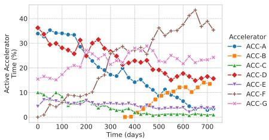  
Figure 1. Active accelerator compute time over time.

## 2.2.2 Offline versus Online Autotuning

Given these NP-hard problems and the constantly shifting hardware landscape, relying solely on fixed heuristics is insufficient to achieve peak performance. Search-based techniques have been demonstrated to be highly effective in navigating these massive optimization spaces, naturally leading to the need for autotuning systems that automatically find the best compiler configurations (Chen et al., 2018a; Ragan-Kelley et al., 2013a; Phothilimthana et al., 2021). Having established the need for autotuning, the next consideration is to decide when to perform it: online, during the user job’s compilation, or offline, as a separate, preprocessing step. Online autotuning is attractive due to its simplicity and lack of need for extra infrastructure. The main drawback is the potential for excessive tuning times that directly impact user job latency, especially on settings where search spaces are extremely large (e.g., our production flag tuner search space is ∼ 237). Fast compilation is highly desirable for rapid ML experimentation, as delays at this stage can significantly slow down the development cycle. Figure 2 shows the cumulative distribution function (CDF) of compilation times for over 200,000 graphs extracted over a 7-day period. While many compilations are fast (60% finish within 10 seconds), the tail is long: the 90th percentile is around 50 seconds. These times highlight the need to avoid adding further compilation overheads.

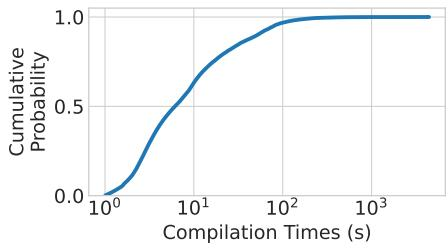  
Figure 2. CDF of compilation times.

On the other hand, offline autotuning shifts the tuning effort to a preliminary step. The autotuner runs independently from the workload, and the top-performing configurations are stored for later use by the compiler. The key advantages are that user jobs’ compilation remains fast, and a generous time budget can be allocated to the tuners to find better configurations. The downsides include the increased burden on users to run and manage the tuning process, and the inherent difficulties in scaling these efforts to cover a broad and evolving set of models.

Figure 3 displays the normalized average speedups achieved over time for three distinct tuning experiments: EXP1 (129 graphs), EXP2 (76 graphs), and EXP3 (81 graphs). We used a custom genetic-style algorithm to perform the search over a set of compiler flags. In order to analyze the trend, tuning times were grouped into 15-minute intervals, with the average speedup calculated across the graphs within each experiment for every interval. We observe that between 65-85% of the maximum speedup is realized within the initial hour of tuning. Despite these early gains, the average speedups continue to increase across all experiments as tuning progresses supporting the conclusion that longer tuning durations tend to discover better configurations. The path is not always smooth; EXP3, for example, seemed stuck in local optima for some time before it made significant progress towards the end.

## 2.2.3 Centralized Repository of Graphs/Ops

Traditional compiler autotuning is a multi-step process. A model is compiled to get a computation graph that is fed to a separate autotuning tool. The tuned parameters are used to recompile the model, which is rerun to evaluate performance. This task is time-consuming and repetitive. Users may also have goals beyond performance, such as development velocity, feature completeness, stability, or time-to-market, and so may not engage in tuning. Nevertheless, organizations benefit from reduced costs, so it is valuable to optimize as many models as possible. The key to scalability is automation. Therefore, scaling offline autotuning requires a central repository populated with tuning candidates (graphs/ops) and their detailed profiles, sourced from fleet workloads. Automated systems can then analyze this repository to select high-impact candidates for tuning.

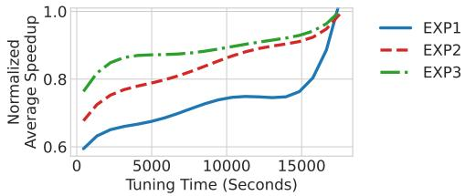  
Figure 3. Normalized speedups by tuning time.

## 2.2.4 Configurations Versioning and Staleness

Another important choice is the code version to be tuned. Ideally, tuning would occur at the version and workspace state used to build each job, so the tuned configurations would match the running jobs precisely. But with thousands of ML workloads, using many different compiler versions, tuning at every version becomes a practical challenge. Furthermore, Google’s monorepo encourages developers to use recent changes for libraries and toolchains, including XLA. Perhaps surprisingly, while there are release mechanisms, many clients use the most recent versions.

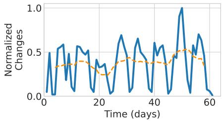  
Figure 4. Daily number of normalized changes within the compiler and runtime code (solid line), and the 7-day rolling average (dashed).

Figure 4 illustrates the high churn rate within the compiler and runtime codebases. The Y-axis shows the normalized daily volume of submitted changes affecting these components, with 1.0 representing the peak day of change activity during a 60-day period. The recurrent drops in the curve correspond to weekends. The 7-day rolling average (dashed line) indicates a sustained, non-zero rate of change, so a configuration tuned for a specific past version might quickly become stale. Consequently, the dynamic nature of the codebase and the impracticality of tracking all possible versions requires exploring strategies like tuning near the most recent version to achieve more maintainable performance gains.

## 2.2.5 Impact of Job Sizes on Runtime Estimation

To guide the autotuner, we need to evaluate the performance of different candidate configurations. Direct measurement on full-scale production models is generally not viable given the substantial hardware resources many models require. Figure 5 shows a smoothed distribution of job sizes over a 60-day period, bucketized from XS (one or a handful of accelerators) to XXL (1024 or more accelerators). While many jobs are classified as XS, there are several that require multiple accelerators, encompassing sizes from S to XXL. The prevalence of larger-scale jobs means that tuning on the full target hardware is resource-intensive and prohibitively expensive. Therefore, we need a mechanism to profile large models on a single device, and use cost models to project total execution time, including communication costs.

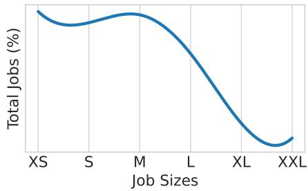  
Figure 5. ML jobs distribution by number of accelerators.

## 3 CATWILD DESIGN

This section describes the design of CATWILD. We start with a high-level description of the goals that motivate the system design, followed by an overview of CATWILD and descriptions of its core components.

## 3.1 Goals and Overview

CATWILD aims to achieve the following properties:

• Transparency and Minimal Overhead: CATWILD should apply optimizations transparently without changing existing workflows, or causing undue overhead for user jobs.

• Safety and Reproducible Results: CATWILD’s recommendations should not degrade jobs’ quality metrics, and users should be able to reproduce performance results.

• Scalable and Resource-efficient: The system should scale to Google’s fleet, tuning thousands of graphs/ops daily, and using accelerator resources efficiently.

At a high-level, CATWILD is composed of three core subsystems (Figure 6). Fleet Profiling gathers computation graphs and performance data from the fleet. A ranking process prioritizes and feeds these into the Autotuner, which searches for optimal settings. Finally, Fleet Delivery injects the tuner outputs back into the fleet and ensures ongoing system health and performance. We describe in more detail each of these components below.

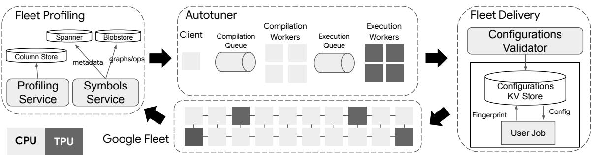  
Figure 6. CATWILD system overview.

## 3.2 Fleet Profiling

The XProf profiler (Hundt et al., 2026) is a profiling toolkit for in-depth analysis of TPU activities. It records operation times and metadata that can be used to reconstruct execution timelines. XProf provides visibility into most parts of the device and host via collection of device counters and job metadata, and automated analysis to identify performance bottlenecks. The Profiling Service employs a lightweight version of XProf to continuously monitor TPU jobs running across the fleet, capturing data such as the aggregate runtime of the graphs. The collection mechanism is designed to have minimal impact on job performance. To achieve this, the service first identifies running jobs based on accelerator types, and then dispatches hourly requests to profiling endpoints associated with them. These endpoints return an aggregated trace along with job-specific metadata, including detailed graph and ops information. The collected data is stored in an immutable, column-oriented format, optimized for compact storage, and swift decompression.

In addition to the profiling data, autotuning requires the collection of the computation graphs. To this end, we instrumented the compiler to upload both the unoptimized and optimized graphs to a Symbols Service during the compilation process. Both graphs are necessary because different tuning stages operate on different representations. Graph-level tuning, for instance, typically starts from the unoptimized graph and explores broad structural changes. In contrast, optimizations like tile size selection occur late in the compilation pipeline and thus require the optimized graph (ops information is extracted from these). The graph data can be large, and is stored in an internal Blobstore, while its metadata is stored in Spanner. Daily exports of this data are generated for analytical purposes. A dedicated analysis pipeline joins the symbol data with the profiling information collected by the Profiling Service. This makes it possible to identify which graphs and ops consume most resources across the fleet, allowing autotuning efforts to be prioritized.

## 3.3 Autotuner

The most important graphs/ops, identified via Fleet Profiling, are then passed to the Autotuner. Our Autotuner extends XTAT (Phothilimthana et al., 2021) and has been redesigned to scalably explore the large search space of potential configurations for these top constructs, aiming to find the settings that minimize execution times. The details of the search algorithms themselves are best covered in the dedicated XTAT paper (with comparisons to multiple baselines). While the system supports various optimization tasks within the XLA compiler, this work specifically evaluates its effectiveness on two crucial optimizations: compiler flag tuning and tile-size selection. Flag tuning involves searching for the optimal set of compiler flags. These flags influence critical decisions during the XLA optimization passes, such as operator fusion strategies, memory space assignment, and tensor layouts. Tile-size tuning, on the other hand, is an op-level optimization that picks the most efficient tile sizes for an op/kernel’s input and output tensors, ensuring they fit optimally into the fast scratchpad memory for improved data locality and reduced memory latency (Kaufman et al., 2021).

To find the relative speedups of the candidate configurations, the Autotuner compiles and executes each graph/op once for each candidate and once using the compiler’s default settings. The system follows a client-server model. The servers comprise two worker pools: 1) a CPU-only pool handles the compilation tasks, and 2) a TPU-based pool executes the compiled graphs/ops on TPU hardware. The client issues tasks to the workers via queues, and explores the search space by iterating through configurations until a termination criterion is satisfied, or a time budget is exhausted. Separating CPU-bound compilation from TPU-bound execution prevents costly TPUs from idling during lengthy compilations, maximizing the time they spend doing useful work. We have observed this improves the TPU duty cycle1 by a factor of 2-5. Compared to an architecture where compilation and execution share the same machine, this separation further reduces costs, as significantly fewer TPUs need to be provisioned. Given the exploratory nature of autotuning, failures are anticipated. Candidate configurations may fail to compile (sometimes crashing the compiler), and compiled binaries can encounter runtime errors. The system incorporates fault-tolerance mechanisms such as sandboxing. Each tuning task executes in an isolated subprocess, preventing task-level failures from propagating to the parent worker and mitigating crash loops caused by problematic inputs. We use an internal version of Google Cloud Pub/Sub (Pub/Sub Authors, 2025) for task distribution, leveraging its inherent features like load balancing, message persistence, and automatic retries. From the user’s perspective, the system guarantees exactly-once semantics, and results, whether success or failure, are persisted atomically, ensuring data consistency.

To handle the scale of tuning thousands of TPU jobs every day while keeping pace with the latest compiler versions, we designed and implemented a resource-efficient single-chip performance predictor. This tool estimates the runtime of workloads ranging from XS to XXL scales by executing them on a single TPU, regardless of their intended deployment scale. This approach satisfies two critical requirements: it ensures resource efficiency for high-volume tuning, and maintains accuracy by exercising the actual compiler and hardware rather than relying on simpler analytical methods like FLOPs-based roofline analysis.

The predictor achieves this by surgically rewriting input models at a low-level IR—as close to machine code as possible—to replace communication operations with no-op “stubs”. This low-level approach is crucial to retain the majority of the compiler’s optimizations, such as HLO scheduling, which might be lost at higher levels of abstraction. Once rewritten, the model is executed on a single device to collect a profile trace, regardless of the target workload’s scale. To complete the projection, communication times are “backfilled” using predictions from ML models trained using various machine learning methods (Guillame-Bert et al., 2023; Tibshirani, 1996; Hoerl & Kennard, 2000). Training data for ML is sourced from micro-benchmarks run on fullscale accelerators during low-demand hours and augmented with profiles from the Fleet Profiling infrastructure (§3.2). The resulting synthesized profile provides a comprehensive runtime projection, as illustrated in Figure 7.

The predictor is validated by comparing its predictions against actual runtimes obtained from executing the workloads on full-scale multi-chip topologies. We continuously evaluate the predictor on a diverse set of new and existing models, we include results in §4. For the simulator to offer a reliable optimization guidance, its error should be bounded between the run-to-run variation of TPU programs and the magnitude of improvements from configuration changes. Empirically, we have found that ∼5% error margin works reasonably well and allows the autotuner to effectively find better configurations by ranking them correctly.

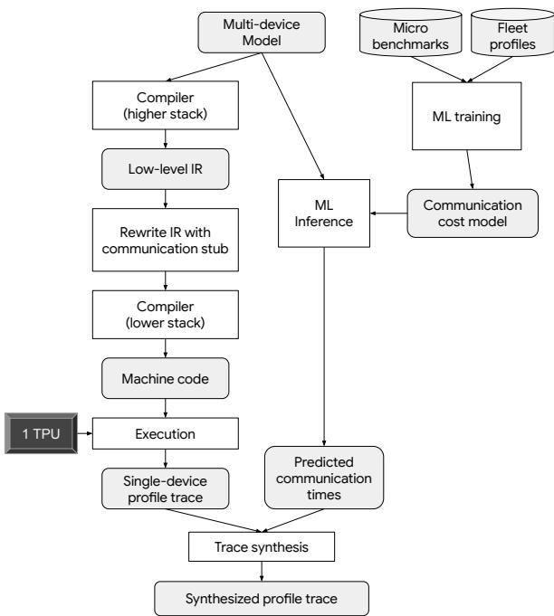  
Figure 7. Single-chip performance predictor

## 3.4 Fleet Delivery

Autotuner outputs are aggregated and transformed with MapReduce-style jobs into a compact representation, which is stored in a dedicated Configurations Key-Value Store. In this store, hash-based fingerprints of the graphs/ops serve as keys, and the values are the corresponding tuned configurations that yielded the highest speedup. To ensure reproducibility, the content of this store is checked into Google’s version control system and statically embedded within user binaries. This guarantees consistent behavior for any given source version. During compilation, XLA queries the Configurations Key-Value Store using the graph/op fingerprint. If a matching tuned configuration is found, the compiler uses it, aiming to generate a faster executable. When that happens, metadata is added to the graph to identify the specific configuration applied and to indicate the relative speedup measured during tuning. The Profiling Service will eventually take another profile of the user job and record that metadata, which we use to compute adoption rates and quantify the performance savings across the fleet.

A set of safety mechanisms guard against performance and numeric regressions introduced by compiler changes (§2.2.4). A key component is the Configurations Validator, an eventually-consistent background process that scans the Configurations Key-Value Store. The validator reuses the compilation and execution infrastructure used for tuning to check each tuned configuration, comparing its performance and numeric output against the latest compiler version. The main goal is to ensure that the tuned versions still offer a speedup and do not introduce significant numerical discrepancies (more on this in §5.2). If any regression or numeric issue is detected, the problematic configuration is invalidated and removed from the store. Additionally, timeouts are enforced on configurations, to ensure that the store does not retain stale entries indefinitely. Furthermore, to handle potential incompatibilities arising from compiler updates, we integrated a fallback mechanism directly into the compiler. When a graph compilation fails using a tuned configuration, the compiler tries again using the default settings. This retry is transparent to the end users, with the only side-effect being an increase in compilation time. The error is silently logged, signaling the Configurations Validator to later invalidate the faulty tuned configuration, thus maintaining system robustness in spite of changes.

We want to avoid re-tuning graphs/ops for which valid configurations already exist in the Configurations Key-Value Store. Since fingerprints were designed to capture both the graph/op structure and the specific compilation environment (like TPU version, topology, compilation flags) to ensure reproducible compilation, compiler changes can lead to cache misses despite a valid tuned configuration being available. To address this, the Configurations Validator includes a mechanism to update the fingerprints within the store when compiler changes would otherwise make the configurations obsolete. When such an update occurs, the configuration’s timeout is also updated to reflect its continued validity, though an overall timeout is still enforced to prevent indefinite retention.

## 4 EVALUATION

In this section, we evaluate CATWILD’s effectiveness with respect to a number of metrics.

## 4.1 Fleet Profiling

## 4.1.1 Coverage

Figure 8(a) shows that the Profiling Service can successfully collect profiles of approximately 90% of the fleet’s accelerators; for 10% of jobs, profiling failed or was turned off intentionally. The graph shows a drop in opt-outs (roughly 1pp by day 50), a result of a targeted initiative to improve coverage. The Symbols Service has ∼90% and ∼99% coverage on profiled graphs and ops respectively, as shown in Figure 8(b).

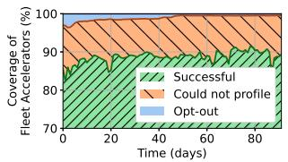  
((a)) Profiling Service

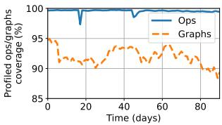  
((b)) Symbols Service  
Figure 8. Fleet Profiling Services coverage.

## 4.1.2 Ingestion and Usage

Each day, the Profiling Service ingests tens of terabytes, while hundreds of gigabytes are uploaded to the Symbols Service. These services support other efforts that measure and improve fleet efficiency, with hundreds of internal users performing millions of queries per year on certain tables.

## 4.2 Autotuner

## 4.2.1 Coverage

Our system tunes the configurations for workloads that represent ∼70% of the daily TPU training chip-time in the fleet. Approximately 10% of the training fleet’s chip-time is composed of a long tail of short-lived or low-resource jobs where the potential gains from autotuning do not outweigh the benefits. The remaining 20% of training workloads not covered by our daily tuning process have opted-out. The primary reason for opt-outs is concern over numerical stability; for the most critical of these, we sometimes employ custom autotuning workflows as described in §5.2. We also observe unintended opt-outs (copy/paste configs). While our workload selection aims to be unbiased, we do pragmatically exclude workloads that heavily rely on features not yet well-supported by our autotuner or performance predictor.

It is important to distinguish between workloads selected for tuning and those actually running with CATWILD’s generated configurations. While we generate tuned candidates for workloads representing ∼70% of the fleet’s training chiptime, the actual adoption rate of these configurations varies. Figure 10(a) provides absolute numbers on the usage of CATWILD-generated configurations at both the graph and op levels, offering insight into the realized impact.

## 4.2.2 Relative Speedups

Figure 9 illustrates the average relative speedups from tuned configurations over compiler defaults across different accelerators during a 60-day period for two types of optimization: graph-level flag tuning and op-level tile size selection. We allocate 12 hours for tuning thousands of graphs and tens of thousands of ops each day. Speedups from graph-level flag tuning (Figure 9(a)) are estimated via the performance predictor, as these optimizations affect the full graph, which includes communication operations that the single-chip predictor simulates. Conversely, op-level tile tuning speedups (Figure 9(b)) are directly measured because tile tuning targets individual compute ops whose performance can be accurately assessed on a single chip. ACC-I and ACC-J show lower average speedups in Figure 9(a) mainly due to compiler cost models that better adapt to those platform characteristics, which leaves less headroom for improvement. Although op-level tuning can yield larger absolute speedup numbers than graph-level flag tuning, its impact is proportional to the ops’ significance within the graph (more on this in §4.3.1).

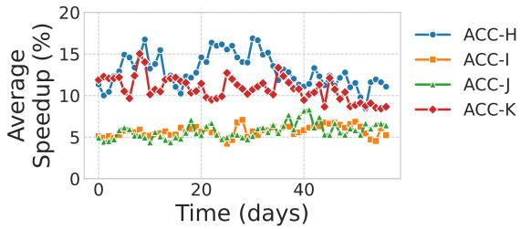

((a)) Graph-level flag tuning  
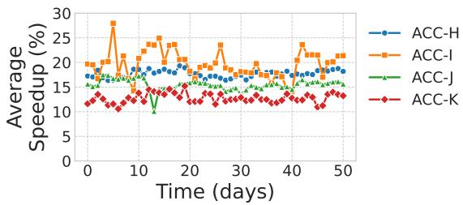  
((b)) Op-level tile tuning  
Figure 9. Tuned configurations average speedups over compiler defaults.

## 4.2.3 Predictor Error

Table 1 reports our simulator’s prediction error (lower is better) on a few tens of representative models on each of four different accelerators. Prediction error is measured between the predicted and ground-truth wall-clock runtime. The ground truth is measured by running the tested models on full-scale TPU deployments. This is performed periodically for scientific validation, but daily execution is prohibitively expensive. The tested models are of size S – XXL, with a majority in L – XXL categories. Despite a few outliers, the simulator estimates are compelling, especially considering that multi-chip graphs are simulated with just a single chip. We describe some of the primary sources of inaccuracies in §5.3.

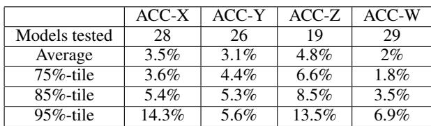  
Table 1. Single-chip performance predictor’s error for a few tens of representative models on each of four accelerators.

## 4.3 Fleet Delivery

## 4.3.1 Configurations Hits and Savings

Figure 10 shows the number of tuned configurations used in the fleet and their contribution to savings over a 3-month period. We use Fleet Profiling information to determine the execution time and the number of chips used for each graph/op using our tuned configurations. We then apply the tuning speedups to compute the number of chips saved (used chips × [speedup - 1]). To favor correctness, the graph fingerprint incorporates fine-grained details of the execution environment, such as TPU topology and version, in addition to the graph structure. This ensures that we don’t match graphs executing in different settings, which could invalidate the tuned parameters. This inherent specificity hinders reusability (Figure 10(a)), yet still yields substantial benefits. Figure 10(b) shows 80% of the total chip savings coming from graph-level flag tuning. Conversely, ops/kernels tuned (tile) configurations exhibit high reuse across graphs, so they have more hits, though the profit from tuning them is lower (∼20%).

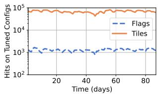  
((a)) Configs used.

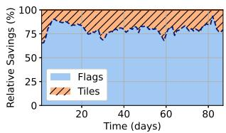  
((b)) Tuning savings.  
Figure 10. Number of tuned configurations used and their relative impact in the total savings.

Figure 11 shows how the Configurations Validator increases the adoption (hit rate) of graph-level flag tuning configurations over a 90-day sample period. 20% to 60% of daily configuration hits are on configurations updated by the validator, which shows the dynamic nature of the system and the need to adapt to ongoing compiler (and other) changes. For instance, the big step observed around day 55 is likely attributable to one of those changes.

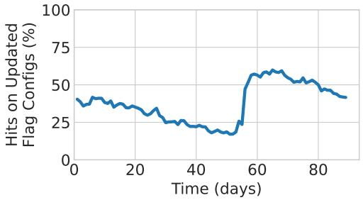  
Figure 11. Percentage of updated configurations usage (hits) with respect to the total number of flag configurations used.

## 5 EXPERIENCES AND LESSONS LEARNED

In this section, we highlight some of the key experiences we gleaned from building, improving, and operating CATWILD during the past 5 years.

## 5.1 Embedded versus Remote Configurations

The ability to reproduce performance results at any given version is crucial for production workloads. We achieved this by embedding the tuned configurations within user binaries, so that their versions remained linked. However, this approach requires that users update their binaries to pick up new configurations, leading to a latency of 1-3 weeks or even longer from ingestion to deployment, depending on when the users sync. To overcome this, we introduced remote configurations that jobs may fetch at runtime, which reduced the ingestion to deployment latency to 2-3 days. Remote configurations are stored in the Colossus file system (Ghemawat et al., 2003); we use Effingo (Papay et al. ´ , 2024) for replication, and Spanner for metadata storage. We also introduced a compilation cache system that allows a long-running job to pick up a tuned configuration generated after the job has started running. At model checkpoints, this mechanism would check whether new configurations were available for the job and, if so, trigger recompilation. To hide the time needed for recompilation, the job would continue without waiting, and start to run the newly recompiled code at some later checkpoint.

Although remote configurations helped us increase the impact in the fleet (contributing ∼36% of savings vs. ∼64% from embedded in 2025), in hindsight, there were a few shortcomings. This approach introduced non-hermetic compilation, which conflicted with our original premise of guaranteeing reproducibility. Users started to opt-out and trust eroded. Furthermore, in large-scale jobs with many accelerators, the probability of encountering a (hardware) failure increases with the number of devices. Triggering recompilation at runtime just added extra complexity and made issues harder to debug and isolate. Although recompilation was added out-of-the-box for Tensorflow, other frameworks required user code changes, which also negatively impacted adoption.

## 5.2 Numerical Risks

Given the nature of floating point arithmetic, “small” numeric changes introduced by autotuned configurations are expected mainly due to precision and rounding. For example, matrix multiplication involves many additions of products, and the tiling configuration can change the grouping and ordering of these operations, leading to slightly different results. For most models, these small differences are unlikely to impact the final trained model accuracy or inference results. However, they can be significant in models that are numerically unstable or highly sensitive, and users may even be unaware of the dangers. To increase confidence that the performance optimizations do not compromise model quality, we added numeric checks in our tuners by comparing the output tensors generated by the default compiler configuration against those from a candidate tuned configuration. These checks verify that any differences in tensor values fall within acceptable error bounds.

While our checks have helped catch significant regressions, especially on tile size tuning of individual ops, they cannot provide complete guarantees. The impact of numerical errors from tuning can be amplified significantly in the context of the entire graph. What appears as a minor issue in isolation (e.g., a single tile change in a fused op causing 2% accuracy loss) can contribute to a much larger problem when combined, as seen when four such changes together resulted in a 20% accuracy loss, far more than the sum of their individual effects. Also, some numerical issues can be highly input-dependent, often requiring specific tensor values to manifest (values which are not available during tuning). Consequently, some issues on model quality can only be caught by higher-level model validation and quality tests. When numerical issues are found during training runs, we thoroughly analyze and invalidate the tuned configurations, and provide fixes, if possible. Users typically restore a previous valid checkpoint and continue from there. Recognizing the criticality of certain models (e.g., serving instances) as well as the inherent limitations of our numeric verification process, we implemented a customized tuning workflow. The process utilizes our standard autotuning tools, but involves the model owners, who validate the proposed configurations through rigorous, domain-specific quality tests. The autotuned configurations are submitted to the codebase only after passing these tests and with the owners’ approval.

## 5.3 Inaccuracies in Estimations

It has been a key priority for our team to improve our performance predictor’s accuracy, especially after introducing graph-level optimizations, as this requires us to effectively model the graphs’ communication operations. Despite significant improvements throughout the years, this endeavor has proven to be quite challenging due to many fundamental issues. For example, rewriting the graph at a low-level intermediate representation (IR) to “stub” communications results in TPU executables that differ from the ones in real jobs, potentially affecting bundling and scheduling on the TPU’s VLIW architecture (Jouppi et al., 2021) and thus impacting prediction accuracy. Furthermore, omitting communication operations means the cross-device interconnect chiplets remain idle, hiding their real-world voltage and thermal impact. Compounding these issues, for a number of system and data policy reasons, the predictor uses dummy input data instead of real tensor values. This prevents accurate performance measurement of value-dependent operations, such as the XLA SelectAndScatter op2 and emerging Pallas TPU kernels3, limiting the predictor’s reliability. To address some of these issues, we have prioritized validating speedups in real topologies when feasible (especially for custom autotuning efforts), and tightening the full-stack integration. This integration includes passing extra metadata from the frameworks layer down to the compiler for more accurate modeling. Despite the fact that using a predictor shifts some effort to maintaining and improving its accuracy, we believe this has still been highly beneficial: an ML-based communication cost model, once trained, can predict performance across many workloads, minimizing the need for manual, model-specific tuning, and the reduced hardware requirement for tuning is key to enabling autotuning for large models where exhaustive real-hardware testing is prohibitively expensive.

## 5.4 Coarse versus Fine-grained Decisions

Deploying autotuning at datacenter scale also revealed that tuning high-level heuristics (e.g., selecting the compiler’s fusion cost model, altering the layout pass order, adjusting scratchpad memory sizes) is generally more effective than making fine-grained decisions for individual operations, such as optimizing fusion or layout for each node in the graph. This coarse-grained strategy consistently delivered better outcomes and significantly reduced system complexity. Exposing these critical high-level decisions via compiler flags enabled building a single, graph-level flag tuner. This “meta-tuner” could manage multiple optimizations simultaneously, significantly lowering maintenance overhead and the barrier to entry. Instead of having to handcraft complex, optimization-specific search spaces, we could simply expose important tunable parameters as flags, which also helped streamline the research to production efforts and made the configurations more compact to store in the configuration database. However, there are still some challenges on interpretability of tuning results, which we discuss next.

## 5.5 Analysis of Tuning Results

Tuning graphs at fleet scale offers a rich wealth of experimental data on how various compilation parameters affect the execution time of top ML computation graphs. There is tremendous opportunity to use this data to improve compiler defaults and heuristics, reduce tuning complexity, and optimize the tuning algorithms. However, tuning even a small number of compiler flags can introduce subtle and difficult-to-parse changes in the graph. Understanding why a particular tuned configuration is superior can be difficult, even for compiler experts, making it hard to distill a generalizable heuristic. To seize this opportunity, we built a cluster of tools to interpret and understand the performance impact of our configurations. This infrastructure allows us to rank flags by their contributions to speedups, compute correlations between flags, and produce speedup distributions associated with different flag values.

The process begins by training a variety of simple models (e.g. random forests, ridge regressions) on our tuning data. Each model inputs the compiler flag configurations, encoded as vectors, and outputs their expected relative speedups. The qualitative and quantitative characteristics of the resulting models can then be studied in order to glean insights about how the model features (i.e., the compiler flags we tune) affect performance. We compute a selection of feature importance measurements using techniques from the ML interpretability literature, including permutation importance, Gini importance, and most saliently, Shapley values (Lipovetsky & Conklin, 2001). The scores are then aggregated together to assess the overall importance of each flag.

We have used our tooling to remove compiler flags with low optimization headroom, allowing us to reduce the tuning search space by a factor of up to 80000× on certain hardware platforms. Moreover, we have enabled custom autotuning users get the same benefit from tuning fewer flags, which reduces the surface for potential issues, helping to buffer against the numerical risk identified in §5.2. Conversely, our methodology has also proven useful in evaluating promising new flags to tune, and identifying flag configurations which perform well on a wide variety of graphs. We have used our findings to identify compiler heuristics which can be broadly improved. We discuss this in more depth next.

## 5.6 Materialization in the Compiler

The primary objective of our work has been to enhance the efficiency of TPU workloads across the Google fleet. We identified compiler autotuning as a significant opportunity to achieve this, leading to the development and fleetwide deployment of CATWILD. We also provide customized autotuning solutions, working closely with model owners to ensure quality and correctness. With this goal in mind, we also started using insights from autotuning to improve the compiler’s default heuristics, especially when tuners uncovered configurations yielding substantial speedups (e.g., 2×). However, translating these wins into general compiler improvements is challenging. Optimization spaces are complex, and changes often involve many trade-offs. For example, a heuristic modification that accelerates one type of workload or hardware platform might inadvertently cause regressions on others. Implementing, testing, and validating potential changes to the compiler’s core logic requires considerable engineering effort and carries the risk of unintended consequences. Despite these difficulties, feeding autotuner discoveries back into the compiler has proven to be important for improving the out-of-the-box performance for all users and boosting overall fleet efficiency. In some cases, the tuning findings applied to many model architectures and TPU platforms. In other cases, incorporating such findings required adding special-cased logic within the compiler. Irrespective of the complexity, this feedback loop has allowed the compiler to evolve and adapt, reducing the longterm reliance on per-workload autotuning and ultimately raising the performance baseline for everyone.

## 6 DISCUSSION

We now turn to a discussion of the broader impact and applicability of this work. Specifically, we analyze the practical value proposition, considering the return on investment of our implementation in Google data centers. Furthermore, we examine the generalizability of our findings, exploring the extent to which this approach can be applied beyond the specific conditions presented in this work.

## 6.1 Return on Investment (ROI)

We have carefully analyzed the ROI for CATWILD, considering both operational and engineering costs against the resources saved.

• Low Profiling Overhead: The continuous Fleet Profiling mechanism is designed to be extremely lightweight, imposing less than 0.1% overhead on TPU training step times. This ensures minimal impact on production workloads while providing essential data for tuning.

• Compelling Savings-to-Cost Ratio: Our estimates, based on 2025 costs, indicate a savings-to-cost ratio for tuning operations ranging from 8:1 to 30:1. The lower end (8:1) reflects the inclusion of all historical tuner versions running in production, some of which were less efficient. The higher end (30:1) represents the efficiency of our latest disaggregated tuner. As we deprecate older versions, we are confident that the realized ROI will trend towards the higher end.

• Efficient Engineering Investment: While we cannot disclose exact staffing numbers, the development and maintenance of CATWILD have been notably efficient. The team consists of a handful of full time engineers, supplemented by several engineers contributing on a 20% basis.

• Shared Infrastructure Leverage: The underlying Fleet Profiling infrastructure is not dedicated solely to CATWILD. These are modular, general-purpose components reused across various other performance analysis and optimization efforts within Google. This sharing means the development and maintenance costs for this infrastructure are amortized, improving the effective ROI for the autotuning use case.

We believe the computational and engineering overhead of CATWILD is overwhelmingly justified for large-scale deployments due to the substantial TPU savings and efficiency gains observed across the Google fleet. The current ROI at this scale is already compelling, with further benefits anticipated from ongoing optimizations. However, the initial investment and operational complexity may render CATWILD-like systems less practical for smaller organizations or individual cloud customers with limited TPU footprints, as the overhead could outweigh the achievable savings at their scale. It is important to note that for cloud providers themselves, implementing such a system internally can drive significant infrastructure efficiencies, potentially allowing cost benefits to be shared with their customers.

## 6.2 Generalizability

The end-to-end system we described in this work is tightly integrated with Google’s internal infrastructure. However, we believe the underlying principles and design choices presented herein offer valuable insights for anyone building similar feedback-directed optimization systems outside Google.

• Continuous Loop: The most crucial lesson is the power of a continuous feedback loop: production profiling → offline analysis/optimization → safe deployment → monitoring. This is applicable beyond compilers.

• Decoupling Tuning from Production: Performing expensive tuning operations offline is key to not disrupting live jobs.

• Performance Evaluators: Using cost-effective predictors (like our single-chip predictor) to explore large search spaces is a transferable technique. The challenge is developing and validating predictors accurate enough for the domain.

• Safe Deployment: Mechanisms for validation, versioning, and fast rollbacks are essential in production environments. Explicitly designing for changes in workloads, binaries, and configurations is necessary.

• Adaptability to other accelerators: While the current implementation targets XLA:TPU, the architectural components are conceptually adaptable. For a GPU environment, one would need: 1) XProf for GPUs (or any other equivalent profiling tools), 2) an interface to the GPU compiler’s tuning knobs (e.g., tile sizes in CUDA, Triton, etc.), 3) a performance predictor for GPU execution. This might differ in nature from our TPU predictor due to architectural differences but serves the same role, and 4) a similar deployment mechanism.

We believe the main value for the community is the blueprint CATWILD provides for a production-scale FDO system, which is a non-trivial engineering endeavor. This blueprint offers significant insights into the components, interfaces, and data flows required to build, deploy, and maintain an effective and automated FDO pipeline in a large, dynamic production environment.

## 7 RELATED WORK

We discuss work relevant to CATWILD in the areas of feedback-directed optimization, compiler autotuning, and performance prediction models.

Feedback-Directed Optimization: FDO has been a cornerstone of performance engineering (Chen et al., 2010; 2013; Zhou et al., 2013; Shen et al., 2023; Zhang et al., 1997; Wang et al., 2000). AutoFDO (Chen et al., 2016) improves Google’s C++ fleet performance using hardware performance counters sampled from production jobs (Ren et al., 2010; Anderson et al., 1997). CATWILD generalizes this concept to encompass any information collected after workload execution, including runtime characteristics and compiler autotuning configurations, broadening optimization opportunities for fleetwide ML workloads.

Compiler Autotuning: Autotuning is a proven technique for generating highly-efficient code in various domains (Ansel et al., 2014; Whaley & Dongarra, 1998; Phothilimthana et al., 2013a; Frigo & Johnson, 1998; Ansel et al., 2009a; Phothilimthana et al., 2013b; Fursin et al., 2011; Ansel et al., 2009b; Zheng et al., 2020a;b; Ahn et al., 2020; Vasilache et al., 2018; Ragan-Kelley et al., 2013b; Mullapudi et al., 2016; Jung et al., 2021; Jia et al., 2019b;a; Roesch et al., 2018; Jeong et al., 2022; Hutter et al., 2007; NVIDIA, 2017; Zheng et al., 2021b; Liu et al., 2019; Tillet et al., 2019; Ansel et al., 2024; Zheng et al., 2022b). Our work applies this technique in a production compiler at scale. Lorien (Yu et al., 2021) is a framework to tune operators and orchestrate the tuned schedules. Prior research also explores learned cost models to accelerate autotuning (Chen et al., 2018a;b; Cha et al., 2025; Adams et al., 2019; Steiner et al., 2021; Kaufman et al., 2021; Li et al., 2020; Zheng et al., 2020c; 2021a; Baghdadi et al., 2021), as well as using other constructs to eliminate the search space entirely (Zhu et al., 2022). Our autotuner builds upon XTAT (Phothilimthana et al., 2021) and extends its capabilities to operate effectively across the diverse and massive workloads present in Google’s fleet.

Performance Prediction of Large Models: Performance prediction is fundamental to autotuning. At Google, the scale and diversity of models pose unique cost and accuracy challenges. Traditional simulators like Gem5 (Lowe-Power et al., 2020) are too slow for continuous tuning. Theoretical roofline estimations used in systems like Alpa (Zheng et al., 2022a) are too coarse to guide many compiler decisions. TraceSim (Liang et al., 2024) predicts GPU performance but requires full-scale execution traces. NeuSight (Lee et al., 2025) uses ML to forecast GPU kernel execution costs. Daydream (Zhu et al., 2020) predicts runtime by simulating execution based on the dependency graph. Our performance predictor contrasts by combining single-chip execution with ML methods to predict communication costs, balancing hardware cost and accuracy.

## 8 CONCLUSIONS

Optimizing machine learning workloads within Google’s dynamic fleet presents significant challenges. Traditional compilers’ reliance on heuristics and cost models is insufficient given the rapidly evolving nature of models and the complex search space of tunable parameters, making manual optimization oftentimes intractable. Furthermore, static or one-off autotuning offers only partial relief, as configurations can quickly become stale. To address this, we designed and implemented CATWILD, a novel system for continuous and automated compiler autotuning. CATWILD adapts to the changing workload landscape by continuously identifying, evaluating, and deploying optimal XLA configurations for key TPU workloads, effectively creating a feedback-directed optimization loop at the fleet scale.

## ACKNOWLEDGEMENTS

We thank Robert Hundt, the anonymous reviewers, and our shepherd for their insightful comments on the manuscript. Our sincere gratitude also goes to the many collaborators and contributors who were instrumental in making CATWILD a reality over the years.

## REFERENCES

Abadi, M., Barham, P., Chen, J., Chen, Z., Davis, A., Dean, J., Devin, M., Ghemawat, S., Irving, G., Isard, M., et al. Tensorflow: A system for large-scale machine learning. In 12th USENIX Symposium on Operating Systems Design and Implementation (OSDI 16), pp. 265–283, 2016.

Adams, A., Ma, K., Anderson, L., Baghdadi, R., Li, T.- M., Gharbi, M., Steiner, B., Johnson, S., Fatahalian, K., Durand, F., and Ragan-Kelley, J. Learning to optimize halide with tree search and random programs. ACM Trans. Graph., 38(4), July 2019. ISSN 0730-0301. doi: 10. 1145/3306346.3322967. URL https://doi.org/ 10.1145/3306346.3322967.

Ahn, B. H., Pilligundla, P., Yazdanbakhsh, A., and Esmaeilzadeh, H. Chameleon: Adaptive code optimization for expedited deep neural network compilation. In Proceedings of the 8th International Conference on Learning Representations, 2020.

Anderson, J. M., Berc, L. M., Dean, J., Ghemawat, S., Henzinger, M. R., Leung, S.-T. A., Sites, R. L., Vandevoorde, M. T., Waldspurger, C. A., and Weihl, W. E. Continuous profiling: where have all the cycles gone? ACM Trans. Comput. Syst., 15(4):357–390, November 1997. ISSN 0734-2071. doi: 10.1145/265924.265925. URL https://doi.org/10.1145/265924.265925.

Ansel, J., Chan, C., Wong, Y. L., Olszewski, M., Zhao, Q., Edelman, A., and Amarasinghe, S. Petabricks: a language and compiler for algorithmic choice. In Proceedings of the 30th ACM SIGPLAN Conference on Programming Language Design and Implementation, PLDI ’09, pp. 38–49, New York, NY, USA, 2009a. Association for Computing Machinery. ISBN 9781605583921. doi: 10.1145/1542476.1542481. URL https://doi. org/10.1145/1542476.1542481.

Ansel, J., Chan, C., Wong, Y. L., Olszewski, M., Zhao, Q., Edelman, A., and Amarasinghe, S. Petabricks: a language and compiler for algorithmic choice. SIGPLAN Not., 44(6):38–49, June 2009b. ISSN 0362-1340. doi: 10. 1145/1543135.1542481. URL https://doi.org/ 10.1145/1543135.1542481.

Ansel, J., Kamil, S., Veeramachaneni, K., Ragan-Kelley, J., Bosboom, J., O’Reilly, U.-M., and Amarasinghe, S. Opentuner: an extensible framework for program autotuning. In Proceedings of the 23rd International Conference on Parallel Architectures and Compilation, PACT ’14, pp. 303–316, New York, NY, USA, 2014. Association for Computing Machinery. ISBN 9781450328098. doi: 10.1145/2628071.2628092. URL https://doi. org/10.1145/2628071.2628092.

Ansel, J., Yang, E., He, H., Gimelshein, N., Jain, A., Voznesensky, M., Bao, B., Bell, P., Berard, D., Burovski, E., Chauhan, G., Chourdia, A., Constable, W., Desmaison, A., DeVito, Z., Ellison, E., Feng, W., Gong, J., Gschwind, M., Hirsh, B., Huang, S., Kalambarkar, K., Kirsch, L., Lazos, M., Lezcano, M., Liang, Y., Liang, J., Lu, Y., Luk, C. K., Maher, B., Pan, Y., Puhrsch, C., Reso, M., Saroufim, M., Siraichi, M. Y., Suk, H., Zhang, S., Suo, M., Tillet, P., Zhao, X., Wang, E., Zhou, K., Zou, R., Wang, X., Mathews, A., Wen, W., Chanan, G., Wu, P., and Chintala, S. Pytorch 2: Faster machine learning through dynamic python bytecode transformation and graph compilation. In Proceedings of the 29th ACM International Conference on Architectural Support for Programming Languages and Operating Systems, Volume 2, ASPLOS ’24, pp. 929–947, New York, NY, USA, 2024. Association for Computing Machinery. ISBN 9798400703850. doi: 10.1145/3620665.3640366. URL https://doi. org/10.1145/3620665.3640366.

Baghdadi, R., Merouani, M., Leghettas, M.-H., and Abdous, K. A deep learning based cost model for automatic code optimization. In Proceedings of Machine Learning and Systems, volume 3, pp. 20–34, 2021.

Barham, P., Chowdhery, A., Dean, J., Ghemawat, S., Hand, S., Hurt, D., Isard, M., Lim, H., Pang, R., Roy, S., Saeta, B., Schuh, P., Sepassi, R., Shafey, L. E., Thekkath, C. A., and Wu, Y. Pathways: Asynchronous distributed dataflow for ml, 2022. URL https://arxiv.org/ abs/2203.12533.

Bradbury, J., Frostig, R., Hawkins, P., Johnson, M. J., Leary, C., Maclaurin, D., Necula, G., Paszke, A., VanderPlas, J., Wanderman-Milne, S., and Zhang, Q. JAX: composable transformations of Python+NumPy programs, 2018. URL http://github.com/jax-ml/jax.

Cha, J., Lee, M., Kwon, J., Lee, J., and Kwon, Y. Multilevel machine learning-guided autotuning for efficient code generation on a deep learning accelerator. In Proceedings of the 26th ACM SIGPLAN/SIGBED International Conference on Languages, Compilers, and Tools for Embedded Systems, LCTES ’25, pp. 134–145, New York, NY, USA, 2025. Association for Computing Machinery. ISBN 9798400719219. doi: 10.1145/ 3735452.3735538. URL https://doi.org/10. 1145/3735452.3735538.

Chaudhary, S., Ramjee, R., Sivathanu, M., Kwatra, N., and Viswanatha, S. Balancing efficiency and fairness in heterogeneous gpu clusters for deep learning. In Proceedings of the Fifteenth European Conference on Computer Systems, EuroSys ’20, New York, NY, USA, 2020. Association for Computing Machinery. ISBN 9781450368827.

doi: 10.1145/3342195.3387555. URL https://doi. org/10.1145/3342195.3387555.

Chen, D., Vachharajani, N., Hundt, R., Liao, S.-w., Ramasamy, V., Yuan, P., Chen, W., and Zheng, W. Taming hardware event samples for fdo compilation. In Proceedings of the 8th Annual IEEE/ACM International Symposium on Code Generation and Optimization, CGO ’10, pp. 42–52, New York, NY, USA, 2010. Association for Computing Machinery. ISBN 9781605586359. doi: 10.1145/1772954.1772963. URL https://doi. org/10.1145/1772954.1772963.

Chen, D., Vachharajani, N., Hundt, R., Li, X., Eranian, S., Chen, W., and Zheng, W. Taming hardware event samples for precise and versatile feedback directed optimizations. IEEE Transactions on Computers, 62(2):376–389, 2013. doi: 10.1109/TC.2011.233.

Chen, D., Li, D. X., and Moseley, T. Autofdo: automatic feedback-directed optimization for warehouse-scale applications. In Proceedings of the 2016 International Symposium on Code Generation and Optimization, CGO ’16, pp. 12–23, New York, NY, USA, 2016. Association for Computing Machinery. ISBN 9781450337786. doi: 10.1145/2854038.2854044. URL https://doi. org/10.1145/2854038.2854044.

Chen, T., Moreau, T., Jiang, Z., Zheng, L., Yan, E., Cowan, M., Shen, H., Wang, L., Hu, Y., Ceze, L., Guestrin, C., and Krishnamurthy, A. Tvm: an automated end-to-end optimizing compiler for deep learning. In Proceedings of the 13th USENIX Conference on Operating Systems Design and Implementation, OSDI’18, pp. 579–594, USA, 2018a. USENIX Association. ISBN 9781931971478.

Chen, T., Zheng, L., Yan, E., Jiang, Z., Moreau, T., Ceze, L., Guestrin, C., and Krishnamurthy, A. Learning to optimize tensor programs. In Neural Information Processing Systems, 2018b. URL https://api. semanticscholar.org/CorpusID:21676646.

Corbett, J. C., Dean, J., Epstein, M., Fikes, A., Frost, C., Furman, J. J., Ghemawat, S., Gubarev, A., Heiser, C., Hochschild, P., Hsieh, W., Kanthak, S., Kogan, E., Li, H., Lloyd, A., Melnik, S., Mwaura, D., Nagle, D., Quinlan, S., Rao, R., Rolig, L., Saito, Y., Szymaniak, M., Taylor, C., Wang, R., and Woodford, D. Spanner: Google’s globally distributed database. ACM Trans. Comput. Syst., 31(3), August 2013. ISSN 0734-2071. doi: 10.1145/2491245. URL https://doi.org/10. 1145/2491245.

Darte, A. On the complexity of loop fusion. Parallel Comput., 26(9):1175–1193, July 2000. ISSN 0167-8191. doi: 10.1016/S0167-8191(00)00034-X. URL https:

//doi.org/10.1016/S0167-8191(00) 00034-X.

Feng, S., Hou, B., Jin, H., Lin, W., Shao, J., Lai, R., Ye, Z., Zheng, L., Yu, C. H., Yu, Y., and Chen, T. Tensorir: An abstraction for automatic tensorized program optimization. In Proceedings of the 28th ACM International Conference on Architectural Support for Programming Languages and Operating Systems (ASPLOS), pp. 804– 817, 2023.

Frigo, M. and Johnson, S. G. FFTW: An adaptive software architecture for the FFT. Proceedings of the IEEE, 86(1): 1381–1384, 1998.

Fursin, G., Dubach, C., Piccolboni, F., Temam, O., Skrbek, ˇ M. Z., Kashnikov, P. K. J. K., Kuzmin, E., Luk, C. K., Zudov, E. V., Grebennikov, A. N., Konon, A. A., and Fomin, N. N. Milepost gcc: Machine learning enabled self-tuning compiler. International Journal of Parallel Programming, 39:298–327, 2011.

Ghemawat, S., Gobioff, H., and Leung, S.-T. The google file system. ACM SIGOPS Operating Systems Review, 37 (5):29–43, 2003.

Guillame-Bert, M., Bruch, S., Stotz, R., and Pfeifer, J. Yggdrasil decision forests: A fast and extensible decision forests library. In Proceedings of the 29th ACM SIGKDD Conference on Knowledge Discovery and Data Mining, KDD ’23, pp. 4068–4077. ACM, August 2023. doi: 10.1145/3580305.3599933. URL http://dx.doi. org/10.1145/3580305.3599933.

Hoerl, A. E. and Kennard, R. W. Ridge regression: biased estimation for nonorthogonal problems. Technometrics, 42(1):80–86, February 2000. ISSN 0040-1706. doi: 10.2307/1271436. URL https://doi.org/10. 2307/1271436.

Hundt, R., Kumar, N., Paredes, J. B., Goodson, S., Verghese, C., Rengasamy, P., Le, K., Zhang, J., Alaras, C., Zhang, Y., Cai, K., Thakkar, J., Bandiatmakuri, S. G., SY, Y., Udipi, A. N., and Aggarwal, V. XProf: An open, scalable, and extensible profiling system for the modern ML stack. In To Appear in the Ninth Conference on Machine Learning and Systems (MLSys 2026), 2026. URL https: //openreview.net/forum?id=KqRLAdGK6C.

Hutter, F., Babic, D., Hoos, H. H., and Hu, A. J. Boosting verification by automatic tuning of decision procedures. In Formal Methods in Computer Aided Design (FMCAD’07), pp. 27–34, 2007. doi: 10.1109/FAMCAD. 2007.9.

Jeon, M., Venkataraman, S., Phanishayee, A., Qian, J., Xiao, W., and Yang, F. Analysis of Large-Scale

Multi-Tenant GPU clusters for DNN training workloads. In 2019 USENIX Annual Technical Conference (USENIX ATC 19), pp. 947–960, Renton, WA, July 2019. USENIX Association. ISBN 978-1-939133-03-8. URL https://www.usenix.org/conference/ atc19/presentation/jeon.

Jeong, E., Kim, J., and Ha, S. Tensorrt-based framework and optimization methodology for deep learning inference on jetson boards. ACM Trans. Embed. Comput. Syst., 21(5), October 2022. ISSN 1539-9087. doi: 10.1145/3508391. URL https://doi.org/10.1145/3508391.

Jia, Z., Padon, O., Thomas, J., Warszawski, T., Zaharia, M., and Aiken, A. Taso: optimizing deep learning computation with automatic generation of graph substitutions. In Proceedings of the 27th ACM Symposium on Operating Systems Principles, SOSP ’19, pp. 47–62, New York, NY, USA, 2019a. Association for Computing Machinery. ISBN 9781450368735. doi: 10. 1145/3341301.3359630. URL https://doi.org/ 10.1145/3341301.3359630.

Jia, Z., Wang, M., Zhang, W., Yu, X., Li, H., Zheng, Z., and Zhang, M. Optimizing dnn computation with relaxed graph substitutions. In Proceedings of Machine Learning and Systems, pp. 15–27, 2019b.

Jouppi, N. P., Yoon, D. H., Ashcraft, M., Gottscho, M., Jablin, T. B., Kurian, G., Laudon, J., Li, S., Ma, P., Ma, X., Norrie, T., Patil, N., Prasad, S., Young, C., Zhou, Z., and Patterson, D. Ten lessons from three generations shaped google’s tpuv4i. In Proceedings of the 48th Annual International Symposium on Computer Architecture, ISCA ’21, pp. 1–14. IEEE Press, 2021. ISBN 9781450390866. doi: 10.1109/ISCA52012.2021.00010. URL https:// doi.org/10.1109/ISCA52012.2021.00010.

Jung, W., Dao, T. T., and Lee, J. Deepcuts: a deep learning optimization framework for versatile gpu workloads. In Proceedings of the 42nd ACM SIGPLAN International Conference on Programming Language Design and Implementation, PLDI 2021, pp. 190–205, New York, NY, USA, 2021. Association for Computing Machinery. ISBN 9781450383912. doi: 10.1145/ 3453483.3454038. URL https://doi.org/10. 1145/3453483.3454038.

Kaufman, S., Phothilimthana, P., Zhou, Y., Mendis, C., Roy, S., Sabne, A., and Burrows, M. A learned performance model for tensor processing units. In Smola, A., Dimakis, A., and Stoica, I. (eds.), Proceedings of Machine Learning and Systems, volume 3, pp. 387–400, 2021. URL https://proceedings.mlsys. org/paper\_files/paper/2021/file/ 6bcfac823d40046dca25ef6d6d59cc3f-Paper. pdf.

Lee, S., Phanishayee, A., and Mahajan, D. Forecasting gpu performance for deep learning training and inference. In Proceedings of the 30th ACM International Conference on Architectural Support for Programming Languages and Operating Systems, Volume 1, ASPLOS ’25, pp. 493–508. ACM, March 2025. doi: 10.1145/ 3669940.3707265. URL http://dx.doi.org/10. 1145/3669940.3707265.

Li, M., Wei, J. C., Wang, M., Zheng, B., Wang, Y., Huang, J., and Li, J. E. B. Adatune: Adaptive tensor program compilation made efficient. In Advances in Neural Information Processing Systems, 2020.

Liang, M., Kassa, H. T., Fu, W., Coutinho, B., Feng, L., and Delimitrou, C. Fine-grained trace-driven performance modeling and simulation for large-scale ML training. In Machine Learning for Computer Architecture and Systems 2024, 2024. URL https://openreview. net/forum?id=nWPq6s35Rr.

Lipovetsky, S. and Conklin, M. Analysis of regression in game theory approach. Applied Stochastic Models in Business and Industry, 17(4):319–330, October 2001. doi: 10.1002/asmb.446. URL https://ideas.repec.org/a/wly/apsmbi/ v17y2001i4p319-330.html.

Liu, Y., Xu, Y., Huang, M., and Wang, J. Optimizing cnn model inference on cpus. In 2019 USENIX Annual Technical Conference (USENIX ATC 19), pp. 599–612, 2019.

Lowe-Power, J., Ahmad, A. M., Akram, A., Alian, M., Amslinger, R., Andreozzi, M., Armejach, A., Asmussen, N., Bharadwaj, S., Black, G., Bloom, G., Bruce, B. R., Carvalho, D. R., Castrillon, J., Chen, L., Derumigny, N., ´ Diestelhorst, S., Elsasser, W., Fariborz, M., Farahani, A. F., Fotouhi, P., Gambord, R., Gandhi, J., Gope, D., Grass, T., Hanindhito, B., Hansson, A., Haria, S., Harris, A., Hayes, T., Herrera, A., Horsnell, M., Jafri, S. A. R., Jagtap, R., Jang, H., Jeyapaul, R., Jones, T. M., Jung, M., Kannoth, S., Khaleghzadeh, H., Kodama, Y., Krishna, T., Marinelli, T., Menard, C., Mondelli, A., Muck, T., ¨ Naji, O., Nathella, K., Nguyen, H., Nikoleris, N., Olson, L. E., Orr, M. S., Pham, B., Prieto, P., Reddy, T., Roelke, A., Samani, M., Sandberg, A., Setoain, J., Shingarov, B., Sinclair, M. D., Ta, T., Thakur, R., Travaglini, G., Upton, M., Vaish, N., Vougioukas, I., Wang, Z., Wehn, N., Weis, C., Wood, D. A., Yoon, H., and Zulian, E. F. The gem5 ´ simulator: Version 20.0+. CoRR, abs/2007.03152, 2020. URL https://arxiv.org/abs/2007.03152.

Mullapudi, R. T., Adams, A., Sharlet, D., Ragan-Kelley, J., and Fatahalian, K. Automatically scheduling halide image processing pipelines. ACM Trans. Graph., 35 (4), July 2016. ISSN 0730-0301. doi: 10.1145/

2897824.2925952. URL https://doi.org/10. 1145/2897824.2925952.

NVIDIA. NVIDIA TensorRT, 2017. URL https:// github.com/NVIDIA/TensorRT.

Papay, L., Pustelnik, J., Rzadca, K., Strack, B., Stradom- ´ ski, P., Wołowiec, B., and Zasadzinski, M. An exabyte a day: throughput-oriented, large scale, managed data transfers with effingo. In Proceedings of the ACM SIGCOMM 2024 Conference, ACM SIGCOMM ’24, pp. 970–982, New York, NY, USA, 2024. Association for Computing Machinery. ISBN 9798400706141. doi: 10.1145/3651890.3672262. URL https://doi. org/10.1145/3651890.3672262.

Phothilimthana, P. M., Ansel, J., Ragan-Kelley, J., and Amarasinghe, S. Portable performance on heterogeneous architectures. In Proceedings of the Eighteenth International Conference on Architectural Support for Programming Languages and Operating Systems, ASPLOS ’13, pp. 431–444, New York, NY, USA, 2013a. Association for Computing Machinery. ISBN 9781450318709. doi: 10.1145/2451116.2451162. URL https://doi. org/10.1145/2451116.2451162.

Phothilimthana, P. M., Ansel, J., Ragan-Kelley, J., and Amarasinghe, S. Portable performance on heterogeneous architectures. SIGPLAN Not., 48(4):431–444, March 2013b. ISSN 0362-1340. doi: 10.1145/ 2499368.2451162. URL https://doi.org/10. 1145/2499368.2451162.

Phothilimthana, P. M., Sabne, A., Sarda, N., Murthy, K. S., Zhou, Y., Angermueller, C., Burrows, M., Roy, S., Mandke, K., Farahani, R., Wang, Y. E., Ilbeyi, B., Hechtman, B., Roune, B., Wang, S., Xu, Y., and Kaufman, S. J. A flexible approach to autotuning multipass machine learning compilers. In 2021 30th International Conference on Parallel Architectures and Compilation Techniques (PACT), pp. 1–16, 2021. doi: 10.1109/PACT52795.2021.00008.

Pub/Sub Authors. Cloud pub/sub documentation. https: //cloud.google.com/pubsub/docs, 2025. Accessed on 2025-10-09.

Ragan-Kelley, J., Barnes, C., Adams, A., Paris, S., Durand, F., and Amarasinghe, S. Halide: a language and compiler for optimizing parallelism, locality, and recomputation in image processing pipelines. In Proceedings of the 34th ACM SIGPLAN Conference on Programming Language Design and Implementation, PLDI ’13, pp. 519–530, New York, NY, USA, 2013a. Association for Computing Machinery. ISBN 9781450320146. doi: 10.1145/2491956.2462176. URL https://doi. org/10.1145/2491956.2462176.

Ragan-Kelley, J., Barnes, C., Adams, A., Paris, S., Durand, F., and Amarasinghe, S. Halide: a language and compiler for optimizing parallelism, locality, and recomputation in image processing pipelines. SIGPLAN Not., 48(6):519–530, June 2013b. ISSN 0362-1340. doi: 10.1145/2499370.2462176. URL https://doi. org/10.1145/2499370.2462176.

Ren, G., Tune, E., Moseley, T., Shi, Y., Rus, S., and Hundt, R. Google-wide profiling: A continuous profiling infrastructure for data centers. IEEE Micro, 30(4):65–79, 2010. doi: 10.1109/MM.2010.68.

Roesch, J., Lyubomirsky, S., Weber, L., Pollock, J., Kirisame, M., Chen, T., and Tatlock, Z. Relay: A new ir for machine learning frameworks. In Proceedings of the 2nd ACM SIGPLAN International Workshop on Machine Learning and Programming Languages, MAPL ’18, pp. 58–68, New York, NY, USA, 2018. Association for Computing Machinery. ISBN 9781450358822. doi: 10.1145/3211346.3211348. URL https://doi. org/10.1145/3211346.3211348.

Sabne, A. Xla : Compiling machine learning for peak performance, 2020.

Shen, H., Pszeniczny, K., Lavaee, R., Kumar, S., Tallam, S., and Li, X. D. Propeller: A profile guided, relinking optimizer for warehouse-scale applications. In Proceedings of the 28th ACM International Conference on Architectural Support for Programming Languages and Operating Systems, Volume 2, ASPLOS 2023, pp. 617–631, New York, NY, USA, 2023. Association for Computing Machinery. ISBN 9781450399166. doi: 10.1145/3575693.3575727. URL https://doi. org/10.1145/3575693.3575727.

Steiner, B., Cummins, C., He, H., and Leather, H. Value learning for throughput optimization of deep learning workloads. In Smola, A., Dimakis, A., and Stoica, I. (eds.), Proceedings of Machine Learning and Systems, volume 3, pp. 323–334, 2021. URL https://proceedings.mlsys. org/paper\_files/paper/2021/file/ a7e5da037a0afc90fa84386586929a26-Paper. pdf.

Tibshirani, R. Regression shrinkage and selection via the lasso. Journal of the Royal Statistical Society: Series B (Methodological), 58(1):267–288, 1996.

Tillet, P., Kung, H. T., and Cox, D. Triton: an intermediate language and compiler for tiled neural network computations. In Proceedings of the 3rd ACM SIGPLAN International Workshop on Machine Learning and Programming Languages, MAPL 2019, pp.

10–19, New York, NY, USA, 2019. Association for Computing Machinery. ISBN 9781450367196. doi: 10. 1145/3315508.3329973. URL https://doi.org/ 10.1145/3315508.3329973.

Tirmazi, M., Barker, A., Deng, N., Haque, M. E., Qin, Z. G., Hand, S., Harchol-Balter, M., and Wilkes, J. Borg: the next generation. In Proceedings of the Fifteenth European Conference on Computer Systems, EuroSys ’20, New York, NY, USA, 2020. Association for Computing Machinery. ISBN 9781450368827. doi: 10. 1145/3342195.3387517. URL https://doi.org/ 10.1145/3342195.3387517.

Vasilache, N., Zinenko, O., Theodoridis, T., Goyal, P., De-Vito, Z., Moses, W. S., Verdoolaege, S., Adams, A., and Cohen, A. Tensor comprehensions: Frameworkagnostic high-performance machine learning abstractions. CoRR, abs/1802.04730, 2018. URL https: //arxiv.org/abs/1802.04730.

Wang, Z., Pierce, K., and McFarling, S. BMAT – a binary matching tool for stale profile propagation. The Journal of Instruction-Level Parallelism, 2:1–20, 2000.

Weng, Q., Xiao, W., Yu, Y., Wang, W., Wang, C., He, J., Li, Y., Zhang, L., Lin, W., and Ding, Y. MLaaS in the wild: Workload analysis and scheduling in Large-Scale heterogeneous GPU clusters. In 19th USENIX Symposium on Networked Systems Design and Implementation (NSDI 22), pp. 945–960, Renton, WA, April 2022. USENIX Association. ISBN 978-1-939133-27-4. URL https://www.usenix.org/conference/ nsdi22/presentation/weng.

Whaley, R. C. and Dongarra, J. J. Automatically tuned linear algebra software. In Proceedings of the 1998 ACM/IEEE Conference on Supercomputing, SC ’98, pp. 1–27, USA, 1998. IEEE Computer Society. ISBN 089791984X.

Wongpanich, A., Oguntebi, T., Baiocchi Paredes, J., Wang, Y. E., Phothilimthana, P. M., Mitra, R., Zhou, Z., Kumar, N., and Janapa Reddi, V. ML fleet efficiency: Improving TPU systems at scale with ML productivity goodput. In To Appear in the Ninth Conference on Machine Learning and Systems (MLSys 2026), 2026. URL https: //openreview.net/forum?id=y31QSL9yMG.

XManager Contributors. Xmanager: A framework for managing machine learning experiments, 2022. URL https: //github.com/google-deepmind/xmanager. Accessed: 2025-08-05.

Yu, C. H., Shi, X., Shen, H., Chen, Z., Mu, J. L., Li, M., and Smola, A. J. Lorien: Efficient deep learning workloads tuning at scale. In Proceedings of the ACM Symposium on Cloud Computing (SoCC), pp. 606–619, 2021.

Zhang, X., Wang, Z., Gloy, N., Chen, J. B., and Smith, M. D. System support for automatic profiling and optimization. SIGOPS Oper. Syst. Rev., 31(5):15–26, October 1997. ISSN 0163-5980. doi: 10.1145/269005.266640. URL https://doi.org/10.1145/269005.266640.

Zheng, L., Jia, C., Sun, M., Wu, Z., Yu, C. H., Haj-Ali, A., Wang, Y., Yang, J., Zhuo, D., Sen, K., Gonzalez, J. E., and Stoica, I. Ansor: generating high-performance tensor programs for deep learning. In Proceedings of the 14th USENIX Conference on Operating Systems Design and Implementation, OSDI’20, USA, 2020a. USENIX Association. ISBN 978-1-939133-19-9.

Zheng, L., Jia, C., Sun, M., Wu, Z., Yu, C. H., et al. Tenset: A large-scale program performance dataset for learned tensor compilers. In Advances in Neural Information Processing Systems (NeurIPS), volume 34, pp. 14074– 14086, 2021a.

Zheng, L., Li, Z., Zhang, H., Zhuang, Y., Chen, Z., Huang, Y., Wang, Y., Xu, Y., Zhuo, D., Xing, E. P., Gonzalez, J. E., and Stoica, I. Alpa: Automating inter- and Intra-Operator parallelism for distributed deep learning. In 16th USENIX Symposium on Operating Systems Design and Implementation (OSDI 22), pp. 559–578, Carlsbad, CA, July 2022a. USENIX Association. ISBN 978-1-939133-28-1. URL https://www.usenix.org/conference/ osdi22/presentation/zheng-lianmin.

Zheng, L., Li, Z., Zhang, H., Zhuang, Y., Chen, Z., Huang, Y., Wang, Y., Xu, Y., Zhuo, D., Xing, E. P., Gonzalez, J. E., and Stoica, I. Alpa: Automating inter- and intraoperator parallelism for distributed deep learning, 2022b. URL https://arxiv.org/abs/2201.12023.

Zheng, S., Liang, Y., Wang, S., Chen, R., and Sheng, K. Flextensor: An automatic schedule exploration and optimization framework for tensor computation on heterogeneous system. In Proceedings of the Twenty-Fifth International Conference on Architectural Support for Programming Languages and Operating Systems, ASPLOS ’20, pp. 859–873, New York, NY, USA, 2020b. Association for Computing Machinery. ISBN 9781450371025. doi: 10.1145/3373376.3378508. URL https://doi. org/10.1145/3373376.3378508.

Zheng, Y., Chen, J., Wu, J., Liu, M., Wang, Y., Zhu, X., Lin, Y., Xiao, J., Li, H., and Wang, H. Transferable graph optimizers for ml compilers. In Advances in Neural Information Processing Systems, volume 33, pp. 13844– 13855, 2020c.

Zheng, Z., Zhao, P., Long, G., Zhu, F., Zhu, K., Zhao, W., Diao, L., Yang, J., and Lin, W. Fusionstitching:

Boosting memory intensive computations for deep learning workloads, 2021b. URL https://arxiv.org/ abs/2009.10924.

Zhou, M., Wu, B., Ding, Y., and Shen, X. Profmig: A framework for flexible migration of program profiles across software versions. In Proceedings of the 2013 IEEE/ACM International Symposium on Code Generation and Optimization (CGO), pp. 1–12, 2013. doi: 10.1109/CGO.2013.6494984.

Zhu, H., Phanishayee, A., and Pekhimenko, G. Daydream: Accurately estimating the efficacy of optimizations for dnn training. In 2020 USENIX Annual Technical Conference (USENIX ATC 20), pp. 937–950, 2020.

Zhu, H., Yao, R., Zi, Z., Qiu, X., Yang, H., and Guo, M. Roller: Fast and efficient tensor compilation for deep learning. In 16th USENIX Symposium on Operating Systems Design and Implementation (OSDI 22), pp. 233–248, 2022.