# FLASHLIGHT: PYTORCH COMPILER EXTENSIONS TO ACCELERATE ATTENTION VARIANTS

Bozhi You 1 2 Irene Wang 3 2 Zelal Su Mustafaoglu 1 Abhinav Jangda 4 Angélica Moreira 4 Roshan Dathathri 4 Divya Mahajan 3 Keshav Pingali 1

## ABSTRACT

Attention is a fundamental building block of large language models (LLMs), so there have been many efforts to implement it efficiently. For example, FlashAttention leverages tiling and kernel fusion to optimize attention. Recently, a number of variants of attention have been introduced to enhance model quality or efficiency. Supporting them efficiently remains difficult since they usually require specialized kernels or hand-tuned implementations. FlexAttention recently addressed part of this gap by using static programming templates to support FlashAttentionlike kernels for a subset of attention variants.

In this paper, we introduce FLASHLIGHT, a compiler-native framework within the PyTorch ecosystem that automatically generates fused, FlashAttention-style kernels for arbitrary attention-based programs, without relying on static templates or predefined kernel specializations. FLASHLIGHT leverages PyTorch’s compilation workflow to fuse and tile attention computations transparently, enabling efficient execution for diverse attention patterns. Not only does it support all variants expressible in the FlexAttention model but it also handles more general, data-dependent attention formulations that are beyond the capabilities of FlexAttention. Our results show that FLASHLIGHT produces kernels with competitive or superior performance to FlexAttention, while offering the flexibility of native PyTorch code, enabling developers to rapidly explore new attention models without sacrificing performance.

## 1 INTRODUCTION

Optimizing attention is crucial for accelerating training and inference in machine learning pipelines. For instance, FlashAttention (Dao et al., 2022; Dao, 2023; Shah et al., 2024) improves performance by tiling and fusing multiple operations into a single kernel, thereby reducing memory reads/writes and launch overhead to enhance data locality and GPU utilization. Variants of attention such as differential attention (Ye et al., 2024), row/column-wise gated selfattention in AlphaFold’s (Jumper et al., 2021) Evoformer, AlphaFold’s Invariant Point Attention (IPA), and Rectified Sparse Attention (RSA) (Sun et al., 2025) have been introduced to improve model quality and reduce hallucinations. FlashAttention and FlashInfer (Ye et al., 2025) rely on libraries of handcrafted kernels, so they cannot be used for new attention variants. Therefore achieving high performance for new attention models often requires significant engineering effort, leaving many variants constrained by slower PyTorch implementations that lack fused, memoryefficient execution, and hindering their adoption.

FlexAttention (Dong et al., 2024; He et al., 2024) attempts to circumvent this problem by providing a static, higher-order template that captures a range of known attention variants. However, FlexAttention has limited expressiveness since it requires programmers to express their attention variant in terms of their template. In particular, variants such as differential attention, row/column-wise gated self-attention, IPA, and RSA do not fit the template, preventing them from achieving the performance of handcrafted implementations.

Compiler-driven optimization of attention variants is the natural solution to these problems but the PyTorch compiler stack currently lacks key optimizations such as reduction fusion and complex operator fusion across memory boundaries, limiting the performance of the generated code.

In this paper, we propose FLASHLIGHT, a compiler-native mechanism within the PyTorch ecosystem that automatically generates FlashAttention-style tiled and fused kernels from standard PyTorch code without relying on static templates or specialized kernels.

FLASHLIGHT turns kernel optimization for attention variants from a manual engineering effort into a compiler optimization problem, enabling AI scientists to develop new variants of attention without having to sacrifice performance or scalability. Rather than requiring programmers to re-express their models in a specialized API, FLASHLIGHT directly analyzes and transforms standard PyTorch attention code, automatically discovering and fusing the constituent operations into a single, tiled Triton kernel. It achieves FlashAttentionlevel performance while preserving the full flexibility of PyTorch. Users enable FLASHLIGHT by compiling their PyTorch code using torch.compile. FLASHLIGHT integrates seamlessly with PyTorch’s compiler infrastructure, extending the TorchInductor IR by (1) adopting a unified reduction IR, which enables transforming matrix multiplications; (2) captures the algebraic semantics of reductions to enable fusing complex reductions like softmax; and (3) introduces logical grid dimensions, which enables fusing tiled dimensions. FLASHLIGHT introduces a set of global graph rewrites: (1) structural fusion with dimension demotion, (2) semantic fusion with algebraic transformation, and (3) structural fusion with tiling-aware dimension elimination. These rewrites can be applied in any order and in combination with existing TorchInductor passes. Thus, FLASHLIGHT maintains compatibility as new attention mechanisms and backend optimizations evolve.

We evaluate several attention variants, including those that are not supported by FlexAttention’s template, on H100 and A100 GPUs. For variants that FlexAttention supports, FLASHLIGHT-generated code is competitive with or faster than that of FlexAttention. For all variants, FLASH-LIGHT-generated code is significantly faster than that of torch.compile. For AlphaFold (Jumper et al., 2021), FLASH-LIGHT improves the execution time of row/column-wise gated self-attention by more than 5× and improves the inference latency by 6% to 9%.

In summary, FLASHLIGHT makes the following contributions.

• FLASHLIGHT implements kernel-level fusion that fuses compatible compute blocks (e.g., matmul + softmax, matmul + matmul) when parallelism permits, automatically exploiting opportunities for performance gains.

• FLASHLIGHT achieves generality by supporting both standard and emerging attention mechanisms through a unified, compiler-driven approach rather than relying on static templates or custom kernels.

• FLASHLIGHT produces kernels with competitive or superior performance to FlexAttention, while offering the flexibility of native PyTorch code, enabling developers to rapidly explore new attention models without sacrificing performance.

Algorithm 1 Stable softmax.   
1: $m _ { 0 } \gets - \infty$   
2: for k = 1 to N do   
3: mk ← maximum $( m _ { k - 1 } , x _ { k } )$   
4: end for   
5: $d _ { 0 } \gets 0$   
6: for $j = 1$ to N do   
7: $d _ { j } \gets d _ { j - 1 } + e ^ { x _ { j } - m _ { N } }$   
8: end for   
9: Assert: mN = max x and $\begin{array} { r } { d _ { N } = \sum _ { j = 1 } ^ { N } e ^ { x _ { j } - \operatorname* { m a x } { \bf x } } } \end{array}$

Algorithm 2 Online softmax   
1: $m _ { 0 } \gets - \infty$   
2: $d _ { 0 } \gets 0$   
3: for $j  1$ to N do   
4: $m _ { j } \gets$ maximum $( m _ { j - 1 } , x _ { j } )$   
5: $\bar { d _ { j } }  d _ { j - 1 } \times e ^ { m _ { j - 1 } - \bar { m } _ { j } } + \bar { e } ^ { x _ { j } - m _ { j } }$   
6: end for   
7:   
8: Assert: mN = max x and $\begin{array} { r } { d _ { N } = \sum _ { j = 1 } ^ { N } e ^ { x _ { j } - \operatorname* { m a x } { \bf x } } } \end{array}$

## 2 BACKGROUND

This section explains the math behind softmax and its variants, and describes the PyTorch 2.0 compiler stack.

## 2.1 Softmax, Safe Softmax, Online Softmax

The softmax function takes as input a vector $\begin{array} { r l } { \mathbf { x } } & { { } = } \end{array}$ $( x _ { 1 } , x _ { 2 } , \ldots , x _ { N } ) \in \mathbb { R } ^ { N }$ and returns a normalized vector $\sigma ( \mathbf { x } ) \in \mathbb { R } ^ { N }$ over the N components. Formally, the i-th component of the softmax function $\sigma ( \mathbf { x } ) _ { i }$ is defined as:

$$
\sigma ( \mathbf { x } ) _ { i } = \frac { e ^ { x _ { i } } } { \sum _ { j = 1 } ^ { N } e ^ { x _ { j } } } \quad \mathrm { f o r } i = 1 , \dots , N .\tag{1}
$$

Here, $e ^ { x _ { i } }$ denotes exponentiation. Eq. 1 ensures that each output $\sigma ( { \bf x } ) _ { i } > 0$ and that $\begin{array} { r } { \sum _ { i = 1 } ^ { N } \sigma ( \dot { \mathbf { x } } ) _ { i } = 1 } \end{array}$ . Since exponentiation of large numbers causes numerical instability, a stable implementation uses the maximum of all input elements, max x, as:

$$
\operatorname { s o f t m a x } ( \mathbf { x } ) _ { i } = { \frac { e ^ { x _ { i } - \operatorname* { m a x } \mathbf { x } } } { \sum _ { j = 1 } ^ { N } e ^ { x _ { j } - \operatorname* { m a x } \mathbf { x } } } } \quad { \mathrm { f o r ~ } } i = 1 , \dots , N .\tag{2}
$$

When computing the denominator of Eq. 2, a naive implementation uses two serial loops to compute the max and sum. This implementation is inefficient for large N because it prevents efficient tiling of the computation.

(Milakov & Gimelshein, 2018) proposed the online softmax algorithm, shown in Alg. 2, which fuses the two reduction loops into one by computing the maximum and the normalization denominator simultaneously. This improves performances by reducing the number of memory accesses as the online softmax denominator computation accesses element of the vector x only once. The fused loop also enables tiling and kernel fusion optimizations, which are key to FlashAttention (Dao, 2023).

```python
1: def attention(q, k, v, attn_mask=None):
2: # Compute attention scores
3: attn_scores = torch.matmul(q, k.transpose(-2,
,→ -1))
4: attn_scores *= 1 / math.sqrt(q.size(-1))
5:
6: if attn_mask is not None:
7: # Set -INF when mask is True
8: attn_scores = attn_scores.masked_fill(
9: attn_mask, -INF)
10:
11: # Apply softmax and compute output
12: attn_weights = torch.softmax(attn_scores,
,→ dim=-1)
13: output = torch.matmul(attn_weights, v)
14: return output
```  
Listing 1. Attention in PyTorch.

## 2.2 Attention, FlashAttention, FlexAttention

Given a sequence of length n represented by query, key, and value matrices $Q , K , V \in \mathbb { R } ^ { n \times d _ { k } }$ , the scaled dot-product attention (Vaswani et al., 2017) is computed as follows:

$$
{ \mathrm { A t t e n t i o n } } ( Q , K , V ) = { \mathrm { s o f t m a x } } \left( { \frac { Q K ^ { \top } } { \sqrt { d _ { k } } } } \right) V\tag{3}
$$

Softmax is applied row-wise to the attention matrix $\frac { Q K ^ { \top } } { \sqrt { d _ { k } } }$ ， producing normalized attention weights that sum to 1 over the key dimension for each query. Listing 1 shows the Py-Torch implementation of scaled dot-product attention (with attn\_mask=None). We refer to this as Vanilla Attention. Computing the attention matrix or attn\_scores requires $O ( n ^ { 2 } )$ time and memory, which becomes a bottleneck for long sequences.

FlashAttention (Dong et al., 2024), tiles the computation and applies the online softmax within each tile. This design keeps intermediate results in the fast on-chip memory, thus reducing the required memory bandwidth and lowering the memory complexity to O(n), while maintaining the exact attention computation (in real numbers). FlashAttention is a hand-optimized kernel for vanilla attention and does not support other attention variants.

FlexAttention (Dong et al., 2024) provides a template to write attention variants that modify the attention score:

$$
\begin{array} { r l } & { \mathrm { F l e x A t t e n t i o n } ( Q , K , V , s c o r e \_ m o d ) = } \\ & { \qquad \mathrm { s o f t m a x } \left( \mathrm { s c o r e \_ m o d } \left( \frac { Q K ^ { \top } } { \sqrt { d _ { k } } } \right) \right) V } \end{array}\tag{4}
$$

FlexAttention only supports attention variants that fit this pattern. Users specify the score\_mod as an element-wise operation on the attention matrix that accepts an old score and returns a new score. For performance reasons, they introduce a special case for score\_mod called mask\_mod. Users specify whether a given index of the attention matrix should be masked (score set to infinity) or not (use old score). As this function only depends on the shape of Q and K, they further specialize for this case by providing a PyTorch function that inspects the mask\_mod at runtime to create a custom block\_mask representation that stores (in device memory) sparse matrices for empty, full, or partial blocks. FlexAttention uses the PyTorch compiler stack to generate a fused and optimized kernel from a specialized template that executes attention with these inspected sparse matrices. For example in Listing 2, the sliding window attention (Beltagy et al., 2020) applies a sliding window mask (Line 10) to only consider the attention scores within a window. For performance, users are expected to both create the block mask (Line 16) to represent this window and cache this mask (Line 5) to avoid its recomputation on later calls.

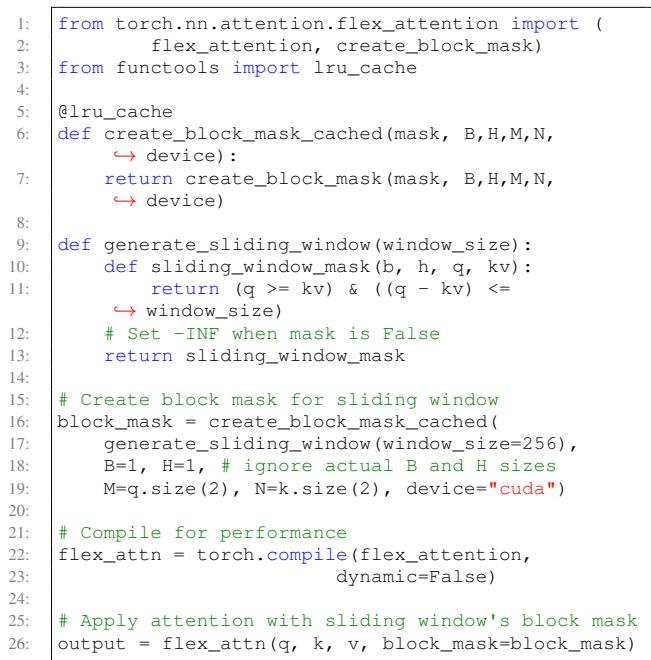  
Listing 2. Sliding Window Attention using FlexAttention.

## 2.3 The PyTorch 2.0 Compiler Stack

PyTorch is widely adopted for machine learning due to its eager execution model, which treats model definitions as imperative Python code. This design makes PyTorch flexible and intuitive but complicates compiler optimizations that rely on static, graph-based representations of computation. Unlike frameworks like TensorFlow (Abadi et al., 2016) or Theano (James Bergstra et al., 2010), Py-Torch does not natively expose a full program graph suitable for whole-graph analysis and transformation. The $P y .$

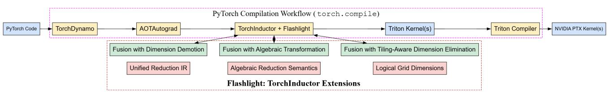  
Figure 1. FLASHLIGHT extends TorchInductor within the torch.compile stack, adding structural and semantic fusion passes with dimension demotion, algebraic transformation, and tiling-aware dimension elimination to generate optimized Triton kernels.

Torch 2.0 compiler stack (Ansel et al., 2024), used via the torch.compile() API, addresses this limitation by using two key components: TorchDynamo, a Python-level graph extractor, and TorchInductor, a backend compiler targeting both CPUs and GPUs.

TorchDynamo extracts the program graph by detecting PyTorch operations, which are transformed into an FX graph (Reed et al., 2022), an intermediate representation designed for further optimization and lowering. TorchDynamo integrates with AOTAutograd, which enables training by recording both forward and backward graphs.

TorchInductor functions as a general-purpose compiler backend designed to translate FX graphs into optimized, high-performance code. It supports multiple backends: a built-in OpenAI Triton (Tillet et al., 2019) for GPU, C++ with OpenMP for CPU execution, and custom backends defined by the user. TorchInductor introduces a Pythonbased loop-level intermediate representation (IR) using a define-by-run model: tensor computations are expressed as Python functions over symbolic indices. This IR enables (i) operator decomposition into a minimal core set of pointwise, reduction, and other primitives operations, (ii) fusion and scheduling informed by symbolic analysis of memory access patterns and aliasing, and (iii) efficient code generation with optional use of CUDA Graphs to minimize kernel launch overhead. TorchInductor supports vectorization, auto-tuning, and ahead-of-time kernel compilation.

Dynamic Shapes are supported in the PyTorch 2.0+ compiler stack. Using meta-functions that track and propagate shape information symbolically, TorchDynamo and TorchInductor can reuse compiled code for inputs of different sizes. The compiler also uses guards and simple symbolic checks to decide when it needs to recompile. For models with fixed input sizes, users set dynamic=False in torch.compile() to turn off dynamic shape tracing and generate shape-efficient kernels for faster performance.

Performance PyTorch 2.0 achieves strong performance on real-world workloads. Across 180+ models from TorchBench, HuggingFace, and TIMM, TorchDynamo and TorchInductor deliver a geometric mean speedup of 2.27× on inference and 1.41× on training with float32 on NVIDIA A100 GPUs (Ansel et al., 2024). TorchDynamo’s graph capture overhead is under 5%, significantly outperforming Lazy Tensors and previous JIT mechanisms.

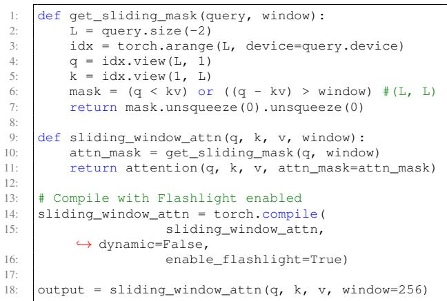  
Listing 3. Sliding Window Attention using Flashlight.

The PyTorch 2.0 compiler stack introduces a hybrid approach to dynamic language compilation, combining bytecode-level tracing with backend-level optimization and code generation. It makes aggressive compiler optimization accessible to users without compromising Python’s dynamism or usability.

## 3 FLASHLIGHT

Figure 1 illustrates the torch.compile workflow and how FLASHLIGHT plugs into it. FLASHLIGHT extends TorchInductor with a principled approach to operator fusion and scheduling, based on a set of composable compiler transformations. This allow it to dynamically fuse complex subgraphs, such as the various forms of attention, into monolithic, high-performance kernels without requiring explicit user annotations or modifications to idiomatic PyTorch code. Listing 3 shows sliding window attention (Beltagy et al., 2020) using FLASHLIGHT. It uses idiomatic PyTorch code without requiring the user to build a block\_mask or use a cache like in Listing 2 for FlexAttention. A user just needs to pass a flag to torch.compile to enable FLASHLIGHT. This approach stands in contrast to existing systems that often depend on predefined static code templates (e.g., TorchInductor replaces vanilla attention with a hand-optimized kernel by searching for patterns in its IR) or explicit user annotations (e.g., FlexAttention), limiting their applicability beyond common patterns like Equation 4. As a consequence, FLASHLIGHT enables compiling complex attention patterns that are not expressible in FlexAttention, such as differential attention (Ye et al., 2024) (Listing 4), row/column-wise gated self-attention in Evoformer (Jumper et al., 2021), IPA (Jumper et al., 2021), and RSA (Sun et al., 2025).

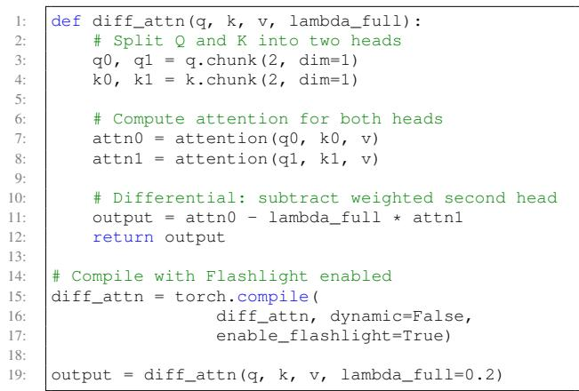  
Listing 4. Differential Attention using Flashlight.

We demonstrate Flashlight’s approach using the vanilla attention in Eq 3. FLASHLIGHT automatically fuses the entire sequence of vanilla attention in Listing 1 into a single monolithic Triton kernel. This kernel executes the computation in a single pass over the input data, where each thread block computes tiles of the dot-product $S = Q K ^ { \top } / \sqrt { d } .$ applies the "online" softmax to each tile via a fused max-reduction and rescaled accumulation, and multiplies the resulting softmax output with the corresponding tiles of V .

Section 3.1 describes the unified reduction IR in TorchInductor that enables expressing the loops of matrix multiplications like $Q K ^ { \top }$ . Section 3.2 describes structural fusion of matrix multiplications with simple reductions by demoting dimensions to fuse the max() operation in sof tmax() with the preceding $Q K ^ { \top }$ . Section 3.3 describes the semantics of algebraic transformation of reductions that generalizes the transformation of the stable softmax algorithm to the online softmax algorithm. We use this in TorchInductor to semantically fuse operations like softmax $\left( Q K ^ { \top } / \sqrt { d } \right)$ in Section 3.4. Section 3.5 describes structural fusion of tiled loops while eliminating small dimensions and Section 3.6 describes ways to accomplish this in TorchInductor using logical grid dimensions. This would fuse consecutive matrix multiplication operations like softmax $( Q K ^ { \top } / \sqrt { d } ) V$ . Finally, we discuss the generality, flexibility, and trade-offs of Flashlight and compare it with FlexAttention (Section 3.7).

## 3.1 Unified Reduction IR

To provide a unified intermediate representation (IR) for tensor computations, tensor dimensions are classified into two categories: p-dimensions (parallel/pointwise) and rdimensions (reduction). Computations over p-dimensions are data-independent, representing embarrassingly parallel workloads that can be mapped directly to parallel execution units, such as programs in the Triton language or CUDA thread blocks. For instance, in an element-wise operation like torch.add(A, B), all dimensions of tensors A and B are p-dimensions. Conversely, r-dimensions introduce data dependencies that require sequential accumulation or specialized parallel primitives like reduction trees. A canonical example is torch.sum(T, dim=n), where dimension n is an r-dimension, as its elements are aggregated, while all other dimensions remain p-dimensions.

This conceptual framework is operationalized by TorchInductor, where it lowers operations into a loop-level IR that explicitly categorizes them based on their dimensional properties. However, TorchInductor has a special path for performance-sensitive tensor contractions like General Matrix Multiplication (GEMM), where it bypasses the IR-tokernel generation path to either instantiate a pre-written, highly-optimized kernel template of the Triton language or generate calls to vendor-tuned libraries like ATen or cuBLAS. While this workflow ensures high performance for the standalone GEMM operation, this bifurcation creates a fusion boundary that isolates the GEMM from surrounding computations. This prevents fusion of GEMM with preceding or subsequent operations beyond the support for simple element-wise operations, reintroducing memory bandwidth bottlenecks and kernel launch overheads.

FLASHLIGHT dismantles this artificial fusion boundary by modeling tensor contractions as a generalized reduction within our unified IR, which is compatible to the PyTorch built-in reduction IR. We observe that a GEMM operation naturally conforms to the p- and r-dimension abstraction. Consider the canonical 2D matrix multiplication, C = A·B, defined as $\begin{array} { r } { C _ { m n } = \sum _ { k } A _ { m k } B _ { k n } } \end{array}$ . We model this as follows:

• The output dimensions, indexed by m and n, are pdimensions. The computation for each output element $C _ { m n }$ is independent of all others, and these dimensions are preserved in the output tensor’s shape.

• The inner contracted dimension, indexed by k, is an r-dimension. It is iterated over, and the products are accumulated via a sum reduction. This dimension is shared by both inputs and consumed by the operation and does not appear in the output.

By representing GEMM within the same semantic framework as other tensor operations, FLASHLIGHT enables it to participate fully in our end-to-end fusion engine. This unified approach unlocks advanced optimizations, such as fusing chains of matrix multiplications or complex elementwise prologues directly into a single, efficient kernel.

## 3.2 Structural Fusion with Dimension Demotion

The p- and r-dimension abstraction provides a formal basis for a canonical loop structure. For a given tensor operation, the data-independent p-dimensions form the outer parallel loops, while the data-dependent r-dimensions form the inner iterative loops. This structure naturally maps to the hierarchical execution model of modern GPUs, where outer loops can be parallelized across thread blocks, and inner loops are executed sequentially across warps.

We can therefore define a computation sketch for a kernel, denoted as $[ ( P _ { 0 } , P _ { 1 } , \dots ) , ( R _ { 0 } , \mathbf { \bar { \tiny { R } } } _ { 1 } , \dots ) ]$ ], which captures its loop hierarchy.

for p0 in P0   
for p1 in P1   
...   
for r0 in R0   
for r1 in R1

where the capital letters are the iteration ranges of dimensions and the lowercase letters are used for indexing.For example:

• Element-wise Addition: $C ( P _ { 0 } , P _ { 1 } ) = A ( P _ { 0 } , P _ { 1 } ) +$ $B ( P _ { 0 } , P _ { 1 } )$ involves no reduction and has the sketch $[ ( P _ { 0 } , P _ { 1 } ) , ( ) ]$ Since the p-dimensions are dataindependent, the computation can be perfectly flattened and parallelized across all elements.

• GEMM: $C ( P _ { 0 } , P _ { 1 } ) \ = \ A ( P _ { 0 } , R _ { 0 } ) @ B ( R _ { 0 } , P _ { 1 } )$ involves a sum-reduction over the inner dimension and has the sketch $[ ( P _ { 0 } , P _ { 1 } ) , ( R _ { 0 } ) ]$ . The computation for each output element $( p _ { 0 } , p _ { 1 } )$ requires an inner loop over r0.

Under this model, existing compilers like TorchInductor primarily fuse operations with identical sketches. For instance, two kernels with the sketch $[ ( P _ { 0 } , P _ { 1 } ) , ( ) ]$ can be fused vertically. Fusion is also permitted between a pointwise operation and a reduction if their p-dimensions align (e.g., fusing $[ ( P _ { 0 } , P _ { 1 } ) , ( ) ]$ into $[ ( P _ { 0 } , P _ { 1 } ) , ( R _ { 0 } ) ] )$ . This model, however, is not sufficient for fusing operations where the dimensions fundamentally realign, such as in producer-consumer patterns where the producer’s output dimension becomes a reduction dimension for the consumer.

Flashlight introduces a more powerful fusion rule by leveraging a key insight that a parallel loop can be executed sequentially. This allows us to "demote" a pdimension from a producer kernel into an r-dimension within the fused kernel. Formally, a producer kernel $K _ { 0 }$ with sketch $[ ( P _ { c o m m o n } , P _ { p r o d u c e r } ) , ( \dots ) ]$ can be fused with a consumer kernel $K _ { 1 }$ with sketch $[ ( P _ { c o m m o n } ) , ( P _ { p r o d u c e r } , \dots ) ] ,$ . The resulting fused kernel will have the sketch: [(Pcommon), (Pproducer, . . . )]. Here, the dimension $P _ { p r o d u c e r } $ , which was a p-dimension in the standalone producer kernel $K _ { 0 } .$ , becomes an additional inner reduction loop in the fused kernel.

The rationale for this transformation is the fundamental trade-off between parallelism and memory latency. By demoting a parallel dimension, we tradeoff some of the producer’s potential parallelism for complete elimination of the high-latency materialization of the intermediate tensor to global memory. As a consequence, the producer’s results are generated and consumed immediately within the registers or local memory of a single, unified kernel. On modern accelerators where memory bandwidth is often a more critical bottleneck than raw compute parallelism, this trade-off is overwhelmingly favorable, leading to significant performance improvements. An example for this scenario is fusing only the max() operation inside sof tmax() with the preceding $Q K ^ { \top }$ in attention.

## 3.3 Algebraic Transformation of Reductions

The online softmax algorithm (Milakov & Gimelshein, 2018) (Alg. 2) is key to implementing FlashAttention-like fused kernel. Machine learning developers have to explicitly replace the standard stable softmax implementation with online softmax. However, modern compilers for machine learning frameworks, including the PyTorch compiler, do not currently detect a pattern as such and therefore do not generate an online implementation automatically.We show that the conversion of the stable softmax algorithm to the online softmax algorithm can be generalized using the standard algebraic notion of a homomorphism. Informally, a homomorphism is a structure-preserving map between two algebraic structures of the same type such as two groups.

Definition 1 Let A be a set with a binary operation $\oplus ,$ and let B be a set with a binary operation ⊗. A function $f ~ :$ A→B is said to be a homomorphism if for all $a _ { 1 } , a _ { 2 } \in A ,$ $f ( a _ { 1 } \oplus a _ { 2 } ) = f ( a _ { 1 } ) \otimes f ( a _ { 2 } )$

In the context of softmax, $A = B = \mathbb { R }$ (the set of real numbers), and ⊕ and ⊗ are addition (+) and multiplication (×) of real numbers. The function $f ( x ) = e ^ { x }$ is a homomorphism because $f ^ { a + b } = f ^ { a } \times f ^ { b }$ . To generalize the online softmax construction, we need the set A with operations ⊕ and ⊗ to satisfy the axioms of a ring:

• ⊕ is associative, there is an element $0 \in A$ such that $a \oplus 0 \ = \ 0 \oplus a \ = \ a$ , and every element a has an additive inverse, denoted by $\ominus a$ , such that $a \oplus ( \ominus a ) =$ $( \ominus a ) \oplus a = 0 .$

• ⊗ is associative, and there is an element $1 \in A$ such that $a \otimes 1 = 1 \otimes a = a .$

• ⊗ distributes over ⊕; that is, $( a \oplus b ) \otimes c = ( a \otimes c ) \oplus$ (b ⊗ c).

It can be shown that these assumptions imply $a \otimes 0 =$ $0 \otimes a = 0$ . The standard definition of a ring requires ⊕ to be commutative but we do not use this property in the development below. In the context of rings, a homomorphism f must also satisfy $f ( 0 ) = 1$

In the stable softmax algorithm (Alg. 1), let us denote the sequence of m values produced by the first loop by $m [ 1 . . N ]$ and let $m [ 0 ] = 0$ by definition. The sequence of d values produced by the second loop, which we denote by ds, is expressed abstractly by the following recurrence in which the elements of ds are members of a ring A and $E { \cdot } A {  } A$ is a homomorphism.

$$
\begin{array} { r l } & { d s [ 0 ] = 0 } \\ & { d s [ j ] = d s [ j - 1 ] \oplus ( E ( x [ j ] \oplus ( \ominus m [ N ] ) ) ) \ | N \ge j \ge 1 } \\ & { \qquad = d s [ j - 1 ] \oplus ( E ( x [ j ] ) \otimes E ( \ominus m [ N ] ) ) \ | N \ge j \ge 1 } \end{array}
$$

It is easy to show by induction that ds can be expressed in closed-form by the following expression in which L stands for the application of the associative operation ⊕ to a set of elements of A.

$$
\begin{array} { l } { \displaystyle d s \{ j \} = \sum _ { i = 1 } ^ { j } ( E ( x [ i ] \oplus ( \ominus m [ N ] ) ) ) \mid N \geq j \geq 1 } \\ { \displaystyle \quad = \bigoplus _ { i = 1 } ^ { j } ( E ( x [ i ] ) \otimes E ( \ominus m [ N ] ) ) \mid N \geq j \geq 1 } \\ { \displaystyle \quad \quad ( E \mathrm { i s ~ a b o m o m o r p h i s m } ) } \\ { \displaystyle \quad = \left( \bigoplus _ { i = 1 } ^ { j } E ( x [ i ] ) \right) \otimes E ( \ominus m [ N ] ) } \\ { \displaystyle \quad \quad \mathrm { ( f o m ~ d i s t r i b u t i v i t y ~ o f ~ \& ~ o v e r ~ \ominus ~ ) } } \end{array}
$$

The online softmax algorithm (Alg. 2) computes a different sequence, denoted by do, that can be expressed abstractly as shown below.

(5)

$$
\begin{array} { r l r } {  { d o [ 0 ] = 0 } } \\ & { } & { d o [ j ] = \bigg ( d o [ j - 1 ] \otimes E \big ( m [ j - 1 ] \oplus ( \ominus m [ j ] ) \big ) \bigg ) \oplus } \\ & { } & { \big ( E \big ( x [ j ] \oplus ( \ominus m [ j ] ) \big ) \big ) \big | N \ge j \ge 1 } \\ & { } & { = \bigg ( d o [ j - 1 ] \otimes E \big ( m [ j - 1 ] \big ) \otimes E ( \ominus m [ j ] ) \big ) \bigg ) \oplus } \\ & { } & { \big ( E \big ( x [ j ] \oplus ( \ominus m [ j ] ) \big ) \big ) \big | N \ge j \ge 1 } \\ & { } & { \big ( \mathrm { f r o m ~ d i s t r i b u t i v i t y ~ o f ~ \otimes ~ o v e r ~ \oplus } \big ) } \end{array}\tag{6}
$$

(7)

The ds and do sequences will be different in general, but we show that do can be expressed in closed-form by the following expression.

$$
d o [ j ] = { \bigg ( } \bigoplus _ { i = 1 } ^ { j } E ( x [ i ] ) { \bigg ) } \otimes E ( \ominus m [ j ] ) \ | N \geq j \geq 1\tag{8}
$$

from which it follows that $d s [ N ] = d o [ N ]$ . The proof of correctness of (8) is by induction on $j$

• j=1: From (7),

$$
d o [ 1 ] = ( d o [ 0 ] \otimes E ( m [ 0 ] ) \otimes E ( \Theta m [ 1 ] ) ) \oplus ( E ( x [ 1 ] ) \otimes E ( \Theta m [ 1 ] ) )
$$

This is the value obtained from (8) for $j = 1$

• j>1: Assume inductively that

$$
d o [ j - 1 ] = { \bigg ( } \bigoplus _ { i = 1 } ^ { j - 1 } E ( x [ i ] ) { \bigg ) } \otimes E ( \Theta m [ j - 1 ] )
$$

From (7),

$$
\begin{array} { r l } & { \omega \Delta \xi = ( \omega \Delta \xi - 1 ) \Theta _ { R } \xi \omega \Delta \xi ( \omega - 1 ) \Theta _ { R } \xi ( \omega - 1 ) \Theta _ { 0 } \xi ( \omega - 1 ) ) \xi , \qquad \quad } \\ & { ( \kappa ( \xi \omega \xi ) + \eta \kappa ( \omega \xi ) ) } \\ & { - ( ( \frac { \omega } { \omega } \xi \omega ( \omega - 1 ) ) ^ { 2 } ) \Theta _ { R } \xi \omega ( \omega - 1 ) \xi - 1 ) \xi \omega ( \omega ( \omega - 1 ) \xi - 1 ) \Theta _ { 0 } \xi } \\ & { \qquad \mathrm { E } ( \omega \xi ) \omega ( \omega - 1 ) \phi ( \omega \xi \omega ( \omega - 1 ) ) \xi - 1 \omega \omega _ { R } \xi \omega ( \omega - 1 ) \xi } \\ & { - ( ( \frac { \omega } { \omega } \xi \omega ( \omega - 1 ) ) ^ { 2 } ) \Theta _ { R } \xi \omega ( \omega ( \omega - 1 ) ) \xi } \\ & { ( \kappa ( \xi \omega \xi ) + \eta \kappa ( \omega \xi ) ) } \\ & { - ( ( \frac { \omega } { \omega } \xi \omega ( \omega - 1 ) ) ^ { 2 } ) \Theta _ { R } \xi \omega ( \omega \omega ( \omega - 1 ) ) \xi } \\ & { - ( ( \frac { \omega } { \omega } \xi \omega ( \omega - 1 ) ) ^ { 2 } ) \Theta _ { R } \xi \omega ( \omega \omega ( \omega - 1 ) ) } \\ & { \qquad \mathrm { i n e a r d a n c e : ~ } \omega < \omega \omega _ { R } \xi \omega ( \omega - 1 ) } \\ & { \qquad \mathrm { e } ( \frac { \omega } { \omega } \xi \omega ( \omega - 1 ) \xi ^ { 2 } \omega ( \omega - 1 ) \xi \omega ( \omega - 1 ) \xi \omega ( \omega - 1 ) \xi \omega } \\ &  \qquad \mathrm { i n e } ^ { \mathrm { i n } \xi } \omega ( \omega - 1 )  \end{array}
$$

## 3.4 Semantic Fusion with Algebraic Transformation

Beyond the structural compatibility addressed by computation sketches, valid kernel fusion must also respect data dependencies. A challenge for fusion arises from cross-kernel data dependencies. For instance, one reduction kernel depends on the fully aggregated result of another. This dependency creates a synchronization barrier that prevents naive loop fusion, even if the kernels share an identical sketch. A canonical example of this challenge is the numerically stable softmax operation, which involves two sequential passes for numerical stability: first finding the maximum value of the input tensor, and second, computing the sum of exponentials shifted by that maximum.

1. Pass 1 (max): $m _ { i } = \operatorname* { m a x } ( m _ { i - 1 } , A _ { i } )$

2. Pass 2 (sub-exp-sum): $\begin{array} { r } { S = \sum _ { i } \exp ( A _ { i } - m _ { f i n a l } ) } \end{array}$

Although both operations have a compatible reduction sketch, $\mathrm { e . g . } , [ 0 , ( R ) ]$ , they cannot be trivially fused because Pass 2 has a strict dependency on $\textmu m _ { f i n a l }$ — the final scalar result of the first kernel. A direct merge by stacking the loop bodies would be incorrect, as the computation of each term $\exp ( { A _ { i } } - m _ { f i n a l } )$ requires a value that is only known after the first loop has fully completed.

FLASHLIGHT overcomes this barrier by identifying and transforming these dependent computation into a singlepass, online algorithm when an underlying algebraic structure permits it. The key is to transform the dependency on the final result into an incremental update based on the running result. This is possible here due to the homomorphic property of the exponential function (Section 3.3), which maps addition/subtraction to multiplication/division: $\exp ( x - y ) = \exp ( x ) / \exp ( y )$ . This property allows us to dynamically "rescale" the running sum whenever the running maximum changes.

Within a single loop, two running accumulators are maintained: the running max $( m _ { r } )$ and a running sum $\left( { { s _ { r } } } \right)$ . The challenge is that whenever the running max is updated, the accumulated sum becomes invalid as it was normalized by a now-outdated maximum. If the sum was calculated using an old max, $m _ { o l d }$ , and the max is updated to $m _ { n e w } .$ , the corrected sum can be found by multiplying by a correction factor:

$$
S _ { o l d } = \sum _ { i } \exp ( A _ { i } - m _ { o l d } ) = \sum _ { i } { \frac { \exp ( A _ { i } ) } { \exp ( m _ { o l d } ) } }
$$

$$
S _ { n e w } = \sum _ { i } \exp ( A _ { i } - m _ { n e w } ) = \sum _ { i } { \frac { \exp ( A _ { i } ) } { \exp ( m _ { o l d } ) } } { \frac { \exp ( m _ { o l d } ) } { \exp ( m _ { n e w } ) } } =
$$

$$
S _ { o l d } \times \exp ( m _ { o l d } - m _ { n e w } )
$$

This allows us to fuse the two passes into a single, efficient kernel. In each step of the loop, we update both the running max and the running sum simultaneously. If an element $A _ { i }$ causes the running max to change, we apply the correction factor to the sum accumulated so far before adding the new term. To accomplish this in TorchInductor, we decompose a reduction to introduce a loop-local variable that copies the partially-aggregated, loop-carried value before applying the aggregation in this step.

By embedding such algebraic reasoning into TorchInductor, Flashlight can semantically restructure the algorithm to fuse complex, state-dependent operations that are beyond the scope of fusion based on structural compatibility alone. This unlocks end-to-end kernel fusion for a broader class of√ complex, multi-stage reductions like softmax $\left( Q K ^ { \top } / \sqrt { d } \right)$

## 3.5 Structural Fusion with Tiling-Aware Dimension Elimination

The loop-based execution model can be further refined by iterating over contiguous tiles (or blocks) of data rather than individual elements. Practical GPU kernels adopt tiling as a critical optimization that improves data locality by staging data in fast on-chip memory like shared memory or registers. The tiled execution also structures the computation to better exploit the $\mathrm { G P U ' s }$ SIMT architecture with fine-grained parallelism within each tile. For instance, an associative reduction over a tile can be implemented efficiently using parallel primitives like warp-level tree reductions or by vectorizing the accumulation across multiple SIMT lanes.

Crucially, tiling transforms the loop structure of a kernel. A loop over a dimension of size D with a tile size of $B _ { D }$ will execute $\lceil D / B _ { D } \rceil$ times at the tile level. This allows us to define a tiled sketch for a kernel: $\big [ \big ( \lceil \frac { P _ { 0 } } { B _ { P 0 } } \rceil , \dots \big ) , \big ( \lceil \frac { R _ { 0 } } { B _ { R 0 } } \rceil , \dots \big ) \big ]$

This transformation from an element-space sketch to a tilespace sketch creates more opportunities for fusion. The key insight is that, if a dimension $P _ { i }$ is small enough to be processed entirely within a single tile $( \mathrm { i . e . , } B _ { P i } \geq | P _ { i } | )$ , the corresponding tile-level loop bound becomes $\left\lceil | P _ { i } | / B _ { P i } \right\rceil =$ 1 1. A loop with a single iteration can be conceptually elided from the sketch, effectively collapsing the dimension at the tile level. This tiling-aware dimension elimination unlocks fusion opportunities that are otherwise impossible.

Consider twin matrix multiplication, $E = ( A \cdot B ) \cdot D .$

• Kernel 0 (Producer): $C [ M , N ] = A [ M , K ] @ B [ K , N ]$ . The element-space sketch is $\left[ ( M , N ) , ( K ) \right]$

• Kernel 1 (Consumer): ${ \cal E } [ { \cal M } , P ] = { \cal C } [ { \cal M } , N ] @ { \cal D } [ N , P ] .$ The element-space sketch is $[ ( M , P ) , ( N ) ]$

These kernels are incompatible under standard fusion rules. Without tiling, these sketches are also incompatible for the producer-consumer fusion described previously; the producer’s p-dimension N does not match the consumer’s pdimension P . Fusing them would require materializing the entire intermediate tensor C into global memory.

FLASHLIGHT can fuse these kernels by leveraging tiling. Let’s assume the dimension $P$ is relatively small $( \mathrm { e . g . , 6 4 }$ 128). We can set the tile size for the P dimension in Kernel 1 to be its full size, $B _ { P } = | P |$ . The tiled sketch for Kernel 1 becomes:

$$
[ ( \lceil \frac { M } { B _ { M } } \rceil , \lceil \frac { P } { B _ { P } } \rceil = 1 ) , ( \lceil \frac { N } { B _ { N } } \rceil ) ] \implies [ ( \lceil \frac { M } { B _ { M } } \rceil ) , ( \lceil \frac { N } { B _ { N } } \rceil ) ]
$$

The P dimension has been collapsed out of the consumer’s tile-level p-dimensions. Now, the producer sketch $[ ( M _ { t i l e } , N _ { t i l e } ) , ( K _ { t i l e } ) ]$ and the consumer sketch $[ ( M _ { t i l e } ) , ( N _ { t i l e } ) ]$ can be combined as $[ ( M _ { t i l e } ) , ( N _ { t i l e } , K _ { t i l e } ) ]$

using our generalized fusion rule with dimension demotion. The dimension N from the producer’s output is consumed directly as an r-dimension by the consumer on-the-fly within a single fused kernel, completely avoiding the materialization of the intermediate tensor C. This tiling-aware transformation allows FLASHLIGHT to fuse complex, multi-stage computations that have historically remained out of reach for the PyTorch compiler.

## 3.6 Flexible Tiling through Logical Grid Dimensions

Practical implementations of tiling strategies in TorchInductor must address some framework constraints. The ideal approach allows for flexible, per-dimension tile sizes, enabling a broad autotuning search space and the dimension elimination technique. However, systems like TorchInductor often create a rigid coupling between the logical tiling dimensions and the physical GPU execution grid. This coupling arises from the asymmetric hardware limits of the grid; in CUDA, for example, the X dimension can be up to $2 ^ { 3 1 } - 1$ , while the Y and Z dimensions are limited to 65, 535. To accommodate large tensors, TorchInductor often flattens multiple p-dimensions into the expansive X grid dimension. This presents a dilemma:

• Flattening: For a computation with a sketch $[ ( P _ { 0 } , P _ { 1 } ) ]$ both dimensions are mapped to the X grid. TorchInductor forces them to share a single tile size, preventing independent tuning of the tile sizes for $P _ { 0 }$ and $P _ { 1 }$ .

• Multi-Grid Mapping: Mapping $P _ { 0 }$ to the Y grid and $P _ { 1 }$ to the X grid would allow separate tile sizes but this approach fails if the cardinality of dimension $P _ { 0 }$ exceeds 65, 535.

This inflexibility restricts the compiler’s ability to find the optimal tiling configuration.

FLASHLIGHT resolves this dilemma by decoupling the problem’s structure from the hardware’s using logical tiling. Instead of directly affine mapping tiling dimensions to physical grid dimensions, FLASHLIGHT defines a logical, multidimensional grid of tiles based on the per-dimension tile sizes. This logical grid is then "unrolled" into a linear sequence and mapped to a single physical grid dimension (e.g., tl.program\_id(0) in Triton). Inside the kernel, a simple inverse affine map recovers the logical multidimensional tile coordinates from the linear block ID.

This approach allows tile sizes for each dimension to be set independently by the autotuner or controlled via hints. This ensures that powerful fusion strategies, like the tiling-aware dimension elimination, can be applied robustly across a far wider range of tensor shapes and sizes.

## 3.7 Generality, Flexibility, Tradeoffs

The transformations in FLASHLIGHT are general and widely applicable, but they involve performance and accuracy tradeoffs. Structural fusion (Section 3.2) reduces memory accesses at the cost of reduced parallelism. Semantic fusion (Section 3.4) preserves algebraic semantics in real numbers, but may not be precise in floating point numbers because floating point arithmetic is not associative. While these transformations optimize a variety of attention variants without observable loss in model accuracy (Dao et al., 2022), they may not improve performance or may be inaccurate for some kernels on some hardware. Users should enable FLASHLIGHT for PyTorch code based on this knowledge.

FLASHLIGHT enables users to explore a wide variety of attention variants and other tensor computations without having to map their code to specific patterns or sacrifice performance or scalability. This flexibility also has performance trade-offs. Unlike FlexAttention or other attention-specific DSLs, FLASHLIGHT does not specialize its transformations for the mask in certain attentions. FlexAttention, for example, inspects the mask to build a block\_mask of sparse matrices using which it can skip attention for the tiles or blocks that are fully masked out. When the matrices are very sparse, the attention execution can be much faster because it reduces redundant computation. However, the inspection code to create block\_mask is expensive and storing the block\_mask consumes resource-constrained GPU memory. Users are expected to manage this trade-off by building a cache and managing its size. Moreover, even with a cache hit, executing attention with inspected sparse matrices might have runtime overheads. Thus, such inspection-execution code is not always beneficial. We leave incorporation of such techniques in torch.compile() to future work.

## 4 EVALUATION

## 4.1 Experimental Setup

We run our experiments on two recent GPUs: an NVIDIA A100 80GB and NVIDIA H100 80GB. We use Python 3.12,

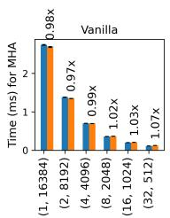

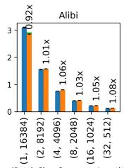

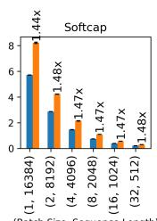

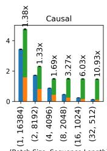

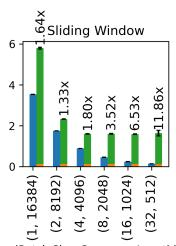

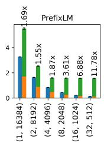

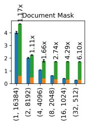

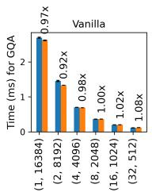

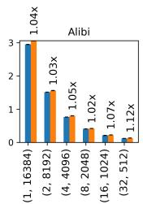

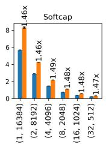

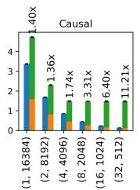

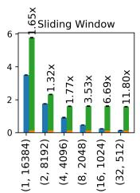


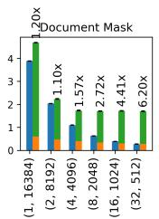

Figure 2. Runtimes of FLASHLIGHT and FlexAttention on H100 for attention variants that are supported by FlexAttention template. Flashlight FlexAttention (Kernel) FlexAtentin (Bloc Mask)  
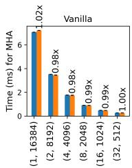

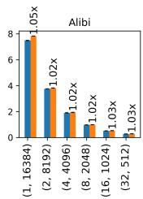

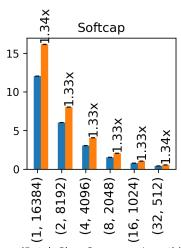

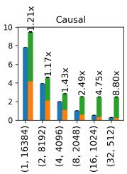

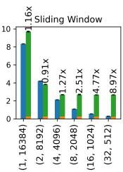

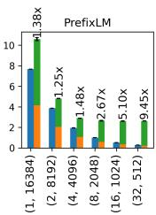

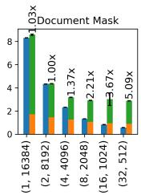

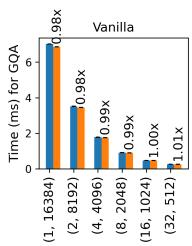

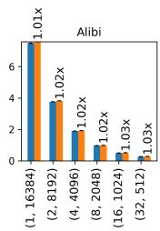

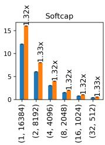

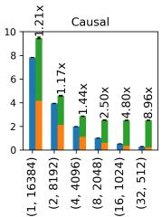

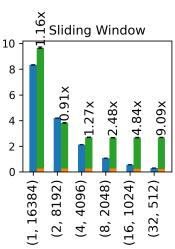

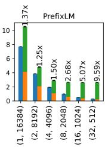  
Figure 3. Runtimes of FLASHLIGHT and FlexAttention on A100 for attention variants that are supported by FlexAttention template.

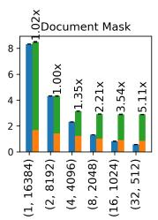

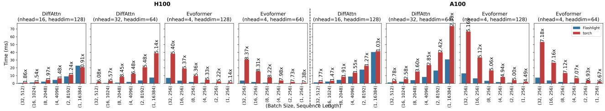  
Figure 4. Runtimes of FLASHLIGHT and torch.compile on H100/A100 for attention variants that are not supported by FlexAttention.

PyTorch 2.5.0, Triton 3.1.0, CUDA 12.9. We report average runtimes of 20 runs after 10 warm up runs. To ensure that runs are within 1% standard deviation, we cap the SM frequency of both A100 and H100 to 1290 MHz, which is the steady state frequency of both GPUs in our systems.

Systems: We use these systems in our evaluation. FlexAttention (Dong et al., 2024) compiles attention code written in their template API in PyTorch to a fused Triton kernel. torch.compile (Ansel et al., 2024) compiles idiomatic attention code in PyTorch to multiple Triton kernels. FLASH-LIGHT is our system described in the paper that compiles the same PyTorch code to a fused Triton kernel.

Benchmarks: We use these attention variants that are supported by FlexAttention: Vanilla (Vaswani et al., 2017), ALiBi (Press et al., 2022), Softcap (Dong et al., 2024), Causal (Dong et al., 2024), Sliding Window (Beltagy et al., 2020), PrefixLM (Dong et al., 2024), and Document Mask (Dong et al., 2024). Each of these variants are evaluated as Multi-Head Attention (MHA) and Grouped Query Attention (GQA). For FlexAttention, Vanilla, ALiBi, and Softcap use score\_mod, while the rest compute and use a block\_mask. Like FlashAttention (Dao, 2023), we vary the sequence length from 512 to 16k and set the batch size so that their product (the number of tokens) is 16k. The head dimension is 64. For MHA, the number of heads is 16 for Q, K, and V ; for GHA, the number of heads is 16 for Q and 2 for K and V . The sliding window size and the prefix length is 256. The number of documents is 12.

We also use attention variants that are not supported by Flex-Attention: differential attention (Ye et al., 2024) and rowwise gated self-attention in AlphaFold’s Evoformer (Jumper et al., 2021). We will call these DiffAttn and Evoformer respectively in the rest of this section. DiffAttn is shown in Listing 4. Evoformer uses an additional (sequence length) dimension and adds two bias matrices before sof tmax, one of which needs to be broadcasted along that dimension. For DiffAttn, we use the same configuration for the MHA variants above except that we also evaluate 16 heads and 128 head dimension. For Evoformer, we vary the batch size from 1 to 32 and use 256 for the two sequence length dimensions; we use 4 heads and evaluate 64 and 128 head dimensions.

## 4.2 FlexAttention-Supported Attention Variants

Figures 2 and 3 show the runtimes for attention variants on H100 and A100 respectively. The runtime for FlexAttention is split into Block-Mask creation and Kernel execution times. The text on the bars show the speedup of FLASHLIGHT over FlexAttention. FlexAttention is marginally faster than FLASHLIGHT for Vanilla in some cases and for batch size 1 of Alibi MHA on H100. In all the other cases, FLASH-LIGHT is similar or much faster. For score\_mod variants, FLASHLIGHT may be up to 1.48× faster because the fused

Triton kernel is simpler than that of FlexAttention because it does not have compute or memory instructions needed for handling full, partial, or empty blocks in FlexAttention’s templatized kernel. For block\_mask variants, FlexAttention’s Kernel execution is always faster than FLASHLIGHT’s execution because it skips redundant computation. However, FlexAttention’s Block-Mask execution time is much slower. This can be amortized over multiple calls by using a cache, but this depends on the workload.

We omit torch.compile in Figures 2 and 3 because they are much slower than FlexAttention in almost all cases. The only exceptions are (1) Vanilla, where torch.compile patternmatches the code to replace it with a hand-optimized kernel, so it is slightly faster than both FlexAttention and FLASH-LIGHT (we disable pattern matching only to measure the performance difference); and (2) all block\_mask variants for batch size 16 and 32, where FlexAttention is slower due to the overheads in creating the block\_mask, but FLASHLIGHT is still faster than torch.compile.

## 4.3 Complex Attention Variants

For attention variants that are not supported by FlexAttention, Figure 4 show the runtimes of FLASHLIGHT and torch.compile on H100 and A100. FLASHLIGHT is always faster than torch.compile. For DiffAttn, the speedup of FLASHLIGHT over torch.compile is higher on H100 than on A100. For Evoformer, the speedups are 5× or more on both H100 and A100.

## 4.4 End-to-End Inference Latency

We use the AlphaFold2 (Jumper et al., 2021) model in the OpenFold (Ahdritz et al., 2022) repo. The model has 48 Evoformer layers. We evaluate its inference latency with a sequence length of 256 (for both sequence length dimensions) and vary the batch size (the number of sequences) from 1, 2, 4, ..., 32. Evoformer uses 8 heads and head dimension 32; Invariant Point Attention uses 12 heads and head dimension 16. We evaluate PyTorch as-is without using the compiler. We add a torch.compile step to the row-wise and column-wise gated self attentions in Evoformer and then evaluate it without and with FLASHLIGHT. There is negligible difference in inference latency between PyTorch and torch.compile. FLASHLIGHT improves the inference latency by 6% to 9% on both H100 and A100 GPUs.

## 5 RELATED WORK

Efficient Attention Kernels. FlashAttention (Dao et al., 2022; Dao, 2023; Shah et al., 2024) introduced tiling and kernel fusion to reduce memory traffic while keeping exact results. FlexAttention (Dong et al., 2024) extended this idea with static templates for specialized attention patterns, and FlashInfer (Ye et al., 2025) applied similar techniques to speed up LLM inference. Unlike these systems, Flashlight is built directly into the PyTorch compiler, automatically generating optimized kernels during torch.compile.

Flexible or Specialized Attention Models. Recent work on attention variants, including Longformer (Beltagy et al., 2020), ALiBi (Press et al., 2022), and DiffTransformer (Ye et al., 2024), demonstrated how to improve efficiency and robustness through sparsity, positional biasing, or continuous updates. These motivate the need for a general compiler framework that could automatically optimize new attention types without hand-written kernels.

Compiler Infrastructure for Deep Learning. Triton (Tillet et al., 2019) provides the GPU DSL used by TorchInductor. Other compiler frameworks, such as TVM (Chen et al., 2018), which relies on autotuning, and Mirage (Wu et al., 2025), which uses program synthesis to generate new kernels, have similar goals, but they are outside the PyTorch ecosystem. DSLs like ThunderKittens (Spector et al., 2024) explore kernel fusion and scheduling for simpler and faster GPU programming.

## 6 CONCLUSION

The success of attention in LLMs has inspired researchers to design many other attention models, but these are not supported well in existing frameworks. Flashlight is a compilernative framework within the PyTorch ecosystem that automatically generates fused, FlashAttention-style kernels for arbitrary attention programs, without relying on static templates or predefined kernel specializations. It supports all attention variants expressible in the FlexAttention model but also handles more general, data-dependent attention formulations beyond the capabilities of FlexAttention. Our results show that Flashlight produces kernels with competitive or superior performance to expert-tuned implementations, while offering the flexibility of native PyTorch code, enabling developers to rapidly explore new attention models without sacrificing performance.

## ACKNOWLEDGEMENTS

The University of Texas at Austin team was supported in part by NSF grant 2505085.

## REFERENCES

Abadi, M., Barham, P., Chen, J., Chen, Z., Davis, A., Dean, J., Devin, M., Ghemawat, S., Irving, G., Isard, M., Kudlur, M., Levenberg, J., Monga, R., Moore, S., Murray, D. G., Steiner, B., Tucker, P., Vasudevan, V., Warden, P., Wicke, M., Yu, Y., and Zheng, X. Tensorflow: a system for large-scale machine learning. In Proceedings of the 12th USENIX Conference on Operating Systems Design and Implementation, OSDI’16, pp. 265–283, USA, 2016. USENIX Association. ISBN 9781931971331.

Ahdritz, G., Bouatta, N., Floristean, C., Kadyan, S., Xia, Q., Gerecke, W., O’Donnell, T. J., Berenberg, D., Fisk, I., Zanichelli, N., Zhang, B., Nowaczynski, A., Wang, B., Stepniewska-Dziubinska, M. M., Zhang, S., Ojewole, A., Guney, M. E., Biderman, S., Watkins, A. M., Ra, S., Lorenzo, P. R., Nivon, L., Weitzner, B., Ban, Y.-E. A., Sorger, P. K., Mostaque, E., Zhang, Z., Bonneau, R., and AlQuraishi, M. OpenFold: Retraining AlphaFold2 yields new insights into its learning mechanisms and capacity for generalization. bioRxiv, 2022. doi: 10.1101/2022. 11.20.517210. URL https://www.biorxiv.org/ content/10.1101/2022.11.20.517210.

Ansel, J., Yang, E., He, H., Gimelshein, N., Jain, A., Voznesensky, M., Bao, B., Bell, P., Berard, D., Burovski, E., Chauhan, G., Chourdia, A., Constable, W., Desmaison, A., DeVito, Z., Ellison, E., Feng, W., Gong, J., Gschwind, M., Hirsh, B., Huang, S., Kalambarkar, K., Kirsch, L., Lazos, M., Lezcano, M., Liang, Y., Liang, J., Lu, Y., Luk, C. K., Maher, B., Pan, Y., Puhrsch, C., Reso, M., Saroufim, M., Siraichi, M. Y., Suk, H., Zhang, S., Suo, M., Tillet, P., Zhao, X., Wang, E., Zhou, K., Zou, R., Wang, X., Mathews, A., Wen, W., Chanan, G., Wu, P., and Chintala, S. Pytorch 2: Faster machine learning through dynamic python bytecode transformation and graph compilation. In Proceedings of the 29th ACM International Conference on Architectural Support for Programming Languages and Operating Systems, Volume 2, ASPLOS ’24, pp. 929–947, New York, NY, USA, 2024. Association for Computing Machinery. ISBN 9798400703850. doi: 10.1145/3620665.3640366. URL https://doi. org/10.1145/3620665.3640366.

Beltagy, I., Peters, M. E., and Cohan, A. Longformer: The long-document transformer, 2020. URL https: //arxiv.org/abs/2004.05150.

Chen, T., Moreau, T., Jiang, Z., Zheng, L., Yan, E., Shen, H., Cowan, M., Wang, L., Hu, Y., Ceze, L., et al. {TVM}: An automated {End-to-End} optimizing compiler for deep learning. In 13th USENIX Symposium on Operating Systems Design and Implementation (OSDI 18), pp. 578–594, 2018.

Dao, T. Flashattention-2: Faster attention with better parallelism and work partitioning, 2023. URL https: //arxiv.org/abs/2307.08691.

Dao, T., Fu, D. Y., Ermon, S., Rudra, A., and Ré, C. Flashattention: Fast and memory-efficient exact attention with ioawareness, 2022. URL https://arxiv.org/abs/ 2205.14135.

Dong, J., Feng, B., Guessous, D., Liang, Y., and He, H. Flex attention: A programming model for generating optimized attention kernels, 2024. URL https: //arxiv.org/abs/2412.05496.

He, H., Guessous, D., Liang, Y., and Dong, J. Flexattention: The flexibility of pytorch with the performance of flashattention, Aug 2024. URL https://pytorch.org/ blog/flexattention/.

James Bergstra, Olivier Breuleux, Frédéric Bastien, Pascal Lamblin, Razvan Pascanu, Guillaume Desjardins, Joseph Turian, David Warde Farley, and Yoshua Bengio. Theano: A CPU and GPU Math Compiler in Python. In Stéfan van der Walt and Jarrod Millman (eds.), Proceedings of the 9th Python in Science Conference, pp. 18 – 24, 2010. doi: 10.25080/Majora-92bf1922-003.

Jumper, J., Evans, R., Pritzel, A., Green, T., Figurnov, M., Ronneberger, O., Tunyasuvunakool, K., Bates, R., Žídek, A., Potapenko, A., et al. Highly accurate protein structure prediction with alphafold. Nature, 596(7873):583–589, 2021. doi: 10.1038/s41586-021-03819-2.

Milakov, M. and Gimelshein, N. Online normalizer calculation for softmax, 2018. URL https://arxiv.org/ abs/1805.02867.

Press, O., Smith, N. A., and Lewis, M. Train short, test long: Attention with linear biases enables input length extrapolation, 2022. URL https://arxiv.org/abs/ 2108.12409.

Reed, J., DeVito, Z., He, H., Ussery, A., and Ansel, J. torch.fx: Practical program capture and transformation for deep learning in python. In Marculescu, D., Chi, Y., and Wu, C. (eds.), Proceedings of Machine Learning and Systems, volume 4, pp. 638–651, 2022. URL https://proceedings.mlsys. org/paper\_files/paper/2022/file/ 7c98f9c7ab2df90911da23f9ce72ed6e-Paper. pdf.

Shah, J., Bikshandi, G., Zhang, Y., Thakkar, V., Ramani, P., and Dao, T. Flashattention-3: Fast and accurate attention with asynchrony and low-precision, 2024. URL https: //arxiv.org/abs/2407.08608.

Spector, B. F., Arora, S., Singhal, A., Fu, D. Y., and Ré, C. Thunderkittens: Simple, fast, and adorable ai kernels, 2024. URL https://arxiv.org/abs/2410. 20399.

Sun, Y., Ye, T., Dong, L., Xia, Y., Chen, J., Gao, Y., Cao, S., Wang, J., and Wei, F. Rectified sparse attention, 2025. URL https://arxiv.org/abs/2506.04108.

Tillet, P., Kung, H. T., and Cox, D. Triton: an intermediate language and compiler for tiled neural network computations. In Proceedings of the 3rd ACM SIGPLAN International Workshop on Machine Learning and Programming Languages, MAPL 2019, pp. 10–19, New York, NY, USA, 2019. Association for Computing Machinery. ISBN 9781450367196. doi: 10. 1145/3315508.3329973. URL https://doi.org/ 10.1145/3315508.3329973.

Vaswani, A., Shazeer, N., Parmar, N., Uszkoreit, J., Jones, L., Gomez, A. N., Kaiser, Ł., and Polosukhin, I. Attention is all you need. In Guyon, I., Luxburg, U. V., Bengio, S., Wallach, H., Fergus, R., Vishwanathan, S., and Garnett, R. (eds.), Advances in Neural Information Processing Systems, volume 30. Curran Associates, Inc., 2017. URL https://proceedings.neurips. cc/paper\_files/paper/2017/file/ 3f5ee243547dee91fbd053c1c4a845aa-Paper. pdf.

Wu, M., Cheng, X., Liu, S., Shi, C., Ji, J., Ao, M. K., Velliengiri, P., Miao, X., Padon, O., and Jia, Z. Mirage: A {Multi-Level} superoptimizer for tensor programs. In 19th USENIX Symposium on Operating Systems Design and Implementation (OSDI 25), pp. 21–38, 2025.

Ye, T., Dong, L., Xia, Y., Sun, Y., Zhu, Y., Huang, G., and Wei, F. Differential transformer, 2024. URL https: //arxiv.org/abs/2410.05258.

Ye, Z., Chen, L., Lai, R., Lin, W., Zhang, Y., Wang, S., Chen, T., Kasikci, B., Grover, V., Krishnamurthy, A., and Ceze, L. Flashinfer: Efficient and customizable attention engine for llm inference serving, 2025. URL https://arxiv.org/abs/2501.01005.