# FLASHAGENTS: ACCELERATING MULTI-AGENT LLM SYSTEMS VIA STREAMING PREFILL OVERLAP

Taosong Fang 1 2 Zhen Zheng 3 Zhengzhao Ma 1 2 Yaojie Lu 1 Hongyu Lin 1 Xianpei Han 1 Le Sun 1

## ABSTRACT

Large Language Models (LLMs) are increasingly deployed as collaborating agents in Multi-Agent Systems (MAS), where sequential agent interactions create significant latency bottlenecks. Traditional serving systems require each downstream agent to wait for complete upstream generation before starting prefill, leaving substantial idle time during inter-agent transitions. We present FLASHAGENTS, a system that accelerates multi-agent workflows through token-level streaming and prefix-aware coordination. FLASHAGENTS introduces Inter-agent streaming and incremental prefill, which streams tokens between agents and performs incremental prefill to overlap downstream prefill with upstream decode, reducing inter-agent latency. For concurrent workloads, an intra-turn prefix cache built on radix trees detects and eliminates redundant prefill across requests sharing common instruction templates, avoiding recomputation of shared prefixes within the same processing turn. Implemented on SGLang, FLASHAGENTS achieves up to 40% end-to-end latency reduction on real workflows and 3.5× speedup in controlled two-agent benchmarks, demonstrating consistent improvements across diverse models and interaction patterns.

## 1 INTRODUCTION

Large Language Models (LLMs) (Achiam et al., 2023; Team et al., 2023; Touvron et al., 2023; Zhao et al., 2023) are increasingly serving as the core reasoning engines within advanced Multi-Agent Systems (MAS) (Han et al., 2024; Wang et al., 2024). The rise of MAS reflects a fundamental insight: single, linear AI workflows struggle to handle open-ended, dynamic, and path-dependent tasks that characterize real-world research and problem-solving (Anthropic, 2025; Zhang et al., 2025). MAS address this challenge through multiple specialized or collaborating LLM-powered agents that tackle complex problems via distributed problemsolving and expertise application (Li et al., 2025a).

Optimizing LLM inference for multi-agent systems presents fundamentally different challenges than single-LLM serving. Traditional inference optimizations (Kwon et al., 2023; Zheng et al., 2024a) focus on intra-request efficiency (reducing prefill and decode latency within individual requests) and cross-request batching (serving independent concurrent requests). In contrast, MAS introduce inter-agent dependencies where the output of one agent becomes the input to another, creating sequential data dependencies absent in traditional serving workloads. While existing techniques optimize individual LLM invocations, they leave unaddressed the inter-agent coordination latency—the idle time between when an upstream agent completes generation and a downstream agent begins processing.

This inter-agent bottleneck manifests as follows. Before a subsequent agent (AGENT B) can generate its response (decode phase), it must first process the output from the preceding agent (AGENT A) as input (prefill phase). Traditional serving systems treat each agent invocation as an independent request, requiring AGENT B to wait for AGENT A’s complete generation before starting prefill. This sequential dependency creates substantial idle time that accumulates across agent chains and multi-turn conversations, markedly impairing responsiveness.

To address this challenge, we introduce FLASHAGENTS, a serving approach that reduces inter-agent latency through token streaming and incremental prefill. The central concept is to overlap sequentially dependent agent computations: as AGENT A produces output tokens during its decode phase, partial results from AGENT A (streamed tokens) are fed to AGENT B for prefill execution in a streaming manner. Each newly streamed token can be processed immediately through causal attention, allowing AGENT B’s prefill phase to proceed concurrently with AGENT A’s decode phase. This eliminates idle time during agent transitions and enables early prefetching of model weights and KV cache data.

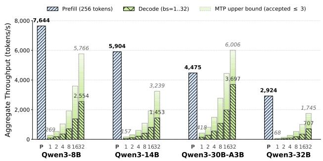  
Figure 1. Prefill vs. decode aggregate throughput across models (A800-80GB). The gradient region shows the upper bound with multi-token prediction (mean accepted tokens ≤ 3).

Beyond pairwise streaming, FLASHAGENTS addresses redundant computation when multiple downstream agents perform incremental prefill concurrently. In multi-agent workflows, concurrent requests often share common prefixes—such as identical instruction templates or partially overlapping upstream outputs. We introduce an intra-turn prefix cache that detects and eliminates redundant prefill across concurrent incremental operations within the same trigger event, significantly reducing computation when agents share instruction templates.

Our contributions are threefold:

• We introduce Inter-agent streaming and incremental prefill, which overlaps upstream decode and downstream prefill through token streaming and incremental prefill, reducing idle time across agent transitions.

• We propose an Intra-turn prefix cache based on radix trees that detects and reuses shared prefixes across concurrent requests, eliminating redundant prefill when multiple downstream agents share instruction templates.

• We implement FLASHAGENTS on SGLang and integrate it with AutoGen, demonstrating up to 40% end-to-end latency reduction on real workflows and 3.5× speedup in controlled benchmarks across diverse models and interaction patterns.

As multi-agent systems grow in complexity and scale, system-level architectural optimizations are becoming critical for performance (Cemri et al., 2025; Chen et al., 2025). FLASHAGENTS represents a key step towards more responsive and efficient LLM-based multi-agent systems by enabling concurrent processing at the inter-agent level.

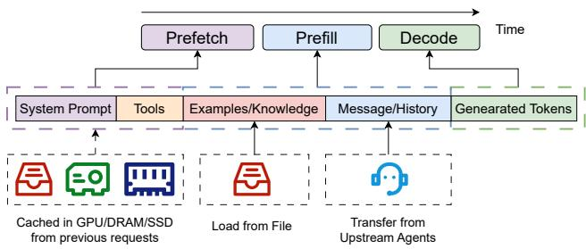  
Figure 2. Agent context composition and execution timeline (Rajasekaran et al., 2025). FLASHAGENTS eliminates idle time by streaming tokens incrementally and overlapping downstream prefill with upstream decode.

## 2 BACKGROUND

## 2.1 Multi-Agent Systems

Agent context composition. As illustrated in Figure 2, an agent’s context comprises multiple components with distinct characteristics: static elements like system prompts and tools can leverage prefix caching, while the message/history portion must be transferred from upstream agents. In standard multi-agent frameworks (Wu et al., 2023; Li et al., 2023), upstream agent outputs are appended sequentially to the downstream agent’s context, following the conversational flow.

Workflow patterns. Modern MAS applications span a spectrum from predefined workflows to fully autonomous agents (Schluntz & Zhang, 2024). Workflows orchestrate LLMs through fixed code paths—such as prompt chaining (sequential pipelines), orchestrator-workers (hierarchical delegation), and parallelization (concurrent execution with aggregation). Autonomous agents, conversely, dynamically determine their own execution strategies based on runtime conditions. Figure 3 illustrates common interaction patterns, ranging from basic workflow templates (evaluator-optimizer, pipeline, group, hierarchical) to complex dynamic workflows (coding, research). Production deployments from Anthropic (Anthropic, 2025), autonomous research systems like DeepResearch (Zhang et al., 2025), and coding assistants like MapCoder (Islam et al., 2024) exemplify dynamic workflows where execution graphs emerge at runtime. Regardless of their complexity, these systems commonly feature sequential agent interactions where agents exchange text processed by their underlying LLMs, creating interagent dependencies.

Heterogeneous model deployment. Increasingly, MAS deployments leverage heterogeneous model combinations, pairing large models (LLMs) with small models (SLMs) to balance capability and efficiency (Belcak, 2025). In multiagent programming tools (Islam et al., 2024), LLMs orchestrate high-level plans while SLMs execute implementation steps; in research systems (Li et al., 2025b; Zhang et al., 2025), SLMs perform searches while LLMs handle orchestration. When SLMs generate lengthy outputs to larger downstream models, the downstream prefill can become a significant bottleneck that inter-agent streaming optimizations can address.

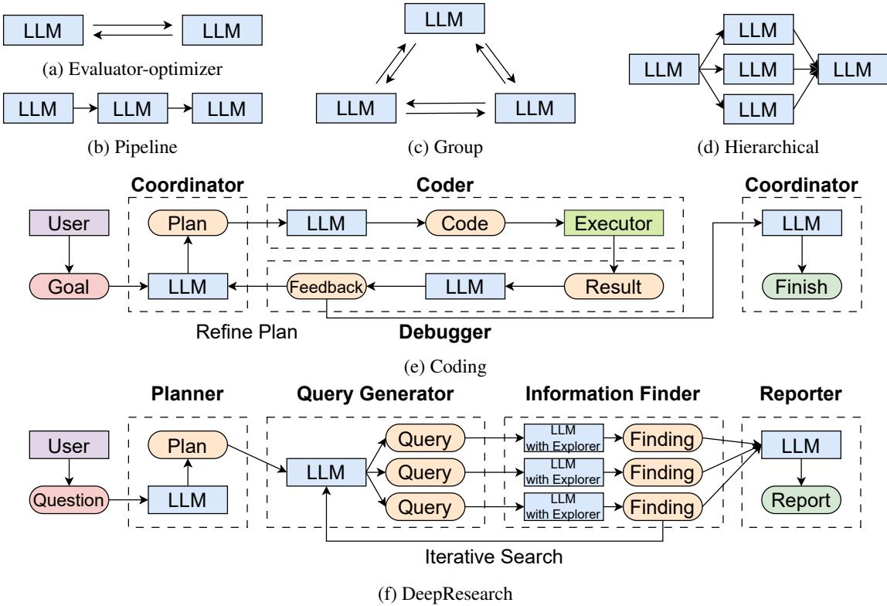  
Figure 3. Common interaction patterns in Multi-Agent Systems (MAS). (a)-(d) show basic workflow patterns: Evaluator-optimizer, Pipeline (prompt chaining), Group (parallelization), and Hierarchical (orchestrator-workers) (Schluntz & Zhang, 2024). (e) Coding and (f) DeepResearch demonstrate real-world dynamic workflows with adaptive agent interactions. FLASHAGENTS optimizes sequential inter-agent interactions prevalent in these patterns.

## 2.2 LLM Inference

Prefill and decode phases. Modern decoder-only LLMs typically execute requests in two main phases (Kamath et al., 2025): a compute-intensive Prefill Phase that processes the input prompt in parallel to produce the first token and a Key-Value (KV) cache, which is a major factor in Time-to-First-Token (TTFT) latency; and a memory-bandwidth-bound Decode Phase that autoregressively generates subsequent tokens one by one, using the KV cache, which determines the Time-Per-Output-Token (TPOT). The KV Cache stores attention key and value states to prevent redundant computations (Dao et al., 2022; Dao, 2023).

Prefix caching. Prefix caching exploits the observation that many requests share common prompt prefixes (e.g., system instructions, few-shot examples). Systems like SGLang (Zheng et al., 2024a) and vLLM (Kwon et al.,

2023) maintain radix trees mapping token sequences to their computed KV caches. When a new request arrives, the serving system searches the tree for the longest matching prefix and reuses its KV cache, only computing the remaining tokens. However, these persistent caches are updated only after a request completes its prefill phase, meaning concurrent requests arriving during the same turn cannot share prefill computation even when they have common prefixes.

Prefill–decode throughput gap. Figure 1 compares prefill and decode throughput for processing the same number of tokens (256) across four models. At moderate decode concurrency, the two phases operate within the same order of magnitude—e.g., Qwen3-8B prefill at 7,644 tokens/s vs. decode at 2,554 tokens/s (batch size 32)—indicating that overlapping them yields meaningful latency reduction. With multi-token prediction (MTP), effective decode throughput increases further (up to 5,766 tokens/s for Qwen3-8B), narrowing the gap and making each overlapped prefill step cover a proportionally larger fraction of useful work. In practice, the optimization opportunity is even larger for two reasons. First, as illustrated in Figure 2, a downstream agent’s prefill must process not only the upstream output but also its own system prompt, tool descriptions, and conversation history, substantially increasing the effective prefill workload beyond the streamed tokens alone. Second, in heterogeneous deployments where a smaller upstream model (e.g., 8B) streams to a larger downstream model (e.g., 32B), the upstream decode runs fast while the downstream prefill is heavier, widening the overlap window that FLASHA-GENTS exploits.

## 3 FLASHAGENTS: INTER-AGENTSTREAMING AND PREFILL OVERLAP

The FLASHAGENTS approach accelerates Multi-Agent Systems (MAS) primarily through its core mechanism, Interagent streaming and incremental prefill (Inter-Agent Streaming and Incremental Prefill). Inter-agent streaming and incremental prefill optimizes inter-agent communication and the transition of execution control, speeding up individual AGENT A → AGENT B transitions (Figure 4). When multiple Inter-agent streaming and incremental prefill pipelines execute concurrently, Prefix-aware chunk scheduling (Prefix-Aware Chunk Scheduling) coordinates their incremental prefill operations to maximize prefix sharing and reduce redundant computation.

## 3.1 Inter-agent streaming and incremental prefill

The fundamental challenge in sequential MAS operations is the idle time incurred by a subsequent agent (AGENT B) while waiting for a preceding agent (AGENT A) to complete its full token generation (decode phase) before AGENT B can begin processing this output as its input (prefill phase). Inter-agent streaming and incremental prefill directly addresses this by allowing computational overlap. As illustrated in Figure 4 and Algorithm 1, the Inter-agent streaming and incremental prefill mechanism operates as follows:

1. AGENT A Decode Start and Token Streaming: Upon receiving its initial prompt PA, AGENT A’s LLM engine (EA) commences its decode phase (Algorithm 1, line 5). Generated tokens (toki) are directly streamed to a dedicated buffer (BufB) for AGENT B (Algorithm 1, lines 7-9). This stream forms AGENT A’s output, SA.

2. AGENT B Incremental Prefill: Simultaneously, AGENT B’s LLM engine (EB) monitors BufB. Upon a predefined criterion C (e.g., token count, EB idle), EB fetches a token chunk (Tchunk) and performs an incremental prefill operation (IncPrefill) to update AGENT B’s Key-Value (KV) cache, KVB (Algorithm 1, lines 10-12). This early start of prefill enables not only computational overlap but also early data prefetching: model weights and existing KV cache entries can be loaded into GPU memory before AGENT A completes, hiding memory transfer latency behind AGENT A’s decode phase.

3. Causal KV Cache Update: The IncPrefill operation ensures correct processing of incoming tokens by attention mechanisms against the incrementally built KVB, preserving causal consistency across all tokens received from SA. Specifically, when processing the i-th chunk with query tokens Qi ∈ Rni×d, the attention mechanism attends to all accumulated key-value pairs from previous chunks:

$$
\tag{1}
$$

where K:i = [K1; . . . ; Ki] ∈ R(Pij=1 nj )×d represents the concatenated keys, with the key-value sequence length growing with i while query length ni remains small.

4. Overlap Continuation and Synchronization: AGENT A continues streaming while AGENT B concurrently updates KVB. After AGENT A completes SA (Algorithm 1, line 14), any remaining tokens in BufB are processed by EB (Algorithm 1, lines 15-17). AGENT B then immediately starts its decode phase using the complete KVB (Algorithm 1, line 18).

Let Tdecode,A, Tprefill,B, and Tdecode,B be the decode time for AGENT A, prefill time for AGENT B, and decode time for AGENT B, respectively. In standard sequential execution, end-to-end latency is:

$$
\tag{2}
$$

With Inter-agent streaming and incremental prefill, the latency for a single pipeline becomes:

$$
\tag{3}
$$

where the overlap time Toverlap is strictly bounded by the shorter of the two overlapped phases:

$$
\tag{4}
$$

This bound holds per pipeline regardless of concurrency. In practice, Toverlap depends on how effectively incremental prefill chunks are scheduled during upstream decode; when the upstream decode phase is long relative to each incremental chunk, Toverlap approaches the bound.

Concurrency benefits. When N agent pairs execute concurrently, two additional system-level effects amplify the end-to-end speedup beyond what Equation 4 alone predicts. First, incremental prefill operations from multiple pipelines are co-batched by the serving engine, improving GPU compute utilization compared to isolated single-pipeline execution. Second, the intra-turn prefix cache (Section 3.2) eliminates redundant prefill across concurrent requests sharing common instruction prefixes, effectively reducing the per-pipeline Tprefill,B. Denoting the effective prefill time after prefix reuse as T ′prefill,B ≤ Tprefill,B, the per-pipeline latency under concurrency becomes:

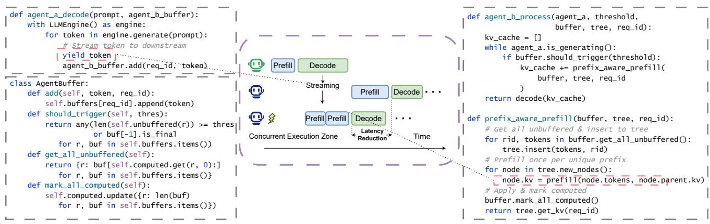  
Figure 4. Conceptual illustration of FLASHAGENTS with implementation details. Left: Agent A’s streaming generator with yield tokens to buffer. Middle: Timeline showing overlapped execution across multiple concurrent agent pairs. Right: Agent B’s incremental prefill process with prefix-aware buffer management that tracks computed vs. unbuffered tokens for each request.

Algorithm 1 Core Inter-agent streaming and incremental   
prefill Mechanism (AGENT A → AGENT B)   
Input: Prompt PA for AGENT A; engines EA, EB with KV   
cache KVB   
1: BufB ← ∅; KVB ← ∅   
2: EA.StartDecode(PA)   
3: while EA is decoding do   
4: tok ← EA.NextToken()   
5: BufB.Append(tok)   
6: if |BufB| ≥ threshold or tok is final then   
7: EB.Prefill(BufB, KVB) ▷ updates prefix   
cache   
8: BufB ← ∅   
9: end if   
10: end while   
11: return EB.Decode(KVB)

$$
\tag{5}
$$

Section 6.1 empirically validates this model: for 7B models, speedup increases from 1.05× at concurrency=1 to 3.5× at higher concurrency, driven by improved GPU utilization and prefix reuse rather than increased per-pipeline overlap.

FLASHAGENTS naturally supports multiple concurrent Inter-agent streaming and incremental prefill pipelines executing simultaneously. Each agent pair operates according to Algorithm 1, with incremental prefill requests coordinated through a prefix-aware scheduling mechanism. When multiple downstream agents buffer tokens concurrently, their prefill operations are aggregated and scheduled to maximize prefix sharing, as detailed in the next subsection.

## 3.2 Prefix-Aware Incremental Prefill via Intra-Turn Prefix Cache

Motivation. Naıve incremental prefill performs the prefill step independently for each request when new tokens arrive, which may redundantly re-process long overlapping token prefixes among concurrently active downstream requests. Existing prefix caching systems like SGLang (Zheng et al., 2024a) and vLLM (Kwon et al., 2023) update their persistent radix trees only after a request completes its prefill phase, meaning concurrent requests arriving during the same turn cannot share prefill computation even when they have common prefixes. This limitation becomes pronounced in multi-agent workflows where multiple downstream agents often share instruction templates or receive partially overlapping upstream outputs simultaneously.

Approach. We introduce an intra-turn prefix cache that detects and eliminates redundant prefill across concurrent incremental operations. The key insight is to build a temporary radix tree at prefill trigger time to identify common prefixes among buffered token sequences, compute each unique prefix once, and reuse the results across all requests sharing that prefix.

Mechanism. For each request r, we maintain a buffer Ur of tokens that have arrived but not yet been processed. When a prefill trigger occurs (e.g., total buffered tokens exceed a threshold), the system performs three steps (illustrated in Figure 5):

Step 1: Build radix tree. Insert all buffered sequences {Ur} into a shared radix tree T . The tree structure naturally identifies common prefixes: if two requests buffer “System: Analyze” and “System: Summarize”, the tree creates one shared node for “System: ” and two separate child nodes for “Analyze” and “Summarize”.

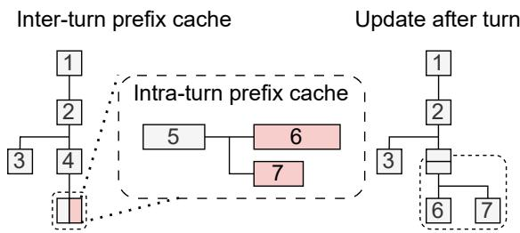  
Figure 5. Intra-turn prefix cache. Each rectangle denotes a radixtree node that aggregates a token span; paths encode shared prefixes across requests. Prefill is carried out once per newly created node and reused by all traversing requests.

Step 2: Compute unique prefixes. Traverse T and compute KV cache only for newly created nodes—i.e., token sequences that no request has processed yet. Each node’s KV cache is computed by extending its parent’s KV cache with the node’s token span. Nodes shared by multiple requests are computed once.

Step 3: Propagate results. For each request r, assemble its complete KV cache by collecting KV deltas from all nodes along its path in T . This allows multiple requests sharing instruction templates to reuse the same prefill computation.

Analysis. The cache preserves causal correctness because each incremental prefill update is applied in lexical order along a path from a request’s current committed node to its new leaf. Reuse arises whenever two or more requests expose a common prefix, which frequently occurs in MAS pipelines where downstream prompts share instruction templates. Building T is linear in the total number of unbuffered tokens across all requests (O(Pr |Ur|)). Memory overhead is bounded by the number of unique prefix extensions created. Prefill computation is performed only once per unique node, enabling substantial reuse when requests share common token prefixes.

## 4 EXTENSIONS FOR MULTI-AGENT TOPOLOGIES

The FLASHAGENTS approach, with its two orthogonal mechanisms, can be extended to settings with more than two interacting agents (N > 2), though managing synchronization and dependencies grows in complexity.

## 4.1 Linear Agent Chains

In a linear sequence of agents, Inter-agent streaming and incremental prefill can be applied serially to each link: AGENT A streams to AGENT B, AGENT B streams to AGENT C, and so on. This creates a pipelined effect, where each agent AGENT I+1 can start its incremental prefill as soon as agent AGENT I begins generating tokens. The overall end-to-end latency reduction builds up across the chain, though it can be limited by the slowest (decode or incremental prefill) step in any given link. If any agent in the chain (e.g., AGENT B) itself processes batches of inputs or generates batches of outputs, it can manage its batch processing using principles similar to Prefix-aware chunk scheduling to efficiently feed subsequent Inter-agent streaming and incremental prefill links (e.g., AGENT B→AGENT C).

Algorithm 2 Prefix-Aware Aggregation for Incremental   
Prefill   
Input: Active requests R with unbuffered tokens Ur; radix   
tree T   
1: for request r ∈ R with Ur ̸= ∅ do   
2: Insert(T , Ur, r) ▷ create nodes for unique prefixes   
3: e nd for   
4: N ← newly created nodes in T , ordered by depth   
5: for node n ∈ N do ▷ from shallow to deep   
6: KVn ← E.Prefill(tokens(n), KVparent(n))   
7: end for   
8: for request r ∈ R do   
9: for node n on path from root to r do   
10: KVr ← KVr ∪ KVn   
11: end for   
12: end for

## 4.2 Complex Topologies

FLASHAGENTS also applies to complex interaction graphs. In Fan-out scenarios (e.g., AGENT A → {AGENT B, AGENT C}), AGENT A can use Inter-agent streaming and incremental prefill to stream tokens in parallel to multiple recipients (AGENT B, AGENT C); if AGENT A handles input batches, its batch processing approach (akin to Prefix-aware chunk scheduling) influences how these concurrent output streams are managed. In Fan-in patterns (e.g., {AGENT B, AGENT C} → AGENT D), correctness requires that position IDs in AGENT D’s prompt match the final linearized order. Because modern decoder-only Transformers apply positional encodings (e.g., RoPE) before attention, FLASHAGENTS can only incrementally prefill position-stable segments—those whose absolute positions are already determined. Concretely, if AGENT D’s prompt is linearized as [system prompt]∥[outputB]∥[outputC ], the system prompt and output can be incrementally prefilled as tokens arrive, but outputC ’s prefill is deferred until outputB is finalized (since C’s positions depend on B’s length). This conservative strategy preserves correctness while still enabling overlap for all position-stable prefixes. While such complex topologies raise coordination demands (managing concurrent streams, completion signals, and resource contention), the considerable latency reduction achievable through pipelined and parallelized execution is a significant

driving factor.

## 5 SYSTEM IMPLEMENTATION

We implement FLASHAGENTS by extending the SGLang (Zheng et al., 2024a) runtime with streaming and prefix-aware coordination capabilities. As described in Section 6, our implementation operates without modifying SGLang’s core RadixAttention tree, instead adding a modular extension layer that realizes the mechanisms in Algorithms 1 and 2. Figure 4 illustrates the implementation architecture with code-level details.

## 5.1 Token Streaming and Incremental Prefill

To enable token streaming from upstream agents (Algorithm 1, lines 2–9), we extend SGLang’s generation API with a streaming mode. As shown in the left panel of Figure 4, upstream agents invoke the engine with a generator pattern that yields tokens incrementally. Each generated token is immediately added to the downstream agent’s buffer via a lightweight message-passing mechanism, enabling low-latency token propagation between co-located agents.

For downstream agents, we implement an incremental prefill interface that accepts token chunks and updates KV caches dynamically. The engine maintains per-request buffers tracking unbuffered tokens and their computed state (as illustrated in the AgentBuffer class in Figure 4). When the trigger condition is met—either buffer size exceeding a threshold or receiving a final token marker—the scheduler batches pending incremental prefill operations with regular inference workloads, enabling efficient GPU utilization.

Each incremental prefill operation processes a chunk of tokens using Equation 1, where the new query tokens attend to all previously accumulated KV pairs. The engine maintains causal consistency by ensuring that KV updates are applied in the order tokens arrive. Upon completion of upstream generation, any remaining buffered tokens are processed, and the downstream agent transitions to its decode phase with a complete KV cache.

## 5.2 Prefix-Aware Coordination via Intra-Turn Cache

To implement Algorithm 2, we extend the SGLang scheduler with an auxiliary radix tree that operates during incremental prefill aggregation, separate from SGLang’s persistent RadixAttention tree. Each tree node stores a token span, a reference to its parent’s KV cache, and the computed KV delta for that span. This structure enables detection and reuse of common prefixes across concurrent requests without modifying the underlying cache management.

As shown in the right panel of Figure 4, when multiple downstream agents buffer tokens concurrently, the scheduler monitors total buffered tokens across all requests. Upon triggering, the system inserts all unbuffered token sequences into the radix tree, creating new nodes for unique prefix extensions. These nodes are then topologically ordered by depth and materialized in sequence (Algorithm 2, lines 5–8), ensuring parent KV caches are available before processing child nodes.

After materializing new nodes, the computed KV deltas are applied to each request by traversing its path in the radix tree (Algorithm 2, lines 9–12). This approach allows multiple requests sharing instruction templates or partially overlapping upstream outputs to reuse prefill computations, significantly reducing redundant work. The radix tree state persists within a turn but is lightweight and can be pruned between trigger events.

## 5.3 Integration with Multi-Agent Frameworks

AutoGen integration. We integrate FLASHAGENTS with AutoGen (Wu et al., 2023) by developing an asynchronous client that manages streaming requests. When an upstream agent generates a response, the client submits it in streaming mode and creates a linked downstream request that incrementally prefills from the stream. Request identifiers propagate through agent interactions, enabling the runtime to associate producer-consumer pairs and coordinate their execution according to Algorithm 1.

Runtime coordination. The MAS framework manages inter-agent dependencies and token transfer through a coordination layer. For concurrent agent pairs, the framework tracks active streaming sessions and notifies the SGLang scheduler when new tokens are available, triggering incremental prefill operations. This design separates frameworklevel orchestration from engine-level execution, allowing FLASHAGENTS to integrate with diverse MAS frameworks through a standard streaming interface.

Error handling and synchronization. The implementation includes mechanisms for handling upstream failures, stream interruptions, and timeout conditions. If an upstream agent fails during generation, downstream agents are notified to finalize prefill with available tokens or abort gracefully. Synchronization primitives ensure that downstream decode does not commence until all streamed tokens are processed and the KV cache is complete.

## 6 EVALUATION

Implementation and Testbed. We implement the FLASHA-GENTS data structures and scheduling policies within the SGLang (Zheng et al., 2024a) runtime. Our implementation operates without modifying SGLang’s core RadixAttention tree, enabling the algorithms described in Section 3 through a modular extension layer.

All experiments are conducted on NVIDIA A100-80GB GPUs with CUDA 12.6. For 7B and 32B parameter models, we deploy on a single A100 GPU. For the 235B parameter model, we use tensor parallelism (Shoeybi et al., 2019) (TP=8) across eight A100-80GB GPUs to accommodate the model size and enable efficient inference.

## 6.1 Microbenchmark Evaluation

Experimental configurations. We conduct controlled AGENT A→AGENT B cascade experiments to isolate the core benefits of Inter-agent streaming and incremental prefill. Our evaluation spans three representative configurations to simulate diverse system loads: Qwen2.5-7B (Yang et al., 2024), Qwen3-235B (Yang et al., 2025) with highthroughput upstream generation, and Qwen3-235B with low-throughput upstream generation. The high-throughput setting represents scenarios where the upstream agent generates tokens rapidly, while the low-throughput setting simulates cases with slower upstream generation due to model capacity or resource constraints. For each configuration, we systematically vary concurrency levels in {1, 2, 4, 8} to assess performance under both single-request and batch scenarios. Each workload is labeled as TPS/Prefix/Upstream in Figure 6, where TPS denotes upstream token generation rate (tokens/second), Prefix is the shared context length for RadixAttention cache reuse, and Upstream is the total token count streamed from upstream to downstream agents.

Performance metric. To quantify the latency reduction achieved by FLASHAGENTS, we define the downstream response latency T as the elapsed time from when the upstream agent emits its first token to when the downstream agent produces its first output token. Formally, let tAfirst denote the timestamp at which AGENT A generates its first token, and tBfirst denote the timestamp at which AGENT B generates its first token. The metric is then:

$$
\tag{6}
$$

This metric directly captures the inter-agent transition latency that FLASHAGENTS aims to minimize through overlapped execution. We compare FLASHAGENTS against Sequential execution, where AGENT B initiates prefill only after AGENT A completes its entire generation, representing the standard execution model in existing serving systems such as SGLang (Zheng et al., 2024a) without streaming support.

Results and analysis. Figure 6 presents the speedup achieved by FLASHAGENTS across all 240 tested configurations. Notably, FLASHAGENTS outperforms the Sequential baseline in every single configuration, demonstrating consistent benefits across diverse settings. The improvements range from 1.05× to 3.52× depending on model size, concurrency, and workload characteristics.

For the 7B model under single concurrency, prefill operations complete rapidly relative to decode, resulting in modest speedups of 1.05× to 1.2×. The limited overlap opportunity arises because the downstream prefill finishes quickly, leaving little room for concurrent execution with upstream decode. However, as concurrency increases, the system transitions into a sustained compute-bound state where multiple downstream agents perform prefill simultaneously. This enables Prefix-aware chunk scheduling coordination and the intra-turn prefix cache to deliver substantial benefits, achieving peak speedups of 3.52× at concurrency=2 through improved GPU utilization and elimination of redundant prefill computations across concurrent requests.

For the 235B model under single concurrency, the prefill phase is considerably slower due to the larger model capacity and increased computational requirements. This naturally provides more overlap opportunity with upstream decode, yielding higher single-request speedups compared to the 7B model. Under high concurrency, the speedup initially increases as Prefix-aware chunk scheduling effectively coordinates multiple pipelines. However, as concurrency grows further, the cumulative downstream prefill time begins to exceed the upstream decode time, particularly when multiple downstream agents process long streamed sequences simultaneously. This causes the overlap benefit to plateau and then decline slightly, as the bottleneck shifts from upstream decode to aggregate downstream prefill capacity. The high-throughput and low-throughput upstream configurations exhibit similar trends, though the low-throughput setting shows slightly higher speedups at moderate concurrency due to extended upstream decode phases that provide more overlap opportunity.

## 6.2 End-to-end Performance With Real Workflows

Workflow configurations. We evaluate FLASHAGENTS on two representative real-world multi-agent workflows and one document-driven pipeline. All Chain and MapReduce experiments use heterogeneous model deployment with upstream agents running Qwen2.5-7B (Yang et al., 2024) on one A100 GPU and the downstream aggregator using Qwen2.5-32B on a separate GPU. Chain is a sequential travel planning assistant1 (Planner → Local → Language → Summary) with four agents in a pure pipeline, where each agent receives a shared 2,500-token destination guide as context. MapReduce is inspired by the literature review pattern2 and implemented as three Reviewer agents that independently evaluate the same paper, followed by a Meta-

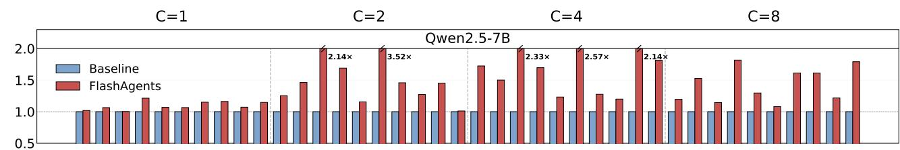

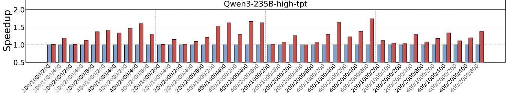

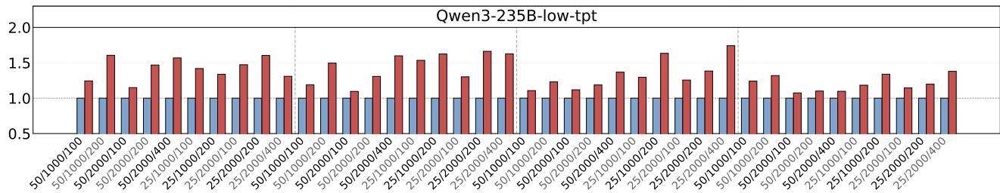  
Figure 6. Microbenchmark results across concurrency levels and workload configurations. FLASHAGENTS consistently outperforms the Sequential baseline, with peak speedups reaching 3.52× at concurrency=2.

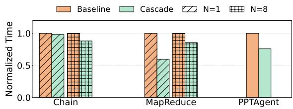  
Figure 7. Normalized latency for real-world workflows (N: concurrent requests), including two AutoGen-based workflows and PPTAgent (Zheng et al., 2025).

Reviewer that synthesizes their opinions. Both workflows are evaluated at N =1 (single request) and N =8 (concurrent requests), with the baseline running agents sequentially (one at a time, waiting for each to complete before starting the next).

Results. Figure 7 compares FLASHAGENTS against the baseline. For Chain, FLASHAGENTS pre-warms the position-stable portion of the Summary prompt (system template plus the shared 2,500-token guide, ≈98% of the full input) on the 32B GPU concurrently with Planner’s decode on the 7B GPU, so nearly all prefill is hidden before the upstream agents finish. At N =1 this yields a 1.8% latency reduction; at N=8, the intra-turn prefix cache eliminates redundant per-instance prefill across concurrent requests, widening the benefit to 11.9%. For MapReduce, the baseline runs the three Reviewers sequentially (AutoGen default); FLASHAGENTS parallelises them (fan-out) and pre-warms the Meta-Reviewer’s shared paper prefix during their decode. At N=1 this produces a 40.3% reduction; at N =8, decode contention on the shared 32B GPU moderates the gain to 14.7%.

## 6.3 End-to-end Performance on an Agentic Generation Workflow

Workflow configuration. We further evaluate FLASHA-GENTS on PPTAgent (Zheng et al., 2025), a realistic document-driven presentation generation pipeline, deployed on two heterogeneous A800-80GB GPUs. The workflow involves two agent roles: (1) a VLM Analyzer (Qwen2.5-VL-7B-Instruct, GPU 0) that reads a real research paper and generates a structured 12-slide outline; and (2) twelve concurrent Content Generators (Qwen3- 14B, GPU 1) that each produce slide content from the document and outline. Each content generator’s prompt follows the structure [sys prompt + doc content + outline item + slide instr], where the first two components (3,013 tokens) form a position-stable shared prefix (Section 4) fully determined before the Analyzer begins. A VLM layout selector (GPU 0) also runs concurrently to assign visual templates to each slide.

Table 1. Ablation study isolating IASIP and intra-turn prefix cache contributions. Speedup is computed as Baseline / Full FLASHA-GENTS.  
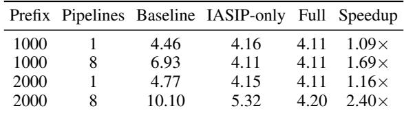

Results. FLASHAGENTS pre-warms the shared prefix on GPU 1 via a single incremental prefill that executes concurrently with the Analyzer’s decode window on GPU 0, leveraging the intra-turn prefix cache to avoid redundant computation across all 12 generators. By the time the outline is ready, each generator’s KV cache already covers the batch prefix; only outline item + slide instr (≈300 tokens each) remain to be prefilled, fitting within a single chunked-prefill batch step. In the baseline, all 12 generators submit their full token inputs only after the Analyzer finishes; SGLang’s chunked-prefill step covers at most 2–3 complete requests before the shared prefix is cached, leaving sequential prefill on the critical path. On a real research paper , FLASHAGENTS achieves 3.41s versus the baseline’s 4.49s, a 24.1% downstream responese latency reduction (1.32× speedup), consistent with the gains on AutoGenbased workflows above and confirming that FLASHAGENTS generalizes to heterogeneous multi-GPU deployments in realistic agentic pipelines.

## 6.4 Ablation Study

To isolate the contribution of each component, we compare three configurations: Baseline (sequential execution), IASIP-only (streaming + incremental prefill without the intra-turn prefix cache), and Full FLASHAGENTS (IASIP + intra-turn prefix cache). Table 1 reports results on Qwen3- 32B with upstream TPS=50.

At single concurrency, IASIP accounts for nearly all gains (1.09–1.16×) and the prefix cache adds minimal benefit, since there is no cross-request prefix sharing opportunity. At concurrency=8, however, IASIP alone leaves substantial redundant prefill: with prefix=2000 and 8 pipelines, IASIP-only takes 5.32s while Full FLASHAGENTS reduces this to 4.20s—a 21% additional reduction from prefix deduplication. The full system achieves 2.40× speedup, confirming that the two components address complementary regimes: IASIP removes the handoff barrier, while the intraturn prefix cache eliminates redundant computation under concurrency.

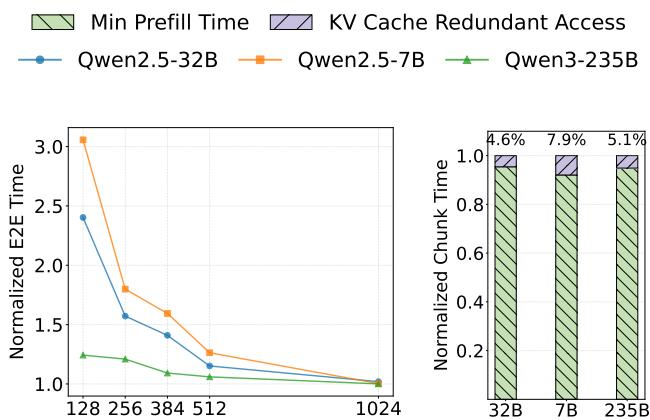  
Figure 8. Overhead analysis of incremental prefill. Left: Total GPU computation time for processing 1024 tokens as a function of chunk size, normalized to single-pass prefill. Right: Time difference between the longest chunk (final chunk with maximum historical KV) and shortest chunk (first chunk with no history), showing modest overhead from accumulated KV cache access.

## 6.5 Overhead Analysis

While incremental prefill enables execution overlap that reduces end-to-end latency, it introduces computational overhead compared to single-pass prefill. This overhead stems from two sources: (1) splitting context into smaller chunks reduces computational intensity, making operations memory-bound; (2) each incremental prefill incurs redundant memory accesses by repeatedly loading model weights and accessing previously computed KV cache entries. As shown in Equation 1, processing the i-th chunk requires attending to all accumulated key-value pairs, with the KV sequence length growing while the query remains small.

Experimental setup. We process a fixed 1024-token context under varying chunk sizes {128, 256, 384, 512, 1024}, measuring cumulative GPU computation time across all incremental prefill operations. Each experiment is repeated five times with median reported across Qwen2.5-7B, Qwen2.5-32B (Yang et al., 2024), and Qwen3-235B (Yang et al., 2025).

Aggregate computational overhead. The left panel of Figure 8 shows total GPU computation time normalized to single-pass prefill. At chunk size 128, incremental prefill incurs up to 3× overhead from memory-bound execution and repeated weight loading across eight operations. However, overhead diminishes rapidly as chunk size increases, approaching 1.2× at chunk size 512. This demonstrates that the overhead-latency trade-off can be effectively managed through chunk size tuning. Critically, FLASHAGENTS still achieves significant end-to-end latency reductions by overlapping these operations with upstream decode (Section 6.1).

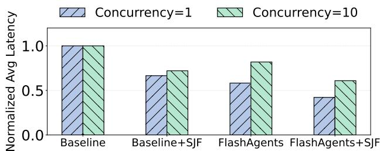  
Figure 9. Orthogonality of FLASHAGENTS with scheduling policies. FLASHAGENTS’s streaming overlap and SJF scheduling provide complementary benefits, with combined improvements of 56% at concurrency=1 and 37% at concurrency=10.

Isolating KV cache access overhead. In realistic deployments, incremental prefill chunks share GPU resources with other concurrent requests. While model weight loading is amortized across all co-scheduled requests, accessing accumulated historical KV cache represents a unique overhead specific to incremental prefill. The right panel of Figure 8 isolates this cost: for chunk size 128 (8 operations), we compare the final chunk—which attends to 896 tokens of history—against the first chunk with no history. Across all models, the longest chunk is only 4.6% to 7.9% slower. This confirms that historical KV access overhead is modest, and the true incremental burden imposed on shared GPU resources by FLASHAGENTS’s streaming mechanism is minimal.

## 6.6 Orthogonality with Existing Optimizations

FLASHAGENTS’s token-level streaming mechanism operates orthogonally to request-level scheduling policies. Figure 9 demonstrates this by combining FLASHAGENTS with Shortest Job First (SJF) scheduling (Silberschatz et al., 2018), which prioritizes requests with shorter expected execution time—a key strategy employed by Kairos (Chen et al., 2025) for multi-agent serving. We evaluate four configurations across the workflows from Section 6.2 at concurrency=1 and concurrency=10, assuming single workflow type serving with pre-profiled agent execution times.

Results show independent and complementary benefits: SJF alone reduces latency to 65-70% through improved request ordering, while FLASHAGENTS alone achieves 57% via streaming overlap. Combined, FLASHAGENTS+SJF delivers 44% (56% reduction) at low concurrency and 63% (37% reduction) at high concurrency, confirming orthogonality. At low concurrency, streaming overlap dominates as each agent pair fully exploits prefill-decode pipelining without contention. At high concurrency, SJF mitigates resource competition, allowing FLASHAGENTS to maintain overlap benefits despite increased GPU pressure.

This orthogonality extends to other optimizations operating at different granularities: FLASHAGENTS targets intra-workflow token-level coordination, while systems like Kairos (Chen et al., 2025) optimize inter-workflow request scheduling and Teola (Tan et al., 2024) perform workflowlevel graph optimization. These layers compose naturally, enabling deployment alongside existing serving infrastructure.

## 7 RELATED WORK

LLM serving optimizations. Recent serving systems have introduced diverse optimization techniques. vLLM (Kwon et al., 2023) and SGLang (Zheng et al., 2024a) pioneered continuous batching and prefix caching through PagedAttention and RadixAttention, respectively, while FlashAttention (Dao et al., 2022; Dao, 2023) and FlashInfer (Ye et al., 2025) optimize attention kernels with memory-efficient implementations, including efficient computation for prefixcached sequences. Prompt Cache (Gim et al., 2024) and CacheBlend (Yao et al., 2025) explore modular attention reuse and cached knowledge fusion beyond strict prefix matching, though these approaches involve approximations rather than lossless caching. BatchLLM (Zheng et al., 2024b) constructs offline prefix trees for batch-level cache sharing, and systems like Splitwise (Patel et al., 2024) and DistServe (Zhong et al., 2024) disaggregate prefill and decode to reduce phase interference. Chunked prefill, widely adopted in vLLM, Sarathi (Agrawal et al., 2024), TensorRT-LLM (NVIDIA, 2023), and DeepSpeed-FastGen (Holmes et al., 2024), splits long prompts into smaller chunks to reduce TTFT and peak GPU memory within single requests. While these techniques substantially improve intra-request efficiency and cross-request batching, FLASHAGENTS addresses a distinct bottleneck: inter-agent coordination latency when agents interact sequentially. By enabling token streaming and incremental prefill across agent boundaries, FLASHAGENTS achieves execution overlap orthogonal to existing optimizations and can be deployed alongside continuous batching and prefix caching.

Multi-agent system optimizations. Several systemlevel optimizations have emerged for multi-agent serving. KVFlow (Pan et al., 2025) introduces workflow-aware KV cache management through static Agent Step Graphs, using steps-to-execution metrics to predict agent invocations and implement predictive eviction, though this relies on predetermined workflow structures. Kairos (Chen et al., 2025) targets low-latency serving under cloud resource contention through request-level priority scheduling and adaptive batching. Teola (Tan et al., 2024) demonstrates primitive-level DAG optimization for modular LLM applications, requiring predefined workflow templates to construct offline execution graphs.

In contrast, FLASHAGENTS addresses inter-agent execution coordination through token-level streaming and reactive incremental prefill, achieving temporal overlap between sequentially dependent agent phases without requiring workflow prediction or predefined templates. This approach naturally adapts to dynamic execution paths and variable generation lengths. FLASHAGENTS is complementary to these systems: it composes with KVFlow’s cache management (what to cache), Kairos’s request scheduling (which request first), and Teola’s graph optimization (how to structure workflows), while focusing uniquely on execution overlap (when to start processing). This orthogonality enables joint deployment where existing optimizations handle their respective dimensions while FLASHAGENTS maximizes inter-agent computation overlap.

## 8 CONCLUSION

FLASHAGENTS is a serving approach centered on Interagent streaming and incremental prefill that reduces the prefill barrier in Multi-Agent Systems by overlapping upstream decode and downstream prefill via token streaming and incremental prefill. For high-concurrency deployments, Intra-turn prefix cache eliminates redundant prefill across requests using a radix-tree representation. Implemented on SGLang and integrated with standard MAS frameworks, FLASHAGENTS enables more responsive and efficient multiagent applications.

Future work includes deeper algorithm–system co-design (e.g., enabling non-generative operations during overlapped prefill), adaptive streaming policies, and advanced scheduling strategies that jointly consider memory footprint, overlap opportunities, and fairness at scale.

## ACKNOWLEDGEMENTS

We sincerely thank the reviewers for their insightful comments and valuable suggestions. This work was supported by the National Key R&D Program of China (2024YFC3308000), Natural Science Foundation of China (No. 62536008, 62476265, 62306303).

## REFERENCES

Achiam, J., Adler, S., Agarwal, S., Ahmad, L., Akkaya, I., Aleman, F. L., Almeida, D., Altenschmidt, J., Altman, S., Anadkat, S., et al. Gpt-4 technical report. arXiv preprint arXiv:2303.08774, 2023.

Agrawal, A., Kedia, N., Panwar, A., Mohan, J., Kwatra, N., Gulavani, B., Tumanov, A., and Ramjee, R. Taming {Throughput-Latency} tradeoff in {LLM} inference with {Sarathi-Serve}. In 18th USENIX Symposium on Operating Systems Design and Implementation (OSDI 24), pp. 117–134, 2024.

Anthropic. How we built our multi-agent research system, June 2025. URL https: //www.anthropic.com/engineering/ multi-agent-research-system.

Belcak, P. How small language models are key to scalable agentic ai, August 2025. URL https://developer.nvidia.com/blog/ how-small-language-models-are-key-toscalable-agentic-ai.

Cemri, M., Pan, M. Z., Yang, S., Agrawal, L. A., Chopra, B., Tiwari, R., Keutzer, K., Parameswaran, A., Klein, D., Ramchandran, K., et al. Why do multi-agent llm systems fail? arXiv preprint arXiv:2503.13657, 2025.

Chen, J., Shi, J., Chen, Q., and Guo, M. Kairos: Low-latency multi-agent serving with shared llms and excessive loads in the public cloud. arXiv preprint arXiv:2508.06948, 2025.

Dao, T. Flashattention-2: Faster attention with better parallelism and work partitioning. arXiv preprint arXiv:2307.08691, 2023.

Dao, T., Fu, D., Ermon, S., Rudra, A., and Re, C. Flashat-´ tention: Fast and memory-efficient exact attention with io-awareness. Advances in neural information processing systems, 35:16344–16359, 2022.

Gim, I., Chen, G., Lee, S.-s., Sarda, N., Khandelwal, A., and Zhong, L. Prompt cache: Modular attention reuse for low-latency inference. Proceedings of Machine Learning and Systems, 6:325–338, 2024.

Han, S., Zhang, Q., Yao, Y., Jin, W., Xu, Z., and He, C. Llm multi-agent systems: Challenges and open problems. arXiv preprint arXiv:2402.03578, 2024.

Holmes, C., Tanaka, M., Wyatt, M., Awan, A. A., Rasley, J., Rajbhandari, S., Aminabadi, R. Y., Qin, H., Bakhtiari, A., Kurilenko, L., et al. Deepspeed-fastgen: High-throughput text generation for llms via mii and deepspeed-inference. arXiv preprint arXiv:2401.08671, 2024.

Islam, M. A., Ali, M. E., and Parvez, M. R. Mapcoder: Multi-agent code generation for competitive problem solving. arXiv preprint arXiv:2405.11403, 2024.

Kamath, A. K., Prabhu, R., Mohan, J., Peter, S., Ramjee, R., and Panwar, A. Pod-attention: Unlocking full prefilldecode overlap for faster llm inference. In Proceedings of the 30th ACM International Conference on Architectural Support for Programming Languages and Operating Systems, Volume 2, pp. 897–912, 2025.

Kwon, W., Li, Z., Zhuang, S., Sheng, Y., Zheng, L., Yu, C. H., Gonzalez, J., Zhang, H., and Stoica, I. Efficient

memory management for large language model serving with pagedattention. pp. 611–626, 2023.

Li, G., Hammoud, H. A. A. K., Itani, H., Khizbullin, D., and Ghanem, B. Camel: Communicative agents for ”mind” exploration of large language model society. In Thirtyseventh Conference on Neural Information Processing Systems, 2023.

Li, W., Chen, Z., Lin, J., Cao, H., Han, W., Liang, S., Zhang, Z., Dong, K., Li, D., Zhang, C., et al. Reinforcement learning foundations for deep research systems: A survey. arXiv preprint arXiv:2509.06733, 2025a.

Li, X., Dong, G., Jin, J., Zhang, Y., Zhou, Y., Zhu, Y., Zhang, P., and Dou, Z. Search-o1: Agentic search-enhanced large reasoning models. arXiv preprint arXiv:2501.05366, 2025b.

NVIDIA. Streamlining ai inference performance and deployment with nvidia tensorrt-llm chunked prefill. NVIDIA Developer Blog, November 2023. URL https://nvidia.github.io/ TensorRT-LLM/advanced/gpt-attention. html#chunked-context.

Pan, Z., Patel, A., Hu, Z., Shen, Y., Guan, Y., Li, W.-L., Qin, L., Wang, Y., and Ding, Y. Kvflow: Efficient prefix caching for accelerating llm-based multi-agent workflows. arXiv preprint arXiv:2507.07400, 2025.

Patel, P., Choukse, E., Zhang, C., Shah, A., Goiri, ´I., Maleki, S., and Bianchini, R. Splitwise: Efficient generative llm inference using phase splitting. In 2024 ACM/IEEE 51st Annual International Symposium on Computer Architecture (ISCA), pp. 118–132. IEEE, 2024.

Rajasekaran, P., Dixon, E., Ryan, C., and Hadfield, J. Effective context engineering for ai agents, September 2025. URL https://www.anthropic. com/engineering/effective-contextengineering-for-ai-agents.

Schluntz, E. and Zhang, B. Building effective agents, December 2024. URL https: //www.anthropic.com/engineering/ building-effective-agents.

Shoeybi, M., Patwary, M., Puri, R., LeGresley, P., Casper, J., and Catanzaro, B. Megatron-lm: Training multibillion parameter language models using model parallelism. arXiv preprint arXiv:1909.08053, 2019.

Silberschatz, A., Galvin, P. B., and Gagne, G. Operating system concepts. Wiley, 10th edition, 2018.

Tan, X., Jiang, Y., Yang, Y., and Xu, H. Teola: Towards end-to-end optimization of llm-based applications. arXiv preprint arXiv:2407.00326, 2024.

Team, G., Anil, R., Borgeaud, S., Alayrac, J.-B., Yu, J., Soricut, R., Schalkwyk, J., Dai, A. M., Hauth, A., Millican, K., et al. Gemini: a family of highly capable multimodal models. arXiv preprint arXiv:2312.11805, 2023.

Touvron, H., Lavril, T., Izacard, G., Martinet, X., Lachaux, M.-A., Lacroix, T., Roziere, B., Goyal, N., Hambro, E., \` Azhar, F., et al. Llama: Open and efficient foundation language models. arXiv preprint arXiv:2302.13971, 2023.

Wang, L., Ma, C., Feng, X., Zhang, Z., Yang, H., Zhang, J., Chen, Z., Tang, J., Chen, X., Lin, Y., et al. A survey on large language model based autonomous agents. Frontiers of Computer Science, 18(6):186345, 2024.

Wu, Q., Bansal, G., Zhang, J., Wu, Y., Li, B., Zhu, E., Jiang, L., Zhang, X., Zhang, S., Liu, J., et al. Autogen: Enabling next-gen llm applications via multi-agent conversation. arXiv preprint arXiv:2308.08155, 2023.

Yang, A., Yang, B., Zhang, B., Hui, B., Zheng, B., Yu, B., Li, C., Liu, D., Huang, F., Wei, H., et al. Qwen2. 5 technical report. arXiv preprint arXiv:2412.15115, 2024.

Yang, A., Li, A., Yang, B., Zhang, B., Hui, B., Zheng, B., Yu, B., Gao, C., Huang, C., Lv, C., et al. Qwen3 technical report. arXiv preprint arXiv:2505.09388, 2025.

Yao, J., Li, H., Liu, Y., Ray, S., Cheng, Y., Zhang, Q., Du, K., Lu, S., and Jiang, J. Cacheblend: Fast large language model serving for rag with cached knowledge fusion. In Proceedings of the Twentieth European Conference on Computer Systems, pp. 94–109, 2025.

Ye, Z., Chen, L., Lai, R., Lin, W., Zhang, Y., Wang, S., Chen, T., Kasikci, B., Grover, V., Krishnamurthy, A., et al. Flashinfer: Efficient and customizable attention engine for llm inference serving. In Eighth Conference on Machine Learning and Systems, 2025.

Zhang, W., Li, X., Zhang, Y., Jia, P., Wang, Y., Guo, H., Liu, Y., and Zhao, X. Deep research: A survey of autonomous research agents. arXiv preprint arXiv:2508.12752, 2025.

Zhao, W. X., Zhou, K., Li, J., Tang, T., Wang, X., Hou, Y., Min, Y., Zhang, B., Zhang, J., Dong, Z., et al. A survey of large language models. arXiv preprint arXiv:2303.18223, 1(2), 2023.

Zheng, H., Guan, X., Kong, H., Zhang, W., Zheng, J., Zhou, W., Lin, H., Lu, Y., Han, X., and Sun, L. Pptagent: Generating and evaluating presentations beyond text-to-slides. In Proceedings of the 2025 Conference on Empirical Methods in Natural Language Processing, pp. 14413– 14429, 2025.

Zheng, L., Yin, L., Xie, Z., Sun, C. L., Huang, J., Yu, C. H., Cao, S., Kozyrakis, C., Stoica, I., Gonzalez, J. E., et al.

Sglang: Efficient execution of structured language model programs. Advances in Neural Information Processing Systems, 37:62557–62583, 2024a.

Zheng, Z., Ji, X., Fang, T., Zhou, F., Liu, C., and Peng, G. Batchllm: Optimizing large batched llm inference with global prefix sharing and throughput-oriented token batching. arXiv preprint arXiv:2412.03594, 2024b.

Zhong, Y., Liu, S., Chen, J., Hu, J., Zhu, Y., Liu, X., Jin, X., and Zhang, H. {DistServe}: Disaggregating prefill and decoding for goodput-optimized large language model serving. In 18th USENIX Symposium on Operating Systems Design and Implementation (OSDI 24), pp. 193–210, 2024.