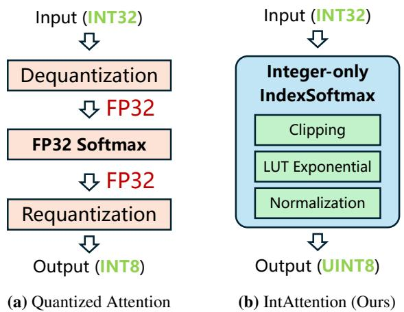
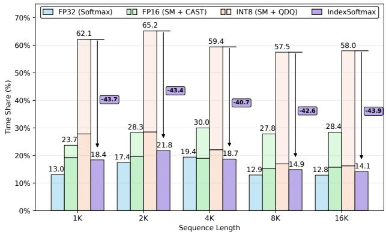
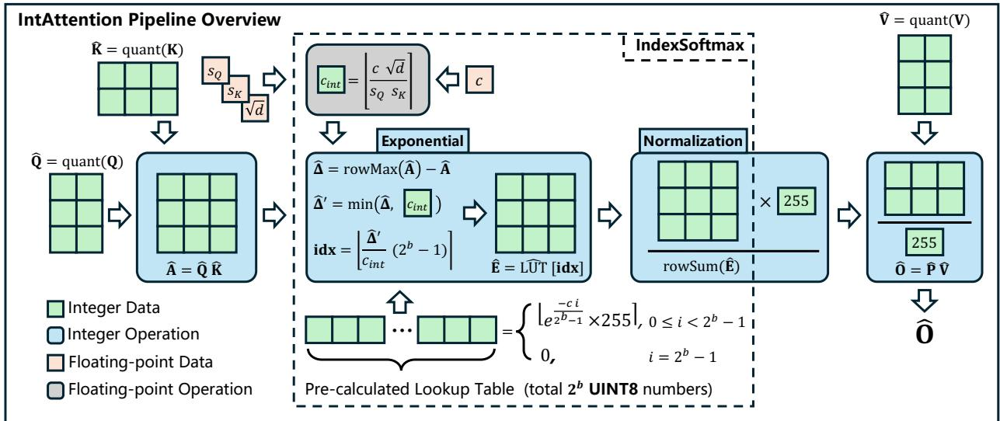
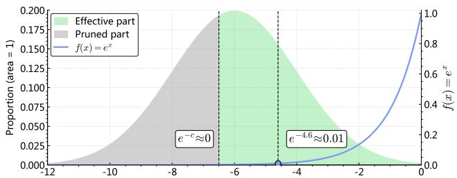
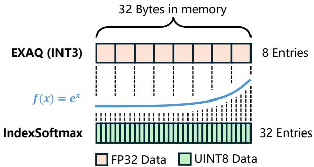
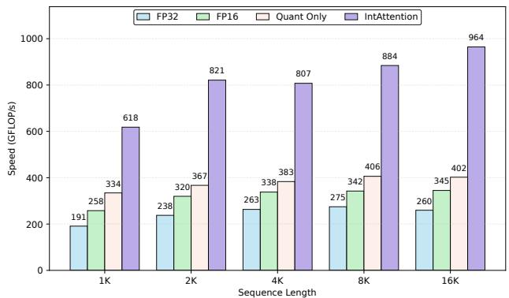
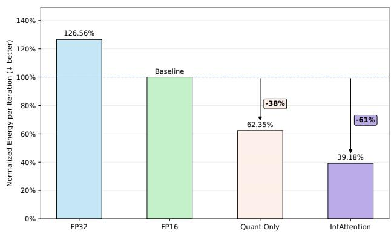
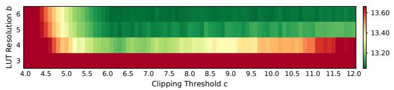
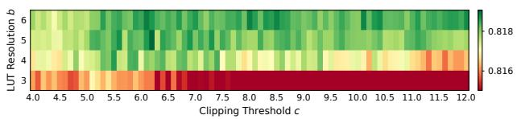

# INTATTENTION: A FULLY INTEGER ATTENTION PIPELINE FOR EFFICIENT EDGE INFERENCE

Wanli Zhong 1 Haibo Feng 1 2 Zirui Zhou 1 Hanyang Peng 2 Shiqi Yu† 1

## ABSTRACT

Deploying Transformer models on edge devices is limited by latency and energy budgets. While INT8 quantization effectively accelerates the primary matrix multiplications, it exposes the softmax as the dominant bottleneck. This stage incurs a costly dequantize → softmax → requantize detour, which can account for up to 65% of total attention latency and disrupts the end-to-end integer dataflow critical for edge hardware efficiency. To address this limitation, we present IntAttention, the first fully integer, plug-and-play attention pipeline without retraining. At the core of our approach lies IndexSoftmax, a hardware-friendly operator that replaces floating-point exponentials entirely within the integer domain. IntAttention integrates sparsity-aware clipping, a 32-entry lookuptable approximation, and direct integer normalization, thereby eliminating all datatype conversion overhead. We evaluate IntAttention and demonstrate consistent and substantial gains. Our method achieves up to 3.7× speedup and 61% energy reduction over FP16 baselines and 2.0x faster than conventional INT8 attention pipelines on Armv8 CPUs. These gains are achieved with high-fidelity accuracy comparable to baselines across diverse language and vision models, enabling practical and efficient Transformer inference on commodity edge devices. Code will be released in later version of this work.

## 1 INTRODUCTION

Transformer-based models achieve state-of-the-art performance across natural language processing (Vaswani et al., 2017), computer vision (Dosovitskiy et al., 2021), and multimodal tasks (Radford et al., 2021). The core mechanism, multi-head self-attention, exhibits quadratic time and memory complexity with respect to sequence length (O(L2)). As the context length increases, attention becomes the dominant inference cost, substantially increasing latency and memory usage. In autoregressive language models, the prefilling (prompt-processing) phase largely determines the time-to-first-token (TTFT), as the full key–value cache must be computed before generation begins (Kwon et al., 2023). Consequently, long prompts are computationally expensive, even though subsequent decoding is relatively fast.

Recent advances in compact and specialized models have accelerated the transition toward on-device inference. For instance, Google’s Gemma3-270M (Team et al., 2025) model targets energy-efficient deployment on smartphones, while studies such as QuestA demonstrate that reinforcement learning-based question augmentation can elevate a 1.5B model to the performance level of 32B models on multiple reasoning benchmarks (Li et al., 2025). This migration shifts inference from cloud servers to mobile and embedded processors, where end-to-end latency and energy efficiency become primary constraints. Consequently, optimizing attention, particularly by reducing the computational cost of long-context processing, has become crucial for deploying practical large language models (LLMs) on edge hardware.

  
Figure 1. Comparison between conventional quantized attention and the proposed IntAttention, where IntAttention maintains an end-to-end integer dataflow from QK⊤ to PV.

Previous studies commonly use low-precision floating-point formats such as BF16, FP16, FP8, and even FP4 (Micikevicius et al., 2022; Shah et al., 2024; Zhang et al., 2025b). However, these formats are neither universally supported nor energy-efficient on commodity edge hardware, which typically offers highly optimized integer computation pathways. Consequently, integer quantization, especially INT8, is the most practical and effective optimization strategy (Dettmers et al., 2022; Jacob et al., 2018). Motivated by this hardware constraint, we propose IntAttention. To the best of our knowledge, this work presents the first fully integer, plug-and-play attention pipeline without retraining. Designed for off-the-shelf edge processors, it executes attention entirely in the integer domain, eliminating redundant dequantization and requantization steps. Consequently, it functions as a drop-in replacement for conventional quantized attention within transformer-based inference pipelines.

Achieving an end-to-end integer attention pipeline is nontrivial. After applying dynamic INT8 quantization to the $\mathbf { Q } \mathbf { K } ^ { \top }$ and PV matrix multiplications, the remaining path that forms and applies attention weights becomes the dominant bottleneck. The standard softmax requires floating-point exponentials, row-wise normalization, and repeated data-format conversions. On edge processors, this dequantize → softmax → requantize detour can account for up to 65% of the attention latency once the surrounding GEMMs are quantized as shown in Figure 2, thereby eroding much of the benefit of integer GEMMs acceleration.

To mitigate this bottleneck, we introduce IndexSoftmax, a lightweight approximation that replaces costly exponential evaluations with a compact lookup table and performs maxsubtraction and clipping in the integer domain. IndexSoftmax preserves the relative structure of the attention scores and eliminates most per-element floating-point work.

Building on this, we integrate IndexSoftmax with integer normalization and direct requantization of the probability tensor. The resulting pipeline, IntAttention, takes INT32 logits from the $\mathbf { Q } \mathbf { K } ^ { \bar { \top } }$ GEMM, produces a quantized attention tensor P in UINT8, and feeds P into the integer $\mathbf { P V }$ GEMM for value aggregation. This design eliminates the dequantize → softmax → requantize detour and preserves an end-to-end integer dataflow. Figure 1 contrasts a conventional quantized pipeline, which falls back to floating point in the softmax stage, with IntAttention, which remains integer from input to output.

To summarize, this work contributes:

• We introduce IndexSoftmax, a lookup-table-based approximation to softmax that is compatible with integer execution, and integrate it with integer normalization and probability quantization to form IntAttention.

• We show that IntAttention runs on off-the-shelf edge processors, delivering up to 3.7x speedup and up to 61% lower energy consumption than an FP16 baseline, while preserving high-fidelity accuracy on both language and vision models.

## 2 BACKGROUND AND MOTIVATION

## 2.1 Attention and Dynamic Quantization

Scaled Dot-Product Attention We first recall the standard attention mechanism, which underlies our design. Let Q, K, $\mathbf { V } \in \mathbb { R } ^ { L \times d }$ denote the query, key, and value with sequence length L and feature dimension per token d (Vaswani et al., 2017). The standard attention computes

$$
{ \bf A } = { \bf Q } { \bf K } ^ { \top } , \quad { \bf P } = \mathrm { s o f t m a x } \left( \frac { { \bf A } } { \sqrt { d } } \right) , \quad { \bf O } = { \bf P } { \bf V } .\tag{1}
$$

Dynamic Quantizing Q, K, V To reduce latency and memory traffic on edge hardware, we adopt per-tensor symmetric INT8 quantization with zero point fixed at 0 for the three inputs Q, K, V (Jacob et al., 2018). For a tensor X, let $\hat { \mathbf { X } } = \mathrm { q u a n t } ( \mathbf { X } )$ ; the scale factor and the quantized tensor are

$$
s _ { X } = \frac { \operatorname* { m a x } ( | \mathbf { X } | ) } { 1 2 7 } ,\tag{2}
$$

$$
{ \mathrm { q u a n t } } ( \mathbf { X } ) = \mathrm { c l a m p } { \Big ( } { \Big \lfloor } { \frac { \mathbf { X } } { s _ { X } } } { \Big \rceil } , - 1 2 7 , 1 2 7 { \Big ) } , \tag{3}
$$

which enables low-precision matrix multiplications while preserving a simple dequantization model $\mathbf { X } \ \approx \ s _ { X } \hat { \mathbf { X } }$ where $\hat { \textbf { X } } \in \ \mathbb { Z } ^ { \mathrm { I N T 8 } }$ . Applying Equation 3 to Q, K, and V yields their quantized counterparts Qˆ , Kˆ , Vˆ and the corresponding scales $s _ { Q } , s _ { K } , s _ { V }$

Integer accumulation and scaling. After quantization, the attention logits are computed fully in the integer domain using INT8×INT8 multiplications with INT32 accumulation:

$$
{ \hat { \mathbf { A } } } = { \hat { \mathbf { Q } } } { \hat { \mathbf { K } } } ^ { \top } , \quad \alpha = { \frac { s _ { Q } s _ { K } } { \sqrt { d } } } , \quad \mathbf { A } \approx \alpha { \hat { \mathbf { A } } } .\tag{4}
$$

Here α rescales integer logits to the floating-point range. Substituting $\mathbf { V } \approx s _ { V } \hat { \mathbf { V } }$ into $\mathbf { O } = \mathbf { P } \mathbf { V }$ gives

$$
{ \bf O } \approx s _ { V } \hat { \bf O } = s _ { V } { \bf P } \hat { \bf V } .\tag{5}
$$

With these definitions, the two heavy matrix multiplications $( \mathbf { Q } \mathbf { K } ^ { \top }$ and PV) are executed in integer arithmetic. SageAttention demonstrates that carefully engineered INT8 kernels yield significant throughput gains with minimal loss of accuracy across diverse models (Zhang et al., 2025c). SageAttention2 further demonstrates that pushing similarity computation to INT4 for Q and K while keeping a slightly higher precision on the value path can remain near lossless and provides additional speedups on modern GPUs (Zhang et al., 2025a).

## 2.2 Emerging Bottleneck in Quantized Attention Pipelines

Numerically stable softmax. We adopt the standard maximum subtraction strategy to ensure numerical stability in the exponential. Given $\overset { \vartriangle } { \mathbf { A } } \in \mathbb { R } ^ { L \times L }$ , define the row-wise maximum vector $\mathbf { m } = \mathrm { r o w M a x } ( \mathbf { A } )$ . The stable softmax can then be written compactly as

$$
\mathbf { P } = { \frac { \exp \left( \mathbf { A } - \mathbf { m } \right) } { \mathrm { r o w S u m } \left( \exp \left( \mathbf { A } - \mathbf { m } \right) \right) } }\tag{6}
$$

where both rowMax and rowSum operate along the row dimension. This transformation preserves the exact softmax while constraining all exponential inputs to $( - \infty , 0 ]$ , thus preventing numerical overflow and improving stability.

Cost drivers on edge hardware. The $O ( L ^ { 2 } )$ complexity of softmax persists even when $\mathbf { Q } \mathbf { K } ^ { \top }$ and PV are accelerated. On edge hardware with limited thread-level parallelism, the exponential and the division dominate latency. A single exp(·) typically expands to tens of floating point operations per element, and the normalization still incurs row-wise divisions. In quantized pipelines, this cost is further amplified because INT32 logits must be dequantized to FP32 before softmax, and the resulting probabilities must be requantized for the value projection, which interrupts an otherwise contiguous integer dataflow.

Measured breakdown and implication. Figure 2 reports the measured time share of the dequantize → softmax → requantize path. In FP32, the share is about 13% to 19% across sequence lengths. With FP16 GEMMs it increases to about 23% to 30% yet remains secondary. After switching GEMMs to INT8, their latency drops while the softmax path is essentially unchanged, so its share rises to 57% to 65% and becomes the dominant cost. Therefore, once the multiplications are quantized, the probability normalization path is the next component that must be optimized to unlock further end to end speedups.

Context in prior work. Multiple GPU–oriented efforts have shown that softmax becomes the limiting stage once the surrounding matrix multiplications are heavily optimized. FlashAttention related kernels tile queries and keys, fuse attention with online softmax, and aggressively reduce memory traffic (Dao et al., 2022a;b). FlashAttention-3 goes further by driving GEMMs with FP8 Tensor Cores and then hiding the dominant softmax cost using warp specialization and ping–pong scheduling that overlaps GEMM and softmax through double buffering (Shah et al., 2024). TurboAttention extends this line of work by addressing not only the softmax bottleneck but also the dequantization overhead that arises in quantized attention. It unifies these optimizations through FlashQ, which enables quantized execution of matrix multiplications, and a sparsity-based Softmax approximation that avoids FP32 dequantization during exponentiation(Kang et al., 2025).

  
Figure 2. Breakdown of time share for the dequantize → softmax → requantize path across different precisions. Once GEMMs are accelerated to INT8, this path emerges as the dominant latency and becomes the next optimization target.

These results confirm that the softmax and quantizationrelated path is a real bottleneck. However, all of these optimizations rely on massive GPU parallelism and specialized floating-point hardware. On edge devices, which lack high-throughput floating-point units and deep warp-level concurrency but provide efficient integer units, the same path remains largely scalar and costly. This motivates the need for a lightweight, plug-and-play, and integer-friendly softmax replacement to further accelerate attention inference on edge hardware.

## 2.3 Acceleration Strategies

As the softmax and its associated floating-point conversions overhead have become the dominant bottlenecks in quantized attention, recent research has focused on accelerating this stage through three main strategies:

Hardware-oriented softmax co-design. Approaches such as Softermax and ConSmax redesign the softmax operator alongside dedicated accelerator logic. Softermax replaces $e ^ { x }$ with $2 ^ { x }$ and uses fixed-point integer shifters for exponentiation and normalization (Stevens et al., 2021). ConSmax removes explicit max-finding and normalization by training fixed scaling constants, allowing inference to be implemented with table lookups and multiplications (Liu et al., 2024). These co-designs achieve high throughput and energy savings, but only work on specialized hardware and require operator changes, which limits their adoption on generic edge processors.

Input-aware quantization and LUT-based softmax. Methods like EXAQ and TurboAttention accelerate softmax without changing model operators or hardware. EXAQ determines dynamic optimal clipping ranges to quantize attention scores to as low as 3 bits (Shkolnik et al., 2024). TurboAttention uses a small LUT for the integer part of the exponent and a 3rd-order polynomial for the fractional part, plus sparsification of negligible exponentials (Kang et al., 2025). These techniques eliminate heavy floating-point exponent operations and can be applied directly in attention inference, but the normalization step (sum and divide) typically remains in high-precision arithmetic, so the dataflow remains mixed-precision and still burdens edge CPUs.

  
Figure 3. Overview of the proposed IntAttention pipeline.

Integer-only softmax in Transformer quantization. Fully integer softmax schemes are integrated into integerquantized Transformer pipelines. I-BERT uses low-order integer polynomials and iterative integer refinements to approximate softmax (Kim et al., 2021). I-ViT introduces Shiftmax, expressing the exponential via bit shifts and additions (Li & Gu, 2023). I-LLM proposes DI-ClippedSoftmax, performing clipping and scaling entirely in integer form (Hu et al., 2024). Although these methods deliver a true integer dataflow, they usually depend on quantization-aware training or calibration to recover accuracy, and add runtime overhead for scale/clip estimation factors that limit their seamless deployment on edge devices.

In summary, hardware co-design approaches deliver very high efficiency but depend on specialized logic and retraining, which limits portability. Input-aware quantization and LUT-based methods are more deployable, but they typically leave the normalization step in floating-point or highprecision calculation, so the dataflow is still mixed-precision. Integer-only softmax methods promise a fully integer path, but they require model adaptation through fine-tuning or reconstruction. None of these families removes the full dequantize → softmax → requantize loop in a way that is both strictly integer and truly plug-and-play.

## 2.4 Motivation and Design Goals

The breakdown in subsection 2.2 shows that once the matrix multiplications in attention are quantized and accelerated, the dominant latency on edge processors comes from the remaining dequantize → softmax → requantize path. Prior work alleviates parts of this path, but always at the cost of at least one key property: it either assumes custom hardware, falls back to floating point in the normalization step, or requires model retraining. As a result, the practical end-to-end gain for real deployment remains limited.

Our objective is to remove this bottleneck in a way that is directly usable in existing quantized attention pipelines. This leads to four design goals:

1. Integer execution. All stages of attention, including the analogue of exponentiation and the row-wise normalization, must run in integer arithmetic. This allows the computation to fully exploit the efficient integer units that are already available on edge hardware, instead of invoking slower floating-point paths.

2. Plug-in deployment. The method must serve as a dropin replacement for standard attention in pre-trained models. It should not require quantization-aware training, fine-tuning, or structural changes. This makes it directly adoptable in large existing models and gives it immediate deployment value.

3. Portable efficiency. The implementation must rely only on common integer primitives such as add, multiply, shift, and indexed lookup, and must parallelize cleanly on SIMD-style cores (for example ARM NEON). It should not introduce extra global passes for per-input statistics. This keeps the method practical on a wide range of commodity devices.

4. Fidelity under acceleration. The operator must deliver a clear latency and energy advantage over floatingpoint softmax, while maintaining accuracy close to the original FP16 attention. In other words, efficiency gains cannot come at the expense of unacceptable degradation.

## 3 INTATTENTION

IntAttention transforms the conventional quantized attention block into a true integer-domain pipeline, removing the dequantize → softmax → requantize detour that dominates latency on edge processors. By preserving a contiguous integer path from the $\mathbf { Q } \mathbf { K } ^ { \top }$ logits to the $\mathbf { P V }$ multiplication, IntAttention executes entirely on commodity integer units, requires no model retraining, and can be used as a drop-in replacement in existing quantized attention inference.

At the kernel of IntAttention is IndexSoftmax, whose core operation is integer clipping followed by lookup-table based exponent approximation. The resulting UINT8 attention map Pˆ feeds directly into the integer PV kernel, so no floating-point computation appears on the runtime path.

Implementation of IndexSoftmax relies on three tightly coupled mechanisms: integer-domain clipping, LUT exponentials, and integer scale normalization, which are designed and tuned together rather than as independent modules. This coupling minimizes extra passes or global statistics, preserves parallelism on SIMD-style integer units, and yields substantial reductions in latency and energy while maintaining accuracy close to the baseline.

An overview of the proposed IntAttention pipeline is illustrated in Figure 3. The following subsections detail each mechanism and the integration choices that enable efficient, portable integer attention.

## 3.1 IndexSoftmax

Integer-Domain Clipping via Sparsity-Aware Pruning The exponential in Softmax exhibits an inherent sparsity: as inputs decrease, exp(·) rapidly approaches zero. In practice shown in Figure 4, a small subset of high valued logits dominates the normalization term, while the majority contribute negligibly. Evaluating exponentials for these near-zero terms wastes arithmetic and increases memory traffic, especially on edge devices. To exploit this, we introduce an integer-domain clipping mechanism that removes low-importance logits before the exponential approximation. Unlike floating-point sparse/efficient attention variants, our method stays entirely in the integer domain and avoids type conversions.

Formally, given integer logits $\hat { \mathbf { A } } \in \mathbb { Z } ^ { L \times L }$ , we apply row-

  
Figure 4. Illustration of the exponential activation in Softmax. Most logits lie in the near-zero region, where $e ^ { x }$ contributes negligibly to the normalization. Only a small subset of higher logits significantly affects the output distribution.

wise max-subtraction for stability:

$$
\hat { \mathrm { ~ \bf ~ \Delta ~ } } = \mathrm { \ r o w m a x } ( \hat { \mathrm { { \bf A } } } ) - \hat { \mathrm { { \bf ~ A } } } ,\tag{7}
$$

which yields nonnegative distances from the dominant value in each row. We then use a quantization aligned clipping threshold $\dot { C } _ { \mathrm { i n t } }$ , derived from the clipping threshold c via the quantization scale factor in Equation 4:

$$
c _ { \mathrm { i n t } } = \mathrm { r o u n d } \Big ( \frac { c } { \alpha } \Big ) = \mathrm { r o u n d } \Big ( \frac { c \sqrt { d } } { s _ { Q } s _ { K } } \Big ) .\tag{8}
$$

Clipping is performed elementwise:

$$
\hat { \pmb { \Delta } } ^ { \prime } = \operatorname* { m i n } \big ( \hat { \pmb { \Delta } } , c _ { \mathrm { i n t } } \big ) ,\tag{9}
$$

so entries whose contributions to $\exp ( - \alpha \hat { \Delta } )$ are negligible are saturated at $\dot { C } _ { \mathrm { i n t } }$

To match LUT-based exponentiation, we adopt the sign convention m − A (rather than A − m in Equation $^ { 6 ) , }$ ensuring all arguments to exp(−x) are nonnegative and lie within [0, c]. Combined with clipping, this confines the exponential evaluation to a compact, table-friendly domain.

Overall, integer-domain clipping provides two benefits: (i) it removes redundant work on near-zero contributions, reducing arithmetic and bandwidth, and (ii) it establishes a quantization consistent, bounded range for integer-domain exponentiation. These properties lay the groundwork for an efficient, fully integer Softmax pipeline that is both sparsityaware and deployment friendly on low-power accelerators.

Efficient Exponential Approximation Using Lookup Tables Evaluating exp(·) is costly in quantized inference. Classical implementations use iterative or polynomial schemes (e.g., Pade or Taylor series) that require multiple ´ floating-point operations. On GPUs this cost can be amortized by massive parallelism, but on edge devices, where bandwidth and instruction latency dominate, $\exp ( \cdot )$ often becomes the bottleneck once the matrix multiplications are quantized. The result is a fast integer $\mathbf { Q } \mathbf { K } ^ { \top }$ followed by a floating-point Softmax that breaks the integer dataflow and limits further speedup.

We address this by replacing the exponential stage with a table-driven surrogate. After integer-domain clipping defined in Equation 9, all inputs to $\exp ( - x )$ lie in a finite interval $[ 0 , c ]$ . Over this range the function is bounded, so a fixed resolution discretization provides an effective and simple approximation. We therefore precompute a fixed lookup table with $2 ^ { b }$ entries,

$$
\operatorname { L U T } [ i ] = \left\{ \begin{array} { l l } { \exp \left( - \frac { c i } { 2 ^ { b } - 1 } \right) , } & { 0 \leq i < 2 ^ { b } - 1 , } \\ { 0 , } & { i = 2 ^ { b } - 1 . } \end{array} \right.\tag{10}
$$

and map clipped integer distances to indices by a linear rescaling,

$$
\mathbf { i d x } = \Big \lfloor \frac { \hat { \Delta } ^ { \prime } } { c _ { \mathrm { i n t } } } \left( 2 ^ { b } - 1 \right) \Big \rceil ,\tag{11}
$$

The exponential surrogate is then obtained by a gather:

$$
\begin{array} { r } { \tilde { \mathbf { E } } = \mathrm { L U T } \left[ \mathbf { i d x } \right] \approx \exp \big ( - \alpha \hat { \mathbf { \Delta } } ^ { \prime } \big ) , } \end{array}\tag{12}
$$

Among LUT-only methods, the closest is EXAQ, which uses a dynamic clipping rule based on per-tensor standard deviation statistics together with ultra-low LUT resolutions $( b \in \{ 2 , 3 \} )$ (Shkolnik et al., 2024). This adds global reductions and control overhead that are expensive on edge devices. In contrast, we adopt fixed hyperparameters $( c , b )$ selected offline. Empirically shown in Figure 9, performance is insensitive to c within a practical range, and modestly increasing b to a moderate table size has a negligible runtime impact while clearly improving approximation accuracy. As long as the table remains moderate, lookup latency is effectively constant, so pursuing extremely small tables offers little real benefit but degrades fidelity. A moderate, fixed-resolution LUT achieves a stronger balance between accuracy and efficiency for integer attention on edge hardware.

## 3.2 LUT Rebuild and Integer Scale Normalization

Quantization of the probability matrix P has a crucial impact on the final attention output. While prior methods often scale probabilities by ×127 and store them in signed INT8, we adopt an unsigned UINT8 formulation scaled by ×255, which fully utilizes the available range and improves numerical smoothness during normalization. This design allows the softmax path to remain entirely in the integer domain, with both the lookup table and output probabilities quantized to UINT8. Because the precision of P is inherently limited by its 8-bit representation, Using excessively precise floating-point lookup tables brings little benefit. Therefore, our exponential lookup table is also quantized to UINT8, so that each entry is compact yet expressive enough to represent the clipped exponential curve.

  
Figure 5. IndexSoftmax achieves 4x higher LUT resolution under the same memory budget, enabling higher-fidelity exponential approximation without dynamic clipping or global statistics, which are costly on edge devices.

Over the clipped interval $[ 0 , c ]$ , the floating-point table is linearly mapped to integers table:

$$
\mathrm { L } \hat { \mathrm { U T } } = \Big \lfloor 2 5 5 \times \mathrm { L U T } \Big \rceil ,\tag{13}
$$

so that very small values are preserved with fine integer granularity. Given the clipped index vector idx, we gather a rowwise surrogate

$$
\begin{array} { r } { \hat { \mathbf { E } } = \hat { \mathrm { L U T } } \big [ \mathbf { i d x } \big ] , } \end{array}\tag{14}
$$

accumulate its row sum with a widened integer accumulator and produce 8-bit probabilities by fixed-point scaling:

$$
{ \hat { \mathbf { P } } } = \biggl \lfloor \frac { 2 5 5 \cdot { \hat { \mathbf { E } } } } { \mathrm { r o w S u m } ( { \hat { \mathbf { E } } } ) } \biggr \rceil .\tag{15}
$$

All steps are fully integer-friendly: a single LUT gather, one 32-bit accumulation, and an elementwise scale. By performing normalization in the integer domain, we avoid any floating-point operations in the runtime path. As shown in Figure 5, compared with EXAQ, which encodes only 8 exponential values using INT3 LUT resolution under a 32-byte budget, our IndexSoftmax stores 32 entries within the same memory footprint, achieving 4x higher resolution and substantially improving LUT-based approximation fidelity without requiring dynamic clipping or global statistics, which are costly on edge processors.

## 3.3 Quantization Scope and Compatibility

Our default configuration uses per-tensor symmetric quantization for the surrounding multiplications $\mathbf { Q } \mathbf { K } ^ { \top }$ and PV, which provides a balance between accuracy and implementation simplicity. The proposed IndexSoftmax is, however, compatible with finer-grained schemes such as per-channel or per-block quantization. In these cases, clipping becomes group-specific while the subsequent lookup and normalization remain unchanged.

  
Figure 6. Speed comparison among different attention implementations on RK3588S2 across varying sequence lengths with headdim = 128.

Let the quantization be defined over groups $g = 1 , \ldots , G$ (channels or blocks). Denote the scales by $s _ { Q } ^ { ( g ) }$ and $s _ { K } ^ { ( g ) }$ and define

$$
\alpha ^ { ( g ) } = \frac { s _ { Q } ^ { ( g ) } s _ { K } ^ { ( g ) } } { \sqrt { d } } , c _ { \mathrm { i n t } } ^ { ( g ) } = \Big \lfloor \frac { c } { \alpha ^ { ( g ) } } \Big \rceil .\tag{16}
$$

Clipping in subsection 3.1 is then applied group-wise using $c _ { \mathrm { i n t } } ^ { ( g ) }$

$$
\hat { \Delta } ^ { \prime ( g ) } = \mathrm { m i n } \big ( \hat { \Delta } ^ { ( g ) } , c _ { \mathrm { i n t } } ^ { ( g ) } \big ) .\tag{17}
$$

The index mapping and lookup table follow the same formulas with $c _ { \mathrm { i n t } } ^ { ( g ) }$ , while the LUT itself can be shared across groups since the continuous bound c and resolution b are fixed:

$$
\mathbf { i d x } = \Big \lfloor \hat { \mathbf { A } } ^ { \prime ( g ) } \frac { 2 ^ { b } - 1 } { c _ { \mathrm { i n t } } ^ { ( g ) } } \Big \rceil , \qquad \hat { \mathbf { E } } = \mathrm { L } \hat { \mathrm { U T } } \big [ \mathbf { i d x } \big ] .\tag{18}
$$

Row-wise normalization in Equation 15 proceeds identically after concatenating or summing contributions within each row. Thus, moving from per-tensor to per-channel or per-block quantization increases only the bookkeeping of scales and the computation of group-specific $c _ { \mathrm { i n t } } ^ { ( g ) }$ , while preserving the integer-only dataflow, the LUT resolution, and the overall pipeline structure.

## 4 EXPERIMENTS

Main results. The speed of IntAttention is up to 3.7x faster than FP16 and 2.0x faster than Quantized-Only pipelines on Armv8 CPUs. Furthermore, it achieves an average 61% energy reduction while maintaining accuracy comparable to baseline across both language and vision models.

  
Figure 7. Speed comparison among different attention implementations on Apple M2 across varying sequence lengths with headdim = 128.

  
Figure 8. Normalized energy consumption per iteration across different precision settings, using FP16 as the baseline for comparison.

## 4.1 Experimental Setup

Models. We evaluate IntAttention across both language and vision models to verify its generality. For language, we adopt LLaMA-3.2-1B (Dubey et al., 2024), OPT-1.3B (Zhang et al., 2022), and Qwen3-1.7B (Yang et al., 2025). For vision, we include DeiT-B-224 (Touvron et al., 2021a), ViT-L-P16-384 (Dosovitskiy et al., 2021), and CaiT-L-M48- 448 (Touvron et al., 2021b). All models are configured under identical settings to ensure a fair comparison among different pipelines.

Datasets. To provide broad coverage of modeling capabilities, language models are tested on WikiText (Merity et al., 2017) and six comprehension or commonsense benchmarks: HellaSwag (Zellers et al., 2019), LAMBADA (Paperno et al., 2016), PIQA (Bisk et al., 2020), WinoGrande (Sakaguchi et al., 2021), ARC-Challenge, and ARC-Easy (Clark et al., 2018). Vision models are evaluated on ImageNet-1K (Deng et al., 2009) using the standard validation split.

Table 1. End-to-end language task performance of IntAttention compared with baselines across multiple benchmarks.
<table><tr><td>Model</td><td>Method</td><td>WikiText↓</td><td>HellaSwag Lambada</td><td>PIQA</td><td>WinoG</td><td>ARC-C</td><td>ARC-E</td><td>Avg.↑</td></tr><tr><td rowspan="3">LLaMA -3.2-1B</td><td>FP16</td><td>12.663</td><td>63.65% 62.95%</td><td>74.59%</td><td>60.69%</td><td>36.18%</td><td>60.48%</td><td>59.76%</td></tr><tr><td>Quant Only</td><td>13.701</td><td>63.39% 62.62%</td><td>74.32%</td><td>60.62%</td><td>35.84%</td><td>60.56%</td><td>59.56%</td></tr><tr><td> IntAttention</td><td>13.070</td><td>63.50% 63.61%</td><td> 74.92%</td><td> 61.01%</td><td> 36.43%</td><td> 60.48%</td><td> 59.92%</td></tr><tr><td rowspan="3">OPT -1.3B</td><td>FP16</td><td>16.413</td><td>53.73%</td><td></td><td></td><td></td><td>50.97%</td><td></td></tr><tr><td> Quant Only</td><td>18.323</td><td>54.11%</td><td>57.85% 72.41% 72.31%</td><td>59.43% 58.64%</td><td>29.61% 29.69%</td><td>50.97%</td><td>54.00% 53.95%</td></tr><tr><td> IntAttention</td><td>16.802</td><td>58.00% 53.65% 58.78%</td><td> 72.25%</td><td> 59.35%</td><td>29.18%</td><td> 50.80%</td><td> 54.00%</td></tr><tr><td rowspan="3">Qwen3</td><td></td><td></td><td></td><td></td><td></td><td></td><td></td><td></td></tr><tr><td>FP16</td><td>23.013</td><td>60.43%</td><td>50.73% 72.25%</td><td>61.09%</td><td>42.83%</td><td>69.61%</td><td>59.49%</td></tr><tr><td>Quant Only</td><td>32.945</td><td>58.95%</td><td>46.24% 68.17%</td><td>58.72%</td><td>37.28%</td><td>61.32%</td><td>55.12%</td></tr><tr><td>-1.7B</td><td> IntAttention</td><td>27.751</td><td>58.44% 46.94%</td><td> 67.30%</td><td> 58.56%</td><td> 37.03%</td><td> 61.87%</td><td> 55.02%</td></tr></table>

Table 2. End-to-end vision task performance of IntAttention compared with baselines across multiple benchmarks.
<table><tr><td rowspan="2">Method</td><td colspan="2">DeiT-B-224</td><td rowspan="2"></td><td rowspan="2"></td><td colspan="2">ViT-L-P16-384|CaiT-L-M48-448</td><td colspan="2">Avg.↑</td></tr><tr><td></td><td></td><td>Top-1Top-5|Top-1 Top-5|Top-1T</td><td>Top-5</td><td></td><td>Top-1 Top-5</td></tr><tr><td>FP16</td><td>81.802</td><td>95.598</td><td></td><td>85.62897.7828</td><td>86.090</td><td>97.588</td><td>84.507</td><td>796.989</td></tr><tr><td>Quant-Only</td><td>81.896</td><td>95.708</td><td>83.844</td><td>97.150</td><td>85.742</td><td>97.530</td><td></td><td>83.70796.796</td></tr><tr><td> IntAttention</td><td>81.8269</td><td>95.62</td><td></td><td>85.224 97.668</td><td>86.100</td><td>97.640</td><td>84.38396.976</td><td></td></tr></table>

Metrics. For language tasks, we report perplexity on Wiki-Text and accuracy on the remaining datasets using the open source lm-evaluation-harness (Gao et al., 2024), followed by the arithmetic average of the accuracy scores. For vision tasks, we report Top-1 and Top-5 accuracy on ImageNet and their average. For efficiency evaluation, we further record throughput in GFLOP/s, energy consumption per iteration, and attention breakdown latency. These metrics jointly reflect both model quality and system efficiency, allowing a comprehensive comparison between floating-point and integer pipelines in terms of trade-off between accuracy and performance.

Hardware and settings. Performance measurements are conducted on two ARMv8-based platforms, each using 8 threads. The first is an embedded development board powered by a Rockchip RK3588S2 processor, which provides NEON and dot-product instruction support. The second is a laptop equipped with an Apple M2 chip, supporting NEON, dot-product, and I8MM instructions. Both systems run Arm Compute Library (ACL) version 52.4.0. Unless otherwise specified, the sequence length L takes values from 1K, 2K, 4K, 8K, 16K with a typical head dimension of d = 128. We compare four pipelines: FP32, FP16, INT8 quant-only, and IntAttention, with FP16 serving as the baseline for normalization.

## 4.2 Efficiency

Speed. We first measure attention throughput in GFLOP/s across sequence lengths for all four pipelines described above. As shown in Figure 6 and Figure 7, IntAttention achieves the best performance on both platforms. On RK3588S2, the speedup over FP16 lies between 2.1x and 3.7x, and over the Quantized-Only pipeline between 1.6x and 2.0x. On Apple M2, the gains over FP16 fall between 2.4x and 2.8x, and over Quantized Only between 1.9x and 2.4x. The exact factor varies modestly with microkernel efficiency and memory traffic. These results indicate that maintaining an integer dataflow with IndexSoftmax removes the Softmax bottleneck studied in Table 4.4 and yields consistent end-to-end speedups on both platforms.

Energy consumption. We next examine energy efficiency, since edge deployment is typically power-limited. On RK3588S2, energy per attention iteration (joules) is normalized to the FP16 baseline (Figure 8). IntAttention uses only 39.18% of FP16 energy, a 61% reduction, and is 37% lower than the Quantized Only pipeline. The savings come from an integer dataflow that removes dequantization, reduces memory traffic, and replaces exponentials with a compact lookup table, which translates to consistent energy benefits across all tested sequence lengths.

  
(a) LLaMA-3.2-1B on WikiText (PPL ↓)

  
(b) DeiT-B on ImageNet-1K (Top-1 ↑)  
Figure 9. Hyperparameter sensitivity of IntAttention over LUT resolution b and clipping threshold c. Red indicates noticeable degradation (> 1 PPL or > 0.3% Top-1), while green denotes high-fidelity regions.

Table 3. Ablation study on different softmax implementations. Comparison between IndexSoftmax and EXAQ variants (INT2/INT3) across language benchmarks.
<table><tr><td>Model</td><td>Method</td><td>WikiText ↓</td><td>HellaSwag</td><td>Lambada</td><td>PIQA</td><td>WinoG</td><td>ARC-C</td><td>ARC-E</td><td>Avg.↑</td></tr><tr><td rowspan="4">LLaMA -3.2-1B</td><td>FP16</td><td>12.663</td><td>63.65%</td><td>62.95%</td><td>74.59%</td><td>60.69%</td><td>36.18%</td><td>60.48%</td><td>59.76%</td></tr><tr><td>EXAQ (INT2)</td><td>17.753</td><td>57.56%</td><td>50.48%</td><td>70.73%</td><td>56.99%</td><td>33.28%</td><td>56.19%</td><td>54.21%</td></tr><tr><td>EXAQ (INT3)</td><td>13.757</td><td>62.72%</td><td>60.72%</td><td>72.96%</td><td>58.01%</td><td>36.01%</td><td>59.55%</td><td>58.33%</td></tr><tr><td> IndexSoftmax</td><td>12.784</td><td> 63.44%</td><td> 63.38%</td><td> 74.16%</td><td> 60.46%</td><td> 36.43%</td><td> 60.65%</td><td> 59.75%</td></tr><tr><td colspan="11"></td></tr><tr><td rowspan="4">OPT -1.3B</td><td>FP16</td><td>16.413</td><td>53.73%</td><td>57.85%</td><td>72.41%</td><td>59.43%</td><td>29.61%</td><td>50.97%</td><td>54.00%</td></tr><tr><td>EXAQ (INT2)</td><td>38.782</td><td>52.58%</td><td>58.76%</td><td>72.25%</td><td>58.33%</td><td>28.16%</td><td>50.59%</td><td>53.50%</td></tr><tr><td>EXAQ (INT3)</td><td>17.248</td><td>53.36%</td><td>58.28%</td><td>71.93%</td><td> 59.43%</td><td> 30.38%</td><td>50.51%</td><td>53.98%</td></tr><tr><td> IndexSoftmax</td><td>16.424</td><td> 53.79%</td><td> 58.53%</td><td>72.20%</td><td> 59.43%</td><td>29.44%</td><td> 51.01%</td><td> 54.06%</td></tr><tr><td colspan="8"></td><td></td><td></td></tr><tr><td rowspan="4">Qwen3 -1.7B</td><td>FP16</td><td>23.013</td><td>60.43%</td><td>50.73%</td><td>72.25%</td><td>61.09%</td><td>42.83%</td><td>69.61%</td><td>59.49%</td></tr><tr><td>EXAQ (INT2)</td><td>34.431</td><td>58.11%</td><td>45.37%</td><td>68.17%</td><td>59.35%</td><td>39.42%</td><td>63.05%</td><td>55.58%</td></tr><tr><td>EXAQ (INT3)</td><td>29.006</td><td>59.98%</td><td>49.45%</td><td>70.78%</td><td>61.79%</td><td>41.47%</td><td>67.76%</td><td>58.77%</td></tr><tr><td> IndexSoftmax</td><td> 22.356</td><td> 60.41%</td><td> 51.66%</td><td> 72.25%</td><td> 61.09%</td><td> 42.24%</td><td> 69.07%</td><td> 59.45%</td></tr></table>

Table 4. Ablation study on different softmax implementations. Comparison between IndexSoftmax and EXAQ variants (INT2/INT3) across vision benchmarks.
<table><tr><td rowspan="2">Method</td><td colspan="2">DeiT-B-224</td><td colspan="2">ViT-L-P16-384</td><td colspan="2">CaiT-L-M48-448</td><td colspan="2">Avg.↑</td></tr><tr><td>Top-1</td><td>Top-5</td><td>Top-1</td><td>Top-5</td><td>Top-1</td><td>Top-5</td><td>Top-1</td><td>Top-5</td></tr><tr><td>FP16</td><td>81.802</td><td>95.598</td><td>85.628</td><td>97.782</td><td>86.090</td><td>97.588</td><td>84.507</td><td>96.989</td></tr><tr><td>EXAQ INT2</td><td>81.554</td><td>95.482</td><td>85.222</td><td>97.668</td><td>85.866</td><td>97.554</td><td>84.214</td><td>96.901</td></tr><tr><td>EXAQ INT3</td><td>81.768</td><td>95.584</td><td>85.428</td><td>97.722</td><td>85.998</td><td>97.596</td><td>84.398</td><td>96.962</td></tr><tr><td> IndexSoftmax</td><td>81.804</td><td>95.590</td><td>85.616</td><td>97.774</td><td>86.114</td><td>97.582</td><td>84.511</td><td>96.982</td></tr></table>

## 4.3 Accuracy

We now evaluate the accuracy impact of running attention entirely within the integer domain. We integrate IndexSoftmax with quantized $\mathbf { Q } \mathbf { \bar { K } } ^ { \top }$ and a UINT8 probability matrix in the PV stage to form IntAttention. As shown in Table 1, this end-to-end pipeline improves over the Quantized Only baseline on most models and tasks and, on LLaMA and OPT, matches or slightly exceeds the baseline. Qwen3 remains more sensitive to attention quantization, yet IntAttention narrows the gap and yields a clear perplexity gain on WikiText. On ImageNet, as shown in Table 2, IntAttention is slightly below Quantized-Only for DeiT-B while remaining above the baseline, and it shows consistent gains for ViT-L and CaiT. These results indicate that an all integer attention with UINT8 P effectively preserves attention mass through PV and maintains the fidelity of probability aggregation.

## 4.4 Ablation Study

Hyperparameter Sensitivity IntAttention exposes only two hyperparameters: the clipping threshold c and LUT resolution b (see Equation 8, Equation 10), and both are empirically robust. A joint sweep on LLaMA-3.2-1B/WikiText and DeiT-B/ImageNet-1K shows a broad stability plateau for $b \geq 4$ and $c \in [ 5 . 5 , 7 . 7 ]$ (Figure 9). Colors near the red boundary indicate insufficient LUTs or overly clipping. Intermediate tones remain acceptable, while the deep green region yields near optimal accuracy. A consistent ridge around c≈6.6 emerges across modalities, balancing fidelity with the sparsity implied by truncated exponentials. We therefore fix and recommend to use $( b , c ) = ( 5 , 6 . 6 )$ , where b = 5 corresponds to a $2 ^ { 5 } = 3 2$ entries UINT8 LUT (≈32 B) for all experiments with negligible memory and no measurable runtime overhead.

IndexSoftmax Component. We also isolate the core probability module to confirm that the improvement is not an artifact of model-specific tuning by replacing only the Softmax operator while keeping all other components unchanged. Across language and vision models shown in Table 3 and Table 4, IndexSoftmax preserves baseline accuracy with negligible loss and, on average, surpasses EXAQ (INT3) by about 1.4% under the same memory budget. A single fixed configuration is used for all models and datasets. The effect comes from employing a higher LUT resolution at a fixed clipping threshold, which enlarges the effective approximation domain, maintains the shape and ordering of attention distributions, and stabilizes normalization. As a result, IndexSoftmax provides a simple and accurate integer-domain replacement that does not require additional tuning.

P Matrix Quantization. We ablate the quantization scheme for the attention probability matrix P, which is constrained to the range [0, 1]. As shown in Table 5, quantizing P with a signed INT8 format causes unnecessary dynamic range waste and distorts small probability values, leading to a lower cosine similarity and higher relative L1 error. In contrast, the unsigned UINT8 quantization fully allocates the representable range to [0, 1], yielding a substantially higher similarity and lower RMSE. This demonstrates that aligning the quantization domain with the inherent distribution of P, a strictly positive and normalized probability matrix, is essential for maintaining attention fidelity and ensuring numerical stability in quantized attention.

Latency breakdown. As shown in Figure 2, in a conventional INT8 attention pipeline the portion outside GEMM, namely Softmax together with quantization and dequantization, becomes the dominant cost and contributes about 58% to 65% of total latency across sequence lengths. Replacing this stage with IndexSoftmax and keeping the path entirely in the integer domain reduces this overhead to about 14% to 22% and removes dequantization. As a result, the bottleneck shifts back to the QK and PV matrix multiplications, which now account for the clear majority of time. This ablation clarifies the throughput gains: IntAttention removes the quantization induced hotspot and restores a compute profile in which further optimization should focus on GEMM kernels.

Table 5. Accuracy comparison of two quantization formats for the attention probability matrix P, evaluated against the FP16 baseline.
<table><tr><td>Format</td><td>CosSim ↑</td><td>Relative L1 ↓</td><td>RMSE↓</td></tr><tr><td>INT8</td><td>0.996612</td><td>0.07739742</td><td>0.0023912</td></tr><tr><td>UINT8</td><td>0.999081</td><td>0.04097954</td><td>0.0012436</td></tr></table>

## 4.5 Discussion

Accuracy perspective. IntAttention maintains strong accuracy, and the remaining gaps mainly from quantizing Q, K, and V rather than the Softmax itself. Prior work such as SageAttention series reduces this loss with input smoothing and finer per-block quantization scales, improving the dynamic range seen by the attention maps (Zhang et al., 2025a;b;c). Our method is orthogonal: it keeps the entire attention path in the integer domain and stabilizes probability normalization. Combining smoothing and per-block scaling with the integer dataflow of IntAttention is expected to further improve accuracy with little additional cost.

Efficiency perspective. The latency analysis shows that removing dequantization and replacing Softmax with IndexSoftmax shifts the bottleneck back to the QK and PV matrix multiplications. This makes the optimization target clear. Future speedups should focus on stronger GEMM kernels and low-bit implementations when hardware support becomes available.

## 5 CONCLUSION

This paper presents IntAttention, a fully integer and plug-and-play attention pipeline that eliminates the costly dequantize → softmax → requantize path in quantized attention. By introducing IndexSoftmax, a LUT-based integer replacement for softmax with integer normalization, IntAttention executes end-to-end attention entirely within the integer domain. Experiments on Armv8 edge processors show up to 3.7x latency reduction and 61% lower energy consumption while maintaining accuracy comparable to baseline. These results demonstrate that integer-native attention, not only integer matmuls, is key to unlocking efficient and deployable Transformer inference on edge hardware.

## REFERENCES

Bisk, Y., Zellers, R., Bras, R. L., Gao, J., and Choi, Y. Piqa: Reasoning about physical commonsense in natural language. In Thirty-Fourth AAAI Conference on Artificial Intelligence, 2020.

Clark, P., Cowhey, I., Etzioni, O., Khot, T., Sabharwal, A., Schoenick, C., and Tafjord, O. Think you have solved question answering? try arc, the ai2 reasoning challenge. arXiv:1803.05457v1, 2018.

Dao, T., Fu, D., Ermon, S., Rudra, A., and Re, C. Flashat-´ tention: Fast and memory-efficient exact attention with io-awareness. Advances in neural information processing systems, 35:16344–16359, 2022a.

Dao, T., Fu, D. Y., Ermon, S., Rudra, A., and Re, C. Flashattention: Fast and memory-efficient exact attention with IO-awareness. In Oh, A. H., Agarwal, A., Belgrave, D., and Cho, K. (eds.), Advances in Neural Information Processing Systems, 2022b.

Deng, J., Dong, W., Socher, R., Li, L.-J., Li, K., and Fei-Fei, L. Imagenet: A large-scale hierarchical image database. In 2009 IEEE conference on computer vision and pattern recognition, pp. 248–255. Ieee, 2009.

Dettmers, T., Lewis, M., Belkada, Y., and Zettlemoyer, L. Gpt3. int8 (): 8-bit matrix multiplication for transformers at scale. Advances in neural information processing systems, 35:30318–30332, 2022.

Dosovitskiy, A., Beyer, L., Kolesnikov, A., Weissenborn, D., Zhai, X., Unterthiner, T., Dehghani, M., Minderer, M., Heigold, G., Gelly, S., Uszkoreit, J., and Houlsby, N. An image is worth 16x16 words: Transformers for image recognition at scale. In International Conference on Learning Representations, 2021.

Dubey, A., Jauhri, A., Pandey, A., Kadian, A., Al-Dahle, A., Letman, A., Mathur, A., Schelten, A., Yang, A., Fan, A., Goyal, A., Hartshorn, A., Yang, A., Mitra, A., Sravankumar, A., Korenev, A., Hinsvark, A., Rao, A., Zhang, A., Rodriguez, A., Gregerson, A., Spataru, A., Roziere, B., Biron, B., Tang, B., Chern, B., Caucheteux, \` C., Nayak, C., Bi, C., Marra, C., McConnell, C., Keller, C., Touret, C., Wu, C., Wong, C., Ferrer, C. C., Nikolaidis, C., Allonsius, D., Song, D., Pintz, D., Livshits, D., Esiobu, D., Choudhary, D., Mahajan, D., Garcia-Olano, D., Perino, D., Hupkes, D., Lakomkin, E., AlBadawy, E., Lobanova, E., Dinan, E., Smith, E. M., Radenovic, F., Zhang, F., Synnaeve, G., Lee, G., Anderson, G. L., Nail, G., Mialon, G., Pang, G., Cucurell, G., Nguyen, H., Korevaar, H., Xu, H., Touvron, H., Zarov, I., Ibarra, I. A., Kloumann, I. M., Misra, I., Evtimov, I., Copet, J., Lee, J., Geffert, J., Vranes, J., Park, J., Mahadeokar, J.,

Shah, J., van der Linde, J., Billock, J., Hong, J., Lee, J., Fu, J., Chi, J., Huang, J., Liu, J., Wang, J., Yu, J., Bitton, J., Spisak, J., Park, J., Rocca, J., Johnstun, J., Saxe, J., Jia, J., Alwala, K. V., Upasani, K., Plawiak, K., Li, K., Heafield, K., Stone, K., and et al. The llama 3 herd of models. CoRR, abs/2407.21783, 2024. URL https: //doi.org/10.48550/arXiv.2407.21783.

Gao, L., Tow, J., Abbasi, B., Biderman, S., Black, S., DiPofi, A., Foster, C., Golding, L., Hsu, J., Le Noac’h, A., Li, H., McDonell, K., Muennighoff, N., Ociepa, C., Phang, J., Reynolds, L., Schoelkopf, H., Skowron, A., Sutawika, L., Tang, E., Thite, A., Wang, B., Wang, K., and Zou, A. The language model evaluation harness, 07 2024. URL https://zenodo.org/records/12608602.

Hu, X., Cheng, Y., Yang, D., Yuan, Z., Yu, J., Xu, C., and Zhou, S. I-llm: Efficient integer-only inference for fullyquantized low-bit large language models. arXiv preprint arXiv:2405.17849, 2024.

Jacob, B., Kligys, S., Chen, B., Zhu, M., Tang, M., Howard, A., Adam, H., and Kalenichenko, D. Quantization and training of neural networks for efficient integerarithmetic-only inference. In Proceedings of the IEEE conference on computer vision and pattern recognition, pp. 2704–2713, 2018.

Kang, H., Bharadwaj, S., Hensman, J., Krishna, T., Ruhle, ¨ V., and Rajmohan, S. Turboattention: Efficient attention approximation for high throughputs llm. In Eighth Conference on Machine Learning and Systems, 2025.

Kim, S., Gholami, A., Yao, Z., Mahoney, M. W., and Keutzer, K. I-bert: Integer-only bert quantization. In International conference on machine learning, pp. 5506– 5518. PMLR, 2021.

Kwon, W., Li, Z., Zhuang, S., Sheng, Y., Zheng, L., Yu, C. H., Gonzalez, J., Zhang, H., and Stoica, I. Efficient memory management for large language model serving with pagedattention. In Proceedings of the 29th symposium on operating systems principles, pp. 611–626, 2023.

Li, J., Lin, H., Lu, H., Wen, K., Yang, Z., Gao, J., Wu, Y., and Zhang, J. Questa: Expanding reasoning capacity in llms via question augmentation. arXiv preprint arXiv:2507.13266, 2025.

Li, Z. and Gu, Q. I-vit: Integer-only quantization for efficient vision transformer inference. In Proceedings of the IEEE/CVF International Conference on Computer Vision, pp. 17065–17075, 2023.

Liu, S., Tao, G., Zou, Y., Chow, D., Fan, Z., Lei, K., Pan, B., Sylvester, D., Kielian, G., and Saligane, M. Consmax:

Hardware-friendly alternative softmax with learnable parameters. In Proceedings of the 43rd IEEE/ACM International Conference on Computer-Aided Design, pp. 1–9, 2024.

Merity, S., Xiong, C., Bradbury, J., and Socher, R. Pointer sentinel mixture models. In International Conference on Learning Representations, 2017.

Micikevicius, P., Stosic, D., Burgess, N., Cornea, M., Dubey, P., Grisenthwaite, R., Ha, S., Heinecke, A., Judd, P., Kamalu, J., et al. Fp8 formats for deep learning. arXiv preprint arXiv:2209.05433, 2022.

Paperno, D., Kruszewski, G., Lazaridou, A., Pham, Q., Bernardi, R., Pezzelle, S., Baroni, M., Boleda, G., and Fernandez, R. The lambada dataset: Word prediction ´ requiring a broad discourse context. In 54th Annual Meeting of the Association for Computational Linguistics, ACL 2016-Long Papers, volume 3, pp. 1525–1534. Association for Computational Linguistics (ACL), 2016.

Radford, A., Kim, J. W., Hallacy, C., Ramesh, A., Goh, G., Agarwal, S., Sastry, G., Askell, A., Mishkin, P., Clark, J., et al. Learning transferable visual models from natural language supervision. In International conference on machine learning, pp. 8748–8763. PmLR, 2021.

Sakaguchi, K., Bras, R. L., Bhagavatula, C., and Choi, Y. Winogrande: An adversarial winograd schema challenge at scale. Communications of the ACM, 64(9):99–106, 2021.

Shah, J., Bikshandi, G., Zhang, Y., Thakkar, V., Ramani, P., and Dao, T. Flashattention-3: Fast and accurate attention with asynchrony and low-precision. Advances in Neural Information Processing Systems, 37:68658–68685, 2024.

Shkolnik, M., Fishman, M., Chmiel, B., Ben-Yaacov, H., Banner, R., and Levy, K. Y. EXAQ: Exponent aware quantization for LLMs acceleration. In Workshop on Machine Learning and Compression, NeurIPS 2024, 2024.

Stevens, J. R., Venkatesan, R., Dai, S., Khailany, B., and Raghunathan, A. Softermax: Hardware/software codesign of an efficient softmax for transformers. In 2021 58th ACM/IEEE Design Automation Conference (DAC), pp. 469–474. IEEE, 2021.

Team, G., Kamath, A., Ferret, J., Pathak, S., Vieillard, N., Merhej, R., Perrin, S., Matejovicova, T., Rame, A., ´ Riviere, M., et al. Gemma 3 technical report. \` arXiv preprint arXiv:2503.19786, 2025.

Touvron, H., Cord, M., Douze, M., Massa, F., Sablayrolles, A., and Jegou, H. Training data-efficient image transform- ´ ers & distillation through attention. In International conference on machine learning, pp. 10347–10357. PMLR, 2021a.

Touvron, H., Cord, M., Sablayrolles, A., Synnaeve, G., and Jegou, H. Going deeper with image transformers. In ´ Proceedings of the IEEE/CVF international conference on computer vision, pp. 32–42, 2021b.

Vaswani, A., Shazeer, N., Parmar, N., Uszkoreit, J., Jones, L., Gomez, A. N., Kaiser, Ł., and Polosukhin, I. Attention is all you need. Advances in neural information processing systems, 30, 2017.

Yang, A., Li, A., Yang, B., Zhang, B., Hui, B., Zheng, B., Yu, B., Gao, C., Huang, C., Lv, C., et al. Qwen3 technical report. arXiv preprint arXiv:2505.09388, 2025.

Zellers, R., Holtzman, A., Bisk, Y., Farhadi, A., and Choi, Y. Hellaswag: Can a machine really finish your sentence? In Proceedings of the 57th Annual Meeting of the Association for Computational Linguistics, 2019.

Zhang, J., Huang, H., Zhang, P., Wei, J., Zhu, J., and Chen, J. Sageattention2: Efficient attention with thorough outlier smoothing and per-thread int4 quantization. In International Conference on Machine Learning (ICML), 2025a.

Zhang, J., Wei, J., Zhang, P., Xu, X., Huang, H., Wang, H., Jiang, K., Zhu, J., and Chen, J. Sageattention3: Microscaling FP4 attention for inference and an exploration of 8-bit training. In The Thirty-ninth Annual Conference on Neural Information Processing Systems, 2025b. URL https://openreview.net/forum? id=JbJVWljk7r.

Zhang, J., Wei, J., Zhang, P., Zhu, J., and Chen, J. Sageattention: Accurate 8-bit attention for plug-and-play inference acceleration. In International Conference on Learning Representations (ICLR), 2025c.

Zhang, S., Roller, S., Goyal, N., Artetxe, M., Chen, M., Chen, S., Dewan, C., Diab, M., Li, X., Lin, X. V., Mihaylov, T., Ott, M., Shleifer, S., Shuster, K., Simig, D., Koura, P. S., Sridhar, A., Wang, T., and Zettlemoyer, L. Opt: Open pre-trained transformer language models, 2022. URL https://arxiv.org/abs/2205. 01068.