# PYLO: TOWARDS ACCESSIBLE LEARNED OPTIMIZERS IN PYTORCH

Paul Janson \* 1 2 Benjamin Therien ´ \* 3 2 Quentin Anthony 4 Xiaolong Huang 1 2 Abhinav Moudgil 1 2 Eugene Belilovsky 1 2

## ABSTRACT

Learned optimizers have been an active research topic over the past decade, with increasing progress toward practical, general-purpose optimizers that can serve as drop-in replacements for widely used methods like Adam. However, recent advances such as VeLO, which was meta-trained for 4000 TPU-months, remain largely inaccessible to the broader community, in part due to their reliance on JAX and the absence of user-friendly packages for independently using the optimizers after meta-training. To address this gap, we introduce PyLO, a PyTorch-based library that brings learned optimizers to the remaining ≈ 80% of machine learning community via the familiar torch.optim.Optimizer interface. Unlike prior work focused on limited-scale academic tasks, our emphasis is on applying learned optimization to real-world large-scale pre-training tasks. Our systems contribution includes CUDA-accelerated implementations of the small fc lopt(Metz et al., 2022a) and VeLO(Metz et al., 2022b) learned optimizers, achieving substantial performance gains, with training throughput on ViT-B/16 (batch size 32) increasing from 39.36 and 49.73 to 205.59 and 191.18 samples per second, respectively. PyLO has the versatility that allows us to easily combine learned optimizers with existing optimization tools, such as learning rate schedules and weight decay. When doing so, we discover that learned optimizers can substantially benefit from it. Our code is available at https://github.com/Belilovsky-Lab/pylo .

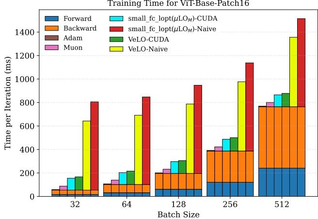  
Figure 1. Training step timing breakdown for ViT-B/16 on a single A100 GPU. We measure the forward, backward, and optimizer times per training step. We observe that the CUDA-accelerated learned optimizer steps (cyan, green) show substantial improvements over the naive implementations (yellow, red). In all cases, as the batch size is increased, the relative overhead of the optimizer shrinks.

## 1 INTRODUCTION

Learned optimization (LO) (Hochreiter et al., 2001; Andrychowicz et al., 2016) represents a promising yet underexplored direction for advancing optimization algorithms in machine learning. Training contemporary neural networks requires solving highly non-convex optimization problems for which theory neither guarantees convergence to a globally optimal solution, nor convergence at the optimal rate. Therefore, despite the purportedly strong performance of hand-designed optimizers such as Adam (Kingma & Ba, 2017), for many tasks of interest, there may be substantial room for improvement through learning to optimize. Indeed, VeLO (Metz et al., 2022b), the most performant publicly available learned optimizer to date, was shown to outperform a well-tuned NadamW and schedule baseline optimizer without hyperparameter tuning. Despite its strong performance, however, VeLO is seldom used by our community today.

Several critical barriers have hindered the more widespread adoption of learned optimizers for deep learning applications: 1) an overfocus on meta-learning in current learned optimization frameworks, 2) the absence of a PyTorch implementation for the most performant learned optimizers available, 3) the inability to effectively share optimizer weights, and 4) learned optimizer step overhead.

In what follows, we take a step towards improving the adoption of learned optimizers for deep learning by providing a PyTorch implementation of state-of-the-art learned optimizers that emphasizes their performance and accessibility for practical machine learning problems. our contributions can be summarized as follows:

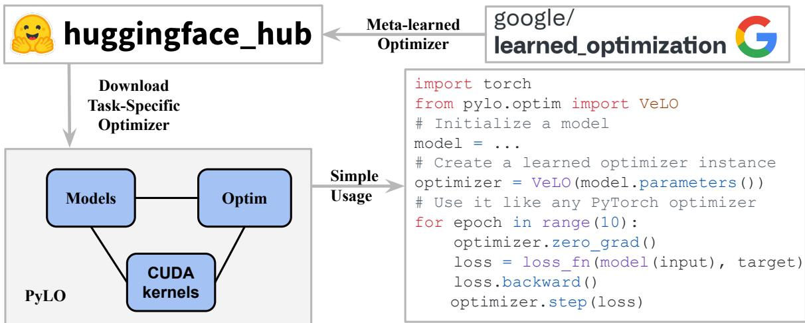  
Figure 2. PyLO: simplifies the integration of learned optimizers into standard machine learning workflows. By addressing key usability challenges, PyLO provides seamless access to meta-learned optimization techniques through three core features: (1) automatic weight loading from Hugging Face Hub, (2) a familiar PyTorch-style optimizer interface, and (3) accelerated CUDA kernel support. The library bridges the gap between advanced meta-learning research (google/learned optimization(Metz et al., 2022a)) and practical machine-learning applications, enabling researchers and practitioners to easily leverage state-of-the-art learned optimization techniques in PyTorch.

1. We provide a modular open-source implementation of state-of-the-art learned optimizers in PyTorch, which seamlessly integrates with torch.optim.Optimizer and the Huggingface ecosystem to easily integrate with existing code and facilitate standardized sharing of task-specific learned optimizer weights (Figure 2).

2. We provide a CUDA-accelerated implementation of small fc lopt and VeLO’s optimizer step, which substantially reduces memory overhead and increases occupancy (GPU utilization as in Figure 1).

3. We benchmark optimizer step times and performance in PyLO for popular image classification and language modeling workloads, showing that our implementation scales to larger workloads and decreases step times by more than 2× over the existing JAX implementation.

4. We demonstrate that learned optimizer step times can further be reduced in a data-parallel training setting by distributing the optimizer step across devices.

5. Our flexible framework makes it easy to study the effect of weight decay and learning rate schedules on learned optimizer performance by leveraging the existing Pytorch API and, when doing so, we find that making these simple additions can substantially improve performance in some cases.

## 2 CHALLENGES OF L2O ADOPTION FOR THE WIDER DEEP LEARNING COMMUNITY

This section reviews existing open-source learned optimization repositories and reflects on the critical barriers hindering the widespread adoption of learned optimizers within the broader deep learning community, highlighting pitfalls in existing work.

## 2.1 Existing Open source libraries

Open-L2O (Chen et al., 2022) offers a comprehensive benchmarking suite designed primarily for evaluating learned optimizers (L2O) across a range of different optimization problems: convex functions, non-convex functions, minimax functions, and some neural network training. It includes both model-based and model-free L2O methods, facilitating reproducibility and fair comparisons, but only includes a limited evaluation of the learned optimizer for practical deep learning tasks. In contrast, PyLO’s main focus is on learned optimization for deep learning.

Google’s learned optimization (Metz et al., 2022a) is a research-oriented repository written in JAX for training, designing, evaluating, and applying learned optimizers. It supports an extensive set of features for meta-training optimizers: many gradient estimation algorithms, abstractions for different types of tasks, various task modifiers, etc. While the repository also provides functionality for applying pre-trained optimizers to new tasks via the Optax interface (DeepMind et al., 2020), its main focus is clearly to provide meta-training functionality.

Table 1. Comparison of Open-source Learned Optimization Repositories. We list the current open-source repositories for learned optimization and list their status relative to the difficulties of L2O adoption from section 2.2. A Decoupled framework separates learned optimizer implementation from meta-training and meta-testing code.
<table><tr><td>Repository</td><td>Decoupled</td><td>PyTorch</td><td>HuggingFace</td><td>CUDA Kernel</td><td>Paper</td><td>Github</td></tr><tr><td>Open-L20</td><td>X</td><td>√</td><td>X</td><td>X</td><td>(Chen et al., 2022)</td><td>Open-L20</td></tr><tr><td>Learned Optimization</td><td>X</td><td>X</td><td>X</td><td>X</td><td>(Metz et al., 2022a)</td><td>Learned Optimization</td></tr><tr><td>PyLO (ours)</td><td>√</td><td>√</td><td>√</td><td>√</td><td>In submission</td><td>PyLO</td></tr></table>

## 2.2 Challenges to adoptions

Overfocus on meta-learning: Existing libraries, such as the Learned Optimization (Metz et al., 2022a;b) and Open L2O (Chen et al., 2022), prioritize meta-training functionality over precisely focusing on the practical deployment of learned optimizers. This leads to a large proportion of the code being unnecessary for applying learned optimizers to new tasks. This can represent a barrier to entry, particularly for researchers and practitioners who seek to leverage pre-trained optimization algorithms without engaging in the complexities of meta-training (similar to using a pretrained transformer from huggingface/transformers(Wolf et al., 2020)). This highlights the necessity of decoupling learned optimizer implementations from their metatraining and meta-testing code.

PyTorch v.s. JAX: A third barrier relates to the underlying deep learning framework. While JAX (Bradbury et al., 2018) offers powerful functional programming capabilities and strong performance from compilation, it lacks the widespread community adoption of PyTorch (Paszke et al., 2019). Beyond having more users, widespread community adoption also comes with a more mature and feature-full open source ecosystem (He, 2019; Wightman, 2019; von Platen et al., 2022; Wolf et al., 2020). With so much demand for compatibility with PyTorch, there exists a pressing need for a modular L2O framework that seamlessly integrates with PyTorch’s optimizer interface. Currently, Google’s Learned Optimization does not provide any compatibility with PyTorch. While Open-L2O does support PyTorch, it lacks many other crucial aspects for adoption (see Table 1).

Sharing learned optimizer weights: Being able to effectively share optimizer weights and document their training distribution and evaluation performance is essential for building an effective open source ecosystem around learned optimizers. However, no such mechanism currently exists. In contrast, pre-trained models for language understanding (DeepSeek-AI et al., 2025; Touvron et al., 2023), image classification (Dosovitskiy et al., 2020; Radford et al., 2021), semantic segmentation (Kirillov et al., 2023), and a number of other tasks are routinely shared via platforms such as HuggingFace Hub (HuggingFace), enabling practitioners to leverage computational investments made by well-resourced institutions. This collaborative open-model ecosystem has accelerated innovation and reduced redundancy in these domains through its expansion of access to state-of-the-art models. Despite this revolution in model sharing, we lack seamless sharing in learned optimizer weights. We believe that Learned Optimizer (LO) models can and should be integrated into the community through the HuggingFace ecosystem. Current open-source L2O frameworks, Learned Optimization and OpenL2O, do not provide any mechanism for sharing learned optimizer weights.

Per-step overhead of learned optimizers: A significant obstacle to the widespread adoption of learned optimizers is the computational overhead they can introduce to already resource-intensive training setups. Deep learning workflows operate under strict time and computational constraints, with practitioners demonstrating marked reluctance to trying new optimization strategies that might increase training durations, regardless of potential convergence benefits. This challenge necessitates meticulous implementation of learned optimization algorithms to ensure competitive computational efficiency, which can be achieved by writing custom CUDA kernels.

## 3 PROJECT GOAL

With our goal of improving the adoption of learned optimizers within the deep learning community and enhancing the open-source ecosystem around them, we design PyLO with the following principles in mind:

Accessibility With minimal dependencies (PyTorch + HuggingFace) and a straightforward installation process, PyLO eliminates the technical barriers that have impeded the widespread adoption of learned optimizers thus far.

Decoupling By exclusively providing efficient learned optimizer implementations in PyTorch without meta-training code, PyLO decouples meta-testing from meta-training. This substantially reduces code bloat and additional dependencies required compared to other frameworks. As a result, PyLO is simpler to use and easier to understand.

Interoperability Through strict adherence to the PyTorch optimizer (torch.optim.Optimizer) interface, PyLO ensures seamless integration with existing training frameworks and compatibility with popular optimizer modifiers. This allows practitioners to use learned optimizers with minimal modification to their existing code—including modifiers like decoupled weight decay and learning rate schedules.

## 4 LIBRARY DESIGN

We implement a modular architecture partitioned into four main components to realize our project vision. This design philosophy prioritizes both usability for practitioners and extensibility for researchers developing novel learned optimizers.

Optimization Module (pylo.optim) This module facilitates critical state management functions necessary for learned optimization. These include maintaining parameter-specific accumulators, computing parameter features for optimizer forward passes, executing update steps with configurable learning rate scaling, and supporting standard PyTorch optimizer functionality such as state dictionaries for resuming. This implementation allows practitioners to leverage advanced learned optimization techniques without significant modifications to existing training setups.

Meta-Model Architectures (pylo.models) encapsulates the parameters of the learned optimizer and its forward pass. It is also fully integrated with HuggingFaceHub (Hugging-Face), allowing users to download existing optimizers from the hub and providing a mechanism for weight distribution and versioning of future optimizers. Through HF integration, we facilitate community-driven improvement cycles and allow researchers to easily leverage our CUDA-accelerated implementation for their own benchmarking.

CUDA Acceleration (pylo.csrc) The computational demands of learned optimizers present significant implementation challenges. Unlike traditional optimization algorithms that apply simple, closed-form update rules, learned optimizers require evaluating a small multilayer perceptron (MLP) for each parameter in the optimizee. This can introduce substantial computational overhead for large models, creating a critical bottleneck that limits practical deployment. We emphasize that standard PyTorch neural network modules are inadequately optimized for this specific use case. These modules are primarily designed for batched operations on image or language data rather than the unique computational pattern of learned optimizers, where many small MLPs must be evaluated in parallel across millions or billions of parameters.

Drawing inspiration from architecture-aware optimizations (Muller et al. ¨ , 2021; Dao et al., 2022), we implemented specialized CUDA kernels for applying learned optimizers. This implementation strategically leverages the GPU memory hierarchy to address the primary bottleneck: memory bandwidth rather than computational throughput. Our CUDA implementation employs two key optimization strategies: (1) Fused MLP Inference and (2) On-demand Feature Computation. The first utilizes GPU registers to store intermediate activations during forward propagation through the optimizer’s MLP. This approach minimizes high-latency global memory accesses by keeping frequently accessed data in the fastest available memory tier. The second avoids storing normalized features in global memory, recalculating them when needed, and trading redundant computation for reduced memory bandwidth. The full implementation and performance analysis are detailed in Section 5.

Decoupled evaluation Providing easy-to-use examples for new open-source code can go a long way for improving adoption, as it illustrates how the library can be used and provides a starting point for exploration. However, it is important to decouple such examples from the learned optimizer implementation itself to keep the lines of code within PyLO to a minimum. As such, we provide PyLO-Examples alongside PyLO as a supporting repository for evaluating learned optimizers on popular language modelling (pre-training on FineWeb EDU) and image classification (classical ImageNet pre-training) tasks. Each task is implemented within a single directory to maximize readability and re-use.

## 5 CUDA IMPLEMENTATION

In this section, we describe the implementation details of our CUDA kernels and the motivation behind our design choices. We begin by analyzing the performance bottlenecks in the naive PyTorch implementation, then present our optimized approach.

## 5.1 Analysis of Naive Implementation

A learned optimizer step comprises several distinct operations, visualized in Figure 3. Consider a parameter tensor of dimensions $m \times n$ . The naive implementation constructs a feature vector of size mn $\times ~ d _ { \mathrm { f e a t } }$ where $d _ { \mathrm { f e a t } }$ denotes the learned optimizer’s input dimensionality. This construction starts after the accumulator update (update of momentum, second moment, etc) and proceeds in three stages:

Feature Construction After updating accumulators the construct features() procedure starts. The gradient g, parameter p, momentum buffer m, second-moment estimate v, and factored second-moment terms (row and column factors), are used to compute a set of derived features (see Appendix G for all features). Each derived feature requires individual kernel launches for element-wise operations.

Feature normalization Before applying the learned optimizer’s neural network, features must be normalized by their squared average across all parameter elements. This requires: (1) computing E[feature2] via reduction operations (compute squared average()), and (2) dividing each feature by $\sqrt { \mathbb { E } [ \mathrm { f e a t u r e } ^ { 2 } ] + \epsilon }$ (feature normalization()). PyTorch’s generalpurpose reduction kernels require additional kernel launches after materializing the full feature vector.

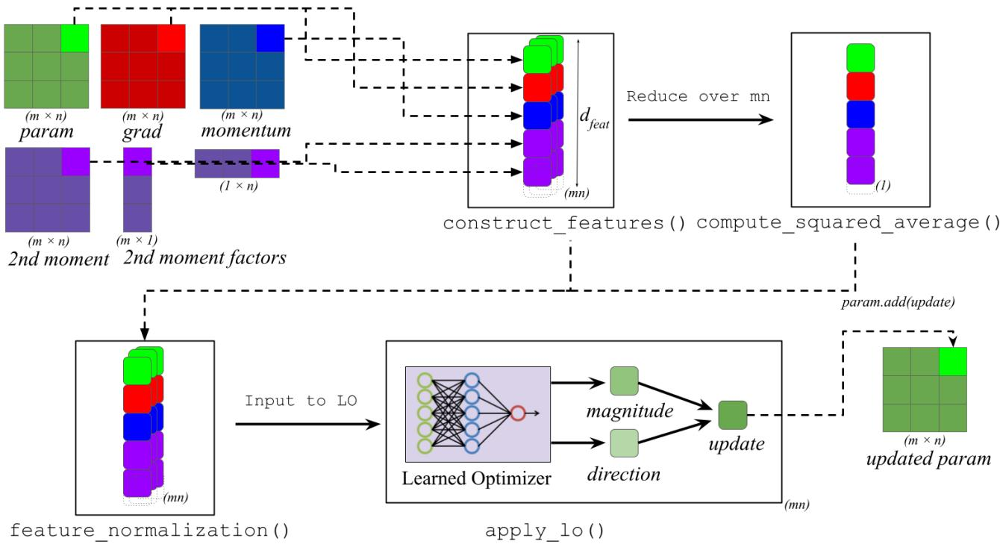  
Figure 3. Overview of the Learned Optimizer (LO) update mechanism: The figure depicts the computation pipeline used by learned optimizers such as small fc lopt and VeLO. Model parameters (θ), gradients (g), momentum (m), and second-moment accumulators (v, row & column factors of v) are combined within construct features() to form a rich set of derivative features, including elementwise interactions such as g × momentum and momentum × factors (see Appendix G for a complete description). These features are reduced over the parameter dimensions $( m \times n )$ in compute squared average() to obtain normalization statistics. In feature normalization(), features are normalized before being processed by the Learned Optimizer, which predicts an update direction and magnitude in $\mathsf { a p p l y \mathrm { - } \mathrm { 1 0 ~ ( ) } }$ , and this predicted update is then applied to yield the updated parameters.

Apply Learned Optimizer Following feature preparation and normalization, the apply lo() procedure is invoked. A learned optimizer, which is implemented as a neural network, takes the normalized feature vector as input and predicts two scalar outputs: one representing the magnitude and the other the direction of the parameter update. These predictions are combined to compute the update according to the formula

$$
\Delta \theta = \mathrm { d i r e c t i o n } \times e ^ { \mathrm { m a g n i t u d e } \times \alpha } \times \beta ,
$$

where α and β are hyperparameters fixed at 0.01. The parameter θ is then updated as $\theta  \theta + \Delta \theta$ . In the PyTorchbased MLP implementation, this process launches a separate kernel for each layer and stores intermediate activations in global memory. Consequently, memory bandwidth emerges as the primary bottleneck, resulting in underutilized GPU compute resources and reduced overall efficiency.

The naive implementation thus requires 74-252 kernel launches per parameter tensor, with each intermediate result materialized in global memory. For a parameter tensor of size mn, this generates approximately (num of accum) ∗ mn words of memory traffic and allocates mn $\times ~ d _ { \mathrm { f e a t } }$ words of temporary storage, which a substantial burden for large models. This is evidenced by the profiler visualization as shown in Figure 4.

## 5.2 Optimized Kernel Design

Our optimization strategy rests on two key observations: (1) feature construction can be performed in a single pass over the parameter tensor, and (2) the neural network forward pass can be fused with feature construction to eliminate intermediate storage. To this end, we implement a two-pass method in which we decompose the learned optimizer step into two kernels:

Kernel 1: Feature statistics collection. We perform a single pass over all parameters, computing features on-the-fly in registers and accumulating their squared values for normalization. Rather than materializing the full feature tensor, we maintain only a $. d _ { \mathrm { f e a t } }$ -dimensional accumulator per thread. Reduction proceeds hierarchically: thread-local accumulators are reduced within each warp using shuffle instructions, warp results are aggregated via shared memory, and block-level results are combined through atomic operations to global memory. This approach computes the required statistics using only $O ( d _ { \mathrm { f e a t } } ) ^ { \bullet }$ shared memory per block and $O ( d _ { \mathrm { f e a t } } )$ global memory total, independent of parameter count. This combines the construct features() and compute squared average() procedures.

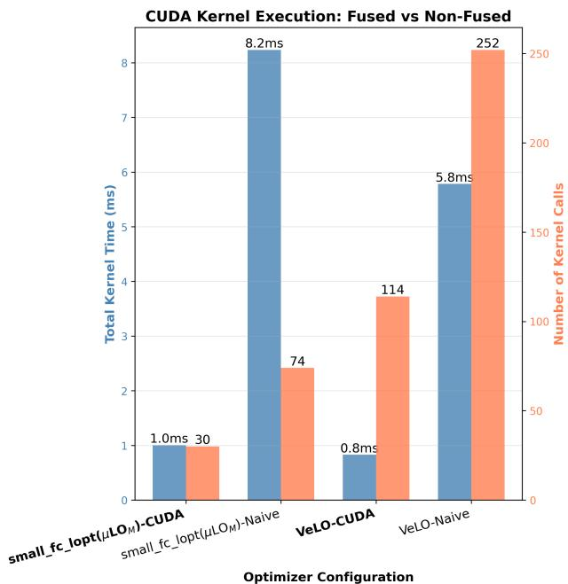

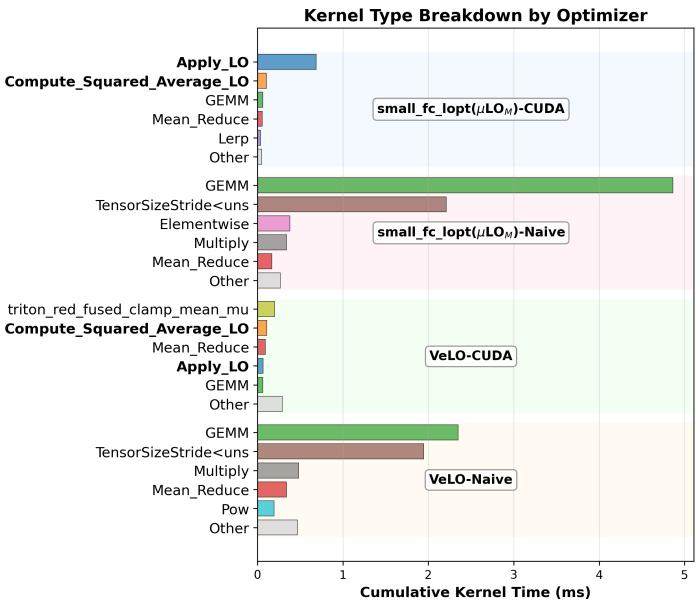  
Figure 4. Comparison of CUDA kernel execution characteristics for the learned optimizers small fc lopt and VeLO, shown for both na¨ıve and fused implementations applied to a single layer MLP (shape [1000x1000]) with no bias. (Left) The total cumulative kernel execution time (blue) and the number of kernel launches (orange) reveal that the na¨ıve implementations spend substantially more time executing a far greater number of small kernels, due to performing each arithmetic or reduction step as an independent operation. In contrast, the fused CUDA versions combine these operations into fewer, more computationally dense kernels, reducing both launch overhead and memory bandwidth pressure. (Right) Breakdown of cumulative kernel time by kernel type for each optimizer shows that the fused versions (bolded) consolidate many repetitive operations into specialized fused kernels. This pattern is consistent across both VeLO and small fc lopt, demonstrating that kernel fusion is broadly beneficial for improving learned optimizer efficiency.

## Pseudocode for Kernel 1

```c
// Phase 1: Fused Compute Statistics
Kernel_1(g, p, m, v, ...) {
thread_accum[d_feat] = {0};
Register array
for (i in grid_stride_loop) {
features = compute_features(g[i], p
[i], m[i], v[i], ...);
thread_accum += features * features
;
}
warp_reduce(thread_accum); // Shuffle
operations
block_reduce(warp_results); // Shared
memory
atomic_add(global_stats, block_result);
```

}

Kernel 2: Second Fused feature construction and network application. With normalized statistics available in global memory, we perform a second pass that: (1) loads the normalization factors into shared memory for efficient broadcast, (2) constructs features in registers from parameter and accumulator values for the second time, (3) evaluates the learned optimizer network in-line, and (4) applies the computed update. No intermediate tensors are materialized—all computation flows through the register file. This combines construct features(),feature normalization() and apply lo() procedures.

Memory hierarchy exploitation Our design carefully manages data placement across the GPU memory hierarchy:

Registers: Feature vectors $( d _ { \mathrm { f e a t } } \approx 3 9 $ elements) and network activations reside entirely in registers during computation, providing single-cycle access latency.

Shared memory: The $d _ { \mathrm { f e a t } } .$ -dimensional normalization statistics are loaded once per thread block and broadcast to all threads, amortizing the cost of global memory access across all threads in the block.

Global memory: Only parameter values, gradients, and optimizer state buffers are read from global memory, and only updated parameters are written back. This reduces memory traffic substantially per optimization step.

This design eliminates kernel launch overhead (reducing from 74-252 to 30-114 kernel invocations, see Figure 4), removes intermediate allocations (reducing memory footprint by $m n \times d _ { \mathrm { f e a t } }$ words), and minimizes memory bandwidth consumption (Data movement is minimized as only accumulators are read and final outputs are written). The result is an implementation that achieves good memory bandwidth utilization while maintaining numerical equivalence to the naive approach.

## Pseudocode for Kernel 2

```c
// Phase 2: Fused Apply
Kernel_2(g, p, m, v, ..., global_stats) {
_shared__ normalized_stats[d_feat];
if (tid < d_feat) {
normalized_stats[tid] = rsqrt(
global_stats[tid] / N); // N =
number of params
}
__syncthreads();
for (i in grid_stride_loop) {
// All computation in registers
features[d_feat] = compute_features
(g[i], p[i], m[i], v[i], ...);
features *= normalized_stats; /
Broadcast from SMEM
// Inline MLP (weights in __ldg
cache)
hidden = relu(Linear1(features));
hidden = relu(Linear2(hidden));
direction, magnitude = Linear3(
hidden);
update = direction * exp(magnitude
* alpha) * beta;
p[i] -= update;
}
}
```

## 6 BENCHMARKING LO STEP TIMES IN PYLO

In this section, we establish the per-step overhead of learned optimizers for common pre-training workloads and showcase the improved scaling behavior of PyLO’s CUDAaccelerated learned optimizer steps. Our goal is to report learned optimizer overhead relative to hand-designed optimizers for practical tasks and to illustrate how the overhead scales as the model size is increased. To this end, we benchmark and record the forward, backward, and optimizer step times for training vision transformers and transformer language models of different sizes on a single 80GB A100 GPU.

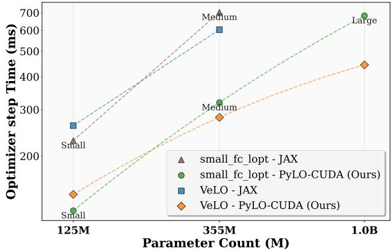  
Figure 5. Step Time Scaling of Learned Optimizers. We present a comparison of optimizer step time between our custom CUDA implementation and the original JAX versions of small fc lopt and VeLO, evaluated during the training of GPT-2 style transformer models across a range of model sizes. The results show that our CUDA implementation not only achieves substantially lower step times but also maintains this advantage as model size increases, enabling more efficient scaling to larger architectures.

Learned Optimizer overhead shrinks as batch size increases. Figure 1 reports timings at different batch sizes for ViT-B/16. We observe that as batch size is increased, the overhead of the learned optimizer’s step relative to the forward and backward passes diminishes. This indicates that large-scale training with prolonged per-step compute may be particularly well-suited for learned optimizers, as the optimizer cost can be effectively amortized. This trend is further evidenced in Table 2 for both vision and language modeling, which presents timing comparisons across optimizers for ViT-B/16 and a medium-sized GPT-2 model (355M parameters). We find that relative throughput compared to Adam improves with model scale, holding true for language modeling as well. Additionally, per-step time for small fc lopt (CUDA) scales with model size, yet our CUDA kernels deliver substantial speedups over the naive baseline. For ViT-B/16, small fc lopt (CUDA) achieves an 86% reduction in optimizer step time versus the naive version; for the GPT-2 task, the reduction is 88%. (Full results, including larger ViT and GPT variants, are provided in Appendix F.)

Scaling behavior of our CUDA implementation vs the JAX baseline Figure 5 reports the scaling behavior w.r.t. transformer size when trained with different implementations of small fc lopt (we use hidden size 32 as in (Therien et al. ´ , 2024)) and VeLO(Metz et al., 2022b). JAX corresponds to the original implementation of (Metz et al., 2022a), which uses the JAX compiler, while CUDA is the fastest implementation that we make available in PyLO.

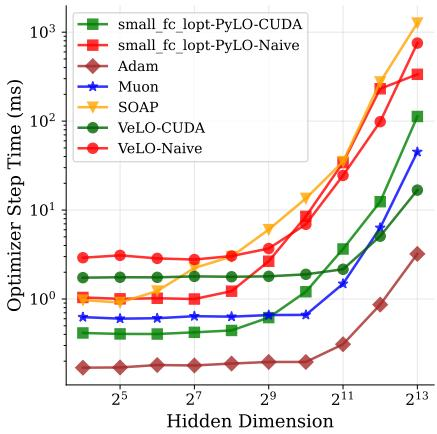  
(a) 1-layer MLP

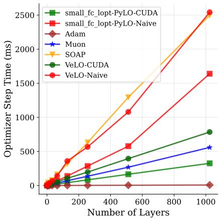  
(b) 256-width MLP

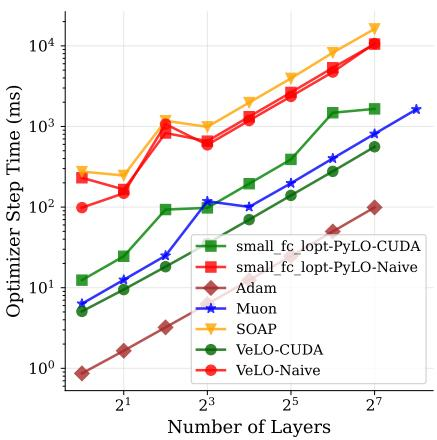  
(c) 4096-width MLP

Figure 6. Scaling behavior of CUDA implementation with varying MLP configurations We evaluate optimizer step time across various MLPs with controlled width and depth. Subfigure (a) reports optimizer step time as the hidden size of the 1-layer optimizee MLP is increased. Subfigure (b) reports step time as the depth of a 256 hidden-dimension optimizee MLP is increased. Subfigure (c) reports step time as the depth of a 4096 hidden-dimension optimizee is increased. Missing datapoints correspond to OOM errors. We observe that in each case, our CUDA implementation reduces the optimizer step time by an order of magnitude relative to the naive implementation.
<table><tr><td>Model</td><td>Optimizer</td><td>BS/SL</td><td>Fwd (ms)</td><td>Bwd (ms)</td><td>Opt step (ms)</td><td>#Params (M)</td></tr><tr><td>ViT-B/16</td><td>Adam(Loshchilov &amp; Hutter, 2019) Adafactor(Shazeer &amp; Stern,2018) small_fc_lopt (naive) small_fc_lopt (CUDA) VeLO (naive)</td><td>32/197</td><td>17.52</td><td>38.13</td><td>4.90 18.99 756.80 99.59 (-86%) 585.11</td><td>86.57</td></tr><tr><td>GPT2-355M</td><td>Adafactor(Shazeer &amp; Stern, 2018) small_fc_lopt (naive) small_fc_lopt (CUDA) VeLO (naive) VeLO (CUDA)</td><td>4/1024</td><td>197.41</td><td>392.29</td><td>20.12 35.11 2872.17 319.14 (-88%) 2378.93 284.37 (-88%)</td><td>355.92</td></tr></table>

Table 2. Timing Results Across Optimizers for ViT and GPT Models. We report optimizer step times for Vision Transformer (ViT-B/16) and a GPT-2 style model with 355M parameters, using realistic batch sizes (BS) and sequence lengths (SL) that fit within the memory constraints of a single A100 GPU. The results demonstrate that our custom CUDA kernel significantly reduce optimizer step time (reduction shown in red) compared to naive implementation, enabling more efficient training in practical settings.

We observe that our CUDA implementations results in a substantial memory savings as it can optimize a 1B parameter transformer, while the JAX implementation runs out of memory for an 80 GB A100 GPU. Moreover, in cases where the JAX implementation does not run out of memory, it is outperformed by our CUDA implementation, resulting in a 2× reduction in step time.

Isolating Scaling behavior of our CUDA implementation with MLP taks To systematically characterize the scaling behavior of our implementation, we conduct controlled experiments using synthetic MLP architectures with varying numbers of layers and hidden dimensions. This allows us to explicitly control for tensor sizes and the number of tensors to measure the effect on our implementation. Figure 6 presents three complementary scaling analyses that isolate the effects of network width and depth on optimizer computational overhead. Figure 6(a) examines the relationship between hidden layer dimensionality and optimization time for a fixed 1-layer MLP architecture. The results reveal a stark performance disparity: the naive implementations of learned optimizers exhibit optimization times an order of magnitude greater than our CUDA implementation. While our CUDA implementations remains slower than traditional optimizers, it demonstrates favorable scaling characteristics. We further enhance this on H100 hardware in Appendix A.

Complementary analysis in Figure 6(b),(c) evaluates depth scaling behavior using MLPs with fixed width of 256 and 4096 units but varying layer counts (depth). The naive implementation consistently operates in a computationally prohibitive regime, requiring over 400ms for optimization steps, while our CUDA implementation maintains optimization times approaching the performance envelope of traditional optimizers despite the inherent complexity of learned optimization. These scaling experiments demonstrate that our CUDA implementation successfully addresses the computational bottlenecks that render naive learned optimizer implementations impractical for realistic model architectures.

## 7 DISTRIBUTED OPTIMIZER STEP

It is possible to further reduce optimizer step time by distributing computation across multiple devices. So far, our analysis has focused on optimizer step times for fully replicated data-parallel training where the gradient is first allreduced and, subsequently, the optimizer step for the entire model is performed redundantly and simultaneously on all devices. While not ideal, this approach is reasonable for coordinate-wise optimizers like Adam, which require little computation during the optimizer step. However, optimizers like Shampoo(Gupta et al., 2018), Muon(Jordan et al., 2024), or Learned optimizers (Metz et al., 2022a;b), that perform significant computation at each step, can benefit from distributing the optimizer step across multiple devices. As illustrated in figure 7, the optimizer step can effectively be distributed across devices by splitting the all-reduce operation into its parts: (1) reduce scatter the gradients evenly for each parameter tensor across devices, (2) perform the optimizer step non-redundantly across all devices, and (3) all-gather the updated model parameters.

Table 3. Comparing improvements from distributed optimizer steps. We report the time taken for the forward and backward pass, communication, and optimizer step for different optimizers when training a 125M transformer language model across four H100 GPUs. All times are reported in milliseconds (ms). The all-reduce column performs an all-reduce of the gradient before the optimizer step, while reduce-scatter distributes the optimizer step across devices (Figure 7 illustrates the difference between these steps.). We observe that using a distributed optimizer step can reduce learned optimizer step times by up to 31.86 ms.
<table><tr><td>Optimizer</td><td>All-reduce (ms)</td><td>Reduce-scatter (ms)</td><td>Difference</td></tr><tr><td>small_fc_lopt CUDA</td><td>136.53</td><td>104.67</td><td>31.86</td></tr><tr><td>VeLO CUDA</td><td>127.67</td><td>108.71</td><td>18.96</td></tr><tr><td>Muon</td><td>106.92</td><td>98.10</td><td>8.82</td></tr><tr><td>Adam</td><td>99.93</td><td>95.93</td><td>4.00</td></tr></table>

Improvements from using a distributed optimizer step Table 3 reports the time taken for the forward and backward pass, communication, and optimizer step for different optimizers when training a 125M transformer language model across four H100 GPUs. We observe that distributing the optimizer step can lead to substantial improvements for all optimizers, but that learned optimizers improve the most from a distributed step: by 31.86 ms for small fc lopt and 18.96 ms for VeLO. This reduces the overhead relative to Adam for these optimizers to just 9% and 13%, respectively. These results suggest that, in large batch training settings, the overhead or learned optimizers relative to Adam and Muon can further be reduced by distributing the optimizer step over more devices.

Sharded Optimizer States. Our analysis shows that tensorlevel reduce-scatter significantly accelerates distributed optimizer steps. Further gains in memory and compute are possible by sharding optimizer states across devices, as in ZeRO (Rajbhandari et al., 2020) (i.e., fully sharded data parallelism (Zhao et al., 2023)). However, completing an optimizer step may require reconstructing full accumulator tensors via all-to-all and all-gather operations. Since learned optimizers currently operate per-parameter (except normalization), the costly all-to-all can be replaced with a distributed normalization step that communicates only $d _ { \mathrm { f e a t } }$ scalars. We leave sharded learned optimizers for future work.

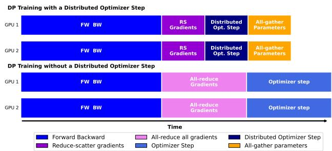  
Figure 7. Overlapping Optimizer steps with Communication and distributed Optimizer steps.

## 8 DEMONSTRATING THE REAL-WORLD USEOF PYLO

In the following section, we evaluate and compare our Py-Torch implementation of VeLO (Metz et al., 2022b) and small fc lopt to the performance of tuned Adam with a cosine annealing schedule. We use $\mu \mathrm { L O } _ { M }$ (Therien et al. ´ , 2024) pretrained weights for the small fc lopt. Our goal is to establish the performance of readily available learned optimizers in PyLO for these practical vision and language pre-training tasks.

## 8.1 Training Vision Transformer on ImageNet-1K

Experimental Configuration: We train ViT-Base/16 models (86M parameters) for 480 epochs (150k steps) on ImageNet-1K following established protocols (Wightman, 2019). We apply standard augmentation techniques (RandAugment, CutMix, Mixup) to ensure realistic training conditions that reflect practical deployment scenarios. We employ a batch size of 4096 and conduct these experiments on Nvidia H100 GPUs.

Results As shown in Table 4 VeLO demonstrates competitive performance in this context, achieving 78.45% top-1 accuracy compared to Adam’s 77.22%. This scenario demonstrates a case where the learned optimizer practically competes with Adam. µLO exhibits training divergence after 65,000 steps due to its limited 1,000-step meta-training horizon, achieving only 62.14% peak validation accuracy.

Table 4. Final Loss for Language Modeling (LM) and Final Validation Accuracy for Vision Transformer (ViT) Tasks for Medium Model Sizes Using Different Optimizers
<table><tr><td>Optimizer</td><td>LMLoss ↓(355M)</td><td>ViT Acc. ↑ (86M)</td></tr><tr><td>μLOm</td><td>3.18</td><td>62.14</td></tr><tr><td>VeLO</td><td>2.89</td><td>78.39</td></tr><tr><td>Adam +Cosine</td><td>2.91</td><td>77.22</td></tr></table>

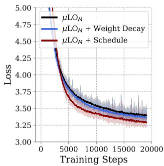  
(a) LM µLO

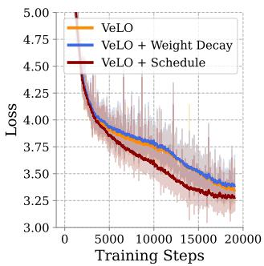  
(b) LM VeLO

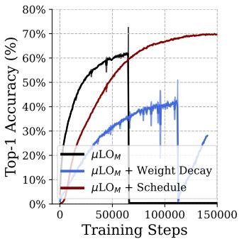  
(c) ViT µLO

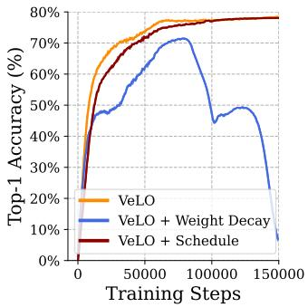  
(d) ViT VeLO  
Figure 8. Weight decay and learning rate schedule (LRS) ablation. In PyLO, it is easy to equip VeLO and $\mu \mathrm { L O } _ { M }$ with weight decay and learning rate schedules since it integrates with torch.optim.Optimizer. We sweep different values and find that in some cases learned optimizers improve.

## 8.2 Language model pre-training on FineWeb

## Experimental Configuration

We pre-train a 355M parameter GPT-2 style transformers on FineWeb-EDU (Lozhkov et al., 2024) for 10B tokens, employing a batch size of 512 and sequences of length 1024 (see section D for additional hyperparameter details).r more details.

## Results

Table 4 reports the final loss achieved for all optimizers in our study, while figure 11 of the appendix plots the training curves. We observe that VeLO outperforms Adam and $\mu \mathrm { L O } _ { M }$ , reaching the lowest final loss. This demonstrates that PyLO has the potential to deliver optimization performance improvements to PyTorch users.

## 8.3 Combining scheduler and decoupled weight decay

To showcase the interoperability of our library, we add learning rate scheduling and decoupled weight decay to our learned optimizer implementations in as little as 5 lines of code. Although the primary objective of learned optimization is to eliminate the reliance on manually designed heuristics, we take the opportunity to investigate whether learning rate schedules and weight decay can still improve learned optimizer performance.

## Effect of Learning Rate Scheduler

We equip $\mu \mathrm { L O } _ { M }$ and VeLO with a cosine annealing LRS and tune the maximum learning rate (MaxLR). Figure 8 reports ViT and GPT training and accuracy curves for the best-performing MaxLR while training curves for more values are reported in the appendix (C). We observe that $\mu \mathrm { L O } _ { M }$ benefits substantially from explicit scheduling, extending stable training from 65k to 150k steps and reaching 71% Top-1 accuracy on ImageNet and improving loss in language model pre-training. VeLO shows minimal scheduling improvements, suggesting different internal adaptation

mechanisms.

## Effect of Weight decay

We equip $\mu \mathrm { L O } _ { M }$ and VeLO with decoupled weight decay and tune the decay coefficient, λ. Figure 8 reports ViT and GPT training and accuracy curves for the best-performing λ while training curves for more values are reported in the appendix (C). We observe that $\mu \mathrm { L O } _ { M }$ benefits from weight decay for training GPT but not VeLO. Neither optimizer benefits from weight decay for ViT tasks.

## 9 CONCLUSION

We have presented PyLO, an open-source PyTorch library that removes key barriers to the practical use of learned optimizers in large-scale deep learning. PyLO offers drop-in implementations of state-of-the-art methods such as VeLO and small fc lopt through the standard torch.optim.Optimizer interface, with seamless Hugging Face Hub integration for model sharing. Central to our systems contributions are custom CUDA kernels that fuse feature construction, normalization, and MLP inference, and a distributed implementation that distributes tensors across multiple devices. This achieves 86–88% lower overhead than naive PyTorch, and can efficiently scale to training a 1B-parameter transformer on a single A100 GPU. Our evaluation shows that PyLO reduces learned optimizer overhead to acceptable levels at scale and they can deliver competitive accuracy on ImageNet and large-scale language pretraining. As future work, we envision PyLO enabling (1) hardware-optimizer co-design (2) behaviorcloned distillation of expensive second-order optimizers such as SOAP(Vyas et al., 2025). PyLO thus establishes a robust foundation for community-driven research and practical deployment of learned optimizers in modern ML systems.

## REFERENCES

Andrychowicz, M., Denil, M., Gomez, S., Hoffman, M. W., Pfau, D., Schaul, T., Shillingford, B., and De Freitas, N. Learning to learn by gradient descent by gradient descent. Advances in neural information processing systems, 29, 2016.

Bradbury, J., Frostig, R., Hawkins, P., Johnson, M. J., Leary, C., Maclaurin, D., Necula, G., Paszke, A., VanderPlas, J., Wanderman-Milne, S., and Zhang, Q. JAX: composable transformations of Python+NumPy programs, 2018. URL http://github.com/jax-ml/jax.

Chen, T., Chen, X., Chen, W., Wang, Z., Heaton, H., Liu, J., and Yin, W. Learning to optimize: A primer and a benchmark. The Journal of Machine Learning Research, 23(1):8562–8620, 2022.

Dao, T., Fu, D., Ermon, S., Rudra, A., and Re, C. Flashat-´ tention: Fast and memory-efficient exact attention with io-awareness. Advances in neural information processing systems, 35:16344–16359, 2022.

DeepMind, Babuschkin, I., Baumli, K., Bell, A., Bhupatiraju, S., Bruce, J., Buchlovsky, P., Budden, D., Cai, T., Clark, A., Danihelka, I., Dedieu, A., Fantacci, C., Godwin, J., Jones, C., Hemsley, R., Hennigan, T., Hessel, M., Hou, S., Kapturowski, S., Keck, T., Kemaev, I., King, M., Kunesch, M., Martens, L., Merzic, H., Mikulik, V., Norman, T., Papamakarios, G., Quan, J., Ring, R., Ruiz, F., Sanchez, A., Sartran, L., Schneider, R., Sezener, E., Spencer, S., Srinivasan, S., Stanojevic, M., Stokowiec, W., Wang, L., Zhou, G., and Vi- ´ ola, F. The DeepMind JAX Ecosystem, 2020. URL http://github.com/google-deepmind.

DeepSeek-AI, Guo, D., Yang, D., Zhang, H., Song, J., Zhang, R., Xu, R., Zhu, Q., Ma, S., Wang, P., Bi, X., Zhang, X., Yu, X., Wu, Y., Wu, Z. F., Gou, Z., Shao, Z., Li, Z., Gao, Z., Liu, A., Xue, B., Wang, B., Wu, B., Feng, B., Lu, C., Zhao, C., Deng, C., Zhang, C., Ruan, C., Dai, D., Chen, D., Ji, D., Li, E., Lin, F., Dai, F., Luo, F., Hao, G., Chen, G., Li, G., Zhang, H., Bao, H., Xu, H., Wang, H., Ding, H., Xin, H., Gao, H., Qu, H., Li, H., Guo, J., Li, J., Wang, J., Chen, J., Yuan, J., Qiu, J., Li, J., Cai, J. L., Ni, J., Liang, J., Chen, J., Dong, K., Hu, K., Gao, K., Guan, K., Huang, K., Yu, K., Wang, L., Zhang, L., Zhao, L., Wang, L., Zhang, L., Xu, L., Xia, L., Zhang, M., Zhang, M., Tang, M., Li, M., Wang, M., Li, M., Tian, N., Huang, P., Zhang, P., Wang, Q., Chen, Q., Du, Q., Ge, R., Zhang, R., Pan, R., Wang, R., Chen, R. J., Jin, R. L., Chen, R., Lu, S., Zhou, S., Chen, S., Ye, S., Wang, S., Yu, S., Zhou, S., Pan, S., Li, S. S., Zhou, S., Wu, S., Ye, S., Yun, T., Pei, T., Sun, T., Wang, T., Zeng, W., Zhao, W., Liu, W., Liang, W., Gao, W., Yu, W., Zhang, W., Xiao,

W. L., An, W., Liu, X., Wang, X., Chen, X., Nie, X., Cheng, X., Liu, X., Xie, X., Liu, X., Yang, X., Li, X., Su, X., Lin, X., Li, X. Q., Jin, X., Shen, X., Chen, X., Sun, X., Wang, X., Song, X., Zhou, X., Wang, X., Shan, X., Li, Y. K., Wang, Y. Q., Wei, Y. X., Zhang, Y., Xu, Y., Li, Y., Zhao, Y., Sun, Y., Wang, Y., Yu, Y., Zhang, Y., Shi, Y., Xiong, Y., He, Y., Piao, Y., Wang, Y., Tan, Y., Ma, Y., Liu, Y., Guo, Y., Ou, Y., Wang, Y., Gong, Y., Zou, Y., He, Y., Xiong, Y., Luo, Y., You, Y., Liu, Y., Zhou, Y., Zhu, Y. X., Xu, Y., Huang, Y., Li, Y., Zheng, Y., Zhu, Y., Ma, Y., Tang, Y., Zha, Y., Yan, Y., Ren, Z. Z., Ren, Z., Sha, Z., Fu, Z., Xu, Z., Xie, Z., Zhang, Z., Hao, Z., Ma, Z., Yan, Z., Wu, Z., Gu, Z., Zhu, Z., Liu, Z., Li, Z., Xie, Z., Song, Z., Pan, Z., Huang, Z., Xu, Z., Zhang, Z., and Zhang, Z. Deepseek-r1: Incentivizing reasoning capability in llms via reinforcement learning, 2025.

Dosovitskiy, A., Beyer, L., Kolesnikov, A., Weissenborn, D., Zhai, X., Unterthiner, T., Dehghani, M., Minderer, M., Heigold, G., Gelly, S., et al. An image is worth 16x16 words: Transformers for image recognition at scale. arXiv preprint arXiv:2010.11929, 2020.

Gupta, V., Koren, T., and Singer, Y. Shampoo: Preconditioned stochastic tensor optimization. In International Conference on Machine Learning, pp. 1842–1850. PMLR, 2018.

He, H. The state of machine learning frameworks in 2019. The Gradient, 2019.

Hochreiter, S., Younger, A. S., and Conwell, P. R. Learning to learn using gradient descent. In Artificial Neural Networks—ICANN 2001: International Conference Vienna, Austria, August 21–25, 2001 Proceedings 11, pp. 87–94. Springer, 2001.

HuggingFace. Hugging face hub. https:// huggingface.co/docs/huggingface\_hub.

Jordan, K., Jin, Y., Boza, V., You, J., Cesista, F., Newhouse, L., and Bernstein, J. Muon: An optimizer for hidden layers in neural networks, 2024. URL https: //kellerjordan.github.io/posts/muon/.

Kingma, D. P. and Ba, J. Adam: A method for stochastic optimization, 2017.

Kirillov, A., Mintun, E., Ravi, N., Mao, H., Rolland, C., Gustafson, L., Xiao, T., Whitehead, S., Berg, A. C., Lo, W.-Y., Dollar, P., and Girshick, R. Segment anything. ´ arXiv:2304.02643, 2023.

Loshchilov, I. and Hutter, F. SGDR: stochastic gradient descent with warm restarts. In 5th International Conference on Learning Representations, ICLR 2017, Toulon, France, April 24-26, 2017, Conference Track Proceedings. Open-Review.net, 2017.

Loshchilov, I. and Hutter, F. Decoupled weight decay regularization. In 7th International Conference on Learning Representations, ICLR 2019, New Orleans, LA, USA, May 6-9, 2019. OpenReview.net, 2019.

Lozhkov, A., Ben Allal, L., von Werra, L., and Wolf, T. Fineweb-edu: the finest collection of educational content, 2024. URL https://huggingface.co/ datasets/HuggingFaceFW/fineweb-edu.

Metz, L., Freeman, C. D., Harrison, J., Maheswaranathan, N., and Sohl-Dickstein, J. Practical tradeoffs between memory, compute, and performance in learned optimizers, 2022a.

Metz, L., Harrison, J., Freeman, C. D., Merchant, A., Beyer, L., Bradbury, J., Agrawal, N., Poole, B., Mordatch, I., Roberts, A., et al. Velo: Training versatile learned optimizers by scaling up. arXiv preprint arXiv:2211.09760, 2022b.

Muller, T., Rousselle, F., Nov ¨ ak, J., and Keller, A. Real-time ´ neural radiance caching for path tracing. ACM Transactions on Graphics (TOG), 40(4):1–16, 2021.

Paszke, A., Gross, S., Massa, F., Lerer, A., Bradbury, J., Chanan, G., Killeen, T., Lin, Z., Gimelshein, N., Antiga, L., Desmaison, A., Kopf, A., Yang, E., DeVito, Z., Raison, M., Tejani, A., Chilamkurthy, S., Steiner, B., Fang, L., Bai, J., and Chintala, S. Pytorch: An imperative style, high-performance deep learning library. Advances in Neural Information Processing Systems, 32, 2019.

Radford, A., Kim, J. W., Hallacy, C., Ramesh, A., Goh, G., Agarwal, S., Sastry, G., Askell, A., Mishkin, P., Clark, J., Krueger, G., and Sutskever, I. Learning transferable visual models from natural language supervision. In Meila, M. and Zhang, T. (eds.), Proceedings of the 38th International Conference on Machine Learning, ICML 2021, 18-24 July 2021, Virtual Event, volume 139 of Proceedings of Machine Learning Research, pp. 8748– 8763. PMLR, 2021.

Rajbhandari, S., Rasley, J., Ruwase, O., and He, Y. Zero: memory optimizations toward training trillion parameter models. In Cuicchi, C., Qualters, I., and Kramer, W. T. (eds.), Proceedings of the International Conference for High Performance Computing, Networking, Storage and Analysis, SC 2020, Virtual Event / Atlanta, Georgia, USA, November 9-19, 2020, pp. 20. IEEE/ACM, 2020. URL https://doi.org/10. 1109/SC41405.2020.00024.

Shazeer, N. and Stern, M. Adafactor: Adaptive learning rates with sublinear memory cost. In Dy, J. G. and Krause, A. (eds.), Proceedings of the 35th International

Conference on Machine Learning, ICML 2018, Stockholmsmassan, Stockholm, Sweden, July 10-15, 2018 ¨ , volume 80 of Proceedings of Machine Learning Research, pp. 4603–4611. PMLR, 2018.

Therien, B., ´ Etienne Joseph, C., Knyazev, B., Oyallon, E., ´ Rish, I., and Belilovsky, E. µlo: Compute-efficient metageneralization of learned optimizers, 2024. URL https: //arxiv.org/abs/2406.00153.

Touvron, H., Martin, L., Stone, K., Albert, P., Almahairi, A., Babaei, Y., Bashlykov, N., Batra, S., Bhargava, P., Bhosale, S., Bikel, D., Blecher, L., Ferrer, C. C., Chen, M., Cucurull, G., Esiobu, D., Fernandes, J., Fu, J., Fu, W., Fuller, B., Gao, C., Goswami, V., Goyal, N., Hartshorn, A., Hosseini, S., Hou, R., Inan, H., Kardas, M., Kerkez, V., Khabsa, M., Kloumann, I., Korenev, A., Koura, P. S., Lachaux, M.-A., Lavril, T., Lee, J., Liskovich, D., Lu, Y., Mao, Y., Martinet, X., Mihaylov, T., Mishra, P., Molybog, I., Nie, Y., Poulton, A., Reizenstein, J., Rungta, R., Saladi, K., Schelten, A., Silva, R., Smith, E. M., Subramanian, R., Tan, X. E., Tang, B., Taylor, R., Williams, A., Kuan, J. X., Xu, P., Yan, Z., Zarov, I., Zhang, Y., Fan, A., Kambadur, M., Narang, S., Rodriguez, A., Stojnic, R., Edunov, S., and Scialom, T. Llama 2: Open foundation and fine-tuned chat models, 2023. URL https://arxiv.org/abs/2307.09288.

von Platen, P., Patil, S., Lozhkov, A., Cuenca, P., Lambert, N., Rasul, K., Davaadorj, M., Nair, D., Paul, S., Berman, W., Xu, Y., Liu, S., and Wolf, T. Diffusers: State-of-the-art diffusion models. https://github. com/huggingface/diffusers, 2022.

Vyas, N., Morwani, D., Zhao, R., Shapira, I., Brandfonbrener, D., Janson, L., and Kakade, S. M. SOAP: Improving and stabilizing shampoo using adam for language modeling. In The Thirteenth International Conference on Learning Representations, 2025. URL https: //openreview.net/forum?id=IDxZhXrpNf.

Wightman, R. Pytorch image models. https://github. com/rwightman/pytorch-image-models, 2019.

Wolf, T., Debut, L., Sanh, V., Chaumond, J., Delangue, C., Moi, A., Cistac, P., Rault, T., Louf, R., Funtowicz, M., Davison, J., Shleifer, S., von Platen, P., Ma, C., Jernite, Y., Plu, J., Xu, C., Scao, T. L., Gugger, S., Drame, M., Lhoest, Q., and Rush, A. M. Transformers: Stateof-the-art natural language processing. In Proceedings of the 2020 Conference on Empirical Methods in Natural Language Processing: System Demonstrations, pp. 38–45, Online, October 2020. Association for Computational Linguistics. URL https://www.aclweb. org/anthology/2020.emnlp-demos.6.

Zhao, Y., Gu, A., Varma, R., Luo, L., Huang, C., Xu, M., Wright, L., Shojanazeri, H., Ott, M., Shleifer, S., Desmaison, A., Balioglu, C., Damania, P., Nguyen, B., Chauhan, G., Hao, Y., Mathews, A., and Li, S. Pytorch FSDP: experiences on scaling fully sharded data parallel. Proc. VLDB Endow., 16(12):3848–3860, 2023. URL https://www. vldb.org/pvldb/vol16/p3848-huang.pdf.

## A ENHANCED PERFORMANCE ON NVIDIA H100 GPUS

To further demonstrate the scalability of our approach on state-of-the-art hardware, we evaluate its performance on NVIDIA H100 GPUs, which offer advanced features. These accelerators are particularly beneficial for large matrix operations, such as those with dimensions 8192 × 8192—corresponding to the hidden size of a 70B-parameter transformer model.

In our enhanced implementation (denoted small fc lopt-PyLO-CUDA++), we introduce the following optimizations:

• Reduction in the number of global MLP reads to minimize HBM accesses;

• Asynchronous memory copies to overlap data movement with computation; and

• Full utilization of tensor cores and WGMMA instructions for high-throughput matrix multiplications on large tensors.

These modifications substantially reduce the optimizer step time, effectively closing the performance gap relative to state-of-the-art baselines for large-scale workloads. The results are summarized in Figure 9.

Optimizer Step Time Comparison  
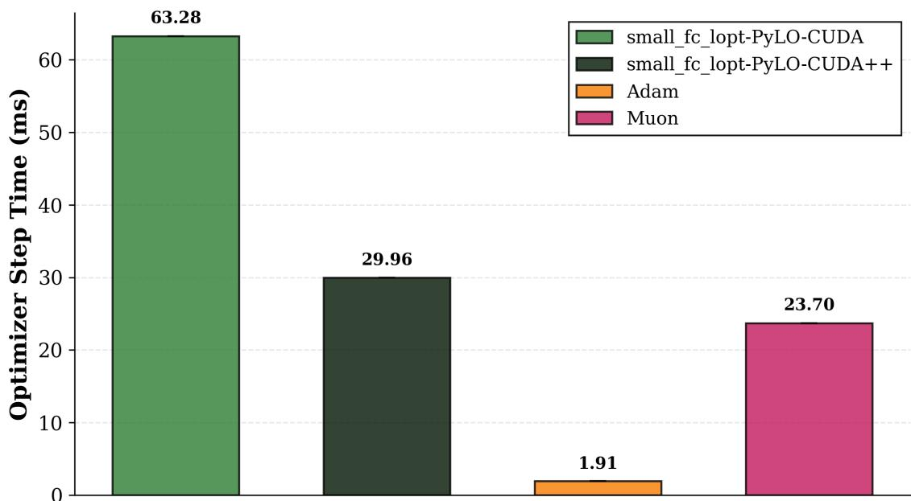

Figure 9. Optimizer step time comparison on NVIDIA H100 GPUs for 8192 × 8192 matrices. Our enhanced PyLO-CUDA++ implementation (dark green) achieves a 2.1× speedup over the baseline PyLO-CUDA (light green). Muon (pink) and Adam (orange) given for reference

## B TRAINING CURVES FOR THE EXPERIMENTS

This section presents a comprehensive empirical evaluation comparing learned optimizers VeLO (Metz et al., 2022b) and µLO (Therien et al. ´ , 2024) against the standard Adam optimizer (Loshchilov & Hutter, 2019; Kingma & Ba, 2017) with cosine learning rate scheduling (Loshchilov & Hutter, 2017). Our evaluation spans Vision Transformer architectures of varying scales and GPT-2 models, extending beyond the main paper’s validation accuracy results for ViT-Base/16 and final loss metrics for GPT-2 to provide detailed training dynamics across multiple configurations.

Vision Transformer Experiments: We evaluate three ViT configurations—Small, Base, and Large with patch size 16—on ImageNet-1k classification tasks. All configurations maintain consistent training protocols with 150,000 optimization steps and batch sizes of 4,096 across model variants, using hyperparameters detailed in Table 5. The extended evaluation presented in Figure 10 reveals critical scale-dependent optimization characteristics. MuLO demonstrates pronounced early divergence patterns across both small and large model configurations, reinforcing our hypothesis that its constrained meta-training horizon limits generalization to extended optimization trajectories. In contrast, VeLO exhibits remarkable consistency in convergence properties across the full spectrum of model scales examined, maintaining stable training dynamics while achieving competitive performance metrics relative to the Adam baseline.

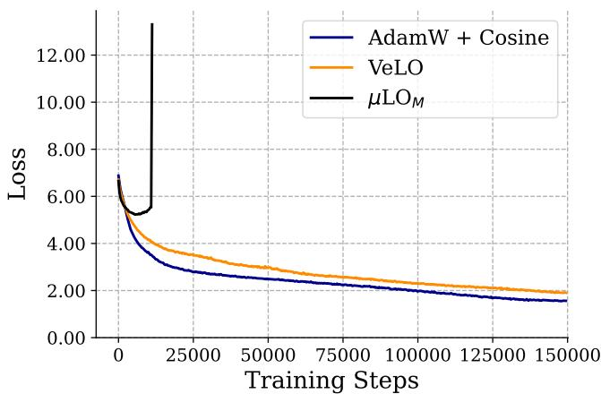  
(a) ViT small patch 16

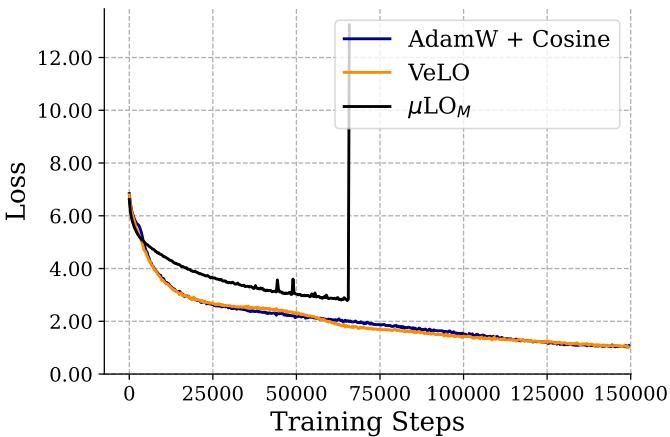  
(b) ViT base patch 16

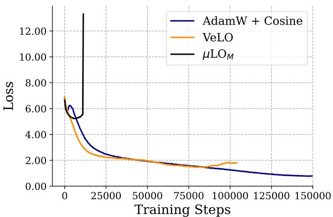  
(c) ViT large patch 16  
Figure 10. Vision Transformer training dynamics. Training loss curves for Vision Transformers trained on ImageNet-1k classification across three model configurations: (a) ViT-small with patch size 16, (b) ViT-base with patch size 16, and (c) ViT-large with patch size 16. We compare Adam with cosine learning rate scheduling (blue), VeLO learned optimizer (orange), and µLO learned optimizer (black) over 150,000 training steps with batch size 4,096. µLO exhibits early training instability across all scales, while VeLO demonstrates competitive or superior convergence properties, particularly evident in the base model configuration where it achieves lower final loss than the Adam baseline.

Language Modeling Experiments For GPT-2 pretraining on FineWeb-EDU data, we train models for 19,073 steps with batch size 512 and sequence length 1024. Complete hyperparameters are presented in Table 7, with full training curves shown in Figure 11. VeLO demonstrates competitive performance against Adam with cosine scheduling, while MuLO exhibits significantly degraded performance across the extended training horizon, consistent with the stability patterns observed in vision tasks.

## C EXTENDED ABLATION STUDIES

This section presents comprehensive training curves across all hyperparameter configurations examined in our weight decay and cosine annealing ablations. Our analysis encompasses systematic sweeps of weight decay coefficients and maximum

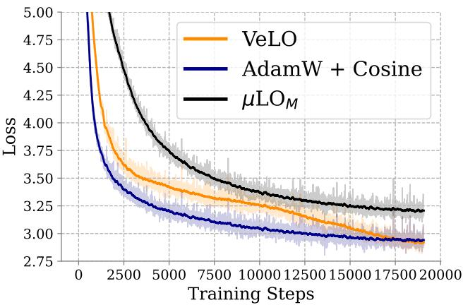  
(a) 355M LM  
Figure 11. GPT-2 pretraining performance. We pre-train decoder-only transformers of different sizes on a causal language modeling objective. We estimate gradients from 512 sequences of length 1024, resulting in a ∼0.5M token batch size per step. We train all models for 10B tokens of FineWeb-EDU data.

learning rates for cosine annealing schedules.

Vision Transformer Ablations Figures 12 and 13 demonstrate the variation of training dynamics with varying maximum learning rates and weight decay values for the ViT-B/16 model. The results reveal that VeLO exhibits minimal sensitivity to weight decay and scheduler modifications in this experimental setup, suggesting robust inherent regularization properties. Conversely, MuLO shows improved training horizon stability when augmented with cosine scheduling, enabling successful completion of the full 150,000 training steps. Weight decay modifications yield marginal improvements for MuLO across the evaluated parameter ranges.

## Language Modeling Ablations

The language modeling experiments, presented in Figures 14 and 15, demonstrate more pronounced sensitivity to weight decay and scheduling compared to vision tasks. VeLO shows measurable performance improvements when augmented with weight decay and scheduling for specific parameter configurations. Similarly, MuLO benefits substantially from both weight decay regularization and cosine scheduling in the language modeling domain, suggesting that learned optimizers may benefit from scheduling and weight decay.

## Architectural Configuration Effects

Figure 16 presents an additional ablation examining the impact of separate versus concatenated query-key-value (QKV) matrices on the optimizee’s training loss. We observe that separating the QKV matrices in attention blocks improves performance across VeLO and $\mu \mathrm { L O } _ { M }$

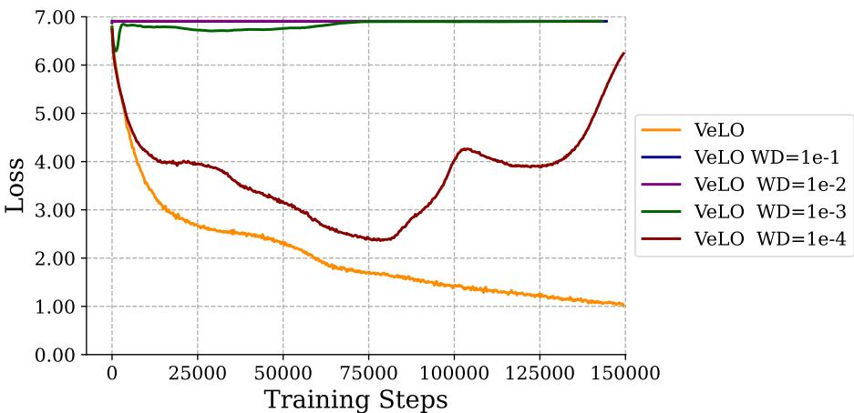  
(a) VeLO Decoupled Weight decay ablation

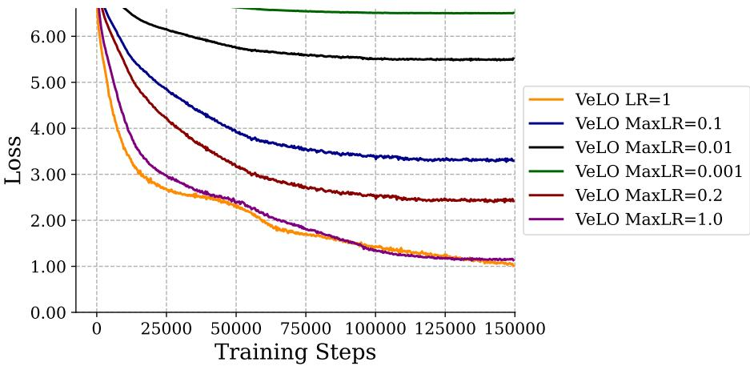  
(b) VeLO Cosine annealing Ablation  
Figure 12. Training ViT-B-16 with VeLO on Imagenet 1k with decoupled weight decay and cosine annealing. We see no improvement in using weight decay or Scheduler for VeLO in this setup

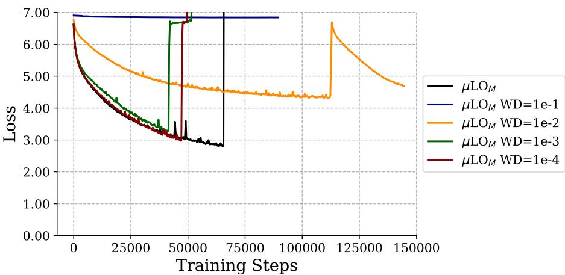  
(a) $\mu \mathrm { L O }$ Decoupled Weight decay ablation

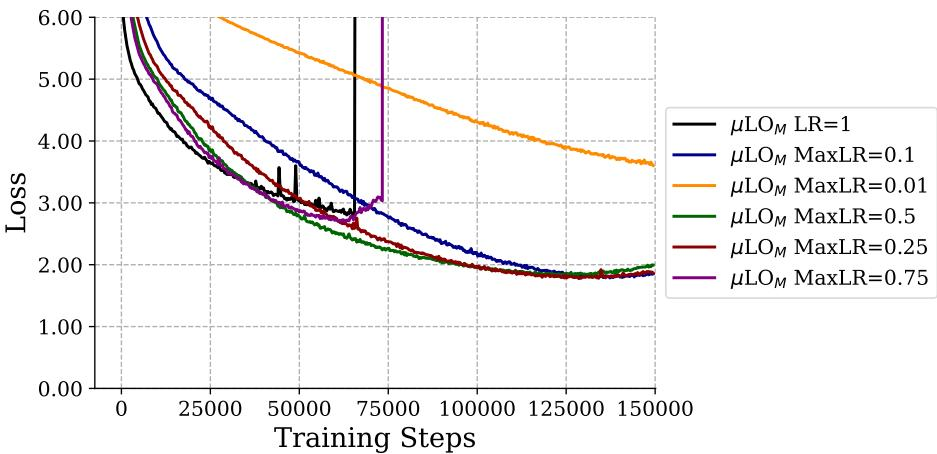  
(b) $\mu \mathrm { L O }$ Cosine annealing Ablation  
Figure 13. Training ViT-B/16 with µLO on Imagenet1k with decoupled weight decay and cosine annealing. We see that the training horizon of µLO is improved with using a scheduler that helps it to run up to 150000 training steps. We also see that weight decay did not have substantial improvement

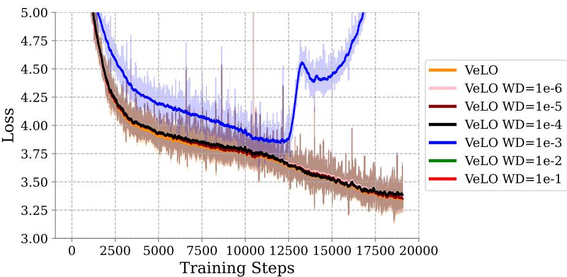  
(a) VeLO Decoupled Weight decay ablation

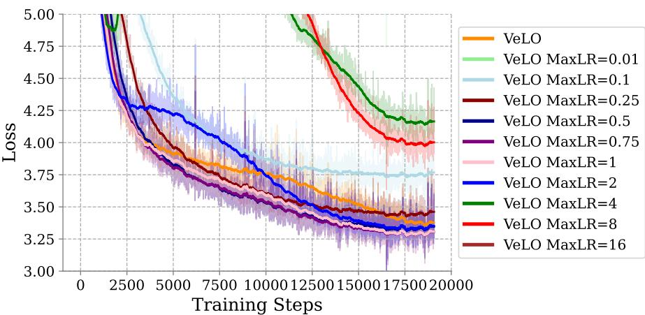  
(b) VeLO Cosine annealing Ablation  
Figure 14. GPT2 Pre-training VeLO ablations: decoupled weight decay and cosine annealing. We pre-train decoder-only transformers of different sizes on a causal language modeling objective. We estimate gradients from 512 sequences of length 1024, resulting in a ∼ 0.5 M token batch size per step. We train all models for 10B tokens of FineWeb-EDU data.

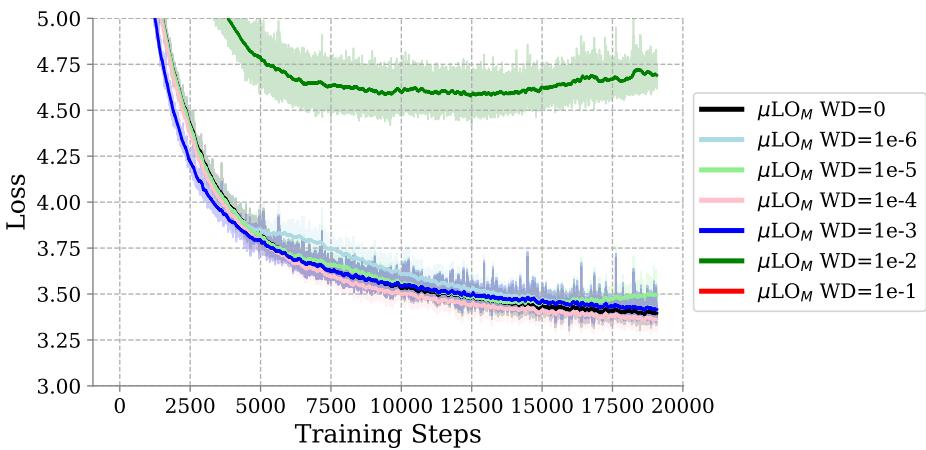  
(a) µLO Decoupled Weight decay ablation

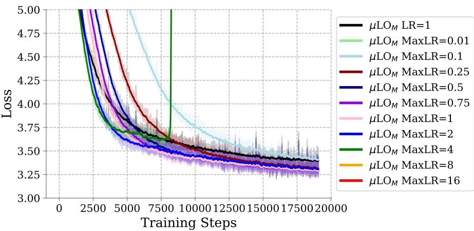  
(b) µLO Cosine annealing Ablation

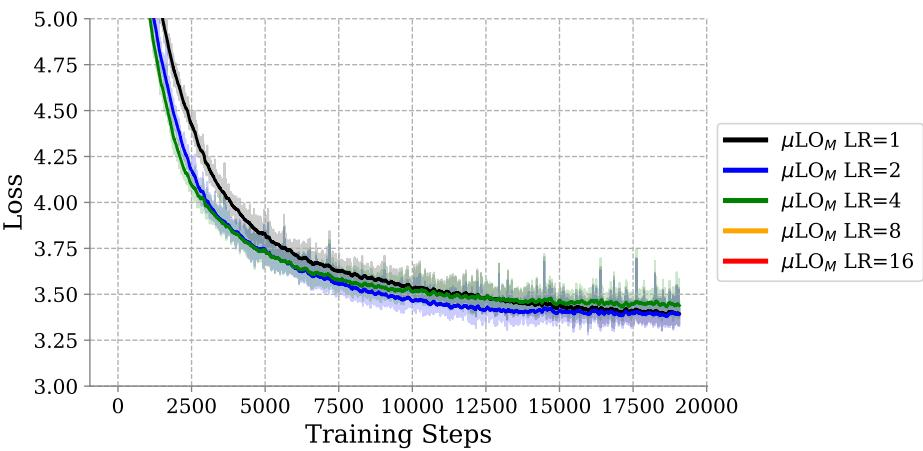  
(c) µLO LR Tuning Ablation  
Figure 15. GPT2 Pre-training VeLO ablations: decoupled weight decay, LR-tuning, and cosine annealing. We pre-train decoder-only transformers of different sizes on a causal language modeling objective. We estimate gradients from 512 sequences of length 1024, resulting in a ∼ 0.5 M token batch size per step. We train all models for 10B tokens of FineWeb-EDU data.

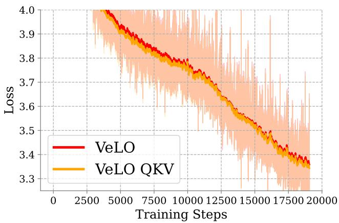  
(a) VeLO

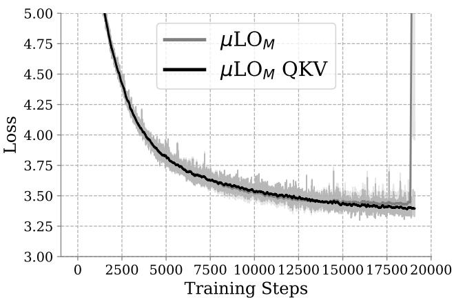  
(b) µLO  
Figure 16. Separate QKV weight ablation. We ablate using concatenated or separate QKV matrices in attention layers. From the perspective of the learned optimizer, these two settings will be treated differently. We observe that performance improves for both $\mu \mathrm { L O } _ { M }$ and VeLO when QKV matrices are separated.

## D HYPERPARAMETERS FOR EXPERIMENTS

Table 5. Vision Transformer Training Hyperparameters.
<table><tr><td>Description</td><td>Value</td></tr><tr><td>Model Architecture</td><td></td></tr><tr><td>Model</td><td>ViT-Base/16</td></tr><tr><td>Image Size</td><td> $2 2 4 \times 2 2 4$ </td></tr><tr><td>Patch Size</td><td> $1 6 \times 1 6$ </td></tr><tr><td>Training Configuration</td><td></td></tr><tr><td>Batch Size</td><td>4096</td></tr><tr><td>Training Epochs</td><td>480</td></tr><tr><td>Optimizer (for baseline)</td><td>Adam</td></tr><tr><td>Learning Rate (n)</td><td> $4 \times 1 0 ^ { - 3 }$ </td></tr><tr><td>LR Scheduler</td><td>Cosine</td></tr><tr><td>Warmup Epochs</td><td>32</td></tr><tr><td>Weight Decay</td><td>0.03</td></tr><tr><td>Gradient Clipping</td><td>1.0</td></tr><tr><td>Data Augmentation</td><td></td></tr><tr><td>Crop Percentage</td><td>0.95</td></tr><tr><td>Random Horizontal Flip</td><td>0.5</td></tr><tr><td>Mixup</td><td>0.1</td></tr><tr><td>CutMix</td><td>1.0</td></tr><tr><td>AutoAugment</td><td>rand-m7-mstd0.5</td></tr><tr><td>Regularization Dropout Rate</td><td>0.1</td></tr><tr><td>Stochastic Depth</td><td>0.1</td></tr></table>

Table 6. Vision Transformer Model Variants Architecture.
<table><tr><td>Description</td><td>Value</td></tr><tr><td>ViT-Small/16</td><td></td></tr><tr><td>Parameters</td><td>22.05M</td></tr><tr><td>Hidden Dimension  $( d _ { \mathrm { m o d e l } } )$ </td><td>384</td></tr><tr><td>MLPHidden Dimension</td><td>1536</td></tr><tr><td>NumberofHeads</td><td>6</td></tr><tr><td>Number of Layers</td><td>12</td></tr><tr><td>Patch Embedding Dim ViT-Base/16</td><td>384</td></tr><tr><td>Parameters</td><td>86.57M</td></tr><tr><td>Hidden Dimension  $( d _ { \mathrm { m o d e l } } )$ </td><td>768</td></tr><tr><td>MLP Hidden Dimension</td><td>3072</td></tr><tr><td>NumberofHeads</td><td>12</td></tr><tr><td>Number of Layers</td><td>12</td></tr><tr><td>Patch Embedding Dim</td><td>768</td></tr><tr><td>ViT-Large/16 Parameters</td><td>307.40M</td></tr><tr><td>Hidden Dimension  $( d _ { \mathrm { m o d e l } } )$ </td><td>1024</td></tr><tr><td>MLP Hidden Dimension</td><td>4096</td></tr><tr><td>NumberofHeads</td><td></td></tr><tr><td></td><td>16</td></tr><tr><td>Number of Layers</td><td>24</td></tr><tr><td>Patch Embedding Dim</td><td>1024</td></tr></table>

Table 7. GPT-2 Training Hyperparameters.  
Table 8. GPT-2 Model Variants Architecture.
<table><tr><td>Description</td><td>Value</td><td>Description</td><td>Value</td></tr><tr><td>Model Configuration</td><td></td><td>GPT-2 Small</td><td></td></tr><tr><td>Base Model</td><td>GPT-2</td><td>Parameters</td><td>~36M</td></tr><tr><td>Architecture Type</td><td>Decoder-only Transformer</td><td>Hidden Dimension (dmodel)</td><td>768</td></tr><tr><td>Attention Mechanism</td><td>separate_kqv</td><td>Number of Heads</td><td>12</td></tr><tr><td>Sequence Length (T)</td><td>1024</td><td>Number of Layers</td><td>12</td></tr><tr><td>Vocabulary Size</td><td>50257</td><td>Head Dimension</td><td>64</td></tr><tr><td>Training Configuration</td><td></td><td>FFN Hidden Dimension</td><td>3072</td></tr><tr><td>Batch Size</td><td>512</td><td>GPT-2 Medium</td><td></td></tr><tr><td>Training Iterations</td><td>19073</td><td>Parameters</td><td>~345M</td></tr><tr><td>Optimizer (for baseline)</td><td>Adam</td><td>Hidden Dimension (dmodel)</td><td>1024</td></tr><tr><td>Learning Rate Scheduler (for baseline)</td><td>Cosine</td><td>Number of Heads</td><td>16</td></tr><tr><td>Warmup Iterations</td><td>381</td><td>Number of Layers</td><td>24</td></tr><tr><td>Regularization</td><td></td><td>Head Dimension</td><td>64</td></tr><tr><td>Attention Dropout</td><td>0.1</td><td>FFN Hidden Dimension</td><td>4096</td></tr><tr><td>Embedding Dropout</td><td>0.1</td><td>GPT-2 Large</td><td></td></tr><tr><td>Residual Dropout</td><td>0.1</td><td>Parameters</td><td>~ 762M</td></tr><tr><td>Initialization</td><td></td><td>Hidden Dimension (dmodel)</td><td>2048</td></tr><tr><td>Muon Initialization</td><td>Enabled</td><td>Number of Heads</td><td>32</td></tr><tr><td>Weight Initialization</td><td>Standard GPT-2</td><td>Number of Layers</td><td>16</td></tr><tr><td></td><td></td><td>Head Dimension</td><td>64</td></tr></table>

## E VALIDATION OF PYLO IMPLEMENTATION AGAINST ORIGINAL JAX CODEBASE

To validate the correctness of our implementation of the popular learned optimizers in PyLO, we conducted a direct comparison with the original JAX implementation from Google’s learned optimization(Metz et al., 2022a) codebase. We evaluated both µLO(Therien et al. ´ , 2024) and VeLO(Metz et al., 2022b) algorithms on a simplified image classification benchmark using ImageNet resized to 64×64 pixels with a 3-layer MLP architecture (width 128). The comparison spans the first 5,000 training steps to assess implementation accuracy in a practical and economical setup.

The results demonstrate strong agreement between the two implementations across both optimizers. As shown in Figure 17, the training curves exhibit nearly identical convergence patterns across all 5 different runs. Minor variations arise from inherent differences in how PyTorch and JAX compute gradients. Accounting for this, we confirm that our PyTorch implementation faithfully reproduces the behavior of the original JAX code. We further plan to compare both implementations across a range of models and tasks.

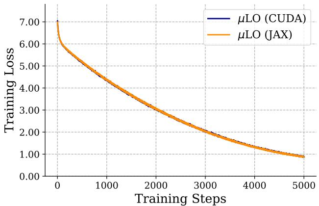  
(a) µLO implementation comparison

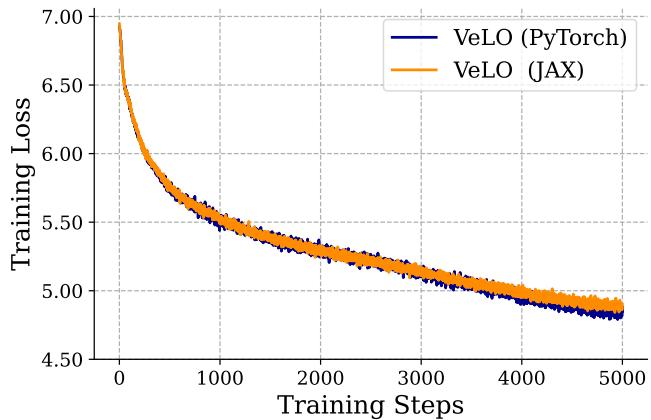  
(b) VeLO implementation comparison  
Figure 17. Training curve comparison between original JAX implementation and PyLO library for µLO and VeLO optimizers on ImageNet 64×64 classification task using a 3-layer MLP (width 128). Both implementations show nearly identical convergence behavior over 5,000 training steps, validating the correctness of our implementation.

## F EXTENDED PER TIME STEP RESULTS

<table><tr><td>Model</td><td>Optimizer</td><td>Batch Size</td><td>Samples/sec</td><td>Step time (ms)</td><td>Fwd (ms)</td><td>Bwd (ms)</td><td>Opt step (ms)</td><td>Params (M)</td></tr><tr><td rowspan="5">ViT-B-16</td><td>AdamW Adafactor</td><td rowspan="5">32</td><td>425.51</td><td>74.69</td><td rowspan="5">17.52</td><td rowspan="5">38.13</td><td rowspan="5">4.90 18.99 756.80 99.59</td><td rowspan="5">86.57</td></tr><tr><td>small_fc_lopt (naive)</td><td>39.36</td><td>812.51</td></tr><tr><td></td><td>205.59</td><td></td></tr><tr><td>small_fc_lopt (CUDA)</td><td>49.73</td><td>155.16</td></tr><tr><td>VeLO (naive) VeLO (CUDA)</td><td>191.18</td><td>644.45 168.61</td></tr><tr><td rowspan="6"></td><td>AdamW Adafactor</td><td rowspan="6"></td><td>1,116.12</td><td>28.17</td><td rowspan="6">7.65</td><td rowspan="6">18.27</td><td rowspan="6">2.25 18.53 266.90</td><td rowspan="6">22.05</td></tr><tr><td></td><td>711.97</td><td>44.47</td></tr><tr><td>small_fc_lopt (naive)</td><td>109.03</td><td>293.01</td></tr><tr><td></td><td>382.73</td><td></td></tr><tr><td>small_fc_lopt (CUDA) VeLO (naive)</td><td>94.84</td><td>83.28</td></tr><tr><td>VeLO (CUDA)</td><td>242.96</td><td>337.68 132.49</td></tr><tr><td rowspan="6">ViT-L-16</td><td>AdamW Adafactor</td><td rowspan="6">32</td><td>175.95</td><td>181.36</td><td rowspan="6">52.18</td><td rowspan="6">113.89</td><td rowspan="6">15.28 37.23 2,582.30</td><td rowspan="6">304.33</td></tr><tr><td></td><td>156.64</td><td>203.34</td></tr><tr><td>small_fc_lopt (naive)</td><td>11.64</td><td></td></tr><tr><td>small_fc_lopt (CUDA)</td><td>70.69</td><td>2,748.52 451.69</td></tr><tr><td>VeLO (naive)</td><td>15.41</td><td>2,077.28</td></tr><tr><td>VeLO (CUDA)</td><td>76.74</td><td>418.29</td></tr><tr><td rowspan="5">GPT2-125M</td><td>AdamW Adafactor</td><td rowspan="5">4</td><td>17.80</td><td>224.72</td><td rowspan="5">73.20</td><td rowspan="5">144.24</td><td>7.29 17.76</td><td rowspan="5">125.26</td></tr><tr><td></td><td>17.02</td><td>235.07</td><td></td></tr><tr><td>small_fc_lopt (naive)</td><td>3.38</td><td>1,182.33</td><td>964.89</td></tr><tr><td>small_fc_lopt (CUDA)</td><td>11.71</td><td>341.46</td><td>124.09</td></tr><tr><td>VeLO (naive)</td><td>3.48</td><td>1,148.81</td><td>931.37</td></tr><tr><td rowspan="6">GPT2-410 M</td><td>VeLO (CUDA) AdamW</td><td rowspan="6"></td><td>11.25</td><td>355.49</td><td rowspan="6">197.41</td><td rowspan="6">392.29</td><td>138.05 20.12</td><td rowspan="6">355.92</td></tr><tr><td>Adafactor</td><td>6.56 6.40</td><td>609.83</td><td></td></tr><tr><td></td><td></td><td>624.64</td><td>35.11</td></tr><tr><td>small_fc_lopt (naive)</td><td>1.16</td><td>3,461.96</td><td>2,872.17</td></tr><tr><td>small_fc_lopt (CUDA)</td><td>4.40</td><td>908.69</td><td>319.14</td></tr><tr><td>VeLO (naive) VeLO (CUDA)</td><td>1.34 4.58</td><td>2,976.82 873.41</td><td>2,387.12 283.71</td></tr><tr><td rowspan="6">GPT2-1B</td><td>AdamW</td><td rowspan="6"></td><td>2.88</td><td>1,387.51</td><td rowspan="6">442.49</td><td rowspan="6">896.81</td><td>48.21 54.08</td><td rowspan="6">912.95</td></tr><tr><td>Adafactor</td><td>2.87</td><td>1,395.03</td><td></td></tr><tr><td>small_fc_lopt (naive)</td><td>OOM</td><td>OOM</td><td>OOM</td></tr><tr><td>small_fc_lopt (CUDA)</td><td>1.98</td><td>2.025.26</td><td>681.78</td></tr><tr><td>VeLO (naive)</td><td>0OM</td><td>0OM</td><td>OOM</td></tr><tr><td>VeLO (CUDA)</td><td>2.24</td><td>1,782.43</td><td>443.13</td></tr></table>

Table 9. Per-step training breakdown (averaged over 40 steps). We compare AdamW, Adafactor, small fc lopt, and the VeLO optimizer in both naive (PyTorch) and CUDA-accelerated implementations. CUDA versions significantly reduce optimizer step time and memory overhead, enabling competitive throughput—especially for large models.

## G FEATURES FOR LEARNED OPTIMIZER INPUT

In the following section, we introduce the input features for small fc lopt and VeLO in Tables 10 and 11, respectively.

Table 10. MLP input features for small fc lopt. We replicated the table from (Therien et al. ´ , 2024) for the reader’s convenience with only slight modifications; We also keep the same figure caption. All the coefficients, $\beta _ { i }$ , are learnable parameters adjusted during meta-optimization. All feature calculations and scalings are reported for a hidden weight matrix $\boldsymbol { W } \in \mathbb { R } ^ { m \times n }$ in an optimizee network following our proposed µ-parameterization. Here, n is the width and m = kn for some constant $k \in$ R. Notation. The table will use $\nabla _ { t , i }$ or $\nabla _ { t , j }$ to indicate the variable’s dependence on time t and coefficient $\beta _ { i }$ or $\beta _ { j } .$ , respectively. $( \nabla _ { t , j } ) _ { r , c }$ will designate indexing into row r and column c of the quantity $\nabla _ { t , j } .$
<table><tr><td>Type</td><td>#</td><td>Description</td><td>Accumulator Update/Equation</td></tr><tr><td rowspan="4">Accumulators</td><td>3</td><td>Momentum accumulators with coefficients  $\beta _ { i } , i \in \mathsf { ~ \Gamma ~ }$  {1,2,3}.</td><td> $M _ { t , i } = \beta _ { i } M _ { t - 1 , i } + ( 1 - \beta _ { i } ) \nabla _ { t }$ </td></tr><tr><td>1</td><td>Second moment accumulator with coefficient  $\beta _ { 4 } .$ </td><td> $V _ { t } = \beta _ { 4 } V _ { t - 1 } + ( 1 - \beta _ { 4 } ) \nabla _ { t } ^ { 2 }$ </td></tr><tr><td>3</td><td>Adafactor row accumulator with coefficients  $\beta _ { i } , i \in \mathsf { ~ \Gamma ~ }$ </td><td> $\pmb { r } _ { t , i } = \beta _ { i } \pmb { r } _ { t - 1 , i } + ( 1 - \beta _ { i } ) \ \mathtt { r o w \_ m e a n } ( \nabla _ { t } ^ { 2 } )$ </td></tr><tr><td></td><td>{5,6,7}. Adafactor accumulator with coefficients  $\beta _ { i } , i \in \{ 5 , 6 , 7 \} .$ </td><td> $\pmb { c } _ { t , i } = \beta _ { i } \pmb { c } _ { t - 1 , i } + ( 1 - \beta _ { i } ) \subset \circ \mathrm { 1 } _ { - \mathsf { m e a n } } ( \nabla _ { t } ^ { 2 } )$ </td></tr><tr><td rowspan="6">Accumulator Features</td><td>3 3</td><td colspan="2">Momentum values normalized by the square root of the</td></tr><tr><td></td><td colspan="2">second moment for  $i \in \{ 5 , 6 , 7 \}$ </td></tr><tr><td>1</td><td colspan="2">The reciprocal square root of the second moment value.</td></tr><tr><td>6</td><td colspan="2"> $\frac { 1 } { \sqrt { r _ { t , i } } } \ O R \ \frac { 1 } { \sqrt { c _ { t , i } } }$  The reciprocal square root of the Adafactor accumulators.</td></tr><tr><td>3</td><td colspan="2"> $\nabla _ { t } \cdot \sqrt { \frac { \frac { 1 } { m } \sum _ { h = 1 } ^ { m } ( \pmb { r } _ { t , i } ) _ { h } } { \pmb { r } _ { t , i } \pmb { c } _ { t , i } ^ { T } } }$  Adafactor gradient features for  $i \in \{ 5 , 6 , 7 \}$ </td></tr><tr><td>3</td><td colspan="2">Adafactor momentum features for  $i , j$  E {(5,1), (6,2) (7,3)}.</td></tr><tr><td rowspan="2">Time Features</td><td rowspan="2">Time 11</td><td rowspan="2">featuu for</td><td> $M _ { t , j } \cdot \sqrt { \frac { \frac { 1 } { m } \sum _ { h = 1 } ^ { m } ( \pmb { r } _ { t , i } ) _ { h } } { \pmb { r } _ { t , i } \pmb { c } _ { t , i } ^ { T } } }$ </td></tr><tr><td>tanh (）</td></tr><tr><td></td><td></td><td> $\begin{array} { l } { { { \bf { \underline { { { \bf { \Pi } } } } } } } { \bf { \underline { { { \bf { \Pi } } } } } } { \bf { \underline { { { \bf { \Pi } } } } } } ^ { \mathrm { { \bf { \underline { { { \bf { \Pi } } } } } } } \mathrm { { \bf { \underline { { { \bf { \Pi } } } } } } } \mathrm { { \bf { \underline { { { \bf { \Pi } } } } } } } } } \\ { { \{ 1 , 3 , 1 0 , 3 0 , 1 0 0 , 3 0 0 , 1 0 0 0 , 3 0 0 0 , 1 0 ^ { 4 } , 3 \cdot 1 0 ^ { 4 } , 3 \cdot 1 0 ^ { 4 } , 1 0 ^ { 5 } \} } } \end{array}$ </td></tr><tr><td>Parameters</td><td>1 1</td><td>Parameter value. Gradient value.</td></tr><tr><td>Total</td><td>39</td><td></td></tr></table>

Table 11. MLP input features for VeLO. We replicated the table from (Therien et al. ´ , 2024) for the reader’s convenience with only slight modifications; We also keep the same figure caption. All feature calculations and scalings are reported for a hidden weight matrix $\bar { \pmb { W } } \in \mathbb { R } ^ { m \times n }$ in an optimizee network following our proposed µ-parameterization. Here, n is the width and $m =$ kn for some constant $k \in \mathbb { R }$ . Notation. The table will use $\nabla _ { t , i }$ or $\nabla _ { t , j }$ to indicate the variable’s dependence on time t and coefficient $\beta _ { i }$ or $\beta _ { j }$ , respectively. $( \nabla _ { t , j } ) _ { r , c }$ will designate indexing into row r and column c of the quantity $\nabla _ { t , j }$
<table><tr><td>Type</td><td>#</td><td>Description</td><td>Accumulator Update/Equation</td></tr><tr><td rowspan="4">Accumulators</td><td>3</td><td>Momentum accumulators with coefficients  $\beta _ { i } , i \in \mathsf { ~ \Gamma ~ }$  {1,2,3}.</td><td> $M _ { t , i } = \beta _ { i } M _ { t - 1 , i } + ( 1 - \beta _ { i } ) \nabla _ { t }$ </td></tr><tr><td>1</td><td>Second moment accumulator with coefficient  $\beta _ { 4 } .$ </td><td> $V _ { t } = \beta _ { 4 } V _ { t - 1 } + ( 1 - \beta _ { 4 } ) \nabla _ { t } ^ { 2 }$ </td></tr><tr><td>3</td><td>Adafactor row accumulator with coefficients  $\beta _ { i , i } \in$   $\{ 5 , 6 , 7 \}$ </td><td> $\begin{array} { r } { \pmb { r } _ { t , i } = \beta _ { i } \pmb { r } _ { t - 1 , i } + ( 1 - \beta _ { i } ) \pmb { \mathrm { \tau o w \_ m e a n } } ( \pmb { \nabla } _ { t } ^ { 2 } ) } \end{array}$ </td></tr><tr><td>3</td><td>Adafactor accumulator with coefficients  $\beta _ { i } , i \in \{ 5 , 6 , 7 \} .$ </td><td> $\pmb { c } _ { t , i } = \beta _ { i } \pmb { c } _ { t - 1 , i } + ( 1 - \beta _ { i } ) \mathtt { c o l \_ m e a n } ( \nabla _ { t } ^ { 2 } )$ </td></tr><tr><td rowspan="6">Accumulator Features</td><td>3</td><td>Momentum values normalized by the square root of the</td><td> $M _ { t , i }$ </td></tr><tr><td>1</td><td>second moment  $\mathrm { f o r } i \in \{ 5 , 6 , 7 \}$  The reciprocal square root of the second moment value.</td><td> $\sqrt { V _ { t } }$   $\frac { 1 } { \sqrt { V } }$ </td></tr><tr><td>6</td><td> The reciprocal square root of the Adafactor accumulators.</td><td> $\frac { 1 } { \sqrt { \pmb { r } _ { t , i } } } \ 0 \mathrm { R } \ \frac { 1 } { \sqrt { \pmb { c } _ { t , i } } }$ </td></tr><tr><td>3</td><td>Adafactor gradient features for  $i \in \{ 5 , 6 , 7 \}$ </td><td> $\nabla _ { t } \cdot \sqrt { \frac { \frac { 1 } { m } \sum _ { h = 1 } ^ { m } ( \pmb { r } _ { t , i } ) _ { h } } { \pmb { r } _ { t , i } \pmb { c } _ { t , i } ^ { T } } }$ </td></tr><tr><td>3</td><td>Adafactor features momentum for  $i , j$ </td><td></td></tr><tr><td></td><td>{(5,1), (6,2), (7,3)}.</td><td> $M _ { t , j } \cdot \sqrt { \frac { \frac { 1 } { m } \sum _ { h = 1 } ^ { m } ( \pmb { r } _ { t , i } ) _ { h } } { \pmb { r } _ { t , i } \pmb { c } _ { t , i } ^ { T } } }$ </td></tr><tr><td rowspan="2">Parameters</td><td>1 1</td><td>Parameter value.</td><td> $W _ { t }$ </td></tr><tr><td>1</td><td>Gradient value. Clipped gradient value.</td><td> $\nabla _ { t }$ </td></tr><tr><td>Total</td><td>29</td><td>1</td><td> $\mathtt { c l i p } ( \nabla _ { t } , - 0 . 1 , 0 . 1 )$ </td></tr></table>