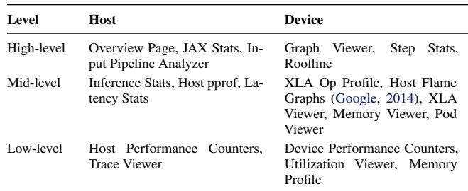
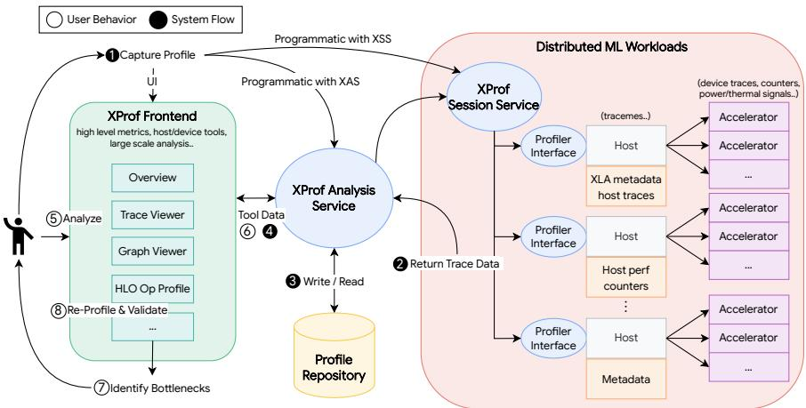
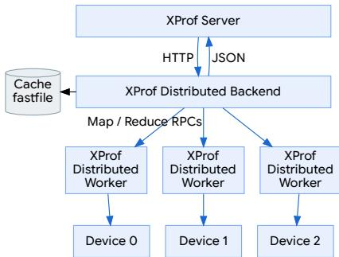
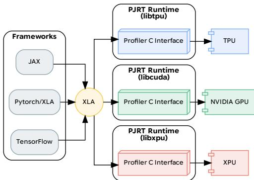
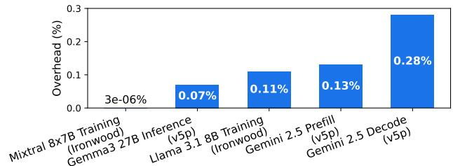
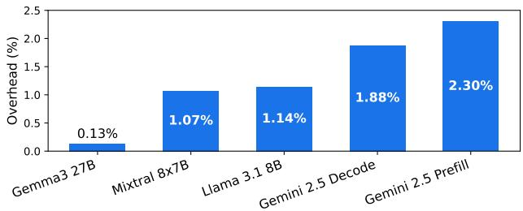
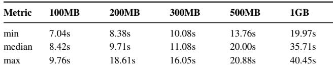
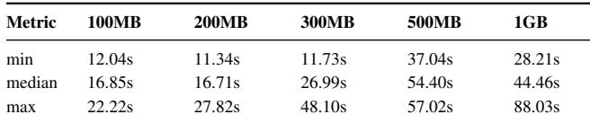
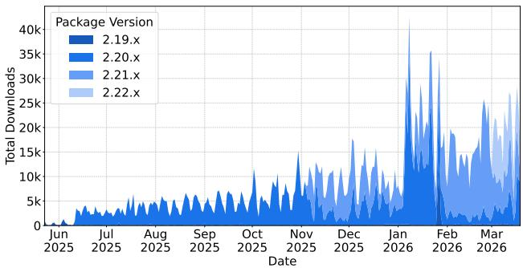

# XPROF: AN OPEN, SCALABLE, AND EXTENSIBLE PROFILING SYSTEM FOR THE MODERN ML STACK

Robert Hundt 1 Naveen Kumar 1 Jose Baiocchi Paredes 1 Scott Goodson 1 Clive Verghese \* 1 Prasanna Rengasamy \* 1 Kelvin Le \* 2 Jiya Zhang 1 Charles Alaras 1 Yin Zhang 1 Kan Cai 1 Jiten Thakkar 1 Sai Ganesh Bandiatmakuri 1 Yogesh SY 1 Aniruddha N Udipi 1 Vikas Aggarwal 1

## ABSTRACT

Optimizing Large Models across thousands of accelerators requires deep system expertise. To address modern machine learning (ML) optimization needs, we present XPROF, the ML profiler for the OpenXLA ecosystem. XPROF delivers actionable optimization suggestions and in-depth performance analysis, empowering ML researchers and framework users to improve efficiency without specialized systems knowledge. XPROF provides a unified, full-stack view of both host (CPU) and device (accelerator - TPUs/GPUs) performance, leveraging tools like the roofline model for comprehensive analysis. XPROF’s distributed architecture is designed to monitor thousands of chips with minimal workload overhead (<1%). This architecture is made pluggable through the open-source PJRT C API extension, which has facilitated its adoption by third-party accelerator vendors. XPROF has been instrumental in achieving significant efficiency gains at Google and winning MLPerf submissions. This paper presents the design and architecture of XPROF, showcases its differentiating tools and capabilities, and highlights its impact within Google and across the industry as a state of the art ML profiler. XPROF is available as part of the OpenXLA project at https://github.com/openxla/xprof.

## 1 INTRODUCTION

With the advent of large datasets and massive computational power from hardware accelerators, Large Language Models (LLMs) and other foundation models have led to breakthroughs in a wide range of fields. Performance is a critical enabler for machine learning (ML) research and a key requirement for deploying these models in production. The optimization of these ML workloads has become a multidimensional problem, encompassing the large scale accelerator footprint (Gupta, 2025; Lee et al., 2024), months-long executions, and thermal/power limitations.

While ML frameworks such as TensorFlow, PyTorch, and JAX provide convenient APIs to develop models, optimizing the end-to-end performance of a billion-parameter LLM on a distributed cluster of accelerators largely relies on profiler or debugger feedback driven tuning. This requires a diverse set of users including model developers, framework engineers, compiler, runtime engineers, and even hardware architects to understand intricate system behavior across many layers of software and hardware. Our goal is to provide actionable optimization and efficiency improvement suggestions to this diverse user-base without a learning curve outside their expertise. A large number of tools exist for analyzing system performance, but most do not address the unique problems of highly complex modern ML workloads. Today, ML systems feature a multi-layer software stack, thousands of machines for distributed training, and heterogeneous hardware accelerators that perform expensive computations. Few traditional tools can correlate performance anomalies back to the source ML model or provide users with actionable feedback to improve performance, especially when considering power and thermal characteristics. This paper presents XPROF, the performance profiler originally developed at Google and now a core component of the OpenXLA project. XPROF is a unique profiling system that makes the following novel contributions:

• Unified Host-Device Profiling: XPROF is a single, integrated system that profiles both host (CPU) and device (accelerator). It presents a unified performance analysis, linking low-level hardware events back to high-level model code and providing actionable optimization advice.

• Lightweight Host Instrumentation (TraceMe): TraceMe is a low-overhead CPU instrumentation primitive designed for performance-critical ML frameworks. By stitching together small, local identifiers, we reduce trace volume and post-processing overhead, eliminating the need for runtime context propagation.

• Deep Compiler and Hardware Integration: XPROF’s integrations with ML compiler (e.g., XLA) and hardware backends allow us to correlate high-level ML operations with corresponding low-level hardware performance counters and compiler-generated execution traces. This deep integration is key to providing a full-stack view and enabling root-cause analysis of performance bottlenecks, from the model code down to bare metal.

• High-Precision Distributed Profiling: XPROF leverages a hardware-based Global Timestamp Counter (GTC) synchronized across thousands of accelerator chips. This enables precise, cycle-accurate correlation of events across the entire distributed system, which is crucial for accurately diagnosing bottlenecks in cross-chip communication and host-device interactions.

• Scalable Distributed Architecture: XPROF’s architecture is built to monitor thousands of chips with minimal workload overhead (<1% on TPUs). It uses a MapReducestyle backend for distributed profile collection and processing, and its TraceViewer employs dynamic rendering to enable smooth interaction with gigabyte-scale traces.

• End-to-End ML Stack Analysis: XPROF provides a rich collection of tools that target every level of the ML software and hardware stack. This empowers a wide range of users—from model researchers to hardware architects—to gain relevant and actionable insights without needing expertise outside their domain.

• Open and Extensible Framework: XPROF features a pluggable architecture through an open-source PJRT C API extension. This allows any accelerator vendor to easily add hardware support, promoting a unified and device-agnostic profiling ecosystem within OpenXLA.

## 2 BACKGROUND AND MOTIVATION

The scaling of modern ML workloads like ChatGPT, Claude, Llama, and Gemini to billions of parameters is projected to drive their energy consumption to 27% of the entire global data center market by 2027 (Goldman Sachs Research, 2025). With the continued growth and utility of these models on the horizon (OpenRouter, 2025), it is extremely important to observe their execution on massive AI hypercomputers to improve debuggability, unlock optimization opportunities, and build better performing (tuned to fit the hardware, power consumption, thermal limitations, etc.) models, software, and hardware stacks. To achieve insights into the ML model execution, we first provide context on the popular ML programming models, runtime, compiler, accelerator systems, and subsequently motivate the challenges in profiling and gaining insights on such workload executions.

## 2.1 JAX and OpenXLA

Modern ML models, such as LLMs, are written using highlevel Python libraries like JAX, which provides flexibility and high performance through Just-In-Time (JIT) execution on composable function transformations (The JAX Authors, 2025b), autograd, vmap (The JAX Authors, 2025a), adam (The JAX Authors, 2025c), flash\_attention (Phil Wang, 2023), and other powerful model building tools (Bradbury et al., 2018). These high-level definitions are compiled by the XLA (Accelerated Linear Algebra) compiler-runtime stack, which performs both high-level optimizations (e.g., op fusions, rematerializations) (OpenXLA Project, 2022) and hardware-specific optimizations (e.g., sharding (OpenXLA Project, 2025) and efficient scheduling for GPUs and TPUs). Developers can also write custom kernels to lower operations directly to efficient accelerator primitives, minimizing Python/host overheads (The JAX Authors, 2025d).

After XLA generates optimized binaries, they execute on target hardware including CPUs, GPUs, or TPUs. These accelerators continuously push the frontier in compute (Google Cloud, 2024; 2025; NVIDIA, 2022; 2024), memory (Anantharaman, 2025), and network performance (Ferguson et al., 2021), enabling the massive-scale training runs that characterize modern AI (Hoffmann et al., 2022) (e.g., Grok 4 runs for months on thousands of accelerators (Gupta, 2025)). Therefore, XPROF must offer comprehensive observability across this complex, multi-stage execution.

## 2.2 Scaling Requirements

Given the complexity and massive scale of the ML infrastructure, involving thousands of accelerators, CPUs, and network fabric, comprehensive execution observability is critical for debugging and optimization. To effectively assist diverse users, from ML model experts to hardware co-design engineers, a profiling system for the AI hypercomputer must address four key requirements:

• Relevance and Collection: Define and collect Key Performance Indicators (KPIs) and utilization metrics across the entire distributed environment.

• Data Strategy: Balance data volume (traces, telemetry) with processing costs, ensuring all captured data is useful.

• Scalability and Sourcing: Be inherently scalable and lowoverhead, aggregating heterogeneous data sources into a coherent view without workload interference.

• Insight Generation: Tailor presented insights, such as performance bottlenecks or anomalies, to the specific needs of diverse user roles.

The next section describes the profiler system XPROF that systematically answers these challenges and subsequently presents insights plus success stories.

## 3 PROFILING AND TOOLS DESIGN

We next show how the profiler workflow starts toward addressing the challenges mentioned in 2.

## 3.1 Collection and Analysis

Collection: Figure 1 shows a workload running on TPUs connected to a CPU host. The XLA compiler incorporates various XPROF profiler collection library dependencies to the binary, including a small Profiler Service listener to open a gRPC/HTTP port and listen for any incoming ProfileRequest (XProf, 2025h). At step 1 , the profiler collection provides hooks to collect the profile data based on the incoming request and responds with the collected data. Section 4 provides implementation details on how to collect, what to collect, and where.

The tools and data visualization begins with capturing a performance profile with appropriate data of the workload execution followed by analyzing - stitching the data together toward meaningful/actionable insights for the end user. We refer to these two components as collection and analysis.

As seen in Fig. 1, 1 starts with “Collection” - where XPROF captures information from various sources: annotations in the user code (e.g., JAX), cost models for different operations within the XLA compiler, and purpose-built hardware profiling features within TPU or GPU. This collection can be triggered either programmatically in desired sections of model code, or externally “on-demand”, by communicating with a profiling service integrated into the workload. In either case, a comprehensive event artifact is generated by the XPROF collector 2 and sent to persistent storage 3 .

Analysis: The users of XPROF could view any of the previously collected “Profile Sessions” at any time by requesting the XPROF Analysis Server to read the data 5 . Note that, XPROF post-processes the collected data (e.g., symbolization, metrics calculation, trace generation, grouping etc), and generates profile artifacts that are used to visualize different performance characteristics and provide insight into various aspects of the workload and hardware’s performance, accessed via an internet browser or Python API 6 .

## 3.1.1 Metrics and Tools

XPROF is designed to provide actionable insights for a diverse set of users—from model researchers to hardware architects. Therefore, the collected data is first aggregated into high-level metrics, which are then used to drive the specific analysis tools. The high-level metrics characterize an ML workload’s performance fall into three categories:

• Model Performance Metrics: These focus on the workload’s efficiency as experienced by the user. For training, this is the step time and its component breakdown. For inference, these are tail latency and throughput.

• Hardware Performance Metrics: These measure the efficiency of underlying hardware. They include FLOPS (Floating-Point Operations Per Second) for compute and Bytes Transferred Per Second for memory performance. XPROF utilizes roofline analysis to quantify how close a model’s execution is to the theoretical peak performance.

• System Power and Thermal Metrics: These cover the operational state of accelerator and host. They include power consumption, temperature, and hardware throttling events, allowing users to correlate power and thermal constraints directly with specific phases of model execution.

These metrics vary in significance with respect to user’s roles:

• ML Model Experts and Researchers focus on model performance metrics like step time to identify which layer or component is the primary bottleneck.

Compiler and Framework Engineers examine hardware performance metrics for better op placements, reduced under-utilization, or improved data/model sharding strategies to gain better efficiency.

• Hardware Architects observe the long-term trends and utilization of current hardware blocks to inform design decisions for next-generation accelerators.

  
Table 1. Profiler Tooling Levels by Host and Device

To realize these diverse goals, XPROF organizes functionalities into three tiers—High, Mid, and Low-Level tools— which are discussed next and detailed in Table 1:

## 3.1.2 High-Level Tools

• Overview Page: As XPROF’s default view, the tool presents a high-level summary with clear indicators like step time, accelerator utilization, memory/data bottlenecks — including links and suggestions for next steps (XProf, 2025g).

• Input Pipeline Analyzer: A model developer can act on host data transfer bottlenecks by using this tool. It gives potential root causes for accelerator idleness tying into specific data loading issues of Grain (Ritter et al., 2023), tf.data, (The TensorFlow Authors, 2024) etc.

• Framework Op Stats: For observability into different layers/framework level “calls” configured on hardware, this tool shows the time taken by the JAX layer calls, their utilization of different pieces of the hardware (FLOPS, bandwidth at HBM) and their total footprint in the session.

  
Figure 1. High-level diagram visualization of profiling workflow: A user requests a profile of their workload to the XPROF Session Service, using the XPROF frontend, to receive a variety of insights processed by the XPROF Analysis Service

• Roofline Model: Thus far, the high-level tools only highlight specific attributes like compute and memory. Moving beyond, it is important to understand how comprehensive hardware utilization is based on roofline analysis of the entire program. As Williams et al. describes, we can relate FLOPS with memory utilization by using operational intensity through the roofline model (Williams et al., 2009). The roofline model is critical to synergize hardware given the software model and vice versa (XProf, 2025i).

## 3.1.3 Mid-Level Tools

Graph Viewer: To understand “why” a certain layer is not utilizing the hardware as expected, this tool enables users to look into the HLO dependency graph of the program combined with runtime metrics. This helps users to understand and explain the performance effects of the different control and data flow dependencies across the ops (XProf, 2025a).

• HLO Op Profile: To learn more and optimize HLO operations themselves, HLO Op Profile shows device FLOPS utilization, operation durations, and operation details such as shape, padding, and HLO expression in a hierarchical view (XProf, 2025b).

• Memory Viewer: To delve deeper into the memory capacity/bandwidth utilizations from above tools, users can also visualize memory usage over time of the entire profile. This provides users with statistics regarding memory intensive computations, memory usage per operation, and the allocations occurring over time (XProf, 2025d).

• Host pprof: XPROF extends pprof’s focus on debugging

CPU executions by offering the exact CPU snapshot happening during the device profile. These features build a deep-dive into the input pipeline analyzer by providing insights into time-consuming CPU functions, thread contention and mutex locking, host memory oversubscription, and more.

## 3.1.4 Low-Level Tools

• Trace Viewer: The tool provides disaggregated trace data - a detailed timeline of executions on host and devices, including compute, collective, and counter events. Trace Viewer is crucial to analyze time spent in communication collectives during distributed training (XProf, 2025k).

• Host Perf Counters: XPROF uses hooks into Linux’s perf tool to poll host side performance counters over time and display them along with traces in the Trace Viewer.

• Device Perf Counters: XPROF also enables users to configure device side perf counters such as tensor core utilization, (NVIDIA Nsight Compute) and present it along with accelerator side execution events to understand the hardware’s view of execution.

• Device Power and Thermals: As power is a finite resource, the device is not expected to sustain peak throughput during a workload (Xie et al., 2005). To increase visibility into hardware power constraints, XPROF has a special form of periodic perf counter telemetry to report power and thermal data with kernel execution events.

• Utilization Viewer: Utilization Viewer provides a comprehensive view of the performance analysis across the device hardware systems. It provides utilization of various components in the system to help with spotting performance bottlenecks, like MXU for compute, and HBM or IC for memory on TPUs.

• Memory Profile: This tool provides runtime memory usage insights per host and memory space, including summary views and a timeline view for memory allocation/deallocations on heap and stack, and peak usage – helping root cause OOM failures (XProf, 2025c).

Next, we illustrate the scalable aspects of XPROF with focus into system-level challenges on where to instrument and collect data at scale and how we optimize collection, analysis and present a meaningful view to the user.

## 4 SYSTEM ARCHITECTURE

To provide a complete performance picture of a massive, distributed ML workload, XPROF employs a sophisticated architecture for collecting, correlating, and processing data from every layer of the stack. This section details the key components of that architecture, from lightweight host instrumentation to scalable distributed processing.

## 4.1 Lightweight Host Instrumentation

The sheer scale of computation, measured in FLOPS, and the speed of execution mean that collecting performance data can quickly become overwhelming due to the massive volume of potential information. Therefore, a profiling system fundamentally requires configuration to collect only specific, pre-identified events of interest, all while remaining transparent to the program’s execution.

This requirement immediately rules out traditional, finegrained host instrumentation tools such as Dynamo and Pin (The DynamoRIO Developers; Intel Corporation). At the scale of a typical AI hypercomputer, these tools suffer from a data explosion problem and are often of limited use to ML developers for two key reasons:

• Lack of Context: Isolated, fine-grained CPU tracing provides no insight into the surrounding or dependent accelerator executions. This context is critical, as the highthroughput compute and communication on accelerators are more important to overall performance.

• Low Return on Investment: The effort spent profiling and optimizing isolated CPU execution gets a relatively low return compared to optimizing the accelerators.

However, CPU performance cannot be ignored entirely. The host CPU performs essential tasks for the ML workload, including just-in-time (JIT) compilation with XLA, orchestrating and scheduling work on accelerators, managing data transfers, scheduling network traffic, and handling batching and result aggregation. The host tracer must complement and include information from any profiling mechanism. Likewise, the innate overhead from this tracing must not exceed existing instrumentation overhead. Therefore, XPROF’s approach to host instrumentation is guided by two key tenets: Observe only what is necessary; and collect data without disrupting execution behavior.

To meet these principles, XPROF uses a scoped-event instrumentation primitive called TraceMe. TraceMe (XProf, 2025j) is a low-overhead, CPU-side instrumentation tool specially designed to capture key events within ML frameworks. In contrast to other systems (Sigelman et al., 2010; Python Software Foundation), TraceMe drastically reduces trace volume by allowing developers to annotate only important regions of interest in their code. As a result, TraceMebased host traces capture data on the order of a few kilobytes per second (KB/s). For more detailed analysis, XPROF also provides a special configuration option to enable comprehensive function call tracing (XProf, 2025e;f).

## 4.1.1 How TraceMe Works

TraceMe functions by marking the start and end of code blocks. It offers language-specific constructs: a RAII-style class for C++ and a context manager for Python. Instead of instrumenting every op/kernel, TraceMe focuses on instrumenting the op executor to effectively capture framework graph execution. It provides configurable verbosity, tracing only expensive ops by default, allowing users to enable full tracing for debugging or restrictions to application-level events. TraceMe can also capture runtime data, such as the JAX graph identifier for an operation.

TraceMe overhead can be split into two parts: 1 time overhead in generating the traces with start and end times using absl::Now() (Abseil Team, 2026) and 2 the subsequent memory overhead recording the events per thread. Based on the metadata instrumented to these TraceMes, both time and memory could vary. This technique is similar to other lightweight host profiling options such as PyTorch Kineto (Meta Platforms, Inc., 2022), heartbeat (Maggio et al., 2010), and adaptive software (Tamburrelli, 2012). TraceMe is built to minimize performance overhead and avoids increasing the duration of measured events or userobservable performance (e.g., training step time). TraceMe has no effect when inactive, and prevents blocking threads by employing these techniques:

• Non-Blocking Activation Check: Trace activity is checked atomically using a global variable with a compare-and-swap (Wikipedia contributors, 2025) op.

• Thread-Local Storage: Event records are stored in thread-local storage via a pointer.

• Amortized Allocation: A large storage block is initially allocated for a thread. When full, a new block is allocated, amortizing the overhead across many TraceMe instances.

• Atomic Slot Access: Event records are stored in fixed slots within blocks and are never modified after being written. A pointer to the next available slot is accessed atomically to ensure correct collection by potentially different threads (e.g., the thread that stops tracing). This collection follows a FIFO order.

• Storage Management: Full storage blocks are returned to system (freed) once their event records are collected.

• Persistent Blocks: If tracing restarts, partially filled blocks from the previous session continue to fill.

Beyond framework operations, TraceMe’s instrumentation of lower-level runtime events builds one of XPROF’s most powerful features: the ability to extract a complete sub-trace that follows a single request (or a collection of requests) from a much larger, system-wide trace. The novelty of this approach lies in its design, which prioritizes minimizing runtime overhead in performance-critical code. To achieve this, TraceMe employs a “connect-the-dots later” strategy for event correlation:

• Local Identifiers: Instead of maintaining and propagating a globally consistent trace context through the call stack during execution, TraceMe generates and passes small, local identifiers that are unique only to a specific pair of communicating threads or components.

• Post-Processing Reconstruction: These local identifiers are embedded into the low-level runtime events. The endto-end trace for a request is reconstructed during postprocessing by stitching these local identifiers together.

This design defers the work of correlating events from runtime to a separate analysis phase. By avoiding the need to manage a full trace context within the live execution, TraceMe significantly reduces performance overhead and trace volume, making it highly suitable for the most performance-sensitive code paths in ML frameworks.

## 4.2 Runtime Instrumentation Support

For accelerator execution, the runtime layer provides crucial tracing of program launches and host-device communication. Debug information (e.g., JIT programs to offload to accelerators) for execution should be available whenever an XPROF capture is requested. If tracing begins mid-program (e.g., via an RPC call), it’s essential to identify active and pending programs. This necessitates always-on instrumentation, in contrast with TraceMe’s on-demand behavior. Toward enabling this, the runtime incorporates hooks that notify subscribers like XPROF via callbacks during key events:

• Accelerator initialization, signaling profiling readiness.

• Accelerator reset/shut down, requiring recovery of profile data (e.g., hardware trace buffers).

• Program scheduling on accelerator core(s), at which point XLA compiler debug information and runtime-specific metadata are passed to XPROF.

## 4.3 Compiler Support

Crucially, XPROF relies on the XLA compiler (OpenXLA Project, 2022) to generate code instrumentation to identify high-level operation executions (e.g., convolutions) (The OpenXLA Authors, b) at the accelerators. This ensures that we get total visibility into accelerator activity, while also offering flexible options to configure (without additional code) and trace arbitrary regions of interest ranging from a single TPU instruction bundle to an entire program.

Recall that the runtime already guarantees that the compiled or JIT programs will be available to XPROF when enabled (Fig 1, 2 ). We next outline the symbolization process where XPROF uses the program metadata and maps them to encoded device level traces to user level ML model operations, source code, their expected FLOPS and bytes:

• A device trace is essentially a tuple of 3 values: TPU clock at the instant the trace got generated, info on where in the TPU that trace is originating from, XLA inserted instrumentation data.

• The instrumentation data contains two parts: identify the begin and end of the op execution, and a unique id mapping to an op in the module.

• Thus on encountering a trace, based on this trace metadata from the profile collection, one could lookup the JIT module to identify the HLO trace and can map their execution start and end timestamps accurately.

Specifically, all TPUs since v2 provide hardware support for instruction tracing. If tracing is enabled, the TPU VLIW ISA (Norrie et al., 2020) provides an instruction slot that generates an entry in the trace buffer upon the instruction’s execution. The trace entry contains the address of the executed instruction and a payload encoded as an operand to the instruction. When tracing is disabled, the trace instruction is a no-op (zero performance overhead).

## 4.4 HLO Metadata Annotation

The XLA compiler understands HLO attributes beyond functionality, including tensor shapes, data types, and target hardware. XPROF leverages this to annotate HLOs with expected performance (FLOPS, bytes, memory access, TPU communication), code context (source lines, call stacks, name scopes), and operation types. Combining this static HLO metadata with runtime traces yields valuable insights:

• HLO details + trace: This forms the basis of the trace viewer, reconstructing event timelines, source-level flame graphs, TPU component utilization, etc.

• HLO metadata (FLOPS, bytes) + trace duration: These are used to derive FLOPS, Bytes/s, and FLOPS/Byte, feeding into HLO-level roofline analysis and op profiling.

• Framework ops instrumentation: Allows users to collate the same data sources (FLOPS, bytes/s) to visualize the various efficiency S-curves at framework op level.

• CPU TraceMes + HLO modules: XPROF links the user instrumented Python code (e.g. executing a loop) in a training session to the device traces by using the same instrumentation ID mechanism to identify a HLO execution. Synthesizing these data sources allows XPROF to identify host loop steps.

## 4.5 Clocking: Precision Profiler

Although XPROF supports both TPUs and GPUs as first class citizens in terms of richness with data collection, analysis and insights, XPROF feedback played a critical role in bettering the TPU generations and vice versa.

As mentioned previously in Section 4.3, TPU trace entries also contain a timestamp. The timestamp is the value of a global timestamp counter (GTC) when the trace entry was generated. The GTC is a cycle counter that is synchronized across a set of TPU chips within a large-scale parallel system using a custom hardware-based synchronization protocol, which is embedded within the Inter-Chip Interconnect (ICI) fabric and on-chip management networks.

This protocol establishes a hierarchical tree of GTC domains, rooted at a single global leader. Within each domain, a local leader broadcasts ticks to numerous leaf counters using a delay-balanced distribution network, ensuring tight local synchrony. To maintain global synchrony, GTC leaders periodically exchange timestamp messages with their parents in the tree. Upon receiving a timestamp, a follower leader estimates the propagation delay, compares the delay-compensated timestamp with its local GTC value, and corrects any drift by temporarily adjusting its local tick generation rate.

As a cycle counter, GTC’s fundamental resolution is tied to the clock frequency of the local GTC domain. For example, in a 1 GHz clock domain, a single GTC tick can represent 1 nanosecond. The system is designed to provide boundederror synchronization with small phase variation and no long term drift. The target for convergence is often within tens of GTC ticks across the entire system. Note that, this hierarchy is designed to scale to large pod sizes.

TPU traces from different chips can be correlated based on their timestamps at scale. The GTC-based timestamps can be used to measure the time elapsed between events like cross-core communication events (e.g., “send” and “receive” operations). TPU events can be correlated to CPU events by normalizing the GTC timestamps to host time, based on the frequency of the GTC cycle counter and host-device synchronization events. A synchronization event is generated by reading the value of GTC from the host side (the GTC is accessible from the CPU as a memory-mapped special register) and recording it along with the nearest CPU time estimated based on Cristian’s probabilistic clock synchronization algorithm (Cristian, 1989).

## 4.6 Scalability

XPROF uses a MapReduce distributed architecture to handle thousands of chips and concurrent users.

• Distributed Profiling Service: To collect profiles across thousands of hosts a lead worker divides per host collection requests across a fleet of workers. Each worker connects to the assigned host running XprofSessionService along with the ML workload to start profile collection. A small heuristics-based delay is applied to profile collection start time to account for potential lead time in sending out collection requests to all hosts. Upon completion of profile collection, responses are stored on distributed storage.

• Distributed Processing: Trace processing is performed in a MapReduce-like fashion for each tool, with preprocessing per host on replicas in the map phase and final reduction on the primary. The final result for each tool is cached for faster serving.

• Dynamic Trace Rendering: In order to visualize millions of events in TraceViewer, the UI only fetches and renders the portion of a trace visible in the browser’s viewport, enabling smooth interaction with gigabytes-scale traces. We also apply event downsampling for tiny events that are not going to be visible based on the browser size and resolution. This greatly reduces the amount of data the browser has to handle for rendering and allows us to serve profiles with hundreds of millions of events.

  
Figure 2. XPROF communicates with accelerators at scale, using Map and Reduce RPCs across a distributed backend, and caching at storage

## 5 EXTENSIBLE AND OPEN ARCHITECTURE

To support a growing ecosystem of hardware accelerators, XPROF is evolving from a tightly integrated tool into an open, extensible framework. This aligns with the mission of the OpenXLA project, an open-source community effort focused on making ML frameworks device-agnostic. The key to this evolution is a new pluggable architecture that decouples the profiler from accelerator-specific components.

Previously, profiler support for a new device required invasive changes to the ML framework’s build system. The new architecture (Figure 3) introduces a stable Profiler C API, which acts as a standardized interface between the framework and a device-specific profiler implementation. This API is designed as an extension to the PJRT C API, the standard interface in OpenXLA for hardware plugins to integrate with frameworks like JAX.

  
Figure 3. Diagram illustrating how high-level frameworks leverage the XLA compiler to communicate with a C profiler interface, embedded in the PJRT runtime

Figure 3 shows the PJRT runtime interface that XPROF exposes through public library APIs, to allow workload profiling for any external accelerator vendor. Many accelerators, including Amazon’s Trainium (Amazon Web Services, 2024a;b), Intel GPUs (Intel Corporation, 2024a; Hai & Chen, 2023), and AMD GPUs (Advanced Micro Devices, Inc., 2024).

This approach offers significant advantages:

• Device-Agnostic Frameworks: ML frameworks like fiJAX can be built without direct dependencies on any specific hardware profiler, promoting portability.

• Simplified Vendor Integration: Third-party accelerator vendors can add comprehensive profiling support for their hardware by creating a PJRT plugin and implementing the standard Profiler C API extension. This dramatically lowers the barrier to entry for new hardware.

• A Unified Ecosystem: By standardizing the profiler infiterface, XPROF provides a consistent set of tools and analyses across all supported hardware, creating a unified user experience regardless of the underlying accelerator.

This plugin-based model ensures that as the hardware ecosystem expands, XPROF can seamlessly provide the same deep performance insights for future accelerators as it does for GPUs and TPUs today.

## 6 INSIGHTS

## 6.1 Profiling Overhead

XPROF is designed as a low-overhead profiling tool. We analyzed XPROF’s host CPU overhead during the trace collection window (i.e., between the start and stop of profiling) across TPU V5p (with 4th Gen Intel Xeon) and Ironwood (with 5th Gen Intel Xeon) generations on Llama 3.1 (Dubey et al., 2024) and Mixtral (Jiang et al., 2024) training jobs, and Gemma3 (Team et al., 2025), Gemini 2.5 (Comanici et al., 2025) Prefill and Decode inference jobs. These measurements exclude potential overheads from final data serialization. In particular, the overheads focus on dis-

  
Figure 4. XPROF collection overhead on TPU v5p and Ironwood. Includes the default TraceMe mode enabled to get host information on XLA initialization, JIT, data transfers and network events.

tinct demands of LLM training and serving for both TPU (V5P, Ironwood) and GPU (H100) platforms. On TPUs, XPROF continued to exhibit minimal host CPU overhead, consistently staying below 0.3% for both prefill and decode phases of Gemini 2.5. This reiterates the importance of the full stack integration of tracing and post processing pipeline described earlier in Section 4, and confirms XPROF’s efficiency in TPU-based serving contexts. On GPU H100, the total host overhead from XPROF trace collection for Gemini 2.5 benchmarks is approximately 2.3% - with smaller (relatively idle CPU) models contributing <0.15% overheads (Gemma3 27B). This is expected because XPROF GPU profiler (unlike TPU profiler) turns on, instruments the binary with callbacks, and listens to all the ACTIVITY, CONCURRENT\_KERNEL, MEMCPY, MEMSET, and OVERHEAD (The OpenXLA Authors, a). Since these kernels execute anywhere between a few hundred microseconds to a few milliseconds, the high volume of activity trace callbacks cause around 2% of CPU activity from Gemini 2.5 benchmarks as indicated in Figure 5. Notably, the overhead will further reduce when using HES tracing-enabled system (NVIDIA Corporation).

## 6.2 Tool Performance

The performance of XPROF’s analysis tools is crucial for providing a smooth user experience, especially when dealing with the traces generated by large-scale ML workloads.

  
Figure 5. XPROF host collection overhead on NVIDIA H100. Includes the default TraceMe mode enabled to get host information on XLA initialization, JIT, data transfers and network events.

We measured the time required for two of XPROF’s core analysis tools to process different profile session sizes.

Topline Metrics Generation Time for Overview: Table 2 measures the time taken to generate high-level summary statistics for the Overview Page. The time to generate topline metrics shows a moderate increase as the profile size grows. For a 100MB session, the median generation time is 8.42s, increasing to 35.71s for a 1GB session.

  
Table 2. Overview Page Performance by File Size

Detailed Trace Generation Time for Trace Viewer: Table 3 measures the time to prepare the detailed execution timeline for the Trace Viewer, a crucial tool for diagnosing host-side and distributed communication issues. The median generation time for detailed traces increases from 16.85s for a 100MB session to 44.46s for a 1GB session.

  
Table 3. Trace Viewer Performance by File Size

These results demonstrate the system’s capability to process and analyze large profile artifacts efficiently - ensuring timely feedback for users in large-scale, prod environments.

## 6.3 Impact

XPROF is a crucial performance analysis tool utilized within a large-scale production environment, driving significant efficiency gains and cost savings across ML workloads.

Engineering teams across diverse domains, including foundational models, autonomous systems, large-scale search, and online advertising, rely on XPROF’s suite of tools to debug issues such as low hardware utilization, memory overruns, power optimizations and slow inter-chip communication patterns. In this section, we detail this impact through a key case study, an overview of its internal achievements, and its growing adoption across the wider ML industry.

Case Study: ML Training Power Fluctuation: Largescale ML training workloads, particularly those leveraging hardware accelerators like TPUs, can induce significant and rapid power and thermal fluctuations within data center infrastructure. As detailed in a Google Cloud blog post, (Gan & Ranganathan, 2025) these workloads often involve synchronized computation across many devices. This lead to sharp increases and decreases in power consumption, for example, when many compute units transition between active and idle states around sync points or during alternating compute-intensive and communication-intensive phases. These fluctuations stress power delivery systems, causing thermal cycling on accelerator chips and reducing hardware reliability and lifespan.

XPROF served as a critical tool in understanding and mitigating these problems leveraging full-stack co-design:

• Diagnosis: XPROF’s trace viewer, by correlating detailed execution timelines with power and thermal telemetry, precisely identified synchronous operations as the drivers of power spikes and temperature swings.

• Mitigation development: This fine-grained understanding enabled engineers to develop software techniques to smooth power consumption, such as inserting low-impact operations during otherwise idle periods.

• Validation: XPROF measurements confirmed the efficacy of this mitigation. Profiles demonstrated a nearly 50% reduction in power fluctuations and a halving of on-chip temperature swings (e.g., from 20°C to 10°C), maintaining workload performance with less than 1% overhead.

XPROF’s deep visibility into software execution and hardware power and thermal behavior enabled a successful fullstack co-design approach with several key impacts:

• Improved hardware reliability: XPROF-validated reductions in thermal cycling extend hardware lifespan and improve the reliability of accelerator systems.

• Enhanced data center stability: Smoothing power demands, confirmed by XPROF, improves the operational integrity of data center power delivery.

• Accelerated full-stack co-design: XPROF serves as a crucial feedback loop, enabling rapid diagnosis of complex hardware-software interactions, fostering targeted solutions, and accelerating innovation in AI infrastructure.

  
Figure 6. PyPI download count (by minor versions) from May 2025 to March 2026

This case study demonstrates XPROF’s value as an indispensable profiling system for hardware-software co-design in large-scale ML systems. By providing deep visibility into the complex interplay between ML workload execution, power dynamics, and thermal behavior, XPROF enabled the successful development and validation of techniques that enhance the reliability and longevity of ML infrastructure without compromising performance.

## 6.4 Industrial Impact

Additionally, XPROF is a core component of the OpenXLA Project, providing a unified suite of profiling and performance analysis tools for ML workloads targeting accelerators (GPUs and TPUs) across popular frameworks like JAX, TensorFlow, and PyTorch/XLA.

This open-source development model is critical for the industrial track, as it provides transparency and a platform for community-driven validation and optimization of production systems. By offering in-depth analysis capabilities, XPROF empowers engineers outside the development team to diagnose performance bottlenecks and validate complex optimizations in their own production ML pipelines.

XPROF’s rapid and sustained adoption across the community is clear: Figure 6 highlights unique downloads growing 17× over the span of ten months. This indicates XPROF as a robust and essential tool for debugging and optimizing large-scale ML systems.

Additionally, XPROF is available on a major cloud platform, paired with the Cloud Diagnostics XPROF library. This provides developers with an advanced, end-to-end profiling solution to easily identify performance bottlenecks and supercharge ML models running on accelerators.

## 7 RELATED WORK

Profiling tools (Intel Corporation, 2024b; Bruening et al., 2012; Fenlason, Jay and Stallman, Richard, 1998; The Linux

Foundation, 1998; Redhat Documentation, 2025; NVIDIA Corporation, 2025c; NVIDIA, 2025; NVIDIA Corporation, 2025b;a; Advanced Micro Devices, Inc., 2025; Google, 2025) are widely used in understanding workload execution on a given hardware for a limited context. While important, as explained in Sections 2 and 6, optimizing massive ML workloads requires a holistic understanding of the entire system stack, from high-level model definition to low-level hardware execution and cater to a wide user base.

## 7.1 Specialized Subsystem Profilers

Specialized subsystem profilers such as Tf-Darshan and the Darshan project (Chien et al., 2020; Xu et al., 2017; Wang et al., 2019) analyze I/O performance, Lotus analyzes data preprocessing (Bachkaniwala et al., 2024), Plumber analyzes input pipelines (Kuchnik et al., 2022) and Snoopie (Issa et al., 2024) visualizes and analyze multi-GPU communication patterns. While invaluable for domain-specific issues, and one could employ a mixture of such focused profilers to understand system issues, as mentioned in Section 3, it may not be possible to create an accurate set. XPROF solves this, by collecting and presenting traces from the input pipeline, host-side execution, device-to-device communication, and on-device computation within a single, correlated timeline across the entire AI Hypercomputer. XPROF can also be extended to enable and profile any subsystem easily to support custom data integration into a unified view (Chien et al., 2020).

## 7.2 Hardware-Specific and Framework Profilers

Similar to the above profiler set, GPU users receive valuable insights into kernel executions with Nsight (Systems and Compute) (NVIDIA, 2025; NVIDIA Corporation, 2025a;b) whose tracing APIs are also used in the XPROF GPU profiling stack. XPROF’s XLA integration enables one further step to map these activity events (e.g., a CUDA kernel launch) to HLOs, JAX framework ops, source code lines, and more, similar to the framework insights from PyTorch Profiler. Similar to XPROF, the Hotline Profiler (Snider et al., 2023), bridges standard runtime traces by annotating model behavior data like “forward pass” or “backward pass” with one difference — XPROF gets the annotations out of the XLA stack (compiler runtime), JAX or TensorFlow framework, and user annotations. This allows XPROF users to identify a slow op, understand the inefficiency (rooflines, utilizations etc.), suggest or perform a compiler optimization, or rewrite the source lines with efficient code.

## 7.3 System-Level Tracers Complementing XPROF

Generic system tracers (Craun et al., 2024) capture low-level system calls and kernel events with minimal overhead, but lack visibility on the accelerator execution. As explained in

Section 5, XPROF’s host tracer can be extended to capture kernel events in addition to the existing functionality (XProf, 2025e). Similarly, rule engines (Rauschmayr et al., 2021; Nishar et al., 2025) automate use-cases like detecting vanishing gradients or diagnosing high-utility queries, etc. by tracing specific signals. XPROF’s performance and power execution tracing can provide similar extensions (Chien et al., 2020) as well. The rich, multi-level performance data captured by XPROF is precisely the ground truth required to train and operate such ML-driven assistants effectively.

## 8 CONCLUSION AND FUTURE WORK

We have presented XPROF, a production-level profiling system for ML. It provides a rich collection of tools for optimizing the performance of today’s most demanding models, including LLMs, for speed and resource efficiency. XPROF can be used on multiple accelerator types, such as TPUs and GPUs, and its open, pluggable architecture ensures support for future hardware. XPROF scales to thousands of machines, maintaining a low profiling overhead (<1% on TPU). A subset of XPROF is freely available on GitHub (XProf, 2025).

## 9 CONTRIBUTIONS AND ACKNOWLEDGMENTS

Our work is made possible by the dedication and efforts of numerous teams at Google. We acknowledge the support from the PMs and TPMs of our organization, the XLA Compiler team, past organization leadership, and present organization leadership. We would like to thank the following individuals for their contributions to XPROF.

## NVIDIA

Chris Ashton Mayank Jain Sanjiv Satoor Amber Shah Suraj Kumar Subudhi

Google (Former & Present)

Saleem Abdulrasool   
Gaurav Agrawal   
Dilawer Ahmed   
Chris Alberti   
Alexey Alexandrov   
Mohammed Anany   
Kyle Anderson   
Samuel Arcidiacono   
Sid Asnani   
Andrew Audibert   
Guillermo Averboch   
Spandana Raj Babbul   
Cip Baetu   
David Baird   
Jay Banerjee   
Mark Barolak   
Victor Barros   
Lee Baugh   
Orti Bazar   
Kaya Bekiroglu˘   
Alexei Bendebury   
Tamas Berghammer   
Genady Beryozkin

Dara Adegbite Shyamli Agrawal Junwhan Ahn Christoph Albrecht Alon Altman Garrett Andersen Brian C. Anderson Giorgio Arena Brian Atkinson Tyler Augustine Ines Ayara Dmitry Babkin Nupur Baghel Sai Balakrishnan Michael Banfield David Barrett Nicolas Basile Adam Bauserman Taymon Beal Artem Belevich Eli Bendersky Lukács Berki Kumud Bhandari

Ashish Agarwal   
Ibrahim Ahmed   
Victor Akabutu   
Matej Aleksandrov   
Mehdi Amini   
Per Anderson   
Chidubem Arachie   
Anurag Arnab   
François Aubé   
Sterling Augustine   
Sagun B   
Badr Badawi   
Bhavya Bahl   
Vinay Banakar   
Paul Barham   
Bruno Renato Barreyra   
Praveen Batra   
Luis Preciado Bayardo   
Henning Becker   
Alex Beloi   
Samuel Benzaquen   
Dario Bertini   
Anupam Bhatnagar

Matt Bierbaum Rory Blevins Michiel Blokzijl Sebastian Bodenstein Mirko Bonadei Stefano Boschetto Stefan Bostain Yannick Brehon Eugene Brevdo Boaz Brickner Asa Briggs Jorg Brown Vaclav Brozek Laurent Le Brun Martin Brænne Christian Buck Ondrej Budac Vitaly Buka Oskar Bunyan Eugene Burmako Peter Burns Mike Burrows Shanqing Cai Matt Callanan Matheus Camargo Nacho Cano Calla Carter Jose Casillas Alfonso Castaño Mason Chang Willow Chargin Sannidhya Chauhan Dehao Chen Frank Chen Peng Chen Chien-Ming Chen Wei-Chi Chen Kevin Chen Chen Chen Bokai Chen Ty Chen Deqiang Chen Yang Chen Frank Chen Ying Chen Tao Chen Ke Chen Rebecca Chen Yu-Chi Cheng Wenzhang Cheng Benjamin Chetioui Jiho Choi Stephen Chou Chiachen Chou Emma Christie Tapan Chugh Eugene Chun Gennadiy Civil Tom Cobley Jon Cohen Daniel Collins Patrick Collins Theotime Combes Eman Copty Marco Cornero Zac Cranko Will Cromar Dayann D’almeida Yunxing Dai Eli Daian Tamás Danyluk Sanjoy Das Sandeep Dasgupta Andy Davis Sam Dawson Jeff Dean Rosica Dejanovska Vasil Denchev James Dennett Nick Desaulniers Mehmet Deveci Kuter Dinel Alan Ding Leon Ding Frank Dinoff Rostam Dinyari Jonathan Dixon Emily Donahue Billy Donahue Xiangyu Dong George van den Driessche Rob Dryke Qingnan Duan Justin Duan Chia-hung Duan Ayush Dubey Bhupendra Dubey Nicolas Dumazet David Dunleavy Jim Durrell Robert Dyro Sal Díaz Neal Eckard Charles Eckman Jeremy Elbourn Emily Ellsworth Amer Elsheikh Damien Engels Lasse Espeholt Nate Esraeilian Logan Evans Augie Fackler Greg Falcon Bo Fan Vitaly Fedyunin Nick Felt Ziqiang Feng Yu Feng Pedro Liberal Fernández Piotr Filipiuk Daniel Finchelstein Peter Foley Mitch Foley Dan Foreman-Mackey Samuel Foss Ken Franko Ákos Frohner Justin Frye Ron Gal Max Galkin Murali Ganapathy Gaurav Gandhi Hanjing Gao Artyom Garkavy Alberto Perez Garrido Pamela Lozano De La Garza Vince Gatto Peter Gavin Maria Georgaki Andy Getzendanner Marta Gigol Aaron Gilbert Filippo Gioachin Kevin Gleason Ionel Gog Mudit Gokhale Remy Goldschmidt Daniel Gomez Vasu Gondaliya Julien Goodwin Justin Goping Frederik Gossen Anshuman Goswami Rajendra Gottipati Mark Gottscho Mandala Praneeth Gou Vineetha Govindaraj Nate Grandner Hendrik Greving Dominik Grewe Ralf Grosse-Kunstleve Alex Grosul Carmi Grushko Paul Gschwendtner Yijia Gu Matthias Guenther Kirill Gugaev William Gulland Shaurya Gupta Sanjay Gupta Aman Gupta Erwan Guyomarc’h Bjarki Ágúst Guðmundsson Chris Gyurgyik Scott Haiden Gertjan Halkes Ruobing Han Steven Hand Mohammed Haque Alan Harder Laura Harker Sina Hassani Branislav Havrila Peter Hawkins Blake Hechtman Ashley Hedberg Matt Hedlund Mark Heffernan Maedeh Hemmat Jason Henline Tom Hennigan Fabien Hertschuh Quentin Hibon Smit Hinsu Drew Hintz Marcel Hlopko Jian Ho George Hokkanen Simon Hollingshead Md. "Enzam" Hossain Iman Hosseini Dmytro Hrybenko Jonathan Hseu Xinheng Huang Hui Huang Safeen Huda Penny Hui Dan Humphries Dylan Hunn Matt Hurd Jarda Hájek Sohaib Iftikhar Takuto Ikuta Berkin Ilbeyi Rishikesh Ingale Klaus Ita Franjo Ivancic Tom Jablin Aaron Jacobs Surbhi Jain Shreya Jain Rohan Jain Prashant Jalan Jungshik Jang Saumya Jariwala Barry Jaspan Daniel Jasper Taehee Jeong Wenhao Jia Yating Jing Thomas Joerg CJ Johnson Collin Johnston Chris Jones David Jones Hana Joo Nikhil Joshi Toby Jungen Pranav Kant Vasiliy Karasev Shreyas Karkhedkar George Karpenkov Bhuvan Karuturi Yury Kats Gus Katsiapis Daniel Katz

Ankit Kaushik   
Chris Kennelly   
Ji Kim   
Caleb Kirksey   
Artur Klauser   
Andy Koch   
Anna Korsun   
Nevena Kotlaja   
Sergey Kozub   
Mike Kruskal   
Niket Kumar   
Michael Kuperstein   
Danila Kutenin   
Jan Kühle   
Rushabh Lalwani   
Stella Laurenzo   
Sergei Lebedev   
Abraham HyunJin Lee   
Ryan Lefever   
Harshal Tushar Lehri   
Richard Levasseur   
Tianrun Li   
Yingwei Li   
Yaning Liang   
Aleh Lishayou   
David Liu   
Tanya Lohiya   
Christina Lu   
CK Luk   
Jason Lunn   
Jie Luo   
Kelvin Ma   
Garry Madrone   
Rishabh Mahajan   
Morley Mao   
Jan Martin   
Jens Massberg   
Vance Maverick   
Josi Mende   
Chris Mihelich   
Elias Mizan   
Lauren Molley   
Marco Morais   
Max Moroz   
Vrettos Moulos   
Daniel Mullowney   
Derek Murray   
Sai Ganesh Muthuraman   
Roshani Narasimhan   
Ralph Nathan   
David Newell   
Daryl Ng   
Anh Tuan Nguyen   
Youchun Ni   
Han-Wen Nienhuys   
Behzad Nouri   
Diego Novillo   
Ted Osborne   
Jadwiga Pabin   
Yuechao Pan   
Florin Papa   
Greg Pataky   
Daniel Peng   
Mangpo Phothilimthana   
Tyler Pirtle   
Marco Poletti   
Alexander Potashev   
Buddh Prakash   
Viktor Przebinda   
Jin Qian   
Guanxin Qiao   
Vaishali Raghuraman   
Daniel Rall   
Mitchelle Rasquinha   
Michael Rea   
Johannes Reifferscheid   
Steven Rhodes   
Danny van der Rijn   
William Roberts   
Geoffrey Romer   
Jon Ross-Perkins   
Mike Rovner   
Michael Keller   
Sam Khan   
Eunjae Kim   
Sergey Kiselev   
Sadi Kneipp   
Young Duke Koh   
Krzysztof Kosinski´   
Mike Kovalski   
Benjamin Kramer   
Adrian Kuegel   
Sandeep Kumar   
George Kurian   
Gregory Kwok   
Dmitry Labutin   
Joshua Lang   
Chris Leary   
Fede Lebron   
Juhyun Lee   
Sam Leffler   
Jo Lepage   
Josh Levenberg   
Xin Li   
David Li   
Davide Libenzi   
Ivo Ristovski List   
Cong Liu   
Yun Long   
Xiongbo Lu   
Tom Lundell   
Erik Luo   
Alexander Lyashuk   
Peter Ma   
Jano Maginecz   
David Majnemer   
David Margolin   
Evan Martin   
Bryan Massoth   
Sam McCall   
Bruno Mendez   
Liam Miller-Cushon   
Naums Mogers   
James Molloy   
Anton Mordberg   
Brooks Moses   
Jiaqi Mu   
Lluis-Miquel Munguia   
Zac Mustin   
Idan Nachman   
Ravi Narayanaswami   
Rahul Nayar   
Jan Newger   
Jiquan Ngiam   
Vy Nguyen   
Yun Ni   
Mehrdad Niknami   
Roman Novak   
Patrik Nyblom   
Ken Oslund   
Péter Pallos   
Xiaoyue Pan   
Doug Parker   
Amit Patankar   
Goran Petrovic   
Jacques Pienaar   
David Pizzuto   
Tres Popp   
Richard Powell   
Aman Prasad   
Himabindu Pucha   
Chen Qian   
James Qin   
David Ragusa   
Chetan Rao   
Gabriel Rasskin   
Anthony Rebello   
Yuqing Ren   
Greg Richards   
Marvin Ritter   
Sara Robinson   
Nima Roohi   
Mark Roth   
Deep Roy   
Elizabeth Kemp   
Kibeom Kim   
Marius Kintel   
Jason Klaus   
Yeongil Ko   
David Konerding   
Kristiyan Kostadinov   
Marcin Kowalczyk   
János Kramár   
Matthew Kulukundis   
Sameer Kumar   
Andrew Kushnir   
Thomas Köppe   
Kelsi Lakey   
Marcos Lara-Reinhold   
Justin Lebar   
Stephan Lee   
HyoukJoong Lee   
Jozef Legény   
Jean-Baptiste Lespiau   
Zhongqi Li   
Haoming Li   
Nancy Li   
Avinash Lingamneni   
Eric Liu   
Tingwei Liu   
Jesse Lu   
Kyle Lucke   
Alan Lundin   
Yicheng Luo   
Catherine Lyons   
Wagner Maciel   
Alberto Magni   
Yoseph Mak   
Lena Martens   
Mihai Maruseac   
Derek Mauro   
Ross Mcilroy   
Luke Metz   
Charles Mita   
Denali Molitor   
Erin Moore   
David Morgenthaler   
Vladimir Moskva   
Faizan Muhammad   
Mark Murphy   
Mukunthan Muthukuma   
Hyoungwook Nam   
Andrew Narver   
Brandon Nelson   
John Newlin   
Thai Nguyen   
Thomas Nguyen   
Catalin Nicutar   
Neal Norwitz   
Harris Nover   
Tayo Oguntebi   
Jin Ouyang   
Evan Palmer   
Benjamin Panning   
Adam Paszke   
Brian Patton   
Philip Pham   
Anand Pillai   
Erik van der Poel   
Maria Pospelova   
Russell Power   
Oleh Prypin   
Nikita Putikhin   
Tony Qian   
Tiago Quelhas   
Moa Raji   
Majid Rasouli   
Chris Rawles   
Nick Reid   
Anna Revinskaya   
David Richey   
Jesus Rivero   
Nanu Roitman   
Jesse Rosenstock   
Bjarke Roune   
Daniel Rozenberg   
Gennadiy Rozental   
Changwan (Chris) Ryu   
Brennan Saeta   
Rajkumar Samuel   
Aswin Sankar   
Ben Schafer   
Parker Schuh   
Andrew Scott   
Yarko Senyuta   
Yash Shah   
Kristen Shaker   
Juanli Shen   
Maxim Sigalov   
Raul Silvera   
Amol Pratap Singh   
Pulkit Sinha   
Havard Skinnemoen   
Daniel Smith   
Emilia Sokół   
Subham Soni   
James Spooner   
Nitin Srinivasan   
Gerben Stavenga   
Sarah Storck   
Dean Sturtevant   
Jie Sun   
Yanhua Sun   
Matthew Suozzo   
Zoltan Szabadka   
Richard Tanburn   
Levon Ter-Grigorian   
Rajat Tibrewal   
Chi Ming To   
Jon Trowbridge   
Igor Tsvetkov   
Zora Tung   
Bernard Uwineza   
Jake VanderPlas   
Dimitris Vardoulakis   
Purva Vasudeo   
Martijn Vels   
Justin Vincent   
Jakub Vrana   
Andy Wan   
Chao Wang   
Kevin Xiaoming Wang   
Xiaofei Wang   
Xiaoran Wang   
Emma Wang   
Jonah Weaver   
Guillaume Weghsteen   
Natalie Weizenbaum   
Bradley White   
Tom Wilkinson   
Titobi Williams   
Steve Woloschek   
James Wright   
Jingyue Wu   
Ke Wu   
Jianwei Xie   
Andiry Xu   
Chen Xu   
Yilei Yang   
Juemin Yang   
Junwen Yao   
Qing Yi   
Hongkun Yu   
Xiao Yu   
Chi Zeng   
Qiao Zhang   
Sandy Zhang   
Fenghui Zhang   
Lei Zhang   
Brian Zhao   
Austin Zheng   
Boyuan Zheng   
Kay Zhu   
Jiafan Zhu   
Yori Zwols   
Augustin Žídek   
Jordan Rupprecht   
Momi Sabag   
Vytenis Sakenas   
Antonio Sanchez   
Uriya Saroussi   
Florian Schneider   
Shaindel Schwartz   
Andrew Seguin   
Ryan Sepassi   
Subhankar Shah   
Aditya Sharma   
Daisy Sheng   
Christian Sigg   
David Silverstone   
Jaideep Singh   
Ankit Sinha   
Rafal Slawik   
Sasha Sobran   
Fangrui Song   
Revan Sopher   
Rob Springer   
Piotr Stanczyk   
Jim Stichnoth   
Alex Strelnikov   
Henry Sudhof   
Tengyu Sun   
Shiv Sunil   
David Symonds   
Arunaksha Talukdar   
Kanglan Tang   
Alan Terranova   
Ilya Tikhonovskiy   
Alex Totok   
Quoc Truong   
Darren Tucker   
Evan Ugarte   
Nilay Vaish   
Branden Vandermoon   
Josh Varty   
Vijay Vasudevan   
Victor Vianna   
Denis Vnukov   
Muhammad Wajahat   
Zhanyong Wan   
Garrett Wang   
Yicheng Wang   
Shibo Wang   
Chunying Wang   
Todd Wang   
Zie Weaver   
Jinliang Wei   
Tobias Werth   
Brian Wieder   
Jeremiah Willcock   
Björn Winckler   
Arissa Wongpanich   
Hyrum Wright   
Xihui Wu   
Hon Kwan Wu   
Yifei Xu   
Yuanzhong Xu   
Junhua Yan   
Zhaomo Yang   
Yifan Yanggong   
Soheil Hassas Yeganeh   
Matthew Yih   
Weiqi Yu   
Petr Zadrazil   
Jiaqi Zhai   
Andrew Zhang   
Yunming Zhang   
Yingwei Zhang   
Haoyu Zhang   
Peng Zhao   
Tianhao Zheng   
Xinjie Zheng   
Ruiyang Zhu   
Josef Ziegler   
Vignesh Radha Krishnan   
Situ   
Ohad Russo   
Amit Sabne   
Eric Salo   
Luke Sandberg   
Pragun Saxena   
Julian Schrittwieser   
Julian Schwing   
Leon Senft   
Ilia Sergachev   
Narges Shahidi   
Tim Shen   
Jay Shi   
Tiago Vieira da Silva   
Jiri Simsa   
Indrajit Sinha   
Timur Sitdikov   
Lucas Sloan   
Andy Soffer   
Fenil Soni   
Jeffrey Sorensen   
Jaswanth Sreeram   
Daisy Stanton   
Pasha Stone   
Trevor Strohman   
Teddy Sudol   
Camille Sun   
Daniel Suo   
Vlad Sytchenko   
Zhenyu Tan   
Yifei Teng   
Vicky Theodoreli   
Vincent Tjeng   
Katya Tregubova   
Dmitry Tsarkov   
Paul Tucker   
Caglar Unlu   
Payam Valadkhan   
Nik Vangerow   
Alexandre Vassalotti   
Lisa Velden   
Duke Vijitbenjaronk   
Oliver Voggenreiter   
Julian Walker   
Tong Wang   
Jimmy Wang   
Tao Wang   
Xinyi Wang   
Allen Wang   
Feng Wang   
Robert Webb   
Michael Weir   
Chad Whipkey   
Jeremy Wilke   
Thelford Williams   
Adam Winer   
Dong Hyuk Woo   
Haojian Wu   
Nellie Wu   
Yonghui Xiao   
Qiumin Xu   
Rong Xu   
Carl Yang   
Mingyao Yang   
Shun Yao   
Toli Yevtushenko   
Chinthoorie Yogalingam   
Jeffrey Yu   
Mikhail Zaturenskiy   
Qiao Zhang   
Xiaoyi Zhang   
Eric Zhang   
Wanlu Zhang   
Jianzhou Zhao   
Xin Zheng   
Ce Zheng   
Yin Zhong   
Wenhui (Neal) Zhu   
Yazhou Zu   
Kadir Çetinkaya

## REFERENCES

Abseil Team. Abseil common libraries (c++): absl/time/- clock.h. https://github.com, 2026. File: absl/- time/clock.h, Line 37. Accessed: 2026-02-13.

Advanced Micro Devices, Inc. Install JAX for ROCm — Use ROCm on Radeon and Ryzen, 2024. URL https://rocm.docs.amd.com/projects/ radeon-ryzen/en/latest/docs/install/ installrad/native\_linux/installjax.html. Accessed: 2024-03-26.

Advanced Micro Devices, Inc. AMD ROCm Profiler (rocprof). https://rocm.docs.amd.com/ projects/rocprofiler/en/latest/, 2025.

Amazon Web Services. Aws ai accelerators: Trainium and inferentia. https://aws.amazon.com, 2024a. Accessed: 2024-03-26.

Amazon Web Services. AWS Neuron SDK Documentation, 2024b. URL https://awsdocs-neuron. readthedocs-hosted.com/. Software Development Kit for Trainium and Inferentia.

Anantharaman, R. Supercharge ml performance on xpus with the new xprof profiler and cloud diagnostics xprof library. https://cloud.google.com/ blog/topics/developers-practitioners/ supercharge-ml-performance-on-xpuswith-the-new-xprof-profiler-andcloud-diagnostics-xprof-library, September 2025.

Bachkaniwala, R., Lanka, H., Rong, K., and Gavrilovska, A. Lotus: Characterization of machine learning preprocessing pipelines via framework and hardware profiling. 2024 IEEE International Symposium on Workload Characterization (IISWC), pp. 30–43, 2024. URL https://api.semanticscholar. org/CorpusID:274374145.

Bradbury, J., Frostig, R., Hawkins, P., Johnson, M. J., Leary, C., Maclaurin, D., Necula, G., Paszke, A., VanderPlas, J., Wanderman-Milne, S., and Zhang, Q. JAX: composable transformations of Python+NumPy programs, 2018. URL http://github.com/jax-ml/jax.

Bruening, D., Zhao, Q., and Amarasinghe, S. Transparent dynamic instrumentation. In Proceedings of the 8th ACM SIGPLAN/SIGOPS conference on Virtual Execution Environments, pp. 133–144, 2012.

Chien, S. W., Podobas, A., Peng, I. B., and Markidis, S. tfdarshan: Understanding fine-grained i/o performance in machine learning workloads. In 2020 IEEE International Conference on Cluster Computing (CLUSTER), pp. 359– 370. IEEE, 2020.

Comanici, G., Bieber, E., Schaekermann, M., Pasupat, I., Sachdeva, N., Dhillon, I., Blistein, M., Ram, O., Zhang, D., Rosen, E., et al. Gemini 2.5: Pushing the frontier with advanced reasoning, multimodality, long context, and next generation agentic capabilities. arXiv preprint arXiv:2507.06261, 2025.

Craun, M., Hussain, K., Gautam, U., Ji, Z., Rao, T., and Williams, D. The ebpf runtime in the linux kernel. arXiv preprint arXiv:2410.00026, 2024. URL https:// arxiv.org/abs/2410.00026. Accessed on 2025- 10-27.

Cristian, F. Probabilistic clock synchronization. Distributed computing, 3(3):146–158, 1989.

Dubey, A., Jauhri, A., Pandey, A., Kadian, A., Al-Dahle, A., Letman, A., Mathur, A., Schelten, A., Yang, A., Fan, A., et al. The llama 3 herd of models. arXiv e-prints, pp. arXiv–2407, 2024.

Fenlason, Jay and Stallman, Richard. GNU gprof: The GNU Profiler. https://ftp.gnu.org/oldgnu/Manuals/gprof-2.9.1/html\_mono/ gprof.html, 1998.

Ferguson, A. D., Gribble, S., Hong, C.-Y., Killian, C., Mohsin, W., Muehe, H., Ong, J., Poutievski, L., Singh, A., Vicisano, L., Alimi, R., Chen, S. S., Conley, M., Mandal, S., Nagaraj, K., Bollineni, K. N., Sabaa, A., Zhang, S., Zhu, M., and Vahdat, A. Orion: Google’s Software-Defined networking control plane. In 18th USENIX Symposium on Networked Systems Design and Implementation (NSDI 21), pp. 83–98. USENIX Association, April 2021. ISBN 978-1-939133-21-2. URL https://www.usenix.org/conference/ nsdi21/presentation/ferguson.

Gan, H. and Ranganathan, P. Balance of power: A full-stack approach to power and thermal fluctuations in ml infrastructure. https://cloud.google. com/blog/topics/systems/mitigatingpower-and-thermal-fluctuations-in-mlinfrastructure, February 2025.

Goldman Sachs Research. AI to drive 165% increase in DC power demand by 2030. https: //www.goldmansachs.com/insights/ articles/ai-to-drive-165-increasein-data-center-power-demand-by-2030, February 2025.

Google. pprof: A tool for visualization and analysis of profiling data. https://github.com/google/pprof, 2014.

Google. Android studio profilers. https:// developer.android.com/studio/profile, 2025.

Google Cloud. Introducing trillium, sixth-generation tpus. https://cloud.google.com/ blog/products/compute/introducingtrillium-6th-gen-tpus, May 2024.

Google Cloud. Ironwood: The first google tpu for the age of inference. https://blog.google/ products/google-cloud/ironwood-tpuage-of-inference/, April 2025.

Gupta, M. Grok4: The end of human intelligence is near. https://medium.com/data-science-inyour-pocket/grok4-the-end-of-humanintelligence-is-near-fd1b80ee7640, July 2025.

Hai, Y. and Chen, J. Accelerate JAX models on Intel GPUs via PJRT. Google Open Source Blog, June 2023. URL https://opensource.googleblog.com. Accessed: 2024-03-26.

Hoffmann, J., Borgeaud, S., Mensch, A., Buchatskaya, E., Cai, T., Rutherford, E., de Las Casas, D., Hendricks, L. A., Welbl, J., Clark, A., Hennigan, T., Noland, E., Millican, K., van den Driessche, G., Damoc, B., Guy, A., Osindero, S., Simonyan, K., Elsen, E., Rae, J. W., Vinyals, O., and Sifre, L. Training compute-optimal large language models, 2022. URL https://arxiv.org/ abs/2203.15556.

Intel Corporation. Pin - a dynamic binary instrumentation tool. https://www.intel.com/content/www/ us/en/developer/articles/tool/pina-dynamic-binary-instrumentationtool.html.

Intel Corporation. Intel® Extension for Tensor-Flow\* GPU Profiler, 2024a. URL https: //intel.github.io/intel-extensionfor-tensorflow/latest/docs/guide/how to\_enable\_profiler.html. Accessed: 2024-03- 26.

Intel Corporation. Intel VTune Profiler. https: //www.intel.com/content/www/us/ en/developer/tools/oneapi/vtuneprofiler.html, 2024b.

Issa, M. K. T., Sasongko, M. A., Turimbetov, I., Baydamirli, J., Sagbili, D., and Unat, D. Snoopie: A multi-gpu com-˘ munication profiler and visualizer. In Proceedings of the 38th International Conference on Supercomputing, ICS ’24, 2024. doi: 10.1145/3650200.3656597. URL https: //doi.org/10.1145/3650200.3656597.

Jiang, A. Q., Sablayrolles, A., Roux, A., Mensch, A., Savary, B., Bamford, C., Chaplot, D. S., Casas, D. d. l., Hanna, E. B., Bressand, F., et al. Mixtral of experts. arXiv preprint arXiv:2401.04088, 2024.

Kuchnik, M., Klimovic, A., Simsa, J., Smith, V., and Amvrosiadis, G. Plumber: Diagnosing and removing performance bottlenecks in machine learning data pipelines, 2022. URL https://arxiv.org/abs/ 2111.04131.

Lee, K., Gangidi, A., and Oldham, M. Building meta’s genai infrastructure. https: //engineering.fb.com/2024/03/12/datacenter-engineering/building-metasgenai-infrastructure/, March 2024. Accessed: 2025-10-28.

Maggio, M., Hoffmann, H., Santambrogio, M. D., Agarwal, A., and Leva, A. Controlling software applications via resource allocation within the heartbeats framework. In 49th IEEE Conference on Decision and Control (CDC), pp. 3736–3741, 2010. doi: 10.1109/CDC.2010.5717893.

Meta Platforms, Inc. Kineto: A performance profiling library for PyTorch. https://github.com/ pytorch/kineto, 2022. Accessed: 2026-03-26.

Nishar, A. A. M., Kudekar, S., Kintzing, B., and Ashok, A. Revelio: A real-world screen-camera communication system with visually imperceptible data embedding, 2025. URL https://arxiv.org/abs/2501.02349.

Norrie, T., Patil, N., Yoon, D. H., Kurian, G., Li, S., Laudon, J., Young, C., Jouppi, N. P., and Patterson, D. A. Google’s Training Chips Revealed: TPUv2 and TPUv3. In 2020 IEEE Hot Chips 32 Symposium (HCS), pp. 1–70, 2020. doi: 10.1109/HCS49909.2020.9220735.

NVIDIA. NVIDIA H100 tensor core GPU architecture. Technical report, NVIDIA Corporation, March 2022.

NVIDIA. NVIDIA Blackwell architecture. Technical report, NVIDIA Corporation, March 2024.

NVIDIA. NVIDIA Nsight Compute, 2025. URL https: //developer.nvidia.com/nsight-compute.

NVIDIA Corporation. Hardware event system (hes) - nvidia cupti documentation. https://docs.nvidia. com/cupti/main/main.html#hardwareevent-system-hes.

NVIDIA Corporation. NVIDIA Data Center GPU Manager (DCGM). https://developer.nvidia.com/ dcgm, 2025a.

NVIDIA Corporation. NVIDIA Nsight Systems. https: //developer.nvidia.com/nsight-systems, 2025b.

NVIDIA Corporation. NVIDIA System Management Interface (nvidia-smi) Manual. NVIDIA Corporation, 2025c. URL https://docs.nvidia.com/ deploy/nvidia-smi/index.html.

NVIDIA Nsight Compute. Metric collection - nvidia nsight compute profiling guide. https://docs.nvidia. com/nsight-compute/ProfilingGuide/ index.html#metric-collection.

OpenRouter. Token usage across models on openrouter. https://openrouter.ai/rankings, 2025.

OpenXLA Project. OpenXLA: A community-driven, open source compiler for machine learning. https:// openxla.org, 2022.

OpenXLA Project. Shardy. https://openxla.org/ shardy, 2025.

Phil Wang, Vincent Hellendoorn, M. J. Implementation of flash attention in jax. https://github.com/ lucidrains/flash-attention-jax, 2023.

Python Software Foundation. trace — trace or track python statement execution. https://docs.python.org/ 3/library/trace.html.

Rauschmayr, N., Kumar, V., Huilgol, R., Olgiati, A., Bhattacharjee, S., Harish, N., Kannan, V., Lele, A., Acharya, A., Nielsen, J., Ramakrishnan, L., Chandy, I., Bhatt, I., Li, Z., Chia, K., Dodda, N., Gu, J., Choi, M., Nagarajan, B., Geevarghes, J., Davydenko, D., Li, S., Huang, L., Kim, E., Hill, T., and Kenthapadi, K. Amazon sagemaker debugger: A system for real-time insights into machine learning model training. 2021. URL https://www. amazon.science/publications/amazonsagemaker-debugger-a-system-for-realtime-insights-into-machine-learningmodel-training.

Redhat Documentation. Application profilers. https://docs.redhat.com/en/ documentation/red\_hat\_enterprise\_ linux/6/html/performance\_tuning guide/s-analyzeperf-profiling, 2025.

Ritter, M., Indyk, I., Singh, A., Audibert, A., Seelam, A., Hanes, C., Lau, E., Olesiak, J., Kang, J., and Wu, X. Grain - feeding jax models, 2023. URL http: //github.com/google/grain.

Sigelman, B. H., Barroso, L. A., Burrows, M., Stephenson, P., Plakal, M., Beaver, D., Jaspan, S., and Shanbhag,

C. Dapper, a large-scale distributed systems tracing infrastructure. Technical report, Google, Inc., 2010. URL https://research.google.com/ archive/papers/dapper-2010-1.pdf.

Snider, D., Chevalier, F., and Pekhimenko, G. Hotline profiler: Automatic annotation and a multi-scale timeline for visualizing time-use in dnn training. In Song, D., Carbin, M., and Chen, T. (eds.), Proceedings of Machine Learning and Systems, volume 5, pp. 104–126. Curan, 2023. URL https://proceedings.mlsys. org/paper\_files/paper/2023/file/ 347330dd540c72b2c9b0cc304bcf43c6- Paper-mlsys2023.pdf.

Tamburrelli, G. A formal approach to adaptive software: continuous assurance of non-functional requirements. Formal Aspects of Computing, 24(2):163–186, March 2012. ISSN 0934-5043. doi: 10.1007/s00165-011-0207- 2. URL https://doi.org/10.1007/s00165- 011-0207-2.

Team, G., Kamath, A., Ferret, J., Pathak, S., Vieillard, N., Merhej, R., Perrin, S., Matejovicova, T., Ramé, A., Rivière, M., et al. Gemma 3 technical report. arXiv preprint arXiv:2503.19786, 2025.

The DynamoRIO Developers. DynamoRIO: Dynamic Instrumentation Tool Platform. https://dynamorio. org/.

The JAX Authors. Advanced automatic differentiation in jax. https://docs.jax.dev/en/latest/ advanced-autodiff.html, 2025a.

The JAX Authors. Just-in-time compilation with @jit. https://docs.jax.dev/en/latest/ jit-compilation.html, 2025b.

The JAX Authors. Jax optimizers. https: //docs.jax.dev/en/latest/jax.example\_ libraries.optimizers.html, 2025c.

The JAX Authors. Pallas: a jax kernel language. https://docs.jax.dev/en/latest/ pallas/index.html, 2025d.

The Linux Foundation. Linux perf tool. https://man7. org/linux/man-pages/man1/perf.1.html, 1998.

The OpenXLA Authors. OpenXLA XProf Device Tracer. https://github.com/openxla/xla/ blob/main/xla/backends/profiler/gpu/ device\_tracer\_cuda.cc, a.

The OpenXLA Authors. Stablehlo - openxla. https: //openxla.org/stablehlo, b.

The TensorFlow Authors. tf.data: Build TensorFlow input pipelines, 2024. URL https://www.tensorflow. org/guide/data.

Wang, T., Byna, S., Lockwood, G. K., Snyder, S., Carns, P., Kim, S., and Wright, N. J. A zoom-in analysis of i/o logs to detect root causes of i/o performance bottlenecks. In 2019 19th IEEE/ACM International Symposium on Cluster, Cloud and Grid Computing (CCGRID), pp. 102– 111. IEEE, 2019.

Wikipedia contributors. Compare-and-swap — Wikipedia, the free encyclopedia, 2025. URL https: //en.wikipedia.org/w/index.php?title= Compare-and-swap&oldid=1311715529.

Williams, S., Waterman, A., and Patterson, D. Roofline: an insightful visual performance model for multicore architectures. Commun. ACM, 52(4):65–76, April 2009. ISSN 0001-0782. doi: 10.1145/1498765. 1498785. URL https://doi.org/10.1145/ 1498765.1498785.

Xie, F., Martonosi, M., and Malik, S. Bounds on power savings using runtime dynamic voltage scaling: an exact algorithm and a linear-time heuristic approximation. In ISLPED ’05. Proceedings of the 2005 International Symposium on Low Power Electronics and Design, 2005., pp. 287–292, 2005. doi: 10.1109/LPE.2005.195529.

XProf. XProf Graph Viewer, 2025a. URL https:// openxla.org/xprof/graph\_viewer.

XProf. XProf HLO Op Profile, 2025b. URL https:// openxla.org/xprof/memory\_viewer.

XProf. XProf Memory Profile, 2025c. URL https:// openxla.org/xprof/memory\_profile.

XProf. XProf Memory Viewer, 2025d. URL https:// openxla.org/xprof/memory\_viewer.

XProf. XLA Repository Host Trace Level, 2025e. URL https://github.com/openxla/xla/blob/ main/xla/backends/profiler/cpu/host\_ tracer.h.

XProf. XLA Repository Python Tracer, 2025f. URL https://github.com/openxla/xla/ blob/main/xla/backends/profiler/cpu/ python\_tracer.cc.

XProf. XProf Overview Page, 2025g. URL https:// openxla.org/xprof/overview\_page.

XProf. XProf Profile Request, 2025h. URL https://github.com/openxla/xla/blob/ main/third\_party/tsl/tsl/profiler/ protobuf/profiler\_service.proto#L34.

XProf. XProf Roofline Analysis, 2025i. URL https: //openxla.org/xprof/roofline\_analysis.

XProf. XProf TraceMe, 2025j. URL https://github. com/openxla/xla/blob/main/third\_ party/tsl/tsl/profiler/lib/traceme.h.

XProf. XProf Trace Viewer, 2025k. URL https:// openxla.org/xprof/trace\_viewer.

XProf. xprof: A performance profiling tool for ml workloads. https://github.com/openxla/xprof, 2025. GitHub repository. Specific commit hash: 8afa2e97ca5f1cff1b843f2e9789f2d5b678c93f. Accessed: 2025-10-30.

Xu, C., Snyder, S., Venkatesan, V., Carns, P., Kulkarni, O., Byna, S., Sisneros, R., and Chadalavada, K. Dxt: Darshan extended tracing. Technical report, Argonne National Lab.(ANL), Argonne, IL (United States), 2017.

## A ARTIFACT APPENDIX

## A.1 Abstract

The XPROF artifact provides a machine learning profiling and performance analysis tool for the OpenXLA ecosystem. The scope of this evaluation includes: (1) configuring the XPROF environment and its dependencies, (2) capturing a performance profile from a machine learning workload (JAX, TensorFlow, or PyTorch), and (3) navigating the analysis suite, including the Overview Page, Trace Viewer, Memory Profile Viewer, and Graph Viewer. Refer to https://openxla.org/xprof for additional documentation and support.

Minimum requirements include a Linux-based environment with Python 3.10 or newer. While a CPU-only setup is functional, utilizing an accelerator (NVIDIA GPU or Google Cloud TPU) is recommended to validate hardware-specific features. The artifact supports the paper’s claims regarding XPROF’s unified, full-stack performance capacity and its ability to provide actionable optimization suggestions with minimal overhead. The evaluation is deemed successful when a profile is generated, processed, and visualized, with the data processing and analysis accurately performed and presented within the XPROF web interface.

## A.2 Artifact check-list (meta-information)

• Algorithm: Machine Learning Profiling and Performance Analysis.

• Program: XPROF (OpenXLA Profiler).

• Compilation: Python-based installation (pip) or Bazel (for source builds).

• Binary: Provided via PyPI (pip install xprof).

• Data set: Sample data in .xplane.pb (XSpace) format provided in https://github.com/openxla/ xprof/tree/master/demo.

• Run-time environment: Linux (Ubuntu recommended), Python 3.10–3.13.

• Hardware: CPU (x86\_64 or ARM64), NVIDIA GPU, or Google TPUs for hardware-specific analysis.

• Run-time state: Internet access required to load library dependencies like the Google Chart library.

• Execution: Local or distributed profiling (https: //github.com/openxla/xprof?tab=readmeov-file#distributed-profiling).

• Metrics: Analyzed from tooling: Step time, FLOPS utilization, device idleness, memory bandwidth utilization, HLO op duration.

• Output: .xplane.pb profile files and interactive webbased UI.

## • Experiments:

– Follow instructions in https://docs.jax. dev/en/latest/profiling.html#xproftensorboard-profiling.

– Colab (link) connecting with 8 TPU devices runtime.

• How much disk space required (approximately)?: < 500 MB for installation; profile data varies by trace duration.

• How much time is needed to prepare workflow (approximately)?: 10–15 minutes, including cloud setup and installation.

• How much time is needed to complete experiments (approximately)?: 10–15 minutes, including capturing a profile and loading tool data.

• Publicly available?: Yes (https://github.com/ openxla/xprof)

• Code licenses (if publicly available)?: Apache 2.0

• Workflow framework used?: JAX and OpenXLA.

## A.3 Description

## A.3.1 How delivered

XPROF is open-sourced, integrated into the OpenXLA project and the tensorboard-plugin-profile Python package.

• Performance Analysis and Visualization: https:// github.com/openxla/xprof.

• Profile/Trace Collection: https://github.com/ openxla/xla/tree/main/xla/tsl/profiler.

## A.3.2 Hardware dependencies

While XPROF can be installed and the UI explored on a standard CPU-based (x86\_64 or ARM64) Linux machine, XPROF is officially verified for the following accelerator platforms:

• TPU: Evaluation is best performed on a Google Cloud TPU VM, allowing direct access to the accelerator hardware and minimal latency for profiling tools.

• GPU: NVIDIA GPUs with CUDA support.

## A.3.3 Software dependencies

• OS: Linux (Ubuntu 20.04 LTS (Kernel 5.4) or newer).

• Python: 3.10 or newer.

• Frameworks: JAX, TensorFlow.

• Packages: xprof ≥ 2.20.0, (optional) tensorboard ≥ 2.20.0.

• Browser: Google Chrome ≥ Version 120 or any modern browser (for UI visualization).

The installation section requires the following additional software.

• Google Cloud SDK: For provisioning and SSH access to Cloud TPU VMs.

• JAX and libtpu: Specifically the jax[tpu] package.

• TensorBoard: With the XPROF/Profile plugin installed.

## A.4 Installation

As an open source tool, XPROF has been widely used in different environments, accelerators, and frameworks. The following instructions focus on Google Cloud TPU VMs and JAX. Refer to Notes section for other ways of installation.

First, install and configure the Google Cloud CLI, then manually provision a Cloud TPU VM instance and SSH into the environment by following the setup and authentication steps in https://docs.cloud.google.com/tpu/ docs/run-calculation-jax. This process ensures necessary infrastructure and permissions before executing JAX-based workloads.

Then, install JAX with TPU support and the XPROF. Users should execute the following commands to configure the release URL and install the packages:

```shell
$ export JAX_URL=https://storage.googleapi ⌋
,→ s.com/jax-releases/libtpu_releases.html
$ pip install "jax[tpu]" -f $JAX_URL
$ pip install xprof
```

To run XPROF standalone on a local server, refer to https: //docs.jax.dev/en/latest/profiling. html#manual-capture-via-xprof for instructions.

Tip   
[For Python 3.12+] If you encounter   
ModuleNotFoundError: No module named   
pkg\_resources, resolve by installing a compatible   
version of setuptools:   
\$ pip install "setuptools<70"

For additional installation details and advanced configurations, refer to the XPROF repository documentation at https://github.com/openxla/xprof?tab= readme-ov-file#installation.

```powershell
$ pip install "setuptools<70"
```

For NVIDIA GPU users, please refer to https://docs. jax.dev/en/latest/installation.html to install CUDA with JAX. It is recommended to run nvidia-smi to ensure the CUDA version is compatible with the driver.

```batch
$ pip install -U "jax[cuda13]"
```

## A.5 Experiment workflow

The following workflow demonstrates a programmatic capture of an XPROF profile. Refer to https://docs. jax.dev/en/latest/profiling.html#xproftensorboard-profiling for additional documentation.

## Step 1: Programmatic Profile Script

Create a script xprof\_test.py to run a simple matrix multiplication workload and capture the trace:

```python
import jax
import jax.numpy as jnp
@jax.jit
def workload_step(x, y, z):
return jnp.float32(jax.lax.batch_matmul( ⌋
,→ jnp.bfloat16(x), y)) + z
s = 8, 2048, 2048
k = jax.random.key(0)
x = jnp.int8(jax.random.normal(k, shape=s))
y = jnp.bfloat16(jax.random.normal(k,
,→ shape=s))
z = jnp.float32(jax.random.normal(k,
,→ shape=s))
# Warm-up
= workload_step(x, y,
,→ z).block_until_ready()
# Capture multiple steps to show a
,→ "Step-time Graph" in XProf
with
,→ jax.profiler.trace("/tmp/tensorboard"):
for in range(10):
res = workload_step(x, y, z)
res.block_until_ready()
```

Run the script to generate the artifact:

\$ python3 xprof\_test.py

Step 2: Visualizing with XPROF UI Launch the visualization interface through TensorBoard:

```shell
$ tensorboard --logdir /tmp/tensorboard/
```

Access the UI via your browser at http://localhost: 6006.

## A.6 Evaluation and expected result

The evaluation is successful if the XPROF UI populates the following views with valid data:

• Overview Page: Displays the “Step-time Graph”, FLOPS utilization, and high-level performance recommendations.

• Trace Viewer: Provides a chronological timeline of device and host execution, showing individual XLA operations.

• HLO Op Profile: Categorizes performance by HLO, indicating the balance between computation and memory bandwidth.

• Supplementary Tools: Users should be able to access the Graph Viewer, Memory Viewer, and Roofline Model, documented at https://openxla.org/xprof.

## A.7 Notes

• JAX Profiling Guide: https://docs.jax.dev/en/ latest/profiling.html#xprof-tensorboardprofiling.

• Pytorch/XLA Profiling Guide: https://docs. cloud.google.com/tpu/docs/pytorch-xlaperformance-profiling-tpu-vm.

• Cloud Tool on XPROF Profile: https://github. com/AI-Hypercomputer/cloud-diagnosticsxprof.

• Simple Example from Scaling Book (requires a TPU runtime with 8 devices): https://colab. sandbox.google.com/drive/1LfLO3OTr-\_MWFPxUN36KJ3cqH0BcAoli?usp=sharing.

• JAX Dev Lab (requires TPU runtime with 8 devices): https://colab.sandbox.google.com/drive/ 1\_6krERgtolH7hbUIo7ewAMLlbA4fqEF8?usp= sharing.

• Troubleshooting: https://openxla.org/xprof/ capturing\_profiles.