# OPTIMIZING DEPLOYMENT CONFIGURATIONS FOR LLM INFERENCE: CHALLENGES AND INSIGHTS

Meta Inference Team 1

## ABSTRACT

Meta’s Large Language Models (LLMs)—the Llama model family—serve nearly one billion monthly active users. Deploying these models for inference involves navigating a complex design space that spans diverse hardware options (e.g., H100, H200, MI300X), multiple parallelism strategies (tensor, pipeline, expert, context, and data parallelism), and nuanced runtime choices (e.g., continuous batching versus prefill-decode disaggregation)—all while leveraging workload-specific characteristics and meeting stringent service level objectives (SLOs). This paper presents insights we gained from developing and applying a systematic approach to analyze millions of deployment configurations and identify those that maximize throughput while meeting latency SLOs. We share lessons learned from our experience operating Llama inference at scale, including trade-offs among runtime designs, the phase-specific nature of parallelism strategies, opportunities for leveraging hardware heterogeneity, platform scaling behaviors, and system-level implications of model architectures such as Mixture-of-Experts (MoE). We hope our production experience offers practical insights for the broader LLM inference community.

## 1 INTRODUCTION

Large Language Models (LLMs), such as Llama (Touvron et al., 2023; Dubey et al., 2024), GPTs (Radford et al., 2018; 2019; Brown et al., 2020; Achiam et al., 2023), and Gemini (Comanici et al., 2025), have demonstrated exceptional capabilities across diverse tasks, transforming natural language processing (Yang et al., 2023; Wei et al., 2022; Chen et al., 2021; Liu et al., 2021; Zhang et al., 2019). Multi-modal models (Alayrac et al., 2022; Achiam et al., 2023) extend these capabilities to understanding and generating content across audio, images, and video.

With the availability of powerful open-source LLMs (Yan, 2024) such as Llama (Dubey et al., 2024), DeepSeek (DeepSeek-AI, 2024), Qwen (Qwen Team, 2024), and Grok (Grok, 2024), organizations are integrating LLM inference into their products. However, operating such systems is a high-risk, business-critical task due to substantial costs. As shown in Table 1, serving a single request with Llama3 70B is orders of magnitude more expensive than deploying a typical recommendation model (Naumov et al., 2019), necessitating efficient system designs.

At Meta, Llama empowers nearly one billion monthly active users across various product surfaces (lla, 2025). Through optimizing LLM inference systems for use cases ranging from interactive agents to offline data processing, we accumulated insights that we retrospectively document in this paper. We share the challenges of navigating a vast design space, the exploration methodology we developed to systematically evaluate design options, and the core insights gained throughout the optimization process.

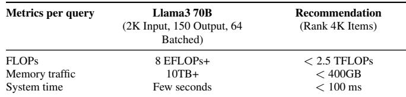  
Table 1: Workload characteristics of Llama3 70B and production recommendation models.

The challenge. The complexity of building LLM inference systems arises from the interaction of three factors.

(1) Diverse application requirements: Systems must support a wide range of workload characteristics (input/output lengths, context accumulation, multi-modality) and Service Level Objectives (SLOs), such as Time-To-First-Token (TTFT) and Time-To-Incremental-Token (TTIT) latencies, and throughput. For instance, optimizing for low-latency chatbots requires different configurations than high-throughput offline data scoring.

(2) Combinatorial design space parameters: Deploying LLMs involves a wide range of decisions: selecting hardware accelerators (e.g., NVIDIA H100/H200 (Choquette, 2023; NVIDIA Corporation, 2024b), AMD MI300X (Smith & Alla, 2025)) with different compute/memory profiles and costs, choosing parallelism strategies (Tensor, Pipeline, Expert, Context, Data, or hybrids), designing the runtime and scheduling system (e.g., continuous batching vs. disaggregating prefill and decode phases), and selecting model and system optimization techniques trading off quality and speed. Finding the right combination balancing SLO, cost, and quality is extremely challenging.

(3) Rapid pace of innovation: LLMs evolve rapidly with new model architectures (e.g., MoE, multi-head latent attention (Liu et al., 2024a; DeepSeek-AI et al., 2024)) and optimization techniques. These innovations require reevaluation of optimal system configurations, making manual or heuristic approaches unsustainable.

The exploration. While specific optimizations (Section 5), simulations (Agrawal et al., 2024a; Cho et al., 2024), and analyses (Yuan et al., 2024) offer valuable insights, systematically exploring the vast configuration space to optimize large-scale LLM inference remains challenging. To address this, we developed a lightweight performance simulator for systematic design space exploration (Section 3). Built on empirical operator benchmarks, our simulator rapidly projects end-to-end performance (latency, throughput) across millions of deployment configurations (hardware, parallelism, runtime). This enables data-driven selection of cost-effective systems tailored to production workloads and SLOs.

The insights. Our experience yielded key insights (Section 4) for optimizing LLM inference system deployments, with throughput improvements up to ∼ 2.5×.

Specifically, we discuss 1) runtime design trade-offs, 2) the importance of parallelism strategy, 3) cost-saving opportunities through heterogeneous hardware, 4) system-level implications of new model architectures such as Mixtureof-Experts (MoE), and 5) the impact of hardware infrastructure scaling options.

## 2 CHALLENGES OF CONSTRUCTING LLM INFERENCE SYSTEMS

Designing LLM inference systems requires navigating challenges from the interplay between workload characteristics, infrastructure choices, and optimization options. This section categorizes challenges into workload (Section 2.1), infrastructure (Section 2.2), and optimization (Section 2.3) dimensions.

## 2.1 Workload Challenges

Production workloads exhibit extreme variability, with each use case dictating different optimization goals based on distinct computational patterns.

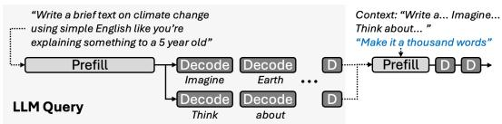  
Figure 1: Lifecycle of an LLM query.

## 2.1.1 Lifecycle of an LLM Query

Figure 1 shows the LLM inference lifecycle with prefill and decode phases. Their different computational characteristics necessitate distinct optimization strategies across hardware, parallelism, and runtime design.

Prefill processes potentially long input sequences, which makes it a compute-bound operation, demanding high compute throughput and dictating TTFT. Decode generates tokens one-by-one, making it memory-bandwidth bound due to repeated weight and KV cache access. Low TTIT requires sophisticated batching to amortize memory costs, introducing scheduling trade-offs (Section 4.2). Context accumulation in interactive sessions grows KV cache size, increasing costs for both phases, which requires techniques like Persistent KV cache (Gim et al., 2024) to deduplicate computation.

## 2.1.2 Attributes Defining LLM Applications

Systematically addressing the diverse landscape of LLM use cases requires defining key workload attributes (Table 2). The variability and interplay of these attributes present significant system design challenges: Input/output/context length dictate computational load for prefill and decode. Their extreme variability in production (Figure 2), coupled with hidden costs like system prompts and multi-generation, pose significant challenges for resource allocation and parallelism selection. Latency SLOs (TTFT/TTIT) need to be met while minimizing inference costs, which becomes a prohibitively expensive task given different products operate with different SLOs. Model size trades quality vs. cost; larger models may deliver higher quality but require complex parallelization and multi-host infrastructure (Section 4.3). Session-based context accumulation benefits from persistent KV caching, but introduces significant system complexity involving cache management. Additional factors like multi-modality, real-time patterns, output constraints further differentiate workloads.

## 2.1.3 Representative Applications

Agents: Interactive agents demand strict TTFT/TTIT SLOs, crucial for user engagement. However, they often exhibit a wide range of input/output lengths. Multimodal agents add extra complexity via large media inputs, though upload overhead may relax TTFT constraint. Realtime agents (e.g., voice) must meet extremely tight latency SLOs and potentially undefined input boundaries (e.g. continuous voice stream). Helper models: Background tasks like content safety checking or query rewriting use smaller models. Input lengths can vary widely due to variety of applications, but output lengths are typically more constrained and deterministic (e.g., classification, structured generation, etc). Their SLOs are very tight since they sit in the critical path between primary LLMs and external entities. Offline processing such as data generation, augmentation, and scoring (Dubey et al., 2024; Xu et al., 2024; Ouyang et al., 2022) are typically latency-tolerant, allowing the use of large, high-quality models along with bigger batches mostly optimized for throughput.

Optimizing Deployment Configurations for LLM Inference  
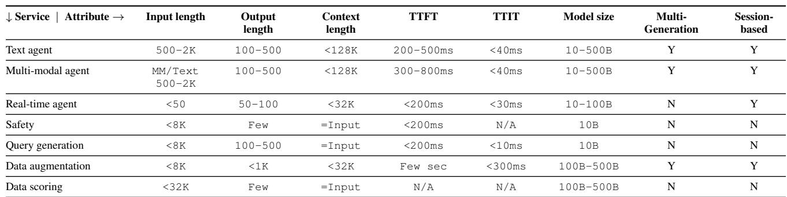  
Table 2: Characterization of diverse production LLM application scenarios and their typical attribute ranges. These variations significantly impact optimal LLM inference system design.

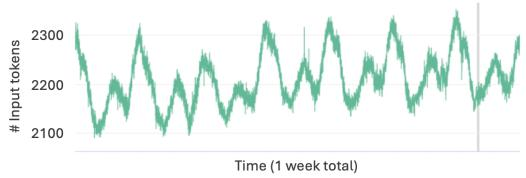

(a) 1-minute average input tokens over time.  
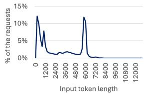

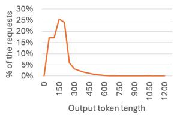  
(b) Histogram of input and output token length.  
Figure 2: Input/Output token lengths from production, showing high variability.

## 2.1.4 Production Characterization Challenges

Real-world LLM workloads exhibit high variability beyond those already laid out in Table 2. Figure 2 illustrates that, while we can consider a text agent to have about ∼2K input tokens based on 1-minute average (Figure 2a), the actual distribution (Figure 2b) spans from brief queries to lengthy documents. This variability, multiplied across all attributes in Section 2.1.2, creates unpredictable patterns, requiring robust systems built with precise performance modeling and systematic exploration (Section 3).

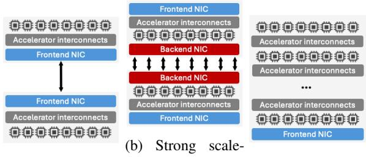  
(a) Weak scale-out. out.  
(c) Scale-up.  
Figure 3: Hardware platform architectures with different trade-offs.

## 2.2 Infrastructure Challenges

Infrastructure choices span hardware platforms, runtime systems, and parallelization strategies.

## 2.2.1 Hardware Platform

Hardware accelerators differ in compute, memory, and interconnect characteristics. Production datacenters host multiple platform types (Figure 3): Weak scale-out (PCIeconnected) suits smaller models cost-effectively. Strong scale-out uses high intra-host bandwidth (e.g., NVLink) with moderate inter-host links, balancing scalability and cost. Scale-up employs custom high-bandwidth interconnects (e.g., TPU pods (Jouppi et al., 2023), NVLink Switch (Tirumala & Wong, 2024)) for peak performance at higher cost. Wrong platform choice may cause 2 − 3× cost inefficiency or SLO failures (Section 4.6).

## 2.2.2 LLM Inference Runtime Design

Runtime complexity stems from managing concurrent requests. Figure 4 shows two approaches. Continuous batching (Yu et al., 2022; Daniel et al., 2023) executes mixed prefill/decode tasks in unified iterations, maximizing utilization but coupling phases; large prefills can delay decode, violating TTIT SLOs. Disaggregated approaches (Zhong et al., 2024; Qin et al., 2024) use separate prefill/decode pools for phase-specific optimization and better SLO predictability (Section 4.2), but add complexity: pool sizing, KV cache transfer, and potential underutilization.

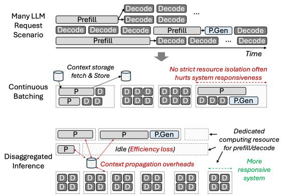

Figure 4: Runtime handling concurrent queries via continuous batching or disaggregation.  
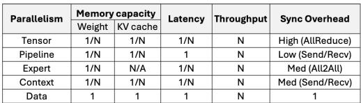

(a) 5D parallelism of LLM inference & trade-offs.  
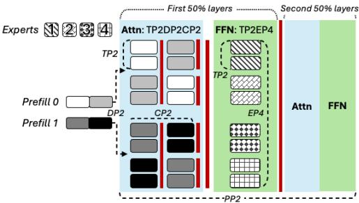  
(b) Example prefill parallelization scenario, using TP2DP2CP2 (Attention) and TP2EP4 (FFN).  
Figure 5: Types of LLM parallelism and an example scenario.

## 2.2.3 Parallelization Strategies

Figure 5 shows five parallelism types with trade-offs: Tensor Parallelism (TP) (Shoeybi et al., 2019) shards parameters across devices, improving latency/throughput but requiring high-bandwidth interconnects. Pipeline Parallelism (PP) (Lepikhin et al., 2020; Shoeybi et al., 2019) chunks layers sequentially, improving throughput with manageable communication. Expert Parallelism (EP) (Lepikhin et al., 2020; Du et al., 2022) distributes MoE experts using All2All, but may suffer load imbalance. Context Parallelism (CP) (Liu et al., 2023; Yang et al., 2024) partitions sequences, beneficial for long-context prefill. Data Parallelism (DP) (Rajbhandari et al., 2020) replicates weights for independent batch processing when other schemes incur excessive communication.

## 2.3 Optimization Challenges

Optimization techniques alter performance but introduce trade-offs requiring systematic evaluation.

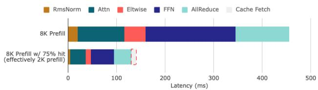

(a) Persistent KV cache reducing prefill costs.  
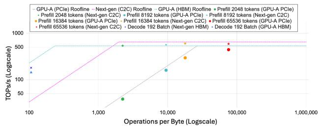  
(b) Rooflines for tiered accelerator memory setups.  
Figure 6: Performance impact of LLM optimizations.

## 2.3.1 Model-level Optimizations

Architectural innovations like MLA (Liu et al., 2024a) or Mamba (Gu & Dao, 2023) alter compute profiles, requiring architecture-system co-design iterations. Model compression reduces computational/memory demands via pruning, distillation (Blog, 2024), or quantization (FP8/INT8) (Xiao et al., 2023a). Quantization strongly impacts performancecost tradeoffs by leveraging hardware acceleration and reducing memory bandwidth requirements; emerging 4- bit formats (NVIDIA Corporation, 2024a) promise further gains. Each compression technique trades compression ratio, quality, and hardware efficiency, potentially enabling larger batches or reduced parallelism, necessitating system re-optimization.

## 2.3.2 System-level Optimizations

KV cache management: KV cache memory grows with context length. Persistent caches (Gim et al., 2024) reuse stored KV for repeated prompts (Figure 6a), reducing prefill costs but adding memory management complexity. Paged caches (Kwon et al., 2023) reduce fragmentation via non-contiguous blocks with page management overhead. Eviction/compression (Li et al., 2024b; Zhang et al., 2023; Xiao et al., 2023b; Hooper et al., 2024) trade quality for memory efficiency.

Tiered memory: Modern platforms offer host DRAM (via NVLink C2C (nvg) or PCIe) beyond HBM. This enables hosting much larger models via weight/KV cache offloading techniques. However, its effectiveness depends on achieving sufficient arithmetic intensity. Figure 6b shows NVLink C2C links need ∼2K tokens to amortize offloading costs; PCIe needs up to 64K tokens.

Speculative decoding (Leviathan et al., 2023; Miao et al., 2023b) uses draft models for candidate proposals, trading draft accuracy and validation overhead for latency reduction.

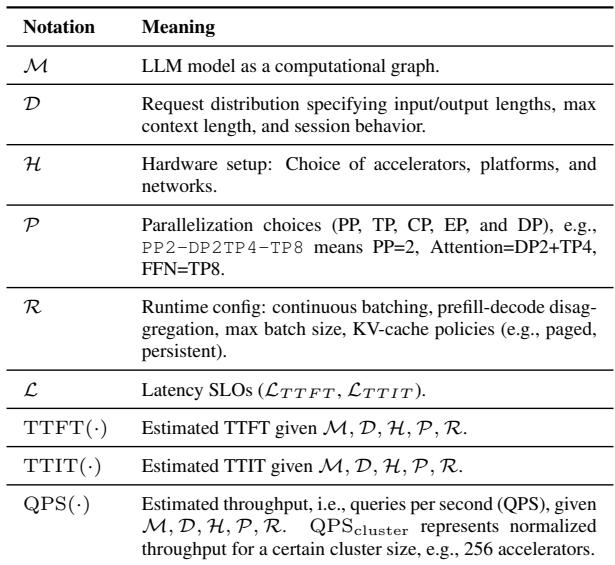

## Table 3: Variables used in problem formulation. 3 EXPLORING INFERENCE SYSTEM DESIGNS

A systematic approach was essential for addressing the complex, multi-faceted optimization problem described in Section 2. We now describe how we navigated multimillion design choices to identify optimal configurations.

## 3.1 Formal Problem Formulation

We formalize LLM inference optimization (symbols in Table 3) maximizing throughput subject to latency SLOs as:

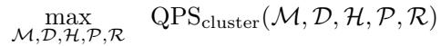

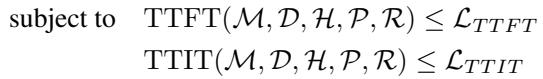

For each service scenario (D), we typically examine several models and hardware platforms (M, H) with dozens to hundreds of total runtime configurations (R; dozens of batch sizes × several optimization technique combinations × prefill and decode), already yielding 1000+ combinations. On top of that, for parallelization (P), we set PP first and explore the rest of 5D parallelism (TP, DP, EP, CP) for Attn and FFN each (Figure 5b) for 128–256 accelerator cards, leading to another ∼1000 combinations. The total number of combinations therefore often reaches the order of millions.

## 3.2 Operator and Block Modeling

Solving the problem formulation above requires accurately estimating the performance metrics for any configuration (M, D, H, P, R). We developed a lightweight performance simulation framework illustrated in Figure 7, which achieves this via a bottom-up modeling approach.

Micro-benchmarking profiles operators (GEMM, attention, AllReduce, AlltoAll) on hardware H across input shapes, keeping 100K+ results per hardware.

Operator Performance Model F builds interpolator/extrapolator F(op, H, shape) from measurements. Multi-dimensional piecewise-linear interpolation provides superior accuracy to analytical models.

Model Assembly instantiates operators with shapes from P and D, queries F for latencies, sums along critical paths including communication and runtime overheads, yielding end-to-end latencies for prefill and decode.

## 3.3 End-to-End Performance Exploration

Runtime-Specific Metrics calculates SLO metrics based on R. Continuous batching couples prefill/decode on shared resources; TTFT depends on prefill, TTIT on mixed prefill/decode latency. Disaggregated inference uses independent pools; TTFT/TTIT determined by respective pool performance. QPScluster is derived by finding optimal prefill and decode configurations independently, then computing the accelerator ratio that balances their processing rates. Search Space Pruning. To handle millions of configurations, we prune early: configurations violating hardware constraints (memory capacity) or SLO targets are discarded, and we focus on power-of-two parallelism degrees matching standard 8-GPU topologies. The framework supports arbitrary counts for non-standard topologies (e.g., GB200 NVL72).

Systematic Search iterates through the pruned (H, P, R) combinations, generating a ”performance landscape” mapping configurations to TTFT, TTIT, QPScluster.

Dynamic and Extended Modeling. Beyond static configurations, the framework models speculative decoding (scaling batch sizes by draft tokens and acceptance rates; incorporating empirically observed acceptance rates) and MoE expert routing (using empirical token distributions to capture load imbalance, see Section 4.5). Energy optimization is supported by modeling power-capped accelerators as distinct hardware types; TCO incorporates hardware costs, power, and operational factors.

SLO-Aware Ranking: Configurations violating the latency SLOs (LT T F T , LT T IT ) are filtered out. The remaining valid configurations are ranked based on the optimization objective (e.g., highest QPScluster). This allows identification of Pareto-optimal frontiers and the corresponding best configuration under given constraints (e.g., hardware availability and cost budgets).

## 3.4 Evaluation of the Simulator

Accuracy: Figure 8 compares estimated latency against real hardware measurements. The estimated latencies across diverse operators and parallelism setups align closely with measured values, typically within a ±5% error margin. Such high accuracy stems from the simulator’s benchmark-driven nature; the majority of performance estimations are minor interpolations of real hardware measurement results. While non-deterministic factors like network jitter can affect P99 tail latencies, our approach reliably predicts median and mean performance for production deployment decisions.

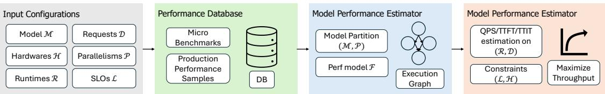  
Figure 7: Lightweight LLM inference performance simulator.

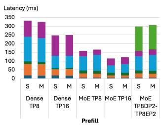

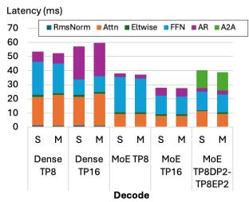  
Figure 8: Comparison of simulation (S) and measurement (M) results for various parallelism scenarios.

Speed: Our lightweight benchmark-powered simulator is extremely fast in exploring the design space, leveraging caches and multiprocesses to reduce runtime to several minutes, which is much faster than cycle-level, analytical, or ML-based simulators (Yuan et al., 2024; Agrawal et al., 2024a; Qi et al., 2017).

Emulating Future Hardware: For future hardware that we cannot benchmark, we upload simulation-based operator performance estimations to our database. This provides decent fidelity given LLMs have limited operator types (typically dozens) and minimal caching effects between operators.

## 4 KEY INSIGHTS FROM CASE STUDIES

We now present the five key insights previewed in Section 1, which we derived from our experience and believe provide guidance for designing efficient LLM inference systems.

## 4.1 Experimental Setup

Target hardware is detailed in Table 4, covering scaleout platforms (Figure 3b) and next-gen scale-up platforms (Figure 3c). The target models and inference scenarios are described in Table 5. Our discussions reflect the models and setups we worked with during this deployment period. All results are from our simulation framework (Section 3). We evaluate configurations meeting latency SLOs (LT T F T , LT T IT ) while maximizing throughput (QPScluster, normalized per 256 accelerators).

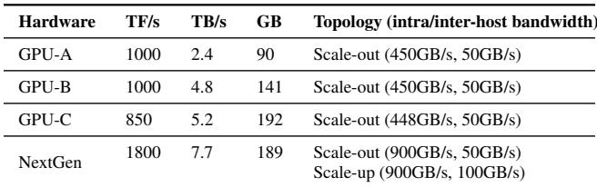

Table 4: Hardware Platforms (H) used in the case studies.  
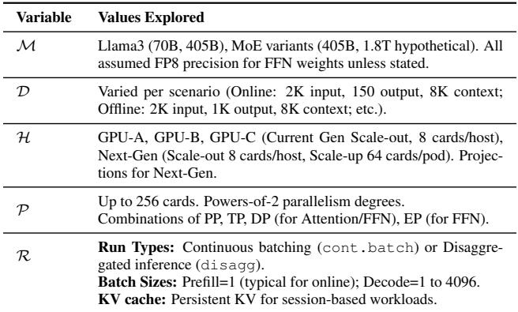  
Table 5: LLM inference scopes for the case studies.  
4.2 Runtime Design Trade-offs (Latency vs. QPS)

Insight: Disaggregated runtimes excel for online scenarios with strict latency constraints, while continuous batching suffices for offline throughput-oriented workloads.   
Impact: Meta migrated the majority of online services to disaggregated runtime to gain around 30% capacity savings, while still leveraging continuous batching for offline services.   
The choice of runtime architecture (R), specifically continuous batching (cont.batch) versus disaggregated inference (disagg), significantly impacts performance depending on the target SLOs (L). To quantify these trade-offs, we used our simulator (Section 3) to identify the optimal configurations for online inference targeting representative strict latency SLOs (LT T F T , LT T IT ) for both Llama3 70B and 405B models across various hardware platforms (H). Table 6 summarizes these results, showing the best achievable throughput (QPScluster) for both disaggregated (disagg) and continuous batching (cont.batch) runtimes (R) while meeting the latency constraints.

As shown in Table 6, for online inference with strict latency targets, disagg consistently achieves higher throughput while meeting SLOs. For 70B, disagg is 1.5-1.8x higher than cont.batch; for 405B, the gap widens to 1.8-2.2x. This stems from two factors: (1) independent optimization of prefill/decode resources and parallelism (P), avoiding cont.batch compromises (Section 4.3); (2) significantly larger decode batch sizes (e.g., 112 vs 28 for 70B on GPU-A; 56 vs 8 for 405B on GPU-B) without impacting TTIT.

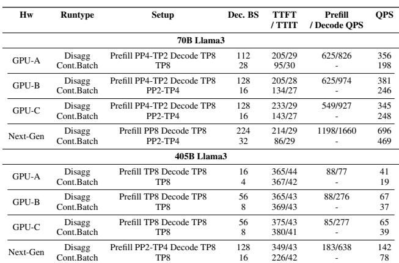  
Table 6: Optimal online inference setups for Llama3 70B and 405B under strict latency targets. Each QPS denotes QPScluster.

Conversely, for offline generation (Table 7), where throughput is the sole objective, the gap diminishes. Both converge to deep PP with very large batches. For 70B on GPU-C, cont.batch even slightly outperforms disagg. Given disagg’s operational complexity, continuous batching often becomes more practical for latencyinsensitive tasks.

## 4.3 Actively Leveraging Parallelism Strategy

Insight: Parallelism has a huge impact on overall service throughput due to nontrivial communication overheads. If SLO is easy to meet, setups incurring lower communication overhead help recoup throughput. Disaggregated runtime can further leverage distinct parallelism setups for prefill and decode.

Impact: Meta actively adopted per-service-tuned parallelization setups to maximize the throughput at given SLO.

Optimal parallelism (P) must be tailored to prefill/decode computational demands and target SLOs.

Prefill Parallelism: As shown in Figure 9a for online prefill (70B, 2K tokens, GPU-A), increasing TP degree reduces latency. However, the throughput gains (QPScluster) are sub-linear because operators tend to scale sub-linearly and also because of higher communication overheads (i.e. AllReduce). For example, TP4PP2 achieves lower latency than TP2PP4 but yields 20% lower QPS. Therefore, the optimal prefill strategy, as seen in the disaggregated setups in Table 6 (e.g., PP4-TP2 for 70B on GPU-A), aims to efficiently utilize the available LT T F T headroom, rather than minimizing latency at any cost. Different hardware or workloads might favor different strategies (e.g., Context

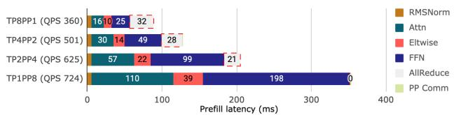

(a) Prefill performance for various parallelism setups (70B, 2K Tokens, GPU-A).  
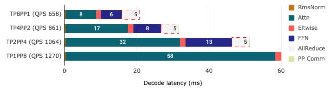

(b) Decode performance for various parallelism setups (70B, 8K Context 150 Outputs, GPU-C, BS=64).  
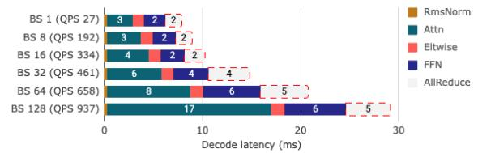  
(c) Decode performance for various batch sizes (70B, 8K Context 150 Outputs, GPU-C, TP=8).

Figure 9: Online Inference Latency. QPScluster is shown.  
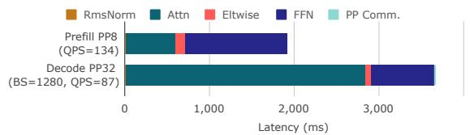  
Figure 10: Offline inference Prefill and Decode performance (405B on GPU-A, at ideal setup, QPScluster).

Parallelism (CP) becomes relevant for extremely long sequences, not shown here).

Decode Parallelism: For online decode (70B, 8K context, GPU-C), performance hinges on both parallelism (P) and batch size (R). Figure 9b shows that increasing TP (e.g., TP8 vs. TP4) improves latency and throughput by leveraging more aggregate memory bandwidth, crucial for the memory-bound decode phase. Figure 9c demonstrates that increasing batch size boosts QPS initially, but with diminishing returns as computation becomes relatively more dominant. The optimal setup identified (e.g., TP8 with Batch Size 128 for 70B on GPU-C in Table 6) maximizes the throughput within the LT T IT constraint. Note that the optimal point found often differs from the optimal prefill strategy (e.g., PP4-TP2) or what might have been chosen heuristically, stressing the importance of our systematic approach.

Phase-Specific Optimization: The ability of disaggregated runtimes to employ distinct parallelism strategies for prefill and decode (e.g., PP4-TP2 for prefill, TP8 for decode in the 70B GPU-A online case from Table 6) is a primary reason for their superior efficiency in latency-constrained online scenarios compared to continuous batching. For offline tasks (Table 7), where latency is not critical, the optimal strategy often converges to deep PP for both phases, combined with very large batch sizes to maximize throughput (Figure 10).

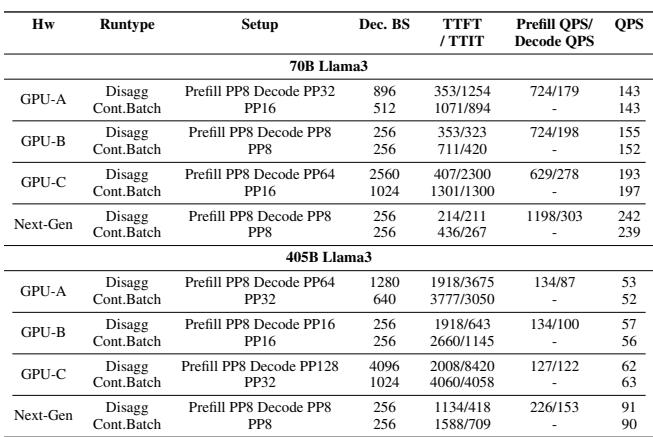  
Table 7: Optimal offline inference (generation) setups for Llama3 70B and 405B. Each QPS denotes QPScluster.

Interaction with Hardware Topology and Capability: The effectiveness of parallelism strategies is also modulated by the hardware topology and capability. TP demands strong interconnects (e.g., intra-host NVLink or scale-up fabrics), whereas PP and EP (Expert Parallelism, see Section 4.5) are more tolerant of weaker inter-host links. The models in Table 6 fit within a single host (8 GPUs) capacity-wise and also seem to prefer not going beyond a single host to avoid costly inter-host communications. Larger models going beyond a single host’s capacity necessitate multi-host deployments which we explore in Section 4.6 and Section 4.5. The impact of hardware capabilities on the optimal strategy is also evident in Figure 11, where the Next-Gen platform with faster speed meets SLO with less aggressive prefill (PP2-TP4) and decode (TP8 with larger batch size) setups, compared to GPU-A which is forced to use TP8 to meet SLO.

## 4.4 Hardware Heterogeneity Opportunities

Insight: For disaggregated systems, strategically mapping compute (prefill) and memory bandwidth (decode) intensive phases to accelerators of different strengths can improve the overall cost efficiency by 15-25% compared to homogeneous deployments.

Impact: Meta deployed services to platforms that best fit the characteristics to maximize the accelerator fleet efficiency.

Prefill tends to be compute-bound, favoring high FLOP/s accelerators (GPU-A). Decode is memory-bandwidth bound, benefiting from high HBM bandwidth (GPU-B/C). Homogeneous clusters may be suboptimal as no single type suits both phases. Disaggregated runtimes (Section 4.2) enable leveraging heterogeneity.

Table 8 explores heterogeneous configurations for the 405B online inference scenario using disaggregation. First, homogeneous setups show good potential; GPU-A excels at prefill (88 QPS) but struggles with decode (77 QPS); GPU-B/C are weaker at prefill (88/85 QPS) but much stronger at decode (276/277 QPS). In our production deployments, the heterogeneity may come from either different vendors or different products from the identical vendor. Heterogeneous configurations, specifically using GPU-A for prefill and GPU-B or GPU-C for decode, achieve end-to-end QPS (QPScluster = 67) comparable to the best homogeneous setups (GPU-B/B or GPU-C/C). This implies potential cost savings – if the combined cost of GPU-A (for prefill) and GPU-B/C (for decode) resources needed to achieve 67 QPS is lower than the cost of GPU-B/C resources alone for the same throughput, heterogeneity wins. Based on the performance characteristics and actual cost structures, our performance modeling estimates suggest potential TCO improvements of 15-25%. Note that the optimal ratio of prefill-todecode accelerators also varies significantly depending on the hardware combination (e.g., 0.88 for A/A vs. 3.14 for A/B).

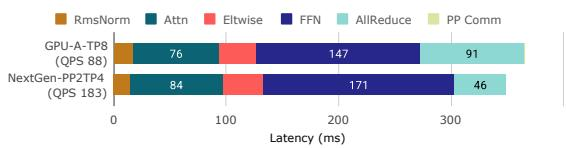

(a) Prefill (2K Tokens).  
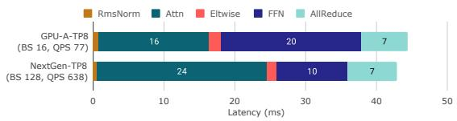  
(b) Decode (8K Context, 150 Output)

Figure 11: 405B online performance comparison for GPU-A and Next-gen at their optimal setups. QPScluster is shown.  
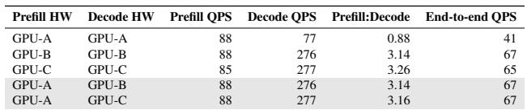  
Table 8: Heterogeneous inference for 405B model. Each QPS denotes QPScluster.

Practical Considerations: While promising for cost efficiency, implementing heterogeneous inference introduces operational complexities in capacity planning, scheduling across distinct hardware pools among geographically distributed datacenters of Meta. However, exploiting these differences via disaggregation remains valuable, as datacenters naturally incorporate diverse hardware generations.

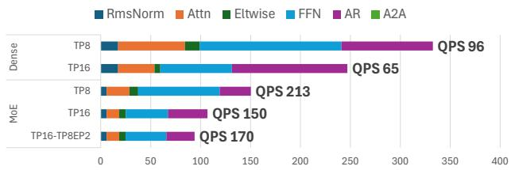

(a) Prefill performance breakdown (2K tokens).  
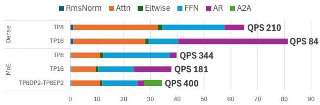  
(b) Decode performance breakdown (BS=64, 8K context).

Figure 12: Performance of 405B Dense and iso-sized MoE (125B x 4 Experts, Top 2 triggered per token) on GPU-A. QPScluster is shown.

## 4.5 MoE vs. Dense Performance and Parallelism

Insight: Mixture-of-Experts (MoE) models achieve higher computational efficiency than dense counterparts of equivalent total parameter counts by activating only a subset of parameters per token. However, unlocking this potential, particularly when scaling across multiple hosts, hinges critically on adopting appropriate parallelism strategies, primarily Expert Parallelism (EP) over Tensor Parallelism (TP) for FFN layers, especially on scale-out infrastructure.

Impact: This exploration added great confidence for Meta to migrate the majority of models to MoE-based architectures. We are also leveraging the parallelism related lessons in our fleet.

Computational Efficiency: The fundamental advantage of MoE models stems from their sparse activation pattern. By processing each token through only a subset of FFN ”experts”, MoE models significantly reduce the per-token FLOP count compared to dense models where every token passes through the entire FFN layer. This benefit is most pronounced in compute-bound phases like prefill.

We compare a 405B dense Llama3 model with a hypothetical iso-parameter MoE variant (125B base x 4 experts, activating top 2 experts per token) on GPU-A. We advise to compare MoE and dense with the identical parallelism setup for fair assessment. Note that we assume this hypothetical MoE model architecture mainly for performance/efficiency study; it does not represent a sound/effective expansion of the Llama3 405B model.

As shown in Figure 12a, the MoE model achieves significantly lower prefill latency and higher throughput than the dense model using the same TP8 parallelism (i.e., QPS 96 vs. 213) within a single 8-card host, directly reflecting the reduced FFN computation.

For the memory-bandwidth-bound decode phase (Figure 12b), the advantage of MoE should diminish compared to prefill. Specifically, for MoE model with large enough decode batch size far exceeding the number of experts, tokens will likely trigger all experts, necessitating accesses to the full set of expert weights, thus eliminating the benefits of sparse FFN activation (vs. Dense). However, in our specific comparison using an iso-parameter MoE construction, we still observe a notable decode speedup; for example, TP8 MoE achieves much better latency and QPS vs. Dense counterpart (i.e., 344 vs. 210). This is largely attributable to the smaller non-expert parameters, particularly the attention layers, in our hypothetical MoE model compared to its dense counterpart, which significantly reduces the memory footprint and computation required for the attention part of the model.

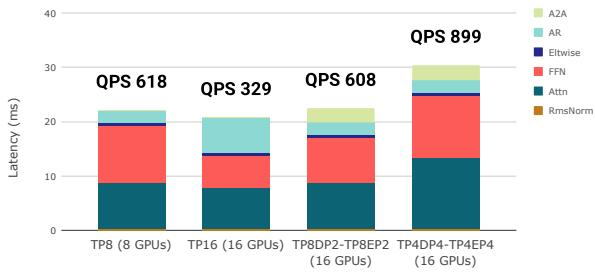  
Figure 13: Llama 4 Maverick decode performance under different parallelism strategies on GPU-A (BS=64, 8K context). EP-based scaling preserves throughput across hosts, unlike pure TP which suffers from AllReduce overhead. QPScluster is shown.

Parallelism Strategy and MoE: Realizing MoE’s benefits at scale, especially across multiple hosts, necessitates choosing the right parallelism strategy (P). While TP is effective for dense models within tightly-connected nodes (e.g., NVLink within a host), its reliance on costly AllReduce collectives makes it scale poorly across standard interhost networks (Section 4.6). MoE architectures enable Expert Parallelism (EP), where different experts are placed on different devices/hosts. EP typically requires AlltoAll communication to route tokens to their assigned experts and gather results, which is often significantly more efficient than AllReduce over weaker interconnects.

Figure 12b (Decode) best illustrates the benefit of EP. For Dense model, TP8 to TP16 actually degrades both the QPS (210→84) and the latency due to big AllReduce overheads. Similar behavior is observed for MoE model trying to utilize TP16. In contrast, with EP, MoE model improves both the throughput (344→400) and the latency thanks to EP’s lower communication costs. We validate this on Llama 4 Maverick (128 routed experts, top-1), part of a growing trend toward many-expert MoE architectures (e.g., DeepSeek-V3 (DeepSeek-AI et al., 2024) with 256 experts) where EP becomes essential (Figure 13). Scaling from TP8 (single host) to TP16 (two hosts) nearly halves decode QPScluster (618→329) because AllReduce costs triple. In contrast, TP8DP2-TP8EP2 preserves throughput (608, −2%) by replacing inter-host FFN AllReduce with cheaper All2All for expert routing. Going further, TP4DP4-TP4EP4 actually achieves the highest throughput (899, +45% over TP8 baseline) by minimizing the communication overheads while maximizing the number of tokens being handled per iteration (i.e., large DP).

For prefill (Figure 12a), TP16-TP8EP2 benefits MoE via reduced FFN AllReduce costs. However, multi-host doesn’t improve compute-bound prefill throughput due to communication overhead. Memory-bound tasks benefit from multi-host as token count scales with hosts and weight-reading distributes across devices.

System Implications: When deployed with appropriate parallelism strategies, MoE models offer a compelling path towards higher performance-per-cost, especially on standard scale-out infrastructure with relatively weak inter-host bandwidths. Our findings hold across both our controlled iso-parameter study (Figure 12) and production architectures like Llama 4 Maverick (Figure 13): EP-based parallelism consistently outperforms pure TP for cross-host MoE scaling. Thorough inference space exploration (Section 3) is essential for identifying the optimal parallelism setup (e.g., TP within a host combined with EP/DP across hosts) and striking the right balance of efficiency and latency.

Expert Load Imbalance: MoE performance modeling requires accurately estimating how many tokens each expert gets. For prefill, with many tokens routed across experts, most or all experts are typically activated. The key concern is the distribution of tokens among experts: in practice, a few “hot” experts receive disproportionately many tokens (e.g., in one representative Llama 4 Maverick workload, the busiest expert received ∼7% of all routed tokens out of 128 experts). Since per-EP-domain routed FFN latency grows with token load (Figure 14b), the most-loaded EP domain becomes the latency bottleneck. This can be mitigated by mixing hot and cold experts within the same EP domain (Figure 14a), bringing per-domain load closer to the loadbalanced ideal, i.e., an even split of tokens across experts. Our framework models prefill using this load-balanced assumption, which provides a lower bound on cost.

For decode, the dominant cost driver is different. Because decode processes few tokens per expert, routed FFN latency is memory-bandwidth bound and dominated by expert weight reads, scaling linearly with the number of active experts (Figure 14c). Imbalance has a dual effect: when not all experts are triggered, skewed routing leaves some experts inactive, reducing cost by avoiding weight reads. Once most experts are active, uneven token counts within them add modest overhead (scatter points above the balanced line in Figure 14c). To predict the number of active experts, our framework supports three activation models (Figure 14d): load balanced (as in prefill), uniform ran-

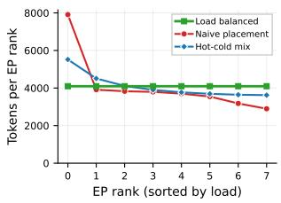  
(a) EP-rank load under different placements.

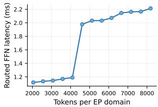  
(b) Routed FFN latency vs. EPdomain load.

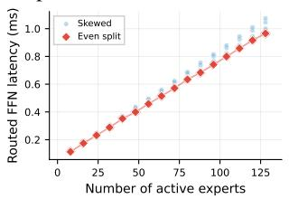  
(c) Decode routed FFN cost vs. active experts.

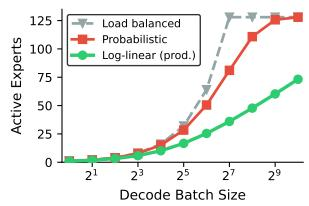  
(d) Expert activation models (decode).

Figure 14: Expert load imbalance sensitivity (Llama 4 Maverick, 128 experts, GPU-A). Prefill (top): (a) Per-EP-rank token load under three expert placement strategies (T=32K, EP8, 16 experts/domain). (b) Routed expert FFN latency vs. EP-domain token load (EP8). Decode (bottom): (c) Routed expert FFN latency vs. active expert count, with balanced and imbalanced token distributions among active experts (TP8, T=256). (d) Predicted active expert count vs. decode batch size under three activation models.

dom (each token independently picks an expert), and loglinear (calibrated from production traffic). As shown in Figure 14d, the models diverge significantly at moderate batch sizes, leading to up to 3.5× difference in predicted cost; we default to log-linear, which best matches production traffic.

## 4.6 Scale-out vs. Scale-up platform tradeoffs

Insight: Scale-out platforms offer cost efficiency for models serviceable within a single or few hosts. Decode of MoE models scales particularly well on scale-out platforms too. Scale-up platforms become necessary for extremely large dense models or extra low latency inference of MoE or Dense models. Their order-ofmagnitude higher bandwidth and lower latency vs. scale-out facilitates enabling wider parallelism domain sizes with tolerable communication overheads.

Impact: Meta proactively assessed the potential deployment scenarios of scale-up platforms and the corresponding benefits/challenges using the lightweight performance simulation and design space exploration methodology.

We evaluate whether expensive scale-up infrastructure (high-bandwidth, low-latency interconnects within large accelerator pods) justifies its cost versus conventional scale-out systems (smaller hosts with standard network fabrics) for extremely large LLMs. Using our simulator, we evaluated hypothetical 1.8T Dense and MoE models on Next-Gen platforms: scale-out (8 cards/host, 50 GB/s interhost) and scale-up (64 cards/pod, 900 GB/s intra-pod). Results are shown in Figure 15.

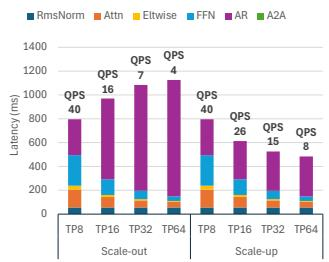

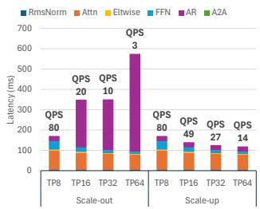

(a) Dense model Prefill (Left) and Decode (Right).  
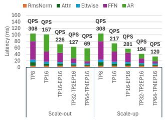

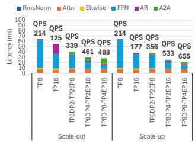  
(b) MoE model Prefill (Left) and Decode (Right)  
Figure 15: 1.8T dense/MoE model performance on scaleout and scale-up next-gen platforms. QPScluster is shown.

Dense Model Scaling Challenges: Large dense models require high TP degrees, relying on expensive AllReduce. Figure 15a shows scale-out TP scaling severely hampered beyond single host due to AllReduce costs, yielding no latency/throughput gains. Scale-up handles multi-node TP effectively with high-speed fabric, although returns diminish at high TP degrees (32-64 cards) as communication dominates.

MoE Model Scaling Advantages: MoE models offer an alternative scaling path via Expert Parallelism (EP), distributing FFN experts across devices and primarily relying on AlltoAll communication, often less demanding than TP’s AllReduce. Figure 15b shows MoE scales gracefully with EP on scale-out, especially for Decode (Section 4.5). Prefill throughput scaling remains limited. Multihost scale-out becomes viable for MoE unlike dense models suffering from communication overheads.

Scale-up yields superior MoE performance via faster AlltoAll and hybrid parallelism (EP across nodes, TP within), achieving the best latency and throughput at large scales.

System Implications: Optimal setup choice involves complex tradeoffs between model size, architecture (Dense vs. MoE), SLOs, parallelism, and platform TCO. Scaleup is necessary for latency-critical large dense models or extremely low-latency MoE; scale-out remains viable for MoE, avoiding high TCO and larger failure domains.

## 5 DISCUSSION AND RELATED WORK

Our work builds on prior research in LLM inference systems, parallelism, and performance modeling.

Basic Inference Systems and Runtime Concepts. Prior work includes general optimizations (NVIDIA, 2017; Aminabadi et al., 2022), continuous batching (Yu et al., 2022), KV cache management (Kwon et al., 2023; Lin et al., 2024; Liu et al., 2024b; Hooper et al., 2024), and specialized runtimes (ModelTC, 2024; Vaidya et al., 2023). Distinct prefill/decode profiles motivated disaggregated architectures (Zhong et al., 2024; Patel et al., 2024; Qin et al., 2024; Agrawal et al., 2023; 2024b) and offloading (Sheng et al., 2023; Jiang et al., 2024). Our methodology systematically evaluates these choices (cont.batch vs. disagg), quantifying trade-offs for specific workloads, hardware, and SLOs (Sections 4.2 and 4.4), validating disaggregation’s benefits for latency-critical tasks.

Advanced Serving Systems. Open-source systems like vLLM (Kwon et al., 2023) and TensorRT-LLM (Vaidya et al., 2023) continue to provide optimizations on kernels, memory management, and scheduling for LLM deployment. Recent work includes Sarathi-Serve (Agrawal et al., 2024b) (chunked-prefills) and Niyama (Kamahori et al., 2025) (disaggregated scheduling). Our work complements these: while they optimize how to execute inference, we address what configuration to deploy—parallelism strategies, hardware selection, and runtime architecture choices that apply across serving systems.

Parallelism Strategies. Scaling LLMs leverages TP, PP (Shoeybi et al., 2019; Narayanan et al., 2021), EP for MoE (Lepikhin et al., 2020; Shazeer et al., 2016; Fedus et al., 2022; Liu et al., 2024a; DeepSeek-AI et al., 2024; Rajbhandari et al., 2022; Hwang et al., 2023), CP for long contexts (Li et al., 2021; Korthikanti et al., 2023; Jacobs et al., 2023; Liu et al., 2023; Brandon et al., 2023; Yang et al., 2024), and DP (Rajbhandari et al., 2020; Ren et al., 2021; Zhao et al., 2023). Our contribution (Sections 4.3, 4.5 and 4.6) empirically demonstrates that optimal parallelism depends critically on inference phase, model architecture (Dense vs. MoE), and hardware platform (scale-out vs. scale-up). We showed MoE models with EP scale effectively on scale-out systems and identified optimal hybrid strategies.

Performance Modeling and Optimization. Performance prediction via analytical models (Yuan et al., 2024; Bambhaniya et al., 2024), simulators (Agrawal et al., 2024a), or performance models (Qi et al., 2017) enables design space exploration alongside optimizations like quantization (Li et al., 2024a; Xiao et al., 2023a), pruning (Frantar & Alistarh, 2023; Ma et al., 2024), and speculative decoding (Leviathan et al., 2023; Miao et al., 2023b; Xia et al., 2024) (surveys: (Zhou et al., 2024; Miao et al., 2023a; Wan et al., 2023)). Our lightweight simulator (Section 3) integrates empirically-grounded operator models with systemlevel configurations (runtime, parallelism) for rapid, comprehensive exploration, providing practical guidance (Section 4).

Applicability of Insights on Other Inference Scenarios. The general tradeoffs we identify—TP vs. PP for different phases, EP benefits for MoE on scale-out, disaggregation for SLO-sensitive workloads—stem from fundamental compute and communication characteristics. The magnitude varies with context: parallelism matters less for smaller models on fewer accelerators, while latencysensitive applications require optimizations that are optional for throughput-focused workloads. Our insights provide directional guidance; practitioners should validate configurations in their specific environments.

Future Directions. The drive for efficiency fuels innovations toward novel architectures (Gu & Dao, 2023; Peng et al., 2023) and optimizations (context reuse, sparsity), with prefill/decode management (Section 2.1.1) remaining central. The compute (prefill) vs. memory bandwidth (decode) tension may favor specialized hardware, though fungibility concerns persist. Future accelerators (Firoozshahian et al., 2023; Jouppi et al., 2023) with balanced performance and fine-grained partitioning could enable better co-scheduling, improving upon current disaggregation approaches.

## 6 CONCLUSION

This paper documented the real-world challenges we encountered optimizing LLM inference systems at scale. We systematically defined the optimization space and developed an effective design space exploration methodology based on lightweight simulations, yielding five critical insights that helped Meta optimize production LLM inference services. We hope our lessons—encompassing online and offline inference, dense and MoE models, and various accelerator platforms with different capabilities—help others construct efficient LLM serving systems.

## ACKNOWLEDGMENTS

We would like to acknowledge all the contributors who made this work possible. Special thanks to Mahesh Balasubramanian for thoroughly reviewing the manuscript and providing valuable feedback.

## REFERENCES

Nvidia GH200 grace hopper superchip. https: //www.nvidia.com/en-us/data-center/ grace-hopper-superchip/. Accessed: 2025-01- 01.

Interview with Mark Zuckerberg—AI Will Write Most Meta Code in 18 Months, 2025. URL https://www.youtube.com/watch?v= rYXeQbTuVl0&ab\_channel=DwarkeshPatel.

Achiam, J., Adler, S., Agarwal, S., Ahmad, L., Akkaya, I., Aleman, F. L., Almeida, D., Altenschmidt, J., Alt-

man, S., Anadkat, S., et al. Gpt-4 technical report. arXiv preprint arXiv:2303.08774, 2023.

Agrawal, A., Panwar, A., Mohan, J., Kwatra, N., Gulavani, B., and Ramjee, R. Sarathi: Efficient llm inference by piggybacking decodes with chunked prefills. arXiv preprint arXiv:2308.16369, 2023.

Agrawal, A., Kedia, N., Mohan, J., Panwar, A., Kwatra, N., Gulavani, B., Ramjee, R., and Tumanov, A. Vidur: A large-scale simulation framework for llm inference, 2024a. URL https://arxiv.org/abs/2405. 05465.

Agrawal, A., Kedia, N., Panwar, A., Mohan, J., Kwatra, N., Gulavani, B. S., Tumanov, A., , and Ramjee, R. Taming throughput-latency tradeoff in llm inference with sarathiserve. arXiv preprint arXiv:2403.02310, 2024b.

Alayrac, J.-B., Donahue, J., Luc, P., Miech, A., Barr, I., Hasson, Y., Lenc, K., Mensch, A., Millican, K., Reynolds, M., et al. Flamingo: a visual language model for few-shot learning. Advances in neural information processing systems, 35:23716–23736, 2022.

Aminabadi, R. Y., Rajbhandari, S., Awan, A. A., Li, C., Li, D., Zheng, E., Ruwase, O., Smith, S., Zhang, M., Rasley, J., et al. Deepspeed-inference: enabling efficient inference of transformer models at unprecedented scale. In SC22: International Conference for High Performance Computing, Networking, Storage and Analysis, pp. 1– 15. IEEE, 2022.

Bambhaniya, A., Raj, R., Jeong, G., Kundu, S., Srinivasan, S., Subramanian, S., Elavazhagan, M., Kumar, M., and Krishna, T. Demystifying ai platform design for distributed inference of next-generation llm models. arXiv preprint arXiv:2406.01698, 2024.

Blog, N. T., 2024. URL https: //developer.nvidia.com/blog/ how-to-prune-and-distill-llama-3-1-8b-to-an-nvidi

Brandon, W., Nrusimha, A., Qian, K., Ankner, Z., Jin, T., Song, Z., and Ragan-Kelley, J. Striped attention: Faster ring attention for causal transformers. arXiv preprint arXiv:2311.09431, 2023.

Brown, T., Mann, B., Ryder, N., Subbiah, M., Kaplan, J. D., Dhariwal, P., Neelakantan, A., Shyam, P., Sastry, G., Askell, A., et al. Language models are few-shot learners. Advances in neural information processing systems, 33:1877–1901, 2020.

Chen, M., Tworek, J., Jun, H., Yuan, Q., Pinto, H. P. d. O., Kaplan, J., Edwards, H., Burda, Y., Joseph, N., Brockman, G., et al. Evaluating large language models trained on code. arXiv preprint arXiv:2107.03374, 2021.

Cho, J., Kim, M., Choi, H., Heo, G., and Park, J. Llmservingsim: A hw/sw co-simulation infrastructure for llm inference serving at scale. In 2024 IEEE International Symposium on Workload Characterization (IISWC), pp. 15–29. IEEE, 2024.

Choquette, J. Nvidia hopper h100 gpu: Scaling performance. IEEE Micro, 43(3):9–17, 2023.

Comanici, G., Bieber, E., Schaekermann, M., Pasupat, I., Sachdeva, N., Dhillon, I., Blistein, M., Ram, O., Zhang, D., Rosen, E., et al. Gemini 2.5: Pushing the frontier with advanced reasoning, multimodality, long context, and next generation agentic capabilities. arXiv preprint arXiv:2507.06261, 2025.

Daniel, C., Shen, C., Liang, E., and Liaw, R. How continuous batching enables 23x throughput in llm inference while reducing p50 latency, 2023.

DeepSeek-AI. DeepSeek-V3 Technical Report. arXiv preprint arXiv:2412.19437, 2024.

DeepSeek-AI, Liu, A., Feng, B., Xue, B., Wang, B., Wu, B., Lu, C., Zhao, C., Deng, C., Zhang, C., Ruan, C., Dai, D., Guo, D., Yang, D., Chen, D., Ji, D., Li, E., Lin, F., Dai, F., Luo, F., Hao, G., Chen, G., Li, G., Zhang, H., Bao, H., Xu, H., Wang, H., Zhang, H., Ding, H., Xin, H., Gao, H., Li, H., Qu, H., Cai, J. L., Liang, J., Guo, J., Ni, J., Li, J., Wang, J., Chen, J., Chen, J., Yuan, J., Qiu, J., Li, J., Song, J., Dong, K., Hu, K., Gao, K., Guan, K., Huang, K., Yu, K., Wang, L., Zhang, L., Xu, L., Xia, L., Zhao, L., Wang, L., Zhang, L., Li, M., Wang, M., Zhang, M., Zhang, M., Tang, M., Li, M., Tian, N., Huang, P., Wang, P., Zhang, P., Wang, Q., Zhu, Q., Chen, Q., Du, Q., Chen, R. J., Jin, R. L., Ge, R., Zhang, R., Pan, R., Wang, R., Xu, R., Zhang, R., Chen, R., Li, S. S., Lu, S., Zhou, S., Chen, S., Wu, S., Ye, S., Ye, S., Ma, S., Wang, S., Zhou, S., Yu, S., Zhou, S., Pan, S., Wang, T., Yun, T., Pei, T., Sun, T., Xiao, W. L., Zeng, W., Zhao, W., An, W., Liu, W., Liang, W., Gao, W., Yu, W., Zhang, W., Li, X. Q., Jin, X., Wang, X., Bi, X., Liu, X., Wang, X., Shen, X., Chen, X., Zhang, X., Chen, X., Nie, X., Sun, X., Wang, X., Cheng, X., Liu, X., Xie, X., Liu, X., Yu, X., Song, X., Shan, X., Zhou, X., Yang, X., Li, X., Su, X., Lin, X., Li, Y. K., Wang, Y. Q., Wei, Y. X., Zhu, Y. X., Zhang, Y., Xu, Y., Xu, Y., Huang, Y., Li, Y., Zhao, Y., Sun, Y., Li, Y., Wang, Y., Yu, Y., Zheng, Y., Zhang, Y., Shi, Y., Xiong, Y., He, Y., Tang, Y., Piao, Y., Wang, Y., Tan, Y., Ma, Y., Liu, Y., Guo, Y., Wu, Y., Ou, Y., Zhu, Y., Wang, Y., Gong, Y., Zou, Y., He, Y., Zha, Y., Xiong, Y., Ma, Y., Yan, Y., Luo, Y., You, Y., Liu, Y., Zhou, Y., Wu, Z. F., Ren, Z. Z., Ren, Z., Sha, Z., Fu, Z., Xu, Z., Huang, Z., Zhang, Z., Xie, Z., Zhang, Z., Hao, Z., Gou, Z., Ma, Z., Yan, Z., Shao, Z., Xu, Z., Wu, Z., Zhang, Z., Li, Z., Gu, Z., Zhu, Z., Liu, Z., Li, Z., Xie, Z., Song, Z.,

Gao, Z., and Pan, Z. Deepseek-v3 technical report, 2024. URL https://arxiv.org/abs/2412.19437.

Du, N., Huang, Y., Dai, A. M., Tong, S., Lepikhin, D., Xu, Y., Krikun, M., Zhou, Y., Yu, A. W., Firat, O., et al. Glam: Efficient scaling of language models with mixture-of-experts. In International Conference on Machine Learning, pp. 5547–5569. PMLR, 2022.

Dubey, A., Jauhri, A., Pandey, A., Kadian, A., Al-Dahle, A., Letman, A., Mathur, A., Schelten, A., Yang, A., Fan, A., et al. The llama 3 herd of models. arXiv preprint arXiv:2407.21783, 2024.

Fedus, W., Zoph, B., and Shazeer, N. Switch transformers: Scaling to trillion parameter models with simple and efficient sparsity. The Journal of Machine Learning Research, 23(1):5232–5270, 2022.

Firoozshahian, A., Coburn, J., Levenstein, R., Nattoji, R., Kamath, A., Wu, O., Grewal, G., Aepala, H., Jakka, B., Dreyer, B., Hutchin, A., Diril, U., Nair, K., Aredestani, E. K., Schatz, M., Hao, Y., Komuravelli, R., Ho, K., Abu Asal, S., Shajrawi, J., Quinn, K., Sreedhara, N., Kansal, P., Wei, W., Jayaraman, D., Cheng, L., Chopda, P., Wang, E., Bikumandla, A., Karthik Sengottuvel, A., Thottempudi, K., Narasimha, A., Dodds, B., Gao, C., Zhang, J., Al-Sanabani, M., Zehtabioskuie, A., Fix, J., Yu, H., Li, R., Gondkar, K., Montgomery, J., Tsai, M., Dwarakapuram, S., Desai, S., Avidan, N., Ramani, P., Narayanan, K., Mathews, A., Gopal, S., Naumov, M., Rao, V., Noru, K., Reddy, H., Venkatapuram, P., and Bjorlin, A. Mtia: First generation silicon targeting meta’s recommendation systems. In Proceedings of the 50th Annual International Symposium on Computer Architecture, ISCA ’23, New York, NY, USA, 2023. Association for Computing Machinery. ISBN 9798400700958. doi: 10. 1145/3579371.3589348. URL https://doi.org/ 10.1145/3579371.3589348.

Frantar, E. and Alistarh, D. Sparsegpt: Massive language models can be accurately pruned in one-shot. 2023.

Gim, I., Chen, G., Lee, S.-s., Sarda, N., Khandelwal, A., and Zhong, L. Prompt cache: Modular attention reuse for low-latency inference. Proceedings of Machine Learning and Systems, 6:325–338, 2024.

Grok, 2024. URL https://github.com/xai-org/ grok-1.

Gu, A. and Dao, T. Mamba: Linear-time sequence modeling with selective state spaces. arXiv preprint arXiv:2312.00752, 2023.

Hooper, C., Kim, S., Mohammadzadeh, H., Mahoney, M. W., Shao, Y. S., Keutzer, K., and Gholami, A. Kvquant: Towards 10 million context length llm inference with kv cache quantization. arXiv preprint arXiv:2401.18079, 2024.

Hwang, C., Cui, W., Xiong, Y., Yang, Z., Liu, Z., Hu, H., Wang, Z., Salas, R., Jose, J., Ram, P., et al. Tutel: Adaptive mixture-of-experts at scale. Proceedings of Machine Learning and Systems, 5, 2023.

Jacobs, S. A., Tanaka, M., Zhang, C., Zhang, M., Song, L., Rajbhandari, S., and He, Y. Deepspeed ulysses: System optimizations for enabling training of extreme long sequence transformer models. arXiv preprint arXiv:2309.14509, 2023.

Jiang, Y., Yan, R., and Yuan, B. Hexgen-2: Disaggregated generative inference of LLMs in heterogeneous environment, 2024. URL https://openreview. net/forum?id=Cs6MrbFuMq.

Jouppi, N., Kurian, G., Li, S., Ma, P., Nagarajan, R., Nai, L., Patil, N., Subramanian, S., Swing, A., Towles, B., et al. Tpu v4: An optically reconfigurable supercomputer for machine learning with hardware support for embeddings. In Proceedings of the 50th Annual International Symposium on Computer Architecture, pp. 1–14, 2023.

Kamahori, K., Zhuang, Y., Hu, X., Kasikci, B., and Chowdhery, A. Niyama: Breaking the silos of llm inference serving. arXiv preprint arXiv:2503.22562, 2025.

Korthikanti, V. A., Casper, J., Lym, S., McAfee, L., Andersch, M., Shoeybi, M., and Catanzaro, B. Reducing activation recomputation in large transformer models. Proceedings of Machine Learning and Systems, 5:341–353, 2023.

Kwon, W., Li, Z., Zhuang, S., Sheng, Y., Zheng, L., Yu, C. H., Gonzalez, J., Zhang, H., and Stoica, I. Efficient memory management for large language model serving with pagedattention. In Proceedings of the 29th Symposium on Operating Systems Principles, pp. 611–626, 2023.

Lepikhin, D., Lee, H., Xu, Y., Chen, D., Firat, O., Huang, Y., Krikun, M., Shazeer, N., and Chen, Z. Gshard: Scaling giant models with conditional computation and automatic sharding. arXiv preprint arXiv:2006.16668, 2020.

Leviathan, Y., Kalman, M., and Matias, Y. Fast inference from transformers via speculative decoding. In International Conference on Machine Learning, pp. 19274– 19286. PMLR, 2023.

Li, S., Xue, F., Baranwal, C., Li, Y., and You, Y. Sequence parallelism: Long sequence training from system perspective. arXiv preprint arXiv:2105.13120, 2021.

Li, S., Ning, X., Wang, L., Liu, T., Shi, X., Yan, S., Dai, G., Yang, H., and Wang, Y. Evaluating quantized large language models. arXiv preprint arXiv:2402.18158, 2024a.

Li, Y., Huang, Y., Yang, B., Venkitesh, B., Locatelli, A., Ye, H., Cai, T., Lewis, P., and Chen, D. Snapkv: Llm knows what you are looking for before generation. Advances in Neural Information Processing Systems, 37: 22947–22970, 2024b.

Lin, B., Peng, T., Zhang, C., Sun, M., Li, L., Zhao, H., Xiao, W., Xu, Q., Qiu, X., Li, S., Ji, Z., Li, Y., and Lin, W. Infinite-llm: Efficient llm service for long context with distattention and distributed kvcache. arXiv preprint arXiv:2401.02669, 2024.

Liu, A., Feng, B., Wang, B., Wang, B., Liu, B., Zhao, C., Dengr, C., Ruan, C., Dai, D., Guo, D., et al. Deepseek-v2: A strong, economical, and efficient mixture-of-experts language model. arXiv preprint arXiv:2405.04434, 2024a.

Liu, H., Zaharia, M., and Abbeel, P. Ring attention with blockwise transformers for near-infinite context. arXiv preprint arXiv:2310.01889, 2023.

Liu, J., Shen, D., Zhang, Y., Dolan, B., Carin, L., and Chen, W. What makes good in-context examples for gpt-3? arXiv preprint arXiv:2101.06804, 2021.

Liu, Z., Yuan, J., Jin, H., Zhong, S., Xu, Z., Braverman, V., Chen, B., and Hu, X. Kivi: A tuning-free asymmetric 2bit quantization for kv cache. arXiv preprint arXiv:2402.02750, 2024b.

Ma, X., Fang, G., and Wang, X. Llm-pruner: On the structural pruning of large language models. Advances in neural information processing systems, 36, 2024.

Miao, X., Oliaro, G., Zhang, Z., Cheng, X., Jin, H., Chen, T., and Jia, Z. Towards efficient generative large language model serving: A survey from algorithms to systems. arXiv preprint arXiv:2312.15234, 2023a.

Miao, X., Oliaro, G., Zhang, Z., Cheng, X., Wang, Z., Wong, R. Y. Y., Chen, Z., Arfeen, D., Abhyankar, R., and Jia, Z. Specinfer: Accelerating generative llm serving with speculative inference and token tree verification. arXiv preprint arXiv:2305.09781, 2023b.

ModelTC. Lightllm, February 2024. URL https:// github.com/ModelTC/lightllm/.

Narayanan, D., Shoeybi, M., Casper, J., LeGresley, P., Patwary, M., Korthikanti, V., Vainbrand, D., Kashinkunti, P., Bernauer, J., Catanzaro, B., et al. Efficient large-scale language model training on gpu clusters using megatronlm. In Proceedings of the International Conference for

High Performance Computing, Networking, Storage and Analysis, pp. 1–15, 2021.

Naumov, M., Mudigere, D., Shi, H.-J. M., Huang, J., Sundaraman, N., Park, J., Wang, X., Gupta, U., Wu, C.-J., Azzolini, A. G., et al. Deep learning recommendation model for personalization and recommendation systems. arXiv preprint arXiv:1906.00091, 2019.

NVIDIA. Fastertransformer: About transformer related optimization, including bert, gpt. [Online], 2017. https: //github.com/NVIDIA/FasterTransformer.

NVIDIA Corporation. Nvidia blackwell architecture technical brief. https://www.nvidia. com/en-us/data-center/technologies/ blackwell-architecture/, 2024a.

NVIDIA Corporation. Nvidia h200 tensor core gpu, 2024b. URL https://www.nvidia.com/ en-us/data-center/h200/. Accessed: 2025-05- 05.

Ouyang, L., Wu, J., Jiang, X., Almeida, D., Wainwright, C. L., Mishkin, P., Zhang, C., Agarwal, S., Slama, K., Ray, A., et al. Training language models to follow instructions with human feedback, 2022. URL https://arxiv. org/abs/2203.02155, 13, 2022.

Patel, P., Choukse, E., Zhang, C., Shah, A., Goiri, ´I., Maleki, S., and Bianchini, R. Splitwise: Efficient generative llm inference using phase splitting. In 2024 ACM/IEEE 51st Annual International Symposium on Computer Architecture (ISCA), pp. 118–132. IEEE, 2024.

Peng, B., Alcaide, E., Anthony, Q., Albalak, A., Arcadinho, S., Cao, H., Cheng, X., Chung, M., Grella, M., GV, K. K., et al. Rwkv: Reinventing rnns for the transformer era. arXiv preprint arXiv:2305.13048, 2023.

Qi, H., Sparks, E. R., and Talwalkar, A. Paleo: A performance model for deep neural networks. In International Conference on Learning Representations, 2017.

Qin, R., Li, Z., He, W., Zhang, M., Wu, Y., Zheng, W., and Xu, X. Mooncake: Kimi’s kvcache-centric architecture for llm serving. arXiv preprint arXiv:2407.00079, 2024.

Qwen Team. Qwen2.5 Technical Report. arXiv preprint arXiv:2412.15115, 2024.

Radford, A., Narasimhan, K., Salimans, T., Sutskever, I., et al. Improving language understanding by generative pre-training. 2018.

Radford, A., Wu, J., Child, R., Luan, D., Amodei, D., Sutskever, I., et al. Language models are unsupervised multitask learners. OpenAI blog, 1(8):9, 2019.

Rajbhandari, S., Rasley, J., Ruwase, O., and He, Y. Zero: Memory optimizations toward training trillion parameter models. In SC20: International Conference for High Performance Computing, Networking, Storage and Analysis, pp. 1–16. IEEE, 2020.

Rajbhandari, S., Li, C., Yao, Z., Zhang, M., Aminabadi, R. Y., Awan, A. A., Rasley, J., and He, Y. Deepspeedmoe: Advancing mixture-of-experts inference and training to power next-generation ai scale. In International conference on machine learning, pp. 18332– 18346. PMLR, 2022.

Ren, J., Rajbhandari, S., Aminabadi, R. Y., Ruwase, O., Yang, S., Zhang, M., Li, D., and He, Y. {Zero-offload}: Democratizing {billion-scale} model training. In 2021 USENIX Annual Technical Conference (USENIX ATC 21), pp. 551–564, 2021.

Shazeer, N., Mirhoseini, A., Maziarz, K., Davis, A., Le, Q., Hinton, G., and Dean, J. Outrageously large neural networks: The sparsely-gated mixture-of-experts layer. In International Conference on Learning Representations, 2016.

Sheng, Y., Zheng, L., Yuan, B., Li, Z., Ryabinin, M., Chen, B., Liang, P., Re, C., Stoica, I., and Zhang, C. Flexgen: High-throughput generative inference of large language models with a single gpu. 2023.

Shoeybi, M., Patwary, M., Puri, R., LeGresley, P., Casper, J., and Catanzaro, B. Megatron-lm: Training multibillion parameter language models using model parallelism. arXiv preprint arXiv:1909.08053, 2019.

Smith, A. and Alla, V. K. Amd instinct™ mi300x: A generative ai accelerator and platform architecture. IEEE Micro, 2025.

Tirumala, A. and Wong, R. Nvidia blackwell platform: Advancing generative ai and accelerated computing. In 2024 IEEE Hot Chips 36 Symposium (HCS), pp. 1–33. IEEE Computer Society, 2024.

Touvron, H., Lavril, T., Izacard, G., Martinet, X., Lachaux, M.-A., Lacroix, T., Roziere, B., Goyal, N., Hambro, E., \` Azhar, F., et al. Llama: Open and efficient foundation language models. arXiv preprint arXiv:2302.13971, 2023.

Vaidya, N., Oh, F., and Comly, N. Optimizing inference on large language models with nvidia tensorrtllm, now publicly available. [Online], 2023. https: //github.com/NVIDIA/TensorRT-LLM.

Wan, Z., Wang, X., Liu, C., Alam, S., Zheng, Y., Qu, Z., Yan, S., Zhu, Y., Zhang, Q., Chowdhury, M., et al. Efficient large language models: A survey. arXiv preprint arXiv:2312.03863, 1, 2023.

Wei, J., Wang, X., Schuurmans, D., Bosma, M., Xia, F., Chi, E., Le, Q. V., Zhou, D., et al. Chain-of-thought prompting elicits reasoning in large language models. Advances in Neural Information Processing Systems, 35: 24824–24837, 2022.

Xia, H. et al. Unlocking efficiency in large language model inference: A comprehensive survey of speculative decoding. arXiv preprint arXiv:2401.07851, 2024.

Xiao, G., Lin, J., Seznec, M., Wu, H., Demouth, J., and Han, S. Smoothquant: Accurate and efficient posttraining quantization for large language models. In International Conference on Machine Learning, pp. 38087– 38099. PMLR, 2023a.

Xiao, G., Tian, Y., Chen, B., Han, S., and Lewis, M. Efficient streaming language models with attention sinks. arXiv preprint arXiv:2309.17453, 2023b.

Xu, T., Helenowski, E., Sankararaman, K. A., Jin, D., Peng, K., Han, E., Nie, S., Zhu, C., Zhang, H., Zhou, W., et al. The perfect blend: Redefining rlhf with mixture of judges. arXiv preprint arXiv:2409.20370, 2024.

Yan, E. Open LLMs, 2024. URL https://github. com/eugeneyan/open-llms.

Yang, A. J., Yang, J., Ibrahim, A., Xie, X., Tang, B., Sizov, G., Reizenstein, J., Park, J., and Huang, J. Context parallelism for scalable million-token inference. arXiv preprint arXiv:2411.01783, 2024.

Yang, J., Jin, H., Tang, R., Han, X., Feng, Q., Jiang, H., Zhong, S., Yin, B., and Hu, X. Harnessing the power of llms in practice: A survey on chatgpt and beyond. ACM Transactions on Knowledge Discovery from Data, 2023.

Yu, G.-I., Jeong, J. S., Kim, G.-W., Kim, S., and Chun, B.- G. Orca: A distributed serving system for transformerbased generative models. In Proceedings of the 16th USENIX Symposium on Operating Systems Design and Implementation, pp. 521–538, 2022.

Yuan, Z., Shang, Y., Zhou, Y., Dong, Z., Xue, C., Wu, B., Li, Z., Gu, Q., Lee, Y. J., Yan, Y., et al. Llm inference unveiled: Survey and roofline model insights. arXiv preprint arXiv:2402.16363, 2024.

Zhang, H., Xu, J., and Wang, J. Pretraining-based natural language generation for text summarization. arXiv preprint arXiv:1902.09243, 2019.

Zhang, Z., Sheng, Y., Zhou, T., Chen, T., Zheng, L., Cai, R., Song, Z., Tian, Y., Re, C., Barrett, C., et al. H2o: ´ Heavy-hitter oracle for efficient generative inference of large language models. Advances in Neural Information Processing Systems, 36:34661–34710, 2023.

Zhao, Y., Gu, A., Varma, R., Luo, L., Huang, C.-C., Xu, M., Wright, L., Shojanazeri, H., Ott, M., Shleifer, S., et al. Pytorch fsdp: experiences on scaling fully sharded data parallel. arXiv preprint arXiv:2304.11277, 2023.

Zhong, Y., Liu, S., Chen, J., Hu, J., Zhu, Y., Liu, X., Jin, X., and Zhang, H. Distserve: Disaggregating prefill and decoding for goodput-optimized large language model serving. arXiv preprint arXiv:2401.09670, 2024.

Zhou, Z., Ning, X., Hong, K., Fu, T., Xu, J., Li, S., Lou, Y., Wang, L., Yuan, Z., Li, X., et al. A survey on efficient inference for large language models. arXiv preprint arXiv:2404.14294, 2024.

## A FULL AUTHOR LIST

Below are the contributors to this paper, alphabetically ordered by last name:

Anca Agape, Scott Batura, Vincent Boivin, Stephen Chen, Renfei Chen, Sijia Chen, Sungmin Cho\*, Timothy Chou, Dhruv Choudhary, Yan Cui, Bradley Davis, Zhaoxia (Summer) Deng, Nick Egebo, Emad El-Haraty, Sebastien Estienne, Lu Fang, Lu Fang, Josh Fromm, Raj Ganapathy, Vedanuj Goswami, Naman Goyal, Leo Guo, Xingwen Guo, Ye Hu, Chenheli Hua, Jianyu Huang, Aya Ibrahim, Niranjan Jagannath, Geonhwa Jeong, Hongyi Jia, Changkyu Kim, Fei Kou, Jaewon Lee\*, Yejin Lee, Shikai Li, Brandon Liu, Tony Liu, Jiawen Liu, Kai Londenberg, Kshitiz Malik, Ajit Mathews, Xiaozhu Meng, Vlad Mihailescu, Amit Nagpal, Maxim Naumov, Michal Ostrowski, Jialin Ouyang, Jason Park, Sarunya Pumma, Ye (Charlotte) Qi, Zixi Qi, Jeremy Reizenstein, Rajasi Saha, Nandhini Santhanam, Zhan Shu, Ruan Silva, Grigory Sizov, Jon Maltiel Swenson, Chunqiang Tang, Brandon Taylor, Chris Thi, Keyun Tong, Chip Turner, Ria Verma, Adolfo Victoria, Sheng Wang, Yunfan Wang, Pengchao Wang, Wenchen Wang, Xiaodong Wang, Bram Wasti, Qinfan Wu, Wei Xu, Qirui Yang, Jingyi Yang, Hector Yuen, Zhengyuan Zhang, Ying Zhang, Jing Zhang, Zhiwei Zhao, Jenny Zhen, Yanjun Zhou.

\*Corresponding authors: Sungmin Cho (sungmincho@meta.com) and Jaewon Lee (jaewon@meta.com).