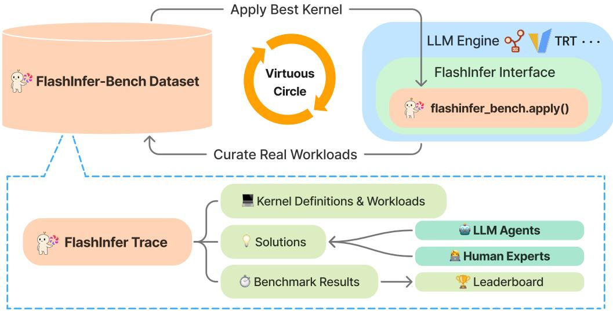
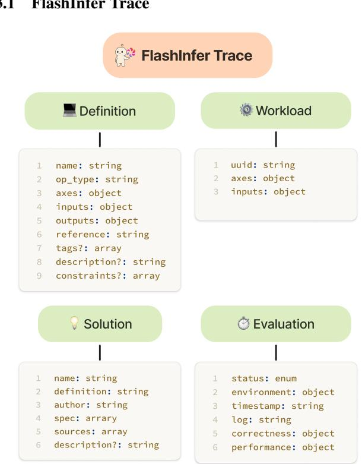
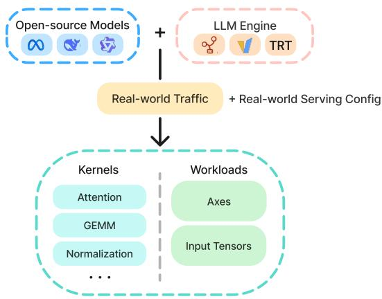
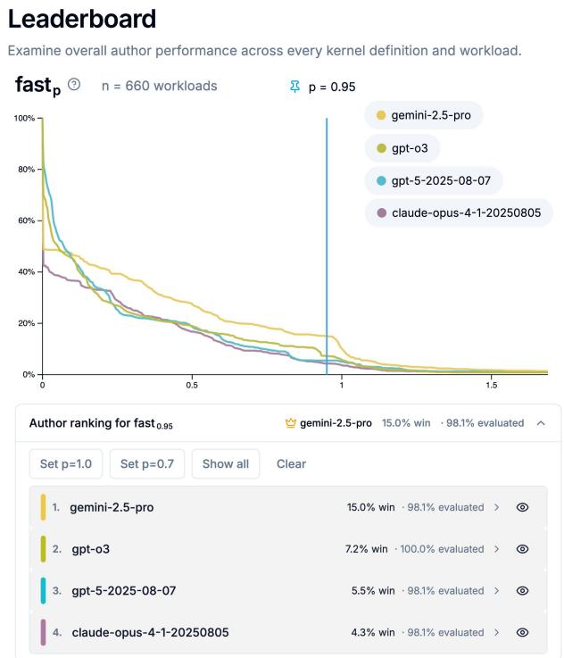
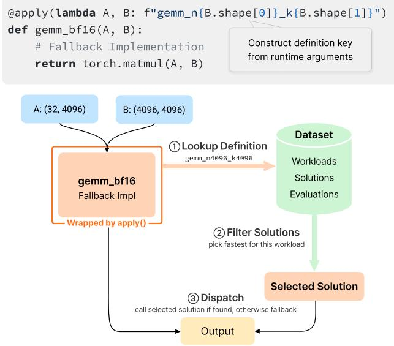
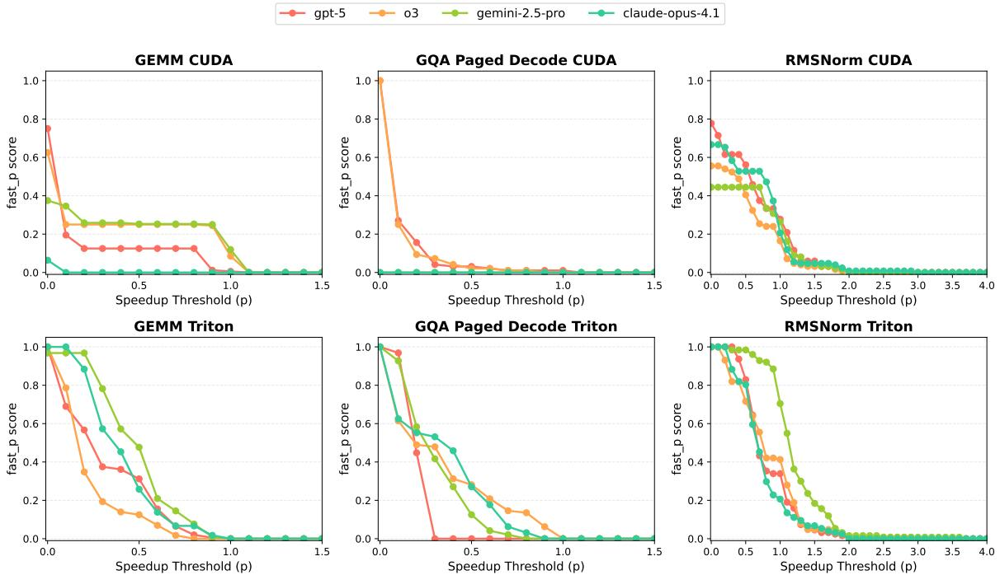
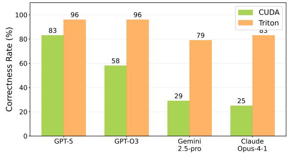
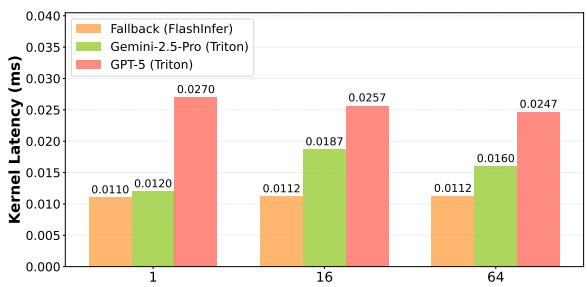
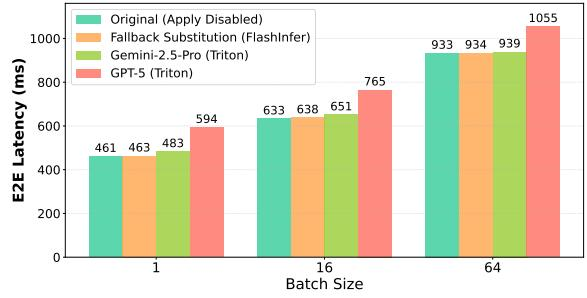

# FLASHINFER-BENCH: BUILDING THE VIRTUOUS CYCLE FOR AI-DRIVEN LLM SYSTEMS

Shanli Xing \* 1 Yiyan Zhai \* 2 Alexander Jiang \* 2 Yixin Dong \* 2 Yong Wu 3 Zihao Ye 3 Charlie Ruan 4   
Yingyi Huang 2 Yineng Zhang 5 Liangsheng Yin 5 Aksara Bayyapu 2 Luis Ceze 1 3 Tianqi Chen 2 3

## ABSTRACT

Recent advances show that large language models (LLMs) can act as autonomous agents capable of generating GPU kernels, but integrating these AI-generated kernels into real-world inference systems remains challenging. FlashInfer-Bench addresses this gap by establishing a standardized, closed-loop framework that connects kernel generation, benchmarking, and deployment. At its core, FlashInfer Trace provides a unified schema describing kernel definitions, workloads, implementations, and evaluations, enabling consistent communication between agents and systems. Built on real serving traces, FlashInfer-Bench includes a curated dataset, a robust correctnessand performance-aware benchmarking framework, a public leaderboard to track LLM agents’ GPU programming capabilities, and a dynamic substitution mechanism (apply()) that seamlessly injects the best-performing kernels into production LLM engines such as SGLang and vLLM. Using FlashInfer-Bench, we further evaluate the performance and limitations of LLM agents, compare the trade-offs among different GPU programming languages, and provide insights for future agent design. FlashInfer-Bench thus establishes a practical, reproducible pathway for continuously improving AI-generated kernels and deploying them into large-scale LLM inference.

## 1 INTRODUCTION

The rapid advancement of Large Language Models (LLMs) has catalyzed a new era of computing, but their widespread deployment is increasingly constrained by the performance and cost of their underlying inference systems (Zheng et al., 2025; Kwon et al., 2023; NVIDIA, 2025; MLC team, 2023- 2025). At the heart of these systems are GPU kernels that execute the core operations like attention, matrix multiplication, and sampling. Optimizing GPU kernels used in LLM inference systems requires deep, expert-level engineering effort.

This paper asks a practical question: how can AI-generated kernels be effectively incorporated into production LLM systems? Recent works(Ouyang et al., 2025; Li et al., 2025; Baronio et al., 2025; Fisches et al., 2025) show early promise that LLMs can produce complex low-level GPU code. However, there are still three fundamental challenges to bridge AI generation to real-world deployments. First, kernels in LLM systems have many dependencies on different characteristics, such as ragged distribution, data precision, which impact their performance. It is important to effectively communicate this information to AI agents. Second, real-world LLM inference traffic may differ from a typical uniform or random setup we pick in a single kernel. We need an effective way to track the kernel performance on real-world LLM inference workloads. Finally, there still can be an integration gap after AI-generating promising kernel candidates, as it can take extra engineering effort to bring them up to end-to-end LLM systems.

To address these challenges, we introduce FlashInfer-Bench, a benchmark and standard operational flow for AI-driven LLM systems (Figure 1). To standardize overall workloads, we introduce FlashInfer-Bench Trace, a self-contained standard JSON schema that describes the kernel task, workloads, the solution, and the final evaluation result. Building on top of the schema, we curate the FlashInfer-Bench Dataset from real-world LLM workloads. We also design a robust kernel benchmark framework on top of the FlashInfer Trace that features runtime isolation to prevent performance-related reward hacking and includes specialized support for evaluating low-bit and non-deterministic sampling kernels. Finally, we built a dynamic kernel substitution mechanism to directly update the FlashInfer kernel library to redirect operators to the optimal kernel provided by FlashInfer-Bench trace in runtime. This approach enables us to directly integrate common LLM-generated kernels into open source LLM engines such as SGLang and vLLM with no code change.

We build a live leaderboard to track the GPU programming capabilities of the frontier models across real-world workloads and LLM workloads. We also did a comprehensive study of the current state of LLM agents on real-world LLM inference systems. Our evaluation and analysis show that: (1) Most correctness errors come from compilation failures; (2) models struggle to exploit hardware-specific details such as architectural specifications or intrinsics; and (3) a language trade-off exists: high-level languages like Triton yield better performance on most tasks, while low-level CUDA provides more potential for specialized optimization.

  
Figure 1. FlashInfer-Bench architecture. FlashInfer Trace provides a standard schema for specifying kernel contracts and semantics, and communicating implementations and evaluation results; FlashInfer-Bench Dataset curates production LLM serving workloads; and flashinfer bench.apply() deploys the fastest validated implementation directly into LLM inference engines.

The main contributions are as follows:

• We proposed FlashInfer Trace for standardizing the description of task, workload, and solution for AIgenerated workloads.

• We curated the FlashInfer-Bench Dataset that serves a rich ground for evaluating AI-generated kernels on real-world workloads.

• We proposed a pragmatic operational workflow to continuously generate and directly apply AI-generated kernels into a real-world production system.

• We provided a comprehensive analysis of how LLMgenerated kernels perform on LLM systems.

The rest of the paper is organized as follows: Section 2 reviews background on LLM inference, GPU kernels, and LLM for GPU kernel generation. Section 3 presents the design of FlashInfer-Bench, including the FlashInfer Trace schema, dataset curation, a robust performance-aware benchmarking framework, and dynamic kernel substitution for production engines. Section 4 details the dataset and comprehensive evaluation of agent-generated kernels, with case studies on GEMM and GQA decode, as well as end-to-end substitution results. Section 5 surveys related work. Section 6 concludes the paper.

## 2 BACKGROUND

## 2.1 LLM Inference Pipeline and GPU Kernels

Modern LLM inference is powered by LLM serving engines, which handle batching, scheduling, and parallelism, and consist of GPU kernel invocations and CPU logic. GPU kernels dominates execution time, so optimizing them translates directly into reduced latency for the LLM engine. Despite model diversity, most models share a small set of GPU kernels, including:

1. GEMM: Inputs and outputs can be bf16 or low-bit (e.g., fp8). It requires the use of tensor core instructions to achieve maximum speed. Low-bit variants require additional quantization/dequantization logic.

2. Attention and its variants: E.g., paged, grouped, radix, and multi-latent attention. Requires tensor cores and needs special optimizations, such as FlashAttention, for its implementation.

3. Fused Mixture-of-Experts (MoE): A fused kernel that handles the MoE routing logic and multiple MLPs corresponding to multiple experts.

4. Sampling and post-processing: E.g. top-p, top-k, temperature. These are non-deterministic operators whose results depend on the input distribution and random numbers.

## 2.2 Approaches to Kernel Optimization

Kernel optimization is highly sensitive to hardware (SM count, memory hierarchy, tensor core generation), numerical format (FP16/BF16/FP8/INT8), and workload shape (sequence/batch lengths, cache layout, sparsity), making universal “one-size-fits-all” kernels elusive. System builders have relied on three families of techniques for kernel optimization:

Kernel libraries and templates. Highly optimized libraries provide strong baselines but often cannot exploit workload-specific structure (e.g., ragged sequences, fused epilogues) without custom kernels (Thakkar et al., 2023).

Search-based auto-scheduling. Systems like template autotuners explore parameterized schedules within a fixed search space to find good tilings, thread/block mappings, and fusion strategies. They are powerful but bounded by the expressiveness of the template, and search costs can be prohibitive when the space must be revisited across hardware or shapes (Chen et al., 2018; Zheng et al., 2020; Shao et al., 2022).

Generative program synthesis. Recent LLMs can write low-level GPU code directly, sometimes discovering novel fusion and dataflow patterns beyond existing templates. This unlocks an enormous design space, but also introduces correctness and security risks without stringent validation; lightweight DSLs such as Triton make custom kernels accessible (Tillet et al., 2019).

FlashInfer-Bench leverages the strengths of the last two: it enables generation to propose structurally new kernels while surrounding it with a rigorous, production-grade evaluation harness to prevent regressions and reward hacking.

## 2.3 LLM for GPU Code Generation

Recent advances show that LLMs can synthesize non-trivial GPU kernels and fused operators when provided with an interface description and a feedback loop. Public evaluations such as KernelBench (Ouyang et al., 2025) primarily assess generation capability—can a model produce a compiling kernel that matches a reference on selected inputs and achieves reasonable speedups? In practice, moving from capability to production demands additional ingredients: a precise task specification (API semantics, supported shapes/dtypes, memory layout constraints), defenses against reward hacking and non-determinism, coverage over realistic workload distributions, and an agile path to deploy or rollback candidates. Lightweight DSLs like Triton (Tillet et al., 2019) make authoring custom kernels accessible to both humans and agents, while FlashInfer-Bench contributes the missing operational scaffolding—FlashInfer Trace for standardized task exchange, a robust validator to ensure safety and correctness, and day-0 dynamic substitution to realize system-level gains without engine rewrites.

## 3 FLASHINFER-BENCH DESIGN

## 3.1 FlashInfer Trace

  
Figure 2. FlashInfer Trace schema design. Definition describes the kernel task. Workload describes the real-world input to the kernel. Solution describes the AI-generated solution. Evaluation describes the evaluation result from benchmarking. Each component also includes auxiliary fields that are useful for grouping and filtering.

To close the loop from kernel generation to evaluation to deployment, we need a standardized language that is readable to both humans and agents. FlashInfer Trace serves as this common language. It articulates a kernel’s semantic contract, implementation, and concrete evaluations. The abstraction is deliberately minimal (e.g., we do not expose implementation-related system metadata in a kernel Definition) yet sufficient (different operators introduce the key axes and constraints they need).

The FlashInfer Trace schema contains four components. An overview is shown in Figure 2. The four components below together form a self-contained Trace object, ensuring portability and reproducibility.

Definition. A JSON specification of the operator’s I/O tensors and dtypes, its dimension axes (could be a static value const or a workload-determined value var), and a plain PyTorch-based reference function run as the single source of mathematical semantics. Optional constraints encode relations among axes.

Workload. A concrete test input bound to a particular kernel Definition. All var axes are assigned integer values, and each input is materialized via one of: recorded safetensors dump, random generation, or a literal scalar value.

Solution. A concrete implementation that satisfies a chosen Definition’s interface and semantics. It provides source files and a callable entry point, alongside compatibility metadata (e.g., targeted GPU architectures and software versions). Extendable language/DSL support is included.

Evaluation. an immutable benchmarking record that precisely binds a specific Definition × Solution × workload, and reports the run state, a correctness and performance summary, and an execution-environment snapshot.

FlashInfer Trace schema natively supports dynamic and static kernel shapes, where each axis can be defined as either a var type (its value determined by the workload) or a const type (its value fixed at compile time). This enables AI to optimize kernels for specific shapes. It also supports ragged inputs, such as the page table used in Attention. To achieve this, both the full-page table tensor and the integer tensor storing index pointers can be provided as inputs, allowing the system to describe ragged tensor inputs precisely. We show concrete examples in Appendix A.

## 3.2 FlashInfer-Bench Dataset

  
Figure 3. FlashInfer-Bench Dataset collection workflow. We serve the major models against real-world traffic with default, common config, and curate the kernel definitions and workloads.

Building upon FlashInfer Trace, we curate the FlashInfer-Bench Dataset, an evolving standard that pairs common serving-kernel Definitions with representative Workloads, continually tracking and collecting targets that both humans and agents can optimize against.

Our objective is real-world relevance with a focus on LLM serving. We cover DeepSeek-V3, Llama-3.1-8B, Qwen3- 30B-A3B across operator families, including GEMM, Attention, Normalization, Sampling, and MoE. Workloads are collected by running these models in SGLang with default, commonly used configurations (e.g., native FP8 quantization and tensor-parallel size of 8 for DeepSeek-V3) and serving them against ShareGPT prompts.

When collecting kernel Definitions, we classify two kernel invocations under the same Definition if and only if they (i) share the same I/O spec and run reference semantics; (ii) expose the same set of axes with identical const/var roles; and (iii) agree on all const-axis values.

We deliberately prefer specific Definitions over permissive ones, ideally down to a specific model layer kernel call, to enable best-effort kernel optimization and unambiguous dispatch. We disallow optional inputs or behavioral flags, and we encode default behavior inside the run reference so it becomes part of the contract. When behavior must diverge, we introduce a new Definition rather than adding runtime switches.

We curate and deduplicate the collected workloads with a performance-aware, diversity-preserving reduction. When input values materially affect kernel performance (e.g., sampling probability distributions) or correctness (e.g., extreme edge cases), we dump full tensors; otherwise, we use seeded random runtime tensors to save storage.

We then deduplicate along performance-sensitive axes (e.g., batch size) and tensor statistics (e.g., average sequence length for attention), trimming the set while preserving diversity and representativeness. In the end, each Definition keeps ∼ 50 workloads for evaluation.

## 3.3 Robust Kernel Benchmark

Targeting robustness and efficiency of the overall kernel evaluation process, we built a benchmarking subsystem that provides rigorous correctness validation and robust, reproducible timing, and runs natively in multi-device environments.

Deterministic Kernels. For operations expected to produce deterministic outputs (e.g., GEMM, normalization, attention, etc.), we directly compare the kernel’s output to the reference output elementwise. A kernel’s output $y _ { \mathrm { s o l } }$ is considered correct if every element satisfies

$$
| y _ { \mathrm { s o l } } - y _ { \mathrm { r e f } } | \le \epsilon _ { \mathrm { a b s } } + \epsilon _ { \mathrm { r e l } } \cdot | y _ { \mathrm { r e f } } |\tag{1}
$$

where $y _ { \mathrm { r e f } }$ is the reference output. We also reject any output containing non-finite values (NaN or Inf). For each kernel, we record the maximum observed error across all tested elements and trials. A deterministic kernel passes the correctness check only if every output element falls under the permitted error bounds,.

Low-Precision Kernels. Kernels that use lower-precision arithmetic (e.g., FP8) introduce systematically larger errors compared to full-precision baselines. Instead of a single loosen global tolerance, we use a matched-ratio rule: a kernel is correct if at least $\rho$ of outputs meet the standard error criteria. For example, with $\rho \ : = \ : 0 . 9 5$ , we require 95% of the output elements to pass the tight error bounds, permitting a small percentage of outlier elements.

Stochastic Kernels. For stochastic operators like sampling, element-wise comparison is invalid since outputs vary per run. Instead, we verify that sampled outputs follow the correct probability distribution. We derive the ground-truth distribution q from input probabilities p using an optional mask M (e.g., top-k or nucleus/top-p), normalize it, and repeatedly execute the kernel to obtain the empirical distribution ˆf. Finally, we compute the total variation distance (TVD) between the empirical and expected distributions and require TVD to be smaller than a chosen threshold τTVD. We use TVD because it directly upper-bounds the worst-case probability error over any event. In addition to the TVD check, we verify that every sample is accepted by the thresholding mask; any mask violation (e.g., sampling an index that should be excluded by the given top-k) results in immediate failure.

Performance Measurement. We maintain a per-GPU, multiprocess-visible device lock. To prevent interference among processes/tasks on the same device, the timing routine runs only after acquiring the device lock. Each kernel performs w untimed warm-up runs followed by m timed runs. We use CUDA event–based device-side timing and report the mean latency over the m measured runs.

Isolation. To minimize cross-solution interference, and the risk of an LLM “hacking” the benchmark (e.g., by reading residual memory to infer reference outputs), we provide a fully isolated benchmarking mode: each solution runs in its own subprocess and is terminated on completion or timeout, with the CUDA context torn down to avoid cross-run state carryover. We also provide a persistent mode with one long-lived worker per GPU and a small spare pool of prewarmed workers, which dramatically reduces subprocess and CUDA context initialization overhead and enables rapid recovery if a solution fails and corrupts a context. Together, these two modes balance the efficiency required for large sweeps with the robustness and safety guarantees of full

isolation.

System Support. As the dataset scales, efficient benchmarking becomes critical for our workflow to timely and sustainably operate. With that efficiency awareness, we build benchmarking a scalable, fault-tolerant multi-device service. For each ready Solution×Workload job, we have a scheduler that builds a cost matrix which accounts for baseline residency and warm compile caches against available device workers. It then assigns micro-batches with the Hungarian algorithm, then updates the cost model online via an exponentially weighted moving average before solving the next batch. The scheduler performs worker health checks and handles failure recovery. Execution defaults to persistent mode; solutions that repeatedly fail are deferred to isolated mode runs. Inputs and reference outputs are materialized on the target device and reused when possible. Compiled solutions are cached in memory and, when necessary, persisted to disk (e.g., CUDA binaries) to prevent redundant builds.

## 3.4 Public Leaderboard and Continuous Evaluation

We host a public leaderboard built on the benchmarking stack of Section 3.3 (see Figure 4). It accepts submissions in the FlashInfer Trace format, evaluates them on real workloads, and reports kernel- and device-stratified metrics including correctness, performance curves versus speedup thresholds, per-workload latency, and end-to-end latency deltas. To ensure citability and reproducibility, we periodically release frozen snapshots with versioned datasets, while the rolling leaderboard reflects the latest evaluations. The service enforces anti-reward-hacking defenses (runtime isolation, hidden workloads, and dedicated validators for deterministic, low-precision, and sampling kernels). We analyze the current snapshot in Section 4.

## 3.5 Dynamic Substitution of Kernels in Production

Prior workflows require manual code changes inside the serving engine to deploy optimized kernels, creating a bottleneck for agent-driven automation and blocking an evaluation–deployment loop. To surface validated, optimized kernels and close this loop, we introduce flashinfer - bench.apply(). It provides zero intrusion, lowoverhead routing that dynamically maps serving requests to the best-performing implementation in the dataset.

Interface and Usage. flashinfer bench.apply () provides two APIs. The decorator API wraps an operator; the wrapped function serves as the fallback. It accepts either a fixed Definition name or a resolver that maps bound runtime arguments to a Definition name. The imperative API allows customized kernel invocation from arbitrary locations; it resolves the best-performing solution for the given inputs and returns the result immediately. We provide first-class integration with FlashInfer, so common ops can be routed by enabling the environment variable FIB ENABLE APPLY=1 without code changes. When flashinfer bench.apply() is globally disabled, calls transparently pass through to the original implementation.

  
Figure 4. FlashInfer-Bench Leaderboard. The top performing models at fast0.95 are gemini-2.5-pro, gpt-o3, and gpt-5-2025-08-07. The top performing models in terms of correctness are gpt-5-2025- 08-07 (83.9% pass), gpt-o3 (71.3% pass), and gemini-2.5-pro (48.8% pass).

Offline Cache Prebuilding. To minimize apply()’s impact on serving performance, we introduce an ahead-of-time (AOT) built index for dynamic dispatch, reducing the online dispatch computation to a few O(1) index lookups.

Before the serving engine starts, the apply() runtime will initialize an index from the local dataset. It first filters traces by a configurable error threshold, then extracts features (e.g. shapes) from workloads in the traces to form a key, and for each key, picks the fastest solution as the index value. Among all the selected solutions, we compile the one that is chosen the most, at a configurable ratio, and ahead-oftime (AOT) compile them into executables. The rest will be compiled just-in-time (JIT) to balance build cost and runtime overhead.

  
Figure 5. Workflow of flashinfer bench.apply(). It is a dynamic dispatcher that retrieves the best Solution with the kernel input at runtime and returns the execution result.

Online Lightweight Dispatch. At runtime, we construct the key from the input arguments of the kernel, perform an O(1) lookup in the index, and find or compile a valid kernel for execution. When CUDA graph is enabled and with proper warmup, the overhead is negligible (see Section 4.5).

## 4 DATASET OVERVIEW AND EVALUATION

## 4.1 Dataset Overview

Our dataset includes eight representative kernel types used in LLM inference: GEMM, Ragged and Paged GQA, Ragged and Paged MLA, Fused MoE, RMS Normalization, and Sampling. These cover the core components of modern LLMs, including fused, non-deterministic, and low-bit kernels (e.g., FP8 GEMM). For each kernel type, when certain dimensions (e.g., hidden dimension) are fixed constants, we treat every unique combination of these parameters as a separate definition, resulting in 41 distinct kernel configurations. For workloads, we collected real input instances on SGLang using input traces and curated a dataset of 1,600 workloads through shape-based deduplication and filtering, covering both short- and long-sequence cases. Solutions were generated under the agent framework (Section 4.2) using frontier models, including Gemini 2.5 Pro, Claude Opus 4.1, GPT-5, and OpenAI o3, in CUDA and Triton. Notably, FlashInfer-Bench also supports additional DSLs such as CUTLASS and CuTe DSL. In total, 240 solutions were evaluated across all workloads, producing 9,600 evaluation results.

## 4.2 Agent Evaluation Settings

Setup. To ensure fair and accurate evaluation across multiple models, we design a feedback-loop agent, as shown in algorithm 1. In each iteration, the agent generates a kernel, evaluates it using FlashInfer-Bench, and refines the design based on the results until reaching the improvement limit. The best kernel produced across all iterations is selected as the final solution for evaluation. Kernel performance is measured on an NVIDIA B200 GPU.

Algorithm 1 Feedback-loop Agent   
Input :Definition, Language, Hardware   
Output : Sol∗ (best solution)   
S ← ∅   
Agent ← CodeAgent.Initialize(Definition, Language, Hardware)   
Sol0 ← Agent.Generate()   
for i ← 0 to N − 1 do   
Tracei ← FlashInfer-Bench.Benchmark(Definition, Soli)   
if Tracei.Status = PASSED then   
S ← S ∪ {(Soli, Tracei)}   
Soli+1 ← Agent.Optimize(Tracei)   
Sol∗ ← arg max(Soli,Tracei)∈S Tracei.Speedup   
return Sol∗

Metrics. We adopt the $\mathrm { f a s t } _ { p }$ metric from Kernel-Bench (Ouyang et al., 2025). For a solution, fastp represents the proportion of workloads on which a kernel runs more than p times faster than the baseline kernel. Formally,

$$
\mathrm { f a s t } _ { p } = \frac { 1 } { N } \sum _ { i = 1 } ^ { N } \mathbf { 1 } ( \mathrm { c o r r e c t } _ { i } \land \{ \mathrm { s p e e d u p } _ { i } > p \} )\tag{2}
$$

By varying $p ,$ we obtain different fastp values, forming a curve whose area under the curve (AUC) represents the overall performance of the kernel. This curve captures both kernel correctness and performance. We choose the stateof-the-art kernel library FlashInfer (Ye et al., 2025) as the comparison baseline. If a corresponding FlashInfer kernel is unavailable (e.g., for bf16 GEMM), we use PyTorch instead. For each model, we further average the $\mathrm { f a s t } _ { p }$ values across all generated solutions to obtain the model’s fas $\mathrm { t } _ { p }$ curve. Notably, when $p = 0 ,$ , the $\mathrm { f a s t } _ { p }$ value represents the correctness rate of the kernels generated by the agent.

## 4.3 Analysis of Agent Capability

The evaluation results are shown in Figure 6. We present $\mathrm { f a s t } _ { p }$ curves for three representative kernels: GEMM, GQA Paged Decoding, and RMSNorm. Results show that LLM performance lags behind humans in most cases: for GEMM (Triton), GQA (CUDA), and GQA (Triton), it achieves less than 50% of SOTA performance on more than half of the workloads. RMSNorm performs close to or above human level since it is memory-bound, reaching speed limits once memory bandwidth saturates, making it easier to optimize. In contrast, GEMM and GQA are compute-bound, requiring techniques like pipelining and tiling to avoid stalls, so harder to optimize. The strong GEMM (CUDA) performance comes from the agent learning to use library kernels, which will be discussed later.

Most correctness errors come from compilation failures. Among all 32 correctness errors, 30 are due to compilation errors, while only 2 are runtime or numerical errors. The numerical errors mainly arise from incorrect padding calculations in dispatched kernels for large input shapes. We categorize the compilation errors into several representative types:

1. API Usage Error. The model may call the correct API but use it incorrectly, which is especially common in Triton generation. For example, the model may attempt to index a constexpr variable, an operation not supported in Triton. We attribute this to the limited amount of Triton-related data during training, which prevents the model from learning correct usage patterns. Occasionally, the model also generates non-existent APIs, such as nv bfloat162 to - float2, though these issues are often resolved after several refinement rounds.

2. Host–Device Confusion. The model sometimes confuses host code with device code. For instance, in a Triton kernel, it may call math.log on the host side instead of tl.log. This likely stems from the model’s limited ability to accurately recognize its current execution context.

3. Datatype Error and Shape Error. The model sometimes generates code with incorrect datatype usage or mismatched tensor shapes. For example, it may use a float input for the reduce add sync function, which only allows integer inputs.

LLMs struggles to correctly apply hardware intrinsics and optimizations. Although we provided hardware information, including specifications and relevant documentation, the model failed to leverage this knowledge to maximize kernel performance, especially on the latest hardware. For example, in the GEMM CUDA task, models relied solely on wmma for optimization but did not correctly utilize more efficient mma or the new tensor instruction tcgen05 available on Blackwell GPUs, leading to suboptimal performance. In the attention task, the model attempted to implement the FlashAttention algorithm in CUDA but only reproduced the online softmax component, without proper use of tiling or tensor cores. These observations suggest that the model’s ability to specialize for specific hardware remains limited.

  
Figure 6. The $\mathrm { f a s t } _ { p }$ metric captures both axes of correctness and performance, defined as the fraction of kernel-workload evaluations that are both correct and achieve a speedup over baseline greater than threshold $p .$

Future work could employ reinforcement learning or similar methods to encourage better exploration of hardware capabilities.

  
Figure 7. Overall correctness of LLM Agents across languages.

GPU programming languages bring trade-off for agent design. GPU programming languages can be roughly divided into two categories: high-level abstractions such as Triton and TVM, which encapsulate low-level hardware details and require only high-level computational logic, and low-level languages such as CUDA and PTX, which demand explicit handling of hardware-specific details. We observe that the model achieves significantly higher correctness (Figure 7) and speed when writing Triton kernels compared to CUDA. We attribute this to several factors. First, Triton code is shorter and less detailed, reducing the demand on the model’s long-context reasoning ability. Second, Triton only requires expressing high-level (tile-level) computation logic, while the compiler automatically determines optimal low-level implementations, enabling the use of advanced hardware features such as tcgen05, which is difficult for agents to exploit in CUDA. However, since CUDA exposes more precise hardware abstractions—such as explicit control over shared memory—it provides a higher performance ceiling. This indicates that improving agents on CUDA offers greater potential for further performance gains.

Agents have learned to call libraries instead of writing raw kernels. For example, in the GEMM CUDA task, we observed that agents based on Gemini-2.5-pro and o3 learned to invoke the cuBLAS library’s matmul kernel in some solutions, achieving performance comparable to or exceeding the baseline. This finding has two implications: first, the model demonstrates the ability to leverage its environment to produce near-human-level CUDA code; second, it suggests that the model relies on library calls rather than truly understanding GPU programming, which could become a bottleneck during training. We recommend restricting library access during training for better skill acquisition, while allowing unrestricted use during inference to maximize kernel performance.

## 4.4 Agent Generated Kernel Case Study

GEMM - Compilers help For this case study, we analyze GPT-5’s generated Triton and CUDA kernels for definition gemm n4096 k4096. The Triton kernel achieves a 4.5× speedup over the CUDA kernel, with a mean execution time of 0.11ms against 0.5ms on tested workloads. Full implementation is provided in the Appendix; see Section B.1 and Section B.2.

The CUDA kernel implements a three-stage tiling strategy with fixed block tiles of 128×256×64 and 8 warps per block. Each warp computes a 64×64 output region using 16 WMMA operations arranged in a 4×4 grid. The implementation manually manages shared memory with skewed padding to avoid bank conflicts and uses vectorized 128- bit loads to maximize memory bandwidth. Overall, the CUDA kernel follows a simple load-sync-compute-sync pattern without inter-tile prefetching or software pipelining, relying primarily on hardware-level intra-tile overlap for compute-memory concurrency.

The Triton kernel implements a similar high-level tiling strategy but leverages Triton’s autotune decorator to evaluate four different tile configurations at runtime and select the optimal one based on the workload’s M dimension. The kernel benefits from the compiler’s built-in software pipelining (configured to depth 4) that overlaps computation with memory prefetching across K-dimension iterations.

The largest performance difference stems from the choice of tensor core primitives. The CUDA kernel uses WMMA instructions, while the Triton kernel automatically targets tcgen05 instructions through its tl.dot() operator. This highlights a critical limitation of CUDA code generation: when new architectures introduce novel intrinsics, these instructions initially lack sufficient training examples in the agent’s corpus, causing agents to default to older, suboptimal patterns. In addition, Triton’s high-level load/store abstractions (tl.load(), tl.store()) alleviate the need for the agent to manage shared memory allocation, bank conflict avoidance, and memory coalescing. This demonstrates that DSLs with appropriate abstractions enable agents to more effectively explore and apply advanced optimization techniques by reducing the cognitive complexity of coordinating multiple optimization strategies.

GQA Paged Decode: Optimization is Difficult The CUDA implementation of GQA paged decode by GPT-5 contains few optimizations, only using online softmax for memory efficiency. Each block processes one batch element and KV head, with scalar FP32 arithmetic for attention computation and basic memory access patterns. It lacks general optimization techniques used among state-of-the-art kernels, such as block-wise tiling to minimize HBM memory traffic, asynchronous execution, and pipelining to overlap

GEMM and softmax operations (Shah et al., 2024). Full implementation is provided in the Section B.4.

We tried explicitly prompting the LLM agent (GPT-5-2025- 08-07 on high reasoning mode) with these attention kernel optimization strategies and instructions for CUDA intrinsics, but the LLM agent failed to generate correct kernels that utilize these optimizations in 10 attempts.

This case study shows that although CUDA exposes finegrained hardware control and enables sophisticated optimizations, pretrained LLMs struggle to leverage these capabilities due to the increased implementation complexity. The agent can recognize high-level optimization strategies when prompted, but cannot correctly coordinate the lowlevel details required for CUDA implementation. Effectively utilizing CUDA’s expressiveness for complex kernels likely requires additional training approaches such as reinforcement learning with high-quality execution feedback or curated datasets of expert kernel implementations.

Summary Overall, the case studies reveal that while LLMs like GPT-5 can generate functionally correct kernels, they struggle to match expert-level performance in low-level GPU optimization. High-level abstraction DSLs allow them to achieve competitive efficiency through compiler support, but direct CUDA generation exposes weaknesses in memory management, tiling, and hardware-specific tuning.

## 4.5 Kernel Substitution in End-to-end Systems

We aim to demonstrate the effectiveness and efficiency of our dynamic kernel substitution mechanism (flashinfer bench.apply()). To do this, we provide multiple implementations of the same kernel definition with different speeds, all generated by the agent and validated by FlashInfer-Bench, and dynamically substitute them into the serving engine. We expect that faster kernels will lead to lower end-to-end request latency, which would validate the effectiveness of kernel substitution. We also extract the original kernel from the serving engine, restrict the dynamic dispatcher so that it can only dispatch to this kernel, and compare the end-to-end latency with and without substitution enabled, allowing us to isolate the overhead of the substitution mechanism itself.

Experimental Setup We evaluate our system using the Fused Add RMSNorm kernel (hidden size 4096) as a representative case, deployed in SGLang serving Llama-3.1- 8B-Instruct. For each configuration, we measure (i) isolated kernel latency from our benchmark traces (Figure 8, top) and (ii) end-to-end request latency across varying batch sizes/concurrency levels (1, 16, 64). We compare four configurations: Original, native SGLang with the FlashInfer backend and apply() enabled; Fallback Substitution, the baseline FlashInfer implementation but substituted by apply(); Gemini-2.5-Pro (Triton), a generated kernel faster than the baseline; and GPT-5 (Triton), a generated kernel slower than the baseline. Each experiment runs with a system warm-up followed by measuring the mean latency over 4 requests with the same input and output length to ensure stable readings.



  
Figure 8. Kernel latency and end-to-end latency comparison. (Top) fused add rmsnorm h4096 for three implementations across batch sizes 1, 16, and 64. (Bottom) End-to-end request latency comparing the original baseline with different kernel substitution mechanisms. All measurements in milliseconds; lower is better.

apply() introduces minimal overhead. Our first experiment isolates the fixed cost of apply() by substituting the native kernel with an identical implementation (Fallback Substitution). Profiling shows apply() introduces 1-2 us overhead for each kernel calling. Comparing the Original and Fallback Substitution configurations in Figure 8 (bottom), we observe that end-to-end overhead is less than 0.8% across all batch sizes.

apply() translates kernel gains into end-to-end latency improvements. Having established minimal overhead, we next show that kernel-level improvements translate into measurable end-to-end gains. The top plot in Figure 8 reports isolated kernel performance: FlashInfer achieves 0.0112 ms at batch size 64, a speedup over Gemini-2.5-Pro Triton kernel (0.0160 ms), while GPT-5 records 0.0247 ms. These benchmark gains carry through to the full system: in the bottom plot, the end-to-end times for FlashInfer Fallback substitution, Gemini-2.5-pro substitution, and GPT-5 substitution with apply() are 934 ms, 939 ms, and 1055 ms, respectively, consistent with the performance of their kernels. This indicates that the efficiency of the kernel is directly translated to the end-to-end efficiency. When we substitute a better kernel, we can achieve better end-to-end efficiency.

## 5 RELATED WORK

## 5.1 LLM for CUDA Generation

LLMs have recently shown remarkable capabilities in generating GPU kernels, with benchmarks such as Kernel-Bench (Ouyang et al., 2025) and TritonBench (Li et al., 2025) systematically evaluating these abilities. These benchmarks are focusing primarily on the evaluation of model capabilities. BackendBench (Saroufim et al., 2025) studied how to use LLMs to generate kernels in PyTorch and integrate the kernel into PyTorch. FlashInfer-Bench, in contrast, focuses on the major workload in LLM systems and provides an end-to-end production system that integrates evaluation, validation, and deployment into a unified framework.

Recent advances have explored training LLMs and designing agents to generate efficient kernels. Kevin (Baronio et al., 2025) and KernelLLM (Fisches et al., 2025) developed post-trained models for kernel generation. Dong et al. (2025) designed an agent for the kernel transpiling task, while Wei et al. (2025) studied agent designs for LLMbased CUDA kernel generation. These agent and model designs are complementary to FlashInfer-Bench, which can further evaluate the performance of these agents and models on kernel tasks from real-world LLM systems.

## 5.2 Machine Learning for Systems Optimization

Machine learning has long been applied to compiler and systems optimization. TVM (Chen et al., 2018) pioneered automatic tensor program optimization, followed by AutoTVM and Ansor (Zheng et al., 2020), which introduced search-based tuning with learned cost models. More recently, Meta-Schedule (Shao et al., 2022) generalized these methods via design-space abstraction and policy learning. These systems operate within a fixed optimization space defined by human-crafted templates.

FlashInfer-Bench adopts a generation-based approach: LLMs directly propose candidate kernels (potentially outside any predefined schedule space), which are then subjected to strict functional validation and performance benchmarking. This expands the effective frontier from searching within a fixed template set to synthesizing new implementation patterns.

## 5.3 Kernel libraries and Custom Kernel DSLs

Highly optimized kernel libraries, such as CUTLASS (Thakkar et al., 2023), cuBLAS (NVI, 2025), and Flash-

Infer (Ye et al., 2025), provide strong baselines for kernels in LLM systems. Domain-specific languages such as Triton (Tillet et al., 2019) lower the barrier to writing custom GPU kernels. FlashInfer-Bench treats these ecosystems as implementation targets for agents, and focuses on connecting candidate kernels to production systems.

Several works specialize in inference workloads. FlashAttention introduced IO-aware exact attention that significantly reduces memory traffic and improves throughput (Dao et al., 2022). Multi-Query Attention reduces the KV cache footprint and improves decoding latency by sharing keys/values across heads (Shazeer, 2019). Serving engines adopt paged KV caches and scheduling policies (e.g., PagedAttention) to maintain high utilization under ragged, multitenant workloads (Kwon et al., 2023). FlashInfer-Bench captures these realities by grounding tasks in real traces (shape distributions, cache layouts) and by evaluating numerical and batching properties that are critical for correct deployment.

## 5.4 LLM Inference Systems

Frameworks such as vLLM (Kwon et al., 2023), SGLang (Zheng et al., 2025), TensorRT-LLM (NVIDIA, 2025), and MLC-LLM (MLC team, 2023-2025) demonstrate scalable inference infrastructure for large models. These systems guide FlashInfer-Bench’s kernel selection– prioritizing modern LLM operations like attention and MoE over legacy operations like convolution—and provide reference implementations. In turn, FlashInfer-Bench enables these frameworks to rapidly evaluate and deploy optimized kernels into production, creating a mutually beneficial ecosystem.

## 6 CONCLUSION

We presented FlashInfer-Bench, a systematic approach that closes the loop from AI kernel generation to production impact. At its core, the FlashInfer Trace schema standardizes operator contracts, real serving workloads, candidate implementations, and immutable evaluations. Built atop this, our benchmark measures deterministic, low-precision, and sampling kernels and, via apply(), can substitute the best validated kernel into engines such as SGLang and vLLM with zero code changes.

Complementing the framework, our live leaderboard continuously tracks frontier models’ GPU programming capabilities over real-world and LLM workloads. Our evaluation led to three practical takeaways: (1) compilation is the dominant failure mode, (2) models struggle to exploit hardware features, and (3) Language choice is a trade-off–Triton yields high correctness and usability, while CUDA, when successful, reaches higher peak performance. End-to-end, dynamic substitution adds negligible overhead and reliably converts kernel-level gains into lower latency and higher throughput in LLM serving.

Limitations and next steps: Our current scope does not yet cover multi-GPU or communication kernels, and the range of supported models, hardware devices, and programming languages remains limited. Future works can further extend the FlashInfer Trace dataset breadth, improve kernel correctness verification to prevent reward hacking and ensure reliable benchmarking outcomes, and develop kernel agents and fine-tuned models for LLM systems based on the FlashInfer-Bench feedback loop.

## ACKNOWLEDGEMENTS

This work is supported in part by Bosch and gifts from NVIDIA and Google, and we also acknowledge the support of DGX B200 from NVIDIA. We would also like to thank, listed alphabetically, Databricks, the FlashInfer team, the GPUMODE team, the HuggingFace team, the SGLang team, the TensorRT-LLM team, the vLLM team, and xAI, as well as Zhuoming Chen, Weihua Du, Bohan Hou, Hongyi Jin, Ruihang Lai, Mark Saroufim, Xinyu Yang, Yilong Zhao, and Haizhong Zheng for their insightful feedback.

## REFERENCES

Baronio, C., Marsella, P., Pan, B., Guo, S., and Alberti, S. Kevin: Multi-turn rl for generating CUDA kernels, 2025. URL https://arxiv.org/abs/2507.11948.

Chen, T., Moreau, T., Jiang, Z., Zheng, L., Yan, E., Cowan, M., Shen, H., Wang, L., Hu, Y., Ceze, L., Guestrin, C., and Krishnamurthy, A. Tvm: An automated end-to-end optimizing compiler for deep learning. In Proceedings of the 13th USENIX Symposium on Operating Systems Design and Implementation (OSDI), Carlsbad, CA, USA, 2018. USENIX Association.

Dao, T., Fu, D. Y., Ermon, S., Rudra, A., and Re, C. Flashat- ´ tention: fast and memory-efficient exact attention with io-awareness. In Proceedings of the 36th International Conference on Neural Information Processing Systems, NIPS ’22, Red Hook, NY, USA, 2022. Curran Associates Inc. ISBN 9781713871088.

Dong, S., Wen, Y., Bi, J., Huang, D., Guo, J., Xu, J., Xu, R., Song, X., Hao, Y., Zhou, X., Chen, T., Guo, Q., and Chen, Y. Qimeng-xpiler: Transcompiling tensor programs for deep learning systems with a neural-symbolic approach, 2025. URL https://arxiv.org/abs/ 2505.02146. Accepted to OSDI 2025.

Fisches, Z. V., Paliskara, S., Guo, S., Zhang, A., Spisak, J., Cummins, C., Leather, H., Synnaeve, G., Isaac-

son, J., Markosyan, A., and Saroufim, M. Kernelllm: Making kernel development more accessible, 6 2025. URL https://huggingface.co/ facebook/KernelLLM. Corresponding authors: Aram Markosyan, Mark Saroufim.

Kwon, W., Li, Z., Zhuang, S., Sheng, Y., Zheng, L., Yu, C. H., Gonzalez, J., Zhang, H., and Stoica, I. Efficient memory management for large language model serving with pagedattention. In Proceedings of the 29th Symposium on Operating Systems Principles, SOSP ’23, pp. 611–626, New York, NY, USA, 2023. Association for Computing Machinery. ISBN 9798400702297. doi: 10.1145/3600006.3613165. URL https://doi. org/10.1145/3600006.3613165.

Li, J., Li, S., Gao, Z., Shi, Q., Li, Y., Wang, Z., Huang, J., Wang, H., Wang, J., Han, X., Liu, Z., and Sun, M. Tritonbench: Benchmarking large language model capabilities for generating triton operators, 2025. URL https://arxiv.org/abs/2502.14752.

MLC team. MLC-LLM, 2023-2025. URL https:// github.com/mlc-ai/mlc-llm.

cuBLAS Library. NVIDIA, October 2025. URL https://docs.nvidia.com/cuda/pdf/ CUBLAS\_Library.pdf. CUDA Toolkit Documentation.

NVIDIA. Tensorrt llm, 2025. URL https://github. com/NVIDIA/TensorRT-LLM. GitHub repository.

Ouyang, A., Guo, S., Arora, S., Zhang, A. L., Hu, W., Re,´ C., and Mirhoseini, A. Kernelbench: Can LLMs write efficient GPU kernels?, 2025. URL https://arxiv. org/abs/2502.10517.

Saroufim, M., Wang, J., Maher, B., Paliskara, S., Wang, L., Sefati, S., and Candales, M. Backendbench: An evaluation suite for testing how well llms and humans can write pytorch backends, 2025. URL https:// github.com/meta-pytorch/BackendBench.

Shah, J., Bikshandi, G., Zhang, Y., Thakkar, V., Ramani, P., and Dao, T. Flashattention-3: Fast and accurate attention with asynchrony and low-precision. In Proceedings of the 38th International Conference on Neural Information Processing Systems, NIPS ’24, Red Hook, NY, USA, 2024. Curran Associates Inc.

Shao, J., Zhou, X., Feng, S., Hou, B., Lai, R., Jin, H., Lin, W., Masuda, M., Yu, C. H., and Chen, T. Tensor program optimization with probabilistic programs, 2022. URL https://arxiv.org/abs/2205.13603.

Shazeer, N. Fast transformer decoding: One write-head is all you need, 2019. URL https://arxiv.org/ abs/1911.02150.

Thakkar, V., Ramani, P., Cecka, C., Shivam, A., Lu, H., Yan, E., Kosaian, J., Hoemmen, M., Wu, H., Kerr, A., Nicely, M., Merrill, D., Blasig, D., Qiao, F., Majcher, P., Springer, P., Hohnerbach, M., Wang, J., and Gupta, M. CUTLASS, January 2023. URL https://github. com/NVIDIA/cutlass.

Tillet, P., Kung, H. T., and Cox, D. Triton: an intermediate language and compiler for tiled neural network computations. In Proceedings of the 3rd ACM SIGPLAN International Workshop on Machine Learning and Programming Languages, MAPL 2019, pp. 10–19, New York, NY, USA, 2019. Association for Computing Machinery. ISBN 9781450367196. doi: 10. 1145/3315508.3329973. URL https://doi.org/ 10.1145/3315508.3329973.

Wei, A., Sun, T., Seenichamy, Y., Song, H., Ouyang, A., Mirhoseini, A., Wang, K., and Aiken, A. Astra: A multi-agent system for gpu kernel performance optimization, 2025. URL https://arxiv.org/abs/2509. 07506.

Ye, Z., Chen, L., Lai, R., Lin, W., Zhang, Y., Wang, S., Chen, T., Kasikci, B., Grover, V., Krishnamurthy, A., and Ceze, L. Flashinfer: Efficient and customizable attention engine for llm inference serving. arXiv preprint arXiv:2501.01005, 2025. URL https:// arxiv.org/abs/2501.01005.

Zheng, L., Jia, C., Sun, M., Wu, Z., Yu, C. H., Haj-Ali, A., Wang, Y., Yang, J., Zhuo, D., Sen, K., Gonzalez, J. E., and Stoica, I. Ansor: generating high-performance tensor programs for deep learning. In Proceedings of the 14th USENIX Conference on Operating Systems Design and Implementation, OSDI’20, USA, 2020. USENIX Association. ISBN 978-1-939133-19-9.

Zheng, L., Yin, L., Xie, Z., Sun, C., Huang, J., Yu, C. H., Cao, S., Kozyrakis, C., Stoica, I., Gonzalez, J. E., Barrett, C., and Sheng, Y. Sglang: efficient execution of structured language model programs. In Proceedings of the 38th International Conference on Neural Information Processing Systems, NIPS ’24, Red Hook, NY, USA, 2025. Curran Associates Inc. ISBN 9798331314385.

## A FLASHINFER TRACE EXAMPLES

This appendix provides concrete examples of the FlashInfer Trace format.

## A.1 GEMM

We start with the trace definition for a general matrix multiplication kernel.

```python
"name": "gemm_n128_k2048",
"description": "GEMM C = A @ B.T. Captured from Qwen 3 30B A3B moe.gate.",
"op_type": "gemm",
"tags": [ 1
"status:verified",
"model:qwen3-30b-a3b"
],
"axes":
"M": { "type": "var" },
"N": { "type": "const", "value": 128 },
"K": { "type": "const", "value": 2048 }
},
"inputs": {
"A": { "shape": ["M", "K"], "dtype": "float16" },
"B": { "shape": ["N", "K"], "dtype": "float16" }
},
"outputs": {
"C": { "shape": ["M", "N"], "dtype": "float16"
},
"reference":
,→ "import torch\n\ndef run(A, B):\n C = torch.matmul(A, B.T)\n return C"
```

A corresponding generated solution object may look as follows:

"name": "claude-opus-4-1-20250805\_triton\_a20c42",   
"definition": "gemm\_n128\_k2048",   
"author": "claude-opus-4-1-20250805",   
"spec":   
"language": "triton",   
"target\_hardware":   
"B200"   
],   
"entry\_point": "main.py::run",   
"dependencies": []   
},   
"sources": [   
{   
"path": "main.py",   
"content": "<source code omitted>"   
}   
"description":   
"claude-opus-4-1-20250805 optimized kernel for gemm\_n128\_k2048 (round 1)"

A sample workload that instantiates this definition is shown below:

```json
{
"definition": "gemm_n128_k2048",
"solution": null,
"workload": {
"uuid": "6ba7c7de-dc5a-48d2-8ada-1382feb5ceac",
"axes": { "M": 6 },
"inputs": {
"A": { "type": "random" },
"B": { "type": "random" }
},
"evaluation": null
}
```

Evaluating the solution on this workload on an NVIDIA B200 GPU yields the following trace record:

"definition": "gemm\_n128\_k2048",   
"workload": {   
"axes": { "M": 6 },   
"inputs": {   
"A": { "type": "random" },   
"B": { "type": "random" }   
},   
"uuid": "6ba7c7de-dc5a-48d2-8ada-1382feb5ceac"   
},   
"solution": "claude-opus-4-1-20250805\_triton\_a20c42",   
"evaluation": {   
"status": "PASSED",   
"environment": {   
"hardware": "NVIDIA B200",   
"libs": {   
"torch": "2.8.0+cu128",   
"triton": "3.4.0",   
"cuda": "12.8"   
}   
},   
"timestamp": "2025-10-16T01:10:32.241021",   
"log": ：   
"correctness": {   
"max\_relative\_error": 0,   
"max\_absolute\_error": 0,   
"extra": null   
},   
"performance": {   
"latency\_ms": 0.023046740692633086,   
"reference\_latency\_ms": 0.025240250456929125,   
"speedup\_factor": 1.0951765715399921

## A.2 Attention

We next present a more complex example based on a paged grouped-query attention decode operator. Compared to the GEMM case, this operator has more complex interfaces and a non-trivial reference implementation.

```csv
"name": "gqa_paged_decode_h32_kv4_d128_ps1",
"description": "Batched Grouped Query Attention decode with a paged KV cache.",
"op_type": "gqa_paged",
"tags":
"stage:decode",
"status:verified",
"model:qwen3-30b-a3b"
],
"axes": {
"batch_size": {
"type": "var",
"description": "Total number of query tokens."
},
"num_qo_heads": {
"type": "const",
"value": 32
},
"num_kv_heads": {
"type": "const",
"value": 4
},
"head_dim": {
"type": "const",
"value": 128
},
"num_pages": {
"type": "var"
},
page _size"
"type": "const",
"value": 1
},
"len_indptr": {
"type": "var",
"description": "Length of kv_indptr array."
},
"num_kv_indices": {
"type": "var",
"description": "Total number of KV page indices."
}
},
"constraints":
"len_indptr == batch_size + 1",
"num_kv_indices == kv_indptr[-1].item()"
]
"inputs": {
"q": {
"shape": ["batch_size", "num_qo_heads", "head_dim"],
"dtype": "bfloat16"
},
"k_cache": {
"shape": ["num_pages", "page_size", "num_kv_heads", "head_dim"],
"dtype": "bfloat16"
},
"v _cache":
"shape": ["num_pages", "page_size", "num_kv_heads", "head_dim"],
"dtype": "bfloat16"
},
```

"kv\_indptr": {   
"shape": ["len\_indptr"],   
"dtype": "int32",   
"description": "KV page offsets for each sequence."   
},   
"kv\_indices": {   
"shape": ["num\_kv\_indices"],   
"dtype": "int32",   
"description": "Page IDs for KV cache lookups."   
},   
"sm\_scale": {   
"shape": null,   
"dtype": "float32",   
"description": "Softmax scale. Default is (1/sqrt(head\_dim))."   
},   
"outputs": {   
"output":   
"shape": ["batch\_size", "num\_qo\_heads", "head\_dim"],   
"dtype": "bfloat16"   
},   
"lse": {   
"shape": ["batch\_size", "num\_qo\_heads"],   
"dtype": "float32",   
"description": "The 2-based log-sum-exp of attention logits."   
}   
},   
"reference": "<reference code shown below>"

The corresponding PyTorch reference implementation is shown below:

```python
import torch
import math
@torch.no_grad()
def run(q, k_cache, v_cache, kv_indptr, kv_indices, sm_scale):
batch_size, num_qo_heads, head_dim = q.shape
_, page_size, num_kv_heads, _ = k_cache.shape
len_indptr = kv_indptr.shape[0]
num_kv_indices = kv_indices.shape[0]
# Check constants
assert num_qo_heads == 32
assert num_kv_heads == 4
assert head_dim == 128
assert page_size == 1
# Check constraints
assert len_indptr == batch_size + 1
assert num_kv_indices == kv_indptr[-1].item()
device = q.device
output = torch.zeros(
(batch_size, num_qo_heads, head_dim), dtype=torch.bfloat16, device=device
)
lse = torch.full(
(batch_size, num_qo_heads), -float("inf"), dtype=torch.float32,
,→ device=device
)
```

gqa\_ratio = num\_qo\_heads // num\_kv\_heads   
k\_cache\_flat = k\_cache.squeeze(1).to(   
torch.float32   
) # [num\_pages, num\_kv\_heads, head\_dim]   
v\_cache\_flat = v\_cache.squeeze(1).to(   
torch.float32   
) # [num\_pages, num\_kv\_heads, head\_dim]   
for b in range(batch\_size):   
page\_start = int(kv\_indptr[b].item())   
page\_end = int(kv\_indptr[b + 1].item())   
if page\_start >= page\_end:   
# No KV cache for this batch element   
output[b].zero\_()   
continue   
# Pages are the token indices for page\_size=1   
token\_indices = kv\_indices[page\_start:page\_end].to(torch.long)   
# Number of tokens is the number of pages for page\_size=1   
num\_tokens = token\_indices.shape[0]   
if num\_tokens == 0:   
output[b].zero\_()   
continue   
# Get Q, K, V for this batch   
k\_batch = k\_cache\_flat[token\_indices] # [num\_tokens, num\_kv\_heads,   
,→ head\_dim]   
v\_batch = v\_cache\_flat[token\_indices] # [num\_tokens, num\_kv\_heads,   
,→ head\_dim]   
q\_batch = q[b].to(torch.float32) # [num\_qo\_heads, head\_dim]   
for h in range(num\_qo\_heads):   
# Find corresponding KV head for GQA   
kv\_head = h // gqa\_ratio   
q\_head = q\_batch[h] # [head\_dim]   
k\_head = k\_batch[:, kv\_head] # [num\_tokens, head\_dim]   
v\_head = v\_batch[:, kv\_head] # [num\_tokens, head\_dim]   
logits = torch.matmul(q\_head, k\_head.T) # [num\_tokens]   
logits\_scaled = logits \* sm\_scale   
# Compute 2-base LSE   
lse[b, h] = torch.logsumexp(logits\_scaled, dim=-1) / math.log(2.0)   
attn = torch.softmax(logits\_scaled, dim=-1) # [num\_tokens]   
out\_head = torch.matmul(attn, v\_head) # [head\_dim]   
output[b, h] = out\_head.to(torch.bfloat16)   
return output, lse

A potential generated Triton solution can be represented as follows:

```jsonl
{
"name": "claude-opus-4-1_triton_de54a2",
"definition": "gqa_paged_decode_h32_kv4_d128_ps1",
"description": "claude-opus-4-1-20250805 optimized kernel (round 5)",
"author": "claude-opus-4-1-20250805",
"spec": ： {
"language": "triton",
"target_hardware":
"B200"
],
"entry_point": "main.py::run",
"dependencies": []
},
"sources": [
{
"path": "main.py",
"content": "<source code omitted>"
}
```

As in the GEMM case, we can capture a concrete workload instance for this definition. In this example, we have a scalar input and some other inputs loaded from a safetensors dump:

```jsonl
{
"definition": "gqa_paged_decode_h32_kv4_d128_ps1",
"solution": null,
"workload": {
"uuid": "0c2489b2-f878-428b-b1bd-d0c6d4c39338",
"axes": · {
"batch_size": 1,
"num_pages": 8,
"len_indptr": 2,
"num_kv_indices": 7
},
"inputs": {
"q": { "type": "random" },
"k_cache": { "type": "random" },
"v_cache": { "type": "random" },
"kv_indptr": {
"type": "safetensors",
"path": "/path/to/safetensor",
"tensor_key": "kv_indptr"
},
"kv_indices": {
"type": "safetensors",
"path": "/path/to/safetensor",
"tensor_key": "kv_indices"
"sm_scale": {
"type": "scalar",
"value": 0.0883883461356163
},
"evaluation": null
}
```

Evaluating the above solution on this workload produces the following trace record:

{   
"definition": "gqa\_paged\_decode\_h32\_kv4\_d128\_ps1",   
"workload": {   
"axes": {   
"batch\_size": 1,   
"num\_pages": 8,   
"len\_indptr": 2,   
"num\_kv\_indices": 7   
},   
"inputs": {   
"q": { "type": "random" },   
"k\_cache": { "type": "random" },   
"v\_cache": { "type": "random" },   
"kv\_indptr":   
"type": "safetensors",   
"path": "/path/to/safetensor",   
"tensor\_key": "kv\_indptr"   
},   
"kv\_indices": {   
"type": "safetensors",   
"path": "/path/to/safetensor",   
"tensor\_key": "kv\_indices"   
},   
"sm\_scale": {   
"type": "scalar",   
"value": 0.0883883461356163   
"uuid": "0c2489b2-f878-428b-b1bd-d0c6d4c39338"   
},   
"solution": "claude-opus-4-1\_triton\_de54a2",   
"evaluation": {   
"status": "PASSED",   
"environment":   
"hardware": "NVIDIA B200",   
"libs": {   
"torch": "2.8.0+cu128",   
"triton": "3.4.0",   
"cuda": "12.8"   
}   
},   
"timestamp": "2025-10-16T01:24:16.694452",   
"log": "",   
"correctness": {   
"max\_relative\_error": 0.01480561401695013,   
"max\_absolute\_error": 0.00048828125,   
"extra": null   
},   
"performance": {   
"latency\_ms": 0.02266162589486805,   
"reference\_latency\_ms": 29.439284915015815,   
"speedup\_factor": 1299.0808802329861

## B AGENT-GENERATED KERNELS

This appendix contains the full source code for the agent-generated kernels discussed in the case studies.

## B.1 Triton GEMM Kernel

• Language — Triton.

• Source — Generated by GPT-5 from the gemm n4096 k4096 definition.

• Correctness — Correct across all evaluated workloads.

• Performance (vs. baseline torch.nn.functional) — Speedup is 0.2× across all workload, with a best case of 0.6× on one workload.

• Throughput (TFLOPs) — For a problem (M, N=4096, K=4096) with wall-clock time t seconds,

2MNK   
TFLOPs =   
t · 1012

```python
import math
import torch
import triton
import triton.language as tl
@triton.autotune(
configs=[
triton.Config({'BLOCK_M': 128, 'BLOCK_N': 128, 'BLOCK_K': 64}, num_warps=8,
,→ num_stages=4),
triton.Config({'BLOCK_M': 64, 'BLOCK_N': 256, 'BLOCK_K': 64}, num_warps=8,
,→ num_stages=4),
triton.Config({'BLOCK_M': 256, 'BLOCK_N': 64, 'BLOCK_K': 64}, num_warps=8,
,→ num_stages=4),
triton.Config({'BLOCK_M': 128, 'BLOCK_N': 128, 'BLOCK_K': 128}, num_warps=8,
,→ num_stages=4),
],
key=['M'],
)
@triton.jit
def _gemm_n4096_k4096_kernel(
A_ptr, B_ptr, C_ptr,
M, N, K,
stride_am, stride_ak,
stride_bn, stride_bk,
stride_cm, stride_cn,
BLOCK_M: tl.constexpr, BLOCK_N: tl.constexpr, BLOCK_K: tl.constexpr,
):
tl.static_assert(BLOCK_K % 16 == 0,
,→ "BLOCK_K must be a multiple of 16 for tensor cores")
pid_m = tl.program_id(0)
pid_n = tl.program_id(1)
offs_m = pid_m * BLOCK_M + tl.arange(0, BLOCK_M)
offs_n = pid_n * BLOCK_N + tl.arange(0, BLOCK_N)
acc = tl.zeros((BLOCK_M, BLOCK_N), dtype=tl.float32)
M_mask = offs_m[:, None] < M
N_mask = offs_n[None, :] < N
for k0 in range(0, K, BLOCK_K):
offs_k = k0 + tl.arange(0, BLOCK_K)
# Pointers
a_ptrs = A_ptr + (offs_m[:, None] * stride_am + offs_k[None, :] * stride_ak)
```

FlashInfer-Bench: Building the Virtuous Cycle for AI-driven LLM Systems

```python
b_ptrs = B_ptr + (offs_n[:, None] * stride_bn + offs_k[None, :] * stride_bk)
a = tl.load(a_ptrs, mask=M_mask & (offs_k[None, :] < K), other=0.0)
b = tl.load(b_ptrs, mask=(offs_n[:, None] < N) & (offs_k[None, :] < K),
,→ other=0.0)
acc += tl.dot(a, tl.trans(b))
c_ptrs = C_ptr + (offs_m[:, None] * stride_cm + offs_n[None, :] * stride_cn)
tl.store(c_ptrs, acc.to(tl.float16), mask=M_mask & N_mask)
def run(A, B, **kwargs):
"""
Compute C = A @ B.T where:
- A: [M, 4096] float16
- B: [4096, 4096] float16
Returns C: [M, 4096] float16
"""
if not isinstance(A, torch.Tensor) or not isinstance(B, torch.Tensor):
raise TypeError("A and B must be torch.Tensor")
if A.ndim != 2 or B.ndim != 2:
raise
,→ ValueError(f"Expected 2D tensors, got A.ndim={A.ndim}, B.ndim={B.ndim}")
M, K_a = A.shape
N_b, K_b = B.shape
if K_a != 4096 or K_b != 4096 or N_b != 4096:
raise ValueError(f"Invalid shapes: A is {A.shape}, B is {B.shape} ⌋
,→ ; expected A: [M,4096], B: [4096,4096]")
# Dtype checks/conversions
if A.dtype != torch.float16:
A = A.to(torch.float16)
if B.dtype != torch.float16:
B = B.to(torch.float16)
# Device management
orig_dev_A = A.device
orig_dev_B = B.device
any_cuda_input = (A.is_cuda or B.is_cuda)
if not torch.cuda.is_available():
if any_cuda_input:
raise RuntimeError( ⌋
,→ "CUDA is not available but one or more inputs are CUDA tensors.")
# Triton requires CUDA; no CPU fallback provided
raise RuntimeError("No CUDA device is available.")
# Choose compute device
if A.is_cuda:
compute_device = A.device
elif B.is_cuda:
compute_device = B.device
else:
compute_device = torch.device(f"cuda:{torch.cuda.current_device()}")
# Move to compute device and make contiguous for optimal access
A_dev = A.to(device=compute_device, non_blocking=True).contiguous()
B_dev = B.to(device=compute_device, non_blocking=True).contiguous()
```

```python
# Allocate output on compute device
N = 4096
K = 4096
C_dev = torch.empty((M, N), dtype=torch.float16, device=compute_device)
# Kernel launch parameters
def grid(meta):
return (triton.cdiv(M, meta['BLOCK_M']), triton.cdiv(N, meta['BLOCK_N']))
# Call kernel
_gemm_n4096_k4096_kernel[grid](
A_dev, B_dev, C_dev,
M, N, K,
A_dev.stride(0), A_dev.stride(1),
B_dev.stride(0), B_dev.stride(1),
C_dev.stride(0), C_dev.stride(1),
)
# Decide output device: preserve original locations; if both were CPU, return
,→ CPU; otherwise prefer A's device if CUDA, else B's
if orig_dev_A.type == 'cpu' and orig_dev_B.type = 'cpu':
out_device = torch.device('cpu')
elif orig_dev_A.type == 'cuda':
out_device = orig_dev_A
elif orig_dev_B.type == 'cuda':
out_device = orig_dev_B
else:
out_device = torch.device('cpu')
C_out = C_dev if C_dev.device == out_device else C_dev.to(out_device,
,→ non_blocking=True)
return C_out
```

## B.2 CUDA GEMM Kernel

• Language — CUDA.

• Source — Auto-generated by Gemini-2.5-Pro for the gemm n4096 k4096 definition.

• Implementation method — Invokes cuBLAS matmul.

• Correctness — Correct across all evaluated workloads.

• Performance (vs. baseline torch.nn.functional) — Speedup is 0.97× across all workload, with a best case of 1.03× on one workload.

## kernel.h:

```c
#pragma once
// Include guard
#ifndef GEMM_N4096_K4096_KERNEL_H
#define GEMM_N4096_K4096_KERNEL_H
#include <cuda_fp16.h>
#include <cuda_runtime.h>
/**
* @brief Host-side launcher for the GEMM operation C = A * B.T.
*
* This function launches a cuBLAS-based GEMM kernel optimized for
* B200-class GPUs with N=4096 and K=4096. It computes C = A * B.T
* where A is [M, K], B is [N, K], and C is [M, N]. All tensors are
* expected to have row-major layout.
* @param M The variable dimension of matrix A and C.
* @param A Pointer to the input matrix A [M, 4096] in device memory (dtype=half).
* @param B Pointer to the input matrix B [4096, 4096] in device memory
,→ (dtype=half).
* @param C Pointer to the output matrix C [M, 4096] in device memory (dtype=half).
* @param stream The CUDA stream for kernel execution.
*/
void gemm_n4096_k4096_launcher(
int M,
const half* A,
const half* B,
half* C,
cudaStream_t stream
);
#endif // GEMM_N4096_K4096_KERNEL_H
```

## kernel.cu:

```cpp
#include "kernel.h"
#include <cublas_v2.h>
#include <cuda_fp16.h>
#include <stdexcept>
#include <string>
// Helper for checking cuBLAS status and converting it to a descriptive error
#define CUBLAS_CHECK(status)
do {
cublasStatus_t err = (status);
if (err != CUBLAS_STATUS_SUCCESS)
throw std::runtime_error("cuBLAS error: " + std::to_string(err)
+ " at " _FILE__ ":" + std::to_string(__LINE__)); \
```

```c
\
while (0)
// Manages a singleton cuBLAS handle for efficiency.
// This avoids the overhead of creating/destroying the handle on every call.
cublasHandle_t get_cublas_handle() {
static struct CublasHandle {
cublasHandle_t handle;
CublasHandle() {
CUBLAS_CHECK(cublasCreate(&handle));
// Enable Tensor Core operations for peak performance on B200
CUBLAS_CHECK(cublasSetMathMode(handle, CUBLAS_TENSOR_OP_MATH));
}
˜CublasHandle() {
if (handle) cublasDestroy(handle);
}
} singleton_handle;
return singleton_handle.handle;
}
/**
* @brief Host-side launcher implementation using cuBLAS.
*/
void gemm_n4096_k4096_launcher(
int M,
const half* A,
const half* B,
half* C,
cudaStream_t stream
) {
cublasHandle_t handle = get_cublas_handle();
CUBLAS_CHECK(cublasSetStream(handle, stream));
const int N = 4096;
const int K = 4096;
const float alpha = 1.0f;
const float beta = 0.0f;
// The key to using cuBLAS (column-major) with row-major PyTorch tensors is
// to rephrase the operation in a way that cuBLAS understands and that results
// in the correct memory layout for the output.
//
// 1. Goal (Row-Major): C_rm[M, N] = A_rm[M, K] * B_rm.T[K, N]
//
// 2. cuBLAS View (Column-Major): cuBLAS interprets the memory of a row-major
// matrix X_rm[rows, cols] as a column-major matrix X_cm[cols, rows].
// A_rm[M, K] is seen as A_cm[K, M].
// B_rm[N, K] is seen as B_cm[K, N].
// C_rm[M, N] is seen as C_cm[N, M].
//
// 3. Transformation: The equation C_rm = A_rm * B_rm.T is equivalent to
// C_cm.T = A_cm.T * (B_cm.T).T => C_cm.T = A_cm.T * B_cm.
// Taking the transpose of the whole equation gives us what cuBLAS should
,→ compute:
// C_cm = (A_cm.T * B_cm).T = B_cm.T * A_cm.
//
// 4. cuBLAS Call: We ask cuBLAS to compute D = op1 * op2, where the result D
// is written into the memory of C.
// - op1 = B_cm.T. This means the first matrix is B, and transa=CUBLAS_OP_T.
// op2 = A_cm. This means the second matrix is A, and transb=CUBLAS_OP_N.
//
// 5. Dimensions for cuBLAS:
```

// - m = rows of op1 (B.T) = N   
// - n = cols of op2 (A) = M   
// - k = common dimension = K   
// The output matrix will be [m, n] = [N, M] in column-major layout, which   
// perfectly matches the memory layout of our desired row-major C\_rm[M, N].   
// This resolves the illegal memory access and ensures correctness.   
const int lda = K; // Leading dimension of A\_rm[M, K] is K   
const int ldb = K; // Leading dimension of B\_rm[N, K] is K   
const int ldc = N; // Leading dimension of C\_rm[M, N] is N   
CUBLAS\_CHECK(cublasGemmEx(   
handle,   
CUBLAS\_OP\_T, // transa: Corresponds to first matrix (B), transposed   
CUBLAS\_OP\_N, // transb: Corresponds to second matrix (A), not   
,→ transposed   
N, // m: rows of op(B.T)   
M, // n: columns of op(A)   
K, // k: common dimension   
&alpha, // alpha   
B, // Pointer to the first matrix (B)   
CUDA\_R\_16F, // Btype   
ldb, // ldb (leading dimension of B)   
A, // Pointer to the second matrix (A)   
CUDA\_R\_16F, // Atype   
lda, // lda (leading dimension of A)   
&beta, // beta   
C, // Pointer to C   
CUDA\_R\_16F, // Ctype   
ldc, // ldc (leading dimension of C)   
CUDA\_R\_32F, // computeType: Use FP32 accumulators for precision   
CUBLAS\_GEMM\_DEFAULT\_TENSOR\_OP // algorithm: Use default heuristic for Tensor   
,→ Cores   
));   
}

main.cpp:

```cpp
#include <torch/extension.h>
#include <c10/cuda/CUDAStream.h>
#include "kernel.h"
#include <stdexcept>
#include <string>
// Helper macros for concise tensor validation
#define CHECK_CUDA(x) TORCH_CHECK(x.is_cuda(), #x " must be a CUDA tensor")
#define CHECK_CONTIGUOUS(x) TORCH_CHECK(x.is_contiguous(), #x " must be contiguous")
#define CHECK_HALF(x) TORCH_CHECK(x.scalar_type() == torch::kFloat16, #x " must be a
,→ float16 tensor")
/**
* @brief PyTorch extension entry point for the GEMM operation.
*
* This function validates input tensors and calls the CUDA kernel launcher
* to perform the computation C = A * B.T on the GPU.
*
* @param A A torch::Tensor of shape [M, 4096] and dtype float16.
* @param B A torch::Tensor of shape [4096, 4096] and dtype float16.
* @return A torch::Tensor C of shape [M, 4096] and dtype float16 containing the
,→ result.
*/
```

```cpp
torch::Tensor run(torch::Tensor A, torch::Tensor B) {
// Input Validation
CHECK_CUDA(A);
CHECK_CUDA(B);
CHECK_CONTIGUOUS(A);
CHECK_CONTIGUOUS(B);
CHECK_HALF(A);
CHECK_HALF(B);
TORCH_CHECK(A.dim() == 2, "A must be a 2D tensor");
TORCH_CHECK(B.dim() == 2, "B must be a 2D tensor");
// Dimension Checks
const int M = A.size(0);
const int K_A = A.size(1);
const int N_B = B.size(0);
const int K_B = B.size(1);
const int N_spec = 4096;
const int K_spec = 4096;
TORCH_CHECK(K_A == K_spec, "A must have shape [M, 4096], but K is ", K_A);
TORCH_CHECK(N_B == N_spec, "B must have shape [4096, 4096], but N is ", N_B);
TORCH_CHECK(K_B == K_spec, "B must have shape [4096, 4096], but K is ", K_B);
TORCH_CHECK(A.device() == B.device(),
,→ "Tensors must be on the same CUDA device");
// Output Tensor Allocation
auto C_options = torch::TensorOptions()
.device(A.device())
.dtype(A.scalar_type());
auto C = torch::empty({M, N_spec}, C_options);
// --- Kernel Execution
try {
// Get the current CUDA stream from PyTorch's context to ensure proper
,→ synchronization
cudaStream_t stream = at::cuda::getCurrentCUDAStream();
// Get raw data pointers. at::Half is compatible with cuda_fp16.h::half
const half* A_ptr = reinterpret_cast<const half*>(A.data_ptr<at::Half>());
const half* B_ptr = reinterpret_cast<const half*>(B.data_ptr<at::Half>());
half* C_ptr = reinterpret_cast<half*>(C.data_ptr<at::Half>());
// Launch the cuBLAS-based kernel
gemm_n4096_k4096_launcher(M, A_ptr, B_ptr, C_ptr, stream);
} catch (const std::exception& e) {
// Propagate exceptions from the CUDA/cuBLAS calls to Python
throw std::runtime_error(std::string("CUDA kernel execution failed: ") +
,→ e.what());
}
// Check for any asynchronous errors from the kernel launch. This is good
,→ practice.
cudaError_t err = cudaGetLastError();
if (err != cudaSuccess) {
throw std::runtime_error(std::string("CUDA asynchronous error: ") +
,→ cudaGetErrorString(err));
}
return C;
```

## FlashInfer-Bench: Building the Virtuous Cycle for AI-driven LLM Systems

```javascript
// Pybind11 module definition to expose the 'run' function to Python
PYBIND11_MODULE(TORCH_EXTENSION_NAME, m) {
m.def("run", &run,
,→ "GEMM (A * B.T) for N=4096, K=4096 using a B200-optimized cuBLAS kernel");
}
```

## B.3 Triton GQA Paged Decode Attention

• Language — Triton.

• Source — Generated by GPT-o3 from the gqa paged decode h32 kv8 d128 ps1 spec.

• Correctness — Correct on all evaluated workloads.

• Performance (vs. baseline (FlashInfer)) — Speedup is 0.19× across all workload, with a best case of 0.98× on 3 workload.

• Throughput (FLOPs/TFLOPs) — Under grouped-query attention (group size $H _ { q } / H _ { k v } )$ , the dominant arithmetic for a decode step comprises the $Q K ^ { \top }$ dot products and the attention–V product (softmax omitted as lower-order). Given wall-clock time t seconds for the step,

FLOPsstep 4 Hq d num kv indices   
TFLOPs =   
t · 1012 t · 1012

```python
import math
import torch
import triton
import triton.language as tl
@triton.jit
def gqa_paged_decode_kernel(
q_ptr, # *bf16 [B, 32, 128]
k_ptr, # *bf16 [N_pages, 8, 128] (page_size squeezed)
v_ptr, # *bf16 [N_pages, 8, 128] (page_size squeezed)
kv_indptr_ptr, # *int32 [B + 1]
kv_indices_ptr, # *int32 [num_kv_indices]
sm_scale, # fp32 scalar
out_ptr, # *bf16 [B, 32, 128]
lse_ptr, # *fp32 [B, 32]
BLOCK_T: tl.constexpr,
HEAD_DIM: tl.constexpr,
NUM_QO_HEADS: tl.constexpr,
NUM_KV_HEADS: tl.constexpr,
):
pid = tl.program_id(0)
batch_idx = pid // NUM_QO_HEADS
qo_head = pid % NUM_QO_HEADS
gqa_ratio = NUM_QO_HEADS // NUM_KV_HEADS
kv_head = qo_head // gqa_ratio
# strides (in elements, not bytes)
stride_q_batch = NUM_QO_HEADS * HEAD_DIM
stride_q_head = HEAD_DIM
stride_k_page = NUM_KV_HEADS * HEAD_DIM # page_size = 1
stride_k_kv_head = HEAD_DIM
stride_v_page = stride_k_page
stride_v_kv_head = HEAD_DIM
# load query vector
d_offs = tl.arange(0, HEAD_DIM)
q_ptr_head = q_ptr + batch_idx * stride_q_batch + qo_head * stride_q_head +
,→ d_offs
q_vec = tl.cast(tl.load(q_ptr_head), tl.float32)
# -- - sequence token range
start = tl.load(kv_indptr_ptr + batch_idx)
end = tl.load(kv_indptr_ptr + batch_idx + 1)
```

```python
num_tokens = end - start
# streaming softmax vars
m_val = tl.full([], -1e30, tl.float32) # running max
d_val = tl.zeros([], tl.float32) # running sum exp
o_vec = tl.zeros([HEAD_DIM], tl.float32) # running output vector
offset = tl.zeros([], tl.int32)
while offset < num_tokens:
t_offs = tl.arange(0, BLOCK_T)
remain = num_tokens - offset
tok_mask = t_offs < remain
# load page indices
pages = tl.load(kv_indices_ptr + start + offset + t_offs,
mask=tok_mask, other=0)
# gather K / V
k_ptrs = k_ptr + pages[:, None] * stride_k_page + kv_head * stride_k_kv_head
,→ + d_offs[None, :]
v_ptrs = v_ptr + pages[:, None] * stride_v_page + kv_head * stride_v_kv_head
,→ + d_offs[None, :]
k_block = tl.cast(tl.load(k_ptrs, mask=tok_mask[:, None], other=0),
,→ tl.float32)
v_block = tl.cast(tl.load(v_ptrs, mask=tok_mask[:, None], other=0),
,→ tl.float32)
# logits
logits = tl.sum(k_block * q_vec[None, :], axis=1) * sm_scale
logits = tl.where(tok_mask, logits, -1e30)
# block softmax
m_block = tl.max(logits, axis=0)
exp_logits = tl.exp(logits - m_block)
sum_exp_block = tl.sum(exp_logits, axis=0)
weighted_v = tl.sum(exp_logits[:, None] * v_block, axis=0)
# merge with running values
new_m = tl.maximum(m_val, m_block)
alpha_prev = tl.exp(m_val - new_m)
alpha_blk = tl.exp(m_block - new_m)
o_vec = o_vec * alpha_prev + weighted_v * alpha_blk
d_val = d_val * alpha_prev + sum_exp_block * alpha_blk
m_val = new_m
offset += BLOCK_T
inv_d = tl.where(d_val == 0, 0.0, 1.0 / d_val)
out_vec = o_vec * inv_d
log2e = 1.4426950408889634
lse_val = tl.where(d_val == 0,
-1e30,
(tl.log(d_val) + m_val) * log2e)
# - store
out_ptr_head = out_ptr + batch_idx * stride_q_batch + qo_head * stride_q_head +
,→ d_offs
tl.store(out_ptr_head, tl.cast(out_vec, tl.bfloat16))
lse_ptr_head = lse_ptr + batch_idx * NUM_QO_HEADS + qo_head
```

```python
tl.store(lse_ptr_head, lse_val)
def run(q,
k_cache,
v_cache,
kv_indptr,
kv_indices,
sm_scale: float None = None):
"""
Entry point for gqa_paged_decode_h32_kv8_d128_ps1.
Returns (output, lse).
"""
if sm_scale is None:
sm_scale = 1.0 / math.sqrt(128.0)
if not torch.cuda.is_available():
raise RuntimeError("CUDA device is required to run Triton kernels.")
# move tensors to GPU if necessary
tensors = [q, k_cache, v_cache, kv_indptr, kv_indices]
device_tensors = [t.cuda() if not t.is_cuda else t for t in tensors]
q_dev, k_dev, v_dev, iptr_dev, idx_dev = [t.contiguous() for t in
,→ device_tensors]
batch_size = q_dev.shape[0]
num_qo_heads = 32
head_dim = 128
# squeeze page dimension (=1)
k_dev_flat = k_dev.squeeze(1).contiguous()
v_dev_flat = v_dev.squeeze(1).contiguous()
out_dev = torch.empty((batch_size, num_qo_heads, head_dim),
dtype=torch.bfloat16,
device=q_dev.device)
lse_dev = torch.empty((batch_size, num_qo_heads),
dtype=torch.float32,
device=q_dev.device)
# launch kernel
BLOCK_T = 128
grid = (batch_size * num_qo_heads,)
gqa_paged_decode_kernel[grid](
q_dev, k_dev_flat, v_dev_flat,
iptr_dev, idx_dev,
sm_scale,
out_dev, lse_dev,
BLOCK_T=BLOCK_T,
HEAD_DIM=128,
NUM_QO_HEADS=32,
NUM_KV_HEADS=8,
num_warps=4,
num_stages=4,
)
# move back to original device if needed
if not q.is_cuda:
return out_dev.cpu(), lse_dev.cpu()
return out_dev, lse_dev
```

## B.4 CUDA GQA Paged Decode Attention

• Language — CUDA.

• Source — Generated by GPT-5 from the gqa paged decode h32 kv8 d128 ps1 spec.

• Implementation method — It uses a straightforward implementation with 4 warps per block, processing one batch element and one KV head per block. The kernel implements streaming softmax with scalar FP32 operations.

• Correctness — Correct across all evaluated workloads.

• Performance (vs. baseline (FlashInfer) — Speedup is 0.02× across all workload, with a best case of 1.02× on one workload with batch size 1.

```c
#include "kernel.h"
#include <ATen/cuda/CUDAContext.h>
#include <cuda_bf16.h>
#include <cuda_runtime.h>
#include <math_constants.h>
#include <cmath>
#include <limits>
#include <cstdio>
// Error checking macro
#ifndef CUDA_CHECK
#define CUDA_CHECK(expr) do {
cudaError_t __err = (expr);
if (__err != cudaSuccess) {
printf("CUDA Error %s at %s:%d\n", cudaGetErrorString(__err),
_FILE__, __LINE__);
} while (0)
#endif
// Warp utilities
static inline _device_ _ float warp_reduce_sum(float val) {
unsigned mask = 0xffffffffu;
val += _shfl_down_sync(mask, val, 16);
val += _shfl_down_sync(mask, val, 8);
val += _shfl_down_sync(mask, val, 4);
val += _shfl_down_sync(mask, val, 2);
val += _shfl_down_sync(mask, val, 1);
return val;
}
static inline _device__ float warp_broadcast(float val, int src_lane) {
unsigned mask = 0xffffffffu;
return __shfl_sync(mask, val, src_lane);
}
// Load 4 BF16s as 4 floats (contiguous) from ptr[offset .. offset+3]
static inline _device_ void load_bf16x4_to_f32(
const _nv_bfloat16* _restrict__ ptr,
int offset,
float out[4]) {
out[0] = _bfloat162float(ptr[offset + 0]);
out[1] = _bfloat162float(ptr[offset + 1]);
out[2] = _bfloat162float(ptr[offset + 2]);
out[3] = _bfloat162float(ptr[offset + 3]);
}
// Store 4 floats as BF16s to ptr[offset .. offset+3]
static inline __device__ void store_f32x4_to_bf16(
_nv_bfloat16* _restrict_ _ ptr,
int offset,
```

```lisp
const float in[4]) {
ptr[offset + 0] = _float2bfloat16(in[0]);
ptr[offset + 1] = float2bfloat16(in[1]);
ptr[offset + 2] = float2bfloat16(in[2]);
ptr[offset + 3] = _float2bfloat16(in[3]);
}
template <int kBlockThreads>
launch_bounds__(kBlockThreads, 2)
_global void gqa_paged_decode_h32_kv8_d128_ps1_kernel(
const _nv_bfloat16* _restrict__ q, // [B, 32, 128]
const __nv_bfloat16* _restrict k_cache, // [num_pages, 1, 8, 128] -> flat
,→ [num_pages*8, 128]
const __nv_bfloat16* __restrict__ v_cache, // [num_pages, 1, 8, 128] -> flat
,→ [num_pages*8, 128]
const int32_t* _restrict _ kv_indptr, // [B+1]
const int32_t* _restrict__ kv_indices, // [num_kv_indices]
float sm_scale,
_nv_bfloat16* _restrict out, // [B, 32, 128]
float* _restrict lse_out, // [B, 32]
int num_batches,
int num_pages_total
) {
// Block mapping:
// grid.x = batch index
// grid.y = kv_head index in [0, 8)
const int b = blockIdx.x;
const int kv_head = blockIdx.y; // 0..7
if (b >= num_batches || kv_head >= kNumKVHeads) {
return;
}
// Thread mapping:
const int tid = threadIdx.x; // 0..127
const int warp_id = tid >> 5; // 0..3 (4 warps per block)
const int lane_id = tid & 31; // 0..31
// The 4 query heads attached to this KV head
const int q_head = kv_head * kGQARatio + warp_id; // 0..31
// Pointers advance helpers
const int q_stride_h = kHeadDim;
const int q_stride_head = kNumQOHeads * kHeadDim;
// Input sequence token range for this batch item
const int32_t page_start = kv_indptr[b];
const int32_t page_end = kv_indptr[b + 1];
const int32_t num_tokens = page_end - page_start;
// Shared buffers for one token's K and V vector for this kv_head
extern _shared__ float smem[];
float* sh_k = smem; // [128]
float* sh_v = smem + kHeadDim; // [128]
_shared__ int s_page;
// Preload Q (each warp for its own q_head)
// Each lane holds 4 elements to cover 128 dims: 32 lanes * 4 = 128
const int q_base_offset = (b * q_stride_head) + (q_head * q_stride_h);
const int d_base = lane_id * 4;
float q_reg[4];
// Safe load even if num_tokens == 0
```

```lisp
load_bf16x4_to_f32(q + q_base_offset, d_base, q_reg);
// Accumulators per warp/head
float out_acc[4] = {0.f, 0.f, 0.f, 0.f};
float m = -CUDART_INF_F; // running max of logits (scaled)
float s = 0.f; // running sum of exp(logit - m)
// If no tokens: write zeros and lse = -inf and return
if (num_tokens <= 0) {
float zeros[4] = {0.f, 0.f, 0.f, 0.f};
store_f32x4_to_bf16(out + (b * kNumQOHeads + q_head) * kHeadDim, d_base, zeros);
if (lane_id == 0) {
lse_out[b * kNumQOHeads + q_head] = -CUDART_INF_F;
}
return;
}
// Iterate over tokens
for (int t = 0; t < num_tokens; ++t) {
if (tid == 0) {
s_page = kv_indices[page_start + t];
}
_syncthreads();
// Bounds check for safety (though constraints guarantee validity)
int page_id = s_page;
if (page_id < 0) page_id = 0;
if (page_id >= num_pages_total) page_id = (num_pages_total - 1);
// Flattened (page_size=1): [num_pages, 1, 8, 128] -> [num_pages*8, 128]
// Base index for this token and kv_head
size_t base_idx = (static_cast<size_t>(page_id) * kNumKVHeads + kv_head) *
,→ kHeadDim;
// Cooperatively load K and V vectors into shared memory as float
if (tid < kHeadDim) {
sh_k[tid] = _bfloat162float(k_cache[base_idx + tid]);
sh_v[tid] = _bfloat162float(v_cache[base_idx + tid]);
}
_syncthreads();
// Each warp computes its logit: dot(q, k) using 4 elements per lane
float partial = 0.f;
partial += q_reg[0] * sh_k[d_base + 0];
partial += q_reg[1] * sh_k[d_base + 1];
partial += q_reg[2] * sh_k[d_base + 2];
partial += q_reg[3] * sh_k[d_base + 3];
float sum = warp_reduce_sum(partial);
float logit = warp_broadcast(sum, 0) * sm_scale;
// Streaming softmax update
float m_new = fmaxf(m, logit);
float e1 = __expf(m - m_new); // scale for previous accumulators
float e2 = __expf(logit - m_new); // new contribution
s = s * e1 + e2;
// Update vector accumulator
out_acc[0] = out_acc[0] * e1 + e2 * sh_v[d_base + 0];
out_acc[1] = out_acc[1] * e1 + e2 * sh_v[d_base + 1];
out_acc[2] = out_acc[2] * e1 + e2 * sh_v[d_base + 2];
out_acc[3] = out_acc[3] * e1 + e2 * sh_v[d_base + 3];
```

m = m\_new;   
\_syncthreads();   
}   
// Finalize: normalize output by s, write lse base-2   
float inv\_s = 1.f / s;   
float out\_final[4] = {   
out\_acc[0] \* inv\_s,   
out\_acc[1] \* inv\_s,   
out\_acc[2] \* inv\_s,   
out\_acc[3] \* inv\_s   
};   
// Store output   
store\_f32x4\_to\_bf16(out + (b \* kNumQOHeads + q\_head) \* kHeadDim, d\_base,   
,→ out\_final);   
// lse = logsumexp(logits\_scaled) base 2 = (log(s) + m) / ln(2)   
if (lane\_id == 0) {   
constexpr float ln2 = 0.693147180559945309417232121458176568f;   
float lse\_val = (logf(s) + m) / ln2;   
lse\_out[b \* kNumQOHeads + q\_head] = lse\_val;   
}   
}   
// Host wrapper: validate inputs, set up launch config, and launch kernel   
void gqa\_paged\_decode\_h32\_kv8\_d128\_ps1\_cuda(   
const torch::Tensor& q, // [B, 32, 128] bfloat16   
const torch::Tensor& k\_cache, // [num\_pages, 1, 8, 128] bfloat16   
const torch::Tensor& v\_cache, // [num\_pages, 1, 8, 128] bfloat16   
const torch::Tensor& kv\_indptr, // [B+1] int32   
const torch::Tensor& kv\_indices, // [num\_kv\_indices] int32   
float sm\_scale,   
torch::Tensor& output, // [B, 32, 128] bfloat16   
torch::Tensor& lse // [B, 32] float32   
) {   
TORCH\_CHECK(q.is\_cuda(), "q must be CUDA tensor");   
TORCH\_CHECK(k\_cache.is\_cuda(), "k\_cache must be CUDA tensor");   
TORCH\_CHECK(v\_cache.is\_cuda(), "v\_cache must be CUDA tensor");   
TORCH\_CHECK(kv\_indptr.is\_cuda(), "kv\_indptr must be CUDA tensor");   
TORCH\_CHECK(kv\_indices.is\_cuda(), "kv\_indices must be CUDA tensor");   
TORCH\_CHECK(output.is\_cuda(), "output must be CUDA tensor");   
TORCH\_CHECK(lse.is\_cuda(), "lse must be CUDA tensor");   
TORCH\_CHECK(q.dim() == 3, "q must be [B, 32, 128]");   
TORCH\_CHECK(q.size(1) == kNumQOHeads && q.size(2) == kHeadDim,   
"q must be [B, 32, 128]");   
TORCH\_CHECK(q.scalar\_type() == at::kBFloat16, "q must be bfloat16");   
TORCH\_CHECK(k\_cache.dim() == 4, "k\_cache must be [num\_pages, 1, 8, 128]");   
TORCH\_CHECK(k\_cache.size(1) == 1 && k\_cache.size(2) == kNumKVHeads &&   
,→ k\_cache.size(3) == kHeadDim,   
"k\_cache must be [num\_pages, 1, 8, 128]");   
TORCH\_CHECK(k\_cache.scalar\_type() == at::kBFloat16, "k\_cache must be bfloat16");   
TORCH\_CHECK(v\_cache.dim() == 4, "v\_cache must be [num\_pages, 1, 8, 128]");   
TORCH\_CHECK(v\_cache.size(1) == 1 && v\_cache.size(2) == kNumKVHeads &&   
,→ v\_cache.size(3) == kHeadDim,   
"v\_cache must be [num\_pages, 1, 8, 128]");   
TORCH\_CHECK(v\_cache.scalar\_type() == at::kBFloat16, "v\_cache must be bfloat16");   
TORCH\_CHECK(kv\_indptr.dim() == 1, "kv\_indptr must be 1D");

```cpp
TORCH_CHECK(kv_indptr.scalar_type() == at::kInt, "kv_indptr must be int32");
TORCH_CHECK(kv_indices.dim() == 1, "kv_indices must be 1D");
TORCH_CHECK(kv_indices.scalar_type() == at::kInt, "kv_indices must be int32");
const int64_t B = q.size(0);
TORCH_CHECK(kv_indptr.size(0) == B + 1, "len_indptr must be batch_size + 1");
const int64_t num_pages = k_cache.size(0);
TORCH_CHECK(output.sizes() == q.sizes(), "output must be same shape as q");
TORCH_CHECK(output.scalar_type() == at::kBFloat16, "output must be bfloat16");
TORCH_CHECK(lse.dim() == 2 && lse.size(0) == B && lse.size(1) == kNumQOHeads,
"lse must be [B, 32]");
TORCH_CHECK(lse.scalar_type() == at::kFloat, "lse must be float32");
// Launch config
dim3 grid;
grid.x = static_cast<unsigned>(B);
grid.y = static_cast<unsigned>(kNumKVHeads);
grid.z = 1;
constexpr int kBlockThreads = 128; // 4 warps per block => 4 Q heads per KV head
,→ group
dim3 block(kBlockThreads);
// Shared memory for K and V: 2 * 128 floats
size_t shmem_bytes = 2 * kHeadDim * sizeof(float);
auto stream = at::cuda::getCurrentCUDAStream();
const _nv_bfloat16* q_ptr = reinterpret_cast<const
,→ _nv_bfloat16*>(q.data_ptr<at::BFloat16>());
const _nv_bfloat16* k_ptr = reinterpret_cast<const
,→ nv_bfloat16*>(k_cache.data_ptr<at::BFloat16>());
const _nv_bfloat16* v_ptr = reinterpret_cast<const
,→ _nv_bfloat16*>(v_cache.data_ptr<at::BFloat16>());
const int32_t* indptr_ptr = kv_indptr.data_ptr<int32_t>();
const int32_t* indices_ptr = kv_indices.data_ptr<int32_t>();
_nv_bfloat16* out_ptr =
,→ reinterpret_cast<__nv_bfloat16*>(output.data_ptr<at::BFloat16>());
float* lse_ptr = lse.data_ptr<float>();
gqa_paged_decode_h32_kv8_d128_ps1_kernel<kBlockThreads><<<grid, block,
,→ shmem_bytes, stream>>>(
q_ptr, k_ptr, v_ptr, indptr_ptr, indices_ptr, sm_scale, out_ptr, lse_ptr,
static_cast<int>(B), static_cast<int>(num_pages)
);
CUDA_CHECK(cudaGetLastError());
}
```

## C SOLUTION GENERATION PROMPT

This appendix contains the prompts used to generate the kernel solutions in the dataset and case studies. Rather than providing prescriptive kernel optimization advice, these prompts focus on generating syntactically correct, parsable code while allowing the agent to explore implementation strategies autonomously. The base prompt is used for initial kernel proposal, and the optimization prompt for iterative improvement.

## C.1 Triton Base Prompt

Generate a Triton kernel optimized for {target\_gpu} GPU for

```csv
{definition}
Triton Version: 3.3.1
Requirements:
Write clean, efficient Triton code optimized for {target_gpu} architecture
Use modern Triton syntax with proper grid computation and language features
Include necessary imports (torch, triton, triton.language as tl)
Implement the exact functionality described in the specification
The reference code provides the mathematical specification but is unoptimized - your
,→ Triton implementation should match its computational accuracy while delivering high
,→ performance
- Use the definition's tensor shapes, dtypes, and axes information to guide memory
,→ access patterns and optimization strategies
- Optimize for {target_gpu} GPU characteristics (memory hierarchy, compute units, etc.)
The wrapper function MUST handle complete device management:
- Move CPU tensors to GPU if needed (use .to('cuda') or .cuda() when
,→ torch.cuda.is_available())
- Raise clear errors if CUDA is not available for GPU tensors
- Call the triton kernel with GPU tensors
Move results back to original device of input tensors
Handle both args and kwargs properly
- Preserve original tensor devices and restore them for outputs
IMPORTANT: Use only valid Python/Triton syntax:
- NO hexadecimal float literals (0x1.234p5) - use decimal equivalents
- NO C/CUDA specific syntax - this is Python/Triton code
- All code must be valid Python that passes ast.parse()
- Expose a "run" entry point function that can be called to execute the kernel
- Return only the code, no explanations or markdown formatting
Generate complete, runnable code only - no framework will add device handling wrapper
,→ code.
Generate the implementation:
```

## C.2 Triton Optimization Prompt

You are optimizing a Triton kernel for {target\_gpu} GPU. The current implementation has   
,→ issues that need to be fixed.   
Original Specification:   
{definition}   
Current Implementation Status:   
{trace\_logs}   
Current Implementation:   
{current\_code}   
Optimization Strategy:   
1. ENSURE CORRECTNESS: If there are compile errors, runtime errors, or incorrect   
,→ outputs, focus entirely on fixing these issues   
- Analyze compilation errors and fix syntax/API usage   
Fix runtime errors like shape mismatches, memory access violations   
- Ensure numerical correctness matches the reference implementation

2. OPTIMIZE PERFORMANCE: if the current kernel is functionally correct, focus on   
,→ performance optimizations   
- Optimize memory access patterns for {target\_gpu}   
Tune block sizes and grid dimensions   
- Use appropriate Triton language features for vectorization   
- Minimize global memory transactions   
Requirements for the optimized implementation:   
- Write clean, efficient Triton code optimized for {target\_gpu} architecture   
- Use modern Triton syntax with proper grid computation and language features   
Include necessary imports (torch, triton, triton.language as tl)   
Fix all identified issues from the feedback   
- Maintain or improve computational accuracy   
- Preserve the same function signature and device handling as specified   
The wrapper function MUST handle complete device management:   
- Move CPU tensors to GPU if needed (use .to('cuda') or .cuda() when   
,→ torch.cuda.is\_available())   
Raise clear errors if CUDA is not available for GPU tensors   
Call the triton kernel with GPU tensors   
Move results back to original device of input tensors   
Handle both args and kwargs properly   
Preserve original tensor devices and restore them for outputs   
IMPORTANT: Use only valid Python/Triton syntax:   
- NO hexadecimal float literals (0x1.234p5) - use decimal equivalents   
- NO C/CUDA specific syntax - this is Python/Triton code   
- All code must be valid Python that passes ast.parse()   
Expose a "run" entry point function that can be called to execute the kernel   
- Return only the improved code, no explanations or markdown formatting   
Generate the corrected and optimized implementation:

## C.3 CUDA Base Prompt

You are a code generator. Generate a CUDA kernel implementation optimized for   
,→ {target\_gpu} GPU for the following specification.   
Specification:   
{definition}   
Requirements:   
- Write clean, efficient CUDA C++ code optimized for {target\_gpu} architecture   
- Use proper CUDA syntax and memory management optimized for {target\_gpu}   
- Implement the exact functionality described in the specification   
- The reference code provides the mathematical specification but is unoptimized - your   
,→ CUDA implementation should match its computational accuracy while delivering high   
performance,→   
- Use the definition's tensor shapes, dtypes, and axes information to guide memory   
,→ access patterns and optimization strategies   
Optimize for {target\_gpu} GPU characteristics (memory hierarchy, compute units, etc.)   
- For fixed axis values, optimize specifically for those constants rather than general   
,→ cases   
IMPORTANT: Generate code in XML format with exactly 3 files with these strict names:   
<header\_file name="kernel.h">   
- All CUDA kernel function declarations   
- Host function declarations   
- Any necessary struct/type definitions

- Include guards and necessary headers   
</header\_file>   
<cuda\_file name="kernel.cu">   
All \_global\_\_ kernel implementations   
- All \_\_device\_\_ helper functions   
- CUDA-specific optimizations and memory patterns   
- Proper error checking and memory management   
</cuda\_file>   
<cpp\_file name="main.cpp">   
Host function that launches kernels   
Memory allocation and data transfer management   
Device management and error handling   
Entry point function named "run" that can be called to execute the implementation   
Handle both args and kwargs properly   
Move CPU data to GPU, execute kernels, and return results to CPU   
Include PyTorch C++ extension bindings using PYBIND11\_MODULE   
The "run" function must be exposed to Python through the binding   
Include proper tensor type conversion between PyTorch tensors and CUDA pointers   
Include all necessary PyTorch headers: #include <torch/extension.h>   
</cpp\_file>   
Code Generation Guidelines:   
- Use modern CUDA features appropriate for {target\_gpu}   
Optimize memory coalescing and reduce bank conflicts   
Utilize shared memory effectively for data reuse   
Consider occupancy and register usage   
Implement proper error checking with cudaGetLastError()   
Use appropriate grid and block dimensions for the problem size   
Leverage constant memory for frequently accessed read-only data   
Use PyTorch tensor API (torch::Tensor) for all tensor arguments in the "run" function   
Convert PyTorch tensors to CUDA pointers using .data\_ptr<T>() with appropriate type   
,→ (e.g., float, double, int)   
- Ensure proper CUDA stream synchronization and error handling   
Generate the implementation:

## C.4 CUDA Optimization Prompt

You are optimizing a CUDA kernel for {target\_gpu} GPU. The current implementation has   
,→ issues that need to be fixed.   
Original Specification:   
{definition}   
Current Implementation Status:   
{trace\_logs}   
Current Implementation:   
{current\_code}   
Optimization Strategy:   
1. ENSURE CORRECTNESS: If there are compile errors, runtime errors, or incorrect   
,→ outputs, focus entirely on fixing these issues   
- Analyze compilation errors and fix syntax/API usage   
- Fix runtime errors like shape mismatches, memory access violations, kernel launch   
,→ failures   
- Ensure numerical correctness matches the reference implementation   
- Verify proper CUDA memory management and synchronization

2. OPTIMIZE PERFORMANCE: if the current kernel is functionally correct, focus on   
,→ performance optimizations   
- Optimize memory access patterns and coalescing for {target\_gpu}   
Tune block sizes and grid dimensions for maximum occupancy   
- Utilize shared memory effectively to reduce global memory transactions   
- Optimize register usage and minimize divergent branches   
- Consider using specialized libraries if beneficial   
- Leverage constant axis values for compile-time optimizations   
Requirements for the optimized implementation:   
Write clean, efficient CUDA C++ code optimized for {target\_gpu} architecture   
Use proper CUDA syntax and modern features appropriate for {target\_gpu}   
- Fix all identified issues from the feedback   
- Maintain or improve computational accuracy   
Preserve the same function signatures and device handling as specified   
- For fixed axis values, optimize specifically for those constants rather than general   
,→ cases   
IMPORTANT: Generate code in XML format with exactly 3 files with these strict names:   
<header\_file name="kernel.h">   
- All CUDA kernel function declarations   
- Host function declarations   
- Any necessary struct/type definitions   
- Include guards and necessary headers   
</header\_file>   
<cuda\_file name="kernel.cu">   
- All \_global\_\_ kernel implementations   
- All \_device\_\_ helper functions   
- CUDA-specific optimizations and memory patterns   
- Proper error checking and memory management   
</cuda\_file>   
<cpp\_file name="main.cpp">   
- Host function that launches kernels   
Memory allocation and data transfer management   
Device management and error handling   
Entry point function named "run" that can be called to execute the implementation   
Handle both args and kwargs properly   
Move CPU data to GPU, execute kernels, and return results to CPU   
Include PyTorch C++ extension bindings using PYBIND11\_MODULE   
- The "run" function must be exposed to Python through the binding   
Include proper tensor type conversion between PyTorch tensors and CUDA pointers   
- Include all necessary PyTorch headers: #include <torch/extension.h>   
</cpp\_file>   
Code Generation Guidelines:   
- Use modern CUDA features appropriate for {target\_gpu}   
Optimize memory coalescing and reduce bank conflicts   
Utilize shared memory effectively for data reuse   
Consider occupancy and register usage   
Implement proper error checking with cudaGetLastError()   
- Use appropriate grid and block dimensions for the problem size   
Leverage constant memory for frequently accessed read-only data   
Use PyTorch tensor API (torch::Tensor) for all tensor arguments in the "run" function   
Convert PyTorch tensors to CUDA pointers using .data\_ptr<T>() with appropriate type   
,→ (e.g., float, double, int)   
- Ensure proper CUDA stream synchronization and error handling   
Generate the corrected and optimized implementation: