# ATTRIBUTION-BASED SPARSE ACTIVATION IN LARGE LANGUAGE MODELS

Jifeng Song \* 1 Xiangyu Yin \* 1 Boyuan Yang 1 Kai Huang 1 Weichen Liu 1 Wei Gao 1

## ABSTRACT

LLM inference is computationally expensive due to the LLM’s large parameter sizes. Existing techniques reduce the computing cost via model retraining, but cannot well adapt to different downstream tasks or variant input data at runtime. To avoid such retraining efforts for runtime adaptability, a better option is sparse activation that selectively deactivates an input-dependent set of neurons in inference, but current methods of lossless sparse activation only deactivate neurons with zero output magnitudes, and are ineffective on recent LLMs with higher parameter efficiency. In this paper, we present a new technique of attribution-based sparse activation, which is a lossy sparse activation technique that deactivates neurons with low attribution scores and aims to achieve the best tradeoff between model accuracy and computing costs. To ensure optimal sparse activation, we quantified the large errors of existing attribution metrics when used for sparse activation, due to the interdependency among attribution scores of different neurons, and further proposed a new attribution metric that can provably correct such errors. Experiments show that our technique can achieve up to 70% model sparsity in difficult generative tasks such as question answering and text summarization with <5% model accuracy loss. Such high model sparsity enables us to reduce the computing latency and memory use of LLM inference by 35% and 40%, respectively.

## 1 INTRODUCTION

Large language models (LLMs) have shown exceptional performance in many tasks, such as question answering [45; 75], text summarization [33; 7], code generation [61; 81] and math problem solving [3; 77]. However, due to their large parameter sizes, LLM inference requires an abundant amount of computing resources, which are expensive or even unavailable in many scenarios. For example, the annual energy cost of running the GPT-4 model is as much as that consumed by major US cities [28]. Even inference of lightweight LLMs with smaller parameter sizes is not affordable on many personal devices. For example, the Phi-2 model [57] with 2.7B parameters requires 6 GB of spare memory, which is not available on most smartphones with 6-8 GB of shared system memory. Further, even on flagship smartphones (e.g., iPhone 14 Pro and Google Pixel 7), running lightweight and quantized LLMs is still slow, with only few tokens being generated per second [1]. Compounding this, on such resource-constrained devices, LLMs are typically loaded on-demand for user tasks (e.g., voice assistants, on-device content search, etc) and released immediately afterwards to free memory for other active applications, incurring significant I/O loading overhead at each invocation.

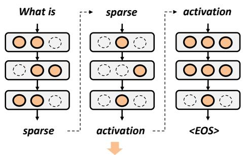  
What is sparse activation  
Figure 1. Sparse activation for run-time improvement of LLM inference performance

The most common approach to reducing the computing cost of LLM inference is model compression, which sparsifies the model via pruning [38; 53], reduces the model’s numerical precision via quantization [46; 36; 9], or reduces the model size via knowledge distillation [35; 85]. However, most methods require model retraining prior to deployment, and hence cannot well adapt to different downstream tasks or variant input data at runtime [56; 6]. Online pruning [54; 21; 79; 44] allows adaptive removal of model weights at runtime, but the removed weights are permanently excluded from inference, even if they are useful again in some later stages. Other schemes of efficient attention algorithms [12] and decoding techniques [43] can reduce the memory cost and latency in inference, but cannot reduce the model’s redundancy or improve the compute efficiency.

In contrast, a better option is sparse activation. As shown in Figure 1, sparse activation enables runtime reduction of LLM’s computing costs without any model retraining or adaptation efforts, by selectively deactivating an inputdependent set of model’s neurons that are unimportant to inference with the current input data. In practical systems, by using sparse computation APIs provided by the ML computing frameworks [39], the deactivated neurons can be further masked to zero and detached from the model’s computing graph, hence gaining real-world compute savings. Note that, since sparse activation aims to reduce the active model size at runtime, it complements many other computeefficient inference techniques such as LoRa [30], speculative decoding [76] and KV cache compression [34; 37], and can be used together with these techniques.

The most intuitive approach to sparse activation is to deactivate a neuron when its output magnitude is zero and hence makes no contribution to LLM inference. Existing work showed that such lossless sparse activation is effective on early-generation LLMs such as OPT [50; 67], which are known to be highly over-parameterized. However, we show that (Sec 3) most of recent LLMs, such as Llama-3 [15], Phi [1] and Gemma [70], contain nearly no neurons with zero output magnitudes, because of their higher parameter efficiency and advanced activation functions (e.g., GeLU [25] and SiLU [16]) being used. In these cases, to enforce model sparsity, one will have to deactivate neurons with nonzero output magnitudes [84], but doing so largely affects the model accuracy, especially in difficult generative tasks (e.g., question answering and text summarization) that involve multiple forward passes to generate long token sequences (as shown in Figure 1), because neurons with small output magnitudes are still correlated to the model’s gradients across layers and deactivating them would largely affect consistency across consecutive tokens being generated.

To minimize the accuracy loss in these difficult generative tasks, in this paper we present a new technique of attribution-based sparse activation, which is a lossy sparse activation technique that deactivates an optimal set of neurons that make the least contribution to model output, hence enhancing the model sparsity with the best tradeoff between accuracy and computing costs. We evaluate neurons’ importance in inference using their gradient-based attribution scores, and accordingly deactivate neurons with low attribution scores. Since such attribution scores precisely evaluate the impact of neuron deactivation on the model output, we believe that attribution-based sparse activation can enforce higher sparsity on recent LLMs with the minimum impact on model accuracy.

To calculate neurons’ attributions, some schemes (e.g., Integrated Gradients [69; 80]) integrate multiple gradients over interpolated input samples, but incur high costs. Other schemes provide more efficient methods by calculating the attribution scores as the product of a neuron’s gradient and output magnitude (Gradient × Output) [48; 42], which is the first-order approximation of the model output’s change due to neuron deactivation. However, such attribution scores, when being applied to sparse activation, could result in large error due to the interdependency of neurons in one layer and across different layers. Such error may result in improper rankings of neuron’s attribution scores and hence lead to suboptimal neuron activation (Sec 4).

To effectively mitigate such attribution errors, our main contribution is to analytically quantify the upper and lower bounds of such errors caused by inter-layer dependency among neurons in transformer-based LLM architectures, and introduce a new corrective term to the Gradient × Output (GxO) attribution metric (Sec 5) to allow effective application of the GxO metric in sparse activation. With this metric, our approach to dynamic sparse activation proceeds as follows in practical applications: for each input token, a forward pass is first executed to collect neuron outputs via registered hooks, and attribution scores of all neurons are computed using the Corrected GxO metric. Then, a layer-wise threshold is applied to select the top fraction of neurons for activation, based on the given activation ratio. The deactivated neurons’ corresponding weight columns, on the other hand, are zeroed and converted to a sparse format, so that only the activated neurons participate in the subsequent computation via sparse matrix kernels.

We evaluated the performance of LLM inference when applying such corrected GxO metric for sparse activation, with recent LLM families including Llama-3 [15], Phi-2 [57], Gemma [70] and MobiLlama [71] and multiple generative benchmarks in question answering (QA), text summarization and question rephrasing. Our findings are as follows:

• We achieved high sparsity in both attention layers and MLP layers. It can deactivate up to 70% of neurons in LLMs while incurring <5% model accuracy loss. Such sparisification ratio is similar to that reported in existing work [50] on the OPT model.

• Such high model sparsity allows reducing the LLM inference latency by 35% and GPU memory usage by 40% on real-world systems.

• We show good generality over different types of LLMs and benchmarks. On all the models being evaluated, our proposed attribution metric outperforms baseline schemes of sparse activation in model accuracy by at least 30%, when 70% model sparsity is enforced.

• Our approach of applying the corrective term to neuron attribution metrics has high compute efficiency and incur a negligible amount of extra computing costs.

## 2 RELATED WORK

Offline model pruning. Most techniques of model pruning remove redundant model components via offline model retraining [24; 32; 51; 58], and can be categorized into unstructured pruning over model weights [11; 18; 68] and structured pruning over different model structures such as channels [5; 48], layers [55] or attention heads [53]. Although attribution-based methods such as (Gradient × Input) are widely used in prior works [58; 13], they still lie into the category of offline model pruning and cannot be used at runtime to adapt to different input data or task requirements [11], which is the major focus of sparse activation.

Online model adaptation. Other research efforts target online LLM adaptation, via early-exit networks [17; 40], adaptive model sizes [29], network branching/routing [41; 66] and online pruning [4; 10; 49; 63; 72]. However, these techniques are mostly coarse-grained and limited to switching between different layers, branches, channels and subnetworks in the model. Hence, they usually result in large degradation of model accuracy, due to the limited capability of runtime adaptation. In contrast, our sparse activation technique directly applies to individual neurons in the model, and such fine-grained model adaptation hence ensures that model sparsity is always the optimum at runtime.

Model quantization. Model quantization reduces the bit precision of model weights [36; 19; 59; 65; 46] and activations [14; 73; 74; 64] for lower computing costs in inference [52], and can be categorized into two categories: quantization-aware training (QAT) and post-training quantization (PTQ). Most QAT techniques require model retraining and hence cannot be applied at runtime. PTQ techniques avoid extra model retraining by applying quantization onthe-fly at runtime, but are incapable of fine-grained adaptation, because the choices of bit precision are very limited (e.g., FP16 and INT8) and it is usually hard to precisely correlate the required model accuracy to a specific bit precision. In contrast, our technique of sparse activation allows continuous adjustment of model sparsity for much more fine-grained runtime adaptation.

In addition, existing ML frameworks (e.g., PyTorch and TensorFlow) only support PTQ in linear layers of the multi-head attention (MHA) layers and multilayer perceptron (MLP) blocks, but not other model structures such as LayerNorm and attention mechanisms. Leaving these structures unquantized could possibly result in bit inconsistency and further impair model accuracy. Our sparse activation technique, instead, can be easily applied to all types of LLM model structures via existing APIs in ML frameworks. Our technique is also orthogonal and complementary to PTQ, because quantization reduces cost per operation and sparse activation reduces the number of operations, yielding additive benefits at standard precisions (e.g., W8A8).

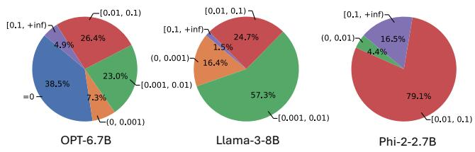  
Figure 2. The output magnitudes of neurons in LLM inference, with the TruthfulQA benchmark

## 3 SPARSE ACTIVATION IN LARGE LANGUAGE MODELS

With a given activation ratio, sparse activation can be applied on LLMs by excluding a portion of neurons from being activated in inference, and different metrics can be used to identify such deactivated neurons as the ones making the least contributions in inference. On early LLMs such as OPT [82] with ReLU activations, deactivating neurons with zero output is effective [83; 50]. However, as shown in Figure 2, on recent LLMs such as Llama-3 [15] and Phi-2 [1] with higher parameter efficiency and more advanced activation functions such as GeLU [25] and SiLU [16], there are nearly no neurons with zero output. Enforcing sparsity in these models, then, needs to deactivate neurons with small non-zero output magnitudes [84], but may largely impair the model accuracy.

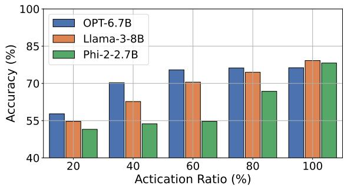  
Figure 3. Performance of LLM inference with sparse activation based on neurons’ output magnitudes

To investigate the impact of such magnitude-based sparse activation, we examined the LLM inference accuracy with different activation ratios using the PIQA benchmark [8] which evaluates the model’s understanding of physical commonsense knowledge with multiple-choice questions. As shown in Figure 3, OPT-6.7B is highly over-parameterized and its accuracy loss is <5% even if >60% of neurons are deactivated. In contrast, Llama-3-8B and Phi-2-2.7B are much less redundant, and both suffer large accuracy loss even when <20% neurons with the smallest output magnitudes are deactivated. Hence, magnitude-based sparse activation can only achieve very low sparsity on these models.

To improve model sparsity in these recent LLMs without affecting accuracy, a better approach is to measure neurons’ importance with their attribution scores, and use such attribution scores as the metric for sparse activation. In general, attribution methods quantify the correlation between input data, intermediate features and model output [31], and recent methods calculate neurons’ attribution scores from their gradients and outputs [2]. We investigated the effectiveness of gradient-based attribution metrics, as listed below, when evaluating a neuron’s importance for sparse activation:

• Gradient × Output (GxO) [48]: It calculates the firstorder approximation of the change of model output when the neuron is deactivated, as ∂F (x)/∂x·x, where x is the neuron’s output scalar and F is a function that maps neuron’s output to the model output.

• SNIP [42] and Fisher information [48]: They consider only the sensitivity of neuron’s output change on the model output, and either calculate the absolute value of GxO as |∂F (x)/∂x · x| or calculate the square of such absolute value.

• Integrated Gradients (IG) [69]: It calculates the neuron’s contribution to the change of model output by interpolating between x and a baseline (usually zero output) and averaging the gradients at these interpola-tions, as 1n Pnk=1 ∂F ( kn · x)/∂x · x.

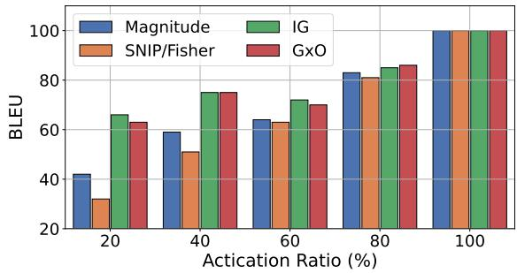  
Figure 4. Performance of LLM inference when using different attribution metrics for sparse activation. Phi-2 model is examined with the TruthfulQA benchmark.

Experiment results in Figure 4 show that attribution-based sparse activation achieves higher model accuracy than the magnitude-based approach with the same activation ratio, especially when the activation ratio is low. IG and GxO achieve the highest model accuracy, by taking both the magnitude and direction of gradients into account. However, calculating IG is expensive due to the large number of interpolations involved1, and GxO is an efficient alternative that can be computed with a single forward and backward pass. In addition, since IG with a sufficient number of interpolations can by design precisely measure the neuron’s attribution as the impact of neuron’s deactivation on the model output [69], such similarity between IG and GxO in the achieved model accuracy also verifies that GxO’s first-order approximation to attribution is accurate, with sufficiently small high-order reminders.

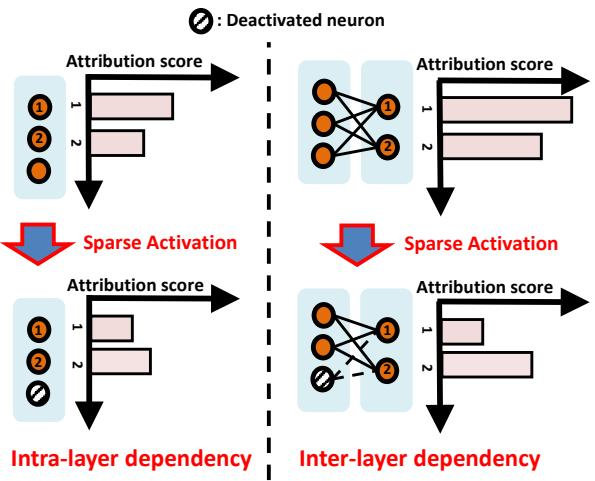  
Figure 5. Interdependency of different neurons’ attribution scores in sparse activation

## 4 ATTRIBUTION ERRORS DUE TO INTERDEPENDENCY

The gradient-based attribution scores of different neurons are always interdependent. As shown in Figure 5, whenever some neurons are deactivated, such deactivation changes the attribution scores of other activated neurons, both in the same layer and in other subsequent layers. Such attribution errors may result in incorrectly low attribution scores of those neurons that are actually necessary for the current LLM inference, and these important neurons will then be incorrectly deactivated. Since the model’s output is highly sensitive to these important neurons, their erroneous deactivation can result in large degradation of model performance, leading to wrong or even nonsensical outputs.

The main reason of such interdependency is LLM’s nonlinearity. Let F (x1, x2, ..., xn) be the function that maps the neuron outputs (x1, x2, ..., xn) of a layer to the model output. Since F is nonlinear, gradient calculation of one neuron’s output x1, as ∂F (x1, x2, ..., xn)/∂x1, depends on other neurons’ outputs, and hence deactivating any neuron will affect attribution scores of other neurons in the same layer. Similarly, deactivating neurons in one layer changes neuron outputs and attribution scores in subsequent layers.

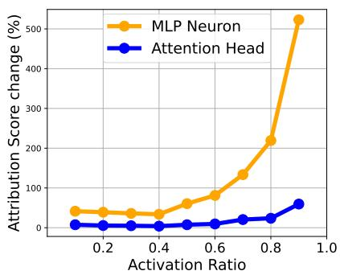

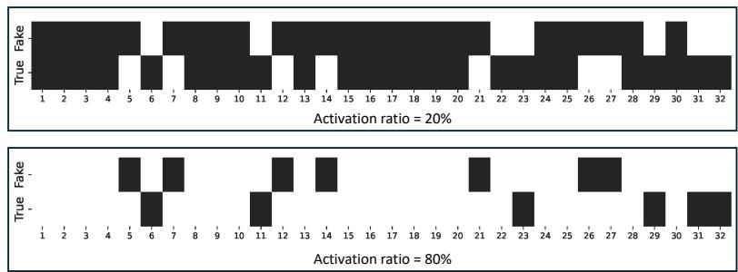  
Figure 6. The amount of neuron attribution scores changed by neuron deactivation in Phi-2  
Figure 7. Illustration of neuron deactivation among attention heads, using true (without attribution errors) and fake (with attribution errors) neuron attribution scores, in the Phi-2 model

To explore the impact of such attribution errors, we apply different activation ratios on the Phi-2 model with the TruthfulQA benchmark, and examine the amount of changes on the activated neurons’ attribution scores due to deactivating other neurons. More specifically, to calculate such changes for each layer in the model, we first calculate the cumulative attribution scores of all the heads/neurons in the layer. Then, we apply neuron deactivation to previous layers and calculate the cumulative attribution scores again in the current layer. Changes of attribution scores in the current layer are then calculated as the relative difference (in percentage) between the two. Results in Figure 6 show that such impact of attribution errors significantly grows with higher activation ratios. The basic reason is that when the activation ratio is high, only few neurons are deactivated. Attribution errors, in this case, could easily change the ranking of those neurons with the lowest attribution scores and hence result in a different set of neurons being deactivated, as shown in Figure 7. Meanwhile, we also found that attribution errors produce much higher impacts on MLP neurons, because the number of MLP neurons (e.g., 10,240 in Phi-2 model) is usually much larger than the number of attention heads (e.g., 32 in Phi-2 model), and the rank of MLP neurons’ attention scores is hence easier to be changed.

To avoid such attribution errors, one intuitive approach is to individually calculate each neuron’s attribution score and decide whether to deactivate this neuron, so that the calculation of any neuron’s attribution is always based on the currently deactivated neurons. However, doing so is computationally expensive due to the large amount of neurons in LLMs and the difficulty of enforcing a specific activation ratio. Instead, we usually utilize vectorized computations supported in current ML frameworks (e.g., TensorFlow and PyTorch) and calculate attributions of all neurons in one shot, but the interdependency among neurons would largely affect the optimality of neuron deactivation.

We are then motivated to develop new techniques that mitigate these attribution errors, and optimize the accuracysparsity tradeoffs in LLMs with proper sparse activation. The intra-layer dependency only reflects changes in the current layer’s gradients, because the outputs of neurons in the same layer are independent. In contrast, the inter-layer dependency reflects changes in both neuron outputs and gradients of the subsequent layer, as they all depend on the previous layer’s outputs. Hence, in this paper we mainly aim to mitigate the errors caused by inter-layer dependency.

## 5 MITIGATING THE ATTRIBUTION ERRORS

To mitigate the attribution errors, an intuitive approach is to follow the similar approach in model pruning [80] and calculate neurons’ attribution scores and apply sparse activation in a layer basis. Every time after sparse activation has been applied to one layer, we iteratively re-calculate the neurons’ attribution scores in all the deeper layers. Doing so, however, still involves multiple forward and backward passes and incurs high computing costs that are related to the model size and structure. For example, such cost on Phi-2 model with 32 layers is 1.3× more than that on Phi-1.5 model with 24 layers, and the cost on MobiLlama-1B model with 22 layers is another 1.8× higher due to its sequential transformer block architecture [71].

Instead, we first analyze and quantify the attribution error caused by inter-layer dependency, and then mitigate such error by adding a corrective term onto each neuron’s attribution calculated with the GxO metric, so that we can ensure proper sparse activation by calculating all neurons’ attributions in one shot. More specifically, we formally proved the lower and upper bounds of the attribution error, and further provided practical methods of calculating and applying such corrective terms based on these bounds.

## 5.1 Quantifying the Attribution Errors caused by Inter-Layer Dependency

Without loss of generality, we use a case of two layers in a LLM, namely L1 and L2, to quantify the attribution error caused by inter-layer dependency. L2 is a deeper layer than L1, and L2’s neuron output hence depends on L1’s neuron output X = (x1, x2, ..., xN1 ) as Y = g(X) = (g1(X), g2(X), ..., gN2 (X)), but L1 and L2 are not necessarily adjacent to each other. Hence, our analysis results and the proposed approach could generically applied to any neuron in the model.

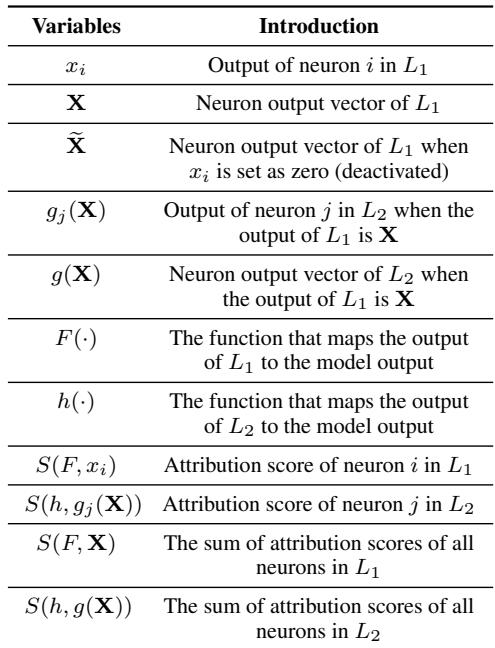  
Figure 8. List of notations

When we calculate neurons’ attribution scores from the model’s gradients and neurons’ outputs as described in Section 3, attribution scores of neurons in L2 will also depend on neuron outputs of L1. We denote the attribution score of a neuron xi in L1 as S(F, xi) and the attribution score of a neuron xj in L2 as S(h, gj(X)), respectively, where F (X) = h(Y) = h(g(X)) is the mapping to the LLM model output. Then, when we deactivate the neuron i in L1, the error of inter-layer dependency caused by this neuron deactivation in L1 on the neurons’ attribution scores in L2 can be quantified as

$$
\tag{1}
$$

where X is identical to X except that xi is set as zero (deactivated), and I(g(X)) denotes the set of neurons that have the smallest attributions in L2 and are hence deactivated (with a given activation ratio), when the output vector of L1 is X. Note that since deactivating xi could change the ranking of neurons’ attribution scores in L2, usually I(g(X)) ̸= I(g(X )). Eq. (1) hence represents the change of L2’s deactivated neurons’ cumulative attribution scores, when the neuron i in L1 is deactivated.

## 5.2 The Corrective Term

Intuitively, the quantification in Eq. (1) could allow us to calculate the corrective term that mitigates the attribution error caused by inter-layer dependency, but deactivating each neuron i in L1 will change X and further require recalculation of g(X ). Such requirement of recalculation prevents us from calculating the corrective terms for all neuron’s attribution scores in one shot. Instead, we develop new methods that can enable such one-shot calculation of the corrective terms. To do so, we explore the lower and upper bounds of the quantified error in Eq. (1), and we first have the following lemma:

Lemma 5.1. The error of inter-layer dependency caused by deactivating neuron i in L1, as quantified in Eq. (1), has a lower bound of 0, and an upper bound of S(F, X) − S(F, X ), where S(F, X) = ∂F∂X XT = PN1i=1 S(F, xi) indicates the sum of all neurons’ attribution scores in L1. The proof is in Appendix A.

In Lemma 5.1, the lower bound is reached when the ranking of neuron attribution scores in L2 is not changed by i’s deactivation, corresponding to I(g(X)) = I(g(X )) in Eq. (1), and the upper bound is reached when I(g(X)) ∩ I(g(X ) = ∅, i.e., the attribution error completely changes the set of neurons being deactivated in L2. Hence, both the lower and upper bounds are tight.

However, to practically compute the upper bound specified in Lemma 5.1, we still need to individually deactivate each neuron in L1, in order to compute the corresponding S(h, g(X)). In order to allow one-shot calculation of such bounds for all neurons, we further explore the correlation between the attribution scores of neurons in L1 and L2, and such correlation is described in the following lemma:

Lemma 5.2. The sum of attribution scores of neurons in L1 is equal to that in L2. That is, if we denoteS(F, X) = ∂F∂X XT = PN1i=1 S(F, xi) and S(h, g(X)) = ∂h∂g(X) g(X)T = PN2i=1 S(h, gi(x)), we have N 2

$$
\tag{2}
$$

The proof is in Appendix B.

With Lemma 5.1 and Lemma 5.2, we can correlate the error of inter-layer dependency caused by neuron deactivation in L1, as specified in Eq. (1), to the neurons’ attribution scores in L1. Then, the following theorem provides the bounds of such error that are decided by the neuron gradients in L1:

Theorem 5.3. The error of inter-layer dependency caused by deactivating neuron i in L1 has a lower bound of 0, and a upper bound of |xi| · q PN1k=1( ∂F∂xk )2, where xk is output of another neuron k in L1. The proof is in Appendix C.

Being similar to Lemma 5.1, both bounds in Theorem 5.3 are also tight.

Based on Theorem 5.3, with the knowledge about the distribution of attribution errors overall all neurons in the model, we can calculate the corrective term being applied to each neuron’s attribution score as the expectation of such distribution. According to our experiment results shown in Figure 9 with Phi-2 model and TruthfulQA benchmark, such distribution can be well approximated by a truncated normal distribution, and the corrective term can then be calculated as 12 · |xi| · qPN1k=1( ∂F∂x )2.

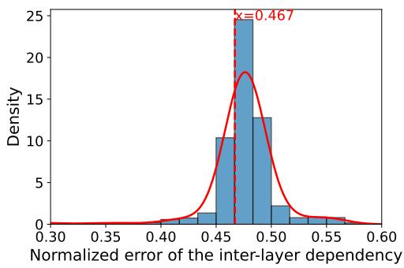  
Figure 9. The distribution of attribution error of inter-layer dependency, as defined in Eq. (1)

In other cases of distributions, the scaling factor 12 in the corrective term should be changed accordingly. We can use a smaller benchmark to probe the model and obtain knowledge about such distribution in advance. Further, this corrective term only relates to the output magnitudes and gradients of neurons. Hence, corrective terms of all neurons can be computed in one shot, via vectorized computation in current ML frameworks.

## 6 IMPLEMENTATION

In this section, we elaborate our implementation details about gradient calculation, neuron deactivation, and sparse computation. All implementations are based on PyTorch and Hugging Face Transformers library.

Calculation of gradients and attribution scores. To calculate gradients, we first extract the neuron outputs by assigning a forward hook to each of the attention and MLP layers. Specifically, in MLP layers, we extract the output of each neuron’s activation function, and in attention layers, we extract the multi-head attention (MHA) that is the output of the Scaled Dot Product Attention (SDPA) operation. The gradients are then calculated for the model’s output, namely the log probability of the next generated token, with respect to the neuron outputs we get from the forward hooks. The neurons’ attribution scores are calculated from such calculated gradients and neuron outputs.

Practical deployment via lightweight predictors. In practical applications, running a full backward pass for every generated token would be too expensive and impractical. Instead, following prior work such as DejaVu [50] and PowerInfer [67], we first run the full Corrected GxO pipeline offline over a small representative dataset and record the resulting sparsity masks as ground-truth labels. We then train a lightweight MLP predictor to predict these masks from the current hidden state. At inference time, only a lowcost forward pass through this predictor is needed, without involving any expensive backward pass.

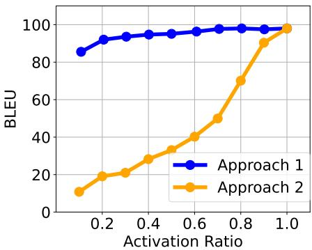  
Figure 10. Impact of different neuron deactivation approaches

Neuron deactivation. In practical sparse activation, given the attribution scores, we can either activate the same percentage of neurons in each layer by applying a layer-specific threshold on neurons’ attribution scores (Approach 1), or applying a uniform threshold on attribution scores in all layers and hence activate different percentages of neurons in different layers (Approach 2). To compare the actual model performance with these two schemes, we conducted preliminary experiments using Phi-2 model and the TruthfulQA benchmark. Results in figure 10 show that applying a layer-specific threshold to activate the same percentage of neurons in each layer always leads to better model performance with different activation ratios. The basic reason is that our corrective term is calculated from the neuron’s gradients and output magnitudes, both of which could vary a lot across different layers, and the attribution scores of neurons in different layers are hence not comparable when such corrective term is applied to neurons’ attribution scores. Instead, layer-wise decisions on neuron activation are more appropriate, and layer-wise neuron activation also allows easy enforcement of any specific activation ratio.

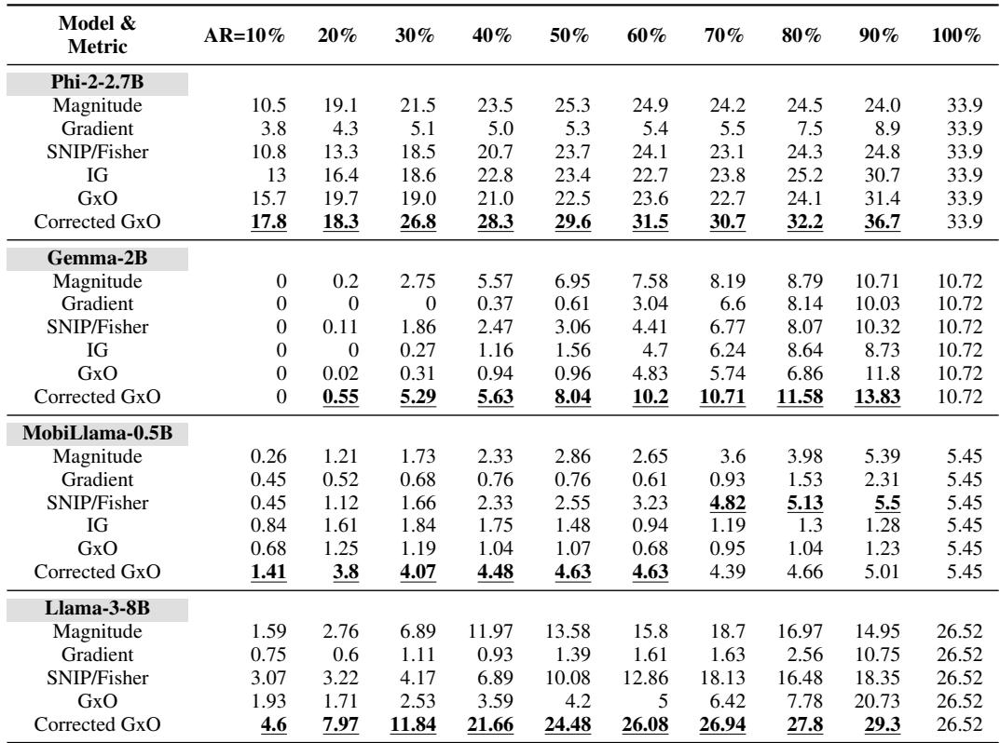  
Table 1. Accuracy of sparsely activated LLMs with different activation ratios (AR) on TruthfulQA

Based on these results, we can calculate masks following the layer-wise neuron activation described above, and then use the calculated masks to enforce neuron deactivation. The masks are used to determine which neurons in MLP layers and attention heads in attention layers to be set to zero. In attention layers, we aim to enable head-wise deactivation. To do so, the attribution scores are averaged for each head before being used to calculate the masks. Also, note that for generative tasks that involve multiple forward passes to generate long token sequences, we calculate the attribution scores and apply the corresponding masks separately for each forward pass.

Sparse computation. Simply applying the calculated masks onto neuron outputs to set them to zero does not reduce either the memory consumption or computing latency, because these zero outputs still occupy memory and involve in dense matrix operations. Instead, we apply the masks to model weights so that all the weights that are directly connected to the deactivated neurons or heads are set to zero. Loading such sparse weight matrices, hence, incurs less loading time and GPU memory usage. Afterwards, at runtime, we convert the weight matrices into torch.sparse format, and directly apply the matrices to torch.mm that supports sparse matrix multiplication, instead of passing them to torch.nn.Linear in ordinary PyTorch routine, because only dense format is supported in torch.nn.Linear. In this way, the computing latency can be reduced by sparse matrix operations.

## 7 EXPERIMENTS

We evaluate the inference accuracy of Phi-2 [1], Gemma [70], MobiLlama [71], and Llama-3 [15], when they are sparsely activated in different ways. All experiments are conducted using the popular LM Evaluation Harness tool [20] on a NVidia H100 80GB GPU. We measure model accuracy using multiple metrics, including BLEU and ROUGE scores. Note that, our design primarily targets on-device inference, where workloads consist of a single request stream (Batch Size = 1), such as a mobile keyboard predictor or voice assistant. All experiments in this paper hence use a batch size of 1.

Benchmarks. Our experiments cover several LLM benchmarks on generative tasks, including question answering (QA), text summarization and question rephrasing, as listed below. These benchmarks require generating long sentences in natural languages, and are hence much more difficult than multi-choice benchmarks such as MMLU [26] and PIQA [8].

• TruthfulQA [47] is a well-known QA benchmark to measure whether a language model is truthful in generating answers to questions. It contains 817 QA pairs in

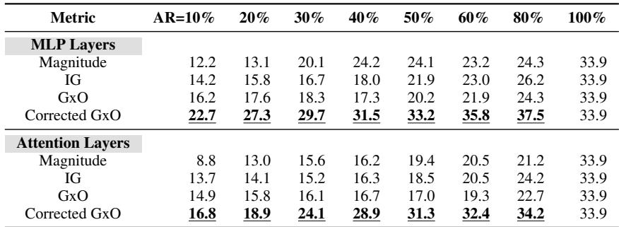  
Table 2. Model accuracy with neuron deactivation in MLP layers and attention layers, respectively. The Phi-2 model on the TruthfulQA benchmark is used.

38 different categories, including health, law, finance and politics.

• Gigaword [22; 62] is a text summarization benchmark for headline generation with 1,951 samples. We use the full articles as input and the corresponding summaries as label.

• Quora Question Pairs (QP) [60] includes 404k pairs of sentences with similar meanings. For each pair, we use one sentence as input and the other as label, to evaluate whether the model can correctly rephrase the input sentence to match the label sentence.

Baseline schemes. We compare the accuracy of LLMs being sparsely activated by using our corrected GxO metric with that using other attribution metrics listed in Section 3, including Integrated Gradients (IG) [69], SNIP [42] and Fisher [48]. We also include the existing approaches to sparse activation as baselines, e.g., those which directly use the neurons’ magnitudes [50] and gradients as the metric for sparse activation.

## 7.1 Inference Accuracy of Sparsely Activated LLMs

We first evaluate the inference accuracy of different LLMs with different activation ratios (ARs), on the TruthfulQA benchmark. Example QA pairs can be found in Appendix E. Results in Table 1 show that, when applying our proposed corrective term onto the GxO metric, we achieve significantly higher model sparsity with the minimum model accuracy loss, when the AR varies from 10% to 100% on different LLMs. In particular, on most LLMs, our corrected GxO metric can achieve significantly higher model sparsity with the minimum model accuracy loss. For example, on the Llama-3-8B model, when AR=40% and 60% neurons are deactivated, the model accuracy loss is within 5%. Similarly, with <5% model accuracy loss, the maximum model sparsity that we can achieve on models of Phi-2- 2.7B, Gemma-2B and MobiLlama-0.5B could reach 60%, 70% and 70%, respectively. Such improvement of model sparsity is at least 30-40% higher than the best baseline, demonstrating the significant advantage of our proposed attribution-based sparse activation compared to traditional magnitude-based sparse activation.

In addition, on some models (e.g., Llama-3-8B, Phi-2-2.7B and Gemm2-2B), when we reduce AR from 100% to 80- 90%, the model accuracy slightly increases. This is because our corrected GxO metric reserves the sign of neuron attribution value rather than taking its absolute value (as SNIP/- Fisher information did). Hence, for redundant neurons, their attribution scores could be negative, and deactivating these neurons helps the model remove such redundancy to improve performance. Note that, such model redundancy and performance improvement are highly model dependent. For example, such improvement on MobiLlama-0.5B is very small, possibly because of the model’s small parameter sizes. Similarly, the model accuracy of some baseline schemes (e.g., IG and uncorrected GxO) exhibited slight drop when AR increases from 50% to 80%. This is because lower sparsity reduces the learned noise and makes the model focusing more on the important knowledge [27].

Note that, our evaluation is on open-ended text generation tasks, measured by BLEU, which are fundementally different from multi-choice QA benchmarks. Open-ended generation tasks are more challenging and sensitive to the removal of model components, therefore making the direct comparison of performance degradation to other types of tasks inequitable.

Results in Table 1 also examined how the model accuracy varies with its parameter size. The accuracy generally increases with the model size, but also relates to the specific benchmark. For example, the accuracy of Llama-3-8B is higher than those of smaller models such as Gemma-2B and MobiLlama-0.5B, but is lower than that of Phi-2-2.7B which is optimized for text generation tasks. Similarly, our corrected GxO metric achieves larger improvement of accuracy-sparsity tradeoffs on larger models, whose larger parameter sizes enable more opportunities to optimize the sparse activation. Another reason is that these models have different architecture designs. The impact of inter-layer dependency is much less significant in Phi models, due to their parallel transformer block structure [23]. In contrast, the Gemma and MobiLlama models have sequential transformer block structure [71] that leads to higher inter-layer dependency. This also justifies the effectiveness of our corrective term that aims to mitigate the impact of inter-layer dependency.

Attribution-based Sparse Activation in Large Language Models  
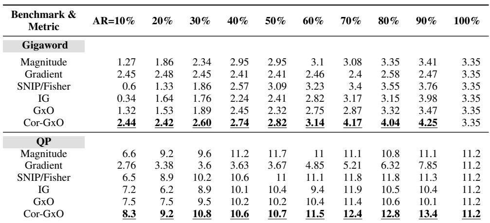

Table 3. Inference accuracy of Phi-2 model on different benchmarks  
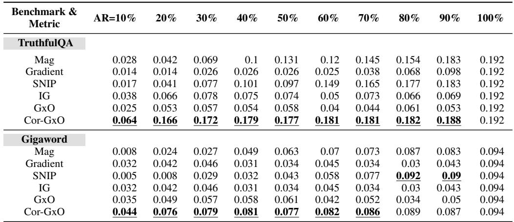  
Table 4. Inference accuracy of the MobiLlama-0.5B measured by ROUGE-1 score on different benchmarks

## 7.2 Ablation Study

We noted that the number of MLP neurons in LLMs significantly exceeds the number of attention heads, and the characteristics of sparse activation in attention layers and MLP layers may hence be different. To further investigate such detailed characteristics, we apply sparse activation only on MLP layers and attention layers. The results with different activation ratios in Table 2 show that MLP layers in LLMs are generally more over-parameterized than attention layers. While we can deactivate 80% neurons in MLP layers with <5% model accuracy loss, even deactivating 60% neurons in attention layers will largely reduce the model accuracy. This phenomenon is consistent with that reported in the existing work for LLMs [50] and concurs that the impact of inter-layer dependency is much more in MLP layers than in attention layers, as we have shown in Figure 6. Further, to better demonstrate such impact, we also visualized the deactivated neurons in attention layers and MLP layers when generating different tokens, and such visualized results are in Appendix D.

## 7.3 LLM Inference Accuracy with Different Benchmarks

We evaluate the accuracy of sparsely activated LLMs on other two generative benchmarks, i.e., Gigaword and QP, in very different knowledge domains and task settings. Results in Table 3 show that our approach outperforms other baseline methods on both benchmarks. This shows that our method is applicable to various knowledge domains and generative tasks, including both text summarization and sentence rephrasing, by efficiently reducing the impact of interlayer dependency and ensuring efficient accuracy-sparsity

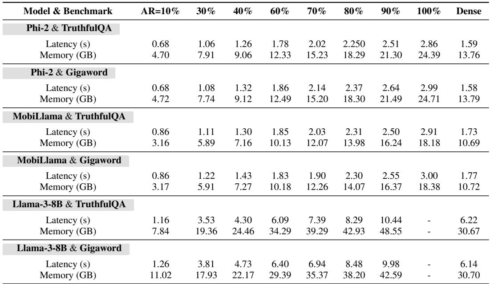  
Table 5. Computing latency and memory savings with sparse activation

tradeoffs.

## 7.4 LLM Inference Accuracy Measured by Other Metrics

To provide more comprehensive insights about the LLM inference accuracy, we also provide experiment results that measure the LLM inference accuracy using the ROUGE-1 score. As shown in Table 4, on both the TruthfulQA and Gigaword benchmarks, our corrected GxO metric still outperforms the other baselines, and the results of achieved model sparsity are also consistent with those measured by the BLEU score. In addition, please note that the values of ROUGE-1 score are generally much lower than those of BLEU scores, and so it may result in less sensitivity in measuring the LLM performance.

## 7.5 LLM Inference Accuracy in Other Tasks

For evaluation beyond typical generative tasks (e.g., QA and text summarization), we conducted additional experiments over 1) the WMT16-de-en translation benchmark (German to English) and 2) the GLUE-MNLI classification benchmark (for a given pair of sentences, predict whether the second sentence is an entailment, contradiction, or neutral with respect to the first.) The experiment results on the Qwen2.5-7B [78] model are shown in Table 6. These results demonstrated that, by using our Cor-GxO attribution metric for sparse activation in these two NLP tasks, we can also achieve smaller model performance drop when the activation ratio (AR) drops from 100% to 50%, hence achieving better tradeoffs between the model performance and inference cost at runtime.

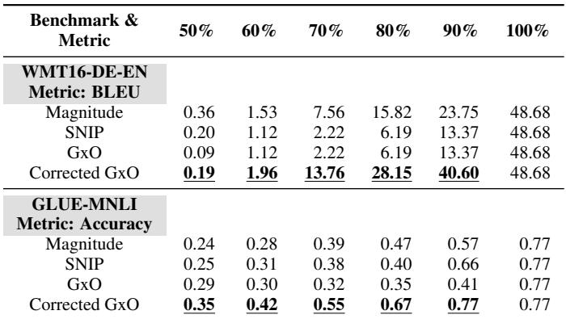  
Table 6. Evaluation results over translation and classification tasks. The Qwen2.5-7B model is used.

## 7.6 Computing Latency and Memory Savings

To evaluate the end-to-end inference latency (of completing one forward pass) and GPU memory use of our approach to attribution-based sparse activation, we conduct experiments in a “cold-start” setup, where the time for loading the model weights into GPU memory is included into latency measurement. Here, “cold start” refers to model loading at the start of a complete inference session (i.e., one complete user request), not for every individual forward pass within that session. This scenario is representative of on-device deployments where the model is loaded on-demand and released after the session ends. By using the torch.sparse APIs, we convert model weights to sparse format before sending to the GPU memory and enables sparse matrix multiplication during inference. The results in Table 5 shows that with sparse activation, the end-to-end inference latency and GPU memory use is generally proportional to the AR being used. Compared to the dense implementation without any sparse computation being involved, we can achieve actual latency and memory gains starting from AR=60%. This is mainly because extra overhead is required to maintain the sparse matrices and conduct sparse matrix operations, such as the required operations to index non-zero matrix elements when the matrix is stored in CSR or COO formats.

However, we would like to highlight that when AR<=50%, our proposed approach can achieve good tradeoffs between the models performance and inference cost, such that we can achieve significant resource savings at the cost of minor model performance loss which is actually the key rationale of lossy sparse activation. For example, when AR=30%, Table 5 show that the savings of inference cost would be up to 35% in latency and 43% in memory use (for the Phi-2 model), and correspondingly the model performance drops from BLEU=33.9 to 26.8 as shown in Table 1, which is still high enough to produce reasonable answers in generative tasks. This is consistent with the conclusions drawn in the existing work [50; 67], and we believe that such latency saving is mainly due to the reduced amount of I/O transmission for model weights loading.

## 8 CONCLUSION

In this paper, we focus on lossy sparse activation towards higher model sparsity at runtime. We demonstrated that existing methods cannot be applied to recent LLMs with higher parameter efficiency, and using gradient-based attribution scores for sparse activation is a better choice. We developed analytical methods that quantify and mitigate the attribution errors caused by inter-layer dependency of neurons’ attribution scores, by applying a corrective term onto the existing GxO attribution metric. Experiment results on multiple mainstream LLMs and benchmarks show that our approach achieves up to 70% sparsification on LLMs with <5% accuracy loss, and significantly reduces the computing latency and memory use in LLM inference.

## ACKNOWLEDGMENTS

We thank the reviewers and the shepherd for their insightful comments and feedback. This work was supported in part by National Science Foundation (NSF) under grant number IIS-2205360 and CCF-2215042, and National Institutes of Health (NIH) under grant number R01HL170368 and R01HL184168.

## REFERENCES

[1] Abdin, M., Jacobs, S. A., Awan, A. A., Aneja, J., Awadallah, A., Awadalla, H., Bach, N., Bahree, A., Bakhtiari, A., Behl, H., et al. Phi-3 technical report: A highly capable language model locally on your phone. arXiv preprint arXiv:2404.14219, 2024.

[2] Abhishek, K. and Kamath, D. Attribution-based xai methods in computer vision: A review. arXiv preprint arXiv:2211.14736, 2022.

[3] Ahn, J., Verma, R., Lou, R., Liu, D., Zhang, R., and Yin, W. Large language models for mathematical reasoning: Progresses and challenges. arXiv preprint arXiv:2402.00157, 2024.

[4] Akhauri, Y., AbouElhamayed, A. F., Dotzel, J., Zhang, Z., Rush, A. M., Huda, S., and Abdelfattah, M. S. Shadowllm: Predictor-based contextual sparsity for large language models. arXiv preprint arXiv:2406.16635, 2024.

[5] Ashkboos, S., Croci, M. L., Nascimento, M. G. d., Hoefler, T., and Hensman, J. Slicegpt: Compress large language models by deleting rows and columns. arXiv preprint arXiv:2401.15024, 2024.

[6] Bansal, H., Gopalakrishnan, K., Dingliwal, S., Bodapati, S., Kirchhoff, K., and Roth, D. Rethinking the role of scale for in-context learning: An interpretabilitybased case study at 66 billion scale. arXiv preprint arXiv:2212.09095, 2022.

[7] Basyal, L. and Sanghvi, M. Text summarization using large language models: a comparative study of mpt-7b-instruct, falcon-7b-instruct, and openai chat-gpt models. arXiv preprint arXiv:2310.10449, 2023.

[8] Bisk, Y., Zellers, R., Gao, J., Choi, Y., et al. Piqa: Reasoning about physical commonsense in natural language. In Proceedings of the AAAI conference on artificial intelligence, volume 34, pp. 7432–7439, 2020.

[9] Chee, J., Cai, Y., Kuleshov, V., and De Sa, C. M. Quip: 2-bit quantization of large language models with guarantees. Advances in Neural Information Processing Systems, 36, 2024.

[10] Chen, X., Liu, Z., Tang, H., Yi, L., Zhao, H., and Han, S. Sparsevit: Revisiting activation sparsity for efficient high-resolution vision transformer. In Proceedings of the IEEE/CVF Conference on Computer Vision and Pattern Recognition, pp. 2061–2070, 2023.

[11] Cheng, H., Zhang, M., and Shi, J. Q. A survey on deep neural network pruning: Taxonomy, comparison,

analysis, and recommendations. IEEE Transactions on Pattern Analysis and Machine Intelligence, 2024.

[12] Dao, T., Fu, D., Ermon, S., Rudra, A., and Re, C.´ Flashattention: Fast and memory-efficient exact attention with io-awareness. Advances in Neural Information Processing Systems, 35:16344–16359, 2022.

[13] Das, R. J., Sun, M., Ma, L., and Shen, Z. Beyond size: How gradients shape pruning decisions in large language models. arXiv preprint arXiv:2311.04902, 2023.

[14] Dettmers, T., Lewis, M., Belkada, Y., and Zettlemoyer, L. Gpt3.int8(): 8-bit matrix multiplication for transformers at scale. Advances in Neural Information Processing Systems, 35:30318–30332, 2022.

[15] Dubey, A., Jauhri, A., Pandey, A., Kadian, A., Al-Dahle, A., Letman, A., Mathur, A., Schelten, A., Yang, A., Fan, A., et al. The llama 3 herd of models. arXiv preprint arXiv:2407.21783, 2024.

[16] Elfwing, S., Uchibe, E., and Doya, K. Sigmoidweighted linear units for neural network function approximation in reinforcement learning. Neural networks, 107:3–11, 2018.

[17] Fang, B., Zeng, X., and Zhang, M. Nestdnn: Resourceaware multi-tenant on-device deep learning for continuous mobile vision. In Proceedings of the 24th Annual International Conference on Mobile Computing and Networking, pp. 115–127, 2018.

[18] Frantar, E. and Alistarh, D. Sparsegpt: Massive language models can be accurately pruned in one-shot. In International Conference on Machine Learning, pp. 10323–10337. PMLR, 2023.

[19] Frantar, E., Ashkboos, S., Hoefler, T., and Alistarh, D. Gptq: Accurate post-training quantization for generative pre-trained transformers. arXiv preprint arXiv:2210.17323, 2022.

[20] Gao, L., Tow, J., Abbasi, B., Biderman, S., Black, S., DiPofi, A., Foster, C., Golding, L., Hsu, J., Le Noac’h, A., Li, H., McDonell, K., Muennighoff, N., Ociepa, C., Phang, J., Reynolds, L., Schoelkopf, H., Skowron, A., Sutawika, L., Tang, E., Thite, A., Wang, B., Wang, K., and Zou, A. A framework for few-shot language model evaluation, 07 2024. URL https: //zenodo.org/records/12608602.

[21] Gou, S., Fu, J., Sha, Y., Cao, Z., Guo, Z., Eshraghian, J. K., Li, R., and Jiao, L. Dynamic spatio-temporal pruning for efficient spiking neural networks. Frontiers in Neuroscience, 2025.

[22] Graff, D., Kong, J., Chen, K., and Maeda, K. English gigaword. Linguistic Data Consortium, Philadelphia, 4(1):34, 2003.

[23] Gunasekar, S., Zhang, Y., Aneja, J., Mendes, C. C. T., Del Giorno, A., Gopi, S., Javaheripi, M., Kauffmann, P., de Rosa, G., Saarikivi, O., et al. Textbooks are all you need. arXiv preprint arXiv:2306.11644, 2023.

[24] He, Y., Zhang, X., and Sun, J. Channel pruning for accelerating very deep neural networks. In Proceedings of the IEEE international conference on computer vision, pp. 1389–1397, 2017.

[25] Hendrycks, D. and Gimpel, K. Gaussian error linear units (gelus). arXiv preprint arXiv:1606.08415, 2016.

[26] Hendrycks, D., Burns, C., Basart, S., Zou, A., Mazeika, M., Song, D., and Steinhardt, J. Measuring massive multitask language understanding. Proceedings of the International Conference on Learning Representations (ICLR), 2021.

[27] Hoefler, T., Alistarh, D., Ben-Nun, T., Dryden, N., and Peste, A. Sparsity in deep learning: Pruning and growth for efficient inference and training in neural networks. Journal of Machine Learning Research, 22 (241):1–124, 2021.

[28] Hoffman, P. Ais power demand: Calculating chatgpts electricity consumption for handling over 156.4 billion user queries every year, 2024. URL https:// www.bestbrokers.com/forex-brokers/ ais-power-demand-calculating-chatgpts-electrici

[29] Hou, L., Huang, Z., Shang, L., Jiang, X., Chen, X., and Liu, Q. Dynabert: Dynamic bert with adaptive width and depth. Advances in Neural Information Processing Systems, 33:9782–9793, 2020.

[30] Hu, E. J., Shen, Y., Wallis, P., Allen-Zhu, Z., Li, Y., Wang, S., Wang, L., Chen, W., et al. Lora: Low-rank adaptation of large language models. ICLR, 1(2):3, 2022.

[31] Ivanovs, M., Kadikis, R., and Ozols, K. Perturbationbased methods for explaining deep neural networks: A survey. Pattern Recognition Letters, 150:228–234, 2021.

[32] Jiang, Y., Wang, S., Valls, V., Ko, B. J., Lee, W.- H., Leung, K. K., and Tassiulas, L. Model pruning enables efficient federated learning on edge devices. IEEE Transactions on Neural Networks and Learning Systems, 34(12):10374–10386, 2022.

[33] Jin, H., Zhang, Y., Meng, D., Wang, J., and Tan, J. A comprehensive survey on process-oriented automatic text summarization with exploration of llmbased methods. arXiv preprint arXiv:2403.02901, 2024.

[34] Kang, H., Zhang, Q., Kundu, S., Jeong, G., Liu, Z., Krishna, T., and Zhao, T. Gear: An efficient kv cache compression recipe for near-lossless generative inference of llm. arXiv preprint arXiv:2403.05527, 2024.

[35] Kang, M., Lee, S., Baek, J., Kawaguchi, K., and Hwang, S. J. Knowledge-augmented reasoning distillation for small language models in knowledge-intensive tasks. Advances in Neural Information Processing Systems, 36, 2024.

[36] Kim, J., Lee, J. H., Kim, S., Park, J., Yoo, K. M., Kwon, S. J., and Lee, D. Memory-efficient fine-tuning of compressed large language models via sub-4-bit integer quantization. Advances in Neural Information Processing Systems, 36, 2024.

[37] Kim, J., Park, J., Cho, J., and Papailiopoulos, D. Lexico: Extreme kv cache compression via sparse coding over universal dictionaries. arXiv preprint arXiv:2412.08890, 2024.

[38] Kurtic, E., Frantar, E., and Alistarh, D. Ziplm: ´ Inference-aware structured pruning of language models. Advances in Neural Information Processing Systems, 36, 2024.

[39] Kurtz, M., Kopinsky, J., Gelashvili, R., Matveev, A., Carr, J., Goin, M., Leiserson, W., Moore, S., Shavit, N., and Alistarh, D. Inducing and exploiting activation sparsity for fast inference on deep neural networks. In International Conference on Machine Learning, pp. 5533–5543. PMLR, 2020.

[40] Laskaridis, S., Venieris, S. I., Almeida, M., Leontiadis, I., and Lane, N. D. Spinn: synergistic progressive inference of neural networks over device and cloud. In Proceedings of the 26th annual international conference on mobile computing and networking, pp. 1–15, 2020.

[41] Lee, J.-Y., Lee, D., Zhang, G., Tiwari, M., and Mirhoseini, A. Cats: Contextually-aware thresholding for sparsity in large language models. arXiv preprint arXiv:2404.08763, 2024.

[42] Lee, N., Ajanthan, T., and Torr, P. H. Snip: Singleshot network pruning based on connection sensitivity. arXiv preprint arXiv:1810.02340, 2018.

[43] Leviathan, Y., Kalman, M., and Matias, Y. Fast inference from transformers via speculative decoding. In International Conference on Machine Learning, pp. 19274–19286. PMLR, 2023.

[44] Li, S., Osawa, K., and Hoefler, T. Efficient quantized sparse matrix operations on tensor cores. In SC22: International Conference for High Performance Computing, Networking, Storage and Analysis, pp. 1–15. IEEE, 2022.

[45] Li, Z., Fan, S., Gu, Y., Li, X., Duan, Z., Dong, B., Liu, N., and Wang, J. Flexkbqa: A flexible llm-powered framework for few-shot knowledge base question answering. In Proceedings of the AAAI Conference on Artificial Intelligence, volume 38, pp. 18608–18616, 2024.

[46] Lin, J., Tang, J., Tang, H., Yang, S., Dang, X., and Han, S. Awq: Activation-aware weight quantization for llm compression and acceleration. arXiv preprint arXiv:2306.00978, 2023.

[47] Lin, S., Hilton, J., and Evans, O. Truthfulqa: Measuring how models mimic human falsehoods. arXiv preprint arXiv:2109.07958, 2021.

[48] Liu, L., Zhang, S., Kuang, Z., Zhou, A., Xue, J.-H., Wang, X., Chen, Y., Yang, W., Liao, Q., and Zhang, W. Group fisher pruning for practical network compression. In International Conference on Machine Learning, pp. 7021–7032. PMLR, 2021.

[49] Liu, Z., Li, J., Shen, Z., Huang, G., Yan, S., and Zhang, C. Learning efficient convolutional networks through network slimming. In Proceedings of the IEEE international conference on computer vision, pp. 2736–2744, 2017.

[50] Liu, Z., Wang, J., Dao, T., Zhou, T., Yuan, B., Song, Z., Shrivastava, A., Zhang, C., Tian, Y., Re, C., et al. Deja vu: Contextual sparsity for efficient llms at inference time. In International Conference on Machine Learning, pp. 22137–22176. PMLR, 2023.

[51] Lym, S., Choukse, E., Zangeneh, S., Wen, W., Sanghavi, S., and Erez, M. Prunetrain: fast neural network training by dynamic sparse model reconfiguration. In Proceedings of the International Conference for High Performance Computing, Networking, Storage and Analysis, pp. 1–13, 2019.

[52] Ma, S., Wang, H., Ma, L., Wang, L., Wang, W., Huang, S., Dong, L., Wang, R., Xue, J., and Wei, F. The era of 1-bit llms: All large language models are in 1.58 bits. arXiv preprint arXiv:2402.17764, 2024.

[53] Ma, X., Fang, G., and Wang, X. Llm-pruner: On the structural pruning of large language models. Advances in neural information processing systems, 36:21702– 21720, 2023.

[54] Mao, J., Yang, H., Li, A., Li, H., and Chen, Y. Tprune: Efficient transformer pruning for mobile devices. ACM Transactions on Cyber-Physical Systems, 5(3):1–22, 2021.

[55] Men, X., Xu, M., Zhang, Q., Wang, B., Lin, H., Lu, Y., Han, X., and Chen, W. Shortgpt: Layers in large language models are more redundant than you expect. arXiv preprint arXiv:2403.03853, 2024.

[56] Michel, P., Levy, O., and Neubig, G. Are sixteen heads really better than one? Advances in neural information processing systems, 32, 2019.

[57] Mojan Javaheripi, S. B. M. G. Phi-2: The surprising power of small language models. https://www. microsoft.com/en-us/research/blog/ phi-2-the-surprising-power-of-small-2023.

[58] Molchanov, P., Mallya, A., Tyree, S., Frosio, I., and Kautz, J. Importance estimation for neural network pruning. In Proceedings of the IEEE/CVF conference on computer vision and pattern recognition, pp. 11264– 11272, 2019.

[59] Nagel, M., Baalen, M. v., Blankevoort, T., and Welling, M. Data-free quantization through weight equalization and bias correction. In Proceedings of the IEEE/CVF International Conference on Computer Vision, pp. 1325–1334, 2019.

[60] Quora. Question pairs dataset, 2012. URL https://www.kaggle.com/datasets/ quora/question-pairs-dataset. Oct 31, 2024.

[61] Roziere, B., Gehring, J., Gloeckle, F., Sootla, S., Gat, I., Tan, X. E., Adi, Y., Liu, J., Sauvestre, R., Remez, T., et al. Code llama: Open foundation models for code. arXiv preprint arXiv:2308.12950, 2023.

[62] Rush, A. M., Chopra, S., and Weston, J. A neural attention model for abstractive sentence summarization. Proceedings of the 2015 Conference on Empirical Methods in Natural Language Processing, 2015. doi: 10.18653/v1/d15-1044. URL http: //dx.doi.org/10.18653/v1/D15-1044.

[63] Saadallah, A., Jakobs, M., and Morik, K. Explainable online ensemble of deep neural network pruning for time series forecasting. Machine Learning, 111(9): 3459–3487, 2022.

[64] Shao, W., Chen, M., Zhang, Z., Xu, P., Zhao, L., Li, Z., Zhang, K., Gao, P., Qiao, Y., and Luo, P. Omniquant: Omnidirectionally calibrated quantization for large language models. arXiv preprint arXiv:2308.13137, 2023.

[65] Sheng, Y., Zheng, L., Yuan, B., Li, Z., Ryabinin, M., Chen, B., Liang, P., Re, C., Stoica, I., and Zhang, ´ C. Flexgen: High-throughput generative inference of large language models with a single gpu. In International Conference on Machine Learning, pp. 31094– 31116. PMLR, 2023.

[66] Song, C., Han, X., Zhang, Z., Hu, S., Shi, X., Li, K., Chen, C., Liu, Z., Li, G., Yang, T., et al. Prosparse: Introducing and enhancing intrinsic activation sparsity within large language models. arXiv preprint arXiv:2402.13516, 2024.

[67] Song, Y., Mi, Z., Xie, H., and Chen, H. Powerinfer: Fast large language model serving with a consumeranguage-models/,grade gpu. arXiv preprint arXiv:2312.12456, 2023.

[68] Sun, M., Liu, Z., Bair, A., and Kolter, J. Z. A simple and effective pruning approach for large language models. arXiv preprint arXiv:2306.11695, 2023.

[69] Sundararajan, M., Taly, A., and Yan, Q. Axiomatic attribution for deep networks. In International conference on machine learning, pp. 3319–3328. PMLR, 2017.

[70] Team, G., Mesnard, T., Hardin, C., Dadashi, R., Bhupatiraju, S., Pathak, S., Sifre, L., Riviere, M., Kale, \` M. S., Love, J., et al. Gemma: Open models based on gemini research and technology. arXiv preprint arXiv:2403.08295, 2024.

[71] Thawakar, O., Vayani, A., Khan, S., Cholakal, H., Anwer, R. M., Felsberg, M., Baldwin, T., Xing, E. P., and Khan, F. S. Mobillama: Towards accurate and lightweight fully transparent gpt. arXiv preprint arXiv:2402.16840, 2024.

[72] Wang, X., Yu, F., Dou, Z.-Y., Darrell, T., and Gonzalez, J. E. Skipnet: Learning dynamic routing in convolutional networks. In Proceedings of the European conference on computer vision (ECCV), pp. 409–424, 2018.

[73] Wei, X., Zhang, Y., Zhang, X., Gong, R., Zhang, S., Zhang, Q., Yu, F., and Liu, X. Outlier suppression: Pushing the limit of low-bit transformer language models. Advances in Neural Information Processing Systems, 35:17402–17414, 2022.

[74] Wei, X., Zhang, Y., Li, Y., Zhang, X., Gong, R., Guo, J., and Liu, X. Outlier suppression+: Accurate quantization of large language models by equivalent and optimal shifting and scaling. arXiv preprint arXiv:2304.09145, 2023.

[75] Wu, T., He, S., Liu, J., Sun, S., Liu, K., Han, Q.- L., and Tang, Y. A brief overview of chatgpt: The history, status quo and potential future development. IEEE/CAA Journal of Automatica Sinica, 10(5):1122– 1136, 2023.

[76] Xia, H., Yang, Z., Dong, Q., Wang, P., Li, Y., Ge, T., Liu, T., Li, W., and Sui, Z. Unlocking efficiency in large language model inference: A comprehensive survey of speculative decoding. arXiv preprint arXiv:2401.07851, 2024.

[77] Xu, Y., Liu, X., Liu, X., Hou, Z., Li, Y., Zhang, X., Wang, Z., Zeng, A., Du, Z., Zhao, W., et al. Chatglmmath: Improving math problem-solving in large language models with a self-critique pipeline. arXiv preprint arXiv:2404.02893, 2024.

[78] Yang, A., Yang, B., Zhang, B., Hui, B., Zheng, B., Yu, B., Li, C., Liu, D., Huang, F., Wei, H., Lin, H., Yang, J., Tu, J., Zhang, J., Yang, J., Yang, J., Zhou, J., Lin, J., Dang, K., Lu, K., Bao, K., Yang, K., Yu, L., Li, M., Xue, M., Zhang, P., Zhu, Q., Men, R., Lin, R., Li, T., Tang, T., Xia, T., Ren, X., Ren, X., Fan, Y., Su, Y., Zhang, Y., Wan, Y., Liu, Y., Cui, Z., Zhang, Z., and Qiu, Z. Qwen2.5 technical report. arXiv preprint arXiv:2412.15115, 2025. URL https: //arxiv.org/abs/2412.15115.

[79] Yang, H., Yin, H., Shen, M., Molchanov, P., Li, H., and Kautz, J. Global vision transformer pruning with hessian-aware saliency. In Proceedings of the IEEE/CVF conference on computer vision and pattern recognition, pp. 18547–18557, 2023.

[80] Yvinec, E., Dapogny, A., Cord, M., and Bailly, K. Singe: Sparsity via integrated gradients estimation of neuron relevance. Advances in Neural Information Processing Systems, 35:35392–35403, 2022.

[81] Zhang, B., Liang, P., Zhou, X., Ahmad, A., and Waseem, M. Practices and challenges of using github copilot: An empirical study. arXiv preprint arXiv:2303.08733, 2023.

[82] Zhang, S., Roller, S., Goyal, N., Artetxe, M., Chen, M., Chen, S., Dewan, C., Diab, M., Li, X., Lin, X. V., et al. Opt: Open pre-trained transformer language models. arXiv preprint arXiv:2205.01068, 2022.

[83] Zhang, Z., Lin, Y., Liu, Z., Li, P., Sun, M., and Zhou, J. Moefication: Transformer feed-forward layers are mixtures of experts. arXiv preprint arXiv:2110.01786, 2021.

[84] Zhang, Z., Song, Y., Yu, G., Han, X., Lin, Y., Xiao, C., Song, C., Liu, Z., Mi, Z., and Sun, M. Relu 2 wins: Discovering efficient activation functions for sparse llms. arXiv preprint arXiv:2402.03804, 2024.

[85] Zhao, J., Zhao, W., Drozdov, A., Rozonoyer, B., Sultan, M. A., Lee, J.-Y., Iyyer, M., and McCallum, A. Multistage collaborative knowledge distillation from large language models. arXiv preprint arXiv:2311.08640, 2023.