# CHARON: A UNIFIED AND FINE-GRAINED SIMULATOR FOR LARGE-SCALE LLM TRAINING AND INFERENCE

Mengtian Yang 1 2 Zhekun Zhang 2 Mingheng Wu 2 Jianwen Yan 2 Hanshi Sun 2 Li-wen Chang 2

## ABSTRACT

Deploying large-scale LLM training and inference with optimal performance is exceptionally challenging due to a complex design space of parallelism strategies, system optimizations, and hardware configurations. Accurate and rapid performance simulation is critical for guiding optimization efforts and system studies by validating “what-if”Hooker Figure hypotheses. To address this, we introduce Charon, a unified, modular, and fine-grained simulator for accurately predicting LLM performance. Experiments show Charon achieves high accuracy across different models and configurations, with an overall prediction error consistently under 5.35%, and even under 3.74% for training with a large-scale GPU cluster. In a practical inference deployment case, Charon discovered a configuration that improved system throughput over an engineering-tuned baseline, demonstrating its significant real-world value.

## 1 INTRODUCTION

In recent years, large language model (LLM) workloads have rapidly transitioned from research prototypes to production systems powering search engines, conversational agents, and code assistants. This shift has brought an unprecedented surge in computational demand—for instance, training a model like LLaMA-3 405B can consume over 30 million GPU hours across 16,000 H100 GPUs (meta llama, 2024). At this scale, the efficiency of both training and inference depends on the careful coordination of parallelism strategies, network topology, and model architecture. Even small misconfigurations can result in days of wasted compute or intolerable serving latency, leading to substantial financial and operational costs. To address these, performance simulators have been widely explored to capture the behavior of LLM training and serving pipelines, facilitating scalability analysis and hardware–software co-design (Won et al., 2023; Wang et al., 2025; Liang et al., 2025; Feng et al., 2024; Cho et al., 2024; Agrawal et al., 2024).

However, existing LLM simulators remain fragmented and insufficient for end-to-end analyses. Most are specialized for either training (Wang et al., 2025; Liang et al., 2025; Feng et al., 2024; Hu, 2022) or inference (Agrawal et al., 2024; Cho et al., 2024), forcing engineers to rely on separate, often incompatible tools. They also impose substantial usability overhead, requiring manually building models inside the simulator (Won et al., 2023; Wang et al., 2025; Agrawal et al., 2024) or pre-processing (Liang et al., 2025; Feng et al., 2024) rather than supporting direct use of native models. Architecturally, existing simulators either lack operator-level granularity in modeling both computation and communication (Won et al., 2023; Wang et al., 2025), or lack the flexibility to modify operator graphs for simulating system or compiler optimizations (Feng et al., 2024; Agrawal et al., 2024). These limitations hinder fine-grained performance analysis, seamless hardware integration, and optimization exploration. Table 1 summarizes these limitations, including gaps in workload coverage, parallelism support, simulation granularity, and backend flexibility. Consequently, an ideal simulator should support both training and inference, allow direct use of native models, provide operator-level insights, and enable flexible integration of hardware backends and parallelism strategies, allowing accurate design-space exploration and performance analysis at scale.

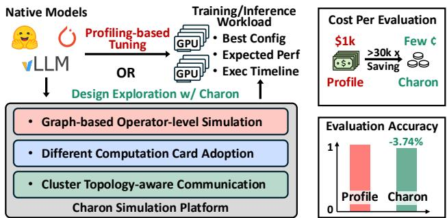  
Figure 1: Charon enables end-to-end, operator-level simulation for LLM training and inference. It delivers more than 30k cost reduction compared with cluster profiling for large-scale experiment, with only 3.74% total training time error on a large-scale training task.

Table 1: Capabilities of existing training and inference simulators  
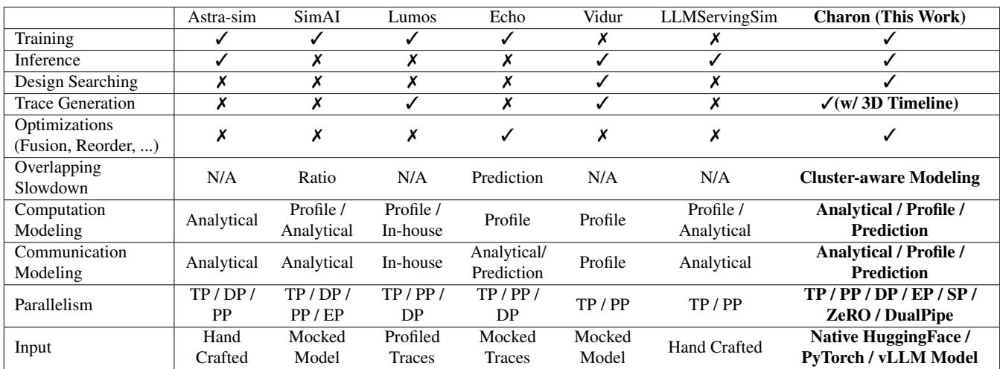

To overcome the fragmentation and rigidity of existing LLM simulators, which often trade off fidelity for speed or flexibility for usability, we propose Charon, a unified, modular, and fine-grained simulation framework for large-scale LLM training and inference. The key insight is to treat LLM simulation as a compiler-style transformation process, where each stage incrementally refines the model, schedule, and system representation to balance speed, accuracy, and scalability. Architecturally, this perspective allows Charon to have a higher coverage and accuracy than prior simulators by: (i) native model interface directly accepts HuggingFace, vLLM or custom PyTorch models, eliminating hand-crafting or preprocessing; (ii) modular pass-based design which supports plug-and-play analysis and optimization passes, allowing flexible parallelism strategies and new optimization to be modeled without refactoring core infrastructure; (iii) multi-granularity analysis produces system-level aspects as well as fine-grained PyTorch style traces, exposing rich information for performance debugging; (iv) hybrid operator simulation which combined analytical, profiling, and prediction backends, achieving optimal trade off between speed and accuracy.

Empirically, we conducted extensive evaluations of Charon, validating its accuracy against both ground-truth hardware measurements and leading simulators. Across diverse models, including LLaMA3-8B, Qwen3-8B, and Qwen3-30B-A3B, Charon consistently achieves the highest end-to-end simulation fidelity, with overall prediction errors within 5.35% of physical hardware and even within 3.74% with a large-scale GPU cluster. Fine-grained operator-level breakdowns further confirm that Charon accurately models both computation and communication, including overlapping operators and multi-parallelism strategies. Beyond accuracy,

Charon demonstrates practical impact in design-space exploration and inference optimization: in a case study on LLaMA-3 70B, it automatically discovered an inference deployment configuration that improved system throughput over a manually-tuned baseline.

## 2 BACKGROUND AND MOTIVATION

Modern LLMs are based on a decoder-only transformer architecture shown in Figure 2(a) (Vaswani et al., 2023), composed of stacked blocks with self-attention and a feedforward network, which is often a Mixture-of-Experts (MoE) for parameter efficiency(Fedus et al., 2022). As shown in Figure 2(b), their execution workflows differ: training involves iterative forward, backward, and optimizer passes, while inference operates a forward pass accelerated by the key-value (KV) cache. The scale of these models necessitates both sophisticated parallelism strategies to distribute the workload and extensive performance tuning to optimize execution on large clusters.

## 2.1 Parallelism Strategy

Due to the enormous LLM model sizes and data involved, training and inference of LLMs almost invariably require large GPU clusters. Consequently, parallelism strategies are critical to achieving acceptable performance. Figure 2(b) right part shows the most widely used parallelism strategies: Tensor parallelism (TP) partitions individual weight tensors across multiple GPUs, allowing for wide hidden dimensions at the expense of additional all-reduce communication during each layer. Data parallelism (DP) traditionally replicates the full model on each GPU and splits the input mini-batch, synchronizing gradients across replicas after the backward pass. Modern variants such as ZeRO (Rajbhandari et al., 2020) and FSDP (Zhao et al., 2023) divide optimizer states, gradients, and parameters themselves across devices to optimize per-GPU memory usage and communication volume. Expert parallelism (EP) applies specifically to mixture-ofexperts models, distributing different expert sub-networks across GPUs and incurring routing and load-balancing overhead. Pipeline parallelism (PP) divides the transformer blocks into sequential stages, assigning each stage to a different GPU. Micro-batches flow through these stages to keep all GPUs utilized. Sequence parallelism (SP) slices the input token sequence across devices for normalization layers, accelerating normalization calculation at the cost of additional communication. Modern deployments typically mix two to four of these schemes simultaneously(Shoeybi et al., 2020; Narayanan et al., 2021; Smith et al., 2022; Li et al., 2022). For example, TP is used for GPUs in a node, PP is used for inter-node, and EP is used for MoE routing. Each combination imposes distinct demands on computation resources as well as intra-node and inter-node connections, making the design choice very hard for software engineers.

## 2.2 Tuning at Cluster Scale

Considering the scale of modern LLMs, tuning configurations to achieve optimal training and inference performance is essential before deploying models to production clusters. Profiling tools, such as PyTorch Profiler and NVIDIA Nsight Systems, are widely adopted for diagnosing performance bottlenecks in large-scale LLM workloads. By instrumenting both forward and backward passes, these profilers capture fine-grained metrics including operator execution time, GPU SM and memory utilization, kernel-launch overhead, and inter-device communication latency. With this information, engineers can identify bottlenecks such as inefficient attention kernels, suboptimal memory accesses, or network contention and determine which configuration parameters (e.g., batch size, fusion settings, or communication overlap) require adjustment.

Despite the detailed visibility offered by modern profiling tools, tuning training and inference configurations at cluster scale remains highly challenging. As shown in Figure 2(c), conventional tuning workflow typically follows an iterative “profile–analyze–tune” way: engineers run workloads, collect traces, interpret results, and manually adjust settings. However, with ever-growing model sizes and emerging optimization techniques, the design space for large LLMs has expanded dramatically. Even restricting the exploration to GPU model selection and parallelism strategies can involve thousands of possible configurations(Gui et al., 2025). Evaluating a single design point on a large-scale cluster needs repeated runs (e.g., cold launches and multiple warm-ups) and can consume hundreds of GPU hours. The total exploration cost can approach 106 GPU hours, even under a constrained search that evaluates only four parallelism sizes per parallelism type. Consequently, exhaustive profilingbased tuning becomes prohibitively time-consuming and economically infeasible.

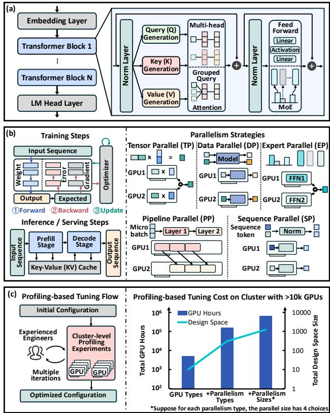  
Figure 2: LLM architecture, execution workflows, and tuning challenges: (a) Decoder-only Transformer stack with QKV attention and optional MoE in the feed-forward layers.(b) Training (forward, backward, update) and inference (prefill, decode with KV cache) workflows alongside key parallelism schemes. (c) Iterative profiling-based tuning loop and its GPU-hour/design-space explosion on large GPU clusters.

## 2.3 Related Works

Several simulators have been developed to estimate the performance of LLM training and inference across large-scale systems. ASTRA-Sim (Won et al., 2023) provides a purely analytical framework for distributed simulation, but requires users to manually construct workload models using predefined templates, limiting ease of use and model fidelity. For training simulation, SimAI (Wang et al., 2025) adopts a profiling-based, operator-level performance model for computation while estimating communication at the layer level through either analytical bandwidth models or a slower network-package simulator. Recent work (Kumar et al., 2025) extends SimAI by adding support for custom device groups and interconnect topologies, yet still depends on mocked models as input. Lumos (Liang et al., 2025)

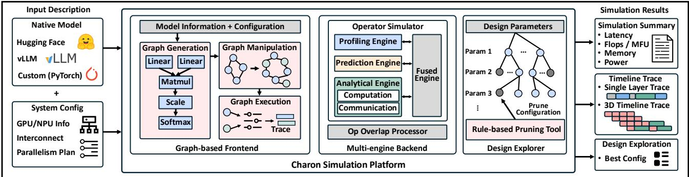  
Figure 3: Architecture overview of proposed Charon simulator. The system consists of a graph-based frontend that constructs forward and backward computation graphs while applying optimizations and analyses; a multi-engine backend that accurately simulates both computation and communication operators; and a design explorer that searches for the optimal configuration through guided pruning.

and Echo (Feng et al., 2024) provide operator-level simulation for training but rely on profiling or synthetic traces as workload inputs, introducing additional preprocessing overhead. For inference simulation, Vidur (Agrawal et al., 2024) achieves high accuracy by profiling both computation and communication, but requires models to be rebuilt within its own simulation framework. LLMServingSim (Cho et al., 2024) extends ASTRA-Sim to integrate hardware-specific simulators such as NPUs and PIM devices, but still relies on manually crafted workload descriptions.

## 3 METHODOLOGY

## 3.1 Architecture Overview

Figure 3 presents the high-level architecture of Charon, our unified “all-in-one” simulator for LLM training, inference and design-space exploration. Charon ingests native models such as HuggingFace, vLLM, or customized PyTorch models, alongside a system configuration describing GPU or even NPU specifications, interconnect topology, and desired parallelism schemes. From these inputs, Charon produces both high-level summaries (e.g., FLOPs, model-FLOPs utilization, memory footprint, and power or TDP estimates) and, if enabled, fine-grained execution traces in the style of the PyTorch Profiler (including single-layer timelines and full 3D multi-GPU traces).

Charon’s architecture comprises three key components. The frontend parses the model graph and applies a sequence of compiler-style passes—tracing operators, injecting parallelism, scheduling execution, and analyzing results. The backend executes operator-level simulations via interchangeable workers for profiling-based, analytical-based, and prediction-based simulations. It also features an overlap processor to capture communication-computation and communication-communication overlapping and estimate the slowdown for overlapped operators. Finally, the parameter searcher explores the configuration space with suboptimal settings pruning to identify optimal designs regarding cost and performance.

## 3.2 Graph-based Frontend

Charon’s frontend is the interface between user’s input and the operator-level backend simulator with a computational graph-oriented design. As Figure 4 illustrates, the frontend turns the simulation input into a computational graph and applies multiple graph manipulations to simulate the optimization or analyze the results.

(a) Graph Generation with Native PyTorch Model: To maximize usability and support a wide variety of model architectures, Charon is designed to directly accept native PyTorch models as its simulation input. Since modern LLM architectures typically comprise multiple duplicated Transformer blocks, Charon extracts and simulates only a single transformer decoder block. This approach substantially accelerates simulation while preserving architectural fidelity and numerical accuracy. However, this single-block simulation is a performance optimization primarily for symmetric architectures. For asymmetric models or workloads requiring PP, Charon traces distinct layers into separate FX graphs according to the model definition and schedules them explicitly per rank, ensuring that all PP ranks and inter-stage dependencies are accurately modeled. Furthermore, to enable disaggregated serving support, Charon can trace prefill and decode operations into independent computation graphs. This allows simulation of heterogeneous execution where different stages are mapped to different hardware clusters.

The input model can originate from widely used frameworks such as Hugging Face or vLLM, or from any customized PyTorch implementation. This flexibility is enabled by the Graph Tracer shown in Figure 4(a), which automatically converts the native model into an intermediate computation graph using torch.fx.symbolic\_trace or torch.compile. Specifically, the Graph Tracer first symbolically traces the model to capture its operatorlevel structure, then leverages the compilation pipeline in torch.compile to optimize and lower the traced module into a unified forward compute graph suitable for simulation.

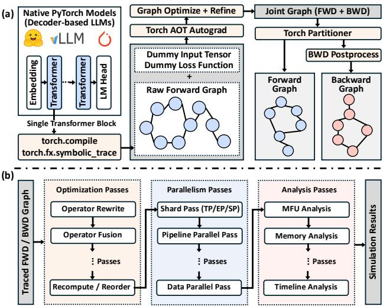  
Figure 4: Frontend architecture of proposed Charon simulator. (a) Trace and generate forward and backward groups from native PyTorch models. (b) Apply compiler-style passes for optimizations and analyses.

For training tasks that also need the backward computational graph, the graph tracer is designed to automatically generate the backward graph utilizing the torch.\_function.aot\_autograd feature. To achieve this, a dummy loss function as well as a fake input tensor will be added to the forward graph to allow dynamic output shapes. After tracing, the joint graph is processed through several passes to enhance its structure and semantics. These include adding tensor metadata, renaming input and weight nodes, and removing useless operations such as view, detach, and other operations that do not alter the tensor’s shape or data type. The joint graph is then partitioned into separate forward and backward graph modules using the default\_partition function. The backward graph undergoes further refinement, including decomposing auto-functionalized operations, removing self-clone operations, and eliminating dead code. Through this series of well-orchestrated steps, graph tracer efficiently and automatically generates a clean and optimized backward graph for the given forward computation.

(b) Graph-based Optimization and Parallelism: Modern LLMs usually contain multiple optimizations with different parallelism strategies during their training and inference flow. In order to support various optimizations and parallelisms as well as prepare for adopting the upcoming techniques in the future, we proposed a compiler-style design where optimizations and parallelisms are abstracted as graph manipulation passes that apply directly to computational graphs illustrated in Figure 4(b). Adding or removing the pass will enable or disable a specific optimization for simulation tasks, and different passes can be freely combined to enable joint optimizations.

Operator-level optimizations in Charon, such as operator rewrite and fusion, are implemented through a flexible match-and-replace graph manipulation framework. During this optimization pass, Charon traverses the computation graph to identify target node patterns that meet predefined matching criteria. Once matched, the framework modifies the node types and attributes to apply the intended optimization, such as merging multiple operators into one or replacing inefficient operator forms. This design enables high extensibility since new optimization rules can be easily added by defining custom match patterns and their corresponding transformation actions. Moreover, for quantization, Charon can either add a quantization pass to change the precision of the node or directly trace quantized models, enhancing usability and coverage given the widespread adoption of quantization in modern LLM implementations.

Leveraging its pass-based modular design, Charon supports multi-parallelism by sequentially applying the corresponding passes to the computation graph, providing flexible composition of hybrid parallelism strategies. As illustrated in Section 2, modern LLMs typically employ multiple forms of parallelism when deployed across multi-GPU systems. These parallelisms introduce collective communication operations to coordinate computation and data movement among devices. To model the resulting overhead, Charon inserts communication operators into the computation graph through a series of dedicated parallelism passes:

(i) Shard-based parallelisms such as TP, SP, and EP partition tensors and their associated computation operators across multiple GPUs. Charon traces the computation graph, adjusts the tensor shapes of the sharded operators, and inserts the corresponding communication operators (e.g., all reduce, all gather, reduce scatter) before and after each sharded operation according to the selected strategy.

(ii) PP partitions the training or inference workflow into multiple stages, with explicit dependencies across devices. In Charon, this is implemented through a schedule pattern generator that constructs inter-stage dependencies and inserts send/recv communication operators to model data transfer between stages. Charon supports both the classic 1F1B schedule and the DualPipe schedule with communication and computation overlapping. The resulting dependency graph and communication events are logged for subsequent timeline analysis and visualization.

(iii) DP partitions the training dataset across GPUs, allowing each device to compute gradients independently. Charon supports simulation of distributed data-parallel frameworks such as PyTorch DDP, FSDP, and ZeRO. For DDP, the gradients are synchronized via collective communication operations, which is explicitly modeled by inserting communication operators in Charon. FSDP and ZeRO are further supported in Charon through additional parameters and/or optimizer state sharding, optimizer state synchronization, and prefetching analysis.

(c) Pass-based Multi-granularity Analysis: Charon is designed to provide simulation results at multiple granularities for multiple aspects, including coarse-grained system-level results such as model FLOPs utilization, exposed parallelism communication overhead, memory usage, as well as fine-grained operator-level results such as operator latency, efficiency and profiler-style traces. Charon supports customizing the analysis flow with pass-based analyzers, making it flexible and easy to add new metrics.

The Charon analyzer supports both dependencyindependent and dependency-aware metrics through unified graph-based processing. For metrics that do not require operator dependencies such as model FLOPs utilization, the analyzer operates directly on the computation graph, computing per-node metrics and aggregating them into system-level results through graph traversal. For dependency-aware metrics, such as detailed timeline traces, the analyzer interacts with the Charon backend to obtain the start and end times of each operator. These are then refined by the operator scheduler, which accounts for inter-operator dependencies (e.g., pipeline stages) to generate an accurate execution timeline. From this dependency-adjusted timeline, profiler-style traces and latency-related metrics (e.g., block latency, end-to-end latency, and FLOPs utilization) are derived. Moreover, optimization techniques such as operator recomputation and communication–computation overlap should be analyzed both before and after optimization to quantify their effects. For example, FLOPs analysis is performed before operator recomputation to capture accurate model-level compute costs. Since both optimization and analysis are applied directly on computation graphs, Charon natively supports interleaving them within the same simulation flow, thereby improving efficiency, consistency and flexibility.

Accurate peak memory estimation is critical for reliable LLM simulation, as underestimation can lead to out-ofmemory (OOM) errors, and overestimation may result in suboptimal configurations. Peak memory consumption in large-scale training typically arises from optimizer states, model weights and gradients, activation tensors, and temporary buffer allocations. Unlike layer-level simulators which can only estimate memory usage based on static tensor sizes (e.g., optimizer states and weights/gradients), Charon’s graph-based design also enables precise modeling of acti-Cluster-levelExperiencedEngineersvation and temporary memory by analyzing the liveness of Experimentseach tensor during gradient computation. The backward GPUMultiplecomputational graph allows Charon to perform livenessiterationsbased traversal to determine exactly when each intermediate Optimized Configurationtensor is allocated, used, and freed across the backward pass. Consequently, it can reproduce realistic GPU memory behavior, including temporary tensor reuse and deallocation timing that directly influence the peak memory footprint. This fine-grained graph analysis is essential for evaluating memory-critical training configurations (e.g., ZeRO, FSDP, or selective activation checkpoint strategies), where peak memory is reached during backward computation. By leveraging this operator-level liveness modeling, Charon achieves high-fidelity GPU memory simulation that cannot be captured by non-graph-based simulators.

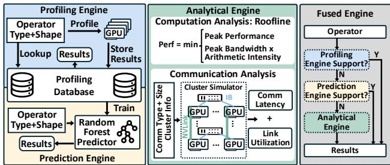  
Figure 5: Backend architecture of Charon simulator. Each operator can be simulated using a profiling, prediction, or analytical engine. A fused backend enables mixed-engine execution, allowing different operators to be simulated by different engines.

## 3.3 Multi-engine Driven Backend

The backend of Charon is responsible for simulating a single computation or communication operator. As Figure 5 shows, Charon integrates profiling-based, prediction-based, and analytical-based backend engines, as well as a fused backend engine that can use multiple different backend engines to maximize the balance between simulation speed and simulation accuracy. Additionally, Charon supports common numerical precision formats like FP32, BF16, FP16, FP8, and INT8 by maintaining precision-specific operator profiles or analytical estimates. Different precision choices impact compute efficiency along with memory usage and communication volume. The simulator explicitly models these factors through precision-aware kernel latency and bandwidth scaling. It also estimates the precision-aware memory footprint for activation, parameter, and temporary buffer sizes.

(a) Profiling Engine: The profiling engine simulates each operator by executing it on the target hardware and pro-ginal filing runtime, providing the most accurate latency at the cost of higher simulation overhead. For GPU workloads,200 GB/s Charon automatically generates profiling tasks for each operator, dispatches them to our in-house GPU cluster, and records latency once execution completes. Since profiling50 GB/s every operator instance from scratch is prohibitively expensive, Charon integrates a profiling database that caches measured results for common operators and input shapes. Upon receiving a simulation request, the profiling engineTimer Congestion first queries this database; if a matching operator–shape40 GB/s NVLink Congestion w/ Op2 pair exists, the cached latency is reused directly, thereby significantly improving simulation efficiency.50 GB/s 25 GB/s IB Congestion w/ Op1

(b) Prediction Engine: The prediction engine estimates50 GB/s operator latency directly from operator type and input tensor shape using lightweight machine learning models. Its100 GB/s primary goal is to provide fast latency estimation, especially for unseen input shapes not covered in the profiling database. In Charon, each type of operator is associated with a compact random-forest–based predictor trained on data from the profiling database. This design eliminates the need for real-time hardware execution while preserving high accuracy across diverse operator shapes, achieving substantial acceleration in large-scale simulation workloads.

(c) Analytical Engine: The analytical engine analyzes the execution time of the operator with mathematical modeling according to the operator computation and memory requirement, as well as the hardware capability. For computation operators, Charon’s analytical engine utilizes the roofline (Williams et al., 2009) model, which calculates the computation time and memory access time on targeted hardware and takes whichever is longer as the final computation time for this operator. Hardware FLOPs and memory bandwidth are pre-configured according to the simulation hardware, and operator computation FLOPs/memory accesses are computed on-the-fly according to its input shape.

For communication operators, Charon employs a hierarchical link-centric model to ensure cross-platform portability and accuracy. Instead of relying on theoretical specifications, Charon models the cluster topology using calibrated per-hop latency and effective bandwidth derived from profiling. Charon supports both Ring and Tree collective communication algorithms across diverse topologies (e.g., Ring, Switch, and Mesh). The analytical engine decomposes highlevel collective operations into physical link-level data transfers. For each link, the latency is calculated by aggregating the calibrated handshake latency and the transmission latency based on data size and effective bandwidth. This granular approach allows Charon to precisely evaluate congestion based on bandwidth sharing and topology constraints.

(d) Fused Engine: Fused engine in Charon is designed to integrate multiple simulation backends within a single execution flow. It enables an adaptive trade-off between simulation speed and accuracy, while maintaining compatibility with emerging models and newly introduced operators. Operators lacking profiling and prediction data can be executed using the analytical engine, while others are simulated using the profiling-based or prediction-based engines. This flexibility is implemented through a prioritized fallback mechanism: each engine maintains a registry of supported operators, and the fused engine dynamically selects the highest-priority backend available for each operator, falling back to lower-priority engines when necessary. This design ensures robust coverage of heterogeneous workloads without sacrificing overall simulation fidelity or scalability.

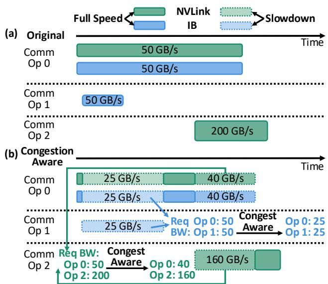  
Figure 6: Bandwidth-aware communication operators overlap in the proposed Charon simulator, (a) shows the timeline of original communication operations, and (b) shows the timeline with congestion-aware simulation.

## 3.4 Operator Overlap

Modern LLM training and inference frameworks usually overlap communication operators with either compute operators or other communication operators to improve overall performance, which needs to be carefully handled during the simulation to get fine-grained accurate traces. Charon integrates a coarse-grained ratio-based slowdown model for all overlapped operators, as well as a fine-grained bandwidthaware model for communication-communication overlap.

The ratio-based slowdown model applies slowdown factors to the overlapped part of two operators. The slowdown factor is engineered from profiling data with targeted hardware clusters. For compute-communication overlap, two separate slowdown factors are used for computation and communication operators. And for communication-communication overlap, the same slowdown factor is shared for two communication operators. The slowdown factor only applies to the portion that the operator has overlapped with other operators.

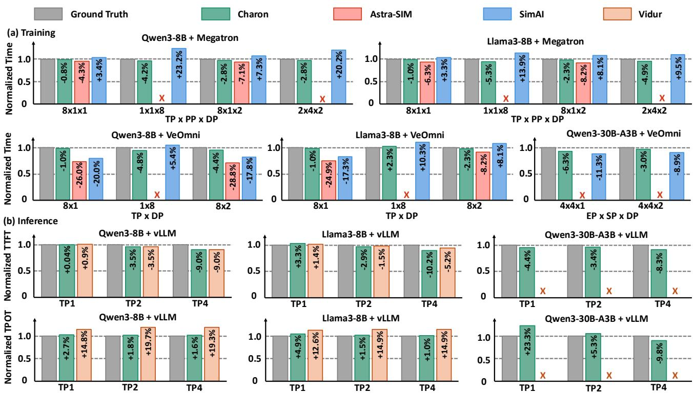  
Figure 7: End-to-end time comparison results for Charon and other simulators against measurement ground truth. “X” means the simulator cannot support configurations or cannot give valid results.

A fine-grained bandwidth-aware slowdown model is available in Charon when using analytical engine for the communication-communication overlap. As shown in Figure 6, the slowdown for each operator is decided by the effective bandwidth as well as the link congestion in the cluster. For each portion of the overlapped operators, Charon checks the link congestion for each interconnect hierarchy and calculates the slowdown according to the effective bandwidth competition ratio to simulate the underlying network packetlevel congestion control.

## 3.5 Design Space Exploration

As an LLM training and inference simulation solution, identifying the optimal infrastructure configuration for targeted tasks, such as the number of GPUs, parallelism strategies, and parallelism sizes, emerges as a crucial application in Charon. To eliminate the engineering needed for the analysis of the simulation results in order to use Charon for design space exploration, Charon is built in with a native search for the design space.

The design space exploration begins with a targeted model and task, and Charon will take the entire design space, including different choices for GPU numbers and parallelism sizes from the user’s input. To maximize search efficiency, the design exploration tool supports pruning search spaces according to rules. Users can pre-define the known inefficiency cases in Charon and the design space exploration tools can prune the corresponding sub-spaces by directly skipping the simulation.

## 4 EXPERIMENTS

In this section, we demonstrate the capability and accuracy results of the proposed Charon simulator.

## 4.1 End-to-end Simulation Accuracy

We evaluated the simulated end-to-end runtime of Charon against existing LLM simulators as well as the ground truth measurements on both training and inference tasks. To demonstrate Charon’s capabilities, we selected two dense models, Qwen3-8B and LLaMA3-8B, and one MoE model, Qwen3-30B-A3B, as representative case studies. For training simulation, we benchmarked Charon against Astra-SIM 2.0 (Won et al., 2023) and SimAI (Wang et al., 2025), measuring simulation performance under the Megatron (Shoeybi et al., 2020) and VeOmni (Ma et al., 2025) training frameworks. For inference simulation, we compared Charon with Vidur (Agrawal et al., 2024) by simulating workload within the vLLM(Kwon et al., 2023) frame-Charon work. All baseline simulators are examined to fix minor bugs and support the new Qwen3 and Llama3 models, as well as re-calibrated according to the profiling results toCharon make a fair comparison.

Table 2: Simulation breakdown for Qwen3-8B. “Prof” denotes profiling results and “Sim” denotes Charon simulation results, all results are in microseconds(us).t scale  
(a): Training breakdown with TP8 on Nvidia Ampera GPU, F indicates forward steps, and B indicates backward steps.  
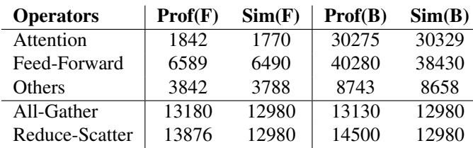

(b): Inference breakdown with TP1 on Nvidia Hopper GPU,20Small Scale Large Scale P indicates prefill steps, and D indicates decode steps.0 MAE2.22%64 96 4800 11520  
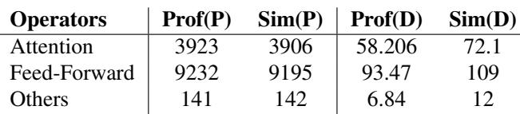

As shown in Figure 7, Charon achieved the best end-to-end9.20 (+0.39%) time accuracy among both training and inference tasks with75.96 different models and different frameworks. For training tasks, Charon’s operation graph-based simulation can accurately simulate the time of each operator level with accurate backends, as well as satisfy the operation of different frameworks. Therefore, the end-to-end time is more accurate than the analytical-based simulator Astra-SIM. For comparison with SimAI, although both use profiling-based backends for computation operators, SimAI simulates the communication based on layer-level information since its communication simulation is based on Astra-SIM 1.0 (Rashidi et al., 2020). This will lead to inaccuracy in handling communication overlaps. For Inference tasks, both Charon and Vidur can provide accurate time-to-first-token (TTFT), as Vidur uses profiling-based computation and communication simulation. However, for time-per-output-token (TPOT), Vidur cannot produce very accurate results because its predication engine is not accurate enough for small operations.

## 4.2 Time Breakdown

To demonstrate the fine-grained simulation accuracy of the proposed Charon simulator, we provide a detailed breakdown of simulation time across individual operations. For training evaluation, we analyze the operation-level simulation of the Qwen3-8B model executed on the VeOmni framework under TP8. For inference evaluation, we report the corresponding breakdown using the Qwen3-8B model in the vLLM framework.

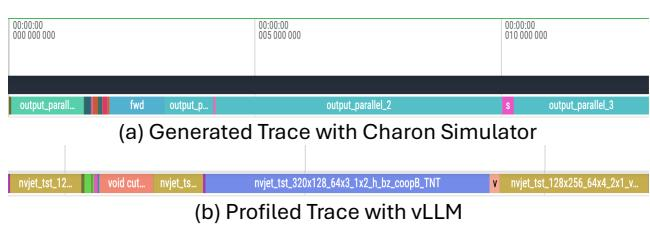  
Figure 8: Comparison of simulation traces generated by Charon and profiled vLLM serving traces. The traces represent a single layer extracted from the full-model simulation and profiling of Qwen3-8B.

Table 2(a) presents the breakdown of the training simulation results, while Table 2(b) summarizes the corresponding inference simulation results. These results demonstrate that Charon achieves high simulation accuracy not only at the end-to-end but also at the operator-level granularity.

To further validate the fine-grained accuracy of Charon, weLinear (N=390) RMS Norm (N=80) FlashAttncompared the simulation-generated execution traces against5.0 4 hardware-profiled traces. Figure 8 illustrates a single trans-2.5 2 40 former layer trace extracted from a full-model simulation0 0MAE 1.12% of Qwen3-8B alongside the corresponding profiled trace-2.5 -2 from vLLM serving. The comparison demonstrates that-5.0 -4 0MAE MAE 2. Charon accurately simulates operator-level latency and the -6 5.70% timeline traces, closely matching the actual hardware execu- -8 -20 M tion behavior.12.5

## 4.3 Memory Prediction Accuracy

Beyond execution time, accurate GPU memory estimation is critical for large-scale deployments, particularly for Mixtureof-Experts (MoE) model training, where dynamic routing introduces complex memory access patterns. We validated Charon’s memory simulation fidelity during the training of the Qwen3-30B-A3B MoE model on 8 GPUs (configured Actual Training Charonwith FSDP=8, a batch size of 2, and a sequence length of Max Memory 68.938192). As shown in Figure 9, Charon achieves high preci-Allocated 69.20 (+0.39%)sion in predicting memory dynamics per GPU. By incorpo-Max Memory 75.96rating calibrated collective communication buffer overheads and dynamic fragmentation effects, the simulation errors Memory 78.18 (-0.03%)for the maximum allocated memory, maximum reserved 0 20 40 60 80memory, and total memory footprint are merely +0.39%, Memory (GB)+0.29%, and -0.03%, respectively. This confirms Charon’s capability to reliably capture realistic memory allocations and provide a faithful representation of the actual memory footprint during complex MoE training.

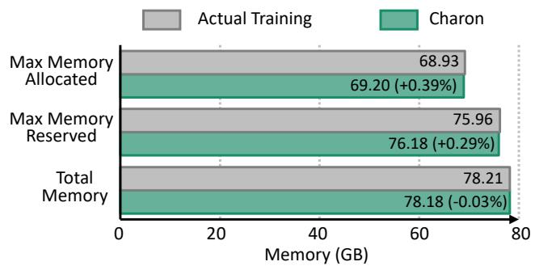  
Figure 9: Experimental results for Charon memory prediction accuracy during Qwen3-30B-A3B MoE model training (FSDP=8, batch size=2, seqlen=8192).

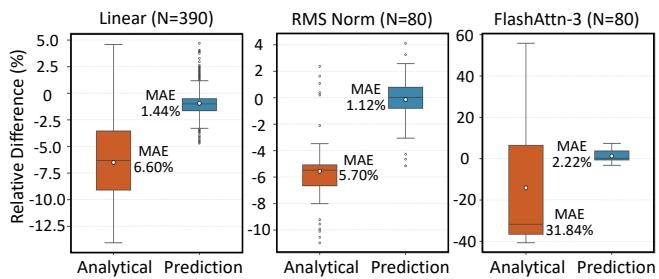  
Figure 10: Statistical indicators of analytical engine and prediction engine accuracy deviation for N unseen Linear, RMSNorm, and FlashAttn-3 operators.

## 4.4 Backend Ablation Evaluation

To demonstrate the effectiveness of our hybrid multi-engine backend, we conducted an ablation study comparing the simulation accuracy of the analytical engine (Roofline model) versus the prediction engine for unseen tensor shapes. Figure 10 presents the statistical deviation of prediction accuracy for Linear, RMSNorm, and FlashAttention-3 operators. While the analytical engine provides reasonable estimates for simpler kernels like Linear and RMSNorm, it struggles with complex operators, exhibiting a 31.84% Mean Absolute Error (MAE) for FlashAttention-3. In contrast, the prediction engine consistently maintains high accuracy across all operators, achieving an MAE of 1.44%, 1.12%, and 2.22%, respectively. This highlights the prediction engine’s superior capability in generalizing to complex, unseen workloads without relying on pure analytical approximations.

## 4.5 Across Different GPU and Cluster Scale

We further evaluated Charon across different GPU architectures as well as both small-scale and large-scale clusters to demonstrate its versatility and scalability. To this end, we selected several in-house profiling experiments targeting both training and inference performance debugging, and configured Charon to simulate these scenarios. We then compared the end-to-end latency per training or inference step between the profiling measurements and the corresponding

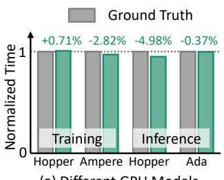  
(a) Different GPU Models

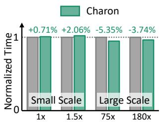  
(b) Normalized Number of GPUs  
Figure 11: Comparison results between Ground Truth (Profiling) and Charon for different GPU models under both small-scale and large-scale clusters.

## simulation results.

Figure 11 reports the normalized end-to-end latency per training and inference step. As shown in Figure 11(a), Charon consistently achieves accurate end-to-end simulation across diverse GPU models, covering both Nvidia Hopper / Ampere (H800/A100) training GPUs as well as Nvidia Hopper / Ada Lovelace (H20/L20) inference GPUs and achieving overall simulation errors within 4.98%. Furthermore, across varying cluster scales in training tasks shown in Figure 11(b), Charon demonstrates scalability to extralarge configurations with nearly ten thousand GPUs and the optimal combination of all kinds of parallelism (DP, PP, EP, SP, and TP), while keeping simulation error under 3.74%. Meanwhile, Charon consistently maintains the maximum overall error under 5.35% across both small-scale and large-scale clusters.

The minor prediction error gaps observed across different hardware and scales are primarily due to the inherent runtime variability present in physical execution traces. Factors such as network communication jitter, dynamic congestion, and data-dependent kernel execution randomness introduce stochastic behaviors in real-world clusters. Because Charon currently does not deterministically model these micro-level stochastic variations, minor deviations between the simulated and profiled results are expected. However, as demonstrated by the consistently low error margins, these gaps do not impact the simulator’s ability to provide highly reliable performance and scalability analyses.

## 5 CASE STUDY

In practice, Charon serves as a versatile platform for conducting comprehensive ”what-if” analyses to guide systemlevel design decisions. Beyond basic configuration tuning, engineers can utilize Charon to evaluate the impact of complex compilation and execution strategies without requiring a full compiler implementation. For example, operator fusion can be simulated by defining localized pattern replacements with fused operator models, allowing users to assess latency improvements prior to deployment. Similarly, memory-efficient operator reordering and overlapping strategies can be explored directly on the operation-level graph, with the resulting memory footprint and scheduling timelines instantly reflected in the simulation output. Furthermore, Charon’s pass-based architecture naturally supports the evaluation of advanced techniques such as activation checkpointing, selective offloading, and heterogeneous device placement.

To illustrate Charon’s practical utility in navigating complex design spaces, we present two detailed case studies. First, we demonstrate how Charon facilitates the design of a novel dynamic Sequence Parallelism strategy by analyzing the fine-grained tradeoffs between computation and communication. Second, we showcase Charon’s capability to perform rapid, multi-objective optimization for LLM inference, identifying optimal deployment configurations that balance system throughput against strict user-facing latency constraints.

## 5.1 Dynamic Sequence Parallel Strategy

Sequence parallelism (SP) is commonly used to optimize prefill latency in LLM serving by distributing attention computation across ranks. In this case, zigzag attention divides the sequence dimension into 2xSP chunks, assigning each rank two chunks in a zigzag pattern to balance the workload. This strategy has been widely adopted in large-scale models such as LLaMA-3 (meta llama, 2024). While zigzag attention improves compute balance compared to naive partitioning, it is not always optimal. For short sequences, zigzag attention is less efficient: it over-partitions the input and adds disproportionate all-gather communication overhead, which outweighs the potential compute savings. To address this, we extend zigzag with dynamic SP, a finegrained scheme that assigns different SP configurations per request within a batch, ensuring the best end-to-end latency.

We used Charon to analyze the tradeoffs between computation distribution and communication overhead under varying sequence length distributions. Unlike zigzag’s one-sizefits-all pattern, the simulator-generated dynamic SP plans assign different SP and zigzag configurations to each request within a batch. This fine-grained approach allows the system to balance compute and communication more precisely: for requests with long sequences, dynamic SP maintains zigzag-style balancing across ranks; for requests with shorter sequences, it reduces over-partitioning to avoid excessive all-gather overhead. As shown in Figure 12, dynamic SP adaptively adjusts the partitioning strategy per request, resulting in a more balanced utilization of GPU ranks across heterogeneous sequence lengths. By modeling both kernel execution and NCCL communication, Charon predicts per-rank latency and generates optimal request-level

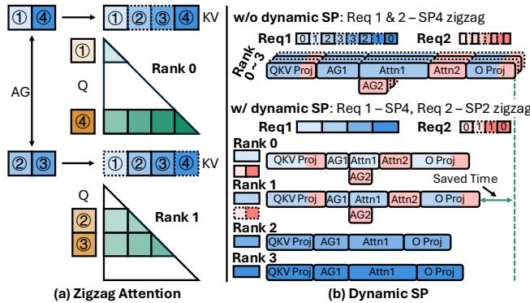  
AG1QKV Proj Attn1 Attn2 O ProjFigure 12: Illustration of zigzag attention and dynamic SP AG2planning. Each request can adopt a different SP configuration: request 1 adopts SP4, and request 2 adopts SP2 with zigzag.

SP strategies that minimize attention latency during the prefill stage.

We evaluated dynamic SP planning on LLaMA-3 70B model using 8x Nvidia Ada Lovelace inference GPUs and observed an average 15% reduction in attention block latency compared to the zigzag baseline. The performance gains primarily stemmed from better handling of small-sequence requests, where communication overhead dominates. Specifically, disabling zigzag partitioning for short sequences avoided unnecessary all-gather costs, while mixing different SP plans across requests further balanced computation and communication. Together, these adjustments allowed the system to adapt SP strategies to workload characteristics, delivering consistent improvements over static planning. Importantly, we expect these gains to be larger on GPUs with higher communication latency (e.g., PCIe-based interconnects), where reducing communication overhead becomes even more critical.

## 5.2 Optimal Inference Performance via Simulation

LLM inference is a complex multi-objective optimization problem. It is governed by key performance metrics such as TTFT and TPOT, which together determine userfacing throughput, measured in Tokens Per Second per user (TPS/user). On the hardware side, system throughput, measured in Tokens Per Second per GPU (TPS/GPU), dictates the cost per token. These metrics are jointly influenced by numerous implementation choices, including scheduling algorithms and parallelism strategies (e.g., tensor and pipeline parallelism sizes, prefill chunk sizes, and batch sizes for prefill and decoding). A common deployment requirement is to maximize TPS/GPU (thereby minimizing cost) while adhering to user-facing performance constraints, such as specific Service Level Objectives (SLOs) for TTFT and TPOT. Deriving an optimal configuration analytically is often intractable due to the intricate interdependencies among these parameters. Consequently, the prevailing approach relies on extensive empirical benchmarking across various inference configurations. This method incurs significant time and monetary costs and requires deep expertise in how different parameter combinations interact—knowledge that most users lack. As a result, tuning an inference serving system to its optimal performance is a formidable challenge.

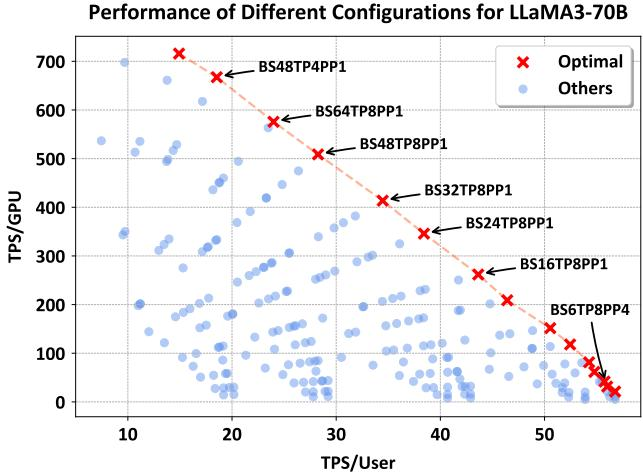  
Figure 13: Simulated performance trade-off between system throughput (TPS/GPU) and user-facing throughput (TPS/User) for Llama 3 70B on NVIDIA Hopper Inference GPUs. Each point represents a unique inference configuration (TP, PP, batch sizes, etc.). The red dots form the optimal performance frontier identified by Charon, while blue dots represent sub-optimal configurations.

We address this challenge by enabling a comprehensive exploration of the cost-latency trade-off space at a negligible time cost, typically completing its analysis within two minutes. This allows for the rapid identification of optimal deployment parameters that satisfy given TPS/user constraints. As illustrated in Figure 13 for a Llama 3 70B model, Charon explores a vast space of configuration combinations. The optimal points (red) identified by Charon offer a significant TPS/GPU improvement over sub-optimal configurations (blue) for the same user-facing performance. Furthermore, the plot reveals a clear trade-off along the optimal frontier: relaxing user-facing TPS constraints can yield up to a 7x increase in system throughput (TPS/GPU), thereby reducing costs.

To achieve its high speed, Charon leverages pre-profiled kernel latencies and employs multi-process parallel simulation. For ease of use, it is deeply integrated with both our inhouse inference framework and the standard Hugging Face Transformers library. Charon automatically parses model architectures from Hugging Face configurations. From our in-house framework, it extracts the PyTorch FX graph representation and the corresponding kernel implementations used for inference. This design minimizes the effort required to use Charon to nearly zero.

Charon has been successfully validated in our production environment. In highly constrained deployments where manual tuning by generalist engineers often falls short, Charon rapidly identifies optimal parameter combinations. For instance, when optimizing a fixed-outputlength model service under a strict 100ms end-to-end latency SLO, Charon discovered a configuration that vastly outperformed the manually tuned baseline. More importantly, as demonstrated by the Pareto frontier analysis in Figure 13, Charon empowers engineers to systematically navigate the tradeoffs between user-facing latency and underlying hardware efficiency. By abstracting away the complexity of the configuration space, Charon enables reliable maximum system throughput under specified SLOs without requiring extensive domain expertise.

## 6 CONCLUSION

We present Charon1, a unified, fine-grained simulator for large-scale LLM training and inference. Charon achieves high fidelity through its compiler-style, graph-based architecture, enabling operator-level simulation to accurately model complex parallelism and communicationcomputation overlap. It simplifies workflows by natively ingesting PyTorch models and balances simulation cost and precision via its hybrid multi-engine backend. Our experiments demonstrate Charon achieves an overall simulation error of less than 5.35%, and under 3.74% for a large-scale training. As a fast and accurate “all-in-one” platform, Charon significantly lowers the cost and expertise required to find optimal configurations for large-scale LLM training and serving deployment.

## 7 ACKNOWLEDGMENTS

We sincerely thank our teammates and colleagues for their continuous support and helpful suggestions during the development of Charon. Building this system required extensive teamwork, and we are deeply grateful to everyone who provided feedback along the way. We express our special thanks to Yan Xu, Chengji Yao, Xiang Li, Fan Yin, Dai Teng, Xiao Yu, and Xin Liu for their valuable ideas, project discussions, and code contributions. The successful completion of Charon would not have been possible without their tremendous support and collaboration.

## REFERENCES

Agrawal, A., Kedia, N., Mohan, J., Panwar, A., Kwatra, N., Gulavani, B., Ramjee, R., and Tumanov, A. Vidur: A large-scale simulation framework for llm inference, 2024. URL https://arxiv.org/abs/2405.05465.

Cho, J., Kim, M., Choi, H., Heo, G., and Park, J. Llmservingsim: A hw/sw co-simulation infrastructure for llm inference serving at scale. In 2024 IEEE International Symposium on Workload Characterization (IISWC), pp. 15–29, 2024. doi: 10.1109/IISWC63097.2024.00012.

Fedus, W., Zoph, B., and Shazeer, N. Switch transformers: Scaling to trillion parameter models with simple and efficient sparsity, 2022. URL https://arxiv.org/ abs/2101.03961.

Feng, Y., Chen, Y., Chen, K., Li, J., Wu, T., Cheng, P., Wu, C., Wang, W., Ho, T.-Y., and Xu, H. Echo: Simulating distributed training at scale, 2024. URL https://arxiv.org/abs/2412.12487.

Gui, F., Gao, K., Chen, L., Li, D., Liu, V., Zhang, R., Yang, H., and Xiong, D. Accelerating design space exploration for llm training systems with multi-experiment parallel simulation. In Proceedings of the 22nd USENIX Symposium on Networked Systems Design and Implementation, NSDI ’25, USA, 2025. USENIX Association. ISBN 978-1-939133-46-5.

Hu, H. dpro, 2022. URL https://figshare.com/ articles/software/dpro/19165622.

Kumar, S., Temura, A., Sharma, N., Singh, R., Dadhania, M., Tammana, P., Burla, S., Kamaluddin, A. M., and Shah, R. Simulating llm training workloads for heterogeneous compute and network infrastructure, 2025. URL https://arxiv.org/abs/2508.05370.

Kwon, W., Li, Z., Zhuang, S., Sheng, Y., Zheng, L., Yu, C. H., Gonzalez, J. E., Zhang, H., and Stoica, I. Efficient memory management for large language model serving with pagedattention, 2023. URL https:// arxiv.org/abs/2309.06180.

Li, S., Xue, F., Baranwal, C., Li, Y., and You, Y. Sequence parallelism: Long sequence training from system perspective, 2022. URL https://arxiv.org/abs/2105. 13120.

Liang, M., Kassa, H. T., Fu, W., Coutinho, B., Feng, L., and Delimitrou, C. Lumos: Efficient performance modeling and estimation for large-scale llm training, 2025. URL https://arxiv.org/abs/2504.09307.

Ma, Q., Zheng, Y., Shi, Z., Zhao, Z., Jia, B., Huang, Z., Lin, Z., Li, Y., Yang, J., Peng, Y., Zhang, Z., and Liu,

X. Veomni: Scaling any modality model training with model-centric distributed recipe zoo, 2025. URL https: //arxiv.org/abs/2508.02317.

meta llama. meta-llama/llama-3.1-405b hugging face, 2024. URL https://huggingface.co/meta-llama/ Llama-3.1-405B. Accessed on Oct 17, 2025.

Narayanan, D., Shoeybi, M., Casper, J., LeGresley, P., Patwary, M., Korthikanti, V. A., Vainbrand, D., Kashinkunti, P., Bernauer, J., Catanzaro, B., Phanishayee, A., and Zaharia, M. Efficient large-scale language model training on gpu clusters using megatron-lm, 2021. URL https://arxiv.org/abs/2104.04473.

Rajbhandari, S., Rasley, J., Ruwase, O., and He, Y. Zero: Memory optimizations toward training trillion parameter models, 2020. URL https://arxiv.org/abs/ 1910.02054.

Rashidi, S., Sridharan, S., Srinivasan, S., and Krishna, T. Astra-sim: Enabling sw/hw co-design exploration for distributed dl training platforms. In 2020 IEEE International Symposium on Performance Analysis of Systems and Software (ISPASS), pp. 81–92, 2020. doi: 10.1109/ISPASS48437.2020.00018.

Shoeybi, M., Patwary, M., Puri, R., LeGresley, P., Casper, J., and Catanzaro, B. Megatron-lm: Training multibillion parameter language models using model parallelism, 2020. URL https://arxiv.org/abs/ 1909.08053.

Smith, S., Patwary, M., Norick, B., LeGresley, P., Rajbhandari, S., Casper, J., Liu, Z., Prabhumoye, S., Zerveas, G., Korthikanti, V., Zhang, E., Child, R., Aminabadi, R. Y., Bernauer, J., Song, X., Shoeybi, M., He, Y., Houston, M., Tiwary, S., and Catanzaro, B. Using deepspeed and megatron to train megatron-turing nlg 530b, a large-scale generative language model, 2022. URL https://arxiv.org/abs/2201.11990.

Vaswani, A., Shazeer, N., Parmar, N., Uszkoreit, J., Jones, L., Gomez, A. N., Kaiser, L., and Polosukhin, I. Attention is all you need, 2023. URL https://arxiv.org/ abs/1706.03762.

Wang, X., Li, Q., Xu, Y., Lu, G., Li, D., Chen, L., Zhou, H., Zheng, L., Zhang, S., Zhu, Y., Liu, Y., Zhang, P., Qian, K., He, K., Gao, J., Zhai, E., Cai, D., and Fu, B. SimAI: Unifying architecture design and performance tuning for Large-Scale large language model training with scalability and precision. In 22nd USENIX Symposium on Networked Systems Design and Implementation (NSDI 25), pp. 541–558, Philadelphia, PA, April 2025. USENIX Association. ISBN 978-1-939133-46-5. URL https: //www.usenix.org/conference/nsdi25/ presentation/wang-xizheng-simai.

Williams, S., Waterman, A., and Patterson, D. Roofline: an insightful visual performance model for multicore architectures. Commun. ACM, 52(4):65–76, April 2009. ISSN 0001-0782. doi: 10.1145/1498765. 1498785. URL https://doi.org/10.1145/ 1498765.1498785.

Won, W., Heo, T., Rashidi, S., Sridharan, S., Srinivasan, S., and Krishna, T. Astra-sim2.0: Modeling hierarchical networks and disaggregated systems for large-model training at scale. In 2023 IEEE International Symposium on Performance Analysis of Systems and Software (ISPASS), pp. 283–294. IEEE, April 2023. doi: 10. 1109/ispass57527.2023.00035. URL http://dx.doi. org/10.1109/ISPASS57527.2023.00035.

Zhao, Y., Gu, A., Varma, R., Luo, L., Huang, C.-C., Xu, M., Wright, L., Shojanazeri, H., Ott, M., Shleifer, S., Desmaison, A., Balioglu, C., Damania, P., Nguyen, B., Chauhan, G., Hao, Y., Mathews, A., and Li, S. Pytorch fsdp: Experiences on scaling fully sharded data parallel, 2023. URL https://arxiv.org/abs/2304.11277.