# G-HEMP: FAST MULTI-GPU PRIVATE INFERENCE FOR LARGE-SCALE GCNS WITH HOMOMORPHIC ENCRYPTION

Ran Ran 1 Zhaoting Gong 1 Zhaowei Li 1 Xianting Lu 1 Jiajia Li 1 Wujie Wen 1

## ABSTRACT

Homomorphic Encryption (HE) offers a promising solution for privacy-preserving Graph Convolutional Network (GCN) inference in untrusted cloud environments by enabling computation directly on encrypted data. This capability is particularly valuable in domains such as recommendation systems, financial analysis, and bioinformatics, where data confidentiality is paramount. However, applying HE to large-scale GCN inference introduces substantial computational and memory overhead, severely limiting scalability and runtime efficiency. While prior works focusing on algorithmic improvements have demonstrated feasibility on CPUs, these approaches struggle to scale effectively on GPUs due to excessive memory consumption and redundant computation. In this work, we present G-HEMP, the first framework that leverages multi-GPU systems to accelerate large-scale private GCN inference. G-HEMP introduces two key innovations: (i) a block-diagonal parallel packing scheme that eliminates redundant data replication in encrypted adjacency matrices, reducing the number of HE operations and achieving up to 4.41× speedup over conventional feature-wise packing under single GPU environment; and (ii) a multi-GPU workload partitioning strategy that halves per-GPU peak memory usage on a 4-GPU system and achieves up to 3.88× latency improvement. Compared to the limb-level-partitioning-based approach in Cinnamon–the state-of-the-art encrypted computation parallelization method, G-HEMP further attains up to 3.13× gain owing to our superior multi-device partition policy. Overall, G-HEMP is model-agnostic and scales seamlessly with graph size and GPU count, enabling efficient and practical privacy-preserving GCN inference on modern heterogeneous environments.

## 1 INTRODUCTION

Graph Convolutional Networks (GCN) have achieved remarkable success across diverse domains, including social networks (Wu et al., 2018), recommendation systems (Wu et al., 2020), healthcare (Keskes & Noumeir, 2021), and scientific computing, such as molecular modeling (Wang et al., 2023a) and biomedical analysis (Zhang et al., 2021). Leveraging the public cloud for GCN inference is a common practice due to its scalability and accessibility. However, outsourcing graph data to the cloud raises serious privacy concerns, as both the graph topology and node features may leak sensitive information, ranging from social relationships to medical records and proprietary knowledge. Homomorphic Encryption (HE) offers a compelling solution for privacy-preserving GCN inference by enabling computations directly on encrypted data (Brakerski et al., 2014; Cheon et al., 2017; Chillotti et al., 2020; Ran et al., 2024).

With HE, model inference can be done in the cloud without exposing sensitive inputs, as operations on ciphertexts yield results that, once decrypted, are equivalent to those computed on plaintext. This cryptography ensures end-to-end data confidentiality throughout the inference.

However, a primary bottleneck in HE-based private GCN inference stems from the substantial memory and computational overhead of the large-scale, consecutive matrix-matrix multiplications (MMs) required for graph feature-node aggregation (Ran et al., 2024; Halevi & Shoup, 2014). Prior works exploited single-instruction-multiple-data (SIMD) parallelism through efficient ciphertext packing (Ran et al., 2024; Halevi & Shoup, 2014) to accelerate encrypted inference. Nevertheless, most of these efforts focus on CPU environments, where performance gains are limited by the high cost of HE primitive operations and their constrained SIMD parallelism. While recent studies demonstrate that GPUs can significantly reduce the latency of HE primitive operations over CPUs (Jung et al., 2021), e.g. over 10× for rotation and CMult (see our profiling result in Figure 1(a)), how to effectively utilize GPUs at the application level, particularly for accelerating large-scale HE-GCN inference, remains underexplored.

Despite GPUs’ superior parallelism and their increasing adoption for accelerating HE computations (Jung et al., 2021; Livesay et al., 2023; Shivdikar et al., 2022), the first challenge lies in their limited memory capacity, as it is often much smaller than that of CPUs and insufficient to accommodate large-scale graphs. Specifically, the encrypted AX multiplication—where A and X are the encrypted adjacency and feature matrices—causes substantial data duplication under the SOTA packing method (Ran et al., 2024), which is optimized for the core GCN computation HE-MMs and performs efficiently on CPUs. In this method, each ciphertext of X packs the f-dimensional features of multiple nodes to exploit SIMD parallelism. To ensure correct node-wise aggregation, the encrypted A must adopt the same packing layout by replicating each entry f times, once for each feature dimension, thereby matching the structure of X. Consequently, the memory footprint of encrypted A increases proportionally by a factor of f . As shown in Fig.1(b), even a single encrypted adjacency matrix A for a graph with 19,717 nodes can consume nearly 60GB of memory, not accounting for the encrypted feature matrix X and intermediate ciphertexts generated during inference. While such memory demands may be manageable on CPUs with abundant DRAM (e.g., up to 512GB), they pose a serious challenge for GPUs, since even high-end GPUs like NVIDIA H100/A100 offer only 80 GB of memory (NVIDIA Corporation). This highlights the need for more memory-efficient ciphertext packing solutions for GPUs.

To further accelerate large-scale HE-based GCN inference on GPUs, scaling to multi-GPUs is a natural solution, as it increases computational power and effectively expands the available memory capacity. However, it introduces another challenge: the judicious partitioning of encrypted workloads across GPUs. SOTA strategies, such as splitting a ciphertext through limb-level partition (Jayashankar et al., 2025) across GPUs (e.g., ct = (c0 → GPU0, c1 → GPU1)) or applying conventional plaintext matrix multiplication distribution, fail in the HE domain due to its unique computational constraints and strict data dependencies inherent to encrypted operations. For example, when ciphertexts are split using limb-level partitioning strategies, operations like key-switching trigger intensive inter-GPU data transfers. This leads to under-utilization of computational resources and increases overall latency. In HE-MMs, which involve numerous ciphertext-ciphertext multiplications and rotations, such key-switching-induced communication becomes even more frequent, exacerbating performance degradation in multi-GPU environments. A detailed comparison is provided in Section 2. Our profiling results show that, in typical HE computation scenarios, using two GPUs can increase total latency by over 50% compared to a single GPU, as illustrated in Figure 1(d). This stands in contrast to the plaintext domain, where using multiple GPUs has been shown to significantly accelerate GCN computation, e.g. achieving over 14× speedup compared to DGL (Wang et al., 2019) using 8 GPUs (Balin et al., 2023). Therefore, an efficient data partitioning strategy tailored for encrypted GCN computations across GPUs is crucial to fully exploit increased SIMD computation power and memory capacities of multi-GPU setups.

To this end, we propose a novel framework, G-HEMP, that effectively leverages a multi-GPU environment along with Block-Diagonal Parallel Packing to address the issues of memory explosion and workload partition, thereby accelerating HE GCN inference on large-scale graph data, where both the graph structure and node features are encrypted. We identify that the key to improving the memory usage and computational efficiency is two-fold: 1) Packing a ciphertext in a manner that simultaneously minimizes ciphertext rotations and eliminates the duplication of large ciphertext matrices (e.g., encrypted A), for both right direction feature aggregation and left direction node-level aggregation; 2) Distributing packed, non-duplicated ciphertexts across different GPUs to perform parallel sub-matrix multiplications, aggregating the final result only once across GPUs. In this way, the limited GPU memory could be allocated more for intermediate results or data reuse, enabling the reduction of repetitive rotation operations. Besides, an appropriate partitioning policy can help execute the computation in parallel while minimizing data communication. Our main contributions are as follows:

1. We propose an efficient block-diagonal parallel packing technique for data ciphertext via graph node partition and block-diagonal interleaving. It also analytically obtains the best feature-node partition that can achieve the minimum rotation complexity. With this new format, the corresponding adjacency matrix duplication issue on the ciphertext could be resolved. The memory overhead from the adjacency matrix is significantly reduced.

2. We further develop a HE-GCN dedicated multi-GPU partitioning policy-Graph Partition to efficiently split data and adjacency matrix ciphertexts on different GPUs with the minimum memory overhead and rotation cost, along with fewer data communications. This policy significantly reduces the memory overhead of the associated HE operations.

3. We comprehensively evaluate G-HEMP for multi-GPU-based HE-GCN inference on the Amazon-Photo, Amazon-Computers, and PubMed datasets for link prediction tasks. Experimental results show that our method achieves up to a 4.41× inference speedup on a single GPU, outperforming the state-of-the-art (SOTA) solution Penguin (NeurIPS’23). When applying our proposed multi-GPU execution policy, G-HEMP further achieves up to a 3.88× speedup over the single-GPU latency using 4 GPUs. In contrast, the prior SOTA work Cinnamon (ASPLOS’25) (Jayashankar et al., 2025) attains only a 0.3× speedup under the same setting. To the best of our knowledge, this is the first work that systematically explores multi-GPU acceleration for HE-GCN inference on encrypted graph data.

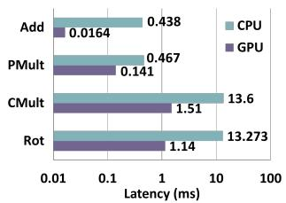  
(a)

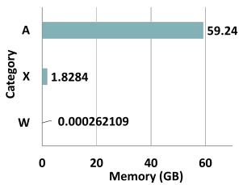  
(b)

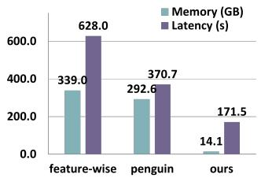  
(c)

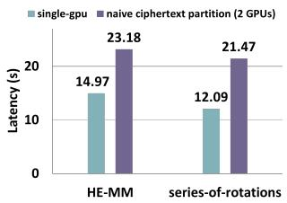  
(d)  
Figure 1. Profiling Results: (a) Primitive HE-operation Latency Profiling (log scale), (b) Memory Comparison of A, X, W, (c) Memory and Latency Comparison of Different Packing, (d) Naive Ciphertext Partitioning (2 GPUs) vs Single GPU

## 2 PRELIMINARY AND MOTIVATION

CKKS-HE Scheme. CKKS (Cheon et al., 2017) is an HE scheme whose security is grounded in the hardness of the Ring Learning with Errors (RLWE) problem. It supports approximate arithmetic over fixed-point numbers with user-defined precision, making it particularly suitable for ML tasks, where operations are inherently tolerant to minor computational inaccuracies. CKKS enables four primary homomorphic operations: ciphertext addition (Add, ct + ct′), plaintext-ciphertext multiplication (PMult, ct × pt), ciphertext-ciphertext multiplication (CMult, ct × ct′), and ciphertext rotation (Rotation, ρ(ct, k)), which cyclically shifts the slot vector. Among these, CMult and Rotation incur significantly higher latency, up to 20× slower than Add and PMult, primarily due to the key switching operation (KSO) In this work, we focus on optimizing memory efficiency and enabling multi-GPU parallelism to accelerate HE computations, while intentionally excluding bootstrapping operations. This exclusion is justified by the fact that modern approximate HE pipelines can avoid bootstrapping through careful parameter selection and circuit depth control.

Key Switching Operation (KSO) is a critical process in HE that adjusts ciphertexts resulting from CMult and Rotation, so they remain decryptable under the original secret key sk = (1, −s). This is achieved through the use of a public evaluation key (evk), which is constructed over an extended modulus P Q, where P = Qk−1i=0 pi ≥ Q and each pi is a special prime modulus (Cheon et al., 2017). In the case of CMult, a dedicated evaluation key evkmult is employed to relinearize the tensor-product result into a ciphertext form compatible with decryption via the original secret key. Likewise, for each Rotation with offset r, a specific rotation evaluation key evk(r)rot is used to convert the rotated ciphertext from decryptable only with a transformed key skr back into a form decryptable with the original sk. For example, the KSO in CMult between two cts (c0, c1), (c′ , c′ ) is computed as shown in following equation 1.

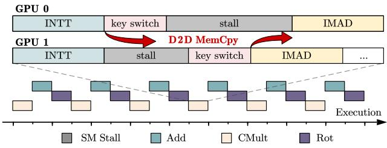  
Figure 2. In multi-GPU environment, KSO’s data dependency within CMult causes data transmission, increasing total latency.

$$
\tag{1}
$$

Assuming a multi-GPU environment, with the SOTA limblevel partitioning policy (Jayashankar et al., 2025), each ciphertext are evenly distributed on multi-GPUs. However, this unique KSO triggered during CMult introduces data dependencies across GPUs. Specifically, ciphertexts c0 and c′0 are transferred to GPU1, where the operation P −1(d2 · evkmult) generates a ciphertext tuple (d′0, d′1). The component d′1 must then be transferred back to GPU0 for further addition. As illustrated in Figure 2, these inter-device dependencies lead to Streaming Multiprocessor (SM) stalls, as GPU threads are forced to wait for data transfers to complete. As a result, memory latency is added to the actual computation time, significantly affecting performance.

Matrix Multiplications in HE. To compute the product of two n × n matrices, C = A × B in the HE domain. A common matrix diagonal-wise encoding (Halevi & Shoup, 2014) reduce the HE operation complexity from O(n2) to O(n), in which the elements of matrices A are unfolded along its diagonals to form the ith diagonal vector diagi(A) with the indexing expressed as:

$$
\tag{2}
$$

Next, the jth column vector of B is encoded and encrypted as a ciphertext. For i = 0 to n − 1, the ciphertext corresponding to the product column vector Bj is rotated by i positions and element-wise multiplication is performed with diagi(A). Then the multiplication results are accumulated into the appropriate positions to compute the element of jth column vector Cj :

$$
\tag{3}
$$

Graph Neural Network. To extract the hidden graph features H, the 2-dimensional feature-node aggregation of a typical GCN layer can often be abstracted as (Kipf & Welling, 2016a):

$$
\tag{4}
$$

where X ∈ RN×F is the input feature matrix with N nodes and F features. Wj ∈ RF ×F ′ represents weight parameters to transform the input features from an input dimension F to an output dimension F ′ (feature level aggregation). D˜j is the diagonal degree matrix of A˜j for normalization. A˜j is the adjacency matrix with self-loops. The XW term is implemented by a Fully Connected (FC) layer (node level aggregation) and then multiplied with the normalized adjacency matrix D˜j − 12 A˜j D˜j − 12 . Finally, a non-linear activation function σ (e.g. ReLU) is applied to get one GCN layer’s output feature matrix H. Throughout this work, the normalized adjacency matrix is noted in A since normalization could be absorbed in a pre-processing step.

Threat Model. We adopt the threat model from prior work on HE-GCN (Ran et al., 2024), where a client uploads encrypted private data (graph node features X and the normalized adjacency matrix A) to a semi-honest cloud server. The server hosts a well-trained but unencrypted GCN model (W ) to perform inference on encrypted input. The client then decrypts the final results locally and applies the decoder from GAE (Kipf & Welling, 2016b), which does not rely on any parameters from the cloud’s model.

Motivation Example. To quantitatively illustrate the overhead in HE GCN inference, the computation latency and memory usage on a GPU platform are profiled. Without loss of generality, we use a single GCN layer with 32 hidden units. Detailed information of hardware platform, dataset, and encryption parameters is presented in Section 4. First, as Figure 1(a) shows, the latency of CMult and Rotation, which dominate the GCN node-feature aggregation, are much higher than PMult or Add, e.g., Rotation ∼ 69× slower than Add. Second, Figure 1(b) presents the memory consumption of three matrices (PubMed dataset). An encrypted matrix A consumes most memory, exceeding 59GB, which is ∼ 226, 000× larger than the plaintext weight W and ∼ 32× larger than the ciphertext feature matrix X. Third, we also profile the single-GPU computation latency of a GCN layer (Amazon-Photo dataset) using three ciphertext packing schemes: feature-wise packing (where features with the same index across different nodes are packed into a single ciphertext), the SOTA two-dimensional parallel packing (where partial features from partial nodes are packed into a ciphertext) (Ran et al., 2024), and our proposed blockdiagonal parallel packing (see Section 3). The reported memory usage assumes that all rotated ciphertext copies, along with the adjacency matrix A, are retained in memory simultaneously. As Figure 1(c) shows, our method outperforms others, achieving a significant reduction in memory consumption and latency. Last, Figure 1(d) shows the computation latency of small sub-block HE-MM (128×128) and a series of rotations on the same ciphertexts (127 times). We can see naive ciphertext partitioning policy even incurs higher latency due to tremendous inter-GPU data transfer. These results indicate that the key to deploying a multi-GPU system for accelerating HE GCN inference is to design an HE-dedicated workload partitioning policy, along with a data packing format that avoids the duplication of encrypted A to reduce memory overhead.

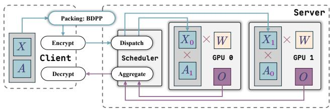  
Figure 3. The overview of workflow for HE-GCN within Multi-GPU environment on the cloud server.

## 3 METHODOLOGY

Overview. Large-scale HE-GCN inference is primarily constrained by the computational and memory overheads associated with bidirectional encrypted matrix multiplication for graph feature-node aggregation (AXW ). To address this challenge, we propose a novel framework, illustrated in Figure. 3, G-HEMP, which consists of two key components: block-diagonal packing and multi-GPU processing. Within each GPU, block-diagonal parallel packing optimizes ciphertext packing by avoiding matrix A duplication and reducing expensive HE operations, thereby significantly improving scalability and overall performance. The multi-GPU processing strategy - Graph Partition, enables efficient partitioning targeting workload with large graphs, minimizing the inter-GPU data dependency, maximizing memory utilization, and enhancing computation throughput across devices.

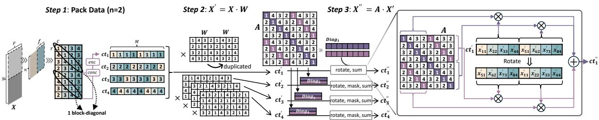  
Figure 4. Block-diagonal Parallel Packing Ciphertext Computation Flow.

## 3.1 Block-diagonal Parallel Packing

The size of the matrix A depends on the number of input nodes N . For large graphs, encrypting this large matrix incurs significant memory overhead, e.g., reaching about ∼ 49× of their plaintext size based on parameter settings in Sec 4. SOTA approaches, such as two-dimensional parallel packing–Penguin (Ran et al., 2024), aim to minimize the total rotation complexity at the expense of higher memory overhead. In computation with encrypted A, each feature ciphertext packs multiple feature data fpenguin from the same nodes to enable SIMD processing. This requires duplicating the encrypted adjacency matrix fpenguin-fold (the number of features in a ciphertext) to facilitate parallel multifeature processing on the same ciphertext. For example, a 19840 × 19840 adjacency matrix will incur an encrypted version occupying ∼60 GB (PubMed Dataset, settings are given in evaluation Sec. 4). Using Penguin’s optimal configuration (npenguin, fpenguin) = (128, 64) requires duplicating the adjacency matrix ciphertexts 64 times, resulting in a total memory size of 4608 GB. Such memory requirements far exceed the capacity of standard computational environments.

A straightforward approach to tackle the memory overhead based on Penguin involves performing extra rotations on a ciphertext that packs a sub-block of matrix A, using log(fpenugin) rotations to generate a fpenguin-fold duplicated adjacency matrix ciphertext before multiplication with X. However, this naive solution dramatically increases the computational complexity. For a bunch of (N/npenguin)2 of adjacency matrix ciphertexts, the total extra rotations are (N/npenguin)2 · log(fpenugin). This excessive computational cost motivates the need for a more efficient solution.

To achieve low memory usage and minimal rotation complexity simultaneously for efficient large-scale HE-GCN inference, inspired by the matrix diagonal-wise encoding, we propose a novel ciphertext packing method called Blockdiagonal Parallel Packing.

Given an input matrix X ∈ RN×F and a ciphertext with M slots, our Block-diagonal Parallel Packing scheme employs a tunable block size f. We define the number of f ×f square blocks packed along the node dimension as n = M/f. For each collection of n blocks, we extract diagonals with a matching index k ∈ {0, . . . , f − 1}, concatenate them into a single block-diagonal, and pack the resulting vector into one ciphertext. Consequently, the ciphertext tensor is organized into a 3D array of size n′ × f′ × f, defined by the following parameters:

• f : Dimensions of the square block (f × f ).

• n = M/f: Number of blocks per ciphertext.

• n′ = ⌈N/(n · f )⌉: Number of node-side ciphertext groups.

• f ′ = ⌈F/f ⌉: Number of feature-side ciphertext groups.

• k ∈ {0, . . . , f − 1}: The diagonal index within each square block.

As illustrated in Figure 4, with M = 8 and f = 4, we set n = 2 to select two 4 × 4 blocks along the node dimension. We then extract diagonals with identical indices from both blocks (e.g., the black-ellipse-highlighted diagonals), concatenate them, and pack the result into a single ciphertext.

Packing method shown in Algorithm 1 iteratively processes slices of the input feature map X by dividing it into submatrices based on the packing configuration. For each slice s, and for each block j, it extracts diagonal elements of a sub matrix defined by row indices r and column indices c. Each diagonal is placed into a list conc for concatenation, which is then encrypted using an encryption function enc. The resulting encrypted diagonal is stored in the corresponding position of input-ct. This process is repeated for all block rows, block columns, and slices, ensuring parallelization and efficient data packing. The final packed ciphertexts are returned as the output.

```julia
Algorithm 1 Block-diagonal Parallel Packing
Input: Featuremap: X ∈ RN×F , ct slot size M, Packing-Configuration:(n, f )
Output: Packed cts: input-ct.
input-ct = [[[]]]
for s ∈ N/n·f do
for j ∈ F/f do
c = f ∗ j → f ∗ (j + 1) − 1 # index for col
for k ∈ f do
conc = [] # TO concatenate data from same diagonal
for i ∈ n do
r = f ∗ i → f ∗ (i + 1) − 1 # index for row
temp = diag(Xr,c)k
conc[k] = temp
end for
cttemp = enc(conc)
input-ct[s][j][i] = cttemp
end for
end for
end for
Return input-ct
```

The detailed computation flow of our method, packed cts is shown in Figure 4. Before X · W , we pack cts with a size of n′ × f ′ × k. For feature aggregation, f ′ would be reduced to f ′′ = F ′/f . Then, in step 2, each ct would be rotated for copies to align the data belonging to the same feature in the correct position. Each ct is processed independently with its corresponding i-th diagonal from the sub-square matrices. In final step 3, all k cts with the same dimension in n′ and f′ would be rotated and summed for the final result as shown in Figure 4.

The key feature of ciphertext packed by Block-diagonal Parallel Packing is that data from every f-element block is independent. To be specific, these data elements are derived from different nodes and features. In the computation flow, we could simply do PMult and Add to complete the weight matrix multiplication. More importantly, for the adjacency matrix ciphertexts used here, we also pack them by scanning the f ×f square matrix and concatenate the i−th diagonals from n of them together. For example, as shown on the right side of Figure 4, the 1st diagonals of the two 4 × 4 square matrices with indexing 1 and 4 are encrypted as a ciphertext and times with ct’. Similarly, the two diagonals from the two 4 × 4 square matrices with indexing 2 and 3 would be encrypted and multiplied with Rot(ct’).

In A·X, we first rotate each ciphertext with f offset by n−1 times. Then, these ciphertexts would perform computation with corresponding adjacency matrix ciphertexts and get summed results representing the partial sum of node indexing at every fth position, e.g. 0, 64, 128,..., 8128. After that, we perform two rotations for left and right separately on the summed results, and continue to sum up these rotated cts and get one output ciphertext. The total rotation complexity

Table 1. Analytical Complexity Comparison (v.s. SOTAs)  
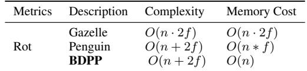

$$
\tag{5}
$$

In a densely packed setting, our method achieves a better complexity–memory tradeoff than prior single-matrix multiplication optimizations such as Gazelle (Juvekar et al., 2018). Table 1 shows that our design matches the asymptotic rotation complexity of the previous SOTA- PENGUIN (Ran et al., 2024), while reducing memory cost from O(nf ) to O(n). The key difference is that our method eliminates the need to duplicate the adjacency matrix by f× in A · X. In practice, this reduction improves both memory efficiency and end-to-end inference latency, as we shall demonstrate in Section 4.

## 3.2 Multi-GPU Workload Partitioning

Theoretically, a near-linear speedup can be achieved as the number of GPU devices increases, since multiple workloads can be executed in parallel. However, in HE domain, this observation does not always hold without an appropriate multi-GPU execution policy, especially for large-scale GCN inference tasks, due to two critical challenges: 1) the keyswitching operation is not element-wise and requires all data within the same ciphertext to be involved in the computation, limiting straightforward parallelization; 2) the encrypted adjacency matrix A is typically very large, often exceeding the memory capacity of a single GPU, making efficient data partitioning and communication management essential for scalable execution.

Internal Data Communication in KSO. As discussed in Section 2, the KSO requires all data within a ciphertext to participate in computation. Therefore, limb-level partitioning provides no parallelism benefit and instead increases latency due to additional synchronization overhead. This leads to our first design observation for multi-GPU HE-GCN inference: the minimum effective granularity for data partitioning is one complete ciphertext (ct).

Adjacency matrix introduces extensive memory overhead. In HE domain, ciphertexts are significantly larger than their plaintext counterparts—often by a factor exceeding 100 (391 bits in our experimental setup). If the adjacency matrix A is duplicated across multiple devices to enable parallel computation with X, the available memory on each GPU is substantially reduced, potentially leading to out-ofmemory (OOM) errors. Moreover, limited memory capacity can increase the total inference latency, as additional HE operations (e.g., repeated ciphertext rotations on the input matrix X) are required to compensate for insufficient space to store rotated copies. These constraints motivate our key design observation for multi-GPU execution in largescale GCN tasks: the encrypted adjacency matrix A must be partitioned across multiple devices to effectively mitigate memory overhead and ensure scalable parallel processing.

Graph Partitioning. To reduce the memory overhead while maintaining the minimum data transmission between multiple devices, we propose an application aware data partitioning policy - Graph Partition (GP) for HE-GCN tasks.

At first, duplicating the weight matrix W (plaintexts) is far less memory-intensive than duplicating the adjacency matrix A (ciphertexts) due to their significant size difference. For instance, as shown in Figure 1(b), encoding the weight matrix into plaintext consumes only 0.00026 GB, whereas encrypting the adjacency matrix requires 59.24 GB. Consequently, partitioning W provides limited benefit but consumes additional GPU memory on each device. In a two-GPU configuration, our Graph Partition (GP) policy partitions the encrypted adjacency matrix as A ≜ {A0, A1} across GPUs, while duplicating matrices X and W to enable parallel computation of submatrices A0XW and A1XW . After local computation, the resulting ciphertexts representing partial results are exchanged between GPUs for synchronization. Importantly, we constrain the minimum partitioning granularity to one complete ciphertext to ensure that KSO are performed locally within each GPU, avoiding inter-device data dependencies during HE operations.

However, in HE-MMs, duplicating X across GPUs introduces redundant rotations and corresponding memory and latency overhead. In A · X, ciphertext rotations must be applied to X before multiplication with A. Duplicating X across devices does not parallelize these rotations; instead, it replicates the same costly operations on each GPU, thereby negating potential speedup and reduce available memory (due to rotated copies).

To address this inefficiency, we propose an advanced variant, Graph Partition with X-sharing (GP-X), designed for avoiding the redundant rotations and extremely large workloads where both A and X exceed the memory capacity of a single device. In GP-X, we partition the workload as {A0X0W +A0X1W )} and {A1X0W +A1X1W )}, where GPU 0 processes (A0, X0) and GPU 1 processes (A1, X1). Only a small amount of data communication between X0 and X1 is required, which can be effectively overlapped with HE computation in implementation, thus hiding the communication overhead. Notably, as illustrated in Figure 5, when employing our BDPP scheme, we partition ciphertexts with GP-X. This strategy allows each GPU to process the computation with an independent diagonal block of ciphertext data, while GP requires the replicated rotations of X on each GPUs, ensuring balanced computation and efficient utilization of GPU memory resources.

## 4 EVALUATION

Datasets. We adopt the Amazon-Photo (Shchur et al., 2018), Amazon-Computers Dataset (Shchur et al., 2018), and PubMed (Sen et al., 2008) datasets for graph learning. The Amazon Photo, Amazon Computers Dataset, and PubMed contain 7650, 13381, and 19717 nodes, with each node consisting of 745, 767, and 500 unique word features, respectively. To test the link prediction task (Kipf & Welling, 2016b), 90% of edges are removed, and all node features are retained on all datasets.

Models. We train Graph Auto-Encoder (GAE) models with 2 hidden layers and 1 activation layers on 3 different datasets. The models follow the same GAE architecture in (Kipf & Welling, 2016b), and are implemented using the DGL library (Wang et al., 2019). Because CKKS does not natively support ReLU, we follow prior work (Ran et al., 2024; Lee et al., 2022; Kim et al., 2021) by replacing it with low-degree polynomial approximations and employing retraining to recover model accuracy. Specifically, we use x2 as the non-linear function (Gilad-Bachrach et al., 2016) to replace the ReLU activation and apply ADAM optimizer to train the model for 200 epochs using a learning rate of 0.01. The accuracy of each model (AUC in Link Prediction) is maintained at the original level.

Encryption parameters. For all tasks, we apply a scaling factor ∆ = 240 to ensure the accuracy of the encrypted inference using CKKS. Each rescale consumes 40 bits of ciphertext modulus Q, and there are 7 multiplicative depth used across the whole evaluation circuit. Thus, we set Q = 400, and the polynomial degree N = 214 to guarantee a 128-bit security level.

Environment. We evaluate our framework on two hardware platforms to demonstrate scalability across diverse compute environments. The first is a workstation featuring an AMD Ryzen Threadripper PRO 7975WX CPU (512GB DRAM) and 2× NVIDIA RTX A6000 GPUs (48GB each), utilized for CPU- and GPU-based inference profiling and GPU-based GAE training. The second is a high-density server equipped with 4× NVIDIA A100 GPUs (80GB each), representing a large-scale datacenter environment. This second configuration—distinguished by its superior per-GPU memory capacity and increased device count, allows us to validate the effectiveness of our methods across varying hardware scales.

Implementation and Evaluation Metrics. We use Liberate-FHE v0.9.0 (DESILO, 2023) to implement the

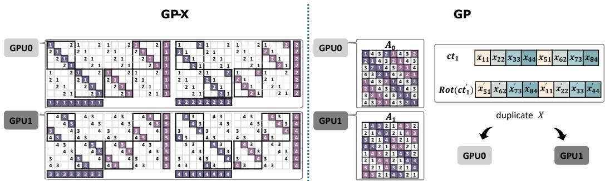  
Figure 5. Illustration for two different data partitioning policies combing with BDPP-packed cts.

RNS-variant of CKKS (Cheon et al., 2018) in a GPU environment. Transferring a single aggregated intermediate ciphertext between GPUs incurs minimal communication overhead, which can often be hidden. Each ciphertext is approximately 0.0015 GiB, and PCIe provides a transfer speed of up to 16 GB/s per link, which is 64 GB/s single directional bandwidth on our hardware platform. Consequently, we hide the communication latency of intermediate ciphertext transfers by overlapping them with concurrent computation. To reduce GPU memory usage, we store the pre-encoded plaintext weight matrices in CPU DRAM and load them on demand before computation. This loading can typically overlap with GPU computation to hide the extra runtime overhead. We evaluate our techniques using three metrics: the number of HE rotation, total inference latency, and peak GPU memory usage.

## 4.1 Block-diagonal Parallel Packing

In this evaluation section, we mainly focus on performance comparison on a single GPU between different packing methods: 1) Feature-wise Packing (FWP); 2) SOTA work-Penguin under its optimal configuration (128, 64); 3) our proposed Block-diagonal Parallel Packing (BDPP).

Micro-benchmark Evaluations Table 2 compares GPU memory usage and computation latency across a range of single-layer GCN AXW(n, f, f′) micro-benchmarks executed on single GPU. The evaluation includes the number of rotation (Rot), GPU memory usage, inference latency, and latency speedup compared to FWP (used as the baseline). The benchmarks span configurations of increasing scale, providing insights on the computational and memory efficiency of each method under different workload sizes.

Across all evaluated benchmarks, BDPP consistently achieves the lowest latency and highest speedup. In FWP, each ciphertext suffers from significant slot underutilization, and this inefficiency becomes more severe as the feature dimension increases, resulting in more ciphertexts and further wasted slots, ultimately degrading both computational and memory efficiency. For instance, on the medium-scale (128, 64, 32) benchmark, BDPP completes inference in just 0.301 seconds, achieving a 27.5× latency speedup over FWP and outperforming Penguin by 1.17×. On the largest-scale (1024, 1024, 32) benchmark, BDPP maintains its advantage with a latency of 2.967 seconds, compared to 70.27 seconds for FWP, representing more than a 23× improvement. While Penguin addresses the slot utilization issue, its computation algorithm for XW multiplication relies on a fixed rotation pattern determined by a pre-computed optimal blocking size. This leads to a fixed number of required rotations regardless of data sparsity, resulting in higher latency and rotation counts compared to BDPP. In benchmarks with smaller output feature sizes (e.g., 2 or 4), the size of intermediate data remains relatively small, resulting in fewer ciphertexts and less slot waste. In such cases, the latency speedup of BDPP over baseline is less pronounced; however, our method still delivers consistent efficiency.

For memory usage, two key contributors to BDPP’s efficiency are the substantial reduction in the number of HE rotations and the elimination of matrix A duplication. For example, in the (128, 64, 32) benchmark, FWP performs 4064 rotations, whereas BDPP reduces this to only 189, yielding a > 20× reduction. This not only lowers latency but also significantly reduces memory usage. In contrast, Penguin requires duplicating matrix A to enable parallel computation across multiple features on same ciphertexts, which leads to higher memory consumption. For instance, in the same (128, 64, 32) benchmark, Penguin consumes 7.55 GB of memory, while BDPP only requires 1.69 GB, highlighting its memory efficiency.

Finally, BDPP demonstrates both memory and computational efficiency, consistently outperforming other SOTA packing methods while maintaining GPU memory usage under 2 GB across all evaluated benchmarks. This enables BDPP to support large-scale GCN inference that exceeds the memory and computational capacity of existing GPU-based methods. A detailed evaluation on end-to-end benchmarks with larger workloads is presented in next section.

End-to-End Benchmark Evaluations Table 4 presents a comparison of GPU memory usage and inference latency across three large-scale graph datasets commonly used in practice. As shown in the table, for the relatively small Amazon-Photo graph dataset, method 1) FWP incurs significantly higher memory consumption and latency, as each ciphertext (ct) requires 8191 rotation operations, in contrast to only 127 rotations required by the other two methods. This results in substantial computational and memory overhead compared to our proposed method–3) BDPP. Additionally, method 2) Penguin introduces further latency and memory usage due to the need to duplicate matrix A via extra rotation operations. Consequently, Penguin exhibits the highest latency among the three approaches and greater memory usage than BDPP.

In some scenarios, e.g. for relatively large dataset like Amazon-Computers, a direct implementation of method 1) FWP and method 2) Penguin would exceed our GPU memory capacity. To make them executable within systems’ memory limits, we modify the implementations as follows: re-rot for 1) FWP, which re-rotates input ciphertexts cts before multiplying with the ciphertext A; and dup for 2) Penguin, which uses rotations to dynamically generate the duplicated A, thereby avoiding duplication of A in preprocessing encryption stage (saving memory of A) before multiplying it with X .

For Amazon-Computers dataset, method 1) FWP re-rotates the ciphertexts of X to fit the GPU memory capacity, which incurs additional latency. method 2) Penguin, still delivers the worst latency among the three (much slower than method 1-FWP), because the extra rotations required for generating duplicated A is tremendous (size of A >> size of X). This suggests that the trade-off between HE rotations and ciphertext matrix duplications is ineffective for large graphs, thereby highlighting the advantage of our packing method 3) BPDD, which minimizes rotation operations while eliminating the need of duplicating the large ciphertext matrix A. As a result, the total latency improves significantly. In summary, our method 3)–BDPP achieves a notable latency speedup of up to ∼ 16.8× and lowest memory usage compared to these two methods. This is due to its ability to fit into a small-memory setting without the need for re-rot and dup.

Table 2. Memory and Latency Comparison on Micro-Benchmarks (Single GPU).  
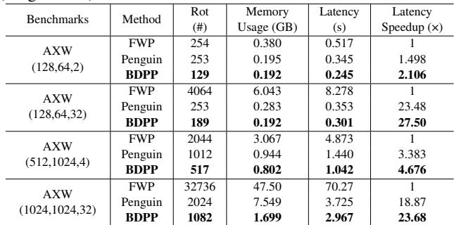

Table 3. Performance comparison across 2 benchmarks.  
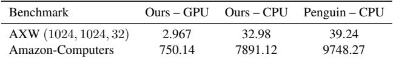

For the largest PubMed graph dataset, as the matrix A (59.74 GB > 48 GB) is too large to fit in a single GPU. As a result, all three methods would encounter the out-of-memory error. This also highlights the need to split A across multi-GPUs, as we shall show in the next section.

Comparison with SOTA-Penguin under CPU environment. We also evaluate our framework’s CPU-only inference latency against the SOTA-Penguin (Ran et al., 2024), across two representative benchmarks. As summarized in Table 3, our GPU-accelerated implementation underscores the necessity of specialized hardware for practical HE inference, delivering over 10× lower latency than the CPU baseline (11.1× on AXW and 10.5× on Amazon-Computers). Notably, even in a CPU-only environment, our implementation consistently outperforms Penguin under identical HE parameters, achieving speedups of 1.19× and 1.24×, respectively.

We attribute these gains to micro-architectural and implementation-level optimizations rather than differences in asymptotic complexity. While our framework shares the same O-complexity as prior designs (see Table 1), our specialized packing scheme facilitates lazy relinearization. By strategically deferring these operations, we bypass a significant subset of expensive key-switching procedures, thereby reducing constant overheads and lowering total end-to-end latency.

Table 4. Memory and Latency Comparison on End-to-End Benchmarks (Single GPU).  
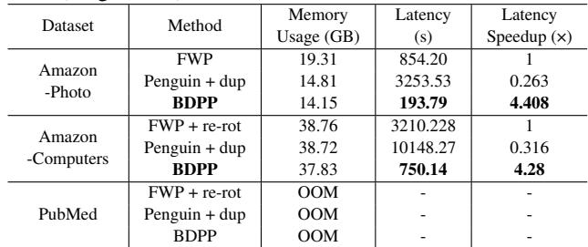  
Table notes: OOM: out of GPU memory.

## 4.2 Multi-GPU Performance Evaluation

To evaluate the effectiveness of our proposed multi-GPU policy, we integrate it with two packing schemes—the state-ofthe-art Penguin and our proposed block-diagonal parallelpacking (BDPP)—to comprehensively assess communication overhead, per-GPU memory usage, and inference latency. The evaluation is conducted across three end-to-end HE-GCN benchmarks to validate both scalability and efficiency under different graph workloads.

For a fair comparison, we also include the SOTA partition baseline, Limb-Level Partition (LLP) (Al Badawi et al., 2021; Wang et al., 2023b; Jayashankar et al., 2025), which evenly distributes ciphertext limbs across multiple GPUs to balance workload and achieve parallel execution. In contrast, our method introduces two graph-partition-based variants: (1) Graph Partition (GP), which partitions the adjacency matrix A across GPUs while duplicating X and W to enable parallel computation without inter-GPU communication, and (2) Graph Partition with X-sharing (GP-X), which reduces memory overhead by duplicating only W while partitioning both A and X. This design effectively alleviates memory constraints and maintains high throughput even for large-scale encrypted workloads.

Table 5 summarizes the experimental results, including communication cost, memory efficiency, and latency, as well as memory reduction and latency speedup relative to each single-GPU baseline. Ideally, the memory reduction and latency speedup should approach 50% and 2×, respectively. Our method is the only one achieving near-ideal results across both small and large datasets, demonstrating its scalability and effectiveness for multi-GPU HE-GCN inference.

Multi-GPU policy with previous SOTA packing Penguin. In Table 5, we first evaluate the three multi-GPU policies under the state-of-the-art packing method, Penguin. On the two smaller benchmarks, GP-X consistently achieves the best performance among all policies, benefiting from its efficient partitioning of both matrices A and X. This strategy not only alleviates memory bottlenecks but also effectively balances the computational workload across GPUs, leading to improved parallel efficiency. However, for the largescale PubMed benchmark, all multi-GPU policies encounter out-of-memory (OOM) errors due to the data duplication overhead inherent in Penguin, which limits its scalability in practical large-scale settings.

When combined with our proposed-BDPP, in experiments across all three datasets, our solution-GP-X delivers the best performance. The key feature is to simultaneously split the most memory-intensive components (encrypted adjacency matrix A and encrypted data matrix X) onto different GPUs in balance, instead of duplicating any of them for parallel processing. For X, our GP-X successfully distributes the rotations task of X, which reduces latency and number of ct copies on each GPU. For A, it distributes corresponding block-diagonal of A respect to the distributed X on to different GPUs. With 2 GPUs, it achieves approximately ∼ 50% optimized memory usage and speedups that demonstrate strong scaling efficiency compared to the single GPU solution in Table 4.

For LLP, as this policy evenly distributes a ciphertext to different GPUs, it reduces the memory usage by 50%. However, LLP leads to frequent data communications (e.g. computation between ct0 and ct′1) during each HE operation and underutilized computational resources (e.g. ct1 computing with evk, while ct0 is not involved). Thus, it even results in a higher computation latency than single-GPU solution.

For one variant GP, it could also overcome the huge memory overhead of A by splitting it and duplicating X to parallelprocessing computation of A · X. However, this policy also duplicates the rotation overhead for matrix X, which introduces additional computation latency and duplicated rotated ciphertext copies. This limits the speedup compared to the theoretical multi-GPU speedup and increases the memory overhead on each GPU.

Multi-GPU Scalability Analysis. We also evaluate multi-GPU scalability on a high-density server equipped with four NVIDIA A100-SXM4-80GB GPUs. As shown in Table 6, GP-X demonstrates near-linear scaling as additional devices are integrated. In contrast, the limb-level parallelism (LLP) baseline exhibits significant performance degradation under the same conditions; at a 4-GPU configuration, GP-X achieves a 3.63×–3.88× speedup across all three benchmarks, whereas LLP throughput collapses to just 0.3× of its single-GPU performance.

The performance disparity stems from LLP’s introduction of RNS-dependent key switching onto the critical path; as GPU counts increase, these cross-device dependencies create synchronization bottlenecks that outweigh parallel gains. In contrast, GP-X partitions independent ciphertext groups across GPUs, decoupling the communication pattern from the cryptographic internal structure. More generally, with A ≜ {A1, . . . , AK } and X ≜ {X1, . . . , XK } denoting the partitioned adjacency matrices and input partitions across K GPUs,our design scales by assigning each GPU one partition pair Since the aggregation communication volume remains unchanged under a fixed input size, scalability is mainly constrained by input granularity. In the Amazon-Photo benchmark with 8192 graph input nodes, our method supports effective scaling up to 16 GPUs.

## 5 RELATED WORKS

Matrix multiplication is a core operation in GCNs. Existing works, such as GAZELLE (Juvekar et al., 2018),

Table 5. Multi-GPU Performance Comparison for SOTA-Penguin and proposed BDPP.  
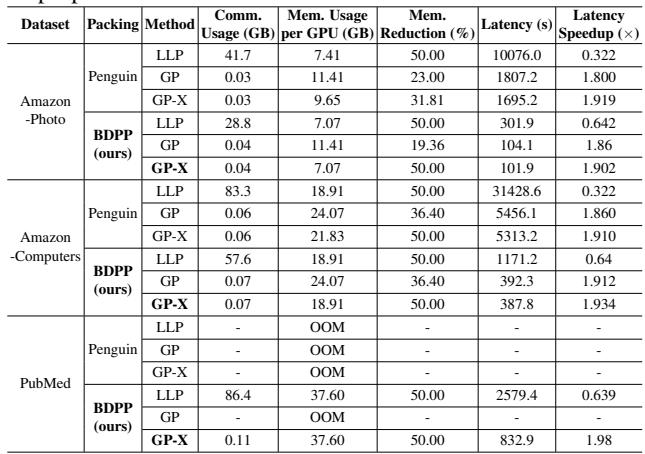  
Table notes: OOM: out of GPU memory.

E2DM (Jiang et al., 2018), uSCORE (Huang et al., 2021), HElayers (Aharoni et al., 2023), HETAL (Lee et al., 2024), and (Gao et al., 2024), have proposed general solutions for matrix multiplication under HE. However, these approaches are often suboptimal for HE-GCN inference due to the unique challenges posed by graph-structured data, as demonstrated by the SOTA work Penguin (Ran et al., 2024), which serves as one of the baselines for comparison here.

Besides, in hardware domain, several studies have explored the acceleration of encrypted computation on the GPU platform (Goey et al., 2021; Kim et al., 2020; Jung et al., 2021; Ozerk et al. ¨ , 2022; Zhai et al., 2022; Livesay et al., 2023; Shivdikar et al., 2022), and other recent works also explored various custom hardware accelerator designs, either in the FPGA (Fan et al., 2024; Agrawal et al., 2022; Yang et al., 2023b; Nguyen et al., 2023) or ASIC (Yang et al., 2023a; Kim et al., 2022; Samardzic et al., 2022). These works primarily focus on optimizing low-level HE primitive operations, such as ciphertext-ciphertext multiplication, ciphertext rotation, and Number Theoretic Transform computation used in the CKKS scheme. However, despite these most recent advancements in the optimization of CKKS operations, they did not address higher-level optimizations with considering the SIMD computation manner of CKKS and specific computation patterns in neural network inference.

Existing multi-device HE acceleration frameworks (Al Badawi et al., 2021; Wang et al., 2023b; Jayashankar et al., 2025) primarily parallelize individual HE operators via a Residue Number System (RNS) based paradigm, often termed limb-level parallelism. This approach partitions the ciphertext modulus chain across multiple GPUs to leverage the independence of residue computations. However, these methods fail to scale, and frequently suffer from significant latency degradation, in HE-GCN inference due to the excessive inter-device communication overhead triggered by frequent Key-Switching Operations (KSO) during complex matrix multiplications. While solutions like Hydra (Yang et al., 2025) mitigate these overheads in HE-CNNs by duplicating input data across devices, such data-redundancy strategies are infeasible for HE-GCN tasks given the prohibitive memory requirements of large-scale graph topologies.

Table 6. Memory and Latency Comparison on End-to-End Benchmarks (4 A100 GPUs).  
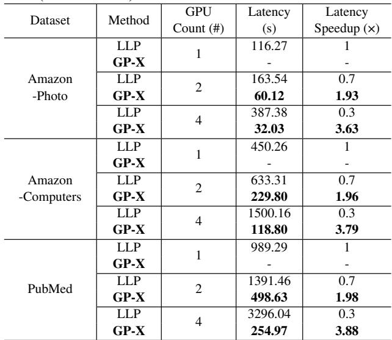

CryptoGCN (Ran et al., 2022) improved HE-GCNs by packing node ciphertexts but assumed plaintext adjacency matrices, which limits its applicability to dynamic graphs. To address the two-dimensional feature-aggregation property of GCNs, Penguin (Ran et al., 2024) proposed an efficient data-packing method aimed at reducing rotation operations and improving slot utilization in ciphertexts. Their approach uses a two-dimensional parallel-packing strategy with an optimal blocking design, requiring the adjacency matrix A to be duplicated within the same ciphertext. This allows parallel processing of multiple encrypted features in X. While this method minimizes computational complexity, the high memory usage limits its scalability, especially for large-scale problems in resource-constrained environments.

In contrast, our G-HEMP focuses on a both computational and memory efficient ciphertext packing method that significantly reduces the number of rotations required during GCN inference without duplicating matrix A. In addition, with the multi-GPU data partitioning strategy, the computation latency and memory usage are further reduced, well fitting for large-scale graph dataset. It presents the first effort to accelerate HE-based GCN inference by leveraging both single-GPU and multi-GPU platforms.

## 6 CONCLUSION

In this paper, we proposed a block-diagonal parallelpacking method and a graph partitioning policy for CKKS-based GCN inference, effectively reducing ciphertext memory usage and significantly decreasing the number of HE operations. Our approach addresses the challenges of large-scale graph processing by efficiently managing the encrypted adjacency matrix A and feature matrix X, and by enabling scalable computation across multiple GPUs. Comprehensive evaluations on the Amazon-Photo, Amazon-Computers, and PubMed datasets for link prediction demonstrate that our method achieves up to a 4.41× speedup on a single GPU, outperforming the SOTA solution Penguin (NeurIPS’23). With our proposed multi-GPU execution policy, G-HEMP further achieves up to a 3.88× speedup over single-GPU latency using 4 GPUs, while prior SOTA work Cinnamon (ASPLOS’25) attains only a 0.3× speedup under the same setting and making secure data processing on large-scale graphs feasible.

## ACKNOWLEDGEMENTS

We thank all anonymous reviewers for their constructive comments and suggestions on this work. This work is partially supported by the National Science Foundation (NSF) under Grants No. CNS-2348733, No. CNS-2349538, and No CCF-2316201.

## REFERENCES

Agrawal, R., de Castro, L., Yang, G., Juvekar, C., Yazicigil, R., Chandrakasan, A., Vaikuntanathan, V., and Joshi, A. Fab: An fpga-based accelerator for bootstrappable fully homomorphic encryption, 2022.

Aharoni, E., Adir, A., Baruch, M., Drucker, N., Ezov, G., Farkash, A., Greenberg, L., Masalha, R., Moshkowich, G., Murik, D., et al. Helayers: A tile tensors framework for large neural networks on encrypted data. Proceedings on Privacy Enhancing Technologies, 1(1):325–342, 2023.

Al Badawi, A., Veeravalli, B., Lin, J., Xiao, N., Kazuaki, M., and Khin Mi Mi, A. Multi-GPU Design and Performance Evaluation of Homomorphic Encryption on GPU Clusters. IEEE Transactions on Parallel and Distributed Systems, 32(2):379–391, February 2021. ISSN 1558-2183. doi: 10.1109/TPDS. 2020.3021238. URL https://ieeexplore.ieee. org/document/9185077. TLDR: The Halevi-Polyakov-Shoup (HPS) variant of the Fan-Vercauteren (FV) levelled Fully Homomorphic Encryption (FHE) scheme is presented, and a comparison with a recent shared-memory-based multi-core CPU implementation

using two homomorphic circuits as workloads: vector addition and multiplication.

Balin, M. F., Sancak, K., and Catalyurek, U. V. Mg-gcn: A scalable multi-gpu gcn training framework. In Proceedings of the 51st International Conference on Parallel Processing, ICPP ’22, New York, NY, USA, 2023. Association for Computing Machinery. ISBN 9781450397339. doi: 10.1145/3545008.3545082. URL https://doi. org/10.1145/3545008.3545082.

Brakerski, Z., Gentry, C., and Vaikuntanathan, V. (leveled) fully homomorphic encryption without bootstrapping. ACM Transactions on Computation Theory (TOCT), 6(3):1–36, 2014.

Cheon, J. H., Kim, A., Kim, M., and Song, Y. Homomorphic encryption for arithmetic of approximate numbers. In International Conference on the Theory and Application of Cryptology and Information Security, pp. 409–437. Springer, 2017.

Cheon, J. H., Han, K., Kim, A., Kim, M., and Song, Y. A full rns variant of approximate homomorphic encryption. In International Conference on Selected Areas in Cryptography, pp. 347–368. Springer, 2018.

Chillotti, I., Gama, N., Georgieva, M., and Izabachene, M.\` Tfhe: fast fully homomorphic encryption over the torus. Journal of Cryptology, 33(1):34–91, 2020.

DESILO. Liberate.FHE: A New FHE Library for Bridging the Gap between Theory and Practice with a Focus on Performance and Accuracy, 2023. https://github. com/Desilo/liberate-fhe.

Fan, S., Deng, X., Tian, Z., Hu, Z., Chang, L., Hou, R., Meng, D., and Zhang, M. Taiyi: A high-performance ckks accelerator for practical fully homomorphic encryption. arXiv preprint arXiv:2403.10188, 2024.

Gao, Y., Quan, G., Homsi, S., Wen, W., and Wang, L. Secure and efficient general matrix multiplication on cloud using homomorphic encryption. The Journal of Supercomputing, pp. 1–41, 2024.

Gilad-Bachrach, R., Dowlin, N., Laine, K., Lauter, K., Naehrig, M., and Wernsing, J. Cryptonets: Applying neural networks to encrypted data with high throughput and accuracy. In International conference on machine learning, pp. 201–210. PMLR, 2016.

Goey, J.-Z., Lee, W.-K., Goi, B.-M., and Yap, W.-S. Accelerating number theoretic transform in gpu platform for fully homomorphic encryption. The Journal of Supercomputing, 77:1455–1474, 2021.

Halevi, S. and Shoup, V. Algorithms in helib. In Annual Cryptology Conference, pp. 554–571. Springer, 2014.

Huang, Z., Hong, C., Lu, W.-j., Weng, C., and Qu, H. More efficient secure matrix multiplication for unbalanced recommender systems. IEEE Transactions on Dependable and Secure Computing, 2021.

Jayashankar, S., Chen, E., Tang, T., Zheng, W., and Skarlatos, D. Cinnamon: A framework for scale-out encrypted ai. In Proceedings of the 30th ACM International Conference on Architectural Support for Programming Languages and Operating Systems, Volume 1, pp. 133–150, 2025.

Jiang, X., Kim, M., Lauter, K., and Song, Y. Secure outsourced matrix computation and application to neural networks. In Proceedings of the 2018 ACM SIGSAC conference on computer and communications security, pp. 1209–1222, 2018.

Jung, W., Kim, S., Ahn, J. H., Cheon, J. H., and Lee, Y. Over 100x faster bootstrapping in fully homomorphic encryption through memory-centric optimization with gpus. IACR Transactions on Cryptographic Hardware and Embedded Systems, pp. 114–148, 2021.

Juvekar, C., Vaikuntanathan, V., and Chandrakasan, A. {GAZELLE}: A low latency framework for secure neural network inference. In 27th USENIX Security Symposium (USENIX Security 18), pp. 1651–1669, 2018.

Keskes, O. and Noumeir, R. Vision-based fall detection using st-gcn. IEEE Access, 9:28224–28236, 2021.

Kim, J., Lee, G., Kim, S., Sohn, G., Rhu, M., Kim, J., and Ahn, J. H. Ark: Fully homomorphic encryption accelerator with runtime data generation and inter-operation key reuse. In 2022 55th IEEE/ACM International Symposium on Microarchitecture (MICRO), pp. 1237–1254. IEEE, October 2022. doi: 10.1109/micro56248.2022.00086.

Kim, M., Jiang, X., Lauter, K., Ismayilzada, E., and Shams, S. Hear: Human action recognition via neural networks on homomorphically encrypted data. preprint arXiv:2104.09164, 2021.

Kim, S., Jung, W., Park, J., and Ahn, J. H. Accelerating number theoretic transformations for bootstrappable homomorphic encryption on gpus. In 2020 IEEE International Symposium on Workload Characterization (IISWC), pp. 264–275. IEEE, 2020.

Kipf, T. N. and Welling, M. Semi-supervised classification with graph convolutional networks. arXiv preprint arXiv:1609.02907, 2016a.

Kipf, T. N. and Welling, M. Variational graph autoencoders, 2016b. URL https://arxiv.org/abs/ 1611.07308.

Lee, E., Lee, J.-W., Lee, J., Kim, Y.-S., Kim, Y., No, J.-S., and Choi, W. Low-complexity deep convolutional neural networks on fully homomorphic encryption using multiplexed parallel convolutions. In International Conference on Machine Learning, pp. 12403–12422. PMLR, 2022.

Lee, S., Lee, G., Kim, J. W., Shin, J., and Lee, M.-K. Hetal: Efficient privacy-preserving transfer learning with homomorphic encryption, 2024.

Livesay, N., Jonatan, G., Mora, E., Shivdikar, K., Agrawal, R., Joshi, A., Abellan, J. L., Kim, J., and Kaeli, D. Accel- ´ erating finite field arithmetic for homomorphic encryption on gpus. IEEE Micro, 43(5):55–63, 2023.

Nguyen, T. T., Kim, J., and Lee, H. Ckks-based homomorphic encryption architecture using parallel ntt multiplier. In 2023 IEEE International Symposium on Circuits and Systems (ISCAS), pp. 1–4. IEEE, 2023.

NVIDIA Corporation. Nvidia h100 tensor core gpu. URL https://resources. nvidia.com/en-us-tensor-core/ nvidia-tensor-core-gpu-datasheet.

Ozerk, ¨ O., Elgezen, C., Mert, A. C., ¨ Ozt ¨ urk, E., and Sava ¨ s¸, E. Efficient number theoretic transform implementation on gpu for homomorphic encryption. The Journal of Supercomputing, 78(2):2840–2872, 2022.

Ran, R., Wang, W., Gang, Q., Yin, J., Xu, N., and Wen, W. CryptoGCN: Fast and scalable homomorphically encrypted graph convolutional network inference. In Oh, A. H., Agarwal, A., Belgrave, D., and Cho, K. (eds.), Advances in Neural Information Processing Systems, 2022.

Ran, R., Xu, N., Liu, T., Wang, W., Quan, G., and Wen, W. Penguin: parallel-packed homomorphic encryption for fast graph convolutional network inference. Advances in Neural Information Processing Systems, 36, 2024.

Samardzic, N., Feldmann, A., Krastev, A., Manohar, N., Genise, N., Devadas, S., Eldefrawy, K., Peikert, C., and Sanchez, D. Craterlake: a hardware accelerator for efficient unbounded computation on encrypted data. In Proceedings of the 49th Annual International Symposium on Computer Architecture, ISCA ’22, pp. 173–187, New York, NY, USA, 2022. Association for Computing Machinery. ISBN 9781450386104. doi: 10.1145/3470496.3527393.

Sen, P., Namata, G., Bilgic, M., Getoor, L., Galligher, B., and Eliassi-Rad, T. Collective classification in network data. AI magazine, 29(3):93–93, 2008.

Shchur, O., Mumme, M., Bojchevski, A., and Gunnemann, ¨ S. Pitfalls of graph neural network evaluation. arXiv preprint arXiv:1811.05868, 2018.

Shivdikar, K., Jonatan, G., Mora, E., Livesay, N., Agrawal, R., Joshi, A., Abellan, J. L., Kim, J., and Kaeli, D. Ac-´ celerating polynomial multiplication for homomorphic encryption on gpus. In 2022 IEEE International Symposium on Secure and Private Execution Environment Design (SEED), pp. 61–72. IEEE, 2022.

Wang, M., Zheng, D., Ye, Z., Gan, Q., Li, M., Song, X., Zhou, J., Ma, C., Yu, L., Gai, Y., Xiao, T., He, T., Karypis, G., Li, J., and Zhang, Z. Deep graph library: A graphcentric, highly-performant package for graph neural networks. preprint arXiv:1909.01315, 2019.

Wang, Y., Li, Z., and Barati Farimani, A. Graph Neural Networks for Molecules, pp. 21–66. Springer International Publishing, 2023a. ISBN 9783031371967. doi: 10.1007/978-3-031-37196-7 2.

Wang, Z., Li, P., Hou, R., Li, Z., Cao, J., Wang, X., and Meng, D. HE-Booster: An Efficient Polynomial Arithmetic Acceleration on GPUs for Fully Homomorphic Encryption. IEEE Transactions on Parallel and Distributed Systems, 34(4):1067–1081, April 2023b. ISSN 1558-2183. doi: 10.1109/TPDS. 2022.3228628. URL https://ieeexplore.ieee. org/document/10012383. TLDR: HE-Booster is presented, an efficient GPU-based FHE acceleration design that exploits data-level parallelism through finegrained data partition under different representations and performs up to a 7.66× performance boost compared to a single-GPU implementation.

Wu, L., Sun, P., Hong, R., Fu, Y., Wang, X., and Wang, M. Socialgcn: An efficient graph convolutional network based model for social recommendation. arXiv preprint arXiv:1811.02815, 2018.

Wu, S., Sun, F., Zhang, W., Xie, X., and Cui, B. Graph neural networks in recommender systems: a survey. ACM Computing Surveys (CSUR), 2020.

Yang, Y., Lu, H., and Li, X. Poseidon-ndp: Practical fully homomorphic encryption accelerator based on near data processing architecture. IEEE Transactions on Computer-Aided Design of Integrated Circuits and Systems, 42(12): 4749–4762, 2023a. doi: 10.1109/TCAD.2023.3292211.

Yang, Y., Zhang, H., Fan, S., Lu, H., Zhang, M., and Li, X. Poseidon: Practical homomorphic encryption accelerator. In 2023 IEEE International Symposium on High-Performance Computer Architecture (HPCA), pp. 870– 881, 2023b. doi: 10.1109/HPCA56546.2023.10070984.

Yang, Y., Xu, X., Zhang, H., Song, J., Tang, X., Lu, H., and Li, X. Hydra: Scale-out FHE Accelerator Architecture for Secure Deep Learning on FPGA. In 2025 IEEE International Symposium on High Performance Computer Architecture (HPCA), pp. 1174– 1186, March 2025. doi: 10.1109/HPCA61900.2025. 00090. URL https://ieeexplore.ieee.org/ document/10946828/. ISSN: 2378-203X TLDR: This paper proposes the high-performance FHE acceleration architecture in a “scale-out” manner for secure deep learning, termed as Hydra, which supports the multiserver scaling and arbitrary computational nodes theoretically, each handling a portion of the deep learning model governed by the central scheduling mechanism on the host server.

Zhai, Y., Ibrahim, M., Qiu, Y., Boemer, F., Chen, Z., Titov, A., and Lyashevsky, A. Accelerating encrypted computing on intel gpus. In 2022 IEEE International Parallel and Distributed Processing Symposium (IPDPS), pp. 705– 716. IEEE, 2022.

Zhang, X.-M., Liang, L., Liu, L., and Tang, M.-J. Graph neural networks and their current applications in bioinformatics. Frontiers in Genetics, 12, 2021. ISSN 1664-8021. doi: 10.3389/fgene.2021.690049.