# UNLEASHING SCALABLE CONTEXT PARALLELISM FOR FOUNDATION MODELS PRE-TRAINING VIA FCP

Yilong Zhao \* 1 † Xiaonan Nie \* 2 Kan Zhu 3 Shuang Ma 4 Zhichao Lai 2 Hongxiang Hao 2 Yang Zhou 4 Baris Kasikci 3 Ion Stoica 1

## ABSTRACT

Context parallelism (CP) has been widely adopted to support the growing context length in foundation model pretraining. However, existing designs fail to handle the large variation in sequence length from training datasets, resulting in suboptimal performance. These methods often over-shard short sequences, leading to compute inefficiency and excessive communication, or process long and short sequences separately without proper binpacking, causing workload imbalance. In this paper, we propose FCP, a flexible context parallelism paradigm that shards and schedules sequences at block-level granularity, where each sequence is partitioned into fixed-size blocks regardless of its original length. Unlike common implementations that rely on rigid communication topologies such as rings, FCP enables arbitrary peer-to-peer communication, allowing flexible placement of sequence blocks across workers. By bin-packing blocks from both short and long sequences, FCP achieves both high compute efficiency and balanced workload distribution. Extensive evaluations show that FCP attains near-linear scalability on up to 256⇥ NVIDIA GPUs, with 1.13⇥–2.21⇥ improvement in the attention MFU.

## 1 INTRODUCTION

Training foundation models has become prohibitively expensive, largely because of long-context sequences arising from extended documents and multimodal inputs. For example, a single 1080p image corresponds to thousands of patch tokens and a one-minute video at 30 fps can expand to millions (Gao et al., 2025). Such million-token sequences amplify both memory and compute demands of the selfattention module. To handle such sequences, context parallelism (CP) (e.g., ring attention (Liu et al., 2023)) was proposed to shard each sequence across several GPUs for attention parallelization, which reduces per-GPU memory usage and scales compute capability. Combined with model parallelism, CP is expected to keep scaling to larger models and longer sequences (Zheng et al., 2022; Gu et al., 2024).

However, real-world corpus features high diversity in context lengths, which poses significant complexity and challenges in designing efficient CP algorithms (Ge et al., 2025; Wang et al., 2025b; Yang et al., 2025b). The first challenge is compute inefficiency (§ 3.1). Modern GPUs have specialized matrix-multiplication units (i.e., TensorCores)

that need large inputs to saturate (Chen et al., 2023). However, short sequences could be over-sharded into tiny ones, which greatly under-utilizes hardware (Wang et al., 2025b). Even worse, such tiny shards still needs to be transferred across GPUs, causing excessive communication that further decreases compute efficiency. The second challenge is workload imbalance (§ 3.2). Since attention computation scales quadratically with context length, GPUs handling longer sequences must perform substantially more operations per token than those processing shorter ones. As a result, even if each GPU is assigned the same total number of tokens, uneven distribution of context lengths leads to significant imbalance, where some GPUs become overloaded while others remain underutilized, reducing overall cluster efficiency (Wang et al., 2025b).

Therefore, achieving optimal CP scheduling requires exploring a huge search space to determine the shard size for each sequence and the mapping of these shards across GPUs. In order to reduce the search space, existing designs oversimplify the scheduling problem by compromising either compute efficiency or load balance (§ 3.4), resulting in suboptimal performance. For instance, some methods (Liu et al., 2023; Gu et al., 2024; Fang & Zhao, 2024) uniformly split all sequences into the same number of shards, disregarding variation in context length and causing underutilization of hardware resources. Others (Ge et al., 2025; Wang et al., 2025b) separate short and long sequences across different GPUs without mixing them, leading to workload imbalance.

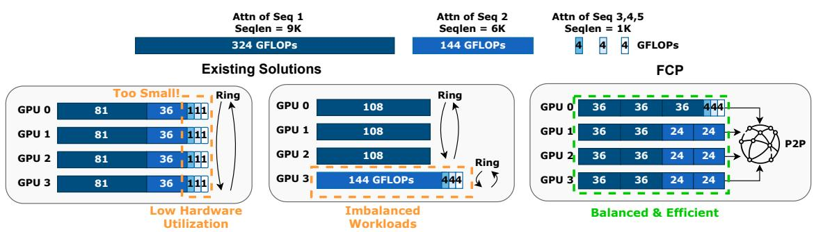  
Figure 1. Comparison between FCP and existing designs. (Left) Compute inefficiency: all sequences are uniformly sharded across GPUs. (Middle) Workload imbalance: sequences are grouped by length and assigned to different GPUs. Within each group, ring attention is applied. (Right) FCP adopts block-grained scheduling with arbitrary peer-to-peer communication.

In this paper, we propose flexible context parallelism, FCP, a new context parallelism paradigm that achieves linear scalability of attention when processing batches of sequences with varying lengths. The key idea behind FCP is finegrained block-wise sharding and a flexible GPU assignment policy. Specifically, unlike existing designs that follow a predefined pattern (e.g., splitting sequences onto contiguous GPUs as a ring), FCP treats each sequence as a series of blocks and formulates the scheduling problem as a binpacking problem to balance the load. Figure 1 shows an example illustrating the differences between FCP and existing solutions.

To reduce the search complexity, FCP shards each sequence into fixed-size blocks (e.g., 1K tokens) regardless of its context length, which serves as the basic scheduling and computation unit. To maximize compute efficiency, the size of block is set to be large enough to saturate the hardware resources even when processing a single block. Besides, the redundant communication from over-sharding short sequences can be saved. To minimize the workload imbalance, FCP proposes a workload-aware block distributor (§ 4.1). In particular, block distributor estimates the computation and memory usage of each block based on the context length of its source sequence, and applies a variant of Longest-Processing Time (LPT) scheduling algorithm (Chandran et al., 2024) that iteratively assigns blocks to the least-loaded GPUs, achieving near-optimal workload balance.

Despite the theoretical benefit, the efficient implementation of FCP in practice raises several challenges. First, given the flexibility of block assignment, blocks from a single sequence could exist on any GPUs, which requires peer-topeer communication between any two GPUs in the clusters. Therefore, inter-node communication (i.e., InfiniBand or Ethernet) takes a significant fraction of the total time. To reduce this overhead, we need to effectively overlap computation and communication (Wang et al., 2024). In addition, it is non-trivial to determine the optimal communication ordering of each single GPU. For example, random ordering could cause several GPU to pull blocks from the same source GPU simultaneously, which can lead to network congestion.

To address these challenges, FCP adopts a block-level pipeline and a congestion-free communication planner (§ 4.2). From a high level, CP essentially comprises three stages: pulling remote blocks, computing corresponding attention blocks, and pushing local blocks to remote. To effectively overlap computation with communication, FCP decomposes each stage into block-level sub-stages and interleaves them at a block-by-block granularity. To avoid congestion across N GPUs at each sub-stage, FCP models the communication of blocks as a bipartite graph with N send and N receive nodes, where each edge i ! j represents a block that transfers from GPU i to j. From this bipartite representation, FCP defines each graph matching as a congestion-free communication round, where each GPU sends and receives at most one block (i.e., one outgoing and one incoming edge). Therefore, FCP iteratively computes maximal matching as a block-level communication plan, which guarantees an optimal order of block transfers (§ 4.2).

Notably, FCP incurs more complex traffic than a ring topology—a trade-off that enables greater flexibility by finegrained, block-wise scheduling. Such traffic is guaranteed to overlap with computation, as communication planner leverages a performance model (§ 3.5) to ensure that the computation time is larger than communication at each stage. We also show that traffic does not become a system bottleneck.

Beyond these performance benefits, FCP is designed with modularity in mind, allowing transparent integration with various parallelism approaches, including FSDP (Zhao et al., 2023), TP (Shoeybi et al., 2019), EP (DeepSeek-AI, 2024; Nie et al., 2023), and SP (Jacobs et al., 2023). Instead of requiring users to provide sequences in a specific layout, FCP on the fly reshuffles the blocks at the beginning of the attention module in each layer and restores them afterward (§ 4.3). Therefore, non-attention operations (e.g., computing positional embeddings) can be performed using existing parallelism approaches without modification. Furthermore, the reshuffling is opportunistically overlapped with local attention computation, incurring negligible overhead.

We provide a comprehensive evaluation of FCP on the Llama-3-70B model configuration across modern datacenter clusters, including up to 256 NVIDIA GPUs (§ 6.3). We compare FCP with state-of-the-art CP frameworks including ByteScale (Ge et al., 2025), WLB-LLM (Wang et al., 2025b), and RingAttention (Liu et al., 2023). We also include a recent open-source project, MagiAttention (Zewei & Yunpeng, 2025). Across three workloads with different context length distributions, FCP consistently achieves near-linear scalability, outperforming the baselines by 1.13 –2.21 in attention Model FLOPs Utilization (MFU). We summarize our contributions as follows:

• We analyze the inefficiencies of existing CP designs and the challenges in implementing an optimal solution.

• We propose a block-wise abstraction that enables finegrained scheduling for flexible workload partitioning.

• We design FCP as a modular context parallelism framework that integrates transparently with existing parallelism approaches, including FSDP, TP, EP, and SP.

• We provide an efficient implementation and comprehensive evaluation that demonstrate the generality and feasibility of the proposed method.

## 2 BACKGROUND

## 2.1 Pretraining Datasets Feature Long-tailed Length

Large language models have recently extended their context window dramatically, from 4K to 1M tokens (Research, 2025; 2024). Within such long windows, the training datasets exhibit highly diverse and long-tailed sequence length distributions (Wang et al., 2025b). In addition, the emergence of multi-modality beyond text further amplifies this heterogeneity. For example, a minutes-long video sample can be mixed with a short text-only sequence, leading to tens of thousands of tokens difference in context length. Such extended context windows and heterogeneous data samples greatly diversify the overall context length distribution.

To illustrate this, we collect the context length distribution from our internal pretraining tasks (with a maximum sequence length of 512K). As shown in Figure 2, the context lengths feature long-tailed up to 512K, approximately following a lognormal distribution. We further calculate the total FLOPs and communication volume from each sequence under the naive CP setup and plot the cumulative ratio. As shown in Figure 2, both short and long sequences take the same magnitude of computation while short ones dominate communication, necessitating an adaptive parallelization that can efficiently handle diverse datasets.

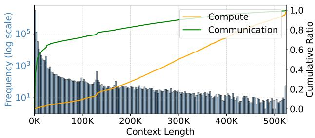  
Figure 2. The context length distribution, and cumulative computation and communication ratio from our internal training tasks.

## 2.2 Attention Computation

Attention is one of the key components in modern foundation models (Vaswani et al., 2023). Considering a sequence with length L, number of attention heads H, and head dimension D, the attention computation is formulated as:

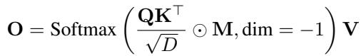

Here, Q (query), K (key), V (value), and O (output) are tensors with shape [H, L, D]. Therefore, the overall time complexity of attention is O(HDL2), while the space complexity is O(HLD). This quadratic scaling of computation with respect to L and the linear scaling of memory introduce challenges in balancing computation and memory, especially under batches of diverse L.

In this paper, we focus on causal and non-causal attention masks, while leaving irregular patterns for future work. Without explicitly written, attention in following sections denotes the above-mentioned operations excluding QKV projections. As the forward and backward share similar characteristic, while we design and implement both the forward and backward, we discuss the forward for simplicity.

## 2.3 Context Parallelism

To scale pretraining over long-context sequences, attention computation is parallelized across multiple workers by sharding the first two dimensions of input tensors [H, L, D]. For example, since different attention heads compute independently, the head dimension H can be easily split and parallelized. This approach is called sequence parallelism (SP) in tradition (Jacobs et al., 2023; Shoeybi et al., 2020). However, as the number of attention heads is typically limited to only a few dozens (e.g., 4 KV heads in Qwen3-235B (Yang et al., 2025a)), SP can only scale up to the number of heads, failing to scale up to thousands of workers.

Another common practice for parallelizing attention is splitting along the context dimension L, known as context parallelism (CP) (Liu et al., 2023). This is feasible because the attention computation of a single sequence is associative. Therefore, intermediate results can be computed by different workers over different slices of L and then reduced to the final outputs. During CP, each sequence is divided into several blocks (i.e., slices of Q/K/V tensors) across workers. As blocks from the same sequence have data dependencies, inter-worker communication is introduced.

Assuming N workers, a popular solution, ring attention (Liu et al., 2023), uniformly shards each sequence into N blocks, with each worker assigned one block. During execution, each worker pulls all KV blocks from one neighbor, computes pulled KV blocks with local Q blocks, and pushes KV blocks to another neighbor, forming a ring topology. In practice, ring attention uses double buffering to overlap communication and computation efficiently. Note that due to memory-efficient attention variants (e.g., group-query attention (Ainslie et al., 2023)), the memory usage of KV tensors is typically smaller than Q. Thus, instead of moving Q, KV is passed across workers to reduce communication volume. In this paper, we mainly focus on efficient CP design due to its potential scalability. Meanwhile, SP is orthogonal to CP, and both can be composed together.

## 3 ANALYSIS

## 3.1 Compute Efficiency

In context parallelism, attention computation for each sequence is divided into blocks across multiple GPUs, allowing parallel computation. Therefore, the overall hardware utilization depends on the compute efficiency of each block B. However, the block size len(B) cannot be arbitrarily small, as modern accelerators require high arithmetic intensity to saturate their compute capacity (Zhao et al., 2024). For instance, the latest Hopper GPUs offer up to 989 TFLOPs of dense BF16 Tensor Core throughput with 4.8 TB/s of memory bandwidth. To saturate its compute, each memory-loaded element must be reused 412 times 1, which is further amplified by the complexity of attention kernels (Dao et al., 2022).

To demonstrate this, we measure the model FLOPs utilization (MFU) of state-of-the-art variable-length attention implementations, namely FA3 (Shah et al., 2024) on Hopper GPUs and FA4 on Blackwell GPUs. By varying total context length and the number of sharded blocks, we observe that smaller len(B) (i.e., larger number of blocks under the same context length ) drastically reduces MFU. As shown in Figure 3, MFU remains low when len(B) < 2K and begins to saturate beyond 4K. For example, with a total context length of 32K from 64 blocks, each block has 512 tokens, leading to 25% utilization.

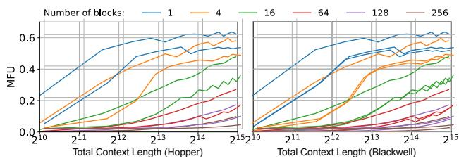  
Figure 3. MFU of attention on different hardware, which is profiled with 8 KV heads, 64 QO heads, and a head dimension of 128. We vary the total context length and the number of blocks that compose this total number of tokens. Results showcase that sharding sequences into fine-grained blocks greatly hurt MFU.3

Furthermore, sharding small sequences introduces unnecessary communication, which further decreases compute efficiency. For example, sequences with lengths smaller than 4K can easily fit into a single worker without incurring any communication. As shown in Figure 2, such sequences account for about 50% of the total communication volume in vanilla context parallelism, which can be saved by not sharding with a flexible parallelization strategy. Consequently, the actual computation time needs to be modeled as f(B), which considers both the total compute amount and the compute efficiency determined by block size.

## 3.2 Workload Balance

In addition to single-GPU compute efficiency, the workload assignment M : B ! workerid significantly affects the overall MFU. A single straggler with heavier workloads can leave all other workers idle, reducing cluster utilization. The workload balance needs consider three types of resource required by executing a single sequence shard B:

Memory. The memory usage of worker i equals the sum of len(B) where M (B) = i. Memory balance is critical to the end-to-end MFU, as it influences the compute balance of non-attention modules such as FFN. It also constrains the global batch size, as a high memory usage potentially leads to out-of-memory during training. Therefore, an ideal solution should enforce strict limits on the total number of tokens assigned to each worker.

Compute. Existing studies have extensively explored balancing the computation of a single sequence (i.e., intrasequence) under both causal and non-causal masks (Brandon et al., 2023; Li et al., 2024). For example, as shown in Figure 4, ring attention assigns B to workers in a Zig-Zag order, ensuring that each worker performs the same amount of computation. However, balancing both compute and memory across multiple sequences (i.e., inter-sequence) with different context lengths is non-trivial, as computation grows quadratically with the context length and len(B) scales linearly. Therefore, achieving balanced overall workload requires considering inter-sequence length variation.

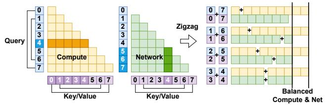  
Figure 4. Zig-Zag packing of an 8-tokens sequence for intrasequence computation and communication balance under causal mask. The computation and communication volume of a block depends on its position within the sequence. For example, 4-th Q needs to compute with 5 KV blocks, while 4-th KV is transferred 3 times to the subsequent Q blocks. By packing i-th block with (2N  i)-th block, both resources can be perfectly balanced.

Communication. The communication volume of each worker is also crucial, as a network hotspot causes congestion and reduces the overall bandwidth utilization. Fortunately, communication balance can be reduced to computation balance for both causal and non-causal masks. As shown in Figure 4, although the communication volume of B depends on its position within the sequence, the Zig-Zag assignment ensures that communication volume is proportional to computation. In this paper, unless otherwise specified, Zig-Zag ordering is applied for causal masks, simplifying communication balance into computation balance.

## 3.3 Optimal Context Parallelism Scheduling

Given a set of ⌧ input sequences S = {s1, ..., s⌧ } with different lengths, and a set of N workers W = {w1, ..., wN }, each context parallelism scheduling is defined by a sharding function G and an assignment function M. The sharding function G determines how many blocks are generated from each sequence and how large each block is, that is, G : si Bi1, ..., Bik where ki denotes the number of blocks from si. The assignment function M maps each block to one of the workers, M : B ! wi.

For the i-th worker wi, its computation load Comp(wi) can be calculated as Comp(wi) = P j f (Bj ) · IM(Bj)=wi , where f(·) considers both FLOPs and compute efficiency defined in § 3.1, and I is the indicator function. With a network overlapping factor ⌘i  1, the total time for wi is ⌘i Comp(wi), where perfect overlap of computation and communication is achieved when ⌘ = 1. Note that constants are ignored for simplicity. Considering all workers, the endto-end time is T = maxi N (⌘i · Comp(wi)). Therefore, the optimal context parallelism scheduling (G, M ) is given by (G⇤, M ⇤) = arg minG,M (T ), which achieves both high compute efficiency and balanced workloads.

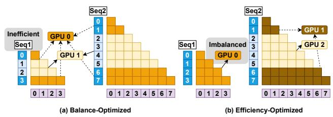  
Figure 5. Illustration of two kinds of existing CP designs. (a) balance-optimized: each sequence is sharded into 2 2 = 4 blocks and packed with Zig-Zag ordering, thus achieving perfect balance. (b) efficiency-optimized: sequences are spatially partitioned into different workers based on the context length.

However, solving this optimization problem is apparently NP-complete, with an exponential computational complexity. It is thus infeasible to obtain a meaningful solution within practical time. Therefore, all existing approaches approximate the optimal scheduling by reducing the search space through simplified assumptions.

## 3.4 Existing Context Parallelism Fails to Approach Optimal Scheduling

To derive a practical strategy within a reasonable time, existing solutions simplify either G or M through human-crafted, rule-based heuristics. Such simplifications lead to designs that overfit to specific workloads and lack adaptability to the diverse real-world corpus as discussed in § 2.1.

Balance-optimized. Ring attention (Liu et al., 2023) oversimplifies G and fails to consider compute efficiency. It shards each sequence into 2N blocks, where N is the number of workers, and assigns two blocks from each sequence to every worker (with the i-th and (2N  i)-th blocks). As shown in Figure 5 (a), when combined with Zig-Zag ordering, this heuristic can achieve perfect workload balance across workers. However, it fixes i  ⌧, ki = 2N , without considering both the context length and compute efficiency f ( ). As a result, short sequences are over-sharded into very small blocks with len(B) < 2K, causing severe MFU degradation as discussed in § 3.1.

Efficiency-optimized. To improve compute efficiency, other works (Ge et al., 2025) make G context-length-aware instead of applying constant k. They cluster sequences into groups according to their context length and allocate different numbers of workers to each subgroup proportionally to the context length. As shown in Figure 5 (b), ring attention is applied within each subgroup. However, these designs oversimplify M by isolating subgroups on separate workers without resource sharing. Consequently, outlier sequences with extreme context length (which are common as shown in § 2.1) can severely disturb workload balance. For example, a 64K sequence requires 256⇥ more computation than a 4K one but is only given 16⇥ more compute resources, resulting in 16⇥ higher per-worker computation. Such a rigid constraint on the search space of M greatly hurts workload balance thus the overall MFU.

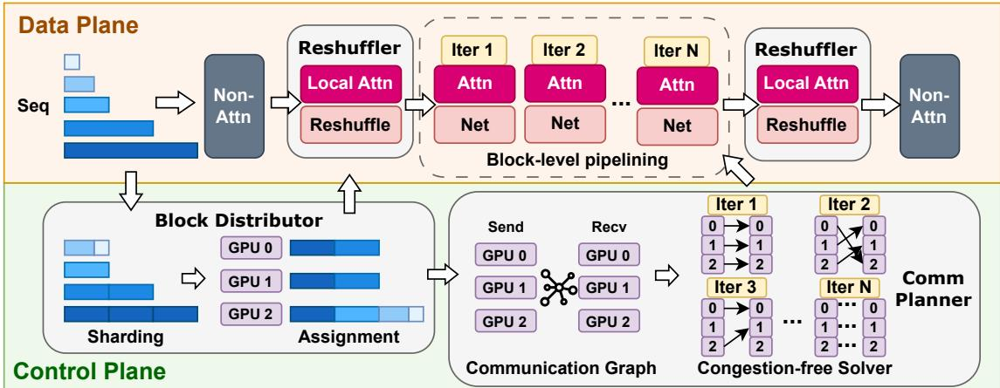  
Figure 6. FCP System Overview.

Switch between two. Other studies (Wang et al., 2025b) identify that existing approaches perform poorly on certain workloads. Therefore, they propose adaptively switching between the two aforementioned methods through a profileguided performance estimator, to achieve best of two. However, these solutions do not expand the limited search space, which fundamentally reflects a trade-off between compute efficiency and workload balance. As a result, they fail to achieve both objectives simultaneously.

## 3.5 Ring-Based Assignment Policy: A Gilded Cage

Despite different implementations of the sharding policy G, existing CP designs share the same principle for the assignment policy M (§ 3.4). They all adopt a ring-based topology, either as a monolithic ring or as heterogeneous sub-rings. This is because a ring-based topology provides a simple and symmetric communication pattern. Each worker only exchanges data with its neighboring workers, which enables high network bandwidth utilization and better communication–computation overlap (i.e., lower ⌘).

However, we argue that the ring topology is not the only way to achieve efficient communication. Moreover, its rigid constraint requires each sequence to be sharded symmetrically across a fixed ring of workers, which greatly limits the search space, making CP scheduling fundamentally suboptimal. To demonstrate this, we analyze the computation and communication demands of a block B under various worker types and network configurations. We vary len(B) and compute the network bandwidth required for the communication time of B to match its computation time.

For example, with the latest Hopper GPUs and a 50GB/s ConnectX-7 InfiniBand network, only 22GB/s (44% of the line rate) is required to fully overlap communication with computation (i.e., ⌘ = 1). Furthermore, increasing the block size len(B) reduces the bandwidth requirement, because computation within each block scales quadratically with the block size, whereas communication scales linearly. This enables a flexible trade-off between scheduling granularity and communication efficiency.

## 3.6 FCP: Enabling Flexible Context Parallelism with Block-wise Sharding and Assignment

Opportunity. In this paper, we aim to remove the ringtopology constraint in the search space of the assignment policy M. By enabling arbitrary peer-to-peer communication, each sequence block B can be placed arbitrarily on any worker. This flexibility allows the system to achieve ideal workload balance under various context length distributions.

Challenges. However, realizing this flexibility raises several challenges: (1) how to maintain high compute efficiency f(·) for each single batch B. (2) how to balance workloads across workers in terms of memory, computation, and communication. (3) how to enable efficient communication (i.e., ⌘ = 1) to avoid system bottlenecks.

## 4 DESIGN

As shown in Figure 6, FCP consists of three main components: block distributor (§ 4.1), communication planner (§ 4.2), and transparent reshuffler (§ 4.3). Given a set of sequences from a training batch, block distributor determines how to shard these sequences and assign the blocks to workers. It takes into account both compute efficiency and load balance. Based on the block assignment, communication planner builds a communication bipartite graph according to the dependencies among blocks, and derives an optimal communication plan using a congestion-free solver. These plans are executed through block-level pipelining, which enables overlap between communication and computation.

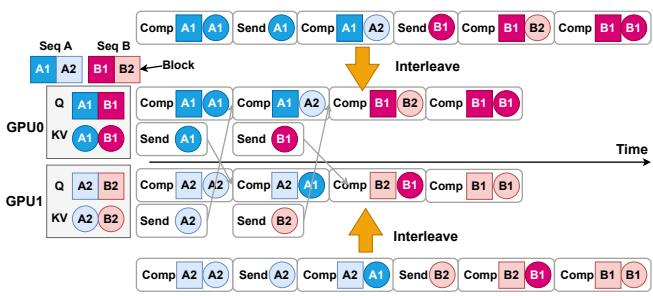  
Figure 7. Example of block-level pipelining for efficient computation and communication overlap. FCP decomposes end-to-end execution into computation and communication of blocks, which are executed block-by-block in an interleaving way.

To make FCP transparent to existing frameworks, transparent reshuffler reshuffles the user-provided sequence layout into the workload-aware layout required by FCP when entering the attention module, and restores the original layout afterward. To minimize overhead, the reshuffling is integrated into the block-level pipeline and overlapped with local attention computation whenever possible.

## 4.1 Block Distributor

Sharding Policy. Given a set of input sequences, block distributor first divides each sequence into a list of fixedsize blocks, for the following two main advantages: First, it greatly reduces the search space of optimal scheduling without losing expressiveness. It adapts to various context lengths, producing more blocks for longer sequences and fewer for shorter ones. Second, since each block shares the same communication and computation volume per execution with another block (although the total number of executions may differ), the block-wise abstraction allows systematic modeling and scheduling at the block level (§ 4.2). For sequences with context length shorter than block size, FCP packs them into minimal number of blocks and adopts the varlen API of the attention kernel for computation.

To maximize compute efficiency, the block size len(B) is determined by both hardware and model configurations, ensuring it can fully utilize f (·) as discussed in § 3.1. Moreover, len(B) also depends on the network configuration to enable effective communication and computation overlap as shown in § 3.5. Therefore, len(B) is a trade-off between scheduling granularity and runtime efficiency. We provide a sensitivity study on different choices of len(B) in § 6.6.

Assignment Policy. After sharding sequences into blocks, block distributor distributes these blocks across workers. The objective is to minimize the maximum computation workload among all workers, subject to the constraint of maximal memory usage per worker. FCP employs a variant of the well-known Longest Processing Time (LPT) scheduling algorithm, which greedily assigns each block to the least loaded worker. We describe the policy in detail in Appendix A.1. Given K blocks and N GPUs, the time complexity is O(K log N ), which incurs negligible latency.

## 4.2 Communication Planner

After sharding and assignments, the data flow (i.e., data dependency among blocks between workers) is determined. However, due to arbitrary peer-to-peer communication, naive communication without overlapping computation introduces huge overhead. To achieve efficient communication, FCP introduces three techniques: block-level pipelining, a congestion-free solver, and a bottom-up coalescer.

Block-level pipelining. FCP divides both computation and communication across workers into block-grained substages. This design allows flexible and predictable scheduling. Specifically, as CP consists of three main stages including pulling remote blocks, computing attention blocks, and pushing local blocks, FCP decomposes each stage into fine-grained block-level sub-stages and interleaves them block by block. For example, as shown in Figure 7, each worker pulls or pushes only one block at a time, while simultaneously computing the previous block, thus overlapping communication and computation effectively.

Congestion-free solver. The ordering of pipelining substages is crucial. A random ordering may cause multiple workers to pull blocks from the same worker, resulting in network congestion. To ensure congestion-free communication, FCP models the data flow among N workers as an undirected bipartite graph. The graph consists of N send nodes S and N receive nodes R, where an edge S(i) ! R(j) indicates that a block must be transferred from the i-th to the j-th worker. As shown in Figure 8, once the block assignments are determined, the bipartite graph can be directly constructed based on the data dependencies. The maximal degree  of the bipartite represents the workload balance defined by block distributor.

We then show that the optimal number of congestionfree sub-stages is , and provide a practical solver with polynomial-time complexity. A single-stage congestion-free plan means each worker sends at most one block, receives at most one block, and computes at most one block. Therefore, for all i 2 N , deg(S(i))  1 and deg(R(i))  1. This is exactly the definition of a matching in the corresponding bipartite graph. Thus, we have Lemma 1.

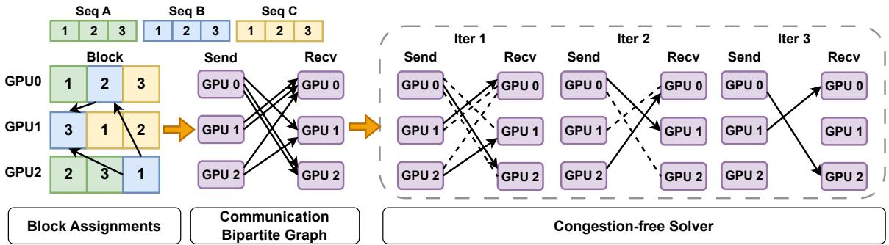  
Figure 8. Example of the congestion-free solver over three sequences with causal mask. Given the block assignments from block distributor, communication planner constructs a bipartite graph based on the data dependency across GPUs. For example, 1-st block from sequence B are transferred from GPU 2 to GPU 0 and 1, adding edges 2 ! 1 and 2 ! 0. The solver then calculates the maximal matching of the bipartite graph with minimum iterations, providing an optimal congestion-free communication ordering.

Lemma 1. A single-stage congestion-free communication is exactly a matching on the bipartite communication graph.

In each sub-stage, a worker transfers at most one block. The worker with degree of  needs at least  sub-stages to finish. Hence, the minimal number of congestion-free sub-stages is at least . Thus, we have Lemma 2. We then construct a solution that partitions all edges into  disjoint matchings. We detailed the construction in Appendix A.2. Therefore, combining with Lemma 1 and 2, the optimal number of congestion-free sub-stages equals .

Lemma 2. A bipartite with maximal degree  is partitioned into at least  disjoint matchings.

Assuming an edge set E and a vertex set V , the communication plans can be calculated with O(|V | 1/2|E|) = O(Nˆ 2.5) time complexity via Hopcroft–Karp algorithm (Wikipedia, 2025a), where Nˆ is the CP group size (typically in the hundreds). Given the sharding and assignments of the sequences, FCP will first construct the corresponding bipartite, which is then partitioned into a set of matchings. At each sub-stage, FCP follows one matching to determine the network flow, while the communication is overlapped with the computation of one block. Moreover, the solver runs once per batch, which can be either overlapped or pre-computed. Since total GPUs are partitioned into independent CP groups and different training batches are independent, the matchings are massively parallelizable across CPUs, completing within seconds at the scale of hundreds of workers. We illustrate the process in Figure 8.

Bottom-up coalescer. Furthermore, the fine-grained blockwise sub-stages can be coalesced into coarse-grained stages without compromising congestion-free communication. For example, assuming a coalesce degree of 4, the computation and communication of four consecutive sub-stages can be merged into a larger stage. In each sub-stage, every worker sends, receives, and computes at most one block. After coalescing, each worker sends 4, receives 4, and computes 4 blocks in a single stage without incurring a network hotspot. This merging improves kernel efficiency by increasing block sizes of execution (§ 3.1). Therefore, the coalescer essentially decouples the scheduling granularity (i.e., block size) from the execution granularity (i.e., coalesced block size), enabling more flexible scheduling of FCP.

## 4.3 Transparent Reshuffler

Even with efficient implementation, CP is hard to deploy in real-world systems. This is because it requires intrusive modifications to existing frameworks. For example, aligning the sequence layout with desired assignments requires modifying sequence-dependent components, including the dataloader (Ge et al., 2025) and the positional embedding (e.g., RoPE) (Zewei & Yunpeng, 2025).

Therefore, making FCP transparent is important for deployment. A strawman solution is to insert two all-to-all communications before and after the attention module. These operations on-the-fly reshuffle the user-provided sequence layout into the workload-aware layout required by CP. However, such standalone all-to-all operations can introduce additional overhead. Fortunately, the communication of all-to-all can be overlapped with computation. This is because the total communication volume is bounded by the total context length, as each sequence only has one copy. Meanwhile, the total computation grows quadratically.

To achieve overlap between reshuffling and computation, FCP leverages the fine-grained block-level pipeline (§ 4.2). It reorders local computation (i.e., computation that does not depend on remote blocks) to the beginning and end of the pipeline. When entering or exiting attention, FCP first launches local computation before the reshuffling, enabling effective overlap between communication and computation.

## 5 IMPLEMENTATION

Implementation details. We implement FCP with 4K lines of Python code, with minor modifications on FlashAttention3 (Shah et al., 2024) kernels. To prevent interference between computation and communication, we employ CUDA Green Context (Cui et al., 2025) to spatially partition GPU SMs into communication and computation ones. Since the communication operations are pure data transport without reduction, the network (e.g., 50 GB/s InfiniBand) rather than HBM (2 TB/s) is the bottleneck, so a small number of SMs suffices to saturate the link bandwidth. We set the number of communication SMs to the minimum feasible value following the CUDA driver API (NVIDIA, 2024). We specify sm margin in the attention kernel to mitigate wave quantization (Osama et al., 2023). For communication, we use the group peer-to-peer primitives of NCCL and make the communication pattern aware of the network topology. For the railed-optimized network topology (Wang et al., 2024), we enable Ulysess (Jacobs et al., 2023) with FCP to avoid two-hop communication. For block-level pipelining (§ 4.2), we implement a multi-buffer pipeline that launches several communication operation concurrently, reducing pipeline bubbles. In our evaluation, we use three buffers.

## 6 EVALUATION

## 6.1 Evaluation Setups

Hardware. We conduct the evaluation on two computing clusters from industry and academia, respectively. Across these clusters, we use two GPU types, denoted as GPU-X and GPU-Y. Their computation-to-communication ratios, measured as BFloat16 TensorOp throughput divided by network bandwidth, are summarized in Table 1. To respect confidentiality constraints, we anonymize certain system details, including the exact GPU models and the cluster scale.

Table 1. Computation-to-communication ratios of GPU-X and GPU-Y.  
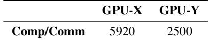

Model and workload. We adopt the model configuration from Llama-3-70B (AI, 2024), with 8 KV heads, 64 QO heads and a head dimention of 128. We randomly sample sequences from our training traces as shown in Figure 2, with a maximum sequence length of 512K. We provide results with more datasets in Appendix A.4. We set the number of tokens per GPU as 32K, which is common practice in large-scale pretraining. We also test the performance under different number of per-GPU tokens in § 6.6. We apply the causal attention mask for all sequences.

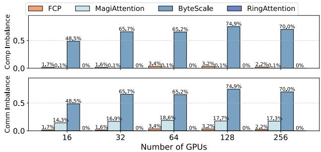  
Figure 9. Computation (upper) and communication (lower) imbalance ratio when scaling the number of GPUs.

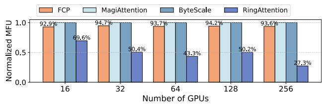  
Figure 10. Normalized attention MFU with perfect load balance.

Baselines. We compare FCP with the following state-ofthe-art CP designs: ¨ Ring Attention: Balance-optimized design. ≠ ByteScale: Compute-efficiency optimized design that dynamically partitions short and long sequences into different GPUs (Ge et al., 2025). Æ WLB-LLM: adaptive switch between balance- and efficiency-optimized baselines based on an online performance estimator. Besides these wellestablished literature, we also include a concurrent work from an open-sourced project, MagiAttention (Ø) (Zewei & Yunpeng, 2025), to provide comprehensive comparison. We provide detailed configuration of baselines in Appendix A.3.

Hyper-parameters. We use a 4K block size for both GPU-X and GPU-Y, while we also conduct a sensitivity test over various block sizes in § 6.6. We use a coalesce degree of 16 by default for better efficiency (§ 4.2). We assign 6 and 8 SMs for communication operators on GPU-X and GPU-Y.

## 6.2 Attention Workload Balance

We evaluate the workload balance (i.e., computation and communication volume) by accumulating the FLOPs and network traffic of each GPU. As the GPU with heaviest workload bottlenecking the cluster, we define the imbalance ratio as (max(load)  mean(load))/max(load). As shown in Figure 9, FCP consistently achieves less than 5% workload imbalance, owing to its fine-grained block-level block assignments. In contrast, as MagiAttention only optimizes for computation, it incurs up to 17% communication volume imbalance, leading to sub-optimal communication. Besides, as ByteScale spatially partitions sequences based on their context length L, the O(L2) computation is only assigned with O(L) GPUs, causing up to 70% imbalance.

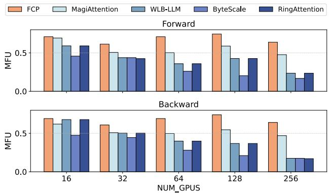

Figure 11. Weak-scaling of module-level attention MFU on realworld dataset. The number of tokens per GPU is fixed at 32K.  
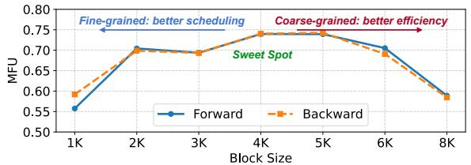  
Figure 12. Sensitivity test of block sizes on 128⇥ GPU-X.

## 6.3 Attention Compute Efficiency

To measure the compute efficiency excluding the effect of workload imbalance, we assume all context lengths equal to the average length of Figure 2. We compute the attention MFU as the ratio of total computation to the total attention time, normalized by the MFU of single-GPU FlashAttention. As shown in Figure 10, FCP consistently achieves more than 90% MFU, with the minimal degradation due to SMs specialized for communication. In contrast, Ring Attention greatly decreases MFU due to the over-sharding on short sequences, increasing computation and communication time.

## 6.4 Scaling Test of Module-level MFU

We further measure the end-to-end attention-module MFU at the cluster level, considering for both inter-GPU workload imbalance and single GPU compute efficiency. The modulelevel MFU is defined as the average MFU across the clusters.

Table 2. Ablation study of MFU on 128 GPU-X.  
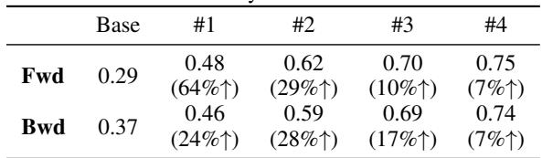

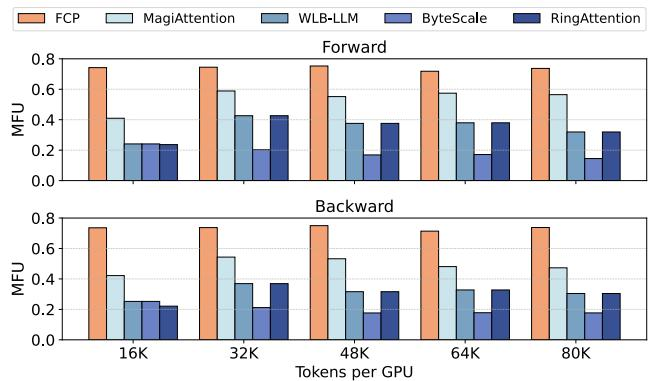

Figure 13. Sensitivity test of per-GPU tokens on 128⇥ GPU-X.  
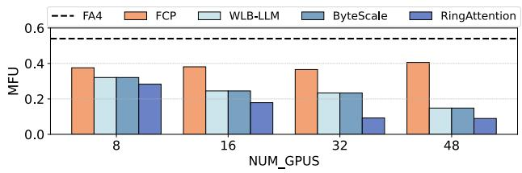  
Figure 14. Weak scaling test of module-level attention MFU (forward-only), with various number of GPU-Y.

As shown in Figure 11, FCP consistently surpasses by all baselines under all configurations. Specifically, all implementations perform similarly with 16 GPUs since there is less opportunity in small scale. With increased CP degrees, Ring Attention falls short due to the decreased compute efficiency as discussed in § 6.3; while ByteScale performs even worse due to the significant workload imbalance as shown in § 6.2 under the long-tailed distribution.

## 6.5 Ablation Studies

To validate the effectiveness of each proposed design in FCP, we conduct ablation studies by adding on components oneby-one, including block-level pipelining (#1), congestionfree solver (#2), bottom-up coalescer (#3), and transparent reshuffler (#4). We use the same evaluation setup as described in § 6.1, with the number of GPUs fixed at 128 GPU-X for simplicity. As shown in Table 2, each component contributes to considerable utilization improvement.

## 6.6 Sensitivity Tests

Various block size. We measure the module-level attention MFU under various block sizes, with the same workload under 128⇥ GPU-X. As shown in Figure 12, FCP achieves the best MFU with 4K block size, achieving a sweet spot between workload balance and compute efficiency.

Various number of per-GPU tokens. To demonstrate the generality of FCP, we also measure the module-level MFU with different number of per-GPU tokens . As shown in Figure 13, FCP consistently surpasses all baselines.

GPU types. To assess the portability and generality of FCP, we evaluate it on GPU-Y. We adopt the state-of-the-art FlashAttention-4 implementation and adjust the baselines accordingly. We exclude MagiAttention because it relies on customized kernels. As shown in Figure 14, FCP consistently outperforms the baselines, achieving over 70% of the single-GPU FlashAttention-4 MFU. The remaining gap is mainly due to the SM resources consumed by communication and the higher arithmetic intensity required.

## 7 DISCUSSION AND LIMITATION

Hyperparameter selection. The block size in FCP is determined automatically by the cluster configuration and workload characteristics. Concretely, the block size is chosen to (1) saturate the attention kernel-level MFU as shown in Figure 3, (2) enable computation–communication overlap, and (3) balance compute and communication across GPUs. Given a fixed cluster configuration, the first two factors can be profiled in advance, which yields a hardwareefficient block size (e.g., 2K on GPU-X). In practice, these hardware-driven choices provide sufficient scheduling flexibility for production workloads (e.g., 32K context length in Gemini training (Team, 2024)), offering a simple and effective solution. Further fine-tuning of the block size for a particular workload provides only marginal improvement. Figure 12 shows about a 7% difference between 2K and 6K block sizes. For scenarios where users require the absolute optimal configuration, a cost model-based simulation can efficiently validate load balance by running the LPT-based scheduling without executing the full workload.

Limitations and network assumptions. FCP requires arbitrary peer-to-peer communication. When multiple onthe-fly packets are coalesced, the resulting pattern effectively resembles all-to-all communication, which demands a topology well suited for such traffic. Consequently, FCP generalizes well on fat-tree or rail-optimized networks with InfiniBand or RoCE on NVIDIA GPUs, but its performance is limited on topologies such as torus-based TPU v3 clusters.

## 8 RELATED WORKS

Long-context pre-training. LoongTrain (Gu et al., 2024) proposes a double-ring topology to leverage high intra-node interconnection bandwidth. However, its parallelism design is input-agnostic, leading to compute inefficiency on short sequences. FlexSP (Wang et al., 2025a) dynamically partitions sequences into different SP groups. However, it parallelizes along the head dimension, whose scalability is limited. Another concurrent work, CAD (Zhuang et al., 2025), introduces a fine-grained, load-balanced CP strategy with attention disaggregation. However, it fails to model communication traffic after shard migration, resulting in suboptimal performance. In contrast, FCP is a fine-grained, input-adaptive CP method that jointly achieves computation and communication balance, ensuring efficient execution through congestion-free communication.

Dynamic attention masks. Another line of concurrent work focuses on load balance in parallelizing block-sparse attention (Xi et al., 2025), including BurstEngine (Sun et al., 2025), MagiAttention (Zewei & Yunpeng, 2025), and DCP (Jiang et al., 2025). These methods adopt a similar block-level abstraction to allow flexible scheduling across workers. However, they fail to consider communication congestion, leading to suboptimal performance. Although evaluated on causal masks, the block-level abstraction of FCP can be extended to block-sparse by deriving block dependencies from the sparsity map.

## 9 CONCLUSION

We propose FCP, a scalable context parallelism paradigm that achieves both compute efficiency and workload balance. The key idea of FCP is to enable flexible sequence partition by leveraging arbitrary peer-to-peer communication. With a communication planner, FCP ensures efficient runtime execution. Our evaluation shows that FCP scales near-linearly up to 256 GPUs and improves attention MFU by up to 2 .

## ACKNOWLEDGEMENTS

We thank Jiaming Tang and Yifan Qiao for their insightful discussions and feedback. We also thank Heng Zhang, Yanghua Peng, and Haibin Lin for their support throughout the project.

## REFERENCES

AI, M. The llama 3 herd of models, 2024. URL https: //arxiv.org/abs/2407.21783.

Ainslie, J., Lee-Thorp, J., de Jong, M., Zemlyanskiy, Y., Lebron, F., and Sanghai, S. Gqa: Training generalized ´ multi-query transformer models from multi-head checkpoints, 2023. URL https://arxiv.org/abs/23 05.13245.

Brandon, W., Nrusimha, A., Qian, K., Ankner, Z., Jin, T., Song, Z., and Ragan-Kelley, J. Striped attention: Faster ring attention for causal transformers. ArXiv, abs/2311.09431, 2023. URL https://api.sema nticscholar.org/CorpusID:265220849.

Cameron, P. J. Hall’s marriage theorem, 2025. URL http s://arxiv.org/abs/2503.23159.

Chandran, L. S., Gajjala, R., Mehra, S., and Rahul, S. Two results on lpt: A near-linear time algorithm and parcel delivery using drones, 2024. URL https://arxiv. org/abs/2407.16323.

Chen, L., Ye, Z., Wu, Y., Zhuo, D., Ceze, L., and Krishnamurthy, A. Punica: Multi-tenant lora serving, 2023. URL https://arxiv.org/abs/2310.18547.

Csardi, G. and Nepusz, T. The igraph software package ´ for complex network research. InterJournal, Complex Systems, pp. 1695, 2006.

Cui, W., Chen, Y., Zhao, H., Xu, Z., Chen, Q., Chen, X., Zhou, Y., Sun, S., and Guo, M. Optimizing slo-oriented llm serving with pd-multiplexing, 2025. URL https: //arxiv.org/abs/2504.14489.

Dao, T. FlashAttention-2: Faster attention with better parallelism and work partitioning. In International Conference on Learning Representations (ICLR), 2024.

Dao, T., Fu, D. Y., Ermon, S., Rudra, A., and Re, C. FlashAt-´ tention: Fast and memory-efficient exact attention with IO-awareness. In Advances in Neural Information Processing Systems (NeurIPS), 2022.

DeepSeek-AI. Deepseek-v2: A strong, economical, and efficient mixture-of-experts language model, 2024. URL https://arxiv.org/abs/2405.04434.

Esser, P., Kulal, S., Blattmann, A., Entezari, R., Muller, ¨ J., Saini, H., Levi, Y., Lorenz, D., Sauer, A., Boesel, F., Podell, D., Dockhorn, T., English, Z., Lacey, K., Goodwin, A., Marek, Y., and Rombach, R. Scaling rectified flow transformers for high-resolution image synthesis, 2024. URL https://arxiv.org/abs/2403.0 3206.

Fang, J. and Zhao, S. Usp: A unified sequence parallelism approach for long context generative ai, 2024. URL https://arxiv.org/abs/2405.07719.

Gao, Y., Guo, H., Hoang, T., Huang, W., Jiang, L., Kong, F., Li, H., Li, J., Li, L., Li, X., Li, X., Li, Y., Lin, S., Lin, Z., Liu, J., Liu, S., Nie, X., Qing, Z., Ren, Y., Sun, L., Tian, Z., Wang, R., Wang, S., Wei, G., Wu, G., Wu, J., Xia, R., Xiao, F., Xiao, X., Yan, J., Yang, C., Yang, J., Yang, R., Yang, T., Yang, Y., Ye, Z., Zeng, X., Zeng, Y., Zhang, H., Zhao, Y., Zheng, X., Zhu, P., Zou, J., and Zuo, F. Seedance 1.0: Exploring the boundaries of video generation models, 2025. URL https://arxiv.or g/abs/2506.09113.

Ge, H., Feng, J., Huang, Q., Fu, F., Nie, X., Zuo, L., Lin, H., Cui, B., and Liu, X. Bytescale: Communication-efficient scaling of llm training with a 2048k context length on 16384 gpus. In Proceedings of the ACM SIGCOMM 2025 Conference, SIGCOMM ’25, pp. 963–978. ACM, August 2025. doi: 10.1145/3718958.3754352. URL http: //dx.doi.org/10.1145/3718958.3754352.

Goyal, P., Dollar, P., Girshick, R., Noordhuis, P., ´ Wesolowski, L., Kyrola, A., Tulloch, A., Jia, Y., and He, K. Accurate, large minibatch SGD: Training imagenet in 1 hour. arXiv preprint arXiv:1706.02677, 2017. URL https://arxiv.org/abs/1706.02677.

Gu, D., Sun, P., Hu, Q., Huang, T., Chen, X., Xiong, Y., Wang, G., Chen, Q., Zhao, S., Fang, J., Wen, Y., Zhang, T., Jin, X., and Liu, X. Loongtrain: Efficient training of long-sequence llms with head-context parallelism, 2024. URL https://arxiv.org/abs/2406.18485.

Jacobs, S. A., Tanaka, M., Zhang, C., Zhang, M., Song, S. L., Rajbhandari, S., and He, Y. Deepspeed ulysses: System optimizations for enabling training of extreme long sequence transformer models, 2023. URL https: //arxiv.org/abs/2309.14509.

Jiang, C., Cai, Z., Tian, Y., Jia, Z., Wang, Y., and Wu, C. Dcp: Addressing input dynamism in long-context training via dynamic context parallelism. In Proceedings of the ACM SIGOPS 31st Symposium on Operating Systems Principles, SOSP ’25, pp. 221–236. ACM, October 2025. doi: 10.1145/3731569.3764849. URL http://dx.d oi.org/10.1145/3731569.3764849.

Li, D., Shao, R., Xie, A., Xing, E. P., Ma, X., Stoica, I., Gonzalez, J. E., and Zhang, H. Distflashattn: Distributed memory-efficient attention for long-context llms training, 2024. URL https://arxiv.org/abs/2310.0 3294.

Liu, H. et al. Ring attention with blockwise transformers for near-infinite context. arXiv preprint arXiv:2310.01889, 2023. URL https://arxiv.org/abs/2310.0 1889.

Narayanan, D., Shoeybi, M., Cho, T., et al. Memoryefficient pipeline-parallel DNN training. In Proceedings of the 38th International Conference on Machine Learning (ICML), 2021. URL https://proceedings. mlr.press/v139/narayanan21a/narayana n21a.pdf.

Nie, X., Miao, X., Wang, Z., Yang, Z., Xue, J., Ma, L., Cao, G., and Cui, B. Flexmoe: Scaling large-scale sparse pre-trained model training via dynamic device placement. Proceedings of the ACM on Management of Data, 1(1): 1–19, 2023.

NVIDIA. CUDA driver API: Green contexts. https: //docs.nvidia.com/cuda/cuda-driver-a pi/group\_\_CUDA\_\_GREEN\_\_CONTEXTS.html, 2024.

NVIDIA. Nvl72-datasheet. https://nvdam.widen. net/s/wwnsxrhm2w/blackwell-datasheet -3384703, 2025. [Accessed 28-10-2025].

Osama, M., Merrill, D., Cecka, C., Garland, M., and Owens, J. D. Stream-k: Work-centric parallel decomposition for dense matrix-matrix multiplication on the gpu, 2023. URL https://arxiv.org/abs/2301.03598.

Patel, D. Nvidia’s New China AI Chips Circumvent US Restrictions — H20 Faster Than H100 — Huawei Ascend 910B — newsletter.semianalysis.com. https://news letter.semianalysis.com/p/nvidias-new -china-ai-chips-circumvent, 2025. [Accessed 28-10-2025].

Rajbhandari, S., Rasley, J., Ruwase, O., and He, Y. ZeRO: Memory optimizations toward training trillion parameter models. arXiv preprint arXiv:1910.02054, 2020. URL https://arxiv.org/abs/1910.02054.

Ramel, D. Open source foundation models cost tens of millions to train. https://pureai.com/article s/2024/04/23/open-source-models-cost. aspx, 2024. Accessed: 2025-10-07.

Ravikumar, A., Parthasarathy, S., Thyagarajan, K., et al. Dpro–sm: A distributed framework for proactive straggler mitigation in synchronous SGD. Heliyon, 2024. URL ht tps://www.sciencedirect.com/science/ article/pii/S2405844023107754. Stragglers delay synchronization during each iteration’s aggregation step.

Research, A. M. L. Apple foundation models: 2025 updates. https://machinelearning.apple.com/re search/apple-foundation-models-2025-u pdates, 2025. Accessed: 2025-10-07.

Research, M. A. Effective long-context scaling of foundation models. https://ai.meta.com/resear ch/publications/effective-long-conte xt-scaling-of-foundation-models/, 2024. Accessed: 2025-10-07.

Sergeev, A. and Del Balso, M. Horovod: Fast and easy distributed deep learning in tensorflow. arXiv preprint arXiv:1802.05799, 2018. URL https://arxiv.or g/abs/1802.05799.

Severson, M. et al. The cost of training frontier ai models. arXiv preprint arXiv:2405.21015, 2024.

Shah, J., Bikshandi, G., Zhang, Y., Thakkar, V., Ramani, P., and Dao, T. Flashattention-3: Fast and accurate attention with asynchrony and low-precision, 2024. URL https: //arxiv.org/abs/2407.08608.

Shoeybi, M., Patwary, M., Puri, R., LeGresley, P., Casper, J., and Catanzaro, B. Megatron-LM: Training multibillion parameter language models using model parallelism. arXiv preprint arXiv:1909.08053, 2019. URL https://arxiv.org/abs/1909.08053.

Shoeybi, M., Patwary, M., Puri, R., LeGresley, P., Casper, J., and Catanzaro, B. Megatron-lm: Training multibillion parameter language models using model parallelism, 2020. URL https://arxiv.org/abs/19 09.08053.

Sivamani, K. S., Moon, T., Tredak, P., Yang, C., and Nguyen, P. Nvidia/TransformerEngine. https://github.com/NVIDIA/TransformerEngine, oct 28 2025. URL https://github.com/NVIDI A/TransformerEngine.

Sun, A., Zhao, W., Han, X., Yang, C., Liu, Z., Shi, C., and sun, M. Burstengine: an efficient distributed framework for training transformers on extremely long sequences of over 1m tokens, 2025. URL https://arxiv.org/ abs/2509.19836.

Tao, Z. and Huang, Y. Official benchmark scripts for magiattention. https://github.com/SandAI-org /MagiAttention/blob/main/exps/dist\_a ttn/run\_benchmark.py, 2025. [Accessed 28-10- 2025].

Team, G. Gemini technical report, 2024. URL https: //arxiv.org/pdf/2312.11805.

Teng, H., Jia, H., Sun, L., Li, L., Li, M., Tang, M., Han, S., Zhang, T., Zhang, W. Q., Luo, W., Kang, X., Sun, Y., Cao, Y., Huang, Y., Lin, Y., Fang, Y., Tao, Z., Zhang, Z., Wang, Z., Liu, Z., Shi, D., Su, G., Sun, H., Pan, H., Wang, J., Sheng, J., Cui, M., Hu, M., Yan, M., Yin, S., Zhang, S., Liu, T., Yin, X., Yang, X., Song, X., Hu, X., Zhang, Y., and Li, Y. Magi-1: Autoregressive video generation at scale, 2025. URL https://arxiv.org/abs/25 05.13211.

Vaswani, A., Shazeer, N., Parmar, N., Uszkoreit, J., Jones, L., Gomez, A. N., Kaiser, L., and Polosukhin, I. Attention is all you need, 2023. URL https://arxiv.org/ abs/1706.03762.

Wang, W., Ghobadi, M., Shakeri, K., Zhang, Y., and Hasani, N. Rail-only: A low-cost high-performance network for training llms with trillion parameters, 2024. URL https://arxiv.org/abs/2307.12169.

Wang, Y., Wang, S., Zhu, S., Fu, F., Liu, X., Xiao, X., Li, H., Li, J., Wu, F., and Cui, B. Flexsp: Accelerating large language model training via flexible sequence parallelism, 2025a. URL https://arxiv.org/abs/2412.0 1523.

Wang, Z. Official wlb-llm codebase. https://github .com/Ash-Zheng/WLB-LLM-CP, 2025. [Accessed 28-10-2025].

Wang, Z., Cai, A., Xie, X., Pan, Z., Guan, Y., Chu, W., Wang, J., Li, S., Huang, J., Cai, C., Hao, Y., and Ding, Y. Wlb-llm: workload-balanced 4d parallelism for large language model training. In Proceedings of the 19th USENIX Conference on Operating Systems Design and Implementation, OSDI ’25, USA, 2025b. USENIX Association. ISBN 978-1-939133-47-2.

Wikipedia. Hopcroft–Karp algorithm — Wikipedia, the free encyclopedia. http://en.wikipedia.org/w /index.php?title=Hopcroft%E2%80%93Ka rp%20algorithm&oldid=1290392689, 2025a. [Online; accessed 24-October-2025].

Wikipedia. Longest-processing-time-first scheduling — Wikipedia, the free encyclopedia. http://en.wik ipedia.org/w/index.php?title=Longest -processing-time-first%20scheduling& oldid=1315996044, 2025b. [Online; accessed 21- October-2025].

Xi, H., Yang, S., Zhao, Y., Xu, C., Li, M., Li, X., Lin, Y., Cai, H., Zhang, J., Li, D., Chen, J., Stoica, I., Keutzer, K., and Han, S. Sparse videogen: Accelerating video diffusion transformers with spatial-temporal sparsity, 2025. URL https://arxiv.org/abs/2502.01776.

Yang, A., Li, A., Yang, B., Zhang, B., Hui, B., Zheng, B., Yu, B., Gao, C., Huang, C., Lv, C., Zheng, C., Liu, D., Zhou, F., Huang, F., Hu, F., Ge, H., Wei, H., Lin, H., Tang, J., Yang, J., Tu, J., Zhang, J., Yang, J., Yang, J., Zhou, J., Zhou, J., Lin, J., Dang, K., Bao, K., Yang, K., Yu, L., Deng, L., Li, M., Xue, M., Li, M., Zhang, P., Wang, P., Zhu, Q., Men, R., Gao, R., Liu, S., Luo, S., Li, T., Tang, T., Yin, W., Ren, X., Wang, X., Zhang, X., Ren, X., Fan, Y., Su, Y., Zhang, Y., Zhang, Y., Wan, Y., Liu, Y., Wang, Z., Cui, Z., Zhang, Z., Zhou, Z., and Qiu, Z. Qwen3 technical report, 2025a. URL https: //arxiv.org/abs/2505.09388.

Yang, A., Yang, J., Ibrahim, A., Xie, X., Tang, B., Sizov, G., Reizenstein, J., Park, J., and Huang, J. Context parallelism for scalable million-token inference, 2025b. URL https://arxiv.org/abs/2411.01783.

Ye, Z., Chen, L., Lai, R., Lin, W., Zhang, Y., Wang, S., Chen, T., Kasikci, B., Grover, V., Krishnamurthy, A.,

and Ceze, L. Flashinfer: Efficient and customizable attention engine for llm inference serving. arXiv preprint arXiv:2501.01005, 2025. URL https://arxiv.or g/abs/2501.01005.

Zewei, T. and Yunpeng, H. Magiattention: A distributed attention towards linear scalability for ultra-long context, heterogeneous mask training. https://github.c om/SandAI-org/MagiAttention/, 2025.

Zhao, Y., Gu, A., Varma, R., Luo, L., Huang, C.-C., Xu, M., Wright, L., Shojanazeri, H., Ott, M., Shleifer, S., Desmaison, A., Balioglu, C., Damania, P., Nguyen, B., Chauhan, G., Hao, Y., Mathews, A., and Li, S. Pytorch fsdp: Experiences on scaling fully sharded data parallel, 2023. URL https://arxiv.org/abs/2304.1 1277.

Zhao, Y., Lin, C.-Y., Zhu, K., Ye, Z., Chen, L., Zheng, S., Ceze, L., Krishnamurthy, A., Chen, T., and Kasikci, B. Atom: Low-bit quantization for efficient and accurate llm serving. In Gibbons, P., Pekhimenko, G., and Sa, C. D. (eds.), Proceedings of Machine Learning and Systems, volume 6, pp. 196–209, 2024. URL https://proc eedings.mlsys.org/paper\_files/paper/ 2024/file/5edb57c05c81d04beb716ef1d5 42fe9e-Paper-Conference.pdf.

Zheng, L., Li, Z., Zhang, H., Zhuang, Y., Chen, Z., Huang, Y., Wang, Y., Xu, Y., Zhuo, D., Xing, E. P., Gonzalez, J. E., and Stoica, I. Alpa: Automating inter- and intraoperator parallelism for distributed deep learning, 2022. URL https://arxiv.org/abs/2201.12023.

Zhuang, Y., Chen, J., Pang, B., Gu, Y., Zhu, Y., Jiang, Y., Stoica, I., Xing, E., and Zhang, H. Efficient long-context language model training by core attention disaggregation, 2025. URL https://arxiv.org/abs/2510.1 8121.