# MACHINE LEARNING FLEET EFFICIENCY:IMPROVING TPU SYSTEMS AT SCALE WITH ML PRODUCTIVITY GOODPUT

Arissa Wongpanich 1 Tayo Oguntebi 2 \* Jose Baiocchi Paredes 1 Yu Emma Wang Phitchaya Mangpo Phothilimthana 3 \* Ritwika Mitra 1 Zongwei Zhou 4 \* Naveen Kumar 1 Vijay Janapa Reddi 5 \*

## ABSTRACT

Machine learning (ML) infrastructures operating at warehouse scale present unique performance characterization challenges beyond traditional high-performance computing metrics. This paper introduces a systematic framework for analyzing ML fleet efficiency, demonstrated on Google’s production TPU infrastructure comprising thousands of accelerators running diverse workloads. Our fleet-wide analysis reveals performance dependencies spanning the entire ML system stack, from hardware to model architecture, data pipelines, frameworks, compilers, and schedulers. We identify critical gaps in conventional utilization-based performance metrics and propose ”ML Productivity Goodput” (MPG) to capture fleet-wide efficiency across heterogeneous ML environments. MPG decomposes efficiency into scheduling, runtime, and program components, enabling precise identification of bottlenecks at specific system layers. Applied to Google’s production TPU workloads, our segmented analysis identified optimization opportunities across the stack: scheduling goodput exceeding 95% for all job sizes through careful preemption tuning, runtime improvements via framework modernization and asynchronous checkpointing, and program-level gains through compiler optimizations like communication-computation overlap. This establishes MPG as a practical methodology for managing large-scale ML computing infrastructure.

## 1 INTRODUCTION

As machine learning (ML) models become larger and more complex, production systems must deploy highly parallel training and low-latency inference (Pope et al., 2023) applications at unprecedented scale. Much like how the boom of internet-scale services prompted the development of the warehouse-scale computer (WSC) (Barroso & Holzle ¨ , 2009; Kanev et al., 2015), the current explosion of foundation ML models is now ushering in the era of the ML fleet. ML fleets, referred to as “AI hypercomputers” (Vahdat & Lohmeyer, 2023), are a new paradigm in computer systems, where domain-specific accelerators (DSAs) work in tandem with a modular ML system stack to achieve significant performance and energy efficiency improvements. They are characterized by their massive scale and ML-centric workloads, often requiring more compute power, more storage, and more complex networking than traditional WSCs.

Despite the rapid development of these ML fleets, the challenges associated with building and operating them at scale remain significant and poorly understood in the literature. To that end, this paper addresses these challenges by presenting a playbook for instrumenting and optimizing large-scale ML fleets, using Google’s production Tensor Processing Unit (TPU) infrastructure for internal workloads as our case study. In contrast to previous Google TPU papers, which have predominantly focused on hardware architecture design and chip-level performance evaluations (Jouppi et al.,

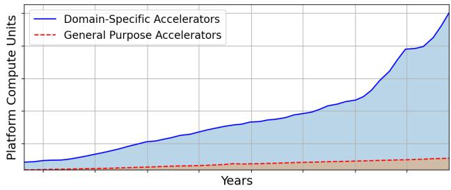  
Figure 1. Five-year historical ML fleet breakdown by accelerator type. The rapid proliferation of domain-specific accelerators in response to ML-based workloads has presented novel challenges in optimizing ML fleets. Managing these domain-specific accelerators means effectively handling hardware and workload heterogeneity, as well as hardware-software co-design at scale.

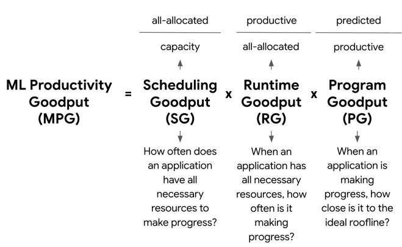  
Figure 2. ML Productivity Goodput (MPG) and its components.

2023; 2021; 2017), our work provides the first in-depth perspective on the software stack that enables these DSAs to operate efficiently at scale. Although our study centers on Google’s ML fleet, which is primarily composed of TPUs (Figure 1), the insights and methodologies we present are broadly applicable to ML fleets consisting of other DSAs.

A critical gap motivates our work: no systematic framework exists for measuring and improving efficiency across the entire ML fleet stack. As organizations scale to thousands of accelerators running heterogeneous workloads, this gap becomes acute. Optimizations that improve individual jobs may inadvertently degrade fleet-wide efficiency, yet traditional datacenter metrics that have been designed for typical general-purpose computing cannot capture this tension. These metrics fail to account for the unique characteristics of ML workloads: bulk-synchronous execution requirements, tight hardware-software coupling, and rapid co-evolution of models and infrastructure.

The contributions of this paper are as follows. First, we provide a methodology to dissect the ML fleet by segmenting it along the layers of a system stack, from the low-level hardware layer to the user-facing application layer. This analysis reveals three major challenges for ML fleet optimization: hardware heterogeneity, workload heterogeneity, and hardware/software co-design. Traditional optimization strategies often rely on stable hardware and workload characteristics, which do not apply to ML fleets. Architecture-centric metrics, such as TOPs/Watt or peak FLOPS, also fall short in capturing the complexity and efficiency of an ML fleet.

Our second contribution addresses these issues. To view the fleet holistically and capture its performance across multiple layers of the ML system stack, we introduce the “ML Productivity Goodput” (MPG) metric. Unlike traditional metrics that equate “busy” with “productive,” MPG measures actual forward progress by encompassing scheduling efficiency, runtime efficiency, and compiler / program efficiency. MPG is analogous to the “iron law” of computer performance (Eeckhout, 2010), but adapted for ML fleets as shown in Figure 2. The MPG metric identifies areas for improvement across the entire ML fleet by breaking down performance across different segments, such as accelerator type, model architecture, and workload phase (e.g., training vs. serving). Decomposing MPG into its subcomponents – Scheduling Goodput (SG), Runtime Goodput (RG), and Program Goodput (PG) – further helps us uncover optimization opportunities that remain hidden in aggregate metrics.

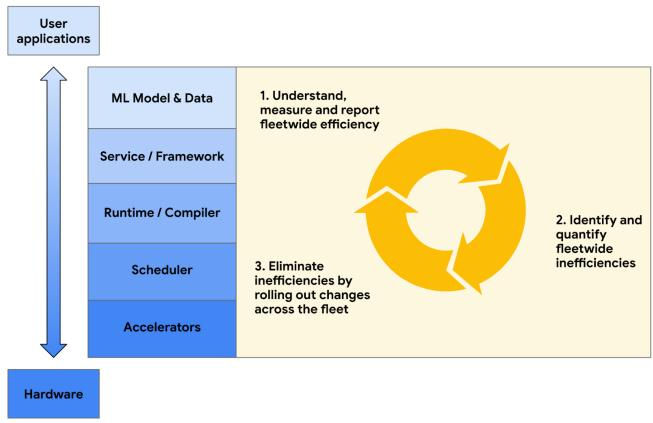  
Figure 3. The ML fleet system stack and optimization lifecycle.

Finally, we share our experience leveraging the MPG metric in a real fleet of TPUs and discuss strategies that we deployed to improve fleet efficiency. MPG helps us identify compiler optimizations to generate more efficient code for specific hardware configurations, improve scheduling algorithms to better utilize heterogeneous resources within the fleet, and more. Even after optimizations are implemented in the fleet, the MPG metric can be used to validate and track fleet-wide improvements.

Beyond our deployment on Google’s TPU infrastructure, MPG provides a vendor agnostic methodology for operators of any heterogeneous ML infrastructure to quantify productive forward progress rather than raw utilization. The metric’s decomposable structure exposes inefficiencies that traditional datacenter metrics obscure, enabling targeted tuning across hardware, runtime, and workload design. We believe that by reframing efficiency around goodput rather than occupancy, this work offers the community a shared vocabulary and measurement framework for evaluating the real-world performance of large scale ML systems.

## 2 ANATOMY OF AN ML FLEET

In order to measure the performance of the ML fleet and identify opportunities for improvement, we must study its characteristics across all levels of the system stack. In this section, we dissect Google’s ML fleet and analyze its components from the hardware to the application level, as shown in Figure 3. Segmenting the fleet based on these layers provides actionable metrics which can be used to improve performance, later discussed in Section 3 and Section 4.

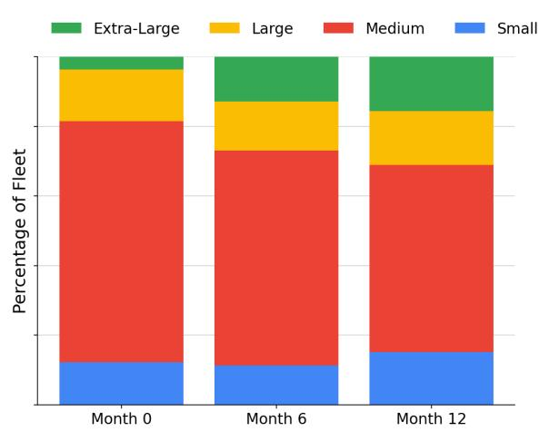  
Figure 4. A sample breakdown of Google’s ML fleet for internal workloads, segmenting on workload topology size (the number of accelerators requested by a given job). Progressive snapshots over the course of one year illustrate the ML fleet’s growing share of jobs using an “extra-large” number of accelerators.

## 2.1 Accelerators

ML fleets are distinguished from other types of large-scale systems by their accelerator-centric architecture. In order to tailor to the matrix-intensive operations that underpin ML workloads, there has been a Cambrian explosion of ML hardware accelerators (Hennessy & Patterson, 2019), with new accelerators being deployed at an unprecedented rate compared to traditional WSC fleets (Jouppi et al., 2021).

Figure 1 illustrates this dynamism, showing dramatic shifts in our ML fleet’s hardware makeup for internal workloads over just a few years. ML fleets typically incorporate a diverse array of hardware including CPUs, GPUs, TPUs, and other accelerators, each fulfilling specific roles. For example, CPUs may be responsible for scheduling, GPUs for training tasks, and edge accelerators for deployment and serving. The challenge lies in orchestrating these heterogeneous accelerators to maximize their individual strengths.

Hardware heterogeneity extends beyond just accelerator type. Even within a single class of hardware accelerators, there can be many different generations, adding another layer of complexity to fleet management. Each hardware generation introduces unique features that require significant optimizations to extract peak ML workload efficiency.

One notable example is the integration of the SparseCore (SC) in TPUv4 (Jouppi et al., 2023), which was designed to significantly boost performance for embedding-heavy models. Subsequent large-embedding model teams would likely need to consider the hardware specifications of the SparseCore when designing their embedding configurations. Model design configurations such as embedding dimension, vocabulary size, valence, and others might also be co-designed to optimize performance on SparseCore-enabled TPUs.

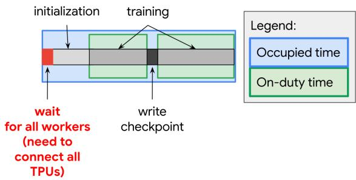  
Figure 5. An ML workload requires all requested TPUs to be allocated before the task can start. In this example training workload, forward progress is saved via checkpoints. Delays during workload initialization and checkpoint writing, which are part of the Runtime and Framework layers, can reduce overall system efficiency.

The SparseCore example demonstrates how hardwaresoftware co-design is becoming increasingly important in improving the efficiency of these diverse accelerators, forming a symbiotic relationship where the computational needs of future workloads affect the next generation of hardware, and the hardware capabilities inform the types of workloads that the ML fleet is best equipped to handle (Shi et al., 2020).

## 2.2 Scheduler

The scheduler directly manages the hardware in a fleet by coordinating the allocation of resources. For the case study presented in this paper, it coordinates TPU allocations for Google’s internal-facing ML workloads. There are two interconnected challenges that a scheduler must address when allocating hardware for an ML fleet: (1) optimizing performance across various hardware types, and (2) balancing utilization with stability and fault tolerance.

Figure 4 illustrates the first challenge. It shows the allocation of workloads in Google’s internal-facing ML fleet with different chip requirements over time, categorized into sizes based on the total number of TPU chips in the required topology. In this categorization, workloads with size “small” refer to jobs that request a single TPU or a handful of TPUs, while workloads with size “extra-large” refer to jobs that request the largest number of TPUs (often requiring multiple pods, as described in Kumar et al. (2021)).

As Figure 4 shows, the allocation of TPUs can shift dramatically over the course of just one year. As large-scale ML models become more prevalent in an ML fleet, an increasing number of workloads will require correspondingly larger meshes of connected accelerators. The ML fleet scheduler must be able to respond to these rapidly changing conditions to keep the ML fleet well allocated.

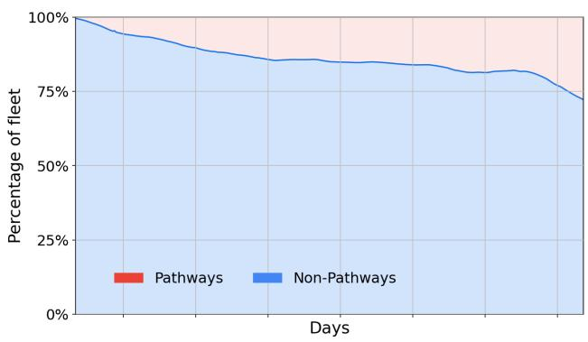  
Figure 6. Fleet workloads using the Pathways runtime over a sample of one year. Pathways adoption has increased rapidly to accommodate changing workloads, as it provides better support for distributed execution and data processing.

Optimizing job scheduling while meeting these resource requirements can be framed as a bin-packing problem. Each workload may specify a different accelerator type, chip topology, and location requirement, and needs to be scheduled according to fleet constraints in a way that reduces overall fragmentation of the fleet. Since workloads are constantly being started and completed, the machine availability of the fleet is constantly changing, requiring a robust defragmentation algorithm. In addition, latency requirements may require accelerators for a workload to be grouped together near certain locations or data cells, adding another constraint to the scheduling optimization problem.

The utilization of fleet resources must also be balanced with stability and fault tolerance. For example, to reduce disruptions, some machines may intentionally remain underutilized so that higher priority jobs may be more easily scheduled when needed. In large-scale ML fleets, hardware failures are inevitable, and the scheduler must be robust enough to handle these failures gracefully, redistributing workloads and ensuring job continuity without significant performance degradation.

## 2.3 Runtime/Compiler

The runtime and compiler layers are responsible for bridging the gap between high-level ML models and the underlying hardware accelerators. The runtime layer focuses on the execution environment of ML programs, handling important tasks such as program setup, data feeding, result management, and checkpoint creation, as illustrated in Figure 5.

The runtime layer can also manage the distribution strategy of code execution, as with notable runtimes like Pathways (Barham et al., 2022). Figure 6 shows the growth of Pathways-based workloads in Google’s TPU fleet. It highlights the demand for runtimes that support efficient distributed execution for ML workloads. It also emphasizes the rapidly shifting distribution of workload runtimes in a fleet, which adds to fleet management complexity.

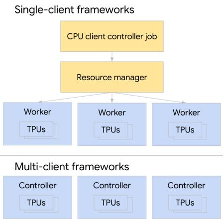  
Figure 7. Single-client and multi-client frameworks.

The compiler layer, working with the runtime, transforms high-level ML model code into executable code optimized for specific accelerators. Compilers such as XLA (Accelerated Linear Algebra) operate on graph intermediate representations, outputting programs tailored to the target accelerator, such as a specific version of a TPU.

Compiler optimization in ML fleets faces unique challenges due to the rapid evolution of hardware accelerators, requiring frequent updating of optimization strategies to leverage the specific features of each new hardware generation. Moreover, the impact of optimizations can be difficult to generalize, as an optimization that improves one workload may degrade another due to differences in computation or communication patterns. This emphasizes the need for a balanced approach to optimization, considering both platformindependent techniques for flexibility and platform-specific optimizations for maximum performance.

## 2.4 Framework

The framework layer sits on top of the runtime/compiler and encompasses various ML frameworks and libraries, such as TensorFlow (Abadi et al., 2016), JAX (Frostig et al., 2018), and PyTorch (Paszke et al., 2019). One of the key responsibilities of ML frameworks is defining the structure of distributed ML applications. For example, TensorFlow’s distribution strategy (tf.distribute.Strategy) provides a framework for distributing training across multiple devices or machines. These can have single-client or multi-client architectures, depending on workload needs, as shown in Figure 7. These frameworks must also map ML primitives to hardware-specific designs to achieve optimal performance. This is important for specialized hardware like TPUs, which are designed for bulk-synchronous training.

As the primary point of interaction for users, the framework layer not only abstracts underlying complexities but also plays an important role in determining the overall efficiency and capabilities of the fleet. Frameworks must balance the need for user-friendly APIs with the need to leverage underlying hardware-specific optimizations, while also managing the complexities of distributed computing, data pipeline optimization, and integration with lower-level services.

## 2.5 ML Model & Data

To characterize the ML Fleet at the highest level of the stack, we want to know: What types of workloads are we spending most of our compute cycles on? This is a critical question because it drives nearly every design decision we make for the ML Fleet at every level of the stack, from the hardware (how many chips should be allocated to training vs. inference vs. other) to the software (JAX vs. other frameworks, runtime distribution strategies, and compiler optimizations). Workload heterogeneity analysis is useful for understanding what kind of models are prevalent in the production fleet, especially since different workloads stress the hardware in different ways. This understanding can drive decisions about which accelerators to deploy and how many, or which compiler optimizations to carry out.

In practice, we observe that the model and data layer of the ML fleet stack are the most affected by fluctuating user demands. User requirements such as the model architecture, size of the training dataset, or even use of different numerical formats in the training model can impact the efficiency of the job, which can have a cascading effect on fleet efficiency.

In a production ML fleet, there are varying proportions of workloads dedicated to each phase of the ML model life cycle: training, bulk inference, and real-time serving. Thus, the fleet must be flexible enough to handle the requirements of each of these phases. For example, training workloads tend to be compute-intensive and require highly parallel systems, while real-time serving workloads minimize latency and bulk inference workloads maximize throughput.

This holistic workload heterogeneity is essential for developing metrics that capture efficiency across the diverse demands placed on the fleet, which we address next.

## 3 ML PRODUCTIVITY GOODPUT

The optimization of ML fleet efficiency is a complex, cyclical challenge. The first challenge is measuring, understanding, and reporting fleetwide efficiency, establishing a baseline for current performance. Second, we must identify and quantify fleet-wide inefficiencies, pinpointing areas that require improvement. Third, we must eliminate these inefficiencies by implementing changes across the fleet, which in turn leads back to the first stage as we measure the impact of these changes. To keep pace with this cycle, we require a metric that not only quantifies current performance but also guides optimization efforts across the fleet.

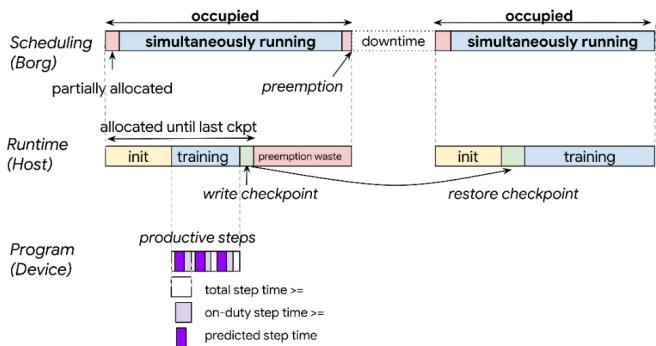  
Figure 8. Breakdown of an ML workload using MPG.

## 3.1 Metric Features

Ideally, the MPG metric must be a clearly defined and accurate measure of forward progress; improvements in the metric must also reflect real improvements in the efficiency of the fleet. This metric must be capable of overcoming two significant challenges.

1. It must capture the dynamic nature of ML fleets: The fleet is constantly fluctuating due to variables such as changes in workload composition, updates to the code stack, and evolving hardware. To effectively improve efficiency, any change in the metric must be explainable despite these fluctuating variables.

2. It must explain the trade-offs between individual and aggregate efficiency. At a fleetwide scale, jobs must be scheduled in concert with one another to ensure maximum aggregate efficiency of the fleet. However, individual jobs may have certain service-level requirements, meaning that this metric must be decomposable based on workload characteristics.

## 3.2 A New Approach: ML Productivity Goodput

MPG is designed to address the myriad challenges discussed in Section 2, as well as to overcome the limitations of existing approaches. Just as the Iron Law of Processor Performance (Emer & Clark, 1984) breaks down CPU performance into instructions × cycles timecycle , the MPG program instruction cycle, metric decomposes ML fleet efficiency into scheduling, runtime, and program components (see Figure 2).

This multi-layered structure, as shown in Figure 8, offers several advantages over traditional metrics. First, it allows precise identification of performance bottlenecks or improvements at specific layers of the stack, facilitates a more granular analysis of efficiency trends over time, and mitigates the risk of misleading interpretations that can arise from aggregated data. Second, by decoupling these submetrics, we enable more targeted optimization efforts and gain deeper insights into the complex interactions within the ML fleet. Finally, this approach not only enhances our ability to measure current performance but also provides a framework for guiding improvements, discussed in Section 4.

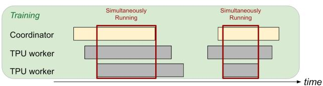  
Figure 9. The scheduling goodput for training workloads measures the percentage of time when all of the TPU workers are available to work at the same time. It measures the portion of time that all of the necessary resources are available to make progress.

## Scheduling Goodput: How often does an application have all necessary resources to make progress?

Scheduling Goodput (SG) quantifies the efficiency of resource allocation in an ML fleet. It measures the fraction of time that an application has all the required resources simultaneously available to make progress. This metric can be lower than traditional Occupancy metrics, particularly in distributed, bulk-synchronous applications where all required chips must be available concurrently.

The numerator of SG is calculated as the simultaneous uptime of all tasks in a distributed ML application that must be connected to make synchronous progress, as shown in Figure 9. This is referred to as “allocated chip-time” or “all-allocated” time. The denominator is fleet capacity, expressed as chip-time. This provides a full view of how effectively the scheduling layer is using the fleet’s resources.

Scheduling Goodput offers insights into potential inefficiencies in resource allocation, such as fragmentation of available resources, delays in coordinating multiple chips for distributed applications, and mismatches between application requirements and available resources. By optimizing SG, we can improve the overall efficiency of resource utilization in the ML fleet, ensuring that applications have the necessary resources to make consistent progress.

## Runtime Goodput: Of the time that an application has all necessary resources, how often is it making progress?

Runtime Goodput (RG) measures the efficiency of the orchestration layers in managing the execution of ML applications once resources are allocated. This metric focuses on the actual productive time of an application, accounting for various overheads in the runtime environment. The orchestration layer is responsible for critical tasks such as initializing chips, connecting them into slices for bulk-synchronous progress, loading and compiling programs, feeding data to these programs, and ensuring that training progress is regularly saved through checkpoints.

The numerator of RG is the productive chip-time of the application’s progress that has been saved in checkpoints; work done between the last checkpoint and failure (or preemption) does not count as “productive” time and is therefore not included in RG. The denominator of RG is the allocated chip-time defined as the numerator of SG.

Runtime Goodput can help with identifying bottlenecks in the runtime environment, such as slow data loading, inefficient checkpointing, or suboptimal program compilation. It can guide the efforts to streamline the execution pipeline and improve the overall throughput of ML workloads.

## Program Goodput: Of the time that an application is making progress, how close is it to the ideal roofline?

Program Goodput (PG) assesses the efficiency of the application code itself, measuring how effectively it utilizes the available computational resources. While a traditional roofline performance model might seem suitable for this purpose, it falls short in capturing the true efficiency of modern ML workloads. The traditional roofline model is highly sensitive to compiler decisions, such as how ML operators are fused or rematerialized, or which operands are placed in which memory space. It rewards individual ops that are close to peak utilization, but penalizes correct optimizations that result in computation graphs where the utilization may be lower, but overall execution time is shorter. For example, Figure 10 shows a graph of two ops which see a latency reduction after being fused together. Since the traditional roofline looks at each op in isolation, it does not help us identify this potential improvement.

To overcome these limitations, we use a compute-based roofline model that compares the ideal execution time of the workload against its actual execution time. The ideal predicted execution time, which is the numerator of PG, is derived from the mathematical operations and operand shapes in the unoptimized high-level operations (HLO) graph. This analysis allows us to estimate how many FLOPs the program would require at its theoretical peak performance. Since we are analyzing the computation graph before any compiler optimizations, this prediction is agnostic to compiler decisions. Compiler optimizations like fusion change memory access patterns and operator placement, but do not change the underlying mathematical computation required. For example, fusing matmul + bias + activation does not reduce the FLOPS; instead, it reduces memory traffic. The theoretical peak remains determined by the arithmetic operations. Thus, our baseline accurately reflects the compute work required, and PG measures how efficiently the compiled program achieves that compute.

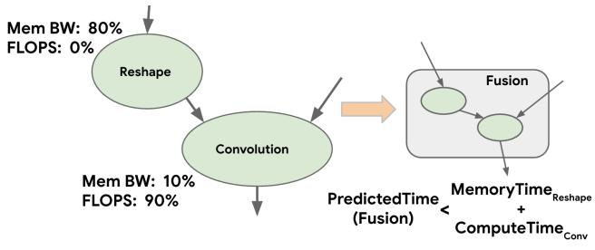  
Figure 10. Traditional roofline models may not capture optimizations that reduce whole-program compute / memory utilization while also reducing runtime. Program Goodput (PG) tracks productive FLOPs and increases when overall execution time decreases.

The denominator of PG is the actual execution time. The PG metric can thus be interpreted as a percentage reflecting how well optimized the ML program is, with a score of 100% indicating perfect performance matching the theoretical peak.

## 4 IMPROVING FLEETWIDE EFFICIENCY

This section shows how MPG quantifies ML fleet performance through optimization examples from Google’s production fleet. We present a breakdown of the MPG components using segmented fleet data and show how this procedure identifies concrete optimization techniques. Additionally, we show the effects of deploying these optimizations and how MPG validates and tracks improvements.

The key insight is that aggregated MPG alone does not help practitioners identify high-impact improvements. This is where the decomposability of the metric becomes essential. By breaking MPG into its three components (Scheduling Goodput, Runtime Goodput, and Program Goodput) we diagnose fleetwide issues and identify optimization types that would most improve fleet efficiency. Furthermore, segmenting the fleet using the characteristics described in Section 2 allows us to identify issues with specific workload types and propose targeted model-level optimizations.

## 4.1 Scheduling Goodput Optimizations

The optimization of Scheduling Goodput (SG) can be presented as a bin packing problem, as described in subsection 2.2. Users launch workloads with varying TPU topology sizes, and the scheduling algorithm must determine how to best fit these workloads into the existing fleet of allocated chips. This process presents numerous challenges, primarily due to the wide variety of job sizes in the fleet, ranging from single-chip to multipod configurations (Kumar et al., 2021).

A complication in job scheduling is that it requires more than mere availability in the fleet. The topology of the available hardware must also satisfy the topology requirements of the workload, which is sometimes impossible without first preempting other jobs. Consequently, suboptimal scheduling can have a cascading effect on other components of MPG.

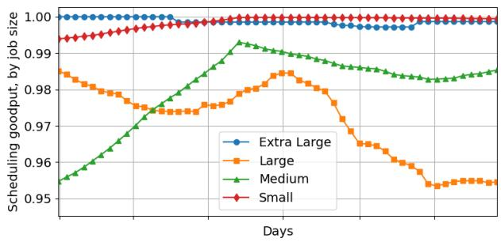  
Figure 11. Scheduling goodput by job size. Extra-large and small jobs tend to have better scheduling goodput due to the scheduler’s preemption algorithm.

We can identify availability issues in the ML Fleet by looking at the SG for jobs with different chip allocation requirements, as shown in Figure 11. The data shows that the overall SG is already close to optimal, due to defragmentation techniques and scheduling optimizations. However, it is interesting to note which jobs tend to have the highest SG: extra-large jobs which require the greatest number of chips or possibly multiple TPU pods, as well as smaller jobs which require only a single chip or a few chips.

This is likely due to the way the scheduler deals with evictions; evicting extremely large jobs would have a severe negative impact on the overall MPG score due to their huge startup overhead. Once the extra-large job is running, it is also immensely dependent on checkpointing and data sharding, affecting the Runtime and Program Goodput components as well. In short, evicting extra-large jobs from the hardware would present a cascading series of failures, strongly incentivizing the scheduler to reduce churn for these jobs and evict medium-sized jobs instead.

On the other hand, extremely small jobs usually do not get prematurely evicted since they are more likely to finish quickly, and if pre-empted, it is usually quicker to find topologically matching availability. With extremely small jobs, the scheduler has more flexibility to intelligently allocate the workloads to optimal compute cells in order to defragment the overall ML fleet availability. It is also important to note that for workloads of all sizes, the SG is greater than 95% due to the particular pre-emption preferences of the scheduler. The pre-emption preferences of the scheduler can be tuned, e.g. to require a SG of greater than 95% for medium-sized jobs, but this could reduce the SG for other segments of the fleet.

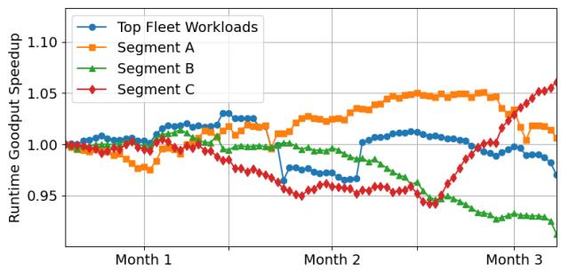  
Figure 12. Runtime goodput speedups over the course of one quarter, segmented by fleet workload types. Speedup is normalized to the top N fleet workloads, measured at the start of the quarter.

## 4.2 Runtime Goodput Optimizations

Outside of device time, host overhead and pre-emptions can be major bottlenecks for some workloads, and can be tracked by measuring Runtime Goodput. For example, training jobs usually use input pipelines to ingest and transform input data, which could be bottlenecks for certain models that ingest large amounts of data. Some solutions help reduce host overhead, such as Plumber (Kuchnik et al., 2022), which is a tool to find bottlenecks in ML input pipelines.

We can improve the RG of the ML fleet with asynchronous strategies such as sharding the dataflow graph, as proposed by Pathways (Barham et al., 2022). The segmented analysis of RG shows that the particular workloads on Pathways tend to have higher RG scores over time, validating the benefits of Pathways for our particular ML Fleet. Also, techniques such as asynchronous checkpointing (Maurya et al., 2024; Nicolae et al., 2020) can reduce the time spent fetching previous model training checkpoints where the accelerators temporarily pause training and are completely idle.

Other strategies, such as ahead-of-time compilation, where programs are compiled on less expensive hardware such as CPUs and then executed on TPUs, can also improve RG. By offloading compilation to a less expensive chip and storing the results in a compilation cache, we can reduce the total runtime of more specialized accelerators. These techniques are often implemented in common ML frameworks, such as TensorFlow (Abadi et al., 2016) and JAX (Bradbury et al., 2018).

To demonstrate the benefits of these framework-specific optimizations, we can examine the RG of the ML Fleet at the framework level of the system stack described in Figure 3. This can help us understand which frameworks or runtime strategies may be better suited for which workloads. Figure 12 shows RG scores from a sample of Google’s ML fleet for internal workloads, segmented based on characteristics such as model architecture, product area or workload phase (training, real-time serving, or bulk inference), and compared to a baseline of top fleet workloads.

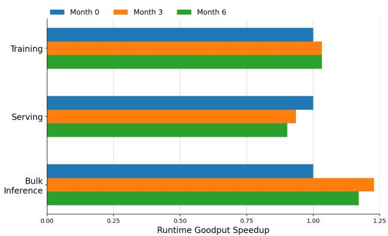  
Figure 13. Runtime Goodput trends for a slice of the ML fleet over a period of six months, segmented by workload phase.

Although the segments in Figure 12 are not explicitly identified, we demonstrate how segmenting RG based on workload characteristics (Segment A, Segment B, and Segment C) can reveal trends that would otherwise be hidden by aggregate fleet metrics (represented by the “Top Fleet Workloads” segment). For example, training workloads running JAX with Pathways may tend to have a higher RG, possibly due to the fact that Pathways is single-client (Barham et al., 2022) and therefore better optimized for training than multi-client frameworks.

Examining the data along a different axis, training versus real-time serving versus bulk inference, can also be helpful. Using a sample from Google’s ML fleet, Figure 13 illustrates that training workloads tend to have a higher RG than serving workloads. This is most likely due to the inherently different nature of serving and training. Typically, training workloads have more constant computational demands, while real-time serving can fluctuate based on user demand. The slight decrease in serving RG can be attributed to transitory demands on the fleet, but it remains relatively stable in comparison to the bulk inference segment. The huge fluctuation in RG for bulk inference highlights the changing nature of production fleet demands. Previously, the bulk inference segment of the fleet was dominated by workloads running on a single core, where each chip contained a replica of the model, resulting in more easily accessible checkpoints/data and less accelerator wait time. However, as we move to larger models, the weights must be sharded across multiple chips, resulting in more expensive data reads. Additionally, the rise of expert-based models (Shazeer et al., 2017) has made bulk inference runtime much more complex to optimize, as some machines must wait for others for distillation of weight updates in a student-teacher model. This has resulted in an temporary decrease of RG for the bulk inference segment between “Month 3” and “Month 6” of Figure 13.

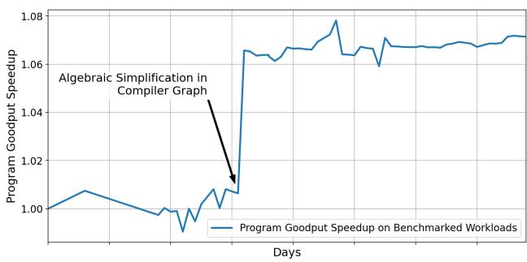  
Figure 14. This figure shows the effect of an XLA algebraic simplification optimization on PG across a benchmark of the top 150 fleet workloads. Looking at the PG in this way allows us to bisect which code changes improved or regressed overall fleet efficiency.

This example illustrates how analyzing disaggregated RG can allow ML fleet architects to make informed decisions about their runtime stack by pinpointing segments that may be more susceptible to shifting fleet demands.

## 4.3 Program Goodput Optimizations

We present techniques and strategies that have been used at Google over recent years for improving Program Goodput in our ML fleets, ranging from parallelization methods to compiler optimizations. Recall that PG measures the effective utilization of computational resources. As ML models grow in size and complexity, optimizing PG becomes increasingly important to make efficient use of hardware and reduce compute times. With PG instrumentation, we have been able to pinpoint which segments of the fleet require further optimization at the compiler or ML model level.

Overlapping communication and computation. To identify potential system optimizations that can improve fleet efficiency, we can look at the PG of workloads segmented by performance characteristics. In other words, how many of the workloads in the fleet are compute-bound versus communication-bound? By segmenting the PG in this way, it is possible for us to identify that many high-cost workloads are communication-bound.

To address this issue at the high-level operation (HLO) level, a technique that overlaps communication with computation was developed and deployed in our production fleet (described in Wang et al. (2022)). This technique decomposes communication collectives, along with the dependent computation operations, into a sequence of finer-grained operations to hide data transfer latency so that better system utilization is achieved. This approach improved the overall system throughput by up to 1.38× and achieves 72% FLOPS utilization on 1024 TPU chips for a large language model with 500 billion parameters (Wang et al., 2022).

Compiler autotuning. At the fleet level, we have also developed and deployed optimizations that improve codegeneration quality and can be generalized to any workload in the fleet. XTAT (Phothilimthana et al., 2021) is an autotuner for ML compilers that tunes multiple compiler stages, including tensor layouts, operator fusion decisions, tile sizes and code generation parameters. Evaluated over 150 ML training and inference models on TPUs, XTAT offers speedups over the heavily-optimized XLA compiler. Building on XTAT, CATWILD (Cano et al., 2026) implements a Feedback-Directed Optimization (FDO) loop at datacenter scale, continuously tuning approximately 70% of the TPU training fleet and improving Program Goodput.

Example: Quantifying the impact of an XLA optimization on the TPU fleet. It is rare for any single optimization to have a significant impact on overall fleet-wide PG. But we can track the impact of these optimizations by looking at the change in PG for a fixed set of benchmarked workloads or segment of the production fleet over time. For example, looking at a benchmark of the top 150 most costly workloads in the fleet, Figure 14 pinpoints the effect of a code change that was submitted to the XLA compiler—an algebraic simplification in the compiler graph. The increase in PG for the benchmark of 150 workloads suggests that the impact of this optimization can be generalized to the fleet.

It is also helpful to look at PG fluctuations across hardware segments of the fleet. Figure 15 shows an example where looking at segmented PG can uncover insights that would otherwise be hidden by looking at aggregate metrics. In this case, the segmented data suggests that when a new ML accelerator chip is introduced to the fleet, the workloads running on that chip may initially have a low PG, since the model / compiler code has not been fully tailored for that chip yet. As user adoption increases and acceleratorspecific software optimizations are rolled out to the fleet, PG gets closer to theoretical peak efficiency. In other words, accelerator maturity tends to yield greater PG over time. As the chip nears the end of its lifecycle (represented by decreasing allocation in the fleet, and shown in Figure 15 by the “Chip decommissioned” label), the PG decreases due to lower chip usage and natural workload/compiler drift. This shows the importance of co-design across all layers of the ML fleet to make sure that both the software (compiler) and hardware (chips) are optimized for the latest workloads.

## 5 DISCUSSION

To put things into perspective for MPG, we considered more traditional approaches to measuring ML fleet efficiency such as Capacity, Occupancy, and Duty Cycle. Figure 16 illustrates how we may have traditionally tended to think about performance metrics (Li et al., 2023; Mars et al., 2011; Kanev et al., 2015). However, our experience reveals that these traditional metrics can sometimes fall short in providing a holistic view, given the unique challenges we have discussed in Section 2. While we cannot provide specifics other than what is already shared in Section 4, we can share the key insights and lessons learned from our evaluation of these metrics in a production environment. Below, we share some common pitfalls of historical approaches for fleetwide performance measurement.

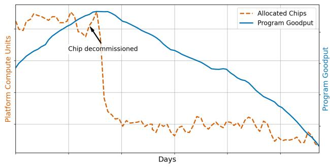  
Figure 15. Program Goodput (PG) vs. allocation trends.

Myth 1: High Capacity equates to high resource availability. While capacity can tell us how many individual accelerators may be available in the fleet at a given time, it does not take into account the topological shape of those accelerators. For example, an ML training workload requesting thousands of chips in a certain physical mesh shape may never be scheduled if the only available accelerators are fragmented across different clusters or data centers. Other factors, such as the geographical location of data storage cells and accelerators, are not included in the capacity metric, even though they significantly affect job scheduling. Therefore, high capacity by itself as a metric does not necessarily effectively translate to high availability for workloads, and we should instead opt for scheduling efficiency as a more robust metric.

Myth 2: High Occupancy guarantees productivity. Occupancy is defined as the fraction of accelerators allocated to jobs and is often measured by the scheduler (e.g. Borg (Verma et al., 2015)). Occupancy is traditionally seen as an efficiency indicator, but it can be misleading as it masks inefficiencies in the system stack. For example, an accelerator might be successfully allocated but stuck in I/O wait or running poorly optimized code, thus resulting in a high occupancy but very little actual progress being made towards the workload task. This is important for long-running tasks such as ML model training, where frequent pre-emptions may hinder checkpoint progress but still result in a nominally high occupancy. The metric therefore does not distinguish between productive and unproductive use of resources.

Myth 3: Duty Cycle accurately represents useful work. Duty Cycle measures whether an accelerator is in use, not how much of its compute capacity is used. When looking at an ML workload running on a TPU, duty cycle does not provide any signal on how much the matrix-multiply units

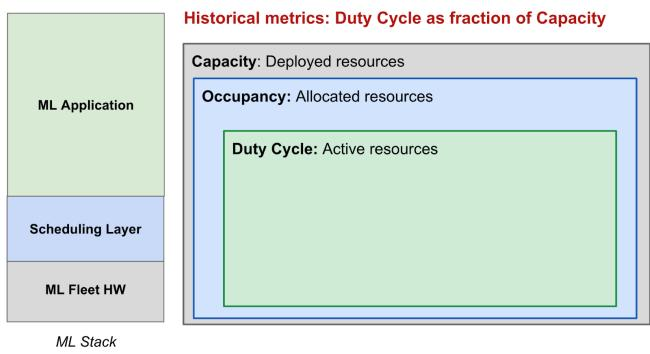

Figure 16. Traditional utilization-based metrics. MPG uses goodput as a measure of fleet efficiency rather than utilization.

(MXUs) are utilized (Jouppi et al., 2023). It is agnostic of the program-level efficiency and does not take into account the effectiveness of the operations being performed. An accelerator could have a high duty cycle while executing unnecessary or redundant computations.

Overarching Misconception: Utilization == Productivity. The thread among these metrics is the assumption that keeping accelerators busy equates to productive work. However, this overlooks critical factors. (1) Quality of Computations: None of these metrics assess whether the operations being performed are actually contributing to the desired output. (2) Workload Efficiency: They do not consider whether the workloads are optimally designed for the hardware. (3) System-level Bottlenecks: Focusing solely on accelerator usage ignores potential bottlenecks in data loading, memory access, or inter-accelerator communication. (4) Forward Progress: The traditional metrics provide no insight into how much useful work is being accomplished towards completing an actual ML task, thus motivating the need for a goodput-based metric, MPG.

## 5.1 Generalizability

While our case study focuses on Google’s TPU infrastructure, the MPG framework is designed to be vendor-agnostic. The three-component decomposition (SG × RG × P G) relies on metrics available in any standard distributed ML stack. Scheduling Goodput (SG) can be derived from any cluster manager’s logs (e.g., Slurm or Kubernetes) by measuring the delta between resource allocation and worker synchronization. Runtime Goodput (RG) is measurable through framework-level instrumentation in PyTorch(Ansel et al., 2024) or JAX (Bradbury et al., 2018) to distinguish productive compute from orchestration overheads like checkpointing. Finally, Program Goodput (PG) is computable from the intermediate representation (IR) of modern compilers (e.g., Triton (Tillet et al., 2019) or XLA (Sabne, 2020)) by comparing theoretical mathematical FLOPS to actual hardware execution time. Practitioners can also leverage tools and profilers such as XProf (Hundt et al., 2026), which is available for CPUs, GPUs, and TPUs. These metrics are all exposed via public interfaces such as the Google Cloud Goodput Measurement API (Google, 2024).

## 6 CONCLUSION

Our study analyzes ML fleet efficiency using Google’s production TPU infrastructure. We provide an anatomy of the ML system stack and highlight the unique challenges of performance optimization for ML fleets, including rapid model and hardware evolution and the orchestration of hardware/software co-design. To address these challenges, we introduce the ML Productivity Goodput (MPG) metric, which decomposes ML fleet efficiency into three key components: Scheduling, Runtime, and Program Goodput.

The composable nature of MPG enables us to dissect efficiency trends over time and precisely identify performance bottlenecks at specific stack layers. Applied to Google’s TPU fleet, MPG guided analysis drove measurable improvements: scheduling policies tuned to maintain >95% goodput across all job sizes, runtime gains through framework modernization and asynchronous checkpointing, and program level speedups via compiler optimizations.

The key insight from our production deployment is that traditional utilization metrics (capacity, occupancy, and duty cycle) are insufficient for ML fleets. These metrics measure whether accelerators are busy rather than whether they make productive forward progress. MPG addresses this gap by tracking checkpoint saved work and comparing actual execution time to theoretical peak performance. The methodology presented in this paper can be applied to large scale ML fleets across industry.

## 7 ACKNOWLEDGEMENTS

Our work builds on the collaboration of many teams at Google, including the XLA team, the ML Metrics team, and the TPU Performance team. We are grateful to Daniel Herrington, Victor Cai, Kongtao Chen, Yiru Sun, Yinquan Hao, Aleksey Orekhov, Peter Ma, and Jie Sun for their support with metrics instrumentation and Amit Sabne, Berkin Ilbeyi, and Shibo Wang for support with XLA optimizations. We also thank Sushma Prasad, Martin Maas, David Patterson, Michael Burrows, Ignacio Cano, Samrat Ghosh, Charles Chang, Peter Mattson, Dan Zhang, Michael Isard, the anonymous MLSys reviewers, and our shepherd for their valuable review and feedback on this publication.

## REFERENCES

Abadi, M., Barham, P., Chen, J., Chen, Z., Davis, A., Dean, J., Devin, M., Ghemawat, S., Irving, G., Isard, M., Kudlur, M., Levenberg, J., Monga, R., Moore, S., Murray, D. G.,

Steiner, B., Tucker, P., Vasudevan, V., Warden, P., Wicke, M., Yu, Y., and Zheng, X. Tensorflow: A system for large-scale machine learning, 2016. URL https:// arxiv.org/abs/1605.08695.

Ansel, J., Yang, E., He, H., Gimelshein, N., Jain, A., Voznesensky, M., Bao, B., Bell, P., Berard, D., Burovski, E., Chauhan, G., Chourdia, A., Constable, W., Desmaison, A., DeVito, Z., Ellison, E., Feng, W., Gong, J., Gschwind, M., Hirsh, B., Huang, S., Kalambarkar, K., Kirsch, L., Lazos, M., Lezcano, M., Liang, Y., Liang, J., Lu, Y., Luk, C. K., Maher, B., Pan, Y., Puhrsch, C., Reso, M., Saroufim, M., Siraichi, M. Y., Suk, H., Zhang, S., Suo, M., Tillet, P., Zhao, X., Wang, E., Zhou, K., Zou, R., Wang, X., Mathews, A., Wen, W., Chanan, G., Wu, P., and Chintala, S. Pytorch 2: Faster machine learning through dynamic python bytecode transformation and graph compilation. In Proceedings of the 29th ACM International Conference on Architectural Support for Programming Languages and Operating Systems, Volume 2, ASPLOS ’24, pp. 929–947, New York, NY, USA, 2024. Association for Computing Machinery. ISBN 9798400703850. doi: 10.1145/3620665.3640366. URL https://doi. org/10.1145/3620665.3640366.

Barham, P., Chowdhery, A., Dean, J., Ghemawat, S., Hand, S., Hurt, D., Isard, M., Lim, H., Pang, R., Roy, S., Saeta, B., Schuh, P., Sepassi, R., Shafey, L. E., Thekkath, C. A., and Wu, Y. Pathways: Asynchronous distributed dataflow for ml. arXiv preprint arXiv:2203.12533, 2022. URL https://arxiv.org/abs/2203.12533.

Barroso, L. A. and Holzle, U.¨ The Datacenter as a Computer: An Introduction to the Design of Warehouse-Scale Machines. 2009. URL http://dx.doi.org/10. 2200/S00193ED1V01Y200905CAC006.

Bradbury, J., Frostig, R., Hawkins, P., Johnson, M. J., Leary, C., Maclaurin, D., Necula, G., Paszke, A., VanderPlas, J., Wanderman-Milne, S., and Zhang, Q. JAX: composable transformations of Python+NumPy programs, 2018. URL http://github.com/jax-ml/jax.

Cano, I., Wang, Y. E., Burrows, M., Feng, Z., Camargo, M., Wang, C., Liu, D. H., Sun, T., Wertheim, A., Wongpanich, A., Angermueller, C., Kim, H., Cao, W., Orekhov, A., Sabne, A., Sevastian, E., Khani, M., Murthy, K. S., Ilbeyi, B., Shah, S., Lefever, R., Khare, A., Sinha, A., Ma, P., Bierbaum, M., Wilke, J., Donahue, E., Abu-El-Haija, S., Sarda, N., Govindaraj, V., Vasudevan, S., Gugaev, K., Nachman, I., Sun, J., Paredes, J. B., Ghosh, S., Babic, D., Zhou, Z., Kumar, N., and Phothilimthana, P. M. CATWILD: Compiler Autotuning for TPU Workloads in the Wild. In To Appear in the Ninth Conference on Machine Learning and Systems (MLSys 2026), 2026.

Eeckhout, L. Computer architecture performance evaluation methods. Morgan & Claypool Publishers, 2010.

Emer, J. S. and Clark, D. W. A characterization of processor performance in the vax-11/780. SIGARCH Comput. Archit. News, 12(3):301–310, jan 1984. ISSN 0163- 5964. doi: 10.1145/773453.808199. URL https: //doi.org/10.1145/773453.808199.

Frostig, R., Johnson, M., and Leary, C. Compiling machine learning programs via high-level tracing. 2018. URL https://mlsys.org/Conferences/doc/ 2018/146.pdf.

Google. Ml goodput measurement library, 2024. URL https://github.com/AI-Hypercomputer/ ml-goodput-measurement.

Hennessy, J. L. and Patterson, D. A. A new golden age for computer architecture. Commun. ACM, 62(2):48–60, jan 2019. ISSN 0001-0782. doi: 10.1145/3282307. URL https://doi.org/10.1145/3282307.

Hundt, R., Kumar, N., Paredes, J. B., Goodson, S., Verghese, C., Rengasamy, P., Le, K., Zhang, J., Alaras, C., Zhang, Y., Cai, K., Thakkar, J., Bandiatmakuri, S. G., SY, Y., Udipi, A. N., and Aggarwal, V. XProf: An open, scalable, and extensible profiling system for the modern ML stack. In To Appear in the Ninth Conference on Machine Learning and Systems (MLSys 2026), 2026. URL https: //openreview.net/forum?id=KqRLAdGK6C.

Jouppi, N. P., Young, C., Patil, N., Patterson, D. A., Agrawal, G., Bajwa, R., Bates, S., Bhatia, S., Boden, N., Borchers, A., Boyle, R., Cantin, P., Chao, C., Clark, C., Coriell, J., Daley, M., Dau, M., Dean, J., Gelb, B., Ghaemmaghami, T. V., Gottipati, R., Gulland, W., Hagmann, R., Ho, C. R., Hogberg, D., Hu, J., Hundt, R., Hurt, D., Ibarz, J., Jaffey, A., Jaworski, A., Kaplan, A., Khaitan, H., Koch, A., Kumar, N., Lacy, S., Laudon, J., Law, J., Le, D., Leary, C., Liu, Z., Lucke, K., Lundin, A., MacKean, G., Maggiore, A., Mahony, M., Miller, K., Nagarajan, R., Narayanaswami, R., Ni, R., Nix, K., Norrie, T., Omernick, M., Penukonda, N., Phelps, A., Ross, J., Salek, A., Samadiani, E., Severn, C., Sizikov, G., Snelham, M., Souter, J., Steinberg, D., Swing, A., Tan, M., Thorson, G., Tian, B., Toma, H., Tuttle, E., Vasudevan, V., Walter, R., Wang, W., Wilcox, E., and Yoon, D. H. In-datacenter performance analysis of a tensor processing unit. CoRR, abs/1704.04760, 2017. URL http://arxiv.org/abs/1704.04760.

Jouppi, N. P., Hyun Yoon, D., Ashcraft, M., Gottscho, M., Jablin, T. B., Kurian, G., Laudon, J., Li, S., Ma, P., Ma, X., Norrie, T., Patil, N., Prasad, S., Young, C., Zhou, Z., and Patterson, D. Ten lessons from three generations shaped google’s tpuv4i : Industrial product. In

2021 ACM/IEEE 48th Annual International Symposium on Computer Architecture (ISCA), pp. 1–14, 2021. doi: 10.1109/ISCA52012.2021.00010.

Jouppi, N. P., Kurian, G., Li, S., Ma, P., Nagarajan, R., Nai, L., Patil, N., Subramanian, S., Swing, A., Towles, B., Young, C., Zhou, X., Zhou, Z., and Patterson, D. Tpu v4: An optically reconfigurable supercomputer for machine learning with hardware support for embeddings, 2023. URL https://arxiv.org/abs/2304.01433.

Kanev, S., Darago, J. P., Hazelwood, K., Ranganathan, P., Moseley, T., Wei, G.-Y., and Brooks, D. Profiling a warehouse-scale computer. In Proceedings of the 42nd Annual International Symposium on Computer Architecture, pp. 158–169, 2015.

Kuchnik, M., Klimovic, A., Simsa, J., Smith, V., and Amvrosiadis, G. Plumber: Diagnosing and removing performance bottlenecks in machine learning data pipelines. Proceedings of Machine Learning and Systems, 4:33–51, 2022.

Kumar, S., Wang, Y., Young, C., Bradbury, J., Kumar, N., Chen, D., and Swing, A. Exploring the limits of concurrency in ml training on google tpus. Proceedings of Machine Learning and Systems, 3:81–92, 2021.

Li, J., Michelogiannakis, G., Cook, B., Cooray, D., and Chen, Y. Analyzing resource utilization in an hpc system: A case study of nersc’s perlmutter. In International Conference on High Performance Computing, pp. 297–316. Springer, 2023.

Mars, J., Tang, L., Hundt, R., Skadron, K., and Soffa, M. L. Bubble-up: Increasing utilization in modern warehouse scale computers via sensible co-locations. In Proceedings of the 44th annual IEEE/ACM International Symposium on Microarchitecture, pp. 248–259, 2011.

Maurya, A., Underwood, R., Rafique, M. M., Cappello, F., and Nicolae, B. Datastates-llm: Lazy asynchronous checkpointing for large language models. In Proceedings of the 33rd International Symposium on High-Performance Parallel and Distributed Computing, HPDC ’24, pp. 227–239, New York, NY, USA, 2024. Association for Computing Machinery. ISBN 9798400704130. doi: 10.1145/3625549.3658685. URL https://doi. org/10.1145/3625549.3658685.

Nicolae, B., Li, J., Wozniak, J. M., Bosilca, G., Dorier, M., and Cappello, F. Deepfreeze: Towards scalable asynchronous checkpointing of deep learning models. In 2020 20th IEEE/ACM International Symposium on Cluster, Cloud and Internet Computing (CCGRID), pp. 172–181, 2020. doi: 10.1109/CCGrid49817.2020.00-76.

Paszke, A., Gross, S., Massa, F., Lerer, A., Bradbury, J., Chanan, G., Killeen, T., Lin, Z., Gimelshein, N., Antiga, L., Desmaison, A., Kopf, A., Yang, E., DeVito, Z., Rai-¨ son, M., Tejani, A., Chilamkurthy, S., Steiner, B., Fang, L., Bai, J., and Chintala, S. Pytorch: An imperative style, high-performance deep learning library, 2019. URL https://arxiv.org/abs/1912.01703.

Phothilimthana, P. M., Sabne, A., Sarda, N., Murthy, K. S., Zhou, Y., Angermueller, C., Burrows, M., Roy, S., Mandke, K., Farahani, R., et al. A flexible approach to autotuning multi-pass machine learning compilers. In 2021 30th International Conference on Parallel Architectures and Compilation Techniques (PACT), pp. 1–16. IEEE, 2021.

Verma, A., Pedrosa, L., Korupolu, M. R., Oppenheimer, D., Tune, E., and Wilkes, J. Large-scale cluster management at Google with Borg. In Proceedings of the European Conference on Computer Systems (EuroSys), Bordeaux, France, 2015.

Wang, S., Wei, J., Sabne, A., Davis, A., Ilbeyi, B., Hechtman, B., Chen, D., Murthy, K. S., Maggioni, M., Zhang, Q., et al. Overlap communication with dependent computation via decomposition in large deep learning models. In Proceedings of the 28th ACM International Conference on Architectural Support for Programming Languages and Operating Systems, Volume 1, pp. 93–106, 2022.

Pope, R., Douglas, S., Chowdhery, A., Devlin, J., Bradbury, J., Heek, J., Xiao, K., Agrawal, S., and Dean, J. Efficiently scaling transformer inference. In Song, D., Carbin, M., and Chen, T. (eds.), Proceedings of Machine Learning and Systems, volume 5, pp. 606–624. Curan, 2023. URL https://proceedings.mlsys. org/paper\_files/paper/2023/file/ c4be71ab8d24cdfb45e3d06dbfca2780-Paper-mlsys2023. pdf.

Sabne, A. Xla : Compiling machine learning for peak performance, 2020.

Shazeer, N., Mirhoseini, A., Maziarz, K., Davis, A., Le, Q., Hinton, G., and Dean, J. Outrageously large neural networks: The sparsely-gated mixture-of-experts layer, 2017. URL https://arxiv.org/abs/1701.06538.

Shi, Z., Sakhuja, C., Hashemi, M., Swersky, K., and Lin, C. Learned hardware/software co-design of neural accelerators. CoRR, abs/2010.02075, 2020. URL https://arxiv.org/abs/2010.02075.

Tillet, P., Kung, H. T., and Cox, D. Triton: an intermediate language and compiler for tiled neural network computations. In Proceedings of the 3rd ACM SIGPLAN International Workshop on Machine Learning and Programming Languages, MAPL 2019, pp. 10–19, New York, NY, USA, 2019. Association for Computing Machinery. ISBN 9781450367196. doi: 10. 1145/3315508.3329973. URL https://doi.org/ 10.1145/3315508.3329973.

Vahdat, A. and Lohmeyer, M. Enabling next-generation AI workloads: Announcing TPU v5p and AI Hypercomputer. https://cloud.google.com/ blog/products/ai-machine-learning/ introducing-cloud-tpu-v5p-and-ai-hypercomputer, 2023.