# PLAYER-FL: A PRINCIPLED APPROACH TO PERSONALIZED LAYER-WISE CROSS-SILO FEDERATED LEARNING

Ahmed Elhussein1,2 Gamze Gursoy¨ 1,2,3 ae2722@cumc.columbia.edu gamze.gursoy@columbia.edu

1Department of Biomedical Informatics, Columbia University, NY, USA

2New York Genome Center, NY, USA

3Department of Computer Science, Columbia University, NY, USA

## ABSTRACT

Non-identically distributed data is a major challenge in Federated Learning (FL). Personalized FL tackles this by balancing local model adaptation with global model consistency. One variant, partial FL, leverages the observation that early layers learn more transferable features by federating only early layers. However, current partial FL approaches use predetermined, architecture-specific rules to select layers, limiting their applicability. We introduce Principled Layer-wise-FL (PLayer-FL), which uses a novel federation sensitivity metric to identify layers that benefit from federation. This metric, inspired by model pruning, quantifies each layer’s contribution to cross-client generalization after the first training epoch, identifying a transition point in the network where the benefits of federation diminish. We first demonstrate that our federation sensitivity metric shows strong correlation with established generalization measures across diverse architectures. Next, we show that PLayer-FL outperforms existing FL algorithms on a range of tasks, also achieving more uniform performance improvements across clients.

## Software and data

Code for reproducing this paper can be found at https://github.com/gaiters-aerials/player\_fl.

## 1 Introduction

Federated Learning (FL) is a distributed learning framework that enables collaborative model training without datasharing. Early FL algorithms such as Federated Averaging (FedAvg) focused on developing a unified global model [32]. However, when data among clients is non-independently identically distributed (non-IID), the performance of a global model diminishes. This largely stems from the fact that clients, each optimizing their local models using non-IID datasets, often generate model updates that diverge from each other [49]. A weighted averaging of these updates then causes the global model to settle outside of local minima, which reduces the performance. To address this, personalized FL methods have been developed that allow client models to diverge, typically by guiding the training of a local model with a global model [40, 10, 41]. In certain non-IID settings, Personalized FL algorithms have improved performance, yet they do not consistently outperform FedAvg. Moreover, their benefits are not always equitably distributed among all participating clients [23, 11]. That is, only a subset of clients might experience increased performance compared to a model trained only on their local data.

Partial FL, in which only a subset of layers are federated, is a form of personalized FL [1, 35, 7]. Partial FL is based on an implicit assumption that the greatest divergence in model weights primarily occurs in the model’s final layers. By federating early layers and only locally updating later layers, partial FL retains the benefits of FL even with non-IID data. This approach is informed by insights from representation learning regarding layer function and generalizability. It is well-established that early layers in neural networks typically capture universal features that are more generalizable across tasks [46, 39, 48, 30]. In contrast, later layers are often more task-specific, thus tend to benefit from localized training or fine-tuning [46]. This transition in layer function and generalizability is also observed in the model loss landscape. Early layers, which are linked to feature representation, generally occupy flatter areas of the loss function, suggesting a lower sensitivity to perturbations. [4, 17, 46]. However, existing partial FL methods [1, 35, 7] determine which layers to federate in an ad hoc manner, which limits their generalizability across different architectures and tasks.

Here, we propose that insights from model pruning can be leveraged to establish a more principled approach to federation assignment in partial FL. Model pruning involves reducing model complexity by eliminating unnecessary parameters. Similar to representation learning, model pruning offers insights into parameter and layer function that can be leveraged in partial FL. While model pruning involves identifying parameters that can be removed with minimal performance loss— a different focus from that of partial FL- the underlying principles still hold relevance. Studies have shown that layer-specific pruning can achieve high model performance despite significant reductions in model size [12, 5, 14]. This process highlights that certain parameters are critical for the model’s output and must be retained, while others may be redundant [28]. Further, the degree of pruning in a layer often correlates with its feature representation [5]. Crucially, work in model pruning aims to find computationally simple metrics for pruning that work across a range of architectures. We posit that a similar approach can be adopted in partial FL.

Building on these insights, we propose Principled Layer-wise-FL (PLayer-FL), a partial FL approach that utilizes a novel federation sensitivity metric to identify which layers are more suited for federation. This metric, inspired by model pruning, uses a first-order approximation of weight importance to determine which layers would benefit from federation. Importantly, our method identifies this during the first epoch of training rather than relying on model-specific heuristics. We validate our approach across various model architectures and real-world non-IID datasets, demonstrating consistent improvements in performance, fairness, and incentivization.

## 2 Contribution and significance

In this study, we make several contributions to FL with non-IID data:

• Early identification of layer-specific divergence. We show that models with identical initialization but independent training exhibit consistent generalization patterns across corresponding layers, even after just one epoch of non-IID training. This enables early, reliable decisions about which layers to federate.

• Federation sensitivity metric. We introduce a novel metric, federation sensitivity, that estimates each layer’s cross-client generalization. This metric identifies a transition point where the benefits of federation diminish. This metric correlates strongly with established generalization measures, emerges from the first epoch, and imposes minimal computational overhead. Notably, it holds across diverse network architectures.

• Principled partial FL algorithm. We develop PLayer-FL that uses federation sensitivity to determine which layers to federate after only one epoch of training. PLayer-FL outperforms other approaches on various non-IID datasets (including real-world tasks), while also achieving fairer outcomes and stronger incentives for FL participation.

## 3 Background

## 3.1 Federated Learning

In each training round k, the server broadcasts global model parameters Θk−1 to clients c ∈ C. These clients update their local model to produce Θkc which are sent back to the server. The central server then aggregates these parameters and rebroadcasts the updated global model. This is repeated until convergence. In FedAvg, the aggregation is defined as Θk = Pnc=1 αcΘkc , where αc is the weight of each client determined by sample size.

## 3.1.1 Cross-Silo FL

FL has two main settings, cross-silo and cross-device, each with distinct use cases and challenges [19]. This work concentrates on cross-silo FL, a setting common in sectors such as healthcare to overcome data-sharing constraints. In healthcare, cross-silo FL has advanced research on poorly understood diseases by enabling training on larger datasets [37, 8]. Cross-silo FL involves a few clients with medium to large datasets. A key challenge is non-IID data as institutions often have different populations, data collection practices, and operational protocols [36, 42]. Further, since clients frequently possess enough data to train adequately performant models on their own, FL must surpass local training to motivate participation [16]. In contrast, cross-device FL manages numerous edge devices with limited data, prioritizing communication efficiency. While most FL methods target cross-device scenarios, fewer address cross-silo FL’s unique challenges [16, 42], highlighting the need for specialized approaches.

## 3.2 Model pruning

Model pruning reduces the size of a model by removing parameters that have limited impact on the output [38]. Simple, yet effective metrics include weight magnitude or the scaling parameter in batch normalization [15, 27]. Other methods

leverage a first or second-order approximation of the change in loss following the removal of parameter ws to quantify its importance, denoted as Is(w) [21, 33]. The importance of a parameter set, WS , where ws ∈ WS , is defined as [33]:

$$
\tag{1}
$$

where gs is the gradient with respect to the parameter ws. Importantly, many of these simple methods have been shown to be reliably effective across diverse model architectures.

## 3.3 Model generalization

Many studies in representation learning have sought to understand when and how models generalize. One method is to examine the loss landscape. Parameters located in flatter regions of the loss landscape exhibit reduced sensitivity to perturbations and are more generalizable. Multiple studies have also made the link that generalizable layers identify low-level features that are common across tasks [46]. To estimate the characteristics of the loss landscape, first and second-order gradient approximations are used. Jiang et al. [17] showed that gradient variance of a layer, even after one epoch, correlates with its generalizability. Chaudhari et al. [4] used the eigenspectrum of the Hessian, which reflects the steepness of the loss function, as a measure of generalizability. They showed that biasing model optimization towards wide valleys improves a model’s sensitivity to perturbation.

Another approach to measuring model generalization is comparing representational similarity across models [26, 34]. Typically, the same model is randomly initialized and trained on the same dataset a number of times. The representation of a set of samples after each layer is then compared across all models [20, 45]. One key insight is that generalizing networks create similar representations across samples, while overfit, memorizing networks, trained on random labels, do not. [34].

Relation to our work: We apply these techniques to address a related but distinct question more relevant for FL:

To what extent do identically initialized models trained on non-IID data resemble each other?

In other words, how much model divergence do we observe in FL and can this be reliably estimated? A natural question to ask is why not directly compare the weights. However, this approach has several limitations. First, there is not a straightforward, effective metric for capturing weight divergence. Common metrics such as L2-norm and cosine similarity are not invariant to linear transformation and may lack the sensitivity to detect subtle, yet significant differences in weights. Second, unlike gradients, differences in weights may not always emerge early in training. Early emergence helps to limit computational cost and mitigates the negative impacts of model training on non-IID data.

## 4 Related works

Global FL aims to generate a global model for all clients. In FedAvg, a global model is updated using a weighted average of local updates from each client [32]. While this simple procedure has achieved remarkable success, it struggles when clients have non-IID data [24]. Some attempts to solve this problem while retaining a global model include sharing a subset of public data [49], augmenting the data to be more IID [13], and adding a regularization term to keep local updates close to the global model [24]. While these methods mitigate some of the loss in performance, they still only train a single global model that is not optimized for each individual client.

Personalized FL aims to learn a model for each client that is informed by a global model. One approach is to cluster similar clients together and train a separate model for each cluster [2, 31]. However, identifying clusters can be challenging. Another related approach is multi-task learning, where clients with similar data can share model parameters more extensively [40, 10]. There are also regularization-based approaches that train a local model but adapt the loss function to ensure updates remain close to the global model [25, 41]. Additional hyperparameters add complexity to the training process. In local adaptation, clients fine-tune the global model locally after convergence [47]. This works well when the global model is already near the optimal local model for each client which may not hold with non-IID data.

Partial FL is a type of personalized FL that involves selectively federating specific subsets of the model, with the remaining parts undergoing local training only. Typically, the early layers are federated and later layers are kept for local training. FedPer trains the full model during local updates but federates only the bottom layers [1]. FedBABU trains and federates the bottom layers while keeping the top layers fixed until convergence [35]. FedRep decouples the body and head, jointly training a body to build low-dimensional representations of the data while leaving the head for local training [7]. One drawback common to these methods is that the layers for federation or local training are pre-determined before the training process begins. This requires prior knowledge or relies on heuristics. Consequently, much of the work is focused on Convolutional Neural Networks (CNNs). Other methods such as FedLP and FedLAMA select layers dynamically during training [50, 22]. However, they primarily address communication cost by limiting the layers sent to federation while maintaining similar performance to FedAvg, i.e., they do not deal with non-IID data. pFedLA introduces personalized layer-wise aggregation to address non-IID data. It achieves this by training server-side hypernetworks for each client, which learn specific aggregation weights for each layer [29]. However, the use of hypernetworks introduces additional complexity. Finally, pFedHR proposes server-side model reassembly after grouping functionally related layers [43]. However, it requires sharing data, which is often prohibited in cross-silo FL.

## 5 Comparing models trained on non-IID data

To understand the impact of federated training on non-IID data, we examine generalization metrics on models that are identically initialized but trained on non-IID data. We look at two scenarios, independent and FL training. The former allows us to capture the extent of divergence in the most extreme case, and the latter allows us to capture the typical divergence observed in FL. In Figures 1-4 we present results from the first epoch. Note, after one epoch (prior to federation), the models from independent and federated training are identical. In Figures A.2-A.10 we present final model results for independent and FL training (the layer-wise pattern of generalization capabilities are the same).

Previous studies have shown that randomly initialized models trained on IID data follow a similar training trajectory [44]. We reverse this analysis by examining the trajectory of identically initialized models trained on non-IID subsets of data. We decompose our analysis to the level of individual layers and identify similarities in the role of each layer across the models. We find that early layers converge to more similar and generalizable solutions, whereas later layers do not. This is similar to the situation of randomly initialized models on the same dataset. Additionally, in most models, we observe a point that we postulate marks the transition from functioning as generalizable feature-extractors to serving as task specific feature utilizers. Importantly, these dynamics emerge just after a single epoch of training and are retained throughout training. Definitions for all metrics are in Section A.1.

## 5.1 Layer generalizability

Figures 1 and 2 show the gradient variance (eqn. A.1) and sum of Hessian eigenvalues (eqn. A.2) after one epoch of training for four datasets (independent and FL training are equivalent after one epoch). Refer to Figures A.1- A.6 for comparable analyses for all datasets at the conclusion of independent or FL training. To account for the size of a layer, we divide gradient variance and sum of Hessian eigenvalues by the total number of parameters in that layer. A consistent pattern appears in which both metrics rapidly increase in the final layers (note the log scale). These results suggest that the early layers have a higher generalization capacity, hence less sensitivity to perturbation, than final layers. Although this observation is well-established, it leads to an intriguing implication in the context of FL in non-IID settings: assuming that the optimal global and client models are in close proximity, we can infer that federating the early layers should, at the very least, not negatively impact a client’s performance. That is, if we consider federated weight aggregation as a form of ’perturbation’, then the early layers should continue to reside in locally flat regions of the loss-landscape. The open question is now to determine if global and local models are located in nearby regions.

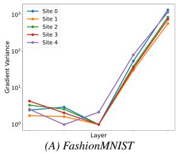

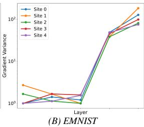

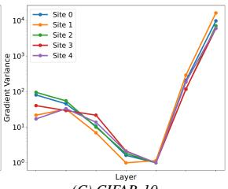  
(C) CIFAR-10

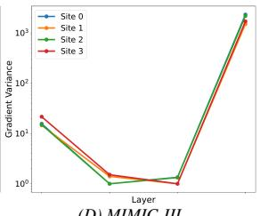  
(D) MIMIC-III  
Figure 1: Layer gradient variance after one epoch. All models identically initialized and independently trained on non-IID data.

## 5.2 Sample representation

To determine if global and local models are located in nearby regions, we compare the models’ internal, layer-wise representations for a set of samples using Centered Kernel Alignment (see equation A.3) [20]. Figure 3 shows the average sample representation for each model vs. all other models. That is, we conduct a pairwise comparison of representation similarity across all models and take the average for each model. Again, a consistent pattern appears, in which a large increase in layer representation dissimilarity is observed in the later layers. This also emerges after a single epoch of training and becomes more extreme with more training (for comparable figures at the conclusion of training and all datasets see Figures A.7 and A.8). This finding suggests that internal representations, and presumably layer weights, show a large divergence at the same point that weights become more sensitive to perturbation. We can now extend our hypothesis: even in non-IID settings, since the early layers converge to similar solutions, we expect that federating these layers should, at the very least, not negatively impact a client’s performance. Conversely, we can expect that federating later layers may reduce performance as these layers are specific to the clients’ dataset distribution.

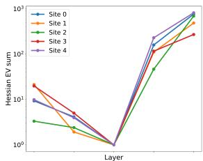  
(A) FashionMNIST

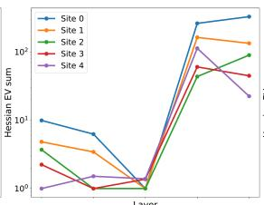  
(B) EMNIST

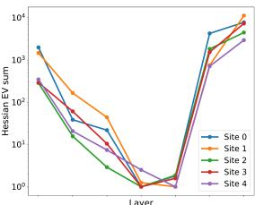  
(C) CIFAR-10

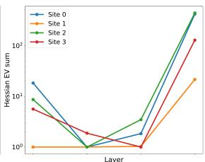  
(D) MIMIC-III  
Figure 2: Hessian eigenvalue sum after one epoch. Each model was identically initialized and trained on respective non-IID datasets.

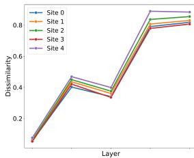  
(A) FashionMNIST

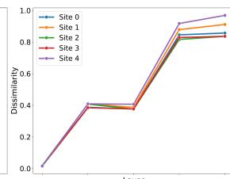  
(B) EMNIST

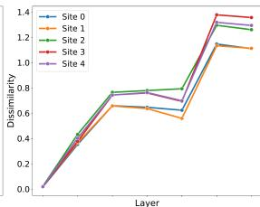  
(C) CIFAR-10

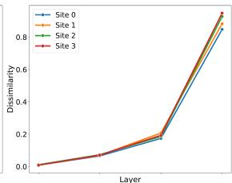  
(D) MIMIC-III  
Figure 3: Model representation similarity by layer. Models identically initialized and independently trained on non-IID data.

## 5.3 Federation sensitivity

Having established that early layers consistently show greater cross-client generalization, we seek a principled method to identify the transition point between generalizable and client-specific layers across different architectures. While previous work in partial FL has relied on architecture-specific heuristics to select federated layers, we aim to develop a universal, data-driven approach. Our key insight comes from observing that layers with strong cross-client generalization tend to occupy flatter regions of the loss landscape - a property that can be efficiently measured using techniques from model pruning literature. Drawing on this connection, we adapt the concept of parameter importance to quantify each layer’s potential for successful federation, which we term the layer’s federation sensitivity. We define federation sensitivity of layer l, denoted Fl(Θ), as:

$$
\tag{2}
$$

where Θ is the set of all model parameters, θp is parameter p within any given layer k, ∇θp is the gradient with respect to θp, and nk is number of parameters in layer k. There are two major differences between our federation sensitivity metric and the parameter importance metric in eqn. 1. First, we normalize by the number of parameters in each layer (nk) to enable fair comparison across layers of different sizes. This accounts for architectural variations where some layers may have significantly more parameters than others. Second, we incorporate the cumulative contributions of all preceding layers up to layer l, reflecting an inherent constraint of partial federation - the selection of any layer for federation necessarily requires including all previous layers. Note that this reinterpretation of parameter importance to federation sensitivity does not require altering the calculation. Given that all parameters are subjected to the same aggregation process, setting a parameter to zero, much like what is done in pruning, can be viewed as an extreme update step during federated training. Therefore, the original metric remains accurate, except for the need to apply a normalizing constant. However, since our focus is on the relative importance between layers, such a normalizing constant is not necessary. Figure 4 presents results of the federation sensitivity metric after one epoch with values expressed as a % of federation sensitivity in the first layer (see Figures A.9 and A.10 for federation sensitivity at the conclusion of independent or FL training). We observe a characteristic spike in later layers across all model architectures. Notably, we observe that this spike reliably coincides with the metrics on layer generalizability and sample representation presented in Section 5. This metric offers two main advantages. Firstly, it is computationally efficient as the weight and gradient calculations are already performed. Secondly, it shows a remarkably consistent pattern across various model architectures including Fully-Connected Networks (FCNs), CNNs, and Transformers. This consistency makes it broadly applicable to a wide range of tasks and scenarios (Table A.2 for details).

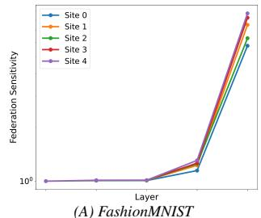

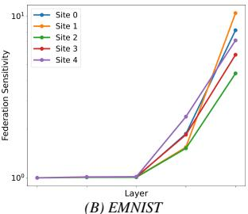

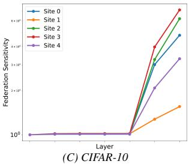

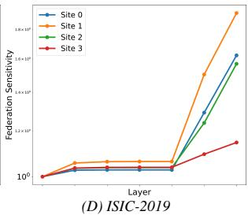

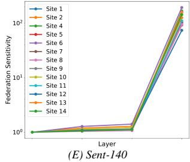

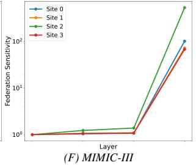

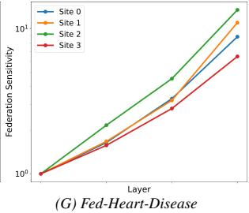  
Figure 4: Federation sensitivity after one epoch. All models identically initialized and trained on non-IID data subsets. Values expressed as % of first layer value

## 6 Proposed Framework

We propose Principled Layer-wise-FL (PLayer-FL), a partial FL approach that uses federation sensitivity to dynamically determine which layers to federate (Algorithm 1). A key advantage of our method is its computational efficiency - federation sensitivity is calculated during the first epoch of training using weights and gradients that are already computed as part of the standard training process. To identify the transition point between federated and local layers, we compare the relative federation sensitivity between consecutive layers against a threshold t (eqn. 3). While this threshold controls how aggressively the algorithm federates layers, with higher values leading to more federated layers, we found in our experiments that the transition point remains stable across a wide range of threshold values (Figure 4).

PLayer-FL stands out by offering a light-weight and principled approach for determining the layers to federate during training specifically to address that challenges of non-IID data. Algorithms 1 - 3 present the formal pseudocode. For brevity, we omit procedures CLIENTUPDATE and SERVERAGGREGATE that are identical to FedAvg. Note that PLayer-FL conducts simultaneous updates to both the federated and localized layers. However, only the federated layers are sent to the central server for aggregation. We use the same learning rate for both federated and localized training, but this can be altered. Additionally, as our algorithm’s sole purpose is to delineate layers to be federated, it can be used in conjunction with other personalized FL algorithms.

PLayer-FL has the same computational complexity as FedAvg. This is because, compared to FedAvg, PLayer-FL introduces two procedures, both executed once during training: CALCULATEFEDSENSITIVITY (Algorithm 2 and LAYERSPLIT (Algorithm 3 with computational complexity of O(P ), where P is the number of parameters, and O(L), where L is the number of layers, respectively.

Algorithm 1 PLayer-FL: Main Algorithm   
Input: Number of rounds N , set of clients C, threshold t   
Output: Model parameters Θc for c ∈ C   
Initialize global model parameters Θ0   
for all clients c ∈ C in parallel do   
Θ1c ← CLIENTUPDATE(Θ0)   
Calculate layer federation sensitivity (Algorithm 2):   
F(Θc) ← CALCULATEFEDSENSITIVITY(Θc)   
end for   
Determine federated and local layers (Algorithm 3):   
Θf ed, Θlocal ← LAYERSPLIT(Θ, {F (Θc)}, t)   
Execute FL on selected layers:   
for r = 1 to N do   
for all clients c ∈ C do   
Θrc ← CLIENTUPDATE(Θr)   
end for   
Θr+1f ed ← SERVERAGGREGATE({Θrc,f ed}, C)   
end for

Algorithm 2 PLayer-FL: CALCULATEFEDSENSITIVITY   
Input: Client model parameters Θc   
Output: Layer-wise federation sensitivity array F (Θc)   
Initialize F (Θc) as an empty array   
Let L be the set of all layers in Θc   
for all layers l ∈ L do   
Calculate federation sensitivity, Fl(Θc), for layer l as in equation 2   
Append Fl(Θc) to F (Θc)   
end for   
Return F(Θc)

## 7 Evaluation

## 7.1 Methods

Our setup focuses on cross-silo FL: we use highly non-IID datasets from a limited number of clients, all of whom have sufficient data to train a local model and are available for each round of training (see Section3.1.1 for justification).

## 7.1.1 Datasets

We evaluate performance on FashionMNIST, ExtendedMNIST, CIFAR-10, ISIC2019, Fed-Heart-Disease, Sentiment-140 and MIMIC-III. The datasets cover tabular, imaging, and natural language modalities. The first three datasets do not have a natural partition, thus we introduce label skew using a Dirichlet distribution (α = 0.5) following Li et al. [23]. The other datasets have natural partitions:

Algorithm 3 PLayer-FL: LAYERSPLIT   
Input: Model parameters Θ, client sensitivities {F (Θc)}, threshold t   
Output: Federated layers Θf ed, local layers Θlocal   
Aggregate client federation sensitivities:   
F (Θ) ← PCc=1 F (Θc)Find transition point p where relative sensitivity exceeds threshold t:   
p ← min{p : Fp+1(Θc)Fp(Θ) > t} (3)   
Partition model at point p:   
Θf ed ← Θl≤p, Θlocal ← Θl>p   
Return Θf ed, Θlocal

• Fed-ISIC-2019 [42]: Dermoscopy skin lesion classification (4 classes); partitioned by hospital.

• Fed-Heart-Disease [42]: Patient heart disease classification (5 classes); partitioned by hospital.

• Sent-140 [3]: Classification of tweet sentiments; partitioned by users, selecting the top 15 users.

• MIMIC-III [18]: Mortality prediction using hospital admission notes; partitioned by diagnosis.

## 7.1.2 Performance

We evaluate our method against three categories of baselines: (1) standard approaches - local site training and FedAvg [32], (2) established personalized FL algorithms - FedProx [24], pFedMe [41], Ditto [25], and Local Adaptation [47], and (3) existing partial FL methods - FedBABU [35], FedLP [50], FedLAMA [22], and pFedLA [29]. We also evaluate PLayer-FL-Random, which federate up to a randomly selected layer. This serves as proxy for non-principled partial FL approaches. Full training and evaluation details are in Section A.4.

We evaluate performance using F1 score (macro-averaged i.e., treating each label equally, see eqn. A.4), accuracy, and test loss. The macro-F1 score serves as our primary metric due to its robustness to class imbalance. Results for accuracy and test loss are presented in Sections A.6.2 and A.6.3. For personalized FL algorithms, we also study per-site metrics. This is important as personalized models that achieve the highest average performance may not necessarily uniformly benefit every site [11]. To evaluate fairness, we compare the variance in performance across clients (eqn. A.5) [11]. We also evaluate participation incentive by calculating the percentage of clients where performance surpasses both local site training and FedAvg (eqn. A.6) [6]. If our intuition that federating generalizable layers should not negatively impact performance holds true, we anticipate our method to exhibit high fairness and participation incentive. To make conclusions across multiple datasets, we use the Friedman test [9].

## 7.2 Results

Table 1: Macro-averaged F1 Score and average rank. In bold is top-performing model. Friedman rank test p-value < 5 × 10−3  
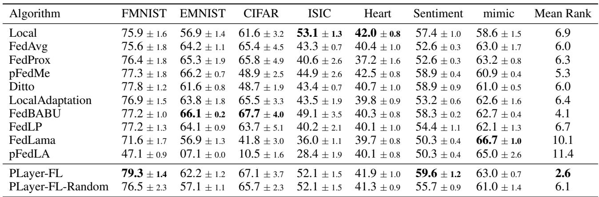

Table 1 presents the F1 scores and average ranks across all datasets (with accuracy and loss results shown in Tables A.7 and A.10, respectively; the conclusions remain consistent across metrics). PLayer-FL achieves the highest mean rank with statistical significance (p < 5 × 10−3), demonstrating consistently competitive performance across various model architectures even when not achieving the top score in individual cases. These results highlight PLayer-FL’s versatility and robustness across diverse tasks and realistic non-IID conditions, while maintaining computational efficiency and implementation simplicity.

PLayer-FL also excels in fairness and participation incentive metrics, achieving the highest average rank in both categories (Table 2, full results in Tables A.5 and A.6). This aligns with our core intuition that federating early, generalizable layers should maintain or enhance client performance. The superiority of PLayer-FL over PLayer-FL-Random indicates that federating up to the specific layer identified by federation sensitivity offers advantages beyond those provided by general partial FL approaches. These empirical results validate federation sensitivity as an effective guiding principle for partial model federation.

Notably, in line with typical observations in cross-silo FL settings where data is highly non-IID [16], local site training is competitive when compared to FL algorithms, as each site can effectively train its own model.

Table 2: Fairness and incentivization average ranks, Friedman rank test p-value < 5 × 10−3 and = 0.043, respectively  
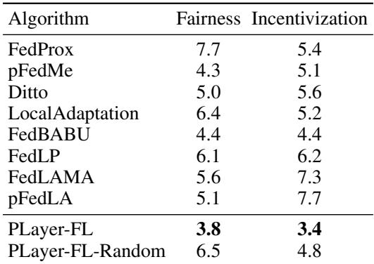

## 8 Conclusion

In this work, we present PLayer-FL, a principled partial FL algorithm that uses a novel federation sensitivity metric to determine which layers to federate and which to locally train. We show that this metric correlates with known measures of generalizability and model similarity and that it emerges after only one epoch of training. As such, it can be readily incorporated into the training algorithm with minimal computational overhead. Over a set of rigorous experiments that include benchmark and real-world datasets, we show that PLayer-FL outperforms existing algorithms in cross-silo settings. We also show that it produces fairer outcomes and is more likely to incentivize participation in FL.

Limitations: Our work demonstrates strong empirical evidence for the federation sensitivity metric across diverse model architectures but currently lacks theoretical guarantees.However, the success of similar metrics in related fields and the established understanding of generalizable versus task-specific layers reinforces the validity and utility of our approach. Developing formal theoretical foundations presents a promising direction for future research. Additionally, our study primarily focuses on cross-silo FL, where clients have sufficient data to calculate federation sensitivity, rather than the cross-device setting. However, this focus is deliberate, as cross-silo FL represents a significant sub-field with critical applications in industries like healthcare. These settings face unique challenges, making the development of tailored method essential [42, 16, 19, 36].

## Impact Statement

This work contributes to Federated Learning. As the work can be applied to sensitive domains like healthcare, there are many potential societal consequences to consider. We believe these are well established and there are none which we feel must be specifically highlighted here.

## References

[1] Manoj Ghuhan Arivazhagan, Vinay Aggarwal, Aaditya Kumar Singh, and Sunav Choudhary. Federated learning with personalization layers. arXiv preprint arXiv:1912.00818, 2019.

[2] Christopher Briggs, Zhong Fan, and Peter Andras. Federated learning with hierarchical clustering of local updates to improve training on non-iid data. In 2020 International Joint Conference on Neural Networks (IJCNN), pages 1–9. IEEE, 2020.

[3] Sebastian Caldas, Sai Meher Karthik Duddu, Peter Wu, Tian Li, Jakub Konecnˇ y, H Brendan McMahan, Virginia \` Smith, and Ameet Talwalkar. Leaf: A benchmark for federated settings. arXiv preprint arXiv:1812.01097, 2018.

[4] Pratik Chaudhari, Anna Choromanska, Stefano Soatto, Yann LeCun, Carlo Baldassi, Christian Borgs, Jennifer Chayes, Levent Sagun, and Riccardo Zecchina. Entropy-sgd: Biasing gradient descent into wide valleys. Journal of Statistical Mechanics: Theory and Experiment, 2019(12):124018, 2019.

[5] Shi Chen and Qi Zhao. Shallowing deep networks: Layer-wise pruning based on feature representations. IEEE transactions on pattern analysis and machine intelligence, 41(12):3048–3056, 2018.

[6] Yae Jee Cho, Divyansh Jhunjhunwala, Tian Li, Virginia Smith, and Gauri Joshi. To federate or not to federate: Incentivizing client participation in federated learning. arXiv preprint arXiv:2205.14840, 2022.

[7] Liam Collins, Hamed Hassani, Aryan Mokhtari, and Sanjay Shakkottai. Exploiting shared representations for personalized federated learning. In International conference on machine learning, pages 2089–2099. PMLR, 2021.

[8] Ittai Dayan, Holger R Roth, Aoxiao Zhong, Ahmed Harouni, Amilcare Gentili, Anas Z Abidin, Andrew Liu, Anthony Beardsworth Costa, Bradford J Wood, Chien-Sung Tsai, et al. Federated learning for predicting clinical outcomes in patients with covid-19. Nature medicine, 27(10):1735–1743, 2021.

[9] Janez Demsar. Statistical comparisons of classifiers over multiple data sets. ˇ The Journal of Machine learning research, 7:1–30, 2006.

[10] Canh T Dinh, Tung T Vu, Nguyen H Tran, Minh N Dao, and Hongyu Zhang. Fedu: A unified framework for federated multi-task learning with laplacian regularization. arXiv preprint arXiv:2102.07148, 400, 2021.

[11] Siddharth Divi, Yi-Shan Lin, Habiba Farrukh, and Z Berkay Celik. New metrics to evaluate the performance and fairness of personalized federated learning. arXiv preprint arXiv:2107.13173, 2021.

[12] Xin Dong, Shangyu Chen, and Sinno Pan. Learning to prune deep neural networks via layer-wise optimal brain surgeon. Advances in neural information processing systems, 30, 2017.

[13] Moming Duan, Duo Liu, Xianzhang Chen, Yujuan Tan, Jinting Ren, Lei Qiao, and Liang Liang. Astraea: Self-balancing federated learning for improving classification accuracy of mobile deep learning applications. In 2019 IEEE 37th international conference on computer design (ICCD), pages 246–254. IEEE, 2019.

[14] Chun Fan, Jiwei Li, Xiang Ao, Fei Wu, Yuxian Meng, and Xiaofei Sun. Layer-wise model pruning based on mutual information. arXiv preprint arXiv:2108.12594, 2021.

[15] Song Han, Jeff Pool, John Tran, and William Dally. Learning both weights and connections for efficient neural network. Advances in neural information processing systems, 28, 2015.

[16] Chao Huang, Jianwei Huang, and Xin Liu. Cross-silo federated learning: Challenges and opportunities. arXiv preprint arXiv:2206.12949, 2022.

[17] Yiding Jiang, Behnam Neyshabur, Hossein Mobahi, Dilip Krishnan, and Samy Bengio. Fantastic generalization measures and where to find them. arXiv preprint arXiv:1912.02178, 2019.

[18] Alistair EW Johnson, Tom J Pollard, Lu Shen, Li-wei H Lehman, Mengling Feng, Mohammad Ghassemi, Benjamin Moody, Peter Szolovits, Leo Anthony Celi, and Roger G Mark. Mimic-iii, a freely accessible critical care database. Scientific data, 3(1):1–9, 2016.

[19] Peter Kairouz, H Brendan McMahan, Brendan Avent, Aurelien Bellet, Mehdi Bennis, Arjun Nitin Bhagoji, ´ Kallista Bonawitz, Zachary Charles, Graham Cormode, Rachel Cummings, et al. Advances and open problems in federated learning. Foundations and trends® in machine learning, 14(1–2):1–210, 2021.

[20] Simon Kornblith, Mohammad Norouzi, Honglak Lee, and Geoffrey Hinton. Similarity of neural network representations revisited. In International conference on machine learning, pages 3519–3529. PMLR, 2019.

[21] Yann LeCun, John Denker, and Sara Solla. Optimal brain damage. Advances in neural information processing systems, 2, 1989.

[22] Sunwoo Lee, Tuo Zhang, and A Salman Avestimehr. Layer-wise adaptive model aggregation for scalable federated learning. In Proceedings of the AAAI Conference on Artificial Intelligence, volume 37, pages 8491–8499, 2023.

[23] Qinbin Li, Yiqun Diao, Quan Chen, and Bingsheng He. Federated learning on non-iid data silos: An experimental study. In 2022 IEEE 38th International Conference on Data Engineering (ICDE), pages 965–978. IEEE, 2022.

[24] Tian Li, Anit Kumar Sahu, Manzil Zaheer, Maziar Sanjabi, Ameet Talwalkar, and Virginia Smith. Federated optimization in heterogeneous networks. Proceedings of Machine learning and systems, 2:429–450, 2020.

[25] Tian Li, Shengyuan Hu, Ahmad Beirami, and Virginia Smith. Ditto: Fair and robust federated learning through personalization. In International Conference on Machine Learning, pages 6357–6368. PMLR, 2021.

[26] Yixuan Li, Jason Yosinski, Jeff Clune, Hod Lipson, and John Hopcroft. Convergent learning: Do different neural networks learn the same representations? arXiv preprint arXiv:1511.07543, 2015.

[27] Zhuang Liu, Jianguo Li, Zhiqiang Shen, Gao Huang, Shoumeng Yan, and Changshui Zhang. Learning efficient convolutional networks through network slimming. In Proceedings of the IEEE international conference on computer vision, pages 2736–2744, 2017.

[28] Zhuang Liu, Mingjie Sun, Tinghui Zhou, Gao Huang, and Trevor Darrell. Rethinking the value of network pruning. arXiv preprint arXiv:1810.05270, 2018.

[29] Xiaosong Ma, Jie Zhang, Song Guo, and Wenchao Xu. Layer-wised model aggregation for personalized federated learning. In Proceedings of the IEEE/CVF conference on computer vision and pattern recognition, pages 10092–10101, 2022.

[30] Stephane Mallat. Understanding deep convolutional networks. ´ Philosophical Transactions of the Royal Society A: Mathematical, Physical and Engineering Sciences, 374(2065):20150203, 2016.

[31] Yishay Mansour, Mehryar Mohri, Jae Ro, and Ananda Theertha Suresh. Three approaches for personalization with applications to federated learning. arXiv preprint arXiv:2002.10619, 2020.

[32] Brendan McMahan, Eider Moore, Daniel Ramage, Seth Hampson, and Blaise Aguera y Arcas. Communicationefficient learning of deep networks from decentralized data. In Artificial intelligence and statistics, pages 1273–1282. PMLR, 2017.

[33] Pavlo Molchanov, Arun Mallya, Stephen Tyree, Iuri Frosio, and Jan Kautz. Importance estimation for neural network pruning. In Proceedings of the IEEE/CVF conference on computer vision and pattern recognition, pages 11264–11272, 2019.

[34] Ari Morcos, Maithra Raghu, and Samy Bengio. Insights on representational similarity in neural networks with canonical correlation. Advances in neural information processing systems, 31, 2018.

[35] Jaehoon Oh, Sangmook Kim, and Se-Young Yun. Fedbabu: Towards enhanced representation for federated image classification. arXiv preprint arXiv:2106.06042, 2021.

[36] Sarthak Pati, Ujjwal Baid, Maximilian Zenk, Brandon Edwards, Micah Sheller, G Anthony Reina, Patrick Foley, Alexey Gruzdev, Jason Martin, Shadi Albarqouni, et al. The federated tumor segmentation (fets) challenge. arXiv preprint arXiv:2105.05874, 2021.

[37] Sarthak Pati, Ujjwal Baid, Brandon Edwards, Micah Sheller, Shih-Han Wang, G Anthony Reina, Patrick Foley, Alexey Gruzdev, Deepthi Karkada, Christos Davatzikos, et al. Federated learning enables big data for rare cancer boundary detection. Nature communications, 13(1):7346, 2022.

[38] Russell Reed. Pruning algorithms-a survey. IEEE transactions on Neural Networks, 4(5):740–747, 1993.

[39] Karen Simonyan, Andrea Vedaldi, and Andrew Zisserman. Deep inside convolutional networks: Visualising image classification models and saliency maps. arXiv preprint arXiv:1312.6034, 2013.

[40] Virginia Smith, Chao-Kai Chiang, Maziar Sanjabi, and Ameet S Talwalkar. Federated multi-task learning. Advances in neural information processing systems, 30, 2017.

[41] Canh T Dinh, Nguyen Tran, and Josh Nguyen. Personalized federated learning with moreau envelopes. Advances in Neural Information Processing Systems, 33:21394–21405, 2020.

[42] Jean Ogier du Terrail, Samy-Safwan Ayed, Edwige Cyffers, Felix Grimberg, Chaoyang He, Regis Loeb, Paul Mangold, Tanguy Marchand, Othmane Marfoq, Erum Mushtaq, et al. Flamby: Datasets and benchmarks for cross-silo federated learning in realistic healthcare settings. arXiv preprint arXiv:2210.04620, 2022.

[43] Jiaqi Wang, Xingyi Yang, Suhan Cui, Liwei Che, Lingjuan Lyu, Dongkuan DK Xu, and Fenglong Ma. Towards personalized federated learning via heterogeneous model reassembly. Advances in Neural Information Processing Systems, 36, 2024.

[44] Liwei Wang, Lunjia Hu, Jiayuan Gu, Zhiqiang Hu, Yue Wu, Kun He, and John Hopcroft. Towards understanding learning representations: To what extent do different neural networks learn the same representation. Advances in neural information processing systems, 31, 2018.

[45] Alex H Williams, Erin Kunz, Simon Kornblith, and Scott Linderman. Generalized shape metrics on neural representations. Advances in Neural Information Processing Systems, 34:4738–4750, 2021.

[46] Jason Yosinski, Jeff Clune, Yoshua Bengio, and Hod Lipson. How transferable are features in deep neural networks? Advances in neural information processing systems, 27, 2014.

[47] Tao Yu, Eugene Bagdasaryan, and Vitaly Shmatikov. Salvaging federated learning by local adaptation. arXiv preprint arXiv:2002.04758, 2020.

[48] Matthew D Zeiler and Rob Fergus. Visualizing and understanding convolutional networks. In Computer Vision– ECCV 2014: 13th European Conference, Zurich, Switzerland, September 6-12, 2014, Proceedings, Part I 13, pages 818–833. Springer, 2014.

[49] Yue Zhao, Meng Li, Liangzhen Lai, Naveen Suda, Damon Civin, and Vikas Chandra. Federated learning with non-iid data. arXiv preprint arXiv:1806.00582, 2018.

[50] Zheqi Zhu, Yuchen Shi, Jiajun Luo, Fei Wang, Chenghui Peng, Pingyi Fan, and Khaled B Letaief. Fedlp: Layer-wise pruning mechanism for communication-computation efficient federated learning. In ICC 2023-IEEE International Conference on Communications, pages 1250–1255. IEEE, 2023.

## A.1 Metric definitions

## A.1.1 Gradient variance

Gradient variance is proposed by Jiang et al. [17] and is defined as:

$$
\tag{A.1}
$$

where θj is parameter j in layer i, ∇θj is the gradient with respect to that parameter and ∇θi is the mean gradient of all parameters in layer i.

## A.1.2 Hessian eigenvalue sum

Hessian eigenvalue sum is proposed by Chaudhari et al. [4]. The Hessian at layer i, denoted Hi, is a square matrix of second-order partial derivatives with respect to parameters at layer i. Each entry in Hi is defined as:

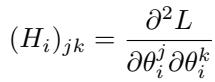

where θji and θki are parameters j and k in layer i, L is the loss and ∂. is the partial derivative with respect to that parameter. The sum of the eigenvalues is then calculated as:

$$
\tag{A.2}
$$

where λpi is the pth eigenvalue of Hi.

## A.1.3 Sample representation similarity

Sample representation similarity is calculated via Centered Kernel Alignment (CKA) which is proposed by Kornblith et al. [20]. Its calculated as:

$$
\tag{A.3}
$$

where Xi and Yi are sample representations after layer i coming from two distinct models.

## A.1.4 F1 score

Multi-class macro-averaged F1 score is calculated as

$$
\tag{A.4}
$$

where N is the number of classes, and precisioni and recalli are the precision and recall for class i. This equation gives equal weight to all classes which is useful in imbalanced datasets like ours.

## A.1.5 Algorithm Fairness

Fairness is calculated as described in [11] - the variance in individual client performances on their local test set:

$$
\tag{A.5}
$$

where C is the number of clients, Pc is the performance of client c and Pc is the average performance of all clients for a given personalized algorithm.

## A.1.6 Algorithm Incentivization

Incentivization is defined as in [6] - the percentage of clients that outperform their local site model or global model from FedAvg:

$$
\tag{A.6}
$$

where C is the number of clients, Pc is performance of the personalized model in client c, Sc is the performance of the local site model in client c, and Gc is the performance of the global Fed Avg model in client c

## A.2 Datasets

Table A.1 provides a description of the datasets which include: 4 image, 1 tabular and 2 NLP tasks. For FashionMNIST, EMNIST, and CIFAR-10 we create non-IID datasets by via label skew using a a dirichlet distribution (α = 0.5). The remaining datasets have a natural partition that we adhere to. For Sent-140 we select the top 15 users by tweet count.

Table A.1: Dataset descriptions  
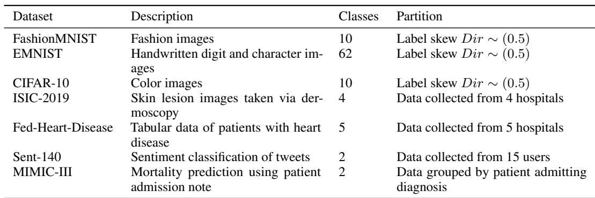

## A.3 Model architectures and Transition point

Table A.2 shows the model architecture and transition point identified by the federation sensitivity metric for each dataset. Of note,

Table A.2: Model architectures and transition points identified by federation sensitivity metric.  
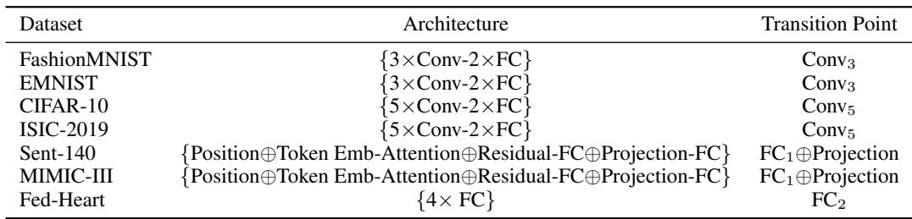  
\*FC = Fully connected layer

## A.4 Model training

Table A.3 presents the learning rates utilized for each algorithm and Table A.4 presents the learning rate grid explored, in addition to the loss function, the number of training epochs, and the count of independent training runs. With the exception of pFedME, the AdamW optimizer was used for all algorithms. For pFedME, we adopted the specific optimizer presented by the original authors, which integrates Moreau envelopes into the training process [41]. To account for this, we multiply the learning rate grid tested by 100 as early testing showed the pFedME optimizer demonstrated improved performance with higher learning rates. All experiments were ran on 1 Tesla V100 16GB node.

Table A.3: Learning rates used  
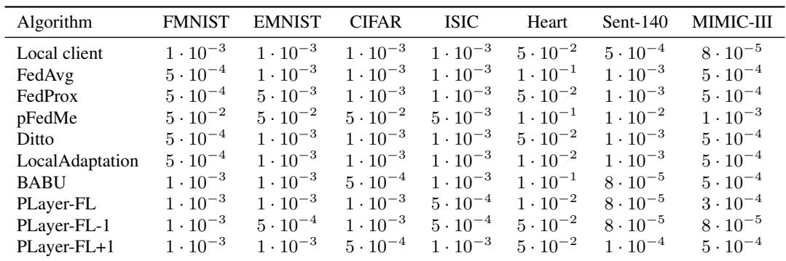

## A.5 Comparing models trained on non-IID data

## A.5.1 Gradient variance

Figures A.1, A.2, and A.3 display the gradient variance across all datasets, corresponding to the models trained for a single epoch, final model after independent training, and final model after FL training, respectively.

## A.5.2 Hessian eigenvalue sum

Figures A.4, A.5, and A.6 display the hessian eigenvalue sum across all datasets, corresponding to the models trained for a single epoch, final model after independent training, and final model after FL training, respectively.

## A.5.3 Sample representation

Figures A.7 and A.8 display the sample representation across all datasets, corresponding to the models trained for a single epoch and the final models, respectively.

## A.5.4 Federated sensitivity

Figures A.9 and A.10 display the federated sensitivity score across all datasets for the final model after independent training, and final model after FL training, respectively.

Table A.4: Learning rate grid, loss function, number of epochs and number of runs for each dataset  
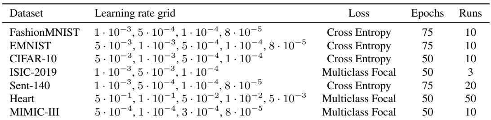

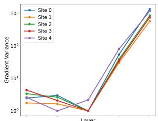  
(A) FashionMNIST

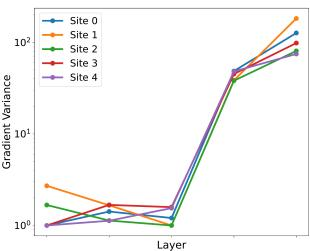  
(B) EMNIST

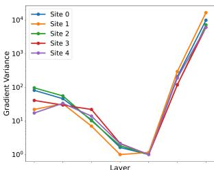  
(C) CIFAR-10

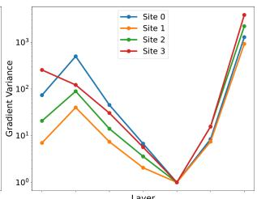  
(D) ISIC-2019

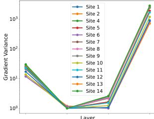  
(E) Sent-140

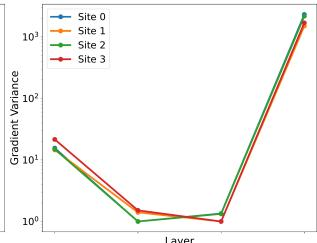  
(F) MIMIC-III

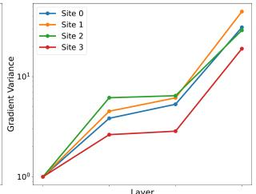  
(G) Fed-Heart-Disease

Figure A.1: Layer gradient variance after one epoch. All models identically initialized and independently trained on non-IID data.  
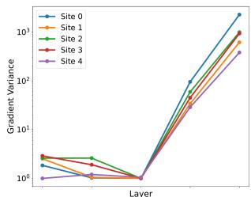  
(A) FashionMNIST

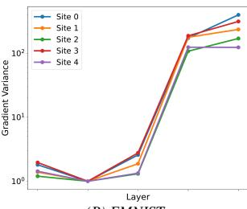  
(B) EMNIST

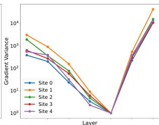  
(C) CIFAR-10

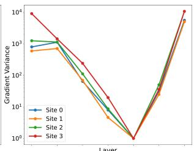  
(D) ISIC-2019

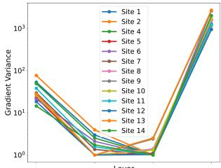  
(E) Sent-140

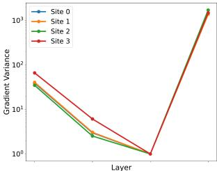  
(F) MIMIC-III

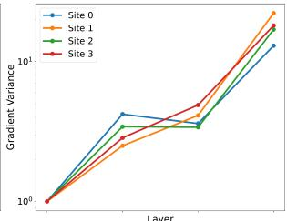  
(G) Fed-Heart-Disease  
Figure A.2: Layer gradient variance for final models. All models identically initialized and independently trained on non-IID data.

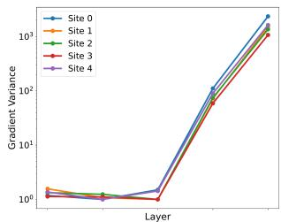  
(A) FashionMNIST

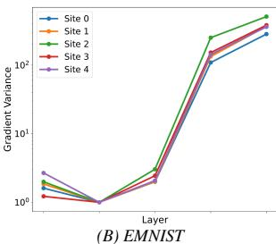

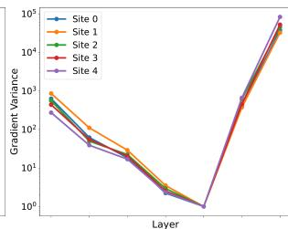  
(C) CIFAR-10

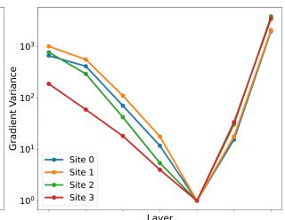  
(D) ISIC-2019

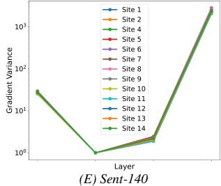

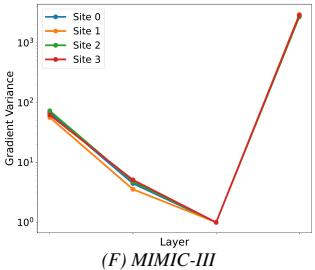

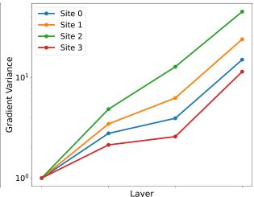  
(G) Fed-Heart-Disease

Figure A.3: Layer gradient variance for final models. Models trained via FL on non-IID data.  
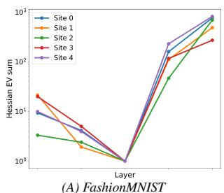

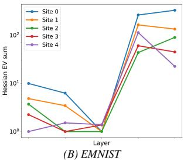

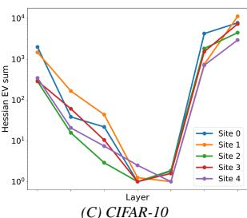

  
(D) ISIC-2019

  
(E) Sent-140

  
(F) MIMIC-III

  
(G) Fed-Heart-Disease  
Figure A.4: Layer hessian eigenvalue sum after one epoch. All models identically initialized and independently trained on non-IID data.

  
(A) FashionMNIST

  
(B) EMNIST

  
(C) CIFAR-10

  
(D) ISIC-2019

  
(E) Sent-140

  
(F) MIMIC-III

  
(G) Fed-Heart-Disease

Figure A.5: Layer hessian eigenvalue sum for the final models. All models identically initialized and independently trained on non-IID data.  
  
(A) FashionMNIST

  
(B) EMNIST

  
(C) CIFAR-10

  
Layer(D) ISIC-2019

  
(E) Sent-140

  
(F) MIMIC-III

  
(G) Fed-Heart-Disease  
Figure A.6: Layer hessian eigenvalue sum for the final models. Models trained via FL on non-IID data.

  
Figure A.7: Layer sample representation similarity after one epoch. All models identically initialized and independently trained on non-IID data.

  
(A) FashionMNIST

  
(C) CIFAR-10

(E) Sent-140  

  
(G) Fed-Heart-Disease  
Figure A.8: Layer sample representation similarity for final models. All models identically initialized and independently trained on non-IID data.

  
(A) FashionMNIST

  
(B) EMNIST

  
(C) CIFAR-10

  
(D) ISIC-2019

  
(E) Sent-140

  
(F) MIMIC-III

  
(G) Fed-Heart-Disease

Figure A.9: Federation sensitivity for final models. All models identically initialized and independently trained on non-IID data.  
  
(A) FashionMNIST

  
(B) EMNIST

  
(C) CIFAR-10

  
Layer(D) ISIC-2019

  
(E) Sent-140

  
(F) MIMIC-III

  
(G) Fed-Heart-Disease  
Figure A.10: Federation sensitivity for final models. Models trained via FL on non-IID data.

## A.6 Results

## A.6.1 F1 score: fairness and incentive

Table A.5 shows the variance in client results and Table A.6 shows the % of clients that beat local site or FedAvg training.

Table A.5: Variance in clients’ F1 score (fairness). In bold is fairest model. Friedman rank test p-value < 5 × 10−3  

Table A.6: Incentivized participation rate (%) using F1 score. In bold is model with highest IPR. Friedman rank test p-value = 0.043  

## A.6.2 Accuracy

Table A.7 shows clients’ median accuracy scores (95% confidence interval), Table A.8 shows the variance in client accuracy scores and Table A.9 shows the % of clients that beat single or FedAvg training in accuracy.

## A.6.3 Loss

Table A.10 shows clients’ median test loss (95% confidence interval), Table A.11 shows the variance in client test loss and Table A.12 shows the % of clients that beat single or FedAvg training in test loss.

Table A.7: Accuracy and average rank. In bold is the top-performing model. Friedman rank test p-value < 5 × 10−3  

Table A.8: Variance in clients’ accuracy (fairness). In bold is the fairest model. Friedman rank test p-value < 5 × 10−3  

Table A.9: Incentivized Participation Rate using accuracy (%). In bold is model with highest IPR. Friedman rank test p-value < 5 × 10−3  

Table A.10: Test loss (×1 · 10−4) and average rank. In bold is the top-performing model. Friedman rank test p-value < 5 × 10−3  

Table A.11: Variance in clients’ test loss (fairness). In bold is the fairest model. Friedman rank test p-value < 5 × 10−3  

Table A.12: Incentivized Participation Rate using test loss (%) and Average Algorithm Rank. Friedman rank test p-value = 0.084  
