# ACCELERATING SPARSE ATTENTION FOR VISUAL GENERATIVE MODELS WITH DUAL-BALANCED SEQUENCE PARALLELISM

Siqi Chen∗1, Ke Hong∗1, Tianchen Zhao1, Ruiqi Xie1, Zhenhua Zhu1, Xudong Zhang1, Yu Wang1 R

1Tsinghua University, Beijing, China

∗Equal contribution

R yu-wang@tsinghua.edu.cn

## ABSTRACT

Scaling Diffusion Transformer (DiT) inference via sequence parallelism is critical for reducing latency in visual generation, but is severely hampered by workload imbalance when applied to models employing block-wise sparse attention. The imbalance stems from the inherent variation in sparsity across attention heads and the irregular distribution of dense blocks within the sparse mask, when sequence parallelism is applied along the head dimension (as in Ulysses) or the block dimension (as in Ring Attention). In this paper, we formalize a sparse imbalance ratio to quantify the imbalance, and propose db-SP, a sparsity-aware sequence parallelism technique that tackles the challenge. db-SP contains a dual-level partitioning approach that achieves near-perfect workload balance at both the head and block levels with negligible overhead. Furthermore, to handle the evolving sparsity patterns across denoising steps and layers, db-SP dynamically determines the parallel degrees for the head and block dimensions at runtime. Experimental results demonstrate that db-SP delivers an end-to-end speedup of 1.25× and an attention-specific speedup of 1.40× over state-of-the-art sequence parallel methods on average. Code is available at https://github.com/thu-nics/db-SP.

Keywords Visual generative model · Sequence parallelism · Sparse attention · Workload balance

## 1 Introduction

Recent advances in visual generative models, particularly those based on Diffusion Transformers (DiTs), have revolutionized image and video generation ability. The computational flow of a DiT involves feeding a noised latent and conditioning information into a Transformer [1] backbone, which predicts the noise to denoise the latent over multiple denoising steps. A Transformer layer is primarily composed of attention and linear computations. Notably, the attention computation suffers from quadratic computational complexity with respect to the token number, and hence becomes a significant bottleneck in DiT inference, occupying over half of the end-to-end latency in multi-frame video generation tasks.

Sparse attention [2, 3, 4, 5, 6, 7, 8, 9] is an effective technique to enhance attention efficiency while maintaining generation quality. Among them, the block-wise sparse pattern [6, 2, 4, 5] becomes promising and is widely adopted in visual generation models due to its efficiency advantages. This efficiency stems from its ability to maintain local computational contiguity and assign adequately sized data to distinct Streaming Multiprocessors (SMs), thereby improving hardware utilization. Nevertheless, even with block-wise sparse attention, the generation latency on a single GPU remains prohibitively high, e.g., exceeding 15 minutes per video using the Wan2.1-T2V-14B model on an A800 GPU with PAROAttention, which is still impractical for real-world use.

Sequence parallelism (SP) plays a critical role in scaling DiT inference. Given that DiT models typically process a large number of tokens but have relatively small model weights, partitioning the activations is more critical than partitioning the weights. Moreover, the compute-intensive nature ensures that partitioning the activations across multiple GPUs still provides each with sufficient workload to saturate the computational capabilities. Consequently, by applying SP, the latency of DiT inference can be scaled down almost proportionally across multiple GPUs.

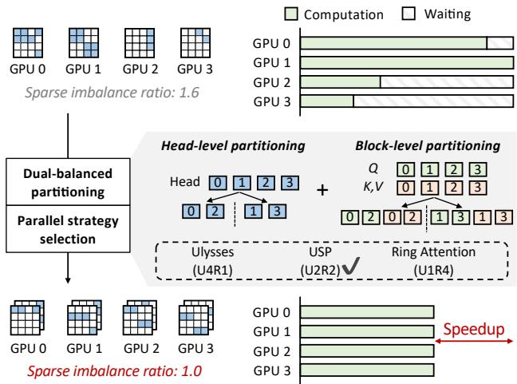  
Figure 1: db-SP achieves speedup via dual-balanced partitioning and parallel strategy selection. Top: Sparse attention is partitioned across GPUs by attention heads, leading to workload imbalance. Bottom: db-SP balances the workload at both head-level and block-level partitioning. Ulysses, USP, and Ring Attention are different sequence parallelism methods, where UxRy denotes that x GPUs perform Ulysses and y GPUs perform Ring Attention.

However, existing SP methods, including Ulysses [10], Ring Attention [11], and USP [12], overlook the workload imbalance introduced by sparse attention, failing to fully leveraging the potential of multi-GPU parallelism. Specifically, Ulysses partitions different attention heads across GPUs, while Ring Attention partitions the sequence (and thus the dense blocks in sparse attention). USP combines the two aforementioned methods by organizing each GPU into an Ulysses group and a Ring Attention group, allowing the respective parallel method to be applied orthogonally within the dedicated group. Therefore, the workload imbalance manifests at two distinct levels. (1) Head-level: The sparsity pattern varies significantly across different attention heads, leading to unequal assigned to each GPU. (2) Block-level: The irregular distribution of dense blocks within the sparse attention mask results in an uneven number of blocks across different GPUs.

In this paper, we formalize such workload imbalance by introducing a sparse imbalance ratio (ρs), which indicates the ratio of the workload on the most heavily-loaded GPU to the average number across all GPUs. Our measurements reveal that the sparse imbalance ratio achieves over 1.5 in visual generation tasks (1.513 with Wan2.1-T2V-14B model and SpargeAttn using Ulysses on eight A800 GPUs), indicating substantial potential for improvement.

Although mitigating the workload imbalance potentially brings acceleration, there remains several challenges. (1) Duallevel interplay: The two levels of workload imbalance are coupled, making the co-optimization a non-trivial challenge that often results in prohibitively intricate partitioning plans. (2) Reorganizing overhead: Workload balancing requires data replacement, leading to intra-GPU reorderings and inter-GPU exchanges. The challenge is to mitigating the overhead for higher performance gain. (3) Parallel strategy selection: Selecting an SP strategy (i.e., the parallel degrees for Ulysses and Ring Attention) presents a challenge when integrated with sparse attention, as the workload balance is highly dependent on both the sparse pattern and the parallel strategy.

To address the challenges, we propose db-SP, a dual-balanced sequence parallelism that balances the workload of sparse attention across GPUs at both levels. At both levels, db-SP employs a greedy algorithm for workload partitioning. To reduce overhead, db-SP exploits sparse mask similarity across denoising steps to reduce paritioning executions, and introduces a reward factor at the block level to create a biased greedy algorithm that mitigates inter-GPU exchange costs. Given the interplay between the two levels, our design is guided by a key prior: near-perfect load balance is achievable independently at each level. Consequently, db-SP simplifies the joint optimization problem into two sequential sub-problems: it first performs head-level partitioning, then conducts block-level partitioning under the assumption of an ideally balanced head-level workload distribution. Furthermore, db-SP incorporates a runtime mechanism that dynamically switches between parallel strategies through latency prediction to select the optimal strategy and the corresponding partitioning plan.

In summary, this paper makes the following contributions:

• We identify and systematically analyze the dual-level (head and block) workload imbalance that arises from applying block-wise sparse attention with existing sequence parallelism methods.

• We introduce a dual-balanced workload partitioning approach that decouples the joint optimization of the two levels, employing distinct algorithms for the head-level and block-level workload balancing at a negligible overhead.

• We design a sparsity-aware strategy selection mechanism that predicts the latency of different parallelism plan, enabling dynamic selection of the optimal parallel strategy for each attention computation.

• We implement db-SP and experiments shown that db-SP achieves up to 1.25× end-to-end speedup and 1.40× attention acceleration on average over state-of-the-art sequence parallel methods on typical DiT models and tasks.

## 2 Background

In this section, we introduce the background of Diffusion Transformer inference in visual generative tasks, and the related works.

## 2.1 Visual Generative Models

Diffusion Transformer (DiT) [13] has emerged as the mainstream model architecture for visual generative tasks such as image and video generation [14, 15], incorporating the core denoising steps of diffusion models and the scalable and powerful Transformer [1, 16] architecture. The core of the Transformer architecture is the attention mechanism. Taking the Multi-Head Attention (MHA) in DiT models as an example, the query (Q), key (K), and value (V ) matrices derived through linear projection are divided into multiple attention heads along the feature dimension, and then the output (O)√ is calculated by O = P V, P = softmax(QKT / d) for each attention head, where d is head dimension size.

Early DiT models in visual generative tasks, such as Open-Sora series [17, 18], employ a factorized spatial-temporal attention mechanism, computing self-attention along the spatial dimensions (i.e., height and width) and the temporal dimension (i.e., frame) independently. Nevertheless, recent progress including CogVideoX [15] and Wan [14] utilizes a more integrated 3-dimensional self-attention [19, 20] that treats a video clip as a unified sequence of spatial-temporal tokens, allowing the model to jointly attend to visual features across both space and time simultaneously. Such a mechanism further prolongs the attention latency in the inference procedure, degrading the generation efficiency, particularly for high-resolution image or long-video generation tasks.

## 2.2 Block-wise Sparse Attention

In visual generative models, the attention map P = softmax(QKT / d) exhibits inherent sparsity, and previous works [6, 2, 4, 5] demonstrate that the block-wise sparse attention reduces computational costs while maintaining acceptable generation quality. The block-wise pattern is hardware-friendly, avoiding irregular memory accesses within blocks and ensuring sufficient data for parallel computation on GPU Streaming Multiprocessors (SMs).

Following FlashAttention2 [21], Q is partitioned along the sequence dimension into sub-sequences, with the workload corresponding to different sub-sequences and attention heads distributed to different SMs for parallel processing. Consequently, for a block-wise sparse attention kernel, if the block size is an integer multiple of the sub-sequence length, it can reuse the underlying implementation of the dense attention kernel without introducing redundant computation. Therefore, for block-wise sparse attention, the total number of dense blocks in the sparse mask across all heads represents the workload on a single GPU.

## 2.3 Sequence Parallelism

Sequence parallelism (SP) shows advantages in DiT inference over the commonly used Tensor Parallelism (TP), as it avoids the time-consuming AllReduce communication primitive. There are two typical paradigms for sequence parallelism, i.e., Ulysses [10] and Ring Attention [11]. Based on that, Unified Sequence Parallelism has been proposed to incorporate the two paradigms to form a hybrid one.

As depicted in Fig. 2(a), Ulysses [10] partitions the input along the sequence dimension across multiple GPUs for all the other parts except for the attention computation, and dispatches different attention heads onto different GPUs for the attention computation. Specifically, the inputs are reorganized via a pair of all-to-all communication primitives before and after the attention, respectively.

As depicted in Fig. 2(b), Ring Attention [11] partitions the input along the sequence dimension for all the parts, including the attention computation. To achieve that, Ring Attention introduces a ring-based communication pattern, i.e., each GPU holds a Q chunk along the sequence dimension, iteratively computing partial attention over each K,V chunk, and then passes the K,V chunk to the neighboring GPU via peer-to-peer (P2P) communication. The procedure is repeated until all K,V chunks have been traversed on each GPU. Such a pattern enables the overlap between the K,V communication and the partial attention computation, yielding an opportunity for near-zero communication overhead.

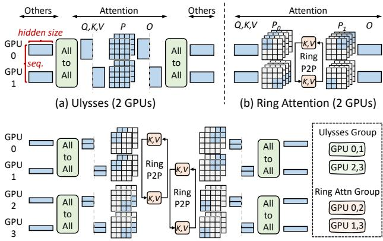  
(c) Unified Sequence Parallelism on 4 GPUs (Ulysses 2 × Ring Attention 2)  
Figure 2: Comparison of sequence parallelism variants.

Unified Sequence Parallelism (USP) [12, 22] is a hybrid design on top of the two former paradigms, addressing the parallelism degree limitation by the attention head number in Ulysses, and the inefficiency caused by chunked attention computation in Ring Attention. As depicted in Fig. 2(c), USP organizes the GPUs into orthogonal Ulysses and Ring Attention groups. GPUs in the same Ulysses group compute different attention heads, whereas the GPUs in the same Ring Attention group partition Q along the sequence dimension and utilize the ring-based communication to traverse K, V .

## 2.4 Related Works

In this section, we discuss the related works including the sparse attention methods and parallel computing designs, as well as the studies attempting to incorporate both. Moreover, we also list the related works involving other efficient DiT inference techniques, which are orthogonal to this work.

## 2.4.1 Sparse Attention Methods

Prior works have explored various attention mask patterns tailored for visual generation, including window-based pattern [9, 8], spatial-temporal pattern [3], hybrid mask combination [23], and block-wise pattern [6, 2, 4]. Regarding the block-wise pattern, PAROAttention [6] abstracts static masks against varying inputs, whereas SpargeAttn [2] and Sparse VideoGen2 [4] utilize the dynamic mechanism to selectively compute part of the attention map online. The block-wise pattern enables practical single-GPU acceleration via customized kernels.

## 2.4.2 Parallel Computing Designs

DistriFusion [24] and PipeFusion [25] are designed specifically for DiT inference in multi-GPU systems, reusing features to unveil the opportunity for layer-wise parallelism. Nevertheless, the feature reusing brings uncertainty to the generation quality.

Sequence parallelism, including Ulysses [10], Ring Attention [11], and USP [12] is the commonly used parallel computing design for accelerating DiT inference, and has been implemented in the open-source inference engines, such as xDiT [26] and ParaAttention [27]. However, when combined with the sparse attention, existing sequence parallelism paradigms suffer from severe workload imbalance across GPUs.

BurstAttention [28, 29] attempts to mitigate the imbalance in Ring Attention with block-wise sparsity, by uniformly partitioning a block onto different GPUs to achieve balance. We observe that such a method is not suitable for visual generation, as the sparse block size is necessarily small to retain generation quality. Such a small block size leads to the degradation of the attention kernel performance after partitioning, which is detailed in §6.2.

DSV [30] tackles the critical challenge of imbalanced workload in sparse attention for DiT training. It introduces a hybrid sparsity-aware context parallelism that dynamically rebalances computation across GPUs based on heterogeneous head sparsity and reduces communication by gathering only critical KV pairs. Nevertheless, when KV communication is effectively hidden by computation, the primary bottleneck remains the intrinsic imbalance in computational load across devices at the block level.

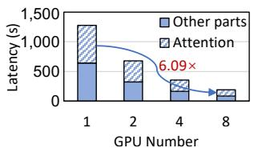  
(a) Ulysses

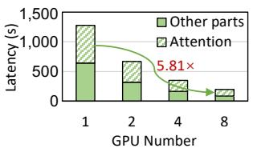  
(b) Ring Attention

Figure 3: The latency of Wan2.1-T2V-14B with PAROAttention as the GPU number increases.  
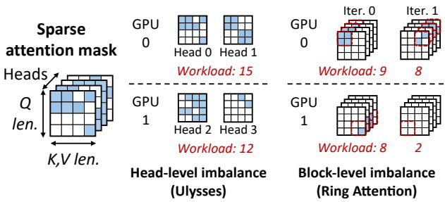  
Figure 4: Dual-level workload imbalance when applying sequence parallelism to sparse attention.

## 2.4.3 Efficient DiT Inference

Quantization reduces the memory and computational amounts using low-bit precision of model weights or activations, e.g., SageAttention[31, 32] has explored quantizing QKT to INT4/8 while employing FP8 (8-bit floating-point) for P V . Caching is the technique that exploits the temporal redundancy across denoising steps, reusing intermediate features [33, 34] or complete outputs [35, 36] for less computation. Besides, DiffServe [37] constructs model cascades for routing different requests based on the demand, leading to lower latency violation rates. DDiT [38] proposes a dynamic resource allocation mechanism for efficiently deploying DiT and encoder modules. Those methods are orthogonal to this work.

## 3 Motivation

In this section, we first clarify the motivation for using sequence parallelism together with block-wise sparse attention, and then define a theoretical sparse imbalance ratio to demonstrate the consequential workload imbalance problem. Finally, we pose the challenges in solving the workload imbalance issue in the real system.

## 3.1 Sparse Attention with Sequence Parallelism

Sparse attention is still the primary bottleneck, and applying sequence parallelism is rewarding. The self-attention computation in DiT is computationally expensive, growing quadratically with the input token number. As depicted in Fig. 3, when applied with the block-wise sparsity, the sparse attention still occupies over 50% of the total inference latency. The major components in DiT, including the linear layers and self-attention, are computation-intensive operations with large enough input size (>70k tokens), and thus are scalable with sequence parallelism. As depicted in Fig. 3, the end-to-end latency decreases with more GPUs. However, due to workload imbalance, existing sequence parallelism methods fall short of fully realizing their scaling potential, achieving only a 6.09× (Ulysses) and 5.81× (Ring Attention) reduction in latency when scaling from single-GPU inference to eight GPUs.

Directly applying sequence parallelism to sparse attention leads to workload imbalance across GPUs. The workload imbalance arises from two perspectives: (1) Head-level imbalance. Each attention head owns a single attention mask, and the sparsity distinguishes significantly among different heads. When applied with Ulysses, heads are distributed across GPUs, and thus the sparsity among GPUs is different. (2) Block-level imbalance. The sparse attention mask is inherently irregular rather than uniform. When applied with Ring Attention, each GPU holds one Q chunk, meanwhile iteratively computing the corresponding K, V chunks. At every iteration, the dense block number within the K, V chunk for different Q chunks distinguishes, thereby leading to workload imbalance among GPUs.

Table 1: The sparse imbalance ratio (ρs) of different models across various sparse attention methods and sequence parallelism paradigms. A larger ρs represents a more imbalanced workload. USP (UxRy) denotes x GPUs to form a Ulysses group and y GPUs for a Ring Attention group. SpargeAttn has not been implemented with Ring Attention.  
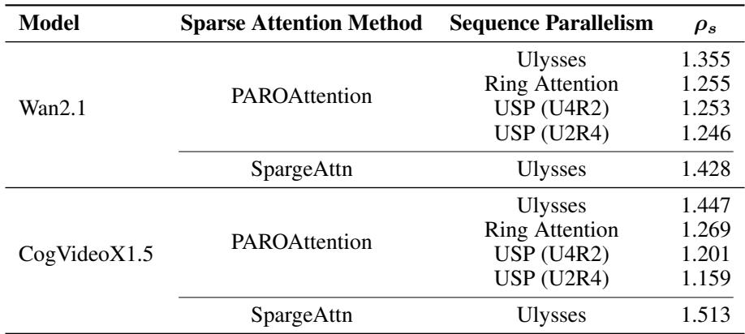

## 3.2 Sparse Imbalance Ratio (ρs)

We introduce a sparse imbalance ratio ρs to quantify such workload imbalance. Workload imbalance brings latency degradation due to synchronization across GPUs. Specifically, Ulysses synchronizes GPUs in the All-to-All communications after attention, and Ring Attention requires synchronization at each iteration via Ring P2P communication. Therefore, we consider the synchronization in the formulation by decomposing the layer-wise latency into N periods based on the synchronization points. Suppose the GPU set is G, ρs is defined as follows.

$$
\tag{1}
$$

where bi,g(s, p) denotes the dense block number in the attention masks on GPU g during the i-th synchronization period, which is a function of the sparse pattern s and parallelism strategy p. Thus, ρs is defined as the ratio of the layer-wise latency given s and p to the ideal latency under a perfectly balanced workload, i.e., the theoretical speedup through workload balancing.

As shown in Tab. 1, we measure the sparsity imbalance ratio ρs in real-world scenarios with the sparse attention method PAROAttention [6] and SpargeAttn [2]. ρs ranges from 1.159 to 1.513, indicating potentials for acceleration through workload balancing.

## 3.3 Challenges in Real Systems

Although the workload imbalance can be theoretically addressed, there remain several challenges.

• How to design a general dual-balanced parallelism method. The sparse mask exhibits workload imbalance at both head and block levels. A key challenge is to decouple their interplay and design a general dual-balanced method that is agnostic to any block-wise sparse mask pattern.

• How to mitigate the overhead brought by workload balancing. Workload balancing inevitably introduces overhead from extra reordering or data exchange. The challenge lies in mitigating the overhead to prevent it from negating the performance benefits.

• How to choose parallelism strategy against sparse dynamics. As discussed in §2, Ulysses and Ring Attention each has distinct advantages, and the choice of their degrees in constructing sequence parallelism impacts performance. The impact is more pronounced with sparse attention, where the sparse mask varies across denoising steps or even individual transformer layers, and efficiently determining the parallelism strategy presents a notable challenge.

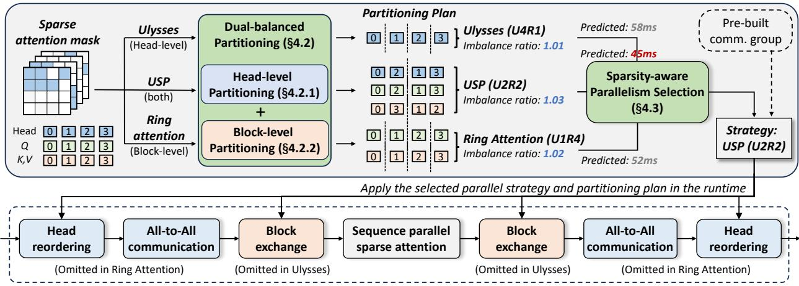  
Figure 5: The overview of db-SP. For every attention computation, each parallel strategy applies its specific partitioning method to mitigate the workload imbalance, achieving a post-balancing sparse imbalance ratio close to 1. Furthermore, db-SP leverages a sparsity-aware selection mechanism that considers the parallel strategy p, sparse pattern s, and sparse imbalance ratio ρs to predict and apply the optimal parallel strategy and the partitioning plan at runtime.

## 4 Methodology

To address the challenges in building such a dual-balanced system that incorporates both sequence parallelism and sparse attention, we propose db-SP. In this section, we first introduce the dual-balanced method in db-SP that efficiently balances the workload for Ulysses, Ring Attention, and USP with negligible overhead, and then propose a sparsity-aware parallelism selection mechanism to determine the parallelism strategy for each transformer layer.

## 4.1 Overview

The overview of db-SP is shown in the Fig. 5. When computing attention across GPUs, sequence parallelism strategies including Ulysses, Ring Attention, or the hybrid USP (UxRy) are available, where UxRy denotes that every x GPUs form a Ulysses group (head-level parallelism), whereas every y GPUs form a Ring Attention group (Block-level parallelism). Each strategy applies its specific partitioning to mitigate the dual-level (i.e., head and block) workload imbalance, achieving a post-balancing sparse imbalance ratio ρs close to 1. Taking the parallel strategy p, the sparse attention pattern s, and the resulting ρs as inputs, db-SP employs a sparsity-aware parallelism selection mechanism to predict the optimal strategy and apply its corresponding partitioning scheme for runtime deployment.

## 4.2 Dual-Balanced Partitioning

Given a random block-wise sparse mask, the generated dual-balanced partitioning plan results in a sparse imbalance ratio ρs close to 1. In this section, we first introduce the head-level partitioning for Ulysses and the mask-level partitioning for Ring Attention, respectively. For each, we detail the partitioning approach and the corresponding overhead mitigation method. Based on that, we clarify how to incorporate both for USP.

## 4.2.1 Head-level Partitioning

To achieve balance, head-level partitioning distributes the attention heads to different GPUs, so that on every GPU, the total number of dense blocks in the sparse masks corresponding to its attention heads is approximately the same. Since there is only one synchronization point across GPUs (i.e., the All-to-All after attention), the formulation of the sparse imbalance ratio ρs (Eq. 1) can be specified as follows.

$$
\tag{2}
$$

where Hg denotes the partitioned head set on GPU g, and bheadj (s) is the block number of j-th head’s sparse mask.

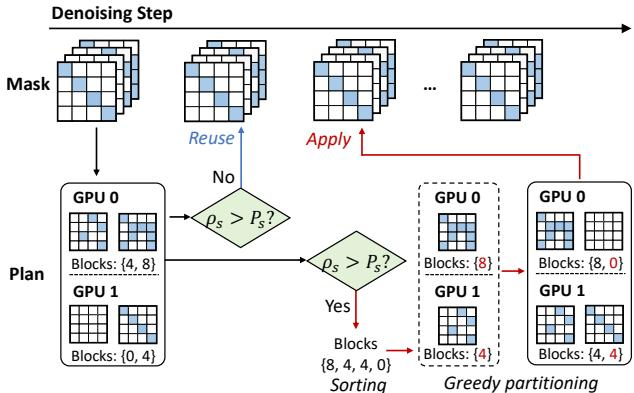

Figure 6: Head-level partitioning in db-SP.  
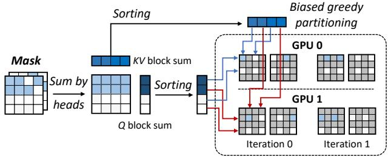  
Figure 7: Block-level partitioning in db-SP.

Partitioning Approach. We apply a straightforward greedy algorithm for head-level partitioning. Specifically, we first sort the heads in descending order based on the number of dense blocks. Then, we iteratively assign each sorted head to a GPU according to the following principle: each head is always placed onto the GPU that currently has the least cumulative number of blocks. Such a loop continues until all heads are assigned. The sufficiently large number of heads and number of blocks per head in visual generative models make the simple partitioning method highly effective, resulting in a ρs ≤ 1.1 with Ulysses, which is detailed in §6.3.

Overhead Mitigation. Attention masks in each head pose similarity across denoising steps, thereby creating considerable potential for minimizing the overhead of the head-level partitioning. For a dynamic sparse attention method such as SpargeAttn [2], the sparse masks are generated online, and thus the partitioning plan is determined at runtime for each attention computation, with the number of partitioning executions equaling the number of layers multiplied by the number of denoising steps (e.g., 2,000 times in Wan2.1-T2V-14B). To this end, we propose a partitioning plan reusing mechanism by exploiting the similarity across denoising steps.

Based on the observation, we introduce a threshold Ps to automatically determine the timing for generating a new partitioning plan. For a certain transformer layer, we reuse the partitioning plan from the previous denoising step if the current ρs falls below the predefined threshold Ps, otherwise, a new plan is generated based on the current sparse mask. With Ps set to 1.10, partitioning is only necessary in 5 out of 50 denoising steps with Wan2.1-T2V-14B. See § 6.4 for more details.

## 4.2.2 Block-level Partitioning

Block-level partitioning is responsible for distributing the Q, K, V chunks onto different GPUs, so that on every GPU at every iteration, the computed number of dense blocks is approximately the same. As discussed in §3, Ring Attention performs synchronization across GPUs via Ring P2P communication at every iteration, the formulation of the sparse imbalance ratio ρs (Eq. 1) is specified by

$$
\tag{3}
$$

where bi,g(s) is the dense block number in the computation of the g-th Q chunk and the ((i + g) mod |G|)-th K, V chunk accumulated across all attention heads.

Partitioning Approach. We quantify the workload of Ring Attention by the number of dense blocks in the 2D computation between Q and K, V . Each GPU is assigned a specific Q chunk, while each iteration processes a specific

Algorithm 1 Dual-Balancing Partitioning   
1: Input: sparse pattern s, parallel strategy p (UxRy), reusing threshold Ps, partitioning reward Rb   
2: head\_partitioning\_plan ← old\_head\_partitioning\_plan   
3: // Head-level partitioning   
4: if (x > 1) and (cal\_imbalance\_ratio(s) > Ps) then   
5: blocks\_per\_head ← get\_blocks\_per\_head(s)   
6: sorted\_head\_id ← desc\_argsort(blocks\_per\_head)   
7: sum\_per\_gpu ← {0}x   
8: for head\_id in enumerate(sorted\_head\_id) do   
9: gpu\_id ← argmin(sum\_per\_gpu)   
10: head\_partitioning\_plan [gpu\_id].append(head\_id)   
11: sum\_per\_gpu.update()   
12: end for   
13: end if   
14: q\_partitioning\_plan,kv\_partitioning\_plan ← ∅   
15: // Block-level partitioning   
16: if y > 1 then   
17: // Assume workload is balanced across heads   
18: blocks\_accum\_by\_head ← sum\_by\_head(s)   
19: blocks\_per\_q ← sum\_by\_kv(blocks\_accum\_by\_head)   
20: sorted\_q\_id ← desc\_argsort(blocks\_per\_q)   
21: sum\_per\_gpu ← {0}y   
22: for q\_id in enumerate(sorted\_q\_id) do   
23: // Perform biased greedy partitioning with reward   
24: biased\_sum\_per\_gpu ← [s − Rb if g is initial\_gpu   
25: for g, s in enumerate(sum\_per\_gpu)]   
26: gpu\_id ← argmin(biased\_sum\_per\_gpu)   
27: q\_partitioning\_plan[gpu\_id].append(q\_id)   
28: sum\_per\_gpu.update()   
29: end for   
30: // Repeat to partition K, V blocks   
31: blocks\_per\_kv ← sum\_by\_q(blocks\_accum\_by\_head)   
32:   
33: end if   
34: Output: head\_partitioning\_plan, q\_partitioning\_plan, kv\_partitioning\_plan

K, V chunk. Therefore, the goal is to partition the sparse mask as evenly as possible into |G| × |G| regions, each defined by a pair of Q chunk and K, V chunk. To achieve that, we also apply a greedy algorithm to partition Q across GPUs and K, V across iterations, respectively. Given a block-wise sparse mask, we partition Q, K, V at the block-size granularity (e.g., 64 as in PAROAttention). For Q, we sort each block in descending order by the total count of its corresponding K, V blocks and then greedily assign them across GPUs, putting every Q block onto the GPU with the least accumulated block number. Similarly, for K, V , we sort each block by its number of corresponding Q blocks and greedily assign them across iterations. Such an approach yields a ρs ≤1.05 with Ring Attention, as detailed in §6.4.

Overhead Mitigation. Compared to head-level partitioning, block-level partitioning involves not only the intra-GPU data reorderings but also the inter-GPU data exchanges. Such data exchange is necessitated by the workload balancing. Although the Q and K, V for a given token are generated on a certain GPU, they are subsequently transferred to other GPUs for computation to achieve a balanced workload. Inter-GPU communication is much expensive than intra-GPU data reordering, and thus the key of overhead mitigation lies in minimizing the inter-GPU data exchanges.

We introduce a reward factor Rb to encourage the Q and K, V to reside on the initial GPU. Taking partitioning Q blocks as an example, the modified greedy algorithm proceeds as follows for each Q block. First, the accumulated K, V block count on the Q block’s initial GPU is artificially reduced by the reward Rb multiplied by the current Q block’s K, V block count. Then, the algorithm selects the GPU with the least resulting accumulated count for assignment. Similarly, the K, V blocks are partitioned in the biased greedy manner.

## 4.2.3 Dual-Balancing Partitioning Algorithm

The optimization of head-level partitioning and block-level partitioning exhibits interdependence. Specifically, the partitioning plan of one determines the total number of blocks and the sparse pattern for the other. To avoid the prohibitive search cost associated with joint optimization, we simplify the problem based on a key insight: both the proposed head-level and block-level partitioning approaches individually yield a near-perfectly balanced workload across GPUs. Consequently, the dual-level optimization problem can be decomposed into two subproblems, each targeting the imbalance minimization at its respective level based on the assumption that the other is well-balanced.

In practice, we choose to perform head-level partitioning first. Under the assumption that the workload is perfectly balanced across all GPUs within the same Ulysses group, an identical block-level partitioning plan can be optimally derived for all Ring Attention groups. The detailed dual-balancing partitioning algorithm is presented in Alg. 1. At the head level, if the partitioning plan from the last denoising step fails to be reused, the algorithm performs greedy head-level partitioning to generate a new one (Lines 4-13). At the block level, we assume workload is perfectly balanced across different heads, and eliminate the influence of the head dimension through summation. During the partitioning procedure, the reward Rb is introduced to address the initial GPU residence preference of the Q and K, V (Lines 23-25), in order to mitigate the inter-GPU data exchange overhead.

## 4.3 Sparsity-Aware Parallel Strategy Selection

As discussed in §2, the employment of USP [12] forms a parallel strategy p (UxRy) design space to incorporate Ulysses and Ring Attention. Given hardware, model settings, and inputs, a fixed parallel strategy can be optimal for dense attention under static conditions. Nevertheless, the sparse attention exhibits dynamic sparsity patterns s that vary per transformer layer and denoising step, which influences both the sparse imbalance ratio ρs and the efficiency of a parallel strategy p itself, leading to performance degradation with a fixed parallel strategy.

To further investigate the influence of the sparse pattern s, given parallel strategy p (UxRy), we formulate the latency of the multi-GPU attention part L(s, p) by

$$
\tag{4}
$$

In Eq. 4, Lall2all(x(p)) denotes the All-to-All communication latency, and hence is determined by the degree of Ulysses. Note that the sparse pattern s does not affect the communication volume. Lattn(s, p) represents the attention latency, which considers the computation-communication overlap in Ring Attention, where Lcomp(s) is the attention computation latency and Lp2p(y(p)) is the Ring P2P communication latency at one iteration. Lattn(s, p) also includes the performance degradation brought by workload imbalance via the multiplicative factor ρs(s, p). Moreover, the computation latency Lcomp(s) is determined by the sparsity/density, and captures the kernel launch overhead Llaunch.

On top of that, db-SP utilizes a layer-wise sparsity-aware parallel strategy selection mechanism, enabling the strategy switch for every attention computation. The core insight is that, sequence parallelism avoids partitioning model weights across GPUs, switching between different sequence parallel strategies requires no model reloading, enabling dynamic strategy selection at runtime. The switching necessitates changes in the inter-GPU communication patterns, which require the reconfiguration of communication groups. To eliminate the overhead, db-SP introduces pre-built communication groups, constructing all potential communication groups (log2(|G|) + 1 in total) for different parallel strategies before runtime.

Given a sparse pattern s, we predict the latency of each parallel strategy p using Eq. 4. Specifically, Lall2all(x), Lp2p(y), Ldense, Llaunch are fitted offline utilizing the profiling data from dense attention computations. At runtime, the strategy with the lowest predicted latency is selected and executed with its pre-built communication groups, as illustrated in Fig. 5.

## 5 Implementation

We implement db-SP based on the open-source code of USP [12], and replace the attention kernel backend with the implementation of PAROAttention [6] or SpargeAttn [2] depending on the sparse method, to support block-wise sparse masks as input. db-SP contains interfaces to integrate into DiT inference engines for sequence parallel attention computation. Currently, we have integrated db-SP into the mainstream inference engines, including xDiT [26] and ParaAttention [27], to support the end-to-end inference of different models. db-SP involves intra-GPU data reorderings and inter-GPU data exchanges in the partitioning approach, which are implemented by index\_select and all\_to\_all with NCCL [39] backend in PyTorch [40], respectively.

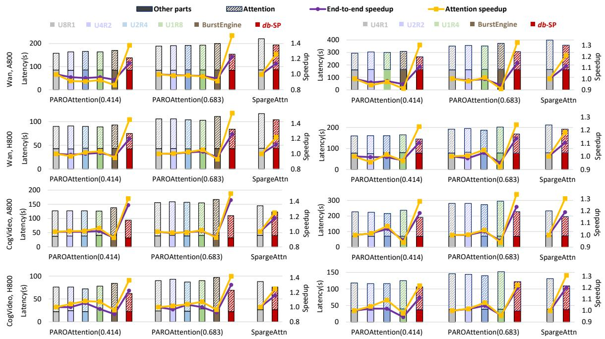  
Figure 8: The end-to-end latency comparison on eight (left) and four (right) GPUs. SpargeAttn only supports Ulysses due to the attention kernel implementation.

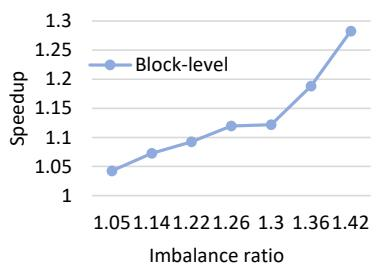

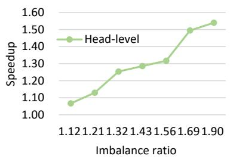  
Figure 9: Attention speedup as sparse imbalance ratio grows.

## 6 Evaluation

We evaluate db-SP with various sparse masks, models, and hardware platforms. The evaluation demonstrates that db-SP yields an attention speedup of 1.40× and an end-to-end speedup of 1.25× on average. Meanwhile, db-SP introduces merely less than 5% partitioning overhead.

## 6.1 Setup

Testbed. We conduct experiments on two distinct GPU servers. The first is equipped with eight NVIDIA A800 80GB SXM4 GPUs, and the second has eight NVIDIA H800 80GB GPUs. The GPUs in both servers are fully connected via the eighth-generation NVLink high-speed interconnect fabric. The corresponding software environment includes CUDA 12.1 [41], PyTorch 2.5.1 [40], and NCCL 2.21.5 [39].

Benchmark. We evaluate db-SP with two models, Wan2.1-T2V-14B [14] and CogVideoX1.5-5B [15], abbreviated as Wan2.1 and CogVideoX1.5 in the following. We evaluate by generating 81-frame 1280P videos with 50 sampling steps, and 161-frame 1280P videos with 50 sampling steps, for the Wan2.1-T2V-14B model and the CogVideoX1.5-5B model, respectively. The 3D-VAE tokenizer processes the input into a sequence of tokens, upon which Wan2.1-T2V-14B generates 21 frames at 3600 tokens per frame, and CogVideoX1.5-5B produces 21 frames at 4080 tokens per frame.

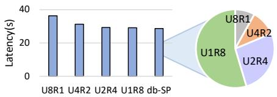

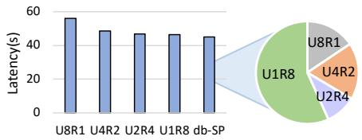  
Figure 10: Latency comparison to static parallel strategies.Reward factor Reward factor

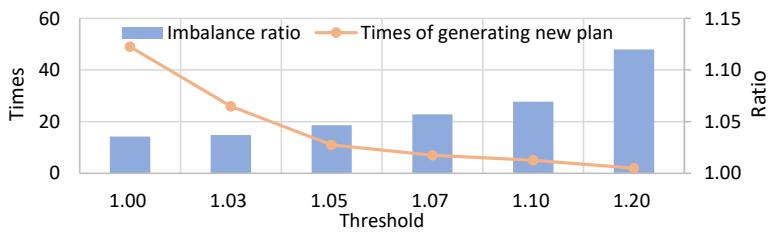  
Figure 11: Effect of threshold Ps choice.

For the sparse attention method, we use PAROAttention [6] to represent the ones with static masks across denoising steps, and use SpargeAttn [2] for the dynamic ones. Specifically, for PAROAttention [6], we use two sparse masks with sparsity of 0.414 and 0.683, denoted as PAROAttention(0.414) and PAROAttention(0.683) in the following, respectively. Note that the attention kernel of SpargeAttn only supports Ulysses.

Baseline. We compare db-SP with the typical sequence parallelism methods including Ulysses [10], Ring Attention [11], and USP [12]. The parallel strategy employed in USP is specified as UxRy, indicating that the parallel degrees for Ulysses and Ring Attention are x and y, respectively. Additionally, we employ BurstEngine [29] as our sparsity-aware sequence parallelism baseline, as it specifically optimizes workload imbalance for models utilizing block-wise sparse attention with Ring Attention.

Evaluation Metrics. We record the end-to-end inference latency and the attention latency for comparison. Also, we use the sparsity imbalance ratio to measure the extent of workload balance across GPUs.

## 6.2 End-to-end Performance

Fig. 8 shows the end-to-end latency and attention latency comparison on four and eight GPUs. db-SP consistently outperforms all baselines, achieving an average end-to-end speedup of 1.12-1.26× for Wan2.1 and 1.16-1.42× for CogVideoX1.5 on eight GPUs. On four GPUs, the end-to-end speedup ranges from 1.10× to 1.15× and from 1.10× to 1.15× for Wan2.1 and CogVideoX1.5, respectively. db-SP achieves higher speedup on eight GPUs, as the workload imbalance exacerbates with the increase in GPU count. The sparse attention computation still occupies most of the endto-end latency, and db-SP delivers an average of 1.26×/1.38× attention speedup over Ulysses and 1.22×/1.42× over Ring Attention on four/eight GPUs. Notably, BurstEngine fails to outperform other baselines due to the performance degradation of the attention kernel. Taking a block size of 256 as an example, BurstEngine uses a tile size of 32 for the attention kernel on eight GPUs, which is 1.25× slower than using a tile size of 64. Moreover, we observe that the baselines with different parallel strategies perform similarly without workload balancing. However, once the workload imbalance is addressed, the performance gap becomes pronounced, which is detailed in §6.3.

## 6.3 Ablation Study

Dual-balanced Partitioning. We evaluate the attention speedup brought by head-level partitioning and block-level partitioning separately. Specifically, we create typical sparse masks with varying sparse imbalance ratios and measure

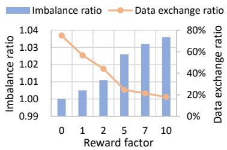

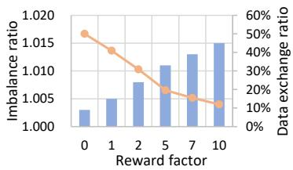  
Figure 12: Effect of reward factor Rb choice.

40%1.02  angnce 40%  angce rthe corresponding attention speedups. As depicted in Fig. 9, the speedup achieved by the partitioning approach increases   
1.01  xchala 20% chlawith the sparse imbalance ratio of the input mask, exhibiting a close-to-linear growth trend.

0%0.99 ataI 0%1.000 ataImSparsity-Aware Parallel Strategy Selection. We evaluate the benefits of the parallel strategy selection mechanism by 0 1 2 5 7 10  0 1 2 5 7 10  Dcomparing db-SP with different parallel strategies with workload balancing. The dynamic parallel strategy switching Reward factor Reward factorbrings 1.02-1.27× end-to-end speedup compared to all the static strategies. To visualize the selection distribution, we present the detailed ratios of all the strategies in Fig. 10.

## s6.4 Overhead analysis

1.05 20 T RSince head-level partitioning only involves intra-GPU reorderings, the overhead ratio in the end-to-end latency is less than 1%. For further investigation, we quantify the effect of using different reusing thresholds Ps on the sparse imbalance ratio and the times of new plan generation, as shown in Fig. 11. Although block-level partitioning needs Threshold inter-GPU data exchanges, the communication can be overlapped with the preceding computation, such as sorting and indexing. As a result, the overhead can be mitigated to within 5% of the end-to-end latency. Moreover, we also quantify the effect of the reward factor Rb choice, as depicted in Fig. 12. A trade-off exists between the sparse imbalance ratio and the associated overhead.

## References

[1] Ashish Vaswani, Noam Shazeer, Niki Parmar, Jakob Uszkoreit, Llion Jones, Aidan N. Gomez, Lukasz Kaiser, and Illia Polosukhin. Attention is all you need, 2023.

[2] Jintao Zhang, Chendong Xiang, Haofeng Huang, Jia Wei, Haocheng Xi, Jun Zhu, and Jianfei Chen. Spargeattn: Accurate sparse attention accelerating any model inference. In International Conference on Machine Learning (ICML), 2025.

[3] Haocheng Xi, Shuo Yang, Yilong Zhao, Chenfeng Xu, Muyang Li, Xiuyu Li, Yujun Lin, Han Cai, Jintao Zhang, Dacheng Li, et al. Sparse videogen: Accelerating video diffusion transformers with spatial-temporal sparsity. arXiv preprint arXiv:2502.01776, 2025.

[4] Shuo Yang, Haocheng Xi, Yilong Zhao, Muyang Li, Jintao Zhang, Han Cai, Yujun Lin, Xiuyu Li, Chenfeng Xu, Kelly Peng, et al. Sparse videogen2: Accelerate video generation with sparse attention via semantic-aware permutation. arXiv preprint arXiv:2505.18875, 2025.

[5] Yifei Xia, Suhan Ling, Fangcheng Fu, Yujie Wang, Huixia Li, Xuefeng Xiao, and Bin Cui. Training-free and adaptive sparse attention for efficient long video generation. In Proceedings of the IEEE/CVF International Conference on Computer Vision (ICCV), 2025.

[6] Tianchen Zhao, Ke Hong, Xinhao Yang, Xuefeng Xiao, Huixia Li, Feng Ling, Ruiqi Xie, Siqi Chen, Hongyu Zhu, Yichong Zhang, and Yu Wang. Paroattention: Pattern-aware reordering for efficient sparse and quantized attention in visual generation models, 2025.

[7] Luka Ribar, Ivan Chelombiev, Luke Hudlass-Galley, Charlie Blake, Carlo Luschi, and Douglas Orr. Sparq attention: Bandwidth-efficient llm inference, 2024.

[8] Zhihang Yuan, Hanling Zhang, Pu Lu, Xuefei Ning, Linfeng Zhang, Tianchen Zhao, Shengen Yan, Guohao Dai, and Yu Wang. Ditfastattn: Attention compression for diffusion transformer models, 2024.

[9] Zichuan Fu, Wentao Song, Yejing Wang, Xian Wu, Yefeng Zheng, Yingying Zhang, Derong Xu, Xuetao Wei, Tong Xu, and Xiangyu Zhao. Sliding window attention training for efficient large language models, 2025.

[10] Sam Ade Jacobs, Masahiro Tanaka, Chengming Zhang, Minjia Zhang, Shuaiwen Leon Song, Samyam Rajbhandari, and Yuxiong He. Deepspeed ulysses: System optimizations for enabling training of extreme long sequence transformer models, 2023.

[11] Hao Liu, Matei Zaharia, and Pieter Abbeel. Ring attention with blockwise transformers for near-infinite context, 2023.

[12] Jiarui Fang and Shangchun Zhao. Usp: A unified sequence parallelism approach for long context generative ai, 2024.

[13] William Peebles and Saining Xie. Scalable diffusion models with transformers. In Proceedings of the IEEE/CVF international conference on computer vision, pages 4195–4205, 2023.

[14] Team Wan, Ang Wang, Baole Ai, Bin Wen, Chaojie Mao, Chen-Wei Xie, Di Chen, Feiwu Yu, Haiming Zhao, Jianxiao Yang, Jianyuan Zeng, Jiayu Wang, Jingfeng Zhang, Jingren Zhou, Jinkai Wang, Jixuan Chen, Kai Zhu, Kang Zhao, Keyu Yan, Lianghua Huang, Mengyang Feng, Ningyi Zhang, Pandeng Li, Pingyu Wu, Ruihang Chu, Ruili Feng, Shiwei Zhang, Siyang Sun, Tao Fang, Tianxing Wang, Tianyi Gui, Tingyu Weng, Tong Shen, Wei Lin, Wei Wang, Wei Wang, Wenmeng Zhou, Wente Wang, Wenting Shen, Wenyuan Yu, Xianzhong Shi, Xiaoming Huang, Xin Xu, Yan Kou, Yangyu Lv, Yifei Li, Yijing Liu, Yiming Wang, Yingya Zhang, Yitong Huang, Yong Li, You Wu, Yu Liu, Yulin Pan, Yun Zheng, Yuntao Hong, Yupeng Shi, Yutong Feng, Zeyinzi Jiang, Zhen Han, Zhi-Fan Wu, and Ziyu Liu. Wan: Open and advanced large-scale video generative models, 2025.

[15] Zhuoyi Yang, Jiayan Teng, Wendi Zheng, Ming Ding, Shiyu Huang, Jiazheng Xu, Yuanming Yang, Wenyi Hong, Xiaohan Zhang, Guanyu Feng, Da Yin, Yuxuan Zhang, Weihan Wang, Yean Cheng, Bin Xu, Xiaotao Gu, Yuxiao Dong, and Jie Tang. Cogvideox: Text-to-video diffusion models with an expert transformer, 2025.

[16] Alexey Dosovitskiy, Lucas Beyer, Alexander Kolesnikov, Dirk Weissenborn, Xiaohua Zhai, Thomas Unterthiner, Mostafa Dehghani, Matthias Minderer, Georg Heigold, Sylvain Gelly, Jakob Uszkoreit, and Neil Houlsby. An image is worth 16x16 words: Transformers for image recognition at scale, 2021.

[17] Zangwei Zheng, Xiangyu Peng, Tianji Yang, Chenhui Shen, Shenggui Li, Hongxin Liu, Yukun Zhou, Tianyi Li, and Yang You. Open-sora: Democratizing efficient video production for all. arXiv preprint arXiv:2412.20404, 2024.

[18] Xiangyu Peng, Zangwei Zheng, Chenhui Shen, Tom Young, Xinying Guo, Binluo Wang, Hang Xu, Hongxin Liu, Mingyan Jiang, Wenjun Li, Yuhui Wang, Anbang Ye, Gang Ren, Qianran Ma, Wanying Liang, Xiang Lian, Xiwen Wu, Yuting Zhong, Zhuangyan Li, Chaoyu Gong, Guojun Lei, Leijun Cheng, Limin Zhang, Minghao Li, Ruijie Zhang, Silan Hu, Shijie Huang, Xiaokang Wang, Yuanheng Zhao, Yuqi Wang, Ziang Wei, and Yang You. Open-sora 2.0: Training a commercial-level video generation model in \$200k. arXiv preprint arXiv:2503.09642, 2025.

[19] Weijie Kong, Qi Tian, Zijian Zhang, Rox Min, Zuozhuo Dai, Jin Zhou, Jiangfeng Xiong, Xin Li, Bo Wu, Jianwei Zhang, Kathrina Wu, Qin Lin, Junkun Yuan, Yanxin Long, Aladdin Wang, Andong Wang, Changlin Li, Duojun Huang, Fang Yang, Hao Tan, Hongmei Wang, Jacob Song, Jiawang Bai, Jianbing Wu, Jinbao Xue, Joey Wang, Kai Wang, Mengyang Liu, Pengyu Li, Shuai Li, Weiyan Wang, Wenqing Yu, Xinchi Deng, Yang Li, Yi Chen, Yutao Cui, Yuanbo Peng, Zhentao Yu, Zhiyu He, Zhiyong Xu, Zixiang Zhou, Zunnan Xu, Yangyu Tao, Qinglin Lu, Songtao Liu, Dax Zhou, Hongfa Wang, Yong Yang, Di Wang, Yuhong Liu, Jie Jiang, and Caesar Zhong. Hunyuanvideo: A systematic framework for large video generative models, 2025.

[20] Anurag Arnab, Mostafa Dehghani, Georg Heigold, Chen Sun, Mario Luciˇ c, and Cordelia Schmid. Vivit: A video ´ vision transformer, 2021.

[21] Tri Dao. FlashAttention-2: Faster attention with better parallelism and work partitioning. In International Conference on Learning Representations (ICLR), 2024.

[22] Diandian Gu, Peng Sun, Qinghao Hu, Ting Huang, Xun Chen, Yingtong Xiong, Guoteng Wang, Qiaoling Chen, Shangchun Zhao, Jiarui Fang, Yonggang Wen, Tianwei Zhang, Xin Jin, and Xuanzhe Liu. Loongtrain: Efficient training of long-sequence llms with head-context parallelism, 2024.

[23] Huiqiang Jiang, Yucheng Li, Chengruidong Zhang, Qianhui Wu, Xufang Luo, Surin Ahn, Zhenhua Han, Amir H. Abdi, Dongsheng Li, Chin-Yew Lin, Yuqing Yang, and Lili Qiu. Minference 1.0: Accelerating pre-filling for long-context llms via dynamic sparse attention, 2024.

[24] Muyang Li, Tianle Cai, Jiaxin Cao, Qinsheng Zhang, Han Cai, Junjie Bai, Yangqing Jia, Ming-Yu Liu, Kai Li, and Song Han. Distrifusion: Distributed parallel inference for high-resolution diffusion models. In Proceedings of the IEEE/CVF Conference on Computer Vision and Pattern Recognition (CVPR), 2024.

[25] Jiarui Fang, Jinzhe Pan, Jiannan Wang, Aoyu Li, and Xibo Sun. Pipefusion: Patch-level pipeline parallelism for diffusion transformers inference. arXiv preprint arXiv:2405.14430, 2024.

[26] Jiarui Fang, Jinzhe Pan, Xibo Sun, Aoyu Li, and Jiannan Wang. xdit: an inference engine for diffusion transformers (dits) with massive parallelism. arXiv preprint arXiv:2411.01738, 2024.

[27] WaveSpeedAI. Paraattention. [Online], 2025. https://github.com/chengzeyi/ParaAttention.

[28] Ao Sun, Weilin Zhao, Xu Han, Cheng Yang, Zhiyuan Liu, Chuan Shi, and Maosong Sun. Burstattention: An efficient distributed attention framework for extremely long sequences, 2024.

[29] Ao Sun, Weilin Zhao, Xu Han, Cheng Yang, Zhiyuan Liu, Chuan Shi, and Maosong sun. Burstengine: an efficient distributed framework for training transformers on extremely long sequences of over 1m tokens, 2025.

[30] Xin Tan, Yuetao Chen, Yimin Jiang, Xing Chen, Kun Yan, Nan Duan, Yibo Zhu, Daxin Jiang, and Hong Xu. Dsv: Exploiting dynamic sparsity to accelerate large-scale video dit training, 2025.

[31] Jintao Zhang, Jia Wei, Pengle Zhang, Jun Zhu, and Jianfei Chen. Sageattention: Accurate 8-bit attention for plug-and-play inference acceleration. In International Conference on Learning Representations (ICLR), 2025.

[32] Jintao Zhang, Haofeng Huang, Pengle Zhang, Jia Wei, Jun Zhu, and Jianfei Chen. Sageattention2: Efficient attention with thorough outlier smoothing and per-thread int4 quantization. In International Conference on Machine Learning (ICML), 2025.

[33] Chang Zou, Xuyang Liu, Ting Liu, Siteng Huang, and Linfeng Zhang. Accelerating diffusion transformers with token-wise feature caching, 2025.

[34] Chang Zou, Evelyn Zhang, Runlin Guo, Haohang Xu, Conghui He, Xuming Hu, and Linfeng Zhang. Accelerating diffusion transformers with dual feature caching, 2024.

[35] Joseph Liu, Joshua Geddes, Ziyu Guo, Haomiao Jiang, and Mahesh Kumar Nandwana. Smoothcache: A universal inference acceleration technique for diffusion transformers, 2025.

[36] Zhengyao Lv, Chenyang Si, Junhao Song, Zhenyu Yang, Yu Qiao, Ziwei Liu, and Kwan-Yee K. Wong. Fastercache: Training-free video diffusion model acceleration with high quality, 2025.

[37] Sohaib Ahmad, Qizheng Yang, Haoliang Wang, Ramesh K. Sitaraman, and Hui Guan. Diffserve: Efficiently serving text-to-image diffusion models with query-aware model scaling. In Proceedings of Machine Learning and Systems (MLSys), 2025.

[38] Heyang Huang, Cunchen Hu, Jiaqi Zhu, Ziyuan Gao, Liangliang Xu, Yizhou Shan, Yungang Bao, Sun Ninghui, Tianwei Zhang, and Sa Wang. Ddit: Dynamic resource allocation for diffusion transformer model serving, 2025.

[39] NVIDIA. Nvidia collective communication library. [Online], 2025. https://docs.nvidia.com/ deeplearning/nccl.

[40] Adam Paszke, Sam Gross, Francisco Massa, Adam Lerer, James Bradbury, Gregory Chanan, Trevor Killeen, Zeming Lin, Natalia Gimelshein, Luca Antiga, Alban Desmaison, Andreas Kopf, Edward Yang, Zachary DeVito, Martin Raison, Alykhan Tejani, Sasank Chilamkurthy, Benoit Steiner, Lu Fang, Junjie Bai, and Soumith Chintala. Pytorch: An imperative style, high-performance deep learning library. Advances in neural information processing systems, 32, 2019.

[41] Nvidia. Cuda toolkit. [Online], June 2024. https://developer.nvidia.com/cuda-toolkit.