# HIPPOCAMPUS: AN EFFICIENT AND SCALABLE MEMORY MODULE FOR AGENTIC AI

Yi Li 1 2 Lianjie Cao 2 Faraz Ahmed 2 Puneet Sharma 2 Bingzhe Li 1

## ABSTRACT

Agentic AI require persistent memory to store user-specific histories beyond the limited context window of LLMs. Existing memory systems use dense vector databases or knowledge-graph traversal (or hybrid), incurring high retrieval latency and poor storage scalability. We introduce HIPPOCAMPUS, an agentic memory management system that uses compact binary signatures for semantic search and lossless token-ID streams for exact content reconstruction. Its core is a Dynamic Wavelet Matrix (DWM) that compresses and co-indexes both streams to support ultra-fast search in the compressed domain, thus avoiding costly dense-vector or graph computations. This design scales linearly with memory size, making it suitable for long-horizon agentic deployments. Empirically, our evaluation shows that HIPPOCAMPUS reduces end-to-end retrieval latency by up to 31× and cuts per-query token footprint by up to 14×, while maintaining accuracy on both LoCoMo and LongMemEval benchmarks.

## 1 INTRODUCTION

Agentic AI represents a transformative shift in how intelligent systems interact with the real-world. Unlike traditional software, which executes predefined logic, agentic systems autonomously perceive, plan, act, and adapt over time. Powered by large language models (LLMs) (Vaswani et al., 2017; Touvron et al., 2023; Team et al., 2023; Liu et al., 2024), these agents can decompose the complex tasks, invoke external tools, reflect on their own behavior, and revise strategies—all without explicit human supervision. Early prototypes such as AutoGPT (Chen et al., 2023) and BabyAGI (Nakajima, 2023) demonstrated that coupling the LLMs with goal-driven loops unlocks emergent capabilities far beyond static prompting. As agentic AI transitions from research novelty to production infrastructure, it is poised to reshape productivity tools, DevOps workflows (Ali & Puri, 2024), and knowledge systems (Zhu et al., 2024).

Memory is a core component of agentic AI systems. While perception and planning enable agents to respond to immediate stimuli, memory allows them to accumulate experience, maintain coherence across interactions, and reason over long temporal horizons. In practice, agentic systems operate within an observe–plan–act–learn loop (Srivastava, 2019; Hayes-Roth & Hayes-Roth, 1979), where memory serves as the persistent substrate connecting past observations to future decisions. Without reliable recall, even sophisticated planners—such as those based on ReAct (Yao et al., 2023) or GoalAct (Chen et al., 2025)—can lose track of prior actions, repeat failed strategies, or misinterpret context (Li et al., 2023a; Xu et al., 2025). This limitation is exacerbated by the bounded context window of LLMs (Su et al., 2024; Wu et al., 2024b), which restricts the amount of information that can be considered during inference. Empirical studies, including the “Lost-in-Middle” effect (Liu et al., 2023a), show that reasoning accuracy degrades sharply as prompts grow longer. As a result, context engineering (Mei et al., 2025; LangChain, 2025) has emerged as a workaround, treating the context window as a scarce computational resource. However, this approach is brittle and labor-intensive. A dedicated memory management system offers a principled alternative: by externalizing long-term knowledge, it enables agents to retrieve only the most relevant fragments of prior information, e.g., dialogue, tool outputs, or retrieved facts, preserving context for immediate reasoning while maintaining continuity across tasks. Major agentic AI frameworks, e.g., LangChain and CrewAI (Chase, 2022; CrewAI, 2025), already provide memory management systems to enhance agent capabilities, and real-world deployments report improved coherence and personalization when memory is enabled (Li et al., 2023b).

Agentic memory can be broadly categorized into two types: parametric and contextual (Du et al., 2025) (as shown in Figure 1). Parametric memory is embedded within the LLM itself—encoded in its weights, caches, or adapter layers (Hu et al., 2022). While powerful, it is opaque, expensive to update, and tightly coupled to model internals (Wang et al., 2024). In contrast, contextual memory is external and accessed via explicit retrieval, enabling agents to store and query long-term histories, tool outputs, and retrieved knowledge. This externalization offers three key advantages: (1) effectively unbounded capacity (De Cao et al., 2021; Jiang et al., 2024); (2) fast, selective updates without retraining; and (3) schema-level interpretability and control. In this work, we focus on the contextual memory, which has emerged as a critical enabler for scalable, coherent, and responsive agentic AI systems.

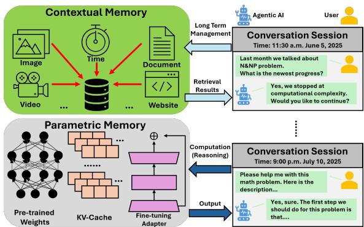  
Figure 1. An illustration of memory taxonomy of Agentic AI.

Despite architectural diversity, existing contextual memory systems share a critical limitation: low efficiency in both memory insertion and retrieval. Whether based on RAG (Zhang et al., 2024; Kagaya et al., 2024), knowledge graph (Kim et al., 2024; Anokhin et al., 2024), or hybrid designs, these systems incur substantial overhead when storing new memory entries and retrieving relevant content. Insertion often requires costly embedding generation and preprocessing, while retrieval relies on high-dimensional similarity search or multi-hop graph queries—both computationally expensive and latency-prone. This inefficiency is especially problematic in agentic AI, where agents operate in iterative loops and frequently update or consult memory across steps. Slow memory operations stall the observe–plan–act–learn cycle, reducing agent throughput and responsiveness. As agents scale to longer horizons and more complex tasks, the need for a memory substrate that supports fast, streaming writes and low-latency recall becomes paramount. A detailed performance analysis is presented in section 2.2.

To address above mentioned limitations, we argue for a fundamentally different memory substrate—one that abandons token-centric, embedding-heavy representations in favor of lightweight, compression-native structures. The goal is to support efficient memory insertion and retrieval without sacrificing retrieval quality. HIPPOCAMPUS is designed to meet this challenge by adopting the Dynamic Wavelet Matrix (DWM), an innovative extension of the wavelet matrix—a succinct data structure renowned for its space efficiency and fast access primitives (Gog & Petri, 2014; Dietzfelbinger & Pagh, 2008)—augmented to support dynamic updates for streaming agentic memory workloads. At a high level, HIPPOCAMPUS employs a dual-representation strategy: it stores memory content as lossless token-ID sequences for exact reconstruction (Content DWM), and parallel binary signatures for semantic search (Signature DWM). These two streams are co-indexed, enabling fast, bitwise retrieval directly in the compressed domain. The Signature DWM is constructed using random indexing, which produces compact binary representations of semantic content. Queries are executed via Hamming-ball search over these signatures, allowing fast, approximate matching with minimal computational cost. This design preserves both the fidelity of raw content and the semantic richness required for accurate, context-aware recall, while ensuring scalability and responsiveness in long-horizon agentic deployments. Our main contributions are:

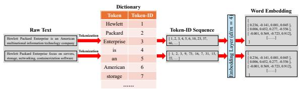  
Figure 2. Illustration of raw text, token-id, and word embedding.

1. Fundamentally New Memory Substrate. We introduce a token-free memory substrate that replaces dense vector representations with binary signatures and token-ID streams, enabling a shift away from embedding-heavy designs toward lightweight structures.

2. HIPPOCAMPUS Module. A contextual memory system built on the Dynamic Wavelet Matrix (DWM), supporting streaming writes and co-indexing of semantic and exact representations. This design enables ultra-fast Hamming-ball search in a compressed domain, while achieving high compression and superior retrieval latency and storage efficiency.

3. Experimental Validation. Extensive experiments demonstrate that HIPPOCAMPUS achieves up to 31× faster end-to-end retrieval and 14× lower per-query token cost, while preserving task accuracy across both LoCoMo and LongMemEval benchmarks.

## 2 BACKGROUND AND MOTIVATION

## 2.1 Memory Representation and Management

Agentic AI systems rely on a memory system to persist information across iterative reasoning cycles. Existing agentic memory systems typically represent memory content using either high-dimensional embeddings or structured graphs. In Retrieval-Augmented Generation (RAG) (Zhang et al., 2024; Kagaya et al., 2024; Singh et al., 2025), raw text is embedded into dense vectors and stored in vector databases, enabling semantic similarity search. Knowledge Graph (KG)- based systems (Rasmussen et al., 2025; Xu et al., 2025) encode memory as entity–relation–entity triples, supporting multi-hop traversal and schema-aware reasoning in graph databases such as Neo4j (Guia et al., 2017). Hybrid systems like A-Mem (Xu et al., 2025) combine both approaches to balance semantic richness and structural precision.

While these representations offer expressive retrieval capabilities, they introduce significant performance bottlenecks. Embedding-based systems suffer from high computational cost during both ingestion and retrieval: memory insertion requires expensive embedding generation and preprocessing (e.g., summarization), while retrieval relies on costly vector similarity computations (Mei et al., 2024; Arora et al., 2020). Graph-based systems, though more interpretable, incur latency from multi-hop traversal and schema resolution. These inefficiencies are particularly problematic in agentic workflows, where memory is frequently updated and queried across observe–plan–act–learn cycles. Slow memory operations can stall agent execution, reduce throughput, and degrade responsiveness.

To support scalable, high-performance agents, memory systems must enable fast, streaming writes and low-latency recall—without sacrificing retrieval quality. This motivates our exploration of compression-native representations and efficient indexing mechanisms that can meet the demands of long-horizon, multi-iteration agentic deployments.

## 2.2 Performance Analysis

To understand the design trade-offs in existing agentic memory systems, we evaluated six representative state-of-the-art (SOTA) modules—ReadAgent (Lee et al., 2024), Memory-Bank (Zhong et al., 2024a), MemGPT (Packer et al., 2023), A-Mem (Xu et al., 2025), MemoryOS (Kang et al., 2025), and MemOS (Li et al., 2025)—across three critical metrics: retrieval accuracy (F1 score), operational cost (average token consumption per query), and user-perceived latency (average total query time). The evaluation was conducted on the LoCoMo benchmark (Maharana et al., 2024), which simulates long-horizon agentic tasks with frequent memory interactions.

As shown in Figure 3, current memory systems force developers into a difficult compromise. High-accuracy designs like MemGPT and A-Mem achieve strong F1 scores but incur significant latency and token overhead due to embedding generation, summarization, and multi-stage retrieval. Conversely, lightweight systems such as MemoryBank reduce latency and cost but suffer from degraded recall quality. None of the evaluated systems simultaneously optimize all three axes, leaving the ideal region of the design space—high accuracy with low latency and cost—unoccupied.

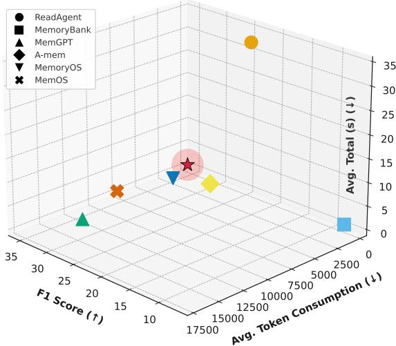

Figure 3. An analysis of SOTA agent memory systems across three critical metrics. Lower values are better for Avg. Token Consumption and Avg. Total Time, while higher is better for F1 Score. The plot illustrates that existing systems force a compromise, as none are able to simultaneously achieve high accuracy and high efficiency in the ideal design space indicated by the red star marker.  
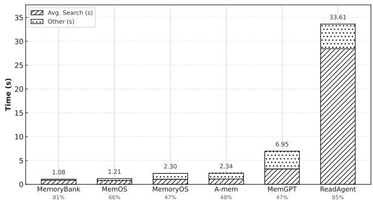  
Figure 4. Breakdown of the end-to-end retrieval latency for SOTA agentic AI memory modules.

While above analysis focuses on retrieval efficiency, the situation is further aggravated by insertion-side overhead during memory growth. In RAG, these arise from chunking, embedding, and index updates (Zhong et al., 2024b); in KG, from fact insertions and graph index maintenance (Anadiotis et al., 2024; Wandji & Calvanese, 2024); and in hybrid memories (e.g., A-Mem), from the additional note creation and cross-linking steps that improve read quality but inflate token and amortization cost. These write-path penalties add latency even before retrieval begins, exacerbating the trade-off illustrated in Figure 3 (Xu et al., 2025).

To pinpoint the root cause of this inefficiency, Figure 4 shows a breakdown of end-to-end retrieval latency. The results show that the memory search phase dominates total execution time across all architectures. In ReadAgent, vector similarity search accounts for 85% of recall latency. Even in more streamlined systems like MemoryBank, search operations consume 81% of the time. Hybrid systems such as A-Mem and MemoryOS, which incorporate structured memory layouts and multi-hop reasoning, spend nearly half of their runtime in retrieval (48% and 47%, respectively).

These findings highlight a fundamental limitation: the retrieval substrate itself—whether based on dense vectors or graph traversal—is the primary bottleneck. In agentic workflows, where memory is accessed and updated repeatedly across observe–plan–act–learn cycles, such inefficiencies compound rapidly. Slow retrieval stalls the planning, while costly ingestion limits memory growth. To support scalable, responsive agents, we need a memory system that rethinks the underlying data structures and representations, enabling fast, streaming writes and low-latency recall at scale.

## 2.3 Tokenized Memory and Succinct Data Structures

Given that LLMs natively operate on integer sequences called token-IDs (Qu et al., 2024; Yu et al., 2024), we adopt token-IDs as the fundamental representation of memory. This compact, model-native format avoids repeated and costly tokenization cycles, enabling efficient storage and manipulation. More importantly, representing memory as integer sequences allows us to leverage powerful succinct data structures—such as the Wavelet Matrix (Gog & Petri, 2014; Claude & Navarro, 2012; Dietzfelbinger & Pagh, 2008)—to build a high-performance retrieval system that operates directly in the compressed domain.

Wavelet Matrix. Succinct data structures are compact representations that approach the information-theoretic minimum space while supporting fast queries directly on compressed data (Dietzfelbinger & Pagh, 2008; Shamir, 2006). Among these, the Wavelet Matrix (Gog & Petri, 2014; Claude & Navarro, 2012) is particularly well-suited for representing long sequences of discrete symbols, such as token-IDs in LLMs. It arranges the bits of each symbol into a multi-level structure and supports three core operations with logarithmic time complexity:

• access(i): Retrieve the symbol at position i.

$r a n k ( c , i )$ : Number of symbol c appears in prefix [0, i).

• select(c, j): Position of the j-th occurrence of symbol c.

However, canonical wavelet matrices are static and operate over a single homogeneous sequence, making them incompatible with agentic workloads where memory is continuously appended and must be immediately available for retrieval. Rebuilding the entire matrix for each new memory entry would be computationally prohibitive (Claude & Navarro, 2012), especially in long-horizon deployments. Moreover, as detailed in Section 3.2, HIPPOCAMPUS introduces two distinct but interrelated data streams, i.e., memory content and memory signatures, that must be co-indexed to support efficient retrieval. Nevertheless, the standard wavelet matrix (Gog & Petri, 2014; Claude & Navarro, 2012) lacks native support for co-indexing heterogeneous sequences, limiting its applicability in our design.

Semantic Hashing via Random Indexing. To enable efficient semantic search, we leverage Semantic Hashing, a form of Locality-Sensitive Hashing (LSH) (Indyk & Motwani, 1998), to convert high-dimensional vectors into compact binary signatures. Using a computationally inexpensive method called Random Indexing (Kanerva et al., 2000), we project each vector against a set of random hyperplanes to generate its signature. This ensures that semantically similar vectors are mapped to signatures with a small Hamming distance (i.e., differing in only a few bits) (Norouzi et al., 2012; Labib et al., 2019). This crucial property allows us to replace the expensive k-Nearest Neighbor (k-NN) search (de Vries et al., 2002) over floating-point vectors with an ultra-fast search for neighbors within a small Hamming radius, an operation that can be massively accelerated using native bitwise CPU operations (Seshadri et al., 2016).

## 3 DESIGN OF HIPPOCAMPUS

We present the technical design of HIPPOCAMPUS, a system built for scalable, high-throughput agentic AI memory management. At the core of the design is a dual-representation strategy that simultaneously supports exact, high-fidelity content retrieval and fast, approximate semantic search. Central to this strategy is the Dynamic Wavelet Matrix (DWM)—a compressed, bit-level data structure that we develop and employ to index both representations. This approach enables HIPPOCAMPUS to achieve high data density while maintaining low-latency query performance. We begin by outlining the high-level system architecture (Section 3.1), which illustrates the data flow during memory construction and retrieval.

A theoretical analysis of the DWM’s efficiency and scalability is provided in Appendix F, along with a quantitative comparison showing that our query scheme (Section 3.3) maintains a small accuracy gap relative to dense vector retrieval (Appendix G).

## 3.1 Overall Architecture

The architecture of HIPPOCAMPUS memory module is composed of two primary components: a pipeline for memory construction (as shown in Figure 5) and a pipeline for memory querying (as shown in Figure 6).

Memory Construction Pipeline. As shown in Figure 5, the memory construction pipeline begins by ingesting raw data, such as a dialogue turn in LoCoMo (Maharana et al., 2024) (see Section 4.1 for details), which is then processed through two parallel steps. First, content serialization converts the unstructured text into a canonical sequence of tokens. Concurrently, metadata extraction captures essential contextual information. For the LoCoMo dataset, this includes the speaker/role, a high-resolution timestamp, and the start (α) and end (β) indices of each utterance within the serialized token list.

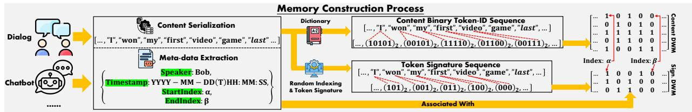

Figure 5. Illustration of the memory construction pipeline in Hippocampus. DWM denotes our proposed Dynamic Wavelet Matrix, while the subscript (·)2 indicates the binary representation of an integer, for example, token-id. The first row of the DWM serves as the entry-level index, marking the start and end positions of each token in the Content Serialization (e.g., StartIndex α and EndIndex β).  
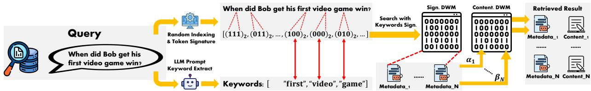  
Figure 6. Illustration of the memory query pipeline in the Hippocampus. An LLM first extracts keywords from the natural language query. These keywords are converted into binary signatures and used to perform a fast, approximate search on the Signature (Sign.) Dynamic Wavelet Matrix (DWM), identifying candidate metadata blocks. The indices (e.g., α1) from the retrieved metadata are then used to look up and reconstruct the exact, full-resolution content from the Content DWM.

The core of HIPPOCAMPUS is a dual-representation strategy, realized through two distinct Dynamic Wavelet Matrices (DWMs) (see Section 3.2 for details): a Content DWM for exact data representation and a Signature DWM for efficient, approximate semantic search. To construct the Content DWM, each token in the serialized sequence (i.e., from content serialization) is mapped to its corresponding integer token ID, which is then converted into its binary representation. These binary codes are vertically arranged to form a bit matrix, constituting the Content DWM. In parallel, the Random Indexing & Token Signature module computes a low-dimensional binary hash—or signature—for each token (see Section 3.3 for details). This process produces a compact token signature sequence, which is used to construct the Signature DWM in the same manner. This dual-matrix structure enables HIPPOCAMPUS to support both precise content retrieval and fast, semantics-based similarity queries within a unified framework.

Memory Retrieval Process. We now describe the query process, illustrated in Figure 6, which leverages the two constructed DWMs (as shown in Figure 5) to enable highly efficient agentic AI memory retrieval. The query pipeline begins when a natural language query is received. First, the query is processed by a lightweight LLM Prompt module to extract a set of salient keywords. These keywords are then passed through the same Random Indexing & Token Signature module used during memory construction, converting them into their corresponding binary signatures. These query signatures are used to perform a fast, approximate search—e.g., based on Hamming distance (see Section 3.3 for details)—against the Signature DWM. This initial pass rapidly filters the entire memory space and identifies a small set of candidate data segments by retrieving their associated metadata blocks. The StartIndex (α) and EndIndex (β) from each candidate’s metadata serve as direct pointers for exact, indexed retrieval from the Content DWM. This step reconstructs the original, full-resolution token sequences for the candidate segments. The retrieved content and its corresponding metadata are then returned as the final Retrieved Result. This two-stage design allows HIPPOCAMPUS to efficiently search over vast conversational histories by using the compact Signature DWM as a fast, low-cost index into the high-fidelity Content DWM.

With the end-to-end data flow established, we now dive into the core technical components that underpin the HIPPOCAM-PUS architecture. The following subsections are organized as follows: we first provide a detailed formulation of the Dynamic Wavelet Matrix (DWM) (Section 3.2), which serves as the fundamental data structure in HIPPOCAMPUS. We then describe the Random Indexing and Hamming Ball search mechanism (Section 3.3), which is used to generate robust token signatures and perform approximate search.

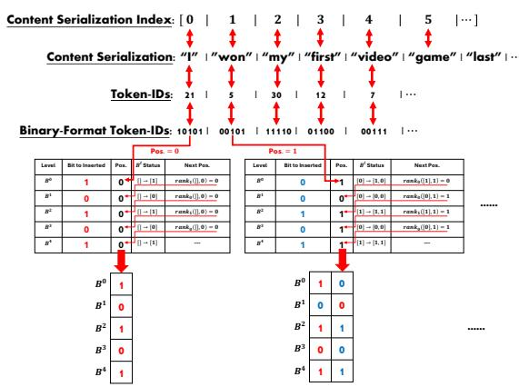  
Figure 7. Construction process of Dynamic Wavelet Matrix.

## 3.2 Dynamic Wavelet Matrix

The core data structure underlying both the content store and the signature store in HIPPOCAMPUS is the Dynamic Wavelet Matrix (DWM). The DWM is a novel data structure we develop specifically to support efficient and incremental indexing for agentic AI memory. It serves as an appendfriendly adaptation of the conventional static Wavelet Matrix (WM) (Gog & Petri, 2014; Claude & Navarro, 2012), a wellestablished structure in information retrieval for compressing and indexing large sequences. By extending the WM to support dynamic updates while preserving its compression and query efficiency, the DWM enables high-throughput memory construction and retrieval in continuously evolving agentic systems.

A key limitation of the conventional wavelet matrix is its static nature—it is designed to be built once over a fixed collection (Resnikoff et al., 2012). This design is fundamentally incompatible with agentic memory workload, which is modeled as a high-throughput, append-only stream. Rebuilding a static WM for every new dialogue turn (see Section 2 for details) would be computationally prohibitive.

Notation and Structure. We conceptually represent DWM as a bit-matrix over an integer sequence $S [ 0 , \cdots , n - 1 ]$ Given a dictionary (as illustrated in Figure 2) of size σ (Rajaraman et al., 2024), each unique token can be encoded with $\lceil \log _ { 2 } \sigma \rceil$ bits. Accordingly, DWM consists of l independent bit-vectors, denoted as $\mathbf { \bar { \mathbf { B } } } ^ { 0 } , \cdots , \mathbf { B } ^ { l - 1 }$ , each of the length n. This ever-growing (as shown in Figure 7) matrix of size $\lceil \log _ { 2 } \sigma \rceil \times n$ , where $\lceil \log _ { 2 } \sigma \rceil$ is fixed and depends solely on dictionary size. It is constructed such that each $B ^ { k } [ \dot { i } ]$ stores the k-th bit of the symbol $S [ i ]$ . This bit-matrix representation is highly compressible and efficiently supports fundamental sequence operations (access(i), rank(c, i), and select(c, k)) (defined in Section 2).

## 3.2.1 Dynamic Construction

We construct the DWM through a sequence of append(s) operations, each adding a new symbol s (an integer in $[ 0 , \sigma ) )$ to the end of sequence S. Figure 7 illustrates this process. To append symbol s at the new global position $P o s = n$ (initially $n = 0$ for an empty sequence), we perform a single top-down traversal of the l levels:

1. Write the most significant bit of s to $B ^ { 0 } [ P o s ]$ . For example, in Figure 7, if s has binary representation (10101)2, we append 1 as the new bit in $B ^ { 0 }$

2. Determine the local position for s in the next level. If the bit just appended was 0, the symbol will go into the “zero” side of the next level; if it was 1, into the “one” side. We compute this by counting the number of 0s or 1s before $P o s$ . For instance, if we appended a 1 in step 1, we set a temporary index $p = r a n k _ { 1 } ( B ^ { 0 } , P o s )$ , which gives the count of 1s in $B ^ { \bar { 0 } }$ up to (but not including) the new position. This p will be the position of the symbol in the next level’s bit-vector.

3. Move to the next level and append the second bit of s at position $p$ of $B ^ { 1 }$ . If this bit is 0, then for level 2 the position resets to $p = r a n k _ { 0 } ( B ^ { 1 } , p )$ (counting how many 0s precede the just-appended bit in $B ^ { 1 } )$ ). If the bit is 1, then p becomes $Z _ { 1 } + r a n k _ { 1 } ( B ^ { 1 } , p )$ , where $Z _ { 1 }$ is the total number of 0s in $B ^ { 1 } \left( \mathrm { i . e . } \right.$ , the starting offset of the “one” portion at level 1). This gives the insertion position for level 2.

4. Repeat this process for all l bits of s, descending through the levels. By the end, s is fully inserted in the DWM, and n increases by 1.

Through this construction process, the DWM is incrementally maintained in a strictly append-only and efficient manner. Each append operation runs in O(l) time—equivalently ${ \mathcal { O } } ( \log \sigma )$ ， which is typically much smaller than n—assuming constant-time support for rank operations $( r a n k _ { 0 / 1 } )$ on the bit-vectors.

Our DWM design provides exactly the query primitives needed for HIPPOCAMPUS. The Content DWM supports direct access to any token via the access(i) operation. The Signature DWM enables efficient approximate membership queries using rank and select operations, which we leverage to perform Hamming-distance-based searches for relevant signatures. We next describe how these queries operate within the DWM and how they enable memory recall in HIPPOCAMPUS.

## 3.2.2 Memory Recall with Dynamic Wavelet Matrix

When a query is issued, HIPPOCAMPUS uses the Signature DWM to identify likely relevant memory indices, and then uses the Content DWM to reconstruct the content at those indices. This process relies on the DWM’s ability to efficiently count and locate symbols. In the Signature DWM, each “symbol” is a compact binary signature representing a token. A natural language query is transformed into a set of such signature symbols $\{ c _ { 1 } , c _ { 2 } , \ldots , c _ { m } \}$ via the random indexing step. Our goal is to find memory entries where all (or many) of these query signatures co-occur. We accomplish this by using the DWM rank and select primitives to traverse the Signature DWM efficiently.

Algorithm 1 DWM RANK(c, i) operation   
Require: Token signature c with bits $\left( b _ { 0 } , \ldots , b _ { l - 1 } \right)$ where b0   
is MSB; global prefix length i; Sign. DWM D with level   
bit-vectors $\pmb { D . B [ 0 \dots l - 1 ] }$ and zero-counts $D . Z [ 0 \ldots l - 1 ]$   
Ensure: rank(c, i) = #occurrences of c in S[0, i)   
1: $( b _ { 0 } , b _ { 1 } , \dots , b _ { l - 1 } ) \gets \mathrm { B i t s M S B F i r s t } ( c )$   
2: $p _ { L }  0 ; \quad p _ { R }  i$   
3: for $k = 0 \mathrm { t o } l - 1$ do   
4: if $b _ { k } = 0$ then   
5: $p _ { L } \gets r a n k _ { 0 } ( D . B [ k ] , p _ { L } )$   
6: pR ← rank0(D.B[k], pR)   
7: else   
8: $Z _ { k } \gets D . Z [ k ]$   
9: $p _ { L }  Z _ { k } + \dot { r } a n k _ { 1 } ( D . B [ k ] , p _ { L } )$   
10: $\mathsf { \bar { \rho } } _ { P R } \gets Z _ { k } + r a n k _ { 1 } ( D . \dot { B [ k ] } , \mathsf { \bar { \rho } } _ { R } )$   
11: end if   
12: end for   
13: return $p _ { R } - p _ { L }$

Searching in Signature DWM. Suppose we have a particular signature c (a binary code of length l bits) and we want to quickly find all positions in the Signature DWM where c appears. We can use $r a n k ( \boldsymbol { c } , i )$ to count occurrences of c up to any position i, and $s e l e c t ( \mathbf { \boldsymbol { c } } , j )$ to retrieve the position of the j-th occurrence. Algorithm 1 outlines the rank query. Starting from the most significant bit of c, we use the bit values to narrow an interval $[ p _ { L } , p _ { R } )$ as we descend the levels. Initially, $p _ { L } = 0$ and $p _ { R } = i$ (meaning we consider the prefix $S [ 0 . . i - 1 ] )$ ). At each level k, if the k-th bit of c is 0, we map the current interval to the zero-prefixed subarray of the next level by setting $p _ { L }  r a n k _ { 0 } ( B ^ { k } , p _ { L } )$ and $p _ { R } \gets r a n k _ { 0 } ( B ^ { k } , p _ { R } )$ . If the bit is 1, we map to the oneprefixed subarray by setting $p _ { L }  Z _ { k } + r a n k _ { 1 } ( B ^ { k } , p _ { L } )$ and $p _ { R } \gets Z _ { k } + r a n k _ { 1 } ( B ^ { k } , p _ { R } )$ , where $Z _ { k }$ is the total number of 0s in $B ^ { k }$ . After processing all l bits, the length of the final interval $\left( p _ { R } - p _ { L } \right)$ equals the number of occurrences of c in $S [ 0 . . i - 1 ]$

To retrieve the actual positions of occurrences, we use the select(c, j) operation, outlined in Algorithm 2. We first find the total number of occurrences occ $\mathbf { \Sigma } = \ r a n k ( \mathbf { c } , n )$ in the entire sequence of length n. If $j > o c c$ , the j-th occurrence does not exist. Otherwise, we know the $j \mathrm { - t h }$ occurrence lies in the interval $[ p _ { L } , p _ { R } )$ obtained by running the rank procedure (Algorithm 1) to the end of the sequence $( i ~ = ~ n )$ We set $p = p _ { L } + ( j - 1 )$ , which is the index of this occurrence in the bottom level. We then lift this index back up through the levels. For each level k (going from l − 1 up to 0): if $b _ { k } = 0$ (the k-th bit of c is 0), we call $p \gets s e l e c t _ { 0 } ( \mathbf { D } . \boldsymbol { B } [ k ] , p + 1 )$ , which finds the global position of the $( p + 1 )$ -th 0-bit in level k. $\mathrm { I f } \ b _ { k } = 1$ , we set $p \gets s e l e c t _ { 1 } ( \mathbf { D } . B [ k ] , ( p - Z _ { k } ) + 1 )$ , which finds the global position of the $\left( { p - Z _ { k } + 1 } \right)$ )-th 1-bit in level k (accounting for the offset of the one-block). After lifting through all levels, p gives the global position in S of the j-th occurrence of c.

Algorithm 2 DWM select(c, j) operation   
Require: Token signature c with bits $\left( b _ { 0 } , \ldots , b _ { l - 1 } \right)$ where b0 is   
MSB; 1-based occurrence j; sequence length n; Sign. DWM   
D with level bit-vectors $\check { D } . B [ 0 \ldots l - \check { 1 } ]$ and zero-counts   
$D . Z [ 0 \ldots l - 1 ]$   
Ensure: select(c, j) = global position of the j-th c in $S$   
1: $( b _ { 0 } , b _ { 1 } , \dots , b _ { l - 1 } ) \gets \mathrm { B i t s M S B F i r s t } ( c )$   
2: $p _ { L } \gets 0 ; \quad p _ { R } \gets n$   
3: for $k = 0 \mathrm { t } \mathrm { \bar { o } } l - 1$ do   
4: if $\boldsymbol { b } _ { k } = 0$ then   
5: $p _ { L } \gets r a n k _ { 0 } ( D . B [ k ] , p _ { L } )$   
6: $p _ { R } \gets r a n k _ { 0 } ( D . B [ k ] , p _ { R } )$   
7: else   
8: $Z _ { k } \gets D . Z [ k ]$   
9: $p _ { L }  Z _ { k } + \dot { r } a n k _ { 1 } ( D . B [ k ] , p _ { L } )$   
10: $p _ { R } \gets Z _ { k } + r a n k _ { 1 } ( D . B [ k ] , p _ { R } )$   
11: end if   
12: end for   
13: $o c c \gets p _ { R } - p _ { L }$   
14: if j > occ then   
15: return NULL   
16: end if   
17: $p  p _ { L } + ( j - 1 )$   
18: for $k = l - 1$ to 0 step −1 do   
19: i $\mathrm { ~ f ~ } b _ { k } = 0$ then   
20: $p \gets s e l e c t _ { 0 } ( D . B [ k ] , p + 1 )$   
21: else   
22: $Z _ { k } \gets D . Z [ k ]$   
23: $p \gets s e l e c t _ { 1 } ^ { \cdot } ( \dot { \boldsymbol { D } } . \boldsymbol { B } [ k ] , ( p - Z _ { k } ) + 1 )$   
24: end if   
25: end for   
26: return $p$

In HIPPOCAMPUS, we use these primitives to execute memory queries as follows. Given a set of query signatures: $\{ c _ { 1 } , \ldots , c _ { m } \}$ extracted from the user’s query, we first identify the least frequent signature $c _ { \mathrm { m i n } }$ by comparing ran $k ( c _ { i } , n )$ for all i. We then iterate through each occurrence of $c _ { \mathrm { m i n } }$ in the Signature DWM. For the j-th occurrence (where j ranges from 1 to occ $= r a n k ( c _ { \operatorname* { m i n } } , n ) )$ , we find its global position $i = s e l e c t ( c _ { \mathrm { m i n } } , j )$ . This position i corresponds to a specific token in the memory sequence S. We retrieve the metadata entry whose range $[ \alpha , \beta ]$ covers i (recall that each memory entry’s start and end indices are stored in its metadata). This metadata tells us the span of token indices for that memory entry. If the query contains multiple keywords, we can quickly verify whether the other query signatures $c _ { 2 \ldots m }$ appear in the same span by checking if $r a n k ( { \pmb { c } } _ { k } , { \boldsymbol { \beta } } ) - r a n k ( { \pmb { c } } _ { k } , { \boldsymbol { \alpha } } ) > 0$ for each k. Entries that pass this check are collected as candidate results.

Algorithm 3 DWM ACCESS(i) operation   
Require: Global position i; Content DWM D with level bit  
vectors $D . B [ \hat { 0 } \ldots l - 1 ]$ and zero-counts $D . Z [ 0 \ldots l - 1 ]$   
Ensure: ACCESS(i) = the symbol $S [ i ]$   
1: p ← i   
2: bits ← [ ]   
3: for k = 0 to l − 1 do   
4: $b \gets D . B [ k ] [ p ]$   
5: bits.append(b)   
6: if b = 0 then   
7: p ← rank0(D.B[k], p)   
8: else   
9: $Z _ { k } \gets D . Z [ k ]$   
10: $p \gets Z _ { k } + \dot { r } \dot { a n k } _ { 1 } ( D . B [ k ] , p )$   
11: end if   
12: end for   
13: return SymbolFromBits(bits)

Retrieving from Content DWM. Finally, for each candidate memory entry identified via the above process, we perform a lossless reconstruction of its content using the Content DWM. This is achieved through the access(i) primitive applied over the range $[ \alpha , \beta ]$ of token positions. Algorithm 3 shows how a single symbol is retrieved by access(i). We start at the top level with the global position i. At level 0, we read the bit $b _ { 0 } = B ^ { 0 } [ i ]$ , which is the most significant bit of the symbol at $S [ i ]$ . We append $b _ { 0 }$ to a bit buffer and then determine the position at the next level: if $b _ { 0 } = 0$ , we set $i _ { 1 } = r a n k _ { 0 } ( B ^ { 0 } , i )$ (the number of 0s up to position i in level $0 ) ; \mathrm { i f } \ b _ { 0 } = 1$ , we set $i _ { 1 } = Z _ { 0 } + r a n k _ { 1 } ( B ^ { 0 } , i )$ (the number of 0s in level 0 plus the number of 1s up to i). We then move to level 1, read $b _ { 1 } = B ^ { 1 } [ i _ { 1 } ]$ , append it, and update the position for level 2 in a similar fashion.

After we descend through all l levels, we have collected bits $\left( b _ { 0 } , b _ { 1 } , \ldots , b _ { l - 1 } \right)$ , which constitute the binary representation of $S [ i ]$ . We then convert these bits back to the original token-id (an integer) using SymbolFromBits. In practice, we execute access(i) for each position i in the range $[ \alpha , \beta ]$ to retrieve the entire sequence of token-ids for that memory entry, and then detokenize to reconstruct the text.

## 3.3 Random Indexing and Hamming Ball

While the DWM supports efficient keyword-exact matching, many queries require semantic-level retrieval for improved accuracy and robustness. To enable this capability, HIP-POCAMPUS converts each token into a compact, contextaware binary signature. Instead of using static embeddings or precomputed vectors, we adopt a lightweight streaming random indexing mechanism (Indyk & Motwani, 1998) that continuously integrates local contextual information during memory construction.

Specifically, let D (e.g., 1024) denote the embedding dimensionality. At initialization, each token v is assigned a sparse random base vector $\boldsymbol { r } _ { v } = \{ - 1 , 0 , + 1 \} ^ { D }$ with exactly t non-zero entries placed randomly (half +1 and half −1). These vectors remain fixed throughout content serialization. As the conversation stream arrives, we maintain a sliding window $W ( i )$ around each token $S [ i ]$ and aggregate its contextual embedding via $\begin{array} { r } { e _ { i } = \sum _ { j \in W ( i ) } r _ { S [ j ] } } \end{array}$ , ensuring that tokens appear in slightly different semantic states depending on their conversational context (Kanerva et al., 2000). After one streaming pass, each token has a fully contextualized embedding $e _ { i } .$ . Directly hashing all D dimensions would incur unnecessary cost, so HIPPOCAMPUS selects only the d (d ≪ D) most activated components: ${ \mathcal { T } } _ { i } = { \mathrm { T o p } } { \cdot } d ( | e _ { i } | )$ A binary signature is then formed:

$$
\begin{array} { r } { \pmb { \mathscr { s } } _ { i } [ k ] = \left\{ \begin{array} { l l } { 1 , } & { \pmb { e } _ { i } [ \mathscr { T } _ { i } [ k ] ] > 0 } \\ { 0 , } & { \pmb { e } _ { i } [ \mathscr { T } _ { i } [ k ] ] \leq 0 } \end{array} \right. \qquad k = 1 , \cdots , d } \end{array}
$$

During querying (Figure 6), an LLM extracts a small set of keywords from the natural language query that best describe the user’s intent. Each keyword is then converted into a dbit signature using the same streaming random setting used during memory construction. We then perform an efficient Hamming-ball search on the Signature DWM. For each keyword signature $s _ { q }$ and a stored signature $s _ { i } ,$ we first compute a bitwise XOR, which returns a d-bit mask where 1s indicate mismatched bit positions. We then apply POPCOUNT (Sun, 2016), a native CPU instruction that counts the number of 1s in the mask in constant time, thus directly yielding the Hamming distance HammingDist $( \boldsymbol { s } _ { q } , \boldsymbol { s } _ { i } )$ . A candidate is preserved only if this distance does not exceed a small threshold r, meaning we search within a Hamming-ball defined as: $\{ s _ { i }$ HammingDist $\left( \pmb { { s } } _ { q } , \pmb { { s } } _ { i } \right) \leq r \}$ , so that only entries differing in at most r bits (out of the d bits) are considered semantically relevant and passed forward for subsequent metadata validation.

## 4 EVALUATION

## 4.1 Experimental Setup

Dataset. We adopt two of the most recent and widely used benchmarks designed to assess the long-term contextual memory capabilities of agentic AI: LoCoMo (Maharana et al., 2024) and LongMemEval (Wu et al., 2024a). For a detailed description of the datasets, please refer to Appendix B.

Metric. For LoCoMo, we adopt its default automatic evaluation metrics: F1 (Opitz & Burst, 2019) and BLEU-1 (Yang et al., 2008), which measure lexical overlap and token-level correctness in question answering tasks. For LongMemEval, the benchmark uses accuracy as its principal metric, defined as the fraction of evaluation questions answered correctly (Wu et al., 2024a). Beyond these standard metrics, we also introduce a LLM-as-a-Judge score (Gu et al., 2024)

Table 1. Overall comparison of different memory modules across four tasks in LoCoMo benchmark: Single-Hop, Multi-Hop, Temporal, and Open-Domain. We report the default metrics (F1 and BLEU-1) together with an LLM-as-a-Judge score reflecting human-aligned evaluation of answer quality. Reported F1 and BLEU-1 are multiplied by 100 for easier comparison and visualization.
<table><tr><td rowspan="2">Memory Module</td><td colspan="3">Single-Hop</td><td colspan="3">Multi-Hop</td><td colspan="3">Temporal</td><td colspan="3">Open-Domain</td></tr><tr><td>F1</td><td>BLEU-1</td><td>LLM-as-a-Judge</td><td>F1</td><td>BLEU-1</td><td>LLM-as-a-Judge</td><td>F1</td><td>BLEU-1</td><td>LLM-as-a-Judge</td><td>F1</td><td>BLEU-1</td><td>LLM-as-a-Judge</td></tr><tr><td>ReadAgent</td><td>8.78</td><td>5.93</td><td>1.03</td><td>5.44</td><td>5.03</td><td>1.01</td><td>11.24</td><td>11.12</td><td>1.08</td><td>9.32</td><td>8.1</td><td>1.45</td></tr><tr><td>MemoryBank</td><td>5.05</td><td>3.97</td><td>2.00</td><td>6.02</td><td>5.89</td><td>1.12</td><td>9.85</td><td>9.92</td><td>1.03</td><td>7.9</td><td>7.97</td><td>2.09</td></tr><tr><td>MemGPT</td><td>25.43</td><td>17.68</td><td>1.91</td><td>9.11</td><td>8.82</td><td>1.06</td><td>26.48</td><td>26.19</td><td>1.02</td><td>39.74</td><td>40.03</td><td>1.92</td></tr><tr><td>A-mem</td><td>19.82</td><td>19.86</td><td>2.66</td><td>12.97</td><td>12.81</td><td>1.85</td><td>34.63</td><td>34.87</td><td>2.18</td><td>41</td><td>41.41</td><td>2.72</td></tr><tr><td>MemoryOS</td><td>32.5</td><td>30.13</td><td>2.76</td><td>28.61</td><td>26.81</td><td>1.79</td><td>25.08</td><td>25.08</td><td>2.61</td><td>41.51</td><td>41.43</td><td>2.59</td></tr><tr><td>MemOs</td><td>39.24</td><td>40.76</td><td>2.75</td><td>30.11</td><td>30.91</td><td>2.56</td><td>31.06</td><td>31.34</td><td>2.81</td><td>40.31</td><td>40.51</td><td>2.60</td></tr><tr><td>HIPPOCAMPUS</td><td>34.36</td><td>30.04</td><td>3.08</td><td>31.97</td><td>31.85</td><td>3.22</td><td>38.3</td><td>37.35</td><td>2.94</td><td>48.38</td><td>46.8</td><td>2.97</td></tr></table>

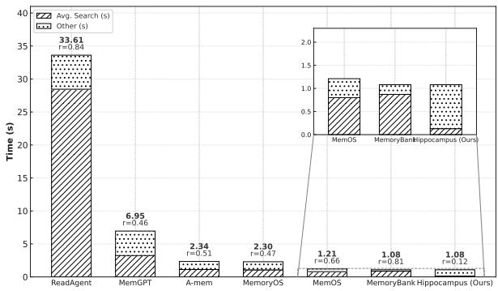  
Figure 8. Average query retrieval latency (seconds) for various memory systems on LoCoMo dataset.

to better capture semantic correctness and deeper reasoning quality (Range: [1, 2, 3, 4, 5]). Refer to Appendix A for details. In addition to accuracy-oriented metrics, we evaluate efficiency along two axes:

• Avg. Token Consumption: average number of tokens read and processed per query, reflecting memory retrieval cost;

• Avg. Total: mean time from the moment memory recall is triggered to the moment the retrieved context is delivered (used for constructing the final prompt). Within this, we further decompose and report Avg. Search, which captures the pure retrieval cost.

Software and Hardware. All experiments were conducted on a HPE DL380a Gen11 server with 2× Intel Xeon Platinum 8470 CPU, 4 × NVIDIA H100 GPUs, and 1 TB of DDR4 DRAM. The software environment includes Ubuntu 22.04.5 LTS, Python 3.10.12, PyTorch 2.7.0, and CUDA 12.9 for GPU acceleration.

## 4.2 Overall Comparison

LoCoMo Analysis. On the LoCoMo tasks, HIPPOCAM-PUS delivers strong retrieval accuracy that rivals or exceeds prior systems (Table 1). For example, on Temporal Reasoning, HIPPOCAMPUS achieves F1 ≈ 38.3, substantially higher than the 26.5 F1 reported for MemGPT. Similarly, on Open-Domain, HIPPOCAMPUS attains 48.4 F1 compared to 41.5 for MemoryOS. HIPPOCAMPUS ’s LLM-as-a-Judge scores are also the highest in all categories (≈ 3.0–3.3 out of 5), reflecting answer quality that is equal or better than the baselines. These results demonstrate that the semanticapproximation mechanism in HIPPOCAMPUS (binary token signatures) incurs only minor accuracy loss, while still retrieving relevant context effectively. In contrast, lightweight baselines like MemoryBank, which sacrifice search overhead for speed, achieve very low accuracy (F1 < 10 across tasks). In summary, HIPPOCAMPUS matches or outperforms SOTA memory systems on LoCoMo while using a compact, compressed-index representation.

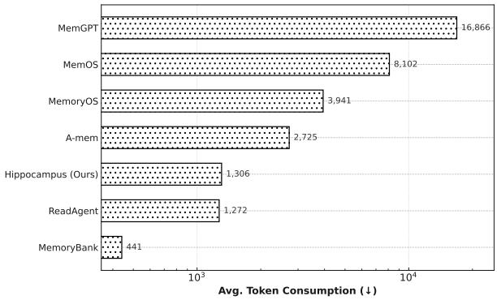  
Figure 9. Average number of tokens consumption per query by each memory system on LoCoMo dataset.

The efficiency advantages of HIPPOCAMPUS are dramatic. Figure 8 plots the average end-to-end query latency for each system. HIPPOCAMPUS responds in roughly 1.08 seconds on average—an order of magnitude faster than dense-vector approaches (MemGPT ≈ 33.6s) and substantially quicker than knowledge graph- or RAG-based memories. The breakdown in Figure 8 shows that HIPPOCAMPUS spends only a small fraction of that time in the search phase, whereas baselines incur a dominant search cost (often > 80% of total latency). Figure 9 displays average token consumption: HIPPOCAMPUS reads only ≈ 1.3K tokens on average, far fewer than MemGPT (≈ 16.9K) or MemoryOS (≈ 8.1K). This low token overhead arises from HIPPOCAMPUS ’s compressed memory structure: rather than loading large text embeddings, it scans concise bitwise signatures and reconstructs exact token IDs on demand. These efficiency gains show that HIPPOCAMPUS achieves high retrieval accuracy with minimal latency and cost. The observed performance aligns with our design motivation: prior high-accuracy memory systems required heavy token usage and slow searches, whereas HIPPOCAMPUS breaks that trade-off through its space-efficient, bitwise index.

Table 2. Overall comparison across six tasks in LongMemEval-S benchmark: Single-session-preference, Single-session-assistant, Temporal-reasoning, Multi-session, Knowledge-update, and Single-session-user. Reported F1 and Accuracy are multiplied by 100.
<table><tr><td rowspan="2">Memory Module</td><td rowspan="2">F1</td><td colspan="2">Single-session-preference Accuracy LLM-as-a-Judge</td><td colspan="4">Single-session-assistant F1 AccuracyLLM-as-a-Judge</td><td colspan="4">Temporal-reasoning AccuracyLLM-as-a-Judge</td><td colspan="2">Multi-session AccuracyLLM-as-a-Judge</td><td colspan="4">Knowledge-update AccuracyLLM-as-a-Judge</td><td colspan="3">Single-session-user AccuracyLLM-as-a-Judge</td></tr><tr><td></td><td></td><td></td><td></td><td></td><td>F1</td><td></td><td></td><td></td><td>F1</td><td></td><td></td><td>F1</td><td></td><td></td><td></td><td>F1</td><td></td></tr><tr><td>ReadAgent</td><td>3.54</td><td>4.17</td><td>1.25</td><td>4.48</td><td>15.18</td><td>1.46</td><td>3.76</td><td>4.32</td><td>0.86</td><td></td><td>4.89</td><td></td><td>1.03</td><td></td><td>8.01</td><td>1.05</td><td>4.87</td><td>17.14</td><td>1.55</td></tr><tr><td>MemoryBank</td><td></td><td>5.00</td><td>1.88</td><td></td><td>18.21</td><td>2.20</td><td>4.50</td><td>5.19</td><td>1.29</td><td>1.65 1.98</td><td>5.86</td><td></td><td></td><td></td><td>9.62</td><td>1.58</td><td></td><td>20.57</td><td></td></tr><tr><td>MemGPT</td><td>3</td><td>5.83</td><td>1.72</td><td></td><td>21.25</td><td>2.01</td><td>5.25</td><td>6.05</td><td>1.18</td><td></td><td>2.31 6.84</td><td></td><td>1.55 1.41</td><td>6 4.15</td><td>11.22</td><td>1.43</td><td></td><td>24.00</td><td>3</td></tr><tr><td>A-mem</td><td>7.78</td><td>9.17</td><td>2.50</td><td>9.86</td><td>33.39</td><td>2.93</td><td>8.28</td><td>9.51</td><td>1.72</td><td></td><td>3.64 10.75</td><td></td><td>2.06</td><td>6.54</td><td>17.63</td><td>2.10</td><td>10.03</td><td>37.71</td><td>3.10</td></tr><tr><td>MemoryOS</td><td>9.21</td><td>10.83</td><td>2.66</td><td>11.67</td><td>39.46</td><td>3.11</td><td>9.78</td><td>11.24</td><td>1.83</td><td>4.30</td><td>12.70</td><td></td><td>2.19</td><td>7</td><td>20.83</td><td>2.23</td><td>11.86</td><td>44.57</td><td></td></tr><tr><td>MemOS</td><td>10.61</td><td>12.50</td><td>2.81</td><td>13.39</td><td>45.53</td><td>3.29</td><td>11.23</td><td>12.97</td><td>1.94</td><td>4.94</td><td>14.66</td><td></td><td>2.31</td><td></td><td>24.04</td><td>2.36</td><td>13.63</td><td>51.43</td><td>3</td></tr><tr><td>HIPPOCAMPUS</td><td></td><td></td><td></td><td></td><td></td><td>3.66</td><td>15.03</td><td></td><td></td><td></td><td></td><td></td><td>2.57</td><td>11.83</td><td>32.05</td><td>2.63</td><td>19.48</td><td>68.57</td><td></td></tr><tr><td></td><td>14.14</td><td>16.67</td><td>3.13</td><td>17.92</td><td>60.71</td><td></td><td></td><td>17.29</td><td>2.15</td><td>|6.61</td><td>19.54</td><td></td><td></td><td></td><td></td><td></td><td></td><td></td><td>3.88</td></tr></table>

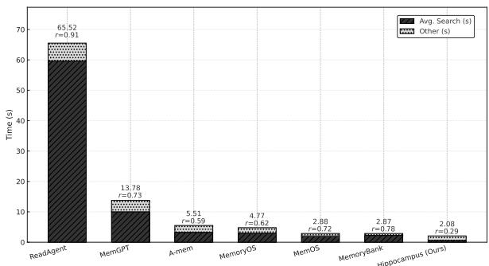

Figure 10. Average query retrieval latency (seconds) for various memory systems on LongMemEval-s.  
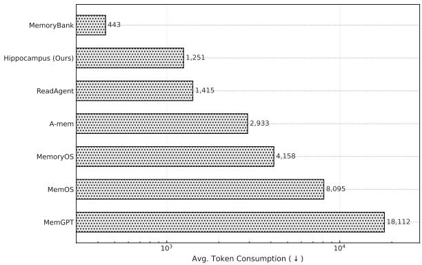  
Figure 11. Average number of tokens consumption per query by each memory system on LongMemEval-s.

LongMemEval Analysis. On LongMemEval-S, HIPPOCAMPUS consistently achieves the best accuracy–efficiency operating point among all baselines. As summarized in Table 2, HIPPOCAMPUS improves accuracy across all six tasks while dramatically reducing end-to-end retrieval time and minimizing token footprint. In Figure 10, our end-to-end latency lies near the floor of the plot, reflecting how bit-sliced Hamming-ball filtering on the Signature

DWM eliminates the dominant search cost that burdens dense-vector and graph-traversal designs. Figure 11 shows a much smaller per-query token budget, as HIPPOCAMPUS scans compact binary signatures and reconstructs token IDs on demand, rather than streaming long textual passages or large embedding blocks. Together, these effects validate our design thesis from Section 3: approximate semantic access in the compressed domain (signatures) combined with exact reconstruction (Content DWM) breaks the classic trade-off—maintaining task accuracy while achieving order-of-magnitude gains in responsiveness and prompt-token economy. Please refer to Appendix C for complementary results on LongMemEval-M.

## 5 RELATED WORK

The landscape of memory systems for agentic AI is rapidly evolving, with recent work focusing on high-level architectural abstractions to manage long-term experiences. These approaches can be broadly categorized into two dominant philosophies. The first draws inspiration from operating systems, treating memory as a manageable system resource. This includes MemGPT (Packer et al., 2023), which introduces virtual context management analogous to OS-level memory paging; MemoryOS (Kang et al., 2025), which implements a hierarchical storage architecture with short, mid, and long-term tiers; and MemOS (Li et al., 2025), which proposes a standardized MemCube abstraction to unify parametric, activation, and plaintext memory. The second category is inspired by human cognitive science, such as ReadAgent (Lee et al., 2024), which compresses memories into gist memories (Abadie et al., 2013) akin to human summarization; MemoryBank (Zhong et al., 2024a), which employs an Ebbinghaus-inspired (Tulving, 1985) forgetting curve for dynamic memory updates; and A-mem (Xu et al., 2025), which organizes knowledge into an evolving, interconnected network based on the Zettelkasten method (Malashenko et al., 2023). Despite their architectural diversity, these systems converge on a common technological substrate where retrieval is predominantly powered by dense vector similarity search within a Retrieval-Augmented Generation (RAG) framework or by traversing explicit knowledge graph structures. For instance, A-mem leverages a vector store like ChromaDB , and MemoryBank uses FAISS (Douze et al., 2025) for efficient retrieval. A more detailed related work is

presented in Appendix H.

## 6 CONCLUSION

This work presents HIPPOCAMPUS, a contextual memory module that design with binary signatures and a Dynamic Wavelet Matrix co-index for compressed-domain search and lossless content reconstruction. The design scales linearly with history length, supports streaming writes, and executes semantic access via low-level bitwise primitives. Across LoCoMo and LongMemEval, HIPPOCAMPUS preserves or improves task accuracy while substantially cutting both query latency and prompt-token cost, validating the effectiveness of approximate-then-exact retrieval in a succinct data structure.

## REFERENCES

Abadie, M., Waroquier, L., and Terrier, P. Gist memory in the unconscious-thought effect. Psychological Science, 24(7):1253–1259, 2013.

Ali, M. S. and Puri, D. Optimizing devops methodologies with the integration of artificial intelligence. In 2024 3rd International Conference for Innovation in Technology (INOCON), pp. 1–5. IEEE, 2024.

Anadiotis, A. C., Khan, M. G., and Manolescu, I. Dynamic graph databases with out-of-order updates. Proceedings of the VLDB Endowment, 17(13):4799–4812, 2024.

Anokhin, P., Semenov, N., Sorokin, A., Evseev, D., Kravchenko, A., Burtsev, M., and Burnaev, E. Arigraph: Learning knowledge graph world models with episodic memory for llm agents. arXiv preprint arXiv:2407.04363, 2024.

Arora, S., May, A., Zhang, J., and Re, C. Contextual ´ embeddings: When are they worth it? arXiv preprint arXiv:2005.09117, 2020.

Charikar, M. S. Similarity estimation techniques from rounding algorithms. In Proceedings of the thiry-fourth annual ACM symposium on Theory of computing, pp. 380–388, 2002.

Chase, H. Langchain: Build context-aware reasoning applications. https://github.com/langchain-ai/ langchain, 2022. Accessed: 2025-08-04.

Chen, G., Dong, S., Shu, Y., Zhang, G., Sesay, J., Karlsson, B. F., Fu, J., and Shi, Y. Autoagents: A framework for automatic agent generation. arXiv preprint arXiv:2309.17288, 2023.

Chen, J., Li, H., Yang, J., Liu, Y., and Ai, Q. Enhancing llm-based agents via global planning and hierarchical execution. arXiv preprint arXiv:2504.16563, 2025.

Claude, F. and Navarro, G. The wavelet matrix. In International Symposium on String Processing and Information Retrieval, pp. 167–179. Springer, 2012.

CrewAI. Core concept: Memory. https://docs. crewai.com/en/concepts/memory, 2025. Accessed: 2025-08-04.

De Cao, N., Aziz, W., and Titov, I. Editing factual knowledge in language models. arXiv preprint arXiv:2104.08164, 2021.

de Vries, A. P., Mamoulis, N., Nes, N., and Kersten, M. Efficient k-nn search on vertically decomposed data. In Proceedings of the 2002 ACM SIGMOD international conference on Management of data, pp. 322–333, 2002.

Dietzfelbinger, M. and Pagh, R. Succinct data structures for retrieval and approximate membership. In International Colloquium on Automata, Languages, and Programming, pp. 385–396. Springer, 2008.

Douze, M., Guzhva, A., Deng, C., Johnson, J., Szilvasy, G., Mazare, P.-E., Lomeli, M., Hosseini, L., and J ´ egou, H.´ The faiss library. IEEE Transactions on Big Data, 2025.

Du, Y., Huang, W., Zheng, D., Wang, Z., Montella, S., Lapata, M., Wong, K.-F., and Pan, J. Z. Rethinking memory in ai: Taxonomy, operations, topics, and future directions. arXiv preprint arXiv:2505.00675, 2025.

Gog, S. and Petri, M. Optimized succinct data structures for massive data. Software: Practice and Experience, 44 (11):1287–1314, 2014.

Gu, J., Jiang, X., Shi, Z., Tan, H., Zhai, X., Xu, C., Li, W., Shen, Y., Ma, S., Liu, H., et al. A survey on llm-as-ajudge. arXiv preprint arXiv:2411.15594, 2024.

Guia, J., Soares, V. G., and Bernardino, J. Graph databases: Neo4j analysis. In ICEIS (1), pp. 351–356, 2017.

Hayes-Roth, B. and Hayes-Roth, F. A cognitive model of planning. Cognitive science, 3(4):275–310, 1979.

Hu, E. J., Shen, Y., Wallis, P., Allen-Zhu, Z., Li, Y., Wang, S., Wang, L., Chen, W., et al. Lora: Low-rank adaptation of large language models. ICLR, 1(2):3, 2022.

Huang, M., Long, Y., Deng, X., Chu, R., Xiong, J., Liang, X., Cheng, H., Lu, Q., and Liu, W. Dialoggen: Multimodal interactive dialogue system for multi-turn textto-image generation. arXiv preprint arXiv:2403.08857, 2024.

Indyk, P. and Motwani, R. Approximate nearest neighbors: towards removing the curse of dimensionality. In Proceedings of the thirtieth annual ACM symposium on Theory of computing, pp. 604–613, 1998.

Jiang, Y., Wang, Y., Wu, C., Zhong, W., Zeng, X., Gao, J., Li, L., Jiang, X., Shang, L., Tang, R., et al. Learning to edit: Aligning llms with knowledge editing. arXiv preprint arXiv:2402.11905, 2024.

Kagaya, T., Yuan, T. J., Lou, Y., Karlekar, J., Pranata, S., Kinose, A., Oguri, K., Wick, F., and You, Y. Rap: Retrievalaugmented planning with contextual memory for multimodal llm agents. arXiv preprint arXiv:2402.03610, 2024.

Kanerva, P., Kristoferson, J., and Holst, A. Random indexing of text samples for latent semantic analysis. In Proceedings of the Annual Meeting of the Cognitive Science Society, volume 22, 2000.

Kang, J., Ji, M., Zhao, Z., and Bai, T. Memory os of ai agent. arXiv preprint arXiv:2506.06326, 2025.

Kim, T., Franc¸ois-Lavet, V., and Cochez, M. Leveraging knowledge graph-based human-like memory systems to solve partially observable markov decision processes. arXiv preprint arXiv:2408.05861, 2024.

Kurisinkel, L. J. and Chen, N. F. Llm based multidocument summarization exploiting main-event biased monotone submodular content extraction. arXiv preprint arXiv:2310.03414, 2023.

Labib, K., Uznanski, P., and Wolleb-Graf, D. Hamming distance completeness. In 30th Annual Symposium on Combinatorial Pattern Matching (CPM 2019), volume 128, pp. 14. Schloss Dagstuhl–Leibniz-Zentrum fur In- ¨ formatik, 2019.

LangChain. The rise of ”context engineering”. http://blog.langchain.com/ the-rise-of-context-engineering/, 2025. Accessed: 2025-08-04.

Lee, K.-H., Chen, X., Furuta, H., Canny, J., and Fischer, I. A human-inspired reading agent with gist memory of very long contexts. arXiv preprint arXiv:2402.09727, 2024.

Li, B., Wu, P., Abbeel, P., and Malik, J. Interactive task planning with language models. arXiv preprint arXiv:2310.10645, 2023a.

Li, G., Hammoud, H., Itani, H., Khizbullin, D., and Ghanem, B. Camel: Communicative agents for” mind” exploration of large language model society. Advances in Neural Information Processing Systems, 36:51991–52008, 2023b.

Li, Z., Song, S., Xi, C., Wang, H., Tang, C., Niu, S., Chen, D., Yang, J., Li, C., Yu, Q., et al. Memos: A memory os for ai system. arXiv preprint arXiv:2507.03724, 2025.

Liu, A., Feng, B., Xue, B., Wang, B., Wu, B., Lu, C., Zhao, C., Deng, C., Zhang, C., Ruan, C., et al. Deepseek-v3 technical report. arXiv preprint arXiv:2412.19437, 2024.

Liu, N. F., Lin, K., Hewitt, J., Paranjape, A., Bevilacqua, M., Petroni, F., and Liang, P. Lost in the middle: How language models use long contexts. arXiv preprint arXiv:2307.03172, 2023a.

Liu, Y., Li, L., Zhang, B., Huang, S., Zha, Z.-J., and Huang, Q. Matcr: Modality-aligned thought chain reasoning for multimodal task-oriented dialogue generation. In Proceedings of the 31st ACM International Conference on Multimedia, pp. 5776–5785, 2023b.

Maharana, A., Lee, D.-H., Tulyakov, S., Bansal, M., Barbieri, F., and Fang, Y. Evaluating very long-term conversational memory of llm agents. arXiv preprint arXiv:2402.17753, 2024.

Malashenko, G. T., Kosov, M. E., Frumina, S. V., Grishina, O. A., Alandarov, R. A., Ponkratov, V. V., Bloshenko, T. A., Sanginova, L. D., Dzusova, S. S., and Hasan, M. F. A digital model of full-cycle training based on the zettelkasten and interval repetition system. Emerging Science Journal, 7:1–15, 2023.

Mei, K., Zhu, X., Xu, W., Hua, W., Jin, M., Li, Z., Xu, S., Ye, R., Ge, Y., and Zhang, Y. Aios: Llm agent operating system. arXiv preprint arXiv:2403.16971, 2024.

Mei, L., Yao, J., Ge, Y., Wang, Y., Bi, B., Cai, Y., Liu, J., Li, M., Li, Z.-Z., Zhang, D., et al. A survey of context engineering for large language models. arXiv preprint arXiv:2507.13334, 2025.

Nakajima, Y. Babyagi: An experimental framework for a self-building autonomous agent. https://github. com/yoheinakajima/babyagi, 2023. Accessed: 2025-08-04.

Norouzi, M., Fleet, D. J., and Salakhutdinov, R. R. Hamming distance metric learning. Advances in neural information processing systems, 25, 2012.

Opitz, J. and Burst, S. Macro f1 and macro f1. arXiv preprint arXiv:1911.03347, 2019.

Packer, C., Fang, V., Patil, S., Lin, K., Wooders, S., and Gonzalez, J. Memgpt: Towards llms as operating systems. 2023.

Peng, L., Wang, Z., Yao, F., Wang, Z., and Shang, J. Metaie: Distilling a meta model from llm for all kinds of information extraction tasks. arXiv preprint arXiv:2404.00457, 2024.

Qu, H., Fan, W., Zhao, Z., and Li, Q. Tokenrec: learning to tokenize id for llm-based generative recommendation. arXiv preprint arXiv:2406.10450, 2024.

Rajaraman, N., Jiao, J., and Ramchandran, K. Toward a theory of tokenization in llms. arXiv preprint arXiv:2404.08335, 2024.

Rasmussen, P., Paliychuk, P., Beauvais, T., Ryan, J., and Chalef, D. Zep: a temporal knowledge graph architecture for agent memory. arXiv preprint arXiv:2501.13956, 2025.

Resnikoff, H. L., Raymond Jr, O., et al. Wavelet analysis: the scalable structure of information. Springer Science & Business Media, 2012.

Seshadri, V., Lee, D., Mullins, T., Hassan, H., Boroumand, A., Kim, J., Kozuch, M. A., Mutlu, O., Gibbons, P. B., and Mowry, T. C. Buddy-ram: Improving the performance and efficiency of bulk bitwise operations using dram. arXiv preprint arXiv:1611.09988, 2016.

Shamir, G. I. Universal lossless compression with unknown alphabets—the average case. IEEE Transactions on Information Theory, 52(11):4915–4944, 2006.

Singh, A., Ehtesham, A., Kumar, S., and Khoei, T. T. Agentic retrieval-augmented generation: A survey on agentic rag. arXiv preprint arXiv:2501.09136, 2025.

Singh, S. Natural language processing for information extraction. arXiv preprint arXiv:1807.02383, 2018.

Srivastava, A. Sense-plan-act in robotic applications. In Intelligent Robotics Seminar, pp. 1–8, 2019.

Su, J., Ahmed, M., Lu, Y., Pan, S., Bo, W., and Liu, Y. Roformer: Enhanced transformer with rotary position embedding. Neurocomputing, 568:127063, 2024.

Sun, C. Revisiting popcount operations in cpus / gpus. 2016. URL https://api.semanticscholar. org/CorpusID:5415415.

Team, G., Anil, R., Borgeaud, S., Alayrac, J.-B., Yu, J., Soricut, R., Schalkwyk, J., Dai, A. M., Hauth, A., Millican, K., et al. Gemini: a family of highly capable multimodal models. arXiv preprint arXiv:2312.11805, 2023.

Touvron, H., Lavril, T., Izacard, G., Martinet, X., Lachaux, M.-A., Lacroix, T., Roziere, B., Goyal, N., Hambro, E., \` Azhar, F., et al. Llama: Open and efficient foundation language models. arXiv preprint arXiv:2302.13971, 2023.

Tulving, E. Ebbinghaus’s memory: What did he learn and remember? Journal of Experimental Psychology: Learning, Memory, and Cognition, 11(3):485, 1985.

Vaswani, A., Shazeer, N., Parmar, N., Uszkoreit, J., Jones, L., Gomez, A. N., Kaiser, Ł., and Polosukhin, I. Attention is all you need. Advances in neural information processing systems, 30, 2017.

Wandji, R. E. and Calvanese, D. Improving the cost of updates in virtual knowledge graphs. In 2024 Joint Ontology Workshops-Episode X: The Tukker Zomer of Ontology, and Satellite Events, JOWO 2024, Enschede, The Netherlands, July 15-19, 2024. CEUR-WS, 2024.

Wang, S., Zhu, Y., Liu, H., Zheng, Z., Chen, C., and Li, J. Knowledge editing for large language models: A survey. ACM Computing Surveys, 57(3):1–37, 2024.

Wu, D., Wang, H., Yu, W., Zhang, Y., Chang, K.-W., and Yu, D. Longmemeval: Benchmarking chat assistants on long-term interactive memory. arXiv preprint arXiv:2410.10813, 2024a.

Wu, Y., Gu, Y., Feng, X., Zhong, W., Xu, D., Yang, Q., Liu, H., and Qin, B. Extending context window of large language models from a distributional perspective. arXiv preprint arXiv:2410.01490, 2024b.

Xin, J., Tang, R., Yu, Y., and Lin, J. The art of abstention: Selective prediction and error regularization for natural language processing. In Proceedings of the 59th Annual Meeting of the Association for Computational Linguistics and the 11th International Joint Conference on Natural Language Processing (Volume 1: Long Papers), pp. 1040– 1051, 2021.

Xu, W., Mei, K., Gao, H., Tan, J., Liang, Z., and Zhang, Y. A-mem: Agentic memory for llm agents. arXiv preprint arXiv:2502.12110, 2025.

Yang, M., Zhu, J., Li, J., Wang, L., Qi, H., Li, S., and Daxin, L. Extending bleu evaluation method with linguistic weight. In 2008 The 9th International Conference for Young Computer Scientists, pp. 1683–1688. IEEE, 2008.

Yao, S., Zhao, J., Yu, D., Du, N., Shafran, I., Narasimhan, K., and Cao, Y. React: Synergizing reasoning and acting in language models. In International Conference on Learning Representations (ICLR), 2023.

Yu, Y.-C., Kuo, C.-C., Ye, Z., Chang, Y.-C., and Li, Y.-S. Breaking the ceiling of the llm community by treating token generation as a classification for ensembling. arXiv preprint arXiv:2406.12585, 2024.

Zaib, M., Zhang, W. E., Sheng, Q. Z., Mahmood, A., and Zhang, Y. Conversational question answering: A survey. Knowledge and Information Systems, 64(12):3151–3195, 2022.

Zhang, R., Du, H., Liu, Y., Niyato, D., Kang, J., Sun, S., Shen, X., and Poor, H. V. Interactive ai with retrievalaugmented generation for next generation networking. IEEE Network, 38(6):414–424, 2024.

Zhong, W., Guo, L., Gao, Q., Ye, H., and Wang, Y. Memorybank: Enhancing large language models with long-term memory. In Proceedings of the AAAI Conference on Artificial Intelligence, volume 38, pp. 19724–19731, 2024a.

Zhong, Z., Liu, H., Cui, X., Zhang, X., and Qin, Z. Mix-of-granularity: Optimize the chunking granularity for retrieval-augmented generation. arXiv preprint arXiv:2406.00456, 2024b.

Zhu, Y., Qiao, S., Ou, Y., Deng, S., Lyu, S., Shen, Y., Liang, L., Gu, J., Chen, H., and Zhang, N. Knowagent: Knowledge-augmented planning for llm-based agents. arXiv preprint arXiv:2403.03101, 2024.

## A LLM-AS-A-JUDGE METRIC

When evaluating a generated answer, we feed both the reference and candidate into the judge prompt (see Listing 1), and have GPT-5 act as the impartial judge to assign a score in the range of [1, 2, 3, 4, 5]. The LLM judge supplements F1, BLEU-1, and accuracy, which may overestimate correctness in the edge cases.

As shown in Listing 1, we provide our prompt for LLM-asa-Judge, which serves as the evaluation prompt for assessing the quality of generated answers. The prompt instructs an impartial evaluator to rate a candidate answer against a reference answer on a [1, 2, 3, 4, 5] scale, focusing on Correctness, Completeness, and Clarity/Coherence. Specifically, a score of 5 indicates a perfectly correct, complete, and clear response; 4 reflects minor inaccuracies or slight omissions; 3 denotes partial correctness with missing major points; 2 corresponds to largely incorrect or irrelevant content; and 1 represents a completely wrong answer. This standardized prompt ensures consistent, interpretable, and reproducible evaluation across different experimental settings.

Listing 1. Judge Prompt Template   
JUDGE\_PROMPT = "   
You are an impartial evaluator.   
Your task is to rate the quality of a   
candidate answer compared to a reference   
answer.   
[Question/Query]: {question};   
[Reference Answer]: {reference};   
[Candidate Answer]: {candidate}.   
Please assign a score from 1 to 5 based on   
how well the {candidate} matches   
the {reference} in terms of correctness,   
completeness (coverage of key points),   
and clarity and coherence.   
Scoring Guidelines:   
5: perfectly correct, complete, and clear;   
4: mostly correct, with minor issues or   
slight omissions;   
3: partially correct, with noticeable   
errors or missing major points;   
2: largely incorrect, irrelevant, or   
nonsensical;   
1: totally wrong.   
Only output the final score as an integer   
between 1 and 5.

As shown in Listing 2, we present the prompt for answering the question, which is used to instruct the model to generate answers strictly based on the provided context. The prompt explicitly constrains the model to avoid relying on external knowledge or prior training data, ensuring that the generated responses are fully grounded in the given information. By including placeholders for the context and question, this design enforces factual consistency and prevents hallucination, making it suitable for controlled evaluations of context-dependent reasoning and information retrieval tasks.

Listing 2. Answer-from-Context Prompt   
ANSWER\_PROMPT = "   
Based ONLY on the following context,   
answer the user’s question directly.   
Context:{context}   
Question: {question}   
"

## B DETAILED DATASET DESCRIPTION

We use LoCoMo (Maharana et al., 2024) and LongMemEval (-S and -M) (Wu et al., 2024a) for the experiments. Below is the detailed description of these two benchmarks.

• LoCoMo is introduced to evaluate extremely long-term conversational memory in LLM agents. It is constructed via a machine-human hybrid pipeline: two LLM-powered agents carry multi-session dialogues grounded on persona profiles and temporal event graphs, generating coherent and causally linked conversations which humans then refine for consistency. Each conversation spans up to approximate 32 sessions and contains on the order of 600 turns and ∼16K tokens on average. The benchmark supports multiple tasks, including question answering (Zaib et al., 2022), event summarization (Kurisinkel & Chen, 2023), and multimodal dialogue generation (Liu et al., 2023b; Huang et al., 2024), allowing evaluation along dimensions such as single-hop, multi-hop, temporal, and open-domain memory reasoning.

• LongMemEval is a more recent benchmark tailored for chat assistants, designed to probe long-term memory in interactive, multi-session settings. It comprises 500 curated questions, each embedded within a dynamically constructed chat history spanning multiple sessions. The benchmark assesses five core memory abilities: information extraction (Singh, 2018; Peng et al., 2024), multisession reasoning, temporal reasoning, knowledge updates, and abstention (Xin et al., 2021). During evaluation, models must parse incremental interactions, maintain memory over sessions, and deliver answers after the final session, thereby simulating realistic real-world continualmemory demands.

## C OVERALL COMPARISON ONLONGMEMEVAL-M

Accuracy-only results on LongMemEval-M, as shown in Table 3, mirror the trends observed on the LongMemEval-S (Table 2): HIPPOCAMPUS attains the highest or near-highest accuracy across all categories, particularly on multi-session and knowledge-update where signature-level association helps surface temporally and semantically related memories that are dispersed across sessions. We omit efficiency plots for brevity, the latency and token-consumption advantages follow the same pattern as on LongMemEval-S, since the retrieval substrate (signature filtering and content reconstruction) is identical; hence the relative gaps against dense-vector and KG baselines persist at similar magnitudes.

Table 3. Overall comparison of different memory modules across six tasks in LongMemEval-M benchmark, under the same setting as Table 2.
<table><tr><td rowspan="2">Memory Module</td><td colspan="3">Single-session-preference AccuracyLLM-as-a-Judge</td><td colspan="3">Single-session-assistant AccuracyLLM-as-a-Judge</td><td colspan="3">Temporal-reasoning AccuracyLLM-as-a-Judge</td><td colspan="3">Multi-session AccuracyLLM-as-a-Judge</td><td colspan="3">Knowledge-update AccuracyLLM-as-a-Judge</td><td colspan="3">Single-session-user AccuracyLLM-as-a-Judge</td></tr><tr><td>F1</td><td></td><td></td><td>F1</td><td></td><td></td><td>F1</td><td></td><td></td><td>F1</td><td></td><td></td><td>F1</td><td></td><td></td><td>F1</td><td></td><td></td></tr><tr><td>ReadAgent</td><td>3.45</td><td>0.83</td><td>1.15</td><td>2.72</td><td>5.36</td><td>1.45</td><td>3.17</td><td>1.69</td><td>1.04</td><td>1.20</td><td>1.32</td><td>1.08</td><td>1.56</td><td>2.57</td><td>1.19</td><td>2.47</td><td>6.79</td><td>1.06</td></tr><tr><td>MemoryBank</td><td>4.14</td><td>1.00</td><td>1.72</td><td>3.27</td><td>6.43</td><td>1.43</td><td>3.81</td><td>2.03</td><td>1.11</td><td>1.45</td><td>1.58</td><td>1.17</td><td>1.88</td><td>3.08</td><td>1.18</td><td>2.98</td><td>8.14</td><td>1.54</td></tr><tr><td>MemGPT</td><td>4.83</td><td>1.17</td><td>1.58</td><td>3.81</td><td>7.50</td><td>1.31</td><td>4.45</td><td>2.37</td><td>1.02</td><td>1.70</td><td>1.84</td><td>1.07</td><td>2.19</td><td>3.59</td><td>1.08</td><td>3.49</td><td>9.50</td><td>1.39</td></tr><tr><td>A-mem</td><td>7.59</td><td>1.83</td><td>2.30</td><td>5.99</td><td>11.79</td><td>1.91</td><td>7.00</td><td>3.72</td><td>1.49</td><td>2.68</td><td>2.89</td><td>1.57</td><td>3.46</td><td>5.64</td><td>1.58</td><td>5.49</td><td>14.93</td><td>1.94</td></tr><tr><td>MemoryOS</td><td>8.98</td><td>2.16</td><td>2.44</td><td>7.10</td><td>13.93</td><td>2.02</td><td>8.29</td><td>4.40</td><td>1.57</td><td>3.18</td><td>3.42</td><td>1.64</td><td>4.12</td><td>6.67</td><td>1.65</td><td>6.53</td><td>17.64</td><td>2.01</td></tr><tr><td>MemOS</td><td>10.36</td><td>2.50</td><td>2.58</td><td>8.21</td><td>16.07</td><td>2.14</td><td>9.59</td><td>5.08</td><td>1.65</td><td>3.68</td><td>3.95</td><td>1.72</td><td>4.77</td><td>7.70</td><td>1.73</td><td>7.56</td><td>20.36</td><td>2.16</td></tr><tr><td>HIPPOCAMPUS</td><td>13.79</td><td>3.33</td><td>2.87</td><td>10.88</td><td>21.43</td><td>2.38</td><td>12.69</td><td>6.77</td><td>1.86</td><td>|4.81</td><td>5.26</td><td>1.94</td><td>6.23</td><td>10.26</td><td>1.98</td><td>8.67</td><td>27.14</td><td>2.40</td></tr></table>

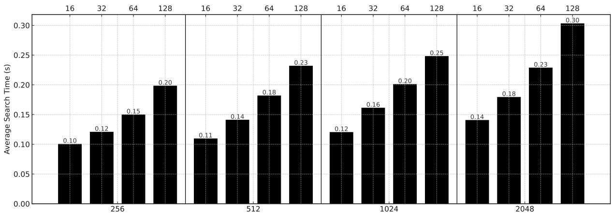  
Figure 12. Ablation on the LoCoMo: Average search time versus Random Indexing dimension D and signature size d. Bars within each group (bottom axis) correspond to different d values (top axis).

## D ABLATION STUDY OF HIPPOCAMPUS

We evaluated expected trends on the LoCoMo long-memory benchmark by varying the random-index dimension D ∈ {256, 512, 1024, 2048} and binary signature length d ∈ {16, 32, 64, 128}. Figure 12 reports the expected average search time (in seconds), and Table 4 shows quality metrics (F1, BLEU-1, and LLM-as-a-Judge) under these settings.

Avg. Search Time. Retrieval involves computing Hamming distances between the query’s binary signature and all stored signatures. Thus search time grows roughly linearly with the signature length d (and weakly with D). In our table, doubling d roughly doubles the time. Each extra bit adds a fixed cost, so larger d or D slows lookup.

Accuracy. Increasing D or d raises the representational capacity of the memory, reducing collisions and improving recall. A higher random indexing dimension D yields more nearly-orthogonal random codes, while a longer signature d captures more bits of information. Consequently, all quality metrics (F1, BLEU-1, and the LLM-as-a-Judge score) improve as D and d grow. This matches the known trends: expanding memory capacity or embedding dimensions consistently boosts retrieval performance (Li et al., 2025).

Trade-off Consideration. There is a clear trade-off. Larger D and d yield diminishing marginal gains in accuracy (the improvements taper off as the system saturates its capacity), but each added dimension/bit linearly increases search effort. In practice, one chooses D, d to balance these effects: enough capacity to achieve good recall accuracy (and thus higher LLM-judge scores), but not so large that retrieval becomes too slow.

## E MEMORY CONSTRUCTION

A practical memory system must not only support fast retrieval at inference time, but also allow efficient memory construction (i.e., ingesting raw content into a persistent memory substrate). This cost directly impacts usability in real deployments, where memories are frequently refreshed, re-indexed, or rebuilt under updated policies.

We measure the end-to-end wall-clock time to construct memory on LoCoMo. The measurement starts from reading the raw LoCoMo records and ends when the memory store is fully materialized and ready for querying (including all preprocessing, indexing, and persistence steps required by each method). We also report the total LLM token consumption (base model is gpt-4o-mini) incurred during construction, which captures the overhead of LLM-based summarization, or rewriting pipelines. All methods are evaluated under the same hardware/software environment.

Table 4. LoCoMo ablation: F1/BLEU-1/LLM-as-a-Judge vs. Random Indexing D and signature size d.
<table><tr><td>D</td><td>d</td><td>F1(%)</td><td>BLEU-1 (%)</td><td>LLM-Judge</td></tr><tr><td>256</td><td>16</td><td>37.28</td><td>33.69</td><td>3.18</td></tr><tr><td>256</td><td>32</td><td>38.27</td><td>34.53</td><td>3.17</td></tr><tr><td>256 256</td><td>64 128</td><td>37.29 37.54</td><td>33.62 34.20</td><td>3.20 3.20</td></tr><tr><td>512 512</td><td>16 32</td><td>38.14 38.30</td><td>34.42 33.78</td><td>3.17 3.18</td></tr><tr><td>512 512 1024 1024</td><td>64 128 16 32</td><td>37.75 38.16 38.72 38.18</td><td>33.45 34.42 33.83 34.49</td><td>3.17 3.21 3.20 3.20</td></tr><tr><td>1024 1024 2048 2048 2048 2048</td><td>64 128 16 32 64 128</td><td>37.31 37.59 37.79 38.66 38.35 38.21</td><td>33.63 33.46 33.82 34.20 33.54</td><td>3.19 3.19 3.18 3.21 3.19</td></tr></table>

Table 5. End-to-end memory construction cost on LoCoMo. We report wall-clock time and total token consumption.
<table><tr><td>Method</td><td>Time (minute)</td><td>Token Consumption</td></tr><tr><td>MemoryOS</td><td>4458.96</td><td>41540</td></tr><tr><td>Nemori</td><td>477.66</td><td>27637</td></tr><tr><td>A-mem</td><td>35.69</td><td>19926</td></tr><tr><td>MemGPT</td><td>59.49</td><td>50674</td></tr><tr><td>MemOS</td><td>70.00</td><td>21055</td></tr><tr><td>Ours (Hippocampus)</td><td>6.70</td><td>0</td></tr></table>

Table 5 shows that Hippocampus constructs memory in only 6.70 minutes while consuming zero LLM tokens. In contrast, prior systems rely on LLM-intensive preprocessing (e.g., summarization or memory rewriting) and thus incur substantial token usage and significantly higher wall-clock time. Compared with the fastest baseline in this table (Amem), Hippocampus is 5.3× faster, while eliminating token costs entirely. This advantage stems from our embeddingfree construction pipeline based on token-id streams and binary signatures, avoiding LLM calls during ingestion.

## F TIME AND SPACE COMPLEXITY

We compare the asymptotic efficiency of HIPPOCAMPUS ’s DWM-based storage/retrieval against dense-vector search (e.g. FAISS) and knowledge-graph methods.

Let n be the number of tokens stored (i.e., total memory size) and let σ be the dictionary size. Let each binary signature have length d bits:

DWM Construction (memory insertion). Each token-id insertion into the DWM (both content and signature matrices) requires a top-down traversal of $l = \lceil \log _ { 2 } \sigma \rceil$ bit-level wavelet levels. Each level uses rank/select on a dynamic bitvector. In a static wavelet matrix, rank is $\mathcal { O } ( 1 )$ with succinct overhead, in a dynamic setting rank/select takes ${ \mathcal { O } } ( \log n )$ time per operation. Hence a single append costs $\mathcal { O } ( \ell + \log n ) = \mathcal { O } ( \log \sigma + \log n )$ . Amortized over n inserts, total build time is ${ \mathcal { O } } ( n \log n )$ (dominated by dynamic updates). Space is $n l + o ( n l )$ bits $( \mathrm { i . e . } \ O ( n \log \sigma )$ bits) for the raw bit-matrix, plus overhead for rank/select. In summary, DWM insertion is nearly linear: ${ \mathcal { O } } ( n \log n )$ time and O(n log σ) space.

DWM Query (retrieval). Exact pattern matching in DWM (finding a specific signature) takes $\mathcal { O } ( l )$ time via rank/select (Algorithm 1). However, HIPPOCAMPUS performs an approximate Hamming ball search. This is done by scanning each stored signature: for each candidate signature bit-string $s _ { i } ,$ we compute Ham $( s _ { q } , s _ { i } )$ by bitwise XOR and popcount. Using machine words of size w $( { \mathrm { e . g . ~ } } w = 6 4 )$ , each signature takes $\mathcal { O } ( d / w )$ bit-operations. Thus the search cost is $O ( n \cdot d / w )$ , i.e. linear in n (and linear in d bitwise operations). In practice d is modest (e.g. a few hundred) so this is efficient, but asymptotically still ${ \mathcal { O } } ( n )$ . In contrast, dense-vector search is also linear in n in the worst case (even using indexing), but often with a larger constant due to dimensional inner products.

Dense-vector ANN (e.g. FAISS). A brute-force k-NN search in D-dimensional space costs $\mathcal { O } ( n D )$ per query. Modern systems use specialized indices (product quantization, HNSW graphs) to achieve sublinear query time on average. For example, HNSW scales roughly as ${ \mathcal { O } } ( \log n )$ queries for well-behaved data, but has worst-case cost ${ \mathcal { O } } ( n )$ The Faiss library (Douze et al., 2025) implements a variety of indexes, but fundamental limits remain: in the worst case, retrieval requires examining many candidates. Space overhead for Faiss indexes is typically $\mathcal { O } ( n D )$ to store the vectors plus index overhead.

Knowledge Graph Traversal. If memories are stored as a knowledge graph of entities and relations, a query may involve multi-hop neighbor exploration. In general, a breadthfirst search up to h hops from a starting node touches $\mathcal { O } ( \Delta ^ { h } )$ nodes, where $\Delta$ is the average branching factor. In practice, h is kept small (e.g. 2–3), but even then exploring the graph can be expensive. In worst-case terms, a multi-hop query is $\mathcal { O } ( \left| V \right| + \left| E \right| )$ , where V is node count and E edges.

Storing a full graph also uses $\mathcal { O } ( \left| V \right| + \left| E \right| )$ space. Notably, dynamic DWM updates and searches avoid such combinatorial growth.

Comparison. Asymptotically, HIPPOCAMPUS ’s DWM has linear space and near-linear-time updates $\left( { \mathcal { O } } ( n \log n \right)$ build, dominated by dynamic bit-vector updates. Retrieval is also ${ \mathcal { O } } ( n )$ per query (with a small bit-level factor). Dense-vector methods typically require $O ( n D )$ worst-case and may need ${ \mathcal { O } } ( n \log n )$ pre-processing. Graph methods can suffer exponential blow-up in hops or at least ${ \mathcal { O } } ( n )$ per query. Thus, in theory the DWM+Hamming search is comparable or better than naive baselines and avoids the multi-hop expansion cost of graphs. Practically, the use of bitwise operations and in-memory bit-slices makes HIPPOCAMPUS much faster per comparison than dense multiplications, as confirmed by our experiments.

## G ACCURACY GAP

We formalize how HIPPOCAMPUS $\mathrm { ^ \circ s }$ random indexing step followed by an r-bit Hamming ball search approximates dense-vector similarity. Let each token’s context embedding be a vector $\pmb { v } \in \mathbb { R } ^ { D }$ , and consider two such vectors v, w. HIPPOCAMPUS generates a d-bit signature by random projection and thresholding: each bit is sign $\left. b _ { k } , v \right. )$ for some random hyperplane $b _ { k }$ (or an analogous sparse random basevector scheme). By known results for random hyperplane hashing, the probability that a single bit differs satisfies:

$$
P ( \mathfrak { b i t } _ { k } ( \pmb { v } ) \neq \mathfrak { b i t } _ { k } ( \pmb { w } ) ) = \frac { \theta } { \pi }
$$

where $\begin{array} { r } { \theta = \operatorname { a r c c o s } \left( \frac { \pmb { v } \cdot \pmb { w } } { | \pmb { v } | | \pmb { w } | } \right) } \end{array}$ . Thus the expected Hamming distance between the d-bit signatures is

$$
\mathbb { E } [ \mathrm { H a m } ( v , { w } ) ] = d \cdot { \frac { \theta } { \pi } }
$$

Equivalently, similarity $\frac { \mathbf { \boldsymbol { v } } \cdot \mathbf { \boldsymbol { w } } } { | \mathbf { \boldsymbol { v } } | | \mathbf { \boldsymbol { w } } | } = \cos \theta$ can be recovered up to small error from the normalized Hamming similarity.

With d independent bits, the law of large numbers gives concentration: for any $\varepsilon > 0 .$ , by Hoeffding’s bound:

$$
P ( | \frac { 1 } { d } \mathrm { H a m } ( v , w ) - \frac { \theta } { \pi } | \geq \epsilon ) \leq 2 e ^ { - 2 d \epsilon ^ { 2 } }
$$

Hence with high probability, $\scriptstyle { \frac { 1 } { d } } \mathrm { H a m } ( \pmb { v } , \pmb { w } )$ is within $\mathcal { O } ( 1 / \sqrt { d } )$ of $\theta / \pi$ . In practice, choosing $d = \mathcal { O } ( \epsilon ^ { - 2 } \log N )$ ensures that for any fixed query among N candidates, the Hamming distance will approximate the original cosine similarity within additive error ϵ.

Concretely, if we set a Hamming threshold r corresponding to a desired angle $\theta _ { 0 }$ (thus target similarity cos $\theta _ { 0 } )$ , then any w with $\frac { \pmb { v } \cdot \pmb { w } } { | \pmb { v } | | \pmb { w } | } \geq$ cos $\theta _ { 0 }$ will satisfy Ham ${ \sf \sf { i } } ( { \pmb { v } } , w ) \leq r$ except with probability at most $e ^ { - \mathcal { O } ( d ) }$ . Conversely, vectors with similarity below cos $\theta _ { 0 }$ will exceed the threshold with high probability. This establishes that HIPPOCAMPUS ’s random indexing plus Hamming ball filter retrieves all sufficiently similar vectors (within angle $\theta _ { 0 } )$ with bounded false-negative probability, and rejects dissimilar vectors, mirroring an approximate nearest-neighbor search in cosine similarity space. The sampling complexity matches known bounds for binary embeddings.

Theorem. Under the process in Section 3.3, for any two vectors $_ { v , w }$ , the Hamming distance of their d-bit signatures concentrates around its mean $d \theta / \pi$ . By choosing $d = \mathcal { O } ( \delta ^ { - 2 } \log ( 1 / \eta ) )$ , one ensures Ham $( { \pmb v } , { \pmb w } ) / d$ approximates $\theta / \pi$ within ±δ with probability $1 - \eta$ . In particular, setting the Hamming radius $\begin{array} { r } { r = \frac { d \dot { \theta _ { 0 } } } { \pi } } \end{array}$ , the Hamming-ball $s : \mathrm { H a m } ( s _ { v } , s ) \leq r$ contains all items with cosine similarity at least $\cos ( \theta _ { 0 } )$ up to vanishing error.

Proof. HIPPOCAMPUS compresses high-dimensional embeddings into fixed-length binary signatures by sparse random indexing and binarization. In effect, each bit of a token signature can be viewed as the sign of a random hyperplane dot-product with the original vector. The Hamming distance between two signatures then equals the number of bits on which they differ. We will show that this Hamming distance concentrates around $( \theta / \pi ) d ,$ , where $\begin{array} { r } { \theta = \operatorname { a r c c o s } { \frac { v \cdot w } { | v | | w | } } } \end{array}$ is the angle between vectors $_ { v , w }$ . In particular, by choosing a suitable radius $r \approx ( \theta _ { 0 } / \pi ) d$ we retrieve all vectors with an-$\mathrm { g l e } \le \theta _ { 0 }$ (cosine similarity ≥ cos θ0) with high probability. Binary hash and collision probability. For each bit index $i = 1 , \ldots , d ,$ pick an independent random Gaussian vector $\mathbf { \boldsymbol { r } } _ { i } \sim N ( 0 , I )$ in Rn and define the bit $b _ { i } ( v ) = \mathrm { s i g n } ( \pmb { r } _ { i } { \cdot } \pmb { v } ) \in$ 0, 1. (Equivalently, HIPPOCAMPUS selects a sparse random base vector and later binarizes the top-d components, which yields the same analysis.) Let $X _ { i }$ be the indicator that $b _ { i } ( v ) \neq b _ { i } ( w )$ (a bit mismatch). It is a known fact (Charikar, 2002) that for any two vectors v, w at angle $\theta ,$ the probability their signs agree on a random hyperplane is

$$
P ( b _ { i } ( v ) = b _ { i } ( w ) ) = 1 - \frac { \theta } { \pi } \Rightarrow P ( X _ { i } = 1 ) = \frac { \theta } { \pi }
$$

considering a random line in the 2D plane of $v ,$ , w Thus $X _ { i } \sim \mathrm { B e r n o u l l i } ( p )$ with $p = \theta / \pi$ , and the Hamming distance $\begin{array} { r } { H ( \pmb { v } , \pmb { w } ) = \sum _ { i = 1 } ^ { d } X _ { i } } \end{array}$ is a binomial random variable with mean

$$
\mathbb { E } [ H ( { \pmb v } , { \pmb w } ) ] = d p = \frac { \theta } { \pi } d
$$

Concentration (Hoeffding/Chernoff bound). The $X _ { i }$ are independent and bounded in $[ 0 , 1 ]$ , so by Hoeffding’s inequality, we have for any $\epsilon > 0 :$

$$
P ( | H ( v , w ) - d p | \geq \epsilon d ) \leq 2 e ^ { - 2 \epsilon ^ { 2 } d }
$$

Equivalently:

$$
P ( | \frac { H ( v , w ) } { d } - p | \geq \epsilon ) \leq 2 e ^ { - 2 \epsilon ^ { 2 } d }
$$

Hence with high probability $H ( v , w ) / d$ lies in the interval $[ p - \epsilon , ; p + \epsilon ] ,$ i.e.

$$
H ( v , w ) = ( { \frac { \theta } { \pi } } ) d \pm \epsilon d \quad \mathrm { w i t h ~ p r o b a b i l i t y 1 } - 2 e ^ { - 2 \epsilon ^ { 2 } d }
$$

Containment in the Hamming ball (false negatives). Fix a target angle $\theta _ { 0 }$ (so we want cos $( { \pmb v } , { \pmb w } ) \geq \cos \theta _ { 0 } )$ . Consider any vector w with $\theta ( \boldsymbol { v } , \boldsymbol { w } ) \le \theta _ { 0 }$ . Then $p = \theta / \pi \le \theta _ { 0 } / \pi$ Define a search radius: $\begin{array} { r } { r = ( \frac { \theta _ { 0 } } { \pi } + \epsilon ) + d , } \end{array}$ by the above tail bound:

$$
P ( H ( v , w ) > r ) = P ( \frac { H } { d } > \frac { \theta _ { 0 } } { \pi } + \epsilon ) \leq e ^ { - 2 \epsilon ^ { 2 } d }
$$

since $\mathbb { E } [ H / d ] ~ \le ~ \theta _ { 0 } / \pi$ . Thus with probability at least $1 - e ^ { - 2 \epsilon ^ { 2 } d }$ we have $H ( v , w ) \leq r .$ By choosing d large enough (see below), this failure probability can be made $\leq \delta / N$ (union-bounding over $N$ candidates). In summary, any vector within angle $\theta _ { 0 }$ will lie inside the Hamming ball of radius $r \approx ( \theta _ { 0 } / \pi ) d$ with high probability.

False positives (outside angle). Conversely, if $\theta ( { \pmb v } , { \pmb w } ) >$ $\theta _ { 0 }$ , then $p = \theta / \pi > \theta _ { 0 } / \pi$ . In particular, if $\theta \ge \theta _ { 0 } + 2 \epsilon \pi$ then $p \ge \theta _ { 0 } / \pi + 2 \epsilon$ . In that case:

$$
P ( H ( v , w ) \leq ( { \frac { \theta _ { 0 } } { \pi } } + \epsilon ) d ) = P ( { \frac { H } { d } } \leq p - \epsilon ) \leq e ^ { - 2 \epsilon ^ { 2 } d }
$$

by the lower-tail Hoeffding bound. Hence vectors with angle substantially above $\theta _ { 0 }$ will (with probability $1 \ : -$ $\exp ( - 2 \epsilon ^ { 2 } d ) )$ have Hamming distance exceeding $( \theta _ { 0 } / \pi +$ $\epsilon ) d$ and will not be included in the ball of radius $r =$ $( \theta _ { 0 } / \pi + \epsilon ) d .$ This bounds the false-positive rate.

Parameter choice (d vs. $\epsilon , \delta , N ) .$ . To guarantee both error probabilities $e ^ { - 2 \epsilon ^ { 2 } d }$ are at most $\delta / ( 2 N )$ (so that a union bound over N vectors still yields failure probability $\leq \delta )$ ， it suffices to choose d $\begin{array} { r } { \ge \ \frac { 1 } { 2 \epsilon ^ { 2 } } \ln ( \frac { 2 N } { \delta } ) } \end{array}$ . In big-O terms, $d = O \big ( ( 1 / \epsilon ^ { 2 } ) ( \log N + \log ( \tilde { ( 1 / \delta ) } ) \big )$ is enough. For such d, we have with probability $1 - \delta$ (over the randomness of the projections) that all vectors within angle $\theta _ { 0 }$ lie in the Hamming ball of radius $r = ( \theta _ { 0 } / \pi + \epsilon ) d ,$ and vectors with angle significantly larger than $\theta _ { 0 }$ lie outside this ball.

The above calculation shows that the normalized Hamming distance $H ( \pmb { v } , \pmb { w } ) / d$ concentrates near $( \theta / \pi )$ . Hence a Hamming-ball query of radius $r \approx ( \theta _ { 0 } / \pi ) d$ retrieves exactly those vectors with angle $\leq \theta _ { 0 }$ (cosine $\geq \cos \theta _ { 0 } )$ up to an error margin controlled by ϵ, δ. In other words, HIPPOCAMPUS ’s random indexing plus Hamming ball method yields an $( \epsilon , \delta )$ -approximation of cosine-similarity search: with $d = O ( ( 1 / \epsilon ^ { 2 } ) \log ( N / \delta ) )$ bits, one finds all high-cosine neighbors with bounded false-positive/negative rates

## H DETAILED RELATED WORK

## H.1 Memory System for Agentic AI

The design of memory modules for agentic AI has become a central research area, with a primary focus on developing high-level architectural frameworks that enable agents to store, organize, and recall past experiences effectively. A close examination of the state-of-the-art reveals that innovation has largely concentrated on the conceptual layer of memory management, how an agent should reason about its history, while relying on a common set of underlying retrieval technologies.

A prominent school of thought approaches agent memory by drawing analogies to the memory management principles of traditional operating systems (OS), emphasizing concepts like hierarchy, resource allocation, and control flow.

MemGPT (Packer et al., 2023) pioneers the concept of virtual context management for LLMs. This technique provides the illusion of an infinite context window by creating a two-tiered memory hierarchy. The main context is analogous to physical RAM and consists of the tokens directly within the LLM’s prompt, while the external context serves as disk storage for out-of-context information. The core mechanism of MemGPT is that the LLM itself orchestrates the movement of data between these tiers through self-directed function calls, effectively managing its own limited context as a constrained resource.

MemoryOS (Kang et al., 2025) extends this OS metaphor with a more rigidly defined three-tier hierarchical storage architecture: Short-Term Memory (STM) for real-time conversations, Mid-Term Memory (MTM) for topic-based summaries, and Long-term Personal Memory (LPM) for persistent user and agent personas. It formalizes the data lifecycle with explicit update policies borrowed from OS design, such as a dialogue-chain-based FIFO (First-In, First-Out) principle for promoting information from STM to MTM and a heat-based replacement strategy for archiving less relevant information from MTM, mirroring OS page management techniques.

MemOS (Li et al., 2025) presents the most abstract and comprehensive OS-level vision, proposing that memory should be treated as a first-class operational resource within the AI system. Its central innovation is the MemCube, a standardized data structure and abstraction layer designed to unify three fundamentally different memory types: parametric memory (knowledge encoded in model weights), activation memory (transient states like the KV-cache), and plaintext memory (external knowledge sources). By providing a unified framework for the full lifecycle of these memory units, including their creation, scheduling, and evolution, MemOS aims to imbue LLMs with system-level controllability, plasticity, and evolvability.

A second major approach draws inspiration from psychology and cognitive science, seeking to build memory systems that emulate the more nuanced and adaptive characteristics of human memory.

ReadAgent (Li et al., 2023a) is modeled on how humans read and comprehend very long documents. Instead of attempting to process entire texts verbatim, it implements a system that creates short, compressed gist memories. This design is grounded in the fuzzy-trace theory of human memory, which posits that humans quickly forget precise details but retain the core substance or gist of information for much longer. ReadAgent uses the LLM’s own reasoning capabilities to decide what content to group into a memory episode, how to compress it into a gist, and when to perform an interactive look-up of the original text for specific details, transforming retrieval into an active reasoning task.

MemoryBank (Zhang et al., 2024) explicitly incorporates a model of human forgetting to achieve more natural longterm interactions. Its memory update mechanism is directly inspired by the Ebbinghaus Forgetting Curve theory, a psychological principle describing the decay of memory over time. This allows the agent to selectively forget less significant or infrequently accessed memories while reinforcing more important ones, aiming for a more anthropomorphic and engaging user experience, particularly in long-term AI companion scenarios. Its storage is also hierarchical, distilling verbose dialogues into concise daily summaries, which are then aggregated into a global summary.

A-mem (Xu et al., 2025) is architected around the principles of the Zettelkasten method, a sophisticated technique for knowledge management that emphasizes the creation of a network of interconnected atomic notes. When a new memory is formed, A-mem uses an LLM to generate a structured note containing attributes like keywords, tags, and a rich contextual description. The system then agentically analyzes historical memories to establish meaningful links, creating an evolving web of knowledge. This process also enables memory evolution, where the integration of new information can trigger updates to the attributes of existing memories, allowing the network to continuously refine its understanding over time.

A distinct architectural approach structures memory explicitly as a knowledge graph (KG), which excels at representing the relational and temporal dependencies between entities. While many systems rely on vector search for amorphous semantic similarity, KGs provide a structured representation that is particularly well-suited for tasks requiring multi-hop reasoning or a precise understanding of how the information evolves.

Zep and Graphiti (Rasmussen et al., 2025) exemplify this approach. Zep is a memory layer service for agents that is powered by Graphiti, a temporally-aware knowledge graph engine. Unlike static RAG systems that retrieve from unchanging document collections, Graphiti dynamically ingests and synthesizes both unstructured conversational data and structured business data into a KG that explicitly maintains historical relationships and their periods of validity. This bi-temporal model, which tracks both event time and transaction time, enables agents to perform complex temporal reasoning queries (e.g., ”What was the status of Project X last week?”), a capability that is fundamentally challenging for standard vector-based RAG systems.

## H.2 Succinct Data Structures

The core data structure of HIPPOCAMPUS: Dynamic Wavelet Matrix, is rooted in the field of succinct data structures, a specialized area of computer science focused on high-performance information retrieval in space-constrained environments.

Succinct data structures are data representations that occupy an amount of space that is very close to the informationtheoretic minimum required to store the data, while still supporting efficient queries. For example, a binary tree with n nodes requires at least 2n bits to be represented uniquely, and succinct representations achieve this bound while still allowing for navigation operations (e.g., finding a parent or child) in constant time. A crucial feature that distinguishes them from simple compression algorithms is that they are designed to be queried directly in their compressed form, without needing to be decompressed first. This combination of extreme space efficiency and fast query performance makes them ideal for managing massive datasets that must be held in memory. This field has matured from purely theoretical results to practical, highly-engineered libraries such as SDSL.

The Wavelet Matrix is a powerful and flexible succinct data structure designed to represent long sequences of symbols, such as a stream of integers drawn from a fixed alphabet. It is an optimized and more practical implementation of the conceptual Wavelet Tree. Structurally, it reorganizes the bits of the symbols in the input sequence into a collection of bit-vectors, where each bit-vector corresponds to a specific bit-plane of the alphabet (e.g., the most significant bits of all symbols form the first bit-vector, the second-most significant bits form the second, and so on).

By augmenting these bit-vectors with small auxiliary structures that allow for constant-time binary rank and select operations, the Wavelet Matrix can efficiently support three fundamental queries on the original sequence in time logarithmic in the alphabet size $( \mathcal { O } ( l o g \sigma ) )$ ·

access(i): Returns the original symbol at position i;

rank(c, i): Counts the number of occurrences of symbol c in the prefix of the sequence up to position i.

select(c, j): Finds the position of the j-th occurrence of symbol c in the sequence.

These primitives are the computational building blocks used by HIPPOCAMPUS. However, canonical wavelet matrices are static, they are built once over a fixed dataset and do not support efficient updates.

A key technical contribution of our work is the development of a Dynamic Wavelet Matrix (DWM), an appendfriendly adaptation specifically designed to handle the highthroughput, continuously growing memory stream of an agentic system. Furthermore, the application of this structure to co-index two heterogeneous data streams: compact semantic signatures for search and lossless token-IDs for reconstruction, is a novel use case that extends the traditional application of wavelet matrices in information retrieval.