# CAGE: CURVATURE-AWARE GRADIENT ESTIMATION FOR ACCURATE QUANTIZATION-AWARE TRAINING

Soroush Tabesh \* 1 Mher Safaryan \* 1 Andrei Panferov 1 Alexandra Volkova 1 Dan Alistarh 1 2

## ABSTRACT

Despite significant work on low-bit quantization-aware training (QAT), there is still an accuracy gap between such techniques and native training. To address this, we introduce CAGE (Curvature-Aware Gradient Estimation), a new QAT method that augments the straight-through estimator (STE) gradient with a curvature-aware correction designed to counteract the loss increase induced by quantization. CAGE is derived from a multi-objective view of QAT that balances loss minimization with the quantization constraints, yielding a principled correction term that depends on local curvature information. On the theoretical side, we introduce the notion of Pareto-optimal solutions for quantized optimization, and establish that CAGE yields strong convergence guarantees in the smooth non-convex setting. In terms of implementation, our approach is optimizer-agnostic, but we provide a highly-efficient implementation that leverages Adam statistics. CAGE significantly improves upon the prior state-of-the-art methods in terms of accuracy, for similar computational cost: for QAT fine-tuning, it halves the compression accuracy loss relative to the prior best method, while for QAT pre-training of Llama models, its accuracy for 3-bit weights-and-activations (W3A3) matches the accuracy achieved at 4-bits (W4A4) with the prior best method. The official implementation can be found over https://github.com/IST-DASLab/CAGE.

## 1 INTRODUCTION

Quantization has emerged as a standard technique for improving the computational efficiency of large language model (LLM) deployments, as prominent open-source models such as Llama, Gemma, and GPT-OSS are released in compressed formats (Touvron et al., 2023; Gemma et al., 2024; OpenAI, 2025). Yet, the vast majority of open research in this area has concentrated on post-training quantization (PTQ), where a fully trained model’s weights are quantized by applying numerical algorithms over a small calibration dataset (Frantar et al., 2022).

Relatively less is known about quantization-aware training (QAT) (Bengio et al., 2013a; Krishnamoorthi, 2018; Esser et al., 2020), where the model learns to adapt to the constraints of quantization during the optimization process itself. QAT is more computationally-expensive, but can yield better accuracy. The state of the art for QAT methods has long been dominated by the straight-through estimator (STE), a method first suggested by Hinton (2012) and formalized by Bengio et al. (2013b), which is integrated by default in deep learning frameworks like PyTorch (Paszke et al., 2019). This approach bypasses the non-differentiable quantization function in the backward pass, by approximating its gradient with the identity. While versatile, STE is known to suffer from slow convergence and instability. A body of work, such as LSQ (Esser et al., 2020), LSQ+ (Bhalgat et al., 2020), and more recent methods (Esser et al., 2019; Bhalgat et al., 2020; Nagel et al., 2022b; Lee et al., 2021b), has introduced improved approaches to stabilize and accelerate this process learnable quantization parameters or more sophisticated gradient scaling. Yet, these methods are heuristic, and do not offer formal convergence guarantees.

Contributions. In this paper, we address this gap by examining QAT from both a theoretical and a practical standpoint. We provide a formal framework for QAT as a multi-objective optimization problem, where the goal is to simultaneously minimize the task loss and the quantization error. From this perspective, we identify a condition for Pareto-optimality, where any improvement in one component of the objective necessarily leads to a degradation in the other. This formulation inspires a family of algorithms, called CAGE, for Curvature-Aware Gradient Estimation, which provides both theoretical guarantees, and high accuracy and efficiency in practice. More precisely, our contributions are as follows:

• The CAGE method we introduce provides a principled method for augmenting the standard STE gradient with a curvature-aware correction term, derived directly from our Pareto-optimality condition. This term explicitly counteracts the increase in loss induced by the quantization step, by leveraging local second-order information about the loss landscape (i.e., the Hessian).

• From the theoretical perspective, we prove, under assumptions, that CAGE possesses strong ergodic convergence guarantees to a Pareto-optimal point in the smooth non-convex setting, directly addressing the lack of guarantees that is a primary limitation of prior work in this area. Our approach is optimizer-agnostic; we provide a highly-efficient implementation of this framework that utilizes statistics readily available in adaptive optimizers such as Adam.

• We validate the effectiveness of CAGE through extensive experiments, including synthetic experiments meant to validate the theory, post-training fine-tuning of standard models, and pre-training of Llama-style models of up to 800M parameters from scratch. Our results demonstrate that CAGE leads to state-of-theart results across all scenarios: for fine-tuning QAT, it roughly halves the quantization error relative to the prior best method, whereas, in pre-training experiments, CAGE-trained models with 3-bits weights and activations (W3A3) offer lower loss than 4-bit (W4A4) models trained with the prior best method (QuEST (Panferov et al., 2025a)).

• Moreover, we show experimentally that the CAGE approach is optimizer-agnostic, as it leads to consistent gains across several optimizers, including AdamW (Loshchilov & Hutter, 2019), Muon (Jordan, 2024) and Shampoo (Gupta et al., 2018).

In summary, we show that incorporating curvature-aware gradient correction via CAGE is a promising step toward bridging the remaining performance gap between low-bit quantized models and their full-precision counterparts.

## 2 PRIOR WORK

The central challenge in QAT is the non-differentiable quantization function, with zero gradients almost everywhere. The standard is the STE, initially suggested by Hinton (2012) and formalized by Bengio et al. (2013b), which bypasses the quantization operator during the backward pass. Yet, STE is known to often lead to instability and suboptimal convergence (Yin et al., 2019).

Thus, substantial research has focused on STE refinements through learnable quantization parameters (Esser et al., 2020), improving the accuracy of the gradient itself (Le et al., 2021) or incorporating loss regularization with proximal mapping (Bai et al., 2018). For instance, AdaSTE (Le et al., 2021) enhances gradient estimation by viewing QAT problem from the perspective of bi-level optimization. ReSTE (Wu et al., 2023) balances the estimation error and the gradient stability via a rectified estimator. Liu et al. (2023) proposed Reinmax, noticing that the STE acts as a first-order approximation of the gradient and proposed a second-order estimator via Heun’s method.

In addition, ProxQuant (Bai et al., 2018) reformulates QAT as a regularized learning problem solved via proximal gradient methods. Instead of relying solely on STE, ProxQuant applies a prox operator between stochastic gradient steps to encourage quantization. Similar to ProxQuant, PARQ uses convex and piecewise-affine regularization to induce weight quantization with the difference that gradient updates are added to the full-precision parameters before applying the proximal operator (Jin et al., 2025).

The Mirror Descent formulation interprets full-precision parameters as the dual of quantized ones and analyses the cases where quantization operator generates a valid mirror map. Particularly, if we take softmax projection as quantization operator, then the dual iterates of STE follow Exponentiated Gradient Descent (EGD) (Ajanthan et al., 2021). Markov Random Field (MRF) and lifted probability space formulations (Ajanthan et al., 2019) represent each parameter of the model as weighted average of quantized values, and minimizes the loss with respect to these probabilistic weights.

Lee et al. (2021a) proposed the element-wise gradient scaling (EWGS) approach, in which the scaling of each gradient element depends on both its sign and the corresponding quantization error. Additionally, these scalings are adjusted by a global scaling factor obtained from approximate Hessian information. A related method employs position-based scaled gradients, where the gradient estimator is adjusted only by multiplying the quantization error with a small positive margin (Kim et al., 2020).

Another phenomenon observed in STE-based training is the oscillation of weights around decision boundaries between adjacent quantization grid points (Defossez et al. ´ , 2022). To mitigate these oscillations and stabilize training, Nagel et al. (2022a) introduced a regularization term on top of the loss to dampen the oscillations or alternatively proposed mechanisms for detecting oscillatory weights and freezing them during training.

By contrast to prior work, CAGE provides a multi-objective optimization perspective for QAT. Instead of refining the first-order approximation or applying standard regularization, CAGE introduces a curvature-aware correction term to the gradient.

## 3 CAGE: CURVATURE-AWARE GRADIENT ESTIMATION

## 3.1 Problem Description and Motivation

Intuitively, the key question in quantization-aware training (QAT) is to construct a gradient estimator that updates the parameters towards an “optimal” quantized model, i.e., a constrained model which minimizes the loss. More precisely, the optimization problem underlying QAT can be described by the following constrained optimization:

$$
\tag{1}
$$

where Q = {x ∈ Rd : x = Q(x)} is the constraint set of quantized parameters and Q : Rd → Rd is the quantization operator. An alternative way of looking at the same problem is to consider its unconstrained reformulation and minimizing the objective f (Q(x)) with respect to x ∈ Rd (Li et al., 2017). The key issue here is the non-differentiability of quantization operator Q. As such, the straight-through estimator of (Bengio et al., 2013a) is the default choice to approximate the gradient of f(Q(x). Specifically, ∇x[f (Q(x))] = JQ(x)⊤ · ∇f (Q(x)) is approximated by ∇f (Q(x)). Effectively, this replaces the Jacobian of the quantization operation by the identity matrix (Li et al., 2017; Hou et al., 2019; Chen et al., 2021a).

Error feedback reformulation. One way to gain more insight into the dynamics of STE is to examine it through the lens of error feedback. It is easy to observe that SGDbased training with STE over the iterate xt is equivalent to an instance of error-feedback (Chen et al., 2021b) with quantized parameters wt = Q(xt) and quantization error et = xt − Q(xt). This equivalence is described over iterations t ≥ 0 below:

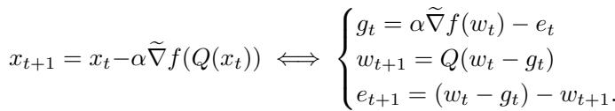

Effectively, the right-hand-side formulation says that STE is equivalent to a process where the quantization error et+1 due to weight quantization at a given step (wt − gt) − wt+1 is fed into the gradients at the next step. This feedback loop would be “exact”, fully correcting the error, if the loss function f were an isotropic quadratic function, i.e. with identity Hessian, but is not the right update in general.

Multi-objective perspective. Prior work on convergence guarantees for the problem described in Equation (1) in the non-convex setting attempts to find a quantized point Q(x∗) that is a stationary point for the loss f , namely ∇f (Q(x∗)) = 0.

However, as quantization is not an invertible transformation, this goal cannot be achieved in general, and current convergence guarantees have non-vanishing terms in their rate, proportional to quantization error (Lin et al., 2020; Chen et al., 2021b; Panferov et al., 2025b).

For the sake of illustration, consider a toy example where our scalar loss function is f (x) = 1 (x− 1 )2, and the quantization operator Q(x) = ⌊x⌋ gives the integer part of the one dimensional input x ∈ R. Clearly, ∇f (Q(x)) = ⌊x⌋ − 12 does not vanish at any point, with the smallest absolute value being 1 , coming from the quantization/rounding error.

Instead, we propose to view the QAT problem in Equation (1) from the perspective of multi-objective optimization. The first objective is to minimize the loss f (x): in the non-convex setting this becomes finding a stationary point, namely solving ∇f(x) = 0. The second objective is to satisfy the quantization constraint x ∈ Q. In other words, we aim to find a solution x∗ for which ∇f(x∗) = 0 and the distance between x∗ and Q(x∗) is minimized. As noted before, it is easy to see that these two conditions do not have to hold in general, meaning ∇f(x) can be non-zero for any quantized point x ∈ Q. Instead, we define solutions as Pareto optimal points that balance these two conditions.

Let x ∈ Rd be the current state of parameters. If we update towards −∇f (x) (or any other direction that aligns with it) with small enough step-size, then we would minimize the loss. Clearly, the opposite direction would increase the loss. Analogously, if we update towards Q(x)−x, then we would reduce quantization error. To have those two objectives in balance, we want our iterates to converge to some Paretooptimal state x∗ such that ∇f (x∗) = λ(Q(x∗) − x∗) for some scalar λ > 0. In this case, any sufficiently small update applied to x∗ would hurt at least one of the objectives. In other words, any local improvement of one objective would be at the cost of other. Therefore, we define λ-Pareto optimal solution x∗ for the problem (1) as

$$
\tag{2}
$$

where λ > 0 is a parameter balancing the two objectives. Recalling the toy example mentioned earlier, the value x∗(λ) = 12(1+λ) is λ-Pareto optimal for any λ > 0. Note that there can be many Pareto optimal solutions for the same λ. In our toy example, x∗ = −1/4 is another 1-Pareto optimal value.

Motivated by this multi-objective perspective and by the new optimality condition in Equation (2), we propose incorporating the quantization error et = xt − Q(xt) directly into the training dynamics. By doing so, we implicitly regularize the initial task loss, which can be made explicit if the quantization scheme is smooth (as we demonstrate in the theoretical analysis). Indeed, under the smoothness assumption of Q (Assumption 3), the quantization error can be expressed as x − Q(x) = ∇ϕ(x) for some smooth regularizer ϕ(x). Notably, our approach naturally avoids the need to handle the (non-existent) Jacobian JQ(x) of the quantization operator and bypasses the computation of a proximal step for the explicit “quadratic” regularizer λ ∥x − Q(x)∥22, which would be infeasible for the dynamic quantization used in our experiments (Bai et al., 2018).

Error coupling. Noting that our approach is optimizeragnostic, we propose two ways to incorporate the quantization error, referred to as the coupled and decoupled corrections. The distinction lies in whether the quantization error is added to the current gradient before it is passed to the optimizer (coupled correction) or added on top of the model update computed by the optimizer (decoupled correction).

If the base optimizer is SGD, then these two corrections are identical. We will provide theoretical convergence guarantees to a Pareto-optimal point in the smooth non-convex setting. However, for stateful optimizers such as Adam, these two corrections produce conceptually different schemes, which we discuss below (subsuming bias correction terms into the learning rate α):

Quantization error and mini-batch gradient

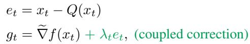

Optimizer states

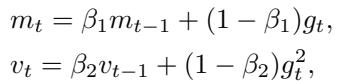

Optimizer update

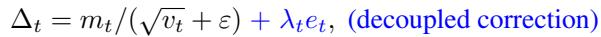

Model update

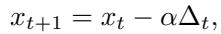

To compare these two correction variants in the context of the Adam optimizer, note that the coupled correction term λtet becomes (1 − β1)λtet/( vt + ε) after being processed by the optimizer states. In contrast to the decoupled correction, the coupled version introduces diagonallypreconditioned curvature-aware correction term, where the curvature is approximated using the Adam statistics already maintained within the optimizer states.

Relationship to LOTION. Concurrent work (Kwun et al., 2025) proposes an approach called LOTION, which smooths the quantized loss using unbiased randomized rounding (RR) via f (Q(x)) ≈ Eϵ∼RR[f (x + ϵ)], and considers its second-order expansion as a surrogate loss to minimize, i.e., f (x + ϵ) ≈ f (x) + ϵ⊤∇f (x) + 1 ϵ⊤H(x)ϵ. Due to the unbiasedness of rounding (i.e., E[ϵ] = 0), the first-order term of the expansion vanishes in expectation, and the smoothed loss becomes the original loss f(x) with an additional curvature-aware regularization term 12 Tr (H(x) Cov[ϵ]). Here, the exact Hessian matrix is replaced by its Gauss–Newton approximation. If we further apply the empirical Fisher approximation and approximate the diagonal entries of the Gauss–Newton matrix using Adam statistics, this regularization takes similar form as our coupled correction variant (except the square root). Exactly computing the gradient estimator for the regularized loss would require differentiating the regularizer, which would involve third-order derivatives of the loss and is impractical. As such, this step is proposed to be skipped by the authors.

In contrast to LOTION, we propose to regularize the training dynamics directly, rather than the loss itself. One advantage of this approach is that the regularized dynamics naturally arise from our Pareto-optimality condition, while the practical benefit is that it avoids the need to differentiate or compute the proximal operator of a loss regularizer. In addition, as described in their paper, LOTION requires a fullprecision forward pass, and the final model is a weight-only quantized model. By contrast, CAGE training is done with weights and activations quantized, where it can also benefit from high-performance low-precision GEMM kernels for more efficient training and inference.

## 3.2 Theoretical Analysis

In this section, we present our main convergence result for CAGE when the base optimizer is SGD. In this case, coupled and decoupled versions coincide with the following iterates:

$$
\tag{3}
$$

for t = 0, 1, . . . . We make the following assumptions regarding the smoothness of the loss and the nature of the stochastic noise.

Assumption 1 The loss function f : Rd → R is lower bounded by some f∗ ∈ R and is Lf -smooth, namely, ∥∇f (x) − ∇f (y)∥2 ≤ Lf ∥x − y∥2, for any x, y ∈ Rd.

Assumption 2 For all iterates t, the stochastic gradient ∇ f (xt) is unbiased, namely E[∇ f (xt)] = ∇f (xt), and the variance is bounded E[∥∇ f (xt) − ∇f (xt)∥22] ≤ σ2 for some constant σ2 ≥ 0.

Both assumptions are quite standard in the optimization literature and, in some sense, minimal to get meaningful convergence guarantees. Additionally, to handle the quantization operator Q in the analysis, it is common to approximate the actual non-smooth quantization operator Q with smooth surrogates with annealing hyperparameters.

Assumption 3 There exists some Lϕ-smooth function ϕ : Rd → R such that the quantization error x − Q(x) = ∇ϕ(x).

Note that Assumption 3 is essentially equivalent to the Lipschitz continuity of the quantization operator Q. The purpose of formulating this condition using an auxiliary function ϕ(x) is to hint that the iterates in (3) aim to minimize the regularized loss f (x) + λϕ(x), as we elaborate on later in the analysis. Next, we present the convergence result.

Theorem 1 Let Assumptions 1, 2, 3 hold and L = Lf + λLϕ. Then, for any λ ≥ 0, the iterates (3) with step-size α = min( 1L , √1 ) satisfy

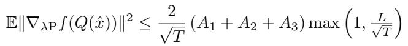

where xˆ is a random iterate drawn from the history {x0, x1, . . . , xT −1} uniformly at random and

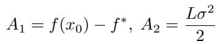

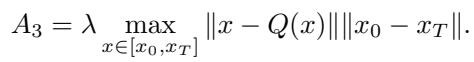

Discussion. First, observe that the convergence bound shows strong ergodic convergence to a Pareto-optimal state of the problem in Equation 1, with a convergence rate that is optimal in the unquantized case. The convergence measure is defined with respect to our proposed Pareto-gradients (Equation (2)) and, importantly, there is no non-vanishing term in the upper bound because of quantization error. In practical settings, both the distance ∥x0 − xT ∥ and the quantization error ∥x − Q(x)∥ are expected to remain bounded for any total number of training steps T . Therefore, this implies that the iterates in Equation (3) achieve O( √1 ) ergodic convergence to the Pareto-optimal solution.

## 3.3 Practical Implementation

Since our main application is in training and fine-tuning LLMs, we implement CAGE on top of AdamW (Loshchilov & Hutter, 2019). In contrast to LOTION (Kwun et al., 2025), we focus on the decoupled update rule and keep the correction term outside the preconditioning path (Alg. 1). We use this choice in most experiments, as we have found it to work better in practice. The base optimizer AdamW processes the mini-batch gradients gt obtained from STE, and the CAGE correction acts as a lightweight, elementwise post-step on the parameters. This decoupling has multiple practical advantages: (1) it preserves the optimizer’s wellunderstood behavior, (2) it keeps the Pareto stationarity direction x − Q(x) from being distorted by preconditioning, which empirically stabilizes training in low-bit regimes, and (3) it avoids numerical errors by decoupling terms with different behavior.

Algorithm 1 CAGE-AdamW (decoupled)   
Require: Initial parameters x0; total steps T ; AdamW hy  
perparameters β1, β2, α, ω, ε; Quantization function Q;   
Require: CAGE coefficient λ, silence ratio s   
Ensure: Parameters xT   
1: Initialize m0 ← 0, v0 ← 0, e0 ← 0   
2: for t = 1, 2, . . . , T do   
3: r ← t/T ▷ training progress ratio   
4: if rt ≤ s then   
5: λt ← 0   
6: end if   
7: if rt > s then   
rt − s   
8: λt ← λ   
1 − s   
9: end if   
10: Sample minibatch and compute stochastic gradient   
gt with quantized forward pass.   
11: xt ← (1 − αω) xt ▷ decoupled weight decay   
12: mt ← β1mt−1 + (1 − β1)gt   
13: vt ← β2vt−1 + (1 − β2) gt ⊙ gt   
14: mˆ t ← mt/(1 − βt1); vˆt ← vt/(1 − βt2)   
15: x˜t+1 ← xt − α mˆ t/  vˆt + ε   
16: et ← xt − Q(xt) ▷ quantization error (no grad)   
17: xt+1 ← x˜t+1 − α λt et ▷ decoupled correction   
18: end for   
19: return xT

Decoupled update. Given current set of parameters xt and STE gradient estimator gt through backpropagation, AdamW performs

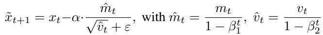

with additional decoupled weight decay regularization in the form of xt ← (1 − αω)xt.1 The CAGE correction term then pushes the parameters toward the quantized support via the instantaneous quantization error:

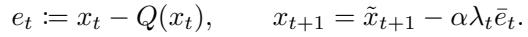

Warmup schedule. In practice, we have found that activating the correction from the very beginning of training can over-constrain the dynamics before the model settles into the loss landscape. Similar to standard learning-rate warmup schedules, we introduce a silence period ratio s ∈ [0, 1), which skips the correction for the initial sT steps and then linearly ramps it up to its target magnitude:

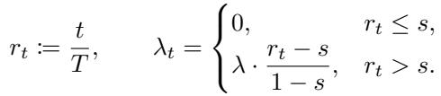

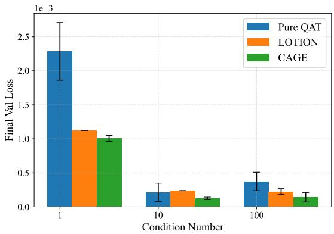  
Figure 1. Quadratic with non-isotropic Hessian: final validation loss for all methods various condition numbers (lower is better). The loss for CAGE does not include the regularizer term. We find that CAGE consistently reduces stationary error.

In practice, we have found the parameters s ∈ [0.8, 0.95] with a linear ramp and λ ∈ [1, 2.5] to work robustly for AdamW. We provide sweeps justifying these choices in Appendix C. The ramp prevents abrupt shifts in the optimization objective and reduces loss spikes in training.

## 4 EXPERIMENTS

Quantization pipeline. Unless otherwise stated, our experiments use a standard row-wise matrix quantizer, e.g. (Dettmers et al., 2024). Specifically, our QAT instantiation is based on QuEST (Panferov et al., 2025a). This works as follows: let x ∈ Rd denote a tensor row, and let H ∈ {± d √1 }d×d be a Hadamard transform of corresponding size. Before quantization, each tensor is “rotated” via the orthogonal Hadamard matrix:

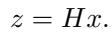

Given the target bit-width b, we quantize symmetrically with integer bounds qmax = 2b−1 − 1 and qmin = −2b−1. Using the pre-computed MSE-optimal Gaussian clipping factor kb (per bit-width), with σ = q 1d Pi z2i , we set the scale

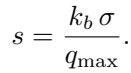

We then apply the quantization operation, rescale, and invert the transform:

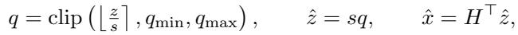

where ⌊·⌉ denotes round-to-nearest. The backward pass uses QuEST’s trust-masked STE in the transform domain.

Note that CAGE itself is quantizer-agnostic. It augments the optimizer update via the instantaneous quantization error et = xt−Q(xt) (see §3.3). We choose the QuEST quantizer here because it is a strong SOTA baseline for low-bit training. We note that the QuEST paper already showed superior results in terms of both training stability and loss, relative to prior methods such as LSQ/LSQ+ (Esser et al., 2020; Bhalgat et al., 2020). As such, we omit comparisons with further prior work, while noting that other quantizers can be used with CAGE without changing the method.

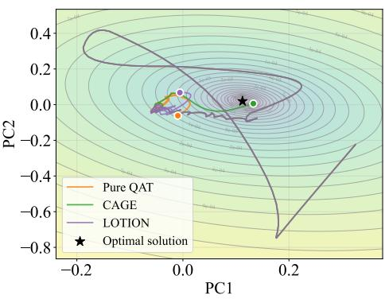  
Figure 2. Representative trajectories (projected to the top two principal components PC1 and PC2) for the quadratic task; CAGE follows curvature and converges closest to the optimum.

## 4.1 Synthetic Loss Experiments

To examine the exact QAT dynamics, we first study different methods optimizing a quadratic objective f(x) = 12 x⊤Ax − b⊤x with κ(A) ∈ {1, 10, 100} (non-isotropic curvature) over a quantized domain. We compare STE-SGD, STE-Adam, and CAGE-Adam (decoupled) under a 4-bit quantization of x, using the same pipeline as above, under different condition numbers.

More precisely, we initialize x0 ∼ N (0, σ2I), run a fixed budget of T steps, and measure (i) final validation loss over 10 seeds and (ii) trajectories in the (x⊤Ax)1/2 vs. iteration plane relative to the true minimizer x⋆ = A−1b. Figure 1 reports the distribution of final losses (mean±std across 10 seeds). Figure 2 shows representative trajectories and end-points over a reduced-dimension loss landscape around the optimum (following the top two principal components (PC)). Figure 1 shows that, across all condition numbers, CAGE reduces error in a statistically-significant way, while Figure 2 shows that CAGE finds a quantized solution that is strictly closer to the optimum.

## 4.2 Quantization-Aware Fine-tuning

Next, we evaluate the suitability of CAGE in a more realistic setting, where it is used to perform QAT over the MXFP4

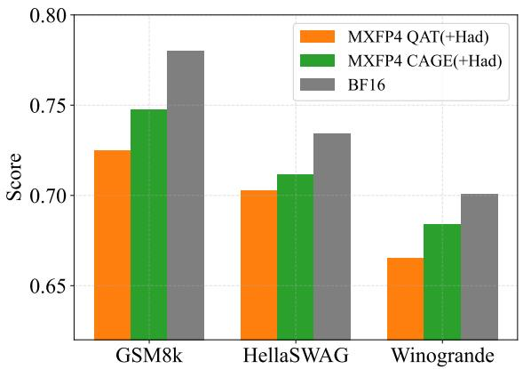  
Figure 3. QAT accuracy on Llama-3.2-3B (Tulu-SFT) for CAGE vs. the state-of-the-art MXFP4 baseline, using QuEST (Panferov et al., 2025a). CAGE consistently improves GSM8K/HellaSwag/WinoGrande results, essentially halving the error due to quantization. Hadamard transform is applied in both cases for outlier mitigation.

4-bit floating format (Darvish Rouhani et al., 2023) on the Llama-3.2-3B model (Dubey et al., 2024). We fine-tune on Tulu-SFT (Lambert et al., 2024) with QAT (master weights in FP32, the forward pass has both weights and activations quantized to MXFP4), following the recently-proposed QAT recipe of (Egiazarian et al., 2025), which yields state-of-theart results for MXFP4.

We report zero-shot or few-shot scores on GSM8K (exactmatch), HellaSwag (accuracy), and WinoGrande (accuracy). (Higher is better.) Hyperparameters for the experiments are in Appendix B, where we also include the results without the Hadamard transform, which show similar trends.

Figure 3 summarizes the results. We observe that CAGE consistently improves accuracy relative to the state-of-theart QAT baseline; specifically, it roughly halves the quantization error when mapping the model to MXFP4 in this format.

## 4.3 Pretraining Experiments

Next, we test our method by pre-training Llama-style transformers with parameter counts N ∈ {30M, 50M, 100M, 200M, 430M, 800M} under quantization-aware training from scratch, with weight/activation bit-widths b ∈ {2, 3, 4}. Our baseline is again the QuEST QAT approach, which uses a Hadamard transform prior to quantization (Panferov et al., 2025a), which was shown to be superior to classic methods such as STE and LSQ (Esser et al., 2020). Training uses the C4 dataset (Raffel et al., 2019) with a fixed budget of D = 100 × N tokens, for a token-per-parameter (TPP) ratio of 100, where D is the number of tokens and N is the number of model parameters. Master weights are stored FP32, and updates follow AdamW with decoupled weight decay (Loshchilov & Hutter, 2019) as in Algorithm 1.

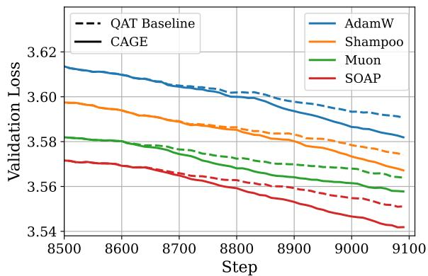  
Figure 4. Validation loss during QAT (W4A4) for AdamW, Shampoo, SOAP, and Muon, for standard QAT and CAGE. Solid lines denote training with CAGE, dashed – without. Across all optimizers, the method yields lower validation loss.

We compare CAGE against (i) QuEST (the current SOTA baseline) and (ii) a high-precision BF16 training reference. Figure 5 shows validation loss vs. model size for b ∈ {2, 3, 4}, with CAGE, QuEST baseline, and BF16.

Experiments are done on 8xH100 GPUs using standard hyperparameters (LR schedule, warmup, clipping, etc.), presented in Appendix B. Each pretraining result is an average over three seeds and the mean and standard deviation are reported in Table 1. Models up to 200M are visualized in Figure 5. We note that the standard deviation is too small to be visible in Figure 5.

Loss comparison. Table 1 presents the actual validation loss results for W4A4 training across methods and model sizes. We observe that CAGE consistently improves upon QuEST, by significant margins, across all model sizes, and both with and without the Hadamard transform.

Figure 5 examines the validation loss-vs-model-size Pareto front induced by CAGE and QuEST across W4A4, W3A3, and W2A2 precisions. We observe that CAGE is consistently Pareto-superior relative to QuEST, at every precision. W4A4 CAGE appears to be Pareto-optimal in terms of obtaining the lowest loss at a fixed model size, with a small advantage relative to W3A3. Notably, W3A3 CAGE is Pareto-superior to W4A4 QuEST!

Loss vs. Regularizer. In Figure 7, we visualize the evolution of the loss in parallel to the quantization error for pre-training the 50M Llama model in W4A4. We observe that, in the case of the baseline, there is a clear increase in quantization error as we continue training; at the same time, there is a sharp, consistent decrease in quantization error once the regularization starts, proportional to the value of the λ parameter. This confirms the predicted behavior of CAGE, as well as the improvements left “on the table” by the standard QAT baseline.

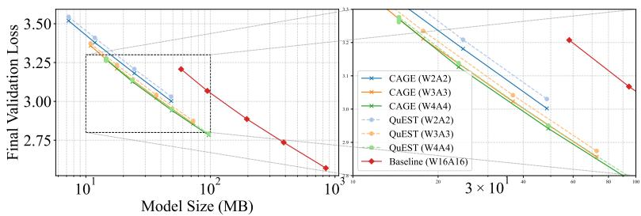  
Figure 5. Validation loss versus model size (bytes) for weight and activation quantization using W2A2, W3A3 and W4A4, comparing CAGE+QuEST to baseline QuEST and BF16. Observe that CAGE yields consistently lower loss.

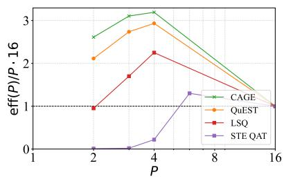  
Figure 6. Fitted parameter efficiency eff(P ), normalized relative to standard 16-bit, across precisions. CAGE improves effective model capacity over QuEST, peaking near 4-bit.

Table 1. Pretraining results (final validation perplexity; lower is better) for W4A4 across model sizes. HT = Hadamard transform. BF16 is a full-precision reference.  
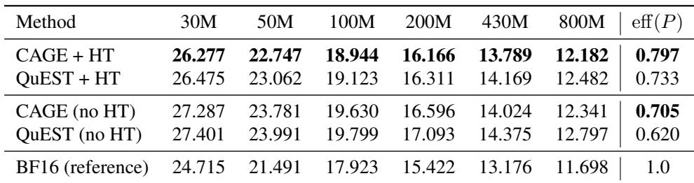

Universality Across Optimizers. To verify that gains produced by CAGE are independent of the optimizer update, we conduct a series of additional experiments using alternative optimizers to AdamW: Muon (Jordan, 2024), Shampoo (Gupta et al., 2018), and SOAP (Vyas et al., 2025).

We train 50M models from the OLMo2 family (OLMo et al., 2024) on the ClimbMix dataset (Diao et al., 2025) for D = 100 training tokens per parameter. OLMo2 models use no biases, employ rotary positional embeddings (Su et al., 2024), RMSNorm (Zhang & Sennrich, 2019), and reordered pre-normalization (Liu et al., 2022; OLMo et al., 2024). For each optimizer, we first tune the hyperparameters, and then we match the training setup and weights initialization to compare training curves with and without employing CAGE method. We use CAGE hyperparameters s = 0.9, λ = 5.

As shown in Figure 4, CAGE consistently reduces validation loss for all examined optimizers without any additional hyperparameter tuning. Since improvements introduced by CAGE do not depend on the choice of optimizer, we conclude that it can be regarded as an optimizer-agnostic technique.

Precision Scaling Law. To compare methods beyond pointwise losses, we fit a separable data/model/precision-scaling law (Kumar et al., 2024; Frantar et al., 2025) to the validation loss. Following references (Kumar et al., 2024; Panferov et al., 2025a; Hoffmann et al., 2022; Frantar et al., 2025), we fit a law of the form:

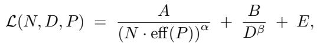

where N is parameter count, D is the seen token count, and P denotes the bit budget. The factor eff(P ) captures the effective capacity penalty due to quantization, where the capacity of standard precision is eff(FP) = 1.

To fit the law, we jointly fit A, α, B, β, E shared (jointly) across methods and learn a separate eff(P ) per method/bitwidth via nonlinear least squares on the grid of (N, D) we trained (see details in Appendix B). We regularize with weak log-priors to maintain shared values for the parameters α, β > 0 across precisions.

Improved Parameter Efficiency. The obtained eff(P ), normalized relative to standard 16-bit precision by multiplying by 16/P , are plotted in Figure 6. We observe that CAGE consistently increases eff(P ) vs. QuEST (and the other baselines), indicating improved effective capacity for a given parameter budget. Specifically, we find that CAGE improves parameter efficiency by more than 10% at 4-bit precision, and 20% at 2-bit precision, relative to the prior state-of-the-art method. We also observe that 4-bit precision appears to be the “optimal” bit-width, although only with a small relative advantage relative to 3-bit when using CAGE.

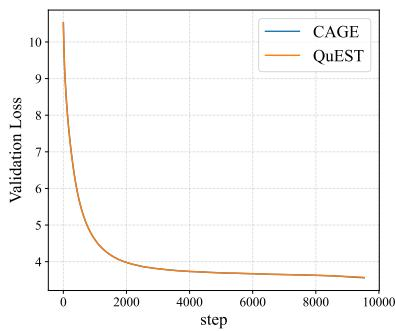

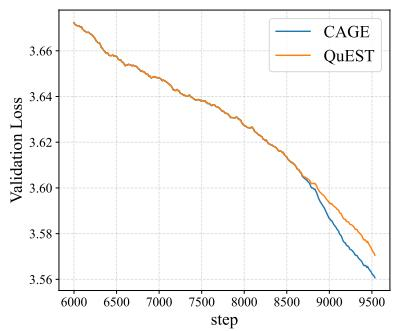

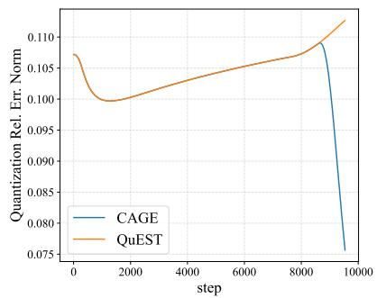  
Figure 7. Illustration of the validation loss for training the 50M Llama model in W4A4 using the QuEST baseline end-to-end (left), focused on the last fraction of steps (middle), and in terms of quantization error (regularizer) values (right). Observe that, while the overall training behavior is similar, CAGE significantly reduces loss for the quantized model in the final part of training.

Comparison to LOTION. We also compare CAGE to LO-TION. At the time of writing, no official implementation of LOTION was publicly available, so we reimplemented the method based on the description in the paper. We performed an extensive sweep over the regularization coefficient and found that the best-performing setting for LOTION corresponds to a relatively large value (in the order of 4 × 103). Since LOTION assumes weight-only quantization and is sensitive to saturation, we used an AbsMax weight quantizer (W4A16) in this experiment, without activation quantization.

The comparison was carried out in our standard pretraining setup: a 100M-parameter Llama-style model trained on C4 with QAT. As shown in Figure 8, both methods track a similar loss curve in the early stages of training, but CAGE achieves a clearly lower final validation loss, while LOTION plateaus. We note that we will re-run this comparison once an official LOTION implementation becomes available, to rule out discrepancies due to reimplementation.

## 5 SUMMARY AND DISCUSSION

We introduced CAGE (Curvature-Aware Gradient Estimation), a novel method for quantization-aware training (QAT) designed to mitigate the accuracy degradation inherent in low-bit quantization. CAGE addresses the limitations of the straight-through estimator (STE) by augmenting the gradient with a principled, curvature-aware correction term. This approach is rooted in a reformulation of QAT as a multi-objective optimization problem, balancing the minimization of the task loss with the satisfaction of quantization

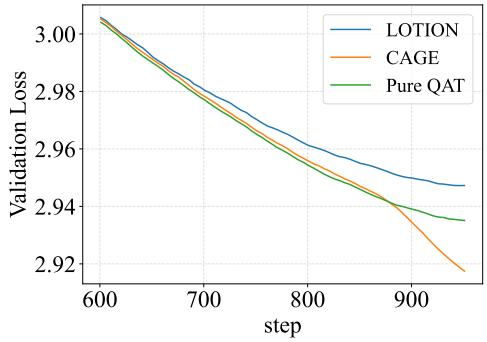  
Figure 8. Pretraining loss comparison between CAGE and LO-TION on a 100M-parameter Llama-style model trained on C4 under weight-only QAT with AbsMax W4A16 quantization. Both methods follow a similar trajectory early in training, but CAGE continues to improve and attains a substantially lower final loss, while LOTION plateaus.

## constraints.

The key theoretical contribution is the definition of Paretooptimal solutions for quantized optimization. Moreover, CAGE offers strong ergodic convergence guarantees to a Pareto-optimal point in the smooth non-convex setting, providing theoretical grounding often lacking in STE heuristics. While the approach is optimizer-agnostic, we developed a highly efficient, decoupled implementation on top of AdamW that leverages existing optimizer statistics for stability and performance. Our formulation also generalizes the concurrent work of (Kwun et al., 2025).

Empirical validation on both pre-training and post-training QAT demonstrates the effectiveness of CAGE through extensive experiments involving the pre-training of Llamastyle models up to 800M parameters. CAGE consistently outperformed strong baselines that employ modern outliermitigation techniques. Specifically, scaling law analysis confirms that CAGE improves the effective capacity of models compared to existing QAT methods.

The good performance of CAGE indicates that incorporating local curvature information and regularization are useful for QAT performance. Future work may explore the application of CAGE in ultra-low-bit regimes and its integration with other compression techniques, such as sparsification and vector quantization.

## REFERENCES

Ajanthan, T., Dokania, P. K., Hartley, R., and Torr, P. H. S. Proximal mean-field for neural network quantization. arXiv preprint arXiv:1812.04353, 2019.

Ajanthan, T., Gupta, K., Torr, P. H. S., Hartley, R., and Dokania, P. K. Mirror Descent View for Neural Network Quantization. arXiv preprint arXiv:1910.08237, 2021.

Bai, Y., Wang, Y.-X., and Liberty, E. Proxquant: Quantized neural networks via proximal operators. arXiv preprint arXiv:1810.00861, 2018.

Bengio, Y., Leonard, N., and Courville, A. Estimating or ´ propagating gradients through stochastic neurons for conditional computation. arXiv preprint arXiv:1308.3432, 2013a.

Bengio, Y., Leonard, N., and Courville, A. Estimating or ´ propagating gradients through stochastic neurons for conditional computation. arXiv preprint arXiv:1308.3432, 2013b. URL https://arxiv.org/abs/1308. 3432.

Bhalgat, Y., Lee, J., Nagel, M., Blankevoort, T., and Kwak, N. Lsq+: Improving low-bit quantization through learnable offsets and better initialization. In Proceedings of the IEEE/CVF Conference on Computer Vision and Pattern Recognition (CVPR) Workshops, June 2020.

Chen, C., Shen, L., Huang, H., and Liu, W. Quantized Adam with Error Feedback. arXiv preprint arXiv:2004.14180, 2021a.

Chen, C., Shen, L., Huang, H., and Liu, W. Quantized adam with error feedback, 2021b. URL https://arxiv. org/abs/2004.14180.

Darvish Rouhani, B., Garegrat, N., Savell, T., More, A., Han, K.-N., Zhao, Ritchie amd Hall, M., Klar, J., Chung, E., Yu, Y., Schulte, M., Wittig, R., Bratt, I., Stephens, N., Milanovic, J., Brothers, J., Dubey, P., Cornea, M., Heinecke, A., Rodriguez, A., Langhammer, M., Deng, S., Naumov, M., Micikevicius, P., Siu, M., and Verrilli, C. OCP Microscaling (MX) Specification. Open Compute Project, 2023.

Dettmers, T., Pagnoni, A., Holtzman, A., and Zettlemoyer, L. Qlora: Efficient finetuning of quantized llms. Advances in Neural Information Processing Systems, 36, 2024.

Diao, S., Yang, Y., Fu, Y., Dong, X., Su, D., Kliegl, M., Chen, Z., Belcak, P., Suhara, Y., Yin, H., et al. Climb: Clustering-based iterative data mixture bootstrapping for language model pre-training. arXiv preprint arXiv:2504.13161, 2025.

Dubey, A., Jauhri, A., Pandey, A., Kadian, A., Al-Dahle, A., Letman, A., Mathur, A., Schelten, A., Yang, A., Fan, A., et al. The llama 3 herd of models. arXiv preprint arXiv:2407.21783, 2024.

Defossez, A., Adi, Y., and Synnaeve, G. Differentiable ´ model compression via pseudo quantization noise, 2022. URL https://arxiv.org/abs/2104.09987.

Egiazarian, V., Castro, R. L., Kuznedelev, D., Panferov, A., Kurtic, E., Pandit, S., Marques, A., Kurtz, M., Ashkboos, S., Hoefler, T., and Alistarh, D. Bridging the gap between promise and performance for microscaling fp4 quantization, 2025. URL https://arxiv.org/abs/2509. 23202.

Esser, S. K., McKinstry, J. L., Bablani, D., Appuswamy, R., and Modha, D. S. Learned step size quantization. arXiv preprint arXiv:1902.08153, 2019.

Esser, S. K., McKinstry, J. L., Bablani, D., Appuswamy, R., and Modha, D. S. Learned step size quantization. In International Conference on Learning Representations (ICLR), 2020. URL https://openreview.net/ pdf?id=rkgO66VKDS.

Frantar, E., Ashkboos, S., Hoefler, T., and Alistarh, D. Gptq: Accurate post-training quantization for generative pre-trained transformers. arXiv preprint arXiv:2210.17323, 2022. URL https://arxiv. org/abs/2210.17323.

Frantar, E., Evci, U., Park, W., Houlsby, N., and Alistarh, D. Compression scaling laws: Unifying sparsity and quantization, 2025.

Gemma, T., Mesnard, T., Hardin, C., Dadashi, R., Bhupatiraju, S., Pathak, S., Sifre, L., Riviere, M., Kale, M. S., \` Love, J., et al. Gemma: Open models based on gemini research and technology. arXiv preprint arXiv:2403.08295, 2024.

Gupta, V., Koren, T., and Singer, Y. Shampoo: Preconditioned stochastic tensor optimization. In International Conference on Machine Learning, 2018. URL https://api.semanticscholar. org/CorpusID:3585068.

Hinton, G. Neural networks for machine learning, lecture 9c. Coursera, 2012.

Hoffmann, J., Borgeaud, S., Mensch, A., Buchatskaya, E., Cai, T., Rutherford, E., de Las Casas, D., Hendricks, L. A., Welbl, J., Clark, A., Hennigan, T., Noland, E., Millican, K., van den Driessche, G., Damoc, B., Guy, A., Osindero, S., Simonyan, K., Elsen, E., Rae, J. W., Vinyals, O., and Sifre, L. Training compute-optimal large language models, 2022. URL https://arxiv.org/ abs/2203.15556.

Hou, L., Zhang, R., and Kwok, J. T. Analysis of Quantized Models. ICLR, 2019.

Jin, L., Ma, J., Liu, Z., Gromov, A., Defazio, A., and Xiao, L. Parq: Piecewise-affine regularized quantization, 2025. URL https://arxiv.org/abs/2503.15748.

Jordan, K. Muon: An optimizer for the hidden layers of neural networks. https://kellerjordan.github. io/posts/muon/, 2024.

Kim, J., Yoo, K., and Kwak, N. Position-based scaled gradient for model quantization and pruning, 2020. URL https://arxiv.org/abs/2005.11035.

Krishnamoorthi, R. Quantizing deep convolutional networks for efficient inference: A whitepaper. arXiv preprint arXiv:1806.08342, 2018.

Kumar, T., Ankner, Z., Spector, B. F., Bordelon, B., Muennighoff, N., Paul, M., Pehlevan, C., Re, C., and Raghu- ´ nathan, A. Scaling laws for precision. arXiv preprint arXiv:2411.04330, 2024.

Kwun, M., Morwani, D., Su, C. H., Gil, S., Anand, N., and Kakade, S. Lotion: Smoothing the optimization landscape for quantized training, 2025. URL https: //arxiv.org/abs/2510.08757.

Lambert, N., Morrison, J., Pyatkin, V., Huang, S., Ivison, H., Brahman, F., Miranda, L. J. V., Liu, A., Dziri, N., Lyu, S., Gu, Y., Malik, S., Graf, V., Hwang, J. D., Yang, J., Bras, R. L., Tafjord, O., Wilhelm, C., Soldaini, L., Smith, N. A., Wang, Y., Dasigi, P., and Hajishirzi, H. Tulu 3: ¨ Pushing frontiers in open language model post-training. 2024.

Le, H., Høier, R. K., Lin, C.-T., and Zach, C. AdaSTE: An Adaptive Straight-Through Estimator to Train Binary Neural Networks. arXiv preprint arXiv:2112.02880, 2021.

Lee, J., Kim, D., and Ham, B. Network quantization with element-wise gradient scaling, 2021a. URL https: //arxiv.org/abs/2104.00903.

Lee, J., Kim, D., and Ham, B. Network quantization with element-wise gradient scaling. In Proceedings of the IEEE/CVF conference on computer vision and pattern recognition, pp. 6448–6457, 2021b.

Li, H., De, S., Xu, Z., Studer, C., Samet, H., and Goldstein, T. Training Quantized Nets: A Deeper Understanding. arXiv preprint arXiv:1706.02379, 2017.

Lin, T., Stich, S. U., Barba, L., Dmitriev, D., and Jaggi, M. Dynamic model pruning with feedback, 2020. URL https://arxiv.org/abs/2006.07253.

Liu, L., Dong, C., Liu, X., Yu, B., and Gao, J. Bridging discrete and backpropagation: Straight-through and beyond. Advances in Neural Information Processing Systems, 36: 12291–12311, 2023.

Liu, Z., Hu, H., Lin, Y., Yao, Z., Xie, Z., Wei, Y., Ning, J., Cao, Y., Zhang, Z., Dong, L., et al. Swin transformer v2: Scaling up capacity and resolution. In Proceedings of the IEEE/CVF conference on computer vision and pattern recognition, pp. 12009–12019, 2022.

Loshchilov, I. and Hutter, F. Decoupled weight decay regularization. In International Conference on Learning Representations, 2019. URL https://openreview. net/forum?id=Bkg6RiCqY7.

Nagel, M., Fournarakis, M., Bondarenko, Y., and Blankevoort, T. Overcoming oscillations in quantizationaware training, 2022a. URL https://arxiv.org/ abs/2203.11086.

Nagel, M., Fournarakis, M., Bondarenko, Y., and Blankevoort, T. Overcoming oscillations in quantizationaware training. In International Conference on Machine Learning, pp. 16318–16330. PMLR, 2022b.

OLMo, T., Walsh, P., Soldaini, L., Groeneveld, D., Lo, K., Arora, S., Bhagia, A., Gu, Y., Huang, S., Jordan, M., et al. 2 olmo 2 furious. arXiv preprint arXiv:2501.00656, 2024.

OpenAI. Introducing gpt-oss. https://openai.com/ index/introducing-gpt-oss/, 2025. Accessed 2025-09-21.

Panferov, A., Chen, J., Tabesh, S., Nikdan, M., and Alistarh, D. Quest: Stable training of llms with 1-bit weights and activations. In Proceedings of the 42nd International Conference on Machine Learning (ICML), 2025a. URL https://openreview.net/forum? id=I0Ux2nAN6u.

Panferov, A., Volkova, A., Modoranu, I.-V., Egiazarian, V., Safaryan, M., and Alistarh, D. Unified scaling laws for compressed representations, 2025b. URL https: //arxiv.org/abs/2506.01863.

Paszke, A., Gross, S., Massa, F., Lerer, A., Bradbury, J., Chanan, G., Killeen, T., Lin, Z., Gimelshein, N., Antiga, L., et al. Pytorch: An imperative style, high-performance

deep learning library. Advances in neural information processing systems, 32, 2019.

Raffel, C., Shazeer, N., Roberts, A., Lee, K., Narang, S., Matena, M., Zhou, Y., Li, W., and Liu, P. J. Exploring the limits of transfer learning with a unified text-to-text transformer. arXiv e-prints, 2019.

Su, J., Ahmed, M., Lu, Y., Pan, S., Bo, W., and Liu, Y. Roformer: Enhanced transformer with rotary position embedding. Neurocomputing, 568:127063, 2024.

Touvron, H., Martin, L., Stone, K., Albert, P., Almahairi, A., Babaei, Y., Bashlykov, N., Batra, S., Bhargava, P., Bhosale, S., Bikel, D., Blecher, L., Ferrer, C. C., Chen, M., Cucurull, G., Esiobu, D., Fernandes, J., Fu, J., Fu, W., Fuller, B., Gao, C., Goswami, V., Goyal, N., Hartshorn, A., Hosseini, S., Hou, R., Inan, H., Kardas, M., Kerkez, V., Khabsa, M., Kloumann, I., Korenev, A., Koura, P. S., Lachaux, M.-A., Lavril, T., Lee, J., Liskovich, D., Lu, Y., Mao, Y., Martinet, X., Mihaylov, T., Mishra, P., Molybog, I., Nie, Y., Poulton, A., Reizenstein, J., Rungta, R., Saladi, K., Schelten, A., Silva, R., Smith, E. M., Subramanian, R., Tan, X. E., Tang, B., Taylor, R., Williams, A., Kuan, J. X., Xu, P., Yan, Z., Zarov, I., Zhang, Y., Fan, A., Kambadur, M., Narang, S., Rodriguez, A., Stojnic, R., Edunov, S., and Scialom, T. Llama 2: Open foundation and fine-tuned chat models, 2023. URL https://arxiv.org/abs/2307.09288.

Vyas, N., Morwani, D., Zhao, R., Shapira, I., Brandfonbrener, D., Janson, L., and Kakade, S. M. SOAP: Improving and stabilizing shampoo using adam for language modeling. In The Thirteenth International Conference on Learning Representations, 2025. URL https: //openreview.net/forum?id=IDxZhXrpNf.

Wu, X.-M., Zheng, D., Liu, Z., and Zheng, W.-S. Estimator meets equilibrium perspective: A rectified straight through estimator for binary neural networks training, 2023. URL https://arxiv.org/abs/2308. 06689.

Yin, P., Lyu, J., Zhang, S., Osher, S., Qi, Y., and Xin, J. Understanding straight-through estimator in training activation quantized neural nets. In International Conference on Learning Representations (ICLR), 2019.

Zhang, B. and Sennrich, R. Root mean square layer normalization. Advances in Neural Information Processing Systems, 32, 2019.

## A CONVERGENCE ANALYSIS: PROOF OF THEOREM 1

Let F (x) = f(x) + λϕ(x) be the overall regularized loss with smoothness constant L = L + λLϕ. Then, due to smoothness inequality, we have

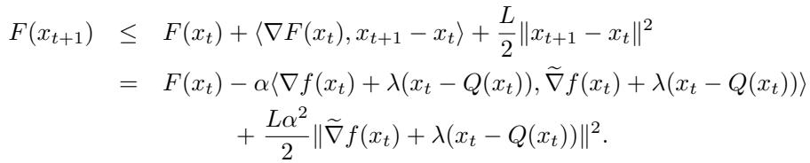

Applying conditional expectation Et[·] = E[· | xt], using unbiasedness of stochastic gradient and boundedness of variance, we get

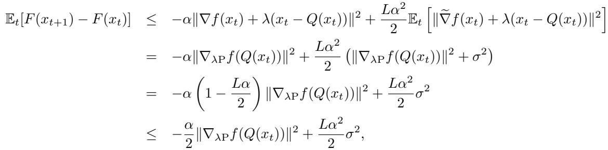

where we enforced α ≤ 1 step-size restriction. Applying full expectation and summing the obtained inequalities from t = 0, . . . , T − 1, we get

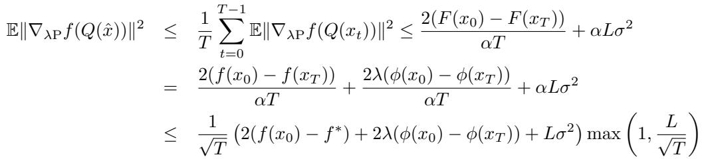

with α = min( 1L , √1T ). It remains to bound the term ϕ(x0) − ϕ(xT ) stemming from the quantization.

Due to the assumption 3 on quantization we can represent the scalar function ϕ as path-independent line integral:

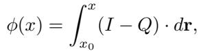

where I is the identity map, i.e. I(x) = x for any x ∈ Rd. Since I − Q is a gradient field (i.e., x − Q(x) = ∇ϕ(x)), the line integral above does not depend on how the endpoints x0 and x are connected. Therefore, we choose the direct path r(t) = x0 + (x − x0)t for t ∈ [0, 1] and simplify the integral into usual Riemannian integral as

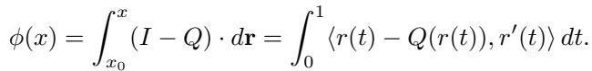

Using this relation, we can bound the term as follows

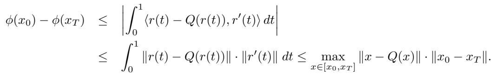

Table 2. Hyperparameters for Llama-style pretraining runs (per model size). Token budgets follow a 100 tokens-per-parameter (TPP) rule.  
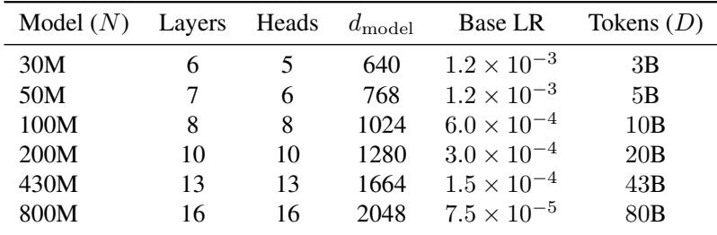

## B HYPERPARAMETERS AND REPRODUCIBILITY

Shared settings. Sequence length L = 512; batch size 64 with gradient accumulation 8 (effective tokens/step fixed across sizes). Optimizer AdamW with β1 = 0.9, β2 = 0.95, ε = 10−8, weight decay 0.1, gradient clip 1.0. Cosine LR schedule with warmup 10% of total steps. FP32 master weights and optimizer states; bfloat16 compute. Hardware: 8× H100 (NCCL, compile enabled).

Quantization. QuEST row-wise Hadamard quantizer for weights and activations; bit-widths b ∈ {2, 3, 4} (symmetric, MSE-optimal Gaussian clipping). Trust-masked STE in transform domain.

CAGE settings. Throughout the experiments, unless otherwise stated, we use the decoupled variant, with silence ratio s = 0.9, and regularization parameter λ = 2.0.

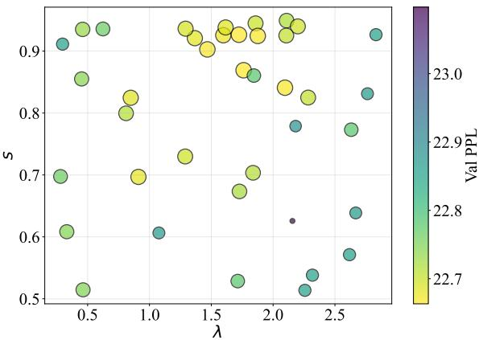  
Figure 9. Validation perplexity for CAGE under different choices of silence ratio s and regularization coefficient λ on the 50M Llama model with W4A4 quantization.

## C ABLATION OF CAGE HYPERPARAMETERS

We conduct a two-dimensional sweep over the CAGE hyperparameters; the silence ratio s and the regularization coefficient λ. Figure 9 reports validation perplexity for runs on a 50M Llama model trained on C4 in the W4A4 setting. We find that s ∈ [0.8, 0.95] and λ ∈ [1, 2.5] form a reliable operating region. Within this range, CAGE consistently improves over the baseline.