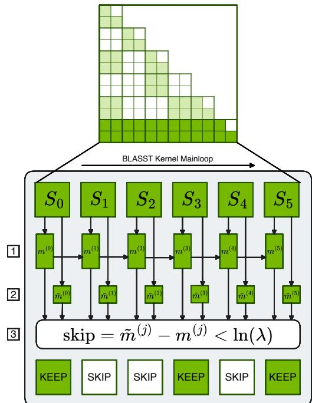
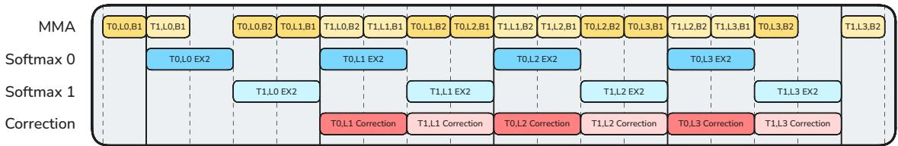
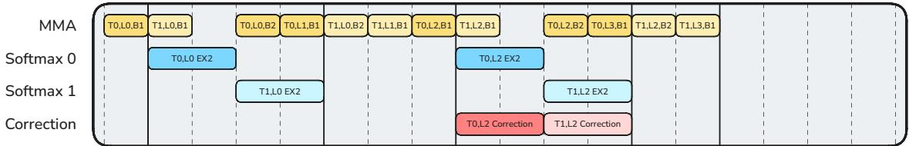
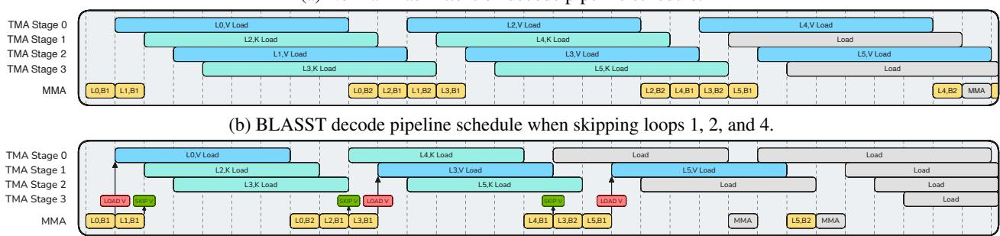
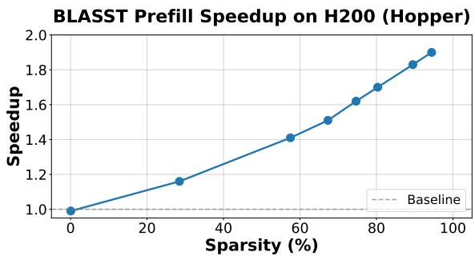
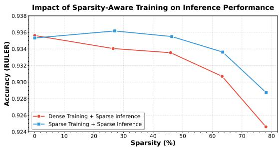
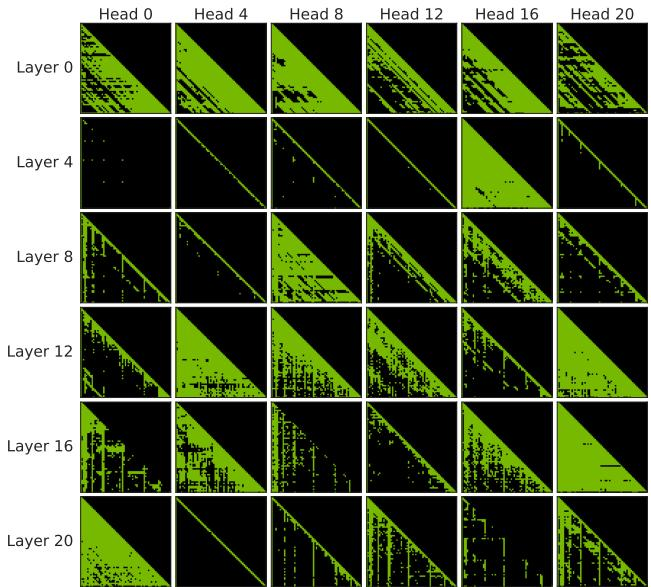
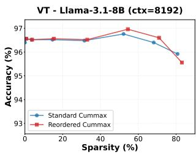
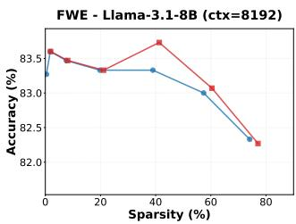
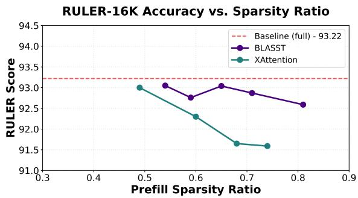

# BLASST: DYNAMIC BLOCKED ATTENTION SPARSITY VIA SOFTMAX THRESHOLDING

Jiayi Yuan \* 1 Cameron Shinn \* 2 Kai Xu 3 Jingze Cui 3 George Klimiashvili 3 Guangxuan Xiao 3 Perkz Zheng 3 Bo Li 3 Yuxin Zhou 3 Zhouhai Ye 3 Weijie You 3 Tian Zheng 3 Dominic Brown 3 Pengbo Wang 3 Richard Cai 3 Julien Demouth 3 John D. Owens 2 Xia Hu 1 Song Han 3 Timmy Liu 3 Huizi Mao 3

## ABSTRACT

The growing demand for long-context inference capabilities in Large Language Models (LLMs) has intensified the computational and memory bottlenecks inherent to the standard attention mechanism. To address this challenge, we introduce BLASST, a drop-in sparse attention method that dynamically prunes the attention matrix without any pre-computation or proxy scores. Our method uses a fixed threshold and existing information from online softmax to identify negligible attention scores, skipping softmax computation, Value block loading, and the subsequent matrix multiplication. This fits seamlessly into existing FlashAttention kernel designs with negligible latency overhead. The approach is applicable to both prefill and decode stages across all attention variants (MHA, GQA, MQA, and MLA), providing a unified solution for accelerating long-context inference. We develop an automated calibration procedure that reveals a simple inverse relationship between optimal threshold and context length, enabling robust deployment across diverse scenarios. Maintaining high accuracy, we demonstrate a 1.62× speedup for prefill at 74.7% sparsity and a 1.48× speedup for decode at 73.2% sparsity on modern GPUs. Furthermore, we explore sparsity-aware training as a natural extension, showing that models can be trained to be inherently more robust to sparse attention patterns, pushing the accuracy-sparsity frontier even further.

## 1 INTRODUCTION

Large Language Models (LLMs) have revolutionized natural language processing, achieving remarkable performance across diverse tasks. However, their practical deployment faces a critical bottleneck: the quadratic computational complexity of the attention mechanism. As applications increasingly demand longer context windows — from processing entire codebases (Roziere et al., 2023) to analyzing lengthy documents (Zeng et al., 2025) and maintaining extended conversations (Achiam et al., 2023) — this bottleneck becomes increasingly severe. Recent models like Deepseek-R1 (Guo et al., 2025) and Qwen3 (Yang et al., 2025) support context lengths up to 128K tokens, with some models pushing to 1M tokens (Comanici et al., 2025). Yet processing such long sequences remains computationally prohibitive, with attention computation dominating both latency and memory consumption. For a sequence of length n, the attention mechanism requires $O ( n ^ { \bar { 2 } } )$ operations and memory accesses, making real-world deployment of long-context models are challenging even with state-of-the-art hardware. While FlashAttention (Dao et al., 2022) and its successors have optimized memory bandwidth utilization through tiling and kernel fusion, they still compute the full attention matrix, leaving the fundamental quadratic complexity unaddressed.

  
Figure 1. Overview of BLASST. Blocks along a row of the attention matrix are sequentially processed. We (1) update the running row max $( m ^ { ( j ) } )$ as in FlashAttention, (2) compute the block max $( \tilde { m } ^ { ( j ) } )$ for each $S _ { j }$ block $( Q K _ { j } ^ { \top } )$ ), and (3) skip subsequent work if the block max is lower than the running max by more than the input threshold, ln(λ). Full details can be found in Algorithm 1.

Sparse attention methods have emerged as a promising solution by computing only a subset of the full attention matrix. However, existing approaches suffer from fundamental limitations. First, they require non-trivial operations to determine sparsity patterns: methods like MInference (Jiang et al., 2024) and XAttention (Xu et al., 2025) perform expensive pre-computation passes to identify important blocks, often negating their theoretical speedup; while static sparsity patterns (Xiao et al., 2023) avoid pre-computation but are inflexible and often suboptimal for diverse attention distributions across different tasks and context lengths. Second, these methods rely on proxy importance scores such as accumulated attention weights or query-key similarities, which can be inaccurate and miss critical token interactions. Third, most existing sparse attention methods focus exclusively on either the prefill or decode phase, missing opportunities for end-to-end optimization.

In this paper, we present BLASST (BLocked Attention Sparsity via Softmax Thresholding), a simple yet effective sparse attention method that dynamically prunes negligible attention blocks without any pre-computation overhead. Our key insight is that during FlashAttention’s block-wise online-softmax, we can identify and skip blocks whose contribution to the final output will be negligible based solely on already-computed information. Specifically, when processing blocks sequentially, we maintain a running maximum of attention scores. As shown in Figure 1, if a block’s local maximum score is significantly smaller than this running maximum (by a threshold λ), its post-softmax values will be near zero after normalization. We can therefore skip three expensive operations for such blocks: (1) computing the exponential for softmax, (2) loading the corresponding value block from HBM, and (3) performing the matrix multiplication with values. This simple pruning rule requires only a single comparison per block and seamlessly integrates into existing FlashAttention implementations.

To maximize the practical impact of BLASST, we develop highly optimized CUDA kernels that implement our sparse attention algorithm. Our kernels are designed with two key goals: (1) introduce minimal overhead for the blockskipping decision logic by reusing already-computed statistics, and (2) strategically target the bottleneck resources in each phase—reducing CUDA core and tensor core usage in compute-bound prefill, and reducing memory bandwidth consumption in memory-bound decode. We implement specialized kernels for both the prefill and decode phases, with optimizations tailored to their distinct computational patterns. On modern GPUs (H200, B200), our kernels achieve up to 1.62× speedup for prefill at 74.7% sparsity and 1.48× speedup for decode at 73.2% sparsity over FlashAttention baselines (Shah et al., 2024), while maintaining numerical stability and supporting various attention variants including grouped-query attention and sliding window attention.

Beyond the core algorithm and kernel implementation, we develop two key techniques to enhance BLASST’s deployment and performance. First, we propose an automated calibration procedure that determines optimal thresholds for any target sparsity level. Our calibration reveals a robust inverse relationship $\lambda = a / L$ between threshold and context length L, enabling reliable deployment across diverse scenarios without manual tuning. Second, we explore sparsity-aware training as a natural extension, showing that models can be trained to be inherently more robust to sparse attention patterns. This training approach further pushes the accuracy-sparsity frontier, enabling even higher sparsity levels with minimal loss in accuracy.

## Our contributions include:

1. A drop-in method with no pre-computation overhead and no proxy scores, achieving minimal accuracy loss.

2. Automated hyperparameter selection and sparsity-aware training for robust, flexible, and extensible deployment.

3. Optimized FlashAttention-based CUDA kernels for both prefill and decode, with high performance.

## 2 RELATED WORKS

Effectively exploiting the sparse attention property requires either reducing compute on unimportant interactions or reducing memory footprint (e.g., KV cache) without expensive selection overheads or retraining. Compared to the following related works, BLASST addresses both dimensions simultaneously, in a training-free manner.

## 2.1 Compute-Optimized Sparsity

Several approaches reduce attention compute by selecting important interactions. Static pattern methods like Sparse Transformer (Child et al., 2019), LongFormer (Beltagy et al., 2020), and BigBird (Zaheer et al., 2020) reduce complexity through local or block-based attention. Retrieval head-based methods (Wu et al., 2024; Xiao et al., 2024b) accelerate model decoding by focusing compute on crucial retrieval heads. Dynamic sparsity methods like MInference (Jiang et al., 2024) use pre-computed importance scores, XAttention (Xu et al., 2025) ranks anti-diagonal blocks, and FlexPrefill (Lai et al., 2025) offers compilersupported, flexible block patterns; while effective for prefill, their pre-computation and scheduling overheads can limit realized speedups. Training-aided sparsity such as SeerAttention (Gao et al., 2025) induces high sparsity via (pre)training gates, improving efficiency but adding training cost and showing mixed downstream performance.

SpargeAttention (Zhang et al., 2025) has the closest design to BLASST. We differ in three key aspects: (1) BLASST optimizes both prefill and decode with specialized kernels, while SpargeAttention targets prefill only; (2) we make skip decisions directly using already-computed statistics with zero overhead, while SpargeAttention uses a separate prediction step; (3) our decode kernel skips Value loading from HBM, addressing memory-bound bottlenecks on top of compute savings. Additionally, we provide automated calibration and sparsity-aware training.

## 2.2 Memory-Optimized Sparsity

Token/KV sparsity focuses on reducing memory footprint and decode-time cost. H2O (Zhang et al., 2023), TOVA (Oren et al., 2024), and InfLLM (Xiao et al., 2024a) discard tokens based on query patterns. StreamingLLM (Xiao et al., 2023) retains initial and recent tokens for consistent latency and memory usage. Quest (Tang et al., 2024) prunes tokens conditioned on the current query, Rectified Sparse Attention (Sun et al., 2025) adaptively selects tokens to maintain accuracy at high sparsity, RocketKV (Behnam et al., 2025) compresses the KV cache with selective eviction, and recent KV compression for hyper-scaling (Łancucki et al. ´ , 2025) further extends effective context; TidalDecode (Yang et al., 2024) stabilizes decode efficiency with position-persistent patterns. These approaches primarily target memory via KV pruning/compression on decode phase, whereas BLASST directly reduces compute in both prefill and decode while remaining training-free.

## 2.3 New Attention Variants

Beyond the above methods, alternative mechanisms include Sliding Window Attention (Beltagy et al., 2020), Linear or Gated Attention (Qiu et al., 2025), and State-Space Models (SSM) (Gu & Dao, 2023). Native Sparse Attention (NSA) (Yuan et al., 2025) and DeepSeek Sparse Attention (DSA) (DeepSeek-AI, 2025) while effective in some regimes, they often require architectural changes or retraining. By contrast, BLASST is a post-training method that accelerates both prefill and decode without proxy scores or complex pre-computation, integrating seamlessly with FlashAttention implementations.

## 3 METHODOLOGY

## 3.1 Pruning Attention with Running Maximums

The core insight of BLASST lies in the observation that during the computation of attention scores in FlashAttention, many blocks contribute negligibly to the final output after softmax normalization. Our method identifies and skips these blocks dynamically during the forward pass, without requiring pre-computation or proxy scores.

## 3.1.1 Key Insight

In the standard attention mechanism, the softmax operation computes:

$$
{ \mathrm { A t t e n t i o n } } ( Q , K , V ) = { \mathrm { s o f t m a x } } \left( { \frac { Q K ^ { \top } } { \sqrt { d _ { k } } } } \right) V\tag{1}
$$

During FlashAttention’s block-wise computation, we maintain a running maximum $m _ { i } ^ { ( j ) }$ across blocks. If a block’s local maximum $\tilde { m } _ { i } ^ { ( j ) }$ is significantly smaller than the current running maximum, i.e., $\tilde { m } _ { i } ^ { ( j ) } - m _ { i } ^ { ( j ) } < \ln ( \lambda )$ for some threshold λ, then after exponentiation:

$$
\exp ( \tilde { m } _ { i } ^ { ( j ) } - m _ { i } ^ { ( j ) } ) < \lambda \approx 0\tag{2}
$$

Since the maximum value is bounded by λ, the block’s contribution to the final attention output will be negligible, allowing us to skip its computation entirely.

Intuitively, this criterion follows a three-step approximation. First, the ideal importance of each score $S _ { i j }$ is its value relative to the (unknown) global maximum. Second, computing the true maximum on-the-fly is too expensive, so we use the running maximum as a tractable proxy and compare $S _ { i j }$ against it. Third, to enable an efficient block-level decision inside the kernel, we replace token-level $S _ { i j }$ with the block-local maximum, yielding the inexpensive condition (block max − running max) < ln(λ).

## 3.1.2 Algorithm Design

Algorithm 1 presents our modified FlashAttention forward pass. The key modification is the introduction of a dynamic pruning condition that saves both computation and memory bandwidth. Where We Save: When $\tilde { m } _ { i } ^ { ( j ) } - m _ { i } ^ { ( j ) } < \ln ( \lambda )$ (line 7), we skip:

1. Compute savings (CUDA cores): The expensive exp(·) operations for computing $\tilde { P } _ { i j }$ require multiple instructions per element: MUFU.EX2 (exponential), FMUL (multiplication), and FADD (addition). We also skip the rowsum reduction operations (FADD instructions) for normalizing attention weights. For a typical block, this saves thousands of CUDA core instructions.

2. Compute savings (Tensor cores) The matrix multiplication $\tilde { P } _ { i j } V _ { j }$ . In prefill phase, where kernels are computebound, avoiding these MMA operations provides a substantial speedup.

3. Memory bandwidth savings: Loading the Value block

$V _ { j }$ from HBM to SRAM. This is particularly critical in decode phase, where attention is memory-bound.

Algorithm 1 FlashAttention with BLASST   
Require: Query blocks $\{ Q _ { i } \} _ { i = 1 } ^ { T _ { r } }$ , Key blocks $\{ K _ { j } \} _ { j = 1 } ^ { T _ { c } } ,$   
Value blocks $\{ V _ { j } \} _ { j = 1 } ^ { T _ { c } }$ , threshold λ   
Ensure: Output blocks $\{ O _ { i } \} _ { i = 1 } ^ { T _ { r } }$   
1: for $i = 1$ to $T _ { r }$ do   
2: Initialize ${ \stackrel {  } { m _ { i } ^ { ( 0 ) } } } = - \infty , O _ { i } ^ { ( 0 ) } = 0 , l _ { i } ^ { ( 0 ) } = 0$   
3: for $j = 1$ to $T _ { c }$ do   
4: Compute $S _ { i j } = Q _ { i } K _ { j } ^ { \top }$ ▷ Attention scores   
5: $\tilde { m } _ { i } ^ { ( j ) } =$ rowmax( $( S _ { i j } )$ ▷ Local maximum   
6: $m _ { i } ^ { ( j ) } = \operatorname* { m a x } ( m _ { i } ^ { ( j - 1 ) } , \tilde { m } _ { i } ^ { ( j ) } )$ ▷ Running   
maximum   
7: if $\tilde { m } _ { i } ^ { ( j ) } - m _ { i } ^ { ( j ) } < \ln ( \lambda )$ then   
8: continue ▷ Skip this block   
9: end if   
10: $\tilde { P } _ { i j } = \exp ( S _ { i j } - m _ { i } ^ { ( j ) } )$ ▷ Compute attention   
weights   
11: $l _ { i } ^ { ( j ) } = e ^ { m _ { i } ^ { ( j - 1 ) } - m _ { i } ^ { ( j ) } } l _ { i } ^ { ( j - 1 ) }$ + rowsum $( \tilde { P } _ { i j } )$   
12: $\bar { O } _ { i } ^ { ( j ) } = e ^ { m _ { i } ^ { ( j - 1 ) } - m _ { i } ^ { ( j ) } } O _ { i } ^ { ( j - 1 ) } + \tilde { P } _ { i j } V _ { j }$   
13: end for   
14: $O _ { i } = O _ { i } ^ { ( T _ { c } ) } / l _ { i } ^ { ( T _ { c } ) }$ ▷ Final normalization   
15: end for   
16: return $\{ O _ { i } \} _ { i = 1 } ^ { T _ { r } }$

Our approach directly reduces the total amount of computation by dynamically identifying and skipping negligible attention blocks during the forward pass. This simple yet effective modification requires minimal changes to the existing FlashAttention implementation while providing significant computational savings.

## 3.2 Calibration for Optimal Sparsity

A critical challenge in deploying BLASST is selecting the appropriate threshold λ that balances sparsity and accuracy. To understand this relationship, we conducted experiments on Llama-3.1-8B across RULER benchmark challenging subsets (NIAH MULTI, VT, FWE) with context lengths from 8K to 64K tokens.

Sparsity Determines Accuracy. Figure 2 (left) shows relative accuracy degradation as a function of sparsity ratio. We normalize each curve by full attention result for fair comparison. Remarkably, all curves exhibit consistent degradation patterns: performance remains stable up to 60-70% sparsity, beyond which accuracy drops sharply. This consistency across diverse tasks and sequence lengths reveals that accuracy degradation is primarily determined by sparsity ratio itself, not dataset type or sequence length.

Threshold Calibration is Essential. To achieve consistent performance, we should maintain a fixed sparsity ratio rather than a fixed threshold. However, Figure 2 (right) shows that achieving 75% sparsity requires $\lambda \approx 1 e - 4$ for 8K contexts but only $1 e - 5$ for 64K contexts. This necessitates adaptive calibration. Importantly, by targeting fixed sparsity through calibration, users can control and foresee the computational speedup, since performance gains scale predictably with the achieved sparsity level.

Relative Accuracy Drop vs Sparsity - Llama 3.1 8B   
1.00   
0.99   
0.98   
0.97ac   
0.96cu   
Ctx 8192   
0.95ve Ctx 16384   
Ctx 32768   
0.94 Ctx 65536   
0 20 40 60 80   
Sparsity (%)

Average Sparsity vs Threshold on Llama 3.1 8B   
20
40
60
80
Average Sparsity (%) + Ctx 4096   
Ctx 8192   
Ctx 16384   
Ctx 32768   
60 Ctx 65536   
40   
20   
0   
1e-6 1e-5 3e-5 1e-4 3e-4 1e-3 3e-3 1e-2   
Threshold (Log Scale)  
Figure 2. (Left) Relative accuracy drop across different datasets and context lengths shows consistent degradation patterns. All curves are normalized to their initial accuracy. (Right) Relationship between threshold and achieved sparsity levels across different sequence lengths, demonstrating the need for threshold calibration to maintain fixed sparsity across varying contexts.

Through empirical analysis, we find that the optimal threshold follows an inversely proportional relationship with context length L:

$$
\lambda = { \frac { a } { L } }\tag{3}
$$

where a is a model-specific constant. This inverse relationship has theoretical grounding: since attention scores are row-normalized to sum to 1, longer sequences have lower average scores per token, requiring proportionally smaller thresholds. Without calibration, fixed thresholds would cause vastly different sparsity levels across sequence lengths.

To find the optimal value of a for a given target sparsity S, we propose the calibration procedure detailed in Algorithm 2. The process involves empirically finding the bestfitting threshold $\lambda _ { \mathrm { b e s t } }$ for several context lengths $\{ L _ { k } \}$ that achieves the target sparsity S (within a tolerance δ). We then perform a linear regression on the transformed data points $( 1 / L _ { k } , \lambda _ { \mathrm { b e s t } } )$ to find the slope a, which defines our calibration function $\lambda ( L ) = a / L$

More importantly, by targeting fixed sparsity levels, our calibration ensures predictable computational speedup across different context lengths. This is a crucial property for production deployment where consistent performance is required.

## 3.3 Sparsity-Aware Training

While BLASST is primarily designed as a post-training inference optimization, we explore sparsity-aware training as a simple extension to further improve the accuracy-sparsity trade-off. The motivation is straightforward: if models learn to concentrate important information in high-scoring attention blocks during training, they should maintain higher accuracy when those blocks are pruned during inference.

(a) Normal FlashAttention prefill pipeline schedule.  

(b) BLASST prefill pipeline schedule with T0 and T1 both skipping loops 1 and 3.  
  
Figure 3. Prefill pipeline schedules for FlashAttention and BLASST at 50% sparsity across 4 loop iterations (L0-L3). Rows are separated based on warp/warpgroup specializations. Darker and lighter hues correspond to ops for different tile rows (T0/T1). The MMA warp’s BMM1 and BMM2 ops are indicated with B1 and B2. The softmax warpgroups are primarily bottlenecked by exponentiation (EX2), but they also perform the skip check, row sum and softmax scaling (not shown). Mainloop iterations are enclosed by solid lines.

Algorithm 2 BLASST Calibration   
Require: Target sparsity S, calibration dataset D, context   
lengths $\{ L _ { k } \} _ { k = 1 } ^ { K } .$ , lambda set Λ, tolerance δ   
Ensure: Calibration parameter a   
1: Initialize data points $\mathcal { P } = \emptyset$   
2: for each context length $L _ { k }$ do   
3: Sample sequences of length $L _ { k }$ from D   
4: Initialize λbest = None, min gap = ∞   
5: for each $\lambda \in \Lambda$ do   
6: s = MeasureSparsity(λ, Lk)   
7: $\mathrm { g a p } = | s - S |$   
8: if gap < min gap then   
9: $\lambda _ { \mathrm { b e s t } } = \lambda$   
10: min gap = gap   
11: end if   
12: end for   
13: if min gap < δ then ▷ Only keep if sparsity is   
close enough   
14: Add $\left( 1 / L _ { k } , \lambda _ { \mathrm { b e s t } } \right)$ to $\mathcal { P }$   
15: end if   
16: end for   
17: Fit linear regression: λ = a · (1/L) using P   
18: return Regression coefficient a

Our method is simple: during fine-tuning, we apply BLASST in the forward pass to skip negligible attention blocks based on the threshold criterion. In the backward pass, skipped blocks naturally receive no gradients since they were not computed in the forward pass. This encourages the model to adapt its attention patterns to be more compatible with sparsity, concentrating important information in blocks that pass the threshold test. This approach requires no architectural changes or auxiliary losses — it is simply training with the same sparse attention that will be used at inference time.

## 4 KERNEL DESIGN

The BLASST kernels were designed with two primary goals: (1) minimal changes to existing FlashAttention kernel interfaces and implementation structure, and (2) minimal overhead for block skipping decision logic. Our key insight is to reuse statistics already computed during the standard FlashAttention algorithm — specifically, the local maximum and running maximum values that exist in every thread during online softmax.

Skip Decision Implementation. The decision process (line 7 in Algorithm 1) requires only a few additional instructions per block: (1) setting a predicate per thread based on the threshold comparison, (2) issuing a VOTE instruction to determine if all threads within a warp agree to skip, and (3) a single ATOMIC instruction to shared memory issued by one thread per warp to coordinate the block-level decision across the softmax warpgroup. We carefully design the kernel such that the decision-making instructions are hidden behind existing operations, adding negligible latency overhead.

Since prefill and decode phases have fundamentally different performance characteristics, we implement specialized optimizations for each.

(a) Normal FlashAttention decode pipeline schedule.  
  
Figure 4. Decode pipeliene schedules for FlashAttention and BLASST skipping loops 1, 2, and 4. The prologue is not shown, and we focus on the steady state of the first 6 loop iterations (L0-L5). We split out the TMA warp’s pipeline stages to show how multiple TMA loads are issued at once. Loads in Figure 4b finish more quickly because there are fewer simultaneous loads. Arrows indicate scoreboard dependencies from the skip check after BMM1. Note that The MMA warp’s BMM1 and BMM2 ops are indicated with B1 and B2.

## 4.1 Prefill Kernel: Compute-Bound Optimization

Prefill kernels are typically compute-bound, bottlenecked by CUDA core (softmax) and tensor core (matrix multiplication) throughput rather than memory bandwidth. Therefore, our prefill kernel is designed to skip both softmax computation and MMA operations (attention-value multiplication) for pruned blocks.

Figure 3 illustrates our changes to the pipeline schedule for the BLASST prefill kernel, which is optimized for computebound scenarios by overlapping different compute tasks. The pipeline schedules operations across Tensor Cores (math warp/matrix multiplication) and CUDA cores (softmax and correction logic). Figure 3b shows that even as all QK⊤ (BMM1) operations are computed, the kernel dynamically skips the compute-heavy softmax and attention-value multiplication (BMM2) for blocks identified as negligible (e.g., loop 1 and loop 3 in Figure 3b). By skipping these compute operations, the kernel frees up execution units, allowing subsequent operations to be scheduled earlier. This compresses the entire schedule, reducing the total runtime from 18 time units in Figure 3a to 14 units in Figure 3b.

The Value blocks remain loaded from HBM in the prefill kernel because: (1) memory bandwidth is not the bottleneck, (2) the prefetching pipeline benefits from predictable memory access patterns, and (3) the latency of conditional Value loading would exceed the savings. By focusing on eliminating compute operations, we achieve speedups that scale nearly linearly with sparsity in the compute-bound regime. Our current design prioritizes the common case where prefill is compute-bound on modern GPUs; however, Value loading could be skipped in prefill if future workloads or hardware architectures shift to be memory bandwidthbound.

## 4.2 Decode Kernel: Memory-Bound Optimization

Decode kernels are typically memory-bound, bottlenecked by the HBM bandwidth required to fetch the KV cache rather than compute, as attention involves only a single Query against all Keys. Our kernel thus focuses on skipping the memory-intensive load of the Value matrix $V _ { j }$ for pruned blocks, directly addressing this HBM bottleneck. This optimization reduces memory traffic in proportion to the sparsity level, while overlapping the threshold and Key operations with the remaining Value loads to achieve a substantial speedup, reflecting the different performance characteristics of decode versus prefill.

Figure 4 illustrates our changes to the pipeline schedule for the BLASST decode kernel. The long durations to load K and V tiles show how the kernel behaves in this memorybound scenario. By skipping the V tile load and BMM2 for loops 1, 2, and 4, the GPU can complete outstanding loads from other TMA pipeline stages more quickly. As a result, Figure 4a takes 30 time units to complete all V loads, whereas Figure 4b takes 23 units.

For attention mechanisms like Multi-head Latent Attention (MLA) (Liu et al., 2024a) that are more compute-bound even in decode, we additionally skip softmax operations for pruned blocks, providing further speedup beyond memory savings alone.

## 5 EXPERIMENTS

## 5.1 Experimental Setup

Models. We evaluate BLASST on state-of-the-art language models to demonstrate its effectiveness across different architectures. Our evaluation focuses on two 8B parameter models: Llama-3.1-8B-Instruct and Qwen3-8B-Instruct, both supporting context lengths up to 128K tokens. For longgeneration reasoning tasks, we use Llama-3.1-8B-Instruct distilled from DeepSeek-R1 (Guo et al., 2025), which provides enhanced reasoning capabilities while maintaining compatibility with our sparse attention approach.

Table 1. Performance of BLASST at different sparsity levels across all models and benchmarks. We evaluate on Llama-3.1-8B and Qwen3- 8B across three deployment scenarios: prefill-only optimization (long-context tasks: RULER, LongBench), decode-only optimization (reasoning tasks: MATH500, AIME 2024, GPQA), and combined prefill+decode optimization. Results show minimal accuracy degradation even at ∼75% sparsity, with occasional improvements over dense baseline.
<table><tr><td rowspan="2">Model</td><td rowspan="2">Sparsity</td><td colspan="2">Prefill Phase</td><td colspan="3">Decode Phase</td><td colspan="2">Prefill + Decode Phase</td></tr><tr><td>RULER-32K</td><td>LongBench</td><td>MATH500</td><td>AIME2024</td><td>GPQA</td><td>RULER-32K</td><td>LongBench</td></tr><tr><td rowspan="3">Llama-3.1-8B</td><td>Dense</td><td>92.33</td><td>31.40</td><td>73.40</td><td>46.66</td><td>46.71</td><td>92.33</td><td>31.40</td></tr><tr><td>~50%</td><td>91.81</td><td>31.80</td><td>73.71</td><td>46.15</td><td>46.31</td><td>91.79</td><td>32.40</td></tr><tr><td>~75%</td><td>91.67</td><td>31.80</td><td>73.89</td><td>46.01</td><td>45.95</td><td>91.67</td><td>31.80</td></tr><tr><td rowspan="3">Qwen3-8B</td><td>Dense</td><td>91.90</td><td>33.60</td><td>95.87</td><td>75.00</td><td>61.21</td><td>91.90</td><td>33.60</td></tr><tr><td>~50%</td><td>92.08</td><td>35.10</td><td>96.23</td><td>76.50</td><td>61.56</td><td>92.07</td><td>33.30</td></tr><tr><td>~75%</td><td>92.11</td><td>34.40</td><td>96.07</td><td>75.33</td><td>61.51</td><td>91.74</td><td>33.10</td></tr></table>

Baselines. We compare BLASST against dense attention and SOTA sparse attention methods. For prefill optimization, we compare against MInference (Jiang et al., 2024), FlexPrefill (Lai et al., 2025), and XAttention (Xu et al., 2025). For decode optimization, we evaluate against Quest (Tang et al., 2024), RocketKV (Behnam et al., 2025). For each baseline, we adopt its best-performing configuration as reported in its respective paper to ensure fair comparison.

Datasets. We evaluate on two categories of benchmarks: (1) Long-context tasks: RULER (Hsieh et al., 2024) (synthetic retrieval and reasoning from 4K-128K tokens) and Long-Bench v2 (Bai et al., 2024) (real-world QA, summarization, and code completion). (2) Reasoning tasks: MATH500 (mathematical problem solving), AIME 2024 (advanced mathematics), GPQA (graduate-level science), and Live-CodeBench (code generation). These reasoning benchmarks test whether sparse attention preserves complex multi-step reasoning capabilities. We use the NVIDIA NeMo-Skills framework1 for standardized evaluation of reasoning tasks.

Implementation Details. We implement BLASST as optimized CUDA kernels integrated with the flashinfer framework (Ye et al., 2025). For calibration (Algorithm 2), we sample approximately 1000 sequences from the RULER dataset across different context lengths (4K, 8K, 16K, 32K, 64K) to determine the optimal threshold relationship λ = a/L for target sparsity levels. For sparsity-aware training, we adopt the curriculum training approach from ProLong (Gao et al., 2024), applying BLASST during the finetuning phase with a fixed sparsity threshold.

For evaluation, we use different sampling strategies depending on the task type. For long-context benchmarks (RULER and LongBench), we use greedy decoding with temperature = 0 and perform a single run per example to ensure deterministic and reproducible results. For reasoning tasks that benefit from sampling diversity, we use temperature = 0.6 and top-p = 0.95. Specifically, we generate 10 samples per problem for MATH500, GPQA, and LiveCodeBench, and 20 samples per problem for AIME 2024 due to its greater difficulty. For these reasoning tasks, we report the bestof-N performance where the final answer is selected using majority voting or self-consistency.

## 5.2 Main Results

Overall Performance. Table 1 presents the performance of BLASST at ∼50% and ∼75% sparsity levels across Llama-3.1-8B and Qwen3-8B on diverse benchmarks. Remarkably, BLASST not only maintains accuracy with minimal degradation but occasionally outperforms the dense baseline. For instance, on Qwen3-8B, we observe improvements on MATH500 (96.23 vs 95.87) and AIME 2024 (76.50 vs 75.00) at 50% sparsity. This counterintuitive result can be attributed to two factors. First, in long-context tasks where information is inherently sparse, pruning low-attention blocks forces the model to concentrate probability mass on the most relevant tokens, effectively acting as implicit denoising. Second, for long-generation reasoning tasks, some intermediate reasoning steps or tokens may be redundant or even detrimental (Sui et al., 2025); by skipping blocks with negligible attention scores, we filter out such distractions, allowing the model to focus on essential reasoning chains. These results suggest that BLASST provides not only computational efficiency but also improves output quality in certain scenarios.

Prefill Phase Comparison. Table 2 compares BLASST against state-of-the-art prefill-optimized sparse attention methods on Llama-3.1-8B. Across RULER (4K-64K context lengths) and LongBench, BLASST achieves the best overall performance (92.87 RULER average, 31.8 Long-Bench) among all sparse methods, closely matching dense attention (93.21, 31.4) while requiring no pre-computation. Notably, BLASST significantly outperforms MInference (84.15 RULER) and FlexPrefill (87.72 RULER), demonstrating the effectiveness of our threshold-based pruning over proxy-based importance estimation.

Table 2. Prefill phase comparison on Llama-3.1-8B-Instruct across RULER and LongBench. BLASST achieves the best performance among all sparse attention methods, closely matching dense attention while requiring no pre-computation or proxy scores.
<table><tr><td rowspan="2">Method</td><td colspan="6">RULER</td><td colspan="6">LongBench</td></tr><tr><td>4K</td><td>8K</td><td>16K</td><td>32K</td><td>64K</td><td>Average</td><td>Easy</td><td>Hard</td><td>Short</td><td>Medium</td><td>Long</td><td>Overall</td></tr><tr><td>Dense Attention</td><td>96.16</td><td>95.07</td><td>94.80</td><td>92.33</td><td>87.69</td><td>93.21</td><td>29.7</td><td>32.5</td><td>38.3</td><td>28.8</td><td>25.0</td><td>31.4</td></tr><tr><td>FlexPrefill</td><td>95.99</td><td>93.67</td><td>92.73</td><td>88.14</td><td>81.14</td><td>87.72</td><td>28.8</td><td>23.8</td><td>24.4</td><td>26.5</td><td>26.2</td><td>25.7</td></tr><tr><td>MInference</td><td>96.54</td><td>94.06</td><td>91.37</td><td>85.79</td><td>83.03</td><td>84.15</td><td>28.6</td><td>32.8</td><td>36.7</td><td>30.2</td><td>24.1</td><td>31.2</td></tr><tr><td>XAttention</td><td>96.37</td><td>94.47</td><td>94.48</td><td>91.91</td><td>85.01</td><td>92.44</td><td>29.2</td><td>31.5</td><td>38.3</td><td>26.0</td><td>26.9</td><td>30.6</td></tr><tr><td>BLASST(~50%)</td><td>96.17</td><td>94.70</td><td>94.61</td><td>91.81</td><td>87.06</td><td>92.87</td><td>30.7</td><td>32.5</td><td>38.3</td><td>29.8</td><td>25.0</td><td>31.8</td></tr></table>

Table 3. Decode phase comparison on Qwen3-8B across diverse reasoning and generation tasks. BLASST matches or exceeds dense baseline on all benchmarks, including mathematical reasoning (MATH500, AIME 2024), graduate-level science (GPQA), and code generation (LiveCodeBench), while maintaining long-context performance (RULER, LongBench).
<table><tr><td>Method</td><td>RULER-32K</td><td>LongBench</td><td>MATH500</td><td>AIME 2024</td><td>LiveCodeBench</td><td>GPQA</td><td>Average</td></tr><tr><td>Dense Attention</td><td>91.90</td><td>33.60</td><td>95.87</td><td>75.00</td><td>53.83</td><td>61.21</td><td>68.57</td></tr><tr><td>Quest</td><td>56.23</td><td>30.30</td><td>94.18</td><td>71.50</td><td>52.17</td><td>60.12</td><td>60.75</td></tr><tr><td>RocketKV</td><td>87.89</td><td>30.60</td><td>95.88</td><td>73.54</td><td>53.10</td><td>60.50</td><td>66.91</td></tr><tr><td>BLASST ~50%</td><td>91.55</td><td>33.90</td><td>96.23</td><td>76.50</td><td>54.15</td><td>61.51</td><td>68.97</td></tr></table>

Decode Phase Comparison. Table 3 evaluates BLASST on Qwen3-8B across reasoning-intensive tasks. At ∼50% sparsity, BLASST matches or exceeds dense baseline performance on all benchmarks, while maintaining long-context capabilities. We note that all existing methods employ different optimization strategies and target different deployment scenarios, making direct comparison challenging. We include Quest and RocketKV as reference points to contextualize BLASST’s performance. For instance, RocketKV shows 87.89 RULER and 30.60 LongBench accuracy, illustrating the trade-offs involved in aggressive KV cache compression versus BLASST’s approach of preserving critical attention patterns.

Table 4. BLASST’s prefill and decode speedups on increasing levels of sparsity on B200 (Blackwell) GPU. We vary the threshold (λ) to demonstrate our performance across a range of sparsities. Prefill configuration: batch size 148, 1 Q head, 1 KV head, 32K sequence length, 128 head dim. Decode configuration: batch size 148, 32 Q heads, 4 KV heads, 32K sequence length, 128 head dim.
<table><tr><td colspan="2">Blackwell Prefill</td><td colspan="2">Blackwell Decode</td></tr><tr><td>Sparsity</td><td>Speedup</td><td>Sparsity</td><td> Speedup</td></tr><tr><td>0.00%</td><td>0.99×</td><td>0.00%</td><td>0.98×</td></tr><tr><td>23.24%</td><td>1.07×</td><td>36.91%</td><td>1.18×</td></tr><tr><td>32.78%</td><td>1.13×</td><td>46.68%</td><td>1.25×</td></tr><tr><td>42.26%</td><td>1.18×</td><td>61.23%</td><td>1.34×</td></tr><tr><td>50.67%</td><td>1.24×</td><td>73.15%</td><td>1.48×</td></tr><tr><td>63.96%</td><td>1.34×</td><td>82.62%</td><td>1.64×</td></tr><tr><td>73.47%</td><td>1.41×</td><td>87.01%</td><td>1.71×</td></tr><tr><td>80.35%</td><td>1.49×</td><td>91.99%</td><td>1.79×</td></tr></table>

  
Figure 5. Speedup of BLASST prefill on Hopper GPU (H200)

## 5.3 GPU Kernel Performance

We implement and benchmark highly optimized kernels for both Blackwell (B200) and Hopper (H200) GPU architectures, demonstrating that BLASST achieves substantial real-world speedups. Table 4 and Figure 5 show performance scaling across increasing sparsity levels for both prefill and decode phases. All speedups are measured against FlashAttention-3 BF16 baselines.

Key Results. At near-lossless accuracy (∼50% sparsity), we achieve approximately 1.24× speedup for prefill and 1.23× speedup for decode on Blackwell. At higher sparsity (∼70%), the prefill and decode speedup increases to 1.40×. On Hopper, prefill achieves up to 1.62× speedup at 74.7% sparsity. These speedups scale predictably with sparsity: higher sparsity yields greater performance gains, allowing users to choose their preferred accuracy-efficiency trade-off.

Importantly, we observe no significant performance degradation at 0% sparsity (0.99-1.03× baseline), ensuring BLASST adds minimal overhead when sparsity is low.

Table 5. Sparsity stability across context lengths: calibrated vs. fixed threshold on Llama-3.1-8B. Our calibration method maintains consistent sparsity levels across different context lengths, while fixed thresholds produce high variance. Values in parentheses indicate deviation of achieved sparsity from the target.
<table><tr><td>Method</td><td>4K</td><td>8K</td><td>16K</td><td>32K</td><td>64K</td></tr><tr><td colspan="6">Target Sparsity: 50%</td></tr><tr><td>Fixed  $\lambda = 1 e - 3$  Calibrated  $\lambda = a / L$ </td><td>23.09 (-26.91) 54.20</td><td>37.92 (-12.08) 49.70</td><td>52.38 (+2.38) 52.20</td><td>65.72 (+15.72) 46.96</td><td>74.63 (+24.63) 48.75 (-1.25)</td></tr><tr><td colspan="6">(+4.20) (-0.30) (+2.20) (-3.04) Target Sparsity:</td></tr><tr><td>Fixed  $\lambda = 3 e - 3$ </td><td>42.35 (-27.65)</td><td>57.54 (-12.46)</td><td>70% 69.83 (-0.17)</td><td>79.36 (+9.36)</td><td>84.63</td></tr><tr><td>Calibrated  $\lambda = a / L$ </td><td>67.99 (-2.01)</td><td>74.65 (+4.65)</td><td>73.64 (+3.64)</td><td>72.54 (+2.54)</td><td>(+14.63) 74.63 (+4.63)</td></tr></table>

  
Figure 6. Sparsity-aware training pushes the accuracy-sparsity frontier. Models fine-tuned with BLASST active during training maintain higher accuracy at aggressive sparsity levels compared to post-training sparsity application. By training with sparse attention, models learn to concentrate information in high-scoring blocks, making them more robust to pruning.

## 5.4 Calibration Results

A key motivation for our calibration approach is that fixed thresholds produce inconsistent sparsity across different context lengths, making deployment unreliable. Table 5 demonstrates the effectiveness of our calibration method across varying sequence lengths. For a target sparsity of 50%, the fixed threshold approach produces highly unstable sparsity ranging from 23% at 4K to 75% at 64K, making it impractical for production deployment. In contrast, our calibrated $\lambda = a / L$ approach maintains sparsity within a tight range with an average error of only 1.2% from the target. Similar improvements are observed at 70% target sparsity. These results confirm that our calibration enables reliable, predictable sparsity control across diverse sequence lengths without manual tuning.

## 5.5 Sparsity-Aware Training Results

Figure 6 demonstrates that sparsity-aware training improves the accuracy-sparsity trade-off on RULER benchmarks. At low sparsity levels, sparse-trained models even slightly outperform the dense baseline, suggesting the model learns more robust attention patterns. In the target sparsity range of

  
Figure 7. Sparsity distribution across layers and heads for Llama-8B on 8K context. Taken from NIAH benchmark sample with threshold $\lambda = 0 . 0 3$ . Substantial head-level and layer-level variance motivates adaptive thresholding strategies.

50%-75%, sparse-trained models achieve substantially better accuracy than applying sparsity post-training, reducing accuracy degradation by up to 1.7×. These results confirm that models can be trained to concentrate information in high-scoring attention blocks, making them inherently more compatible with sparse attention patterns and pushing the Pareto frontier of efficient attention.

## 5.6 Ablation Studies

Sparsity Distribution Analysis. Figure 7 illustrates how sparsity varies across layers and attention heads, revealing the natural distribution of attention importance and patterns in the model. We observe substantial heterogeneity: different layers exhibit different sparsity levels, and individual heads within each layer also show significant variance. Crucially, BLASST naturally incorporates this heterogeneity without requiring explicit mechanisms like top-k selection or head pruning—by applying the same threshold across all layers and heads, our method automatically adapts to each layer’s and head’s natural attention distribution, pruning more aggressively where attention is naturally more concentrated and preserving more blocks where attention is more diffuse.

Combination with Other Sparsity Methods. Table 6 explores combining BLASST with other attention sparsity techniques. We find that BLASST can be effectively composed with both prefill-optimized methods (XAttention) and KV cache compression methods (RocketKV). When combining XAttention (prefill) with BLASST (decode), accuracy degradation remains minimal, demonstrating that the methods are largely orthogonal. Similarly, combining BLASST (prefill) with RocketKV maintains strong performance. These results show that BLASST provides a flexible building block for end-to-end optimization in existing sparse attention pipelines.

Table 6. Performance of combining BLASST with other sparsity methods on Qwen 8b. BLASST can be effectively composed with both prefill-optimized methods (XAttention) and KV cache compression methods (RocketKV), providing flexible deployment options. Numbers in parentheses show change from dense baseline.
<table><tr><td>Prefill Method</td><td>Decode Method</td><td>RULER-16K</td><td>LongBench-16K</td></tr><tr><td>Dense Attention</td><td>Dense Attention</td><td>93.22</td><td>29.4</td></tr><tr><td>XAttention</td><td>Dense Attention</td><td>92.99 (-0.23)</td><td>29.1 (-0.3)</td></tr><tr><td>XAttention</td><td>BLASST</td><td>92.89 (-0.33)</td><td>28.8 (-0.6)</td></tr><tr><td>Dense Attention</td><td>RocketKV</td><td>92.72 (-0.50)</td><td>30.0 (+0.6)</td></tr><tr><td>BLASST</td><td>RocketKV</td><td>92.60 (-0.62)</td><td>29.4 (-0.0)</td></tr></table>

Table 7. Performance on very long sequences with RepoQA benchmark. We evaluate BLASST on code repository understanding tasks at 16K and 200K context lengths, showing sparsity in prefill (P) and decode (D) phases.
<table><tr><td>Context</td><td>Attention Mode</td><td>Sparsity(P)Sparsity (D)</td><td></td><td>）Accuracy</td></tr><tr><td colspan="5">Qwen3-Coder-30B-A3B-Instruct,16K Context</td></tr><tr><td>16K</td><td>Full (Dense)</td><td>0%</td><td>0%</td><td>0.897</td></tr><tr><td>16K</td><td>BLASSTPrefill</td><td>64.1%</td><td>0%</td><td>0.904</td></tr><tr><td>16K</td><td>BLASST Prefil+Decode</td><td>64.1%</td><td>48.4%</td><td>0.882</td></tr><tr><td colspan="5">Qwen3-Coder-30B-A3B-Instruct,200K Context</td></tr><tr><td>200K</td><td>Full (Dense)</td><td>0%</td><td>0%</td><td>0.850</td></tr><tr><td>200K</td><td>BLASSTPrefill</td><td>57.5%</td><td>0%</td><td>0.841</td></tr><tr><td>200K</td><td>BLASSTPrefill+Decode</td><td>57.5%</td><td>40.8%</td><td>0.838</td></tr></table>

Very Long Sequence Lengths. We evaluate BLASST on extremely long sequences using the RepoQA benchmark (Liu et al., 2024b). Table 7 presents results on Qwen3-Coder-30B at 16K and 200K context lengths. At 200K tokens, BLASST achieves high prefill sparsity (∼58%) with minimal accuracy drop, and applying sparsity to both prefill and decode phases provides additional computational savings with negligible incremental cost. Notably, longer contexts exhibit higher natural sparsity, making our method increasingly effective for extreme-length scenarios where dense attention becomes impractical.

Tile Row Reordering. We investigated whether permuting the tile-row processing order could improve pruning accuracy. The motivation comes from the local window phenomenon observed in StreamingLLM (Xiao et al., 2023), where recent tokens (local window) often receive high attention scores alongside attention sink tokens at the beginning. By processing tiles containing the local window first, the running maximum $m _ { i }$ can be quickly populated with these high-scoring tokens, establishing a better proxy for the global maximum earlier in the computation. This would enable more accurate skip decisions for subsequent blocks. Importantly, BLASST supports such reordering flexibility at the kernel scheduling level with negligible overhead.

Figure 8 compares standard sequential processing against reordered processing on VT and FWE tasks. The results show dataset-dependent behavior: reordering yields similar performance on VT but provides noticeable improvements on FWE. This suggests that the effectiveness of reordering largely depends on the specific attention patterns of each dataset. Nevertheless, this demonstrates a valuable property of BLASST: the algorithm is robust to different processing orders and can accommodate various optimization strategies. The flexibility to support tile reordering shows the potential for dataset-specific optimizations without requiring fundamental algorithmic changes.

  
Figure 8. Effect of tile row reordering on the accuracy-sparsity trade-off for Llama 3.1 8B (ctx=8192). We compare Standard Cummax (processing tiles sequentially) with Reordered Cummax (processing tiles in reverse order). The plots for both VT and FWE benchmarks show that reordering has a negligible impact on model accuracy at a given sparsity level.

  
Figure 9. Accuracy-sparsity trade-off at high sparsity levels on RULER-16K for Qwen3-8B. BLASST shows more stable degradation compared to XAttention, maintaining better accuracy at aggressive sparsity settings. This shows the effectiveness of using actual softmax statistics versus proxy-based importance scores.

Extreme Sparsity Analysis. Figure 9 shows BLASST’s behavior at higher sparsity levels (70-90%) on RULER benchmarks. Compared to XAttention, BLASST demonstrates more stable accuracy degradation across increasing sparsity levels. While XAttention shows sharper accuracy drops at high sparsity, BLASST’s threshold-based pruning using actual softmax statistics (rather than proxy scores) enables more graceful degradation. This stability makes BLASST more suitable for aggressive sparsity settings where computational efficiency is critical.

## 6 CONCLUSION

We presented BLASST, a simple yet effective sparse attention method that dynamically prunes attention computations by reusing online softmax statistics, requiring no precomputation or proxy scores. Achieving over 50% sparsity with minimal accuracy degradation and up to 1.6× speedup on modern GPUs, BLASST makes long-context inference significantly more practical. Our automated calibration and sparsity-aware training further enhance its robustness and flexibility, providing a practical foundation for efficient longcontext transformers.

Looking forward, we believe the combination of hardwareaware sparse patterns, learned sparsity through training, and adaptive hybrid methods will be key to unlocking the full potential of future agentic AI systems.

## REFERENCES

Achiam, J., Adler, S., Agarwal, S., Ahmad, L., Akkaya, I., Aleman, F. L., Almeida, D., Altenschmidt, J., Altman, S., Anadkat, S., et al. Gpt-4 technical report. arXiv preprint arXiv:2303.08774, 2023.

Bai, Y., Tu, S., Zhang, J., Peng, H., Wang, X., Lv, X., Cao, S., Xu, J., Hou, L., Dong, Y., et al. Longbench v2: Towards deeper understanding and reasoning on realistic long-context multitasks. arXiv preprint arXiv:2412.15204, 2024.

Behnam, P., Fu, Y., Zhao, R., Tsai, P.-A., Yu, Z., and Tumanov, A. Rocketkv: Accelerating long-context llm inference via two-stage kv cache compression. arXiv preprint arXiv:2502.14051, 2025.

Beltagy, I., Peters, M. E., and Cohan, A. Longformer: The long-document transformer. arXiv preprint arXiv:2004.05150, 2020.

Child, R., Gray, S., Radford, A., and Sutskever, I. Generating long sequences with sparse transformers. arXiv preprint arXiv:1904.10509, 2019.

Comanici, G., Bieber, E., Schaekermann, M., Pasupat, I., Sachdeva, N., Dhillon, I., Blistein, M., Ram, O., Zhang, D., Rosen, E., et al. Gemini 2.5: Pushing the frontier with advanced reasoning, multimodality, long context, and next generation agentic capabilities. arXiv preprint arXiv:2507.06261, 2025.

Dao, T., Fu, D., Ermon, S., Rudra, A., and Re, C. Flashat- ´ tention: Fast and memory-efficient exact attention with io-awareness. Advances in neural information processing systems, 35:16344–16359, 2022.

DeepSeek-AI. Deepseek-v3.2-exp: Boosting long-context efficiency with deepseek sparse attention, 2025.

Gao, T., Wettig, A., Yen, H., and Chen, D. How to train longcontext language models (effectively). arXiv preprint arXiv:2410.02660, 2024.

Gao, Y., Guo, S., Cao, S., Xia, Y., Cheng, Y., Wang, L., Ma, L., Sun, Y., Ye, T., Dong, L., et al. Seerattention-r: Sparse attention adaptation for long reasoning. arXiv preprint arXiv:2506.08889, 2025.

Gu, A. and Dao, T. Mamba: Linear-time sequence modeling with selective state spaces. arXiv preprint arXiv:2312.00752, 2023.

Guo, D., Yang, D., Zhang, H., Song, J., Zhang, R., Xu, R., Zhu, Q., Ma, S., Wang, P., Bi, X., et al. Deepseek-r1: Incentivizing reasoning capability in llms via reinforcement learning. arXiv preprint arXiv:2501.12948, 2025.

Hsieh, C.-P., Sun, S., Kriman, S., Acharya, S., Rekesh, D., Jia, F., Zhang, Y., and Ginsburg, B. Ruler: What’s the real context size of your long-context language models? arXiv preprint arXiv:2404.06654, 2024.

Jiang, H., Li, Y., Zhang, C., Wu, Q., Luo, X., Ahn, S., Han, Z., Abdi, A. H., Li, D., Lin, C.-Y., et al. Minference 1.0: Accelerating pre-filling for long-context llms via dynamic sparse attention. Advances in Neural Information Processing Systems, 37:52481–52515, 2024.

Lai, X., Lu, J., Luo, Y., Ma, Y., and Zhou, X. Flexprefill: A context-aware sparse attention mechanism for efficient long-sequence inference. arXiv preprint arXiv:2502.20766, 2025.

Łancucki, A., Staniszewski, K., Nawrot, P., and Ponti, E. M.´ Inference-time hyper-scaling with kv cache compression. arXiv preprint arXiv:2506.05345, 2025.

Liu, A., Feng, B., Wang, B., Wang, B., Liu, B., Zhao, C., Dengr, C., Ruan, C., Dai, D., Guo, D., et al. Deepseek-v2: A strong, economical, and efficient mixture-of-experts language model. arXiv preprint arXiv:2405.04434, 2024a.

Liu, J., Tian, J. L., Daita, V., Wei, Y., Ding, Y., Wang, Y. K., Yang, J., and Zhang, L. Repoqa: Evaluating long context code understanding. arXiv preprint arXiv:2406.06025, 2024b.

Oren, M., Hassid, M., Yarden, N., Adi, Y., and Schwartz, R. Transformers are multi-state rnns. arXiv preprint arXiv:2401.06104, 2024.

Qiu, Z., Wang, Z., Zheng, B., Huang, Z., Wen, K., Yang, S., Men, R., Yu, L., Huang, F., Huang, S., et al. Gated attention for large language models: Non-linearity, sparsity, and attention-sink-free. arXiv preprint arXiv:2505.06708, 2025.

Roziere, B., Gehring, J., Gloeckle, F., Sootla, S., Gat, I., Tan, X. E., Adi, Y., Liu, J., Sauvestre, R., Remez, T., et al. Code llama: Open foundation models for code. arXiv preprint arXiv:2308.12950, 2023.

Shah, J., Bikshandi, G., Zhang, Y., Thakkar, V., Ramani, P., and Dao, T. Flashattention-3: Fast and accurate attention with asynchrony and low-precision. Advances in Neural Information Processing Systems, 37:68658–68685, 2024.

Sui, Y., Chuang, Y.-N., Wang, G., Zhang, J., Zhang, T., Yuan, J., Liu, H., Wen, A., Zhong, S., Zou, N., et al. Stop overthinking: A survey on efficient reasoning for large language models. arXiv preprint arXiv:2503.16419, 2025.

Sun, Y., Ye, T., Dong, L., Xia, Y., Chen, J., Gao, Y., Cao, S., Wang, J., and Wei, F. Rectified sparse attention. arXiv preprint arXiv:2506.04108, 2025.

Tang, J., Zhao, Y., Zhu, K., Xiao, G., Kasikci, B., and Han, S. Quest: Query-aware sparsity for efficient long-context llm inference. arXiv preprint arXiv:2406.10774, 2024.

Wu, W., Wang, Y., Xiao, G., Peng, H., and Fu, Y. Retrieval head mechanistically explains long-context factuality. arXiv preprint arXiv:2404.15574, 2024.

Xiao, C., Zhang, P., Han, X., Xiao, G., Lin, Y., Zhang, Z., Liu, Z., and Sun, M. Infllm: Training-free long-context extrapolation for llms with an efficient context memory. Advances in Neural Information Processing Systems, 37: 119638–119661, 2024a.

Xiao, G., Tian, Y., Chen, B., Han, S., and Lewis, M. Efficient streaming language models with attention sinks. arXiv preprint arXiv:2309.17453, 2023.

Xiao, G., Tang, J., Zuo, J., Guo, J., Yang, S., Tang, H., Fu, Y., and Han, S. Duoattention: Efficient long-context llm inference with retrieval and streaming heads. arXiv preprint arXiv:2410.10819, 2024b.

Xu, R., Xiao, G., Huang, H., Guo, J., and Han, S. Xattention: Block sparse attention with antidiagonal scoring. arXiv preprint arXiv:2503.16428, 2025.

Yang, A., Li, A., Yang, B., Zhang, B., Hui, B., Zheng, B., Yu, B., Gao, C., Huang, C., Lv, C., et al. Qwen3 technical report. arXiv preprint arXiv:2505.09388, 2025.

Yang, L., Zhang, Z., Chen, Z., Li, Z., and Jia, Z. Tidaldecode: Fast and accurate llm decoding with position persistent sparse attention. arXiv preprint arXiv:2410.05076, 2024.

Ye, Z., Chen, L., Lai, R., Lin, W., Zhang, Y., Wang, S., Chen, T., Kasikci, B., Grover, V., Krishnamurthy, A., et al. Flashinfer: Efficient and customizable attention engine for

llm inference serving. arXiv preprint arXiv:2501.01005, 2025.

Yuan, J., Gao, H., Dai, D., Luo, J., Zhao, L., Zhang, Z., Xie, Z., Wei, Y., Wang, L., Xiao, Z., et al. Native sparse attention: Hardware-aligned and natively trainable sparse attention. arXiv preprint arXiv:2502.11089, 2025.

Zaheer, M., Guruganesh, G., Dubey, K. A., Ainslie, J., Alberti, C., Ontanon, S., Pham, P., Ravula, A., Wang, Q., Yang, L., et al. Big bird: Transformers for longer sequences. Advances in neural information processing systems, 33:17283–17297, 2020.

Zeng, A., Lv, X., Zheng, Q., Hou, Z., Chen, B., Xie, C., Wang, C., Yin, D., Zeng, H., Zhang, J., et al. Glm-4.5: Agentic, reasoning, and coding (arc) foundation models. arXiv preprint arXiv:2508.06471, 2025.

Zhang, J., Xiang, C., Huang, H., Wei, J., Xi, H., Zhu, J., and Chen, J. Spargeattn: Accurate sparse attention accelerating any model inference. arXiv preprint arXiv:2502.18137, 2025.

Zhang, Z., Sheng, Y., Zhou, T., Chen, T., Zheng, L., Cai, R., Song, Z., Tian, Y., Re, C., Barrett, C., et al. H2o:´ Heavy-hitter oracle for efficient generative inference of large language models. Advances in Neural Information Processing Systems, 36:34661–34710, 2023.