# MTraining: Distributed Dynamic Sparse Attention for Efficient Ultra-Long Context Training

Wenxuan Li♢†, Chengruidong Zhang†, Huiqiang Jiang†, Yucheng Li♦, Yuqing Yang, Lili Qiu

Microsoft Research, ♢University of Cambridge, ♦University of Surrey wl446@cantab.ac.uk,yucheng.li@surrey.ac.uk {chengzhang,hjiang,yuqyang}@microsoft.com

## Abstract

The adoption of long context windows has become a standard feature in Large Language Models (LLMs), as extended contexts significantly enhance their capacity for complex reasoning and broaden their applicability across diverse scenarios. Dynamic sparse attention is a promising approach for reducing the computational cost of long-context. However, efficiently training LLMs with dynamic sparse attention on ultra-long contexts—especially in distributed settings—remains a significant challenge, due in large part to worker- and step-level imbalance. This paper introduces MTraining1, a novel distributed methodology leveraging dynamic sparse attention to enable efficient training for LLMs with ultra-long contexts. Specifically, MTraining integrates three key components: a dynamic sparse training pattern, balanced sparse ring attention, and hierarchical sparse ring attention. These components are designed to synergistically address the computational imbalance and communication overheads inherent in dynamic sparse attention mechanisms during the training of models with extensive context lengths. We demonstrate the efficacy of MTraining by training Qwen2.5-3B, successfully expanding its context window from 32K to 512K tokens on a cluster of 32 A100 GPUs. Our evaluations on a comprehensive suite of downstream tasks, including RULER, PG-19, InfiniteBench, and Needle In A Haystack, reveal that MTraining achieves up to a 6x higher training throughput while preserving model accuracy.

## 1 Introduction

Long-context modeling capability is increasingly recognized as a critical capability for nextgeneration Large Language Models (LLMs). Many emergent applications, including long document understanding [1, 2], repository-level code analysis [3, 4], autonomous agent systems [5, 6], and long chain-of-thought reasoning [7, 8], require the LLMs to process sequences spanning hundreds of thousands length to even millions of tokens.

Therefore, training LLMs on long-context inputs via continued pretraining or supervised finetuning has become a vital trend to extend LLMs’ context window lengths [9, 10, 11, 12]. However, the quadratic complexity of attention computation with respect to input sequence length can result in overwhelming computational costs when the sequence length scales up. As shown in Fig. 2a, when the context exceeds 300K tokens, attention’s forward and backward passes account for over 90% of training costs. Prior work [9, 10] (e.g., DeepSeek-V3) also reports that training on 20B tokens and 128K context windows consumes ∼5% of the total pretraining resources—this fraction can continue to increase with longer target context length and larger datasets.

Prior work has shown that attention matrices exhibit strong dynamic sparsity, motivating the development of dynamic sparse attention methods [13, 14, 15, 16] to reduce the cost of long-context processing. However, most existing approaches are limited to the inference stage. Recently, NSA [17] and MoBA [18] extended dynamic sparse attention to the pretraining phase, achieving significant efficiency gains with minimal accuracy loss. Nevertheless, scaling dynamic sparse attention to distributed training (i.e. Context Parallel [19]) remains challenging, due to the worker- and step-level imbalance (§3.3), which results in actual latency speedups falling far short of their theoretical potential. The key to reducing training latency for long-context LLMs in distributed settings is to evenly distribute activated computations across workers and steps.

Building on this insight, we propose MTraining, a technique that enables linear scaling of dynamic sparse attention in distributed settings, significantly accelerating the training of long-context LLMs. MTraining is an algorithm–system co-design framework that integrates a training-oriented sparse attention algorithm with a sparsity-aware context parallelism strategy. First, we empirically observe and theoretically validate that attention weights with RoPE exhibit a distinctive Vertical-Slash locality pattern (§3.2). Leveraging this, we introduce an online approximate sparse budget mechanism to dynamically adapt the sparsity pattern during training (§4.1). Second, MTraining incorporates a blocklevel balanced sparse ring attention mechanism based on Striped Ring Attention [20], aligning with the observed sparsity structure to achieve worker- and step-level balance (§4.2). Finally, MTraining employs a Hierarchical Sparse Ring Attention design to further reduce communication overhead in heterogeneous distributed networks (§4.3).

We evaluate MTraining in a long-context extension setting by extending the context window of Qwen2.5-3B [21] from 32K to 512K tokens on ProLong [12]. The resulting models are assessed on a range of long-context benchmarks with sequence lengths up to 512K tokens, including RULER [22], Needle In A Haystack [23], InfiniteBench [24], and PG-19 [25]. On 32 NVIDIA A100-40 GB GPUs, MTraining delivers near-linear scaling of dynamic sparse attention, achieving up to a 6x throughput speed-up over dense attention and 2.6x over a naïve distributed-DSA baseline for 512 K-token contexts, while matching or surpassing baseline accuracy. The efficacy of MTraining is also validated on Llama-3.1-8B-Instruct with larger scale and different model architecture.

## 2 Preliminary

Ring Attention Long-context training is increasingly bottlenecked by attention latency. Ring Attention [19, 20] improves scalability by distributing long sequences across devices and overlapping key–value communication with blockwise attention computation [26], allowing sequence length to scale with the number of devices.

Two main variants exist: ZigZag [27] and Striped [20]. As shown in Fig. 1, ZigZag folds the query dimension and mirrors blocks across workers, while Striped partitions queries cyclically by row or block. During computation, Q and O remain fixed per worker, while K and V are circu-

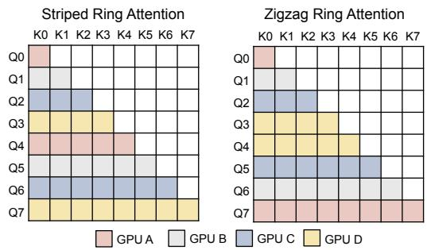  
Figure 1: Workload distribution over 4 CP workers (GPUs) in Striped and Zigzag Ring Attention.

lated via P2P communication—essential for Grouped Query Attention. Under causal full attention, both variants maintain balanced workload across workers.

## 3 Motivation

## 3.1 Long-context Training is Dynamic Sparse

The dynamic sparsity of attention matrices in pre-trained LLMs—especially under long-context settings—is well-documented [13, 14, 15, 28]. This phenomenon persists during training, often with greater variability. As shown in Fig. 2b, attention sparsity fluctuates significantly across training steps and input samples. Different model checkpoints yield distinct sparsity patterns even for the same input, reflecting temporal dynamics across training. Conversely, a single checkpoint may produce diverse sparse regions across inputs. These observations underscore the need for dynamic sparsity adaptation during training.

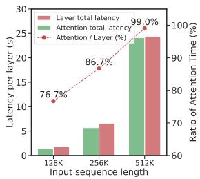

(a) Attention incurs heavy cost.  
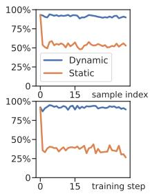  
(b) Dynamic.

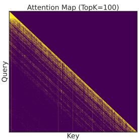  
(c) Attention forward.

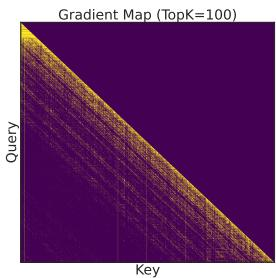  
(d) Attention backward.  
Figure 2: (a) Latency breakdown of the training stage. (b) The attention recall of top-k(k=1024) from 128K context in different sample and training step. (c-d) Visualization of attention weights (c) and their gradients (d) during training. Results are based on Qwen2.5-3B [21] trained with a 4×8 A100 cluster.

## 3.2 Attention Training Sparsity Exhibits Patterns

Based on the attention computation equations, we can derive the gradients of the attention weights $( S = Q K ^ { \top } / \sqrt { d _ { k } } , A = \operatorname { s o f t m a x } ( S ) )$ as well as those of Q, K, and V , as shown in Eq. 1 and Eq. 2.

$$
{ \frac { \partial { \mathcal { L } } } { \partial S } } = A \odot \left( { \frac { \partial { \mathcal { L } } } { \partial A } } - \sum _ { j } { \frac { \partial { \mathcal { L } } } { \partial A _ { i j } } } A _ { i j } \right)\tag{1}
$$

By substituting $\frac { \partial \mathcal { L } } { \partial S }$ into the gradient expression of attention (Eq. 2), we observe that all matrix operations (i.e., GEMMs) in the backward pass depend on the attention weights A. Consequently, the dynamic sparsity in the backward can be viewed as a superposition of the forward-phase sparsity.

As shown in Fig. 2c and Fig. 2d, the gradient $\frac { \partial \mathcal { L } } { \partial S }$ exhibits sparse patterns that closely mirror those in the forward pass. Notably, the backward gradients display structured sparsity, consistently following a Vertical-Slash locality pattern throughout training.

We further attribute the emergence of this pattern to the use of relative position embeddings, specifically RoPE [29]. Let the query vector $\boldsymbol { q _ { n } } ^ { \star } \in \mathbb { R } ^ { 1 \times d }$ and key vector $\boldsymbol { k } _ { m } ^ { \star } \in \mathbb { R } ^ { 1 \times d }$ denote the token representations at positions $n , m \in \{ 0 , \ldots , N { - } 1 \}$ in a sequence of length N . We define $z _ { n , m }$ as the dot product between the RoPE-transformed query and key vectors at positions n and m, respectively.

Theorem 3.1. The expectation of the attention weights after applying RoPE depends solely on the relative position $n - m ,$ i.e., $\begin{array} { r } { E [ z _ { n , m } ] = \sum _ { i = 0 } ^ { d - 1 } \phi _ { n - m } ^ { ( i ) } A _ { i } + \sum _ { i = 0 } ^ { d - 1 } \psi _ { n - m } ^ { ( i ) } B _ { i } } \end{array}$

Based on Theorem 3.1 (proved in Appendix B), we derive two key insights: 1) Attention matrix with RoPE exhibit a Vertical-Slash coverage pattern. The "slash" structure arises from the dependence of expected attention weights on the relative position $n - m$ , while the "vertical" component results from outliers in the query/key distributions, as described in Eq. 10; 2) Attention matrix with RoPE tend to form banded sparse activation patterns. Since $\phi _ { . n - m } ^ { ( i ) }$ and $\psi _ { n - m } ^ { ( i ) }$ are continuous in the relative position $n - m$ , and the coefficients $A _ { i }$ and $B _ { i }$ in $\mathbb { E } [ z _ { n , m } ]$ are position-independent, activations tend to cluster locally around specific relative positions.

## 3.3 Distributed Dynamic Sparse Attention is Imbalanced

Distributed dynamic sparse attention introduces new challenges absent in single-node settings—most notably, worker- and step-level imbalance. As shown in Fig. 3a, the dynamic sparsity leads to uneven FLOPs across workers, causing worker-level imbalance where faster workers idle due to synchronization barriers. For example, with xAttention [28] at 95% sparsity and 32-way context parallelism, the imbalance degree reaches 3.17—reducing realized speedup to one-third of the theoretical maximum.

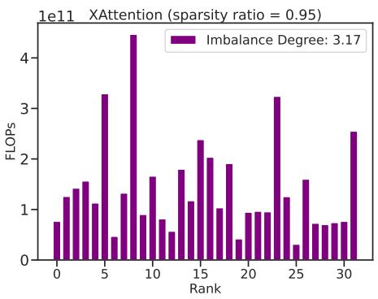  
(a) Imbalance in computation (FLOPs) across CP workers using XAttention [28]. Imbalance degree = max/mean.

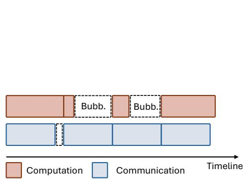  
(b) Illustration of the bubble resulting from steplevel imbalance, where computation and communication are not overlapped.  
Figure 3: Illustration of worker- and step-level load imbalance problems introduced by dynamic sparse attention in distributed LLM training.

In contrast, step-level imbalance refers to fluctuations in a single worker’s computational load across Ring Attention steps, driven by varying sparsity patterns and sample complexity. As shown in Fig. 3b, this variation causes uneven workloads over time. When computation is reduced due to high sparsity, it may fall below communication latency, making it harder to overlap compute and communication—leading to performance-degrading bubbles.

## 4 MTraining

Building on the analysis in §3, we propose MTraining to accelerate distributed training of ultra-longcontext LLMs. MTraining comprises three components: 1) Dynamic Sparse Training Pattern, tailored for the highly dynamic sparsity observed during training; 2) Balanced Sparse Ring Attention, which uses a stripe-based layout to address worker- and step-level imbalance; 3) Hierarchical Sparse Ring Attention, which leverages heterogeneous intra-/inter-node bandwidth in the InfiniteBranch topology for efficient sparse communication.

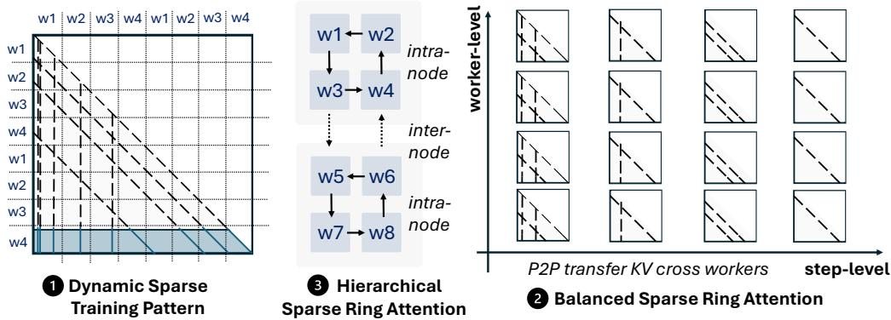  
Figure 4: Overview of MTraining in distributed scenarios.

## 4.1 Dynamic Sparse Training Pattern

Motivated by both empirical observations and theoretical validation of the Vertical-Slash pattern during training (see §3.2 and Appendix B), we extend this dynamic sparse attention—originally designed for inference [14, 15]—to the training stage. Building on MInference and FlexPrefill, we propose a novel training-oriented dynamic sparse pattern guided by Vertical-Slash structure. As detailed in Algorithm 1, our approach incorporates two key components:

(i) Online Budget Approximation. To accommodate the dynamic variation in sparsity patterns across training steps and contexts, as well as to eliminate the overhead of offline search, we propose an online budget approximation method. Specifically, we track attention weight statistics within an observation window and estimate the minimal number of vertical and slash lines required to recall

a target proportion of attention mass.

(ii) Kernel-Aware Approximation Granularity. Since vertical and slash patterns operate at different granularities in the kernel, we match the approximation resolution accordingly: vertical lines are estimated at the token level, while slash lines are pooled over 64x64 blocks. This alignment ensures fidelity between budget estimation and actual kernel execution.

## 4.2 Balanced Sparse Ring Attention

As discussed in §2 and §3.3, both ZigZag and Striped implementations of Ring Attention achieve balanced computation under full attention with a causal mask. However, in dynamic sparse attention settings, their distinct activation patterns lead to worker- and step-level imbalance. As shown in Fig. 5a and Fig. 13, ZigZag distributes computation along the anti-diagonal across workers and shifts along the diagonal over steps, while Striped follows the opposite: distributing along the diagonal and shifting along the anti-diagonal. These differing spatiotemporal patterns result in significant load imbalance under dynamic, data-dependent sparsity.

Algorithm 1 Dynamic Sparse Training Head   
Input: $Q , K , V \in \mathbb { R } ^ { S \times d _ { h } } , p _ { v } , p _ { s } \in \mathbb { 1 }$   
$\bar { B _ { s } } \in \mathbb { N }$   
# Approximate attention using last\_q   
$\hat { A } \gets \mathrm { s o f t m a x } \left( Q _ { [ - \mathrm { l a s t \_ q } ; ] } K ^ { \top } / \sqrt { d } + m _ { \mathrm { c a s u a l } } \right)$   
# Online approximation of vertical budgets $k _ { v }$   
and Top-K indices   
$k _ { v } \gets \mathrm { t o p p } \left( \mathrm { s u m } _ { v } ( \hat { A } ) , p _ { v } \right)$   
$i _ { v } \gets \mathrm { a r g t o p k } \left( \mathrm { s u m } _ { v } ( \hat { A } ) , k _ { v } \right)$   
# Online approximation of slash budgets ks   
and Top-K indices   
$k _ { s } \gets \mathrm { t o p p } \left( \mathrm { P o o l } ( \mathrm { s u m } _ { v } ( \hat { A } ) , B _ { s } ) , p _ { s } \right)$   
$i _ { s } \gets \mathrm { a r g t o p k } \left( \mathrm { s u m } _ { s } ( \hat { A } ) , k _ { s } \right)$   
$\# B u i l d s p a r s e a t t e n t i o n i n d e x$   
$i _ { v s } \gets \mathrm { s p a r s e f o r m a t } ( i _ { v } , i _ { s } )$   
# Dynamic Sparse Flash-Attention   
$\pmb { y } \gets \mathrm { s p a r s e } ( \mathrm { s o f t m a x } \left( Q \pmb { K } ^ { \top } / \sqrt { d } \right) \pmb { V } , i _ { v s } )$   
return y

To address this, we propose Balanced Sparse Ring Attention, a system–algorithm co-design approach comprising the following key components:

(i) Striped Sparse Ring Attention. As shown in §3.2 and §4.1, RoPE-based attention during training predominantly exhibits a Vertical-Slash sparsity pattern, where slash components dominate the computation due to block-wise GPU operations. To balance workload across workers, we align them along the diagonal direction and propose a striped dynamic sparse ring attention scheme. As shown in Fig. 5a, this design evenly distributes slash lines across workers, allowing each to process contiguous slash regions at each step.

(ii) Block-level Striped Sparse Ring Attention. Due to the block-level computation of slash operations and their spatial locality, we introduce block-level striped sparse ring attention. We adopt a 64-token stripe granularity to preserve coherence, avoid fragmentation from token-level striping, and maintain kernel sparsity and efficiency. This alignment also reduces index overhead and improves runtime performance.

(iii) Step-level Balanced Ring Attention. Our block-level striped design also mitigates step-level imbalance. In ultra-long-context settings, workers process fine-grained stripes at each step—for example, with 128 workers and a 512K sequence, each worker handles 64 block stripes sequentially. This repeated, fine-grained partitioning stabilizes computation across steps, ensuring more consistent workload distribution.

## 4.3 Hierarchical Balanced Sparse Ring Attention

Ring Attention typically overlaps computation and communication by concurrently executing matmul and communication kernels [19]. However, with dynamic sparsity, reduced per-worker computation amplifies communication overhead, making it a dominant bottleneck. Thus, mitigating communication cost is critical for efficient distributed training under sparse regimes.

In distributed training with heterogeneous communication links, inter-node communication often becomes the bottleneck in Ring Attention. For example, inter-node bandwidth (e.g., 25 GB/s InfiniBand HDR) is typically 3–12× slower than intra-node links such as NVLink 3.0 (300 GB/s) or PCIe 5.0. Recent works [9, 30] have explored hierarchical communication topologies to reduce latency under such bandwidth asymmetry. Inspired by [30], we propose Hierarchical Balanced Sparse Ring Attention to mitigate inter-node communication overhead in sparse ring attention.

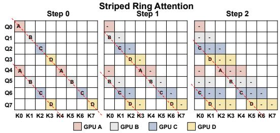  
(a) Balanced Stripped Sparse Ring Attention.

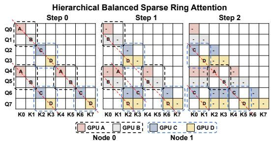  
(b) Hierarchical Balanced Sparse Ring Attention.  
Figure 5: Step-level Computation Schedule of Striped Ring Attention (a) and Hierarchical Striped Ring Attention (b) with 4 CP workers.

Specifically, as shown in Fig. 5b, our approach incorporates the following design:

(i) Inner- and Outer-Ring Hierarchical Ring Attention. We decompose the global ring communication into two hierarchical levels: an inner ring and an outer ring. In the inner ring, key–value (KV) blocks are circulated among the $G _ { \mathrm { n o d e } }$ GPUs within each compute node. The outer ring handles communication across $N _ { \mathrm { n o d e } }$ nodes by exchanging aggregated KV buffers. At each outer-ring step, the schedule proceeds as follows: 1) Post Outer P2P. A non-blocking P2P communication operation is initiated, transmitting the current KV chunk of the local node to the next node and posting a matching receive. 2) Inner-Ring Attention. While the inter-node transfer is in progress, the GPUs enter a loop of length $G _ { \mathrm { n o d e } }$ , performing sparse ring attention computations over the local KV slices within the node. 3) Synchronize. At the end of each outer step, computation and communication are synchronized before moving to the next outer-ring iteration.

(ii) Hierarchical Balanced Sparse Ring Attention. Unlike full attention, applying hierarchical ring attention in the sparse setting alters the propagation order of key/value blocks across workers, potentially impacting attention computation patterns. However, as shown in Fig. 5b, even with a two-level KV transfer (inner and outer ring), computation remains diagonally aligned across steps, preserving the Vertical-Slash pattern and maintaining load balance.

By integrating this hierarchical design into sparse ring attention in MTraining, inter-node KV transfers are fully overlapped with inner-ring computation, effectively mitigating communication overhead from inter-node data movement.

## 5 Experiments

In this section, we address the following three research questions: (i) How effective is MTraining in the training stage? We evaluate its performance in long-context extension training scenarios. (ii) How effective is the model trained with MTraining on downstream tasks? We evaluate its performance on three representative long-context benchmarks: RULER, Needle-in-a-Haystack, InfiniteBench, and long-context language modeling. (iii) How efficient is MTraining during training? We analyze the end-to-end training latencies across different numbers of GPU workers and sequence lengeths to assess the scalability and efficiency of MTraining under various distributed configurations. In addition, fine-grained analysis on worker- and step-level balance are provided.

## 5.1 Implementation Details

We conduct experiments using the state-of-the-art open-source LLM Qwen2.5-3B [21], trained on a 4×8 Nvidia A100 40GB cluster. The interconnect includes both InfiniBand and NVLink for high-throughput communication. For attention computation, we employ Context Parallelism = 32. For the remaining components, we use NNScaler [31] to automatically search for the optimal parallelism configuration. To reduce memory consumption, we adopt Zero-2 with offloading [32], along with gradient accumulation [33] and gradient checkpointing [34]. All training and inference are performed using the bfloat16 format. We implement a lightweight custom CUDA kernel that builds upon FlashAttention [26], BlockSparse Attention [35], and the PIT dynamic sparse compiler [36] to support our method efficiently. For inference evaluation, we use vLLM [37] with greedy decoding to ensure stable and deterministic results across all experiments. Additional experimental details are provided in Appendix E.

## 5.2 Long-context Training

Long-context Extension Training We evaluate our method in the long-context extension stage of training. Specifically, we extend the context window of Qwen2.5-3B from 32K to 512K tokens using Yarn [38] extrapolated RoPE, with a scaling factor set to 32. Based on this configuration, we perform context extension training on the ProLong dataset [12], with a maximum sequence length of 512K tokens, training over 1B tokens for 1 epoch. The averaged sparsity ratio profiled over all data samples with Qwen2.5-3B and MTraining is 0.95. Further training experiments are done on Llama-3.1-8B-Instruct [11] for 2B tokens for evaluating the scalability of MTraining to larger models and different model architectures, which can be found in Appendix A. Considering the effectiveness of MTraining is not coupled with any specific model scale or architectures, we focus on the case of Qwen in main text.

Baselines We compare our method against four distributed attention training baselines: 1) Dense Attention Training. As dense attention yields balanced computation, we report the best results among both ZigZag and Striped ring attention implementations. 2) MoBA [18], a block-level dynamic sparse attention training method designed for long-context training, which we adapt its open-source implementation to run with Zigzag ring attention. 3) Ours w/ ZigZag, using ZigZag sparse ring attention without inter-node communication optimization. 4) Ours w/o Hierarchical, only using Striped sparse ring attention without employing the hierarchical communication scheme. 5) Ours w/ XAttn Idx. indicate XAttention is applied for computing the block sparse index.

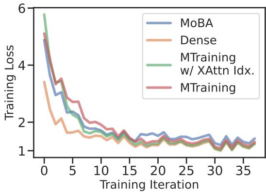  
(a) Training Loss Curve.

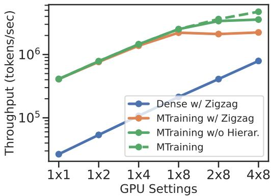  
(b) Training Throughput.  
Figure 6: The training loss and throughput comparison of different methods during continued pretraining of Qwen2.5-3B on the ProLong dataset with a 512K token context window.

Training Loss As shown in Fig. 6a, we observe the following trends: 1) In the early training stages, Full Attention achieves faster loss reduction compared to all baselines. However, in later stages, the training loss of our method closely approaches that of Full Attention, demonstrating strong convergence. 2) MoBA exhibits a faster initial decline in training loss compared to our method, but its performance deteriorates in later steps, resulting in a significantly higher final training loss than both our method and Full Attention. This may be attributed to the mismatch between its coarse-grained block-based sparsity index and the actual fine-grained attention activations, leading to representational inefficiency.

## 5.3 Long-context Downstream Tasks

Benchmark and Metrics We use the following benchmarks and metrics to evaluate the effectiveness of MTraining: 1) RULER [22], a comprehensive benchmark comprising 13 tasks across 4 categories, including retrieval, multi-hop reasoning, information aggregation, and question answering. 2) Needle In A Haystack (NIAH) [23] assesses LLMs’ performance to retrieve key information placed at various positions in a long context. 3) PG19 [25], a long-form language modeling benchmark with sequences up to 300K tokens. We report perplexity to measure language modeling performance. 4) InfiniteBench [24] is a comprehensive benchmark for long-context language processing, including question answering, code debugging, summarization etc., with average context length of 214K tokens.

Table 1: Performance (%) of various training–inference combinations on RULER [22] at context lengths from 16K to 512K with the long-context-extended Qwen2.5-3B.
<table><tr><td>Training</td><td>Inference</td><td>16K</td><td>32K</td><td>64K</td><td>128K</td><td>256K</td><td>512K</td><td>Avg.</td></tr><tr><td>Dense</td><td>Dense</td><td>72.51</td><td>67.83</td><td>58.46</td><td>52.38</td><td>55.91</td><td>54.15</td><td>60.21</td></tr><tr><td>Dense</td><td>MInference</td><td>54.58</td><td>54.97</td><td>49.85</td><td>43.93</td><td>38.83</td><td>41.10</td><td>47.21</td></tr><tr><td>MoBA</td><td>Dense</td><td>64.61</td><td>55.06</td><td>45.44</td><td>38.24</td><td>35.48</td><td>34.99</td><td>45.64</td></tr><tr><td> MTraining w/ XAttn Idx.</td><td>Dense</td><td>75.04</td><td>67.97</td><td>58.93</td><td>51.43</td><td>56.96</td><td>54.85</td><td>60.86</td></tr><tr><td> MTraining</td><td> Dense</td><td>76.13</td><td> 70.51</td><td>60.81</td><td> 58.65</td><td> 58.33</td><td> 54.88</td><td>63.22</td></tr><tr><td> MTraining</td><td> MInference</td><td>75.44</td><td>69.60</td><td>62.92</td><td>53.19</td><td> 51.59</td><td>50.85</td><td>60.60</td></tr></table>

RULER To further evaluate long-context capability, we benchmark MTraining on RULER, a stateof-the-art long-context evaluation suite. As shown in Table 1, MTraining consistently outperforms baselines across various context lengths. Compared to dense training, MTraining achieves 3% and 13.4% overall improvement under dense and MInference-based inference, respectively—reaching up to 6.3% gain at 128K tokens. Additionally, MTraining outperforms its variant with fixed XAttn indexing by 2.4%, highlighting that training-time dynamics affect the representativeness of antidiagonal structures.

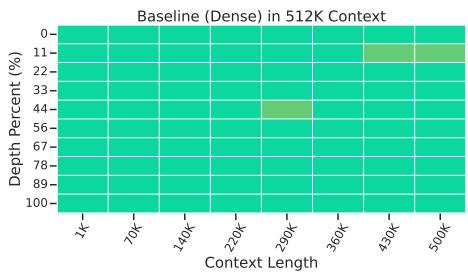  
(a) Full Attention

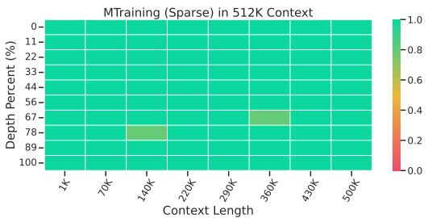  
(b) MTraining  
Figure 7: Needle In A Haystack Results of the baseline checkpoint and the MTraining checkpoint.

Needle In A Haystack As shown in Fig. 7, MTraining achieves near-perfect retrieval performance on the NIAH. Comparing to the baseline, MTraining yields a better overall retrieval accuracy, despite MTraining’s largely reduced computational cost. We also report the NIAH results of the baseline and the MTraining checkpoint w/ MInference in the inference stage shown in Fig. 11, where MTraining w/ MInference also achieves a better overall retrieval accuracy than the baseline checkpoint.

Language Modeling We evaluate the language modeling performance of MTraining against the baselines on the PG19 dataset with perplexity as the metric. As shown in Fig. 8, MTraining well maintains a comparable perplexity to the dense baseline across different context lengths. And the same results also hold when MInference is used in the inference stage.

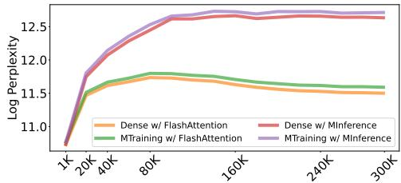

## InfiniteBench As shown in Table 2, MTraining

Figure 8: Language Modeling Results on PG19.

achieves superior performance on InfiniteBench compared to the dense baseline. Specifically, MTraining improves the coding and summarization capabilities compared to the baseline, while maintaining a competitive performance on the question answering tasks. We also report the results with MInference in the inference stage, which also shows a similar trend.

## 5.4 Efficiency Results

Fig. 6b illustrates the training throughput, of different methods under distributed worker counts. Notably, MTraining achieves up to 6× end-toend training speedup at a 512K context length. Compared to Ours w/ ZigZag, and Ours w/o Hierarchical, our method is respectively 2.1× and 1.3× faster.

Table 2: Performance (%) on InfiniteBench [24].
<table><tr><td>Methods</td><td colspan="5">En.Sum En.QA En.MC En.Dia Code.Debug Avg.</td></tr><tr><td>Dense</td><td>18.5</td><td>8.2</td><td>63.5</td><td>6.0</td><td>26.3</td><td>24.5</td></tr><tr><td>w/MInference</td><td>17.4</td><td>6.7</td><td>63.0</td><td>4.4</td><td>17.0</td><td>21.7</td></tr><tr><td>MTraining</td><td>19.5</td><td>6.8</td><td>65.3</td><td>3.5</td><td>34.1</td><td>25.8</td></tr><tr><td>w/MInference</td><td>19.5</td><td>6.7</td><td>63.3</td><td>5.0</td><td>15.5</td><td>22.0</td></tr></table>

Moreover, MTraining achieves near-linear throughput scaling with increasing worker count, enabling scalable dynamic sparse attention. In contrast, baseline methods degrade significantly in distributed settings, yielding speedups well below their theoretical limits.

## 5.5 Analysis

MTraining Effectively Reduces Worker- and Step-Level Imbalance in Distributed Dynamic Sparse Attention As shown in Fig. 12, MTraining significantly reduces worker- and step-level imbalance in dynamic sparse attention. The ratio between the maximum and average computation time drops by 2.4x and 2.3x, respectively, enabling near-linear scaling in distributed settings. Furthermore, Balanced Sparse Ring Attention and Hierarchical Sparse Ring Attention reduce worker-level imbalance by 2.1× and 1.2×, and step-level imbalance by 2.2× and 1.03×, respectively.

## 6 Related Work

Long-context Training System To scale long-context LLM training, various parallelization strategies have been developed, including activation parallelism[39], distributed attention methods[40, 19], and offloadingbased approaches[41]. Among them, Ring Attention[19] offers the best scalability by distributing KV computation via P2P communication with block-wise computation. However, it still faces two key challenges: communication overhead and worker imbalance. Variants such as Striped[20] and Zigzag Ring Attention[27] address imbalance, while hybrid systems [42, 30] combine the benefits of Ring Attention and Ulysses. More recent work [43, 44, 45] im-

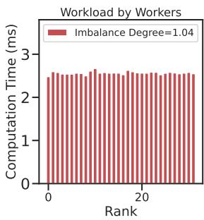

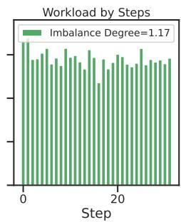  
Figure 9: Distribution of attention computation time in MTraining with 512K tokens on 32 GPUs: across CP workers within a fixed Ring Attention step (Left) and across Ring Attention steps for a fixed worker (Right).

proves scheduling for heterogeneous sequence lengths induced by sequence packing[46], and Magi-Attention[47] further boosts efficiency through fused kernels and overlapped communication. Despite these advancements, all existing methods rely on dense attention, with none incorporating dynamic sparse attention, a key technique for reducing computational cost at extreme sequence lengths.

Scaling Context Windows of LLMs Several approaches have been proposed to scale the context window of LLMs, which can be broadly categorized into three groups: 1) Staged pretraining [9, 10, 11, 12], which trains the model in multiple stages using data of increasing sequence lengths; 2) Positional embedding manipulation, including extrapolation[29, 48, 12, 49] and interpolation[50, 38], which adjust positional encodings to extend models’ sensitivity to longer inputs; 3) Length extrapolation [51, 52, 53], where models trained on short sequences are expected to generalize to longer contexts.

Efficiency Enhancement for Long-Context LLMs For Transformer-based LLMs, extensive research has focused on improving computational and memory efficiency as input lengths increase. These efforts largely fall into two categories: 1) KV cache optimization, including quantization [54, 55], sharing [56, 57, 58, 59], and offloading [60, 61]; 2) Attention efficiency, aimed at mitigating the quadratic cost of self-attention, using static or clustered sparse patterns [62, 63, 64] and dynamic sparse attention [14, 65, 15, 13, 28, 16, 66, 67]. Recent works such as NSA[17] and MoBA[18] leverage dynamic sparse attention during pretraining to achieve significant speedups with near-lossless accuracy compared to dense baselines. However, scaling dynamic sparse attention efficiently in distributed training remains an open problem.

## 7 Conclusion

We propose MTraining, a distributed training methodology that leverages dynamic sparse attention to enable efficient large-scale training of LLMs with ultra-long contexts. MTraining addresses the key challenges of worker-level and step-level imbalance, making it feasible to scale dynamic sparse attention in distributed settings. MTraining consists of three core components: a dynamic sparse training pattern, balanced sparse ring attention, and hierarchical sparse ring attention. The latter two reduce worker-level imbalance by 2.1× and 1.2×, and step-level imbalance by 2.2× and 1.03×, respectively. We validate MTraining by extending Qwen2.5-3B to a 512K context window via continued pretraining on the ProLong dataset using 32 A100 GPUs. Evaluations on long-context benchmarks—RULER, PG-19, InfiniteBench, and Needle in a Haystack—demonstrate up to 6× training throughput in 512K-token-length data, while maintaining or improving model accuracy.

## References

[1] Avi Caciularu, Matthew E Peters, Jacob Goldberger, Ido Dagan, and Arman Cohan. Peek across: Improving multi-document modeling via cross-document question-answering. arXiv preprint arXiv:2305.15387, 2023.

[2] Yubo Ma, Yuhang Zang, Liangyu Chen, Meiqi Chen, Yizhu Jiao, Xinze Li, Xinyuan Lu, Ziyu Liu, Yan Ma, Xiaoyi Dong, et al. Mmlongbench-doc: Benchmarking long-context document understanding with visualizations. arXiv preprint arXiv:2407.01523, 2024.

[3] Carlos E Jimenez, John Yang, Alexander Wettig, Shunyu Yao, Kexin Pei, Ofir Press, and Karthik Narasimhan. Swe-bench: Can language models resolve real-world github issues? arXiv preprint arXiv:2310.06770, 2023.

[4] Naman Jain, King Han, Alex Gu, Wen-Ding Li, Fanjia Yan, Tianjun Zhang, Sida Wang, Armando Solar-Lezama, Koushik Sen, and Ion Stoica. Livecodebench: Holistic and contamination free evaluation of large language models for code. In The Thirteenth International Conference on Learning Representations, 2025.

[5] OpenAI. Introducing deep research. https://openai.com/index/ introducing-deep-research/. Accessed: Feb 2, 2025.

[6] Manus. Leave it to manus. https://manus.im/. Accessed: May 15, 2025.

[7] Daya Guo, Dejian Yang, Haowei Zhang, Junxiao Song, Ruoyu Zhang, Runxin Xu, Qihao Zhu, Shirong Ma, Peiyi Wang, Xiao Bi, et al. Deepseek-r1: Incentivizing reasoning capability in llms via reinforcement learning. arXiv preprint arXiv:2501.12948, 2025.

[8] An Yang, Anfeng Li, Baosong Yang, Beichen Zhang, Binyuan Hui, Bo Zheng, Bowen Yu, Chang Gao, Chengen Huang, Chenxu Lv, Chujie Zheng, Dayiheng Liu, Fan Zhou, Fei Huang, Feng Hu, Hao Ge, Haoran Wei, Huan Lin, Jialong Tang, Jian Yang, Jianhong Tu, Jianwei Zhang, Jianxin Yang, Jiaxi Yang, Jing Zhou, Jingren Zhou, Junyang Lin, Kai Dang, Keqin Bao, Kexin Yang, Le Yu, Lianghao Deng, Mei Li, Mingfeng Xue, Mingze Li, Pei Zhang, Peng Wang, Qin Zhu, Rui Men, Ruize Gao, Shixuan Liu, Shuang Luo, Tianhao Li, Tianyi Tang, Wenbiao Yin, Xingzhang Ren, Xinyu Wang, Xinyu Zhang, Xuancheng Ren, Yang Fan, Yang Su, Yichang Zhang, Yinger Zhang, Yu Wan, Yuqiong Liu, Zekun Wang, Zeyu Cui, Zhenru Zhang, Zhipeng Zhou, and Zihan Qiu. Qwen3 technical report. arXiv preprint arXiv:2407.10671, 2025.

[9] Aixin Liu, Bei Feng, Bing Xue, Bingxuan Wang, Bochao Wu, Chengda Lu, Chenggang Zhao, Chengqi Deng, Chenyu Zhang, Chong Ruan, et al. Deepseek-v3 technical report. arXiv preprint arXiv:2412.19437, 2024.

[10] An Yang, Bowen Yu, Chengyuan Li, Dayiheng Liu, Fei Huang, Haoyan Huang, Jiandong Jiang, Jianhong Tu, Jianwei Zhang, Jingren Zhou, et al. Qwen2. 5-1m technical report. arXiv preprint arXiv:2501.15383, 2025.

[11] Aaron Grattafiori, Abhimanyu Dubey, Abhinav Jauhri, Abhinav Pandey, Abhishek Kadian, Ahmad Al-Dahle, Aiesha Letman, Akhil Mathur, Alan Schelten, Alex Vaughan, et al. The llama 3 herd of models. arXiv preprint arXiv:2407.21783, 2024.

[12] Tianyu Gao, Alexander Wettig, Howard Yen, and Danqi Chen. How to train long-context language models (effectively). arXiv preprint arXiv:2410.02660, 2024.

[13] Jiaming Tang, Yilong Zhao, Kan Zhu, Guangxuan Xiao, Baris Kasikci, and Song Han. QUEST: Query-aware sparsity for efficient long-context LLM inference. In Forty-first International Conference on Machine Learning, 2024.

[14] Huiqiang Jiang, Yucheng Li, Chengruidong Zhang, Qianhui Wu, Xufang Luo, Surin Ahn, Zhenhua Han, Amir Abdi, Dongsheng Li, Chin-Yew Lin, et al. Minference 1.0: Accelerating pre-filling for long-context llms via dynamic sparse attention. Advances in Neural Information Processing Systems, 37:52481–52515, 2024.

[15] Xunhao Lai, Jianqiao Lu, Yao Luo, Yiyuan Ma, and Xun Zhou. Flexprefill: A contextaware sparse attention mechanism for efficient long-sequence inference. In The Thirteenth International Conference on Learning Representations, 2025.

[16] Luka Ribar, Ivan Chelombiev, Luke Hudlass-Galley, Charlie Blake, Carlo Luschi, and Douglas Orr. Sparq attention: Bandwidth-efficient LLM inference. In Forty-first International Conference on Machine Learning, 2024.

[17] Jingyang Yuan, Huazuo Gao, Damai Dai, Junyu Luo, Liang Zhao, Zhengyan Zhang, Zhenda Xie, YX Wei, Lean Wang, Zhiping Xiao, et al. Native sparse attention: Hardware-aligned and natively trainable sparse attention. arXiv preprint arXiv:2502.11089, 2025.

[18] Enzhe Lu, Zhejun Jiang, Jingyuan Liu, Yulun Du, Tao Jiang, Chao Hong, Shaowei Liu, Weiran He, Enming Yuan, Yuzhi Wang, et al. Moba: Mixture of block attention for long-context llms. arXiv preprint arXiv:2502.13189, 2025.

[19] Hao Liu, Matei Zaharia, and Pieter Abbeel. Ring attention with blockwise transformers for near-infinite context. In The Twelfth International Conference on Learning Representations, 2024.

[20] William Brandon, Aniruddha Nrusimha, Kevin Qian, Zachary Ankner, Tian Jin, Zhiye Song, and Jonathan Ragan-Kelley. Striped attention: Faster ring attention for causal transformers. arXiv preprint arXiv:2311.09431, 2023.

[21] An Yang, Baosong Yang, Beichen Zhang, Binyuan Hui, Bo Zheng, Bowen Yu, Chengyuan Li, Dayiheng Liu, Fei Huang, Haoran Wei, et al. Qwen2. 5 technical report. arXiv preprint arXiv:2412.15115, 2024.

[22] Cheng-Ping Hsieh, Simeng Sun, Samuel Kriman, Shantanu Acharya, Dima Rekesh, Fei Jia, and Boris Ginsburg. RULER: What’s the real context size of your long-context language models? In First Conference on Language Modeling, 2024.

[23] Greg Kamradt. Needle in a haystack - pressure testing llms, 2023.

[24] Xinrong Zhang, Yingfa Chen, Shengding Hu, Zihang Xu, Junhao Chen, Moo Hao, Xu Han, Zhen Thai, Shuo Wang, Zhiyuan Liu, and Maosong Sun. Infinitebench: Extending long context evaluation beyond 100K tokens. In Lun-Wei Ku, Andre Martins, and Vivek Srikumar, editors, Proceedings of the 62nd Annual Meeting of the Association for Computational Linguistics (Volume 1: Long Papers), pages 15262–15277, Bangkok, Thailand, 2024. Association for Computational Linguistics.

[25] Jack W Rae, Anna Potapenko, Siddhant M Jayakumar, and Timothy P Lillicrap. Compressive transformers for long-range sequence modelling. arXiv preprint arXiv:1911.05507, 2019.

[26] Tri Dao, Dan Fu, Stefano Ermon, Atri Rudra, and Christopher Ré. Flashattention: Fast and memory-efficient exact attention with io-awareness. Advances in neural information processing systems, 35:16344–16359, 2022.

[27] Zilin Zhu. [Feature request] balancing computation with zigzag blocking. https://github. com/zhuzilin/ring-flash-attention/issues/2, February 2024. GitHub issue #2; accessed 13 May 2025.

[28] Ruyi Xu, Guangxuan Xiao, Haofeng Huang, Junxian Guo, and Song Han. Xattention: Block sparse attention with antidiagonal scoring. arXiv preprint arXiv:2503.16428, 2025.

[29] Jianlin Su, Murtadha Ahmed, Yu Lu, Shengfeng Pan, Wen Bo, and Yunfeng Liu. Roformer: Enhanced transformer with rotary position embedding. Neurocomputing, 568:127063, 2024.

[30] Diandian Gu, Peng Sun, Qinghao Hu, Ting Huang, Xun Chen, Yingtong Xiong, Guoteng Wang, Qiaoling Chen, Shangchun Zhao, Jiarui Fang, et al. Loongtrain: Efficient training of long-sequence llms with head-context parallelism. arXiv preprint arXiv:2406.18485, 2024.

[31] Zhiqi Lin, Youshan Miao, Quanlu Zhang, Fan Yang, Yi Zhu, Cheng Li, Saeed Maleki, Xu Cao, Ning Shang, Yilei Yang, et al. {nnScaler}:{Constraint-Guided} parallelization plan generation for deep learning training. In 18th USENIX Symposium on Operating Systems Design and Implementation (OSDI 24), pages 347–363, 2024.

[32] Samyam Rajbhandari, Jeff Rasley, Olatunji Ruwase, and Yuxiong He. Zero: Memory optimizations toward training trillion parameter models. In SC20: International Conference for High Performance Computing, Networking, Storage and Analysis, pages 1–16. IEEE, 2020.

[33] Yanping Huang, Youlong Cheng, Ankur Bapna, Orhan Firat, Dehao Chen, Mia Chen, HyoukJoong Lee, Jiquan Ngiam, Quoc V Le, Yonghui Wu, et al. Gpipe: Efficient training of giant neural networks using pipeline parallelism. Advances in neural information processing systems, 32, 2019.

[34] Tianqi Chen, Bing Xu, Chiyuan Zhang, and Carlos Guestrin. Training deep nets with sublinear memory cost. arXiv preprint arXiv:1604.06174, 2016.

[35] Junxian Guo, Haotian Tang, Shang Yang, Zhekai Zhang, Zhijian Liu, and Song Han. Block Sparse Attention. https://github.com/mit-han-lab/Block-Sparse-Attention, 2024.

[36] Ningxin Zheng, Huiqiang Jiang, Quanlu Zhang, Zhenhua Han, Lingxiao Ma, Yuqing Yang, Fan Yang, Chengruidong Zhang, Lili Qiu, Mao Yang, et al. Pit: Optimization of dynamic sparse deep learning models via permutation invariant transformation. In Proceedings of the 29th Symposium on Operating Systems Principles, pages 331–347, 2023.

[37] Woosuk Kwon, Zhuohan Li, Siyuan Zhuang, Ying Sheng, Lianmin Zheng, Cody Hao Yu, Joseph Gonzalez, Hao Zhang, and Ion Stoica. Efficient memory management for large language model serving with pagedattention. In Proceedings of the 29th Symposium on Operating Systems Principles, pages 611–626, 2023.

[38] Bowen Peng, Jeffrey Quesnelle, Honglu Fan, and Enrico Shippole. YaRN: Efficient context window extension of large language models. In The Twelfth International Conference on Learning Representations, 2024.

[39] Vijay Anand Korthikanti, Jared Casper, Sangkug Lym, Lawrence McAfee, Michael Andersch, Mohammad Shoeybi, and Bryan Catanzaro. Reducing activation recomputation in large transformer models. Proceedings of Machine Learning and Systems, 5:341–353, 2023.

[40] Sam Ade Jacobs, Masahiro Tanaka, Chengming Zhang, Minjia Zhang, Reza Yazdani Aminadabi, Shuaiwen Leon Song, Samyam Rajbhandari, and Yuxiong He. System optimizations for enabling training of extreme long sequence transformer models. In Proceedings of the 43rd ACM Symposium on Principles of Distributed Computing, pages 121–130, 2024.

[41] Cheng Luo, Jiawei Zhao, Zhuoming Chen, Beidi Chen, and Anima Anandkumar. Mini-sequence transformers: Optimizing intermediate memory for long sequences training. In The Thirty-eighth Annual Conference on Neural Information Processing Systems, 2024.

[42] Jiarui Fang and Shangchun Zhao. Usp: A unified sequence parallelism approach for long context generative ai. arXiv preprint arXiv:2405.07719, 2024.

[43] Hao Ge, Junda Feng, Qi Huang, Fangcheng Fu, Xiaonan Nie, Lei Zuo, Haibin Lin, Bin Cui, and Xin Liu. Bytescale: Efficient scaling of llm training with a 2048k context length on more than 12,000 gpus. arXiv preprint arXiv:2502.21231, 2025.

[44] Zheng Wang, Anna Cai, Xinfeng Xie, Zaifeng Pan, Yue Guan, Weiwei Chu, Jie Wang, Shikai Li, Jianyu Huang, Chris Cai, et al. Wlb-llm: Workload-balanced 4d parallelism for large language model training. arXiv preprint arXiv:2503.17924, 2025.

[45] Yujie Wang, Shiju Wang, Shenhan Zhu, Fangcheng Fu, Xinyi Liu, Xuefeng Xiao, Huixia Li, Jiashi Li, Faming Wu, and Bin Cui. Flexsp: Accelerating large language model training via flexible sequence parallelism. In Proceedings of the 30th ACM International Conference on Architectural Support for Programming Languages and Operating Systems, Volume 2, pages 421–436, 2025.

[46] Mario Michael Krell, Matej Kosec, Sergio P Perez, and Andrew Fitzgibbon. Efficient sequence packing without cross-contamination: Accelerating large language models without impacting performance. arXiv preprint arXiv:2107.02027, 2021.

[47] Tao Zewei and Huang Yunpeng. Magiattention: A distributed attention towards linear scalability for ultra-long context, heterogeneous mask training. https://github.com/SandAI-org/ MagiAttention/, 2025.

[48] Yiran Ding, Li Lyna Zhang, Chengruidong Zhang, Yuanyuan Xu, Ning Shang, Jiahang Xu, Fan Yang, and Mao Yang. LongroPE: Extending LLM context window beyond 2 million tokens. In Forty-first International Conference on Machine Learning, 2024.

[49] Yutao Sun, Li Dong, Barun Patra, Shuming Ma, Shaohan Huang, Alon Benhaim, Vishrav Chaudhary, Xia Song, and Furu Wei. A length-extrapolatable transformer. In Anna Rogers, Jordan Boyd-Graber, and Naoaki Okazaki, editors, Proceedings of the 61st Annual Meeting of the Association for Computational Linguistics (Volume 1: Long Papers), pages 14590–14604, Toronto, Canada, July 2023. Association for Computational Linguistics.

[50] Shouyuan Chen, Sherman Wong, Liangjian Chen, and Yuandong Tian. Extending context window of large language models via positional interpolation. arXiv preprint arXiv:2306.15595, 2023.

[51] Chenxin An, Fei Huang, Jun Zhang, Shansan Gong, Xipeng Qiu, Chang Zhou, and Lingpeng Kong. Training-free long-context scaling of large language models. In Forty-first International Conference on Machine Learning, 2024.

[52] Hongye Jin, Xiaotian Han, Jingfeng Yang, Zhimeng Jiang, Zirui Liu, Chia-Yuan Chang, Huiyuan Chen, and Xia Hu. LLM maybe longLM: Selfextend LLM context window without tuning. In Forty-first International Conference on Machine Learning, 2024.

[53] Chenxin An, Jun Zhang, Ming Zhong, Lei Li, Shansan Gong, Yao Luo, Jingjing Xu, and Lingpeng Kong. Why does the effective context length of LLMs fall short? In The Thirteenth International Conference on Learning Representations, 2025.

[54] Zirui Liu, Jiayi Yuan, Hongye Jin, Shaochen Zhong, Zhaozhuo Xu, Vladimir Braverman, Beidi Chen, and Xia Hu. KIVI: A tuning-free asymmetric 2bit quantization for KV cache. In Forty-first International Conference on Machine Learning, 2024.

[55] Coleman Hooper, Sehoon Kim, Hiva Mohammadzadeh, Michael W Mahoney, Sophia Shao, Kurt Keutzer, and Amir Gholami. Kvquant: Towards 10 million context length llm inference with kv cache quantization. Advances in Neural Information Processing Systems, 37:1270–1303, 2024.

[56] Yutao Sun, Li Dong, Yi Zhu, Shaohan Huang, Wenhui Wang, Shuming Ma, Quanlu Zhang, Jianyong Wang, and Furu Wei. You only cache once: Decoder-decoder architectures for language models. Advances in Neural Information Processing Systems, 37:7339–7361, 2024.

[57] Daniel Goldstein, Fares Obeid, Eric Alcaide, Guangyu Song, and Eugene Cheah. Goldfinch: High performance rwkv/transformer hybrid with linear pre-fill and extreme kv-cache compression. arXiv preprint arXiv:2407.12077, 2024.

[58] Joshua Ainslie, James Lee-Thorp, Michiel de Jong, Yury Zemlyanskiy, Federico Lebron, and Sumit Sanghai. GQA: Training generalized multi-query transformer models from multi-head checkpoints. In Houda Bouamor, Juan Pino, and Kalika Bali, editors, Proceedings of the 2023 Conference on Empirical Methods in Natural Language Processing, pages 4895–4901, Singapore, December 2023. Association for Computational Linguistics.

[59] Yilong Chen, Linhao Zhang, Junyuan Shang, Zhenyu Zhang, Tingwen Liu, Shuohuan Wang, and Yu Sun. DHA: Learning decoupled-head attention from transformer checkpoints via adaptive heads fusion. In The Thirty-eighth Annual Conference on Neural Information Processing Systems, 2024.

[60] Hongye Jin, Xiaotian Han, Jingfeng Yang, Zhimeng Jiang, Zirui Liu, Chia-Yuan Chang, Huiyuan Chen, and Xia Hu. LLM maybe longLM: Selfextend LLM context window without tuning. In Forty-first International Conference on Machine Learning, 2024.

[61] Wonbeom Lee, Jungi Lee, Junghwan Seo, and Jaewoong Sim. {InfiniGen}: Efficient generative inference of large language models with dynamic {KV} cache management. In 18th USENIX Symposium on Operating Systems Design and Implementation (OSDI 24), pages 155–172, 2024.

[62] Iz Beltagy, Matthew E Peters, and Arman Cohan. Longformer: The long-document transformer. arXiv preprint arXiv:2004.05150, 2020.

[63] Manzil Zaheer, Guru Guruganesh, Kumar Avinava Dubey, Joshua Ainslie, Chris Alberti, Santiago Ontanon, Philip Pham, Anirudh Ravula, Qifan Wang, Li Yang, et al. Big bird: Transformers for longer sequences. Advances in neural information processing systems, 33:17283–17297, 2020.

[64] Nikita Kitaev, Łukasz Kaiser, and Anselm Levskaya. Reformer: The efficient transformer. arXiv preprint arXiv:2001.04451, 2020.

[65] Yucheng Li, Huiqiang Jiang, Chengruidong Zhang, Qianhui Wu, Xufang Luo, Surin Ahn, Amir H. Abdi, Dongsheng Li, Jianfeng Gao, Yuqing Yang, and Lili Qiu. MMInference: Accelerating pre-filling for long-context visual language models via modality-aware permutation sparse attention. In Forty-second International Conference on Machine Learning, 2025.

[66] Jintao Zhang, Chendong Xiang, Haofeng Huang, Jia Wei, Haocheng Xi, Jun Zhu, and Jianfei Chen. Spargeattn: Accurate sparse attention accelerating any model inference. arXiv preprint arXiv:2502.18137, 2025.

[67] Zhuoming Chen, Ranajoy Sadhukhan, Zihao Ye, Yang Zhou, Jianyu Zhang, Niklas Nolte, Yuandong Tian, Matthijs Douze, Leon Bottou, Zhihao Jia, and Beidi Chen. MagicPIG: LSH sampling for efficient LLM generation. In The Thirteenth International Conference on Learning Representations, 2025.

[68] Diederik P Kingma. Adam: A method for stochastic optimization. arXiv preprint arXiv:1412.6980, 2014.

## A Scalability of MTraining

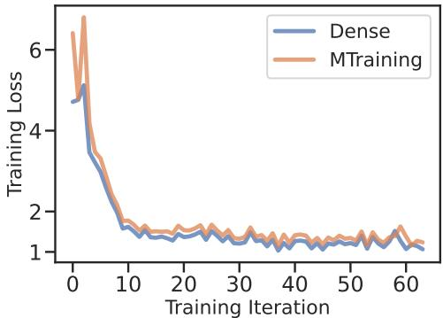  
Figure 10: The training loss comparison of dense attention and MTrainig during continued pretraining of Llama-3.1-8B-Instruct on the ProLong dataset with a 512K-token context window.

Table 3: Performance (%) of various training–inference combinations on RULER [22] at context lengths from 16K to 512K with the long-context-extended Llama-3.1-Instruct-8B.
<table><tr><td>Training</td><td>Inference</td><td>16K</td><td>32K</td><td>64K</td><td>128K</td><td>256K</td><td>512K</td><td> $\mathbf { A v } \mathbf { g } .$ </td></tr><tr><td>Dense</td><td>Dense</td><td>82.58</td><td>80.13</td><td>73.33</td><td>62.17</td><td>59.15</td><td>57.06</td><td>69.07</td></tr><tr><td>Dense</td><td> MInference</td><td>55.22</td><td>45.41</td><td>25.99</td><td>22.40</td><td>19.37</td><td>15.19</td><td>30.60</td></tr><tr><td> MTraining</td><td>Dense</td><td>83.81</td><td>75.73</td><td>70.15</td><td>64.48</td><td>59.47</td><td>54.80</td><td>68.07</td></tr><tr><td> MTraining</td><td> MInference</td><td>82.42</td><td>77.10</td><td>70.67</td><td>65.56</td><td>61.13</td><td> 54.58</td><td>68.58</td></tr></table>

For a more comprehensive evaluation on a larger scale of model size and training tokens, Llama-3.1- 8B-Instruct [11] is further trained on ProLong dataset [12] for 2B tokens with 512K-token length, with Dense Attention and MTraining. Other settings including model initialization, RoPE, learning rate and optimizers follow the Final Recipe (Stage 2 of Continued Pretraining) from [12]. The training loss and downstream evaluation results on RULER are presented in Figure 10 and Table 3. The training loss curve indicates MTraining still exhibits only a minimal training loss gap compared to dense attention and keep the same trends throughout the training process when applied to 8B-scale model. Furthermore, the model trained with MTraining still exhibits nearly lossless performance on RULER and better robustness for sparse inference. These results provide empirical support for the generalizability of our sparse attention algorithm in training larger models across different architectures.

## B Proof of Theory

## B.1 The Gradient of Attention

$$
\begin{array} { r l } & { \frac { \partial \mathcal { L } } { \partial V } = A ^ { \top } \cdot \frac { \partial \mathcal { L } } { \partial \mathbf { 0 } } , } \\ & { \frac { \partial \mathcal { L } } { \partial Q } = \frac { 1 } { \sqrt { d } } \cdot \frac { \partial \mathcal { L } } { \partial S } \cdot K , } \\ & { \frac { \partial \mathcal { L } } { \partial K } = \frac { 1 } { \sqrt { d } } \cdot \left( \frac { \partial \mathcal { L } } { \partial S } \right) ^ { \top } \cdot Q } \end{array}\tag{2}
$$

## B.2 Theorem 3.1

Let $\vec { q } _ { n } \in \mathbb { R } ^ { 1 \times d }$ and $\vec { k } _ { m } \in \mathbb { R } ^ { 1 \times d }$ , where $n , m \in [ 0 , N )$ , be the query and key vectors before applying RoPE, respectively. After applying RoPE, their dot product $z _ { n , m }$ is calculated as follows:

$$
z _ { n , m } = \mathrm { R o P E } ( \vec { q } _ { n } , n ) \mathrm { R o P E } ( \vec { k } _ { m } , m ) ^ { T } = \vec { q } _ { n } \vec { W } _ { n } \vec { W } _ { m } ^ { T } \vec { k } _ { m } ^ { T } = \vec { q } _ { n } \vec { W } _ { n - m } \vec { k } _ { m } ^ { T } ,\tag{3}
$$

According to the definition of rotary matrices, the dot product $z _ { n , m }$ can be further simplified as follows:

$$
\begin{array} { r l } & { z _ { n , m } = \vec { q } _ { n } \vec { W } _ { n - m } \vec { k } _ { m } ^ { T } } \\ & { \quad = \vec { q } _ { n } ^ { [ 0 : \frac { d } { 2 } ] } \cos ( ( n - m ) \vec { \theta } ) ( \vec { k } _ { m } ^ { [ 0 : \frac { d } { 2 } ] } ) ^ { T } + \vec { q } _ { n } ^ { [ \frac { d } { 2 } : d ] } \cos ( ( n - m ) \vec { \theta } ) ( \vec { k } _ { m } ^ { [ \frac { d } { 2 } : d ] } ) ^ { T } } \\ & { \quad \quad + \vec { q } _ { n } ^ { [ 0 : \frac { d } { 2 } ] } \sin ( ( n - m ) \vec { \theta } ) ( \vec { k } _ { m } ^ { [ \frac { d } { 2 } : d ] } ) ^ { T } - \vec { q } _ { n } ^ { [ \frac { d } { 2 } : d ] } \sin ( ( n - m ) \vec { \theta } ) ( \vec { k } _ { m } ^ { [ 0 : \frac { d } { 2 } ] } ) ^ { T } , } \end{array}\tag{4}
$$

where $\vec { q } _ { n } ^ { \left\{ a : b \right\} }$ is the sub-vector of $\vec { q _ { n } }$ from the a-th element (inclusive) to the b-th element (exclusive). And $\vec { k } _ { m } ^ { [ a : b ] }$ are defined similarly. By defining the trigonometric basis functions:

$$
\phi _ { n - m } ^ { ( i ) } = \cos ( ( n - m ) \theta _ { i \mathscr { V } _ { \frac { d } { 2 } } } ) , \quad \mathrm { a n d } \quad \psi _ { n - m } ^ { ( i ) } = ( - 1 ) ^ { i \geq \frac { d } { 2 } } \sin ( ( n - m ) \theta _ { i \mathscr { V } _ { \frac { d } { 2 } } } ) ,\tag{5}
$$

Eq. 4 can be further simplified as follows:

$$
z _ { n , m } = \sum _ { i = 0 } ^ { d - 1 } \phi _ { n - m } ^ { ( i ) } ~ q _ { n } ^ { ( i ) } ~ k _ { m } ^ { ( i ) } + \sum _ { i = 0 } ^ { d - 1 } \psi _ { n - m } ^ { ( i ) } ~ q _ { n } ^ { ( i ) } ~ k _ { m } ^ { ( i + \frac { d } { 2 } \mathcal { K } _ { \frac { d } { 2 } } ^ { ~ d } ) } .\tag{6}
$$

Let’s model the key vectors $\vec { k } _ { m }$ as a random variable as follows:

$$
k _ { m } ^ { ( i ) } = \mu _ { k } ^ { ( i ) } + \chi _ { m } ^ { ( i ) } ,\tag{7}
$$

where $\mu _ { k } ^ { ( i ) } = E _ { m \in [ 0 , N ) } [ k _ { m } ^ { ( i ) } ]$ is the mean value of the i-th channel of the key vectors over all positions and $\chi _ { m } ^ { ( i ) }$ is the random variable with zero mean and variance $\sigma _ { i } ^ { 2 }$

By substituting the key vectors with the random variable model, the dot product score $z _ { n , m }$ in Eq. 6 can be further simplified to two parts, the mean part $\bar { z } _ { n , m }$ and the fluctuation part $\tilde { z } _ { n , m } .$

$$
z _ { n , m } = \bar { z } _ { n , m } + \tilde { z } _ { n , m } ,\tag{8}
$$

where the mean part $\bar { z } _ { n , m }$ is

$$
\bar { z } _ { n , m } = \sum _ { i = 0 } ^ { d - 1 } \phi _ { n - m } ^ { ( i ) } ~ q _ { n } ^ { ( i ) } ~ \mu _ { k } ^ { ( i ) } + \sum _ { i = 0 } ^ { d - 1 } \psi _ { n - m } ^ { ( i ) } ~ q _ { n } ^ { ( i ) } ~ \mu _ { k } ^ { ( i + \frac { d } { 2 } \mathcal { I } _ { 0 } \frac { d } { 2 } ) } ,\tag{9}
$$

and the fluctuation part $\tilde { z } _ { n , m }$ is

$$
\tilde { z } _ { n , m } = \sum _ { i = 0 } ^ { d - 1 } \phi _ { n - m } ^ { ( i ) } ~ q _ { n } ^ { ( i ) } ~ \chi _ { m } ^ { ( i ) } + \sum _ { i = 0 } ^ { d - 1 } \psi _ { n - m } ^ { ( i ) } ~ q _ { n } ^ { ( i ) } ~ \chi _ { m } ^ { ( i + \frac { d } { 2 } \mathcal { I } _ { 0 } \frac { d } { 2 } ) } .\tag{10}
$$

The attention score $a _ { n , m }$ is calculated by applying the softmax function to the dot product score $z _ { n , m }$ row-wisely:

$$
a _ { n , m } = \frac { \exp ( z _ { n , m } ) } { \sum _ { j = 0 } ^ { L - 1 } \exp ( z _ { n , j } ) } ,\tag{11}
$$

where L is the length of the sequence.

Distribution of queries and keys. We assume that the queries and keys are drawn from a random distribution with mean values $E [ q _ { n } ^ { ( i ) } ]$ and $E [ k _ { m } ^ { ( i ) } ]$ and covariances $\sigma _ { i , j }$ as follows:

$$
\sigma _ { i , j } = E [ ( q _ { n } ^ { ( i ) } - E [ q _ { n } ^ { ( i ) } ] ) ( k _ { m } ^ { ( j ) } - E [ k _ { m } ^ { ( j ) } ] ) ] .\tag{12}
$$

The expectation of the product $q _ { n } ^ { ( i ) } k _ { m } ^ { ( j ) }$ is as follows:

$$
E [ q _ { n } ^ { ( i ) } k _ { m } ^ { ( j ) } ] = \mu _ { i , j } ^ { 2 } + \sigma _ { i , j } .\tag{13}
$$

where $\mu _ { i , j } = E [ q _ { n } ^ { ( i ) } ] E [ k _ { m } ^ { ( j ) } ]$ is the product of the means of $q _ { n } ^ { ( i ) }$ and $k _ { m } ^ { ( j ) }$ . Thus, the expectation of the dot product $z _ { n , m }$ in Eq. 6 is as follows:

$$
\begin{array} { l } { { \displaystyle { E [ z _ { n , m } ] = \sum _ { i = 0 } ^ { d - 1 } \phi _ { n - m } ^ { ( i ) } ~ E [ q _ { n } ^ { ( i ) } k _ { m } ^ { ( i ) } ] + \sum _ { i = 0 } ^ { d - 1 } \psi _ { n - m } ^ { ( i ) } ~ E [ q _ { n } ^ { ( i ) } k _ { m } ^ { ( ( i + \frac { d } { 2 } ) \mathcal { V } _ { \frac { d } { 2 } } ) } ] } } } \\ { { \displaystyle { \phantom { \bigg | } } } } \\ { { \displaystyle { \phantom { \bigg | } = \sum _ { i = 0 } ^ { d - 1 } \phi _ { n - m } ^ { ( i ) } \left( \mu _ { i , i } ^ { 2 } + \sigma _ { i , i } \right) + \sum _ { i = 0 } ^ { d - 1 } \psi _ { n - m } ^ { ( i ) } \left( \mu _ { i , ( i + \frac { d } { 2 } ) \mathcal { V } _ { \frac { d } { 2 } } } ^ { 2 } + \sigma _ { i , ( i + \frac { d } { 2 } ) \mathcal { V } _ { \frac { d } { 2 } } } ^ { 2 } \right) } . } } \end{array}\tag{14}
$$

As indicated by Equation 14, the expectation of dot product $z _ { n , m }$ is a superposition of multiple sinusoidal function of $( n - m )$ .

## C Latency Breakdown

Table 4: Latency breakdown of the Forward and Backward pass within a single time of Attention computation in MTraining.
<table><tr><td>Category</td><td>Component</td><td>Time (ms)</td></tr><tr><td>Forward</td><td>Indexing</td><td>1.13</td></tr><tr><td></td><td>Attention Computation for a chunk</td><td>0.51</td></tr><tr><td></td><td>CPU operations</td><td>2.08</td></tr><tr><td></td><td>Intra-node KV transmission</td><td>0.13</td></tr><tr><td></td><td>Inter-node KV transmission</td><td>0.98</td></tr><tr><td>Backward</td><td>Backward for all vertical lines</td><td>1.86</td></tr><tr><td></td><td>Attention Computation for a chunk</td><td>2.65</td></tr><tr><td></td><td>CPU operations</td><td>1.90</td></tr><tr><td></td><td>Intra-node KV&amp; dKV transmission</td><td>0.42</td></tr><tr><td></td><td>Inter-nodeKV&amp; dKV transmission</td><td>3.40</td></tr><tr><td>Naive Sparse Ring Attention</td><td>Forward Total</td><td> $1 . 1 3 + 2 . 0 8 + 0 . 9 8 \times 3 1 + 0 . 5 1 = 3 4 . 1 0$ </td></tr><tr><td></td><td>Backward Total</td><td> $1 . 8 6 + 1 . 9 0 + { \bf 3 . 4 0 } \times { \bf 3 1 } + 2 . 6 5 = 1 1 1 . 8 1$ </td></tr><tr><td>Hierarchical Sparse Ring Attention</td><td>Forward Total</td><td> $1 . 1 3 + 2 . 0 8 + \mathbf { 0 . 5 1 } \times 3 2 = 1 9 . 5 3$ </td></tr><tr><td></td><td>Backward Total</td><td> $1 . 8 6 + 1 . 9 0 + 2 . 6 5 \times 3 2 = 8 8 . 5 6$ </td></tr></table>

To provide a more detailed latency break down and communication volume data, the latency breakdown for a single time of attention computation in training Qwen2.5-3B on a 4-node setup is provided in Table 4, along with the following analysis for the forward process to show the benefits MTraining:

Formally, let $T _ { \mathrm { c o m p } } = 0 . 5 1 m s$ be inner-ring compute time, $T _ { \mathrm { i n t r a } } = 0$ .13ms the intra-node (NVLink) communication time, and $T _ { \mathrm { i n t e r } } = 0 . 9 8 m s$ the inter-node (InfiniBand) communication time.

Without the hierarchical design, the communication time of each Ring Attention step takes:

$$
T _ { s t e p } \approx m a x \{ T _ { c o m p } , T _ { i n t r a } , T _ { i n t e r } \} = T _ { \mathrm { i n t e r } } = 0 . 9 8 m s
$$

Given the communication happens $3 2 - 1 = 3 1$ times, the total time including sparse index building (1.13 ms), CPU operations (2.08 ms) and the last time of attention computation (0.51 ms) reaches 34.10 ms.

By effectively overlapping the inter-node communication and inner Ring Attention, Hierarchical Balanced Sparse Ring Attention makes the latency of each step determined by

$$
T _ { s t e p } ^ { h i e r } \approx m a x \{ T _ { c o m p } , T _ { i n n e r } \} = T _ { c o m p } = 0 . 5 1 m s
$$

which happens 32 times. Taking sparse index building and CPU operation time together, the total time achieves 19.53ms cutting 42.7% of the forward attention time. Similar analysis can be applied to the backward process. Along with Figure 6, this confirms the effectiveness of our approach in minimizing end-to-end training time.

## D Additional Experimental Results

## D.1 Needle In A Haystack

## D.2 Measurement of Workload Imbalance

Table 5: Average imbalance degree (ID) and Computation Ratio for different training strategies.
<table><tr><td></td><td>Avg. ID (Worker-level)</td><td>Avg. ID (Step-level)</td><td>Avg. Comp. Ratio (Step-level)</td></tr><tr><td>Dense</td><td> $1 . 0 2 \pm 0 . 0 0$ </td><td> $1 . 0 1 \pm 0 . 0 0$ </td><td> $0 . 8 8 \pm 0 . 0 5$ </td></tr><tr><td>MTraining</td><td> $1 . 0 3 \pm 0 . 0 2$ </td><td> $1 . 1 6 \pm 0 . 0 1$ </td><td> $0 . 8 2 \pm 0 . 0 0$ </td></tr><tr><td>MTraining w/o Hierarchical</td><td> $1 . 0 4 \pm 0 . 0 1$ </td><td> $1 . 1 9 \pm 0 . 0 4$ </td><td> $0 . 7 6 \pm 0 . 0 1$ </td></tr><tr><td>MTraining w/ Zigzag</td><td> $2 . 6 1 \pm 0 . 4 8$ </td><td> $1 . 9 9 \pm 0 . 3 5$ </td><td> $0 . 4 2 \pm 0 . 0 9$ </td></tr></table>

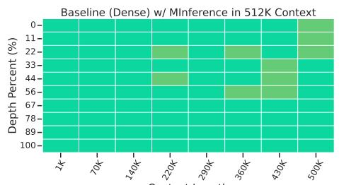  
(a) NIAH Results of Baseline w/ MInference

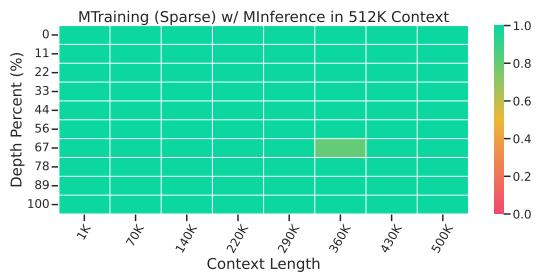  
(b) NIAH Results of MTraining w/ MInference

Figure 11: Needle In A Haystack Results of the baseline checkpoint and the MTraining checkpoint with MInference in the inference stage.  
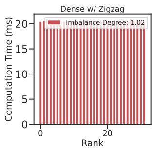

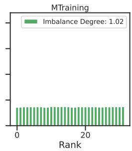

  
(a) Worker-level Workload.

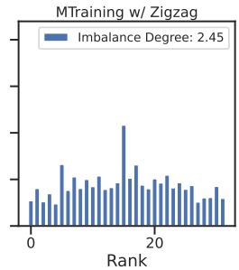

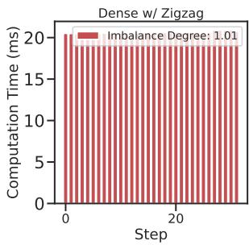

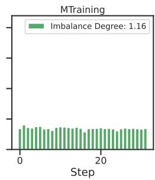

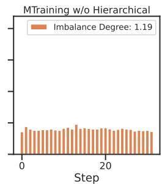  
(b) Step-level Workload.

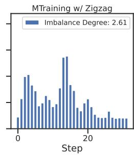  
Figure 12: Distribution of attention computation time using different methods with 512K tokens on 32 GPUs: across CP workers within a fixed Ring Attention step (a) and across Ring Attention steps for a fixed worker (b).

## E Additional Experimental Details

ZigZag Figure 13 provides a visualization of step-level computation schedule of ZigZag Ring Attention, complementing those of Striped Ring Attention and Hierarchical Balanced Sparse Ring Attention in Figure 5.

Hierarchical Balanced Sparse Ring Attention The pseudocode of the implemented can be found in Algorithm 2.

Additional Implementation Details All experiments were conducted on a 4 × 8 NVIDIA A100-40 GB cluster, where the eight GPUs inside each node communicate via NVLink and nodes are interconnected through HDR InfiniBand. Because this study isolates the benefits of Context Parallelism, every GPU in both training and profiling runs serves exclusively as a CP worker, with no additional data, pipeline, or tensor parallelism enabled. We employ the nnScaler framework [31], which first traces the model into a computation graph and then searches for an optimal parallel execution plan; its search space is constrained so that the resulting plan assigns all GPUs to CP only. Training uses ZeRO-2 [32], 64 gradient-accumulation steps [33], bfloat16 precision for model weights, gradients, and activations, and float32 precision for optimiser states; the optimiser is Adam [68]; gradient checkpointing and recompute [34] are applied to peak activation memory. Efficiency-profiling sessions replicate the same parallel-execution configuration. Self-attention in MTraining are implemented with custom CUDA kernels built upon FlashAttention [26], BlockSparse [35], and the PIT dynamic-sparse compiler [36]. For external sparse algorithms such as MoBA and XAttention, we adapt their original code to operate under Zigzag Ring-Attention schedule.

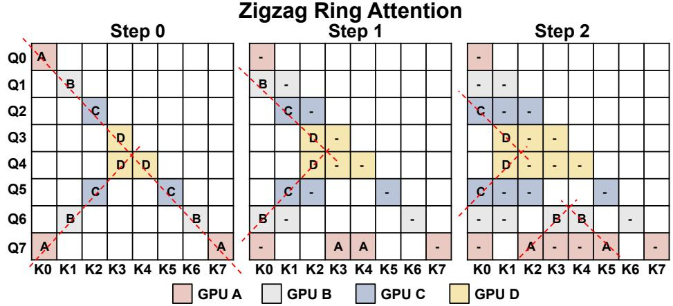  
Figure 13: Step-level Computation Schedule of Zigzag Ring Attention.

Baselines Details 1) MoBA [18]. MoBA partitions the key-value sequence into fixed-size blocks and, for every query, an MoE-style gate chooses the top-k most relevant blocks (always including the query’s own block) before running FlashAttention inside each selected block. In our experiments, the block size is set to 4096 and topK value is 12, making the sparse ratio under 512K context be 0.9. The implementation published in their official repo2 is adapted to enable it to run with Zigzag Ring Attention. But the efficiency of the officially released code is suboptimal, we ignore the comparison with it in efficiency-related experiments.

2) XAttention [28]. XAttention score square blocks by summing every certain stride along their antidiagonals and retains only the high-score blocks, giving a plug-and-play, training-free blocksparse attention that accelerates prefill while matching dense accuracy. In our experiments, we use the following settings with granularity being 128 as the block size, stride 16 as the sampling pitch and threshold: 0.9 for selecting blocks.

Algorithm 2 Balanced Sparse Ring Attention fuse w/ Hierarchical Sparse Ring Attention   
World size and rank: wouter, winner, r   
Input data: $Q , K , V$   
Vertical and slash Index: $I _ { v } , I _ { s }$   
# Convert sparse index for current rank   
Iblock, Ibar = convert\_index $( I _ { v } , I _ { s } , w _ { o u t e r } * w _ { i n n e r } , r )$   
# Outer ring   
for $i  1 \mathrm { t o } \ w _ { o u t e r }$ do   
$\mathbf { i f } \ i < w _ { o u t e r }$ then   
# Start outer communication   
next $_ { - } \mathrm { o u t e r \_ r a n k } = ( r + w _ { i n n e r } ) \% ( w _ { o u t e r } * w _ { i n n e r } )$   
P2Pouter.async\_send(K, next\_outer\_rank)   
$\mathrm { P 2 P _ { o u t e r } } .$ .async\_send(V, next\_outer\_rank)   
$\mathrm { p r e v \_ o u t e r \_ r a n k } = ( r - w _ { i n n e r } ) \% ( w _ { o u t e r } * w _ { i n n e r } )$   
$\mathbf { \dot {  { K } } } ^ { \prime \prime } = \mathrm { P 2 P _ { o u t e r . } a s y n c \_ r e c v ( p r e v \_ o u t e r \_ r a n k ) }$   
$V ^ { \prime \prime } = \mathrm { P 2 P _ { o u t e r . } a s y n c \_ r e c v ( p r e v \_ o u t e r \_ r a n k ) }$   
end   
# Inner ring   
for $j \gets 1 \mathrm { t o } w _ { i n n e r }$ do   
$\mathbf { i f } \ j < w _ { i n n e r }$ then   
# Start inner communication   
next\_inner\_ $\mathrm { r a n k } = ( r + 1 ) \% w _ { i n n e r }$   
$\mathrm { P 2 P _ { i n n e r } }$ .async\_send(K, next\_inner\_rank)   
P2Pinner.async\_send(V, next\_inner\_rank)   
prev\_inner\_ $\mathrm { ~ T a n k } = ( \dot { r } - 1 ) \% w _ { i n n e r }$   
K′ = P2P.async\_recv(prev\_inner\_rank)   
V ′ = P2P.async\_recv(prev\_inner\_rank)   
end   
# Sparse attention computation   
Out′, $L S E ^ { \prime } \gets$ block\_bar\_sparse\_attention\_forward $( Q , K , V , I _ { b l o c k } [ i * w _ { i n n e r } \ +$   
$j ] , I _ { b a r } [ i * w _ { i n n e r } + j ] )$   
Out, LSE ← merge\_out\_and\_lse(Out, LSE, Out′, LSE′)   
$\mathbf { i f } \ j < w _ { i n n e r }$ then   
# Wait inner communication   
$\mathrm { P 2 P _ { i n n e r } . w a i t ( ) }$   
$K  K ^ { \prime } , V  V ^ { \prime }$   
end   
end for   
$\mathbf { i f } \ i < w _ { o u t e r }$ then   
# Wait outer communication   
P2Pouter.wait()   
$K \gets K ^ { \prime \prime } , V \gets V ^ { \prime \prime }$   
end   
end for