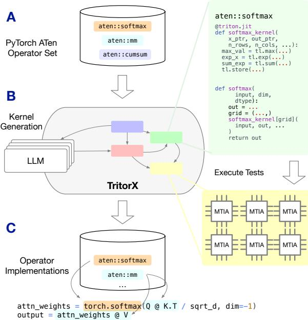
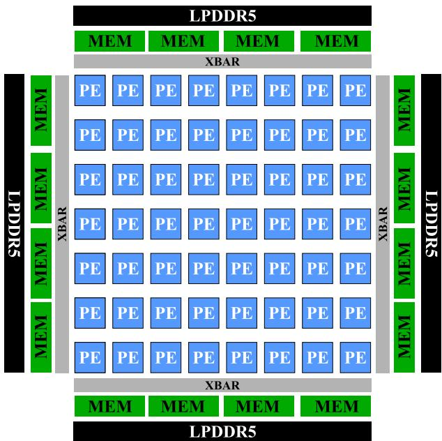
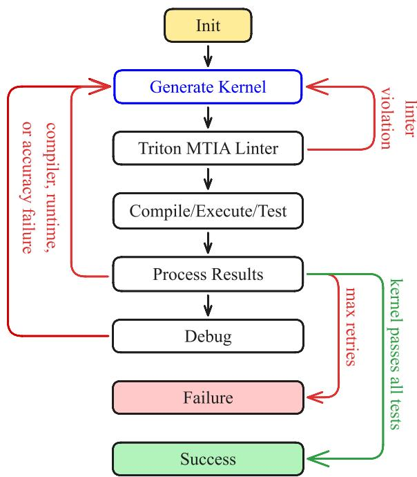
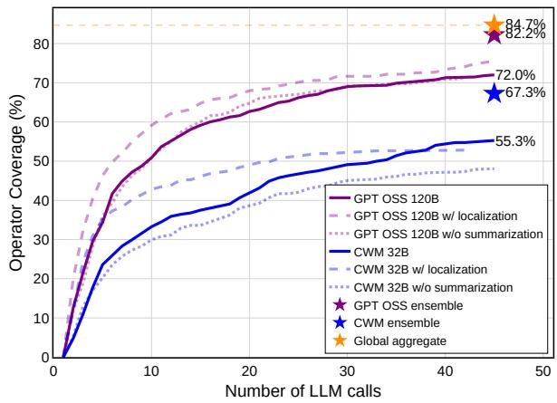
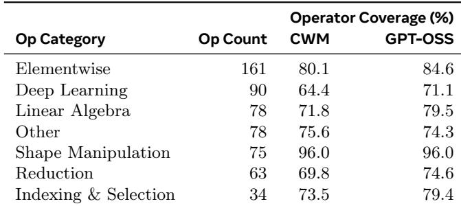
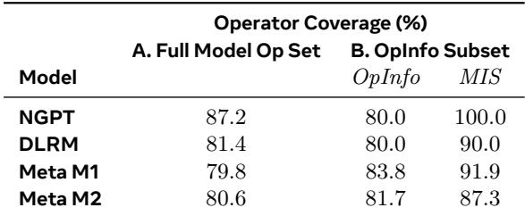
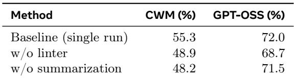

# Agentic Operator Generation for ML ASICs

Alec M. Hammond1,∗, Aram Markosyan2,∗, Aman Dontula1, Simon Mahns1, Zacharias Fisches2, Dmitrii Pedchenko2, Keyur Muzumdar2, Natacha Supper2, Mark Saroufim3, Joe Isaacson3, Laura Wang3, Warren Hunt2, Kaustubh Gondkar1, Roman Levenstein1, Gabriel Synnaeve2, Richard Li1, Jacob Kahn2, Ajit Mathews1

1Meta, 2FAIR, Meta Superintelligence Labs, 3Meta Superintelligence Labs ∗Equal contribution.

We present TritorX, an agentic AI system designed to generate functionally correct Triton PyTorch ATen kernels at scale for emerging accelerator platforms. TritorX integrates open-source large language models with a custom linter, JIT compilation, and a PyTorch OpInfo-based test harness. This pipeline is compatible with both real Meta Training and Inference Accelerator (MTIA) silicon and in hardware simulation environments for next-generation devices. In contrast to previous kernelgeneration approaches that prioritize performance for a limited set of high-usage kernels, TritorX prioritizes coverage. Our system emphasizes correctness and generality across the entire operator set, including diverse data types, shapes, and argument patterns. In our experiments, TritorX successfully generated kernels and wrappers for 481 unique ATen operators that pass all corresponding PyTorch OpInfo tests (over 20,000 in total). TritorX paves the way for overnight generation of complete PyTorch ATen backends for new accelerator platforms.

Correspondence: Alec M. Hammond (alechammond@meta.com), Jacob Kahn (jacobkahn@meta.com) Date: December 15, 2025


## 1 Introduction

The rapid adoption of machine learning (ML) and artificial intelligence (AI) hardware is projected to drive US datacenter power consumption to between 6.7% and 12.0% of total electricity usage by 2028 (Shehabi et al., 2024), highlighting an urgent need for efficient accelerator hardware to support large-scale model inference and training. In response, the industry is investing heavily in heterogeneous datacenter fleets that incorporate a variety of accelerator solutions, including custom silicon ASICs tailored to specific workloads and requirements (Silvano et al., 2025). Namely, the Meta Training and Inference Accelerator (MTIA) currently serves recommendation models (DLRM) (Naumov et al., 2019) to billions of users across Facebook, Instagram, and Threads, while simultaneously reducing total cost of ownership by 44% compared to GPUs (Coburn et al., 2025).

However, despite the obvious advantages offered by in-house accelerators, each new platform requires significant engineering labor to build a software ecosystem compatible with existing tools such as PyTorch (Paszke et al., 2019), given the large set of required tensor operators (Kahn et al., 2022). An aspect therein is operator coverage, or the fraction of operators in ATen (Paszke et al., 2017) — Py-Torch’s tensor library — that have kernels executing natively on a particular accelerator. Establishing and maintaining comprehensive operator coverage is an arduous task that is needed towards running inference with new or for prototyping new model architectures for training. In other words, while new accelerator platforms must provide competitive performance per unit cost, they must also provide an amenable developer experience with a comprehensive kernel backend.

To address this challenge, we present an agentic AI system capable of generating functionally correct Triton ATen kernels for MTIA at scale. This new tool, which we call TritorX, leverages open-source large language models (LLM) paired with execution feedback in a finite state machine (FSM) to generate, compile, and test hundreds of kernels directly on MTIA hardware. TritorX is compatible with MTIA’s production infrastructure, producing kernel-wrapper pairs that can be immediately registered within PyTorch and can be used for experimental model training, or in a production inference model. Building on top of production infrastructure, TritorX can also generate new PyTorch backends for upcoming accelerator generations via hardware simulation, providing important feedback to hardware and compiler engineers before tape-out. In the limit, we envision implementing a kernel backend for a new chipset overnight.

  
Figure 1 TritorX System Overview. (A) OpInfo operators and their PyTorch docstring/signature are selected for generation. (B) TritorX iterates on each operator in a finite-state machine feedback loop. Kernel-wrapper pairs are generated using a large language model (LLM). Production infrastructure allows for simultaneous generation and testing at scale. (C) The generation task is successful if an operator passes all corresponding OpInfo tests.

We note that TritorX differs from other kernel generation efforts, in that our framework strictly optimizes for correctness and generalizability across an entire backend, rather than performance over a narrow subset of critical path kernels (Lange et al., 2025a). For example, TritorX is configured to generate kernelwrapper pairs that are compatible with a wide range of quantization data types, tensor shapes, or PyTorch argument inputs. In some cases, TritorX will generate multiple kernel implementations for a particular operator, and the corresponding dispatch logic is implemented in the wrapper function. Using a Triton dialect known as Triton MTIA, standard models can produce working kernels and rely on execution feedback to identify MTIA-specific semantics or intrinsics. Importantly, we only provide TritorX with the ATen operator docstring to generate the corresponding implementation. Figure 1 describes the end-to-end workflow for accelerator enablement.

TritorX performs in-context learning iteratively, distilling hardware requirements and their corresponding Triton semantics based on the feedback obtained directly via tools like the compiler. Previous works demonstrated that pipelines like TritorX will often “cheat” at the generation task by dispatching to the host or calling other undefined PyTorch functions in the operator wrapper (Lange et al., 2025b). We avoid this by incorporating a custom linter that catches unauthorized uses of these functions or utilities and forces correction via feedback.

Central to TritorX is the integration of multiple testing frameworks to ensure correctness across different data types, tensor shapes, or input arguments. We use OpInfo1, a PyTorch-native testing framework, along with a custom test harness that pulls test data from models in production.

## In summary, our contributions are as follows:

• System. A finite state machine using open source LLMs that generates, compiles, and validates hundreds of Triton MTIA kernels end-to-end. TritorX runs directly on deployed silicon or via hardware simulation enabling prototyping for future devices. TritorX only requires operator docstrings to generate the corresponding implementations. Its modular design allows for modular features, like the custom linter which prevents “cheating.”

Coverage objective. A design that optimizes for functional correctness and backend coverage covering multiple data types, shapes, and branching dispatch logic via generated wrappers.

• Results. At scale, TritorX produced 481 ATen kernels (84.7% MTIA-compatible OpInfo coverage) which pass all their corresponding OpInfo tests, in total more than 20,000. In addition, TritorX demonstrates capability on end-to-end model enablement tasks for various models on MTIA. TritorX can iterate over the entire OpInfo operator set in a few hours, allowing for rapid backend development and iteration.

• Testing harness. We integrate PyTorch OpInfo and captured production inputs testing for correctness under deployment conditions.

## 2 Background

In this section, we describe the MTIA architecture, the Triton MTIA dialect, and how TritorX can be instrumented to generate kernels at scale.

The MTIA architecture employs a grid of 8x8 processing elements (PEs) responsible for executing the core kernel workloads (Coburn et al., 2025). Each PE consists of a scalar RISC-V core, a vector RISC-V core, and various fixed-function units (FFUs) responsible for implementing dedicated computations, such as direct memory accesses (DMAs) and dot products. Figure 2 illustrates the MTIA architecture.

  
Figure 2 MTIA’s architecture overview. The core kernel computation is performed by a grid of process elements (PEs) which consist of a scalar core, a vector core, and special function units.

In particular, MTIA features a unique memory hierarchy with a significant amount of local SRAM available to all PEs via a series of crossbars. Dedicated PE FFUs facilitate the abstraction of circular buffers, enabling efficient pipelining of computation and communication needed to amortize the overall latency resulting from data movement. The computational savings gained by this approach allow MTIA to leverage cheaper LPDDR DRAM instead of HBM. Importantly, significant effort was made to mitigate overhead related to kernel or job dispatch from the host, enabling eager-mode workflows.

To execute kernels on MTIA, developers can author the workload using a C++ API, which is compiled with an LLVM backend, or using a custom Triton dialect adapted specifically for MTIA. Triton is an open-source Python library that provides a domainspecific language (DSL) for writing highly efficient custom GPU kernels (Tillet et al., 2019b). It simplifies GPU programming by allowing developers to express complex parallel computations using intuitive block-based abstractions while automatically handling low-level details such as memory access patterns and synchronization. This enables users to achieve performance comparable to hand-written CUDA code, without requiring deep expertise in GPU architectures.

Although Triton was written to express the semantics of GPU computation, several of the existing semantics can be directly translated to corresponding MTIA hardware features. For example, instead of mapping Triton blocks to GPU threads, we can map them to the MTIA PE grid and rely on masking within loads and stores such that tensor boundaries are respected. Furthermore, loads and stores can take advantage of the MTIA DMA engine for structured memory access. When intrinsics do not perfectly match, we can augment the underlying Triton feature-set with specific device libraries (e.g. to leverage FFUs that implement nonlinear activations). Triton MTIA is a dedicated dialect intended to facilitate the above mappings, along with various other performance optimizations via the compiler backend.

Although Triton MTIA intends to preserve the existing Triton semantics as much as possible, there are certain hardware requirements that force notable deviations. For example, MTIA requires 32-byte aligned memory access patterns, and load/store operations will fail if this is not satisfied. On the surface, this may seem problematic when trying to generate kernels using off-the-shelf models. However, Triton MTIA has detailed assert messages and error handling providing the necessary feedback that the models need to adapt the vanilla Triton code for MTIA. Indeed, building a compiler tool-chain that gives descriptive feedback is an important part of leveraging automated approaches for code generation.

The challenge is then to implement an execution pipeline that is compatible with the existing production infrastructure. MTIA (and all future hardware versions) are deployed in a productionized Linux container ecosystem (Tang et al., 2020). Typical production workflows require an end-to-end workload that can e.g. serve or train a model for a particular service at scale, which also requires a complicated kernel registration stack compatible with the PyTorch ecosystem. However, the Triton JIT allows us to generate, compile, and test kernels on the fly, even within these productionized containers, allowing us to run numerous experiments in parallel.

## 3 System Design

Here, we describe the system architecture behind TritorX, along with the test harness used to validate the results during generation.

## 3.1 In-Context Distillation of Triton MTIA Semantics

A naive approach to generating Triton MTIA code is to add comprehensive specifications of the hardware requirements and corresponding Triton semantics differences to the first prompt of the LLM to see if the generated code passes relevant tests. In practice, however, comprehensive accelerator documentation lags behind other stack components. Early attempts at generating Triton for MTIA with a simple promptengineering approach resulted in significant manual labor and did not scale.2

In contrast, TritorX effectively performs in-context learning iteratively, distilling hardware requirements and their corresponding Triton semantics based on the feedback obtained directly via interaction with the linter, compiler, and debugger.

We implemented TritorX as a finite-state machine (FSM) with dedicated tools and routines, including linting, compiling, testing, debugging, and LLM calls.

Although recent kernel generation frameworks often rely on a dedicated reasoning agent with prescribed tool calling (Lange et al., 2025b; Wang et al., 2025; Chen et al., 2025b; Andrews and Witteveen, 2025; Li et al., 2025a,b), we found it easier to integrate an FSM architecture within our production infrastructure at scale. The FSM offers explicit guardrails around what is executed and performed, and allows faster debugging of the key components of the system which is an important requirement when dealing with production-ready systems. Additionally, the backend of the FSM enables compilation and testing on both the deployed MTIA machines and on the QEMU simulator of the future MTIA generations.

## 3.2 TritorX Agent

Figure 3 illustrates the overall design of the TritorX system. Each operator is generated in a self-contained session during which all prescribed tests are performed. This session is configurable up front, allowing us to easily prototype different LLM models, disable/enable individual states (like the linter), and sweep TritorX hyperparameters (e.g., max number of iterations).

The routine begins with an initial prompt consisting of the task description, output requirements, the documentation (docstring) of the PyTorch operator, and three handcrafted examples (§C). Specifically, the prompt asks the model to generate a python wrapper matching the designated PyTorch operator signature (described in the docstring) and one or more Triton kernels that implement the functionality itself. The exp, argmax, and diag operators were chosen as simple examples as they span multiple kernel classes (e.g., elementwise, reduction). Often times, ATen docstrings will reference the docstrings of other operators (e.g., argmax references max). We built a directed acyclic graph of all docstrings, allowing us to include “nested” docstrings for completeness. Further instructions prescribing the expected output format expected by the downstream parser are also provided.

  
Figure 3 Finite State Machine of our kernel-generation agent TritorX. Proposal kernel-wrapper pairs are only generated during the “Generate Kernel” state (which dispatches to an open source, reasoning LLM). All other states process the result and update a feedback prompt, where needed.

The reasoning LLM uses the prompt to generate an initial candidate wrapper/kernel pair, which is then sent to a custom Triton MTIA Linter. The linter is responsible for the following tasks: (1) ensuring the output wrapper and kernel code is compatible with the Triton JIT harness; (2) ensuring the provided implementation does not “cheat” by dispatching into other operators that may not yet be implemented; (3) ensuring the provided code uses valid Triton MTIA syntax and libraries, as not all of upstream Triton is available on MTIA. The linter is lightweight and configurable (§E). If a lint violation is detected, a structured report is generated and sent back to the model as feedback for correction (§C). The process is repeated until no lint errors are produced or the maximum number of LLM calls is reached.

If no linter errors are detected, the wrapper and kernel code is passed to a dedicated Triton JIT compilation harness compatible with the MTIA infrastructure. Depending on the operator configuration, which prescribes the supported datatypes, a series of tests derived from and production-data are synthesized. The test runner loops through each test, recompiling as needed (e.g. for new datatypes). If compilation is successful and the test executes without any runtime errors, the same inputs are moved to the host and executed using a reference ATen CPU implementation of the operator. The outputs for both the generated MTIA kernel and the CPU reference kernel are compared using a heuristic that depends on the underlying datatype. If the results are within the specified tolerance, the process repeats with the next test. As soon as the runner encounters a compilation failure, a runtime error, or an accuracy error, the routine breaks and proceeds to a “feedback” state responsible for determining what to do next.

The feedback state analyzes how successful the test runner was and determines what kind of feedback prompt is needed for another LLM iteration, or if further debugging is needed. For example, if the most recent run resulted in a runtime crash which produced a crash dump, the crash dump is loaded in an LLDB-based debugger. The debugger pulls basic information about the backtrace, decoded registers, and other frame information to provide as context for the revised prompt. Example insights include details around memory access violations.

In the case of a compiler failure, depending on the hyperparameter config, we optionally summarize the compiler log using a secondary LLM instance (also configurable up front). Triton MTIA compiler logs can easily consume thousands of tokens, so surfacing the most relevant facets of the compiler error to the main LLM session serves towards managing limited context windows.

If the feedback state detects an accuracy error, a summary of the MTIA output tensor(s) and the CPU output tensor(s) is included in the feedback prompt. Even in the case of large output tensors, an abbreviated summary of the tensor values is often enough context for the model to reason about the potential inaccuracy (§D).

Once an appropriate feedback prompt is crafted, the process repeats until one of the following conditions occurs: (1) all tests pass, in which case the routine exits successfully; (2) the maximum number of prescribed LLM calls has been reached, and the routine exits; (3) the LLM context window saturates, and a new LLM dialog session starts using the most recent wrapper/kernel generation as an initial proposal; (4) an unexpected error crashes the main process. We implemented comprehensive exception handling throughout the TritorX, including launching containerized subprocesses where necessary, to avoid crashing the main process whenever possible.

In order to generate operators at scale, the above process can be executed in a parallel fashion for every operator specified and even repeated for operators that failed. These large-scale runs are configured by the operators of interest, the desired datatypes, the LLM parameters (e.g., model, context length, temperature), the run parameters (e.g., maximum number of LLM calls, maximum number of dialog sessions) and the testing complexity.

Importantly, the operators are compiled and executed on productionized MTIA machines. The LLM calls themselves are processed by a centralized inference platform service capable of handling a high volume of requests needed for large-scale runs.

## 3.3 ATen Operators and OpInfo Testing

To evaluate the viability of our approach at scale, we generate kernels for the operators defined within the PyTorch OpInfo testsuite. Importantly, OpInfo aims to rigorously test an operator’s coverage by providing “samples” for all the supported data-types, tensor shape, and input arguments. For example, OpInfo contains hundreds of tests for the linalg.vector\_- norm operator which rigorously test different input and output tensor shapes, along with different input argument configurations.

Using OpInfo as our primary test harness creates an end-to-end generation pipeline with orders of magnitude more tests than the state of the art (Ouyang et al., 2025). By covering more of the input space during the generation process, we expect the resulting implementation to more reliably work in arbitrary prototyping and production environments. That being said, we recognize that ensuring perfect test coverage across the entire input space is impossible. To account for this, we introduce a secondary test harness specifically for production models that consists of production input data. This additional testsuite allows us to gauge how well an operator was generalized using the OpInfo testsuite. If gaps are identified during the generation stage (such that productiondata tests failed), then TritorX is able to resolve the coverage gap.

There are certain limitations with MTIA hardware such that certain operators and tests are either not compatible or not relevant for the target workloads. For example, MTIA does not support complex numbers, so we remove those corresponding operators from the generation list (e.g., FFT operators). Similarly, validating the outputs for random-number operators between the device and host is particularly challenging due to differences in the underlying random number generation algorithm. As such, we also remove these operators from consideration. Additionally, due to a limitation of our distributed testing infrastructure, we only cover operators with under 900 total OpInfo tests. The resulting operator list consists of 568 unique operators (filtered down from 629). We also only test for bfloat16, float16, float32, int32, and int64. In total, this results in over 20,000 tests across all operators, and we only classify an operator as successful if it passes all the corresponding operator tests.

## 4 Experiments and Results

We now present the experiments used to validate our approach. We first present an aggregate result consisting of kernels that span all MTIA-compatible OpInfo operators over multiple large-scale runs. From this set of generated operators, we “productionize” various first- and third-party models. We further expand our test harness for these operators by incorporating additional correctness tests that leverage production data and identify additional gaps not originally captured by OpInfo. Finally, we ablate over various TritorX configurations to highlight which aspects of our pipeline matter and why.

Our baseline setup for these experiments is to run TritorX over all the 568 MTIA-compatible OpInfo operators with the following configuration:

• Maximum of 3 TritorX attempts (i.e., dialog sessions) per operator to generate a kernel that passes all tests and declares Success;

• Each attempt is allowed a maximum of 15 LLM calls, or, in other words, 15 full iterations through the state machine until Failure is declared for the attempt;

• Either Code World Model (CWM, Copet et al. (2025)) or GPT-OSS 120B (OpenAI, 2025) were used as the kernel-generating LLM. Both models were configured with a context length of 131, 072 and temperature set to 1.0. We set the top-P to 0.95 for CWM and 1.0 for GPT-OSS. The GPT-OSS reasoning was set to “high.”

• Llama-4-Maverick is used as the feedback summarization model with the same generation parameters as CWM.

We dispatch the generation jobs across 200 production MTIA devices, which are able to finish 95% of a run in 2 hours. The remaining tail often results from e.g., poor reasoning trajectories, and can take another 6-8 hours to complete. New runs can be dispatched concurrently. With this infrastructure in place, we executed multiple runs, with subsequent runs focusing on operators that failed previous runs.

From these aggregated runs, we achieved 84.7% operator coverage on all MTIA-compatible OpInfo operators. Here we consider an operator covered if the generated kernel-wrapper pair passes 100% of the sample OpInfo tests. These results were aggregated across multiple runs, including ablations over models and configuration parameters. Figure 4 illustrates the cumulative operator coverage as a function of LLM calls for different configurations.

  
Figure 4 Number of LLM calls per operator to produce a correct kernel, cumulatively plotted for different harness configurations and models. Ensemble results display coverage achieved by combining multiple configurations. We also include experimental localization runs, where we pull relevant operators as context. The global aggregate includes all our available runs, some of which are not shown in the figure.

We further heuristically divide operators into 7 categories depending on the intended functionality of each operator. Table 1 shows that different categories present different difficulties to TritorX: while TritorX achieves 96.0% coverage on Shape Manipulation operators, the coverage significantly drops for the operators from the Deep Learning Category.

Finally, we executed a run with GPT-OSS on a future generation using a QEMU simulator (Bellard,

  
Table 1 TritorX Coverage by operator category and used LLM.

2005) for execution feedback. This single run yielded a coverage of 73.1%. We aggregated the compiler failures and feature gaps encountered during generation, and shared this data with our compiler and ASIC engineers.

## 4.1 End-to-end Application

From our baseline set of OpInfo operators, we used TritorX to enable various first- and third-party models on MTIA. While robust, we recognize that production workflows may contain operators and operator arguments (eg. shapes, scalar values, etc.) outside of the distribution represented in the OpInfo testsuite. To mitigate this, we decompose various target models into their individual operators, extract all operator inputs observed during training, and then use these inputs within the TritorX validation loop instead of those generated by OpInfo.

Concretely, we instrumented forward and backward passes of several representative models, NanoGPT (Karpathy, 2023), DLRM (Naumov et al., 2019), and two internal recommendation models (denoted MM), using \_\_torch\_dispatch\_\_ to intercept and record the tensor and scalar data passed to each operator. All four models were evaluated with a fixed batch size of 1024 and trained for single iteration, with the latter three (DLRM, MM1, and MM2) executed using real production data rather than randomized inputs.

Additionally, we introduce a new step to TritorX, first matching a given operator with a pre-generated OpInfo operator (should it exist), then immediately testing it with the inputs gathered from the full e2e run. Should the kernel not pass all tests out of the box, it is used as a starting point from which TritorX then refines (Table 2, column B: MIS).

Across these experiments, TritorX achieves high kernel coverage, enabling nearly 80% of all kernels required to execute a model end-to-end. Furthermore, for operators where a pre-existing OpInfo-validated kernel is available, over 80% of these kernels pass all end-to-end production tests without additional prompting. After refinement, TritorX further improves this by an additional 6–20% across models. This not only underscores the robustness of TritorX, but also establishes a sandbox for continuous testing and optimization of production-ready kernels.

  
Table 2 Operator coverage across four model types: Nano-GPT, Deep Learning Recommendation Model, Meta Model 1, Meta Model 2. An operator is considered covered if the corresponding kernel passes all tests with model input shapes (MIS). (A) We run TritorX on all model operators with the MIS feedback. (B) We run TritorX on a subset of model operators that have tests available in the OpInfo suite. (OpInfo) We directly test kernels created with OpInfo feedback with MIS. (MIS) We run TritorX to refine kernels created with OpInfo feedback with MIS feedback.

## 4.2 TritorX Harness Ablation

To better understand which aspects of TritorX contribute to its success, we ablate over various configurations. Table 3 summarizes the results of these experiments.

  
Table 3 Ablations over TritorX harness features.

We examine the importance of the custom Triton MTIA linter and the optional summarization model. Removing the linter resulted in a significant drop in performance (55.3% → 48.9% for CWM). As mentioned previously, the linter not only helps the agent identify intrinsics unique to the Triton MTIA dialect, but also helps prevent “cheating” by flagging the unauthorized use of other torch operators (§E).

Removing the summarization agent also resulted in a decrease in performance (55.3% → 48.2% for CWM). Without a separate summarization agent, the entire compilation log, which can consist of thousands of tokens, is fed directly into the LLM dialog session, and the model performance can degrade as we approach the context limit (Hsieh et al., 2024).

## 5 Related Work

Custom ASICs, MTIA & Deep Learning Compilers. Since Triton introduced a Python-first DSL for highperformance GPU kernels (Tillet et al., 2019a) and became widely used by PyTorch Inductor (Ansel et al., 2024) to generate fused operators, several ecosystems now offer Python-level kernel DSLs. NVIDIA’s Warp (Macklin, 2022) is a Python DSL for authoring CUDA kernels, with an optional tile-based programming model for tensor-core GEMMs. In JAX, Google’s Pallas (Bradbury et al., 2018) allows users to write custom kernels in Python; it targets GPUs via Triton and TPUs (Jouppi et al., 2017) via Mosaic (Bansal et al., 2023), enabling fine-grained fused operations within the JAX ecosystem. Meta has also adopted Triton for MTIA to improve developer efficiency with PyTorch.

Kernel Research. Optimization of custom kernels for specific devices has received sustained attention in recent years: Lavin and Gray (2016); Dao et al. (2022); Dao (2023); Shah et al. (2024). This interest is both driven by and enabling the rapid growth of training and inference compute of frontier models: Cottier and Rahman (2024); Hooker (2021).

Benchmarks. The community has responded by releasing benchmarks to measure the functional correctness and performance of LLM-generated kernels that primarily target GPUs through CUDA and Triton. KernelBench (Ouyang et al., 2025) and Triton-Bench (Li et al., 2025a) evaluate whether models can generate correct and performant GPU kernels across representative operator suites, while NPU-Eval (Kalade et al., 2025) targets AMD NPUs. AlgoTune (Press et al., 2025) in particular targets LLM’s ability to speed up scientific computing problems from natural language descriptions. Automatically generated kernels are prone to exploiting holes in the test suite. Addressing this has seen significant effort: (Lange et al., 2025b; METR, 2025). Notably, similar to our work BackendBench (Saroufim et al., 2025) also uses PyTorch’s OpInfo as a comprehensive test suite to ensure correctness and comprehensiveness.

LLM-based Kernel Generation. Most LLM-based kernel generation relies on prompting techniques combined with test-time compute use as a form of search. Recent systems train or prompt LLMs to synthesize kernels or improve them with search. Kernel-LLM (Fisches et al., 2025) provides a supervised baseline for the generation of Triton kernels from PyTorch modules. AutoTriton (Li et al., 2025b) adds reinforcement learning from verifiable rewards. Multi-turn reinforcement learning for CUDA kernel generation has also been explored in Baronio et al. (2025).

Orthogonally, several approaches scale inference compute with existing LLMs, covering a spectrum of prompting, agentic, and evolutionary techniques combined with verification through unit tests: (Lange et al., 2025b; METR, 2025; Chen et al., 2025a; Wei et al., 2025; Wang et al., 2025). While several approaches exist that target CUDA and GPUs, we believe only NPU-Eval (Kalade et al., 2025) is targeting non-GPU devices with C++.

## 6 Discussion and Future Work

TritorX’s FSM framework provides a robust harness for generating functionally correct Triton MTIA kernels. Thanks to its flexibility, we identify several additional directions to further improve coverage and performance and reflect on what aspects are most important for success.

Self-consistent operator generation. To prevent “cheating,” the linter restricts the agent from utilizing other ATen operators within the wrapper (beyond tensor allocation). A more efficient and possibly more performant approach is to allow the wrapper to dispatch other operators, provided they are also implemented in the new backend and the operators do not result in cyclic dependencies. This requires a self-consistent generation scheme where the agent is aware of the entire backend state (and is thus no longer embarrassingly parallel).

Optimized prompting. As mentioned earlier, we found that simpler prompts without dedicated MTIA documentation worked best, but there remains room for prompt tuning. Furthermore, we can improve the quality of the example kernel-wrapper pairs themselves using strategies like localization, perhaps even bootstrapping the process over sequential runs.

Fully agentic pipeline. At a higher level than these improvements, we have discussed making the entire FSM agentic – converting most current states into tools for the LLM to call upon, as well as adding new tools related to debugging, such as giving the LLM a sandbox to execute code in.

Dedicated model post-training. Both models used throughout this work were open source and off-theshelf. All of the MTIA-specific context was gained via interactions with the linter, compiler, and debugger. An orthogonal research direction would be to further post-train the LLM for Triton MTIA kernel generation and contrast that with the existing results for vanilla Triton in the literature.

The importance of scale. Due to the stochastic nature of the underlying language model, running the benchmark repeatedly (with a nonzero temperature) will produce results with nonidentical pass-rates. Thus, simply aggregating the passing operators across runs, a technique known as test-time scaling, can yield significant increases in operator coverage. For example, just aggregating between two benchmark runs using CWM increased the coverage from 55% → 64%. We suspect that further scaling this and exploring more complex strategies such as evolutionary scaling (Lange et al., 2025b) will bring significant coverage improvements. Furthermore, supporting additional hardware generations, DSLs, and operator definitions will require a flexible and scalable pipeline for generating operator sets.

Establishing a backend-maintenance environment. As AI-driven kernel generation evolves, AI will eventually produce more kernels than humans can feasibly review—especially as hardware diversity increases and multiple generations of hardware coexist within production fleets. Establishing a robust, fully automated framework that does not require human review will be essential for the success of AI-generated kernels. This need will become even more critical as each model update triggers a comprehensive refresh of the kernel library to optimize performance.

## 7 Conclusion

We introduced TritorX, a scalable, coverage-first system that automates bring-up of the PyTorch backend for custom ML ASICs, demonstrated on Meta’s MTIA. TritorX orchestrates an existing LLM with a finite-state workflow and production-compatible tooling, executed on both deployed silicon and a QEMUbased simulator for future devices. It generated over 481 ATen operators that pass all of their corresponding OpInfo tests (20,000+ total tests), achieving an overall pass rate of 84.7%. From these operators, we were able to onboard 80+% of the multiple first- and second-party large-scale models on the device. Ablations over model and system factors isolate which components most influence coverage, turning backend enablement into a measured engineering process rather than an artisanal effort.

Beyond MTIA, the design is applicable to other accelerators and naturally extends to adjacent tasks such as cross-generation kernel migration and early hardware/compiler feedback via simulation. Although performance tuning is out of the scope of this work, TritorX provides the substrate on which autotuning, schedule search, and learned code optimization can be layered. Future directions include expanding operator families (reductions, sparse/quantized ops), stronger safety/containment, and formal checks for code generation, tighter integration with compiler IRs, and automated pathways for performance refinement.

Taken together, these results offer a practical blueprint for democratizing toolchain creation and a force multiplier for kernel engineers—freeing expert effort to focus on truly performance-critical paths while bringing entire backends online in hours rather than months.

## References

M. Andrews and S. Witteveen. Gpu kernel scientist: An llm-driven framework for iterative kernel optimization. arXiv preprint arXiv:2506.20807, 2025.

Jason Ansel, Edward Yang, Horace He, Natalia Gimelshein, Animesh Jain, Michael Voznesensky, Bin Bao, Peter Bell, David Berard, Evgeni Burovski, et al. Pytorch 2: Faster machine learning through dynamic python bytecode transformation and graph compilation. In Proceedings of the 29th ACM International Conference on Architectural Support for Programming Languages and Operating Systems, Volume 2, pages 929–947, 2024.

Manya Bansal, Olivia Hsu, Kunle Olukotun, and Fredrik Kjolstad. Mosaic: An interoperable compiler for tensor algebra. Proceedings of the ACM on Programming Languages, 7(PLDI):394–419, 2023.

Carlo Baronio, Pietro Marsella, Ben Pan, and Silas Alberti. Kevin: Multi-turn rl for generating cuda kernels. arXiv preprint arXiv:2507.11948, 2025. https: //arxiv.org/abs/2507.11948.

Fabrice Bellard. Qemu, a fast and portable dynamic translator. In Proceedings of the USENIX Annual Technical Conference (ATEC ’05), page 41, Berkeley, CA, USA, April 2005. USENIX Association. https: //dl.acm.org/doi/10.5555/1247360.1247401.

James Bradbury, Roy Frostig, Peter Hawkins, Matthew James Johnson, Chris Leary, Dougal Maclaurin, George Necula, Adam Paszke, Jake VanderPlas, Skye Wanderman-Milne, and Qiao Zhang. JAX: composable transformations of Python+NumPy programs, 2018. http://github.com/jax-ml/jax.

Terry Chen, Bing Xu, and Kirthi Devleker. Automating gpu kernel generation with deepseek-r1 and inference-time scaling. NVIDIA Technical Blog, 2 2025a. https://developer.nvidia.com/blog/ automating-gpu-kernel-generation-with-deepseekr1-and-inference-time-scaling/.

W. Chen, J. Zhu, Q. Fan, Y. Ma, and A. Zou. CUDA-LLM: Llms can write efficient cuda kernels. arXiv preprint arXiv:2506.09092, 2025b.

Joel Coburn, Chunqiang Tang, Sameer Abu Asal, Neeraj Agrawal, Raviteja Chinta, Harish Dixit, Brian Dodds, Saritha Dwarakapuram, Amin Firoozshahian, Cao Gao, et al. Meta’s second generation ai chip: Model-chip co-design and productionization experiences. In Proceedings of the 52nd Annual International Symposium on Computer Architecture, pages 1689–1702, 2025.

Jade Copet, Quentin Carbonneaux, Gal Cohen, Jonas Gehring, Jacob Kahn, Jannik Kossen, Felix Kreuk, Emily McMilin, Michel Meyer, Yuxiang Wei, David Zhang, Kunhao Zheng, Jordi Armengol-Estapé, Pedram Bashiri, Maximilian Beck, Pierre Chambon, Abhishek Charnalia, Chris Cummins, Juliette Decugis, Zacharias V. Fisches, François Fleuret, Fabian Gloeckle, Alex Gu, Michael Hassid, Daniel Haziza, Badr Youbi Idrissi, Christian Keller, Rahul Kindi, Hugh Leather, Gallil Maimon, Aram Markosyan, Francisco Massa, Pierre-Emmanuel Mazaré, Vegard Mella, Naila Murray, Keyur Muzumdar, Peter O’Hearn, Matteo Pagliardini, Dmitrii Pedchenko, Tal Remez, Volker Seeker, Marco Selvi, Oren Sultan, Sida Wang, Luca Wehrstedt, Ori Yoran, Lingming Zhang, Taco Cohen, Yossi Adi, and Gabriel Synnaeve. Cwm: An open-weights llm for research on code generation with world models, 2025. https://arxiv.org/abs/2510.02387.

Ben Cottier and Robi Rahman. The training compute of notable ai models has been doubling roughly every six months. Epoch AI Data Insight, 2024. https://epoch.ai/data-insights/cost-trendlarge-scale. Accessed 2025-10-21.

Tri Dao. Flashattention-2: Faster attention with better parallelism and work partitioning. arXiv preprint arXiv:2307.08691, 2023. https://arxiv.org/ abs/2307.08691.

Tri Dao, Daniel Y. Fu, Stefano Ermon, Atri Rudra, and Christopher Ré. Flashattention: Fast and memory-efficient exact attention with io-awareness. In Advances in Neural Information Processing Systems (NeurIPS 2022), 2022. https://openreview.net/ forum?id=H4DqfPSibmx. 36th Conference on Neural Information Processing Systems. (Peer-reviewed).

Zacharias V. Fisches, Sahan Paliskara, Simon Guo, Alex Zhang, Joe Spisak, Chris Cummins, Hugh Leather, Gabriel Synnaeve, Joe Isaacson, Aram Markosyan, and Mark Saroufim. Kernelllm: Making kernel development more accessible, 6 2025. https://huggingface.co/ facebook/KernelLLM.

Sara Hooker. The hardware lottery. Communications of the ACM, 64(12):58–65, 2021.

Cheng-Ping Hsieh, Simeng Sun, Samuel Kriman, Shantanu Acharya, Dima Rekesh, Fei Jia, Yang Zhang, and Boris Ginsburg. Ruler: What’s the real context size of your long-context language models?, 2024. https://arxiv.org/abs/2404.06654.

Norman P Jouppi, Cliff Young, Nishant Patil, David Patterson, Gaurav Agrawal, Raminder Bajwa, Sarah Bates, Suresh Bhatia, Nan Boden, Al Borchers, et al. In-datacenter performance analysis of a tensor processing unit. In Proceedings of the 44th annual international symposium on computer architecture, pages 1–12, 2017.

Jacob D Kahn, Vineel Pratap, Tatiana Likhomanenko, Qiantong Xu, Awni Hannun, Jeff Cai, Paden Tomasello, Ann Lee, Edouard Grave, Gilad Avidov, et al. Flashlight: Enabling innovation in tools for machine learning. In International Conference on Machine Learning, pages 10557–10574. PMLR, 2022.

S. Kalade et al. NPUEval: Optimizing npu kernels with llms and open source compilers. arXiv preprint arXiv:2507.14403, 2025. https://arxiv.org/ abs/2507.14403.

Andrej Karpathy. nanogpt: The simplest, fastest repository for training/finetuning medium-sized gpts, 2023. https://github.com/karpathy/nanoGPT. GitHub repository.

Robert Tjarko Lange, Qi Sun, Aaditya Prasad, Maxence Faldor, Yujin Tang, and David Ha. The ai cuda engineer: Agentic cuda kernel discovery, optimization and composition. arXiv preprint arXiv:2509.14279 and project archive, 2025a.

Robert Tjarko Lange, Qi Sun, Aaditya Prasad, Maxence Faldor, Yujin Tang, and David Ha. Towards robust agentic cuda kernel benchmarking, verification, and optimization. arXiv preprint arXiv:2509.14279, 2025b. https://pub.sakana.ai/static/paper.pdf.

Andrew Lavin and Scott Gray. Fast algorithms for convolutional neural networks. In Proceedings of the IEEE conference on computer vision and pattern recognition, pages 4013–4021, 2016.

Jianling Li, Shangzhan Li, Zhenye Gao, Qi Shi, Yuxuan Li, Zefan Wang, Jiacheng Huang, Haojie Wang, Jianrong Wang, Xu Han, Zhiyuan Liu, and Maosong Sun. Tritonbench: Benchmarking large language model capabilities for generating triton operators. arXiv preprint arXiv:2502.14752, 2025a. https://arxiv.org/ abs/2502.14752.

Shangzhan Li, Zefan Wang, Ye He, Yuxuan Li, Qi Shi, Jianling Li, Yonggang Hu, Wanxiang Che, Xu Han, Zhiyuan Liu, et al. Autotriton: Automatic triton programming with reinforcement learning in llms. arXiv preprint arXiv:2507.05687, 2025b.

Miles Macklin. Warp: A high-performance python framework for gpu simulation and graphics. https: //github.com/nvidia/warp, March 2022. NVIDIA GPU Technology Conference (GTC).

METR. Measuring automated kernel engineering. Blog post, 2 2025. https://metr.org/blog/2025-02-14- measuring-automated-kernel-engineering/.

Maxim Naumov, Dheevatsa Mudigere, Hao-Jun Michael Shi, Jianyu Huang, Narayanan Sundaraman, Jongsoo Park, Xiaodong Wang, Udit Gupta, Carole-Jean Wu, Alisson G Azzolini, et al. Deep learning recommendation model for personalization and recommendation systems. arXiv preprint arXiv:1906.00091, 2019.

OpenAI. gpt-oss-120b & gpt-oss-20b model card, 2025. https://arxiv.org/abs/2508.10925.

Anne Ouyang, Simon Guo, Simran Arora, Alex L Zhang, William Hu, Christopher Ré, and Azalia Mirhoseini. Kernelbench: Can llms write efficient gpu kernels? arXiv preprint arXiv:2502.10517, 2025.

Adam Paszke, Sam Gross, Soumith Chintala, Gregory Chanan, Edward Yang, Zachary DeVito, Zeming Lin, Alban Desmaison, Luca Antiga, and Adam Lerer. Automatic differentiation in pytorch. 2017.

Adam Paszke, Sam Gross, Francisco Massa, Adam Lerer, James Bradbury, Gregory Chanan, Trevor Killeen, Zeming Lin, Natalia Gimelshein, Luca Antiga, Alban Desmaison, Andreas Kopf, Edward Yang, Zachary DeVito, Martin Raison, Alykhan Tejani, Sasank Chilamkurthy, Benoit Steiner, Lu Fang, Junjie Bai, and Soumith Chintala. Pytorch: An imperative style, high-performance deep learning library. In H. Wallach, H. Larochelle, A. Beygelzimer, F. d'Alché-Buc, E. Fox, and R. Garnett, editors, Advances in Neural Information Processing Systems, volume 32. Curran Associates, Inc., 2019. https: //proceedings.neurips.cc/paper\_files/paper/2019/ file/bdbca288fee7f92f2bfa9f7012727740-Paper.pdf.

Ori Press, Brandon Amos, Haoyu Zhao, Yikai Wu, Samuel K Ainsworth, Dominik Krupke, Patrick Kidger, Touqir Sajed, Bartolomeo Stellato, Jisun Park, et al. Algotune: Can language models speed up general-purpose numerical programs? arXiv preprint arXiv:2507.15887, 2025.

Mark Saroufim, Jiannan Wang, Bert Maher, Sahan Paliskara, Laura Wang, Shahin Sefati, and Manuel Candales. Backendbench: An evaluation suite for testing how well llms and humans can write pytorch backends, 2025. https://github.com/meta-pytorch/ BackendBench.

Jay Shah, Ganesh Bikshandi, Ying Zhang, Vijay Thakkar, Pradeep Ramani, and Tri Dao. Flashattention-3: Fast and accurate attention with asynchrony and low-precision. arXiv preprint arXiv:2407.08608, 2024. https://arxiv.org/abs/2407.08608.

Arman Shehabi, Alex Hubbard, Alex Newkirk, Nuoa Lei, Md Abu Bakkar Siddik, Billie Holecek, Jonathan Koomey, Eric Masanet, Dale Sartor, et al. 2024 united states data center energy usage report. 2024.

Cristina Silvano, Daniele Ielmini, Fabrizio Ferrandi, Leandro Fiorin, Serena Curzel, Luca Benini, Francesco Conti, Angelo Garofalo, Cristian Zambelli, Enrico Calore, et al. A survey on deep learning hardware accelerators for heterogeneous hpc platforms. ACM Computing Surveys, 57(11):1–39, 2025.

Chunqiang Tang, Kenny Yu, Kaushik Veeraraghavan, Jonathan Kaldor, Scott Michelson, Thawan Kooburat, Aravind Anbudurai, Matthew Clark, Kabir Gogia, Long Cheng, et al. Twine: A unified cluster management system for shared infrastructure. In 14th USENIX Symposium on Operating Systems Design and Implementation (OSDI 20), pages 787–803, 2020.

Philippe Tillet, Hsiang-Tsung Kung, and David Cox. Triton: An intermediate language and compiler for tiled neural network computations. In Proceedings of the 3rd ACM SIGPLAN International Workshop on Machine Learning and Programming Languages (MAPL@PLDI), pages 10–19, 2019a. doi: 10.1145/3315508.3329973. https://dl.acm.org/doi/10.1145/3315508.3329973.

Philippe Tillet, Hsiang-Tsung Kung, and David Cox. Triton: an intermediate language and compiler for tiled neural network computations. In Proceedings of the 3rd ACM SIGPLAN International Workshop on Machine Learning and Programming Languages, pages 10–19, 2019b.

Jianghui Wang, Vinay Joshi, Saptarshi Majumder, Xu Chao, Bin Ding, Ziqiong Liu, Pratik Prabhanjan Brahma, Dong Li, Zicheng Liu, and Emad Barsoum. Geak: Introducing triton kernel ai agent & evaluation benchmarks. 2025. doi: 10.48550/arXiv.2507.23194. https://arxiv.org/abs/2507.23194.

Anjiang Wei, Tianran Sun, Yogesh Seenichamy, Hang Song, Anne Ouyang, Azalia Mirhoseini, Ke Wang, and Alex Aiken. Astra: A multi-agent system for gpu kernel performance optimization. 2025. doi: 10.48550/ arXiv.2509.07506. https://arxiv.org/abs/2509.07506.

## Appendix

## A Acknowledgments

We thank the PyTorch Team, in particular the authors of BackendBench for their support. We acknowledge that our work stands on the shoulders of the entire MTIA team and are grateful for the enablement of our research. We also thank Dipal Saluja for his early feedback.

## B Generated Wrapper and Kernel Pairs

Here we present a few interesting kernel-wrapper pairs for different operators.

## B.1 nn.functional.binary\_cross\_entropy

```python
@triton.jit
def kernel(
input_ptr,
target_ptr,
weight_ptr,
output_ptr,
n_elements,
BLOCK_SIZE: tl.constexpr,
):
pid = tl.program_id(axis=0)
block_start = pid * BLOCK_SIZE
offsets = block_start + tl.arange(0, BLOCK_SIZE)
mask = offsets < n_elements
input = tl.load(input_ptr + offsets, mask=mask, other=0.0)
target = tl.load(target_ptr + offsets, mask=mask, other=0.0)
weight = tl.load(weight_ptr + offsets, mask=mask, other=1.0)
eps = 1e-8
loss = -target * tl.log(input + eps) - (1 - target) * tl.log(1 - input + eps)
loss = loss * weight
tl.store(output_ptr + offsets, loss, mask=mask)
def wrapper(input, target, weight=None, reduction=’mean’):
if input.shape != target.shape:
raise RuntimeError("input and target must have the same shape")
if weight is not None:
if weight.shape != input.shape:
weight = weight.broadcast_to(input.shape)
weight = weight.contiguous()
else:
weight = torch.ones_like(input, dtype=input.dtype, device=input.device)
if reduction not in [’none’, ’mean’, ’sum’]:
raise ValueError("reduction must be ’none’, ’mean’, or ’sum’")
output = torch.empty_like(input)
input = input.contiguous()
target = target.contiguous()
n_elements = input.numel()
if n_elements == 0:
if reduction == ’none’:
return output
else:
return torch.tensor(0.0, dtype=input.dtype, device=input.device)
BLOCK_SIZE = 1024
grid = (triton.cdiv(n_elements, BLOCK_SIZE),)
kernel[grid](
input,
target,
weight,
output,
n_elements,
BLOCK_SIZE=BLOCK_SIZE,
)
if reduction == ’none’:
return output
elif reduction == ’sum’:
return output.sum()
elif reduction == ’mean’:
return output.mean()
```

## B.2 outer

@triton.jit   
def kernel(   
input\_ptr,   
vec2\_ptr,   
output\_ptr,   
n,   
m,   
input\_stride,   
vec2\_stride,   
output\_stride0,   
output\_stride1,   
):   
pid = tl.program\_id(0)   
if pid >= n:   
return   
input\_val = tl.load(input\_ptr + pid \* input\_stride)   
for j in range(m):   
vec2\_val = tl.load(vec2\_ptr + j \* vec2\_stride)   
product = input\_val \* vec2\_val   
output\_offset = pid \* output\_stride0 + j \* output\_stride1   
tl.store(output\_ptr + output\_offset, product)   
def wrapper(input, vec2, \*, out=None):   
if input.dim() != 1 or vec2.dim() != 1:   
raise ValueError("Both input and vec2 must be 1D tensors")   
n = input.size(0)   
m = vec2.size(0)   
output\_shape = (n, m)   
dtype = input.dtype   
if input.dtype != vec2.dtype:   
pass   
device = input.device   
if out is None:   
output = torch.empty(output\_shape, dtype=dtype, device=device)   
else:   
if out.shape != output\_shape:   
raise RuntimeError(f"Expected out tensor to have shape {output\_shape}, but got {out.shape}")   
if out.dtype != dtype:   
raise RuntimeError(f"Expected out tensor to have dtype {dtype}, but got {out.dtype}")   
if out.device != device:   
raise RuntimeError(f"Expected out tensor to be on device {device}, but got {out.device}")   
output = out   
input\_contig = input.contiguous()   
vec2\_contig = vec2.contiguous()   
output\_contig = output.contiguous()   
input\_stride = input\_contig.stride(0)   
vec2\_stride = vec2\_contig.stride(0)   
output\_stride0 = output\_contig.stride(0)   
output\_stride1 = output\_contig.stride(1)   
grid = (n,)   
kernel[grid](   
input\_contig,   
vec2\_contig,   
output\_contig,   
n,   
m,   
input\_stride,   
vec2\_stride,   
output\_stride0,   
output\_stride1,   
)   
return output

## B.3 nn.functional.layer\_norm

```python
@triton.jit
def kernel_mean_var(
input_ptr,
mean_ptr,
var_ptr,
M,
N,
epsilon,
BLOCK_SIZE: tl.constexpr,
):
pid = tl.program_id(0)
if pid >= N:
return
sum = 0.0
sum_sq = 0.0
for i in range(M):
x = tl.load(input_ptr + pid * M + i)
sum += x
sum_sq += x * x
mean = sum / M
var = sum_sq / M - mean * mean + epsilon
tl.store(mean_ptr + pid, mean)
tl.store(var_ptr + pid, var)
@triton.jit
def kernel_normalize(
input_ptr,
output_ptr,
mean_ptr,
var_ptr,
weight_ptr,
bias_ptr,
M,
N,
epsilon,
elementwise_affine,
BLOCK_SIZE: tl.constexpr,
):
pid = tl.program_id(0)
if pid >= N:
return
mean = tl.load(mean_ptr + pid)
var = tl.load(var_ptr + pid)
for i in range(M):
x = tl.load(input_ptr + pid * M + i)
x_float = x.to(tl.float32)
x_float = x_float - mean
x_float = x_float / tl.sqrt(var) # Corrected line: removed epsilon here
if elementwise_affine != 0:
weight = tl.load(weight_ptr + i).to(tl.float32)
bias = tl.load(bias_ptr + i).to(tl.float32)
x_float = x_float * weight + bias
x = x_float.to(x.dtype)
tl.store(output_ptr + pid * M + i, x)
def wrapper(input, normalized_shape, weight=None, bias=None, eps=1e-5, elementwise_affine=True):
if not isinstance(input, torch.Tensor):
raise TypeError("Input must be a torch.Tensor")
if not input.is_contiguous():
input = input.contiguous()
if isinstance(normalized_shape, int):
normalized_shape = (normalized_shape,)
else:
normalized_shape = tuple(normalized_shape)
D = len(normalized_shape)
input_shape = input.shape
if D > len(input_shape):
raise ValueError("normalized_shape cannot be larger than input shape")
M = 1
for dim in normalized_shape:
M *= dim
N = 1
```

```prolog
for dim in input_shape[:-D]:
N *= dim
if N == 0 or M == 0:
return torch.empty_like(input)
input_float = input.to(torch.float32)
input_float = input_float.view(N, M)
mean = torch.empty(N, dtype=torch.float32, device=input.device)
var = torch.empty(N, dtype=torch.float32, device=input.device)
BLOCK_SIZE = 1
grid = (N,)
kernel_mean_var[grid](
input_float,
mean,
var,
M,
N,
eps,
BLOCK_SIZE=BLOCK_SIZE,
)
output = torch.empty_like(input)
output = output.view(N, M)
if elementwise_affine:
if weight is None:
weight = torch.ones(normalized_shape, dtype=input.dtype, device=input.device)
else:
weight = weight.contiguous().view(-1)
if bias is None:
bias = torch.zeros(normalized_shape, dtype=input.dtype, device=input.device)
else:
bias = bias.contiguous().view(-1)
else:
weight = torch.ones(M, dtype=input.dtype, device=input.device)
bias = torch.zeros(M, dtype=input.dtype, device=input.device)
input_flattened = input.view(N, M)
kernel_normalize[grid](
input_flattened,
output,
mean,
var,
weight,
bias,
M,
N,
eps,
1 if elementwise_affine else 0,
BLOCK_SIZE=BLOCK_SIZE,
)
output = output.view(input_shape)
return output
```

## C State Transition Prompts

As TritorX executes its feedback loop, we have different prompts for different scenarios. The initial prompt provides rules and background information, most critically PyTorch docstring(s) explaining both the operator in question and other referenced PyTorch docs or operators, alongside three fully working MTIA Triton reference kernels for exp, argmax, and diag:

```python
init_prompt = f"""
Write me a Triton implementation of the {op_name} ATen operator from PyTorch using MTIA’s version of Triton. This implementation
should support the following input dtypes: {str(dtypes)}.
To make it easy to use for me please make sure to call your jitted kernel "kernel" and the wrapper code that translates the
original signature of {op_name} to the kernel’s signature "wrapper".
Multiple kernels are fine if needed, but try to generalize as much as possible and limit the number of kernels. Thoroughly analyze
the problem and decide if one kernel is enough or if multiple are needed. If you get stuck trying to put all logic in one
kernel, feel free to create multiple. Note that if you have multiple kernels, their names MUST all start with "kernel".
Do NOT use or fallback to the base PyTorch or Triton implementations of these kernels - this is considered cheating and is NOT
allowed.
Do NOT include any comments or import statements (the required ones will be added while running the kernel - do not worry about
import errors).
Additionally, for MTIA, we add 32-bit padding to input tensors. Take this into account while you are iterating and debugging your
kernel.
Think carefully about a correct and efficient implementation and finally output your code in a Python codeblock. Please only output
a single module’s code containing the kernel and wrapper functions.
I’ll paste the docstr of ATen’s {op_name} for reference, which defines the spec:
{docstring}
{supplemental_docstrings}
\n\n\nFor your reference, I am including a few different types of fully working MTIA Triton implementations of ATen operators.
These will be listed in triplets, where each example will have "Operator", "Kernel(s)", and "Wrapper". Analyze these to better
understand MTIA Triton:\n
<reference kernels>
Please think carefully and output a full implementation of {op_name} in MTIA Triton now!"""
```

If we are starting a new LLM session but have a partially working kernel already, we instead prompt it to debug an existing kernel, and provide the current implementation:

```python
init_prompt_with_existing_kernel = f"""
Debug a Triton implementation of the {op_name} ATen operator from PyTorch, written in MTIA’s version of Triton. This implementation
should support the following input dtypes: {str(dtypes)}.
Lastly, here is the work-in-progress implementation of this operator. It has a few issues that I need your help debugging, so be
sure to analyze it thoroughly:
<current partial implementation>
"""
```

We describe the details of linting more in Appendix E, but the prompt itself is fairly straightforward, simply showing the LLM the lint errors.

Our feedback prompts for compilation errors and correctness errors are more nuanced, and consist of three separate prompts. To begin with, part of our approach to optimize context length includes using an LLM-based summarizer for long compilation logs that often contain the same error message multiple times:

```python
summarization_prompt = """
To recap, return the following information ONLY:
1. The EXACT error message
2. The EXACT code snippet that caused the error, both the exact line and the lines before it
3. The EXACT traceback of the error, if present - do NOT include duplicates
"""
```

This summary is then passed into a simple prompt telling the LLM to evaluate the compilation error and fix the kernel.

When the generated kernel fails a test case due to a correctness error, we provide quite a bit of feedback to the LLM based on the test case to use as context while debugging. We’ve found that this does not increase the risk of overfitting to a specific test case whilst increasing the success rate:

```python
correctness_feedback_prompt = """
...
**Summary of the CPU output tensor for the input**:
{str(latest_result.cpu_tensor_results)}
**Summary of the MTIA output tensor for the input**:
{str(latest_result.mtia_tensor_results)}
Additionally, here is the input and output data for the first failing test case. Do NOT overfit your kernel to this - remember you
need to build a generalized kernel implementation. This is here solely to help you debug.
**INPUT SIGNATURE**:
{str(input_sig)}
**OUTPUT SIGNATURE**:
{str(output_sig)}
**INPUT SHAPE**:
{str(latest_result.shape)}
**INPUT TENSOR**:
{str(latest_result.input_tensor)}
**INPUT ARGS**:
{str(latest_result.input_args)}
**INPUT KWARGS**:
{str(latest_result.input_kwargs)}
Generate the corrected MTIA kernel now:
```

## D Reasoning Trajectories

You are an expert in generating Triton MTIA (Meta Training and Inference Accelerator) kernels. Write me a Triton implementation of the nn.functional.logsigmoid ATen operator from   
PyTorch using MTIA’s version of Triton. This implementation should support the following input dtypes: [’bfloat16’, ’float16’, ’float32’].   
I’ll paste the docstr of ATen’s nn.functional.logsigmoid for reference, which defines the spec:   
logsigmoid(input) -> Tensor   
Applies element-wise :math:‘\text{LogSigmoid}(x\_i) = \log \left(\frac{1}{1 + \exp(-x\_i)}\right)‘   
See :class:‘\~torch.nn.LogSigmoid‘ for more details.   
For your reference, I am including a few different types of fully working MTIA Triton implementations of ATen operators.   
Okay, I need to implement the logsigmoid function using MTIA Triton. Let’s start by understanding the problem. The logsigmoid function applies the element-wise operation LogSigmoid(x\_i)   
= log(1 / (1 + exp(-x\_i))). This is equivalent to -softplus(-x\_i), where softplus is the softplus activation function.   
First, I should consider the input dtypes: bfloat16, float16, and float32. MTIA Triton might handle these differently, but I’ll assume that the kernel can be written in a way that works   
for all three types, possibly using type specialization or generic operations.   
...   
@triton.jit   
def kernel(   
input\_ptr,   
output\_ptr,   
n\_elements,   
BLOCK\_SIZE: tl.constexpr,   
):   
pid = tl.program\_id(0)   
block\_start = pid \* BLOCK\_SIZE   
offsets = block\_start + tl.arange(0, BLOCK\_SIZE)   
mask = offsets < n\_elements   
x = tl.load(input\_ptr + offsets, mask=mask)   
exp\_neg\_x = tl.exp(-x)   
logsigmoid = -tl.log1p(exp\_neg\_x)   
tl.store(output\_ptr + offsets, logsigmoid, mask=mask)   
def wrapper(input):   
output = torch.empty\_like(input, device=input.device)   
if input.numel() == 0:   
return output   
input\_contig = input.contiguous().view(-1)   
output\_contig = torch.empty\_like(input\_contig, device=input.device)   
n\_elements = input.numel()   
BLOCK\_SIZE = 128   
grid = (triton.cdiv(n\_elements, BLOCK\_SIZE),)   
kernel[grid](   
input\_contig,   
output\_contig,   
n\_elements,   
BLOCK\_SIZE=BLOCK\_SIZE,   
)   
return output\_contig.view(input.shape)   
Your previous MTIA kernel implementation failed to pass the linter. Please analyze the lint error and provide a corrected version. Remember to adhere to the original output guidelines.   
\*\*Lint Error\*\*:   
Found 1 linting violation(s):   
[module\_restrictions] Forbidden tl module usage: tl.log1p (line 15)   
Details: Allowed tl functions: tl.abs, tl.add, tl.advance, .   
Generate the corrected MTIA kernel now   
Okay, the linter is complaining about the use of tl.log1p in the kernel. Let me check the allowed tl functions. The error message lists the allowed functions, and tl.log1p is not among   
them.   
...   
Your MTIA kernel implementation failed to compile. Please analyze the compilation error and provide a corrected version. Remember to adhere to the original output guidlines.   
\*\*Compilation Error\*\*:   
ValueError: Expected dtype [’fp32’, ’fp64’] but got fp16   
Generate the corrected MTIA kernel now:   
...   
def kernel(   
input\_ptr,   
output\_ptr,   
n\_elements,   
BLOCK\_SIZE: tl.constexpr,   
):   
pid = tl.program\_id(0)   
block\_start = pid \* BLOCK\_SIZE   
offsets = block\_start + tl.arange(0, BLOCK\_SIZE)   
mask = offsets < n\_elements   
x = tl.load(input\_ptr + offsets, mask=mask)   
x\_float32 = tl.cast(x, tl.float32)   
exp\_neg\_x = tl.exp(-x\_float32)   
logsigmoid\_float32 = -tl.log(1 + exp\_neg\_x)   
logsigmoid = tl.cast(logsigmoid\_float32, x.dtype)   
tl.store(output\_ptr + offsets, logsigmoid, mask=mask)   
def wrapper(input):   
...  
Figure D.5 Example of TritorX writing a kernel-wrapper pair for the nn.functional.logsigmoid operator in 3 LLM calls after receiving the linter and compiler feedback. The reasoning steps are shortened and some details are omitted due to space constraints. Initial prompt in green, LLM reasoning in blue, LLM kernel-wrapper generation in purple, and TritorX feedback in orange.

You are an expert in generating Triton MTIA (Meta Training and Inference Accelerator) kernels. Write me a Triton implementation of the nn.functional.channel\_shuffle ATen operator from   
PyTorch using MTIA’s version of Triton. This implementation should support the following input dtypes: [’bfloat16’, ’float16’, ’float32’, ’int32’, ’int64’].   
I’ll paste the docstr of ATen’s nn.functional.channel\_shuffle for reference, which defines the spec:   
channel\_shuffle(input, groups) -> Tensor   
Divide the channels in a tensor of shape :math:‘(\*, C , H, W)‘   
into g groups and rearrange them as :math:‘(\*, C \frac g, g, H, W)‘,   
while keeping the original tensor shape.   
...   
Okay, so I need to implement the nn.functional.channel\_shuffle operator using MTIA Triton. Let me start by understanding what this operator does.   
...   
@triton.jit def kernel(   
input\_ptr,   
output\_ptr,   
...   
):   
...   
values = tl.load(input\_ptr + input\_offsets, mask=mask)   
tl.store(output\_ptr + output\_offsets, values, mask=mask)   
def wrapper(input, groups):   
...   
Your MTIA kernel implementation failed to compile. Please analyze the compilation error and provide a corrected version. Remember to adhere to the original output guidlines.   
\*\*Compilation Error\*\*:   
Compilation log with error:   
error: Scatter stores are disabled by default. Please set the "enable\_scatter\_stores" flag or revisit the algorithm to avoid this unsafe pattern.   
error: failed to legalize operation ’tts.scatter’ that was explicitly marked illegal   
Generate the corrected MTIA kernel now   
Okay, the compilation error is due to scatter stores being disabled by default in Triton. The error message suggests that the kernel is using a scatter store operation, which is not   
allowed unless explicitly enabled.   
Looking at the kernel code, the issue arises from the line ... This is a scatter operation because each thread is writing to potentially different, non-contiguous memory locations based   
on ...   
To fix this, we need to avoid scatter stores. One way to do this is to change the approach so that each thread writes to a contiguous block of memory.   
...   
...   
While running tests, your MTIA kernel implementation failed to produce the correct output (wrt a CPU implementation, which is our source of truth).   
Note that it compiled successfully. It just failed to produce the correct output for a test case.   
\*\* Please analyze the differences between the CPU output and your MTIA kernel’s output and provide a corrected version. \*\*   
\*\*Summary of the CPU output tensor for the input\*\*:   
...\*\*Summary of the MTIA output tensor for the input\*\*: ...   
Generate the corrected MTIA kernel now   
Let me analyze the differences between the expected CPU output and the MTIA kernel’s output to find the issue.   
First, I’ll compare the input and output tensors. Looking at the MTIA output, there are zero values in some positions where the CPU output has non-zero values.   
...   
...   
The provided MTIA kernel implementation compiled but had a PE crash on MTIA hardware.   
This is often caused by memory access errors. Please analyze the coredump and provide a corrected version.   
...   
Okay, so the MTIA kernel implementation is crashing due to a machine external interrupt, likely caused by a memory access error. The root cause is probably an out-of-bounds access or   
incorrect memory alignment. Let’s think about possible causes.   
...   
...   
Your MTIA kernel implementation failed to compile. Please analyze the compilation error and provide a corrected version. Remember to adhere to the original output guidlines.   
\*\*Compilation Error\*\*:   
ValueError: arange’s arguments must be of type tl.constexpr   
...   
...   
@triton.jit   
def kernel(   
input\_ptr,   
output\_ptr,   
BLOCK\_SIZE: tl.constexpr,   
):   
...   
# Process each position and group to avoid scatter stores   
for pos in range(0, k):   
for group in range(0, g):   
c\_orig = group \* k + pos   
c\_new = pos \* g + group   
input\_offset = input\_base + c\_orig \* stride\_c   
output\_offset = output\_base + c\_new \* stride\_c   
value = tl.load(input\_ptr + input\_offset)   
tl.store(output\_ptr + output\_offset, value)   
def wrapper(input, groups):   
...  
Figure D.6 Example of TritorX writing a kernel-wrapper pair for the nn.functional.channel-shuffle operator in 14 LLM calls. The LLM has to incorporate the feedback from the scatter-store compilation error (hardware restriction) and the discrepancy between the MTIA test output compared to the CPU implementation, as well as address other19 compilation errors and hardware crashes.

## E Triton MTIA Linter

The linter is a rule-based, static analysis tool that combines Python’s AST parsing with regex matching per rule. Several of these rules are formatting restrictions to make the output compatible with our execution system, such as disallowing import statements and enforcing a specific output format.

Other rules are more concerned with what modules are being used and where. We have allowlists on several key modules, such as tl (triton.language), and torch. Anything from one of these modules not found in such an allowlist is considered a linter violation:

```yaml
1 module_restrictions:
2 modules:
3 - module_name: "tl"
4 allowed_functions:
5 - "tl.load"
6 - "tl.store"
7 - "tl.arange"
8 # 200+ allowed Triton MTIA operations
9 - module_name: "torch"
10 allowed_functions:
11 - "torch.empty"
12 - "torch.zeros"
13 # tensor allocation/reshaping only
```

This highlights exactly which aspects of upstream Triton are compatible with MTIA.

Additionally, we have scope restrictions on modules, such as allowing tl only in the kernel, not in the wrapper:

```yaml
module_scope_restrictions:
2 restrictions:
3 - module: "tl"
4 allowed_scope_patterns: ["^kernel.*"] # tl.* only inside kernel functions
```

As part of our anti-cheating efforts, we enforce several rules. To prevent moving tensors back to CPU or attempting to move tensors to CUDA:

```yaml
forbidden_tensor_methods:
2 enabled: true
3 description: "Prohibit tensor methods that move data between devices (CPU/CUDA transfers)"
4 forbidden_methods:
5 "cpu" # tensor.cpu() - moves tensor to CPU
6 - "cuda" # tensor.cuda() - moves tensor to CUDA
7
8 forbidden_function_arguments:
9 enabled: true
10 description: "Prohibit specific argument values in function calls"
11 restrictions:
12 # Forbid explicit CPU/CUDA device specifications in torch.device()
13 - function: "torch.device"
14 forbidden_string_args:
15 - "cpu"
16 - "cuda"
```

And to prevent workarounds such as eval or exec:

# Rule to ban dangerous built-in functions that enable dynamic code execution

```yaml
2 forbidden_functions:
3 enabled: true
4 description: "Prohibit built-in functions that enable dynamic code execution"
5 forbidden_functions:
6 - "eval" # Evaluates Python expressions from strings
- "exec" # Executes Python code from strings
8 "compile" # Compiles Python code from strings (used with exec)
```