# TOKENWEAVE: EFFICIENT COMPUTE-COMMUNICATION OVERLAP FOR DISTRIBUTED LLM INFERENCE

Raja Gond 1 Nipun Kwatra 1 Ramachandran Ramjee 1

## ABSTRACT

Distributed inference of large language models (LLMs) using tensor parallelism can introduce communication overheads of 20% even over GPUs connected via NVLink, a high-speed GPU interconnect. Several techniques have been proposed to mitigate these overheads by decomposing computations into smaller tasks and overlapping communication with these subtasks. However, none of these techniques are turned on by default during tensorparallel serving in systems like vLLM, SGLang and TensorRT-LLM. This is because the number of tokens processed per iteration is typically kept small to support low-latency serving, and decomposing such smaller workloads to enable communication overlap results in worse performance. Further, the communication itself uses many streaming multiprocessors (SMs) that would otherwise be available for computation, increasing overhead.

We present TokenWeave, the first system to enable efficient compute-communication overlap for tensor-parallel model inference for token lengths as small as 1024. TokenWeave identifies RMSNorm, a previously overlooked operation, as crucial and optimizes it along with communication by implementing a novel fused AllReduce– RMSNorm2 kernel. Further, this kernel leverages the NVSHARP/Multimem feature available on modern GPUs (e.g., Hopper, Blackwell) to jointly perform communication and RMSNorm efficiently using only 2–8 streaming multiprocessors (SMs) on an 8×H100 DGX system. Our evaluations demonstrate up to 1.28× speedup in latency (baseline÷ours) and up to 1.19× higher throughput (ours÷baseline) across multiple models and workloads. In several settings, TokenWeave delivers better performance than an equivalent model with all communication removed. The source code is available at https://github.com/microsoft/tokenweave.

## 1 INTRODUCTION

In recent years, large language models (LLMs) have become increasingly powerful, driven by rapid scaling of model size and training data (OpenAI, 2023; Kaplan et al., 2020). However, this trend toward larger models introduces significant challenges for efficient production deployment. Modern LLM deployments typically rely on distributed inference across multiple GPUs (Shoeybi et al., 2019), due to model size constraints or strict latency requirements. Even with high-speed interconnects like NVLink, communication overheads remain a major performance bottleneck. For example, Figure 1 shows that communication accounts for 9–23% of the end-to-end inference latency for Llama-3.3- 70B (Grattafiori et al., 2024), Qwen2.5-72B (Yang et al., 2024), and Mixtral-8x22B (Jiang et al., 2024a) models running on an 8×H100 DGX using vLLM (0.8.5) (Kwon et al., 2023) V1 engine (vLLM Team, 2025b). Note that numbers are reported with GPU clocks set to their TDP frequency (Prescott, 2022) to ensure uniform numbers across runs in the paper unless otherwise stated. Additionally, we use instruction-tuned variants for all evaluated models.

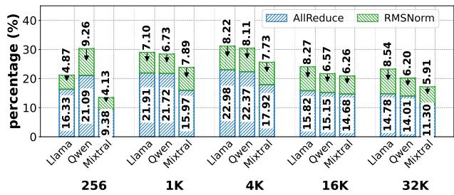  
Figure 1. AllReduce communication and RMSNorm overheads for three models versus sequence length on an 8×H100 DGX system (median across 12 runs; GPU clocks are locked to the TDP frequency (Prescott, 2022)). Despite NVLink and NVSHARP, communication overheads range from 9–23%. RMSNorm overheads are also non-trivial, ranging from 4–9%.

To mitigate non-trivial communication overheads in distributed LLM inference, numerous solutions have been proposed in the literature. These works typically decompose computation into subtasks and overlap communication with these subtasks. Decomposition can be done either in a fine-grained manner (i.e., tile-level) (Jangda et al., 2022; Wang et al., 2022; Chang et al., 2024; Zhang et al., 2025; Zheng et al., 2025a;b) or in a coarse-grained manner (i.e., token-level) (Shi et al., 2023; Jiang et al., 2024b; Zhu et al., 2024; DeepSeek-AI, 2025). However, to the best of our knowledge, none of the open-source serving systems like vLLM, SGLang (Zheng et al., 2024) and TensorRT-LLM (NVIDIA) enable compute-communication overlap by default for tensor-parallel inference.

This limitation arises from a fundamental challenge: communication overhead is hidden via decomposing a large computation into multiple smaller computations, but decomposition itself can suffer from a loss of compute efficiency. Modern GPUs offer a high degree of parallelism, which makes running a large computation much more efficient than running multiple smaller computations due to wave quantization effects. The decomposition overhead becomes more severe as the problem size reduces. Since AllReduce communication used in tensor-parallel deployments is highly optimized (9–23% overhead, Figure 1), even small decomposition overheads easily overwhelm any gains from overlapping communication3. As a result, prior solutions work well only for batches with a large number of tokens (8K+) (Zheng et al., 2025b). However, such large batches are typical only in training but not in low-latency inference serving, where the number of tokens processed in each iteration is tightly constrained (e.g., vLLM 0.8.5 uses a default chunk size of 2048 (vLLM Team, 2025a)). Thus, despite extensive prior research, tensor-parallel model inference continues to pay up to 20% communication costs today.

In this paper, we present TokenWeave, a system that reduces communication overhead during distributed LLM inference. To the best of our knowledge, it is the first to mitigate tensorparallel communication overheads in low-latency inference settings, delivering 1.2× relative latency improvement even in iterations with as little as 1024 tokens (Figure 2), thus accelerating LLM serving.

TokenWeave comprises three key ideas, as follows. Our first insight is that RMSNorm, an operation that has previously been ignored as insignificant (Zhu et al., 2024), is crucial for optimizing tensor-parallel communication overheads. This is not only because RMSNorm has a non-trivial overhead of 4–9% (Figure 1), but also because the RMSNorm operation is intricately connected with the communication operation. vLLM today implements RMSNorm after the

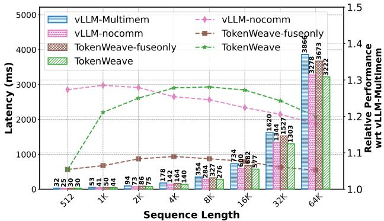  
Figure 2. Inference latency of Llama-3.3-70B on an 8×H100 DGX system for various sequence lengths. vLLM-Multimem corresponds to vLLM with an optimized AllReduce implementation using Multimem (NVIDIA, 2023) and NVSHARP (NVIDIA, 2024) support. vLLM-nocomm is a counterfactual baseline corresponding to only the computation time without any communication. The dotted lines show performance normalized to the vLLM-Multimem baseline. TokenWeave achieves up to 1.28× speedup. Even at shorter sequence lengths, TokenWeave provides significant gains, e.g., 1.2× at a sequence length of 1K tokens. At sequence lengths ≥ 4K, TokenWeave outperforms vLLM-nocomm by not only recovering all communication overhead but also providing additional gains due to its AllReduce–RMSNorm fused kernel.

AllReduce communication. Alternatively, one could break AllReduce into equivalent ReduceScatter and AllGather operations and perform RMSNorm after the ReduceScatter operation on only the tensor shard local to each GPU. While this keeps the mathematical operation unchanged, it reduces the per-GPU RMSNorm computation by a factor equal to the tensor-parallel degree. However, this alternative is not used today because splitting AllReduce into ReduceScatter and AllGather results in significant overheads, as shown in Figure 4, which outweigh any cost reduction in RM-SNorm (Table 1). In this paper, we show that an optimized AllReduce–RMSNorm fused kernel that carefully fuses ReduceScatter, RMSNorm and AllGather by minimizing HBM traffic can be significantly more efficient than either of the above alternatives. Further, this fused kernel also serves as a foundation to unlock compute-communication overlap for small token batches as discussed next.

Second, TokenWeave overlaps communication with computation using at most two-way GPU-wave-aware token splits, compatible with both chunked-prefills and prefill/decode batches (Figure 7). This allows communication (i.e., AllReduce) and RMSNorm (due to the fused kernel) of one split to proceed in parallel with the computation of the other. The splitting is carefully chosen to be wave-aware, ensuring that the total number of waves executed in kernels of the two splits is not more than the number of waves if there were a single non-split kernel, thus largely eliminating the compute overheads due to work splitting. For really small token batches, where splitting overheads remain, TokenWeave eschews splitting and simply uses the AllReduce–RMSNorm fused kernel (see Figure 3).

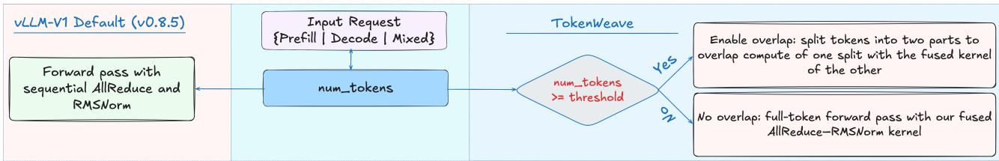  
Figure 3. Selective enabling of splitting/overlap in TokenWeave. At each iteration, the num tokens in the batch is checked against a token threshold. Full TokenWeave with splitting and overlap is enabled only for higher values of num tokens. For smaller num tokens, where splitting can result in higher overheads, we only enable the fused AllReduce–RMSNorm kernel. The method applies uniformly to prefill-only, mixed, and decode-only batches.

Third, by fusing communication and normalization and leveraging modern hardware features such as Multimem (Py-Torch Team, 2025), TokenWeave achieves efficient overlap while reserving only 2–8 SMs on H100 for both communication and normalization compared to 16–20+ SMs used for communication alone in prior work (Zhu et al., 2024; DeepSeek-AI, 2025). TokenWeave’s fused kernel ensures that the memory-bandwidth-bound communication and normalization operations do not interfere with each other while Multimem minimizes communication SMs, ensuring that the bulk of the SMs are dedicated to computation.

Our AllReduce–RMSNorm fused kernel shows consistent 1.34–1.39× gains across token sizes from 64 to 32K (Table 1), almost matching the performance of standalone AllReduce. Thus, even in disaggregated settings (Zhong et al., 2024; Patel et al., 2024) where prefill and decode are isolated from each other, small decode-only batches directly benefit from kernel fusion, while larger prefill-only batches achieve even greater improvements when combined with our compute-communication overlap strategy, outperforming prior overlap approaches.

We integrate TokenWeave into the latest vLLM-V1 serving framework and evaluate its performance across various models. Figure 2 shows that TokenWeave achieves up to 1.28× better overall latency compared to an optimized baseline, with 1.2× latency gains even for as little as 1K tokens in the batch. In comparison, a state-of-the-art communication overlap solution, TileLink, results in a latency increase even at 2K tokens and delivers maximum gains of 1.2× at 8K+ tokens (Figure 14). Further, for realistic end-to-end workloads, we find that TokenWeave also delivers up to 1.19× and 1.15× higher throughput for ShareGPT (ShareGPT, 2023) and arXiv (Cohan et al., 2018; arXiv, 2021) traces, respectively (Figure 11). Finally, in several settings, Token-Weave is even able to outperform an equivalent model with all communication removed since it also optimizes and overlaps the memory-bandwidth-bound RMSNorm operation.

In summary, we make the following contributions:

1. We identify RMSNorm as a crucial operation and optimize it via reordering and a novel, fused AllReduce– RMSNorm kernel that minimizes HBM traffic.

2. We design a wave-aware, two-way token split compatible with both chunked-prefills and prefill/decode batches to overlap compute and communication even for small token batches.

3. We reduce the SMs required for communication and normalization to 2–8 by leveraging NVSHARP/Multimem, enabling overlap without starving compute.

4. We present the first system that overlaps computecommunication for LLM serving of tensor-parallel sharded models, delivering up to 1.19× higher throughput in co-located settings. In disaggregated settings, our fused kernel helps optimize small decode-only batches, whereas large prefill-only batches can benefit from full overlap.

## 2 BACKGROUND

We provide a brief overview of the operations performed during transformer model inference. A standard decoderonly Transformer (Vaswani et al., 2017) processes an input sequence through multiple transformer blocks, each composed of a self-attention module, a feed-forward network (FFN), communication primitives (only in distributed settings), and normalization layers. The FFN layer typically consists of two linear transformations with a nonlinearity such as GELU (Hendrycks & Gimpel, 2016) in between. The attention layer is composed of multiple attention heads. It first performs a QKV-projection (i.e., pre-projection) operation to compute a query, key, and value for each of the heads, which is followed by the self-attention operation in every head, and finally an O-projection (i.e., post-projection) step that combines the output of all heads.

## 2.1 Distributed Inference

The large size of many modern LLMs requires inference to be run over multiple GPUs in order to fit the model parameters. Even if the model fits on a single GPU, distributed inference may still be required to meet the strict latency service-level objectives (SLOs) of interactive workloads. Moreover, distributed inference is more efficient in many cases, as it allows for higher batch sizes by freeing up memory for the KV cache.

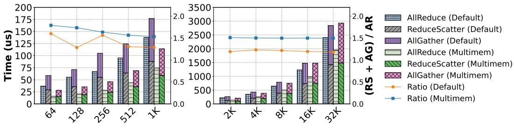  
Sequence Length

Figure 4. Splitting AllReduce (AR) into ReduceScatter (RS) and AllGather (AG) can result in non-trivial overheads. Shown are the absolute times and the relative performance (line plots) of these operations on an 8×H100 DGX system for varying sequence lengths. All runs are with a hidden size of 8192 using bf16.  
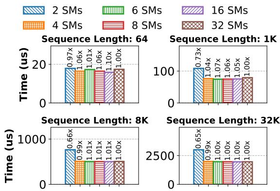  
Figure 5. Multimem-based AllReduce implementations require very few SMs. Shown is the performance of the Multimem AllReduce kernel with different numbers of SMs for varying sequence lengths (hidden size 8192, bf16). In most cases, 4–8 SMs are enough to achieve near-optimal performance.

For intra-node distributed inference, the most common parallelism strategy is tensor parallelism (TP). In TP, the FFN weight matrices are partitioned across GPUs — the first MLP is partitioned column-wise and the second rowwise (Shoeybi et al., 2019). Each GPU then performs computations using the local partial weight matrices. The individual outputs are then combined using an AllReduce operation to obtain the final output. For attention layers, the partitioning is done along the head dimension. Each GPU performs the QKV-projection and self-attention for the local heads. The output of the final O-projection matmul is finally combined across the GPUs using an AllReduce operation again. TP thus requires two AllReduce operations per transformer block, which lie on the critical path. This can add significant cost to inference latency and reduce GPU efficiency. For example, as shown in Figure 1, the communication can add an overhead of up to 23% even on an 8×H100 DGX system, which has high-speed interconnects.

## 2.2 NVSHARP, Multicast, and SymmetricMemory

The fourth generation (or later) NVSwitch systems (NVLink4) available in Hopper and Blackwell (or later) systems incorporate dedicated SHARP (Scalable Hierarchical Aggregation and Reduction Protocol) engines, termed NVSHARP or NVLS. NVLS enables GPUs to issue Multimem Parallel Thread Execution (PTX)4 store/load reduce instructions to multicast addresses. These instructions leverage the switch fabric to (i) duplicate packets to each subscribed GPU and (ii) perform an in-network reduction before forwarding the aggregated result. Because arithmetic operations are executed directly within the switch ASIC, communication collectives significantly reduce both NVLink bandwidth usage and GPU SM resource consumption. Modern NVIDIA architectures such as Hopper and Blackwell include native support for NVSHARP/Multimem. We expect such support to become standard across upcoming NVIDIA and potentially AMD GPUs.

PyTorch v2.6.0 exposes NVLS through its SymmetricMemory API (Wang et al., 2025). SymmetricMemory facilitates allocating peer buffers on GPUs using the symm\_mem.empty() call (similar to torch.empty()). After buffer allocation, a collective call to symm\_mem.rendezvous() exchanges memory handles, mapping peer buffers into the virtual address space of each participating GPU. Post-rendezvous, each GPU can access remote or multicast pointers using standard memory operations within Triton or CUDA kernels, eliminating explicit NCCL calls and substantially simplifying the implementation of communication routines.

These hardware and software advancements considerably decrease the number of SMs required for executing communication primitives and alleviate memory bandwidth pressure. In our experiments, we observed that utilizing only 6–8% of SMs on H100 GPUs suffices to saturate communication bandwidth, leaving the majority of SMs free for compute tasks that overlap communication. This can be seen in Figure 5, which shows the latency of the AllReduce kernel vs. the number of SMs.

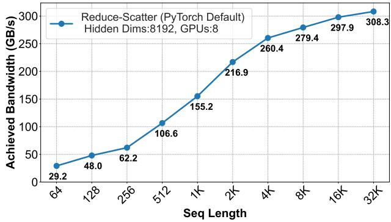  
Figure 6. Large collective operations are more efficient. Shown is the bandwidth for ReduceScatter (RS) on an 8×H100 DGX system for varying sequence lengths (hidden size 8192, bf16). Larger tensors result in much better bandwidth, demonstrating that splitting input into smaller parts results in overheads.

## 3 RELATED WORK

A common strategy for reducing communication overhead is to overlap the communication with some other computation. However, because of data dependencies, the data to be communicated becomes available only after the computation steps (FFN/Attention) finish. To solve this, one approach is to break the computation into smaller subtasks. The communication of completed subtasks can then be overlapped with the computation of the remaining subtasks. Breaking into subtasks, however, can result in reduced compute efficiency. Modern GPUs are much more efficient at running large computation kernels due to the high degree of parallelism they offer, and breaking into smaller kernels can result in wave quantization effects where a bunch of GPU SMs may not have any work in the last computation wave. Many techniques (Jangda et al., 2022; Wang et al., 2022; 2024; Chang et al., 2024; Zheng et al., 2025a;b) have been proposed to fix this via fused kernel implementations, where the communication is orchestrated from within the compute kernels as the computation of individual tiles finishes.

Wang et al. (2022), for example, break AllReduce into a ReduceScatter and an AllGather operation. The ReduceScatter is overlapped with the preceding computation, while the AllGather is overlapped with the subsequent computation. To orchestrate the overlaps, they rely on XLA (TensorFlow Team, 2021) and TPU support to invoke async collective APIs from within a tiled GEMM kernel. The reliance on XLA, however, has made porting to PyTorch + CUDA difficult, resulting in limited mainstream adoption.

Flux (Chang et al., 2024) provides a solution similar to that of Wang et al. (2022) for CUDA-based implementations. They also break AllReduce into ReduceScatter and

AllGather, and take a fused kernel approach via a CTA-level streaming scheme. Flux decomposes computation and communication into fine-grained operations and fuses them into a single kernel that interleaves compute and communication within CTAs. Tiles that require remote operands fetch them via GPU-initiated communication (e.g., NVLink/NVSwitch P2P or NVSHMEM (NVIDIA, 2025)), with transfers issued ahead of use so that independent tiles can proceed while data is in flight. This exposes opportunities to overlap communication with tensor-core MMA. However, the design of Flux and TileLink is fundamentally constrained by the gap between HBM and interconnect (i.e., NVLink) bandwidth: when communication is not fully hidden, remote accesses become throughput-limiting and fall on the critical path. In addition, tightly coupling communication with tile execution restricts scheduling flexibility, making performance sensitive to the compute-communication balance and less robust to workload variation.

The fused kernel approaches (Wang et al., 2022; Chang et al., 2024; Zheng et al., 2025b; Hassani et al., 2024; Wang et al., 2024) suffer from three problems. First, since the techniques rely on overlap within a GEMM kernel, communication overlap during non-GEMM operations like attention is not feasible. For example, the AllReduce after the FFN layer is performed by overlapping the ReduceScatter portion with the second MLP, and overlapping the AllGather portion with the QKV-projection of the next attention layer. This limits the opportunity for overlap. For small models or small batch sizes where the QKV-projection takes a very small time, there is not enough time to overlap the AllGather. Similarly, the O-projection does not take long enough to overlap the ReduceScatter. Second, the splitting into ReduceScatter and AllGather operations is less efficient compared to the equivalent AllReduce operation. Figure 4 plots the performance of a single AllReduce kernel compared to the cost of the equivalent ReduceScatter+AllGather for different communication sizes. As shown, this can add significant overheads, upwards of 50%. Third, the smaller tile-sized granularity of communication is less efficient than doing single large transfers. Figure 6 plots the achieved ReduceScatter bandwidth vs the tensor size. As shown, smaller communication sizes achieve much lower bandwidths. Due to these factors, Chang et al. (2024) and Zheng et al. (2025b) are able to effectively hide communication only when the GEMM is large enough, requiring batches with large tokens-in-batch.

NanoFlow (Zhu et al., 2024) attacks this problem from a scheduling angle: it slices an incoming batch into nanobatches — at the granularity of whole kernels (FFN, attention, collective) rather than CTA tiles — and assigns each nano-batch to a dedicated CUDA stream bound to a fixed subset of SMs. By co-scheduling nano-batches whose resource profiles complement one another (e.g., computeheavy FFNs alongside communication-bound ReduceScatter), NanoFlow overlaps GPU compute, HBM traffic, and NVLink transfers. The approach, however, relies on high batch sizes for breaking the input batch into sufficiently sized nano-batches, as smaller kernels of nano-batches can result in significant overheads.

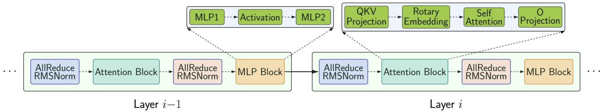  
(a) Vanilla Tensor Parallelism

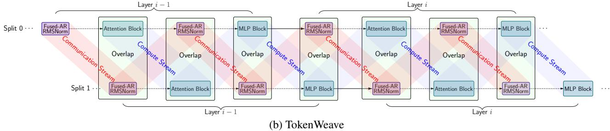  
Figure 7. Overview of TokenWeave: (a) Vanilla Tensor Parallelism: all compute and communication operations are performed sequentially. (b) TokenWeave: the input batch is partitioned into two splits. AllReduce is fused with RMSNorm, and computation of one split overlaps with communication of the other split. Separate compute and communication streams weave to orchestrate the overlap.

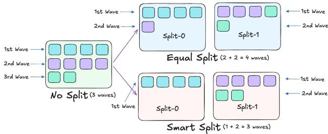  
Figure 8. Benefits of smart-splitting: Execution of a kernel with ten CTAs on a hypothetical GPU with four SMs. Assuming each CTA exclusively occupies one SM, the kernel executes in multiple waves as SM resources become available.

Splitting of batches has been proposed in multiple contexts in the past from training to inference (Huang et al., 2019; Shi et al., 2023; Jiang et al., 2024b; Zhu et al., 2024). Most recently, DeepSeek uses the idea of batch splitting in their inference system (DeepSeek-AI, 2025) to achieve computecommunication overlap. However, their inference system uses expert parallelism, which needs expensive all-to-all communication instead of the cheaper AllReduce needed for tensor parallelism. They overlap this all-to-all communication of one batch with the computation of the second batch. Note that the communication cost in DeepSeek is ∼ 50% (SGLang Team, 2025), compared to around 20% in TP (Figure 1). As a result, while splitting overheads can become a bottleneck when used with TP, they are not very critical for a DeepSeek type of setup, as the high communication overheads provide enough slack. Further, they do not overlap layer normalization along with communication.

## 4 TOKENWEAVE: DESIGN AND IMPLEMENTATION

We describe the techniques of TokenWeave— smart Token-Splitting, RMSNorm reordering, and a Multimem-based fused AllReduce–RMSNorm implementation. Figure 7 presents a high-level schematic comparing our method (b) to the standard tensor-parallel implementation (a).

TokenWeave partitions the incoming batch into two subsets, each with nearly equal compute and communication requirements. Why two subsets? At least two subsets are needed to create a pipeline and avoid dependencies. Splitting into more than two segments is inefficient because it increases decomposition overhead without providing additional compute-communication overlap opportunities.

For illustration of the splitting approach, consider an incoming batch of size 3 with sequences comprising L1, L2, and L3 tokens, respectively. These T tokens (T = L1 + L2 + L3) are divided into two parts: a prefix-split containing the initial tokens of length Ta, and a suffix-split containing the remaining subsequence of length Tb (T = Ta + Tb). These two splits, of lengths Ta and Tb, are processed separately in a pipelined manner. All transformer operations, except attention, are token-level, and pose no problem due to the split processing. However, the attention operation introduces dependencies, as attention computations of tokens in the suffix subsequence depend on tokens in the prefix subsequence. To handle these dependencies, TokenWeave employs a chunked attention implementation (Agrawal et al., 2024), and ensures that operations for prefix-split precede those of the suffix-split. When processing batches larger than size 1, partitions may comprise either complete or partial sequences. TokenWeave ensures all prefixes of partial sequences reside within the prefix-split, thereby preserving the necessary computational dependencies.

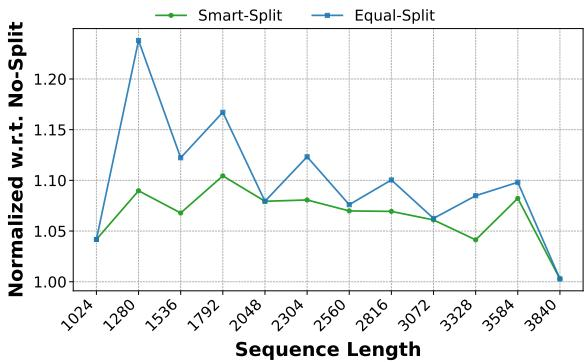  
Figure 9. Smart-splitting mitigates wave-quantization overheads. We compare smart-splits with equal-splits and show the normalized latency of the FFN layer w.r.t. no-split case (Llama-3.3-70B on an 8×H100 DGX, bf16). Smart-splitting reduces splitting overheads, especially for small sequence lengths.

## 4.1 Coarse-Grained Token-Splitting

## 4.1.1 Wave-Aware Smart-splitting

Partitioning a large GPU computation into smaller units can introduce overhead due to wave quantization effects. Consider a GEMM kernel that requires 300 CTAs (Cooperative Thread Arrays). On an NVIDIA H100 GPU with 132 SMs (Streaming Multiprocessors), assuming each CTA occupies exactly one SM, this computation will span 2 full waves and 1 partial wave utilizing 36 SMs. The kernel’s computation time will thus be 3× the execution time of one wave. For clarity, Figure 8 illustrates the wave-based execution of 10 CTAs on a hypothetical GPU with four SMs.

If this computation is evenly split into two batches of 150 CTAs each, each smaller batch now requires two waves: one full wave of 132 SMs followed by a partial wave of 18 SMs. Consequently, the two smaller computations collectively require four waves, thereby increasing execution time compared to the original unsplit computation.

To prevent such overhead, Smart-splitting employs a waveaware splitting strategy, ensuring that the combined waves required by both splits do not exceed the wave count of the original unsplit computation. In the example above,

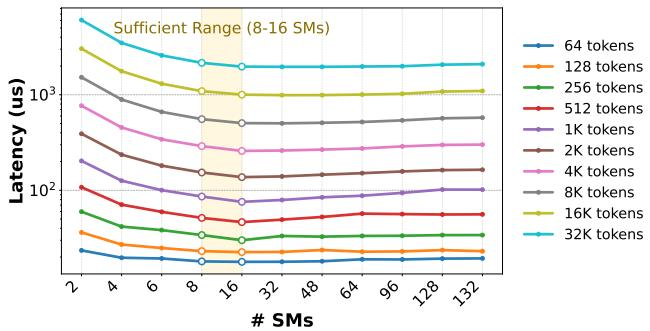  
Figure 10. Our fused AllReduce–RMSNorm kernel performs optimally with very few SMs. We show the latency of the kernel under varying numbers of SMs for different sequence lengths (hidden size 8192 on an 8×H100 DGX, bf16). Using 8 SMs is close to optimal in most cases.

Smart-splitting strategically divides the batch into one split containing 132 CTAs (exactly one full wave) and the other split with 168 CTAs (one full wave and one partial wave). This method effectively maintains the total computational waves, minimizing any wave quantization overheads due to splitting. Figure 9 compares the latency of the FFN layer with and without smart-splitting. As shown, smart-splitting can reduce splitting overheads, especially for batches with fewer tokens. The smart-splitting algorithm is shown in Algorithm 1 in Appendix A.

## 4.1.2 Overlapped Execution

The operations of these two batches can now be overlapped, as shown in Figure 7b. As illustrated, when AllReduce (+RMSNorm because of the fused kernel) of the first batch is being processed, we compute the attention of the second batch. The FFN of the first batch is then overlapped with AllReduce (+RMSNorm) of the second batch and so on. We implement this overlapped execution via CUDA streams. A communication stream handles all communication operations, while a compute stream runs the compute operations. Lightweight synchronization using torch.cuda.stream wait(stream, wait stream) is performed between the compute and communication streams to handle data dependencies.

## 4.2 RMSNorm Reordering

Distributed inference via tensor parallelism involves an AllReduce operation after attention and FFN computations (see §2.1 for background on distributed inference). This is followed by the residual addition and RMSNorm operations, which are computed independently by each GPU and are generally fused in modern implementations. However, since all GPUs have identical token embeddings after AllReduce, this results in redundant computation.

To address this inefficiency, TokenWeave strategically reorders RMSNorm operations within the AllReduce process. Specifically, the AllReduce operation can be decomposed into ReduceScatter and AllGather operations. At the completion of the ReduceScatter step, each GPU possesses the complete and final state of 1N of the tensor, where N denotes the total number of GPUs in the distributed replica. Consequently, each GPU can independently perform RMSNorm on its dedicated 1N portion without redundancy. Since RM-SNorm is a token-level operation, we only need to ensure that ReduceScatter splits the tensor only at token boundaries. This ensures that each GPU has the full token embeddings. The subsequent AllGather operation then distributes these post-RMSNorm values to all GPUs.

TokenWeave: Efficient Compute-Communication Overlap for Distributed LLM Inference  
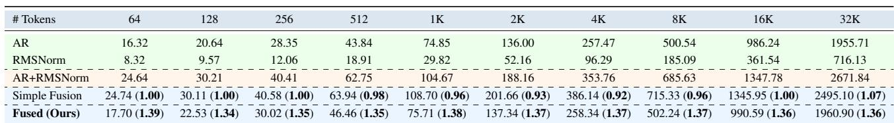  
Table 1. Fused AllReduce–RMSNorm kernel performance. We show the latency of AllReduce and RMSNorm operations separately and the latency of both operations when performed sequentially (AR+RMSNorm), with simple fusion (RS+RMSNorm+AG) and with our fused kernel (hidden size 8192, us, bf16, 8×H100 DGX). The numbers in parentheses show the relative performance compared to sequential (AR+RMSNorm) computation. Simple fusion results in worse performance for token sizes from 512 to 8K due to the overhead of splitting AR into RS and AG, as well as the different parallelization requirements of the communication and RMSNorm kernels. Our fused kernel results in significant gains of 1.34–1.39× across the token range and almost matches the AR-only performance.

Through this reordering, TokenWeave reduces the RM-SNorm computation by a factor of N compared to traditional implementations, thereby eliminating unnecessary redundancy. However, as shown in Table 1, such a simple reordering can actually result in performance loss, as the cost of dividing AllReduce into separate ReduceScatter and AllGather cancels the RMSNorm computation gains.

We analyzed the cause of the significant overhead of splitting AllReduce and found that the key difference between the integrated AllReduce implementation and the split implementation is the extra HBM reads and writes in the split implementation. While simple fusion fuses all three kernels into one, it is unable to reduce the HBM traffic overhead. Further, in some cases, simple fusion performs worse than the non-fused version because the optimal parallelization strategy for ReduceScatter or AllGather can be different from the optimal parallelization for RMSNorm, which only the non-fused version is able to exploit. We address these inefficiencies through a custom fused kernel, discussed next.

## 4.3 Fused AllReduce–RMSNorm Implementation

TokenWeave leverages Multimem capabilities (available on Hopper, Blackwell and future NVIDIA architectures) for an efficient, fused implementation of ReduceScatter, RM-SNorm, and AllGather operations. At a high level, during ReduceScatter, each GPU uses NVSHARP to instruct the switch to perform the reduction of its 1 -th portion of the tensor. We then perform RMSNorm computation immediately on this reduced portion available in the SM registers without using the HBM, and the results are subsequently directly written to the Multimem addresses for the AllGather distribution by the switch to all GPUs.

We provide the source code of our fused kernel in Figure 18 (Appendix A). A standard RMSNorm typically necessitates two HBM reads over the entire tensor — one to compute the variance of the token embeddings and another to scale the values by the computed variance — as well as one final HBM write, again over the whole tensor. In contrast, our fused implementation operates only on the local shard assigned to each GPU, rather than on the full tensor, and optimizes memory access by computing the variance (line 25: Sum of squares) directly on the result of the Multimem ReduceScatter (line 23), thereby eliminating the initial HBM read. Additionally, we save an extra HBM write by directly outputting the normalized values to Multimem for the All-Gather operation (line 36). Further, note that the residual addition operation is also fused with RMSNorm (line 24).

The reduction in memory accesses, combined with the elimination of redundant computations when RMSNorm is performed after AllReduce, makes our fused AllReduce– RMSNorm kernel very efficient. As shown in Table 1, the fused kernel provides up to 1.39× improvement over the current approach of separate AllReduce + RMSNorm computation across all sequence lengths on an 8×H100 DGX.

Also, the reduced compute and memory bandwidth requirements allow this fused kernel to be executed with very few SMs (only 2–8 in our experiments on 8×H100) without incurring much overhead — as shown in Figure 10, the kernel execution time does not improve much after 8 SMs. This allows us to overlap the full AllReduce–RMSNorm operation of one split-batch with the compute of the other split, enabling overlap of not just the communication but also the memory-bound RMSNorm operation. Since the fused kernel overlaps with computation from another split batch, allocating fewer SMs (e.g., four instead of eight) may incur some overhead; however, this overhead remains hidden as long as its execution time does not exceed that of the overlapped compute kernel.

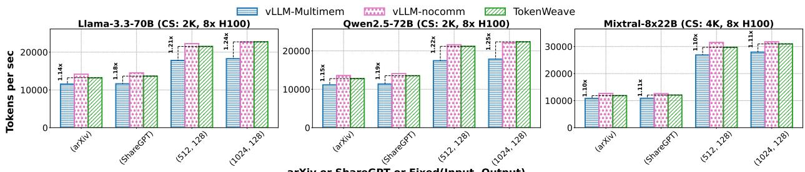

Figure 11. TokenWeave throughput gains for end-to-end workload traces. We show the measured throughput for ShareGPT, arXiv, as well as fixed (input, output)-length traces for different models on 8×H100 DGX.  
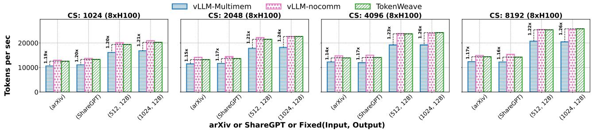  
Figure 12. TokenWeave throughput gains for end-to-end traces under chunk size variation. We show the measured throughput for ShareGPT, arXiv, as well as fixed (input, output)-length traces for Llama-3.3-70B on 8×H100 DGX. Chunk size varied from 1024–8192.

## 5 EXPERIMENTAL EVALUATION

We evaluate TokenWeave across a range of popular models and workload settings, and under multiple tensor parallelism (TP) configurations. In our evaluation, we seek to answer the following questions:

1. How much throughput improvement does TokenWeave provide when running real-world end-to-end workload traces? (§5.2.1).

2. How much communication latency overhead does Token-Weave recover for different models under different TP sizes and batch configurations? (§5.2.2).

3. How does TokenWeave compare to prior approaches such as TileLink and NanoFlow? (§5.2.3 and §5.2.4).

## 5.1 Experimental Setup

Implementation Details: We implement TokenWeave on top of the vLLM (Kwon et al., 2023) framework, a stateof-the-art serving system for LLM inference. Specifically, we build on the V1 engine (vLLM Team, 2025b) available in vLLM 0.8.5. Our implementation uses PyTorch 2.6.0 with CUDA 12.4. PyTorch provides support for symmetric memory, which we use to implement communication collectives via Triton 3.2.0 and custom PyTorch CUDA extensions (Wang et al., 2025). In addition, we use the FlashAttention-3 backend for attention computation.

Models: We evaluate TokenWeave on three popular models, Llama-3.3-70B, Qwen2.5-72B and Mixtral-8x22B, that are served on multiple GPUs using tensor parallelism today. The first two are dense models, while Mixtral is a mixtureof-experts (MoE) model.

Workloads: We evaluate over real-world traces, ShareGPT (ShareGPT, 2023) and arXiv (Cohan et al., 2018; arXiv, 2021), which have variable input prompt and output lengths. We also evaluate over synthetic fixed input and output length workloads to quantify the dependence on request length.

Environment: All our experiments in this section are performed on an 8×H100 NVIDIA DGX system with NVSHARP support, 128 CPU cores, and 800 GB of host memory. The TP-4 experiments in Appendix B use the same system but utilize only four of the eight GPUs. Additional experimental results on an 8×B200 DGX system are available in Appendix C. We also use fixed TDP settings to ensure stable performance measurements (Prescott, 2022). The CLI tool nvidia-smi can be used to lock the GPU clocks to the base TDP frequency for the entire GPU, for example, using nvidia-smi --lock-gpuclocks=tdp,tdp. The clocks remain fixed until they are reset with nvidia-smi --reset-gpu-clocks. For microbenchmarks, we perform warm-up, flush the L2 cache, and use cudaEvents for timing measurements. For endto-end (e2e) results, we perform warm-up and then use time.perf\_counter() for timing. We disable prefix caching to ensure consistent and fair comparisons. For e2e evaluations, we ignore the detokenization time (time to convert output tokens back to text performed on the CPU).

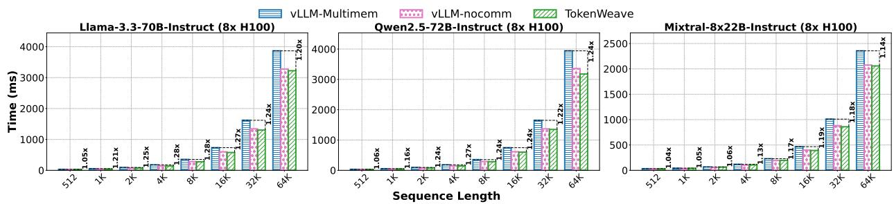  
Figure 13. TokenWeave latency gains. Execution times of prefill requests with varying sequence lengths for different models on 8×H100. TokenWeave is close to or better than the theoretical vLLM-nocomm baseline with zero communication overhead, showing that TokenWeave not only recovers all communication overhead, but provides additional gains due to RMSNorm optimization.

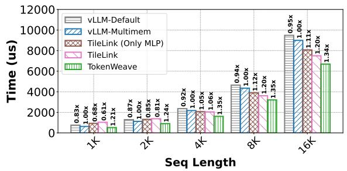  
Figure 14. Single-layer latency for Llama-3.3-70B on an 8×H100 DGX system. Numbers at the top represent normalized performance compared to vLLM-Multimem. While TileLink ends up with an overhead at small sequence lengths, TokenWeave consistently provides high gains over the entire sequence length range.

Baselines: We first compare against the vLLM 0.8.5 implementation that does not overlap communication operations. We evaluate both the default AllReduce implementation, called vLLM-Default, and an optimized AllReduce implementation that leverages the NVSHARP and Multimem support on modern NVIDIA architectures, called vLLM-Multimem. Further, we also report the performance of vLLM with all communication operations removed, called vLLMnocomm. While this version will not produce correct model output, it serves as a performance reference.

We also compare with TileLink (Zheng et al., 2025b) which is the current state-of-the-art method for reducing communication overheads using compute-communication fusion and outperforms Flux (Chang et al., 2024), a technique that optimizes compute, memory bandwidth and communication. However, note that TileLink5 is not integrated with vLLM, which makes end-to-end comparison difficult. We thus use an optimized single-layer implementation of Llama-3.3- 70B to compare TokenWeave against TileLink. NanoFlow again has its own serving stack and is not integrated with vLLM. Thus, to compare against the NanoFlow6 baseline, we look at the communication overhead that is recovered in NanoFlow against their baseline framework vs. that recovered by TokenWeave against vLLM, which is our baseline framework. We also report absolute numbers for reference.

## 5.2 Experimental Results

We now present our experimental findings. We first evaluate TokenWeave’s end-to-end performance and then compare it against TileLink and NanoFlow.

## 5.2.1 TokenWeave Throughput Gains

We first evaluate the throughput performance of Token-Weave for various workload traces. As is standard practice, we use chunked-prefills (Agrawal et al., 2024) with hybrid prefill–decode batching to ensure consistent latency guarantees while maximizing throughput. Chunked-prefills ensures that time-between-tokens (TBT) latency is bounded, resulting in a smooth response to the user. Chunked-prefills is turned on by default in the vLLM-V1 framework. For the first experiment, we use a chunk size of 2K (vLLM 0.8.5 default) for the dense models and 4K for Mixtral. We apply TokenWeave to hybrid batches with 1K or more tokens (4K for Mixtral) and use non-overlapped communication via our fused kernel for the smaller decode-only batches.

Figure 11 shows the performance evaluation with chunkedprefills on real-world workloads, such as ShareGPT and arXiv. These datasets contain requests with varying input and output lengths. To evaluate TokenWeave’s dependence on request lengths, we also present performance results on fixed input and output length requests. As shown, in the 8×H100 setting, TokenWeave continues to show substantial throughput gains of approximately 1.19× for dense models, effectively recovering most of the communication overhead. Figure 20 in the Appendix shows the corresponding results for the 4-GPU setting, again demonstrating strong performance improvements.

The chunk size used in chunked-prefills enables a trade-off between TBT latency and throughput, with smaller chunk sizes enabling lower TBT values but also resulting in lower throughput. In the second experiment, we vary the chunk size and evaluate TokenWeave’s throughput. Figure 12 uses the same workload as before but with varying chunkedprefills sizes for the Llama-3.3-70B model. The figure shows consistent performance improvements of 1.14× to 1.26× with TokenWeave across a range of chunk sizes.

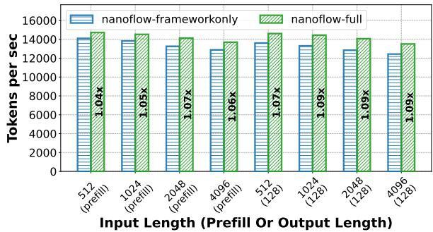  
Figure 15. NanoFlow throughput for end-to-end workload traces under fixed (input, output)-length traces for Llama-3.3-70B on an 8×H100 DGX. nanoflow-full corresponds to full NanoFlow, while nanoflow-frameworkonly disables NanoFlow (both nanobatching and overlap) but uses their custom serving framework.

## 5.2.2 TokenWeave Latency Benefits

We now evaluate latency for a single iteration of the forward pass. Results with prefill-only batches with varying sequence lengths are shown in Figure 13 and Figure 21 (Appendix). We evaluate five different settings, corresponding to three models running on 8×H100 and 4×H100, except for Mixtral-8x22B on 4×H100 due to insufficient memory for the KV cache. TokenWeave consistently achieves between 1.16× and 1.28× improvement from 1K onward for dense models on 8×H100, with notable gains even at shorter sequence lengths. For the MoE Mixtral model, the gains are generally smaller, as the communication overhead for Mixtral itself is also lower (Figure 1). Further, unlike the dense models, there is a net overhead for the TokenWeave full implementation in Mixtral at smaller sequence lengths of 1K and 2K. This is because, in MoE, the tokens for MLP computation get split across the experts (8 for Mixtral-8x22B), making the FFN computations memory-bound for smaller requests. As a result, even TokenWeave’s coarse splitting into two subtasks can result in non-trivial overheads that cannot be compensated by savings from computation overlap. However, we still see gains at smaller sequence lengths (1K and 2K) by selectively enabling only the fused kernel, with no overlapping, as depicted in Figure 3. For the 4×H100 experiments (Figure 21 in the Appendix), TokenWeave again gets good gains consistently over a range of sequence lengths starting from 1K. The gains are lower than 8×H100, as the communication overhead itself is less with fewer GPUs. Finally, we also show the latency numbers under varying batch sizes in Figure 22 (Appendix), again showing substantial improvements.

## 5.2.3 Comparison with TileLink

We now compare TokenWeave performance against TileLink, vLLM-Default and vLLM-Multimem. As noted earlier, we use a single layer of the model for comparison since TileLink is not integrated into a serving stack. We also compare against an additional baseline, TileLink-OnlyMLP, which performs the TileLink overlap only for the MLP layers. While this overlaps only one of the two communications per layer (i.e., AG of post-attention and RS of post-MLP), we find that it can be more efficient for smaller batches where the attention projection layers do not provide enough overlap opportunity and trying to overlap can increase rather than decrease overhead (recall that, unlike TokenWeave, TileLink can only overlap communication during GEMM computations).

For this evaluation, we use batch size 1 and vary the sequence length. Figure 14 shows the time taken for a singlelayer computation. As shown, TokenWeave achieves a 1.20× latency speedup even at a small request length of 1K tokens, while state-of-the-art TileLink actually ends up with a net overhead at small sequence lengths. TileLink results in performance improvements only for sequence lengths ≥ 4K, but the improvements saturate at around 1.2×, while TokenWeave provides significantly higher improvements of up to 1.35×. Note that the end-to-end latency gains reported in §5.2.2 are lower than the single-layer gains shown here due to additional non-layer overheads such as embedding, sampling, and other runtime components.

## 5.2.4 Comparison with NanoFlow

NanoFlow (Zhu et al., 2024) uses a custom serving stack and is not integrated with popular inference frameworks such as vLLM. This makes direct comparison of NanoFlow with TokenWeave difficult. Also, the NanoFlow implementation requires framework-level changes to co-ordinate the multiple nanobatches, which makes single-layer microbenchmarks impractical. Furthermore, NanoFlow’s current implementation only supports NVIDIA A100 GPUs, whereas TokenWeave targets modern NVIDIA GPUs such as H100s and later. To facilitate a meaningful comparison, we adapted NanoFlow’s custom serving stack to run on H100 GPUs by implementing necessary modifications.

While the NanoFlow paper shows that their serving stack is more efficient than an earlier version of vLLM on A100 GPUs, we find our vLLM-V1 (0.8.5) baseline throughput numbers on H100 GPUs are better than those of NanoFlow’s serving stack, perhaps because vLLM-V1 has significantly improved its performance recently. Thus, instead of performing an absolute throughput comparison, we resort to a relative performance comparison as described next.

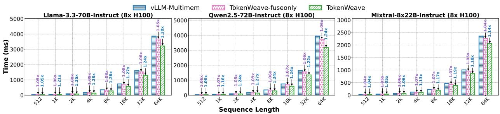  
Figure 16. We compare TokenWeave-fuseonly and full TokenWeave against the vLLM-Multimem baseline. Execution times are shown for prefill requests with varying sequence lengths for different models on 8×H100. TokenWeave-fuseonly provides gains due to the elimination of redundancy in RMSNorm computation and intermediate memory accesses, while TokenWeave provides additional gains from the compute-communication overlap.

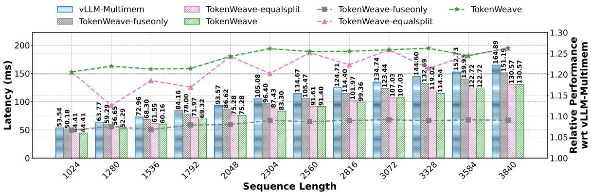  
Figure 17. Ablation results. TokenWeave-fuseonly uses only the fused kernel. TokenWeave-equalsplit enables token splitting and overlap but does not apply smart-splitting. Experiments are conducted on an 8×H100 DGX system.

We evaluate the adapted NanoFlow implementation under two conditions: with NanoFlow enabled and disabled within its own serving stack. Figure 15 shows the performance evaluation with chunked-prefills (chunk size 2K) on workloads with various fixed input and output length requests. As shown, NanoFlow provides only modest performance gains in the range of 1.04× to 1.09×, closely matching the 1.07× communication improvement reported in the NanoFlow paper. In contrast, TokenWeave demonstrates significantly larger improvements of approximately 1.19× across a broad range of scenarios (see Figure 11).

## 5.2.5 Ablation Study

Figure 16 shows ablation results for the fused AllReduce– RMSNorm kernel. TokenWeave-fuseonly delivers speedups of 1.04 × to 1.09× across all models due to the elimination of redundant computation and HBM accesses. Additionally, TokenWeave provides substantial gains over TokenWeave-fuseonly due to the overlapped communication. The 4×H100 configuration (Figure 23 in the Appendix) shows similar results.

Figure 17 shows an added ablation for smart-splitting, comparing TokenWeave gains with and without smart-splitting.

Without smart-splitting, the performance gains of Token-Weave see jitter depending on the exact sequence length. This is because the wave quantization effects from na¨ıve splitting can be noticeable for some sequence lengths and negligible for others. Smart-splitting removes this jitter almost completely, providing consistent gains throughout.

## 6 CONCLUSION

We find that the communication cost for large models served over multiple GPUs is as high as 20% today despite hardware support such as high-speed NVLink and NVSHARP. Furthermore, we identify that RMSNorm also results in an additional overhead of 4–9%. TokenWeave addresses these issues by splitting the model input into two approximately equal batches and overlapping the computation of one batch with the execution of a novel fused AllReduce– RMSNorm kernel on the other batch. Through extensive experimental evaluations using multiple models running on 8×H100, 4×H100, and 8×B200 DGX GPUs (see the Appendix for B200 and 4×H100 results), we show that TokenWeave achieves up to 1.28× relative latency improvement and up to 1.19× higher throughput compared to an optimized baseline in a variety of settings and workloads.

## REFERENCES

Agrawal, A., Kedia, N., Panwar, A., Mohan, J., Kwatra, N., Gulavani, B., Tumanov, A., and Ramjee, R. Taming {Throughput-Latency} tradeoff in {LLM} inference with {Sarathi-Serve}. In 18th USENIX Symposium on Operating Systems Design and Implementation (OSDI 24), pp. 117–134, 2024.

arXiv. arxiv summarization dataset. https://huggingface.co/ datasets/ccdv/arxiv-summarization, 2021. Dataset.

Chang, L.-W., Bao, W., Hou, Q., Jiang, C., Zheng, N., Zhong, Y., Zhang, X., Song, Z., Jiang, Z., Lin, H., Jin, X., and Liu, X. Flux: Fast software-based communication overlap on gpus through kernel fusion, 2024.

Cohan, A., Dernoncourt, F., Kim, D. S., Bui, T., Kim, S., Chang, W., and Goharian, N. A discourse-aware attention model for abstractive summarization of long documents. In Proceedings of the 2018 Conference of the North American Chapter of the Association for Computational Linguistics: Human Language Technologies, Volume 2 (Short Papers), pp. 615–621, New Orleans, Louisiana, June 2018. Association for Computational Linguistics. doi: 10.18653/v1/N18-2097. URL https://aclanthology.org/N18-2097.

DeepSeek-AI. Profiling data in deepseek infra, 2025. URL https://github.com/deepseek-ai/profile-data?tab= readme-ov-file#inference.

Grattafiori, A., Dubey, A., Jauhri, A., Pandey, A., Kadian, A., Al-Dahle, A., Letman, A., Mathur, A., Schelten, A., Vaughan, A., et al. The llama 3 herd of models. arXiv preprint arXiv:2407.21783, 2024.

Hassani, A., Isaev, M., McDonald, N., Ren, J., Thakkar, V., Wu, H., and Shi, H. Distributed gemm, 2024. URL https: //blog.shi-labs.com/distributed-gemm-88be6a481e2b.

Hendrycks, D. and Gimpel, K. Gaussian error linear units (gelus), 2016.

Huang, Y., Cheng, Y., Bapna, A., Firat, O., Chen, D., Chen, M., Lee, H., Ngiam, J., Le, Q. V., Wu, Y., et al. Gpipe: Efficient training of giant neural networks using pipeline parallelism. Advances in neural information processing systems, 32, 2019.

Jangda, A., Huang, J., Liu, G., Sabet, A. H. N., Maleki, S., Miao, Y., Musuvathi, M., Mytkowicz, T., and Saarikivi, O. Breaking the computation and communication abstraction barrier in distributed machine learning workloads. In Proceedings of the 27th ACM International Conference on Architectural Support for Programming Languages and Operating Systems, ASPLOS ’22, pp. 402–416, New York, NY, USA, 2022. Association for Computing Machinery.

ISBN 9781450392051. doi: 10.1145/3503222.3507778. URL https://doi.org/10.1145/3503222.3507778.

Jiang, A. Q., Sablayrolles, A., Roux, A., Mensch, A., Savary, B., Bamford, C., Chaplot, D. S., Casas, D. d. l., Hanna, E. B., Bressand, F., et al. Mixtral of experts. arXiv preprint arXiv:2401.04088, 2024a.

Jiang, C., Tian, Y., Jia, Z., Zheng, S., Wu, C., and Wang, Y. Lancet: Accelerating mixture-of-experts training via whole graph computation-communication overlapping. Proceedings of Machine Learning and Systems, 6:74–86, 2024b.

Kaplan, J., McCandlish, S., Henighan, T., Brown, T. B., Chess, B., Child, R., Gray, S., Radford, A., Wu, J., and Amodei, D. Scaling laws for neural language models. CoRR, abs/2001.08361, 2020. URL https://arxiv.org/abs/ 2001.08361.

Kwon, W., Li, Z., Zhuang, S., Sheng, Y., Zheng, L., Yu, C. H., Gonzalez, J. E., Zhang, H., and Stoica, I. Efficient memory management for large language model serving with pagedattention. In Proceedings of the ACM SIGOPS 29th Symposium on Operating Systems Principles, pp. 611–626, 2023.

NVIDIA. Tensorrt-llm. URL https://github.com/NVIDIA/ TensorRT-LLM.

NVIDIA. Parallel Thread Execution ISA Version 8.1 – Cooperative Thread Arrays. https://docs.nvidia.com/ cuda/parallel-thread-execution/index.html#changes-inptx-isa-version-8-1, 2023.

NVIDIA. NVIDIA Scalable Hierarchical Aggregation and Reduction Protocol (SHARP). https://docs.nvidia.com/ networking/display/sharpv300, 2024.

NVIDIA. NVIDIA OpenSHMEM Library (NVSHMEM). https://docs.nvidia.com/nvshmem/api/introduction.html, 2025.

OpenAI. GPT-4 technical report, 2023. URL https://doi. org/10.48550/arXiv.2303.08774.

Patel, P., Choukse, E., Zhang, C., Shah, A., Goiri, ´I., Maleki, S., and Bianchini, R. Splitwise: Efficient generative llm inference using phase splitting. In 2024 ACM/IEEE 51st Annual International Symposium on Computer Architecture (ISCA), pp. 118–132. IEEE, 2024.

Prescott, R. Advanced API Performance: SetStablePowerState. https://developer.nvidia.com/blog/advanced-apiperformance-setstablepowerstate/, 2022.

PyTorch Team. Multimem all reduce, 2025. URL https://github.com/pytorch/pytorch/blob/v2.6.0/torch/ csrc/distributed/c10d/CUDASymmetricMemoryOps.cu.

SGLang Team. Deploying DeepSeek with PD Disaggregation and Large-Scale Expert Parallelism on 96 H100 GPUs. https://lmsys.org/blog/2025-05-05-large-scaleep/, 2025.

ShareGPT. Sharegpt vicuna unfiltered dataset. https://huggingface.co/datasets/anon8231489123/ ShareGPT Vicuna unfiltered, 2023. Dataset.

Shi, S., Pan, X., Chu, X., and Li, B. Pipemoe: Accelerating mixture-of-experts through adaptive pipelining. In IEEE INFOCOM 2023-IEEE Conference on Computer Communications, pp. 1–10. IEEE, 2023.

Shoeybi, M., Patwary, M., Puri, R., LeGresley, P., Casper, J., and Catanzaro, B. Megatron-lm: Training multibillion parameter language models using model parallelism, 2019.

TensorFlow Team. Xla: Optimizing compiler for tensorflow. https://www.tensorflow.org/xla, 2021.

Vaswani, A., Shazeer, N., Parmar, N., Uszkoreit, J., Jones, L., Gomez, A. N., Kaiser, L., and Polosukhin, I. Attention is all you need, 2017.

vLLM Contributors. vLLM: Fused Add and Norm Kernel. https://github.com/vllm-project/vllm/blob/v0.8.5/ csrc/layernorm kernels.cu, 2023.

vLLM Team. Optimization and tuning. https://docs.vllm.ai/ en/v0.8.5/performance/optimization.html, 2025a.

vLLM Team. vllm v1, 2025b. URL https://blog.vllm.ai/ 2025/01/27/v1-alpha-release.html.

Wang, S., Wei, J., Sabne, A., Davis, A., Ilbeyi, B., Hechtman, B., Chen, D., Murthy, K. S., Maggioni, M., Zhang, Q., Kumar, S., Guo, T., Xu, Y., and Zhou, Z. Overlap communication with dependent computation via decomposition in large deep learning models. In Proceedings of the 28th ACM International Conference on Architectural Support for Programming Languages and Operating Systems, Volume 1, ASPLOS 2023, pp. 93–106, New York, NY, USA, 2022. Association for Computing Machinery. ISBN 9781450399159. doi: 10.1145/3567955.3567959. URL https://doi.org/10.1145/3567955.3567959.

Wang, Y., He, H., Wright, L., Wehrstedt, L., Liu, T., and Liang, W. Distributed w/ torchtitan: Introducing async tensor parallelism in pytorch, 2024. URL https://discuss.pytorch.org/t/distributed-wtorchtitan-introducing-async-tensor-parallelism-inpytorch/209487.

Wang, Y., He, H., and Wehrstedt, L. Pytorch symmetricmemory: Harnessing nvlink programmability with ease, 2025. URL https://dev-

discuss.pytorch.org/t/pytorch-symmetricmemoryharnessing-nvlink-programmability-with-ease/2798/1.

Yang, A., Yang, B., Zhang, B., Hui, B., Zheng, B., Yu, B., Li, C., Liu, D., Huang, F., Wei, H., et al. Qwen2.5 technical report. arXiv preprint arXiv:2412.15115, 2024.

Zhang, S., Zheng, N., Lin, H., Jiang, Z., Bao, W., Jiang, C., Hou, Q., Cui, W., Zheng, S., Chang, L.-W., Chen, Q., and Liu, X. Comet: Fine-grained computationcommunication overlapping for mixture-of-experts, 2025.

Zheng, L., Yin, L., Xie, Z., Sun, C., Huang, J., Yu, C. H., Cao, S., Kozyrakis, C., Stoica, I., Gonzalez, J. E., Barrett, C., and Sheng, Y. Sglang: efficient execution of structured language model programs. In Proceedings of the 38th International Conference on Neural Information Processing Systems, NIPS ’24, Red Hook, NY, USA, 2024. Curran Associates Inc. ISBN 9798331314385.

Zheng, S., Bao, W., Hou, Q., Zheng, X., Fang, J., Huang, C., Li, T., Duanmu, H., Chen, R., Xu, R., Guo, Y., Zheng, N., Jiang, Z., Di, X., Wang, D., Ye, J., Lin, H., Chang, L.-W., Lu, L., Liang, Y., Zhai, J., and Liu, X. Tritondistributed: Programming overlapping kernels on distributed ai systems with the triton compiler. 2025a. URL https://arxiv.org/abs/2504.19442.

Zheng, S., Fang, J., Zheng, X., Hou, Q., Bao, W., Zheng, N., Jiang, Z., Wang, D., Ye, J., Lin, H., et al. Tilelink: Generating efficient compute-communication overlapping kernels using tile-centric primitives. arXiv preprint arXiv:2503.20313, 2025b.

Zhong, Y., Liu, S., Chen, J., Hu, J., Zhu, Y., Liu, X., Jin, X., and Zhang, H. {DistServe}: Disaggregating prefill and decoding for goodput-optimized large language model serving. In 18th USENIX Symposium on Operating Systems Design and Implementation (OSDI 24), pp. 193–210, 2024.

Zhu, K., Zhao, Y., Zhao, L., Zuo, G., Gu, Y., Xie, D., Gao, Y., Xu, Q., Tang, T., Ye, Z., Kamahori, K., Lin, C.-Y., Wang, S., Krishnamurthy, A., and Kasikci, B. Nanoflow: Towards optimal large language model serving throughput, 2024.

Zou, R. [RFC] Support symmetric memory in torch.compile. https://github.com/pytorch/pytorch/issues/162859, 2025. PyTorch GitHub issue #162859.

## A IMPLEMENTATION DETAILS A.1 Fused AllReduce–RMSNorm Kernel

Figure 18 presents the implementation of our fused AllReduce–RMSNorm CUDA kernel. Each CTA processes a subset of tokens, performs inter-GPU reduction using the multimem ld reduce add primitive, computes the local variance, and applies normalization before storing results via multimem st. By eliminating intermediate memory accesses and offloading reduction to NVSwitch, this fused implementation achieves lower HBM communication latency and higher throughput compared to separate AllReduce and RMSNorm kernels.

## A.2 Smart-Splitting

Smart-splitting targets the total number of waves in the two split kernels to be not more than those in the original kernel. To achieve this, instead of assigning an equal number of tokens to each split, we increase the number of tokens in the prefix split by the split offset to ensure that it has full SM occupancy in its last wave of computation. Note that for very small batches where the original unsplit kernel has only one total wave, this assigns all tokens to the prefix split, effectively disabling splitting. This is discussed further in §A.3.

Since CTA assignment to SMs is a deterministic function of matmul shape, kernel implementation, configuration parameters (e.g. tile size), etc., we can determine the split offset either analytically or via offline profiling. However, we use closed-source cuBLAS kernels for matrix multiplication because of their higher performance, making it difficult to determine this split analytically. Thus, we do a simple profiling sweep for a range of sequence lengths, as shown in Algorithm 1, to determine the best split offset for each configuration and use that during runtime.

## A.3 Selective Enabling of Splitting and Overlap

As discussed earlier, splitting a batch into smaller subbatches can result in overheads in both compute and communication (e.g., see Figure 6). Smart-splitting and overlap mitigate most of these overheads and provide significant gains even at smaller batches of 1K tokens (Figure 13). However, if the batch has very few tokens, these splitting overheads can be significant and eat into the gains from overlapping compute and communication. In such scenarios, we disable the splitting and overlap, but continue to use our fused AllReduce–RMSNorm kernel. This is achieved by a simple thresholding as shown in Figure 3. Based on offline profiling, we use thresholds of 1K for the dense Llama and Qwen models, and 4K for the Mixtral MoE model on 8×H100 DGX system.

template <typename scalar\_t, int width>   
2 \_global   
→ multimem\_fused\_allreduce\_rmsnorm\_kernel(...) {   
3 const int vec\_hidden\_size = hidden\_size / width;   
4 int tokens\_per\_cta = (num\_tokens + gridDim.x - 1)   
,→ / gridDim.x;   
5   
6 sync\_remote\_blocks<MemOpSem::Relaxed>(signal\_pads ⌋   
,→ , rank, world\_size);   
7 \_syncthreads();   
8   
9 for (int iter = 0; iter < tokens\_per\_cta; iter++)   
,→ {   
10 int token\_id = blockIdx.x + iter \* gridDim.x;   
11 if (token\_id >= num\_tokens) continue;   
12   
13 float variance[1] = {0.0f};   
14 \_shared\_ float s\_variance;   
15 int offset = token\_id \* vec\_hidden\_size;   
16 int offset\_scalar = token\_id \* hidden\_size;   
17 auto input\_o = input\_v + offset;   
18 auto residual\_o = residual\_v + offset;   
19   
20 for (int idx = threadIdx.x; idx <   
,→ vec\_hidden\_size; idx += blockDim.x) {   
21 auto multimem\_temp = multimem\_ld\_reduce\_add<1 ⌋   
,→ 6>(multimem\_address\_ptr +   
22 offset\_scalar + idx \* width);   
23 vec\_t temp = \*(reinterpret\_cast<vec\_t\*>(&mult ⌋   
,→ imem\_temp));   
24 temp += residual\_o[idx];   
25 variance[0] += temp.sum\_squares();   
26 residual\_o[idx] = temp;   
27 2829 }   
blockReduceSum<float, 1>(variance);   
30 if (threadIdx.x == 0)   
31 s\_variance = rsqrtf(variance[0] /   
,→ hidden\_size + epsilon);   
32 \_syncthreads();   
33   
34 for (int idx = threadIdx.x; idx <   
,→ vec\_hidden\_size; idx += blockDim.x) {   
35 vec\_t temp = residual\_o[idx] \* s\_variance \*   
,→ weight\_v[idx];   
36 multimem\_st<16>(mcptr + offset + idx \* width,   
37 \*(reinterpret\_cast<Vec<16>\* ⌋   
,→ >(&temp)));   
38 }   
39 }   
40 \_syncthreads();   
41 sync\_remote\_blocks<MemOpSem::AcqRel>(signal\_pads,   
,→ rank, world\_size);   
42 }

Figure 18. Implementation of fused AllReduce–RMSNorm kernel. The current implementation only supports BFloat16. For brevity, we omit non-essential portions of the code. The kernel builds upon the PyTorch Multimem AllReduce (PyTorch Team, 2025) and the RMSNorm kernel from vLLM (vLLM Contributors, 2023).

## B EVALUATION

We provide some additional evaluations of TokenWeave in this section.

## B.1 Throughput Gains

Figure 20 presents TokenWeave’s throughput gains on 4×H100 GPUs for various end-to-end workload traces. Similar to the 8-GPU results discussed in the main paper, TokenWeave consistently improves throughput across both real traces such as ShareGPT and arXiv, as well as synthetic traces with fixed input and output lengths. While the relative performance is lesser as compared to 8 GPUs because of lower communication overheads, the trends remain consistent, demonstrating that TokenWeave’s optimizations scale effectively even at smaller GPU counts.

Algorithm 1 Smart-splitting   
Require: A set of batch sizes Bset, a set of sequence lengths   
Lset, token limit MAX TOKENS   
1: Initialize empty table optimal split[B, L]   
2: for each batch size B in Bset do   
3: for each sequence length L in Lset do   
4: num tokens ← B × L   
5: if num tokens > MAX TOKENS then   
6: continue   
7: end if   
8: half tokens ← num tokens/2   
9: best offset ← 0   
10: min time ← ∞   
11: for offset in {0, 64, 128, 192, 256, 512} do   
12: if offset ≥ half tokens then   
13: continue   
14: end if   
15: time ← model.forward(B, L, half tokens +   
offset, half tokens − offset)   
16: if time < min time then   
17: min time ← time   
18: best offset ← offset   
19: end if   
20: end for   
21: optimal split[B, L] ← best offset   
22: end for   
23: end for

## B.2 Latency Gains

Qwen/Qwen3-235B-A22B on 8×H100: Figure 19 provides the latency improvements of TokenWeave on 8×H100 GPUs for Qwen3-235B-A22B with varying sequence lengths. As shown, the gains are in a similar range as for the Mixtral MoE model shown in Figure 13.

Varying sequence lengths on 4×H100: Figure 21 provides the latency improvements of TokenWeave on 4×H100 GPUs for various models and varying sequence lengths. Similar to the 8-GPU results discussed in the main paper, TokenWeave provides substantial gains and is, in fact, close to or better than the theoretical vLLM-nocomm baseline with zero communication overhead. Thus, TokenWeave not only recovers all communication overhead but also provides additional gains due to RMSNorm fusion.

Varying batch sizes: The splitting in TokenWeave is performed at the token-level and works with any batch size. Similarly, the performance is also a function of mainly the total number of tokens in the batch and does not depend on the batch size directly. However, for completeness, we also show results with varying batch sizes in Figure 22. As shown, the results stay similar to the case of fixed batch size and varying sequence lengths (Figure 13 and Figure 21).

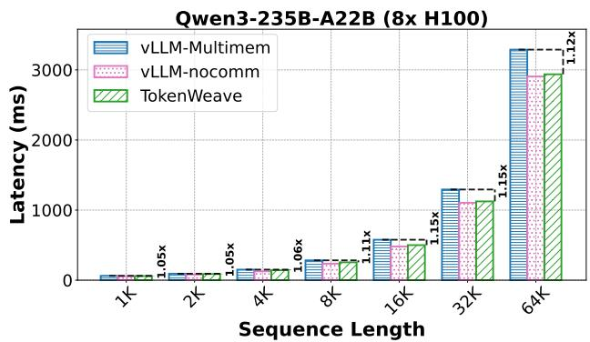  
Figure 19. Shown are the execution times for prefill requests with varying sequence lengths for Qwen3-235B-A22B on an 8×H100 DGX system.

## B.3 Ablation Study

Figure 23 shows ablation results for the fused AllReduce– RMSNorm kernel for the 4-GPU configuration, in addition to the 8-GPU results discussed in the main paper. The fused kernel remains effective even on 4 GPUs, although the relative performance improvement is smaller compared to 8 GPUs. This is because the compute savings in RMSNorm from the reordering after ReduceScatter are O(N), where N is the number of GPUs.

For completeness, we also show the ablation results across varying batch sizes in Figure 24. As expected, the results stay similar to the case of fixed batch size and varying sequence lengths (Figure 16 and Figure 23).

## C EVALUATION ON NVIDIA DGX B200 SYSTEM

Hardware and Environment: We run experiments on a server with eight NVIDIA B200 GPUs, each with 192 GB of HBM. The host system has 106 CPU cores and approximately 2.4 TB of system memory. We use PyTorch 2.10.0 with CUDA 13.0. For end-to-end evaluation, we use vLLM 0.14.1 and build TokenWeave on top of it, since vLLM 0.8.5 does not support B200 GPUs. We use the FlashInfer 0.5.3 backend for attention computation. Unlike our H100 experiments, we do not lock GPU clocks to the TDP frequency, as it requires root access that is unavailable on our shared B200 server. For microbenchmarks, we perform a warm-up phase, flush the L2 cache, and use cudaEvents for timing measurements. For end-to-end (e2e) results, we also perform warm-up and then measure latency using time.perf\_counter(). We disable prefix caching and ignore detokenization time, consistent with the H100 experiments.

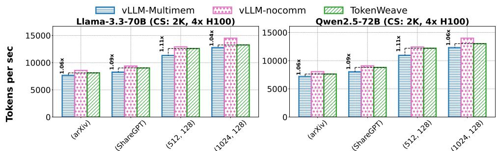  
arXiv or ShareGPT or Fixed(Input, Output)

Figure 20. TokenWeave throughput gains for end-to-end workload traces. Shown are throughput measurements across fixed (input, output)-length traces, as well as ShareGPT and arXiv traces, for two models on 4×H100.  
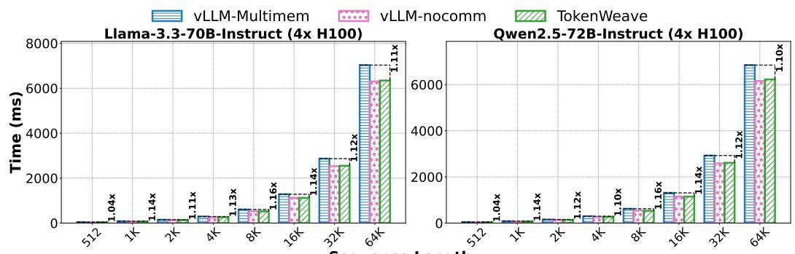  
Sequence Length

Figure 21. TokenWeave latency gains. Shown are the execution times for prefill requests with varying sequence lengths for different models on 4×H100.  
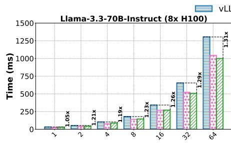

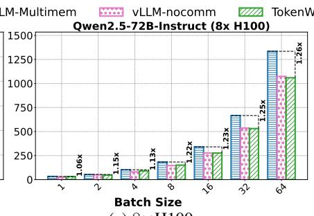  
(a) 8×H100

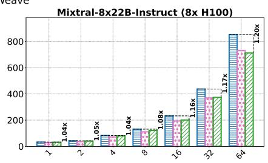

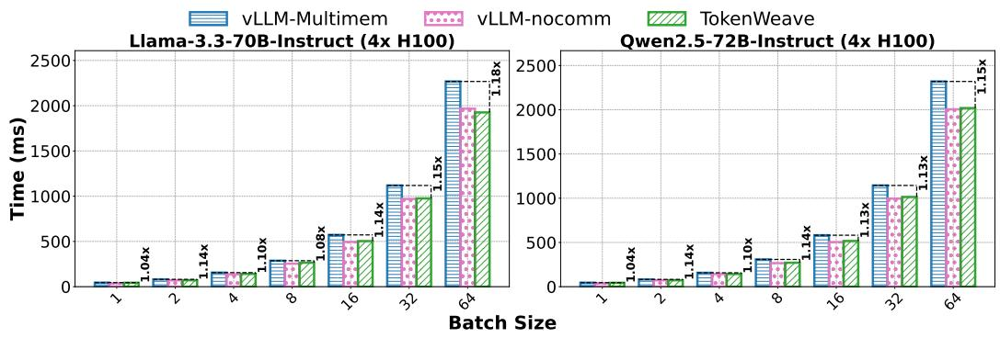  
(b) 4×H100  
Figure 22. TokenWeave latency gains. Shown are the execution times for prefill requests with varying batch sizes and sequence length of 512 for different models on (a) 8×H100 and (b) 4×H100. In almost all cases, TokenWeave is close to or better than the theoretical vLLM-nocomm baseline with zero communication overhead, showing that TokenWeave not only recovers all communication overhead but also provides additional gains due to RMSNorm fusion.

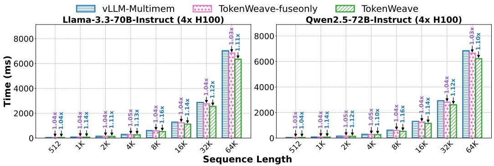

Figure 23. TokenWeave Fused AllReduce–RMSNorm kernel ablation. We compare TokenWeave-fuseonly and full TokenWeave against the vLLM-Multimem baseline. Execution times are shown for prefill requests with varying sequence lengths for different models on 4×H100. TokenWeave-fuseonly provides gains due to the elimination of redundancy in RMSNorm computation and intermediate memory accesses, while TokenWeave provides additional gains from the compute-communication overlap.  
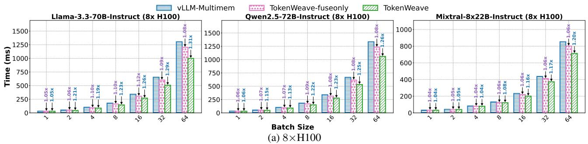

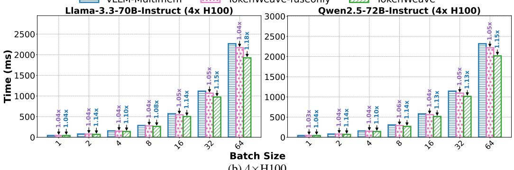  
(b) 4×H100  
Figure 24. TokenWeave Fused AllReduce–RMSNorm kernel ablation. Shown are the execution times of prefill requests with varying batch sizes, with the sequence length fixed at 512, for different models on (a) 8×H100 and (b) 4×H100. TokenWeave-fuseonly provides gains due to the elimination of redundancy in RMSNorm computation and intermediate memory accesses, while TokenWeave provides additional gains through compute-communication overlap.

## C.1 Fused AllReduce–RMSNorm Kernel

To further demonstrate the adaptability of our fused kernel, we evaluate it on an NVIDIA DGX B200 system. This DGX system also provides NVSHARP capabilities and supports Multimem instructions. As depicted in Table 2, the fused kernel reduces latency across sequence lengths and achieves 1.24–1.38× speedup over an additive baseline formed by standalone Multimem AllReduce and RMSNorm.

We measure the latency of both Multimem AllReduce and RMSNorm separately in isolation.

Similar to the trend observed in Figure 10, the latency of our fused kernel on 8×B200 decreases as the number of allocated SMs increases, with minor improvements beyond a threshold. As shown in Figure 25, for a hidden size of 8192 in bf16, performance improvements are small beyond approximately 8–16 SMs.

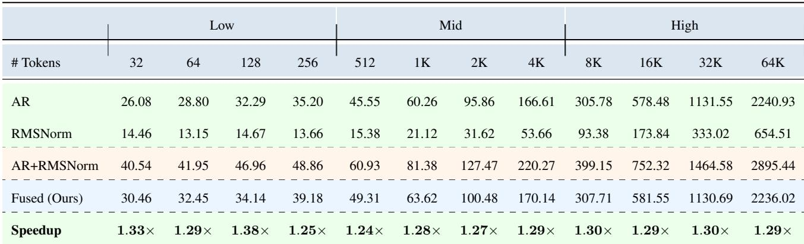

Table 2. Fused AllReduce–RMSNorm kernel performance. Multimem-based AllReduce and RMSNorm latencies are measured independently in isolation. AR+RMSNorm denotes their summed latency (i.e., AllReduce + RMSNorm), which is compared against our fused kernel latency (hidden size 8192, us, bf16, 8×B200 DGX). Speedup is the ratio of AR+RMSNorm to the fused latency.  
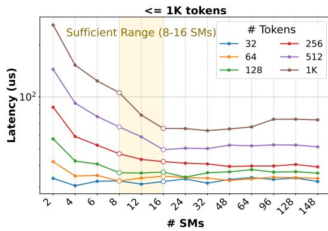

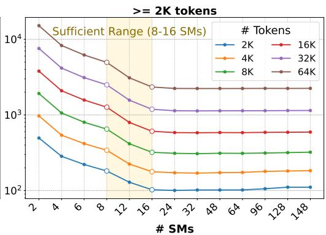  
Figure 25. Latency of the fused AllReduce–RMSNorm kernel versus SM count on an 8×B200 DGX system. Results are shown for sequence lengths from 32 to 64K tokens (hidden size 8192, bf16). Similar to the 8×H100 results, latency reductions diminish beyond roughly 8–16 SMs.

## C.2 Decode-Only Batches

In the V1 architecture, vLLM uses torch.compile to reduce Python execution overhead during inference. However, at present, torch.compile does not support symmetric memory allocation (Zou, 2025). To evaluate performance at small decode batch sizes, we disable torch.compile in vLLM 0.14.1 but use CUDA Graphs for both the baseline and TokenWeave configurations. Under small decode batches, the overhead introduced by splitting tokens into two parts offsets the performance gains obtained from compute-communication overlap. Therefore, we report only TokenWeave-fuseonly results for Llama-3.3-70B and Qwen3- 235B-A22B on an 8×B200 DGX system.

As shown in Figure 26, we see latency improvements of 1.01–1.05× across different models and context lengths. Note that Llama-3.3-70B has a hidden dimension of 8K, whereas Qwen3-235B-A22B has a hidden dimension of 4K. Thus, the latency gains from fusion alone are smaller for the Qwen3 MoE model than for Llama, as expected. Additionally, increasing the context length reduces the RMSNorm cost as a fraction of the total decode latency, which further decreases the relative performance gains. This trend can be seen in the 2K vs. 4K results in Figure 26.

## C.3 Prefill-Only Batches

As mentioned in §C.2, torch.compile currently does not support symmetric memory. Further, our full solution, which involves wave-aware token splitting and overlapping the compute of one split with the fused AllReduce– RMSNorm of the other, does not support CUDA Graphs. We therefore run prefill latency experiments in eager mode, which disables both torch.compile and CUDA graphs.

Consistent with H100 results, our fused kernel alone achieves 1.05×–1.07× latency improvements on Llama-3.3-70B. Our full solution, which comprises the fused AllReduce–RMSNorm kernel, smart splitting, and overlap, achieves up to 1.22× speedup over vLLM-Multimem across a range of 1K–64K tokens, as shown in Figure 27.

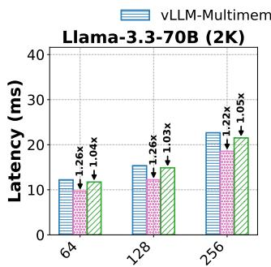

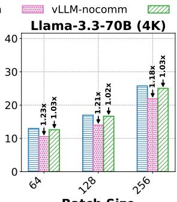  
Batch Size

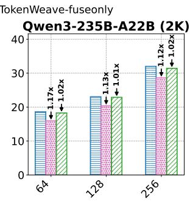

Figure 26. TokenWeave Decode Latency Gains on an 8×B200 DGX system for Llama-3.3-70B (context lengths 2K and 4K) and Qwen3-235B-A22B (context length 2K).  
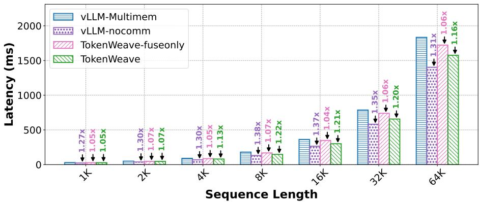  
Figure 27. TokenWeave Prefill latency gains on an 8×B200 DGX system for Llama-3.3-70B (varying sequence lengths). TokenWeavefuseonly achieves 1.05×–1.07× speedup, while full TokenWeave achieves up to 1.22× over vLLM-Multimem.

## D ARTIFACT

## D.1 Abstract

Distributed inference of LLMs can incur overheads of up to 20%, even when GPUs are connected via high-speed interconnects such as NVLink. Additionally, RMSNorm and residual addition also introduce non-trivial overhead, as they lie on the critical path of execution. TokenWeave addresses these inefficiencies by proposing (1) a fused kernel that optimizes RMSNorm and residual addition, and (2) a coarse-grained, GPU-wave-aware compute-communication overlap mechanism.

## D.2 Artifact check-list (meta-information)

• Compilation: CUDA 12.4

• Model: Llama-3.3-70B, Qwen2.5-72B, Mixtral-8x22B

• Dataset: Synthetic and ShareGPT

• Environment: Python 3.12, PyTorch v2.6.0, Ubuntu 22.04

• Hardware: 8×H100 DGX with NVSHARP support

• Metrics: Latency and Tokens per second

• Experiments: Microbenchmarks and end-to-end results

• How much time is needed to prepare workflow (approximately)?: 30 minutes

• How much time is needed to complete experiments (approximately)?: 9 hours 25 minutes

• Publicly available?: Yes

• GitHub: https://github.com/microsoft/tokenweave

• DOI: https://doi.org/10.5281/zenodo.18844243

## D.3 Description

## D.3.1 How to access

The source code is available at https://github.com/microsoft/ tokenweave on the artifact-evaluation branch. A snapshot of the code is also archived via DOI: https://doi. org/10.5281/zenodo.18844243. We recommend using the GitHub repository for the most up-to-date and actively maintained version. Note that root access7 is recommended for running this artifact, as the evaluation scripts automatically fix GPU clocks to their TDP frequency.

## D.3.2 Hardware dependencies

This artifact requires an x86 machine with an NVIDIA 8×H100 DGX system, with each H100 GPU having 80 GB of memory.

## D.3.3 Software dependencies

The artifact has been tested on a machine running Ubuntu 22.04 and CUDA 12.4 with PyTorch v2.6.0. Py-Torch v2.6.0 provides symmetric memory support. All other dependencies are resolved during installation.

## D.3.4 Datasets

Some experiments use the ShareGPT dataset, which is downloaded automatically on the fly. For most experiments, we use synthetic random datasets. Note that the arXiv dataset evaluation from the paper is not included in the artifact scripts to reduce overall evaluation time.

## D.3.5 Models

This artifact evaluates Llama-3.3-70B, Qwen2.5-72B, and Mixtral-8x22B. Note that we use instruction-tuned variants for all evaluated models. Accessing Qwen2.5-72B is straightforward, but accessing Llama-3.3-70B and Mixtral-8x22B requires logging into Hugging Face with your Hugging Face token:

huggingface−cli login −−token HF TOKEN

## D.4 Installation

To ease the setup, we recommend using one of the following Docker images: pytorch/pytorch:2.6.0-cuda12.4-cudnn9- devel or vllm/vllm-openai:v0.8.5.

## D.4.1 Docker Setup

After launching a container from one of the above images, follow the steps below to set up TokenWeave.

apt−get update; apt−get upgrade −y; apt−get install kmod git   
build−essential tmux −y   
git clone https://github.com/microsoft/tokenweave.git −−single−   
branch −b artifact−evaluation # Clone the repository   
cd tokenweave   
# Install miniconda; skip if already installed   
make install miniconda # 30 seconds   
make create env   
bash # Refresh shell and activate   
conda activate tokenweave   
make install # or pip3 install −v −e . (18 minutes)   
make install dependencies # 17 seconds   
huggingface−cli login −−token HF TOKEN

## D.4.2 Run offline inference examples

To verify that the setup is working correctly, run the following commands.

make run qwen2   
make run mixtral   
make run llama3

Note: If the Llama 3 download stalls, terminate and restart

the process. This typically resolves the issue.

## D.5 Experiment workflow

The TokenWeave evaluation scripts are available in the artifact/ folder. Our evaluation consists of two types of experiments: microbenchmarks (Table 1; Figures 1, 4, 6, 9, and 10) and end-to-end LLM performance (Figures 2, 11, 12, and 13). Use the Makefile present in the artifact/ folder to run experiments as follows:

```shell
cd artifact
make figure 4 6 # 20 minutes
make table 1 figure 10 # 1 hour 25 minutes
make figure 9 # 8 minutes
make figure 1 # 3 hours 25 minutes
make figure 2 13 # 42 minutes
make figure 11 # 1 hour 32 minutes
make figure 12 # 1 hour 52 minutes
```

Alternatively, run the following to execute all experiments and generate all plots in a single step:

cd artifact   
make clean   
make all # ˜9 hrs 25 minutes

## D.6 Evaluation and expected results

The artifact scripts redirect the raw output numbers and logs to the output/ folder, while the plotted graphs are saved as PDFs in the graphs/ folder. Summary data for each figure is saved as CSV files in the csvs/ directory. Results may have minor runtime variations from those reported in the paper, but general trends should hold.

## D.7 Notes

• We recommend running experiments inside a tmux session, as some benchmarks take several hours.

• Model weights for Llama-3.3-70B, Qwen2.5-72B, and Mixtral-8x22B require approximately 500 GB of disk space in total (downloaded and cached by Hugging Face on first run).

• Individual experiments can be re-run independently without affecting others. Use make clean to remove all generated outputs before a fresh run.

• Plots can be regenerated from existing output data without re-running experiments: make gen all.

## D.8 Methodology

Submission, reviewing, and badging methodology:

• http://cTuning.org/ae/submission-20190109.html

• http://cTuning.org/ae/reviewing-20190109.html

• https://www.acm.org/publications/policies/artifactreview-badging