# VIRTUAL MACHINE NUMA PLACEMENT AT SCALE:LEARNING THE NORM, SHIELDING THE TAIL

Yibo Zhao \* 1 Tianyuan Wu \* 2 Hui Xue 3 Qi Chen 3 Zhenhua Han 3 Zikai Xu 3 Yuntai Chang 4 Rui Gao 4 Steve Deng 4 Ray Jui-Hao Chiang 4 Mingxia Li 3 Yuqing Yang 3 Cheng Tan 1 Fan Yang 3 Peng Cheng 3 Yongqiang Xiong 3 Lili Qiu 3 Lidong Zhou 3

## ABSTRACT

In modern data centers, servers organize memory and CPUs into Non-Uniform Memory Access (NUMA) nodes, where unequal memory-to-CPU proximity leads to varying memory latency. Hypervisors must carefully place Virtual Machines (VMs) to reduce remote memory access. Poor placements can lead to significant performance degradation—sometimes up to 30%. However, achieving optimal placement at scale is challenging due to the large number of VM configurations, diverse NUMA structures, and evolving workload patterns. We present Catur, a NUMA placement system designed for large-scale cloud environments. Catur leverages reinforcement learning to learn from production data. Moreover, to address real-world challenges, Catur integrates several techniques: robust action space design to prevent model collapse, reward shaping to address learning inefficiency, drift-aware continuous training for evolving workload patterns, and speculative shielding to mitigate VM performance anomalies. Evaluations on production traces with 100 million VMs demonstrate that Catur reduces average resource defect by 34.2%–50.0% compared to state-of-the-art hypervisor policies.

## 1 INTRODUCTION

Cloud computing has revolutionized the provisioning of computing resources with unprecedented flexibility and cost efficiency. Cloud servers organize CPUs and memory into multiple Non-Uniform Memory Access (NUMA) nodes. Within a NUMA node, CPU cores access local memory with lower latency, whereas accessing remote memory—memory located in a different NUMA node— incurs higher latency. Hypervisors such as KVM (Red Hat), Xen (Xen Project, 2015), and Hyper-V (Microsoft, 2025) manage the placement of virtual machines (VMs) across NUMA nodes.

Efficient NUMA placement—the assignment of VMs to appropriate NUMA nodes—is a key problem for cloud providers. Poor placement degrades application performance and resource utilization. Our experiments (§2.1) show that suboptimal NUMA placements can cause >30% performance degradation for applications. Given the scale of cloud infrastructure, even modest inefficiencies in NUMA placement can lead to substantial resource waste and widespread performance degradation for users.

Indeed, customers of major cloud providers have reported performance anomalies due to NUMA effects. For example, ScyllaDB users observed a 60% drop in throughput on Oracle Cloud due to remote memory accesses (Chojnowski, 2021); Azure users found that some workloads on 120 cores performed worse than on 20 cores (u/satirerocks, 2021); and AWS users reported that four out of 36 vC-PUs ran at half the speed of the others (Tunyasuvunakool, 2015). VMware also warns that distributing vCPUs across NUMA nodes can lead to the “ping-pong effect”, further degrading performance (William). Thus, it is crucial to mitigate poor NUMA placements.

However, discovering an ideal NUMA placement plan presents significant challenges, particularly in large-scale cloud environments. By analyzing traces of 100 million VMs at CloudX1 (§2.2), we identify two key observations:

1. Large scale with high diversity: Cloud providers offer numerous VM types, each requiring a specific combination of CPUs and memory. This creates highly skewed resource demands across the infrastructure, as illustrated in our analysis (Figure 3, §2.2). These varied VMs must be mapped to different hardware configurations, where NUMA performance characteristics also vary between hardware architectures (Figure 4, §2.2).

2. Continuously evolving patterns: By monitoring production traces, we observe that VMs exhibit patterns with strong temporal and spatial locality: they drift over time (Figure 5, §2.2) and differ across clusters (§2.2).

These observations raise a key research question: what should we optimize for in the NUMA placement problem? The optimization goals exist at multiple levels. At the VM level, the goal is to minimize remote memory access by consolidating cores and memory to a single NUMA node. For physical machines, we aim to maximize resource utilization and minimize fragmentation to accommodate future VMs. At the global level, a cloud provider seeks to serve all user VMs while ensuring consistent service quality—no VM should suffer significant performance loss. Balancing these goals is challenging, and defining a precise optimization objective remains an open problem.

We propose placement defect—a metric indicating the severity of NUMA effects for VMs—to measure the quality of NUMA placement decisions. The metric comprises two components: core defect, which captures overloaded cores, allocating more virtual cores than the physical cores on each NUMA node; and memory defect, which quantifies the proportion of remote memory in each VM. The overall defect is calculated as a linear combination of both components (i.e., α×core defect + β×memory defect), with coeffcients α and β defaulting to 1, but adjustable when the cloud has more information (e.g., VMs for known services). We formally define these metrics in section 4.1.

Using placement defect as our foundation, we aim to optimize both normal and tail performance. In particular, our objectives are twofold: (a) minimizing the average defects across all clusters and over time, and (b) mitigating worst-case scenarios by preventing defects from exceeding an empirically determined threshold. To achieve the two goals, we introduce Catur, a NUMA placement system designed for large-scale cloud environments. The core philosophy of Catur is to learn the norm and shield the tail.

Catur uses a learning approach—reinforcement learning— to minimize the average defect while adapting to the dynamics of cloud environments and optimizing for longterm rewards. Reinforcement learning is a critical design for two main reasons. First, unlike rule-based policies (Red Hat; Xen Project, 2015), a learning approach can identify many subtle patterns in production traces. Manually tailoring policies for hundreds of VM types across multiple machine architectures with diverse characteristics (our observation 1) would be impractical, as confirmed by our experiments with existing hypervisor policies against production workloads (§2.2). Second, reinforcement learning captures long-term rewards more effectively than other learning approaches like supervised learning. This is crucial because the quality of a NUMA placement decision depends on future placements: an immediately rewarding placement now may trigger highly defective placements later. Reinforcement learning captures these sequential decisions and learns time-series patterns.

Importantly, Catur’s learning approach incorporates several new techniques essential for production deployment, including a reward shaping mechanism that resolves inefficient learning from skewed real-world traces (§4.1) and a robust action space summarized from existing policies to prevent model collapse (§4.2).

Catur addresses the tail performance challenge via speculative shielding (§4.3), a mechanism designed for handling short-term anomalies. Since patterns in the cloud continuously evolve (our observation 2), Catur inevitably encounters unseen scenarios. When the reinforcement learning model faces these new situations, it may make decisions that lead to performance anomalies—placements whose defects exceed the predefined threshold. Speculative shielding is a speculative execution approach that explores possible future states in advance and calculates the risk associated with different actions. This allows Catur to avoid choosing actions that have a high probability of causing performance anomalies. While speculative shielding handles short-term challenges, Catur relies on drift-aware continuous learning (§4.4) to adapt its model to new patterns over long term, thereby progressively reducing anomalies.

We implement Catur in HyperX, the production hypervisor in CloudX. Our evaluation on production traces with 100M VMs shows that Catur outperforms all state-of-the-art baseline policies, achieving a 34.2%–50.0% reduction in average defect—a 1.5–2× improvement. Additionally, compared with vanilla training, our techniques improve training efficiency by 16.4× while reducing training cost by 93.9%. Catur has been deployed to CloudX for early trials.

## 2 MOTIVATION AND CHALLENGES

Problem setup. Servers in modern cloud data centers are equipped with multiple CPU sockets, forming NUMA nodes that collectively support hundreds of CPU cores and terabytes of memory. Each server typically hosts multiple virtual machines (VMs) managed by a hypervisor like Xen (Xen Project, 2015), KVM (Red Hat), or Hyper-V (Microsoft, 2025). The hypervisor continuously receives VM requests and uses a NUMA placement policy to map the requested resources—cores and memory—onto the different NUMA nodes. This decision process is NUMA placement.

Defective NUMA placement arises when the hypervisor cannot locate idle resources that match both the NUMA topology and the VM requests. Figure 1 illustrates two types of defective NUMA placements: core defects and memory defects, which we formally define later (§4.1). Note that the actual problem is more complex than described here, as some VMs have their internal virtual NUMA architectures.

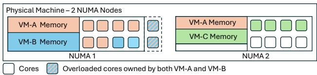  
Figure 1: Core overloading and remote memory in NUMA placement: three VMs (VM-A, B, C) are placed on a physical server with two physical NUMA nodes. VM-A and VM-B are placed on NUMA 1 leading to the overloading of two cores. VM-A’s memory is served by two NUMA nodes, leading to remote memory.

## 2.1 Motivation

NUMA placement is critical. NUMA placement is a crucial problem in the cloud due to its impact on VM performance. Different placement strategies can lead to varying performance of the same VM type, which confuses users who expect consistent, reliable, and predictable services. We next show how different NUMA placement defects can result in significant performance differences.

We experiment with five applications—TeraSort, SPECjbb, SPTAG, DBApp, ObjectStore—that exhibit diverse characteristics when running on the same VM with various memory and core defects. In particular, we vary the percentage of remote memory accesses from 0% to 100%: 0% represents the optimal case with all memory accesses to local memory, while 100% represents the worst case where all accesses are remote. We also separately adjust core allocations by overloading NUMA nodes with virtual cores from 0% to 30%: 0% represents the optimal case with one virtual core mapping to one physical core, while 30% means there are 30% more virtual cores than physical cores on the NUMA node. We then measure the end-to-end performance of these applications.

Figure 2 presents the results, showing that performance degradation can be >30% when defects occur. Additionally, applications have different sensitivities to these defects. For example, SPTAG (Chen et al., 2021) is a memory-intensive application for indexing data of a search engine, which is sensitive to remote memory access but less so to core overloading. DBApp, a database application, is more sensitive to core overloading than remote memory.

Existing approaches. To minimize defects, existing hypervisors rely on rule-based, heuristic policies to place VMs on NUMA nodes. For example, Xen (Xen Project,

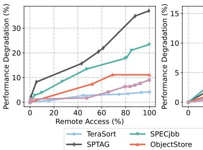

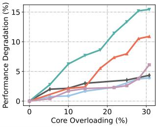

Figure 2: The performance degradation under different memory/core defects (median performance is reported).  
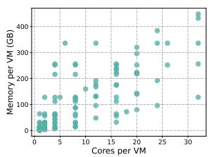

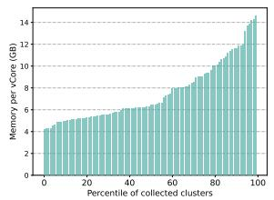  
Figure 3: On the left: distribution of Memory and CPU of VM configurations. On the right: distribution of Memoryto-CPU ratio of 100 million VMs at CloudX.

2015) attempts to place each VM on as few NUMA nodes as possible, selecting the candidate node with the fewest scheduled cores and breaking ties by preferring nodes with more available memory. OpenStack Nova (OpenInfra Foundation, 2023) offers two policies: the default “pack” policy favors heavily utilized nodes, ranking NUMA nodes first by CPU usage, then by memory availability; the alternative “spread” policy follows the same strategy as Xen. The Enhanced Parallel Virtual Machine (E-PVM) algorithm (Amir et al., 2000) minimizes the marginal increase in exponential cost derived from CPU and memory usage, promoting balanced resource utilization. Tetris (Grandl et al., 2014) dynamically tunes VM placement to jointly balance CPU and memory demands.

## 2.2 Challenges

However, rule-based policies fail to address the NUMA placement problem for large-scale cloud environments. Next, we highlight the challenges.

Large scale plus high diversity. As mentioned (§1), cloud providers support many and diverse VM types. Figure 3 illustrates (a) the wide range of VM configurations that CloudX supports, each with distinct core and memory requirements, and (b) the diverse combinations of CPU and memory demands across 100M VM requests from CloudX. This extensive variety of VM configurations complicates placements, making it difficult for heuristic policies to maintain consistent performance across workloads.

In addition to diverse VMs, distinct hardware architectures (Zhang et al., 2015) intensify diversity challenges. Figure 4 illustrates the cross-NUMA throughput and latency characteristics of two different physical server types. They exhibit notable differences in inter-socket bandwidth, latency, and the number of NUMA nodes per socket. Such hardware diversity makes it particularly difficult for rulebased policies to adapt effectively across different infrastructure configurations.

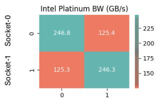

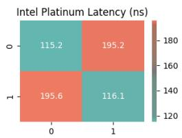

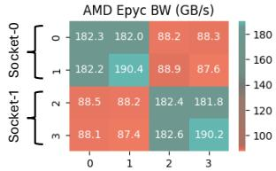

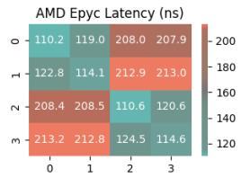  
Figure 4: Bandwidth and latency of cross-NUMA accesses. Each row/column represents a physical NUMA node. Intel servers have two sockets and one physical NUMA node per socket. AMD servers have two sockets and two physical NUMA nodes per socket.

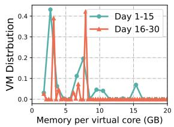

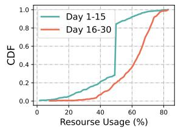  
(a) VM distribution  
(b) Server resource usage  
Figure 5: (a) Per-core memory distributions differ between two periods (Day 1–15 and Day 16–30). (b) Server utilization CDFs show distinct patterns across the two periods (Day 1–15 and Day 16–30).

Continuously evolving patterns. In production, VM requests exhibit temporal and spatial pattern drift: the demanded VM types and VM arrivals have patterns, but these patterns shift over time and across clusters. Figure 5 illustrates the temporal drift by comparing VM request patterns and server utilization across two periods. In the first half of the month (Days 1–15), VM requests are predominantly memory-heavy. In contrast, the second half (Days 16–30) shows higher server utilization and a shift in VM workload distributions. For spatial pattern drift, we evaluate policies across four clusters. Each baseline policy excels on some clusters and performs poorly on others, with performance varying across the rest. No policy consistently works well in all clusters.

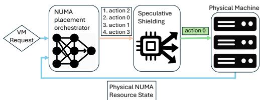  
Figure 6: Catur overview.

## 3 LEARNING THE NORM, SHIELDING THE TAIL

Motivated by observations from production traces, we introduce Catur, a NUMA placement system that leverages a learning-based approach to recognize complex patterns and adapt to shifting workloads. As illustrated in Figure 6, Catur makes the NUMA placement decision based on (a) the incoming VM request, including cores and memory requirements, and (b) the current states of the physical machine, specifically the available cores and memory across NUMA nodes. The placement orchestrator generates a list of candidate actions (e.g., NUMA IDs for the VM), ranked by their estimated utility. A speculative shielding module then evaluates the risk associated with each action and selects one that balances short-term gain and long-term risk. The chosen action is applied to the physical machine, and the machine state is updated accordingly.

Learning the norm. To learn placement patterns, Catur uses reinforcement learning, a well-established approach for solving sequential decision-making problems in systems (Mao et al., 2016; 2017; 2019; Marcus et al., 2021; Fang et al., 2019; Jay et al., 2019; Ortiz et al., 2018; Krishnan et al., 2018). NUMA placement is precisely such a problem—each placement decision changes the availability of cores and memory across NUMA nodes, which in turn affects future NUMA placements.

Furthermore, RL is better suited for cloud environments than alternative approaches. Unlike rule-based policies, RL learns patterns from production traces and adapts to the complexity of real-world workloads. Compared to other learning methods like supervised learning, RL excels at looking beyond short-term benefits to discover long-term rewards, which is essential for NUMA placements.

Shielding the tail. As a public cloud provider, ensuring a good user experience is critical. The most disruptive experiences, such as customer complaints (Chojnowski, 2021; u/satirerocks, 2021; Tunyasuvunakool, 2015), arise from the tail scenarios, where NUMA placements result in significant defects—referred to as performance anomalies. These anomalies are defined as cases where the combined core and memory defects exceed an empirically defined threshold. While RL algorithms are good at optimizing average performance, they sometimes overlook the tail scenarios. The best RL model we trained (§4.2), despite having better average defects, still exhibits 44% more performance anomalies than the best heuristic policy. However, this gap can be removed by Catur (§4.3) .

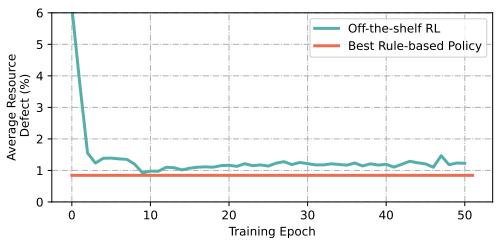  
Figure 7: RL underperforms a rule-based policy.

Catur uses speculative shielding to assess candidate actions by speculatively applying them and estimating the likelihood of future anomalies. Catur formulates this exploration as a traversal over a NUMA-state transition tree, where nodes represent machine states and edges correspond to ⟨action, VM⟩ pairs. During this traversal, Catur needs to trade off immediate gain and potential future risks, and selects actions that strike a balance.

Real-world challenges. While conceptually intuitive, implementing Catur in production presents real-world challenges. By experimenting with an initial implementation in our environment, we observed three major issues. We elaborate on each of them below.

(1) Inefficient learning from skewed workloads. During training, we observe that the model’s progress is slow and unstable—the defect rate does not consistently decrease as training epochs increase, as demonstrated in Figure 7. A deeper analysis of the model’s decision contexts reveals a learning imbalance: not all placement decisions offer equal learning value. Placement decisions for resource-rich servers—those with abundant cores and memory across all NUMA nodes—present trivial challenges compared to decisions for highly utilized servers with limited resources.

Unfortunately, these easier scenarios dominate the training data, offering limited learning value. We categorize all placement decisions into three distinct types: “no defect” cases (55.03%) where no defects occur regardless of NUMA node selection; “unavoidable defect” cases (6.86%) where defects are unavoidable regardless of placement choice; and “avoidable defect” cases (38.11%) where different NUMA selections actually lead to varying quality outcomes. This distribution reveals our central challenge— the majority of training examples provide no useful signal for the model. Consequently, when blindly trained on the full dataset, the model fails to develop effective strategies for the critical scenarios: the constrained resource conditions that are the primary source of placement defects.

(2) Model collapse. We train an RL model on a one-month production trace. The model’s inputs (i.e., RL state) include NUMA information and VM requests, and its outputs (i.e., RL actions) select the NUMA node for each VM placement. While testing the model on a later set of traces, we observe that the model gradually underperforms relative to existing policies, a phenomenon known as model collapse (Farebrother et al., 2018). This is due to a combination of outliers and gradual shifts in workload patterns. In our experiments, VM requests vary across clusters and over time, resulting in up to 25% of unobserved states during a one-month period (Figure 8(a)). Such drift degrades performance and causes model collapse, increasing defective VM rate to 19%—a 4.2× jump from 4.5% (Figure 8(b)).

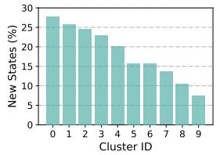  
(a) Unobserved states

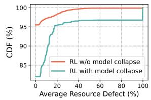  
(b) Impact of model collapse  
Figure 8: Unobserved states and change of VM request patterns lead to the model collapse that off-the-shelf RL cannot provide robust performance.

(3) Balancing performance with anomaly prevention. Identifying all anomalies in NUMA placement is computationally infeasible due to the enormous search space with hundreds of possible ⟨action, VM⟩ pairs. Moreover, attempting to prevent all potential anomalies is overly conservative, leading to excessive false positives that unnecessarily restrict the RL model’s actions and significantly degrade average performance. Balancing average and tail performance while ensuring speculative shielding terminates within the time budget is a challenge.

## 4 CATUR: NUMA PLACEMENT AT SCALE

Catur’s RL formulation and training. We model the NUMA placement as a Partially-Observed Markov Decision Process (POMDP). At each time step t, the RL agent observes the state st, takes an action at, and transitions to a new state st+1, receiving a reward rt. The agent aims to maximize the expected cumulative reward, enabling adaptive decision-making.

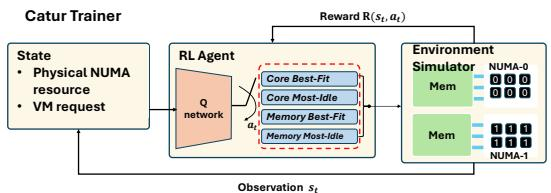  
Figure 9: Catur’s RL workflow for NUMA placement. By observing system states, the RL agent adaptively selects one policy to handle the VM request. The reward feedback updates the RL model for training.

Figure 9 summarizes how Catur applies RL to the NUMA placement problem. As shown, the Catur RL framework, trained at the level of physical machines, uses a lightweight ResNet (He et al., 2016) based Q-network to place VMs. Upon a VM arrival or stop event in this machine, the agent observes a state st. The RL agent takes this state as input and yields a VM placement action to be executed by the hypervisor. The training configurations and details are described in our appendix.

## 4.1 Reward design

The goal of optimizing VM placement is to improve overall application performance, which is influenced by two key factors: core defects and memory defects. The reward function is designed to jointly minimize both.

Quantifying core and memory defects. Core defects arise from overloaded virtual cores competing for physical cores. So, we define Core Overloading Ratio (COR):

$$
\tag{1}
$$

where vCores is the number of virtual cores requested by the VM and Core Capacity is the number of physical cores provided by the NUMA node. COR is defined at the NUMA level as VMs on the same NUMA share the overloaded cores.

Memory defects result from remote memory accesses. We measure them using the Remote Memory Ratio (RMR):

$$
\tag{2}
$$

where Memremote is the remote memory allocated to the VM; M emtotal is the total memory VM requests. RM R is defined at the VM level because the remote memory only affects the corresponding VM.

Reward. Catur designs the per-VM reward as a linear combination of its memory and core defects:

$$
\tag{3}
$$

Since both COR and RMR have a range of [0, 1] (Equation 1 and 2), we clip the scores into [−1, 1] with symmetric positive and negative rewards, which have been shown to be effective for RL training (Engstrom et al., 2020). By default, Catur sets α and β to 1, assigning equal weight to core and memory defects. This default reflects that Catur has no visibility into the internal workloads of VMs. However, for VMs cloned to run pre-built services (like database services) or running cloud services of CloudX, Catur uses calibrated α and β values that more accurately capture the relative impact of defects for applications.

Finally, the reward is calculated by summing up the performance scores of all N alive VMs, which measures how

action impacts performance:

$$
\tag{4}
$$

Reward shaping. To address the inefficient learning challenge (§3), Catur uses reward shaping based on the hardness of placements. Recall that VM placements happen in very skewed server states with different placement hardness. Treating them equally will lead to degraded performance with potential over-fitting to easy cases.

Catur introduces a load-aware reward reshaping strategy by extending the reward defined in Equation 4 as follows.

$$
\tag{5}
$$

$$
\tag{6}
$$

Load-aware reward shaping is equivalent to a special normalization: if the reward obtained by executing any action in state s is the same, it implies the case does not contribute to the differentiation of different actions, thus we set rload−aware(s, a) = 0. If r(s, a) is higher than the reward obtained by other actions, it implies this action performs better in a hard case than others, thus we use its original reward, i.e., rload−aware(s, a) = roriginal(s, a). Otherwise, it means an action a performs worse than other actions in the hard case, thus we punish it by setting rload−aware(s, a) to the negative of the reward obtained by the winning action.

## 4.2 Robust action space

Model collapse may occur when the RL model encounters previously unseen patterns. Catur prevents model collapse by designing a robust action space.

Observation. We observe that the heuristic policies used by existing hypervisors are a combination of a few primitive policies. These primitives consider VM placements in two dimensions: (a) focused resources: either cores or memory, and (b) allocation strategy: either best fit— selecting from NUMA nodes with sufficient resources while minimizing the difference between available and requested—or most idle—choosing the NUMA node with the most available resources. In total, this yields four primitives: CoreBestFit, CoreMostIdle, MemBestFit, and MemMostIdle.

Based on this observation, we hypothesize that these four policies will cover almost all good placement decisions. To confirm this hypothesis, we analyze 1 million VM requests from production traces and exhaustively search the state space. The results show that these four policies can reach 98.5% of all possible states of physical NUMA nodes reachable by placing the VM request in all possible combinations. That includes suboptimal ones that severely waste server resource and should not be considered in practice. This finding demonstrates that the four primitive policies define an action space that effectively spans most practical placement decisions.

Catur’s action space. Instead of directly selecting NUMA nodes, Catur uses the four primitive policies as its possible actions. This approach ensures that when facing new patterns, all policies—despite sometimes not being ideal— at least produce reasonable choices without selecting unreasonable NUMA nodes (e.g., packing VMs into overloaded NUMA nodes). In addition, using the four policies enhances the system’s interpretability and prevents unexplainable decisions, a common issue in RL-based solutions.

The resulting system performs effectively: our experiments (§6.2) show that Catur, using the action space, performs on par with the Oracle, which searches optimal placements using knowledge of future VM requests (which is impossible in practice). Furthermore, this action space is minimal, as removing some policies causes significant performance degradation (Table 2, §6.3).

Catur’s design is a reminiscent of prior work that uses learned components to select pre-defined policies like concurrency control protocols (Wang et al., 2021), database optimizations (Marcus et al., 2021), and cache policies (Yang et al., 2022). A key research aspect, shared by these approaches and ours, is crafting a candidate set that is both interpretable and effective, typically achieved through comprehensive exploration of possible actions.

## 4.3 Speculative shielding

Optimization approaches such as RL usually focus on maximizing average rewards, sometimes leading to poor tail performance. Tail performance is particularly critical in public cloud environments, where a single underperforming VM can disproportionately impact the user experience. Mitigating significant defects in these tail VMs is essential for ensuring a consistent user experience.

Modeling the problem as tree traversal. We frame the problem of reducing performance anomalies as a tree traversal task. A NUMA placement is classified as a performance anomaly if it causes the placed VM to exhibit more than 40% overall defect, quantified as COR + RMR (Equation 1 and 2)—an empirical threshold that works well in practice. The goal is to prevent such anomalies with three pieces of information: (1) the current state of the physical machine, (2) the policies that the RL model can perform, and (3) the possible VM types that may arrive.

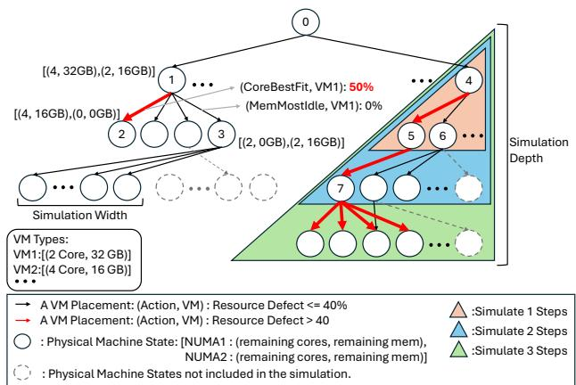  
Figure 10: NUMA-state transition tree traversed during speculative shielding.

The information (1)–(3) and NUMA placements can be mapped to a NUMA-state transition tree. Each node represents a physical machine state (PM), detailing the remaining cores and memory of each NUMA; an edge represents a VM placement (a machine state transition), indicated by an RL action and a VM type. For example, in Figure 10, the tree node 1 (a physical machine state, P M1) transitions to node 2 (P M2) by applying CoreBestFit policy to accommodate a VM type V M1.

Using the NUMA-state transition tree, one can discover performance anomalies by a tree traversal. Given the current machine state, one can locate the state’s corresponding node in the tree. By simulating the behaviors within the subtree rooted at this node, one can observe which paths lead to anomalies, enabling the system to avoid those paths.

Simulate the most probable future. However, preventing all anomalies has two primary issues. The first is the complexity of the search space: the NUMA-state transition tree has an extremely high fanout, with hundreds of possible ⟨action, VM type⟩ pairs. Identifying all anomalies is infeasible within the decision time budget. The second issue is that avoiding all anomalies is overly conservative and harms average performance. Without knowledge of future VM arrivals, attempting to prevent all risks, no matter how small, results in excessive false positives. While these safeguards may help mitigate rare anomalies, they impose unnecessary restrictions on the RL model’s actions, significantly degrading average performance.

To address these issues, we constrain the speculation to only high-probability futures, controlled by two factors:

1. Speculation depth defines the number of search steps in the tree, indicating how far into the future we explore.

2. Speculation width restricts the types of VMs we simulate. In practice, we use statistics from production and choose the popular VM types to guide the speculation.

The heuristic is to prioritize simulating the most probable

futures—near-term scenarios with popular VM requests.

Speculative shielding. Figure 10 illustrates the speculation process and demonstrates how these two variables limit the traversal of the NUMA-state transition tree. During the speculation, actions leading to states where at least one VM might encounter unavoidable performance anomalies are avoided. For example, in Figure 10 (right subtree), placing a VM on P M4 and selecting the first action transitions the system to P M5, and subsequently to P M7, where all possible actions result in performance anomalies. Thus, Catur avoids taking the action of P M4 → P M5.

Algorithm 1 describes speculative shielding. At each VM placement decision, the getAllowedAct function returns a set of actions deemed not overly risky by the speculation. Subsequently, the Catur agent selects the action from this set with the highest Q-value. If no allowed actions are found, the speculation re-runs with the speculation depth set to 1. If viable actions are still unavailable, the RL agent proceeds without shielding. However, this scenario is rare in practice. The findFutureRisk function performs speculations by recursively calling getAllowedAct and returns True if it identifies a risky PM state that should be avoided. The maxSteps and VMSubset variables control the speculation depth and width, respectively.

## 4.4 Drift-aware continuous learning

Speculative shielding improves short-term tail performance, but sustained effectiveness requires adaptation to evolving patterns. To address pattern drift, Catur continuously monitors RL model performance and triggers learning when necessary. The critical question is: when should continuous learning occur? Catur defines the learning point (i.e., the model collapse point) as the moment when its RL model underperforms any individual primitive policy. Catur identifies such a point by replaying recent traces in a simulator and comparing the RL model’s performance against the primitive policies. This replay process is conducted offline, hence does not impact online performance.

Resolving the pattern drift and model collapse requires fine-tuning on new data. However, retraining on all clusters would be prohibitively expensive, as each cluster may involve millions of VM requests. Instead, Catur iteratively fine-tunes on the worst-performing clusters and evaluates updated models on the rest. This approach progressively resolves collapse while reducing training cost. As shown in §6.3, this strategy achieves near-optimal performance while reducing training cost by 93.9%.

Algorithm 1 speculative shielding   
Input: PM, VM, maxSteps, VMSubset   
Output: actions   
1: // Return allowed actions for RL agent to choose from   
2: function getAllowedAct(PM, VM, stepsLeft)   
3: allowedActs ← ∅   
4: for all action in allActions do   
5: (defect, nextPM) ← placeVM(P M, V M, action)   
6: if defect > anomalyThreshold then   
7: continue // having anomaly, action not allowed   
8: end if   
9: if stepsLeft = 1 or isLeaf(nextPM) then   
10: allowedActs.append(action)   
11: else if not findFutureRisk(nextPM, stepsLeft-1) then   
12: allowedActs.append(action)   
13: end if   
14: end for   
15: return allowedActs   
16: end function   
17:   
18: function findFutureRisk(PM, stepsLeft)   
19: if stepsLeft = 0 or isLeaf(PM) then   
20: return false   
21: end if   
22: for all VM in VMSubset do   
23: if PM doesn’t have enough resource for VM then   
24: continue // disregard VM type that cannot be placed   
25: end if   
26: allowedActs ← getAllowedAct(PM, VM, stepsLeft)   
27: if allowedActs = ∅ then   
28: return true // no allowed actions; found risky state   
29: end if   
30: end for   
31: return false   
32: end function

## 5 IMPLEMENTATION

We implemented Catur in HyperX to enable dynamic decision making and continuous learning. The system contains two components: (1) An online module that generates predictions using a trained RL model and collects VM traces for continuous learning. (2) An offline training framework that utilizes the collected data for continuous improvement. Catur consists of approximately 7300 lines of code, with about 2500 lines for the online component (including the trace collector, inference module, and the integration code to HyperX) and around 4800 lines for offline training implemented in PyTorch (Paszke et al., 2019).

## 6 EVALUATION

We begin our evaluation by assessing Catur’s effectiveness in VM placement compared to baseline policies (§6.2), followed by an analysis of its key techniques (§6.3), and finally an exploration of its performance under additional cloud system setups (§6.4).

## 6.1 Experiment Settings

Datasets. We instrument HypervisorX in the production environment with a data collector that records every VM request, including the VM ID, server ID, start and end time, and the requested core and memory resources. This enables us to replay the workload trace precisely. Over the course of one month, we collect more than 100 million VM requests. We partition the data by time, with Days 1–15 as the training set and Days 16–30 as the test set.

Baselines. We evaluate four baseline VM placement policies. Xen (Xen Project, 2015) and OpenStack Nova (Open-Infra Foundation, 2023)’s pack and spread(omitted since identical to Xen) policies are derived from open-source production hypervisors, while E-PVM (Amir et al., 2000) and Tetris (Grandl et al., 2014) originate from published research. All policies are adapted and re-implemented to work with our setup so that they can be evaluated using the same production system trace.

Metrics. In order to assess the performance of different placement strategies, we propose two key metrics that capture the overall impact of a VM sequence on clusters, and one additional metric to evaluate tail performance.

• Average Resource Defect refers to the average degree of core overloading and remote memory ratio among all VMs, used to evaluate the defectiveness of a cluster.

$$
\tag{7}
$$

• Ticket Ratio: We define the Ticket Ratio as an estimate of QoE, reflecting the probability that a VM raises a ticket due to performance degradation from performance anomalies. Similar to reward calculation (§4.1), we begin by calculating the VM’s performance degradation (P D) from core overloading and remote memory:

$$
\tag{8}
$$

Then, we used a sigmoid function σ(x) to measure the probability of a user raising a ticket:

$$
\tag{9}
$$

When the performance score goes beyond c1, there is a high likelihood of a user raising a ticket. Based on production experience, we set c1 = 100, and c2 = 10%. The overall Ticket Ratio is the average Ticket Ratio of all VMs on this cluster:

$$
\tag{10}
$$

Catur’s setup. Unless specified otherwise, Catur uses a 1-step speculative shielding. When evaluating the perfor-

Table 1: Comparison of Catur and baseline VM placement policies on 100 million VMs.  
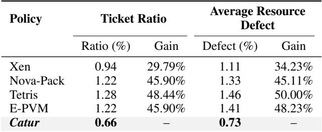

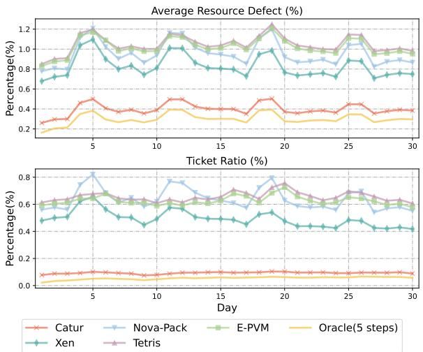  
Figure 11: Comparison between policies by day. Catur achieves near-optimal performance.

mance of the RL model alone, we exclude shielding and indicate this explicitly in the figure or caption.

## 6.2 Performance Comparison

Catur significantly outperforms all baseline VM placement policies in both ticket ratio and average resource defect. As shown in Table 1, Catur reduces the ticket ratio to 0.66%, achieving a 30–48% reduction over baselines. In terms of average resource defect, Catur lowers the defect to 0.73%, representing a 34–50% reduction.

Catur adapts dynamically, consistently outperforming baselines and closely approaching optimal performance. Figure 11 shows the daily variation of both metrics over a one-month period. Catur outperforms all baselines on every single day across both metrics, demonstrating its robustness and adaptability to diverse, time-varying VM request distributions.

To understand how close Catur is to the best achievable policy, we compare it with a 5-step Oracle that has foresight into five future VM requests and selects actions via exhaustive search for the lowest average defect. Catur performs consistently close to the Oracle across both metrics and often generates similar action sequences, indicating that it effectively captures long-term trade-offs and adapts to dynamic workload conditions with near-optimal decisions.

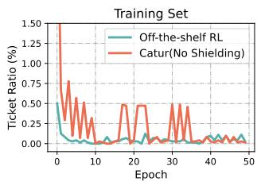

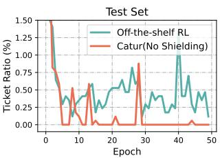  
Figure 12: Off-the-shelf RL overfits to Training Set, leading to model collapse on Test Set and degraded performance. Catur show consistent robustness.

Catur improves tail performance by speculative shielding. All four heuristic baselines result in a high number of correctable performance anomalies, ranging from approximately 222K (Xen) to 383K (Nova-Pack). In contrast, Catur with the default 1-step simulation reduces correctable performance anomalies to around 17K, achieving a 13-23× improvement over the baselines. By applying speculative shielding with other parameters, the number of correctable performance anomalies can be further reduced, with only a marginal impact on average performance. The specifics of this trade-off are discussed in detail in §6.3.

## 6.3 Catur’s Key Techniques

Robust when model collapses. To evaluate the robustness of Catur’s RL design, we compare it with an off-theshelf RL method that lacks reward shaping and a robust action space. Figure 12 presents their performance in both training and evaluation environments, where VM request distributions differ significantly. In training, both methods converge to near-optimal performance with minimal tickets raised. However, in the evaluation environment, the off-the-shelf RL model degrades noticeably, while Catur maintains robust performance thanks to its primitive policies that provide strong fallback behavior.

Table 2: Comparison between different rule combinations.  
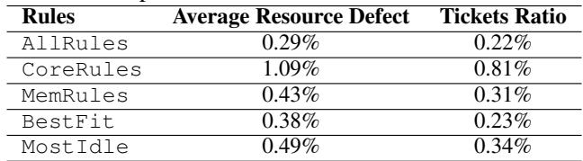

Diverse action space. The primitive policies that constitute the RL action space need to be general enough to handle diverse scenarios. Table 2 presents an ablation study on different combinations of the four primitive policies used in Catur. Specifically, CoreRules includes core-related policies; MemRules includes only memory-related policies; BestFit combines CoreBest- Fit and MemBestFit; and MostIdle combines CoreMostIdle and MemMostIdle. We find that each subset lacks the generality needed to handle the full range of VM placement scenarios. The four rulebased policies span different resource preferences (CPU vs. memory) and placement strategies (BestFit vs. MostIdle). By combining all of them, Catur not only surpasses the performance of individual primitive policies but remains robust even under model collapse.

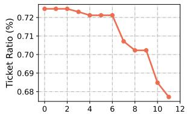  
Training-Validation Iteration

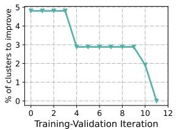  
Figure 13: The improvement of model performance by continuously learning from new clusters. Catur (No Shielding) achieves better performance than all baselines with only 11 iterations significantly reducing the training cost.

Load-aware reward shaping. To assess the effectiveness of Catur’s reward shaping from diverse VM requests and skewed placement hardness, we compare Catur’s performance with and without reward shaping in Figure 14. Both RL models were trained and evaluated for 50 epochs using this cluster’s trace. We find the RL model without reward shaping struggled to learn a better policy than the best primitive rule. The Ticket Ratio without reward shaping is 0.48%, higher than MemMostIdle’s 0.41%. Reward shaping helps Catur find a much better policy than the best primitive policy, reducing the Ticket Ratio to 0.08%. It helps Catur better differentiate the action qualities on skewed server states so that it can learn more from hard cases. Additionally, the reward-shaping method helps Catur with a reduced training variance (0.64 to 0.18) by isolating the impact of high variance from diverse VM requests.

Drift-aware Continuous Learning We demonstrate the effectiveness of our continuous learning pipeline in adapting to new VM request patterns. We first train Catur’s RL model on 10% of the VM requests. When evaluating it across all clusters, we find that in 5% of clusters, Catur still performs worse than one of the primitive policies. We then conduct continuous learning with these underperforming clusters to fine-tune the model. The validation curves in Figure 13 illustrate that Catur performs better than all primitive policies in all clusters by 11 training-validation iterations, reducing the Ticket Ratio from 0.72% to 0.68%. These results demonstrate the effectiveness of our continuous learning pipeline.

Moreover, this approach not only adapts effectively to new patterns but also significantly reduces costs. Retraining with data from all clusters requires 784 hours, while Catur’s continuous learning process takes only 48 hours—resulting in a 93.9% reduction in training cost.

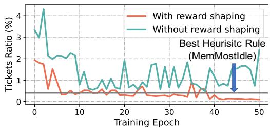  
Figure 14: Evaluated Ticket Ratio over training epochs. Without reward-shaping, RL models can hardly differentiate action quality across diverse VM requests and skewed hardness, yielding worse results than rule-based policies.

Shielding the tail: a trade-off. To evaluate shielding, we conducted experiments with varying simulation depth and width (§4.3) and measured them using correctable performance anomalies; these are performance anomalies that an Oracle forecasting 5 steps could resolve. Simulation depth ranged from 1 to 3 steps. Simulation width was defined using an n% VMSubset, which includes VM types with an estimated total arrival probability of at least n%. Probabilities were estimated using a count-based method. Larger n values reduce the number of VM types in the VMSubset, making the simulation less conservative. n% values range from 1% to 10%.

These experiments reveal a trade-off between two metrics: average resource defect and Correctable performance anomalies, represented on the y-axis and x-axis of Figure 15, respectively. Each point corresponds to a specific simulation depth and width configuration. The green points, connected by the dotted line, represent the Pareto frontier, where improving one metric worsens the other. The starred point indicates the RL agent without shielding.

Increasing simulation depth and width makes the shielding more conservative, reducing anomalies but rejecting higher-reward actions, which increases the average resource defect. Notably, all RL configurations outperform the best baseline policy in average resource defect.

This trade-off provides system administrators with a tool to fine-tune Catur agents. Addressing performance anomalies often requires costly, disruptive manual VM relocations. For applications less sensitive to resource defects, accepting a slight increase in defects may be worth reducing anomalies.

## 6.4 Performance Across Additional Cloud Configurations

Handling Diverse NUMA Sensitivity.

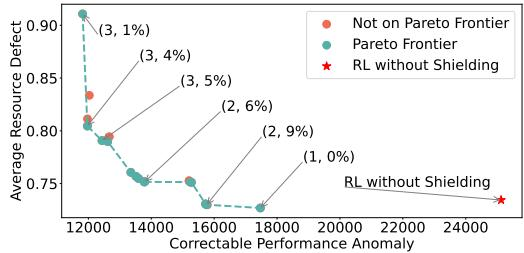  
Figure 15: Trade-off between average resource defect and correctable performance anomalies.

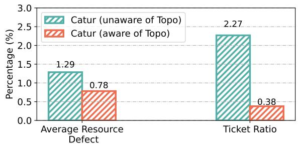  
Figure 16: Performance of Catur (No Shielding) with and without the awareness of physical NUMA Topology. The Ticket Ratio is greatly reduced with the awareness of physical NUMA topology, leading to better application performance.

We evaluated Catur’s NUMA sensitivity using five workload types (displayed in Figure 2) and modeled sensitivity features α and β with linear regression (in Equation 3). When VMs arrive, each is assigned a workload randomly at a uniform probability, with its sensitivity feature α and β included in its state vector st. By considering NUMA sensitivities, we reduce the average Performance Degradation (PD, in Equation 8) from 7.23% to 3.08% and reduce the Ticket Ratio from 5.94% to only 0.10%. This experiment demonstrates Catur’s ability to optimize application performance in addition to resource-level metrics.

Dealing with Complex NUMA Topologies. To evaluate Catur’s performance on more complex physical NUMA topologies, we conducted an experiment on a cluster with four physical NUMAs per server, where NUMA-0 and 1 are on the same socket, while NUMA-2 and 3 are on another socket. For this server, intra-socket cross-NUMA performance is faster than cross-socket communication (as shown in Figure 4). Two experiments are conducted on this NUMA topology: one model knows the NUMA and socket topology, and the other model only observes four NUMA nodes without knowing the inter-NUMA performance. As illustrated in Figure 16, NUMA-aware Catur outperforms on both metrics. Notably, leveraging the physical NUMA topology enables Catur to significantly enhance the quality of experience (Ticket Ratio), achieving a 5.97× improvement—especially critical for NUMA-sensitive applications.

## 7 RELATED WORKS

NUMA-aware VM placement. To utilize NUMA structure efficiently, existing hypervisors have adopted various placement strategies (Liu & Li, 2014; Xen Project, 2015; Red Hat; Denneman, 2016). Besides the two opensource hypervisors we use as baselines, RedHat Virtualization (Red Hat) employs a version of the BestFit policy, while VMware ESXi (Denneman, 2016) is reported to prefer allocations using fewer NUMA nodes. However, these policies are rule-based and struggle to handle the diversity of VM requests across large-scale clusters or adapt to temporal variations, as discussed in §2.2. Other approaches rely on detailed knowledge of VM internal activities (Cheng et al., 2013; 2017), which public cloud providers typically cannot access due to client privacy concerns, or depend on costly post-placement VM migration (Wu et al., 2016; Rao et al., 2013).

In contrast, Catur proposes an RL approach to capture the diversity of VM requests and enable dynamic adaptation in production environments. It places each VM only once and requires no VM-specific information beyond requested resources. To address the problem of model collapse and learning hardness, Catur uses a robust action space, continuous learning, and reward shaping to provide efficiency, robustness, and generalization. With these techniques, Catur can handle the NUMA placement problem at scale.

Virtual Machine scheduling. VM Scheduling (Usmani & Singh, 2016; Lopez-Pires & Baran, 2015; Sheng et al., 2022b; Cortez et al., 2017; Sheng et al., 2022a; Grandl et al., 2014) and VM placement refer to two distinct, yet related, topics. VM scheduling is a bin-packing problem whose objective is to use fewer physical servers to pack more VMs. Meanwhile, our VM placement problem seeks to minimize the performance defects of applications by optimizing the VM mapping on a physical machine. For example, SchedRL (Sheng et al., 2022b) uses RL with delta rewards for VM scheduling in multi-NUMA systems, aiming to maximize the number of scheduled VMs. Its RL actions are placing VMs on a server’s NUMA node, which is less robust than Catur when facing pattern drifts, as demonstrated in our experiments (Figure 12, §6.3 ). Furthermore, Catur also addresses the tail problem of VM performance anomalies, which is crucial for production systems.

## 8 DISCUSSION

## 8.1 Hyperparameters

Catur utilize multiple hyperparameters, such as α, β parameters in the reward function, the c1 and c2 constants used in calculated the ticket ratio, and the defect threshold for determining performance anomalies. These hyperparameters are crucial for Catur’s performance and are tuned based on empirical observation and domain knowledge. However, they are independent from Catur’s core methodology and does not make Catur less generalizable. On the contrary, they provide flexibility for Catur to adapt to different cloud enviroments and workloads. α and β parameters allow Catur to take advantage of workload-specific performance characteristics when they are transparent to Cloude providers. The c1 and c2 constants and defect threshold allow other public cloud providers to customize Catur to their user’s behavior and performance requirements. In future work, we plan to explore more systematic approaches for tuning these hyperparameters, such as automated hyperparameter optimization techniques or adaptive methods that can adjust hyperparameters based on real-time feedback from the system.

## 8.2 NUMA Effects beyond Core and Memory Defects

In our current implementation of Catur, we focus on core and memory defects as the primary indicators of NUMA effects. However, NUMA effects can also manifest in other ways, such as increased latency in inter-socket communication or contention for shared resources like caches and memory bandwidth. The methodology of Catur can be extended to account for these additional NUMA effects by incorporating additional features into the reward function. We plan to explore this in future work.

## 9 CONCLUSION

In this paper, we present Catur, a NUMA placement system that performs at scale. The core philosophy of Catur is learning the norm and shielding the tail. Catur blends a number of techniques including reinforcement learning with a robust action space, reward shaping, continuous learning, and speculative shielding. Evaluation shows that Catur reduces average resource defect by 34.2%–50.0% compared to state-of-the-art hypervisor policies. Catur has been deployed to CloudX for early trials.

## REFERENCES

Amir, Y., Awerbuch, B., Barak, A., Borgstrom, R., and Keren, A. An opportunity cost approach for job assignment in a scalable computing cluster. IEEE Transactions on Parallel and Distributed Systems, 11(7):760– 768, 2000. doi: 10.1109/71.877834.

Chen, Q., Zhao, B., Wang, H., Li, M., Liu, C., Li, Z., Yang, M., and Wang, J. Spann: Highly-efficient billionscale approximate nearest neighbor search. In 35th Conference on Neural Information Processing Systems (NeurIPS 2021), 2021.

Cheng, Y., Chen, W., Chen, X., Xu, B., and Zhang, S. A user-level numa-aware scheduler for optimizing virtual machine performance. In Wu, C. and Cohen, A. (eds.), Advanced Parallel Processing Technologies, pp. 32–46, Berlin, Heidelberg, 2013. Springer Berlin Heidelberg. ISBN 978-3-642-45293-2.

Cheng, Y., Chen, W., Wang, Z., and Yu, X. Performancemonitoring-based traffic-aware virtual machine deployment on numa systems. IEEE Systems Journal, 11(2): 973–982, 2017. doi: 10.1109/JSYST.2015.2469652.

Chojnowski, M. Hunting a numa performance bug. http s://www.p99conf.io/2021/09/28/huntin g-a-numa-performance-bug/, 2021.

Cortez, E., Bonde, A., Muzio, A., Russinovich, M., Fontoura, M., and Bianchini, R. Resource central: Understanding and predicting workloads for improved resource management in large cloud platforms. In Proceedings of the 26th Symposium on Operating Systems Principles, pp. 153–167, 2017.

Denneman, F. Numa deep dive part 5: Esxi vmkernel numa constructs. https://frankdenneman.nl/201 6/08/22/numa-deep-dive-part-5-esxi-v mkernel-numa-constructs/, August 2016. Accessed: 2025-04-17.

Engstrom, L., Ilyas, A., Santurkar, S., Tsipras, D., Janoos, F., Rudolph, L., and Madry, A. Implementation matters in deep policy gradients: A case study on ppo and trpo. arXiv preprint arXiv:2005.12729, 2020.

Fang, J., Ellis, M., Li, B., Liu, S., Hosseinkashi, Y., Revow, M., Sadovnikov, A., Liu, Z., Cheng, P., Ashok, S., et al. Reinforcement learning for bandwidth estimation and congestion control in real-time communications. arXiv preprint arXiv:1912.02222, 2019.

Farebrother, J., Machado, M. C., and Bowling, M. Generalization and regularization in dqn. arXiv preprint arXiv:1810.00123, 2018.

Grandl, R., Ananthanarayanan, G., Kandula, S., Rao, S., and Akella, A. Multi-resource packing for cluster schedulers. ACM SIGCOMM Computer Communication Review, 44(4):455–466, 2014.

He, K., Zhang, X., Ren, S., and Sun, J. Deep residual learning for image recognition. In Proceedings of the IEEE conference on computer vision and pattern recognition, pp. 770–778, 2016.

Jay, N., Rotman, N., Godfrey, B., Schapira, M., and Tamar, A. A deep reinforcement learning perspective on internet congestion control. In International Conference on Machine Learning, pp. 3050–3059. PMLR, 2019.

Jin, C., Allen-Zhu, Z., Bubeck, S., and Jordan, M. I. Is q-learning provably efficient? Advances in neural information processing systems, 31, 2018.

Krishnan, S., Yang, Z., Goldberg, K., Hellerstein, J., and Stoica, I. Learning to optimize join queries with deep reinforcement learning. arXiv preprint arXiv:1808.03196, 2018.

Liu, M. and Li, T. Optimizing virtual machine consolidation performance on numa server architecture for cloud workloads. ACM SIGARCH Computer Architecture News, 42(3):325–336, 2014.

Lopez-Pires, F. and Baran, B. Virtual machine placement literature review. arXiv preprint arXiv:1506.01509, 2015.

Mao, H., Alizadeh, M., Menache, I., and Kandula, S. Resource management with deep reinforcement learning. In Proceedings of the 15th ACM workshop on hot topics in networks, pp. 50–56, 2016.

Mao, H., Netravali, R., and Alizadeh, M. Neural adaptive video streaming with pensieve. In Proceedings of the conference of the ACM special interest group on data communication, pp. 197–210, 2017.

Mao, H., Schwarzkopf, M., Venkatakrishnan, S. B., Meng, Z., and Alizadeh, M. Learning scheduling algorithms for data processing clusters. In Proceedings of the ACM special interest group on data communication, pp. 270– 288. 2019.

Marcus, R., Negi, P., Mao, H., Tatbul, N., Alizadeh, M., and Kraska, T. Bao: Making learned query optimization practical. In Proceedings of the 2021 International Conference on Management of Data, pp. 1275–1288, 2021.

Microsoft. Hyper-v technology overview. https://le arn.microsoft.com/en-us/windows-serve r/virtualization/hyper-v/hyper-v-ove rview?pivots=windows-server, 2025.

OpenInfra Foundation. Cpu topologies — openstack compute (nova). https://docs.openstack.org/n ova/latest/admin/cpu-topologies.html, 2023. Accessed: 2025-04-07.

Ortiz, J., Balazinska, M., Gehrke, J., and Keerthi, S. S. Learning state representations for query optimization with deep reinforcement learning. In Proceedings of the Second Workshop on Data Management for End-To-End Machine Learning, pp. 1–4, 2018.

Paszke, A., Gross, S., Massa, F., Lerer, A., Bradbury, J., Chanan, G., Killeen, T., Lin, Z., Gimelshein, N., Antiga, L., Desmaison, A., Kopf, A., Yang, E., DeVito, Z., Rai- ¨ son, M., Tejani, A., Chilamkurthy, S., Steiner, B., Fang, L., Bai, J., and Chintala, S. Pytorch: An imperative style, high-performance deep learning library. In Wallach, H. M., Larochelle, H., Beygelzimer, A., d’Alche-´ Buc, F., Fox, E. B., and Garnett, R. (eds.), Advances in Neural Information Processing Systems 32: Annual Conference on Neural Information Processing Systems 2019, NeurIPS 2019, December 8-14, 2019, Vancouver, BC, Canada, pp. 8024–8035, 2019. URL https: //proceedings.neurips.cc/paper/2019/ hash/bdbca288fee7f92f2bfa9f701272774 0-Abstract.html.

Rao, J., Wang, K., Zhou, X., and Xu, C.-Z. Optimizing virtual machine scheduling in numa multicore systems. In Proceedings of the 2013 IEEE 19th International Symposium on High Performance Computer Architecture (HPCA), HPCA ’13, pp. 306–317, USA, 2013. IEEE Computer Society. ISBN 9781467355858. doi: 10.1109/HPCA.2013.6522328. URL https: //doi.org/10.1109/HPCA.2013.6522328.

Red Hat. Kvm virtual numa placement policy. https: //access.redhat.com/documentation/en -us/red\_hat\_enterprise\_linux/5/html/ virtualization/ch33s08.

Sheng, J., Cai, S., Cui, H., Li, W., Hua, Y., Jin, B., Zhou, W., Hu, Y., Zhu, L., Peng, Q., et al. Vmagent: A practical virtual machine scheduling platform. In Proceedings of the 31st International Joint Conference on Artificial Intelligence, pp. 5944–5947, 2022a.

Sheng, J., Hu, Y., Zhou, W., Zhu, L., Jin, B., Wang, J., and Wang, X. Learning to schedule multi-numa virtual machines via reinforcement learning. Pattern Recognition, 121:108254, 2022b.

Tunyasuvunakool, S. Speed variation between vcpus on the same amazon ec2 instance. https://stackoverf low.com/questions/28933049/speed-var iation-between-vcpus-on-the-same-ama zon-ec2-instance, 2015.

u/satirerocks. Disappointing performance results with the hbv2 azure vm for hpc. https://www.reddit.c om/r/HPC/comments/r5osv1/disappointi ng\_performance\_results\_with\_the\_hbv2/, 2021.

Usmani, Z. and Singh, S. A survey of virtual machine placement techniques in a cloud data center. Procedia Computer Science, 78:491–498, 2016.

Wang, J., Ding, D., Wang, H., Christensen, C., Wang, Z., Chen, H., and Li, J. Polyjuice:{High-Performance} transactions via learned concurrency control. In 15th USENIX Symposium on Operating Systems Design and Implementation (OSDI 21), pp. 198–216, 2021.

Wen, Y., Su, Q., Shen, M., and Xiao, N. Improving the exploration efficiency of dqns via the confidence bound methods. Applied Intelligence, pp. 1–15, 2022.

William, S. Vmware operations guide. https://www. vmwareopsguide.com/operations-managem ent/chapter-3-capacity-management/1. 3.12-rightsizing/.

Wu, S., Sun, H., Zhou, L., Gan, Q., and Jin, H. vprobe: Scheduling virtual machines on numa systems. In 2016 IEEE International Conference on Cluster Computing (CLUSTER), pp. 70–79, 2016. doi: 10.1109/CLUSTER. 2016.60.

Xen Project. Xen 4.2 automatic numa placement. https: //wiki.xenproject.org/wiki/Xen\_4.2\_A utomatic\_NUMA\_Placement, 2015. Accessed: 2025-04-07.

Yang, T.-W., Pollen, S., Uysal, M., Merchant, A., and Wolfmeister, H. {CacheSack}: Admission optimization for google datacenter flash caches. In 2022 USENIX Annual Technical Conference (USENIX ATC 22), pp. 1021– 1036, 2022.

Zhang, K., Chen, R., and Chen, H. Numa-aware graphstructured analytics. In Proceedings of the 20th ACM SIGPLAN symposium on principles and practice of parallel programming, pp. 183–193, 2015.

## A VIRTUAL NUMA PLACEMENT

In the production system, when a VM requires more resources than a single physical NUMA node can provide, it is split into multiple virtual NUMA instances, each served by a separate physical NUMA node on the same machine. The Catur agent takes the configuration of all virtual NUMA instances of a VM as input and makes a single placement decision, which is applied to all instances. In the production trace used for training and evaluation, each VM is partitioned into up to two virtual NUMA instances.

## B WORKLOAD SENSITIVITY TEST

To benchmark the sensitivity of different workloads to core defect and memory defect, we select several representative workloads, each with a benchmark, to test their performance under different scenarios.

## B.1 Benchmark Configuration

• The SPECjbb2015 benchmark, developed by the Standard Performance Evaluation Corporation, aims to measure performance based on the latest Java application features. The benchmark assesses performance using two key metrics: max-jOPS, which measures sustainable full system capacity throughput, and critical-jOPS, which measures throughput under response time constraints.

• ANNBing is used at Microsoft Bing fresh vector approximate nearest neighbor search (ANNS) service. It supports real-time vector add, delete, and search operations and enables users to maintain their vector index in a streaming way to avoid costly index rebuilds. The benchmark has two stages, add stage and search stage, each with five different tail latency metrics. Tail latencies represent those ANNS queries that have a response time longer than a certain percent of all queries.

• Cosmos DB, developed by Microsoft, is a highperformance application for any size or scale with a fully managed and serverless distributed database. Its key metrics include tail latencies of requests handled by the server.

• The TeraSort benchmark, which aims to sort data as quickly as possible, is used to benchmark the performance of the MapReduce framework. The benchmark tests the HDFS and MapReduce layers of a Hadoop cluster by combining three MapReduce programs and its key metric is runtime, representing the whole time used by the benchmark.

• ObjectStore is a distributed key-value store that serves many latency-sensitive workloads in Bing, Azure, and

O365. Its key metrics are tail latencies of requests handled by the server.

## B.2 Experiment Setup

Experiments are conducted on two Windows Server 2022 Datacenter servers. Each server has 2 sockets, 383GB of physical memory, and 1TB SSD organized in RAID-0. Each socket has an Intel(R) Xeon(R) Cascade Lake CPU with 26 cores running at 2.59 GHz and 1MB L1 cache, 16MB L2 cache, and 71.5MB L3 cache. Hyper-threading is enabled on both sockets, resulting in a total of 104 logical processors on each server. Before starting the test, three CPU groups (G0, G1, and G2) are created, with G0 and G1 consisting of 36 logical processors on individual sockets and G2 as the union of the two groups. By assigning a VM with G0, this VM will be placed on Socket0, and the same for G1. The host is only allowed to use the remaining 32 logical processors.

## B.3 Remote Memory Test

To simulate a memory defect scenario, two VMs (VM0 and VM1) are created and assigned with G0 and G1 respectively, each occupying a certain amount of memory on a single socket. Then we create a third VM (VM2), which runs the target benchmark and is assigned with G0. By adjusting the size of both VM0 and VM2, we can make the sum of their memory exceed the physical memory of Socket0, causing excess memory to be placed on Socket1. This part of memory is referred to as remote memory. The ratio of remote memory can be altered by adjusting the size of VM0.

## B.4 Core Overloading Test

Similarly, a core overloading scenario can be simulated in the same way as the remote memory scenario. We first create two VMs (VM0 and VM1) for G2 on individual sockets and then start another VM (VM2) on Socket0. With this setup, when the total number of VMs’ processors exceeds that of Socket0, some logical processors will be assigned twice. This is when Socket0 is in a core overloading scenario.

## C IMPLEMENTATION

We implemented Catur in HyperX to enable dynamic decision making and continuous learning. The system contains two components: (1) An online module that generates predictions using a trained RL model and collects VM traces for continuous learning. (2) An offline training framework that utilizes the collected data for continuous improvement. Catur consists of approximately 7300 lines of code, with about 2500 lines for the online component (including the trace collector, inference module, and the integration code to HyperX) and around 4800 lines for offline training implemented in PyTorch (Paszke et al., 2019).

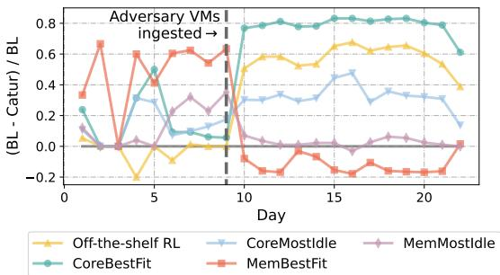  
Figure 17: Ticket Ratios of baselines (BL) relative to Catur (No Shielding). A positive value means worse performance than Catur. Adversary VM requests are ingested from Day 9 to make the RL model collapse on purpose. Catur shows better robustness than off-the-shelf RL.

## D ADDITIONAL EVALUTION

## D.1 Robust when Model Collapse

Figure 17 further evaluates Catur’s robustness using a synthesized trace that introduces adversarial VM requests with significantly different CPU and memory demands starting from Day 9, intentionally causing the RL model to collapse. We report the ticket ratio relative to Catur for comparison with the primitive policies (negative values indicate better performance than Catur). As expected, Catur’s performance degrades under the adversarial workload and becomes worse than MemBestFit. However, its performance remains bounded by the primitive policies and is more robust than the off-the-shelf RL, achieving better overall results.

## E TRAINING CONFIGURATIONS

State: At each VM arrival or stop event, Catur’s RL agent takes state st = (et, ⃗pt, ⃗vt) as input, where et = {0, 1} represents event type (VM start or stop); ⃗pt is a vector of the available CPU and memory of all NUMA nodes on the machine; and ⃗vt is a vector of the CPU and memory requests of the arrival or departure VMs.

Action: The Q-network outputs a Q-value Q(st, at) for each action at, estimating the expected cumulative reward. The agent selects an action with the highest Q-value, which includes a NUMA node ID, indicating the NUMA node to bind the VM’s CPU to, and an N-dim vector (where N is the number of NUMA nodes) showing the allocation of each NUMA to this VM request. Instead of generating the placement action directly, Catur outputs a policy. The Qnetwork selects the policy for the final placement decision

(details in §4.2).

DQN Training: The agent aims to maximize expected cumulative reward, learning Q(s, a) to minimize temporal difference error (TD-error):

$$
\tag{11}
$$

where qt = rt + γ maxa′ Q (st+1, a′), γ is the discount factor of RL training, and a′ is the action for maximizing Q-value of st+1, UCB sampling (Wen et al., 2022; Jin et al., 2018) is used during training to encourage exploration.

Training Hyper-parameters. We set the UCB hyperparameters to c = 2 × 10−4, p = 0.8, learning rate to α = 1 × 10−4, batchsize to 128. By setting the discount factor γ to 0.1, we aim to optimize the accumulated reward over the next two steps.