# LAPS: A LENGTH-AWARE-PREFILL LLM SERVING SYSTEM

Jianshu She 1 Zonghang Li 1 Hongchao Du 1 Shangyu Wu 1 Wenhao Zheng 2 Eric Xing 1 Zhengzhong Liu 1 Huaxiu Yao 2 Jason Xue 1 Qirong Ho 1

## ABSTRACT

LAPS identifies and disaggregates requests with different prompt lengths in LLM serving to reduce TTFT latency. While recent systems have decoupled the prefill and decode stages to improve throughput, they still rely on unified scheduling policies that fail to adapt to heterogeneous workload characteristics. We observe that promptlength variations lead to distinct performance bottlenecks, motivating an adaptive scheduling strategy. LAPS disaggregates multi-turn long-prefill requests from short-prefill ones and introduces a length-aware smart batching mechanism for short-prefill workloads. It adopts a dual-queue design that supports temporal disaggregation on a single prefill instance or spatial disaggregation across multiple instances. For short-prefill batches, a batch waiting window and CUDA Graph-based clustering mitigate interference from heterogeneous computation, reducing batching delay and lowering average latency. In real multi-turn workloads, LAPS reduces prefill latency by over 30% compared to vanilla SGLang under prefill–decode disaggregation, and further decreases SLO violations by 28% in multi-instance deployments with vanilla data-parallel configuration. Compared to the SGLang router with load balancing, it further lowers SLO violations by 12% in multi-GPU settings. Under high concurrency and mixed-request scenarios, LAPS improves request throughput by 35% serving Qwen2.5-32B model for prefill instance, demonstrating its effectiveness in optimizing heterogeneous LLM serving workloads.

## 1 INTRODUCTION

Modern LLM serving stacks (e.g., vLLM (Kwon et al., 2023), SGLang (Zheng et al., 2024b)) combine prefilldecoding (PD) disaggregation (Zhong et al., 2024) with continuous batching to meet low-latency, high-concurrency service-level objectives (SLOs). The Prefill stage (firsttoken computation) is largely compute-bound, while the decoding stage (auto-regressive generation) is memory-bound. PD disaggregation decouples these two phases across separate instances to avoid cross-phase contention. On the prefill side, concurrent requests are batched to raise GPU utilization. However, we show that this separation and batching are insufficient: even with PD, interference still persists within the prefill stage when long, compute-bound prefills are mixed with short, memory-bound prefills/re-prefills.

Re-prefill denotes the repeated prefill in multi-turn sessions where the model extends an existing context by combining new tokens with cached KV states. It is common in chatbots (Dam et al., 2024), tool-using agents (Wolflein ¨ et al., 2025), RAG, speculative decoding (Leviathan et al.,

Long p90 latency (ms) vs Long concurrency (fixed s)  
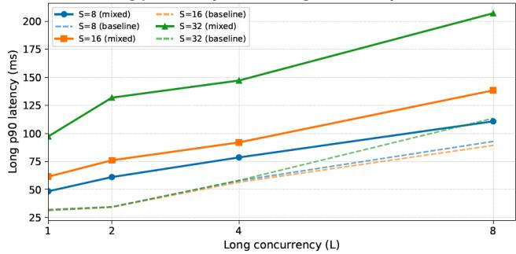  
Figure 1. P90 TTFT of long-prefill requests under varying concurrency levels for long and short requests. The long-prefill requests have more than 1K tokens, while the short ones have fewer than 64 tokens. We concurrently run them on a single H200 GPU and serve by Qwen2.5-32B (Qwen et al., 2025). The dashed lines indicate the latency when only long-prefill requests are served.

2023), and token routing (She et al., 2025), and is typically memory-bound (dominated by KV-cache reads/writes rather than large GEMMs). Figure 2 illustrates the token length distribution of a real-world trace, LMsys-Chat-1M (Zheng et al., 2024a), which is collected from real human-AI conversations. We observe that most prompts are short (<256 tokens), while long-context requests (>1K tokens) are relatively rare. This indicates that production workloads are dominated by short prefills/re-prefills, which are memorybound. Mixing them with long, compute-bound prefills in unified batches will also induce compute-memory interference: short prefills/re-prefills wait behind long GEMMs and time-to-first-token (TTFT) spikes, and long prefills lose effective FLOPs due to heavy KV traffic from short jobs. Figure 1 confirms this issue: mixing long and short prefills does significantly increase long-prefill latency, and this contention becomes more severe as concurrency rises.

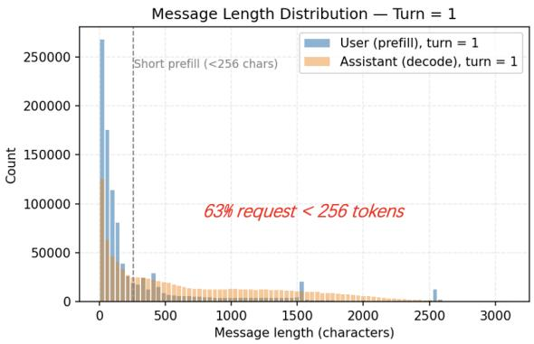

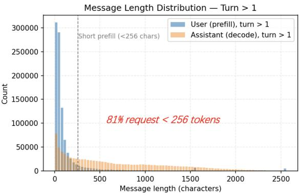  
Figure 2. The token length distribution of multi-turn dialogues in the real LMsys-Chat-1M dataset. The left plot shows the prompt length in the first turn (including the system prompt by default), where approximately 63% of requests contain fewer than 256 tokens. In subsequent turns, the proportion of prompts shorter than 256 tokens increases to an average of 81%.

Although prior systems have recognized the resource contention between compute-bound and memory-bound workloads, they focus on coordinating prefill and decode: (1) decode-priority schedulers(Kwon et al., 2023) prioritize the decode phase to minimize per-token latency; (2) prefillfirst schedulers prioritize the prefill phase and use continuous batching (Yu et al., 2022) to improve throughput; (3) stall-free chunked prefill (Agrawal et al., 2023) splits long prefill into chunks and interleaves them with decode, so long prefills don’t stall ongoing decodes; and (4) PD disaggregation (Zhong et al., 2024; Jin et al., 2024; Hu et al., 2024a; Strati et al., 2024), which dominates in modern serving systems, runs prefill and decode on separate instances. These advances alleviate cross-phase contention but implicitly assume all prefills are compute-bound long sequences, overlooking that short (e.g., <256 tokens), memory-bound prefills/re-prefills could dominate real-world multi-turn serving workloads.

To address these challenges, we propose LAPS, a lengthaware LLM serving system that explicitly disaggregates and optimizes long-prefill and short-prefill workloads within the prefill stage. LAPS maintains two separate prefill pools at runtime and performs batch disaggregation to isolate long and short prefill requests, completely eliminating their mutual interference. For short-prefill requests, LAPS introduces a dynamic waiting window in the scheduler and bucketizes requests by input length, making them more uniform and enabling larger batch sizes. This reduces batch-launch overhead and, combined with CUDA Graph-based execution, further accelerates processing and improves throughput. For SLO-serving scenarios, we design an SLO-aware scheduler that balances the trade-off between the waiting window and throughput.

In multi-instance deployments, the scheduler dynamically adjusts each instance’s workload type based on real-time load, achieving load balancing across spatially disaggregated prefill instances. This adaptive strategy resembles resource allocation problems in deep learning systems, like in (Qiao et al., 2021).

In addition, LLM serving systems typically support three modes: mix and PD temporal/spatial disaggregation. Beyond these, our LAPS introduces a fourth mode:

• Mix: Decode requests are inserted into prefill batches (without disaggregation);

• PD temporal disaggregation: Prefill and decode batches run sequentially on the same instance;

• PD spatial disaggregation: Prefill and decode batches run on separate instances.

• Prefill batch temporal/spatial disaggregation (ours): Enabling disaggregation within the prefill stage (rather than between prefill and decode), separating long- and short-prefill batches temporally on a single instance or spatially across instances.

It is worth noting that our LAPS remains compatible with existing PD disaggregation architectures. Overall, our main contributions are summarized as follows:

1. Empirical characterization. We analyze intra-prefill interference between long and short requests in multiturn workloads, exposing compute-memory contention caused by current batching strategies.

2. Length-aware disaggregation. We design a requestlevel temporal/spatial prefill disaggregation architecture that isolates long and short prefills to eliminate interference.

3. Adaptive scheduling. We introduce a dynamic bucketbased batching policy with a waiting window and load balancing across prefill instances, improving throughput and reducing SLO violations.

## 2 BACKGROUND AND MOTIVATIONS

In this section, we model the token-length conditions under which prefill and re-prefill become memory-bound, how compute-bound long prefills and memory-bound short (re-)prefills interfere with each other, and what causes this long/short mixing.

## 2.1 Compute-Memory Boundary for (Re-)Prefills

The prefill and re-prefill phases have different latency behaviors. In re-prefill, the model processes new prompt tokens while also attending to historical tokens. This increases both computing and memory overhead, and shifts the token-length boundary (critical point) Lm at which (re-)prefills transition from compute-bound to memory-bound. We now formulate a unified latency model to find the tokenlength boundaries Lprefillm and Lre-prefillm for prefill and reprefill phases, respectively. We will use this model to show that both prefill and re-prefill remain memory-bound for shorter fill lengths.

Let L be the number of new tokens in this turn, H be the number of historical tokens, and T (L, H) = Tcomp(L, H) + Tmem(L, H) be the total latency. The compute term reflects incremental causal attention and FFN:

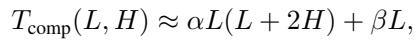

where α, β are per-token costs for attention and FFN compute, respectively. The memory term models the time for KV read/write I/O:

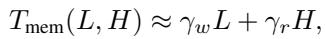

where γw and γr are per-token KV write/read times.

Prefills. In the first-turn prefill, there is no history (H = 0), so Tcomp(L, 0) ≈ αL2 + βL and Tmem(L, 0) ≈ γwL. The boundary can be obtained by equating these two contributions, yielding:

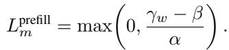

If γw ≤ β, prefills are always compute-bound; otherwise, memory access dominates for small L < Lprefillm .

Re-prefills. Similarly, for re-prefills with H > 0,

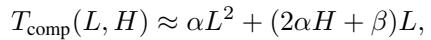

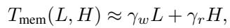

so the boundary is given by:

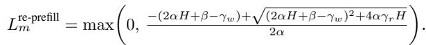

For any fixed H > 0, re-prefill is memory-bound for small L < Lre-prefillm because when L → 0, Tmem(L, H) → γrH > 0 while Tcomp(L, H) → 0. As H increases, the Lre-prefillm boundary grows until a saturation point: Lre-prefillm → γr2α for large H ≫ |β − γw|/(2α). Thus, with long histories, re-prefills remain memory-bound up to a constant number of new tokens, after which the 2αHL and αL2 terms render the phase compute-bound.

Fitting at runtime. Compute and memory latency can be modeled as quadratic and linear functions of (L, H), respectively. We collect runtime samples (Tcomp, Tmem, L, H) to fit these two curves and obtain α, β, γw, γr, and then calculate the boundaries Lprefillm a nd Lre-prefillm .

Roofline model. We also use the arithmetic intensity and roofline model to characterize the transition between memory- and compute-bound workloads in the prefill stage. The arithmetic intensity of prefill computation increases approximately linearly with the prompt length L, since longer sequences proportionally increase the ratio of arithmetic operations to memory access. The compute-memory boundary occurs when the arithmetic intensity AI(L) reaches the hardware roofline slope AI∗ = Ppeak/Bmem, where Ppeak and Bmem denote the peak compute throughput and sustained memory bandwidth of the GPU.

Empirical profiling across advanced hardware generations (A100, H100, and H200) and LLMs ranging from 7B to 32B parameters shows that this transition typically occurs between 150 and 512 tokens (Yuan et al., 2024; Zhong et al., 2024), depending on model architecture, kernel implementation, and batch configuration. Prefills shorter than this range tend to be memory-bound and limited by KV-cache I/O, while longer ones are dominated by GEMM throughput.

## 2.2 Exploring Interference Between Long-Short Prefills/Re-prefills

We model the interference between long-prefill and shortprefill (or re-prefill) requests using a standard M/G/1 (Markovian/General/1-server queue) first-come, first-served (FCFS) queuing model (Meini, 1998). Unlike prior PD scheduling analyses that focused on prefill-decode contention, we examine the intra-prefill interference caused by mixing compute-bound and memory-bound jobs within continuous batching.

LAPS: A Length-Aware-Prefill LLM Serving System  
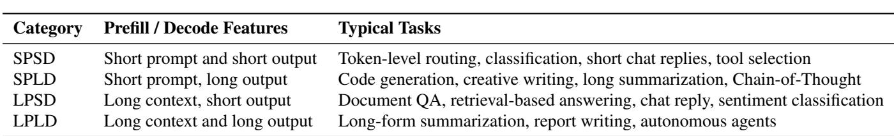  
Table 1. Task classification by prefill and decode characteristics. SPSD: short-prefill, short-decode; SPLD: short-prefill, long-decode; LPSD: long-prefill, short-decode; LPLD: long-prefill, long-decode.

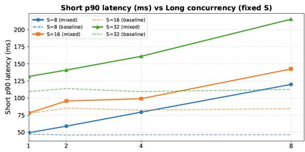  
Figure 3. P90 TTFT of short-prefill requests under varying concurrency levels for long and short requests. The dashed lines indicate the latency when only short-prefill requests are served. Other setups are the same as those in Figure 1.

In this model, each request passes through two service stations: a compute station (for GEMM-dominated operations) and a memory station (for KV-cache I/O). Short-prefill and re-prefill jobs are typically memory-bound, while longprefill jobs are compute-bound. Let the aggregate arrival rate be λ and utilization ρ < 1. Denote by p the fraction of short jobs in the workload. The service time at the memory station is Sm = γwL + γrH, and at the compute station Sc = αL2 + (2αH + β)L.

Using the Pollaczek-Khinchine (P-K) result (Neuts, 1986) for M/G/1 queues, the mean waiting time is

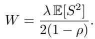

When jobs of different lengths are batched together, the variance in service times inflates waiting time for all requests, introducing a head-of-line (HoL) blocking penalty:

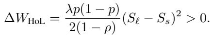

This term grows with higher concurrency and service heterogeneity, explaining the observed latency increase in mixed long/short-prefill workloads (shown in Figures 1 and 3).

Furthermore, long prefills hurt short (re-)prefills more. Every class sees the same queuing term W , so normalized latency is Ri/Si = 1 + W/Si. Given Ss < Sℓ, the relative increase is larger for short jobs because W/Ss > W/Sℓ. This convoy effect explains why short-prefill latency grows faster as long-prefill concurrency increases, which is a clear symptom of bandwidth contention.

## 2.3 Uncovering the Sources of Long-Short Prefill Mixing

General-purpose LLM services must handle a wide spectrum of tasks. As shown in Table 1, daily chat and creative ideation are typical short-prompt tasks, while speculative decoding and token routing produce high-frequency, short reprefills (Chatterji et al., 2025). In contrast, long-document QA and autonomous agent workflows correspond to longcontext prefills. In practice, these streams interleave over time, leading to long-short mixing within prefill workloads.

Most existing systems schedule requests in an FCFS fashion, packing them into unified batches. Many deploy multiqueue variants: continuous or rolling batching (e.g., vLLM (Kwon et al., 2023), TGI (HuggingFace, 2024)) treats prefill and decode as distinct phases, applying FCFS-style admission under token/KV limits and optional priorities or aging policies. With chunked prefill (e.g., Sarathi-Serve (Agrawal et al., 2023)), vLLM prioritizes decode and may co-batch prefills with decode. In-flight batching (e.g., TensorRT-LLM (Corporation, 2023)) runs distinct context and generation engines, each maintaining its own ready queue and often prioritizing generation. Moreover, many LLM gateways expose service tiers that prioritize certain request classes while enforcing token-based budgets using fixed or sliding windows (e.g., OpenAI (OpenAI, 2024), Anthropic (Anthropic, 2024), Envoy (Proxy, 2024), Kong (Inc., 2024b), APISIX (Foundation, 2024), and Cloudflare (Inc., 2024a)).

These systems indeed adopt multi-queue designs, but most queues are phase-oriented (prefill vs. decode) or SLA-based. Consequently, long and short (re-)prefills still end up cobatched even under multi-queue scheduling. Long-prefill requests have longer residence times, and schedulers backfill every few milliseconds, so newly arriving short (re-)prefills are co-admitted into the same batch. Larger admission windows or micro-batches further raise the odds of co-admission, while speculative decoding and token routing inject frequent short jobs alongside ongoing long prefills.

The most related line of work is length bucketing, which groups requests by predicted sequence length into sizehomogeneous buckets to reduce padding and improve throughput (e.g., Multi-Bin Batching (Guldogan et al., 2024), BucketServe (Zheng et al., 2025)). However, these methods only optimize intra-batch length variance; they do not disaggregate prefills versus re-prefills nor address the compute-memory interference we identify.

## 3 LENGTH-AWARE-PREFILL SERVING (LAPS)

We develop LAPS to mitigate the interference between longprefill and short-prefill requests in multi-turn LLM serving. The interference stems from two major factors: (1) their heterogeneous computation characteristics, and (2) head-ofline blocking caused by unified batching. Section 3.1 introduces the strategies we design to optimize high-concurrency short-prefill workloads, while Section 3.2 shows our queueand instance-level disaggregation mechanism that isolates these request types to reduce interference. LAPS is built upon the prefill instance in the PD disaggregation architecture and extends it with a finer-grained disaggregation design within the prefill stage.

## 3.1 Short Prefill Optimization

During auto-regressive serving, the majority of end-to-end latency typically arises from the decode stage. Consequently, most existing optimization efforts (e.g., PD disaggregation (Zhong et al., 2024), CUDA Graph acceleration (Harish & Narayanan, 2007), and router-based load balancing across decoding instances (Hu et al., 2024b; Jain et al., 2025; Stripelis et al., 2024; Jitkrittum et al., 2025)) have been designed for the decode phase. However, as the diversity of LLM workloads grows (e.g., agent decisionmaking, chain-of-thought reasoning, and multi-turn task planning), the prefill stage has become an increasingly significant bottleneck, yet its optimization potential remains largely overlooked. Despite this trend, optimization for short and multi-turn prefills remains unexplored.

In the decode phase, serving systems widely adopt CUDA Graphs because token-by-token computation is highly repetitive. Each decoding step runs nearly identical kernels with stable batch shapes, while frequent small launches make CPU dispatch overhead non-negligible. As decoding adds one token per step and keeps a fixed graph structure, CUDA Graphs effectively eliminate CPU overhead and reduce latency, improving throughput and responsiveness. In contrast, the prefill stage performs full-sequence embedding and attention, where input lengths and batch compositions vary greatly across requests. These dynamics make tensor shapes unstable, preventing CUDA Graph reuse. Prefill is also dominated by large attention GEMMs, making graph capture expensive and rarely amortized. Hence, mainstream serving systems avoid CUDA Graphs in prefill and instead rely on conventional kernel launches or fused-kernel optimizations.

In multi-turn dialogues, each user message triggers a reprefill step that encodes new tokens on top of the cached KV states. Unlike the initial long-prompt prefill, re-prefill excludes the system prompt and contains only new user inputs, resulting in shorter and more uniform sequences. This stable shape pattern matches CUDA Graph’s fixedstructure requirement. In practice, most re-prefill segments have only a few dozen tokens, allowing high graph reuse through padding or bucketization (e.g., lengths 8, 16, 32, 64). Compared with the highly dynamic long-prefill, this “short-prefill” regime incurs much lower graph-construction cost and delivers greater performance gains.

Graph capture and bucketization. From the characteristics of intensive re-prefill workloads, speculative decoding and token-level routing—although not conventional PD inference—generate numerous short re-prefill requests. Drawing inspiration from EAGLE-2’s speculative decoding optimization (Li et al., 2024; 2025), LAPS pre-defines a grid of power-of-two prompt-length-batch-size buckets (e.g., L ∈ {8, 16, 32, 64, 128, 256} and B ∈ {1, 2, 4, 8, 16, 32, 64}) (Gao et al., 2023). At system initialization, a CUDA Graph is captured for each bucket under the assumption of fixed operator topology and variable memory addresses. During inference, each short-prefill request is padded to the nearest bucket and grouped with others sharing the same (L, B) configuration, thereby maximizing graph reuse with negligible memory overhead.

Graph-aware memory-based batching. To maximize the benefit of CUDA Graphs for short-prefill workloads, LAPS optimizes batching with two goals: (i) reducing Graph launch frequency and (ii) increasing the reuse rate of large-batch Graphs. These are achieved through modestly extended waiting windows and graph fusion. Under high concurrency, slightly delaying batch formation allows more short-prefill requests to accumulate, improving overall efficiency when the saved launch overhead outweighs the waiting cost. Figure 5 shows the latency-throughput trade-off under different window settings.

While current serving systems typically adopt a memoryconstrained batching policy (i.e., aggregating requests until total tokens reach the GPU memory limit), LAPS enhances this approach with graph awareness. During short-prefill batching, requests are grouped under the memory budget and aligned to the nearest captured Graph shape.

Our Adaptive Wait-Depth (AWD) scheduler, shown in Algorithm 1, maintains two adaptive thresholds: a waiting window W (the maximum time to wait before dispatch) and a target depth D (the desired batch size aligned to a captured CUDA Graph shape). During each scheduling round, AWD accumulates short-prefill requests until either the waiting window W expires or the target depth D is reached. Requests are greedily grouped by input length to minimize padding, and dispatched early if any request is close to violating its deadline. Before dispatch, the batch is matched to the nearest captured CUDA Graph configuration to maximize graph reuse; otherwise, the standard prefill kernel is used. After each dispatch, W and D are dynamically updated based on the observed fill time and actual batch size for the next scheduling round.

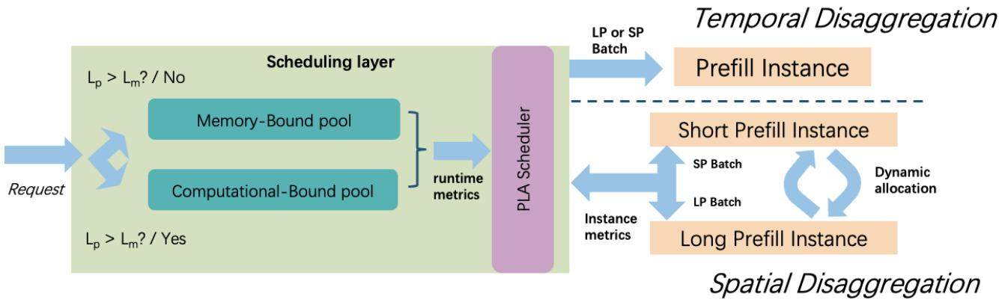  
Figure 4. Resource utilization during multi-turn LLM inference. Long-context requests saturate tensor cores during prefill (computebound), while short, frequent requests and re-prefill stages are memory-bound with high HBM usage—illustrating the interference between compute- and memory-bound workloads in shared serving systems.

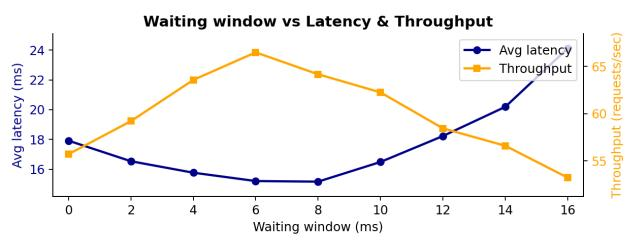  
Figure 5. Average latency and throughput curves over varying waiting windows. The larger the waiting window, the more short-prefill requests will be batched. The serving system runs on an H200 GPU and a 14B model, with 64-way concurrency for short-prefill requests (prompt length less than 256 tokens).

## 3.2 Long-Short Prefill Disaggregation

To fundamentally eliminate the interference between longand short-prefill requests discussed above, we adopt a design philosophy inspired by PD disaggregation, which further disaggregates long-prefill (LP) and short-prefill (SP) requests. However, unlike PD disaggregation, where the prefill and decode stages exhibit strong temporal dependencies and KV-cache transfers, the two types of tasks are merely mutually exclusive in our LP/SP disaggregation, resulting in fewer constraints in the scheduling objectives. Consequently, practical PD instance scheduling must account for the capacity coordination between the prefill and decode cluster, as well as the effective interconnect bandwidth when designing resource allocation strategies, but our design provides a larger design space for scheduling strategies that can adapt to the physical compute resources and workload characteristics. To this end, LAPS implements two complementary schedulers: a temporal disaggregation scheduler for single-instance prefill execution, and a spatial disaggregation scheduler for multi-instance prefill coordination. Figure 4 presents the system overview.

Algorithm 1 AWD: Adaptive-Wait-Depth Batching (Short-  
Prefill)   
Inputs: captured shapes H (depth, mem), budget M , slack thresh  
old σ, bounds [Wmin, Wmax], service est. S   
1 W ← clip mini(DDLi − t − S), [Wmin, Wmax] D ←   
maxG∈H: mem(G)≤M depth(G)   
2 while server running do   
3 start timer; B ← ∅ while elapsed < W and depth(B) <   
D do   
4 if mini∈B∪{next}(DDLi − (t + Sb)) ≤ σ then   
5 break ▷ SLA   
6 add next short request (bucket-first; fit mem)   
7 G ⋆ ← NEARESTGRAPH(B, H, M) ▷ nearest   
captured shape   
8 if G⋆ exists then   
9 pad B to G⋆   
10 else   
11 use standard prefill kernel   
12 dispatch B; d ← depth(B); τ ← time to reach d if d ≥ D   
then   
13 W ← clip(τ, [Wmin, Wmax])   
14 else   
15 D ← d

Disaggregating prefill execution eliminates direct interference between compute-bound long-prefill and memorybound short-prefill tasks; however, static separation alone cannot accommodate dynamic workload variations. In realworld deployments, the ratio of long to short requests fluctuates over time, and requests within each category exhibit heterogeneous lengths and deadlines. To address this, LAPS introduces a hierarchical scheduling layer: a temporal disaggregation scheduler is employed within each single prefill instance to manage intra-instance prioritization, while a spatial disaggregation scheduler operates across multiple prefill instances to coordinate inter-instance resource allocation.

It is worth noting that the disaggregation design further amplifies the benefits of CUDA Graphs for short-prefill workloads. In mixed long/short prefill instances, a unified queue containing both request types limits the ability of shortprefill requests to form large, graph-aligned batches. In contrast, by maintaining two independent queues under the disaggregated design, LAPS can determine at request arrival whether CUDA Graph execution should be applied, thereby reducing batching delay and minimizing shape heterogeneity. In mixed queues, the large length disparity between long and short requests leads to excessive padding, lowering the Graph shape hit rate and GPU memory efficiency. After LP/SP separation, requests within each instance exhibit a more concentrated length distribution, improving both Graph reuse and throughput. As a result, the system can achieve higher CUDA Graph reuse and significantly reduce padding overhead.

Mutual exclusion. Prefill execution is disaggregated by length at the instance level: each instance exclusively executes one type of prefill task, either short prefill (memorybound) or long prefill (compute-bound). This mutual exclusion ensures that within an instance, GPU resources are never shared between the two classes, completely avoiding interference arising from scheduling strategies and heterogeneous computational characteristics. All requests are first classified by prompt length Lp using the boundary point Lm. Each class maintains an independent queue: a short queue Qs and a long queue Ql.

In real-world scenarios, inference tasks can be categorized into two major types depending on whether an individual request carries a strict TTFT requirement:

(a) SLA-constrained mode: Each request i has an absolute deadline DDLi, and the scheduler jointly considers SLA urgency and CUDA Graph efficiency. At the beginning of each decision epoch t, we compute two candidate waiting windows and choose the tighter one:

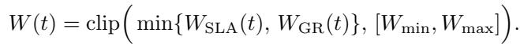

The SLA window

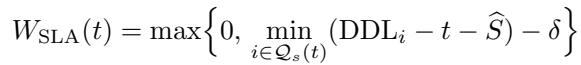

represents the last safe time to wait before any pending shortprefill request would violate its deadline after one prefill step of duration S (with a small safety margin δ). The Graph window

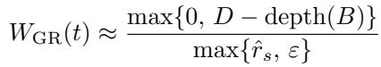

is the expected time to reach the target batch depth D aligned to the nearest captured CUDA Graph shape, under the estimated short-request arrival rate rˆs. During batching, if the smallest batch slack mini∈B∪{next}(DDLi − (t + S)) ≤ σ or the head-of-line wait exceeds Tmax, we dispatch immediately. Thus, SLA pressure shortens the waiting window when deadlines are tight, whereas under low SLA pressure, the scheduler may wait up to WGR to aggregate a larger batch and improve CUDA Graph reuse. Long-prefill dispatch continues to advance a single request by fixed-size chunks Cl, and each instance remains exclusive to either short or long mode.

(b) Deadline-free mode: For offline tasks like dataset distillation (Lei & Tao, 2023), each request does not have a preset deadline, and the policy reduces to token-max under the same feasibility constraints. The scheduler forms large, shape-similar short-prefill batches to fill the nearest captured CUDA Graph bucket (admit when tok(B) ≥ Ms), while long-prefill dispatches a single request with large fixed-size chunks Cl to sustain high arithmetic intensity and maximize throughput.

Temporal disaggregation mode for single instance. LAPS adopts a temporal disaggregation mode, where each GPU instance is dedicated exclusively to either short- or long-prefill execution. Two global queues Qs and Ql are maintained for short and long requests, respectively, and each instance pulls tasks only from its own queue. Scheduling decisions within each instance follow the policies described in the previous section: SLA-first (near-deadline priority) when deadlines are active, and token-max (CUDA Graph aggregation) when no deadline is preset. This exclusive-per-class execution avoids long-short interference and ensures stable prefill latency under both modes.

Spatial disaggregation mode for multiple instances. In the multi-instance setting, LAPS employs a controller to dynamically balance short- and long-prefill workloads across

Algorithm 2 Lightweight Instance-Pressure Controller   
Input : Total N ; current (ns, nl); control period ∆t; cool  
down Tcool; hysteresis τ ; min allocation nmin;   
weights (α, β, γ); robust aggregator A(·)   
16 tlast ← −∞ while server running do   
17 sleep ∆t ▷ collect per-instance signals   
for both pools   
18 foreach instance k in SHORT pool do   
19 measure qk, ek, uk; ψk ← α qk + β ek − γ uk;   
20 foreach instance k in LONG pool do   
21 measure qk, ek, uk; ψk ← α qk + β ek − γ uk;   
▷ robust pool pressures (P90)   
22 Ps ← A({ψk : k ∈ SHORT}) Pl ← A({ψk : k ∈   
LONG}) if now − tlast < Tcool then   
23 continue   
24 ▷ single-step hill-climb with   
hysteresis and safeguards   
25 if Ps > (1 + τ ) Pl and nl > nmin then   
26 migrate one instance: ns ← ns + 1; nl ← nl − 1;   
tlast ← now;   
27 else if Pl > (1 + τ ) Ps and ns > nmin then   
28 migrate one instance: nl ← nl + 1; ns ← ns − 1;   
tlast ← now;

N GPU instances (see Algorithm 2). Two independent instance pools are maintained: ns short-prefill instances and nl = N − ns long-prefill instances. At each control interval, the controller monitors the queue backlog, SLA deviation, and GPU utilization of each instance to estimate its load pressure. It then compares the overall pressures of the two pools and, after a cool-down period, migrates at most one instance between them when the imbalance exceeds a threshold. This simple feedback control stabilizes P99 latency, prevents oscillation, and keeps GPU utilization high with negligible overhead.

## 4 EXPERIMENTS

In both online LLM serving and offline LLM tasks (e.g., dataset distillation), the system must handle highly concurrent requests with heterogeneous task types.

We implement and deploy LAPS on an NVIDIA H200 GPU as well as on an 8×H200 multi-GPU cluster. We build it upon SGLang by extending ∼2K lines of code. We evaluate the prototype system under both single- and multi-GPU settings using a variety of workload patterns:

1. Online task: High-concurrency multi-turn conversations with long/short prompts;

2. Offline task: Full dataset distillation without deadline constraints on single requests.

Our evaluations focus on multi-turn conversational workloads. We use LMsys-Chat-1M (Zheng et al., 2024a) and ShareGPT (Zheng et al., 2023) as our datasets, which consist of large-scale, real-world human-assistant conversations collected from ChatGPT and LMsys platforms.

Metrics. We collect several key metrics for the prefill stage, including TTFT, P90 latency, average request per second (RPS), and SLO violation rate (Wang et al., 2024).

Baselines. We compare LAPS against SGLang and vLLM, both are state-of-the-art LLM serving systems. SGLang is a widely adopted serving system in both academia and industry; it implements continuous batching to improve throughput and radix-attention (Zheng et al., 2024b) to mitigate memory fragmentation during KV-cache allocation. However, neither SGLang nor vLLM supports CUDA Graph during the prefill phase, and their batching policies rely solely on available memory capacity, so they cannot adjust their batching strategies according to the workload characteristics.

## 4.1 Numerical Results and Analysis

Figure 6 compares the performance of LAPS with SGLang (with PD disaggregation) and its two partial variants (LAPS with CUDA Graph only and LAPS with Disaggregation only) under a sustained client load with varying concurrency levels (from 1 to 64). The requests are drawn from real multi-turn conversations in the ShareGPT-4 dataset. We evaluate three models, Qwen2.5-7/14/32B, under both the single-instance (temporal disaggregation) and 8-instance (spatial disaggregation) settings.

LAPS consistently outperforms SGLang and its two partial variants across all key metrics: RPS, average latency, and P90 latency. The benefits of LAPS’s scheduling mechanism and CUDA Graph optimization become more pronounced under high concurrency. Specifically, LAPS achieves up to 20% and 33% higher RPS than the baseline in the singleprefill instance and 8-prefill instance settings, while reducing average latency by 20% respectively.

It is worth noting that, in some configurations, enabling CUDA Graphs alone yields limited improvements and can even degrade throughput, as the overhead of graph eligibility checking and graph launching becomes non-negligible. Enabling disaggregation, however, allows the system to dynamically adjust the waiting window size and form larger batches, thereby amplifying the effective performance gains from CUDA Graph execution and making its scheduling and launch overhead negligible.

In Figure 7, we use the LMsys-Chat-1M dataset and assume that request arrivals follow a Poisson process with an average arrival rate λ, while each request’s service time follows an empirical distribution measured from model execution. We set the TTFT SLO to 0.4s and vary the client-side concurrency levels to observe the actual SLO violation rate. SGLang supports data parallel (DP) serving based on a router that dispatches requests to different workers using either round-robin or load-balancing strategies; however, the router is unaware of the SLOs of individual requests. As shown in the figure, within a single instance, LAPS reduces the SLO violation rate by approximately 10% compared with SGLang (PD disaggregation) with router, and by around 30% compared with Vanilla DP. Under the 8- instance spatial disaggregation setting, LAPS achieves zero

Prefil Instance = 1, PLA working under Temporal disaggregation  
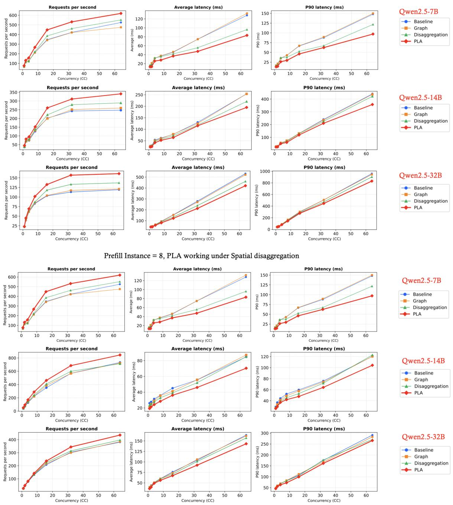  
Figure 6. Comparison of LAPS and SGLang on one H200 node. The top two lines of figures correspond to the temporal disaggregation setting (with prefill instance of 1), while the bottom two lines of figures correspond to the spatial disaggregation setting (with prefill instance of 8). We report RPS, average latency, and P90 latency under four configurations: Vanilla SGLang PD disaggregation (blue line), LAPS (only CUDA Graphs enabled, orange line), LAPS (only disaggregation enabled, green line), and Full LAPS (red line).

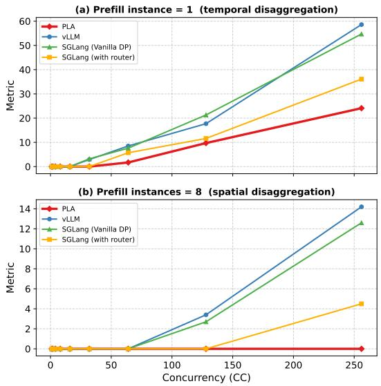  
Figure 7. SLO violation rate under varying client concurrency levels using the LMsys-Chat-1M dataset. Results are shown for LAPS, SGLang (PD disaggregation), SGLang (PD disaggregation with router), and vLLM (PD disaggregation) under two settings: (top) single-instance (temporal disaggregation) and (bottom) 8-instance (spatial disaggregation).

Table 2. End-to-end time of PD-disaggregated serving with 4 prefill and 4 decode instances, distilled on two dialogue datasets.  
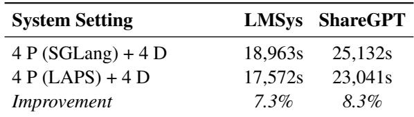

SLO violations, whereas SGLang with router still exhibits a 4.7% violation rate.

In Figure 8, we evaluate the compatibility of LAPS under non-PD-disaggregated settings by mixing prefill and decode requests at different concurrency levels. In both singleinstance and multi-instance configurations, the request-persecond (RPS) of prefill requests decreases under the Mix with Decode condition, indicating that LAPS can fully exploit the throughput benefits of CUDA Graphs for short prefill requests only within the PD-disaggregated architecture. When mixed with decode workloads, the lack of continuous batching introduces additional inter-batch latency, resulting in degraded overall performance.

As shown in Table 2, we evaluate the distillation task where each request has no strict deadline (i.e., the waiting window can be relatively large). Under this setting, with four prefill instances and a decoding length of 1K tokens, LAPS achieves about an 8% reduction in time consumption compared to SGLang (Vanilla PD disaggregation).

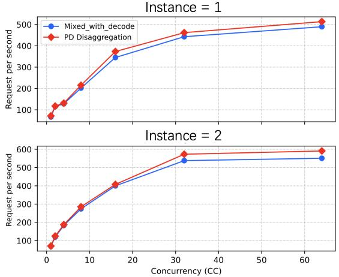  
Figure 8. Comparison of prefill throughput between PD disaggregation and Mixed with Decode across different concurrency levels under single- and 2-instance settings.

## 4.2 Cost analysis

In LAPS deployment, CUDA Graphs are captured into memory during initialization. Each graph is bound to a fixed kernel configuration and cannot adapt to dynamic kernel sizes, so multiple graphs must be captured to cover different token lengths and batch sizes. Each prefill step introduces lookup and selection overhead, and thus, the number of graphs must be limited to balance memory usage and performance. We measure single-graph sizes of 228 MB, 240 MB, and 277 MB for the 7B, 14B, and 32B models, showing that graph size is largely insensitive to model scale. When the system is initialized for the first time, it needs to capture kernels and the KV-cache operations layer by layer, which introduces a certain startup overhead. Experiments show that capturing a single prefill graph incurs an initialization overhead of approximately 8-12 seconds.

## 5 CONCLUSION

In this paper, we propose LAPS, a prefill-length-aware LLM serving system built on the PD disaggregation paradigm to optimize heterogeneous multi-turn conversational workloads. By separating long- and short-prefill requests, LAPS eliminates compute–memory interference in the prefill stage. Its adaptive scheduler (AWD) and CUDA Graph–based execution improve batching efficiency and reduce short-prefill latency. Supporting both temporal and spatial disaggregation, LAPS scales across single- and multi-prefill-instance deployments. Experiments on real-world datasets show that LAPS achieves higher throughput and lower latency than state-of-the-art frameworks (e.g., SGLang and vLLM under PD disaggregation), demonstrating its effectiveness under high concurrency.

## REFERENCES

Agrawal, A., Panwar, A., Mohan, J., Kwatra, N., Gulavani, B. S., and Ramjee, R. Sarathi: Efficient llm inference by piggybacking decodes with chunked prefills, 2023. URL https://arxiv.org/abs/2308.16369.

Anthropic. https://www.anthropic.com/api, 2024. Accessed: 2025-10-30.

Chatterji, A., Cunningham, T., Deming, D. J., Hitzig, Z., Ong, C., Shan, C. Y., and Wadman, K. How people use chatgpt. Technical report, National Bureau of Economic Research, 2025.

Corporation, N., 2023. URL https://github.com/ NVIDIA/TensorRT-LLM. Apache-2.0 License; accessed 2025-10-30.

Dam, S. K., Hong, C. S., Qiao, Y., and Zhang, C. A complete survey on llm-based ai chatbots, 2024. URL https: //arxiv.org/abs/2406.16937.

Foundation, A. S. https://apisix. apache.org/blog/2025/02/24/ apisix-ai-gateway-features/, 2024. Accessed: 2025-10-30.

Gao, H., Qiu, B., Wang, Y., Yu, S., Xu, Y., and Wang, X. Tbdb: Token bucket-based dynamic batching for resource scheduling supporting neural network inference in intelligent consumer electronics. IEEE Transactions on Consumer Electronics, 70(1):1134–1144, 2023.

Guldogan, O., Kunde, J., Lee, K., and Pedarsani, R. Multibin batching for increasing llm inference throughput. arXiv preprint arXiv:2412.04504, 2024.

Harish, P. and Narayanan, P. J. Accelerating large graph algorithms on the gpu using cuda. In International conference on high-performance computing, pp. 197–208. Springer, 2007.

Hu, C., Huang, H., Xu, L., Chen, X., Xu, J., Chen, S., Feng, H., Wang, C., Wang, S., Bao, Y., Sun, N., and Shan, Y. Inference without interference: Disaggregate llm inference for mixed downstream workloads, 2024a. URL https://arxiv.org/abs/2401.11181.

Hu, Q. J., Bieker, J., Li, X., Jiang, N., Keigwin, B., Ranganath, G., Keutzer, K., and Upadhyay, S. K. Routerbench: A benchmark for multi-llm routing system, 2024b. URL https://arxiv.org/abs/2403.12031.

HuggingFace. Text generation inference documentation. https://huggingface.co/docs/ text-generation-inference/en/index, 2024.

Inc., C. https://developers.cloudflare.com/ api/, 2024a. Accessed: 2025-10-30.

Inc., K. https://docs.konghq.com/hub/ kong-inc/rate-limiting/, 2024b. Accessed: 2025-10-30.

Jain, K., Parayil, A., Mallick, A., Choukse, E., Qin, X., Zhang, J., ´Inigo Goiri, Wang, R., Bansal, C., R ˜ uhle, ¨ V., Kulkarni, A., Kofsky, S., and Rajmohan, S. Intelligent router for llm workloads: Improving performance through workload-aware load balancing, 2025. URL https://arxiv.org/abs/2408.13510.

Jin, Y., Wang, T., Lin, H., Song, M., Li, P., Ma, Y., Shan, Y., Yuan, Z., Li, C., Sun, Y., Wu, T., Chu, X., Huan, R., Ma, L., You, X., Zhou, W., Ye, Y., Liu, W., Xu, X., Zhang, Y., Dong, T., Zhu, J., Wang, Z., Ju, X., Song, J., Cheng, H., Li, X., Ding, J., Guo, H., and Zhang, Z. P/d-serve: Serving disaggregated large language model at scale, 2024. URL https://arxiv.org/abs/ 2408.08147.

Jitkrittum, W., Narasimhan, H., Rawat, A. S., Juneja, J., Wang, C., Wang, Z., Go, A., Lee, C.-Y., Shenoy, P., Panigrahy, R., et al. Universal model routing for efficient llm inference. arXiv preprint arXiv:2502.08773, 2025.

Kwon, W., Li, Z., Zhuang, S., Sheng, Y., Zheng, L., Yu, C. H., Gonzalez, J. E., Zhang, H., and Stoica, I. Efficient memory management for large language model serving with pagedattention, 2023. URL https:// arxiv.org/abs/2309.06180.

Lei, S. and Tao, D. A comprehensive survey of dataset distillation. IEEE Transactions on Pattern Analysis and Machine Intelligence, 46(1):17–32, 2023.

Leviathan, Y., Kalman, M., and Matias, Y. Fast inference from transformers via speculative decoding, 2023. URL https://arxiv.org/abs/2211.17192.

Li, Y., Wei, F., Zhang, C., and Zhang, H. Eagle-2: Faster inference of language models with dynamic draft trees, 2024. URL https://arxiv.org/abs/ 2406.16858.

Li, Y., Wei, F., Zhang, C., and Zhang, H. Eagle-3: Scaling up inference acceleration of large language models via training-time test, 2025. URL https://arxiv.org/ abs/2503.01840.

Meini, B. Solving m/g/l type markov chains: recent advances and applications. Stochastic Models, 14(1-2): 479–496, 1998.

Neuts, M. F. Generalizations of the pollaczek-khinchin integral equation in the theory of queues. Advances in applied probability, 18(4):952–990, 1986.

OpenAI. https://openai.com/api/pricing, 2024. Accessed: 2025-10-30.

Proxy, E. Envoy gateway: Rate limiting and token-based access control. https://www.envoyproxy.io/ docs/envoy/latest/configuration/http/ http\_filters/rate\_limit\_filter, 2024. Accessed: 2025-10-30.

Qiao, A., Choe, S. K., Subramanya, S. J., Neiswanger, W., Ho, Q., Zhang, H., Ganger, G. R., and Xing, E. P. Pollux: Co-adaptive cluster scheduling for goodput-optimized deep learning. In 15th {USENIX} Symposium on Operating Systems Design and Implementation ({OSDI} 21), 2021.

Qwen, :, Yang, A., Yang, B., Zhang, B., Hui, B., Zheng, B., Yu, B., Li, C., Liu, D., Huang, F., Wei, H., Lin, H., Yang, J., Tu, J., Zhang, J., Yang, J., Yang, J., Zhou, J., Lin, J., Dang, K., Lu, K., Bao, K., Yang, K., Yu, L., Li, M., Xue, M., Zhang, P., Zhu, Q., Men, R., Lin, R., Li, T., Tang, T., Xia, T., Ren, X., Ren, X., Fan, Y., Su, Y., Zhang, Y., Wan, Y., Liu, Y., Cui, Z., Zhang, Z., and Qiu, Z. Qwen2.5 technical report, 2025. URL https: //arxiv.org/abs/2412.15115.

She, J., Zheng, W., Liu, Z., Wang, H., Xing, E., Yao, H., and Ho, Q. Token level routing inference system for edge devices, 2025. URL https://arxiv.org/abs/ 2504.07878.

Strati, F., Mcallister, S., Phanishayee, A., Tarnawski, J., and Klimovic, A. Dej´ avu: Kv-cache streaming for fast, \` fault-tolerant generative llm serving, 2024. URL https: //arxiv.org/abs/2403.01876.

Stripelis, D., Hu, Z., Zhang, J., Xu, Z., Shah, A. D., Jin, H., Yao, Y., Avestimehr, S., and He, C. Tensoropera router: A multi-model router for efficient llm inference. arXiv preprint arXiv:2408.12320, 2024.

Wang, Z., Li, S., Zhou, Y., Li, X., Gu, R., Cam-Tu, N., Tian, C., and Zhong, S. Revisiting slo and goodput metrics in llm serving. arXiv preprint arXiv:2410.14257, 2024.

Wolflein, G., Ferber, D., Truhn, D., Arandjelovi¨ c, O., and´ Kather, J. N. Llm agents making agent tools, 2025. URL https://arxiv.org/abs/2502.11705.

Yu, G.-I., Jeong, J. S., Kim, G.-W., Kim, S., and Chun, B.- G. Orca: A distributed serving system for {Transformer-Based} generative models. In 16th USENIX Symposium on Operating Systems Design and Implementation (OSDI 22), pp. 521–538, 2022.

Yuan, Z., Shang, Y., Zhou, Y., Dong, Z., Zhou, Z., Xue, C., Wu, B., Li, Z., Gu, Q., Lee, Y. J., Yan, Y., Chen, B., Sun, G., and Keutzer, K. Llm inference unveiled:

Survey and roofline model insights, 2024. URL https: //arxiv.org/abs/2402.16363.

Zheng, L., Chiang, W.-L., Sheng, Y., Zhuang, S., Wu, Z., Zhuang, Y., Lin, Z., Li, Z., Li, D., Xing, E. P., Zhang, H., Gonzalez, J. E., and Stoica, I. Judging llm-as-a-judge with mt-bench and chatbot arena, 2023.

Zheng, L., Chiang, W.-L., Sheng, Y., Li, T., Zhuang, S., Wu, Z., Zhuang, Y., Li, Z., Lin, Z., Xing, E. P., Gonzalez, J. E., Stoica, I., and Zhang, H. Lmsys-chat-1m: A largescale real-world llm conversation dataset, 2024a. URL https://arxiv.org/abs/2309.11998.

Zheng, L., Yin, L., Xie, Z., Sun, C., Huang, J., Yu, C. H., Cao, S., Kozyrakis, C., Stoica, I., Gonzalez, J. E., Barrett, C., and Sheng, Y. Sglang: Efficient execution of structured language model programs, 2024b. URL https://arxiv.org/abs/2312.07104.

Zheng, W., Xu, M., Song, S., and Ye, K. Bucketserve: Bucket-based dynamic batching for smart and efficient llm inference serving. arXiv preprint arXiv:2507.17120, 2025.

Zhong, Y., Liu, S., Chen, J., Hu, J., Zhu, Y., Liu, X., Jin, X., and Zhang, H. Distserve: Disaggregating prefill and decoding for goodput-optimized large language model serving, 2024. URL https://arxiv.org/abs/2401. 09670.