# FLoRIST: Singular Value Thresholding for Efficient and Accurate Federated Fine-Tuning of Large Language Models

Hariharan Ramesh Jyotikrishna Dass Department of Electrical and Computer Engineering University of Arizona {hariharanr, jdass}@arizona.edu

## Abstract

Integrating Low-Rank Adaptation (LoRA) into federated learning offers a promising solution for parameter-efficient fine-tuning of Large Language Models (LLMs) without sharing local data. However, several methods designed for federated LoRA present significant challenges in balancing communication efficiency, model accuracy, and computational cost, particularly among heterogeneous clients. These methods either rely on simplistic averaging of local adapters, which introduces aggregation noise, require transmitting large stacked local adapters, leading to poor communication efficiency, or necessitate reconstructing memory-dense global weight-update matrix and performing computationally expensive decomposition to design client-specific low-rank adapters. In this work, we propose FLoRIST, a federated fine-tuning framework that achieves mathematically accurate aggregation without incurring high communication or computational overhead. Instead of constructing the full global weight-update matrix at the server, FLoRIST employs an efficient decomposition pipeline by performing singular value decomposition on stacked local adapters separately. This approach operates within a compact intermediate space to represent the accumulated information from local LoRAs. We introduce tunable singular value thresholding for server-side optimal rank selection to construct a pair of global low-rank adapters shared by all clients. Extensive empirical evaluations across multiple datasets and LLMs demonstrate that FLoRIST consistently strikes the best balance between superior communication efficiency and competitive performance in both homogeneous and heterogeneous setups.

## 1 Introduction

Large Language Models (LLMs) have emerged as powerful general-purpose learners, enabling impressive progress in dialogue systems [1, 2], information retrieval [3], healthcare [4], and scientific research [5]. However, adapting these models to specific downstream tasks [6] remains resource-intensive, often requiring fine-tuning hundreds of millions of parameters. Parameter-Efficient Fine-Tuning (PEFT) methods such as Low-Rank Adaptation (LoRA) [7] alleviate this by inserting lightweight, trainable low-rank matrices into LLM layers, dramatically reducing memory and compute costs during adaptation. In privacy-sensitive settings where the data needed for finetuning LLMs reside in a distributed network of edge devices or institutions, Federated Learning (FL) [8] offers a promising paradigm by allowing collaborative model fine-tuning without sharing local data. Integrating LoRA into FL enables clients to train only low-rank adapters locally and transmit compact updates to a central server rather than original weight updates in full fine-tuning, reducing communication overhead while preserving privacy. But this brings us to a deeper question:

Table 1: Comparison of methods across four critical metrics: heterogeneity support, performance, communication efficiency, and computational cost. Bars indicate relative magnitudes—longer bars represent higher performance and efficiency, or higher computational cost (server). The proposed FLoRIST strikes the best balance.  
  
What is the intrinsic dimensionality of these aggregated local adapters derived from heterogeneous LoRAs? Is it essential to preserve every component to maintain model performance? Could we further enhance communication-efficiency by identifying and eliminating hidden redundancies resulting in unified global LoRA?

Most existing methods fail to comprehensively answer these questions. Prior works either enforce fixed homogeneous ranks across all layers and clients (e.g., FedIT [9], FFA-LoRA [10]) or handle heterogeneity by stacking and communicating dense full-rank adapters (e.g., FLoRA [11]), leading to significant communication or computational burdens. Even more recent methods like FlexLoRA [12] perform expensive singular value decomposition (SVD) computation on the full weight-update matrix, and later construct several global adapters to match the heterogeneous ranks to client capacity rather than the intrinsic dimensionality of the global update, leading to increased communication overhead. Table 1 summarizes the trade-offs, and Figures 7, 8, 9, and 10 in Appendix B illustrate the key ideas and gaps in the existing federated LoRA fine-tuning methods.

To address the above limitations and comprehensively answer the above questions, we propose FLoRIST, a novel framework for Federated Low-Rank Integration with Singular value Thresholding. Instead of building and decomposing the full-weight update into multiple global adapters, FLoRIST performs aggregation directly in the low-rank latent space by operating on the stacked client adapters. It then applies an energy-based threshold to retain only the most significant singular values, producing compact pair of global low-rank adapters shared by all clients, that match or exceed the performance of larger baselines. Our layer-wise rank analysis further reveals that different layers, and even different attention projections (e.g., q\_proj vs. v\_proj), have varying intrinsic dimensionalities, many of which are significantly lower than commonly assumed. We also introduce two thresholdvariants: FLoRIST-O, optimized for higher performance, and FLoRIST-E, for achieving improved communication efficiency than baselines. Main contributions are as follows:

1. We propose FLoRIST, a federated fine-tuning framework that performs accurate and compact aggregation in the low-rank latent space, supporting heterogeneous client ranks, and achieving higher communication efficiency.

2. We introduce a computationally fast SVD-based aggregation scheme that avoids constructing the full-weight update matrix. By employing singular value thresholding, it optimally selects the unified global adapter rank to balance performance and communication efficiency.

3. We provide empirical evidence, including a fine-grained layer-wise analysis, that demonstrates the low intrinsic dimensionality of the aggregated local adapters, revealing that some layers require ranks as low as 2–10, even when clients use ranks up to 64, thereby motivating construction of low-rank unified global adapters.

4. We are the first to compare and contrast various federated LoRA fine-tuning methods in literature where we empirically demonstrate that FLoRIST achieves higher communication efficiency and comparable to superior performance than state-of-the-art methods such as FedIT, FFA-LoRA, FLoRA, and FlexLoRA across multiple datasets and LLM architectures.

## 2 Related Work

Finetuning of LLMs. LLMs have demonstrated remarkable capabilities across various natural language processing tasks. However, fine-tuning these models for specific applications can be computationally intensive due to their vast number of parameters. LoRA [7] is a parameter-efficient fine-tuning method that significantly reduces memory and compute costs. LoRA introduces trainable low-rank matrices into each layer of the pre-trained model. Specifically, a model update matrix ∆W ∈ Rm×n is decomposed into two low-rank adapters A ∈ Rr×n and B ∈ Rm×r, where r ≪ min(m, n). The updated model is expressed as W ′ = W +∆W = W +BA, where W remains frozen, and only A and B are updated during fine-tuning. This reduces the number of trainable parameters dramatically. For instance, a LLaMA-3.2-1B attention model W ∈ R8192×8192 on fine-tuning with LoRA, r = 16, results in much smaller adapters, A ∈ R16×8192 and B ∈ R8192×16.

Federated fine-tuning methods for LLMs. FL [8] enables distributed model training across multiple clients while preserving privacy by not sharing local data. In classical FL, local model updates are aggregated at the server using Federated Averaging (FedAvg) [13], where the global update is: ∆W = PKk=1 nkN ∆Wk, where nk is the number of local samples at client k, and N = Pk nk. We discuss recent works integrating FL and LoRA for federated fine-tuning of LLMs.

FedIT [9] incorporates LoRA into FL by allowing each client to fine-tune low-rank adapters locally and transmit them back to the server. The server aggregates the adapters separately using FedAvg:AF edIT = PKk=1 nkN Ak, BF edIT = PKk=1 nkN Bk. However, this independent averaging leads to a mathematically inaccurate global update by introducing cross-term noise BiAj for i ̸= j in the product of (BF edIT )(AF edIT ). This can affect the convergence and the model performance. Furthermore, FedIT inherently supports only homogeneous client ranks. Although zero-padding (HetLoRA [14]) can be used to handle heterogeneous ranks, it inflates communication and memory costs and could introduce significant performance drops, as shown in our empirical analysis.

FFA-LoRA [10] improves upon FedIT by addressing the aggregation inaccuracy with higher communication efficiency. In FFA-LoRA, each client fine-tunes only one LoRA adapter, typically Bk, while freezing the other adapter Ak to its initialization. Thus, the local model update becomes ∆Wk = BkAinit. Since Ainit is shared across clients, the server aggregates only the trainable Bk ma-trices via FedAvg: BF F A = PKk=1 nkN Bk and reconstructs the global update as ∆W = BF F AAinitensuring noise-free aggregation without cross-terms. While FFA-LoRA corrects the aggregation noise and reduces communication cost by half compared to FedIT, it still lacks support for heterogeneous client ranks natively. In addition, since only half of the LoRA parameters are used, convergence can be slower, and model expressivity may be reduced compared to methods with both LoRA adapters.

FLoRA [11] introduces a stacking-based aggregation strategy to ensure mathematically correct updates and support heterogeneous client configurations. In FLoRA, clients transmit their local adapters, and the server constructs AF LoRA = n1N A1⊕ n2N A2⊕. . . nKN ⊕AK , BF LoRA = B1⊕B2⊕· · ·⊕BK where ⊕ denotes vertical stacking for A and horizontal stacking for B. The global update, ∆W = BF LoRAAF LoRA, eliminates cross-term noise while naturally accommodating clients with different ranks. Although FLoRA ensures mathematical correctness and reduces communication overhead by transmitting only LoRA modules instead of full model updates, scalability challenge arises with transmitting stacked local LoRA modules back to all clients, where the global rank grows linearly as sum of local LoRA ranks, leading to higher communication overhead (download) and increased memory requirements on resource-constrained clients.

FlexLoRA [12] addresses scalability issue in FLoRA by applying SVD to the global update matrix after aggregation. After computing ∆W = PKk=1 nkN BkAk the server performs SVD: ∆W = U SV T . Each client then receives a customized truncated version of (U, S, V ) tailored to match their original local rank rk, thereby restoring model capacity while reducing communication overhead compared to broadcasting stacked adapters in FLoRA. However, the communication cost still grows proportionally to clients ranks which run the risk of some clients missing out on key singular values important for model performance. Moreover, FlexLoRA incurs significant server-side computational cost due to the explicit construction and decomposition of the full update matrix ∆W ∈ Rm×n, which can be prohibitively large in memory for LLMs. Furthermore, SVD was used for serving heterogeneous client ranks rather than any deeper analysis of the full-weight update.

These observations raise several key questions: Can we avoid constructing the full weight-update (product) matrix for global aggregation by working directly in the low-rank latent adapter space? Can we identify and retain only the most informative components for improving communication efficiency and enabling faster computation? Can we verify that only a small number of components in the global aggregation are actually needed to preserve model performance?

  
Figure 1: Workflow for the proposed FLoRIST: (1) Each client computes its local LoRA adapters, which are then uploaded onto the server. In contrast to FedAvg of local adapters in FedIT and constructing local full-weight updates in FlexLoRA, FloRIST adopts stacking-based aggregation similar to FLoRA to maintain mathematical correctness. (2) Then, FloRIST performs efficient SVD on stacked adapters independently to generate intermediate efficient-SVD representations. (3) Next, we use Singular Value Thresholding to determine the optimal rank (p) corresponding to the most informative components in the aggregated local adapters, where, p < rk ≤ max{rk} < Σrk, i.e. Rank (FLoRIST < FlexLoRA ≤ FedIT < FLoRA). (4) Using optimal rank, FloRIST constructs a unified global low-rank adapters. (5) Finally, the server broadcasts the global LoRA adapters which are downloaded by all the clients for local fine-tuning.

## 3 Proposed Method

We propose FLoRIST to address the above key questions. FLoRIST is a novel federated fine-tuning framework designed for parameter-efficient adaptation of LLMs using heterogeneous LoRA modules. Specifically, FLoRIST simultaneously tackles three key challenges in existing methods: (i) cross-term noise during adapter aggregation in FedIT, (ii) the computational overhead of performing Singular Value Decomposition (SVD) on dense update matrices in FlexLoRA, and (iii) poor communication efficiency in FLoRA resulting from broadcasting stacked local LoRAs. Our method achieves noisefree global aggregation, introduces a computationally efficient SVD strategy that avoids forming the full global update matrix altogether, and employs singular value thresholding for optimal rank selection to drastically improve communication efficiency without sacrificing performance. We present the workflow in Figure 1 and corresponding pseudocode in Appendix A.

Noise-free aggregation via weighted stacking. Each client k fine-tunes local LoRA adapters Bk, Ak with a client-specific rank rk, producing Bk ∈ Rm×rk and Ak ∈ Rrk×n. These are sent to the server along with weighting factor nk/N , where nk is the client’s local dataset size. The server then stacks: Bstack = B1 ⊕ · · · ⊕ BK ∈ Rm×r and Astack = n1N A1 ⊕ · · · ⊕ nKN AK ∈ Rr×n and, of computing ∆W = PKk=1 nkN BkAk ∈ Rm×n, followed by an SVD on the full dense matrix asdone in FlexLoRA, we leverage the equivalence ∆W = B A , where stacking includes the where r = PKk=1 rk and ⊕ denotes horizontal stacking for Bk and vertical stacking for Ak. Instead weighting, and we instead apply SVD to Bstack and Astack independently, avoiding prohibitive ∆W :

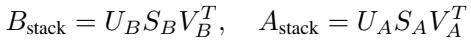

Efficient SVD via intermediate matrix decomposition. Rather than multiplying the decomposed matrices directly, we compute an intermediate product: Q = V TB UA ∈ Rr×r, P = SBQSA ∈ Rr×r. The matrix P captures the interaction between all local LoRA updates while maintaining low dimensionality. Since SB and SA are diagonal and Q is orthogonal (as VB and UA are orthogonal matrices from SVD), the resulting matrix P preserves spectral information from both local adapter sets. We apply SVD: P = UP SP V TP , and reconstruct the global adapters as Bg = UBUP SP and

Ag = V TP V TA . This gives the global weight update: ∆W ≈ BgAg = (UBUP SP )(V TP V TA ). Here, SP is the diagonal matrix of singular values of the global update ∆W without explicitly forming ∆W . Thus, the final representation (Bg, Ag) corresponds to the SVD of the true aggregated update ∆W , computed in a memory- and time-efficient manner. We report and discuss the raw server computational cost (in FLOPs) in Appendix F.

Singular value thresholding for optimal rank selection. To justify the need for adaptive rank selection, we begin by analyzing the singular value spectrum of the aggregated update matrix ∆W . Figure 2 presents a heatmap of singular values across all q\_proj layers of TinyLLaMA fine-tuned on the Wizard dataset in a heterogeneous setting. Despite the maximum client rank being 64, we observe that in most layers, the singular values decay rapidly, often becoming negligible within the first 8 to 10 components. This indicates that the effective dimensionality of ∆W is substantially lower than the total transmitted rank.

However, existing methods such as FLoRA and FlexLoRA overlook this redundancy and transmit stacked local adapters and partition full-SVD components to match specific client ranks, respectively, incurring excessive communication overhead and missing out on important singular values (resourceconstrained clients) or transmitting redundant components than required (resource-rich clients). Motivated by this observation, FLoRIST introduces an energybased truncation criterion that retains only the top-p singular components corresponding to the original ∆W without reconstructing it. Specifically, we apply thresholding on SP , using a tunable hyperparameter τ ∈ (0, 1], and retain the smallest p.

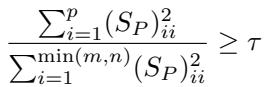

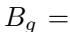

Figure 2: Singular value spectrum of the q\_proj layers in TinyLLaMA fine-tuned with heterogeneous LoRA ranks on the Wizard dataset. We observe that most singular values drop off sharply and become negligible between indices 8 and 10 across layers, indicating that the effective rank required to reconstruct ∆W is far lower than the maximum client rank (64) used in FlexLoRA.

(UBUP )[:, : p](SP )[: p, : p] and Ag = (V TP V TA )[: p, :]. These global adapters are broadcasted to all clients, who update their local models as W ′ = W + BgAg. Since the thresholded rank p is typically much smaller than max{rk}, FLoRIST achieves superior communication efficiency while maintaining competitive accuracy. Our experiments (Section 4) validate that FLoRIST outperforms all baselines in communication efficiency and matches or exceeds them in accuracy. Notably, p < rk ≤ max{rk} < PKk=1 rk, Rank: FLoRIST < FFA-LoRA < FlexLoRA ≤ FedIT < FLoRA.

By avoiding explicit construction of ∆W while still computing its singular values, SP , FLoRIST provides a mathematically accurate, highly efficient federated model aggregation, supporting to heterogeneous client ranks, and scalable to large model sizes.

Complexity analysis. Let m and n denote the embedding and context dimensions respectively, T (m, n, rk, |Dk|) the per-epoch training cost, |Dk| the number of local training samples, rk the LoRA rank used by client k, pl the rank retained after thresholding at layer l, r = Pk rk, and L the total number of attention layers. The client-side cost of FLoRIST is O(E · T (m, n, rk, |Dk|)) + O(PLl=1 mpln), and the server-side complexity for aggregation and SVD-based decomposition is O(Lr2(m + n + r)) + O(PLl=1 p2l (m + n)), which is significantly lower than FlexLoRA’s O(LKmn) + O(L min(m, n)mn) + O(L(mp2 + p2n)) server cost that arises from full-matrix SVD. A detailed analysis and comparison with other methods across computation, communication, and memory is provided in Appendix C.

## 4 Experiments

## 4.1 Experimental Setup

Datasets and configurations. We evaluate FLoRIST on federated fine-tuning of three LLaMAbased models—LLaMA-3.2-1B, TinyLLaMA [15], and LLaMA-7B [16] using three instructiontuning datasets: Dolly [9], Alpaca [17], and Wizard [18]. We apply LoRA only to self-attention layers following [7], and evaluate the global model on a 1,444-sample subset of MMLU [19]. Finetuning was performed using 4 NVIDIA A100 MIG slices (20 GB each) on a cluster. We simulate a federated setting with 8 clients in a non-IID partition, consistent with prior works [9, 20, 21]. Due to resource constraints, we run one round with one epoch for Wizard and Alpaca datasets, and one round with three epochs for Dolly. For the heterogeneous setup on LLaMA-3.2-1B with Dolly, we run three rounds with one epoch per round, as both the model and dataset are relatively small, and heterogeneous configurations typically exhibit slower convergence. In heterogeneous settings, client LoRA ranks are set to [4, 4, 8, 8, 16, 16, 32, 64]; in homogeneous settings, all clients use rank 16.

Table 2: MMLU performance comparison across models, client (homogeneous or heterogeneous rank), and federated fine-tuning methods for various datasets. Accuracy of FLoRIST is indicated with threshold (τ ), highest values in bold, second-highest underlined. Communication Efficiency is defined as 1T otalRank . FLoRIST-O corresponds to the variant optimized for highest-performance, while FLoRIST-E corresponds to most communicationefficient variant with threshold necessary to surpass accuracy or perform comparable to all other methods.  
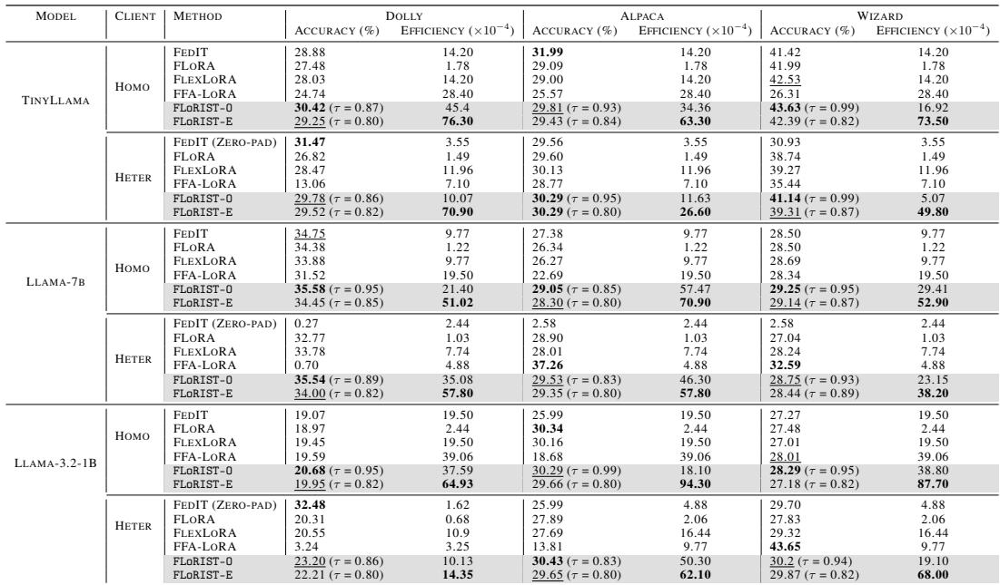

Baselines. We compare our proposed FLoRIST method against the following related works: FedIT [9] integrates LoRA with FedAvg and only supports homogeneous LoRA ranks across clients. It relies on zero-padding (HetLoRA [14]) to handle heterogeneity upto maximum client rank. Zeropadding is used by both FedIT and FFA-LoRA to accommodate rank differences. FLoRA [11] is a stacking-based aggregation strategy with heterogeneous LoRA spport. FlexLoRA [12] redistributes SVD of full-weight update to create multiple global adapters to match the client’s local rank. FFA-LoRA [10] freezes one of the LoRA adapters during training and only transmits the other half of the adapters. We evaluate two variants of our method: FLoRIST-O, which corresponds to the optimal threshold delivering the highest performance, and FLoRIST-E, which priortizes the communicationefficiency while maintaining performance to be at par, if not better. We refer to Appendix H for detailed descriptions of datasets, baselines and configurations used for our experimental results.

## 4.2 Performance Analysis

Homogeneous setup. In the homogeneous setting, where all clients utilize LoRA adapters of the same rank, FLoRIST-O consistently achieves strong performance across most model and dataset combinations as shown in Table 2. For instance, on the Wizard dataset with TinyLlama, FLoRIST-O achieves 43.63% accuracy, outperforming FedIT (41.42%), FLoRA (41.99%), FlexLoRA (42.53%) and FFA-LoRA (26.31%). A similar trend is observed on the Dolly dataset with Llama-7B, where FLoRIST-O obtains the highest accuracy of 35.58%, exceeding FedIT (34.75%), FLoRA (34.38%),

FlexLoRA (33.88%) and FFA-LoRA (31.52%). With the Llama-3.2-1B model, FLoRIST-O again demonstrates competitive performance. On the Wizard dataset, it reaches 28.29%, outperforming all other methods including FlexLoRA (27.01%) and FedIT (27.27%). Although in certain cases, such as the Alpaca dataset with Llama-3.2-1B, FLoRA marginally surpasses FLoRIST-O in accuracy (30.34% vs. 30.29%), it is important to note that FLoRIST-O is nearly 7.5× more communication-efficient in that scenario. Across all homogeneous configurations, FLoRIST-O outperforms or matches the performance of baseline methods in the majority of cases. This highlights FLoRIST-O’s ability to deliver competitive performance while offering substantial communication savings.

Heterogeneous setup. In the heterogeneous setup, where clients operate with different LoRA ranks, FLoRIST-O maintains its effectiveness across various configurations and consistently performs better than the stable baselines. For example, with Llama-3.2-1B on the Alpaca dataset, FLoRIST-O achieves the best accuracy (30.43%), outperforming all baselines including FlexLoRA (27.69%) and FLoRA (27.89%). Similarly, with Llama-7B on the Dolly dataset, it achieves 35.54%, again topping FLoRA (32.77%) and FlexLoRA (33.78%). While there are exceptions, such as the Wizard and Alpaca datasets with Llama-7B, where FFA-LoRA outperforms FLoRIST-O by achieving 32.59% and 37.26% respectively, these results come with an important caveat. FFA-LoRA’s performance is highly erratic and often unreliable, as evidenced by its collapse on the Dolly dataset (0.70% accuracy) and on Llama-3.2-1B in several settings. These inconsistencies with zero-padding align with observations from the FLoRA paper, where FedIT (zero-padding) struggled with generalizability in heterogeneous environments. Notably, FLoRIST-O consistently outperforms more stable methods that explicitly support heterogeneity, such as FLoRA and FlexLoRA, across nearly all modeldataset combinations. Even in cases where it does not achieve the absolute best accuracy, it offers significantly better communication efficiency. For instance, with TinyLlama on the Dolly dataset, FedIT (Zero-pad) attains a slightly higher accuracy (31.47%) compared to FLoRIST-O (29.78%), but at almost 3× the communication cost, illustrating the practical advantage of FLoRIST in real-world deployments. In summary, while FLoRIST-O may not universally dominate in every scenario, it consistently outperforms stable and widely adopted baselines across a wide range of heterogeneous and homogeneous configurations, offering a compelling balance between performance and efficiency.

## 4.3 Communication Cost and Efficiency

We define communication cost as the total number of parameters transmitted from the server during each communication round. For all methods considered, this corresponds to the size of the LoRA adapters or full model weights downloaded by the clients from the server.

Figure 3 illustrates the normalized communication cost (download) of different federated fine-tuning approaches on the TinyLlama model with the Wizard dataset in a homogeneous setting. Across varying numbers of clients, all methods exhibit significantly reduced communication costs compared to Full Fine-Tuning (Full FT). Notably, communication cost in FLoRA (downloading stacked LoRA adapters) increases

  
Figure 3: Comparison of download communication cost of various methods (normalized to Full Fine-Tuning) across multiple client setups. All methods exhibit significantly lower costs than Full FT. Proposed FloRIST achieves the lowest communication cost than all methods (TinyLlama, Wizard dataset, homogeneous setting).

linearly with the number of clients relative to other methods. The proposed FLoRIST-O and FLoRIST-E achieves superior communication efficiency with unified global adapter with lowest rank than other methods, and FLoRIST-E consistently incurs the lowest download cost among all methods. Specifically, with 8 clients, FLoRIST-E achieves 3× reduction in communication compared to FFA-LoRA, 39× reduction compared to FLoRA and a remarkable 227× improvement compared to full fine-tuning. We also discuss superior scalability of FLoRIST in Appendix E.

To better understand communication efficiency across models and datasets, we define communication efficiency as the inverse of the total LoRA rank transmitted from the server, i.e., 1Total Rank . Since all compared methods communicate LoRA matrices, this abstraction provides a consistent and interpretable proxy for downstream communication cost, where, lower rank implies fewer transmitted parameters and thus higher efficiency. From Table 2, FLoRIST-E is the most communication-efficient method across all datasets and model scales, while consistently achieving top-tier or superior performance. For instance, on the TinyLlama-Dolly-homo combination,

Table 3: Communication cost (MB) of different federated fine-tuning methods on TinyLlama using the Wizard dataset (homogeneous setting).  
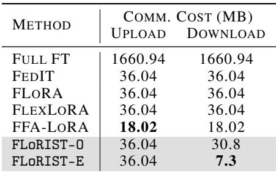

FLoRIST-E is 2.7× more efficient than FFA-LoRA, 5.4× more efficient than both FlexLoRA and FedIT, and an impressive 42.8× more efficient than FLoRA - all while outperforming these baselines in MMLU performance. Across tasks, FLoRIST-E achieves up to 58.11× higher efficiency than FLoRA (the least efficient baseline) and 11.8× higher than FFA-LoRA (half number of LoRA parameters), highlighting its scalability and practical relevance. Table 3 provides the raw communication cost (upload and download, in MB) for TinyLlama-Wizard-homo.

## 4.4 Impact of Thresholding

Unlike previous methods that maintain a fixed rank across all layers, FLoRIST dynamically adjusts the rank for each layer based on its unique weight distribution. Since different layers exhibit varying intrinsic dimensionalities, this adaptive approach enables more efficient parameterization compared to static-rank methods like FLoRA and FedIT. Consequently, we compare the total rank across all layers to better understand the trade-off between thresholding and rank compression.

Lower threshold achieves higher communication efficiency. As illustrated in Figure 4, the total rank of FLoRIST across all layers decreases as the threshold is lowered, demonstrating its ability to aggressively reduce redundancy in global weight representations, thereby boosting communication efficiency. Despite a significant reduction in rank at lower thresholds, FLoRIST maintains strong performance, as evidenced by our findings in Table 2.

For example, in a homogeneous training setup with Llama-7B in the Alpaca dataset, FLoRIST achieved superior accuracy compared to other baselines at a threshold, τ = 0.85. This highlights the effectiveness of adaptive rank decomposition in reducing communication overhead while maintaining or even surpassing the performance of state-of-the-art methods. An interesting observation from Figure 4 is that despite having double the number of LoRA adapters than FFA-LoRA (most efficient baseline with a frozen adapter), the proposed FLoRIST achieves superior efficiency for practical threshold values, τ ≤ 0.99 across the three datasets (TinyLlama-Wizard, TinyLlama-Dolly, and TinyLlama-Alpaca). Moreover, while methods like FLoRA need a higher total rank to maintain accuracy, FLoRIST balances rank reduction and performance retention through its adaptive thresholding mechanism. This validates that FLoRIST has lower communication overhead than all baselines at most practical thresholds, while still outperforming them in accuracy.

  
Figure 4: Total Rank (across all model layers) vs. Threshold for TinyLlama model on various datasets. Lower singular value thresholds lead to more memory-efficient global LoRA adapters and improved communication efficiency.

Layer-wise rank analysis reveals varying intrinsic dimensionality. While Figure 4 highlights the overall rank reduction trends with varying thresholds, a more granular analysis reveals deeper insights into the intrinsic dimensionality of different layers. To understand this, we visualize the optimal ranks of the attention projection matrices, across layers in a heterogeneous setup, using empirically chosen thresholds for FLoRIST-E.

Specifically, we show the rank distribution of q\_proj and v\_proj in TinyLlama-Wizard at threshold τ = 0.87 and TinyLlama-Alpaca at threshold τ = 0.8 in Figure 5. Several key observations emerge: (1) The rank varies significantly across layers, indicating non-uniform intrinsic dimensionality in the model. Intermediate layers consistently require higher ranks, while both initial and final layers tend to be intrinsically low rank. This aligns with the findings of [22] that intermediate layers carry richer representations. (2) We observe that v\_proj consistently requires lower ranks compared to q\_proj mostly across all layers, suggesting higher redundancy in the v\_proj. These insights emphasize the utility of singular value thresholding in FLoRIST for adapting rank at a fine-grained level, leading to a more communication-efficient yet expressive global adapter.

  
Figure 5: Layer-wise optimal rank of q\_proj and v\_proj matrices across attention layers.

Threshold helps regularize for improved performance. The energy threshold in FLoRIST serves as a crucial hyperparameter that governs the level of noise introduced during the decomposition of the global weight matrix, thereby acting as an implicit regularizer.

Adjusting this threshold directly influences the rank of the resulting low-rank approximation, impacting both model performance and communication efficiency. As illustrated in Figure 6, when the threshold is set to 1.0, FLoRIST performs equivalently to FLoRA, as both methods execute the same mathematically accurate aggregation. At this threshold, the decomposed LoRA adapters approximate the original global weight matrix as closely as possible. However, as the threshold is lowered, the decomposition introduces noise, which serves as a form of regularization. This effect is evident in TinyLlama as the performance improves up to a certain threshold, reaching a peak MMLU score of 43.6 at threshold, τ = 0.99 for TinyLlama. Beyond these optimal thresholds, performance begins to degrade as excessive noise in the decomposition becomes detrimental, mirroring the behavior of other regularization techniques such as dropout [23] and weight pruning [24]. The optimal threshold varies across models and datasets, indicating that the effectiveness of regularization depends on both the architecture and the data. This underscores the importance of tuning the threshold based on the specific characteristics of the model and dataset, rather than assuming a fixed value. We provide additional results across various model and dataset settings in Appendix G.

  
Figure 6: Energy Threshold vs. MMLU score of TinyLlama on the Wizard dataset (homogeneous rank). At τ = 0.99, FLoRIST achieves the highest MMLU score. At τ = 0.82, it still surpasses other methods in MMLU while being the most communication-efficient (corresponding to the smallest optimal rank for global LoRA).

## 5 Conclusion

FLoRIST is a novel approach for federated fine-tuning of LLMs that identifies and leverages the low intrinsic dimensionality of aggregated local LoRA adapters to reduce redundancy and optimize the trade-off between model performance and communication efficiency. By applying fast, independent SVD on aggregated local adapters and operating in a compact intermediate space at the server, FLoRIST avoids full-weight updates and identifies the most informative components (corresponding to optimal rank) via singular value thresholding. It offers two variants, FLoRIST-O for maximum performance and FLoRIST-E for enhanced efficiency, making it a strong alternative to existing methods. We present the first comprehensive evaluation of the recent LoRA-based federated finetuning methods across both homogeneous and heterogeneous settings, showing FLoRIST achieves the best balance of performance and efficiency. Future work includes automating threshold selection based on layer-wise intrinsic ranks, potentially assigning higher ranks to query projections in intermediate layers than to value projections in initial and final layers.

## References

[1] Desirée Bill and Theodor Eriksson. Fine-tuning a llm using reinforcement learning from human feedback for a therapy chatbot application, 2023.

[2] Xin Luna Dong, Seungwhan Moon, Yifan Ethan Xu, Kshitiz Malik, and Zhou Yu. Towards next-generation intelligent assistants leveraging llm techniques. In Proceedings of the 29th ACM SIGKDD Conference on Knowledge Discovery and Data Mining, KDD ’23, page 5792–5793, New York, NY, USA, 2023. Association for Computing Machinery.

[3] Dominique Kelly, Yimin Chen, Sarah E. Cornwell, Nicole S. Delellis, Alex Mayhew, Sodiq Onaolapo, and Victoria L. Rubin. Bing chat: The future of search engines? Proceedings of the Association for Information Science and Technology, 60(1):1007–1009, October 2023.

[4] Arun James Thirunavukarasu, Darren Shu Jeng Ting, Kabilan Elangovan, Laura Gutierrez, Ting Fang Tan, and Daniel Shu Wei Ting. Large language models in medicine. Nature medicine, 29(8):1930–1940, 2023.

[5] Microsoft Research AI4Science and Microsoft Azure Quantum. The impact of large language models on scientific discovery: a preliminary study using gpt-4. arXiv preprint arXiv:2311.07361, 2023.

[6] Jeremy Howard and Sebastian Ruder. Universal language model fine-tuning for text classification. In Iryna Gurevych and Yusuke Miyao, editors, Proceedings of the 56th Annual Meeting of the Association for Computational Linguistics (Volume 1: Long Papers), pages 328–339, Melbourne, Australia, July 2018. Association for Computational Linguistics.

[7] Edward J Hu, yelong shen, Phillip Wallis, Zeyuan Allen-Zhu, Yuanzhi Li, Shean Wang, Lu Wang, and Weizhu Chen. LoRA: Low-rank adaptation of large language models. In International Conference on Learning Representations, 2022.

[8] Brendan McMahan, Eider Moore, Daniel Ramage, Seth Hampson, and Blaise Aguera y Arcas. Communication-Efficient Learning of Deep Networks from Decentralized Data. In Aarti Singh and Jerry Zhu, editors, Proceedings of the 20th International Conference on Artificial Intelligence and Statistics, volume 54 of Proceedings of Machine Learning Research, pages 1273–1282. PMLR, 20–22 Apr 2017.

[9] Jianyi Zhang, Saeed Vahidian, Martin Kuo, Chunyuan Li, Ruiyi Zhang, Tong Yu, Guoyin Wang, and Yiran Chen. Towards building the federatedgpt: Federated instruction tuning. In ICASSP 2024 - 2024 IEEE International Conference on Acoustics, Speech and Signal Processing (ICASSP), pages 6915–6919, 2024.

[10] Youbang Sun, Zitao Li, Yaliang Li, and Bolin Ding. Improving lora in privacy-preserving federated learning. In The Twelfth International Conference on Learning Representations, 2024.

[11] Ziyao Wang, Zheyu Shen, Yexiao He, Guoheng Sun, Hongyi Wang, Lingjuan Lyu, and Ang Li. Flora: Federated fine-tuning large language models with heterogeneous low-rank adaptations. In Advances in Neural Information Processing Systems, volume 37, pages 22513–22533, 2024.

[12] Jiamu Bai, Daoyuan Chen, Bingchen Qian, Liuyi Yao, and Yaliang Li. Federated fine-tuning of large language models under heterogeneous tasks and client resources. In The Thirty-eighth Annual Conference on Neural Information Processing Systems, 2024.

[13] Tao Sun, Dongsheng Li, and Bao Wang. Decentralized federated averaging. IEEE Transactions on Pattern Analysis and Machine Intelligence, 45(4):4289–4301, 2022.

[14] Yae Jee Cho, Luyang Liu, Zheng Xu, Aldi Fahrezi, Matt Barnes, and Gauri Joshi. Heterogeneous loRA for federated fine-tuning of on-device foundation models. In International Workshop on Federated Learning in the Age of Foundation Models in Conjunction with NeurIPS 2023, 2023.

[15] Peiyuan Zhang, Guangtao Zeng, Tianduo Wang, and Wei Lu. Tinyllama: An open-source small language model. arXiv preprint arXiv:2401.02385, 2024.

[16] Hugo Touvron, Thibaut Lavril, Gautier Izacard, Xavier Martinet, Marie-Anne Lachaux, Timothée Lacroix, Baptiste Rozière, Naman Goyal, Eric Hambro, Faisal Azhar, et al. Llama: Open and efficient foundation language models. arXiv preprint arXiv:2302.13971, 2023.

[17] Yann Dubois, Chen Xuechen Li, Rohan Taori, Tianyi Zhang, Ishaan Gulrajani, Jimmy Ba, Carlos Guestrin, Percy S Liang, and Tatsunori B Hashimoto. Alpacafarm: A simulation framework for methods that learn from human feedback. Advances in Neural Information Processing Systems, 36:30039–30069, 2023.

[18] Haipeng Luo, Qingfeng Sun, Can Xu, Pu Zhao, Jian-Guang Lou, Chongyang Tao, Xiubo Geng, Qingwei Lin, Shifeng Chen, Yansong Tang, and Dongmei Zhang. Wizardmath: Empowering mathematical reasoning for large language models via reinforced evol-instruct. In The Thirteenth International Conference on Learning Representations, 2025.

[19] Dan Hendrycks, Collin Burns, Steven Basart, Andy Zou, Mantas Mazeika, Dawn Song, and Jacob Steinhardt. Measuring massive multitask language understanding. In International Conference on Learning Representations, 2021.

[20] Chaoyang He, Songze Li, Jinhyun So, Mi Zhang, Hongyi Wang, Xiaoyang Wang, Praneeth Vepakomma, Abhishek Singh, Hang Qiu, Li Shen, Peilin Zhao, Yan Kang, Yang Liu, Ramesh Raskar, Qiang Yang, Murali Annavaram, and Salman Avestimehr. Fedml: A research library and benchmark for federated machine learning. CoRR, abs/2007.13518, 2020.

[21] Fan Lai, Yinwei Dai, Sanjay Singapuram, Jiachen Liu, Xiangfeng Zhu, Harsha Madhyastha, and Mosharaf Chowdhury. Fedscale: Benchmarking model and system performance of federated learning at scale. In International conference on machine learning, pages 11814–11827. PMLR, 2022.

[22] Zheng Zhao, Yftah Ziser, and Shay B Cohen. Layer by layer: Uncovering where multitask learning happens in instruction-tuned large language models. In Yaser Al-Onaizan, Mohit Bansal, and Yun-Nung Chen, editors, Proceedings of the 2024 Conference on Empirical Methods in Natural Language Processing, pages 15195–15214, Miami, Florida, USA, November 2024. Association for Computational Linguistics.

[23] Nitish Srivastava, Geoffrey Hinton, Alex Krizhevsky, Ilya Sutskever, and Ruslan Salakhutdinov. Dropout: A simple way to prevent neural networks from overfitting. Journal of Machine Learning Research, 15(56):1929–1958, 2014.

[24] Song Han, Jeff Pool, John Tran, and William Dally. Learning both weights and connections for efficient neural network. Advances in neural information processing systems, 28, 2015.

[25] Qingru Zhang, Minshuo Chen, Alexander Bukharin, Nikos Karampatziakis, Pengcheng He, Yu Cheng, Weizhu Chen, and Tuo Zhao. Adalora: Adaptive budget allocation for parameterefficient fine-tuning, 2023.

[26] Sara Babakniya, Ahmed Elkordy, Yahya Ezzeldin, Qingfeng Liu, Kee-Bong Song, MOSTAFA EL-Khamy, and Salman Avestimehr. SLoRA: Federated parameter efficient fine-tuning of language models. In International Workshop on Federated Learning in the Age of Foundation Models in Conjunction with NeurIPS 2023, 2023.

[27] Zheng Lin, Xuanjie Hu, Yuxin Zhang, Zhe Chen, Zihan Fang, Xianhao Chen, Ang Li, Praneeth Vepakomma, and Yue Gao. SplitLoRA: A Split Parameter-Efficient Fine-Tuning Framework for Large Language Models. arXiv preprint arXiv:2407.00952, 2024.

[28] Yeachan Kim, Junho Kim, Wing-Lam Mok, Jun-Hyung Park, and SangKeun Lee. Clientcustomized adaptation for parameter-efficient federated learning. In Anna Rogers, Jordan Boyd-Graber, and Naoaki Okazaki, editors, Findings of the Association for Computational Linguistics: ACL 2023, pages 1159–1172, Toronto, Canada, July 2023. Association for Computational Linguistics.

[29] Xijie Huang, Zechun Liu, Shih-Yang Liu, and Kwang-Ting Cheng. RoLoRA: Fine-tuning rotated outlier-free LLMs for effective weight-activation quantization. In Yaser Al-Onaizan, Mohit Bansal, and Yun-Nung Chen, editors, Findings of the Association for Computational Linguistics: EMNLP 2024, pages 7563–7576, Miami, Florida, USA, November 2024. Association for Computational Linguistics.

[30] Sajjad Ghiasvand, Yifan Yang, Zhiyu Xue, Mahnoosh Alizadeh, Zheng Zhang, and Ramtin Pedarsani. Communication-efficient and tensorized federated fine-tuning of large language models, 2024.

[31] Yiming Li, Jingwei Sun, Yudong Liu, Yuandong Zhang, Ang Li, Beidi Chen, Holger R. Roth, Daguang Xu, Tingjun Chen, and Yiran Chen. Federated black-box prompt tuning system for large language models on the edge. In Proceedings of the 30th Annual International Conference on Mobile Computing and Networking, ACM MobiCom ’24, page 1775–1777, New York, NY, USA, 2024. Association for Computing Machinery.

[32] Zhen Qin, Daoyuan Chen, Bingchen Qian, Bolin Ding, Yaliang Li, and Shuiguang Deng. Federated full-parameter tuning of billion-sized language models with communication cost under 18 kilobytes. In Proceedings of the 41st International Conference on Machine Learning, ICML’24. JMLR.org, 2024.

[33] Charlie Hou, Akshat Shrivastava, Hongyuan Zhan, Rylan Conway, Trang Le, Adithya Sagar, Giulia Fanti, and Daniel Lazar. Pre-text: training language models on private federated data in the age of llms. In Proceedings of the 41st International Conference on Machine Learning, ICML’24. JMLR.org, 2024.

## Appendix

In this Appendix, we provide additional figures, analyses, and technical clarifications to support and expand upon the main paper:

• Appendix A presents the complete pseudocode for FLoRIST, detailing the core steps for client-side updates and server-side aggregation with efficient SVD.

• Appendix B highlights key limitations of existing federated fine-tuning methods using LoRA through a visual workflow.

• Appendix C provides a detailed computational, communication, and memory complexity comparison across all methods.

• Appendix D discusses additional related work beyond the main text, contextualizing our method within the broader landscape of federated and parameter-efficient tuning techniques.

• Appendix E analyzes the scalability of communication cost with increasing clients, including extrapolated trends to large-scale settings.

• Appendix F reports estimated server-side FLOPs required for each method, demonstrating the computation speedup using efficient SVD in FLoRIST.

• Appendix GAdditional perfromance-threshold plots across diverse model and dataset settings, illustrating the effect of varying thresholds.

• Appendix H details the experimental setup, including datasets, baseline methods, model configurations, and resource constraints.

• Appendix I outlines the limitations of our current method and identifies directions for future research.

## A Pseudocode of FLoRIST

Algorithm 1: FLoRIST: Federated Low-Rank Integration with Singular value Thresholding   
Input: Pretrained model weights W0, number of rounds T , clients C with LoRA ranks {rk}k∈C,   
dataset sizes {nk}, threshold τ   
Output: Global LoRA adapters (Bg, Ag)   
Initialize global LoRA adapters (Bg, Ag)   
for t = 1 to T do   
/\* Server selects clients and broadcasts global adapters \*   
Server: Sample clients Ct ⊂ C   
Broadcast(Bg, Ag) to all k ∈ Ct   
/\* Clients perform local fine-tuning \*   
foreach k ∈ Ct do in parallel   
Client k: Merge global adapters with base model: W0 ← Merge(W0, Bg, Ag)   
Initialize local adapters: (Bk, Ak) ∈ Rm×rk , Rrk×n   
(Bk, Ak) ← LocalUpdate(W0, Bk, Ak)   
Upload(Bk, Ak) to server   
/\* Server aggregates without forming ∆W \*/   
Server: Stack all Bk horizontally and weighted Ak vertically   
Bstack ← B1 ⊕ · · · ⊕ BK   
Astack ← n1 A1 ⊕ · · · ⊕ nK AK   
Perform SVD: Bstack = UBSBV TB , Astack = UASAV TA   
Compute: Q ← V TB UA, P ← SBQSA   
Perform SVD: P = UP SP V TP   
/\* Energy-based thresholdingFind smallest p such that Ppi=1(SP )2P iiRi=1(SP )2ii ≥ τ \*/   
Truncate: Bg ← (UBUP )[:,:p](SP )[:p,:p], Ag ← (V TP V TA )[:p,:]   
return (Bg, Ag)

## B Gaps in Related Works

This section visually illustrates the core design and limitations of existing federated fine-tuning methods that use LoRA. Each method attempts to balance fine-tuning efficiency with communication and heterogeneity support, but distinct challenges persist, especially in aggregation strategies, rank handling, and computational overhead.

  
Figure 7: Workflow of FedIT [9] and its unique challenges. Does not support heterogeneity, natively.

  
Figure 8: Workflow of FFA-LoRA [10] and its unique challenges. Does not support heterogeneity, natively.

FlexLoRA vs. FLoRIST. While FlexLoRA also employs an SVD-based aggregation mechanism, it differs from FLoRIST in two critical ways:

  
Figure 9: Workflow of FLoRA [11] and its unique challenges. Supports heterogeneity.

• Computational Cost: FlexLoRA explicitly constructs the global update matrix ∆W = ∑k=1 N PKk=1 nkN ∆Wk ∈ Rm×n and applies a full SVD, resulting in substantial computational and memory overhead. In contrast, FLoRIST bypasses this by operating entirely in the much smaller r × r space through separate decompositions of Bstack and Astack.

• Truncation Strategy. FlexLoRA redistributes the decomposed components to clients based on their original adapter ranks, effectively matching rank to client capacity without considering global information retention. FLoRIST, in contrast, employs an energy-based thresholding mechanism to determine the smallest rank p such that a specified proportion τ of the singular value energy is preserved. This principled truncation leads to substantially lower communication overhead while preserving essential task-specific information.

  
Figure 10: Workflow of FlexLoRA [12] and its unique challenges. Supports heterogeneity.

## C Complexity Analysis

Tables(4, 5, 6) summarize and compare the computational cost, communication overhead, and memory usage for all federated fine-tuning methods for LLMs using LoRA. The computational complexity of FLoRIST can be analyzed across three key stages: local client training, server-side aggregation and decomposition, and communication overhead.

Client-Side Computation. Each client k trains LoRA adapters {Bk, Ak} for E local epochs. The cost depends on the base model, optimizer, dataset, and rank rk. We abstract this cost as:

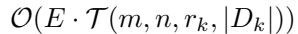

Here, m is the embedding size, n is the context length, rk is the LoRA rank used by client k, K is the total number of clients, |Dk| is the number of local training samples. Additionally, at the start of each round, the client merges the received global adapters (Bg, Ag) into the base model W0 by computing ∆Wg = BgAg, which incurs a one-time cost of O(PLl=1 plmn) where, and L is the total number of layers and pl is the rank of the global adapters at layer l. where pl is the effective rank used in layer l.

Server-Side Aggregation and Efficient SVD. In our new method, the server avoids constructing the dense update matrix ∆W ∈ Rm×n and instead performs the following operations:

1. SVD on stacked matrices:

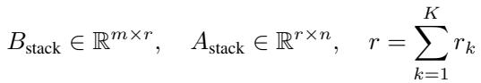

Each has complexity O(Lmr2 + Lnr2)

2. Computing intermediate matrix:

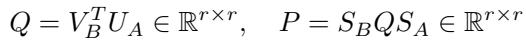

3. SVD on P : O(Lr3)

4. Constructing global adapters:

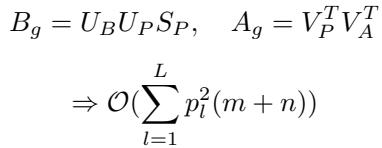

Overall Per-Round Complexity.

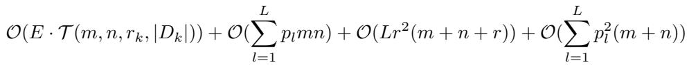

The efficient decomposition approach used in FLoRIST leads to significantly reduced computational overhead compared to FlexLoRA, which performs SVD on the full matrix ∆W ∈ Rm×n.

Table 4: Computational complexity of federated fine-tuning methods. T (m, n, rk, |Dk|) is the per-epoch training cost; where, m is the embedding size, n is the context length, rk is the LoRA rank used by client k,r = PKk=1 rk, K is the total number of clients, |Dk| is the number of local training samples, pl is the rank for  
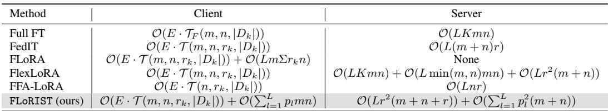

Table 5: Communication overhead (upload and download costs for all clients per round).  
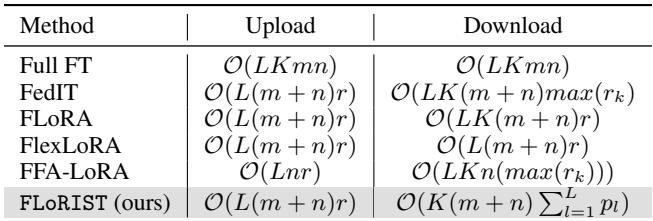

Table 6: Memory complexity (asymptotic) of federated fine-tuning methods.  
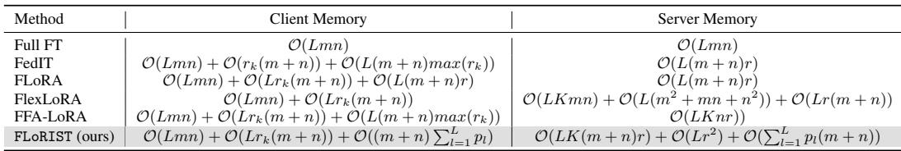

## D Other Related Work

This section discusses additional relevant works not included in the main comparison table.

AdaLoRA. AdaLoRA [25] adaptively allocates ranks to LoRA layers prior to training to optimize the number of trainable parameters within a fixed budget using SVD. However, it operates entirely on the client side and determines ranks before local training begins. This makes it unsuitable for communication-efficient federated settings where post-training compression is essential. In contrast, FLoRIST performs server-side rank reduction after clients upload their LoRA adapters. By applying Singular Value Thresholding (SVT) to the aggregated global adapters, it adaptively truncates them based on retained energy, enabling aggressive compression based on what was actually learned.

Key differences include:

• Compression Timing. FLoRIST compresses updates post-training, while AdaLoRA allocates rank pre-training.

• Impact on Communication. AdaLoRA does not reduce communication cost since it transmits full adapters; FLoRIST explicitly reduces global rank for efficient broadcast.

• Training Flow. In FLoRIST, the clients don’t train with the reduced global adapters from SVT. Instead, as clarified in Algorithm A, each client merges the compressed global adapter with the base model and reinitializes fresh local adapters. This allows for aggressive rank reduction in FLoRIST as the client rank for the next round of training is unaffected.

Complementarity. Because AdaLoRA and FLoRIST act on different stages (client vs. server), they are mutually compatible. AdaLoRA can be integrated with FLoRIST to optimize trainable parameters locally while still benefiting from global compression.

SLoRA. SLoRA [26] introduces a two-phase procedure: a sparse update phase followed by LoRA fine-tuning. It applies SVD only once to initialize LoRA matrices but does not use SVD for communication efficiency or aggregation. Adapter aggregation is done via FedAvg, and no compression is applied post-training. Hence, SLoRA is orthogonal to FLoRIST and could potentially benefit from applying our post-training SVT compression scheme on top.

Split-LoRA. Split-LoRA [27] integrates Split Learning and LoRA to reduce per-client computational load. The model is partitioned between clients and server, with only a subset of layers trained locally. While this addresses system heterogeneity, it does not optimize communication or aggregation. Thus, Split-LoRA addresses a different challenge and is orthogonal to our focus. FLoRIST could, in principle, be combined with Split-LoRA to further reduce communication cost on the LoRA layers.

C2A. C2A [28] employs hypernetworks to generate personalized adapters conditioned on clientspecific metadata. This method addresses client drift and personalization but does not modify aggregation or reduce communication. It is thus complementary to FLoRIST, which could serve as the backend aggregation engine while C2A handles local personalization.

RoLoRA. RoLoRA [29] improves convergence and quantization robustness by applying rotations to eliminate outliers in adapter weight space before fine-tuning. Like C2A, it operates locally and does not involve adapter aggregation or rank reduction. RoLoRA is orthogonal and could be used at the client side alongside FLoRIST’s server-side aggregation.

FedTT. FedTT [30] introduces tensorized adapters to reduce parameter and communication cost. While it shares a goal with FLoRIST, its approach differs substantially—it compresses adapters using tensor decomposition rather than post-hoc SVD on aggregated weights. FedTT could be seen as an alternative approach, though it could potentially benefit from additional SVT-based compression.

FedBPT. FedBPT [31] replaces adapter tuning entirely with prompt tuning. It transmits only small prompt vectors between clients and server, making it extremely communication-efficient but limited in adaptation capacity. Since it bypasses LoRA altogether, it is not comparable to FLoRIST and is considered incompatible for our setting.

FedKSeed and PrE-Text. FedKSeed [32] and PrE-Text [33] shift the focus from model-centric to data-centric personalization. FedKSeed seeds clients with shared knowledge, while PrE-Text generates synthetic local data to preserve privacy. Both are orthogonal to FLoRIST and can potentially be integrated as upstream personalization or privacy-enhancing modules.

Summary. In contrast to existing methods, FLoRIST focuses on scalable, communication-efficient aggregation through principled post-training rank truncation. Several works such as AdaLoRA, C2A, and RoLoRA can be layered with FLoRIST, while others such as FedTT or Split-LoRA solve complementary challenges and may benefit from integrating our SVT-based aggregation strategy.

## E Scalability Study

Figure 11(a) highlights the scalability of our approach. While FLoRA’s communication cost increases linearly with the number of clients, our method (FLoRIST) maintain a much lower and stable cost. Notably, FLoRIST-E exhibits a slightly decreasing trend, demonstrating its scalability. Meanwhile, FLoRIST-O fluctuates but still maintains a significantly lower communication cost than FLoRA, further supporting the effectiveness of our method in large-scale federated settings. Specifically, FLoRIST-O is 2.80×, 8.33×, and 9.36× more efficient than FLoRA for 2, 4, and 8 clients, respectively. This trend suggests that FLoRA does not scale well, and as the number of clients increases, its communication efficiency may degrade further, potentially becoming even less efficient than Full Fine-Tuning (Full-FT). This is evident from Figure 11(b), where we have extrapolated the experimental results. We observe that FLoRA’s communication cost continues to rise with the number of clients and eventually surpasses the communication cost of Full Fine-Tuning, whereas our method scales ideally but with lower cost than the rest. Due to resource constraints, we conducted experiments up to 8 clients and extrapolated the results beyond that based on empirical trends. While more computational resources is required to determine the communication cost of FLoRIST beyond 8 clients, the communication costs of the other methods can be mathematically derived, enabling accurate extrapolation up to 64 clients.

  
(a) Communication line plot

  
(b) Exptrapolated to 64 clients  
Figure 11: Communication cost scalability of federated fine-tuning methods. While FLoRA’s cost increases linearly with the number of clients, our method, FLoRIST-E, shows a slight decrease, indicating superior scalability trend. Although FLoRIST-O fluctuates, it still maintains a lower communication cost than FedIT.

## F Server Computational Cost

We report the raw computational cost on the server where methods like FlexLoRA incur significant cost due to full-weight update matrix decomposition using full-SVD. Table 7 reports the server-side FLOPs required for each method on the LLaMA-7B model. We note that FlexLoRA requires over 2200B FLOPs whereas FLoRIST takes 6.18B FLOPs adopting efficient SVD scheme where SVD is applied directly on stacked LoRA adapters, making it nearly 350×

Table 7: Estimated server computational cost (FLOPs, in Billions) on LLaMA-7B in a heterogenous setup.  
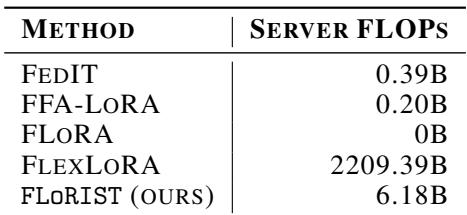

faster, while maintaining strong MMLU performance with heterogeneity support.

## G Performance Impact of Threshold Across Settings

These additional results complement the main paper’s threshold-performance discussion by evaluating FLoRIST across diverse models (TinyLlama, LLaMA3.2-1B) and datasets (Wizard, Alpaca, Dolly). We consistently observe multiple threshold values at which FLoRIST outperforms all baselines.

This observation reinforces a key strength of our method: it allows practitioners to flexibly select a threshold that aligns with deployment needs. For instance:

• To maximize performance, one can choose the threshold that yields the highest MMLU score (FLoRIST-O).

• To minimize communication cost, one may select the lowest threshold at which FLoRIST still outperforms all other methods (FLoRIST-E).

Thus, the energy threshold serves not only as a regularization mechanism, but also as a tunable lever to navigate the trade-off between performance and communication efficiency, making FLoRIST broadly adaptable across federated environments.

  
(a) TinyLlama - Wizard (heterogeneous), τO = (b) TinyLlama - Alpaca (heterogeneous), τO = 0.99, τE = 0.87 0.95, τE = 0.8

  
(c) LLaMA3.2-1B - Alpaca (heterogeneous), τO = (d) LLaMA3.2-1B - Dolly (homogeneous), τO = 0.83, τE = 0.80 0.95, τE = 0.82  
Figure 12: MMLU performance of FLoRIST at varying energy thresholds across different model-dataset configurations. FLoRIST-O refers to the threshold that yields peak performance, while FLoRIST-E denotes the lowest threshold that still outperforms all baselines. These points highlight the adaptability of our method for tuning the trade-off between communication efficiency and accuracy.

## H Additional Experimental Details

## H.1 Datasets

• Dolly [9] is an open-source instruction-tuning dataset consisting of 15,000 examples created by Databricks employees. It includes a broad range of instruction types across categories such as brainstorming, classification, closed and open-ended QA, summarization, information extraction, and generation. It is designed to reflect real-world user prompts and was used to train the original Dolly model series.

• Alpaca [17] dataset contains 52,000 instruction-following samples generated by selfinstructing a LLaMA model using GPT-3.5. It spans a diverse array of natural language instructions and was created to train the Alpaca model. Its wide coverage of tasks makes it a standard benchmark for instruction-tuned LLMs.

• Wizard [18] comprises 70,000 instruction-output pairs and serves as the training set for the WizardLM series. Compared to Dolly and Alpaca, the instructions in Wizard are typically more complex and abstract, making it a useful benchmark for evaluating instruction generalization and multi-step reasoning.

MMLU benchmark. The MMLU benchmark [19] contains 14,024 multiple-choice questions spanning 57 diverse subjects, such as mathematics, history, law, and medicine. It is widely used to evaluate reasoning and knowledge recall in large language models. In our experiments, we sample 1,444 questions uniformly for evaluation due to resource constraints.

## H.2 Baseline methods

We compared our proposed FLoRIST method with the following baseline approaches:

1. FedIT [9]: Integrates LoRA with FedAvg to achieve communication efficiency but only supports homogeneous LoRA ranks across clients. It relies on zero-padding (HetLoRA [14]) to handle heterogeneity. HetLoRA is a simple method to enable support for heterogeneous LoRA ranks by zero-padding the smaller matrices to match the largest rank before aggregation. It is used by both FedIT and FFA-LoRA to accommodate rank differences.

2. FLoRA [11]: Employs a stacking-based aggregation strategy that enables noise-free combination of heterogeneous LoRA modules. It achieves high performance but incurs additional communication cost proportional to client rank.

3. FlexLoRA [12]: Allows clients to use different LoRA ranks by applying singular value decomposition (SVD) to change the rank of global adapters to match the client’s local rank before fine-tuning. It avoids zero-padding and balances communication efficiency with flexibility in client ranks.

4. FFA-LoRA [10]: Enhances communication efficiency by freezing one of the LoRA matrices during fine-tuning and transmitting only the remaining matrix. Like FedIT, it supports heterogeneity through zero-padding (HetLoRA).

## H.3 Model and Fine-tuning Details

We fine-tune three decoder-only transformer models: LLaMA-3.2-1B, TinyLLaMA [15] (1.1B parameters), and LLaMA-7B [16]. LoRA adapters [7] are inserted only in the query and value projection matrices of each attention layer. The federated setting simulates 8 clients with non-IID partitions. In homogeneous configurations, all clients use LoRA rank 16. In heterogeneous settings, client ranks are set to [4, 4, 8, 8, 16, 16, 32, 64]. Each communication round is followed by local fine-tuning with a learning rate of 0.0003. For the Alpaca and Wizard datasets, one communication round with one epoch is used. For Dolly, we use one round with three local epochs. We make an exception for LLaMA-3.2-1B-heterogeneous setup, where we use three rounds with one epoch per round to aid convergence.

## H.4 System and Resource Setup

All experiments were conducted on a high-performance computing (HPC) cluster with access to an NVIDIA A100 GPU, subdivided into four MIG slices, each providing 20GB of memory. Due to the scale of models and data, fine-tuning was resource-intensive and required strict limits on communication rounds and training epochs.

## I Limitations

While FLoRIST shows strong empirical performance, several limitations remain that offer opportunities for future work. Due to resource constraints, we conduct experiments with only 8 clients and a limited number of communication rounds, which may not fully capture large-scale federated settings. Our method also relies on an empirically chosen energy threshold τ to determine the adapter rank. Although we propose two variants, FLoRIST-O and FLoRIST-E, automated threshold selection remains an open problem. Additionally, we have not yet explored the privacy aspects of our method. Extending FLoRIST to incorporate formal privacy guarantees, such as differential privacy or secure aggregation, is a valuable direction for future work.