# RAIDSERVE: HIGH-PERFORMANCE RESILIENT SERVING

Ziyi Xu 1 Zhiqiang Xie 2 Swapnil Gandhi 2 Christos Kozyrakis 2 3

## ABSTRACT

Tensor parallelism (TP) enables large language models (LLMs) to scale inference efficiently across multiple GPUs, but its tight coupling makes systems fragile: a single GPU failure can halt execution, trigger costly KVCache recomputation, and introduce long-term compute and memory imbalance. We present RaidServe, a fault-tolerant TP serving system that sustains high performance under irregular GPU availability. RaidServe introduces three techniques to balance computation and memory across GPUs: (1) Cyclic KVCache Placement for even memory utilization, (2) Hybrid Attention combining tensor- and data-parallel attention to eliminate stragglers, and (3) Fine-Grained Load-Aware Routing to dynamically balance requests. It further employs proactive KVCache backup and on-demand weight recovery to avoid expensive recomputation and redundant data transfers. We implement these techniques in a lightweight serving engine compatible with existing LLM infrastructures. Evaluated on an 8×H100 DGX system with real-world fault traces and representative workloads, RaidServe achieves up to 2× higher throughput and two orders of magnitude lower recovery latency compared to standard fault-handling approaches. Even with up to three GPU failures, RaidServe sustains high throughput and balanced utilization, demonstrating robust and efficient LLM serving under dynamic and unreliable hardware conditions.

## 1 INTRODUCTION

Modern Large Language Models (LLMs) have significantly advanced capabilities across diverse applications, including conversational agents (OpenAI, 2022), search engines (Gemini), code generation (Github, 2024), and scientific discovery. As these models scale rapidly — now comprising hundreds of billions or even trillions of parameters—their computational and memory requirements have risen dramatically (DeepSeek-AI, 2024). Consequently, deploying LLM inference workloads increasingly demands aggregation of compute and memory resources across multiple GPUs, often distributed over several nodes. Tensor parallelism (TP) has emerged as a prominent solution for efficiently scaling these workloads by tightly coupling GPUs using high-bandwidth interconnects such as NVIDIA’s NVLink (NVIDIA), AMD’s infinity fabric link (AMD) or Google’s TPU Pods (Google).

While TP enables efficient scaling within a scale-up domain—a set of GPUs connected via high-bandwidth interconnects—it also inherently couples all participating devices (Shoeybi et al., 2019). This tight coupling creates a double-edged sword: a single GPU failure can render the entire TP execution unavailable across all GPUs within the affected scale-up domain. With scale-up domain sizes steadily increasing—with current deployments reaching up to 72 GPUs (NVIDIA, 2025a) — the probability and impact of GPU failures both intensify. Recent studies (He et al., 2023; Hu et al., 2024; Kokolis et al., 2025; Jiang et al., 2024) underline the rising frequency of GPU failures, attributing them to hardware degradation, thermal instability, and unpredictable preemptions. These failures impose substantial hurdles for maintaining reliable, high-performance inference services, critically affecting user experience and overall system efficiency. Typically, GPU failures introduce two primary types of overhead:

Challenge #1: Recovery Overhead. When a GPU fails, several immediate complications arise in reassigning inference workloads. First, the KVCache for all inflight requests previously managed by the failed GPU is irrecoverably lost, requiring expensive and time-consuming recomputation before inference can continue. Additionally, the surviving GPUs must reshard and rebalance model weights (stored in CPU DRAM or persistent storage), resulting in substantial data movement and traffic over PCIe. Collectively, these recovery tasks—KVCache reconstruction and model weight resharing—trigger significant latency spikes, stall in-flight requests, and severely degrade the quality of experience for clients, as depicted in Figure 13.

Challenge #2:Persistent Imbalance Overhead. After recovery, the system continues with fewer GPUs than originally provisioned (e.g., from 8 to 7), breaking the symmetry assumptions under which serving pipelines are tuned. The result is enduring compute and memory skew. Compute imbalance occurs primarily due to uneven workload distribution, notably within attention layers partitioned by discrete attention heads. This imbalance leads to some GPUs idling, awaiting heavily loaded GPUs to complete their tasks, resulting in stalled resources and significantly diminished throughput. Concurrently, memory imbalance arises from unequal distribution of KVCache utilization across GPUs. This memory imbalance limits available cache capacity, forcing smaller batch sizes and further constraining throughput due to increased overhead from frequent kernel launches and reduced parallelism. These persistent imbalances, depicted in Figures 1 and 2, consistently impose performance bottlenecks and cause severe underutilization of valuable GPU resources.

To address these challenges, we propose RaidServe, a system designed to provide high-performance yet resilient TP serving under irregular GPU availability. RaidServe introduces three key techniques to sustain efficiency and balance under irregular GPU availability: (1) Cyclic KVCache Placement, which rotates KVCache placement across layers to evenly distribute memory usage and preserve effective batch size; (2) Hybrid Attention, which integrates TP- and DP-style attention to balance computation across GPUs and eliminate stragglers; and (3) Fine-Grained Load-Aware Routing, which dynamically dispatches requests based on real-time GPU load to reduce intra-batch workload imbalance. In addition, RaidServe incorporates proactive KV-Cache backup to eliminate time-consuming recomputation during recovery, and on-demand weight restoration to minimize I/O overhead. During normal operation, KVCache backups are asynchronously maintained in the background. Upon failure, each GPU restores only the necessary subset of lost KVCache and model weights in a joint, nonredundant manner, thereby avoiding excessive PCIe data transfers and accelerating recovery.

We implement these mechanisms in a lightweight serving engine that integrates seamlessly with existing LLM infrastructures. Evaluated on an 8×H100 DGX system using real-world fault traces and representative serving workloads, RaidServe demonstrates strong performance across both offline throughput-optimized and online latency-constrained scenarios. It achieves up to 2× higher throughput and up to two orders of magnitude lower recovery latency compared to standard fault-handling practices. Further analysis shows that RaidServe continues to deliver substantial performance benefits even when up to three of eight GPUs fail, highlighting its robustness and scalability under severe fault conditions.

## 2 RESILIENT MODEL SERVING

## 2.1 Background

## 2.1.1 LLM Inference

Most popular LLMs are based on the Transformer architecture, comprising multiple stacked transformer layers (Vaswani et al., 2017). Each layer consists of an attention mechanism and a feed-forward network (FFN). Attention layers enable tokens within a request to interact, while FFN layers process tokens independently. Most LLMs adopt the auto-regressive decoding mechanism, leading to an incremental inference process consisting of several iterations (Yu et al., 2022). At each inference iteration, the model predicts the next token based on all previously generated tokens. To optimize performance and avoid redundant computation, LLM serving systems cache intermediate token states— known as the KVCache—for reuse in subsequent token generation steps (Zheng et al., 2025; Kwon et al., 2023). This caching strategy divides the inference process into two distinct phases: the prefill phase, which processes all input tokens simultaneously in a single iteration to construct the initial key-value cache and generate the first output token; and the decoding phase, where only the newly generated token requires computation to update the KVCache.

## 2.1.2 Multi-GPU LLM Inference

Modern LLMs frequently exceed the memory capacity and performance capabilities of single GPUs, necessitating distributed execution strategies. Inference parallelism differs fundamentally from training parallelism, as it involves only forward-pass computations—without gradients—and introduces specific challenges such as efficient management of the key-value (KV) cache. Effective parallelism schemes typically aim either to minimize latency for individual inference requests or to maximize the overall throughput of concurrent workloads. Common parallelism strategies include data parallelism (DP), where the model is replicated across multiple nodes to independently handle separate requests, and pipeline parallelism (PP), where model layers are distributed sequentially across nodes to balance computational load and memory usage. Among these methods, tensor parallelism (TP)—which partitions model parameters and KVCache evenly across all GPUs within a node—stands out. TP uniquely leverages high-bandwidth interconnects within a node to reduce inference latency by splitting large matrix operations across GPUs. Hybrid Parallelism combines TP and PP, often using TP within compute nodes and PP across nodes, to scale to larger models and GPU counts.

## 2.1.3 Frequent Failures in Large-Scale Clusters

Modern inference-serving clusters routinely consist of thousands of GPUs interconnected by sophisticated networking, storage, and power infrastructures. At this scale, hard failures—complete, sudden, and persistent hardware disruptions—occur frequently and inevitably. Common sources of these hard failures include GPU overheating, ECC errors, CUDA errors, and GPU driver errors leading to abrupt termination of system software running on them (Hu et al., 2024). For instance, Alibaba Cloud (He et al., 2023) reported abnormal termination rates as high as 44% for its top 5% most resource-intensive workloads. Similar reliability challenges have been echoed by Meta (Kokolis et al., 2025), ByteDance (Jiang et al., 2024), LAION (Beaumont, 2022), and Google (Zu et al., 2024).

## 2.2 Motivation and Challenges

## 2.2.1 Imbalanced Load over Irregular Hardware Configurations

When deploying LLMs on an irregular number of GPUs, for example, seven instead of the ideal eight due to GPU availability issed discussed in §2.1.3, it becomes challenging to maintain balanced computation and memory usage across devices. For feed-forward (FFN) layers, weights are typically partitioned along the intermediate dimension, allowing relatively even distribution even across fewer GPUs, since the intermediate dimension is large enough to divide smoothly. In contrast, attention layers are divided by attention heads, which are usually limited to only tens per layer, leading to severe imbalance when sharded across an irregular number of GPUs.

For instance, when sharding a LLaMA-3.1-70B model (Meta-AI, 2024) with 8 key-value heads across seven GPUs, some ranks inevitably host two heads while others hold only one, resulting in up to a 2× slowdown in attention-layer computation (Figure 2). This imbalance is further exacerbated in long-context scenarios, where each attention head contributes not only to computation but also to the KVCache memory footprint. As a result, certain ranks may consume up to twice as much KVCache memory as others. Due to the synchronized nature of tensor parallelism, such imbalance effectively reduces the usable batch size of the entire system, leading to substantial throughput degradation, as shown in Figure 1.

## 2.2.2 Latency Spike due to State Loss

When a GPU suddenly fails or becomes temporarily unavailable, all model parameters and KVCache residing on it are immediately lost. While static model weights can be reloaded from persistent storage such as host memory or disk with moderate cost, the KVCache represents the dynamic per-request state that must be recomputed from scratch. This recomputation requires rerunning the entire prefill phase for all affected in-flight requests, which is an extremely compute-intensive process. In our online serving experiments (Section 4.3.3), recomputing the lost KVCache alone takes over 20 seconds, during which all affected requests undergo severe stalls. Moreover, this backlog propagates through the serving pipeline, introducing queuing delays that further impact subsequent requests. The result is a sharp latency spike and widespread SLO violations, significantly degrading user-perceived quality of service. This phenomenon highlights the urgent need for fast recovery mechanisms. Instead of recomputing from scratch, a more effective strategy is needed to speed up this entire recovery process.

## 3 DESIGN AND IMPLEMENTATION

To enable model execution on an irregular number of GPUs, we first implement a vanilla form of non-uniform tensor parallelism for model serving, originally proposed in prior work on fault-tolerant LLM training (Arfeen et al., 2025). Non-uniform tensor parallelism allows model weights and computations to be distributed unevenly across GPUs by adjusting synchronization among tensor-parallel workers. This enables flexible tensor-parallel configurations under partial GPU availability. To address the load imbalance and latency spikes discussed in §2.2, we further introduce a memory and computation balancer and a lighting recovery mechanism for higher throughput and better SLO attainment.

## 3.1 Memory and Computation Balancer

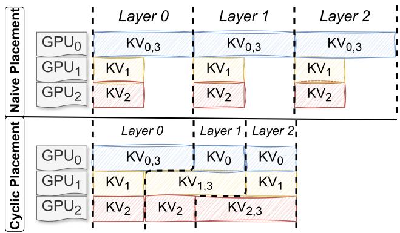  
Figure 1. Illustration of the proposed cyclic placement for balancing KVCache memory usage across GPUs. In this example, the model has 4 key-value heads and deploys non-uniform TP3. KVi stands for the KVCache for i-th key value head. Cyclic placement (bottom) improves overall KVCache capacity by approximately 50%, compared with a na¨ıve placement (top).

Cyclic Placement. To mitigate memory imbalance, we propose a simple yet effective cyclic placement strategy. Specifically, attention heads and their corresponding KV-Cache blocks are distributed cyclically across GPUs. As illustrated in Figure 1, na¨ıve placement can lead to significant KVCache skew, where some GPUs accumulate substantially larger memory footprints. In contrast, our cyclic scheme rotates attention-head assignments layer by layer, ensuring that across every contiguous n layers in a TPn configuration, the aggregate KVCache allocation remains well balanced. Because modern LLMs typically contain tens or even hundreds of layers—far exceeding the usual tensor-parallel world size (often below ten)—this cyclic distribution effectively smooths out KVCache memory utilization across all GPUs.

Hybrid Attention. Cyclic placement primarily addresses memory imbalance. It does not, by itself, eliminate intralayer computation imbalance. Each attention layer still requires collective synchronization before and after attention computation, so GPUs with less assigned work may remain temporarily stalled. To further mitigate intra-layer computation imbalance, we introduce Hybrid Attention, which maintains a balanced workload among tensor-parallel workers by assigning each the same number of attention heads and leveraging data parallelism (DP) to handle the remaining heads. Hybrid Attention can be viewed as a generalization of TP and DP.

For example, in the LLaMA-3 70B model with eight attention heads, a deployment with eight TP workers evenly distributes the heads, behaving identically to a standard TP-8 configuration. However, when only seven GPUs—and hence seven TP workers—are available, each TP worker receives one head, while the remaining head is replicated across all seven GPUs. Each GPU thus also acts as a DP worker, processing the replicated head for different requests. This design enables the computation of the extra head to be parallelized across GPUs through data parallelism, distributing requests to balance the workload effectively. As shown in Figure 2, na¨ıve non-uniform tensor parallelism often results in straggler GPUs during attention computation, causing under-utilization. In contrast, Hybrid Attention distributes the computation of replicated heads for different requests across multiple GPUs, significantly reducing intra-layer imbalance, minimizing idle time, and improving overall utilization.

Notably, the widely adopted DP attention design (SGLang-Team, 2024)—used for serving multi-head latent attention (MLA) (DeepSeek-AI et al., 2024) models such as DeepSeek-V3 (DeepSeek-AI, 2024)—is a special case of our Hybrid Attention. While DP attention duplicates a single attention head across all GPUs, Hybrid Attention generalizes this approach to flexibly support both partitioned (TP) and replicated (DP) heads within the same layer.

Combination of Hybrid Attention and Cyclic placement. Hybrid Attention and cyclic placement serve complementary roles but operate on the same execution path. Specifically, for a request assigned to base rank r and with n surviving GPUs, the KVCache (and corresponding DP attention weight and computation) of layer i is placed on (r + i) mod n.

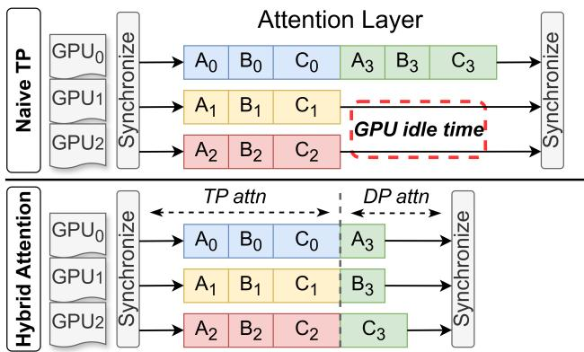  
Figure 2. Illustration of the proposed hybrid attention. In this example, the model has 4 key-value heads and deploys non-uniform TP3. Ai stands for the i-th head’s computation for request A. Request A is routed to GPU0, B to GPU1, and C to GPU2. Hybrid attention (bottom) combine TP attention with DP attention, significantly reducing GPU idle time and improving GPU utilization.

Hybrid Attention mitigates intra-layer computation imbalance by distributing replicated-head computation across GPUs. As a side effect, it can also improve memory balance when DP scheduling is well balanced. However, this effect is inherently workload-dependent and does not provide a worst-case guarantee: under skewed DP assignment, KVCache may still concentrate on a subset of GPUs. In contrast, cyclic placement provides a deterministic lower bound on memory balance. Regardless of request distribution, each request contributes approximately a 1n fraction of its KVCache to every GPU, ensuring near-uniform memory usage even in the worst case.

Still, these two mechanisms can not guarantee perfect load balance due to workload skewness.

First, the input workload itself can be inherently imbalanced, with requests exhibiting highly variable input lengths. Under na¨ıve scheduling policies (e.g., round-robin), even if each DP replica is assigned the same number of requests, GPUs may experience significantly different execution times.

Second, even with a perfectly balanced workload, skewness can still arise from system-level constraints. In long-context scenarios where the input length exceeds the prefill token budget (e.g., 2K for vLLM (Kwon et al., 2023), 8K for SGLang (Zheng et al., 2025)), modern LLM serving engines employ chunked prefill (Agrawal et al., 2024). In this case, only one single request chunk can be scheduled within the token budget at a time, effectively restricting DP parallelism and leading to an extreme form of imbalance, where only one GPU performs the DP attention computation while others remain idle.

Algorithm 1 DP-aware Adaptive Chunked Prefill   
Input: Token budget N, rank set R, schedulable tokens   
{Sr}, workloads {Wr}   
Output: Next Prefill batch B   
Lr ←0 {\* initialize load per rank}   
B ← ∅ {\* initialize current prefill batch}   
H ← ∅ {\* initialize candidate batch set}   
while |B| < N and ∃r : Sr ̸= ∅ do   
r∗ ← arg minr∈R, Sr̸=∅ Lr {\* least-loaded rank}   
t ← first(Sr∗ ), Sr∗ ← Sr∗ \{t} {\* schedule 1 token}   
B ← B ∪{t}, Lr∗ ← Lr∗ + cost(t), H ← H ∪ {B}   
end while   
return choose best batch(H)

Fine-grained, Load-aware Routing To further mitigate the load imbalance caused by skewed input request distributions, we introduce a fine-grained, load-aware routing mechanism that dynamically balances the workload among DP workers across GPUs. Our scheduler design addresses two complementary aspects: (1) routing DP ranks, and (2) forming compute-balanced batches.

Load-Aware DP-Rank Routing. We observe that the DP-rank scheduling problem can be modeled as an instance of the classical online makespan minimization problem (Dwibedy & Mohanty, 2022; 2020; Wang et al., 2025). To achieve low scheduling overhead while maintaining balance, we adopt a simple yet effective greedy strategy: each incoming request is assigned to the GPU with the smallest estimated remaining workload. Here, the workload is defined as the total pending DP computation (in token units) currently queued on each GPU. This dynamic routing policy continuously adapts to runtime variations in request arrival patterns, preventing load concentration on specific GPUs.

Fine-Grained Chunked Prefill. To complement routing, we design a Fine-Grained Chunked Prefill mechanism for the prefill stage. Unlike conventional chunked prefill, which allows only one chunk per request in a batch. Our approach permits chunks from multiple requests to be executed jointly within the same batch. Since the computational cost of prefill attention grows quadratically with sequence length, the cost of processing a chunk of size N after L processed tokens is O(N2 + NL + N). To maintain balanced GPU workloads and prevent out-of-memory errors, we define a global prefill token budget N representing the maximum number of tokens per batch. Tokens are then iteratively allocated to the least-loaded GPU until the budget is reached, ensuring balanced computation and bounded intermediate memory usage. Algorithm 1 outlines the adaptive chunked prefill procedure.

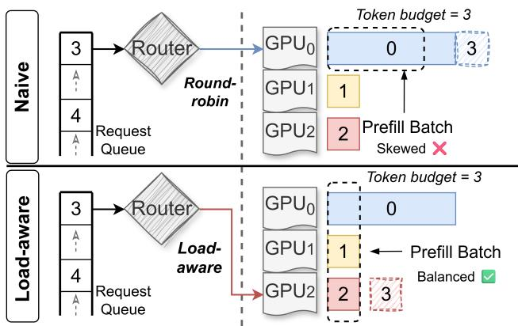  
Figure 3. Illustration of the load-aware router and scheduler. In this example, request 0 has 4 tokens, request 1 and 2 has 1 token, and a new request 3 with 1 token arrives. In the na¨ıve setting (top), a round-robin router combined with a FIFO chunked prefill scheduler results in an highly unbalanced prefill batch: within the prefill token budget (which is 3), only a chunk of request 0 is scheduled in the prefill batch. In contrast, our load-aware router (bottom) dynamically redirects new requests to the least-loaded GPU, and our adaptive chunked prefill mechanism helps form a balanced batch.

As shown in Figure 3, na¨ıve routing and chunked prefill lead to highly skewed batches and unbalanced GPU workloads. In the example, GPU0 becomes overloaded because the vanilla scheduler includes only the first chunk of request 0 within the prefill budget, leaving other GPUs underutilized. In contrast, our load-aware router dynamically assigns DP ranks based on real-time GPU load, while the adaptive chunked prefill scheduler constructs balanced batches in a besteffort manner. Together, these two mechanisms significantly improve GPU utilization and overall system throughput under dynamic and skewed request patterns.

## 3.2 Lightning Recovery

As discussed in §2.2.2, rapid recovery is critical to prevent request backlogs and maintain SLO compliance. We identify two dominant sources of recovery latency: recomputation of the lost KVCache and reloading of re-sharded model weights. To mitigate both, we propose a Lightning Recovery framework comprising two components—Proactive KVCache Backup and On-Demand Weight Recovery—that together minimize downtime by avoiding redundant recomputation and restoring only essential model data.

Proactive KVCache Backup. When a GPU fails, its local KVCache is lost, and recomputing it through re-prefill can be costly. To enable fast recovery, RaidServe proactively backs up KVCache to host memory. The backup is incremental and asynchronous: newly generated KVCache pages are copied to CPU memory in the background during normal execution, avoiding an additional blocking step on the critical path. After a request finishes, its corresponding CPU-side KVCache backup is simply discarded.

Upon failure, surviving GPUs directly reuse their local KV-Cache, while only the missing portion is restored from host memory. If the locality of surviving KVCache no longer matches the new parallel configuration of our Hybrid Attention, RaidServe further migrates KVCache to the appropriate GPUs. Since NVLink is significantly faster than PCIe, the migration overhead is small and can also be overlapped with ongoing KVCache loading from host. Finally, under Hybrid Attention and the cyclic KV placement optimization in §3.1, the KVCache originally stored on the failed rank is partitioned across the surviving ranks, so that each rank reloads only a disjoint subset of the lost KVCache from host memory. The restored KVCache is then evenly redistributed across GPUs, balancing host-to-device transfer traffic during recovery.

On-demand Weight Recovery. Reusing and restoring the KVCache avoids expensive re-prefill, but weight recovery can still become a bottleneck after reconfiguration. To address this, RaidServe recovers weights on demand: after a GPU failure, each surviving rank keeps its currently resident weights, and reloads only the missing weight blocks required by the new parallel layout, rather than reconstructing an entire shard from scratch.

For FFN layers, RaidServe first partitions the intermediate dimension into a set of fixed-size shards, whose granularity is independent of the TP world size. A conventional TP layout assigns contiguous shards to each rank. When the TP degree changes after a failure (e.g., from 8 to 7), na¨ıvely resharding the model would require each rank to reload a new contiguous shard, even though most of the previously loaded weights are still valid. RaidServe instead preserves all surviving shards in place and redistributes only the missing shards across the remaining ranks. This is correct because FFN hidden channels can be permuted arbitrarily, as long as the corresponding columns of the up-projection/gating weights and rows of the down-projection weight are permuted consistently. Therefore, RaidServe can form a new valid FFN layout without enforcing contiguous shard boundaries, allowing each rank to fetch only the weight blocks that are absent locally.

For attention layers, RaidServe leverages the DP-based placement in its hybrid attention design. After a failure, the lost attention weights are recovered on demand in a distributed manner: each surviving rank loads a distinct subset of the missing weights from host memory, and the remaining segments are exchanged among peers via NVLink. This design minimizes redundant PCIe traffic and utilizes the much higher NVLink bandwidth to complete recovery efficiently. Together, these two mechanisms ensure that all surviving ranks participate evenly in recovery, maximizing aggregate PCIe bandwidth and minimizing end-to-end recovery latency.

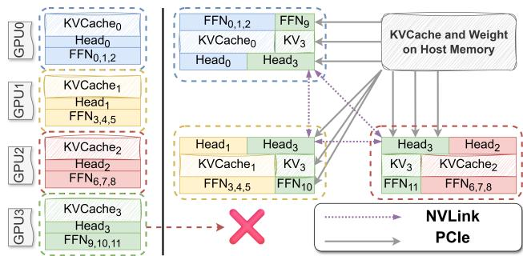  
Figure 4. On-demand Recovery mechanism. In this example, the FFN weights are divided into 12 shards and there’re 4 attention heads with corresponding KVCache. The system starts with normal TP4. When GPU 3 fails, we will restore all the lost state (weights and KVCache) via PCIe. Our on-demand recovery mechanism eliminate all redundant PCIe transfer.

Figure 4 illustrates the recovery process under an original TP4 configuration. The FFN intermediate dimension is divided into 12 shards, while attention has 4 heads and KV-Cache is partitioned into 4 slices across 4 GPUs. Under the original TP4 layout, GPU0 holds shards {0, 1, 2}, GPU1 holds {3, 4, 5}, GPU2 holds {6, 7, 8}, and GPU3 holds {9, 10, 11}. After GPU3 fails, a standard TP3 re-sharding would assign GPU0 to {0, 1, 2, 3}, GPU1 to {4, 5, 6, 7}, and GPU2 to {8, 9, 10, 11}, forcing the surviving GPUs to reload many weights despite already holding valid shards. In contrast, RaidServe preserves the resident weights on GPU1–GPU3 and assigns only the missing shards cyclically, resulting in the new layout {3, 4, 5, 0} , {6, 7, 8, 1}, and {9, 10, 11, 2}. As a result, each surviving GPU reloads exactly one missing shard, and no already-resident FFN weight is redundantly transferred. For attention, the lost head weights are similarly recovered on demand: each rank loads a disjoint subset from host memory and exchanges the remaining pieces over NVLink. At the same time, each rank restores only the required subset of the missing KVCache from host memory, enabling fast and parallel recovery.

Backup Overhead Analysis. Both Proactive KVCache Backup and On-demand Weight Recovery rely on host memory to preserve recovery state. This design is practical on modern GPU servers, which typically provide large and persistent host memory. In our testbed with one node of 8×H100 GPUs, the host memory is 1.5 TB, far exceeding the aggregate GPU HBM capacity (80 GB × 8 = 640 GB). This capacity is sufficient to maintain backups for both the model weights and the KVCache of ongoing requests in our setting. Moreover, once a request finishes, its corresponding host-side KVCache backup is discarded, so no additional eviction policy is needed.

Under this design, recovery is primarily bounded by hostto-device bandwidth rather than recomputation cost. Prior work shows that loading/writing KVCache from/to host memory can be substantially faster than prefill again when PCIe bandwidth is effectively utilized (Xie et al., 2025). We therefore maintain KVCache backup incrementally and asynchronously during normal execution, so the backup traffic is largely overlapped with serving rather than introducing an additional blocking step on the critical path.

Assuming PCIe 5.0×16, which provides around 50 GB/s per GPU in practice, the recovery overhead is small in our setting. For example, for LLaMA-3.1-70B on 8×H100 GPUs, a batch of 56 requests with 16K context requires about 280 GB of KVCache in total. In this case, each GPU stores roughly 280 = 35 GB of KVCache, together with 140 = 17.5 GB of model weights. The total KVCache backup traffic per GPU is therefore about 35 GB, corresponding to roughly 35 = 0.7 s of PCIe transfer; this cost is incurred incremen- 50 tally in the background rather than as a one-time pause. After a single GPU failure, each surviving GPU reloads only about 35+17.5 = 7.5 GB of lost state from host memory, leading to a recovery time of less than 0.2 s. In contrast, recomputing the lost KVCache through re-prefill alone would take more than 20 s in the same setting, highlighting the benefit of incremental backup and host-memory-based recovery.

## 3.3 System Overview and Execution Workflow

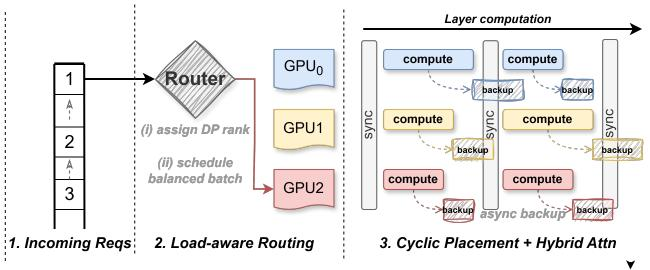  
Figure 5. End to end workflow of RaidServe

We now describe the end-to-end execution workflow and implementation details of RaidServe, focusing on how routing, scheduling, memory placement, and recovery interact during real-world serving.

For each incoming request, RaidServe first assigns a base data-parallel (DP) rank through a load-aware router based on real-time GPU workload. The scheduler then constructs compute-balanced batches using fine-grained chunked prefill.

Given the assigned DP rank, attention computation and KV-Cache placement are jointly determined by our cyclic placement strategy and Hybrid Attention design, which together define both the execution location and memory placement

across layers.

During model forward execution, KVCache is continuously backed up to host memory in the background. In case of failures, recovery is triggered by restoring missing KVCache and weights from host while reusing all surviving states.

## 4 EVALUATION

We evaluate RaidServe on a server equipped with eight NVIDIA H100 GPUs (80 GB each). The GPUs are interconnected via 4th-generation NVLink and each GPU is connected to the CPU via a PCIe 5.0 x16 link. We measure both system offline throughput as well online throughput latency characterization to demonstrate the overall effectiveness of our system. To ensure a comprehensive evaluation, we experiment with two representative large language models that typically utilize a whole node of GPUs to serve: a dense model, LLaMA-3.1-70B-Instruct (Meta-AI, 2024), and a mixture-of-experts (MoE) model, Mixtral-8x22B-Instructv0.1 (Mistral-AI, 2024). We implemented RaidServe on top of a light-weight customized LLM serving engine, which is implemented using around 7k lines of code and achieves performance on par with state-of-the-art open-source LLM inference frameworks such as vLLM and SGLang.

## 4.1 Offline Throughput under Faulty Environments

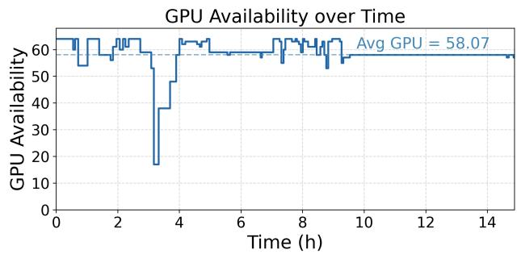  
Figure 6. GPU availability from GCP cloud availability traces.

Failure Model. We simulate failure and recovery events on an 8 × 8 H100 cluster using a real-world failure trace derived from the GCP cloud availability dataset, which has been widely adopted in prior studies such as Bamboo (Thorpe et al., 2023), Oobleck (Jang et al., 2023), and Recycle (Gandhi et al., 2024). The trace is scaled such that full availability corresponds to 64 GPUs, as illustrated in Figure 6.

Our target failure model focuses on single or multiple GPU failures within DGX nodes, which may arise from GPU-side errors or spot-instance preemption. During the simulation, each failure event randomly disables one GPU, while each recovery event randomly restores one previously failed GPU. Upon each GPU failure, the system reconfigures itself to continue operating with the remaining available GPUs.

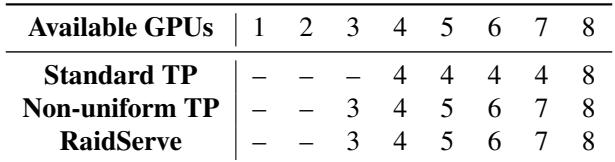

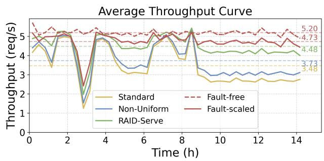  
Figure 7. (a) LLaMA-3.1-70B-Instruct

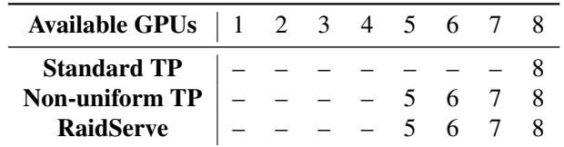

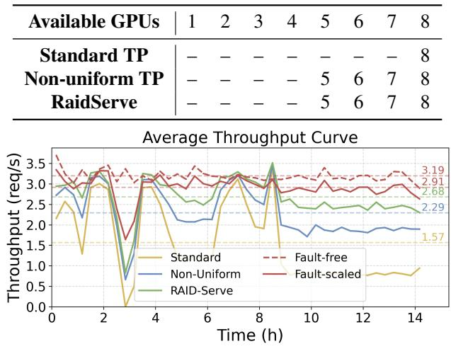  
Figure 8. (b) Mixtral-8x22B-Instruct-v0.1  
Figure 9. The tables above summarize the tensor-parallel configurations adopted by each system under different numbers of available GPUs per node. The figures below show the corresponding real-time throughput of different systems during fault-injection experiments. Dashed lines in each figure represent the average throughput over time.

We assume that when a GPU fails, the other GPUs in the same DGX node, as well as the NVLink connections among the surviving GPUs, remain operational. We do not model driver-level failures that prevent any GPU kernels from running before recovery. For simplicity, we fix the reconfiguration latency to 10 seconds for all systems, since this overhead has negligible impact on end-to-end throughput in our evaluation. A more fine-grained failure and interconnect model is left to future work.

Dataset. We use OpenThoughts-114k (Guha et al., 2025), a large-scale, high-quality “thinking” dataset composed of 114,000 multi-turn reasoning and instruction-following examples curated from diverse sources. This dataset is widely used for evaluating and post-training LLMs on reflective and logical reasoning tasks, making it representative of realistic LLM-serving workloads. Its key input-output characteristics are summarized in Table 1. We adopt this dataset to emulate long-context, multi-turn interactions that commonly arise in RL-based training and inference workloads (Ouyang et al., 2022).

Baselines. We compare RaidServe against three configurations: (1) a non-fault-tolerant Standard TP system, (2)

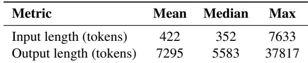  
Table 1. Input-output characteristics of OpenThought dataset.

a fault-tolerant system with Non-Uniform TP (3) a faultfree system that assumes no GPU failures and serves as the performance upper bound, and (4) a fault-scale system that linearly scales the throughput of the fault-free case based on GPU availability. We use a single 8-GPU machine to emulate eight independent 8-GPU nodes and report aggregated throughput across all simulated nodes. All systems employ tensor parallelism within each node. In the Standard TP system, the per-node TP configurations are limited to 1, 2, 4, 8 GPUs, consistent with the implementations of state-of-the-art serving engines such as SGLang and vLLM. Consequently, when a GPU fails within a node, the Standard TP system must fall back to the next supported configuration, resulting in reduced resource utilization. In contrast, both Non-Uniform TP and RaidServe support flexible TP configurations with arbitrary GPU counts, provided sufficient memory is available for model weights and KVCache. As shown in Figure 9, the minimum number of GPUs required to serve the dense LLaMA-3.1-70B-Instruct model is 3. For the Mixture-of-Experts model Mixtral-8x22B-Instruct-v0.1, the larger memory footprint raises this minimum to 5 GPUs.

## Performance Analysis.

As shown in Figure 9, RaidServe consistently outperforms the Standard TP baseline across both dense and MoE models. For LLaMA-3.1-70B, RaidServe delivers 1.28× higher average throughput, achieving 95% of the Fault-scaled performance, demonstrating the effectiveness of its memory and compute balancing optimization. For Mixtral-8x22B, the throughput gain increases to 1.71×, reaching 92% of the Fault-scaled performance. Even compared to Non-Uniform TP, a stronger baseline, RaidServe still achieves additional speedups of 20% and 17% on LLaMA and Mixtral, respectively. The larger throughput improvement over the standard baseline stems from Mixtral’s higher memory footprint, where the TP4 configuration becomes infeasible, leading to greater resource underutilization that RaidServe effectively mitigates.

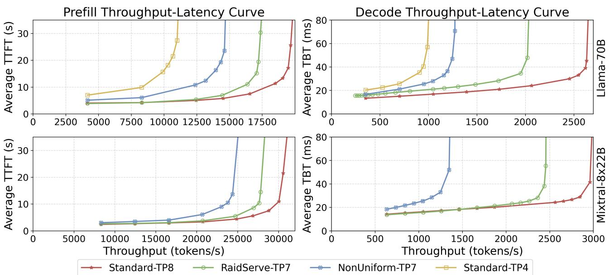  
Figure 10. Throughput-latency curves when serving the Mooncake trace. The TP4 baseline is omitted for the Mixtral-8x22B model due to insufficient memory to accommodate both model weights and KVCache on only 4 GPUs.

## 4.2 Online Throughput-Latency after Failures

We further evaluate the throughput-latency characteristics of RaidServe under online serving scenarios. To ensure consistency, we measure throughput and latency by varying the input request rate in stable environments, i.e., the system operates with a fixed number of available GPUs and no runtime reconfiguration. We separately analyze the prefill and decode stages, as prefill-decode (P-D) disaggregation (Zhong et al., 2024) is a standard practice in modern LLM serving for improved latency SLO attainment (NVIDIA, 2025b). Latency is reported using Time to First Token (TTFT) for prefill instances and Time Between Tokens (TBT) for decode instances. Throughput is measured as input-token throughput for prefill and generated-token throughput for decode.

Dataset. We use the real-world Mooncake (Qin et al., 2025)

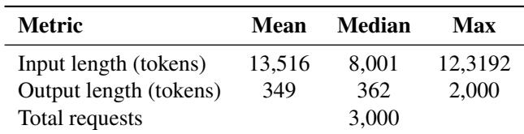  
Table 2. Input-output characteristics of our scaled Mooncake trace.

conversation trace, a popular open-source trace with arrival timestamps of requests as well as anonymized input and output sequence lengths. We randomly sampled 3,000 requests out of the complete traces and scale the timestamp for scanning different request rates. Table 2 summarizes the input and output characteristics of the selected trace. Requests are issued according to the scaled timestamps, and we record TTFT, TBT, and token throughput for each system. By varying the scaling ratio, we obtain the complete throughput-latency curves.

Baselines. We compare RaidServe against three baselines: (1) Standard-TP4, the default fallback tensor-parallel configuration activated upon GPU failure, serving as the primary baseline; (2) Standard-TP8, the fault-free configuration representing the upper-bound performance; and (3) NonUniform-TP7, a na¨ıve implementation that operates on 7 GPUs but suffers from significant load imbalance. Our proposed RaidServe adopts the optimized RaidServe-TP7 configuration, which integrates all key components — cyclic memory placement, hybrid attention, and load-aware routing with fine-grained scheduling We focus on the 7-GPU setting as it represents the most common failure scenario in practice; additional experiments under higher failure rates are presented in §4.3.1. Note that the Standard-TP4 baseline is omitted for the Mixtral-8x22B experiment, as the model weights and KVCache for the longest requests cannot fit within the memory capacity of only four GPUs.

Performance Analysis. Figure 10 presents the throughputlatency characteristics of RaidServe compared with all baselines across both the prefill and decode stages. For both the dense LLaMA-3.1-70B and the MoE Mixtral-8x22B models, RaidServe consistently outperforms Standard-TP4 and NonUniform-TP7 under all request rates. At low request rates, it achieves near-optimal performance comparable to the fault-free Standard-TP8 configuration.

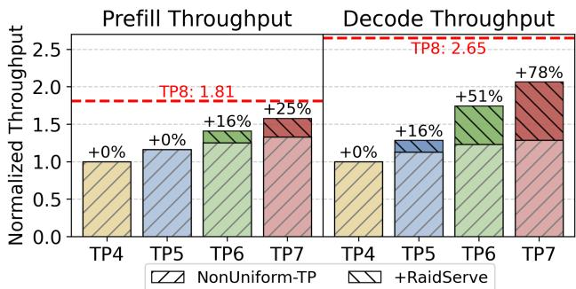  
Figure 11. Performance comparison of RaidServe optimization with NonUniform-TP. Throughput is normalized to Standard-TP4.

In the prefill stage, RaidServe attains up to 2× and 1.28× higher throughput than Standard-TP4 and NonUniform-TP7, respectively, under the same 10s TTFT constraint for LLaMA-3.1-70B, and achieves a 1.14× gain over NonUniform-TP7 for Mixtral-8x22B.

In the decode stage, where balanced memory and compute utilization becomes more critical, the benefits are even more pronounced. Under a 40ms TBT constraint, Raid-Serve achieves up to 2× and 1.60× higher throughput than Standard-TP4 and NonUniform-TP7 for LLaMA-3.1- 70B, and a 1.85× improvement over NonUniform-TP7 for Mixtral-8x22B.

## 4.3 Performance Breakdown Analysis

## 4.3.1 RaidServe with Less GPUs

To further evaluate the effectiveness of our proposed mechanism, we measure system throughput across different TP configurations. We compare RaidServe against the NonUniform-TP baseline under TP4 – TP8 settings and report the peak throughput on the Mooncake trace using the LLaMA-3.1-70B model.

As shown in Figure 11, when running with 4 or 8 GPUs, both systems degenerate to standard uniform tensor parallelism and therefore exhibit identical performance. As the tensor-parallel world size becomes irregular (beyond 4 GPUs), computation and memory imbalance intensifies, and RaidServe begins to demonstrate clear advantages. In the prefill stage, RaidServe achieves performance gains of 0%, 16%, and 25% over NonUniform-TP for TP5, TP6, and TP7 configurations, respectively. The limited improvement under TP5 arises because compute imbalance at this scale is inherently harder to mitigate. In contrast, during the memory-bound decode stage, the benefits become more pronounced — RaidServe improves throughput by 16%, 51%, and 78% for TP5, TP6, and TP7, respectively. These results demonstrate that the proposed design effectively alleviate imbalance and scales efficiently under non-uniform GPU configurations.

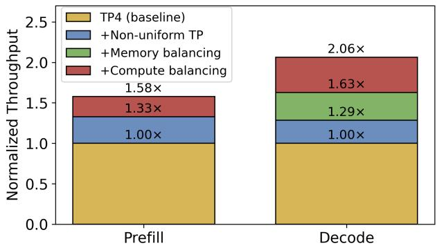  
Figure 12. Breakdown of RaidServe optimization attributions in both prefill stage and decode stage on Llama-70B model with 7 GPUs.

## 4.3.2 Memory and Compute Balancing

Without memory balancing, certain GPUs store disproportionately larger portions of the KVCache and model weights, constraining the maximum batch size during the decode stage and leading to suboptimal GPU utilization. To quantify the impact of memory balancing, we first augment the baseline NonUniform-TP7 configuration with cyclic memory placement, ensuring even distribution of KVCache and model weights across GPUs. To further highlight the effect of computation balancing introduced by our hybrid attention mechanism, we compare the peak throughput of four system configurations on the Mooncake trace using the LLaMA-3.1- 70B model: (1) Standard-TP4 (baseline), (2) +NonUniform-TP7, (3) +Memory-balancing (NonUniform-TP7 with cyclic memory placement), and (4) +Compute-balancing, which integrates all proposed optimizations.

As shown in Figure 12, memory and compute balancing contribute differently across stages. In the prefill stage, the compute-balancing mechanism alleviates straggler effects and improves peak throughput by 25%, while memory balancing provides negligible benefit since prefill is primarily compute-bound. In contrast, the decode stage is memory-bound: larger batch sizes enabled by memory balancing significantly improve GPU utilization, yielding a 34% throughput increase. Finally, applying compute balancing on top of memory balancing further mitigates inter-GPU workload skew, boosting overall decode throughput by an additional 43%.

Table 3. GPU state recovery latency of different systems.  
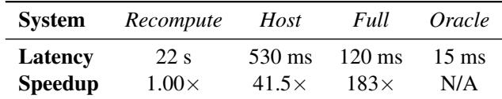

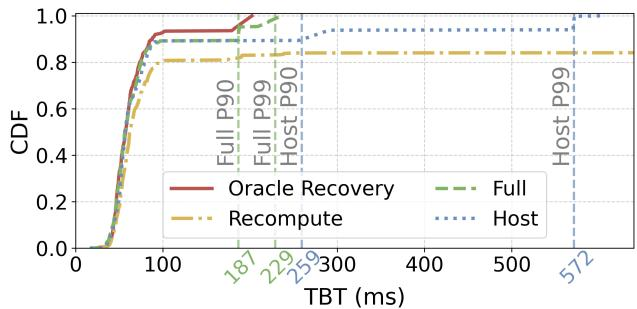  
Figure 13. CDF of Max TBT per request of RaidServe under different recovery method. Dashed vertical lines shows the P90/P99 TBT of each system.

## 4.3.3 Recovery Latency

To evaluate the efficiency of our recovery mechanism, we conduct a detailed breakdown of recovery latency under online serving workloads, where latency sensitivity is most critical. We use the LLaMA-3.1-70B model and replay a contiguous 500-request window from the Mooncake conversation trace. The system initially runs with a standard TP8 decode instance, and a GPU failure is injected 100ms after the 250th request (i.e., halfway through the trace). We report the maximum Time Between Tokens (TBT) per request as the latency metric, since a request is considered to violate its decode SLO if any of its TBTs exceed the specified threshold.

All configurations enable memory and compute balancing optimizations. We compare the following recovery methods: (1) Recompute, which regenerates the lost KVCache and reloads all re-sharded model weights when transitioning to a TP7 configuration; (2) RaidServe-Host, which proactively backs up the KVCache in host memory and restores the lost cache from backup instead of recomputation; (3) RaidServe-Full, which builds upon RaidServe-Host and further avoids redundant PCIe transfers through joint on-demand weight loading; and (4) RaidServe-Oracle, which represents an idealized setting that restores only necessary metadata to the GPU without performing any weight or KVCache loading.

Table 3 summarizes GPU recovery latencies across settings. Compared to Recompute, restoring backed-up KVCache from host memory is 41.5× faster, while RaidServe-Full further reduces recovery latency by an additional 4.4×. These improvements translate directly into user-perceived latency reductions. As shown in Figure 13, proactive host-side

KVCache backup eliminates expensive recomputation, reducing P90 and P99 TBT from over 10s to under 1s. With on-demand weight loading, P99 TBT further drops from 572ms to 229ms, a 2.5× improvement and approaching the oracle’s lower bound. Together, these results confirm that host-based KVCache backup and on-demand recovery are highly effective in minimizing recovery latency during online serving.

## 5 RELATED WORK

Fault tolerance in distributed training has been extensively studied by numerous systems. Redundancy-based methods such as Bamboo (Thorpe et al., 2023) incorporate redundant computations to handle preemptions common in cloud spot instances. Oobleck (Jang et al., 2023) employs heterogeneous pipelines to facilitate failure recovery without requiring additional spare resources, while ReCycle (Gandhi et al., 2024) dynamically reroutes computations to redundant data-parallel peers to seamlessly continue processing after failures. Checkpoint-based approaches include Check-Freq (Mohan et al., 2021), CPR (Maeng et al., 2021), and Gemini (Wang et al., 2023), which respectively mitigate checkpoint overhead by dynamically adjusting checkpoint frequency, quantizing embedding tables, and strategically scheduling checkpoint traffic across the storage hierarchy. Megascale (Jiang et al., 2024) addresses storage bottlenecks during recovery by efficiently sharing data between corresponding GPU workers across data-parallel groups. Unlike these training-focused systems, RaidServe specifically employs hybrid attention mechanism with non-uniform tensor parallelism to achieve fault-tolerant distributed inference.

In the context of fault-tolerant distributed inference, recent efforts such as SpotServe (Miao et al., 2024), Llumnix (Sun et al., 2024), DejaVu (Strati et al., 2024), and Medusa (Zeng et al., 2025) enable live migration of KVCaches and model weights. However, these systems do not address the persistent throughput degradation arising from compute and memory imbalances inherent in non-uniform tensor parallelism. To overcome these challenges, RaidServe integrates a hybrid attention mechanism and a dynamic scheduler alongside KVCache migration, ensuring both high-performance and robust resilience for distributed inference workloads.

## 6 DISCUSSION

Having demonstrated the advantages of RaidServe, we now discuss its applicability, limitations, and directions for future work.

While tensor parallelism remains the dominant approach for scaling large models across multiple GPUs, it is not the only viable strategy. Other parallelism techniques offer inherent fault tolerance and may better suit specific model architectures. For instance, recent studies show that expert parallelism can achieve performance comparable to TP (SGLang-Team, 2025) for large MoE models, while exhibiting stronger resilience to partial GPU loss.

RaidServe is largely orthogonal to memory-saving techniques such as parameter or KVCache offloading. In our target setting – where the model fits in GPU memory under a practical TP degree on DGX-class systems – parameter offloading is primarily intended for more memory-constrained regimes and would introduce non-trivial runtime overhead. If KVCache offloading is enabled, the CPU-resident KV-Cache can naturally act as a recovery source, suggesting that these approaches can be complementary.

Although our focus has been on fault-tolerant serving, RaidServe can also facilitate finer-grained resource sharing among concurrent jobs, mitigating starvation caused by rigid gang scheduling (Jeon et al., 2018). Integrating Raid-Serve with dynamic GPU resource allocation represents a promising direction for future exploration.

Our current evaluation adopts a simplified failure model that focuses on GPU-level failures within a node, assuming that the remaining GPUs and interconnects remain functional. This abstraction does not capture more complex failure modes, such as driver failures or interconnect degradation, which require additional detection and recovery mechanisms. Extending RaidServe to handle such scenarios remains future work.

As hardware platforms continue to scale, we expect Raid-Serve to become increasingly relevant for large multi-GPU systems such as NVL72 (NVIDIA, 2025a). While our evaluation focuses on single-node configurations, extending memory and compute balancing beyond NUMA boundaries remains an important avenue for future work.

## 7 CONCLUSION

We present RaidServe, a high-performance yet resilient serving system for tensor-parallel LLM inference under irregular GPU availability. RaidServe tackles the recovery overhead by introducing proactive KVCache backup and ondemand weight recovery, accelerating the recovery process by 183× and thus avoiding a devastating latency spike in online serving. RaidServe also introduces cyclic KVCache placement, hybrid attention, and fine-grained load-aware router to eliminate the memory and computation imbalance between GPUs, achieving higher memory and computation utilization and up to 2× higher throughput and two orders of magnitude faster recovery than standard fault-handling methods.

## REFERENCES

Agrawal, A., Kedia, N., Panwar, A., Mohan, J., Kwatra, N., Gulavani, B. S., Tumanov, A., and Ramjee, R. Taming throughput-latency tradeoff in llm inference with sarathiserve. Proceedings of 18th USENIX Symposium on Operating Systems Design and Implementation, 2024, Santa Clara, 2024.

AMD. Amd infinity fabric link. https://www. amd.com/content/dam/amd/en/documents/ instinct-tech-docs/other/56978.pdf.

Arfeen, D., Mudigere, D., More, A., Gopireddy, B., Inci, A., and Ganger, G. R. Nonuniform-tensor-parallelism: Mitigating gpu failure impact for scaled-up llm training. arXiv preprint arXiv:2504.06095, 2025.

Beaumont, R. Large Scale OpenCLIP: L/14, H/14 and G/14 Trained on LAION-2B. https://laion.ai/blog/ large-openclip/, 2022.

DeepSeek-AI. Deepseek-v3 technical report, 2024. URL https://arxiv.org/abs/2412.19437.

DeepSeek-AI, Liu, A., Feng, B., Wang, B., Wang, B., Liu, B., Zhao, C., Dengr, C., Ruan, C., Dai, D., Guo, D., Yang, D., Chen, D., Ji, D., Li, E., Lin, F., Luo, F., Hao, G., Chen, G., Li, G., Zhang, H., Xu, H., Yang, H., Zhang, H., Ding, H., Xin, H., Gao, H., Li, H., Qu, H., Cai, J. L., Liang, J., Guo, J., Ni, J., Li, J., Chen, J., Yuan, J., Qiu, J., Song, J., Dong, K., Gao, K., Guan, K., Wang, L., Zhang, L., Xu, L., Xia, L., Zhao, L., Zhang, L., Li, M., Wang, M., Zhang, M., Zhang, M., Tang, M., Li, M., Tian, N., Huang, P., Wang, P., Zhang, P., Zhu, Q., Chen, Q., Du, Q., Chen, R. J., Jin, R. L., Ge, R., Pan, R., Xu, R., Chen, R., Li, S. S., Lu, S., Zhou, S., Chen, S., Wu, S., Ye, S., Ma, S., Wang, S., Zhou, S., Yu, S., Zhou, S., Zheng, S., Wang, T., Pei, T., Yuan, T., Sun, T., Xiao, W. L., Zeng, W., An, W., Liu, W., Liang, W., Gao, W., Zhang, W., Li, X. Q., Jin, X., Wang, X., Bi, X., Liu, X., Wang, X., Shen, X., Chen, X., Chen, X., Nie, X., Sun, X., Wang, X., Liu, X., Xie, X., Yu, X., Song, X., Zhou, X., Yang, X., Lu, X., Su, X., Wu, Y., Li, Y. K., Wei, Y. X., Zhu, Y. X., Xu, Y., Huang, Y., Li, Y., Zhao, Y., Sun, Y., Li, Y., Wang, Y., Zheng, Y., Zhang, Y., Xiong, Y., Zhao, Y., He, Y., Tang, Y., Piao, Y., Dong, Y., Tan, Y., Liu, Y., Wang, Y., Guo, Y., Zhu, Y., Wang, Y., Zou, Y., Zha, Y., Ma, Y., Yan, Y., You, Y., Liu, Y., Ren, Z. Z., Ren, Z., Sha, Z., Fu, Z., Huang, Z., Zhang, Z., Xie, Z., Hao, Z., Shao, Z., Wen, Z., Xu, Z., Zhang, Z., Li, Z., Wang, Z., Gu, Z., Li, Z., and Xie, Z. Deepseek-v2: A strong, economical, and efficient mixture-of-experts language model, 2024. URL https://arxiv.org/abs/2405.04434.

Dwibedy, D. and Mohanty, R. Online scheduling with makespan minimization: State of the art results, research

challenges and open problems, 2020. URL https:// arxiv.org/abs/2001.04698.

Dwibedy, D. and Mohanty, R. Online list scheduling for makespan minimization: A review of the state-of-the-art results, research challenges and open problems. SIGACT News, 53(2):84–105, July 2022. ISSN 0163-5700. doi: 10. 1145/3544979.3544993. URL https://doi.org/ 10.1145/3544979.3544993.

Gandhi, S., Zhao, M., Skiadopoulos, A., and Kozyrakis, C. ReCycle: Resilient Training of Large DNNs using Pipeline Adaptation. In Proceedings of the ACM SIGOPS 30th Symposium on Operating Systems Principles, SOSP ’24, pp. 211–228, New York, NY, USA, 2024. Association for Computing Machinery. ISBN 9798400712517. doi: 10.1145/3694715.3695960. URL https://doi. org/10.1145/3694715.3695960.

Gemini. Gemini 2.5: Our most intelligent AI model. https://blog.google/ technology/google-deepmind/ gemini-model-thinking-updates-march-2025/ 2025.

Github. Github Copilot. https://github.com/ features/copilot/, 2024.

Google. Tpu architecture. https: //cloud.google.com/tpu/docs/ system-architecture-tpu-vm#tpu-pod.

Guha, E., Marten, R., Keh, S., Raoof, N., Smyrnis, G., Bansal, H., Nezhurina, M., Mercat, J., Vu, T., Sprague, Z., Suvarna, A., Feuer, B., Chen, L., Khan, Z., Frankel, E., Grover, S., Choi, C., Muennighoff, N., Su, S., Zhao, W., Yang, J., Pimpalgaonkar, S., Sharma, K., Ji, C. C.-J., Deng, Y., Pratt, S., Ramanujan, V., Saad-Falcon, J., Li, J., Dave, A., Albalak, A., Arora, K., Wulfe, B., Hegde, C., Durrett, G., Oh, S., Bansal, M., Gabriel, S., Grover, A., Chang, K.-W., Shankar, V., Gokaslan, A., Merrill, M. A., Hashimoto, T., Choi, Y., Jitsev, J., Heckel, R., Sathiamoorthy, M., Dimakis, A. G., and Schmidt, L. Openthoughts: Data recipes for reasoning models, 2025. URL https://arxiv.org/abs/2506.04178.

He, T., Li, X., Wang, Z., Qian, K., Xu, J., Yu, W., and Zhou, J. Unicron: Economizing self-healing llm training at scale, 2023. URL https://arxiv.org/abs/ 2401.00134.

Hu, Q., Ye, Z., Wang, Z., Wang, G., Zhang, M., Chen, Q., Sun, P., Lin, D., Wang, X., Luo, Y., Wen, Y., and Zhang, T. Characterization of Large Language Model Development in the Datacenter. In Proceedings of the 21st USENIX Symposium on Networked Systems Design and Implementation, NSDI’24, USA, 2024. USENIX Association. ISBN 978-1-939133-39-7.

Jang, I., Yang, Z., Zhang, Z., Jin, X., and Chowdhury, M. Oobleck: Resilient Distributed Training of Large Models Using Pipeline Templates. In Proceedings of the 29th Symposium on Operating Systems Principles, SOSP ’23, pp. 382–395, New York, NY, USA, 2023. Association for Computing Machinery. ISBN 9798400702297. doi: 10. 1145/3600006.3613152. URL https://doi.org/ 10.1145/3600006.3613152.

Jeon, M., Venkataraman, S., Qian, J., Phanishayee, A., Xiao, W., and Yang, F. Multi-tenant gpu clusters for deep learning workloads: Analysis and implications. Technical report, Microsoft Research, 2018.

Jiang, Z., Lin, H., Zhong, Y., Huang, Q., Chen, Y., Zhang, Z., Peng, Y., Li, X., Xie, C., Nong, S., Jia, Y., He, S., Chen, H., Bai, Z., Hou, Q., Yan, S., Zhou, D., Sheng, Y., Jiang, Z., Xu, H., Wei, H., Zhang, Z., Nie, P., Zou, L., Zhao, S., Xiang, L., Liu, Z., Li, Z., Jia, X., Ye, J., Jin, X., and Liu, X. MegaScale: Scaling Large Language Model Training to More Than 10,000 GPUs. In 21st USENIX Symposium on Networked Systems Design and Implementation (NSDI 24), pp. 745–760, Santa Clara, CA, April 2024. USENIX Association. ISBN 978-1-939133-39-7. URL https://www.usenix.org/conference/ nsdi24/presentation/jiang-ziheng.

Kokolis, A., Kuchnik, M., Hoffman, J., Kumar, A., Malani, P., Ma, F., DeVito, Z., Sengupta, S., Saladi, K., and Wu, C.-J. Revisiting Reliability in Large-Scale Machine Learning Research Clusters. In 2025 IEEE International Symposium on High Performance Computer Architecture (HPCA), pp. 1259–1274. IEEE, 2025.

Kwon, W., Li, Z., Zhuang, S., Sheng, Y., Zheng, L., Yu, C. H., Gonzalez, J., Zhang, H., and Stoica, I. Efficient memory management for large language model serving with pagedattention. In Proceedings of the 29th Symposium on Operating Systems Principles, SOSP ’23, pp. 611–626, New York, NY, USA, 2023. Association for Computing Machinery. ISBN 9798400702297. doi: 10.1145/3600006.3613165. URL https://doi. org/10.1145/3600006.3613165.

Maeng, K., Bharuka, S., Gao, I., Jeffrey, M., Saraph, V., Su, B.-Y., Trippel, C., Yang, J., Rabbat, M., Lucia, B., and Wu, C.-J. CPR: Understanding and Improving Failure Tolerant Training for Deep Learning Recommendation with Partial Recovery. Proceedings of Machine Learning and Systems, 3:637–651, 2021.

Meta-AI. Introducing meta llama 3: The most capable openly available llm to date. https://ai.meta. com/blog/meta-llama-3/, April 2024.

Miao, X., Shi, C., Duan, J., Xi, X., Lin, D., Cui, B., and Jia, Z. Spotserve: Serving generative large language

models on preemptible instances. In Proceedings of the 29th ACM International Conference on Architectural Support for Programming Languages and Operating Systems, Volume 2, ASPLOS ’24, pp. 1112–1127, New York, NY, USA, 2024. Association for Computing Machinery. ISBN 9798400703850. doi: 10.1145/ 3620665.3640411. URL https://doi.org/10. 1145/3620665.3640411.

Mistral-AI. Cheaper, better, faster, stronger. https:// mistral.ai/news/mixtral-8x22b, April 2024.

Mohan, J., Phanishayee, A., and Chidambaram, V. Check-Freq: Frequent, Fine-Grained DNN Checkpointing. In 19th USENIX Conference on File and Storage Technologies (FAST 21), pp. 203–216. USENIX Association, February 2021. ISBN 978-1-939133-20-5. URL https://www.usenix.org/conference/ fast21/presentation/mohan.

NVIDIA. Nvlink and nvlink switch. https://www. nvidia.com/en-in/data-center/nvlink/.

NVIDIA. Nvidia gb200 nvl72. https://www.nvidia. com/en-us/data-center/gb200-nvl72/, 2025a.

NVIDIA. Dynamo 0.4 delivers 4x faster performance, slo-based autoscaling, and real-time observability. https://developer.nvidia.com/blog/ dynamo-0-4-delivers-4x-faster-performa August 2025b.

OpenAI. ChatGPT: Language models for task-oriented dialogue. https://openai.com/blog/chatgpt/, 2022.

Ouyang, L., Wu, J., Jiang, X., Almeida, D., Wainwright, C. L., Mishkin, P., Zhang, C., Agarwal, S., Slama, K., Ray, A., Schulman, J., Hilton, J., Kelton, F., Miller, L., Simens, M., Askell, A., Welinder, P., Christiano, P., Leike, J., and Lowe, R. Training language models to follow instructions with human feedback, 2022. URL https: //arxiv.org/abs/2203.02155.

Qin, R., Li, Z., He, W., Cui, J., Ren, F., Zhang, M., Wu, Y., Zheng, W., and Xu, X. Mooncake: Trading more storage for less computation—a {KVCache-centric} architecture for serving {LLM} chatbot. In 23rd USENIX Conference on File and Storage Technologies (FAST 25), pp. 155–170, 2025.

SGLang-Team. Sglang v0.4: Zero-overhead batch scheduler, cache-aware load balancer, faster structured outputs. https://lmsys.org/blog/ 2024-12-04-sglang-v0-4/, December 2024. LMSYS Blog.

SGLang-Team. Deploying deepseek with pd disaggregation and large-scale expert parallelism on 96 h100 gpus. https://lmsys.org/blog/ 2025-05-05-large-scale-ep/, May 2025. LM-SYS Blog.

Shoeybi, M., Patwary, M., Puri, R., LeGresley, P., Casper, J., and Catanzaro, B. Megatron-LM: Training Multi-Billion Parameter Language Models Using Model Parallelism. CoRR, abs/1909.08053, 2019. URL http://arxiv. org/abs/1909.08053.

Strati, F., McAllister, S., Phanishayee, A., Tarnawski, J., and Klimovic, A. Dej´ avu: Kv-cache streaming for fast, \` fault-tolerant generative llm serving. In Proceedings of the 41st International Conference on Machine Learning, ICML’24. JMLR.org, 2024.

Sun, B., Huang, Z., Zhao, H., Xiao, W., Zhang, X., Li, Y., and Lin, W. Llumnix: dynamic scheduling for large language model serving. In Proceedings of the 18th USENIX Conference on Operating Systems Design and Implementation, OSDI’24, USA, 2024. USENIX Association. ISBN 978-1-939133-40-3.

Thorpe, J., Zhao, P., Eyolfson, J., Qiao, Y., Jia, Z., Zhang, M., Netravali, R., and Xu, G. H. Bamboo: Making Preemptible Instances Resilient for Affordable Training of Large DNNs. In 20th USENIX Sympoce-slo-based-autoscaling-and-real-time-observabilitysium on Networked Systems Design and Implementation (NSDI 23), pp. 497–513, Boston, MA, April 2023. USENIX Association. ISBN 978-1-939133-33-5. URL https://www.usenix.org/conference/ nsdi23/presentation/thorpe.

Vaswani, A., Shazeer, N., Parmar, N., Uszkoreit, J., Jones, L., Gomez, A. N., Kaiser, L., and Polosukhin, I. Attention is all you need. In Proceedings of the 31st International Conference on Neural Information Processing Systems, NIPS’17, pp. 6000–6010, Red Hook, NY, USA, 2017. Curran Associates Inc. ISBN 9781510860964.

Wang, Z., Jia, Z., Zheng, S., Zhang, Z., Fu, X., Ng, T. S. E., and Wang, Y. GEMINI: Fast Failure Recovery in Distributed Training with In-Memory Checkpoints. In Proceedings of the 29th Symposium on Operating Systems Principles, SOSP ’23, pp. 364–381, New York, NY, USA, 2023. Association for Computing Machinery. ISBN 9798400702297. doi: 10.1145/ 3600006.3613145. URL https://doi.org/10. 1145/3600006.3613145.

Wang, Z., Ying, Z., and Zhang, Y. Online makespan minimization: Beat lpt by dynamic locking, 2025. URL https://arxiv.org/abs/2311.11195.

Xie, Z., Xu, Z., Zhao, M., An, Y., Mailthody, V. S., Mahlke, S., Garland, M., and Kozyrakis, C. Strata: Hierarchical context caching for long context language model serving. arXiv preprint arXiv:2508.18572, 2025.

Yu, G.-I., Jeong, J. S., Kim, G.-W., Kim, S., and Chun, B.- G. Orca: A distributed serving system for Transformer-Based generative models. In 16th USENIX Symposium on Operating Systems Design and Implementation (OSDI 22), pp. 521–538, Carlsbad, CA, July 2022. USENIX Association. ISBN 978-1-939133-28-1. URL https://www.usenix.org/conference/ osdi22/presentation/yu.

Zeng, S., Xie, M., Gao, S., Chen, Y., and Lu, Y. Medusa: Accelerating serverless llm inference with materialization. In Proceedings of the 30th ACM International Conference on Architectural Support for Programming Languages and Operating Systems, Volume 1, ASPLOS ’25, pp. 653–668, New York, NY, USA, 2025. Association for Computing Machinery. ISBN 9798400706981. doi: 10.1145/3669940.3707285. URL https://doi. org/10.1145/3669940.3707285.

Zheng, L., Yin, L., Xie, Z., Sun, C., Huang, J., Yu, C. H., Cao, S., Kozyrakis, C., Stoica, I., Gonzalez, J. E., Barrett, C., and Sheng, Y. Sglang: efficient execution of structured language model programs. In Proceedings of the 38th International Conference on Neural Information Processing Systems, NIPS ’24, Red Hook, NY, USA, 2025. Curran Associates Inc. ISBN 9798331314385.

Zhong, Y., Liu, S., Chen, J., Hu, J., Zhu, Y., Liu, X., Jin, X., and Zhang, H. DistServe: Disaggregating prefill and decoding for goodput-optimized large language model serving. In 18th USENIX Symposium on Operating Systems Design and Implementation (OSDI 24), pp. 193–210, Santa Clara, CA, July 2024. USENIX Association. ISBN 978-1-939133-40-3. URL https://www.usenix.org/conference/ osdi24/presentation/zhong-yinmin.

Zu, Y., Ghaffarkhah, A., Dang, H.-V., Towles, B., Hand, S., Huda, S., Bello, A., Kolbasov, A., Rezaei, A., Du, D., Lacy, S., Wang, H., Wisner, A., Lewis, C., and Bahini, H. Resiliency at Scale: Managing Google’s TPUv4 Machine Learning Supercomputer. In 21st USENIX Symposium on Networked Systems Design and Implementation (NSDI 24), pp. 761–774, Santa Clara, CA, April 2024. USENIX Association. ISBN 978-1-939133-39-7. URL https://www.usenix.org/conference/ nsdi24/presentation/zu.